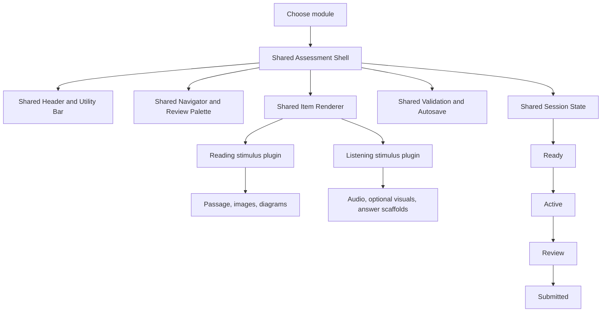
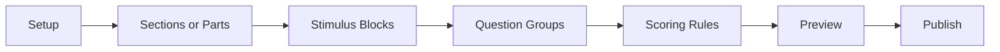
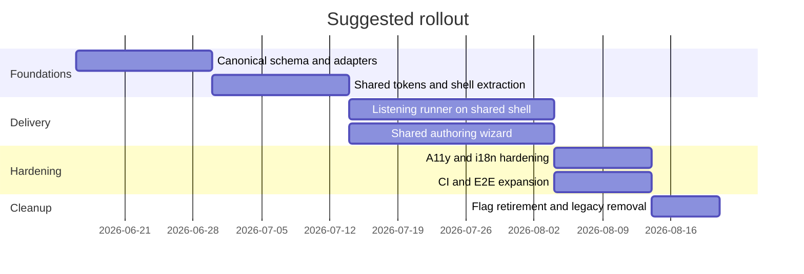

# Unifying IELTS Reading V2 and Listening in autoresync

## Executive summary

The right unification strategy is **not** to force Reading and Listening into identical behavior. It is to make them feel like the same product by sharing the same shell, navigation language, validation patterns, state model, visual tokens, and core input/rendering components, while preserving the modality-specific rules that are essential to each module. That approach aligns with core UX guidance on consistency and standards, and it also reduces avoidable cognitive load caused by users having to relearn layouts, controls, and error behavior between adjacent workflows. Research on computer-based assessment also shows that layout choices can create split-attention costs when related information is visually separated more than necessary. citeturn31search19turn34view0turn32search1

Using **Reading V2 on `main` as the canonical baseline** is the correct product decision. Official IELTS-on-computer guidance already establishes a common pattern that makes this practical: Reading and Listening on computer keep the same test content, structure, question types, and time allocations as paper, but the computer experience adds shared affordances such as notes/highlighting/help, while preserving module-specific rules such as the Reading split-pane layout and Listening’s once-only audio with volume control and a short review period at the end. citeturn10search1turn10search2turn10search3turn11search0turn11search2turn12search0turn12search1turn12search2turn12search6

The highest-value engineering move is to introduce a **canonical assessment platform layer** with module plugins:
`shared shell + shared session state + shared item renderer + shared validation + shared review + shared annotations + shared scoring adapter`,
then let Reading and Listening plug in their own **stimulus providers** and **timing/media policies**. This is especially justified because the two modules already overlap heavily in input mechanics: both are 40-question, 1-mark-per-correct-answer modules, and both reuse similar response types such as multiple choice, matching, completion fields, labels, and short answers. citeturn11search0turn11search2turn11search3turn12search1turn30search1

The UI should converge around a **single authoring wizard** and a **single test-taking shell**. For authoring, use one shared flow for metadata, sections, stimuli, questions, scoring, preview, and publish. For taking, use one shared header/utility bar, one shared navigator, one shared review state, one shared save/error model, and two stimulus plugins: a text-first plugin for Reading and an audio-first plugin for Listening. Shared component design should follow documented patterns for accessible tabs, toolbars, focus visibility, keyboard operation, and top-level error summaries, and it should be tokenized rather than hard-coded so the system remains maintainable as it evolves. citeturn14search0turn14search1turn14search2turn15search1turn15search0turn13search0turn18search3turn19search6

The main delivery risk is not styling. It is **behavioral drift**: scoring strictness, once-only audio policy, timing transitions, and old Listening data compatibility. The safest rollout is therefore: canonical schema first, shared shell second, Listening runner migration third, authoring unification fourth, then cleanup behind short-lived feature flags with owners and expiry dates. Feature-toggle guidance and empirical research both support disabled-by-default rollouts, explicit ownership, and cleanup discipline to avoid long-lived flag debt. citeturn20search1turn20search2turn20academia44

## Evidence base and constraints

Repository-specific code inspection through the enabled GitHub connector was **not retrievable in this session**, so I could not verify the current private repo tree, component names, or exact file paths for `iamhuwng/autoresync`. Accordingly, exact current code structure for Reading V2 and Listening remains **unspecified** here. I am therefore treating the prompt itself as the verified repo baseline: Reading V2 on `main` is the more stable reference, while Listening currently diverges in authoring workflow, test-taking flow, and UI/UX. All code paths below are **proposed target locations to add or consolidate**, not verified existing repo paths.

The external evidence base is strong enough to define a solid target architecture anyway. Official IELTS documentation establishes the construct constraints that should *not* be flattened away during unification: Listening is still a four-part, once-only audio test, and computer delivery gives test takers a volume control and a short end-of-test review window; Reading remains a 60-minute reading task with a split-screen text/question layout and no extra transfer time. Official IELTS computer guidance also documents shared affordances such as notes, highlighting, and help. citeturn10search2turn10search3turn11search0turn11search2turn12search0turn12search2turn12search6

That combination leads to one design rule that should anchor the entire implementation:

**Unify the frame, not the construct.**

In practice, that means:
- shared shell, shared components, shared interaction language;
- module-specific stimulus, timing, and media policy;
- no transcript-in-test for exam-accurate Listening mode, because the official construct is still “hear once only,” not “read while listening.” That last point is an inference from the official format and should be treated as a policy decision for exam mode, while review/practice mode can expose additional aids after submission. citeturn11search0turn12search1turn10search2

## Unification target

### Product rule

A unified IELTS module family should feel consistent in **navigation, naming, save behavior, annotations, validation, review, and visual hierarchy**, while still letting Reading be text-dominant and Listening be audio-dominant. This follows consistency guidance from NN/g and also reduces interface-induced extraneous load, which becomes more harmful when users are already under test or task pressure. citeturn31search19turn34view0turn32search2



### Workflow mapping

Official IELTS behavior suggests a large overlap in what should be shared, and a narrow, well-defined area that should remain module-specific. citeturn10search1turn10search2turn10search3turn11search0turn11search2turn11search3turn12search1turn30search1

| Dimension | Reading reference | Listening requirement | Unification rule |
|---|---|---|---|
| Authoring entry | Test metadata, sections, passages, questions | Test metadata, parts, audio, visuals, questions | One authoring shell; only the stimulus editor differs |
| Test-taking shell | Passage left, questions right | Audio-first, but questions still need stable space and previewability | One shell with a shared question pane and a module-specific stimulus pane |
| Navigational model | Section/passage based | Part/audio based | One navigator with module-aware labels |
| Question widgets | MCQ, matching, completion, T/F/NG, labeling, short answer | MCQ, matching, completion, map/diagram, short answer | One renderer registry; module-specific only when the input truly differs |
| Timing | 60 minutes, no extra transfer time | About 30 minutes with once-only audio and short end review on computer | One timer component; module-specific phase policy |
| Media | Mostly static text/visuals | Streaming/downloaded audio with strict policy | One media abstraction, two policies |
| Scoring | 40 questions, 1 mark each, band conversion config | 40 questions, 1 mark each, band conversion config | One raw-score pipeline, module-specific conversion config |
| Annotations | Highlighting and notes are useful and expected | Notes still useful; highlighting applies to visible text/visuals | One annotations system, stored outside final scoring payload |
| Accessibility | Keyboard, focus, readable split layout | Keyboard media control, visible focus, clear labels | One accessibility contract across both modules |
| Localization | Text-heavy, language tags matter | Audio/visual prompts plus interface strings | One i18n layer with `lang`/`dir` support |

### Authoring flow

The authoring workflow should be **linear by default**, because test definitions have dependencies, but resumable and section-jumpable when a draft grows large. Government design-system guidance is useful here: use a **step indicator** when the process is linear, and use a **task list** only when users genuinely need to complete chunks in any order or across multiple sessions. citeturn27search5turn26search1

Recommended shared authoring flow:



Use the wizard for first pass creation. After the draft exists, switch to an overview page that behaves like a task list:
- **Setup**
- **Section or Part overview**
- **Stimulus blocks**
- **Questions**
- **Scoring**
- **Preview**
- **Publishing checks**

That removes Listening’s need for a separate “weird” flow while still respecting the fact that audio attachment, cue alignment, and visual scaffolds are special.

## Unified architecture and data contracts

### Shared authoring and taking seams

Given the missing repo inspection, the safest target is a feature-folder structure that isolates common assessment behavior from module-specific plugins. If this is a Next.js app, keep route files where the framework expects them, but place the actual behavior in shared feature folders. If it is a React/Vite app, the structure below can be used directly.

```text
src/
  features/
    assessment/
      shared/
        components/
          AssessmentShell.tsx
          TopUtilityBar.tsx
          SectionNavigator.tsx
          StimulusPane.tsx
          QuestionPane.tsx
          QuestionGroupCard.tsx
          ResponseRenderer.tsx
          NotesDrawer.tsx
          ValidationSummary.tsx
          ReviewPalette.tsx
          SaveStatusBadge.tsx
          MediaController.tsx
        state/
          assessmentSession.ts
          authoringWizard.ts
          annotationsStore.ts
        lib/
          schema.ts
          adapters.ts
          scoring.ts
          answerNormalization.ts
          timingPolicy.ts
          mediaPolicy.ts
          i18n.ts
      reading-v2/
        plugin.ts
        authoring/
        taking/
      listening/
        plugin.ts
        authoring/
        taking/
  test/
    unit/
    integration/
    e2e/
```

The key architectural rule is simple:

- `reading-v2/plugin.ts` should provide **text/visual stimulus rules**.
- `listening/plugin.ts` should provide **audio/visual stimulus rules**.
- Everything else should move toward `assessment/shared/*`.

### Canonical data model

A canonical schema should represent both modules without special-casing the whole app. The module differences belong in **stimulus modality** and **policy config**, not in separate end-to-end data worlds.

```ts
type ModuleKind = 'reading' | 'listening'
type StimulusModality = 'text' | 'audio' | 'image' | 'diagram' | 'mixed'

interface AssessmentDefinitionV1 {
  schemaVersion: 1
  id: string
  module: ModuleKind
  variant?: 'academic' | 'general-training'
  title: string
  locale: string
  sections: AssessmentSection[]
  scoring: ScoringConfig
  policies: AssessmentPolicies
}

interface AssessmentSection {
  id: string
  order: number
  title: string
  stimulusBlocks: StimulusBlock[]
  itemGroups: ItemGroup[]
}

interface StimulusBlock {
  id: string
  modality: StimulusModality
  assetIds: string[]
  renderPreset: 'split-pane' | 'map-label' | 'notes-table' | 'form-fill'
  cuePoints?: { atMs: number; groupId?: string }[]
}

interface ItemGroup {
  id: string
  title?: string
  instructions?: string
  itemIds: string[]
}

interface ScoringConfig {
  rawMarksTotal: number
  bandMapId: string
  answerPolicy: {
    normalization: 'conservative'
    allowVariants: boolean
  }
}

interface AssessmentPolicies {
  timing: {
    durationSec: number
    reviewWindowSec?: number
  }
  media?: {
    playPolicy: 'once-only' | 'practice-replay'
    seekPolicy: 'disabled' | 'author-only' | 'practice-only'
  }
}
```

This model is intentionally conservative because official IELTS scoring warns that incorrect spelling and grammar lose marks in Listening and Reading answer handling, so leniency should come from **explicit accepted variants**, not broad fuzzy matching. citeturn11search0turn11search2turn30search1

### Data and API changes

The API should separate **definition**, **session**, and **result** instead of mixing them.

Recommended API surface:
- `GET /assessments/:id` → canonical definition
- `POST /assessments` / `PUT /assessments/:id` → authoring saves
- `POST /assessment-sessions` → start test
- `PATCH /assessment-sessions/:id` → autosave responses, annotations, position
- `POST /assessment-sessions/:id/submit` → finalize session
- `GET /assessment-sessions/:id/review` → post-submit review payload
- `GET /assessment-assets/:assetId` → signed text/image/audio asset access

Recommended storage changes:
- add `schemaVersion` to every assessment definition;
- store `module`, `variant`, and `policies` at the definition layer;
- store `annotations` separately from scored `responses`;
- add `assetType`, `durationMs`, `checksum`, and `language` metadata to media records;
- add `compatSource: 'legacy-listening' | 'canonical-v1'` during migration.

### Media, timing, accessibility, and localization

Media handling is where Listening should be different, but only there. Use the browser media layer intentionally: `preload="metadata"` is a sensible default for exam mode, and `currentTime` is the standard seeking primitive when seeking is allowed. In exam-accurate Listening mode, however, seeking and replay should be policy-disabled, while volume remains available. If you build custom controls, they must preserve keyboard parity and labeling equivalent to native controls. citeturn28search2turn28search0turn29search3turn29search6turn29search4

For timing, keep a shared phase state machine:
`ready -> active -> review -> submitted`.
Reading usually stays in `active` for its full 60 minutes. Listening transitions from `active` to `review` when the audio/test flow ends, mirroring the official computer-delivered short review phase. Timer warnings should be consistent in placement and style across modules even if the timing rules differ. citeturn10search2turn10search3turn11search2

Accessibility requirements should be applied at the shared layer, not retrofitted per module:
- all functionality keyboard operable;
- focus visible and not obscured;
- tabs and toolbars implemented with correct ARIA behavior;
- page-level error summary linked to inline field errors;
- custom media controls labeled clearly and operable without a mouse. citeturn15search1turn15search0turn14search0turn14search1turn13search0turn29search3turn29search6

Localization should be treated as more than string translation. W3C guidance is clear that language tagging and directionality are foundational because they affect screen readers, spellchecking, text rendering, quotation styles, and bidi layout. At minimum, the shared shell should support `locale`, `lang`, and `dir`, and avoid embedding raw English-only assumptions into components such as timers, validation text, and section labels. citeturn17search0turn17search1turn17search5turn17search11turn17search12

## Shared components

A unified component library should be built around **responsibility boundaries**, not around Reading-vs-Listening ownership. Design tokens should carry color, spacing, typography, focus, and state semantics, and component styles should consume those tokens rather than bespoke module CSS. Material’s semantic color usage and the Design Tokens Community Group’s format work are both strong references here. citeturn18search3turn18search4turn19search6turn19search9

| Component | Responsibility | Reading usage | Listening usage | Key props / API | A11y and responsive behavior | Reuse opportunity |
|---|---|---|---|---|---|---|
| `AssessmentShell` | Global two-pane layout and phase management | Passage + questions | Audio/visual stimulus + questions | `module`, `phase`, `header`, `navigator`, `stimulus`, `questions`, `onSubmit` | Desktop-first split pane; stacked fallback for practice mode; preserve focus order | Very high |
| `TopUtilityBar` | Timer, save state, notes, help, optional volume | Timer, save, notes, help | Timer, save, notes, help, volume | `timeRemainingSec`, `saveState`, `showVolume`, `onOpenNotes` | Sticky without obscuring focus target; consistent warnings | Very high |
| `SectionNavigator` | Jump/navigation between sections or parts | Sections / passages | Parts / groups | `items`, `currentId`, `statusMap`, `onNavigate` | Tabs or list depending density; keyboard support via APG pattern | Very high |
| `StimulusPane` | Render text, image, diagram, or mixed stimulus | Passage, image, diagram | Instructions, map, diagram, answer scaffold | `blocks`, `annotations`, `highlightable` | Collapse to top drawer on narrow widths; retain reading order | High |
| `QuestionPane` | Render item groups and response inputs | All reading item groups | All listening item groups | `groups`, `responses`, `onChange`, `validation` | Error summary anchors to first invalid field | Very high |
| `QuestionGroupCard` | Shared heading, instructions, item spacing | Matching headings, completion groups | Form/note/table/map groups | `title`, `instructions`, `children` | Stable spacing reduces visual drift | Very high |
| `ResponseRenderer` | Registry-driven input widget rendering | MCQ, short answer, T/F/NG, matching | MCQ, short answer, matching, labeling, completion | `item`, `value`, `onChange`, `mode` | Use semantic HTML first; labels always visible | Very high |
| `MediaController` | Audio control bar with policy gates | Usually hidden | Core listening control | `src`, `policy`, `volume`, `onReady`, `onEnded`, `onError` | Prefer native semantics or exact keyboard parity if custom | High |
| `NotesDrawer` | User notes during test-taking | Useful in Reading | Useful in Listening | `sessionId`, `sectionId`, `value`, `onSave` | Drawer must not trap keyboard unexpectedly | High |
| `ValidationSummary` | Page-level and field-level validation messaging | Authoring and taking | Authoring and taking | `errors`, `focusOnMount` | Mirror GOV.UK style: top summary + inline errors | Very high |
| `ReviewPalette` | Unanswered / flagged / answered state before submit | Shared review | Shared review | `itemStates`, `onJump`, `showFlags` | Must be screen-reader friendly and keyboard navigable | High |
| `SaveStatusBadge` | Autosave feedback | Shared | Shared | `state: idle|saving|saved|error` | Visible system status without noise | High |

### Component-level code decisions

Three concrete implementation choices matter most:

First, use a **renderer registry**, not Reading/Listening `switch` trees all over the app.

```ts
const responseRendererRegistry = {
  multipleChoice: MultipleChoiceInput,
  shortAnswer: ShortAnswerInput,
  matching: MatchingInput,
  completion: CompletionInput,
  diagramLabel: DiagramLabelInput,
  trueFalseNotGiven: TrueFalseNotGivenInput,
}
```

Second, keep Listening-specific behavior in a **policy object**, not in duplicate screens.

```ts
const listeningExamPolicy = {
  playPolicy: 'once-only',
  seekPolicy: 'disabled',
  reviewWindowSec: 120,
}
```

Third, keep module-specific stimulus handling in **plugins**, so Reading and Listening can share the shell without pretending their stimuli are the same.

```ts
export interface AssessmentModulePlugin {
  module: 'reading' | 'listening'
  renderStimulus(blocks: StimulusBlock[]): React.ReactNode
  getTimingPolicy(def: AssessmentDefinitionV1): TimingPolicy
  getMediaPolicy(def: AssessmentDefinitionV1): MediaPolicy | null
}
```

## Migration and rollout

The migration should be incremental and flag-driven. The roadmap below assumes the repo already has stable Reading V2 behavior worth preserving and a legacy Listening path that must be adapted rather than cosmetically reskinned.

| Priority | Workstream | Main change | Effort | Risk |
|---|---|---|---|---|
| Highest | Canonical schema and adapters | Introduce `AssessmentDefinitionV1`, response/session contracts, and legacy Listening read adapters | Medium | High |
| High | Shared shell and design tokens | Extract common layout, utility bar, navigation, save state, validation, notes, review | Medium | Medium |
| High | Listening test-taking migration | Rebuild Listening runner on shared shell; preserve audio-specific policy | High | High |
| High | Shared authoring wizard | Move Listening creation into Reading-V2-like wizard with shared steps and validators | High | High |
| Medium | Scoring and results normalization | Centralize raw-score pipeline and band conversion config | Medium | Medium |
| Medium | Accessibility and localization pass | Bring shell and shared widgets to one WCAG/i18n baseline | Medium | Medium |
| Medium | Legacy cleanup | Remove dead Listening-only UI paths after rollout and flag retirement | Low | Medium |



### Backward compatibility and feature flags

Use feature flags as **short-lived rollout controls**, not as a permanent architecture. GitLab’s engineering guidance is useful here: new flags default off, need explicit ownership, and should not become part of the public API contract. The best empirical feature-toggle practices also emphasize metadata, defaults, logging, and cleanup. citeturn20search1turn20search0turn20academia44

Recommended flags:
- `assessment_canonical_schema_v1`
- `assessment_shared_shell`
- `listening_shared_runner`
- `listening_shared_authoring`
- `assessment_lenient_practice_scoring`
- `assessment_desktop_exam_mode`

Compatibility strategy:
- **read old + read new** at ingest boundaries;
- **write canonical** internally as soon as possible;
- generate old-shape compatibility views only where legacy consumers still exist;
- add `schemaVersion` and migration logs;
- retire flags quickly after stabilization.

Avoid long-lived dual-write if possible. It creates silent divergence risk. A better pattern is **canonical write + compatibility projection**.

## Testing and CI

The testing strategy should mirror the architecture: shared behavior covered once, modality policy covered separately, and end-to-end confidence centered on real user flows. Testing Library’s core principle is the right default for UI tests: the closer tests resemble real usage, the more confidence they provide. Vitest is a strong fit when the frontend stack is Vite-based, because it reuses app configuration, supports TypeScript/JSX out of the box, and handles fast unit/integration feedback well. citeturn23search3turn23search0turn23search2

### Unit coverage

Put pure logic under unit tests:
- answer normalization;
- accepted-variant matching;
- timing phase transitions;
- review state derivation;
- legacy Listening adapters;
- band-conversion selection;
- flag evaluation and policy resolution.

That suite should be fast and exhaustive because it covers most regression-prone logic.

### Integration coverage

Integration tests should target shared components and high-value authoring interactions:
- authoring wizard save/restore;
- validation summary linking to inline field errors;
- Reading and Listening plugins rendered inside the same shell;
- autosave behavior and optimistic retry;
- MediaController policy gates;
- annotations persistence excluded from scoring payload.

### End-to-end coverage

Use Playwright for the critical journeys. Its docs explicitly support parallel execution and discourage serial interdependent tests, which is exactly what this project needs during a migration like this. citeturn24search0turn24search1turn24search2turn24search3

The minimum E2E matrix should cover:

| Journey | Why it matters |
|---|---|
| Create Reading test in shared authoring flow | Protect Reading V2 baseline |
| Create Listening test in same shared flow | Prove workflow unification |
| Take Reading test in shared shell | Protect canonical baseline |
| Take Listening test in shared shell with audio policy | Protect construct-specific behavior |
| Resume interrupted session | Protect autosave and restore |
| Submit with unanswered/flagged items | Protect review flow |
| Keyboard-only run through both modules | Protect accessibility baseline |
| Narrow-width practice mode | Protect responsive fallback |

For Listening specifically, include:
- audio ready / buffering error;
- volume changes;
- once-only playback lock;
- end-of-audio transition into review;
- no accidental seek controls in exam mode.

### CI changes

If the repo uses GitHub Actions, the recommended CI changes are straightforward:
- use `actions/setup-node` dependency caching;
- use a browser test job for Playwright;
- upload traces, screenshots, coverage, and failed-state artifacts;
- use a matrix where worthwhile, but keep E2E isolated from state sharing;
- shard only if the suite becomes large enough to justify it. GitHub’s artifact documentation and Playwright’s workers/sharding docs support this pattern well. citeturn21search0turn21search1turn22search0turn22search6turn22search10turn24search0turn23search2

A practical pipeline shape is:

```yaml
jobs:
  lint_and_typecheck
  unit_and_integration
  e2e_chromium
  e2e_accessibility
```

Store as artifacts:
- Playwright traces and screenshots;
- coverage reports;
- schema migration logs during rollout;
- any generated fixture snapshots for adapter verification. GitHub Actions artifacts are specifically intended for sharing build/test output across jobs and for post-run inspection. citeturn22search0turn22search6

### Final recommendation

Treat **Reading V2 as the product contract**, then migrate Listening into that contract through shared platform seams rather than screen-level imitation. Unify:
- shell,
- navigation,
- annotations,
- validation,
- review,
- state,
- scoring pipeline,
- tokens,
- accessibility,
- localization.

Do **not** unify away:
- once-only Listening audio policy,
- Listening review-phase timing,
- Reading’s text-first split-pane behavior,
- strict answer-entry expectations tied to IELTS-style scoring. citeturn10search2turn10search3turn11search0turn11search2turn30search1

That gives you the outcome you actually want: not two modules that are technically similar, but one app that feels coherent to users and one codebase that is significantly easier to evolve.