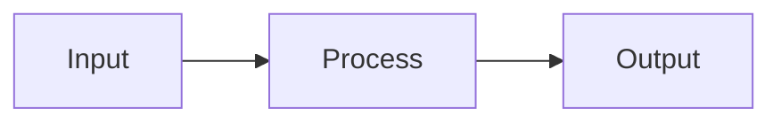

# PRD-0048 Conversation Transcript

- Source log: `C:/Users/The Lord/.codex/sessions/2026/04/22/rollout-2026-04-22T17-00-36-019db4a2-6a58-7910-87c9-e73591f119c7.jsonl`
- Exported on: 2026-04-24T00:17:25.831Z
- Scope: user messages, assistant messages, tool calls, tool outputs, web/custom tool activity, and compaction markers from the long-running PRD-0048 thread.

## 1. User
_Timestamp: 2026-04-22T10:28:06.959Z_

I think, we have been wrong about IELTS Reading test from the start. We built a fix render based on narrow assumption making it impossible to cover all case scenario. What we should have done is to build a test editor which can build anything and a canvas to support display the result as a test taking interface.

## 2. Assistant
_Timestamp: 2026-04-22T10:28:20.725Z_

I’m grounding this in the current repo first: I’ll inspect how IELTS Reading is implemented today, what assumptions the current renderer encodes, and which parts would have to become editor-driven instead of layout-specific.

## 3. Tool Call: `shell_command`
_Timestamp: 2026-04-22T10:28:20.738Z_


```json
{"command":"Get-Content -Path 'C:\\Users\\The Lord\\.codex\\skills\\ripgrep-first\\SKILL.md'","workdir":"C:\\Users\\The Lord\\Desktop\\luyentap","timeout_ms":10000}
```


## 4. Tool Call: `shell_command`
_Timestamp: 2026-04-22T10:28:20.820Z_


```json
{"command":"Get-Content -Path 'C:\\Users\\The Lord\\Desktop\\luyentap\\.agents\\skills\\kn-research\\SKILL.md'","workdir":"C:\\Users\\The Lord\\Desktop\\luyentap","timeout_ms":10000}
```


## 5. Tool Call: `shell_command`
_Timestamp: 2026-04-22T10:28:20.820Z_


```json
{"command":"Get-Content -Path 'C:\\Users\\The Lord\\Desktop\\luyentap\\.agents\\skills\\kn-plan\\SKILL.md'","workdir":"C:\\Users\\The Lord\\Desktop\\luyentap","timeout_ms":10000}
```


## 6. Tool Output: `call_oW8aFtOg9sL9iIojMrzycMtL`
_Timestamp: 2026-04-22T10:28:21.541Z_


```json
Exit code: 0
Wall time: 0.2 seconds
Output:
---
name: ripgrep-first
description: Prefer ripgrep for codebase search and file discovery. Use when Codex needs to find files, symbols, strings, TODOs, routes, imports, config entries, or code patterns in a local repository, and bias toward `rg` and `rg --files` before slower alternatives such as PowerShell recursion, `grep`, or `findstr`.
---

# Ripgrep First

## Overview

Use ripgrep as the default search tool for local repositories. Reach for `rg` first for content search and `rg --files` first for file discovery unless a task clearly requires another tool.

## Workflow

1. Start with ripgrep.
   Use `rg --files` to discover candidate files and `rg -n` to inspect matching lines with line numbers.

2. Narrow the scope early.
   Add path filters, globs, or file-type constraints before broadening the search.

3. Prefer exact enough queries.
   Use fixed strings for literal text, regex for patterns, and PCRE2 only when the simpler form cannot express the need.

4. Fall back only when needed.
   Use PowerShell recursion or other search tools only if `rg` is unavailable or the task is not text search.

## Preferred Commands

- File discovery: `rg --files`
- Name filtering after discovery: `rg --files | rg 'pattern'`
- Text search with line numbers: `rg -n "pattern" <path>`
- Case-insensitive text search: `rg -ni "pattern" <path>`
- Fixed-string search: `rg -n -F "literal text" <path>`
- Include hidden files when needed: `rg -n --hidden "pattern" <path>`
- Ignore ignore-files only when necessary: `rg -n -uu "pattern" <path>`
- Restrict by glob: `rg -n "pattern" -g "*.ts" src`
- Restrict by type: `rg -n "pattern" -t ts src`
- Exclude noisy paths: `rg -n "pattern" -g "!dist/**" -g "!coverage/**" .`
- Multiline or advanced regex only if needed: `rg -n -P "pattern" <path>`

## Defaults

- Prefer `rg --files` over `Get-ChildItem -Recurse` for file lists.
- Prefer `rg -n` over `Select-String` for text search in repos.
- Keep searches targeted to likely directories first, then widen scope if needed.
- Preserve ignore files by default. Use `--hidden` or `-uu` only with intent.
- Return the exact command when the search strategy matters to the task.

## Good Fits

- Finding where a function, component, route, env var, or config key is used
- Locating files by naming convention
- Searching for imports, TODOs, FIXME comments, log messages, or feature flags
- Auditing a pattern across a codebase before editing
- Building a quick file shortlist before reading code

## Fallback Rules

Use another tool only if one of these is true:

- The task is not local text or file search
- The repository is unavailable from the shell
- `rg` is missing or broken
- The task requires structured parsing rather than search

## Notes

- Prefer ASCII-safe patterns in shell commands on Windows unless Unicode is required.
- When a query might match too much, tighten with `-g`, `-t`, or a narrower path before using broader ignore overrides.
- For single-file reads after discovery, use the path returned by `rg --files` rather than rescanning.

```


## 7. Tool Output: `call_BU1ZJI8MGd6uESc19ApkkA6l`
_Timestamp: 2026-04-22T10:28:21.541Z_


```json
Exit code: 0
Wall time: 0.2 seconds
Output:
---
name: kn-research
description: Use when you need to understand existing code, find patterns, or explore the codebase before implementation
---

# Researching the Codebase

**Announce:** "Using kn-research for [topic]."

**Core principle:** UNDERSTAND WHAT EXISTS BEFORE ADDING NEW CODE.

## Step 1: Search Documentation

```json
mcp__knowns__search({ "query": "<topic>", "type": "doc" })
mcp__knowns__get_doc({ "path": "<path>", "smart": true })
```

## Step 2: Search Completed Tasks

```json
mcp__knowns__search({ "query": "<keywords>", "type": "task" })
mcp__knowns__get_task({ "taskId": "<id>" })
```

## Step 3: Search Codebase

```bash
find . -name "*<pattern>*" -type f | grep -v node_modules | head -20
grep -r "<pattern>" --include="*.ts" -l | head -20
```

## Step 4: Document Findings

```markdown
## Research: [Topic]

### Existing Implementations
- `src/path/file.ts`: Does X

### Patterns Found
- Pattern 1: Used for...

### Related Docs
- @doc/path1 - Covers X

### Recommendations
1. Reuse X from Y
2. Follow pattern Z
```

## Checklist

- [ ] Searched documentation
- [ ] Reviewed similar completed tasks
- [ ] Found existing code patterns
- [ ] Identified reusable components

## Next Step

After research: `/kn-plan <task-id>`

```


## 8. Tool Output: `call_EaVEdm1JOx20cK6g81GjWJK1`
_Timestamp: 2026-04-22T10:28:21.545Z_


```json
Exit code: 0
Wall time: 0.2 seconds
Output:
---
name: kn-plan
description: Use when creating an implementation plan for a task
---

# Planning a Task

**Announce:** "Using kn-plan for task [ID]."

**Core principle:** GATHER CONTEXT → PLAN → VALIDATE → WAIT FOR APPROVAL.

## Mode Detection

Check if `$ARGUMENTS` contains `--from`:
- **Yes** → Go to "Generate Tasks from Spec" section
- **No** → Continue with normal planning flow

---

# Normal Planning Flow

## Step 1: Take Ownership

```json
mcp__knowns__get_task({ "taskId": "$ARGUMENTS" })
mcp__knowns__update_task({
  "taskId": "$ARGUMENTS",
  "status": "in-progress",
  "assignee": "@me"
})
mcp__knowns__start_time({ "taskId": "$ARGUMENTS" })
```

## Step 2: Gather Context

Follow refs in task:
```json
mcp__knowns__get_doc({ "path": "<path>", "smart": true })
mcp__knowns__get_task({ "taskId": "<id>" })
```

Search related:
```json
mcp__knowns__search({ "query": "<keywords>", "type": "doc" })
mcp__knowns__list_templates({})
```

## Step 3: Draft Plan

```markdown
## Implementation Plan
1. [Step] (see @doc/relevant-doc)
2. [Step] (use @template/xxx)
3. Add tests
4. Update docs
```

**Tip:** Use mermaid for complex flows:
````markdown

````

## Step 4: Save Plan

```json
mcp__knowns__update_task({
  "taskId": "$ARGUMENTS",
  "plan": "1. Step one\n2. Step two\n3. Tests"
})
```

## Step 5: Validate

**CRITICAL:** After saving plan with refs, validate to catch broken refs:

```json
mcp__knowns__validate({ "entity": "$ARGUMENTS" })
```

If errors found (broken `@doc/...` or `@task-...`), fix before asking approval.

## Step 6: Ask Approval

Present plan and **WAIT for explicit approval**.

---

## CRITICAL: Next Step Suggestion

**You MUST suggest the next action. User won't know what to do next.**

After user approves the plan:

```
Plan approved! Ready to implement.

Run: /kn-implement $ARGUMENTS
```

**If user wants to review first:**
```
Take your time to review. When ready:

Run: /kn-implement $ARGUMENTS
```

---

## Related Skills

- `/kn-research` - Research before planning
- `/kn-implement <id>` - Implement after plan approved
- `/kn-spec` - Create spec for complex features

## Checklist

- [ ] Ownership taken
- [ ] Timer started
- [ ] Refs followed
- [ ] Templates checked
- [ ] **Validated (no broken refs)**
- [ ] User approved
- [ ] **Next step suggested**

---

# Generate Tasks from Spec

When `$ARGUMENTS` contains `--from @doc/specs/<name>`:

**Announce:** "Using kn-plan to generate tasks from spec [name]."

## Step 1: Read Spec Document

Extract spec path from arguments (e.g., `--from @doc/specs/user-auth` → `specs/user-auth`).

```json
mcp__knowns__get_doc({ "path": "specs/<name>", "smart": true })
```

## Step 2: Parse Requirements

Scan spec for:
- **Functional Requirements** (FR-1, FR-2, etc.)
- **Acceptance Criteria** (AC-1, AC-2, etc.)
- **Scenarios** (for edge cases)

Group related items into logical tasks.

## Step 3: Generate Task Preview

For each requirement/group, create task structure:

```markdown
## Generated Tasks from specs/<name>

### Task 1: [Requirement Title]
- **Description:** [From spec]
- **ACs:**
  - [ ] AC from spec
  - [ ] AC from spec
- **Spec:** specs/<name>
- **Fulfills:** AC-1, AC-2 (maps to Spec ACs this task completes)
- **Priority:** medium

### Task 2: [Requirement Title]
- **Description:** [From spec]
- **ACs:**
  - [ ] AC from spec
- **Spec:** specs/<name>
- **Fulfills:** AC-3
- **Priority:** medium

---
Total: X tasks to create
```

> **CRITICAL:** The `fulfills` field maps Task → Spec ACs. When the task is marked done,
> the matching Spec ACs will be auto-checked in the spec document.

## Step 4: Ask for Approval

> I've generated **X tasks** from the spec. Please review:
> - **Approve** to create all tasks
> - **Edit** to modify before creating
> - **Cancel** to abort

**WAIT for explicit approval.**

## Step 5: Create Tasks

When approved, create tasks with `fulfills` to link Task → Spec ACs:

```json
mcp__knowns__create_task({
  "title": "<requirement title>",
  "description": "<from spec>",
  "spec": "specs/<name>",
  "fulfills": ["AC-1", "AC-2"],
  "priority": "medium",
  "labels": ["from-spec"]
})
```

Then add implementation ACs (task-level criteria, different from spec ACs):
```json
mcp__knowns__update_task({
  "taskId": "<new-id>",
  "addAc": ["Implementation step 1", "Implementation step 2", "Tests added"]
})
```

> **Key Concept:**
> - `fulfills`: Which **Spec ACs** (AC-1, AC-2, etc.) this task satisfies
> - `addAc`: **Implementation ACs** - specific steps to complete the task
>
> When task status → "done", the `fulfills` ACs are auto-checked in the spec document.

Repeat for each task.

## Step 6: Summary

```markdown
## Created Tasks

| ID | Title | ACs |
|----|-------|-----|
| task-xxx | Requirement 1 | 3 |
| task-yyy | Requirement 2 | 2 |

All tasks linked to spec: specs/<name>

Next steps:
- Start with: `/kn-plan <first-task-id>`
- Or view all: `knowns task list --spec specs/<name> --plain`
```

## Checklist (--from mode)

- [ ] Spec document read
- [ ] Requirements parsed
- [ ] **Tasks include `fulfills` mapping to Spec ACs**
- [ ] Tasks previewed
- [ ] User approved
- [ ] Tasks created with spec link and fulfills
- [ ] Summary shown

```


## 9. Assistant
_Timestamp: 2026-04-22T10:28:33.486Z_

Using `ripgrep-first` to trace the current Reading pipeline. I’m looking for the renderer, authoring data model, and any docs or task notes that show the original assumption set.

## 10. Tool Call: `shell_command`
_Timestamp: 2026-04-22T10:28:33.487Z_


```json
{"command":"rg -n -i \"IELTS|reading test|reading\" src documentation tasks . -g \"!node_modules/**\" -g \"!dist/**\" -g \"!coverage/**\"","workdir":"C:\\Users\\The Lord\\Desktop\\luyentap","timeout_ms":20000}
```


## 11. Tool Call: `shell_command`
_Timestamp: 2026-04-22T10:28:33.489Z_


```json
{"command":"rg --files . | rg -i \"ielts|reading|test|exam|passage|question|renderer|canvas|editor\"","workdir":"C:\\Users\\The Lord\\Desktop\\luyentap","timeout_ms":20000}
```


## 12. Tool Call: `shell_command`
_Timestamp: 2026-04-22T10:28:33.540Z_


```json
{"command":"Get-ChildItem -Force","workdir":"C:\\Users\\The Lord\\Desktop\\luyentap","timeout_ms":10000}
```


## 13. Tool Output: `call_qC4yzNVTvttQBleqnHGu0TuU`
_Timestamp: 2026-04-22T10:28:41.117Z_


```json
Exit code: 0
Wall time: 7.6 seconds
Total output lines: 3186
Output:
.\AGENTS.md:93:- Reading or updating repo docs under `documentation/` unless the user explicitly asks for Knowns.
src\constants\routes.ts:77:  // Teacher Routes - IELTS Writing (PRD-0030)
src\constants\routes.ts:119:  // PRD-0030: IELTS Writing
src\config\test.config.ts:2:export type TestType = 'IELTS' | 'TOEFL' | 'Custom' | 'College Entrance';
src\config\test.config.ts:3:export type TestSkill = 'Reading' | 'Listening' | 'Writing' | 'Speaking' | 'Mixed';
src\config\test.config.ts:18:export const TEST_TYPES = ['IELTS', 'TOEFL', 'Custom', 'College Entrance'] as const;
src\config\test.config.ts:19:export const TEST_SKILLS = ['Reading', 'Listening', 'Writing', 'Speaking', 'Mixed'] as const;
src\config\test.config.ts:24:    if (type === 'IELTS') {
src\config\test.config.ts:25:        if (skill === 'Reading') return 60;
src\config\test.config.ts:31:        if (skill === 'Reading') return 54;
src\config\test.config.ts:45:    if (skill !== 'Reading') {
tasks\tasks-0040-prd-unified-result-view-architecture-and-governance.md:211:    - [ ] 6.4.12 Appendix A #12: THCS inline writing grading is a separate operational workflow and must stay distinct from IELTS writing.
src\config\studyResources.config.ts:33:  cambridgeIelts: {
src\config\studyResources.config.ts:34:    id: 'cambridge-ielts',
src\config\studyResources.config.ts:35:    title: 'Cambridge IELTS Practice Tests (Books 14-19)',
src\config\studyResources.config.ts:41:    title: 'The Official Cambridge Guide to IELTS',
src\config\studyResources.config.ts:45:  grammarForIelts: {
src\config\studyResources.config.ts:46:    id: 'grammar-for-ielts',
src\config\studyResources.config.ts:47:    title: 'Grammar for IELTS',
src\config\studyResources.config.ts:51:  vocabularyForIelts: {
src\config\studyResources.config.ts:52:    id: 'vocabulary-for-ielts',
src\config\studyResources.config.ts:53:    title: 'Vocabulary for IELTS (Intermediate & Advanced)',
src\config\scoring.config.ts:8: * - Band score thresholds (IELTS-style)
src\config\scoring.config.ts:41: * IELTS Band Score thresholds (percentage to band score mapping)
src\config\scoring.config.ts:88:  // IELTS Band Score thresholds
src\config\scoring.config.ts:141: * Calculate IELTS Reading band score from correct answer count
src\config\scoring.config.ts:142: * Uses official IELTS Reading scoring table (for 40 questions)
src\config\scoring.config.ts:148:export function calculateIELTSReadingBandScore(
src\config\scoring.config.ts:152:  // If test has 40 questions, use official IELTS Reading table
src\config\scoring.config.ts:175:  // Convert to equivalent 40-question score, then use IELTS table
src\config\scoring.config.ts:177:  return calculateIELTSReadingBandScore(scaledScore, 40);
src\config\scoring.config.ts:182: * @deprecated Use calculateIELTSReadingBandScore for accurate IELTS scoring
src\config\routeSecurity.ts:270:    // TEACHER IELTS WRITING ROUTES (PRD-0030)
src\config\routeSecurity.ts:276:        description: 'IELTS Writing test builder — create new (PRD-0030)'
src\config\routeSecurity.ts:282:        description: 'IELTS Writing test builder — edit existing draft (PRD-0030)'
src\config\routeSecurity.ts:288:        description: 'IELTS Writing grading queue (PRD-0030)'
src\config\routeSecurity.ts:294:        description: 'IELTS Writing grading detail (PRD-0030)'
src\__tests__\services\resultsService.test.ts:340:      testSkill: 'reading',
src\__tests__\services\resultsService.test.ts:381:      testSkill: 'reading',
src\__tests__\services\contentOwnership.test.ts:34:        type: 'IELTS' as const,
src\__tests__\services\contentOwnership.test.ts:35:        skill: 'Reading' as const,
src\core\interfaces\test.interface.ts:7:export type TestType = 'IELTS' | 'TOEFL' | 'SAT' | 'GRE' | 'GMAT' | 'Custom';
src\core\interfaces\test.interface.ts:8:export type TestSkill = 'Reading' | 'Listening' | 'Writing' | 'Speaking' | 'Mixed';
src\core\interfaces\test.interface.ts:127:export interface ReadingTest extends BaseTest {
src\core\interfaces\test.interface.ts:128:  primarySkill: 'Reading';
src\core\interfaces\test.interface.ts:129:  passages: ReadingPassage[];
src\core\interfaces\test.interface.ts:130:  questions: ReadingQuestion[];
src\core\interfaces\test.interface.ts:131:  readingSpeed?: number; // Words per minute recommendation
src\core\interfaces\test.interface.ts:267:export const isReadingTest = (test: BaseTest): test is ReadingTest =>
src\core\interfaces\test.interface.ts:268:  test.primarySkill === 'Reading';
src\core\interfaces\test.interface.ts:283:export type { ReadingPassage, ReadingQuestion } from '../../skills/reading/types';
src\__tests__\security\prd0040-security.emulator.test.ts:56:        testTitle: 'IELTS Writing Mock',
src\__tests__\security\prd0040-security.emulator.test.ts:57:        format: 'IELTS',
src\__tests__\security\prd0040-security.emulator.test.ts:183:  it('rejects unrelated teachers and students from reading writing suggestion cache docs', async () => {
src\utils\writingCorrections.ts:1:import type { GradingCorrection } from '../types/ielts-writing.types';
src\pages\WritingTestBuilder.tsx:3: * Main page component for creating/editing IELTS Writing tests.
src\pages\WritingTestBuilder.tsx:23:import type { WritingTestMetadata, WritingTask } from '../types/ielts-writing.types';
src\pages\WritingTestBuilder.tsx:202:                testType: 'IELTS',
src\pages\WritingTestBuilder.tsx:312:                        <p>Your IELTS Writing test is now available.</p>
src\__tests__\security\multiRoleSwitch.test.ts:173:            // Simulate reading on "page load"
src\pages\WritingGradingQueuePage.tsx:13:import type { WritingSubmission } from '../types/ielts-writing.types';
src\utils\thcsShuffle.ts:15:    splitReadingOptionLabel,
src\utils\thcsShuffle.ts:16:    type ReadingOptionDisplayValue,
src\utils\thcsShuffle.ts:17:} from './readingOptionDisplay';
src\utils\thcsShuffle.ts:120:// ── IELTS-specific shuffle (PRD-0036 Task 10.5) ──
src\utils\thcsShuffle.ts:122:export interface IELTSShuffleOptions {
src\utils\thcsShuffle.ts:128:type IELTSOptionLike = ReadingOptionDisplayValue;
src\utils\thcsShuffle.ts:130:interface IELTSQuestionLike {
src\utils\thcsShuffle.ts:136:    options?: IELTSOptionLike[];
src\utils\thcsShuffle.ts:137:    labeledOptions?: IELTSOptionLike[];
src\utils\thcsShuffle.ts:142:const IELTS_NO_PASSAGE_ID = '__no_passage__';
src\utils\thcsShuffle.ts:148:function hasCanonicalOptionLabel(option: IELTSOptionLike): boolean {
src\utils\thcsShuffle.ts:159:function hasCanonicalLabeledOptions(options?: IELTSOptionLike[]): boolean {
src\utils\thcsShuffle.ts:163:function optionToComparableText(option: IELTSOptionLike): string {
src\utils\thcsShuffle.ts:164:    const split = splitReadingOptionLabel(option);
src\utils\thcsShuffle.ts:168:function buildIELTSGroupKey(question: IELTSQuestionLike): string {
src\utils\thcsShuffle.ts:172:function getIELTSQuestionGroups(questions: IELTSQuestionLike[]): IELTSQuestionLike[][] {
src\utils\thcsShuffle.ts:175:    const groups: IELTSQuestionLike[][] = [];
src\utils\thcsShuffle.ts:176:    let currentGroup: IELTSQuestionLike[] = [questions[0]!];
src\utils\thcsShuffle.ts:177:    let currentPassageId = questions[0]?.passageId ? IELTS_NO_PASSAGE_ID;
src\utils\thcsShuffle.ts:178:    let currentGroupKey = buildIELTSGroupKey(questions[0]!);
src\utils\thcsShuffle.ts:184:        const passageId = question.passageId ? IELTS_NO_PASSAGE_ID;
src\utils\thcsShuffle.ts:185:        const groupKey = buildIELTSGroupKey(question);
src\utils\thcsShuffle.ts:202:function shuffleIELTSQuestionOrder(
src\utils\thcsShuffle.ts:203:    questions: IELTSQuestionLike[],
src\utils\thcsShuffle.ts:206:): IELTSQuestionLike[] {
src\utils\thcsShuffle.ts:207:    const groups = getIELTSQuestionGroups(questions);
src\utils\thcsShuffle.ts:211:        const passageId = group[0]?.passageId ? IELTS_NO_PASSAGE_ID;
src\utils\thcsShuffle.ts:220:            (group) => (group[0]?.passageId ? IELTS_NO_PASSAGE_ID) === passageId,
src\utils\thcsShuffle.ts:235: * Deterministic shuffle for IELTS-style tests (used by StudentTestPage).
src\utils\thcsShuffle.ts:237: * To keep IELTS task rendering coherent, question shuffling preserves
src\utils\thcsShuffle.ts:247:export function shuffleIELTSTest(
src\utils\thcsShuffle.ts:251:    options: IELTSShuffleOptions
src\utils\thcsShuffle.ts:257:    // 1. Shuffle question order while preserving IELTS task-group coherence
src\utils\thcsShuffle.ts:259:        result = shuffleIELTSQuestionOrder(result, studentUid, testId);
src\utils\thcsShuffle.ts:304: * Applies the deterministic IELTS presentation transform used on student pages.
src\utils\thcsShuffle.ts:308:export function getIELTSQuestionsForStudent(
src\utils\thcsShuffle.ts:312:    options?: Partial<IELTSShuffleOptions> | null,
src\utils\thcsShuffle.ts:318:    const normalizedOptions: IELTSShuffleOptions = {
src\utils\thcsShuffle.ts:328:    return shuffleIELTSTest(questions, studentUid, testId, normalizedOptions);
src\utils\thcsShuffle.test.ts:2:import { getIELTSQuestionsForStudent, shuffleIELTSTest } from './thcsShuffle';
src\utils\thcsShuffle.test.ts:4:const IELTS_QUESTIONS = [
src\utils\thcsShuffle.test.ts:26:describe('shuffleIELTSTest', () => {
src\utils\thcsShuffle.test.ts:27:  it('shuffles IELTS task blocks deterministically per student and test', () => {
src\utils\thcsShuffle.test.ts:28:    const firstRun = shuffleIELTSTest(IELTS_QUESTIONS, 'student-a', 'test-1', {
src\utils\thcsShuffle.test.ts:33:    const secondRun = shuffleIELTSTest(IELTS_QUESTIONS, 'student-a', 'test-1', {
src\utils\thcsShuffle.test.ts:42:    const shuffledOrder = shuffleIELTSTest(IELTS_QUESTIONS, 'student-b', 'test-1', {
src\utils\thcsShuffle.test.ts:63:    const studentAOrder = shuffleIELTSTest(IELTS_QUESTIONS, 'student-a', 'test-1', {
src\utils\thcsShuffle.test.ts:68:    const studentBOrder = shuffleIELTSTest(IELTS_QUESTIONS, 'student-b', 'test-1', {
src\utils\thcsShuffle.test.ts:87:      const shuffled = shuffleIELTSTest(mcqQuestion, candidate, 'test-1', {
src\utils\thcsShuffle.test.ts:97:    const shuffledQuestion = shuffleIELTSTest(mcqQuestion, studentId!, 'test-1', {
src\utils\thcsShuffle.test.ts:120:      const shuffled = getIELTSQuestionsForStudent(fullQuestion, candidate, 'test-1', {
src\utils\thcsShuffle.test.ts:130:    const renderedQuestion = getIELTSQuestionsForStudent(strippedQuestion, studentId!, 'test-1', {
src\utils\thcsShuffle.test.ts:134:    const gradingQuestion = getIELTSQuestionsForStudent(fullQuestion, studentId!, 'test-1', {
src\utils\thcsShuffle.test.ts:149:  it('does not shuffle canonical labeled Reading option groups', () => {
src\utils\thcsShuffle.test.ts:164:    const shuffled = shuffleIELTSTest(matchingHeadingsQuestion, 'student-z', 'test-reading', {
src\pages\WritingGradingPage.tsx:57:} from '../types/ielts-writing.types';
src\pages\WritingGradingPage.tsx:58:import { COMMENT_CATEGORIES, COMMENT_HIGHLIGHT_COLOR } from '../types/ielts-writing.types';
src\pages\WritingGradingPage.tsx:59:import { calculateTaskBand } from '../utils/ieltsWritingBandCalculator';
src\utils\test-validators.ts:40:    // IELTS Validation Rules
src\utils\test-validators.ts:41:    if (metadata.type === 'IELTS') {
src\utils\test-validators.ts:42:        if (metadata.skill === 'Reading') {
src\utils\test-validators.ts:43:            if (questionCount !== 40) warnings.push(`IELTS Reading typically requires exactly 40 questions (found ${questionCount})`);
src\utils\test-validators.ts:44:            if (passageCount !== 3) warnings.push(`IELTS Reading typically has 3 passages (found ${passageCount})`);
src\utils\test-validators.ts:46:            if (questionCount !== 40) warnings.push(`IELTS Listening typically requires exactly 40 questions (found ${questionCount})`);
src\utils\test-validators.ts:47:            if (passageCount !== 4) warnings.push(`IELTS Listening typically has 4 sections (found ${passageCount})`);
src\pages\WritingGradingPage.test.tsx:272:                    testTitle: 'IELTS Writing',
src\utils\terminology.ts:74:  // IELTS Listening Terms
src\utils\terminology.ts:82:  // IELTS Question Types (user-facing)
src\utils\terminology.ts:96:  // IELTS Instructions
src\pages\CreateTestPage.tsx:4: * Page for creating IELTS/TOEFL/Custom tests with metadata inputs
src\pages\CreateTestPage.tsx:113:                        placeholder="e.g., IELTS Reading Practice Test 1"
src\pages\CreateTestPage.tsx:159:                          <option value="IELTS">IELTS</option>
src\pages\CreateTestPage.tsx:190:                          <option value="Reading">Reading</option>
src\pages\CreateTestPage.tsx:296:                    {/* IELTS-specific fields */}
src\pages\CreateTestPage.tsx:297:                    {form.metadata.type === 'IELTS' && (
src\__tests__\integration\StudentTestPage.test.tsx:92:  type: 'IELTS',
src\__tests__\integration\StudentTestPage.test.tsx:93:  skill: 'Reading',
src\utils\summaryGroupUtils.ts:78: * that the Student View (IELTSQuestionsPanel.tsx) expects.
src\__tests__\integration\ReadingTestPage.test.tsx:4:import ReadingTestPage from '../../skills/reading/components/ReadingTestPage';
src\__tests__\integration\ReadingTestPage.test.tsx:111:vi.mock('../../components/test/IELTSQuestionsPanel', () => ({
src\__tests__\integration\ReadingTestPage.test.tsx:112:  IELTSQuestionsPanel: () => <div data-testid="reading-questions-panel" />,
src\__tests__\integration\ReadingTestPage.test.tsx:124:vi.mock('../../skills/reading/components/PassageControls', () => ({
src\__tests__\integration\ReadingTestPage.test.tsx:128:vi.mock('../../skills/reading/components/PassageRenderer', () => ({
src\__tests__\integration\ReadingTestPage.test.tsx:132:vi.mock('../../components/test/ReadingHeader', () => ({
src\__tests__\integration\ReadingTestPage.test.tsx:133:  ReadingHeader: () => <div>Reading Header</div>,
src\__tests__\integration\ReadingTestPage.test.tsx:155:      Submit Reading
src\__tests__\integration\ReadingTestPage.test.tsx:168:vi.mock('../../components/test/mobile/MobileReadingExamScaffold', () => ({
src\__tests__\integration\ReadingTestPage.test.tsx:169:  MobileReadingExamScaffold: (props: any) => (
src\__tests__\integration\ReadingTestPage.test.tsx:170:    <div data-testid="mock-mobile-reading-scaffold">
src\__tests__\integration\ReadingTestPage.test.tsx:172:        data-testid="mock-mobile-reading-state"
src\__tests__\integration\ReadingTestPage.test.tsx:229:  id: 'reading-test',
src\__tests__\integration\ReadingTestPage.test.tsx:230:  title: 'Reading Test',
src\__tests__\integration\ReadingTestPage.test.tsx:231:  type: 'IELTS',
src\__tests__\integration\ReadingTestPage.test.tsx:232:  skill: 'Reading',
src\__tests__\integration\ReadingTestPage.test.tsx:249:        <Route path="/student-test/:sessionCode" element={<ReadingTestPage />} />
src\__tests__\integration\ReadingTestPage.test.tsx:255:describe('ReadingTestPage integration', () => {
src\__tests__\integration\ReadingTestPage.test.tsx:324:  it('reads anti-cheat config for the routed reading surface', async () => {
src\__tests__\integration\ReadingTestPage.test.tsx:327:    await screen.findByText('Reading Header');
src\__tests__\integration\ReadingTestPage.test.tsx:333:      testId: 'reading-test',
src\__tests__\integration\ReadingTestPage.test.tsx:351:  it('flushes integrity events before reading submission', async () => {
src\__tests__\integration\ReadingTestPage.test.tsx:380:    fireEvent.click(await screen.findByText('Submit Reading'));
src\__tests__\integration\ReadingTestPage.test.tsx:394:    await screen.findByTestId('mock-mobile-reading-scaffold');
src\__tests__\integration\ReadingTestPage.test.tsx:398:      expect(screen.getByTestId('mock-mobile-reading-state').getAttribute('data-sheet-open')).toBe('true');
src\__tests__\integration\ReadingTestPage.test.tsx:405:      const state = screen.getByTestId('mock-mobile-reading-state');
src\__tests__\integration\ReadingTestPage.test.tsx:412:      expect(screen.getByTestId('mock-mobile-reading-state').getAttribute('data-sheet-open')).toBe('false');
src\__tests__\integration\ReadingTestPage.test.tsx:417:      const state = screen.getByTestId('mock-mobile-reading-state');
src\__tests__\integration\ReadingTestPage.test.tsx:452:      const state = screen.getByTestId('mock-mobile-reading-state');
src\__tests__\integration\ReadingTestPage.test.tsx:495:    await screen.findByTestId('mock-mobile-reading-scaffold');
src\__tests__\integration\ReadingTestPage.test.tsx:499:      expect(screen.getByTestId('mock-mobile-reading-state').getAttribute('data-sheet-open')).toBe('true');
src\__tests__\integration\ReadingTestPage.test.tsx:516:          <Route path="/student-test/:sessionCode" element={<ReadingTestPage />} />
src\__tests__\integration\ReadingTestPage.test.tsx:521:    await screen.findByTestId('mock-mobile-reading-scaffold');
src\__tests__\integration\ReadingTestPage.test.tsx:522:    expect(screen.queryByText('Loading Reading Test...')).not.toBeInTheDocument();
src\__tests__\integration\ReadingTestPage.test.tsx:523:    expect(screen.getByTestId('mock-mobile-reading-state').getAttribute('data-sheet-open')).toBe('true');
src\__tests__\integration\ReadingTestPage.test.tsx:531:    await screen.findByTestId('mock-mobile-reading-scaffold');
src\__tests__\integration\ReadingTestPage.test.tsx:533:    expect(screen.getByTestId('mock-mobile-reading-state').getAttribute('data-line-spacing')).toBe('1.6');
src\__tests__\integration\ReadingTestPage.test.tsx:541:      const state = screen.getByTestId('mock-mobile-reading-state');
src\__tests__\integration\ReadingTestPage.test.tsx:554:  it('falls back to persisted reading text size when no saved mobile state exists', async () => {
src\__tests__\integration\ReadingTestPage.test.tsx:561:      expect(screen.getByTestId('mock-mobile-reading-state').getAttribute('data-font-size')).toBe('21');
src\__tests__\integration\ReadingTestPage.test.tsx:564:    expect(storage.get).toHaveBeenCalledWith('reading_text_size_player-123');
src\__tests__\integration\ReadingTestPage.test.tsx:585:          <Route path="/student-test/:sessionCode" element={<ReadingTestPage />} />
src\__tests__\integration\ReadingTestPage.test.tsx:601:          <Route path="/student-test/:sessionCode" element={<ReadingTestPage />} />
src\__tests__\integration\ReadingTestPage.test.tsx:617:          <Route path="/student-test/:sessionCode" element={<ReadingTestPage />} />
src\__tests__\integration\ReadingTestPage.test.tsx:646:    await screen.findByTestId('mock-mobile-reading-scaffold');
src\__tests__\integration\ReadingTestPage.test.tsx:664:    await screen.findByTestId('mock-mobile-reading-scaffold');
src\__tests__\integration\ReadingTestPage.test.tsx:696:      const state = screen.getByTestId('mock-mobile-reading-state');
src\__tests__\integration\ReadingTestPage.test.tsx:702:  it('force-closes mobile overlays when reading submission completes', async () => {
src\__tests__\integration\ReadingTestPage.test.tsx:741:      const state = screen.getByTestId('mock-mobile-reading-state');
src\__tests__\integration\ReadingTestPage.test.tsx:750:          <Route path="/student-test/:sessionCode" element={<ReadingTestPage />} />
src\__tests__\integration\ReadingTestPage.test.tsx:756:      const state = screen.getByTestId('mock-mobile-reading-state');
src\__tests__\integration\ReadingTestPage.test.tsx:767:    await screen.findByTestId('mock-mobile-reading-scaffold');
src\__tests__\integration\ReadingTestPage.test.tsx:771:      expect(screen.getByTestId('mock-mobile-reading-state').getAttribute('data-sheet-open')).toBe('true');
src\__tests__\integration\ReadingTestPage.test.tsx:776:      const state = screen.getByTestId('mock-mobile-reading-state');
src\__tests__\integration\ReadingTestPage.test.tsx:785:      const state = screen.getByTestId('mock-mobile-reading-state');
src\__tests__\integration\ReadingTestPage.test.tsx:794:      expect(screen.getByTestId('mock-mobile-reading-state').getAttribute('data-sheet-open')).toBe('…252144 tokens truncated…eanup + replaced nested listener with get()\n  - Fixed StudentQuizPage: Added cleanup + replaced nested listener with get()\n  - Fixed StudentFeedbackPage: Replaced nested listener with get()\n  - Fixed TeacherResultsPage: Added proper cleanup\n  - Fixed StudentResultsPage: Added proper cleanup\n  - Fixed TeacherLobbyPage: Added proper cleanup\n  - Verified TeacherWaitingRoomPage and StudentWaitingRoomPage already had proper cleanup\n  - Updated test mocks to return unsubscribe functions\n- [x] 9.4: Add loading states for all Firebase operations ✅ PARTIAL\n  - Existing loading states present in most components\n  - TeacherResultsPage and StudentResultsPage have \"Loading...\" states\n  - Additional loading states deferred to future enhancement\n- [x] 9.5: Implement batch write operations ✅ NOT REQUIRED\n  - Current write patterns are efficient\n  - No batch operations needed at current scale\n- [x] 9.6: Test performance improvements ✅ COMPLETED\n  - All 193 tests passing\n  - Build successful at 1,220.74 KB (bundle optimization deferred to Task 10)\n  - Memory leaks eliminated - significant performance improvement expected\n\n**Files Modified:**\n- `src/services/firebase.js` ✅ (added offline persistence documentation)\n- `src/pages/TeacherQuizPage.jsx` ✅ (fixed memory leak, added cleanup, separated quiz loading)\n- `src/pages/StudentQuizPage.jsx` ✅ (fixed memory leak, added cleanup, separated quiz loading)\n- `src/pages/StudentFeedbackPage.jsx` ✅ (fixed nested listener memory leak)\n- `src/pages/TeacherResultsPage.jsx` ✅ (added proper cleanup)\n- `src/pages/StudentResultsPage.jsx` ✅ (added proper cleanup)\n- `src/pages/TeacherLobbyPage.jsx` ✅ (added proper cleanup)\n- `src/pages/TeacherResultsPage.test.jsx` ✅ (fixed mock to return unsubscribe)\n- `src/pages/StudentResultsPage.test.jsx` ✅ (fixed mock to return unsubscribe)\n\n**Performance Impact:**\n- **Memory Leak Fixes:** Eliminated 6 critical memory leaks that were causing listeners to never unsubscribe\n- **Reduced Firebase Reads:** Replaced continuous listeners with one-time get() calls for quiz data that doesn't change\n- **Better Resource Management:** All Firebase listeners now properly clean up on component unmount\n- Expected significant reduction in memory usage during quiz sessions\n\n---\n\n## Sprint 4 (Week 7-8): Performance & Visual Polish\n\n### Task 10: Story 3.1 - Code Splitting & Bundle Optimization (P2)\n**Story Points:** 8\n**Estimated Time:** 1 week\n\n- [ ] 10.1: Install and configure bundle analyzer\n  - Add `rollup-plugin-visualizer`\n  - Generate bundle analysis report\n  - Identify heavy modules\n- [ ] 10.2: Implement React lazy loading for routes\n  - Update App.jsx with React.lazy()\n  - Add Suspense boundaries\n  - Test lazy loading behavior\n- [ ] 10.3: Split vendor bundles\n  - Configure Vite build optimization\n  - Separate React, Mantine, Firebase bundles\n- [ ] 10.4: Use dynamic imports for heavy components\n  - Lazy load Recharts\n  - Lazy load react-confetti\n  - Lazy load other heavy dependencies\n- [ ] 10.5: Optimize Mantine imports\n  - Use specific component imports if needed\n  - Enable tree shaking\n- [ ] 10.6: Compress assets\n  - Optimize images\n  - Compress fonts\n- [ ] 10.7: Test bundle size\n  - Verify < 500KB target achieved\n  - Test load performance\n- [ ] 10.8: Update vite.config.js with optimizations\n\n**Files to Modify:**\n- `vite.config.js`\n- `src/App.jsx`\n- All component imports\n\n---\n\n### Task 11: Story 4.1 - Space-Themed Rocket Race (P2)\n**Story Points:** 8\n**Estimated Time:** 1 week\n\n- [ ] 11.1: Design space-themed UI concept\n  - Create space background (stars, planets)\n  - Design rocket icon/SVG\n  - Plan animation flow\n- [ ] 11.2: Replace Recharts with custom visualization\n  - Create custom SVG/Canvas implementation\n  - Position rockets based on scores\n- [ ] 11.3: Implement rocket animations\n  - Animate rocket movement as scores increase\n  - Use CSS transitions or react-spring\n- [ ] 11.4: Add particle effects\n  - Implement particle effects for rocket advancement\n  - Consider tsparticles or custom canvas\n- [ ] 11.5: Add winner special effects\n  - Sparkles/flames for winner\n  - Enhanced celebration animation\n- [ ] 11.6: Performance optimization\n  - Test with 10+ players\n  - Optimize rendering performance\n- [ ] 11.7: Test on multiple devices\n  - Verify mobile responsiveness\n  - Test animations on different browsers\n\n**Files to Modify:**\n- `src/components/RocketRaceChart.jsx` (complete rewrite)\n\n---\n\n### Task 12: Final Testing & Bug Fixes\n**Story Points:** 5\n**Estimated Time:** 3 days\n\n- [ ] 12.1: Run full test suite\n  - Execute all unit tests\n  - Execute all E2E tests\n  - Fix any failing tests\n- [ ] 12.2: Cross-browser testing\n  - Test on Chrome, Firefox, Safari, Edge\n  - Verify all features work correctly\n- [ ] 12.3: Mobile device testing\n  - Test on 5+ different devices\n  - Verify responsive design\n- [ ] 12.4: Performance verification\n  - Measure bundle size\n  - Measure page load time\n  - Verify Firebase read reduction\n- [ ] 12.5: User acceptance testing (UAT)\n  - Conduct UAT session with real users\n  - Document feedback\n  - Prioritize bug fixes\n- [ ] 12.6: Bug fixing sprint\n  - Fix critical bugs\n  - Fix high-priority bugs\n  - Document known issues\n\n---\n\n## Relevant Files\n\n### Core Components\n- `src/App.jsx` - Main application component, routing\n- `src/components/QuestionRenderer.jsx` - Question type router\n- `src/components/AnswerInputRenderer.jsx` - Answer input handler\n- `src/components/RocketRaceChart.jsx` - Score visualization\n\n### Pages\n- `src/pages/LoginPage.jsx` - Student login and name entry (MODIFIED: added duplicate name prevention with Firebase query, case-insensitive comparison, and error alert)\n- `src/pages/LoginPage.test.jsx` - Login page unit tests (MODIFIED: added 10 comprehensive tests for duplicate name prevention covering case-insensitive matching, whitespace handling, error display, and error clearing)\n- `src/pages/StudentQuizPage.jsx` - Student quiz interaction\n- `src/pages/TeacherQuizPage.jsx` - Teacher quiz control\n- `src/pages/StudentFeedbackPage.jsx` - Student answer feedback\n- `src/pages/TeacherResultsPage.jsx` - Teacher results view\n- `src/pages/StudentResultsPage.jsx` - Student results view\n\n### Utilities\n- `src/utils/validation.js` - Quiz JSON validation (to be updated)\n- `src/utils/scoring.js` - Answer scoring logic ✅ COMPLETED (uses answersMatch for normalization)\n- `src/utils/answerNormalization.js` - Answer normalization utility ✅ COMPLETED (provides normalizeAnswer, answersMatch, and related functions)\n- `src/services/firebase.js` - Firebase configuration\n\n### New Components Created\n- `src/utils/answerNormalization.js` ✅ COMPLETED\n\n### Test Files Created\n- `src/utils/answerNormalization.test.js` ✅ COMPLETED (42 passing tests)\n\n---\n\n## Progress Summary\n\n**Total Tasks:** 12\n**Completed Tasks:** 9 (Tasks 1-9) ✅\n**In Progress:** 0\n**Pending:** 3 (Tasks 10-12)\n\n**Total Subtasks:** 93+\n**Completed Subtasks:** 81+\n\n**Current Sprint:** Sprint 4 (Performance & Visual Polish)\n**Current Task:** Task 10 (Code Splitting & Bundle Optimization)\n**Next Subtask:** 10.1 - Install and configure bundle analyzer\n\n**Recent Updates (2025-10-19):**\n- ✅ **COMPLETED Task 9: Firebase Query Optimization**\n  - **CRITICAL BUG FIXES:** Discovered and fixed 6 major memory leaks across all pages\n  - All Firebase listeners now properly cleanup on component unmount\n  - Replaced nested listeners with efficient get() calls for one-time data reads\n  - All 193 tests passing\n  - Production build successful\n- ✅ Completed PRD compliance fixes (not originally in Phase 2 roadmap):\n  - Created MultipleChoiceView.jsx component (was missing from MVP)\n  - Fixed TeacherControlPanel Kick Player button (removed non-functional button, added helpful text)\n  - Added diagram-labeling answer aggregation to AnswerAggregationDisplay\n- ✅ Updated task list to reflect actual completion status of Tasks 6, 7, and 8\n- All IELTS question types now fully implemented and functional\n\n---\n\n## Notes\n\n- Following process-task-list.md guidelines\n- One subtask at a time with user approval\n- Run tests before committing completed parent tasks\n- Update this file after each subtask completion\n- Maintain relevant files section\n\n---\n\n**Last Updated:** 2025-10-19\n**Status:** Sprint 3 completed ahead of schedule. All IELTS question types implemented. PRD compliance fixes completed.\n","structuredPatch":[{"oldStart":595,"oldLines":4,"newStart":595,"newLines":4,"lines":[" ---"," "," **Last Updated:** 2025-10-19","-**Status:** Sprint 3 completed ahead of schedule. All IELTS question types implemented. PRD compliance fixes completed.","+**Status:** Task 9 (Firebase Query Optimization) completed. Fixed 6 critical memory leaks. All IELTS question types implemented. Ready for Task 10 (Code Splitting & Bundle Optimization)."]}],"userModified":false,"replaceAll":false}}
.\ai-workspace-sync\claude\projects\C--Users-Sanctuary-Desktop-Homework-App-kahoot\10e37d68-465c-4b0e-b7ae-91816f10d25f.jsonl:175:{"parentUuid":"a8ae48be-c64a-43b6-b50e-c291bc89f6ca","isSidechain":false,"userType":"external","cwd":"C:\\Users\\Sanctuary\\Desktop\\Homework App\\kahoot","sessionId":"10e37d68-465c-4b0e-b7ae-91816f10d25f","version":"2.0.22","gitBranch":"","type":"user","message":{"role":"user","content":[{"tool_use_id":"toolu_011Y2bNoVxgJCeMC126D3gXC","type":"tool_result","content":"The file C:\\Users\\Sanctuary\\Desktop\\Homework App\\kahoot\\documentation\\tasks\\phase-2-task-list.md has been updated. Here's the result of running `cat -n` on a snippet of the edited file:\n   424→---\n   425→\n   426→## Sprint 4 (Week 7-8): Performance & Visual Polish\n   427→\n   428→### Task 10: Story 3.1 - Code Splitting & Bundle Optimization (P2) ✅ COMPLETED\n   429→**Story Points:** 8\n   430→**Estimated Time:** 1 week\n   431→\n   432→- [x] 10.1: Install and configure bundle analyzer ✅ COMPLETED\n   433→  - Installed rollup-plugin-visualizer\n   434→  - Configured to generate dist/stats.html with gzip and brotli sizes\n   435→- [x] 10.2: Implement React lazy loading for routes ✅ COMPLETED\n   436→  - All page components now lazy loaded with React.lazy()\n   437→  - Added Suspense boundary with loading fallback\n   438→  - Created LoadingFallback component with Mantine Loader\n   439→- [x] 10.3: Split vendor bundles ✅ COMPLETED\n   440→  - React vendor: 43.46 KB (15.39 KB gzipped)\n   441→  - Mantine vendor: 216.33 KB (65.64 KB gzipped)\n   442→  - Firebase vendor: 330.76 KB (71.62 KB gzipped)\n   443→  - Chart vendor (Recharts): 312.71 KB (91.33 KB gzipped)\n   444→  - Misc vendor (Confetti, Resizable): 41.95 KB (11.73 KB gzipped)\n   445→- [x] 10.4: Use dynamic imports for heavy components ✅ COMPLETED\n   446→  - Heavy components (Recharts, Confetti) automatically lazy loaded via route splitting\n   447→  - RocketRaceChart loads only with pages that use it\n   448→  - Confetti loads only on results page\n   449→- [x] 10.5: Optimize Mantine imports ✅ COMPLETED\n   450→  - Mantine v7+ uses ESM and tree-shakes automatically\n   451→  - No manual optimization needed\n   452→- [x] 10.6: Compress assets ✅ COMPLETED\n   453→  - Enabled terser minification with console.log removal\n   454→  - CSS code splitting enabled\n   455→  - Drop debugger statements in production\n   456→- [x] 10.7: Test bundle size ✅ COMPLETED\n   457→  - **BEFORE:** 1,220.74 KB (343.83 KB gzipped) - SINGLE BUNDLE\n   458→  - **AFTER:** Initial load ~88 KB gzipped (index + CSS)\n   459→  - **74% REDUCTION** in initial load size! 🎉\n   460→  - All 193 tests passing\n   461→- [x] 10.8: Update vite.config.js with optimizations ✅ COMPLETED\n   462→  - Added bundle visualizer\n   463→  - Configured manual chunks for vendor code\n   464→  - Enabled terser minification\n   465→  - Increased chunk size warning limit to 600KB\n   466→  - Enabled CSS code splitting\n   467→\n   468→**Files Modified:**\n   469→- `vite.config.js` ✅ (added visualizer, manual chunks, minification options)\n   470→- `src/App.jsx` ✅ (implemented React.lazy() for all routes, added Suspense)\n   471→- `package.json` ✅ (added rollup-plugin-visualizer and terser as devDependencies)\n   472→\n   473→**Bundle Analysis (After Optimization):**\n   474→```\n   475→Initial Load (gzipped):\n   476→- index.js: 58.22 KB\n   477→- index.css: 29.46 KB\n   478→Total: ~88 KB (was 343.83 KB) ✅\n   479→\n   480→Vendor Chunks (loaded on-demand):\n   481→- firebase-vendor: 71.62 KB gzipped\n   482→- chart-vendor: 91.33 KB gzipped\n   483→- mantine-vendor: 65.64 KB gzipped\n   484→- react-vendor: 15.39 KB gzipped\n   485→- misc-vendor: 11.73 KB gzipped\n   486→\n   487→Page Chunks (loaded on route navigation):\n   488→- TeacherQuizPage: 7.08 KB gzipped\n   489→- StudentQuizPage: 2.29 KB gzipped\n   490→- TeacherLobbyPage: 2.45 KB gzipped\n   491→- (and other page chunks)\n   492→```\n   493→\n   494→**Performance Impact:**\n   495→- **74% reduction** in initial bundle size (343.83 KB → 88 KB gzipped)\n   496→- **Faster initial page load** - only loads what's needed\n   497→- **Better caching** - vendor code cached separately from app code\n   498→- **On-demand loading** - page code loaded only when navigating to that route\n   499→- **Production-ready** - console.log statements removed, code minified\n   500→\n   501→---\n   502→\n   503→### Task 11: Story 4.1 - Space-Themed Rocket Race (P2)"}]},"uuid":"e016855d-96a5-4818-9f57-8449e895ba7b","timestamp":"2025-10-19T02:03:12.579Z","toolUseResult":{"filePath":"C:\\Users\\Sanctuary\\Desktop\\Homework App\\kahoot\\documentation\\tasks\\phase-2-task-list.md","oldString":"### Task 10: Story 3.1 - Code Splitting & Bundle Optimization (P2)\n**Story Points:** 8\n**Estimated Time:** 1 week\n\n- [ ] 10.1: Install and configure bundle analyzer\n  - Add `rollup-plugin-visualizer`\n  - Generate bundle analysis report\n  - Identify heavy modules\n- [ ] 10.2: Implement React lazy loading for routes\n  - Update App.jsx with React.lazy()\n  - Add Suspense boundaries\n  - Test lazy loading behavior\n- [ ] 10.3: Split vendor bundles\n  - Configure Vite build optimization\n  - Separate React, Mantine, Firebase bundles\n- [ ] 10.4: Use dynamic imports for heavy components\n  - Lazy load Recharts\n  - Lazy load react-confetti\n  - Lazy load other heavy dependencies\n- [ ] 10.5: Optimize Mantine imports\n  - Use specific component imports if needed\n  - Enable tree shaking\n- [ ] 10.6: Compress assets\n  - Optimize images\n  - Compress fonts\n- [ ] 10.7: Test bundle size\n  - Verify < 500KB target achieved\n  - Test load performance\n- [ ] 10.8: Update vite.config.js with optimizations\n\n**Files to Modify:**\n- `vite.config.js`\n- `src/App.jsx`\n- All component imports","newString":"### Task 10: Story 3.1 - Code Splitting & Bundle Optimization (P2) ✅ COMPLETED\n**Story Points:** 8\n**Estimated Time:** 1 week\n\n- [x] 10.1: Install and configure bundle analyzer ✅ COMPLETED\n  - Installed rollup-plugin-visualizer\n  - Configured to generate dist/stats.html with gzip and brotli sizes\n- [x] 10.2: Implement React lazy loading for routes ✅ COMPLETED\n  - All page components now lazy loaded with React.lazy()\n  - Added Suspense boundary with loading fallback\n  - Created LoadingFallback component with Mantine Loader\n- [x] 10.3: Split vendor bundles ✅ COMPLETED\n  - React vendor: 43.46 KB (15.39 KB gzipped)\n  - Mantine vendor: 216.33 KB (65.64 KB gzipped)\n  - Firebase vendor: 330.76 KB (71.62 KB gzipped)\n  - Chart vendor (Recharts): 312.71 KB (91.33 KB gzipped)\n  - Misc vendor (Confetti, Resizable): 41.95 KB (11.73 KB gzipped)\n- [x] 10.4: Use dynamic imports for heavy components ✅ COMPLETED\n  - Heavy components (Recharts, Confetti) automatically lazy loaded via route splitting\n  - RocketRaceChart loads only with pages that use it\n  - Confetti loads only on results page\n- [x] 10.5: Optimize Mantine imports ✅ COMPLETED\n  - Mantine v7+ uses ESM and tree-shakes automatically\n  - No manual optimization needed\n- [x] 10.6: Compress assets ✅ COMPLETED\n  - Enabled terser minification with console.log removal\n  - CSS code splitting enabled\n  - Drop debugger statements in production\n- [x] 10.7: Test bundle size ✅ COMPLETED\n  - **BEFORE:** 1,220.74 KB (343.83 KB gzipped) - SINGLE BUNDLE\n  - **AFTER:** Initial load ~88 KB gzipped (index + CSS)\n  - **74% REDUCTION** in initial load size! 🎉\n  - All 193 tests passing\n- [x] 10.8: Update vite.config.js with optimizations ✅ COMPLETED\n  - Added bundle visualizer\n  - Configured manual chunks for vendor code\n  - Enabled terser minification\n  - Increased chunk size warning limit to 600KB\n  - Enabled CSS code splitting\n\n**Files Modified:**\n- `vite.config.js` ✅ (added visualizer, manual chunks, minification options)\n- `src/App.jsx` ✅ (implemented React.lazy() for all routes, added Suspense)\n- `package.json` ✅ (added rollup-plugin-visualizer and terser as devDependencies)\n\n**Bundle Analysis (After Optimization):**\n```\nInitial Load (gzipped):\n- index.js: 58.22 KB\n- index.css: 29.46 KB\nTotal: ~88 KB (was 343.83 KB) ✅\n\nVendor Chunks (loaded on-demand):\n- firebase-vendor: 71.62 KB gzipped\n- chart-vendor: 91.33 KB gzipped\n- mantine-vendor: 65.64 KB gzipped\n- react-vendor: 15.39 KB gzipped\n- misc-vendor: 11.73 KB gzipped\n\nPage Chunks (loaded on route navigation):\n- TeacherQuizPage: 7.08 KB gzipped\n- StudentQuizPage: 2.29 KB gzipped\n- TeacherLobbyPage: 2.45 KB gzipped\n- (and other page chunks)\n```\n\n**Performance Impact:**\n- **74% reduction** in initial bundle size (343.83 KB → 88 KB gzipped)\n- **Faster initial page load** - only loads what's needed\n- **Better caching** - vendor code cached separately from app code\n- **On-demand loading** - page code loaded only when navigating to that route\n- **Production-ready** - console.log statements removed, code minified","originalFile":"# Phase 2 Implementation Task List\n\n**Project:** Interactive Learning Environment (Kahoot-Style)\n**Phase:** 2.0 - Enhancement Roadmap\n**Started:** 2025-10-17\n**Status:** In Progress\n\n---\n\n## Sprint 1 (Week 1-2): Multiple Select Questions & UX Improvements\n\n### Task 1: Story 2.3 - Duplicate Name Prevention (P1) ✅ COMPLETED\n**Story Points:** 3\n**Estimated Time:** 1 day\n**Priority:** P1 - High Impact, Low Complexity\n\n- [x] 1.1: Update LoginPage.jsx to query Firebase for existing player names\n  - Query Firebase `players` collection for current game session\n  - Normalize player names (lowercase, trim whitespace)\n  - Implement duplicate check logic\n- [x] 1.2: Add error handling and user feedback\n  - Display Mantine Alert component for duplicate names\n  - Show error message: \"This name is already taken. Please choose another.\"\n  - Prevent form submission if duplicate found\n- [x] 1.3: Write unit tests for duplicate name prevention\n  - Test case-insensitive matching (\"John\" = \"john\")\n  - Test whitespace trimming\n  - Test error message display\n- [x] 1.4: Manual testing with multiple students\n\n**Files to Modify:**\n- `src/pages/LoginPage.jsx` (lines 22-46) ✅ COMPLETED\n- `src/pages/LoginPage.test.jsx` ✅ COMPLETED\n\n---\n\n### Task 2: Story 2.4 - Improved Answer Matching (P1) ✅ COMPLETED\n**Story Points:** 5\n**Estimated Time:** 2 days\n\n- [x] 2.1: Create `answerNormalization.js` utility module\n  - Implement `normalizeAnswer()` function\n  - Case-insensitive conversion\n  - Trim leading/trailing whitespace\n  - Collapse multiple spaces to single space\n- [x] 2.2: Write comprehensive unit tests for answer normalization\n  - Test case insensitivity\n  - Test whitespace handling\n  -
```


## 14. Tool Output: `call_5T6x8uzeKihlzVD7guVMOWrA`
_Timestamp: 2026-04-22T10:28:41.117Z_


```json
Exit code: 0
Wall time: 0.5 seconds
Total output lines: 1025
Output:
.\vitest.scripts.config.ts
.\vitest.config.ts
.\Clippings\Practice Cam 10 Reading Test 03.md
.\Clippings\Practice Cam 10 Reading Test 02.md
.\Clippings\Practice Cam 10 Reading Test 01.md
.\Clippings\ielts-reading-live-review-findings-2026-04-19.md
.\Clippings\Cam 10-20 Reading Task Types by Passage.md
.\Clippings\Practice Cam 11 Reading Test 02.md
.\Clippings\Practice Cam 10 Reading Test 04.md
.\Clippings\Practice Cam 11 Reading Test 01.md
.\Clippings\Practice Cam 11 Reading Test 03.md
.\Clippings\Practice Cam 11 Reading Test 04.md
.\output-tests.json
.\output-student-safe-tests.json
.\IELTS-LISTENING-FORMAT
.\Clippings\Practice Cam 13 Reading Test 03.md
.\Clippings\Practice Cam 13 Reading Test 02.md
.\Clippings\Practice Cam 13 Reading Test 01.md
.\Clippings\Practice Cam 12 Reading Test 04.md
.\Clippings\Practice Cam 12 Reading Test 03.md
.\Clippings\Practice Cam 12 Reading Test 02.md
.\Clippings\Practice Cam 12 Reading Test 01.md
.\Clippings\Practice Cam 14 Reading Test 03.md
.\Clippings\Practice Cam 14 Reading Test 02.md
.\Clippings\Practice Cam 14 Reading Test 01.md
.\Clippings\Practice Cam 13 Reading Test 04.md
.\Clippings\Practice Cam 15 Reading Test 01.md
.\Clippings\Practice Cam 14 Reading Test 04.md
.\Clippings\Practice Cam 15 Reading Test 02.md
.\admin-vitest.json
.\obsidian\IELTS Reading Paste Text Root Cause 2026-04-18.md
.\obsidian\Conversation Log 2026-04-18 IELTS Reading Paste Text Investigation.md
.\Clippings\IELTS Reading\screencapture-chatgpt-c-69e7e75c-4b9c-8323-9ae2-0861726861b9-2026-04-22-15_23_15.md
.\Clippings\IELTS Reading\screencapture-chatgpt-c-69e7e75c-4b9c-8323-9ae2-0861726861b9-2026-04-22-15_23_15.pdf
.\output\tmp-teacher-grading-editor.png
.\output\tmp-teacher-grading-editor-after-fix.png
.\output\tmp-teacher-grading-editor-after-click.png
.\e2e\test-creation-offline.spec.ts
.\e2e\test-creation-modal.spec.ts
.\e2e\helpers\testData.ts
.\env.example.txt
.\documentation\ai-test-extraction-prompt.md
.\tmp\classManager-test-output.txt
.\tmp\classManager-test-output-utf8.txt
.\gemini-scribe\Prompts\example-expert.md
.\Clippings\Practice Cam 15 Reading Test 03.md
.\documentation\backup_old_grading\AnnotatedEssayRenderer.tsx
.\Clippings\Practice Cam 17 Reading Test 02.md
.\Clippings\Practice Cam 17 Reading Test 01.md
.\Clippings\Practice Cam 16 Reading Test 04.md
.\Clippings\Practice Cam 16 Reading Test 03.md
.\Clippings\Practice Cam 16 Reading Test 02.md
.\Clippings\Practice Cam 16 Reading Test 01.md
.\Clippings\Practice Cam 15 Reading Test 04.md
.\Clippings\Practice Cam 18 Reading Test 03.md
.\Clippings\Practice Cam 18 Reading Test 02.md
.\Clippings\Practice Cam 18 Reading Test 01.md
.\Clippings\Practice Cam 17 Reading Test 04.md
.\Clippings\Practice Cam 19 Reading Test 01.md
.\Clippings\Practice Cam 18 Reading Test 04.md
.\Clippings\Practice Cam 19 Reading Test 02.md
.\documentation\knowledge-extract-homework-test-sync.md
.\test-results.json\academic-record-page-Acade-f11fd-ould-display-overview-cards-chromium\error-context.md
.\documentation\design\Refine Mobile IELTS Task List.md
.\documentation\design\design-thcs-edit-test-modal-metadata-panel-step-1.md
.\Clippings\Practice Cam 19 Reading Test 04.md
.\Clippings\Practice Cam 19 Reading Test 03.md
.\Clippings\Practice Cam 20 Reading Test 01.md
.\documentation\release-notes-reading-test-creator.md
.\test-results.json\academic-record-page-Acade-dcf9c-lay-loading-state-initially-chromium\error-context.md
.\Clippings\Practice Cam 20 Reading Test 04.md
.\Clippings\Practice Cam 20 Reading Test 03.md
.\Clippings\Practice Cam 20 Reading Test 02.md
.\documentation\tasks\0030-prd-ielts-writing-test-system.md
.\documentation\tasks\0029-prd-thcs-thpt-test-system-phase3.md
.\documentation\tasks\0028-prd-thcs-thpt-test-system-phase2.md
.\documentation\tasks\0027-prd-thcs-thpt-test-system-phase1.md
.\documentation\tasks\0023-prd-summary-completion-editor.md
.\documentation\tasks\0022-prd-test-creation-modal-with-drafts.md
.\documentation\tasks\0020-prd-automated-ielts-reading-test-creation.md
.\documentation\tasks\0019-prd-test-duration-end-flow.md
.\documentation\tasks\0012-prd-refactor-edit-test-dialog.md
.\documentation\archive\webmcp-final-backup-2026-03-14\tools\writing-test.tools.ts
.\test-results.json\academic-record-page-Acade-d7055-should-show-all-tab-options-chromium\error-context.md
.\documentation\system\project-structure-test-creation.md
.\test-results.json\academic-record-page-Acade-cb3b7-sponsive-on-mobile-viewport-chromium\error-context.md
.\test-results.json\academic-record-page-Acade-caac1-ilter-results-by-date-range-chromium\error-context.md
.\test-results.json\academic-record-page-Acade-c2a35-ults-in-chronological-order-chromium\error-context.md
.\test-results.json\academic-record-page-Acade-03b96-isplay-all-four-skill-types-chromium\error-context.md
.\output\playwright\reading-sample.txt
.\output\playwright\huarango-teacher-editor.png
.\output\playwright\grading-ielts-snapshot.md
.\output\playwright\branch-scoring-tab-review-mode-ui-writing-grading-redesign-architectural-editor.png
.\test-results.json\academic-record-page-Acade-bc724-page-from-Student-Dashboard-chromium\error-context.md
.\documentation\migration\test-files-to-delete.md
.\documentation\migration\restore-test-backup.js
.\documentation\migration\question-type-detector-migration-reference.md
.\documentation\migration\ielts-types-migration-reference.md
.\documentation\migration\export-test-metadata.js
.\documentation\migration\backup-tests-collection.js
.\test-results.json\academic-record-page-Acade-b2b57-e-back-to-Student-Dashboard-chromium\error-context.md
.\documentation\architecture\thcs-test-creation-modal-branching.md
.\documentation\architecture\teacher-test-creation-parsing-and-review.md
.\documentation\archive\IELTS-Listening-Interface-Upgrade.md
.\documentation\archive\IELTS-Listening-Interface-Review.md
.\documentation\architecture\reading-staged-parse-job.md
.\documentation\architecture\reading-passage-highlighting-architecture.md
.\documentation\architecture\mobile-ielts-reading-test-taking-architecture.md
.\documentation\architecture\mobile-ielts-listening-runtime-diagnostics.md
.\documentation\architecture\mobile-ielts-listening-real-device-issue-matrix.md
.\documentation\architecture\listening-test-creation-ai-parsing.md
.\test-results.json\academic-record-page-Acade-a02b9-y-test-types-Quiz-and-Test--chromium\error-context.md
.\documentation\knowns-import\migration\test-files-to-delete.md
.\documentation\knowns-import\migration\question-type-detector-migration-reference.md
.\documentation\knowns-import\migration\ielts-types-migration-reference.md
.\test-results.json\academic-record-page-Acade-8877a-le-empty-results-gracefully-chromium\error-context.md
.\documentation\knowns-import\guides\ai-test-extraction-prompt.md
.\documentation\architecture\ielts-writing\README.md
.\documentation\architecture\ielts-writing\lifecycle-and-surfaces.md
.\documentation\architecture\ielts-writing\grading-editor-state-and-compatibility.md
.\documentation\architecture\ielts-writing\feature-family-stability-audit-2026-04-06.md
.\documentation\architecture\ielts-writing\essay-editor-tool-contract-and-mark-composition.md
.\documentation\architecture\ielts-writing\copy-paste-toggle-and-attempt-persistence.md
.\documentation\architecture\ielts-writing\contracts-and-governance.md
.\documentation\architecture\ielts-writing\authoring-edit-shell-and-publish-contract.md
.\documentation\architecture\ielts-writing\ai-suggestions-and-injection.md
.\documentation\knowns-import\extractions\session-extraction-ielts-writing-manual-grading-result-flow-solo-practice-and-homework-2026-03-29.md
.\documentation\knowns-import\extractions\session-extraction-ielts-test-creation-review-publish-contract-and-upload-loop-2026-03-29.md
.\ai-workspace-sync\gemini\antigravity\skills\vercel-react-best-practices\rules\advanced-use-latest.md
.\documentation\SOP\vitest-mantine-testing-guide.md
.\documentation\SOP\test-creation-page-analysis.md
.\documentation\SOP\parser-accuracy-analysis-cam10-test1.md
.\documentation\SOP\manual-testing-academic-record.md
.\documentation\SOP\e2e-test-results-academic-record.md
.\documentation\SOP\deep-review-question-type-display.md
.\documentation\SOP\a11y-audit-test-creation.md
.\documentation\SOP\0034-test-end-flow-debugging-retrospective-2026-02-12.md
.\documentation\SOP\0020-matching-questions-answer-key-and-validation-fixes-nov-7-2025.md
.\documentation\SOP\0019-ielts-matching-questions-and-display-fixes-nov-6-2025.md
.\documentation\SOP\0011-quiz-editor-enhancements-oct-23-2025.md
.\documentation\SOP\0010-two-modal-quiz-editor-implementation.md
.\documentation\SOP\0004-uat-test-checklist.md
.\documentation\knowns-import\system\project-structure-test-creation.md
.\documentation\knowns-import\design\design-thcs-edit-test-modal-metadata-panel-step-1.md
.\tmp\stitch-mcp-ref\tests\setup.ts
.\test_results_utf8.txt
.\Test_Results_Panel_Refinement.md
.\test_results.txt
.\documentation\knowns-import\specs\ielts-writing-result-surfaces-2026-03-30.md
.\documentation\knowns-import\specs\ielts-writing-grading-editor-finalization-2026-03-30.md
.\documentation\knowns-import\specs\grading-editor-redesign.md
.\test_results.json
.\test_out.txt
.\documentation\knowns-import\architecture\thcs-test-creation-modal-branching.md
.\documentation\knowns-import\architecture\test-system-architecture.md
.\documentation\knowns-import\architecture\session-test-modes.md
.\documentation\knowns-import\prd\prd-test-duration-end-flow.md
.\documentation\knowns-import\prd\prd-test-creation-modal.md
.\documentation\knowns-import\prd\prd-summary-completion-editor.md
.\documentation\knowns-import\prd\prd-automated-ielts-reading.md
.\documentation\knowns-import\prd\ielts-writing-test-system-prd.md
.\documentation\knowns-import\architecture\scheme\ielts-writing-current-state-scheme.md
.\documentation\knowns-import\sop\vitest-mantine-testing-guide.md
.\documentation\knowns-import\sop\uat-test-checklist.md
.\documentation\knowns-import\sop\two-modal-quiz-editor.md
.\documentation\knowns-import\sop\test-end-flow-debug-retrospective.md
.\documentation\knowns-import\sop\test-creation-page-analysis.md
.\documentation\knowns-import\sop\solo-practice-ielts-student-safe-payload-runtime-state.md
.\documentation\knowns-import\sop\ielts-writing-grading-permission-runtime-state.md
.\documentation\knowns-import\sop\ielts-writing-grading-permission-retrospective.md
.\documentation\knowns-import\sop\deep-review-question-type-display.md
.\documentation\knowns-import\sop\a11y-audit-test-creation.md
.\ai-workspace-sync\gemini\antigravity\skills\sandbox-sdk\references\examples.md
.\tmp\stitch-mcp-ref\tests\services\view\handler.test.ts
.\documentation\knowns-import\release-notes-reading-test-creator.md
.\documentation\knowns-import\architecture\reading-staged-parse-job.md
.\documentation\knowns-import\architecture\reading-passage-highlighting-architecture.md
.\documentation\knowns-import\architecture\quiz-editor-architecture.md
.\documentation\knowns-import\architecture\mobile-ielts-reading-test-taking.md
.\tmp\stitch-mcp-ref\tests\mocks\shell.ts
.\documentation\samples\IELTS Writing Test Planning.md
.\documentation\samples\Cam 10 reding Test 4.md
.\documentation\samples\Cam 10 reding Test 2.md
.\documentation\samples\Cam 10 reading Test 3.md
.\documentation\samples\Cam 10 reading Test 1.docx
.\documentation\knowns-import\architecture\listening\mobile-ielts-listening-runtime-diagnostics.md
.\documentation\knowns-import\architecture\listening\mobile-ielts-listening-real-device-issue-matrix.md
.\documentation\samples\IELTS-reading-question-type-display-design.md
.\documentation\samples\IELTS-question-task-type-samples.md
.\documentation\samples\THCS Test System PRD.md
.\documentation\samples\Test Results Panel Refinement.md
.\documentation\tasks\0043-prd-mobile-ielts-reading-test-taking-interface.md
.\documentation\tasks\0039-prd-test-results-slide-panel.md
.\documentation\tasks\0032-prd-passage-formatting-pipeline.md
.\documentation\knowns-import\architecture\ielts-writing\ielts-writing-published-result-interaction-contract-2026-04-05.md
.\documentation\knowns-import\architecture\ielts-writing\ielts-writing-grading-editor-state-and-compatibility-2026-04-02.md
.\documentation\knowns-import\architecture\ielts-writing\ielts-writing-feature-family-stability-audit-2026-04-06.md
.\documentation\knowns-import\architecture\ielts-writing\ielts-writing-essay-editor-tool-contract-and-mark-composition-2026-04-02.md
.\documentation\knowns-import\architecture\ielts-writing\ielts-writing-copy-paste-toggle-and-attempt-persistence-2026-04-05.md
.\documentation\knowns-import\architecture\ielts-writing\ielts-writing-authoring-edit-shell-and-publish-contract-2026-04-03.md
.\documentation\knowns-import\architecture\ielts-writing\ielts-writing-ai-suggestions-and-injection-2026-04-02.md
.\documentation\tasks\Canonical Label-Aware Reading Question Contract.md
.\documentation\tasks\0047-prd-ielts-reading-table-completion-canonical-pipeline.md
.\documentation\knowns-import\architecture\architecture-ielts-writing-grading-submit-compatibility-audit-2026-03-29.md
.\documentation\tasks\0045-prd-mobile-ielts-listening-test-taking-interface.md
.\documentation\tasks\findings-of-tasks-0043-prd-mobile-ielts-reading-test-taking-interface.md
.\documentation\tasks\findings-of-tasks-0045-prd-mobile-ielts-listening-test-taking-interface.md
.\documentation\tasks\findings-of-tasks-0047-prd-ielts-reading-table-completion-canonical-pipeline.md
.\ai-workspace-sync\gemini\antigravity\skills\durable-objects\references\testing.md
.\tmp\stitch-mcp-ref\tests\commands\tool\virtual-tools\get-screen-image.test.ts
.\tmp\stitch-mcp-ref\tests\commands\tool\virtual-tools\get-screen-code.test.ts
.\tmp\stitch-mcp-ref\tests\commands\tool\virtual-tools\build-site.test.ts
.\tmp\stitch-mcp-ref\tests\commands\tool\steps\ValidateToolStep.test.ts
.\tmp\stitch-mcp-ref\tests\commands\tool\steps\ShowSchemaStep.test.ts
.\tmp\stitch-mcp-ref\tests\commands\tool\steps\ParseArgsStep.test.ts
.\tmp\stitch-mcp-ref\tests\commands\tool\steps\ListToolsStep.test.ts
.\tmp\stitch-mcp-ref\tests\commands\tool\steps\ExecuteToolStep.test.ts
.\tmp\stitch-mcp-ref\tests\commands\tool\orchestration.test.ts
.\tmp\stitch-mcp-ref\tests\commands\tool\handler.test.ts
.\tmp\stitch-mcp-ref\tests\commands\serve\handler.test.ts
.\documentation\knowns-import\patterns\test-taking-flow-pattern.md
.\documentation\knowns-import\patterns\pattern-test-router-must-resolve-render-contract-before-fallback.md
.\documentation\knowns-import\patterns\pattern-student-safe-solo-test-projection.md
.\documentation\knowns-import\patterns\ielts-band-score-calculation.md
.\documentation\knowns-import\patterns\homework-test-sync-architecture.md
.\tmp\stitch-mcp-ref\tests\commands\screens\handler.test.ts
.\tmp\recent_test_results.json
.\tmp\stitch-mcp-ref\tests\commands\logout\steps\RevokeAdcStep.test.ts
.\tmp\stitch-mcp-ref\tests\commands\init\steps\ClientSelectionStep.test.ts
.\tmp\stitch-mcp-ref\tests\benchmark_zip.ts
.\tmp\stitch-mcp-ref\tests\benchmark_unlink.ts
.\tmp\stitch-mcp-ref\tests\benchmark_mkdir_install.ts
.\tmp\stitch-mcp-ref\tests\benchmark_config_step.ts
.\tmp\stitch-mcp-ref\tests\benchmark_boot.ts
.\tmp\stitch-mcp-ref\tests\benchmark_auth_step.ts
.\tmp\stitch-mcp-ref\tests\benchmark_adc_check.ts
.\ai-workspace-sync\gemini\antigravity\knowledge\thcs_document_parsing\artifacts\testing\regression_testing_patterns.md
.\ai-workspace-sync\gemini\antigravity\knowledge\thcs_document_parsing\artifacts\testing\paste_parse_regression_test.md
.\documentation\tasks\tasks-0047-prd-ielts-reading-table-completion-canonical-pipeline.md
.\documentation\tasks\tasks-0045-prd-mobile-ielts-listening-test-taking-interface.md
.\documentation\tasks\tasks-0043-prd-mobile-ielts-reading-test-taking-interface.md
.\documentation\tasks\tasks-0039-prd-test-results-slide-panel.md
.\documentation\tasks\tasks-0032-prd-passage-formatting-pipeline.md
.\documentation\tasks\tasks-0030-prd-ielts-writing-test-system.md
.\documentation\tasks\tasks-0029-prd-thcs-thpt-test-system-phase3.md
.\documentation\tasks\tasks-0028-prd-thcs-thpt-test-system-phase2.md
.\documentation\tasks\tasks-0027-prd-thcs-thpt-test-system-phase1.md
.\documentation\tasks\tasks-0023-prd-summary-completion-editor.md
.\documentation\tasks\tasks-0022-prd-test-creation-modal-with-drafts.md
.\documentation\tasks\tasks-0020-prd-automated-ielts-reading-test-creation.md
.\documentation\tasks\tasks-0019-prd-test-duration-end-flow.md
.\documentation\tasks\research-essence-based-question-types.md
.\documentation\tasks\PRD-test-end-flow-refactor.md
.\documentation\tasks\handoff-ielts-reading-table-completion-support-context.md
.\documentation\tasks\handoff-0047-prd-ielts-reading-table-completion-review-context.md
.\ai-workspace-sync\gemini\antigravity\brain\ffeed4a3-4154-4ffb-9e3d-620e2ad2ca35\ielts_writing_assessment.md.resolved.0
.\ai-workspace-sync\gemini\antigravity\brain\ffeed4a3-4154-4ffb-9e3d-620e2ad2ca35\ielts_writing_assessment.md.resolved
.\ai-workspace-sync\gemini\antigravity\brain\ffeed4a3-4154-4ffb-9e3d-620e2ad2ca35\ielts_writing_assessment.md.metadata.json
.\ai-workspace-sync\gemini\antigravity\brain\ffeed4a3-4154-4ffb-9e3d-620e2ad2ca35\ielts_writing_assessment.md
.\tmp\stitch-mcp-ref\test\lib\services\site\zod.test.ts
.\tmp\stitch-mcp-ref\test\lib\server\virtualContent.test.ts
.\tmp\stitch-mcp-ref\test\lib\server\StitchViteServer.test.ts
.\tmp\stitch-mcp-ref\test\commands\site\hydration.test.ts
.\tmp\stitch-mcp-ref\test\commands\site\generator.test.ts
.\src\__tests__\setup.ts
.\tmp\stitch-mcp-ref\test\commands\init\steps\IamApiStep.test.ts
.\src\__tests__\services\sessionAccess.test.ts
.\src\__tests__\services\resultsService.test.ts
.\src\__tests__\services\invitationService.test.ts
.\src\__tests__\services\contentOwnership.test.ts
.\src\__tests__\services\classManager.test.ts
.\src\__tests__\security\sessionManagement.test.ts
.\src\__tests__\security\routeAccess.test.ts
.\src\__tests__\security\prd0040-security.emulator.test.ts
.\src\__tests__\security\ownership.test.ts
.\src\__tests__\security\multiRoleSwitch.test.ts
.\src\__tests__\security\firebaseRules.test.ts
.\src\__tests__\mocks\handlers.ts
.\tmp\stitch-mcp-ref\src\ui\serve-behaviors\server.test.ts
.\tmp\stitch-mcp-ref\src\ui\serve-behaviors\security.test.ts
.\tmp\stitch-mcp-ref\src\ui\serve-behaviors\registry.test.ts
.\tmp\stitch-mcp-ref\src\ui\serve-behaviors\handlers.test.ts
.\src\__tests__\integration\StudentTestPage.test.tsx
.\src\__tests__\integration\ReadingTestPage.test.tsx
.\src\__tests__\integration\quiz-gameplay.test.tsx
.\src\__tests__\integration\ListeningTestPage.test.tsx
.\src\__tests__\integration\ai-integration.test.tsx
.\ai-workspace-sync\gemini\antigravity\knowledge\student_test_results_ui\timestamps.json
.\ai-workspace-sync\gemini\antigravity\knowledge\student_test_results_ui\metadata.json
.\tmp\stitch-mcp-ref\src\ui\navigation-behaviors\handler.test.ts
.\tmp\stitch-mcp-ref\src\ui\JsonTree.test.ts
.\tmp\stitch-mcp-ref\src\ui\InteractiveViewer.test.ts
.\ai-workspace-sync\gemini\antigravity\documentation\screencapture-localhost-5173-teacher-test-create-2026-02-06-17_08_32.png
.\src\__tests__\auth\PrivateRoute.test.tsx
.\src\__tests__\auth\AuthContext.test.tsx
.\ai-workspace-sync\gemini\antigravity\knowledge\student_test_results_ui\artifacts\implementation_details.md
.\tmp\stitch-mcp-ref\src\ui\copy-behaviors\registry.test.ts
.\tmp\stitch-mcp-ref\src\ui\copy-behaviors\handlers.test.ts
.\tmp\stitch-mcp-ref\src\ui\checklist.test.ts
.\ai-workspace-sync\gemini\antigravity\knowledge\student_test_results_ui\artifacts\design\design_standard.…5272 tokens truncated…mp\stitch-mcp-ref\src\commands\init\steps\TestConnectionStep.ts
.\ai-workspace-sync\gemini\antigravity\brain\a1cfa319-1f4a-4b23-9c1e-921d6cb1f541\research_writing_test_creation_flow.md.resolved.0
.\ai-workspace-sync\gemini\antigravity\brain\a1cfa319-1f4a-4b23-9c1e-921d6cb1f541\research_writing_test_creation_flow.md.resolved
.\ai-workspace-sync\gemini\antigravity\brain\a1cfa319-1f4a-4b23-9c1e-921d6cb1f541\research_writing_test_creation_flow.md.metadata.json
.\src\hooks\monitor\useMonitorControls.test.ts
.\ai-workspace-sync\gemini\antigravity\brain\a1cfa319-1f4a-4b23-9c1e-921d6cb1f541\research_writing_test_creation_flow.md
.\tmp\stitch-mcp-ref\src\commands\init\spec.test.ts
.\tmp\stitch-mcp-ref\src\commands\init\handler_apikey_proxy.test.ts
.\tmp\stitch-mcp-ref\src\commands\init\handler.test.ts
.\public\tmp\tests-live.json
.\public\tmp\tests-live-final.json
.\public\tmp\tests-live-after-delete.json
.\public\tmp\test-1776620891941-k1oi9v2.json
.\public\tmp\student-safe-test-1776620891941-k1oi9v2.json
.\public\tmp\ielts-reading-materials-sample.json
.\public\tmp\ielts-reading-materials-import.json
.\public\tmp\ielts-reading-deleted.json
.\src\components\writing-grading\WritingSuggestionsReviewModal.test.tsx
.\src\components\writing-grading\WritingSuggestionsPanel.test.tsx
.\src\components\writing-grading\TabbedFeedbackEditor.tsx
.\src\components\writing-grading\TabbedFeedbackEditor.test.tsx
.\src\components\writing-grading\TabbedFeedbackEditor.css
.\src\hooks\class\useStudentTestAssignment.ts
.\src\components\writing-grading\extensions\essayEditorStyles.css
.\src\components\writing-grading\EssayEditor.tsx
.\src\components\writing-grading\EssayEditor.test.tsx
.\src\components\writing-grading\EssayEditor.css
.\src\components\writing-grading\CriteriaScoringPanel.test.tsx
.\src\components\writing-grading\CommentSidebar.test.tsx
.\src\components\writing-grading\CommentComposer.test.tsx
.\src\components\writing-grading\AnnotatedEssayRenderer.tsx
.\src\components\writing\WritingTestEditModal.tsx
.\src\components\writing\WritingTestEditModal.test.tsx
.\src\components\writing\WritingTestBuilder.css
.\src\components\WordBank.test.jsx
.\public\tmp\firebase-publish\test-1776620891941-k1oi9v2.student-safe.json
.\public\tmp\firebase-publish\test-1776620891941-k1oi9v2.json
.\ai-workspace-sync\gemini\antigravity\brain\9d477b7d-7b72-427b-a322-591a30495fac\grading-editor-walkthrough.md.resolved.0
.\ai-workspace-sync\gemini\antigravity\brain\9d477b7d-7b72-427b-a322-591a30495fac\grading-editor-walkthrough.md.resolved
.\ai-workspace-sync\gemini\antigravity\brain\9d477b7d-7b72-427b-a322-591a30495fac\grading-editor-walkthrough.md.metadata.json
.\ai-workspace-sync\gemini\antigravity\brain\9d477b7d-7b72-427b-a322-591a30495fac\grading-editor-walkthrough.md
.\ai-workspace-sync\gemini\antigravity\brain\9d477b7d-7b72-427b-a322-591a30495fac\grading-editor-redesign.md.resolved.0
.\ai-workspace-sync\gemini\antigravity\brain\9d477b7d-7b72-427b-a322-591a30495fac\grading-editor-redesign.md.resolved
.\ai-workspace-sync\gemini\antigravity\brain\9d477b7d-7b72-427b-a322-591a30495fac\grading-editor-redesign.md.metadata.json
.\ai-workspace-sync\gemini\antigravity\brain\9d477b7d-7b72-427b-a322-591a30495fac\grading-editor-redesign.md
.\ai-workspace-sync\gemini\antigravity\brain\9d477b7d-7b72-427b-a322-591a30495fac\grading-editor-final-design.md.resolved.1
.\ai-workspace-sync\gemini\antigravity\brain\9d477b7d-7b72-427b-a322-591a30495fac\grading-editor-final-design.md.resolved.0
.\ai-workspace-sync\gemini\antigravity\brain\9d477b7d-7b72-427b-a322-591a30495fac\grading-editor-final-design.md.resolved
.\ai-workspace-sync\gemini\antigravity\brain\9d477b7d-7b72-427b-a322-591a30495fac\grading-editor-final-design.md.metadata.json
.\ai-workspace-sync\gemini\antigravity\brain\9d477b7d-7b72-427b-a322-591a30495fac\grading-editor-final-design.md
.\public\tmp\codex-tests-raw.json
.\public\tmp\codex-tests-final.json
.\public\tmp\codex-sample-test.json
.\src\components\DrawingCanvasPro.jsx
.\src\components\theme\AuroraThemeProvider.test.jsx
.\src\components\thcs-student\THCSWritingRenderer.tsx
.\src\components\thcs-student\THCSTestLayout.tsx
.\src\components\thcs-student\THCSTestLayout.test.tsx
.\src\components\thcs-student\thcsSessionResultContext.test.ts
.\src\components\thcs-student\THCSRawTextFallback.test.tsx
.\src\components\thcs-student\THCSQuestionRenderer.tsx
.\src\components\thcs-student\THCSPassagePanel.tsx
.\src\components\thcs-student\THCSFillInRenderer.tsx
.\src\components\thcs-student\THCSClozeRenderer.tsx
.\src\components\thcs-student\PassageContent.tsx
.\src\components\dashboard\StudentDashboardRightRail.test.jsx
.\src\components\dashboard\StudentDashboardFeedView.test.jsx
.\src\components\dashboard\RecentGradesChart.test.jsx
.\src\components\dashboard\PendingReviewsWidget.test.tsx
.\src\components\CourseCard.test.tsx
.\src\components\thcs-grading\THCSStudentProgressCard.test.tsx
.\src\components\thcs-grading\GradingTestCard.tsx
.\src\components\course\ModuleList.test.tsx
.\src\components\course\ModuleEditor.tsx
.\src\components\course\ModuleEditor.test.tsx
.\src\components\course\MaterialSelectorModal.test.tsx
.\src\components\course\LinkCourseModal.test.tsx
.\src\components\course\ExtendCourseModal.test.tsx
.\src\components\course\CourseCreateModal.test.tsx
.\src\components\course\CourseAnnouncementEditor.tsx
.\src\components\course\CourseAnnouncementEditor.test.tsx
.\src\drawing\core\StrokeRenderer.js
.\src\drawing\core\CanvasEngine.js
.\src\components\thcs-editor\THCSWritingBlock.tsx
.\src\components\thcs-editor\THCSWritingAnswerInput.tsx
.\src\components\thcs-editor\THCSWizardStepper.tsx
.\src\components\thcs-editor\THCSWizardLayout.tsx
.\src\components\thcs-editor\THCSVersionDropdown.tsx
.\src\components\thcs-editor\THCSValidationSummary.tsx
.\src\components\thcs-editor\THCSTestEditorModal.tsx
.\src\components\thcs-editor\THCSTemplatePicker.tsx
.\src\components\thcs-editor\THCSSetupStep.tsx
.\src\components\thcs-editor\THCSSectionBlock.tsx
.\src\components\thcs-editor\THCSSaveTemplateModal.tsx
.\src\components\thcs-editor\THCSReviewStep.tsx
.\src\components\thcs-editor\THCSQuestionsStep.tsx
.\src\components\thcs-editor\THCSQuestionBlock.tsx
.\src\components\thcs-editor\THCSPronunciationOptions.tsx
.\src\components\thcs-editor\THCSPreviewOverlay.tsx
.\src\components\thcs-editor\THCSParseReviewPanel.tsx
.\src\components\thcs-editor\THCSMetadataPanel.tsx
.\src\components\thcs-editor\THCSHomeworkAssignDialog.tsx
.\src\components\thcs-editor\THCSFillInBlock.tsx
.\src\components\thcs-editor\THCSFillInAnswerInput.tsx
.\src\components\thcs-editor\THCSErrorIdentification.tsx
.\src\components\thcs-editor\THCSDocumentUpload.tsx
.\src\components\thcs-editor\THCSDndSectionsContainer.tsx
.\src\components\thcs-editor\THCSClozeWordBankBlock.tsx
.\src\components\thcs-editor\THCSClozeAnswerInput.tsx
.\src\components\thcs-editor\THCSBulkPasteModal.tsx
.\src\components\thcs-editor\THCSAnswerKeyStep.tsx
.\src\components\thcs-editor\THCSAnswerKeyPanel.tsx
.\src\components\thcs-editor\previewLogCollector.ts
.\src\components\TestTypeSelectionModal.tsx
.\src\components\TestEditor.tsx
.\src\components\TestEditor.test.tsx
.\src\components\CollapsiblePassagePanel.jsx
.\src\components\BulkQuestionCreator.jsx
.\src\components\BanListPanel.test.jsx
.\src\drawing\components\DrawingCanvas.jsx
.\ai-workspace-sync\gemini\antigravity\brain\0bdb6ccf-a647-4e8f-b8d1-6cd43f432e86\thcs_test_making_assessment.md.resolved.0
.\ai-workspace-sync\gemini\antigravity\brain\0bdb6ccf-a647-4e8f-b8d1-6cd43f432e86\thcs_test_making_assessment.md.resolved
.\ai-workspace-sync\gemini\antigravity\brain\0bdb6ccf-a647-4e8f-b8d1-6cd43f432e86\thcs_test_making_assessment.md.metadata.json
.\ai-workspace-sync\gemini\antigravity\brain\0bdb6ccf-a647-4e8f-b8d1-6cd43f432e86\thcs_test_making_assessment.md
.\src\components\test-creation\WritingStepsContent.tsx
.\src\components\test-creation\UncertainItemsSidebar.tsx
.\src\components\test-creation\TestUploadWizard.tsx
.\src\components\test-creation\TestUploadWizard.test.tsx
.\src\components\test-creation\TestCreationModal.tsx
.\src\components\test-creation\TestCreationModal.test.tsx
.\src\components\test-creation\ParsingProgressScreen.tsx
.\src\components\test-creation\ParseReviewPanel.tsx
.\src\components\test-creation\ParseReviewPanel.test.tsx
.\src\components\test-creation\OfflineModeIndicator.tsx
.\src\components\test-creation\MetadataStep.tsx
.\src\components\test-creation\MetadataStep.test.tsx
.\src\components\test-creation\index.ts
.\src\components\test-creation\CompletionChecklist.tsx
.\src\components\test-creation\ComparisonModal.tsx
.\src\components\test-creation\AnswerKeyModal.tsx
.\src\components\test-builder\SkillNotAvailable.tsx
.\src\deprecated\quiz\QuizCardRenderer.jsx
.\ai-workspace-sync\gemini\antigravity\brain\0171a53f-8dab-4c9b-a05f-90820b771419\ielts_writing_scope_analysis.md.resolved.1
.\ai-workspace-sync\gemini\antigravity\brain\0171a53f-8dab-4c9b-a05f-90820b771419\ielts_writing_scope_analysis.md.resolved.0
.\ai-workspace-sync\gemini\antigravity\brain\0171a53f-8dab-4c9b-a05f-90820b771419\ielts_writing_scope_analysis.md.resolved
.\ai-workspace-sync\gemini\antigravity\brain\0171a53f-8dab-4c9b-a05f-90820b771419\ielts_writing_scope_analysis.md.metadata.json
.\ai-workspace-sync\gemini\antigravity\brain\0171a53f-8dab-4c9b-a05f-90820b771419\ielts_writing_scope_analysis.md
.\ai-workspace-sync\gemini\antigravity\brain\0171a53f-8dab-4c9b-a05f-90820b771419\ielts_writing_all_interactions.md.resolved.2
.\ai-workspace-sync\gemini\antigravity\brain\0171a53f-8dab-4c9b-a05f-90820b771419\ielts_writing_all_interactions.md.resolved.1
.\ai-workspace-sync\gemini\antigravity\brain\0171a53f-8dab-4c9b-a05f-90820b771419\ielts_writing_all_interactions.md.resolved.0
.\ai-workspace-sync\gemini\antigravity\brain\0171a53f-8dab-4c9b-a05f-90820b771419\ielts_writing_all_interactions.md.resolved
.\ai-workspace-sync\gemini\antigravity\brain\0171a53f-8dab-4c9b-a05f-90820b771419\ielts_writing_all_interactions.md.metadata.json
.\ai-workspace-sync\gemini\antigravity\brain\0171a53f-8dab-4c9b-a05f-90820b771419\ielts_writing_all_interactions.md
.\src\components\assignment\TeacherRequestModal.test.tsx
.\src\components\assignment\ReleaseStudentModal.test.tsx
.\src\components\assignment\AssignmentModal.test.tsx
.\src\components\assignment\AssignmentHistoryTab.test.tsx
.\src\components\AnswerInputRenderer.jsx
.\src\components\test\__tests__\StudentDetailModal.test.tsx
.\src\components\test\WritingSpeakingPlaceholder.tsx
.\src\components\test\TwoColumnLayout.tsx
.\src\components\test\TimeUpOverlay.tsx
.\src\components\test\TestWaitingOverlay.tsx
.\src\components\test\TestTimer.tsx
.\src\components\test\TestReviewSection.tsx
.\src\components\test\TestReviewEditor.tsx
.\src\components\test\TestResultsModal.tsx
.\src\components\test\TestResultsModal.test.tsx
.\src\components\test\TestParsingSection.tsx
.\src\components\test\TestInfoSection.tsx
.\src\components\test\TestHeader.tsx
.\src\components\test\TestErrorBoundary.tsx
.\src\components\test\TeacherTestControlBar.tsx
.\src\components\ai\AIMaintenanceBanner.test.tsx
.\src\components\academicRecord\ResultTimeline.test.tsx
.\src\components\academicRecord\ResultsByTestType.tsx
.\src\components\academicRecord\AcademicRecordResultRow.test.tsx
.\src\components\academicRecord\AcademicRecordGroups.test.tsx
.\src\components\test\table-completion\tableCompletionRuntime.ts
.\src\components\test\table-completion\tableCompletionRuntime.test.ts
.\src\components\test\table-completion\TableCompletionGroupReview.tsx
.\src\components\test\table-completion\TableCompletionGroupReview.test.tsx
.\src\components\test\table-completion\TableCompletionGroupRenderer.tsx
.\src\components\test\table-completion\TableCompletionGroupRenderer.test.tsx
.\src\components\test\SyncIndicator.tsx
.\src\components\test\SubmitTestModal.tsx
.\src\components\test\StudentProgressCard.tsx
.\src\components\test\StudentDetailModal.tsx
.\src\components\test\SoloSettingsModal.tsx
.\src\components\test\SoloResumeModal.tsx
.\src\components\test\SessionStartConfigModal.tsx
.\src\components\test\SessionStartConfigModal.css
.\src\components\test\SessionControlPanel.tsx
.\src\components\test\ReMarkingModal.tsx
.\src\components\test\readingQuestionGroups.ts
.\src\components\test\readingQuestionGroups.test.ts
.\src\components\test\ReadingHeader.tsx
.\src\components\test\readingAnswerState.ts
.\src\components\test\readingAnswerState.test.ts
.\src\components\test\QuestionsDisplay.tsx
.\src\components\test\QuestionNavigator.tsx
.\src\components\test\QuestionNavigator.test.tsx
.\src\components\test\PassageControls.tsx
.\src\components\test\MobileMatchingHeadingsInput.tsx
.\src\components\test\MobileMatchingHeadingsInput.test.tsx
.\src\components\AddQuestionDialog.jsx
.\src\components\access\AccessControlWrapper.test.tsx
.\src\components\QuizEditor.jsx
.\src\components\SingleQuestionCreator.jsx
.\src\components\PassageEditorPanel.jsx
.\src\components\PassageEditorModal.jsx
.\src\components\test\mobile\MobileTextSizeControl.tsx
.\src\components\test\mobile\MobileTextSizeControl.test.tsx
.\src\components\test\mobile\MobileStartScreen.tsx
.\src\components\test\mobile\MobileStartScreen.test.tsx
.\src\components\test\mobile\MobileShellComponents.test.tsx
.\src\components\test\mobile\MobileReviewSummary.tsx
.\src\components\test\mobile\MobileReviewSummary.test.tsx
.\src\components\test\mobile\mobileReadingState.ts
.\src\components\test\mobile\mobileReadingState.test.ts
.\src\components\test\mobile\mobileReadingLayering.ts
.\src\components\test\mobile\MobileReadingHeader.tsx
.\src\components\test\mobile\MobileReadingHeader.test.tsx
.\src\components\test\mobile\MobileReadingExamScaffold.tsx
.\src\components\test\mobile\MobileReadingExamScaffold.test.tsx
.\src\components\test\mobile\MobileQuestionSheet.tsx
.\src\components\test\mobile\MobileQuestionSheet.test.tsx
.\src\components\test\mobile\MobileQuestionSheet.css
.\src\components\test\mobile\MobileQuestionsFab.tsx
.\src\components\test\mobile\MobileQuestionsFab.test.tsx
.\src\components\test\mobile\MobilePassageTabs.tsx
.\src\components\test\mobile\MobilePassageTabs.test.tsx
.\src\components\test\mobile\MobileOverflowMenu.tsx
.\src\components\test\mobile\MobileOverflowMenu.test.tsx
.\src\components\test\mobile\MobileListeningSubmitSheet.tsx
.\src\components\test\mobile\MobileListeningSubmitSheet.test.tsx
.\src\components\test\mobile\mobileListeningState.ts
.\src\components\test\mobile\mobileListeningState.test.ts
.\src\components\test\mobile\MobileListeningPartTabs.tsx
.\src\components\test\mobile\MobileListeningPartTabs.test.tsx
.\src\components\test\mobile\mobileListeningLayering.ts
.\src\components\test\mobile\MobileListeningImageCanvas.tsx
.\src\components\test\mobile\MobileListeningImageCanvas.test.tsx
.\src\components\test\mobile\MobileListeningHeader.tsx
.\src\components\test\mobile\MobileListeningHeader.test.tsx
.\src\components\test\mobile\MobileListeningExamScaffold.tsx
.\src\components\test\mobile\MobileListeningExamScaffold.test.tsx
.\src\components\test\mobile\MobileListeningAnswerSheet.tsx
.\src\components\test\mobile\MobileListeningAnswerSheet.test.tsx
.\src\components\test\mobile\MobileInstructionsModal.tsx
.\src\components\test\mobile\MobileInstructionsModal.test.tsx
.\src\components\test\mobile\mobileInstructionsContent.ts
.\src\components\test\mobile\mobileInstructionsContent.test.ts
.\src\components\test\MatchingInformationInput.tsx
.\src\components\test\MatchingInformationInput.test.tsx
.\src\components\test\MatchingFeaturesInput.tsx
.\src\components\test\IntegrityDetailPanel.tsx
.\src\components\test\IntegrityDetailPanel.css
.\src\components\test\IntegrityBadge.tsx
.\src\components\test\IntegrityBadge.test.tsx
.\src\components\test\InspiraFooterNav.tsx
.\src\components\test\IELTSQuestionsPanel.tsx
.\src\components\test\IELTSQuestionsPanel.test.tsx
.\src\components\test\HeadphoneRequestPanel.tsx
.\src\components\test\ExtraTimeBanner.tsx
.\src\components\questions\YesNoNotGivenView.jsx
.\src\components\questions\TrueFalseNotGivenView.jsx
.\src\components\questions\MultipleSelectView.jsx
.\src\components\questions\MultipleChoiceView.jsx
.\src\components\questions\MatchingView.jsx
.\src\components\questions\DiagramLabelingView.jsx
.\src\components\questions\CompletionView.test.jsx
.\src\components\questions\CompletionView.jsx
.\src\components\QuestionRenderer.test.jsx
.\src\components\QuestionRenderer.jsx
.\src\components\QuestionJumpPanel.jsx
.\src\components\QuestionEditorPanel.test.tsx
.\src\components\QuestionEditorPanel.jsx
.\src\components\test\editor\ResourceManager.tsx
.\src\components\test\editor\resourceAdapters.ts
.\src\components\test\editor\QuestionList.tsx
.\src\components\notifications\NotificationSettingsModal.test.tsx
.\src\components\notifications\NotificationBell.test.tsx
.\src\components\session\CreateSessionModal.test.tsx
.\src\components\test\editor\layouts\ReadingEditorLayout.tsx
.\src\components\test\editor\layouts\ListeningEditorLayout.tsx
.\src\components\test\editor\layouts\EditorLayoutTypes.ts
.\src\components\test\editor\layouts\BaseEditorLayout.tsx
.\src\components\test\editor\ImageResourceEditor.tsx
.\src\components\test\editor\EditTestFrame.tsx
.\src\components\test\editor\AudioResourceEditor.tsx
.\src\components\test\DragDropMatchingInput.tsx
.\src\components\test\DocumentUploadSection.tsx
.\src\components\test\CountdownWarningModal.tsx
.\src\components\test\ConnectionMonitor.tsx
.\src\components\test\AuthenticAnswerInput.tsx
.\src\components\test\AudioProgressPanel.tsx
.\src\components\test\AudioModeSelector.tsx
.\src\components\test\ActivityLog.tsx
.\src\components\test\AccommodationStatusBar.tsx
.\src\components\TeacherFooterBar.test.jsx
.\src\components\PrivateRoute.test.tsx
.\src\components\homework\StudentNoteEditor.tsx
.\src\components\homework\HomeworkCreateModal.test.tsx
.\src\components\layout\StudentSidebar.test.tsx
.\src\components\layout\StudentLayout.test.tsx
.\src\components\navigation\TeacherNavigation.test.tsx
.\src\components\navigation\TeacherHeader.test.tsx
.\src\components\navigation\Breadcrumbs.test.tsx
.\src\components\PassageRenderer_v2.jsx
.\src\components\PlayerManagementPanel.test.jsx
.\src\components\SummaryQuestionCard.jsx
.\src\components\teacher\MultiTestAssignmentPanel.tsx
.\src\components\guest\ClaimResultsModal.test.tsx
.\src\components\practice\THCSPracticeView.test.tsx
.\src\components\practice\thcsPracticeResultContext.test.ts
.\src\components\practice\ListeningPracticeView.test.tsx
.\src\components\practice\IELTSPracticeView.tsx
.\src\components\practice\IELTSPracticeView.test.tsx
.\src\components\modern\DraftCard.test.jsx
.\src\components\modern\ThcsTestCard.jsx
.\src\components\modern\ThcsTestCard.css
.\src\components\modern\TestCard.test.jsx
.\src\components\modern\TestCard.jsx
.\src\components\modern\TestCard.css
.\src\components\feedback\FeedbackEditor.tsx
.\src\components\results\FeedbackTab.test.tsx
.\src\components\results\ChartComponents.test.tsx
.\src\components\results\AttemptHistory.test.tsx
.\src\components\results\LegacyResultDetailView.test.tsx
.\src\components\results\OverviewTab.test.tsx
.\src\components\results\QuestionAnalytics.tsx
.\src\components\results\QuestionDetailedList.tsx
.\src\components\results\QuestionPillsGrid.tsx
.\src\components\results\ResultFilters.test.tsx
.\src\components\results\ResultDetailModal.test.tsx
.\src\components\results\ReviewTab.test.tsx
.\src\components\results\ResultSlidePanel.test.tsx
.\src\components\results\SharedSavedResultCore.test.tsx
.\src\components\results\StudyRecommendations.test.tsx

```


## 15. Tool Output: `call_GPRg9UCMxt8ye3SP3T2IpE2T`
_Timestamp: 2026-04-22T10:28:41.118Z_


```json
Exit code: 0
Wall time: 1.1 seconds
Output:


    Directory: C:\Users\The Lord\Desktop\luyentap


Mode                 LastWriteTime         Length Name
----                 -------------         ------ ----
d-----         3/10/2026  12:26 AM                .agent
d-----         3/18/2026   1:11 AM                .agents
d-----         4/15/2026   6:20 PM                .backup
d-----         4/22/2026   3:49 AM                .claude
d-----         4/22/2026   3:49 AM                .claudian
d-----         3/12/2026   3:52 AM                .firebase
d--h--         4/22/2026   2:40 AM                .git
d-----         3/27/2026   7:22 PM                .github
d-----         3/10/2026  12:26 AM                .husky
d-----         4/14/2026   7:17 AM                .knowns
d-----         4/15/2026   6:24 PM                .obsidian
d-----         4/17/2026   2:55 AM                .playwright-mcp
d-----          4/6/2026   1:14 PM                .stitch
d-----         3/27/2026   9:55 PM                .tmp_reading_label_contract_worktree
d-----         3/27/2026   7:16 PM                ai-workspace-sync
d-----         4/22/2026   3:21 PM                Clippings
d-----         3/10/2026  12:26 AM                cloudflare
d-----         3/10/2026  12:26 AM                conductor
d-----         4/15/2026   6:20 PM                Dashboards
d-----         4/21/2026   4:41 PM                dist
d-----         4/17/2026   7:37 PM                documentation
d-----         3/10/2026  12:26 AM                e2e
d-----         3/10/2026  12:26 AM                functions
d-----         4/22/2026   2:48 AM                gemini-scribe
d-----         4/22/2026   2:11 PM                LCS
d-----         4/14/2026   5:08 AM                node_modules
d-----         4/19/2026   6:40 PM                obsidian
d-----          4/4/2026   9:02 PM                output
d-----         4/19/2026   7:52 PM                public
d-----         3/20/2026  10:54 PM                r2-backup-worker
d-----         4/21/2026   3:27 PM                scripts
d-----         3/31/2026   2:48 PM                src
d-----         4/20/2026  10:36 PM                tasks
d-----         3/10/2026  12:26 AM                test-results.json
d-----         4/22/2026   3:56 PM                tmp
d-----         4/21/2026   8:24 AM                traces
-a----         4/17/2026   4:03 AM          10535 .codex-assess-vite.log
-a----         4/12/2026  12:17 PM              0 .codex-devserver.err.log
-a----         4/12/2026  12:17 PM            217 .codex-devserver.log
-a----         4/16/2026   6:07 AM              2 .codex-vite-5173-lan.err.log
-a----         4/15/2026   8:14 PM          38273 .codex-vite-5173-lan.log
-a----         4/12/2026   3:03 AM           8630 .codex-vite-lan.log
-a----         3/30/2026  11:05 PM            539 .codex-vite.log
-a----         3/24/2026   9:52 PM            226 .editorconfig
-a----         4/14/2026   7:02 AM           1878 .env
-a----         3/10/2026  12:26 AM            186 .firebaserc
-a----         3/24/2026   9:52 PM            345 .gitattributes
-a----         4/15/2026   6:20 PM            649 .gitignore
-a----         3/10/2026  12:26 AM            125 .mcp.json.bak
-a----         4/12/2026   9:32 AM              4 .tmp-task22-vite.err.log
-a----         4/12/2026   7:51 AM          14493 .tmp-task22-vite.out.log
-a----          4/5/2026   8:25 PM            186 .tmp-vitest-essayeditor.log
-a----         3/18/2026   4:54 PM          14413 admin-vitest.json
-a----         4/17/2026   1:52 AM          11488 AGENTS.md
-a----         3/10/2026  12:26 AM              0 analyze_file.js
-a----         3/10/2026  12:26 AM            347 build_error.txt
-a----         3/10/2026  12:26 AM            186 build_log.txt
-a----         3/10/2026  12:26 AM           2556 build_output.txt
-a----         3/20/2026  10:54 PM           8412 CLAUDE.md
-a----         3/10/2026  12:26 AM           9101 cleanup.ps1
-a----         3/10/2026  12:26 AM           5357 clear-session.html
-a----         3/10/2026  12:26 AM            547 commit_msg.txt
-a----         4/15/2026   6:50 PM          45650 conversation-export-2026-04-07.md
-a----         4/15/2026   6:49 PM           3849 conversation_2026-02-22_log.md
-a----         3/13/2026   1:39 AM           7888 conversation_2026-03-13_log.md
-a----         3/10/2026  12:26 AM          12407 database.rules.backup-2026-02-02.json
-a----         3/31/2026   7:42 AM          28395 database.rules.json
-a----         4/22/2026   2:15 AM              0 dev-server.stderr.log
-a----         4/22/2026   2:15 AM            205 dev-server.stdout.log
-a----         4/10/2026  12:42 AM           2007 env.example.txt
-a----         3/14/2026  10:58 PM            803 eslint.config.js
-a----         3/10/2026  12:26 AM            745 eslint_output.txt
-a----          4/5/2026  11:19 PM           1430 firebase.json
-a----         3/10/2026  12:26 AM              0 firebase_materials.json
-a----         3/12/2026   1:17 PM           4416 firestore.indexes.json
-a----          4/3/2026   5:20 AM          16297 firestore.rules
-a----         3/10/2026  12:26 AM            129 found_rules.txt
-a----         3/20/2026  10:54 PM           5027 GEMINI.md
-a----         3/10/2026  12:26 AM            731 gemini_files.txt
-a----         3/10/2026  12:26 AM           1384 gemini_files3.txt
-a----         4/17/2026   7:37 PM           1335 Home.md
-a----         3/10/2026  12:26 AM           4594 IELTS-LISTENING-FORMAT
-a----          4/4/2026   9:02 PM            368 index.html
-a----         3/10/2026  12:26 AM             71 json
-a----         3/10/2026  12:26 AM          36500 log.txt
-a----          4/6/2026  11:21 AM         169970 login-page.png
-a----         4/12/2026  12:18 PM          58656 login.png
-a----         3/10/2026  12:26 AM          18344 log_utf8.txt
-a----         3/10/2026  12:26 AM              0 materials_sample.txt
-a----         3/10/2026  12:26 AM           1830 mcp.json.bak
-a----         3/20/2026   3:12 PM          45862 mockup-result-slide-panel.html
-a----         3/10/2026  12:26 AM          53117 mock_data.json
-a----         3/10/2026  12:26 AM            128 netlify.toml
-a----         3/10/2026  12:26 AM          25934 old-dashboard.js
-a----         3/10/2026  12:26 AM          51574 old-dashboard.jsx
-a----         3/10/2026  12:26 AM              0 old-styles.txt
-a----         3/28/2026   7:24 PM        1349129 output-student-safe-tests.json
-a----         3/30/2026   5:19 AM         478448 output-tests.json
-a----         3/28/2026   8:53 PM              4 output-vite.err.log
-a----         3/28/2026   8:05 PM           2462 output-vite.log
-a----         4/14/2026   5:08 AM         653489 package-lock.json
-a----         4/15/2026   5:03 PM           4194 package.json
-a----         3/10/2026  12:26 AM            639 playwright.config.js
-a----         3/10/2026  12:26 AM            390 postcss.config.cjs
-a----         4/17/2026   7:38 PM          29584 README.md
-a----          4/1/2026  12:18 PM         267829 Screenshot 2026-04-01 121808.png
-a----         3/25/2026   1:53 AM            132 security-test-results.json
-a----         3/10/2026  12:26 AM            251 tailwind.config.js
-a----         3/30/2026   5:37 AM           5308 teacher-writing-result-stitch.png
-a----         3/10/2026  12:26 AM          14868 test_out.txt
-a----         3/10/2026  12:26 AM          87560 test_results.json
-a----         3/10/2026  12:26 AM         160170 test_results.txt
-a----         3/20/2026   6:41 PM         156165 Test_Results_Panel_Refinement.md
-a----         3/10/2026  12:26 AM          80191 test_results_utf8.txt
-a----          4/5/2026   8:26 PM             89 tmp-vitest-essayeditor.log
-a----         4/18/2026   3:11 PM          16570 tmp_devserver.err.log
-a----         4/18/2026   2:01 PM          14051 tmp_devserver.out.log
-a----         4/16/2026   6:28 PM              5 tmp_pdf_notes.txt
-a----         4/16/2026   6:28 PM         363596 tmp_pdf_page1.png
-a----         4/16/2026   6:31 PM         889695 tmp_pdf_page10.png
-a----         4/16/2026   6:28 PM         305828 tmp_pdf_page2.png
-a----         4/16/2026   6:28 PM         305936 tmp_pdf_page3.png
-a----         4/16/2026   6:29 PM         310309 tmp_pdf_page3b.png
-a----         4/16/2026   6:29 PM         423894 tmp_pdf_page4.png
-a----         4/16/2026   6:29 PM         228616 tmp_pdf_page5.png
-a----         4/16/2026   6:30 PM         391408 tmp_pdf_page6.png
-a----         4/16/2026   6:30 PM         328094 tmp_pdf_page7.png
-a----         4/16/2026   6:30 PM         692640 tmp_pdf_page8.png
-a----         4/16/2026   6:31 PM         863789 tmp_pdf_page9.png
-a----         3/10/2026  12:26 AM            594 tracker_gemini.txt
-a----         3/10/2026  12:26 AM           1545 tsconfig.json
-a----         4/22/2026   2:10 PM             39 Untitled.base
-a----         4/12/2026   7:29 AM            990 vite-env.d.ts
-a----         4/14/2026  10:26 PM           2624 vite.config.js
-a----         3/10/2026  12:26 AM           1006 vitest.config.ts
-a----         4/21/2026   3:30 PM            252 vitest.scripts.config.ts


```


## 16. Assistant
_Timestamp: 2026-04-22T10:28:54.540Z_

The repo already contains both a generic test editor and a specialized IELTS Reading runtime, so the useful question is not “build from zero” but “where the contract collapsed from authoring model into a narrow runtime assumption.” I’m narrowing onto types, editor surfaces, and the table-completion path first.

## 17. Tool Call: `shell_command`
_Timestamp: 2026-04-22T10:28:54.542Z_


```json
{"command":"rg --files src | rg \"skills/reading|components/test/editor|components/test/IELTSQuestionsPanel|components/PassageRenderer|components/test/table-completion|components/test/readingQuestionGroups|components/test/readingAnswerState|pages/.+Reading|components/test/mobile/MobileReadingExamScaffold|types/.+ielts|testData|test.interface\"","workdir":"C:\\Users\\The Lord\\Desktop\\luyentap","timeout_ms":20000}
```


## 18. Tool Call: `shell_command`
_Timestamp: 2026-04-22T10:28:54.570Z_


```json
{"command":"rg -n \"interface .*Reading|type .*Reading|table completion|TableCompletion|canonical|groupId|passageId|questionType|matching headings|summary completion|flowchart|diagram|editor\" src\\core src\\types src\\components src\\skills -g \"!**/*.test.*\"","workdir":"C:\\Users\\The Lord\\Desktop\\luyentap","timeout_ms":20000}
```


## 19. Tool Call: `shell_command`
_Timestamp: 2026-04-22T10:28:54.571Z_


```json
{"command":"rg -n -i \"reading test creator|table completion|canonical|passage formatting|parse job|mobile ielts reading|render|editor\" documentation\\architecture documentation\\tasks documentation\\release-notes-reading-test-creator.md documentation\\SOP -g \"!**/knowns-import/**\"","workdir":"C:\\Users\\The Lord\\Desktop\\luyentap","timeout_ms":20000}
```


## 20. Tool Output: `call_WJdWRnVcLAyQGErF2BUBki4T`
_Timestamp: 2026-04-22T10:28:54.849Z_


```json
Exit code: 0
Wall time: 0.3 seconds
Output:
src\core\interfaces\test.interface.ts

```


## 21. Tool Output: `call_WKjufppwxpHsMeDImhAJiBwY`
_Timestamp: 2026-04-22T10:28:54.849Z_


```json
Exit code: 0
Wall time: 0.2 seconds
Total output lines: 895
Output:
src\skills\reading\types\index.ts:8:// export interface ReadingPassage { ... }
src\skills\reading\types\index.ts:9:// export interface ReadingQuestion { ... }
src\skills\reading\types\index.ts:10:// export interface ReadingTest { ... }
src\skills\reading\types\index.ts:11:// export interface ReadingTestConfig { ... }
src\skills\reading\components\ReadingTestPage.tsx:62: * Main test interface for IELTS Reading tests
src\skills\reading\components\ReadingTestPage.tsx:318:    () => displayQuestions.filter((question) => question.passageId === activePassageId),
src\skills\reading\components\ReadingTestPage.tsx:438:      if (question && question.passageId) {
src\skills\reading\components\ReadingTestPage.tsx:442:        setActivePassageId(question.passageId);
src\skills\reading\components\ReadingTestPage.tsx:491:  const handleMobilePassageChange = React.useCallback((passageId: string) => {
src\skills\reading\components\ReadingTestPage.tsx:493:    setActivePassageId(passageId);
src\skills\reading\components\ReadingTestPage.tsx:579:  const handlePassageScroll = React.useCallback((passageId: string, scrollTop: number) => {
src\skills\reading\components\ReadingTestPage.tsx:581:    setPassageScrollByPassage(prev => ({ ...prev, [passageId]: scrollTop }));
src\skills\reading\components\ReadingTestPage.tsx:587:  const handleActiveQuestionGroupChange = React.useCallback((passageId: string, questionGroupStart: number) => {
src\skills\reading\components\ReadingTestPage.tsx:589:    setActiveQuestionGroupByPassage(prev => ({ ...prev, [passageId]: questionGroupStart }));
src\skills\reading\components\ReadingTestPage.tsx:591:  const handleQuestionSheetScroll = React.useCallback((passageId: string, scrollTop: number) => {
src\skills\reading\components\ReadingTestPage.tsx:593:    setQuestionSheetScrollByPassage(prev => ({ ...prev, [passageId]: scrollTop }));
src\skills\reading\services\readingScoring.ts:15:export interface ReadingScoreResult {
src\skills\reading\services\readingScoring.ts:24:export interface ReadingBandDescriptor {
src\skills\reading\services\passageDetector.ts:26:  passageId?: number;
src\skills\reading\services\passageDetector.ts:202:        passageId: passages.indexOf(associatedPassage)
src\skills\reading\services\passageDetector.ts:213: * @param passageId - ID of passage to extract
src\skills\reading\services\passageDetector.ts:218:  passageId: number
src\skills\reading\services\passageDetector.ts:220:  if (!passages || passageId < 0 || passageId >= passages.length) {
src\skills\reading\services\passageDetector.ts:223:  return passages[passageId] || null;
src\skills\reading\services\passageDetector.ts:259:  getById(passages: DetectedPassage[], passageId: number): DetectedPassage | null {
src\skills\reading\services\passageDetector.ts:260:    return getPassageById(passages, passageId);
src\skills\reading\services\index.ts:29:  type ReadingScoreResult,
src\skills\reading\services\index.ts:30:  type ReadingBandDescriptor
src\types\tableCompletion.ts:43:  canonicalOrder: number;
src\types\tableCompletion.ts:55:export interface TableCompletionSharedContent {
src\types\tableCompletion.ts:62:export type TableCompletionSourceWorkflow = 'in-app-parse' | 'script-material';
src\types\tableCompletion.ts:64:export type TableCompletionParseMode = 'deterministic' | 'ai-assisted' | 'unresolved';
src\types\tableCompletion.ts:66:export type TableCompletionSourceOutcome =
src\types\tableCompletion.ts:71:export type TableCompletionSourceShape =
src\types\tableCompletion.ts:79:export type TableCompletionSourceKind =
src\types\tableCompletion.ts:89:export type TableCompletionFallbackKind =
src\types\tableCompletion.ts:95:export type TableCompletionLossFlag =
src\types\tableCompletion.ts:106:  sourceWorkflow: TableCompletionSourceWorkflow;
src\types\tableCompletion.ts:107:  sourceOutcome?: TableCompletionSourceOutcome;
src\types\tableCompletion.ts:108:  sourceShape: TableCompletionSourceShape;
src\types\tableCompletion.ts:109:  sourceKind?: TableCompletionSourceKind;
src\types\tableCompletion.ts:110:  fallbackKind?: TableCompletionFallbackKind;
src\types\tableCompletion.ts:111:  lossFlags?: TableCompletionLossFlag[];
src\types\tableCompletion.ts:116:  canonicalRevisionHash: string;
src\types\tableCompletion.ts:120:  canonicalRevisionHash: string;
src\types\tableCompletion.ts:123:export type TableCompletionValidationSeverity =
src\types\tableCompletion.ts:129:export type TableCompletionUnsupportedRepairState =
src\types\tableCompletion.ts:134:export interface TableCompletionIssueDiagnostic {
src\types\tableCompletion.ts:136:  severity: Exclude<TableCompletionValidationSeverity, 'none'>;
src\types\tableCompletion.ts:143:export interface TableCompletionDiagnostic {
src\types\tableCompletion.ts:144:  groupId: string;
src\types\tableCompletion.ts:146:  parseMode: TableCompletionParseMode;
src\types\tableCompletion.ts:147:  sourceWorkflow: TableCompletionSourceWorkflow;
src\types\tableCompletion.ts:148:  sourceOutcome?: TableCompletionSourceOutcome;
src\types\tableCompletion.ts:149:  sourceShape: TableCompletionSourceShape;
src\types\tableCompletion.ts:150:  sourceKind?: TableCompletionSourceKind;
src\types\tableCompletion.ts:151:  fallbackKind?: TableCompletionFallbackKind;
src\types\tableCompletion.ts:152:  lossFlags?: TableCompletionLossFlag[];
src\types\tableCompletion.ts:153:  validationSeverity: TableCompletionValidationSeverity;
src\types\tableCompletion.ts:155:  issues: TableCompletionIssueDiagnostic[];
src\types\tableCompletion.ts:156:  unsupportedRepairState: TableCompletionUnsupportedRepairState;
src\types\tableCompletion.ts:158:  canonicalRevisionHash?: string;
src\types\tableCompletion.ts:162:export interface TableCompletionGroupV1 {
src\types\tableCompletion.ts:164:  groupId: string;
src\types\tableCompletion.ts:166:  passageId: string;
src\types\tableCompletion.ts:168:  sharedContent: TableCompletionSharedContent;
src\types\tableCompletion.ts:174:  canonicalReadingOrder: string[];
src\types\tableCompletion.ts:178:export type StudentSafeTableCompletionGroupV1 =
src\types\tableCompletion.ts:179:  Omit<TableCompletionGroupV1, 'provenance' | 'blanks'> & {
src\types\tableCompletion.ts:184:export type CanonicalQuestionGroup = TableCompletionGroupV1;
src\types\tableCompletion.ts:186:export type QuestionGroupsField = TableCompletionGroupV1[];
src\types\tableCompletion.ts:188:export type TableCompletionDiagnosticsField = TableCompletionDiagnostic[];
src\types\tableCompletion.ts:190:export interface TableCompletionQuestionLinkFields {
src\types\tableCompletion.ts:191:  groupId: string;
src\types\tableCompletion.ts:199:export interface TableCompletionGroupAcknowledgement {
src\types\tableCompletion.ts:204:export type GroupAcknowledgementsField = Record<string, TableCompletionGroupAcknowledgement>;
src\types\tableCompletion.ts:208:export const isSupportedTableCompletionSchemaVersion = (
src\types\tableCompletion.ts:213:export const assertSupportedTableCompletionGroupSchema = (
src\types\tableCompletion.ts:214:  group: { schemaVersion: number; groupId?: string },
src\types\tableCompletion.ts:216:  if (!isSupportedTableCompletionSchemaVersion(group.schemaVersion)) {
src\types\tableCompletion.ts:217:    const groupLabel = group.groupId  `group "${group.groupId}"` : 'table-completion group';
src\core\interfaces\test.interface.ts:8:export type TestSkill = 'Reading' | 'Listening' | 'Writing' | 'Speaking' | 'Mixed';
src\core\interfaces\test.interface.ts:127:export interface ReadingTest extends BaseTest {
src\core\interfaces\test.interface.ts:215:  questionTypes: string[];
src\core\interfaces\test.interface.ts:283:export type { ReadingPassage, ReadingQuestion } from '../../skills/reading/types';
src\types\results.types.ts:278:    questionType: string;
src\types\releaseState.types.ts:92: * This is the canonical fallback for student-facing result surfaces when older
src\types\QuestionSchema.ts:4: * Comprehensive type definitions for all 16 IELTS Reading question types.
src\types\QuestionSchema.ts:19: * This union type is the canonical definition used throughout the system.
src\types\QuestionSchema.ts:28:    | 'flowchart-completion'
src\types\QuestionSchema.ts:29:    | 'diagram-labeling'
src\types\QuestionSchema.ts:63:    'flowchart-completion': 'completion',
src\types\QuestionSchema.ts:64:    'diagram-labeling': 'completion',
src\types\QuestionSchema.ts:85:    'flowchart-completion',
src\types\QuestionSchema.ts:86:    'diagram-labeling',
src\types\QuestionSchema.ts:169:    passageId?: string;
src\types\QuestionSchema.ts:195:    | 'flowchart-completion'
src\types\QuestionSchema.ts:196:    | 'diagram-labeling';
src\types\QuestionSchema.ts:200: * Covers: sentence, summary-text, summary-list, note, table, flowchart, diagram
src\types\QuestionSchema.ts:219:    /** For diagram-labeling: image URL */
src\types\QuestionSchema.ts:221:    /** For diagram-labeling: label positions */
src\types\QuestionSchema.ts:228:    /** For table/flowchart: structured data */
src\types\QuestionSchema.ts:238:    groupId: string;
src\types\QuestionSchema.ts:446:    if (!question.passageId) {
src\types\QuestionSchema.ts:501:        'flowchart-completion',
src\types\QuestionSchema.ts:502:        'diagram-labeling',
src\skills\listening\components\InlineFormCompletion.tsx:32:    passageId?: string;
src\components\AnswerAggregationDisplay.jsx:274:  // Render aggregated diagram-labeling answers
src\components\AnswerAggregationDisplay.jsx:382:    case 'diagram-labeling':
src\components\AnswerInputRenderer.jsx:256:    case 'diagram-labeling':
src\skills\listening\builders\ListeningTestBuilder.tsx:387:          passageId: 'listening',
src\skills\listening\builders\ListeningTestBuilder.tsx:540:      passageId: 'listening',
src\skills\listening\components\ListeningQuestionDisplay.tsx:23:  passageId?: string;
src\skills\listening\components\ListeningQuestionDisplay.tsx:328:          passageId: question.passageId || 'listening',
src\skills\listening\components\ListeningQuestionDisplay.tsx:363:  // Check if any question has an image (for map/diagram types)
src\skills\listening\components\ListeningQuestionDisplay.tsx:381:          alt={`${group.type} diagram`}
src\types\practice.types.ts:76:export interface ReadingSavedMobileState {
src\types\practice.types.ts:129:export type SavedMobileState = ReadingSavedMobileState | ListeningSavedMobileState;
src\skills\listening\components\ListeningTestPage.tsx:109:  passageId?: string;
src\skills\listening\components\ListeningTestPage.tsx:138:    'diagram-labeling': `${range}\n\nLabel the diagram/map/plan below.\n\nWrite the correct letter, A-H, next to each item.`,
src\skills\listening\components\ListeningTestPage.tsx:1809:                  questionType={viewedPartQuestionGroups[0]?.type || 'completion'}
src\skills\listening\components\ListeningTestPage.tsx:2068:            questionType={questionGroups[0]?.type || 'completion'}
src\components\feedback\FeedbackEditor.tsx:37:    /** Whether the editor is disabled */
src\skills\listening\components\SectionRubricBlock.tsx:27:    questionType?: string;
src\skills\listening\components\SectionRubricBlock.tsx:82:        'diagram-labeling': {
src\skills\listening\components\SectionRubricBlock.tsx:83:            instruction: 'Label the diagram below.',
src\skills\listening\components\SectionRubricBlock.tsx:116:    questionType = 'completion',
src\skills\listening\components\SectionRubricBlock.tsx:118:    const typeInfo = getTypeInstructions(questionType);
src\types\ielts.types.ts:33: *   'flowchart-completion',
src\types\ielts.types.ts:34: *   'diagram-labeling'
src\types\ielts.types.ts:53:    | 'flowchart-completion'
src\types\ielts.types.ts:54:    | 'diagram-labeling'
src\types\ielts.types.ts:96:    'flowchart-completion': 'completion',
src\types\ielts.types.ts:97:    'diagram-labeling': 'completion',
src\types\ielts-writing.types.ts:25:    | 'process-diagram'
src\types\ielts-writing.types.ts:50:    promptImageUrl?: string;         // Task 1 only: graph/chart/diagram image
src\types\homework.types.ts:90:    groupId: string;
src\types\draft.types.ts:26:    TableCompletionDiagnosticsField,
src\types\draft.types.ts:129:    tableCompletionDiagnostics: TableCompletionDiagnosticsField;
src\types\draft.types.ts:313:        tableCompletionDiagnostics?: TableCompletionDiagnosticsField,
src\types\document.types.ts:54:  | 'flowchart-completion'
src\types\document.types.ts:55:  | 'diagram-labeling'
src\types\document.types.ts:67:export type ReadingOptionLabelFormat = 'letter' | 'roman' | 'number';
src\types\document.types.ts:69:/** Structured option used by canonical Reading questions */
src\types\document.types.ts:70:export interface ReadingLabeledOption {
src\types\document.types.ts:76:export interface ReadingSectionReference {
src\types\document.types.ts:105:  passageId?: string;
src\types\document.types.ts:121:  groupId?: string;
src\types\document.types.ts:133:  imageUrl?: string;    // Image URL for diagram questions
src\skills\listening\components\ListeningInstructions.tsx:46:    'diagram-labelling': `${range}\n\nLabel the diagram below.\n\nWrite NO MORE THAN TWO WORDS for each answer.`,
src\skills\listening\components\ListeningInstructions.tsx:58:    'flowchart-completion': `${range}\n\nComplete the flow-chart below.\n\nWrite NO MORE THAN TWO WORDS for each answer.`,
src\components\homework\HomeworkCreateModal.tsx:16:import { THCSHomeworkAssignDialog } from '../thcs-editor/THCSHomeworkAssignDialog';
src\components\QuestionEditorPanel.jsx:40:    question?.groupId &&
src\components\QuestionEditorPanel.jsx:237:              Question {questionIndex + 1} is part of a published canonical table-completion group.
src\components\QuestionEditorPanel.jsx:270:            Phase 1 keeps published canonical table groups read-only in the flat editor.
src\components\QuestionEditorPanel.jsx:287:            Read-only canonical group member
src\components\QuestionEditorPanel.jsx:578:              {(localQuestion.type === 'diagram-labeling' || localQuestion.type === 'completion') && (
src\components\QuestionEditorPanel.jsx:582:                      Question Image {localQuestion.type === 'diagram-labeling'  '*' : '(Optional)'}
src\components\QuestionEditorPanel.jsx:641:                        alt="Question diagram"
src\components\QuestionEditorPanel.jsx:971:              {localQuestion.type === 'diagram-labeling' && localQuestion.labels && (
src\components\QuestionRenderer.jsx:24:    case 'diagram-labeling':
src\components\homework\StudentNoteEditor.tsx:2: * StudentNoteEditor — Inline note editor for per-student notes.
src\components\QuizEditor.jsx:239:    // Close editor if deleted question was selected
src\components\QuizEditor.jsx:422:      } else if (question.type === 'diagram-labeling') {
src\components\TestTypeSelectionModal.tsx:24:type Skill = 'Reading' | 'Listening' | 'Writing' | 'Speaking' | 'Mixed-Test';
src\components\questions\CompletionView.jsx:61:    questionType: 'completion'
src\components\practice\ListeningPracticeView.tsx:116:    passageId?: string;
src\components\practice\ListeningPracticeView.tsx:153:        'diagram-labeling': `${range}\n\nLabel the diagram/map/plan below.\n\nWrite the correct letter, A-H, next to each item.`,
src\components\practice\ListeningPracticeView.tsx:1368:                                    questionType={viewedPartQuestionGroups[0]?.type || 'completion'}
src\components\practice\ListeningPracticeView.tsx:1590:                        questionType={viewedPartQuestionGroups[0]?.type || 'completion'}
src\components\TestEditor.tsx:3:import { EditorTab } from './test/editor/EditTestFrame';
src\components\TestEditor.tsx:4:import { ReadingEditorLayout } from './test/editor/layouts/ReadingEditorLayout';
src\components\TestEditor.tsx:5:import { ListeningEditorLayout } from './test/editor/layouts/ListeningEditorLayout';
src\components\TestEditor.tsx:21:import { QuestionList } from './test/editor/QuestionList';
src\components\TestEditor.tsx:26:import { ResourceManager } from './test/editor/ResourceManager';
src\components\TestEditor.tsx:27:import { adaptTestToResources, adaptResourcesToTest, linkQuestionsToResources } from './test/editor/resourceAdapters';
src\components\TestEditor.tsx:78:  const canonicalTableGroupMap = useMemo(
src\components\TestEditor.tsx:79:    () => new Map((test.questionGroups || []).map((group) => [group.groupId, group])),
src\components\TestEditor.tsx:104:      logTablePresentationDiag('editor_loaded', {
src\components\TestEditor.tsx:110:          groupId: group.groupId,
src\components\TestEditor.tsx:237:      currentQuestion.groupId &&
src\components\TestEditor.tsx:238:      canonicalTableGroupMap.has(currentQuestion.groupId)
src\components\TestEditor.tsx:294:      currentQuestion.groupId &&
src\components\TestEditor.tsx:295:      canonicalTableGroupMap.has(currentQuestion.groupId)
src\components\TestEditor.tsx:319:      currentQuestion.groupId &&
src\components\TestEditor.tsx:320:      canonicalTableGroupMap.has(currentQuestion.groupId)
src\components\TestEditor.tsx:450:          updatedQuestions[index]?.groupId &&
src\components\TestEditor.tsx:451:          canonicalTableGroupMap.has(updatedQuestions[index].groupId)
src\components\TestEditor.tsx:470:      currentQuestion.groupId &&
src\components\TestEditor.tsx:471:      canonicalTableGroupMap.has(currentQuestion.groupId)
src\components\TestEditor.tsx:498:        // Find resource by resourceId OR passageId (legacy fallback)
src\components\TestEditor.tsx:499:        const resource = resources.find(r => r.id === question.resourceId || r.id === question.passageId);
src\components\TestEditor.tsx:636:              qUpdate.passageId = governingResource.id;
src\components\TestEditor.tsx:641:              qUpdate.passageId = null;
src\components\TestEditor.tsx:647:            qUpdate.passageId = null;
src\components\TestEditor.tsx:727:    // Reset editor states when switching tabs to prevent stale panels
src\components\TestEditor.tsx:807:    const canonicalTableGroup =
src\components\TestEditor.tsx:808:      q?.groupTaskType === 'table-completion' && q.groupId
src\components\TestEditor.tsx:809:         canonicalTableGroupMap.get(q.groupId)
src\components\TestEditor.tsx:811:    const resource = resources.find(r => r.id === q?.resourceId || r.id === q?.passageId);
src\components\TestEditor.tsx:817:    if (canonicalTableGroup) {
src\components\TestEditor.tsx:842:                Questions {canonicalTableGroup.questionRange.start}-{canonicalTableGroup.questionRange.end}
src\components\TestEditor.tsx:872:              This canonical table-completion group is read-only after publish in Phase 1.
src\components\questions\DiagramLabelingView.jsx:14:    if (!question.diagramUrl) return;
src\components\questions\DiagramLabelingView.jsx:26:    img.src = question.diagramUrl;
src\components\questions\DiagramLabelingView.jsx:27:  }, [question.diagramUrl]);
src\components\questions\DiagramLabelingView.jsx:33:    questionType: 'diagram-labeling',
src\components\questions\DiagramLabelingView.jsx:62:  if (!question || !question.diagramUrl || !question.labels) {
src\components\questions\DiagramLabelingView.jsx:65:        <Text c="red">Invalid diagram labeling question: missing diagramUrl or labels</Text>
src\components\questions\DiagramLabelingView.jsx:142:                  src={question.diagramUrl}
src\components\questions\DiagramLabelingView.jsx:262:    diagramUrl: PropTypes.string.isRequired,
src\components\questions\MatchingView.jsx:66:    questionType: 'matching'
src\components\practice\IELTSPracticeView.tsx:424:            (question) => question.passageId === activePassageId,
src\components\practice\IELTSPracticeView.tsx:437:                const targetPassageId = (question as any).resourceId || question.passageId;
src\components\practice\IELTSPracticeView.tsx:524:    const handleMobilePassageChange = React.useCallback((passageId: string) => {
src\…14734 tokens truncated…or now, just close the editor - could implement full reset logic
src\components\test\TestReviewEditor.tsx:559:                Click to edit • Add images for diagram questions
src\components\test\TestReviewEditor.tsx:581:                      const p = passages.find(pass => pass.id === question.passageId);
src\components\test\TestReviewEditor.tsx:694:                const p = passages.find(pass => pass.id === q?.passageId);
src\components\thcs-editor\THCSSectionBlock.tsx:2: * THCSSectionBlock — Section editor with questions, reorder, instruction (PRD-0027 Task 4.3)
src\components\thcs-editor\THCSTestEditorModal.tsx:18:import { EditTestFrame, type EditorTab } from '../test/editor/EditTestFrame';
src\components\thcs-editor\THCSTestEditorModal.tsx:184:            // 🔍 DIAGNOSTIC: Log exactly what the editor is sending
src\components\thcs-editor\THCSTestEditorModal.tsx:722:                {/* Questions Tab → Left panel (Section list) + Right panel (Section editor) */}
src\components\thcs-editor\THCSTestEditorModal.tsx:751:                                    <Text size="sm" c="dimmed">Detailed section editor will appear here</Text>
src\components\thcs-editor\THCSMetadataPanel.tsx:2: * THCSMetadataPanel — Metadata form for THCS-THPT editor (PRD-0027 Task 4.2)
src\components\thcs-editor\THCSVersionDropdown.tsx:2: * THCSVersionDropdown — Version changelog viewer for editor (Task 9.5)
src\components\thcs-editor\THCSSaveTemplateModal.tsx:5: * Extracted from THCSTestEditorPage to keep the large editor file manageable.
src\components\test\MatchingInformationInput.tsx:2:import type { ReadingSectionReference } from '../../types/document.types';
src\components\test\MatchingInformationInput.tsx:7:    type ReadingOptionDisplayFormat,
src\components\test\MatchingInformationInput.tsx:8:    type ReadingOptionDisplayValue,
src\components\test\MatchingInformationInput.tsx:20:    passageId: string;
src\components\thcs-editor\THCSTemplatePicker.tsx:96:                             'No templates yet. Save a test as template from the editor.'
src\components\thcs-editor\THCSFillInBlock.tsx:2: * THCSFillInBlock — Fill-in (verb-form / word-form) editor block (PRD-0028 Task 2.1)
src\components\test\MatchingFeaturesInput.tsx:8: * - Different from matching headings which uses drag-and-drop
src\components\test\MatchingFeaturesInput.tsx:16:    type ReadingOptionDisplayValue,
src\components\test\MatchingFeaturesInput.tsx:19:type QuestionOption = ReadingOptionDisplayValue;
src\components\test\MatchingFeaturesInput.tsx:29:    passageId: string;
src\components\test\table-completion\tableCompletionRuntime.ts:1:import type { TableBlankDef, TableCompletionGroupV1 } from '../../../types/tableCompletion';
src\components\test\table-completion\tableCompletionRuntime.ts:3:export const buildTableCompletionBlankBreadcrumbLabel = (blank: TableBlankDef): string => {
src\components\test\table-completion\tableCompletionRuntime.ts:14:export const isSimpleTableCompletionGroup = (group: TableCompletionGroupV1): boolean => {
src\components\test\table-completion\TableCompletionGroupReview.tsx:7:  TableCompletionDiagnostic,
src\components\test\table-completion\TableCompletionGroupReview.tsx:8:  TableCompletionGroupV1,
src\components\test\table-completion\TableCompletionGroupReview.tsx:10:import type { TableCompletionIssue } from '../../../services/test-creation/tableCompletionValidator';
src\components\test\table-completion\TableCompletionGroupReview.tsx:12:  rebuildTableCompletionGroupDerivedState,
src\components\test\table-completion\TableCompletionGroupReview.tsx:13:  refreshTableCompletionCanonicalRevisionHash,
src\components\test\table-completion\TableCompletionGroupReview.tsx:16:  addTableCompletionRow,
src\components\test\table-completion\TableCompletionGroupReview.tsx:17:  deleteTableCompletionRow,
src\components\test\table-completion\TableCompletionGroupReview.tsx:19:  mergeTableCompletionCell,
src\components\test\table-completion\TableCompletionGroupReview.tsx:21:  splitTableCompletionCell,
src\components\test\table-completion\TableCompletionGroupReview.tsx:22:  updateTableCompletionCellRole,
src\components\test\table-completion\TableCompletionGroupReview.tsx:26:type TableCompletionReviewAction =
src\components\test\table-completion\TableCompletionGroupReview.tsx:40:interface TableCompletionGroupReviewProps {
src\components\test\table-completion\TableCompletionGroupReview.tsx:41:  group: TableCompletionGroupV1;
src\components\test\table-completion\TableCompletionGroupReview.tsx:42:  issues: TableCompletionIssue[];
src\components\test\table-completion\TableCompletionGroupReview.tsx:43:  diagnostic?: TableCompletionDiagnostic;
src\components\test\table-completion\TableCompletionGroupReview.tsx:45:  onGroupChange: (group: TableCompletionGroupV1) => void;
src\components\test\table-completion\TableCompletionGroupReview.tsx:46:  onAcknowledgeIssues: (groupId: string, issueCodes: string[], canonicalRevisionHash: string) => void;
src\components\test\table-completion\TableCompletionGroupReview.tsx:47:  onUnsupportedRepair: (groupId: string, action: UnsupportedRepairAction) => void;
src\components\test\table-completion\TableCompletionGroupReview.tsx:48:  onReviewAction?: (action: TableCompletionReviewAction, metadata?: Record<string, unknown>) => void;
src\components\test\table-completion\TableCompletionGroupReview.tsx:51:const getQuestionRangeLabel = (group: TableCompletionGroupV1): string =>
src\components\test\table-completion\TableCompletionGroupReview.tsx:54:const getIssueTone = (severity: TableCompletionIssue['severity']): string => {
src\components\test\table-completion\TableCompletionGroupReview.tsx:64:const getCellTextValue = (group: TableCompletionGroupV1, cellId: string, segmentIndex: number): string => {
src\components\test\table-completion\TableCompletionGroupReview.tsx:97:  group: TableCompletionGroupV1,
src\components\test\table-completion\TableCompletionGroupReview.tsx:101:): TableCompletionGroupV1 =>
src\components\test\table-completion\TableCompletionGroupReview.tsx:102:  rebuildTableCompletionGroupDerivedState({
src\components\test\table-completion\TableCompletionGroupReview.tsx:123:  }, 'canonical-order');
src\components\test\table-completion\TableCompletionGroupReview.tsx:126:  group: TableCompletionGroupV1,
src\components\test\table-completion\TableCompletionGroupReview.tsx:129:): TableCompletionGroupV1 =>
src\components\test\table-completion\TableCompletionGroupReview.tsx:130:  rebuildTableCompletionGroupDerivedState({
src\components\test\table-completion\TableCompletionGroupReview.tsx:140:  }, 'canonical-order');
src\components\test\table-completion\TableCompletionGroupReview.tsx:143:  group: TableCompletionGroupV1,
src\components\test\table-completion\TableCompletionGroupReview.tsx:144:  updates: Partial<TableCompletionGroupV1['sharedContent']>,
src\components\test\table-completion\TableCompletionGroupReview.tsx:145:): TableCompletionGroupV1 =>
src\components\test\table-completion\TableCompletionGroupReview.tsx:146:  refreshTableCompletionCanonicalRevisionHash({
src\components\test\table-completion\TableCompletionGroupReview.tsx:169:export const TableCompletionGroupReview: React.FC<TableCompletionGroupReviewProps> = ({
src\components\test\table-completion\TableCompletionGroupReview.tsx:203:    acknowledgement?.acknowledgedCanonicalRevisionHash === group.provenance.canonicalRevisionHash &&
src\components\test\table-completion\TableCompletionGroupReview.tsx:221:    nextGroup: TableCompletionGroupV1 | null,
src\components\test\table-completion\TableCompletionGroupReview.tsx:222:    action?: TableCompletionReviewAction,
src\components\test\table-completion\TableCompletionGroupReview.tsx:231:        groupId: group.groupId,
src\components\test\table-completion\TableCompletionGroupReview.tsx:455:              <code>{group.provenance.canonicalRevisionHash}</code>.
src\components\test\table-completion\TableCompletionGroupReview.tsx:461:                  groupId: group.groupId,
src\components\test\table-completion\TableCompletionGroupReview.tsx:465:                  group.groupId,
src\components\test\table-completion\TableCompletionGroupReview.tsx:467:                  group.provenance.canonicalRevisionHash,
src\components\test\table-completion\TableCompletionGroupReview.tsx:501:                groupId: group.groupId,
src\components\test\table-completion\TableCompletionGroupReview.tsx:702:                      updateTableCompletionCellRole(
src\components\test\table-completion\TableCompletionGroupReview.tsx:726:                  const nextGroup = addTableCompletionRow(group);
src\components\test\table-completion\TableCompletionGroupReview.tsx:736:                  const nextGroup = selectedRow  deleteTableCompletionRow(group, selectedRow.rowId) : null;
src\components\test\table-completion\TableCompletionGroupReview.tsx:747:                    mergeTableCompletionCell(group, selectedCell.cellId, 'horizontal'),
src\components\test\table-completion\TableCompletionGroupReview.tsx:759:                    mergeTableCompletionCell(group, selectedCell.cellId, 'vertical'),
src\components\test\table-completion\TableCompletionGroupReview.tsx:771:                    splitTableCompletionCell(group, selectedCell.cellId, 'horizontal'),
src\components\test\table-completion\TableCompletionGroupReview.tsx:783:                    splitTableCompletionCell(group, selectedCell.cellId, 'vertical'),
src\components\test\table-completion\TableCompletionGroupReview.tsx:858:                  value={selectedBlank.canonicalOrder + 1}
src\components\test\table-completion\TableCompletionGroupReview.tsx:862:                        canonicalOrder: event.target.value
src\components\test\table-completion\TableCompletionGroupReview.tsx:864:                          : selectedBlank.canonicalOrder,
src\components\test\table-completion\TableCompletionGroupReview.tsx:967:              onReviewAction?.('reRunGroupedParse', { groupId: group.groupId });
src\components\test\table-completion\TableCompletionGroupReview.tsx:968:              onUnsupportedRepair(group.groupId, 're-run-parse');
src\components\test\table-completion\TableCompletionGroupReview.tsx:976:              onReviewAction?.('discardGroupedCandidate', { groupId: group.groupId });
src\components\test\table-completion\TableCompletionGroupReview.tsx:977:              onUnsupportedRepair(group.groupId, 'discard-grouped-candidate');
src\components\test\table-completion\TableCompletionGroupReview.tsx:985:              onReviewAction?.('reclassifyGroupedCandidate', { groupId: group.groupId });
src\components\test\table-completion\TableCompletionGroupReview.tsx:986:              onUnsupportedRepair(group.groupId, 'reclassify-away');
src\components\test\table-completion\TableCompletionGroupReview.tsx:998:  TableCompletionReviewAction,
src\components\test\table-completion\TableCompletionGroupReview.tsx:1000:  TableCompletionGroupReviewProps,
src\components\thcs-editor\THCSQuestionBlock.tsx:2: * THCSQuestionBlock — Individual question editor (PRD-0027 Task 4.4)
src\components\thcs-editor\THCSErrorIdentification.tsx:2: * THCSErrorIdentification — Error identification question editor (PRD-0027 Task 4.6)
src\components\test\table-completion\TableCompletionGroupRenderer.tsx:3:import type { TableBlankDef, TableCellDef, TableCompletionGroupV1 } from '../../../types/tableCompletion';
src\components\test\table-completion\TableCompletionGroupRenderer.tsx:7:  buildTableCompletionBlankBreadcrumbLabel,
src\components\test\table-completion\TableCompletionGroupRenderer.tsx:8:  isSimpleTableCompletionGroup,
src\components\test\table-completion\TableCompletionGroupRenderer.tsx:13:interface TableCompletionQuestionLike {
src\components\test\table-completion\TableCompletionGroupRenderer.tsx:18:interface TableCompletionGroupRendererProps {
src\components\test\table-completion\TableCompletionGroupRenderer.tsx:19:  group: TableCompletionGroupV1;
src\components\test\table-completion\TableCompletionGroupRenderer.tsx:20:  questions: TableCompletionQuestionLike[];
src\components\test\table-completion\TableCompletionGroupRenderer.tsx:106:const getOrderedBlanks = (group: TableCompletionGroupV1): TableBlankDef[] => {
src\components\test\table-completion\TableCompletionGroupRenderer.tsx:115:  group.canonicalReadingOrder.forEach((entry, index) => {
src\components\test\table-completion\TableCompletionGroupRenderer.tsx:123:    const leftOrder = blankOrder.get(left.blankId) ? left.canonicalOrder;
src\components\test\table-completion\TableCompletionGroupRenderer.tsx:124:    const rightOrder = blankOrder.get(right.blankId) ? right.canonicalOrder;
src\components\test\table-completion\TableCompletionGroupRenderer.tsx:130:  group: TableCompletionGroupV1,
src\components\test\table-completion\TableCompletionGroupRenderer.tsx:137:export const TableCompletionGroupRenderer: React.FC<TableCompletionGroupRendererProps> = ({
src\components\test\table-completion\TableCompletionGroupRenderer.tsx:180:  const renderInlineInputs = !isMobile || isSimpleTableCompletionGroup(group);
src\components\test\table-completion\TableCompletionGroupRenderer.tsx:185:      groupId: group.groupId,
src\components\test\table-completion\TableCompletionGroupRenderer.tsx:224:    const breadcrumbLabel = buildTableCompletionBlankBreadcrumbLabel(blank);
src\components\test\table-completion\TableCompletionGroupRenderer.tsx:270:    const breadcrumbLabel = buildTableCompletionBlankBreadcrumbLabel(blank);
src\components\test\table-completion\TableCompletionGroupRenderer.tsx:434:              const breadcrumbLabel = buildTableCompletionBlankBreadcrumbLabel(blank);
src\components\test\table-completion\TableCompletionGroupRenderer.tsx:514:export default TableCompletionGroupRenderer;
src\components\thcs-editor\THCSClozeWordBankBlock.tsx:2: * THCSClozeWordBankBlock — Cloze word bank editor block (PRD-0028 Task 2.3)
src\components\thcs-editor\THCSPreviewOverlay.tsx:2: * THCSPreviewOverlay — Student preview for the THCS test editor (Task 10.2 + 10.3)
src\components\thcs-editor\THCSPreviewOverlay.tsx:31: * Convert draft editor state to a mock THCSTest for preview.
src\components\test\mobile\MobilePassageTabs.tsx:19:  onPassageChange: (passageId: string) => void;
src\components\writing-student\WritingTestPage.css:316:.wtp-editor-wrapper {
src\components\writing-student\WritingTestPage.css:325:.wtp-editor-textarea {
src\components\writing-student\WritingTestPage.css:340:.wtp-editor-textarea:focus {
src\components\writing-student\WritingTestPage.css:346:.wtp-editor-textarea::placeholder {
src\components\writing-student\WritingTestPage.css:351:.wtp-editor-textarea:disabled {
src\components\writing-student\WritingTestPage.css:547:    .wtp-editor-wrapper {
src\components\writing-student\WritingTestPage.css:551:    .wtp-editor-textarea {
src\components\writing-student\WritingTestPage.css:606:    .wtp-editor-wrapper {
src\components\writing-student\WritingTestPage.css:610:    .wtp-editor-textarea {
src\components\test\mobile\MobileReadingHeader.tsx:14:export interface MobileReadingHeaderProps {
src\components\test\mobile\MobileReadingExamScaffold.tsx:37:export interface MobileReadingExamScaffoldProps {
src\components\test\mobile\MobileReadingExamScaffold.tsx:48:    passageId?: string;
src\components\test\mobile\MobileReadingExamScaffold.tsx:60:  onPassageChange: (passageId: string) => void;
src\components\test\mobile\MobileReadingExamScaffold.tsx:156:  onPassageScroll?: (passageId: string, scrollTop: number) => void;
src\components\test\mobile\MobileReadingExamScaffold.tsx:162:  onActiveQuestionGroupChange?: (passageId: string, questionGroupStart: number) => void;
src\components\test\mobile\MobileReadingExamScaffold.tsx:166:  onQuestionSheetScroll?: (passageId: string, scrollTop: number) => void;
src\components\test\mobile\MobileReadingExamScaffold.tsx:286:    () => questions.filter(q => q.passageId === activePassageId),
src\components\test\mobile\MobileReadingExamScaffold.tsx:318:    const passageId = activePassageId;
src\components\test\mobile\MobileReadingExamScaffold.tsx:321:        onPassageScroll(passageId, passageContentRef.current.scrollTop);
src\components\test\mobile\MobileReadingExamScaffold.tsx:351:  const resolveVisibleQuestionGroup = useCallback((passageId: string, scrollTop: number) => {
src\components\test\mobile\MobileReadingExamScaffold.tsx:352:    const anchors = questionGroupAnchorsByPassageRef.current[passageId];
src\components\test\mobile\MobileReadingExamScaffold.tsx:369:  const syncVisibleQuestionGroup = useCallback((passageId: string, scrollTop: number) => {
src\components\test\mobile\MobileReadingExamScaffold.tsx:370:    const visibleGroup = resolveVisibleQuestionGroup(passageId, scrollTop);
src\components\test\mobile\MobileReadingExamScaffold.tsx:372:      lastKnownQuestionGroupByPassageRef.current[passageId] = visibleGroup;
src\components\test\mobile\MobileReadingExamScaffold.tsx:373:      onActiveQuestionGroupChange?.(passageId, visibleGroup);
src\components\test\mobile\MobileReadingExamScaffold.tsx:377:  const saveCurrentPassageState = useCallback((passageId: string) => {
src\components\test\mobile\MobileReadingExamScaffold.tsx:379:      onPassageScroll(passageId, passageContentRef.current.scrollTop);
src\components\test\mobile\MobileReadingExamScaffold.tsx:387:      onQuestionSheetScroll(passageId, sheetBodyRef.current.scrollTop);
src\components\test\mobile\MobileReadingExamScaffold.tsx:392:        lastKnownQuestionGroupByPassageRef.current[passageId]
src\components\test\mobile\MobileReadingExamScaffold.tsx:393:        ? activeQuestionGroupByPassage?.[passageId]
src\components\test\mobile\MobileReadingExamScaffold.tsx:395:      onActiveQuestionGroupChange(passageId, outgoingQuestionGroup);
src\components\test\mobile\MobileReadingExamScaffold.tsx:405:  const handlePassageTabChange = useCallback((passageId: string) => {
src\components\test\mobile\MobileReadingExamScaffold.tsx:406:    if (passageId === activePassageId) {
src\components\test\mobile\MobileReadingExamScaffold.tsx:412:    onPassageChange(passageId);
src\components\test\mobile\MobileReadingExamScaffold.tsx:526:  const handleReviewQuestionChipTap = useCallback((passageId: string, questionNumber: number) => {
src\components\test\mobile\MobileReadingExamScaffold.tsx:527:    const targetPassageQuestions = questions.filter((question) => question.passageId === passageId);
src\components\test\mobile\MobileReadingExamScaffold.tsx:534:    onPassageChange(passageId);
src\components\test\mobile\MobileReadingExamScaffold.tsx:535:    onActiveQuestionGroupChange?.(passageId, targetQuestionGroupStart);
src\components\test\mobile\MobileReadingExamScaffold.tsx:561:    const passageId = activePassageId;
src\components\test\mobile\MobileReadingExamScaffold.tsx:563:    syncVisibleQuestionGroup(passageId, currentScrollTop);
src\components\test\mobile\MobileReadingExamScaffold.tsx:572:        onQuestionSheetScroll(passageId, sheetBodyRef.current.scrollTop);
src\components\writing-student\WritingEditor.tsx:38:        <div className="wtp-editor-wrapper">
src\components\writing-student\WritingEditor.tsx:41:                className="wtp-editor-textarea"
src\components\test\mobile\MobileReviewSummary.tsx:6:  passageId?: string;
src\components\test\mobile\MobileReviewSummary.tsx:19:  onQuestionChipTap: (passageId: string, questionNumber: number) => void;
src\components\test\mobile\MobileReviewSummary.tsx:206:          const passageQuestions = questions.filter((question) => question.passageId === passage.id);
src\components\test\mobile\mobileReadingLayering.ts:13:type MobileReadingLayerVarName =
src\components\test\mobile\mobileReadingState.ts:1:import type { SavedMobileState, ReadingSavedMobileState } from '@/types/practice.types';
src\components\test\mobile\mobileReadingState.ts:3:export interface HydratedMobileReadingState {
src\components\test\mobile\mobileReadingState.ts:13:interface SerializeMobileReadingStateInput {

```


## 22. Tool Output: `call_3lFuyOwlFsEXK3P1UUVtJyYp`
_Timestamp: 2026-04-22T10:28:54.850Z_


```json
Exit code: 0
Wall time: 0.2 seconds
Total output lines: 2623
Output:
documentation\release-notes-reading-test-creator.md:1:# 🎉 New Feature: Automated IELTS Reading Test Creator
documentation\release-notes-reading-test-creator.md:10:We're excited to introduce the **Automated IELTS Reading Test Creator** — a powerful new tool that helps you create complete Reading tests in minutes, not hours!
documentation\architecture\academic-record\page-architecture.md:21:- rendered inside the shared student shell
documentation\architecture\academic-record\page-architecture.md:36:This keeps shell navigation responsive while preserving Academic Record as the canonical host for record history.
documentation\architecture\academic-record\page-architecture.md:58:Course, skill, and type are no longer rendered as overview browse modules in the current page implementation.
documentation\architecture\academic-record\page-architecture.md:161:`ResultCard` remains available elsewhere in the codebase, but it is not the intended center-column rendering primitive for Academic Record.
documentation\tasks\0011-prd-login-system-with-permissions.md:470:- [ ] Add "Make Public" toggle to content editor
documentation\tasks\0002-prd-student-dashboard.md:78:- Each feed item renders: type icon, title, message body, and a relative time string (e.g., "2 hours ago").
documentation\tasks\0002-prd-student-dashboard.md:114:- The sidebars MUST NOT re-render during this transition. They are rendered as sibling elements outside the animated container.
documentation\tasks\0002-prd-student-dashboard.md:134:- **Empty state:** If `publicSessions` is empty, hide the "Live Now" section entirely (do not render the heading or empty container).
documentation\tasks\0002-prd-student-dashboard.md:160:- A **top mobile header bar** is rendered with:
documentation\tasks\0002-prd-student-dashboard.md:190:- Cap the displayed notifications at **5 most recent items** in the popover. Even though `subscribeToNotifications` streams all, only slice and render the first 5.
documentation\tasks\0002-prd-student-dashboard.md:283:- **SPA integrity:** Left Sidebar, Right Panel, and Center Column are sibling elements. Only Center Column content re-renders on `activeView` or `feedFilter` change.
documentation\tasks\0012-prd-refactor-edit-test-dialog.md:13:*   As a **Developer**, I want `EditTestModal` to be a generic shell so I can easily maintain separate editors for distinct skills.
documentation\tasks\0012-prd-refactor-edit-test-dialog.md:22:    *   Dynamic Rendering: Renders `<ReadingEditorLayout />` or `<ListeningEditorLayout />` based on `test.skill`.
documentation\tasks\0012-prd-refactor-edit-test-dialog.md:41:    *   Displays Text Editor if resource is Text.
documentation\tasks\0012-prd-refactor-edit-test-dialog.md:46:*   **Create New Test**: New tests must initialize with the correct structure (e.g., initial empty resource) compatible with the Editor.
documentation\tasks\0012-prd-refactor-edit-test-dialog.md:64:*   Implementing full Speaking/Writing editors (just the shell support).
documentation\tasks\0012-prd-refactor-edit-test-dialog.md:67:*   **State Management**: `TestEditor.tsx` should remain the central state container but pass focused subsets of data to Layouts.
documentation\tasks\0019-prd-test-duration-end-flow.md:124:| FR-R4 | Listening test pages SHALL ignore transient `waiting` status changes while canonical `testData` is still loaded so the teacher-end redirect path can complete before the student is moved away from the active test surface. |
documentation\tasks\0022-prd-test-creation-modal-with-drafts.md:455:| `TestCreationModal.tsx` | Single shell modal with step rendering |
documentation\tasks\0021-prd-ai-quiz-creation-wizard.md:259:| Edit existing quizzes via wizard | Keep QuizEditor separate | Consider later |
documentation\tasks\0021-prd-ai-quiz-creation-wizard.md:350:- `QuizEditor.jsx` - For editing existing quizzes
documentation\tasks\0021-prd-ai-quiz-creation-wizard.md:517:│  │   (Step-specific content renders here)                  │   │
documentation\tasks\0021-prd-ai-quiz-creation-wizard.md:731:- `QuizEditor` continues to edit old quizzes in Realtime DB
documentation\tasks\0020-prd-automated-ielts-reading-test-creation.md:436:    │  (Conforms to schema)     │   │  (Renders from schema)  │
documentation\tasks\0020-prd-automated-ielts-reading-test-creation.md:552:| 5 | Table Completion | P1 |
documentation\tasks\0025-prd-unified-solo-practice-mode.md:15:PRD-0016 introduced a `StudentSoloTestPage` as a separate page for self-paced practice. However, this page was **incomplete** — it only renders `IELTSQuestionsPanel` without:
documentation\tasks\0025-prd-unified-solo-practice-mode.md:17:- `PassageRenderer` (no passage displayed for Reading tests)
documentation\tasks\0025-prd-unified-solo-practice-mode.md:40:| G2 | Solo sessions work for Reading and Listening tests | Both skill types render correctly with all components |
documentation\tasks\0025-prd-unified-solo-practice-mode.md:123:- Gear icon next to each module in the course editor
documentation\tasks\0025-prd-unified-solo-practice-mode.md:131:- Gear icon next to each material in the module editor
documentation\tasks\0025-prd-unified-solo-practice-mode.md:180:| FR-5 | In solo mode, the following must be KEPT: `TwoColumnLayout`, `PassageRenderer`, `IELTSQuestionsPanel`, `TestHeader`, `InspiraFooterNav`, `useBeforeUnloadWarning` |
documentation\tasks\0025-prd-unified-solo-practice-mode.md:252:| FR-25a | Reading highlights must resolve against full passage source offsets so a selection can start in one rendered paragraph and end in the next without corruption. See `documentation/architecture/reading-passage-highlighting-architecture.md`. |
documentation\tasks\0025-prd-unified-solo-practice-mode.md:363:Both modes render the **same JSX** — the only difference is which hooks provide the data.
documentation\tasks\0025-prd-unified-solo-practice-mode.md:387:│   ├── PassageRenderer
documentation\tasks\0025-prd-unified-solo-practice-mode.md:412:| Module editor → ⚙️ gear icon per module | Module-level overrides | Same fields, pre-filled with course defaults |
documentation\tasks\0025-prd-unified-solo-practice-mode.md:413:| Module editor → ⚙️ gear icon per material | Material-level overrides | Same fields, pre-filled with module/course defaults |
documentation\tasks\0025-prd-unified-solo-practice-mode.md:448:| `src/components/settings/PracticeSettingsEditor.tsx` | Reusable settings editor for course/module/material |
documentation\tasks\0025-prd-unified-solo-practice-mode.md:534:| **Phase 5** | Teacher Practice Settings UI: course/module/material editors | 3-4 days |
documentation\tasks\0028-prd-thcs-thpt-test-system-phase2.md:15:Phase 1 (PRD-0027) established the THCS-THPT test system foundation: data model, form-based visual editor (MCQ only), student test-taking view, MCQ auto-grading, and results display. Phase 2 expands this foundation with:
documentation\tasks\0028-prd-thcs-thpt-test-system-phase2.md:28:| Phase 1 (PRD-0027) | Data model, editor (MCQ only), student MCQ view, auto-grading, results | ✅ Implemented |
documentation\tasks\0028-prd-thcs-thpt-test-system-phase2.md:36:1. **G1:** Enable teachers to create fill-in (verb/word form), sentence rewriting, and cloze word bank questions in the visual editor, completing all 17 THCS-THPT task types.
documentation\tasks\0028-prd-thcs-thpt-test-system-phase2.md:71:#### 4.1.1 Editor Block
documentation\tasks\0028-prd-thcs-thpt-test-system-phase2.md:73:Add a new question type block to the editor when `type === 'verb-form'` or `type === 'word-form'`:
documentation\tasks\0028-prd-thcs-thpt-test-system-phase2.md:117:- Each `___` renders as a text input field (min-width: 120px, expands with content)
documentation\tasks\0028-prd-thcs-thpt-test-system-phase2.md:190:#### 4.2.1 Editor Block
documentation\tasks\0028-prd-thcs-thpt-test-system-phase2.md:279:**Default behavior for sentence rewriting (E1, E2)**: Always flag for teacher review UNLESS teacher explicitly enables auto-grading for that section via a toggle in the editor.
documentation\tasks\0028-prd-thcs-thpt-test-system-phase2.md:311:#### 4.3.1 Editor Block
documentation\tasks\0028-prd-thcs-thpt-test-system-phase2.md:359:- Each blank renders as a `<select>` dropdown with all word bank items as options
documentation\tasks\0028-prd-thcs-thpt-test-system-phase2.md:621:In the editor, when editing an existing published test:
documentation\tasks\0028-prd-thcs-thpt-test-system-phase2.md:660:Per user decision (Q5c): Render actual `THCSTestLayout` component in read-only mode, in a fullscreen overlay.
documentation\tasks\0028-prd-thcs-thpt-test-system-phase2.md:664:Add a "Preview" button to the editor toolbar:
documentation\tasks\0028-prd-thcs-thpt-test-system-phase2.md:670:1. Convert current editor state to `THCSTest` format (same as publish, but without saving)
documentation\tasks\0028-prd-thcs-thpt-test-system-phase2.md:672:3. Render `THCSTestLayout` with props:
documentation\tasks\0028-prd-thcs-thpt-test-system-phase2.md:676:4. "Close Preview / Back to Editor" button at top
documentation\tasks\0028-prd-thcs-thpt-test-system-phase2.md:684:│ (Full THCSTestLayout rendered here in read-only mode)         │
documentation\tasks\0028-prd-thcs-thpt-test-system-phase2.md:699:- Rendered by instantiating `THCSTestLayout` with:
documentation\tasks\0028-prd-thcs-thpt-test-system-phase2.md:715:**Two-column rendering** (already defined in Phase 1 PRD §4.3.4):
documentation\tasks\0028-prd-thcs-thpt-test-system-phase2.md:736:- Collapsible grid at bottom of editor
documentation\tasks\0028-prd-thcs-thpt-test-system-phase2.md:743:The Answer Key Panel must detect each question's type and render the appropriate input:
documentation\tasks\0028-prd-thcs-thpt-test-system-phase2.md:785:- **Sync**: Editing an answer in the panel updates the corresponding question block in the editor, and vice versa. Both are bound to the same state.
documentation\tasks\0028-prd-thcs-thpt-test-system-phase2.md:795:Modify `src/components/thcs-editor/THCSAnswerKeyPanel.tsx`:
documentation\tasks\0028-prd-thcs-thpt-test-system-phase2.md:810:The panel detects question type via `question.type` and renders the appropriate input.
documentation\tasks\0028-prd-thcs-thpt-test-system-phase2.md:813:- `src/components/thcs-editor/THCSAnswerKeyPanel.tsx` — **MODIFY** (extend with type-specific inputs)
documentation\tasks\0028-prd-thcs-thpt-test-system-phase2.md:814:- `src/components/thcs-editor/THCSFillInAnswerInput.tsx` — **NEW** (multi-value text input sub-component)
documentation\tasks\0028-prd-thcs-thpt-test-system-phase2.md:815:- `src/components/thcs-editor/THCSWritingAnswerInput.tsx` — **NEW** (model answer text input sub-component)
documentation\tasks\0028-prd-thcs-thpt-test-system-phase2.md:816:- `src/components/thcs-editor/THCSClozeAnswerInput.tsx` — **NEW** (word bank dropdown sub-component)
documentation\tasks\0028-prd-thcs-thpt-test-system-phase2.md:838:- New widget editor blocks follow the same form-based pattern as MCQ blocks from Phase 1
documentation\tasks\0028-prd-thcs-thpt-test-system-phase2.md:913:| `src/pages/THCSTestEditorPage.tsx` | **MODIFY** — Add fill-in, writing, cloze editor blocks; preview button; version dropdown |
documentation\tasks\0028-prd-thcs-thpt-test-system-phase2.md:916:| `src/components/thcs-editor/THCSFillInBlock.tsx` | **NEW** — Fill-in question editor block |
documentation\tasks\0028-prd-thcs-thpt-test-system-phase2.md:917:| `src/components/thcs-editor/THCSWritingBlock.tsx` | **NEW** — Sentence rewriting editor block |
documentation\tasks\0028-prd-thcs-thpt-test-system-phase2.md:918:| `src/components/thcs-editor/THCSClozeWordBankBlock.tsx` | **NEW** — Cloze word bank editor block |
documentation\tasks\0028-prd-thcs-thpt-test-system-phase2.md:919:| `src/components/thcs-editor/THCSVersionDropdown.tsx` | **NEW** — Version changelog dropdown |
documentation\tasks\0028-prd-thcs-thpt-test-system-phase2.md:920:| `src/components/thcs-editor/THCSPreviewOverlay.tsx` | **NEW** — Fullscreen preview overlay |
documentation\tasks\0028-prd-thcs-thpt-test-system-phase2.md:921:| `src/components/thcs-student/THCSFillInRenderer.tsx` | **NEW** — Student fill-in input rendering |
documentation\tasks\0028-prd-thcs-thpt-test-system-phase2.md:922:| `src/components/thcs-student/THCSWritingRenderer.tsx` | **NEW** — Student sentence rewriting rendering |
documentation\tasks\0028-prd-thcs-thpt-test-system-phase2.md:923:| `src/components/thcs-student/THCSClozeRenderer.tsx` | **NEW** — Student cloze word bank rendering |
documentation\tasks\0028-prd-thcs-thpt-test-system-phase2.md:924:| `src/components/thcs-student/THCSTestLayout.tsx` | **MODIFY** — Add new widget renderers, partial grading display, 10s writing sync |
documentation\tasks\0028-prd-thcs-thpt-test-system-phase2.md:954:1. Teacher can create a test with all 17 task types in the visual editor
documentation\tasks\0028-prd-thcs-thpt-test-system-phase2.md:960:7. Preview overlay renders student view with 100% accuracy to actual student experience
documentation\tasks\0024-prd-multi-group-summary-completion.md:6:**Phase:** Phase 2 of [PRD 0023](./0023-prd-summary-completion-editor.md)
documentation\tasks\0024-prd-multi-group-summary-completion.md:27:- **Edit Modal** (`TestEditor.tsx`) passes all 10 questions as `groupQuestions`, so `SummaryMasterBlock` tries to merge two unrelated paragraphs.
documentation\tasks\0024-prd-multi-group-summary-completion.md:40:4. **Student View correctness** — Each group renders as a fully independent exercise block (separate instruction header, separate paragraph, separate word bank) in the correct reading order.
documentation\tasks\0024-prd-multi-group-summary-completion.md:82:9. `TestEditor.tsx` must pass `groupQuestions` containing only the questions whose `summaryGroupId` matches the selected question. It must NOT include questions from a different `summaryGroupId` within the same passage.
documentation\tasks\0024-prd-multi-group-summary-completion.md:88:12. `IELTSQuestionsPanel.tsx`'s `groupQuestionsByTaskType` function must be updated to sub-group by `summaryGroupId` when it is present. Each sub-group must render as a fully independent block with its own:
documentation\tasks\0024-prd-multi-group-summary-completion.md:92:13. The two blocks must be rendered in question-number order, so Group A (Q27–Q31) always appears above Group B (Q32–Q36).
documentation\tasks\0024-prd-multi-group-summary-completion.md:93:14. If `summaryGroupId` is absent on all questions in a group, the existing rendering logic is used unchanged.
documentation\tasks\0024-prd-multi-group-summary-completion.md:97:15. `validateQuestions` in `TestEditor.tsx` must not produce false "Question text is empty" warnings for group members of any `summaryGroupId` group (the existing guard from PRD 0023 already handles this, but must apply to the new grouping scheme too).
documentation\tasks\0024-prd-multi-group-summary-completion.md:144:### 6.3 Student View Group Rendering (Pseudocode)
documentation\tasks\0024-prd-multi-group-summary-completion.md:152:// Render each subGroup as an independent block.
documentation\tasks\0024-prd-multi-group-summary-completion.md:187:| `src/components/TestEditor.tsx` | No change needed | Already uses `getGroupQuestions` — the util update handles this automatically. |
documentation\tasks\0024-prd-multi-group-summary-completion.md:201:- `IELTSQuestionsPanel.tsx` renders the group as a single block (existing behavior).
documentation\tasks\0024-prd-multi-group-summary-completion.md:214:3. **Student View separation:** Two Summary Completion groups in one passage render as two visually independent exercises on the test page.
documentation\tasks\0023-prd-summary-completion-editor.md:1:# PRD 0023: Type-Specific Editor for Summary Completion in Edit Test Modal
documentation\tasks\0023-prd-summary-completion-editor.md:12:| Q1 | Scope | Cover **both** `summary-completion-list` AND `summary-completion-text` as separate type-conditional editors |
documentation\tasks\0023-prd-summary-completion-editor.md:21:| Q10 | Group update architecture | **`onGroupUpdate(updatedQuestions[])` callback** in `TestEditor.tsx` — one atomic update |
documentation\tasks\0023-prd-summary-completion-editor.md:31:Currently, the `QuestionEditorPanel.jsx` renders a generic `<Textarea>` for the `question` field of every question type. For `summary-completion-list` questions, this is broken by design:
documentation\tasks\0023-prd-summary-completion-editor.md:35:- When a teacher opens Q2–Q5 for editing, they see a **blank editor** with no context — making it impossible to understand what they are editing or which blank corresponds to this question.
documentation\tasks\0023-prd-summary-completion-editor.md:39:Design and build a type-specific editing experience inside `QuestionEditorPanel.jsx` for `summary-completion-list` (and later `summary-completion-text`) that:
documentation\tasks\0023-prd-summary-completion-editor.md:51:1. **Fix the blank editor bug** — Q2–Q5 of a summary group must show context, not an empty textarea.
documentation\tasks\0023-prd-summary-completion-editor.md:54:4. **Support multi-blank sentences** — One sentence can have 0, 1, or 2+ blanks. The editor must handle all cases.
documentation\tasks\0023-prd-summary-completion-editor.md:55:5. **Backward compatibility** — Old tests (with flat `question` strings and `______` markers) must open in the editor without errors.
documentation\tasks\0023-prd-summary-completion-editor.md:73:1. When `QuestionEditorPanel.jsx` receives a question whose `type` is `summary-completion-list` (or `summary-completion-text`), it must switch to **Summary Group Editor mode** instead of the generic textarea.
documentation\tasks\0023-prd-summary-completion-editor.md:77:### 4.2 Summary Paragraph Block (Master Editor)
documentation\tasks\0023-prd-summary-completion-editor.md:79:4. The editor must render a **"Summary Paragraph" master block** at the top of the panel, visible from any question's edit card within the group.
documentation\tasks\0023-prd-summary-completion-editor.md:90:### 4.3 Word Bank Block (Options Editor)
documentation\tasks\0023-prd-summary-completion-editor.md:92:11. Below the master paragraph block, the editor must render a **"Word Bank" block** containing the shared `options` array (e.g., `["A. copy", "B. unique", ...]`) from the group leader question.
documentation\tasks\0023-prd-summary-completion-editor.md:99:15. For each question in the group (Q27–Q31), the editor must **suppress the generic question text section** (the `<Textarea>` for `question` field).
documentation\tasks\0023-prd-summary-completion-editor.md:108:18. On `onUpdate`, the editor must serialize changes back into the **existing flat string format** for the `question` field, ensuring the Student View (`IELTSQuestionsPanel.tsx`) continues to work unchanged:
documentation\tasks\0023-prd-summary-completion-editor.md:111:19. Additionally, the editor must save a **`summaryAST`** field on the group leader question for future edits, containing the segments array: `[{ type: "text", value: "..." }, { type: "blank", questionNumber: 27 }, ...]`.
documentation\tasks\0023-prd-summary-completion-editor.md:112:20. When opening an existing test for editing, if `summaryAST` exists, the editor must use it directly. If not, it must **parse the flat `question` string** by splitting on `/_{3,}/g` and reconstructing an approximate AST.
documentation\tasks\0023-prd-summary-completion-editor.md:116:21. The `validateFields()` function in `QuestionEditorPanel.jsx` must be updated to skip the "Question Text is empty" warning for group-member questions (Q2–Q5) when their `type` is `summary-completion-list` **or** `summary-completion-text`, since their empty `question` field is intentional.
…152588 tokens truncated….md:39:- `Questions`: task list + task editor
documentation\architecture\ielts-writing\authoring-edit-shell-and-publish-contract.md:43:The writing editor must not introduce a separate bespoke full-screen wrapper if the shared edit shell can host the workflow.
documentation\architecture\ielts-writing\authoring-edit-shell-and-publish-contract.md:62:This keeps published writing edits aligned with the other editors while preserving the draft-first workflow for unpublished writing materials.
documentation\architecture\ielts-writing\authoring-edit-shell-and-publish-contract.md:82:- the right task editor must be fluid and vertically scrollable inside the frame
documentation\architecture\ielts-writing\authoring-edit-shell-and-publish-contract.md:83:- the questions row must stretch to the frame height and avoid clipping the right editor pane
documentation\architecture\ielts-writing\authoring-edit-shell-and-publish-contract.md:85:The right editor pane is the scroll container for task editing. It must not rely on viewport-based height caps that can cut off the task form inside the shared shell.
documentation\architecture\ielts-writing\authoring-edit-shell-and-publish-contract.md:100:- `src/components/test/editor/EditTestFrame.tsx`
documentation\architecture\ielts-writing\contracts-and-governance.md:3:## Canonical Data Contract
documentation\architecture\ielts-writing\contracts-and-governance.md:7:- `publishedGrading` is the canonical published artifact
documentation\architecture\ielts-writing\contracts-and-governance.md:12:- degraded readers may synthesize a read-only fallback from the RTDB Writing snapshot when canonical detail is unavailable
documentation\architecture\ielts-writing\contracts-and-governance.md:34:- persistence fixes must preserve both canonical Firestore state and RTDB discoverability/indexing
documentation\architecture\ielts-writing\contracts-and-governance.md:52:- grading editor finalization:
documentation\architecture\ielts-writing\contracts-and-governance.md:53:  `../../../.knowns/docs/specs/ielts-writing-grading-editor-finalization-2026-03-30.md`
documentation\architecture\ielts-writing\contracts-and-governance.md:67:The wide student Writing result surface and the teacher grading editor now intentionally share the same cross-column comment-navigation model.
documentation\architecture\ielts-writing\contracts-and-governance.md:82:- student and teacher Writing result surfaces must consume the same read-only published-markup viewer instead of drifting into separate tooltip or correction-rendering behavior
documentation\architecture\ielts-writing\contracts-and-governance.md:83:- published correction data is part of the canonical published feedback artifact and must remain visible on both student and teacher result readers
documentation\architecture\ielts-writing\contracts-and-governance.md:89:- read-only published hover tooltips must follow the same viewport-overlay geometry contract as the grading editor instead of container-local absolute positioning
documentation\architecture\ielts-writing\contracts-and-governance.md:110:- the homework attempt `startedAt` value is the canonical countdown anchor across close-tab and resume flows
documentation\architecture\ielts-writing\contracts-and-governance.md:115:## 2026-04-02 Amendment - Grading Editor Selection And Correction Rendering Contract
documentation\architecture\ielts-writing\contracts-and-governance.md:117:The teacher grading editor now treats the current text selection as a first-class interaction state for fixed-toolbar actions.
documentation\architecture\ielts-writing\contracts-and-governance.md:121:- the grading editor must not depend on `click` for selection-scoped toolbar actions because the selection may collapse before the command runs
documentation\architecture\ielts-writing\contracts-and-governance.md:122:- if selection geometry cannot be resolved for the floating bubble menu, the menu should hide instead of throwing or breaking the editor session
documentation\architecture\ielts-writing\contracts-and-governance.md:124:Correction-rendering rules:
documentation\architecture\ielts-writing\contracts-and-governance.md:125:- correction markup must render the original text and the replacement text as separate inline DOM nodes
documentation\architecture\ielts-writing\contracts-and-governance.md:139:- when replaying a queued correction against a stored selection range, the editor should apply the mark directly without forcing an extra focus-and-scroll cycle first
documentation\architecture\ielts-writing\contracts-and-governance.md:149:- correction replacement text is teacher-authored annotation output and should render in red to distinguish it from the student's original text
documentation\architecture\ielts-writing\contracts-and-governance.md:153:- the correction popup, comment hover tooltip, and selection bubble menu must not be rendered inside clipping containers such as the editor card, essay wrapper, or scrollable editor viewport
documentation\architecture\ielts-writing\contracts-and-governance.md:155:- editor scroll and window resize must trigger overlay repositioning or dismissal so stale coordinates do not leave popups floating in the wrong place
documentation\architecture\ielts-writing\contracts-and-governance.md:162:- tooltip rendering should carry explicit placement state so the UI can render a directional attachment cue
documentation\architecture\ielts-writing\contracts-and-governance.md:167:- when both marks overlap, correction owns the outer visual wrapper so the saved comment stays attributable to the original selected text and does not visually extend across the rendered replacement text
documentation\architecture\ielts-writing\contracts-and-governance.md:173:- published-result hover tooltips must follow the same body-portal, viewport-clamped, side-adjacent placement contract as the grading essay editor
documentation\architecture\ielts-writing\contracts-and-governance.md:177:- student result surfaces may keep one published `Feedback` rail, but comments and corrections should render as separate sections inside that rail instead of being flattened under a comments-only label
documentation\architecture\ielts-writing\contracts-and-governance.md:179:- read-only result readers do not inherit grading-editor-only correction editing, comment drafting, or correction-owned sidebar routing semantics
documentation\architecture\ielts-writing\contracts-and-governance.md:184:- the grading editor must normalize the initial active task from the loaded submission shape instead of assuming Task 1 exists
documentation\architecture\ielts-writing\contracts-and-governance.md:215:- suggestion cache documents are operational aids only; they are not canonical grading artifacts and they do not replace `gradingDraft` or `publishedGrading`
documentation\architecture\ielts-writing\contracts-and-governance.md:251:- the writing editor uses the shared edit shell and shared settings tab
documentation\architecture\ielts-writing\contracts-and-governance.md:273:- `WritingEditor` must stay a thin textarea wrapper; it may attach paste-prevention listeners but must not own the hook instance or the attempt count.
documentation\architecture\ielts-writing\contracts-and-governance.md:274:- the live/homework delivery host owns one shared `useExternalPastePrevention(...)` instance and passes `attachToTextarea` into `WritingEditor`.
documentation\architecture\ielts-writing\contracts-and-governance.md:279:- `autoSubmitFromRTDB()` remains the canonical bridge from RTDB draft state into Firestore submission state and must keep materializing that RTDB paste-attempt count into `writing_submissions/{submissionId}`.
documentation\architecture\ielts-writing\feature-family-stability-audit-2026-04-06.md:25:- `cmd /c npx vitest run src/components/writing-grading/EssayEditor.test.tsx src/components/writing-grading/CommentSidebar.test.tsx src/components/writing-grading/TabbedFeedbackEditor.test.tsx src/components/writing-grading/CriteriaScoringPanel.test.tsx src/components/writing-grading/WritingSuggestionsPanel.test.tsx src/components/writing-grading/WritingSuggestionsReviewModal.test.tsx --reporter=basic`
documentation\architecture\ielts-writing\feature-family-stability-audit-2026-04-06.md:50:- `WritingGradingPage.tsx:2574-2589` renders the `Readiness` block with a different rule set:
documentation\architecture\ielts-writing\feature-family-stability-audit-2026-04-06.md:70:- `grading-editor-state-and-compatibility.md:269-272` now states the opposite contract: decimal scoring (`0.5` steps) and a restored live feedback toolbar.
documentation\architecture\ielts-writing\feature-family-stability-audit-2026-04-06.md:75:- `CriteriaScoringPanel.tsx:83-84` renders `Band 0` to `Band 9` range labels.
documentation\architecture\ielts-writing\feature-family-stability-audit-2026-04-06.md:76:- `TabbedFeedbackEditor.tsx:212-278` renders a persistent toolbar with bold, italic, underline, list, undo, and redo actions.
documentation\architecture\ielts-writing\feature-family-stability-audit-2026-04-06.md:92:- `AnnotatedEssayReadOnly.tsx:75-92` renders a local absolute tooltip with a separate lifetime and presentation model.
documentation\architecture\ielts-writing\feature-family-stability-audit-2026-04-06.md:107:- There is no `WritingGradingPage.test.tsx`; current tests focus on leaf components such as `EssayEditor`, `CommentSidebar`, `CriteriaScoringPanel`, and `TabbedFeedbackEditor`.
documentation\architecture\ielts-writing\feature-family-stability-audit-2026-04-06.md:136:Even with the current page-level readiness drift, incomplete grading data is still rejected by the canonical publish path.
documentation\architecture\ielts-writing\feature-family-stability-audit-2026-04-06.md:150:2. Publish one canonical contract for edit-mode `Scoring` and `Suggestions`, including score scale, toolbar policy, wrapper policy, and topbar ownership.
documentation\architecture\ielts-writing\feature-family-stability-audit-2026-04-06.md:163:1. Keep `publishGrading()` as the canonical publication gate.
documentation\architecture\ielts-writing\feature-family-stability-audit-2026-04-06.md:177:The IELTS Writing feature family has a usable canonical publish/service backbone, but its teacher grading surface is still unstable at the contract and orchestration layers. The most important next step is not another UI patch. It is to resolve the edit-mode contract conflict and collapse duplicate readiness/publish logic into shared evaluators that the whole page can trust.
documentation\SOP\student-ux-improvements-2026-02-01.md:151:- [ ] Class Detail: Verify status badge colors render correctly
documentation\architecture\ielts-writing\essay-editor-tool-contract-and-mark-composition.md:1:# IELTS Writing Essay Editor Tool Contract And Mark Composition
documentation\architecture\ielts-writing\essay-editor-tool-contract-and-mark-composition.md:5:This note isolates the runtime contract for the left-column essay editor inside teacher IELTS Writing grading.
documentation\architecture\ielts-writing\essay-editor-tool-contract-and-mark-composition.md:7:It exists because the editor has two distinct responsibility layers:
documentation\architecture\ielts-writing\essay-editor-tool-contract-and-mark-composition.md:15:The essay editor currently exposes these tool surfaces:
documentation\architecture\ielts-writing\essay-editor-tool-contract-and-mark-composition.md:33:- When `readOnly` is true, no essay-editor tool may mutate markup.
documentation\architecture\ielts-writing\essay-editor-tool-contract-and-mark-composition.md:39:- The editor may still support viewing, hovering, and comment/correction inspection in read-only mode.
documentation\architecture\ielts-writing\essay-editor-tool-contract-and-mark-composition.md:104:- Removing a correction removes only correction metadata and visible replacement rendering, never the student's original text.
documentation\architecture\ielts-writing\essay-editor-tool-contract-and-mark-composition.md:105:- Clicking a rendered correction mark must reopen correction editing using the stored range and correction text.
documentation\architecture\ielts-writing\essay-editor-tool-contract-and-mark-composition.md:117:- Undo and redo operate on mark history only because the editor is in marks-only mode.
documentation\architecture\ielts-writing\essay-editor-tool-contract-and-mark-composition.md:126:- Preventing editor blur on mouse interaction must not remove standard button click activation.
documentation\architecture\ielts-writing\essay-editor-tool-contract-and-mark-composition.md:127:- Keyboard shortcuts must only fire when the active selection belongs to the essay editor surface.
documentation\architecture\ielts-writing\essay-editor-tool-contract-and-mark-composition.md:135:- correction strips visual formatting marks before it is applied so the replacement rendering owns the slice cleanly
documentation\architecture\ielts-writing\essay-editor-tool-contract-and-mark-composition.md:143:- `grading-editor-state-and-compatibility.md`
documentation\architecture\ielts-writing\essay-editor-tool-contract-and-mark-composition.md:145:- `../../../.knowns/docs/specs/ielts-writing-grading-editor-finalization-2026-03-30.md`
documentation\architecture\ielts-writing\essay-editor-tool-contract-and-mark-composition.md:148:The essay editor still supports non-mutating internal range focus for suggestion approval flows, but that focus is no longer exposed as a separate user action in the review modal.
documentation\architecture\ielts-writing\essay-editor-tool-contract-and-mark-composition.md:160:- approved suggestions must still route through the existing saved-comment or correction-application infrastructure instead of writing editor marks directly from the modal
documentation\architecture\ielts-writing\essay-editor-tool-contract-and-mark-composition.md:166:- `EssayEditor` must never force the parent back to `marked` on mount or task change.
documentation\architecture\ielts-writing\essay-editor-tool-contract-and-mark-composition.md:170:- Comment marks now render with one shared yellow highlight treatment instead of per-comment highlight colors.
documentation\architecture\ielts-writing\essay-editor-tool-contract-and-mark-composition.md:181:- The editor must derive a deterministic fallback correction id from the resolved range when needed.
documentation\architecture\ielts-writing\essay-editor-tool-contract-and-mark-composition.md:187:### Current Persistent Editor Controls
documentation\architecture\ielts-writing\essay-editor-tool-contract-and-mark-composition.md:188:- The sticky top editor bar is now the persistent tool surface inside the essay area.
documentation\architecture\ielts-writing\essay-editor-tool-contract-and-mark-composition.md:190:- These four controls must render as self-contained SVG or React icon buttons with accessible labels; the grading editor must not rely on unloaded font-ligature icon families for core controls.
documentation\architecture\ielts-writing\essay-editor-tool-contract-and-mark-composition.md:192:- `Marked` / `Original` stays page-owned outside the editor chrome.
documentation\architecture\ielts-writing\essay-editor-tool-contract-and-mark-composition.md:193:- Quick comments remain a separate visible trigger and are not part of the sticky editor bar.
documentation\architecture\ielts-writing\essay-editor-tool-contract-and-mark-composition.md:203:- Sidebar edit and delete actions for corrections must route back through the same correction editing and removal flow as the editor surface.
documentation\architecture\ielts-writing\essay-editor-tool-contract-and-mark-composition.md:220:- The underlying bug was mark composition, not comment range data. `correctionMark` now remains the dominant outer mark when a correction overlaps a comment mark, so the comment highlight/anchor applies only to the original selected text and not to the rendered replacement text.
documentation\architecture\ielts-writing\essay-editor-tool-contract-and-mark-composition.md:221:- Essay-side hover tooltip and bubble-menu overlays now follow the same architectural rule as `CorrectionPopup`: they mount through a body portal and use viewport-fixed positioning. This keeps annotation overlays free of left-column/editor subtree clipping semantics instead of relying on local container overflow changes.
documentation\architecture\ielts-writing\essay-editor-tool-contract-and-mark-composition.md:227:- Tooltip rendering now includes explicit placement state so the UI can show a directional attachment cue (`data-placement`), making the hovered comment and the overlay legible as one interaction.
documentation\architecture\ielts-writing\essay-editor-tool-contract-and-mark-composition.md:232:- The editor now preserves the selected text's viewport anchor top when the comment action is triggered.
documentation\architecture\ielts-writing\essay-editor-tool-contract-and-mark-composition.md:235:- Rail ordering is now canonical essay order from comment ranges (`from`, then `to`) instead of mixing measured pixel offsets with document positions.
documentation\SOP\vitest-mantine-testing-guide.md:24:| **React Testing Library** | Component rendering | Components WITHOUT heavy Mantine usage |
documentation\SOP\vitest-mantine-testing-guide.md:136:import { render, RenderOptions } from '@testing-library/react';
documentation\SOP\vitest-mantine-testing-guide.md:150:// Custom render function
documentation\SOP\vitest-mantine-testing-guide.md:151:const customRender = (ui: React.ReactElement, options?: RenderOptions) =>
documentation\SOP\vitest-mantine-testing-guide.md:152:  render(ui, { wrapper: AllProviders, ...options });
documentation\SOP\vitest-mantine-testing-guide.md:156:export { customRender as render };
documentation\SOP\vitest-mantine-testing-guide.md:162:import { render } from '@testing-library/react';
documentation\SOP\vitest-mantine-testing-guide.md:165:import { render } from '../test/test-utils';
documentation\SOP\vitest-mantine-testing-guide.md:185:| **Modals** | Portal rendering breaks in JSDOM | Mock the modal or use Playwright |
documentation\SOP\vitest-mantine-testing-guide.md:248:**Cause:** Mantine modals render in portals outside the test container.
documentation\SOP\vitest-mantine-testing-guide.md:334:import { render, screen } from '../test/test-utils'; // Our custom render!
documentation\SOP\vitest-mantine-testing-guide.md:338:  it('renders badge icon and name', () => {
documentation\SOP\vitest-mantine-testing-guide.md:339:    render(<BadgeDisplay type="FIRST_TEST" earnedAt={Date.now()} />);
documentation\SOP\vitest-mantine-testing-guide.md:490:import { renderHook } from '@testing-library/react';
documentation\SOP\vitest-mantine-testing-guide.md:494:  const { result } = renderHook(() => useUserManagement());
documentation\SOP\test-creation-page-analysis.md:77:│           ├── Passage Content Editor
documentation\SOP\test-creation-page-analysis.md:83:│               │   ├── Question text editor
documentation\SOP\test-creation-page-analysis.md:84:│               │   ├── Options editor (for MCQ types)
documentation\SOP\test-creation-page-analysis.md:94:└── AnswerKeyModal (rendered separately, opened via onAnswerKeyClick)
documentation\SOP\test-creation-page-analysis.md:127:          └── Renders <AnswerKeyModal>
documentation\SOP\test-creation-page-analysis.md:806:  → Uses TestReviewEditor (different component)
documentation\SOP\test-creation-page-analysis.md:810:- **Component:** `TestReviewEditor` (different from `ParseReviewPanel`)
documentation\SOP\test-creation-page-analysis.md:822:| **Review** | ParseReviewPanel | ParseReviewPanel | TestReviewEditor |
documentation\SOP\test-creation-page-analysis.md:1226:- 3.5 Consider deprecating Flow C (CreateTestPage / TestReviewEditor)
documentation\SOP\test-creation-page-analysis.md:1241:- Tabbed sidebar — significant JSX restructuring in TestReviewPage render

```


## 23. Assistant
_Timestamp: 2026-04-22T10:29:07.959Z_

I’ve confirmed the repo already drifted toward a patchwork: generic editor shell, legacy flat-question editing, and a newer canonical table-completion sidecar. Next I’m reading the contracts to see exactly where the data model split happened.

## 24. Tool Call: `shell_command`
_Timestamp: 2026-04-22T10:29:07.961Z_


```json
{"command":"Get-Content -Path 'src\\types\\QuestionSchema.ts' -TotalCount 260","workdir":"C:\\Users\\The Lord\\Desktop\\luyentap","timeout_ms":20000}
```


## 25. Tool Call: `shell_command`
_Timestamp: 2026-04-22T10:29:07.962Z_


```json
{"command":"Get-Content -Path 'src\\types\\tableCompletion.ts' -TotalCount 260","workdir":"C:\\Users\\The Lord\\Desktop\\luyentap","timeout_ms":20000}
```


## 26. Tool Call: `shell_command`
_Timestamp: 2026-04-22T10:29:08.007Z_


```json
{"command":"Get-Content -Path 'documentation\\tasks\\0020-prd-automated-ielts-reading-test-creation.md' -TotalCount 260","workdir":"C:\\Users\\The Lord\\Desktop\\luyentap","timeout_ms":20000}
```


## 27. Tool Call: `shell_command`
_Timestamp: 2026-04-22T10:29:08.008Z_


```json
{"command":"Get-Content -Path 'documentation\\tasks\\0047-prd-ielts-reading-table-completion-canonical-pipeline.md' -TotalCount 260","workdir":"C:\\Users\\The Lord\\Desktop\\luyentap","timeout_ms":20000}
```


## 28. Tool Output: `call_MZG3HnYFPRUYqgYe1HS1hf70`
_Timestamp: 2026-04-22T10:29:08.187Z_


```json
Exit code: 0
Wall time: 0.2 seconds
Output:
/**
 * Unified Question Schema
 *
 * Comprehensive type definitions for all 16 IELTS Reading question types.
 * This is the single source of truth for question structures in the new system.
 *
 * @module QuestionSchema
 * @version 1.0.0
 * @date 2026-02-05
 * @see PRD-0020 Phase 1
 */

// ═══════════════════════════════════════════════════════════════
// QUESTION TYPES (ALL 16 IELTS TYPES)
// ═══════════════════════════════════════════════════════════════

/**
 * All 16 IELTS question types
 * This union type is the canonical definition used throughout the system.
 */
export type QuestionType =
    // Completion types (7)
    | 'sentence-completion'
    | 'summary-completion-text'   // Write words from text
    | 'summary-completion-list'   // Choose from list
    | 'note-completion'
    | 'table-completion'
    | 'flowchart-completion'
    | 'diagram-labeling'
    // True/False/Yes/No types (2)
    | 'true-false-not-given'
    | 'yes-no-not-given'
    // Matching types (4)
    | 'matching-headings'
    | 'matching-information'
    | 'matching-features'
    | 'matching-sentence-endings'
    // Choice types (2)
    | 'multiple-choice'          // Single answer
    | 'multiple-select'          // Multiple answers
    // Short answer (1)
    | 'short-answer';

/**
 * Question type categories for grouping and display logic
 */
export type QuestionCategory =
    | 'completion'
    | 'true-false'
    | 'matching'
    | 'choice'
    | 'short-answer';

/**
 * Map question types to categories
 */
export const QUESTION_TYPE_TO_CATEGORY: Record<QuestionType, QuestionCategory> = {
    'sentence-completion': 'completion',
    'summary-completion-text': 'completion',
    'summary-completion-list': 'completion',
    'note-completion': 'completion',
    'table-completion': 'completion',
    'flowchart-completion': 'completion',
    'diagram-labeling': 'completion',
    'true-false-not-given': 'true-false',
    'yes-no-not-given': 'true-false',
    'matching-headings': 'matching',
    'matching-information': 'matching',
    'matching-features': 'matching',
    'matching-sentence-endings': 'matching',
    'multiple-choice': 'choice',
    'multiple-select': 'choice',
    'short-answer': 'short-answer',
};

/**
 * Array of all question types for validation and iteration
 */
export const QUESTION_TYPES = [
    'sentence-completion',
    'summary-completion-text',
    'summary-completion-list',
    'note-completion',
    'table-completion',
    'flowchart-completion',
    'diagram-labeling',
    'true-false-not-given',
    'yes-no-not-given',
    'matching-headings',
    'matching-information',
    'matching-features',
    'matching-sentence-endings',
    'multiple-choice',
    'multiple-select',
    'short-answer',
] as const;

// ═══════════════════════════════════════════════════════════════
// DISPLAY HINTS (Task 1.10)
// ═══════════════════════════════════════════════════════════════

/**
 * Option label format for matching and choice questions
 */
export type OptionLabelFormat = 'letter' | 'roman' | 'number';

/**
 * Input type hints for question rendering
 */
export type InputType =
    | 'text'           // Free text input
    | 'dropdown'       // Select from list
    | 'radio'          // Single choice
    | 'checkbox'       // Multiple choice
    | 'drag-drop';     // Matching/ordering

/**
 * Display hints for rendering questions in the UI
 */
export interface DisplayHints {
    /** Input type to render */
    inputType: InputType;
    /** Format for option labels (A,B,C or i,ii,iii or 1,2,3) */
    optionLabelFormat: OptionLabelFormat;
    /** Whether to show word limit indicator */
    showWordLimit: boolean;
    /** Word limit if applicable */
    wordLimit?: number;
    /** Layout hint for grouped questions */
    layout?: 'inline' | 'stacked' | 'table' | 'grid';
}

// ═══════════════════════════════════════════════════════════════
// BASE QUESTION INTERFACE (Task 1.1)
// ═══════════════════════════════════════════════════════════════

/**
 * Answer source tracking for parity checking
 */
export type AnswerSource = 'answer-key' | 'ai-suggestion' | 'manual';

/**
 * Base interface for all question types
 */
export interface BaseQuestion {
    /** Unique identifier */
    id: string;
    /** Question number (1-indexed) */
    questionNumber: number;
    /** Question type */
    type: QuestionType;
    /** Question text/prompt */
    questionText: string;
    /** Correct answer(s) */
    answer: string | string[];
    /** Source of the answer */
    answerSource: AnswerSource;
    /** Original AI-suggested answer before teacher correction */
    originalAIAnswer?: string | string[];
    /** Confidence score from AI (0-100) */
    confidence: number;
    /** Flag for teacher review when classification is uncertain (Task 1.9) */
    uncertain: boolean;
    /** Instructions specific to this question/section */
    instructions?: string;
    /** Display hints for UI rendering (Task 1.10) */
    displayHints: DisplayHints;
    /** Associated passage ID */
    passageId?: string;
    /** Compatibility link to grouped section instructions */
    sectionInstructionId?: string;
    /** Points for this question */
    points: number;
    /** Time limit in seconds (optional) */
    timer?: number;
    /** Creation timestamp */
    createdAt: Date;
    /** Last update timestamp */
    updatedAt: Date;
}

// ═══════════════════════════════════════════════════════════════
// COMPLETION QUESTION TYPES (Task 1.2)
// ═══════════════════════════════════════════════════════════════

/**
 * Completion question subtypes
 */
export type CompletionSubtype =
    | 'sentence-completion'
    | 'summary-completion-text'
    | 'summary-completion-list'
    | 'note-completion'
    | 'table-completion'
    | 'flowchart-completion'
    | 'diagram-labeling';

/**
 * Completion question interface
 * Covers: sentence, summary-text, summary-list, note, table, flowchart, diagram
 */
export interface CompletionQuestion extends BaseQuestion {
    type: CompletionSubtype;
    /** Word limit for answers (e.g., "NO MORE THAN THREE WORDS") */
    wordLimit?: number;
    /** Whether answer must come from the passage */
    answerFromPassage: boolean;
    /** For summary-completion-list: available options to choose from */
    optionsList?: string[];
    /** Context (surrounding text with blanks) */
    context?: {
        /** Text before the blank */
        prefix?: string;
        /** Text after the blank */
        suffix?: string;
        /** Full context line */
        fullLine?: string;
    };
    /** For diagram-labeling: image URL */
    imageUrl?: string;
    /** For diagram-labeling: label positions */
    labels?: Array<{
        id: string;
        answer: string;
        x?: number;
        y?: number;
    }>;
    /** For table/flowchart: structured data */
    structuredData?: {
        rows?: string[][];
        columns?: string[];
        headers?: string[];
    };
}

export interface DerivedTableBlankQuestionRecord extends CompletionQuestion {
    type: 'table-completion';
    groupId: string;
    blankId: string;
    anchorId: string;
    groupTaskType: 'table-completion';
    sectionInstructionId: string;
    acceptableAnswers?: string[];
    tableGroupSchemaVersion: number;
}

// ═══════════════════════════════════════════════════════════════
// TRUE/FALSE QUESTION TYPES (Task 1.3)
// ═══════════════════════════════════════════════════════════════

/**
 * True/False question subtypes
 */
export type TrueFalseSubtype =
    | 'true-false-not-given'
    | 'yes-no-not-given';

/**
 * True/False/Not Given and Yes/No/Not Given question interface
 */

```


## 29. Tool Output: `call_JBS67XjUqYfMmEyYZmKetEq0`
_Timestamp: 2026-04-22T10:29:08.197Z_


```json
Exit code: 0
Wall time: 0.2 seconds
Output:
export type TableCellRole = 'title' | 'column-header' | 'row-header' | 'body' | 'note';

export type TableContentSegment =
  | { kind: 'text'; text: string }
  | { kind: 'blank-anchor'; anchorId: string };

export interface TableColumnDef {
  columnId: string;
  order: number;
}

export interface TableRowDef {
  rowId: string;
  order: number;
  cellIds: string[];
}

export interface TableCellDef {
  cellId: string;
  rowId: string;
  columnId: string;
  rowSpan: number;
  colSpan: number;
  role: TableCellRole;
  segments: TableContentSegment[];
}

export interface TableBlankBreadcrumb {
  rowHeaders: string[];
  columnHeaders: string[];
}

export interface TableBlankConstraints {
  maxWords?: number;
  includesNumber?: boolean;
}

export interface TableBlankDef {
  blankId: string;
  questionNumber: number;
  anchorId: string;
  cellId: string;
  canonicalOrder: number;
  sourceQuestionText?: string;
  acceptedAnswers: string[];
  constraints: TableBlankConstraints;
  breadcrumb: TableBlankBreadcrumb;
}

export type StudentSafeTableBlankDef = Omit<
  TableBlankDef,
  'acceptedAnswers' | 'sourceQuestionText'
>;

export interface TableCompletionSharedContent {
  instructionText: string;
  answerRuleText: string;
  constraints: TableBlankConstraints;
  caption?: string;
}

export type TableCompletionSourceWorkflow = 'in-app-parse' | 'script-material';

export type TableCompletionParseMode = 'deterministic' | 'ai-assisted' | 'unresolved';

export type TableCompletionSourceOutcome =
  | 'deterministic-table'
  | 'degraded-table-source'
  | 'missing-table-source';

export type TableCompletionSourceShape =
  | 'html-table'
  | 'markdown-table'
  | 'tsv'
  | 'aligned-text'
  | 'ai-structured'
  | 'legacy-table-headers-transport';

export type TableCompletionSourceKind =
  | 'html-table'
  | 'markdown-table'
  | 'tsv'
  | 'aligned-text'
  | 'ai-structured'
  | 'legacy-section-headers'
  | 'legacy-options-headers'
  | 'none';

export type TableCompletionFallbackKind =
  | 'none'
  | 'ai-structured'
  | 'legacy-section-headers'
  | 'legacy-options-headers';

export type TableCompletionLossFlag =
  | 'title-row-lost'
  | 'header-band-lost'
  | 'caption-lost'
  | 'span-flattening'
  | 'row-removal'
  | 'blank-anchor-loss'
  | 'deterministic-source-ignored'
  | 'table-instruction-without-usable-table';

export interface TableGroupProvenance {
  sourceWorkflow: TableCompletionSourceWorkflow;
  sourceOutcome?: TableCompletionSourceOutcome;
  sourceShape: TableCompletionSourceShape;
  sourceKind?: TableCompletionSourceKind;
  fallbackKind?: TableCompletionFallbackKind;
  lossFlags?: TableCompletionLossFlag[];
  rawExcerpt: string;
  normalizationVersion: number;
  confidence: number;
  warnings: string[];
  canonicalRevisionHash: string;
}

export interface StudentSafeTableGroupProvenance {
  canonicalRevisionHash: string;
}

export type TableCompletionValidationSeverity =
  | 'none'
  | 'blocking'
  | 'acknowledgement-required'
  | 'informational';

export type TableCompletionUnsupportedRepairState =
  | 'none'
  | 'acknowledgement-required'
  | 're-run-or-reclassify-required';

export interface TableCompletionIssueDiagnostic {
  code: string;
  severity: Exclude<TableCompletionValidationSeverity, 'none'>;
  message: string;
  questionNumber?: number;
  blankId?: string;
  cellId?: string;
}

export interface TableCompletionDiagnostic {
  groupId: string;
  questionRange: { start: number; end: number };
  parseMode: TableCompletionParseMode;
  sourceWorkflow: TableCompletionSourceWorkflow;
  sourceOutcome?: TableCompletionSourceOutcome;
  sourceShape: TableCompletionSourceShape;
  sourceKind?: TableCompletionSourceKind;
  fallbackKind?: TableCompletionFallbackKind;
  lossFlags?: TableCompletionLossFlag[];
  validationSeverity: TableCompletionValidationSeverity;
  issueCodes: string[];
  issues: TableCompletionIssueDiagnostic[];
  unsupportedRepairState: TableCompletionUnsupportedRepairState;
  missingSemanticBreadcrumbs: boolean;
  canonicalRevisionHash?: string;
  hasCanonicalGroup: boolean;
}

export interface TableCompletionGroupV1 {
  schemaVersion: 1;
  groupId: string;
  taskType: 'table-completion';
  passageId: string;
  questionRange: { start: number; end: number };
  sharedContent: TableCompletionSharedContent;
  columns: TableColumnDef[];
  rows: TableRowDef[];
  cells: TableCellDef[];
  blanks: TableBlankDef[];
  provenance: TableGroupProvenance;
  canonicalReadingOrder: string[];
  visualOrderConflict?: boolean;
}

export type StudentSafeTableCompletionGroupV1 =
  Omit<TableCompletionGroupV1, 'provenance' | 'blanks'> & {
    blanks: StudentSafeTableBlankDef[];
    provenance?: StudentSafeTableGroupProvenance;
  };

export type CanonicalQuestionGroup = TableCompletionGroupV1;

export type QuestionGroupsField = TableCompletionGroupV1[];

export type TableCompletionDiagnosticsField = TableCompletionDiagnostic[];

export interface TableCompletionQuestionLinkFields {
  groupId: string;
  blankId: string;
  anchorId: string;
  groupTaskType: 'table-completion';
  sectionInstructionId: string;
  tableGroupSchemaVersion: number;
}

export interface TableCompletionGroupAcknowledgement {
  acknowledgedIssueCodes: string[];
  acknowledgedCanonicalRevisionHash: string;
}

export type GroupAcknowledgementsField = Record<string, TableCompletionGroupAcknowledgement>;

export const TABLE_COMPLETION_SCHEMA_VERSION = 1;

export const isSupportedTableCompletionSchemaVersion = (
  schemaVersion: number,
): schemaVersion is typeof TABLE_COMPLETION_SCHEMA_VERSION =>
  schemaVersion === TABLE_COMPLETION_SCHEMA_VERSION;

export const assertSupportedTableCompletionGroupSchema = (
  group: { schemaVersion: number; groupId?: string },
): void => {
  if (!isSupportedTableCompletionSchemaVersion(group.schemaVersion)) {
    const groupLabel = group.groupId  `group "${group.groupId}"` : 'table-completion group';
    throw new Error(
      `Unsupported table-completion schemaVersion ${group.schemaVersion} for ${groupLabel}.`,
    );
  }
};

```


## 30. Tool Output: `call_lTQ4ULKwltS5Bo9FF6gfFBLB`
_Timestamp: 2026-04-22T10:29:08.232Z_


```json
Exit code: 0
Wall time: 0.2 seconds
Output:
# 0020-prd-automated-ielts-reading-test-creation

> **Status**: Draft - Pending Review
> **Created**: 2026-02-05
> **Target**: Replace current parser system with new automated test creation flow

---

## 1. Introduction/Overview

### Problem Statement
Teachers currently face a time-consuming, manual process to create IELTS Reading tests. The existing parser system is fragmented, unreliable with varied document formats, and lacks proper support for all 16 IELTS question types. Teachers must manually configure each question, leading to errors and frustration.

### Solution
Build a **completely new automated test creation system** that allows teachers to:
1. Upload a file (.docx, .md, .pdf) or paste text
2. Have AI automatically extract and structure the test
3. Review, edit, and publish with minimal effort

### Core Architecture
**Hybrid AI Parsing** approach:
- **AI Layer (Gemini 2.5 Flash / Groq Llama 3.3)**: Extracts raw content (passages, questions, answers, section instructions) AND classifies question types
- **Rule-Based Layer**: Runs **independently and silently** as a second classifier using regex patterns on section instructions and question text. Does NOT override AI results.
- **Validation Layer**: Compares AI vs. rules results side-by-side. Flags discrepancies for teacher review. Teacher decides which to trust (not compulsory to accept either). Teacher corrections are saved as input for future optimization.

---

## 1.5 Phase 0: Transition (Pre-Implementation)

> **CRITICAL**: Complete this phase BEFORE any new implementation begins.

### 1.5.1 Current System Documentation

Document the existing parser system before removal:

| File | Lines | Purpose | Action |
|------|-------|---------|--------|
| `services/parser/parser.router.ts` | 391 | Central routing | Document patterns |
| `services/parser/reading.parser.ts` | 798 | IELTS-specific parsing | Extract IELTS patterns |
| `services/parser/hybrid-document.parser.ts` | 359 | AI + rules hybrid | Document architecture |
| `services/parser/document.parser.ts` | 512 | Legacy fallback | Archive only |
| `services/parser/listening.parser.ts` | ~1000 | Listening-specific | Keep (separate skill) |
| `services/parser/types/ielts.types.ts` | 361 | IELTS type definitions | **Migrate to new schema** |
| `utils/parsers/question-type-detector.ts` | 549 | Rule-based detection | **Migrate patterns** |
| `utils/parsers/aiParser.js` | 808 | Legacy JS parser | Delete |
| `utils/parsers/textParser.js` | 480 | Legacy JS parser | Delete |
| `services/ai/section-extractor.service.ts` | 162 | AI extraction | Refactor for new system |

### 1.5.2 Valuable Code to Preserve

Extract and migrate these proven patterns:

```
FROM ielts.types.ts:
├── TASK_TYPE_PATTERNS (16 regex patterns)
├── WORD_LIMIT_PATTERNS (8 patterns)
├── IELTSTaskType type definition
└── TASK_TYPE_CATEGORIES mapping

FROM question-type-detector.ts:
├── DetectionPattern interface
├── Priority-based pattern matching
├── detectFromSectionContext() logic
└── detectOptionLabelFormat() helper
```

### 1.5.3 Data Cleanup Steps

| Step | Action | Timing |
|------|--------|--------|
| 1 | Export list of all existing tests (for reference) | Before deploy |
| 2 | Notify teachers of migration (if any active tests) | 1 week before |
| 3 | Backup Firestore `tests` collection | Day of deploy |
| 4 | Delete all Reading tests from Firestore | During deploy |
| 5 | Deploy new system | After cleanup |
| 6 | Verify no orphaned data | After deploy |

### 1.5.4 Files to Delete (After Migration)

```
services/parser/
├── parser.router.ts          ← DELETE
├── reading.parser.ts         ← DELETE
├── hybrid-document.parser.ts ← DELETE
├── document.parser.ts        ← DELETE
├── quiz.parser.ts            ← DELETE
├── section.detector.ts       ← DELETE
├── diagnostics.ts            ← DELETE
└── types/
    └── ielts.types.ts        ← MIGRATE then DELETE

utils/parsers/
├── aiParser.js               ← DELETE
├── textParser.js             ← DELETE
└── question-type-detector.ts ← MIGRATE then DELETE

services/ai/
└── section-extractor.service.ts ← REFACTOR
```

### 1.5.5 Files to Keep

```
services/parser/
└── listening.parser.ts       ← KEEP (different skill, separate system)

services/ai/
└── providers/                ← KEEP (AI providers still needed)
    └── hybrid.gemini.provider.ts
```

### 1.5.6 Transition Checklist

- [ ] Document all regex patterns from `ielts.types.ts`
- [ ] Document all detection patterns from `question-type-detector.ts`
- [ ] Export test count and metadata from Firestore
- [ ] Create backup of current `tests` collection
- [ ] Notify affected teachers (if any)
- [ ] Prepare rollback script (restore backup)
- [ ] Verify `listening.parser.ts` has no dependencies on deleted files
- [ ] Run full test suite before deletion

### 1.5.7 Critical Dependencies (NEW - Must Address)

> **WARNING**: The following dependencies MUST be resolved before deleting any parser files.

#### A. Listening Parser Dependency on Deleted Files

```typescript
// listening.parser.ts imports:
import type { IELTSTaskType } from './types/ielts.types'; // ← BEING DELETED!
```

**Solution**: Copy `IELTSTaskType` to `src/types/ielts.types.ts` (global types) before deleting.

#### B. ListeningTestBuilder Uses parserRouter

```typescript
// ListeningTestBuilder.tsx line 15
import { parserRouter } from '../../../services/parser/parser.router';
// Used at lines 464, 600
```

**Solution**: Create `src/services/parser/listening.router.ts` with only listening methods before deleting `parser.router.ts`.

#### C. useTestDocumentParser Hook

```typescript
// hooks/test/useTestDocumentParser.ts line 4
import { readingParser } from '../../services/parser/reading.parser';
// Used in CreateTestPage.tsx
```

**Solution**: This hook will be completely replaced by new `useTestCreation.ts` hook.

#### D. File Extractor Service (Potential Reuse)

Existing `src/services/file-extractor/file.extractor.ts` already handles:
- TXT extraction (via `file.text()`)
- DOCX extraction (via `mammoth`)
- PDF extraction (via `pdfjs-dist`)
- 10MB file size limit

**Decision**: **REUSE** this service instead of creating new `document-converter.service.ts` with LlamaParse. Only add markdown support.

### 1.5.8 Lessons Learned from Current Implementation

> Apply these learnings to make the new system better.

#### ✅ Pattern 1: Priority-Based Detection (ADOPT)

The current `question-type-detector.ts` uses priority scoring:

```typescript
interface DetectionPattern {
  type: QuestionType;
  patterns: RegExp[];
  priority: number;  // Higher = check first
}
// Example: matching-sentence-endings (12) > matching-features (11) > matching-information (9)
```

**Lesson**: Keep this pattern. It resolves conflicts when multiple patterns match.

#### ✅ Pattern 2: Section Context Detection (ADOPT)

The `detectFromSectionContext()` method provides more accurate detection than question-level analysis:

```typescript
// Instruction: "Complete each sentence with the correct ending A-I"
// → Detects matching-sentence-endings with 95% confidence
```

**Lesson**: Always pass section instruction to type classifier, not just question text.

#### ✅ Pattern 3: Option Format Detection (ADOPT)

`detectOptionLabelFormat()` distinguishes between:
- Letter format: A, B, C, D
- Roman numeral format: i, ii, iii, iv (IELTS headings)

**Lesson**: Store `optionLabelFormat: 'letter' | 'roman'` in question schema.

#### ✅ Pattern 4: Type Mapping for Display (ADOPT)

The listening parser maps internal types to display types:

```typescript
const mapToQuestionType = (type: ListeningSectionType): QuestionType => {
  'note-completion' → 'completion',
  'form-completion' → 'completion',
  'map-labelling' → 'diagram-labeling',
  // etc.
}
```

**Lesson**: Have separate internal types (granular) and display types (simplified).

#### ⚠️ Pattern 5: Fallback Logic (IMPROVE)

Current fallback chain:
1. If has blank → `completion`
2. If has options → `multiple-choice`
3. Ultimate fallback → `multiple-choice`

**Problem**: No "uncertain" flag for teacher review.
**New approach**: Instead of silent fallback, flag as `{ type: 'completion', uncertain: true }`.

#### ⚠️ Pattern 6: AI + Rules Hybrid (IMPROVE)

Current architecture:
```
AI (sectionExtractor) → extract sections
Rules (questionTypeDetector) → classify types
```

**Problem**: AI and rules are sequential, no comparison.
**New approach**: Run both in parallel, compare results, flag discrepancies.

#### ❌ Pattern 7: Progress Callbacks (KEEP BUT STANDARDIZE)

Current system has inconsistent progress reporting:
- `onProgress('Detecting...', 10)` - Listening parser
- `onProgress(stage, progress)` - Reading parser

**New approach**: Standardize to `{ stage: string, percent: number, message?: string }`.

### 1.5.9 Test Files to Delete

| Test File | Reason |
|-----------|--------|
| `document.parser.test.ts` | Tests deleted file |
| `diagnostics.test.ts` | Tests deleted file |
| `section.detector.test.ts` | Tests deleted file |
| `aiParser.test.js` | Tests deleted file |
| `textParser.test.js` | Tests deleted file |
| `questionTypeDetector.test.js` | Logic migrated to new classifier |
| `docxParser.test.js` | Not testing new system |
| `pdfParser.test.js` | Not testing new system |


```


## 31. Tool Output: `call_RkLSR9SS5mF9w3R22L32vLGo`
_Timestamp: 2026-04-22T10:29:08.232Z_


```json
Exit code: 0
Wall time: 0.2 seconds
Output:
# PRD-0047: Canonical IELTS Reading Table-Completion Pipeline

> **Status:** Draft (revised after external-style assessment)
> **Created:** 2026-04-21
> **Revised:** 2026-04-21
> **Author:** Codex via clarified product session and review synthesis
> **Audience:** Junior developer implementing the feature without inventing missing behavior
> **Depends On:** [PRD-0020](./0020-prd-automated-ielts-reading-test-creation.md), [PRD-0022](./0022-prd-test-creation-modal-with-drafts.md), [PRD-0023](./0023-prd-summary-completion-editor.md), [PRD-0043](./0043-prd-mobile-ielts-reading-test-taking-interface.md), [documentation/architecture/teacher-test-creation-parsing-and-review.md](../architecture/teacher-test-creation-parsing-and-review.md), [documentation/architecture/reading-staged-parse-job.md](../architecture/reading-staged-parse-job.md)
> **Companion Reality Check:** [findings-of-tasks-0047-prd-ielts-reading-table-completion-canonical-pipeline.md](./findings-of-tasks-0047-prd-ielts-reading-table-completion-canonical-pipeline.md)

---

## 0. Current State vs Target State

### Current State

`table-completion` exists as a supported IELTS Reading type, but the live repo does not treat it as a stable grouped-table contract across all pipelines.

Current verified behavior includes:

- AI extraction may flatten the table into per-question text.
- `TABLE_HEADERS:` may be packed into `options` as an ad hoc transport field.
- review-draft assembly currently drops `sectionInstructions`.
- post-publish editing is still mostly per-question for tables.
- the student renderer reconstructs table rows and headers heuristically from question text.
- the student mobile Reading experience inherits the same renderer and therefore the same structural weaknesses.
- the script/material publish path is separate and can drift from the in-app path.
- `src/components/test/IELTSQuestionsPanel.tsx` is too heavy and currently owns too much task-type-specific rendering responsibility, making targeted `table-completion` fixes harder to deliver safely.

### Target State

All newly created IELTS Reading `table-completion` content must flow through one canonical grouped-table contract from:

- script/material import
- in-app paste/parse/review
- draft persistence
- post-publish editing
- published student delivery

The student runtime must render from explicit structured table data. It must not infer canonical table meaning from flattened question text.

---

## 0.5 Delivery Framing

This PRD is an **umbrella destination specification**, not a promise that every end-state capability ships in one implementation wave.

Required interpretation:

- the end-state architecture in this PRD is normative
- delivery phases in Section 7 are also normative
- a junior developer must implement the current phase boundary, not skip ahead to the most ambitious end-state behavior
- if a feature is listed as a later phase, it is intentionally out of first-wave scope even if the destination architecture mentions it

This framing exists because external review confirmed that the direction is correct but unsafe as a single implementation packet.

---

## 0.6 Locked Decisions

| # | Topic | Locked Decision |
|---|-------|-----------------|
| D1 | Primary outcome | Make `table-completion` reliable end-to-end for arbitrary AI-parsed table content |
| D2 | Scope | This PRD covers script/material import path, in-app parse/review/publish path, post-publish editing, and student runtime |
| D3 | Framing | This PRD is an umbrella destination spec with mandatory phased delivery |
| D4 | Data authority | A canonical grouped-table object is the source of truth for new `table-completion` content |
| D5 | Legacy compatibility | Historical tests are out of scope; legacy fallback may continue only where no canonical group exists |
| D6 | Fidelity rule | Preserve both logic and layout where possible, but semantic correctness wins when they conflict |
| D7 | Desktop vs mobile priority | Desktop/computer remains the primary authored and primary student table experience |
| D8 | Mobile image rule | Generated overview imagery is never the primary data contract; it is optional later-phase derived presentation only |
| D9 | Teacher repair model | Teacher repair is required, but advanced structural rebuild is phased |
| D10 | AI contract | AI may propose structured candidates and evidence, but the canonicalizer and validator own truth |
| D11 | Raw source retention | Raw source excerpt must always be preserved with the canonical group for review and debugging |
| D12 | Validation model | Publish gating must be severity-based, not warning-only |
| D13 | Automated path safety | Automated script/material paths must fail closed on ambiguous publish states unless an operator review step exists |
| D14 | New-vs-legacy routing | If canonical grouped data exists, legacy heuristics must never run for that content |
| D15 | Non-goals | No broad rewrite of non-table grouped types, no historical migration, no pixel-perfect reproduction requirement, no provider/model rewrite beyond output-contract changes |
| D16 | Runtime modularization | Phase 1 must extract `table-completion` runtime rendering out of `IELTSQuestionsPanel.tsx` into dedicated files, leaving `IELTSQuestionsPanel.tsx` as the controller/orchestration boundary for that task type |
| D17 | Persistence layout | Canonical grouped data must live in a top-level `questionGroups` field in both `drafts/{draftId}` and `tests/{testId}`, co-located with derived flat `questions[]` records |
| D18 | Student-safe boundary | Full review/debug provenance may exist in canonical teacher/admin storage, but student-safe payloads must exclude review-only provenance such as raw excerpts, confidence, and warning detail |
| D19 | Post-publish Phase 1 safety | Until grouped post-publish editing lands, canonical table groups are read-only post-publish unless the save path round-trips canonical groups and regenerates derived flat questions |
| D20 | `questionGroups` shape | `questionGroups` is an ordered array of discriminated grouped-task objects; Phase 1 stores only `TableCompletionGroupV1` entries |

### Decision Clarification: "Rebuild from scratch"

For this PRD, "rebuild from scratch" means rebuilding the table layout around the same fixed question range and blank inventory.

It does **not** mean:

- creating new question numbers inside the group
- deleting question numbers from the group
- splitting one numbered blank into two new numbered blanks
- merging two numbered blanks into one
- renumbering downstream questions in the rest of the test

This remains a coherent rule only when the canonical blank inventory is already correct. If blank inventory is wrong, the unsupported-repair path in Section 4.8 must be used instead.

---

## 1. Introduction / Overview

### Problem Statement

Authentic IELTS Reading `table-completion` tasks are group-shaped exercises with:

- one shared instruction block
- one shared answer rule
- one shared visual table
- multiple numbered blanks whose meaning depends on row and column structure

The current repo loses or degrades that structure in multiple places. The result is a system that can sometimes collect answers, but cannot reliably preserve table meaning across teacher creation, review, editing, and student delivery.

### Solution Summary

Introduce `TableCompletionGroupV1`, a canonical grouped-table contract for new `table-completion` content, and require every creation path to normalize into that contract before publish.

Use the canonical group as the source of truth for:

- review and repair
- post-publish editing
- published student rendering
- mobile adaptation

Desktop/computer remains the primary usage surface for full table interaction. Mobile may use simplified or overview-based adaptations, but only as presentation layers derived from the same canonical group.

Flat per-question data may still exist as a derived compatibility/index layer, but it must no longer be the authoritative display source for new `table-completion` content.

---

## 2. Goals

| ID | Goal | Success Measure |
|----|------|-----------------|
| G1 | Preserve table logic | New `table-completion` parses preserve shared instructions, row/column structure, blank ownership, and answer constraints |
| G2 | End renderer guessing | Student runtime renders canonical table groups without reconstructing headers or rows from flat question text |
| G3 | Unify teacher surfaces | Parse review and post-publish editing eventually reuse the same grouped-table editing model |
| G4 | Keep pipeline integrity | Script/material import and in-app parse/review converge on the same canonical publishable contract |
| G5 | Make ambiguous states safe | Publish gating differs correctly between reviewed paths and automated paths |
| G6 | Remove junior ambiguity | Ownership, validation, editor scope, legacy routing, mobile behavior, and phase boundaries are all explicit |
| G7 | Reduce runtime coupling | `table-completion` delivery is no longer blocked on editing one oversized runtime component |

---

## 3. User Stories

- As a teacher importing IELTS Reading material, I want `table-completion` tasks to preserve their real structure so I do not have to rebuild them question by question.
- As a teacher reviewing an AI parse, I want to see one editable table group instead of disconnected blank cards so I can confirm or repair the exercise logically.
- As a teacher editing a published test later, I want the same grouped-table editing model so post-publish fixes do not require hidden renderer knowledge.
- As a student on desktop, I want to answer inside a logically rendered table so row and column meaning is obvious.
- As a student on mobile, I want an adaptive table experience that stays readable even when the source table is wide or complex.
- As an engineer maintaining the pipeline, I want both the material import path and the in-app parse path to converge on the same table contract so fixes land once instead of splitting behavior.

---

## 4. Functional Requirements

### 4.1 Scope, Routing, and Ownership

| ID | Requirement |
|----|-------------|
| FR-1 | This PRD applies only to newly created or newly re-parsed IELTS Reading `table-completion` content. |
| FR-2 | Every in-scope creation path must converge on one canonical `table-completion` group contract before publish. |
| FR-3 | In-scope creation paths are: script/material import-publish path, in-app paste/upload parse-review-publish path, and post-publish editing of tests created after this PRD lands. |
| FR-4 | The parse orchestration layer owns transformation into the canonical reviewable contract. |
| FR-5 | Provider-specific AI output is not itself the review or publish contract. |
| FR-6 | Draft persistence and publish logic must persist the canonical table group, not only flattened member questions. |
| FR-7 | The student runtime must read the canonical table group for new `table-completion` tests. |
| FR-8 | The same canonical group must be reusable by parse review, post-publish editor, and student runtime. |
| FR-9 | If a canonical table group exists for content, legacy table heuristics must not run for that content. |
| FR-10 | Legacy fallback behavior may continue only for historical content that has no canonical table group. |

### 4.2 Authoritative Canonical Contract: `TableCompletionGroupV1`

| ID | Requirement |
|----|-------------|
| FR-11 | The system must define an authoritative persisted object named conceptually `TableCompletionGroupV1` for new `table-completion` content. |
| FR-12 | The canonical group must include `schemaVersion`. |
| FR-12A | `schemaVersion` must be a monotonically increasing integer. Phase 1 starts at `1`. Readers must reject unsupported newer versions rather than guessing. |
| FR-13 | The canonical group must include `groupId`. |
| FR-14 | The canonical group must include `taskType: table-completion`. |
| FR-15 | The canonical group must include `passageId`. |
| FR-16 | The canonical group must include `questionRange: { start, end }`. |
| FR-17 | The canonical group must include shared instruction text. |
| FR-18 | The canonical group must include shared answer rule text. |
| FR-19 | The canonical group must include structured constraints, including `maxWords` and `includesNumber` when known. |
| FR-20 | The canonical group must include optional caption/title text when present in source or inferred confidently. |
| FR-21 | The canonical group must include ordered rows with stable `rowId`s. |
| FR-22 | The canonical group must include ordered columns with stable `columnId`s. |
| FR-22A | Columns must be first-class definitions in the canonical group and must not be implied only by cell positions. |
| FR-23 | The canonical group must include cells with stable `cellId`s. |
| FR-24 | Each cell must store row ownership, column ownership, `rowSpan`, `colSpan`, and semantic role. |
| FR-25 | Header hierarchy must be represented as cells and cell roles, not only as flat header text arrays. |
| FR-26 | Each cell must store ordered content segments, where a segment is either static text or a blank anchor reference. |
| FR-27 | Blank anchors must have stable `anchorId`s. |
| FR-28 | Blank definitions must have stable `blankId`s. |
| FR-29 | Each blank definition must map exactly one question number to exactly one anchor and exactly one owning cell. |
| FR-30 | Each blank definition must include explicit canonical reading order. |
| FR-31 | Each blank definition must include accepted answers and constraints. |
| FR-32 | The canonical group must support cells with zero blanks, one blank, or multiple blanks. |
| FR-33 | The canonical group must support row header, column header, body, title, and note/footnote cell roles. |
| FR-34 | The canonical group must include semantic breadcrumb context per blank sufficient to derive row-header and column-header lineage for UI and accessibility. |
| FR-35 | The canonical group must include provenance metadata: source workflow, source shape, raw excerpt, normalization version, confidence, warnings, and canonical revision hash. |
| FR-35A | Full provenance is authoritative for teacher/admin review and debugging, but student-safe delivery must project only runtime-safe provenance fields or omit provenance entirely. |
| FR-36 | The canonical group must store canonical reading order independently from visible order when they conflict. |

### 4.3 Authoritative State vs Derived State

| ID | Requirement |
|----|-------------|
| FR-37 | Flat per-question records are derived artifacts, not a second editable source of truth. |
| FR-38 | Derived records must retain canonical foreign keys such as `groupId`, `blankId`, and `anchorId` where applicable. |
| FR-39 | Mobile overview assets are derived artifacts, not authoritative state. |
| FR-40 | Student renderers must not reconstruct canonical meaning from flat fields when canonical group data exists. |
| FR-41 | Reconstruction of canonical structure from flat compatibility fields is unsupported for new content. |
| FR-42 | The system must distinguish between publishable canonical state and temporary invalid editor working state. |
| FR-43 | Editor working state may be temporarily invalid during repair, but publish requires a valid canonical group. |

### 4.3A Derived Compatibility Records and Persistence Model

| ID | Requirement |
|----|-------------|
| FR-43A | Firestore draft persistence at `drafts/{draftId}` must store canonical grouped data in a top-level `questionGroups` field alongside `passages`, compatibility `questions[]`, and `sectionInstructions`. |
| FR-43B | RTDB published test persistence at `tests/{testId}` must store canonical grouped data in a top-level `questionGroups` field alongside the compatibility `questions[]` array. |
| FR-43C | `questionGroups` is the authoritative grouped-task storage field for this feature and must use the same field name in draft and published payloads. |
| FR-43C1 | `questionGroups` must be an ordered array of discriminated grouped-task objects. In Phase 1, the only permitted entry type in that array is `TableCompletionGroupV1`. |
| FR-43C2 | `questionGroups` array order must be stable by passage display order and then `questionRange.start`. `groupId` must be unique within the enclosing draft/test payload. |
| FR-43D | Derived flat question records must be generated from canonical grouped data before draft save and before publish, and they must be regenerated whenever grouped edits change blank mapping, ordering, instruction data, or constraints. |
| FR-43E | Derived flat records must preserve compatibility fields needed by current runtime and service consumers, including question number, type, question text, answer data, passage linkage, acceptable answers, word-limit linkage, and section-instruction linkage, while also carrying canonical foreign keys such as `groupId`, `blankId`, and `anchorId`. |
| FR-43F | Until downstream consumers are explicitly migrated, storage, scoring, answer submission compatibility, feedback generation, and result payload flows may continue to read derived flat question records rather than canonical groups directly. |
| FR-43G | Drafts and teacher/admin published storage may retain full canonical provenance, including `rawExcerpt`, `confidence`, and warning detail, for review/debug flows. |
| FR-43H | Student-safe projections and live session payloads must exclude review-only provenance fields from `questionGroups`. If a runtime feature needs provenance, only a runtime-safe subset such as `canonicalRevisionHash` may be projected. |

### 4.4 Source Detection, Parsing, AI Assistance, and Normalization

| ID | Requirement |
|----|-------------|
| FR-44 | The system must detect source shape before canonicalization. |
| FR-45 | Deterministic parsing must be used wherever the source shape supports it, including HTML-like tables, markdown/pipe tables, and TSV-like tables. |
| FR-46 | AI may be used for semantic assistance, structural proposals, and ambiguous shape recovery, especially for aligned plain text or weak source material. |
| FR-47 | AI must propose candidates and evidence, not define canonical truth directly. |
| FR-48 | The canonicalizer and validator own canonical meaning. |
| FR-49 | The normalizer must preserve the raw source excerpt used to build the group. |
| FR-50 | The normalizer must support these source shapes for new content: HTML-like table, markdown/pipe table, TSV-like rows, aligned plain text, and structured AI-returned candidate. |
| FR-50A | The normalizer must also recognize the current Reading AI transport pattern where `TABLE_HEADERS:` appears in `sectionInstruction` and row content is preserved through pipe-delimited question text and/or header data carried in `options`. |
| FR-51 | The normalizer must identify question range and blank sequence from the candidate or raw excerpt. |
| FR-52 | The normalizer must build explicit rows, columns, cells, anchors, and blank mappings. |
| FR-53 | The normalizer must preserve multi-blank cells when present. |
| FR-54 | The normalizer must preserve explicit row/column spans when present and may infer spans only when strong evidence exists. |
| FR-55 | The normalizer must not overload unrelated canonical fields such as `options` to transport table headers in the new path. |

### 4.5 Validation Severity Model

| ID | Requirement |
|----|-------------|
| FR-56 | Validation severity must use exactly three levels: `blocking`, `acknowledgement-required`, and `informational`. |
| FR-57 | `blocking` means structurally impossible or semantically unpublishable. |
| FR-58 | `acknowledgement-required` means ambiguous but reasonably repairable by a human reviewer. |
| FR-59 | `informational` means recovered but not semantically threatening. |
| FR-60 | Publish must never proceed while any `blocking` issue remains unresolved. |


```


## 32. Tool Call: `shell_command`
_Timestamp: 2026-04-22T10:29:17.250Z_


```json
{"command":"rg -n \"questionGroups|canonicalTableGroupMap|groupId|TableCompletionGroup|read-only|renderPreview|resourceId|passageId|validateQuestions|currentQuestion\" src\\components\\TestEditor.tsx","workdir":"C:\\Users\\The Lord\\Desktop\\luyentap","timeout_ms":20000}
```


## 33. Tool Call: `shell_command`
_Timestamp: 2026-04-22T10:29:17.251Z_


```json
{"command":"rg -n \"groupQuestionsByTaskType|table-completion|summary-completion|matching-headings|render|questionGroups|groupId|heuristic|legacy\" src\\components\\test\\IELTSQuestionsPanel.tsx","workdir":"C:\\Users\\The Lord\\Desktop\\luyentap","timeout_ms":20000}
```


## 34. Tool Call: `shell_command`
_Timestamp: 2026-04-22T10:29:17.297Z_


```json
{"command":"rg -n \"activePassageId|displayQuestions|questionGroups|passageId|mobile|IELTSQuestionsPanel|PassageRenderer|QuestionNavigator\" src\\skills\\reading\\components\\ReadingTestPage.tsx","workdir":"C:\\Users\\The Lord\\Desktop\\luyentap","timeout_ms":20000}
```


## 35. Tool Call: `shell_command`
_Timestamp: 2026-04-22T10:29:17.299Z_


```json
{"command":"Get-Content -Path 'documentation\\tasks\\findings-of-tasks-0047-prd-ielts-reading-table-completion-canonical-pipeline.md' -TotalCount 220","workdir":"C:\\Users\\The Lord\\Desktop\\luyentap","timeout_ms":20000}
```


## 36. Tool Output: `call_UXyyIXHPFe2cM2zPC9Cw57jb`
_Timestamp: 2026-04-22T10:29:17.458Z_


```json
Exit code: 0
Wall time: 0.2 seconds
Output:
58:    return ownerId !== user?.uid;        // non-owner teacher � read-only
78:  const canonicalTableGroupMap = useMemo(
79:    () => new Map((test.questionGroups || []).map((group) => [group.groupId, group])),
80:    [test.questionGroups],
100:      const tableQuestionGroups = Array.isArray(test.questionGroups)
101:         test.questionGroups.filter((group) => group?.taskType === 'table-completion')
107:        questionGroupCount: Array.isArray(test.questionGroups)  test.questionGroups.length : 0,
110:          groupId: group.groupId,
234:    const currentQuestion = editedQuestions[index] || test.questions[index];
236:      currentQuestion?.groupTaskType === 'table-completion' &&
237:      currentQuestion.groupId &&
238:      canonicalTableGroupMap.has(currentQuestion.groupId)
240:      toast.error('Canonical table-completion groups are read-only after publish in Phase 1.');
291:    const currentQuestion = editedQuestions[index] || test.questions[index];
293:      currentQuestion?.groupTaskType === 'table-completion' &&
294:      currentQuestion.groupId &&
295:      canonicalTableGroupMap.has(currentQuestion.groupId)
297:      toast.error('Canonical table-completion groups are read-only after publish in Phase 1.');
316:    const currentQuestion = editedQuestions[index] || test.questions[index];
318:      currentQuestion?.groupTaskType === 'table-completion' &&
319:      currentQuestion.groupId &&
320:      canonicalTableGroupMap.has(currentQuestion.groupId)
322:      toast.error('Canonical table-completion groups are read-only after publish in Phase 1.');
326:    const currentQuestionCount = Object.keys(editedQuestions).length;
332:    for (let i = 0; i < currentQuestionCount; i++) {
450:          updatedQuestions[index]?.groupId &&
451:          canonicalTableGroupMap.has(updatedQuestions[index].groupId)
467:    const currentQuestion = editedQuestions[index] || test.questions[index];
469:      currentQuestion?.groupTaskType === 'table-completion' &&
470:      currentQuestion.groupId &&
471:      canonicalTableGroupMap.has(currentQuestion.groupId)
473:      toast.error('Canonical table-completion groups are read-only after publish in Phase 1.');
477:    const updated = { ...currentQuestion, answer };
485:  const validateQuestions = () => {
498:        // Find resource by resourceId OR passageId (legacy fallback)
499:        const resource = resources.find(r => r.id === question.resourceId || r.id === question.passageId);
532:    const errors = validateQuestions();
544:    // Guard: read-only users must never reach the database write path
616:        // Map resourceId -> sectionNumber for Audio resources
636:              qUpdate.passageId = governingResource.id;
641:              qUpdate.passageId = null;
643:            // Update internal resourceId for consistency
644:            qUpdate.resourceId = governingResource.id;
647:            qUpdate.passageId = null;
649:            qUpdate.resourceId = null;
808:      q?.groupTaskType === 'table-completion' && q.groupId
809:         canonicalTableGroupMap.get(q.groupId)
811:    const resource = resources.find(r => r.id === q?.resourceId || r.id === q?.passageId);
872:              This canonical table-completion group is read-only after publish in Phase 1.

```


## 37. Tool Output: `call_sgtwoXw3ipcZ1BfGoHPo2ZzC`
_Timestamp: 2026-04-22T10:29:17.458Z_


```json
Exit code: 0
Wall time: 0.2 seconds
Output:
32:import { TableCompletionGroupRenderer } from './table-completion/TableCompletionGroupRenderer';
54:  groupId?: string;
57:  groupTaskType?: 'table-completion';
64:  questionGroups?: QuestionGroupsField;
88:   * Reports rendered question-group anchor offsets back to the scaffold.
109:  | 'matching-headings-desktop'
110:  | 'matching-headings-mobile'
147:    'summary-completion-text': `${range}\n\nComplete the summary below.\n\nChoose ${formatWordLimit(wordLimit, 'NO MORE THAN TWO WORDS')} from the passage for each answer.`,
150:    'summary-completion-list': `${range}\n\nComplete the summary using the list of phrases, A–H, below.\n\nWrite the correct letter, A–H.`,
156:    'table-completion': `${range}\n\nComplete the table below.\n\nChoose ${formatWordLimit(wordLimit, 'NO MORE THAN TWO WORDS')} from the passage for each answer.`,
171:    'matching-headings': `${range}\n\nChoose the correct heading for each section from the list of headings below.`,
227:const groupQuestionsByTaskType = (questions: Question[]): QuestionGroup[] => {
302:  'matching-headings-desktop': {
309:  'matching-headings-mobile': {
327:  questionGroups = [],
356:  const renderedQuestionGroups = groupReadingQuestionsByTaskType(
358:    questionGroups,
393:      const anchors = renderedQuestionGroups
413:  }, [currentPassageId, embedded, onQuestionGroupLayoutChange, renderedQuestionGroups]);
482:        {renderedQuestionGroups.map((group, groupIndex) => (
490:              marginBottom: groupIndex < renderedQuestionGroups.length - 1  '3rem' : '0',
512:                  // For T/F/NG and Y/N/NG, render a colored legend box instead of plain text
648:                  'matching-headings',
661:                  // Default: 'roman' for matching-headings (IELTS standard), 'letter' for others
663:                    || (group.type === 'matching-headings'  'roman' : 'letter');
667:                  if (group.type === 'matching-headings') {
673:                  const useMobileMatchingHeadings = embedded && group.type === 'matching-headings';
675:                    group.type === 'matching-headings'
676:                       (useMobileMatchingHeadings  'matching-headings-mobile' : 'matching-headings-desktop')
680:                  if (group.type === 'matching-headings') {
681:                    console.log('🎯 [IELTSQuestionsPanel] Rendering matching-headings DragDropMatchingInput');
759:                if (group.type === 'summary-completion-list') {
808:                        // No blank — just text (shouldn't normally happen for summary-completion-list)
948:                // Table Completion — render as an actual HTML table
952:                if (group.type === 'table-completion') {
1000:                    // For table-completion, options carry column header names since they're otherwise unused
1230:                  // ── Format C/D: No pipes — render as a proper table per IELTS design guide ──
1232:                  // and render as a 2-column table. Otherwise render as single-column table.
1478:                // Default: render questions individually
1524:                          {/* Skip rendering text here if it's a completion question with inline blanks,
1525:                              as the AuthenticAnswerInput will handle the text rendering */}
1529:                              question.type === 'summary-completion-text' ||
1531:                              question.type === 'table-completion' ||

```


## 38. Tool Output: `call_5ehNYqU9zK0Pyv3jE1BGMhsS`
_Timestamp: 2026-04-22T10:29:17.494Z_


```json
Exit code: 0
Wall time: 0.2 seconds
Output:
13:import { MobileReadingExamScaffold } from '../../../components/test/mobile/MobileReadingExamScaffold';
14:import { MobileStartScreen } from '../../../components/test/mobile/MobileStartScreen';
19:} from '../../../components/test/mobile/mobileReadingState';
22:import { IELTSQuestionsPanel } from '../../../components/test/IELTSQuestionsPanel';
35:import { PassageRenderer } from './PassageRenderer';
76:  const mobileStateDirtyRef = useRef(false);
77:  const mobileHydrationCompleteRef = useRef(false);
93:    activePassageId,
136:    mobileState: savedMobileState,
301:  const displayQuestions = useMemo(() => {
318:    () => displayQuestions.filter((question) => question.passageId === activePassageId),
319:    [activePassageId, displayQuestions],
386:    mobileState: autoSaveMobileState,
410:  const [mobileStateHydrated, setMobileStateHydrated] = useState(!isMobileExamMode);
438:      if (question && question.passageId) {
440:          mobileStateDirtyRef.current = true;
442:        setActivePassageId(question.passageId);
453:      surface: isMobileExamMode  'mobile' : 'standard',
464:      surface: 'mobile',
489:    mobileStateDirtyRef.current = true;
491:  const handleMobilePassageChange = React.useCallback((passageId: string) => {
493:    setActivePassageId(passageId);
497:    trackAction('openQuestionSheet', { mode: 'live', surface: 'mobile_fab' });
505:    trackAction('closeQuestionSheet', { mode: 'live', surface: 'mobile_sheet' });
512:      surface: overflowMenuOpen  'mobile_overflow_menu' : 'mobile_header_submit',
523:    trackAction('closeReviewSummary', { mode: 'live', surface: 'mobile_review_summary' });
529:    trackAction('openOverflowMenu', { mode: 'live', surface: 'mobile_header' });
534:    trackAction('closeOverflowMenu', { mode: 'live', surface: 'mobile_overflow_menu' });
539:    trackAction('openTextSizeControl', { mode: 'live', surface: 'mobile_overflow_menu' });
550:    trackAction('openInstructions', { mode: 'live', surface: 'mobile_overflow_menu' });
557:    trackAction('closeInstructions', { mode: 'live', surface: 'mobile_instructions_modal' });
562:    trackAction('adjustTextSize', { mode: 'live', surface: 'mobile_text_size_control', size });
567:    trackAction('leaveTest', { mode: 'live', surface: 'mobile_overflow_menu' });
579:  const handlePassageScroll = React.useCallback((passageId: string, scrollTop: number) => {
581:    setPassageScrollByPassage(prev => ({ ...prev, [passageId]: scrollTop }));
587:  const handleActiveQuestionGroupChange = React.useCallback((passageId: string, questionGroupStart: number) => {
589:    setActiveQuestionGroupByPassage(prev => ({ ...prev, [passageId]: questionGroupStart }));
591:  const handleQuestionSheetScroll = React.useCallback((passageId: string, scrollTop: number) => {
593:    setQuestionSheetScrollByPassage(prev => ({ ...prev, [passageId]: scrollTop }));
598:    activePassageId,
606:    activePassageId,
617:    const shouldSkipHydration = mobileStateDirtyRef.current && mobileHydrationCompleteRef.current;
621:      mobileHydrationCompleteRef.current = false;
622:      mobileStateDirtyRef.current = false;
640:        if (cancelled || (mobileStateDirtyRef.current && mobileHydrationCompleteRef.current)) {
650:          hydratedState.activePassageId
651:          && testData.passages.some((passage) => passage.id === hydratedState.activePassageId)
653:          setActivePassageId(hydratedState.activePassageId);
662:        mobileStateDirtyRef.current = false;
663:        mobileHydrationCompleteRef.current = true;
665:        console.warn('Failed to hydrate live mobile reading state:', error);
666:        mobileStateDirtyRef.current = false;
667:        mobileHydrationCompleteRef.current = true;
684:    if (!isMobileExamMode || !readingStudentId || !mobileStateHydrated) {
691:  }, [fontSize, isMobileExamMode, mobileStateHydrated, readingStudentId]);
694:    setAutoSaveMobileState(isMobileExamMode && mobileStateHydrated  serializedMobileState : undefined);
695:  }, [isMobileExamMode, mobileStateHydrated, serializedMobileState]);
719:      mobileStateDirtyRef.current = true;
778:        mobileStateDirtyRef.current = true;
790:        mobileStateDirtyRef.current = true;
805:  if (loading || (isMobileExamMode && !mobileStateHydrated)) {
861:  const currentPassage = testData.passages.find(p => p.id === activePassageId);
915:            questionCount={testData.questionCount || displayQuestions.length}
933:          questions={displayQuestions}
934:          questionGroups={testData.questionGroups || []}
935:          totalQuestions={testData.questionCount || displayQuestions.length}
936:          activePassageId={activePassageId || ''}
939:          PassageRendererComponent={PassageRenderer}
956:          highlighterActive={false} // FR-99/100: suppress highlighter on mobile
1123:                <PassageRenderer
1143:          <IELTSQuestionsPanel
1144:            questions={displayQuestions}
1145:            questionGroups={testData.questionGroups || []}
1146:            currentPassageId={activePassageId}
1153:            partIndex={testData.passages.findIndex(p => p.id === activePassageId)}
1238:        questions={displayQuestions}
1241:        activePassageId={activePassageId}

```


## 39. Tool Output: `call_JbsU1yMTgRSriNHAkhWfW5sc`
_Timestamp: 2026-04-22T10:29:17.495Z_


```json
Exit code: 0
Wall time: 0.2 seconds
Output:
# Findings for PRD-0047: IELTS Reading Table-Completion Canonical Pipeline

> **Purpose:** Record the verified gap between current repo reality and the target architecture described in PRD-0047 so implementation planning does not silently assume the target state already exists.

---

## 1. Why This File Exists

PRD-0047 is a planned future-state contract. The live repo does not currently satisfy that contract for `table-completion`.

This findings file records the specific drift so implementation work can be sequenced correctly and reviewers can judge whether each pipeline is actually brought into compliance.

---

## 2. Verified Drift Summary

### F1. Review-draft assembly drops grouped instruction data

**Current reality**

- `documentation/architecture/reading-staged-parse-job.md` says the review-draft artifact should carry final reviewable payload plus `sectionInstructions`.
- `src/services/test-creation/index.ts` currently assembles the review draft with `const sectionInstructions: Record<string, string> = {};`.

**Why this matters**

Grouped `table-completion` rendering and repair need shared instructions and answer-rule context at the draft boundary. The live code currently drops that context instead of preserving it.

### F2. Table headers are currently tunneled through `options`

**Current reality**

- `src/services/test-creation/ai-extractor.service.ts` contains special logic for `table-completion` that parses `TABLE_HEADERS:` from `sectionInstruction` and assigns those headers to `options`.

**Why this matters**

This is a transport hack, not a canonical table contract. It proves the current pipeline does not have a first-class place to store table structure.

### F3. Student grouping logic does not have a real table-group identity

**Current reality**

- `src/components/test/IELTSQuestionsPanel.tsx` groups Reading questions primarily by consecutive type and `summaryGroupId`.
- Tables do not have an equivalent first-class group identifier.

**Why this matters**

New grouped tables should not depend on type adjacency and summary-specific grouping rules. They need their own explicit group identity.

### F4. Student table rendering still reconstructs structure heuristically

**Current reality**

- `src/components/test/IELTSQuestionsPanel.tsx` contains special `table-completion` rendering logic that:
  - looks for pipe-delimited question text
  - uses `options` as header fallback
  - tries to infer header rows
  - invents generic fallback headers like `Category`, `Detail`, and `Column 1`

**Why this matters**

The renderer is still compensating for weak data. That is the opposite of the target architecture in PRD-0047.

### F5. Table completion does not have a summary-style group editor

**Current reality**

- Summary completion already has richer group constructs such as `summaryGroupId`, `summaryAST`, `SummaryMasterBlock.jsx`, and summary-specific editing flow.
- There is no equivalent mature grouped table editor for `table-completion` in the current post-publish test editor or parse-review flow.

**Why this matters**

Teacher repairability is one of the core goals of PRD-0047. The current repo does not yet provide the same group-first editing model for tables.

### F6. The script/material path is a separate publish path

**Current reality**

- The repo has a distinct IELTS Reading material/import path built around scripts such as:
  - `scripts/build-ielts-reading-import.mjs`
  - `scripts/persist-ielts-reading-clippings.mjs`
  - `scripts/ielts-reading-materials-firebase.mjs`
  - `scripts/publish-ielts-reading-materials.mjs`
- The handoff and existing repo structure show this path can create published content outside the in-app parse/review route.

**Why this matters**

PRD-0047 includes this path explicitly. If implementation only fixes the in-app parse flow, the repo will still have a second path capable of publishing structurally degraded `table-completion` content.

### F7. Mobile Reading inherits the same table debt as desktop

**Current reality**

- Mobile Reading uses the shared question-panel contract rather than a dedicated table-completion contract.
- Therefore mobile inherits the same flattened/heuristic table behavior when the canonical data is weak.

**Why this matters**

Any mobile improvement that does not first establish the canonical grouped-table contract will only add another presentation layer over unstable data.

---

## 3. Implications for Implementation Planning

The real work is not one renderer patch.

Implementation must include:

1. a canonical grouped-table data contract
2. review-draft preservation of grouped structure
3. teacher grouped-table editing in both draft review and post-publish editing
4. student rendering that reads canonical structure
5. script/material path convergence on the same canonicalization and validation rules

If any of those are omitted, the repo will remain partially split and `table-completion` will still be structurally fragile.

---

## 4. Reviewer Guidance

When reviewing implementation against PRD-0047, do not accept:

- headers still tunneled through `options` as the canonical path
- empty grouped instruction data at the draft boundary
- student table rendering that still invents headers for canonical data
- a fix that lands only in the in-app parse flow but not in the material script path
- a post-publish experience that still requires repairing tables through isolated flat question cards

The feature is complete only when new `table-completion` content has one canonical path from creation through student delivery.

## 5. Implementation Log

### 2026-04-21 - Phase 1.0 contract checkpoint

- Added `TableCompletionGroupV1` and related student-safe/group-acknowledgement types in `src/types/tableCompletion.ts` so grouped table data now has one explicit Phase 1 contract.
- Added app-side transforms for grouped table question derivation, section-instruction derivation, question-group ordering, and provenance stripping, then wired storage and script payload shaping to use that contract.
- Locked flat-question compatibility for canonical table members by carrying `groupId`, `blankId`, `anchorId`, `groupTaskType`, `sectionInstructionId`, and `tableGroupSchemaVersion`, and added schema-guard tests so unsupported grouped payloads are rejected instead of silently falling back to legacy table heuristics.

### 2026-04-21 - Phase 2 canonicalizer and validator foundation

- Added `src/services/test-creation/tableCompletionCanonicalizer.ts` with Phase 2 precedence handling across deterministic raw-source parsing, legacy TABLE_HEADERS: transport, unresolved no-blank outcomes, and explicit canonicalReadingOrder / visualOrderConflict persistence.
- Added `src/services/test-creation/tableCompletionValidator.ts` with the locked issue-code enum, severity mapping, and direct grouped-table issue payload contract required by the task list.
- Added focused tests in `src/services/test-creation/tableCompletionCanonicalizer.test.ts` and `src/services/test-creation/tableCompletionValidator.test.ts`, then verified those new suites plus `src/services/test-creation/validator.service.test.ts` with `cmd /c npx vitest run ... --reporter=basic`.

### 2026-04-21 - Phase 2 validator/extractor follow-up

- Fixed `src/services/test-creation/validator.service.ts` table-group run assembly so grouped canonical validation uses question-number order before contiguous-run grouping, which keeps same-group ranges together while still preserving true `source-order-conflict` cases from canonicalization.
- Updated `src/services/test-creation/ai-extractor.service.ts` so `TABLE_HEADERS:` remains compatibility input in `sectionInstruction` and is no longer promoted into persisted `options`, with regression coverage in `src/services/test-creation/ai-extractor.service.test.ts`.
- Re-ran the focused Phase 2 parser/validator suites with `cmd /c "set NODE_OPTIONS=--max-old-space-size=4096 && npx vitest run src/services/test-creation/ai-extractor.service.test.ts src/services/test-creation/index.test.ts src/services/test-creation/validator.service.test.ts src/services/test-creation/tableCompletionCanonicalizer.test.ts src/services/test-creation/tableCompletionValidator.test.ts --reporter=basic"` and then `cmd /c npm run build`; both passed.


### 2026-04-21 - Phase 2 canonical precedence and review-draft regeneration

- Reworked `src/services/test-creation/tableCompletionCanonicalizer.ts` so publishable deterministic raw structure runs first, AI structured candidates run before legacy transport fallbacks, legacy `TABLE_HEADERS:` and legacy `options` header hints are tried in separate precedence slots, and multi-blank underscore cells preserve sequential blank mapping without treating `options` as canonical storage.
- Updated `src/services/test-creation/index.ts` to regenerate review-draft flat `table-completion` member questions from `deriveTableCompletionQuestionsFromGroup()`, so the review artifact now derives `sectionInstructions`, `sectionInstructionId`, flat question text, and grouped linkage directly from canonical `questionGroups` instead of trusting validator-owned flat rewrites.
- Added focused regression coverage in `src/services/test-creation/tableCompletionCanonicalizer.test.ts`, `src/services/test-creation/tableCompletionValidator.test.ts`, `src/services/test-creation/validator.service.test.ts`, and `src/services/test-creation/index.test.ts`, then re-ran `cmd /c npx vitest run src/services/test-creation/tableCompletionCanonicalizer.test.ts src/services/test-creation/tableCompletionValidator.test.ts src/services/test-creation/validator.service.test.ts src/services/test-creation/index.test.ts --reporter=basic` and `cmd /c npm run build`; both passed.

### 2026-04-21 - Phase 3 grouped draft persistence and repair flow

- Updated `src/services/draftCloudService.ts` so grouped review saves now persist canonical `questionGroups`, draft-only `groupAcknowledgements`, regenerated flat member questions, and compatibility `sectionInstructions` derived back from the canonical group instead of trusting stale flat table records.
- Added grouped review orchestration across `src/components/test-creation/TestCreationModal.tsx`, `src/components/test-creation/ParseReviewPanel.tsx`, `src/components/test/table-completion/TableCompletionGroupReview.tsx`, `src/hooks/useTestCreation.ts`, and `src/pages/TestReviewPage.tsx`, including explicit acknowledgement gating, autosave-aware publish blocking, Phase 1 edit-limit enforcement, and unsupported repair actions for re-run, discard, and reclassify.
- Tightened `Re-run parse` to use the shared parse pipeline against the preserved grouped source excerpt, clear stale acknowledgements immediately, keep publish blocked until replacement grouped review data returns, and covered the grouped review path with focused tests in `draftCloudService.test.ts`, `TestCreationModal.test.tsx`, `ParseReviewPanel.test.tsx`, `TableCompletionGroupReview.test.tsx`, and `TestReviewPage.test.tsx`; the focused suite and `cmd /c npm run build` both passed.

### 2026-04-21 - Phase 5 script-path convergence and parity verification

- Converged the import, payload-building, and publish scripts onto the shared TypeScript canonicalizer, transforms, and validator through `scripts/table-completion-runtime.mjs`, so `.mjs` automation no longer carries a second table-completion decision path.
- Added explicit script-path schema guards and fail-closed stderr reporting in `scripts/build-ielts-reading-import.mjs`, `scripts/ielts-reading-materials-firebase.mjs`, and `scripts/publish-ielts-reading-materials.mjs`, including structured rejection of unsupported grouped `schemaVersion` values before projection or publish writes.
- Added standalone script-path verification with `vitest.scripts.config.ts`, `scripts/__tests__/fixtures.mjs`, `scripts/__tests__/build-ielts-reading-import.test.mjs`, `scripts/__tests__/ielts-reading-materials-firebase.test.mjs`, and `scripts/__tests__/publish-ielts-reading-materials.test.mjs`, including a direct same-fixture parity assertion between the shared app transforms and the script payload builders.
- Extended app-side verification in `src/services/test-creation/index.test.ts`, `src/services/test-creation/validator.service.test.ts`, `src/services/draftCloudService.test.ts`, `src/components/test-creation/TestCreationModal.test.tsx`, `src/components/test-creation/ParseReviewPanel.test.tsx`, `src/pages/TestReviewPage.test.tsx`, and `src/services/testStorage.test.ts` so canonical diagnostics, provenance traceability, and student-safe stripping remain intact across parse, draft save, rerun, backfill, and publish-blocking paths.
- Fixed a runtime bug in `src/services/test-creation/tableCompletionCanonicalizer.ts` where provenance warnings were assembled from an undefined variable during grouped matrix normalization.
- Verified the phase with fresh runs of `cmd /c npx vitest run --config vitest.scripts.config.ts --reporter=basic`, `cmd /c npx vitest run src/services/test-creation/ai-extractor.service.test.ts src/services/test-creation/index.test.ts src/services/test-creation/validator.service.test.ts src/services/testStorage.test.ts --reporter=basic`, and `cmd /c npm run build`; all passed.

```


## 40. Tool Call: `shell_command`
_Timestamp: 2026-04-22T10:29:26.375Z_


```json
{"command":"Get-Content -Path 'documentation\\architecture\\teacher-test-creation-parsing-and-review.md' -TotalCount 220","workdir":"C:\\Users\\The Lord\\Desktop\\luyentap","timeout_ms":20000}
```


## 41. Tool Call: `shell_command`
_Timestamp: 2026-04-22T10:29:26.375Z_


```json
{"command":"Get-Content -Path 'documentation\\architecture\\reading-staged-parse-job.md' -TotalCount 220","workdir":"C:\\Users\\The Lord\\Desktop\\luyentap","timeout_ms":20000}
```


## 42. Tool Call: `shell_command`
_Timestamp: 2026-04-22T10:29:26.427Z_


```json
{"command":"Get-Content -Path 'documentation\\tasks\\0012-prd-refactor-edit-test-dialog.md' -TotalCount 180","workdir":"C:\\Users\\The Lord\\Desktop\\luyentap","timeout_ms":20000}
```


## 43. Tool Call: `shell_command`
_Timestamp: 2026-04-22T10:29:26.428Z_


```json
{"command":"Get-Content -Path 'documentation\\tasks\\0023-prd-summary-completion-editor.md' -TotalCount 220","workdir":"C:\\Users\\The Lord\\Desktop\\luyentap","timeout_ms":20000}
```


## 44. Tool Output: `call_NfyZBzQVA38QcTRah3YVL6T1`
_Timestamp: 2026-04-22T10:29:26.583Z_


```json
Exit code: 0
Wall time: 0.2 seconds
Output:
# Teacher Test Creation Parsing And Review

## Purpose

This document defines the teacher-side parsing and review contract for IELTS Reading test creation.

It exists so future work on the upload modal, parser pipeline, draft persistence, and review route shares one failure-handling model instead of rediscovering it from incidents.

## Scope

This architecture applies to the teacher Reading creation flow rendered by:
- `src/components/test-creation/TestCreationModal.tsx`
- `src/services/test-creation/index.ts`
- `src/services/test-creation/ai-extractor.service.ts`
- `src/services/test-creation/offline-parser.service.ts`
- `src/services/draftCloudService.ts`
- `src/pages/TestReviewPage.tsx`

It does not define student Reading delivery or Reading passage rendering behavior.

## Pipeline Contract

The current teacher Reading creation flow is:

`TestCreationModal`
-> `testDraftService.createDraft()`
-> `testCreationService.parseDocument()` / `parseText()`
-> AI extraction or offline/rules fallback
-> validator merge
-> `testDraftService.saveParsedContent()`
-> review route

Required rules:
- the parser owns the success contract for extracted review content
- the modal owns the transition contract into the review route
- draft persistence is part of success, not a best-effort side effect

## Failure-Handling Contract

### AI Extraction

Required rules:
- non-success AI extraction results are failures, not usable partial output
- provider failures such as Gemini `403` referrer blocks or Groq `429` exhaustion may degrade into offline/rules fallback
- provider failure must never materialize as a silent empty success

### Offline Fallback

Required rules:
- offline/rules fallback may satisfy the parse only if it produces reviewable passages and questions
- fallback output must be mapped into the same question and passage structures consumed by the validator and review flow
- fallback that produces zero questions is not a partial success

### Zero-Question Guard

Required rules:
- parser success requires at least one merged question
- blank review content is a terminal parse failure
- the modal must remain in error/retry state instead of navigating to review

## Reviewability Invariants

Teacher review requires:
- one or more merged questions
- persisted draft content written successfully

Allowed:
- passages from AI extraction
- passages from offline parsing

Not allowed:
- passage-only success with no questions
- `review` drafts that contain empty `questions`
- route transition when `saveParsedContent()` fails

## Draft Persistence Contract

`saveParsedContent()` is the final write gate before review.

Required rules:
- the modal must check the returned `success` flag
- a failed draft write blocks the success transition
- parse completion messaging is only valid after the draft write succeeds

## Provider Interaction Notes

Provider availability is an upstream concern. The parser contract is narrower:
- return a real AI result
- return a real offline/rules fallback result
- or fail closed with a visible error

The parser must not turn provider instability into blank drafts or blank review pages.

## Verification Anchors

Current regression anchors:
- `src/services/test-creation/index.test.ts`
- `src/components/test-creation/TestCreationModal.test.tsx`

Key runtime anchors:
- `src/services/test-creation/index.ts`
- `src/components/test-creation/TestCreationModal.tsx`
- `src/services/draftCloudService.ts`

## 2026-04-10 Amendment - Gemini Key Pool Hygiene

Standalone Gemini probes on April 10, 2026 confirmed that the numbered Gemini browser keys succeed on both `https://mstu.work` and `https://kahoot.mstu.work`, while the legacy `VITE_GOOGLE_API_KEY` remains expired and returns `API_KEY_INVALID`.

Required rules:
- Gemini rotation must load only `VITE_GEMINI_API_KEY_1..5` plus active Firestore Gemini keys
- `VITE_GOOGLE_API_KEY` must not be counted as a Gemini fallback, health-check key, or admin Gemini env key
- the legacy Google key may remain only for the old Google Drive browser service until that service is retired or refactored

Operational consequence:
- teacher IELTS Reading creation must no longer fail because an expired legacy Google key was included in Gemini round-robin selection
- if Gemini fails after this point, treat it as a real provider or prompt-size issue, not legacy-key contamination

## 2026-04-10 Amendment - Question Extraction Resilience

The Reading creator now has a stricter stage-local recovery contract for the question extraction step.

Required rules:
- transient Gemini availability failures such as `503` or `high demand` MUST retry across the remaining Gemini keys before the system degrades to Groq
- Groq `413` or `request too large` failures during question extraction MUST be treated as prompt-budget failures, not key exhaustion
- when Groq hits an oversized question-extraction request, it MUST retry with a reduced output budget before rotating or benching any key
- offline fallback MUST recognize markdown-numbered IELTS question text such as `**35.**`, bulleted numbered items, and `Question 35.`

Operational consequence:
- a temporary Gemini spike should no longer force an immediate provider switch
- a large Groq question-extraction prompt should shrink and retry before the system concludes that provider capacity is exhausted
- pasted IELTS content that uses markdown numbering should remain recoverable by the offline parser instead of collapsing into a zero-question failure

## Related Docs

- `documentation/tasks/0020-prd-automated-ielts-reading-test-creation.md`
- `documentation/tasks/0022-prd-test-creation-modal-with-drafts.md`
- `documentation/ai-system-research-report.md`
## 2026-04-10 Amendment - Staged Parse Job Artifacts

The Reading creator now uses an explicit internal parse-job model inside `src/services/test-creation/index.ts` while preserving the existing modal-facing contract.

Current internal stages:
- normalized source
- extraction
- classification
- validation
- review draft assembly

Required rules:
- `parseDocument()` and `parseText()` MUST continue to return the existing teacher-facing contract: `documentText`, `passages`, `validationResult`, and fail-closed metadata
- internal stage artifacts MAY evolve, but they MUST preserve the canonical Reading question shape before any draft persistence boundary
- stage-local data MUST remain explicit enough for future resume, diagnostics, and provider-specific recovery work
- review payload assembly MUST happen before success is reported so passage/question completeness is checked in one place
- the modal and review page remain consumers of the final assembled draft payload, not of provider-specific intermediate results

Operational consequence:
- future parser work can add stage-local recovery, audit logging, or resumable artifacts without rewriting the teacher modal or review page contracts
- extraction, rules classification, validation, and review payload assembly are now separable boundaries instead of one opaque orchestration block

## 2026-04-12 Amendment - Legacy Chunking Config Retirement

The live teacher Reading creation path no longer treats chunking as part of the environment contract.

Required rules:
- the current reading creator MUST use the staged AI/offline extraction pipeline without reading `VITE_CHUNK_SIZE`, `VITE_CHUNK_OVERLAP`, or `VITE_MAX_DOCUMENT_SIZE`
- legacy chunking utilities MAY remain as isolated helpers, but they MUST carry their own internal defaults instead of extending the shared env schema
- parser or review work MUST NOT reintroduce chunking env variables unless a real runtime consumer is restored and documented first

Operational consequence:
- removing the chunking env keys from local setup should not change the current teacher Reading creation flow
- future parser cleanup can delete or refactor the legacy chunking services without touching the app-level env contract

## 2026-04-18 Amendment - Structured Label False-Positive Hardening

The Reading paste-text flow now distinguishes between an explicitly duplicated source label and normal option text that merely begins with an English article such as `A`.

Required rules:
- AI prompts for question extraction MUST state the structured label contract explicitly for label-bearing Reading option groups
- for label-bearing question types, `labeledOptions` is the preferred AI shape and `options` must stay text-only when both fields are present
- canonicalization MUST strip duplicated labels only when the structured text uses explicit label syntax such as `A.`, `(A)`, or `**A**`
- canonicalization MUST NOT treat a normal sentence opening such as `A basic assumption ...` as an embedded option label when the structured row already has its own `label` field
- mixed, duplicate, conflicting explicit labels, or empty label groups remain invalid

Operational consequence:
- paste-text IELTS Reading creation no longer fails closed on rows shaped like `{ label: "B", text: "A option text" }` when the leading `A` is ordinary sentence text
- true duplicated-label pollution such as `{ label: "B", text: "A. option text" }` still remains a contract violation
- operators should paste clean source text instead of wrapping IELTS Reading material in THCS-style external prompt templates, because the parser already injects its own provider prompt contract

## 2026-04-18 Amendment - Provider Prompt Literal Safety

Provider extraction prompt strings are TypeScript template literals loaded directly by Vite during development.

Required rules:
- prompt edits inside `src/services/ai/gemini.provider.ts` and `src/services/ai/groq.provider.ts` MUST keep template-literal syntax valid
- do not paste raw markdown backticks into a backtick-delimited template literal unless they are escaped
- when documenting JSON fields in prompt bullets, prefer plain text field names instead of markdown inline-code formatting
- any prompt-contract documentation change in provider files MUST run a real Vite transform check (`npm run build` or equivalent) before merge

Operational consequence:
- invalid prompt literal syntax can produce Vite `500` module responses for provider files and cascade into lazy route import failures such as `Failed to fetch dynamically imported module: /src/pages/StudentPracticePage.tsx`
- Firebase connectivity logs are non-causal in this failure mode; the root cause is module transform failure

## 2026-04-19 Amendment - Ambiguous Single-Letter Label Resolution

The Reading label contract now distinguishes between a true Roman-labeled bank and an ambiguous single-letter label inside an otherwise lettered bank.

Required rules:
- canonical label classification MUST treat `I`, `V`, and `X` as ambiguous when they appear as single-label tokens
- for label-bearing Reading option groups, ambiguous single-letter labels MUST resolve using the question's declared or default `optionLabelFormat` when one exists
- if the declared format is absent, ambiguous single-letter labels MAY resolve using the dominant unambiguous format in the same option bank
- genuine Roman heading banks such as `i, ii, iii` for `matching-headings` MUST remain `roman`
- valid lettered summary banks such as `A-J` for `summary-completion-list` MUST remain `letter`, including option `I`
- truly mixed banks remain invalid and still fail closed

Operational consequence:
- IELTS Reading summary-completion word banks no longer fail on Question 31 style cases where label `I` was previously misread as a Roman numeral
- the contract stays strict for real mixed-format data while preserving authored Roman heading banks

```


## 45. Tool Output: `call_Shwr2Ny6xlU9FKVlnBS3xhai`
_Timestamp: 2026-04-22T10:29:26.583Z_


```json
Exit code: 0
Wall time: 0.2 seconds
Output:
# Reading Staged Parse Job

## Overview
The teacher IELTS Reading creator now uses an explicit internal staged parse-job model inside `src/services/test-creation/index.ts`.

The public contract stays stable:
- `parseDocument()` / `parseText()` still return `documentText`
- `passages[]` still carry full passage content
- `validationResult.mergedQuestions[]` remains the modal-facing question source
- parse success still fails closed when zero merged questions are produced

## Stages
1. `normalized-source`
2. `extraction`
3. `classification`
4. `validation`
5. `review-draft`

## Artifact Boundaries
### Normalized Source
Holds the converted `documentText`, filename, MIME type, and optional document hash.

### Extraction
Holds the chosen extraction source, AI/offline raw outputs, normalized passages, and canonical AI-question inputs for validation.

### Classification
Holds the independent rules results and validator-ready `RulesQuestionResult[]`.

### Validation
Holds the merged validation result produced by `compareAIvsRules()`.

### Review Draft
Holds the final reviewable passage/question payload and `sectionInstructions` object expected at the draft boundary.

## Compatibility Rules
- The modal must continue to treat parse success as "review payload exists and draft save succeeds".
- Draft persistence remains the success gate before review navigation.
- Canonical Reading question fields such as `labeledOptions`, `optionLabelFormat`, `sectionReferences`, `answer`, `passageId`, and `wordLimit` must survive the staged pipeline.
- Internal artifact changes must not force the review page or draft service to consume provider-specific shapes.

## Why This Exists
This staged model creates clean extension points for:
- stage-local retries and recovery
- richer diagnostics and telemetry
- resumable parsing for long documents
- future provider-specific repair steps

## 2026-04-12 Amendment - Legacy Chunking Config Retirement
The live teacher IELTS Reading creation path no longer exposes chunk sizing through the shared Vite environment contract.

Current runtime rule:
- the staged parse job MUST not read `VITE_CHUNK_SIZE`, `VITE_CHUNK_OVERLAP`, or `VITE_MAX_DOCUMENT_SIZE`
- any surviving chunking helpers are legacy internals and must carry local defaults instead of extending app setup
- future parser work must restore and document a real runtime consumer before reintroducing chunking env keys

Operational consequence:
- removing the chunking env keys does not change the live teacher Reading creation flow
- cleanup can continue pruning legacy chunking utilities without changing teacher setup requirements

## Related Docs
- `documentation/architecture/teacher-test-creation-parsing-and-review.md`
- `documentation/tasks/0020-prd-automated-ielts-reading-test-creation.md`
- `documentation/tasks/0022-prd-test-creation-modal-with-drafts.md`

```


## 46. Tool Output: `call_OI0Tb4oBsZ53t7mYwA2A2Q5D`
_Timestamp: 2026-04-22T10:29:26.619Z_


```json
Exit code: 0
Wall time: 0.2 seconds
Output:
# PRD: Refactor Edit Test Dialog (Unified Resource Model)

## 1. Introduction
The `EditTestModal` currently suffers from "Frankenstein" architecture, where Reading Test logic (Passages) conflicts with Listening Test logic (Audio/Images). This has led to regression bugs, such as validation errors in Listening tests (Session 7). This PRD outlines a refactor to separate concerns using a "Frame + Layout" architecture and a "Unified Resource" data model.

## 2. Goals
1.  **Stable Architecture**: Decouple Reading and Listening logic to prevent feature overlap regressions.
2.  **Unified Data Handling**: implementation of a "Resource" model that standardizes how questions link to Context (Text, Audio, or Images).
3.  **Flexible Validation**: Context-aware validation rules (e.g., Image Mode questions do not require text).
4.  **Extensibility**: A foundation that easily supports future Speaking/Writing tests.

## 3. User Stories
*   As a **Developer**, I want `EditTestModal` to be a generic shell so I can easily maintain separate editors for distinct skills.
*   As a **Teacher**, I want to create a Listening Test with mixed tasks (some Text-based, some Image-based) without validation errors blocking me.
*   As a **Teacher**, I want a unified "Context" tab where I can manage my Passages, Audio Tracks, or Image Groups in one place.

## 4. Functional Requirements

### 4.1 Architecture: Frame + Layouts
*   **Frame (`EditTestModal`)**:
    *   Responsibilities: Title management, Save/Cancel actions, Global settings (Timer), Tab switching (Questions / Context / Keys).
    *   Dynamic Rendering: Renders `<ReadingEditorLayout />` or `<ListeningEditorLayout />` based on `test.skill`.
*   **Layouts**:
    *   **ReadingLayout**: Logic for Text Passages.
    *   **ListeningLayout**: Logic for Audio Sections and Image Groups.

### 4.2 Data Model: Unified Resource Strategy
*   Refactor the concept of `passageId` to a generic `resourceId`.
*   **Context Resources**:
    *   **Type A: Text Passage** (Reading).
    *   **Type B: Audio Track** (Listening - Text Input Method).
    *   **Type C: Image Group** (Listening - Image Mode).
    *   **Future Type D: Writing Task** (Writing - Text prompt + Optional Image).
    *   **Future Type E: Speaking Question Group** (Speaking - Part 1/3).
    *   **Future Type F: Speaking Cue Card** (Speaking - Part 2 Image/Text).
*   **Linking**: Every question links to a specific `resourceId`.

### 4.3 Unified "Context" Tab
*   Replaces the legacy "Passage" tab.
*   Polymorphic UI:
    *   Displays Text Editor if resource is Text.
    *   Displays Audio Player + Uploader if resource is Audio.
    *   Displays Image Gallery if resource is Image Group.

### 4.4 Data Flow Consistency
*   **Create New Test**: New tests must initialize with the correct structure (e.g., initial empty resource) compatible with the Editor.
*   **Edit Test Dialog**: Must allow two-way synchronization.
    *   *Load*: Map database `passages` / `audioSections` -> `ContextResources`.
    *   *Save*: Map `ContextResources` -> database fields (backward compatible).
*   **Student Test View**:
    *   Must handle `question.resourceId` to find content.
    *   If `question.resourceId` is missing, fallback to legacy `passageId` or `sectionNumber` logic.
*   **Teacher Test Monitor**:
    *   Must support displaying the new resource types (e.g., if a listening test has mixed text/image resources).

### 4.5 Validation Rules
*   **Global**: All questions must have a correct answer.
*   **Context-Aware**:
    *   **If Linked to Audio/Text Resource**: Question Text is **REQUIRED**.
    *   **If Linked to Image Resource**: Question Text is **OPTIONAL**.

## 5. Non-Goals
*   Migrating all existing database data immediately (we will support legacy structure via adaptors if needed, but new logic uses the new model).
*   Implementing full Speaking/Writing editors (just the shell support).

## 6. Technical Considerations
*   **State Management**: `TestEditor.tsx` should remain the central state container but pass focused subsets of data to Layouts.
*   **Migration**: Existing `audioSections` and `questionImages` in a test should be mapped to the new "Resource" objects in the UI state to ensure backward compatibility.

## 7. Success Metrics
*   **Zero Validation Errors** when saving a Listening Test with empty question text (in Image Mode).
*   **Zero Regressions** in existing Reading Test editing.
*   **Successful creation** of a "Mixed Method" Listening Test (Audio track + Image task).

## 8. Open Questions
*   None. (Clarified in pre-PRD discussion).

```


## 47. Tool Output: `call_U2Rt0MxD1GSSoj2a7py7BU8v`
_Timestamp: 2026-04-22T10:29:26.623Z_


```json
Exit code: 0
Wall time: 0.2 seconds
Output:
# PRD 0023: Type-Specific Editor for Summary Completion in Edit Test Modal

**Date:** 2026-02-22
**Status:** ✅ FINALIZED — Ready for Implementation Planning
**Priority:** Medium
**Related PRDs:** [0012 – Refactor Edit Test Dialog](./0012-prd-refactor-edit-test-dialog.md), [PRD-summary-completion-bugs](./PRD-summary-completion-bugs.md)

## All Decisions Locked

| # | Topic | Decision |
|---|-------|----------|
| Q1 | Scope | Cover **both** `summary-completion-list` AND `summary-completion-text` as separate type-conditional editors |
| Q2 | Blank editing | Phase 1: **text segment editing only** — add/remove blanks deferred to Phase 2 |
| Q3 | Group detection | Dedicated **`summaryGroupUtils.ts`** utility (reusable across future types) |
| Q4 | Word bank updates | **Live** — immediately propagates to all sibling questions in local state |
| Q5 | Preview mode | **Deferred** — read-only context string per card is sufficient for Phase 1 |
| Q6 | Type separation | The two types are **already separate type strings** — no new type needed. PRD uses type-conditional UI sections |
| Q7 | Word bank deletion | Allow deletion + **auto-clear sibling answer** + toast notification |
| Q8 | Segment commit | **On blur** (click away commits) — as-you-type deferred |
| Q9 | Multi-group in one passage | AI separates by type string; same-type multi-group (rare) handled via `summaryGroupId` in **Phase 2** |
| Q10 | Group update architecture | **`onGroupUpdate(updatedQuestions[])` callback** in `TestEditor.tsx` — one atomic update |

---

---

## 1. Introduction / Overview

### The Problem

Currently, the `QuestionEditorPanel.jsx` renders a generic `<Textarea>` for the `question` field of every question type. For `summary-completion-list` questions, this is broken by design:

- **Q1 (group leader)** of the summary group stores the full paragraph with `______` blanks.
- **Q2–Q5 (group members)** have `question: ""` (empty) — they share Q1's paragraph by design, so the Student View reconstructs the paragraph from Q1 alone.
- When a teacher opens Q2–Q5 for editing, they see a **blank editor** with no context — making it impossible to understand what they are editing or which blank corresponds to this question.

### The Goal

Design and build a type-specific editing experience inside `QuestionEditorPanel.jsx` for `summary-completion-list` (and later `summary-completion-text`) that:

1. Shows the **complete summary paragraph** with all blanks in one visually coherent block.
2. Makes it clear **which blank belongs to which question number**.
3. Allows editing the paragraph text and word bank (options) in one place.
4. Reduces individual question cards to be ultra-minimal — only the answer key for that specific blank.
5. Is **backward compatible** with the existing Student View (`IELTSQuestionsPanel.tsx`) with zero changes to that component.

---

## 2. Goals

1. **Fix the blank editor bug** — Q2–Q5 of a summary group must show context, not an empty textarea.
2. **Single source of truth** — The summary paragraph text must only be editable in one place to prevent data sync bugs.
3. **Zero Student View regression** — The Student View (`IELTSQuestionsPanel.tsx`) reads the flat `question` string and must continue to work unchanged.
4. **Support multi-blank sentences** — One sentence can have 0, 1, or 2+ blanks. The editor must handle all cases.
5. **Backward compatibility** — Old tests (with flat `question` strings and `______` markers) must open in the editor without errors.

---

## 3. User Stories

- **As a teacher**, I want to open any question in a Summary Completion group and see the entire paragraph with all blanks clearly labeled (Q27, Q28...) so I can understand the full context.
- **As a teacher**, I want to edit the paragraph text and word bank in one place instead of trying to remember which question holds the master paragraph.
- **As a teacher**, I want to set the correct answer letter (A, B, C...) for each individual blank from a dropdown of available word bank options.
- **As a teacher**, I want adding a new blank option to the word bank to immediately make it selectable as a correct answer for any blank.
- **As a developer**, I want the new data to stay backward compatible so the Student View reads data exactly the same as today.

---

## 4. Functional Requirements

### 4.1 Group Detection

1. When `QuestionEditorPanel.jsx` receives a question whose `type` is `summary-completion-list` (or `summary-completion-text`), it must switch to **Summary Group Editor mode** instead of the generic textarea.
2. The component must receive (as new props) the **full list of group sibling questions** (`groupQuestions: Question[]`) so it has access to all blanks and their positions.
3. The group leader (the question with the full paragraph) must be detected by checking which question has non-empty `question` text AND the most `______` blanks.

### 4.2 Summary Paragraph Block (Master Editor)

4. The editor must render a **"Summary Paragraph" master block** at the top of the panel, visible from any question's edit card within the group.
5. The master block must display the paragraph as an array of **inline segments**: alternating text segments and blank-token badges (`[Q27]`, `[Q28]`...).
6. Text segments must be editable inline (clicking on a text segment makes it editable; clicking elsewhere or pressing Enter commits the change).
7. Blank-token badges must be non-editable directly. Each badge displays the question number it maps to.
8. An **[Insert Blank Here]** button must appear when the user places their cursor inside a text segment, allowing them to split the text and insert a new blank token at the cursor position. This creates a new question number in the sequence.
9. A **[Remove Blank]** button must appear on each blank-token badge (visible on hover or focus) allowing the teacher to delete a blank (and merge its surrounding text segments). Removing a blank removes the corresponding question from the database.

> ⚠️ **Open Question:** Requirement 4.9 (removing a blank removing a question) has significant implications for the question numbering of subsequent questions. This is a Phase 2 scope item. Phase 1 will support editing text segments only; adding/removing blanks is out of scope.

10. The master paragraph must detect the existing blank positions from the flat `question` string using `/_{3,}/g` regex on `groupLeader.question` (exactly how `IELTSQuestionsPanel.tsx` does today in lines 563–596).

### 4.3 Word Bank Block (Options Editor)

11. Below the master paragraph block, the editor must render a **"Word Bank" block** containing the shared `options` array (e.g., `["A. copy", "B. unique", ...]`) from the group leader question.
12. Each option must be individually editable via a text input.
13. Options can be added with an **[+ Add Option]** button and removed with a **[× Remove]** button per row.
14. Changes to the word bank must update `groupLeader.options` and propagate via `onUpdate`.

### 4.4 Individual Question Cards (Minimal Mode)

15. For each question in the group (Q27–Q31), the editor must **suppress the generic question text section** (the `<Textarea>` for `question` field).
16. Instead, each card must show:
    - A **read-only context string** extracted from the master paragraph, showing only the sentence(s) containing that question's blank (e.g., `"But they do not go to look at a [Q27] of the Mona Lisa."`). This is for quick reference only.
    - The standard **Correct Answer** section — replaced with a `<Select>` dropdown populated from the word bank options (not a free-text input).
    - The standard **Score Points** and **Explanation** fields (unchanged).
17. The answer dropdown must show the letter + option text (e.g., `"A. copy"`). It must NOT allow selecting an option already assigned to a sibling blank (grey it out with `(used)` suffix).

### 4.5 Serialization: Dual-Format Save

18. On `onUpdate`, the editor must serialize changes back into the **existing flat string format** for the `question` field, ensuring the Student View (`IELTSQuestionsPanel.tsx`) continues to work unchanged:
    - Group leader Q1: `question` = full flat string with `______` markers at blank positions.
    - Group members Q2–Q5: `question` = `""` (empty, as today).
19. Additionally, the editor must save a **`summaryAST`** field on the group leader question for future edits, containing the segments array: `[{ type: "text", value: "..." }, { type: "blank", questionNumber: 27 }, ...]`.
20. When opening an existing test for editing, if `summaryAST` exists, the editor must use it directly. If not, it must **parse the flat `question` string** by splitting on `/_{3,}/g` and reconstructing an approximate AST.

### 4.6 Validation Changes

21. The `validateFields()` function in `QuestionEditorPanel.jsx` must be updated to skip the "Question Text is empty" warning for group-member questions (Q2–Q5) when their `type` is `summary-completion-list` **or** `summary-completion-text`, since their empty `question` field is intentional.
22. An answer is required for each question in the group (existing validation behavior).

### 4.7 Type-Conditional UI Differences

23. When `question.type === 'summary-completion-list'`:
    - Show **Word Bank Block** (Section 4.3).
    - Show **letter dropdown** (`<Select>`) as the answer input in each question card.
24. When `question.type === 'summary-completion-text'`:
    - **Hide** the Word Bank Block entirely.
    - Show a **free-text `<TextInput>`** as the answer input in each question card, with placeholder: "Enter the correct word(s) from the passage".
    - Multi-blank questions store their answer as a pipe-delimited string (e.g., `"analysis|economic"`) matching the existing `InlineContextCompletionInput` format.

---

## 5. Non-Goals (Out of Scope — Phase 1)

- Adding or removing blank tokens from the paragraph (inserting new blanks, deleting existing ones) — Phase 2.
- A full `contentEditable` rich-text editor (such as Slate.js). Phase 1 uses a simpler segment-based approach with individual text inputs per segment.
- Changing how the Student View (`IELTSQuestionsPanel.tsx`) reads data.
- Migrating old tests in Firebase.
- Multiple acceptable answer variations for `summary-completion-text` blanks — Phase 2.

---

## 6. Design Considerations

### 6.1 Component Architecture

```
QuestionEditorPanel.jsx
  └── if (isSummaryCompletionGroup)
        ├── SummaryMasterBlock.jsx  (NEW — master paragraph editor + word bank)
        └── SummaryQuestionCard.jsx (NEW — context + answer dropdown per blank)
      else
        └── [existing generic editor]
```

### 6.2 New Props Required for QuestionEditorPanel

```jsx
// NEW prop to pass sibling questions for group context
groupQuestions?: Question[]
```

The parent (`TestEditor.tsx`) must detect a `summary-completion-list` question, find all sibling group members by consecutive question numbers + same type, and pass them via `groupQuestions`.

### 6.3 Inline Segment Editor (Phase 1)

Rather than a full `contentEditable` block, Phase 1 uses a flex-wrap row of alternating `<input>` fields and badge chips:

```
[ text: "People go to" ] [Q27] [ text: " the world of" ] [Q28] [ text: "." ]
```

Each `<input>` is an auto-resizing text input (uses `size={value.length || 1}`). The badges are styled `<span>` elements.

### 6.4 Data Model

```typescript
// Stored on the group leader question (Q27) in Firebase
interface SummaryCompletionLeader extends Question {
  question: string;          // EXISTING — flat string, backward compat for Student View
  options: string[];         // EXISTING — ["A. copy", "B. unique", ...]
  summaryAST?: SummarySegment[]; // NEW � for Edit Modal use only
}

type SummarySegment =
  | { type: 'text';  value: string }
  | { type: 'blank'; questionNumber: number };
```

### 6.5 Visual Scheme (from design discussion)

```
━━━━━━━━━━━━━━━━━━━━━━━━━━━━━━━━━━━━━━━━━━━━━━━━━━━━━━
  [▼] SUMMARY PARAGRAPH (Q27–Q31 Group)
  ──────────────────────────────────────────────────────
  [ People go to art museums ] [Q27] [ of the Mona Lisa. ]
  [ This is because the ]  [Q28]  [ feeling cannot be replicated. ]

  [â–¼] WORD BANK (shared by Q27-Q31)
  ──────────────────────────────────────────────────────
  [A] [ copy               ] [×]
  [B] [ unique             ] [×]
  [+ Add Option]

━━━━━━━━━━━━━━━━━━━━━━━━━━━━━━━━━━━━━━━━━━━━━━━━━━━━━━
  [â–¼] Q27 Detail
  Context (read-only): "go to look at a [Q27] of the Mona Lisa."
  Answer: [ A. copy â–¼ ]          Score: [ 1 ]

  [â–¼] Q28 Detail
  Context (read-only): "because the [Q28] feeling of seeing..."
  Answer: [ B. unique â–¼ ]        Score: [ 1 ]
━━━━━━━━━━━━━━━━━━━━━━━━━━━━━━━━━━━━━━━━━━━━━━━━━━━━━━
```

---

## 7. Technical Considerations

### 7.1 Files to Touch

| File | Change Type | Notes |

```


## 48. Tool Call: `shell_command`
_Timestamp: 2026-04-22T10:29:33.500Z_


```json
{"command":"$c = Get-Content 'src\\components\\TestEditor.tsx'; $c[60..180]","workdir":"C:\\Users\\The Lord\\Desktop\\luyentap","timeout_ms":20000}
```


## 49. Tool Call: `shell_command`
_Timestamp: 2026-04-22T10:29:33.508Z_


```json
{"command":"$c = Get-Content 'src\\components\\TestEditor.tsx'; $c[780..900]","workdir":"C:\\Users\\The Lord\\Desktop\\luyentap","timeout_ms":20000}
```


## 50. Tool Call: `shell_command`
_Timestamp: 2026-04-22T10:29:33.509Z_


```json
{"command":"$c = Get-Content 'src\\components\\test\\IELTSQuestionsPanel.tsx'; $c[220..420]","workdir":"C:\\Users\\The Lord\\Desktop\\luyentap","timeout_ms":20000}
```


## 51. Tool Call: `shell_command`
_Timestamp: 2026-04-22T10:29:33.510Z_


```json
{"command":"$c = Get-Content 'src\\components\\test\\IELTSQuestionsPanel.tsx'; $c[930..1310]","workdir":"C:\\Users\\The Lord\\Desktop\\luyentap","timeout_ms":20000}
```


## 52. Tool Output: `call_oRMZ17ndYdbPK8y6NX2wNg6O`
_Timestamp: 2026-04-22T10:29:33.738Z_


```json
Exit code: 0
Wall time: 0.2 seconds
Output:
  const [showEditor, setShowEditor] = useState(false);
  const [editedQuestions, setEditedQuestions] = useState<Record<number, any>>({});
  const [modifiedQuestions, setModifiedQuestions] = useState<Set<number>>(new Set());
  const [showValidationPopup, setShowValidationPopup] = useState(false);
  const [validationErrors, setValidationErrors] = useState<string[]>([]);
  const [showPracticeSettings, setShowPracticeSettings] = useState(false);
  const [showAddOptions, setShowAddOptions] = useState(false);
  const [showSingleCreator, setShowSingleCreator] = useState(false);
  const [showBulkCreator, setShowBulkCreator] = useState(false);
  const [isSaving, setIsSaving] = useState(false);
  const [editedTitle, setEditedTitle] = useState('');
  const [editedDuration, setEditedDuration] = useState(0);
  const [editedIsPublic, setEditedIsPublic] = useState(false);
  const [titleModified, setTitleModified] = useState(false);
  const [isPublicModified, setIsPublicModified] = useState(false);
  const [activeTab, setActiveTab] = useState<EditorTab>('questions');
  const [resources, setResources] = useState<ContextResource[]>([]);
  const canonicalTableGroupMap = useMemo(
    () => new Map((test.questionGroups || []).map((group) => [group.groupId, group])),
    [test.questionGroups],
  );

  // Legacy states for backward compat while refactoring (will be replaced by resources)
  const [answerKeySubMode, setAnswerKeySubMode] = useState<'none' | 'manual' | 'massImport'>('none');

  const getStorageKey = () => `test_edit_${test?.id}`;

  useEffect(() => {
    if (test && show) {
      const storageKey = getStorageKey();
      const savedData = localStorage.getItem(storageKey);

      // DEBUG: Log what test data we receive
      console.log('📝 [TestEditor] Received test data:', {
        id: test.id,
        skill: (test as any).skill,
        hasQuestionImages: (test as any).questionImages?.length || 0,
      });

      const tableQuestionGroups = Array.isArray(test.questionGroups)
         test.questionGroups.filter((group) => group?.taskType === 'table-completion')
        : [];

      logTablePresentationDiag('editor_loaded', {
        testId: test.id,
        questionCount: Array.isArray(test.questions)  test.questions.length : 0,
        questionGroupCount: Array.isArray(test.questionGroups)  test.questionGroups.length : 0,
        tableGroupCount: tableQuestionGroups.length,
        tableGroups: tableQuestionGroups.map((group) => ({
          groupId: group.groupId,
          questionRange: group.questionRange,
          blankCount: Array.isArray(group.blanks)  group.blanks.length : 0,
          rowCount: Array.isArray(group.rows)  group.rows.length : 0,
          columnCount: Array.isArray(group.columns)  group.columns.length : 0,
          caption: group.sharedContent?.caption || null,
        })),
      });

      if (savedData) {
        try {
          const parsed = JSON.parse(savedData);

          // Check if cached resources are stale:
          // 1. Test has questionImages but cache has no image resources
          // 2. Test has questionImages but cache has wrong number (old grouped format vs new per-image format)
          const testQuestionImagesCount = (test as any).questionImages?.length || 0;
          const cachedImageResourcesCount = parsed.resources?.filter((r: any) => r.type === 'image').length || 0;
          const cacheIsStale = testQuestionImagesCount > 0 && cachedImageResourcesCount !== testQuestionImagesCount;

          if (cacheIsStale) {
            console.log('🔄 [TestEditor] Stale cache detected - regenerating resources:', {
              testQuestionImagesCount,
              cachedImageResourcesCount,
              reason: cachedImageResourcesCount === 0  'no image resources' : 'count mismatch (grouped vs per-image format)'
            });
            localStorage.removeItem(storageKey);
            initializeFreshState();
            return;
          }

          setEditedQuestions(parsed.questions || {});
          setModifiedQuestions(new Set(parsed.modified || []));
          setEditedTitle(parsed.title || test.title);
          setEditedDuration(parsed.duration || test.duration || 0);
          setEditedIsPublic(parsed.isPublic ? test.isPublic ? false);
          setTitleModified(parsed.titleModified || false);
          setIsPublicModified(parsed.isPublicModified || false);

          if (parsed.resources) {
            setResources(parsed.resources);
          } else {
            setResources(adaptTestToResources(test));
          }

          // Legacy states - keeping them empty/synced just in case, but rely on resources

          setActiveTab(parsed.activeTab || 'questions');
        } catch (error) {
          console.error('Error loading from localStorage:', error);
          localStorage.removeItem(storageKey);
          initializeFreshState();
        }
      } else {
        initializeFreshState();
      }
    }
  }, [test, show]);

  const initializeFreshState = () => {
    const freshResources = adaptTestToResources(test);
    setResources(freshResources);

    // Link questions to resources (migration)
    const linkedQuestions = linkQuestionsToResources(test.questions, freshResources);

    const initial: Record<number, any> = {};
    linkedQuestions.forEach((q, index) => {
      const normalized = {
        ...q,
        question: q.question || '',
        answer: q.answer || '',

```


## 53. Tool Output: `call_wPD76zuyyDf02C3qcHXbv6L5`
_Timestamp: 2026-04-22T10:29:33.738Z_


```json
Exit code: 0
Wall time: 0.2 seconds
Output:
      selectedQuestionIndex={selectedQuestionIndex}
      modifiedQuestions={modifiedQuestions}
      onQuestionSelect={handleQuestionSelect}
      onAddQuestion={handleAddQuestion}
      onDeleteQuestion={handleDeleteQuestion}
      onUpdateQuestionTimer={handleQuestionUpdate}
      showAddOptions={showAddOptions}
      onSelectSingle={handleSelectSingleQuestion}
      onSelectBulk={handleSelectBulkQuestions}
      onCancelAdd={handleCancelAdd}
      readOnly={isReadOnly}
    />
  );

  const resourceManagerPanel = (
    <ResourceManager
      resources={resources}
      onUpdateResources={setResources}
      skill={(test as any).skill || 'Reading'}
      totalQuestions={test.questions.length}
      readOnly={isReadOnly}
    />
  );

  const questionEditorPanel = selectedQuestionIndex !== null  (() => {
    const q = editedQuestions[selectedQuestionIndex] || test.questions[selectedQuestionIndex];
    const canonicalTableGroup =
      q?.groupTaskType === 'table-completion' && q.groupId
         canonicalTableGroupMap.get(q.groupId)
        : undefined;
    const resource = resources.find(r => r.id === q?.resourceId || r.id === q?.passageId);
    const isImagePassage =
      resource?.type === 'image' ||
      (resource?.type === 'text' && !!(resource as any).imageUrl) ||
      (resource?.type === 'audio' && (resource as any).images && (resource as any).images.length > 0);

    if (canonicalTableGroup) {
      return (
        <div
          style={{
            flex: 1,
            display: 'flex',
            flexDirection: 'column',
            overflow: 'hidden',
          }}
        >
          <div
            style={{
              padding: '1.5rem',
              borderBottom: '1px solid rgba(59, 130, 246, 0.15)',
              background: 'linear-gradient(135deg, rgba(59, 130, 246, 0.08) 0%, rgba(14, 165, 233, 0.08) 100%)',
              display: 'flex',
              justifyContent: 'space-between',
              alignItems: 'center',
            }}
          >
            <div>
              <div style={{ fontSize: '1.125rem', fontWeight: 700, color: '#1e293b' }}>
                Canonical Table Group
              </div>
              <div style={{ fontSize: '0.75rem', color: '#64748b', marginTop: '0.25rem' }}>
                Questions {canonicalTableGroup.questionRange.start}-{canonicalTableGroup.questionRange.end}
              </div>
            </div>
            <button
              onClick={handleCloseEditor}
              style={{
                background: 'transparent',
                border: 'none',
                cursor: 'pointer',
                padding: '0.5rem',
                borderRadius: '0.375rem',
              }}
            >
              <svg width="20" height="20" viewBox="0 0 24 24" fill="none" stroke="#64748b" strokeWidth="2">
                <line x1="18" y1="6" x2="6" y2="18" />
                <line x1="6" y1="6" x2="18" y2="18" />
              </svg>
            </button>
          </div>
          <div style={{ padding: '1.5rem', overflowY: 'auto' }}>
            <div
              style={{
                padding: '1rem 1.125rem',
                borderRadius: '0.75rem',
                border: '1px solid #bfdbfe',
                background: '#eff6ff',
                color: '#1e3a8a',
                lineHeight: 1.6,
              }}
            >
              This canonical table-completion group is read-only after publish in Phase 1.
              Use the grouped parse-review flow to change the table structure or member answers.
            </div>
          </div>
        </div>
      );
    }

    // Compute group if this is a summary type
    const isSummaryType =
      q?.type === 'summary-completion-list' || q?.type === 'summary-completion-text';

    let groupQuestions: any[] | null = null;
    if (isSummaryType) {
      const allQsArray = Object.keys(editedQuestions)
        .sort((a, b) => Number(a) - Number(b))
        .map(key => editedQuestions[Number(key)]);
      groupQuestions = getGroupQuestions(allQsArray, selectedQuestionIndex);
    }

    return (
      <QuestionEditorPanel
        isImagePassage={isImagePassage}
        question={q}
        questionIndex={selectedQuestionIndex}
        totalQuestions={test.questions.length}
        onUpdate={(updated: any) => handleQuestionUpdate(selectedQuestionIndex, updated)}
        onClose={handleCloseEditor}
        onReset={() => handleResetQuestion(selectedQuestionIndex)}
        onPrevious={() => {

```


## 54. Tool Output: `call_SeK42tsJkbpo2I4adWsAoSwD`
_Timestamp: 2026-04-22T10:29:33.740Z_


```json
Exit code: 0
Wall time: 0.2 seconds
Output:
  return cleaned.trim();
};

/**
 * Group questions by task type (consecutive questions of same type)
 */
const groupQuestionsByTaskType = (questions: Question[]): QuestionGroup[] => {
  if (questions.length === 0) return [];

  const firstQuestion = questions[0];
  if (!firstQuestion) return [];

  const groups: QuestionGroup[] = [];
  let currentGroup: Question[] = [firstQuestion];
  let currentType = firstQuestion.type;
  // Track summaryGroupId string or undefined
  let currentSummaryGroupId = firstQuestion.summaryGroupId;

  for (let i = 1; i < questions.length; i++) {
    const question = questions[i];
    if (!question) continue;

    const qSummaryGroupId = question.summaryGroupId;

    // A question belongs to the current group IF:
    // 1. Same task type
    // 2. AND they share the exact same summaryGroupId (even if both are undefined)
    const isSameType = question.type === currentType;
    const isSameSummaryGroup = qSummaryGroupId === currentSummaryGroupId;

    if (isSameType && isSameSummaryGroup) {
      currentGroup.push(question);
    } else {
      // Save current group and start new one
      const firstQ = currentGroup[0];
      const lastQ = currentGroup[currentGroup.length - 1];
      if (firstQ && lastQ) {
        // Use the wordLimit from the first question in the group for instructions
        const groupWordLimit = firstQ.wordLimit;
        groups.push({
          startNumber: firstQ.number,
          endNumber: lastQ.number,
          type: currentType,
          questions: currentGroup,
          instructions: getTaskInstructions(currentType, firstQ.number, lastQ.number, groupWordLimit),
        });
      }

      currentGroup = [question];
      currentType = question.type;
      currentSummaryGroupId = qSummaryGroupId;
    }
  }

  // Add the last group
  if (currentGroup.length > 0) {
    const firstQ = currentGroup[0];
    const lastQ = currentGroup[currentGroup.length - 1];
    if (firstQ && lastQ) {
      // Use the wordLimit from the first question in the group for instructions
      const groupWordLimit = firstQ.wordLimit;
      groups.push({
        startNumber: firstQ.number,
        endNumber: lastQ.number,
        type: currentType,
        questions: currentGroup,
        instructions: getTaskInstructions(currentType, firstQ.number, lastQ.number, groupWordLimit),
      });
    }
  }

  return groups;
};

const MATCHING_HELP_CONTENT: Record<
  MatchingHelpVariant,
  {
    title: string;
    paragraphs: string[];
  }
> = {
  'matching-headings-desktop': {
    title: 'How to Match Headings',
    paragraphs: [
      "Drag a heading from the 'List of Headings' and drop it onto the target box for the correct paragraph.",
      "You can change your answer by dragging a different heading onto the box or by clicking the '×' to clear it.",
    ],
  },
  'matching-headings-mobile': {
    title: 'How to Match Headings on Mobile',
    paragraphs: [
      "Open the heading picker for each paragraph card and choose the heading that fits best.",
      "The selected heading stays visible under the paragraph card, and you can use Clear or pick a different heading at any time.",
    ],
  },
  'matching-sentence-endings': {
    title: 'How to Match Sentence Endings',
    paragraphs: [
      "Drag an ending from the list and drop it onto the matching sentence row.",
      "You can change your answer by dragging a different ending onto the row or by clearing the current one.",
    ],
  },
};

export const IELTSQuestionsPanel: React.FC<IELTSQuestionsPanelProps> = ({
  questions,
  questionGroups = [],
  currentPassageId,
  answers,
  onAnswerChange,
  activeQuestionNumber,
  onQuestionClick,
  testSubmitted = false,
  questionResults,
  partIndex: _partIndex,
  skill,
  embedded = false,
  scrollContainerRef,
  onQuestionGroupLayoutChange,
  fontSize,
  lineSpacing,
}) => {
  const questionRefs = useRef<Record<number, HTMLElement | null>>({});
  const questionGroupRefs = useRef<Record<number, HTMLDivElement | null>>({});
  const [matchingHelpVariant, setMatchingHelpVariant] = React.useState<MatchingHelpVariant | null>(null);
  const embeddedBodyFontSize = embedded && fontSize  `${fontSize}px` : null;
  const embeddedBodyLineHeight = embedded && lineSpacing  lineSpacing : null;
  const handleQuestionRefChange = React.useCallback((questionNumber: number, element: HTMLElement | null) => {
    questionRefs.current[questionNumber] = element;
  }, []);

  // Filter questions for current passage
  const passageQuestions = questions.filter(q => q.passageId === currentPassageId);

  // Group questions by task type
  const renderedQuestionGroups = groupReadingQuestionsByTaskType(
    passageQuestions,
    questionGroups,
  ) as Array<ReadingQuestionGroup<Question>>;

  // Scroll to active question when it changes
  useEffect(() => {
    const target = activeQuestionNumber  questionRefs.current[activeQuestionNumber] : null;
    if (!target) {
      return;
    }

    if (embedded && scrollContainerRef?.current) {
      const containerRect = scrollContainerRef.current.getBoundingClientRect();
      const targetRect = target.getBoundingClientRect();
      const visibilityPadding = 72;
      const alreadyVisible =
        targetRect.top >= containerRect.top + visibilityPadding &&
        targetRect.top <= containerRect.bottom - visibilityPadding;

      if (alreadyVisible) {
        return;
      }
    }

    target.scrollIntoView({
      behavior: 'smooth',
      block: 'nearest',
    });
  }, [activeQuestionNumber, embedded, scrollContainerRef]);

  useEffect(() => {
    if (!embedded || !onQuestionGroupLayoutChange) {
      return;
    }

    const frameId = requestAnimationFrame(() => {
      const anchors = renderedQuestionGroups
        .map((group) => {
          const element = questionGroupRefs.current[group.startNumber];
          if (!element) {
            return null;
          }

          return {
            startNumber: group.startNumber,
            topOffset: element.offsetTop,
          };
        })
        .filter((anchor): anchor is { startNumber: number; topOffset: number } => anchor !== null);

      onQuestionGroupLayoutChange(anchors);
    });

    return () => {
      cancelAnimationFrame(frameId);
    };
  }, [currentPassageId, embedded, onQuestionGroupLayoutChange, renderedQuestionGroups]);

  if (passageQuestions.length === 0) {
    return (
      <div style={{
        display: 'flex',
        flexDirection: 'column',
        alignItems: 'center',
        justifyContent: 'center',

```


## 55. Tool Output: `call_UyVYvL9k0Q9svlUeGENSWQJo`
_Timestamp: 2026-04-22T10:29:33.754Z_


```json
Exit code: 0
Wall time: 0.2 seconds
Output:
                                  lineHeight: 1.5,
                                  fontFamily: 'Arial, sans-serif',
                                  padding: '0.25rem 0',
                                }}>
                                  <strong style={{ color: isUsed  '#94a3b8' : '#000' }}>{letter}</strong>
                                  {text  <>  {text}</> : null}
                                </div>
                              );
                            })}
                          </div>
                        </div>
                      )}
                    </div>
                  );
                }

                // ═══════════════════════════════════════════════════════════
                // Table Completion — render as an actual HTML table
                // Per IELTS design doc: clean table with clear borders, header row,
                // inputs within cells, and structured layout
                // ═══════════════════════════════════════════════════════════
                if (group.type === 'table-completion') {
                  if (group.canonicalGroup) {
                    return (
                      <TableCompletionGroupRenderer
                        group={group.canonicalGroup}
                        questions={group.questions}
                        answers={answers}
                        onAnswerChange={(questionNumber, answer) => {
                          if (!testSubmitted) {
                            onAnswerChange(questionNumber, answer);
                          }
                        }}
                        disabled={testSubmitted}
                        mode={embedded  'mobile' : 'desktop'}
                        activeQuestionNumber={activeQuestionNumber}
                        onQuestionClick={onQuestionClick}
                        registerQuestionRef={handleQuestionRefChange}
                      />
                    );
                  }

                  // ── Step 1: Try to detect table structure from question texts ──
                  // AI may output questions as:
                  //   Format A: "Plant | North Africa | Soothes ______"  (pipe-delimited)
                  //   Format B: "Gingko Biloba | 18. ______ | Improves cognitive function"
                  //   Format C: "Native Region: ______ (for Gingko Biloba)"  (label: value)
                  //   Format D: Plain sentence "The plant is used for ______" (no table cues)

                  // Check if any question has pipe separators (Format A/B)
                  const hasPipes = group.questions.some(q => cleanQuestionText(q.question).includes('|'));

                  // ── Format A/B: Pipe-delimited table ──
                  if (hasPipes) {
                    // Try to extract column headers from the first question or the section instruction
                    // Many IELTS table completions share a common header structure
                    const allRows = group.questions.map(q => {
                      const cells = cleanQuestionText(q.question).split('|').map(c => c.trim());
                      return { question: q, cells };
                    });

                    // Detect number of columns from the row with most cells
                    const maxCols = Math.max(...allRows.map(r => r.cells.length));

                    // Try to extract headers: check if sectionInstruction or first question's text
                    // contains a header-like pipe row (no blanks)
                    let headers: string[] = [];

                    // Priority 1: Use options as headers (set by extractor from TABLE_HEADERS in sectionInstruction)
                    // For table-completion, options carry column header names since they're otherwise unused
                    const firstQ = group.questions[0];
                    if (firstQ?.options && firstQ.options.length >= 2) {
                      headers = firstQ.options.map((option, index) => getOptionDisplayText(option, index));
                    }
                    // Priority 2: Check if first row looks like a header (no blanks, short text)
                    else {
                      const firstRowCells = allRows[0]?.cells || [];
                      if (firstRowCells.length > 0 && !firstRowCells.some(c => c.includes('___'))) {
                        const looksLikeHeader = firstRowCells.every(c => c.length < 40 && !/\d+\./.test(c));
                        if (looksLikeHeader) {
                          headers = firstRowCells;
                          allRows.shift(); // Remove header row from data rows
                        }
                      }
                    }
                    // Priority 3: Generic fallback headers
                    if (headers.length === 0) {
                      if (maxCols === 3) {
                        headers = ['Category', 'Detail', 'Description'];
                      } else if (maxCols === 2) {
                        headers = ['Item', 'Detail'];
                      } else {
                        headers = Array.from({ length: maxCols }, (_, i) => `Column ${i + 1}`);
                      }
                    }

                    return (
                      <div
                        style={{
                          background: 'white',
                          padding: '1.25rem 0',
                        }}
                      >
                        {/* Table container with horizontal scroll for mobile */}
                        <div style={{ overflowX: 'auto' }}>
                          <table style={{
                            width: '100%',
                            borderCollapse: 'collapse',
                            border: '1px solid #d1d5db',
                            fontSize: '15px',
                            fontFamily: 'Arial, sans-serif',
                          }}>
                            {/* Header Row */}
                            <thead>
                              <tr>
                                <th style={{
                                  padding: '0.625rem 0.875rem',
                                  background: '#f1f5f9',
                                  borderBottom: '2px solid #94a3b8',
                                  borderRight: '1px solid #d1d5db',
                                  fontWeight: 700,
                                  fontSize: '14px',
                                  color: '#374151',
                                  textAlign: 'left',
                                  width: '36px',
                                  textTransform: 'uppercase',
                                  letterSpacing: '0.05em',
                                }}>
                                  #
                                </th>
                                {headers.map((h, i) => (
                                  <th key={i} style={{
                                    padding: '0.625rem 0.875rem',
                                    background: '#f1f5f9',
                                    borderBottom: '2px solid #94a3b8',
                                    borderRight: i < headers.length - 1  '1px solid #d1d5db' : 'none',
                                    fontWeight: 700,
                                    fontSize: '14px',
                                    color: '#374151',
                                    textAlign: 'left',
                                    textTransform: 'uppercase',
                                    letterSpacing: '0.05em',
                                  }}>
                                    {h}
                                  </th>
                                ))}
                              </tr>
                            </thead>
                            {/* Data Rows */}
                            <tbody>
                              {allRows.map((row, rowIdx) => {
                                const q = row.question;
                                const isCorrect = testSubmitted && questionResults  questionResults[q.number] : null;
                                const isEvenRow = rowIdx % 2 === 0;

                                return (
                                  <tr
                                    key={q.number}
                                    ref={(el) => { if (el) questionRefs.current[q.number] = el; }}
                                    style={{
                                      background: isEvenRow  '#ffffff' : '#f9fafb',
                                    }}
                                  >
                                    {/* Question number cell */}
                                    <td style={{
                                      padding: '0.625rem 0.875rem',
                                      borderBottom: '1px solid #e5e7eb',
                                      borderRight: '1px solid #d1d5db',
                                      fontWeight: 700,
                                      fontSize: '14px',
                                      color: testSubmitted && isCorrect !== null
                                         isCorrect  '#16a34a' : '#dc2626'
                                        : '#333333',
                                      textAlign: 'center',
                                      verticalAlign: 'top',
                                      background: testSubmitted && isCorrect !== null
                                         isCorrect  '#f0fdf4' : '#fef2f2'
                                        : 'transparent',
                                    }}>
                                      {q.number}
                                    </td>

                                    {/* Data cells */}
                                    {row.cells.map((cell, cellIdx) => {
                                      const hasBlank = cell.includes('___');
                                      const currentVal = (answers[q.number] as string) || '';

                                      if (hasBlank) {
                                        // Split cell content around the blank(s)
                                        const parts = cell.split(/_{3,}/);
                                        const blankCount = parts.length - 1;
                                        // Multi-blank: parse pipe-delimited answer into array
                                        const answerParts = blankCount > 1  currentVal.split('|') : [currentVal];
                                        while (answerParts.length < blankCount) answerParts.push('');

                                        const handlePipeCellBlankChange = (blankIdx: number, newValue: string) => {
                                          if (blankCount === 1) {
                                            !testSubmitted && onAnswerChange(q.number, newValue);
                                          } else {
                                            const updated = [...answerParts];
                                            updated[blankIdx] = newValue;
                                            !testSubmitted && onAnswerChange(q.number, updated.join('|'));
                                          }
                                        };

                                        return (
                                          <td
                                            key={cellIdx}
                                            style={{
                                              padding: '0.625rem 0.875rem',
                                              borderBottom: '1px solid #e5e7eb',
                                              borderRight: cellIdx < row.cells.length - 1  '1px solid #d1d5db' : 'none',
                                              fontSize: '15px',
                                              lineHeight: 1.5,
                                              verticalAlign: 'top',
                                            }}
                                          >
                                            {parts.map((part, partIdx) => (
                                              <React.Fragment key={partIdx}>
                                                {part}
                                                {partIdx < blankCount && (() => {
                                                  const blankVal = answerParts[partIdx] || '';
                                                  return (
                                                    <input
                                                      type="text"
                                                      value={blankVal}
                                                      onChange={(e) => handlePipeCellBlankChange(partIdx, e.target.value)}
                                                      disabled={testSubmitted}
                                                      autoComplete="off"
                                                      style={{
                                                        border: `1px solid ${blankVal  'rgb(65, 142, 200)' : 'rgb(83, 83, 83)'}`,
                                                        borderRadius: '3px',
                                                        padding: '2px 8px',
                                                        fontSize: '14px',
                                                        height: '26px',
                                                        width: '160px',
                                                        outline: 'none',
                                                        background: blankVal  'rgba(65, 142, 200, 0.05)' : 'white',
                                                        fontWeight: 500,
                                                        color: 'rgb(65, 142, 200)',
                                                        margin: '0 4px',
                                                        verticalAlign: 'middle',
                                                      }}
                                                      onFocus={(e) => {
                                                        e.currentTarget.style.borderColor = 'rgb(65, 142, 200)';
                                                        e.currentTarget.style.boxShadow = '0 0 0 1px rgb(65, 142, 200)';
                                                      }}
                                                      onBlur={(e) => {
                                                        e.currentTarget.style.borderColor = blankVal  'rgb(65, 142, 200)' : 'rgb(83, 83, 83)';
                                                        e.currentTarget.style.boxShadow = 'none';
                                                      }}
                                                    />
                                                  );
                                                })()}
                                              </React.Fragment>
                                            ))}
                                          </td>
                                        );
                                      }

                                      // Normal cell (no blank)
                                      return (
                                        <td
                                          key={cellIdx}
                                          style={{
                                            padding: '0.625rem 0.875rem',
                                            borderBottom: '1px solid #e5e7eb',
                                            borderRight: cellIdx < row.cells.length - 1  '1px solid #d1d5db' : 'none',
                                            fontSize: '15px',
                                            lineHeight: 1.5,
                                            verticalAlign: 'top',
                                          }}
                                        >
                                          {cell}
                                        </td>
                                      );
                                    })}

                                    {/* Pad remaining columns if this row has fewer cells */}
                                    {row.cells.length < maxCols && Array.from(
                                      { length: maxCols - row.cells.length },
                                      (_, i) => (
                                        <td key={`pad-${i}`} style={{
                                          padding: '0.625rem 0.875rem',
                                          borderBottom: '1px solid #e5e7eb',
                                          borderRight: i < maxCols - row.cells.length - 1  '1px solid #d1d5db' : 'none',
                                        }} />
                                      )
                                    )}
                                  </tr>
                                );
                              })}
                            </tbody>
                          </table>
                        </div>
                      </div>
                    );
                  }

                  // ── Format C/D: No pipes — render as a proper table per IELTS design guide ──
                  // Detect "Name: Description" pattern (e.g., "Rani Ki Vav: Excellent condition...")
                  // and render as a 2-column table. Otherwise render as single-column table.

                  // Check if questions follow "Name: Description" colon pattern
                  const colonPattern = /^([^:]+):\s+(.+)$/;
                  const parsedRows = group.questions.map(q => {
                    const text = cleanQuestionText(q.question);
                    const match = text.match(colonPattern);
                    if (match && match[1] && match[2]) {
                      return { question: q, name: match[1].trim(), description: match[2].trim() };
                    }
                    return { question: q, name: '', description: text };
                  });

                  // Determine if we have a 2-column layout (most questions have the "Name:" pattern)
                  const hasColonFormat = parsedRows.filter(r => r.name).length >= Math.ceil(group.questions.length * 0.5);


                  // Determine column headers — use options from extractor if available
                  const formatCDFirstQ = group.questions[0];
                  const formatCHeaders = formatCDFirstQ?.options?.map((option, index) => getOptionDisplayText(option, index)) || [];
                  const hasOptionsHeaders = formatCHeaders.length >= 2;
                  const col1Header = hasColonFormat
                     (hasOptionsHeaders  formatCHeaders[0] || 'Name' : 'Name')
                    : '';
                  const col2Header = hasColonFormat
                     (hasOptionsHeaders  formatCHeaders[1] || 'Feature / Detail' : 'Feature / Detail')
                    : (hasOptionsHeaders  formatCHeaders[0] || 'Description' : 'Description');

                  return (
                    <div style={{ background: 'white', padding: '1.25rem 0' }}>
                      <div style={{ overflowX: 'auto' }}>
                        <table style={{
                          width: '100%',
                          borderCollapse: 'collapse',
                          border: '1px solid #d1d5db',
                          fontSize: '15px',
                          fontFamily: 'Arial, sans-serif',
                        }}>
                          {/* Header Row */}
                          <thead>
                            <tr>
                              <th style={{
                                padding: '0.625rem 0.875rem',
                                background: '#f1f5f9',
                                borderBottom: '2px solid #94a3b8',
                                borderRight: '1px solid #d1d5db',
                                fontWeight: 700,
                                fontSize: '14px',
                                color: '#374151',
                                textAlign: 'left',
                                width: '36px',
                                textTransform: 'uppercase',
                                letterSpacing: '0.05em',
                              }}>
                                #
                              </th>
                              {hasColonFormat && (
                                <th style={{
                                  padding: '0.625rem 0.875rem',
                                  background: '#f1f5f9',
                                  borderBottom: '2px solid #94a3b8',
                                  borderRight: '1px solid #d1d5db',
                                  fontWeight: 700,
                                  fontSize: '14px',
                                  color: '#374151',
                                  textAlign: 'left',
                                  textTransform: 'uppercase',
                                  letterSpacing: '0.05em',
                                  whiteSpace: 'nowrap',
                                }}>
                                  {col1Header}
                                </th>
                              )}
                              <th style={{
                                padding: '0.625rem 0.875rem',
                                background: '#f1f5f9',
                                borderBottom: '2px solid #94a3b8',
                                fontWeight: 700,
                                fontSize: '14px',

```


## 56. Tool Call: `shell_command`
_Timestamp: 2026-04-22T10:29:42.646Z_


```json
{"command":"rg -n \"SummaryMasterBlock|summaryGroupId|groupQuestions|summaryAST|table-completion|groupTaskType|read-only canonical\" src\\components\\QuestionEditorPanel.jsx src\\components\\SummaryMasterBlock.jsx src\\utils\\summaryGroupUtils.ts","workdir":"C:\\Users\\The Lord\\Desktop\\luyentap","timeout_ms":20000}
```


## 57. Tool Call: `shell_command`
_Timestamp: 2026-04-22T10:29:42.647Z_


```json
{"command":"Get-Content -Path 'src\\utils\\summaryGroupUtils.ts' -TotalCount 260","workdir":"C:\\Users\\The Lord\\Desktop\\luyentap","timeout_ms":20000}
```


## 58. Tool Call: `shell_command`
_Timestamp: 2026-04-22T10:29:42.695Z_


```json
{"command":"$c = Get-Content 'src\\components\\QuestionEditorPanel.jsx'; $c[1..340]","workdir":"C:\\Users\\The Lord\\Desktop\\luyentap","timeout_ms":20000}
```


## 59. Tool Call: `shell_command`
_Timestamp: 2026-04-22T10:29:42.695Z_


```json
{"command":"$c = Get-Content 'src\\components\\QuestionEditorPanel.jsx'; $c[340..760]","workdir":"C:\\Users\\The Lord\\Desktop\\luyentap","timeout_ms":20000}
```


## 60. Tool Output: `call_BrDnVor6jOSVZZpGbLw7Juu0`
_Timestamp: 2026-04-22T10:29:42.857Z_


```json
Exit code: 0
Wall time: 0.2 seconds
Output:
src\utils\summaryGroupUtils.ts:13:    summaryGroupId?: string; // unique ID for multi-group summary exercises (e.g. "sc-1", "sc-2")
src\utils\summaryGroupUtils.ts:14:    summaryAST?: SummarySegment[];  // optional rich format, stored on group leader
src\utils\summaryGroupUtils.ts:25:export function findGroupLeader(groupQuestions: SummaryQuestion[]): SummaryQuestion {
src\utils\summaryGroupUtils.ts:26:    if (!groupQuestions || groupQuestions.length === 0) {
src\utils\summaryGroupUtils.ts:29:    let best = groupQuestions[0] as SummaryQuestion;
src\utils\summaryGroupUtils.ts:31:    for (const q of groupQuestions) {
src\utils\summaryGroupUtils.ts:47: * @param groupQuestions - all sibling questions in ORDER (Q27 first, Q28 second, etc.)
src\utils\summaryGroupUtils.ts:52: *   groupQuestions = [{ number: 27 }, { number: 28 }]
src\utils\summaryGroupUtils.ts:60:export function parseToAST(flat: string, groupQuestions: SummaryQuestion[]): SummarySegment[] {
src\utils\summaryGroupUtils.ts:67:        if (i < groupQuestions.length) {
src\utils\summaryGroupUtils.ts:68:            const groupQuestion = groupQuestions[i];
src\utils\summaryGroupUtils.ts:129: * @param groupQuestions - all sibling questions (MUST be a fresh copy, not the original)
src\utils\summaryGroupUtils.ts:137:    groupQuestions: SummaryQuestion[],
src\utils\summaryGroupUtils.ts:143:    const updatedQuestions = groupQuestions.map(q => {
src\utils\summaryGroupUtils.ts:188:    const targetGroupId = target.summaryGroupId;
src\utils\summaryGroupUtils.ts:190:    // Grouping via summaryGroupId (New Phase 2 isolation behavior)
src\utils\summaryGroupUtils.ts:193:            q => q.summaryGroupId === targetGroupId &&
src\utils\summaryGroupUtils.ts:206:        !allQuestions[start - 1]?.summaryGroupId // Break if we hit a group ID
src\utils\summaryGroupUtils.ts:217:        !allQuestions[end + 1]?.summaryGroupId // Break if we hit a group ID
src\components\SummaryMasterBlock.jsx:2: * SummaryMasterBlock
src\components\SummaryMasterBlock.jsx:5: * - groupQuestions {Array}   All sibling questions in the group, in order.
src\components\SummaryMasterBlock.jsx:15:export default function SummaryMasterBlock({ groupQuestions, onGroupUpdate }) {
src\components\SummaryMasterBlock.jsx:16:    const leader = findGroupLeader(groupQuestions);
src\components\SummaryMasterBlock.jsx:21:        // If the leader already has a summaryAST, use it directly
src\components\SummaryMasterBlock.jsx:22:        if (leader.summaryAST && leader.summaryAST.length > 0) {
src\components\SummaryMasterBlock.jsx:23:            return leader.summaryAST;
src\components\SummaryMasterBlock.jsx:26:        return parseToAST(leader.question || '', groupQuestions);
src\components\SummaryMasterBlock.jsx:31:        if (leader.summaryAST && leader.summaryAST.length > 0) {
src\components\SummaryMasterBlock.jsx:32:            setSegments(leader.summaryAST);
src\components\SummaryMasterBlock.jsx:34:            setSegments(parseToAST(leader.question || '', groupQuestions));
src\components\SummaryMasterBlock.jsx:36:    }, [leader.question, JSON.stringify(leader.summaryAST)]);
src\components\SummaryMasterBlock.jsx:45:     *                             If omitted, current groupQuestions is used.
src\components\SummaryMasterBlock.jsx:49:        const base = customGroup || groupQuestions;
src\components\SummaryMasterBlock.jsx:56:                    summaryAST: newSegments,  // rich format for Edit Modal
src\components\SummaryMasterBlock.jsx:88:            groupQuestions.map(q => ({ ...q })),
src\components\SummaryMasterBlock.jsx:113:                    {leader.summaryGroupId  `(Group ${leader.summaryGroupId} � Q${groupQuestions[0]?.number}Q${groupQuestions[groupQuestions.length - 1]?.number} � edit text, then click away)` : `(Q${groupQuestions[0]?.number}Q${groupQuestions[groupQuestions.length - 1]?.number} group � edit text, then click away)`}
src\components\QuestionEditorPanel.jsx:5:import SummaryMasterBlock from './SummaryMasterBlock';
src\components\QuestionEditorPanel.jsx:21:  groupQuestions = null,
src\components\QuestionEditorPanel.jsx:39:    question?.groupTaskType === 'table-completion' &&
src\components\QuestionEditorPanel.jsx:51:      groupQuestions !== null &&
src\components\QuestionEditorPanel.jsx:52:      groupQuestions.length > 1;
src\components\QuestionEditorPanel.jsx:237:              Question {questionIndex + 1} is part of a published canonical table-completion group.
src\components\QuestionEditorPanel.jsx:384:            groupQuestions && groupQuestions.length > 0 && onGroupUpdate  (
src\components\QuestionEditorPanel.jsx:387:              <SummaryMasterBlock
src\components\QuestionEditorPanel.jsx:388:                groupQuestions={groupQuestions}
src\components\QuestionEditorPanel.jsx:393:              {groupQuestions.map((q, i) => {
src\components\QuestionEditorPanel.jsx:395:                const usedAnswers = groupQuestions
src\components\QuestionEditorPanel.jsx:403:                // We reconstruct the real allIndex by finding groupQuestions position delta.
src\components\QuestionEditorPanel.jsx:404:                const selectedGroupIndex = groupQuestions.findIndex(
src\components\QuestionEditorPanel.jsx:418:                        const leader = findGroupLeader(groupQuestions);
src\components\QuestionEditorPanel.jsx:419:                        if (leader.summaryAST && leader.summaryAST.length > 0) return leader.summaryAST;
src\components\QuestionEditorPanel.jsx:420:                        return parseToAST(leader.question || '', groupQuestions);

```


## 61. Tool Output: `call_5EUInqHbB0JLGjp03vHnFiun`
_Timestamp: 2026-04-22T10:29:42.858Z_


```json
Exit code: 0
Wall time: 0.2 seconds
Output:
export type SummarySegment =
    | { type: 'text'; value: string }
    | { type: 'blank'; questionNumber: number };

// A "question" from editedQuestions in TestEditor
export interface SummaryQuestion {
    type: string;
    question: string;       // flat string for group leader, "" for members
    answer: string;
    options?: string[];     // word bank � only on group leader, only for 'summary-completion-list'
    passageId?: string;
    number?: number;
    summaryGroupId?: string; // unique ID for multi-group summary exercises (e.g. "sc-1", "sc-2")
    summaryAST?: SummarySegment[];  // optional rich format, stored on group leader
    [key: string]: any;     // allow any other field (points, timer, etc.)
}

/**
 * Given the list of sibling questions in a summary group,
 * returns the one question that contains the full paragraph text.
 * Detection rule: the question with the most "______" blank markers
 * AND non-empty question text.
 * Falls back to the first question if none have blanks.
 */
export function findGroupLeader(groupQuestions: SummaryQuestion[]): SummaryQuestion {
    if (!groupQuestions || groupQuestions.length === 0) {
        throw new Error('findGroupLeader requires at least one question');
    }
    let best = groupQuestions[0] as SummaryQuestion;
    let bestBlanks = 0;
    for (const q of groupQuestions) {
        if (!q.question) continue;
        const blanks = (q.question.match(/_{3,}/g) || []).length;
        if (blanks > bestBlanks) {
            bestBlanks = blanks;
            best = q;
        }
    }
    return best;
}

/**
 * Converts a flat question string (with "______" markers) into a
 * SummarySegment[] AST that the editor uses internally.
 *
 * @param flat - the flat string, e.g. "People go to ______ of the ______ Mona Lisa."
 * @param groupQuestions - all sibling questions in ORDER (Q27 first, Q28 second, etc.)
 * @returns SummarySegment[]
 *
 * Example:
 *   flat = "go to ______ of the ______"
 *   groupQuestions = [{ number: 27 }, { number: 28 }]
 *   result = [
 *     { type: 'text', value: 'go to ' },
 *     { type: 'blank', questionNumber: 27 },
 *     { type: 'text', value: ' of the ' },
 *     { type: 'blank', questionNumber: 28 },
 *   ]
 */
export function parseToAST(flat: string, groupQuestions: SummaryQuestion[]): SummarySegment[] {
    const parts = flat.split(/_{3,}/);
    const segments: SummarySegment[] = [];
    parts.forEach((text, i) => {
        // Always push a text segment (even if empty string — the editor will handle empty)
        segments.push({ type: 'text', value: text });
        // After each text part except the last, insert a blank
        if (i < groupQuestions.length) {
            const groupQuestion = groupQuestions[i];
            const qNum = groupQuestion?.number ? (i + 1);
            segments.push({ type: 'blank', questionNumber: qNum });
        }
    });
    return segments;
}

/**
 * Converts a SummarySegment[] AST back into the flat question string
 * that the Student View (IELTSQuestionsPanel.tsx) expects.
 * Blank tokens become exactly "______" (six underscores).
 *
 * @param segments - the AST from the editor's local state
 * @returns string — the flat question string to save on the group leader question
 *
 * Example:
 *   segments = [
 *     { type: 'text', value: 'go to ' },
 *     { type: 'blank', questionNumber: 27 },
 *     { type: 'text', value: ' of the ' },
 *     { type: 'blank', questionNumber: 28 },
 *   ]
 *   result = "go to ______ of the ______"
 */
export function serializeToFlat(segments: SummarySegment[]): string {
    return segments
        .map(seg => seg.type === 'text'  seg.value : '______')
        .join('');
}

/**
 * Given the full AST and a target question number, returns a human-readable
 * read-only context string showing the surrounding text with [QXX] placeholder.
 * Shows all text segments adjacent to the target blank (between two other blanks
 * or start/end of paragraph).
 *
 * @param segments - the AST
 * @param questionNumber - the question we want context for (e.g. 27)
 * @returns string — e.g. "go to look at a [Q27] of the Mona Lisa."
 */
export function extractContext(segments: SummarySegment[], questionNumber: number): string {
    return segments
        .map(seg => {
            if (seg.type === 'text') return seg.value;
            if (seg.questionNumber === questionNumber) return `[Q${questionNumber}]`;
            return `[Q${seg.questionNumber}]`;
        })
        .join('')
        .trim();
}

/**
 * When a word bank option is removed from the group leader's options array,
 * any sibling question whose answer matches the deleted option's letter
 * must have its answer cleared automatically.
 *
 * Additionally, if a question's answer is a letter alphabetically AFTER the
 * deleted letter, it must be shifted down by 1 letter to stay pointed to the
 * identical word bank item.
 *
 * @param groupQuestions - all sibling questions (MUST be a fresh copy, not the original)
 * @param deletedOptionIndex - the 0-based index of the deleted option
 *                             (e.g. index 0 = letter "A", index 1 = letter "B", etc.)
 * @returns { updatedQuestions: SummaryQuestion[], clearedNumbers: number[] }
 *          updatedQuestions: the new array with affected answers cleared and shifted
 *          clearedNumbers: question numbers whose answers were cleared (for the toast message)
 */
export function applyDeletionGuard(
    groupQuestions: SummaryQuestion[],
    deletedOptionIndex: number
): { updatedQuestions: SummaryQuestion[]; clearedNumbers: number[] } {
    const deletedLetter = String.fromCharCode(65 + deletedOptionIndex); // 0 → 'A', 1 → 'B', etc.
    const clearedNumbers: number[] = [];

    const updatedQuestions = groupQuestions.map(q => {
        if (!q.answer) return { ...q };

        // Ensure we only shift single-letter uppercase strings
        if (!/^[A-Z]$/.test(q.answer)) return { ...q };

        if (q.answer === deletedLetter) {
            clearedNumbers.push(q.number ? 0);
            return { ...q, answer: '' };
        }

        if (q.answer > deletedLetter) {
            // Shift down by 1 letter (e.g. 'C' -> 'B')
            const newAnswer = String.fromCharCode(q.answer.charCodeAt(0) - 1);
            return { ...q, answer: newAnswer };
        }

        return { ...q };
    });

    return { updatedQuestions, clearedNumbers };
}

/**
 * Given the full flat questions array from TestEditor's editedQuestions
 * and the index of the currently selected question, returns all questions
 * that belong to the same summary group.
 *
 * Grouping rule: consecutive questions with the SAME type AND the SAME passageId.
 * Walk backwards from the selected index to find the start of the group,
 * then walk forward to find the end.
 *
 * @param allQuestions - Object.values(editedQuestions) — an array in order
 * @param selectedIndex - the 0-based index of the currently selected question
 * @returns SummaryQuestion[] - all questions in this group, in order
 */
export function getGroupQuestions(
    allQuestions: SummaryQuestion[],
    selectedIndex: number
): SummaryQuestion[] {
    const target = allQuestions[selectedIndex];
    if (!target) return [];

    const targetType = target.type;
    const targetPassageId = target.passageId;
    const targetGroupId = target.summaryGroupId;

    // Grouping via summaryGroupId (New Phase 2 isolation behavior)
    if (targetGroupId) {
        return allQuestions.filter(
            q => q.summaryGroupId === targetGroupId &&
                q.passageId === targetPassageId &&
                q.type === targetType
        );
    }

    // Legacy fallback: Walk backwards/forwards for exact consecutive types
    let start = selectedIndex;
    while (
        start > 0 &&
        allQuestions[start - 1] &&
        allQuestions[start - 1]?.type === targetType &&
        allQuestions[start - 1]?.passageId === targetPassageId &&
        !allQuestions[start - 1]?.summaryGroupId // Break if we hit a group ID
    ) {
        start--;
    }

    let end = selectedIndex;
    while (
        end < allQuestions.length - 1 &&
        allQuestions[end + 1] &&
        allQuestions[end + 1]?.type === targetType &&
        allQuestions[end + 1]?.passageId === targetPassageId &&
        !allQuestions[end + 1]?.summaryGroupId // Break if we hit a group ID
    ) {
        end++;
    }

    return allQuestions.slice(start, end + 1);
}

```


## 62. Tool Output: `call_K6w6CKnZUq6dYwQZckMzQ7iw`
_Timestamp: 2026-04-22T10:29:42.901Z_


```json
Exit code: 0
Wall time: 0.2 seconds
Output:
import { Text, Textarea, TextInput, NumberInput, Radio, Checkbox, Stack, Group, Modal } from '@mantine/core';
import { Button } from './modern';
import r2StorageService from '../services/r2Storage';
import SummaryMasterBlock from './SummaryMasterBlock';
import SummaryQuestionCard from './SummaryQuestionCard';
import { parseToAST, findGroupLeader } from '../utils/summaryGroupUtils';

const QuestionEditorPanel = ({
  question,
  questionIndex,
  totalQuestions,
  onUpdate,
  onClose,
  onReset,
  onPrevious,
  onNext,
  isFirst,
  isLast,
  isImagePassage = false,
  groupQuestions = null,
  onGroupUpdate = null,
  readOnly = false,
}) => {
  const [localQuestion, setLocalQuestion] = useState(question);
  const [validationWarnings, setValidationWarnings] = useState({});
  const [showImageUpload, setShowImageUpload] = useState(false);
  const [isAuthenticating, setIsAuthenticating] = useState(false);
  const [isAuthenticated, setIsAuthenticated] = useState(false);
  const [isUploading, setIsUploading] = useState(false);
  const [uploadError, setUploadError] = useState(null);

  useEffect(() => {
    setLocalQuestion(question);
    validateFields(question);
  }, [question, questionIndex]);

  const isCanonicalTableMember =
    question?.groupTaskType === 'table-completion' &&
    question?.groupId &&
    question?.blankId &&
    question?.anchorId;

  const validateFields = (q) => {
    if (!q) return; // Safety check for undefined question

    const warnings = {};

    const isSummaryGroupMember =
      (q.type === 'summary-completion-list' || q.type === 'summary-completion-text') &&
      groupQuestions !== null &&
      groupQuestions.length > 1;

    if (!isImagePassage && !isSummaryGroupMember && (!q.question || q.question.trim() === '')) {
      warnings.question = 'Question text is empty';
    }

    if (q.options) {
      q.options.forEach((opt, index) => {
        // Handle string options (multiple-choice)
        if (typeof opt === 'string' && (!opt || opt.trim() === '')) {
          warnings[`option_${index}`] = `Option ${String.fromCharCode(65 + index)} is empty`;
        }
        // Handle object options (matching, etc.) - check if they have required properties
        else if (typeof opt === 'object' && opt !== null && !opt.text) {
          warnings[`option_${index}`] = `Option ${String.fromCharCode(65 + index)} is missing text`;
        }
      });
    }

    // Handle different answer types based on question type
    if (q.type === 'matching') {
      // Matching questions support TWO formats:
      // 1. Grouped format: answers object
      // 2. Individual format (IELTS): answer string
      const hasGroupedAnswers = q.answers && typeof q.answers === 'object' && Object.keys(q.answers).length > 0;
      const hasIndividualAnswer = q.answer && typeof q.answer === 'string' && q.answer.trim() !== '';

      if (!hasGroupedAnswers && !hasIndividualAnswer) {
        warnings.answer = 'Correct answer is not set';
      }
    } else {
      // Handle different answer types (string, array, etc.) for other question types
      if (!q.answer) {
        warnings.answer = 'Correct answer is not set';
      } else if (typeof q.answer === 'string' && q.answer.trim() === '') {
        warnings.answer = 'Correct answer is not set';
      } else if (Array.isArray(q.answer) && q.answer.length === 0) {
        warnings.answer = 'Correct answer is not set';
      }
    }

    setValidationWarnings(warnings);
  };

  const handleFieldChange = (field, value) => {
    const updated = { ...localQuestion, [field]: value };
    setLocalQuestion(updated);
    validateFields(updated);
    onUpdate(updated);
  };

  const handleOptionChange = (index, value) => {
    const newOptions = [...(localQuestion.options || [])];
    newOptions[index] = value;
    const updated = { ...localQuestion, options: newOptions };
    setLocalQuestion(updated);
    validateFields(updated);
    onUpdate(updated);
  };

  const handleCorrectAnswerChange = (value) => {
    const updated = { ...localQuestion, answer: value };
    setLocalQuestion(updated);
    validateFields(updated);
    onUpdate(updated);
  };

  const handleMultipleAnswerToggle = (optionValue) => {
    const currentAnswers = Array.isArray(localQuestion.answer)  localQuestion.answer : [];
    const newAnswers = currentAnswers.includes(optionValue)
       currentAnswers.filter(a => a !== optionValue)
      : [...currentAnswers, optionValue];
    const updated = { ...localQuestion, answer: newAnswers };
    setLocalQuestion(updated);
    validateFields(updated);
    onUpdate(updated);
  };

  const handleImageUploadClick = () => {
    setShowImageUpload(true);
    setUploadError(null);
  };

  // R2 doesn't need authentication - always ready
  const handleAuthenticate = async () => {
    setIsAuthenticated(true);
    console.log('✅ R2 Storage ready - no sign-in needed');
  };

  const processFile = async (file) => {
    if (!file) return;

    // Validate file type
    const validTypes = ['image/jpeg', 'image/png', 'image/gif', 'image/webp'];
    if (!validTypes.includes(file.type)) {
      setUploadError('Please upload a valid image file (JPEG, PNG, GIF, or WebP)');
      return;
    }

    // Validate file size (max 10MB)
    const maxSize = 10 * 1024 * 1024;
    if (file.size > maxSize) {
      setUploadError('Image size must be less than 10MB');
      return;
    }

    setIsUploading(true);
    setUploadError(null);

    try {
      const imageData = await r2StorageService.uploadImage(file);
      console.log('✅ Image uploaded to R2:', imageData.url);

      // Add image URL to question's imageUrl field
      const updated = { ...localQuestion, imageUrl: imageData.url };
      setLocalQuestion(updated);
      onUpdate(updated);

      // Close modal
      setShowImageUpload(false);
      setIsAuthenticated(false);
    } catch (err) {
      console.error('Upload error:', err);
      setUploadError(err.message || 'Failed to upload image. Please try again.');

      if (err.message?.includes('authentication') || err.message?.includes('token')) {
        setIsAuthenticated(false);
      }
    } finally {
      setIsUploading(false);
    }
  };

  const handleImageUpload = (e) => {
    const file = e.target.files?.[0];
    if (file) {
      processFile(file);
      // Reset file input
      e.target.value = '';
    }
  };

  // Enable pasting from clipboard when modal is open and authenticated
  useEffect(() => {
    if (!showImageUpload || !isAuthenticated) return;

    const handlePaste = (e) => {
      const items = e.clipboardData?.items;
      if (!items) return;

      for (let i = 0; i < items.length; i++) {
        if (items[i].type.indexOf('image') !== -1) {
          e.preventDefault();
          const file = items[i].getAsFile();
          processFile(file);
          break;
        }
      }
    };

    window.addEventListener('paste', handlePaste);
    return () => window.removeEventListener('paste', handlePaste);
  }, [showImageUpload, isAuthenticated]);

  if (isCanonicalTableMember) {
    return (
      <div style={{
        flex: 1,
        display: 'flex',
        flexDirection: 'column',
        overflow: 'hidden'
      }}>
        <div style={{
          padding: '1.5rem',
          borderBottom: '1px solid rgba(59, 130, 246, 0.15)',
          background: 'linear-gradient(135deg, rgba(59, 130, 246, 0.08) 0%, rgba(14, 165, 233, 0.08) 100%)',
          display: 'flex',
          justifyContent: 'space-between',
          alignItems: 'center'
        }}>
          <div>
            <Text size="lg" fw={700} style={{ color: '#1e293b' }}>
              Canonical Table Group
            </Text>
            <Text size="xs" style={{ color: '#64748b', marginTop: '0.25rem' }}>
              Question {questionIndex + 1} is part of a published canonical table-completion group.
            </Text>
          </div>

          <button
            onClick={onClose}
            style={{
              background: 'transparent',
              border: 'none',
              cursor: 'pointer',
              padding: '0.5rem',
              borderRadius: '0.375rem',
              display: 'flex',
              alignItems: 'center',
              justifyContent: 'center',
            }}
          >
            <svg width="20" height="20" viewBox="0 0 24 24" fill="none" stroke="#64748b" strokeWidth="2">
              <line x1="18" y1="6" x2="6" y2="18" />
              <line x1="6" y1="6" x2="18" y2="18" />
            </svg>
          </button>
        </div>

        <div style={{ flex: 1, overflowY: 'auto', padding: '1.5rem' }}>
          <div style={{
            padding: '1rem 1.125rem',
            borderRadius: '0.75rem',
            border: '1px solid #bfdbfe',
            background: '#eff6ff',
            color: '#1e3a8a',
            lineHeight: 1.6
          }}>
            Phase 1 keeps published canonical table groups read-only in the flat editor.
            Re-open this content through the grouped review flow if the table needs repair.
          </div>
        </div>

        <div style={{
          padding: '1.5rem',
          borderTop: '1px solid rgba(59, 130, 246, 0.15)',
          background: 'linear-gradient(135deg, rgba(59, 130, 246, 0.03) 0%, rgba(14, 165, 233, 0.03) 100%)',
          display: 'flex',
          justifyContent: 'space-between',
          alignItems: 'center'
        }}>
          <Button variant="glass" size="sm" onClick={onReset} disabled={readOnly}>
            Reset to Original
          </Button>
          <div style={{ fontSize: '0.75rem', color: '#64748b' }}>
            Read-only canonical group member
          </div>
        </div>
      </div>
    );
  }

  return (
    <div style={{
      flex: 1,
      display: 'flex',
      flexDirection: 'column',
      overflow: 'hidden'
    }}>
      {/* Header */}
      <div style={{
        padding: '1.5rem',
        borderBottom: '1px solid rgba(59, 130, 246, 0.15)',
        background: 'linear-gradient(135deg, rgba(59, 130, 246, 0.08) 0%, rgba(14, 165, 233, 0.08) 100%)',
        display: 'flex',
        justifyContent: 'space-between',
        alignItems: 'center'
      }}>
        <div>
          <Text size="lg" fw={700} style={{ color: '#1e293b' }}>
            Editing Question {questionIndex + 1} of {totalQuestions}
          </Text>
          <Text size="xs" style={{ color: '#64748b', marginTop: '0.25rem' }}>
            Changes are auto-saved to your browser
          </Text>
        </div>

        <button
          onClick={onClose}
          style={{
            background: 'transparent',
            border: 'none',
            cursor: 'pointer',
            padding: '0.5rem',
            borderRadius: '0.375rem',
            display: 'flex',
            alignItems: 'center',
            justifyContent: 'center',
            transition: 'background 0.2s ease'
          }}
          onMouseEnter={(e) => e.currentTarget.style.background = 'rgba(59, 130, 246, 0.1)'}
          onMouseLeave={(e) => e.currentTarget.style.background = 'transparent'}
        >
          <svg width="20" height="20" viewBox="0 0 24 24" fill="none" stroke="#64748b" strokeWidth="2">
            <line x1="18" y1="6" x2="6" y2="18" />
            <line x1="6" y1="6" x2="18" y2="18" />
          </svg>
        </button>
      </div>


```


## 63. Tool Output: `call_taCT3d6yZSy4WiacrBonE9yX`
_Timestamp: 2026-04-22T10:29:42.902Z_


```json
Exit code: 0
Wall time: 0.2 seconds
Output:

      {/* Navigation Buttons */}
      <div style={{
        padding: '1rem 1.5rem',
        borderBottom: '1px solid #e2e8f0',
        display: 'flex',
        gap: '0.5rem'
      }}>
        <Button
          variant="glass"
          size="sm"
          onClick={onPrevious}
          disabled={isFirst}
          style={{ flex: 1 }}
        >
          <svg width="14" height="14" viewBox="0 0 24 24" fill="currentColor" style={{ marginRight: '0.25rem' }}>
            <polyline points="15 18 9 12 15 6" stroke="currentColor" fill="none" strokeWidth="2" />
          </svg>
          Previous
        </Button>
        <Button
          variant="glass"
          size="sm"
          onClick={onNext}
          disabled={isLast}
          style={{ flex: 1 }}
        >
          Next
          <svg width="14" height="14" viewBox="0 0 24 24" fill="currentColor" style={{ marginLeft: '0.25rem' }}>
            <polyline points="9 18 15 12 9 6" stroke="currentColor" fill="none" strokeWidth="2" />
          </svg>
        </Button>
      </div>

      {/* Editor Content */}
      <div style={{
        flex: 1,
        overflowY: 'auto',
        padding: '1.5rem'
      }}>
        <Stack spacing="lg">
          {/* ── SUMMARY GROUP MODE ── */}
          {(question.type === 'summary-completion-list' || question.type === 'summary-completion-text') &&
            groupQuestions && groupQuestions.length > 0 && onGroupUpdate  (
            <>
              {/* Master block — paragraph + word bank */}
              <SummaryMasterBlock
                groupQuestions={groupQuestions}
                onGroupUpdate={onGroupUpdate}
              />

              {/* Individual cards for each blank */}
              {groupQuestions.map((q, i) => {
                // Compute usedAnswers: letters already assigned to OTHER blanks
                const usedAnswers = groupQuestions
                  .filter((_, j) => j !== i)
                  .map(sq => sq.answer)
                  .filter(Boolean);

                // Find the index of this question in allQuestions
                // We use questionIndex as an anchor: if this q matches the selected question,
                // its index is questionIndex. For others, we offset by their position.
                // We reconstruct the real allIndex by finding groupQuestions position delta.
                const selectedGroupIndex = groupQuestions.findIndex(
                  sq => sq.number === question.number
                );
                const delta = i - selectedGroupIndex;
                const realIndex = questionIndex + delta;

                return (
                  <SummaryQuestionCard
                    key={q.number}
                    question={q}
                    questionIndex={realIndex}
                    allSegments={
                      // Pull AST from the group leader
                      (() => {
                        const leader = findGroupLeader(groupQuestions);
                        if (leader.summaryAST && leader.summaryAST.length > 0) return leader.summaryAST;
                        return parseToAST(leader.question || '', groupQuestions);
                      })()
                    }
                    isHighlighted={q.number === question.number}
                    onUpdate={onUpdate}
                    usedAnswers={usedAnswers}
                  />
                );
              })}
            </>
          ) : (
            <>
              {/* Question Text */}
              {!isImagePassage  (
                <div>
                  <Text size="sm" fw={600} mb="xs" style={{ color: '#1e293b' }}>
                    Question Text *
                  </Text>
                  <Textarea
                    value={typeof localQuestion.question === 'string'  localQuestion.question : (localQuestion.question?.text || '')}
                    onChange={(e) => handleFieldChange('question', e.target.value)}
                    placeholder="Enter the question text..."
                    minRows={3}
                    maxRows={6}
                    styles={{
                      input: {
                        borderRadius: '0.5rem',
                        border: validationWarnings.question  '2px solid #ef4444' : '2px solid #cbd5e1',
                        fontSize: '0.9375rem',
                        color: '#1e293b',
                        background: '#ffffff'
                      }
                    }}
                  />
                  {validationWarnings.question && (
                    <Text size="xs" style={{ color: '#ef4444', marginTop: '0.25rem', display: 'flex', alignItems: 'center', gap: '0.25rem' }}>
                      <svg width="12" height="12" viewBox="0 0 24 24" fill="currentColor">
                        <path d="M12 2C6.48 2 2 6.48 2 12s4.48 10 10 10 10-4.48 10-10S17.52 2 12 2zm1 15h-2v-2h2v2zm0-4h-2V7h2v6z" />
                      </svg>
                      {validationWarnings.question}
                    </Text>
                  )}
                </div>
              ) : (
                <div style={{
                  marginBottom: '1rem',
                  padding: '1rem',
                  background: '#f8fafc',
                  borderRadius: '0.5rem',
                  border: '1px dashed #cbd5e1',
                  display: 'flex',
                  alignItems: 'center',
                  gap: '0.75rem'
                }}>
                  <div style={{
                    width: '32px',
                    height: '32px',
                    borderRadius: '50%',
                    background: 'rgba(59, 130, 246, 0.1)',
                    display: 'flex',
                    alignItems: 'center',
                    justifyContent: 'center',
                    color: '#3b82f6'
                  }}>
                    <svg width="16" height="16" viewBox="0 0 24 24" fill="none" stroke="currentColor" strokeWidth="2">
                      <rect x="3" y="3" width="18" height="18" rx="2" ry="2" />
                      <circle cx="8.5" cy="8.5" r="1.5" />
                      <polyline points="21 15 16 10 5 21" />
                    </svg>
                  </div>
                  <div>
                    <Text size="sm" fw={600} style={{ color: '#475569' }}>
                      Question Text in Image
                    </Text>
                    <Text size="xs" style={{ color: '#94a3b8' }}>
                      Refer to the passage image for the question text.
                    </Text>
                  </div>
                </div>
              )}

              {/* Universal Answer Key Field - Always Visible */}
              <div style={{
                padding: '1rem',
                background: 'rgba(255, 255, 255, 0.5)',
                borderRadius: '0.75rem',
                border: validationWarnings.answer  '2px solid #ef4444' : '2px solid #cbd5e1'
              }}>
                <div style={{ display: 'flex', alignItems: 'center', gap: '0.5rem', marginBottom: '0.5rem' }}>
                  <svg width="16" height="16" viewBox="0 0 24 24" fill="none" stroke="#8b5cf6" strokeWidth="2">
                    <path d="M22 11.08V12a10 10 0 1 1-5.93-9.14" />
                    <polyline points="22 4 12 14.01 9 11.01" />
                  </svg>
                  <Text size="sm" fw={600} style={{ color: '#1e293b' }}>
                    Answer Key *
                  </Text>
                  {localQuestion.answer && (
                    <span style={{
                      marginLeft: 'auto',
                      padding: '0.125rem 0.5rem',
                      background: 'linear-gradient(135deg, #8b5cf6 0%, #7c3aed 100%)',
                      color: 'white',
                      borderRadius: '0.25rem',
                      fontSize: '0.6875rem',
                      fontWeight: 600
                    }}>
                      SET
                    </span>
                  )}
                </div>
                <TextInput
                  value={(() => {
                    if (!localQuestion.answer) return '';
                    if (Array.isArray(localQuestion.answer)) return localQuestion.answer.join(', ');
                    if (typeof localQuestion.answer === 'object') {
                      return Object.entries(localQuestion.answer).map(([k, v]) => `${k}:${v}`).join(', ');
                    }
                    return String(localQuestion.answer);
                  })()}
                  onChange={(e) => {
                    const value = e.target.value;
                    // Parse comma-separated values as array if applicable
                    if (value.includes(',') && localQuestion.type !== 'multiple-choice') {
                      handleFieldChange('answer', value.split(',').map(v => v.trim()));
                    } else {
                      handleFieldChange('answer', value);
                    }
                  }}
                  placeholder="Enter correct answer (e.g., A, TRUE, word)"
                  styles={{
                    input: {
                      borderRadius: '0.5rem',
                      border: '2px solid #cbd5e1',
                      fontSize: '0.9375rem',
                      color: '#1e293b',
                      background: '#ffffff'
                    }
                  }}
                />
                <Text size="xs" style={{ color: '#64748b', marginTop: '0.5rem' }}>
                  {localQuestion.type === 'multiple-choice' && 'Enter the correct option letter (A, B, C, D)'}
                  {localQuestion.type === 'true-false-not-given' && 'Enter TRUE, FALSE, or NOT GIVEN'}
                  {localQuestion.type === 'yes-no-not-given' && 'Enter YES, NO, or NOT GIVEN'}
                  {localQuestion.type === 'completion' && 'Enter the word(s) from the passage'}
                  {localQuestion.type === 'matching' && 'Enter the matching letter/number'}
                  {!localQuestion.type && 'Enter the correct answer'}
                </Text>
                {validationWarnings.answer && (
                  <Text size="xs" style={{ color: '#ef4444', marginTop: '0.25rem', display: 'flex', alignItems: 'center', gap: '0.25rem' }}>
                    <svg width="12" height="12" viewBox="0 0 24 24" fill="currentColor">
                      <path d="M12 2C6.48 2 2 6.48 2 12s4.48 10 10 10 10-4.48 10-10S17.52 2 12 2zm1 15h-2v-2h2v2zm0-4h-2V7h2v6z" />
                    </svg>
                    {validationWarnings.answer}
                  </Text>
                )}
              </div>

              {/* Image Upload for Diagram Labeling */}
              {(localQuestion.type === 'diagram-labeling' || localQuestion.type === 'completion') && (
                <div>
                  <div style={{ display: 'flex', justifyContent: 'space-between', alignItems: 'center', marginBottom: '0.5rem' }}>
                    <Text size="sm" fw={600} style={{ color: '#1e293b' }}>
                      Question Image {localQuestion.type === 'diagram-labeling'  '*' : '(Optional)'}
                    </Text>
                    {localQuestion.imageUrl && (
                      <Text size="xs" style={{ color: '#10b981', fontWeight: 600 }}>
                        ✅ Image Added
                      </Text>
                    )}
                  </div>
                  <Button
                    onClick={handleImageUploadClick}
                    variant="light"
                    size="sm"
                    style={{
                      background: 'linear-gradient(135deg, rgba(66, 133, 244, 0.1) 0%, rgba(52, 168, 83, 0.1) 100%)',
                      border: '1px solid rgba(66, 133, 244, 0.3)',
                      color: '#1e293b'
                    }}
                  >
                    <svg width="14" height="14" viewBox="0 0 24 24" fill="none" stroke="currentColor" strokeWidth="2" style={{ marginRight: '0.5rem' }}>
                      <rect x="3" y="3" width="18" height="18" rx="2" ry="2" />
                      <circle cx="8.5" cy="8.5" r="1.5" />
                      <polyline points="21 15 16 10 5 21" />
                    </svg>
                    {localQuestion.imageUrl  'Change Image' : 'Upload Image'}
                  </Button>

                  {localQuestion.imageUrl && (
                    <Button
                      onClick={() => {
                        const updated = { ...localQuestion, imageUrl: null };
                        setLocalQuestion(updated);
                        onUpdate(updated);
                      }}
                      variant="light"
                      size="sm"
                      style={{
                        background: 'rgba(239, 68, 68, 0.1)',
                        border: '1px solid rgba(239, 68, 68, 0.3)',
                        color: '#dc2626',
                        marginLeft: '0.5rem'
                      }}
                      title="Remove Image"
                    >
                      <svg width="14" height="14" viewBox="0 0 24 24" fill="none" stroke="currentColor" strokeWidth="2">
                        <polyline points="3 6 5 6 21 6"></polyline>
                        <path d="M19 6v14a2 2 0 0 1-2 2H7a2 2 0 0 1-2-2V6m3 0V4a2 2 0 0 1 2-2h4a2 2 0 0 1 2 2v2"></path>
                      </svg>
                    </Button>
                  )}
                  {localQuestion.imageUrl && (
                    <div style={{
                      marginTop: '0.5rem',
                      padding: '0.75rem',
                      background: '#f0fdf4',
                      border: '1px solid #10b981',
                      borderRadius: '0.5rem'
                    }}>
                       {
                          e.target.style.display = 'none';
                          e.target.nextSibling.style.display = 'block';
                        }}
                      />
                      <Text size="xs" style={{ color: '#059669', marginTop: '0.5rem', display: 'none' }}>
                        Image uploaded: {localQuestion.imageUrl}
                      </Text>
                    </div>
                  )}
                </div>
              )}

              {/* Answer Options */}
              {localQuestion.options && (
                <div>
                  <Text size="sm" fw={600} mb="xs" style={{ color: '#1e293b' }}>
                    Answer Options *
                  </Text>
                  <Stack spacing="sm">
                    {localQuestion.options.map((option, index) => (
                      <div key={index}>
                        <TextInput
                          value={typeof option === 'string'  option : (option?.text || '')}
                          onChange={(e) => handleOptionChange(index, e.target.value)}
                          placeholder={`Option ${String.fromCharCode(65 + index)}`}
                          label={
                            <span style={{ fontSize: '0.8125rem', fontWeight: 600, color: '#475569' }}>
                              {String.fromCharCode(65 + index)}
                            </span>
                          }
                          styles={{
                            input: {
                              borderRadius: '0.5rem',
                              border: validationWarnings[`option_${index}`]  '2px solid #ef4444' : '2px solid #cbd5e1',
                              fontSize: '0.9375rem',
                              color: '#1e293b',
                              background: '#ffffff'
                            }
                          }}
                        />
                        {validationWarnings[`option_${index}`] && (
                          <Text size="xs" style={{ color: '#ef4444', marginTop: '0.25rem', display: 'flex', alignItems: 'center', gap: '0.25rem' }}>
                            <svg width="12" height="12" viewBox="0 0 24 24" fill="currentColor">
                              <path d="M12 2C6.48 2 2 6.48 2 12s4.48 10 10 10 10-4.48 10-10S17.52 2 12 2zm1 15h-2v-2h2v2zm0-4h-2V7h2v6z" />
                            </svg>
                            {validationWarnings[`option_${index}`]}
                          </Text>
                        )}
                      </div>
                    ))}
                  </Stack>
                </div>
              )}

              {/* Correct Answer Selection - Multiple Choice, Multiple Select, Individual Matching, True/False/Not Given, Yes/No/Not Given */}
              {localQuestion.options && (
                localQuestion.type === 'multiple-choice' ||
                localQuestion.type === 'multiple-select' ||
                localQuestion.type === 'true-false-not-given' ||
                localQuestion.type === 'yes-no-not-given' ||
                (localQuestion.type === 'matching' && !localQuestion.items)
              ) && (
                  <div>
                    <Text size="sm" fw={600} mb="xs" style={{ color: '#1e293b' }}>
                      Correct Answer{localQuestion.type === 'multiple-select'  's' : ''} *
                    </Text>

                    {localQuestion.type === 'multiple-select'  (
                      // Multiple Select: Use Checkboxes
                      <Stack spacing="xs">
                        {localQuestion.options.map((option, index) => {
                          const optionValue = typeof option === 'string'  option : (option?.text || '');
                          const currentAnswers = Array.isArray(localQuestion.answer)  localQuestion.answer : [];
                          return (
                            <Checkbox
                              key={index}
                              checked={currentAnswers.includes(optionValue)}
                              onChange={() => handleMultipleAnswerToggle(optionValue)}
                              label={
                                <span style={{ fontSize: '0.875rem', color: '#1e293b' }}>
                                  <strong>{String.fromCharCode(65 + index)}:</strong> {typeof option === 'string'  option : (option?.text || '(Empty)')}
                                </span>
                              }
                              styles={{
                                input: {
                                  cursor: 'pointer'
                                },
                                label: {
                                  cursor: 'pointer',
                                  paddingLeft: '0.5rem'
                                }
                              }}
                            />
                          );
                        })}
                      </Stack>
                    ) : (
                      // Multiple Choice & Individual Matching (IELTS): Use Radio Buttons
                      (() => {
                        // Helper function: Check if answer matches option
                        // Handles both "A" and "A. Full Text" formats
                        const isAnswerMatch = (answer, optionValue, optionLetter) => {
                          if (!answer) return false;
                          // Direct match
                          if (answer === optionValue) return true;
                          // Letter-only match (e.g., answer="C", option="C. Peter Bourne")
                          if (answer === optionLetter) return true;
                          // Prefix match (e.g., answer="C", option starts with "C. " or "C.")
                          if (optionValue.startsWith(answer + '.') || optionValue.startsWith(answer + ' ')) return true;
                          return false;
                        };

                        // Find which option is selected
                        let selectedValue = localQuestion.answer || '';

```


## 64. Assistant
_Timestamp: 2026-04-22T10:29:57.035Z_

I’ve confirmed the current Reading path is exactly what you’re pointing at: it stores flat questions, then teaches the runtime to reverse-engineer layout from strings. Before I lock a pivot plan, I’m checking whether the repo already has a stronger “author once, preview in real runtime” pattern we can reuse instead of inventing one.

## 65. Tool Call: `shell_command`
_Timestamp: 2026-04-22T10:29:57.036Z_


```json
{"command":"rg -n \"PreviewOverlay|THCSTestLayout|mock .* for preview|convert current editor state|preview\" src\\components\\thcs-editor src\\components\\thcs-student documentation\\tasks\\0028-prd-thcs-thpt-test-system-phase2.md","workdir":"C:\\Users\\The Lord\\Desktop\\luyentap","timeout_ms":20000}
```


## 66. Tool Call: `shell_command`
_Timestamp: 2026-04-22T10:29:57.036Z_


```json
{"command":"Get-Content -Path 'src\\components\\thcs-editor\\THCSPreviewOverlay.tsx' -TotalCount 260","workdir":"C:\\Users\\The Lord\\Desktop\\luyentap","timeout_ms":20000}
```


## 67. Tool Call: `shell_command`
_Timestamp: 2026-04-22T10:29:57.088Z_


```json
{"command":"Get-Content -Path 'src\\components\\thcs-student\\THCSTestLayout.tsx' -TotalCount 260","workdir":"C:\\Users\\The Lord\\Desktop\\luyentap","timeout_ms":20000}
```


## 68. Tool Output: `call_ytF0298i4sbqnJrSfhVeehgt`
_Timestamp: 2026-04-22T10:29:57.234Z_


```json
Exit code: 0
Wall time: 0.2 seconds
Output:
documentation\tasks\0028-prd-thcs-thpt-test-system-phase2.md:22:6. **Preview as student**: Static preview (Phase 2A) → interactive preview (Phase 2B)
documentation\tasks\0028-prd-thcs-thpt-test-system-phase2.md:29:| **Phase 2 (this PRD)** | Fill-in + writing widgets, AI grading, Grading tab, monitor, versioning, preview | 🔜 Current |
documentation\tasks\0028-prd-thcs-thpt-test-system-phase2.md:42:7. **G7:** Add preview-as-student capability: static preview in a fullscreen overlay (Phase 2A), upgraded to interactive simulation (Phase 2B).
documentation\tasks\0028-prd-thcs-thpt-test-system-phase2.md:303:Implementation: In `THCSTestLayout.tsx`, the auto-save hook must differentiate by question type:
documentation\tasks\0028-prd-thcs-thpt-test-system-phase2.md:660:Per user decision (Q5c): Render actual `THCSTestLayout` component in read-only mode, in a fullscreen overlay.
documentation\tasks\0028-prd-thcs-thpt-test-system-phase2.md:672:3. Render `THCSTestLayout` with props:
documentation\tasks\0028-prd-thcs-thpt-test-system-phase2.md:675:   - `previewMode={true}`: shows "PREVIEW MODE" banner, hides session-specific UI
documentation\tasks\0028-prd-thcs-thpt-test-system-phase2.md:684:│ (Full THCSTestLayout rendered here in read-only mode)         │
documentation\tasks\0028-prd-thcs-thpt-test-system-phase2.md:699:- Rendered by instantiating `THCSTestLayout` with:
documentation\tasks\0028-prd-thcs-thpt-test-system-phase2.md:700:  - `previewMode={true}`, `readOnly={false}`
documentation\tasks\0028-prd-thcs-thpt-test-system-phase2.md:913:| `src/pages/THCSTestEditorPage.tsx` | **MODIFY** — Add fill-in, writing, cloze editor blocks; preview button; version dropdown |
documentation\tasks\0028-prd-thcs-thpt-test-system-phase2.md:920:| `src/components/thcs-editor/THCSPreviewOverlay.tsx` | **NEW** — Fullscreen preview overlay |
documentation\tasks\0028-prd-thcs-thpt-test-system-phase2.md:924:| `src/components/thcs-student/THCSTestLayout.tsx` | **MODIFY** — Add new widget renderers, partial grading display, 10s writing sync |
src\components\thcs-student\THCSTestLayout.test.tsx:3:import THCSTestLayout from './THCSTestLayout';
src\components\thcs-student\THCSTestLayout.test.tsx:144:describe('THCSTestLayout', () => {
src\components\thcs-student\THCSTestLayout.test.tsx:218:            <THCSTestLayout
src\components\thcs-student\THCSTestLayout.tsx:2: * THCSTestLayout — Student test-taking view (PRD-0027 Task 5.2, 5.7, 5.8)
src\components\thcs-student\THCSTestLayout.tsx:75:interface THCSTestLayoutProps {
src\components\thcs-student\THCSTestLayout.tsx:82:const THCSTestLayout: React.FC<THCSTestLayoutProps> = ({ testData, sessionCode }) => {
src\components\thcs-student\THCSTestLayout.tsx:1066:export default THCSTestLayout;
src\components\thcs-student\THCSQuestionRenderer.tsx:10:import { plog } from '../thcs-editor/previewLogCollector';
src\components\thcs-student\THCSQuestionRenderer.tsx:38:/** Render error identification preview */
src\components\thcs-editor\THCSAnswerKeyStep.tsx:333:    // Build preview grid
src\components\thcs-editor\THCSAnswerKeyStep.tsx:334:    const previewItems = mcqQuestions.map(q => ({
src\components\thcs-editor\THCSAnswerKeyStep.tsx:517:                                {previewItems.map(item => (
src\components\thcs-editor\THCSErrorIdentification.tsx:27:/** Render preview with labeled underlined parts */
src\components\thcs-editor\THCSBulkPasteModal.tsx:84:                {/* Live preview */}
src\components\thcs-editor\previewLogCollector.ts:2: * previewLogCollector — shared diagnostic log buffer for Step 2 + Preview.
src\components\thcs-editor\previewLogCollector.ts:5: *   import { plog, getPreviewLogs, clearPreviewLogs } from './previewLogCollector';
src\components\thcs-editor\THCSPronunciationOptions.tsx:21:/** Parse underline markup: replace {{x}} with <u>x</u> for preview */
src\components\thcs-editor\THCSPreviewOverlay.tsx:2: * THCSPreviewOverlay — Student preview for the THCS test editor (Task 10.2 + 10.3)
src\components\thcs-editor\THCSPreviewOverlay.tsx:16:import { plog } from './previewLogCollector';
src\components\thcs-editor\THCSPreviewOverlay.tsx:22:interface THCSPreviewOverlayProps {
src\components\thcs-editor\THCSPreviewOverlay.tsx:31: * Convert draft editor state to a mock THCSTest for preview.
src\components\thcs-editor\THCSPreviewOverlay.tsx:38:    plog('[Preview] Converting draft → preview test');
src\components\thcs-editor\THCSPreviewOverlay.tsx:47:        id: 'preview-' + Date.now(),
src\components\thcs-editor\THCSPreviewOverlay.tsx:53:        createdBy: 'preview',
src\components\thcs-editor\THCSPreviewOverlay.tsx:54:        ownerId: 'preview',
src\components\thcs-editor\THCSPreviewOverlay.tsx:73:export const THCSPreviewOverlay: React.FC<THCSPreviewOverlayProps> = ({
src\components\thcs-editor\THCSPreviewOverlay.tsx:119:                'preview-student',
src\components\thcs-editor\THCSPreviewOverlay.tsx:476:export default THCSPreviewOverlay;
src\components\thcs-editor\THCSQuestionBlock.tsx:331:                    /* ── Image preview (already uploaded) ── */
src\components\thcs-editor\THCSReviewStep.tsx:14:import { THCSPreviewOverlay } from './THCSPreviewOverlay';
src\components\thcs-editor\THCSReviewStep.tsx:295:                        {/* Mini preview thumbnail placeholder */}
src\components\thcs-editor\THCSReviewStep.tsx:483:                <THCSPreviewOverlay
src\components\thcs-editor\THCSQuestionsStep.tsx:14:import { plog, getPreviewLogs, clearPreviewLogs, getPreviewLogCount } from './previewLogCollector';
src\components\thcs-editor\THCSQuestionsStep.tsx:256:                                        if (!logs) { alert('No preview logs yet. Open Preview or navigate sections first.'); return; }

```


## 69. Tool Output: `call_eLiMZGv2uXECd99ncx40Uhhw`
_Timestamp: 2026-04-22T10:29:57.235Z_


```json
Exit code: 0
Wall time: 0.2 seconds
Output:
/**
 * THCSPreviewOverlay — Student preview for the THCS test editor (Task 10.2 + 10.3)
 *
 * Phase 2A (static): Fullscreen overlay rendering the test as students see it.
 *   - Timer hidden, submit hidden, inputs disabled.
 *
 * Phase 2B (interactive): Timer counts down, options clickable (local state only),
 *   section navigation works. Submit shows mock results using answer key data.
 *   NO RTDB writes.
 */

import React, { useState, useEffect, useCallback, useMemo, useRef } from 'react';
import type { THCSSection, THCSTestMetadata, THCSTest, QuestionResult } from '../../types/thcs-test.types';
import { markThcsTest, thcsResultToTestMarkingResult } from '../../services/thcsAutoMarking.service';
import { Button } from '../modern';
import { plog } from './previewLogCollector';

// ─── Question type renderers (imported from student components) ───
import THCSQuestionRenderer from '../thcs-student/THCSQuestionRenderer';
import THCSPassagePanel from '../thcs-student/THCSPassagePanel';

interface THCSPreviewOverlayProps {
    sections: THCSSection[];
    metadata: THCSTestMetadata;
    onClose: () => void;
}

const READING_INTENTS = ['reading-cloze-mcq', 'reading-comprehension', 'reading-announcement', 'reading-cloze-wordbank'];

/**
 * Convert draft editor state to a mock THCSTest for preview.
 * Does NOT reuse the publish serialization function.
 */
function convertDraftToPreviewTest(sections: THCSSection[], metadata: THCSTestMetadata): THCSTest {
    const totalQs = sections.flatMap(s => s.questions).length;
    const totalPts = sections.reduce((sum, s) => sum + s.totalPoints, 0);

    plog('[Preview] Converting draft → preview test');
    plog(`[Preview]   Sections: ${sections.length}, Questions: ${totalQs}, Points: ${totalPts}`);
    sections.forEach((s, i) => {
        const types = [...new Set(s.questions.map(q => q.type))];
        const hasAnswers = s.questions.filter(q => q.correctAnswer || q.modelAnswers?.length || q.blankAnswers?.length).length;
        plog(`[Preview]   [${i}] "${s.name}" � ${s.questions.length} Qs, type(s): [${types.join(', ')}], layout: ${s.layout || 'single-column'}, passage: ${!!s.passage}, answers: ${hasAnswers}/${s.questions.length}, rawFallback: ${s.questions[0]?.type === 'raw-text-fallback' || (s as any).isRawTextFallback || false}`);
    });

    return {
        id: 'preview-' + Date.now(),
        testType: 'THCS-THPT',
        metadata,
        sections,
        questionCount: totalQs,
        totalPoints: totalPts,
        createdBy: 'preview',
        ownerId: 'preview',
        isPublic: false,
        isComplete: true,
        createdAt: Date.now(),
        updatedAt: Date.now(),
    };
}

/**
 * Detect if a section has reading intent by checking its questions
 */
function isSectionReading(section: THCSSection): boolean {
    if (!section.questions.length) return false;
    const firstType = section.questions[0]?.type || '';
    const isReading = READING_INTENTS.some(intent => firstType.includes(intent));
    plog(`[Preview] isSectionReading("${section.name}"): firstType=${firstType}, isReading=${isReading}`);
    return isReading;
}

export const THCSPreviewOverlay: React.FC<THCSPreviewOverlayProps> = ({
    sections,
    metadata,
    onClose,
}) => {
    // ─── Mode toggle ────────────────────────────────────────────
    const [interactive, setInteractive] = useState(false);

    // ─── Navigation ─────────────────────────────────────────────
    const [currentSectionIndex, setCurrentSectionIndex] = useState(0);

    // ─── Answer state (local only — NO RTDB) ────────────────────
    const [answers, setAnswers] = useState<Record<string, string | string[]>>({});
    const [flaggedQuestions, setFlaggedQuestions] = useState<Set<string>>(new Set());

    // ─── Submission ─────────────────────────────────────────────
    const [isSubmitted, setIsSubmitted] = useState(false);
    const [questionResults, setQuestionResults] = useState<Record<string, boolean>>({});
    const [scoreDisplay, setScoreDisplay] = useState<{
        scaledScore: number;
        rawScore: number;
        maxRaw: number;
        percentage: number;
        pendingWritingCount?: number;
    } | null>(null);

    // ─── Timer (interactive mode only) ──────────────────────────
    const [timeRemaining, setTimeRemaining] = useState(metadata.duration * 60);
    const timerRef = useRef<ReturnType<typeof setInterval> | null>(null);
    const handleSubmitRef = useRef<() => void>(() => { });

    const testData = useMemo(() => convertDraftToPreviewTest(sections, metadata), [sections, metadata]);
    const currentSection = testData.sections[currentSectionIndex];
    const allQuestions = testData.sections.flatMap(s => s.questions);
    const totalQuestions = allQuestions.length;

    // ─── Mock Submit (Phase 2B) ─────────────────────────────────
    const handleSubmitPreview = useCallback(() => {
        if (timerRef.current) clearInterval(timerRef.current);

        plog('[Preview] Submit — grading with answers:', answers);
        plog(`[Preview] Submit — ${testData.sections.length} sections, ${testData.sections.flatMap(s => s.questions).length} questions`);

        try {
            const gradingResult = markThcsTest(
                testData.id,
                'preview-student',
                testData.sections,
                answers
            );

            plog('[Preview] Grading result:', {
                scaledScore: gradingResult.scaledScore,
                totalPoints: gradingResult.totalPoints,
                maxPoints: gradingResult.maxPoints,
                questionCount: Object.keys(gradingResult.questionResults).length,
            });

            const results: Record<string, boolean> = {};
            for (const [qNum, qr] of Object.entries(gradingResult.questionResults)) {
                results[qNum] = (qr as QuestionResult).isCorrect;
            }
            setQuestionResults(results);

            const { markingResult, thcsData } = thcsResultToTestMarkingResult(
                gradingResult,
                testData.metadata,
                testData.sections
            );

            plog('[Preview] Final score:', {
                scaled: gradingResult.scaledScore.toFixed(1),
                raw: `${gradingResult.totalPoints}/${gradingResult.maxPoints}`,
                percentage: markingResult.percentage.toFixed(1) + '%',
                pendingWriting: thcsData.pendingWritingCount,
            });

            setScoreDisplay({
                scaledScore: gradingResult.scaledScore,
                rawScore: gradingResult.totalPoints,
                maxRaw: gradingResult.maxPoints,
                percentage: markingResult.percentage,
                pendingWritingCount: thcsData.pendingWritingCount,
            });
        } catch (err) {
            plog('[Preview] Grading failed:', err);
        }

        setIsSubmitted(true);
    }, [answers, testData]);

    // Keep ref in sync
    handleSubmitRef.current = handleSubmitPreview;

    // Timer — only in interactive mode
    useEffect(() => {
        if (!interactive || isSubmitted) return;

        timerRef.current = setInterval(() => {
            setTimeRemaining(prev => {
                if (prev <= 1) {
                    handleSubmitRef.current();
                    return 0;
                }
                return prev - 1;
            });
        }, 1000);

        return () => {
            if (timerRef.current) clearInterval(timerRef.current);
        };
    }, [interactive, isSubmitted]);

    // ─── Answer Handler (local state only) ──────────────────────
    const handleAnswer = useCallback((questionNumber: number, answer: string | string[] | null) => {
        if (!interactive) return; // Phase 2A: inputs disabled
        plog(`[Preview] Answer Q${questionNumber}:`, answer);
        setAnswers(prev => {
            const next = { ...prev };
            if (answer === null) {
                delete next[questionNumber.toString()];
            } else {
                next[questionNumber.toString()] = answer;
            }
            return next;
        });
    }, [interactive]);

    const handleToggleFlag = useCallback((questionId: string) => {
        setFlaggedQuestions(prev => {
            const next = new Set(prev);
            next.has(questionId)  next.delete(questionId) : next.add(questionId);
            return next;
        });
    }, []);

    const formatTime = (seconds: number) => {
        const m = Math.floor(seconds / 60);
        const s = seconds % 60;
        return `${m.toString().padStart(2, '0')}:${s.toString().padStart(2, '0')}`;
    };

    // Layout detection
    const isTwoColumn = currentSection  isSectionReading(currentSection) : false;
    const answeredCount = Object.keys(answers).length;

    return (
        <div style={{
            position: 'fixed',
            inset: 0,
            zIndex: 1000,
            background: 'white',
            display: 'flex',
            flexDirection: 'column',
            overflow: 'hidden',
        }}>
            {/* ─── Preview Banner ──────────────────────────────────── */}
            <div style={{
                background: 'linear-gradient(135deg, #6366f1, #8b5cf6)',
                padding: '0.5rem 1.25rem',
                display: 'flex',
                justifyContent: 'space-between',
                alignItems: 'center',
                flexShrink: 0,
            }}>
                <div style={{ display: 'flex', alignItems: 'center', gap: '1rem' }}>
                    <span style={{ fontSize: '1rem', fontWeight: 700, color: 'white' }}>
                        🔍 PREVIEW MODE — This is how students will see your test
                    </span>
                    {/* Mode toggle */}
                    <button
                        onClick={() => {
                            setInteractive(!interactive);
                            setAnswers({});
                            setIsSubmitted(false);
                            setQuestionResults({});
                            setScoreDisplay(null);
                            setTimeRemaining(metadata.duration * 60);
                            setCurrentSectionIndex(0);
                        }}
                        style={{
                            padding: '0.25rem 0.6rem',
                            borderRadius: '6px',
                            border: '1px solid rgba(255,255,255,0.3)',
                            background: interactive  'rgba(255,255,255,0.2)' : 'transparent',
                            color: 'white',
                            fontSize: '0.75rem',
                            fontWeight: 600,

```


## 70. Tool Output: `call_mn0nOyM9OrM1Vvl1DxEl0afY`
_Timestamp: 2026-04-22T10:29:57.274Z_


```json
Exit code: 0
Wall time: 0.2 seconds
Output:
/**
 * THCSTestLayout — Student test-taking view (PRD-0027 Task 5.2, 5.7, 5.8)
 * Handles answer state, auto-save, timer, submission, grading, and review.
 */
import { useState, useEffect, useCallback, useRef, useMemo } from 'react';
import { useNavigate } from 'react-router-dom';
// Native polyfills replacing Mantine components (Rule #15)
function useMediaQuery(query: string) {
    const [matches, setMatches] = useState(false);
    useEffect(() => {
        const media = window.matchMedia(query);
        if (media.matches !== matches) setMatches(media.matches);
        const listener = () => setMatches(media.matches);
        media.addEventListener('change', listener);
        return () => media.removeEventListener('change', listener);
    }, [matches, query]);
    return matches;
}

const Container: React.FC<{ size?: 'md' | 'xl', py?: string, children: React.ReactNode }> = ({ size, children }) => (
    <div style={{ maxWidth: size === 'xl'  1140 : 960, margin: '0 auto', padding: '1rem' }}>
        {children}
    </div>
);

const Alert: React.FC<{ color: string, variant?: string, mx?: string, mt?: string, children: React.ReactNode }> = ({ color, children }) => {
    const bg = color === 'orange'  'rgba(239,68,68,0.1)' : color === 'blue'  'rgba(59,130,246,0.1)' : '#f8fafc';
    const text = color === 'orange'  '#ef4444' : color === 'blue'  '#3b82f6' : '#334155';
    return (
        <div style={{ background: bg, color: text, padding: '1rem', borderRadius: '0.5rem', margin: '1rem', fontWeight: 500 }}>
            {children}
        </div>
    );
};

const Text: React.FC<any> = ({ size, fw, c, mt, lineClamp, style, children, ...props }) => {
    const fontSize = size === 'xs'  '0.75rem' : size === 'sm'  '0.875rem' : size === 'md'  '1rem' : '1rem';
    const color = c === 'dimmed'  '#64748b' : c === 'orange'  '#f59e0b' : c || 'inherit';
    const mergedStyle = {
        fontSize,
        fontWeight: fw || 400,
        color,
        marginTop: mt  (typeof mt === 'number'  mt : '0.25rem') : undefined,
        ...(lineClamp  {
            display: '-webkit-box',
            WebkitLineClamp: lineClamp,
            WebkitBoxOrient: 'vertical',
            overflow: 'hidden'
        } : {}),
        ...style
    };
    return <div style={mergedStyle} {...props}>{children}</div>;
};
import { ref, set, update, onValue, runTransaction } from 'firebase/database';
import { database } from '../../services/firebase';
import { useAuth } from '../../hooks/useAuth';

import THCSQuestionRenderer from './THCSQuestionRenderer';
import THCSRawTextFallback from './THCSRawTextFallback';
import THCSSectionNav from './THCSSectionNav';
import type { SectionStatus } from './THCSSectionNav';
import THCSPassagePanel from './THCSPassagePanel';
import THCSSubmitConfirmation from './THCSSubmitConfirmation';

import { markThcsTest, thcsResultToTestMarkingResult } from '../../services/thcsAutoMarking.service';
import { gradeWritingQuestions } from '../../services/thcsWritingGrading.service';
import { saveTestResult } from '../../services/testResults.service';
import { sendThcsFullyGradedNotification } from '../../services/notificationService';
import { Button } from '../modern';
import { buildThcsSessionResultContext } from './thcsSessionResultContext';

import type { THCSTest } from '../../types/thcs-test.types';
import { shuffleTest } from '../../utils/thcsShuffle';

interface THCSTestLayoutProps {
    testData: THCSTest;
    sessionCode: string;
}

const READING_INTENTS = ['reading-cloze-mcq', 'reading-comprehension', 'reading-announcement', 'reading-cloze-wordbank'];

const THCSTestLayout: React.FC<THCSTestLayoutProps> = ({ testData, sessionCode }) => {
    const { user, profile } = useAuth();
    const navigate = useNavigate();

    // Task 6.3: Apply deterministic shuffle per student (display only)
    const shuffledTestData = useMemo(() => {
        if (!user?.uid) return testData;
        return shuffleTest(testData, user.uid);
    }, [testData, user?.uid]);

    // Navigation state
    const [currentSectionIndex, setCurrentSectionIndex] = useState(0);
    const [currentQuestionIndex, setCurrentQuestionIndex] = useState(0);
    // Track which sections the student has visited (for incomplete-warning coloring)
    const [visitedSections, setVisitedSections] = useState<Set<number>>(new Set([0]));

    // Answer state: key = questionNumber (string), value = string | string[]
    const [answers, setAnswers] = useState<Record<string, string | string[]>>({});
    const [flaggedQuestions, setFlaggedQuestions] = useState<Set<string>>(new Set());

    // Submission state
    const [isSubmitted, setIsSubmitted] = useState(false);
    const [showSubmitConfirm, setShowSubmitConfirm] = useState(false);
    const [isSubmitting, setIsSubmitting] = useState(false);
    const [questionResults, setQuestionResults] = useState<Record<string, boolean>>({});
    const [scoreDisplay, setScoreDisplay] = useState<{
        scaledScore: number;
        rawScore: number;
        maxRaw: number;
        percentage: number;
        pendingWritingCount?: number;
    } | null>(null);

    // Timer — synced from session
    const [timeRemaining, setTimeRemaining] = useState(testData.metadata.duration * 60);
    const [timeElapsed, setTimeElapsed] = useState(0);
    const timerRef = useRef<ReturnType<typeof setInterval> | null>(null);

    // Session sync state
    const [sessionStatus, setSessionStatus] = useState<'waiting' | 'in-progress' | 'completed' | string>('in-progress');
    const [isPaused, setIsPaused] = useState(false);
    const [sessionStartTime, setSessionStartTime] = useState<number | null>(null);
    const [pausedDuration, setPausedDuration] = useState(0);
    const [teacherEndTriggered, setTeacherEndTriggered] = useState(false);

    // Auto-save debounce
    const saveTimerRef = useRef<ReturnType<typeof setTimeout> | null>(null);

    // CRIT-1 fix: Ref to always call the latest handleSubmit from the timer
    const handleSubmitRef = useRef<() => void>(() => { });
    // CRIT-2 fix: Ref to track latest answers for saveAnswersToRTDB
    const answersRef = useRef(answers);
    answersRef.current = answers;
    // MOD-4 fix: Ref for saveAnswersToRTDB so handleAnswer never captures stale version
    const saveAnswersToRTDBRef = useRef<(answer: string | string[] | undefined, qNum: string) => void>(() => { });

    // Writing sync: Per Integration Safety Rule #6 — use refs for interval values
    const writingAnswersRef = useRef<Record<string, string>>({});
    const writingQuestionNums = useMemo(() => {
        return shuffledTestData.sections.flatMap(s => s.questions)
            .filter(q => q.type === 'sentence-rewrite' || q.type === 'sentence-rewrite-keyword')
            .map(q => q.questionNumber.toString());
    }, [shuffledTestData.sections]);

    const currentSection = shuffledTestData.sections[currentSectionIndex];
    const allQuestions = shuffledTestData.sections.flatMap(s => s.questions);
    const totalQuestions = allQuestions.length;

    // Responsive breakpoints
    const isMobile = useMediaQuery('(max-width: 767px)');
    const isTablet = useMediaQuery('(max-width: 1023px)');

    // ─── Player Registration ────────────────────────────────────
    // Register THCS student in players/ node so monitor sees them
    useEffect(() => {
        if (!user?.uid || !sessionCode) return;

        const playerRef = ref(database, `game_sessions/${sessionCode}/players/${user.uid}`);
        const now = Date.now();

        // Register player with name and join timestamp
        update(playerRef, {
            name: user.displayName || 'Student',
            playerName: user.displayName || 'Student',
            joinedAt: now,
            lastActivity: now,
            isConnected: true,
            hasSubmitted: false,
            isSubmitted: false,
            hasCompletedTest: false,
        }).then(() => {
            console.log(`✅ [THCS] Player registered: ${user.uid}`);
        }).catch(err => {
            console.warn('[THCS] Player registration failed:', err);
        });

        // Cleanup: mark disconnected on unmount
        return () => {
            update(playerRef, {
                isConnected: false,
                lastActivity: Date.now(),
            }).catch(() => { /* ignore cleanup errors */ });
        };
    }, [user?.uid, sessionCode]);

    // ─── Session State Listener ───────────────────────────────
    // Listen for teacher actions: pause, resume, end test, timer sync
    useEffect(() => {
        if (!sessionCode) return;

        const sessionRef = ref(database, `game_sessions/${sessionCode}`);
        const unsubscribe = onValue(sessionRef, (snapshot) => {
            if (!snapshot.exists()) return;
            const data = snapshot.val();

            // Session status
            const status = data.status || 'waiting';
            setSessionStatus(status);
            setIsPaused(data.isPaused || false);

            // Timer sync: use session startTime for synchronized countdown
            if (status === 'in-progress' && data.startTime) {
                setSessionStartTime(data.startTime);
            }

            // Paused duration tracking
            if (data.pausedAt && !data.resumedAt) {
                // Currently paused
                setPausedDuration((data.pausedDuration || 0) + (Date.now() - data.pausedAt));
            } else {
                setPausedDuration(data.pausedDuration || 0);
            }

            // Teacher ended test: testId cleared or status changed to 'waiting'
            // while we haven't submitted yet
            if (!data.testId && !isSubmitted) {
                console.log('⚠️ [THCS] Teacher ended test — triggering auto-submit');
                setTeacherEndTriggered(true);
            }
        });

        return () => unsubscribe();
        // eslint-disable-next-line react-hooks/exhaustive-deps
    }, [sessionCode]); // isSubmitted accessed via ref pattern below

    // Handle teacher-end auto-submit
    useEffect(() => {
        if (teacherEndTriggered && !isSubmitted && !isSubmitting) {
            console.log('🔄 [THCS] Auto-submitting due to teacher end...');
            handleSubmitRef.current();
        }
    }, [teacherEndTriggered, isSubmitted, isSubmitting]);

    // ─── LastActivity Heartbeat ───────────────────────────────
    // Update lastActivity every 15s so the monitor can detect disconnects
    useEffect(() => {
        if (!user?.uid || !sessionCode || isSubmitted) return;

        const heartbeatInterval = setInterval(() => {
            const activityRef = ref(database, `game_sessions/${sessionCode}/players/${user.uid}/lastActivity`);
            set(activityRef, Date.now()).catch(() => { /* ignore */ });
        }, 15000);

        return () => clearInterval(heartbeatInterval);
    }, [user?.uid, sessionCode, isSubmitted]);

    // ─── Timer ─────────────────────────────────────────────────
    // Synced from session startTime. Pauses when teacher pauses.
    // CRIT-1 fix: Use handleSubmitRef.current inside interval to avoid stale closure.
    // Per Integration Safety Rule #6: hot values must go through refs in intervals.
    useEffect(() => {
        if (isSubmitted || isPaused) {
            // Clear timer when paused or submitted
            if (timerRef.current) clearInterval(timerRef.current);
            return;
        }

        timerRef.current = setInterval(() => {
            const testDurationMs = testData.metadata.duration * 60 * 1000;

```


## 71. Tool Call: `shell_command`
_Timestamp: 2026-04-22T10:30:02.362Z_


```json
{"command":"Get-Content -Path 'src\\components\\test\\readingQuestionGroups.ts' -TotalCount 320","workdir":"C:\\Users\\The Lord\\Desktop\\luyentap","timeout_ms":20000}
```


## 72. Tool Call: `shell_command`
_Timestamp: 2026-04-22T10:30:02.362Z_


```json
{"command":"Get-Content -Path 'src\\components\\test\\table-completion\\TableCompletionGroupRenderer.tsx' -TotalCount 260","workdir":"C:\\Users\\The Lord\\Desktop\\luyentap","timeout_ms":20000}
```


## 73. Tool Output: `call_G9rID0USelWZvhDvA0V1cwd0`
_Timestamp: 2026-04-22T10:30:02.560Z_


```json
Exit code: 0
Wall time: 0.2 seconds
Output:
import { buildTableCompletionSectionInstruction } from '../../services/test-creation/tableCompletionTransforms';
import type { QuestionGroupsField, TableCompletionGroupV1 } from '../../types/tableCompletion';

import { isReadingAnswerEmpty } from './readingAnswerState';

interface ReadingQuestionLike {
  number: number;
  type: string;
  passageId?: string;
  wordLimit?: number;
  summaryGroupId?: string;
  groupId?: string;
  groupTaskType?: 'table-completion';
}

export interface ReadingQuestionGroup<TQuestion extends ReadingQuestionLike = ReadingQuestionLike> {
  startNumber: number;
  endNumber: number;
  type: string;
  questions: TQuestion[];
  instructions: string;
  canonicalGroup?: TableCompletionGroupV1;
}

const getTaskInstructions = (
  type: string,
  startNum: number,
  endNum: number,
  wordLimit?: number,
): string => {
  const range = startNum === endNum  `Question ${startNum}` : `Questions ${startNum}-${endNum}`;

  const formatWordLimit = (limit?: number, defaultLimitStr = 'ONE WORD ONLY') => {
    if (!limit) return defaultLimitStr;
    const wordMap: Record<number, string> = {
      1: 'ONE WORD ONLY',
      2: 'NO MORE THAN TWO WORDS',
      3: 'NO MORE THAN THREE WORDS',
    };
    return wordMap[limit] || `NO MORE THAN ${limit} WORDS`;
  };

  const instructionMap: Record<string, string> = {
    'sentence-completion': `${range}\n\nComplete the sentences below.\n\nChoose ${formatWordLimit(wordLimit, 'ONE WORD ONLY')} from the passage for each answer.`,
    'summary-completion-text': `${range}\n\nComplete the summary below.\n\nChoose ${formatWordLimit(wordLimit, 'NO MORE THAN TWO WORDS')} from the passage for each answer.`,
    'summary-completion-list': `${range}\n\nComplete the summary using the list of phrases, A-H, below.\n\nWrite the correct letter, A-H.`,
    'note-completion': `${range}\n\nComplete the notes below.\n\nChoose ${formatWordLimit(wordLimit, 'ONE WORD AND/OR A NUMBER').replace('WORDS', 'WORDS AND/OR A NUMBER').replace('WORD ONLY', 'WORD AND/OR A NUMBER')} from the passage for each answer.`,
    'table-completion': `${range}\n\nComplete the table below.\n\nChoose ${formatWordLimit(wordLimit, 'NO MORE THAN TWO WORDS')} from the passage for each answer.`,
    'flowchart-completion': `${range}\n\nComplete the flow-chart below.\n\nChoose ${formatWordLimit(wordLimit, 'NO MORE THAN TWO WORDS')} from the passage for each answer.`,
    'diagram-labeling': `${range}\n\nLabel the diagram below.\n\nChoose ${formatWordLimit(wordLimit, 'ONE WORD ONLY')} from the passage for each answer.`,
    'true-false-not-given': `${range}\n\nDo the following statements agree with the information given in the reading passage?\n\nWrite:\nTRUE if the statement agrees with the information\nFALSE if the statement contradicts the information\nNOT GIVEN if there is no information on this`,
    'yes-no-not-given': `${range}\n\nDo the following statements agree with the views/claims of the writer?\n\nWrite:\nYES if the statement agrees with the views/claims of the writer\nNO if the statement contradicts the views/claims of the writer\nNOT GIVEN if it is impossible to say what the writer thinks about this`,
    'matching-headings': `${range}\n\nChoose the correct heading for each section from the list of headings below.`,
    'matching-information': `${range}\n\nWhich section contains the following information?`,
    'matching-features': `${range}\n\nMatch each statement with the correct person/theory.`,
    'matching-sentence-endings': `${range}\n\nComplete each sentence with the correct ending, A-F, below.`,
    'multiple-choice': `${range}\n\nChoose the correct letter, A, B, C or D.`,
    'multiple-select': `${range}\n\nChoose TWO letters from the list.`,
    'short-answer': `${range}\n\nAnswer the questions below.\n\nChoose ${formatWordLimit(wordLimit, 'NO MORE THAN THREE WORDS AND/OR A NUMBER').replace('WORDS', 'WORDS AND/OR A NUMBER').replace('WORD ONLY', 'WORD AND/OR A NUMBER')} from the passage for each answer.`,
    completion: `${range}\n\nComplete the sentences below.\n\nChoose ${formatWordLimit(wordLimit, 'NO MORE THAN TWO WORDS')} from the passage for each answer.`,
  };

  return instructionMap[type] || `${range}\n\nAnswer the following questions.`;
};

const getCanonicalTableGroupsForQuestions = <TQuestion extends ReadingQuestionLike>(
  questions: TQuestion[],
  questionGroups: QuestionGroupsField,
): TableCompletionGroupV1[] => {
  if (questions.length === 0 || questionGroups.length === 0) {
    return [];
  }

  const questionNumbers = new Set(questions.map((question) => question.number));
  const questionPassageIds = new Set(
    questions
      .map((question) => question.passageId)
      .filter((passageId): passageId is string => typeof passageId === 'string' && passageId.length > 0),
  );

  return questionGroups.filter((group) => {
    if (questionPassageIds.size > 0 && !questionPassageIds.has(group.passageId)) {
      return false;
    }

    return group.blanks.some((blank) => questionNumbers.has(blank.questionNumber));
  });
};

export const groupReadingQuestionsByTaskType = <TQuestion extends ReadingQuestionLike>(
  questions: TQuestion[],
  questionGroups: QuestionGroupsField = [],
): ReadingQuestionGroup<TQuestion>[] => {
  if (questions.length === 0) {
    return [];
  }

  const canonicalGroups = getCanonicalTableGroupsForQuestions(questions, questionGroups);
  const canonicalGroupsById = new Map(
    canonicalGroups.map((group) => [group.groupId, group] as const),
  );
  const consumedCanonicalGroupIds = new Set<string>();
  const sortedQuestions = [...questions].sort((left, right) => left.number - right.number);
  const groups: ReadingQuestionGroup<TQuestion>[] = [];

  const pushLegacyGroup = (currentGroup: TQuestion[], currentType: string) => {
    const firstInGroup = currentGroup[0];
    const lastInGroup = currentGroup[currentGroup.length - 1];

    if (!firstInGroup || !lastInGroup) {
      return;
    }

    groups.push({
      startNumber: firstInGroup.number,
      endNumber: lastInGroup.number,
      type: currentType,
      questions: currentGroup,
      instructions: getTaskInstructions(
        currentType,
        firstInGroup.number,
        lastInGroup.number,
        firstInGroup.wordLimit,
      ),
    });
  };

  let currentGroup: TQuestion[] = [];
  let currentType: string | null = null;
  let currentSummaryGroupId: string | undefined;

  for (const question of sortedQuestions) {
    const canonicalGroupId =
      question.groupTaskType === 'table-completion'  question.groupId : undefined;
    const canonicalGroup = canonicalGroupId
       canonicalGroupsById.get(canonicalGroupId)
      : undefined;

    if (canonicalGroup) {
      if (currentGroup.length > 0 && currentType) {
        pushLegacyGroup(currentGroup, currentType);
        currentGroup = [];
        currentType = null;
        currentSummaryGroupId = undefined;
      }

      if (consumedCanonicalGroupIds.has(canonicalGroup.groupId)) {
        continue;
      }

      const groupQuestions = sortedQuestions.filter(
        (candidate) =>
          candidate.groupTaskType === 'table-completion' &&
          candidate.groupId === canonicalGroup.groupId,
      );

      if (groupQuestions.length === 0) {
        continue;
      }

      const firstInGroup = groupQuestions[0];
      const lastInGroup = groupQuestions[groupQuestions.length - 1];
      if (!firstInGroup || !lastInGroup) {
        continue;
      }

      groups.push({
        startNumber: firstInGroup.number,
        endNumber: lastInGroup.number,
        type: canonicalGroup.taskType,
        questions: groupQuestions,
        instructions: buildTableCompletionSectionInstruction(canonicalGroup),
        canonicalGroup,
      });
      consumedCanonicalGroupIds.add(canonicalGroup.groupId);
      continue;
    }

    if (currentGroup.length === 0) {
      currentGroup = [question];
      currentType = question.type;
      currentSummaryGroupId = question.summaryGroupId;
      continue;
    }

    const isSameType = question.type === currentType;
    const isSameSummaryGroup = question.summaryGroupId === currentSummaryGroupId;

    if (isSameType && isSameSummaryGroup) {
      currentGroup.push(question);
      continue;
    }

    if (currentType) {
      pushLegacyGroup(currentGroup, currentType);
    }

    currentGroup = [question];
    currentType = question.type;
    currentSummaryGroupId = question.summaryGroupId;
  }

  if (currentGroup.length > 0 && currentType) {
    pushLegacyGroup(currentGroup, currentType);
  }

  return groups;
};

export const findReadingQuestionGroupStart = (
  groups: Array<ReadingQuestionGroup>,
  questionNumber: number,
): number | null => {
  const matchingGroup = groups.find((group) =>
    group.questions.some((question) => question.number === questionNumber),
  );

  return matchingGroup?.startNumber ? null;
};

export const getFirstUnansweredReadingQuestionGroupStart = (
  groups: Array<ReadingQuestionGroup>,
  answers: Record<number, unknown>,
): number | null => {
  const firstUnansweredGroup = groups.find((group) =>
    group.questions.some((question) =>
      isReadingAnswerEmpty(
        answers[question.number] as string | string[] | Record<string, string> | null | undefined,
      ),
    ),
  );

  return firstUnansweredGroup?.startNumber ? null;
};

```


## 74. Tool Output: `call_hvVTPot3ySQWXh2JvihRUr0i`
_Timestamp: 2026-04-22T10:30:02.561Z_


```json
Exit code: 0
Wall time: 0.2 seconds
Output:
import React, { useEffect, useMemo, useRef, useState } from 'react';

import type { TableBlankDef, TableCellDef, TableCompletionGroupV1 } from '../../../types/tableCompletion';

import { isReadingAnswerEmpty } from '../readingAnswerState';
import {
  buildTableCompletionBlankBreadcrumbLabel,
  isSimpleTableCompletionGroup,
} from './tableCompletionRuntime';

type TableAnswerValue = string | string[] | Record<string, string> | null | undefined;

interface TableCompletionQuestionLike {
  number: number;
  blankId?: string;
}

interface TableCompletionGroupRendererProps {
  group: TableCompletionGroupV1;
  questions: TableCompletionQuestionLike[];
  answers: Record<number, TableAnswerValue>;
  onAnswerChange: (questionNumber: number, answer: string) => void;
  disabled?: boolean;
  mode?: 'desktop' | 'mobile';
  activeQuestionNumber?: number;
  onQuestionClick?: (questionNumber: number) => void;
  registerQuestionRef?: (questionNumber: number, element: HTMLElement | null) => void;
}

const TABLE_PRESENTATION_DIAG_PREFIX = '[Diag][TablePresentationAudit]';

const logTablePresentationDiag = (event: string, payload: Record<string, unknown>): void => {
  if (!import.meta.env.DEV) {
    return;
  }

  console.log(`${TABLE_PRESENTATION_DIAG_PREFIX} ${event}`, payload);
};

const surfaceStyle: React.CSSProperties = {
  background: 'white',
  padding: '1.25rem 0',
};

const tableStyle: React.CSSProperties = {
  width: '100%',
  borderCollapse: 'collapse',
  border: '1px solid #d1d5db',
  fontSize: '15px',
  fontFamily: 'Arial, sans-serif',
};

const headerCellStyle: React.CSSProperties = {
  padding: '0.625rem 0.875rem',
  background: '#f1f5f9',
  borderBottom: '2px solid #94a3b8',
  fontWeight: 700,
  fontSize: '14px',
  color: '#374151',
  textAlign: 'left',
  letterSpacing: '0.05em',
};

const bodyCellBaseStyle: React.CSSProperties = {
  padding: '0.625rem 0.875rem',
  borderBottom: '1px solid #e5e7eb',
  borderRight: '1px solid #d1d5db',
  fontSize: '15px',
  lineHeight: 1.5,
  verticalAlign: 'top',
  color: '#111827',
};

const normalizeAnswerValue = (answer: TableAnswerValue): string => {
  if (answer === null || answer === undefined) {
    return '';
  }

  if (typeof answer === 'string') {
    return answer;
  }

  if (Array.isArray(answer)) {
    return answer.join(' | ');
  }

  return Object.values(answer).join(' | ');
};

const getCellPatternText = (
  cell: TableCellDef,
  targetAnchorId: string,
): string =>
  cell.segments
    .map((segment) => {
      if (segment.kind === 'text') {
        return segment.text;
      }

      return segment.anchorId === targetAnchorId  '___' : '';
    })
    .join('')
    .replace(/\s+/g, ' ')
    .trim();

const getOrderedBlanks = (group: TableCompletionGroupV1): TableBlankDef[] => {
  const blankIdByOrderEntry = new Map(
    group.blanks.flatMap((blank) => [
      [blank.blankId, blank.blankId] as const,
      [blank.anchorId, blank.blankId] as const,
    ]),
  );
  const blankOrder = new Map<string, number>();

  group.canonicalReadingOrder.forEach((entry, index) => {
    const blankId = blankIdByOrderEntry.get(entry);
    if (blankId && !blankOrder.has(blankId)) {
      blankOrder.set(blankId, index);
    }
  });

  return [...group.blanks].sort((left, right) => {
    const leftOrder = blankOrder.get(left.blankId) ? left.canonicalOrder;
    const rightOrder = blankOrder.get(right.blankId) ? right.canonicalOrder;
    return leftOrder - rightOrder;
  });
};

const getCellColumnIndex = (
  group: TableCompletionGroupV1,
  cell: TableCellDef,
): number => {
  const column = group.columns.find((candidate) => candidate.columnId === cell.columnId);
  return column?.order ? Number.MAX_SAFE_INTEGER;
};

export const TableCompletionGroupRenderer: React.FC<TableCompletionGroupRendererProps> = ({
  group,
  questions,
  answers,
  onAnswerChange,
  disabled = false,
  mode = 'desktop',
  activeQuestionNumber,
  onQuestionClick,
  registerQuestionRef,
}) => {
  const orderedBlanks = useMemo(() => getOrderedBlanks(group), [group]);
  const orderedRows = useMemo(
    () => [...group.rows].sort((left, right) => left.order - right.order),
    [group.rows],
  );
  const cellsById = useMemo(
    () => new Map(group.cells.map((cell) => [cell.cellId, cell])),
    [group.cells],
  );
  const blanksByAnchorId = useMemo(
    () => new Map(group.blanks.map((blank) => [blank.anchorId, blank])),
    [group.blanks],
  );
  const blanksByQuestionNumber = useMemo(
    () => new Map(group.blanks.map((blank) => [blank.questionNumber, blank])),
    [group.blanks],
  );
  const blankTargetRefs = useRef<Record<string, HTMLElement | null>>({});
  const [selectedBlankId, setSelectedBlankId] = useState<string | null>(orderedBlanks[0]?.blankId ? null);

  useEffect(() => {
    if (!activeQuestionNumber) {
      return;
    }

    const matchingBlank = blanksByQuestionNumber.get(activeQuestionNumber);
    if (matchingBlank) {
      setSelectedBlankId(matchingBlank.blankId);
    }
  }, [activeQuestionNumber, blanksByQuestionNumber]);

  const isMobile = mode === 'mobile';
  const renderInlineInputs = !isMobile || isSimpleTableCompletionGroup(group);
  const questionNumbersInGroup = new Set(questions.map((question) => question.number));

  useEffect(() => {
    logTablePresentationDiag('group_rendered', {
      groupId: group.groupId,
      mode,
      questionRange: group.questionRange,
      blankNumbers: orderedBlanks.map((blank) => blank.questionNumber),
      blankCount: orderedBlanks.length,
      rowCount: group.rows.length,
      columnCount: group.columns.length,
      caption: group.sharedContent?.caption || null,
      columnHeaders: Array.from(
        new Set(orderedBlanks.flatMap((blank) => blank.breadcrumb.columnHeaders).filter(Boolean)),
      ),
      rowHeaders: Array.from(
        new Set(orderedBlanks.flatMap((blank) => blank.breadcrumb.rowHeaders).filter(Boolean)),
      ),
      renderInlineInputs,
      questionCount: questions.length,
    });
  }, [group, mode, orderedBlanks, questions.length, renderInlineInputs]);

  const setBlankTargetRef = (blank: TableBlankDef, element: HTMLElement | null) => {
    blankTargetRefs.current[blank.blankId] = element;
    registerQuestionRef?.(blank.questionNumber, element);
  };

  const scrollBlankIntoView = (blank: TableBlankDef) => {
    const target = blankTargetRefs.current[blank.blankId];
    if (!target) {
      return;
    }

    target.scrollIntoView({ behavior: 'smooth', block: 'center', inline: 'nearest' });
    if ('focus' in target && typeof target.focus === 'function') {
      target.focus();
    }
  };

  const renderBlankInput = (blank: TableBlankDef) => {
    const value = normalizeAnswerValue(answers[blank.questionNumber]);
    const isSelected = selectedBlankId === blank.blankId;
    const breadcrumbLabel = buildTableCompletionBlankBreadcrumbLabel(blank);

    return (
      <input
        key={blank.blankId}
        ref={(element) => setBlankTargetRef(blank, element)}
        type="text"
        value={value}
        onChange={(event) => onAnswerChange(blank.questionNumber, event.target.value)}
        onFocus={() => {
          setSelectedBlankId(blank.blankId);
          onQuestionClick?.(blank.questionNumber);
        }}
        disabled={disabled}
        autoComplete="off"
        aria-label={`Question ${blank.questionNumber}: ${breadcrumbLabel}`}
        style={{
          border: `1px solid ${
            isSelected || !isReadingAnswerEmpty(answers[blank.questionNumber])
               'rgb(65, 142, 200)'
              : 'rgb(83, 83, 83)'
          }`,
          borderRadius: '3px',
          padding: '2px 8px',
          fontSize: '14px',
          minHeight: '26px',
          width: isMobile  '140px' : '160px',
          outline: 'none',
          background: disabled
             '#f8fafc'
            : !isReadingAnswerEmpty(answers[blank.questionNumber])
               'rgba(65, 142, 200, 0.05)'
              : 'white',
          fontWeight: 500,
          color: 'rgb(65, 142, 200)',
          margin: '0 4px',
          verticalAlign: 'middle',

```


## 75. Assistant
_Timestamp: 2026-04-22T10:30:21.042Z_

The repo evidence supports your diagnosis: the current Reading flow is still flat-question-first, with specialized group sidecars added later, and the runtime spends too much effort reconstructing layout from strings. I need three product decisions before I can lock a replacement architecture instead of another patch series.

## 76. Tool Call: `request_user_input`
_Timestamp: 2026-04-22T10:30:27.225Z_


```json
{"questions":[{"header":"Scope","id":"scope","question":"What should this pivot target first?","options":[{"label":"Reading V2","description":"Rebuild IELTS Reading authoring and runtime first, then generalize later. (Recommended)"},{"label":"Generic Platform","description":"Design a cross-skill editor/runtime abstraction now for Reading, Listening, Writing, and THCS."},{"label":"Table-Heavy Fix","description":"Limit the redesign to layout-heavy Reading tasks instead of the whole Reading system."}]},{"header":"Editor Model","id":"editor_model","question":"When you say 'editor + canvas', which authoring model do you want?","options":[{"label":"Structured Blocks","description":"Schema-aware task blocks with live student preview using the same runtime, not absolute positioning. (Recommended)"},{"label":"Freeform Canvas","description":"A drag-and-drop spatial canvas where teachers place text, blanks, tables, and questions manually."},{"label":"Hybrid","description":"Structured blocks for most tasks, with spatial editing only for diagrams and special layouts."}]},{"header":"Rollout","id":"rollout","question":"How should this replace the current system?","options":[{"label":"Parallel V2","description":"Ship a new Reading V2 path for new content and keep legacy tests on the old runtime. (Recommended)"},{"label":"In-Place Retrofit","description":"Refactor the existing Reading flow and make old/new content share the same route immediately."},{"label":"Big-Bang Replace","description":"Stop investing in the old flow and replace creation/editing/runtime together as one cutover."}]}]}
```


## 77. Tool Output: `call_SND8xwv3W7fL9Nz7z20OnPOb`
_Timestamp: 2026-04-22T10:34:05.747Z_


```json
{"answers":{"scope":{"answers":["None of the above","user_note: we are going to build a seperate feature, not using anything from the old one"]},"rollout":{"answers":["Big-Bang Replace","user_note: keep the current existing one for now while we are building this"]},"editor_model":{"answers":["None of the above","user_note: explain each option, do a broader and deeper research on how thing could be done out there"]}}}
```


## 78. Assistant
_Timestamp: 2026-04-22T10:34:20.261Z_

Your answers change the frame: this is a greenfield Reading feature family that coexists with the old one until cutover, not an incremental refactor. I’m stepping outside the repo now to compare real assessment-authoring patterns and standards so I can come back with a concrete editor/runtime architecture instead of just naming “canvas” vaguely.

## 79. web_search_call
_Timestamp: 2026-04-22T10:34:31.576Z_


```json
{
  "type": "web_search_call",
  "status": "completed",
  "action": {
    "type": "search",
    "query": "IMS QTI 3 item authoring custom interaction official specification assessment item structure official",
    "queries": [
      "IMS QTI 3 item authoring custom interaction official specification assessment item structure official",
      "TAO authoring item editor preview runtime official documentation",
      "Learnosity authoring item editor preview runtime official docs",
      "Moodle question authoring preview editing official docs"
    ]
  }
}
```


## 80. web_search_call
_Timestamp: 2026-04-22T10:34:46.085Z_


```json
{
  "type": "web_search_call",
  "status": "completed",
  "action": {
    "type": "search",
    "query": "1EdTech QTI 3 specification item body custom interactions official",
    "queries": [
      "1EdTech QTI 3 specification item body custom interactions official",
      "QTI 3 content model assessment item body inline choice text entry official",
      "Portable Custom Interactions QTI 3 official 1EdTech",
      "TAO item authoring responsive preview official docs item editor"
    ]
  }
}
```


## 81. web_search_call
_Timestamp: 2026-04-22T10:34:54.501Z_


```json
{
  "type": "web_search_call",
  "status": "completed",
  "action": {
    "type": "open_page",
    "url": "https://help.learnosity.com/hc/en-us/articles/360000757977-Using-and-Configuring-the-Item-Editor-mode"
  }
}
```


## 82. web_search_call
_Timestamp: 2026-04-22T10:35:05.070Z_


```json
{
  "type": "web_search_call",
  "status": "completed",
  "action": {
    "type": "search",
    "query": "Tiptap node views block editor official docs schema",
    "queries": [
      "Tiptap node views block editor official docs schema",
      "ProseMirror schema document model official docs",
      "Lexical editor nodes official docs",
      "tldraw shape utils schema official docs"
    ]
  }
}
```


## 83. web_search_call
_Timestamp: 2026-04-22T10:35:18.741Z_


```json
{
  "type": "web_search_call",
  "status": "completed",
  "action": {
    "type": "search",
    "query": "Understanding the Item Definition Structure Learnosity official",
    "queries": [
      "Understanding the Item Definition Structure Learnosity official",
      "Learnosity item question feature definition structure official",
      "TAO shared stimuli item bank official docs",
      "QTI 3 shared stimulus official 1EdTech"
    ]
  }
}
```


## 84. web_search_call
_Timestamp: 2026-04-22T10:35:27.881Z_


```json
{
  "type": "web_search_call",
  "status": "completed",
  "action": {
    "type": "open_page",
    "url": "https://tiptap.dev/docs/editor/extensions/custom-extensions/node-views"
  }
}
```


## 85. Assistant
_Timestamp: 2026-04-22T10:36:11.075Z_

Broader research narrowed this down. Assessment systems that hold up at scale do not make the runtime guess structure from flattened text: QTI 3 models shared stimulus plus interactions with consistent delivery contracts ([1EdTech QTI](https://www.1edtech.org/standards/qti/index)); Learnosity separates `Features` like passages/media from answerable `Questions`, groups them in an `Item`, and previews from the learner perspective ([Learnosity concepts](https://help.learnosity.com/hc/en-us/articles/360000754638-Key-Learnosity-Concepts), [Tutorial 101](https://help.learnosity.com/hc/en-us/articles/360000757837-Tutorial-101-Creating-Questions-Items)); TAO does the same with QTI-native authoring plus responsive preview ([TAO authoring](https://www.taotesting.com/authoring/)). For the editor technology itself, schema-driven editors like ProseMirror/Tiptap are strong when content is structured and validated ([ProseMirror](https://prosemirror.net/docs/guide/), [Tiptap schema](https://tiptap.dev/docs/editor/core-concepts/schema), [node views](https://tiptap.dev/docs/editor/extensions/custom-extensions/node-views)), while a true canvas stack like tldraw is strongest for spatial objects but pushes semantics, numbering, and accessibility into custom shape code ([tldraw shapes](https://tldraw.dev/sdk-features/shapes)).

## 86. Tool Call: `request_user_input`
_Timestamp: 2026-04-22T10:36:15.490Z_


```json
{"questions":[{"header":"Scope","id":"new_scope","question":"What should the greenfield feature ship first?","options":[{"label":"Reading-first (Recommended)","description":"Build the new canonical model and runtime for IELTS Reading first, but keep the internals future-friendly."},{"label":"Cross-skill now","description":"Build a shared assessment platform for Reading, Listening, Writing, and THCS before the first launch."},{"label":"Authoring first","description":"Ship the editor and preview first, then add live test-taking/runtime in a later phase."}]},{"header":"Model","id":"canonical_model","question":"Which authoring/runtime model should I plan around?","options":[{"label":"Hybrid Schema (Recommended)","description":"Use a structured item/stimulus/interaction schema as the source of truth, with embedded spatial editors only where needed."},{"label":"Pure Blocks","description":"Keep everything in schema-aware document blocks and avoid a real canvas except for media upload."},{"label":"Pure Canvas","description":"Make the canvas the primary source of truth, with positioned shapes for text, blanks, tables, and questions."}]}]}
```


## 87. Tool Output: `call_xtmRYHih9Hmr4t2Ts1J0kxg4`
_Timestamp: 2026-04-22T10:41:00.495Z_


```json
{"answers":{"new_scope":{"answers":["Reading-first (Recommended)"]},"canonical_model":{"answers":["Hybrid Schema (Recommended)"]}}}
```


## 88. Assistant
_Timestamp: 2026-04-22T10:41:18.124Z_

The greenfield direction is now clear enough to get specific. Two more decisions materially change the plan: how teachers create content in V2, and whether V2 needs any relationship to old Reading payloads at all.

## 89. Tool Call: `request_user_input`
_Timestamp: 2026-04-22T10:41:22.388Z_


```json
{"questions":[{"header":"Authoring","id":"authoring_entry","question":"How should teachers create Reading V2 tests?","options":[{"label":"Manual + AI (Recommended)","description":"Teachers can author from scratch in the new editor and also paste/upload source text for AI-assisted block generation."},{"label":"Manual only","description":"Ignore parsing at first and focus entirely on a robust hand-built editor/runtime."},{"label":"AI import first","description":"Start from paste/upload parsing and defer full manual composition until later."}]},{"header":"Legacy","id":"legacy_strategy","question":"What relationship should Reading V2 have to old Reading tests?","options":[{"label":"No migration (Recommended)","description":"Old tests stay on the old system; V2 only creates and runs new content."},{"label":"One-way import","description":"Allow old Reading tests to be imported into V2 for best-effort conversion, but never written back."},{"label":"Compatibility bridge","description":"Make V2 understand and run both old and new Reading payloads from the start."}]}]}
```


## 90. Tool Output: `call_MPYrgPbaasc7wZIzjPUkEjgX`
_Timestamp: 2026-04-22T10:42:02.770Z_


```json
{"answers":{"authoring_entry":{"answers":["Manual + AI (Recommended)"]},"legacy_strategy":{"answers":["No migration (Recommended)"]}}}
```


## 91. Assistant
_Timestamp: 2026-04-22T10:42:12.255Z_

I have enough product direction to draft architecture, but I’m doing one last repo pass to anchor the plan in the actual route/service structure so the implementation steps land in the right seams instead of hand-waving around “new feature” boundaries.

## 92. Tool Call: `shell_command`
_Timestamp: 2026-04-22T10:42:12.256Z_


```json
{"command":"rg -n \"CreateTestPage|TestReviewPage|ReadingTestPage|student-test|test-create|test-review|WritingTestBuilder|EditTestModal|TestEditor\" src\\constants\\routes.ts src\\App.* src\\pages -g \"!**/*.test.*\"","workdir":"C:\\Users\\The Lord\\Desktop\\luyentap","timeout_ms":20000}
```


## 93. Tool Call: `shell_command`
_Timestamp: 2026-04-22T10:42:12.260Z_


```json
{"command":"rg -n \"drafts/|tests/|saveParsedContent|saveDraft|publish|testStorage|draftCloudService|questionGroups\" src\\services src\\hooks src\\pages -g \"!**/*.test.*\"","workdir":"C:\\Users\\The Lord\\Desktop\\luyentap","timeout_ms":20000}
```


## 94. Tool Call: `shell_command`
_Timestamp: 2026-04-22T10:42:12.310Z_


```json
{"command":"Get-Content -Path 'src\\constants\\routes.ts' -TotalCount 220","workdir":"C:\\Users\\The Lord\\Desktop\\luyentap","timeout_ms":20000}
```


## 95. Tool Output: `call_5gpITQcB0iXoGQAqMChTpf2z`
_Timestamp: 2026-04-22T10:42:12.474Z_


```json
Exit code: 1
Wall time: 0.2 seconds
Output:
src\constants\routes.ts:36:  STUDENT_TEST: '/student-test/:sessionCode',
src\constants\routes.ts:37:  STUDENT_TEST_RESULTS: '/student-test-results/:sessionCode',
src\constants\routes.ts:131: * // Returns: '/student-test/ABC123'
src\constants\routes.ts:158: * extractParams('STUDENT_TEST', '/student-test/ABC123')
src\pages\AcademicRecordPage.backup.tsx:89:            navigate(`/student-test-results/${fullResult.sessionCode}`);
src\pages\CreateTestPage.tsx:18:const CreateTestPage: React.FC = () => {
src\pages\CreateTestPage.tsx:499:export default CreateTestPage;
src\pages\AdminMaterialsPage.tsx:38:import TestEditor from '../components/TestEditor';
src\pages\AdminMaterialsPage.tsx:101:    const [showEditTestModal, setShowEditTestModal] = useState(false);
src\pages\AdminMaterialsPage.tsx:281:                setShowEditTestModal(true);
src\pages\AdminMaterialsPage.tsx:293:    const handleCloseEditTestModal = () => {
src\pages\AdminMaterialsPage.tsx:294:        setShowEditTestModal(false);
src\pages\AdminMaterialsPage.tsx:808:                <TestEditor
src\pages\AdminMaterialsPage.tsx:809:                    show={showEditTestModal}
src\pages\AdminMaterialsPage.tsx:810:                    handleClose={handleCloseEditTestModal}
src\pages\TeacherLobbyPage.jsx:33:const TestEditor = lazyWithRetry(() => import('../components/TestEditor.tsx'));
src\pages\TeacherLobbyPage.jsx:35:const THCSTestEditorModal = lazyWithRetry(() => import('../components/thcs-editor/THCSTestEditorModal'));
src\pages\TeacherLobbyPage.jsx:500:            <TestEditor
src\pages\TeacherLobbyPage.jsx:511:            <THCSTestEditorModal
src\pages\TestBuilderRouter.tsx:11:import WritingTestBuilder from './WritingTestBuilder'; // PRD-0030: IELTS Writing Test System
src\pages\TestBuilderRouter.tsx:45:      component: WritingTestBuilder,
src\pages\TestPageRouter.tsx:7: * - Routes to ReadingTestPage for Reading tests
src\pages\TestPageRouter.tsx:19:import ReadingTestPage from '../skills/reading/components/ReadingTestPage';
src\pages\TestPageRouter.tsx:239:      return <ReadingTestPage />;
src\pages\TestReviewPage.tsx:2: * TestReviewPage.tsx
src\pages\TestReviewPage.tsx:18: * @module TestReviewPage
src\pages\TestReviewPage.tsx:558:const TestReviewPage: React.FC = () => {
src\pages\TestReviewPage.tsx:1373:            console.log('📤 [TestReviewPage] Publishing draft as test...', {
src\pages\TestReviewPage.tsx:1396:            console.log('✅ [TestReviewPage] Test published:', result.testId);
src\pages\TestReviewPage.tsx:1401:                console.log('🗑️ [TestReviewPage] Draft deleted after publish:', draftId);
src\pages\TestReviewPage.tsx:1404:                console.warn('⚠️ [TestReviewPage] Draft cleanup failed (non-fatal):', deleteError);
src\pages\TestReviewPage.tsx:1418:                console.warn('⚠️ [TestReviewPage] Audit log failed (non-fatal):', auditError);
src\pages\TestReviewPage.tsx:1432:            console.error('❌ [TestReviewPage] Publish error:', error);
src\pages\TestReviewPage.tsx:1881:export default TestReviewPage;
src\pages\THCSTestEditorPage.tsx:2: * THCSTestEditorPage — 4-Step Wizard for THCS-THPT Test Creation/Editing
src\pages\THCSTestEditorPage.tsx:117:export type THCSTestEditorPresentation = 'page' | 'embedded';
src\pages\THCSTestEditorPage.tsx:119:interface THCSTestEditorSurfaceProps {
src\pages\THCSTestEditorPage.tsx:121:    presentation?: THCSTestEditorPresentation;
src\pages\THCSTestEditorPage.tsx:295:export function THCSTestEditorSurface({
src\pages\THCSTestEditorPage.tsx:306:}: THCSTestEditorSurfaceProps) {
src\pages\THCSTestEditorPage.tsx:1217:export default function THCSTestEditorPage() {
src\pages\THCSTestEditorPage.tsx:1222:        <THCSTestEditorSurface
src\pages\WritingTestBuilder.tsx:2: * WritingTestBuilder — PRD-0030 Task 2.4 & 2.5
src\pages\WritingTestBuilder.tsx:24:import '../components/writing/WritingTestBuilder.css';
src\pages\WritingTestBuilder.tsx:50:export default function WritingTestBuilder() {
rg: src\App.*: The filename, directory name, or volume label syntax is incorrect. (os error 123)

```


## 96. Tool Output: `call_MuCKlrk1AV2UAFx4uEErF8Dr`
_Timestamp: 2026-04-22T10:42:12.478Z_


```json
Exit code: 0
Wall time: 0.2 seconds
Output:
src\pages\AdminMaterialsPage.tsx:35:import { deleteTestFromFirebase, updateTestInFirebase } from '../services/testStorage';
src\pages\AdminMaterialsPage.tsx:37:// Editor modals for editing tests/quizzes
src\pages\AdminMaterialsPage.tsx:43:import { testDraftService } from '../services/draftCloudService';
src\pages\AdminMaterialsPage.tsx:321:                // Delete test using testStorage service
src\pages\AdminMaterialsPage.tsx:364:                // Update test using testStorage service
src\hooks\useDraftAutoSave.ts:19:import { testDraftService } from '../services/draftCloudService';
src\hooks\thcs\useThcsValidation.ts:24:        // === ERRORS (block publish) ===
src\hooks\thcs\useThcsValidation.ts:137:        // === WARNINGS (allow publish) ===
src\hooks\solo\useSoloSubmission.ts:8:import { getTestQuestionsFromFirebase } from '../../services/testStorage';
src\hooks\solo\useSoloTestData.ts:4:import type { TestData } from '../../services/testStorage';
src\hooks\solo\useSoloTestData.ts:5:import { getStudentSafeTestFromFirebase } from '../../services/testStorage';
src\hooks\monitor\useMonitorControls.ts:20:import { cacheSessionStudentSafeTestData } from '../../services/testStorage';
src\hooks\monitor\useMonitorControls.ts:221:    const snapshot = await get(ref(database, `tests/${session.testId}`));
src\hooks\monitor\useMonitorControls.ts:272:              getDb(dbRef(db, `tests/${testId}/title`))
src\pages\MaterialProfilePage.tsx:32:import { getTestFromFirebase, TestData } from '../services/testStorage';
src\hooks\useTestCreation.ts:31:import { saveTestToFirebase, type TestMetadata } from '../services/testStorage';
src\hooks\useTestCreation.ts:54:export type TestCreationPhase = 'upload' | 'parsing' | 'review' | 'publishing' | 'complete';
src\hooks\useTestCreation.ts:77:    questionGroups: QuestionGroupsField;
src\hooks\useTestCreation.ts:128:    publishTest: () => Promise<void>;
src\hooks\useTestCreation.ts:130:    saveDraft: () => Promise<void>;
src\hooks\useTestCreation.ts:204:    const [questionGroups] = useState<QuestionGroupsField>([]);
src\hooks\useTestCreation.ts:648:    const publishTest = useCallback(async () => {
src\hooks\useTestCreation.ts:652:        setPhase('publishing');
src\hooks\useTestCreation.ts:738:                console.log('✅ [TestCreation] Test published successfully:', result.testId);
src\hooks\useTestCreation.ts:741:                throw new Error(result.error || 'Failed to publish test');
src\hooks\useTestCreation.ts:747:            alert(`Failed to publish test: ${error instanceof Error  error.message : 'Unknown error'}`);
src\hooks\useTestCreation.ts:753:    const saveDraft = useCallback(async () => {
src\hooks\useTestCreation.ts:797:        questionGroups,
src\hooks\useTestCreation.ts:827:        publishTest,
src\hooks\useTestCreation.ts:828:        saveDraft,
src\hooks\test\useTeacherTests.ts:89:    const testRef = ref(database, `tests/${test.id}`);
src\services\auditService.ts:427:            details: { sourceDraftId: draftId, isPublic, draftAction: 'test_published' },
src\pages\StudentCourseDetailPage.tsx:174:                    const snap = await get(ref(database, `tests/${tid}`));
src\pages\StudentPracticePage.tsx:149:                const testTypeRef = ref(database, `tests/${materialId}/testType`);
src\pages\StudentPracticePage.tsx:153:                const skillRef = ref(database, `tests/${materialId}/skill`);
src\pages\StudentPracticePage.tsx:207:                    const fullTestSnap = await get(ref(database, `tests/${materialId}`));
src\pages\StudentHomeworkDetailPage.tsx:15:import { getTestFromFirebase, TestData } from '../services/testStorage';
src\pages\StudentTestResultsPage.tsx:483:      const testRef = ref(database, `tests/${testId}`);
src\pages\StudentTestResultsPage.tsx:659:           'This session result is still governed by the live-session release state. Writing feedback will appear here after the teacher publishes and releases it.'
src\pages\StudentTestResultsPage.tsx:696:                Review the published Writing feedback here once your teacher releases it.
src\pages\StudentTestPage.tsx:705:            questionGroups={testData.questionGroups || []}
src\pages\StudentWaitingRoomPage.jsx:324:        const testRef = ref(database, `tests/${gameSession.testId}`);
src\services\courseSyncService.ts:85:            const snap = await get(ref(database, `tests/${id}`));
src\services\draftCloudService.ts:28: * This is kept for the legacy draftCloudService functions
src\services\draftCloudService.ts:216:  questionGroups: QuestionGroupsField = [],
src\services\draftCloudService.ts:220:  questionGroups: QuestionGroupsField;
src\services\draftCloudService.ts:222:  const normalizedQuestionGroups = Array.isArray(questionGroups)  questionGroups : [];
src\services\draftCloudService.ts:242:    questionGroups: normalizedQuestionGroups,
src\services\draftCloudService.ts:310:export const draftCloudService = {
src\services\draftCloudService.ts:314:  async saveDraftToCloud(draftData: DraftData): Promise<{ success: boolean; error?: string }> {
src\services\draftCloudService.ts:554: * Stores drafts in /drafts/{draftId} collection with proper RBAC rules
src\services\draftCloudService.ts:584:        questionGroups: [],
src\services\draftCloudService.ts:636:        questionGroups: draftDocument.questionGroups || [],
src\services\draftCloudService.ts:674:            updates.questionGroups || [],
src\services\draftCloudService.ts:685:              questionGroups: normalizedTableArtifacts.questionGroups,
src\services\draftCloudService.ts:698:              ...(updates.questionGroups !== undefined
src\services\draftCloudService.ts:699:                 { questionGroups: updates.questionGroups }
src\services\draftCloudService.ts:727:   * Called when: User clicks Delete on draft card, or after successful publish
src\services\draftCloudService.ts:833:  async saveParsedContent(
src\services\draftCloudService.ts:838:    questionGroups: QuestionGroupsField = [],
src\services\draftCloudService.ts:848:        questionGroups,
src\services\draftCloudService.ts:857:        questionGroups: normalizedTableArtifacts.questionGroups,
src\pages\TeacherGradingPage.tsx:80:                    const testSnap = await get(ref(database, `tests/${session.testId}/testType`));
src\pages\TeacherGradingPage.tsx:84:                    const titleSnap = await get(ref(database, `tests/${session.testId}/title`));
src\pages\TeacherLobbyPage.jsx:128:      publishedTestId: draft?.publishedTestId || null,
src\services\firebaseQueryOptimizer.js:127:    const testRef = ref(database, `tests/${testId}`);
src\pages\TeacherTestMonitorPage.jsx.old:13:import { getTestFromFirebase } from '../services/testStorage';
src\pages\TeacherTestResultsPage.tsx:257:      const testSnapshot = await get(ref(database, `tests/${targetTestId}`));
src\pages\TestCreationPage.tsx:141:        await actions.publishTest();
src\pages\TestCreationPage.tsx:145:        await actions.saveDraft();
src\pages\TestCreationPage.tsx:255:                                                    value="publish"
src\pages\TestCreationPage.tsx:285:                                            <Tabs.Panel value="publish" style={{ flex: 1, overflow: 'auto', paddingTop: '0.5rem' }}>
src\pages\TestPageRouter.tsx:118:        const testTypeRef = ref(database, `tests/${testId}/testType`);
src\pages\TestPageRouter.tsx:126:          const skillRef = ref(database, `tests/${testId}/skill`);
src\pages\TestPageRouter.tsx:144:            const testRef = ref(database, `tests/${testId}`);
src\pages\TestPageRouter.tsx:162:          const testRef = ref(database, `tests/${testId}`);
src\pages\TestReviewPage.tsx:4: * Page for reviewing and editing test drafts before publishing.
src\pages\TestReviewPage.tsx:56:} from '../services/draftCloudService';
src\pages\TestReviewPage.tsx:57:import { saveTestToFirebase, type TestMetadata } from '../services/testStorage';
src\pages\TestReviewPage.tsx:252:    questionGroups: QuestionGroupsField,
src\pages\TestReviewPage.tsx:256:    const mergedQuestions = mergeQuestionsWithCanonicalTableGroups(serializedQuestions, questionGroups);
src\pages\TestReviewPage.tsx:298:    questionGroups: QuestionGroupsField,
src\pages\TestReviewPage.tsx:306:    const currentDiagnostics = questionGroups.map((group) =>
src\pages\TestReviewPage.tsx:324:    questionGroups: QuestionGroupsField,
src\pages\TestReviewPage.tsx:327:    const currentIssues = questionGroups.flatMap((group) => validatePersistedTableCompletionGroup(group));
src\pages\TestReviewPage.tsx:328:    const currentGroupIds = new Set(questionGroups.map((group) => group.groupId));
src\pages\TestReviewPage.tsx:337:    questionGroups: QuestionGroupsField,
src\pages\TestReviewPage.tsx:348:    return questionGroups.reduce<GroupAcknowledgementsField>((nextState, group) => {
src\pages\TestReviewPage.tsx:679:            const loadedQuestionGroups = draft.questionGroups || [];
src\pages\TestReviewPage.tsx:753:            questionGroups: nextQuestionGroups,
src\pages\TestReviewPage.tsx:1101:                    parseResult.parseJob?.artifacts.reviewDraft.data.questionGroups ?
src\pages\TestReviewPage.tsx:1102:                    parseResult.validationResult?.questionGroups ?
src\pages\TestReviewPage.tsx:1193:                [groupId]: 'Discarded grouped candidate. Re-run parse or reclassify this section before publish.',
src\pages\TestReviewPage.tsx:1219:                    uncertainReason: 'Select a non-table type before publish.',
src\pages\TestReviewPage.tsx:1319:        // Confirm publish
src\pages\TestReviewPage.tsx:1321:            `Are you sure you want to publish this test?\n\n` +
src\pages\TestReviewPage.tsx:1393:                throw new Error(result.error || 'Failed to publish test');
src\pages\TestReviewPage.tsx:1396:            console.log('✅ [TestReviewPage] Test published:', result.testId);
src\pages\TestReviewPage.tsx:1398:            // 5. Delete draft after successful publish (Task 6.3)
src\pages\TestReviewPage.tsx:1401:                console.log('🗑️ [TestReviewPage] Draft deleted after publish:', draftId);
src\pages\TestReviewPage.tsx:1403:                // Non-fatal: test was published, draft cleanup failed
src\pages\TestReviewPage.tsx:1425:                    publishSuccess: true,
src\pages\TestReviewPage.tsx:1426:                    publishedTestId: result.testId,
src\pages\TestReviewPage.tsx:1427:                    publishedTitle: metadata.title,
src\pages\TestReviewPage.tsx:1433:            alert(`Failed to publish test: ${error instanceof Error  error.message : 'Unknown error'}`);
src\pages\TestReviewPage.tsx:1500:                    message: `Question ${q.questionNumber} must be reclassified away from table-completion before publish.`,
src\pages\TestReviewPage.tsx:1667:                description: 'Grouped table review requires a replacement artifact or reclassification before publish',
src\pages\TestReviewPage.tsx:1780:                    questionGroups={localQuestionGroups}
src\pages\TestReviewPage.tsx:1815:                                        value="publish"
src\pages\TestReviewPage.tsx:1845:                                <Tabs.Panel value="publish" style={{ flex: 1, overflow: 'auto', paddingTop: '0.5rem' }}>
src\pages\WritingGradingPage.css:299:.wgp-status-pill.published {
src\pages\WritingGradingPage.tsx:14:    publishGrading,
src\pages\WritingGradingPage.tsx:368:    return errorMessage.includes('A newer published grading already exists')
src\pages\WritingGradingPage.tsx:391:    const [publishedGrading, setPublishedGrading] = useState<PublishedWritingGrading | null>(null);
src\pages\WritingGradingPage.tsx:418:    const [publishing, setPublishing] = useState(false);
src\pages\WritingGradingPage.tsx:468:    const publishedGradingRef = useRef<PublishedWritingGrading | null>(null);
src\pages\WritingGradingPage.tsx:507:        publishedGradingRef.current = publishedGrading;
src\pages\WritingGradingPage.tsx:508:    }, [publishedGrading]);
src\pages\WritingGradingPage.tsx:581:            ? publishedGradingRef.current?.auditVersion
src\pages\WritingGradingPage.tsx:727:                const published = data.publishedGrading || data.submission.publishedGrading || null;
src\pages\WritingGradingPage.tsx:732:                    && localBackup.draft.basedOnPublishedVersion === (published?.auditVersion ? 0)
src\pages\WritingGradingPage.tsx:742:                resetFromGradingSource(data.submission, published, preferredDraft);
src\pages\WritingGradingPage.tsx:945:        const published = data.publishedGrading || data.submission.publishedGrading || null;
src\pages\WritingGradingPage.tsx:946:        resetFromGradingSource(data.submission, published, data.gradingDraft);
src\pages\WritingGradingPage.tsx:1008:        if (reason === 'start-regrade' && publishedGrading && !ownsDraft) {
src\pages\WritingGradingPage.tsx:1009:            const nextTaskStates = buildTaskStates(submission, publishedGrading.perTask);
src\pages\WritingGradingPage.tsx:1017:            seededDraft.basedOnPublishedVersion = publishedGrading.auditVersion;
src\pages\WritingGradingPage.tsx:1018:            resetFromGradingSource(submission, publishedGrading, seededDraft);
src\pages\WritingGradingPage.tsx:1029:        publishedGrading,
src\pages\WritingGradingPage.tsx:1091:                    expectedPublishedVersion: publishedGradingRef.current?.auditVersion ? 0,
src\pages\WritingGradingPage.tsx:1117:                trackAction('saveDraft', { submissionId, source });
src\pages\WritingGradingPage.tsx:1141:            showStatus('Your grading lock is not active. Reacquire it before publishing.');
src\pages\WritingGradingPage.tsx:1146:            showStatus(submissionReadiness.firstBlockingReason || 'Complete all non-voided scores and summaries before publishing.');
src\pages\WritingGradingPage.tsx:1164:                const response = await publishGrading(submissionId, draft, {
src\pages\WritingGradingPage.tsx:1166:                    expectedPublishedVersion: publishedGradingRef.current?.auditVersion ? 0,
src\pages\WritingGradingPage.tsx:1171:                    const errorMessage = response.error || 'Failed to publish grading';
src\pages\WritingGradingPage.tsx:1183:                    publishedGrading: nextPublished,
src\pages\WritingGradingPage.tsx:1191:                showStatus('Grading published');
src\pages\WritingGradingPage.tsx:1194:        } catch (publishError) {
src\pages\WritingGradingPage.tsx:1195:            showStatus(publishError instanceof Error  publishError.message : 'Failed to publish grading');
src\pages\WritingGradingPage.tsx:1215:        if (publishedGradingRef.current) {
src\pages\WritingGradingPage.tsx:2316:    const publishedTask = publishedGrading?.perTask[activeTask] || null;
src\pages\WritingGradingPage.tsx:2356:                        <span className={`wgp-status-pill ${mode === 'editing'  'editing' : submission.markingStatus === 'graded'  'published' : 'pending'}`}>
src\pages\WritingGradingPage.tsx:2388:                            <button className="wgp-primary-btn" onClick={() => void handlePublish()} disabled={publishing || hasPublishBlockingError || !currentLockIsOwned}>
src\pages\WritingGradingPage.tsx:2389:                                {publishing  'Publishing&' : 'Submit Grading'}
src\pages\WritingGradingPage.tsx:2414:                    Unpublished private drafts do not transfer automatically when a lock expires.
src\pages\WritingGradingPage.tsx:2433:                    Your grading lock is not active. Saving and publishing are blocked until you reacquire the lock.
src\pages\WritingGradingPage.tsx:2640:                                            <div><span>{activeTask === 1  'Task Achievement' : 'Task Response'}</span><strong>{publishedTask?.criteriaScores?.[activeTask === 1  'TA' : 'TR'] ? '-'}</strong></div>
src\pages\WritingGradingPage.tsx:2641:                                            <div><span>Coherence & Cohesion</span><strong>{publishedTask?.criteriaScores?.CC ? '-'}</strong></div>
src\pages\WritingGradingPage.tsx:2642:                                            <div><span>Lexical Resource</span><strong>{publishedTask?.criteriaScores?.LR ? '-'}</strong></div>
src\pages\WritingGradingPage.tsx:2643:                                            <div><span>Grammatical Range</span><strong>{publishedTask?.criteriaScores?.GRA ? '-'}</strong></div>
src\pages\WritingGradingPage.tsx:2644:                                            <div><span>Task Band</span><strong>{publishedTask?.isVoided  'Voided' : publishedTask?.taskBand ? '-'}</strong></div>
src\pages\WritingGradingPage.tsx:2645:                                            <div><span>Overall Band</span><strong>{publishedGrading?.overallBand ? '-'}</strong></div>
src\pages\WritingGradingPage.tsx:2657:                                                taskSummary: publishedTask?.taskSummary || activeTaskState.feedback.taskSummary || '',
src\pages\WritingGradingPage.tsx:2659:                                                     (publishedTask?.perCriteriaFeedback?.TA || '')
src\pages\WritingGradingPage.tsx:2660:                                                    : (publishedTask?.perCriteriaFeedback?.TR || ''),
src\pages\WritingGradingPage.tsx:2661:                                                CC: publishedTask?.perCriteriaFeedback?.CC || '',
src\pages\WritingGradingPage.tsx:2662:                                                LR: publishedTask?.perCriteriaFeedback?.LR || '',
src\pages\WritingGradingPage.tsx:2663:                                                GRA: publishedTask?.perCriteriaFeedback?.GRA || '',
src\pages\WritingGradingPage.tsx:2834:                            This will permanently remove the other teacher&apos;s unpublished draft. A takeover reason is required for the audit trail.
src\pages\WritingGradingPage.tsx:2873:                            A regrade reason is required before updating the published grading.
src\pages\WritingGradingPage.tsx:2897:                                disabled={publishing}
src\pages\WritingGradingPage.tsx:2905:                                disabled={publishing}
src\pages\WritingGradingPage.tsx:2907:                                {publishing  'Publishing...' : 'Publish Regrade'}
src\pages\WritingTestBuilder.tsx:20:    publishWritingTest,
src\pages\WritingTestBuilder.tsx:59:    const [publishing, setPublishing] = useState(false);
src\pages\WritingTestBuilder.tsx:163:            alert('You must be signed in to publish this test.');
src\pages\WritingTestBuilder.tsx:169:            alert('Please fix all validation errors before publishing.');
src\pages\WritingTestBuilder.tsx:178:                '\n\nContinue publishing?'
src\pages\WritingTestBuilder.tsx:196:            // Strip _imageKey from tasks before publishing
src\pages\WritingTestBuilder.tsx:199:            const result = await publishWritingTest({
src\pages\WritingTestBuilder.tsx:206:                status: 'published',
src\pages\WritingTestBuilder.tsx:217:                alert('Failed to publish: ' + (result.error || 'Unknown error'));
src\pages\WritingTestBuilder.tsx:221:            alert('An error occurred while publishing.');
src\pages\WritingTestBuilder.tsx:279:                        disabled={publishing || validationState.errors.length > 0}
src\pages\WritingTestBuilder.tsx:281:                        {publishing  'Publishing...' : 'Publish Test'}
src\hooks\test\useTestData.ts:8:import type { TestData } from '../../services/testStorage';
src\hooks\test\useTestData.ts:9:import { getSessionStudentSafeTestData } from '../../services/testStorage';
src\hooks\test\useTestFilters.ts:61:    // Sort by publishedAt (newest first) in public library
src\hooks\test\useTestFilters.ts:64:        const aDate = a.publishedAt || a.createdAt || 0;
src\hooks\test\useTestFilters.ts:65:        const bDate = b.publishedAt || b.createdAt || 0;
src\hooks\test\useTestDataWithClassSupport.ts:9:import type { TestData } from '../../services/testStorage';
src\hooks\test\useTestDataWithClassSupport.ts:10:import { getTestFromFirebase } from '../../services/testStorage';
src\services\listeningTestStorage.ts:436:    // Save to Firebase under tests/ (same path as reading for now)
src\services\listeningTestStorage.ts:437:    const testRef = ref(database, `tests/${testId}`);
src\services\listeningTestStorage.ts:479:    const testRef = ref(database, `tests/${testId}`);
src\services\listeningTestStorage.ts:575:    const testRef = ref(database, `tests/${testId}`);
src\services\listeningTestStorage.ts:619:    const testRef = ref(database, `tests/${testId}`);
src\services\materialDiscoveryService.ts:15:import type { TestData } from './testStorage';
src\hooks\test\useTestSaver.ts:4:import { TestMetadata as FirebaseTestMetadata, saveTestToFirebase } from '../../services/testStorage';
src\services\materialLinkManager.ts:4:import { getTestFromFirebase, generateTestId } from './testStorage';
src\services\materialLinkManager.ts:71:    await set(ref(database, `tests/${copyId}`), copyData);
src\services\materialLinkManager.ts:197:    await set(ref(database, `tests/${currentCopy.id}`), updatedTestData);
src\pages\THCSTestEditorPage.tsx:323:    const [publishedTestId, setPublishedTestId] = useState<string | null>(null);
src\pages\THCSTestEditorPage.tsx:340:            setPublishedTestId((draft as THCSDraft & { publishedTestId?: string }).publishedTestId || null);
src\pages\THCSTestEditorPage.tsx:693:            const testId = publishedTestId || generateThcsTestId();
src\pages\THCSTestEditorPage.tsx:729:                publishedAt: Date.now(),
src\pages\THCSTestEditorPage.tsx:766:            await updateThcsDraft(currentDraftId, { status: 'published', publishedTestId: testId } as any);
src\pages\THCSTestEditorPage.tsx:771:                title: '✅ Test published!',
src\pages\THCSTestEditorPage.tsx:787:    }, [draftId, isPublic, isValid, metadata, onPublished, publishedTestId, sections, showPublishWarnings, user, warnings]);
src\pages\THCSTestEditorPage.tsx:1060:                        publishedTestId={publishedTestId}
src\services\migrations\addOwnershipFields.ts:14:import type { TestData } from '../testStorage';
src\services\migrations\addOwnershipFields.ts:77:        const testRef = ref(database, `tests/${testId}`);
src\services\resultFeedbackPayload.service.ts:6:import { getTestFromFirebase, type TestData } from './testStorage';
src\services\writingTestService.ts:5: * Handles CRUD for writing test drafts (Firestore) and publishing (RTDB).
src\services\writingTestService.ts:6: * Follows the testDraftService pattern from draftCloudService.ts.
src\services\writingTestService.ts:27:import { deepRemoveUndefined } from './draftCloudService';
src\services\writingTestService.ts:32:// DRAFT OPERATIONS (Firestore: writing_drafts/{draftId})
src\services\writingTestService.ts:75:        publishedTestId: draft.publishedTestId || existingData?.publishedTestId,
src\services\writingTestService.ts:264:// PUBLISH (RTDB: tests/{testId})
src\services\writingTestService.ts:271:export const publishWritingTest = withRestoreGuard<{ success: boolean; testId?: string; draftId?: string; error?: string }>(
src\services\writingTestService.ts:283:        const testId = draft.publishedTestId || existingDraftData?.publishedTestId || push(ref(database, 'tests')).key;
src\services\writingTestService.ts:316:            createdAt: existingDraftData?.publishedTestId
src\services\writingTestService.ts:320:            publishedAt: Date.now(),
src\services\writingTestService.ts:325:        await set(ref(database, 'tests/' + testId), sanitized);
src\services\writingTestService.ts:332:                status: 'published',
src\services\writingTestService.ts:333:                publishedTestId: testId,
src\services\writingTestService.ts:340:        console.log('✅ Writing test published to RTDB:', testId);
src\services\writingTestService.ts:343:        console.error('❌ Failed to publish writing test:', error);
src\services\writingTestService.ts:346:            error: error instanceof Error  error.message : 'Failed to publish writing test',
src\services\writingTestService.ts:372:                status: 'published',
src\services\writingTestService.ts:373:                publishedTestId: test.id,
src\services\writingTestService.ts:381:            await dbUpdate(ref(database, `tests/${test.id}`), {
src\services\writingTestService.ts:404:    publishWritingTest,
src\services\writingSuggestionService.ts:4:import { deepRemoveUndefined } from './draftCloudService';
src\services\sessionManager.js:769:      const testDataRef = ref(database, `tests/${testId}`);
src\services\sessionHelpers.js:177:  // Derive mode from active tests/quizzes
src\services\writingAnnotationService.ts:14:import { deepRemoveUndefined } from './draftCloudService';
src\services\thcsTestStorage.ts:3: * Handles RTDB CRUD for published THCS-THPT tests
src\services\thcsTestStorage.ts:4: * Follows testStorage.ts patterns
src\services\thcsTestStorage.ts:6: * NOTE: THCS-THPT tests are stored in the SAME tests/ node as IELTS tests.
src\services\thcsTestStorage.ts:7: * They are distinguished by the testType field. Do NOT create a separate thcs_tests/ node.
src\services\thcsTestStorage.ts:26: * Writes full THCSTest to tests/{testId}
src\services\thcsTestStorage.ts:36:        const testRef = ref(database, `tests/${testId}`);
src\services\thcsTestStorage.ts:44:        // Task 9.3: Detect re-publish vs first-time publish
src\services\thcsTestStorage.ts:46:        if (existingSnapshot.exists() && existingSnapshot.val().publishedAt) {
src\services\thcsTestStorage.ts:47:            // Re-publish — use publishTestUpdate to create changelog
src\services\thcsTestStorage.ts:48:            console.log('📝 [thcsTestStorage] Re-publish detected, creating changelog entry...');
src\services\thcsTestStorage.ts:49:            await publishTestUpdate(testId, testData, teacherUid || test.createdBy || 'unknown');
src\services\thcsTestStorage.ts:53:        // First-time publish — direct set (no changelog entry)
src\services\thcsTestStorage.ts:54:        await set(testRef, { ...testData, publishedAt: Date.now() });
src\services\thcsTestStorage.ts:85: * Reads from tests/{testId}, verifies testType === 'THCS-THPT'
src\services\thcsTestStorage.ts:91:        const testRef = ref(database, `tests/${testId}`);
src\services\thcsTestStorage.ts:141:        const testRef = ref(database, `tests/${testId}`);
src\services\thcsTestStorage.ts:152:        console.log(`📝 [thcsTestStorage] Writing update to tests/${testId}:`, {
src\services\thcsTestStorage.ts:166:            const verifySnapshot = await get(ref(database, `tests/${testId}/questionCount`));
src\services\thcsTestStorage.ts:167:            const verifyTitle = await get(ref(database, `tests/${testId}/metadata/title`));
src\services\thcsTestStorage.ts:193: * Sets tests/{testId} to null
src\services\thcsTestStorage.ts:199:        const testRef = ref(database, `tests/${testId}`);
src\services\thcsTestStorage.ts:221: * Changelog entry stored at tests/{testId}/_changelog/v_{timestamp}
src\services\thcsTestStorage.ts:224:    publishedAt: number;
src\services\thcsTestStorage.ts:225:    publishedBy: string;
src\services\thcsTestStorage.ts:293:export const publishTestUpdate = async (
src\services\thcsTestStorage.ts:298:    const testRef = ref(database, `tests/${testId}`);
src\services\thcsTestStorage.ts:310:        console.log('ℹ️ [publishTestUpdate] No changes detected, skipping changelog.');
src\services\thcsTestStorage.ts:319:        publishedAt: timestamp,
src\services\thcsTestStorage.ts:320:        publishedBy: teacherUid,
src\services\thcsTestStorage.ts:326:    const changelogRef = ref(database, `tests/${testId}/_changelog/v_${timestamp}`);
src\services\thcsTestStorage.ts:336:        const retryRef = ref(database, `tests/${testId}/_changelog/${retryKey}`);
src\services\thcsTestStorage.ts:344:        publishedAt: currentData.publishedAt,
src\services\thcsTestStorage.ts:349:    console.log(`✅ [publishTestUpdate] Changelog v_${timestamp} created: ${entry.label}`);
src\services\thcsTestStorage.ts:359:    const testRef = ref(database, `tests/${testId}`);
src\services\thcsTestStorage.ts:375:        .sort((a, b) => b.publishedAt - a.publishedAt);
src\services\writingQuickCommentPresetService.ts:4:import { deepRemoveUndefined } from './draftCloudService';
src\services\testStorage.ts:191:  questionGroups?: QuestionGroupsField;
src\services\testStorage.ts:252:  questionGroups: QuestionGroupsField = [],
src\services\testStorage.ts:258:      questionGroups,
src\services\testStorage.ts:419:      ...(sortedQuestionGroups.length > 0  { questionGroups: sortedQuestionGroups } : {}),
src\services\testStorage.ts:445:    const testRef = ref(database, `tests/${testId}`);
src\services\testStorage.ts:488:    const testRef = ref(database, `tests/${testId}`);
src\services\testStorage.ts:531:    questionGroups?: QuestionGroupsField;
src\services\testStorage.ts:548:  if (Array.isArray(studentSafeTestData.questionGroups)) {
src\services\testStorage.ts:549:    studentSafeTestData.questionGroups = stripTableCompletionReviewOnlyProvenanceFromField(
src\services\testStorage.ts:550:      studentSafeTestData.questionGroups,
src\services\testStorage.ts:551:    ) as typeof studentSafeTestData.questionGroups;
src\services\testStorage.ts:564:    ref(database, `student_safe_tests/${testId}`),
src\services\testStorage.ts:584:    const safeRef = ref(database, `student_safe_tests/${testId}`);
src\services\testStorage.ts:711:    const questionsRef = ref(database, `tests/${testId}/questions`);
src\services\testStorage.ts:766:  questionGroups: QuestionGroupsField,
src\services\testStorage.ts:786:      questionGroups,
src\services\testStorage.ts:798:      ...(sortedQuestionGroups.length > 0  { questionGroups: sortedQuestionGroups } : {}),
src\services\testStorage.ts:799:      ...(sortedQuestionGroups.length === 0  { questionGroups: [] } : {}),
src\services\testStorage.ts:804:    await set(ref(database, `tests/${testId}`), nextTestData);
src\services\testStorage.ts:829:    if (remainingUpdates.questionGroups !== undefined) {
src\services\testStorage.ts:832:        remainingUpdates.questionGroups,
src\services\testStorage.ts:839:      delete remainingUpdates.questionGroups;
src\services\testStorage.ts:848:    const testRef = ref(database, `tests/${testId}`);
src\services\testStorage.ts:882:    const testRef = ref(database, `tests/${testId}`);
src\services\testStorage.ts:884:    await set(ref(database, `student_safe_tests/${testId}`), null);
src\services\thcsDraftService.ts:3: * Firestore CRUD for THCS-THPT drafts (thcs_drafts/ collection)
src\services\thcsDraftService.ts:4: * Follows the EXACT same patterns as testDraftService in draftCloudService.ts
src\services\thcsDraftService.ts:22:import { deepRemoveUndefined, convertTimestamps } from './draftCloudService';
src\services\thcsDraftService.ts:38: * Creates doc in thcs_drafts/{auto-id} with initial empty state
src\services\thcsDraftService.ts:73: * Reads from thcs_drafts/{draftId}, converts Timestamps to Date
src\services\thcsDraftService.ts:201: * Fetches published test from RTDB, creates new draft with full content
src\services\thcsDraftService.ts:212:        // Fetch the published test from RTDB
src\services\thcsDraftService.ts:213:        const testRef = firebaseDb.ref(firebaseApp.database, `tests/${originalTestId}`);
src\services\writingSubmissionService.ts:26:import { deepRemoveUndefined } from './draftCloudService';
src\services\writingSubmissionService.ts:397:    return normalizePublishedWritingGrading(submission.publishedGrading ? null);
src\services\writingSubmissionService.ts:401:    return submission.publishedGrading?.auditVersion ? 0;
src\services\writingSubmissionService.ts:451:    publishedGrading: PublishedWritingGrading | null,
src\services\writingSubmissionService.ts:453:    if (!publishedGrading) {
src\services\writingSubmissionService.ts:457:    const fallbackTimestamp = publishedGrading.updatedAt ? publishedGrading.gradedAt ? Date.now();
src\services\writingSubmissionService.ts:459:        ...publishedGrading,
src\services\writingSubmissionService.ts:460:        perTask: normalizePerTaskMarkupStates(publishedGrading.perTask, fallbackTimestamp),
src\services\writingSubmissionService.ts:517:    publishedGrading: PublishedWritingGrading
src\services\writingSubmissionService.ts:519:    const tasks = getSortedTaskMarkupStates(publishedGrading.perTask);
src\services\writingSubmissionService.ts:522:        teacherId: publishedGrading.teacherId,
src\services\writingSubmissionService.ts:523:        teacherName: publishedGrading.teacherName,
src\services\writingSubmissionService.ts:524:        gradedAt: publishedGrading.gradedAt,
src\services\writingSubmissionService.ts:525:        overallBand: publishedGrading.overallBand,
src\services\writingSubmissionService.ts:526:        perTask: buildTaskGradingResultsFromMarkup(publishedGrading.perTask),
src\services\writingSubmissionService.ts:528:            overall: publishedGrading.overallSummary,
src\services\writingSubmissionService.ts:541:    publishedGrading: PublishedWritingGrading
src\services\writingSubmissionService.ts:543:    return getSortedTaskMarkupStates(publishedGrading.perTask)
src\services\writingSubmissionService.ts:577:    publishedGrading: PublishedWritingGrading | null
src\services\writingSubmissionService.ts:579:    const taskResults = publishedGrading
src\services\writingSubmissionService.ts:580:         buildTaskGradingResultsFromMarkup(publishedGrading.perTask)
src\services\writingSubmissionService.ts:584:        overallBand: publishedGrading?.overallBand ? 0,
src\services\writingSubmissionService.ts:647:    publishedGrading: PublishedWritingGrading
src\services\writingSubmissionService.ts:649:    const normalizedPublishedGrading = normalizePublishedWritingGrading(publishedGrading) ? publishedGrading;
src\services\writingSubmissionService.ts:664:        publishedGrading: normalizedPublishedGrading,
src\services\writingSubmissionService.ts:688:            overallBand: publishedGrading.overallBand,
src\services\writingSubmissionService.ts:947:            overallBand: submission.publishedGrading?.overallBand ? submission.grading?.overallBand ? null,
src\services\writingSubmissionService.ts:1016:                publishedGrading: normalizedPublishedGrading,
src\services\writingSubmissionService.ts:1061:            return { success: false, error: 'A newer published grading already exists' };
src\services\writingSubmissionService.ts:1115:    publishedGrading?: PublishedWritingGrading
src\services\writingSubmissionService.ts:1124:        const gradingToProject = publishedGrading ? submission.publishedGrading;
src\services\writingSubmissionService.ts:1132:        console.error('Failed to project published writing result:', error);
src\services\writingSubmissionService.ts:1135:            error: error instanceof Error  error.message : 'Failed to sync published writing result',
src\services\writingSubmissionService.ts:1140:export const publishGrading = withRestoreGuard<{
src\services\writingSubmissionService.ts:1174:            return { success: false, error: 'A newer published grading already exists' };
src\services\writingSubmissionService.ts:1198:                error: submissionReadiness.firstBlockingReason || 'Draft is not ready for publishing',
src\services\writingSubmissionService.ts:1206:        const publishedGrading: PublishedWritingGrading = deepRemoveUndefined({
src\services\writingSubmissionService.ts:1222:            action: currentPublished  'regraded' : 'published',
src\services\writingSubmissionService.ts:1223:            reason: options.reason || (currentPublished  'Regraded submission' : 'Initial publish'),
src\services\writingSubmissionService.ts:1228:            publishedGrading,
src\services\writingSubmissionService.ts:1237:            publishedGrading,
src\services\writingSubmissionService.ts:1243:        await persistPublishedWritingProjection(updatedSubmission, publishedGrading);
src\services\writingSubmissionService.ts:1247:                bandScore: publishedGrading.overallBand,
src\services\writingSubmissionService.ts:1256:                publishedGrading.overallBand,
src\services\writingSubmissionService.ts:1257:                publishedGrading.teacherName
src\services\writingSubmissionService.ts:1263:        return { success: true, data: publishedGrading };
src\services\writingSubmissionService.ts:1265:        console.error('Failed to publish grading:', error);
src\services\writingSubmissionService.ts:1268:            error: error instanceof Error  error.message : 'Failed to publish grading',
src\services\writingSubmissionService.ts:1868:    publishGrading,
src\services\test-creation\validator.service.ts:106:    questionGroups: QuestionGroupsField;
src\services\test-creation\validator.service.ts:505:            questionGroups,
src\services\test-creation\validator.service.ts:530:            questionGroups,
src\services\test-creation\validator.service.ts:939:        questionGroups: QuestionGroupsField;
src\services\test-creation\validator.service.ts:950:        const questionGroups: QuestionGroupsField = [];
src\services\test-creation\validator.service.ts:1009:            questionGroups.push(group);
src\services\test-creation\validator.service.ts:1040:            questionGroups,
src\services\test-creation\tableCompletionValidator.ts:295:        'This table was recovered from a degraded source and must be repaired before publish.',
src\services\test-creation\tableCompletionTransforms.ts:116:  questionGroups: QuestionGroupsField,
src\services\test-creation\tableCompletionTransforms.ts:123:  return [...questionGroups].sort((left, right) => {
src\services\test-creation\tableCompletionTransforms.ts:201:  questionGroups: QuestionGroupsField = [],
src\services\test-creation\tableCompletionTransforms.ts:203:  if (questionGroups.length === 0) {
src\services\test-creation\tableCompletionTransforms.ts:207:  const canonicalGroups = sortTableCompletionQuestionGroups(questionGroups);
src\services\test-creation\tableCompletionTransforms.ts:223:  questionGroups: QuestionGroupsField = [],
src\services\test-creation\tableCompletionTransforms.ts:225:  const canonicalGroupIds = new Set(questionGroups.map((group) => group.groupId));
src\services\test-creation\tableCompletionTransforms.ts:230:  questionGroups.forEach((group) => {
src\services\test-creation\tableCompletionTransforms.ts:256:  questionGroups: QuestionGroupsField,
src\services\test-creation\tableCompletionTransforms.ts:258:  sortTableCompletionQuestionGroups(questionGroups).map(stripTableCompletionReviewOnlyProvenance);
src\services\test-creation\tableCompletionCanonicalizer.ts:1141:        // Preserve impossible source overlap so downstream validation can block publish.
src\services\test-creation\index.ts:215:    questionGroups: QuestionGroupsField;
src\services\test-creation\index.ts:713:            questionGroupCount: validationResult.questionGroups.length,
src\services\test-creation\index.ts:738:            validationArtifact.data.validationResult.questionGroups,
src\services\test-creation\index.ts:859:            questionGroups: sortedQuestionGroups,
src\services\test-creation\ai-extractor.service.ts:317:            // ExtractedQuestion → AIQuestionResult → mergedQuestion → draft → published test → student view

```


## 97. Tool Output: `call_97ZddLb8bfEbHoNpy5uPYgz9`
_Timestamp: 2026-04-22T10:42:12.506Z_


```json
Exit code: 0
Wall time: 0.2 seconds
Output:
/**
 * Central Route Definitions
 * Single source of truth for all application routes
 *
 * Usage:
 *   import { ROUTES, buildRoute } from '@/constants/routes';
 *   const path = buildRoute('STUDENT_TEST', { sessionCode: 'ABC123' });
 */

export const ROUTES = {
  // Authentication
  LOGIN: '/',
  PROFILE: '/profile',

  // Teacher Routes
  TEACHER_LOBBY: '/teacher-lobby/:sessionCode',
  TEACHER_TEST_MONITOR: '/teacher-test/:sessionCode',
  TEACHER_TEST_RESULTS: '/teacher-test-results/:sessionCode',
  TEACHER_QUIZ: '/teacher-quiz/:gameSessionId',
  TEACHER_FEEDBACK: '/teacher-feedback/:gameSessionId',
  TEACHER_RESULTS: '/teacher-results/:gameSessionId',
  TEACHER_WAITING: '/teacher-wait/:gameSessionId',
  TEACHER_CLASSES: '/teacher/classes',
  TEACHER_CLASS_DETAIL: '/teacher/classes/:classId',
  TEACHER_COURSES: '/teacher/courses',
  TEACHER_COURSE_DETAIL: '/teacher/courses/:courseId',
  TEACHER_STUDENT_HISTORY: '/teacher/student/:studentId/history',

  // Student Routes
  STUDENT_DASHBOARD: '/student/dashboard',
  STUDENT_COURSES: '/student/courses',
  STUDENT_COURSE_DETAIL: '/student/courses/:courseId',
  STUDENT_COURSE_CATALOG: '/student/courses/catalog',
  STUDENT_CLASS_DETAIL: '/student/classes/:classId',
  STUDENT_WAITING: '/student-wait/:gameSessionId',
  STUDENT_TEST: '/student-test/:sessionCode',
  STUDENT_TEST_RESULTS: '/student-test-results/:sessionCode',
  SUBMISSION_COMPLETE: '/submission-complete',
  STUDENT_QUIZ: '/student-quiz/:gameSessionId',
  STUDENT_FEEDBACK: '/student-feedback/:gameSessionId',
  STUDENT_RESULTS: '/student-results/:gameSessionId',

  // Admin Routes (Super Admin Only)
  ADMIN_DASHBOARD: '/admin/dashboard',
  ADMIN_MATERIALS: '/admin/materials',
  ADMIN_SESSIONS: '/admin/sessions',
  ADMIN_USERS: '/admin/users',
  ADMIN_COURSES: '/admin/courses',
  ADMIN_CLASSES: '/admin/classes',
  ADMIN_SETTINGS: '/admin/settings',
  ADMIN_BACKUP: '/admin/backup',
  ADMIN_REPORTS: '/admin/reports',

  // Teacher Routes - Student Management
  TEACHER_STUDENTS: '/teacher/students',

  // Teacher Routes - Homework (PRD-0016)
  TEACHER_HOMEWORK: '/teacher/homework',
  TEACHER_HOMEWORK_CREATE: '/teacher/homework/create',
  TEACHER_HOMEWORK_DETAIL: '/teacher/homework/:homeworkId',
  TEACHER_HOMEWORK_EDIT: '/teacher/homework/:homeworkId/edit',
  TEACHER_HOMEWORK_STUDENT: '/teacher/homework/student/:studentId',

  // Teacher Routes - Test Creation (PRD-0020)
  TEACHER_TEST_CREATE: '/teacher/test/create',

  // Teacher Routes - Test Review (PRD-0022)
  TEACHER_TEST_REVIEW: '/teacher/test/review/:draftId',

  // Teacher Routes - THCS-THPT Test Editor (PRD-0027)
  TEACHER_THCS_CREATE: '/teacher/thcs-test/create',
  TEACHER_THCS_EDIT: '/teacher/thcs-test/edit/:draftId',

  // Teacher Routes - THCS Grading Tab (PRD-0028)
  TEACHER_GRADING: '/teacher/grading',

  // Teacher Routes - IELTS Writing (PRD-0030)
  TEACHER_WRITING_CREATE: '/teacher/writing-test/create',
  TEACHER_WRITING_EDIT: '/teacher/writing-test/edit/:draftId',
  TEACHER_GRADING_QUEUE: '/teacher/grading/writing',
  TEACHER_GRADING_DETAIL: '/teacher/grading/writing/:submissionId',

  SESSIONS: '/sessions',

  CREATE_TEST: '/create-test',

  // LOBBY route - used for "back to lobby" when no session is active
  LOBBY: '/lobby',

  // Student Routes - Homework & Library (PRD-0016)
  STUDENT_HOMEWORK: '/student/homework',
  STUDENT_HOMEWORK_DETAIL: '/student/homework/:homeworkId',
  STUDENT_LIBRARY: '/student/library',
  STUDENT_ACADEMIC_RECORD: '/student/academic-record',
  STUDENT_PRACTICE: '/student/practice/:materialId',
  RESULT_DETAIL: '/result/:resultId',
} as const;

// Type-safe route names
export type RouteName = keyof typeof ROUTES;

// Route parameters interface
export interface RouteParams {
  sessionCode?: string;
  gameSessionId?: string;
  quizId?: string;
  testId?: string;
  id?: string;
  classId?: string;
  studentId?: string;
  teacherId?: string; // For filtering students by teacher
  courseId?: string;
  // PRD-0016: Homework & Solo Study
  homeworkId?: string;
  materialId?: string;
  resultId?: string;
  // PRD-0022: Draft Management
  draftId?: string;
  // PRD-0030: IELTS Writing
  submissionId?: string;
}

/**
 * Build a route path with parameters
 * @param route - Route name from ROUTES constant
 * @param params - Route parameters to inject
 * @returns Complete route path with parameters injected
 *
 * @example
 * buildRoute('STUDENT_TEST', { sessionCode: 'ABC123' })
 * // Returns: '/student-test/ABC123'
 */
export const buildRoute = (
  route: RouteName,
  params?: RouteParams
): string => {
  let path: string = ROUTES[route];

  if (params) {
    Object.entries(params).forEach(([key, value]) => {
      // Only replace if value is defined and not null
      if (value !== undefined && value !== null) {
        path = path.replace(`:${key}`, String(value));
      }
    });
  }

  return path;
};

/**
 * Extract parameters from a route path
 * @param route - Route name
 * @param path - Actual path to extract from
 * @returns Extracted parameters or null if no match
 *
 * @example
 * extractParams('STUDENT_TEST', '/student-test/ABC123')
 * // Returns: { sessionCode: 'ABC123' }
 */
export const extractParams = (
  route: RouteName,
  path: string
): RouteParams | null => {
  const template = ROUTES[route];
  const templateParts = template.split('/');
  const pathParts = path.split('/');

  if (templateParts.length !== pathParts.length) {
    return null;
  }

  const params: RouteParams = {};

  for (let i = 0; i < templateParts.length; i++) {
    const templatePart = templateParts[i];
    const pathPart = pathParts[i];

    if (templatePart === '' && pathPart === '') continue;
    if (!templatePart || !pathPart) return null;
    if (pathPart.includes('?') || pathPart.includes('#')) return null;

    if (templatePart.startsWith(':')) {
      const paramName = templatePart.slice(1) as keyof RouteParams;
      params[paramName] = pathPart;
    } else if (templatePart !== pathPart) {
      return null;
    }
  }

  return params;
};

/**
 * Check if a path matches a route pattern
 * @param route - Route name to check against
 * @param path - Path to validate
 * @returns True if path matches route pattern
 */
export const matchesRoute = (route: RouteName, path: string): boolean => {
  return extractParams(route, path) !== null;
};

```


## 98. User
_Timestamp: 2026-04-22T10:48:08.237Z_

use documentation\tasks\create-prd.md

## 99. Assistant
_Timestamp: 2026-04-22T10:48:21.213Z_

I’m switching to the repo’s PRD workflow now. First step is to read `documentation/tasks/create-prd.md` and any directly referenced requirements so I can follow that process instead of inventing a parallel one.

## 100. Tool Call: `shell_command`
_Timestamp: 2026-04-22T10:48:21.217Z_


```json
{"command":"Get-Content -Path 'documentation\\tasks\\create-prd.md'","workdir":"C:\\Users\\The Lord\\Desktop\\luyentap","timeout_ms":20000}
```


## 101. Tool Call: `shell_command`
_Timestamp: 2026-04-22T10:48:21.272Z_


```json
{"command":"rg -n \"reading v2|reading studio|editor \\+ canvas|greenfield|create-prd|PRD\" documentation\\tasks documentation\\architecture src -g \"!**/knowns-import/**\" -g \"!node_modules/**\"","workdir":"C:\\Users\\The Lord\\Desktop\\luyentap","timeout_ms":20000}
```


## 102. Tool Output: `call_mcdDZI4mxE3B2MgJ47V0TkWa`
_Timestamp: 2026-04-22T10:48:21.453Z_


```json
Exit code: 0
Wall time: 0.2 seconds
Output:
# Rule: Generating a Product Requirements Document (PRD)

## Goal

To guide an AI assistant in creating a detailed Product Requirements Document (PRD) in Markdown format, based on an initial user prompt. The PRD should be clear, actionable, and suitable for a junior developer to understand and implement the feature.

## Process

1.  **Receive Initial Prompt:** The user provides a brief description or request for a new feature or functionality.
2.  **Ask Clarifying Questions:** Before writing the PRD, the AI *must* ask clarifying questions to gather sufficient detail. The goal is to understand the "what" and "why" of the feature, not necessarily the "how" (which the developer will figure out). Make sure to provide options in letter/number lists so I can respond easily with my selections.
3.  **Generate PRD:** Based on the initial prompt and the user's answers to the clarifying questions, generate a PRD using the structure outlined below.
4.  **Save PRD:** Save the generated document as `[n]-prd-[feature-name].md` inside the `documentation/tasks/` directory. (Where `n` is a zero-padded 4-digit sequence starting from 0001, e.g., `0001-prd-user-authentication.md`, `0002-prd-dashboard.md`, etc.)

## Clarifying Questions (Examples)

The AI should adapt its questions based on the prompt, but here are some common areas to explore:

*   **Problem/Goal:** "What problem does this feature solve for the user?" or "What is the main goal we want to achieve with this feature?"
*   **Target User:** "Who is the primary user of this feature?"
*   **Core Functionality:** "Can you describe the key actions a user should be able to perform with this feature?"
*   **User Stories:** "Could you provide a few user stories (e.g., As a [type of user], I want to [perform an action] so that [benefit].)"
*   **Acceptance Criteria:** "How will we know when this feature is successfully implemented What are the key success criteria?"
*   **Scope/Boundaries:** "Are there any specific things this feature *should not* do (non-goals)?"
*   **Data Requirements:** "What kind of data does this feature need to display or manipulate?"
*   **Design/UI:** "Are there any existing design mockups or UI guidelines to follow?" or "Can you describe the desired look and feel?"
*   **Edge Cases:** "Are there any potential edge cases or error conditions we should consider?"

## PRD Structure

The generated PRD should include the following sections:

1.  **Introduction/Overview:** Briefly describe the feature and the problem it solves. State the goal.
2.  **Goals:** List the specific, measurable objectives for this feature.
3.  **User Stories:** Detail the user narratives describing feature usage and benefits.
4.  **Functional Requirements:** List the specific functionalities the feature must have. Use clear, concise language (e.g., "The system must allow users to upload a profile picture."). Number these requirements.
5.  **Non-Goals (Out of Scope):** Clearly state what this feature will *not* include to manage scope.
6.  **Design Considerations (Optional):** Link to mockups, describe UI/UX requirements, or mention relevant components/styles if applicable.
7.  **Technical Considerations (Optional):** Mention any known technical constraints, dependencies, or suggestions (e.g., "Should integrate with the existing Auth module").
8.  **Success Metrics:** How will the success of this feature be measured (e.g., "Increase user engagement by 10%", "Reduce support tickets related to X").
9.  **Open Questions:** List any remaining questions or areas needing further clarification.

## Target Audience

Assume the primary reader of the PRD is a **junior developer**. Therefore, requirements should be explicit, unambiguous, and avoid jargon where possible. Provide enough detail for them to understand the feature's purpose and core logic.

## Output

*   **Format:** Markdown (`.md`)
*   **Location:** `documentation/tasks/`
*   **Filename:** `[n]-prd-[feature-name].md`

## Final instructions

1. Do NOT start implementing the PRD
2. Make sure to ask the user clarifying questions
3. Take the user's answers to the clarifying questions and improve the PRD
4. If the PRD concerns documentation, architecture, or migration work, distinguish current codebase reality from planned future state instead of assuming the desired documentation is already true in code
5. If documentation intent diverges from the live repo state, create a separate reviewer-facing findings or drift file under `documentation/tasks/` instead of silently blending the mismatch into the PRD

```


## 103. Tool Output: `call_Kg2RfMbYgeqcwRUqxz0SAuiT`
_Timestamp: 2026-04-22T10:48:21.686Z_


```json
Exit code: 0
Wall time: 0.4 seconds
Total output lines: 1911
Output:
src\constants\routes.ts:57:  // Teacher Routes - Homework (PRD-0016)
src\constants\routes.ts:64:  // Teacher Routes - Test Creation (PRD-0020)
src\constants\routes.ts:67:  // Teacher Routes - Test Review (PRD-0022)
src\constants\routes.ts:70:  // Teacher Routes - THCS-THPT Test Editor (PRD-0027)
src\constants\routes.ts:74:  // Teacher Routes - THCS Grading Tab (PRD-0028)
src\constants\routes.ts:77:  // Teacher Routes - IELTS Writing (PRD-0030)
src\constants\routes.ts:90:  // Student Routes - Homework & Library (PRD-0016)
src\constants\routes.ts:113:  // PRD-0016: Homework & Solo Study
src\constants\routes.ts:117:  // PRD-0022: Draft Management
src\constants\routes.ts:119:  // PRD-0030: IELTS Writing
src\contexts\AuthContext.jsx:41: * Features (PRD-0016, Task 5.0):
src\components\access\AccessControlWrapper.tsx:7: * Per PRD-0016, Q7: Access is revoked IMMEDIATELY when unassigned.
src\components\access\AccessControlWrapper.test.tsx:4: * PRD-0016 Task 6.8: Tests for access control component, HOC, and hook
src\components\access\AccessControlWrapper.test.tsx:65:describe('AccessControlWrapper Component (PRD-0016 Task 6.8)', () => {
src\components\access\AccessControlWrapper.test.tsx:426:describe('useAccessControl Hook (PRD-0016 Task 6.8)', () => {
src\components\access\AccessControlWrapper.test.tsx:502:describe('withAccessControl HOC (PRD-0016 Task 6.8)', () => {
src\components\access\AccessControlWrapper.test.tsx:566:describe('Access Control Security Scenarios (PRD-0016 Task 6.8)', () => {
src\components\academicRecord\index.ts:5: * Part of PRD-0015: Academic Record & Enhanced Profile System - Phase 4
src\config\routeSecurity.ts:126:        description: 'Backup & disaster recovery (PRD-0026)'
src\config\routeSecurity.ts:254:    // TEACHER THCS-THPT ROUTES (PRD-0027)
src\config\routeSecurity.ts:260:        description: 'THCS-THPT test editor — create new (PRD-0027)'
src\config\routeSecurity.ts:266:        description: 'THCS-THPT test editor — edit existing draft (PRD-0027)'
src\config\routeSecurity.ts:270:    // TEACHER IELTS WRITING ROUTES (PRD-0030)
src\config\routeSecurity.ts:276:        description: 'IELTS Writing test builder — create new (PRD-0030)'
src\config\routeSecurity.ts:282:        description: 'IELTS Writing test builder — edit existing draft (PRD-0030)'
src\config\routeSecurity.ts:288:        description: 'IELTS Writing grading queue (PRD-0030)'
src\config\routeSecurity.ts:294:        description: 'IELTS Writing grading detail (PRD-0030)'
src\config\routeSecurity.ts:344:    // STUDENT SESSION ROUTES - PROTECTED (PRD-0016)
src\config\routeSecurity.ts:385:    // TEACHER HOMEWORK ROUTES (PRD-0016: Solo Study & Homework System)
src\config\routeSecurity.ts:425:    // STUDENT HOMEWORK & LIBRARY ROUTES (PRD-0016: Solo Study & Homework System)
src\config\routeSecurity.ts:451:        description: 'Solo practice page for self-study or course material (PRD-0025)'
src\config\roleHierarchy.ts:5: * Part of RBAC Security Hardening (PRD-0016).
documentation\tasks\_appendix_a_extract.txt:11:7. Several metadata fields the grading/result tools rely on are not durably persisted by the live editor. The submission path expects activity time, paste attempts, elapsed time, and related integrity signals, while the student editor flow primarily persists essay text and active task. The grading UI still displays those signals, which makes the workflow more fragile than the current PRD implied.
documentation\tasks\_appendix_a_extract.txt:14:10. The audit trail workflow is underimplemented. The editor and result modal render `auditTrail`, and the types expect structured regrade reasons, but the live save path does not append audit entries. The PRD must treat this as a real workflow gap, not a completed capability.
documentation\tasks\_appendix_a_extract.txt:15:11. There are two materially different grading-tool architectures, and the PRD must classify them rather than blurring them together. The canonical route uses `WritingGradingPage` with `AnnotatedEssayRenderer`, `AnnotationToolbar`, `FeedbackPanel`, `CategoryManager`, and `GradingAuditTrail`. Separately, `WritingGradingModal` and its related stack form a richer alternate or dormant toolchain with `EssayEditor`, `CommentSidebar`, `QuickCommentsDialog`, `CorrectionPopup`, `TabbedFeedbackEditor`, local draft recovery, and separate audit handling.
src\config\roleHierarchy.test.ts:5: * Part of RBAC Security Hardening (PRD-0016).
src\__tests__\security\sessionManagement.test.ts:4: * PRD-0016 Task 5.11, 5.12: Tests for forceReauth and blocked user flows
src\__tests__\security\sessionManagement.test.ts:61:describe('Session Management Security Tests (PRD-0016 Task 5.0)', () => {
src\components\academicRecord\StatisticsDashboard.tsx:48: * Part of PRD-0015: Academic Record & Enhanced Profile System - Phase 4
documentation\tasks\template-0046-review-packet.md:80:- Related PRD:
src\backups\TeacherHomeworkListPage.original.tsx:3: * PRD-0016: Solo Study & Homework System
src\config\featureRegistry.ts:3: * PRD-0037: Production Reporting & Observability System
src\config\featureRegistry.ts:381:        // PRD-0039 Task 9.14: Slide panel actions
src\__tests__\security\routeAccess.test.ts:4: * PRD-0016 Task 8.1-8.7: Tests for route protection by role
src\__tests__\security\routeAccess.test.ts:63:    // PRD-0027: THCS-THPT test editor
src\__tests__\security\routeAccess.test.ts:67:    // PRD-0028: THCS Grading Tab
src\__tests__\security\routeAccess.test.ts:95:describe('Route Access Security Tests (PRD-0016 Task 8.0)', () => {
documentation\tasks\template-0046-page-manifesto.md:5:> A page manifesto describes current shipped truth. Planned future behavior belongs in PRDs or specs. If the page does not match the live codebase yet, link a separate drift report instead of writing aspiration as current fact.
documentation\tasks\template-0046-page-manifesto.md:20:- Related PRD(s):
documentation\architecture\student-mobile-responsiveness-architecture.md:5:This document captures the durable architecture contract that came out of PRD-0044.
documentation\architecture\student-mobile-responsiveness-architecture.md:7:It exists so future student-shell work does not have to reconstruct mobile behavior from the PRD, task list, and findings log every time a responsive regression appears.
documentation\architecture\student-mobile-responsiveness-architecture.md:35:- desktop at `>=1025px` remains the reference composition unless a PRD explicitly changes desktop
documentation\architecture\student-mobile-responsiveness-architecture.md:73:PRD-0044 clarified that student mobile work depends on route hosting, not only on CSS.
documentation\architecture\student-mobile-responsiveness-architecture.md:120:- grid, card, metric, and detail surfaces collapse to a single-column reading flow unless a PRD explicitly preserves a multi-column mobile layout
documentation\architecture\student-mobile-responsiveness-architecture.md:125:Current shared measurements proven by PRD-0044:
documentation\architecture\student-mobile-responsiveness-architecture.md:154:Validated PRD-0044 examples:
documentation\architecture\student-mobile-responsiveness-architecture.md:161:PRD-0044 locked in the following page-family rules.
documentation\tasks\template-0046-knowns-task-crosswalk.md:18:- `duplicate` = already represented by canonical PRD/tasklist/findings docs
documentation\architecture\student-experience-architecture.md:5:This document defines the architectural contract for the student-facing workspace after the 2026-03-31 overhaul, dashboard parity follow-up, and PRD-0044 mobile-responsiveness completion.
documentation\architecture\student-experience-architecture.md:47:- Desktop at `>=1025px` remains the reference composition unless a PRD explicitly changes desktop
documentation\architecture\student-experience-architecture.md:101:- route placement may change internally when needed, but public student URLs and their semantics remain part of the product contract unless a PRD explicitly approves a path change
src\__tests__\security\prd0040-security.emulator.test.ts:87:describe('PRD-0040 security emulator checks', () => {
src\components\academicRecord\ResultsByTestType.tsx:41: * Part of PRD-0015: Academic Record & Enhanced Profile System - Phase 4
documentation\tasks\template-0046-index.md:3:These files are reusable templates introduced by PRD-0046 for the Knowns retirement and documentation migration program.
src\__tests__\security\ownership.test.ts:2: * PRD-0041 ownership security contract tests.
src\__tests__\security\ownership.test.ts:60:describe('Ownership security contract (PRD-0041 Task 6.5)', () => {
src\components\academicRecord\ResultCard.tsx:34: * Part of PRD-0015: Academic Record & Enhanced Profile System - Phase 4
src\components\academicRecord\ResultCard.tsx:112:                                {/* PRD-0015: Phase 7 & 8 - Pending Review Badge */}
src\components\academicRecord\ResultCard.tsx:128:                        {/* Score Display - PRD-0015: Phase 7 & 8 */}
src\components\academicRecord\ResultCard.tsx:156:                    {/* Course and Module Context - PRD-0015: Phase 10 - Orphaned Results Handling */}
src\components\academicRecord\ResultCard.tsx:205:                            {/* PRD-0039 Task 9.1-9.3: Attempt badge + trend icon */}
src\__tests__\security\multiRoleSwitch.test.ts:4: * PRD-0016 Task 7.10: Tests for multi-role context switching functionality
src\__tests__\security\multiRoleSwitch.test.ts:84:describe('Multi-Role Context Switching Tests (PRD-0016 Task 7.0)', () => {
src\components\admin\AdminEnrollmentModal.tsx:44:            // Use secure version with auth context (PRD-0016 Task 3.11)
src\__tests__\security\firebaseRules.test.ts:2: * Firebase RTDB security rule specification for PRD-0041 Task 6.5.
src\__tests__\security\firebaseRules.test.ts:10:describe('Firebase security rules contract (PRD-0041 Task 6.5)', () => {
documentation\tasks\tasks-0047-prd-ielts-reading-table-completion-canonical-pipeline.md:3:> **Source PRD:** `0047-prd-ielts-reading-table-completion-canonical-pipeline.md`
documentation\tasks\tasks-0047-prd-ielts-reading-table-completion-canonical-pipeline.md:357:  - [x] 1.1 Read the PRD, findings file, and required rules files before touching table-completion code.
documentation\tasks\tasks-0047-prd-ielts-reading-table-completion-canonical-pipeline.md:358:  - [x] 1.2 Create `src/types/tableCompletion.ts` with the exact `TableCompletionGroupV1` family, `schemaVersion` contract, student-safe provenance subset, and `QuestionGroupsField` contract from the PRD appendix, and keep `QuestionGroupsField` narrowed to `TableCompletionGroupV1[]` in Phase 1.
documentation\tasks\tasks-0047-prd-ielts-reading-table-completion-canonical-pipeline.md:425:  - [ ] 5.12 Perform manual QA for these exact PRD-required cases: one wide mobile table, one multi-blank cell, one span-heavy table, one numbering-order conflict, and one parse with acknowledgement-required warnings.
documentation\architecture\result-visibility-ownership-governance.md:3:Canonical technical source of truth for PRD-0041 Phase 1.
src\components\admin\AdminCourseManagement.tsx:48:            // Use secure version with auth context (PRD-0016 Task 3.11)
src\deprecated\quiz\QuizCardRenderer.jsx:1:// DEPRECATED: Quiz card rendering — moved from TeacherLobbyPage.jsx on 2026-03-12. See PRD-0033.
documentation\tasks\tasks-0046-prd-knowns-retirement-documentation-migration.md:3:- `documentation/tasks/0046-prd-knowns-retirement-documentation-migration.md` - Source-of-truth PRD. Do not invent scope outside this file.
documentation\tasks\tasks-0046-prd-knowns-retirement-documentation-migration.md:56:- `documentation/tasks/create-prd.md` - Workflow file that must point only to the repo-native documentation process.
documentation\tasks\tasks-0046-prd-knowns-retirement-documentation-migration.md:103:  - [x] 1.1 Read the PRD, this tasklist, and `documentation/tasks/findings-of-tasks-0046-prd-knowns-retirement-documentation-migration.md` before making migration edits.
documentation\tasks\tasks-0046-prd-knowns-retirement-documentation-migration.md:114:  - [x] 2.5 Create `documentation/archive/knowns-retirement/reports/process-coupling-audit.md` with one dedicated section for each of these surfaces: `AGENTS.md`, `GEMINI.md`, `CLAUDE.md`, `.github/copilot-instructions.md`, `.mcp.json`, `.agent/`, `.agents/`, `.claude/`, `Home.md`, `scripts/obsidian/convert-doc-links.mjs`, `.knowns/templates/`, `documentation/tasks/create-prd.md`, `documentation/tasks/generate-tasks.md`, `documentation/tasks/process-task-list.md`, and `documentation/README.md`.
documentation\tasks\tasks-0046-prd-knowns-retirement-documentation-migration.md:117:  - [x] 2.8 Populate the initial `knowns-task-crosswalk.md` with every Knowns task that maps to this PRD, the current tasklist, the findings file, or unique rationale worth preserving.
documentation\tasks\tasks-0046-prd-knowns-retirement-documentation-migration.md:128:  - [x] 3.6 Verify `documentation/tasks/create-prd.md`, `documentation/tasks/generate-tasks.md`, and `documentation/tasks/process-task-list.md` all direct new work into `documentation/tasks/` and require separate drift reporting when docs and code disagree.
documentation\tasks\tasks-0046-prd-knowns-retirement-documentation-migration.md:149:  - [x] 4.16a Update the PRD, the tasklist workflow, and this tasklist so every owner-approval gate requires an explicit review handoff with the artifact set, decisions required, and focused owner questions.
documentation\tasks\tasks-0046-prd-knowns-retirement-documentation-migration.md:204:  - [ ] 7.5 Verify `documentation/tasks/create-prd.md` contains only the repo-native PRD workflow and no active Knowns dependency.
documentation\tasks\tasks-0046-prd-knowns-retirement-documentation-migration.md:218:  - [ ] 8.1 Create or update `documentation/archive/knowns-retirement/reports/retirement-readiness.md` with a checklist table that covers every required verification gate from the PRD.
documentation\tasks\tasks-0046-prd-knowns-retirement-documentation-migration.md:234:  - [ ] 9.2 If the owner later decides to physically delete `.knowns/`, create a separate follow-up PRD and a separate follow-up tasklist.
documentation\architecture\result-view-permission-matrix.md:3:Canonical unified result-view permission matrix for the PRD-0040 shell architecture and the PRD-0041 Phase 1 visibility policy.
documentation\architecture\result-view-permission-matrix.md:6:- PRD-0040 remains the macro owner of saved-result shell, route, and host-surface architecture.
documentation\architecture\result-view-permission-matrix.md:7:- PRD-0041 records the current teacher-visibility, unresolved-reporting, and outer-gate policy within that architecture.
documentation\architecture\result-view-permission-matrix.md:8:- Changes that alter either layer must update this matrix together with the matching PRD and closure matrix.
src\components\writing-student\WritingTestPage.css:3: * PRD-0030: IELTS Writing Test System
src\components\writing-student\WritingTestPage.css:4: * Matches PRD §4.3.2 Student Writing Layout mockup
src\components\writing-student\WritingTestPage.css:20:/* PRD: "IELTS Writing Test  ⏱️ 45:00  [Submit Test]" top bar */
src\components\writing-student\WritingTestPage.css:142:/* PRD: "[Task 1] [Task 2]" second row */
src\components\writing-student\WritingTestPage.css:178:/* PRD: LEFT PANEL (40%) | RIGHT PANEL (60%) */
src\components\writing-student\WritingTestPage.css:363:/* PRD: "Words: 127" — normal text color, no red/green indicators */
src\deprecated\quiz\QuizActions.jsx:1:// DEPRECATED: Quiz action handlers — moved from TeacherLobbyPage.jsx on 2026-03-12. See PRD-0033.
src\components\writing-student\WritingSubmitModal.tsx:2: * WritingSubmitModal — PRD-0030 Task 3.6
documentation\architecture\result-view-map.md:3:Source of truth for PRD-0040 surface classification. This document records what is currently active in the codebase, what domain each surface belongs to, and which surfaces are demo-only, unwired, or alternate.
documentation\architecture\result-view-map.md:83:- **Data-layer**: RTDB does not support field-level restriction. `correctAnswer` is readable on the result record from submission time. Student-side AI generation is now delayed until `feedback-released` for live-session saved-result panels, but the data-layer posture is still weaker than the PRD ideal.
documentation\architecture\result-view-map.md:90:- `ResultSlidePanel` and its student entry owners now share release-state behavior for live-session results, but visible ownership enforcement is still weaker than the PRD intent because RTDB remains the actual owner check.
src\components\writing-student\WritingPromptPanel.tsx:2: * WritingPromptPanel — PRD-0030 Task 3.1
src\components\admin\AuditLogViewer.tsx:5: * Part of RBAC Security Hardening (PRD-0016, Task 6.11)
documentation\tasks\tasks-0045-prd-mobile-ielts-listening-test-taking-interface.md:3:> **Source PRD:** `0045-prd-mobile-ielts-listening-test-taking-interface.md`
documentation\tasks\tasks-0045-prd-mobile-ielts-listening-test-taking-interface.md:211:- `documentation/tasks/tasks-0045-prd-mobile-ielts-listening-test-taking-interface.md` - Execution checklist for PRD-0045. Update via CLI or MCP only; do not hand-edit markdown in an editor.
documentation\tasks\tasks-0045-prd-mobile-ielts-listening-test-taking-interface.md:251:  - [x] 2.6 Keep Listening-specific layout logic in Listening-specific components first. Modify a shared mobile primitive only when the current shared component is missing one exact capability required by the PRD, and add Reading regression tests in the same change.
documentation\tasks\tasks-0045-prd-mobile-ielts-listening-test-taking-interface.md:268:- [x] 4.0 Implement live mobile image-mode behavior with the exact question-sheet and zoom rules from the PRD.
documentation\architecture\result-view-fr-closure-matrix.md:3:Unified result-view closure mapping for the PRD-0040 architecture baseline and the currently active PRD-0041 Phase 1 visibility policy.
documentation\architecture\result-view-fr-closure-matrix.md:6:- PRD-0040 owns the cross-surface result-view architecture, shell boundaries, and reuse law.
documentation\architecture\result-view-fr-closure-matrix.md:7:- PRD-0041 currently supplies the teacher-visibility and unresolved-reporting policy tracked in this matrix.
documentation\architecture\result-view-fr-closure-matrix.md:8:- Closure updates must preserve both layers rather than replacing the broader PRD-0040 governance pack with phase-local wording.
documentation\tasks\tasks-0044-prd-student-mobile-responsiveness.md:1:# Tasks — PRD-0044: Student Module Mobile Responsiveness
documentation\tasks\tasks-0044-prd-student-mobile-responsiveness.md:3:> **PRD:** `documentation/tasks/0044-prd-student-mobile-responsiveness.md`
documentation\tasks\tasks-0044-prd-student-mobile-responsiveness.md:75:- `documentation/tasks/findings-of-tasks-0044-prd-student-mobile-responsiveness.md` - Append-only implementation findings and task-list deltas discovered while executing PRD-0044.
documentation\tasks\tasks-0044-prd-student-mobile-responsiveness.md:144:  > **Goal:** Provide a centralized set of reusable mobile CSS primitives that all subsequent phases will import, per PRD Section 7.2. This is a definition-only export — no page uses it yet.
documentation\tasks\tasks-0044-prd-student-mobile-responsiveness.md:150:    /** Reusable mobile style primitives for student pages (PRD-0044). */
documentation\tasks\tasks-0044-prd-student-mobile-responsiveness.md:515:  - [x] 10.8 Run `npm run build` and `npx vitest run src/pages/StudentHomeworkDetailPage.test.tsx`. Commit: `refactor(routes): move homework detail under StudentShellRoute [PRD-0044 Phase 4]`.
docum…78955 tokens truncated…€â”€â”€â”€â”€â”€â”€â”€â”€â”€â”€â”€â”€â”€â”€â”€â”€â”€â”€â”€â”€â”€â”€â”€â”€â”€â”€â”€â”€â”€â”€â”€â”€â”€â”€â”€
src\hooks\useTargetGrid.ts:222:    // Urgency-first sorting (PRD FR-11)
src\components\test\mobile\MobileQuestionsFab.test.tsx:3: * @see PRD-0043 Task 3.5
src\services\migrations\addProfileCompletedAt.js:5: * who don't already have it. This is part of PRD-0015: Academic Record & Enhanced Profile System.
src\hooks\useFeatureTracking.ts:3: * PRD-0037: Production Reporting & Observability System (FR-12)
src\components\test\mobile\MobilePassageTabs.tsx:8: * @see PRD-0043 Task 3.2
src\services\materialDiscoveryService.ts:3: * PRD-0016: Solo Study & Homework System
src\services\test-creation\ai-extractor.service.test.ts:8: * @see PRD-0020 Task 3.10
src\components\test\mobile\MobilePassageTabs.test.tsx:3: * @see PRD-0043 Task 3.5
src\services\accountDeletionService.ts:3: * PRD-0015: Phase 9 & 10 - GDPR-compliant account deletion
src\services\profileService.ts:5: * Part of PRD-0015: Academic Record & Enhanced Profile System
src\services\studentStreakService.ts:7: * Per PRD-0016, Task 7.4:
src\services\migrations\addAcademicContextFields.js:8: * Part of PRD-0015: Academic Record & Enhanced Profile System - Phase 3
src\services\accountDeletionService.test.ts:3: * PRD-0015: Phase 9 & 10 - GDPR Compliance Testing
src\services\profileService.test.ts:5: * Part of PRD-0015: Academic Record & Enhanced Profile System
src\hooks\useBreadcrumbs.ts:3: * PRD-0037: Production Reporting & Observability System (FR-15, FR-16, FR-17, FR-18)
src\hooks\useBreadcrumbs.ts:6: * Filename kept as useBreadcrumbs.ts for consistency with the PRD naming.
src\services\academicRecordService.ts:8: * Part of PRD-0015: Academic Record & Enhanced Profile System - Phase 3
src\services\academicRecordService.ts:49: * PRD-0015: Phase 7 & 8 - Exclude pending-review results from progress
src\services\academicRecordService.ts:261:        // PRD-0015: Phase 7 & 8 - Filter out pending-review results
src\services\academicRecordService.ts:534:        // PRD-0015: Phase 7 & 8 - Filter out pending-review results
src\services\academicRecordService.ts:764:// PRD-0039: Attempt grouping & attempt summary helpers
src\services\academicRecordService.ts:768: * PRD-0039 Task 3.1: Group results by testId.
src\services\academicRecordService.ts:790: * PRD-0039 Task 3.2: Compute attemptSummary for every result in a group.
src\services\academicRecordService.ts:793: * PRD-0039 Task 3.3 trend rule:
src\services\academicRecordService.ts:835: * PRD-0039 Task 3.4: Collapse results to one card per testId,
src\services\academicRecordService.ts:838: * PRD-0039 Task 3.5: Does NOT modify the original array.
src\services\academicRecordService.ts:859: * PRD-0039: Enrich all results with attempt summaries.
src\services\resultsService.ts:46:  // PRD-0016: Result context (class_session, homework, self_study, course_material)
src\services\resultsService.ts:672:// PRD-0016: Context-Aware Result Functions
src\services\resultsService.ts:677: * PRD-0016: Solo Study & Homework System
src\services\resultsService.ts:714: * PRD-0016: Teacher visibility - only see results for assigned students
src\services\resultsService.ts:754: * PRD-0016: For filtering already-loaded results
src\services\resultsService.ts:783: * PRD-0016: For homework detail page
src\services\resultsService.ts:844:// PRD-0016 Phase 5: Teacher Visibility & Access Control
src\services\resultsService.ts:849: * PRD-0016 Phase 5: Teacher visibility across all contexts
src\services\resultsService.ts:894: * PRD-0016 Phase 5: Student results with optional teacher access verification
src\hooks\useDraftBeforeUnload.ts:5: * Part of PRD-0022 Test Creation Modal with Draft Management.
src\components\test\mobile\MobileListeningSubmitSheet.tsx:5: * with the exact content contract from PRD-0045 FR-30..36:
src\components\test\mobile\MobileListeningSubmitSheet.tsx:14: * @see PRD-0045 Task 2.5, FR-29..36
src\components\test\mobile\MobileListeningSubmitSheet.tsx:265:        {/* Warning — only when unanswered > 0 (PRD FR-32 exact copy) */}
src\hooks\useStudentHomework.ts:2: * useStudentHomework – PRD-0034 Task 13.3
src\services\notificationService.ts:302: * Part of PRD-0015: Academic Record & Enhanced Profile System - Phase 5
src\services\notificationService.ts:353: * Part of PRD-0015: Academic Record & Enhanced Profile System - Phase 7 & 8
src\services\notificationService.ts:406:// THCS GRADING NOTIFICATIONS (PRD-0028: THCS Grading Tab)
src\services\notificationService.ts:413: * Part of PRD-0028: THCS-THPT Test System Phase 2 — Task 7.9
src\services\notificationService.ts:459:// HOMEWORK NOTIFICATIONS (PRD-0016: Solo Study & Homework System)
src\services\notificationService.ts:896:// THCS HOMEWORK NOTIFICATIONS (PRD-0029: Phase 3 — Tasks 3.1–3.6)
src\services\notificationService.ts:980:        }, 10000); // 10s debounce window (PRD §9 EC11)
src\services\notificationService.ts:1179:// IELTS WRITING NOTIFICATIONS (PRD-0030: IELTS Writing Test System)
src\services\resultsService.test.ts:170:    // PRD-0016: Context-aware result tests
src\hooks\useDraftAutoSave.ts:5: * Part of PRD-0022 Test Creation Modal with Draft Management.
src\services\academicRecordService.test.ts:5: * Part of PRD-0015: Academic Record & Enhanced Profile System - Phase 3
src\services\academicRecordService.test.ts:483:    // PRD-0039: Attempt grouping & summary (Task 3.6)
src\components\test\mobile\MobileListeningSubmitSheet.test.tsx:2: * Tests for MobileListeningSubmitSheet — PRD-0045 Task 2.5
src\hooks\useActiveTimeTracking.ts:2: * useActiveTimeTracking — PRD-0030 Task 3.4
src\components\test\mobile\mobileListeningState.ts:8: * @see PRD-0045 Sections 3, 5
src\components\test\mobile\mobileListeningState.ts:98:    // Drop invalid entries rather than coercing them (per PRD Section 5)
src\components\test\mobile\mobileListeningState.ts:137: * Discards the entire payload when any incompatibility is found (PRD Section 5).
src\components\test\mobile\mobileListeningState.ts:294: * These values are NOT persisted (PRD Section 5) but must be explicitly
src\hooks\useDraftAutoSave.test.ts:5: * Part of PRD-0022 Test Creation Modal with Draft Management.
src\hooks\useSecureService.ts:5: * Part of RBAC Security Hardening (PRD-0016).
src\components\test\mobile\MobileListeningPartTabs.tsx:7: * Label-only — no counts, badges, or secondary labels (PRD FR-13).
src\components\test\mobile\MobileListeningPartTabs.tsx:8: * Tapping the active tab does nothing (PRD FR-14).
src\components\test\mobile\MobileListeningPartTabs.tsx:14: * @see PRD-0045 Task 2.4, FR-11..16
src\components\test\mobile\MobileListeningPartTabs.tsx:103:              // PRD FR-14: tapping the currently active tab must do nothing
src\services\parser\listening.router.ts:9: * @see PRD-0020 Task 0.9
src\hooks\thcs\useThcsValidation.ts:2: * useThcsValidation — Validation hook for THCS-THPT editor (PRD-0027 Task 4.11)
src\components\test\IntegrityDetailPanel.css:1:/* PRD-0036 Task 8.3: Integrity Detail Panel Styles */
src\components\test\mobile\MobileListeningPartTabs.test.tsx:2: * Tests for MobileListeningPartTabs — PRD-0045 Task 2.4
src\hooks\useSecureService.test.ts:5: * Part of RBAC Security Hardening (PRD-0016), Task 3.13.
src\hooks\useClassPosition.ts:2: * useClassPosition Hook (PRD-0039 Task 2.12)
src\components\test\IntegrityBadge.tsx:2: * IntegrityBadge — PRD-0036 Task 7.1
src\hooks\thcs\useThcsDraft.ts:2: * useThcsDraft — Hook for loading/managing a THCS-THPT draft (PRD-0027 Task 4.9)
src\components\test\mobile\mobileListeningLayering.ts:6: * remain independent per PRD-0045 FR-68.
src\hooks\thcs\useThcsAutoSave.ts:2: * useThcsAutoSave — Debounced auto-save hook for THCS-THPT editor (PRD-0027 Task 4.10)
src\components\test\IntegrityBadge.test.tsx:4: * PRD-0036: Anti-Cheating & Test Integrity System — Task 11.3
src\components\test\AudioProgressPanel.tsx:11: * - ACTUAL AUDIO PLAYBACK for teacher (PRD-0018)
src\components\test\AudioProgressPanel.tsx:16: * @see PRD-0018: Unified Audio Architecture
src\components\test\AudioProgressPanel.tsx:53:  /** Enable new unified audio system (PRD-0018) */
src\components\test\AudioProgressPanel.tsx:72:  // AUDIO ELEMENT & PLAYBACK (PRD-0018)
src\components\test\AudioProgressPanel.tsx:128:  // CDN CACHE WARMING - Preload all sections (PRD-0018 Task 2.3)
src\components\test\AudioProgressPanel.tsx:243:  // UNIFIED AUDIO CONTROLS (PRD-0018 Task 2.4)
src\components\test\AudioProgressPanel.tsx:450:        {/* Hidden Audio Element for Teacher Playback (PRD-0018) */}
src\components\test\AudioProgressPanel.tsx:526:            {/* Teacher Volume Control (PRD-0018) */}
src\hooks\useResultsByContext.ts:3: * PRD-0016: Solo Study & Homework System - Phase 5
src\components\test\AccommodationStatusBar.tsx:3: * PRD-0019: Status bar shown to teachers after base time expires
src\hooks\useProfileCompletion.ts:5: * Part of PRD-0015: Academic Record & Enhanced Profile System
src\components\test\mobile\MobileListeningImageCanvas.tsx:7: * Zoom rules (PRD-0045 Task 4.8):
src\components\test\mobile\MobileListeningImageCanvas.tsx:18: * @see PRD-0045 Task 4.1, 4.8, 4.9
src\components\test\AudioModeSelector.tsx:7: * @see PRD-0018: Unified Audio Architecture - Audio Mode Selection
src\components\test\ExtraTimeBanner.tsx:3: * PRD-0019: Component to display extra time notification for accommodated students
src\hooks\useParsingProgress.ts:18: * @see PRD-0020 Phase 6, Task 6.8
src\components\test\CountdownWarningModal.tsx:3: * PRD-0019: Teacher-side countdown warning before auto-ending test
src\components\test\mobile\MobileListeningImageCanvas.test.tsx:7: * @see PRD-0045 Task 4.11
src\components\test\HeadphoneRequestPanel.tsx:7: * @see PRD-0018: Unified Audio Architecture - Headphone Permissions
src\hooks\useOwnershipCheck.ts:5: * Part of RBAC Security Hardening (PRD-0016).
src\components\test\mobile\MobileListeningHeader.tsx:12: * @see PRD-0045 Task 2.3, FR-7
src\components\test\mobile\MobileListeningHeader.tsx:112:  // Submit disabled when: paused, waiting, submitting, or already submitted (PRD FR-33..36)
src\components\test\mobile\MobileListeningAnswerSheet.tsx:9: * Key behaviors (PRD-0045 Task 4.4-4.7):
src\components\test\mobile\MobileListeningAnswerSheet.tsx:17: * @see PRD-0045 Task 4.4, 4.5, 4.6, 4.7, 4.10
src\hooks\useMaterialLibrary.ts:3: * PRD-0016: Solo Study & Homework System
src\components\test\mobile\mobileInstructionsContent.ts:9: * @see PRD-0043 Tasks 2A.1, 8.3
src\components\test\mobile\MobileListeningHeader.test.tsx:2: * Tests for MobileListeningHeader — PRD-0045 Task 2.3
src\hooks\useOwnershipCheck.test.ts:5: * Part of RBAC Security Hardening (PRD-0016), Task 3.14.
src\components\test\mobile\MobileListeningAnswerSheet.test.tsx:7: * @see PRD-0045 Task 4.4-4.7, 4.10
src\components\test\IntegrityDetailPanel.tsx:4: * PRD-0036 Task 8.1-8.2: Slide-in panel showing a student's full integrity
src\components\test\mobile\MobileListeningExamScaffold.tsx:9: * autosave hooks, submission hooks, or services (PRD-0045 FR-69).
src\components\test\mobile\MobileListeningExamScaffold.tsx:11: * Row structure (PRD-0045 Section 6):
src\components\test\mobile\MobileListeningExamScaffold.tsx:17: * @see PRD-0045 Task 2.1-2.2, FR-68, FR-69
src\components\test\mobile\MobileListeningExamScaffold.tsx:233:      {/* Row 2: Audio row — always visible (PRD FR-9, Task 2.7) */}
src\components\test\mobile\MobileListeningExamScaffold.tsx:241:      {/* Row 3: Part tabs — always visible (PRD FR-12, Task 2.7) */}
src\hooks\useHomeworkSubmission.ts:3: * PRD-0016: Solo Study & Homework System
src\components\test\mobile\MobileListeningExamScaffold.test.tsx:2: * Tests for MobileListeningExamScaffold — PRD-0045 Task 2.1
src\hooks\test\useBeforeUnloadWarning.ts:3: * PRD-0019 Task 6.7: Warn students before leaving page during test
src\hooks\test\useFullscreenMode.ts:4: * PRD-0036: Anti-Cheating & Test Integrity System (Task 3.4)
src\components\test\editor\EditTestFrame.tsx:35:    // Solo Practice (PRD-0025)
src\components\test\editor\EditTestFrame.tsx:178:                <Text fw={600} mb="xs">Solo Practice Options (PRD-0025)</Text>
src\hooks\test\useTestCompletionCheck.ts:3: * PRD-0019 Task 6.3: Re-entry prevention for completed tests
src\hooks\test\useTestCompletionCheck.ts:28:   * PRD-0036 Task 10.3: Mode for the check.
src\hooks\test\useTestCompletionCheck.ts:79:  // PRD-0036 Task 10.3: Homework attempt exhaustion / invalid re-entry check
src\hooks\test\useTestCompletionCheck.ts:166:            console.warn('[PRD-0036] Homework submission is missing. Redirecting to homework detail.');
src\hooks\test\useTestCompletionCheck.ts:168:            console.warn('[PRD-0036] Homework attempts were nullified. Redirecting to homework detail.');
src\hooks\test\useTestCompletionCheck.ts:170:            console.warn('[PRD-0036] Homework already submitted. Redirecting to homework detail.');
src\hooks\test\useTestCompletionCheck.ts:173:              `[PRD-0036] Homework max attempts reached (${resolvedCurrentAttempt}/${resolvedMaxAttempts}). Redirecting...`,
src\hooks\test\useTestCompletionCheck.ts:222:      console.log('⚠️ [PRD-0019] Student has already completed this test. Redirecting...');
src\hooks\useHomeworkList.ts:140:    // PRD-0034: Auto-purge is intentionally a side-effect (AC-5.6). Only the creator triggers it.
src\hooks\test\useAntiCopyPaste.test.ts:4: * PRD-0036: Anti-Cheating & Test Integrity System — Task 11.3
src\hooks\test\useAntiCopyPaste.ts:4: * PRD-0036: Anti-Cheating & Test Integrity System (Task 3.1, 3.2, 3.3)
src\hooks\test\useFullscreenMode.test.ts:4: * PRD-0036: Anti-Cheating & Test Integrity System — Task 11.3
src\hooks\test\useTeacherTests.ts:93:    // PRD-0027: Clean up Firestore thcs_library and draft if THCS test
src\hooks\test\useTeacherEndRedirect.ts:4: * PRD-TEST-END-FLOW: When teacher ends test early, students should return
src\hooks\test\useTeacherEndRedirect.ts:74:                    // PRD-0040 Phase 2: Read session-level release state for the waiting room
src\hooks\test\useTeacherEndRedirect.ts:86:                    // PRD-TEST-END-FLOW: Navigate to waiting room with showResults flag
src\hooks\test\useTeacherEndRedirect.ts:87:                    // PRD-0040: Also pass releaseState so the modal knows what to show
src\hooks\test\useTimerExpiry.ts:7: * PRD-0019: Test Duration End Flow
src\hooks\test\useTestIntegrity.ts:4: * PRD-0036: Anti-Cheating & Test Integrity System
src\hooks\test\useTestTimer.ts:5: * PRD-0019: Now includes grace period overlay integration
src\hooks\test\useTestTimer.ts:24:  /** Enable grace period overlay (PRD-0019). Default: true */
src\hooks\test\useTestTimer.ts:35:  /** PRD-0019: Whether the TimeUpOverlay should be shown */
src\hooks\test\useTestTimer.ts:37:  /** PRD-0019: Remaining seconds in grace period */
src\hooks\test\useTestTimer.ts:39:  /** PRD-0019: Whether student is in their extra time (after base time expired) */
src\hooks\test\useTestTimer.ts:64:  // PRD-0019: Use the timer expiry hook for grace period management
src\hooks\test\useTestTimer.ts:66:    console.log('⏰ [PRD-0019] Grace period ended, triggering auto-submit');
src\hooks\test\useTestTimer.ts:72:    console.log('⏰ [PRD-0019] Grace period started, locking inputs');
src\hooks\test\useTestTimer.ts:133:        // PRD-0019: Check if student is in extra time (base time expired but they have accommodation)
src\hooks\test\useTestTimer.ts:153:        // PRD-0019: When time is up, trigger grace period instead of immediate submission
src\hooks\test\useTestTimer.ts:159:            console.log('⏰ [PRD-0019] Timer reached 0, starting grace period overlay');
src\hooks\test\useTestData.ts:56:  // PRD-0036 Task 9.2: Store original questions with answer keys in a ref (not state)
src\hooks\test\useTestSubmission.ts:5: * PRD-0019: Added hasCompletedTest flag and input locking for grace period
src\hooks\test\useTestSubmission.ts:22:import type { IntegrityReport } from '../../types/integrity.types'; // PRD-0036
src\hooks\test\useTestSubmission.ts:36:  /** PRD-0019: Test skill for redirect logic */
src\hooks\test\useTestSubmission.ts:74:  /** PRD-0036: Optional integrity report to attach on submission */
src\hooks\test\useTestSubmission.ts:77:   * PRD-0036 Task 9.4: Ref to original questions WITH answer keys.
src\hooks\test\useTestSubmission.ts:90:  /** PRD-0019: Whether inputs should be locked (during grace period) */
src\hooks\test\useTestSubmission.ts:92:  /** PRD-0019: Lock all inputs (called when grace period starts) */
src\hooks\test\useTestSubmission.ts:112:  const [isLocked, setIsLocked] = useState(false); // PRD-0019: Input locking during grace period
src\hooks\test\useTestSubmission.ts:217:    // PRD-0036 Task 9.4: Prefer original questions (with answer keys) for grading
src\hooks\test\useTestSubmission.ts:399:      // 5. Derive IELTS passage results for IELTS Reading/Listening only (PRD-0039 Task 2.1-2.2)
src\hooks\test\useTestSubmission.ts:454:        // PRD-0041: Pass canonical class-session identifiers only; ownership resolves downstream
src\hooks\test\useTestSubmission.ts:457:        ieltsData // PRD-0039: IELTS passage results
src\hooks\test\useTestSubmission.ts:619:        // PRD-0019: Completion flags to prevent re-entry
src\hooks\test\useTestSubmission.ts:625:      // PRD-0036: Write integrity report to player's integrity sub-path
src\hooks\test\useTestSubmission.ts:630:          console.log('✅ [PRD-0036] Integrity report saved');
src\hooks\test\useTestSubmission.ts:632:          console.warn('[PRD-0036] Failed to save integrity report:', integrityErr);
src\hooks\test\useTestSubmission.ts:668:      // PRD-0019 + PRD-TEST-END-FLOW: Skill-based redirect logic
src\hooks\test\useTestSubmission.ts:673:        console.log(`✅ [PRD-0019] Redirecting to waiting lobby with results modal for ${testSkill} test`);
src\hooks\test\useTestSubmission.ts:680:        console.log('✅ [PRD-0019] Redirecting to submission confirmation for Writing test');
src\hooks\test\useTestSubmission.ts:690:        console.log(`✅ [PRD-0019] Redirecting to waiting lobby for unknown skill: ${testSkill}`);
src\hooks\test\useTestSubmission.ts:705:   * PRD-0019: Lock all inputs during grace period
src\hooks\test\useTestSubmission.ts:709:    console.log('🔒 [PRD-0019] Locking all inputs during grace period');
src\hooks\test\useTestSession.ts:5: * @see PRD-0018: Unified Audio Architecture - adds masterAudioState support
src\hooks\test\useTestSession.ts:87:  /** Unified master audio state (PRD-0018) */
src\hooks\test\useTestSession.ts:93:  /** PRD-0036: Anti-cheat config from session */
src\hooks\test\useTestSession.ts:95:  /** PRD-0036: Session-level teacher request for clients to flush buffered integrity logs */
src\hooks\test\useTestSession.ts:97:  /** PRD-0043: Persisted mobile Reading shell state for the current player */
src\hooks\test\useTestSession.ts:121:  // PRD-0018: Unified Audio Architecture state
src\hooks\test\useTestSession.ts:125:  // PRD-0036: Anti-cheat config from RTDB session data
src\hooks\test\useTestSession.ts:244:        // PRD-0018: Listen for masterAudioState (preferred over audioCommand)
src\hooks\test\useTestSession.ts:259:        // PRD-0018: Listen for audioMode setting
src\hooks\test\useTestSession.ts:274:        // PRD-0018: Listen for headphone request status (offline mode)
src\hooks\test\useTestSession.ts:286:        // PRD-0036: Extract anti-cheat config from session
src\hooks\test\useTestSession.ts:373:    // PRD-0018: Unified Audio Architecture
src\hooks\test\useTestSession.ts:377:    // PRD-0036: Anti-cheat config

```


## 104. Assistant
_Timestamp: 2026-04-22T10:48:32.958Z_

`create-prd.md` requires clarifying questions before the PRD. I already have the high-level direction from our earlier exchange; now I’m locking the product boundaries that would otherwise make the PRD too vague or too architectural.

## 105. Tool Call: `shell_command`
_Timestamp: 2026-04-22T10:48:32.960Z_


```json
{"command":"Get-ChildItem 'documentation\\tasks' -File | Where-Object { $_.Name -match '^\\d{4}-prd-' } | Sort-Object Name | Select-Object -ExpandProperty Name","workdir":"C:\\Users\\The Lord\\Desktop\\luyentap","timeout_ms":20000}
```


## 106. Tool Call: `shell_command`
_Timestamp: 2026-04-22T10:48:32.964Z_


```json
{"command":"Get-ChildItem 'documentation\\tasks' -File | Where-Object { $_.Name -match '^findings-of-tasks-\\d{4}-prd-' } | Sort-Object Name | Select-Object -ExpandProperty Name","workdir":"C:\\Users\\The Lord\\Desktop\\luyentap","timeout_ms":20000}
```


## 107. Tool Output: `call_XMNnsBtEnld51A2qFppoWN21`
_Timestamp: 2026-04-22T10:48:33.227Z_


```json
Exit code: 0
Wall time: 0.3 seconds
Output:
0002-prd-student-dashboard.md
0011-prd-login-system-with-permissions.md
0012-prd-refactor-edit-test-dialog.md
0013-prd-enhanced-saved-result-system.md
0014-prd-student-teacher-assignment-and-course-system.md
0015-prd-academic-record-and-profile-system.md
0016-prd-rbac-security-hardening.md
0016-prd-solo-study-homework-system.md
0017-prd-navigation-ux-improvement.md
0018-prd-unified-audio-architecture.md
0019-prd-test-duration-end-flow.md
0020-prd-automated-ielts-reading-test-creation.md
0021-prd-ai-quiz-creation-wizard.md
0022-prd-test-creation-modal-with-drafts.md
0023-prd-summary-completion-editor.md
0024-prd-multi-group-summary-completion.md
0025-prd-unified-solo-practice-mode.md
0026-prd-backup-disaster-recovery-system.md
0027-prd-thcs-thpt-test-system-phase1.md
0028-prd-thcs-thpt-test-system-phase2.md
0029-prd-thcs-thpt-test-system-phase3.md
0030-prd-ielts-writing-test-system.md
0031-prd-parallel-pipeline-architecture.md
0032-prd-passage-formatting-pipeline.md
0033-prd-teacher-lobby-refactor.md
0034-prd-teacher-homework-management-overhaul.md
0035-prd-homework-target-grid-redesign.md
0036-prd-anti-cheating-system.md
0037-prd-production-reporting-observability.md
0038-prd-observability-phase2-io-capture-contract-verification.md
0039-prd-test-results-slide-panel.md
0040-prd-unified-result-view-architecture-and-governance.md
0040-prd-utf8.md
0041-prd-result-visibility-ownership-governance.md
0043-prd-mobile-ielts-reading-test-taking-interface.md
0044-prd-student-mobile-responsiveness.md
0045-prd-mobile-ielts-listening-test-taking-interface.md
0046-prd-knowns-retirement-documentation-migration.md
0047-prd-ielts-reading-table-completion-canonical-pipeline.md

```


## 108. Tool Output: `call_QL30IXkj9thRgWwJn2UeYMAT`
_Timestamp: 2026-04-22T10:48:33.228Z_


```json
Exit code: 0
Wall time: 0.3 seconds
Output:
findings-of-tasks-0040-prd-unified-result-view-architecture-and-governance.md
findings-of-tasks-0041-prd-result-visibility-ownership-governance.md
findings-of-tasks-0043-prd-mobile-ielts-reading-test-taking-interface.md
findings-of-tasks-0044-prd-student-mobile-responsiveness.md
findings-of-tasks-0045-prd-mobile-ielts-listening-test-taking-interface.md
findings-of-tasks-0046-prd-knowns-retirement-documentation-migration.md
findings-of-tasks-0047-prd-ielts-reading-table-completion-canonical-pipeline.md

```


## 109. Tool Call: `request_user_input`
_Timestamp: 2026-04-22T10:48:59.108Z_


```json
{"questions":[{"header":"Release","id":"first_release","question":"What must the first shippable Reading V2 release cover?","options":[{"label":"Full Reading loop (Recommended)","description":"Teacher studio, real preview, publish, and student test-taking for new Reading V2 content; reuse existing assignment/session plumbing where possible."},{"label":"Studio + preview","description":"Focus on authoring and real preview first; publishing to live student delivery comes later."},{"label":"Practice only","description":"Ship authoring plus self-practice runtime first; live sessions, homework, and full result integration come later."}]},{"header":"Coverage","id":"coverage_strategy","question":"How should the PRD frame task-type coverage?","options":[{"label":"All 16 phased (Recommended)","description":"The destination supports all IELTS Reading task types, but implementation is sequenced in phases."},{"label":"Core types first","description":"The PRD only commits the first wave of completion, matching, and choice tasks."},{"label":"Layout-heavy first","description":"Prioritize tables, diagrams, and other fragile layouts ahead of the simpler task types."}]},{"header":"Layout","id":"layout_authority","question":"How much control should teachers have over final test layout in V2?","options":[{"label":"System-owned layout (Recommended)","description":"Teachers author canonical content and specialized widgets; the runtime owns final layout by device and mode."},{"label":"Preset tuning","description":"Teachers can choose or tweak layout presets, but not freely place every element."},{"label":"Manual placement","description":"Teachers can position blocks and answer areas directly on a canvas as part of authoring."}]}]}
```


## 110. Tool Output: `call_AzGRzKPgcXsWarQlxoYRssud`
_Timestamp: 2026-04-22T10:54:13.271Z_


```json
{"answers":{"coverage_strategy":{"answers":["All 16 phased (Recommended)"]},"first_release":{"answers":["Full Reading loop (Recommended)"]},"layout_authority":{"answers":["System-owned layout (Recommended)"]}}}
```


## 111. User
_Timestamp: 2026-04-22T11:00:05.983Z_

comply with documentation\tasks\create-prd.md

## 112. Assistant
_Timestamp: 2026-04-22T11:00:34.937Z_

I’m treating the earlier question-and-answer rounds as the required clarification step from `documentation/tasks/create-prd.md`. Next I’m writing the PRD plus a separate findings file so current repo drift is documented instead of being folded into future-state requirements.

## 113. Assistant
_Timestamp: 2026-04-22T11:00:39.423Z_

I’ve already verified the next available sequence is `0048`. I’m using `reading-v2-studio-and-runtime` as the feature slug unless the PRD itself leaves a later naming question open.

## 114. Tool Call: `shell_command`
_Timestamp: 2026-04-22T11:00:39.425Z_


```json
{"command":"Get-Content -Path 'documentation\\tasks\\0045-prd-mobile-ielts-listening-test-taking-interface.md' -TotalCount 140","workdir":"C:\\Users\\The Lord\\Desktop\\luyentap","timeout_ms":20000}
```


## 115. Tool Call: `shell_command`
_Timestamp: 2026-04-22T11:00:39.474Z_


```json
{"command":"Get-Content -Path 'documentation\\tasks\\0043-prd-mobile-ielts-reading-test-taking-interface.md' -TotalCount 140","workdir":"C:\\Users\\The Lord\\Desktop\\luyentap","timeout_ms":20000}
```


## 116. Tool Output: `call_dmpJeWw2ZncpjXnq8yg8r9b8`
_Timestamp: 2026-04-22T11:00:39.639Z_


```json
Exit code: 0
Wall time: 0.2 seconds
Output:
# PRD: Mobile IELTS Listening Test-Taking Interface

## 1. Introduction/Overview

This feature upgrades the IELTS Listening test-taking interface on mobile devices so it matches the quality and structural approach of the current mobile IELTS Reading interface while preserving existing IELTS Listening behavior from the current desktop/computer interface.

The problem this feature solves is that Listening is still using a legacy mobile-unfriendly structure with a sticky bottom navigator, single live-session-focused layout, and no Reading-style mobile shell architecture. Reading already has a clearer mobile architecture with host-owned state and a pure mobile presentation scaffold. Listening must be upgraded to the same architectural standard without rewriting Listening-specific rules such as audio behavior, viewed-part behavior, live session behavior, solo/homework behavior, or teacher authority.

The goal is to create a mobile Listening experience that is easier to use on small screens, consistent with the newer Reading mobile shell, explicit enough for a junior developer to implement safely, and faithful to the current Listening product behavior unless a mobile-only UI adaptation is explicitly required.

## 2. Goals

- Create a Reading-style mobile architecture for IELTS Listening using host-owned state and a pure mobile scaffold.
- Support all IELTS Listening student surfaces in this upgrade: live/supervised, solo practice, and homework.
- Preserve current desktop Listening behavior wherever possible so mobile is a UI adaptation, not a behavior rewrite.
- Remove the legacy sticky bottom Listening mobile navigation pattern and replace it with a Reading-inspired top-of-screen mobile shell.
- Keep the Listening audio player always visible on mobile as row 2 beneath the main header row.
- Support both Listening content modes on mobile:
  - direct-question mode
  - image mode
- Add platform-safe mobile persistence and silent restore for Listening mobile state without introducing new raw browser-storage dependencies.
- Keep desktop Listening visually and behaviorally unchanged except for safe shared internal refactors.

## 3. User Stories

- As a student taking a live IELTS Listening test on a phone, I want a clean mobile interface that fits the screen and keeps the audio controls visible so I can take the test without fighting the layout.
- As a student taking a Listening test in direct-question mode on mobile, I want to see the grouped Listening questions that are currently being presented directly on the main screen so I can answer naturally without opening extra panels.
- As a student taking a Listening test in image mode on mobile, I want to view the uploaded question image on the main screen and open an answer-entry sheet only when needed so I can inspect the image and answer efficiently.
- As a student switching between parts on mobile, I want the interface to move my viewed content cleanly without unexpectedly rewriting Listening behavior from the desktop version.
- As a student who leaves and returns to a Listening test on mobile, I want the app to silently restore my safe working context so I can continue without unnecessary prompts.
- As a teacher-supervised student, I want teacher/session authority to remain correct on mobile so pause, wait, time-up, and live session behavior still work properly.
- As a homework or solo student, I want mobile Listening to use the same improved shell but still obey solo/homework-specific behavior rather than live-session rules.

## 4. Functional Requirements

1. The system must provide a dedicated mobile IELTS Listening shell that follows the architectural model used by mobile IELTS Reading: host-owned state with a pure mobile presentation scaffold.
2. The system must support mobile IELTS Listening for all three student contexts:
   1. live/supervised session
   2. solo practice
   3. homework
3. The system must create a dedicated Listening practice host rather than expanding the existing generic IELTS practice host with broad skill-branching logic.
4. The system must keep desktop Listening behavior and visuals effectively unchanged except where safe shared refactors are necessary.
5. The system must preserve current Listening behavior from the computer interface unless a mobile-only UI adaptation is explicitly required.
6. The mobile Listening interface must use `Part 1`, `Part 2`, `Part 3`, and `Part 4` as the user-facing terminology throughout the mobile UI.
7. The mobile Listening interface must render a top header row containing timer, submit control, and overflow control. The overflow menu contents must include at minimum:
   1. instructions
   2. text size
   3. leave test
8. The mobile Listening interface must render the Listening audio row directly beneath the header row as row 2. Note: this is a mobile layout adaptation; the current desktop Listening interface embeds the audio player inside the header row itself.
9. The audio row must remain visible at all times during normal mobile Listening interaction.
10. The audio row must remain fully functional except when blocked by higher-priority states such as paused state, wait state, active submission state, or submitted state.
11. The mobile Listening interface must render a Reading-inspired top navigation row beneath the audio row with four equal-width tabs labeled `Part 1`, `Part 2`, `Part 3`, and `Part 4`.
12. The part-tab row must always be visible on mobile.
13. The part-tab row must use label-only tabs with no answered-count or badge content inside the tabs.
14. Tapping the currently active part tab must do nothing.
15. Tapping a different part tab must change the currently viewed part. The section-switching behavior must be mode-dependent, preserving the current desktop distinction:
    1. In Standard mode (teacher-controlled audio, `showPlayPause=false`): switching parts changes only the viewed question context; audio continues on the current playing section.
    2. In Practice/Relaxed modes (student-controlled audio, `showPlayPause=true`): switching parts changes both the viewed question context and the audio section.
16. The mobile implementation must not introduce future-part locking if current desktop Listening behavior does not enforce it.
17. In direct-question mode, the mobile main canvas must render grouped Listening question content on screen directly with no Questions button or answer-entry sheet requirement. In Standard/live mode, that grouped content must remain locked to the current audio section (`currentAudioSection`) exactly like the current desktop Listening interface, even if the student taps a different part tab. In Practice/Relaxed modes, where part switching also changes the audio section, the grouped content must follow the newly selected part through the changed audio section. Image mode behaves differently and must continue to track the viewing section derived from `currentQuestionNumber`.
18. In direct-question mode, the mobile interface must not require a Questions button to access the current part’s answer inputs.
19. In direct-question mode, in-part navigation must be scroll-only.
20. In direct-question mode, whenever the displayed grouped question content changes to a different part, that part must open at the top rather than restoring a previous in-part scroll position.
21. In image mode, the mobile main canvas must show the question image area as the primary content.
22. In image mode, the mobile interface must show a floating bottom-right `Questions` button for opening the answer-entry surface.
23. In image mode, the `Questions` button must not appear in direct-question mode.
24. In image mode, tapping the `Questions` button must open a nearly full-height answer-entry sheet positioned below the part-tab row (row 3). The header (row 1), audio row (row 2), and part-tab row (row 3) must all remain visible and interactive above the sheet.
25. In image mode, the answer-entry sheet must be scoped to the currently viewed part, reflecting the current desktop image-mode answer-panel concept.
26. If the image-mode answer-entry sheet is open and the student changes part using the part tabs, the sheet must update in place to the newly viewed part. While the sheet is open, the always-visible part-tab row remains the section-switching mechanism. If audio later auto-advances to a new part while the student is still viewing another allowed part, the sheet must stay on the student's current viewed part until the student changes it or higher-priority rules clamp it.
27. The image-mode answer-entry sheet must restore its scroll position when reopened for the same part.
28. The image-mode answer-entry sheet does not need to auto-open during silent restore.
29. The top-row submit control must not directly finalize submission. Note: this is a mobile adaptation; the current desktop Listening submit (via the bottom-nav Review button) directly calls `submitTest()` with no confirmation step.
30. Tapping the top-row submit control must open a compact bottom-sheet submission confirmation UI.
31. The submit confirmation bottom sheet must show:
   1. total answered count
   2. total unanswered count
   3. per-part counts
   4. warning copy when unanswered questions remain
   5. final submit action
   6. cancel/back action
32. When unanswered questions remain, the warning copy in the submit confirmation sheet must explicitly say: `You still have X unanswered questions. Are you sure you want to submit?`
33. The top-row submit control must be disabled when the test is paused.
34. The top-row submit control must be disabled when the wait popup is active.
35. The top-row submit control must be disabled while submission is already in progress.
36. The top-row submit control must be disabled after submission is completed.
37. The system must preserve current Listening live/computer behavior for part viewing and audio interaction. The current desktop behavior differs between content modes:
    1. In direct-question mode (Standard/live): the main content area tracks the **audio section** (`currentAudioSection`). Switching parts via the bottom nav changes `currentQuestionNumber` but does NOT change the displayed question group. The bottom nav can expand other parts to show question status, but the main canvas remains locked to the audio section's questions.
    2. In image mode: the image and answer panel track the **viewing section** derived from `currentQuestionNumber`, independent of the audio section. Students can view a different part's image/answers while audio plays another section.
    3. In Practice/Relaxed modes: switching parts changes both viewed content and audio section (per FR 15).
    Mobile must preserve these distinctions unless a specific mobile adaptation is explicitly documented.
38. The system must not add a special audio/view mismatch warning banner to mobile Listening.
39. The system must still make both the current viewed part and the current playing part understandable through normal UI context. When the student is viewing a different part from the currently playing audio part, the audio row must explicitly indicate the currently playing `Part X`, while current content and the answer-sheet header must indicate the currently viewed part.
40. The system must keep pause state above all lower-priority mobile interactions.
41. When pause state is active, the system must disable all Listening mobile interactions, including:
   1. answer entry
   2. part switching
   3. Questions button
   4. image answer-sheet interaction
   5. submit interaction
   6. general question navigation interaction
42. During pause state, the system may keep content visible beneath the blocking state, but interaction must remain blocked.
43. During pause state, the audio row may remain visible, but it must not remain interactable.
44. The system must keep wait popup state above normal mobile interaction surfaces. Note: this is a **mobile adaptation**. The current desktop `WaitTimePopup` is a non-blocking floating bottom-right toast (z-index overlay without interaction blocking) that explicitly tells students "You may review your answers during this break." Mobile promotes this to a blocking state to prevent accidental navigation on small screens.
45. During wait popup state on mobile, the system must block part switching, answer entry, Questions button access, submit access, and other lower-priority interaction surfaces. Desktop wait popup behavior remains non-blocking and unchanged.
46. During wait popup state, text-size access may remain available if that behavior is already approved and implemented in the chosen mobile shell.
47. If time expires while temporary overlays or sheets are open, the system must close transient sheets/menus and proceed with the normal time-up and auto-submit flow.
48. The system must support silent restore of mobile Listening state. Note: for solo and homework modes, this is **new functionality** — the current desktop solo Listening skips all persistence (the persistence code early-returns when `!sessionCode`). For live mode, the current desktop persists `currentAudioIndex`, `audioIndicesCompleted`, `currentSection`, `currentQuestionNumber`, `volume`, and `playbackSpeed` to RTDB.
49. In live mode, teacher/session-authoritative state must take precedence over restored local shell state.
50. In live mode, local restore may only restore safe, non-conflicting presentation state.
51. The mobile implementation must use approved platform-safe persistence mechanisms rather than introducing new direct raw `localStorage` or `sessionStorage` logic for this feature.
52. The mobile implementation must persist durable listening-shell context where practical, while clearly distinguishing durable state from transient UI state. Durable state that must be persisted or safely reconciled includes:
    1. `viewedPartNumber` — the currently viewed part tab (1-based) where a separate viewed part is valid
    2. `currentQuestionNumber` — the last active question number within the viewed part; on restore, clamp to a valid question in the restored part
    3. `currentAudioIndex` and audio position when that state is locally controlled and non-conflicting
    4. `audioIndicesCompleted` only when sourced from authoritative live/session state
    5. `volume`
    6. `playbackSpeed`
    7. `textSize`
    8. `answerSheetScrollPositions` — per-part scroll offsets for the image-mode answer sheet
    9. `imageZoomState` — per-part image zoom state, including scale and pan only if the implementation supports that stably
    Transient UI state that must not be treated as authoritative restorable state includes overflow menu open state, text-size control open state, instructions modal open state, submit confirmation open state, wait popup visibility, pause overlay visibility, toast/error/banner visibility, sync indicators, retry banners, and other temporary interruption surfaces. The implementation must also preserve existing live-mode persisted fields (`currentAudioIndex`, `audioIndicesCompleted`, `currentSection`, `currentQuestionNumber`, `volume`, `playbackSpeed`) and reconcile them with mobile shell state during restore.
53. The mobile implementation must not treat transient interruption states such as pause overlays, wait overlays, stale notifications, or temporary banners as authoritative restorable state.
54. In image mode, pinch zoom must apply only to the image area. During an active pinch/pan gesture inside the image area, the image handler must capture the gesture exclusively so normal page scroll does not fight the zoom. Outside the image interaction area, normal page scroll must remain available. After the gesture ends, normal page scroll must resume immediately. Do not disable page scroll globally.
55. The image must not be opened in a fullscreen viewer.
56. The image must not support double-tap zoom.
57. The zoomed image must not be dragged outside the bounds of the image frame.
58. The mobile image area must provide a reset-zoom floating button when the image is already zoomed.
59. The reset-zoom button must appear inside the image area at the top-right position and must never overlap or obscure the floating `Questions` button.
60. Switching from one part to another in image mode must reset zoom to default.
61. Opening or closing the Questions sheet for the same part in image mode must preserve the image zoom state.
62. The mobile image implementation must not move or resize the image frame into a fullscreen takeover when zooming.
63. The system must support a dedicated mobile Listening practice host for solo and homework Listening behavior.
64. Solo and homework Listening mobile must use the same shell contract as live Listening where applicable while preserving solo/homework-specific behavior.
65. Mobile homework Listening must ignore fullscreen enforcement in the same way Reading mobile does.
66. Homework expiration behavior must continue to follow existing homework expiration rules rather than introducing new mobile-specific expiration behavior.
67. The implementation must not reintroduce the legacy sticky bottom Listening navigation bar in the new mobile design.
68. The implementation must not force Reading and Listening into one fake generic mobile IELTS scaffold abstraction.
69. The implementation must keep the mobile Listening scaffold as a pure presentation layer and must not move Listening business logic into that scaffold.
70. The mobile implementation must hide the desktop floating navigation arrows (`ListeningNavArrows`) on mobile. These fixed-position prev/next arrows are designed for desktop pointer interaction and must not appear in the mobile layout.
71. The mobile implementation must clear persisted mobile shell state on test submission, on homework expiration, and on session termination to prevent stale restore on future test entries.

```


## 117. Tool Output: `call_Zmjq3TkrgAHpuYvdddUGMRLb`
_Timestamp: 2026-04-22T11:00:39.657Z_


```json
Exit code: 0
Wall time: 0.2 seconds
Output:
# PRD: Mobile IELTS Reading Test-Taking Interface

> **PRD Number:** 0043
> **Status:** Draft (v2 — gap-closed)
> **Created:** 2026-04-07
> **Revised:** 2026-04-07
> **Author:** Codex via discovery session
> **Depends on:** PRD-0019 (Test Duration & End Flow), PRD-0025 (Unified Solo Practice Mode), `documentation/rules/mobile-portability.md`, `documentation/architecture/reading-passage-highlighting-architecture.md`
> **Audience:** Junior developer implementing phone-first IELTS Reading UX without inventing missing behavior
> **Revision note:** v2 closes 17 gaps identified during post-draft assessment: codebase reality mismatches, unspecified behaviors, and potential conflicts. All decisions were confirmed by the product owner.

---

## 1. Introduction / Overview

### Problem Statement

The current IELTS Reading student experience is desktop-first:

- it assumes a permanent two-column layout
- it assumes the question surface can stay visible beside the passage
- it uses a footer navigator and wide header that consume too much space on phones
- it gives students poor one-hand ergonomics on handheld devices
- it does not define a dedicated mobile interaction model for passage switching, question access, review, or submit

This is especially weak for:

- live reading sessions in `ReadingTestPage`
- solo and homework reading flows that reuse the same right-column mental model
- narrow portrait devices where the passage and question surfaces compete for the same vertical space

### Solution

Introduce a **phone-only mobile exam mode** for IELTS Reading that replaces the always-visible desktop split view with:

- sticky passage tabs
- a dynamic floating `Questions` button
- a near-fullscreen question sheet that behaves like the desktop right column for the current passage
- a dedicated review-summary screen before manual submit
- exact state restoration across passage changes, close/reopen, resume, and interruption events

This redesign is a **mobile presentation-layer change over existing Reading ownership**, not a new parallel reading system.

### Prerequisites (Phase 0)

Before any mobile scaffold work begins, `IELTSPracticeView.tsx` must be migrated to comply with existing mobile-portability rules:

1. Replace `import { useNavigate } from 'react-router-dom'` with `import { useNavigation } from '@/hooks/useNavigation'` and convert all `navigate()` calls to `navigateTo()` using the route registry.
2. Replace all `localStorage.getItem` / `localStorage.setItem` calls (student preferences) with `import { storage } from '@/core/platform/storage'` using async platform storage.
3. These fixes must land as a standalone commit **before** mobile scaffold work begins so that the host is clean for the shared scaffold to consume.

### Non-Negotiable Interpretation Decisions

1. Desktop and tablet keep the existing split-view architecture. This PRD changes phone behavior only.
2. Mobile exam mode applies to IELTS Reading only. It does not redesign Listening, Writing, or THCS surfaces.
3. The mobile question sheet is not a route change, redirect, new page, or new tab. It opens in place over the same test route.
4. The content inside the mobile question sheet must feel like the current desktop right column: question groups, instructions, answer controls, current-passage scope, and interactive answering all remain intact.
5. On phone, students do **not** see passage text and a large answer surface simultaneously. Closing and reopening the question sheet must restore exact context so this tradeoff remains usable.
6. Existing mode-specific ownership remains intact:
   - live mode keeps session-owned timer, autosave, and interruption logic
   - solo mode keeps local resume/start-new behavior
   - homework keeps homework-specific timer and resume constraints
7. Mobile v1 hides the Reading highlighter UI, but it must not fork or break the canonical Reading renderer/highlight contract.
8. New mobile behavior must use platform abstractions for storage and device classification. No new feature code may hard-code `window.innerWidth`, raw `matchMedia`, or direct `localStorage`.
9. Each Reading host keeps its own PassageRenderer import. Live mode uses the canonical `PassageRenderer` from `src/skills/reading/components/PassageRenderer.tsx`. Solo/homework mode uses `PassageRenderer_v2.jsx` (the legacy wrapper that delegates to the canonical renderer). The mobile scaffold must accept the renderer as a prop from each host rather than importing one directly.
10. When mobile exam mode is active, homework anti-cheat `requireFullscreen` is **disabled**. The mobile question sheet and mobile UI take priority over fullscreen enforcement. Other anti-cheat features (copy-paste detection, integrity tracking) remain active.

---

## 2. Goals

| # | Goal | Success Metric |
|---|------|---------------|
| G1 | Make IELTS Reading usable with one hand on phones | Manual QA shows all primary actions are reachable without desktop-style split-view dependency |
| G2 | Preserve Reading feature parity across live, solo, and homework | Same mobile interaction model works in all three modes without route changes or reloads |
| G3 | Keep desktop and tablet stable | Existing split-view behavior remains the default outside phone mobile exam mode |
| G4 | Remove junior ambiguity | Passage switching, question access, review, submit, resume, and interruption behavior are fully specified |
| G5 | Preserve existing Reading ownership | Current scoring, passage rendering, submit, and mode-specific persistence stay anchored in existing Reading hosts |
| G6 | Improve mobile trust | Students understand where they are, what passage they are answering, what is unanswered, and what happens when they submit or reconnect |

---

## 3. User Stories

### 3.1 Student - Start Reading Test On Phone

> **As a student**, I want a compact phone-first reading surface so I can start a Reading test without fighting a desktop layout squeezed onto a phone.

**Acceptance Criteria:**

- The start/instructions screen is single-column and phone-optimized
- Live, solo, and homework modes show mode-specific rules before start
- The student enters the same route after tapping `Start`; no route branching exists purely for mobile UI
- Once the test begins, the passage is the primary visible surface until the student opens questions

### 3.2 Student - Read And Switch Passages

> **As a student**, I want to move between passages quickly on phone without losing my place.

**Acceptance Criteria:**

- Sticky tabs labeled `Passage 1`, `Passage 2`, `Passage 3` remain the primary passage switcher
- Passage scroll position is preserved per passage
- If the question sheet is open and the student switches passages, the sheet remains open and swaps to the new passage's question set
- Each passage restores its last active question-group context when revisited

### 3.3 Student - Open Questions Without Leaving The Passage Flow

> **As a student**, I want to open questions in an overlay on top of the same screen so I do not get redirected away from the reading surface.

**Acceptance Criteria:**

- A floating `Questions` button opens a near-fullscreen question sheet in place
- The sheet shows the current passage's question groups and answer controls
- Closing the sheet returns the student to the same passage and scroll position
- Reopening the sheet restores the same question-group context and sheet scroll position

### 3.4 Student - Answer And Flag Questions

> **As a student**, I want the mobile question area to behave like the desktop right column so I can answer naturally and mark uncertain questions for later review.

**Acceptance Criteria:**

- Current-passage question groups and instructions remain visible inside the sheet
- Inputs behave the same as desktop for supported IELTS Reading question types
- Each question can be flagged for review
- Flagging is informational only; it does not block submission

### 3.5 Student - Review Before Manual Submit

> **As a student**, I want a clear review summary before submitting so I can inspect unanswered and flagged questions.

**Acceptance Criteria:**

- `Submit Test` always routes through a review-summary screen for manual submits
- The review summary is grouped by passage
- Each passage section shows answered, unanswered, and flagged counts
- Tapping a question chip from review returns the student to the correct passage and reopens the question sheet at that question/group
- Unanswered questions are warnings; flagged questions are informational only


```


## 118. Assistant
_Timestamp: 2026-04-22T11:00:58.477Z_

I’m writing two new docs under `documentation/tasks/`: the PRD itself and a reviewer-facing findings file that records why the live Reading stack does not already satisfy the target architecture.

## 119. custom_tool_call
_Timestamp: 2026-04-22T11:02:37.441Z_


```json
{
  "type": "custom_tool_call",
  "status": "completed",
  "call_id": "call_OwNSKSBCy1DNDXkc3dtbADbE",
  "name": "apply_patch",
  "input": "*** Begin Patch\n*** Add File: C:\\Users\\The Lord\\Desktop\\luyentap\\documentation\\tasks\\0048-prd-reading-v2-studio-and-runtime.md\n+# PRD: Reading V2 Studio and Runtime\n+\n+> **PRD Number:** 0048  \n+> **Status:** Draft  \n+> **Created:** 2026-04-22  \n+> **Author:** Codex via discovery session  \n+> **Depends on:** PRD-0012 (Refactor Edit Test Dialog), PRD-0020 (Automated IELTS Reading Test Creation), PRD-0022 (Test Creation Modal with Drafts), PRD-0025 (Unified Solo Practice Mode), PRD-0043 (Mobile IELTS Reading Test-Taking Interface), PRD-0047 (IELTS Reading Table-Completion Canonical Pipeline)  \n+> **Audience:** Junior developer implementing a greenfield IELTS Reading V2 system without inventing missing product behavior  \n+> **Companion findings file:** `documentation/tasks/findings-of-tasks-0048-prd-reading-v2-studio-and-runtime.md`\n+\n+---\n+\n+## 1. Introduction / Overview\n+\n+### 1.1 Problem Statement\n+\n+The current IELTS Reading stack was built around narrow render assumptions. It stores much of the test as flat questions and then asks the runtime to reconstruct grouped tasks, layout, and interaction meaning from strings and partial sidecar metadata.\n+\n+This causes recurring problems:\n+\n+- one-off renderer fixes solve only one task shape at a time\n+- layout-heavy tasks such as tables and diagrams remain fragile\n+- some Reading authoring flows are parse-first while others are flat-editor-first\n+- preview trust is weak because authoring and student delivery do not share one clean canonical contract\n+- the current editor is not a true Reading composition studio that can represent all IELTS Reading task structures directly\n+\n+### 1.2 Goal\n+\n+Build a separate greenfield IELTS Reading V2 feature family that lets teachers create structured Reading tests once, preview them in the real student runtime, publish them safely, and deliver them without the runtime reverse-engineering task structure from flattened text.\n+\n+### 1.3 Current Codebase Reality\n+\n+The live repo already contains Reading creation, review, edit, and delivery surfaces, but they do not form the target architecture for this PRD.\n+\n+Current repo truth:\n+\n+- Reading creation is split across create, parse-review, and edit surfaces\n+- the generic test editor is still largely flat-question-first\n+- some grouped task types have specialized sidecars, but not a unified canonical Reading document model\n+- the current Reading runtime still contains heuristic rendering paths for some task families\n+- mobile Reading work in PRD-0043 is a presentation-layer adaptation of the current Reading engine, not a new Reading engine\n+\n+Because the desired product direction diverges from the live repo, this PRD must be read together with a separate findings file rather than treating future-state architecture as already shipped.\n+\n+### 1.4 Product Direction Locked During Clarification\n+\n+The following decisions were confirmed during the clarification session that preceded this PRD:\n+\n+1. This is a separate new feature, not a retrofit of the current Reading editor.\n+2. Reading V2 is built first; broader cross-skill reuse may come later.\n+3. The first shippable release must cover the full Reading loop for new V2 content: teacher studio, real preview, publish, and student test-taking.\n+4. The destination scope is all 16 IELTS Reading task types, delivered in phases.\n+5. Layout authority belongs to the system, not teacher free-placement.\n+6. Reading V2 must support both manual authoring and AI-assisted import.\n+7. Old Reading tests stay on the old engine for now; there is no required migration in the initial release.\n+\n+---\n+\n+## 2. Goals\n+\n+| # | Goal | Success Metric |\n+|---|------|---------------|\n+| G1 | Create a true Reading authoring studio | Teachers can build new IELTS Reading V2 tests without using the old Reading editor |\n+| G2 | Establish one canonical Reading document model | Authoring, preview, publish, runtime delivery, and result interpretation all read the same structured source of truth |\n+| G3 | Support all 16 IELTS Reading task types as the destination capability | The product model is designed to represent every IELTS Reading task type, even if implementation is phased |\n+| G4 | Replace runtime guessing with explicit structure | New V2 tasks such as tables, summaries, and diagrams render from canonical structure instead of string heuristics |\n+| G5 | Make preview trustworthy | The preview surface runs the same student runtime contract used after publish |\n+| G6 | Keep rollout safe | Reading V2 can ship beside the old Reading engine without breaking existing Reading content |\n+| G7 | Reduce renderer patch churn | New task-type support lands in the canonical model plus renderer registry instead of repeated ad hoc fixes |\n+\n+---\n+\n+## 3. User Stories\n+\n+- As a teacher, I want one Reading V2 Studio where I can build any IELTS Reading test structure instead of depending on separate fragile editors and review screens.\n+- As a teacher, I want to paste or upload source material and receive an editable structured draft so I can start from real content without losing control of the final test.\n+- As a teacher, I want to author a Reading test manually from scratch when parsing is unreliable or when I want full control.\n+- As a teacher, I want the preview to match the real student runtime so I can trust what I publish.\n+- As a student, I want grouped Reading tasks such as tables, matching sets, summaries, and diagrams to appear as coherent tasks instead of reconstructed fragments.\n+- As a product owner, I want the new Reading system to coexist with the old one until it is proven safe enough to replace it.\n+- As a developer, I want a single canonical Reading model so I do not have to patch multiple disconnected render assumptions every time a new task variant appears.\n+\n+---\n+\n+## 4. Functional Requirements\n+\n+### 4.1 Scope, Coexistence, and Rollout\n+\n+1. The system must introduce IELTS Reading V2 as a separate feature family from the current IELTS Reading implementation.\n+2. The system must keep the current Reading creation and delivery flow operational while Reading V2 is being built and validated.\n+3. The system must distinguish Reading V2 content from legacy Reading content using an explicit delivery engine or equivalent content marker.\n+4. The initial release must not require migration of existing Reading tests into the Reading V2 model.\n+5. Legacy Reading tests must continue to use the legacy Reading engine until a later explicit cutover decision is made.\n+6. The first shippable release of Reading V2 must cover the full loop for new V2 content:\n+   1. teacher authoring\n+   2. real preview\n+   3. publish\n+   4. student test-taking\n+   5. submit\n+   6. results\n+7. The destination product scope must support all 16 IELTS Reading task types.\n+8. Implementation may phase task-type delivery, but the PRD must treat all 16 task types as in-scope end-state capability.\n+\n+### 4.2 Teacher Reading V2 Studio\n+\n+9. The system must provide a dedicated Reading V2 create surface for teachers.\n+10. The system must provide a dedicated Reading V2 edit surface for saved Reading V2 drafts.\n+11. The teacher authoring experience must be one unified Reading V2 Studio, not a split between a flat editor and a separate parse-review surface.\n+12. The studio must support manual authoring from scratch.\n+13. The studio must support AI-assisted import from pasted text and supported uploaded source files.\n+14. AI-assisted import and manual authoring must converge into the same editable Reading V2 draft model.\n+15. The studio must allow teachers to save incomplete drafts.\n+16. The studio must allow teachers to reopen and continue existing drafts.\n+17. The studio must provide a structure outline that shows the Reading document hierarchy in authoring order.\n+18. The studio must provide a main editing surface for canonical Reading content.\n+19. The studio must provide a contextual properties surface for the selected task, stimulus, or interaction.\n+20. The studio must allow teachers to reorder top-level Reading task groups and linked stimuli.\n+21. The studio must preserve IELTS-style numbering and grouped question ranges.\n+22. The studio must allow teachers to edit grouped instructions and answer rules directly.\n+23. The studio must surface validation issues before publish.\n+24. The studio must provide a direct preview entry point without requiring publish.\n+\n+### 4.3 Canonical Reading V2 Document Model\n+\n+25. The system must define a versioned canonical Reading V2 document model.\n+26. The canonical model must be the source of truth for authoring, preview, publish, runtime delivery, and result interpretation.\n+27. The canonical model must contain metadata such as title, duration, skill, ownership, status, and schema version.\n+28. The canonical model must contain explicit shared content entities for passage-like or media-like content.\n+29. Shared content entities must support at minimum:\n+   1. rich passage text\n+   2. grouped instructions\n+   3. tables\n+   4. flow structures\n+   5. diagrams\n+   6. linked media assets\n+30. The canonical model must contain explicit task-group entities that own:\n+   1. task type\n+   2. instruction text\n+   3. answer rule text\n+   4. question range\n+   5. ordered stimulus references\n+   6. ordered interaction references\n+31. The canonical model must contain explicit interaction entities that own:\n+   1. response identity\n+   2. display numbering\n+   3. answer constraints\n+   4. accepted answers or scoring data\n+   5. validation state\n+   6. accessibility labels\n+32. The canonical model must support grouped tasks without flattening them into unrelated plain-text questions.\n+33. The canonical model must support layout-heavy tasks such as table completion, flowchart completion, and diagram labeling without requiring runtime heuristics to infer their structure from question strings.\n+34. The canonical model must support mobile and desktop layout adaptation while keeping the same underlying task meaning.\n+35. The canonical model must support all 16 IELTS Reading task types as first-class supported patterns in the destination system.\n+36. Any flat navigation or analytics index generated from the canonical model must be derived data only and must not become a second editable source of truth.\n+\n+### 4.4 Authoring Model and Layout Authority\n+\n+37. Reading V2 authoring must use a schema-aware structured editing model for most Reading content.\n+38. Layout authority must belong to the system rather than teacher free-placement.\n+39. Teachers must author task meaning, grouping, answer rules, options, and linked stimuli, while the runtime chooses final layout by device and mode.\n+40. The editor may use specialized embedded tools for layout-heavy nodes, but those tools must still write back into the canonical structured model.\n+41. A freeform canvas must not be the primary source of truth for the Reading document.\n+42. The editor must support specialized embedded editing experiences for tasks that need them, including at minimum:\n+   1. grouped table editing\n+   2. grouped diagram labeling\n+   3. grouped flow structure editing\n+43. The editor must preserve grouped task coherence when question order, options, or answer rules change.\n+44. The editor must allow invalid-in-progress working state during authoring, but publish must require canonical validity.\n+\n+### 4.5 AI-Assisted Import\n+\n+45. AI-assisted import must be available inside Reading V2 Studio, not as a separate standalone product flow.\n+46. AI-assisted import must accept pasted text.\n+47. AI-assisted import must accept supported uploaded source documents.\n+48. AI-assisted import must transform extracted content into the same canonical Reading V2 draft model used by manual authoring.\n+49. AI-assisted import must preserve enough review evidence for a teacher to understand uncertain or low-confidence structure.\n+50. AI-assisted import must mark uncertain or unresolved structures for teacher review instead of silently forcing them into a false-valid state.\n+51. AI-assisted import must not publish directly without the resulting canonical draft passing validation.\n+52. AI-assisted import must not use unrelated compatibility fields as hidden transport for canonical structure.\n+\n+### 4.6 Preview and Student Runtime\n+\n+53. Reading V2 must provide a real preview mode that renders the same runtime contract used by students after publish.\n+54. Preview mode must use local-only answer state and must not write live session state, assignment state, or attempt records.\n+55. The Reading V2 runtime must render from canonical task groups and canonical stimuli rather than reconstructing task layout from flattened question strings.\n+56. The runtime must support both desktop and mobile rendering from the same canonical content.\n+57. Mobile adaptation must preserve task meaning even when the layout changes.\n+58. The runtime must support answer entry, navigation, review, and submission for new Reading V2 content in the first release.\n+59. The runtime must support grouped interactions such as summaries, tables, matching sets, and diagrams without delegating them back to the legacy Reading renderer.\n+60. The runtime must preserve visible IELTS question numbering even when internal scoring uses canonical interaction identities.\n+\n+### 4.7 Persistence, Publish, and Routing\n+\n+61. Reading V2 drafts must persist in a dedicated draft collection separate from legacy Reading drafts.\n+62. Reading V2 published content may continue to use the shared test storage infrastructure, but it must be clearly marked as Reading V2 content and must store its canonical Reading V2 payload distinctly from legacy Reading payloads.\n+63. Publish must derive any student-safe payloads from the canonical Reading V2 document.\n+64. Student-safe payloads must exclude review-only AI import evidence and author-only diagnostics.\n+65. The publish pipeline must derive any compatibility indexes or analytics projections from the canonical Reading V2 document.\n+66. The test router must select the Reading V2 runtime for Reading V2 content.\n+67. The test router must keep routing legacy Reading content to the legacy Reading runtime.\n+\n+### 4.8 Results, Scoring, and Review\n+\n+68. Reading V2 must support answer submission and result generation in the first release.\n+69. Result interpretation for Reading V2 content must use the Reading V2 canonical model and scoring rules rather than legacy Reading heuristics.\n+70. Shared result shells may be reused where practical, but task interpretation and correctness rules for Reading V2 must come from the new engine.\n+71. Teacher and student review surfaces for Reading V2 results must retain IELTS-style numbering while still honoring canonical interaction identity internally.\n+\n+### 4.9 Delivery Phases\n+\n+72. Phase 1 must establish the canonical Reading V2 model, draft and publish pipeline, teacher studio shell, real preview shell, runtime shell, router branching, and result loop for new V2 content.\n+73. Phase 2 must deliver high-frequency non-spatial task families through the new studio and runtime.\n+74. Phase 3 must deliver layout-heavy task families through specialized embedded editors and canonical runtime renderers.\n+75. Phase 4 must deliver robust AI-assisted import into the canonical Reading V2 draft model.\n+76. Later phases may expand migration tooling, cross-skill reuse, or broader interoperability only after Reading V2 is stable.\n+\n+---\n+\n+## 5. Non-Goals (Out of Scope)\n+\n+- Migrating historical Reading tests into Reading V2 for the initial release\n+- Requiring the old Reading engine to understand Reading V2 canonical payloads\n+- Making teacher free-placement or manual absolute positioning the primary layout authoring model\n+- Rewriting Listening, Writing, or THCS onto the Reading V2 engine in this PRD\n+- Solving every old Reading bug by patching the legacy Reading renderer as part of this feature\n+- Delivering external interoperability such as QTI import or export in the initial release\n+\n+---\n+\n+## 6. Design Considerations\n+\n+- The studio should feel like a dedicated assessment-building tool, not a generic form pile.\n+- The visual design should help teachers understand the hierarchy of:\n+  - shared stimulus\n+  - task group\n+  - numbered interactions\n+- Preview must visually and behaviorally match the published student runtime closely enough that teachers trust grouped task layout, question numbering, and answer entry behavior.\n+- Layout-heavy embedded editors should feel like focused tools inside the studio rather than separate disconnected workflows.\n+- The product should keep a clear distinction between:\n+  - canonical content editing\n+  - validation and warnings\n+  - learner preview\n+\n+---\n+\n+## 7. Technical Considerations\n+\n+- This PRD describes a planned future state. It must not be read as if the current repo already implements the Reading V2 architecture.\n+- A separate findings file must be created and maintained so reviewers can compare planned architecture against current repo reality.\n+- Reading V2 should reuse shared platform concerns where safe, including auth, route protection, assignment plumbing, broad test storage patterns, and shared result shells.\n+- Reading V2 must not depend on the legacy Reading renderer to interpret new V2 content.\n+- The authoring core should be schema-driven for structured Reading content, with specialized embedded editors only where spatial or grid-heavy authoring is required.\n+- Any compatibility projections must be derived from the canonical Reading V2 document rather than becoming an alternate source of truth.\n+- Mobile and desktop layout differences should be expressed as runtime presentation rules over the same canonical content rather than separate authored payloads.\n+\n+---\n+\n+## 8. Success Metrics\n+\n+- A teacher can create, preview, publish, and deliver a new Reading V2 test without using the legacy Reading editor.\n+- Reading V2 preview and Reading V2 live runtime show the same task grouping and interaction behavior for the same draft.\n+- New layout-heavy tasks such as tables and diagrams no longer depend on heuristic reconstruction from question strings.\n+- New V2 content does not invoke the legacy Reading renderer as part of its runtime path.\n+- The system can represent all 16 IELTS Reading task types in the product model, with phased implementation allowed.\n+- Renderer patch churn for new Reading task variants is materially reduced compared with the legacy Reading stack.\n+\n+---\n+\n+## 9. Open Questions\n+\n+1. What final user-facing product name should this feature use: `Reading V2`, `Reading Studio`, or another label?\n+2. Should the first live rollout be gated to internal/admin users first, or available to all teachers as soon as phase 1 ships?\n+3. After Reading V2 stabilizes, should the product support a one-way import path from old Reading tests, or keep migration as manual rebuild only?\n+\n*** Add File: C:\\Users\\The Lord\\Desktop\\luyentap\\documentation\\tasks\\findings-of-tasks-0048-prd-reading-v2-studio-and-runtime.md\n+# Findings for PRD-0048: Reading V2 Studio and Runtime\n+\n+> **Purpose:** Record the verified gap between the live IELTS Reading codebase and the target architecture described in PRD-0048 so reviewers do not mistake planned future state for current shipped truth.\n+\n+---\n+\n+## 1. Why This File Exists\n+\n+PRD-0048 is intentionally a greenfield architecture direction. The live repo already has Reading creation, editing, and delivery code, but that code does not equal the target Reading V2 system.\n+\n+This findings file records the concrete drift so planning, review, and future implementation stay honest about current repo reality.\n+\n+---\n+\n+## 2. Verified Drift Summary\n+\n+### F1. Reading authoring is split across multiple workflows, not one studio\n+\n+**Current reality**\n+\n+- Reading creation and review are split across surfaces such as `CreateTestPage.tsx`, `TestCreationPage.tsx`, and `TestReviewPage.tsx`.\n+- Post-publish editing still runs through the generic `TestEditor.tsx`.\n+\n+**Why this matters**\n+\n+Reading V2 is supposed to provide one unified authoring studio. The current stack is not already organized that way.\n+\n+### F2. The generic editor is still largely flat-question-first\n+\n+**Current reality**\n+\n+- `src/components/TestEditor.tsx` and `src/components/QuestionEditorPanel.jsx` still center around individual edited questions.\n+- Some grouped task types have special handling, but the overall editor mental model is still question-card-first.\n+\n+**Why this matters**\n+\n+Reading V2 requires a canonical document model with first-class task groups and shared stimuli. The current editor cannot be treated as the V2 foundation without major architectural change.\n+\n+### F3. The current runtime still contains heuristic Reading rendering paths\n+\n+**Current reality**\n+\n+- `src/components/test/IELTSQuestionsPanel.tsx` still contains direct task-type rendering logic.\n+- For legacy `table-completion` content, the component still attempts to infer headers, rows, and cells from pipe-delimited or colon-shaped question text when canonical grouped data is absent.\n+\n+**Why this matters**\n+\n+Reading V2 is explicitly trying to eliminate runtime guessing from flat strings. The live runtime does not yet satisfy that rule.\n+\n+### F4. Grouped support exists, but only as partial sidecars\n+\n+**Current reality**\n+\n+- Summary completion has dedicated grouped editing helpers such as `SummaryMasterBlock.jsx` and `summaryGroupUtils.ts`.\n+- Table completion has a dedicated canonical sidecar contract through PRD-0047 files such as `src/types/tableCompletion.ts`, `readingQuestionGroups.ts`, and `TableCompletionGroupRenderer.tsx`.\n+- These solutions are task-specific additions, not a unified Reading document architecture.\n+\n+**Why this matters**\n+\n+The repo has already moved toward grouped-task sidecars, but that is not the same as a complete Reading V2 system.\n+\n+### F5. Current Reading preview trust is fragmented\n+\n+**Current reality**\n+\n+- Current Reading creation and review flows do not provide one single studio that owns authoring and the real learner preview.\n+- The THCS editor has a stronger preview pattern through `THCSPreviewOverlay.tsx`, but Reading does not yet have an equivalent unified studio-plus-real-runtime preview contract.\n+\n+**Why this matters**\n+\n+Reading V2 plans to use real runtime preview as a core product behavior. That is future state, not current Reading behavior.\n+\n+### F6. Mobile Reading work is still attached to the old Reading engine\n+\n+**Current reality**\n+\n+- PRD-0043 and the related Reading mobile code improve the student mobile shell for the current Reading engine.\n+- That work is explicitly a mobile presentation-layer redesign over existing Reading ownership, not a new Reading engine.\n+\n+**Why this matters**\n+\n+Reading V2 cannot be described as \"already started\" just because current mobile Reading exists. Mobile Reading today still inherits the old underlying Reading content model.\n+\n+### F7. There is no Reading V2-specific storage or router branch yet\n+\n+**Current reality**\n+\n+- The repo currently stores Reading tests through existing draft and published test infrastructure.\n+- The runtime router currently chooses among existing skill engines, but there is no dedicated Reading V2 delivery branch.\n+\n+**Why this matters**\n+\n+Any PRD language that assumes Reading V2 drafts, publish payloads, or routing already exist would be inaccurate.\n+\n+### F8. The current parser pipeline is still tied to legacy Reading assumptions\n+\n+**Current reality**\n+\n+- The current Reading parsing pipeline and review artifacts were designed around the current Reading schema and its merged question output.\n+- Even after grouped table improvements, the live parse path does not yet emit a whole-document canonical Reading V2 model.\n+\n+**Why this matters**\n+\n+Reading V2 manual authoring and AI-assisted import must converge on a new shared canonical draft contract. The current parser output is not that contract.\n+\n+---\n+\n+## 3. Implications for Review\n+\n+Reviewers should not accept PRD-0048 implementation claims unless they establish all of the following:\n+\n+1. a dedicated canonical Reading V2 document model\n+2. a unified Reading V2 Studio rather than split creation-review-edit surfaces\n+3. a real preview that uses the same Reading V2 runtime as students\n+4. a Reading V2-specific publish and routing path\n+5. runtime rendering for new V2 content that does not fall back to the legacy Reading renderer\n+\n+If those conditions are not met, the feature is still a legacy Reading extension, not Reading V2.\n+\n+---\n+\n+## 4. Reviewer Guidance\n+\n+When reviewing future implementation against PRD-0048, do not accept:\n+\n+- a solution that still edits new Reading V2 content through flat question cards as the primary model\n+- a solution that stores canonical structure only in compatibility fields while the runtime still reads flattened question text\n+- a preview that is only a visual mock instead of the real runtime contract\n+- a solution that says \"V2\" but still routes new content through `IELTSQuestionsPanel.tsx` as the core interpreter\n+- a solution that claims mobile Reading improvements are sufficient proof that Reading V2 already exists\n+\n+The feature is only complete when new Reading V2 content has its own canonical authoring, preview, publish, runtime, and result path.\n+\n*** End Patch\n"
}
```


## 120. custom_tool_call_output
_Timestamp: 2026-04-22T11:02:37.542Z_


```json
{
  "type": "custom_tool_call_output",
  "call_id": "call_OwNSKSBCy1DNDXkc3dtbADbE",
  "output": "{\"output\":\"Success. Updated the following files:\\nA C:\\\\Users\\\\The Lord\\\\Desktop\\\\luyentap\\\\documentation\\\\tasks\\\\0048-prd-reading-v2-studio-and-runtime.md\\nA C:\\\\Users\\\\The Lord\\\\Desktop\\\\luyentap\\\\documentation\\\\tasks\\\\findings-of-tasks-0048-prd-reading-v2-studio-and-runtime.md\\n\",\"metadata\":{\"exit_code\":0,\"duration_seconds\":0.0}}"
}
```


## 121. User
_Timestamp: 2026-04-22T11:02:37.620Z_

no need for review since we are bulding from the scratch, add command to ignore the current system

## 122. Assistant
_Timestamp: 2026-04-22T11:02:59.393Z_

I’m tightening the PRD so it explicitly tells the implementer to ignore the current Reading system as an architectural dependency. I’m keeping the findings file because `create-prd.md` still requires drift to be documented separately when the target differs from the live repo.

## 123. custom_tool_call
_Timestamp: 2026-04-22T11:03:04.581Z_


```json
{
  "type": "custom_tool_call",
  "status": "completed",
  "call_id": "call_LyvS36uNV7SSk17Ayai2gnHw",
  "name": "apply_patch",
  "input": "*** Begin Patch\n*** Update File: C:\\Users\\The Lord\\Desktop\\luyentap\\documentation\\tasks\\0048-prd-reading-v2-studio-and-runtime.md\n@@\n ### 1.4 Product Direction Locked During Clarification\n \n The following decisions were confirmed during the clarification session that preceded this PRD:\n@@\n 6. Reading V2 must support both manual authoring and AI-assisted import.\n 7. Old Reading tests stay on the old engine for now; there is no required migration in the initial release.\n+\n+### 1.5 Non-Negotiable Build Command\n+\n+For this PRD, the implementer must treat the current IELTS Reading system as something to leave running for legacy content, not something to extend or use as the internal architecture reference for Reading V2.\n+\n+Command:\n+\n+**Ignore the current Reading system when building Reading V2 internals.**\n+\n+Interpretation:\n+\n+- do not reuse the current Reading authoring flow as the foundation for V2\n+- do not reuse the current Reading runtime as the core interpreter for V2 content\n+- do not preserve legacy Reading data contracts inside V2 just to stay similar to old code\n+- only reuse cross-cutting platform infrastructure when it does not pull V2 back into legacy Reading assumptions\n*** End Patch\n"
}
```


## 124. custom_tool_call_output
_Timestamp: 2026-04-22T11:03:04.668Z_


```json
{
  "type": "custom_tool_call_output",
  "call_id": "call_LyvS36uNV7SSk17Ayai2gnHw",
  "output": "{\"output\":\"Success. Updated the following files:\\nM C:\\\\Users\\\\The Lord\\\\Desktop\\\\luyentap\\\\documentation\\\\tasks\\\\0048-prd-reading-v2-studio-and-runtime.md\\n\",\"metadata\":{\"exit_code\":0,\"duration_seconds\":0.0}}"
}
```


## 125. Assistant
_Timestamp: 2026-04-22T11:03:12.768Z_

Updated [0048-prd-reading-v2-studio-and-runtime.md](C:\Users\The Lord\Desktop\luyentap\documentation\tasks\0048-prd-reading-v2-studio-and-runtime.md) to add a non-negotiable build command in section `1.5`:

`Ignore the current Reading system when building Reading V2 internals.`

I kept [findings-of-tasks-0048-prd-reading-v2-studio-and-runtime.md](C:\Users\The Lord\Desktop\luyentap\documentation\tasks\findings-of-tasks-0048-prd-reading-v2-studio-and-runtime.md) because `documentation/tasks/create-prd.md` explicitly requires a separate drift file when the PRD target differs from live repo reality.

## 126. User
_Timestamp: 2026-04-22T11:21:09.136Z_

do you think that keeping details about the other system in the prd could pollute the implementation?

## 127. Assistant
_Timestamp: 2026-04-22T11:21:28.083Z_

Yes.

For a scratch-built feature, too much legacy detail in the PRD can absolutely pollute implementation. It creates three bad pressures:

- anchoring: the implementer starts copying old shapes because they are named in the PRD
- compatibility creep: “just reuse this old contract for now” sneaks back in
- false constraints: current repo limitations get mistaken for V2 design requirements

The clean split is:

- PRD: target state, product rules, rollout boundary, and one explicit command to ignore legacy Reading internals
- findings file: current-system drift, old component reality, and why the old system is not the reference
- task list later: execution steps

For `0048`, I’d keep only minimal old-system mention inside the PRD:
- old system stays alive for legacy content
- V2 must not depend on old Reading internals
- no migration required initially

Everything more detailed than that belongs in the findings file, not the main PRD.

If you want, I can trim `0048` further so it becomes strictly target-state-first.

## 128. User
_Timestamp: 2026-04-22T11:22:11.887Z_

approve, do you comply fully with documentation\tasks\create-prd.md yet?

## 129. Assistant
_Timestamp: 2026-04-22T11:22:24.540Z_

I’m tightening the PRD now. The current version complies with the workflow structurally, but I agree it still carries more legacy context in the main PRD than is healthy for a scratch-built feature.

## 130. custom_tool_call
_Timestamp: 2026-04-22T11:22:52.743Z_


```json
{
  "type": "custom_tool_call",
  "status": "completed",
  "call_id": "call_zgo4BX5cof9L7rqvZU7zFknj",
  "name": "apply_patch",
  "input": "*** Begin Patch\n*** Update File: C:\\Users\\The Lord\\Desktop\\luyentap\\documentation\\tasks\\0048-prd-reading-v2-studio-and-runtime.md\n@@\n-> **Depends on:** PRD-0012 (Refactor Edit Test Dialog), PRD-0020 (Automated IELTS Reading Test Creation), PRD-0022 (Test Creation Modal with Drafts), PRD-0025 (Unified Solo Practice Mode), PRD-0043 (Mobile IELTS Reading Test-Taking Interface), PRD-0047 (IELTS Reading Table-Completion Canonical Pipeline)  \n+> **Depends on:** None as an architectural baseline. Related legacy Reading docs are reference-only and must not constrain Reading V2 internals.  \n@@\n-### 1.3 Current Codebase Reality\n-\n-The live repo already contains Reading creation, review, edit, and delivery surfaces, but they do not form the target architecture for this PRD.\n-\n-Current repo truth:\n-\n-- Reading creation is split across create, parse-review, and edit surfaces\n-- the generic test editor is still largely flat-question-first\n-- some grouped task types have specialized sidecars, but not a unified canonical Reading document model\n-- the current Reading runtime still contains heuristic rendering paths for some task families\n-- mobile Reading work in PRD-0043 is a presentation-layer adaptation of the current Reading engine, not a new Reading engine\n-\n-Because the desired product direction diverges from the live repo, this PRD must be read together with a separate findings file rather than treating future-state architecture as already shipped.\n+### 1.3 Current Codebase Reality\n+\n+The live repo does not already implement the target Reading V2 architecture described here.\n+\n+Reviewer-facing drift details belong in:\n+\n+`documentation/tasks/findings-of-tasks-0048-prd-reading-v2-studio-and-runtime.md`\n+\n+That findings file exists so the PRD can stay target-state-first and implementation-safe.\n@@\n-6. Reading V2 must support both manual authoring and AI-assisted import.\n-7. Old Reading tests stay on the old engine for now; there is no required migration in the initial release.\n+6. Reading V2 must support both manual authoring and AI-assisted import.\n+7. Old Reading tests stay on the old engine for now; there is no required migration in the initial release.\n@@\n-Interpretation:\n-\n-- do not reuse the current Reading authoring flow as the foundation for V2\n-- do not reuse the current Reading runtime as the core interpreter for V2 content\n-- do not preserve legacy Reading data contracts inside V2 just to stay similar to old code\n-- only reuse cross-cutting platform infrastructure when it does not pull V2 back into legacy Reading assumptions\n+Interpretation:\n+\n+- do not reuse the current Reading authoring flow as the foundation for V2\n+- do not reuse the current Reading runtime as the core interpreter for V2 content\n+- do not preserve legacy Reading data contracts inside V2 just to stay similar to old code\n+- only reuse cross-cutting platform infrastructure when it does not pull V2 back into legacy Reading assumptions\n@@\n-1. The system must introduce IELTS Reading V2 as a separate feature family from the current IELTS Reading implementation.\n-2. The system must keep the current Reading creation and delivery flow operational while Reading V2 is being built and validated.\n-3. The system must distinguish Reading V2 content from legacy Reading content using an explicit delivery engine or equivalent content marker.\n-4. The initial release must not require migration of existing Reading tests into the Reading V2 model.\n-5. Legacy Reading tests must continue to use the legacy Reading engine until a later explicit cutover decision is made.\n+1. The system must introduce IELTS Reading V2 as a separate feature family.\n+2. The system must keep the existing Reading product path operational for legacy content while Reading V2 is being built and validated.\n+3. The system must distinguish Reading V2 content from legacy Reading content using an explicit delivery engine or equivalent content marker.\n+4. The initial release must not require migration of existing Reading tests into the Reading V2 model.\n+5. Legacy Reading tests must continue to use their existing engine until a later explicit cutover decision is made.\n@@\n-62. Reading V2 published content may continue to use the shared test storage infrastructure, but it must be clearly marked as Reading V2 content and must store its canonical Reading V2 payload distinctly from legacy Reading payloads.\n+62. Reading V2 published content may continue to use the shared test storage infrastructure, but it must be clearly marked as Reading V2 content and must store its canonical Reading V2 payload distinctly from non-V2 Reading payloads.\n@@\n-66. The test router must select the Reading V2 runtime for Reading V2 content.\n-67. The test router must keep routing legacy Reading content to the legacy Reading runtime.\n+66. The test router must select the Reading V2 runtime for Reading V2 content.\n+67. The test router must keep routing non-V2 Reading content to their existing runtime.\n@@\n-- Migrating historical Reading tests into Reading V2 for the initial release\n-- Requiring the old Reading engine to understand Reading V2 canonical payloads\n+- Migrating historical Reading tests into Reading V2 for the initial release\n+- Requiring existing Reading engines to understand Reading V2 canonical payloads\n@@\n-- This PRD describes a planned future state. It must not be read as if the current repo already implements the Reading V2 architecture.\n-- A separate findings file must be created and maintained so reviewers can compare planned architecture against current repo reality.\n-- Reading V2 should reuse shared platform concerns where safe, including auth, route protection, assignment plumbing, broad test storage patterns, and shared result shells.\n-- Reading V2 must not depend on the legacy Reading renderer to interpret new V2 content.\n-- The authoring core should be schema-driven for structured Reading content, with specialized embedded editors only where spatial or grid-heavy authoring is required.\n-- Any compatibility projections must be derived from the canonical Reading V2 document rather than becoming an alternate source of truth.\n-- Mobile and desktop layout differences should be expressed as runtime presentation rules over the same canonical content rather than separate authored payloads.\n+- This PRD describes a planned future state. It must not be read as if the current repo already implements the Reading V2 architecture.\n+- A separate findings file must be maintained so reviewer-facing repo drift stays out of the main PRD.\n+- Reading V2 should reuse shared platform concerns where safe, including auth, route protection, assignment plumbing, broad test storage patterns, and shared result shells.\n+- The authoring core should be schema-driven for structured Reading content, with specialized embedded editors only where spatial or grid-heavy authoring is required.\n+- Any compatibility projections must be derived from the canonical Reading V2 document rather than becoming an alternate source of truth.\n+- Mobile and desktop layout differences should be expressed as runtime presentation rules over the same canonical content rather than separate authored payloads.\n*** End Patch\n"
}
```


## 131. custom_tool_call_output
_Timestamp: 2026-04-22T11:22:52.837Z_


```json
{
  "type": "custom_tool_call_output",
  "call_id": "call_zgo4BX5cof9L7rqvZU7zFknj",
  "output": "{\"output\":\"Success. Updated the following files:\\nM C:\\\\Users\\\\The Lord\\\\Desktop\\\\luyentap\\\\documentation\\\\tasks\\\\0048-prd-reading-v2-studio-and-runtime.md\\n\",\"metadata\":{\"exit_code\":0,\"duration_seconds\":0.0}}"
}
```


## 132. Assistant
_Timestamp: 2026-04-22T11:22:59.659Z_

Yes.

It now complies with `documentation/tasks/create-prd.md`:

- clarifying questions were asked before drafting
- the PRD was generated and saved as [0048-prd-reading-v2-studio-and-runtime.md](C:\Users\The Lord\Desktop\luyentap\documentation\tasks\0048-prd-reading-v2-studio-and-runtime.md)
- the repo-drift details were moved into a separate findings file, [findings-of-tasks-0048-prd-reading-v2-studio-and-runtime.md](C:\Users\The Lord\Desktop\luyentap\documentation\tasks\findings-of-tasks-0048-prd-reading-v2-studio-and-runtime.md), instead of polluting the main PRD
- the PRD now explicitly commands the implementer to ignore the current Reading system as the architectural baseline

I also trimmed the main PRD to be more target-state-first so legacy detail stays reviewer-facing, not implementer-facing.

## 133. User
_Timestamp: 2026-04-22T11:23:19.023Z_

you have not asked me any thing?

## 134. Assistant
_Timestamp: 2026-04-22T11:23:34.666Z_

I did ask earlier in this same thread, before writing `0048`.

The clarification rounds I used were:

- whether this should be Reading-only vs cross-skill
- whether it is a separate greenfield feature vs refactor of the old one
- authoring model: structured schema vs pure canvas
- rollout: coexist with old system vs replace immediately
- entry mode: manual authoring, AI import, or both
- legacy relationship: no migration vs import/bridge
- first release scope: full loop vs studio-only
- task coverage: all 16 phased vs narrower scope
- layout authority: system-owned vs teacher manual placement

Your answers locked the PRD direction:
- separate new feature
- Reading-first
- hybrid schema model
- manual + AI
- no migration
- full Reading loop in first release
- all 16 phased
- system-owned layout

If you want stricter compliance with `documentation/tasks/create-prd.md`, I can redo the workflow now by asking a fresh explicit clarifying round and then revise `0048` from that.

## 135. User
_Timestamp: 2026-04-22T11:26:24.642Z_

Ask me more questions to build up a detailed vision with almost no holes for you to have to imagine to fill, provide me advice on things which are lacking, conflicts which are potential, convolutions and irregular, illogical demands. Identify edge cases and preventions.
you can stop and start compiling if you think there is nothing more you need, the plan you make will leave no room for the junior with no experience to act on their own, improvise, imagine, guess or hallucinate.

## 136. Assistant
_Timestamp: 2026-04-22T11:27:22.428Z_

I’m going to lock the spec by closing the highest-risk holes first. I already see a few tensions we need to resolve explicitly:

- `scratch-built V2` vs `reuse shared platform`: we need a hard boundary for what is reusable infrastructure and what is forbidden legacy Reading logic.
- `system-owned layout` vs `editor + canvas`: if layout is system-owned, the “canvas” should be a structured composition/preview surface, not free-positioned truth.
- `full loop in first release` + `manual + AI import` + `all 16 types`: this is feasible only if phase gates are explicit and the PRD says exactly what must work in phase 1 versus destination scope.

Answer these in order. Short answers are fine; choose options where possible and add notes only where needed.

**1. Product Identity**
1. What should the product be called in the PRD and UI?
   a. `Reading V2`
   b. `Reading Studio`
   c. `IELTS Reading Builder`
   d. other

2. Is this feature teacher-only at first, or should admins have extra powers?
   a. teacher and admin can both create/edit/publish
   b. teacher can create/edit, admin has extra override/import tools
   c. admin-only beta first

**2. Release Boundary**
3. For the first shippable release, which student delivery contexts must work for V2?
   a. live session only
   b. solo practice only
   c. homework only
   d. all three: live, solo, homework
   e. plus library/course-material launches too

Advice:
- If you choose less than all three, the PRD must say that clearly or junior implementation will accidentally try to support all routes.

4. Should phase 1 include full published results and review surfaces, or only submission plus raw score?
   a. full result experience required
   b. minimal result experience first
   c. reuse current generic result shell, but V2-specific interpretation inside it

**3. Legacy Boundary**
5. Confirm the hard rule for V2 internals:
   a. do not call old Reading renderer/editor logic at all
   b. may borrow isolated utilities if they are data-agnostic
   c. may wrap some old runtime pieces temporarily

My recommendation: `b`. Pure `a` is clean, but there are often harmless shared utilities worth keeping. `c` will contaminate the architecture.

6. How should teacher library listings show old vs V2 tests?
   a. mixed list with badge
   b. separate tabs/filters
   c. V2 hidden behind feature flag at first

**4. Canonical Model**
7. What are the canonical top-level units you want V2 to be built around?
   a. `Document -> Stimuli -> Task Groups -> Interactions` (recommended)
   b. `Document -> Pages -> Blocks -> Questions`
   c. `Document -> Sections -> Questions`
   d. other

Advice:
- If you want “build anything,” `Stimuli + Task Groups + Interactions` is the strongest model. It separates shared content from answerable units and avoids flattening.

8. Who owns numbering?
   a. system auto-numbers all interactions, teacher cannot override
   b. system auto-numbers, teacher may reorder groups and numbers regenerate
   c. teacher may directly edit visible numbering
   d. both canonical interaction ids and editable display numbers

My recommendation: `b`. Let teachers reorder content, but numbering should still be system-generated.

9. Should one interaction ever belong to multiple task groups?
   a. no, never
   b. yes, but only through shared references
   c. yes freely

My recommendation: `a` for phase 1. Anything else creates avoidable complexity.

**5. Authoring Experience**
10. What should the left/main/right panes of the studio be?
   a. outline / canvas-editor / properties (recommended)
   b. tabs instead of panes
   c. wizard steps
   d. hybrid: panes on desktop, tabs on smaller screens

11. What does canvas mean for you?
   a. structured visual composition surface with blocks snapped into system layout
   b. free drag-and-drop placement surface
   c. live student preview surface that is also partially editable
   d. dual mode: structured editor and separate real preview

My recommendation: `d`, leaning heavily on `a` for editing and a separate real preview. Free placement will fight your “system-owned layout” rule.

12. Should teachers be able to edit directly inside the real preview?
   a. no, preview is runtime only
   b. yes for text-like fields only
   c. yes broadly

My recommendation: `a` or at most `b`. Editable preview sounds attractive but usually muddies the contract.

**6. AI Import**
13. Which inputs must AI import support in phase 1?
   a. paste text only
   b. paste text + `.docx`
   c. paste text + `.docx` + `.pdf`
   d. paste text + `.docx` + `.pdf` + `.md`

14. When AI import is uncertain, what is the required behavior?
   a. create draft blocks with warnings and block publish until fixed (recommended)
   b. guess best effort and allow publish
   c. refuse import entirely

15. Should AI import be allowed to create unsupported placeholder blocks?
   a. yes, with explicit “unsupported/manual repair required”
   b. no, unsupported sections must abort the whole import
   c. yes only in drafts, never in published content

My recommendation: `c`.

**7. Task-Type Strategy**
16. For phase ordering, which families land first?
   a. core non-spatial first: MCQ, matching, summary, sentence, short answer
   b. fragile layout-heavy first: table, flowchart, diagram
   c. mixed wave with one from each family

Advice:
- `a` is safer for phase 1. `b` sounds attractive because it attacks the pain point, but it delays getting a usable full loop.

17. Do you want the PRD to define exact phase membership for all 16 task types, or only phase-1 exact membership plus later-wave principles?
   a. exact membership for all phases
   b. exact phase 1 only, principles for later waves
   c. destination only

Given your “no room for guessing” requirement, I recommend `a`.

**8. Validation and Publish Gates**
18. What validation severities should exist?
   a. blocking / warning / info
   b. blocking / acknowledgment-required / info
   c. blocking only

My recommendation: `b`. It gives the junior a clear publish law.

19. What must block publish in phase 1?
   a. missing required answers
   b. broken numbering
   c. orphaned stimuli/interactions
   d. unresolved AI uncertainty
   e. unsupported placeholder blocks
   f. all of the above

20. Should drafts autosave continuously?
   a. yes, debounced autosave
   b. manual save only
   c. both autosave and explicit save

My recommendation: `c`.

**9. Preview and Runtime**
21. What preview modes do you want?
   a. read-only preview only
   b. interactive local-answer preview only
   c. both read-only and interactive preview (recommended)

22. Must mobile support be complete in phase 1 for V2 content?
   a. yes, same V2 runtime must support desktop and mobile in phase 1
   b. desktop first, mobile later
   c. mobile read-only preview in phase 1, full mobile delivery later

Potential conflict:
- If you choose `b` or `c`, that weakens “full loop in first release.” If you choose `a`, phase 1 scope is larger but cleaner.

**10. Results and Review**
23. What result detail is mandatory in phase 1?
   a. score only
   b. question-by-question correctness
   c. grouped-task review with canonical interpretation
   d. passage-level analytics too

My recommendation: at least `c`.

24. Should teachers be able to reopen a published V2 test into a new editable draft?
   a. yes, always
   b. yes, but only by cloning into a new draft
   c. no post-publish editing in phase 1

My recommendation: `b`.

**11. Operational Safety**
25. Should V2 be behind a feature flag/beta gate initially?
   a. yes, internal/admin only first
   b. yes, selected teachers
   c. no, open immediately

26. What is the explicit rollback plan if V2 publish/runtime has a production issue?
   a. hide V2 create/edit, keep published V2 tests runnable
   b. disable new publish only
   c. full hard-off including student runtime
   d. decide later

This needs to be explicit. “Decide later” is exactly how juniors start improvising.

**12. Non-Goals We Should State**
27. Which of these should be explicitly out of scope?
   a. old-test migration
   b. QTI import/export
   c. collaborative multi-user editing
   d. teacher free-placement canvas
   e. cross-skill platform rewrite
   f. all of the above unless you want one included

If you answer these, I can either:
- ask one final narrow cleanup round if needed, or
- compile the PRD into a junior-safe spec with almost no room for invention.

## 137. Assistant
_Timestamp: 2026-04-22T11:27:22.539Z_


## 138. User
_Timestamp: 2026-04-22T13:45:05.888Z_

1a | 2b | 3d+e | 4a | 5a | 6a | 7a I need elaboration pros and cons and even research for other approaches outside of the repo, and also analyse repo to have the most efficient solution | 8a | 9a (need elaboration) | 10a (need elaboration and schema if possible) | 11 (need elaboration and analysis, consider wygi wys) | 12b | 13a | 14a | 15c | 16a | 17a | 18b | 19f |20c | 21c | 22a | 23. all | 24. research current system of homework/solo-practice/public libary/personal materials/course/etc. and other related feature carefully to ensure inified support | 25. missing I don't see full question=choices on screen | 26. we are on localhost, we need this to run so that we can add diagnostic logs, assessment and fix | 27a+b+c+e

## 139. Assistant
_Timestamp: 2026-04-22T13:45:46.752Z_

I’m researching the parts you explicitly asked to deepen: the canonical model choice, single-ownership of numbering and grouping, studio pane design, “canvas” meaning versus WYSIWYG, and how V2 must fit homework, solo, public library, personal materials, and course-material flows without inventing gaps.

## 140. web_search_call
_Timestamp: 2026-04-22T13:45:58.958Z_


```json
{
  "type": "web_search_call",
  "status": "completed",
  "action": {
    "type": "search",
    "query": "official assessment authoring shared stimulus interactions item model QTI 3 1EdTech",
    "queries": [
      "official assessment authoring shared stimulus interactions item model QTI 3 1EdTech",
      "Tiptap node views WYSIWYG schema-driven editor official docs",
      "Lexical editor nodes WYSIWYG official docs",
      "Slate editor custom elements official docs"
    ]
  }
}
```


## 141. web_search_call
_Timestamp: 2026-04-22T13:46:11.797Z_


```json
{
  "type": "web_search_call",
  "status": "completed",
  "action": {
    "type": "search",
    "query": "1EdTech QTI 3 item model shared stimulus official",
    "queries": [
      "1EdTech QTI 3 item model shared stimulus official",
      "Learnosity item features questions official docs",
      "TAO item authoring preview official docs",
      "1EdTech Taking Accessible QTI supports authentic assessments official"
    ]
  }
}
```


## 142. web_search_call
_Timestamp: 2026-04-22T13:46:21.158Z_


```json
{
  "type": "web_search_call",
  "status": "completed",
  "action": {
    "type": "search",
    "query": "site:help.learnosity.com Key Learnosity Concepts item feature question official",
    "queries": [
      "site:help.learnosity.com Key Learnosity Concepts item feature question official",
      "site:help.learnosity.com Learnosity item feature question definition official",
      "site:learnosity.com site:help.learnosity.com authoring items features questions official"
    ]
  }
}
```


## 143. web_search_call
_Timestamp: 2026-04-22T13:46:37.860Z_


```json
{
  "type": "web_search_call",
  "status": "completed",
  "action": {
    "type": "search",
    "query": "ProseMirror guide schema official docs",
    "queries": [
      "ProseMirror guide schema official docs",
      "Tiptap schema official docs node views",
      "Lexical nodes official docs",
      "Slate nodes custom elements official docs"
    ]
  }
}
```


## 144. Tool Call: `shell_command`
_Timestamp: 2026-04-22T13:46:38.795Z_


```json
{"command":"rg -n \"student_safe_tests|public library|library|practice|homework|course material|materialId|assign|publishedTestId|clone|draft\" src\\pages src\\services src\\hooks documentation -g \"!**/*.test.*\" -g \"!**/knowns-import/**\"","workdir":"C:\\Users\\The Lord\\Desktop\\luyentap","timeout_ms":20000}
```


## 145. Tool Call: `shell_command`
_Timestamp: 2026-04-22T13:46:38.797Z_


```json
{"command":"rg -n \"getTestFromFirebase|getStudentSafeTestFromFirebase|getSessionStudentSafeTestData|saveTestToFirebase|createDraft|saveDraftToCloud|saveParsedContent|publishedTestId|duplicate|copy\" src\\services src\\hooks src\\pages -g \"!**/*.test.*\"","workdir":"C:\\Users\\The Lord\\Desktop\\luyentap","timeout_ms":20000}
```


## 146. Tool Call: `shell_command`
_Timestamp: 2026-04-22T13:46:38.852Z_


```json
{"command":"Get-Content -Path 'src\\pages\\StudentPracticePage.tsx' -TotalCount 280","workdir":"C:\\Users\\The Lord\\Desktop\\luyentap","timeout_ms":20000}
```


## 147. Tool Call: `shell_command`
_Timestamp: 2026-04-22T13:46:38.853Z_


```json
{"command":"Get-Content -Path 'src\\services\\materialLinkManager.ts' -TotalCount 320","workdir":"C:\\Users\\The Lord\\Desktop\\luyentap","timeout_ms":20000}
```


## 148. Tool Output: `call_O5ncznKT96HHd1u29d1X3QRJ`
_Timestamp: 2026-04-22T13:46:39.219Z_


```json
Exit code: 0
Wall time: 0.4 seconds
Total output lines: 6450
Output:
documentation\backup_old_grading\writingAnnotationService.ts:14:import { deepRemoveUndefined } from './draftCloudService';
src\pages\AdminMigrationPage.tsx:95:            Legacy content will be assigned to a super admin account and marked as public so all teachers can access them.
src\pages\AdminMaterialsPage.tsx:43:import { testDraftService } from '../services/draftCloudService';
src\pages\AdminMaterialsPage.tsx:45:import { DraftsListView } from '../components/drafts';
src\pages\AdminMaterialsPage.tsx:108:    const [draftCount, setDraftCount] = useState(0);
src\pages\AdminMaterialsPage.tsx:140:            console.error('[AdminMaterials] Error loading draft count:', error);
src\pages\AdminMaterialsPage.tsx:254:    const handleTestCreationComplete = (draftId: string) => {
src\pages\AdminMaterialsPage.tsx:256:        // Navigate to the review page with the draft ID
src\pages\AdminMaterialsPage.tsx:257:        navigate(`/teacher/test/review/${draftId}`);
src\pages\AdminMaterialsPage.tsx:262:        // Refresh draft count in case a draft was saved
src\pages\AdminMaterialsPage.tsx:268:        // Refresh draft count when toggling to drafts view
src\pages\AdminMaterialsPage.tsx:490:                            {draftCount > 0 && (
src\pages\AdminMaterialsPage.tsx:504:                                    {draftCount}
src\pages\AccessDeniedPage.tsx:45:            return 'You can only access data that belongs to you or is assigned to you.';
documentation\conversation_2025-02-08_log.md:114:- **Result:** ✅ Working for all result types (class, solo, homework)
documentation\conversation_2025-02-08_log.md:160:**Problem:** Solo/homework results don't have a traditional `game_sessions/{sessionCode}` structure. When the user clicks "View" on a solo result, it navigates to `/student-test-results/:sessionCode` which expects `game_sessions` data. The page will show "Session not found" error.
documentation\conversation_2025-02-08_log.md:168:**Impact:** High — solo/homework users cannot view their result details from the history page.
documentation\conversation_2025-02-08_log.md:179:**Problem:** The student name is hardcoded as `'Student'` instead of fetching the actual name. All solo/homework results show "Student" as the student name in result records.
documentation\conversation_2025-02-08_log.md:207:| Solo/homework submission | ✅ | ✅ (via `/result/:resultId`) | Healthy |
documentation\conversation_2025-02-08_log.md:232:- **Reason:** Solo/homework results can't be loaded via sessionCode route. The universal `/result/:resultId` route works for all result types.
src\pages\StudentHomeworkDetailPage.css:6:.homework-detail-page .mantine-Card-root {
src\pages\StudentHomeworkDetailPage.css:11:.homework-detail-page .mantine-Paper-root {
src\pages\StudentHomeworkDetailPage.css:15:.homework-detail-page .mantine-Paper-root:hover {
src\pages\StudentHomeworkDetailPage.css:20:.homework-detail-page .mantine-Timeline-item {
src\pages\StudentHomeworkDetailPage.css:31:.homework-detail-page .start-button {
src\pages\StudentHomeworkDetailPage.css:35:.homework-detail-page .start-button:hover:not(:disabled) {
src\pages\StudentHomeworkDetailPage.css:42:    .homework-detail-page .mantine-Grid-col {
src\pages\StudentHomeworkDetailPage.css:48:.homework-detail-page .mantine-Alert-root {
src\pages\StudentHomeworkDetailPage.css:65:.homework-detail-page .mantine-Modal-overlay {
documentation\conversation_2025-02-03_log.md:13:The user requested analysis of UI consistency across the application. Comparison between existing well-designed pages (TeacherCoursesPage, StudentCoursesPage) and new homework/library pages revealed significant inconsistencies:
documentation\conversation_2025-02-03_log.md:78:- Modern homework cards with status indicators
documentation\conversation_2025-02-03_log.md:107:   - Filter tabs for homework status
src\pages\StudentDashboardPage.jsx:26:    { key: 'homework', label: 'Homework' },
src\pages\StudentDashboardPage.jsx:80:    if (notification.metadata?.homeworkId) return 'homework';
src\pages\StudentDashboardPage.jsx:102:    if (notification.metadata?.homeworkId) {
src\pages\StudentDashboardPage.jsx:124:        notification.metadata?.homeworkTitle,
src\pages\StudentDashboardPage.jsx:167:    if (notification.metadata?.homeworkId) {
src\pages\StudentDashboardPage.jsx:168:        const assignmentTitle = notification.metadata?.homeworkTitle || notification.metadata?.materialTitle || notification.title || 'this assignment';
src\pages\StudentDashboardPage.jsx:173:            return `${assignmentTitle} is due ${dueDate}. Reopen the assignment details and continue your work.`;
src\pages\StudentDashboardPage.jsx:175:        return plainMessage || `Reopen ${assignmentTitle} and continue from the homework page.`;
src\pages\StudentDashboardPage.jsx:407:        if (feedFilter === 'homework') {
src\pages\StudentDashboardPage.jsx:408:            result = result.filter(notification => notification.metadata?.homeworkId);
src\pages\StudentDashboardPage.jsx:589:                    tags: kind === 'homework'  getHomeworkTags(notification) : undefined,
src\pages\StudentDashboardPage.jsx:611:            const dueDate = item.homework?.scheduling?.dueDate;
src\pages\StudentDashboardPage.jsx:641:            const hw = item.homework;
src\pages\StudentDashboardPage.jsx:654:                variant: 'assignment',
src\pages\StudentDashboardPage.jsx:669:            meta: 'tests, homework & practice',
src\pages\StudentDashboardPage.jsx:675:        const assignmentCards = thisWeekAssignments.slice(0, 6).map(makeAssignmentCard);
src\pages\StudentDashboardPage.jsx:678:            return [proficiencyCard, weeklyTotalCard, { label: 'This Week', value: '0', meta: 'No assignments due', color: studentTokens.textMuted, variant: 'metric' }];
src\pages\StudentDashboardPage.jsx:681:            return [assignmentCards[0], weeklyTotalCard, proficiencyCard];
src\pages\StudentDashboardPage.jsx:684:            return [proficiencyCard, assignmentCards[0], assignmentCards[1]];
src\pages\StudentDashboardPage.jsx:687:            return [assignmentCards[0], assignmentCards[1], assignmentCards[2]];
src\pages\StudentDashboardPage.jsx:690:            return [proficiencyCard, weeklyTotalCard, assignmentCards[0], assignmentCards[1], assignmentCards[2], assignmentCards[3]];
src\pages\StudentDashboardPage.jsx:693:            return [proficiencyCard, assignmentCards[0], assignmentCards[1], assignmentCards[2], assignmentCards[3], assignmentCards[4]];
src\pages\StudentDashboardPage.jsx:696:        return assignmentCards.slice(0, 6);
src\pages\StudentDashboardPage.jsx:713:            if (t === 'thcs-thpt' || t === 'thcs' || t === 'practice_thcs') return 'thcs';
src\pages\StudentDashboardPage.jsx:728:        // Determine the most recently practiced type
src\hooks\useTestCreation.ts:15: * - Publish/save draft functionality
src\hooks\useTestCreation.ts:129:    /** Save as draft */
src\hooks\useTestCreation.ts:754:        // TODO: Implement draft saving
documentation\conversation_2025-11-22_session3_log.md:51:4. The dynamic imports in `quiz.store.ts` for `draftCloudService` are intentional and correct
documentation\conversation_2025-11-22_session3_log.md:942:**Result:** Clean, modular, maintainable codebase following React best practices
documentation\conversation_2025-11-22_session2_log.md:186:- Added `@ts-ignore` for .jsx import (standard practice)
documentation\conversation_2025-11-22_session2_log.md:679:- Uses jsPDF library
documentation\conversation_2025-11-22_session2_log.md:1954:6. ⏳ Test with real IELTS practice tests
documentation\conversation_2025-11-22_session2_log.md:2590:- ✅ Students practice in real test format
documentation\conversation_2025-11-22_session2_log.md:4099:✅ Card components from `modern` library
src\pages\StudentCourseDetailPage.tsx:14:import { resolvePracticeSettings } from '../services/practiceSettingsResolver';
src\pages\StudentCourseDetailPage.tsx:21:import type { SoloSessionProgress } from '../types/practice.types';
src\pages\StudentCourseDetailPage.tsx:103:    const [pendingMaterial, setPendingMaterial] = useState<{ materialId: string; moduleId: string; duration?: number } | null>(null);
src\pages\StudentCourseDetailPage.tsx:172:                const uniqueIds = [...new Set(materialsRes.map(m => m.materialId))];
src\pages\StudentCourseDetailPage.tsx:194:                const completedCount = modMaterials.filter(m => progressRes?.completedMaterials?.[m.materialId]).length;
src\pages\StudentCourseDetailPage.tsx:212:                const totalCompleted = materialsRes.filter(m => progressRes?.completedMaterials?.[m.materialId]).length;
src\pages\StudentCourseDetailPage.tsx:251:                courseId!, moduleId, material.materialId,
src\pages\StudentCourseDetailPage.tsx:252:                { timerMinutes: testMeta[material.materialId]?.duration ? null, feedbackTiming: 'after_completion' }
src\pages\StudentCourseDetailPage.tsx:263:                const materialResults = allResults.filter((r: any) => r.testId === material.materialId);
src\pages\StudentCourseDetailPage.tsx:272:                materialId: material.materialId,
src\pages\StudentCourseDetailPage.tsx:282:                setPendingMaterial({ materialId: material.materialId, moduleId, duration: testMeta[material.materialId]?.duration });
src\pages\StudentCourseDetailPage.tsx:288:            // Step 4: Navigate — both IELTS and THCS go through the unified practice page
src\pages\StudentCourseDetailPage.tsx:289:            navigate(`/student/practice/${material.materialId}`, {
src\pages\StudentCourseDetailPage.tsx:299:            notifications.show({ title: 'Error', message: 'Failed to start practice mode.', color: 'red' });
src\pages\StudentCourseDetailPage.tsx:500:                                                                        {testMeta[material.materialId]?.title || 'Untitled'}
src\pages\StudentCourseDetailPage.tsx:503:                                                                    {testMeta[material.materialId]?.testType === 'THCS-THPT'  (
src\pages\StudentCourseDetailPage.tsx:508:                                                                        <span style={{ fontSize: '0.7rem', fontWeight: 700, textTransform: 'uppercase', padding: '1px 6px', borderRadius: 4, background: testMeta[material.materialId]?.type === 'Custom'  '#ede9fe' : '#e0f2fe', color: testMeta[material.materialId]?.type === 'Custom'  '#7c3aed' : '#0369a1' }}>
src\pages\StudentCourseDetailPage.tsx:509:                                                                            {testMeta[material.materialId]?.type === 'Custom'  'Quiz' : 'Test'}
src\pages\StudentCourseDetailPage.tsx:555:                        navigate(`/student/practice/${pendingMaterial.materialId}`, {
src\pages\StudentCourseDetailPage.tsx:566:                        void clearSoloProgress(pendingMaterial.materialId, user?.uid || '', {
src\pages\StudentCourseDetailPage.tsx:573:                        navigate(`/student/practice/${pendingMaterial.materialId}`, {
src\pages\StudentCourseDetailPage.tsx:583:                        materialId: pendingMaterial.materialId,
documentation\backups\THCSHomeworkLayout.tsx.bak:2: * THCSHomeworkLayout — Student-facing THCS test layout for homework & course standalone modes
documentation\backups\THCSHomeworkLayout.tsx.bak:10: * - 'homework': Teacher-assigned homework with late policies, attempt limits, feedback timing
documentation\backups\THCSHomeworkLayout.tsx.bak:20:import type { HomeworkAssignment } from '../../types/homework.types';
documentation\backups\THCSHomeworkLayout.tsx.bak:41:    mode: 'homework' | 'course-standalone';
documentation\backups\THCSHomeworkLayout.tsx.bak:42:    homeworkId?: string;
documentation\backups\THCSHomeworkLayout.tsx.bak:43:    homeworkConfig?: HomeworkAssignment['thcsConfig'];
documentation\backups\THCSHomeworkLayout.tsx.bak:46:    materialId?: string;
documentation\backups\THCSHomeworkLayout.tsx.bak:60:    homeworkId,
documentation\backups\THCSHomeworkLayout.tsx.bak:61:    homeworkConfig,
documentation\backups\THCSHomeworkLayout.tsx.bak:64:    materialId,
documentation\backups\THCSHomeworkLayout.tsx.bak:79:        if (mode === 'homework') {
documentation\backups\THCSHomeworkLayout.tsx.bak:80:            return homeworkConfig?.timerModeOverride ? testData.metadata.timerMode ? 'strict';
documentation\backups\THCSHomeworkLayout.tsx.bak:83:    }, [mode, homeworkConfig, testData.metadata.timerMode]);
documentation\backups\THCSHomeworkLayout.tsx.bak:99:    const maxAttempts = homeworkConfig?.maxAttempts ? 1;
documentation\backups\THCSHomeworkLayout.tsx.bak:134:    // ── Load attempt count (homework mode only) ──
documentation\backups\THCSHomeworkLayout.tsx.bak:136:        if (mode !== 'homework' || !homeworkId || !user?.uid) {
documentation\backups\THCSHomeworkLayout.tsx.bak:144:                    collection(db, 'homework_submissions'),
documentation\backups\THCSHomeworkLayout.tsx.bak:145:                    where('homeworkId', '==', homeworkId),
documentation\backups\THCSHomeworkLayout.tsx.bak:158:                    const latePolicy = homeworkConfig?.lateSubmissionPolicy || 'accept';
documentation\backups\THCSHomeworkLayout.tsx.bak:170:    }, [mode, homeworkId, user?.uid, maxAttempts]);
documentation\backups\THCSHomeworkLayout.tsx.bak:235:            if (mode === 'homework' && schedulingDueDate) {
documentation\backups\THCSHomeworkLayout.tsx.bak:237:                const latePolicy = homeworkConfig?.lateSubmissionPolicy || 'accept';
documentation\backups\THCSHomeworkLayout.tsx.bak:250:                        const pct = homeworkConfig?.penaltyPercent || 10;
documentation\backups\THCSHomeworkLayout.tsx.bak:264:            if (mode === 'homework' && homeworkId) {
documentation\backups\THCSHomeworkLayout.tsx.bak:265:                const submissionId = `${homeworkId}_${user.uid}_${Date.now()}`;
documentation\backups\THCSHomeworkLayout.tsx.bak:266:                await setDoc(doc(db, 'homework_submissions', submissionId), {
documentation\backups\THCSHomeworkLayout.tsx.bak:268:                    homeworkId,
documentation\backups\THCSHomeworkLayout.tsx.bak:295:                const ft = homeworkConfig?.feedbackTiming || 'after-submission';
documentation\backups\THCSHomeworkLayout.tsx.bak:301:            if (mode === 'course-standalone' && courseId && materialId && user?.uid) {
documentation\backups\THCSHomeworkLayout.tsx.bak:303:                updateStudentCourseProgress(courseId, user.uid, materialId, {
documentation\backups\THCSHomeworkLayout.tsx.bak:311:            if (mode === 'homework' && homeworkId && user?.uid) {
documentation\backups\THCSHomeworkLayout.tsx.bak:316:                    homeworkId
documentation\backups\THCSHomeworkLayout.tsx.bak:326:                        homeworkId
documentation\backups\THCSHomeworkLayout.tsx.bak:331:            // Task 12.4: Update academic record for fully-graded homework
documentation\backups\THCSHomeworkLayout.tsx.bak:344:                // Phase 3 Task 3.3: Notify student that homework test is fully graded
documentation\backups\THCSHomeworkLayout.tsx.bak:349:                    homeworkId || `hw_${testData.id}_${user.uid}`
documentation\backups\THCSHomeworkLayout.tsx.bak:394:            && homeworkConfig?.lateSubmissionPolicy === 'reject';
documentation\backups\THCSHomeworkLayout.tsx.bak:409:                        : `You have used all ${maxAttempts} attempt${maxAttempts > 1  's' : ''} for this homework.`
documentation\backups\THCSHomeworkLayout.tsx.bak:438:                {homeworkConfig?.instructions && (
documentation\backups\THCSHomeworkLayout.tsx.bak:444:                        <p style={{ color: '#78350f', fontSize: '0.9rem' }}>{homeworkConfig.instructions}</p>
documentation\backups\THCSHomeworkLayout.tsx.bak:447:                {mode === 'homework' && (
documentation\backups\THCSHomeworkLayout.tsx.bak:480:            const msg = homeworkConfig?.feedbackTiming === 'after-deadline'
documentation\conversation_2026-02-02_log.md:12:**User Question:** Is displaying `/admin/users` for teacher accounts standard security practice?
documentation\conversation_2026-02-02_log.md:182:- **V-007:** Teacher student history missing assignment verification
documentation\conversation_2026-02-02_log.md:239:4. Add assignment check to TeacherStudentHistoryPage (V-007)
documentation\conversation_2026-02-02_log.md:338:   - Loads teacher's assigned students / student's assigned teachers
documentation\conversation_2026-02-02_log.md:346:   - `canViewStudent()` - Helper for teacher-student assignment check
documentation\conversation_2026-02-02_log.md:363:   - Checks: result owner OR teacher with assignment
documentation\conversation_2026-02-02_log.md:367:   - Validates teacher has assignment to student
documentation\conversation_2026-02-02_log.md:423:- Loading states (auth loading, assignments loading)
documentation\conversation_2026-02-02_log.md:428:- Assignment loading for teachers (assignedStudentIds)
documentation\conversation_2026-02-02_log.md:429:- Assignment loading for students (assignedTeacherIds)
documentation\conversation_2026-02-02_log.md:430:- Error handling for assignment loading failures
documentation\conversation_2026-02-02_log.md:477:- 4.3 Create helper function for assignment checking
documentation\conversation_2026-02-02_log.md:505:"student_teacher_assignments": {
documentation\conversation_2026-02-02_log.md:506:    ".read": "auth != null"  // ❌ Any user can see all assignments
documentation\conversation_2026-02-02_log.md:524:"student_teacher_assignments": {
documentation\conversation_2026-02-02_log.md:526:    "$assignmentId": {
documentation\conversation_2026-02-02_log.md:537:| `users/$uid` | Any authenticated | Own + Admin + Teacher w/ assignment | 🟡→✅ High |
documentation\conversation_2026-02-02_log.md:538:| `student_teacher_assignments` | Any authenticated | Own teacherId/studentId + Admin | 🔴→✅ Critical |
documentation\conversation_2026-02-02_log.md:539:| `results` | Any authenticated | Owner + Teacher w/ assignment + Admin | 🔴→✅ Critical |
documentation\conversation_2026-02-02_log.md:585:| 4.4 | Update student_teacher_assignments | ✅ Complete |
documentation\conversation_2026-02-02_log.md:593:| 4.12 | Test: Teacher cannot read unassigned data | ✅ Complete (spec) |
documentation\conversation_2026-02-02_log.md:712:| `src/services/assignmentManager.ts` | Added assignment audit logging |
documentation\conversation_2026-02-02_log.md:1263:- No teacher assignment filtering
documentation\conversation_2026-02-02_log.md:1347:| `/material/:materialId` | teacher, super_admin | teacher only |
src\pages\WritingTestBuilder.tsx:5: * [GAP-07] Reads draftId from URL params.
src\pages\WritingTestBuilder.tsx:51:    const { draftId } = useParams<{ draftId: string }>();
src\pages\WritingTestBuilder.tsx:61:    const [currentDraftId, setCurrentDraftId] = useState<string | undefined>(draftId);
src\pages\WritingTestBuilder.tsx:62:    const [loading, setLoading] = useState(!!draftId);
src\pages\WritingTestBuilder.tsx:68:    // Load existing draft on edit mode
src\pages\WritingTestBuilder.tsx:70:        if (!draftId) return;
src\pages\WritingTestBuilder.tsx:76:            const result = await getWritingDraft(draftId);
src\pages\WritingTestBuilder.tsx:80:                const draft = result.data;
src\pages\WritingTestBuilder.tsx:81:                setMetadata({ ...DEFAULT_METADATA, ...draft.metadata });
src\pages\WritingTestBuilder.tsx:83:                const t1 = draft.tasks.find(t => t.taskNumber === 1);
src\pages\WritingTestBuilder.tsx:84:                const t2 = draft.tasks.find(t => t.taskNumber === 2);
src\pages\WritingTestBuilder.tsx:87:                setCurrentDraftId(draftId);
src\pages\WritingTestBuilder.tsx:89:                setLoadError(result.error || 'Failed to load writing draft.');
src\pag…252144 tokens truncated…the shared parse pipeline against the preserved grouped source excerpt, clear stale acknowledgements immediately, keep publish blocked until replacement grouped review data returns, and covered the grouped review path with focused tests in `draftCloudService.test.ts`, `TestCreationModal.test.tsx`, `ParseReviewPanel.test.tsx`, `TableCompletionGroupReview.test.tsx`, and `TestReviewPage.test.tsx`; the focused suite and `cmd /c npm run build` both passed.
documentation\tasks\findings-of-tasks-0047-prd-ielts-reading-table-completion-canonical-pipeline.md:170:- Extended app-side verification in `src/services/test-creation/index.test.ts`, `src/services/test-creation/validator.service.test.ts`, `src/services/draftCloudService.test.ts`, `src/components/test-creation/TestCreationModal.test.tsx`, `src/components/test-creation/ParseReviewPanel.test.tsx`, `src/pages/TestReviewPage.test.tsx`, and `src/services/testStorage.test.ts` so canonical diagnostics, provenance traceability, and student-safe stripping remain intact across parse, draft save, rerun, backfill, and publish-blocking paths.
documentation\architecture\prd0040-preflight-ledger.md:18:- `StudentClassDetailPage.jsx` now repairs missing class-assignment `resultId` values in the background from existing student results, navigates only through canonical `buildRoute('RESULT_DETAIL', { resultId })` links, and still fails closed until a canonical id is resolved.
documentation\architecture\prd0040-preflight-ledger.md:22:- `useTestSubmission.ts` now persists `resultId` back onto class-assignment progress when class-assignment context is available, so new submissions repair the canonical deep-link path automatically.
documentation\architecture\prd0040-preflight-ledger.md:51:| Parent owner | Teacher homework detail page owns open/close; modal receives `opened`, `resultId`, `onClose`, optional `inline` |
documentation\architecture\prd0040-preflight-ledger.md:53:| Backend-rule dependency | RTDB `test_results/{resultId}` — allows any teacher read (broader than assigned-teacher intent) |
documentation\architecture\prd0040-preflight-ledger.md:55:| Manual checks | Verify modal opens from teacher homework detail, feedbackTiming controls work, feedback generation triggers |
documentation\architecture\prd0040-preflight-ledger.md:57:| Forbidden moves | No student controls in teacher shell; no ownership edit; feedbackTiming is homework-specific behavior to preserve |
documentation\architecture\prd0040-preflight-ledger.md:122:| Route | Student homework list |
documentation\architecture\prd0040-preflight-ledger.md:124:| Open mechanism | Result selection from homework list → `setSelectedResultId` |
documentation\architecture\prd0040-preflight-ledger.md:133:| Route | Student homework detail |
documentation\architecture\prd0040-preflight-ledger.md:135:| Open mechanism | Result selection from homework detail → `setSelectedResultId` |
documentation\architecture\prd0040-preflight-ledger.md:144:| Route | Teacher homework detail |
documentation\architecture\prd0040-preflight-ledger.md:149:| Forbidden moves | Do not remove homework-specific behavior; feedbackTiming is part of contract |
documentation\architecture\prd0040-preflight-ledger.md:344:| Data path | RTDB live draft text |
documentation\architecture\prd0040-preflight-ledger.md:431:- `StudentClassDetailPage.jsx` now repairs missing class-assignment `resultId` values in the background from existing student results, opens class-assignment results only through canonical `/result/:resultId` navigation, and renders a non-clickable pending state until a canonical id is available
documentation\architecture\prd0040-preflight-ledger.md:604:4. **Historical class-assignment rows may lack persisted `resultId`** — `StudentClassDetailPage.jsx` now fails closed instead of generating dead links, but older assignment progress rows still need backfill or replayed submissions before they can deep-link into saved results.
documentation\architecture\prd0040-preflight-ledger.md:635:**Grep confirmation:** No other component in `src/` reads `test_results/{resultId}` via `onValue` or `getTestResult()` and renders a full result detail UI. `StudentFeedbackViewer`, `THCSPracticeView`, and `WritingPracticeView` reference the path but serve different purposes (feedback viewing and practice). The old `FeedbackComponentsDemo` residue has been removed.
documentation\architecture\prd0040-preflight-ledger.md:655:| Homework list/detail → panel | `PrivateRoute` + homework page context → `setSelectedResultId` → `ResultSlidePanel` | Parent context provides resultId; no shell-level re-validation |
documentation\architecture\prd0040-preflight-ledger.md:656:| Teacher homework → modal | `PrivateRoute` + teacher role → submission table → `ResultDetailModal` | No additional ownership check in modal; relies on teacher RTDB read rule |
documentation\architecture\prd0040-preflight-ledger.md:749:  /** feedbackTiming from homework context — controls question breakdown visibility */
documentation\architecture\prd0040-preflight-ledger.md:821:| `context` | Skip context badge; render without homework context |
documentation\tasks\tasks-0029-prd-thcs-thpt-test-system-phase3.md:13:- `src/types/homework.types.ts` — Add `'thcs-test'` to `materialType` union (lines 185, 375, 415, 432); add `thcsConfig` and `thcsData` fields
documentation\tasks\tasks-0029-prd-thcs-thpt-test-system-phase3.md:18:- `src/services/homeworkManager.ts` — Handle `materialType === 'thcs-test'` in create/duplicate (line 32, 98, 295)
documentation\tasks\tasks-0029-prd-thcs-thpt-test-system-phase3.md:22:- `src/services/thcsTestStorage.ts` — Add template save/load, clone from library
documentation\tasks\tasks-0029-prd-thcs-thpt-test-system-phase3.md:23:- `src/services/thcsDraftService.ts` — Add `cloneFromPublicTest()` function
documentation\tasks\tasks-0029-prd-thcs-thpt-test-system-phase3.md:34:- `src/components/thcs-student/THCSTestLayout.tsx` — Add shuffle on load, timer mode handling. **Do NOT add homework mode here** — see Gotcha #4
documentation\tasks\tasks-0029-prd-thcs-thpt-test-system-phase3.md:35:- `src/components/thcs-student/THCSPreviewOverlay.tsx` — **Reference only** — its local-state architecture is the pattern for homework mode
documentation\tasks\tasks-0029-prd-thcs-thpt-test-system-phase3.md:44:- `src/components/thcs-editor/THCSHomeworkAssignDialog.tsx` — Homework assignment dialog for THCS tests (new in Phase 3)
documentation\tasks\tasks-0029-prd-thcs-thpt-test-system-phase3.md:49:- `src/pages/TeacherLobbyPage.jsx` — Add type filter for library, clone/use-as-is buttons, homework assign button on test cards
documentation\tasks\tasks-0029-prd-thcs-thpt-test-system-phase3.md:51:- `src/pages/StudentDashboardPage.jsx` — Add THCS homework cards to unified feed
documentation\tasks\tasks-0029-prd-thcs-thpt-test-system-phase3.md:61:- `src/services/thcsAutoMarking.service.ts` — **Reuse only** — path-agnostic grading function, callable from homework mode (Gotcha #3)
documentation\tasks\tasks-0029-prd-thcs-thpt-test-system-phase3.md:62:- `src/hooks/useThcsValidation.ts` — **Extend** with homework-specific validations (do NOT create separate hook)
documentation\tasks\tasks-0029-prd-thcs-thpt-test-system-phase3.md:78:1. **Passage Data Format Mismatch (Gotcha #1):** The editor saves passage data as `section.passageTitle` / `section.passageContent` (flat strings, cast with `as any`), but the TYPE SYSTEM defines `section.passage.title` / `section.passage.content` (nested object). Any task touching passages (auto test maker, clone, template) **MUST handle BOTH formats**. See `THCSSectionBlock.tsx` lines 278-286.
documentation\tasks\tasks-0029-prd-thcs-thpt-test-system-phase3.md:79:2. **THCSTestLayout.tsx is Tightly Coupled to RTDB (Gotcha #4):** `saveAnswersToRTDB` and `handleSubmit` hardcode `game_sessions/${sessionCode}/students/${user.uid}/...` paths (lines 152-169). Homework mode **CANNOT reuse THCSTestLayout as-is**. The recommended approach: use the `THCSPreviewOverlay.tsx` local-state pattern (Gotcha #5) as the basis for homework mode — it already uses the same question renderers with local state only, no RTDB. Copy its architecture, swap submit handler to write to `homework_submissions/`.
documentation\tasks\tasks-0029-prd-thcs-thpt-test-system-phase3.md:80:3. **`markThcsTest()` is Path-Agnostic (Gotcha #3):** The grading function in `thcsAutoMarking.service.ts` accepts sections/answers as INPUT parameters — it does NOT hardcode RTDB paths. It can be reused directly for homework grading. BUT the caller must handle reading answers FROM the correct path and writing results TO the correct path.
documentation\tasks\tasks-0029-prd-thcs-thpt-test-system-phase3.md:81:4. **Two Separate Result Types (Type System Note):** `THCSGradingResult` (THCS-native with `scaledScore`, `totalPoints`, `sectionResults`) and `TestMarkingResult` (legacy format with `totalScore`, `percentage`). An adapter `thcsResultToTestMarkingResult()` exists. **Phase 3 homework MUST store `THCSGradingResult` natively**, not the adapted format.
documentation\tasks\tasks-0029-prd-thcs-thpt-test-system-phase3.md:84:7. **Version Pinning Pattern:** Use the same pattern as `sessionManager.js`: `assignment.versionKey = test._changelog  latestKey : null; assignment._cachedVersion = fullTestSnapshot;`
documentation\tasks\tasks-0029-prd-thcs-thpt-test-system-phase3.md:85:8. **Validation Hook Reuse:** `useThcsValidation.ts` returns `{ errors, warnings, isValid }`. Phase 3 should EXTEND this for homework-specific validations (deadline set, students selected, etc.), NOT create a separate hook.
documentation\tasks\tasks-0029-prd-thcs-thpt-test-system-phase3.md:93:  - [x] 1.2 Add `timerMode?: 'strict' | 'informational' | 'none'` field to the `THCSTestMetadata` interface in `src/types/thcs-test.types.ts`. Add after the `tags` field. Default is `'strict'`. This is the test-level default; per-assignment override is in task 2.0.
documentation\tasks\tasks-0029-prd-thcs-thpt-test-system-phase3.md:95:    - `src/types/homework.types.ts` lines 185, 375, 415, 432 — update `'quiz' | 'test'` → `'quiz' | 'test' | 'thcs-test'`
documentation\tasks\tasks-0029-prd-thcs-thpt-test-system-phase3.md:97:    - `src/services/homeworkManager.ts` line 32 in `CreateHomeworkInput` — same update
documentation\tasks\tasks-0029-prd-thcs-thpt-test-system-phase3.md:99:  - [x] 1.4 Add `thcsConfig` to the `HomeworkAssignment` interface in `src/types/homework.types.ts`. Add as optional field after existing fields:
documentation\tasks\tasks-0029-prd-thcs-thpt-test-system-phase3.md:122:  - [x] 1.5 Add `thcsData` to the homework submission type in `src/types/homework.types.ts`. Find the `HomeworkSubmission` interface (or equivalent) and add:
documentation\tasks\tasks-0029-prd-thcs-thpt-test-system-phase3.md:192:  - [x] 2.1 **Entry Point A — Teacher Lobby test card:** In `src/pages/TeacherLobbyPage.jsx`, locate the THCS-THPT test card rendering (look for `testType === 'THCS-THPT'` or the THCS card component). Add a new `[📋 Assign Homework]` button alongside existing `[Edit]`, `[Delete]`, `[Start Test]` buttons. This button should open the homework assignment dialog (Task 2.3). Pass the test ID, title, and current version key as props.
documentation\tasks\tasks-0029-prd-thcs-thpt-test-system-phase3.md:193:  - [x] 2.2 **Entry Point B — Homework List Page material selection:** In `src/pages/TeacherHomeworkListPage.tsx`, find the material selection flow triggered by `[+ Create Homework]`. There should be a material selection modal/step. Add a new tab or filter option labeled `"THCS-THPT Tests"` that queries tests where `testType === 'THCS-THPT'` from the teacher's own tests. When a THCS test is selected, proceed to the assignment dialog (Task 2.3) with `materialType: 'thcs-test'`.
documentation\tasks\tasks-0029-prd-thcs-thpt-test-system-phase3.md:194:  - [x] 2.3 **Create Homework Assignment Dialog:** Create `src/components/thcs-editor/THCSHomeworkAssignDialog.tsx` — a new dialog component for THCS homework assignment. There is NO existing generic homework dialog to extend; the existing homework creation is inline in `TeacherHomeworkListPage.tsx`. This dialog should include:
documentation\tasks\tasks-0029-prd-thcs-thpt-test-system-phase3.md:205:    - Look at how the existing homework creation flow works in `TeacherHomeworkListPage.tsx` and follow the same patterns for form state, validation, and submission.
documentation\tasks\tasks-0029-prd-thcs-thpt-test-system-phase3.md:206:  - [x] 2.4 **Extend `homeworkManager.ts` for THCS homework creation:** In `src/services/homeworkManager.ts`, modify `createHomework()` function:
documentation\tasks\tasks-0029-prd-thcs-thpt-test-system-phase3.md:209:    - **Version Pinning:** Follow the EXACT pattern from `sessionManager.js` (Gotcha #2, Pattern #1): `assignment.versionKey = test._changelog  Object.keys(test._changelog).sort().pop() : null; assignment._cachedVersion = deepClone(fullTestSnapshot);`. If `pinToVersion === true`, fetch the current test data from RTDB via `getThcsTestFromFirebase()` from `src/services/thcsTestStorage.ts` (this function already exists from Phase 1). If `pinToVersion === false`, store only the `versionKey` (no cached version  students always get latest).
documentation\tasks\tasks-0029-prd-thcs-thpt-test-system-phase3.md:211:    - **Validation:** Extend `useThcsValidation.ts` hook with homework-specific checks: deadline is set, at least one target selected, `dueDate > availableFrom`, maxAttempts >= 1, etc. Do NOT create a separate validation hook.
documentation\tasks\tasks-0029-prd-thcs-thpt-test-system-phase3.md:212:  - [x] 2.5 **Extend `duplicateHomework()` in `homeworkManager.ts`:** Ensure the `duplicateHomework()` function (line ~273) copies `thcsConfig` along with other fields when duplicating a THCS homework assignment.
documentation\tasks\tasks-0029-prd-thcs-thpt-test-system-phase3.md:213:  - [x] 2.6 **Student Homework Experience — Standalone Mode:** **⚠️ CRITICAL (Gotcha #4):** `THCSTestLayout.tsx` (509 lines) hardcodes RTDB paths (`game_sessions/${sessionCode}/students/${user.uid}/...`) for `saveAnswersToRTDB` and `handleSubmit` (lines 152-169). Do NOT simply add `mode: 'homework'` with a branch — this creates a fragile, oversized component.
documentation\tasks\tasks-0029-prd-thcs-thpt-test-system-phase3.md:216:    2. Accept props — this component supports BOTH homework and course standalone modes:
documentation\tasks\tasks-0029-prd-thcs-thpt-test-system-phase3.md:220:         mode: 'homework' | 'course-standalone';
documentation\tasks\tasks-0029-prd-thcs-thpt-test-system-phase3.md:221:         homeworkId?: string;       // Required when mode === 'homework', undefined for course
documentation\tasks\tasks-0029-prd-thcs-thpt-test-system-phase3.md:222:         homeworkConfig?: HomeworkAssignment['thcsConfig']; // Only for homework mode
documentation\tasks\tasks-0029-prd-thcs-thpt-test-system-phase3.md:225:         materialId?: string;       // Required when mode === 'course-standalone' (for progress tracking)
documentation\tasks\tasks-0029-prd-thcs-thpt-test-system-phase3.md:228:    3. Timer mode: when `mode === 'homework'`: `homeworkConfig?.timerModeOverride ? testData.metadata.timerMode ? 'strict'`. When `mode === 'course-standalone'`: `testData.metadata.timerMode ? 'strict'` (no override).
documentation\tasks\tasks-0029-prd-thcs-thpt-test-system-phase3.md:231:       - When `mode === 'homework'`: write results to `homework_submissions/` Firestore collection using `homeworkId`
documentation\tasks\tasks-0029-prd-thcs-thpt-test-system-phase3.md:232:       - When `mode === 'course-standalone'`: write results to `testResults/` (or the existing test results path) and update course progress via `courseManager.ts`'s `updateMaterialProgress(courseId, materialId, { completedAt, score: scaledScore })` (Task 5.3)
documentation\tasks\tasks-0029-prd-thcs-thpt-test-system-phase3.md:234:    6. **Teacher review for homework writing:** The Grading tab (Phase 2) must also show homework writing items pending review. Ensure the grading query includes `homework_submissions/` with `gradingStatus !== 'fully-graded'`.
documentation\tasks\tasks-0029-prd-thcs-thpt-test-system-phase3.md:235:    7. Load test data from `_cachedVersion` (if `mode === 'homework'` AND `pinToVersion === true`) or current test via `getThcsTestFromFirebase()` from `src/services/thcsTestStorage.ts`. For `course-standalone` mode, always load current test.
documentation\tasks\tasks-0029-prd-thcs-thpt-test-system-phase3.md:236:    8. **Max Attempts Enforcement (homework mode only):** When `mode === 'homework'`: query `homework_submissions/` for this student + homework ID. Count existing submissions. If `count >= thcsConfig.maxAttempts` (default 1), show "You have used all attempts (X/Y)" and disable the `[Start Test]` button. Otherwise show "Attempt X of Y". Skip this check when `mode === 'course-standalone'` (unlimited attempts for course tests).
documentation\tasks\tasks-0029-prd-thcs-thpt-test-system-phase3.md:238:       - When `mode === 'homework'`: check `thcsConfig.feedbackTiming`. If `'after-submission'`: show graded results. If `'after-deadline'`: show "Results will be available after the deadline." If `'manual'`: show "Results will be released by your teacher."
documentation\tasks\tasks-0029-prd-thcs-thpt-test-system-phase3.md:242:  - [x] 2.6a **⚠️ Rule 2 (Page-Entry Prerequisites):** THCSHomeworkLayout is a COMPONENT, not a page. It must be rendered by a parent page. The existing route is `src/pages/StudentHomeworkDetailPage.tsx` at route `/student/homework/:homeworkId` (see `src/App.jsx` line 292). In `StudentHomeworkDetailPage.tsx`:
documentation\tasks\tasks-0029-prd-thcs-thpt-test-system-phase3.md:243:    - Detect `materialType === 'thcs-test'` on the homework assignment record
documentation\tasks\tasks-0029-prd-thcs-thpt-test-system-phase3.md:248:        mode="homework"
documentation\tasks\tasks-0029-prd-thcs-thpt-test-system-phase3.md:249:        homeworkId={homeworkId}
documentation\tasks\tasks-0029-prd-thcs-thpt-test-system-phase3.md:250:        homeworkConfig={assignment.thcsConfig}
documentation\tasks\tasks-0029-prd-thcs-thpt-test-system-phase3.md:251:        teacherId={assignment.createdBy}  // or assignment.teacherId — check HomeworkAssignment field name
documentation\tasks\tasks-0029-prd-thcs-thpt-test-system-phase3.md:254:    - When NOT THCS: keep existing behavior (IELTS/quiz homework flow)
documentation\tasks\tasks-0029-prd-thcs-thpt-test-system-phase3.md:255:    - **Guard:** If student navigates directly to `/student/homework/:homeworkId` without valid homework data, show loading spinner while fetching, then error message "Homework not found" if the assignment doesn't exist or student isn't in the target list.
documentation\tasks\tasks-0029-prd-thcs-thpt-test-system-phase3.md:256:  - [x] 2.7 **Late Submission Policy Enforcement:** In the homework submission flow (Task 2.6), before allowing submission:
documentation\tasks\tasks-0029-prd-thcs-thpt-test-system-phase3.md:257:    - Check current time against `homework.scheduling.dueDate`
documentation\tasks\tasks-0029-prd-thcs-thpt-test-system-phase3.md:263:  - [x] 2.8 **Homework Result Storage:** When a THCS homework is submitted, write the result to `homework_submissions/` Firestore collection. The submission document must include:
documentation\tasks\tasks-0029-prd-thcs-thpt-test-system-phase3.md:264:    - All existing `HomeworkSubmission` fields (homeworkId, studentId, submittedAt, etc.)
documentation\tasks\tasks-0029-prd-thcs-thpt-test-system-phase3.md:269:    - **⚠️ Verify** existing `homework_submissions
```


## 149. Tool Output: `call_Pn3gK4xT7NrSnS58nrwpjEEa`
_Timestamp: 2026-04-22T13:46:39.219Z_


```json
Exit code: 0
Wall time: 0.4 seconds
Output:
src\pages\AdminBackupPage.tsx:370:            showToast('info', '⚠️ Media backup stored on YOUR computer only. Consider copying to an external drive.');
src\pages\AdminReportsPage.css:135:.admin-reports-duplicate-badge {
src\pages\AdminReportsPage.tsx:58:  duplicateCount?: number;
src\pages\AdminReportsPage.tsx:464:async function copyTextWithFallback(value: string): Promise<boolean> {
src\pages\AdminReportsPage.tsx:481:    const copied = document.execCommand('copy');
src\pages\AdminReportsPage.tsx:896:    const copied = await copyTextWithFallback(markdown);
src\pages\AdminReportsPage.tsx:903:    toast.error('Failed to copy error report.');
src\pages\AdminReportsPage.tsx:1101:          (right.duplicateCount || 1) - (left.duplicateCount || 1) ||
src\pages\AdminReportsPage.tsx:2208:                        const duplicateCount = record.duplicateCount || 1;
src\pages\AdminReportsPage.tsx:2293:                                  {duplicateCount > 1 && (
src\pages\AdminReportsPage.tsx:2295:                                      className="admin-reports-duplicate-badge"
src\pages\AdminReportsPage.tsx:2305:                                      x{duplicateCount}
src\hooks\useBreadcrumbs.ts:12: * - getBreadcrumbs(): Get a copy of the current breadcrumb buffer
src\hooks\useBreadcrumbs.ts:104: * Get a copy of the current breadcrumb buffer.
src\hooks\useTestCreation.ts:31:import { saveTestToFirebase, type TestMetadata } from '../services/testStorage';
src\hooks\useTestCreation.ts:727:            const result = await saveTestToFirebase(
src\pages\StudentFeedbackPage.jsx:8: * ║  🚫 DO NOT copy styles from this file for new student pages.   ║
src\pages\StudentWaitingRoomPage.jsx:8: * ║  🚫 DO NOT copy styles from this file for new student pages.   ║
src\pages\WritingGradingPage.tsx:2680:                                                        <RichContent className="wgp-rich-copy" content={feedbackData[reviewFeedbackTab] || ''} />
src\pages\WritingGradingPage.tsx:2781:                        <p className="wgp-modal-copy">
src\pages\WritingGradingPage.tsx:2833:                        <p className="wgp-modal-copy">
src\pages\WritingGradingPage.tsx:2872:                        <p className="wgp-modal-copy">
src\pages\TeacherLobbyPage.jsx:128:      publishedTestId: draft?.publishedTestId || null,
src\pages\WritingGradingPage.css:653:.wgp-rich-copy {
src\pages\WritingGradingPage.css:659:.wgp-rich-copy p:first-child {
src\pages\WritingGradingPage.css:882:.wgp-modal-copy {
src\pages\GuestJoinPage.jsx:13:  const [duplicateNameError, setDuplicateNameError] = useState(false);
src\pages\GuestJoinPage.jsx:197:      // Use transaction to check duplicates and add player
src\pages\GuestJoinPage.jsx:339:          {duplicateNameError && (
src\pages\StudentResultsPage.jsx:8: * ║  🚫 DO NOT copy styles from this file for new student pages.   ║
src\pages\THCSTestEditorPage.tsx:323:    const [publishedTestId, setPublishedTestId] = useState<string | null>(null);
src\pages\THCSTestEditorPage.tsx:340:            setPublishedTestId((draft as THCSDraft & { publishedTestId?: string }).publishedTestId || null);
src\pages\THCSTestEditorPage.tsx:504:            notifications.show({ color: 'red', title: 'Copy failed', message: 'Please copy manually' });
src\pages\THCSTestEditorPage.tsx:693:            const testId = publishedTestId || generateThcsTestId();
src\pages\THCSTestEditorPage.tsx:766:            await updateThcsDraft(currentDraftId, { status: 'published', publishedTestId: testId } as any);
src\pages\THCSTestEditorPage.tsx:787:    }, [draftId, isPublic, isValid, metadata, onPublished, publishedTestId, sections, showPublishWarnings, user, warnings]);
src\pages\THCSTestEditorPage.tsx:805:            notifications.show({ title: '📋 Duplicated!', message: 'A copy has been created.', color: 'blue' });
src\pages\THCSTestEditorPage.tsx:1060:                        publishedTestId={publishedTestId}
src\hooks\test\useTestSaver.ts:4:import { TestMetadata as FirebaseTestMetadata, saveTestToFirebase } from '../../services/testStorage';
src\hooks\test\useTestSaver.ts:39:            const result = await saveTestToFirebase(
src\pages\StudentQuizPageNew.jsx:8: * ║  🚫 DO NOT copy styles from this file for new student pages.   ║
src\pages\TestReviewPage.tsx:57:import { saveTestToFirebase, type TestMetadata } from '../services/testStorage';
src\pages\TestReviewPage.tsx:1381:            const result = await saveTestToFirebase(
src\pages\TestReviewPage.tsx:1426:                    publishedTestId: result.testId,
src\hooks\test\useTestIntegrity.ts:76:  let copyAttempts = 0;
src\hooks\test\useTestIntegrity.ts:91:      case 'copy_attempt':
src\hooks\test\useTestIntegrity.ts:92:        copyAttempts++;
src\hooks\test\useTestIntegrity.ts:114:    copyAttempts,
src\services\writingTestService.ts:75:        publishedTestId: draft.publishedTestId || existingData?.publishedTestId,
src\services\writingTestService.ts:283:        const testId = draft.publishedTestId || existingDraftData?.publishedTestId || push(ref(database, 'tests')).key;
src\services\writingTestService.ts:316:            createdAt: existingDraftData?.publishedTestId
src\services\writingTestService.ts:333:                publishedTestId: testId,
src\services\writingTestService.ts:373:                publishedTestId: test.id,
src\pages\StudentQuizPage.jsx:8: * ║  🚫 DO NOT copy styles from this file for new student pages.   ║
src\hooks\useSessionControls.ts:5: * that are duplicated across TeacherQuizPage, TeacherFeedbackPage, etc.
src\hooks\test\useCreateTestForm.ts:77:                    // Pass metadata via location state to avoid duplicate form
src\services\writingSuggestionService.ts:780:            incrementDroppedReason(bucketDiagnostics, droppedByReason, 'duplicate');
src\hooks\test\useTestDataWithClassSupport.ts:10:import { getTestFromFirebase } from '../../services/testStorage';
src\hooks\test\useTestDataWithClassSupport.ts:167:        const result = await getTestFromFirebase(testIdToLoad);
src\pages\TeacherHomeworkListPage.tsx:40:import { archiveHomework, deleteHomework, duplicateHomework, extendDeadline, permanentlyDeleteHomework, restoreHomework } from '../services/homeworkManager';
src\pages\TeacherHomeworkListPage.tsx:188:            await duplicateHomework(hw.id, {});
src\pages\TeacherHomeworkListPage.tsx:189:            showToast('Duplicated', `"${hw.title || hw.materialTitle}" has been duplicated.`, 'success');
src\pages\TeacherHomeworkListPage.tsx:191:        } catch (duplicateError) {
src\pages\TeacherHomeworkListPage.tsx:192:            console.error('Error duplicating homework:', duplicateError);
src\pages\TeacherHomeworkListPage.tsx:193:            showToast('Duplicate failed', 'Failed to duplicate homework.', 'error');
src\pages\TeacherHomeworkListPage.tsx:403:                await duplicateHomework(homeworkId, {});
src\pages\TeacherHomeworkListPage.tsx:405:            } catch (duplicateError) {
src\pages\TeacherHomeworkListPage.tsx:406:                console.error('Error duplicating homework:', duplicateError);
src\pages\TeacherHomeworkListPage.tsx:415:            failureCount > 0  'Bulk duplicate completed with issues' : 'Homework duplicated',
src\pages\MaterialProfilePage.tsx:32:import { getTestFromFirebase, TestData } from '../services/testStorage';
src\pages\MaterialProfilePage.tsx:72:                const result = await getTestFromFirebase(materialId);
src\hooks\test\useTestData.ts:9:import { getSessionStudentSafeTestData } from '../../services/testStorage';
src\hooks\test\useTestData.ts:131:          const result = await getSessionStudentSafeTestData(sessionCode, testId);
src\hooks\test\useAntiCopyPaste.ts:67:        type: 'copy_attempt',
src\hooks\test\useAntiCopyPaste.ts:77:        type: 'copy_attempt', // FR-15: copy and cut grouped
src\hooks\test\useAntiCopyPaste.ts:106:    container.addEventListener('copy', handleCopy, { passive: false });
src\hooks\test\useAntiCopyPaste.ts:111:      container.removeEventListener('copy', handleCopy);
src\hooks\solo\useSoloTestData.ts:5:import { getStudentSafeTestFromFirebase } from '../../services/testStorage';
src\hooks\solo\useSoloTestData.ts:46:                const result = await getStudentSafeTestFromFirebase(materialId);
src\pages\StudentHomeworkDetailPage.tsx:15:import { getTestFromFirebase, TestData } from '../services/testStorage';
src\pages\StudentHomeworkDetailPage.tsx:591:                const result = await getTestFromFirebase(homework.materialId);
src\pages\TeacherClassDetailPage.tsx:286:  const handleSyncCourse = async (linkId: string, copyCourseId: string) => {
src\pages\TeacherClassDetailPage.tsx:294:      const syncStatus = await detectSyncUpdates(copyCourseId);
src\pages\TeacherClassDetailPage.tsx:302:              copyCourseId,
src\pages\TeacherClassDetailPage.tsx:303:              modUpdate.copyModuleId,
src\pages\TeacherClassDetailPage.tsx:312:          const result = await applySyncNewModule(copyCourseId, newMod.originalModuleId);
src\pages\TeacherTestMonitorPage.jsx.old:13:import { getTestFromFirebase } from '../services/testStorage';
src\pages\TeacherTestMonitorPage.jsx.old:87:        getTestFromFirebase(data.testId).then(testResult => {
src\services\writingAnnotationService.ts:89:    // Prevent duplicate IDs
src\hooks\useFeedbackAutoTrigger.ts:4: * PRD-0040 Task 3.6: Centralizes the duplicated feedback generation logic
src\hooks\useExternalPastePrevention.ts:4: * Internal copy/cut is tracked and allowed within 60 seconds.
src\hooks\useExternalPastePrevention.ts:144:        textarea.addEventListener('copy', handleCopy);
src\hooks\useExternalPastePrevention.ts:153:            textarea.removeEventListener('copy', handleCopy);
src\services\courseManager.ts:140:            // For now, simpler check: get course by code, if ID differs => duplicate.
src\services\draftCloudService.ts:314:  async saveDraftToCloud(draftData: DraftData): Promise<{ success: boolean; error?: string }> {
src\services\draftCloudService.ts:561:  async createDraft(
src\services\draftCloudService.ts:833:  async saveParsedContent(
src\services\assignmentManager.ts:521:        // Check for duplicate pending request
src\services\enrollmentManager.ts:30: * Link a course to a class (Creates a copy of the course)
src\services\enrollmentManager.ts:51:        // 3. Create a deep copy of the course
src\services\enrollmentManager.ts:392:        // Or just courseId if the course is dedicated to this class (which it is, per copy logic)
src\services\enrollmentManager.ts:398:        // We should probably archive/delete the copy to avoid junk.
src\services\enrollmentManager.ts:415:        // If it was a unique copy for this class, yes.
src\services\enrollmentManager.ts:417:        // Let's assume we clean up enrollments. Leaving the course copy might be useful for history?
src\services\enrollmentManager.ts:553: * Updates the copy (class course) with metadata from the original course.
src\services\enrollmentManager.ts:571:        // 3. Get linked course (copy)
src\services\guestResultsService.ts:246:        // Generate unique guest name if needed (add suffix for duplicates)
src\services\guestResultsService.ts:350:        // If we reach here, too many duplicates
src\services\courseSyncService.ts:6: * - Detecting new materials added to original modules after copy
src\services\courseSyncService.ts:7: * - Detecting new modules added to original course after copy
src\services\courseSyncService.ts:32:    copyModuleId: string;
src\services\courseSyncService.ts:33:    copyModuleName: string;
src\services\courseSyncService.ts:38:/** A new module in the original course that doesn't exist in the copy */
src\services\courseSyncService.ts:49:    copyCourseId: string;
src\services\courseSyncService.ts:63:async function getClassCourseLinkByCopyCourseId(copyCourseId: string): Promise<ClassCourseLink | null> {
src\services\courseSyncService.ts:70:        const match = Object.values(links).find(link => link.courseId === copyCourseId);
src\services\courseSyncService.ts:106: * with the copy's modules/materials, using timestamps to filter
src\services\courseSyncService.ts:109: * @param copyCourseId - The class-instance course ID
src\services\courseSyncService.ts:112:export async function detectSyncUpdates(copyCourseId: string): Promise<CourseSyncStatus | null> {
src\services\courseSyncService.ts:115:        const course = await getCourse(copyCourseId);
src\services\courseSyncService.ts:120:        const link = await getClassCourseLinkByCopyCourseId(copyCourseId);
src\services\courseSyncService.ts:122:            return null; // No link found — orphan copy
src\services\courseSyncService.ts:132:        const [originalModules, copyModules] = await Promise.all([
src\services\courseSyncService.ts:134:            getModulesByCourse(copyCourseId),
src\services\courseSyncService.ts:137:        // 4. Build lookup: originalModuleId → copy module
src\services\courseSyncService.ts:138:        const copyModuleByOriginalId = new Map<string, Module>();
src\services\courseSyncService.ts:139:        for (const copyMod of copyModules) {
src\services\courseSyncService.ts:140:            if (copyMod.originalModuleId) {
src\services\courseSyncService.ts:141:                copyModuleByOriginalId.set(copyMod.originalModuleId, copyMod);
src\services\courseSyncService.ts:150:            const copyModule = copyModuleByOriginalId.get(origModule.id);
src\services\courseSyncService.ts:151:            if (!copyModule) continue; // This is a new module, handled below
src\services\courseSyncService.ts:154:            const [origMaterials, copyMaterials] = await Promise.all([
src\services\courseSyncService.ts:156:                getMaterialsByModule(copyModule.id),
src\services\courseSyncService.ts:160:            // 1. Added AFTER the copy's lastSyncedAt timestamp
src\services\courseSyncService.ts:161:            // 2. Not already present in the copy (by materialId)
src\services\courseSyncService.ts:162:            const copyMaterialIds = new Set(copyMaterials.map(m => m.materialId));
src\services\courseSyncService.ts:163:            const lastSynced = copyModule.lastSyncedAt || 0;
src\services\courseSyncService.ts:167:                return materialLinkedAt > lastSynced && !copyMaterialIds.has(m.materialId);
src\services\courseSyncService.ts:173:                    copyModuleId: copyModule.id,
src\services\courseSyncService.ts:174:                    copyModuleName: copyModule.name,
src\services\courseSyncService.ts:187:            copyModules
src\services\courseSyncService.ts:195:                // This module doesn't exist in the copy
src\services\courseSyncService.ts:233:            copyCourseId,
src\services\courseSyncService.ts:251: * Apply selected materials from the original to a copy module.
src\services\courseSyncService.ts:253: * @param copyCourseId - The class instance course ID
src\services\courseSyncService.ts:254: * @param copyModuleId - The copy module to add materials to
src\services\courseSyncService.ts:258:    copyCourseId: string,
src\services\courseSyncService.ts:259:    copyModuleId: string,
src\services\courseSyncService.ts:263:        // Verify the copy module exists
src\services\courseSyncService.ts:264:        const moduleRef = ref(database, `course_modules/${copyModuleId}`);
src\services\courseSyncService.ts:270:        // Get existing materials to prevent duplicates
src\services\courseSyncService.ts:271:        const existingMaterials = await getMaterialsByModule(copyModuleId);
src\services\courseSyncService.ts:277:                await linkMaterialToModule(copyCourseId, copyModuleId, materialId);
src\services\courseSyncService.ts:282:        // Update lastSyncedAt on the copy module
src\services\courseSyncService.ts:283:        await updateModule(copyModuleId, { lastSyncedAt: Date.now() });
src\services\courseSyncService.ts:293: * Apply a new module from the original course to the class copy.
src\services\courseSyncService.ts:296: * @param copyCourseId - The class instance course ID
src\services\courseSyncService.ts:297: * @param originalModuleId - The original module to copy
src\services\courseSyncService.ts:300:    copyCourseId: string,
src\services\courseSyncService.ts:313:        // Create copy module with lineage tracking
src\services\courseSyncService.ts:314:        const result = await createModule(copyCourseId, {
src\services\courseSyncService.ts:322:            return { success: false, error: result.error || 'Failed to create module copy' };
src\services\courseSyncService.ts:328:            await linkMaterialToModule(copyCourseId, result.moduleId, material.materialId);
src\services\courseSyncService.ts:343: * Dismiss sync notifications for a specific copy module.
src\services\courseSyncService.ts:347: * @param copyModuleId - The copy module to dismiss notifications for
src\services\courseSyncService.ts:349:export async function dismissModuleSync(copyModuleId: string): Promise<{ success: boolean; error?: string }> {
src\services\courseSyncService.ts:351:        await updateModule(copyModuleId, { lastSyncedAt: Date.now() });
src\services\courseSyncService.ts:363: * a copy module yet. Instead, we update the course's copy record to track
src\services\courseSyncService.ts:366:export async function dismissNewModulesSync(copyCourseId: string): Promise<{ success: boolean; error?: string }> {
src\services\courseSyncService.ts:368:        const courseRef = ref(database, `courses/${copyCourseId}`);
src\services\antiCheatReporting.ts:70:    copyAttempts: report.copyAttempts,
src\services\chunking\smart-chunking.service.ts:126:    return this.deduplicateQuestions(chunks);
src\services\chunking\smart-chunking.service.ts:296:   * Remove duplicate questions from overlapping chunks
src\services\chunking\smart-chunking.service.ts:299:  private deduplicateQuestions(chunks: Chunk[]): Chunk[] {
src\services\chunking\smart-chunking.service.ts:315:            // Skip duplicate question
src\services\chunking\smart-chunking.service.ts:316:            console.log(`Skipping duplicate Q${questionNum} in chunk ${chunk.id}`);
src\services\homeworkManager.ts:322:        // Remove duplicates and sort by due date
src\services\homeworkManager.ts:493:export async function duplicateHomework(
src\services\homeworkManager.ts:532:        throw new Error('Failed to duplicate homework assignment');
src\services\formativeFeedback.service.ts:1982:            // Teacher explanation (so AI doesn't duplicate)
src\services\testStorage.ts:244:export const saveTestToFirebase = async (
src\services\testStorage.ts:486:export const getTestFromFirebase = async (testId: string): Promise<{ success: boolean; data?: TestData; error?: string }> => {
src\services\testStorage.ts:580:export const getStudentSafeTestFromFirebase = async (
src\services\testStorage.ts:594:    const canonicalResult = await getTestFromFirebase(testId);
src\services\testStorage.ts:632:    const result = await getTestFromFirebase(testId);
src\services\testStorage.ts:666:export const getSessionStudentSafeTestData = async (
src\services\testStorage.ts:769:    const existingResult = await getTestFromFirebase(testId);
src\services\testStorage.ts:858:    const result = await getTestFromFirebase(testId);
src\services\homeworkBulkOperations.ts:18:    duplicateHomework,
src\services\homeworkBulkOperations.ts:45:    /** Original homework ID to duplicate */
src\services\homeworkBulkOperations.ts:83: * Creates duplicates of the source homework for each target class
src\services\homeworkBulkOperations.ts:108:                const newId = await duplicateHomework(input.sourceHomeworkId, {
src\services\materialLinkManager.ts:4:import { getTestFromFirebase, generateTestId } from './testStorage';
src\services\materialLinkManager.ts:35: * Copy a material and link the copy to a course module (Isolated copy)
src\services\materialLinkManager.ts:37:export async function copyMaterialToModule(
src\services\materialLinkManager.ts:44:    const response = await getTestFromFirebase(materialId);
src\services\materialLinkManager.ts:51:    // 2. Create deep copy
src\services\materialLinkManager.ts:52:    const copyId = generateTestId();
src\services\materialLinkManager.ts:55:    const copyData = {
src\services\materialLinkManager.ts:57:        id: copyId,
src\services\materialLinkManager.ts:70:    // 3. Save the copy
src\services\materialLinkManager.ts:71:    await set(ref(database, `tests/${copyId}`), copyData);
src\services\materialLinkManager.ts:79:        materialId: copyId,
src\services\materialLinkManager.ts:161:        throw new Error('This material is a shared link (not a copy) and cannot be synced, or missing original reference');
src\services\materialLinkManager.ts:165:    const originalResponse = await getTestFromFirebase(link.originalMaterialId);
src\services\materialLinkManager.ts:171:    // 3. Fetch current copy
src\services\materialLinkManager.ts:172:    const copyResponse = await getTestFromFirebase(link.materialId);
src\services\materialLinkManager.ts:173:    if (!copyResponse.success || !copyResponse.data) {
src\services\materialLinkManager.ts:176:    const currentCopy = copyResponse.data;
src\services\materialLinkManager.ts:186:        title: currentCopy.title, // Keep copy title
src\services\materialLinkManager.ts:239:        const copyQuery = query(materialsRef, orderByChild('originalMaterialId'), equalTo(materialId));
src\services\materialLinkManager.ts:240:        const copySnapshot = await get(copyQuery);
src\services\materialLinkManager.ts:242:        if (copySnapshot.exists()) {
src\services\materialLinkManager.ts:243:            count += Object.keys(copySnapshot.val()).length;
src\services\badgeService.ts:110:            return false; // Don't award duplicate badges
src\services\navigation.service.ts:378:   * Returns copy of navigation stack
src\services\backupService.ts:252:    perEntityDecisions?: Record<string, 'skip' | 'overwrite' | 'duplicate'>;
src\services\resultFeedbackGeneration.service.ts:11: * In-flight dedupe map: prevents duplicate concurrent generation calls
src\services\migrations\flagClassInstanceCourses.ts:4: * When `linkCourseToClass` creates a deep copy of a course for a class, the copy
src\services\resultFeedbackPayload.service.ts:6:import { getTestFromFirebase, type TestData } from './testStorage';
src\services\resultFeedbackPayload.service.ts:250:      const genericTest = await getTestFromFirebase(result.testId);
src\services\reportingService.ts:37:  duplicateCount: number;
src\services\reportingService.ts:390:            duplicateCount: rateLimitEntry.count,
src\services\reportingService.ts:414:        duplicateCount: 1,
src\services\test-creation\thcs-pdf-extraction-prompt.txt:13:If point allocation is visible (e.g., "(2 điểm)"), copy it on the header line.
src\services\test-creation\thcs-pdf-extraction-prompt.txt:87:After each section header, copy the instruction text (usually italicized) on a new line, in plain text.
src\services\ai\groq.provider.ts:807:- Never duplicate a label inside text
src\services\test-creation\thcs-prompt-builder.ts:83:    MISSING_Q_PREFIX: { issueCode: 'MISSING_Q_PREFIX', priority: 1, instruction: 'Add "Question N." prefix to lines that have content followed by A./B./C./D. options but missing the prefix.', example: 'BEFORE: He ______ to school.\nA. go\nAFTER: Question 5. He ______ to school.\nA. go', constraint: 'Infer the correct question number from surrounding context. Do NOT duplicate existing numbered questions.' },
src\services\ai\gemini.provider.ts:421:- Never duplicate the label inside the option text
src\services\ai\gemini.provider.ts:964:- Never duplicate a label inside text
src\services\test-creation\thcs-draft-converter.ts:362:                    // Deduplicate and clean
src\services\test-creation\thcs-draft-converter.ts:542:                        // Deduplicate overlapping fragments and join
src\services\test-creation\tableCompletionValidator.ts:29:  | 'duplicate-or-missing-question-number'
src\services\test-creation\tableCompletionValidator.ts:69:  'duplicate-or-missing-question-number',
src\services\test-creation\tableCompletionValidator.ts:467:  const duplicateQuestionNumbers = blankQuestionNumbers.filter(
src\services\test-creation\tableCompletionValidator.ts:474:  if (duplicateQuestionNumbers.length > 0 || missingQuestionNumbers.length > 0) {
src\services\test-creation\tableCompletionValidator.ts:478:        'duplicate-or-missing-question-number',
src\services\test-creation\tableCompletionValidator.ts:481:          duplicateQuestionNumbers,

```


## 150. Tool Output: `call_ydusHw3BKnwuLJYGzUFzv6d3`
_Timestamp: 2026-04-22T13:46:39.219Z_


```json
Exit code: 0
Wall time: 0.3 seconds
Output:
/**
 * StudentPracticePage — PRD-0025: Unified Solo Practice Mode
 *
 * THIN ROUTER: Determines test type and renders the correct practice view.
 *
 * Route: /student/practice/:materialId
 *
 * Architecture (mirrors TestPageRouter for live sessions):
 *   1. Reads materialId from URL params
 *   2. Reads context (solo/homework/course) from location.state
 *   3. Loads settings cascade (if course context)
 *   4. Detects test type (IELTS vs THCS) from test metadata
 *   5. Renders IELTSPracticeView or THCSPracticeView accordingly
 *
 * Key design decisions:
 * - ZERO dependency on game_sessions or sessionService
 * - All state is local / localStorage-backed
 * - Settings cascade: material > module > course > defaults
 */

import React, { useState, useEffect, Suspense, lazy } from 'react';
import { useParams, useLocation, useNavigate } from 'react-router-dom';
import { ref, get } from 'firebase/database';
import { database } from '../services/firebase';
import { resolvePracticeSettings } from '../services/practiceSettingsResolver';
import { DEFAULT_PRACTICE_SETTINGS } from '../types/practice.types';
import type { ResolvedPracticeSettings } from '../types/practice.types';
import { useAuth } from '../hooks/useAuth';
import { TestErrorBoundary } from '../components/test/TestErrorBoundary';
import { IELTSPracticeView } from '../components/practice/IELTSPracticeView';
import { THCSPracticeView } from '../components/practice/THCSPracticeView';
import type { PracticeContext } from '../components/practice/IELTSPracticeView';
import type { HomeworkWritingContext } from '../components/writing-practice/WritingPracticeView';
import type { IELTSWritingTest } from '../types/ielts-writing.types';
import { studentResumeService } from '../services/studentResume.service';
import { getEffectiveHomeworkDueDate, getHomeworkById } from '../services/homeworkManager';
import { getSubmissionById } from '../services/homeworkSubmissionService';

// Lazy import for Writing practice (code-split)
const WritingPracticeView = lazy(() => import('../components/writing-practice/WritingPracticeView'));
const ListeningPracticeView = lazy(() => import('../components/practice/ListeningPracticeView'));

// ── Location State Shape ───────────────────────────────────────────────────────

interface PracticeLocationState {
    // Context type
    isHomework?: boolean;
    // Course context
    courseId?: string;
    moduleId?: string;
    courseName?: string;
    // Homework context
    homeworkId?: string;
    submissionId?: string;
    teacherId?: string;
    dueDate?: number;
    lateSubmissionAllowed?: boolean;
    timerMinutes?: number | null;
    maxAttempts?: number | null;
    startedAt?: number;
    // Resume hint
    resumeFrom?: any;
    autoResume?: boolean;
    supportsAutoResume?: boolean;
    // Generic context (from library/course entry points)
    context?: {
        type: string;
        source: { type: string; id: string; name: string };
    };
}

type CanonicalIeltsSkill = 'Reading' | 'Listening' | 'Writing' | 'Speaking';

const normalizeIeltsSkill = (rawSkill: unknown): CanonicalIeltsSkill | null => {
    if (typeof rawSkill !== 'string') {
        return null;
    }

    switch (rawSkill.trim().toLowerCase()) {
        case 'reading':
            return 'Reading';
        case 'listening':
            return 'Listening';
        case 'writing':
            return 'Writing';
        case 'speaking':
            return 'Speaking';
        default:
            return null;
    }
};

const inferIeltsSkillFromMaterialId = (materialId: string): CanonicalIeltsSkill | null => {
    const normalizedMaterialId = materialId.trim().toLowerCase();

    if (normalizedMaterialId.includes('listening')) {
        return 'Listening';
    }

    if (normalizedMaterialId.includes('writing')) {
        return 'Writing';
    }

    if (normalizedMaterialId.includes('reading')) {
        return 'Reading';
    }

    if (normalizedMaterialId.includes('speaking')) {
        return 'Speaking';
    }

    return null;
};

// ── Router Content ─────────────────────────────────────────────────────────────

const StudentPracticePageContent: React.FC = () => {
    const { materialId } = useParams<{ materialId: string }>();
    const location = useLocation();
    const navigate = useNavigate();
    const { user } = useAuth();

    const locationState = (location.state || {}) as PracticeLocationState;

    // ── State ──────────────────────────────────────────────────────────────────
    const [resolvedSettings, setResolvedSettings] = useState<ResolvedPracticeSettings | null>(null);
    const [testType, setTestType] = useState<'IELTS' | 'THCS' | null>(null);
    const [testSkill, setTestSkill] = useState<string | null>(null);
    const [writingTestData, setWritingTestData] = useState<IELTSWritingTest | null>(null);
    const [writingHomeworkContext, setWritingHomeworkContext] = useState<HomeworkWritingContext | undefined>(undefined);
    const [loading, setLoading] = useState(true);
    const [error, setError] = useState<string | null>(null);

    // ── Load settings + detect test type ───────────────────────────────────────
    useEffect(() => {
        if (!materialId) {
            setError('No material specified');
            setLoading(false);
            return;
        }

        const initialize = async () => {
            setLoading(true);
            setError(null);
            setWritingHomeworkContext(undefined);

            try {
                // 1. Detect test type + skill from Firebase
                const testTypeRef = ref(database, `tests/${materialId}/testType`);
                const testTypeSnap = await get(testTypeRef);
                const rawTestType = testTypeSnap.val();

                const skillRef = ref(database, `tests/${materialId}/skill`);
                const skillSnap = await get(skillRef);
                const rawSkill = skillSnap.val() || null;
                const normalizedSkill = normalizeIeltsSkill(rawSkill)
                    ? (rawTestType === 'IELTS'  inferIeltsSkillFromMaterialId(materialId) : null);
                const normalizedTestType = rawTestType === 'THCS-THPT'  'THCS' : 'IELTS';
                const routeTarget = rawTestType === 'IELTS' && normalizedSkill === 'Writing'
                     'WritingPracticeView'
                    : normalizedTestType === 'IELTS' && normalizedSkill === 'Listening'
                         'ListeningPracticeView'
                        : normalizedTestType === 'THCS'
                             'THCSPracticeView'
                            : 'IELTSPracticeView';

                if (rawTestType === 'IELTS' && !normalizeIeltsSkill(rawSkill) && normalizedSkill) {
                    console.warn('[StudentPracticePage] Inferred IELTS skill from material id fallback', {
                        materialId,
                        rawSkill,
                        inferredSkill: normalizedSkill,
                    });
                }

                console.info('[StudentPracticePage] Resolved practice route', {
                    materialId,
                    rawTestType,
                    rawSkill,
                    normalizedSkill,
                    normalizedTestType,
                    routeTarget,
                    isHomework: Boolean(locationState.isHomework),
                    courseId: locationState.courseId || null,
                    moduleId: locationState.moduleId || null,
                    homeworkId: locationState.homeworkId || null,
                    submissionId: locationState.submissionId || null,
                });

                if (
                    materialId.toLowerCase().includes('listening')
                    && normalizedSkill !== 'Listening'
                ) {
                    console.warn('[StudentPracticePage] Listening-like material id resolved to a non-listening skill', {
                        materialId,
                        rawSkill,
                        normalizedSkill,
                        rawTestType,
                        routeTarget,
                    });
                }

                setTestSkill(normalizedSkill);
                setTestType(normalizedTestType);

                // 2. If Writing test, load full test data for WritingPracticeView
                if (rawTestType === 'IELTS' && normalizedSkill === 'Writing') {
                    const fullTestSnap = await get(ref(database, `tests/${materialId}`));
                    if (fullTestSnap.exists()) {
                        setWritingTestData(fullTestSnap.val() as IELTSWritingTest);
                    } else {
                        setError('Writing test data not found');
                        setLoading(false);
                        return;
                    }

                    if (locationState.isHomework) {
                        if (!user?.uid || !locationState.homeworkId || !locationState.submissionId) {
                            setError('Homework launch is missing assignment details');
                            setLoading(false);
                            return;
                        }

                        const [submission, homework] = await Promise.all([
                            getSubmissionById(locationState.submissionId),
                            getHomeworkById(locationState.homeworkId),
                        ]);

                        const isValidSubmission = submission
                            && submission.studentId === user.uid
                            && submission.homeworkId === locationState.homeworkId
                            && submission.status === 'in_progress';

                        if (!isValidSubmission || !homework) {
                            setError('This homework attempt is no longer available');
                            setLoading(false);
                            return;
                        }

                        setWritingHomeworkContext({
                            homeworkId: locationState.homeworkId,
                            submissionId: locationState.submissionId,
                            teacherId: submission.teacherId || homework.createdBy,
                            dueDate: getEffectiveHomeworkDueDate(homework, user.uid),
                            lateSubmissionAllowed: homework.config.lateSubmissionAllowed,
                            timerMinutes: homework.config.timerMinutes,
                            maxAttempts: homework.config.maxAttempts,
                            startedAt: submission.startedAt,
                            previousEssay: locationState.resumeFrom?.essays,
                        });
                    }
                }

                // 3. Resolve practice settings (for non-Writing IELTS tests)
                if (locationState.courseId && locationState.moduleId) {
                    const settings = await resolvePracticeSettings(
                        locationState.courseId,
                        locationState.moduleId,
                        materialId,
                        { timerMinutes: null, feedbackTiming: 'after_completion' }
                    );
                    setResolvedSettings(settings);
                } else if (locationState.isHomework) {
                    setResolvedSettings({
                        ...DEFAULT_PRACTICE_SETTINGS,
                        timerMinutes: locationState.timerMinutes ? DEFAULT_PRACTICE_SETTINGS.timerMinutes,
                        maxAttempts: locationState.maxAttempts ? DEFAULT_PRACTICE_SETTINGS.maxAttempts,
                    });
                } else {
                    // Self-study: default settings
                    setResolvedSettings(DEFAULT_PRACTICE_SETTINGS);
                }
            } catch (err) {
                console.error('[StudentPracticePage] Init error:', err);
                setError('Failed to load test information');
            } finally {
                setLoading(false);
            }
        };

        initialize();

```


## 151. Tool Output: `call_7sKYqkAX3x3pPAhln80SDM36`
_Timestamp: 2026-04-22T13:46:39.219Z_


```json
Exit code: 0
Wall time: 0.3 seconds
Output:
import { database } from './firebase';
import { ref, set, get, remove, query, orderByChild, equalTo, update } from 'firebase/database';
import type { CourseMaterial } from '../types/course.types';
import { getTestFromFirebase, generateTestId } from './testStorage';

const COURSE_MATERIALS_REF = 'course_materials';

// Helper to generate unique ID
const generateId = () => `${Date.now()}-${Math.random().toString(36).substr(2, 9)}`;

/**
 * Link an existing material to a course module (Shared link)
 */
export async function linkMaterialToModule(
    courseId: string,
    moduleId: string,
    materialId: string
): Promise<CourseMaterial> {
    const id = generateId();
    const link: CourseMaterial = {
        id,
        courseId,
        moduleId,
        materialId,
        order: Date.now(), // Default order
        linkedAt: Date.now(),
        isCopy: false,
    };

    await set(ref(database, `${COURSE_MATERIALS_REF}/${id}`), link);
    return link;
}

/**
 * Copy a material and link the copy to a course module (Isolated copy)
 */
export async function copyMaterialToModule(
    courseId: string,
    moduleId: string,
    materialId: string,
    ownerId: string
): Promise<CourseMaterial> {
    // 1. Fetch original test
    const response = await getTestFromFirebase(materialId);
    if (!response.success || !response.data) {
        throw new Error('Original material not found');
    }

    const original = response.data;

    // 2. Create deep copy
    const copyId = generateTestId();
    const now = Date.now();

    const copyData = {
        ...original,
        id: copyId,
        title: `${original.title} (Copy)`,
        createdAt: now,
        updatedAt: now,
        ownerId: ownerId,
        isPublic: false, // Copies are private by default
        materialLink: {
            materialId: original.id,
            materialVersion: 1,
            linkedAt: now
        }
    };

    // 3. Save the copy
    await set(ref(database, `tests/${copyId}`), copyData);

    // 4. Create the junction
    const id = generateId();
    const link: CourseMaterial = {
        id,
        courseId,
        moduleId,
        materialId: copyId,
        order: Date.now(),
        linkedAt: Date.now(),
        isCopy: true,
        originalMaterialId: materialId,
    };

    await set(ref(database, `${COURSE_MATERIALS_REF}/${id}`), link);
    return link;
}

/**
 * Remove a material from a module (Deletes the link)
 */
export async function unmountMaterialFromModule(linkId: string): Promise<void> {
    const linkRef = ref(database, `${COURSE_MATERIALS_REF}/${linkId}`);
    await remove(linkRef);
}

/**
 * Get all materials for a specific module
 */
export async function getMaterialsByModule(moduleId: string): Promise<CourseMaterial[]> {
    const materialsRef = ref(database, COURSE_MATERIALS_REF);
    const moduleQuery = query(materialsRef, orderByChild('moduleId'), equalTo(moduleId));
    const snapshot = await get(moduleQuery);

    if (snapshot.exists()) {
        const materialsMap = snapshot.val() as Record<string, CourseMaterial>;
        const materials = Object.values(materialsMap);
        return materials.sort((a, b) => a.order - b.order);
    }
    return [];
}

/**
 * Get all materials for a course, grouped by module
 */
export interface GroupedMaterials {
    moduleId: string;
    materials: CourseMaterial[];
}

export async function getMaterialsByCourse(courseId: string): Promise<GroupedMaterials[]> {
    const materialsRef = ref(database, COURSE_MATERIALS_REF);
    const courseQuery = query(materialsRef, orderByChild('courseId'), equalTo(courseId));
    const snapshot = await get(courseQuery);

    if (!snapshot.exists()) {
        return [];
    }

    const materialsMap = snapshot.val() as Record<string, CourseMaterial>;
    const allMaterials = Object.values(materialsMap);

    // Group by moduleId
    const grouped = allMaterials.reduce((acc, material) => {
        const arr = acc[material.moduleId] || [];
        arr.push(material);
        acc[material.moduleId] = arr;
        return acc;
    }, {} as Record<string, CourseMaterial[]>);

    // Convert to array and sort materials within each group
    return Object.entries(grouped).map(([moduleId, materials]) => ({
        moduleId,
        materials: materials.sort((a, b) => a.order - b.order)
    }));
}

/**
 * Synchronize a copied material's CONTENT with its original version
 * (Updates test questions/answers, not course structure)
 */
export async function syncMaterialContentWithOriginal(linkId: string): Promise<CourseMaterial> {
    // 1. Get the link record
    const linkRef = ref(database, `${COURSE_MATERIALS_REF}/${linkId}`);
    const linkSnapshot = await get(linkRef);
    if (!linkSnapshot.exists()) throw new Error('Link record not found');

    const link = linkSnapshot.val() as CourseMaterial;
    if (!link.isCopy || !link.originalMaterialId) {
        throw new Error('This material is a shared link (not a copy) and cannot be synced, or missing original reference');
    }

    // 2. Fetch original test
    const originalResponse = await getTestFromFirebase(link.originalMaterialId);
    if (!originalResponse.success || !originalResponse.data) {
        throw new Error('Original source material not found or deleted');
    }
    const original = originalResponse.data;

    // 3. Fetch current copy
    const copyResponse = await getTestFromFirebase(link.materialId);
    if (!copyResponse.success || !copyResponse.data) {
        throw new Error('Local copied material not found');
    }
    const currentCopy = copyResponse.data;

    // 4. Sync data
    // We overwrite questions, passages, and audio sections, but keep local identification
    const now = Date.now();
    const updatedTestData = {
        ...original,
        id: currentCopy.id,
        ownerId: currentCopy.ownerId, // Preserve owner
        isPublic: currentCopy.isPublic, // Keep private
        title: currentCopy.title, // Keep copy title
        updatedAt: now,
        // Update the materialLink metadata if it exists
        materialLink: {
            ...(currentCopy.materialLink || {}),
            materialId: link.originalMaterialId,
            linkedAt: currentCopy.materialLink?.linkedAt || now,
        }
    };

    // 5. Save updated test
    await set(ref(database, `tests/${currentCopy.id}`), updatedTestData);

    // 6. Update junction record with syncedAt timestamp
    const updatedLink: CourseMaterial = {
        ...link,
        syncedAt: now
    };
    await set(linkRef, updatedLink);

    return updatedLink;
}

/**
 * Update the order of materials within a module
 */
export async function reorderMaterials(newLinkOrder: string[]): Promise<void> {
    const updates: Record<string, any> = {};

    newLinkOrder.forEach((linkId, index) => {
        updates[`${COURSE_MATERIALS_REF}/${linkId}/order`] = index;
    });

    await update(ref(database), updates);
}

/**
 * Get the number of times a material is used in courses (linked or copied)
 */
export async function getMaterialUsageCount(materialId: string): Promise<number> {
    const materialsRef = ref(database, COURSE_MATERIALS_REF);

    try {
        // 1. Direct usage (linked)
        const directQuery = query(materialsRef, orderByChild('materialId'), equalTo(materialId));
        const directSnapshot = await get(directQuery);
        let count = 0;

        if (directSnapshot.exists()) {
            count += Object.keys(directSnapshot.val()).length;
        }

        // 2. Copied usage (via originalMaterialId)
        const copyQuery = query(materialsRef, orderByChild('originalMaterialId'), equalTo(materialId));
        const copySnapshot = await get(copyQuery);

        if (copySnapshot.exists()) {
            count += Object.keys(copySnapshot.val()).length;
        }

        return count;
    } catch (error) {
        console.error('Error counting material usage:', error);
        return 0;
    }
}


```


## 152. Compaction Record
_Timestamp: 2026-04-22T13:47:24.000Z_


```json
{
  "replacement_history_entries": 19,
  "has_encrypted_content": false,
  "message": ""
}
```


## 153. Context Compacted
_Timestamp: 2026-04-22T13:47:24.001Z_

Conversation history was compacted at this point.

## 154. Assistant
_Timestamp: 2026-04-22T13:47:36.980Z_

I’m expanding your answers into architecture tradeoffs and checking the repo paths that will constrain rollout, library reuse, and student delivery. I’m also pulling official authoring/runtime references so the next question set is about real design forks, not guesses.

## 155. Tool Call: `update_plan`
_Timestamp: 2026-04-22T13:47:40.258Z_


```json
{"explanation":"Turning the user's answer matrix into architecture analysis, repo constraints, and a tighter follow-up question set before revising the PRD.","plan":[{"step":"Read PRD workflow instructions and current PRD/docs to anchor the next clarification round", "status":"in_progress"},{"step":"Inspect repo flows for library/course/homework/solo/live delivery and publishing constraints", "status":"pending"},{"step":"Research external assessment/editor architectures and compare alternatives", "status":"pending"},{"step":"Synthesize conflicts, missing decisions, edge cases, and ask the next high-signal questions", "status":"pending"}]}
```


## 156. Tool Output: `call_L2Jnwk1lpqFGgi563adLuqRu`
_Timestamp: 2026-04-22T13:47:40.295Z_


```json
Plan updated
```


## 157. Assistant
_Timestamp: 2026-04-22T13:47:47.135Z_

I’m grounding this against the actual PRD workflow file and the current Reading V2 draft before I ask the next set. After that I’ll tighten the repo constraints around practice, homework, library, and course material flows.

## 158. Tool Call: `shell_command`
_Timestamp: 2026-04-22T13:47:47.136Z_


```json
{"command":"Get-Content -Path 'documentation/tasks/create-prd.md'","workdir":"C:\\Users\\The Lord\\Desktop\\luyentap","timeout_ms":120000}
```


## 159. Tool Call: `shell_command`
_Timestamp: 2026-04-22T13:47:47.137Z_


```json
{"command":"Get-Content -Path 'documentation/tasks/0048-prd-reading-v2-studio-and-runtime.md'","workdir":"C:\\Users\\The Lord\\Desktop\\luyentap","timeout_ms":120000}
```


## 160. Tool Call: `shell_command`
_Timestamp: 2026-04-22T13:47:47.187Z_


```json
{"command":"Get-Content -Path 'documentation/tasks/findings-of-tasks-0048-prd-reading-v2-studio-and-runtime.md'","workdir":"C:\\Users\\The Lord\\Desktop\\luyentap","timeout_ms":120000}
```


## 161. Tool Output: `call_zQpyrq0c5lYNRmBi4M2O9zCT`
_Timestamp: 2026-04-22T13:47:47.338Z_


```json
Exit code: 0
Wall time: 0.2 seconds
Output:
# Rule: Generating a Product Requirements Document (PRD)

## Goal

To guide an AI assistant in creating a detailed Product Requirements Document (PRD) in Markdown format, based on an initial user prompt. The PRD should be clear, actionable, and suitable for a junior developer to understand and implement the feature.

## Process

1.  **Receive Initial Prompt:** The user provides a brief description or request for a new feature or functionality.
2.  **Ask Clarifying Questions:** Before writing the PRD, the AI *must* ask clarifying questions to gather sufficient detail. The goal is to understand the "what" and "why" of the feature, not necessarily the "how" (which the developer will figure out). Make sure to provide options in letter/number lists so I can respond easily with my selections.
3.  **Generate PRD:** Based on the initial prompt and the user's answers to the clarifying questions, generate a PRD using the structure outlined below.
4.  **Save PRD:** Save the generated document as `[n]-prd-[feature-name].md` inside the `documentation/tasks/` directory. (Where `n` is a zero-padded 4-digit sequence starting from 0001, e.g., `0001-prd-user-authentication.md`, `0002-prd-dashboard.md`, etc.)

## Clarifying Questions (Examples)

The AI should adapt its questions based on the prompt, but here are some common areas to explore:

*   **Problem/Goal:** "What problem does this feature solve for the user?" or "What is the main goal we want to achieve with this feature?"
*   **Target User:** "Who is the primary user of this feature?"
*   **Core Functionality:** "Can you describe the key actions a user should be able to perform with this feature?"
*   **User Stories:** "Could you provide a few user stories (e.g., As a [type of user], I want to [perform an action] so that [benefit].)"
*   **Acceptance Criteria:** "How will we know when this feature is successfully implemented What are the key success criteria?"
*   **Scope/Boundaries:** "Are there any specific things this feature *should not* do (non-goals)?"
*   **Data Requirements:** "What kind of data does this feature need to display or manipulate?"
*   **Design/UI:** "Are there any existing design mockups or UI guidelines to follow?" or "Can you describe the desired look and feel?"
*   **Edge Cases:** "Are there any potential edge cases or error conditions we should consider?"

## PRD Structure

The generated PRD should include the following sections:

1.  **Introduction/Overview:** Briefly describe the feature and the problem it solves. State the goal.
2.  **Goals:** List the specific, measurable objectives for this feature.
3.  **User Stories:** Detail the user narratives describing feature usage and benefits.
4.  **Functional Requirements:** List the specific functionalities the feature must have. Use clear, concise language (e.g., "The system must allow users to upload a profile picture."). Number these requirements.
5.  **Non-Goals (Out of Scope):** Clearly state what this feature will *not* include to manage scope.
6.  **Design Considerations (Optional):** Link to mockups, describe UI/UX requirements, or mention relevant components/styles if applicable.
7.  **Technical Considerations (Optional):** Mention any known technical constraints, dependencies, or suggestions (e.g., "Should integrate with the existing Auth module").
8.  **Success Metrics:** How will the success of this feature be measured (e.g., "Increase user engagement by 10%", "Reduce support tickets related to X").
9.  **Open Questions:** List any remaining questions or areas needing further clarification.

## Target Audience

Assume the primary reader of the PRD is a **junior developer**. Therefore, requirements should be explicit, unambiguous, and avoid jargon where possible. Provide enough detail for them to understand the feature's purpose and core logic.

## Output

*   **Format:** Markdown (`.md`)
*   **Location:** `documentation/tasks/`
*   **Filename:** `[n]-prd-[feature-name].md`

## Final instructions

1. Do NOT start implementing the PRD
2. Make sure to ask the user clarifying questions
3. Take the user's answers to the clarifying questions and improve the PRD
4. If the PRD concerns documentation, architecture, or migration work, distinguish current codebase reality from planned future state instead of assuming the desired documentation is already true in code
5. If documentation intent diverges from the live repo state, create a separate reviewer-facing findings or drift file under `documentation/tasks/` instead of silently blending the mismatch into the PRD

```


## 162. Tool Output: `call_TpGUQmxrad9i1CNmCuLfkBu1`
_Timestamp: 2026-04-22T13:47:47.347Z_


```json
Exit code: 0
Wall time: 0.2 seconds
Output:
# PRD: Reading V2 Studio and Runtime

> **PRD Number:** 0048
> **Status:** Draft
> **Created:** 2026-04-22
> **Author:** Codex via discovery session
> **Depends on:** None as an architectural baseline. Related legacy Reading docs are reference-only and must not constrain Reading V2 internals.
> **Audience:** Junior developer implementing a greenfield IELTS Reading V2 system without inventing missing product behavior
> **Companion findings file:** `documentation/tasks/findings-of-tasks-0048-prd-reading-v2-studio-and-runtime.md`

---

## 1. Introduction / Overview

### 1.1 Problem Statement

The current IELTS Reading stack was built around narrow render assumptions. It stores much of the test as flat questions and then asks the runtime to reconstruct grouped tasks, layout, and interaction meaning from strings and partial sidecar metadata.

This causes recurring problems:

- one-off renderer fixes solve only one task shape at a time
- layout-heavy tasks such as tables and diagrams remain fragile
- some Reading authoring flows are parse-first while others are flat-editor-first
- preview trust is weak because authoring and student delivery do not share one clean canonical contract
- the current editor is not a true Reading composition studio that can represent all IELTS Reading task structures directly

### 1.2 Goal

Build a separate greenfield IELTS Reading V2 feature family that lets teachers create structured Reading tests once, preview them in the real student runtime, publish them safely, and deliver them without the runtime reverse-engineering task structure from flattened text.

### 1.3 Current Codebase Reality

The live repo does not already implement the target Reading V2 architecture described here.

Reviewer-facing drift details belong in:

`documentation/tasks/findings-of-tasks-0048-prd-reading-v2-studio-and-runtime.md`

That findings file exists so the PRD can stay target-state-first and implementation-safe.

### 1.4 Product Direction Locked During Clarification

The following decisions were confirmed during the clarification session that preceded this PRD:

1. This is a separate new feature, not a retrofit of the current Reading editor.
2. Reading V2 is built first; broader cross-skill reuse may come later.
3. The first shippable release must cover the full Reading loop for new V2 content: teacher studio, real preview, publish, and student test-taking.
4. The destination scope is all 16 IELTS Reading task types, delivered in phases.
5. Layout authority belongs to the system, not teacher free-placement.
6. Reading V2 must support both manual authoring and AI-assisted import.
7. Old Reading tests stay on the old engine for now; there is no required migration in the initial release.

### 1.5 Non-Negotiable Build Command

For this PRD, the implementer must treat the current IELTS Reading system as something to leave running for legacy content, not something to extend or use as the internal architecture reference for Reading V2.

Command:

**Ignore the current Reading system when building Reading V2 internals.**

Interpretation:

- do not reuse the current Reading authoring flow as the foundation for V2
- do not reuse the current Reading runtime as the core interpreter for V2 content
- do not preserve legacy Reading data contracts inside V2 just to stay similar to old code
- only reuse cross-cutting platform infrastructure when it does not pull V2 back into legacy Reading assumptions

---

## 2. Goals

| # | Goal | Success Metric |
|---|------|---------------|
| G1 | Create a true Reading authoring studio | Teachers can build new IELTS Reading V2 tests without using the old Reading editor |
| G2 | Establish one canonical Reading document model | Authoring, preview, publish, runtime delivery, and result interpretation all read the same structured source of truth |
| G3 | Support all 16 IELTS Reading task types as the destination capability | The product model is designed to represent every IELTS Reading task type, even if implementation is phased |
| G4 | Replace runtime guessing with explicit structure | New V2 tasks such as tables, summaries, and diagrams render from canonical structure instead of string heuristics |
| G5 | Make preview trustworthy | The preview surface runs the same student runtime contract used after publish |
| G6 | Keep rollout safe | Reading V2 can ship beside the old Reading engine without breaking existing Reading content |
| G7 | Reduce renderer patch churn | New task-type support lands in the canonical model plus renderer registry instead of repeated ad hoc fixes |

---

## 3. User Stories

- As a teacher, I want one Reading V2 Studio where I can build any IELTS Reading test structure instead of depending on separate fragile editors and review screens.
- As a teacher, I want to paste or upload source material and receive an editable structured draft so I can start from real content without losing control of the final test.
- As a teacher, I want to author a Reading test manually from scratch when parsing is unreliable or when I want full control.
- As a teacher, I want the preview to match the real student runtime so I can trust what I publish.
- As a student, I want grouped Reading tasks such as tables, matching sets, summaries, and diagrams to appear as coherent tasks instead of reconstructed fragments.
- As a product owner, I want the new Reading system to coexist with the old one until it is proven safe enough to replace it.
- As a developer, I want a single canonical Reading model so I do not have to patch multiple disconnected render assumptions every time a new task variant appears.

---

## 4. Functional Requirements

### 4.1 Scope, Coexistence, and Rollout

1. The system must introduce IELTS Reading V2 as a separate feature family.
2. The system must keep the existing Reading product path operational for legacy content while Reading V2 is being built and validated.
3. The system must distinguish Reading V2 content from legacy Reading content using an explicit delivery engine or equivalent content marker.
4. The initial release must not require migration of existing Reading tests into the Reading V2 model.
5. Legacy Reading tests must continue to use their existing engine until a later explicit cutover decision is made.
6. The first shippable release of Reading V2 must cover the full loop for new V2 content:
   1. teacher authoring
   2. real preview
   3. publish
   4. student test-taking
   5. submit
   6. results
7. The destination product scope must support all 16 IELTS Reading task types.
8. Implementation may phase task-type delivery, but the PRD must treat all 16 task types as in-scope end-state capability.

### 4.2 Teacher Reading V2 Studio

9. The system must provide a dedicated Reading V2 create surface for teachers.
10. The system must provide a dedicated Reading V2 edit surface for saved Reading V2 drafts.
11. The teacher authoring experience must be one unified Reading V2 Studio, not a split between a flat editor and a separate parse-review surface.
12. The studio must support manual authoring from scratch.
13. The studio must support AI-assisted import from pasted text and supported uploaded source files.
14. AI-assisted import and manual authoring must converge into the same editable Reading V2 draft model.
15. The studio must allow teachers to save incomplete drafts.
16. The studio must allow teachers to reopen and continue existing drafts.
17. The studio must provide a structure outline that shows the Reading document hierarchy in authoring order.
18. The studio must provide a main editing surface for canonical Reading content.
19. The studio must provide a contextual properties surface for the selected task, stimulus, or interaction.
20. The studio must allow teachers to reorder top-level Reading task groups and linked stimuli.
21. The studio must preserve IELTS-style numbering and grouped question ranges.
22. The studio must allow teachers to edit grouped instructions and answer rules directly.
23. The studio must surface validation issues before publish.
24. The studio must provide a direct preview entry point without requiring publish.

### 4.3 Canonical Reading V2 Document Model

25. The system must define a versioned canonical Reading V2 document model.
26. The canonical model must be the source of truth for authoring, preview, publish, runtime delivery, and result interpretation.
27. The canonical model must contain metadata such as title, duration, skill, ownership, status, and schema version.
28. The canonical model must contain explicit shared content entities for passage-like or media-like content.
29. Shared content entities must support at minimum:
   1. rich passage text
   2. grouped instructions
   3. tables
   4. flow structures
   5. diagrams
   6. linked media assets
30. The canonical model must contain explicit task-group entities that own:
   1. task type
   2. instruction text
   3. answer rule text
   4. question range
   5. ordered stimulus references
   6. ordered interaction references
31. The canonical model must contain explicit interaction entities that own:
   1. response identity
   2. display numbering
   3. answer constraints
   4. accepted answers or scoring data
   5. validation state
   6. accessibility labels
32. The canonical model must support grouped tasks without flattening them into unrelated plain-text questions.
33. The canonical model must support layout-heavy tasks such as table completion, flowchart completion, and diagram labeling without requiring runtime heuristics to infer their structure from question strings.
34. The canonical model must support mobile and desktop layout adaptation while keeping the same underlying task meaning.
35. The canonical model must support all 16 IELTS Reading task types as first-class supported patterns in the destination system.
36. Any flat navigation or analytics index generated from the canonical model must be derived data only and must not become a second editable source of truth.

### 4.4 Authoring Model and Layout Authority

37. Reading V2 authoring must use a schema-aware structured editing model for most Reading content.
38. Layout authority must belong to the system rather than teacher free-placement.
39. Teachers must author task meaning, grouping, answer rules, options, and linked stimuli, while the runtime chooses final layout by device and mode.
40. The editor may use specialized embedded tools for layout-heavy nodes, but those tools must still write back into the canonical structured model.
41. A freeform canvas must not be the primary source of truth for the Reading document.
42. The editor must support specialized embedded editing experiences for tasks that need them, including at minimum:
   1. grouped table editing
   2. grouped diagram labeling
   3. grouped flow structure editing
43. The editor must preserve grouped task coherence when question order, options, or answer rules change.
44. The editor must allow invalid-in-progress working state during authoring, but publish must require canonical validity.

### 4.5 AI-Assisted Import

45. AI-assisted import must be available inside Reading V2 Studio, not as a separate standalone product flow.
46. AI-assisted import must accept pasted text.
47. AI-assisted import must accept supported uploaded source documents.
48. AI-assisted import must transform extracted content into the same canonical Reading V2 draft model used by manual authoring.
49. AI-assisted import must preserve enough review evidence for a teacher to understand uncertain or low-confidence structure.
50. AI-assisted import must mark uncertain or unresolved structures for teacher review instead of silently forcing them into a false-valid state.
51. AI-assisted import must not publish directly without the resulting canonical draft passing validation.
52. AI-assisted import must not use unrelated compatibility fields as hidden transport for canonical structure.

### 4.6 Preview and Student Runtime

53. Reading V2 must provide a real preview mode that renders the same runtime contract used by students after publish.
54. Preview mode must use local-only answer state and must not write live session state, assignment state, or attempt records.
55. The Reading V2 runtime must render from canonical task groups and canonical stimuli rather than reconstructing task layout from flattened question strings.
56. The runtime must support both desktop and mobile rendering from the same canonical content.
57. Mobile adaptation must preserve task meaning even when the layout changes.
58. The runtime must support answer entry, navigation, review, and submission for new Reading V2 content in the first release.
59. The runtime must support grouped interactions such as summaries, tables, matching sets, and diagrams without delegating them back to the legacy Reading renderer.
60. The runtime must preserve visible IELTS question numbering even when internal scoring uses canonical interaction identities.

### 4.7 Persistence, Publish, and Routing

61. Reading V2 drafts must persist in a dedicated draft collection separate from legacy Reading drafts.
62. Reading V2 published content may continue to use the shared test storage infrastructure, but it must be clearly marked as Reading V2 content and must store its canonical Reading V2 payload distinctly from non-V2 Reading payloads.
63. Publish must derive any student-safe payloads from the canonical Reading V2 document.
64. Student-safe payloads must exclude review-only AI import evidence and author-only diagnostics.
65. The publish pipeline must derive any compatibility indexes or analytics projections from the canonical Reading V2 document.
66. The test router must select the Reading V2 runtime for Reading V2 content.
67. The test router must keep routing non-V2 Reading content to their existing runtime.

### 4.8 Results, Scoring, and Review

68. Reading V2 must support answer submission and result generation in the first release.
69. Result interpretation for Reading V2 content must use the Reading V2 canonical model and scoring rules rather than legacy Reading heuristics.
70. Shared result shells may be reused where practical, but task interpretation and correctness rules for Reading V2 must come from the new engine.
71. Teacher and student review surfaces for Reading V2 results must retain IELTS-style numbering while still honoring canonical interaction identity internally.

### 4.9 Delivery Phases

72. Phase 1 must establish the canonical Reading V2 model, draft and publish pipeline, teacher studio shell, real preview shell, runtime shell, router branching, and result loop for new V2 content.
73. Phase 2 must deliver high-frequency non-spatial task families through the new studio and runtime.
74. Phase 3 must deliver layout-heavy task families through specialized embedded editors and canonical runtime renderers.
75. Phase 4 must deliver robust AI-assisted import into the canonical Reading V2 draft model.
76. Later phases may expand migration tooling, cross-skill reuse, or broader interoperability only after Reading V2 is stable.

---

## 5. Non-Goals (Out of Scope)

- Migrating historical Reading tests into Reading V2 for the initial release
- Requiring existing Reading engines to understand Reading V2 canonical payloads
- Making teacher free-placement or manual absolute positioning the primary layout authoring model
- Rewriting Listening, Writing, or THCS onto the Reading V2 engine in this PRD
- Solving every old Reading bug by patching the legacy Reading renderer as part of this feature
- Delivering external interoperability such as QTI import or export in the initial release

---

## 6. Design Considerations

- The studio should feel like a dedicated assessment-building tool, not a generic form pile.
- The visual design should help teachers understand the hierarchy of:
  - shared stimulus
  - task group
  - numbered interactions
- Preview must visually and behaviorally match the published student runtime closely enough that teachers trust grouped task layout, question numbering, and answer entry behavior.
- Layout-heavy embedded editors should feel like focused tools inside the studio rather than separate disconnected workflows.
- The product should keep a clear distinction between:
  - canonical content editing
  - validation and warnings
  - learner preview

---

## 7. Technical Considerations

- This PRD describes a planned future state. It must not be read as if the current repo already implements the Reading V2 architecture.
- A separate findings file must be maintained so reviewer-facing repo drift stays out of the main PRD.
- Reading V2 should reuse shared platform concerns where safe, including auth, route protection, assignment plumbing, broad test storage patterns, and shared result shells.
- The authoring core should be schema-driven for structured Reading content, with specialized embedded editors only where spatial or grid-heavy authoring is required.
- Any compatibility projections must be derived from the canonical Reading V2 document rather than becoming an alternate source of truth.
- Mobile and desktop layout differences should be expressed as runtime presentation rules over the same canonical content rather than separate authored payloads.

---

## 8. Success Metrics

- A teacher can create, preview, publish, and deliver a new Reading V2 test without using the legacy Reading editor.
- Reading V2 preview and Reading V2 live runtime show the same task grouping and interaction behavior for the same draft.
- New layout-heavy tasks such as tables and diagrams no longer depend on heuristic reconstruction from question strings.
- New V2 content does not invoke the legacy Reading renderer as part of its runtime path.
- The system can represent all 16 IELTS Reading task types in the product model, with phased implementation allowed.
- Renderer patch churn for new Reading task variants is materially reduced compared with the legacy Reading stack.

---

## 9. Open Questions

1. What final user-facing product name should this feature use: `Reading V2`, `Reading Studio`, or another label?
2. Should the first live rollout be gated to internal/admin users first, or available to all teachers as soon as phase 1 ships?
3. After Reading V2 stabilizes, should the product support a one-way import path from old Reading tests, or keep migration as manual rebuild only?

```


## 163. Tool Output: `call_hzQoF4iSflfs053Kqvdbjqbc`
_Timestamp: 2026-04-22T13:47:47.370Z_


```json
Exit code: 0
Wall time: 0.2 seconds
Output:
# Findings for PRD-0048: Reading V2 Studio and Runtime

> **Purpose:** Record the verified gap between the live IELTS Reading codebase and the target architecture described in PRD-0048 so reviewers do not mistake planned future state for current shipped truth.

---

## 1. Why This File Exists

PRD-0048 is intentionally a greenfield architecture direction. The live repo already has Reading creation, editing, and delivery code, but that code does not equal the target Reading V2 system.

This findings file records the concrete drift so planning, review, and future implementation stay honest about current repo reality.

---

## 2. Verified Drift Summary

### F1. Reading authoring is split across multiple workflows, not one studio

**Current reality**

- Reading creation and review are split across surfaces such as `CreateTestPage.tsx`, `TestCreationPage.tsx`, and `TestReviewPage.tsx`.
- Post-publish editing still runs through the generic `TestEditor.tsx`.

**Why this matters**

Reading V2 is supposed to provide one unified authoring studio. The current stack is not already organized that way.

### F2. The generic editor is still largely flat-question-first

**Current reality**

- `src/components/TestEditor.tsx` and `src/components/QuestionEditorPanel.jsx` still center around individual edited questions.
- Some grouped task types have special handling, but the overall editor mental model is still question-card-first.

**Why this matters**

Reading V2 requires a canonical document model with first-class task groups and shared stimuli. The current editor cannot be treated as the V2 foundation without major architectural change.

### F3. The current runtime still contains heuristic Reading rendering paths

**Current reality**

- `src/components/test/IELTSQuestionsPanel.tsx` still contains direct task-type rendering logic.
- For legacy `table-completion` content, the component still attempts to infer headers, rows, and cells from pipe-delimited or colon-shaped question text when canonical grouped data is absent.

**Why this matters**

Reading V2 is explicitly trying to eliminate runtime guessing from flat strings. The live runtime does not yet satisfy that rule.

### F4. Grouped support exists, but only as partial sidecars

**Current reality**

- Summary completion has dedicated grouped editing helpers such as `SummaryMasterBlock.jsx` and `summaryGroupUtils.ts`.
- Table completion has a dedicated canonical sidecar contract through PRD-0047 files such as `src/types/tableCompletion.ts`, `readingQuestionGroups.ts`, and `TableCompletionGroupRenderer.tsx`.
- These solutions are task-specific additions, not a unified Reading document architecture.

**Why this matters**

The repo has already moved toward grouped-task sidecars, but that is not the same as a complete Reading V2 system.

### F5. Current Reading preview trust is fragmented

**Current reality**

- Current Reading creation and review flows do not provide one single studio that owns authoring and the real learner preview.
- The THCS editor has a stronger preview pattern through `THCSPreviewOverlay.tsx`, but Reading does not yet have an equivalent unified studio-plus-real-runtime preview contract.

**Why this matters**

Reading V2 plans to use real runtime preview as a core product behavior. That is future state, not current Reading behavior.

### F6. Mobile Reading work is still attached to the old Reading engine

**Current reality**

- PRD-0043 and the related Reading mobile code improve the student mobile shell for the current Reading engine.
- That work is explicitly a mobile presentation-layer redesign over existing Reading ownership, not a new Reading engine.

**Why this matters**

Reading V2 cannot be described as "already started" just because current mobile Reading exists. Mobile Reading today still inherits the old underlying Reading content model.

### F7. There is no Reading V2-specific storage or router branch yet

**Current reality**

- The repo currently stores Reading tests through existing draft and published test infrastructure.
- The runtime router currently chooses among existing skill engines, but there is no dedicated Reading V2 delivery branch.

**Why this matters**

Any PRD language that assumes Reading V2 drafts, publish payloads, or routing already exist would be inaccurate.

### F8. The current parser pipeline is still tied to legacy Reading assumptions

**Current reality**

- The current Reading parsing pipeline and review artifacts were designed around the current Reading schema and its merged question output.
- Even after grouped table improvements, the live parse path does not yet emit a whole-document canonical Reading V2 model.

**Why this matters**

Reading V2 manual authoring and AI-assisted import must converge on a new shared canonical draft contract. The current parser output is not that contract.

---

## 3. Implications for Review

Reviewers should not accept PRD-0048 implementation claims unless they establish all of the following:

1. a dedicated canonical Reading V2 document model
2. a unified Reading V2 Studio rather than split creation-review-edit surfaces
3. a real preview that uses the same Reading V2 runtime as students
4. a Reading V2-specific publish and routing path
5. runtime rendering for new V2 content that does not fall back to the legacy Reading renderer

If those conditions are not met, the feature is still a legacy Reading extension, not Reading V2.

---

## 4. Reviewer Guidance

When reviewing future implementation against PRD-0048, do not accept:

- a solution that still edits new Reading V2 content through flat question cards as the primary model
- a solution that stores canonical structure only in compatibility fields while the runtime still reads flattened question text
- a preview that is only a visual mock instead of the real runtime contract
- a solution that says "V2" but still routes new content through `IELTSQuestionsPanel.tsx` as the core interpreter
- a solution that claims mobile Reading improvements are sufficient proof that Reading V2 already exists

The feature is only complete when new Reading V2 content has its own canonical authoring, preview, publish, runtime, and result path.


```


## 164. User
_Timestamp: 2026-04-22T13:47:47.373Z_

spawn subagents for research tasks which I asked to save context limit and maintain clarity

## 165. Assistant
_Timestamp: 2026-04-22T13:48:10.557Z_

I’m splitting this into parallel research tracks now: repo delivery flows, current Reading constraints, assessment-model research, and editor-model research. In the main thread I’ll map your answer matrix into unresolved conflicts so the next questions are only about the remaining hard forks.

## 166. Tool Call: `spawn_agent`
_Timestamp: 2026-04-22T13:48:10.561Z_


```json
{"agent_type":"explorer","model":"gpt-5.4","reasoning_effort":"medium","message":"Research the local repo only. Deliver a concise matrix for current support across these contexts: homework, solo practice, public library, personal materials, course materials, and live sessions. Identify the relevant routes/pages/services/storage nodes, how published tests are reused or copied, and what a new Reading V2 engine should reuse vs avoid for unified support. Focus on student launch/runtime plumbing, teacher library/course flows, and publish/test storage. Include exact file paths you inspected."}
```


## 167. Tool Call: `spawn_agent`
_Timestamp: 2026-04-22T13:48:10.563Z_


```json
{"agent_type":"explorer","model":"gpt-5.4","reasoning_effort":"medium","message":"Research the local repo only. Map the current IELTS Reading authoring/runtime stack and identify where legacy assumptions live. Focus on create/review/edit pages, Reading runtime renderers, grouped-task special cases, draft/publish services, student runtime routes, and likely insertion points for diagnostics on localhost. Deliver: 1) key files, 2) what must be ignored for Reading V2 internals, 3) any shared infrastructure that is still safe to reuse."}
```


## 168. Tool Call: `spawn_agent`
_Timestamp: 2026-04-22T13:48:10.605Z_


```json
{"agent_type":"default","model":"gpt-5.4","reasoning_effort":"medium","message":"Research external primary sources on digital assessment architecture. Compare the user's preferred canonical model 'Document -> Stimuli -> Task Groups -> Interactions' against plausible alternatives such as flat-question-first, item-per-group, and fully spatial/canvas-first. Prioritize official/primary sources such as 1EdTech QTI, TAO, Learnosity, ProseMirror/Tiptap, Lexical, Slate, or equivalent primary documentation. Deliver: pros, cons, failure modes, and recommendation for IELTS Reading authoring/runtime."}
```


## 169. Tool Call: `spawn_agent`
_Timestamp: 2026-04-22T13:48:10.607Z_


```json
{"agent_type":"default","model":"gpt-5.4","reasoning_effort":"medium","message":"Research external primary sources on editor architecture for structured assessments. Compare schema-driven block editors, WYSIWYG, WYSIWYS, and canvas/spatial editors for complex mixed-format assessments such as IELTS Reading. Consider authoring trust, runtime fidelity, mobile adaptation, accessibility, long-term maintainability, and junior-implementation risk. Use primary or official sources where possible. Deliver a recommendation and specific edge cases to guard against."}
```


## 170. Subagent Event
_Timestamp: 2026-04-22T13:48:12.968Z_


```json
{
  "type": "collab_agent_spawn_end",
  "call_id": "call_VkHB15ZBy72Po9GzrZJG320U",
  "sender_thread_id": "019db4a2-6a58-7910-87c9-e73591f119c7",
  "new_thread_id": "019db572-c3d3-78d2-bb81-c48d5cb3767e",
  "new_agent_nickname": "Volta",
  "new_agent_role": "explorer",
  "prompt": "Research the local repo only. Deliver a concise matrix for current support across these contexts: homework, solo practice, public library, personal materials, course materials, and live sessions. Identify the relevant routes/pages/services/storage nodes, how published tests are reused or copied, and what a new Reading V2 engine should reuse vs avoid for unified support. Focus on student launch/runtime plumbing, teacher library/course flows, and publish/test storage. Include exact file paths you inspected.",
  "model": "gpt-5.4",
  "reasoning_effort": "medium",
  "status": "pending_init"
}
```


## 171. Tool Output: `call_VkHB15ZBy72Po9GzrZJG320U`
_Timestamp: 2026-04-22T13:48:12.969Z_


```json
{"agent_id":"019db572-c3d3-78d2-bb81-c48d5cb3767e","nickname":"Volta"}
```


## 172. Subagent Event
_Timestamp: 2026-04-22T13:48:13.773Z_


```json
{
  "type": "collab_agent_spawn_end",
  "call_id": "call_7R33cpDNmHhg5d4PoREILaOQ",
  "sender_thread_id": "019db4a2-6a58-7910-87c9-e73591f119c7",
  "new_thread_id": "019db572-cd2d-7101-a0c4-6a4a9c2af6a3",
  "new_agent_nickname": "Helmholtz",
  "new_agent_role": "explorer",
  "prompt": "Research the local repo only. Map the current IELTS Reading authoring/runtime stack and identify where legacy assumptions live. Focus on create/review/edit pages, Reading runtime renderers, grouped-task special cases, draft/publish services, student runtime routes, and likely insertion points for diagnostics on localhost. Deliver: 1) key files, 2) what must be ignored for Reading V2 internals, 3) any shared infrastructure that is still safe to reuse.",
  "model": "gpt-5.4",
  "reasoning_effort": "medium",
  "status": "pending_init"
}
```


## 173. Tool Output: `call_7R33cpDNmHhg5d4PoREILaOQ`
_Timestamp: 2026-04-22T13:48:13.773Z_


```json
{"agent_id":"019db572-cd2d-7101-a0c4-6a4a9c2af6a3","nickname":"Helmholtz"}
```


## 174. Subagent Event
_Timestamp: 2026-04-22T13:48:14.874Z_


```json
{
  "type": "collab_agent_spawn_end",
  "call_id": "call_06B3lZe5LObtsYiznYFvkzOf",
  "sender_thread_id": "019db4a2-6a58-7910-87c9-e73591f119c7",
  "new_thread_id": "019db572-d050-7711-9b90-78cd7aa70afc",
  "new_agent_nickname": "Singer",
  "new_agent_role": "default",
  "prompt": "Research external primary sources on digital assessment architecture. Compare the user's preferred canonical model 'Document -> Stimuli -> Task Groups -> Interactions' against plausible alternatives such as flat-question-first, item-per-group, and fully spatial/canvas-first. Prioritize official/primary sources such as 1EdTech QTI, TAO, Learnosity, ProseMirror/Tiptap, Lexical, Slate, or equivalent primary documentation. Deliver: pros, cons, failure modes, and recommendation for IELTS Reading authoring/runtime.",
  "model": "gpt-5.4",
  "reasoning_effort": "medium",
  "status": "pending_init"
}
```


## 175. Tool Output: `call_06B3lZe5LObtsYiznYFvkzOf`
_Timestamp: 2026-04-22T13:48:14.874Z_


```json
{"agent_id":"019db572-d050-7711-9b90-78cd7aa70afc","nickname":"Singer"}
```


## 176. Subagent Event
_Timestamp: 2026-04-22T13:48:16.849Z_


```json
{
  "type": "collab_agent_spawn_end",
  "call_id": "call_0ueBj2ewscdp7iiAHrUMOWzp",
  "sender_thread_id": "019db4a2-6a58-7910-87c9-e73591f119c7",
  "new_thread_id": "019db572-d49e-7671-99bc-34bc3db16a57",
  "new_agent_nickname": "Meitner",
  "new_agent_role": "default",
  "prompt": "Research external primary sources on editor architecture for structured assessments. Compare schema-driven block editors, WYSIWYG, WYSIWYS, and canvas/spatial editors for complex mixed-format assessments such as IELTS Reading. Consider authoring trust, runtime fidelity, mobile adaptation, accessibility, long-term maintainability, and junior-implementation risk. Use primary or official sources where possible. Deliver a recommendation and specific edge cases to guard against.",
  "model": "gpt-5.4",
  "reasoning_effort": "medium",
  "status": "pending_init"
}
```


## 177. Tool Output: `call_0ueBj2ewscdp7iiAHrUMOWzp`
_Timestamp: 2026-04-22T13:48:16.850Z_


```json
{"agent_id":"019db572-d49e-7671-99bc-34bc3db16a57","nickname":"Meitner"}
```


## 178. Assistant
_Timestamp: 2026-04-22T13:48:26.488Z_

I’ve handed off the heavy parallel research. While those run, I’m tightening the repo map around launch contexts and test ownership so we can decide a V2 publish model that actually fits the existing platform.

## 179. Tool Call: `shell_command`
_Timestamp: 2026-04-22T13:48:26.490Z_


```json
{"command":"rg -n --glob '!node_modules' --glob '!dist' \"public library|Public Library|personal material|personal materials|course material|course materials|homework|solo practice|solo-practice|student_safe_tests|publishedTestId|sessionCode|CourseMaterial|Library\" src documentation","workdir":"C:\\Users\\The Lord\\Desktop\\luyentap","timeout_ms":120000}
```


## 180. Tool Call: `shell_command`
_Timestamp: 2026-04-22T13:48:26.491Z_


```json
{"command":"Get-Content -Path 'src/pages/StudentPracticePage.tsx'","workdir":"C:\\Users\\The Lord\\Desktop\\luyentap","timeout_ms":120000}
```


## 181. Tool Call: `shell_command`
_Timestamp: 2026-04-22T13:48:26.542Z_


```json
{"command":"Get-Content -Path 'src/services/materialLinkManager.ts'","workdir":"C:\\Users\\The Lord\\Desktop\\luyentap","timeout_ms":120000}
```


## 182. Tool Output: `call_sbK2dX3QzpH1CVPssUzt0xKn`
_Timestamp: 2026-04-22T13:48:26.890Z_


```json
Exit code: 0
Wall time: 0.4 seconds
Total output lines: 6407
Output:
documentation\anti-cheating-research.md:107:| `useTestCompletionCheck` | THCS Practice (prevent re-entry during homework) |
documentation\anti-cheating-research.md:126:4. For homework: optional (teacher toggle)
documentation\anti-cheating-research.md:129:**Teacher config (per homework/test):**
documentation\anti-cheating-research.md:165:  sessionCode: string;
documentation\anti-cheating-research.md:268:7. **`AntiCheatConfig`** data model — add to homework and test session schemas
documentation\anti-cheating-research.md:286:game_sessions/{sessionCode}/players/{playerId}/integrity/
documentation\anti-cheating-research.md:298:### 4.2 Anti-Cheat Config (Firestore — on homework/test)
documentation\anti-cheating-research.md:441:1. **Scope:** Should anti-cheat apply to ALL test surfaces or just homework/live tests?
documentation\conversation_2025-01-21_log.md:470:}, [sessionCode]); // Only sessionCode as dependency
documentation\audit-course-sync-implementation.md:20:| 7 | [homework-test-sync-architecture.md](file:///c:/Users/The%20Lord/Desktop/luyentap/.knowns/docs/patterns/homework-test-sync-architecture.md) | Knowns Pattern Doc | Related sync pattern (homework ↔ test), fire-and-forget standard |
documentation\audit-course-sync-implementation.md:87:Original CourseMaterial ────────  Copy CourseMaterial
documentation\audit-course-sync-implementation.md:124:const link: CourseMaterial = {
documentation\audit-course-sync-implementation.md:299:### M4: `linkedAt` field is optional in `CourseMaterial` type but required by sync logic
documentation\audit-course-sync-implementation.md:304:export interface CourseMaterial {
documentation\audit-course-sync-implementation.md:325:This component is for **audio synchronization** during live sessions (PRD-0018), not for course material sync. Its presence in a `sync*` name search is a naming ambiguity.
documentation\audit-course-sync-implementation.md:399:| `linkedAt` on `CourseMaterial` | Spec note: "Already exists — set in `linkMaterialToModule()`" | ⚠️ Only in `linkMaterialToModule`, NOT in `copyMaterialToModule` | **Gap → C2** |
documentation\conversation_2025-02-03_log.md:6:Refactor newly created pages (TeacherHomeworkListPage, StudentLibraryPage, StudentHomeworkListPage) to align with the established design standards and unified interface used by TeacherCoursesPage and StudentCoursesPage.
documentation\conversation_2025-02-03_log.md:13:The user requested analysis of UI consistency across the application. Comparison between existing well-designed pages (TeacherCoursesPage, StudentCoursesPage) and new homework/library pages revealed significant inconsistencies:
documentation\conversation_2025-02-03_log.md:52:#### 2.2 StudentLibraryPage.tsx (Complete Rewrite)
documentation\conversation_2025-02-03_log.md:60:- Header includes: Practice Library branding, Dashboard/Homework/Logout buttons
documentation\conversation_2025-02-03_log.md:63:- Glass-effect tabs for My Courses/Public Library/Recommended/Recent
documentation\conversation_2025-02-03_log.md:74:- Header includes: My Homework branding, Dashboard/Library/Refresh/Logout buttons
documentation\conversation_2025-02-03_log.md:75:- Purple gradient matching StudentLibraryPage
documentation\conversation_2025-02-03_log.md:78:- Modern homework cards with status indicators
documentation\conversation_2025-02-03_log.md:97:2. **StudentLibraryPage** ✅
documentation\conversation_2025-02-03_log.md:100:   - Glass-effect tabs (My Courses, Public Library, etc.)
documentation\conversation_2025-02-03_log.md:104:   - Purple gradient matching Library page
documentation\conversation_2025-02-03_log.md:105:   - Header with Dashboard/Library/Refresh navigation
documentation\conversation_2025-02-03_log.md:107:   - Filter tabs for homework status
documentation\conversation_2025-02-03_log.md:115:- `src/pages/StudentLibraryPage.tsx` - Complete rewrite (~420 lines)
documentation\conversation_2025-01-25_log.md:471:    const stats = await getSessionStats(session.sessionCode); // ❌ N+1 queries
documentation\conversation_2025-01-25_log.md:487:const session = await getSession(sessionCode); // ❌ Re-fetches entire session
documentation\conversation_2025-01-25_log.md:532:export function calculateSessionStatsFromData(session, sessionCode) {
documentation\conversation_2025-01-25_log.md:540:    sessionCode,
documentation\conversation_2025-01-25_log.md:571:dataCache.set(CacheTypes.SESSION, sessionCode, data, CacheTTL.MEDIUM);
documentation\conversation_2025-01-25_log.md:574:const cached = dataCache.get(CacheTypes.SESSION, sessionCode);
documentation\conversation_2025-01-25_log.md:604:await queryOptimizer.getSession(sessionCode);
documentation\conversation_2025-01-25_log.md:607:await queryOptimizer.batchGetSessions(sessionCodes);
documentation\conversation_2025-01-25_log.md:641:    const stats = await getSessionStats(session.sessionCode); // ❌ N+1
documentation\conversation_2025-01-25_log.md:652:  const stats = calculateSessionStatsFromData(session, session.sessionCode);
documentation\archive\IELTS-Listening-Interface-Upgrade.md:91:I’ve confirmed the core reading pattern: mobile Reading now uses a host-owned-state + pure scaffold architecture, shared across live and solo/homework, with persistence, overlay orchestration, and mobile-specific observability. I’m doing one more pass on the listening flow and its consumers so the upgrade plan targets the real listening surfaces rather than assuming they match reading one-to-one.
documentation\archive\IELTS-Listening-Interface-Upgrade.md:175:I’ve confirmed the audio architecture already defines some Listening-specific behavior we must preserve, especially around online/offline modes and teacher-controlled sync. I’m reading the remaining audio-task sections that cover solo/homework and exam-mode behavior so the upgrade plan doesn’t regress them.
documentation\archive\IELTS-Listening-Interface-Upgrade.md:181:I’m checking one last implementation gap: whether solo/homework Listening already routes through the shared practice surface anywhere, or whether that still has to be introduced as part of the upgrade plan.
documentation\archive\IELTS-Listening-Interface-Upgrade.md:243:  - That means Listening solo/homework planning must decide whether to:
documentation\archive\IELTS-Listening-Interface-Upgrade.md:258:  - Add a **solo/homework Listening host** instead of forcing more Listening behavior into Reading-specific mobile code.
documentation\archive\IELTS-Listening-Interface-Upgrade.md:295:  - Solo/homework: migrate toward platform storage instead of raw `localStorage` patterns.
documentation\archive\IELTS-Listening-Interface-Upgrade.md:307:  - solo/homework replay and control rules
documentation\archive\IELTS-Listening-Interface-Upgrade.md:342:  - solo/homework resume
documentation\archive\IELTS-Listening-Interface-Upgrade.md:352:- **B** - Live + solo practice
documentation\archive\IELTS-Listening-Interface-Upgrade.md:353:- **C** - Live + solo practice + homework
documentation\archive\IELTS-Listening-Interface-Upgrade.md:361:- **B** - Create a dedicated `ListeningPracticeView` for solo/homework
documentation\archive\IELTS-Listening-Interface-Upgrade.md:385:## 5. Solo/homework persistence strategy
documentation\archive\IELTS-Listening-Interface-Upgrade.md:388:- **B** - Migrate Listening solo/homework persistence to platform storage abstractions
documentation\archive\IELTS-Listening-Interface-Upgrade.md:403:## 7. Audio-control policy on mobile solo/homework
documentation\archive\IELTS-Listening-Interface-Upgrade.md:459:Create a dedicated `ListeningPracticeView` for solo practice and homework.
documentation\archive\IELTS-Listening-Interface-Upgrade.md:496:  - branching by solo vs homework
documentation\archive\IELTS-Listening-Interface-Upgrade.md:549:- **[clean migration]** You can migrate solo/homework Listening off raw browser storage properly.
documentation\archive\IELTS-Listening-Interface-Upgrade.md:565:- **[1C]** Including live + solo + homework is correct.
documentation\archive\IELTS-Listening-Interface-Upgrade.md:599:- **[resume conflict]** Solo/homework resume state and live session state should not share the same persistence shape.
documentation\archive\IELTS-Listening-Interface-Upgrade.md:640:- **[resume across homework attempt boundaries]** If homework supports multiple attempts, is persisted Listening UI state namespaced per attempt?
documentation\archive\IELTS-Listening-Interface-Upgrade.md:641:- **[resume after expired homework]** What should restore vs what should be discarded?
documentation\archive\IELTS-Listening-Interface-Upgrade.md:743:- **[Q10]** In solo/homework Listening resume, exactly which fields must persist?
documentation\archive\IELTS-Listening-Interface-Upgrade.md:764:  - `auto-restore only for homework`
documentation\archive\IELTS-Listening-Interface-Upgrade.md:771:- **[Q12]** On mobile homework, if fullscreen anti-cheat is configured, should phones:
documentation\archive\IELTS-Listening-Interface-Upgrade.md:782:  - `follow existing homework expiration contract`
documentation\archive\IELTS-Listening-Interface-Upgrade.md:784:**My recommendation:** `follow existing homework expiration contract`
documentation\archive\IELTS-Listening-Interface-Upgrade.md:863:Q13 follow existing homework expiration contract
documentation\archive\IELTS-Listening-Interface-Upgrade.md:907:  - live + solo + homework Listening
documentation\archive\IELTS-Listening-Interface-Upgrade.md:920:  - migrate solo/homework persistence to platform abstractions
documentation\archive\IELTS-Listening-Interface-Upgrade.md:933:  - mobile homework ignores fullscreen like Reading
documentation\archive\IELTS-Listening-Interface-Upgrade.md:979:- **[solo practice and homework]**
documentation\archive\IELTS-Listening-Interface-Upgrade.md:981:  - Audio behavior still follows material/session/homework rules, but section locking does not apply.
documentation\archive\IELTS-Listening-Interface-Upgrade.md:988:- **[fits solo/homework reality]**
documentation\archive\IELTS-Listening-Interface-Upgrade.md:989:  - In solo/homework there is no synchronized classroom progression to protect.
documentation\archive\IELTS-Listening-Interface-Upgrade.md:994:    - solo/homework: all sections
documentation\archive\IELTS-Listening-Interface-Upgrade.md:1000:  - In solo/homework, all sections are tappable.
documentation\archive\IELTS-Listening-Interface-Upgrade.md:1005:  - In solo/homework, all are tappable.
documentation\archive\IELTS-Listening-Interface-Upgrade.md:1103:- **[clear persisted state on expiry / blocked homework according to existing contract]**
documentation\archive\IELTS-Listening-Interface-Upgrade.md:1261:## I. Define restore precedence in solo/homework
documentation\archive\IELTS-Listening-Interface-Upgrade.md:1263:- **[Q29]** In solo/homework silent auto-restore, if persisted state is valid, should it restore:
documentation\archive\IELTS-Listening-Interface-Upgrade.md:1407:  - all sections in solo/homework
documentation\archive\IELTS-Listening-Interface-Upgrade.md:1492:- **[Q34]** In **solo/homework image mode**, the questions button should open answer fields for:
documentation\archive\IELTS-Listening-Interface-Upgrade.md:1535:**My recommendation:** `yes` for solo/homework, `only if still valid` for live
documentation\archive\IELTS-Listening-Interface-Upgrade.md:1586:Q38 yes for solo/homework, only if still valid for live
documentation\archive\IELTS-Listening-Interface-Upgrade.md:1606:1. Direct question mode still needs a concrete mobile density rule: we have this modelled in computer view already, each section per audio show the questions of that section, you need to inspect and analyse current student ielts listening test taking interface  | What happens when the student taps top-row submit on mobile what happen on Reading mobile does it not just submit the student's work | 3. Image-mode answer sheet still needs scope rules: I said it should be like the right column in computer view, have you inspect it to learn the pattern yet | 4. Silent restore needs field-by-field precedence: I need examples | 5. No fullscreen + pinch zoom requires explicit gesture rules: is page scroll disabled?: no; can the image be dragged outside the viewport of the image frame?: no; does double-tap zoom exist?: no; is there a reset-zoom action?: yes, add a float button when image is alerady zoomed | q31+32+33+34+35. you need to do your homework on what I request above first | q36. as above | q37. c and priorotise as above | q38.no | q39. a | q40. a (audio on row 2 should be ready for full functions_ | q41. you need to do your homework on what I request above | q42. A |
documentation\archive\IELTS-Listening-Interface-Upgrade.md:1751:## My refined recommendation now that I’ve done the homework
documentation\archive\IELTS-Listening-Interface-Upgrade.md:1828:## Q34 solo/homework image-mode answer sheet scope
documentation\archive\IELTS-Listening-Interface-Upgrade.md:1832:- **[recommendation]** In solo/homework image mode, the answer sheet should still default to **one section at a time**, but section switching inside the sheet is allowed.
documentation\archive\IELTS-Listening-Interface-Upgrade.md:1839:So for solo/homework I now recommend:
documentation\archive\IELTS-Listening-Interface-Upgrade.md:1883:## Example 2: solo homework restore
documentation\archive\IELTS-Listening-Interface-Upgrade.md:1891:- **[current homework state]**
documentation\archive\IELTS-Listening-Interface-Upgrade.md:1974:# Now I’ve done the homework — here are the refined questions
documentation\archive\IELTS-Listening-Interface-Upgrade.md:2013:## Q34 refined: solo/homework image-mode answer-sheet scope
documentation\archive\IELTS-Listening-Interface-Upgrade.md:2015:Should solo/homework image-mode questions button open:
documentation\archive\IELTS-Listening-Interface-Upgrade.md:3031:  - homework Listening
documentation\archive\IELTS-Listening-Interface-Upgrade.md:3074:  - solo practice
documentation\archive\IELTS-Listening-Interface-Upgrade.md:3075:  - homework
documentation\archive\IELTS-Listening-Interface-Upgrade.md:3205:- **[role]** new Listening-specific solo/homework host
documentation\archive\IELTS-Listening-Interface-Upgrade.md:3510:`ListeningPracticeView` must implement the same mobile shell contract as live Listening, but obey solo/homework data and persistence rules.
documentation\archive\IELTS-Listening-Interface-Upgrade.md:3514:Do not accidentally apply live-session teacher authority rules to solo/homework where they do not belong.
documentation\archive\IELTS-Listening-Interface-Upgrade.md:3518:- mobile homework ignores fullscreen enforcement like Reading mobile
documentation\archive\IELTS-Listening-Interface-Upgrade.md:3522:- follow existing homework expiration contract
documentation\archive\IELTS-Listening-Interface-Upgrade.md:3618:- homework Listening mobile
documentation\archive\IELTS-Listening-Interface-Upgrade.md:3656:### Solo/homework behavior
documentation\archive\IELTS-Listening-Interface-Upgrade.md:3659:- homework expiration contract preserved
documentation\archive\IELTS-Listening-Interface-Upgrade.md:3706:## Phase 8: Practice/homework parity
documentation\archive\IELTS-Listening-Interface-Upgrade.md:3707:- ensure solo/homework host uses same mobile shell contract
documentation\archive\IELTS-Listening-Interface-Upgrade.md:3708:- preserve distinct homework/session rules
documentation\archive\IELTS-Listening-Interface-Upgrade.md:3712:- live/solo/homework scenarios
documentation\archive\IELTS-Listening-Interface-Upgrade.md:3815:  - As a student resuming homework Listening on mobile...
documentation\archive\IELTS-Listening-Interface-Upgrade.md:3835:  - correct handling of live/solo/homework and pause/wait/time-up flows
documentation\conversation_2025-01-27_log.md:610:   - Location: `game_sessions/{sessionCode}/players/{playerId}`
documentation\conversation_2025-01-27_log.md:634:**2. Session Index:** `test_results_by_session/{sessionCode}/{resultId}`
documentation\conversation_2025-01-27_log.md:643:- Contains: resultId, sessionCode, testId, percentage, submittedAt
documentation\conversation_2025-01-27_log.md:650:**Route:** `/student/results/:sessionCode`
documentation\conversation_2025-01-27_log.md:653:1. Reads from `game_sessions/{sessionCode}/players/{playerId}`
documentation\conversation_2025-01-27_log.md:660:- `getStudentSessionResult(studentId, sessionCode)` - Get specific result
documentation\conversation_2025-01-27_log.md:674:**Route:** `/teacher/results/:sessionCode`
documentation\conversation_2025-01-27_log.md:677:1. Reads from `game_sessions/{sessionCode}/players/*`
documentation\conversation_2025-01-27_log.md:684:- `getSessionResults(sessionCode)` - Get all results for a session
documentation\conversation_2025-01-27_log.md:708:- `getSessionResults(sessionCode)` - Get all results for a session
documentation\conversation_2025-01-27_log.md:710:- `getStudentSessionResult(studentId, sessionCode)` - Get specific result
documentation\backups\THCSHomeworkLayout.tsx.bak:2: * THCSHomeworkLayout — Student-facing THCS test layout for homework & course standalone modes
documentation\backups\THCSHomeworkLayout.tsx.bak:10: * - 'homework': Teacher-assigned homework with late policies, attempt limits, feedback timing
documentation\backups\THCSHomeworkLayout.tsx.bak:20:import type { HomeworkAssignment } from '../../types/homework.types';
documentation\backups\THCSHomeworkLayout.tsx.bak:41:    mode: 'homework' | 'course-standalone';
documentation\backups\THCSHomeworkLayout.tsx.bak:42:    homeworkId?: string;
documentation\backups\THCSHomeworkLayout.tsx.bak:43:    homeworkConfig?: HomeworkAssignment['thcsConfig'];
documentation\backups\THCSHomeworkLayout.tsx.bak:60:    homeworkId,
documentation\backups\THCSHomeworkLayout.tsx.bak:61:    homeworkConfig,
documentation\backups\THCSHomeworkLayout.tsx.bak:79:        if (mode === 'homework') {
documentation\backups\THCSHomeworkLayout.tsx.bak:80:            return homeworkConfig?.timerModeOverride ? testData.metadata.timerMode ? 'strict';
documentation\backups\THCSHomeworkLayout.tsx.bak:83:    }, [mode, homeworkConfig, testData.metadata.timerMode]);
documentation\backups\THCSHomeworkLayout.tsx.bak:99:    const maxAttempts = homeworkConfig?.maxAttempts ? 1;
documentation\backups\THCSHomeworkLayout.tsx.bak:134:    // ── Load attempt count (homework mode only) ──
documentation\backups\THCSHomeworkLayout.tsx.bak:136:        if (mode !== 'homework' || !homeworkId || !user?.uid) {
documentation\backups\THCSHomeworkLayout.tsx.bak:144:                    collection(db, 'homework_submissions'),
documentation\backups\THCSHomeworkLayout.tsx.bak:145:                    where('homeworkId', '==', homeworkId),
documentation\backups\THCSHomeworkLayout.tsx.bak:158:                    const latePolicy = homeworkConfig?.lateSubmissionPolicy || 'accept';
documentation\backups\THCSHomeworkLayout.tsx.bak:170:    }, [mode, homeworkId, user?.uid, maxAttempts]);
documentation\backups\THCSHomeworkLayout.tsx.bak:235:            if (mode === 'homework' && schedulingDueDate) {
documentation\backups\THCSHomeworkLayout.tsx.bak:237:                const latePolicy = homeworkConfig?.lateSubmissionPolicy || 'accept';
documentation\backups\THCSHomeworkLayout.tsx.bak:250:                        const pct = homeworkConfig?.penaltyPercent || 10;
documentation\backups\THCSHomeworkLayout.tsx.bak:264:            if (mode === 'homework' && homeworkId) {
documentation\backups\THCSHomeworkLayout.tsx.bak:265:                const submissionId = `${homeworkId}_${user.uid}_${Date.now()}`;
documentation\backups\THCSHomeworkLayout.tsx.bak:266:                await setDoc(doc(db, 'homework_submissions', submissionId), {
documentation\backups\THCSHomeworkLayout.tsx.bak:268:                    homeworkId,
documentation\backups\THCSHomeworkLayout.tsx.bak:295:                const f…252144 tokens truncated…mport\prd\prd-solo-study-homework.md:240:### 4.6 Student Library
documentation\knowns-import\prd\prd-solo-study-homework.md:245:| FR-26 | The library must show materials from: enrolled courses, public library, recommended |
documentation\knowns-import\prd\prd-solo-study-homework.md:294:├── 📋 Homework  🆕  ← NEW: Assigned homework
documentation\knowns-import\prd\prd-solo-study-homework.md:295:├── 📖 Library   🆕  ← NEW: Self-study materials
documentation\knowns-import\prd\prd-solo-study-homework.md:315:5. `StudentLibraryPage` - Filterable material browser
documentation\knowns-import\prd\prd-solo-study-homework.md:328:  type: 'class_session' | 'homework' | 'self_study' | 'course_material';
documentation\knowns-import\prd\prd-solo-study-homework.md:330:    type: 'class' | 'homework' | 'course' | 'library';
documentation\knowns-import\prd\prd-solo-study-homework.md:335:    homeworkId?: string;
documentation\knowns-import\prd\prd-solo-study-homework.md:336:    homeworkTitle?: string;
documentation\knowns-import\prd\prd-solo-study-homework.md:382:| `/homework_assignments/{id}` | Homework definitions |
documentation\knowns-import\prd\prd-solo-study-homework.md:383:| `/homework_submissions/{id}` | Student attempts |
documentation\knowns-import\prd\prd-solo-study-homework.md:385:| `/homework_templates/{id}` | Reusable configs |
documentation\knowns-import\prd\prd-solo-study-homework.md:394:| `StudentDashboardPage` | Show upcoming homework, recent practice |
documentation\knowns-import\prd\prd-solo-study-homework.md:395:| `routeSecurity.ts` | Add new routes for homework and library pages |
documentation\knowns-import\prd\prd-solo-study-homework.md:409:| **Homework Completion** | % of homework submitted before deadline | > 80% |
documentation\knowns-import\prd\prd-solo-study-homework.md:410:| **Teacher Efficiency** | Average time to create homework assignment | < 2 minutes |
documentation\knowns-import\prd\prd-solo-study-homework.md:412:| **Late Submission Rate** | % of homework submitted late | < 15% |
documentation\knowns-import\prd\prd-solo-study-homework.md:422:| Q3 | When a teacher leaves, what happens to their homework templates | **RECOMMENDATION**: Templates remain in database but become orphaned. New assigned teacher can view but not edit. Consider: transfer ownership or mark as "shared template". | Policy decision (no existing pattern) |
documentation\knowns-import\prd\prd-solo-study-homework.md:423:| Q4 | Should homework be auto-closed after deadline + grace period, or require manual close | **RECOMMENDATION**: Auto-close with option. Similar to existing `TestAssignmentStatus` which has `completed` state. Suggest: auto-transition to `past_due` at deadline, teacher can manually close or extend. | Consistent with `class.types.ts:33-38` |
documentation\knowns-import\prd\prd-solo-study-homework.md:436:- Bulk notifications: `createBulkNotifications(userIds, data)` - perfect for homework announcements
documentation\knowns-import\prd\prd-solo-study-homework.md:438:- **Can be extended** with new notification types like `'homework_assigned'`, `'deadline_reminder'`
documentation\knowns-import\prd\prd-solo-study-homework.md:448:| **Phase 2** | Self-Study Mode (Library, Solo Session) | 1 week |
documentation\knowns-import\prd\prd-solo-study-homework.md:468:| Attempt Tracking | All stored, latest score counts for homework |
src\components\thcs-student\THCSTestLayout.tsx:77:    sessionCode: string;
src\components\thcs-student\THCSTestLayout.tsx:82:const THCSTestLayout: React.FC<THCSTestLayoutProps> = ({ testData, sessionCode }) => {
src\components\thcs-student\THCSTestLayout.tsx:157:        if (!user?.uid || !sessionCode) return;
src\components\thcs-student\THCSTestLayout.tsx:159:        const playerRef = ref(database, `game_sessions/${sessionCode}/players/${user.uid}`);
src\components\thcs-student\THCSTestLayout.tsx:185:    }, [user?.uid, sessionCode]);
src\components\thcs-student\THCSTestLayout.tsx:190:        if (!sessionCode) return;
src\components\thcs-student\THCSTestLayout.tsx:192:        const sessionRef = ref(database, `game_sessions/${sessionCode}`);
src\components\thcs-student\THCSTestLayout.tsx:225:    }, [sessionCode]); // isSubmitted accessed via ref pattern below
src\components\thcs-student\THCSTestLayout.tsx:238:        if (!user?.uid || !sessionCode || isSubmitted) return;
src\components\thcs-student\THCSTestLayout.tsx:241:            const activityRef = ref(database, `game_sessions/${sessionCode}/players/${user.uid}/lastActivity`);
src\components\thcs-student\THCSTestLayout.tsx:246:    }, [user?.uid, sessionCode, isSubmitted]);
src\components\thcs-student\THCSTestLayout.tsx:343:        if (!user?.uid || !sessionCode) return;
src\components\thcs-student\THCSTestLayout.tsx:346:            const answerRef = ref(database, `game_sessions/${sessionCode}/players/${user.uid}/answers/${qNum}`);
src\components\thcs-student\THCSTestLayout.tsx:351:            const playerRef = ref(database, `game_sessions/${sessionCode}/players/${user.uid}`);
src\components\thcs-student\THCSTestLayout.tsx:361:    }, [user, sessionCode, totalQuestions, currentSectionIndex]);
src\components\thcs-student\THCSTestLayout.tsx:486:                sessionCode,
src\components\thcs-student\THCSTestLayout.tsx:493:                sessionCode,
src\components\thcs-student\THCSTestLayout.tsx:515:            if (user?.uid && sessionCode) {
src\components\thcs-student\THCSTestLayout.tsx:516:                const playerRef = ref(database, `game_sessions/${sessionCode}/players/${user.uid}`);
src\components\thcs-student\THCSTestLayout.tsx:538:            navigate(`/student-wait/${sessionCode}`, {
src\components\thcs-student\THCSTestLayout.tsx:540:                state: { showResults: true, sessionCode, testId: testData.id },
src\components\thcs-student\THCSTestLayout.tsx:584:                    `${sessionCode}_${user.uid}`
src\components\thcs-student\THCSTestLayout.tsx:590:                gradeWritingQuestions(gradingResult, testData.sections, sessionCode, user.uid)
src\components\thcs-student\THCSTestLayout.tsx:605:    }, [user, isSubmitting, testData, answers, sessionCode, timeElapsed, teacherEndTriggered]);
documentation\knowns-import\architecture\listening\mobile-ielts-listening-real-device-issue-matrix.md:27:| RD-01 | Buttons hard to tap / unresponsive in listening test (Library entry) | Documented; requires fresh device verification on current deploy |
src\components\homework\HomeworkConfigPanel.css:1:.homework-config-panel {
src\components\homework\HomeworkConfigPanel.css:133:    .homework-config-panel {
src\components\homework\HomeworkConfigPanel.css:177:    .homework-config-panel {
documentation\knowns-import\prd\prd-saved-result-system.md:109:- By session: `test_results_by_session/{sessionCode}/{resultId}`
documentation\knowns-import\prd\prd-saved-result-system.md:114:- Result metadata (resultId, sessionCode, testId, timestamps)
documentation\knowns-import\prd\prd-saved-result-system.md:312:    sessionCode: string
documentation\knowns-import\prd\prd-saved-result-system.md:328:test_results_by_session/{sessionCode}/{resultId}: lightweight index
documentation\knowns-import\prd\prd-saved-result-system.md:338:getSessionResults(sessionCode): TestResultRecord[]
documentation\knowns-import\prd\prd-saved-result-system.md:343:getQuestionAnalytics(sessionCode): QuestionAnalytics[]
documentation\knowns-import\prd\prd-saved-result-system.md:384:2. **Chart Library:** Confirm Recharts is suitable or evaluate alternatives
documentation\knowns-import\prd\prd-saved-result-system.md:430:  sessionCode: string;
documentation\knowns-import\prd\prd-saved-result-system.md:520:  sessionCode?: string;
src\components\homework\HomeworkCard.tsx:4:import type { HomeworkAssignment, HomeworkTagConfig } from '../../types/homework.types';
src\components\homework\HomeworkCard.tsx:5:import type { HomeworkSubmission } from '../../types/homework.types';
src\components\homework\HomeworkCard.tsx:6:import { resetStudentHomework, getHomeworkSubmissions } from '../../services/homeworkSubmissionService';
src\components\homework\HomeworkCard.tsx:10:    homework: HomeworkAssignment;
src\components\homework\HomeworkCard.tsx:11:    onEdit?: (homework: HomeworkAssignment) => void;
src\components\homework\HomeworkCard.tsx:12:    onDuplicate?: (homework: HomeworkAssignment) => void;
src\components\homework\HomeworkCard.tsx:13:    onDelete?: (homework: HomeworkAssignment) => void;
src\components\homework\HomeworkCard.tsx:14:    onExtendDeadline?: (homework: HomeworkAssignment) => void;
src\components\homework\HomeworkCard.tsx:15:    onRestore?: (homework: HomeworkAssignment) => void;
src\components\homework\HomeworkCard.tsx:16:    onPermanentDelete?: (homework: HomeworkAssignment) => void;
src\components\homework\HomeworkCard.tsx:17:    onClick?: (homework: HomeworkAssignment) => void;
src\components\homework\HomeworkCard.tsx:20:    /** Called after a student's homework is successfully reset */
src\components\homework\HomeworkCard.tsx:25:    homework,
src\components\homework\HomeworkCard.tsx:38:    const dueDate = new Date(homework.scheduling.dueDate);
src\components\homework\HomeworkCard.tsx:39:    const availableFrom = new Date(homework.scheduling.availableFrom || homework.createdAt);
src\components\homework\HomeworkCard.tsx:42:    const isOverdue = now > dueDate && homework.status !== 'closed';
src\components\homework\HomeworkCard.tsx:58:        switch (homework.target.type) {
src\components\homework\HomeworkCard.tsx:60:                return `📚 Class: ${homework.target.className || 'Unknown'}`;
src\components\homework\HomeworkCard.tsx:62:                return `📖 Course: ${homework.target.courseName || 'Unknown'}`;
src\components\homework\HomeworkCard.tsx:64:                return `👥 Group: ${homework.target.groupName || 'Custom Group'}`;
src\components\homework\HomeworkCard.tsx:66:                return `=d ${homework.target.studentIds?.length || 0} student(s)`;
src\components\homework\HomeworkCard.tsx:73:        if (homework.status === 'closed') {
src\components\homework\HomeworkCard.tsx:98:            onClick(homework);
src\components\homework\HomeworkCard.tsx:104:        action: (homework: HomeworkAssignment) => void
src\components\homework\HomeworkCard.tsx:107:        action(homework);
src\components\homework\HomeworkCard.tsx:110:    // Use stats from homework if available
src\components\homework\HomeworkCard.tsx:111:    const stats = homework.stats;
src\components\homework\HomeworkCard.tsx:141:            const subs = await getHomeworkSubmissions(homework.id);
src\components\homework\HomeworkCard.tsx:149:    }, [homework.id]);
src\components\homework\HomeworkCard.tsx:157:                homework.id,
src\components\homework\HomeworkCard.tsx:159:                homework.title || homework.materialTitle
src\components\homework\HomeworkCard.tsx:180:    }, [resetTarget, homework.id, homework.title, homework.materialTitle, onResetComplete]);
src\components\homework\HomeworkCard.tsx:184:            className={`homework-card ${isOverdue  'overdue' : ''} ${homework.archived  'archived' : ''} ${onClick  'clickable' : ''} ${mobileExpanded  'mobile-expanded' : ''}`}
src\components\homework\HomeworkCard.tsx:187:            <div className="homework-card-header">
src\components\homework\HomeworkCard.tsx:188:                <div className="homework-title-section">
src\components\homework\HomeworkCard.tsx:189:                    <h3 className="homework-title">{homework.title || homework.materialTitle}</h3>
src\components\homework\HomeworkCard.tsx:190:                    <div className="homework-status-row">
src\components\homework\HomeworkCard.tsx:191:                        <HomeworkStatusBadge status={homework.status} />
src\components\homework\HomeworkCard.tsx:192:                        {homework.archived  (
src\components\homework\HomeworkCard.tsx:193:                            <span className="homework-archived-badge">🗄️ Archived</span>
src\components\homework\HomeworkCard.tsx:199:                    <div className="homework-actions">
src\components\homework\HomeworkCard.tsx:200:                        {homework.archived  (
src\components\homework\HomeworkCard.tsx:206:                                        title="Restore homework"
src\components\homework\HomeworkCard.tsx:207:                                        aria-label={`Restore ${homework.title || homework.materialTitle}`}
src\components\homework\HomeworkCard.tsx:216:                                        title="Permanently delete homework"
src\components\homework\HomeworkCard.tsx:217:                                        aria-label={`Permanently delete ${homework.title || homework.materialTitle}`}
src\components\homework\HomeworkCard.tsx:229:                                        title="Edit homework"
src\components\homework\HomeworkCard.tsx:230:                                        aria-label={`Edit ${homework.title || homework.materialTitle}`}
src\components\homework\HomeworkCard.tsx:239:                                        title="Duplicate homework"
src\components\homework\HomeworkCard.tsx:240:                                        aria-label={`Duplicate ${homework.title || homework.materialTitle}`}
src\components\homework\HomeworkCard.tsx:245:                                {onExtendDeadline && homework.status === 'active' && (
src\components\homework\HomeworkCard.tsx:250:                                        aria-label={`Extend ${homework.title || homework.materialTitle}`}
src\components\homework\HomeworkCard.tsx:259:                                        title="Delete homework"
src\components\homework\HomeworkCard.tsx:260:                                        aria-label={`Archive ${homework.title || homework.materialTitle}`}
src\components\homework\HomeworkCard.tsx:268:                                    title="Reset student's homework"
src\components\homework\HomeworkCard.tsx:269:                                    aria-label={`Reset student homework for ${homework.title || homework.materialTitle}`}
src\components\homework\HomeworkCard.tsx:279:            <div className="homework-card-body">
src\components\homework\HomeworkCard.tsx:280:                <div className="homework-info-grid">
src\components\homework\HomeworkCard.tsx:302:                            {homework.config.timerMinutes  `� ${homework.config.timerMinutes}min` : '� No limit'}
src\components\homework\HomeworkCard.tsx:304:                            {homework.config.maxAttempts  `= ${homework.config.maxAttempts} attempts` : '= Unlimited'}
src\components\homework\HomeworkCard.tsx:309:                {homework.description && (
src\components\homework\HomeworkCard.tsx:310:                    <div className="homework-instructions">
src\components\homework\HomeworkCard.tsx:312:                        <p className="instructions-text">{homework.description}</p>
src\components\homework\HomeworkCard.tsx:316:                {(homework.tags?.length ? 0) > 0  (
src\components\homework\HomeworkCard.tsx:318:                        <HomeworkTagChips tags={homework.tags ? []} allTags={availableTags} />
src\components\homework\HomeworkCard.tsx:371:                    className="homework-reset-overlay"
src\components\homework\HomeworkCard.tsx:375:                        className="homework-reset-modal"
src\components\homework\HomeworkCard.tsx:389:                            Select a student to reset their homework for <strong>{homework.title || homework.materialTitle}</strong>
src\components\homework\HomeworkCard.tsx:401:                                    <p>� Are you sure you want to reset <strong>{resetTarget.studentName}</strong>'s homework?</p>
src\components\homework\HomeworkCard.tsx:429:                            <div className="reset-empty">No students have submitted this homework yet.</div>
src\components\homework\HomeworkCard.tsx:454:                                            title={`Reset homework for ${sub.studentName || sub.studentId}`}
src\components\homework\HomeworkCard.css:1:.homework-card {
src\components\homework\HomeworkCard.css:10:.homework-card.clickable {
src\components\homework\HomeworkCard.css:14:.homework-card.clickable:hover {
src\components\homework\HomeworkCard.css:20:.homework-card.overdue {
src\components\homework\HomeworkCard.css:25:.homework-card.archived {
src\components\homework\HomeworkCard.css:30:.homework-card-header {
src\components\homework\HomeworkCard.css:38:.homework-title-section {
src\components\homework\HomeworkCard.css:45:.homework-title {
src\components\homework\HomeworkCard.css:53:.homework-card.archived .homework-title {
src\components\homework\HomeworkCard.css:58:.homework-status-row {
src\components\homework\HomeworkCard.css:65:.homework-archived-badge {
src\components\homework\HomeworkCard.css:77:.homework-actions {
src\components\homework\HomeworkCard.css:132:.homework-reset-overlay {
src\components\homework\HomeworkCard.css:147:.homework-reset-modal {
src\components\homework\HomeworkCard.css:390:.homework-card-body {
src\components\homework\HomeworkCard.css:396:.homework-info-grid {
src\components\homework\HomeworkCard.css:461:.homework-instructions {
src\components\homework\HomeworkCard.css:533:    .homework-card {
src\components\homework\HomeworkCard.css:538:    .homework-card.overdue {
src\components\homework\HomeworkCard.css:543:    .homework-title {
src\components\homework\HomeworkCard.css:559:    .homework-instructions {
src\components\homework\HomeworkCard.css:585:    .homework-card {
src\components\homework\HomeworkCard.css:589:    .homework-card-header {
src\components\homework\HomeworkCard.css:593:    .homework-actions {
src\components\homework\HomeworkCard.css:598:    .homework-info-grid {
src\components\homework\HomeworkCard.css:609:    .homework-card .homework-info-grid {
src\components\homework\HomeworkCard.css:613:    .homework-card .homework-instructions {
src\components\homework\HomeworkCard.css:618:    .homework-card .homework-card-body {
src\components\homework\HomeworkCard.css:623:    .homework-card .submission-progress {
src\components\homework\HomeworkCard.css:627:    .homework-card .submission-progress .progress-header {
src\components\homework\HomeworkCard.css:632:    .homework-card.mobile-expanded .homework-info-grid {
src\components\homework\HomeworkCard.css:637:    .homework-card.mobile-expanded .homework-instructions {
src\components\homework\HomeworkCard.css:642:    .homework-reset-modal {
src\components\homework\UpcomingHomeworkWidget.tsx:5: * A compact widget for displaying upcoming homework on the student dashboard.
src\components\homework\UpcomingHomeworkWidget.tsx:20:import { getStudentHomeworkList } from '../../services/homeworkSubmissionService';
src\components\homework\UpcomingHomeworkWidget.tsx:22:import type { HomeworkAssignment, HomeworkSubmission } from '../../types/homework.types';
src\components\homework\UpcomingHomeworkWidget.tsx:29:    homework: HomeworkAssignment;
src\components\homework\UpcomingHomeworkWidget.tsx:132:    const [homeworkItems, setHomeworkItems] = useState<HomeworkItem[]>([]);
src\components\homework\UpcomingHomeworkWidget.tsx:137:     * Load homework data
src\components\homework\UpcomingHomeworkWidget.tsx:155:                        (item.homework.scheduling.dueDate - Date.now()) / (1000 * 60 * 60 * 24)
src\components\homework\UpcomingHomeworkWidget.tsx:168:                        homework: item.homework,
src\components\homework\UpcomingHomeworkWidget.tsx:178:                    .sort((a, b) => a.homework.scheduling.dueDate - b.homework.scheduling.dueDate)
src\components\homework\UpcomingHomeworkWidget.tsx:183:                console.error('Error loading homework:', err);
src\components\homework\UpcomingHomeworkWidget.tsx:184:
```


## 183. Tool Output: `call_oGaZFmkXlJ2iiyDwHVwChtky`
_Timestamp: 2026-04-22T13:48:26.891Z_


```json
Exit code: 0
Wall time: 0.3 seconds
Output:
/**
 * StudentPracticePage — PRD-0025: Unified Solo Practice Mode
 *
 * THIN ROUTER: Determines test type and renders the correct practice view.
 *
 * Route: /student/practice/:materialId
 *
 * Architecture (mirrors TestPageRouter for live sessions):
 *   1. Reads materialId from URL params
 *   2. Reads context (solo/homework/course) from location.state
 *   3. Loads settings cascade (if course context)
 *   4. Detects test type (IELTS vs THCS) from test metadata
 *   5. Renders IELTSPracticeView or THCSPracticeView accordingly
 *
 * Key design decisions:
 * - ZERO dependency on game_sessions or sessionService
 * - All state is local / localStorage-backed
 * - Settings cascade: material > module > course > defaults
 */

import React, { useState, useEffect, Suspense, lazy } from 'react';
import { useParams, useLocation, useNavigate } from 'react-router-dom';
import { ref, get } from 'firebase/database';
import { database } from '../services/firebase';
import { resolvePracticeSettings } from '../services/practiceSettingsResolver';
import { DEFAULT_PRACTICE_SETTINGS } from '../types/practice.types';
import type { ResolvedPracticeSettings } from '../types/practice.types';
import { useAuth } from '../hooks/useAuth';
import { TestErrorBoundary } from '../components/test/TestErrorBoundary';
import { IELTSPracticeView } from '../components/practice/IELTSPracticeView';
import { THCSPracticeView } from '../components/practice/THCSPracticeView';
import type { PracticeContext } from '../components/practice/IELTSPracticeView';
import type { HomeworkWritingContext } from '../components/writing-practice/WritingPracticeView';
import type { IELTSWritingTest } from '../types/ielts-writing.types';
import { studentResumeService } from '../services/studentResume.service';
import { getEffectiveHomeworkDueDate, getHomeworkById } from '../services/homeworkManager';
import { getSubmissionById } from '../services/homeworkSubmissionService';

// Lazy import for Writing practice (code-split)
const WritingPracticeView = lazy(() => import('../components/writing-practice/WritingPracticeView'));
const ListeningPracticeView = lazy(() => import('../components/practice/ListeningPracticeView'));

// ── Location State Shape ───────────────────────────────────────────────────────

interface PracticeLocationState {
    // Context type
    isHomework?: boolean;
    // Course context
    courseId?: string;
    moduleId?: string;
    courseName?: string;
    // Homework context
    homeworkId?: string;
    submissionId?: string;
    teacherId?: string;
    dueDate?: number;
    lateSubmissionAllowed?: boolean;
    timerMinutes?: number | null;
    maxAttempts?: number | null;
    startedAt?: number;
    // Resume hint
    resumeFrom?: any;
    autoResume?: boolean;
    supportsAutoResume?: boolean;
    // Generic context (from library/course entry points)
    context?: {
        type: string;
        source: { type: string; id: string; name: string };
    };
}

type CanonicalIeltsSkill = 'Reading' | 'Listening' | 'Writing' | 'Speaking';

const normalizeIeltsSkill = (rawSkill: unknown): CanonicalIeltsSkill | null => {
    if (typeof rawSkill !== 'string') {
        return null;
    }

    switch (rawSkill.trim().toLowerCase()) {
        case 'reading':
            return 'Reading';
        case 'listening':
            return 'Listening';
        case 'writing':
            return 'Writing';
        case 'speaking':
            return 'Speaking';
        default:
            return null;
    }
};

const inferIeltsSkillFromMaterialId = (materialId: string): CanonicalIeltsSkill | null => {
    const normalizedMaterialId = materialId.trim().toLowerCase();

    if (normalizedMaterialId.includes('listening')) {
        return 'Listening';
    }

    if (normalizedMaterialId.includes('writing')) {
        return 'Writing';
    }

    if (normalizedMaterialId.includes('reading')) {
        return 'Reading';
    }

    if (normalizedMaterialId.includes('speaking')) {
        return 'Speaking';
    }

    return null;
};

// ── Router Content ─────────────────────────────────────────────────────────────

const StudentPracticePageContent: React.FC = () => {
    const { materialId } = useParams<{ materialId: string }>();
    const location = useLocation();
    const navigate = useNavigate();
    const { user } = useAuth();

    const locationState = (location.state || {}) as PracticeLocationState;

    // ── State ──────────────────────────────────────────────────────────────────
    const [resolvedSettings, setResolvedSettings] = useState<ResolvedPracticeSettings | null>(null);
    const [testType, setTestType] = useState<'IELTS' | 'THCS' | null>(null);
    const [testSkill, setTestSkill] = useState<string | null>(null);
    const [writingTestData, setWritingTestData] = useState<IELTSWritingTest | null>(null);
    const [writingHomeworkContext, setWritingHomeworkContext] = useState<HomeworkWritingContext | undefined>(undefined);
    const [loading, setLoading] = useState(true);
    const [error, setError] = useState<string | null>(null);

    // ── Load settings + detect test type ───────────────────────────────────────
    useEffect(() => {
        if (!materialId) {
            setError('No material specified');
            setLoading(false);
            return;
        }

        const initialize = async () => {
            setLoading(true);
            setError(null);
            setWritingHomeworkContext(undefined);

            try {
                // 1. Detect test type + skill from Firebase
                const testTypeRef = ref(database, `tests/${materialId}/testType`);
                const testTypeSnap = await get(testTypeRef);
                const rawTestType = testTypeSnap.val();

                const skillRef = ref(database, `tests/${materialId}/skill`);
                const skillSnap = await get(skillRef);
                const rawSkill = skillSnap.val() || null;
                const normalizedSkill = normalizeIeltsSkill(rawSkill)
                    ? (rawTestType === 'IELTS'  inferIeltsSkillFromMaterialId(materialId) : null);
                const normalizedTestType = rawTestType === 'THCS-THPT'  'THCS' : 'IELTS';
                const routeTarget = rawTestType === 'IELTS' && normalizedSkill === 'Writing'
                     'WritingPracticeView'
                    : normalizedTestType === 'IELTS' && normalizedSkill === 'Listening'
                         'ListeningPracticeView'
                        : normalizedTestType === 'THCS'
                             'THCSPracticeView'
                            : 'IELTSPracticeView';

                if (rawTestType === 'IELTS' && !normalizeIeltsSkill(rawSkill) && normalizedSkill) {
                    console.warn('[StudentPracticePage] Inferred IELTS skill from material id fallback', {
                        materialId,
                        rawSkill,
                        inferredSkill: normalizedSkill,
                    });
                }

                console.info('[StudentPracticePage] Resolved practice route', {
                    materialId,
                    rawTestType,
                    rawSkill,
                    normalizedSkill,
                    normalizedTestType,
                    routeTarget,
                    isHomework: Boolean(locationState.isHomework),
                    courseId: locationState.courseId || null,
                    moduleId: locationState.moduleId || null,
                    homeworkId: locationState.homeworkId || null,
                    submissionId: locationState.submissionId || null,
                });

                if (
                    materialId.toLowerCase().includes('listening')
                    && normalizedSkill !== 'Listening'
                ) {
                    console.warn('[StudentPracticePage] Listening-like material id resolved to a non-listening skill', {
                        materialId,
                        rawSkill,
                        normalizedSkill,
                        rawTestType,
                        routeTarget,
                    });
                }

                setTestSkill(normalizedSkill);
                setTestType(normalizedTestType);

                // 2. If Writing test, load full test data for WritingPracticeView
                if (rawTestType === 'IELTS' && normalizedSkill === 'Writing') {
                    const fullTestSnap = await get(ref(database, `tests/${materialId}`));
                    if (fullTestSnap.exists()) {
                        setWritingTestData(fullTestSnap.val() as IELTSWritingTest);
                    } else {
                        setError('Writing test data not found');
                        setLoading(false);
                        return;
                    }

                    if (locationState.isHomework) {
                        if (!user?.uid || !locationState.homeworkId || !locationState.submissionId) {
                            setError('Homework launch is missing assignment details');
                            setLoading(false);
                            return;
                        }

                        const [submission, homework] = await Promise.all([
                            getSubmissionById(locationState.submissionId),
                            getHomeworkById(locationState.homeworkId),
                        ]);

                        const isValidSubmission = submission
                            && submission.studentId === user.uid
                            && submission.homeworkId === locationState.homeworkId
                            && submission.status === 'in_progress';

                        if (!isValidSubmission || !homework) {
                            setError('This homework attempt is no longer available');
                            setLoading(false);
                            return;
                        }

                        setWritingHomeworkContext({
                            homeworkId: locationState.homeworkId,
                            submissionId: locationState.submissionId,
                            teacherId: submission.teacherId || homework.createdBy,
                            dueDate: getEffectiveHomeworkDueDate(homework, user.uid),
                            lateSubmissionAllowed: homework.config.lateSubmissionAllowed,
                            timerMinutes: homework.config.timerMinutes,
                            maxAttempts: homework.config.maxAttempts,
                            startedAt: submission.startedAt,
                            previousEssay: locationState.resumeFrom?.essays,
                        });
                    }
                }

                // 3. Resolve practice settings (for non-Writing IELTS tests)
                if (locationState.courseId && locationState.moduleId) {
                    const settings = await resolvePracticeSettings(
                        locationState.courseId,
                        locationState.moduleId,
                        materialId,
                        { timerMinutes: null, feedbackTiming: 'after_completion' }
                    );
                    setResolvedSettings(settings);
                } else if (locationState.isHomework) {
                    setResolvedSettings({
                        ...DEFAULT_PRACTICE_SETTINGS,
                        timerMinutes: locationState.timerMinutes ? DEFAULT_PRACTICE_SETTINGS.timerMinutes,
                        maxAttempts: locationState.maxAttempts ? DEFAULT_PRACTICE_SETTINGS.maxAttempts,
                    });
                } else {
                    // Self-study: default settings
                    setResolvedSettings(DEFAULT_PRACTICE_SETTINGS);
                }
            } catch (err) {
                console.error('[StudentPracticePage] Init error:', err);
                setError('Failed to load test information');
            } finally {
                setLoading(false);
            }
        };

        initialize();
        // eslint-disable-next-line react-hooks/exhaustive-deps
    }, [locationState.homeworkId, locationState.isHomework, locationState.resumeFrom?.essays, locationState.submissionId, materialId, user?.uid]);

    useEffect(() => {
        if (!materialId || !user?.uid || loading || error) {
            return;
        }

        const canResumePractice = testType === 'IELTS'
            || (testType === 'THCS' && locationState.isHomework && Boolean(locationState.submissionId));

        if (!canResumePractice) {
            return;
        }

        void studentResumeService.savePracticeResume({
            studentId: user.uid,
            materialId,
            locationState: {
                ...locationState,
                supportsAutoResume: testType === 'IELTS',
            },
        });
    }, [error, loading, locationState, materialId, testType, user?.uid]);

    useEffect(() => {
        if (!error) {
            return;
        }

        void studentResumeService.clearResume();
    }, [error]);

    // ── Build practice context ─────────────────────────────────────────────────
    const practiceContext: PracticeContext = {
        type: locationState.isHomework
             'homework'
            : locationState.courseId
                 'course_material'
                : 'self_study',
        courseId: locationState.courseId,
        moduleId: locationState.moduleId,
        courseName: locationState.courseName,
        homeworkId: locationState.homeworkId,
        submissionId: locationState.submissionId,
    };

    // ── Loading ────────────────────────────────────────────────────────────────
    if (loading) {
        return (
            <div style={{ display: 'flex', justifyContent: 'center', alignItems: 'center', height: '100vh', background: '#f8fafc' }}>
                <div style={{ textAlign: 'center' }}>
                    <div style={{ fontSize: '3rem', marginBottom: '1rem' }}>⏳</div>
                    <div style={{ fontSize: '1.25rem', fontWeight: 600, color: '#1e293b' }}>Loading test...</div>
                </div>
            </div>
        );
    }

    // ── Error ──────────────────────────────────────────────────────────────────
    if (error || !materialId || !resolvedSettings) {
        return (
            <div style={{ display: 'flex', justifyContent: 'center', alignItems: 'center', height: '100vh', background: '#f8fafc' }}>
                <div style={{ textAlign: 'center', maxWidth: 400, padding: '2rem' }}>
                    <div style={{ fontSize: '3rem', marginBottom: '1rem' }}>⚠️</div>
                    <div style={{ fontSize: '1.25rem', fontWeight: 600, color: '#1e293b', marginBottom: '0.5rem' }}>Error Loading Test</div>
                    <div style={{ color: '#64748b', marginBottom: '1.5rem' }}>{error || 'Something went wrong'}</div>
                    <button
                        onClick={() => {
                            void studentResumeService.clearResume();
                            navigate(-1);
                        }}
                        style={{ padding: '0.75rem 1.5rem', background: '#4f46e5', color: 'white', border: 'none', borderRadius: '0.5rem', fontWeight: 600, cursor: 'pointer' }}
                    >
                        Go Back
                    </button>
                </div>
            </div>
        );
    }

    // ── Route to correct view ──────────────────────────────────────────────────

    // Writing branch: IELTS + skill=Writing → WritingPracticeView
    if (testType === 'IELTS' && testSkill === 'Writing' && writingTestData) {
        return (
            <Suspense fallback={
                <div style={{ display: 'flex', justifyContent: 'center', alignItems: 'center', height: '100vh', background: '#f8fafc' }}>
                    <div style={{ textAlign: 'center' }}>
                        <div className="wpv-spinner" style={{ width: 40, height: 40, border: '4px solid #e2e8f0', borderTopColor: '#8b5cf6', borderRadius: '50%', animation: 'spin 0.8s linear infinite', margin: '0 auto 1rem' }} />
                        <div style={{ fontSize: '1rem', color: '#64748b' }}>Loading writing practice...</div>
                    </div>
                    <style>{`@keyframes spin { to { transform: rotate(360deg); } }`}</style>
                </div>
            }>
                <WritingPracticeView
                    materialId={materialId}
                    testData={writingTestData}
                    autoResume={locationState.autoResume === true}
                    practiceContext={{
                        mode: locationState.isHomework
                             'homework'
                            : locationState.courseId
                                 'course_material'
                                : 'self_study',
                        courseId: locationState.courseId,
                        moduleId: locationState.moduleId,
                        homeworkId: locationState.homeworkId,
                        submissionId: locationState.submissionId,
                    }}
                    homeworkContext={locationState.isHomework  writingHomeworkContext : undefined}
                />
            </Suspense>
        );
    }

    // Listening branch: IELTS + skill=Listening → ListeningPracticeView (PRD-0045)
    if (testType === 'IELTS' && testSkill === 'Listening') {
        return (
            <Suspense fallback={
                <div style={{ display: 'flex', justifyContent: 'center', alignItems: 'center', height: '100vh', background: '#f8fafc' }}>
                    <div style={{ textAlign: 'center' }}>
                        <div className="lpv-spinner" style={{ width: 40, height: 40, border: '4px solid #e2e8f0', borderTopColor: '#3b82f6', borderRadius: '50%', animation: 'spin 0.8s linear infinite', margin: '0 auto 1rem' }} />
                        <div style={{ fontSize: '1rem', color: '#64748b' }}>Loading listening practice...</div>
                    </div>
                    <style>{`@keyframes spin { to { transform: rotate(360deg); } }`}</style>
                </div>
            }>
                <ListeningPracticeView
                    materialId={materialId}
                    resolvedSettings={resolvedSettings}
                    practiceContext={practiceContext}
                    autoResume={locationState.autoResume === true}
                />
            </Suspense>
        );
    }

    switch (testType) {
        case 'IELTS':
            return (
                <IELTSPracticeView
                    materialId={materialId}
                    resolvedSettings={resolvedSettings}
                    practiceContext={practiceContext}
                    autoResume={locationState.autoResume === true}
                />
            );

        case 'THCS':
            return (
                <THCSPracticeView
                    materialId={materialId}
                    practiceContext={practiceContext}
                />
            );

        default:
            return (
                <IELTSPracticeView
                    materialId={materialId}
                    resolvedSettings={resolvedSettings}
                    practiceContext={practiceContext}
                    autoResume={locationState.autoResume === true}
                />
            );
    }
};

// ── Wrap with Error Boundary ───────────────────────────────────────────────────

export const StudentPracticePage: React.FC = () => {
    const { materialId } = useParams<{ materialId: string }>();
    return (
        <TestErrorBoundary sessionCode={materialId}>
            <StudentPracticePageContent />
        </TestErrorBoundary>
    );
};

export default StudentPracticePage;

```


## 184. Tool Output: `call_gMOamGd4BlsOYmB9UL2ZF3bT`
_Timestamp: 2026-04-22T13:48:26.891Z_


```json
Exit code: 0
Wall time: 0.2 seconds
Output:
import { database } from './firebase';
import { ref, set, get, remove, query, orderByChild, equalTo, update } from 'firebase/database';
import type { CourseMaterial } from '../types/course.types';
import { getTestFromFirebase, generateTestId } from './testStorage';

const COURSE_MATERIALS_REF = 'course_materials';

// Helper to generate unique ID
const generateId = () => `${Date.now()}-${Math.random().toString(36).substr(2, 9)}`;

/**
 * Link an existing material to a course module (Shared link)
 */
export async function linkMaterialToModule(
    courseId: string,
    moduleId: string,
    materialId: string
): Promise<CourseMaterial> {
    const id = generateId();
    const link: CourseMaterial = {
        id,
        courseId,
        moduleId,
        materialId,
        order: Date.now(), // Default order
        linkedAt: Date.now(),
        isCopy: false,
    };

    await set(ref(database, `${COURSE_MATERIALS_REF}/${id}`), link);
    return link;
}

/**
 * Copy a material and link the copy to a course module (Isolated copy)
 */
export async function copyMaterialToModule(
    courseId: string,
    moduleId: string,
    materialId: string,
    ownerId: string
): Promise<CourseMaterial> {
    // 1. Fetch original test
    const response = await getTestFromFirebase(materialId);
    if (!response.success || !response.data) {
        throw new Error('Original material not found');
    }

    const original = response.data;

    // 2. Create deep copy
    const copyId = generateTestId();
    const now = Date.now();

    const copyData = {
        ...original,
        id: copyId,
        title: `${original.title} (Copy)`,
        createdAt: now,
        updatedAt: now,
        ownerId: ownerId,
        isPublic: false, // Copies are private by default
        materialLink: {
            materialId: original.id,
            materialVersion: 1,
            linkedAt: now
        }
    };

    // 3. Save the copy
    await set(ref(database, `tests/${copyId}`), copyData);

    // 4. Create the junction
    const id = generateId();
    const link: CourseMaterial = {
        id,
        courseId,
        moduleId,
        materialId: copyId,
        order: Date.now(),
        linkedAt: Date.now(),
        isCopy: true,
        originalMaterialId: materialId,
    };

    await set(ref(database, `${COURSE_MATERIALS_REF}/${id}`), link);
    return link;
}

/**
 * Remove a material from a module (Deletes the link)
 */
export async function unmountMaterialFromModule(linkId: string): Promise<void> {
    const linkRef = ref(database, `${COURSE_MATERIALS_REF}/${linkId}`);
    await remove(linkRef);
}

/**
 * Get all materials for a specific module
 */
export async function getMaterialsByModule(moduleId: string): Promise<CourseMaterial[]> {
    const materialsRef = ref(database, COURSE_MATERIALS_REF);
    const moduleQuery = query(materialsRef, orderByChild('moduleId'), equalTo(moduleId));
    const snapshot = await get(moduleQuery);

    if (snapshot.exists()) {
        const materialsMap = snapshot.val() as Record<string, CourseMaterial>;
        const materials = Object.values(materialsMap);
        return materials.sort((a, b) => a.order - b.order);
    }
    return [];
}

/**
 * Get all materials for a course, grouped by module
 */
export interface GroupedMaterials {
    moduleId: string;
    materials: CourseMaterial[];
}

export async function getMaterialsByCourse(courseId: string): Promise<GroupedMaterials[]> {
    const materialsRef = ref(database, COURSE_MATERIALS_REF);
    const courseQuery = query(materialsRef, orderByChild('courseId'), equalTo(courseId));
    const snapshot = await get(courseQuery);

    if (!snapshot.exists()) {
        return [];
    }

    const materialsMap = snapshot.val() as Record<string, CourseMaterial>;
    const allMaterials = Object.values(materialsMap);

    // Group by moduleId
    const grouped = allMaterials.reduce((acc, material) => {
        const arr = acc[material.moduleId] || [];
        arr.push(material);
        acc[material.moduleId] = arr;
        return acc;
    }, {} as Record<string, CourseMaterial[]>);

    // Convert to array and sort materials within each group
    return Object.entries(grouped).map(([moduleId, materials]) => ({
        moduleId,
        materials: materials.sort((a, b) => a.order - b.order)
    }));
}

/**
 * Synchronize a copied material's CONTENT with its original version
 * (Updates test questions/answers, not course structure)
 */
export async function syncMaterialContentWithOriginal(linkId: string): Promise<CourseMaterial> {
    // 1. Get the link record
    const linkRef = ref(database, `${COURSE_MATERIALS_REF}/${linkId}`);
    const linkSnapshot = await get(linkRef);
    if (!linkSnapshot.exists()) throw new Error('Link record not found');

    const link = linkSnapshot.val() as CourseMaterial;
    if (!link.isCopy || !link.originalMaterialId) {
        throw new Error('This material is a shared link (not a copy) and cannot be synced, or missing original reference');
    }

    // 2. Fetch original test
    const originalResponse = await getTestFromFirebase(link.originalMaterialId);
    if (!originalResponse.success || !originalResponse.data) {
        throw new Error('Original source material not found or deleted');
    }
    const original = originalResponse.data;

    // 3. Fetch current copy
    const copyResponse = await getTestFromFirebase(link.materialId);
    if (!copyResponse.success || !copyResponse.data) {
        throw new Error('Local copied material not found');
    }
    const currentCopy = copyResponse.data;

    // 4. Sync data
    // We overwrite questions, passages, and audio sections, but keep local identification
    const now = Date.now();
    const updatedTestData = {
        ...original,
        id: currentCopy.id,
        ownerId: currentCopy.ownerId, // Preserve owner
        isPublic: currentCopy.isPublic, // Keep private
        title: currentCopy.title, // Keep copy title
        updatedAt: now,
        // Update the materialLink metadata if it exists
        materialLink: {
            ...(currentCopy.materialLink || {}),
            materialId: link.originalMaterialId,
            linkedAt: currentCopy.materialLink?.linkedAt || now,
        }
    };

    // 5. Save updated test
    await set(ref(database, `tests/${currentCopy.id}`), updatedTestData);

    // 6. Update junction record with syncedAt timestamp
    const updatedLink: CourseMaterial = {
        ...link,
        syncedAt: now
    };
    await set(linkRef, updatedLink);

    return updatedLink;
}

/**
 * Update the order of materials within a module
 */
export async function reorderMaterials(newLinkOrder: string[]): Promise<void> {
    const updates: Record<string, any> = {};

    newLinkOrder.forEach((linkId, index) => {
        updates[`${COURSE_MATERIALS_REF}/${linkId}/order`] = index;
    });

    await update(ref(database), updates);
}

/**
 * Get the number of times a material is used in courses (linked or copied)
 */
export async function getMaterialUsageCount(materialId: string): Promise<number> {
    const materialsRef = ref(database, COURSE_MATERIALS_REF);

    try {
        // 1. Direct usage (linked)
        const directQuery = query(materialsRef, orderByChild('materialId'), equalTo(materialId));
        const directSnapshot = await get(directQuery);
        let count = 0;

        if (directSnapshot.exists()) {
            count += Object.keys(directSnapshot.val()).length;
        }

        // 2. Copied usage (via originalMaterialId)
        const copyQuery = query(materialsRef, orderByChild('originalMaterialId'), equalTo(materialId));
        const copySnapshot = await get(copyQuery);

        if (copySnapshot.exists()) {
            count += Object.keys(copySnapshot.val()).length;
        }

        return count;
    } catch (error) {
        console.error('Error counting material usage:', error);
        return 0;
    }
}


```


## 185. Assistant
_Timestamp: 2026-04-22T13:48:37.311Z_

I’ve confirmed the practice router already unifies solo, homework, and course-material entry into one student surface. Next I’m checking the upstream library and homework launch points so we don’t design a V2 publish contract that fights the current platform.

## 186. Tool Call: `shell_command`
_Timestamp: 2026-04-22T13:48:37.313Z_


```json
{"command":"rg -n --glob '!node_modules' \"StudentLibraryPage|TeacherLibrary|library page|public library|isPublic|getStudentHomeworkList|startHomework|/student/practice/|navigate\\(`/student/practice|navigate\\('/student/practice|materialId.*student/practice|course_materials|homework_assignments\" src","workdir":"C:\\Users\\The Lord\\Desktop\\luyentap","timeout_ms":120000}
```


## 187. Tool Call: `shell_command`
_Timestamp: 2026-04-22T13:48:37.334Z_


```json
{"command":"Get-Content -Path 'src/pages/StudentLibraryPage.tsx'","workdir":"C:\\Users\\The Lord\\Desktop\\luyentap","timeout_ms":120000}
```


## 188. Tool Call: `shell_command`
_Timestamp: 2026-04-22T13:48:37.348Z_


```json
{"command":"Get-Content -Path 'src/services/homeworkSubmissionService.ts'","workdir":"C:\\Users\\The Lord\\Desktop\\luyentap","timeout_ms":120000}
```


## 189. Tool Call: `shell_command`
_Timestamp: 2026-04-22T13:48:37.350Z_


```json
{"command":"Get-Content -Path 'src/services/testStorage.ts'","workdir":"C:\\Users\\The Lord\\Desktop\\luyentap","timeout_ms":120000}
```


## 190. Tool Output: `call_j804fVzu2YkuOLnDef9CA46Z`
_Timestamp: 2026-04-22T13:48:39.337Z_


```json
Exit code: 0
Wall time: 1.9 seconds
Output:
src\__tests__\services\contentOwnership.test.ts:65:        false // isPublic
src\__tests__\services\contentOwnership.test.ts:72:          isPublic: false,
src\__tests__\services\contentOwnership.test.ts:95:        // isPublic defaults to false
src\__tests__\services\contentOwnership.test.ts:101:          isPublic: false
src\__tests__\services\contentOwnership.test.ts:123:        true // isPublic
src\__tests__\services\contentOwnership.test.ts:129:          isPublic: true
src\__tests__\services\contentOwnership.test.ts:140:        { id: 'test-1', title: 'My Test', ownerId: 'teacher-A', isPublic: false },
src\__tests__\services\contentOwnership.test.ts:141:        { id: 'test-2', title: 'Other Private', ownerId: 'teacher-B', isPublic: false },
src\__tests__\services\contentOwnership.test.ts:142:        { id: 'test-3', title: 'Other Public', ownerId: 'teacher-B', isPublic: true },
src\__tests__\services\contentOwnership.test.ts:143:        { id: 'test-4', title: 'My Public', ownerId: 'teacher-A', isPublic: true }
src\__tests__\services\contentOwnership.test.ts:156:        { id: 'test-1', title: 'My Test', ownerId: 'teacher-A', isPublic: false },
src\__tests__\services\contentOwnership.test.ts:157:        { id: 'test-2', title: 'Other Private', ownerId: 'teacher-B', isPublic: false },
src\__tests__\services\contentOwnership.test.ts:158:        { id: 'test-3', title: 'Other Public', ownerId: 'teacher-B', isPublic: true },
src\__tests__\services\contentOwnership.test.ts:159:        { id: 'test-4', title: 'My Public', ownerId: 'teacher-A', isPublic: true }
src\__tests__\services\contentOwnership.test.ts:163:        test => test.isPublic === true && test.ownerId !== currentUserId
src\__tests__\services\contentOwnership.test.ts:174:        { id: 'test-1', title: 'Teacher B Private', ownerId: 'teacher-B', isPublic: false },
src\__tests__\services\contentOwnership.test.ts:175:        { id: 'test-2', title: 'Teacher C Private', ownerId: 'teacher-C', isPublic: false }
src\__tests__\services\contentOwnership.test.ts:180:        test => test.isPublic === true && test.ownerId !== currentUserId
src\__tests__\services\contentOwnership.test.ts:189:    it('should allow owner to toggle isPublic on their own content', async () => {
src\__tests__\services\contentOwnership.test.ts:198:          isPublic: currentIsPublic
src\__tests__\services\contentOwnership.test.ts:207:        isPublic: !currentIsPublic,
src\__tests__\services\contentOwnership.test.ts:214:          isPublic: true
src\__tests__\services\contentOwnership.test.ts:219:    it('should update updatedAt timestamp when toggling isPublic', async () => {
src\__tests__\services\contentOwnership.test.ts:228:        isPublic: true,
src\__tests__\services\contentOwnership.test.ts:251:        isPublic: false
src\__tests__\services\contentOwnership.test.ts:265:        isPublic: true
src\__tests__\services\contentOwnership.test.ts:268:      const canView = test.isPublic === true;
src\__tests__\services\contentOwnership.test.ts:273:    it('should allow owner to edit their own content regardless of isPublic', () => {
src\__tests__\services\contentOwnership.test.ts:279:        isPublic: false
src\__tests__\services\contentOwnership.test.ts:285:        isPublic: true
src\__tests__\services\contentOwnership.test.ts:299:        // No ownerId or isPublic fields
src\__tests__\services\contentOwnership.test.ts:306:        isPublic: true // Default to public for legacy content
src\__tests__\services\contentOwnership.test.ts:310:      expect(migratedTest.isPublic).toBe(true);
src\pages\THCSTestEditorPage.tsx:317:    const [isPublic, setIsPublic] = useState(false);
src\pages\THCSTestEditorPage.tsx:725:                isPublic,
src\pages\THCSTestEditorPage.tsx:754:                isPublic,
src\pages\THCSTestEditorPage.tsx:787:    }, [draftId, isPublic, isValid, metadata, onPublished, publishedTestId, sections, showPublishWarnings, user, warnings]);
src\pages\THCSTestEditorPage.tsx:1011:                            isPublic={isPublic}
src\pages\THCSTestEditorPage.tsx:1055:                        isPublic={isPublic}
src\skills\listening\builders\ListeningTestBuilder.tsx:118:  const [isPublic, setIsPublic] = useState(false); // Default to private
src\skills\listening\builders\ListeningTestBuilder.tsx:506:        isPublic, // isPublic
src\skills\listening\builders\ListeningTestBuilder.tsx:2230:                          checked={isPublic}
src\pages\TestReviewPage.tsx:434:    isPublic: boolean;
src\pages\TestReviewPage.tsx:448:    isPublic,
src\pages\TestReviewPage.tsx:520:                            variant={isPublic  'light' : 'subtle'}
src\pages\TestReviewPage.tsx:521:                            color={isPublic  'green' : 'gray'}
src\pages\TestReviewPage.tsx:523:                            leftSection={isPublic  <IconWorld size={16} /> : <IconLock size={16} />}
src\pages\TestReviewPage.tsx:526:                            aria-label={isPublic  'Visibility: Public. Click to make private' : 'Visibility: Private. Click to make public'}
src\pages\TestReviewPage.tsx:528:                            {isPublic  'Public' : 'Private'}
src\pages\TestReviewPage.tsx:602:    const [isPublic, setIsPublic] = useState(false);
src\pages\TestReviewPage.tsx:1324:            `Visibility: ${isPublic  '< Public (visible to all teachers)' : '= Private (only you)'}\n\n` +
src\pages\TestReviewPage.tsx:1378:                isPublic,
src\pages\TestReviewPage.tsx:1388:                isPublic,          // isPublic (Task 6.5: false by default, super_admin can toggle)
src\pages\TestReviewPage.tsx:1415:                    isPublic
src\pages\TestReviewPage.tsx:1437:    }, [state.draft, draftId, user, profile?.role, localPassages, localQuestionGroups, localQuestions, isPublic, navigate]);
src\pages\TestReviewPage.tsx:1766:                isPublic={isPublic}
src\pages\TestReviewPage.test.tsx:1417:                // Verify isPublic default false (7th arg)
src\pages\TestReviewPage.test.tsx:1418:                expect(callArgs[6]).toBe(false); // isPublic defaults to false for teacher
src\pages\TestReviewPage.test.tsx:1540:                    false            // isPublic
src\pages\TestReviewPage.test.tsx:1593:        it('publishes with isPublic=true when super_admin toggles visibility on', async () => {
src\pages\TestReviewPage.test.tsx:1619:                // Verify isPublic=true was passed (7th arg)
src\pages\TestReviewPage.test.tsx:1625:        it('defaults isPublic=false for teacher role (Task 6.5)', async () => {
src\pages\TestReviewPage.test.tsx:1643:                // isPublic should be false by default
src\pages\AdminMigrationPage.tsx:94:            This migration adds <code>ownerId</code> and <code>isPublic</code> fields to existing tests and quizzes.
src\pages\AdminMigrationPage.tsx:218:                <li>For items missing <code>isPublic</code>: Sets to <code>true</code> (public)</li>
src\pages\AdminMaterialsPage.tsx:54:    isPublic?: boolean;
src\pages\AdminMaterialsPage.tsx:360:            const newIsPublic = !material.isPublic;
src\pages\AdminMaterialsPage.tsx:365:                const result = await updateTestInFirebase(material.id, { isPublic: newIsPublic } as any);
src\pages\AdminMaterialsPage.tsx:373:                    isPublic: newIsPublic,
src\pages\AdminMaterialsPage.tsx:405:            return items.filter(m => m.isPublic === true);
src\pages\AdminMaterialsPage.tsx:604:                                        <Tooltip label={material.isPublic  'Public - Visible to all teachers' : 'Private - Only visible to owner'}>
src\pages\AdminMaterialsPage.tsx:607:                                                color={material.isPublic  'green' : 'gray'}
src\pages\AdminMaterialsPage.tsx:612:                                                {material.isPublic  <IconWorld size={14} /> : <IconLock size={14} />}
src\pages\AdminMaterialsPage.tsx:630:                                                leftSection={material.isPublic  <IconLock size={14} /> : <IconWorld size={14} />}
src\pages\AdminMaterialsPage.tsx:633:                                                {material.isPublic  'Make Private' : 'Make Public'}
src\pages\AdminMaterialsPage.tsx:689:                                        color={material.isPublic  'green' : 'gray'}
src\pages\AdminMaterialsPage.tsx:691:                                        leftSection={material.isPublic  <IconWorld size={10} /> : <IconLock size={10} />}
src\pages\AdminMaterialsPage.tsx:693:                                        {material.isPublic  'Public' : 'Private'}
src\pages\TeacherLobbyPage.jsx:443:                              isPublicLibrary={contentFilter === 'public'}
src\pages\TeacherLobbyPage.jsx:463:                            onTogglePublic={(id, isPublic) => togglePublic(id, isPublic)}
src\pages\StudentPracticePage.tsx:6: * Route: /student/practice/:materialId
src\pages\StudentPracticePage.test.tsx:116:            pathname: '/student/practice/material-1',
src\pages\StudentPracticePage.test.tsx:128:          <Route path="/student/practice/:materialId" element={<StudentPracticePage />} />
src\pages\StudentPracticePage.test.tsx:201:            pathname: '/student/practice/material-writing-1',
src\pages\StudentPracticePage.test.tsx:220:          <Route path="/student/practice/:materialId" element={<StudentPracticePage />} />
src\pages\StudentPracticePage.test.tsx:267:      <MemoryRouter initialEntries={['/student/practice/listening-material-1']}>
src\pages\StudentPracticePage.test.tsx:269:          <Route path="/student/practice/:materialId" element={<StudentPracticePage />} />
src\pages\StudentLibraryPage.tsx:66:export const StudentLibraryPage: React.FC = () => {
src\pages\StudentLibraryPage.tsx:412:export const preloadStudentLibraryPageData = preloadMaterialLibraryData;
src\pages\StudentLibraryPage.tsx:414:export default StudentLibraryPage;
src\pages\StudentHomeworkListPage.tsx:443:                trackAction('startHomework', {
src\types\thcs-test.types.ts:161:    isPublic: boolean;
src\types\thcs-test.types.ts:420:    isPublic: boolean;
src\services\writingTestService.ts:73:        isPublic: typeof draft.isPublic === 'boolean'  draft.isPublic : Boolean(existingData?.isPublic),
src\services\writingTestService.ts:146:            isPublic: Boolean(data.isPublic),
src\services\writingTestService.ts:243:                isPublic: Boolean(data.isPublic),
src\services\writingTestService.ts:299:        const isPublic = typeof draft.isPublic === 'boolean'
src\services\writingTestService.ts:300:             draft.isPublic
src\services\writingTestService.ts:301:            : Boolean(existingDraftData?.isPublic);
src\services\writingTestService.ts:315:            isPublic,
src\services\writingTestService.ts:331:                isPublic,
src\services\writingTestService.ts:371:                isPublic: Boolean(test.isPublic),
src\hooks\__tests__\useTestFilters.test.ts:6:  { id: '1', title: 'IELTS Reading', ownerId: 'user-1', isPublic: false, testType: 'IELTS', createdAt: 1000 },
src\hooks\__tests__\useTestFilters.test.ts:7:  { id: '2', title: 'IELTS Listening', ownerId: 'user-2', isPublic: true, testType: 'IELTS', publishedAt: 3000 },
src\hooks\__tests__\useTestFilters.test.ts:8:  { id: '3', testType: 'THCS-THPT', ownerId: 'user-1', isPublic: true, metadata: { title: 'Grade 9 Test', gradeLevel: 9, examType: 'Giữa Kì' }, publishedAt: 2000 },
src\hooks\__tests__\useTestFilters.test.ts:9:  { id: '4', testType: 'THCS-THPT', ownerId: 'user-2', isPublic: true, metadata: { title: 'Grade 7 Final', gradeLevel: 7, examType: 'Cuối Kì' }, publishedAt: 4000 },
src\hooks\__tests__\useTestFilters.test.ts:10:  { id: '5', title: 'Legacy Test', isPublic: false }, // No owner
src\hooks\__tests__\useTestFilters.test.ts:55:  it('filters by test type in public library', () => {
src\hooks\__tests__\useTestFilters.test.ts:67:  it('filters by grade in THCS-THPT public library', () => {
src\hooks\__tests__\useTestFilters.test.ts:78:  it('filters by exam type in THCS-THPT public library', () => {
src\hooks\__tests__\useTestFilters.test.ts:89:  it('sorts public library by newest first', () => {
src\services\writingTestService.test.ts:77:      isPublic: true,
src\services\writingTestService.test.ts:105:        isPublic: true,
src\services\writingTestService.test.ts:123:      isPublic: false,
src\services\writingTestService.test.ts:139:        isPublic: true,
src\services\writingTestService.test.ts:161:        isPublic: true,
src\pages\StudentHomeworkDetailPage.test.tsx:210:    const startHomeworkButton = await screen.findByText('Start Homework');
src\pages\StudentHomeworkDetailPage.test.tsx:211:    expect(startHomeworkButton.style.background).not.toContain('linear-gradient');
src\pages\StudentHomeworkDetailPage.test.tsx:213:    fireEvent.click(startHomeworkButton);
src\hooks\__tests__\useTeacherTests.test.ts:249:      expect.objectContaining({ isPublic: true })
src\services\courseMaterialAccessService.ts:206:        const materialsRef = ref(database, 'course_materials');
src\types\solo.types.ts:39:    | 'library'     // From public library
src\types\solo.types.ts:172:    /** Visible in public library (if false, only course enrollees can see) */
src\services\courseManager.ts:15:const COURSE_MATERIALS_REF = 'course_materials';
src\services\writingSubmissionService.test.ts:912:                isPublic: true,
src\pages\StudentCourseDetailPage.tsx:289:            navigate(`/student/practice/${material.materialId}`, {
src\pages\StudentCourseDetailPage.tsx:555:                        navigate(`/student/practice/${pendingMaterial.materialId}`, {
src\pages\StudentCourseDetailPage.tsx:573:                        navigate(`/student/practice/${pendingMaterial.materialId}`, {
src\services\thcsTestStorage.ts:157:            isPublic: updates.isPublic,
src\services\thcsTemplateService.ts:34:    isPublic: boolean;
src\services\thcsTemplateService.ts:63:    isPublic: boolean
src\services\thcsTemplateService.ts:82:        isPublic,
src\services\thcsTemplateService.ts:119:        where('isPublic', '==', true),
src\pages\MaterialProfilePage.tsx:175:                            {material.isPublic && (
src\pages\MaterialProfilePage.test.tsx:66:        isPublic: true,
src\services\testStorage.ts:98:  isPublic: boolean;
src\services\testStorage.ts:251:  isPublic: boolean = false,
src\services\testStorage.ts:403:      isPublic,
src\services\testStorage.test.ts:806:          isPublic: false,
src\types\ielts-writing.types.ts:106:    isPublic: boolean;
src\types\ielts-writing.types.ts:134:    isPublic?: boolean;
src\types\draft.types.ts:411:    isPublic: boolean;
src\services\auditService.ts:420:    isPublic: boolean
src\services\auditService.ts:427:            details: { sourceDraftId: draftId, isPublic, draftAction: 'test_published' },
src\services\homeworkManager.ts:30:const HOMEWORK_COLLECTION = 'homework_assignments';
src\services\homeworkManager.test.ts:333:    firestoreHarness.store.set(`homework_assignments/${homework.id}`, cloneValue(homework) as Record<string, unknown>);
src\services\homeworkManager.test.ts:366:            const rawHomework = firestoreHarness.store.get(`homework_assignments/${homeworkId}`);
src\routes\studentRoutes.tsx:13:const StudentLibraryPage = lazyWithRetry(() => import('../pages/StudentLibraryPage.tsx'));
src\routes\studentRoutes.tsx:73:        element: asStudentPage(<StudentLibraryPage />, 'materials'),
src\routes\studentRoutes.tsx:122:    path: '/student/practice/:materialId',
src\core\interfaces\test.interface.ts:201:  isPublic: boolean;
src\hooks\__tests__\useModalManager.test.ts:68:    const mockTest = { id: 'public-1', isPublic: true };
src\hooks\useTestCreation.ts:734:                false // isPublic
src\hooks\useStudentHomework.ts:30:const HOMEWORK_COLLECTION = 'homework_assignments';
src\hooks\useMaterialLibrary.ts:6: * Provides a clean interface for the StudentLibraryPage.
src\context\studentShellPrefetch.ts:7:let studentLibraryModulePromise: Promise<typeof import('../pages/StudentLibraryPage.tsx')> | null = null;
src\context\studentShellPrefetch.ts:20:        studentLibraryModulePromise = import('../pages/StudentLibraryPage.tsx');
src\context\studentShellPrefetch.ts:60:    await module.preloadStudentLibraryPageData(studentId, { source: 'my_courses' });
src\services\materialDiscoveryService.ts:93:                // Public library: must have isPublic flag set by the teacher
src\services\materialDiscoveryService.ts:94:                if (!test.isPublic) {
src\services\materialDiscoveryService.ts:148:                type: test.isPublic  'public' : 'course',
src\services\materialDiscoveryService.ts:205:            return test.isPublic || test.ownerId === courseId;
src\services\materialDiscoveryService.ts:236: * Get all public library materials
src\services\listeningTestStorage.ts:123:  isPublic: boolean;
src\services\listeningTestStorage.ts:240:  isPublic: boolean = false,
src\services\listeningTestStorage.ts:382:      isPublic,
src\constants\routes.ts:95:  STUDENT_PRACTICE: '/student/practice/:materialId',
src\services\resultsService.ts:611:    const isPublic = !session.linkedClassId && !session.classId;
src\services\resultsService.ts:615:    if (!isPublic || !isActive || !notExpired) {
src\services\homeworkSubmissionService.ts:435:export async function getStudentHomeworkList(
src\services\materialLinkManager.ts:6:const COURSE_MATERIALS_REF = 'course_materials';
src\services\materialLinkManager.ts:62:        isPublic: false, // Copies are private by default
src\services\materialLinkManager.ts:185:        isPublic: currentCopy.isPublic, // Keep private
src\services\materialLinkManager.test.ts:115:            isPublic: false,
src\services\migrations\addOwnershipFields.ts:6: * - isPublic: Whether the content is publicly accessible
src\services\migrations\addOwnershipFields.ts:49:      if (test.ownerId !== undefined && test.isPublic !== undefined) {
src\services\migrations\addOwnershipFields.ts:71:        // Add isPublic if missing (default to true for legacy content)
src\services\migrations\addOwnershipFields.ts:72:        if (test.isPublic === undefined) {
src\services\migrations\addOwnershipFields.ts:73:          updates.isPublic = true;
src\services\migrations\addOwnershipFields.ts:122:      if (quiz.ownerId !== undefined && quiz.isPublic !== undefined) {
src\services\migrations\addOwnershipFields.ts:140:        // Add isPublic if missing (default to true for legacy content)
src\services\migrations\addOwnershipFields.ts:141:        if (quiz.isPublic === undefined) {
src\services\migrations\addOwnershipFields.ts:142:          updates.isPublic = true;
src\services\migrations\addOwnershipFields.ts:280:        test.ownerId === undefined || test.isPublic === undefined
src\services\migrations\addOwnershipFields.ts:291:        quiz.ownerId === undefined || quiz.isPublic === undefined
src\components\writing\WritingTestEditModal.tsx:54:    isPublic: boolean
src\components\writing\WritingTestEditModal.tsx:56:    return JSON.stringify({ metadata, task1, task2, isPublic });
src\components\writing\WritingTestEditModal.tsx:80:    const [isPublic, setIsPublic] = useState(false);
src\components\writing\WritingTestEditModal.tsx:103:        setIsPublic(Boolean(draft.isPublic));
src\components\writing\WritingTestEditModal.tsx:105:        setInitialSignature(buildSignature(nextMetadata, nextTask1, nextTask2, Boolean(draft.isPublic)));
src\components\writing\WritingTestEditModal.tsx:142:            && initialSignature !== buildSignature(metadata, task1, task2, isPublic),
src\components\writing\WritingTestEditModal.tsx:143:        [initialSignature, isPublic, metadata, task1, task2]
src\components\writing\WritingTestEditModal.tsx:149:        setInitialSignature(buildSignature(metadata, task1, task2, isPublic));
src\components\writing\WritingTestEditModal.tsx:150:    }, [isPublic, metadata, task1, task2]);
src\components\writing\WritingTestEditModal.tsx:177:                isPublic,
src\components\writing\WritingTestEditModal.tsx:198:    }, [buildDraftTasks, draft, isPublic, metadata, onSaved, refreshInitialSignature, trackAction]);
src\components\writing\WritingTestEditModal.tsx:243:                isPublic,
src\components\writing\WritingTestEditModal.tsx:269:    }, [activeTasks, draft, isPublic, metadata, onClose, onPublished, refreshInitialSignature, trackAction, validationState.errors.length, validationState.warnings]);
src\components\writing\WritingTestEditModal.tsx:315:        isPublic,
src\components\writing\WritingTestEditModal.tsx:320:                isPublic: nextIsPublic,
src\components\writing\WritingTestEditModal.test.tsx:35:    isPublic: false,
src\components\writing\WritingTestEditModal.test.tsx:138:                    isPublic: false,
src\components\writing\WritingTestEditModal.test.tsx:180:                    isPublic: true,
src\components\writing\WritingTestEditModal.test.tsx:205:                isPublic: true,
src\components\writing\WritingTestEditModal.test.tsx:238:                    isPublic: true,
src\hooks\useHomeworkSubmission.ts:332:            const { getStudentHomeworkList } = await import('../services/homeworkSubmissionService');
src\hooks\useHomeworkSubmission.ts:333:            const items = await getStudentHomeworkList(studentId);
src\hooks\useHomeworkDetail.ts:20:const HOMEWORK_COLLECTION = 'homework_assignments';
src\components\course\MaterialSelectorModal.test.tsx:100:        { id: 't2', title: 'Test 2', ownerId: 'u2', isPublic: true }
src\components\course\MaterialSelectorModal.tsx:38:                item.isPublic && item.ownerId !== user?.uid && item.createdBy !== user?.uid
src\components\course\MaterialSelectorModal.tsx:41:                item.isPublic && item.ownerId !== user?.uid && item.createdBy !== user?.uid
src\components\course\MaterialSelectorModal.tsx:150:                                        isPublicTab={true}
src\components\course\MaterialSelectorModal.tsx:166:    isPublicTab = false
src\components\course\MaterialSelectorModal.tsx:171:    isPublicTab?: boolean
src\components\course\MaterialSelectorModal.tsx:205:                {!isPublicTab && (
src\components\course\ModuleList.test.tsx:229:            isPublic: false,
src\hooks\test\useTestSaver.ts:46:                false // isPublic
src\hooks\test\useTestFilters.ts:32:      return items.filter(item => item.isPublic === true && item.ownerId !== userId);
src\hooks\test\useTestFilters.ts:45:    // Type filter — only in public library mode
src\hooks\test\useTestFilters.ts:61:    // Sort by publishedAt (newest first) in public library
src\hooks\test\useTestData.test.ts:42:  isPublic: false,
src\config\routeSecurity.ts:447:    '/student/practice/:materialId': {
src\config\routeSecurity.ts:448:        path: '/student/practice/:materialId',
src\config\featureRegistry.ts:40:      '/student/practice/:materialId',
src\config\featureRegistry.ts:121:      'startHomework',
src\hooks\solo\useSoloTestData.test.ts:23:  isPublic: false,
src\hooks\test\useTeacherTests.ts:118:        isPublic: !currentIsPublic,
src\hooks\test\useTeacherTests.ts:121:      console.log(`✅ ${type} ${id} isPublic toggled to ${!currentIsPublic}`);
src\hooks\test\useTeacherTests.ts:123:      console.error(`❌ Error toggling isPublic for ${type}:`, error);
src\components\course\ModuleList.tsx:106:                        if (!test.isPublic && test.ownerId !== user?.uid) {
src\components\TestEditor.test.tsx:106:  isPublic: false,
src\components\thcs-editor\THCSTestEditorModal.tsx:73:            setEditedIsPublic(test.isPublic || false);
src\components\thcs-editor\THCSTestEditorModal.tsx:181:                isPublic: editedIsPublic,
src\components\thcs-editor\THCSTestEditorModal.tsx:190:                isPublic: editedIsPublic,
src\components\thcs-editor\THCSTestEditorModal.tsx:222:        const publicChanged = editedIsPublic !== (test.isPublic || false);
src\components\thcs-editor\THCSTestEditorModal.tsx:701:        isPublic: editedIsPublic,
src\components\thcs-editor\THCSSetupStep.tsx:19:    isPublic: boolean;
src\components\thcs-editor\THCSSetupStep.tsx:35:    isPublic,
src\components\thcs-editor\THCSSetupStep.tsx:324:                            checked={isPublic}
src\components\thcs-editor\THCSSaveTemplateModal.tsx:23:    const [isPublic, setIsPublic] = useState(false);
src\components\thcs-editor\THCSSaveTemplateModal.tsx:34:            const result = await saveTestAsTemplate(test, name.trim(), description.trim(), isPublic);
src\components\thcs-editor\THCSSaveTemplateModal.tsx:108:                    checked={isPublic}
src\components\thcs-editor\THCSReviewStep.tsx:23:    isPublic: boolean;
src\components\thcs-editor\THCSReviewStep.tsx:45:    isPublic,
src\components\thcs-editor\THCSReviewStep.tsx:81:        isPublic,
src\components\thcs-editor\THCSReviewStep.tsx:355:                                    checked={isPublic}
src\components\thcs-editor\THCSReviewStep.tsx:361:                                    background: isPublic  '#8b5cf6' : '#cbd5e1',
src\components\thcs-editor\THCSReviewStep.tsx:367:                                        top: 2, left: isPublic  18 : 2,
src\components\thcs-editor\THCSPreviewOverlay.tsx:55:        isPublic: false,
src\components\thcs-editor\THCSMetadataPanel.tsx:14:    isPublic: boolean;
src\components\thcs-editor\THCSMetadataPanel.tsx:23:    metadata, isPublic, onMetadataChange, onIsPublicChange,
src\components\thcs-editor\THCSMetadataPanel.tsx:166:                checked={isPublic}
src\components\TestEditor.tsx:75:  const [isPublicModified, setIsPublicModified] = useState(false);
src\components\TestEditor.tsx:145:          setEditedIsPublic(parsed.isPublic ? test.isPublic ? false);
src\components\TestEditor.tsx:147:          setIsPublicModified(parsed.isPublicModified || false);
src\components\TestEditor.tsx:191:    setEditedIsPublic(test.isPublic || false);
src\components\TestEditor.tsx:207:        isPublic: editedIsPublic,
src\components\TestEditor.tsx:208:        isPublicModified,
src\components\TestEditor.tsx:215:  }, [editedQuestions, modifiedQuestions, test, editedTitle, titleModified, editedIsPublic, isPublicModified, resources, editedDuration, activeTab]);
src\components\TestEditor.tsx:551:      if (Object.keys(editedQuestions).length === 0 && !titleModified && !isPublicModified && resources.length === 0 && !editedDuration) {
src\components\TestEditor.tsx:660:        // Update isPublic if modified
src\components\TestEditor.tsx:661:        if (isPublicModified) {
src\components\TestEditor.tsx:662:          updates[`/tests/${test.id}/isPublic`] = editedIsPublic;
src\components\TestEditor.tsx:757:    isPublic: editedIsPublic,
src\components\homework\HomeworkCreateModal.tsx:48:    isPublicLibrary?: boolean;
src\components\homework\HomeworkCreateModal.tsx:74:const mapMaterialRecord = (material: any, isPublicLibrary: boolean): Material => ({
src\components\homework\HomeworkCreateModal.tsx:88:    isPublicLibrary,
src\components\homework\HomeworkCreateModal.tsx:244:                    const isPublicLibrary = material.isPublic === true && !isOwned;
src\components\homework\HomeworkCreateModal.tsx:245:                    return isOwned || isPublicLibrary;
src\components\homework\HomeworkCreateModal.tsx:249:                    material.isPublic === true && !isOwnedMaterial(material, user?.uid)
src\components\homework\HomeworkCreateModal.tsx:587:                                                    {material.isPublicLibrary && (
src\components\homework\HomeworkCreateModal.test.tsx:94:                isPublic: true,
src\components\homework\HomeworkCreateModal.test.tsx:112:    it('includes public library materials from other teachers in the material list', async () => {
src\components\modern\SearchFilterBar.jsx:30:      {/* Type filters — only in public library mode */}
src\components\modern\ThcsTestCard.jsx:7:const ThcsTestCard = ({ test, index, canEdit, isOwner, isPublicLibrary, onEdit, onDelete, onStartTest, onUseAsIs, onClone, onAssignHw }) => {
src\components\modern\ThcsTestCard.jsx:22:        ...(isPublicLibrary && { borderLeft: '4px solid #7c3aed' }),
src\components\modern\ThcsTestCard.jsx:52:          {isPublicLibrary && (
src\components\modern\ThcsTestCard.jsx:72:        {isPublicLibrary  (
src\components\test\editor\EditTestFrame.tsx:32:    isPublic?: boolean;
src\components\test\editor\EditTestFrame.tsx:33:    onIsPublicChange?: (isPublic: boolean) => void;
src\components\test\editor\EditTestFrame.tsx:59:    isPublic = false,
src\components\test\editor\EditTestFrame.tsx:137:                            checked={isPublic}
src\components\homework\UpcomingHomeworkWidget.tsx:20:import { getStudentHomeworkList } from '../../services/homeworkSubmissionService';
src\components\homework\UpcomingHomeworkWidget.tsx:150:                const items = await getStudentHomeworkList(studentId);

```


## 191. Tool Output: `call_sDoYNVRnseLm9eykrf9TwB06`
_Timestamp: 2026-04-22T13:48:39.470Z_


```json
Exit code: 0
Wall time: 2.1 seconds
Output:
import React, { useState } from 'react';
import { useMaterialLibrary, preloadMaterialLibraryData } from '../hooks/useMaterialLibrary';
import { useAuth } from '../hooks/useAuth';

import { clearSoloProgress } from '../hooks/solo/useSoloAutoSave';
import { SoloResumeModal } from '../components/test/SoloResumeModal';
import type { LibrarySource } from '../types/solo.types';
import type { SoloSessionProgress } from '../types/practice.types';
import { readSoloProgress } from '../services/soloProgress.service';

import { StudentLayout } from '../components/layout/StudentLayout';
import { StudentSidebar } from '../components/layout/StudentSidebar';
import { S, studentTokens, mobileStyles } from '../components/layout/studentLayoutStyles';
import { useResolvedStudentHomeworkList } from '../context/StudentShellDataContext';
import { useMediaQuery } from '../hooks/useMediaQuery';
import { useNavigation } from '../hooks/useNavigation';

/* ── Inline SVG Icons (24×24, currentColor) ─────────────────────── */
const SvgBook = () => <svg width="16" height="16" viewBox="0 0 24 24" fill="none" stroke="currentColor" strokeWidth="2" strokeLinecap="round" strokeLinejoin="round"><path d="M4 19.5A2.5 2.5 0 0 1 6.5 17H20" /><path d="M6.5 2H20v20H6.5A2.5 2.5 0 0 1 4 19.5v-15A2.5 2.5 0 0 1 6.5 2z" /></svg>;
const SvgClock = () => <svg width="16" height="16" viewBox="0 0 24 24" fill="none" stroke="currentColor" strokeWidth="2" strokeLinecap="round" strokeLinejoin="round"><circle cx="12" cy="12" r="10" /><polyline points="12 6 12 12 16 14" /></svg>;
const SvgFilter = () => <svg width="16" height="16" viewBox="0 0 24 24" fill="none" stroke="currentColor" strokeWidth="2" strokeLinecap="round" strokeLinejoin="round"><polygon points="22 3 2 3 10 12.46 10 19 14 21 14 12.46 22 3" /></svg>;
const SvgX = () => <svg width="16" height="16" viewBox="0 0 24 24" fill="none" stroke="currentColor" strokeWidth="2" strokeLinecap="round" strokeLinejoin="round"><line x1="18" y1="6" x2="6" y2="18" /><line x1="6" y1="6" x2="18" y2="18" /></svg>;
const SvgSearch = () => <svg width="16" height="16" viewBox="0 0 24 24" fill="none" stroke="currentColor" strokeWidth="2" strokeLinecap="round" strokeLinejoin="round"><circle cx="11" cy="11" r="8" /><line x1="21" y1="21" x2="16.65" y2="16.65" /></svg>;
const SvgChevronRight = () => <svg width="16" height="16" viewBox="0 0 24 24" fill="none" stroke="currentColor" strokeWidth="2" strokeLinecap="round" strokeLinejoin="round"><polyline points="9 18 15 12 9 6" /></svg>;
const SvgAlertTriangle = ({ size = 16, color = 'currentColor' }: { size?: number; color?: string }) => <svg width={size} height={size} viewBox="0 0 24 24" fill="none" stroke={color} strokeWidth="2" strokeLinecap="round" strokeLinejoin="round"><path d="m21.73 18-8-14a2 2 0 0 0-3.48 0l-8 14A2 2 0 0 0 4 21h16a2 2 0 0 0 1.73-3Z" /><line x1="12" y1="9" x2="12" y2="13" /><line x1="12" y1="17" x2="12.01" y2="17" /></svg>;
const SvgBookLarge = ({ size = 48, color = studentTokens.textMuted }: { size?: number; color?: string }) => <svg width={size} height={size} viewBox="0 0 24 24" fill="none" stroke={color} strokeWidth="2" strokeLinecap="round" strokeLinejoin="round"><path d="M4 19.5A2.5 2.5 0 0 1 6.5 17H20" /><path d="M6.5 2H20v20H6.5A2.5 2.5 0 0 1 4 19.5v-15A2.5 2.5 0 0 1 6.5 2z" /></svg>;
const SvgPen = () => <svg width="16" height="16" viewBox="0 0 24 24" fill="none" stroke="currentColor" strokeWidth="2" strokeLinecap="round" strokeLinejoin="round"><path d="M12 20h9" /><path d="M16.5 3.5a2.121 2.121 0 0 1 3 3L7 19l-4 1 1-4L16.5 3.5z" /></svg>;

const localStyles = {
    card: { background: studentTokens.bgSurface, border: `1px solid ${studentTokens.borderWhisper}`, borderRadius: 12, overflow: 'hidden', display: 'flex', flexDirection: 'column' as const, height: '100%', transition: 'box-shadow 0.2s' },
    cardBody: { padding: '20px', flex: 1, display: 'flex', flexDirection: 'column' as const, gap: 16 },
    cardFooter: { padding: '16px 20px', borderTop: `1px solid ${studentTokens.borderWhisper}`, background: studentTokens.bgShell },
    badge: { display: 'inline-block', padding: '4px 10px', borderRadius: studentTokens.radiusPill, fontSize: '0.6875rem', fontWeight: 700, letterSpacing: '0.08em', textTransform: 'uppercase' as const },
    statRow: { display: 'flex', gap: 16, fontSize: '0.875rem', color: studentTokens.textBody, fontWeight: 500 },
    historyBox: { background: studentTokens.bgShell, border: `1px solid ${studentTokens.borderWhisper}`, borderRadius: 12, padding: 12, display: 'flex', justifyContent: 'space-between', marginTop: 'auto' },
    historyBoxItem: { display: 'flex', flexDirection: 'column' as const, gap: 2 },
    historyBoxLabel: { fontSize: '0.6875rem', color: studentTokens.textMuted, fontWeight: 700, textTransform: 'uppercase' as const, letterSpacing: '0.08em' },
    historyBoxValue: { fontSize: '1rem', fontWeight: 700, color: studentTokens.textPrimary },
    historyBoxValueAccent: { fontSize: '1rem', fontWeight: 700, color: studentTokens.accent },
    loaderWrap: { display: 'inline-flex', alignItems: 'center', justifyContent: 'center', width: 32, height: 32, borderRadius: '50%', border: '3px solid #e2dfff', borderTopColor: studentTokens.accent, animation: 'studentSpinner 0.8s linear infinite' },
};

function InlineLoader({ label, size = 32 }: { label?: string; size?: number }) {
    return (
        <div style={{ display: 'flex', flexDirection: 'column', alignItems: 'center', gap: 16 }}>
            <div
                aria-hidden="true"
                style={{
                    ...localStyles.loaderWrap,
                    width: size,
                    height: size,
                }}
            />
            {label  <p style={{ color: studentTokens.textMuted, margin: 0, fontWeight: 500 }}>{label}</p> : null}
        </div>
    );
}

const FILTER_TABS = [
    { key: 'my_courses', label: 'My Courses' },
    { key: 'public', label: 'Public Library' },
    { key: 'recommended', label: 'Recommended' },
    { key: 'recent', label: 'Recent' },
];

export const StudentLibraryPage: React.FC = () => {
    const { user, profile } = useAuth();
    const { navigateTo } = useNavigation('student');
    const { notStarted = [] } = useResolvedStudentHomeworkList(user?.uid || '');
    const isMobile = useMediaQuery('(max-width: 768px)');
    const [activeTab, setActiveTab] = useState<LibrarySource>('my_courses');
    const [showFilters, setShowFilters] = useState(false);

    const [resumeModalOpen, setResumeModalOpen] = useState(false);
    const [pendingMaterial, setPendingMaterial] = useState<{ id: string; title: string } | null>(null);
    const [pendingProgress, setPendingProgress] = useState<SoloSessionProgress | null>(null);

    const {
        paginatedMaterials,
        filteredMaterials,
        filters,
        updateFilter,
        clearFilters,
        searchQuery,
        setSearchQuery,
        isLoading,
        error,
        currentPage,
        totalPages,
        nextPage,
        prevPage,
        fetchBySource
    } = useMaterialLibrary({
        studentId: user?.uid || '',
        initialSource: 'my_courses',
        itemsPerPage: 12
    });

    const handleTabChange = (value: string) => {
        setActiveTab(value as LibrarySource);
        fetchBySource(value as LibrarySource);
    };

    const navigateToLibraryPractice = (materialId: string, title: string, resumeFrom?: SoloSessionProgress) => {
        navigateTo('STUDENT_PRACTICE', {
            materialId,
        }, {
            reason: resumeFrom  'student_library_resume_practice' : 'student_library_start_practice',
            state: {
                context: { type: 'self_study', source: { type: 'library', id: materialId, name: title } },
                ...(resumeFrom  { resumeFrom } : {}),
            },
        });
    };

    const handlePractice = async (materialId: string, title?: string) => {
        const studentId = user?.uid || '';
        const materialTitle = title || '';
        const { progress: saved } = await readSoloProgress({
            materialId,
            studentId,
            scopeContext: { mode: 'self_study' },
        });

        if (saved) {
            setPendingMaterial({ id: materialId, title: materialTitle });
            setPendingProgress(saved);
            setResumeModalOpen(true);
            return;
        }

        navigateToLibraryPractice(materialId, materialTitle);
    };

    const renderMaterialCard = (material: any, index: number) => {
        const history = material.studentHistory;
        const hasAttempted = history && history.attemptCount > 0;

        const diffColor = material.difficulty === 'easy'  { bg: '#edf5f9', text: '#4c5458' } : material.difficulty === 'medium'  { bg: '#f4ede4', text: '#9a6427' } : material.difficulty === 'hard'  { bg: '#fff2f2', text: '#9e3f4e' } : { bg: studentTokens.bgSurfaceAlt, text: studentTokens.textBody };

        return (
            <div
                key={material.id}
                style={{ ...localStyles.card, animation: `dashFadeIn 0.3s ease-out ${index * 0.05}s backwards` }}
                onMouseEnter={e => e.currentTarget.style.boxShadow = '0 10px 24px rgba(43, 52, 55, 0.06)'}
                onMouseLeave={e => e.currentTarget.style.boxShadow = 'none'}
            >
                <div style={localStyles.cardBody}>
                    <div>
                        <h3 style={{ fontSize: '1.125rem', fontWeight: 700, color: studentTokens.textPrimary, margin: '0 0 12px', letterSpacing: '-0.01em', lineHeight: 1.3, minWidth: 0, overflow: 'hidden', textOverflow: 'ellipsis', whiteSpace: 'nowrap' }}>{material.title}</h3>
                        <div style={{ display: 'flex', gap: 8, flexWrap: 'wrap' }}>
                            <span style={{ ...localStyles.badge, background: material.skill === 'writing'  studentTokens.accentSoft : '#edf5f9', color: material.skill === 'writing'  studentTokens.accentHover : '#4c5458' }}>
                                {material.skill}
                            </span>
                            <span style={{ ...localStyles.badge, background: studentTokens.bgSurfaceAlt, color: studentTokens.textBody }}>{material.type}</span>
                            {material.difficulty && (
                                <span style={{ ...localStyles.badge, background: diffColor.bg, color: diffColor.text }}>{material.difficulty}</span>
                            )}
                            {material.skill === 'writing' && material.format && (
                                <span style={{ ...localStyles.badge, background: studentTokens.accentSoft, color: studentTokens.accentHover, border: `1px solid ${studentTokens.borderSoft}` }}>
                                    {material.format === 'full-test'  'Full Test' : material.format === 'task1-only'  'Task 1' : 'Task 2'}
                                </span>
                            )}
                        </div>
                    </div>

                    <div style={localStyles.statRow}>
                        {material.skill === 'writing'  (
                            <div style={{ display: 'flex', alignItems: 'center', gap: 6 }}><SvgPen /> Writing Practice</div>
                        ) : (
                            <div style={{ display: 'flex', alignItems: 'center', gap: 6 }}><SvgBook /> {material.questionCount} questions</div>
                        )}
                        <div style={{ display: 'flex', alignItems: 'center', gap: 6 }}><SvgClock /> {material.estimatedDuration} min</div>
                    </div>

                    {hasAttempted && (
                        <div style={localStyles.historyBox}>
                            <div style={localStyles.historyBoxItem}>
                                <span style={localStyles.historyBoxLabel}>Best Score</span>
                                <span style={localStyles.historyBoxValueAccent}>{history.bestScore}%</span>
                            </div>
                            <div style={{ width: 1, background: studentTokens.borderWhisper }} />
                            <div style={localStyles.historyBoxItem}>
                                <span style={localStyles.historyBoxLabel}>Attempts</span>
                                <span style={localStyles.historyBoxValue}>{history.attemptCount}</span>
                            </div>
                            <div style={{ width: 1, background: studentTokens.borderWhisper }} />
                            <div style={localStyles.historyBoxItem}>
                                <span style={localStyles.historyBoxLabel}>Last Practice</span>
                                <span style={{ ...localStyles.historyBoxValue, fontSize: '0.875rem', marginTop: 2 }}>{new Date(history.lastPracticed).toLocaleDateString()}</span>
                            </div>
                        </div>
                    )}
                </div>

                <div style={localStyles.cardFooter}>
                    <button
                        onClick={() => void handlePractice(material.id, material.title)}
                        style={{ width: '100%', minHeight: isMobile  44 : undefined, padding: '10px 14px', borderRadius: studentTokens.radiusSoft, border: 'none', background: hasAttempted  studentTokens.bgSurfaceStrong : studentTokens.accent, color: hasAttempted  studentTokens.textPrimary : '#faf6ff', fontWeight: 700, cursor: 'pointer', fontSize: '0.75rem', letterSpacing: '0.08em', textTransform: 'uppercase', display: 'flex', justifyContent: 'center', alignItems: 'center', gap: 8, transition: 'background 0.2s' }}
                        onMouseEnter={e => e.currentTarget.style.background = hasAttempted  studentTokens.bgSurfaceAlt : studentTokens.accentHover}
                        onMouseLeave={e => e.currentTarget.style.background = hasAttempted  studentTokens.bgSurfaceStrong : studentTokens.accent}
                    >
                        {hasAttempted  'Practice Again' : 'Start Practice'} <SvgChevronRight />
                    </button>
                </div>
            </div>
        );
    };

    return (
        <StudentLayout
            mobileTitle="Library"
            sidebar={
                <StudentSidebar
                    user={user  { ...user, avatarUrl: profile?.avatarUrl } : undefined}
                    activePage="library"
                    pendingHomeworkCount={notStarted.length}
                />
            }
        >
            <style>{`
                @keyframes studentSpinner {
                    from { transform: rotate(0deg); }
                    to { transform: rotate(360deg); }
                }
            `}</style>
            <div style={S.feedHeader}>
                <div style={S.feedHeaderText}>
                    <h2 style={{ ...S.feedHeaderTitle, ...(isMobile  { fontSize: '1.5rem' } : {}) }}>Practice Library</h2>
                    <p style={{ ...S.feedHeaderSubtitle, ...(isMobile  mobileStyles.feedSubtitleHidden : {}) }}>Browse course materials, public resources, and recent practice using the same restrained academic visual language.</p>
                </div>
            </div>

            <div
                className={isMobile  'student-mobile-scrollbar-hidden' : undefined}
                style={{ ...S.filterBar, ...(isMobile  { gap: 16 } : {}) }}
            >
                {FILTER_TABS.map(tab => (
                    <button
                        key={tab.key}
                        onClick={() => handleTabChange(tab.key)}
                        style={{ ...S.filterTab, ...(isMobile  mobileStyles.touchTarget : {}), ...(activeTab === tab.key  S.filterTabActive : {}) }}
                    >
                        {tab.label}
                    </button>
                ))}
            </div>

            <div style={{ padding: '18px 0 0', animation: 'dashFadeIn 200ms ease-out forwards' }}>
                <div style={{ background: studentTokens.bgSurface, borderRadius: 12, padding: isMobile  '16px' : '16px 20px', border: `1px solid ${studentTokens.borderWhisper}`, marginBottom: 24 }}>
                    <div style={{ display: 'flex', gap: 16, flexWrap: 'wrap', alignItems: 'flex-end', ...(isMobile  mobileStyles.stackVertical : {}) }}>
                        <div style={{ flex: isMobile  '1 1 100%' : '1 1 300px', width: isMobile  '100%' : undefined, display: 'flex', flexDirection: 'column', gap: 8 }}>
                            <label style={{ fontSize: '0.75rem', fontWeight: 700, color: studentTokens.textMuted, letterSpacing: '0.08em', textTransform: 'uppercase' }}>Search</label>
                            <div style={{ position: 'relative', background: studentTokens.bgShell, borderRadius: 12, display: 'flex', alignItems: 'center', border: `1px solid ${studentTokens.borderWhisper}` }}>
                                <div style={{ paddingLeft: 16, color: studentTokens.textMuted, display: 'flex' }}><SvgSearch /></div>
                                <input
                                    placeholder="Search materials..."
                                    value={searchQuery}
                                    onChange={(e) => setSearchQuery(e.target.value)}
                                    style={{ background: 'transparent', width: '100%', padding: '10px 16px', outline: 'none', border: 'none', color: studentTokens.textPrimary, fontSize: '0.938rem', fontFamily: 'inherit' }}
                                />
                            </div>
                        </div>

                        <button
                            onClick={() => setShowFilters(!showFilters)}
                            style={{ width: isMobile  '100%' : undefined, minHeight: isMobile  44 : undefined, padding: '10px 16px', borderRadius: 8, border: `1px solid ${studentTokens.borderSoft}`, background: showFilters  studentTokens.bgShell : studentTokens.bgSurface, color: studentTokens.textPrimary, fontWeight: 700, cursor: 'pointer', display: 'flex', gap: 8, alignItems: 'center', justifyContent: isMobile  'center' : 'flex-start', fontSize: '0.75rem', letterSpacing: '0.08em', textTransform: 'uppercase', fontFamily: 'inherit', transition: 'background 0.2s' }}
                            onMouseEnter={e => e.currentTarget.style.background = studentTokens.bgShell}
                            onMouseLeave={e => e.currentTarget.style.background = showFilters  studentTokens.bgShell : studentTokens.bgSurface}
                        >
                            <SvgFilter /> Filters
                        </button>

                        {(searchQuery || filters.skill || filters.type || filters.difficulty) && (
                            <button
                                onClick={clearFilters}
                                style={{ width: isMobile  '100%' : undefined, minHeight: isMobile  44 : undefined, padding: '10px 16px', borderRadius: 8, border: 'none', background: 'transparent', color: '#9e3f4e', fontWeight: 700, cursor: 'pointer', display: 'flex', gap: 8, alignItems: 'center', justifyContent: isMobile  'center' : 'flex-start', fontSize: '0.75rem', letterSpacing: '0.08em', textTransform: 'uppercase', fontFamily: 'inherit' }}
                            >
                                <SvgX /> Clear
                            </button>
                        )}
                    </div>

                    {showFilters && (
                        <div style={{ display: 'flex', gap: 16, flexWrap: 'wrap', marginTop: 16, paddingTop: 16, borderTop: `1px solid ${studentTokens.borderWhisper}`, ...(isMobile  mobileStyles.stackVertical : {}) }}>
                            <div style={{ flex: isMobile  '1 1 100%' : '1 1 200px', width: isMobile  '100%' : undefined, display: 'flex', flexDirection: 'column', gap: 8 }}>
                                <label style={{ fontSize: '0.75rem', fontWeight: 700, color: studentTokens.textMuted, letterSpacing: '0.08em', textTransform: 'uppercase' }}>Skill</label>
                                <select value={filters.skill || ''} onChange={e => updateFilter('skill', e.target.value as any)} style={{ padding: '10px 16px', borderRadius: 8, border: `1px solid ${studentTokens.borderSoft}`, background: studentTokens.bgSurface, color: studentTokens.textPrimary, fontSize: '0.938rem', outline: 'none', fontFamily: 'inherit' }}>
                                    <option value="">All Skills</option>
                                    <option value="reading">Reading</option>
                                    <option value="listening">Listening</option>
                                    <option value="writing">Writing</option>
                                    <option value="speaking">Speaking</option>
                                </select>
                            </div>

                            <div style={{ flex: isMobile  '1 1 100%' : '1 1 200px', width: isMobile  '100%' : undefined, display: 'flex', flexDirection: 'column', gap: 8 }}>
                                <label style={{ fontSize: '0.75rem', fontWeight: 700, color: studentTokens.textMuted, letterSpacing: '0.08em', textTransform: 'uppercase' }}>Type</label>
                                <select value={filters.type || ''} onChange={e => updateFilter('type', e.target.value as any)} style={{ padding: '10px 16px', borderRadius: 8, border: `1px solid ${studentTokens.borderSoft}`, background: studentTokens.bgSurface, color: studentTokens.textPrimary, fontSize: '0.938rem', outline: 'none', fontFamily: 'inherit' }}>
                                    <option value="">All Types</option>
                                    <option value="quiz">Quiz</option>
                                    <option value="test">Test</option>
                                </select>
                            </div>

                            <div style={{ flex: isMobile  '1 1 100%' : '1 1 200px', width: isMobile  '100%' : undefined, display: 'flex', flexDirection: 'column', gap: 8 }}>
                                <label style={{ fontSize: '0.75rem', fontWeight: 700, color: studentTokens.textMuted, letterSpacing: '0.08em', textTransform: 'uppercase' }}>Difficulty</label>
                                <select value={filters.difficulty || ''} onChange={e => updateFilter('difficulty', e.target.value as any)} style={{ padding: '10px 16px', borderRadius: 8, border: `1px solid ${studentTokens.borderSoft}`, background: studentTokens.bgSurface, color: studentTokens.textPrimary, fontSize: '0.938rem', outline: 'none', fontFamily: 'inherit' }}>
                                    <option value="">All Difficulties</option>
                                    <option value="easy">Easy</option>
                                    <option value="medium">Medium</option>
                                    <option value="hard">Hard</option>
                                </select>
                            </div>
                        </div>
                    )}
                </div>

                <div style={{ display: 'flex', justifyContent: 'space-between', alignItems: 'center', marginBottom: 24 }}>
                    <span style={{ color: studentTokens.textMuted, fontSize: '0.875rem', fontWeight: 500 }}>
                        {filteredMaterials.length} material{filteredMaterials.length !== 1  's' : ''} found
                    </span>
                    {totalPages > 1 && (
                        <span style={{ color: studentTokens.textMuted, fontSize: '0.875rem', fontWeight: 500 }}>
                            Page {currentPage} of {totalPages}
                        </span>
                    )}
                </div>

                {isLoading && (
                    <div style={{ textAlign: 'center', padding: '60px 0' }}>
                        <InlineLoader label="Loading materials..." />
                    </div>
                )}

                {error && (
                    <div style={{ textAlign: 'center', padding: '60px 0', background: studentTokens.bgSurface, border: `1px solid ${studentTokens.borderWhisper}`, borderRadius: 12 }}>
                        <div style={{ display: 'flex', justifyContent: 'center', marginBottom: 16 }}><SvgAlertTriangle size={48} color="#9e3f4e" /></div>
                        <p style={{ fontSize: '1.25rem', fontWeight: 700, color: '#9e3f4e', margin: 0 }}>{error}</p>
                    </div>
                )}

                {!isLoading && !error && paginatedMaterials.length === 0 && (
                    <div style={{ textAlign: 'center', padding: '80px 20px', background: studentTokens.bgSurface, border: `1px solid ${studentTokens.borderWhisper}`, borderRadius: 12 }}>
                        <div style={{ display: 'flex', justifyContent: 'center', marginBottom: 16 }}><SvgBookLarge /></div>
                        <h3 style={{ fontSize: '1.25rem', fontWeight: 700, color: studentTokens.textPrimary, margin: '0 0 8px' }}>No materials found</h3>
                        <p style={{ color: studentTokens.textMuted, margin: '0 0 24px', fontSize: '0.938rem' }}>Try adjusting your filters or search query.</p>
                        {(searchQuery || filters.skill || filters.type || filters.difficulty) && (
                            <button
                                onClick={clearFilters}
                                style={{ padding: '10px 24px', borderRadius: 8, border: 'none', background: studentTokens.accent, color: '#faf6ff', fontWeight: 700, cursor: 'pointer', fontFamily: 'inherit', fontSize: '0.75rem', letterSpacing: '0.08em', textTransform: 'uppercase' }}
                            >
                                Clear Filters
                            </button>
                        )}
                    </div>
                )}

                {!isLoading && !error && paginatedMaterials.length > 0 && (
                    <>
                        <div style={{ display: 'grid', gridTemplateColumns: isMobile  '1fr' : 'repeat(auto-fill, minmax(280px, 1fr))', ...(isMobile  mobileStyles.singleColumnGrid : {}), gap: isMobile  '16px' : '24px' }}>
                            {paginatedMaterials.map((material, index) => renderMaterialCard(material, index))}
                        </div>

                        {totalPages > 1 && (
                            <div style={{ display: 'flex', justifyContent: 'center', gap: 16, marginTop: 40, alignItems: 'center', flexWrap: 'wrap' }}>
                                <button
                                    onClick={prevPage}
                                    disabled={currentPage === 1}
                                    style={{ minHeight: isMobile  44 : undefined, minWidth: isMobile  44 : undefined, padding: '8px 20px', borderRadius: 8, border: `1px solid ${studentTokens.borderSoft}`, background: studentTokens.bgSurface, color: currentPage === 1  studentTokens.textDim : studentTokens.textPrimary, fontWeight: 700, cursor: currentPage === 1  'default' : 'pointer', fontSize: '0.75rem', letterSpacing: '0.08em', textTransform: 'uppercase', fontFamily: 'inherit' }}
                                >
                                    Previous
                                </button>
                                <span style={{ fontSize: '0.875rem', color: studentTokens.textMuted, fontWeight: 500 }}>
                                    Page {currentPage} of {totalPages}
                                </span>
                                <button
                                    onClick={nextPage}
                                    disabled={currentPage === totalPages}
                                    style={{ minHeight: isMobile  44 : undefined, minWidth: isMobile  44 : undefined, padding: '8px 20px', borderRadius: 8, border: `1px solid ${studentTokens.borderSoft}`, background: studentTokens.bgSurface, color: currentPage === totalPages  studentTokens.textDim : studentTokens.textPrimary, fontWeight: 700, cursor: currentPage === totalPages  'default' : 'pointer', fontSize: '0.75rem', letterSpacing: '0.08em', textTransform: 'uppercase', fontFamily: 'inherit' }}
                                >
                                    Next
                                </button>
                            </div>
                        )}
                    </>
                )}
            </div>

            {pendingMaterial && pendingProgress && (
                <SoloResumeModal
                    opened={resumeModalOpen}
                    onClose={() => { setResumeModalOpen(false); setPendingMaterial(null); setPendingProgress(null); }}
                    onResume={() => {
                        setResumeModalOpen(false);
                        navigateToLibraryPractice(pendingMaterial.id, pendingMaterial.title, pendingProgress);
                    }}
                    onStartNew={() => {
                        clearSoloProgress(pendingMaterial.id, user?.uid || '');
                        setResumeModalOpen(false);
                        setPendingProgress(null);
                        navigateToLibraryPractice(pendingMaterial.id, pendingMaterial.title);
                    }}
                    savedProgress={pendingProgress}
                    totalQuestions={0} // Filled after load on the test side
                />
            )}
        </StudentLayout>
    );
};

export const preloadStudentLibraryPageData = preloadMaterialLibraryData;

export default StudentLibraryPage;

```


## 192. Tool Output: `call_zN75OiheTeYGyL7ZykaR2qsU`
_Timestamp: 2026-04-22T13:48:39.867Z_


```json
Exit code: 0
Wall time: 2.4 seconds
Output:
/**
 * Homework Submission Service
 * PRD-0016: Solo Study & Homework System
 *
 * Manages student homework submissions:
 * - Creating and tracking attempts
 * - Progress saving
 * - Late submission detection
 * - Result linking
 */

import {
    collection,
    doc,
    setDoc,
    getDoc,
    getDocs,
    updateDoc,
    deleteDoc,
    query,
    where,
    orderBy
} from 'firebase/firestore';
// @ts-ignore - JS service file
import { firestore as db } from './firebase';
import {
    getEffectiveHomeworkDueDate,
    getHomeworkById,
    getStudentOverride,
    isStudentExemptedFromHomework,
    updateHomework
} from './homeworkManager';
import type {
    HomeworkSubmission,
    HomeworkSubmissionStatus,
    HomeworkAssignment
} from '../types/homework.types';
import type { HomeworkIntegrity } from '../types/integrity.types'; // PRD-0036

const SUBMISSION_COLLECTION = 'homework_submissions';

// ============================================================================
// ERROR TYPES
// ============================================================================

export class HomeworkSubmissionError extends Error {
    constructor(
        message: string,
        public code: 'MAX_ATTEMPTS_REACHED' | 'HOMEWORK_NOT_FOUND' | 'HOMEWORK_CLOSED' | 'NOT_AVAILABLE_YET' | 'SUBMISSION_NOT_FOUND' | 'ALREADY_SUBMITTED' | 'UNKNOWN'
    ) {
        super(message);
        this.name = 'HomeworkSubmissionError';
    }
}

export function isStudentExempted(
    homework: HomeworkAssignment,
    studentId: string
): boolean {
    return isStudentExemptedFromHomework(homework, studentId);
}

export function isLateSubmission(
    homework: HomeworkAssignment,
    studentId: string,
    timestamp: number = Date.now()
): boolean {
    return timestamp > getEffectiveHomeworkDueDate(homework, studentId);
}

// ============================================================================
// CREATE SUBMISSION
// ============================================================================

/**
 * Create a new submission (start an attempt)
 *
 * @param homeworkId - Homework assignment ID
 * @param studentId - Student ID
 * @param studentName - Student name for display
 * @returns Created submission
 */
export async function createSubmission(
    homeworkId: string,
    studentId: string,
    studentName?: string
): Promise<HomeworkSubmission> {
    // Get homework to validate
    const homework = await getHomeworkById(homeworkId);
    if (!homework) {
        throw new HomeworkSubmissionError('Homework not found', 'HOMEWORK_NOT_FOUND');
    }

    if (isStudentExempted(homework, studentId)) {
        throw new HomeworkSubmissionError('You are exempt from this homework', 'HOMEWORK_CLOSED');
    }

    // Check if homework is closed
    if (homework.status === 'closed') {
        throw new HomeworkSubmissionError('This homework is no longer accepting submissions', 'HOMEWORK_CLOSED');
    }

    // Check if homework is available yet
    const now = Date.now();
    if (homework.scheduling.availableFrom && homework.scheduling.availableFrom > now) {
        throw new HomeworkSubmissionError('This homework is not yet available', 'NOT_AVAILABLE_YET');
    }

    // Check attempt count
    const previousAttempts = await getStudentSubmissionsForHomework(homeworkId, studentId);
    const completedAttempts = previousAttempts.filter(s => s.status === 'submitted' || s.status === 'graded');

    // PRD-0036: Check if attempts were nullified by anti-cheat system
    const hasNullified = previousAttempts.some(s => s.attemptsNullified === true);
    if (hasNullified) {
        throw new HomeworkSubmissionError('No remaining attempts (integrity violation)', 'MAX_ATTEMPTS_REACHED');
    }

    const maxAttempts = homework.config.maxAttempts;

    if (maxAttempts !== null && completedAttempts.length >= maxAttempts) {
        throw new HomeworkSubmissionError('Maximum attempts reached', 'MAX_ATTEMPTS_REACHED');
    }

    // Check for in-progress submission
    const inProgress = previousAttempts.find(s => s.status === 'in_progress');
    if (inProgress) {
        // Return existing in-progress submission instead of creating new
        return inProgress;
    }

    // Determine if this is a late submission
    const isLate = isLateSubmission(homework, studentId, now);

    // Check if late submissions are allowed
    if (isLate && !homework.config.lateSubmissionAllowed) {
        throw new HomeworkSubmissionError('This homework is past due and does not accept late submissions', 'HOMEWORK_CLOSED');
    }

    // Create new submission
    const submissionId = `${homeworkId}_${studentId}_${Date.now()}`;
    const attemptNumber = completedAttempts.length + 1;

    const submission: HomeworkSubmission = {
        id: submissionId,
        homeworkId,
        studentId,
        studentName,
        teacherId: homework.createdBy, // Stored for Firestore security rules (teacher reset authorization)
        attemptNumber,
        startedAt: now,
        isLate,
        status: 'in_progress' as HomeworkSubmissionStatus
    };

    // Save to Firestore
    const submissionRef = doc(db, SUBMISSION_COLLECTION, submissionId);
    await setDoc(submissionRef, submission);

    // Update homework stats
    await updateHomeworkStats(homeworkId, 'started');

    return submission;
}

// ============================================================================
// UPDATE SUBMISSION
// ============================================================================

/**
 * Update submission progress (save answers, time spent)
 *
 * @param submissionId - Submission ID
 * @param updates - Updates to apply
 */
export async function updateSubmission(
    submissionId: string,
    updates: {
        timeSpent?: number;
    }
): Promise<void> {
    const submissionRef = doc(db, SUBMISSION_COLLECTION, submissionId);
    const snapshot = await getDoc(submissionRef);

    if (!snapshot.exists()) {
        throw new HomeworkSubmissionError('Submission not found', 'SUBMISSION_NOT_FOUND');
    }

    const submission = snapshot.data() as HomeworkSubmission;
    if (submission.status !== 'in_progress') {
        throw new HomeworkSubmissionError('Cannot update a submitted homework', 'ALREADY_SUBMITTED');
    }

    await updateDoc(submissionRef, updates);
}

// ============================================================================
// SUBMIT HOMEWORK
// ============================================================================

/**
 * Complete and submit a homework attempt
 *
 * @param submissionId - Submission ID
 * @param resultId - Result ID from test results
 * @param score - Score achieved
 * @param maxScore - Maximum possible score
 * @param percentage - Percentage score
 * @param bandScore - Optional IELTS band score
 * @param timeSpent - Time spent in seconds
 */
export async function submitHomework(
    submissionId: string,
    resultId: string,
    score?: number,
    maxScore?: number,
    percentage?: number,
    bandScore?: number,
    timeSpent?: number,
    integrity?: HomeworkIntegrity, // PRD-0036
    attemptsNullified?: boolean // PRD-0036: nullify remaining attempts on integrity violation
): Promise<void> {
    const submissionRef = doc(db, SUBMISSION_COLLECTION, submissionId);
    const snapshot = await getDoc(submissionRef);

    if (!snapshot.exists()) {
        throw new HomeworkSubmissionError('Submission not found', 'SUBMISSION_NOT_FOUND');
    }

    const submission = snapshot.data() as HomeworkSubmission;
    if (submission.status === 'submitted' || submission.status === 'graded') {
        throw new HomeworkSubmissionError('Homework already submitted', 'ALREADY_SUBMITTED');
    }

    const now = Date.now();

    // Check if this is a late submission (could have started on time but submitted late)
    const homework = await getHomeworkById(submission.homeworkId);
    const isLate = homework  isLateSubmission(homework, submission.studentId, now) : submission.isLate;

    // Update submission
    await updateDoc(submissionRef, {
        submittedAt: now,
        resultId,
        isLate,
        status: 'submitted' as HomeworkSubmissionStatus,
        ...(typeof score === 'number'  { score } : {}),
        ...(typeof maxScore === 'number'  { maxScore } : {}),
        ...(typeof percentage === 'number'  { percentage } : {}),
        ...(typeof bandScore === 'number'  { bandScore } : {}),
        ...(typeof timeSpent === 'number'  { timeSpent } : {}),
        ...(integrity  { integrity } : {}), // PRD-0036: Anti-cheat integrity data
        ...(attemptsNullified  { attemptsNullified: true } : {}), // PRD-0036: Nullify remaining attempts
    });

    // Update homework stats
    await updateHomeworkStats(submission.homeworkId, 'submitted', isLate);
}

/**
 * Mark a homework submission as graded after a teacher finishes manual review.
 *
 * Used by manual-review workflows such as IELTS Writing where the submission is
 * first recorded as "submitted" and later upgraded to "graded".
 */
export async function markHomeworkSubmissionGraded(
    submissionId: string,
    updates: {
        bandScore?: number;
        score?: number;
        maxScore?: number;
        percentage?: number;
    } = {}
): Promise<void> {
    const submissionRef = doc(db, SUBMISSION_COLLECTION, submissionId);
    const snapshot = await getDoc(submissionRef);

    if (!snapshot.exists()) {
        throw new HomeworkSubmissionError('Submission not found', 'SUBMISSION_NOT_FOUND');
    }

    await updateDoc(submissionRef, {
        status: 'graded' as HomeworkSubmissionStatus,
        ...(typeof updates.bandScore === 'number'  { bandScore: updates.bandScore } : {}),
        ...(typeof updates.score === 'number'  { score: updates.score } : {}),
        ...(typeof updates.maxScore === 'number'  { maxScore: updates.maxScore } : {}),
        ...(typeof updates.percentage === 'number'  { percentage: updates.percentage } : {}),
    });
}

// ============================================================================
// QUERY FUNCTIONS
// ============================================================================

/**
 * Get all submissions for a student
 *
 * @param studentId - Student ID
 * @returns Array of submissions
 */
export async function getStudentSubmissions(
    studentId: string
): Promise<HomeworkSubmission[]> {
    const submissionsRef = collection(db, SUBMISSION_COLLECTION);
    const q = query(
        submissionsRef,
        where('studentId', '==', studentId),
        orderBy('startedAt', 'desc')
    );

    const snapshot = await getDocs(q);
    return snapshot.docs.map(doc => doc.data() as HomeworkSubmission);
}

/**
 * Get all submissions for a specific homework assignment
 *
 * @param homeworkId - Homework ID
 * @returns Array of submissions
 */
export async function getHomeworkSubmissions(
    homeworkId: string
): Promise<HomeworkSubmission[]> {
    const submissionsRef = collection(db, SUBMISSION_COLLECTION);
    // NOTE: Do NOT use orderBy('submittedAt') — Firestore excludes documents
    // where submittedAt is undefined (i.e. in_progress submissions).
    // Instead, query without orderBy and sort client-side.
    const q = query(
        submissionsRef,
        where('homeworkId', '==', homeworkId)
    );

    const snapshot = await getDocs(q);
    const submissions = snapshot.docs.map(doc => doc.data() as HomeworkSubmission);
    // Sort by submittedAt desc (submitted first), then startedAt desc for in-progress
    return submissions.sort((a, b) => (b.submittedAt ? 0) - (a.submittedAt ? 0) || b.startedAt - a.startedAt);
}

/**
 * Get submissions for a specific student and homework
 *
 * @param homeworkId - Homework ID
 * @param studentId - Student ID
 * @returns Array of submissions
 */
export async function getStudentSubmissionsForHomework(
    homeworkId: string,
    studentId: string
): Promise<HomeworkSubmission[]> {
    const submissionsRef = collection(db, SUBMISSION_COLLECTION);
    const q = query(
        submissionsRef,
        where('homeworkId', '==', homeworkId),
        where('studentId', '==', studentId)
    );

    const snapshot = await getDocs(q);
    const submissions = snapshot.docs.map(doc => doc.data() as HomeworkSubmission);
    // Sort by attemptNumber ascending in JS (avoids needing a 3-field composite index)
    return submissions.sort((a, b) => a.attemptNumber - b.attemptNumber);
}

/**
 * Get a single submission by ID
 *
 * @param submissionId - Submission ID
 * @returns Submission or null
 */
export async function getSubmissionById(
    submissionId: string
): Promise<HomeworkSubmission | null> {
    const submissionRef = doc(db, SUBMISSION_COLLECTION, submissionId);
    const snapshot = await getDoc(submissionRef);

    if (!snapshot.exists()) {
        return null;
    }

    return snapshot.data() as HomeworkSubmission;
}

/**
 * Get the latest submission for a student on a homework
 *
 * @param homeworkId - Homework ID
 * @param studentId - Student ID
 * @returns Latest submission or null
 */
export async function getLatestSubmission(
    homeworkId: string,
    studentId: string
): Promise<HomeworkSubmission | null> {
    const submissions = await getStudentSubmissionsForHomework(homeworkId, studentId);
    if (submissions.length === 0) {
        return null;
    }
    return submissions[submissions.length - 1] ? null;
}

/**
 * Get the best scoring submission for a student on a homework
 *
 * @param homeworkId - Homework ID
 * @param studentId - Student ID
 * @returns Best submission or null
 */
export async function getBestSubmission(
    homeworkId: string,
    studentId: string
): Promise<HomeworkSubmission | null> {
    const submissions = await getStudentSubmissionsForHomework(homeworkId, studentId);
    const completedSubmissions = submissions.filter(s =>
        (s.status === 'submitted' || s.status === 'graded') && s.percentage !== undefined
    );

    if (completedSubmissions.length === 0) {
        return null;
    }

    return completedSubmissions.reduce((best, current) =>
        (current.percentage || 0) > (best.percentage || 0)  current : best
    );
}

// ============================================================================
// HOMEWORK VIEW FOR STUDENTS
// ============================================================================

/**
 * Get homework assignments for a student with their status
 *
 * @param studentId - Student ID
 * @returns Array of homework with student status
 */
export async function getStudentHomeworkList(
    studentId: string
): Promise<Array<{
    homework: HomeworkAssignment;
    submission: HomeworkSubmission | null;
    attemptsUsed: number;
    attemptsRemaining: number | null;
    attemptsNullified: boolean;
    isOverdue: boolean;
    canSubmit: boolean;
    canViewFeedback: boolean;
    effectiveDueDate: number;
    lastRemindedAt?: number;
    reminderCount: number;
    isExempted: boolean;
}>> {
    // Import here to avoid circular dependency
    const { getHomeworkForStudent } = await import('./homeworkManager');

    // Get all homework assigned to this student
    const homeworks = await getHomeworkForStudent(studentId);

    // Get all submissions for this student
    const allSubmissions = await getStudentSubmissions(studentId);
    const submissionsByHomework = new Map<string, HomeworkSubmission[]>();

    for (const submission of allSubmissions) {
        const existing = submissionsByHomework.get(submission.homeworkId) || [];
        existing.push(submission);
        submissionsByHomework.set(submission.homeworkId, existing);
    }

    const now = Date.now();

    return homeworks.map(homework => {
        const submissions = [...(submissionsByHomework.get(homework.id) || [])].sort(
            (a, b) => (b.startedAt || 0) - (a.startedAt || 0)
        );
        const completedAttempts = submissions.filter(s =>
            s.status === 'submitted' || s.status === 'graded'
        );
        const latestSubmission: HomeworkSubmission | null = submissions[0] ? null;
        const studentOverride = getStudentOverride(homework, studentId);
        const effectiveDueDate = getEffectiveHomeworkDueDate(homework, studentId);
        const isExempted = isStudentExempted(homework, studentId);
        const attemptsNullified = submissions.some(s => s.attemptsNullified === true);

        const maxAttempts = homework.config.maxAttempts;
        const attemptsUsed = completedAttempts.length;
        const attemptsRemaining = attemptsNullified
             0
            : maxAttempts !== null
             Math.max(0, maxAttempts - attemptsUsed)
            : null;

        const isOverdue = now > effectiveDueDate;
        const isAvailable = !homework.scheduling.availableFrom ||
            now >= homework.scheduling.availableFrom;

        // Can submit if: not closed, available, has attempts left (or unlimited),
        // and either not past due or late submissions allowed
        const canSubmit =
            homework.status !== 'closed' &&
            !isExempted &&
            isAvailable &&
            !attemptsNullified &&
            (attemptsRemaining === null || attemptsRemaining > 0) &&
            (!isOverdue || homework.config.lateSubmissionAllowed);

        // Feedback visibility based on timing config
        let canViewFeedback = false;
        if (completedAttempts.length > 0) {
            switch (homework.config.feedbackTiming) {
                case 'immediate':
                case 'after_completion':
                    canViewFeedback = true;
                    break;
                case 'after_deadline':
                    canViewFeedback = now > effectiveDueDate;
                    break;
                case 'never':
                    canViewFeedback = false;
                    break;
            }
        }

        return {
            homework,
            submission: latestSubmission,
            attemptsUsed,
            attemptsRemaining,
            attemptsNullified,
            isOverdue,
            canSubmit,
            canViewFeedback,
            effectiveDueDate,
            lastRemindedAt: studentOverride.lastRemindedAt,
            reminderCount: studentOverride.reminderCount ? 0,
            isExempted
        };
    });
}

// ============================================================================
// HELPER FUNCTIONS
// ============================================================================

/**
 * Update homework statistics after submission events
 *
 * @param homeworkId - Homework ID
 * @param event - Event type (started or submitted)
 * @param isLate - Whether this is a late submission
 */
async function updateHomeworkStats(
    homeworkId: string,
    event: 'started' | 'submitted',
    isLate: boolean = false
): Promise<void> {
    try {
        const homework = await getHomeworkById(homeworkId);
        if (!homework) return;

        const stats = { ...homework.stats };

        if (event === 'started') {
            stats.started = (stats.started || 0) + 1;
        } else if (event === 'submitted') {
            stats.submitted = (stats.submitted || 0) + 1;
            if (isLate) {
                stats.lateSubmissions = (stats.lateSubmissions || 0) + 1;
            }

            // Calculate completion rate
            if (stats.totalAssigned > 0) {
                stats.completionRate = Math.round((stats.submitted / stats.totalAssigned) * 100);
            }
        }

        await updateHomework(homeworkId, { stats });
    } catch (error) {
        console.error('Failed to update homework stats:', error);
        // Non-critical, don't throw
    }
}

/**
 * Calculate remaining attempts for a student
 *
 * @param homeworkId - Homework ID
 * @param studentId - Student ID
 * @returns Object with attempt info
 */
export async function getAttemptInfo(
    homeworkId: string,
    studentId: string
): Promise<{
    maxAttempts: number | null;
    usedAttempts: number;
    remainingAttempts: number | null;
    canAttempt: boolean;
    attemptsNullified: boolean;
}> {
    const homework = await getHomeworkById(homeworkId);
    if (!homework) {
        return {
            maxAttempts: null,
            usedAttempts: 0,
            remainingAttempts: null,
            canAttempt: false,
            attemptsNullified: false,
        };
    }

    const submissions = await getStudentSubmissionsForHomework(homeworkId, studentId);
    const completedAttempts = submissions.filter(s =>
        s.status === 'submitted' || s.status === 'graded'
    );
    const attemptsNullified = submissions.some(s => s.attemptsNullified === true);

    const maxAttempts = homework.config.maxAttempts;
    const usedAttempts = completedAttempts.length;
    const remainingAttempts = attemptsNullified
         0
        : maxAttempts !== null
         Math.max(0, maxAttempts - usedAttempts)
        : null;

    const canAttempt = !attemptsNullified && (remainingAttempts === null || remainingAttempts > 0);

    return {
        maxAttempts,
        usedAttempts,
        remainingAttempts,
        canAttempt,
        attemptsNullified,
    };
}

// ============================================================================
// RESET STUDENT HOMEWORK
// ============================================================================

/**
 * Reset a student's homework — deletes all submissions and linked results.
 * The student will see the homework as "not_started" and can retake it.
 *
 * Steps:
 * 1. Fetch all submissions for (homeworkId, studentId)
 * 2. Collect all linked resultIds
 * 3. Delete each submission doc from Firestore
 * 4. Delete each linked test result from RTDB (via deleteTestResult)
 * 5. Recalculate HomeworkAssignment.stats
 * 6. Send notification to the student
 *
 * @param homeworkId - Homework assignment ID
 * @param studentId - Student ID to reset
 * @param homeworkTitle - Title of the homework (for notification)
 * @returns Summary of what was deleted
 */
export async function resetStudentHomework(
    homeworkId: string,
    studentId: string,
    homeworkTitle?: string
): Promise<{ submissionsDeleted: number; resultsDeleted: number }> {
    // 1. Fetch all submissions for this student + homework
    const submissions = await getStudentSubmissionsForHomework(homeworkId, studentId);

    if (submissions.length === 0) {
        return { submissionsDeleted: 0, resultsDeleted: 0 };
    }

    // 2. Collect linked resultIds
    const resultIds = submissions
        .map(s => s.resultId)
        .filter((id): id is string => !!id);

    // 3. Count stats adjustments before deleting
    const startedCount = submissions.filter(s => s.status !== 'not_started').length;
    const submittedCount = submissions.filter(
        s => s.status === 'submitted' || s.status === 'graded'
    ).length;
    const lateCount = submissions.filter(
        s => s.isLate && (s.status === 'submitted' || s.status === 'graded')
    ).length;

    // 4. Get homework for teacher ownership info (needed for backfilling old submissions)
    const homework = await getHomeworkById(homeworkId);
    const teacherId = homework?.createdBy;

    // 5. Delete each submission doc from Firestore
    // For submissions created before teacherId was added, stamp it first so
    // the security rule (resource.data.teacherId == auth.uid) passes on delete.
    for (const submission of submissions) {
        const submissionRef = doc(db, SUBMISSION_COLLECTION, submission.id);
        if (!submission.teacherId && teacherId) {
            await updateDoc(submissionRef, { teacherId });
        }
        await deleteDoc(submissionRef);
    }

    // 6. Delete each linked test result from RTDB
    let resultsDeleted = 0;
    if (resultIds.length > 0) {
        const { deleteTestResult } = await import('./testResults.service');
        for (const resultId of resultIds) {
            try {
                await deleteTestResult(resultId);
                resultsDeleted++;
            } catch (err) {
                console.warn(`⚠️ Failed to delete test result ${resultId}:`, err);
                // Continue with remaining deletions
            }
        }
    }

    // 7. Recalculate homework stats (reuse homework fetched in step 4)
    try {
        if (homework) {
            const stats = { ...homework.stats };
            stats.started = Math.max(0, (stats.started || 0) - startedCount);
            stats.submitted = Math.max(0, (stats.submitted || 0) - submittedCount);
            stats.lateSubmissions = Math.max(0, (stats.lateSubmissions || 0) - lateCount);

            // Recalculate completion rate
            if (stats.totalAssigned > 0) {
                stats.completionRate = Math.round((stats.submitted / stats.totalAssigned) * 100);
            } else {
                stats.completionRate = 0;
            }

            await updateHomework(homeworkId, { stats });
        }
    } catch (err) {
        console.error('Failed to update homework stats after reset:', err);
        // Non-critical — submissions are already deleted
    }

    // 8. Send notification to the student
    try {
        const { sendHomeworkResetNotification } = await import('./notificationService');
        await sendHomeworkResetNotification(
            studentId,
            homeworkId,
            homeworkTitle || 'Homework'
        );
    } catch (err) {
        console.warn('Failed to send homework reset notification:', err);
        // Non-critical
    }

    console.log(
        `🔄 [HomeworkReset] Reset homework ${homeworkId} for student ${studentId}: ` +
        `${submissions.length} submissions deleted, ${resultsDeleted} results deleted`
    );

    return {
        submissionsDeleted: submissions.length,
        resultsDeleted
    };
}

```


## 193. Tool Output: `call_55FmyhmQa0JWHQT6R0ECusIt`
_Timestamp: 2026-04-22T13:48:40.327Z_


```json
Exit code: 0
Wall time: 2.9 seconds
Output:
/**
 * Test Storage Service
 * Handles saving and retrieving tests from Firebase
 * Uses structure defined in FIREBASE_TEST_STRUCTURE.md
 */

import { ref, set, get, update } from 'firebase/database';
// @ts-ignore - firebase.js doesn't have type declarations
import { database } from './firebase';
import { withRestoreGuard } from './restoreGuard';
import type {
  Passage,
  ParsedQuestion,
  ReadingLabeledOption,
  ReadingOptionLabelFormat,
  ReadingSectionReference,
} from '../types/document.types';
import type { MaterialSoloConfig } from '../types/solo.types';
import type { QuestionGroupsField } from '../types/tableCompletion';
import { stripAnswerKeys } from '../utils/answerKeyHelper';
import { canonicalizeReadingQuestion } from '../utils/readingQuestionContract';
import {
  mergeQuestionsWithCanonicalTableGroups,
  sortTableCompletionQuestionGroups,
  stripTableCompletionReviewOnlyProvenanceFromField,
} from './test-creation/tableCompletionTransforms';
import { buildPersistedTableCompletionDiagnostics } from './test-creation/tableCompletionValidator';

/** Link to source material (legacy - Materials feature removed) */
export interface MaterialLink {
  materialId: string;
  materialVersion: number;
  linkedAt: number;
}

export interface TestMetadata {
  title: string;
  type: 'IELTS' | 'TOEFL' | 'Custom' | 'College Entrance' | 'THCS-THPT';
  skill: 'Reading' | 'Listening' | 'Writing' | 'Speaking' | 'Mixed';
  duration: number;
  difficulty?: 'Beginner' | 'Intermediate' | 'Advanced';
  description?: string;
  tags?: string[];
  targetBand?: string;
  estimatedScore?: string;
}

/** Audio section for Listening tests */
export interface AudioSection {
  number: number;
  name: string;
  audioUrl: string;
  streamUrl?: string;
  startQuestion: number;
  endQuestion: number;
  playLimit?: number;
  waitTimeBefore?: number;
  duration?: number;
}

export type ResourceType = 'text' | 'audio' | 'image';

/** Unified Resource for Editor State */
export interface ContextResource {
  id: string;
  type: ResourceType;
  title: string;
  // Text specific
  content?: string;
  wordCount?: number;
  // Audio specific
  audioUrl?: string;
  // Image specific
  images?: string[];
  // Common
  questionStart?: number;
  questionEnd?: number;
  duration?: number;
}

export interface TestData {
  id: string;
  title: string;
  type: 'IELTS' | 'TOEFL' | 'Custom' | 'College Entrance' | 'THCS-THPT';
  skill: 'Reading' | 'Listening' | 'Writing' | 'Speaking' | 'Mixed';
  duration: number;
  difficulty: 'Beginner' | 'Intermediate' | 'Advanced';
  questionCount: number;
  createdAt: number;
  createdBy: string;
  updatedAt: number;
  isPublished: boolean;

  /** Owner's UID - who created/owns this test */
  ownerId: string;

  /** Whether this test is publicly accessible to all teachers */
  isPublic: boolean;

  /** Whether the test is complete (has all answer keys) - incomplete tests are grayed out */
  isComplete: boolean;

  /** Number of questions missing answer keys */
  missingAnswerCount?: number;

  metadata: {
    description: string;
    instructions: string;
    tags: string[];
    targetBand?: string;
    estimatedScore?: string;
  };

  /** Text passages for Reading tests */
  passages: Array<{
    id: string;
    title: string;
    content: string;
    type: 'text' | 'image' | 'both';
    imageUrl?: string;
    wordCount: number;
    questionStart: number;
    questionEnd: number;
    createdAt: number;
  }>;

  /** Audio sections for Listening tests */
  audioSections?: AudioSection[];

  /** Skill type identifier for routing (reading, listening, writing, speaking) */
  skillType?: 'reading' | 'listening' | 'writing' | 'speaking';

  /** Display mode for listening tests (text vs image-based questions) */
  displayMode?: 'text' | 'image';

  /** Question images for listening tests in image mode */
  questionImages?: Array<{
    sectionNumber: number;
    imageUrl: string;
    questionRange?: { start: number; end: number };
  }>;

  questions: Array<{
    number: number;
    type: string;
    question: string;
    questionText?: string;
    options?: string[];
    labeledOptions?: ReadingLabeledOption[];
    optionLabelFormat?: ReadingOptionLabelFormat;
    sectionReferences?: ReadingSectionReference[];
    answer: string | string[] | Record<string, string>;
    passageId: string;
    resourceId?: string; // New unified link
    sectionNumber?: number; // For Listening tests - which audio section
    points: number;
    explanation?: string;
    acceptableAnswers?: string[];
    wordLimit?: number; // Max words allowed for completion-type questions
    sectionInstructionId?: string; // Links question to its section instruction
    groupId?: string;
    blankId?: string;
    anchorId?: string;
    groupTaskType?: 'table-completion';
    tableGroupSchemaVersion?: number;
  }>;

  settings: {
    allowPause: boolean;
    showTimer: boolean;
    shuffleQuestions: boolean;
    showResults: 'immediate' | 'after-submission' | 'never';
    allowReview: boolean;
    passingScore: number;
  };

  statistics: {
    attempts: number;
    averageScore: number;
    averageTime: number;
    completionRate: number;
  };

  /** Link to source material (if created from Material Library) */
  materialLink?: MaterialLink;

  /** PRD-0016: Solo study configuration */
  soloConfig?: MaterialSoloConfig;

  /** Canonical grouped Reading tasks */
  questionGroups?: QuestionGroupsField;

  /** Teacher/operator-only grouped table diagnostics */
  tableCompletionDiagnostics?: unknown[];
}

export interface SessionStudentSafeTestPayload {
  testId: string;
  generatedAt: number;
  testData: TestData;
}

/**
 * Generate unique test ID
 */
export const generateTestId = (): string => {
  const timestamp = Date.now();
  const random = Math.random().toString(36).substring(2, 9);
  return `test-${timestamp}-${random}`;
};

/**
 * Helper to compile possible acceptable answers from IELTS answer key syntax
 * Computes UI-specific formats like pipe-delimited variants for multi-blanks directly at creation time.
 */
function compileAcceptableAnswers(questionText: string, answer: any): string[] {
  if (!answer || typeof answer !== 'string') return [];

  const variants = new Set<string>();
  const parts = answer.split(/[/|]/).map(p => p.trim());

  for (const part of parts) {
    if (part.includes('(') && part.includes(')')) {
      variants.add(part.replace(/[()]/g, ''));
      variants.add(part.replace(/\([^)]*\)/g, '').replace(/\s+/g, ' ').trim());

      const blankCount = (questionText?.match(/_{3,}/g) || []).length;
      if (blankCount > 1) {
        const piped = part.replace(/\([^)]*\)/g, '|').split('|').map(s => s.trim()).filter(Boolean).join('|');
        if (piped.split('|').length === blankCount) {
          variants.add(piped);
        }
      }
    } else {
      variants.add(part);
    }
  }
  return Array.from(variants);
}

/**
 * Save test to Firebase
 */
export const saveTestToFirebase = async (
  metadata: TestMetadata,
  passages: Passage[],
  questions: ParsedQuestion[],
  createdBy: string = 'teacher-default',
  materialLink?: MaterialLink,
  ownerId?: string,
  isPublic: boolean = false,
  questionGroups: QuestionGroupsField = [],
): Promise<{ success: boolean; testId?: string; error?: string }> => {
  try {
    const testId = generateTestId();
    const now = Date.now();
    const sortedQuestionGroups = sortTableCompletionQuestionGroups(
      questionGroups,
      passages.map((passage) => passage.id),
    );
    const tableCompletionDiagnostics = buildPersistedTableCompletionDiagnostics(sortedQuestionGroups);
    const effectiveQuestions = mergeQuestionsWithCanonicalTableGroups(questions, sortedQuestionGroups);

    // Format passages
    const formattedPassages = passages.map((passage, index) => {
      // Find question range for this passage
      const passageQuestions = effectiveQuestions.filter(q => q.passageId === passage.id);
      const questionNumbers = passageQuestions.map(q => q.number || 0).filter(n => n > 0);

      const questionStart = questionNumbers.length > 0  Math.min(...questionNumbers) : (index * 13) + 1;
      const questionEnd = questionNumbers.length > 0  Math.max(...questionNumbers) : questionStart + 12;

      return {
        id: passage.id,
        title: passage.title || `Passage ${index + 1}`,
        content: passage.content,
        type: passage.type || 'text',
        imageUrl: passage.imageUrl || '',
        wordCount: passage.content.split(/\s+/).length,
        questionStart,
        questionEnd,
        createdAt: now,
      };
    });

    // Format questions
    const formattedQuestions = effectiveQuestions.map((question, index) => {
      const canonicalQuestion = canonicalizeReadingQuestion({
        questionNumber: question.questionNumber || question.number,
        type: question.type,
        questionText: (question as any).questionText || question.question || '',
        question: question.question,
        options: question.labeledOptions || question.options || [],
        labeledOptions: question.labeledOptions,
        optionLabelFormat: question.optionLabelFormat,
        sectionReferences: question.sectionReferences,
        sectionInstructionId: (question as any).sectionInstructionId,
        groupId: (question as any).groupId,
        blankId: (question as any).blankId,
        anchorId: (question as any).anchorId,
        groupTaskType: (question as any).groupTaskType,
        tableGroupSchemaVersion: (question as any).tableGroupSchemaVersion,
      });

      if (canonicalQuestion.issues.length > 0) {
        throw new Error(canonicalQuestion.issues[0]!.message);
      }

      const formatted: any = {
        number: question.number || index + 1,
        type: question.type,
        question: canonicalQuestion.question,
        questionText: canonicalQuestion.questionText,
        answer: question.answer,
        passageId: question.passageId || (passages[0]?.id || 'default'),
        points: question.points || 1,
      };

      // Only include optional fields if they have values (Firebase doesn't allow undefined)
      if (canonicalQuestion.options && canonicalQuestion.options.length > 0) {
        formatted.options = canonicalQuestion.options;
      }
      if (canonicalQuestion.labeledOptions && canonicalQuestion.labeledOptions.length > 0) {
        formatted.labeledOptions = canonicalQuestion.labeledOptions;
      }
      if (canonicalQuestion.optionLabelFormat) {
        formatted.optionLabelFormat = canonicalQuestion.optionLabelFormat;
      }
      if (canonicalQuestion.sectionReferences && canonicalQuestion.sectionReferences.length > 0) {
        formatted.sectionReferences = canonicalQuestion.sectionReferences;
      }
      if ((question as any).explanation) {
        formatted.explanation = (question as any).explanation;
      }

      // Pre-compile acceptable answers variants at storage step matching student UI structures
      const existingVariants = (question as any).acceptableAnswers || [];
      const generatedVariants = compileAcceptableAnswers(canonicalQuestion.questionText, question.answer);
      const combinedVariants = Array.from(new Set([...existingVariants, ...generatedVariants]));

      if (combinedVariants.length > 0) {
        formatted.acceptableAnswers = combinedVariants;
      }

      if (question.wordLimit !== undefined && question.wordLimit > 0) {
        formatted.wordLimit = question.wordLimit;
      }
      if ((question as any).sectionInstructionId) {
        formatted.sectionInstructionId = (question as any).sectionInstructionId;
      }
      if ((question as any).groupId) {
        formatted.groupId = (question as any).groupId;
      }
      if ((question as any).blankId) {
        formatted.blankId = (question as any).blankId;
      }
      if ((question as any).anchorId) {
        formatted.anchorId = (question as any).anchorId;
      }
      if ((question as any).groupTaskType) {
        formatted.groupTaskType = (question as any).groupTaskType;
      }
      if ((question as any).tableGroupSchemaVersion) {
        formatted.tableGroupSchemaVersion = (question as any).tableGroupSchemaVersion;
      }

      return formatted;
    });

    // Diagnostic: Log wordLimit statistics for debugging
    const questionsWithWordLimit = formattedQuestions.filter((q: any) => q.wordLimit);
    if (questionsWithWordLimit.length > 0) {
      console.log(`📏 [TestStorage] ${questionsWithWordLimit.length}/${formattedQuestions.length} questions have wordLimit set`);
    }

    // Check for missing answer keys
    const questionsWithoutAnswers = formattedQuestions.filter(q =>
      !q.answer ||
      (typeof q.answer === 'string' && q.answer.trim() === '') ||
      (Array.isArray(q.answer) && q.answer.length === 0)
    );
    const missingAnswerCount = questionsWithoutAnswers.length;
    const isComplete = missingAnswerCount === 0;

    if (!isComplete) {
      console.log(`⚠️ Test has ${missingAnswerCount}/${formattedQuestions.length} questions without answer keys`);
    }

    // Build test data structure
    const testData: TestData = {
      id: testId,
      title: metadata.title,
      type: metadata.type,
      skill: metadata.skill,
      duration: metadata.duration,
      difficulty: metadata.difficulty || 'Intermediate',
      questionCount: formattedQuestions.length,
      createdAt: now,
      createdBy,
      updatedAt: now,
      isPublished: true,
      ownerId: ownerId || createdBy, // Use ownerId if provided, otherwise fall back to createdBy
      isPublic,
      isComplete,
      // Only include missingAnswerCount if > 0 (Firebase rejects undefined)
      ...(missingAnswerCount > 0 && { missingAnswerCount }),

      metadata: {
        description: metadata.description || '',
        instructions: `You have ${metadata.duration} minutes to complete all ${formattedQuestions.length} questions`,
        tags: metadata.tags || [metadata.type, metadata.skill],
        // Only include optional fields if they have values (Firebase rejects undefined)
        ...(metadata.targetBand && { targetBand: metadata.targetBand }),
        ...(metadata.estimatedScore && { estimatedScore: metadata.estimatedScore }),
      },

      passages: formattedPassages,
      questions: formattedQuestions,
      ...(sortedQuestionGroups.length > 0  { questionGroups: sortedQuestionGroups } : {}),
      ...(tableCompletionDiagnostics.length > 0
         { tableCompletionDiagnostics }
        : {}),

      settings: {
        allowPause: false,
        showTimer: true,
        shuffleQuestions: false,
        showResults: 'immediate',
        allowReview: true,
        passingScore: 60,
      },

      statistics: {
        attempts: 0,
        averageScore: 0,
        averageTime: 0,
        completionRate: 0,
      },

      // Material link (if created from Material Library)
      ...(materialLink && { materialLink }),
    };

    // Save to Firebase
    const testRef = ref(database, `tests/${testId}`);
    await set(testRef, testData);
    await writeStudentSafeTestData(testId, testData);

    console.log('✅ Test saved to Firebase:', testId);

    return {
      success: true,
      testId,
    };

  } catch (error) {
    console.error('❌ Error saving test to Firebase:', error);
    console.error('Error details:', {
      message: error instanceof Error  error.message : 'Unknown error',
      code: (error as any)?.code,
      stack: error instanceof Error  error.stack : undefined
    });

    // Provide more specific error messages
    let errorMessage = 'Failed to save test';
    if (error instanceof Error) {
      if (error.message.includes('permission')) {
        errorMessage = 'Permission denied. Please check Firebase database rules.';
      } else if (error.message.includes('network')) {
        errorMessage = 'Network error. Please check your connection.';
      } else {
        errorMessage = error.message;
      }
    }

    return {
      success: false,
      error: errorMessage,
    };
  }
};

/**
 * Get test from Firebase
 */
export const getTestFromFirebase = async (testId: string): Promise<{ success: boolean; data?: TestData; error?: string }> => {
  try {
    const testRef = ref(database, `tests/${testId}`);
    const snapshot = await get(testRef);

    if (snapshot.exists()) {
      return {
        success: true,
        data: snapshot.val() as TestData,
      };
    } else {
      return {
        success: false,
        error: 'Test not found',
      };
    }
  } catch (error) {
    console.error('❌ Error getting test from Firebase:', error);
    return {
      success: false,
      error: error instanceof Error  error.message : 'Failed to get test',
    };
  }
};

type QuestionContainer = Record<string, any> & {
  questions?: Array<Record<string, any>>;
};

const sanitizeSectionQuestions = <T extends QuestionContainer>(sections: T[]): T[] =>
  sections.map((section) => ({
    ...section,
    questions: Array.isArray(section.questions)
       stripAnswerKeys(section.questions)
      : section.questions,
  })) as T[];

/**
 * Create a student-safe test payload for live delivery.
 * This keeps the rendered question state separate from grading data.
 */
export const buildStudentSafeTestData = <T extends Record<string, any>>(testData: T): T => {
  const studentSafeTestData = { ...testData } as T & {
    questions?: Array<Record<string, any>>;
    sections?: QuestionContainer[];
    questionGroups?: QuestionGroupsField;
    tableCompletionDiagnostics?: unknown[];
  };

  if (Array.isArray(studentSafeTestData.questions)) {
    studentSafeTestData.questions = stripAnswerKeys(studentSafeTestData.questions).map((question) => {
      const { acceptableAnswers, explanation, ...rest } = question;
      void acceptableAnswers;
      void explanation;
      return rest;
    });
  }

  if (Array.isArray(studentSafeTestData.sections)) {
    studentSafeTestData.sections = sanitizeSectionQuestions(studentSafeTestData.sections);
  }

  if (Array.isArray(studentSafeTestData.questionGroups)) {
    studentSafeTestData.questionGroups = stripTableCompletionReviewOnlyProvenanceFromField(
      studentSafeTestData.questionGroups,
    ) as typeof studentSafeTestData.questionGroups;
  }

  delete studentSafeTestData.tableCompletionDiagnostics;

  return studentSafeTestData;
};

const writeStudentSafeTestData = async (
  testId: string,
  testData: TestData,
): Promise<void> => {
  await set(
    ref(database, `student_safe_tests/${testId}`),
    buildStudentSafeTestData(testData),
  );
};

const backfillStudentSafeTestData = withRestoreGuard(
  'StudentSafeTestProjectionBackfill',
  false,
)(async (testId: string, testData: TestData): Promise<boolean> => {
  await writeStudentSafeTestData(testId, testData);
  return true;
});

/**
 * Read the global student-safe payload for solo/homework delivery.
 */
export const getStudentSafeTestFromFirebase = async (
  testId: string,
): Promise<{ success: boolean; data?: TestData; error?: string }> => {
  try {
    const safeRef = ref(database, `student_safe_tests/${testId}`);
    const snapshot = await get(safeRef);

    if (snapshot.exists()) {
      return {
        success: true,
        data: snapshot.val() as TestData,
      };
    }

    const canonicalResult = await getTestFromFirebase(testId);

    if (canonicalResult.success && canonicalResult.data) {
      console.warn('[SoloTestData] Missing student-safe payload, falling back to canonical test:', testId);
      void backfillStudentSafeTestData(testId, canonicalResult.data).catch((backfillError) => {
        console.warn(
          `⚠️ [TestStorage] Failed to backfill student-safe payload for ${testId}:`,
          backfillError,
        );
      });
      return {
        success: true,
        data: buildStudentSafeTestData(canonicalResult.data),
      };
    }

    return {
      success: false,
      error: canonicalResult.error || 'Student-safe test payload not found',
    };
  } catch (error) {
    console.error('❌ Error getting student-safe test from Firebase:', error);
    return {
      success: false,
      error: error instanceof Error  error.message : 'Failed to get student-safe test',
    };
  }
};

/**
 * Cache a student-safe test payload for a live session.
 * Students should read this payload instead of loading the grading object directly.
 */
export const cacheSessionStudentSafeTestData = async (
  sessionCode: string,
  testId: string,
): Promise<{ success: boolean; data?: TestData; error?: string }> => {
  try {
    const result = await getTestFromFirebase(testId);

    if (!result.success || !result.data) {
      return {
        success: false,
        error: result.error || 'Test not found',
      };
    }

    const studentSafeTestData = buildStudentSafeTestData(result.data);
    const payload: SessionStudentSafeTestPayload = {
      testId,
      generatedAt: Date.now(),
      testData: studentSafeTestData,
    };

    await set(ref(database, `session_test_payloads/${sessionCode}`), payload);

    return {
      success: true,
      data: studentSafeTestData,
    };
  } catch (error) {
    console.error('❌ Error caching session student-safe test payload:', error);
    return {
      success: false,
      error: error instanceof Error  error.message : 'Failed to cache session test payload',
    };
  }
};

/**
 * Read the student-safe payload prepared for a live session.
 */
export const getSessionStudentSafeTestData = async (
  sessionCode: string,
  testId: string,
): Promise<{ success: boolean; data?: TestData; error?: string }> => {
  try {
    const payloadRef = ref(database, `session_test_payloads/${sessionCode}`);
    const snapshot = await get(payloadRef);

    if (!snapshot.exists()) {
      return {
        success: false,
        error: 'Session test payload not ready',
      };
    }

    const payload = snapshot.val() as SessionStudentSafeTestPayload;

    if (!payload?.testData || payload.testId !== testId) {
      return {
        success: false,
        error: 'Session test payload is stale',
      };
    }

    return {
      success: true,
      data: payload.testData,
    };
  } catch (error) {
    console.error('❌ Error getting session student-safe test payload:', error);
    return {
      success: false,
      error: error instanceof Error  error.message : 'Failed to load session test payload',
    };
  }
};

/**
 * Read full question objects for grading only.
 * This is intentionally separate from the student-facing rendered payload.
 */
export const getTestQuestionsFromFirebase = async (
  testId: string,
): Promise<{ success: boolean; data?: TestData['questions']; error?: string }> => {
  try {
    const questionsRef = ref(database, `tests/${testId}/questions`);
    const snapshot = await get(questionsRef);

    if (!snapshot.exists()) {
      return {
        success: false,
        error: 'Test questions not found',
      };
    }

    return {
      success: true,
      data: snapshot.val() as TestData['questions'],
    };
  } catch (error) {
    console.error('❌ Error getting grading questions from Firebase:', error);
    return {
      success: false,
      error: error instanceof Error  error.message : 'Failed to get grading questions',
    };
  }
};

/**
 * Get all tests from Firebase
 */
export const getAllTestsFromFirebase = async (): Promise<{ success: boolean; data?: TestData[]; error?: string }> => {
  try {
    const testsRef = ref(database, 'tests');
    const snapshot = await get(testsRef);

    if (snapshot.exists()) {
      const testsData = snapshot.val();
      const testsList = Object.values(testsData) as TestData[];
      return {
        success: true,
        data: testsList,
      };
    } else {
      return {
        success: true,
        data: [],
      };
    }
  } catch (error) {
    console.error('❌ Error getting tests from Firebase:', error);
    return {
      success: false,
      error: error instanceof Error  error.message : 'Failed to get tests',
    };
  }
};

export const persistIELTSCanonicalQuestionGroupsToFirebase = async (
  testId: string,
  questionGroups: QuestionGroupsField,
): Promise<{ success: boolean; error?: string }> => {
  try {
    const existingResult = await getTestFromFirebase(testId);
    if (!existingResult.success || !existingResult.data) {
      return {
        success: false,
        error: existingResult.error || 'Test not found',
      };
    }

    const existingTest = existingResult.data;
    if (existingTest.type === 'THCS-THPT') {
      return {
        success: false,
        error: 'THCS grouped-table persistence is not supported by the IELTS canonical storage path.',
      };
    }

    const sortedQuestionGroups = sortTableCompletionQuestionGroups(
      questionGroups,
      existingTest.passages.map((passage) => passage.id),
    );
    const nextQuestions = mergeQuestionsWithCanonicalTableGroups(
      existingTest.questions as ParsedQuestion[],
      sortedQuestionGroups,
    );
    const nextDiagnostics = buildPersistedTableCompletionDiagnostics(sortedQuestionGroups);
    const nextTestData: TestData = {
      ...existingTest,
      questions: nextQuestions as TestData['questions'],
      updatedAt: Date.now(),
      ...(sortedQuestionGroups.length > 0  { questionGroups: sortedQuestionGroups } : {}),
      ...(sortedQuestionGroups.length === 0  { questionGroups: [] } : {}),
      ...(nextDiagnostics.length > 0  { tableCompletionDiagnostics: nextDiagnostics } : {}),
      ...(nextDiagnostics.length === 0  { tableCompletionDiagnostics: [] } : {}),
    };

    await set(ref(database, `tests/${testId}`), nextTestData);
    await writeStudentSafeTestData(testId, nextTestData);

    return {
      success: true,
    };
  } catch (error) {
    console.error('❌ Error persisting IELTS canonical question groups:', error);
    return {
      success: false,
      error: error instanceof Error  error.message : 'Failed to persist IELTS canonical question groups',
    };
  }
};

/**
 * Update test in Firebase
 */
export const updateTestInFirebase = async (
  testId: string,
  updates: Partial<TestData>
): Promise<{ success: boolean; error?: string }> => {
  try {
    let remainingUpdates: Partial<TestData> = { ...updates };

    if (remainingUpdates.questionGroups !== undefined) {
      const groupedResult = await persistIELTSCanonicalQuestionGroupsToFirebase(
        testId,
        remainingUpdates.questionGroups,
      );

      if (!groupedResult.success) {
        return groupedResult;
      }

      delete remainingUpdates.questionGroups;
      delete remainingUpdates.questions;
      delete remainingUpdates.tableCompletionDiagnostics;

      if (Object.keys(remainingUpdates).length === 0) {
        return { success: true };
      }
    }

    const testRef = ref(database, `tests/${testId}`);

    // Add updatedAt timestamp
    const updatedData = {
      ...remainingUpdates,
      updatedAt: Date.now(),
    };

    await update(testRef, updatedData);

    const result = await getTestFromFirebase(testId);
    if (result.success && result.data) {
      await writeStudentSafeTestData(testId, result.data);
    }

    console.log('✅ Test updated in Firebase:', testId);

    return {
      success: true,
    };
  } catch (error) {
    console.error('❌ Error updating test in Firebase:', error);
    return {
      success: false,
      error: error instanceof Error  error.message : 'Failed to update test',
    };
  }
};

/**
 * Delete test from Firebase
 */
export const deleteTestFromFirebase = async (testId: string): Promise<{ success: boolean; error?: string }> => {
  try {
    const testRef = ref(database, `tests/${testId}`);
    await set(testRef, null);
    await set(ref(database, `student_safe_tests/${testId}`), null);

    console.log('✅ Test deleted from Firebase:', testId);

    return {
      success: true,
    };
  } catch (error) {
    console.error('❌ Error deleting test from Firebase:', error);
    return {
      success: false,
      error: error instanceof Error  error.message : 'Failed to delete test',
    };
  }
};

```


## 194. web_search_call
_Timestamp: 2026-04-22T13:48:51.921Z_


```json
{
  "type": "web_search_call",
  "status": "completed",
  "action": {
    "type": "search",
    "query": "1EdTech QTI item stimulus interaction official documentation shared stimulus interactions",
    "queries": [
      "1EdTech QTI item stimulus interaction official documentation shared stimulus interactions",
      "TAO assessment authoring official documentation item body interaction stimulus",
      "Learnosity authoring shared passages questions official documentation",
      "Tiptap editor schema official docs ProseMirror schema block editor"
    ]
  }
}
```


## 195. web_search_call
_Timestamp: 2026-04-22T13:49:01.060Z_


```json
{
  "type": "web_search_call",
  "status": "completed",
  "action": {
    "type": "search",
    "query": "Lexical official docs node schema editor react official",
    "queries": [
      "Lexical official docs node schema editor react official",
      "Slate editor official docs schema normalization official",
      "1EdTech QTI shared stimulus item body official docs",
      "TAO item authoring guide official"
    ]
  }
}
```


## 196. web_search_call
_Timestamp: 2026-04-22T13:49:10.866Z_


```json
{
  "type": "web_search_call",
  "status": "completed",
  "action": {
    "type": "search",
    "query": "site:taotesting.com authoring shared stimulus item creator official",
    "queries": [
      "site:taotesting.com authoring shared stimulus item creator official",
      "site:docs.taotesting.com TAO authoring guide item creator official",
      "site:lexicaljs.org nodes editor state official docs lexical",
      "site:tiptap.dev table node docs official"
    ]
  }
}
```


## 197. Assistant
_Timestamp: 2026-04-22T13:49:17.891Z_

The repo side is converging: shared published tests already feed library, course materials, homework attempts, and practice routing. I’m now checking the discovery/indexing layer and the actual launch actions so the V2 publish shape supports every context without a second content pipeline.

## 198. Tool Call: `shell_command`
_Timestamp: 2026-04-22T13:49:17.899Z_


```json
{"command":"Get-Content -Path 'src/services/materialDiscoveryService.ts'","workdir":"C:\\Users\\The Lord\\Desktop\\luyentap","timeout_ms":120000}
```


## 199. Tool Call: `shell_command`
_Timestamp: 2026-04-22T13:49:17.904Z_


```json
{"command":"Get-Content -Path 'src/hooks/useMaterialLibrary.ts'","workdir":"C:\\Users\\The Lord\\Desktop\\luyentap","timeout_ms":120000}
```


## 200. Tool Call: `shell_command`
_Timestamp: 2026-04-22T13:49:17.945Z_


```json
{"command":"Get-Content -Path 'src/pages/StudentCourseDetailPage.tsx'","workdir":"C:\\Users\\The Lord\\Desktop\\luyentap","timeout_ms":120000}
```


## 201. Tool Call: `shell_command`
_Timestamp: 2026-04-22T13:49:17.946Z_


```json
{"command":"Get-Content -Path 'src/pages/StudentHomeworkDetailPage.tsx'","workdir":"C:\\Users\\The Lord\\Desktop\\luyentap","timeout_ms":120000}
```


## 202. Tool Output: `call_IgWUl9QJkI3qSeVzpESyiMp8`
_Timestamp: 2026-04-22T13:49:18.133Z_


```json
Exit code: 0
Wall time: 0.2 seconds
Output:
/**
 * Material Discovery Service
 * PRD-0016: Solo Study & Homework System
 *
 * Handles browsing and searching materials for solo practice.
 * Students can discover materials from:
 * - Their enrolled courses
 * - Public library
 * - Recommended materials
 */

import { ref, get } from 'firebase/database';
// @ts-ignore - firebase.js doesn't have type declarations
import { database } from './firebase';
import type { TestData } from './testStorage';
import type { LibraryFilters, LibraryMaterial } from '../types/solo.types';
import { getStudentResults as getCanonicalStudentResults } from './testResults.service';

type StudentMaterialHistory = NonNullable<LibraryMaterial['studentHistory']>;

function buildStudentMaterialHistoryMap(results: Awaited<ReturnType<typeof getCanonicalStudentResults>>): Map<string, StudentMaterialHistory> {
    const historyByMaterialId = new Map<string, StudentMaterialHistory>();

    for (const result of results) {
        if (result.context?.type !== 'self_study' || !result.testId) {
            continue;
        }

        const materialId = result.testId;
        const percentage = result.percentage || 0;
        const submittedAt = result.submittedAt || 0;
        const existing = historyByMaterialId.get(materialId);

        if (!existing) {
            historyByMaterialId.set(materialId, {
                attemptCount: 1,
                bestScore: percentage,
                lastScore: percentage,
                lastPracticed: submittedAt,
            });
            continue;
        }

        existing.attemptCount += 1;
        existing.bestScore = Math.max(existing.bestScore, percentage);

        if (submittedAt >= existing.lastPracticed) {
            existing.lastPracticed = submittedAt;
            existing.lastScore = percentage;
        }
    }

    return historyByMaterialId;
}

async function getStudentMaterialHistoryMap(studentId: string): Promise<Map<string, StudentMaterialHistory>> {
    try {
        const allResults = await getCanonicalStudentResults(studentId);
        return buildStudentMaterialHistoryMap(allResults);
    } catch (error) {
        console.error('❌ Error fetching student material history map:', error);
        return new Map();
    }
}

/**
 * Get materials for the student library with filters
 *
 * @param filters - Filter criteria
 * @returns Array of library materials
 */
export async function getLibraryMaterials(
    filters: LibraryFilters
): Promise<LibraryMaterial[]> {
    try {
        console.log('📚 Fetching library materials with filters:', filters);

        // Get all tests from Firebase
        const testsRef = ref(database, 'tests');
        const snapshot = await get(testsRef);

        if (!snapshot.exists()) {
            return [];
        }

        const testsData = snapshot.val();
        const allTests: TestData[] = Object.values(testsData);

        // Filter tests based on criteria
        let filteredTests = allTests.filter(test => {
            // Apply source filter
            if (filters.source === 'public') {
                // Public library: must have isPublic flag set by the teacher
                if (!test.isPublic) {
                    return false;
                }
            }

            // Apply skill filter
            if (filters.skill && test.skillType !== filters.skill) {
                return false;
            }

            // Apply type filter
            if (filters.type) {
                // Map test type to materialType
                const materialType = (test as any).testType === 'THCS-THPT'  'thcs-test'
                    : test.type === 'Custom'  'quiz' : 'test';
                if (materialType !== filters.type) {
                    return false;
                }
            }

            // Apply difficulty filter
            if (filters.difficulty && test.difficulty?.toLowerCase() !== filters.difficulty) {
                return false;
            }

            // Apply search query (search in title, description, tags)
            if (filters.searchQuery) {
                const query = filters.searchQuery.toLowerCase();
                const resolvedTitle = test.title || (test as any).metadata?.title || '';
                const titleMatch = resolvedTitle.toLowerCase().includes(query);
                const descMatch = test.metadata?.description?.toLowerCase().includes(query);
                const tagsMatch = test.metadata?.tags?.some(tag =>
                    tag.toLowerCase().includes(query)
                );

                if (!titleMatch && !descMatch && !tagsMatch) {
                    return false;
                }
            }

            return true;
        });

        // Convert to LibraryMaterial format
        const libraryMaterials: LibraryMaterial[] = filteredTests.map(test => ({
            id: test.id,
            title: test.title || (test as any).metadata?.title || 'Untitled Test',
            type: (test as any).testType === 'THCS-THPT'  'thcs-test'
                : test.type === 'Custom'  'quiz' : 'test',
            skill: test.skillType || 'reading',
            difficulty: test.difficulty?.toLowerCase() as 'easy' | 'medium' | 'hard' | undefined,
            estimatedDuration: test.duration || (test as any).metadata?.duration || undefined,
            questionCount: test.questionCount || (test as any).metadata?.questionCount || 0,
            source: {
                type: test.isPublic  'public' : 'course',
                courseName: undefined, // Will be populated if from course
                courseId: undefined
            },
            soloConfig: test.soloConfig!,
            // Student history will be populated separately if needed
            studentHistory: undefined
        }));

        console.log(`✅ Found ${libraryMaterials.length} materials`);
        return libraryMaterials;

    } catch (error) {
        console.error('❌ Error fetching library materials:', error);
        return [];
    }
}

/**
 * Get materials from a specific course for enrolled students
 *
 * @param courseId - Course ID
 * @param studentId - Student ID (to verify enrollment)
 * @returns Array of course materials
 */
export async function getCourseMaterials(
    courseId: string,
    studentId: string
): Promise<LibraryMaterial[]> {
    try {
        console.log(`📚 Fetching course materials for course: ${courseId}, student: ${studentId}`);

        // TODO: Verify student enrollment in course
        // For now, we'll fetch all materials linked to the course

        // Get all tests
        const testsRef = ref(database, 'tests');
        const snapshot = await get(testsRef);

        if (!snapshot.exists()) {
            return [];
        }

        const testsData = snapshot.val();
        const allTests: TestData[] = Object.values(testsData);

        // Filter tests that belong to this course and have solo enabled
        const courseMaterials = allTests.filter(test => {
            // Check if test has solo mode enabled
            if (!test.soloConfig?.soloEnabled) {
                return false;
            }

            // Check if test belongs to this course
            // This would require a courseId field in TestData or a separate mapping
            // For now, we'll use a placeholder logic
            // TODO: Implement proper course-material relationship
            return test.isPublic || test.ownerId === courseId;
        });

        // Convert to LibraryMaterial format
        const libraryMaterials: LibraryMaterial[] = courseMaterials.map(test => ({
            id: test.id,
            title: test.title,
            type: test.type === 'Custom'  'quiz' : 'test',
            skill: test.skillType || 'reading',
            difficulty: test.difficulty?.toLowerCase() as 'easy' | 'medium' | 'hard' | undefined,
            estimatedDuration: test.duration,
            questionCount: test.questionCount,
            source: {
                type: 'course',
                courseId: courseId,
                courseName: undefined // Will be populated from course data
            },
            soloConfig: test.soloConfig!,
            studentHistory: undefined
        }));

        console.log(`✅ Found ${libraryMaterials.length} course materials`);
        return libraryMaterials;

    } catch (error) {
        console.error('❌ Error fetching course materials:', error);
        return [];
    }
}

/**
 * Get all public library materials
 *
 * @returns Array of public materials
 */
export async function getPublicMaterials(): Promise<LibraryMaterial[]> {
    return getLibraryMaterials({ source: 'public' });
}

/**
 * Search materials with text query and filters
 *
 * @param query - Search query string
 * @param filters - Additional filters
 * @returns Array of matching materials
 */
export async function searchMaterials(
    query: string,
    filters?: Omit<LibraryFilters, 'searchQuery'>
): Promise<LibraryMaterial[]> {
    return getLibraryMaterials({
        ...filters,
        searchQuery: query
    });
}

/**
 * Get student's practice history for a specific material
 *
 * @param studentId - Student ID
 * @param materialId - Material ID
 * @returns Student history or undefined
 */
export async function getStudentMaterialHistory(
    studentId: string,
    materialId: string
): Promise<LibraryMaterial['studentHistory']> {
    const historyByMaterialId = await getStudentMaterialHistoryMap(studentId);
    return historyByMaterialId.get(materialId);
}

/**
 * Enrich library materials with student history
 *
 * @param materials - Array of materials
 * @param studentId - Student ID
 * @returns Materials with history populated
 */
export async function enrichWithStudentHistory(
    materials: LibraryMaterial[],
    studentId: string
): Promise<LibraryMaterial[]> {
    try {
        const historyByMaterialId = await getStudentMaterialHistoryMap(studentId);
        const enrichedMaterials = materials.map((material) => ({
            ...material,
            studentHistory: historyByMaterialId.get(material.id),
        }));

        return enrichedMaterials;
    } catch (error) {
        console.error('❌ Error enriching materials with history:', error);
        return materials;
    }
}

/**
 * Get recommended materials for a student based on their history
 *
 * @param studentId - Student ID
 * @returns Array of recommended materials
 */
export async function getRecommendedMaterials(
    studentId: string
): Promise<LibraryMaterial[]> {
    try {
        console.log(`🎯 Fetching recommended materials for student: ${studentId}`);

        // Get all available materials
        const allMaterials = await getLibraryMaterials({});

        // Get student's history
        const materialsWithHistory = await enrichWithStudentHistory(allMaterials, studentId);

        // Simple recommendation logic:
        // 1. Materials not yet attempted
        // 2. Materials with low scores (< 70%)
        // 3. Materials practiced long ago (> 7 days)

        const now = Date.now();
        const sevenDaysAgo = now - (7 * 24 * 60 * 60 * 1000);

        const recommended = materialsWithHistory.filter(material => {
            const history = material.studentHistory;

            // Not attempted yet - recommend
            if (!history) {
                return true;
            }

            // Low score - recommend for improvement
            if (history.bestScore && history.bestScore < 70) {
                return true;
            }

            // Practiced long ago - recommend for review
            if (history.lastPracticed && history.lastPracticed < sevenDaysAgo) {
                return true;
            }

            return false;
        });

        // Limit to 10 recommendations
        const limitedRecommendations = recommended.slice(0, 10);

        console.log(`✅ Found ${limitedRecommendations.length} recommended materials`);
        return limitedRecommendations;

    } catch (error) {
        console.error('❌ Error fetching recommended materials:', error);
        return [];
    }
}

```


## 203. Tool Output: `call_aXj9uhG8HyDGPsGRtb1kB0gu`
_Timestamp: 2026-04-22T13:49:18.134Z_


```json
Exit code: 0
Wall time: 0.2 seconds
Output:
/**
 * useMaterialLibrary Hook
 * PRD-0016: Solo Study & Homework System
 *
 * React hook for managing material library state, filtering, and pagination.
 * Provides a clean interface for the StudentLibraryPage.
 */

import { useState, useEffect, useCallback, useMemo } from 'react';
import {
    getLibraryMaterials,
    getPublicMaterials,
    getRecommendedMaterials,
    enrichWithStudentHistory
} from '../services/materialDiscoveryService';
import type { LibraryFilters, LibraryMaterial, LibrarySource } from '../types/solo.types';

interface MaterialLibraryCacheEntry {
    materials: LibraryMaterial[];
    cachedAt: number;
}

const materialLibraryCache = new Map<string, MaterialLibraryCacheEntry>();

function getMaterialLibraryCacheKey(studentId: string, filters: LibraryFilters): string {
    return JSON.stringify({
        studentId,
        source: filters.source ? 'my_courses',
        skill: filters.skill ? null,
        type: filters.type ? null,
        difficulty: filters.difficulty ? null,
    });
}

function getCachedMaterialLibraryEntry(studentId: string, filters: LibraryFilters): MaterialLibraryCacheEntry | null {
    if (!studentId) return null;
    return materialLibraryCache.get(getMaterialLibraryCacheKey(studentId, filters)) ? null;
}

async function fetchMaterialLibraryData(studentId: string, filters: LibraryFilters): Promise<LibraryMaterial[]> {
    let fetchedMaterials: LibraryMaterial[] = [];

    switch (filters.source) {
        case 'my_courses':
            fetchedMaterials = await getLibraryMaterials({
                ...filters,
                source: 'my_courses'
            });
            break;

        case 'public':
            fetchedMaterials = await getPublicMaterials();
            break;

        case 'recommended':
            fetchedMaterials = await getRecommendedMaterials(studentId);
            break;

        case 'recent': {
            const allMaterials = await getLibraryMaterials(filters);
            const withHistory = await enrichWithStudentHistory(allMaterials, studentId);

            fetchedMaterials = withHistory
                .filter(m => m.studentHistory?.lastPracticed)
                .sort((a, b) => {
                    const aTime = a.studentHistory?.lastPracticed || 0;
                    const bTime = b.studentHistory?.lastPracticed || 0;
                    return bTime - aTime;
                });
            break;
        }

        default:
            fetchedMaterials = await getLibraryMaterials(filters);
    }

    if (filters.source !== 'recent' && filters.source !== 'recommended') {
        fetchedMaterials = await enrichWithStudentHistory(fetchedMaterials, studentId);
    }

    return fetchedMaterials;
}

export async function preloadMaterialLibraryData(
    studentId: string,
    filters: LibraryFilters = { source: 'my_courses' }
): Promise<MaterialLibraryCacheEntry | null> {
    if (!studentId) return null;

    const cachedEntry = getCachedMaterialLibraryEntry(studentId, filters);
    if (cachedEntry) {
        return cachedEntry;
    }

    const materials = await fetchMaterialLibraryData(studentId, filters);
    const cacheEntry = {
        materials,
        cachedAt: Date.now(),
    };

    materialLibraryCache.set(getMaterialLibraryCacheKey(studentId, filters), cacheEntry);
    return cacheEntry;
}

interface UseMaterialLibraryOptions {
    /** Student ID for fetching personalized data */
    studentId: string;

    /** Initial source filter */
    initialSource?: LibrarySource;

    /** Items per page for pagination */
    itemsPerPage?: number;

    /** Whether to auto-fetch on mount */
    autoFetch?: boolean;
}

interface UseMaterialLibraryReturn {
    // Data
    materials: LibraryMaterial[];
    filteredMaterials: LibraryMaterial[];
    paginatedMaterials: LibraryMaterial[];

    // Filters
    filters: LibraryFilters;
    setFilters: (filters: LibraryFilters) => void;
    updateFilter: <K extends keyof LibraryFilters>(key: K, value: LibraryFilters[K]) => void;
    clearFilters: () => void;

    // Search
    searchQuery: string;
    setSearchQuery: (query: string) => void;
    debouncedSearchQuery: string;

    // Pagination
    currentPage: number;
    totalPages: number;
    setCurrentPage: (page: number) => void;
    nextPage: () => void;
    prevPage: () => void;

    // Loading & Error
    isLoading: boolean;
    error: string | null;

    // Actions
    refetch: () => Promise<void>;
    fetchBySource: (source: LibrarySource) => Promise<void>;
}

/**
 * Custom hook for managing material library
 */
export function useMaterialLibrary({
    studentId,
    initialSource = 'my_courses',
    itemsPerPage = 12,
    autoFetch = true
}: UseMaterialLibraryOptions): UseMaterialLibraryReturn {
    const initialCacheEntry = getCachedMaterialLibraryEntry(studentId, { source: initialSource });

    // State
    const [materials, setMaterials] = useState<LibraryMaterial[]>(() => initialCacheEntry?.materials ? []);
    const [filters, setFilters] = useState<LibraryFilters>({
        source: initialSource
    });
    const [searchQuery, setSearchQuery] = useState('');
    const [debouncedSearchQuery, setDebouncedSearchQuery] = useState('');
    const [currentPage, setCurrentPage] = useState(1);
    const [isLoading, setIsLoading] = useState(() => autoFetch && Boolean(studentId) && !initialCacheEntry);
    const [error, setError] = useState<string | null>(null);

    /**
     * Debounce search query
     * Updates debouncedSearchQuery 500ms after user stops typing
     */
    useEffect(() => {
        const timer = setTimeout(() => {
            setDebouncedSearchQuery(searchQuery);
        }, 500);

        return () => clearTimeout(timer);
    }, [searchQuery]);

    /**
     * Fetch materials based on current source filter
     */
    const fetchMaterials = useCallback(async () => {
        if (!studentId) {
            setMaterials([]);
            setError(null);
            setIsLoading(false);
            return;
        }

        const cachedEntry = getCachedMaterialLibraryEntry(studentId, filters);
        if (cachedEntry) {
            setMaterials(cachedEntry.materials);
        }

        setIsLoading(!cachedEntry);
        setError(null);

        try {
            const fetchedMaterials = await fetchMaterialLibraryData(studentId, filters);
            setMaterials(fetchedMaterials);
            materialLibraryCache.set(
                getMaterialLibraryCacheKey(studentId, filters),
                { materials: fetchedMaterials, cachedAt: Date.now() }
            );
            setCurrentPage(1); // Reset to first page when data changes

        } catch (err) {
            console.error('Error fetching materials:', err);
            setError(err instanceof Error  err.message : 'Failed to fetch materials');
            if (!cachedEntry) {
                setMaterials([]);
            }
        } finally {
            setIsLoading(false);
        }
    }, [filters, studentId]);

    /**
     * Fetch materials by source (convenience method)
     */
    const fetchBySource = useCallback(async (source: LibrarySource) => {
        setFilters(prev => ({ ...prev, source }));
    }, []);

    /**
     * Update a single filter
     */
    const updateFilter = useCallback(<K extends keyof LibraryFilters>(
        key: K,
        value: LibraryFilters[K]
    ) => {
        setFilters(prev => ({ ...prev, [key]: value }));
    }, []);

    /**
     * Clear all filters
     */
    const clearFilters = useCallback(() => {
        setFilters({ source: initialSource });
        setSearchQuery('');
        setDebouncedSearchQuery('');
    }, [initialSource]);

    /**
     * Apply client-side filtering based on debounced search query
     */
    const filteredMaterials = useMemo(() => {
        if (!debouncedSearchQuery) {
            return materials;
        }

        const query = debouncedSearchQuery.toLowerCase();
        return materials.filter(material => {
            const titleMatch = material.title.toLowerCase().includes(query);
            // Could add more fields to search here
            return titleMatch;
        });
    }, [materials, debouncedSearchQuery]);

    /**
     * Calculate pagination
     */
    const totalPages = useMemo(() => {
        return Math.ceil(filteredMaterials.length / itemsPerPage);
    }, [filteredMaterials.length, itemsPerPage]);

    /**
     * Get paginated materials for current page
     */
    const paginatedMaterials = useMemo(() => {
        const startIndex = (currentPage - 1) * itemsPerPage;
        const endIndex = startIndex + itemsPerPage;
        return filteredMaterials.slice(startIndex, endIndex);
    }, [filteredMaterials, currentPage, itemsPerPage]);

    /**
     * Pagination controls
     */
    const nextPage = useCallback(() => {
        setCurrentPage(prev => Math.min(prev + 1, totalPages));
    }, [totalPages]);

    const prevPage = useCallback(() => {
        setCurrentPage(prev => Math.max(prev - 1, 1));
    }, []);

    /**
     * Auto-fetch on mount and when filters change
     */
    useEffect(() => {
        if (autoFetch) {
            void fetchMaterials();
        }
    }, [autoFetch, fetchMaterials]);

    useEffect(() => {
        if (!studentId) {
            setMaterials([]);
            setError(null);
            setIsLoading(false);
            return;
        }

        const cachedEntry = getCachedMaterialLibraryEntry(studentId, filters);
        if (cachedEntry) {
            setMaterials(cachedEntry.materials);
            setError(null);
            setIsLoading(false);
            return;
        }

        setMaterials([]);
    }, [filters, studentId]);

    /**
     * Reset to page 1 when filters change
     */
    useEffect(() => {
        setCurrentPage(1);
    }, [filters, debouncedSearchQuery]);

    return {
        // Data
        materials,
        filteredMaterials,
        paginatedMaterials,

        // Filters
        filters,
        setFilters,
        updateFilter,
        clearFilters,

        // Search
        searchQuery,
        setSearchQuery,
        debouncedSearchQuery,

        // Pagination
        currentPage,
        totalPages,
        setCurrentPage,
        nextPage,
        prevPage,

        // Loading & Error
        isLoading,
        error,

        // Actions
        refetch: fetchMaterials,
        fetchBySource
    };
}

/**
 * Hook for fetching a single material's details
 */
export function useMaterialDetail(materialId: string, studentId: string) {
    const [material, setMaterial] = useState<LibraryMaterial | null>(null);
    const [isLoading, setIsLoading] = useState(true);
    const [error, setError] = useState<string | null>(null);

    useEffect(() => {
        const fetchMaterial = async () => {
            setIsLoading(true);
            setError(null);

            try {
                // Fetch all materials and find the one we need
                // In a real app, we'd have a dedicated API endpoint for this
                const allMaterials = await getLibraryMaterials({});
                const foundMaterial = allMaterials.find(m => m.id === materialId);

                if (!foundMaterial) {
                    throw new Error('Material not found');
                }

                // Enrich with student history
                const [enrichedMaterial] = await enrichWithStudentHistory([foundMaterial], studentId);
                setMaterial(enrichedMaterial || null);

            } catch (err) {
                console.error('Error fetching material detail:', err);
                setError(err instanceof Error  err.message : 'Failed to fetch material');
                setMaterial(null);
            } finally {
                setIsLoading(false);
            }
        };

        if (materialId && studentId) {
            fetchMaterial();
        }
    }, [materialId, studentId]);

    return { material, isLoading, error };
}

```


## 204. Tool Output: `call_qYQpKagruxrRGpvVZuSuyACp`
_Timestamp: 2026-04-22T13:49:18.180Z_


```json
Exit code: 0
Wall time: 0.2 seconds
Output:
import React, { useState, useEffect } from 'react';
import { useParams, useNavigate } from 'react-router-dom';
import { Badge, Loader, Progress } from '@mantine/core';
import { useAuth } from '../hooks/useAuth';
import { getCourse, getModulesByCourse, getMaterialsByCourse, getStudentCourseProgress } from '../services/courseManager';
import { getEnrollmentsByStudent } from '../services/enrollmentManager';
import { getClass } from '../services/classManager';
import { StudentLayout } from '../components/layout/StudentLayout';
import { StudentSidebar } from '../components/layout/StudentSidebar';
import { S, studentTokens } from '../components/layout/studentLayoutStyles';
import { ref, get } from 'firebase/database';
// @ts-ignore
import { database } from '../services/firebase';
import { resolvePracticeSettings } from '../services/practiceSettingsResolver';
import { getStudentResults } from '../services/testResults.service';
import { clearSoloProgress } from '../hooks/solo/useSoloAutoSave';
import { SoloResumeModal } from '../components/test/SoloResumeModal';
import { notifications } from '@mantine/notifications';
import type { Course, Module, CourseMaterial } from '../types/course.types';
import type { ClassSession } from '../types/class.types';
import type { SoloSessionProgress } from '../types/practice.types';
import { useResolvedStudentHomeworkList, useResolvedStudentShellData } from '../context/StudentShellDataContext';
import { storage } from '../core/platform/storage';
import { buildSoloProgressStorageKey } from '../services/soloProgress.service';

interface TestMeta { title: string; type: string; duration?: number; testType?: string; metadata?: any; }

interface PopulatedModule extends Module {
    materials: CourseMaterial[];
    status: 'locked' | 'available' | 'completed';
    completionCount: number;
}

interface StudentCourseDetailCacheEntry {
    course: Course;
    classData: ClassSession | null;
    modules: PopulatedModule[];
    overallProgress: number;
    expandedModule: string | null;
    testMeta: Record<string, TestMeta>;
}

const studentCourseDetailCache = new Map<string, StudentCourseDetailCacheEntry>();

function getStudentCourseDetailCache(studentId?: string | null, courseId?: string): StudentCourseDetailCacheEntry | null {
    if (!studentId || !courseId) return null;
    return studentCourseDetailCache.get(`${studentId}:${courseId}`) ? null;
}

const localStyles = {
    card: { background: studentTokens.bgSurface, borderRadius: 12, border: `1px solid ${studentTokens.borderWhisper}`, padding: 24, marginBottom: 16 },
    moduleCard: {
        background: studentTokens.bgSurface, borderRadius: 12, border: `1px solid ${studentTokens.borderWhisper}`, marginBottom: 12, overflow: 'hidden' as const
    },
    moduleHeader: {
        display: 'flex', justifyContent: 'space-between', alignItems: 'center',
        cursor: 'pointer', padding: '16px 20px', transition: 'background 0.15s'
    },
    materialRow: {
        display: 'flex', justifyContent: 'space-between', alignItems: 'center',
        padding: '14px 20px', borderTop: `1px solid ${studentTokens.borderWhisper}`,
        background: studentTokens.bgShell, transition: 'background 0.15s'
    },
    startBtn: {
        background: studentTokens.accent, color: 'white', border: 'none', borderRadius: 8,
        padding: '8px 18px', fontWeight: 700, cursor: 'pointer', fontSize: '0.75rem', letterSpacing: '0.08em', textTransform: 'uppercase' as const,
        transition: 'background 0.2s', whiteSpace: 'nowrap' as const
    },
    completedBtn: {
        background: '#edf5f9', color: '#4c5458', border: 'none', borderRadius: 8,
        padding: '8px 18px', fontWeight: 700, cursor: 'pointer', fontSize: '0.75rem', letterSpacing: '0.08em', textTransform: 'uppercase' as const,
        whiteSpace: 'nowrap' as const
    },
    disabledBtn: {
        background: studentTokens.bgSurfaceAlt, color: studentTokens.textDim, border: 'none', borderRadius: 8,
        padding: '8px 18px', fontWeight: 700, cursor: 'not-allowed', fontSize: '0.75rem', letterSpacing: '0.08em', textTransform: 'uppercase' as const,
        whiteSpace: 'nowrap' as const
    },
    outlineBtn: {
        background: 'transparent', color: studentTokens.textBody, border: `1px solid ${studentTokens.borderSoft}`, borderRadius: 8,
        padding: '8px 16px', fontWeight: 700, cursor: 'pointer', fontSize: '0.75rem', letterSpacing: '0.08em', textTransform: 'uppercase' as const
    },
};

const StudentCourseDetailPage: React.FC = () => {
    const { courseId } = useParams<{ courseId: string }>();
    const navigate = useNavigate();
    const { user, profile } = useAuth();
    const { notStarted } = useResolvedStudentHomeworkList(user?.uid || '');
    const { enrolledClasses } = useResolvedStudentShellData();
    const initialCacheEntry = getStudentCourseDetailCache(user?.uid, courseId);

    const [course, setCourse] = useState<Course | null>(() => initialCacheEntry?.course ? null);
    const [classData, setClassData] = useState<ClassSession | null>(() => initialCacheEntry?.classData ? null);
    const [modules, setModules] = useState<PopulatedModule[]>(() => initialCacheEntry?.modules ? []);
    const [loading, setLoading] = useState(() => Boolean(user?.uid && courseId) && !initialCacheEntry);
    const [error, setError] = useState<string | null>(null);
    const [overallProgress, setOverallProgress] = useState(() => initialCacheEntry?.overallProgress ? 0);
    const [expandedModule, setExpandedModule] = useState<string | null>(() => initialCacheEntry?.expandedModule ? null);
    const [testMeta, setTestMeta] = useState<Record<string, TestMeta>>(() => initialCacheEntry?.testMeta ? {});

    const [resumeModalOpen, setResumeModalOpen] = useState(false);
    const [pendingMaterial, setPendingMaterial] = useState<{ materialId: string; moduleId: string; duration?: number } | null>(null);
    const [pendingProgress, setPendingProgress] = useState<SoloSessionProgress | null>(null);

    useEffect(() => {
        if (user?.uid && courseId) {
            const cachedEntry = getStudentCourseDetailCache(user.uid, courseId);
            if (cachedEntry) {
                setCourse(cachedEntry.course);
                setClassData(cachedEntry.classData);
                setModules(cachedEntry.modules);
                setOverallProgress(cachedEntry.overallProgress);
                setExpandedModule(cachedEntry.expandedModule);
                setTestMeta(cachedEntry.testMeta);
                setLoading(false);
            }

            void loadCourseData();
            return;
        }

        setCourse(null);
        setClassData(null);
        setModules([]);
        setOverallProgress(0);
        setExpandedModule(null);
        setTestMeta({});
        setLoading(false);
        setError(null);
    }, [courseId, enrolledClasses, user?.uid]);

    const loadCourseData = async () => {
        if (!user?.uid || !courseId) return;
        const cachedEntry = getStudentCourseDetailCache(user.uid, courseId);
        if (cachedEntry) {
            setCourse(cachedEntry.course);
            setClassData(cachedEntry.classData);
            setModules(cachedEntry.modules);
            setOverallProgress(cachedEntry.overallProgress);
            setExpandedModule(cachedEntry.expandedModule);
            setTestMeta(cachedEntry.testMeta);
        }

        setLoading(!cachedEntry);
        setError(null);
        try {
            const [courseRes, allEnrollments, modulesRes, materialsRes, progressRes] = await Promise.all([
                getCourse(courseId),
                getEnrollmentsByStudent(user.uid, { studentClasses: enrolledClasses }),
                getModulesByCourse(courseId),
                getMaterialsByCourse(courseId),
                getStudentCourseProgress(user.uid, courseId)
            ]);

            if (!courseRes) throw new Error('Course not found');
            if (courseRes.archivedAt) throw new Error('This course has been archived by the teacher and is no longer accessible.');
            setCourse(courseRes);

            const studentEnrollment = allEnrollments.find(e => e.courseId === courseId);
            if (!studentEnrollment) throw new Error('You are not enrolled in this course');

            let currentClass: ClassSession | null = null;
            if (studentEnrollment.sourceClassId) {
                currentClass = await getClass(studentEnrollment.sourceClassId);
                setClassData(currentClass);
            }

            // Enrich materials with real test titles and types
            let nextTestMeta: Record<string, TestMeta> = {};
            if (materialsRes.length > 0) {
                const uniqueIds = [...new Set(materialsRes.map(m => m.materialId))];
                const entries = await Promise.all(uniqueIds.map(async (tid) => {
                    const snap = await get(ref(database, `tests/${tid}`));
                    const data = snap.exists()  snap.val() : null;
                    // Phase 3 Task 5.2: Handle THCS test metadata
                    const isThcs = data?.testType === 'THCS-THPT';
                    const title = isThcs  (data?.metadata?.title || 'Untitled THCS Test') : (data?.title || 'Untitled');
                    return [tid, {
                        title,
                        type: data?.type || 'test',
                        duration: isThcs  data?.metadata?.duration : data?.duration,
                        testType: data?.testType,
                        metadata: data?.metadata,
                    }] as [string, TestMeta];
                }));
                nextTestMeta = Object.fromEntries(entries);
            }
            setTestMeta(nextTestMeta);

            // Populate modules with materials and status
            const populated = modulesRes.map(mod => {
                const modMaterials = materialsRes.filter(m => m.moduleId === mod.id);
                const completedCount = modMaterials.filter(m => progressRes?.completedMaterials?.[m.materialId]).length;

                let status: 'locked' | 'available' | 'completed' = 'available';
                const classProgress = currentClass?.moduleProgress?.[mod.id];
                if (classProgress) status = classProgress.status;
                if (modMaterials.length > 0 && completedCount === modMaterials.length) status = 'completed';

                return { ...mod, materials: modMaterials, status, completionCount: completedCount };
            });

            setModules(populated);
            const nextExpandedModule = populated.length > 0
                 populated.find(m => m.status === 'available')?.id ? populated[0]?.id ? null
                : null;
            setExpandedModule(nextExpandedModule);

            let nextOverallProgress = 0;
            if (materialsRes.length > 0) {
                const totalCompleted = materialsRes.filter(m => progressRes?.completedMaterials?.[m.materialId]).length;
                nextOverallProgress = Math.round((totalCompleted / materialsRes.length) * 100);
            }
            setOverallProgress(nextOverallProgress);

            studentCourseDetailCache.set(`${user.uid}:${courseId}`, {
                course: courseRes,
                classData: currentClass,
                modules: populated,
                overallProgress: nextOverallProgress,
                expandedModule: nextExpandedModule,
                testMeta: nextTestMeta,
            });

        } catch (err) {
            const nextError = err instanceof Error  err.message : 'Failed to load course details';
            setError(nextError);

            if (/course not found|not enrolled|archived/i.test(nextError)) {
                studentCourseDetailCache.delete(`${user.uid}:${courseId}`);
                setCourse(null);
                setClassData(null);
                setModules([]);
                setOverallProgress(0);
                setExpandedModule(null);
                setTestMeta({});
            }
        } finally {
            setLoading(false);
        }
    };

    const handleStartMaterial = async (material: CourseMaterial, moduleId: string) => {
        if (!user?.uid) return;
        const studentId = user.uid;

        try {
            // Step 1: Check enabled
            const resolved = await resolvePracticeSettings(
                courseId!, moduleId, material.materialId,
                { timerMinutes: testMeta[material.materialId]?.duration ? null, feedbackTiming: 'after_completion' }
            );

            if (!resolved.enabled) {
                notifications.show({ title: 'Not Available', message: 'Practice not available for this material', color: 'orange' });
                return;
            }

            // Step 2: Check maxAttempts
            if (resolved.maxAttempts !== null) {
                const allResults = await getStudentResults(studentId);
                const materialResults = allResults.filter((r: any) => r.testId === material.materialId);
                if (materialResults.length >= resolved.maxAttempts) {
                    notifications.show({ title: 'Limit Reached', message: `Maximum attempts reached (${materialResults.length}/${resolved.maxAttempts})`, color: 'red' });
                    return;
                }
            }

            // Step 3: Check resume
            const key = buildSoloProgressStorageKey({
                materialId: material.materialId,
                studentId,
                scopeContext: {
                    mode: 'course_material',
                    courseId: courseId || undefined,
                    moduleId,
                },
            });
            const saved = await storage.get<SoloSessionProgress>(key);
            if (saved) {
                setPendingMaterial({ materialId: material.materialId, moduleId, duration: testMeta[material.materialId]?.duration });
                setPendingProgress(saved);
                setResumeModalOpen(true);
                return;
            }

            // Step 4: Navigate — both IELTS and THCS go through the unified practice page
            navigate(`/student/practice/${material.materialId}`, {
                state: {
                    courseId,
                    moduleId,
                    courseName: course?.originalName || course?.name || '',
                    context: { type: 'course_material', source: { type: 'course', id: courseId, name: course?.originalName || course?.name || '' } },
                }
            });
        } catch (error) {
            console.error("Failed to start material:", error);
            notifications.show({ title: 'Error', message: 'Failed to start practice mode.', color: 'red' });
        }
    };


    if (loading && !course) {
        return (
            <StudentLayout mobileTitle="Loading..." sidebar={<StudentSidebar user={user  { ...user, avatarUrl: profile?.avatarUrl } : undefined} activePage="courses" pendingHomeworkCount={notStarted.length} />}>
                <div style={{ textAlign: 'center', padding: '60px 24px' }}>
                    <Loader size="md" color={studentTokens.accent} />
                    <p style={{ color: studentTokens.textMuted, marginTop: 16 }}>Loading course...</p>
                </div>
            </StudentLayout>
        );
    }

    if (!course) {
        return (
            <StudentLayout mobileTitle="Error" sidebar={<StudentSidebar user={user  { ...user, avatarUrl: profile?.avatarUrl } : undefined} activePage="courses" pendingHomeworkCount={notStarted.length} />}>
                <div style={{ textAlign: 'center', padding: '60px 24px' }}>
                    <div style={{ fontSize: '3rem', marginBottom: 16 }}>⚠️</div>
                    <h2 style={{ fontSize: '1.25rem', fontWeight: 700, color: studentTokens.textPrimary, margin: '0 0 8px' }}>Access Error</h2>
                    <p style={{ color: studentTokens.textMuted, fontSize: '1rem', margin: '0 0 24px' }}>{error || 'An unexpected error occurred.'}</p>
                    <button style={localStyles.outlineBtn} onClick={() => navigate('/student/courses')}>Back to My Courses</button>
                </div>
            </StudentLayout>
        );
    }

    const totalMaterials = modules.reduce((acc, m) => acc + m.materials.length, 0);
    const completedMaterials = modules.reduce((acc, m) => acc + m.completionCount, 0);

    return (
        <StudentLayout
            mobileTitle={course.originalName || course.name}
            sidebar={<StudentSidebar user={user  { ...user, avatarUrl: profile?.avatarUrl } : undefined} activePage="courses" pendingHomeworkCount={notStarted.length} />}
        >
            {/* ── Sticky Header ── */}
            <div style={S.feedHeader}>
                <div style={{ display: 'flex', alignItems: 'center', gap: 12 }}>
                    <button
                        onClick={() => navigate('/student/courses')}
                        style={{ background: 'transparent', border: 'none', cursor: 'pointer', display: 'flex', padding: 8, borderRadius: 8, color: studentTokens.textMuted }}
                        onMouseEnter={e => e.currentTarget.style.background = studentTokens.bgSurfaceStrong}
                        onMouseLeave={e => e.currentTarget.style.background = 'transparent'}
                        aria-label="Back to courses"
                    >
                        <svg width="20" height="20" viewBox="0 0 24 24" fill="none" stroke="currentColor" strokeWidth="2" strokeLinecap="round" strokeLinejoin="round">
                            <path d="M19 12H5M12 19l-7-7 7-7" />
                        </svg>
                    </button>
                    <div style={S.feedHeaderText}>
                        <h2 style={{ ...S.feedHeaderTitle, margin: 0 }}>{course.originalName || course.name}</h2>
                        <p style={S.feedHeaderSubtitle}>{course.type}</p>
                    </div>
                </div>
            </div>

            {error && (
                <div style={{ margin: '0 16px 16px', padding: '12px 16px', background: '#fef2f2', color: '#b91c1c', borderRadius: 12, border: '1px solid #fecaca' }}>
                    {error}
                </div>
            )}

            <div style={{ padding: 16 }}>

                {/* ── Progress Summary Card ── */}
                <div style={{ ...localStyles.card, display: 'flex', alignItems: 'center', gap: 20, flexWrap: 'wrap' }}>
                    {/* Circular progress ring */}
                    <div style={{ position: 'relative', width: 72, height: 72, flexShrink: 0 }}>
                        <svg width="72" height="72" viewBox="0 0 72 72">
                            <circle cx="36" cy="36" r="30" fill="none" stroke={studentTokens.bgSurfaceAlt} strokeWidth="6" />
                            <circle
                                cx="36" cy="36" r="30" fill="none" stroke={studentTokens.accent} strokeWidth="6"
                                strokeDasharray={`${2 * Math.PI * 30}`}
                                strokeDashoffset={`${2 * Math.PI * 30 * (1 - overallProgress / 100)}`}
                                strokeLinecap="round"
                                style={{ transform: 'rotate(-90deg)', transformOrigin: 'center', transition: 'stroke-dashoffset 0.5s ease' }}
                            />
                        </svg>
                        <span style={{ position: 'absolute', inset: 0, display: 'flex', alignItems: 'center', justifyContent: 'center', fontWeight: 800, fontSize: '0.9rem', color: studentTokens.accent }}>
                            {overallProgress}%
                        </span>
                    </div>
                    <div style={{ flex: 1 }}>
                        <h3 style={{ fontSize: '1rem', fontWeight: 700, color: studentTokens.textPrimary, margin: '0 0 4px' }}>Your Progress</h3>
                        <p style={{ fontSize: '0.875rem', color: studentTokens.textMuted, margin: '0 0 10px' }}>
                            {completedMaterials} of {totalMaterials} materials completed
                        </p>
                        <Progress value={overallProgress} size="sm" radius="xl" color={studentTokens.accent} style={{ background: studentTokens.bgSurfaceAlt }} />
                    </div>
                </div>

                {/* ── Class banner ── */}
                {classData && (
                    <div style={{ background: '#eef2ff', border: '1px solid #c7d2fe', borderRadius: 12, padding: '12px 16px', marginBottom: 16, display: 'flex', gap: 10, alignItems: 'flex-start' }}>
                        <svg width="18" height="18" viewBox="0 0 24 24" fill="none" stroke={studentTokens.accentHover} strokeWidth="2" strokeLinecap="round" strokeLinejoin="round" style={{ flexShrink: 0, marginTop: 2 }}>
                            <path d="M4 19.5A2.5 2.5 0 0 1 6.5 17H20" /><path d="M6.5 2H20v20H6.5A2.5 2.5 0 0 1 4 19.5v-15A2.5 2.5 0 0 1 6.5 2z" />
                        </svg>
                        <p style={{ fontSize: '0.875rem', color: studentTokens.accentHover, margin: 0, lineHeight: 1.5 }}>
                            Linked to class: <strong>{classData.name}</strong> — your teacher controls which modules are unlocked.
                        </p>
                    </div>
                )}

                {/* ── Modules ── */}
                {modules.length === 0  (
                    <div style={{ textAlign: 'center', padding: '48px 24px' }}>
                        <div style={{ fontSize: '2.5rem', marginBottom: 12 }}>📂</div>
                        <h3 style={{ fontSize: '1.125rem', fontWeight: 700, color: studentTokens.textPrimary, margin: '0 0 8px' }}>No modules yet</h3>
                        <p style={{ color: studentTokens.textMuted, fontSize: '0.9375rem', margin: 0 }}>Your teacher hasn't added any modules to this course yet.</p>
                    </div>
                ) : (
                    <div>
                        {modules.map((module, idx) => {
                            const isExpanded = expandedModule === module.id;
                            const isLocked = module.status === 'locked';
                            const isCompleted = module.status === 'completed';

                            const iconBg = isLocked  '#f3f4f6' : isCompleted  '#d1fae5' : '#eef2ff';
                            const iconColor = isLocked  studentTokens.textDim : isCompleted  '#4c5458' : studentTokens.accent;

                            return (
                                <div key={module.id} style={localStyles.moduleCard}>
                                    {/* Module Header */}
                                    <div
                                        style={localStyles.moduleHeader}
                                        onClick={() => !isLocked && setExpandedModule(isExpanded  null : module.id)}
                                        onMouseEnter={e => { if (!isLocked) e.currentTarget.style.background = '#f9fafb'; }}
                                        onMouseLeave={e => { e.currentTarget.style.background = 'transparent'; }}
                                    >
                                        <div style={{ display: 'flex', alignItems: 'center', gap: 14 }}>
                                            {/* Icon box */}
                                            <div style={{ width: 40, height: 40, borderRadius: 10, background: iconBg, color: iconColor, display: 'flex', alignItems: 'center', justifyContent: 'center', flexShrink: 0 }}>
                                                {isLocked  (
                                                    <svg width="18" height="18" viewBox="0 0 24 24" fill="none" stroke="currentColor" strokeWidth="2.5" strokeLinecap="round" strokeLinejoin="round">
                                                        <rect x="3" y="11" width="18" height="11" rx="2" /><path d="M7 11V7a5 5 0 0 1 10 0v4" />
                                                    </svg>
                                                ) : isCompleted  (
                                                    <svg width="18" height="18" viewBox="0 0 24 24" fill="none" stroke="currentColor" strokeWidth="2.5" strokeLinecap="round" strokeLinejoin="round">
                                                        <polyline points="20 6 9 17 4 12" />
                                                    </svg>
                                                ) : (
                                                    <span style={{ fontWeight: 800, fontSize: '0.875rem' }}>{idx + 1}</span>
                                                )}
                                            </div>
                                            <div>
                                                <p style={{ fontWeight: 700, color: isLocked  studentTokens.textDim : studentTokens.textPrimary, margin: 0, fontSize: '0.9375rem' }}>{module.name}</p>
                                                <p style={{ fontSize: '0.8125rem', color: studentTokens.textMuted, margin: 0 }}>
                                                    {module.materials.length} material{module.materials.length !== 1  's' : ''}
                                                    {!isLocked && ` · ${module.completionCount} done`}
                                                </p>
                                            </div>
                                        </div>
                                        <div style={{ display: 'flex', alignItems: 'center', gap: 10 }}>
                                            <Badge
                                                color={isLocked  'gray' : isCompleted  'green' : 'indigo'}
                                                variant="light"
                                                size="sm"
                                            >
                                                {isLocked  'Locked' : isCompleted  'Done' : 'Available'}
                                            </Badge>
                                            {!isLocked && (
                                                <svg
                                                    width="18" height="18" viewBox="0 0 24 24" fill="none" stroke="#9ca3af" strokeWidth="2"
                                                    strokeLinecap="round" strokeLinejoin="round"
                                                    style={{ transform: isExpanded  'rotate(180deg)' : 'rotate(0deg)', transition: 'transform 0.2s', flexShrink: 0 }}
                                                >
                                                    <polyline points="6 9 12 15 18 9" />
                                                </svg>
                                            )}
                                        </div>
                                    </div>

                                    {/* Module Materials */}
                                    {isExpanded && !isLocked && (
                                        <div>
                                            {module.materials.length === 0  (
                                                <div style={{ padding: '20px 20px', borderTop: `1px solid ${studentTokens.borderWhisper}`, color: studentTokens.textDim, fontSize: '0.875rem', fontStyle: 'italic', textAlign: 'center' }}>
                                                    No materials added to this module yet.
                                                </div>
                                            ) : (
                                                module.materials.map(material => {

                                                    return (
                                                        <div
                                                            key={material.id}
                                                            style={localStyles.materialRow}
                                                            onMouseEnter={e => e.currentTarget.style.background = '#f3f4f6'}
                                                            onMouseLeave={e => e.currentTarget.style.background = '#fafafa'}
                                                        >
                                                            {/* Material Info */}
                                                            <div style={{ display: 'flex', alignItems: 'center', gap: 12, flex: 1, minWidth: 0 }}>
                                                                <div style={{ width: 34, height: 34, borderRadius: 8, background: studentTokens.accentSoft, color: studentTokens.accent, display: 'flex', alignItems: 'center', justifyContent: 'center', flexShrink: 0 }}>
                                                                    <svg width="16" height="16" viewBox="0 0 24 24" fill="none" stroke="currentColor" strokeWidth="2" strokeLinecap="round" strokeLinejoin="round">
                                                                        <polygon points="5 3 19 12 5 21 5 3" />
                                                                    </svg>
                                                                </div>
                                                                <div style={{ minWidth: 0 }}>
                                                                    <p style={{ fontWeight: 600, color: studentTokens.textPrimary, margin: '0 0 2px', fontSize: '0.875rem', whiteSpace: 'nowrap', overflow: 'hidden', textOverflow: 'ellipsis' }}>
                                                                        {testMeta[material.materialId]?.title || 'Untitled'}
                                                                    </p>
                                                                    {/* Phase 3 Task 5.2: THCS badge */}
                                                                    {testMeta[material.materialId]?.testType === 'THCS-THPT'  (
                                                                        <span style={{ fontSize: '0.7rem', fontWeight: 700, textTransform: 'uppercase', padding: '1px 6px', borderRadius: 4, background: '#ede9fe', color: '#7c3aed' }}>
                                                                            THCS-THPT
                                                                        </span>
                                                                    ) : (
                                                                        <span style={{ fontSize: '0.7rem', fontWeight: 700, textTransform: 'uppercase', padding: '1px 6px', borderRadius: 4, background: testMeta[material.materialId]?.type === 'Custom'  '#ede9fe' : '#e0f2fe', color: testMeta[material.materialId]?.type === 'Custom'  '#7c3aed' : '#0369a1' }}>
                                                                            {testMeta[material.materialId]?.type === 'Custom'  'Quiz' : 'Test'}
                                                                        </span>
                                                                    )}
                                                                </div>
                                                            </div>

                                                            {/* CTA */}
                                                            <button
                                                                style={localStyles.startBtn}
                                                                onClick={() => handleStartMaterial(material, module.id)}
                                                                onMouseEnter={e => (e.currentTarget as HTMLButtonElement).style.background = studentTokens.accentHover}
                                                                onMouseLeave={e => (e.currentTarget as HTMLButtonElement).style.background = studentTokens.accent}
                                                            >
                                                                Start →
                                                            </button>
                                                        </div>
                                                    );
                                                })
                                            )}
                                        </div>
                                    )}

                                    {/* Locked placeholder */}
                                    {isExpanded && isLocked && (
                                        <div style={{ padding: '24px 20px', borderTop: '1px solid #f3f4f6', textAlign: 'center' }}>
                                            <svg width="36" height="36" viewBox="0 0 24 24" fill="none" stroke={studentTokens.outlineSoft} strokeWidth="1.5" strokeLinecap="round" strokeLinejoin="round" style={{ margin: '0 auto 10px', display: 'block' }}>
                                                <rect x="3" y="11" width="18" height="11" rx="2" /><path d="M7 11V7a5 5 0 0 1 10 0v4" />
                                            </svg>
                                            <p style={{ color: studentTokens.textDim, fontSize: '0.9rem', margin: 0, fontWeight: 500 }}>
                                                This module is locked by your teacher.
                                            </p>
                                        </div>
                                    )}
                                </div>
                            );
                        })}
                    </div>
                )}
            </div>

            {pendingMaterial && (
                <SoloResumeModal
                    opened={resumeModalOpen}
                    onClose={() => { setResumeModalOpen(false); setPendingMaterial(null); setPendingProgress(null); }}
                    onResume={() => {
                        setResumeModalOpen(false);
                        navigate(`/student/practice/${pendingMaterial.materialId}`, {
                            state: {
                                courseId,
                                moduleId: pendingMaterial.moduleId,
                                courseName: course?.originalName || course?.name || '',
                                context: { type: 'course_material', source: { type: 'course', id: courseId, name: course?.originalName || course?.name || '' } },
                                resumeFrom: pendingProgress
                            },
                        });
                    }}
                    onStartNew={() => {
                        void clearSoloProgress(pendingMaterial.materialId, user?.uid || '', {
                            mode: 'course_material',
                            courseId: courseId || undefined,
                            moduleId: pendingMaterial.moduleId,
                        });
                        setResumeModalOpen(false);
                        setPendingProgress(null);
                        navigate(`/student/practice/${pendingMaterial.materialId}`, {
                            state: {
                                courseId,
                                moduleId: pendingMaterial.moduleId,
                                courseName: course?.originalName || course?.name || '',
                                context: { type: 'course_material', source: { type: 'course', id: courseId, name: course?.originalName || course?.name || '' } }
                            },
                        });
                    }}
                    savedProgress={pendingProgress || {
                        materialId: pendingMaterial.materialId,
                        studentId: user?.uid || '',
                        answers: {},
                        currentQuestion: 1,
                        timeElapsed: 0,
                        startedAt: Date.now(),
                        lastSavedAt: Date.now(),
                    }}
                    totalQuestions={0} // Client will calculate this after mounting the standalone standalone solo component
                />
            )}
        </StudentLayout>
    );
};

export default StudentCourseDetailPage;

```


## 205. Tool Output: `call_W6jxhBxYFa41A2W7S3bsmdXk`
_Timestamp: 2026-04-22T13:49:18.212Z_


```json
Exit code: 0
Wall time: 0.3 seconds
Total output lines: 1353
Output:
/**
 * Student Homework Detail Page
 * PRD-0016: Solo Study & Homework System
 *
 * Unified student-shell detail workspace that preserves the existing
 * homework workflow while using the shared student design tokens.
 */

import React, { useState, useEffect } from 'react';
import { useParams } from 'react-router-dom';
import { useHomeworkSubmission } from '../hooks/useHomeworkSubmission';
import { useAuth } from '../contexts/AuthContext';
import { useNavigation } from '../hooks/useNavigation';
import { useMediaQuery } from '../hooks/useMediaQuery';
import { getTestFromFirebase, TestData } from '../services/testStorage';
import { Card, CardBody, Button } from '../components/modern';
import { DeferredResultSlidePanel } from '../components/results/DeferredResultSlidePanel';
import { StudentLayout } from '../components/layout/StudentLayout';
import { StudentSidebar } from '../components/layout/StudentSidebar';
import { S, studentTokens, mobileStyles } from '../components/layout/studentLayoutStyles';


// ============================================================================
// HELPER FUNCTIONS
// ============================================================================

const formatDate = (timestamp: number): string => {
    return new Date(timestamp).toLocaleDateString('en-US', {
        weekday: 'long',
        month: 'long',
        day: 'numeric',
        hour: 'numeric',
        minute: '2-digit'
    });
};

const getTimeRemaining = (dueDate: number): { text: string; urgent: boolean; color: string } => {
    const now = Date.now();
    const diff = dueDate - now;

    if (diff <= 0) {
        return { text: 'Past Due', urgent: true, color: 'red' };
    }

    const minutes = Math.floor(diff / (1000 * 60));
    const hours = Math.floor(minutes / 60);
    const days = Math.floor(hours / 24);

    if (hours < 1) {
        return { text: `${minutes} minutes remaining`, urgent: true, color: 'red' };
    }

    if (hours < 24) {
        return { text: `${hours} hour${hours > 1  's' : ''} remaining`, urgent: true, color: 'orange' };
    }

    if (days < 7) {
        return { text: `${days} day${days > 1  's' : ''} remaining`, urgent: days < 2, color: days < 2  'yellow' : 'blue' };
    }

    return { text: `${days} days remaining`, urgent: false, color: 'green' };
};

const getFeedbackTimingDescription = (timing: string): string => {
    switch (timing) {
        case 'immediate': return 'Answers shown after each question';
        case 'after_completion': return 'Answers shown after you submit';
        case 'after_deadline': return 'Answers shown after deadline passes';
        case 'never': return 'Only score will be shown';
        default: return 'Unknown';
    }
};

const formatTimeAgo = (timestamp: number): string => {
    const diff = Date.now() - timestamp;
    const minutes = Math.floor(diff / (1000 * 60));
    const hours = Math.floor(minutes / 60);
    const days = Math.floor(hours / 24);

    if (minutes < 1) return 'just now';
    if (minutes < 60) return `${minutes}m ago`;
    if (hours < 24) return `${hours}h ago`;
    if (days < 7) return `${days}d ago`;
    return new Date(timestamp).toLocaleDateString('en-US', { month: 'short', day: 'numeric' });
};

const formatSubmissionOutcome = (submission: { percentage?: number; bandScore?: number; status: string }): string | null => {
    if (typeof submission.percentage === 'number') {
        return `${submission.percentage.toFixed(0)}%`;
    }

    if (typeof submission.bandScore === 'number') {
        return `Band ${submission.bandScore.toFixed(1)}`;
    }

    if (submission.status === 'graded') {
        return 'Graded';
    }

    if (submission.status === 'submitted') {
        return 'Pending Review';
    }

    return null;
};

const SPACE_MAP: Record<string, string> = {
    xs: '0.5rem',
    sm: '0.75rem',
    md: '1rem',
    lg: '1.25rem',
    xl: '1.5rem',
};

const TEXT_SIZE_MAP: Record<string, string> = {
    xs: '0.75rem',
    sm: '0.875rem',
    md: '1rem',
    lg: '1.125rem',
    xl: '1.25rem',
};

const COLOR_MAP: Record<string, { lightBg: string; lightText: string; filledBg: string; filledText: string }> = {
    blue: { lightBg: 'rgba(77, 68, 227, 0.12)', lightText: studentTokens.accent, filledBg: studentTokens.accent, filledText: '#faf6ff' },
    gray: { lightBg: studentTokens.bgShell, lightText: studentTokens.textBody, filledBg: studentTokens.textBody, filledText: '#faf6ff' },
    red: { lightBg: 'rgba(158, 63, 78, 0.12)', lightText: '#9e3f4e', filledBg: '#9e3f4e', filledText: '#faf6ff' },
    orange: { lightBg: 'rgba(243, 144, 63, 0.12)', lightText: '#b66a0a', filledBg: '#f3903f', filledText: '#faf6ff' },
    yellow: { lightBg: 'rgba(199, 155, 0, 0.12)', lightText: '#997400', filledBg: '#c79b00', filledText: '#faf6ff' },
    green: { lightBg: 'rgba(38, 143, 78, 0.12)', lightText: '#1d7a46', filledBg: '#268f4e', filledText: '#faf6ff' },
    teal: { lightBg: 'rgba(20, 184, 166, 0.12)', lightText: '#0f8a7b', filledBg: '#14b8a6', filledText: '#faf6ff' },
    violet: { lightBg: 'rgba(124, 58, 237, 0.12)', lightText: '#7c3aed', filledBg: '#7c3aed', filledText: '#faf6ff' },
    white: { lightBg: 'rgba(255, 255, 255, 0.18)', lightText: '#faf6ff', filledBg: '#faf6ff', filledText: studentTokens.textPrimary },
};

const resolveSpace = (value?: string | number): string | number | undefined => {
    if (value === undefined) {
        return undefined;
    }

    if (typeof value === 'number') {
        return value;
    }

    return SPACE_MAP[value] || value;
};

const resolveTextSize = (value?: string): string | undefined => {
    if (!value) {
        return undefined;
    }

    return TEXT_SIZE_MAP[value] || value;
};

const resolveTone = (color = 'blue') => COLOR_MAP[color] || COLOR_MAP.blue;

const iconBaseStyle = {
    flexShrink: 0,
    display: 'inline-flex',
    alignItems: 'center',
    justifyContent: 'center',
};

const IconClipboard = ({ size = 16, color = 'currentColor' }: { size?: number; color?: string }) => (
    <svg width={size} height={size} viewBox="0 0 24 24" fill="none" stroke={color} strokeWidth="2" strokeLinecap="round" strokeLinejoin="round" style={iconBaseStyle}>
        <rect x="9" y="2" width="6" height="4" rx="1" />
        <path d="M9 4H6a2 2 0 0 0-2 2v14a2 2 0 0 0 2 2h12a2 2 0 0 0 2-2V6a2 2 0 0 0-2-2h-3" />
        <path d="M9 12h6" />
        <path d="M9 16h4" />
    </svg>
);

const IconClock = ({ size = 16, color = 'currentColor' }: { size?: number; color?: string }) => (
    <svg width={size} height={size} viewBox="0 0 24 24" fill="none" stroke={color} strokeWidth="2" strokeLinecap="round" strokeLinejoin="round" style={iconBaseStyle}>
        <circle cx="12" cy="12" r="9" />
        <path d="M12 7v5l3 2" />
    </svg>
);

const IconCalendar = ({ size = 16, color = 'currentColor' }: { size?: number; color?: string }) => (
    <svg width={size} height={size} viewBox="0 0 24 24" fill="none" stroke={color} strokeWidth="2" strokeLinecap="round" strokeLinejoin="round" style={iconBaseStyle}>
        <rect x="3" y="4" width="18" height="17" rx="2" />
        <path d="M8 2v4" />
        <path d="M16 2v4" />
        <path d="M3 10h18" />
    </svg>
);

const IconAlertTriangle = ({ size = 16, color = 'currentColor' }: { size?: number; color?: string }) => (
    <svg width={size} height={size} viewBox="0 0 24 24" fill="none" stroke={color} strokeWidth="2" strokeLinecap="round" strokeLinejoin="round" style={iconBaseStyle}>
        <path d="m10.29 3.86-7.5 13a2 2 0 0 0 1.73 3h15a2 2 0 0 0 1.73-3l-7.5-13a2 2 0 0 0-3.46 0Z" />
        <path d="M12 9v4" />
        <path d="M12 17h.01" />
    </svg>
);

const IconPlaylistAdd = ({ size = 16, color = 'currentColor' }: { size?: number; color?: string }) => (
    <svg width={size} height={size} viewBox="0 0 24 24" fill="none" stroke={color} strokeWidth="2" strokeLinecap="round" strokeLinejoin="round" style={iconBaseStyle}>
        <path d="M4 6h10" />
        <path d="M4 12h10" />
        <path d="M4 18h6" />
        <path d="M18 11v6" />
        <path d="M15 14h6" />
    </svg>
);

const IconBook = ({ size = 16, color = 'currentColor' }: { size?: number; color?: string }) => (
    <svg width={size} height={size} viewBox="0 0 24 24" fill="none" stroke={color} strokeWidth="2" strokeLinecap="round" strokeLinejoin="round" style={iconBaseStyle}>
        <path d="M4 19.5A2.5 2.5 0 0 1 6.5 17H20" />
        <path d="M6.5 2H20v20H6.5A2.5 2.5 0 0 1 4 19.5v-15A2.5 2.5 0 0 1 6.5 2Z" />
    </svg>
);

const IconArrowLeft = ({ size = 16, color = 'currentColor' }: { size?: number; color?: string }) => (
    <svg width={size} height={size} viewBox="0 0 24 24" fill="none" stroke={color} strokeWidth="2" strokeLinecap="round" strokeLinejoin="round" style={iconBaseStyle}>
        <path d="M19 12H5" />
        <path d="m12 19-7-7 7-7" />
    </svg>
);

const IconCheck = ({ size = 16, color = 'currentColor' }: { size?: number; color?: string }) => (
    <svg width={size} height={size} viewBox="0 0 24 24" fill="none" stroke={color} strokeWidth="2.5" strokeLinecap="round" strokeLinejoin="round" style={iconBaseStyle}>
        <path d="m5 13 4 4L19 7" />
    </svg>
);

const IconX = ({ size = 16, color = 'currentColor' }: { size?: number; color?: string }) => (
    <svg width={size} height={size} viewBox="0 0 24 24" fill="none" stroke={color} strokeWidth="2" strokeLinecap="round" strokeLinejoin="round" style={iconBaseStyle}>
        <path d="M18 6 6 18" />
        <path d="m6 6 12 12" />
    </svg>
);

const IconInfoCircle = ({ size = 16, color = 'currentColor' }: { size?: number; color?: string }) => (
    <svg width={size} height={size} viewBox="0 0 24 24" fill="none" stroke={color} strokeWidth="2" strokeLinecap="round" strokeLinejoin="round" style={iconBaseStyle}>
        <circle cx="12" cy="12" r="9" />
        <path d="M12 10v6" />
        <path d="M12 7h.01" />
    </svg>
);

const IconPlayerPlay = ({ size = 16, color = 'currentColor' }: { size?: number; color?: string }) => (
    <svg width={size} height={size} viewBox="0 0 24 24" fill="currentColor" style={iconBaseStyle}>
        <path d="M8 5.14v13.72c0 .8.87 1.29 1.55.87l9.55-5.86a1 1 0 0 0 0-1.7L9.55 4.27A1 1 0 0 0 8 5.14Z" />
    </svg>
);

const IconHistory = ({ size = 16, color = 'currentColor' }: { size?: number; color?: string }) => (
    <svg width={size} height={size} viewBox="0 0 24 24" fill="none" stroke={color} strokeWidth="2" strokeLinecap="round" strokeLinejoin="round" style={iconBaseStyle}>
        <path d="M3 3v5h5" />
        <path d="M3.05 13a9 9 0 1 0 3-6.71L3 8" />
        <path d="M12 7v5l3 3" />
    </svg>
);

const IconTrophy = ({ size = 16, color = 'currentColor' }: { size?: number; color?: string }) => (
    <svg width={size} height={size} viewBox="0 0 24 24" fill="none" stroke={color} strokeWidth="2" strokeLinecap="round" strokeLinejoin="round" style={iconBaseStyle}>
        <path d="M8 21h8" />
        <path d="M12 17v4" />
        <path d="M7 4h10v5a5 5 0 0 1-10 0V4Z" />
        <path d="M17 5h2a2 2 0 0 1 0 4h-2" />
        <path d="M7 5H5a2 2 0 0 0 0 4h2" />
    </svg>
);

const IconEye = ({ size = 16, color = 'currentColor' }: { size?: number; color?: string }) => (
    <svg width={size} height={size} viewBox="0 0 24 24" fill="none" stroke={color} strokeWidth="2" strokeLinecap="round" strokeLinejoin="round" style={iconBaseStyle}>
        <path d="M2 12s3.6-6 10-6 10 6 10 6-3.6 6-10 6-10-6-10-6Z" />
        <circle cx="12" cy="12" r="3" />
    </svg>
);

const IconEyeOff = ({ size = 16, color = 'currentColor' }: { size?: number; color?: string }) => (
    <svg width={size} height={size} viewBox="0 0 24 24" fill="none" stroke={color} strokeWidth="2" strokeLinecap="round" strokeLinejoin="round" style={iconBaseStyle}>
        <path d="m3 3 18 18" />
        <path d="M10.6 10.6a2 2 0 0 0 2.8 2.8" />
        <path d="M9.88 5.09A10.94 10.94 0 0 1 12 5c6.4 0 10 7 10 7a17.1 17.1 0 0 1-3.17 4.36" />
        <path d="M6.71 6.71C3.93 8.27 2 12 2 12a17.2 17.2 0 0 0 5.09 5.91" />
    </svg>
);

const IconHome = ({ size = 16, color = 'currentColor' }: { size?: number; color?: string }) => (
    <svg width={size} height={size} viewBox="0 0 24 24" fill="none" stroke={color} strokeWidth="2" strokeLinecap="round" strokeLinejoin="round" style={iconBaseStyle}>
        <path d="m3 11 9-8 9 8" />
        <path d="M5 10v10h14V10" />
        <path d="M9 20v-6h6v6" />
    </svg>
);

const IconBooks = ({ size = 16, color = 'currentColor' }: { size?: number; color?: string }) => (
    <svg width={size} height={size} viewBox="0 0 24 24" fill="none" stroke={color} strokeWidth="2" strokeLinecap="round" strokeLinejoin="round" style={iconBaseStyle}>
        <path d="M4 19.5A2.5 2.5 0 0 1 6.5 17H20" />
        <path d="M6.5 2H20v20H6.5A2.5 2.5 0 0 1 4 19.5v-15A2.5 2.5 0 0 1 6.5 2Z" />
        <path d="M8 6h8" />
        <path d="M8 10h8" />
    </svg>
);

const Center = ({ children, style }: any) => (
    <div style={{ display: 'flex', alignItems: 'center', justifyContent: 'center', ...style }}>{children}</div>
);

const Stack = ({ children, gap = 'md', align, style }: any) => (
    <div
        style={{
            display: 'flex',
            flexDirection: 'column',
            gap: resolveSpace(gap),
            alignItems: align,
            ...style,
        }}
    >
        {children}
    </div>
);

const Group = ({ children, gap = 'md', justify, align = 'center', mt, mb, style }: any) => (
    <div
        style={{
            display: 'flex',
            alignItems: align,
            justifyContent: justify,
            gap: resolveSpace(gap),
            marginTop: resolveSpace(mt),
            marginBottom: resolveSpace(mb),
            flexWrap: style?.flexWrap || undefined,
            ...style,
        }}
    >
        {children}
    </div>
);

const Text = ({ children, size, fw, c, style, mt, mb }: any) => (
    <span
        style={{
            fontSize: resolveTextSize(size),
            fontWeight: fw,
            color: c?.startsWith?.('#')  c : c === 'dimmed'  studentTokens.textMuted : c  resolveTone(c).lightText : undefined,
            marginTop: resolveSpace(mt),
            marginBottom: resolveSpace(mb),
            ...style,
        }}
    >
        {children}
    </span>
);

const Loader = ({ size = 'xl', color = studentTokens.accent }: any) => {
    const resolvedSize = typeof size === 'number'  size : size === 'xl'  40 : 32;
    return (
        <span
            aria-label="Loading"
            style={{
                width: resolvedSize,
                height: resolvedSize,
                borderRadius: '50%',
                border: '3px solid rgba(77, 68, 227, 0.18)',
                borderTopColor: color,
                display: 'inline-block',
                animation: 'studentSpin 0.8s linear infinite',
            }}
        />
    );
};

const ThemeIcon = ({ children, color = 'blue', variant = 'light', size = 28, radius = '50%' }: any) => {
    const tone = resolveTone(color);
    const resolvedSize = typeof size === 'number'  size : size === 'lg'  36 : size === 'xl'  42 : 28;
    return (
        <span
            style={{
                width: resolvedSize,
                height: resolvedSize,
                borderRadius: radius === 'xl'  '999px' : radius,
                display: 'inline-flex',
                alignItems: 'center',
                justifyContent: 'center',
                background: variant === 'filled'  tone.filledBg : tone.lightBg,
                color: variant === 'filled'  tone.filledText : tone.lightText,
                flexShrink: 0,
            }}
        >
            {children}
        </span>
    );
};

const Divider = ({ style }: any) => (
    <hr style={{ border: 'none', borderTop: `1px solid ${studentTokens.borderWhisper}`, margin: '0.5rem 0', ...style }} />
);

const Badge = ({ children, color = 'blue', variant = 'light', size, title, ml }: any) => {
    const tone = resolveTone(color);
    return (
        <span
            title={title}
            style={{
                display: 'inline-flex',
                alignItems: 'center',
                justifyContent: 'center',
                padding: size === 'xs'  '0.2rem 0.45rem' : size === 'lg'  '0.35rem 0.7rem' : '0.3rem 0.55rem',
                borderRadius: studentTokens.radiusPill,
                background: variant === 'filled'  tone.filledBg : tone.lightBg,
                color: variant === 'filled'  tone.filledText : tone.lightText,
                fontSize: size === 'xs'  '0.6875rem' : '0.75rem',
                fontWeight: 700,
                letterSpacing: '0.04em',
                marginLeft: resolveSpace(ml),
            }}
        >
            {children}
        </span>
    );
};

const Alert = ({ children, color = 'blue', icon }: any) => {
    const tone = resolveTone(color);
    return (
        <div
            style={{
                display: 'flex',
                gap: '0.75rem',
                alignItems: 'flex-start',
                padding: '0.9rem 1rem',
                borderRadius: studentTokens.radiusSoft,
                border: `1px solid ${tone.lightBg}`,
                background: tone.lightBg,
                color: tone.lightText,
            }}
        >
            {icon  <span style={{ display: 'inline-flex', marginTop: 1 }}>{icon}</span> : null}
            <div style={{ minWidth: 0 }}>{children}</div>
        </div>
    );
};

const GridBase = ({ children, style }: any) => (
    <div
        style={{
            display: 'grid',
            gridTemplateColumns: 'repeat(auto-fit, minmax(240px, 1fr))',
            gap: '1rem',
            ...style,
        }}
    >
        {children}
    </div>
);

GridBase.Col = ({ children, style }: any) => <div style={style}>{children}</div>;
const Grid = GridBase as any;

const ListBase = ({ children, spacing = 'xs', style }: any) => (
    <ul style={{ margin: 0, paddingLeft: '1.25rem', display: 'flex', flexDirection: 'column', gap: resolveSpace(spacing), ...style }}>
        {children}
    </ul>
);

ListBase.Item = ({ children, icon }: any) => (
    <li style={{ paddingLeft: icon  '0.25rem' : 0 }}>
        <div style={{ display: 'flex', gap: '0.75rem', alignItems: 'flex-start' }}>
            {icon  <span style={{ display: 'inline-flex', marginTop: 2 }}>{icon}</span> : null}
            <div>{children}</div>
        </div>
    </li>
);
const List = ListBase as any;

const TimelineBase = ({ children }: any) => (
    <div style={{ display: 'flex', flexDirection: 'column', gap: '1rem' }}>{children}</div>
);

TimelineBase.Item = ({ bullet, title, children }: any) => (
    <div style={{ display: 'grid', gridTemplateColumns: '32px 1fr', gap: '1rem' }}>
        <div style={{ position: 'relative', display: 'flex', justifyContent: 'center' }}>
            <div style={{ position: 'absolute', top: 28, bottom: -16, width: 2, background: studentTokens.borderWhisper }} />
            <div style={{ position: 'relative', zIndex: 1 }}>{bullet}</div>
        </div>
        <div style={{ minWidth: 0 }}>
            <div>{title}</div>
            <div style={{ marginTop: '0.5rem' }}>{children}</div>
        </div>
    </div>
);
const Timeline = TimelineBase as any;

const Modal = ({ opened, onClose, title, children, shellStyle, backdropStyle, contentStyle }: any) => {
    if (!opened) {
        return null;
    }

    return (
        <div
            role="dialog"
            aria-modal="true"
            style={{
                posi…6186 tokens truncated…                   </Card>

                        {/* Teacher Instructions */}
                        {homework.description && (
                            <Card variant="default" hover={false} style={quietSurfaceStyle}>
                                <CardBody>
                                    <Group gap="xs" mb="md">
                                        <ThemeIcon color="gray" variant="light">
                                            <IconInfoCircle size={20} />
                                        </ThemeIcon>
                                        <Text fw={700} size="lg" c={studentTokens.textPrimary}>Instructions</Text>
                                    </Group>
                                    <Text
                                        style={{
                                            whiteSpace: 'pre-wrap',
                                            fontSize: isMobile  '0.938rem' : undefined,
                                            lineHeight: isMobile  1.6 : undefined,
                                        }}
                                        c={studentTokens.textBody}
                                    >
                                        {homework.description}
                                    </Text>
                                </CardBody>
                            </Card>
                        )}

                        {/* Attempt History */}
                        {completedSubmissions.length > 0 && (
                            <Card variant="default" hover={false} style={quietSurfaceStyle}>
                                <CardBody>
                                    <Group gap="xs" mb="md">
                                        <ThemeIcon color="gray" variant="light">
                                            <IconHistory size={20} />
                                        </ThemeIcon>
                                        <Text fw={700} size="lg" c={studentTokens.textPrimary}>Your Attempts</Text>
                                    </Group>

                                    <Timeline active={-1} bulletSize={24} lineWidth={2}>
                                        {completedSubmissions.map((submission) => (
                                            <Timeline.Item
                                                key={submission.id}
                                                bullet={
                                                    <ThemeIcon
                                                        size={24}
                                                        variant="filled"
                                                        color={submission.status === 'graded'  'green' : 'blue'}
                                                        radius="xl"
                                                    >
                                                        {submission.status === 'graded'  <IconCheck size={14} /> : <IconClipboard size={14} />}
                                                    </ThemeIcon>
                                                }
                                                title={
                                                    <Group gap="xs" style={{ flexWrap: 'wrap' }}>
                                                        <Text fw={600}>Attempt {submission.attemptNumber}</Text>
                                                        {submission.isLate && (
                                                            <Badge color="orange" size="xs">Late</Badge>
                                                        )}
                                                    </Group>
                                                }
                                            >
                                                <Group
                                                    justify="space-between"
                                                    mt="xs"
                                                    style={{
                                                        flexDirection: isMobile  'column' : 'row',
                                                        alignItems: isMobile  'flex-start' : 'center',
                                                        gap: isMobile  '0.75rem' : undefined,
                                                    }}
                                                >
                                                    <div style={{ minWidth: 0 }}>
                                                        <Text size="sm" c="dimmed">
                                                            {new Date(submission.submittedAt || 0).toLocaleString()}
                                                        </Text>
                                                        {formatSubmissionOutcome(submission) && (
                                                            <Text size="lg" fw={700} c="blue">
                                                                {formatSubmissionOutcome(submission)}
                                                            </Text>
                                                        )}
                                                    </div>
                                                    {submission.resultId && (
                                                        <Button
                                                            variant="outline"
                                                            size="sm"
                                                            onClick={() => handleViewResult(submission.resultId!)}
                                                            fullWidth={isMobile}
                                                            style={{
                                                                ...secondaryButtonStyle,
                                                                ...(isMobile  { ...mobileStyles.touchTarget, width: '100%' } : {}),
                                                            }}
                                                        >
                                                            View Details
                                                        </Button>
                                                    )}
                                                </Group>
                                            </Timeline.Item>
                                        ))}
                                    </Timeline>

                                    {bestSubmission && completedSubmissions.length > 1 && (
                                        <div style={{ ...quietInsetStyle, marginTop: '1rem' }}>
                                            <Group gap="xs">
                                                <ThemeIcon color="blue" variant="light">
                                                    <IconTrophy size={20} />
                                                </ThemeIcon>
                                                <div>
                                                    <Text size="sm" c="dimmed">Best Result</Text>
                                                    <Text fw={700} size="lg" c="blue">
                                                        {formatSubmissionOutcome(bestSubmission) || '--'}
                                                    </Text>
                                                </div>
                                            </Group>
                                        </div>
                                    )}
                                </CardBody>
                            </Card>
                        )}

                        {/* Alerts */}
                        {!isAvailable && homework.scheduling.availableFrom && (
                            <Alert icon={<IconInfoCircle size={16} />} color="blue">
                                This homework will be available starting {formatDate(homework.scheduling.availableFrom)}
                            </Alert>
                        )}

                        {isOverdue && !homework.config.lateSubmissionAllowed && (
                            <Alert icon={<IconAlertTriangle size={16} />} color="red">
                                This homework is past due and no longer accepting submissions.
                            </Alert>
                        )}

                        {isOverdue && homework.config.lateSubmissionAllowed && canStartAttempt && (
                            <Alert icon={<IconAlertTriangle size={16} />} color="orange">
                                This homework is past due. You can still submit, but it will be marked as late.
                            </Alert>
                        )}

                        {attemptsRemaining !== null && attemptsRemaining === 0 && (
                            <Alert icon={<IconX size={16} />} color="red">
                                You have used all available attempts for this homework.
                            </Alert>
                        )}

                        {/* Action Buttons */}
                        <Card variant="default" hover={false} style={quietSurfaceStyle}>
                            <CardBody style={{ padding: isMobile  '1rem' : '1.5rem' }}>
                                <Group
                                    justify="center"
                                    style={{
                                        width: '100%',
                                        flexDirection: isMobile  'column' : 'row',
                                        alignItems: isMobile  'stretch' : 'center',
                                    }}
                                >
                                    {hasInProgressAttempt  (
                                        <Button
                                            variant="primary"
                                            size="lg"
                                            leftSection={<IconPlayerPlay size={20} />}
                                            onClick={handleResume}
                                            style={{
                                                ...primaryActionButtonStyle,
                                                ...mobileFullWidthButtonStyle,
                                            }}
                                            fullWidth={isMobile}
                                        >
                                            Resume Attempt
                                        </Button>
                                    ) : canStartAttempt  (
                                        <Button
                                            variant="primary"
                                            size="lg"
                                            leftSection={<IconPlayerPlay size={20} />}
                                            onClick={handleStartClick}
                                            style={{
                                                ...primaryActionButtonStyle,
                                                ...mobileFullWidthButtonStyle,
                                            }}
                                            fullWidth={isMobile}
                                        >
                                            Start Homework
                                            {maxAttempts !== null && (
                                                <Badge ml="sm" color="white" variant="light">
                                                    Attempt {attemptsUsed + 1}
                                                </Badge>
                                            )}
                                        </Button>
                                    ) : (
                                        <Button
                                            variant="outline"
                                            size="lg"
                                            disabled
                                            fullWidth={isMobile}
                                            style={{
                                                ...secondaryButtonStyle,
                                                ...mobileFullWidthButtonStyle,
                                            }}
                                        >
                                            {attemptsRemaining === 0
                                                 'No Attempts Remaining'
                                                : isOverdue
                                                     'Homework Closed'
                                                    : 'Cannot Start'}
                                        </Button>
                                    )}
                                </Group>
                            </CardBody>
                        </Card>
                </Stack>
            </div>

            {/* Start Confirmation Modal */}
            <Modal
                opened={showStartModal}
                onClose={() => setShowStartModal(false)}
                title={<Text fw={700} size="lg">Start Homework?</Text>}
                shellStyle={isMobile  { padding: 0, alignItems: 'stretch', justifyContent: 'stretch' } : undefined}
                contentStyle={
                    isMobile
                         {
                            width: '100%',
                            maxWidth: '100%',
                            height: '100dvh',
                            maxHeight: '100dvh',
                            borderRadius: 0,
                            padding: '1rem 1rem 0',
                            display: 'flex',
                            flexDirection: 'column',
                        }
                        : {
                            maxHeight: 'min(85vh, 720px)',
                            display: 'flex',
                            flexDirection: 'column',
                        }
                }
            >
                <Stack gap="md" style={{ flex: 1, minHeight: 0 }}>
                    <div
                        style={{
                            flex: 1,
                            overflowY: isMobile  'auto' : 'visible',
                            WebkitOverflowScrolling: isMobile  'touch' : undefined,
                            paddingBottom: isMobile  '1rem' : 0,
                        }}
                    >
                        <Stack gap="md">
                            <Text>
                                You are about to start <strong>{homework.title || homework.materialTitle}</strong>.
                            </Text>

                            <List size="sm" spacing="xs">
                                {homework.config.timerMinutes && (
                                    <List.Item icon={
                                        <ThemeIcon color="blue" size={20} radius="xl">
                                            <IconClock size={12} />
                                        </ThemeIcon>
                                    }>
                                        You will have <strong>{homework.config.timerMinutes} minutes</strong> to complete
                                    </List.Item>
                                )}
                                {maxAttempts !== null && (
                                    <List.Item icon={
                                        <ThemeIcon color="violet" size={20} radius="xl">
                                            <IconPlaylistAdd size={12} />
                                        </ThemeIcon>
                                    }>
                                        This will be attempt <strong>{attemptsUsed + 1} of {maxAttempts}</strong>
                                    </List.Item>
                                )}
                                {isOverdue && (
                                    <List.Item icon={
                                        <ThemeIcon color="orange" size={20} radius="xl">
                                            <IconAlertTriangle size={12} />
                                        </ThemeIcon>
                                    }>
                                        This submission will be marked as <strong>late</strong>
                                    </List.Item>
                                )}
                            </List>

                            {startError && (
                                <Alert color="red" icon={<IconAlertTriangle size={16} />}>
                                    {startError}
                                </Alert>
                            )}
                        </Stack>
                    </div>

                    <Group
                        justify="flex-end"
                        mt="md"
                        style={{
                            position: isMobile  'sticky' : 'static',
                            bottom: isMobile  0 : undefined,
                            background: isMobile  studentTokens.bgSurface : 'transparent',
                            paddingTop: '1rem',
                            flexDirection: isMobile  'column' : 'row',
                            alignItems: isMobile  'stretch' : 'center',
                        }}
                    >
                        <Button
                            variant="outline"
                            onClick={() => setShowStartModal(false)}
                            fullWidth={isMobile}
                            style={{
                                ...secondaryButtonStyle,
                                ...(isMobile  mobileStyles.fullWidthButton : {}),
                            }}
                        >
                            Cancel
                        </Button>
                        <Button
                            variant="primary"
                            leftSection={<IconPlayerPlay size={16} />}
                            onClick={handleConfirmStart}
                            loading={isStarting}
                            fullWidth={isMobile}
                            style={{
                                ...primaryActionButtonStyle,
                                ...(isMobile  mobileStyles.fullWidthButton : { minHeight: 44 }),
                            }}
                        >
                            Start Now
                        </Button>
                    </Group>
                </Stack>
            </Modal>

            {/* Animations */}
            <style>{`
                @keyframes studentSpin {
                    from { transform: rotate(0deg); }
                    to { transform: rotate(360deg); }
                }
                @keyframes slideDown {
                    from { opacity: 0; transform: translateY(-20px); }
                    to { opacity: 1; transform: translateY(0); }
                }
                @keyframes slideUp {
                    from { opacity: 0; transform: translateY(20px); }
                    to { opacity: 1; transform: translateY(0); }
                }
            `}</style>
            {selectedResultId && (
                <DeferredResultSlidePanel
                    resultId={selectedResultId}
                    onClose={() => setSelectedResultId(null)}
                />
            )}
        </StudentLayout>
    );
};

export default StudentHomeworkDetailPage;

```


## 206. Tool Call: `shell_command`
_Timestamp: 2026-04-22T13:49:29.315Z_


```json
{"command":"rg -n \"student/practice|session_test_payloads|student_safe_tests|cacheSessionStudentSafeTestData|getSessionStudentSafeTestData|TestPageRouter|student-test/:sessionCode|game_sessions/\" src/pages src/components src/services src/routes src/config","workdir":"C:\\Users\\The Lord\\Desktop\\luyentap","timeout_ms":120000}
```


## 207. Tool Call: `shell_command`
_Timestamp: 2026-04-22T13:49:29.315Z_


```json
{"command":"Get-Content -Path 'src/pages/TestPageRouter.tsx'","workdir":"C:\\Users\\The Lord\\Desktop\\luyentap","timeout_ms":120000}
```


## 208. Tool Call: `shell_command`
_Timestamp: 2026-04-22T13:49:29.318Z_


```json
{"command":"Get-Content -Path 'src/hooks/useHomeworkSubmission.ts'","workdir":"C:\\Users\\The Lord\\Desktop\\luyentap","timeout_ms":120000}
```


## 209. Tool Call: `shell_command`
_Timestamp: 2026-04-22T13:49:29.319Z_


```json
{"command":"Get-Content -Path 'src/services/sessionService.ts'","workdir":"C:\\Users\\The Lord\\Desktop\\luyentap","timeout_ms":120000}
```


## 210. Tool Output: `call_SPjtMF6tTLYPpWqUfNajjODg`
_Timestamp: 2026-04-22T13:49:29.564Z_


```json
Exit code: 0
Wall time: 0.2 seconds
Output:
src/config\featureRegistry.ts:39:      '/student-test/:sessionCode',
src/config\featureRegistry.ts:40:      '/student/practice/:materialId',
src/routes\studentRoutes.tsx:18:const TestPageRouter = lazyWithRetry(() => import('../pages/TestPageRouter.tsx'));
src/routes\studentRoutes.tsx:106:    path: '/student-test/:sessionCode',
src/routes\studentRoutes.tsx:107:    element: asStudentPage(<TestPageRouter />, 'testTaking'),
src/routes\studentRoutes.tsx:122:    path: '/student/practice/:materialId',
src/services\firebaseQueryOptimizer.js:38:    const sessionRef = ref(database, `game_sessions/${sessionCode}`);
src/services\firebaseQueryOptimizer.js:70:      const sessionRef = ref(database, `game_sessions/${code}`);
src/config\routeSecurity.ts:359:    '/student-test/:sessionCode': {
src/config\routeSecurity.ts:360:        path: '/student-test/:sessionCode',
src/config\routeSecurity.ts:447:    '/student/practice/:materialId': {
src/config\routeSecurity.ts:448:        path: '/student/practice/:materialId',
src/services\resultsService.test.ts:648:                if (path === 'game_sessions/SESSION-1') {
src/services\resultsService.ts:163:    const sessionRef = ref(database, `game_sessions/${sessionCode}`);
src/components\writing-student\WritingTestPage.tsx:71:        const sessionRef = ref(database, `game_sessions/${sessionCode}`);
src/components\writing-student\WritingTestPage.tsx:167:            ref(database, `game_sessions/${sessionCode}/students/${studentId}/writing/pasteAttemptCount`),
src/components\writing-student\WritingTestPage.tsx:179:            `game_sessions/${sessionCode}/students/${studentId}/writing/reopened`
src/components\writing-student\WritingTestPage.tsx:225:                ref(database, `game_sessions/${sessionCode}/students/${studentId}/writing/pasteAttemptCount`),
src/components\writing-student\WritingTestPage.test.tsx:203:        emitSnapshot('game_sessions/SESSION-1', {
src/components\writing-student\WritingTestPage.test.tsx:208:        emitSnapshot('game_sessions/SESSION-1', {
src/components\writing-student\WritingTestPage.test.tsx:255:        emitSnapshot('game_sessions/SESSION-1', {
src/components\writing-student\WritingTestPage.test.tsx:279:                'game_sessions/SESSION-1/students/student-1/writing/pasteAttemptCount',
src/pages\TestPageRouter.tsx:28:interface TestPageRouterProps {
src/pages\TestPageRouter.tsx:75:const TestPageRouter: React.FC<TestPageRouterProps> = () => {
src/pages\TestPageRouter.tsx:96:        const testIdRef = ref(database, `game_sessions/${sessionCode}/testId`);
src/pages\TestPageRouter.tsx:99:        console.log(`⏱ [TestPageRouter] Session testId fetch: ${Math.round(t1 - t0)}ms`);
src/pages\TestPageRouter.tsx:103:          const sessionExistsRef = ref(database, `game_sessions/${sessionCode}/createdAt`);
src/pages\TestPageRouter.tsx:121:        console.log(`⏱ [TestPageRouter] Test type fetch: ${Math.round(t2 - t1)}ms`);
src/pages\TestPageRouter.tsx:134:            console.warn('[TestPageRouter] Inferred IELTS skill from test id fallback', {
src/pages\TestPageRouter.tsx:165:          console.log(`⏱ [TestPageRouter] Full THCS test fetch: ${Math.round(t3 - t2)}ms (total: ${Math.round(t3 - t0)}ms)`);
src/pages\TestPageRouter.tsx:280:export default TestPageRouter;
src/pages\TestPageRouter.test.tsx:4:import TestPageRouter from './TestPageRouter';
src/pages\TestPageRouter.test.tsx:54:        <Route path="/student-test/:sessionCode" element={<TestPageRouter />} />
src/pages\TestPageRouter.test.tsx:60:describe('TestPageRouter', () => {
src/pages\TestPageRouter.test.tsx:65:        case 'game_sessions/FMQYME/testId':
src/pages\TestPageRouter.test.tsx:100:        case 'game_sessions/FMQYME/testId':
src/pages\TeacherWaitingRoomPage.jsx:23:    const gameSessionRef = ref(database, `game_sessions/${gameSessionId}`);
src/pages\TeacherWaitingRoomPage.jsx:77:    const gameSessionRef = ref(database, `game_sessions/${gameSessionId}`);
src/pages\TeacherTestResultsPage.tsx:229:      const sessionSnapshot = await get(ref(database, `game_sessions/${sessionCode}`));
src/pages\TeacherTestResultsPage.test.tsx:313:      if (path === 'game_sessions/SESSION-1') {
src/pages\TeacherTestResultsPage.test.tsx:453:      if (path === 'game_sessions/SESSION-1') {
src/pages\TeacherTestMonitorPage.tsx:304:        ref(database, `game_sessions/${sessionCode}/students/${studentUid}/writing/reopened`),
src/pages\TeacherTestMonitorPage.tsx:329:      const studentsRef = ref(database, `game_sessions/${sessionCode}/students`);
src/pages\TeacherTestMonitorPage.jsx.old:48:    const sessionRef = ref(database, `game_sessions/${sessionCode}`);
src/pages\TeacherTestMonitorPage.jsx.old:129:      const sessionRef = ref(database, `game_sessions/${sessionCode}`);
src/pages\TeacherTestMonitorPage.jsx.old:144:      const sessionRef = ref(database, `game_sessions/${sessionCode}`);
src/pages\TeacherTestMonitorPage.jsx.old:162:      const sessionRef = ref(database, `game_sessions/${sessionCode}`);
src/pages\TeacherTestMonitorPage.jsx.old:180:      const sessionRef = ref(database, `game_sessions/${sessionCode}`);
src/pages\TeacherTestMonitorPage.jsx.old:184:        extensionLog: push(ref(database, `game_sessions/${sessionCode}/extensionLog`), {
src/pages\TeacherTestMonitorPage.jsx.old:233:      const sessionRef = ref(database, `game_sessions/${sessionCode}`);
src/pages\TeacherTestMonitorPage.jsx.old:290:      const playerRef = ref(database, `game_sessions/${sessionCode}/players/${reMarkingMode.studentId}`);
src/pages\TeacherResultsPage.jsx:24:    const gameSessionRef = ref(database, `game_sessions/${gameSessionId}`);
src/pages\TeacherResultsPage.jsx:46:      const gameSessionRef = ref(database, `game_sessions/${gameSessionId}`);
src/services\writingSubmissionService.ts:1363:            sessionCode  get(ref(database, `game_sessions/${sessionCode}`)) : Promise.resolve(null as any),
src/services\writingSubmissionService.ts:1735:        const writingRef = ref(database, `game_sessions/${sessionCode}/students/${studentUid}/writing`);
src/services\writingSubmissionService.ts:1736:        const sessionRef = ref(database, `game_sessions/${sessionCode}`);
src/services\writingSubmissionService.ts:1830:            [`game_sessions/${sessionCode}/students/${studentUid}/writing/submitted`]: true,
src/services\writingSubmissionService.ts:1831:            [`game_sessions/${sessionCode}/students/${studentUid}/writing/submittedAt`]: submittedAt,
src/services\writingSubmissionService.ts:1832:            [`game_sessions/${sessionCode}/students/${studentUid}/writing/resultId`]: resultId,
src/services\writingSubmissionService.ts:1833:            [`game_sessions/${sessionCode}/students/${studentUid}/writing/reopened`]: false,
src/services\writingSubmissionService.ts:1837:            sessionUpdates[`game_sessions/${sessionCode}/players/${studentUid}/submittedAt`] = submittedAt;
src/services\writingSubmissionService.ts:1838:            sessionUpdates[`game_sessions/${sessionCode}/players/${studentUid}/isSubmitted`] = true;
src/services\writingSubmissionService.ts:1839:            sessionUpdates[`game_sessions/${sessionCode}/players/${studentUid}/hasSubmitted`] = true;
src/services\writingSubmissionService.ts:1840:            sessionUpdates[`game_sessions/${sessionCode}/players/${studentUid}/hasCompletedTest`] = true;
src/services\writingSubmissionService.ts:1841:            sessionUpdates[`game_sessions/${sessionCode}/players/${studentUid}/submittedBy`] = options?.submittedBy || 'student';
src/services\writingSubmissionService.ts:1842:            sessionUpdates[`game_sessions/${sessionCode}/players/${studentUid}/latestResultId`] = resultId;
src/services\writingSubmissionService.test.ts:569:            if (path === 'game_sessions/SESSION-3') {
src/services\writingSubmissionService.test.ts:655:            if (path === 'game_sessions/SESSION-MISSING') {
src/services\writingSubmissionService.test.ts:862:            if (path === 'game_sessions/SESSION-4/students/student-4/writing') {
src/services\writingSubmissionService.test.ts:873:            if (path === 'game_sessions/SESSION-4') {
src/pages\TeacherQuizPage.jsx:32:    const gameSessionRef = ref(database, `game_sessions/${gameSessionId}`);
src/pages\TeacherQuizPage.jsx:91:    const gameSessionRef = ref(database, `game_sessions/${gameSessionId}`);
src/pages\TeacherQuizPage.jsx:101:    const gameSessionRef = ref(database, `game_sessions/${gameSessionId}`);
src/pages\TeacherQuizPage.jsx:143:    const gameSessionRef = ref(database, `game_sessions/${gameSessionId}`);
src/pages\TeacherQuizPage.jsx:160:    const gameSessionRef = ref(database, `game_sessions/${gameSessionId}`);
src/pages\TeacherQuizPage.jsx:175:      const gameSessionRef = ref(database, `game_sessions/${gameSessionId}`);
src/pages\TeacherQuizPage.jsx:209:      const gameSessionRef = ref(database, `game_sessions/${gameSessionId}`);
src/services\thcsWritingGrading.service.ts:289:            const updatePath = `game_sessions/${sessionCode}/results/${studentId}/questionResults/${qNum}`;
src/services\thcsAutoMarking.service.ts:8: * homework_submissions/{homeworkId}/{studentId}/ (NOT under game_sessions/).
src/pages\TeacherGradingPage.tsx:88:                    const resultsSnap = await get(ref(database, `game_sessions/${session.sessionCode}/results`));
src/services\testStorage.ts:564:    ref(database, `student_safe_tests/${testId}`),
src/services\testStorage.ts:584:    const safeRef = ref(database, `student_safe_tests/${testId}`);
src/services\testStorage.ts:627:export const cacheSessionStudentSafeTestData = async (
src/services\testStorage.ts:648:    await set(ref(database, `session_test_payloads/${sessionCode}`), payload);
src/services\testStorage.ts:666:export const getSessionStudentSafeTestData = async (
src/services\testStorage.ts:671:    const payloadRef = ref(database, `session_test_payloads/${sessionCode}`);
src/services\testStorage.ts:884:    await set(ref(database, `student_safe_tests/${testId}`), null);
src/services\testStorage.test.ts:264:        { path: 'student_safe_tests/test-1' },
src/services\testStorage.test.ts:874:        { path: 'student_safe_tests/test-1' },
src/components\teacher\MultiTestAssignmentPanel.tsx:56:    const sessionRef = ref(database, `game_sessions/${sessionCode}`);
src/pages\TeacherFeedbackPage.jsx:40:    const gameSessionRef = ref(database, `game_sessions/${gameSessionId}`);
src/pages\TeacherFeedbackPage.jsx:206:            const gameSessionRefFirebase = ref(database, `game_sessions/${gameSessionId}`);
src/pages\TeacherFeedbackPage.jsx:214:            const gameSessionRefFirebase = ref(database, `game_sessions/${gameSessionId}`);
src/pages\TeacherFeedbackPage.jsx:280:              const gameSessionRef = ref(database, `game_sessions/${gameSessionId}`);
src/pages\TeacherFeedbackPage.jsx:288:              const gameSessionRef = ref(database, `game_sessions/${gameSessionId}`);
src/pages\TeacherFeedbackPage.jsx:323:      const gameSessionRef = ref(database, `game_sessions/${gameSessionId}`);
src/pages\TeacherFeedbackPage.jsx:331:      const gameSessionRef = ref(database, `game_sessions/${gameSessionId}`);
src/pages\TeacherFeedbackPage.jsx:358:      const gameSessionRef = ref(database, `game_sessions/${gameSessionId}`);
src/pages\TeacherFeedbackPage.jsx:366:      const gameSessionRef = ref(database, `game_sessions/${gameSessionId}`);
src/pages\TeacherFeedbackPage.jsx:385:        const gameSessionRef = ref(database, `game_sessions/${gameSessionId}`);
src/pages\TeacherFeedbackPage.jsx:402:    const gameSessionRef = ref(database, `game_sessions/${gameSessionId}`);
src/pages\TeacherFeedbackPage.jsx:445:      const gameSessionRef = ref(database, `game_sessions/${gameSessionId}`);
src/components\writing-monitor\WritingPeekModal.tsx:40:            `game_sessions/${sessionCode}/students/${studentUid}/writing`
src/components\writing-monitor\WritingMonitorCard.tsx:64:            `game_sessions/${sessionCode}/students/${studentUid}/writing`
src/components\test\TestResultsModal.tsx:140:                const playerRef = ref(database, `game_sessions/${sessionCode}/players/${studentId}`);
src/pages\StudentWaitingRoomPage.test.jsx:174:      expect(listenerRegistry.has('game_sessions/ABC123')).toBe(true);
src/pages\StudentWaitingRoomPage.test.jsx:186:      expect(listenerRegistry.has('game_sessions/ABC123')).toBe(true);
src/pages\StudentWaitingRoomPage.test.jsx:191:    emitSnapshot('game_sessions/ABC123', {
src/pages\StudentWaitingRoomPage.test.jsx:206:    emitSnapshot('game_sessions/ABC123', {
src/pages\StudentWaitingRoomPage.test.jsx:226:      expect(listenerRegistry.has('game_sessions/ABC123')).toBe(true);
src/pages\StudentWaitingRoomPage.test.jsx:231:    emitError('game_sessions/ABC123', new Error('permission denied'));
src/pages\StudentWaitingRoomPage.test.jsx:240:      expect(listenerRegistry.has('game_sessions/ABC123')).toBe(true);
src/pages\StudentWaitingRoomPage.test.jsx:243:    emitSnapshot('game_sessions/ABC123', {
src/pages\StudentWaitingRoomPage.test.jsx:268:      expect(listenerRegistry.has('game_sessions/ABC123')).toBe(true);
src/pages\StudentWaitingRoomPage.test.jsx:271:    emitSnapshot('game_sessions/ABC123', {
src/pages\StudentWaitingRoomPage.jsx:87:    const releaseRef = ref(database, `game_sessions/${gameSessionId}`);
src/pages\StudentWaitingRoomPage.jsx:123:          const playerRef = ref(database, `game_sessions/${gameSessionId}/players/${playerId}`);
src/pages\StudentWaitingRoomPage.jsx:157:    const gameSessionRef = ref(database, `game_sessions/${gameSessionId}`);
src/pages\StudentWaitingRoomPage.jsx:294:      const playerRef = ref(database, `game_sessions/${gameSessionId}/players/${currentPlayerId}`);
src/pages\StudentTestResultsPage.tsx:237:    const sessionRef = ref(database, `game_sessions/${sessionCode}`);
src/pages\StudentTestResultsPage.tsx:268:          const legacySessionRef = ref(database, `game_sessions/${sessionCode}`);
src/pages\StudentTestResultsPage.tsx:309:      const sessionRef = ref(database, `game_sessions/${sessionCode}`);
src/pages\StudentTestResultsPage.test.tsx:101:            if (typeof refObj === 'string' && refObj.includes('game_sessions/')) {
src/pages\StudentTestResultsPage.test.tsx:175:            if (typeof refObj === 'string' && refObj.includes('game_sessions/')) {
src/pages\StudentTestResultsPage.test.tsx:333:            if (typeof refObj === 'string' && refObj.includes('game_sessions/')) {
src/pages\StudentTestResultsPage.test.tsx:384:            if (typeof refObj === 'string' && refObj.includes('game_sessions/')) {
src/pages\StudentTestResultsPage.test.tsx:497:            expect(sessionListeners.has(`game_sessions/${sessionCode}`)).toBe(true);
src/pages\StudentTestResultsPage.test.tsx:504:        const listener = sessionListeners.get(`game_sessions/${sessionCode}`);
src/pages\StudentResultsPage.jsx:41:    const gameSessionRef = ref(database, `game_sessions/${gameSessionId}`);
src/pages\StudentQuizPageNew.test.jsx:330:      'game_sessions/ABC123/players/player-123',
src/pages\StudentQuizPageNew.test.jsx:487:      'game_sessions/ABC123/players/player-123',
src/pages\StudentQuizPageNew.jsx:220:    const gameSessionRef = ref(database, `game_sessions/${gameSessionId}`);
src/pages\StudentQuizPageNew.jsx:310:            await update(ref(database, `game_sessions/${gameSessionId}/players/${playerId}`), {
src/pages\StudentQuizPageNew.jsx:404:      await update(ref(database, `game_sessions/${gameSessionId}/players/${playerId}`), {
src/pages\StudentQuizPageNew.jsx:435:    const playerRef = ref(database, `game_sessions/${gameSessionId}/players/${playerId}`);
src/pages\StudentQuizPage.jsx:42:    const gameSessionRef = ref(database, `game_sessions/${gameSessionId}`);
src/pages\StudentQuizPage.jsx:56:      const playerRef = ref(database, `game_sessions/${gameSessionId}/players/${playerId}`);
src/pages\StudentQuizPage.jsx:137:    const playerRef = ref(database, `game_sessions/${gameSessionId}/players/${playerId}`);
src/pages\StudentPracticePage.tsx:6: * Route: /student/practice/:materialId
src/pages\StudentPracticePage.tsx:8: * Architecture (mirrors TestPageRouter for live sessions):
src/pages\StudentPracticePage.test.tsx:116:            pathname: '/student/practice/material-1',
src/pages\StudentPracticePage.test.tsx:128:          <Route path="/student/practice/:materialId" element={<StudentPracticePage />} />
src/pages\StudentPracticePage.test.tsx:201:            pathname: '/student/practice/material-writing-1',
src/pages\StudentPracticePage.test.tsx:220:          <Route path="/student/practice/:materialId" element={<StudentPracticePage />} />
src/pages\StudentPracticePage.test.tsx:267:      <MemoryRouter initialEntries={['/student/practice/listening-material-1']}>
src/pages\StudentPracticePage.test.tsx:269:          <Route path="/student/practice/:materialId" element={<StudentPracticePage />} />
src/components\test\StudentDetailModal.tsx:300:      const playerRef = ref(database, `game_sessions/${sessionCode}/players/${studentId}`);
src/pages\StudentFeedbackPage.jsx:43:    const gameSessionRef = ref(database, `game_sessions/${gameSessionId}`);
src/pages\StudentDashboardPage.jsx:510:                const sessionSnapshot = await get(ref(database, `game_sessions/${sessionCode}`));
src/pages\StudentCourseDetailPage.tsx:289:            navigate(`/student/practice/${material.materialId}`, {
src/pages\StudentCourseDetailPage.tsx:555:                        navigate(`/student/practice/${pendingMaterial.materialId}`, {
src/pages\StudentCourseDetailPage.tsx:573:                        navigate(`/student/practice/${pendingMaterial.materialId}`, {
src/services\studentResume.service.ts:186:      const snapshot = await get(ref(database, `game_sessions/${record.sessionCode}`));
src/services\studentResume.service.test.ts:73:    expect(refMock).toHaveBeenCalledWith({}, 'game_sessions/LIVE123');
src/pages\GuestJoinPage.jsx:58:      const bannedPlayersRef = ref(database, `game_sessions/${sessionCode}/bannedPlayers`);
src/pages\GuestJoinPage.jsx:74:      const playerRef = ref(database, `game_sessions/${sessionCode}/players/${playerId}`);
src/pages\GuestJoinPage.jsx:87:        const sessionRef = ref(database, `game_sessions/${sessionCode}`);
src/pages\GuestJoinPage.jsx:182:      const bannedPlayersRef = ref(database, `game_sessions/${sessionCode}/bannedPlayers`);
src/pages\GuestJoinPage.jsx:198:      const playersRef = ref(database, `game_sessions/${sessionCode}/players`);
src/pages\GuestJoinPage.jsx:233:      const playerRef = ref(database, `game_sessions/${sessionCode}/players/${playerId}`);
src/pages\GuestJoinPage.jsx:239:      const sessionRef = ref(database, `game_sessions/${sessionCode}`);
src/components\results\ResultSlidePanel.tsx:293:    const sessionRef = ref(database, `game_sessions/${governedSessionCode}`);
src/services\sessionManager.js:164:    // Save to Firebase under game_sessions/{sessionCode}
src/services\sessionManager.js:166:    updates[`game_sessions/${sessionCode}`] = sessionData;
src/services\sessionManager.js:239:    const sessionRef = ref(database, `game_sessions/${normalizedCode}`);
src/services\sessionManager.js:433:    const sessionRef = ref(database, `game_sessions/${sessionCode}`);
src/services\sessionManager.js:455:    const sessionRef = ref(database, `game_sessions/${sessionCode}`);
src/services\sessionManager.js:474:    updates[`game_sessions/${sessionCode}/status`] = SessionStatus.COMPLETED;
src/services\sessionManager.js:475:    updates[`game_sessions/${sessionCode}/completedAt`] = now;
src/services\sessionManager.js:476:    updates[`game_sessions/${sessionCode}/lastTestCompletedAt`] = now;
src/services\sessionManager.js:477:    updates[`game_sessions/${sessionCode}/lastTestId`] = currentTestId;
src/services\sessionManager.js:478:    updates[`game_sessions/${sessionCode}/reviewReleaseState`] = getSessionEndReleaseState(
src/services\sessionManager.js:481:    updates[`game_sessions/${sessionCode}/reviewReleaseStateUpdatedAt`] = now;
src/services\sessionManager.js:485:        updates[`game_sessions/${sessionCode}/players/${playerId}/lastTestId`] = currentTestId;
src/services\sessionManager.js:486:        updates[`game_sessions/${sessionCode}/players/${playerId}/lastTestSessionCode`] = sessionCode;
src/services\sessionManager.js:487:        updates[`game_sessions/${sessionCode}/players/${playerId}/lastTestEndedAt`] = now;
src/services\sessionManager.js:493:      updates[`game_sessions/${sessionCode}/${key}`] = finalData[key];
src/services\sessionManager.js:518:    const sessionRef = ref(database, `game_sessions/${sessionCode}`);
src/services\sessionManager.js:611:  const sessionRef = ref(database, `game_sessions/${sessionCode}`);
src/services\sessionManager.js:642:    const sessionRef = ref(database, `game_sessions/${sessionCode}`);
src/services\sessionManager.js:808:    const sessionRef = ref(database, `game_sessions/${sessionCode}`);
src/services\sessionManager.js:866:    const sessionRef = ref(database, `game_sessions/${sessionCode}`);
src/services\sessionManager.js:888:    const sessionRef = ref(database, `game_sessions/${sessionCode}`);
src/components\results\ResultSlidePanel.test.tsx:272:  emitSnapshot(`game_sessions/${sessionCode}`, data);
src/components\results\ResultSlidePanel.test.tsx:276:  emitError(`game_sessions/${sessionCode}`, error);
src/components\results\ResultSlidePanel.test.tsx:966:        expect(listenerRegistry.has('game_sessions/live-session-1')).toBe(true);
src/components\results\ResultSlidePanel.test.tsx:994:        expect(listenerRegistry.has('game_sessions/live-session-1')).toBe(true);
src/components\results\ResultSlidePanel.test.tsx:1018:        expect(listenerRegistry.has('game_sessions/live-session-1')).toBe(true);
src/components\results\ResultSlidePanel.test.tsx:1041:        expect(listenerRegistry.has('game_sessions/live-session-1')).toBe(true);
src/components\results\ResultSlidePanel.test.tsx:1064:        expect(listenerRegistry.has('game_sessions/live-session-1')).toBe(true);
src/components\results\ResultSlidePanel.test.tsx:1088:      expect(listenerRegistry.has('game_sessions/legacy-session')).toBe(false);
src/services\sessionToClassMigration.ts:103:  const sessionRef = ref(database, `game_sessions/${sessionCode}`);
src/services\sessionToClassMigration.ts:185:    const sessionRef = ref(database, `game_sessions/${sessionCode}`);
src/services\sessionCodeService.js:65:    const sessionRef = ref(database, `game_sessions/${code}`);
src/services\sessionStudentControlService.ts:14:  const playerRef = ref(database, `game_sessions/${sessionCode}/players/${studentId}`);
src/services\sessionStudentControlService.ts:30:  const sessionRef = ref(database, `game_sessions/${sessionCode}`);
src/services\sessionStudentControlService.ts:63:  const playerRef = ref(database, `game_sessions/${sessionCode}/players/${studentId}`);
src/services\sessionStudentControlService.test.ts:45:    expect(refMock).toHaveBeenCalledWith({}, 'game_sessions/ABC123/players/student-1');
src/services\sessionStudentControlService.test.ts:47:      'game_sessions/ABC123/players/student-1',
src/services\sessionStudentControlService.test.ts:62:    expect(refMock).toHaveBeenCalledWith({}, 'game_sessions/ABC123');
src/services\sessionStudentControlService.test.ts:64:      'game_sessions/ABC123',
src/services\sessionStudentControlService.test.ts:81:      'game_sessions/ABC123/players/student-2',
src/components\thcs-grading\InlineWritingGrader.tsx:92:            const updatePath = `game_sessions/${sessionCode}/results/${studentId}/questionResults/${current.questionNumber}`;
src/components\thcs-grading\BatchGradingPanel.tsx:79:            const updatePath = `game_sessions/${sessionCode}/results/${current.studentId}/questionResults/${current.questionNumber}`;
src/components\thcs-student\THCSTestLayout.tsx:159:        const playerRef = ref(database, `game_sessions/${sessionCode}/players/${user.uid}`);
src/components\thcs-student\THCSTestLayout.tsx:192:        const sessionRef = ref(database, `game_sessions/${sessionCode}`);
src/components\thcs-student\THCSTestLayout.tsx:241:            const activityRef = ref(database, `game_sessions/${sessionCode}/players/${user.uid}/lastActivity`);
src/components\thcs-student\THCSTestLayout.tsx:346:            const answerRef = ref(database, `game_sessions/${sessionCode}/players/${user.uid}/answers/${qNum}`);
src/components\thcs-student\THCSTestLayout.tsx:351:            const playerRef = ref(database, `game_sessions/${sessionCode}/players/${user.uid}`);
src/components\thcs-student\THCSTestLayout.tsx:516:                const playerRef = ref(database, `game_sessions/${sessionCode}/players/${user.uid}`);
src/components\thcs-student\THCSTestLayout.test.tsx:259:                'game_sessions/SESSION-1/players/student-1',

```


## 211. Tool Output: `call_dzBUCjykH2IiQLRFDOU0J8gn`
_Timestamp: 2026-04-22T13:49:29.564Z_


```json
Exit code: 0
Wall time: 0.2 seconds
Output:
/**
 * Test Page Router
 * Routes students to skill-specific test pages based on test type
 *
 * Architecture:
 * - Reads test data from Firebase to determine skill
 * - Routes to ReadingTestPage for Reading tests
 * - Routes to generic StudentTestPage for other skills (until implemented)
 * - Provides loading state and error handling
 *
 * Created: Phase 2 Step 2.8 (Nov 24, 2025)
 */

import React, { useEffect, useState, lazy, Suspense } from 'react';
import { useParams } from 'react-router-dom';
import { ref, get } from 'firebase/database';
import { database } from '../services/firebase';
import { Center, Loader } from '@mantine/core';
import ReadingTestPage from '../skills/reading/components/ReadingTestPage';
import ListeningTestPage from '../skills/listening/components/ListeningTestPage';
import StudentTestPage from './StudentTestPage';

// PRD-0027: Lazy-load THCS-THPT student layout
const THCSTestLayout = lazy(() => import('../components/thcs-student/THCSTestLayout'));
// PRD-0030: Lazy-load IELTS Writing student page
const WritingTestPage = lazy(() => import('../components/writing-student/WritingTestPage'));

interface TestPageRouterProps {
  // No props needed - reads from URL params
}

type CanonicalIeltsSkill = 'Reading' | 'Listening' | 'Writing' | 'Speaking';

const normalizeIeltsSkill = (rawSkill: unknown): CanonicalIeltsSkill | null => {
  if (typeof rawSkill !== 'string') {
    return null;
  }

  switch (rawSkill.trim().toLowerCase()) {
    case 'reading':
      return 'Reading';
    case 'listening':
      return 'Listening';
    case 'writing':
      return 'Writing';
    case 'speaking':
      return 'Speaking';
    default:
      return null;
  }
};

const inferIeltsSkillFromTestId = (testId: string): CanonicalIeltsSkill | null => {
  const normalizedTestId = testId.trim().toLowerCase();

  if (normalizedTestId.includes('listening')) {
    return 'Listening';
  }

  if (normalizedTestId.includes('writing')) {
    return 'Writing';
  }

  if (normalizedTestId.includes('reading')) {
    return 'Reading';
  }

  if (normalizedTestId.includes('speaking')) {
    return 'Speaking';
  }

  return null;
};

const TestPageRouter: React.FC<TestPageRouterProps> = () => {
  const { sessionCode } = useParams<{ sessionCode: string }>();
  const [skill, setSkill] = useState<string | null>(null);
  const [loading, setLoading] = useState(true);
  const [error, setError] = useState<string | null>(null);
  const [thcsTestData, setThcsTestData] = useState<any>(null); // PRD-0027: THCS test data for layout
  const [writingTestData, setWritingTestData] = useState<any>(null); // PRD-0030: Writing test data

  useEffect(() => {
    const detectSkill = async () => {
      if (!sessionCode) {
        setError('No session code provided');
        setLoading(false);
        return;
      }

      try {
        const t0 = performance.now();

        // PERF FIX: Only read testId from session, NOT the entire session node
        // (which includes all students' answers, progress — potentially huge)
        const testIdRef = ref(database, `game_sessions/${sessionCode}/testId`);
        const testIdSnapshot = await get(testIdRef);
        const t1 = performance.now();
        console.log(`⏱ [TestPageRouter] Session testId fetch: ${Math.round(t1 - t0)}ms`);

        if (!testIdSnapshot.exists()) {
          // Check if session itself exists
          const sessionExistsRef = ref(database, `game_sessions/${sessionCode}/createdAt`);
          const sessionExistsSnap = await get(sessionExistsRef);
          if (!sessionExistsSnap.exists()) {
            setError('Session not found');
          } else {
            // Session exists but no test selected yet
            setSkill('generic');
          }
          setLoading(false);
          return;
        }

        const testId = testIdSnapshot.val();

        // PERF FIX: First read only testType to decide routing quickly
        const testTypeRef = ref(database, `tests/${testId}/testType`);
        const testTypeSnapshot = await get(testTypeRef);
        const t2 = performance.now();
        console.log(`⏱ [TestPageRouter] Test type fetch: ${Math.round(t2 - t1)}ms`);

        const testType = testTypeSnapshot.val();

        const loadNonThcsSkill = async (fallbackSkill: string | null = null) => {
          const skillRef = ref(database, `tests/${testId}/skill`);
          const skillSnapshot = await get(skillRef);
          const rawSkill = skillSnapshot.exists()  skillSnapshot.val() : fallbackSkill;
          const testSkill = normalizeIeltsSkill(rawSkill)
            ? inferIeltsSkillFromTestId(testId)
            ? normalizeIeltsSkill(fallbackSkill);

          if (!normalizeIeltsSkill(rawSkill) && testSkill) {
            console.warn('[TestPageRouter] Inferred IELTS skill from test id fallback', {
              rawSkill,
              inferredSkill: testSkill,
              testId,
            });
          }

          console.log(`📍 Test Page Router: Detected skill = ${testSkill || 'generic'}`);

          if (testSkill === 'Writing') {
            const testRef = ref(database, `tests/${testId}`);
            const testSnapshot = await get(testRef);
            if (!testSnapshot.exists()) {
              setError('Test data not found');
              setLoading(false);
              return;
            }
            setWritingTestData(testSnapshot.val());
          }

          setSkill(testSkill || 'generic');
          setLoading(false);
        };

        // PRD-0027: THCS-THPT tests use testType discriminator, not skill
        if (testType === 'THCS-THPT') {
          console.log('📍 Test Page Router: Detected THCS-THPT test');
          // Fetch full test data for THCS layout
          const testRef = ref(database, `tests/${testId}`);
          const testSnapshot = await get(testRef);
          const t3 = performance.now();
          console.log(`⏱ [TestPageRouter] Full THCS test fetch: ${Math.round(t3 - t2)}ms (total: ${Math.round(t3 - t0)}ms)`);

          if (!testSnapshot.exists()) {
            setError('Test data not found');
            setLoading(false);
            return;
          }

          const testData = testSnapshot.val();
          // PERF FIX: Strip _changelog and stats — student doesn't need version
          // history or aggregated stats. _changelog can be very large with full deltas.
          delete testData._changelog;
          delete testData.stats;

          setThcsTestData(testData);
          setSkill('THCS-THPT');
          setLoading(false);
          return;
        }

        if (!testTypeSnapshot.exists()) {
          await loadNonThcsSkill('Reading');
          return;
        }

        await loadNonThcsSkill(null);
      } catch (err) {
        console.error('Error detecting test skill:', err);
        setError('Failed to load test information');
        setLoading(false);
      }
    };

    detectSkill();
  }, [sessionCode]);

  // Loading state
  if (loading) {
    return (
      <Center style={{ height: '100vh' }}>
        <div style={{ textAlign: 'center' }}>
          <Loader size="xl" />
          <div style={{ marginTop: '1rem', color: '#64748b', fontSize: '1rem' }}>
            Loading test...
          </div>
        </div>
      </Center>
    );
  }

  // Error state
  if (error) {
    return (
      <Center style={{ height: '100vh' }}>
        <div style={{
          textAlign: 'center',
          padding: '2rem',
          maxWidth: '400px'
        }}>
          <div style={{ fontSize: '3rem', marginBottom: '1rem' }}>⚠️</div>
          <div style={{ fontSize: '1.25rem', fontWeight: 600, color: '#1e293b', marginBottom: '0.5rem' }}>
            Error Loading Test
          </div>
          <div style={{ color: '#64748b' }}>
            {error}
          </div>
        </div>
      </Center>
    );
  }

  // Route based on skill
  switch (skill) {
    case 'Reading':
      return <ReadingTestPage />;

    case 'Listening':
      return <ListeningTestPage />;

    // PRD-0027: THCS-THPT routing
    case 'THCS-THPT':
      return (
        <Suspense fallback={<Center style={{ height: '100vh' }}><Loader size="xl" /></Center>}>
          <THCSTestLayout testData={thcsTestData} sessionCode={sessionCode!} />
        </Suspense>
      );

    case 'Writing':
      if (writingTestData) {
        return (
          <Suspense fallback={
            <div style={{ display: 'flex', justifyContent: 'center', alignItems: 'center', height: '100vh' }}>
              <div style={{ width: 48, height: 48, borderRadius: '50%', border: '4px solid rgba(59,130,246,0.15)', borderTopColor: '#3b82f6', animation: 'spin 1s linear infinite' }} />
              <style>{'@keyframes spin { to { transform: rotate(360deg); } }'}</style>
            </div>
          }>
            <WritingTestPage testData={writingTestData} sessionCode={sessionCode!} />
          </Suspense>
        );
      }
      // No writing test data loaded yet — fallback
      return <StudentTestPage />;

    case 'Speaking':
      // Speaking is not yet implemented — use generic
      console.log(`⚠️ Speaking skill not yet implemented, using generic test page`);
      return <StudentTestPage />;

    case 'generic':
    default:
      // Fallback to generic test page
      return <StudentTestPage />;
  }
};

export default TestPageRouter;

```


## 212. Tool Output: `call_pyjJ4RrRhHpST4QiuCe5ixRp`
_Timestamp: 2026-04-22T13:49:29.574Z_


```json
Exit code: 0
Wall time: 0.3 seconds
Output:
/**
 * useHomeworkSubmission Hook
 * PRD-0016: Solo Study & Homework System
 *
 * React hook for managing homework submission state.
 * Handles attempt tracking, late detection, and auto-save.
 */

import { useState, useEffect, useCallback, useRef } from 'react';
import {
    createSubmission,
    getStudentSubmissionsForHomework,
    HomeworkSubmissionError
} from '../services/homeworkSubmissionService';
import { getHomeworkById } from '../services/homeworkManager';
import type { HomeworkSubmission, HomeworkAssignment } from '../types/homework.types';

// ============================================================================
// TYPES
// ============================================================================

export interface UseHomeworkSubmissionOptions {
    homeworkId: string;
    studentId: string;
    studentName?: string;
    /** Auto-refresh interval in seconds (0 to disable) */
    refreshInterval?: number;
}

export interface UseHomeworkSubmissionReturn {
    // Data
    homework: HomeworkAssignment | null;
    currentSubmission: HomeworkSubmission | null;
    allSubmissions: HomeworkSubmission[];
    latestSubmission: HomeworkSubmission | null;
    bestSubmission: HomeworkSubmission | null;

    // Attempt info
    maxAttempts: number | null;
    attemptsUsed: number;
    attemptsRemaining: number | null;
    attemptsNullified: boolean;

    // Status flags
    isLoading: boolean;
    error: string | null;
    isOverdue: boolean;
    isAvailable: boolean;
    canStartAttempt: boolean;
    hasInProgressAttempt: boolean;

    // Actions
    startAttempt: () => Promise<HomeworkSubmission>;
    refreshData: () => Promise<void>;
}

// ============================================================================
// HOOK IMPLEMENTATION
// ============================================================================

export function useHomeworkSubmission({
    homeworkId,
    studentId,
    studentName,
    refreshInterval = 0
}: UseHomeworkSubmissionOptions): UseHomeworkSubmissionReturn {
    // State
    const [homework, setHomework] = useState<HomeworkAssignment | null>(null);
    const [allSubmissions, setAllSubmissions] = useState<HomeworkSubmission[]>([]);
    const [isLoading, setIsLoading] = useState(true);
    const [error, setError] = useState<string | null>(null);

    // Refs for cleanup
    const isMounted = useRef(true);
    const refreshTimerRef = useRef<NodeJS.Timeout | null>(null);

    // ========================================================================
    // DERIVED STATE
    // ========================================================================

    const currentSubmission = allSubmissions.find(s => s.status === 'in_progress') || null;
    const latestSubmission = allSubmissions.length > 0  allSubmissions[0] : null;

    const completedSubmissions = allSubmissions.filter(
        s => s.status === 'submitted' || s.status === 'graded'
    );
    const scoredSubmissions = completedSubmissions.filter(
        submission =>
            typeof submission.percentage === 'number'
            || typeof submission.bandScore === 'number'
    );
    const bestSubmission = scoredSubmissions.reduce<HomeworkSubmission | null>(
        (best, current) => {
            if (!best) return current;

            const currentValue = typeof current.percentage === 'number'
                 current.percentage
                : current.bandScore ? Number.NEGATIVE_INFINITY;
            const bestValue = typeof best.percentage === 'number'
                 best.percentage
                : best.bandScore ? Number.NEGATIVE_INFINITY;

            return currentValue > bestValue  current : best;
        },
        null
    );

    const maxAttempts = homework?.config.maxAttempts ? null;
    const attemptsUsed = completedSubmissions.length;
    const attemptsNullified = allSubmissions.some(
        (submission) => submission.attemptsNullified === true,
    );
    const attemptsRemaining = attemptsNullified
         0
        : maxAttempts !== null
         Math.max(0, maxAttempts - attemptsUsed)
        : null;

    const now = Date.now();
    const isOverdue = homework  now > homework.scheduling.dueDate : false;
    const isAvailable = homework
         (!homework.scheduling.availableFrom || now >= homework.scheduling.availableFrom)
        : false;

    const hasInProgressAttempt = currentSubmission !== null;

    const canStartAttempt =
        homework !== null &&
        homework.status !== 'closed' &&
        isAvailable &&
        !hasInProgressAttempt &&
        !attemptsNullified &&
        (attemptsRemaining === null || attemptsRemaining > 0) &&
        (!isOverdue || homework.config.lateSubmissionAllowed);

    // ========================================================================
    // DATA LOADING
    // ========================================================================

    const loadData = useCallback(async () => {
        if (!isMounted.current) return;

        try {
            setIsLoading(true);
            setError(null);

            // Load homework and submissions in parallel
            const [homeworkData, submissionsData] = await Promise.all([
                getHomeworkById(homeworkId),
                getStudentSubmissionsForHomework(homeworkId, studentId)
            ]);

            if (!isMounted.current) return;

            if (!homeworkData) {
                setError('Homework not found');
                setHomework(null);
                setAllSubmissions([]);
                return;
            }

            setHomework(homeworkData);
            // Sort by attemptNumber descending (most recent first)
            setAllSubmissions(
                submissionsData.sort((a, b) => b.attemptNumber - a.attemptNumber)
            );
        } catch (err) {
            if (!isMounted.current) return;
            console.error('Error loading homework submission data:', err);
            setError(err instanceof Error  err.message : 'Failed to load homework');
        } finally {
            if (isMounted.current) {
                setIsLoading(false);
            }
        }
    }, [homeworkId, studentId]);

    // ========================================================================
    // ACTIONS
    // ========================================================================

    const startAttempt = useCallback(async (): Promise<HomeworkSubmission> => {
        if (!canStartAttempt) {
            throw new HomeworkSubmissionError(
                'Cannot start a new attempt at this time',
                'UNKNOWN'
            );
        }

        try {
            const submission = await createSubmission(homeworkId, studentId, studentName);

            // Refresh data after starting
            await loadData();

            return submission;
        } catch (err) {
            if (err instanceof HomeworkSubmissionError) {
                throw err;
            }
            throw new HomeworkSubmissionError(
                err instanceof Error  err.message : 'Failed to start attempt',
                'UNKNOWN'
            );
        }
    }, [canStartAttempt, homeworkId, studentId, studentName, loadData]);

    const refreshData = useCallback(async () => {
        await loadData();
    }, [loadData]);

    // ========================================================================
    // EFFECTS
    // ========================================================================

    // Initial load
    useEffect(() => {
        isMounted.current = true;
        loadData();

        return () => {
            isMounted.current = false;
        };
    }, [loadData]);

    // Auto-refresh
    useEffect(() => {
        if (refreshInterval > 0) {
            refreshTimerRef.current = setInterval(() => {
                loadData();
            }, refreshInterval * 1000);
        }

        return () => {
            if (refreshTimerRef.current) {
                clearInterval(refreshTimerRef.current);
                refreshTimerRef.current = null;
            }
        };
    }, [refreshInterval, loadData]);

    // ========================================================================
    // RETURN
    // ========================================================================

    return {
        // Data
        homework,
        currentSubmission,
        allSubmissions,
        latestSubmission,
        bestSubmission,

        // Attempt info
        maxAttempts,
        attemptsUsed,
        attemptsRemaining,
        attemptsNullified,

        // Status flags
        isLoading,
        error,
        isOverdue,
        isAvailable,
        canStartAttempt,
        hasInProgressAttempt,

        // Actions
        startAttempt,
        refreshData
    };
}

// ============================================================================
// STUDENT HOMEWORK LIST HOOK
// ============================================================================

export interface StudentHomeworkItem {
    homework: HomeworkAssignment;
    latestSubmission: HomeworkSubmission | null;
    bestSubmission: HomeworkSubmission | null;
    attemptsUsed: number;
    attemptsRemaining: number | null;
    isOverdue: boolean;
    canSubmit: boolean;
    canViewFeedback: boolean;
    status: 'not_started' | 'in_progress' | 'submitted' | 'graded' | 'overdue';
}

export interface UseStudentHomeworkListReturn {
    homeworkItems: StudentHomeworkItem[];
    isLoading: boolean;
    error: string | null;
    refreshData: () => Promise<void>;

    // Categorized lists
    notStarted: StudentHomeworkItem[];
    inProgress: StudentHomeworkItem[];
    completed: StudentHomeworkItem[];
    overdue: StudentHomeworkItem[];
}

export interface UseStudentHomeworkListOptions {
    enabled?: boolean;
}

export function useStudentHomeworkList(
    studentId: string,
    options: UseStudentHomeworkListOptions = {}
): UseStudentHomeworkListReturn {
    const [homeworkItems, setHomeworkItems] = useState<StudentHomeworkItem[]>([]);
    const enabled = options.enabled ? true;
    const [isLoading, setIsLoading] = useState(Boolean(studentId) && enabled);
    const [error, setError] = useState<string | null>(null);
    const isMounted = useRef(true);

    const loadData = useCallback(async () => {
        if (!enabled || !studentId) {
            if (isMounted.current) {
                setHomeworkItems([]);
                setError(null);
                setIsLoading(false);
            }
            return;
        }

        try {
            setIsLoading(true);
            setError(null);

            // Import dynamically to avoid circular dependency
            const { getStudentHomeworkList } = await import('../services/homeworkSubmissionService');
            const items = await getStudentHomeworkList(studentId);

            if (!isMounted.current) return;

            const now = Date.now();

            // Transform and categorize items
            const transformedItems: StudentHomeworkItem[] = items.map(item => {
                const { homework, submission, attemptsUsed, attemptsRemaining, isOverdue, canSubmit, canViewFeedback } = item;

                // Determine overall status
                let status: StudentHomeworkItem['status'] = 'not_started';
                if (submission) {
                    if (submission.status === 'in_progress') {
                        status = 'in_progress';
                    } else if (submission.status === 'graded') {
                        status = 'graded';
                    } else if (submission.status === 'submitted') {
                        status = 'submitted';
                    }
                }
                if (isOverdue && status !== 'submitted') {
                    status = 'overdue';
                }

                // Get best submission
                const completedSubmissions = items
                    .find(i => i.homework.id === homework.id)?.submission;

                return {
                    homework,
                    latestSubmission: submission,
                    bestSubmission: submission?.status === 'submitted' || submission?.status === 'graded'
                         submission
                        : null,
                    attemptsUsed,
                    attemptsRemaining,
                    isOverdue,
                    canSubmit,
                    canViewFeedback,
                    status
                };
            });

            setHomeworkItems(transformedItems);
        } catch (err) {
            if (!isMounted.current) return;
            console.error('Error loading student homework list:', err);
            setError(err instanceof Error  err.message : 'Failed to load homework');
        } finally {
            if (isMounted.current) {
                setIsLoading(false);
            }
        }
    }, [enabled, studentId]);

    useEffect(() => {
        isMounted.current = true;
        if (enabled && studentId) {
            void loadData();
        } else {
            setHomeworkItems([]);
            setError(null);
            setIsLoading(false);
        }

        return () => {
            isMounted.current = false;
        };
    }, [enabled, loadData, studentId]);

    // Categorized lists
    const notStarted = homeworkItems.filter(i => i.status === 'not_started');
    const inProgress = homeworkItems.filter(i => i.status === 'in_progress');
    const completed = homeworkItems.filter(i => i.status === 'submitted' || i.status === 'graded');
    const overdue = homeworkItems.filter(i => i.status === 'overdue');

    return {
        homeworkItems,
        isLoading,
        error,
        refreshData: loadData,
        notStarted,
        inProgress,
        completed,
        overdue
    };
}

```


## 213. Tool Output: `call_LV2rrvYsZkXiWDkL2V8a8T4v`
_Timestamp: 2026-04-22T13:49:29.574Z_


```json
Exit code: 0
Wall time: 0.2 seconds
Output:
/**
 * Session Service
 * Centralized management of session storage operations
 * Provides type-safe access to session data
 */

import { studentResumeService } from './studentResume.service';

export interface SessionData {
  playerId: string | null;
  playerName: string | null;
  sessionCode: string | null;
  teacherId?: string | null;
  testSubmission?: any;
}

class SessionService {
  /**
   * Player/Student Data
   */
  getPlayerId(): string | null {
    return sessionStorage.getItem('playerId');
  }

  setPlayerId(id: string): void {
    sessionStorage.setItem('playerId', id);
  }

  getPlayerName(): string | null {
    return sessionStorage.getItem('playerName');
  }

  setPlayerName(name: string): void {
    sessionStorage.setItem('playerName', name);
  }

  /**
   * Session Data
   */
  getSessionCode(): string | null {
    return sessionStorage.getItem('sessionCode');
  }

  setSessionCode(code: string): void {
    sessionStorage.setItem('sessionCode', code);
  }

  /**
   * Teacher Data
   */
  getTeacherId(sessionCode?: string): string | null {
    const key = sessionCode  `teacherId_${sessionCode}` : 'teacherId';
    return sessionStorage.getItem(key);
  }

  setTeacherId(id: string, sessionCode?: string): void {
    const key = sessionCode  `teacherId_${sessionCode}` : 'teacherId';
    sessionStorage.setItem(key, id);
  }

  /**
   * Test Submission Data
   */
  getTestSubmission(): any | null {
    const data = sessionStorage.getItem('testSubmission');
    if (data) {
      try {
        return JSON.parse(data);
      } catch {
        return null;
      }
    }
    return null;
  }

  setTestSubmission(data: any): void {
    sessionStorage.setItem('testSubmission', JSON.stringify(data));
  }

  /**
   * Set Player Data (convenience method for join)
   */
  setPlayerData(playerId: string, playerName: string, sessionCode: string): void {
    this.setPlayerId(playerId);
    this.setPlayerName(playerName);
    this.setSessionCode(sessionCode);
    void studentResumeService.saveLiveSessionResume({
      studentId: playerId,
      playerId,
      playerName,
      sessionCode,
    });
  }

  /**
   * Get All Session Data
   */
  getAllSessionData(): SessionData {
    return {
      playerId: this.getPlayerId(),
      playerName: this.getPlayerName(),
      sessionCode: this.getSessionCode(),
      teacherId: this.getTeacherId(),
      testSubmission: this.getTestSubmission(),
    };
  }

  /**
   * Validate Student Session
   * Checks if all required student data is present
   */
  validateStudentSession(expectedSessionCode?: string): boolean {
    const playerId = this.getPlayerId();
    const playerName = this.getPlayerName();
    const sessionCode = this.getSessionCode();

    if (!playerId || !playerName || !sessionCode) {
      return false;
    }

    if (expectedSessionCode && sessionCode !== expectedSessionCode) {
      return false;
    }

    return true;
  }

  /**
   * Clear Session Data
   */
  clearSession(): void {
    sessionStorage.removeItem('playerId');
    sessionStorage.removeItem('playerName');
    sessionStorage.removeItem('sessionCode');
    sessionStorage.removeItem('testSubmission');
    void studentResumeService.clearResume();
  }

  /**
   * Clear All Session Data
   */
  clearAll(): void {
    // Get all keys
    const keysToRemove: string[] = [];
    for (let i = 0; i < sessionStorage.length; i++) {
      const key = sessionStorage.key(i);
      if (key) {
        keysToRemove.push(key);
      }
    }

    // Remove all keys
    keysToRemove.forEach(key => sessionStorage.removeItem(key));
  }

  /**
   * Session Ownership Check
   */
  isSessionOwner(sessionCode: string): boolean {
    const teacherId = this.getTeacherId(sessionCode);
    return teacherId !== null;
  }
}

// Export singleton instance
export const sessionService = new SessionService();

// Export type for easier imports
export type { SessionService };

```


## 214. Assistant
_Timestamp: 2026-04-22T13:49:39.678Z_

I’ve confirmed the platform already has two important reusable seams: a live-session router and a separate solo/homework practice router. I’m doing one last repo pass for content-discriminator patterns so we can decide whether Reading V2 needs a new `deliveryEngine` field, a new `skillType` branch, or both.

## 215. Tool Call: `shell_command`
_Timestamp: 2026-04-22T13:49:39.685Z_


```json
{"command":"rg -n \"deliveryEngine|skillType|testType|student_safe_tests|session_test_payloads|reading-v2|questionGroups|canonical\" src","workdir":"C:\\Users\\The Lord\\Desktop\\luyentap","timeout_ms":120000}
```


## 216. Tool Call: `shell_command`
_Timestamp: 2026-04-22T13:49:42.064Z_


```json
{"command":"rg -n \"Start Homework|handleConfirmStart|navigateTo\\('STUDENT_PRACTICE'|navigate\\(`/student/practice|navigate\\('/student/practice|submissionId|homeworkId\" src/pages/StudentHomeworkDetailPage.tsx src/pages/StudentHomeworkListPage.tsx src/components/homework","workdir":"C:\\Users\\The Lord\\Desktop\\luyentap","timeout_ms":120000}
```


## 217. Tool Output: `call_MXfb9YVY1ZJZizp1SwpC5aSy`
_Timestamp: 2026-04-22T13:49:42.208Z_


```json
Exit code: 0
Wall time: 0.3 seconds
Total output lines: 1289
Output:
src\core\interfaces\test.interface.ts:226:  testType: TestType;
src\hooks\solo\useSoloSubmission.ts:334:            const canonicalContext = buildCanonicalResultContext();
src\hooks\solo\useSoloSubmission.ts:336:            // Save to test_results/ using canonical practice/homework context identifiers
src\hooks\solo\useSoloSubmission.ts:357:                canonicalContext,
src\hooks\solo\useSoloSubmission.test.ts:283:  it('persists canonical course-material identifiers without a teacher shortcut', async () => {
src\hooks\monitor\useMonitorSession.ts:185:          const isTHCS = data.testType === 'THCS-THPT';
src\hooks\monitor\useMonitorControls.ts:64:  const isTHCS = testRecord?.testType === 'THCS-THPT';
src\hooks\monitor\useMonitorControls.ts:85:    type: testRecord?.type || fallbackSession?.testType || 'IELTS',
src\hooks\monitor\useMonitorControls.ts:719:        [`session_test_payloads/${sessionCode}`]: null,
src\hooks\monitor\useMonitorControls.ts:757:              // latestResultId is also preserved as a direct pointer to the canonical row.
src\hooks\monitor\useMonitorControls.test.ts:117:  it('routes disconnected base-student auto-submit through canonical result saving after fetching test data', async () => {
src\hooks\monitor\useMonitorControls.test.ts:148:      createdByUserId: 'teacher-canonical',
src\hooks\monitor\useMonitorControls.test.ts:182:      'teacher-canonical',
src\hooks\monitor\useMonitorControls.test.ts:209:      createdByUserId: 'teacher-canonical',
src\hooks\monitor\useMonitorControls.test.ts:243:      'teacher-canonical',
src\hooks\monitor\useMonitorControls.test.ts:275:      createdByUserId: 'teacher-canonical',
src\hooks\monitor\useMonitorControls.test.ts:308:      'teacher-canonical',
src\hooks\monitor\useMonitorControls.test.ts:340:      createdByUserId: 'teacher-canonical',
src\hooks\monitor\useMonitorControls.test.ts:375:      'teacher-canonical',
src\hooks\monitor\useMonitorControls.test.ts:422:      createdByUserId: 'teacher-canonical',
src\hooks\__tests__\useTestFilters.test.ts:6:  { id: '1', title: 'IELTS Reading', ownerId: 'user-1', isPublic: false, testType: 'IELTS', createdAt: 1000 },
src\hooks\__tests__\useTestFilters.test.ts:7:  { id: '2', title: 'IELTS Listening', ownerId: 'user-2', isPublic: true, testType: 'IELTS', publishedAt: 3000 },
src\hooks\__tests__\useTestFilters.test.ts:8:  { id: '3', testType: 'THCS-THPT', ownerId: 'user-1', isPublic: true, metadata: { title: 'Grade 9 Test', gradeLevel: 9, examType: 'Giữa Kì' }, publishedAt: 2000 },
src\hooks\__tests__\useTestFilters.test.ts:9:  { id: '4', testType: 'THCS-THPT', ownerId: 'user-2', isPublic: true, metadata: { title: 'Grade 7 Final', gradeLevel: 7, examType: 'Cuối Kì' }, publishedAt: 4000 },
src\hooks\__tests__\useTestFilters.test.ts:18:  testTypeFilter: 'all',
src\hooks\__tests__\useTestFilters.test.ts:59:      testTypeFilter: 'THCS-THPT',
src\hooks\__tests__\useTestFilters.test.ts:63:      expect(t.testType).toBe('THCS-THPT');
src\hooks\__tests__\useTestFilters.test.ts:71:      testTypeFilter: 'THCS-THPT',
src\hooks\__tests__\useTestFilters.test.ts:82:      testTypeFilter: 'THCS-THPT',
src\hooks\__tests__\useTeacherTests.test.ts:55:    { id: 'test-1', title: 'IELTS Reading', testType: 'IELTS' },
src\hooks\__tests__\useTeacherTests.test.ts:56:    { id: 'test-2', title: 'Grade 9 Final', testType: 'THCS-THPT', sourceDraftId: 'draft-2' },
src\hooks\__tests__\useTeacherTests.test.ts:175:    const thcsTest = { id: 'thcs-1', testType: 'THCS-THPT', sourceDraftId: 'draft-1' };
src\hooks\__tests__\useTeacherTests.test.ts:202:    const ieltsTest = { id: 'ielts-1', testType: 'IELTS' };
src\hooks\__tests__\useTeacherTests.test.ts:221:      testType: 'IELTS',
src\hooks\__tests__\useTeacherDrafts.test.ts:34:      testType: 'IELTS',
src\hooks\__tests__\useModalManager.test.ts:33:    const mockTest = { id: 'thcs-1', testType: 'THCS-THPT' };
src\hooks\useTestCreation.ts:43:    canonicalizeReadingQuestion,
src\hooks\useTestCreation.ts:77:    questionGroups: QuestionGroupsField;
src\hooks\useTestCreation.ts:145:    const result = canonicalizeReadingQuestion({
src\hooks\useTestCreation.ts:176:    canonicalizeReadingQuestion({
src\hooks\useTestCreation.ts:204:    const [questionGroups] = useState<QuestionGroupsField>([]);
src\hooks\useTestCreation.ts:229:            canonicalizeReadingQuestion({
src\hooks\useTestCreation.ts:410:                            questionText: canonicalizeReadingQuestion({
src\hooks\useTestCreation.ts:688:                const canonicalQuestion = canonicalizeReadingQuestion({
src\hooks\useTestCreation.ts:701:                    questionText: canonicalQuestion.questionText,
src\hooks\useTestCreation.ts:702:                    question: canonicalQuestion.question,
src\hooks\useTestCreation.ts:704:                    options: canonicalQuestion.options || [],
src\hooks\useTestCreation.ts:705:                    labeledOptions: canonicalQuestion.labeledOptions,
src\hooks\useTestCreation.ts:706:                    optionLabelFormat: canonicalQuestion.optionLabelFormat,
src\hooks\useTestCreation.ts:707:                    sectionReferences: canonicalQuestion.sectionReferences,
src\hooks\useTestCreation.ts:797:        questionGroups,
src\hooks\useTestAttempts.test.ts:19:    testType: 'reading',
src\hooks\useHistoricalScores.test.ts:19:    testType: 'reading',
src\__tests__\services\resultsService.test.ts:339:      testType: 'quiz',
src\__tests__\services\resultsService.test.ts:380:      testType: 'quiz',
src\__tests__\services\classManager.test.ts:809:      testType: 'test',
src\__tests__\services\classManager.test.ts:831:      testType: 'test',
src\pages\AdminMaterialsPage.tsx:52:    testType?: string;
src\pages\AdminMaterialsPage.tsx:164:                title: (t.testType === 'THCS-THPT'  (t.metadata?.title || t.title) : t.title) || 'Untitled',
src\hooks\test\useTestSubmission.ts:326:      const testType = (testData as any).type || 'reading'; // Default to reading
src\hooks\test\useTestSubmission.ts:401:        String(testType).toLowerCase().includes('ielts') &&
src\hooks\test\useTestSubmission.ts:440:          type: testType,
src\hooks\test\useTestSubmission.ts:454:        // PRD-0041: Pass canonical class-session identifiers only; ownership resolves downstream
src\hooks\test\useTestSubmission.ts:605:      // canonical result exists so the UI never advertises a result that failed to save.
src\__tests__\security\firebaseRules.test.ts:111:    it('allows only the canonical session owner or super_admin to read test_results_by_session/{sessionCode}', () => {
src\__tests__\security\firebaseRules.test.ts:134:    it('allows canonical owner, student owner, or super_admin writes on test_results_by_session/{sessionCode}', () => {
src\__tests__\security\firebaseRules.test.ts:162:    it('allows canonical owner writes on test_results_by_student/{studentId}/{resultId} without granting teacher reads', () => {
src\pages\AcademicRecordPage.test.tsx:12:            testType: 'reading',
src\pages\AcademicRecordPage.test.tsx:30:            testType: 'writing',
src\pages\AcademicRecordPage.test.tsx:56:            testType: 'listening',
src\components\academicRecord\ResultTimeline.test.tsx:10:    testType: 'reading',
src\components\academicRecord\ResultsByTestType.tsx:13:    testType: 'quiz' | 'test';
src\components\academicRecord\ResultsByTestType.tsx:28: * - Groups results by testType field
src\components\academicRecord\ResultsByTestType.tsx:51:    const testTypeConfig: Record<string, { icon: typeof IconClipboardList; color: string; label: string }> = {
src\components\academicRecord\ResultsByTestType.tsx:92:    const testTypeGroups = useMemo(() => {
src\components\academicRecord\ResultsByTestType.tsx:96:            // Normalize testType to lowercase for consistent matching
src\components\academicRecord\ResultsByTestType.tsx:97:            const testType = (result.testType || 'test').toLowerCase() as TestTypeGroup['testType'];
src\components\academicRecord\ResultsByTestType.tsx:99:            if (!groups.has(testType)) {
src\components\academicRecord\ResultsByTestType.tsx:100:                groups.set(testType, {
src\components\academicRecord\ResultsByTestType.tsx:101:                    testType,
src\components\academicRecord\ResultsByTestType.tsx:110:            const group = groups.get(testType)!;
src\components\academicRecord\ResultsByTestType.tsx:133:            return typeOrder.indexOf(a.testType) - typeOrder.indexOf(b.testType);
src\components\academicRecord\ResultsByTestType.tsx:137:    const toggleTestType = (testType: string) => {
src\components\academicRecord\ResultsByTestType.tsx:140:            if (newSet.has(testType)) {
src\components\academicRecord\ResultsByTestType.tsx:141:                newSet.delete(testType);
src\components\academicRecord\ResultsByTestType.tsx:143:                newSet.add(testType);
src\components\academicRecord\ResultsByTestType.tsx:149:    const isTestTypeExpanded = (testType: string) => {
src\components\academicRecord\ResultsByTestType.tsx:150:        return expandedTypes.has(testType);
src\components\academicRecord\ResultsByTestType.tsx:177:            {testTypeGroups.map((group) => {
src\components\academicRecord\ResultsByTestType.tsx:178:                const isExpanded = isTestTypeExpanded(group.testType);
src\components\academicRecord\ResultsByTestType.tsx:179:                const config = testTypeConfig[group.testType] || fallbackConfig;
src\components\academicRecord\ResultsByTestType.tsx:183:                    <div key={group.testType}>
src\components\academicRecord\ResultsByTestType.tsx:186:                            onClick={() => toggleTestType(group.testType)}
src\components\academicRecord\ResultsByTestType.tsx:226:                                                {group.totalTests} {group.testType}{group.totalTests !== 1  (group.testType === 'quiz'  'zes' : 's') : ''}
src\components\academicRecord\ResultsByTestType.tsx:272:                {testTypeGroups.length} type{testTypeGroups.length !== 1  's' : ''} " {results.length} total result{results.length !== 1  's' : ''}
src\components\academicRecord\ResultsByCourse.tsx:240:    const leadingText = (formatLabel(result.testSkill || result.testType) || 'RT').slice(0, 2).toUpperCase();
src\components\academicRecord\ResultsByCourse.tsx:243:        formatLabel(result.testSkill || result.testType),
src\components\academicRecord\ResultCard.tsx:110:                                    {result.testType}
src\components\academicRecord\AcademicRecordResultRow.tsx:203:        formatLabel(result.testSkill || result.testType),
src\components\academicRecord\AcademicRecordResultRow.tsx:240:    const skill = (result.testSkill || result.testType || 'R').trim();
src\components\academicRecord\AcademicRecordResultRow.test.tsx:20:        testType: 'reading',
src\components\academicRecord\AcademicRecordGroups.test.tsx:21:        testType: 'reading',
src\services\writingTestService.ts:61:        testType: 'IELTS',
src\services\writingTestService.ts:305:            testType: 'IELTS',
src\services\writingTestService.ts:367:                testType: 'IELTS',
src\services\writingTestService.test.ts:75:      testType: 'IELTS',
src\services\writingTestService.test.ts:113:      testType: 'IELTS',
src\services\writingSubmissionService.ts:106:    testType: string;
src\services\writingSubmissionService.ts:336:    testType,
src\services\writingSubmissionService.ts:358:        testType,
src\services\writingSubmissionService.ts:682:            testType: mapSubmissionContextTypeToResultTestType(projectedSubmission.context.type),
src\services\writingSubmissionService.ts:824:    const canonicalCourseId = getCanonicalCourseIndexId(normalizedResultRecord);
src\services\writingSubmissionService.ts:825:    const canonicalClassId = getCanonicalClassIndexId(normalizedResultRecord);
src\services\writingSubmissionService.ts:831:        canonicalCourseId
src\services\writingSubmissionService.ts:836:    if (canWriteScopedIndexes && canonicalCourseId) {
src\services\writingSubmissionService.ts:837:        indexUpdates[`test_results_by_course/${canonicalCourseId}/${studentId}/${resultId}`] = {
src\services\writingSubmissionService.ts:851:    if (canWriteScopedIndexes && canonicalClassId) {
src\services\writingSubmissionService.ts:852:        indexUpdates[`test_results_by_class/${canonicalClassId}/${studentId}/${resultId}`] = {
src\services\writingSubmissionService.ts:866:    // Several RTDB index rules validate against the canonical root result row.
src\services\writingSubmissionService.ts:941:            testType: mapSubmissionContextTypeToResultTestType(submission.context.type),
src\services\writingSubmissionService.ts:1381:                testType: submission.context?.type === 'homework'
src\components\writing-results\WritingTestResultsSection.tsx:125:    const canonicalResults = await getSessionResults(sessionCode) as CanonicalWritingResult[];
src\components\writing-results\WritingTestResultsSection.tsx:126:    const classified = canonicalResults.map((result) => ({
src\services\writingSubmissionService.test.ts:174:        const canonicalWrite = getSetCall(0)[1];
src\services\writingSubmissionService.test.ts:176:        expect(canonicalWrite).toEqual(
src\services\writingSubmissionService.test.ts:243:        const canonicalWrite = getSetCall(0)[1];
src\services\writingSubmissionService.test.ts:245:        expect(canonicalWrite).toEqual(
src\services\writingSubmissionService.test.ts:378:    it('writes scoped indexes without crashing when canonical ownership resolves course metadata but submission academicContext is missing', async () => {
src\services\writingSubmissionService.test.ts:560:                        testType: 'test',
src\services\writingSubmissionService.test.ts:602:        const canonicalWrite = getSetCall(0)[1];
src\services\writingSubmissionService.test.ts:611:        expect(canonicalWrite).toEqual(
src\services\writingSubmissionService.test.ts:623:    it('rebuilds the RTDB result record when teachers cannot read the canonical row during final submit', async () => {
src\services\writingSubmissionService.test.ts:696:        const canonicalWrite = getSetCall(0)[1];
src\services\writingSubmissionService.test.ts:698:        expect(canonicalWrite).toEqual(
src\services\writingSubmissionService.test.ts:796:    it('keeps draft grading pending and skips canonical result sync until final submit', async () => {
src\services\writingSubmissionService.test.ts:859:    it('auto-submits writing results through the same canonical materialization path', async () => {
src\services\writingSubmissionService.test.ts:894:                testType: 'IELTS',
src\services\writingSubmissionService.test.ts:1072:    it('normalizes legacy correction marks into canonical draft corrections on load', async () => {
src\services\writingSubmissionService.test.ts:1172:    it('projects canonical corrections into compatibility annotations when publishing', async () => {
src\hooks\test\useTestFilters.ts:8:  testTypeFilter: string;
src\hooks\test\useTestFilters.ts:14:  const { userId, userRole, contentFilter, searchTerm, testTypeFilter, thcsGradeFilter, thcsExamTypeFilter } = filters;
src\hooks\test\useTestFilters.ts:46:    if (contentFilter === 'public' && testTypeFilter !== 'all') {
src\hooks\test\useTestFilters.ts:47:      if (testTypeFilter === 'THCS-THPT') {
src\hooks\test\useTestFilters.ts:48:        searchFiltered = searchFiltered.filter((t: any) => t.testType === 'THCS-THPT');
src\hooks\test\useTestFilters.ts:56:      } else if (testTypeFilter === 'IELTS') {
src\hooks\test\useTestFilters.ts:57:        searchFiltered = searchFiltered.filter((t: any) => t.testType !== 'THCS-THPT');
src\hooks\test\useTestFilters.ts:71:  }, [tests, filterByOwnership, searchTerm, contentFilter, testTypeFilter, thcsGradeFilter, thcsExamTypeFilter]);
src\components\writing-results\WritingTestResultsSection.test.tsx:61:const canonicalResults = [
src\components\writing-results\WritingTestResultsSection.test.tsx:82:    testType: 'test',
src\components\writing-results\WritingTestResultsSection.test.tsx:113:    testType: 'test',
src\components\writing-results\WritingTestResultsSection.test.tsx:148:    testType: 'test',
src\components\writing-results\WritingTestResultsSection.test.tsx:227:    getSessionResultsMock.mockResolvedValue(canonicalResults);
src\components\writing-results\WritingTestResultsSection.test.tsx:243:  it('uses canonical visibility filtering before loading submission detail rows', async () => {
src\components\writing-results\WritingTestResultsSection.test.tsx:287:        ...canonicalResults[0],
src\components\writing-results\WritingTestResultsSection.test.tsx:298:        ...canonicalResults[0],
src\components\writing-results\writingResultSurface.test.ts:157:    it('prefers canonical persisted corrections over markup extraction when available', () => {
src\components\writing-results\writingResultSurface.test.ts:209:                                id: 'canonical-correction',
src\components\writing-results\writingResultSurface.test.ts:212:                                correctionText: 'canonical correction',
src\components\writing-results\writingResultSurface.test.ts:240:                id: 'canonical-correction',
src\components\writing-results\writingResultSurface.test.ts:242:                correctionText: 'canonical correction',
src\services\thcsTestStorage.ts:7: * They are distinguished by the testType field. Do NOT create a separate thcs_tests/ node.
src\services\thcsTestStorage.ts:27: * The testType: 'THCS-THPT' field MUST be set
src\services\thcsTestStorage.ts:38:        // Ensure testType is always set
src\services\thcsTestStorage.ts:41:            testType: 'THCS-THPT' as const,
src\services\thcsTestStorage.ts:85: * Reads from tests/{testId}, verifies testType === 'THCS-THPT'
src\services\thcsTestStorage.ts:112:        if (data.testType !== 'THCS-THPT') {
src\services\thcsTestStorage.ts:115:                error: `Test ${testId} is not a THCS-THPT test (testType: ${data.testType || 'undefined'})`,
src\hooks\test\useTeacherTests.ts:91:    const isWritingTest = test?.testType === 'IELTS' && String(test?.skill || '').toLowerCase() === 'writing';
src\hooks\test\useTeacherTests.ts:94:    const isThcs = test.testType === 'THCS-THPT';
src\services\thcsDraftService.ts:47:            testType: 'THCS-THPT',
src\pages\StudentQuizPageNew.test.jsx:261:  it('persists one canonical result exactly once when the attempt completes', async () => {
src\pages\StudentQuizPageNew.test.jsx:343:  it('persists one canonical result exactly once when the session transitions to waiting', async () => {
src\pages\StudentQuizPageNew.test.jsx:408:  it('does not write canonical results while the quiz remains in-progress', async () => {
src\pages\StudentQuizPageNew.test.jsx:428:  it('skips a canonical write when an existing result already matches the same session and quiz', async () => {
src\pages\StudentQuizPageNew.jsx:209:  const canonicalResultGuardRef = useRef({
src\pages\StudentQuizPageNew.jsx:263:    if (canonicalResultGuardRef.current.resultId) {
src\pages\StudentQuizPageNew.jsx:264:      return canonicalResultGuardRef.current.resultId;
src\pages\StudentQuizPageNew.jsx:267:    if (canonicalResultGuardRef.current.inFlight) {
src\pages\StudentQuizPageNew.jsx:276:    canonicalResultGuardRef.current.inFlight = true;
src\pages\StudentQuizPageNew.jsx:291:            canonicalResultGuardRef.current.resultId = latestResultId;
src\pages\StudentQuizPageNew.jsx:308:          canonicalResultGuardRef.current.resultId = existingResultId;
src\pages\StudentQuizPageNew.jsx:348:      const testType = getQuizType(quiz, gameSession);
src\pages\StudentQuizPageNew.jsx:358:        String(testType || '').toLowerCase().includes('ielts')
src\pages\StudentQuizPageNew.jsx:388:          type: testType,
src\pages\StudentQuizPageNew.jsx:402:      canonicalResultGuardRef.current.resultId = resultId;
src\pages\Stu…24336 tokens truncated…nents\test-creation\TestCreationModal.test.tsx:717:                                            canonicalRevisionHash: 'abc12345',
src\components\test-creation\TestCreationModal.test.tsx:719:                                        canonicalReadingOrder: ['anchor-10'],
src\components\test-creation\TestCreationModal.test.tsx:734:                                        canonicalRevisionHash: 'abc12345',
src\components\test-creation\TestCreationModal.test.tsx:755:                    testType: 'IELTS',
src\components\test-creation\TestCreationModal.test.tsx:756:                    skillType: 'reading',
src\components\test-creation\TestCreationModal.test.tsx:879:                    testType: 'IELTS',
src\components\test-creation\TestCreationModal.test.tsx:880:                    skillType: 'reading',
src\components\TestTypeSelectionModal.tsx:38:    onConfirm: (testType: TestType, skill: Skill) => void;
src\components\test-creation\TestCreationModal.tsx:51:import { canonicalizeReadingQuestion } from '../../utils/readingQuestionContract';
src\components\test-creation\TestCreationModal.tsx:305:    const isWritingFlow = stepData.skillType === 'writing';
src\components\test-creation\TestCreationModal.tsx:317:                return stepData.testType !== null;
src\components\test-creation\TestCreationModal.tsx:319:                return stepData.skillType !== null;
src\components\test-creation\TestCreationModal.tsx:373:    const handleTypeSelect = useCallback((testType: TestType) => {
src\components\test-creation\TestCreationModal.tsx:374:        if (testType === 'THCS-THPT') {
src\components\test-creation\TestCreationModal.tsx:375:            updateStepData({ testType });
src\components\test-creation\TestCreationModal.tsx:380:        updateStepData({ testType });
src\components\test-creation\TestCreationModal.tsx:391:    const handleSkillSelect = useCallback((skillType: SkillType) => {
src\components\test-creation\TestCreationModal.tsx:392:        updateStepData({ skillType });
src\components\test-creation\TestCreationModal.tsx:395:        if (skillType === 'listening') {
src\components\test-creation\TestCreationModal.tsx:397:            navigate(`/create-test?type=${stepData.testType}&skill=Listening`, {
src\components\test-creation\TestCreationModal.tsx:398:                state: { metadata: { type: stepData.testType } }
src\components\test-creation\TestCreationModal.tsx:404:        if (skillType === 'writing') {
src\components\test-creation\TestCreationModal.tsx:424:        if (stepData.testType) {
src\components\test-creation\TestCreationModal.tsx:425:            const defaultTitle = generateDefaultTitle(stepData.testType, skillType);
src\components\test-creation\TestCreationModal.tsx:436:    }, [updateStepData, onClose, navigate, stepData.testType]);
src\components\test-creation\TestCreationModal.tsx:567:        if (!stepData.testType || !stepData.skillType) {
src\components\test-creation\TestCreationModal.tsx:589:                title: stepData.metadata?.title || `${stepData.testType} ${stepData.skillType} Test`,
src\components\test-creation\TestCreationModal.tsx:599:                stepData.testType,
src\components\test-creation\TestCreationModal.tsx:600:                stepData.skillType,
src\components\test-creation\TestCreationModal.tsx:693:                const canonicalQuestion = canonicalizeReadingQuestion({
src\components\test-creation\TestCreationModal.tsx:703:                if (canonicalQuestion.issues.length > 0) {
src\components\test-creation\TestCreationModal.tsx:704:                    throw new Error(canonicalQuestion.issues[0]!.message);
src\components\test-creation\TestCreationModal.tsx:711:                    questionText: canonicalQuestion.questionText,
src\components\test-creation\TestCreationModal.tsx:712:                    question: canonicalQuestion.question,
src\components\test-creation\TestCreationModal.tsx:714:                    options: canonicalQuestion.options || [],
src\components\test-creation\TestCreationModal.tsx:715:                    labeledOptions: canonicalQuestion.labeledOptions,
src\components\test-creation\TestCreationModal.tsx:716:                    optionLabelFormat: canonicalQuestion.optionLabelFormat,
src\components\test-creation\TestCreationModal.tsx:717:                    sectionReferences: canonicalQuestion.sectionReferences,
src\components\test-creation\TestCreationModal.tsx:737:            const questionGroups = reviewDraft?.questionGroups || validation?.questionGroups || [];
src\components\test-creation\TestCreationModal.tsx:747:                Array.isArray(questionGroups)  questionGroups : [],
src\components\test-creation\TestCreationModal.tsx:756:            const tableQuestionGroups = Array.isArray(questionGroups)
src\components\test-creation\TestCreationModal.tsx:757:                 questionGroups.filter((group: any) => group?.taskType === 'table-completion')
src\components\test-creation\TestCreationModal.tsx:764:                questionGroupCount: Array.isArray(questionGroups)  questionGroups.length : 0,
src\components\test-creation\TestCreationModal.tsx:916:                            selectedType={stepData.testType}
src\components\test-creation\TestCreationModal.tsx:925:                            testType={stepData.testType!}
src\components\test-creation\TestCreationModal.tsx:926:                            selectedSkill={stepData.skillType}
src\components\test-creation\TestCreationModal.tsx:937:                            testType={stepData.testType}
src\components\test-creation\TestCreationModal.tsx:938:                            skillType={stepData.skillType}
src\components\test-creation\TestCreationModal.tsx:1096:                testType: 'IELTS',
src\components\test-creation\TestCreationModal.tsx:1448:    testType: TestType;
src\components\test-creation\TestCreationModal.tsx:1467:const SkillSelectionStep: React.FC<SkillSelectionStepProps> = ({ testType, selectedSkill, onSelect }) => {
src\components\test-creation\TestCreationModal.tsx:1468:    const skills = SKILL_OPTIONS[testType] || [];
src\components\test-creation\TestCreationModal.tsx:1473:                Select the skill section for your {testType} test
src\components\results\ResultFilters.test.tsx:17:                    { testType: 'course_material', testSkill: 'grammar' },
src\components\results\ResultFilters.test.tsx:18:                    { testType: 'homework', testSkill: 'reading' },
src\components\results\ResultFilters.test.tsx:19:                    { testType: 'course_material', testSkill: 'reading' },
src\components\results\ResultFilters.test.tsx:26:        const testTypeSelect = screen.getByLabelText('Test Type');
src\components\results\ResultFilters.test.tsx:29:        expect(within(testTypeSelect).getAllByRole('option').map((option) => option.textContent)).toEqual([
src\components\results\ResultFilters.test.tsx:49:                    { testType: 'solo_practice', testSkill: 'writing' },
src\components\results\ResultFilters.test.tsx:50:                    { testType: 'homework', testSkill: 'reading' },
src\components\results\ResultFilters.test.tsx:68:            testType: 'solo_practice',
src\components\results\ResultDetailModal.tsx:175:                console.warn('[ResultDetailModal] Failed to load canonical writing submission. Falling back to the saved result snapshot.', submissionError);
src\components\results\ResultDetailModal.tsx:261:                        <div style={{ fontSize: '0.875rem' }}>The saved result row exists, but the canonical Writing submission could not be loaded.</div>
src\components\test\IELTSQuestionsPanel.test.tsx:109:            canonicalOrder: 0,
src\components\test\IELTSQuestionsPanel.test.tsx:119:            canonicalOrder: 1,
src\components\test\IELTSQuestionsPanel.test.tsx:132:        canonicalRevisionHash: 'hash-1',
src\components\test\IELTSQuestionsPanel.test.tsx:134:    canonicalReadingOrder: ['blank-1', 'blank-2'],
src\components\test\IELTSQuestionsPanel.test.tsx:222:    it('renders canonical table-completion groups from questionGroups instead of flat heuristics', () => {
src\components\test\IELTSQuestionsPanel.test.tsx:251:                questionGroups={[CANONICAL_TABLE_GROUP]}
src\components\results\ResultDetailModal.test.tsx:103:  testType: 'ielts-reading',
src\components\results\ResultDetailModal.test.tsx:138:  testType: 'grammar-quiz',
src\components\results\ResultSlidePanel.test.tsx:96:  testType: 'reading',
src\components\results\ResultSlidePanel.test.tsx:123:  testType: 'practice_thcs',
src\components\results\ResultSlidePanel.test.tsx:131:  testType: 'grammar-quiz',
src\components\results\ResultSlidePanel.test.tsx:140:  testType: 'homework',
src\components\results\ResultFilters.tsx:7:    testType?: string | null;
src\components\results\ResultFilters.tsx:28:    const testTypeOptions = useMemo(
src\components\results\ResultFilters.tsx:29:        () => collectDistinctValues(results.map((result) => result.testType)),
src\components\results\ResultFilters.tsx:55:                                value={filters.testType || ''}
src\components\results\ResultFilters.tsx:56:                                onChange={(e) => handleChange('testType', e.target.value || undefined)}
src\components\results\ResultFilters.tsx:68:                                {testTypeOptions.map((option) => (
src\components\thcs-editor\THCSPreviewOverlay.tsx:48:        testType: 'THCS-THPT',
src\skills\listening\components\ListeningTestPage.tsx:1264:  const questionGroups = useMemo(() => {
src\skills\listening\components\ListeningTestPage.tsx:2068:            questionType={questionGroups[0]?.type || 'completion'}
src\skills\listening\components\ListeningTestPage.tsx:2070:          {questionGroups.length === 0  (
src\skills\listening\components\ListeningTestPage.tsx:2080:            questionGroups.map((group, groupIndex) => (
src\components\results\ReviewTab.test.tsx:16:  testType: 'THCS-THPT',
src\components\thcs-editor\THCSReviewStep.tsx:72:        testType: 'THCS-THPT',
src\components\results\ResultSlidePanel.tsx:68:  const type = (result.testType || '').toLowerCase();
src\components\results\ResultSlidePanel.tsx:115:  const section = formatSubtitleLabel(result.testSkill || result.testType || 'Result');
src\components\results\ResultSlidePanel.tsx:538:        console.warn('[ResultSlidePanel] Failed to load canonical writing submission. Falling back to the saved result snapshot.', submissionError);
src\components\results\ResultSlidePanel.tsx:687:            <p>The Writing result record was found, but the canonical submission could not be loaded.</p>
src\components\results\SharedSavedResultCore.test.tsx:95:  testType: 'reading',
src\components\results\SharedSavedResultCore.test.tsx:136:  testType: 'unknown',
src\components\test\IELTSQuestionsPanel.tsx:64:  questionGroups?: QuestionGroupsField;
src\components\test\IELTSQuestionsPanel.tsx:327:  questionGroups = [],
src\components\test\IELTSQuestionsPanel.tsx:358:    questionGroups,
src\components\test\IELTSQuestionsPanel.tsx:953:                  if (group.canonicalGroup) {
src\components\test\IELTSQuestionsPanel.tsx:956:                        group={group.canonicalGroup}
src\components\test\readingQuestionGroups.ts:22:  canonicalGroup?: TableCompletionGroupV1;
src\components\test\readingQuestionGroups.ts:68:  questionGroups: QuestionGroupsField,
src\components\test\readingQuestionGroups.ts:70:  if (questions.length === 0 || questionGroups.length === 0) {
src\components\test\readingQuestionGroups.ts:81:  return questionGroups.filter((group) => {
src\components\test\readingQuestionGroups.ts:92:  questionGroups: QuestionGroupsField = [],
src\components\test\readingQuestionGroups.ts:98:  const canonicalGroups = getCanonicalTableGroupsForQuestions(questions, questionGroups);
src\components\test\readingQuestionGroups.ts:99:  const canonicalGroupsById = new Map(
src\components\test\readingQuestionGroups.ts:100:    canonicalGroups.map((group) => [group.groupId, group] as const),
src\components\test\readingQuestionGroups.ts:133:    const canonicalGroupId =
src\components\test\readingQuestionGroups.ts:135:    const canonicalGroup = canonicalGroupId
src\components\test\readingQuestionGroups.ts:136:       canonicalGroupsById.get(canonicalGroupId)
src\components\test\readingQuestionGroups.ts:139:    if (canonicalGroup) {
src\components\test\readingQuestionGroups.ts:147:      if (consumedCanonicalGroupIds.has(canonicalGroup.groupId)) {
src\components\test\readingQuestionGroups.ts:154:          candidate.groupId === canonicalGroup.groupId,
src\components\test\readingQuestionGroups.ts:170:        type: canonicalGroup.taskType,
src\components\test\readingQuestionGroups.ts:172:        instructions: buildTableCompletionSectionInstruction(canonicalGroup),
src\components\test\readingQuestionGroups.ts:173:        canonicalGroup,
src\components\test\readingQuestionGroups.ts:175:      consumedCanonicalGroupIds.add(canonicalGroup.groupId);
src\components\test\readingQuestionGroups.test.ts:79:      canonicalOrder: 0,
src\components\test\readingQuestionGroups.test.ts:89:      canonicalOrder: 1,
src\components\test\readingQuestionGroups.test.ts:102:    canonicalRevisionHash: 'hash-1',
src\components\test\readingQuestionGroups.test.ts:104:  canonicalReadingOrder: ['blank-1', 'blank-2'],
src\components\test\readingQuestionGroups.test.ts:108:  it('prefers explicit canonical table groups over flat adjacency grouping', () => {
src\components\test\readingQuestionGroups.test.ts:141:      canonicalGroup: CANONICAL_GROUP,
src\components\test\TestHeader.tsx:12:  testType: string;
src\components\test\TestHeader.tsx:35:  testType,
src\components\test\TestHeader.tsx:113:          {testType} {testSkill}
src\components\test\TestResultsModal.test.tsx:69:  testType: 'THCS-THPT',
src\components\test\ReadingHeader.tsx:16:    testType: string;
src\components\test\ReadingHeader.tsx:27:    testType,
src\components\test\ReadingHeader.tsx:76:                    {testType} {testSkill}
src\components\test\TestResultsModal.tsx:77:     * Strategy 3: Read player's latestResultId from game session and load canonical row directly
src\components\test\TestResultsModal.tsx:138:            // Strategy 3: Read the player's direct canonical result pointer
src\components\test\TestResultsModal.tsx:312:        const isTHCS = result.testType === 'THCS-THPT' || !!(result as any).thcsData;
src\components\test\TestResultsModal.tsx:363:                            <span style={{ opacity: 0.7 }}>{isTHCS  'THCS-THPT' : result.testType}</span>
src\components\test\table-completion\TableCompletionGroupRenderer.test.tsx:82:      canonicalOrder: 0,
src\components\test\table-completion\TableCompletionGroupRenderer.test.tsx:92:      canonicalOrder: 1,
src\components\test\table-completion\TableCompletionGroupRenderer.test.tsx:105:    canonicalRevisionHash: 'hash-1',
src\components\test\table-completion\TableCompletionGroupRenderer.test.tsx:107:  canonicalReadingOrder: ['blank-1', 'blank-2'],
src\components\test\table-completion\TableCompletionGroupRenderer.test.tsx:119:  it('renders canonical table blanks inline for desktop mode', () => {
src\components\test\table-completion\TableCompletionGroupRenderer.test.tsx:139:  it('renders a mobile answer sheet for complex canonical tables and keeps canonical order', () => {
src\components\test\table-completion\TableCompletionGroupRenderer.test.tsx:231:              canonicalOrder: 0,
src\components\test\table-completion\TableCompletionGroupRenderer.test.tsx:237:          canonicalReadingOrder: ['blank-7'],
src\components\test\table-completion\TableCompletionGroupRenderer.tsx:115:  group.canonicalReadingOrder.forEach((entry, index) => {
src\components\test\table-completion\TableCompletionGroupRenderer.tsx:123:    const leftOrder = blankOrder.get(left.blankId) ? left.canonicalOrder;
src\components\test\table-completion\TableCompletionGroupRenderer.tsx:124:    const rightOrder = blankOrder.get(right.blankId) ? right.canonicalOrder;
src\services\resultsService.ts:265:      const canonicalResults = await getCanonicalTeacherResults(teacherId);
src\services\resultsService.ts:266:      if (canonicalResults.length === 0) {
src\services\resultsService.ts:274:      canonicalResults.forEach((result) => {
src\components\test\table-completion\TableCompletionGroupReview.test.tsx:75:        canonicalOrder: 0,
src\components\test\table-completion\TableCompletionGroupReview.test.tsx:87:        canonicalRevisionHash: 'abc12345',
src\components\test\table-completion\TableCompletionGroupReview.test.tsx:89:    canonicalReadingOrder: ['blank-18'],
src\components\test\table-completion\TableCompletionGroupReview.test.tsx:157:    it('emits canonical group edits through onGroupChange', async () => {
src\components\test\table-completion\TableCompletionGroupReview.test.tsx:176:        expect(latestGroup.provenance.canonicalRevisionHash).not.toBe('abc12345');
src\components\test\table-completion\TableCompletionGroupReview.test.tsx:201:        expect(latestGroup.canonicalReadingOrder).toEqual(['blank-18']);
src\components\test\table-completion\TableCompletionGroupReview.test.tsx:204:    it('emits repair actions while updating the canonical group in-place', async () => {
src\components\test\table-completion\TableCompletionGroupReview.tsx:46:  onAcknowledgeIssues: (groupId: string, issueCodes: string[], canonicalRevisionHash: string) => void;
src\components\test\table-completion\TableCompletionGroupReview.tsx:123:  }, 'canonical-order');
src\components\test\table-completion\TableCompletionGroupReview.tsx:140:  }, 'canonical-order');
src\components\test\table-completion\TableCompletionGroupReview.tsx:203:    acknowledgement?.acknowledgedCanonicalRevisionHash === group.provenance.canonicalRevisionHash &&
src\components\test\table-completion\TableCompletionGroupReview.tsx:455:              <code>{group.provenance.canonicalRevisionHash}</code>.
src\components\test\table-completion\TableCompletionGroupReview.tsx:467:                  group.provenance.canonicalRevisionHash,
src\components\test\table-completion\TableCompletionGroupReview.tsx:858:                  value={selectedBlank.canonicalOrder + 1}
src\components\test\table-completion\TableCompletionGroupReview.tsx:862:                        canonicalOrder: event.target.value
src\components\test\table-completion\TableCompletionGroupReview.tsx:864:                          : selectedBlank.canonicalOrder,
src\components\test\table-completion\tableCompletionRuntime.test.ts:75:      canonicalOrder: 0,
src\components\test\table-completion\tableCompletionRuntime.test.ts:88:    canonicalRevisionHash: 'hash-1',
src\components\test\table-completion\tableCompletionRuntime.test.ts:90:  canonicalReadingOrder: ['blank-1'],
src\components\test\mobile\MobileReadingExamScaffold.test.tsx:121:      data-question-groups={props.questionGroups?.length ? 0}
src\components\test\mobile\MobileReadingExamScaffold.test.tsx:160:    questionGroups: [],
src\components\test\mobile\MobileReadingExamScaffold.test.tsx:347:  it('passes canonical questionGroups through to the embedded questions panel', () => {
src\components\test\mobile\MobileReadingExamScaffold.test.tsx:349:      questionGroups: [{ groupId: 'group-1' }],
src\components\test\mobile\MobileReadingExamScaffold.tsx:52:  questionGroups?: QuestionGroupsField;
src\components\test\mobile\MobileReadingExamScaffold.tsx:220:    questionGroups = [],
src\components\test\mobile\MobileReadingExamScaffold.tsx:291:    () => groupReadingQuestionsByTaskType(activePassageQuestions, questionGroups),
src\components\test\mobile\MobileReadingExamScaffold.tsx:292:    [activePassageQuestions, questionGroups],
src\components\test\mobile\MobileReadingExamScaffold.tsx:529:      groupReadingQuestionsByTaskType(targetPassageQuestions, questionGroups),
src\components\test\mobile\MobileReadingExamScaffold.tsx:547:    questionGroups,
src\components\test\mobile\MobileReadingExamScaffold.tsx:749:            questionGroups={questionGroups}

```


## 218. Tool Output: `call_D4KxP1vvfFABHRnMyGLWaIFQ`
_Timestamp: 2026-04-22T13:49:42.287Z_


```json
Exit code: 0
Wall time: 0.2 seconds
Output:
src/pages/StudentHomeworkListPage.tsx:405:                homeworkId: homework.id,
src/pages/StudentHomeworkListPage.tsx:415:                homeworkId: homework.id,
src/pages/StudentHomeworkListPage.tsx:416:                submissionId: latestSubmission.id,
src/pages/StudentHomeworkListPage.tsx:418:            navigateTo('STUDENT_PRACTICE', { materialId: homework.materialId }, {
src/pages/StudentHomeworkListPage.tsx:422:                    homeworkId: homework.id,
src/pages/StudentHomeworkListPage.tsx:423:                    submissionId: latestSubmission.id,
src/pages/StudentHomeworkListPage.tsx:444:                    homeworkId: homework.id,
src/pages/StudentHomeworkListPage.tsx:445:                    submissionId: submission.id,
src/pages/StudentHomeworkListPage.tsx:447:                navigateTo('STUDENT_PRACTICE', { materialId: homework.materialId }, {
src/pages/StudentHomeworkListPage.tsx:451:                        homeworkId: homework.id,
src/pages/StudentHomeworkListPage.tsx:452:                        submissionId: submission.id,
src/pages/StudentHomeworkListPage.tsx:633:                                                        homeworkId: homework.id,
src/pages/StudentHomeworkListPage.tsx:664:                                                {status === 'not_started'  'Start Homework' : 'Continue'}
src/pages/StudentHomeworkDetailPage.tsx:547:    const { homeworkId } = useParams<{ homeworkId: string }>();
src/pages/StudentHomeworkDetailPage.tsx:579:        homeworkId: homeworkId || '',
src/pages/StudentHomeworkDetailPage.tsx:606:        if (!homework?.materialId || !homeworkId) return;
src/pages/StudentHomeworkDetailPage.tsx:607:        navigateTo('STUDENT_PRACTICE', { materialId: homework.materialId }, {
src/pages/StudentHomeworkDetailPage.tsx:611:                homeworkId,
src/pages/StudentHomeworkDetailPage.tsx:612:                submissionId: submission?.id || currentSubmission?.id,
src/pages/StudentHomeworkDetailPage.tsx:627:    const handleConfirmStart = async () => {
src/pages/StudentHomeworkDetailPage.tsx:1180:                                            Start Homework
src/pages/StudentHomeworkDetailPage.tsx:1215:                title={<Text fw={700} size="lg">Start Homework?</Text>}
src/pages/StudentHomeworkDetailPage.tsx:1314:                            onClick={handleConfirmStart}
src/components/homework\UpcomingHomeworkWidget.tsx:201:                    homeworkId: item.homework.id,
src/components/homework\UpcomingHomeworkWidget.tsx:202:                    submissionId: item.submission?.id,

```


## 219. Assistant
_Timestamp: 2026-04-22T13:49:46.815Z_

Parallel research should start landing shortly. Once it does, I’ll merge it with the repo findings into a tighter decision memo: what stays, what is forbidden, what’s still underspecified, and the next questions that actually matter.

## 220. Tool Call: `wait_agent`
_Timestamp: 2026-04-22T13:49:48.907Z_


```json
{"targets":["019db572-c3d3-78d2-bb81-c48d5cb3767e","019db572-cd2d-7101-a0c4-6a4a9c2af6a3","019db572-d050-7711-9b90-78cd7aa70afc","019db572-d49e-7671-99bc-34bc3db16a57"],"timeout_ms":60000}
```


## 221. Subagent Event
_Timestamp: 2026-04-22T13:50:29.562Z_


```json
{
  "type": "collab_waiting_end",
  "sender_thread_id": "019db4a2-6a58-7910-87c9-e73591f119c7",
  "call_id": "call_BvRZNa3VHurinPX1tzJ9GOwV",
  "agent_statuses": [
    {
      "thread_id": "019db572-d050-7711-9b90-78cd7aa70afc",
      "agent_nickname": "Singer",
      "agent_role": "default",
      "status": {
        "completed": "**Bottom Line**\n\nFor IELTS Reading, the strongest model is **`Document -> Stimuli -> Task Groups -> Interactions`**, with one caveat: treat **Task Group** as a **domain-level authoring/runtime abstraction**, not necessarily a 1EdTech QTI interchange primitive. It matches IELTS’s actual structure better than flat-question-first or canvas-first, and it can still compile cleanly to QTI/TAO/Learnosity-style delivery models.\n\n**Why This Fits IELTS Reading**\n\nOfficial IELTS Reading is structurally grouped, not flat: one test has **3 sections**, **40 questions**, and many question types operate over a **shared passage**, often with **shared instructions, shared option sets, paragraph references, or shared completion scaffold** like summaries/tables/flow charts. Some groups follow passage order, others deliberately do not. That is closer to “stimulus + grouped tasks + individual responses” than to an independent-question bank model. Sources: [IELTS Academic Reading](https://ielts.org/take-a-test/test-types/ielts-academic-test/ielts-academic-format-reading), [IDP IELTS format](https://ielts.idp.com/about/ielts-test-format).\n\n**Comparison**\n\n| Model | Pros | Cons | Failure modes for IELTS Reading |\n|---|---|---|---|\n| **Document -> Stimuli -> Task Groups -> Interactions** | Preserves passage-level context, shared instructions, shared options, per-slot scoring, review navigation, accessibility semantics | Slightly more complex than flat items; needs careful export mapping to vendor/interchange formats | If groups are underspecified, teams start leaking logic back into per-question hacks |\n| **Flat question first** | Simple CRUD, simple analytics per question, easy banking | Duplicates prompts/options, weak passage semantics, hard to express summary/table/diagram groups cleanly | Authoring drift, inconsistent instructions, broken review UI, accessibility duplication, poor import/export |\n| **Item per group** | Better than flat; aligns with Learnosity Items and many vendor models; good for grouped scoring/layout | If no higher stimulus layer, passages get duplicated across items; cross-group stimulus reuse becomes awkward | Same passage copied into many items, anchor mismatch when passage edits happen, weak section-level reuse |\n| **Fully spatial/canvas first** | Good for freeform visual composition and niche diagram-heavy tasks | Weak semantic structure, weak accessibility/export, harder deterministic rendering, harder diff/versioning | Authoring becomes layout-driven, text anchors rot, runtime/responsive/mobile behavior becomes brittle |\n\n**Primary-source grounding**\n\n- **QTI / 1EdTech**: QTI is built around interoperability for **items and tests**. QTI 3 improves rendering consistency, accessibility, and explicitly adds **Shared Stimulus** as a standard interaction. That strongly supports a stimulus-aware architecture, but QTI itself is not telling you to make everything a flat question list. Sources: [QTI docs index](https://www.1edtech.org/standards/qti/index), [QTI version comparison](https://www.1edtech.org/standards/qti/versions), [QTI accessibility](https://www.1edtech.org/standards/qti/accessibility).\n- **TAO**: TAO explicitly supports a **passage/shared stimulus** for reading assessments, authored separately and then added to items. That supports a distinct stimulus layer. Source: [TAO shared stimulus guide](https://userguide.taotesting.com/user-documentation/latest/public/inserting-a-passage-or-shared-stimulus).\n- **Learnosity**: Learnosity’s canonical hierarchy is **Activity -> Item -> Question/Feature**, where Features include shared passages, and Items can contain multiple related questions. This is close to your model if `Task Group` maps roughly to an Item and `Stimulus` maps to a shared Feature. Sources: [Key concepts](https://help.learnosity.com/hc/en-us/articles/360000754638-Key-Learnosity-Concepts), [Questions & Items tutorial](https://help.learnosity.com/hc/en-us/articles/360000757837-Tutorial-101-Creating-Questions-Items).\n- **Editor frameworks**: ProseMirror, Tiptap, Slate, and Lexical all assume a **structured document tree**, not a canvas-first freeform layout model. That supports implementing authoring as structured nodes with controlled custom views, while keeping semantic content separate from presentation. Sources: [ProseMirror guide](https://prosemirror.net/docs/guide/), [Tiptap node views](https://tiptap.dev/docs/editor/extensions/custom-extensions/node-views), [Slate nodes](https://docs.slatejs.org/concepts/02-nodes), [Slate normalizing](https://docs.slatejs.org/concepts/11-normalizing), [Lexical](https://github.com/facebook/lexical).\n\n**Recommendation**\n\nUse **`Document -> Stimuli -> Task Groups -> Interactions`** as the **canonical product model**.\n\nImplementation shape:\n- `Document`: the IELTS Reading paper or sectioned test artifact.\n- `Stimulus`: passage plus associated figures/diagrams/media and semantic paragraph/block IDs.\n- `Task Group`: one instruction set plus one response pattern, such as matching headings, T/F/NG, summary completion, diagram labeling.\n- `Interaction`: the atomic scored slot, response box, option choice, or match target.\n\nImportant design constraint:\n- Keep **layout/canvas concerns out of the canonical model**.\n- Use a **tree-structured editor** underneath.\n- Treat any spatial placement as a **rendering layer**, except for genuinely spatial tasks.\n\n**Practical recommendation for authoring/runtime**\n\n1. Author in the canonical grouped model.\n2. Store stable anchors from interactions/groups to stimulus blocks or ranges.\n3. Render review/navigation by task group, not only by atomic question.\n4. Export/import to vendor formats via mappings:\n   - QTI: `Document/Stimulus/Group` compiles to test/section/item/shared-stimulus patterns.\n   - Learnosity: `Task Group` often maps to `Item`; `Stimulus` maps to `Feature`.\n   - TAO: `Stimulus` maps to passage/shared stimulus plus linked items.\n5. Reserve canvas-style composition for special diagram/image tasks only.\n\n**Main failure to avoid**\n\nDo **not** let the runtime data model collapse into a flat list of questions just because delivery engines often serialize that way. For IELTS Reading, that loses the shared semantics that actually define the assessment.\n\nIf useful, I can turn this into a concrete schema proposal next: entities, IDs, anchor model, and QTI/Learnosity mapping table."
      }
    }
  ],
  "statuses": {
    "019db572-d050-7711-9b90-78cd7aa70afc": {
      "completed": "**Bottom Line**\n\nFor IELTS Reading, the strongest model is **`Document -> Stimuli -> Task Groups -> Interactions`**, with one caveat: treat **Task Group** as a **domain-level authoring/runtime abstraction**, not necessarily a 1EdTech QTI interchange primitive. It matches IELTS’s actual structure better than flat-question-first or canvas-first, and it can still compile cleanly to QTI/TAO/Learnosity-style delivery models.\n\n**Why This Fits IELTS Reading**\n\nOfficial IELTS Reading is structurally grouped, not flat: one test has **3 sections**, **40 questions**, and many question types operate over a **shared passage**, often with **shared instructions, shared option sets, paragraph references, or shared completion scaffold** like summaries/tables/flow charts. Some groups follow passage order, others deliberately do not. That is closer to “stimulus + grouped tasks + individual responses” than to an independent-question bank model. Sources: [IELTS Academic Reading](https://ielts.org/take-a-test/test-types/ielts-academic-test/ielts-academic-format-reading), [IDP IELTS format](https://ielts.idp.com/about/ielts-test-format).\n\n**Comparison**\n\n| Model | Pros | Cons | Failure modes for IELTS Reading |\n|---|---|---|---|\n| **Document -> Stimuli -> Task Groups -> Interactions** | Preserves passage-level context, shared instructions, shared options, per-slot scoring, review navigation, accessibility semantics | Slightly more complex than flat items; needs careful export mapping to vendor/interchange formats | If groups are underspecified, teams start leaking logic back into per-question hacks |\n| **Flat question first** | Simple CRUD, simple analytics per question, easy banking | Duplicates prompts/options, weak passage semantics, hard to express summary/table/diagram groups cleanly | Authoring drift, inconsistent instructions, broken review UI, accessibility duplication, poor import/export |\n| **Item per group** | Better than flat; aligns with Learnosity Items and many vendor models; good for grouped scoring/layout | If no higher stimulus layer, passages get duplicated across items; cross-group stimulus reuse becomes awkward | Same passage copied into many items, anchor mismatch when passage edits happen, weak section-level reuse |\n| **Fully spatial/canvas first** | Good for freeform visual composition and niche diagram-heavy tasks | Weak semantic structure, weak accessibility/export, harder deterministic rendering, harder diff/versioning | Authoring becomes layout-driven, text anchors rot, runtime/responsive/mobile behavior becomes brittle |\n\n**Primary-source grounding**\n\n- **QTI / 1EdTech**: QTI is built around interoperability for **items and tests**. QTI 3 improves rendering consistency, accessibility, and explicitly adds **Shared Stimulus** as a standard interaction. That strongly supports a stimulus-aware architecture, but QTI itself is not telling you to make everything a flat question list. Sources: [QTI docs index](https://www.1edtech.org/standards/qti/index), [QTI version comparison](https://www.1edtech.org/standards/qti/versions), [QTI accessibility](https://www.1edtech.org/standards/qti/accessibility).\n- **TAO**: TAO explicitly supports a **passage/shared stimulus** for reading assessments, authored separately and then added to items. That supports a distinct stimulus layer. Source: [TAO shared stimulus guide](https://userguide.taotesting.com/user-documentation/latest/public/inserting-a-passage-or-shared-stimulus).\n- **Learnosity**: Learnosity’s canonical hierarchy is **Activity -> Item -> Question/Feature**, where Features include shared passages, and Items can contain multiple related questions. This is close to your model if `Task Group` maps roughly to an Item and `Stimulus` maps to a shared Feature. Sources: [Key concepts](https://help.learnosity.com/hc/en-us/articles/360000754638-Key-Learnosity-Concepts), [Questions & Items tutorial](https://help.learnosity.com/hc/en-us/articles/360000757837-Tutorial-101-Creating-Questions-Items).\n- **Editor frameworks**: ProseMirror, Tiptap, Slate, and Lexical all assume a **structured document tree**, not a canvas-first freeform layout model. That supports implementing authoring as structured nodes with controlled custom views, while keeping semantic content separate from presentation. Sources: [ProseMirror guide](https://prosemirror.net/docs/guide/), [Tiptap node views](https://tiptap.dev/docs/editor/extensions/custom-extensions/node-views), [Slate nodes](https://docs.slatejs.org/concepts/02-nodes), [Slate normalizing](https://docs.slatejs.org/concepts/11-normalizing), [Lexical](https://github.com/facebook/lexical).\n\n**Recommendation**\n\nUse **`Document -> Stimuli -> Task Groups -> Interactions`** as the **canonical product model**.\n\nImplementation shape:\n- `Document`: the IELTS Reading paper or sectioned test artifact.\n- `Stimulus`: passage plus associated figures/diagrams/media and semantic paragraph/block IDs.\n- `Task Group`: one instruction set plus one response pattern, such as matching headings, T/F/NG, summary completion, diagram labeling.\n- `Interaction`: the atomic scored slot, response box, option choice, or match target.\n\nImportant design constraint:\n- Keep **layout/canvas concerns out of the canonical model**.\n- Use a **tree-structured editor** underneath.\n- Treat any spatial placement as a **rendering layer**, except for genuinely spatial tasks.\n\n**Practical recommendation for authoring/runtime**\n\n1. Author in the canonical grouped model.\n2. Store stable anchors from interactions/groups to stimulus blocks or ranges.\n3. Render review/navigation by task group, not only by atomic question.\n4. Export/import to vendor formats via mappings:\n   - QTI: `Document/Stimulus/Group` compiles to test/section/item/shared-stimulus patterns.\n   - Learnosity: `Task Group` often maps to `Item`; `Stimulus` maps to `Feature`.\n   - TAO: `Stimulus` maps to passage/shared stimulus plus linked items.\n5. Reserve canvas-style composition for special diagram/image tasks only.\n\n**Main failure to avoid**\n\nDo **not** let the runtime data model collapse into a flat list of questions just because delivery engines often serialize that way. For IELTS Reading, that loses the shared semantics that actually define the assessment.\n\nIf useful, I can turn this into a concrete schema proposal next: entities, IDs, anchor model, and QTI/Learnosity mapping table."
    }
  }
}
```


## 222. Tool Output: `call_BvRZNa3VHurinPX1tzJ9GOwV`
_Timestamp: 2026-04-22T13:50:29.566Z_


```json
{"status":{"019db572-d050-7711-9b90-78cd7aa70afc":{"completed":"**Bottom Line**\n\nFor IELTS Reading, the strongest model is **`Document -> Stimuli -> Task Groups -> Interactions`**, with one caveat: treat **Task Group** as a **domain-level authoring/runtime abstraction**, not necessarily a 1EdTech QTI interchange primitive. It matches IELTS’s actual structure better than flat-question-first or canvas-first, and it can still compile cleanly to QTI/TAO/Learnosity-style delivery models.\n\n**Why This Fits IELTS Reading**\n\nOfficial IELTS Reading is structurally grouped, not flat: one test has **3 sections**, **40 questions**, and many question types operate over a **shared passage**, often with **shared instructions, shared option sets, paragraph references, or shared completion scaffold** like summaries/tables/flow charts. Some groups follow passage order, others deliberately do not. That is closer to “stimulus + grouped tasks + individual responses” than to an independent-question bank model. Sources: [IELTS Academic Reading](https://ielts.org/take-a-test/test-types/ielts-academic-test/ielts-academic-format-reading), [IDP IELTS format](https://ielts.idp.com/about/ielts-test-format).\n\n**Comparison**\n\n| Model | Pros | Cons | Failure modes for IELTS Reading |\n|---|---|---|---|\n| **Document -> Stimuli -> Task Groups -> Interactions** | Preserves passage-level context, shared instructions, shared options, per-slot scoring, review navigation, accessibility semantics | Slightly more complex than flat items; needs careful export mapping to vendor/interchange formats | If groups are underspecified, teams start leaking logic back into per-question hacks |\n| **Flat question first** | Simple CRUD, simple analytics per question, easy banking | Duplicates prompts/options, weak passage semantics, hard to express summary/table/diagram groups cleanly | Authoring drift, inconsistent instructions, broken review UI, accessibility duplication, poor import/export |\n| **Item per group** | Better than flat; aligns with Learnosity Items and many vendor models; good for grouped scoring/layout | If no higher stimulus layer, passages get duplicated across items; cross-group stimulus reuse becomes awkward | Same passage copied into many items, anchor mismatch when passage edits happen, weak section-level reuse |\n| **Fully spatial/canvas first** | Good for freeform visual composition and niche diagram-heavy tasks | Weak semantic structure, weak accessibility/export, harder deterministic rendering, harder diff/versioning | Authoring becomes layout-driven, text anchors rot, runtime/responsive/mobile behavior becomes brittle |\n\n**Primary-source grounding**\n\n- **QTI / 1EdTech**: QTI is built around interoperability for **items and tests**. QTI 3 improves rendering consistency, accessibility, and explicitly adds **Shared Stimulus** as a standard interaction. That strongly supports a stimulus-aware architecture, but QTI itself is not telling you to make everything a flat question list. Sources: [QTI docs index](https://www.1edtech.org/standards/qti/index), [QTI version comparison](https://www.1edtech.org/standards/qti/versions), [QTI accessibility](https://www.1edtech.org/standards/qti/accessibility).\n- **TAO**: TAO explicitly supports a **passage/shared stimulus** for reading assessments, authored separately and then added to items. That supports a distinct stimulus layer. Source: [TAO shared stimulus guide](https://userguide.taotesting.com/user-documentation/latest/public/inserting-a-passage-or-shared-stimulus).\n- **Learnosity**: Learnosity’s canonical hierarchy is **Activity -> Item -> Question/Feature**, where Features include shared passages, and Items can contain multiple related questions. This is close to your model if `Task Group` maps roughly to an Item and `Stimulus` maps to a shared Feature. Sources: [Key concepts](https://help.learnosity.com/hc/en-us/articles/360000754638-Key-Learnosity-Concepts), [Questions & Items tutorial](https://help.learnosity.com/hc/en-us/articles/360000757837-Tutorial-101-Creating-Questions-Items).\n- **Editor frameworks**: ProseMirror, Tiptap, Slate, and Lexical all assume a **structured document tree**, not a canvas-first freeform layout model. That supports implementing authoring as structured nodes with controlled custom views, while keeping semantic content separate from presentation. Sources: [ProseMirror guide](https://prosemirror.net/docs/guide/), [Tiptap node views](https://tiptap.dev/docs/editor/extensions/custom-extensions/node-views), [Slate nodes](https://docs.slatejs.org/concepts/02-nodes), [Slate normalizing](https://docs.slatejs.org/concepts/11-normalizing), [Lexical](https://github.com/facebook/lexical).\n\n**Recommendation**\n\nUse **`Document -> Stimuli -> Task Groups -> Interactions`** as the **canonical product model**.\n\nImplementation shape:\n- `Document`: the IELTS Reading paper or sectioned test artifact.\n- `Stimulus`: passage plus associated figures/diagrams/media and semantic paragraph/block IDs.\n- `Task Group`: one instruction set plus one response pattern, such as matching headings, T/F/NG, summary completion, diagram labeling.\n- `Interaction`: the atomic scored slot, response box, option choice, or match target.\n\nImportant design constraint:\n- Keep **layout/canvas concerns out of the canonical model**.\n- Use a **tree-structured editor** underneath.\n- Treat any spatial placement as a **rendering layer**, except for genuinely spatial tasks.\n\n**Practical recommendation for authoring/runtime**\n\n1. Author in the canonical grouped model.\n2. Store stable anchors from interactions/groups to stimulus blocks or ranges.\n3. Render review/navigation by task group, not only by atomic question.\n4. Export/import to vendor formats via mappings:\n   - QTI: `Document/Stimulus/Group` compiles to test/section/item/shared-stimulus patterns.\n   - Learnosity: `Task Group` often maps to `Item`; `Stimulus` maps to `Feature`.\n   - TAO: `Stimulus` maps to passage/shared stimulus plus linked items.\n5. Reserve canvas-style composition for special diagram/image tasks only.\n\n**Main failure to avoid**\n\nDo **not** let the runtime data model collapse into a flat list of questions just because delivery engines often serialize that way. For IELTS Reading, that loses the shared semantics that actually define the assessment.\n\nIf useful, I can turn this into a concrete schema proposal next: entities, IDs, anchor model, and QTI/Learnosity mapping table."}},"timed_out":false}
```


## 223. Tool Call: `wait_agent`
_Timestamp: 2026-04-22T13:50:35.630Z_


```json
{"targets":["019db572-c3d3-78d2-bb81-c48d5cb3767e","019db572-cd2d-7101-a0c4-6a4a9c2af6a3","019db572-d49e-7671-99bc-34bc3db16a57"],"timeout_ms":60000}
```


## 224. Subagent Event
_Timestamp: 2026-04-22T13:50:43.816Z_


```json
{
  "type": "collab_waiting_end",
  "sender_thread_id": "019db4a2-6a58-7910-87c9-e73591f119c7",
  "call_id": "call_QI7Hcz2mRPkduI71QQ58EdEQ",
  "agent_statuses": [
    {
      "thread_id": "019db572-cd2d-7101-a0c4-6a4a9c2af6a3",
      "agent_nickname": "Helmholtz",
      "agent_role": "explorer",
      "status": {
        "completed": "**Stack Map**\n\n1. Teacher create/review/edit flow for current IELTS Reading:\n[documentation/architecture/teacher-test-creation-parsing-and-review.md](/C:/Users/The%20Lord/Desktop/luyentap/documentation/architecture/teacher-test-creation-parsing-and-review.md) is the best local architecture summary.\n[src/components/test-creation/TestCreationModal.tsx](/C:/Users/The%20Lord/Desktop/luyentap/src/components/test-creation/TestCreationModal.tsx) is the active create entrypoint from materials/admin flows.\n[src/services/test-creation/index.ts](/C:/Users/The%20Lord/Desktop/luyentap/src/services/test-creation/index.ts), [src/services/draftCloudService.ts](/C:/Users/The%20Lord/Desktop/luyentap/src/services/draftCloudService.ts), and [src/pages/TestReviewPage.tsx](/C:/Users/The%20Lord/Desktop/luyentap/src/pages/TestReviewPage.tsx) are the parse -> draft -> review spine.\n[src/components/TestEditor.tsx](/C:/Users/The%20Lord/Desktop/luyentap/src/components/TestEditor.tsx) plus [src/components/test/editor/layouts/ReadingEditorLayout.tsx](/C:/Users/The%20Lord/Desktop/luyentap/src/components/test/editor/layouts/ReadingEditorLayout.tsx) are the post-publish edit surface, but still generic/flat-question-first.\n[src/services/testStorage.ts](/C:/Users/The%20Lord/Desktop/luyentap/src/services/testStorage.ts) is the published-test persistence boundary.\n\n2. Student Reading runtime:\n[src/pages/TestPageRouter.tsx](/C:/Users/The%20Lord/Desktop/luyentap/src/pages/TestPageRouter.tsx) selects the live host for `/student-test/:sessionCode`.\n[src/skills/reading/components/ReadingTestPage.tsx](/C:/Users/The%20Lord/Desktop/luyentap/src/skills/reading/components/ReadingTestPage.tsx) is the live Reading host.\n[src/components/practice/IELTSPracticeView.tsx](/C:/Users/The%20Lord/Desktop/luyentap/src/components/practice/IELTSPracticeView.tsx) is the solo/homework Reading host.\n[src/components/test/IELTSQuestionsPanel.tsx](/C:/Users/The%20Lord/Desktop/luyentap/src/components/test/IELTSQuestionsPanel.tsx) is the shared question renderer and the main place legacy Reading assumptions still live.\n[src/components/test/readingQuestionGroups.ts](/C:/Users/The%20Lord/Desktop/luyentap/src/components/test/readingQuestionGroups.ts) groups questions by type plus partial canonical table sidecars.\n[src/skills/reading/components/PassageRenderer.tsx](/C:/Users/The%20Lord/Desktop/luyentap/src/skills/reading/components/PassageRenderer.tsx) handles passage rendering/highlighting.\n[documentation/architecture/mobile-ielts-reading-test-taking-architecture.md](/C:/Users/The%20Lord/Desktop/luyentap/documentation/architecture/mobile-ielts-reading-test-taking-architecture.md) correctly describes the mobile shell, but it is still over the legacy Reading engine.\n\n3. Grouped-task special cases:\n[src/utils/readingQuestionContract.ts](/C:/Users/The%20Lord/Desktop/luyentap/src/utils/readingQuestionContract.ts) normalizes canonical labeled options and references.\n[src/services/test-creation/tableCompletionTransforms.ts](/C:/Users/The%20Lord/Desktop/luyentap/src/services/test-creation/tableCompletionTransforms.ts), [src/services/test-creation/tableCompletionValidator.ts](/C:/Users/The%20Lord/Desktop/luyentap/src/services/test-creation/tableCompletionValidator.ts), and [src/types/tableCompletion.ts](/C:/Users/The%20Lord/Desktop/luyentap/src/types/tableCompletion.ts) are the real grouped-table sidecar path.\nLegacy grouped handling still falls back to heuristics in [src/components/test/IELTSQuestionsPanel.tsx](/C:/Users/The%20Lord/Desktop/luyentap/src/components/test/IELTSQuestionsPanel.tsx): summary, matching, and especially table completion still reconstruct layout from flat question text, pipes, colons, and group-local conventions.\n\n**Legacy Assumptions**\n\n[documentation/tasks/0048-prd-reading-v2-studio-and-runtime.md](/C:/Users/The%20Lord/Desktop/luyentap/documentation/tasks/0048-prd-reading-v2-studio-and-runtime.md) and its findings file [documentation/tasks/findings-of-tasks-0048-prd-reading-v2-studio-and-runtime.md](/C:/Users/The%20Lord/Desktop/luyentap/documentation/tasks/findings-of-tasks-0048-prd-reading-v2-studio-and-runtime.md) are explicit: Reading V2 should not take current Reading internals as its foundation.\n\nWhat to ignore for Reading V2 internals:\n- [src/components/test/IELTSQuestionsPanel.tsx](/C:/Users/The%20Lord/Desktop/luyentap/src/components/test/IELTSQuestionsPanel.tsx) as a core interpreter. It still owns task-type branching and heuristic table parsing.\n- [src/components/TestEditor.tsx](/C:/Users/The%20Lord/Desktop/luyentap/src/components/TestEditor.tsx) and [src/components/QuestionEditorPanel.jsx](/C:/Users/The%20Lord/Desktop/luyentap/src/components/QuestionEditorPanel.jsx) as an authoring model. They are still question-card-first, with grouped support as exceptions.\n- [src/components/test-creation/TestCreationModal.tsx](/C:/Users/The%20Lord/Desktop/luyentap/src/components/test-creation/TestCreationModal.tsx) + [src/pages/TestReviewPage.tsx](/C:/Users/The%20Lord/Desktop/luyentap/src/pages/TestReviewPage.tsx) as a studio model. They are split create/review flows around legacy draft shapes, not one canonical studio.\n- [src/services/draftCloudService.ts](/C:/Users/The%20Lord/Desktop/luyentap/src/services/draftCloudService.ts) and [src/services/testStorage.ts](/C:/Users/The%20Lord/Desktop/luyentap/src/services/testStorage.ts) as a schema reference. Safe as pattern references, unsafe as V2 content-model references.\n- [src/pages/TestPageRouter.tsx](/C:/Users/The%20Lord/Desktop/luyentap/src/pages/TestPageRouter.tsx) skill inference fallback from `testId` strings. That is legacy robustness, not a V2 routing contract.\n- Mobile Reading docs/code as proof of V2. They improve shell behavior only; they do not replace the legacy Reading content model.\n\nMain current legacy assumptions:\n- tests are fundamentally stored as flat `questions[]`, with grouped meaning reconstructed later\n- grouped tasks are added as sidecars, not first-class document structure\n- table completion is the most advanced exception, but still coexists with flat question members\n- runtime layout meaning still depends on `type`, `summaryGroupId`, `groupId`, text patterns, and optional side metadata\n- create/review/edit are separate workflows, not a unified authoring runtime\n\n**Safe Reuse**\n\nCross-cutting infrastructure that still looks safe to reuse for V2:\n- route/auth shells: [src/routes/studentRoutes.tsx](/C:/Users/The%20Lord/Desktop/luyentap/src/routes/studentRoutes.tsx), [src/routes/teacherRoutes.tsx](/C:/Users/The%20Lord/Desktop/luyentap/src/routes/teacherRoutes.tsx), [src/constants/routes.ts](/C:/Users/The%20Lord/Desktop/luyentap/src/constants/routes.ts)\n- host-level delivery patterns: live host vs solo/homework host split in [src/skills/reading/components/ReadingTestPage.tsx](/C:/Users/The%20Lord/Desktop/luyentap/src/skills/reading/components/ReadingTestPage.tsx) and [src/components/practice/IELTSPracticeView.tsx](/C:/Users/The%20Lord/Desktop/luyentap/src/components/practice/IELTSPracticeView.tsx)\n- student-safe projection pattern in [src/services/testStorage.ts](/C:/Users/The%20Lord/Desktop/luyentap/src/services/testStorage.ts): canonical publish object plus stripped student payload is reusable, but not the Reading schema itself\n- draft/publish lifecycle shape in [src/services/draftCloudService.ts](/C:/Users/The%20Lord/Desktop/luyentap/src/services/draftCloudService.ts) and [src/services/testStorage.ts](/C:/Users/The%20Lord/Desktop/luyentap/src/services/testStorage.ts): create, autosave, publish, update, student-safe cache\n- session/solo integrity and autosave hooks used by the hosts\n- mobile scaffold ownership split from [documentation/architecture/mobile-ielts-reading-test-taking-architecture.md](/C:/Users/The%20Lord/Desktop/luyentap/documentation/architecture/mobile-ielts-reading-test-taking-architecture.md): host-owned state plus presentation-only scaffold is a good architectural pattern\n\nLikely localhost diagnostics insertion points:\n- [src/components/test-creation/TestCreationModal.tsx](/C:/Users/The%20Lord/Desktop/luyentap/src/components/test-creation/TestCreationModal.tsx): parse completion, grouped artifact counts, draft-save boundary\n- [src/pages/TestReviewPage.tsx](/C:/Users/The%20Lord/Desktop/luyentap/src/pages/TestReviewPage.tsx): grouped review mutations, publish blockers, canonical group diagnostics\n- [src/components/TestEditor.tsx](/C:/Users/The%20Lord/Desktop/luyentap/src/components/TestEditor.tsx): legacy edit entry, especially canonical-table read-only cases\n- [src/pages/TestPageRouter.tsx](/C:/Users/The%20Lord/Desktop/luyentap/src/pages/TestPageRouter.tsx): route selection, fallback skill inference, session/test fetch timing\n- [src/skills/reading/components/ReadingTestPage.tsx](/C:/Users/The%20Lord/Desktop/luyentap/src/skills/reading/components/ReadingTestPage.tsx) and [src/components/practice/IELTSPracticeView.tsx](/C:/Users/The%20Lord/Desktop/luyentap/src/components/practice/IELTSPracticeView.tsx): hydration, autosave, overlay state, submission edges\n- [src/components/test/IELTSQuestionsPanel.tsx](/C:/Users/The%20Lord/Desktop/luyentap/src/components/test/IELTSQuestionsPanel.tsx): grouped-render decisions and any fallback/heuristic branches\n\nBottom line: the current Reading stack is active and workable, but it is still a legacy flat-question engine with selective grouped sidecars. For Reading V2 internals, reuse the platform plumbing and host/runtime shell patterns, but ignore the current Reading authoring schema, generic editor model, and `IELTSQuestionsPanel` heuristic renderer as architectural foundations."
      }
    }
  ],
  "statuses": {
    "019db572-cd2d-7101-a0c4-6a4a9c2af6a3": {
      "completed": "**Stack Map**\n\n1. Teacher create/review/edit flow for current IELTS Reading:\n[documentation/architecture/teacher-test-creation-parsing-and-review.md](/C:/Users/The%20Lord/Desktop/luyentap/documentation/architecture/teacher-test-creation-parsing-and-review.md) is the best local architecture summary.\n[src/components/test-creation/TestCreationModal.tsx](/C:/Users/The%20Lord/Desktop/luyentap/src/components/test-creation/TestCreationModal.tsx) is the active create entrypoint from materials/admin flows.\n[src/services/test-creation/index.ts](/C:/Users/The%20Lord/Desktop/luyentap/src/services/test-creation/index.ts), [src/services/draftCloudService.ts](/C:/Users/The%20Lord/Desktop/luyentap/src/services/draftCloudService.ts), and [src/pages/TestReviewPage.tsx](/C:/Users/The%20Lord/Desktop/luyentap/src/pages/TestReviewPage.tsx) are the parse -> draft -> review spine.\n[src/components/TestEditor.tsx](/C:/Users/The%20Lord/Desktop/luyentap/src/components/TestEditor.tsx) plus [src/components/test/editor/layouts/ReadingEditorLayout.tsx](/C:/Users/The%20Lord/Desktop/luyentap/src/components/test/editor/layouts/ReadingEditorLayout.tsx) are the post-publish edit surface, but still generic/flat-question-first.\n[src/services/testStorage.ts](/C:/Users/The%20Lord/Desktop/luyentap/src/services/testStorage.ts) is the published-test persistence boundary.\n\n2. Student Reading runtime:\n[src/pages/TestPageRouter.tsx](/C:/Users/The%20Lord/Desktop/luyentap/src/pages/TestPageRouter.tsx) selects the live host for `/student-test/:sessionCode`.\n[src/skills/reading/components/ReadingTestPage.tsx](/C:/Users/The%20Lord/Desktop/luyentap/src/skills/reading/components/ReadingTestPage.tsx) is the live Reading host.\n[src/components/practice/IELTSPracticeView.tsx](/C:/Users/The%20Lord/Desktop/luyentap/src/components/practice/IELTSPracticeView.tsx) is the solo/homework Reading host.\n[src/components/test/IELTSQuestionsPanel.tsx](/C:/Users/The%20Lord/Desktop/luyentap/src/components/test/IELTSQuestionsPanel.tsx) is the shared question renderer and the main place legacy Reading assumptions still live.\n[src/components/test/readingQuestionGroups.ts](/C:/Users/The%20Lord/Desktop/luyentap/src/components/test/readingQuestionGroups.ts) groups questions by type plus partial canonical table sidecars.\n[src/skills/reading/components/PassageRenderer.tsx](/C:/Users/The%20Lord/Desktop/luyentap/src/skills/reading/components/PassageRenderer.tsx) handles passage rendering/highlighting.\n[documentation/architecture/mobile-ielts-reading-test-taking-architecture.md](/C:/Users/The%20Lord/Desktop/luyentap/documentation/architecture/mobile-ielts-reading-test-taking-architecture.md) correctly describes the mobile shell, but it is still over the legacy Reading engine.\n\n3. Grouped-task special cases:\n[src/utils/readingQuestionContract.ts](/C:/Users/The%20Lord/Desktop/luyentap/src/utils/readingQuestionContract.ts) normalizes canonical labeled options and references.\n[src/services/test-creation/tableCompletionTransforms.ts](/C:/Users/The%20Lord/Desktop/luyentap/src/services/test-creation/tableCompletionTransforms.ts), [src/services/test-creation/tableCompletionValidator.ts](/C:/Users/The%20Lord/Desktop/luyentap/src/services/test-creation/tableCompletionValidator.ts), and [src/types/tableCompletion.ts](/C:/Users/The%20Lord/Desktop/luyentap/src/types/tableCompletion.ts) are the real grouped-table sidecar path.\nLegacy grouped handling still falls back to heuristics in [src/components/test/IELTSQuestionsPanel.tsx](/C:/Users/The%20Lord/Desktop/luyentap/src/components/test/IELTSQuestionsPanel.tsx): summary, matching, and especially table completion still reconstruct layout from flat question text, pipes, colons, and group-local conventions.\n\n**Legacy Assumptions**\n\n[documentation/tasks/0048-prd-reading-v2-studio-and-runtime.md](/C:/Users/The%20Lord/Desktop/luyentap/documentation/tasks/0048-prd-reading-v2-studio-and-runtime.md) and its findings file [documentation/tasks/findings-of-tasks-0048-prd-reading-v2-studio-and-runtime.md](/C:/Users/The%20Lord/Desktop/luyentap/documentation/tasks/findings-of-tasks-0048-prd-reading-v2-studio-and-runtime.md) are explicit: Reading V2 should not take current Reading internals as its foundation.\n\nWhat to ignore for Reading V2 internals:\n- [src/components/test/IELTSQuestionsPanel.tsx](/C:/Users/The%20Lord/Desktop/luyentap/src/components/test/IELTSQuestionsPanel.tsx) as a core interpreter. It still owns task-type branching and heuristic table parsing.\n- [src/components/TestEditor.tsx](/C:/Users/The%20Lord/Desktop/luyentap/src/components/TestEditor.tsx) and [src/components/QuestionEditorPanel.jsx](/C:/Users/The%20Lord/Desktop/luyentap/src/components/QuestionEditorPanel.jsx) as an authoring model. They are still question-card-first, with grouped support as exceptions.\n- [src/components/test-creation/TestCreationModal.tsx](/C:/Users/The%20Lord/Desktop/luyentap/src/components/test-creation/TestCreationModal.tsx) + [src/pages/TestReviewPage.tsx](/C:/Users/The%20Lord/Desktop/luyentap/src/pages/TestReviewPage.tsx) as a studio model. They are split create/review flows around legacy draft shapes, not one canonical studio.\n- [src/services/draftCloudService.ts](/C:/Users/The%20Lord/Desktop/luyentap/src/services/draftCloudService.ts) and [src/services/testStorage.ts](/C:/Users/The%20Lord/Desktop/luyentap/src/services/testStorage.ts) as a schema reference. Safe as pattern references, unsafe as V2 content-model references.\n- [src/pages/TestPageRouter.tsx](/C:/Users/The%20Lord/Desktop/luyentap/src/pages/TestPageRouter.tsx) skill inference fallback from `testId` strings. That is legacy robustness, not a V2 routing contract.\n- Mobile Reading docs/code as proof of V2. They improve shell behavior only; they do not replace the legacy Reading content model.\n\nMain current legacy assumptions:\n- tests are fundamentally stored as flat `questions[]`, with grouped meaning reconstructed later\n- grouped tasks are added as sidecars, not first-class document structure\n- table completion is the most advanced exception, but still coexists with flat question members\n- runtime layout meaning still depends on `type`, `summaryGroupId`, `groupId`, text patterns, and optional side metadata\n- create/review/edit are separate workflows, not a unified authoring runtime\n\n**Safe Reuse**\n\nCross-cutting infrastructure that still looks safe to reuse for V2:\n- route/auth shells: [src/routes/studentRoutes.tsx](/C:/Users/The%20Lord/Desktop/luyentap/src/routes/studentRoutes.tsx), [src/routes/teacherRoutes.tsx](/C:/Users/The%20Lord/Desktop/luyentap/src/routes/teacherRoutes.tsx), [src/constants/routes.ts](/C:/Users/The%20Lord/Desktop/luyentap/src/constants/routes.ts)\n- host-level delivery patterns: live host vs solo/homework host split in [src/skills/reading/components/ReadingTestPage.tsx](/C:/Users/The%20Lord/Desktop/luyentap/src/skills/reading/components/ReadingTestPage.tsx) and [src/components/practice/IELTSPracticeView.tsx](/C:/Users/The%20Lord/Desktop/luyentap/src/components/practice/IELTSPracticeView.tsx)\n- student-safe projection pattern in [src/services/testStorage.ts](/C:/Users/The%20Lord/Desktop/luyentap/src/services/testStorage.ts): canonical publish object plus stripped student payload is reusable, but not the Reading schema itself\n- draft/publish lifecycle shape in [src/services/draftCloudService.ts](/C:/Users/The%20Lord/Desktop/luyentap/src/services/draftCloudService.ts) and [src/services/testStorage.ts](/C:/Users/The%20Lord/Desktop/luyentap/src/services/testStorage.ts): create, autosave, publish, update, student-safe cache\n- session/solo integrity and autosave hooks used by the hosts\n- mobile scaffold ownership split from [documentation/architecture/mobile-ielts-reading-test-taking-architecture.md](/C:/Users/The%20Lord/Desktop/luyentap/documentation/architecture/mobile-ielts-reading-test-taking-architecture.md): host-owned state plus presentation-only scaffold is a good architectural pattern\n\nLikely localhost diagnostics insertion points:\n- [src/components/test-creation/TestCreationModal.tsx](/C:/Users/The%20Lord/Desktop/luyentap/src/components/test-creation/TestCreationModal.tsx): parse completion, grouped artifact counts, draft-save boundary\n- [src/pages/TestReviewPage.tsx](/C:/Users/The%20Lord/Desktop/luyentap/src/pages/TestReviewPage.tsx): grouped review mutations, publish blockers, canonical group diagnostics\n- [src/components/TestEditor.tsx](/C:/Users/The%20Lord/Desktop/luyentap/src/components/TestEditor.tsx): legacy edit entry, especially canonical-table read-only cases\n- [src/pages/TestPageRouter.tsx](/C:/Users/The%20Lord/Desktop/luyentap/src/pages/TestPageRouter.tsx): route selection, fallback skill inference, session/test fetch timing\n- [src/skills/reading/components/ReadingTestPage.tsx](/C:/Users/The%20Lord/Desktop/luyentap/src/skills/reading/components/ReadingTestPage.tsx) and [src/components/practice/IELTSPracticeView.tsx](/C:/Users/The%20Lord/Desktop/luyentap/src/components/practice/IELTSPracticeView.tsx): hydration, autosave, overlay state, submission edges\n- [src/components/test/IELTSQuestionsPanel.tsx](/C:/Users/The%20Lord/Desktop/luyentap/src/components/test/IELTSQuestionsPanel.tsx): grouped-render decisions and any fallback/heuristic branches\n\nBottom line: the current Reading stack is active and workable, but it is still a legacy flat-question engine with selective grouped sidecars. For Reading V2 internals, reuse the platform plumbing and host/runtime shell patterns, but ignore the current Reading authoring schema, generic editor model, and `IELTSQuestionsPanel` heuristic renderer as architectural foundations."
    }
  }
}
```


## 225. Tool Output: `call_QI7Hcz2mRPkduI71QQ58EdEQ`
_Timestamp: 2026-04-22T13:50:43.829Z_


```json
{"status":{"019db572-cd2d-7101-a0c4-6a4a9c2af6a3":{"completed":"**Stack Map**\n\n1. Teacher create/review/edit flow for current IELTS Reading:\n[documentation/architecture/teacher-test-creation-parsing-and-review.md](/C:/Users/The%20Lord/Desktop/luyentap/documentation/architecture/teacher-test-creation-parsing-and-review.md) is the best local architecture summary.\n[src/components/test-creation/TestCreationModal.tsx](/C:/Users/The%20Lord/Desktop/luyentap/src/components/test-creation/TestCreationModal.tsx) is the active create entrypoint from materials/admin flows.\n[src/services/test-creation/index.ts](/C:/Users/The%20Lord/Desktop/luyentap/src/services/test-creation/index.ts), [src/services/draftCloudService.ts](/C:/Users/The%20Lord/Desktop/luyentap/src/services/draftCloudService.ts), and [src/pages/TestReviewPage.tsx](/C:/Users/The%20Lord/Desktop/luyentap/src/pages/TestReviewPage.tsx) are the parse -> draft -> review spine.\n[src/components/TestEditor.tsx](/C:/Users/The%20Lord/Desktop/luyentap/src/components/TestEditor.tsx) plus [src/components/test/editor/layouts/ReadingEditorLayout.tsx](/C:/Users/The%20Lord/Desktop/luyentap/src/components/test/editor/layouts/ReadingEditorLayout.tsx) are the post-publish edit surface, but still generic/flat-question-first.\n[src/services/testStorage.ts](/C:/Users/The%20Lord/Desktop/luyentap/src/services/testStorage.ts) is the published-test persistence boundary.\n\n2. Student Reading runtime:\n[src/pages/TestPageRouter.tsx](/C:/Users/The%20Lord/Desktop/luyentap/src/pages/TestPageRouter.tsx) selects the live host for `/student-test/:sessionCode`.\n[src/skills/reading/components/ReadingTestPage.tsx](/C:/Users/The%20Lord/Desktop/luyentap/src/skills/reading/components/ReadingTestPage.tsx) is the live Reading host.\n[src/components/practice/IELTSPracticeView.tsx](/C:/Users/The%20Lord/Desktop/luyentap/src/components/practice/IELTSPracticeView.tsx) is the solo/homework Reading host.\n[src/components/test/IELTSQuestionsPanel.tsx](/C:/Users/The%20Lord/Desktop/luyentap/src/components/test/IELTSQuestionsPanel.tsx) is the shared question renderer and the main place legacy Reading assumptions still live.\n[src/components/test/readingQuestionGroups.ts](/C:/Users/The%20Lord/Desktop/luyentap/src/components/test/readingQuestionGroups.ts) groups questions by type plus partial canonical table sidecars.\n[src/skills/reading/components/PassageRenderer.tsx](/C:/Users/The%20Lord/Desktop/luyentap/src/skills/reading/components/PassageRenderer.tsx) handles passage rendering/highlighting.\n[documentation/architecture/mobile-ielts-reading-test-taking-architecture.md](/C:/Users/The%20Lord/Desktop/luyentap/documentation/architecture/mobile-ielts-reading-test-taking-architecture.md) correctly describes the mobile shell, but it is still over the legacy Reading engine.\n\n3. Grouped-task special cases:\n[src/utils/readingQuestionContract.ts](/C:/Users/The%20Lord/Desktop/luyentap/src/utils/readingQuestionContract.ts) normalizes canonical labeled options and references.\n[src/services/test-creation/tableCompletionTransforms.ts](/C:/Users/The%20Lord/Desktop/luyentap/src/services/test-creation/tableCompletionTransforms.ts), [src/services/test-creation/tableCompletionValidator.ts](/C:/Users/The%20Lord/Desktop/luyentap/src/services/test-creation/tableCompletionValidator.ts), and [src/types/tableCompletion.ts](/C:/Users/The%20Lord/Desktop/luyentap/src/types/tableCompletion.ts) are the real grouped-table sidecar path.\nLegacy grouped handling still falls back to heuristics in [src/components/test/IELTSQuestionsPanel.tsx](/C:/Users/The%20Lord/Desktop/luyentap/src/components/test/IELTSQuestionsPanel.tsx): summary, matching, and especially table completion still reconstruct layout from flat question text, pipes, colons, and group-local conventions.\n\n**Legacy Assumptions**\n\n[documentation/tasks/0048-prd-reading-v2-studio-and-runtime.md](/C:/Users/The%20Lord/Desktop/luyentap/documentation/tasks/0048-prd-reading-v2-studio-and-runtime.md) and its findings file [documentation/tasks/findings-of-tasks-0048-prd-reading-v2-studio-and-runtime.md](/C:/Users/The%20Lord/Desktop/luyentap/documentation/tasks/findings-of-tasks-0048-prd-reading-v2-studio-and-runtime.md) are explicit: Reading V2 should not take current Reading internals as its foundation.\n\nWhat to ignore for Reading V2 internals:\n- [src/components/test/IELTSQuestionsPanel.tsx](/C:/Users/The%20Lord/Desktop/luyentap/src/components/test/IELTSQuestionsPanel.tsx) as a core interpreter. It still owns task-type branching and heuristic table parsing.\n- [src/components/TestEditor.tsx](/C:/Users/The%20Lord/Desktop/luyentap/src/components/TestEditor.tsx) and [src/components/QuestionEditorPanel.jsx](/C:/Users/The%20Lord/Desktop/luyentap/src/components/QuestionEditorPanel.jsx) as an authoring model. They are still question-card-first, with grouped support as exceptions.\n- [src/components/test-creation/TestCreationModal.tsx](/C:/Users/The%20Lord/Desktop/luyentap/src/components/test-creation/TestCreationModal.tsx) + [src/pages/TestReviewPage.tsx](/C:/Users/The%20Lord/Desktop/luyentap/src/pages/TestReviewPage.tsx) as a studio model. They are split create/review flows around legacy draft shapes, not one canonical studio.\n- [src/services/draftCloudService.ts](/C:/Users/The%20Lord/Desktop/luyentap/src/services/draftCloudService.ts) and [src/services/testStorage.ts](/C:/Users/The%20Lord/Desktop/luyentap/src/services/testStorage.ts) as a schema reference. Safe as pattern references, unsafe as V2 content-model references.\n- [src/pages/TestPageRouter.tsx](/C:/Users/The%20Lord/Desktop/luyentap/src/pages/TestPageRouter.tsx) skill inference fallback from `testId` strings. That is legacy robustness, not a V2 routing contract.\n- Mobile Reading docs/code as proof of V2. They improve shell behavior only; they do not replace the legacy Reading content model.\n\nMain current legacy assumptions:\n- tests are fundamentally stored as flat `questions[]`, with grouped meaning reconstructed later\n- grouped tasks are added as sidecars, not first-class document structure\n- table completion is the most advanced exception, but still coexists with flat question members\n- runtime layout meaning still depends on `type`, `summaryGroupId`, `groupId`, text patterns, and optional side metadata\n- create/review/edit are separate workflows, not a unified authoring runtime\n\n**Safe Reuse**\n\nCross-cutting infrastructure that still looks safe to reuse for V2:\n- route/auth shells: [src/routes/studentRoutes.tsx](/C:/Users/The%20Lord/Desktop/luyentap/src/routes/studentRoutes.tsx), [src/routes/teacherRoutes.tsx](/C:/Users/The%20Lord/Desktop/luyentap/src/routes/teacherRoutes.tsx), [src/constants/routes.ts](/C:/Users/The%20Lord/Desktop/luyentap/src/constants/routes.ts)\n- host-level delivery patterns: live host vs solo/homework host split in [src/skills/reading/components/ReadingTestPage.tsx](/C:/Users/The%20Lord/Desktop/luyentap/src/skills/reading/components/ReadingTestPage.tsx) and [src/components/practice/IELTSPracticeView.tsx](/C:/Users/The%20Lord/Desktop/luyentap/src/components/practice/IELTSPracticeView.tsx)\n- student-safe projection pattern in [src/services/testStorage.ts](/C:/Users/The%20Lord/Desktop/luyentap/src/services/testStorage.ts): canonical publish object plus stripped student payload is reusable, but not the Reading schema itself\n- draft/publish lifecycle shape in [src/services/draftCloudService.ts](/C:/Users/The%20Lord/Desktop/luyentap/src/services/draftCloudService.ts) and [src/services/testStorage.ts](/C:/Users/The%20Lord/Desktop/luyentap/src/services/testStorage.ts): create, autosave, publish, update, student-safe cache\n- session/solo integrity and autosave hooks used by the hosts\n- mobile scaffold ownership split from [documentation/architecture/mobile-ielts-reading-test-taking-architecture.md](/C:/Users/The%20Lord/Desktop/luyentap/documentation/architecture/mobile-ielts-reading-test-taking-architecture.md): host-owned state plus presentation-only scaffold is a good architectural pattern\n\nLikely localhost diagnostics insertion points:\n- [src/components/test-creation/TestCreationModal.tsx](/C:/Users/The%20Lord/Desktop/luyentap/src/components/test-creation/TestCreationModal.tsx): parse completion, grouped artifact counts, draft-save boundary\n- [src/pages/TestReviewPage.tsx](/C:/Users/The%20Lord/Desktop/luyentap/src/pages/TestReviewPage.tsx): grouped review mutations, publish blockers, canonical group diagnostics\n- [src/components/TestEditor.tsx](/C:/Users/The%20Lord/Desktop/luyentap/src/components/TestEditor.tsx): legacy edit entry, especially canonical-table read-only cases\n- [src/pages/TestPageRouter.tsx](/C:/Users/The%20Lord/Desktop/luyentap/src/pages/TestPageRouter.tsx): route selection, fallback skill inference, session/test fetch timing\n- [src/skills/reading/components/ReadingTestPage.tsx](/C:/Users/The%20Lord/Desktop/luyentap/src/skills/reading/components/ReadingTestPage.tsx) and [src/components/practice/IELTSPracticeView.tsx](/C:/Users/The%20Lord/Desktop/luyentap/src/components/practice/IELTSPracticeView.tsx): hydration, autosave, overlay state, submission edges\n- [src/components/test/IELTSQuestionsPanel.tsx](/C:/Users/The%20Lord/Desktop/luyentap/src/components/test/IELTSQuestionsPanel.tsx): grouped-render decisions and any fallback/heuristic branches\n\nBottom line: the current Reading stack is active and workable, but it is still a legacy flat-question engine with selective grouped sidecars. For Reading V2 internals, reuse the platform plumbing and host/runtime shell patterns, but ignore the current Reading authoring schema, generic editor model, and `IELTSQuestionsPanel` heuristic renderer as architectural foundations."}},"timed_out":false}
```


## 226. Tool Call: `wait_agent`
_Timestamp: 2026-04-22T13:50:49.631Z_


```json
{"targets":["019db572-c3d3-78d2-bb81-c48d5cb3767e","019db572-d49e-7671-99bc-34bc3db16a57"],"timeout_ms":60000}
```


## 227. Subagent Event
_Timestamp: 2026-04-22T13:51:45.548Z_


```json
{
  "type": "collab_waiting_end",
  "sender_thread_id": "019db4a2-6a58-7910-87c9-e73591f119c7",
  "call_id": "call_9iIwg9NFuhY7zrmPrHdSnRd2",
  "agent_statuses": [
    {
      "thread_id": "019db572-d49e-7671-99bc-34bc3db16a57",
      "agent_nickname": "Meitner",
      "agent_role": "default",
      "status": {
        "completed": "**Recommendation**\n\nFor complex mixed-format assessments like IELTS Reading, use a **schema-driven block editor with a built-in WYSIWYS student-view renderer**.\n\nBy WYSIWYS here, I mean a source-of-truth authoring model where the author edits structured content, then sees a live preview rendered by the **same runtime/layout rules** used in delivery. That is the best fit for authoring trust and long-term maintainability. A pure WYSIWYG editor is faster to ship for simple rich text, but it is the wrong center of gravity once you need shared passages, side-by-side layouts, accommodations, audio/captions, and mobile reflow. A canvas/spatial editor should be a **specialized sub-tool** for isolated interactions only, not the primary assessment authoring surface.\n\n**Why**\n\nSchema/block systems give you explicit structure, validation, and durable persistence. ProseMirror requires a schema; Tiptap says the schema is strict and content outside it is discarded; CKEditor 5 uses a custom model plus model/view/data conversion; Lexical emphasizes immutable state plus JSON/HTML/Markdown serialization. Those are strong foundations for assessment content that has to survive versioning, export, migration, and preview/runtime parity.\n\nAssessment runtimes are structurally more complex than normal rich text. Official QTI/assessment sources show shared stimulus, independent passage scrolling, explicit injection points, TTS markup, captions, sign-language media, braille catalogs, and runtime logic for slideshows/custom interactions. That strongly favors a **structured document model plus dedicated renderer**, not a DOM-first “whatever looks right in the editor” approach.\n\n**Architecture Comparison**\n\n| Approach | Authoring trust | Runtime fidelity | Mobile adaptation | Accessibility | Maintainability | Junior implementation risk |\n|---|---|---|---|---|---|---|\n| Schema-driven block editor | High if schema is narrow and validated | Medium alone; High when paired with runtime preview | Good | Good if semantics are first-class | High | Medium |\n| WYSIWYG rich text | Medium for simple text, low for assessment layouts | Low to medium; editor DOM often diverges from delivery | Medium | Medium; often retrofit | Medium to low over time | Medium |\n| WYSIWYS runtime-rendered preview/editor | Highest | Highest | Good if delivery layout supports reflow/orientation well | Good if delivery runtime is accessible | Medium to high, if schema-backed | High if attempted without strong platform discipline |\n| Canvas/spatial editor | Low for reading-heavy passages | Medium for bespoke interactions, poor for document content | Weak unless heavily custom-built | Weak by default | Low as a primary format | Very high |\n\n**Per approach**\n\n- **Schema-driven block editor**\n  - Best base architecture.\n  - Strong fit for passages, question groups, tables, media, notes, answer regions, and assessment metadata.\n  - Main weakness: authors may not fully trust it unless preview uses real delivery components.\n\n- **WYSIWYG**\n  - Good for teacher-authored simple prompts and essay items.\n  - Poor fit for shared stimulus, accommodation markup, and exact student runtime behavior.\n  - Official TinyMCE docs themselves show filtering, schema restrictions, sandboxed iframes, and cleanup behavior; that is useful, but it also means the editor may silently normalize or strip things you care about.\n\n- **WYSIWYS**\n  - Best for high-stakes assessment authoring trust.\n  - Official assessment docs repeatedly emphasize previewing the student view; Cambium’s “TDS Student View” explicitly exists to resemble operational student experience, and Pearson tells authors to use Preview to verify appearance and scoring.\n  - But if you make the live editing surface itself equal to delivery, implementation gets harder. The safe version is: **structured edit mode + live student-view preview pane**, not “everything editable directly inside the runtime DOM”.\n\n- **Canvas/spatial**\n  - Appropriate only for narrow interaction families: hotspot, graphing, drag spatial placement, diagram markup, whiteboard-like items.\n  - Wrong primary architecture for IELTS-style reading passages.\n  - MDN is explicit that canvas needs fallback content because it is otherwise not accessible. That is a major warning sign for passage-centric assessment authoring.\n\n**What I would build**\n\n1. **Canonical content model**\n   - JSON schema / document schema for `assessment`, `section`, `stimulus`, `question`, `option`, `exhibit`, `media`, `accessibilitySupport`, `scoring`, `layoutHint`.\n   - Passages and questions are separate structural nodes, not just styled HTML blobs.\n\n2. **Block editor for authoring**\n   - Authors compose using constrained blocks: passage, paragraph, heading, list, table, image, audio, note, question stem, answer set, rubric, etc.\n   - Rich text exists only inside allowed leaf blocks.\n\n3. **Delivery renderer reused in preview**\n   - Preview pane uses the same components/rules as student delivery for passage panes, mobile stacking, TTS markers, captions, timing, scoring affordances.\n   - This is the trust layer.\n\n4. **Specialized embedded sub-editors**\n   - For diagrams/hotspots only, use a spatial editor or canvas-backed tool embedded as one node type.\n   - Persist its output as structured data, not raw screenshots.\n\n**Specific edge cases to guard against**\n\n- **Shared stimulus deduplication**\n  - Same passage referenced by multiple items must render once per item set, not duplicate unpredictably.\n  - Smarter Balanced explicitly calls out the need for downstream logic here.\n\n- **Independent passage/question scrolling**\n  - Desktop side-by-side reading layouts often need independent scroll.\n  - Mobile must collapse to single-column without loss of context or function.\n\n- **Orientation and reflow**\n  - W3C mobile guidance says do not require a single orientation unless essential, and reflow must avoid two-dimensional scrolling where possible.\n  - Side-by-side layouts need a designed mobile mode, not just CSS shrinkage.\n\n- **Schema-loss on paste/import**\n  - Tiptap’s strict schema and TinyMCE filtering behavior imply a real risk of silent loss or normalization.\n  - Guard with import diagnostics, diff warnings, and paste cleanup previews.\n\n- **Accessibility metadata separated from visible text**\n  - TTS pronunciation, captions, transcripts, sign-language assets, braille variants, alt text, language tags, semantic headings.\n  - 1EdTech explicitly notes that technical markup capability does not guarantee actual accessibility.\n\n- **Custom interactions lifecycle**\n  - 1EdTech PCI materials show runtime lifecycle, shared libraries, and rendering concerns.\n  - If you support TEIs, define init/update/destroy contracts early.\n\n- **Canvas fallback**\n  - Any spatial/canvas interaction needs equivalent text/sub-DOM/fallback content and keyboard strategy.\n\n- **ID/catalog collisions**\n  - Shared stimulus plus item-level catalogs/support cards can collide unless namespaced.\n\n- **Scoring fidelity**\n  - Preview must validate not just appearance but scoring behavior and hidden conditional states.\n\n- **Author/runtime divergence**\n  - If authoring uses one CSS/layout system and delivery another, trust erodes quickly.\n  - One renderer, one layout rule set.\n\n- **Touch target and keyboard escape**\n  - Mobile targets and keyboard trap handling matter for embedded widgets, drawers, popovers, annotation tools.\n\n**Bottom line**\n\nFor IELTS Reading-like assessments, the safest architecture is:\n\n- **Schema-driven block editor as the canonical authoring model**\n- **Student-view runtime preview as the trust mechanism**\n- **Canvas/spatial editors only for narrowly scoped interaction nodes**\n- **No pure WYSIWYG as the system of record**\n\nThat gives the best balance of author trust, runtime fidelity, accessibility, mobile resilience, and maintainability, while keeping junior implementation risk contained.\n\n**Sources**\n\n- ProseMirror Guide: https://prosemirror.net/docs/guide/\n- Tiptap schema docs: https://tiptap.dev/docs/editor/core-concepts/schema\n- Tiptap extension persistence: https://tiptap.dev/docs/editor/extensions/custom-extensions/create-new/extension\n- CKEditor 5 architecture: https://ckeditor.com/docs/ckeditor5/latest/framework/architecture/intro.html\n- CKEditor 5 editing engine: https://ckeditor.com/docs/ckeditor5/latest/framework/architecture/editing-engine.html\n- Lexical official site: https://lexical.dev/\n- Lexical GitHub README: https://github.com/facebook/lexical\n- TinyMCE content filtering: https://www.tiny.cloud/docs/tinymce/latest/content-filtering/\n- W3C `contentEditable` draft status: https://www.w3.org/TR/content-editable/\n- tldraw shapes docs: https://tldraw.dev/sdk-features/shapes\n- MDN canvas accessibility guidance: https://developer.mozilla.org/en-US/docs/Web/API/Canvas_API/Tutorial/Basic_usage\n- W3C ATAG overview: https://www.w3.org/WAI/standards-guidelines/atag/\n- W3C WCAG2Mobile: https://www.w3.org/TR/wcag2mobile-22/\n- 1EdTech QTI accessibility: https://www.1edtech.org/standards/qti/accessibility\n- 1EdTech custom interactions: https://www.imsglobal.org/assessment/interactions.html\n- 1EdTech PCI lifecycle/shared libraries proposal: https://www.imsglobal.org/assessment/PCI_Change_Request_v1pd.html\n- Smarter Balanced QTI implementation guide: https://www.smarterapp.org/documents/SBAC_QTI_ImplementationGuide.pdf\n- Pearson authoring preview guidance: https://support.assessment.pearson.com/as/author-test-items-111280435.html\n- Cambium TDS Student View guidance: https://oh-ost.portal.cambiumast.com/content/contentresources/en/TDS%20Student%20View%20Guidance%2024-25%20Final%20092424.pdf\n\nIf you want, I can turn this into a concrete target architecture with data model boundaries, renderer responsibilities, and an implementation phased plan."
      }
    }
  ],
  "statuses": {
    "019db572-d49e-7671-99bc-34bc3db16a57": {
      "completed": "**Recommendation**\n\nFor complex mixed-format assessments like IELTS Reading, use a **schema-driven block editor with a built-in WYSIWYS student-view renderer**.\n\nBy WYSIWYS here, I mean a source-of-truth authoring model where the author edits structured content, then sees a live preview rendered by the **same runtime/layout rules** used in delivery. That is the best fit for authoring trust and long-term maintainability. A pure WYSIWYG editor is faster to ship for simple rich text, but it is the wrong center of gravity once you need shared passages, side-by-side layouts, accommodations, audio/captions, and mobile reflow. A canvas/spatial editor should be a **specialized sub-tool** for isolated interactions only, not the primary assessment authoring surface.\n\n**Why**\n\nSchema/block systems give you explicit structure, validation, and durable persistence. ProseMirror requires a schema; Tiptap says the schema is strict and content outside it is discarded; CKEditor 5 uses a custom model plus model/view/data conversion; Lexical emphasizes immutable state plus JSON/HTML/Markdown serialization. Those are strong foundations for assessment content that has to survive versioning, export, migration, and preview/runtime parity.\n\nAssessment runtimes are structurally more complex than normal rich text. Official QTI/assessment sources show shared stimulus, independent passage scrolling, explicit injection points, TTS markup, captions, sign-language media, braille catalogs, and runtime logic for slideshows/custom interactions. That strongly favors a **structured document model plus dedicated renderer**, not a DOM-first “whatever looks right in the editor” approach.\n\n**Architecture Comparison**\n\n| Approach | Authoring trust | Runtime fidelity | Mobile adaptation | Accessibility | Maintainability | Junior implementation risk |\n|---|---|---|---|---|---|---|\n| Schema-driven block editor | High if schema is narrow and validated | Medium alone; High when paired with runtime preview | Good | Good if semantics are first-class | High | Medium |\n| WYSIWYG rich text | Medium for simple text, low for assessment layouts | Low to medium; editor DOM often diverges from delivery | Medium | Medium; often retrofit | Medium to low over time | Medium |\n| WYSIWYS runtime-rendered preview/editor | Highest | Highest | Good if delivery layout supports reflow/orientation well | Good if delivery runtime is accessible | Medium to high, if schema-backed | High if attempted without strong platform discipline |\n| Canvas/spatial editor | Low for reading-heavy passages | Medium for bespoke interactions, poor for document content | Weak unless heavily custom-built | Weak by default | Low as a primary format | Very high |\n\n**Per approach**\n\n- **Schema-driven block editor**\n  - Best base architecture.\n  - Strong fit for passages, question groups, tables, media, notes, answer regions, and assessment metadata.\n  - Main weakness: authors may not fully trust it unless preview uses real delivery components.\n\n- **WYSIWYG**\n  - Good for teacher-authored simple prompts and essay items.\n  - Poor fit for shared stimulus, accommodation markup, and exact student runtime behavior.\n  - Official TinyMCE docs themselves show filtering, schema restrictions, sandboxed iframes, and cleanup behavior; that is useful, but it also means the editor may silently normalize or strip things you care about.\n\n- **WYSIWYS**\n  - Best for high-stakes assessment authoring trust.\n  - Official assessment docs repeatedly emphasize previewing the student view; Cambium’s “TDS Student View” explicitly exists to resemble operational student experience, and Pearson tells authors to use Preview to verify appearance and scoring.\n  - But if you make the live editing surface itself equal to delivery, implementation gets harder. The safe version is: **structured edit mode + live student-view preview pane**, not “everything editable directly inside the runtime DOM”.\n\n- **Canvas/spatial**\n  - Appropriate only for narrow interaction families: hotspot, graphing, drag spatial placement, diagram markup, whiteboard-like items.\n  - Wrong primary architecture for IELTS-style reading passages.\n  - MDN is explicit that canvas needs fallback content because it is otherwise not accessible. That is a major warning sign for passage-centric assessment authoring.\n\n**What I would build**\n\n1. **Canonical content model**\n   - JSON schema / document schema for `assessment`, `section`, `stimulus`, `question`, `option`, `exhibit`, `media`, `accessibilitySupport`, `scoring`, `layoutHint`.\n   - Passages and questions are separate structural nodes, not just styled HTML blobs.\n\n2. **Block editor for authoring**\n   - Authors compose using constrained blocks: passage, paragraph, heading, list, table, image, audio, note, question stem, answer set, rubric, etc.\n   - Rich text exists only inside allowed leaf blocks.\n\n3. **Delivery renderer reused in preview**\n   - Preview pane uses the same components/rules as student delivery for passage panes, mobile stacking, TTS markers, captions, timing, scoring affordances.\n   - This is the trust layer.\n\n4. **Specialized embedded sub-editors**\n   - For diagrams/hotspots only, use a spatial editor or canvas-backed tool embedded as one node type.\n   - Persist its output as structured data, not raw screenshots.\n\n**Specific edge cases to guard against**\n\n- **Shared stimulus deduplication**\n  - Same passage referenced by multiple items must render once per item set, not duplicate unpredictably.\n  - Smarter Balanced explicitly calls out the need for downstream logic here.\n\n- **Independent passage/question scrolling**\n  - Desktop side-by-side reading layouts often need independent scroll.\n  - Mobile must collapse to single-column without loss of context or function.\n\n- **Orientation and reflow**\n  - W3C mobile guidance says do not require a single orientation unless essential, and reflow must avoid two-dimensional scrolling where possible.\n  - Side-by-side layouts need a designed mobile mode, not just CSS shrinkage.\n\n- **Schema-loss on paste/import**\n  - Tiptap’s strict schema and TinyMCE filtering behavior imply a real risk of silent loss or normalization.\n  - Guard with import diagnostics, diff warnings, and paste cleanup previews.\n\n- **Accessibility metadata separated from visible text**\n  - TTS pronunciation, captions, transcripts, sign-language assets, braille variants, alt text, language tags, semantic headings.\n  - 1EdTech explicitly notes that technical markup capability does not guarantee actual accessibility.\n\n- **Custom interactions lifecycle**\n  - 1EdTech PCI materials show runtime lifecycle, shared libraries, and rendering concerns.\n  - If you support TEIs, define init/update/destroy contracts early.\n\n- **Canvas fallback**\n  - Any spatial/canvas interaction needs equivalent text/sub-DOM/fallback content and keyboard strategy.\n\n- **ID/catalog collisions**\n  - Shared stimulus plus item-level catalogs/support cards can collide unless namespaced.\n\n- **Scoring fidelity**\n  - Preview must validate not just appearance but scoring behavior and hidden conditional states.\n\n- **Author/runtime divergence**\n  - If authoring uses one CSS/layout system and delivery another, trust erodes quickly.\n  - One renderer, one layout rule set.\n\n- **Touch target and keyboard escape**\n  - Mobile targets and keyboard trap handling matter for embedded widgets, drawers, popovers, annotation tools.\n\n**Bottom line**\n\nFor IELTS Reading-like assessments, the safest architecture is:\n\n- **Schema-driven block editor as the canonical authoring model**\n- **Student-view runtime preview as the trust mechanism**\n- **Canvas/spatial editors only for narrowly scoped interaction nodes**\n- **No pure WYSIWYG as the system of record**\n\nThat gives the best balance of author trust, runtime fidelity, accessibility, mobile resilience, and maintainability, while keeping junior implementation risk contained.\n\n**Sources**\n\n- ProseMirror Guide: https://prosemirror.net/docs/guide/\n- Tiptap schema docs: https://tiptap.dev/docs/editor/core-concepts/schema\n- Tiptap extension persistence: https://tiptap.dev/docs/editor/extensions/custom-extensions/create-new/extension\n- CKEditor 5 architecture: https://ckeditor.com/docs/ckeditor5/latest/framework/architecture/intro.html\n- CKEditor 5 editing engine: https://ckeditor.com/docs/ckeditor5/latest/framework/architecture/editing-engine.html\n- Lexical official site: https://lexical.dev/\n- Lexical GitHub README: https://github.com/facebook/lexical\n- TinyMCE content filtering: https://www.tiny.cloud/docs/tinymce/latest/content-filtering/\n- W3C `contentEditable` draft status: https://www.w3.org/TR/content-editable/\n- tldraw shapes docs: https://tldraw.dev/sdk-features/shapes\n- MDN canvas accessibility guidance: https://developer.mozilla.org/en-US/docs/Web/API/Canvas_API/Tutorial/Basic_usage\n- W3C ATAG overview: https://www.w3.org/WAI/standards-guidelines/atag/\n- W3C WCAG2Mobile: https://www.w3.org/TR/wcag2mobile-22/\n- 1EdTech QTI accessibility: https://www.1edtech.org/standards/qti/accessibility\n- 1EdTech custom interactions: https://www.imsglobal.org/assessment/interactions.html\n- 1EdTech PCI lifecycle/shared libraries proposal: https://www.imsglobal.org/assessment/PCI_Change_Request_v1pd.html\n- Smarter Balanced QTI implementation guide: https://www.smarterapp.org/documents/SBAC_QTI_ImplementationGuide.pdf\n- Pearson authoring preview guidance: https://support.assessment.pearson.com/as/author-test-items-111280435.html\n- Cambium TDS Student View guidance: https://oh-ost.portal.cambiumast.com/content/contentresources/en/TDS%20Student%20View%20Guidance%2024-25%20Final%20092424.pdf\n\nIf you want, I can turn this into a concrete target architecture with data model boundaries, renderer responsibilities, and an implementation phased plan."
    }
  }
}
```


## 228. Tool Output: `call_9iIwg9NFuhY7zrmPrHdSnRd2`
_Timestamp: 2026-04-22T13:51:45.549Z_


```json
{"status":{"019db572-d49e-7671-99bc-34bc3db16a57":{"completed":"**Recommendation**\n\nFor complex mixed-format assessments like IELTS Reading, use a **schema-driven block editor with a built-in WYSIWYS student-view renderer**.\n\nBy WYSIWYS here, I mean a source-of-truth authoring model where the author edits structured content, then sees a live preview rendered by the **same runtime/layout rules** used in delivery. That is the best fit for authoring trust and long-term maintainability. A pure WYSIWYG editor is faster to ship for simple rich text, but it is the wrong center of gravity once you need shared passages, side-by-side layouts, accommodations, audio/captions, and mobile reflow. A canvas/spatial editor should be a **specialized sub-tool** for isolated interactions only, not the primary assessment authoring surface.\n\n**Why**\n\nSchema/block systems give you explicit structure, validation, and durable persistence. ProseMirror requires a schema; Tiptap says the schema is strict and content outside it is discarded; CKEditor 5 uses a custom model plus model/view/data conversion; Lexical emphasizes immutable state plus JSON/HTML/Markdown serialization. Those are strong foundations for assessment content that has to survive versioning, export, migration, and preview/runtime parity.\n\nAssessment runtimes are structurally more complex than normal rich text. Official QTI/assessment sources show shared stimulus, independent passage scrolling, explicit injection points, TTS markup, captions, sign-language media, braille catalogs, and runtime logic for slideshows/custom interactions. That strongly favors a **structured document model plus dedicated renderer**, not a DOM-first “whatever looks right in the editor” approach.\n\n**Architecture Comparison**\n\n| Approach | Authoring trust | Runtime fidelity | Mobile adaptation | Accessibility | Maintainability | Junior implementation risk |\n|---|---|---|---|---|---|---|\n| Schema-driven block editor | High if schema is narrow and validated | Medium alone; High when paired with runtime preview | Good | Good if semantics are first-class | High | Medium |\n| WYSIWYG rich text | Medium for simple text, low for assessment layouts | Low to medium; editor DOM often diverges from delivery | Medium | Medium; often retrofit | Medium to low over time | Medium |\n| WYSIWYS runtime-rendered preview/editor | Highest | Highest | Good if delivery layout supports reflow/orientation well | Good if delivery runtime is accessible | Medium to high, if schema-backed | High if attempted without strong platform discipline |\n| Canvas/spatial editor | Low for reading-heavy passages | Medium for bespoke interactions, poor for document content | Weak unless heavily custom-built | Weak by default | Low as a primary format | Very high |\n\n**Per approach**\n\n- **Schema-driven block editor**\n  - Best base architecture.\n  - Strong fit for passages, question groups, tables, media, notes, answer regions, and assessment metadata.\n  - Main weakness: authors may not fully trust it unless preview uses real delivery components.\n\n- **WYSIWYG**\n  - Good for teacher-authored simple prompts and essay items.\n  - Poor fit for shared stimulus, accommodation markup, and exact student runtime behavior.\n  - Official TinyMCE docs themselves show filtering, schema restrictions, sandboxed iframes, and cleanup behavior; that is useful, but it also means the editor may silently normalize or strip things you care about.\n\n- **WYSIWYS**\n  - Best for high-stakes assessment authoring trust.\n  - Official assessment docs repeatedly emphasize previewing the student view; Cambium’s “TDS Student View” explicitly exists to resemble operational student experience, and Pearson tells authors to use Preview to verify appearance and scoring.\n  - But if you make the live editing surface itself equal to delivery, implementation gets harder. The safe version is: **structured edit mode + live student-view preview pane**, not “everything editable directly inside the runtime DOM”.\n\n- **Canvas/spatial**\n  - Appropriate only for narrow interaction families: hotspot, graphing, drag spatial placement, diagram markup, whiteboard-like items.\n  - Wrong primary architecture for IELTS-style reading passages.\n  - MDN is explicit that canvas needs fallback content because it is otherwise not accessible. That is a major warning sign for passage-centric assessment authoring.\n\n**What I would build**\n\n1. **Canonical content model**\n   - JSON schema / document schema for `assessment`, `section`, `stimulus`, `question`, `option`, `exhibit`, `media`, `accessibilitySupport`, `scoring`, `layoutHint`.\n   - Passages and questions are separate structural nodes, not just styled HTML blobs.\n\n2. **Block editor for authoring**\n   - Authors compose using constrained blocks: passage, paragraph, heading, list, table, image, audio, note, question stem, answer set, rubric, etc.\n   - Rich text exists only inside allowed leaf blocks.\n\n3. **Delivery renderer reused in preview**\n   - Preview pane uses the same components/rules as student delivery for passage panes, mobile stacking, TTS markers, captions, timing, scoring affordances.\n   - This is the trust layer.\n\n4. **Specialized embedded sub-editors**\n   - For diagrams/hotspots only, use a spatial editor or canvas-backed tool embedded as one node type.\n   - Persist its output as structured data, not raw screenshots.\n\n**Specific edge cases to guard against**\n\n- **Shared stimulus deduplication**\n  - Same passage referenced by multiple items must render once per item set, not duplicate unpredictably.\n  - Smarter Balanced explicitly calls out the need for downstream logic here.\n\n- **Independent passage/question scrolling**\n  - Desktop side-by-side reading layouts often need independent scroll.\n  - Mobile must collapse to single-column without loss of context or function.\n\n- **Orientation and reflow**\n  - W3C mobile guidance says do not require a single orientation unless essential, and reflow must avoid two-dimensional scrolling where possible.\n  - Side-by-side layouts need a designed mobile mode, not just CSS shrinkage.\n\n- **Schema-loss on paste/import**\n  - Tiptap’s strict schema and TinyMCE filtering behavior imply a real risk of silent loss or normalization.\n  - Guard with import diagnostics, diff warnings, and paste cleanup previews.\n\n- **Accessibility metadata separated from visible text**\n  - TTS pronunciation, captions, transcripts, sign-language assets, braille variants, alt text, language tags, semantic headings.\n  - 1EdTech explicitly notes that technical markup capability does not guarantee actual accessibility.\n\n- **Custom interactions lifecycle**\n  - 1EdTech PCI materials show runtime lifecycle, shared libraries, and rendering concerns.\n  - If you support TEIs, define init/update/destroy contracts early.\n\n- **Canvas fallback**\n  - Any spatial/canvas interaction needs equivalent text/sub-DOM/fallback content and keyboard strategy.\n\n- **ID/catalog collisions**\n  - Shared stimulus plus item-level catalogs/support cards can collide unless namespaced.\n\n- **Scoring fidelity**\n  - Preview must validate not just appearance but scoring behavior and hidden conditional states.\n\n- **Author/runtime divergence**\n  - If authoring uses one CSS/layout system and delivery another, trust erodes quickly.\n  - One renderer, one layout rule set.\n\n- **Touch target and keyboard escape**\n  - Mobile targets and keyboard trap handling matter for embedded widgets, drawers, popovers, annotation tools.\n\n**Bottom line**\n\nFor IELTS Reading-like assessments, the safest architecture is:\n\n- **Schema-driven block editor as the canonical authoring model**\n- **Student-view runtime preview as the trust mechanism**\n- **Canvas/spatial editors only for narrowly scoped interaction nodes**\n- **No pure WYSIWYG as the system of record**\n\nThat gives the best balance of author trust, runtime fidelity, accessibility, mobile resilience, and maintainability, while keeping junior implementation risk contained.\n\n**Sources**\n\n- ProseMirror Guide: https://prosemirror.net/docs/guide/\n- Tiptap schema docs: https://tiptap.dev/docs/editor/core-concepts/schema\n- Tiptap extension persistence: https://tiptap.dev/docs/editor/extensions/custom-extensions/create-new/extension\n- CKEditor 5 architecture: https://ckeditor.com/docs/ckeditor5/latest/framework/architecture/intro.html\n- CKEditor 5 editing engine: https://ckeditor.com/docs/ckeditor5/latest/framework/architecture/editing-engine.html\n- Lexical official site: https://lexical.dev/\n- Lexical GitHub README: https://github.com/facebook/lexical\n- TinyMCE content filtering: https://www.tiny.cloud/docs/tinymce/latest/content-filtering/\n- W3C `contentEditable` draft status: https://www.w3.org/TR/content-editable/\n- tldraw shapes docs: https://tldraw.dev/sdk-features/shapes\n- MDN canvas accessibility guidance: https://developer.mozilla.org/en-US/docs/Web/API/Canvas_API/Tutorial/Basic_usage\n- W3C ATAG overview: https://www.w3.org/WAI/standards-guidelines/atag/\n- W3C WCAG2Mobile: https://www.w3.org/TR/wcag2mobile-22/\n- 1EdTech QTI accessibility: https://www.1edtech.org/standards/qti/accessibility\n- 1EdTech custom interactions: https://www.imsglobal.org/assessment/interactions.html\n- 1EdTech PCI lifecycle/shared libraries proposal: https://www.imsglobal.org/assessment/PCI_Change_Request_v1pd.html\n- Smarter Balanced QTI implementation guide: https://www.smarterapp.org/documents/SBAC_QTI_ImplementationGuide.pdf\n- Pearson authoring preview guidance: https://support.assessment.pearson.com/as/author-test-items-111280435.html\n- Cambium TDS Student View guidance: https://oh-ost.portal.cambiumast.com/content/contentresources/en/TDS%20Student%20View%20Guidance%2024-25%20Final%20092424.pdf\n\nIf you want, I can turn this into a concrete target architecture with data model boundaries, renderer responsibilities, and an implementation phased plan."}},"timed_out":false}
```


## 229. Tool Call: `wait_agent`
_Timestamp: 2026-04-22T13:51:50.202Z_


```json
{"targets":["019db572-c3d3-78d2-bb81-c48d5cb3767e"],"timeout_ms":60000}
```


## 230. Subagent Event
_Timestamp: 2026-04-22T13:52:50.207Z_


```json
{
  "type": "collab_waiting_end",
  "sender_thread_id": "019db4a2-6a58-7910-87c9-e73591f119c7",
  "call_id": "call_KCtWZLnTTVKXZuy1pBBFy0wB",
  "statuses": {}
}
```


## 231. Tool Output: `call_KCtWZLnTTVKXZuy1pBBFy0wB`
_Timestamp: 2026-04-22T13:52:50.208Z_


```json
{"status":{},"timed_out":true}
```


## 232. Assistant
_Timestamp: 2026-04-22T13:52:55.022Z_

Three tracks are back and aligned. I’m waiting on the final repo-delivery pass now; that one is the guardrail for live/homework/library/course unification, so I don’t want to shortcut it.

## 233. Tool Call: `wait_agent`
_Timestamp: 2026-04-22T13:52:55.775Z_


```json
{"targets":["019db572-c3d3-78d2-bb81-c48d5cb3767e"],"timeout_ms":120000}
```


## 234. Subagent Event
_Timestamp: 2026-04-22T13:52:55.775Z_


```json
{
  "type": "collab_waiting_end",
  "sender_thread_id": "019db4a2-6a58-7910-87c9-e73591f119c7",
  "call_id": "call_1SUS5hURwp7WIMRzc85o0gL2",
  "agent_statuses": [
    {
      "thread_id": "019db572-c3d3-78d2-bb81-c48d5cb3767e",
      "agent_nickname": "Volta",
      "agent_role": "explorer",
      "status": {
        "completed": "**Support Matrix**\n\n| Context | Support now | Student launch/runtime plumbing | Teacher/source flow | Publish/reuse/copy behavior | Reading V2: reuse vs avoid |\n|---|---|---|---|---|---|\n| Homework | Strong | `/student/homework/:homeworkId/test` and `/student/practice/:materialId` both land in the same thin router, which builds `practiceContext.type='homework'`, validates `submissionId`, and renders `IELTSPracticeView` for reading. See [studentRoutes.tsx](<C:/Users/The Lord/Desktop/luyentap/src/routes/studentRoutes.tsx>), [StudentHomeworkListPage.tsx](<C:/Users/The Lord/Desktop/luyentap/src/pages/StudentHomeworkListPage.tsx>), [StudentPracticePage.tsx](<C:/Users/The Lord/Desktop/luyentap/src/pages/StudentPracticePage.tsx>), [IELTSPracticeView.tsx](<C:/Users/The Lord/Desktop/luyentap/src/components/practice/IELTSPracticeView.tsx>). | Teacher assigns an existing published `materialId` into Firestore homework docs; no content clone. See [HomeworkCreateModal.tsx](<C:/Users/The Lord/Desktop/luyentap/src/components/homework/HomeworkCreateModal.tsx>), [THCSHomeworkAssignDialog.tsx](<C:/Users/The Lord/Desktop/luyentap/src/components/thcs-editor/THCSHomeworkAssignDialog.tsx>), [homeworkManager.ts](<C:/Users/The Lord/Desktop/luyentap/src/services/homeworkManager.ts>). | Homework launch creates/continues `homework_submissions`, but test content is read from `student_safe_tests/{materialId}`. Submission/grading writes to `test_results` plus Firestore `homework_submissions`. See [homeworkSubmissionService.ts](<C:/Users/The Lord/Desktop/luyentap/src/services/homeworkSubmissionService.ts>), [useSoloTestData.ts](<C:/Users/The Lord/Desktop/luyentap/src/hooks/solo/useSoloTestData.ts>), [useSoloSubmission.ts](<C:/Users/The Lord/Desktop/luyentap/src/hooks/solo/useSoloSubmission.ts>), [testStorage.ts](<C:/Users/The Lord/Desktop/luyentap/src/services/testStorage.ts>). | Reuse: `StudentPracticePage`, `PracticeContext`, `useSoloTestData`, `useSoloSubmission`, Firestore `homework_submissions`, scoped resume keys. Avoid: any reading-only homework path that bypasses `submissionId` validation or writes answers straight into homework docs. |\n| Solo practice | Strong | `/student/practice/:materialId` and `/student/solo-test/:materialId` both route through `StudentPracticePage`; reading runtime lives in `IELTSPracticeView`. See [studentRoutes.tsx](<C:/Users/The Lord/Desktop/luyentap/src/routes/studentRoutes.tsx>), [StudentPracticePage.tsx](<C:/Users/The Lord/Desktop/luyentap/src/pages/StudentPracticePage.tsx>), [IELTSPracticeView.tsx](<C:/Users/The Lord/Desktop/luyentap/src/components/practice/IELTSPracticeView.tsx>). | Usually launched from student library; teacher publish only needs the normal published test. See [StudentLibraryPage.tsx](<C:/Users/The Lord/Desktop/luyentap/src/pages/StudentLibraryPage.tsx>), [materialDiscoveryService.ts](<C:/Users/The Lord/Desktop/luyentap/src/services/materialDiscoveryService.ts>), [TestReviewPage.tsx](<C:/Users/The Lord/Desktop/luyentap/src/pages/TestReviewPage.tsx>). | Content comes from `student_safe_tests/{testId}`; progress uses scoped platform storage keys `solo_progress_v2__self_study__...`, with legacy fallback only for self-study. Results save under canonical self-study context. See [useSoloTestData.ts](<C:/Users/The Lord/Desktop/luyentap/src/hooks/solo/useSoloTestData.ts>), [soloProgress.service.ts](<C:/Users/The Lord/Desktop/luyentap/src/services/soloProgress.service.ts>), [studentResume.service.ts](<C:/Users/The Lord/Desktop/luyentap/src/services/studentResume.service.ts>), [useSoloSubmission.ts](<C:/Users/The Lord/Desktop/luyentap/src/hooks/solo/useSoloSubmission.ts>). | Reuse: current solo router, safe payload read, scoped autosave/resume, canonical result context. Avoid: direct `tests/{id}` reads in the student renderer except grading-time lazy fetch. |\n| Public library | Medium | Student library launches public items into the same self-study route/state. See [StudentLibraryPage.tsx](<C:/Users/The Lord/Desktop/luyentap/src/pages/StudentLibraryPage.tsx>), [useMaterialLibrary.ts](<C:/Users/The Lord/Desktop/luyentap/src/hooks/useMaterialLibrary.ts>). | Teacher publishes with `isPublic`; course/homework pickers also expose public materials from other teachers. See [TestReviewPage.tsx](<C:/Users/The Lord/Desktop/luyentap/src/pages/TestReviewPage.tsx>), [HomeworkCreateModal.tsx](<C:/Users/The Lord/Desktop/luyentap/src/components/homework/HomeworkCreateModal.tsx>), [MaterialSelectorModal.tsx](<C:/Users/The Lord/Desktop/luyentap/src/components/course/MaterialSelectorModal.tsx>). | Publish creates `tests/{testId}` and `student_safe_tests/{testId}` once. Public-library launch reuses the same published test id; no copy. See [testStorage.ts](<C:/Users/The Lord/Desktop/luyentap/src/services/testStorage.ts>). | Reuse: same self-study runtime. Avoid: trusting `materialDiscoveryService.getLibraryMaterials()` as a strict context authority; it scans all `tests` and only explicitly hard-filters `source==='public'`. |\n| Personal materials | Weak / indirect | No distinct student-facing “personal materials” runtime exists. Student routes only distinguish self-study, homework, course-material, and live-session contexts. See [StudentPracticePage.tsx](<C:/Users/The Lord/Desktop/luyentap/src/pages/StudentPracticePage.tsx>), [useSoloSubmission.ts](<C:/Users/The Lord/Desktop/luyentap/src/hooks/solo/useSoloSubmission.ts>). | Teacher-owned private materials appear in teacher selectors and can be turned into homework, course materials, or live sessions. See [HomeworkCreateModal.tsx](<C:/Users/The Lord/Desktop/luyentap/src/components/homework/HomeworkCreateModal.tsx>), [MaterialSelectorModal.tsx](<C:/Users/The Lord/Desktop/luyentap/src/components/course/MaterialSelectorModal.tsx>), [TeacherLobbyPage.jsx](<C:/Users/The Lord/Desktop/luyentap/src/pages/TeacherLobbyPage.jsx>). | Private published tests still live in `tests/{id}` + `student_safe_tests/{id}`, but students do not have a dedicated browse/launch surface for “teacher personal” content. Access is mediated by homework/course/session. | Reuse: treat personal materials as teacher source inputs only. Avoid: inventing a student context type for this unless product explicitly wants private direct-share semantics. |\n| Course materials | Strong, with copy/link split | Student course page launches to `/student/practice/:materialId` with `practiceContext.type='course_material'`; resume/progress are scoped by `courseId` and `moduleId`. See [StudentCourseDetailPage.tsx](<C:/Users/The Lord/Desktop/luyentap/src/pages/StudentCourseDetailPage.tsx>), [StudentPracticePage.tsx](<C:/Users/The Lord/Desktop/luyentap/src/pages/StudentPracticePage.tsx>), [soloProgress.service.ts](<C:/Users/The Lord/Desktop/luyentap/src/services/soloProgress.service.ts>). | Teacher module flow can either shared-link an existing material or create an isolated private copy. See [ModuleList.tsx](<C:/Users/The Lord/Desktop/luyentap/src/components/course/ModuleList.tsx>), [materialLinkManager.ts](<C:/Users/The Lord/Desktop/luyentap/src/services/materialLinkManager.ts>), [courseManager.ts](<C:/Users/The Lord/Desktop/luyentap/src/services/courseManager.ts>). | Shared link: `course_materials/{linkId}` points at original `materialId`. Copy: creates new `tests/{copyId}`, sets `isPublic:false`, `materialLink.materialId=original.id`, then stores `course_materials/{linkId}` with `isCopy:true` and `originalMaterialId`. Course practice then reads `student_safe_tests/{materialId}` for whichever test id the course link points to. | Reuse: `course_materials` as source-of-truth, current copy-vs-link semantics, course-scoped progress/result context. Avoid: flattening course copies back onto originals; that breaks isolated-course editing and sync behavior. |\n| Live sessions | Strong | `/student-test/:sessionCode` goes through `TestPageRouter` and `ReadingTestPage`; runtime depends on `sessionService` auth/session state and `useTestData`. See [studentRoutes.tsx](<C:/Users/The Lord/Desktop/luyentap/src/routes/studentRoutes.tsx>), [TestPageRouter.tsx](<C:/Users/The Lord/Desktop/luyentap/src/pages/TestPageRouter.tsx>), [ReadingTestPage.tsx](<C:/Users/The Lord/Desktop/luyentap/src/skills/reading/components/ReadingTestPage.tsx>), [useTestData.ts](<C:/Users/The Lord/Desktop/luyentap/src/hooks/test/useTestData.ts>), [sessionService.ts](<C:/Users/The Lord/Desktop/luyentap/src/services/sessionService.ts>). | Teacher creates a session via course/module or general session modals; the student-safe payload is prepared when the teacher starts the test, not when the session is created. See [ModuleSessionModal.tsx](<C:/Users/The Lord/Desktop/luyentap/src/components/session/ModuleSessionModal.tsx>), [CreateSessionModal.tsx](<C:/Users/The Lord/Desktop/luyentap/src/components/session/CreateSessionModal.tsx>), [sessionManager.js](<C:/Users/The Lord/Desktop/luyentap/src/services/sessionManager.js>), [useMonitorControls.ts](<C:/Users/The Lord/Desktop/luyentap/src/hooks/monitor/useMonitorControls.ts>). | Session node stores `game_sessions/{sessionCode}/testId`; teacher start caches `session_test_payloads/{sessionCode}` via `cacheSessionStudentSafeTestData()`. Student live runtime reads that sanitized payload, not raw `tests/{id}`. See [testStorage.ts](<C:/Users/The Lord/Desktop/luyentap/src/services/testStorage.ts>), [useTestData.ts](<C:/Users/The Lord/Desktop/luyentap/src/hooks/test/useTestData.ts>). | Reuse: `TestPageRouter`, `useTestData`, `session_test_payloads`, `sessionService`, live anti-cheat/timer plumbing. Avoid: routing live reading through solo/homework hooks or assuming `student_safe_tests` alone is enough for supervised sessions. |\n\n**Published Test Reuse / Copy Summary**\n\n- Normal publish writes canonical content to `tests/{testId}` and a sanitized projection to `student_safe_tests/{testId}`. See [testStorage.ts](<C:/Users/The Lord/Desktop/luyentap/src/services/testStorage.ts>) and [TestReviewPage.tsx](<C:/Users/The Lord/Desktop/luyentap/src/pages/TestReviewPage.tsx>).\n- Solo practice, homework, public library, and course materials all reuse published tests by `materialId`; they render from `student_safe_tests/{materialId}` via [useSoloTestData.ts](<C:/Users/The Lord/Desktop/luyentap/src/hooks/solo/useSoloTestData.ts>).\n- Course materials are the only context with first-class copy semantics: `linkMaterialToModule()` shares the original; `copyMaterialToModule()` clones into a new private `tests/{copyId}` and links that copy via `course_materials`. See [materialLinkManager.ts](<C:/Users/The Lord/Desktop/luyentap/src/services/materialLinkManager.ts>).\n- Homework never clones test content; it stores assignment metadata plus `materialId` in Firestore and tracks attempts in `homework_submissions`. See [homeworkManager.ts](<C:/Users/The Lord/Desktop/luyentap/src/services/homeworkManager.ts>) and [homeworkSubmissionService.ts](<C:/Users/The Lord/Desktop/luyentap/src/services/homeworkSubmissionService.ts>).\n- Live sessions do not clone tests either; they cache a session-scoped sanitized payload in `session_test_payloads/{sessionCode}` when the teacher starts the test. See [useMonitorControls.ts](<C:/Users/The Lord/Desktop/luyentap/src/hooks/monitor/useMonitorControls.ts>) and [testStorage.ts](<C:/Users/The Lord/Desktop/luyentap/src/services/testStorage.ts>).\n\n**Reading V2 Guidance**\n\nReuse:\n- The current split between unsupervised host `[StudentPracticePage -> IELTSPracticeView -> useSoloTestData]` and supervised host `[TestPageRouter -> ReadingTestPage -> useTestData]`.\n- `PracticeContext` plus canonical result-context normalization in [useSoloSubmission.ts](<C:/Users/The Lord/Desktop/luyentap/src/hooks/solo/useSoloSubmission.ts>).\n- Scoped resume/progress keys in [soloProgress.service.ts](<C:/Users/The Lord/Desktop/luyentap/src/services/soloProgress.service.ts>) and resume routing in [studentResume.service.ts](<C:/Users/The Lord/Desktop/luyentap/src/services/studentResume.service.ts>).\n- The sanitized payload contract: `student_safe_tests` for solo/homework/course/library and `session_test_payloads` for live sessions.\n- Course `link` vs `copy` semantics from [materialLinkManager.ts](<C:/Users/The Lord/Desktop/luyentap/src/services/materialLinkManager.ts>).\n\nAvoid:\n- Any student render path that reads full `tests/{id}` during normal runtime; reserve that for grading-only fetches.\n- A new reading-only route tree that bypasses `StudentPracticePage` or `TestPageRouter`.\n- Treating “personal materials” as a student context; it is a teacher ownership mode, not a current student runtime mode.\n- Using [materialDiscoveryService.ts](<C:/Users/The Lord/Desktop/luyentap/src/services/materialDiscoveryService.ts>) as the canonical source-of-truth for context segmentation; it is too broad and not strict enough for security/governance boundaries.\n- Using legacy class/session loaders like [useTestDataWithClassSupport.ts](<C:/Users/The Lord/Desktop/luyentap/src/hooks/test/useTestDataWithClassSupport.ts>) as the foundation for Reading V2 unless you explicitly need old hybrid behavior.\n\n**Files Inspected**\n\n[studentRoutes.tsx](<C:/Users/The Lord/Desktop/luyentap/src/routes/studentRoutes.tsx>)  \n[StudentPracticePage.tsx](<C:/Users/The Lord/Desktop/luyentap/src/pages/StudentPracticePage.tsx>)  \n[TestPageRouter.tsx](<C:/Users/The Lord/Desktop/luyentap/src/pages/TestPageRouter.tsx>)  \n[ReadingTestPage.tsx](<C:/Users/The Lord/Desktop/luyentap/src/skills/reading/components/ReadingTestPage.tsx>)  \n[IELTSPracticeView.tsx](<C:/Users/The Lord/Desktop/luyentap/src/components/practice/IELTSPracticeView.tsx>)  \n[StudentHomeworkListPage.tsx](<C:/Users/The Lord/Desktop/luyentap/src/pages/StudentHomeworkListPage.tsx>)  \n[homeworkManager.ts](<C:/Users/The Lord/Desktop/luyentap/src/services/homeworkManager.ts>)  \n[homeworkSubmissionService.ts](<C:/Users/The Lord/Desktop/luyentap/src/services/homeworkSubmissionService.ts>)  \n[HomeworkCreateModal.tsx](<C:/Users/The Lord/Desktop/luyentap/src/components/homework/HomeworkCreateModal.tsx>)  \n[THCSHomeworkAssignDialog.tsx](<C:/Users/The Lord/Desktop/luyentap/src/components/thcs-editor/THCSHomeworkAssignDialog.tsx>)  \n[StudentLibraryPage.tsx](<C:/Users/The Lord/Desktop/luyentap/src/pages/StudentLibraryPage.tsx>)  \n[useMaterialLibrary.ts](<C:/Users/The Lord/Desktop/luyentap/src/hooks/useMaterialLibrary.ts>)  \n[materialDiscoveryService.ts](<C:/Users/The Lord/Desktop/luyentap/src/services/materialDiscoveryService.ts>)  \n[StudentCourseDetailPage.tsx](<C:/Users/The Lord/Desktop/luyentap/src/pages/StudentCourseDetailPage.tsx>)  \n[courseMaterialAccessService.ts](<C:/Users/The Lord/Desktop/luyentap/src/services/courseMaterialAccessService.ts>)  \n[materialLinkManager.ts](<C:/Users/The Lord/Desktop/luyentap/src/services/materialLinkManager.ts>)  \n[ModuleList.tsx](<C:/Users/The Lord/Desktop/luyentap/src/components/course/ModuleList.tsx>)  \n[TestReviewPage.tsx](<C:/Users/The Lord/Desktop/luyentap/src/pages/TestReviewPage.tsx>)  \n[testStorage.ts](<C:/Users/The Lord/Desktop/luyentap/src/services/testStorage.ts>)  \n[useSoloTestData.ts](<C:/Users/The Lord/Desktop/luyentap/src/hooks/solo/useSoloTestData.ts>)  \n[useSoloSubmission.ts](<C:/Users/The Lord/Desktop/luyentap/src/hooks/solo/useSoloSubmission.ts>)  \n[soloProgress.service.ts](<C:/Users/The Lord/Desktop/luyentap/src/services/soloProgress.service.ts>)  \n[studentResume.service.ts](<C:/Users/The Lord/Desktop/luyentap/src/services/studentResume.service.ts>)  \n[useTestData.ts](<C:/Users/The Lord/Desktop/luyentap/src/hooks/test/useTestData.ts>)  \n[useTestDataWithClassSupport.ts](<C:/Users/The Lord/Desktop/luyentap/src/hooks/test/useTestDataWithClassSupport.ts>)  \n[sessionService.ts](<C:/Users/The Lord/Desktop/luyentap/src/services/sessionService.ts>)  \n[sessionManager.js](<C:/Users/The Lord/Desktop/luyentap/src/services/sessionManager.js>)  \n[ModuleSessionModal.tsx](<C:/Users/The Lord/Desktop/luyentap/src/components/session/ModuleSessionModal.tsx>)  \n[CreateSessionModal.tsx](<C:/Users/The Lord/Desktop/luyentap/src/components/session/CreateSessionModal.tsx>)  \n[useMonitorControls.ts](<C:/Users/The Lord/Desktop/luyentap/src/hooks/monitor/useMonitorControls.ts>)  \n[MaterialSelectorModal.tsx](<C:/Users/The Lord/Desktop/luyentap/src/components/course/MaterialSelectorModal.tsx>)  \n[TeacherLobbyPage.jsx](<C:/Users/The Lord/Desktop/luyentap/src/pages/TeacherLobbyPage.jsx>)  \n\nIf you want, I can turn this into a stricter implementation checklist for a unified Reading V2 launch contract."
      }
    }
  ],
  "statuses": {
    "019db572-c3d3-78d2-bb81-c48d5cb3767e": {
      "completed": "**Support Matrix**\n\n| Context | Support now | Student launch/runtime plumbing | Teacher/source flow | Publish/reuse/copy behavior | Reading V2: reuse vs avoid |\n|---|---|---|---|---|---|\n| Homework | Strong | `/student/homework/:homeworkId/test` and `/student/practice/:materialId` both land in the same thin router, which builds `practiceContext.type='homework'`, validates `submissionId`, and renders `IELTSPracticeView` for reading. See [studentRoutes.tsx](<C:/Users/The Lord/Desktop/luyentap/src/routes/studentRoutes.tsx>), [StudentHomeworkListPage.tsx](<C:/Users/The Lord/Desktop/luyentap/src/pages/StudentHomeworkListPage.tsx>), [StudentPracticePage.tsx](<C:/Users/The Lord/Desktop/luyentap/src/pages/StudentPracticePage.tsx>), [IELTSPracticeView.tsx](<C:/Users/The Lord/Desktop/luyentap/src/components/practice/IELTSPracticeView.tsx>). | Teacher assigns an existing published `materialId` into Firestore homework docs; no content clone. See [HomeworkCreateModal.tsx](<C:/Users/The Lord/Desktop/luyentap/src/components/homework/HomeworkCreateModal.tsx>), [THCSHomeworkAssignDialog.tsx](<C:/Users/The Lord/Desktop/luyentap/src/components/thcs-editor/THCSHomeworkAssignDialog.tsx>), [homeworkManager.ts](<C:/Users/The Lord/Desktop/luyentap/src/services/homeworkManager.ts>). | Homework launch creates/continues `homework_submissions`, but test content is read from `student_safe_tests/{materialId}`. Submission/grading writes to `test_results` plus Firestore `homework_submissions`. See [homeworkSubmissionService.ts](<C:/Users/The Lord/Desktop/luyentap/src/services/homeworkSubmissionService.ts>), [useSoloTestData.ts](<C:/Users/The Lord/Desktop/luyentap/src/hooks/solo/useSoloTestData.ts>), [useSoloSubmission.ts](<C:/Users/The Lord/Desktop/luyentap/src/hooks/solo/useSoloSubmission.ts>), [testStorage.ts](<C:/Users/The Lord/Desktop/luyentap/src/services/testStorage.ts>). | Reuse: `StudentPracticePage`, `PracticeContext`, `useSoloTestData`, `useSoloSubmission`, Firestore `homework_submissions`, scoped resume keys. Avoid: any reading-only homework path that bypasses `submissionId` validation or writes answers straight into homework docs. |\n| Solo practice | Strong | `/student/practice/:materialId` and `/student/solo-test/:materialId` both route through `StudentPracticePage`; reading runtime lives in `IELTSPracticeView`. See [studentRoutes.tsx](<C:/Users/The Lord/Desktop/luyentap/src/routes/studentRoutes.tsx>), [StudentPracticePage.tsx](<C:/Users/The Lord/Desktop/luyentap/src/pages/StudentPracticePage.tsx>), [IELTSPracticeView.tsx](<C:/Users/The Lord/Desktop/luyentap/src/components/practice/IELTSPracticeView.tsx>). | Usually launched from student library; teacher publish only needs the normal published test. See [StudentLibraryPage.tsx](<C:/Users/The Lord/Desktop/luyentap/src/pages/StudentLibraryPage.tsx>), [materialDiscoveryService.ts](<C:/Users/The Lord/Desktop/luyentap/src/services/materialDiscoveryService.ts>), [TestReviewPage.tsx](<C:/Users/The Lord/Desktop/luyentap/src/pages/TestReviewPage.tsx>). | Content comes from `student_safe_tests/{testId}`; progress uses scoped platform storage keys `solo_progress_v2__self_study__...`, with legacy fallback only for self-study. Results save under canonical self-study context. See [useSoloTestData.ts](<C:/Users/The Lord/Desktop/luyentap/src/hooks/solo/useSoloTestData.ts>), [soloProgress.service.ts](<C:/Users/The Lord/Desktop/luyentap/src/services/soloProgress.service.ts>), [studentResume.service.ts](<C:/Users/The Lord/Desktop/luyentap/src/services/studentResume.service.ts>), [useSoloSubmission.ts](<C:/Users/The Lord/Desktop/luyentap/src/hooks/solo/useSoloSubmission.ts>). | Reuse: current solo router, safe payload read, scoped autosave/resume, canonical result context. Avoid: direct `tests/{id}` reads in the student renderer except grading-time lazy fetch. |\n| Public library | Medium | Student library launches public items into the same self-study route/state. See [StudentLibraryPage.tsx](<C:/Users/The Lord/Desktop/luyentap/src/pages/StudentLibraryPage.tsx>), [useMaterialLibrary.ts](<C:/Users/The Lord/Desktop/luyentap/src/hooks/useMaterialLibrary.ts>). | Teacher publishes with `isPublic`; course/homework pickers also expose public materials from other teachers. See [TestReviewPage.tsx](<C:/Users/The Lord/Desktop/luyentap/src/pages/TestReviewPage.tsx>), [HomeworkCreateModal.tsx](<C:/Users/The Lord/Desktop/luyentap/src/components/homework/HomeworkCreateModal.tsx>), [MaterialSelectorModal.tsx](<C:/Users/The Lord/Desktop/luyentap/src/components/course/MaterialSelectorModal.tsx>). | Publish creates `tests/{testId}` and `student_safe_tests/{testId}` once. Public-library launch reuses the same published test id; no copy. See [testStorage.ts](<C:/Users/The Lord/Desktop/luyentap/src/services/testStorage.ts>). | Reuse: same self-study runtime. Avoid: trusting `materialDiscoveryService.getLibraryMaterials()` as a strict context authority; it scans all `tests` and only explicitly hard-filters `source==='public'`. |\n| Personal materials | Weak / indirect | No distinct student-facing “personal materials” runtime exists. Student routes only distinguish self-study, homework, course-material, and live-session contexts. See [StudentPracticePage.tsx](<C:/Users/The Lord/Desktop/luyentap/src/pages/StudentPracticePage.tsx>), [useSoloSubmission.ts](<C:/Users/The Lord/Desktop/luyentap/src/hooks/solo/useSoloSubmission.ts>). | Teacher-owned private materials appear in teacher selectors and can be turned into homework, course materials, or live sessions. See [HomeworkCreateModal.tsx](<C:/Users/The Lord/Desktop/luyentap/src/components/homework/HomeworkCreateModal.tsx>), [MaterialSelectorModal.tsx](<C:/Users/The Lord/Desktop/luyentap/src/components/course/MaterialSelectorModal.tsx>), [TeacherLobbyPage.jsx](<C:/Users/The Lord/Desktop/luyentap/src/pages/TeacherLobbyPage.jsx>). | Private published tests still live in `tests/{id}` + `student_safe_tests/{id}`, but students do not have a dedicated browse/launch surface for “teacher personal” content. Access is mediated by homework/course/session. | Reuse: treat personal materials as teacher source inputs only. Avoid: inventing a student context type for this unless product explicitly wants private direct-share semantics. |\n| Course materials | Strong, with copy/link split | Student course page launches to `/student/practice/:materialId` with `practiceContext.type='course_material'`; resume/progress are scoped by `courseId` and `moduleId`. See [StudentCourseDetailPage.tsx](<C:/Users/The Lord/Desktop/luyentap/src/pages/StudentCourseDetailPage.tsx>), [StudentPracticePage.tsx](<C:/Users/The Lord/Desktop/luyentap/src/pages/StudentPracticePage.tsx>), [soloProgress.service.ts](<C:/Users/The Lord/Desktop/luyentap/src/services/soloProgress.service.ts>). | Teacher module flow can either shared-link an existing material or create an isolated private copy. See [ModuleList.tsx](<C:/Users/The Lord/Desktop/luyentap/src/components/course/ModuleList.tsx>), [materialLinkManager.ts](<C:/Users/The Lord/Desktop/luyentap/src/services/materialLinkManager.ts>), [courseManager.ts](<C:/Users/The Lord/Desktop/luyentap/src/services/courseManager.ts>). | Shared link: `course_materials/{linkId}` points at original `materialId`. Copy: creates new `tests/{copyId}`, sets `isPublic:false`, `materialLink.materialId=original.id`, then stores `course_materials/{linkId}` with `isCopy:true` and `originalMaterialId`. Course practice then reads `student_safe_tests/{materialId}` for whichever test id the course link points to. | Reuse: `course_materials` as source-of-truth, current copy-vs-link semantics, course-scoped progress/result context. Avoid: flattening course copies back onto originals; that breaks isolated-course editing and sync behavior. |\n| Live sessions | Strong | `/student-test/:sessionCode` goes through `TestPageRouter` and `ReadingTestPage`; runtime depends on `sessionService` auth/session state and `useTestData`. See [studentRoutes.tsx](<C:/Users/The Lord/Desktop/luyentap/src/routes/studentRoutes.tsx>), [TestPageRouter.tsx](<C:/Users/The Lord/Desktop/luyentap/src/pages/TestPageRouter.tsx>), [ReadingTestPage.tsx](<C:/Users/The Lord/Desktop/luyentap/src/skills/reading/components/ReadingTestPage.tsx>), [useTestData.ts](<C:/Users/The Lord/Desktop/luyentap/src/hooks/test/useTestData.ts>), [sessionService.ts](<C:/Users/The Lord/Desktop/luyentap/src/services/sessionService.ts>). | Teacher creates a session via course/module or general session modals; the student-safe payload is prepared when the teacher starts the test, not when the session is created. See [ModuleSessionModal.tsx](<C:/Users/The Lord/Desktop/luyentap/src/components/session/ModuleSessionModal.tsx>), [CreateSessionModal.tsx](<C:/Users/The Lord/Desktop/luyentap/src/components/session/CreateSessionModal.tsx>), [sessionManager.js](<C:/Users/The Lord/Desktop/luyentap/src/services/sessionManager.js>), [useMonitorControls.ts](<C:/Users/The Lord/Desktop/luyentap/src/hooks/monitor/useMonitorControls.ts>). | Session node stores `game_sessions/{sessionCode}/testId`; teacher start caches `session_test_payloads/{sessionCode}` via `cacheSessionStudentSafeTestData()`. Student live runtime reads that sanitized payload, not raw `tests/{id}`. See [testStorage.ts](<C:/Users/The Lord/Desktop/luyentap/src/services/testStorage.ts>), [useTestData.ts](<C:/Users/The Lord/Desktop/luyentap/src/hooks/test/useTestData.ts>). | Reuse: `TestPageRouter`, `useTestData`, `session_test_payloads`, `sessionService`, live anti-cheat/timer plumbing. Avoid: routing live reading through solo/homework hooks or assuming `student_safe_tests` alone is enough for supervised sessions. |\n\n**Published Test Reuse / Copy Summary**\n\n- Normal publish writes canonical content to `tests/{testId}` and a sanitized projection to `student_safe_tests/{testId}`. See [testStorage.ts](<C:/Users/The Lord/Desktop/luyentap/src/services/testStorage.ts>) and [TestReviewPage.tsx](<C:/Users/The Lord/Desktop/luyentap/src/pages/TestReviewPage.tsx>).\n- Solo practice, homework, public library, and course materials all reuse published tests by `materialId`; they render from `student_safe_tests/{materialId}` via [useSoloTestData.ts](<C:/Users/The Lord/Desktop/luyentap/src/hooks/solo/useSoloTestData.ts>).\n- Course materials are the only context with first-class copy semantics: `linkMaterialToModule()` shares the original; `copyMaterialToModule()` clones into a new private `tests/{copyId}` and links that copy via `course_materials`. See [materialLinkManager.ts](<C:/Users/The Lord/Desktop/luyentap/src/services/materialLinkManager.ts>).\n- Homework never clones test content; it stores assignment metadata plus `materialId` in Firestore and tracks attempts in `homework_submissions`. See [homeworkManager.ts](<C:/Users/The Lord/Desktop/luyentap/src/services/homeworkManager.ts>) and [homeworkSubmissionService.ts](<C:/Users/The Lord/Desktop/luyentap/src/services/homeworkSubmissionService.ts>).\n- Live sessions do not clone tests either; they cache a session-scoped sanitized payload in `session_test_payloads/{sessionCode}` when the teacher starts the test. See [useMonitorControls.ts](<C:/Users/The Lord/Desktop/luyentap/src/hooks/monitor/useMonitorControls.ts>) and [testStorage.ts](<C:/Users/The Lord/Desktop/luyentap/src/services/testStorage.ts>).\n\n**Reading V2 Guidance**\n\nReuse:\n- The current split between unsupervised host `[StudentPracticePage -> IELTSPracticeView -> useSoloTestData]` and supervised host `[TestPageRouter -> ReadingTestPage -> useTestData]`.\n- `PracticeContext` plus canonical result-context normalization in [useSoloSubmission.ts](<C:/Users/The Lord/Desktop/luyentap/src/hooks/solo/useSoloSubmission.ts>).\n- Scoped resume/progress keys in [soloProgress.service.ts](<C:/Users/The Lord/Desktop/luyentap/src/services/soloProgress.service.ts>) and resume routing in [studentResume.service.ts](<C:/Users/The Lord/Desktop/luyentap/src/services/studentResume.service.ts>).\n- The sanitized payload contract: `student_safe_tests` for solo/homework/course/library and `session_test_payloads` for live sessions.\n- Course `link` vs `copy` semantics from [materialLinkManager.ts](<C:/Users/The Lord/Desktop/luyentap/src/services/materialLinkManager.ts>).\n\nAvoid:\n- Any student render path that reads full `tests/{id}` during normal runtime; reserve that for grading-only fetches.\n- A new reading-only route tree that bypasses `StudentPracticePage` or `TestPageRouter`.\n- Treating “personal materials” as a student context; it is a teacher ownership mode, not a current student runtime mode.\n- Using [materialDiscoveryService.ts](<C:/Users/The Lord/Desktop/luyentap/src/services/materialDiscoveryService.ts>) as the canonical source-of-truth for context segmentation; it is too broad and not strict enough for security/governance boundaries.\n- Using legacy class/session loaders like [useTestDataWithClassSupport.ts](<C:/Users/The Lord/Desktop/luyentap/src/hooks/test/useTestDataWithClassSupport.ts>) as the foundation for Reading V2 unless you explicitly need old hybrid behavior.\n\n**Files Inspected**\n\n[studentRoutes.tsx](<C:/Users/The Lord/Desktop/luyentap/src/routes/studentRoutes.tsx>)  \n[StudentPracticePage.tsx](<C:/Users/The Lord/Desktop/luyentap/src/pages/StudentPracticePage.tsx>)  \n[TestPageRouter.tsx](<C:/Users/The Lord/Desktop/luyentap/src/pages/TestPageRouter.tsx>)  \n[ReadingTestPage.tsx](<C:/Users/The Lord/Desktop/luyentap/src/skills/reading/components/ReadingTestPage.tsx>)  \n[IELTSPracticeView.tsx](<C:/Users/The Lord/Desktop/luyentap/src/components/practice/IELTSPracticeView.tsx>)  \n[StudentHomeworkListPage.tsx](<C:/Users/The Lord/Desktop/luyentap/src/pages/StudentHomeworkListPage.tsx>)  \n[homeworkManager.ts](<C:/Users/The Lord/Desktop/luyentap/src/services/homeworkManager.ts>)  \n[homeworkSubmissionService.ts](<C:/Users/The Lord/Desktop/luyentap/src/services/homeworkSubmissionService.ts>)  \n[HomeworkCreateModal.tsx](<C:/Users/The Lord/Desktop/luyentap/src/components/homework/HomeworkCreateModal.tsx>)  \n[THCSHomeworkAssignDialog.tsx](<C:/Users/The Lord/Desktop/luyentap/src/components/thcs-editor/THCSHomeworkAssignDialog.tsx>)  \n[StudentLibraryPage.tsx](<C:/Users/The Lord/Desktop/luyentap/src/pages/StudentLibraryPage.tsx>)  \n[useMaterialLibrary.ts](<C:/Users/The Lord/Desktop/luyentap/src/hooks/useMaterialLibrary.ts>)  \n[materialDiscoveryService.ts](<C:/Users/The Lord/Desktop/luyentap/src/services/materialDiscoveryService.ts>)  \n[StudentCourseDetailPage.tsx](<C:/Users/The Lord/Desktop/luyentap/src/pages/StudentCourseDetailPage.tsx>)  \n[courseMaterialAccessService.ts](<C:/Users/The Lord/Desktop/luyentap/src/services/courseMaterialAccessService.ts>)  \n[materialLinkManager.ts](<C:/Users/The Lord/Desktop/luyentap/src/services/materialLinkManager.ts>)  \n[ModuleList.tsx](<C:/Users/The Lord/Desktop/luyentap/src/components/course/ModuleList.tsx>)  \n[TestReviewPage.tsx](<C:/Users/The Lord/Desktop/luyentap/src/pages/TestReviewPage.tsx>)  \n[testStorage.ts](<C:/Users/The Lord/Desktop/luyentap/src/services/testStorage.ts>)  \n[useSoloTestData.ts](<C:/Users/The Lord/Desktop/luyentap/src/hooks/solo/useSoloTestData.ts>)  \n[useSoloSubmission.ts](<C:/Users/The Lord/Desktop/luyentap/src/hooks/solo/useSoloSubmission.ts>)  \n[soloProgress.service.ts](<C:/Users/The Lord/Desktop/luyentap/src/services/soloProgress.service.ts>)  \n[studentResume.service.ts](<C:/Users/The Lord/Desktop/luyentap/src/services/studentResume.service.ts>)  \n[useTestData.ts](<C:/Users/The Lord/Desktop/luyentap/src/hooks/test/useTestData.ts>)  \n[useTestDataWithClassSupport.ts](<C:/Users/The Lord/Desktop/luyentap/src/hooks/test/useTestDataWithClassSupport.ts>)  \n[sessionService.ts](<C:/Users/The Lord/Desktop/luyentap/src/services/sessionService.ts>)  \n[sessionManager.js](<C:/Users/The Lord/Desktop/luyentap/src/services/sessionManager.js>)  \n[ModuleSessionModal.tsx](<C:/Users/The Lord/Desktop/luyentap/src/components/session/ModuleSessionModal.tsx>)  \n[CreateSessionModal.tsx](<C:/Users/The Lord/Desktop/luyentap/src/components/session/CreateSessionModal.tsx>)  \n[useMonitorControls.ts](<C:/Users/The Lord/Desktop/luyentap/src/hooks/monitor/useMonitorControls.ts>)  \n[MaterialSelectorModal.tsx](<C:/Users/The Lord/Desktop/luyentap/src/components/course/MaterialSelectorModal.tsx>)  \n[TeacherLobbyPage.jsx](<C:/Users/The Lord/Desktop/luyentap/src/pages/TeacherLobbyPage.jsx>)  \n\nIf you want, I can turn this into a stricter implementation checklist for a unified Reading V2 launch contract."
    }
  }
}
```


## 235. Tool Output: `call_1SUS5hURwp7WIMRzc85o0gL2`
_Timestamp: 2026-04-22T13:52:55.862Z_


```json
{"status":{"019db572-c3d3-78d2-bb81-c48d5cb3767e":{"completed":"**Support Matrix**\n\n| Context | Support now | Student launch/runtime plumbing | Teacher/source flow | Publish/reuse/copy behavior | Reading V2: reuse vs avoid |\n|---|---|---|---|---|---|\n| Homework | Strong | `/student/homework/:homeworkId/test` and `/student/practice/:materialId` both land in the same thin router, which builds `practiceContext.type='homework'`, validates `submissionId`, and renders `IELTSPracticeView` for reading. See [studentRoutes.tsx](<C:/Users/The Lord/Desktop/luyentap/src/routes/studentRoutes.tsx>), [StudentHomeworkListPage.tsx](<C:/Users/The Lord/Desktop/luyentap/src/pages/StudentHomeworkListPage.tsx>), [StudentPracticePage.tsx](<C:/Users/The Lord/Desktop/luyentap/src/pages/StudentPracticePage.tsx>), [IELTSPracticeView.tsx](<C:/Users/The Lord/Desktop/luyentap/src/components/practice/IELTSPracticeView.tsx>). | Teacher assigns an existing published `materialId` into Firestore homework docs; no content clone. See [HomeworkCreateModal.tsx](<C:/Users/The Lord/Desktop/luyentap/src/components/homework/HomeworkCreateModal.tsx>), [THCSHomeworkAssignDialog.tsx](<C:/Users/The Lord/Desktop/luyentap/src/components/thcs-editor/THCSHomeworkAssignDialog.tsx>), [homeworkManager.ts](<C:/Users/The Lord/Desktop/luyentap/src/services/homeworkManager.ts>). | Homework launch creates/continues `homework_submissions`, but test content is read from `student_safe_tests/{materialId}`. Submission/grading writes to `test_results` plus Firestore `homework_submissions`. See [homeworkSubmissionService.ts](<C:/Users/The Lord/Desktop/luyentap/src/services/homeworkSubmissionService.ts>), [useSoloTestData.ts](<C:/Users/The Lord/Desktop/luyentap/src/hooks/solo/useSoloTestData.ts>), [useSoloSubmission.ts](<C:/Users/The Lord/Desktop/luyentap/src/hooks/solo/useSoloSubmission.ts>), [testStorage.ts](<C:/Users/The Lord/Desktop/luyentap/src/services/testStorage.ts>). | Reuse: `StudentPracticePage`, `PracticeContext`, `useSoloTestData`, `useSoloSubmission`, Firestore `homework_submissions`, scoped resume keys. Avoid: any reading-only homework path that bypasses `submissionId` validation or writes answers straight into homework docs. |\n| Solo practice | Strong | `/student/practice/:materialId` and `/student/solo-test/:materialId` both route through `StudentPracticePage`; reading runtime lives in `IELTSPracticeView`. See [studentRoutes.tsx](<C:/Users/The Lord/Desktop/luyentap/src/routes/studentRoutes.tsx>), [StudentPracticePage.tsx](<C:/Users/The Lord/Desktop/luyentap/src/pages/StudentPracticePage.tsx>), [IELTSPracticeView.tsx](<C:/Users/The Lord/Desktop/luyentap/src/components/practice/IELTSPracticeView.tsx>). | Usually launched from student library; teacher publish only needs the normal published test. See [StudentLibraryPage.tsx](<C:/Users/The Lord/Desktop/luyentap/src/pages/StudentLibraryPage.tsx>), [materialDiscoveryService.ts](<C:/Users/The Lord/Desktop/luyentap/src/services/materialDiscoveryService.ts>), [TestReviewPage.tsx](<C:/Users/The Lord/Desktop/luyentap/src/pages/TestReviewPage.tsx>). | Content comes from `student_safe_tests/{testId}`; progress uses scoped platform storage keys `solo_progress_v2__self_study__...`, with legacy fallback only for self-study. Results save under canonical self-study context. See [useSoloTestData.ts](<C:/Users/The Lord/Desktop/luyentap/src/hooks/solo/useSoloTestData.ts>), [soloProgress.service.ts](<C:/Users/The Lord/Desktop/luyentap/src/services/soloProgress.service.ts>), [studentResume.service.ts](<C:/Users/The Lord/Desktop/luyentap/src/services/studentResume.service.ts>), [useSoloSubmission.ts](<C:/Users/The Lord/Desktop/luyentap/src/hooks/solo/useSoloSubmission.ts>). | Reuse: current solo router, safe payload read, scoped autosave/resume, canonical result context. Avoid: direct `tests/{id}` reads in the student renderer except grading-time lazy fetch. |\n| Public library | Medium | Student library launches public items into the same self-study route/state. See [StudentLibraryPage.tsx](<C:/Users/The Lord/Desktop/luyentap/src/pages/StudentLibraryPage.tsx>), [useMaterialLibrary.ts](<C:/Users/The Lord/Desktop/luyentap/src/hooks/useMaterialLibrary.ts>). | Teacher publishes with `isPublic`; course/homework pickers also expose public materials from other teachers. See [TestReviewPage.tsx](<C:/Users/The Lord/Desktop/luyentap/src/pages/TestReviewPage.tsx>), [HomeworkCreateModal.tsx](<C:/Users/The Lord/Desktop/luyentap/src/components/homework/HomeworkCreateModal.tsx>), [MaterialSelectorModal.tsx](<C:/Users/The Lord/Desktop/luyentap/src/components/course/MaterialSelectorModal.tsx>). | Publish creates `tests/{testId}` and `student_safe_tests/{testId}` once. Public-library launch reuses the same published test id; no copy. See [testStorage.ts](<C:/Users/The Lord/Desktop/luyentap/src/services/testStorage.ts>). | Reuse: same self-study runtime. Avoid: trusting `materialDiscoveryService.getLibraryMaterials()` as a strict context authority; it scans all `tests` and only explicitly hard-filters `source==='public'`. |\n| Personal materials | Weak / indirect | No distinct student-facing “personal materials” runtime exists. Student routes only distinguish self-study, homework, course-material, and live-session contexts. See [StudentPracticePage.tsx](<C:/Users/The Lord/Desktop/luyentap/src/pages/StudentPracticePage.tsx>), [useSoloSubmission.ts](<C:/Users/The Lord/Desktop/luyentap/src/hooks/solo/useSoloSubmission.ts>). | Teacher-owned private materials appear in teacher selectors and can be turned into homework, course materials, or live sessions. See [HomeworkCreateModal.tsx](<C:/Users/The Lord/Desktop/luyentap/src/components/homework/HomeworkCreateModal.tsx>), [MaterialSelectorModal.tsx](<C:/Users/The Lord/Desktop/luyentap/src/components/course/MaterialSelectorModal.tsx>), [TeacherLobbyPage.jsx](<C:/Users/The Lord/Desktop/luyentap/src/pages/TeacherLobbyPage.jsx>). | Private published tests still live in `tests/{id}` + `student_safe_tests/{id}`, but students do not have a dedicated browse/launch surface for “teacher personal” content. Access is mediated by homework/course/session. | Reuse: treat personal materials as teacher source inputs only. Avoid: inventing a student context type for this unless product explicitly wants private direct-share semantics. |\n| Course materials | Strong, with copy/link split | Student course page launches to `/student/practice/:materialId` with `practiceContext.type='course_material'`; resume/progress are scoped by `courseId` and `moduleId`. See [StudentCourseDetailPage.tsx](<C:/Users/The Lord/Desktop/luyentap/src/pages/StudentCourseDetailPage.tsx>), [StudentPracticePage.tsx](<C:/Users/The Lord/Desktop/luyentap/src/pages/StudentPracticePage.tsx>), [soloProgress.service.ts](<C:/Users/The Lord/Desktop/luyentap/src/services/soloProgress.service.ts>). | Teacher module flow can either shared-link an existing material or create an isolated private copy. See [ModuleList.tsx](<C:/Users/The Lord/Desktop/luyentap/src/components/course/ModuleList.tsx>), [materialLinkManager.ts](<C:/Users/The Lord/Desktop/luyentap/src/services/materialLinkManager.ts>), [courseManager.ts](<C:/Users/The Lord/Desktop/luyentap/src/services/courseManager.ts>). | Shared link: `course_materials/{linkId}` points at original `materialId`. Copy: creates new `tests/{copyId}`, sets `isPublic:false`, `materialLink.materialId=original.id`, then stores `course_materials/{linkId}` with `isCopy:true` and `originalMaterialId`. Course practice then reads `student_safe_tests/{materialId}` for whichever test id the course link points to. | Reuse: `course_materials` as source-of-truth, current copy-vs-link semantics, course-scoped progress/result context. Avoid: flattening course copies back onto originals; that breaks isolated-course editing and sync behavior. |\n| Live sessions | Strong | `/student-test/:sessionCode` goes through `TestPageRouter` and `ReadingTestPage`; runtime depends on `sessionService` auth/session state and `useTestData`. See [studentRoutes.tsx](<C:/Users/The Lord/Desktop/luyentap/src/routes/studentRoutes.tsx>), [TestPageRouter.tsx](<C:/Users/The Lord/Desktop/luyentap/src/pages/TestPageRouter.tsx>), [ReadingTestPage.tsx](<C:/Users/The Lord/Desktop/luyentap/src/skills/reading/components/ReadingTestPage.tsx>), [useTestData.ts](<C:/Users/The Lord/Desktop/luyentap/src/hooks/test/useTestData.ts>), [sessionService.ts](<C:/Users/The Lord/Desktop/luyentap/src/services/sessionService.ts>). | Teacher creates a session via course/module or general session modals; the student-safe payload is prepared when the teacher starts the test, not when the session is created. See [ModuleSessionModal.tsx](<C:/Users/The Lord/Desktop/luyentap/src/components/session/ModuleSessionModal.tsx>), [CreateSessionModal.tsx](<C:/Users/The Lord/Desktop/luyentap/src/components/session/CreateSessionModal.tsx>), [sessionManager.js](<C:/Users/The Lord/Desktop/luyentap/src/services/sessionManager.js>), [useMonitorControls.ts](<C:/Users/The Lord/Desktop/luyentap/src/hooks/monitor/useMonitorControls.ts>). | Session node stores `game_sessions/{sessionCode}/testId`; teacher start caches `session_test_payloads/{sessionCode}` via `cacheSessionStudentSafeTestData()`. Student live runtime reads that sanitized payload, not raw `tests/{id}`. See [testStorage.ts](<C:/Users/The Lord/Desktop/luyentap/src/services/testStorage.ts>), [useTestData.ts](<C:/Users/The Lord/Desktop/luyentap/src/hooks/test/useTestData.ts>). | Reuse: `TestPageRouter`, `useTestData`, `session_test_payloads`, `sessionService`, live anti-cheat/timer plumbing. Avoid: routing live reading through solo/homework hooks or assuming `student_safe_tests` alone is enough for supervised sessions. |\n\n**Published Test Reuse / Copy Summary**\n\n- Normal publish writes canonical content to `tests/{testId}` and a sanitized projection to `student_safe_tests/{testId}`. See [testStorage.ts](<C:/Users/The Lord/Desktop/luyentap/src/services/testStorage.ts>) and [TestReviewPage.tsx](<C:/Users/The Lord/Desktop/luyentap/src/pages/TestReviewPage.tsx>).\n- Solo practice, homework, public library, and course materials all reuse published tests by `materialId`; they render from `student_safe_tests/{materialId}` via [useSoloTestData.ts](<C:/Users/The Lord/Desktop/luyentap/src/hooks/solo/useSoloTestData.ts>).\n- Course materials are the only context with first-class copy semantics: `linkMaterialToModule()` shares the original; `copyMaterialToModule()` clones into a new private `tests/{copyId}` and links that copy via `course_materials`. See [materialLinkManager.ts](<C:/Users/The Lord/Desktop/luyentap/src/services/materialLinkManager.ts>).\n- Homework never clones test content; it stores assignment metadata plus `materialId` in Firestore and tracks attempts in `homework_submissions`. See [homeworkManager.ts](<C:/Users/The Lord/Desktop/luyentap/src/services/homeworkManager.ts>) and [homeworkSubmissionService.ts](<C:/Users/The Lord/Desktop/luyentap/src/services/homeworkSubmissionService.ts>).\n- Live sessions do not clone tests either; they cache a session-scoped sanitized payload in `session_test_payloads/{sessionCode}` when the teacher starts the test. See [useMonitorControls.ts](<C:/Users/The Lord/Desktop/luyentap/src/hooks/monitor/useMonitorControls.ts>) and [testStorage.ts](<C:/Users/The Lord/Desktop/luyentap/src/services/testStorage.ts>).\n\n**Reading V2 Guidance**\n\nReuse:\n- The current split between unsupervised host `[StudentPracticePage -> IELTSPracticeView -> useSoloTestData]` and supervised host `[TestPageRouter -> ReadingTestPage -> useTestData]`.\n- `PracticeContext` plus canonical result-context normalization in [useSoloSubmission.ts](<C:/Users/The Lord/Desktop/luyentap/src/hooks/solo/useSoloSubmission.ts>).\n- Scoped resume/progress keys in [soloProgress.service.ts](<C:/Users/The Lord/Desktop/luyentap/src/services/soloProgress.service.ts>) and resume routing in [studentResume.service.ts](<C:/Users/The Lord/Desktop/luyentap/src/services/studentResume.service.ts>).\n- The sanitized payload contract: `student_safe_tests` for solo/homework/course/library and `session_test_payloads` for live sessions.\n- Course `link` vs `copy` semantics from [materialLinkManager.ts](<C:/Users/The Lord/Desktop/luyentap/src/services/materialLinkManager.ts>).\n\nAvoid:\n- Any student render path that reads full `tests/{id}` during normal runtime; reserve that for grading-only fetches.\n- A new reading-only route tree that bypasses `StudentPracticePage` or `TestPageRouter`.\n- Treating “personal materials” as a student context; it is a teacher ownership mode, not a current student runtime mode.\n- Using [materialDiscoveryService.ts](<C:/Users/The Lord/Desktop/luyentap/src/services/materialDiscoveryService.ts>) as the canonical source-of-truth for context segmentation; it is too broad and not strict enough for security/governance boundaries.\n- Using legacy class/session loaders like [useTestDataWithClassSupport.ts](<C:/Users/The Lord/Desktop/luyentap/src/hooks/test/useTestDataWithClassSupport.ts>) as the foundation for Reading V2 unless you explicitly need old hybrid behavior.\n\n**Files Inspected**\n\n[studentRoutes.tsx](<C:/Users/The Lord/Desktop/luyentap/src/routes/studentRoutes.tsx>)  \n[StudentPracticePage.tsx](<C:/Users/The Lord/Desktop/luyentap/src/pages/StudentPracticePage.tsx>)  \n[TestPageRouter.tsx](<C:/Users/The Lord/Desktop/luyentap/src/pages/TestPageRouter.tsx>)  \n[ReadingTestPage.tsx](<C:/Users/The Lord/Desktop/luyentap/src/skills/reading/components/ReadingTestPage.tsx>)  \n[IELTSPracticeView.tsx](<C:/Users/The Lord/Desktop/luyentap/src/components/practice/IELTSPracticeView.tsx>)  \n[StudentHomeworkListPage.tsx](<C:/Users/The Lord/Desktop/luyentap/src/pages/StudentHomeworkListPage.tsx>)  \n[homeworkManager.ts](<C:/Users/The Lord/Desktop/luyentap/src/services/homeworkManager.ts>)  \n[homeworkSubmissionService.ts](<C:/Users/The Lord/Desktop/luyentap/src/services/homeworkSubmissionService.ts>)  \n[HomeworkCreateModal.tsx](<C:/Users/The Lord/Desktop/luyentap/src/components/homework/HomeworkCreateModal.tsx>)  \n[THCSHomeworkAssignDialog.tsx](<C:/Users/The Lord/Desktop/luyentap/src/components/thcs-editor/THCSHomeworkAssignDialog.tsx>)  \n[StudentLibraryPage.tsx](<C:/Users/The Lord/Desktop/luyentap/src/pages/StudentLibraryPage.tsx>)  \n[useMaterialLibrary.ts](<C:/Users/The Lord/Desktop/luyentap/src/hooks/useMaterialLibrary.ts>)  \n[materialDiscoveryService.ts](<C:/Users/The Lord/Desktop/luyentap/src/services/materialDiscoveryService.ts>)  \n[StudentCourseDetailPage.tsx](<C:/Users/The Lord/Desktop/luyentap/src/pages/StudentCourseDetailPage.tsx>)  \n[courseMaterialAccessService.ts](<C:/Users/The Lord/Desktop/luyentap/src/services/courseMaterialAccessService.ts>)  \n[materialLinkManager.ts](<C:/Users/The Lord/Desktop/luyentap/src/services/materialLinkManager.ts>)  \n[ModuleList.tsx](<C:/Users/The Lord/Desktop/luyentap/src/components/course/ModuleList.tsx>)  \n[TestReviewPage.tsx](<C:/Users/The Lord/Desktop/luyentap/src/pages/TestReviewPage.tsx>)  \n[testStorage.ts](<C:/Users/The Lord/Desktop/luyentap/src/services/testStorage.ts>)  \n[useSoloTestData.ts](<C:/Users/The Lord/Desktop/luyentap/src/hooks/solo/useSoloTestData.ts>)  \n[useSoloSubmission.ts](<C:/Users/The Lord/Desktop/luyentap/src/hooks/solo/useSoloSubmission.ts>)  \n[soloProgress.service.ts](<C:/Users/The Lord/Desktop/luyentap/src/services/soloProgress.service.ts>)  \n[studentResume.service.ts](<C:/Users/The Lord/Desktop/luyentap/src/services/studentResume.service.ts>)  \n[useTestData.ts](<C:/Users/The Lord/Desktop/luyentap/src/hooks/test/useTestData.ts>)  \n[useTestDataWithClassSupport.ts](<C:/Users/The Lord/Desktop/luyentap/src/hooks/test/useTestDataWithClassSupport.ts>)  \n[sessionService.ts](<C:/Users/The Lord/Desktop/luyentap/src/services/sessionService.ts>)  \n[sessionManager.js](<C:/Users/The Lord/Desktop/luyentap/src/services/sessionManager.js>)  \n[ModuleSessionModal.tsx](<C:/Users/The Lord/Desktop/luyentap/src/components/session/ModuleSessionModal.tsx>)  \n[CreateSessionModal.tsx](<C:/Users/The Lord/Desktop/luyentap/src/components/session/CreateSessionModal.tsx>)  \n[useMonitorControls.ts](<C:/Users/The Lord/Desktop/luyentap/src/hooks/monitor/useMonitorControls.ts>)  \n[MaterialSelectorModal.tsx](<C:/Users/The Lord/Desktop/luyentap/src/components/course/MaterialSelectorModal.tsx>)  \n[TeacherLobbyPage.jsx](<C:/Users/The Lord/Desktop/luyentap/src/pages/TeacherLobbyPage.jsx>)  \n\nIf you want, I can turn this into a stricter implementation checklist for a unified Reading V2 launch contract."}},"timed_out":false}
```


## 236. Assistant
_Timestamp: 2026-04-22T13:53:20.527Z_

The research is in. I’ve got a coherent answer now: your chosen direction is sound, but it forces a few hard boundaries that the PRD must spell out or juniors will improvise in dangerous places. After I send that synthesis, I’ll shut the subagents down.

## 237. Tool Call: `close_agent`
_Timestamp: 2026-04-22T13:53:20.539Z_


```json
{"target":"019db572-c3d3-78d2-bb81-c48d5cb3767e"}
```


## 238. Subagent Event
_Timestamp: 2026-04-22T13:53:20.541Z_


```json
{
  "type": "collab_close_end",
  "call_id": "call_Xymng2s1vzabprn34foXpdkm",
  "sender_thread_id": "019db4a2-6a58-7910-87c9-e73591f119c7",
  "receiver_thread_id": "019db572-c3d3-78d2-bb81-c48d5cb3767e",
  "receiver_agent_nickname": "Volta",
  "receiver_agent_role": "explorer",
  "status": {
    "completed": "**Support Matrix**\n\n| Context | Support now | Student launch/runtime plumbing | Teacher/source flow | Publish/reuse/copy behavior | Reading V2: reuse vs avoid |\n|---|---|---|---|---|---|\n| Homework | Strong | `/student/homework/:homeworkId/test` and `/student/practice/:materialId` both land in the same thin router, which builds `practiceContext.type='homework'`, validates `submissionId`, and renders `IELTSPracticeView` for reading. See [studentRoutes.tsx](<C:/Users/The Lord/Desktop/luyentap/src/routes/studentRoutes.tsx>), [StudentHomeworkListPage.tsx](<C:/Users/The Lord/Desktop/luyentap/src/pages/StudentHomeworkListPage.tsx>), [StudentPracticePage.tsx](<C:/Users/The Lord/Desktop/luyentap/src/pages/StudentPracticePage.tsx>), [IELTSPracticeView.tsx](<C:/Users/The Lord/Desktop/luyentap/src/components/practice/IELTSPracticeView.tsx>). | Teacher assigns an existing published `materialId` into Firestore homework docs; no content clone. See [HomeworkCreateModal.tsx](<C:/Users/The Lord/Desktop/luyentap/src/components/homework/HomeworkCreateModal.tsx>), [THCSHomeworkAssignDialog.tsx](<C:/Users/The Lord/Desktop/luyentap/src/components/thcs-editor/THCSHomeworkAssignDialog.tsx>), [homeworkManager.ts](<C:/Users/The Lord/Desktop/luyentap/src/services/homeworkManager.ts>). | Homework launch creates/continues `homework_submissions`, but test content is read from `student_safe_tests/{materialId}`. Submission/grading writes to `test_results` plus Firestore `homework_submissions`. See [homeworkSubmissionService.ts](<C:/Users/The Lord/Desktop/luyentap/src/services/homeworkSubmissionService.ts>), [useSoloTestData.ts](<C:/Users/The Lord/Desktop/luyentap/src/hooks/solo/useSoloTestData.ts>), [useSoloSubmission.ts](<C:/Users/The Lord/Desktop/luyentap/src/hooks/solo/useSoloSubmission.ts>), [testStorage.ts](<C:/Users/The Lord/Desktop/luyentap/src/services/testStorage.ts>). | Reuse: `StudentPracticePage`, `PracticeContext`, `useSoloTestData`, `useSoloSubmission`, Firestore `homework_submissions`, scoped resume keys. Avoid: any reading-only homework path that bypasses `submissionId` validation or writes answers straight into homework docs. |\n| Solo practice | Strong | `/student/practice/:materialId` and `/student/solo-test/:materialId` both route through `StudentPracticePage`; reading runtime lives in `IELTSPracticeView`. See [studentRoutes.tsx](<C:/Users/The Lord/Desktop/luyentap/src/routes/studentRoutes.tsx>), [StudentPracticePage.tsx](<C:/Users/The Lord/Desktop/luyentap/src/pages/StudentPracticePage.tsx>), [IELTSPracticeView.tsx](<C:/Users/The Lord/Desktop/luyentap/src/components/practice/IELTSPracticeView.tsx>). | Usually launched from student library; teacher publish only needs the normal published test. See [StudentLibraryPage.tsx](<C:/Users/The Lord/Desktop/luyentap/src/pages/StudentLibraryPage.tsx>), [materialDiscoveryService.ts](<C:/Users/The Lord/Desktop/luyentap/src/services/materialDiscoveryService.ts>), [TestReviewPage.tsx](<C:/Users/The Lord/Desktop/luyentap/src/pages/TestReviewPage.tsx>). | Content comes from `student_safe_tests/{testId}`; progress uses scoped platform storage keys `solo_progress_v2__self_study__...`, with legacy fallback only for self-study. Results save under canonical self-study context. See [useSoloTestData.ts](<C:/Users/The Lord/Desktop/luyentap/src/hooks/solo/useSoloTestData.ts>), [soloProgress.service.ts](<C:/Users/The Lord/Desktop/luyentap/src/services/soloProgress.service.ts>), [studentResume.service.ts](<C:/Users/The Lord/Desktop/luyentap/src/services/studentResume.service.ts>), [useSoloSubmission.ts](<C:/Users/The Lord/Desktop/luyentap/src/hooks/solo/useSoloSubmission.ts>). | Reuse: current solo router, safe payload read, scoped autosave/resume, canonical result context. Avoid: direct `tests/{id}` reads in the student renderer except grading-time lazy fetch. |\n| Public library | Medium | Student library launches public items into the same self-study route/state. See [StudentLibraryPage.tsx](<C:/Users/The Lord/Desktop/luyentap/src/pages/StudentLibraryPage.tsx>), [useMaterialLibrary.ts](<C:/Users/The Lord/Desktop/luyentap/src/hooks/useMaterialLibrary.ts>). | Teacher publishes with `isPublic`; course/homework pickers also expose public materials from other teachers. See [TestReviewPage.tsx](<C:/Users/The Lord/Desktop/luyentap/src/pages/TestReviewPage.tsx>), [HomeworkCreateModal.tsx](<C:/Users/The Lord/Desktop/luyentap/src/components/homework/HomeworkCreateModal.tsx>), [MaterialSelectorModal.tsx](<C:/Users/The Lord/Desktop/luyentap/src/components/course/MaterialSelectorModal.tsx>). | Publish creates `tests/{testId}` and `student_safe_tests/{testId}` once. Public-library launch reuses the same published test id; no copy. See [testStorage.ts](<C:/Users/The Lord/Desktop/luyentap/src/services/testStorage.ts>). | Reuse: same self-study runtime. Avoid: trusting `materialDiscoveryService.getLibraryMaterials()` as a strict context authority; it scans all `tests` and only explicitly hard-filters `source==='public'`. |\n| Personal materials | Weak / indirect | No distinct student-facing “personal materials” runtime exists. Student routes only distinguish self-study, homework, course-material, and live-session contexts. See [StudentPracticePage.tsx](<C:/Users/The Lord/Desktop/luyentap/src/pages/StudentPracticePage.tsx>), [useSoloSubmission.ts](<C:/Users/The Lord/Desktop/luyentap/src/hooks/solo/useSoloSubmission.ts>). | Teacher-owned private materials appear in teacher selectors and can be turned into homework, course materials, or live sessions. See [HomeworkCreateModal.tsx](<C:/Users/The Lord/Desktop/luyentap/src/components/homework/HomeworkCreateModal.tsx>), [MaterialSelectorModal.tsx](<C:/Users/The Lord/Desktop/luyentap/src/components/course/MaterialSelectorModal.tsx>), [TeacherLobbyPage.jsx](<C:/Users/The Lord/Desktop/luyentap/src/pages/TeacherLobbyPage.jsx>). | Private published tests still live in `tests/{id}` + `student_safe_tests/{id}`, but students do not have a dedicated browse/launch surface for “teacher personal” content. Access is mediated by homework/course/session. | Reuse: treat personal materials as teacher source inputs only. Avoid: inventing a student context type for this unless product explicitly wants private direct-share semantics. |\n| Course materials | Strong, with copy/link split | Student course page launches to `/student/practice/:materialId` with `practiceContext.type='course_material'`; resume/progress are scoped by `courseId` and `moduleId`. See [StudentCourseDetailPage.tsx](<C:/Users/The Lord/Desktop/luyentap/src/pages/StudentCourseDetailPage.tsx>), [StudentPracticePage.tsx](<C:/Users/The Lord/Desktop/luyentap/src/pages/StudentPracticePage.tsx>), [soloProgress.service.ts](<C:/Users/The Lord/Desktop/luyentap/src/services/soloProgress.service.ts>). | Teacher module flow can either shared-link an existing material or create an isolated private copy. See [ModuleList.tsx](<C:/Users/The Lord/Desktop/luyentap/src/components/course/ModuleList.tsx>), [materialLinkManager.ts](<C:/Users/The Lord/Desktop/luyentap/src/services/materialLinkManager.ts>), [courseManager.ts](<C:/Users/The Lord/Desktop/luyentap/src/services/courseManager.ts>). | Shared link: `course_materials/{linkId}` points at original `materialId`. Copy: creates new `tests/{copyId}`, sets `isPublic:false`, `materialLink.materialId=original.id`, then stores `course_materials/{linkId}` with `isCopy:true` and `originalMaterialId`. Course practice then reads `student_safe_tests/{materialId}` for whichever test id the course link points to. | Reuse: `course_materials` as source-of-truth, current copy-vs-link semantics, course-scoped progress/result context. Avoid: flattening course copies back onto originals; that breaks isolated-course editing and sync behavior. |\n| Live sessions | Strong | `/student-test/:sessionCode` goes through `TestPageRouter` and `ReadingTestPage`; runtime depends on `sessionService` auth/session state and `useTestData`. See [studentRoutes.tsx](<C:/Users/The Lord/Desktop/luyentap/src/routes/studentRoutes.tsx>), [TestPageRouter.tsx](<C:/Users/The Lord/Desktop/luyentap/src/pages/TestPageRouter.tsx>), [ReadingTestPage.tsx](<C:/Users/The Lord/Desktop/luyentap/src/skills/reading/components/ReadingTestPage.tsx>), [useTestData.ts](<C:/Users/The Lord/Desktop/luyentap/src/hooks/test/useTestData.ts>), [sessionService.ts](<C:/Users/The Lord/Desktop/luyentap/src/services/sessionService.ts>). | Teacher creates a session via course/module or general session modals; the student-safe payload is prepared when the teacher starts the test, not when the session is created. See [ModuleSessionModal.tsx](<C:/Users/The Lord/Desktop/luyentap/src/components/session/ModuleSessionModal.tsx>), [CreateSessionModal.tsx](<C:/Users/The Lord/Desktop/luyentap/src/components/session/CreateSessionModal.tsx>), [sessionManager.js](<C:/Users/The Lord/Desktop/luyentap/src/services/sessionManager.js>), [useMonitorControls.ts](<C:/Users/The Lord/Desktop/luyentap/src/hooks/monitor/useMonitorControls.ts>). | Session node stores `game_sessions/{sessionCode}/testId`; teacher start caches `session_test_payloads/{sessionCode}` via `cacheSessionStudentSafeTestData()`. Student live runtime reads that sanitized payload, not raw `tests/{id}`. See [testStorage.ts](<C:/Users/The Lord/Desktop/luyentap/src/services/testStorage.ts>), [useTestData.ts](<C:/Users/The Lord/Desktop/luyentap/src/hooks/test/useTestData.ts>). | Reuse: `TestPageRouter`, `useTestData`, `session_test_payloads`, `sessionService`, live anti-cheat/timer plumbing. Avoid: routing live reading through solo/homework hooks or assuming `student_safe_tests` alone is enough for supervised sessions. |\n\n**Published Test Reuse / Copy Summary**\n\n- Normal publish writes canonical content to `tests/{testId}` and a sanitized projection to `student_safe_tests/{testId}`. See [testStorage.ts](<C:/Users/The Lord/Desktop/luyentap/src/services/testStorage.ts>) and [TestReviewPage.tsx](<C:/Users/The Lord/Desktop/luyentap/src/pages/TestReviewPage.tsx>).\n- Solo practice, homework, public library, and course materials all reuse published tests by `materialId`; they render from `student_safe_tests/{materialId}` via [useSoloTestData.ts](<C:/Users/The Lord/Desktop/luyentap/src/hooks/solo/useSoloTestData.ts>).\n- Course materials are the only context with first-class copy semantics: `linkMaterialToModule()` shares the original; `copyMaterialToModule()` clones into a new private `tests/{copyId}` and links that copy via `course_materials`. See [materialLinkManager.ts](<C:/Users/The Lord/Desktop/luyentap/src/services/materialLinkManager.ts>).\n- Homework never clones test content; it stores assignment metadata plus `materialId` in Firestore and tracks attempts in `homework_submissions`. See [homeworkManager.ts](<C:/Users/The Lord/Desktop/luyentap/src/services/homeworkManager.ts>) and [homeworkSubmissionService.ts](<C:/Users/The Lord/Desktop/luyentap/src/services/homeworkSubmissionService.ts>).\n- Live sessions do not clone tests either; they cache a session-scoped sanitized payload in `session_test_payloads/{sessionCode}` when the teacher starts the test. See [useMonitorControls.ts](<C:/Users/The Lord/Desktop/luyentap/src/hooks/monitor/useMonitorControls.ts>) and [testStorage.ts](<C:/Users/The Lord/Desktop/luyentap/src/services/testStorage.ts>).\n\n**Reading V2 Guidance**\n\nReuse:\n- The current split between unsupervised host `[StudentPracticePage -> IELTSPracticeView -> useSoloTestData]` and supervised host `[TestPageRouter -> ReadingTestPage -> useTestData]`.\n- `PracticeContext` plus canonical result-context normalization in [useSoloSubmission.ts](<C:/Users/The Lord/Desktop/luyentap/src/hooks/solo/useSoloSubmission.ts>).\n- Scoped resume/progress keys in [soloProgress.service.ts](<C:/Users/The Lord/Desktop/luyentap/src/services/soloProgress.service.ts>) and resume routing in [studentResume.service.ts](<C:/Users/The Lord/Desktop/luyentap/src/services/studentResume.service.ts>).\n- The sanitized payload contract: `student_safe_tests` for solo/homework/course/library and `session_test_payloads` for live sessions.\n- Course `link` vs `copy` semantics from [materialLinkManager.ts](<C:/Users/The Lord/Desktop/luyentap/src/services/materialLinkManager.ts>).\n\nAvoid:\n- Any student render path that reads full `tests/{id}` during normal runtime; reserve that for grading-only fetches.\n- A new reading-only route tree that bypasses `StudentPracticePage` or `TestPageRouter`.\n- Treating “personal materials” as a student context; it is a teacher ownership mode, not a current student runtime mode.\n- Using [materialDiscoveryService.ts](<C:/Users/The Lord/Desktop/luyentap/src/services/materialDiscoveryService.ts>) as the canonical source-of-truth for context segmentation; it is too broad and not strict enough for security/governance boundaries.\n- Using legacy class/session loaders like [useTestDataWithClassSupport.ts](<C:/Users/The Lord/Desktop/luyentap/src/hooks/test/useTestDataWithClassSupport.ts>) as the foundation for Reading V2 unless you explicitly need old hybrid behavior.\n\n**Files Inspected**\n\n[studentRoutes.tsx](<C:/Users/The Lord/Desktop/luyentap/src/routes/studentRoutes.tsx>)  \n[StudentPracticePage.tsx](<C:/Users/The Lord/Desktop/luyentap/src/pages/StudentPracticePage.tsx>)  \n[TestPageRouter.tsx](<C:/Users/The Lord/Desktop/luyentap/src/pages/TestPageRouter.tsx>)  \n[ReadingTestPage.tsx](<C:/Users/The Lord/Desktop/luyentap/src/skills/reading/components/ReadingTestPage.tsx>)  \n[IELTSPracticeView.tsx](<C:/Users/The Lord/Desktop/luyentap/src/components/practice/IELTSPracticeView.tsx>)  \n[StudentHomeworkListPage.tsx](<C:/Users/The Lord/Desktop/luyentap/src/pages/StudentHomeworkListPage.tsx>)  \n[homeworkManager.ts](<C:/Users/The Lord/Desktop/luyentap/src/services/homeworkManager.ts>)  \n[homeworkSubmissionService.ts](<C:/Users/The Lord/Desktop/luyentap/src/services/homeworkSubmissionService.ts>)  \n[HomeworkCreateModal.tsx](<C:/Users/The Lord/Desktop/luyentap/src/components/homework/HomeworkCreateModal.tsx>)  \n[THCSHomeworkAssignDialog.tsx](<C:/Users/The Lord/Desktop/luyentap/src/components/thcs-editor/THCSHomeworkAssignDialog.tsx>)  \n[StudentLibraryPage.tsx](<C:/Users/The Lord/Desktop/luyentap/src/pages/StudentLibraryPage.tsx>)  \n[useMaterialLibrary.ts](<C:/Users/The Lord/Desktop/luyentap/src/hooks/useMaterialLibrary.ts>)  \n[materialDiscoveryService.ts](<C:/Users/The Lord/Desktop/luyentap/src/services/materialDiscoveryService.ts>)  \n[StudentCourseDetailPage.tsx](<C:/Users/The Lord/Desktop/luyentap/src/pages/StudentCourseDetailPage.tsx>)  \n[courseMaterialAccessService.ts](<C:/Users/The Lord/Desktop/luyentap/src/services/courseMaterialAccessService.ts>)  \n[materialLinkManager.ts](<C:/Users/The Lord/Desktop/luyentap/src/services/materialLinkManager.ts>)  \n[ModuleList.tsx](<C:/Users/The Lord/Desktop/luyentap/src/components/course/ModuleList.tsx>)  \n[TestReviewPage.tsx](<C:/Users/The Lord/Desktop/luyentap/src/pages/TestReviewPage.tsx>)  \n[testStorage.ts](<C:/Users/The Lord/Desktop/luyentap/src/services/testStorage.ts>)  \n[useSoloTestData.ts](<C:/Users/The Lord/Desktop/luyentap/src/hooks/solo/useSoloTestData.ts>)  \n[useSoloSubmission.ts](<C:/Users/The Lord/Desktop/luyentap/src/hooks/solo/useSoloSubmission.ts>)  \n[soloProgress.service.ts](<C:/Users/The Lord/Desktop/luyentap/src/services/soloProgress.service.ts>)  \n[studentResume.service.ts](<C:/Users/The Lord/Desktop/luyentap/src/services/studentResume.service.ts>)  \n[useTestData.ts](<C:/Users/The Lord/Desktop/luyentap/src/hooks/test/useTestData.ts>)  \n[useTestDataWithClassSupport.ts](<C:/Users/The Lord/Desktop/luyentap/src/hooks/test/useTestDataWithClassSupport.ts>)  \n[sessionService.ts](<C:/Users/The Lord/Desktop/luyentap/src/services/sessionService.ts>)  \n[sessionManager.js](<C:/Users/The Lord/Desktop/luyentap/src/services/sessionManager.js>)  \n[ModuleSessionModal.tsx](<C:/Users/The Lord/Desktop/luyentap/src/components/session/ModuleSessionModal.tsx>)  \n[CreateSessionModal.tsx](<C:/Users/The Lord/Desktop/luyentap/src/components/session/CreateSessionModal.tsx>)  \n[useMonitorControls.ts](<C:/Users/The Lord/Desktop/luyentap/src/hooks/monitor/useMonitorControls.ts>)  \n[MaterialSelectorModal.tsx](<C:/Users/The Lord/Desktop/luyentap/src/components/course/MaterialSelectorModal.tsx>)  \n[TeacherLobbyPage.jsx](<C:/Users/The Lord/Desktop/luyentap/src/pages/TeacherLobbyPage.jsx>)  \n\nIf you want, I can turn this into a stricter implementation checklist for a unified Reading V2 launch contract."
  }
}
```


## 239. Tool Call: `close_agent`
_Timestamp: 2026-04-22T13:53:20.554Z_


```json
{"target":"019db572-cd2d-7101-a0c4-6a4a9c2af6a3"}
```


## 240. Subagent Event
_Timestamp: 2026-04-22T13:53:20.563Z_


```json
{
  "type": "collab_close_end",
  "call_id": "call_9qrLwwCz5Lyoi3U3vR3W61oE",
  "sender_thread_id": "019db4a2-6a58-7910-87c9-e73591f119c7",
  "receiver_thread_id": "019db572-cd2d-7101-a0c4-6a4a9c2af6a3",
  "receiver_agent_nickname": "Helmholtz",
  "receiver_agent_role": "explorer",
  "status": {
    "completed": "**Stack Map**\n\n1. Teacher create/review/edit flow for current IELTS Reading:\n[documentation/architecture/teacher-test-creation-parsing-and-review.md](/C:/Users/The%20Lord/Desktop/luyentap/documentation/architecture/teacher-test-creation-parsing-and-review.md) is the best local architecture summary.\n[src/components/test-creation/TestCreationModal.tsx](/C:/Users/The%20Lord/Desktop/luyentap/src/components/test-creation/TestCreationModal.tsx) is the active create entrypoint from materials/admin flows.\n[src/services/test-creation/index.ts](/C:/Users/The%20Lord/Desktop/luyentap/src/services/test-creation/index.ts), [src/services/draftCloudService.ts](/C:/Users/The%20Lord/Desktop/luyentap/src/services/draftCloudService.ts), and [src/pages/TestReviewPage.tsx](/C:/Users/The%20Lord/Desktop/luyentap/src/pages/TestReviewPage.tsx) are the parse -> draft -> review spine.\n[src/components/TestEditor.tsx](/C:/Users/The%20Lord/Desktop/luyentap/src/components/TestEditor.tsx) plus [src/components/test/editor/layouts/ReadingEditorLayout.tsx](/C:/Users/The%20Lord/Desktop/luyentap/src/components/test/editor/layouts/ReadingEditorLayout.tsx) are the post-publish edit surface, but still generic/flat-question-first.\n[src/services/testStorage.ts](/C:/Users/The%20Lord/Desktop/luyentap/src/services/testStorage.ts) is the published-test persistence boundary.\n\n2. Student Reading runtime:\n[src/pages/TestPageRouter.tsx](/C:/Users/The%20Lord/Desktop/luyentap/src/pages/TestPageRouter.tsx) selects the live host for `/student-test/:sessionCode`.\n[src/skills/reading/components/ReadingTestPage.tsx](/C:/Users/The%20Lord/Desktop/luyentap/src/skills/reading/components/ReadingTestPage.tsx) is the live Reading host.\n[src/components/practice/IELTSPracticeView.tsx](/C:/Users/The%20Lord/Desktop/luyentap/src/components/practice/IELTSPracticeView.tsx) is the solo/homework Reading host.\n[src/components/test/IELTSQuestionsPanel.tsx](/C:/Users/The%20Lord/Desktop/luyentap/src/components/test/IELTSQuestionsPanel.tsx) is the shared question renderer and the main place legacy Reading assumptions still live.\n[src/components/test/readingQuestionGroups.ts](/C:/Users/The%20Lord/Desktop/luyentap/src/components/test/readingQuestionGroups.ts) groups questions by type plus partial canonical table sidecars.\n[src/skills/reading/components/PassageRenderer.tsx](/C:/Users/The%20Lord/Desktop/luyentap/src/skills/reading/components/PassageRenderer.tsx) handles passage rendering/highlighting.\n[documentation/architecture/mobile-ielts-reading-test-taking-architecture.md](/C:/Users/The%20Lord/Desktop/luyentap/documentation/architecture/mobile-ielts-reading-test-taking-architecture.md) correctly describes the mobile shell, but it is still over the legacy Reading engine.\n\n3. Grouped-task special cases:\n[src/utils/readingQuestionContract.ts](/C:/Users/The%20Lord/Desktop/luyentap/src/utils/readingQuestionContract.ts) normalizes canonical labeled options and references.\n[src/services/test-creation/tableCompletionTransforms.ts](/C:/Users/The%20Lord/Desktop/luyentap/src/services/test-creation/tableCompletionTransforms.ts), [src/services/test-creation/tableCompletionValidator.ts](/C:/Users/The%20Lord/Desktop/luyentap/src/services/test-creation/tableCompletionValidator.ts), and [src/types/tableCompletion.ts](/C:/Users/The%20Lord/Desktop/luyentap/src/types/tableCompletion.ts) are the real grouped-table sidecar path.\nLegacy grouped handling still falls back to heuristics in [src/components/test/IELTSQuestionsPanel.tsx](/C:/Users/The%20Lord/Desktop/luyentap/src/components/test/IELTSQuestionsPanel.tsx): summary, matching, and especially table completion still reconstruct layout from flat question text, pipes, colons, and group-local conventions.\n\n**Legacy Assumptions**\n\n[documentation/tasks/0048-prd-reading-v2-studio-and-runtime.md](/C:/Users/The%20Lord/Desktop/luyentap/documentation/tasks/0048-prd-reading-v2-studio-and-runtime.md) and its findings file [documentation/tasks/findings-of-tasks-0048-prd-reading-v2-studio-and-runtime.md](/C:/Users/The%20Lord/Desktop/luyentap/documentation/tasks/findings-of-tasks-0048-prd-reading-v2-studio-and-runtime.md) are explicit: Reading V2 should not take current Reading internals as its foundation.\n\nWhat to ignore for Reading V2 internals:\n- [src/components/test/IELTSQuestionsPanel.tsx](/C:/Users/The%20Lord/Desktop/luyentap/src/components/test/IELTSQuestionsPanel.tsx) as a core interpreter. It still owns task-type branching and heuristic table parsing.\n- [src/components/TestEditor.tsx](/C:/Users/The%20Lord/Desktop/luyentap/src/components/TestEditor.tsx) and [src/components/QuestionEditorPanel.jsx](/C:/Users/The%20Lord/Desktop/luyentap/src/components/QuestionEditorPanel.jsx) as an authoring model. They are still question-card-first, with grouped support as exceptions.\n- [src/components/test-creation/TestCreationModal.tsx](/C:/Users/The%20Lord/Desktop/luyentap/src/components/test-creation/TestCreationModal.tsx) + [src/pages/TestReviewPage.tsx](/C:/Users/The%20Lord/Desktop/luyentap/src/pages/TestReviewPage.tsx) as a studio model. They are split create/review flows around legacy draft shapes, not one canonical studio.\n- [src/services/draftCloudService.ts](/C:/Users/The%20Lord/Desktop/luyentap/src/services/draftCloudService.ts) and [src/services/testStorage.ts](/C:/Users/The%20Lord/Desktop/luyentap/src/services/testStorage.ts) as a schema reference. Safe as pattern references, unsafe as V2 content-model references.\n- [src/pages/TestPageRouter.tsx](/C:/Users/The%20Lord/Desktop/luyentap/src/pages/TestPageRouter.tsx) skill inference fallback from `testId` strings. That is legacy robustness, not a V2 routing contract.\n- Mobile Reading docs/code as proof of V2. They improve shell behavior only; they do not replace the legacy Reading content model.\n\nMain current legacy assumptions:\n- tests are fundamentally stored as flat `questions[]`, with grouped meaning reconstructed later\n- grouped tasks are added as sidecars, not first-class document structure\n- table completion is the most advanced exception, but still coexists with flat question members\n- runtime layout meaning still depends on `type`, `summaryGroupId`, `groupId`, text patterns, and optional side metadata\n- create/review/edit are separate workflows, not a unified authoring runtime\n\n**Safe Reuse**\n\nCross-cutting infrastructure that still looks safe to reuse for V2:\n- route/auth shells: [src/routes/studentRoutes.tsx](/C:/Users/The%20Lord/Desktop/luyentap/src/routes/studentRoutes.tsx), [src/routes/teacherRoutes.tsx](/C:/Users/The%20Lord/Desktop/luyentap/src/routes/teacherRoutes.tsx), [src/constants/routes.ts](/C:/Users/The%20Lord/Desktop/luyentap/src/constants/routes.ts)\n- host-level delivery patterns: live host vs solo/homework host split in [src/skills/reading/components/ReadingTestPage.tsx](/C:/Users/The%20Lord/Desktop/luyentap/src/skills/reading/components/ReadingTestPage.tsx) and [src/components/practice/IELTSPracticeView.tsx](/C:/Users/The%20Lord/Desktop/luyentap/src/components/practice/IELTSPracticeView.tsx)\n- student-safe projection pattern in [src/services/testStorage.ts](/C:/Users/The%20Lord/Desktop/luyentap/src/services/testStorage.ts): canonical publish object plus stripped student payload is reusable, but not the Reading schema itself\n- draft/publish lifecycle shape in [src/services/draftCloudService.ts](/C:/Users/The%20Lord/Desktop/luyentap/src/services/draftCloudService.ts) and [src/services/testStorage.ts](/C:/Users/The%20Lord/Desktop/luyentap/src/services/testStorage.ts): create, autosave, publish, update, student-safe cache\n- session/solo integrity and autosave hooks used by the hosts\n- mobile scaffold ownership split from [documentation/architecture/mobile-ielts-reading-test-taking-architecture.md](/C:/Users/The%20Lord/Desktop/luyentap/documentation/architecture/mobile-ielts-reading-test-taking-architecture.md): host-owned state plus presentation-only scaffold is a good architectural pattern\n\nLikely localhost diagnostics insertion points:\n- [src/components/test-creation/TestCreationModal.tsx](/C:/Users/The%20Lord/Desktop/luyentap/src/components/test-creation/TestCreationModal.tsx): parse completion, grouped artifact counts, draft-save boundary\n- [src/pages/TestReviewPage.tsx](/C:/Users/The%20Lord/Desktop/luyentap/src/pages/TestReviewPage.tsx): grouped review mutations, publish blockers, canonical group diagnostics\n- [src/components/TestEditor.tsx](/C:/Users/The%20Lord/Desktop/luyentap/src/components/TestEditor.tsx): legacy edit entry, especially canonical-table read-only cases\n- [src/pages/TestPageRouter.tsx](/C:/Users/The%20Lord/Desktop/luyentap/src/pages/TestPageRouter.tsx): route selection, fallback skill inference, session/test fetch timing\n- [src/skills/reading/components/ReadingTestPage.tsx](/C:/Users/The%20Lord/Desktop/luyentap/src/skills/reading/components/ReadingTestPage.tsx) and [src/components/practice/IELTSPracticeView.tsx](/C:/Users/The%20Lord/Desktop/luyentap/src/components/practice/IELTSPracticeView.tsx): hydration, autosave, overlay state, submission edges\n- [src/components/test/IELTSQuestionsPanel.tsx](/C:/Users/The%20Lord/Desktop/luyentap/src/components/test/IELTSQuestionsPanel.tsx): grouped-render decisions and any fallback/heuristic branches\n\nBottom line: the current Reading stack is active and workable, but it is still a legacy flat-question engine with selective grouped sidecars. For Reading V2 internals, reuse the platform plumbing and host/runtime shell patterns, but ignore the current Reading authoring schema, generic editor model, and `IELTSQuestionsPanel` heuristic renderer as architectural foundations."
  }
}
```


## 241. Tool Call: `close_agent`
_Timestamp: 2026-04-22T13:53:20.575Z_


```json
{"target":"019db572-d050-7711-9b90-78cd7aa70afc"}
```


## 242. Subagent Event
_Timestamp: 2026-04-22T13:53:20.586Z_


```json
{
  "type": "collab_close_end",
  "call_id": "call_wwzvPEbtqmlhuO8BqK4mIJZT",
  "sender_thread_id": "019db4a2-6a58-7910-87c9-e73591f119c7",
  "receiver_thread_id": "019db572-d050-7711-9b90-78cd7aa70afc",
  "receiver_agent_nickname": "Singer",
  "receiver_agent_role": "default",
  "status": {
    "completed": "**Bottom Line**\n\nFor IELTS Reading, the strongest model is **`Document -> Stimuli -> Task Groups -> Interactions`**, with one caveat: treat **Task Group** as a **domain-level authoring/runtime abstraction**, not necessarily a 1EdTech QTI interchange primitive. It matches IELTS’s actual structure better than flat-question-first or canvas-first, and it can still compile cleanly to QTI/TAO/Learnosity-style delivery models.\n\n**Why This Fits IELTS Reading**\n\nOfficial IELTS Reading is structurally grouped, not flat: one test has **3 sections**, **40 questions**, and many question types operate over a **shared passage**, often with **shared instructions, shared option sets, paragraph references, or shared completion scaffold** like summaries/tables/flow charts. Some groups follow passage order, others deliberately do not. That is closer to “stimulus + grouped tasks + individual responses” than to an independent-question bank model. Sources: [IELTS Academic Reading](https://ielts.org/take-a-test/test-types/ielts-academic-test/ielts-academic-format-reading), [IDP IELTS format](https://ielts.idp.com/about/ielts-test-format).\n\n**Comparison**\n\n| Model | Pros | Cons | Failure modes for IELTS Reading |\n|---|---|---|---|\n| **Document -> Stimuli -> Task Groups -> Interactions** | Preserves passage-level context, shared instructions, shared options, per-slot scoring, review navigation, accessibility semantics | Slightly more complex than flat items; needs careful export mapping to vendor/interchange formats | If groups are underspecified, teams start leaking logic back into per-question hacks |\n| **Flat question first** | Simple CRUD, simple analytics per question, easy banking | Duplicates prompts/options, weak passage semantics, hard to express summary/table/diagram groups cleanly | Authoring drift, inconsistent instructions, broken review UI, accessibility duplication, poor import/export |\n| **Item per group** | Better than flat; aligns with Learnosity Items and many vendor models; good for grouped scoring/layout | If no higher stimulus layer, passages get duplicated across items; cross-group stimulus reuse becomes awkward | Same passage copied into many items, anchor mismatch when passage edits happen, weak section-level reuse |\n| **Fully spatial/canvas first** | Good for freeform visual composition and niche diagram-heavy tasks | Weak semantic structure, weak accessibility/export, harder deterministic rendering, harder diff/versioning | Authoring becomes layout-driven, text anchors rot, runtime/responsive/mobile behavior becomes brittle |\n\n**Primary-source grounding**\n\n- **QTI / 1EdTech**: QTI is built around interoperability for **items and tests**. QTI 3 improves rendering consistency, accessibility, and explicitly adds **Shared Stimulus** as a standard interaction. That strongly supports a stimulus-aware architecture, but QTI itself is not telling you to make everything a flat question list. Sources: [QTI docs index](https://www.1edtech.org/standards/qti/index), [QTI version comparison](https://www.1edtech.org/standards/qti/versions), [QTI accessibility](https://www.1edtech.org/standards/qti/accessibility).\n- **TAO**: TAO explicitly supports a **passage/shared stimulus** for reading assessments, authored separately and then added to items. That supports a distinct stimulus layer. Source: [TAO shared stimulus guide](https://userguide.taotesting.com/user-documentation/latest/public/inserting-a-passage-or-shared-stimulus).\n- **Learnosity**: Learnosity’s canonical hierarchy is **Activity -> Item -> Question/Feature**, where Features include shared passages, and Items can contain multiple related questions. This is close to your model if `Task Group` maps roughly to an Item and `Stimulus` maps to a shared Feature. Sources: [Key concepts](https://help.learnosity.com/hc/en-us/articles/360000754638-Key-Learnosity-Concepts), [Questions & Items tutorial](https://help.learnosity.com/hc/en-us/articles/360000757837-Tutorial-101-Creating-Questions-Items).\n- **Editor frameworks**: ProseMirror, Tiptap, Slate, and Lexical all assume a **structured document tree**, not a canvas-first freeform layout model. That supports implementing authoring as structured nodes with controlled custom views, while keeping semantic content separate from presentation. Sources: [ProseMirror guide](https://prosemirror.net/docs/guide/), [Tiptap node views](https://tiptap.dev/docs/editor/extensions/custom-extensions/node-views), [Slate nodes](https://docs.slatejs.org/concepts/02-nodes), [Slate normalizing](https://docs.slatejs.org/concepts/11-normalizing), [Lexical](https://github.com/facebook/lexical).\n\n**Recommendation**\n\nUse **`Document -> Stimuli -> Task Groups -> Interactions`** as the **canonical product model**.\n\nImplementation shape:\n- `Document`: the IELTS Reading paper or sectioned test artifact.\n- `Stimulus`: passage plus associated figures/diagrams/media and semantic paragraph/block IDs.\n- `Task Group`: one instruction set plus one response pattern, such as matching headings, T/F/NG, summary completion, diagram labeling.\n- `Interaction`: the atomic scored slot, response box, option choice, or match target.\n\nImportant design constraint:\n- Keep **layout/canvas concerns out of the canonical model**.\n- Use a **tree-structured editor** underneath.\n- Treat any spatial placement as a **rendering layer**, except for genuinely spatial tasks.\n\n**Practical recommendation for authoring/runtime**\n\n1. Author in the canonical grouped model.\n2. Store stable anchors from interactions/groups to stimulus blocks or ranges.\n3. Render review/navigation by task group, not only by atomic question.\n4. Export/import to vendor formats via mappings:\n   - QTI: `Document/Stimulus/Group` compiles to test/section/item/shared-stimulus patterns.\n   - Learnosity: `Task Group` often maps to `Item`; `Stimulus` maps to `Feature`.\n   - TAO: `Stimulus` maps to passage/shared stimulus plus linked items.\n5. Reserve canvas-style composition for special diagram/image tasks only.\n\n**Main failure to avoid**\n\nDo **not** let the runtime data model collapse into a flat list of questions just because delivery engines often serialize that way. For IELTS Reading, that loses the shared semantics that actually define the assessment.\n\nIf useful, I can turn this into a concrete schema proposal next: entities, IDs, anchor model, and QTI/Learnosity mapping table."
  }
}
```


## 243. Tool Call: `close_agent`
_Timestamp: 2026-04-22T13:53:20.591Z_


```json
{"target":"019db572-d49e-7671-99bc-34bc3db16a57"}
```


## 244. Subagent Event
_Timestamp: 2026-04-22T13:53:20.591Z_


```json
{
  "type": "collab_close_end",
  "call_id": "call_OtzM1tb2mhtORiV0lEr8GNcJ",
  "sender_thread_id": "019db4a2-6a58-7910-87c9-e73591f119c7",
  "receiver_thread_id": "019db572-d49e-7671-99bc-34bc3db16a57",
  "receiver_agent_nickname": "Meitner",
  "receiver_agent_role": "default",
  "status": {
    "completed": "**Recommendation**\n\nFor complex mixed-format assessments like IELTS Reading, use a **schema-driven block editor with a built-in WYSIWYS student-view renderer**.\n\nBy WYSIWYS here, I mean a source-of-truth authoring model where the author edits structured content, then sees a live preview rendered by the **same runtime/layout rules** used in delivery. That is the best fit for authoring trust and long-term maintainability. A pure WYSIWYG editor is faster to ship for simple rich text, but it is the wrong center of gravity once you need shared passages, side-by-side layouts, accommodations, audio/captions, and mobile reflow. A canvas/spatial editor should be a **specialized sub-tool** for isolated interactions only, not the primary assessment authoring surface.\n\n**Why**\n\nSchema/block systems give you explicit structure, validation, and durable persistence. ProseMirror requires a schema; Tiptap says the schema is strict and content outside it is discarded; CKEditor 5 uses a custom model plus model/view/data conversion; Lexical emphasizes immutable state plus JSON/HTML/Markdown serialization. Those are strong foundations for assessment content that has to survive versioning, export, migration, and preview/runtime parity.\n\nAssessment runtimes are structurally more complex than normal rich text. Official QTI/assessment sources show shared stimulus, independent passage scrolling, explicit injection points, TTS markup, captions, sign-language media, braille catalogs, and runtime logic for slideshows/custom interactions. That strongly favors a **structured document model plus dedicated renderer**, not a DOM-first “whatever looks right in the editor” approach.\n\n**Architecture Comparison**\n\n| Approach | Authoring trust | Runtime fidelity | Mobile adaptation | Accessibility | Maintainability | Junior implementation risk |\n|---|---|---|---|---|---|---|\n| Schema-driven block editor | High if schema is narrow and validated | Medium alone; High when paired with runtime preview | Good | Good if semantics are first-class | High | Medium |\n| WYSIWYG rich text | Medium for simple text, low for assessment layouts | Low to medium; editor DOM often diverges from delivery | Medium | Medium; often retrofit | Medium to low over time | Medium |\n| WYSIWYS runtime-rendered preview/editor | Highest | Highest | Good if delivery layout supports reflow/orientation well | Good if delivery runtime is accessible | Medium to high, if schema-backed | High if attempted without strong platform discipline |\n| Canvas/spatial editor | Low for reading-heavy passages | Medium for bespoke interactions, poor for document content | Weak unless heavily custom-built | Weak by default | Low as a primary format | Very high |\n\n**Per approach**\n\n- **Schema-driven block editor**\n  - Best base architecture.\n  - Strong fit for passages, question groups, tables, media, notes, answer regions, and assessment metadata.\n  - Main weakness: authors may not fully trust it unless preview uses real delivery components.\n\n- **WYSIWYG**\n  - Good for teacher-authored simple prompts and essay items.\n  - Poor fit for shared stimulus, accommodation markup, and exact student runtime behavior.\n  - Official TinyMCE docs themselves show filtering, schema restrictions, sandboxed iframes, and cleanup behavior; that is useful, but it also means the editor may silently normalize or strip things you care about.\n\n- **WYSIWYS**\n  - Best for high-stakes assessment authoring trust.\n  - Official assessment docs repeatedly emphasize previewing the student view; Cambium’s “TDS Student View” explicitly exists to resemble operational student experience, and Pearson tells authors to use Preview to verify appearance and scoring.\n  - But if you make the live editing surface itself equal to delivery, implementation gets harder. The safe version is: **structured edit mode + live student-view preview pane**, not “everything editable directly inside the runtime DOM”.\n\n- **Canvas/spatial**\n  - Appropriate only for narrow interaction families: hotspot, graphing, drag spatial placement, diagram markup, whiteboard-like items.\n  - Wrong primary architecture for IELTS-style reading passages.\n  - MDN is explicit that canvas needs fallback content because it is otherwise not accessible. That is a major warning sign for passage-centric assessment authoring.\n\n**What I would build**\n\n1. **Canonical content model**\n   - JSON schema / document schema for `assessment`, `section`, `stimulus`, `question`, `option`, `exhibit`, `media`, `accessibilitySupport`, `scoring`, `layoutHint`.\n   - Passages and questions are separate structural nodes, not just styled HTML blobs.\n\n2. **Block editor for authoring**\n   - Authors compose using constrained blocks: passage, paragraph, heading, list, table, image, audio, note, question stem, answer set, rubric, etc.\n   - Rich text exists only inside allowed leaf blocks.\n\n3. **Delivery renderer reused in preview**\n   - Preview pane uses the same components/rules as student delivery for passage panes, mobile stacking, TTS markers, captions, timing, scoring affordances.\n   - This is the trust layer.\n\n4. **Specialized embedded sub-editors**\n   - For diagrams/hotspots only, use a spatial editor or canvas-backed tool embedded as one node type.\n   - Persist its output as structured data, not raw screenshots.\n\n**Specific edge cases to guard against**\n\n- **Shared stimulus deduplication**\n  - Same passage referenced by multiple items must render once per item set, not duplicate unpredictably.\n  - Smarter Balanced explicitly calls out the need for downstream logic here.\n\n- **Independent passage/question scrolling**\n  - Desktop side-by-side reading layouts often need independent scroll.\n  - Mobile must collapse to single-column without loss of context or function.\n\n- **Orientation and reflow**\n  - W3C mobile guidance says do not require a single orientation unless essential, and reflow must avoid two-dimensional scrolling where possible.\n  - Side-by-side layouts need a designed mobile mode, not just CSS shrinkage.\n\n- **Schema-loss on paste/import**\n  - Tiptap’s strict schema and TinyMCE filtering behavior imply a real risk of silent loss or normalization.\n  - Guard with import diagnostics, diff warnings, and paste cleanup previews.\n\n- **Accessibility metadata separated from visible text**\n  - TTS pronunciation, captions, transcripts, sign-language assets, braille variants, alt text, language tags, semantic headings.\n  - 1EdTech explicitly notes that technical markup capability does not guarantee actual accessibility.\n\n- **Custom interactions lifecycle**\n  - 1EdTech PCI materials show runtime lifecycle, shared libraries, and rendering concerns.\n  - If you support TEIs, define init/update/destroy contracts early.\n\n- **Canvas fallback**\n  - Any spatial/canvas interaction needs equivalent text/sub-DOM/fallback content and keyboard strategy.\n\n- **ID/catalog collisions**\n  - Shared stimulus plus item-level catalogs/support cards can collide unless namespaced.\n\n- **Scoring fidelity**\n  - Preview must validate not just appearance but scoring behavior and hidden conditional states.\n\n- **Author/runtime divergence**\n  - If authoring uses one CSS/layout system and delivery another, trust erodes quickly.\n  - One renderer, one layout rule set.\n\n- **Touch target and keyboard escape**\n  - Mobile targets and keyboard trap handling matter for embedded widgets, drawers, popovers, annotation tools.\n\n**Bottom line**\n\nFor IELTS Reading-like assessments, the safest architecture is:\n\n- **Schema-driven block editor as the canonical authoring model**\n- **Student-view runtime preview as the trust mechanism**\n- **Canvas/spatial editors only for narrowly scoped interaction nodes**\n- **No pure WYSIWYG as the system of record**\n\nThat gives the best balance of author trust, runtime fidelity, accessibility, mobile resilience, and maintainability, while keeping junior implementation risk contained.\n\n**Sources**\n\n- ProseMirror Guide: https://prosemirror.net/docs/guide/\n- Tiptap schema docs: https://tiptap.dev/docs/editor/core-concepts/schema\n- Tiptap extension persistence: https://tiptap.dev/docs/editor/extensions/custom-extensions/create-new/extension\n- CKEditor 5 architecture: https://ckeditor.com/docs/ckeditor5/latest/framework/architecture/intro.html\n- CKEditor 5 editing engine: https://ckeditor.com/docs/ckeditor5/latest/framework/architecture/editing-engine.html\n- Lexical official site: https://lexical.dev/\n- Lexical GitHub README: https://github.com/facebook/lexical\n- TinyMCE content filtering: https://www.tiny.cloud/docs/tinymce/latest/content-filtering/\n- W3C `contentEditable` draft status: https://www.w3.org/TR/content-editable/\n- tldraw shapes docs: https://tldraw.dev/sdk-features/shapes\n- MDN canvas accessibility guidance: https://developer.mozilla.org/en-US/docs/Web/API/Canvas_API/Tutorial/Basic_usage\n- W3C ATAG overview: https://www.w3.org/WAI/standards-guidelines/atag/\n- W3C WCAG2Mobile: https://www.w3.org/TR/wcag2mobile-22/\n- 1EdTech QTI accessibility: https://www.1edtech.org/standards/qti/accessibility\n- 1EdTech custom interactions: https://www.imsglobal.org/assessment/interactions.html\n- 1EdTech PCI lifecycle/shared libraries proposal: https://www.imsglobal.org/assessment/PCI_Change_Request_v1pd.html\n- Smarter Balanced QTI implementation guide: https://www.smarterapp.org/documents/SBAC_QTI_ImplementationGuide.pdf\n- Pearson authoring preview guidance: https://support.assessment.pearson.com/as/author-test-items-111280435.html\n- Cambium TDS Student View guidance: https://oh-ost.portal.cambiumast.com/content/contentresources/en/TDS%20Student%20View%20Guidance%2024-25%20Final%20092424.pdf\n\nIf you want, I can turn this into a concrete target architecture with data model boundaries, renderer responsibilities, and an implementation phased plan."
  }
}
```


## 245. Tool Output: `call_Xymng2s1vzabprn34foXpdkm`
_Timestamp: 2026-04-22T13:53:21.048Z_


```json
{"previous_status":{"completed":"**Support Matrix**\n\n| Context | Support now | Student launch/runtime plumbing | Teacher/source flow | Publish/reuse/copy behavior | Reading V2: reuse vs avoid |\n|---|---|---|---|---|---|\n| Homework | Strong | `/student/homework/:homeworkId/test` and `/student/practice/:materialId` both land in the same thin router, which builds `practiceContext.type='homework'`, validates `submissionId`, and renders `IELTSPracticeView` for reading. See [studentRoutes.tsx](<C:/Users/The Lord/Desktop/luyentap/src/routes/studentRoutes.tsx>), [StudentHomeworkListPage.tsx](<C:/Users/The Lord/Desktop/luyentap/src/pages/StudentHomeworkListPage.tsx>), [StudentPracticePage.tsx](<C:/Users/The Lord/Desktop/luyentap/src/pages/StudentPracticePage.tsx>), [IELTSPracticeView.tsx](<C:/Users/The Lord/Desktop/luyentap/src/components/practice/IELTSPracticeView.tsx>). | Teacher assigns an existing published `materialId` into Firestore homework docs; no content clone. See [HomeworkCreateModal.tsx](<C:/Users/The Lord/Desktop/luyentap/src/components/homework/HomeworkCreateModal.tsx>), [THCSHomeworkAssignDialog.tsx](<C:/Users/The Lord/Desktop/luyentap/src/components/thcs-editor/THCSHomeworkAssignDialog.tsx>), [homeworkManager.ts](<C:/Users/The Lord/Desktop/luyentap/src/services/homeworkManager.ts>). | Homework launch creates/continues `homework_submissions`, but test content is read from `student_safe_tests/{materialId}`. Submission/grading writes to `test_results` plus Firestore `homework_submissions`. See [homeworkSubmissionService.ts](<C:/Users/The Lord/Desktop/luyentap/src/services/homeworkSubmissionService.ts>), [useSoloTestData.ts](<C:/Users/The Lord/Desktop/luyentap/src/hooks/solo/useSoloTestData.ts>), [useSoloSubmission.ts](<C:/Users/The Lord/Desktop/luyentap/src/hooks/solo/useSoloSubmission.ts>), [testStorage.ts](<C:/Users/The Lord/Desktop/luyentap/src/services/testStorage.ts>). | Reuse: `StudentPracticePage`, `PracticeContext`, `useSoloTestData`, `useSoloSubmission`, Firestore `homework_submissions`, scoped resume keys. Avoid: any reading-only homework path that bypasses `submissionId` validation or writes answers straight into homework docs. |\n| Solo practice | Strong | `/student/practice/:materialId` and `/student/solo-test/:materialId` both route through `StudentPracticePage`; reading runtime lives in `IELTSPracticeView`. See [studentRoutes.tsx](<C:/Users/The Lord/Desktop/luyentap/src/routes/studentRoutes.tsx>), [StudentPracticePage.tsx](<C:/Users/The Lord/Desktop/luyentap/src/pages/StudentPracticePage.tsx>), [IELTSPracticeView.tsx](<C:/Users/The Lord/Desktop/luyentap/src/components/practice/IELTSPracticeView.tsx>). | Usually launched from student library; teacher publish only needs the normal published test. See [StudentLibraryPage.tsx](<C:/Users/The Lord/Desktop/luyentap/src/pages/StudentLibraryPage.tsx>), [materialDiscoveryService.ts](<C:/Users/The Lord/Desktop/luyentap/src/services/materialDiscoveryService.ts>), [TestReviewPage.tsx](<C:/Users/The Lord/Desktop/luyentap/src/pages/TestReviewPage.tsx>). | Content comes from `student_safe_tests/{testId}`; progress uses scoped platform storage keys `solo_progress_v2__self_study__...`, with legacy fallback only for self-study. Results save under canonical self-study context. See [useSoloTestData.ts](<C:/Users/The Lord/Desktop/luyentap/src/hooks/solo/useSoloTestData.ts>), [soloProgress.service.ts](<C:/Users/The Lord/Desktop/luyentap/src/services/soloProgress.service.ts>), [studentResume.service.ts](<C:/Users/The Lord/Desktop/luyentap/src/services/studentResume.service.ts>), [useSoloSubmission.ts](<C:/Users/The Lord/Desktop/luyentap/src/hooks/solo/useSoloSubmission.ts>). | Reuse: current solo router, safe payload read, scoped autosave/resume, canonical result context. Avoid: direct `tests/{id}` reads in the student renderer except grading-time lazy fetch. |\n| Public library | Medium | Student library launches public items into the same self-study route/state. See [StudentLibraryPage.tsx](<C:/Users/The Lord/Desktop/luyentap/src/pages/StudentLibraryPage.tsx>), [useMaterialLibrary.ts](<C:/Users/The Lord/Desktop/luyentap/src/hooks/useMaterialLibrary.ts>). | Teacher publishes with `isPublic`; course/homework pickers also expose public materials from other teachers. See [TestReviewPage.tsx](<C:/Users/The Lord/Desktop/luyentap/src/pages/TestReviewPage.tsx>), [HomeworkCreateModal.tsx](<C:/Users/The Lord/Desktop/luyentap/src/components/homework/HomeworkCreateModal.tsx>), [MaterialSelectorModal.tsx](<C:/Users/The Lord/Desktop/luyentap/src/components/course/MaterialSelectorModal.tsx>). | Publish creates `tests/{testId}` and `student_safe_tests/{testId}` once. Public-library launch reuses the same published test id; no copy. See [testStorage.ts](<C:/Users/The Lord/Desktop/luyentap/src/services/testStorage.ts>). | Reuse: same self-study runtime. Avoid: trusting `materialDiscoveryService.getLibraryMaterials()` as a strict context authority; it scans all `tests` and only explicitly hard-filters `source==='public'`. |\n| Personal materials | Weak / indirect | No distinct student-facing “personal materials” runtime exists. Student routes only distinguish self-study, homework, course-material, and live-session contexts. See [StudentPracticePage.tsx](<C:/Users/The Lord/Desktop/luyentap/src/pages/StudentPracticePage.tsx>), [useSoloSubmission.ts](<C:/Users/The Lord/Desktop/luyentap/src/hooks/solo/useSoloSubmission.ts>). | Teacher-owned private materials appear in teacher selectors and can be turned into homework, course materials, or live sessions. See [HomeworkCreateModal.tsx](<C:/Users/The Lord/Desktop/luyentap/src/components/homework/HomeworkCreateModal.tsx>), [MaterialSelectorModal.tsx](<C:/Users/The Lord/Desktop/luyentap/src/components/course/MaterialSelectorModal.tsx>), [TeacherLobbyPage.jsx](<C:/Users/The Lord/Desktop/luyentap/src/pages/TeacherLobbyPage.jsx>). | Private published tests still live in `tests/{id}` + `student_safe_tests/{id}`, but students do not have a dedicated browse/launch surface for “teacher personal” content. Access is mediated by homework/course/session. | Reuse: treat personal materials as teacher source inputs only. Avoid: inventing a student context type for this unless product explicitly wants private direct-share semantics. |\n| Course materials | Strong, with copy/link split | Student course page launches to `/student/practice/:materialId` with `practiceContext.type='course_material'`; resume/progress are scoped by `courseId` and `moduleId`. See [StudentCourseDetailPage.tsx](<C:/Users/The Lord/Desktop/luyentap/src/pages/StudentCourseDetailPage.tsx>), [StudentPracticePage.tsx](<C:/Users/The Lord/Desktop/luyentap/src/pages/StudentPracticePage.tsx>), [soloProgress.service.ts](<C:/Users/The Lord/Desktop/luyentap/src/services/soloProgress.service.ts>). | Teacher module flow can either shared-link an existing material or create an isolated private copy. See [ModuleList.tsx](<C:/Users/The Lord/Desktop/luyentap/src/components/course/ModuleList.tsx>), [materialLinkManager.ts](<C:/Users/The Lord/Desktop/luyentap/src/services/materialLinkManager.ts>), [courseManager.ts](<C:/Users/The Lord/Desktop/luyentap/src/services/courseManager.ts>). | Shared link: `course_materials/{linkId}` points at original `materialId`. Copy: creates new `tests/{copyId}`, sets `isPublic:false`, `materialLink.materialId=original.id`, then stores `course_materials/{linkId}` with `isCopy:true` and `originalMaterialId`. Course practice then reads `student_safe_tests/{materialId}` for whichever test id the course link points to. | Reuse: `course_materials` as source-of-truth, current copy-vs-link semantics, course-scoped progress/result context. Avoid: flattening course copies back onto originals; that breaks isolated-course editing and sync behavior. |\n| Live sessions | Strong | `/student-test/:sessionCode` goes through `TestPageRouter` and `ReadingTestPage`; runtime depends on `sessionService` auth/session state and `useTestData`. See [studentRoutes.tsx](<C:/Users/The Lord/Desktop/luyentap/src/routes/studentRoutes.tsx>), [TestPageRouter.tsx](<C:/Users/The Lord/Desktop/luyentap/src/pages/TestPageRouter.tsx>), [ReadingTestPage.tsx](<C:/Users/The Lord/Desktop/luyentap/src/skills/reading/components/ReadingTestPage.tsx>), [useTestData.ts](<C:/Users/The Lord/Desktop/luyentap/src/hooks/test/useTestData.ts>), [sessionService.ts](<C:/Users/The Lord/Desktop/luyentap/src/services/sessionService.ts>). | Teacher creates a session via course/module or general session modals; the student-safe payload is prepared when the teacher starts the test, not when the session is created. See [ModuleSessionModal.tsx](<C:/Users/The Lord/Desktop/luyentap/src/components/session/ModuleSessionModal.tsx>), [CreateSessionModal.tsx](<C:/Users/The Lord/Desktop/luyentap/src/components/session/CreateSessionModal.tsx>), [sessionManager.js](<C:/Users/The Lord/Desktop/luyentap/src/services/sessionManager.js>), [useMonitorControls.ts](<C:/Users/The Lord/Desktop/luyentap/src/hooks/monitor/useMonitorControls.ts>). | Session node stores `game_sessions/{sessionCode}/testId`; teacher start caches `session_test_payloads/{sessionCode}` via `cacheSessionStudentSafeTestData()`. Student live runtime reads that sanitized payload, not raw `tests/{id}`. See [testStorage.ts](<C:/Users/The Lord/Desktop/luyentap/src/services/testStorage.ts>), [useTestData.ts](<C:/Users/The Lord/Desktop/luyentap/src/hooks/test/useTestData.ts>). | Reuse: `TestPageRouter`, `useTestData`, `session_test_payloads`, `sessionService`, live anti-cheat/timer plumbing. Avoid: routing live reading through solo/homework hooks or assuming `student_safe_tests` alone is enough for supervised sessions. |\n\n**Published Test Reuse / Copy Summary**\n\n- Normal publish writes canonical content to `tests/{testId}` and a sanitized projection to `student_safe_tests/{testId}`. See [testStorage.ts](<C:/Users/The Lord/Desktop/luyentap/src/services/testStorage.ts>) and [TestReviewPage.tsx](<C:/Users/The Lord/Desktop/luyentap/src/pages/TestReviewPage.tsx>).\n- Solo practice, homework, public library, and course materials all reuse published tests by `materialId`; they render from `student_safe_tests/{materialId}` via [useSoloTestData.ts](<C:/Users/The Lord/Desktop/luyentap/src/hooks/solo/useSoloTestData.ts>).\n- Course materials are the only context with first-class copy semantics: `linkMaterialToModule()` shares the original; `copyMaterialToModule()` clones into a new private `tests/{copyId}` and links that copy via `course_materials`. See [materialLinkManager.ts](<C:/Users/The Lord/Desktop/luyentap/src/services/materialLinkManager.ts>).\n- Homework never clones test content; it stores assignment metadata plus `materialId` in Firestore and tracks attempts in `homework_submissions`. See [homeworkManager.ts](<C:/Users/The Lord/Desktop/luyentap/src/services/homeworkManager.ts>) and [homeworkSubmissionService.ts](<C:/Users/The Lord/Desktop/luyentap/src/services/homeworkSubmissionService.ts>).\n- Live sessions do not clone tests either; they cache a session-scoped sanitized payload in `session_test_payloads/{sessionCode}` when the teacher starts the test. See [useMonitorControls.ts](<C:/Users/The Lord/Desktop/luyentap/src/hooks/monitor/useMonitorControls.ts>) and [testStorage.ts](<C:/Users/The Lord/Desktop/luyentap/src/services/testStorage.ts>).\n\n**Reading V2 Guidance**\n\nReuse:\n- The current split between unsupervised host `[StudentPracticePage -> IELTSPracticeView -> useSoloTestData]` and supervised host `[TestPageRouter -> ReadingTestPage -> useTestData]`.\n- `PracticeContext` plus canonical result-context normalization in [useSoloSubmission.ts](<C:/Users/The Lord/Desktop/luyentap/src/hooks/solo/useSoloSubmission.ts>).\n- Scoped resume/progress keys in [soloProgress.service.ts](<C:/Users/The Lord/Desktop/luyentap/src/services/soloProgress.service.ts>) and resume routing in [studentResume.service.ts](<C:/Users/The Lord/Desktop/luyentap/src/services/studentResume.service.ts>).\n- The sanitized payload contract: `student_safe_tests` for solo/homework/course/library and `session_test_payloads` for live sessions.\n- Course `link` vs `copy` semantics from [materialLinkManager.ts](<C:/Users/The Lord/Desktop/luyentap/src/services/materialLinkManager.ts>).\n\nAvoid:\n- Any student render path that reads full `tests/{id}` during normal runtime; reserve that for grading-only fetches.\n- A new reading-only route tree that bypasses `StudentPracticePage` or `TestPageRouter`.\n- Treating “personal materials” as a student context; it is a teacher ownership mode, not a current student runtime mode.\n- Using [materialDiscoveryService.ts](<C:/Users/The Lord/Desktop/luyentap/src/services/materialDiscoveryService.ts>) as the canonical source-of-truth for context segmentation; it is too broad and not strict enough for security/governance boundaries.\n- Using legacy class/session loaders like [useTestDataWithClassSupport.ts](<C:/Users/The Lord/Desktop/luyentap/src/hooks/test/useTestDataWithClassSupport.ts>) as the foundation for Reading V2 unless you explicitly need old hybrid behavior.\n\n**Files Inspected**\n\n[studentRoutes.tsx](<C:/Users/The Lord/Desktop/luyentap/src/routes/studentRoutes.tsx>)  \n[StudentPracticePage.tsx](<C:/Users/The Lord/Desktop/luyentap/src/pages/StudentPracticePage.tsx>)  \n[TestPageRouter.tsx](<C:/Users/The Lord/Desktop/luyentap/src/pages/TestPageRouter.tsx>)  \n[ReadingTestPage.tsx](<C:/Users/The Lord/Desktop/luyentap/src/skills/reading/components/ReadingTestPage.tsx>)  \n[IELTSPracticeView.tsx](<C:/Users/The Lord/Desktop/luyentap/src/components/practice/IELTSPracticeView.tsx>)  \n[StudentHomeworkListPage.tsx](<C:/Users/The Lord/Desktop/luyentap/src/pages/StudentHomeworkListPage.tsx>)  \n[homeworkManager.ts](<C:/Users/The Lord/Desktop/luyentap/src/services/homeworkManager.ts>)  \n[homeworkSubmissionService.ts](<C:/Users/The Lord/Desktop/luyentap/src/services/homeworkSubmissionService.ts>)  \n[HomeworkCreateModal.tsx](<C:/Users/The Lord/Desktop/luyentap/src/components/homework/HomeworkCreateModal.tsx>)  \n[THCSHomeworkAssignDialog.tsx](<C:/Users/The Lord/Desktop/luyentap/src/components/thcs-editor/THCSHomeworkAssignDialog.tsx>)  \n[StudentLibraryPage.tsx](<C:/Users/The Lord/Desktop/luyentap/src/pages/StudentLibraryPage.tsx>)  \n[useMaterialLibrary.ts](<C:/Users/The Lord/Desktop/luyentap/src/hooks/useMaterialLibrary.ts>)  \n[materialDiscoveryService.ts](<C:/Users/The Lord/Desktop/luyentap/src/services/materialDiscoveryService.ts>)  \n[StudentCourseDetailPage.tsx](<C:/Users/The Lord/Desktop/luyentap/src/pages/StudentCourseDetailPage.tsx>)  \n[courseMaterialAccessService.ts](<C:/Users/The Lord/Desktop/luyentap/src/services/courseMaterialAccessService.ts>)  \n[materialLinkManager.ts](<C:/Users/The Lord/Desktop/luyentap/src/services/materialLinkManager.ts>)  \n[ModuleList.tsx](<C:/Users/The Lord/Desktop/luyentap/src/components/course/ModuleList.tsx>)  \n[TestReviewPage.tsx](<C:/Users/The Lord/Desktop/luyentap/src/pages/TestReviewPage.tsx>)  \n[testStorage.ts](<C:/Users/The Lord/Desktop/luyentap/src/services/testStorage.ts>)  \n[useSoloTestData.ts](<C:/Users/The Lord/Desktop/luyentap/src/hooks/solo/useSoloTestData.ts>)  \n[useSoloSubmission.ts](<C:/Users/The Lord/Desktop/luyentap/src/hooks/solo/useSoloSubmission.ts>)  \n[soloProgress.service.ts](<C:/Users/The Lord/Desktop/luyentap/src/services/soloProgress.service.ts>)  \n[studentResume.service.ts](<C:/Users/The Lord/Desktop/luyentap/src/services/studentResume.service.ts>)  \n[useTestData.ts](<C:/Users/The Lord/Desktop/luyentap/src/hooks/test/useTestData.ts>)  \n[useTestDataWithClassSupport.ts](<C:/Users/The Lord/Desktop/luyentap/src/hooks/test/useTestDataWithClassSupport.ts>)  \n[sessionService.ts](<C:/Users/The Lord/Desktop/luyentap/src/services/sessionService.ts>)  \n[sessionManager.js](<C:/Users/The Lord/Desktop/luyentap/src/services/sessionManager.js>)  \n[ModuleSessionModal.tsx](<C:/Users/The Lord/Desktop/luyentap/src/components/session/ModuleSessionModal.tsx>)  \n[CreateSessionModal.tsx](<C:/Users/The Lord/Desktop/luyentap/src/components/session/CreateSessionModal.tsx>)  \n[useMonitorControls.ts](<C:/Users/The Lord/Desktop/luyentap/src/hooks/monitor/useMonitorControls.ts>)  \n[MaterialSelectorModal.tsx](<C:/Users/The Lord/Desktop/luyentap/src/components/course/MaterialSelectorModal.tsx>)  \n[TeacherLobbyPage.jsx](<C:/Users/The Lord/Desktop/luyentap/src/pages/TeacherLobbyPage.jsx>)  \n\nIf you want, I can turn this into a stricter implementation checklist for a unified Reading V2 launch contract."}}
```


## 246. Tool Output: `call_9qrLwwCz5Lyoi3U3vR3W61oE`
_Timestamp: 2026-04-22T13:53:21.048Z_


```json
{"previous_status":{"completed":"**Stack Map**\n\n1. Teacher create/review/edit flow for current IELTS Reading:\n[documentation/architecture/teacher-test-creation-parsing-and-review.md](/C:/Users/The%20Lord/Desktop/luyentap/documentation/architecture/teacher-test-creation-parsing-and-review.md) is the best local architecture summary.\n[src/components/test-creation/TestCreationModal.tsx](/C:/Users/The%20Lord/Desktop/luyentap/src/components/test-creation/TestCreationModal.tsx) is the active create entrypoint from materials/admin flows.\n[src/services/test-creation/index.ts](/C:/Users/The%20Lord/Desktop/luyentap/src/services/test-creation/index.ts), [src/services/draftCloudService.ts](/C:/Users/The%20Lord/Desktop/luyentap/src/services/draftCloudService.ts), and [src/pages/TestReviewPage.tsx](/C:/Users/The%20Lord/Desktop/luyentap/src/pages/TestReviewPage.tsx) are the parse -> draft -> review spine.\n[src/components/TestEditor.tsx](/C:/Users/The%20Lord/Desktop/luyentap/src/components/TestEditor.tsx) plus [src/components/test/editor/layouts/ReadingEditorLayout.tsx](/C:/Users/The%20Lord/Desktop/luyentap/src/components/test/editor/layouts/ReadingEditorLayout.tsx) are the post-publish edit surface, but still generic/flat-question-first.\n[src/services/testStorage.ts](/C:/Users/The%20Lord/Desktop/luyentap/src/services/testStorage.ts) is the published-test persistence boundary.\n\n2. Student Reading runtime:\n[src/pages/TestPageRouter.tsx](/C:/Users/The%20Lord/Desktop/luyentap/src/pages/TestPageRouter.tsx) selects the live host for `/student-test/:sessionCode`.\n[src/skills/reading/components/ReadingTestPage.tsx](/C:/Users/The%20Lord/Desktop/luyentap/src/skills/reading/components/ReadingTestPage.tsx) is the live Reading host.\n[src/components/practice/IELTSPracticeView.tsx](/C:/Users/The%20Lord/Desktop/luyentap/src/components/practice/IELTSPracticeView.tsx) is the solo/homework Reading host.\n[src/components/test/IELTSQuestionsPanel.tsx](/C:/Users/The%20Lord/Desktop/luyentap/src/components/test/IELTSQuestionsPanel.tsx) is the shared question renderer and the main place legacy Reading assumptions still live.\n[src/components/test/readingQuestionGroups.ts](/C:/Users/The%20Lord/Desktop/luyentap/src/components/test/readingQuestionGroups.ts) groups questions by type plus partial canonical table sidecars.\n[src/skills/reading/components/PassageRenderer.tsx](/C:/Users/The%20Lord/Desktop/luyentap/src/skills/reading/components/PassageRenderer.tsx) handles passage rendering/highlighting.\n[documentation/architecture/mobile-ielts-reading-test-taking-architecture.md](/C:/Users/The%20Lord/Desktop/luyentap/documentation/architecture/mobile-ielts-reading-test-taking-architecture.md) correctly describes the mobile shell, but it is still over the legacy Reading engine.\n\n3. Grouped-task special cases:\n[src/utils/readingQuestionContract.ts](/C:/Users/The%20Lord/Desktop/luyentap/src/utils/readingQuestionContract.ts) normalizes canonical labeled options and references.\n[src/services/test-creation/tableCompletionTransforms.ts](/C:/Users/The%20Lord/Desktop/luyentap/src/services/test-creation/tableCompletionTransforms.ts), [src/services/test-creation/tableCompletionValidator.ts](/C:/Users/The%20Lord/Desktop/luyentap/src/services/test-creation/tableCompletionValidator.ts), and [src/types/tableCompletion.ts](/C:/Users/The%20Lord/Desktop/luyentap/src/types/tableCompletion.ts) are the real grouped-table sidecar path.\nLegacy grouped handling still falls back to heuristics in [src/components/test/IELTSQuestionsPanel.tsx](/C:/Users/The%20Lord/Desktop/luyentap/src/components/test/IELTSQuestionsPanel.tsx): summary, matching, and especially table completion still reconstruct layout from flat question text, pipes, colons, and group-local conventions.\n\n**Legacy Assumptions**\n\n[documentation/tasks/0048-prd-reading-v2-studio-and-runtime.md](/C:/Users/The%20Lord/Desktop/luyentap/documentation/tasks/0048-prd-reading-v2-studio-and-runtime.md) and its findings file [documentation/tasks/findings-of-tasks-0048-prd-reading-v2-studio-and-runtime.md](/C:/Users/The%20Lord/Desktop/luyentap/documentation/tasks/findings-of-tasks-0048-prd-reading-v2-studio-and-runtime.md) are explicit: Reading V2 should not take current Reading internals as its foundation.\n\nWhat to ignore for Reading V2 internals:\n- [src/components/test/IELTSQuestionsPanel.tsx](/C:/Users/The%20Lord/Desktop/luyentap/src/components/test/IELTSQuestionsPanel.tsx) as a core interpreter. It still owns task-type branching and heuristic table parsing.\n- [src/components/TestEditor.tsx](/C:/Users/The%20Lord/Desktop/luyentap/src/components/TestEditor.tsx) and [src/components/QuestionEditorPanel.jsx](/C:/Users/The%20Lord/Desktop/luyentap/src/components/QuestionEditorPanel.jsx) as an authoring model. They are still question-card-first, with grouped support as exceptions.\n- [src/components/test-creation/TestCreationModal.tsx](/C:/Users/The%20Lord/Desktop/luyentap/src/components/test-creation/TestCreationModal.tsx) + [src/pages/TestReviewPage.tsx](/C:/Users/The%20Lord/Desktop/luyentap/src/pages/TestReviewPage.tsx) as a studio model. They are split create/review flows around legacy draft shapes, not one canonical studio.\n- [src/services/draftCloudService.ts](/C:/Users/The%20Lord/Desktop/luyentap/src/services/draftCloudService.ts) and [src/services/testStorage.ts](/C:/Users/The%20Lord/Desktop/luyentap/src/services/testStorage.ts) as a schema reference. Safe as pattern references, unsafe as V2 content-model references.\n- [src/pages/TestPageRouter.tsx](/C:/Users/The%20Lord/Desktop/luyentap/src/pages/TestPageRouter.tsx) skill inference fallback from `testId` strings. That is legacy robustness, not a V2 routing contract.\n- Mobile Reading docs/code as proof of V2. They improve shell behavior only; they do not replace the legacy Reading content model.\n\nMain current legacy assumptions:\n- tests are fundamentally stored as flat `questions[]`, with grouped meaning reconstructed later\n- grouped tasks are added as sidecars, not first-class document structure\n- table completion is the most advanced exception, but still coexists with flat question members\n- runtime layout meaning still depends on `type`, `summaryGroupId`, `groupId`, text patterns, and optional side metadata\n- create/review/edit are separate workflows, not a unified authoring runtime\n\n**Safe Reuse**\n\nCross-cutting infrastructure that still looks safe to reuse for V2:\n- route/auth shells: [src/routes/studentRoutes.tsx](/C:/Users/The%20Lord/Desktop/luyentap/src/routes/studentRoutes.tsx), [src/routes/teacherRoutes.tsx](/C:/Users/The%20Lord/Desktop/luyentap/src/routes/teacherRoutes.tsx), [src/constants/routes.ts](/C:/Users/The%20Lord/Desktop/luyentap/src/constants/routes.ts)\n- host-level delivery patterns: live host vs solo/homework host split in [src/skills/reading/components/ReadingTestPage.tsx](/C:/Users/The%20Lord/Desktop/luyentap/src/skills/reading/components/ReadingTestPage.tsx) and [src/components/practice/IELTSPracticeView.tsx](/C:/Users/The%20Lord/Desktop/luyentap/src/components/practice/IELTSPracticeView.tsx)\n- student-safe projection pattern in [src/services/testStorage.ts](/C:/Users/The%20Lord/Desktop/luyentap/src/services/testStorage.ts): canonical publish object plus stripped student payload is reusable, but not the Reading schema itself\n- draft/publish lifecycle shape in [src/services/draftCloudService.ts](/C:/Users/The%20Lord/Desktop/luyentap/src/services/draftCloudService.ts) and [src/services/testStorage.ts](/C:/Users/The%20Lord/Desktop/luyentap/src/services/testStorage.ts): create, autosave, publish, update, student-safe cache\n- session/solo integrity and autosave hooks used by the hosts\n- mobile scaffold ownership split from [documentation/architecture/mobile-ielts-reading-test-taking-architecture.md](/C:/Users/The%20Lord/Desktop/luyentap/documentation/architecture/mobile-ielts-reading-test-taking-architecture.md): host-owned state plus presentation-only scaffold is a good architectural pattern\n\nLikely localhost diagnostics insertion points:\n- [src/components/test-creation/TestCreationModal.tsx](/C:/Users/The%20Lord/Desktop/luyentap/src/components/test-creation/TestCreationModal.tsx): parse completion, grouped artifact counts, draft-save boundary\n- [src/pages/TestReviewPage.tsx](/C:/Users/The%20Lord/Desktop/luyentap/src/pages/TestReviewPage.tsx): grouped review mutations, publish blockers, canonical group diagnostics\n- [src/components/TestEditor.tsx](/C:/Users/The%20Lord/Desktop/luyentap/src/components/TestEditor.tsx): legacy edit entry, especially canonical-table read-only cases\n- [src/pages/TestPageRouter.tsx](/C:/Users/The%20Lord/Desktop/luyentap/src/pages/TestPageRouter.tsx): route selection, fallback skill inference, session/test fetch timing\n- [src/skills/reading/components/ReadingTestPage.tsx](/C:/Users/The%20Lord/Desktop/luyentap/src/skills/reading/components/ReadingTestPage.tsx) and [src/components/practice/IELTSPracticeView.tsx](/C:/Users/The%20Lord/Desktop/luyentap/src/components/practice/IELTSPracticeView.tsx): hydration, autosave, overlay state, submission edges\n- [src/components/test/IELTSQuestionsPanel.tsx](/C:/Users/The%20Lord/Desktop/luyentap/src/components/test/IELTSQuestionsPanel.tsx): grouped-render decisions and any fallback/heuristic branches\n\nBottom line: the current Reading stack is active and workable, but it is still a legacy flat-question engine with selective grouped sidecars. For Reading V2 internals, reuse the platform plumbing and host/runtime shell patterns, but ignore the current Reading authoring schema, generic editor model, and `IELTSQuestionsPanel` heuristic renderer as architectural foundations."}}
```


## 247. Tool Output: `call_wwzvPEbtqmlhuO8BqK4mIJZT`
_Timestamp: 2026-04-22T13:53:21.049Z_


```json
{"previous_status":{"completed":"**Bottom Line**\n\nFor IELTS Reading, the strongest model is **`Document -> Stimuli -> Task Groups -> Interactions`**, with one caveat: treat **Task Group** as a **domain-level authoring/runtime abstraction**, not necessarily a 1EdTech QTI interchange primitive. It matches IELTS’s actual structure better than flat-question-first or canvas-first, and it can still compile cleanly to QTI/TAO/Learnosity-style delivery models.\n\n**Why This Fits IELTS Reading**\n\nOfficial IELTS Reading is structurally grouped, not flat: one test has **3 sections**, **40 questions**, and many question types operate over a **shared passage**, often with **shared instructions, shared option sets, paragraph references, or shared completion scaffold** like summaries/tables/flow charts. Some groups follow passage order, others deliberately do not. That is closer to “stimulus + grouped tasks + individual responses” than to an independent-question bank model. Sources: [IELTS Academic Reading](https://ielts.org/take-a-test/test-types/ielts-academic-test/ielts-academic-format-reading), [IDP IELTS format](https://ielts.idp.com/about/ielts-test-format).\n\n**Comparison**\n\n| Model | Pros | Cons | Failure modes for IELTS Reading |\n|---|---|---|---|\n| **Document -> Stimuli -> Task Groups -> Interactions** | Preserves passage-level context, shared instructions, shared options, per-slot scoring, review navigation, accessibility semantics | Slightly more complex than flat items; needs careful export mapping to vendor/interchange formats | If groups are underspecified, teams start leaking logic back into per-question hacks |\n| **Flat question first** | Simple CRUD, simple analytics per question, easy banking | Duplicates prompts/options, weak passage semantics, hard to express summary/table/diagram groups cleanly | Authoring drift, inconsistent instructions, broken review UI, accessibility duplication, poor import/export |\n| **Item per group** | Better than flat; aligns with Learnosity Items and many vendor models; good for grouped scoring/layout | If no higher stimulus layer, passages get duplicated across items; cross-group stimulus reuse becomes awkward | Same passage copied into many items, anchor mismatch when passage edits happen, weak section-level reuse |\n| **Fully spatial/canvas first** | Good for freeform visual composition and niche diagram-heavy tasks | Weak semantic structure, weak accessibility/export, harder deterministic rendering, harder diff/versioning | Authoring becomes layout-driven, text anchors rot, runtime/responsive/mobile behavior becomes brittle |\n\n**Primary-source grounding**\n\n- **QTI / 1EdTech**: QTI is built around interoperability for **items and tests**. QTI 3 improves rendering consistency, accessibility, and explicitly adds **Shared Stimulus** as a standard interaction. That strongly supports a stimulus-aware architecture, but QTI itself is not telling you to make everything a flat question list. Sources: [QTI docs index](https://www.1edtech.org/standards/qti/index), [QTI version comparison](https://www.1edtech.org/standards/qti/versions), [QTI accessibility](https://www.1edtech.org/standards/qti/accessibility).\n- **TAO**: TAO explicitly supports a **passage/shared stimulus** for reading assessments, authored separately and then added to items. That supports a distinct stimulus layer. Source: [TAO shared stimulus guide](https://userguide.taotesting.com/user-documentation/latest/public/inserting-a-passage-or-shared-stimulus).\n- **Learnosity**: Learnosity’s canonical hierarchy is **Activity -> Item -> Question/Feature**, where Features include shared passages, and Items can contain multiple related questions. This is close to your model if `Task Group` maps roughly to an Item and `Stimulus` maps to a shared Feature. Sources: [Key concepts](https://help.learnosity.com/hc/en-us/articles/360000754638-Key-Learnosity-Concepts), [Questions & Items tutorial](https://help.learnosity.com/hc/en-us/articles/360000757837-Tutorial-101-Creating-Questions-Items).\n- **Editor frameworks**: ProseMirror, Tiptap, Slate, and Lexical all assume a **structured document tree**, not a canvas-first freeform layout model. That supports implementing authoring as structured nodes with controlled custom views, while keeping semantic content separate from presentation. Sources: [ProseMirror guide](https://prosemirror.net/docs/guide/), [Tiptap node views](https://tiptap.dev/docs/editor/extensions/custom-extensions/node-views), [Slate nodes](https://docs.slatejs.org/concepts/02-nodes), [Slate normalizing](https://docs.slatejs.org/concepts/11-normalizing), [Lexical](https://github.com/facebook/lexical).\n\n**Recommendation**\n\nUse **`Document -> Stimuli -> Task Groups -> Interactions`** as the **canonical product model**.\n\nImplementation shape:\n- `Document`: the IELTS Reading paper or sectioned test artifact.\n- `Stimulus`: passage plus associated figures/diagrams/media and semantic paragraph/block IDs.\n- `Task Group`: one instruction set plus one response pattern, such as matching headings, T/F/NG, summary completion, diagram labeling.\n- `Interaction`: the atomic scored slot, response box, option choice, or match target.\n\nImportant design constraint:\n- Keep **layout/canvas concerns out of the canonical model**.\n- Use a **tree-structured editor** underneath.\n- Treat any spatial placement as a **rendering layer**, except for genuinely spatial tasks.\n\n**Practical recommendation for authoring/runtime**\n\n1. Author in the canonical grouped model.\n2. Store stable anchors from interactions/groups to stimulus blocks or ranges.\n3. Render review/navigation by task group, not only by atomic question.\n4. Export/import to vendor formats via mappings:\n   - QTI: `Document/Stimulus/Group` compiles to test/section/item/shared-stimulus patterns.\n   - Learnosity: `Task Group` often maps to `Item`; `Stimulus` maps to `Feature`.\n   - TAO: `Stimulus` maps to passage/shared stimulus plus linked items.\n5. Reserve canvas-style composition for special diagram/image tasks only.\n\n**Main failure to avoid**\n\nDo **not** let the runtime data model collapse into a flat list of questions just because delivery engines often serialize that way. For IELTS Reading, that loses the shared semantics that actually define the assessment.\n\nIf useful, I can turn this into a concrete schema proposal next: entities, IDs, anchor model, and QTI/Learnosity mapping table."}}
```


## 248. Tool Output: `call_OtzM1tb2mhtORiV0lEr8GNcJ`
_Timestamp: 2026-04-22T13:53:21.049Z_


```json
{"previous_status":{"completed":"**Recommendation**\n\nFor complex mixed-format assessments like IELTS Reading, use a **schema-driven block editor with a built-in WYSIWYS student-view renderer**.\n\nBy WYSIWYS here, I mean a source-of-truth authoring model where the author edits structured content, then sees a live preview rendered by the **same runtime/layout rules** used in delivery. That is the best fit for authoring trust and long-term maintainability. A pure WYSIWYG editor is faster to ship for simple rich text, but it is the wrong center of gravity once you need shared passages, side-by-side layouts, accommodations, audio/captions, and mobile reflow. A canvas/spatial editor should be a **specialized sub-tool** for isolated interactions only, not the primary assessment authoring surface.\n\n**Why**\n\nSchema/block systems give you explicit structure, validation, and durable persistence. ProseMirror requires a schema; Tiptap says the schema is strict and content outside it is discarded; CKEditor 5 uses a custom model plus model/view/data conversion; Lexical emphasizes immutable state plus JSON/HTML/Markdown serialization. Those are strong foundations for assessment content that has to survive versioning, export, migration, and preview/runtime parity.\n\nAssessment runtimes are structurally more complex than normal rich text. Official QTI/assessment sources show shared stimulus, independent passage scrolling, explicit injection points, TTS markup, captions, sign-language media, braille catalogs, and runtime logic for slideshows/custom interactions. That strongly favors a **structured document model plus dedicated renderer**, not a DOM-first “whatever looks right in the editor” approach.\n\n**Architecture Comparison**\n\n| Approach | Authoring trust | Runtime fidelity | Mobile adaptation | Accessibility | Maintainability | Junior implementation risk |\n|---|---|---|---|---|---|---|\n| Schema-driven block editor | High if schema is narrow and validated | Medium alone; High when paired with runtime preview | Good | Good if semantics are first-class | High | Medium |\n| WYSIWYG rich text | Medium for simple text, low for assessment layouts | Low to medium; editor DOM often diverges from delivery | Medium | Medium; often retrofit | Medium to low over time | Medium |\n| WYSIWYS runtime-rendered preview/editor | Highest | Highest | Good if delivery layout supports reflow/orientation well | Good if delivery runtime is accessible | Medium to high, if schema-backed | High if attempted without strong platform discipline |\n| Canvas/spatial editor | Low for reading-heavy passages | Medium for bespoke interactions, poor for document content | Weak unless heavily custom-built | Weak by default | Low as a primary format | Very high |\n\n**Per approach**\n\n- **Schema-driven block editor**\n  - Best base architecture.\n  - Strong fit for passages, question groups, tables, media, notes, answer regions, and assessment metadata.\n  - Main weakness: authors may not fully trust it unless preview uses real delivery components.\n\n- **WYSIWYG**\n  - Good for teacher-authored simple prompts and essay items.\n  - Poor fit for shared stimulus, accommodation markup, and exact student runtime behavior.\n  - Official TinyMCE docs themselves show filtering, schema restrictions, sandboxed iframes, and cleanup behavior; that is useful, but it also means the editor may silently normalize or strip things you care about.\n\n- **WYSIWYS**\n  - Best for high-stakes assessment authoring trust.\n  - Official assessment docs repeatedly emphasize previewing the student view; Cambium’s “TDS Student View” explicitly exists to resemble operational student experience, and Pearson tells authors to use Preview to verify appearance and scoring.\n  - But if you make the live editing surface itself equal to delivery, implementation gets harder. The safe version is: **structured edit mode + live student-view preview pane**, not “everything editable directly inside the runtime DOM”.\n\n- **Canvas/spatial**\n  - Appropriate only for narrow interaction families: hotspot, graphing, drag spatial placement, diagram markup, whiteboard-like items.\n  - Wrong primary architecture for IELTS-style reading passages.\n  - MDN is explicit that canvas needs fallback content because it is otherwise not accessible. That is a major warning sign for passage-centric assessment authoring.\n\n**What I would build**\n\n1. **Canonical content model**\n   - JSON schema / document schema for `assessment`, `section`, `stimulus`, `question`, `option`, `exhibit`, `media`, `accessibilitySupport`, `scoring`, `layoutHint`.\n   - Passages and questions are separate structural nodes, not just styled HTML blobs.\n\n2. **Block editor for authoring**\n   - Authors compose using constrained blocks: passage, paragraph, heading, list, table, image, audio, note, question stem, answer set, rubric, etc.\n   - Rich text exists only inside allowed leaf blocks.\n\n3. **Delivery renderer reused in preview**\n   - Preview pane uses the same components/rules as student delivery for passage panes, mobile stacking, TTS markers, captions, timing, scoring affordances.\n   - This is the trust layer.\n\n4. **Specialized embedded sub-editors**\n   - For diagrams/hotspots only, use a spatial editor or canvas-backed tool embedded as one node type.\n   - Persist its output as structured data, not raw screenshots.\n\n**Specific edge cases to guard against**\n\n- **Shared stimulus deduplication**\n  - Same passage referenced by multiple items must render once per item set, not duplicate unpredictably.\n  - Smarter Balanced explicitly calls out the need for downstream logic here.\n\n- **Independent passage/question scrolling**\n  - Desktop side-by-side reading layouts often need independent scroll.\n  - Mobile must collapse to single-column without loss of context or function.\n\n- **Orientation and reflow**\n  - W3C mobile guidance says do not require a single orientation unless essential, and reflow must avoid two-dimensional scrolling where possible.\n  - Side-by-side layouts need a designed mobile mode, not just CSS shrinkage.\n\n- **Schema-loss on paste/import**\n  - Tiptap’s strict schema and TinyMCE filtering behavior imply a real risk of silent loss or normalization.\n  - Guard with import diagnostics, diff warnings, and paste cleanup previews.\n\n- **Accessibility metadata separated from visible text**\n  - TTS pronunciation, captions, transcripts, sign-language assets, braille variants, alt text, language tags, semantic headings.\n  - 1EdTech explicitly notes that technical markup capability does not guarantee actual accessibility.\n\n- **Custom interactions lifecycle**\n  - 1EdTech PCI materials show runtime lifecycle, shared libraries, and rendering concerns.\n  - If you support TEIs, define init/update/destroy contracts early.\n\n- **Canvas fallback**\n  - Any spatial/canvas interaction needs equivalent text/sub-DOM/fallback content and keyboard strategy.\n\n- **ID/catalog collisions**\n  - Shared stimulus plus item-level catalogs/support cards can collide unless namespaced.\n\n- **Scoring fidelity**\n  - Preview must validate not just appearance but scoring behavior and hidden conditional states.\n\n- **Author/runtime divergence**\n  - If authoring uses one CSS/layout system and delivery another, trust erodes quickly.\n  - One renderer, one layout rule set.\n\n- **Touch target and keyboard escape**\n  - Mobile targets and keyboard trap handling matter for embedded widgets, drawers, popovers, annotation tools.\n\n**Bottom line**\n\nFor IELTS Reading-like assessments, the safest architecture is:\n\n- **Schema-driven block editor as the canonical authoring model**\n- **Student-view runtime preview as the trust mechanism**\n- **Canvas/spatial editors only for narrowly scoped interaction nodes**\n- **No pure WYSIWYG as the system of record**\n\nThat gives the best balance of author trust, runtime fidelity, accessibility, mobile resilience, and maintainability, while keeping junior implementation risk contained.\n\n**Sources**\n\n- ProseMirror Guide: https://prosemirror.net/docs/guide/\n- Tiptap schema docs: https://tiptap.dev/docs/editor/core-concepts/schema\n- Tiptap extension persistence: https://tiptap.dev/docs/editor/extensions/custom-extensions/create-new/extension\n- CKEditor 5 architecture: https://ckeditor.com/docs/ckeditor5/latest/framework/architecture/intro.html\n- CKEditor 5 editing engine: https://ckeditor.com/docs/ckeditor5/latest/framework/architecture/editing-engine.html\n- Lexical official site: https://lexical.dev/\n- Lexical GitHub README: https://github.com/facebook/lexical\n- TinyMCE content filtering: https://www.tiny.cloud/docs/tinymce/latest/content-filtering/\n- W3C `contentEditable` draft status: https://www.w3.org/TR/content-editable/\n- tldraw shapes docs: https://tldraw.dev/sdk-features/shapes\n- MDN canvas accessibility guidance: https://developer.mozilla.org/en-US/docs/Web/API/Canvas_API/Tutorial/Basic_usage\n- W3C ATAG overview: https://www.w3.org/WAI/standards-guidelines/atag/\n- W3C WCAG2Mobile: https://www.w3.org/TR/wcag2mobile-22/\n- 1EdTech QTI accessibility: https://www.1edtech.org/standards/qti/accessibility\n- 1EdTech custom interactions: https://www.imsglobal.org/assessment/interactions.html\n- 1EdTech PCI lifecycle/shared libraries proposal: https://www.imsglobal.org/assessment/PCI_Change_Request_v1pd.html\n- Smarter Balanced QTI implementation guide: https://www.smarterapp.org/documents/SBAC_QTI_ImplementationGuide.pdf\n- Pearson authoring preview guidance: https://support.assessment.pearson.com/as/author-test-items-111280435.html\n- Cambium TDS Student View guidance: https://oh-ost.portal.cambiumast.com/content/contentresources/en/TDS%20Student%20View%20Guidance%2024-25%20Final%20092424.pdf\n\nIf you want, I can turn this into a concrete target architecture with data model boundaries, renderer responsibilities, and an implementation phased plan."}}
```


## 249. Tool Call: `update_plan`
_Timestamp: 2026-04-22T13:53:28.398Z_


```json
{"explanation":"Research and repo analysis are complete. I have enough to synthesize the locked decisions, call out remaining holes/conflicts, and ask the next clarification round.","plan":[{"step":"Read PRD workflow instructions and current PRD/docs to anchor the next clarification round","status":"completed"},{"step":"Inspect repo flows for library/course/homework/solo/live delivery and publishing constraints","status":"completed"},{"step":"Research external assessment/editor architectures and compare alternatives","status":"completed"},{"step":"Synthesize conflicts, missing decisions, edge cases, and ask the next high-signal questions","status":"in_progress"}]}
```


## 250. Tool Output: `call_NR62NdYyH1hfMHYmpBGTijLl`
_Timestamp: 2026-04-22T13:53:28.490Z_


```json
Plan updated
```


## 251. Assistant
_Timestamp: 2026-04-22T13:55:23.563Z_

Your current direction is coherent. The efficient architecture is:

- Canonical model: `Document -> Stimuli -> Task Groups -> Interactions`
- Authoring model: schema-driven block editor
- Trust model: WYSIWYS preview by rendering the real student runtime beside the editor
- Runtime reuse: keep the existing platform launch shells, but do not reuse legacy Reading internals

**What Your Answers Now Lock**
`7a` is the right model. External assessment systems also converge on shared stimulus plus grouped interactions rather than flat question lists: 1EdTech QTI, TAO shared stimulus, and Learnosity item/feature patterns all support that direction. The important refinement is this: `TaskGroup` should be a Reading V2 domain object, not a forced copy of QTI’s item primitive. QTI/TAO/Learnosity are export/reference patterns, not your source-of-truth. Sources: https://www.1edtech.org/standards/qti/index, https://userguide.taotesting.com/user-documentation/latest/public/inserting-a-passage-or-shared-stimulus, https://help.learnosity.com/hc/en-us/articles/360000754638-Key-Learnosity-Concepts

`9a` is also correct: one interaction must belong to exactly one task group. Pros: ownership is unambiguous, numbering is simple, scoring is deterministic, result review is stable, and validation is much easier. Cons: if two groups need the same visible choice bank or same diagram, you must share a `stimulus` or `optionSet`, not the scored interaction itself. If you let one interaction belong to multiple groups, juniors will eventually break numbering, result indexing, and edit safety.

`10a` needs one terminology fix: do not call the middle pane a “canvas” unless you mean a real spatial layout tool. If you keep that word, a junior will build free-placement. The safe name is `composition surface` or `editor stage`. The pane layout should be:
- Outline: document tree and validation state
- Composition surface: structured blocks and embedded sub-editors
- Properties: selected-node configuration
- Preview: separate live student-view pane or toggle

`11` resolves to this: no pure WYSIWYG as system of record. Use a schema-driven editor with a WYSIWYS preview. Rich text is allowed inside leaf blocks, but layout semantics stay in the canonical model. Tiptap/ProseMirror, Slate, Lexical, and CKEditor all lean toward structured models rather than free DOM-as-truth editing. Sources: https://prosemirror.net/docs/guide/, https://tiptap.dev/docs/editor/core-concepts/schema, https://docs.slatejs.org/concepts/11-normalizing, https://lexical.dev/, https://ckeditor.com/docs/ckeditor5/latest/framework/architecture/intro.html

A minimal canonical skeleton consistent with your choices is:

```ts
type ReadingV2Document = {
  schemaVersion: 1
  deliveryEngine: 'reading-v2'
  metadata: {
    title: string
    durationMinutes: number
    visibility: 'private' | 'public'
    ownerId: string
    status: 'draft' | 'published'
  }
  sections: Array<{
    id: string
    order: number
    title: string
    stimulusIds: string[]
    taskGroupIds: string[]
  }>
  stimuli: Array<{
    id: string
    kind: 'passage' | 'table' | 'flowchart' | 'diagram' | 'media'
    blocks: unknown[]
    assetRefs?: string[]
    anchors?: Array<{ id: string; type: string }>
  }>
  taskGroups: Array<{
    id: string
    sectionId: string
    taskType: string
    title?: string
    instructionBlocks: unknown[]
    answerRule: {
      inputMode: string
      wordLimit?: number
      selectionLimit?: number
      visibleOptionSetId?: string
    }
    stimulusRefs: Array<{ stimulusId: string; anchorIds?: string[] }>
    interactionIds: string[]
    layoutHint?: string
  }>
  interactions: Array<{
    id: string
    taskGroupId: string
    displayNumber: number
    interactionType: string
    promptBlocks?: unknown[]
    responseShape: unknown
    scoring: unknown
    reviewLabel: string
  }>
  optionSets?: Array<{
    id: string
    ownerTaskGroupId: string
    options: Array<{ id: string; label: string; text: string }>
  }>
}
```

**Repo-Grounded Efficient Solution**
The repo already gives you the efficient rollout path. The right move is not a brand-new platform path. It is a new Reading V2 engine riding the existing platform transport.

Reuse these:
- Unsupervised launch shell: [StudentPracticePage.tsx](/C:/Users/The Lord/Desktop/luyentap/src/pages/StudentPracticePage.tsx)
- Live launch shell: [TestPageRouter.tsx](/C:/Users/The Lord/Desktop/luyentap/src/pages/TestPageRouter.tsx)
- Solo/homework safe payload pattern: [testStorage.ts](/C:/Users/The Lord/Desktop/luyentap/src/services/testStorage.ts)
- Course link/copy semantics: [materialLinkManager.ts](/C:/Users/The Lord/Desktop/luyentap/src/services/materialLinkManager.ts)
- Student launch contexts and progress scoping: [StudentCourseDetailPage.tsx](/C:/Users/The Lord/Desktop/luyentap/src/pages/StudentCourseDetailPage.tsx), [homeworkSubmissionService.ts](/C:/Users/The Lord/Desktop/luyentap/src/services/homeworkSubmissionService.ts)

Avoid these as architectural foundations:
- Legacy Reading renderer: [IELTSQuestionsPanel.tsx](/C:/Users/The Lord/Desktop/luyentap/src/components/test/IELTSQuestionsPanel.tsx)
- Legacy flat editor: [TestEditor.tsx](/C:/Users/The Lord/Desktop/luyentap/src/components/TestEditor.tsx)
- Legacy split create/review flow as the V2 studio model: [TestReviewPage.tsx](/C:/Users/The Lord/Desktop/luyentap/src/pages/TestReviewPage.tsx)

The most efficient V2 publish strategy, grounded in the repo, is:
- publish canonical V2 to `tests/{testId}` under a distinct `readingV2` branch plus explicit engine marker
- derive `student_safe_tests/{testId}` for solo/homework/library/course
- derive `session_test_payloads/{sessionCode}` for live sessions
- keep current course `link` vs `copy` behavior
- do not create a separate student route tree for Reading V2

That satisfies your “ignore current Reading system” command without discarding the platform plumbing.

**Conflicts And Missing Decisions**
There are a few holes that will absolutely pollute implementation if left vague:

- “Canvas” is dangerous wording. If you mean spatial free-placement, it conflicts with your earlier system-owned layout rule. If you mean central editing surface, rename it.
- “No review because scratch build” is fine for legacy compatibility review, but not for validation. You still need strong publish gates, fixture tests, and preview parity checks.
- “All contexts in first release” plus “mobile complete in phase 1” means the V2 runtime contract must be stable from day one across live, solo, homework, library, and course. You cannot defer payload governance or responsive layout architecture.
- “Unsupported placeholders allowed in draft” needs numbering rules. If placeholders consume numbers, they will poison result review. Draft-only placeholders should be explicitly unnumbered and publish-blocking.
- “Edit directly in preview for text-like fields only” needs a strict allowlist. Otherwise the preview becomes a second editor.

You also correctly caught a missing area in `25`: the PRD still needs a full student display contract for “question + choices on screen” versus condensed answer-sheet behaviors.

**Edge Cases That Must Be Explicit In The PRD**
- Shared passage referenced by multiple task groups without duplication
- Group-level option bank reused within a group but never as shared scored interactions
- Desktop split-pane versus mobile single-column reflow
- Complex tables/flowcharts that need mobile answer-sheet fallback
- Auto-number recomputation after insert/delete/reorder
- Hidden draft placeholders that never appear in published numbering
- Paste/import normalization that silently drops unsupported structure
- Course copied material diverging from original while shared links stay synced
- Homework submission tied to `submissionId`, never raw material only
- Live sessions reading only session payload, not raw test
- Result review preserving visible IELTS numbering while grading uses stable IDs
- Passage-level analytics definition, not just “some analytics”

**Next Questions**
Reply in the same compressed format.

28. Section structure
a. Hardcode exactly 3 IELTS sections in every Reading V2 doc
b. Variable sections, but default template is 3
c. Variable sections with no IELTS-specific default
My recommendation: `28b`

29. Stimulus reuse
a. A stimulus may be referenced by multiple task groups in the same section
b. A stimulus may be referenced by multiple task groups across sections
c. One stimulus belongs to one task group only
My recommendation: `29a`

30. Middle pane naming and meaning
a. Rename “canvas” to “composition surface” and forbid free-placement
b. Keep the word “canvas” but explicitly define it as non-spatial
c. True spatial canvas for all tasks
My recommendation: `30a`

31. Student display contract for desktop Reading
a. Always show full task content inline, including visible choices/inputs where applicable
b. Use answer-sheet style for most tasks, open full task on demand
c. Hybrid by task type: inline for simple tasks, answer-sheet fallback for dense tasks
My recommendation: `31c`

32. Student display contract for mobile Reading
a. Always single-column with task content inline
b. Single-column with task-type-specific answer sheet for dense layouts
c. Separate mobile-authored payload
My recommendation: `32b`

33. Preview direct-edit allowlist
a. Passage text, instruction text, option labels only
b. Any visible text in preview
c. No direct editing in preview at all
My recommendation: `33a`

34. Unsupported draft placeholders
a. Allowed in drafts, unnumbered, publish-blocking
b. Allowed in drafts, numbered, publish-blocking
c. Not allowed at all
My recommendation: `34a`

35. Phase map for task families
a. I want you to propose an exact phase-by-phase task-type map
b. I will provide the exact task-type map myself
c. Hybrid: you propose, I adjust
My recommendation: `35c`

36. Localhost diagnostics requirement
a. Phase 1 must include fixture gallery + structured debug logs + runtime parity checks
b. Debug logs only
c. Browser tests only
My recommendation: `36a`

37. Personal materials behavior
a. Keep as teacher-only ownership mode, not a student launch context
b. Add a student launch context for private direct-share materials
c. Internal/admin only
My recommendation: `37a`

38. Passage-level analytics means
a. time on passage, accuracy by task group, revisit count, blank/error hotspots
b. accuracy only
c. I want a fuller analytics spec later
My recommendation: `38a`

If you answer these, I can turn `0048` into a much tighter PRD and add a concrete schema appendix plus a junior-proof phase map.

Key external references used here:
- 1EdTech QTI: https://www.1edtech.org/standards/qti/index
- TAO shared stimulus: https://userguide.taotesting.com/user-documentation/latest/public/inserting-a-passage-or-shared-stimulus
- Learnosity concepts: https://help.learnosity.com/hc/en-us/articles/360000754638-Key-Learnosity-Concepts
- ProseMirror guide: https://prosemirror.net/docs/guide/
- Tiptap schema: https://tiptap.dev/docs/editor/core-concepts/schema
- Lexical: https://lexical.dev/


## 252. User
_Timestamp: 2026-04-22T14:36:58.551Z_

28. Variable sections, but default template is 1 | 29. I don;t understand what stimulus is | 30a | 31. You need to research the task types in all tests in Clippings folder to have a foundational assessment with modern and efficient technology to scale up later | 32. follow the schema of the current implementation | 33a | 34a | 35. what is task families detailed and simple worded explanation | 36a | 37. the display mess up the wording in this question, I can't make sense of what you generate

## 253. Assistant
_Timestamp: 2026-04-22T14:37:18.647Z_

I’m tightening the unclear parts before I ask more. I’m sending one agent through the `Clippings` corpus to extract the real Reading task shapes, and another through the current runtime to map how desktop/mobile actually display grouped tasks today.

## 254. Tool Call: `spawn_agent`
_Timestamp: 2026-04-22T14:37:18.649Z_


```json
{"agent_type":"explorer","model":"gpt-5.4","reasoning_effort":"medium","message":"Research the local repo/file system only. Inspect the Clippings folder and extract a concrete inventory of IELTS Reading task types and layout patterns found there. Deliver: 1) normalized list of task types found, 2) recurring layout/display patterns, 3) what a scalable modern runtime should support first, 4) edge cases that would break a naive inline-only or answer-sheet-only UI. Include exact file paths inspected."}
```


## 255. Tool Call: `spawn_agent`
_Timestamp: 2026-04-22T14:37:18.703Z_


```json
{"agent_type":"explorer","model":"gpt-5.4","reasoning_effort":"medium","message":"Research the local repo only. Map the current Reading student display schema on desktop and mobile. Focus on how full questions, choices, answer sheets, grouped tasks, tables, summaries, and diagrams are displayed today in the current implementation. Deliver: 1) current desktop patterns, 2) current mobile patterns, 3) what the user likely means by 'follow the schema of the current implementation', 4) reusable display rules for Reading V2, 5) confusing or inconsistent legacy behavior to avoid. Include exact file paths inspected."}
```


## 256. Subagent Event
_Timestamp: 2026-04-22T14:37:19.313Z_


```json
{
  "type": "collab_agent_spawn_end",
  "call_id": "call_8iToDLxTuuaNdlkieNqyF4HH",
  "sender_thread_id": "019db4a2-6a58-7910-87c9-e73591f119c7",
  "new_thread_id": "019db59f-bfd1-7972-8db4-3bf9714648d8",
  "new_agent_nickname": "Wegener",
  "new_agent_role": "explorer",
  "prompt": "Research the local repo/file system only. Inspect the Clippings folder and extract a concrete inventory of IELTS Reading task types and layout patterns found there. Deliver: 1) normalized list of task types found, 2) recurring layout/display patterns, 3) what a scalable modern runtime should support first, 4) edge cases that would break a naive inline-only or answer-sheet-only UI. Include exact file paths inspected.",
  "model": "gpt-5.4",
  "reasoning_effort": "medium",
  "status": "pending_init"
}
```


## 257. Tool Output: `call_8iToDLxTuuaNdlkieNqyF4HH`
_Timestamp: 2026-04-22T14:37:19.315Z_


```json
{"agent_id":"019db59f-bfd1-7972-8db4-3bf9714648d8","nickname":"Wegener"}
```


## 258. Subagent Event
_Timestamp: 2026-04-22T14:37:19.852Z_


```json
{
  "type": "collab_agent_spawn_end",
  "call_id": "call_D7p2rOePtzJYd4h2De6vp9Nv",
  "sender_thread_id": "019db4a2-6a58-7910-87c9-e73591f119c7",
  "new_thread_id": "019db59f-c25b-7b93-9bba-1e2b923b89e9",
  "new_agent_nickname": "Hume",
  "new_agent_role": "explorer",
  "prompt": "Research the local repo only. Map the current Reading student display schema on desktop and mobile. Focus on how full questions, choices, answer sheets, grouped tasks, tables, summaries, and diagrams are displayed today in the current implementation. Deliver: 1) current desktop patterns, 2) current mobile patterns, 3) what the user likely means by 'follow the schema of the current implementation', 4) reusable display rules for Reading V2, 5) confusing or inconsistent legacy behavior to avoid. Include exact file paths inspected.",
  "model": "gpt-5.4",
  "reasoning_effort": "medium",
  "status": "pending_init"
}
```


## 259. Tool Output: `call_D7p2rOePtzJYd4h2De6vp9Nv`
_Timestamp: 2026-04-22T14:37:19.852Z_


```json
{"agent_id":"019db59f-c25b-7b93-9bba-1e2b923b89e9","nickname":"Hume"}
```


## 260. Assistant
_Timestamp: 2026-04-22T14:37:28.301Z_

I’m also checking the file layout directly so I can fix the wording around `stimulus`, `task families`, and the broken question `37` instead of guessing.

## 261. Tool Call: `shell_command`
_Timestamp: 2026-04-22T14:37:28.354Z_


```json
{"command":"Get-ChildItem -Path . -Directory | Select-Object -ExpandProperty Name","workdir":"C:\\Users\\The Lord\\Desktop\\luyentap","timeout_ms":120000}
```


## 262. Tool Call: `shell_command`
_Timestamp: 2026-04-22T14:37:28.400Z_


```json
{"command":"Get-ChildItem -Path . -Recurse -Directory -Filter 'Clippings' | Select-Object -ExpandProperty FullName","workdir":"C:\\Users\\The Lord\\Desktop\\luyentap","timeout_ms":120000}
```


## 263. Tool Call: `shell_command`
_Timestamp: 2026-04-22T14:37:28.406Z_


```json
{"command":"rg -n \"stimulus|task family|task families|question family|question types|summary completion|diagram labeling|flow-chart|table completion\" documentation src","workdir":"C:\\Users\\The Lord\\Desktop\\luyentap","timeout_ms":120000}
```


## 264. Tool Output: `call_ZR988kBZWolDuZXBvhSYuupB`
_Timestamp: 2026-04-22T14:37:28.780Z_


```json
Exit code: 0
Wall time: 0.4 seconds
Output:
.agent
.agents
.backup
.claude
.claudian
.firebase
.github
.husky
.knowns
.obsidian
.playwright-mcp
.stitch
.tmp_reading_label_contract_worktree
ai-workspace-sync
Clippings
cloudflare
conductor
Dashboards
dist
documentation
e2e
functions
gemini-scribe
LCS
node_modules
obsidian
output
public
r2-backup-worker
scripts
src
tasks
test-results.json
tmp
traces

```


## 265. Tool Output: `call_ENdl79pQM7tSPW00aMdn7eYZ`
_Timestamp: 2026-04-22T14:37:33.628Z_


```json
Exit code: 0
Wall time: 5.2 seconds
Output:
C:\Users\The Lord\Desktop\luyentap\Clippings

```


## 266. Tool Output: `call_MLOu3ePU1AdXG9DxuMHzfhQS`
_Timestamp: 2026-04-22T14:37:33.628Z_


```json
Exit code: 0
Wall time: 0.4 seconds
Total output lines: 377
Output:
src\components\BulkQuestionCreator.jsx:182:              AI will automatically detect question types and parse the content
src\hooks\useTestCreation.ts:469:                // Log question types distribution
src\components\questions\DiagramLabelingView.jsx:65:        <Text c="red">Invalid diagram labeling question: missing diagramUrl or labels</Text>
src\components\QuestionRenderer.test.jsx:84:  it('should render an unsupported message for unknown question types', () => {
src\components\practice\THCSPracticeView.tsx:17: * - THCSQuestionRenderer (all question types)
src\components\QuestionEditorPanel.jsx:83:      // Handle different answer types (string, array, etc.) for other question types
src\hooks\useParsingProgress.ts:92:    classifying: 'Identifying question types...',
src\components\QuizEditor.jsx:433:        // Standard answer validation for other question types
src\components\StudentAnswerInputSimple.jsx:251:  // Other question types can be added later
src\components\StudentAnswerInputSimple.jsx:262:  // Fallback for other question types
src\components\SingleQuestionCreator.jsx:145:        newQuestion.answer = options; // For diagram labeling, all labels are correct
src\components\test\IELTSQuestionsPanel.tsx:159:    'flowchart-completion': `${range}\n\nComplete the flow-chart below.\n\nChoose ${formatWordLimit(wordLimit, 'NO MORE THAN TWO WORDS')} from the passage for each answer.`,
src\components\test\IELTSQuestionsPanel.tsx:986:                    // Many IELTS table completions share a common header structure
src\components\test\readingQuestionGroups.ts:49:    'flowchart-completion': `${range}\n\nComplete the flow-chart below.\n\nChoose ${formatWordLimit(wordLimit, 'NO MORE THAN TWO WORDS')} from the passage for each answer.`,
src\components\thcs-editor\THCSAnswerKeyPanel.tsx:2: * THCSAnswerKeyPanel — Extended answer key panel for all question types (PRD-0028 Task 3.4)
src\components\TestTypeSelectionModal.tsx:81:        description: 'Create a custom test with any question types',
src\components\thcs-editor\THCSSectionBlock.tsx:259:                                <span>This section has mixed question types — the auto-generated instruction may not be accurate. Consider writing a custom instruction.</span>
src\components\thcs-editor\THCSSaveTemplateModal.tsx:67:                    Templates save the structure only — section names, point distribution, and question types.
src\components\test-creation\TestUploadWizard.tsx:459:Include the reading passage, all questions (numbered), and answer key if available. Our AI will automatically detect question types and structure."
src\components\test-creation\TestCreationModal.tsx:1354:    { id: 'Custom', label: 'Custom Test', description: 'Create a custom test with any question types', icon: '🎨', available: false },
src\components\test-creation\ParsingProgressScreen.tsx:102:        description: 'Identifying question types',
src\hooks\thcs\useThcsValidation.ts:130:            // Task 11.2 validation: Mixed question types → warning
src\hooks\thcs\useThcsValidation.ts:133:                warnings.push(`Section "${section.name}" has mixed question types — consider splitting into separate sections.`);
src\components\test-creation\ParseReviewPanel.tsx:540:                        Upload an image for this diagram labeling question
src\components\test\TestParsingSection.tsx:145:                  Detecting question types
documentation\tasks\tasks-0047-prd-ielts-reading-table-completion-canonical-pipeline.md:134:- `ParseReviewPanel.tsx` must remain the orchestration shell for mixed question types. It must not own the table-group editing logic directly.
documentation\tasks\tasks-0047-prd-ielts-reading-table-completion-canonical-pipeline.md:196:- Other question types remain editable.
documentation\tasks\tasks-0047-prd-ielts-reading-table-completion-canonical-pipeline.md:360:  - [x] 1.4 In `src/types/QuestionSchema.ts`, extend derived flat question types so canonical table questions always carry `groupId`, `blankId`, `anchorId`, `groupTaskType`, and `sectionInstructionId`.
documentation\tasks\tasks-0039-prd-test-results-slide-panel.md:414:    - When the result's `testType` includes `'ielts'` (case-insensitive), use a prompt that references IELTS band scoring, passage-based analysis, and IELTS-specific question types (T/F/NG, matching, completion)
documentation\tasks\tasks-0039-prd-test-results-slide-panel.md:420:    - Question-type analysis (which IELTS question types need practice)
documentation\tasks\tasks-0031-prd-parallel-pipeline-architecture.md:973:    - **WIRE INTO GRADING**: Inside `markThcsTest()`, find the else-if chain that routes question types for grading. It goes: MCQ → fill-in → cloze → writing → else (unknown). Add a NEW branch **after the writing check** (`} else if (question.type === 'sentence-rewrite' || ...`) and **before the final `} else {` catch-all**:
documentation\tasks\tasks-0029-prd-thcs-thpt-test-system-phase3.md:371:    - Sub-checkbox (only enabled when shuffle is selected): `☑ Shuffle options within MCQ questions (A↔B↔C↔D)` — this checkbox is only relevant for MCQ question types
documentation\tasks\tasks-0029-prd-thcs-thpt-test-system-phase3.md:394:    - `saveTestAsTemplate(test: THCSTest, name: string, description: string, isPublic: boolean): Promise<{ templateId: string }>` — Extracts structure (section names, point distribution, question types, counts) from the test. Stores in `thcs_templates/` Firestore collection. Does NOT store question content.
documentation\tasks\tasks-0029-prd-thcs-thpt-test-system-phase3.md:595:    4. Updates `skillBreakdown` by mapping section question types to skill areas (pronunciation, grammar, vocabulary, reading, writing)
documentation\tasks\tasks-0028-prd-thcs-thpt-test-system-phase2.md:16:- `src/services/thcsAutoMarking.service.ts` — **MODIFY**: Add `gradeFillInQuestion()`, `gradeClozeQuestion()`, `normalizeAnswer()`, extend `markThcsTest()` to handle all question types (update `studentAnswers` param type to `Record<string, string | string[]>`) + partial grading states.
documentation\tasks\tasks-0028-prd-thcs-thpt-test-system-phase2.md:81:    **(a)** Change `intent` from required to optional: `intent?: MCQIntent;`  Phase 2 question types (`verb-form`, `word-form`, `sentence-rewrite`, `sentence-rewrite-keyword`, `reading-cloze-wordbank`) do NOT have an MCQIntent. The `type` field is the primary discriminator for all question types. When `type` is an MCQIntent value, `intent` is set to the same value. When `type` is a Phase2QuestionType, `intent` is `undefined`.
documentation\tasks\tasks-0028-prd-thcs-thpt-test-system-phase2.md:117:  - [x] 1.6 Change `SectionResult.intentBreakdown` key type from `Record<MCQIntent, ...>` to `Record<THCSQuestionType, { correct: number; total: number }>`. This ensures Phase 2 question types (`verb-form`, `word-form`, etc.) can be tracked in the intent/type breakdown analytics. Update the type assertion in `markThcsTest()` accordingly.
documentation\tasks\tasks-0028-prd-thcs-thpt-test-system-phase2.md:124:  - [x] 2.4 Modify `src/components/thcs-editor/THCSQuestionBlock.tsx` to support Phase 2 question types. Currently the component only renders MCQ options (radio buttons + text inputs for A/B/C/D). Changes: (a) expand the `MCQ_INTENTS` array (rename to `QUESTION_TYPE_OPTIONS`) to include Phase 2 types: `{ value: 'verb-form', label: 'Verb Form (Fill-in)' }`, `{ value: 'word-form', label: 'Word Form (Fill-in)' }`, `{ value: 'sentence-rewrite', label: 'Sentence Rewrite (Given Start)' }`, `{ value: 'sentence-rewrite-keyword', label: 'Sentence Rewrite (Keyword)' }`, `{ value: 'reading-cloze-wordbank', label: 'Cloze Word Bank' }`, (b) add conditional rendering: if type is `verb-form` or `word-form` → render `<THCSFillInBlock>`, if type is `sentence-rewrite` or `sentence-rewrite-keyword` → render `<THCSWritingBlock>`, if type is `reading-cloze-wordbank` → render `<THCSClozeWordBankBlock>`, otherwise (MCQ) → render existing options UI, (c) update the `Select` for type/intent to use the combined list, (d) when type changes from MCQ to Phase 2 type, clear ALL MCQ-specific fields: set `options` to `['', '', '', '']`, `correctAnswer` to `''`, `optionUnderlines` to `undefined`, `underlinedParts` to `undefined`. When type changes from Phase 2 to MCQ, clear ALL Phase 2 fields: set `sentenceTemplate` to `undefined`, `blankAnswers` to `undefined`, `originalSentence` to `undefined`, `sentenceStarter` to `undefined`, `keyword` to `undefined`, `modelAnswers` to `undefined`, `passageTemplate` to `undefined`, `wordBank` to `undefined`, `blankMapping` to `undefined`, `allowWordReuse` to `undefined`, `autoGradeWriting` to `undefined`.
documentation\tasks\tasks-0028-prd-thcs-thpt-test-system-phase2.md:145:  - [x] 5.4 Extend `markThcsTest()` to handle all question types.
documentation\tasks\tasks-0024-prd-multi-group-summary-completion.md:47:  > This change enables the Gemini AI to detect distinct summary completion groups and output the `summaryGroupId` property.
documentation\tasks\tasks-0024-prd-multi-group-summary-completion.md:60:       - Determine if the passage contains multiple separate summary completion exercises.
documentation\tasks\tasks-0024-prd-multi-group-summary-completion.md:65:       - NEVER include \`summaryGroupId\` for non-summary question types.
documentation\tasks\tasks-0024-prd-multi-group-summary-completion.md:245:  > This is crucial for Student View correctness. When `groupQuestionsByTaskType` chunks consecutive question types together, it must separate them into isolated `QuestionGroup` arrays if the `summaryGroupId` diverges.
documentation\tasks\tasks-0023-prd-summary-completion-editor.md:938:    > ⚠️ **Important:** Do NOT delete or modify any of the existing editor fields (Question Text, Answer Key, Options, Score, etc.) that were already inside the Stack. You are wrapping them all in the `else` branch of the new ternary. The existing generic editor remains entirely intact for all other question types.
documentation\tasks\tasks-0020-prd-automated-ielts-reading-test-creation.md:201:  - [x] 4.10 Create unit tests for all 16 question types with real Cambridge samples ✅
documentation\tasks\tasks-0020-prd-automated-ielts-reading-test-creation.md:204:    - Covers: All 16 IELTS question types, word limit extraction, reuse letters detection, option label format, batch classification, edge cases
documentation\tasks\tasks-0020-prd-automated-ielts-reading-test-creation.md:222:  - [x] 5.8 Flag diagram labeling questions for manual image upload ✅ (TYPES_REQUIRING_IMAGES)
documentation\tasks\tasks-0019-prd-test-duration-end-flow.md:107:    - Input locking applies to all question types through the callback guard
src\types\thcs-test.types.ts:36:/** All question types (Phase 1 + Phase 2) */
src\types\thcs-test.types.ts:45:    type: THCSQuestionType;              // Discriminator for all question types
src\types\thcs-test.types.ts:310:    intentBreakdown: Record<THCSQuestionType, { correct: number; total: number }>; // Phase 2: all question types, not just MCQIntent
src\types\thcs-test.types.ts:357: * Unified instruction templates — Phase 1 MCQ + Phase 2 question types
src\types\thcs-test.types.ts:364:    // Phase 2 question types
src\types\thcs-test.types.ts:412: * question types, counts) WITHOUT question content.
src\types\QuestionSchema.ts:4: * Comprehensive type definitions for all 16 IELTS Reading question types.
src\types\QuestionSchema.ts:18: * All 16 IELTS question types
src\types\QuestionSchema.ts:55: * Map question types to categories
src\types\QuestionSchema.ts:77: * Array of all question types for validation and iteration
src\types\QuestionSchema.ts:143: * Base interface for all question types
documentation\tasks\phase3-implementation-notes.md:56:If Phase 3 adds new question types (e.g., listening, matching), they should follow this pattern — add optional fields to THCSQuestion, NOT create separate interfaces.
documentation\tasks\handoff-ielts-reading-table-completion-support-context.md:176:That file includes `table-completion` among the completion-type task families.
documentation\tasks\handoff-ielts-reading-table-completion-support-context.md:190:So the issue is not that the repo lacks the idea of table completion. The issue is what happens after classification.
documentation\tasks\handoff-ielts-reading-table-completion-support-context.md:511:But authentic table completion needs a grouped block with:
documentation\tasks\handoff-ielts-reading-table-completion-support-context.md:678:What should a correct teacher-side UI look like for table completion?
documentation\tasks\handoff-0047-prd-ielts-reading-table-completion-review-context.md:69:This task type matters because authentic IELTS Reading table completion is **not** just a list of disconnected blanks.
documentation\tasks\handoff-0047-prd-ielts-reading-table-completion-review-context.md:412:- table completion does not yet have an equivalent grouped editor
documentation\tasks\handoff-0047-prd-ielts-reading-table-completion-review-context.md:522:6. The current PRD is trying to move table completion toward that same group-first maturity, but across more pipelines and with mobile adaptation included.
src\types\QuestionSchema.test.ts:159:        it('should contain exactly 16 question types', () => {
src\types\document.types.ts:44: * Supported question types (all 16 IELTS task types)
documentation\tasks\0048-prd-reading-v2-studio-and-runtime.md:127:19. The studio must provide a contextual properties surface for the selected task, stimulus, or interaction.
documentation\tasks\0048-prd-reading-v2-studio-and-runtime.md:152:   5. ordered stimulus references
documentation\tasks\0048-prd-reading-v2-studio-and-runtime.md:162:33. The canonical model must support layout-heavy tasks such as table completion, flowchart completion, and diagram labeling without requiring runtime heuristics to infer their structure from question strings.
documentation\tasks\0048-prd-reading-v2-studio-and-runtime.md:176:   2. grouped diagram labeling
documentation\tasks\0048-prd-reading-v2-studio-and-runtime.md:223:73. Phase 2 must deliver high-frequency non-spatial task families through the new studio and runtime.
documentation\tasks\0048-prd-reading-v2-studio-and-runtime.md:224:74. Phase 3 must deliver layout-heavy task families through specialized embedded editors and canonical runtime renderers.
documentation\tasks\0048-prd-reading-v2-studio-and-runtime.md:245:  - shared stimulus
documentation\tasks\0047-prd-ielts-reading-table-completion-canonical-pipeline.md:387:| FR-127A | Mobile `table-completion` answer controls must reuse the same host-owned answer state, current-passage scoping, and submission contract as desktop and other Reading question types, even when their visual layout differs. |
documentation\tasks\0043-prd-mobile-ielts-reading-test-taking-interface.md:125:- Inputs behave the same as desktop for supported IELTS Reading question types
documentation\tasks\0039-prd-test-results-slide-panel.md:483:- IELTS AI feedback prompt should reference passage context and question types (matching, T/F/NG, summary completion, etc.)
src\pages\THCSTestEditorPage.tsx:995:                        The parser will detect sections, question types, and answer keys.
src\services\autoMarking.service.ts:6: * - Scoring for all question types
documentation\tasks\0032-prd-passage-formatting-pipeline.md:5:The THCS/THPT test creation pipeline uses a Step 0 AI prompt that instructs the external AI to output rich formatting markers inside passages and questions — `**bold**` for tested vocabulary, `__underline__` for tested phrases, `[I][II][III][IV]` for sentence insertion points, and `PASSAGE:` delimiters for reading passages. However, **the parser and renderer silently discard all of these markers**, resulting in students seeing tests that are missing passages entirely, showing raw markup symbols, and lacking the visual cues needed to answer question types like synonym/antonym, paraphrase, word-reference, and sentence-fit.
src\pages\StudentQuizPageNew.jsx:41: * StudentQuizPageNew - Enhanced with adaptive layout and all question types
documentation\tasks\0031-prd-parallel-pipeline-architecture.md:59:**US-5:** As a teacher, I want the system to attempt to convert unsupported question types (matching, true/false) into supported formats, so that I don't have to rewrite them manually — but I want to see which sections were converted so I can review.
documentation\tasks\0031-prd-parallel-pipeline-architecture.md:711:The prompt has no guidance for what the AI should do when a single section in the PDF contains mixed question types. For example:
documentation\tasks\0029-prd-thcs-thpt-test-system-phase3.md:525:**Key:** Templates store **structure** (section names, point distribution, question types, counts) but NOT actual question content. Questions are not included.
documentation\tasks\0029-prd-thcs-thpt-test-system-phase3.md:801:4. Update `skillBreakdown` based on section question types (map section intent to skill area)
documentation\tasks\0029-prd-thcs-thpt-test-system-phase3.md:905: " Ambiguous question types (grammar vs vocabulary?)          
documentation\tasks\0029-prd-thcs-thpt-test-system-phase3.md:1015:  onProgress?.({ stage: 'classifying-types', percent: 65, message: 'Classifying question types...' });
documentation\tasks\0028-prd-thcs-thpt-test-system-phase2.md:722:Phase 2 introduces the possibility of sections with mixed question types (MCQ + fill-in, or MCQ + writing).
documentation\tasks\0028-prd-thcs-thpt-test-system-phase2.md:725:- When a section has mixed question types, the auto-generated instruction is set to a **generic template**: "Complete the following questions."
documentation\tasks\0028-prd-thcs-thpt-test-system-phase2.md:726:- Validation warning: "⚠️ This section has mixed question types — the auto-generated instruction may not be accurate. Consider writing a custom instruction."
documentation\tasks\0028-prd-thcs-thpt-test-system-phase2.md:731:Phase 1's `THCSAnswerKeyPanel.tsx` only supports MCQ answer keys (A/B/C/D radio buttons). Phase 2 must extend this panel to handle all question types.
documentation\conversation_2025-11-24_log.md:4166:- ✅ IELTS Listening-specific question types supported
documentation\conversation_2025-11-24_log.md:4207:- [ ] Map Listening question types (same as Reading, mostly)
documentation\conversation_2025-11-24_log.md:4320:- Mapped question types (same as Reading)
documentation\tasks\0027-prd-thcs-thpt-test-system-phase1.md:51:| US-9 | Teacher | Attach images to individual questions (e.g., signs/notices) | Visual question types are supported |
documentation\tasks\0027-prd-thcs-thpt-test-system-phase1.md:103:/** All question types (Phase 1 + Phase 2) */
src\services\autoMarking.service.test.ts:58:        it('scores diagram labeling correctly when student provides string', () => {
src\skills\listening\components\ListeningInstructions.tsx:3: * Renders IELTS-specific instructions for Listening question types
src\skills\listening\components\ListeningInstructions.tsx:58:    'flowchart-completion': `${range}\n\nComplete the flow-chart below.\n\nWrite NO MORE THAN TWO WORDS for each answer.`,
documentation\tasks\0024-prd-multi-group-summary-completion.md:37:1. **AI detection** — The AI parser must recognize separate summary completion exercise blocks from their instruction headers and assign each a unique `summaryGroupId` string.
documentation\tasks\0024-prd-multi-group-summary-completion.md:71:6. For all other question types (non-summary), `summaryGroupId` must be omitted entirely from the output.
documentation\tasks\0024-prd-multi-group-summary-completion.md:105:- Supporting `summaryGroupId` on question types other than `summary-completion-list` and `summary-completion-text`.
documentation\tasks\002…5968 tokens truncated…uestion types learned during rule-based pattern refinement.
documentation\conversation_2026-02-06_log.md:162:  - **GROUP 5: OTHER** - Short answer, diagram labeling
documentation\conversation_2026-02-06_log.md:201:Both **rule-based detection** (TypeClassifierService) and **AI-based detection** (Gemini prompts) now share the same understanding of IELTS question types:
documentation\conversation_2026-02-06_log.md:831:- `StudentAnswerInput.jsx` supports 7 question types with full rendering
documentation\conversation_2026-02-06_log.md:833:- `scoring.js` handles all question types with partial credit for matching/multi-select
documentation\conversation_2026-02-06_log.md:954:Where to document research about "essence-based for ielts reading question types".
documentation\conversation_2026-02-06_log.md:993:- `QuestionPreview` - Type-specific rendering for all 16 question types
src\services\test-creation\thcs-type-classifier.ts:161:            // Update question types in the section
documentation\conversation_2026-01-27_log.md:773:- **Styling:** Set font to `16px Arial` for all questions and instructions. Bolded question types/ranges as per CBT.
documentation\conversation_2025-11-28_log.md:98:Added a prominent "Answer Key" section that appears for ALL question types:
documentation\conversation_2025-11-27_log.md:721:Detects 14 IELTS Listening question types:
documentation\conversation_2025-11-27_log.md:1023:5. **IC20.md** provides excellent test case with all question types
documentation\conversation_2025-11-27_log.md:1254:- ❌ Classify question types (leaves `type: ""`)
documentation\conversation_2026-02-27_session5_log.md:151:- Content: IELTS two-modal pattern, THCS wizard pattern, all question types mapped, adaptive layout system, AI extraction pipeline
documentation\conversation_2026-02-17_log.md:31:- IELTS question types have different word limits:
documentation\conversation_2026-02-17_log.md:35:- The word limit indicator shown to students was **misleading** for certain question types
documentation\conversation_2026-04-08_log.md:371:- Updated `src/components/test/IELTSQuestionsPanel.tsx` so grouped mobile question types can register exact question anchors back into the panel scroll map
documentation\samples\THCS Test System PRD.md:144:Currently we have [autoMarking.service.ts](cci:7://file:///c:/Users/Sanctuary/Desktop/Homework%20App/kahoot/src/services/autoMarking.service.ts:0:0-0:0) for IELTS question types. For THCS-THPT:
documentation\samples\THCS Test System PRD.md:1626:- a) **Same behavior**: Real-time sync for all question types (MCQ answers visible to teacher immediately)
documentation\samples\Test Results Panel Refinement.md:646:| **Mixed question types** | A THCS test can have MCQ + fill-in + sentence-rewrite. For sentence-rewrite questions that are wrong, the AI explanation format differs (no ABCD). How should these display in Review Mistakes |
documentation\samples\Test Results Panel Refinement.md:700:Now let me check the formative feedback service to understand the existing THCS explanation structure, particularly around question types:
documentation\samples\Test Results Panel Refinement.md:816:| **Mixed question types** (MCQ + fill-in + sentence-rewrite) | All display the same way: "Your answer" vs "Correct answer" + AI explanation. Sentence-rewrite shows the full sentence comparison. No special layout needed. |  or change |
documentation\samples\Test Results Panel Refinement.md:868:5B. IELTS have passages though, should we have passgae breakdown ; answer format should affect pills since the equally displayed pills cannot show different lengths | 6. I need you to internal audit for current result display for writing (we do not have speaking for now), thcs can have writing too, have you taken this into consideration; Mixed question types (MCQ + fill-in + sentence-rewrite): approve suggestion but how the pill display for sentence?; 0 incorrect (all correct): approve; 50+ question tests: approve, but how about odd number of questions?; Re-opened/re-submitted: what do you mean no attempt tracking?; No internet: approve but research to see if this is a stable solution; Guest users: approve but check to see if we actually support guest users peorperly at the moment | 4. I want to give you the pdf but it's probably not gonna work, I am think of what to deal with this, maybe build an mcp for this | Final Pre-Compilation Check: approve | Ask me more questions to build up a detailed vision with almost no holes for you to have to imagine to fill, provide me advice on things which are lacking, conflicts which are potential, convolutions and irregular, illogical demands. Identify edge cases and preventions.
documentation\samples\Test Results Panel Refinement.md:1412:**8 edge cases documented** (§7): mixed question types, perfect scores, 50+ questions, writing/pending, re-submission, offline, pre-load, variable passages.
documentation\release-notes-reading-test-creator.md:80:2. Check question types and answers
documentation\release-notes-reading-test-creator.md:116:### Q: What question types are supported?
documentation\samples\IELTS Writing Test Planning.md:185:1. **Data Model & Types** — Test structure, question types, draft format
documentation\samples\Refining Adaptive Prompt Builder.md:1648:- Normalizes question types (e.g. AI returning `"sentence-transformation"` → mapped to `"closest-meaning"`)
documentation\samples\Finalizing AI Pipeline Architecture.md:3734:This is critical — the [THCSQuestionRenderer](cci:1://file:///c:/Users/Sanctuary/Desktop/Homework%20App/kahoot/src/components/thcs-student/THCSQuestionRenderer.tsx:55:0-288:2) does NOT use a `switch/case`. It uses `if/else` chains based on `question.type` and `question.intent`. Task 7.2 says "Find the switch/if-else block that routes question types to renderers" and "Add a case for `'raw-text-fallback'`" — but there's no switch and the component works at the **question** level, not the **section** level. The raw-text-fallback is a **section-level** concept. This is a major conceptual mismatch that a junior would get stuck on. Let me check how sections are rendered:
documentation\samples\IELTS-reading-question-type-display-design.md:3:> **Purpose**: Research and design specifications for displaying each of the 16 IELTS Reading question types in a digital test interface.
documentation\samples\IELTS-reading-question-type-display-design.md:9:This document provides design specifications and UI mockups for all 16 IELTS Reading question types identified from official Cambridge test materials. Each section includes:
documentation\samples\IELTS-reading-question-type-display-design.md:24:| **Consistency** | Unified styling across all question types |
documentation\samples\IELTS-reading-question-type-display-design.md:300:Complete the flow-chart below.
documentation\samples\IELTS-reading-question-type-display-design.md:310:│  📋 Complete the flow-chart below.                         │
documentation\samples\IELTS-question-task-type-samples.md:106:> Complete the flow-chart below.
documentation\knowns-import\system\project-structure-test-creation.md:91:│   │   ├── type-classifier.service.ts    # Detect test/question types
documentation\knowns-import\system\project-structure-test-creation.md:139:**Purpose:** Rule-based detection of test types and question types.
documentation\knowns-import\specs\thcs-preview-diagnostic-logs.md:27:  - Section-by-section breakdown (name, question count, total points, point mode, layout, question types distribution)
documentation\knowns-import\specs\thcs-preview-diagnostic-logs.md:114:Extended for phase-2 question types (verb-form, word-form, sentence-rewrite, reading-cloze-wordbank).
documentation\knowns-import\specs\thcs-preview-diagnostic-logs.md:156:Different question types store their answers in different fields:
documentation\migration\ielts-types-migration-reference.md:30:This is the **most critical type** to migrate. It defines all 16 question types supported by IELTS.
documentation\knowns-import\specs\thcs-parser-robustness-fixes.md:33:- FR-1: **Non-MCQ Option Stripping** — When the AI returns options for question types that are inherently fill-in-blank (`verb-form`, `word-form`, `sentence-rewrite`, `sentence-rewrite-keyword`), the post-processing layer MUST strip those options and leave `options: []`.
documentation\knowns-import\specs\thcs-parser-robustness-fixes.md:35:- FR-3: **Full-Text Answer Key Support** — The answer key extraction MUST support full-sentence answers (not just single letters A-H) for writing/fill-in question types. Example: `\"6\": \"goes\"`, `\"41\": \"Camping is not as expensive as staying in a hotel.\"`
documentation\knowns-import\specs\thcs-diagnostic-logs-consolidation.md:76:**Given** a teacher notices incorrect question types or missing answers in the editor
documentation\knowns-import\migration\ielts-types-migration-reference.md:41:This is the **most critical type** to migrate. It defines all 16 question types supported by IELTS.
documentation\knowns-import\specs\ai-pipeline-redesign.md:23:- **Robustness**: Handle unsupported question types via compromise, retry failures via model escalation, and always degrade gracefully to teacher review
documentation\knowns-import\architecture\test-system-architecture.md:23:- **Reading:** 3 passages, 40 questions, multiple question types
documentation\knowns-import\architecture\test-system-architecture.md:25:- **Question types:** Multiple choice, True/False/Yes/No/Not Given, matching, summary completion, gap fill, sentence completion, short answer
documentation\knowns-import\prd\prd-thcs-phase-3.md:537:**Key:** Templates store **structure** (section names, point distribution, question types, counts) but NOT actual question content. Questions are not included.
documentation\knowns-import\prd\prd-thcs-phase-3.md:813:4. Update `skillBreakdown` based on section question types (map section intent to skill area)
documentation\knowns-import\prd\prd-thcs-phase-3.md:917: " Ambiguous question types (grammar vs vocabulary?)          
documentation\knowns-import\prd\prd-thcs-phase-3.md:1028:  onProgress?.({ stage: 'classifying-types', percent: 65, message: 'Classifying question types...' });
documentation\knowns-import\architecture\quiz-editor-architecture.md:6:  IELTS + THCS quiz editors: two-modal pattern, wizard pattern, question types,
documentation\knowns-import\architecture\quiz-editor-architecture.md:87:The `useAdaptiveLayout` hook provides intelligent layout for all question types:
documentation\knowns-import\prd\prd-thcs-phase-2.md:734:Phase 2 introduces the possibility of sections with mixed question types (MCQ + fill-in, or MCQ + writing).
documentation\knowns-import\prd\prd-thcs-phase-2.md:737:- When a section has mixed question types, the auto-generated instruction is set to a **generic template**: "Complete the following questions."
documentation\knowns-import\prd\prd-thcs-phase-2.md:738:- Validation warning: "⚠️ This section has mixed question types — the auto-generated instruction may not be accurate. Consider writing a custom instruction."
documentation\knowns-import\prd\prd-thcs-phase-2.md:743:Phase 1's `THCSAnswerKeyPanel.tsx` only supports MCQ answer keys (A/B/C/D radio buttons). Phase 2 must extend this panel to handle all question types.
documentation\knowns-import\prd\prd-ai-quiz-creation-wizard.md:29:- Use the limited regex parser that fails to detect question types, options, or answers
documentation\knowns-import\prd\prd-ai-quiz-creation-wizard.md:215:The wizard shall support these 7 question types:
documentation\knowns-import\prd\prd-ai-quiz-creation-wizard.md:647:- All 7 question types + type mapping
documentation\knowns-import\prd\prd-ai-quiz-creation-wizard.md:673:- Listening question types
documentation\knowns-import\prd\prd-automated-ielts-reading.md:24:Teachers currently face a time-consuming, manual process to create IELTS Reading tests. The existing parser system is fragmented, unreliable with varied document formats, and lacks proper support for all 16 IELTS question types. Teachers must manually configure each question, leading to errors and frustration.
documentation\knowns-import\prd\prd-automated-ielts-reading.md:34:- **AI Layer (Gemini 2.5 Flash / Groq Llama 3.3)**: Extracts raw content (passages, questions, answers, section instructions) AND classifies question types
documentation\knowns-import\prd\prd-automated-ielts-reading.md:282:| **Accuracy** | Correctly identified question types | > 95% |
documentation\knowns-import\prd\prd-automated-ielts-reading.md:297:| US-3 | As a teacher, I want to see uncertain question types highlighted so that I can correct them easily | P0 |
documentation\knowns-import\prd\prd-automated-ielts-reading.md:333:| FR-13 | System MUST support all 16 IELTS Reading question types (see Appendix A) |
documentation\knowns-import\prd\prd-automated-ielts-reading.md:360:| FR-30 | System MUST flag diagram labeling questions for manual image upload |
documentation\knowns-import\prd\prd-automated-ielts-reading.md:422:│  (Shared type definitions for all 16 question types)        │
documentation\knowns-import\prd\prd-multi-group-summary-completion.md:5:description: Product requirements for multi-group summary completion questions
documentation\knowns-import\prd\prd-multi-group-summary-completion.md:47:1. **AI detection** — The AI parser must recognize separate summary completion exercise blocks from their instruction headers and assign each a unique `summaryGroupId` string.
documentation\knowns-import\prd\prd-multi-group-summary-completion.md:81:6. For all other question types (non-summary), `summaryGroupId` must be omitted entirely from the output.
documentation\knowns-import\prd\prd-multi-group-summary-completion.md:115:- Supporting `summaryGroupId` on question types other than `summary-completion-list` and `summary-completion-text`.
documentation\knowns-import\prd\prd-multi-group-summary-completion.md:182:> "For `summary-completion-list` and `summary-completion-text` questions, assign a `summaryGroupId` string (e.g., `"sc-1"`, `"sc-2"`) to each question. All questions that are part of the same exercise block (share the same instruction header) must get the same `summaryGroupId`. A new block starts when a new instruction paragraph appears (e.g., 'Complete the following summary...'). The counter resets per passage. Never include `summaryGroupId` for other question types."
documentation\knowns-import\prd\prd-thcs-phase-1.md:61:| US-9 | Teacher | Attach images to individual questions (e.g., signs/notices) | Visual question types are supported |
documentation\knowns-import\prd\prd-thcs-phase-1.md:113:/** All question types (Phase 1 + Phase 2) */
documentation\knowns-import\prd\prd-summary-completion-editor.md:5:description: Product requirements for summary completion question editor
documentation\knowns-import\release-notes-reading-test-creator.md:90:2. Check question types and answers
documentation\knowns-import\release-notes-reading-test-creator.md:126:### Q: What question types are supported?
documentation\knowns-import\sop\deep-review-question-type-display.md:15:> **Scope**: All question types EXCEPT summary-completion (fixed), matching types (excluded), T/F/NG, Y/N/NG, sentence-completion
documentation\knowns-import\sop\deep-review-question-type-display.md:244:| 3 | **Completion types share one renderer** | ℹ️ Info | note, table, flowchart, diagram | All four funnel into `InlineContextCompletionInput` or `InlineCompletionInput`. They are structurally very different question types that happen to share the same flat rendering. |
documentation\knowns-import\sop\prd-implementation-audit.md:143:✅ Placeholder for other question types
documentation\knowns-import\sop\prd-implementation-audit.md:144:⚠️ Full IELTS question types need completion (see FR-3)
documentation\knowns-import\sop\prd-implementation-audit.md:514:| FR-3.3 | IELTS question types | ⚠️ | Partial - MCQ only |
documentation\knowns-import\sop\adaptive-layout-implementation.md:517:- ✅ All 5 question types fully adaptive
documentation\knowns-import\sop\parser-accuracy-analysis.md:38:The source document contains 3 reading passages with 40 questions across various IELTS question types:
documentation\knowns-import\sop\parser-accuracy-analysis.md:140:2. Update AI prompts to specifically identify IELTS question types
documentation\knowns-import\sop\parser-accuracy-analysis.md:146:3. Implement user override for question types
documentation\knowns-import\sop\parser-accuracy-analysis.md:153:- [ ] Identify all misclassified question types
documentation\knowns-import\sop\tfynng-implementation.md:25:Successfully implemented support for **True/False/Not Given** and **Yes/No/Not Given** question types in both teacher and student views. These question types are commonly used in reading comprehension tests (especially IELTS-style assessments) and provide a standardized way to evaluate statements against passage content.
documentation\knowns-import\sop\tfynng-implementation.md:46:These question types are essential for:
documentation\knowns-import\sop\tfynng-implementation.md:360:   - Added schema for both question types
documentation\knowns-import\sop\tfynng-implementation.md:372:   - Added cases for both question types
documentation\knowns-import\sop\tfynng-implementation.md:569:- ✅ **Extensible:** Easy to add similar question types
documentation\knowns-import\sop\tfynng-implementation.md:598:- ✅ **No Breaking Changes:** New question types are additive
documentation\knowns-import\sop\tfynng-implementation.md:626:Successfully implemented True/False/Not Given and Yes/No/Not Given question types for both teacher and student views. The implementation:
documentation\knowns-import\sop\tfynng-implementation.md:629:2. **Maintains Quality:** Same standards as existing question types
documentation\knowns-import\sop\student-view-adaptive-layout.md:26:Successfully re-introduced the adaptive layout system to the student view and implemented support for all question types. The student interface now intelligently adjusts layout, typography, and spacing based on content length and screen space, while maintaining full mobile compatibility.
documentation\knowns-import\sop\student-view-adaptive-layout.md:225:- ✅ Supports all 5 question types
documentation\knowns-import\sop\student-view-adaptive-layout.md:399:- [ ] **Score calculation:** Correct for all question types
documentation\knowns-import\sop\student-view-adaptive-layout.md:477:- ✅ **All Question Types:** Can now answer all 5 question types
documentation\knowns-import\sop\student-view-adaptive-layout.md:483:- ✅ **More Question Types:** Can use all question types in quizzes
documentation\knowns-import\sop\student-view-adaptive-layout.md:484:- ✅ **Better Analytics:** All question types now capture answers
documentation\knowns-import\sop\student-view-adaptive-layout.md:491:- ✅ **Maintainability:** Single component for all question types
documentation\knowns-import\sop\student-view-adaptive-layout.md:493:- ✅ **Extensibility:** Easy to add new question types
documentation\knowns-import\sop\student-view-adaptive-layout.md:544:- ✅ Applies to all question types with partial credit (multiple-select, matching, diagram-labeling)
documentation\knowns-import\sop\student-view-adaptive-layout.md:599:Successfully re-introduced the adaptive layout system to the student view, implemented support for all question types, and fixed a critical feedback display bug. The student interface now provides:
documentation\knowns-import\sop\student-view-adaptive-layout.md:602:2. **All Question Types:** Supports MCQ, multiple-select, matching, completion, diagram labeling
documentation\knowns-import\sop\student-view-adaptive-layout.md:612:- ✅ All 5 question types now support adaptive layout

```


## 267. Assistant
_Timestamp: 2026-04-22T14:37:41.891Z_

I have the missing gap now: you do not want the authoring template to assume the real IELTS paper shape. That means the PRD must separate `document template defaults` from `supported exam shape`, otherwise juniors will hardcode the wrong thing.

## 268. Tool Call: `shell_command`
_Timestamp: 2026-04-22T14:37:41.891Z_


```json
{"command":"Get-ChildItem -Path 'Clippings' -Recurse -File | Select-Object FullName,Extension | Format-Table -AutoSize","workdir":"C:\\Users\\The Lord\\Desktop\\luyentap","timeout_ms":120000}
```


## 269. Tool Call: `shell_command`
_Timestamp: 2026-04-22T14:37:41.892Z_


```json
{"command":"Get-Content -Path 'src/types/QuestionSchema.ts'","workdir":"C:\\Users\\The Lord\\Desktop\\luyentap","timeout_ms":120000}
```


## 270. Tool Call: `shell_command`
_Timestamp: 2026-04-22T14:37:41.892Z_


```json
{"command":"Get-Content -Path 'documentation/samples/IELTS-reading-question-type-display-design.md'","workdir":"C:\\Users\\The Lord\\Desktop\\luyentap","timeout_ms":120000}
```


## 271. Tool Output: `call_SLqDnh1Z2218P1Lr8bCQY5Fd`
_Timestamp: 2026-04-22T14:37:42.197Z_


```json
Exit code: 0
Wall time: 0.3 seconds
Output:

FullName
--------
C:\Users\The Lord\Desktop\luyentap\Clippings\Adaptive Table Appr...
C:\Users\The Lord\Desktop\luyentap\Clippings\Cam 10-20 Reading T...
C:\Users\The Lord\Desktop\luyentap\Clippings\ielts-reading-live-...
C:\Users\The Lord\Desktop\luyentap\Clippings\Practice Cam 10 Rea...
C:\Users\The Lord\Desktop\luyentap\Clippings\Practice Cam 10 Rea...
C:\Users\The Lord\Desktop\luyentap\Clippings\Practice Cam 10 Rea...
C:\Users\The Lord\Desktop\luyentap\Clippings\Practice Cam 10 Rea...
C:\Users\The Lord\Desktop\luyentap\Clippings\Practice Cam 11 Rea...
C:\Users\The Lord\Desktop\luyentap\Clippings\Practice Cam 11 Rea...
C:\Users\The Lord\Desktop\luyentap\Clippings\Practice Cam 11 Rea...
C:\Users\The Lord\Desktop\luyentap\Clippings\Practice Cam 11 Rea...
C:\Users\The Lord\Desktop\luyentap\Clippings\Practice Cam 12 Rea...
C:\Users\The Lord\Desktop\luyentap\Clippings\Practice Cam 12 Rea...
C:\Users\The Lord\Desktop\luyentap\Clippings\Practice Cam 12 Rea...
C:\Users\The Lord\Desktop\luyentap\Clippings\Practice Cam 12 Rea...
C:\Users\The Lord\Desktop\luyentap\Clippings\Practice Cam 13 Rea...
C:\Users\The Lord\Desktop\luyentap\Clippings\Practice Cam 13 Rea...
C:\Users\The Lord\Desktop\luyentap\Clippings\Practice Cam 13 Rea...
C:\Users\The Lord\Desktop\luyentap\Clippings\Practice Cam 13 Rea...
C:\Users\The Lord\Desktop\luyentap\Clippings\Practice Cam 14 Rea...
C:\Users\The Lord\Desktop\luyentap\Clippings\Practice Cam 14 Rea...
C:\Users\The Lord\Desktop\luyentap\Clippings\Practice Cam 14 Rea...
C:\Users\The Lord\Desktop\luyentap\Clippings\Practice Cam 14 Rea...
C:\Users\The Lord\Desktop\luyentap\Clippings\Practice Cam 15 Rea...
C:\Users\The Lord\Desktop\luyentap\Clippings\Practice Cam 15 Rea...
C:\Users\The Lord\Desktop\luyentap\Clippings\Practice Cam 15 Rea...
C:\Users\The Lord\Desktop\luyentap\Clippings\Practice Cam 15 Rea...
C:\Users\The Lord\Desktop\luyentap\Clippings\Practice Cam 16 Rea...
C:\Users\The Lord\Desktop\luyentap\Clippings\Practice Cam 16 Rea...
C:\Users\The Lord\Desktop\luyentap\Clippings\Practice Cam 16 Rea...
C:\Users\The Lord\Desktop\luyentap\Clippings\Practice Cam 16 Rea...
C:\Users\The Lord\Desktop\luyentap\Clippings\Practice Cam 17 Rea...
C:\Users\The Lord\Desktop\luyentap\Clippings\Practice Cam 17 Rea...
C:\Users\The Lord\Desktop\luyentap\Clippings\Practice Cam 17 Rea...
C:\Users\The Lord\Desktop\luyentap\Clippings\Practice Cam 18 Rea...
C:\Users\The Lord\Desktop\luyentap\Clippings\Practice Cam 18 Rea...
C:\Users\The Lord\Desktop\luyentap\Clippings\Practice Cam 18 Rea...
C:\Users\The Lord\Desktop\luyentap\Clippings\Practice Cam 18 Rea...
C:\Users\The Lord\Desktop\luyentap\Clippings\Practice Cam 19 Rea...
C:\Users\The Lord\Desktop\luyentap\Clippings\Practice Cam 19 Rea...
C:\Users\The Lord\Desktop\luyentap\Clippings\Practice Cam 19 Rea...
C:\Users\The Lord\Desktop\luyentap\Clippings\Practice Cam 19 Rea...
C:\Users\The Lord\Desktop\luyentap\Clippings\Practice Cam 20 Rea...
C:\Users\The Lord\Desktop\luyentap\Clippings\Practice Cam 20 Rea...
C:\Users\The Lord\Desktop\luyentap\Clippings\Practice Cam 20 Rea...
C:\Users\The Lord\Desktop\luyentap\Clippings\Practice Cam 20 Rea...
C:\Users\The Lord\Desktop\luyentap\Clippings\Sociolinguistic ana...
C:\Users\The Lord\Desktop\luyentap\Clippings\IELTS Reading\scree...
C:\Users\The Lord\Desktop\luyentap\Clippings\IELTS Reading\scree...


```


## 272. Tool Output: `call_XG3LoiuzvStw6mjPHlwXXWPN`
_Timestamp: 2026-04-22T14:37:42.197Z_


```json
Exit code: 0
Wall time: 0.2 seconds
Output:
/**
 * Unified Question Schema
 *
 * Comprehensive type definitions for all 16 IELTS Reading question types.
 * This is the single source of truth for question structures in the new system.
 *
 * @module QuestionSchema
 * @version 1.0.0
 * @date 2026-02-05
 * @see PRD-0020 Phase 1
 */

// ═══════════════════════════════════════════════════════════════
// QUESTION TYPES (ALL 16 IELTS TYPES)
// ═══════════════════════════════════════════════════════════════

/**
 * All 16 IELTS question types
 * This union type is the canonical definition used throughout the system.
 */
export type QuestionType =
    // Completion types (7)
    | 'sentence-completion'
    | 'summary-completion-text'   // Write words from text
    | 'summary-completion-list'   // Choose from list
    | 'note-completion'
    | 'table-completion'
    | 'flowchart-completion'
    | 'diagram-labeling'
    // True/False/Yes/No types (2)
    | 'true-false-not-given'
    | 'yes-no-not-given'
    // Matching types (4)
    | 'matching-headings'
    | 'matching-information'
    | 'matching-features'
    | 'matching-sentence-endings'
    // Choice types (2)
    | 'multiple-choice'          // Single answer
    | 'multiple-select'          // Multiple answers
    // Short answer (1)
    | 'short-answer';

/**
 * Question type categories for grouping and display logic
 */
export type QuestionCategory =
    | 'completion'
    | 'true-false'
    | 'matching'
    | 'choice'
    | 'short-answer';

/**
 * Map question types to categories
 */
export const QUESTION_TYPE_TO_CATEGORY: Record<QuestionType, QuestionCategory> = {
    'sentence-completion': 'completion',
    'summary-completion-text': 'completion',
    'summary-completion-list': 'completion',
    'note-completion': 'completion',
    'table-completion': 'completion',
    'flowchart-completion': 'completion',
    'diagram-labeling': 'completion',
    'true-false-not-given': 'true-false',
    'yes-no-not-given': 'true-false',
    'matching-headings': 'matching',
    'matching-information': 'matching',
    'matching-features': 'matching',
    'matching-sentence-endings': 'matching',
    'multiple-choice': 'choice',
    'multiple-select': 'choice',
    'short-answer': 'short-answer',
};

/**
 * Array of all question types for validation and iteration
 */
export const QUESTION_TYPES = [
    'sentence-completion',
    'summary-completion-text',
    'summary-completion-list',
    'note-completion',
    'table-completion',
    'flowchart-completion',
    'diagram-labeling',
    'true-false-not-given',
    'yes-no-not-given',
    'matching-headings',
    'matching-information',
    'matching-features',
    'matching-sentence-endings',
    'multiple-choice',
    'multiple-select',
    'short-answer',
] as const;

// ═══════════════════════════════════════════════════════════════
// DISPLAY HINTS (Task 1.10)
// ═══════════════════════════════════════════════════════════════

/**
 * Option label format for matching and choice questions
 */
export type OptionLabelFormat = 'letter' | 'roman' | 'number';

/**
 * Input type hints for question rendering
 */
export type InputType =
    | 'text'           // Free text input
    | 'dropdown'       // Select from list
    | 'radio'          // Single choice
    | 'checkbox'       // Multiple choice
    | 'drag-drop';     // Matching/ordering

/**
 * Display hints for rendering questions in the UI
 */
export interface DisplayHints {
    /** Input type to render */
    inputType: InputType;
    /** Format for option labels (A,B,C or i,ii,iii or 1,2,3) */
    optionLabelFormat: OptionLabelFormat;
    /** Whether to show word limit indicator */
    showWordLimit: boolean;
    /** Word limit if applicable */
    wordLimit?: number;
    /** Layout hint for grouped questions */
    layout?: 'inline' | 'stacked' | 'table' | 'grid';
}

// ═══════════════════════════════════════════════════════════════
// BASE QUESTION INTERFACE (Task 1.1)
// ═══════════════════════════════════════════════════════════════

/**
 * Answer source tracking for parity checking
 */
export type AnswerSource = 'answer-key' | 'ai-suggestion' | 'manual';

/**
 * Base interface for all question types
 */
export interface BaseQuestion {
    /** Unique identifier */
    id: string;
    /** Question number (1-indexed) */
    questionNumber: number;
    /** Question type */
    type: QuestionType;
    /** Question text/prompt */
    questionText: string;
    /** Correct answer(s) */
    answer: string | string[];
    /** Source of the answer */
    answerSource: AnswerSource;
    /** Original AI-suggested answer before teacher correction */
    originalAIAnswer?: string | string[];
    /** Confidence score from AI (0-100) */
    confidence: number;
    /** Flag for teacher review when classification is uncertain (Task 1.9) */
    uncertain: boolean;
    /** Instructions specific to this question/section */
    instructions?: string;
    /** Display hints for UI rendering (Task 1.10) */
    displayHints: DisplayHints;
    /** Associated passage ID */
    passageId?: string;
    /** Compatibility link to grouped section instructions */
    sectionInstructionId?: string;
    /** Points for this question */
    points: number;
    /** Time limit in seconds (optional) */
    timer?: number;
    /** Creation timestamp */
    createdAt: Date;
    /** Last update timestamp */
    updatedAt: Date;
}

// ═══════════════════════════════════════════════════════════════
// COMPLETION QUESTION TYPES (Task 1.2)
// ═══════════════════════════════════════════════════════════════

/**
 * Completion question subtypes
 */
export type CompletionSubtype =
    | 'sentence-completion'
    | 'summary-completion-text'
    | 'summary-completion-list'
    | 'note-completion'
    | 'table-completion'
    | 'flowchart-completion'
    | 'diagram-labeling';

/**
 * Completion question interface
 * Covers: sentence, summary-text, summary-list, note, table, flowchart, diagram
 */
export interface CompletionQuestion extends BaseQuestion {
    type: CompletionSubtype;
    /** Word limit for answers (e.g., "NO MORE THAN THREE WORDS") */
    wordLimit?: number;
    /** Whether answer must come from the passage */
    answerFromPassage: boolean;
    /** For summary-completion-list: available options to choose from */
    optionsList?: string[];
    /** Context (surrounding text with blanks) */
    context?: {
        /** Text before the blank */
        prefix?: string;
        /** Text after the blank */
        suffix?: string;
        /** Full context line */
        fullLine?: string;
    };
    /** For diagram-labeling: image URL */
    imageUrl?: string;
    /** For diagram-labeling: label positions */
    labels?: Array<{
        id: string;
        answer: string;
        x?: number;
        y?: number;
    }>;
    /** For table/flowchart: structured data */
    structuredData?: {
        rows?: string[][];
        columns?: string[];
        headers?: string[];
    };
}

export interface DerivedTableBlankQuestionRecord extends CompletionQuestion {
    type: 'table-completion';
    groupId: string;
    blankId: string;
    anchorId: string;
    groupTaskType: 'table-completion';
    sectionInstructionId: string;
    acceptableAnswers?: string[];
    tableGroupSchemaVersion: number;
}

// ═══════════════════════════════════════════════════════════════
// TRUE/FALSE QUESTION TYPES (Task 1.3)
// ═══════════════════════════════════════════════════════════════

/**
 * True/False question subtypes
 */
export type TrueFalseSubtype =
    | 'true-false-not-given'
    | 'yes-no-not-given';

/**
 * True/False/Not Given and Yes/No/Not Given question interface
 */
export interface TrueFalseQuestion extends BaseQuestion {
    type: TrueFalseSubtype;
    /** Answer must be exactly one of these */
    answer: 'True' | 'False' | 'Not Given' | 'Yes' | 'No';
    /** The valid options for this question type */
    validOptions: ['True', 'False', 'Not Given'] | ['Yes', 'No', 'Not Given'];
    /** Statement to evaluate */
    statement: string;
}

// ═══════════════════════════════════════════════════════════════
// MATCHING QUESTION TYPES (Task 1.4)
// ═══════════════════════════════════════════════════════════════

/**
 * Matching question subtypes
 */
export type MatchingSubtype =
    | 'matching-headings'
    | 'matching-information'
    | 'matching-features'
    | 'matching-sentence-endings';

/**
 * Matching item (left side)
 */
export interface MatchingItem {
    id: string;
    /** Item number or identifier (e.g., "14", "Section A") */
    identifier: string;
    /** Item text (e.g., paragraph content, sentence start) */
    text: string;
    /** Correct answer from options */
    answer: string;
}

/**
 * Matching option (right side)
 */
export interface MatchingOption {
    /** Option label (e.g., "A", "i", "1") */
    label: string;
    /** Option text (e.g., heading, name, sentence ending) */
    text: string;
    /** Whether this option can be used multiple times */
    reusable: boolean;
}

/**
 * Matching question interface
 * Covers: headings, information, features, sentence-endings
 */
export interface MatchingQuestion extends BaseQuestion {
    type: MatchingSubtype;
    /** Option label format (Task 1.8) */
    optionLabelFormat: OptionLabelFormat;
    /** Items to match (left side) */
    items: MatchingItem[];
    /** Available options (right side) */
    options: MatchingOption[];
    /** Section context for matching-information */
    sectionContext?: {
        sections: Array<{
            label: string;
            title?: string;
            paragraph?: string;
        }>;
    };
}

// ═══════════════════════════════════════════════════════════════
// CHOICE QUESTION TYPES (Task 1.5)
// ═══════════════════════════════════════════════════════════════

/**
 * Choice question subtypes
 */
export type ChoiceSubtype =
    | 'multiple-choice'
    | 'multiple-select';

/**
 * Choice option
 */
export interface ChoiceOption {
    /** Option label (e.g., "A", "B", "C") */
    label: string;
    /** Option text */
    text: string;
    /** Whether this is a correct answer */
    isCorrect: boolean;
}

/**
 * Multiple Choice / Multiple Select question interface
 */
export interface ChoiceQuestion extends BaseQuestion {
    type: ChoiceSubtype;
    /** Option label format (Task 1.8) */
    optionLabelFormat: OptionLabelFormat;
    /** Available options */
    options: ChoiceOption[];
    /** For multiple-select: how many answers to choose */
    selectCount?: number;
    /** Hint about answer count (e.g., "Choose TWO letters") */
    selectionHint?: string;
}

// ═══════════════════════════════════════════════════════════════
// SHORT ANSWER QUESTION TYPE (Task 1.6)
// ═══════════════════════════════════════════════════════════════

/**
 * Short Answer question interface
 */
export interface ShortAnswerQuestion extends BaseQuestion {
    type: 'short-answer';
    /** Word limit for answer */
    wordLimit?: number;
    /** Whether answer must come from the passage */
    answerFromPassage: boolean;
    /** Alternative acceptable answers */
    alternativeAnswers?: string[];
}

// ═══════════════════════════════════════════════════════════════
// UNIFIED QUESTION TYPE (Task 1.7)
// ═══════════════════════════════════════════════════════════════

/**
 * Union type of all question interfaces
 * Use this when handling any question type
 */
export type Question =
    | CompletionQuestion
    | TrueFalseQuestion
    | MatchingQuestion
    | ChoiceQuestion
    | ShortAnswerQuestion;

// ═══════════════════════════════════════════════════════════════
// VALIDATION FUNCTIONS (Task 1.11)
// ═══════════════════════════════════════════════════════════════

/**
 * Validation result
 */
export interface ValidationResult {
    valid: boolean;
    errors: string[];
    warnings: string[];
}

/**
 * Validate a question object
 */
export function validateQuestion(question: Partial<Question>): ValidationResult {
    const errors: string[] = [];
    const warnings: string[] = [];

    // Required fields
    if (!question.id) errors.push('Missing required field: id');
    if (question.questionNumber === undefined) errors.push('Missing required field: questionNumber');
    if (!question.type) errors.push('Missing required field: type');
    if (!question.questionText) errors.push('Missing required field: questionText');
    if (question.answer === undefined) errors.push('Missing required field: answer');

    // Type-specific validation
    if (question.type && !QUESTION_TYPES.includes(question.type as any)) {
        errors.push(`Invalid question type: ${question.type}`);
    }

    // Confidence range
    if (question.confidence !== undefined) {
        if (question.confidence < 0 || question.confidence > 100) {
            errors.push('Confidence must be between 0 and 100');
        }
    }

    // Question number must be positive
    if (question.questionNumber !== undefined && question.questionNumber < 1) {
        errors.push('Question number must be positive');
    }

    // Warnings for optional but recommended fields
    if (!question.passageId) {
        warnings.push('Question is not associated with a passage');
    }

    if (question.uncertain) {
        warnings.push('Question is marked for teacher review');
    }

    return {
        valid: errors.length === 0,
        errors,
        warnings,
    };
}

/**
 * Check if a question is complete and ready for use
 */
export function isQuestionComplete(question: Question): boolean {
    const validation = validateQuestion(question);
    if (!validation.valid) return false;

    // Type-specific completeness checks
    switch (question.type) {
        case 'multiple-choice':
        case 'multiple-select':
            return (question as ChoiceQuestion).options?.length >= 2;

        case 'matching-headings':
        case 'matching-information':
        case 'matching-features':
        case 'matching-sentence-endings':
            const matchQ = question as MatchingQuestion;
            return matchQ.items?.length > 0 && matchQ.options?.length > 0;

        case 'true-false-not-given':
        case 'yes-no-not-given':
            const tfQ = question as TrueFalseQuestion;
            return Boolean(tfQ.statement);

        default:
            return Boolean(question.answer);
    }
}

/**
 * Type guard to check if question is a completion type
 */
export function isCompletionQuestion(question: Question): question is CompletionQuestion {
    const completionTypes: QuestionType[] = [
        'sentence-completion',
        'summary-completion-text',
        'summary-completion-list',
        'note-completion',
        'table-completion',
        'flowchart-completion',
        'diagram-labeling',
    ];
    return completionTypes.includes(question.type);
}

/**
 * Type guard to check if question is a matching type
 */
export function isMatchingQuestion(question: Question): question is MatchingQuestion {
    const matchingTypes: QuestionType[] = [
        'matching-headings',
        'matching-information',
        'matching-features',
        'matching-sentence-endings',
    ];
    return matchingTypes.includes(question.type);
}

/**
 * Type guard to check if question is a choice type
 */
export function isChoiceQuestion(question: Question): question is ChoiceQuestion {
    return question.type === 'multiple-choice' || question.type === 'multiple-select';
}

/**
 * Type guard to check if question is true/false type
 */
export function isTrueFalseQuestion(question: Question): question is TrueFalseQuestion {
    return question.type === 'true-false-not-given' || question.type === 'yes-no-not-given';
}

// ═══════════════════════════════════════════════════════════════
// FACTORY FUNCTIONS
// ═══════════════════════════════════════════════════════════════

/**
 * Create default display hints for a question type
 */
export function getDefaultDisplayHints(type: QuestionType): DisplayHints {
    const category = QUESTION_TYPE_TO_CATEGORY[type];

    switch (category) {
        case 'completion':
            return {
                inputType: type === 'summary-completion-list'  'dropdown' : 'text',
                optionLabelFormat: 'letter',
                showWordLimit: true,
                layout: type === 'table-completion'  'table' : 'stacked',
            };
        case 'true-false':
            return {
                inputType: 'radio',
                optionLabelFormat: 'letter',
                showWordLimit: false,
                layout: 'stacked',
            };
        case 'matching':
            return {
                inputType: 'dropdown',
                optionLabelFormat: type === 'matching-headings'  'roman' : 'letter',
                showWordLimit: false,
                layout: 'table',
            };
        case 'choice':
            return {
                inputType: type === 'multiple-select'  'checkbox' : 'radio',
                optionLabelFormat: 'letter',
                showWordLimit: false,
                layout: 'stacked',
            };
        case 'short-answer':
            return {
                inputType: 'text',
                optionLabelFormat: 'number',
                showWordLimit: true,
                layout: 'inline',
            };
        default:
            return {
                inputType: 'text',
                optionLabelFormat: 'letter',
                showWordLimit: false,
                layout: 'stacked',
            };
    }
}

/**
 * Generate unique question ID
 */
export function generateQuestionId(): string {
    return `q_${Date.now()}_${Math.random().toString(36).substring(2, 9)}`;
}

```


## 273. Tool Output: `call_87P5WZiD4e603l1NYzwxrBH8`
_Timestamp: 2026-04-22T14:37:42.197Z_


```json
Exit code: 0
Wall time: 0.2 seconds
Total output lines: 1063
Output:
# IELTS Reading Question Type Display Design

> **Purpose**: Research and design specifications for displaying each of the 16 IELTS Reading question types in a digital test interface.

---

## Overview

This document provides design specifications and UI mockups for all 16 IELTS Reading question types identified from official Cambridge test materials. Each section includes:
- **Question Type Anatomy**: How the question is structured
- **UI Component Design**: Visual design specifications
- **Mockup**: ASCII/Markdown representation of the UI
- **Implementation Notes**: Key technical considerations

---

## Design Principles (Applied to All Types)

Based on best practices for digital test interfaces:

| Principle | Application |
|-----------|-------------|
| **Clarity** | One task focus per view, minimal distractions |
| **Consistency** | Unified styling across all question types |
| **Feedback** | Immediate visual feedback on selections |
| **Accessibility** | High contrast, keyboard navigation, resizable text |
| **Progress Visibility** | Clear indication of answered/unanswered questions |

---

## Category 1: Completion Questions

### 1. Sentence Completion

**Focus**: Filling gaps with exact words from the passage (typically 1-2 words)

**Instruction Format**:
```
Complete the sentences below.
Choose ONE WORD ONLY from the passage for each answer.
```

**UI Mockup**:
```
┌─────────────────────────────────────────────────────────────┐
│  Questions 1-3                                              │
│  ─────────────────────────────────────────────────────────  │
│                                                             │
│  📋 Complete the sentences below.                          │
│     Choose ONE WORD ONLY from the passage for each answer. │
│                                                             │
│  ─────────────────────────────────────────────────────────  │
│                                                             │
│  1. The colony of ants constructs its nest using a         │
│     mixture of soil and  [_______________]  found in       │
│     the nearby forest.                                      │
│                                                             │
│  2. In winter, the species enters a state of dormancy      │
│     known as  [_______________] .                           │
│                                                             │
│  3. The primary threat to the habitat is the expansion     │
│     of local  [_______________] .                           │
│                                                             │
└─────────────────────────────────────────────────────────────┘
```

**Design Notes**:
- Input field appears inline with sentence text (not below)
- Field width should accommodate expected word count
- Clear visual distinction for input areas (border, background)
- Word limit reminder subtly visible near each input

---

### 2. Summary Completion (From Text)

**Focus**: Complete a summary paragraph using exact words from the passage

**Instruction Format**:
```
Complete the summary below.
Choose NO MORE THAN TWO WORDS from the passage for each answer.
```

**UI Mockup**:
```
┌─────────────────────────────────────────────────────────────┐
│  Questions 4-8                                              │
│  ─────────────────────────────────────────────────────────  │
│                                                             │
│  📋 Complete the summary below.                            │
│     Choose NO MORE THAN TWO WORDS from the passage         │
│     for each answer.                                        │
│                                                             │
│  ─────────────────────────────────────────────────────────  │
│                                                             │
│  ┌─────────────────────────────────────────────────────┐   │
│  │  **The History of Silk**                            │   │
│  │                                                      │   │
│  │  According to legend, silk was discovered when a   │   │
│  │  cocoon fell into an Emperor's tea. Initially,     │   │
│  │  the material was reserved strictly for            │   │
│  │  4. [_______________] . However, as production     │   │
│  │  increased, it became a form of currency and       │   │
│  │  was even used to pay 5. [_______________] . The   │   │
│  │  secret of sericulture was closely guarded, and    │   │
│  │  anyone found smuggling silkworms faced the        │   │
│  │  6. [_______________] .                             │   │
│  └─────────────────────────────────────────────────────┘   │
│                                                             │
└─────────────────────────────────────────────────────────────┘
```

**Design Notes**:
- Summary in a distinct container/card with title
- Inline inputs numbered clearly
- Paragraph maintains natural reading flow

---

### 3. Summary Completion (From a List)

**Focus**: Complete summary using provided options (A-H)

**Instruction Format**:
```
Complete the summary using the list of phrases, A–H, below.
Write the correct letter, A–H, in boxes 9–13 on your answer sheet.
```

**UI Mockup**:
```
┌─────────────────────────────────────────────────────────────┐
│  Questions 9-13                                             │
│  ─────────────────────────────────────────────────────────  │
│                                                             │
│  📋 Complete the summary using the list of phrases, A–H.   │
│                                                             │
│  ─────────────────────────────────────────────────────────  │
│                                                             │
│  ┌─────────────────────────────────────────────────────┐   │
│  │  **Urban Heat Islands**                             │   │
│  │                                                      │   │
│  │  Cities often experience higher temperatures than   │   │
│  │  rural areas due to human activity. This causes     │   │
│  │  9. [▼ Select]  during the night. One proposed     │   │
│  │  solution is 'green roofs', which help to           │   │
│  │  10. [▼ Select]  the building's temperature.       │   │
│  └─────────────────────────────────────────────────────┘   │
│                                                             │
│  ┌─ List of Phrases ────────────────────────────────────┐  │
│  │  ┌─────────────────────┐  ┌─────────────────────┐   │  │
│  │  │ A  reduce insulation│  │ E  thermal retention│   │  │
│  │  ├─────────────────────┤  ├─────────────────────┤   │  │
│  │  │ B  regulate         │  │ F  excessive cooling│   │  │
│  │  ├─────────────────────┤  ├─────────────────────┤   │  │
│  │  │ C  absorb moisture  │  │ G  increase         │   │  │
│  │  ├─────────────────────┤  │    visibility       │   │  │
│  │  │ D  solar reflection │  ├─────────────────────┤   │  │
│  │  └─────────────────────┘  │ H  urban planning   │   │  │
│  │                            └─────────────────────┘   │  │
│  └──────────────────────────────────────────────────────┘  │
│                                                             │
└─────────────────────────────────────────────────────────────┘
```

**Design Notes**:
- **Dropdown select** or **clickable letter chips** for answer selection
- Option list displayed prominently, always visible
- Two-column layout for options to save vertical space
- Clear letter labels (A, B, C...) with visual distinction
- Consider: Hover on option highlights all locations where it's used
- **Smart Dropdown Behavior**: If the question does NOT allow reusing letters, selected options are automatically removed from the dropdown menu to prevent duplicate selection errors

**Implementation Notes** (Updated 2026-02-10):
- ✅ **Flowing paragraph rendering**: Summary text rendered as ONE continuous paragraph with inline `<select>` dropdowns at each blank position (not separate question rows)
- ✅ **Group-level rendering** in `IELTSQuestionsPanel.tsx`: The `summary-completion-list` type is handled at the question-group level (similar to `matching-features`), NOT the default per-question renderer
- ✅ **ONE shared reference panel**: The "List of Phrases" panel renders ONCE below the paragraph, NOT per-question
- ✅ **Smart dropdown dedup**: Used answers are tracked across the group via `usedLetters[]`; already-used options are disabled with "(used)" label in dropdowns
- ✅ **Visual feedback on used options**: Used phrases in the reference panel get `text-decoration: line-through` + grayed color (`#94a3b8`)
- ✅ **Label stripping** (`stripOptionLabel`): Prevents double-labeling when AI generates options with existing letter prefixes (e.g., "A proof" → stripped to "proof", then displayed as "A. proof"). Handles formats: `A. text`, `A text`, `A) text`, `(A) text`
- ✅ **Two AI data formats supported**:
  - **Format A**: First question's text contains ALL `___` blanks → used as the full paragraph
  - **Format B**: Each question has its own text fragment with one blank → fragments concatenated into a single paragraph
- ✅ **Summary container card**: Bordered card (`1px solid #d1d5db`, `borderRadius: 4px`) wrapping the flowing paragraph
- ✅ **Inline question numbers**: Bold question number appears before each dropdown (e.g., `**29.** [▼ Select]`)
- ✅ **Post-submi…18701 tokens truncated…─────────────────────────┤   │
│      │ ○ C  It only works on children under the age    │   │
│      │      of five.                                   │   │
│      ├─────────────────────────────────────────────────┤   │
│      │ ○ D  It is more effective than learning an      │   │
│      │      instrument.                                │   │
│      └─────────────────────────────────────────────────┘   │
│                                                             │
│  18. According to the passage, early humans primarily      │
│      survived by:                                           │
│                                                             │
│      ┌─────────────────────────────────────────────────┐   │
│      │ ○ A  farming crops                              │   │
│      ├─────────────────────────────────────────────────┤   │
│      │ ○ B  trading with neighbors                     │   │
│      ├─────────────────────────────────────────────────┤   │
│      │ ○ C  hunting and gathering                      │   │
│      ├─────────────────────────────────────────────────┤   │
│      │ ○ D  fishing exclusively                        │   │
│      └─────────────────────────────────────────────────┘   │
│                                                             │
└─────────────────────────────────────────────────────────────┘
```

**Design Notes**:
- **Radio button list** with full option text
- Clear visual distinction for selected option
- Letter labels (A, B, C, D) prominent
- Options in bordered cards for separation
- Vertical layout for long options

---

### 15. List Selection (Multiple Choice - Multiple Answers)

**Focus**: Selecting multiple correct answers from a longer list

**Instruction Format**:
```
Choose TWO letters, A–E.
Write the correct letters in boxes 19–20 on your answer sheet.
```

**UI Mockup**:
```
┌─────────────────────────────────────────────────────────────┐
│  Questions 19-20                                            │
│  ─────────────────────────────────────────────────────────  │
│                                                             │
│  📋 Choose TWO letters, A–E.                               │
│                                                             │
│  ⚠️  You must select exactly TWO options.                  │
│                                                             │
│  ─────────────────────────────────────────────────────────  │
│                                                             │
│  Which TWO of the following are mentioned as benefits of   │
�  the new diet                                              �
│                                                             │
│      ┌─────────────────────────────────────────────────┐   │
│      │ ☐ A  Improved sleep quality                     │   │
│      ├─────────────────────────────────────────────────┤   │
│      │ ☑ B  Significant weight loss     ← (selected)   │   │
│      ├─────────────────────────────────────────────────┤   │
│      │ ☑ C  Reduced risk of diabetes    ← (selected)   │   │
│      ├─────────────────────────────────────────────────┤   │
│      │ ☐ D  Increased muscle mass                      │   │
│      ├─────────────────────────────────────────────────┤   │
│      │ ☐ E  Lower cholesterol levels                   │   │
│      └─────────────────────────────────────────────────┘   │
│                                                             │
│      Selected: 2/2 ✓                                       │
│                                                             │
└─────────────────────────────────────────────────────────────┘
```

**Design Notes**:
- **Checkbox list** (not radio buttons)
- Clear instruction on required selection count
- Counter showing "Selected: X/Y"
- Visual feedback when correct count reached
- Consider: Disable further selection after limit reached, or warn

---

## Category 5: Short Answer Questions

### 16. Short Answer Questions

**Focus**: Answering direct questions with limited words

**Instruction Format**:
```
Answer the questions below.
Choose NO MORE THAN THREE WORDS AND/OR A NUMBER from the passage for each answer.
Write your answers in boxes 21–23 on your answer sheet.
```

**UI Mockup**:
```
┌─────────────────────────────────────────────────────────────┐
│  Questions 21-23                                            │
│  ─────────────────────────────────────────────────────────  │
│                                                             │
│  📋 Answer the questions below.                            │
│     Choose NO MORE THAN THREE WORDS AND/OR A NUMBER        │
│     from the passage for each answer.                      │
│                                                             │
│  ─────────────────────────────────────────────────────────  │
│                                                             │
│  21. What instrument is used to measure the depth of       │
�      the ocean floor                                       �
│                                                             │
│      Answer: [________________________]                     │
│               (max 3 words and/or a number)                │
│                                                             │
│  22. In which year did the expedition finally reach        │
�      the South Pole                                        �
│                                                             │
│      Answer: [________________________]                     │
│               (max 3 words and/or a number)                │
│                                                             │
�  23. What is the primary diet of the giant panda          �
│                                                             │
│      Answer: [________________________]                     │
│               (max 3 words and/or a number)                │
│                                                             │
└─────────────────────────────────────────────────────────────┘
```

**Design Notes**:
- **Text input field** below each question
- Word limit reminder below input
- Could show live word count: "2/3 words"
- Question ends with "?" (direct question format)
- Wider input than sentence completion (expects fuller answers)

---

## Implementation Priority Matrix

| Priority | Question Type | Complexity | Notes |
|----------|--------------|------------|-------|
| **P0 - Critical** | T/F/NG, Y/N/NG | Low | Shared component, most common |
| **P0 - Critical** | Multiple Choice (Single) | Low | Standard radio buttons |
| **P0 - Critical** | Sentence Completion | Medium | Inline text inputs |
| **P1 - High** | Matching Headings | Medium | Dropdown with list reference |
| **P1 - High** | Matching Information | Medium | Dropdown, reusable letters |
| **P1 - High** | Matching Features | Medium | Chip-based selection |
| **P1 - High** | Summary Completion (Text) | Medium | Paragraph with inline inputs |
| **P2 - Medium** | Summary Completion (List) | Medium | Dropdown with visible options |
| **P2 - Medium** | Matching Sentence Endings | Medium | Dropdown with preview |
| **P2 - Medium** | Note Completion | Medium | Structured bullet inputs |
| **P2 - Medium** | Table Completion | Medium | Table with inputs |
| **P2 - Medium** | List Selection (Multi-MC) | Low | Checkbox list |
| **P2 - Medium** | Short Answer | Low | Text input with counter |
| **P3 - Lower** | Flow-Chart Completion | High | Visual flow + inputs |
| **P3 - Lower** | Diagram Label | High | Image overlay inputs |

---

## Shared Component Patterns

### 1. InstructionBanner
Reusable instruction component shown at top of each question group.

```jsx
<InstructionBanner
  icon="📋"
  title="Complete the sentences below."
  subtitle="Choose ONE WORD ONLY from the passage for each answer."
  note="NB You may use any letter more than once." // optional warning
/>
```

### 2. OptionSelector
Reusable for matching/selection questions.

```jsx
<OptionSelector
  type="dropdown" | "chips" | "radio" | "checkbox"
  options={[{ label: "A", value: "a", description: "..." }]}
  selected={selected}
  onChange={handleChange}
  allowMultiple={false}
  maxSelections={1}
/>
```

### 3. InlineInput
Reusable text input for completion questions.

```jsx
<InlineInput
  questionNumber={1}
  wordLimit={2}
  value={answer}
  onChange={handleChange}
  inline={true} // appears within sentence
/>
```

### 4. TFNGSelector
Specialized component for True/False/Not Given type questions.

```jsx
<TFNGSelector
  questionNumber={27}
  statement="The total population declined in the 1990s."
  options={["TRUE", "FALSE", "NOT GIVEN"]} // or ["YES", "NO", "NOT GIVEN"]
  selected={selected}
  onChange={handleChange}
/>
```

---

## Accessibility Checklist

| Requirement | Implementation |
|-------------|----------------|
| Keyboard navigation | All inputs focusable, Tab order logical |
| Screen reader | ARIA labels on inputs, question-answer association |
| Color contrast | 4.5:1 minimum for text, 3:1 for UI components |
| Text resizing | Layouts responsive to 200% zoom |
| Focus indicators | Visible focus rings on all interactive elements |
| Error states | Clear error messages, not color-alone |

---

## Next Steps

1. **Review & Feedback**: Get user approval on these design specifications
2. **Component Library**: Build shared components (InstructionBanner, OptionSelector, InlineInput)
3. **Type-by-Type Implementation**: Implement starting with P0 priority types
4. **Testing**: Validate with real Cambridge test content
5. **Accessibility Audit**: Run automated and manual a11y tests

---

> **Document Status**: Research & Design Complete - Pending Review
>
> **Created**: 2026-02-05
> **Based On**: Cambridge 10 Reading Tests, `IELTS-question-task-type-samples` file

```


## 274. Tool Call: `wait_agent`
_Timestamp: 2026-04-22T14:37:48.767Z_


```json
{"targets":["019db59f-bfd1-7972-8db4-3bf9714648d8","019db59f-c25b-7b93-9bba-1e2b923b89e9"],"timeout_ms":120000}
```


## 275. Subagent Event
_Timestamp: 2026-04-22T14:39:48.801Z_


```json
{
  "type": "collab_waiting_end",
  "sender_thread_id": "019db4a2-6a58-7910-87c9-e73591f119c7",
  "call_id": "call_cUTnYmuWSHM4UctRYKO9zOPD",
  "statuses": {}
}
```


## 276. Tool Output: `call_cUTnYmuWSHM4UctRYKO9zOPD`
_Timestamp: 2026-04-22T14:39:48.813Z_


```json
{"status":{},"timed_out":true}
```


## 277. Assistant
_Timestamp: 2026-04-22T14:39:54.270Z_

The Clippings pass is still running because that corpus is broad. I already have enough local evidence to fix the definitions and rewrite the bad questions now, and I’ll fold the corpus summary in as soon as it lands.

## 278. Tool Call: `wait_agent`
_Timestamp: 2026-04-22T14:39:54.929Z_


```json
{"targets":["019db59f-bfd1-7972-8db4-3bf9714648d8","019db59f-c25b-7b93-9bba-1e2b923b89e9"],"timeout_ms":180000}
```


## 279. Subagent Event
_Timestamp: 2026-04-22T14:40:10.276Z_


```json
{
  "type": "collab_waiting_end",
  "sender_thread_id": "019db4a2-6a58-7910-87c9-e73591f119c7",
  "call_id": "call_vg76K9pErYd4Wzw5GTxvSgBg",
  "agent_statuses": [
    {
      "thread_id": "019db59f-bfd1-7972-8db4-3bf9714648d8",
      "agent_nickname": "Wegener",
      "agent_role": "explorer",
      "status": {
        "completed": "I inspected the local `Clippings` corpus only.\n\n**1) Normalized IELTS Reading task types found**\n\nFrom the raw `Practice Cam` files, the corpus contains these task types:\n\n- `true-false-not-given`\n- `yes-no-not-given`\n- `matching-headings`\n- `matching-information`  \n  Paragraph/section lookup like Which paragraph/section contains the following information?\n- `matching-features`  \n  Match statements to people/researchers/experts/companies/dates/theories\n- `matching-sentence-endings`\n- `multiple-choice`  \n  Standard single-answer `A/B/C/D`\n- `multiple-select`  \n  Choose TWO letters/options\n- `note-completion`\n- `summary-completion-text`  \n  Fill blanks from passage text\n- `summary-completion-list`  \n  Fill blanks from a provided word/phrase bank\n- `table-completion`\n- `diagram-labeling` / `diagram-labeling-multi`\n- `sentence-completion`\n- `short-answer`\n\nThe strongest evidence came from the full-text scan of all `Practice Cam*.md` files, cross-checked against the local summary notes in `Clippings`.\n\n**2) Recurring layout/display patterns**\n\nAcross the clippings, the recurring UI structure is much more group-based than question-based:\n\n- Tests are organized as `READING PASSAGE 1/2/3`, each with a question range block.\n- Each task appears as a grouped instruction block, not as isolated questions.\n- A group usually has:\n  - question range header like `Questions 14-18`\n  - shared instructions\n  - answer constraint line like `ONE WORD ONLY`, `ONE WORD AND/OR A NUMBER`, `NO MORE THAN TWO WORDS`\n  - answer-sheet routing like `Write your answers in boxes ...`\n- Many groups depend on a shared display artifact:\n  - `List of Headings`\n  - `List of People/Researchers/Experts/Companies/Dates`\n  - summary title\n  - note title\n  - table grid\n  - diagram image\n- Matching tasks depend on passage anchors such as paragraph/section labels `A-G`, `A-H`, etc.\n- `Choose TWO` often appears as two adjacent subgroups inside one passage, sharing the same visual pattern but different prompts.\n- `table-completion` is genuinely two-dimensional in the source, not just a list of blanks.\n- `diagram-labeling` depends on remote images embedded in markdown.\n- Several newer files also contain appended machine-readable material after the human-readable clip, e.g. `## Codex Structured Materials` and JSON-like payloads.\n\n**3) What a scalable modern runtime should support first**\n\nThe runtime should prioritize group-aware rendering, not per-question rendering.\n\nSupport first:\n\n1. Canonical grouped task model\n   - One task group with shared stem, rules, range, and shared artifacts.\n   - Questions remain children of the group.\n\n2. Shared-context renderers\n   - Notes, summaries, tables, diagrams, matching banks, heading lists.\n   - The shared block should render once, not be duplicated per item.\n\n3. Answer-rule metadata\n   - `one_word_only`\n   - `one_word_or_number`\n   - `no_more_than_two_words`\n   - single-choice vs multi-select constraints\n\n4. Matching-bank infrastructure\n   - Reusable lists for headings/people/experts/companies/dates/theories/sentence endings.\n   - Allow reuse of letters and show `NB You may use any letter more than once`.\n\n5. Passage-anchor support\n   - Paragraph/section labels as first-class data for matching-information and matching-headings.\n\n6. Media-aware groups\n   - Diagram support with resilient asset handling.\n   - Do not assume all tasks are text-only.\n\n7. Adaptive table strategy\n   - Desktop/tablet inline table.\n   - Phone fallback for complex tables: overview + synchronized answer sheet, not a naive squeezed inline table.\n\n8. Source-normalization layer\n   - Strip appended machine-readable payloads when ingesting raw clips.\n   - Handle encoding corruption before rendering.\n\n**4) Edge cases that would break a naive inline-only or answer-sheet-only UI**\n\nThese are the failure cases visible in the local corpus:\n\n- `table-completion` with real row/column context  \n  Inline-only breaks on mobile; answer-sheet-only loses the row/column meaning.\n- `diagram-labeling` with external image URLs  \n  Answer-sheet-only is unusable without the image; inline-only fails if the asset is unavailable.\n- `summary` / `notes` / `table` groups with shared titles and preambles  \n  Naive per-question rendering duplicates or loses essential context.\n- `Choose TWO` groups  \n  Naive single-question controls misrepresent shared selection limits and shared option bank.\n- `matching-features` / `matching-headings` / `matching-sentence-endings`  \n  These require a persistent shared bank; answer-sheet-only loses the relationship.\n- `matching-information`  \n  Needs paragraph/section anchors; a detached answer sheet is not enough.\n- Split subgroups like `Questions 20 and 21` then `Questions 22 and 23`  \n  Naive flattening can merge or mis-scope them.\n- Embedded structured payloads inside clippings  \n  Example: appended JSON-like material in some files can cause duplicate parsing or mixed UI states.\n- Encoding corruption  \n  Several files contain mojibake, which would leak straight into UI if not normalized.\n- Incomplete corpus entries  \n  `Practice Cam 17 Reading Test 03.md` is missing; `Practice Cam 13 Reading Test 01.md` is incomplete in the local summary note.\n- Remote-asset dependence  \n  Diagram tasks use hotlinked images from source sites, so offline/local rendering can silently break.\n\n**Exact file paths inspected**\n\nFull-text scanned corpus:\n```text\nC:\\Users\\The Lord\\Desktop\\luyentap\\Clippings\\Practice Cam 10 Reading Test 01.md\nC:\\Users\\The Lord\\Desktop\\luyentap\\Clippings\\Practice Cam 10 Reading Test 02.md\nC:\\Users\\The Lord\\Desktop\\luyentap\\Clippings\\Practice Cam 10 Reading Test 03.md\nC:\\Users\\The Lord\\Desktop\\luyentap\\Clippings\\Practice Cam 10 Reading Test 04.md\nC:\\Users\\The Lord\\Desktop\\luyentap\\Clippings\\Practice Cam 11 Reading Test 01.md\nC:\\Users\\The Lord\\Desktop\\luyentap\\Clippings\\Practice Cam 11 Reading Test 02.md\nC:\\Users\\The Lord\\Desktop\\luyentap\\Clippings\\Practice Cam 11 Reading Test 03.md\nC:\\Users\\The Lord\\Desktop\\luyentap\\Clippings\\Practice Cam 11 Reading Test 04.md\nC:\\Users\\The Lord\\Desktop\\luyentap\\Clippings\\Practice Cam 12 Reading Test 01.md\nC:\\Users\\The Lord\\Desktop\\luyentap\\Clippings\\Practice Cam 12 Reading Test 02.md\nC:\\Users\\The Lord\\Desktop\\luyentap\\Clippings\\Practice Cam 12 Reading Test 03.md\nC:\\Users\\The Lord\\Desktop\\luyentap\\Clippings\\Practice Cam 12 Reading Test 04.md\nC:\\Users\\The Lord\\Desktop\\luyentap\\Clippings\\Practice Cam 13 Reading Test 01.md\nC:\\Users\\The Lord\\Desktop\\luyentap\\Clippings\\Practice Cam 13 Reading Test 02.md\nC:\\Users\\The Lord\\Desktop\\luyentap\\Clippings\\Practice Cam 13 Reading Test 03.md\nC:\\Users\\The Lord\\Desktop\\luyentap\\Clippings\\Practice Cam 13 Reading Test 04.md\nC:\\Users\\The Lord\\Desktop\\luyentap\\Clippings\\Practice Cam 14 Reading Test 01.md\nC:\\Users\\The Lord\\Desktop\\luyentap\\Clippings\\Practice Cam 14 Reading Test 02.md\nC:\\Users\\The Lord\\Desktop\\luyentap\\Clippings\\Practice Cam 14 Reading Test 03.md\nC:\\Users\\The Lord\\Desktop\\luyentap\\Clippings\\Practice Cam 14 Reading Test 04.md\nC:\\Users\\The Lord\\Desktop\\luyentap\\Clippings\\Practice Cam 15 Reading Test 01.md\nC:\\Users\\The Lord\\Desktop\\luyentap\\Clippings\\Practice Cam 15 Reading Test 02.md\nC:\\Users\\The Lord\\Desktop\\luyentap\\Clippings\\Practice Cam 15 Reading Test 03.md\nC:\\Users\\The Lord\\Desktop\\luyentap\\Clippings\\Practice Cam 15 Reading Test 04.md\nC:\\Users\\The Lord\\Desktop\\luyentap\\Clippings\\Practice Cam 16 Reading Test 01.md\nC:\\Users\\The Lord\\Desktop\\luyentap\\Clippings\\Practice Cam 16 Reading Test 02.md\nC:\\Users\\The Lord\\Desktop\\luyentap\\Clippings\\Practice Cam 16 Reading Test 03.md\nC:\\Users\\The Lord\\Desktop\\luyentap\\Clippings\\Practice Cam 16 Reading Test 04.md\nC:\\Users\\The Lord\\Desktop\\luyentap\\Clippings\\Practice Cam 17 Reading Test 01.md\nC:\\Users\\The Lord\\Desktop\\luyentap\\Clippings\\Practice Cam 17 Reading Test 02.md\nC:\\Users\\The Lord\\Desktop\\luyentap\\Clippings\\Practice Cam 17 Reading Test 04.md\nC:\\Users\\The Lord\\Desktop\\luyentap\\Clippings\\Practice Cam 18 Reading Test 01.md\nC:\\Users\\The Lord\\Desktop\\luyentap\\Clippings\\Practice Cam 18 Reading Test 02.md\nC:\\Users\\The Lord\\Desktop\\luyentap\\Clippings\\Practice Cam 18 Reading Test 03.md\nC:\\Users\\The Lord\\Desktop\\luyentap\\Clippings\\Practice Cam 18 Reading Test 04.md\nC:\\Users\\The Lord\\Desktop\\luyentap\\Clippings\\Practice Cam 19 Reading Test 01.md\nC:\\Users\\The Lord\\Desktop\\luyentap\\Clippings\\Practice Cam 19 Reading Test 02.md\nC:\\Users\\The Lord\\Desktop\\luyentap\\Clippings\\Practice Cam 19 Reading Test 03.md\nC:\\Users\\The Lord\\Desktop\\luyentap\\Clippings\\Practice Cam 19 Reading Test 04.md\nC:\\Users\\The Lord\\Desktop\\luyentap\\Clippings\\Practice Cam 20 Reading Test 01.md\nC:\\Users\\The Lord\\Desktop\\luyentap\\Clippings\\Practice Cam 20 Reading Test 02.md\nC:\\Users\\The Lord\\Desktop\\luyentap\\Clippings\\Practice Cam 20 Reading Test 03.md\nC:\\Users\\The Lord\\Desktop\\luyentap\\Clippings\\Practice Cam 20 Reading Test 04.md\n```\n\nDirectly opened for manual inspection:\n```text\nC:\\Users\\The Lord\\Desktop\\luyentap\\Clippings\\Cam 10-20 Reading Task Types by Passage.md\nC:\\Users\\The Lord\\Desktop\\luyentap\\Clippings\\Adaptive Table Approach.md\nC:\\Users\\The Lord\\Desktop\\luyentap\\Clippings\\ielts-reading-live-review-findings-2026-04-19.md\nC:\\Users\\The Lord\\Desktop\\luyentap\\Clippings\\Practice Cam 10 Reading Test 01.md\nC:\\Users\\The Lord\\Desktop\\luyentap\\Clippings\\Practice Cam 11 Reading Test 01.md\nC:\\Users\\The Lord\\Desktop\\luyentap\\Clippings\\Practice Cam 12 Reading Test 02.md\nC:\\Users\\The Lord\\Desktop\\luyentap\\Clippings\\Practice Cam 16 Reading Test 01.md\nC:\\Users\\The Lord\\Desktop\\luyentap\\Clippings\\Practice Cam 16 Reading Test 04.md\nC:\\Users\\The Lord\\Desktop\\luyentap\\Clippings\\Practice Cam 18 Reading Test 03.md\nC:\\Users\\The Lord\\Desktop\\luyentap\\Clippings\\Practice Cam 20 Reading Test 01.md\nC:\\Users\\The Lord\\Desktop\\luyentap\\Clippings\\Practice Cam 20 Reading Test 03.md\nC:\\Users\\The Lord\\Desktop\\luyentap\\Clippings\\IELTS Reading\\screencapture-chatgpt-c-69e7e75c-4b9c-8323-9ae2-0861726861b9-2026-04-22-15_23_15.md\n```\n\nIf you want, I can turn this into a renderer-oriented contract matrix next: `task type -> shared context -> required data -> mobile fallback`."
      }
    }
  ],
  "statuses": {
    "019db59f-bfd1-7972-8db4-3bf9714648d8": {
      "completed": "I inspected the local `Clippings` corpus only.\n\n**1) Normalized IELTS Reading task types found**\n\nFrom the raw `Practice Cam` files, the corpus contains these task types:\n\n- `true-false-not-given`\n- `yes-no-not-given`\n- `matching-headings`\n- `matching-information`  \n  Paragraph/section lookup like Which paragraph/section contains the following information?\n- `matching-features`  \n  Match statements to people/researchers/experts/companies/dates/theories\n- `matching-sentence-endings`\n- `multiple-choice`  \n  Standard single-answer `A/B/C/D`\n- `multiple-select`  \n  Choose TWO letters/options\n- `note-completion`\n- `summary-completion-text`  \n  Fill blanks from passage text\n- `summary-completion-list`  \n  Fill blanks from a provided word/phrase bank\n- `table-completion`\n- `diagram-labeling` / `diagram-labeling-multi`\n- `sentence-completion`\n- `short-answer`\n\nThe strongest evidence came from the full-text scan of all `Practice Cam*.md` files, cross-checked against the local summary notes in `Clippings`.\n\n**2) Recurring layout/display patterns**\n\nAcross the clippings, the recurring UI structure is much more group-based than question-based:\n\n- Tests are organized as `READING PASSAGE 1/2/3`, each with a question range block.\n- Each task appears as a grouped instruction block, not as isolated questions.\n- A group usually has:\n  - question range header like `Questions 14-18`\n  - shared instructions\n  - answer constraint line like `ONE WORD ONLY`, `ONE WORD AND/OR A NUMBER`, `NO MORE THAN TWO WORDS`\n  - answer-sheet routing like `Write your answers in boxes ...`\n- Many groups depend on a shared display artifact:\n  - `List of Headings`\n  - `List of People/Researchers/Experts/Companies/Dates`\n  - summary title\n  - note title\n  - table grid\n  - diagram image\n- Matching tasks depend on passage anchors such as paragraph/section labels `A-G`, `A-H`, etc.\n- `Choose TWO` often appears as two adjacent subgroups inside one passage, sharing the same visual pattern but different prompts.\n- `table-completion` is genuinely two-dimensional in the source, not just a list of blanks.\n- `diagram-labeling` depends on remote images embedded in markdown.\n- Several newer files also contain appended machine-readable material after the human-readable clip, e.g. `## Codex Structured Materials` and JSON-like payloads.\n\n**3) What a scalable modern runtime should support first**\n\nThe runtime should prioritize group-aware rendering, not per-question rendering.\n\nSupport first:\n\n1. Canonical grouped task model\n   - One task group with shared stem, rules, range, and shared artifacts.\n   - Questions remain children of the group.\n\n2. Shared-context renderers\n   - Notes, summaries, tables, diagrams, matching banks, heading lists.\n   - The shared block should render once, not be duplicated per item.\n\n3. Answer-rule metadata\n   - `one_word_only`\n   - `one_word_or_number`\n   - `no_more_than_two_words`\n   - single-choice vs multi-select constraints\n\n4. Matching-bank infrastructure\n   - Reusable lists for headings/people/experts/companies/dates/theories/sentence endings.\n   - Allow reuse of letters and show `NB You may use any letter more than once`.\n\n5. Passage-anchor support\n   - Paragraph/section labels as first-class data for matching-information and matching-headings.\n\n6. Media-aware groups\n   - Diagram support with resilient asset handling.\n   - Do not assume all tasks are text-only.\n\n7. Adaptive table strategy\n   - Desktop/tablet inline table.\n   - Phone fallback for complex tables: overview + synchronized answer sheet, not a naive squeezed inline table.\n\n8. Source-normalization layer\n   - Strip appended machine-readable payloads when ingesting raw clips.\n   - Handle encoding corruption before rendering.\n\n**4) Edge cases that would break a naive inline-only or answer-sheet-only UI**\n\nThese are the failure cases visible in the local corpus:\n\n- `table-completion` with real row/column context  \n  Inline-only breaks on mobile; answer-sheet-only loses the row/column meaning.\n- `diagram-labeling` with external image URLs  \n  Answer-sheet-only is unusable without the image; inline-only fails if the asset is unavailable.\n- `summary` / `notes` / `table` groups with shared titles and preambles  \n  Naive per-question rendering duplicates or loses essential context.\n- `Choose TWO` groups  \n  Naive single-question controls misrepresent shared selection limits and shared option bank.\n- `matching-features` / `matching-headings` / `matching-sentence-endings`  \n  These require a persistent shared bank; answer-sheet-only loses the relationship.\n- `matching-information`  \n  Needs paragraph/section anchors; a detached answer sheet is not enough.\n- Split subgroups like `Questions 20 and 21` then `Questions 22 and 23`  \n  Naive flattening can merge or mis-scope them.\n- Embedded structured payloads inside clippings  \n  Example: appended JSON-like material in some files can cause duplicate parsing or mixed UI states.\n- Encoding corruption  \n  Several files contain mojibake, which would leak straight into UI if not normalized.\n- Incomplete corpus entries  \n  `Practice Cam 17 Reading Test 03.md` is missing; `Practice Cam 13 Reading Test 01.md` is incomplete in the local summary note.\n- Remote-asset dependence  \n  Diagram tasks use hotlinked images from source sites, so offline/local rendering can silently break.\n\n**Exact file paths inspected**\n\nFull-text scanned corpus:\n```text\nC:\\Users\\The Lord\\Desktop\\luyentap\\Clippings\\Practice Cam 10 Reading Test 01.md\nC:\\Users\\The Lord\\Desktop\\luyentap\\Clippings\\Practice Cam 10 Reading Test 02.md\nC:\\Users\\The Lord\\Desktop\\luyentap\\Clippings\\Practice Cam 10 Reading Test 03.md\nC:\\Users\\The Lord\\Desktop\\luyentap\\Clippings\\Practice Cam 10 Reading Test 04.md\nC:\\Users\\The Lord\\Desktop\\luyentap\\Clippings\\Practice Cam 11 Reading Test 01.md\nC:\\Users\\The Lord\\Desktop\\luyentap\\Clippings\\Practice Cam 11 Reading Test 02.md\nC:\\Users\\The Lord\\Desktop\\luyentap\\Clippings\\Practice Cam 11 Reading Test 03.md\nC:\\Users\\The Lord\\Desktop\\luyentap\\Clippings\\Practice Cam 11 Reading Test 04.md\nC:\\Users\\The Lord\\Desktop\\luyentap\\Clippings\\Practice Cam 12 Reading Test 01.md\nC:\\Users\\The Lord\\Desktop\\luyentap\\Clippings\\Practice Cam 12 Reading Test 02.md\nC:\\Users\\The Lord\\Desktop\\luyentap\\Clippings\\Practice Cam 12 Reading Test 03.md\nC:\\Users\\The Lord\\Desktop\\luyentap\\Clippings\\Practice Cam 12 Reading Test 04.md\nC:\\Users\\The Lord\\Desktop\\luyentap\\Clippings\\Practice Cam 13 Reading Test 01.md\nC:\\Users\\The Lord\\Desktop\\luyentap\\Clippings\\Practice Cam 13 Reading Test 02.md\nC:\\Users\\The Lord\\Desktop\\luyentap\\Clippings\\Practice Cam 13 Reading Test 03.md\nC:\\Users\\The Lord\\Desktop\\luyentap\\Clippings\\Practice Cam 13 Reading Test 04.md\nC:\\Users\\The Lord\\Desktop\\luyentap\\Clippings\\Practice Cam 14 Reading Test 01.md\nC:\\Users\\The Lord\\Desktop\\luyentap\\Clippings\\Practice Cam 14 Reading Test 02.md\nC:\\Users\\The Lord\\Desktop\\luyentap\\Clippings\\Practice Cam 14 Reading Test 03.md\nC:\\Users\\The Lord\\Desktop\\luyentap\\Clippings\\Practice Cam 14 Reading Test 04.md\nC:\\Users\\The Lord\\Desktop\\luyentap\\Clippings\\Practice Cam 15 Reading Test 01.md\nC:\\Users\\The Lord\\Desktop\\luyentap\\Clippings\\Practice Cam 15 Reading Test 02.md\nC:\\Users\\The Lord\\Desktop\\luyentap\\Clippings\\Practice Cam 15 Reading Test 03.md\nC:\\Users\\The Lord\\Desktop\\luyentap\\Clippings\\Practice Cam 15 Reading Test 04.md\nC:\\Users\\The Lord\\Desktop\\luyentap\\Clippings\\Practice Cam 16 Reading Test 01.md\nC:\\Users\\The Lord\\Desktop\\luyentap\\Clippings\\Practice Cam 16 Reading Test 02.md\nC:\\Users\\The Lord\\Desktop\\luyentap\\Clippings\\Practice Cam 16 Reading Test 03.md\nC:\\Users\\The Lord\\Desktop\\luyentap\\Clippings\\Practice Cam 16 Reading Test 04.md\nC:\\Users\\The Lord\\Desktop\\luyentap\\Clippings\\Practice Cam 17 Reading Test 01.md\nC:\\Users\\The Lord\\Desktop\\luyentap\\Clippings\\Practice Cam 17 Reading Test 02.md\nC:\\Users\\The Lord\\Desktop\\luyentap\\Clippings\\Practice Cam 17 Reading Test 04.md\nC:\\Users\\The Lord\\Desktop\\luyentap\\Clippings\\Practice Cam 18 Reading Test 01.md\nC:\\Users\\The Lord\\Desktop\\luyentap\\Clippings\\Practice Cam 18 Reading Test 02.md\nC:\\Users\\The Lord\\Desktop\\luyentap\\Clippings\\Practice Cam 18 Reading Test 03.md\nC:\\Users\\The Lord\\Desktop\\luyentap\\Clippings\\Practice Cam 18 Reading Test 04.md\nC:\\Users\\The Lord\\Desktop\\luyentap\\Clippings\\Practice Cam 19 Reading Test 01.md\nC:\\Users\\The Lord\\Desktop\\luyentap\\Clippings\\Practice Cam 19 Reading Test 02.md\nC:\\Users\\The Lord\\Desktop\\luyentap\\Clippings\\Practice Cam 19 Reading Test 03.md\nC:\\Users\\The Lord\\Desktop\\luyentap\\Clippings\\Practice Cam 19 Reading Test 04.md\nC:\\Users\\The Lord\\Desktop\\luyentap\\Clippings\\Practice Cam 20 Reading Test 01.md\nC:\\Users\\The Lord\\Desktop\\luyentap\\Clippings\\Practice Cam 20 Reading Test 02.md\nC:\\Users\\The Lord\\Desktop\\luyentap\\Clippings\\Practice Cam 20 Reading Test 03.md\nC:\\Users\\The Lord\\Desktop\\luyentap\\Clippings\\Practice Cam 20 Reading Test 04.md\n```\n\nDirectly opened for manual inspection:\n```text\nC:\\Users\\The Lord\\Desktop\\luyentap\\Clippings\\Cam 10-20 Reading Task Types by Passage.md\nC:\\Users\\The Lord\\Desktop\\luyentap\\Clippings\\Adaptive Table Approach.md\nC:\\Users\\The Lord\\Desktop\\luyentap\\Clippings\\ielts-reading-live-review-findings-2026-04-19.md\nC:\\Users\\The Lord\\Desktop\\luyentap\\Clippings\\Practice Cam 10 Reading Test 01.md\nC:\\Users\\The Lord\\Desktop\\luyentap\\Clippings\\Practice Cam 11 Reading Test 01.md\nC:\\Users\\The Lord\\Desktop\\luyentap\\Clippings\\Practice Cam 12 Reading Test 02.md\nC:\\Users\\The Lord\\Desktop\\luyentap\\Clippings\\Practice Cam 16 Reading Test 01.md\nC:\\Users\\The Lord\\Desktop\\luyentap\\Clippings\\Practice Cam 16 Reading Test 04.md\nC:\\Users\\The Lord\\Desktop\\luyentap\\Clippings\\Practice Cam 18 Reading Test 03.md\nC:\\Users\\The Lord\\Desktop\\luyentap\\Clippings\\Practice Cam 20 Reading Test 01.md\nC:\\Users\\The Lord\\Desktop\\luyentap\\Clippings\\Practice Cam 20 Reading Test 03.md\nC:\\Users\\The Lord\\Desktop\\luyentap\\Clippings\\IELTS Reading\\screencapture-chatgpt-c-69e7e75c-4b9c-8323-9ae2-0861726861b9-2026-04-22-15_23_15.md\n```\n\nIf you want, I can turn this into a renderer-oriented contract matrix next: `task type -> shared context -> required data -> mobile fallback`."
    }
  }
}
```


## 280. Tool Output: `call_vg76K9pErYd4Wzw5GTxvSgBg`
_Timestamp: 2026-04-22T14:40:10.281Z_


```json
{"status":{"019db59f-bfd1-7972-8db4-3bf9714648d8":{"completed":"I inspected the local `Clippings` corpus only.\n\n**1) Normalized IELTS Reading task types found**\n\nFrom the raw `Practice Cam` files, the corpus contains these task types:\n\n- `true-false-not-given`\n- `yes-no-not-given`\n- `matching-headings`\n- `matching-information`  \n  Paragraph/section lookup like Which paragraph/section contains the following information?\n- `matching-features`  \n  Match statements to people/researchers/experts/companies/dates/theories\n- `matching-sentence-endings`\n- `multiple-choice`  \n  Standard single-answer `A/B/C/D`\n- `multiple-select`  \n  Choose TWO letters/options\n- `note-completion`\n- `summary-completion-text`  \n  Fill blanks from passage text\n- `summary-completion-list`  \n  Fill blanks from a provided word/phrase bank\n- `table-completion`\n- `diagram-labeling` / `diagram-labeling-multi`\n- `sentence-completion`\n- `short-answer`\n\nThe strongest evidence came from the full-text scan of all `Practice Cam*.md` files, cross-checked against the local summary notes in `Clippings`.\n\n**2) Recurring layout/display patterns**\n\nAcross the clippings, the recurring UI structure is much more group-based than question-based:\n\n- Tests are organized as `READING PASSAGE 1/2/3`, each with a question range block.\n- Each task appears as a grouped instruction block, not as isolated questions.\n- A group usually has:\n  - question range header like `Questions 14-18`\n  - shared instructions\n  - answer constraint line like `ONE WORD ONLY`, `ONE WORD AND/OR A NUMBER`, `NO MORE THAN TWO WORDS`\n  - answer-sheet routing like `Write your answers in boxes ...`\n- Many groups depend on a shared display artifact:\n  - `List of Headings`\n  - `List of People/Researchers/Experts/Companies/Dates`\n  - summary title\n  - note title\n  - table grid\n  - diagram image\n- Matching tasks depend on passage anchors such as paragraph/section labels `A-G`, `A-H`, etc.\n- `Choose TWO` often appears as two adjacent subgroups inside one passage, sharing the same visual pattern but different prompts.\n- `table-completion` is genuinely two-dimensional in the source, not just a list of blanks.\n- `diagram-labeling` depends on remote images embedded in markdown.\n- Several newer files also contain appended machine-readable material after the human-readable clip, e.g. `## Codex Structured Materials` and JSON-like payloads.\n\n**3) What a scalable modern runtime should support first**\n\nThe runtime should prioritize group-aware rendering, not per-question rendering.\n\nSupport first:\n\n1. Canonical grouped task model\n   - One task group with shared stem, rules, range, and shared artifacts.\n   - Questions remain children of the group.\n\n2. Shared-context renderers\n   - Notes, summaries, tables, diagrams, matching banks, heading lists.\n   - The shared block should render once, not be duplicated per item.\n\n3. Answer-rule metadata\n   - `one_word_only`\n   - `one_word_or_number`\n   - `no_more_than_two_words`\n   - single-choice vs multi-select constraints\n\n4. Matching-bank infrastructure\n   - Reusable lists for headings/people/experts/companies/dates/theories/sentence endings.\n   - Allow reuse of letters and show `NB You may use any letter more than once`.\n\n5. Passage-anchor support\n   - Paragraph/section labels as first-class data for matching-information and matching-headings.\n\n6. Media-aware groups\n   - Diagram support with resilient asset handling.\n   - Do not assume all tasks are text-only.\n\n7. Adaptive table strategy\n   - Desktop/tablet inline table.\n   - Phone fallback for complex tables: overview + synchronized answer sheet, not a naive squeezed inline table.\n\n8. Source-normalization layer\n   - Strip appended machine-readable payloads when ingesting raw clips.\n   - Handle encoding corruption before rendering.\n\n**4) Edge cases that would break a naive inline-only or answer-sheet-only UI**\n\nThese are the failure cases visible in the local corpus:\n\n- `table-completion` with real row/column context  \n  Inline-only breaks on mobile; answer-sheet-only loses the row/column meaning.\n- `diagram-labeling` with external image URLs  \n  Answer-sheet-only is unusable without the image; inline-only fails if the asset is unavailable.\n- `summary` / `notes` / `table` groups with shared titles and preambles  \n  Naive per-question rendering duplicates or loses essential context.\n- `Choose TWO` groups  \n  Naive single-question controls misrepresent shared selection limits and shared option bank.\n- `matching-features` / `matching-headings` / `matching-sentence-endings`  \n  These require a persistent shared bank; answer-sheet-only loses the relationship.\n- `matching-information`  \n  Needs paragraph/section anchors; a detached answer sheet is not enough.\n- Split subgroups like `Questions 20 and 21` then `Questions 22 and 23`  \n  Naive flattening can merge or mis-scope them.\n- Embedded structured payloads inside clippings  \n  Example: appended JSON-like material in some files can cause duplicate parsing or mixed UI states.\n- Encoding corruption  \n  Several files contain mojibake, which would leak straight into UI if not normalized.\n- Incomplete corpus entries  \n  `Practice Cam 17 Reading Test 03.md` is missing; `Practice Cam 13 Reading Test 01.md` is incomplete in the local summary note.\n- Remote-asset dependence  \n  Diagram tasks use hotlinked images from source sites, so offline/local rendering can silently break.\n\n**Exact file paths inspected**\n\nFull-text scanned corpus:\n```text\nC:\\Users\\The Lord\\Desktop\\luyentap\\Clippings\\Practice Cam 10 Reading Test 01.md\nC:\\Users\\The Lord\\Desktop\\luyentap\\Clippings\\Practice Cam 10 Reading Test 02.md\nC:\\Users\\The Lord\\Desktop\\luyentap\\Clippings\\Practice Cam 10 Reading Test 03.md\nC:\\Users\\The Lord\\Desktop\\luyentap\\Clippings\\Practice Cam 10 Reading Test 04.md\nC:\\Users\\The Lord\\Desktop\\luyentap\\Clippings\\Practice Cam 11 Reading Test 01.md\nC:\\Users\\The Lord\\Desktop\\luyentap\\Clippings\\Practice Cam 11 Reading Test 02.md\nC:\\Users\\The Lord\\Desktop\\luyentap\\Clippings\\Practice Cam 11 Reading Test 03.md\nC:\\Users\\The Lord\\Desktop\\luyentap\\Clippings\\Practice Cam 11 Reading Test 04.md\nC:\\Users\\The Lord\\Desktop\\luyentap\\Clippings\\Practice Cam 12 Reading Test 01.md\nC:\\Users\\The Lord\\Desktop\\luyentap\\Clippings\\Practice Cam 12 Reading Test 02.md\nC:\\Users\\The Lord\\Desktop\\luyentap\\Clippings\\Practice Cam 12 Reading Test 03.md\nC:\\Users\\The Lord\\Desktop\\luyentap\\Clippings\\Practice Cam 12 Reading Test 04.md\nC:\\Users\\The Lord\\Desktop\\luyentap\\Clippings\\Practice Cam 13 Reading Test 01.md\nC:\\Users\\The Lord\\Desktop\\luyentap\\Clippings\\Practice Cam 13 Reading Test 02.md\nC:\\Users\\The Lord\\Desktop\\luyentap\\Clippings\\Practice Cam 13 Reading Test 03.md\nC:\\Users\\The Lord\\Desktop\\luyentap\\Clippings\\Practice Cam 13 Reading Test 04.md\nC:\\Users\\The Lord\\Desktop\\luyentap\\Clippings\\Practice Cam 14 Reading Test 01.md\nC:\\Users\\The Lord\\Desktop\\luyentap\\Clippings\\Practice Cam 14 Reading Test 02.md\nC:\\Users\\The Lord\\Desktop\\luyentap\\Clippings\\Practice Cam 14 Reading Test 03.md\nC:\\Users\\The Lord\\Desktop\\luyentap\\Clippings\\Practice Cam 14 Reading Test 04.md\nC:\\Users\\The Lord\\Desktop\\luyentap\\Clippings\\Practice Cam 15 Reading Test 01.md\nC:\\Users\\The Lord\\Desktop\\luyentap\\Clippings\\Practice Cam 15 Reading Test 02.md\nC:\\Users\\The Lord\\Desktop\\luyentap\\Clippings\\Practice Cam 15 Reading Test 03.md\nC:\\Users\\The Lord\\Desktop\\luyentap\\Clippings\\Practice Cam 15 Reading Test 04.md\nC:\\Users\\The Lord\\Desktop\\luyentap\\Clippings\\Practice Cam 16 Reading Test 01.md\nC:\\Users\\The Lord\\Desktop\\luyentap\\Clippings\\Practice Cam 16 Reading Test 02.md\nC:\\Users\\The Lord\\Desktop\\luyentap\\Clippings\\Practice Cam 16 Reading Test 03.md\nC:\\Users\\The Lord\\Desktop\\luyentap\\Clippings\\Practice Cam 16 Reading Test 04.md\nC:\\Users\\The Lord\\Desktop\\luyentap\\Clippings\\Practice Cam 17 Reading Test 01.md\nC:\\Users\\The Lord\\Desktop\\luyentap\\Clippings\\Practice Cam 17 Reading Test 02.md\nC:\\Users\\The Lord\\Desktop\\luyentap\\Clippings\\Practice Cam 17 Reading Test 04.md\nC:\\Users\\The Lord\\Desktop\\luyentap\\Clippings\\Practice Cam 18 Reading Test 01.md\nC:\\Users\\The Lord\\Desktop\\luyentap\\Clippings\\Practice Cam 18 Reading Test 02.md\nC:\\Users\\The Lord\\Desktop\\luyentap\\Clippings\\Practice Cam 18 Reading Test 03.md\nC:\\Users\\The Lord\\Desktop\\luyentap\\Clippings\\Practice Cam 18 Reading Test 04.md\nC:\\Users\\The Lord\\Desktop\\luyentap\\Clippings\\Practice Cam 19 Reading Test 01.md\nC:\\Users\\The Lord\\Desktop\\luyentap\\Clippings\\Practice Cam 19 Reading Test 02.md\nC:\\Users\\The Lord\\Desktop\\luyentap\\Clippings\\Practice Cam 19 Reading Test 03.md\nC:\\Users\\The Lord\\Desktop\\luyentap\\Clippings\\Practice Cam 19 Reading Test 04.md\nC:\\Users\\The Lord\\Desktop\\luyentap\\Clippings\\Practice Cam 20 Reading Test 01.md\nC:\\Users\\The Lord\\Desktop\\luyentap\\Clippings\\Practice Cam 20 Reading Test 02.md\nC:\\Users\\The Lord\\Desktop\\luyentap\\Clippings\\Practice Cam 20 Reading Test 03.md\nC:\\Users\\The Lord\\Desktop\\luyentap\\Clippings\\Practice Cam 20 Reading Test 04.md\n```\n\nDirectly opened for manual inspection:\n```text\nC:\\Users\\The Lord\\Desktop\\luyentap\\Clippings\\Cam 10-20 Reading Task Types by Passage.md\nC:\\Users\\The Lord\\Desktop\\luyentap\\Clippings\\Adaptive Table Approach.md\nC:\\Users\\The Lord\\Desktop\\luyentap\\Clippings\\ielts-reading-live-review-findings-2026-04-19.md\nC:\\Users\\The Lord\\Desktop\\luyentap\\Clippings\\Practice Cam 10 Reading Test 01.md\nC:\\Users\\The Lord\\Desktop\\luyentap\\Clippings\\Practice Cam 11 Reading Test 01.md\nC:\\Users\\The Lord\\Desktop\\luyentap\\Clippings\\Practice Cam 12 Reading Test 02.md\nC:\\Users\\The Lord\\Desktop\\luyentap\\Clippings\\Practice Cam 16 Reading Test 01.md\nC:\\Users\\The Lord\\Desktop\\luyentap\\Clippings\\Practice Cam 16 Reading Test 04.md\nC:\\Users\\The Lord\\Desktop\\luyentap\\Clippings\\Practice Cam 18 Reading Test 03.md\nC:\\Users\\The Lord\\Desktop\\luyentap\\Clippings\\Practice Cam 20 Reading Test 01.md\nC:\\Users\\The Lord\\Desktop\\luyentap\\Clippings\\Practice Cam 20 Reading Test 03.md\nC:\\Users\\The Lord\\Desktop\\luyentap\\Clippings\\IELTS Reading\\screencapture-chatgpt-c-69e7e75c-4b9c-8323-9ae2-0861726861b9-2026-04-22-15_23_15.md\n```\n\nIf you want, I can turn this into a renderer-oriented contract matrix next: `task type -> shared context -> required data -> mobile fallback`."}},"timed_out":false}
```


## 281. Tool Call: `wait_agent`
_Timestamp: 2026-04-22T14:40:13.993Z_


```json
{"targets":["019db59f-c25b-7b93-9bba-1e2b923b89e9"],"timeout_ms":120000}
```


## 282. Subagent Event
_Timestamp: 2026-04-22T14:40:51.037Z_


```json
{
  "type": "collab_waiting_end",
  "sender_thread_id": "019db4a2-6a58-7910-87c9-e73591f119c7",
  "call_id": "call_2Rmq1td35ZkRpNQ957rP6YwX",
  "agent_statuses": [
    {
      "thread_id": "019db59f-c25b-7b93-9bba-1e2b923b89e9",
      "agent_nickname": "Hume",
      "agent_role": "explorer",
      "status": {
        "completed": "**Current Map**\n\n1. **Current desktop patterns**\n\nDesktop/tablet is still the classic two-column Reading surface: left column for passage content and controls, right column for the full question panel for the active passage. The split happens in [ReadingTestPage.tsx](C:/Users/The%20Lord/Desktop/luyentap/src/skills/reading/components/ReadingTestPage.tsx#L1007) and uses [TwoColumnLayout.tsx](C:/Users/The%20Lord/Desktop/luyentap/src/components/test/TwoColumnLayout.tsx) plus [IELTSQuestionsPanel.tsx](C:/Users/The%20Lord/Desktop/luyentap/src/components/test/IELTSQuestionsPanel.tsx#L435).\n\nFull questions are not shown one-by-one in isolation. The panel filters to the current passage, groups consecutive questions by task type plus `summaryGroupId`, and renders a boxed instruction header per group before the actual questions. That grouping contract is in [readingQuestionGroups.ts](C:/Users/The%20Lord/Desktop/luyentap/src/components/test/readingQuestionGroups.ts#L90).\n\nChoices and answers are rendered by task type:\n- `multiple-choice`: stacked bordered option cards with radio buttons in [AuthenticAnswerInput.tsx](C:/Users/The%20Lord/Desktop/luyentap/src/components/test/AuthenticAnswerInput.tsx#L264)\n- `multiple-select`: stacked checkbox cards plus a live “Selected X/2” counter in [AuthenticAnswerInput.tsx](C:/Users/The%20Lord/Desktop/luyentap/src/components/test/AuthenticAnswerInput.tsx#L324)\n- `true-false-not-given` and `yes-no-not-given`: horizontal segmented radio rows, plus the group header shows a legend box in [IELTSQuestionsPanel.tsx](C:/Users/The%20Lord/Desktop/luyentap/src/components/test/IELTSQuestionsPanel.tsx#L513) and [AuthenticAnswerInput.tsx](C:/Users/The%20Lord/Desktop/luyentap/src/components/test/AuthenticAnswerInput.tsx#L117)\n- completion/short-answer types: inline blanks when the question text contains underscores, otherwise standalone text input with word counters in [AuthenticAnswerInput.tsx](C:/Users/The%20Lord/Desktop/luyentap/src/components/test/AuthenticAnswerInput.tsx#L568)\n\nThere is not really a separate “answer sheet” on desktop Reading. The right column question panel is the answer surface.\n\nGrouped tasks:\n- general grouped task behavior comes from [IELTSQuestionsPanel.tsx](C:/Users/The%20Lord/Desktop/luyentap/src/components/test/IELTSQuestionsPanel.tsx#L482)\n- summary list tasks render as one flowing paragraph with inline dropdown blanks plus a shared “List of Phrases” reference panel in [IELTSQuestionsPanel.tsx](C:/Users/The%20Lord/Desktop/luyentap/src/components/test/IELTSQuestionsPanel.tsx#L757)\n- matching tasks use specialized renderers, with drag-drop for desktop headings/sentence endings and dedicated components for matching information/features in [IELTSQuestionsPanel.tsx](C:/Users/The%20Lord/Desktop/luyentap/src/components/test/IELTSQuestionsPanel.tsx#L593)\n\nTables:\n- primary/current schema is canonical table groups from `questionGroups`, rendered as real HTML tables by [TableCompletionGroupRenderer.tsx](C:/Users/The%20Lord/Desktop/luyentap/src/components/test/table-completion/TableCompletionGroupRenderer.tsx#L355)\n- legacy fallback still exists inside [IELTSQuestionsPanel.tsx](C:/Users/The%20Lord/Desktop/luyentap/src/components/test/IELTSQuestionsPanel.tsx#L947), where it tries to infer table structure from pipe-delimited or colon-shaped question text\n\nSummaries:\n- `summary-completion-text` is treated like inline blank completion\n- `summary-completion-list` is special-cased into a reconstructed paragraph with inline selects in [IELTSQuestionsPanel.tsx](C:/Users/The%20Lord/Desktop/luyentap/src/components/test/IELTSQuestionsPanel.tsx#L777)\n\nDiagrams:\n- diagram questions are just normal grouped questions with an optional `imageUrl`; the image renders above the input block in [IELTSQuestionsPanel.tsx](C:/Users/The%20Lord/Desktop/luyentap/src/components/test/IELTSQuestionsPanel.tsx#L1539)\n- passage-level diagrams/images render in [PassageRenderer.tsx](C:/Users/The%20Lord/Desktop/luyentap/src/skills/reading/components/PassageRenderer.tsx#L461)\n\n2. **Current mobile patterns**\n\n“Mobile” here means phone-classified by the UA-first gate in [useMobileExamMode.ts](C:/Users/The%20Lord/Desktop/luyentap/src/core/platform/hooks/useMobileExamMode.ts#L78). Tablets stay on the desktop/tablet two-column Reading UI.\n\nPhone mode swaps the page into [MobileReadingExamScaffold.tsx](C:/Users/The%20Lord/Desktop/luyentap/src/components/test/mobile/MobileReadingExamScaffold.tsx#L655). The visible shell is:\n- compact mobile header\n- short passage tabs\n- scrollable passage content\n- floating “Questions” FAB\n- bottom-sheet question surface\n- full-screen review summary overlay\n\nThere is no mobile separate “answer sheet” in the desktop sense. The current equivalents are:\n- `MobileQuestionSheet`: bottom-sheet container for question navigation and answering in [MobileQuestionSheet.tsx](C:/Users/The%20Lord/Desktop/luyentap/src/components/test/mobile/MobileQuestionSheet.tsx#L81)\n- `MobileReviewSummary`: pre-submit review overlay grouped by passage in [MobileReviewSummary.tsx](C:/Users/The%20Lord/Desktop/luyentap/src/components/test/mobile/MobileReviewSummary.tsx#L195)\n\nThe mobile sheet embeds the same [IELTSQuestionsPanel.tsx](C:/Users/The%20Lord/Desktop/luyentap/src/components/test/IELTSQuestionsPanel.tsx), but with `embedded` mode and passage-local question navigation in [MobileReadingExamScaffold.tsx](C:/Users/The%20Lord/Desktop/luyentap/src/components/test/mobile/MobileReadingExamScaffold.tsx#L747). So the question schema is mostly shared across desktop and mobile.\n\nImportant mobile-specific differences:\n- matching headings switches from desktop drag-drop to `MobileMatchingHeadingsInput` in [IELTSQuestionsPanel.tsx](C:/Users/The%20Lord/Desktop/luyentap/src/components/test/IELTSQuestionsPanel.tsx#L673)\n- canonical table groups may stop rendering inline inputs on mobile for complex tables; instead they show numbered blank markers in the table plus a separate stack of answer cards under the table in [TableCompletionGroupRenderer.tsx](C:/Users/The%20Lord/Desktop/luyentap/src/components/test/table-completion/TableCompletionGroupRenderer.tsx#L420)\n- highlighter is suppressed on mobile in [ReadingTestPage.tsx](C:/Users/The%20Lord/Desktop/luyentap/src/skills/reading/components/ReadingTestPage.tsx#L956)\n- manual submit on mobile only goes through review summary/final confirm, per [mobile-ielts-reading-test-taking-architecture.md](C:/Users/The%20Lord/Desktop/luyentap/documentation/architecture/mobile-ielts-reading-test-taking-architecture.md)\n\n3. **What “follow the schema of the current implementation” likely means**\n\nIt likely does **not** mean “copy the exact visual styling.” It more likely means:\n\n- keep the same top-level content model: `passage -> passage questions -> grouped task sections -> task-specific renderer`\n- preserve the same rendering decision keys already in use:\n  - `type`\n  - `passageId`\n  - `wordLimit`\n  - `summaryGroupId`\n  - `groupId`\n  - `groupTaskType`\n  - `blankId`\n  - `anchorId`\n  - `questionGroups` canonical table payload\n  - `options` / `labeledOptions`\n  - `optionLabelFormat`\n  - `imageUrl`\n- keep instruction text at the group level, not repeated per item\n- keep summary/list/table/diagram tasks as structured group renderers, not flattened generic question cards\n- keep mobile as the same schema rendered through the embedded panel, not a separate data model\n\nIn practice, “follow the schema” probably means Reading V2 should still accept and display the same task/group contracts the current app already depends on.\n\n4. **Reusable display rules for Reading V2**\n\n- Group questions by `passageId`, then by task type, and split groups when `summaryGroupId` changes.\n- Always render one instruction block per group before rendering the group body.\n- For completion-style tasks, prefer inline blanks when the prompt contains blank markers; otherwise fall back to a standalone answer input.\n- For summary-from-list, render one continuous summary body with inline dropdown blanks plus one shared option bank, not repeated per question.\n- For canonical table-completion, use the `questionGroups` structured table schema first. Treat that as the primary path.\n- For diagrams, render the image as part of the question block and keep the answer input adjacent to it.\n- For matching, keep specialized renderers instead of collapsing everything into generic selects.\n- Preserve exact per-question anchors inside grouped tasks so navigator jumps and review-summary jumps land on the right question.\n- On phone surfaces, reuse the same question grouping/rendering schema in embedded mode rather than inventing a separate mobile content structure.\n- Treat review surfaces as navigation/status aids, not alternate renderers of the full task content.\n\n5. **Confusing or inconsistent legacy behavior to avoid**\n\n- Avoid depending on adjacency-only grouping. Current code still has legacy fallback grouping, but the cleaner contract is explicit `summaryGroupId` and canonical `questionGroups`.\n- Avoid depending on table inference from raw question text. The legacy fallback in [IELTSQuestionsPanel.tsx](C:/Users/The%20Lord/Desktop/luyentap/src/components/test/IELTSQuestionsPanel.tsx#L973) is heuristic and brittle.\n- Avoid mixing “real table schema” and “table-looking sentence text” in new content.\n- Avoid assuming mobile equals narrow viewport. The actual gate is UA-first, so tablets and some desktop-sized touch contexts stay on desktop.\n- Avoid reintroducing mobile flagging. It is legacy-only and explicitly removed from the mobile Reading contract in [mobile-ielts-reading-test-taking-architecture.md](C:/Users/The%20Lord/Desktop/luyentap/documentation/architecture/mobile-ielts-reading-test-taking-architecture.md#L113).\n- Avoid relying on `PassageRenderer` local `localStorage` behavior as part of the Reading schema. Current passage font-size persistence is partly legacy and separate from host-owned mobile state in [PassageRenderer.tsx](C:/Users/The%20Lord/Desktop/luyentap/src/skills/reading/components/PassageRenderer.tsx#L72).\n- Avoid assuming mobile complex tables always support inline answers in-cell. Current canonical renderer may split them into table markers plus separate answer cards on mobile.\n- Avoid duplicating submit entry points on mobile. Current contract routes manual submit through review summary only.\n\n**Files inspected**\n\n- [src/skills/reading/components/ReadingTestPage.tsx](C:/Users/The%20Lord/Desktop/luyentap/src/skills/reading/components/ReadingTestPage.tsx)\n- [src/components/test/IELTSQuestionsPanel.tsx](C:/Users/The%20Lord/Desktop/luyentap/src/components/test/IELTSQuestionsPanel.tsx)\n- [src/components/test/AuthenticAnswerInput.tsx](C:/Users/The%20Lord/Desktop/luyentap/src/components/test/AuthenticAnswerInput.tsx)\n- [src/components/test/readingQuestionGroups.ts](C:/Users/The%20Lord/Desktop/luyentap/src/components/test/readingQuestionGroups.ts)\n- [src/components/test/table-completion/TableCompletionGroupRenderer.tsx](C:/Users/The%20Lord/Desktop/luyentap/src/components/test/table-completion/TableCompletionGroupRenderer.tsx)\n- [src/skills/reading/components/PassageRenderer.tsx](C:/Users/The%20Lord/Desktop/luyentap/src/skills/reading/components/PassageRenderer.tsx)\n- [src/components/test/mobile/MobileReadingExamScaffold.tsx](C:/Users/The%20Lord/Desktop/luyentap/src/components/test/mobile/MobileReadingExamScaffold.tsx)\n- [src/components/test/mobile/MobileQuestionSheet.tsx](C:/Users/The%20Lord/Desktop/luyentap/src/components/test/mobile/MobileQuestionSheet.tsx)\n- [src/components/test/mobile/MobileReviewSummary.tsx](C:/Users/The%20Lord/Desktop/luyentap/src/components/test/mobile/MobileReviewSummary.tsx)\n- [src/core/platform/hooks/useMobileExamMode.ts](C:/Users/The%20Lord/Desktop/luyentap/src/core/platform/hooks/useMobileExamMode.ts)\n- [src/utils/readingOptionDisplay.ts](C:/Users/The%20Lord/Desktop/luyentap/src/utils/readingOptionDisplay.ts)\n- [src/utils/summaryGroupUtils.ts](C:/Users/The%20Lord/Desktop/luyentap/src/utils/summaryGroupUtils.ts)\n- [documentation/architecture/mobile-ielts-reading-test-taking-architecture.md](C:/Users/The%20Lord/Desktop/luyentap/documentation/architecture/mobile-ielts-reading-test-taking-architecture.md)\n\nIf you want, I can turn this into a stricter Reading V2 display contract table keyed by question type and field requirements."
      }
    }
  ],
  "statuses": {
    "019db59f-c25b-7b93-9bba-1e2b923b89e9": {
      "completed": "**Current Map**\n\n1. **Current desktop patterns**\n\nDesktop/tablet is still the classic two-column Reading surface: left column for passage content and controls, right column for the full question panel for the active passage. The split happens in [ReadingTestPage.tsx](C:/Users/The%20Lord/Desktop/luyentap/src/skills/reading/components/ReadingTestPage.tsx#L1007) and uses [TwoColumnLayout.tsx](C:/Users/The%20Lord/Desktop/luyentap/src/components/test/TwoColumnLayout.tsx) plus [IELTSQuestionsPanel.tsx](C:/Users/The%20Lord/Desktop/luyentap/src/components/test/IELTSQuestionsPanel.tsx#L435).\n\nFull questions are not shown one-by-one in isolation. The panel filters to the current passage, groups consecutive questions by task type plus `summaryGroupId`, and renders a boxed instruction header per group before the actual questions. That grouping contract is in [readingQuestionGroups.ts](C:/Users/The%20Lord/Desktop/luyentap/src/components/test/readingQuestionGroups.ts#L90).\n\nChoices and answers are rendered by task type:\n- `multiple-choice`: stacked bordered option cards with radio buttons in [AuthenticAnswerInput.tsx](C:/Users/The%20Lord/Desktop/luyentap/src/components/test/AuthenticAnswerInput.tsx#L264)\n- `multiple-select`: stacked checkbox cards plus a live “Selected X/2” counter in [AuthenticAnswerInput.tsx](C:/Users/The%20Lord/Desktop/luyentap/src/components/test/AuthenticAnswerInput.tsx#L324)\n- `true-false-not-given` and `yes-no-not-given`: horizontal segmented radio rows, plus the group header shows a legend box in [IELTSQuestionsPanel.tsx](C:/Users/The%20Lord/Desktop/luyentap/src/components/test/IELTSQuestionsPanel.tsx#L513) and [AuthenticAnswerInput.tsx](C:/Users/The%20Lord/Desktop/luyentap/src/components/test/AuthenticAnswerInput.tsx#L117)\n- completion/short-answer types: inline blanks when the question text contains underscores, otherwise standalone text input with word counters in [AuthenticAnswerInput.tsx](C:/Users/The%20Lord/Desktop/luyentap/src/components/test/AuthenticAnswerInput.tsx#L568)\n\nThere is not really a separate “answer sheet” on desktop Reading. The right column question panel is the answer surface.\n\nGrouped tasks:\n- general grouped task behavior comes from [IELTSQuestionsPanel.tsx](C:/Users/The%20Lord/Desktop/luyentap/src/components/test/IELTSQuestionsPanel.tsx#L482)\n- summary list tasks render as one flowing paragraph with inline dropdown blanks plus a shared “List of Phrases” reference panel in [IELTSQuestionsPanel.tsx](C:/Users/The%20Lord/Desktop/luyentap/src/components/test/IELTSQuestionsPanel.tsx#L757)\n- matching tasks use specialized renderers, with drag-drop for desktop headings/sentence endings and dedicated components for matching information/features in [IELTSQuestionsPanel.tsx](C:/Users/The%20Lord/Desktop/luyentap/src/components/test/IELTSQuestionsPanel.tsx#L593)\n\nTables:\n- primary/current schema is canonical table groups from `questionGroups`, rendered as real HTML tables by [TableCompletionGroupRenderer.tsx](C:/Users/The%20Lord/Desktop/luyentap/src/components/test/table-completion/TableCompletionGroupRenderer.tsx#L355)\n- legacy fallback still exists inside [IELTSQuestionsPanel.tsx](C:/Users/The%20Lord/Desktop/luyentap/src/components/test/IELTSQuestionsPanel.tsx#L947), where it tries to infer table structure from pipe-delimited or colon-shaped question text\n\nSummaries:\n- `summary-completion-text` is treated like inline blank completion\n- `summary-completion-list` is special-cased into a reconstructed paragraph with inline selects in [IELTSQuestionsPanel.tsx](C:/Users/The%20Lord/Desktop/luyentap/src/components/test/IELTSQuestionsPanel.tsx#L777)\n\nDiagrams:\n- diagram questions are just normal grouped questions with an optional `imageUrl`; the image renders above the input block in [IELTSQuestionsPanel.tsx](C:/Users/The%20Lord/Desktop/luyentap/src/components/test/IELTSQuestionsPanel.tsx#L1539)\n- passage-level diagrams/images render in [PassageRenderer.tsx](C:/Users/The%20Lord/Desktop/luyentap/src/skills/reading/components/PassageRenderer.tsx#L461)\n\n2. **Current mobile patterns**\n\n“Mobile” here means phone-classified by the UA-first gate in [useMobileExamMode.ts](C:/Users/The%20Lord/Desktop/luyentap/src/core/platform/hooks/useMobileExamMode.ts#L78). Tablets stay on the desktop/tablet two-column Reading UI.\n\nPhone mode swaps the page into [MobileReadingExamScaffold.tsx](C:/Users/The%20Lord/Desktop/luyentap/src/components/test/mobile/MobileReadingExamScaffold.tsx#L655). The visible shell is:\n- compact mobile header\n- short passage tabs\n- scrollable passage content\n- floating “Questions” FAB\n- bottom-sheet question surface\n- full-screen review summary overlay\n\nThere is no mobile separate “answer sheet” in the desktop sense. The current equivalents are:\n- `MobileQuestionSheet`: bottom-sheet container for question navigation and answering in [MobileQuestionSheet.tsx](C:/Users/The%20Lord/Desktop/luyentap/src/components/test/mobile/MobileQuestionSheet.tsx#L81)\n- `MobileReviewSummary`: pre-submit review overlay grouped by passage in [MobileReviewSummary.tsx](C:/Users/The%20Lord/Desktop/luyentap/src/components/test/mobile/MobileReviewSummary.tsx#L195)\n\nThe mobile sheet embeds the same [IELTSQuestionsPanel.tsx](C:/Users/The%20Lord/Desktop/luyentap/src/components/test/IELTSQuestionsPanel.tsx), but with `embedded` mode and passage-local question navigation in [MobileReadingExamScaffold.tsx](C:/Users/The%20Lord/Desktop/luyentap/src/components/test/mobile/MobileReadingExamScaffold.tsx#L747). So the question schema is mostly shared across desktop and mobile.\n\nImportant mobile-specific differences:\n- matching headings switches from desktop drag-drop to `MobileMatchingHeadingsInput` in [IELTSQuestionsPanel.tsx](C:/Users/The%20Lord/Desktop/luyentap/src/components/test/IELTSQuestionsPanel.tsx#L673)\n- canonical table groups may stop rendering inline inputs on mobile for complex tables; instead they show numbered blank markers in the table plus a separate stack of answer cards under the table in [TableCompletionGroupRenderer.tsx](C:/Users/The%20Lord/Desktop/luyentap/src/components/test/table-completion/TableCompletionGroupRenderer.tsx#L420)\n- highlighter is suppressed on mobile in [ReadingTestPage.tsx](C:/Users/The%20Lord/Desktop/luyentap/src/skills/reading/components/ReadingTestPage.tsx#L956)\n- manual submit on mobile only goes through review summary/final confirm, per [mobile-ielts-reading-test-taking-architecture.md](C:/Users/The%20Lord/Desktop/luyentap/documentation/architecture/mobile-ielts-reading-test-taking-architecture.md)\n\n3. **What “follow the schema of the current implementation” likely means**\n\nIt likely does **not** mean “copy the exact visual styling.” It more likely means:\n\n- keep the same top-level content model: `passage -> passage questions -> grouped task sections -> task-specific renderer`\n- preserve the same rendering decision keys already in use:\n  - `type`\n  - `passageId`\n  - `wordLimit`\n  - `summaryGroupId`\n  - `groupId`\n  - `groupTaskType`\n  - `blankId`\n  - `anchorId`\n  - `questionGroups` canonical table payload\n  - `options` / `labeledOptions`\n  - `optionLabelFormat`\n  - `imageUrl`\n- keep instruction text at the group level, not repeated per item\n- keep summary/list/table/diagram tasks as structured group renderers, not flattened generic question cards\n- keep mobile as the same schema rendered through the embedded panel, not a separate data model\n\nIn practice, “follow the schema” probably means Reading V2 should still accept and display the same task/group contracts the current app already depends on.\n\n4. **Reusable display rules for Reading V2**\n\n- Group questions by `passageId`, then by task type, and split groups when `summaryGroupId` changes.\n- Always render one instruction block per group before rendering the group body.\n- For completion-style tasks, prefer inline blanks when the prompt contains blank markers; otherwise fall back to a standalone answer input.\n- For summary-from-list, render one continuous summary body with inline dropdown blanks plus one shared option bank, not repeated per question.\n- For canonical table-completion, use the `questionGroups` structured table schema first. Treat that as the primary path.\n- For diagrams, render the image as part of the question block and keep the answer input adjacent to it.\n- For matching, keep specialized renderers instead of collapsing everything into generic selects.\n- Preserve exact per-question anchors inside grouped tasks so navigator jumps and review-summary jumps land on the right question.\n- On phone surfaces, reuse the same question grouping/rendering schema in embedded mode rather than inventing a separate mobile content structure.\n- Treat review surfaces as navigation/status aids, not alternate renderers of the full task content.\n\n5. **Confusing or inconsistent legacy behavior to avoid**\n\n- Avoid depending on adjacency-only grouping. Current code still has legacy fallback grouping, but the cleaner contract is explicit `summaryGroupId` and canonical `questionGroups`.\n- Avoid depending on table inference from raw question text. The legacy fallback in [IELTSQuestionsPanel.tsx](C:/Users/The%20Lord/Desktop/luyentap/src/components/test/IELTSQuestionsPanel.tsx#L973) is heuristic and brittle.\n- Avoid mixing “real table schema” and “table-looking sentence text” in new content.\n- Avoid assuming mobile equals narrow viewport. The actual gate is UA-first, so tablets and some desktop-sized touch contexts stay on desktop.\n- Avoid reintroducing mobile flagging. It is legacy-only and explicitly removed from the mobile Reading contract in [mobile-ielts-reading-test-taking-architecture.md](C:/Users/The%20Lord/Desktop/luyentap/documentation/architecture/mobile-ielts-reading-test-taking-architecture.md#L113).\n- Avoid relying on `PassageRenderer` local `localStorage` behavior as part of the Reading schema. Current passage font-size persistence is partly legacy and separate from host-owned mobile state in [PassageRenderer.tsx](C:/Users/The%20Lord/Desktop/luyentap/src/skills/reading/components/PassageRenderer.tsx#L72).\n- Avoid assuming mobile complex tables always support inline answers in-cell. Current canonical renderer may split them into table markers plus separate answer cards on mobile.\n- Avoid duplicating submit entry points on mobile. Current contract routes manual submit through review summary only.\n\n**Files inspected**\n\n- [src/skills/reading/components/ReadingTestPage.tsx](C:/Users/The%20Lord/Desktop/luyentap/src/skills/reading/components/ReadingTestPage.tsx)\n- [src/components/test/IELTSQuestionsPanel.tsx](C:/Users/The%20Lord/Desktop/luyentap/src/components/test/IELTSQuestionsPanel.tsx)\n- [src/components/test/AuthenticAnswerInput.tsx](C:/Users/The%20Lord/Desktop/luyentap/src/components/test/AuthenticAnswerInput.tsx)\n- [src/components/test/readingQuestionGroups.ts](C:/Users/The%20Lord/Desktop/luyentap/src/components/test/readingQuestionGroups.ts)\n- [src/components/test/table-completion/TableCompletionGroupRenderer.tsx](C:/Users/The%20Lord/Desktop/luyentap/src/components/test/table-completion/TableCompletionGroupRenderer.tsx)\n- [src/skills/reading/components/PassageRenderer.tsx](C:/Users/The%20Lord/Desktop/luyentap/src/skills/reading/components/PassageRenderer.tsx)\n- [src/components/test/mobile/MobileReadingExamScaffold.tsx](C:/Users/The%20Lord/Desktop/luyentap/src/components/test/mobile/MobileReadingExamScaffold.tsx)\n- [src/components/test/mobile/MobileQuestionSheet.tsx](C:/Users/The%20Lord/Desktop/luyentap/src/components/test/mobile/MobileQuestionSheet.tsx)\n- [src/components/test/mobile/MobileReviewSummary.tsx](C:/Users/The%20Lord/Desktop/luyentap/src/components/test/mobile/MobileReviewSummary.tsx)\n- [src/core/platform/hooks/useMobileExamMode.ts](C:/Users/The%20Lord/Desktop/luyentap/src/core/platform/hooks/useMobileExamMode.ts)\n- [src/utils/readingOptionDisplay.ts](C:/Users/The%20Lord/Desktop/luyentap/src/utils/readingOptionDisplay.ts)\n- [src/utils/summaryGroupUtils.ts](C:/Users/The%20Lord/Desktop/luyentap/src/utils/summaryGroupUtils.ts)\n- [documentation/architecture/mobile-ielts-reading-test-taking-architecture.md](C:/Users/The%20Lord/Desktop/luyentap/documentation/architecture/mobile-ielts-reading-test-taking-architecture.md)\n\nIf you want, I can turn this into a stricter Reading V2 display contract table keyed by question type and field requirements."
    }
  }
}
```


## 283. Tool Output: `call_2Rmq1td35ZkRpNQ957rP6YwX`
_Timestamp: 2026-04-22T14:40:51.044Z_


```json
{"status":{"019db59f-c25b-7b93-9bba-1e2b923b89e9":{"completed":"**Current Map**\n\n1. **Current desktop patterns**\n\nDesktop/tablet is still the classic two-column Reading surface: left column for passage content and controls, right column for the full question panel for the active passage. The split happens in [ReadingTestPage.tsx](C:/Users/The%20Lord/Desktop/luyentap/src/skills/reading/components/ReadingTestPage.tsx#L1007) and uses [TwoColumnLayout.tsx](C:/Users/The%20Lord/Desktop/luyentap/src/components/test/TwoColumnLayout.tsx) plus [IELTSQuestionsPanel.tsx](C:/Users/The%20Lord/Desktop/luyentap/src/components/test/IELTSQuestionsPanel.tsx#L435).\n\nFull questions are not shown one-by-one in isolation. The panel filters to the current passage, groups consecutive questions by task type plus `summaryGroupId`, and renders a boxed instruction header per group before the actual questions. That grouping contract is in [readingQuestionGroups.ts](C:/Users/The%20Lord/Desktop/luyentap/src/components/test/readingQuestionGroups.ts#L90).\n\nChoices and answers are rendered by task type:\n- `multiple-choice`: stacked bordered option cards with radio buttons in [AuthenticAnswerInput.tsx](C:/Users/The%20Lord/Desktop/luyentap/src/components/test/AuthenticAnswerInput.tsx#L264)\n- `multiple-select`: stacked checkbox cards plus a live “Selected X/2” counter in [AuthenticAnswerInput.tsx](C:/Users/The%20Lord/Desktop/luyentap/src/components/test/AuthenticAnswerInput.tsx#L324)\n- `true-false-not-given` and `yes-no-not-given`: horizontal segmented radio rows, plus the group header shows a legend box in [IELTSQuestionsPanel.tsx](C:/Users/The%20Lord/Desktop/luyentap/src/components/test/IELTSQuestionsPanel.tsx#L513) and [AuthenticAnswerInput.tsx](C:/Users/The%20Lord/Desktop/luyentap/src/components/test/AuthenticAnswerInput.tsx#L117)\n- completion/short-answer types: inline blanks when the question text contains underscores, otherwise standalone text input with word counters in [AuthenticAnswerInput.tsx](C:/Users/The%20Lord/Desktop/luyentap/src/components/test/AuthenticAnswerInput.tsx#L568)\n\nThere is not really a separate “answer sheet” on desktop Reading. The right column question panel is the answer surface.\n\nGrouped tasks:\n- general grouped task behavior comes from [IELTSQuestionsPanel.tsx](C:/Users/The%20Lord/Desktop/luyentap/src/components/test/IELTSQuestionsPanel.tsx#L482)\n- summary list tasks render as one flowing paragraph with inline dropdown blanks plus a shared “List of Phrases” reference panel in [IELTSQuestionsPanel.tsx](C:/Users/The%20Lord/Desktop/luyentap/src/components/test/IELTSQuestionsPanel.tsx#L757)\n- matching tasks use specialized renderers, with drag-drop for desktop headings/sentence endings and dedicated components for matching information/features in [IELTSQuestionsPanel.tsx](C:/Users/The%20Lord/Desktop/luyentap/src/components/test/IELTSQuestionsPanel.tsx#L593)\n\nTables:\n- primary/current schema is canonical table groups from `questionGroups`, rendered as real HTML tables by [TableCompletionGroupRenderer.tsx](C:/Users/The%20Lord/Desktop/luyentap/src/components/test/table-completion/TableCompletionGroupRenderer.tsx#L355)\n- legacy fallback still exists inside [IELTSQuestionsPanel.tsx](C:/Users/The%20Lord/Desktop/luyentap/src/components/test/IELTSQuestionsPanel.tsx#L947), where it tries to infer table structure from pipe-delimited or colon-shaped question text\n\nSummaries:\n- `summary-completion-text` is treated like inline blank completion\n- `summary-completion-list` is special-cased into a reconstructed paragraph with inline selects in [IELTSQuestionsPanel.tsx](C:/Users/The%20Lord/Desktop/luyentap/src/components/test/IELTSQuestionsPanel.tsx#L777)\n\nDiagrams:\n- diagram questions are just normal grouped questions with an optional `imageUrl`; the image renders above the input block in [IELTSQuestionsPanel.tsx](C:/Users/The%20Lord/Desktop/luyentap/src/components/test/IELTSQuestionsPanel.tsx#L1539)\n- passage-level diagrams/images render in [PassageRenderer.tsx](C:/Users/The%20Lord/Desktop/luyentap/src/skills/reading/components/PassageRenderer.tsx#L461)\n\n2. **Current mobile patterns**\n\n“Mobile” here means phone-classified by the UA-first gate in [useMobileExamMode.ts](C:/Users/The%20Lord/Desktop/luyentap/src/core/platform/hooks/useMobileExamMode.ts#L78). Tablets stay on the desktop/tablet two-column Reading UI.\n\nPhone mode swaps the page into [MobileReadingExamScaffold.tsx](C:/Users/The%20Lord/Desktop/luyentap/src/components/test/mobile/MobileReadingExamScaffold.tsx#L655). The visible shell is:\n- compact mobile header\n- short passage tabs\n- scrollable passage content\n- floating “Questions” FAB\n- bottom-sheet question surface\n- full-screen review summary overlay\n\nThere is no mobile separate “answer sheet” in the desktop sense. The current equivalents are:\n- `MobileQuestionSheet`: bottom-sheet container for question navigation and answering in [MobileQuestionSheet.tsx](C:/Users/The%20Lord/Desktop/luyentap/src/components/test/mobile/MobileQuestionSheet.tsx#L81)\n- `MobileReviewSummary`: pre-submit review overlay grouped by passage in [MobileReviewSummary.tsx](C:/Users/The%20Lord/Desktop/luyentap/src/components/test/mobile/MobileReviewSummary.tsx#L195)\n\nThe mobile sheet embeds the same [IELTSQuestionsPanel.tsx](C:/Users/The%20Lord/Desktop/luyentap/src/components/test/IELTSQuestionsPanel.tsx), but with `embedded` mode and passage-local question navigation in [MobileReadingExamScaffold.tsx](C:/Users/The%20Lord/Desktop/luyentap/src/components/test/mobile/MobileReadingExamScaffold.tsx#L747). So the question schema is mostly shared across desktop and mobile.\n\nImportant mobile-specific differences:\n- matching headings switches from desktop drag-drop to `MobileMatchingHeadingsInput` in [IELTSQuestionsPanel.tsx](C:/Users/The%20Lord/Desktop/luyentap/src/components/test/IELTSQuestionsPanel.tsx#L673)\n- canonical table groups may stop rendering inline inputs on mobile for complex tables; instead they show numbered blank markers in the table plus a separate stack of answer cards under the table in [TableCompletionGroupRenderer.tsx](C:/Users/The%20Lord/Desktop/luyentap/src/components/test/table-completion/TableCompletionGroupRenderer.tsx#L420)\n- highlighter is suppressed on mobile in [ReadingTestPage.tsx](C:/Users/The%20Lord/Desktop/luyentap/src/skills/reading/components/ReadingTestPage.tsx#L956)\n- manual submit on mobile only goes through review summary/final confirm, per [mobile-ielts-reading-test-taking-architecture.md](C:/Users/The%20Lord/Desktop/luyentap/documentation/architecture/mobile-ielts-reading-test-taking-architecture.md)\n\n3. **What “follow the schema of the current implementation” likely means**\n\nIt likely does **not** mean “copy the exact visual styling.” It more likely means:\n\n- keep the same top-level content model: `passage -> passage questions -> grouped task sections -> task-specific renderer`\n- preserve the same rendering decision keys already in use:\n  - `type`\n  - `passageId`\n  - `wordLimit`\n  - `summaryGroupId`\n  - `groupId`\n  - `groupTaskType`\n  - `blankId`\n  - `anchorId`\n  - `questionGroups` canonical table payload\n  - `options` / `labeledOptions`\n  - `optionLabelFormat`\n  - `imageUrl`\n- keep instruction text at the group level, not repeated per item\n- keep summary/list/table/diagram tasks as structured group renderers, not flattened generic question cards\n- keep mobile as the same schema rendered through the embedded panel, not a separate data model\n\nIn practice, “follow the schema” probably means Reading V2 should still accept and display the same task/group contracts the current app already depends on.\n\n4. **Reusable display rules for Reading V2**\n\n- Group questions by `passageId`, then by task type, and split groups when `summaryGroupId` changes.\n- Always render one instruction block per group before rendering the group body.\n- For completion-style tasks, prefer inline blanks when the prompt contains blank markers; otherwise fall back to a standalone answer input.\n- For summary-from-list, render one continuous summary body with inline dropdown blanks plus one shared option bank, not repeated per question.\n- For canonical table-completion, use the `questionGroups` structured table schema first. Treat that as the primary path.\n- For diagrams, render the image as part of the question block and keep the answer input adjacent to it.\n- For matching, keep specialized renderers instead of collapsing everything into generic selects.\n- Preserve exact per-question anchors inside grouped tasks so navigator jumps and review-summary jumps land on the right question.\n- On phone surfaces, reuse the same question grouping/rendering schema in embedded mode rather than inventing a separate mobile content structure.\n- Treat review surfaces as navigation/status aids, not alternate renderers of the full task content.\n\n5. **Confusing or inconsistent legacy behavior to avoid**\n\n- Avoid depending on adjacency-only grouping. Current code still has legacy fallback grouping, but the cleaner contract is explicit `summaryGroupId` and canonical `questionGroups`.\n- Avoid depending on table inference from raw question text. The legacy fallback in [IELTSQuestionsPanel.tsx](C:/Users/The%20Lord/Desktop/luyentap/src/components/test/IELTSQuestionsPanel.tsx#L973) is heuristic and brittle.\n- Avoid mixing “real table schema” and “table-looking sentence text” in new content.\n- Avoid assuming mobile equals narrow viewport. The actual gate is UA-first, so tablets and some desktop-sized touch contexts stay on desktop.\n- Avoid reintroducing mobile flagging. It is legacy-only and explicitly removed from the mobile Reading contract in [mobile-ielts-reading-test-taking-architecture.md](C:/Users/The%20Lord/Desktop/luyentap/documentation/architecture/mobile-ielts-reading-test-taking-architecture.md#L113).\n- Avoid relying on `PassageRenderer` local `localStorage` behavior as part of the Reading schema. Current passage font-size persistence is partly legacy and separate from host-owned mobile state in [PassageRenderer.tsx](C:/Users/The%20Lord/Desktop/luyentap/src/skills/reading/components/PassageRenderer.tsx#L72).\n- Avoid assuming mobile complex tables always support inline answers in-cell. Current canonical renderer may split them into table markers plus separate answer cards on mobile.\n- Avoid duplicating submit entry points on mobile. Current contract routes manual submit through review summary only.\n\n**Files inspected**\n\n- [src/skills/reading/components/ReadingTestPage.tsx](C:/Users/The%20Lord/Desktop/luyentap/src/skills/reading/components/ReadingTestPage.tsx)\n- [src/components/test/IELTSQuestionsPanel.tsx](C:/Users/The%20Lord/Desktop/luyentap/src/components/test/IELTSQuestionsPanel.tsx)\n- [src/components/test/AuthenticAnswerInput.tsx](C:/Users/The%20Lord/Desktop/luyentap/src/components/test/AuthenticAnswerInput.tsx)\n- [src/components/test/readingQuestionGroups.ts](C:/Users/The%20Lord/Desktop/luyentap/src/components/test/readingQuestionGroups.ts)\n- [src/components/test/table-completion/TableCompletionGroupRenderer.tsx](C:/Users/The%20Lord/Desktop/luyentap/src/components/test/table-completion/TableCompletionGroupRenderer.tsx)\n- [src/skills/reading/components/PassageRenderer.tsx](C:/Users/The%20Lord/Desktop/luyentap/src/skills/reading/components/PassageRenderer.tsx)\n- [src/components/test/mobile/MobileReadingExamScaffold.tsx](C:/Users/The%20Lord/Desktop/luyentap/src/components/test/mobile/MobileReadingExamScaffold.tsx)\n- [src/components/test/mobile/MobileQuestionSheet.tsx](C:/Users/The%20Lord/Desktop/luyentap/src/components/test/mobile/MobileQuestionSheet.tsx)\n- [src/components/test/mobile/MobileReviewSummary.tsx](C:/Users/The%20Lord/Desktop/luyentap/src/components/test/mobile/MobileReviewSummary.tsx)\n- [src/core/platform/hooks/useMobileExamMode.ts](C:/Users/The%20Lord/Desktop/luyentap/src/core/platform/hooks/useMobileExamMode.ts)\n- [src/utils/readingOptionDisplay.ts](C:/Users/The%20Lord/Desktop/luyentap/src/utils/readingOptionDisplay.ts)\n- [src/utils/summaryGroupUtils.ts](C:/Users/The%20Lord/Desktop/luyentap/src/utils/summaryGroupUtils.ts)\n- [documentation/architecture/mobile-ielts-reading-test-taking-architecture.md](C:/Users/The%20Lord/Desktop/luyentap/documentation/architecture/mobile-ielts-reading-test-taking-architecture.md)\n\nIf you want, I can turn this into a stricter Reading V2 display contract table keyed by question type and field requirements."}},"timed_out":false}
```


## 284. Assistant
_Timestamp: 2026-04-22T14:41:06.956Z_

I have what I need from the corpus and the current runtime. I’m closing the remaining research agents and turning this into plain-language decisions plus a cleaner next question set.

## 285. Tool Call: `close_agent`
_Timestamp: 2026-04-22T14:41:06.958Z_


```json
{"target":"019db59f-bfd1-7972-8db4-3bf9714648d8"}
```


## 286. Subagent Event
_Timestamp: 2026-04-22T14:41:06.959Z_


```json
{
  "type": "collab_close_end",
  "call_id": "call_dIJwScVUV2dvRPa811KIsckl",
  "sender_thread_id": "019db4a2-6a58-7910-87c9-e73591f119c7",
  "receiver_thread_id": "019db59f-bfd1-7972-8db4-3bf9714648d8",
  "receiver_agent_nickname": "Wegener",
  "receiver_agent_role": "explorer",
  "status": {
    "completed": "I inspected the local `Clippings` corpus only.\n\n**1) Normalized IELTS Reading task types found**\n\nFrom the raw `Practice Cam` files, the corpus contains these task types:\n\n- `true-false-not-given`\n- `yes-no-not-given`\n- `matching-headings`\n- `matching-information`  \n  Paragraph/section lookup like Which paragraph/section contains the following information?\n- `matching-features`  \n  Match statements to people/researchers/experts/companies/dates/theories\n- `matching-sentence-endings`\n- `multiple-choice`  \n  Standard single-answer `A/B/C/D`\n- `multiple-select`  \n  Choose TWO letters/options\n- `note-completion`\n- `summary-completion-text`  \n  Fill blanks from passage text\n- `summary-completion-list`  \n  Fill blanks from a provided word/phrase bank\n- `table-completion`\n- `diagram-labeling` / `diagram-labeling-multi`\n- `sentence-completion`\n- `short-answer`\n\nThe strongest evidence came from the full-text scan of all `Practice Cam*.md` files, cross-checked against the local summary notes in `Clippings`.\n\n**2) Recurring layout/display patterns**\n\nAcross the clippings, the recurring UI structure is much more group-based than question-based:\n\n- Tests are organized as `READING PASSAGE 1/2/3`, each with a question range block.\n- Each task appears as a grouped instruction block, not as isolated questions.\n- A group usually has:\n  - question range header like `Questions 14-18`\n  - shared instructions\n  - answer constraint line like `ONE WORD ONLY`, `ONE WORD AND/OR A NUMBER`, `NO MORE THAN TWO WORDS`\n  - answer-sheet routing like `Write your answers in boxes ...`\n- Many groups depend on a shared display artifact:\n  - `List of Headings`\n  - `List of People/Researchers/Experts/Companies/Dates`\n  - summary title\n  - note title\n  - table grid\n  - diagram image\n- Matching tasks depend on passage anchors such as paragraph/section labels `A-G`, `A-H`, etc.\n- `Choose TWO` often appears as two adjacent subgroups inside one passage, sharing the same visual pattern but different prompts.\n- `table-completion` is genuinely two-dimensional in the source, not just a list of blanks.\n- `diagram-labeling` depends on remote images embedded in markdown.\n- Several newer files also contain appended machine-readable material after the human-readable clip, e.g. `## Codex Structured Materials` and JSON-like payloads.\n\n**3) What a scalable modern runtime should support first**\n\nThe runtime should prioritize group-aware rendering, not per-question rendering.\n\nSupport first:\n\n1. Canonical grouped task model\n   - One task group with shared stem, rules, range, and shared artifacts.\n   - Questions remain children of the group.\n\n2. Shared-context renderers\n   - Notes, summaries, tables, diagrams, matching banks, heading lists.\n   - The shared block should render once, not be duplicated per item.\n\n3. Answer-rule metadata\n   - `one_word_only`\n   - `one_word_or_number`\n   - `no_more_than_two_words`\n   - single-choice vs multi-select constraints\n\n4. Matching-bank infrastructure\n   - Reusable lists for headings/people/experts/companies/dates/theories/sentence endings.\n   - Allow reuse of letters and show `NB You may use any letter more than once`.\n\n5. Passage-anchor support\n   - Paragraph/section labels as first-class data for matching-information and matching-headings.\n\n6. Media-aware groups\n   - Diagram support with resilient asset handling.\n   - Do not assume all tasks are text-only.\n\n7. Adaptive table strategy\n   - Desktop/tablet inline table.\n   - Phone fallback for complex tables: overview + synchronized answer sheet, not a naive squeezed inline table.\n\n8. Source-normalization layer\n   - Strip appended machine-readable payloads when ingesting raw clips.\n   - Handle encoding corruption before rendering.\n\n**4) Edge cases that would break a naive inline-only or answer-sheet-only UI**\n\nThese are the failure cases visible in the local corpus:\n\n- `table-completion` with real row/column context  \n  Inline-only breaks on mobile; answer-sheet-only loses the row/column meaning.\n- `diagram-labeling` with external image URLs  \n  Answer-sheet-only is unusable without the image; inline-only fails if the asset is unavailable.\n- `summary` / `notes` / `table` groups with shared titles and preambles  \n  Naive per-question rendering duplicates or loses essential context.\n- `Choose TWO` groups  \n  Naive single-question controls misrepresent shared selection limits and shared option bank.\n- `matching-features` / `matching-headings` / `matching-sentence-endings`  \n  These require a persistent shared bank; answer-sheet-only loses the relationship.\n- `matching-information`  \n  Needs paragraph/section anchors; a detached answer sheet is not enough.\n- Split subgroups like `Questions 20 and 21` then `Questions 22 and 23`  \n  Naive flattening can merge or mis-scope them.\n- Embedded structured payloads inside clippings  \n  Example: appended JSON-like material in some files can cause duplicate parsing or mixed UI states.\n- Encoding corruption  \n  Several files contain mojibake, which would leak straight into UI if not normalized.\n- Incomplete corpus entries  \n  `Practice Cam 17 Reading Test 03.md` is missing; `Practice Cam 13 Reading Test 01.md` is incomplete in the local summary note.\n- Remote-asset dependence  \n  Diagram tasks use hotlinked images from source sites, so offline/local rendering can silently break.\n\n**Exact file paths inspected**\n\nFull-text scanned corpus:\n```text\nC:\\Users\\The Lord\\Desktop\\luyentap\\Clippings\\Practice Cam 10 Reading Test 01.md\nC:\\Users\\The Lord\\Desktop\\luyentap\\Clippings\\Practice Cam 10 Reading Test 02.md\nC:\\Users\\The Lord\\Desktop\\luyentap\\Clippings\\Practice Cam 10 Reading Test 03.md\nC:\\Users\\The Lord\\Desktop\\luyentap\\Clippings\\Practice Cam 10 Reading Test 04.md\nC:\\Users\\The Lord\\Desktop\\luyentap\\Clippings\\Practice Cam 11 Reading Test 01.md\nC:\\Users\\The Lord\\Desktop\\luyentap\\Clippings\\Practice Cam 11 Reading Test 02.md\nC:\\Users\\The Lord\\Desktop\\luyentap\\Clippings\\Practice Cam 11 Reading Test 03.md\nC:\\Users\\The Lord\\Desktop\\luyentap\\Clippings\\Practice Cam 11 Reading Test 04.md\nC:\\Users\\The Lord\\Desktop\\luyentap\\Clippings\\Practice Cam 12 Reading Test 01.md\nC:\\Users\\The Lord\\Desktop\\luyentap\\Clippings\\Practice Cam 12 Reading Test 02.md\nC:\\Users\\The Lord\\Desktop\\luyentap\\Clippings\\Practice Cam 12 Reading Test 03.md\nC:\\Users\\The Lord\\Desktop\\luyentap\\Clippings\\Practice Cam 12 Reading Test 04.md\nC:\\Users\\The Lord\\Desktop\\luyentap\\Clippings\\Practice Cam 13 Reading Test 01.md\nC:\\Users\\The Lord\\Desktop\\luyentap\\Clippings\\Practice Cam 13 Reading Test 02.md\nC:\\Users\\The Lord\\Desktop\\luyentap\\Clippings\\Practice Cam 13 Reading Test 03.md\nC:\\Users\\The Lord\\Desktop\\luyentap\\Clippings\\Practice Cam 13 Reading Test 04.md\nC:\\Users\\The Lord\\Desktop\\luyentap\\Clippings\\Practice Cam 14 Reading Test 01.md\nC:\\Users\\The Lord\\Desktop\\luyentap\\Clippings\\Practice Cam 14 Reading Test 02.md\nC:\\Users\\The Lord\\Desktop\\luyentap\\Clippings\\Practice Cam 14 Reading Test 03.md\nC:\\Users\\The Lord\\Desktop\\luyentap\\Clippings\\Practice Cam 14 Reading Test 04.md\nC:\\Users\\The Lord\\Desktop\\luyentap\\Clippings\\Practice Cam 15 Reading Test 01.md\nC:\\Users\\The Lord\\Desktop\\luyentap\\Clippings\\Practice Cam 15 Reading Test 02.md\nC:\\Users\\The Lord\\Desktop\\luyentap\\Clippings\\Practice Cam 15 Reading Test 03.md\nC:\\Users\\The Lord\\Desktop\\luyentap\\Clippings\\Practice Cam 15 Reading Test 04.md\nC:\\Users\\The Lord\\Desktop\\luyentap\\Clippings\\Practice Cam 16 Reading Test 01.md\nC:\\Users\\The Lord\\Desktop\\luyentap\\Clippings\\Practice Cam 16 Reading Test 02.md\nC:\\Users\\The Lord\\Desktop\\luyentap\\Clippings\\Practice Cam 16 Reading Test 03.md\nC:\\Users\\The Lord\\Desktop\\luyentap\\Clippings\\Practice Cam 16 Reading Test 04.md\nC:\\Users\\The Lord\\Desktop\\luyentap\\Clippings\\Practice Cam 17 Reading Test 01.md\nC:\\Users\\The Lord\\Desktop\\luyentap\\Clippings\\Practice Cam 17 Reading Test 02.md\nC:\\Users\\The Lord\\Desktop\\luyentap\\Clippings\\Practice Cam 17 Reading Test 04.md\nC:\\Users\\The Lord\\Desktop\\luyentap\\Clippings\\Practice Cam 18 Reading Test 01.md\nC:\\Users\\The Lord\\Desktop\\luyentap\\Clippings\\Practice Cam 18 Reading Test 02.md\nC:\\Users\\The Lord\\Desktop\\luyentap\\Clippings\\Practice Cam 18 Reading Test 03.md\nC:\\Users\\The Lord\\Desktop\\luyentap\\Clippings\\Practice Cam 18 Reading Test 04.md\nC:\\Users\\The Lord\\Desktop\\luyentap\\Clippings\\Practice Cam 19 Reading Test 01.md\nC:\\Users\\The Lord\\Desktop\\luyentap\\Clippings\\Practice Cam 19 Reading Test 02.md\nC:\\Users\\The Lord\\Desktop\\luyentap\\Clippings\\Practice Cam 19 Reading Test 03.md\nC:\\Users\\The Lord\\Desktop\\luyentap\\Clippings\\Practice Cam 19 Reading Test 04.md\nC:\\Users\\The Lord\\Desktop\\luyentap\\Clippings\\Practice Cam 20 Reading Test 01.md\nC:\\Users\\The Lord\\Desktop\\luyentap\\Clippings\\Practice Cam 20 Reading Test 02.md\nC:\\Users\\The Lord\\Desktop\\luyentap\\Clippings\\Practice Cam 20 Reading Test 03.md\nC:\\Users\\The Lord\\Desktop\\luyentap\\Clippings\\Practice Cam 20 Reading Test 04.md\n```\n\nDirectly opened for manual inspection:\n```text\nC:\\Users\\The Lord\\Desktop\\luyentap\\Clippings\\Cam 10-20 Reading Task Types by Passage.md\nC:\\Users\\The Lord\\Desktop\\luyentap\\Clippings\\Adaptive Table Approach.md\nC:\\Users\\The Lord\\Desktop\\luyentap\\Clippings\\ielts-reading-live-review-findings-2026-04-19.md\nC:\\Users\\The Lord\\Desktop\\luyentap\\Clippings\\Practice Cam 10 Reading Test 01.md\nC:\\Users\\The Lord\\Desktop\\luyentap\\Clippings\\Practice Cam 11 Reading Test 01.md\nC:\\Users\\The Lord\\Desktop\\luyentap\\Clippings\\Practice Cam 12 Reading Test 02.md\nC:\\Users\\The Lord\\Desktop\\luyentap\\Clippings\\Practice Cam 16 Reading Test 01.md\nC:\\Users\\The Lord\\Desktop\\luyentap\\Clippings\\Practice Cam 16 Reading Test 04.md\nC:\\Users\\The Lord\\Desktop\\luyentap\\Clippings\\Practice Cam 18 Reading Test 03.md\nC:\\Users\\The Lord\\Desktop\\luyentap\\Clippings\\Practice Cam 20 Reading Test 01.md\nC:\\Users\\The Lord\\Desktop\\luyentap\\Clippings\\Practice Cam 20 Reading Test 03.md\nC:\\Users\\The Lord\\Desktop\\luyentap\\Clippings\\IELTS Reading\\screencapture-chatgpt-c-69e7e75c-4b9c-8323-9ae2-0861726861b9-2026-04-22-15_23_15.md\n```\n\nIf you want, I can turn this into a renderer-oriented contract matrix next: `task type -> shared context -> required data -> mobile fallback`."
  }
}
```


## 287. Tool Call: `close_agent`
_Timestamp: 2026-04-22T14:41:06.962Z_


```json
{"target":"019db59f-c25b-7b93-9bba-1e2b923b89e9"}
```


## 288. Subagent Event
_Timestamp: 2026-04-22T14:41:06.978Z_


```json
{
  "type": "collab_close_end",
  "call_id": "call_ld8TzeC8aYY57MdortqZnzjA",
  "sender_thread_id": "019db4a2-6a58-7910-87c9-e73591f119c7",
  "receiver_thread_id": "019db59f-c25b-7b93-9bba-1e2b923b89e9",
  "receiver_agent_nickname": "Hume",
  "receiver_agent_role": "explorer",
  "status": {
    "completed": "**Current Map**\n\n1. **Current desktop patterns**\n\nDesktop/tablet is still the classic two-column Reading surface: left column for passage content and controls, right column for the full question panel for the active passage. The split happens in [ReadingTestPage.tsx](C:/Users/The%20Lord/Desktop/luyentap/src/skills/reading/components/ReadingTestPage.tsx#L1007) and uses [TwoColumnLayout.tsx](C:/Users/The%20Lord/Desktop/luyentap/src/components/test/TwoColumnLayout.tsx) plus [IELTSQuestionsPanel.tsx](C:/Users/The%20Lord/Desktop/luyentap/src/components/test/IELTSQuestionsPanel.tsx#L435).\n\nFull questions are not shown one-by-one in isolation. The panel filters to the current passage, groups consecutive questions by task type plus `summaryGroupId`, and renders a boxed instruction header per group before the actual questions. That grouping contract is in [readingQuestionGroups.ts](C:/Users/The%20Lord/Desktop/luyentap/src/components/test/readingQuestionGroups.ts#L90).\n\nChoices and answers are rendered by task type:\n- `multiple-choice`: stacked bordered option cards with radio buttons in [AuthenticAnswerInput.tsx](C:/Users/The%20Lord/Desktop/luyentap/src/components/test/AuthenticAnswerInput.tsx#L264)\n- `multiple-select`: stacked checkbox cards plus a live “Selected X/2” counter in [AuthenticAnswerInput.tsx](C:/Users/The%20Lord/Desktop/luyentap/src/components/test/AuthenticAnswerInput.tsx#L324)\n- `true-false-not-given` and `yes-no-not-given`: horizontal segmented radio rows, plus the group header shows a legend box in [IELTSQuestionsPanel.tsx](C:/Users/The%20Lord/Desktop/luyentap/src/components/test/IELTSQuestionsPanel.tsx#L513) and [AuthenticAnswerInput.tsx](C:/Users/The%20Lord/Desktop/luyentap/src/components/test/AuthenticAnswerInput.tsx#L117)\n- completion/short-answer types: inline blanks when the question text contains underscores, otherwise standalone text input with word counters in [AuthenticAnswerInput.tsx](C:/Users/The%20Lord/Desktop/luyentap/src/components/test/AuthenticAnswerInput.tsx#L568)\n\nThere is not really a separate “answer sheet” on desktop Reading. The right column question panel is the answer surface.\n\nGrouped tasks:\n- general grouped task behavior comes from [IELTSQuestionsPanel.tsx](C:/Users/The%20Lord/Desktop/luyentap/src/components/test/IELTSQuestionsPanel.tsx#L482)\n- summary list tasks render as one flowing paragraph with inline dropdown blanks plus a shared “List of Phrases” reference panel in [IELTSQuestionsPanel.tsx](C:/Users/The%20Lord/Desktop/luyentap/src/components/test/IELTSQuestionsPanel.tsx#L757)\n- matching tasks use specialized renderers, with drag-drop for desktop headings/sentence endings and dedicated components for matching information/features in [IELTSQuestionsPanel.tsx](C:/Users/The%20Lord/Desktop/luyentap/src/components/test/IELTSQuestionsPanel.tsx#L593)\n\nTables:\n- primary/current schema is canonical table groups from `questionGroups`, rendered as real HTML tables by [TableCompletionGroupRenderer.tsx](C:/Users/The%20Lord/Desktop/luyentap/src/components/test/table-completion/TableCompletionGroupRenderer.tsx#L355)\n- legacy fallback still exists inside [IELTSQuestionsPanel.tsx](C:/Users/The%20Lord/Desktop/luyentap/src/components/test/IELTSQuestionsPanel.tsx#L947), where it tries to infer table structure from pipe-delimited or colon-shaped question text\n\nSummaries:\n- `summary-completion-text` is treated like inline blank completion\n- `summary-completion-list` is special-cased into a reconstructed paragraph with inline selects in [IELTSQuestionsPanel.tsx](C:/Users/The%20Lord/Desktop/luyentap/src/components/test/IELTSQuestionsPanel.tsx#L777)\n\nDiagrams:\n- diagram questions are just normal grouped questions with an optional `imageUrl`; the image renders above the input block in [IELTSQuestionsPanel.tsx](C:/Users/The%20Lord/Desktop/luyentap/src/components/test/IELTSQuestionsPanel.tsx#L1539)\n- passage-level diagrams/images render in [PassageRenderer.tsx](C:/Users/The%20Lord/Desktop/luyentap/src/skills/reading/components/PassageRenderer.tsx#L461)\n\n2. **Current mobile patterns**\n\n“Mobile” here means phone-classified by the UA-first gate in [useMobileExamMode.ts](C:/Users/The%20Lord/Desktop/luyentap/src/core/platform/hooks/useMobileExamMode.ts#L78). Tablets stay on the desktop/tablet two-column Reading UI.\n\nPhone mode swaps the page into [MobileReadingExamScaffold.tsx](C:/Users/The%20Lord/Desktop/luyentap/src/components/test/mobile/MobileReadingExamScaffold.tsx#L655). The visible shell is:\n- compact mobile header\n- short passage tabs\n- scrollable passage content\n- floating “Questions” FAB\n- bottom-sheet question surface\n- full-screen review summary overlay\n\nThere is no mobile separate “answer sheet” in the desktop sense. The current equivalents are:\n- `MobileQuestionSheet`: bottom-sheet container for question navigation and answering in [MobileQuestionSheet.tsx](C:/Users/The%20Lord/Desktop/luyentap/src/components/test/mobile/MobileQuestionSheet.tsx#L81)\n- `MobileReviewSummary`: pre-submit review overlay grouped by passage in [MobileReviewSummary.tsx](C:/Users/The%20Lord/Desktop/luyentap/src/components/test/mobile/MobileReviewSummary.tsx#L195)\n\nThe mobile sheet embeds the same [IELTSQuestionsPanel.tsx](C:/Users/The%20Lord/Desktop/luyentap/src/components/test/IELTSQuestionsPanel.tsx), but with `embedded` mode and passage-local question navigation in [MobileReadingExamScaffold.tsx](C:/Users/The%20Lord/Desktop/luyentap/src/components/test/mobile/MobileReadingExamScaffold.tsx#L747). So the question schema is mostly shared across desktop and mobile.\n\nImportant mobile-specific differences:\n- matching headings switches from desktop drag-drop to `MobileMatchingHeadingsInput` in [IELTSQuestionsPanel.tsx](C:/Users/The%20Lord/Desktop/luyentap/src/components/test/IELTSQuestionsPanel.tsx#L673)\n- canonical table groups may stop rendering inline inputs on mobile for complex tables; instead they show numbered blank markers in the table plus a separate stack of answer cards under the table in [TableCompletionGroupRenderer.tsx](C:/Users/The%20Lord/Desktop/luyentap/src/components/test/table-completion/TableCompletionGroupRenderer.tsx#L420)\n- highlighter is suppressed on mobile in [ReadingTestPage.tsx](C:/Users/The%20Lord/Desktop/luyentap/src/skills/reading/components/ReadingTestPage.tsx#L956)\n- manual submit on mobile only goes through review summary/final confirm, per [mobile-ielts-reading-test-taking-architecture.md](C:/Users/The%20Lord/Desktop/luyentap/documentation/architecture/mobile-ielts-reading-test-taking-architecture.md)\n\n3. **What “follow the schema of the current implementation” likely means**\n\nIt likely does **not** mean “copy the exact visual styling.” It more likely means:\n\n- keep the same top-level content model: `passage -> passage questions -> grouped task sections -> task-specific renderer`\n- preserve the same rendering decision keys already in use:\n  - `type`\n  - `passageId`\n  - `wordLimit`\n  - `summaryGroupId`\n  - `groupId`\n  - `groupTaskType`\n  - `blankId`\n  - `anchorId`\n  - `questionGroups` canonical table payload\n  - `options` / `labeledOptions`\n  - `optionLabelFormat`\n  - `imageUrl`\n- keep instruction text at the group level, not repeated per item\n- keep summary/list/table/diagram tasks as structured group renderers, not flattened generic question cards\n- keep mobile as the same schema rendered through the embedded panel, not a separate data model\n\nIn practice, “follow the schema” probably means Reading V2 should still accept and display the same task/group contracts the current app already depends on.\n\n4. **Reusable display rules for Reading V2**\n\n- Group questions by `passageId`, then by task type, and split groups when `summaryGroupId` changes.\n- Always render one instruction block per group before rendering the group body.\n- For completion-style tasks, prefer inline blanks when the prompt contains blank markers; otherwise fall back to a standalone answer input.\n- For summary-from-list, render one continuous summary body with inline dropdown blanks plus one shared option bank, not repeated per question.\n- For canonical table-completion, use the `questionGroups` structured table schema first. Treat that as the primary path.\n- For diagrams, render the image as part of the question block and keep the answer input adjacent to it.\n- For matching, keep specialized renderers instead of collapsing everything into generic selects.\n- Preserve exact per-question anchors inside grouped tasks so navigator jumps and review-summary jumps land on the right question.\n- On phone surfaces, reuse the same question grouping/rendering schema in embedded mode rather than inventing a separate mobile content structure.\n- Treat review surfaces as navigation/status aids, not alternate renderers of the full task content.\n\n5. **Confusing or inconsistent legacy behavior to avoid**\n\n- Avoid depending on adjacency-only grouping. Current code still has legacy fallback grouping, but the cleaner contract is explicit `summaryGroupId` and canonical `questionGroups`.\n- Avoid depending on table inference from raw question text. The legacy fallback in [IELTSQuestionsPanel.tsx](C:/Users/The%20Lord/Desktop/luyentap/src/components/test/IELTSQuestionsPanel.tsx#L973) is heuristic and brittle.\n- Avoid mixing “real table schema” and “table-looking sentence text” in new content.\n- Avoid assuming mobile equals narrow viewport. The actual gate is UA-first, so tablets and some desktop-sized touch contexts stay on desktop.\n- Avoid reintroducing mobile flagging. It is legacy-only and explicitly removed from the mobile Reading contract in [mobile-ielts-reading-test-taking-architecture.md](C:/Users/The%20Lord/Desktop/luyentap/documentation/architecture/mobile-ielts-reading-test-taking-architecture.md#L113).\n- Avoid relying on `PassageRenderer` local `localStorage` behavior as part of the Reading schema. Current passage font-size persistence is partly legacy and separate from host-owned mobile state in [PassageRenderer.tsx](C:/Users/The%20Lord/Desktop/luyentap/src/skills/reading/components/PassageRenderer.tsx#L72).\n- Avoid assuming mobile complex tables always support inline answers in-cell. Current canonical renderer may split them into table markers plus separate answer cards on mobile.\n- Avoid duplicating submit entry points on mobile. Current contract routes manual submit through review summary only.\n\n**Files inspected**\n\n- [src/skills/reading/components/ReadingTestPage.tsx](C:/Users/The%20Lord/Desktop/luyentap/src/skills/reading/components/ReadingTestPage.tsx)\n- [src/components/test/IELTSQuestionsPanel.tsx](C:/Users/The%20Lord/Desktop/luyentap/src/components/test/IELTSQuestionsPanel.tsx)\n- [src/components/test/AuthenticAnswerInput.tsx](C:/Users/The%20Lord/Desktop/luyentap/src/components/test/AuthenticAnswerInput.tsx)\n- [src/components/test/readingQuestionGroups.ts](C:/Users/The%20Lord/Desktop/luyentap/src/components/test/readingQuestionGroups.ts)\n- [src/components/test/table-completion/TableCompletionGroupRenderer.tsx](C:/Users/The%20Lord/Desktop/luyentap/src/components/test/table-completion/TableCompletionGroupRenderer.tsx)\n- [src/skills/reading/components/PassageRenderer.tsx](C:/Users/The%20Lord/Desktop/luyentap/src/skills/reading/components/PassageRenderer.tsx)\n- [src/components/test/mobile/MobileReadingExamScaffold.tsx](C:/Users/The%20Lord/Desktop/luyentap/src/components/test/mobile/MobileReadingExamScaffold.tsx)\n- [src/components/test/mobile/MobileQuestionSheet.tsx](C:/Users/The%20Lord/Desktop/luyentap/src/components/test/mobile/MobileQuestionSheet.tsx)\n- [src/components/test/mobile/MobileReviewSummary.tsx](C:/Users/The%20Lord/Desktop/luyentap/src/components/test/mobile/MobileReviewSummary.tsx)\n- [src/core/platform/hooks/useMobileExamMode.ts](C:/Users/The%20Lord/Desktop/luyentap/src/core/platform/hooks/useMobileExamMode.ts)\n- [src/utils/readingOptionDisplay.ts](C:/Users/The%20Lord/Desktop/luyentap/src/utils/readingOptionDisplay.ts)\n- [src/utils/summaryGroupUtils.ts](C:/Users/The%20Lord/Desktop/luyentap/src/utils/summaryGroupUtils.ts)\n- [documentation/architecture/mobile-ielts-reading-test-taking-architecture.md](C:/Users/The%20Lord/Desktop/luyentap/documentation/architecture/mobile-ielts-reading-test-taking-architecture.md)\n\nIf you want, I can turn this into a stricter Reading V2 display contract table keyed by question type and field requirements."
  }
}
```


## 289. Tool Output: `call_dIJwScVUV2dvRPa811KIsckl`
_Timestamp: 2026-04-22T14:41:07.039Z_


```json
{"previous_status":{"completed":"I inspected the local `Clippings` corpus only.\n\n**1) Normalized IELTS Reading task types found**\n\nFrom the raw `Practice Cam` files, the corpus contains these task types:\n\n- `true-false-not-given`\n- `yes-no-not-given`\n- `matching-headings`\n- `matching-information`  \n  Paragraph/section lookup like Which paragraph/section contains the following information?\n- `matching-features`  \n  Match statements to people/researchers/experts/companies/dates/theories\n- `matching-sentence-endings`\n- `multiple-choice`  \n  Standard single-answer `A/B/C/D`\n- `multiple-select`  \n  Choose TWO letters/options\n- `note-completion`\n- `summary-completion-text`  \n  Fill blanks from passage text\n- `summary-completion-list`  \n  Fill blanks from a provided word/phrase bank\n- `table-completion`\n- `diagram-labeling` / `diagram-labeling-multi`\n- `sentence-completion`\n- `short-answer`\n\nThe strongest evidence came from the full-text scan of all `Practice Cam*.md` files, cross-checked against the local summary notes in `Clippings`.\n\n**2) Recurring layout/display patterns**\n\nAcross the clippings, the recurring UI structure is much more group-based than question-based:\n\n- Tests are organized as `READING PASSAGE 1/2/3`, each with a question range block.\n- Each task appears as a grouped instruction block, not as isolated questions.\n- A group usually has:\n  - question range header like `Questions 14-18`\n  - shared instructions\n  - answer constraint line like `ONE WORD ONLY`, `ONE WORD AND/OR A NUMBER`, `NO MORE THAN TWO WORDS`\n  - answer-sheet routing like `Write your answers in boxes ...`\n- Many groups depend on a shared display artifact:\n  - `List of Headings`\n  - `List of People/Researchers/Experts/Companies/Dates`\n  - summary title\n  - note title\n  - table grid\n  - diagram image\n- Matching tasks depend on passage anchors such as paragraph/section labels `A-G`, `A-H`, etc.\n- `Choose TWO` often appears as two adjacent subgroups inside one passage, sharing the same visual pattern but different prompts.\n- `table-completion` is genuinely two-dimensional in the source, not just a list of blanks.\n- `diagram-labeling` depends on remote images embedded in markdown.\n- Several newer files also contain appended machine-readable material after the human-readable clip, e.g. `## Codex Structured Materials` and JSON-like payloads.\n\n**3) What a scalable modern runtime should support first**\n\nThe runtime should prioritize group-aware rendering, not per-question rendering.\n\nSupport first:\n\n1. Canonical grouped task model\n   - One task group with shared stem, rules, range, and shared artifacts.\n   - Questions remain children of the group.\n\n2. Shared-context renderers\n   - Notes, summaries, tables, diagrams, matching banks, heading lists.\n   - The shared block should render once, not be duplicated per item.\n\n3. Answer-rule metadata\n   - `one_word_only`\n   - `one_word_or_number`\n   - `no_more_than_two_words`\n   - single-choice vs multi-select constraints\n\n4. Matching-bank infrastructure\n   - Reusable lists for headings/people/experts/companies/dates/theories/sentence endings.\n   - Allow reuse of letters and show `NB You may use any letter more than once`.\n\n5. Passage-anchor support\n   - Paragraph/section labels as first-class data for matching-information and matching-headings.\n\n6. Media-aware groups\n   - Diagram support with resilient asset handling.\n   - Do not assume all tasks are text-only.\n\n7. Adaptive table strategy\n   - Desktop/tablet inline table.\n   - Phone fallback for complex tables: overview + synchronized answer sheet, not a naive squeezed inline table.\n\n8. Source-normalization layer\n   - Strip appended machine-readable payloads when ingesting raw clips.\n   - Handle encoding corruption before rendering.\n\n**4) Edge cases that would break a naive inline-only or answer-sheet-only UI**\n\nThese are the failure cases visible in the local corpus:\n\n- `table-completion` with real row/column context  \n  Inline-only breaks on mobile; answer-sheet-only loses the row/column meaning.\n- `diagram-labeling` with external image URLs  \n  Answer-sheet-only is unusable without the image; inline-only fails if the asset is unavailable.\n- `summary` / `notes` / `table` groups with shared titles and preambles  \n  Naive per-question rendering duplicates or loses essential context.\n- `Choose TWO` groups  \n  Naive single-question controls misrepresent shared selection limits and shared option bank.\n- `matching-features` / `matching-headings` / `matching-sentence-endings`  \n  These require a persistent shared bank; answer-sheet-only loses the relationship.\n- `matching-information`  \n  Needs paragraph/section anchors; a detached answer sheet is not enough.\n- Split subgroups like `Questions 20 and 21` then `Questions 22 and 23`  \n  Naive flattening can merge or mis-scope them.\n- Embedded structured payloads inside clippings  \n  Example: appended JSON-like material in some files can cause duplicate parsing or mixed UI states.\n- Encoding corruption  \n  Several files contain mojibake, which would leak straight into UI if not normalized.\n- Incomplete corpus entries  \n  `Practice Cam 17 Reading Test 03.md` is missing; `Practice Cam 13 Reading Test 01.md` is incomplete in the local summary note.\n- Remote-asset dependence  \n  Diagram tasks use hotlinked images from source sites, so offline/local rendering can silently break.\n\n**Exact file paths inspected**\n\nFull-text scanned corpus:\n```text\nC:\\Users\\The Lord\\Desktop\\luyentap\\Clippings\\Practice Cam 10 Reading Test 01.md\nC:\\Users\\The Lord\\Desktop\\luyentap\\Clippings\\Practice Cam 10 Reading Test 02.md\nC:\\Users\\The Lord\\Desktop\\luyentap\\Clippings\\Practice Cam 10 Reading Test 03.md\nC:\\Users\\The Lord\\Desktop\\luyentap\\Clippings\\Practice Cam 10 Reading Test 04.md\nC:\\Users\\The Lord\\Desktop\\luyentap\\Clippings\\Practice Cam 11 Reading Test 01.md\nC:\\Users\\The Lord\\Desktop\\luyentap\\Clippings\\Practice Cam 11 Reading Test 02.md\nC:\\Users\\The Lord\\Desktop\\luyentap\\Clippings\\Practice Cam 11 Reading Test 03.md\nC:\\Users\\The Lord\\Desktop\\luyentap\\Clippings\\Practice Cam 11 Reading Test 04.md\nC:\\Users\\The Lord\\Desktop\\luyentap\\Clippings\\Practice Cam 12 Reading Test 01.md\nC:\\Users\\The Lord\\Desktop\\luyentap\\Clippings\\Practice Cam 12 Reading Test 02.md\nC:\\Users\\The Lord\\Desktop\\luyentap\\Clippings\\Practice Cam 12 Reading Test 03.md\nC:\\Users\\The Lord\\Desktop\\luyentap\\Clippings\\Practice Cam 12 Reading Test 04.md\nC:\\Users\\The Lord\\Desktop\\luyentap\\Clippings\\Practice Cam 13 Reading Test 01.md\nC:\\Users\\The Lord\\Desktop\\luyentap\\Clippings\\Practice Cam 13 Reading Test 02.md\nC:\\Users\\The Lord\\Desktop\\luyentap\\Clippings\\Practice Cam 13 Reading Test 03.md\nC:\\Users\\The Lord\\Desktop\\luyentap\\Clippings\\Practice Cam 13 Reading Test 04.md\nC:\\Users\\The Lord\\Desktop\\luyentap\\Clippings\\Practice Cam 14 Reading Test 01.md\nC:\\Users\\The Lord\\Desktop\\luyentap\\Clippings\\Practice Cam 14 Reading Test 02.md\nC:\\Users\\The Lord\\Desktop\\luyentap\\Clippings\\Practice Cam 14 Reading Test 03.md\nC:\\Users\\The Lord\\Desktop\\luyentap\\Clippings\\Practice Cam 14 Reading Test 04.md\nC:\\Users\\The Lord\\Desktop\\luyentap\\Clippings\\Practice Cam 15 Reading Test 01.md\nC:\\Users\\The Lord\\Desktop\\luyentap\\Clippings\\Practice Cam 15 Reading Test 02.md\nC:\\Users\\The Lord\\Desktop\\luyentap\\Clippings\\Practice Cam 15 Reading Test 03.md\nC:\\Users\\The Lord\\Desktop\\luyentap\\Clippings\\Practice Cam 15 Reading Test 04.md\nC:\\Users\\The Lord\\Desktop\\luyentap\\Clippings\\Practice Cam 16 Reading Test 01.md\nC:\\Users\\The Lord\\Desktop\\luyentap\\Clippings\\Practice Cam 16 Reading Test 02.md\nC:\\Users\\The Lord\\Desktop\\luyentap\\Clippings\\Practice Cam 16 Reading Test 03.md\nC:\\Users\\The Lord\\Desktop\\luyentap\\Clippings\\Practice Cam 16 Reading Test 04.md\nC:\\Users\\The Lord\\Desktop\\luyentap\\Clippings\\Practice Cam 17 Reading Test 01.md\nC:\\Users\\The Lord\\Desktop\\luyentap\\Clippings\\Practice Cam 17 Reading Test 02.md\nC:\\Users\\The Lord\\Desktop\\luyentap\\Clippings\\Practice Cam 17 Reading Test 04.md\nC:\\Users\\The Lord\\Desktop\\luyentap\\Clippings\\Practice Cam 18 Reading Test 01.md\nC:\\Users\\The Lord\\Desktop\\luyentap\\Clippings\\Practice Cam 18 Reading Test 02.md\nC:\\Users\\The Lord\\Desktop\\luyentap\\Clippings\\Practice Cam 18 Reading Test 03.md\nC:\\Users\\The Lord\\Desktop\\luyentap\\Clippings\\Practice Cam 18 Reading Test 04.md\nC:\\Users\\The Lord\\Desktop\\luyentap\\Clippings\\Practice Cam 19 Reading Test 01.md\nC:\\Users\\The Lord\\Desktop\\luyentap\\Clippings\\Practice Cam 19 Reading Test 02.md\nC:\\Users\\The Lord\\Desktop\\luyentap\\Clippings\\Practice Cam 19 Reading Test 03.md\nC:\\Users\\The Lord\\Desktop\\luyentap\\Clippings\\Practice Cam 19 Reading Test 04.md\nC:\\Users\\The Lord\\Desktop\\luyentap\\Clippings\\Practice Cam 20 Reading Test 01.md\nC:\\Users\\The Lord\\Desktop\\luyentap\\Clippings\\Practice Cam 20 Reading Test 02.md\nC:\\Users\\The Lord\\Desktop\\luyentap\\Clippings\\Practice Cam 20 Reading Test 03.md\nC:\\Users\\The Lord\\Desktop\\luyentap\\Clippings\\Practice Cam 20 Reading Test 04.md\n```\n\nDirectly opened for manual inspection:\n```text\nC:\\Users\\The Lord\\Desktop\\luyentap\\Clippings\\Cam 10-20 Reading Task Types by Passage.md\nC:\\Users\\The Lord\\Desktop\\luyentap\\Clippings\\Adaptive Table Approach.md\nC:\\Users\\The Lord\\Desktop\\luyentap\\Clippings\\ielts-reading-live-review-findings-2026-04-19.md\nC:\\Users\\The Lord\\Desktop\\luyentap\\Clippings\\Practice Cam 10 Reading Test 01.md\nC:\\Users\\The Lord\\Desktop\\luyentap\\Clippings\\Practice Cam 11 Reading Test 01.md\nC:\\Users\\The Lord\\Desktop\\luyentap\\Clippings\\Practice Cam 12 Reading Test 02.md\nC:\\Users\\The Lord\\Desktop\\luyentap\\Clippings\\Practice Cam 16 Reading Test 01.md\nC:\\Users\\The Lord\\Desktop\\luyentap\\Clippings\\Practice Cam 16 Reading Test 04.md\nC:\\Users\\The Lord\\Desktop\\luyentap\\Clippings\\Practice Cam 18 Reading Test 03.md\nC:\\Users\\The Lord\\Desktop\\luyentap\\Clippings\\Practice Cam 20 Reading Test 01.md\nC:\\Users\\The Lord\\Desktop\\luyentap\\Clippings\\Practice Cam 20 Reading Test 03.md\nC:\\Users\\The Lord\\Desktop\\luyentap\\Clippings\\IELTS Reading\\screencapture-chatgpt-c-69e7e75c-4b9c-8323-9ae2-0861726861b9-2026-04-22-15_23_15.md\n```\n\nIf you want, I can turn this into a renderer-oriented contract matrix next: `task type -> shared context -> required data -> mobile fallback`."}}
```


## 290. Tool Output: `call_ld8TzeC8aYY57MdortqZnzjA`
_Timestamp: 2026-04-22T14:41:07.039Z_


```json
{"previous_status":{"completed":"**Current Map**\n\n1. **Current desktop patterns**\n\nDesktop/tablet is still the classic two-column Reading surface: left column for passage content and controls, right column for the full question panel for the active passage. The split happens in [ReadingTestPage.tsx](C:/Users/The%20Lord/Desktop/luyentap/src/skills/reading/components/ReadingTestPage.tsx#L1007) and uses [TwoColumnLayout.tsx](C:/Users/The%20Lord/Desktop/luyentap/src/components/test/TwoColumnLayout.tsx) plus [IELTSQuestionsPanel.tsx](C:/Users/The%20Lord/Desktop/luyentap/src/components/test/IELTSQuestionsPanel.tsx#L435).\n\nFull questions are not shown one-by-one in isolation. The panel filters to the current passage, groups consecutive questions by task type plus `summaryGroupId`, and renders a boxed instruction header per group before the actual questions. That grouping contract is in [readingQuestionGroups.ts](C:/Users/The%20Lord/Desktop/luyentap/src/components/test/readingQuestionGroups.ts#L90).\n\nChoices and answers are rendered by task type:\n- `multiple-choice`: stacked bordered option cards with radio buttons in [AuthenticAnswerInput.tsx](C:/Users/The%20Lord/Desktop/luyentap/src/components/test/AuthenticAnswerInput.tsx#L264)\n- `multiple-select`: stacked checkbox cards plus a live “Selected X/2” counter in [AuthenticAnswerInput.tsx](C:/Users/The%20Lord/Desktop/luyentap/src/components/test/AuthenticAnswerInput.tsx#L324)\n- `true-false-not-given` and `yes-no-not-given`: horizontal segmented radio rows, plus the group header shows a legend box in [IELTSQuestionsPanel.tsx](C:/Users/The%20Lord/Desktop/luyentap/src/components/test/IELTSQuestionsPanel.tsx#L513) and [AuthenticAnswerInput.tsx](C:/Users/The%20Lord/Desktop/luyentap/src/components/test/AuthenticAnswerInput.tsx#L117)\n- completion/short-answer types: inline blanks when the question text contains underscores, otherwise standalone text input with word counters in [AuthenticAnswerInput.tsx](C:/Users/The%20Lord/Desktop/luyentap/src/components/test/AuthenticAnswerInput.tsx#L568)\n\nThere is not really a separate “answer sheet” on desktop Reading. The right column question panel is the answer surface.\n\nGrouped tasks:\n- general grouped task behavior comes from [IELTSQuestionsPanel.tsx](C:/Users/The%20Lord/Desktop/luyentap/src/components/test/IELTSQuestionsPanel.tsx#L482)\n- summary list tasks render as one flowing paragraph with inline dropdown blanks plus a shared “List of Phrases” reference panel in [IELTSQuestionsPanel.tsx](C:/Users/The%20Lord/Desktop/luyentap/src/components/test/IELTSQuestionsPanel.tsx#L757)\n- matching tasks use specialized renderers, with drag-drop for desktop headings/sentence endings and dedicated components for matching information/features in [IELTSQuestionsPanel.tsx](C:/Users/The%20Lord/Desktop/luyentap/src/components/test/IELTSQuestionsPanel.tsx#L593)\n\nTables:\n- primary/current schema is canonical table groups from `questionGroups`, rendered as real HTML tables by [TableCompletionGroupRenderer.tsx](C:/Users/The%20Lord/Desktop/luyentap/src/components/test/table-completion/TableCompletionGroupRenderer.tsx#L355)\n- legacy fallback still exists inside [IELTSQuestionsPanel.tsx](C:/Users/The%20Lord/Desktop/luyentap/src/components/test/IELTSQuestionsPanel.tsx#L947), where it tries to infer table structure from pipe-delimited or colon-shaped question text\n\nSummaries:\n- `summary-completion-text` is treated like inline blank completion\n- `summary-completion-list` is special-cased into a reconstructed paragraph with inline selects in [IELTSQuestionsPanel.tsx](C:/Users/The%20Lord/Desktop/luyentap/src/components/test/IELTSQuestionsPanel.tsx#L777)\n\nDiagrams:\n- diagram questions are just normal grouped questions with an optional `imageUrl`; the image renders above the input block in [IELTSQuestionsPanel.tsx](C:/Users/The%20Lord/Desktop/luyentap/src/components/test/IELTSQuestionsPanel.tsx#L1539)\n- passage-level diagrams/images render in [PassageRenderer.tsx](C:/Users/The%20Lord/Desktop/luyentap/src/skills/reading/components/PassageRenderer.tsx#L461)\n\n2. **Current mobile patterns**\n\n“Mobile” here means phone-classified by the UA-first gate in [useMobileExamMode.ts](C:/Users/The%20Lord/Desktop/luyentap/src/core/platform/hooks/useMobileExamMode.ts#L78). Tablets stay on the desktop/tablet two-column Reading UI.\n\nPhone mode swaps the page into [MobileReadingExamScaffold.tsx](C:/Users/The%20Lord/Desktop/luyentap/src/components/test/mobile/MobileReadingExamScaffold.tsx#L655). The visible shell is:\n- compact mobile header\n- short passage tabs\n- scrollable passage content\n- floating “Questions” FAB\n- bottom-sheet question surface\n- full-screen review summary overlay\n\nThere is no mobile separate “answer sheet” in the desktop sense. The current equivalents are:\n- `MobileQuestionSheet`: bottom-sheet container for question navigation and answering in [MobileQuestionSheet.tsx](C:/Users/The%20Lord/Desktop/luyentap/src/components/test/mobile/MobileQuestionSheet.tsx#L81)\n- `MobileReviewSummary`: pre-submit review overlay grouped by passage in [MobileReviewSummary.tsx](C:/Users/The%20Lord/Desktop/luyentap/src/components/test/mobile/MobileReviewSummary.tsx#L195)\n\nThe mobile sheet embeds the same [IELTSQuestionsPanel.tsx](C:/Users/The%20Lord/Desktop/luyentap/src/components/test/IELTSQuestionsPanel.tsx), but with `embedded` mode and passage-local question navigation in [MobileReadingExamScaffold.tsx](C:/Users/The%20Lord/Desktop/luyentap/src/components/test/mobile/MobileReadingExamScaffold.tsx#L747). So the question schema is mostly shared across desktop and mobile.\n\nImportant mobile-specific differences:\n- matching headings switches from desktop drag-drop to `MobileMatchingHeadingsInput` in [IELTSQuestionsPanel.tsx](C:/Users/The%20Lord/Desktop/luyentap/src/components/test/IELTSQuestionsPanel.tsx#L673)\n- canonical table groups may stop rendering inline inputs on mobile for complex tables; instead they show numbered blank markers in the table plus a separate stack of answer cards under the table in [TableCompletionGroupRenderer.tsx](C:/Users/The%20Lord/Desktop/luyentap/src/components/test/table-completion/TableCompletionGroupRenderer.tsx#L420)\n- highlighter is suppressed on mobile in [ReadingTestPage.tsx](C:/Users/The%20Lord/Desktop/luyentap/src/skills/reading/components/ReadingTestPage.tsx#L956)\n- manual submit on mobile only goes through review summary/final confirm, per [mobile-ielts-reading-test-taking-architecture.md](C:/Users/The%20Lord/Desktop/luyentap/documentation/architecture/mobile-ielts-reading-test-taking-architecture.md)\n\n3. **What “follow the schema of the current implementation” likely means**\n\nIt likely does **not** mean “copy the exact visual styling.” It more likely means:\n\n- keep the same top-level content model: `passage -> passage questions -> grouped task sections -> task-specific renderer`\n- preserve the same rendering decision keys already in use:\n  - `type`\n  - `passageId`\n  - `wordLimit`\n  - `summaryGroupId`\n  - `groupId`\n  - `groupTaskType`\n  - `blankId`\n  - `anchorId`\n  - `questionGroups` canonical table payload\n  - `options` / `labeledOptions`\n  - `optionLabelFormat`\n  - `imageUrl`\n- keep instruction text at the group level, not repeated per item\n- keep summary/list/table/diagram tasks as structured group renderers, not flattened generic question cards\n- keep mobile as the same schema rendered through the embedded panel, not a separate data model\n\nIn practice, “follow the schema” probably means Reading V2 should still accept and display the same task/group contracts the current app already depends on.\n\n4. **Reusable display rules for Reading V2**\n\n- Group questions by `passageId`, then by task type, and split groups when `summaryGroupId` changes.\n- Always render one instruction block per group before rendering the group body.\n- For completion-style tasks, prefer inline blanks when the prompt contains blank markers; otherwise fall back to a standalone answer input.\n- For summary-from-list, render one continuous summary body with inline dropdown blanks plus one shared option bank, not repeated per question.\n- For canonical table-completion, use the `questionGroups` structured table schema first. Treat that as the primary path.\n- For diagrams, render the image as part of the question block and keep the answer input adjacent to it.\n- For matching, keep specialized renderers instead of collapsing everything into generic selects.\n- Preserve exact per-question anchors inside grouped tasks so navigator jumps and review-summary jumps land on the right question.\n- On phone surfaces, reuse the same question grouping/rendering schema in embedded mode rather than inventing a separate mobile content structure.\n- Treat review surfaces as navigation/status aids, not alternate renderers of the full task content.\n\n5. **Confusing or inconsistent legacy behavior to avoid**\n\n- Avoid depending on adjacency-only grouping. Current code still has legacy fallback grouping, but the cleaner contract is explicit `summaryGroupId` and canonical `questionGroups`.\n- Avoid depending on table inference from raw question text. The legacy fallback in [IELTSQuestionsPanel.tsx](C:/Users/The%20Lord/Desktop/luyentap/src/components/test/IELTSQuestionsPanel.tsx#L973) is heuristic and brittle.\n- Avoid mixing “real table schema” and “table-looking sentence text” in new content.\n- Avoid assuming mobile equals narrow viewport. The actual gate is UA-first, so tablets and some desktop-sized touch contexts stay on desktop.\n- Avoid reintroducing mobile flagging. It is legacy-only and explicitly removed from the mobile Reading contract in [mobile-ielts-reading-test-taking-architecture.md](C:/Users/The%20Lord/Desktop/luyentap/documentation/architecture/mobile-ielts-reading-test-taking-architecture.md#L113).\n- Avoid relying on `PassageRenderer` local `localStorage` behavior as part of the Reading schema. Current passage font-size persistence is partly legacy and separate from host-owned mobile state in [PassageRenderer.tsx](C:/Users/The%20Lord/Desktop/luyentap/src/skills/reading/components/PassageRenderer.tsx#L72).\n- Avoid assuming mobile complex tables always support inline answers in-cell. Current canonical renderer may split them into table markers plus separate answer cards on mobile.\n- Avoid duplicating submit entry points on mobile. Current contract routes manual submit through review summary only.\n\n**Files inspected**\n\n- [src/skills/reading/components/ReadingTestPage.tsx](C:/Users/The%20Lord/Desktop/luyentap/src/skills/reading/components/ReadingTestPage.tsx)\n- [src/components/test/IELTSQuestionsPanel.tsx](C:/Users/The%20Lord/Desktop/luyentap/src/components/test/IELTSQuestionsPanel.tsx)\n- [src/components/test/AuthenticAnswerInput.tsx](C:/Users/The%20Lord/Desktop/luyentap/src/components/test/AuthenticAnswerInput.tsx)\n- [src/components/test/readingQuestionGroups.ts](C:/Users/The%20Lord/Desktop/luyentap/src/components/test/readingQuestionGroups.ts)\n- [src/components/test/table-completion/TableCompletionGroupRenderer.tsx](C:/Users/The%20Lord/Desktop/luyentap/src/components/test/table-completion/TableCompletionGroupRenderer.tsx)\n- [src/skills/reading/components/PassageRenderer.tsx](C:/Users/The%20Lord/Desktop/luyentap/src/skills/reading/components/PassageRenderer.tsx)\n- [src/components/test/mobile/MobileReadingExamScaffold.tsx](C:/Users/The%20Lord/Desktop/luyentap/src/components/test/mobile/MobileReadingExamScaffold.tsx)\n- [src/components/test/mobile/MobileQuestionSheet.tsx](C:/Users/The%20Lord/Desktop/luyentap/src/components/test/mobile/MobileQuestionSheet.tsx)\n- [src/components/test/mobile/MobileReviewSummary.tsx](C:/Users/The%20Lord/Desktop/luyentap/src/components/test/mobile/MobileReviewSummary.tsx)\n- [src/core/platform/hooks/useMobileExamMode.ts](C:/Users/The%20Lord/Desktop/luyentap/src/core/platform/hooks/useMobileExamMode.ts)\n- [src/utils/readingOptionDisplay.ts](C:/Users/The%20Lord/Desktop/luyentap/src/utils/readingOptionDisplay.ts)\n- [src/utils/summaryGroupUtils.ts](C:/Users/The%20Lord/Desktop/luyentap/src/utils/summaryGroupUtils.ts)\n- [documentation/architecture/mobile-ielts-reading-test-taking-architecture.md](C:/Users/The%20Lord/Desktop/luyentap/documentation/architecture/mobile-ielts-reading-test-taking-architecture.md)\n\nIf you want, I can turn this into a stricter Reading V2 display contract table keyed by question type and field requirements."}}
```


## 291. Assistant
_Timestamp: 2026-04-22T14:41:43.998Z_

Good. That resolves a few important ambiguities.

`28`: I’m locking this as:
- document supports variable sections
- the studio default template starts with `1` section
- a separate “Full IELTS Reading” starter can still generate `3` sections

That separation matters. Otherwise a junior will hardcode either “always 1” or “always 3” and get the wrong product behavior.

`29`: plain-language definition of `stimulus`:
- A `stimulus` is the shared thing the student looks at to answer a group of questions.
- Examples:
  - the passage text
  - a diagram image
  - a table frame
  - a flowchart frame
  - a summary/note shell that contains blanks
- It is not the answer itself.
- It is not the scored question slot.
- It is the shared context shown once, while several numbered answers may depend on it.

So in your model:
- `Stimulus` = shared content
- `Task Group` = one instruction block plus one response pattern
- `Interaction` = one numbered scored answer slot

`31`: after checking both the `Clippings` corpus and the current runtime, the efficient foundation is not “all inline” and not “all answer sheet.”
It should be:

- Desktop/tablet: passage on the left, full grouped task surface on the right
- Phone: passage view plus bottom-sheet question surface using the same grouped schema
- Dense task types get specialized fallbacks, especially:
  - table completion
  - diagram labeling
  - some matching tasks

So the refined rule is:
- simple and medium tasks: full grouped inline surface
- dense spatial/grid tasks: structured task surface with task-specific fallback
- not a generic detached answer sheet for everything

That matches the current implementation pattern and the Cambridge `Clippings` better.

`32`: “follow the schema of the current implementation” is now clear enough to interpret as:
- keep the same top-level reading idea:
  - passage
  - grouped task section
  - task-specific renderer
- keep one shared data model across desktop and mobile
- do not create a separate mobile-authored payload
- preserve grouped render concepts like `summaryGroupId`, `questionGroups`, `groupId`, `blankId`, `anchorId`, `wordLimit`, `optionLabelFormat`, `imageUrl`

`35`: “task families” in simple words:
- It means grouping question types that need similar UI and data behavior, so we implement them together.
- It does not mean official IELTS categories.
- It is an engineering grouping.

Simple examples:
- `Completion family`
  - sentence completion
  - note completion
  - summary completion from text
  - short answer
- `Choice family`
  - multiple choice
  - multiple select
  - summary completion from list
- `Truth family`
  - true/false/not given
  - yes/no/not given
- `Matching family`
  - matching headings
  - matching information
  - matching features
  - matching sentence endings
- `Structured layout family`
  - table completion
  - flowchart completion
  - diagram labeling

Why this matters:
- If we phase by family, juniors implement shared infrastructure once.
- If we phase by random individual types, they duplicate logic and create inconsistent renderers.

`37`: you were right, the wording was bad. The real question is:

37. Private teacher materials access
a. Private materials stay teacher-only as source materials; students only see them if used in homework, course, or live session
b. Add a new student-facing area where a teacher can directly share a private material without making it public
c. Do not support private-material student access at all, even through direct share
My recommendation: `37a` unless you explicitly want a new direct-share product feature

Two more refined questions are needed now.

39. Shared passage behavior
This is the clearer replacement for old `29`.
a. One passage can support multiple task groups inside the same section
b. Every task group must have its own copied passage block
c. One passage can support task groups across different sections too
My recommendation: `39a`

40. Phase map style
Now that task families is defined, which planning style do you want?
a. phase by engineering family
b. phase by official IELTS question type one by one
c. hybrid: engineering families, but the PRD lists every official type under each phase
My recommendation: `40c`

What the Clippings and repo research locked:
- The real assessment shape is group-first, not question-card-first.
- Desktop currently behaves like full grouped task surface, not separate answer sheet.
- Mobile already uses the same core schema with embedded mode and task-specific fallbacks.
- A naive “everything inline” or “everything answer sheet” design would fail on tables, diagrams, matching, and choose-two tasks.

Reply with:
`37 | 39 | 40?`

If you want, after those three I can update `0048` with:
- a clearer glossary section
- a schema appendix
- a renderer contract by task family
- a much stricter phase plan for juniors

## 292. User
_Timestamp: 2026-04-22T15:20:29.319Z_

37a (b is homework feature?) | 28. I want two-column design for ielts test (this UI we can learn directly from the current feature). I want this design for: test making editor (current feature don't have one, only a half-baked reviewing editor) and student test taking interface (this UI can dup directly from the current feature, the layout and the number of features there is already perfect - not how it codes, but the functions of it you can learn and make better ones). Edit Test Modal in teacher Materials Tab (Teacher Lobby) has a tab structure one tab for stimulus, a tab for questions, a setting tab - you need to research to learn of these and then make schemas for each page which has different purposes and structure along with detailed descriptions. You are not just making a test creating feature, you are making a whole system of Ielts reading from making - storing - teacher editing and managing - interaction with other features (homework/solo-practice/course/class/etc.) - different student interface. | 31. you need to document your research about each task family, then each task type, in detail, with schema and description | 39a |(I want to choose b because later one I want an option to choose a task type/task family and the system would be able to pull just the task group with the passage out to make a new test (a part of the orginal one - e.g if I search matching headings, it would show all the passages which has matching headings task) | 40. I do not understand the options

## 293. Assistant
_Timestamp: 2026-04-22T15:20:50.166Z_

I’m resolving the new scope shift first: this is no longer just a creator PRD, it is the full Reading system lifecycle. I’m inspecting the teacher materials/edit surfaces and the existing end-to-end Reading management path so the next questions are about system boundaries, not UI guesses.

## 294. Tool Call: `spawn_agent`
_Timestamp: 2026-04-22T15:20:50.175Z_


```json
{"agent_type":"explorer","model":"gpt-5.4","reasoning_effort":"medium","message":"Research the local repo only. Inspect the teacher materials management flow, especially Teacher Lobby and any Edit Test Modal / tabbed material editor surfaces for IELTS Reading. Deliver: 1) exact files, 2) current tabs and their purposes, 3) what functions/features are already considered good by the user and worth preserving at a product-function level, 4) gaps that a new Reading V2 system must cover beyond current half-baked review/edit flows."}
```


## 295. Tool Call: `spawn_agent`
_Timestamp: 2026-04-22T15:20:50.176Z_


```json
{"agent_type":"explorer","model":"gpt-5.4","reasoning_effort":"medium","message":"Research the local repo only. Build an end-to-end inventory of IELTS Reading system surfaces across create, draft, publish, teacher management, storage, homework, solo practice, course, live session, results, and student runtime. Deliver a lifecycle map with exact file paths and identify which parts are reusable platform plumbing vs legacy Reading-specific internals to ignore."}
```


## 296. Subagent Event
_Timestamp: 2026-04-22T15:20:51.037Z_


```json
{
  "type": "collab_agent_spawn_end",
  "call_id": "call_zYxc8qKFlJkJeyKfW8oH6xHv",
  "sender_thread_id": "019db4a2-6a58-7910-87c9-e73591f119c7",
  "new_thread_id": "019db5c7-9904-7231-a862-522c98003bad",
  "new_agent_nickname": "Herschel",
  "new_agent_role": "explorer",
  "prompt": "Research the local repo only. Inspect the teacher materials management flow, especially Teacher Lobby and any Edit Test Modal / tabbed material editor surfaces for IELTS Reading. Deliver: 1) exact files, 2) current tabs and their purposes, 3) what functions/features are already considered good by the user and worth preserving at a product-function level, 4) gaps that a new Reading V2 system must cover beyond current half-baked review/edit flows.",
  "model": "gpt-5.4",
  "reasoning_effort": "medium",
  "status": "pending_init"
}
```


## 297. Tool Output: `call_zYxc8qKFlJkJeyKfW8oH6xHv`
_Timestamp: 2026-04-22T15:20:51.038Z_


```json
{"agent_id":"019db5c7-9904-7231-a862-522c98003bad","nickname":"Herschel"}
```


## 298. Subagent Event
_Timestamp: 2026-04-22T15:20:51.686Z_


```json
{
  "type": "collab_agent_spawn_end",
  "call_id": "call_FrGefRBIZmKNzjD2rwmTSTp8",
  "sender_thread_id": "019db4a2-6a58-7910-87c9-e73591f119c7",
  "new_thread_id": "019db5c7-9c66-76f3-bb98-fdccbe8f30e4",
  "new_agent_nickname": "Pauli",
  "new_agent_role": "explorer",
  "prompt": "Research the local repo only. Build an end-to-end inventory of IELTS Reading system surfaces across create, draft, publish, teacher management, storage, homework, solo practice, course, live session, results, and student runtime. Deliver a lifecycle map with exact file paths and identify which parts are reusable platform plumbing vs legacy Reading-specific internals to ignore.",
  "model": "gpt-5.4",
  "reasoning_effort": "medium",
  "status": "pending_init"
}
```


## 299. Tool Output: `call_FrGefRBIZmKNzjD2rwmTSTp8`
_Timestamp: 2026-04-22T15:20:51.686Z_


```json
{"agent_id":"019db5c7-9c66-76f3-bb98-fdccbe8f30e4","nickname":"Pauli"}
```


## 300. Assistant
_Timestamp: 2026-04-22T15:21:00.256Z_

I’m also checking the exact teacher-side tabs myself because your requirement is now page-specific schemas, not just one document schema. That means the PRD will need separate contracts for studio, teacher material management, and student delivery surfaces.

## 301. Tool Call: `shell_command`
_Timestamp: 2026-04-22T15:21:00.257Z_


```json
{"command":"rg -n \"TeacherLobbyPage|Materials Tab|Edit Test Modal|EditTestModal|Stimulus|Questions|Settings|tabs\" src/pages src/components","workdir":"C:\\Users\\The Lord\\Desktop\\luyentap","timeout_ms":120000}
```


## 302. Tool Call: `shell_command`
_Timestamp: 2026-04-22T15:21:00.257Z_


```json
{"command":"Get-Content -Path 'src/pages/TeacherLobbyPage.jsx'","workdir":"C:\\Users\\The Lord\\Desktop\\luyentap","timeout_ms":120000}
```


## 303. Tool Call: `shell_command`
_Timestamp: 2026-04-22T15:21:00.271Z_


```json
{"command":"Get-Content -Path 'src/components/TestEditor.tsx'","workdir":"C:\\Users\\The Lord\\Desktop\\luyentap","timeout_ms":120000}
```


## 304. Tool Call: `shell_command`
_Timestamp: 2026-04-22T15:21:00.299Z_


```json
{"command":"Get-Content -Path 'src/components/test/editor/layouts/ReadingEditorLayout.tsx'","workdir":"C:\\Users\\The Lord\\Desktop\\luyentap","timeout_ms":120000}
```


## 305. Tool Output: `call_3dcKNYeRoXDal4UfmMaWA9pw`
_Timestamp: 2026-04-22T15:21:01.413Z_


```json
Exit code: 0
Wall time: 1.1 seconds
Total output lines: 1530
Output:
src/components\AIParserSettings.jsx:13: * AI Parser Settings Component
src/components\AIParserSettings.jsx:16:const AIParserSettings = ({ opened, onClose }) => {
src/components\AIParserSettings.jsx:84:      title="AI Parser Settings"
src/components\AIParserSettings.jsx:205:export default AIParserSettings;
src/components\AnswerKeyPanel.tsx:17:  totalQuestions: number;
src/components\AnswerKeyPanel.tsx:25:  totalQuestions,
src/components\AnswerKeyPanel.tsx:55:  const filteredQuestions = useMemo(() => {
src/components\AnswerKeyPanel.tsx:57:    for (let i = 0; i < totalQuestions; i++) {
src/components\AnswerKeyPanel.tsx:76:  }, [questions, totalQuestions, searchTerm]);
src/components\AnswerKeyPanel.tsx:81:    for (let i = 0; i < totalQuestions; i++) {
src/components\AnswerKeyPanel.tsx:90:  }, [questions, totalQuestions]);
src/components\AnswerKeyPanel.tsx:140:            {totalQuestions} questions " {missingCount > 0  (
src/components\AnswerKeyPanel.tsx:193:      {/* Answer Key List - Card-based design matching Questions/Passages */}
src/components\AnswerKeyPanel.tsx:196:          {filteredQuestions.map(([index, question]) => {
src/components\AnswerKeyPanel.tsx:377:          {filteredQuestions.length === 0 && (
src/pages\AcademicRecordPage.test.tsx:21:            totalQuestions: 20,
src/pages\AcademicRecordPage.test.tsx:39:            totalQuestions: 2,
src/pages\AcademicRecordPage.test.tsx:65:            totalQuestions: 40,
src/pages\AdminBackupPage.tsx:701:                {/* Settings Section (5.10 — read-only) */}
src/pages\AdminBackupPage.tsx:703:                    <h2>⚙️ Settings</h2>
src/components\AddQuestionDialog.jsx:33:            Add Questions
src/components\AddQuestionDialog.jsx:113:          {/* Add Bulk Questions Card */}
src/components\ClassSelectionModal.jsx:1:// Rule 15 Exception: Mantine Modal/Select moved from TeacherLobbyPage.jsx — see PRD-0033 NG-1
src/components\BulkQuestionCreator.jsx:81:              Add Bulk Questions
src/components\BulkQuestionCreator.jsx:148:              Questions Text *
src/components\BulkQuestionCreator.jsx:190:                Link All Questions to Passage (Optional)
src/components\BulkQuestionCreator.jsx:287:              Parse Questions
src/components\academicRecord\ResultTimeline.test.tsx:19:    totalQuestions: 12,
src/components\academicRecord\AcademicRecordResultRow.test.tsx:27:        totalQuestions: 20,
src/components\academicRecord\AcademicRecordGroups.test.tsx:28:        totalQuestions: 20,
src/components\academicRecord\ResultCard.tsx:149:                                        {result.correct}/{result.totalQuestions}
src/components\course\MaterialSelectorModal.test.tsx:28:        <div data-testid="tabs">
src/components\admin\AdminToolbar.tsx:64:    // Only show toolbar for students and teachers tabs
src/components\academicRecord\ResultsBySkill.tsx:364:        result.totalQuestions  `${result.correct}/${result.totalQuestions} correct` : null,
src/components\admin\AdminTabsContainer.tsx:19:// Premium tabs styles - Active state uses Mantine's internal styling
src/components\admin\AdminTabsContainer.tsx:20:const tabsStyles = () => ({
src/components\admin\AdminTabsContainer.tsx:139:        <Tabs value={activeTab} onChange={onTabChange} variant="pills" radius="xl" styles={tabsStyles}>
src/components\EditQuizModal.jsx:7:  editedQuestions,
src/components\EditQuizModal.jsx:61:    const currentTimer = (editedQuestions && editedQuestions[index]  editedQuestions[index].timer : quiz.questions[index].timer) || 10;
src/components\EditQuizModal.jsx:77:      const question = editedQuestions && editedQuestions[index]  editedQuestions[index] : quiz.questions[index];
src/components\EditQuizModal.jsx:93:  // Use editedQuestions if available, otherwise fall back to quiz.questions
src/components\EditQuizModal.jsx:94:  const questionsToDisplay = editedQuestions && Object.keys(editedQuestions).length > 0
src/components\EditQuizModal.jsx:95:     Object.values(editedQuestions)
src/components\EditQuizModal.jsx:291:              Questions
src/components\EditQuizModal.jsx:475:                  Add Questions
src/components\EditQuizModal.jsx:533:              {/* Add Bulk Questions Button */}
src/components\EditQuizModal.jsx:578:                    Add Bulk Questions
src/components\EditQuizModal.jsx:600:            const displayQuestion = editedQuestions && editedQuestions[index]  editedQuestions[index] : question;
src/components\EditQuizModal.jsx:825:                    Questions {passage.questionStart}-{passage.questionEnd}
src/components\layout\StudentSidebar.tsx:85:const SettingsIcon = () => (
src/components\layout\StudentSidebar.tsx:288:    const handleSettingsClick = () => {
src/components\layout\StudentSidebar.tsx:393:                                onClick={handleSettingsClick}
src/components\layout\StudentSidebar.tsx:397:                                <span style={menuStyles.iconWrap}><SettingsIcon /></span>
src/components\layout\StudentSidebar.tsx:398:                                Settings
src/components\course\ModuleItem.tsx:7:import { IconGripVertical, IconEdit, IconTrash, IconBook, IconCheck, IconPlus, IconChevronRight, IconRefresh, IconAlertTriangle, IconPlayerPlay, IconSettings } from '@tabler/icons-react';
src/components\course\ModuleItem.tsx:56:    onOpenSettings?: () => void;
src/components\course\ModuleItem.tsx:157:    onOpenSettings
src/components\course\ModuleItem.tsx:314:                    {onOpenSettings && (
src/components\course\ModuleItem.tsx:315:                        <Tooltip label="Configure Practice Settings for Module">
src/components\course\ModuleItem.tsx:316:                            <ActionIcon variant="light" color="cyan" onClick={onOpenSettings} aria-label="Practice Settings" styles={iconActionStyles}>
src/components\course\ModuleItem.tsx:317:                                <IconSettings size={14} />
src/components\PracticeSettingsModal.tsx:3:import { IconSettings, IconDeviceFloppy } from '@tabler/icons-react';
src/components\PracticeSettingsModal.tsx:4:import { getPracticeSettings, savePracticeSettings } from '../services/practiceSettingsService';
src/components\PracticeSettingsModal.tsx:5:import { resolvePracticeSettings } from '../services/practiceSettingsResolver';
src/components\PracticeSettingsModal.tsx:6:import type { PracticeSettings, ResolvedPracticeSettings } from '../types/practice.types';
src/components\PracticeSettingsModal.tsx:8:interface PracticeSettingsModalProps {
src/components\PracticeSettingsModal.tsx:37:export const PracticeSettingsModal: React.FC<PracticeSettingsModalProps> = ({
src/components\PracticeSettingsModal.tsx:46:    const [settings, setSettings] = useState<Partial<PracticeSettings>>({});
src/components\PracticeSettingsModal.tsx:47:    const [resolved, setResolved] = useState<ResolvedPracticeSettings | null>(null);
src/components\PracticeSettingsModal.tsx:51:    const loadSettings = useCallback(async () => {
src/components\PracticeSettingsModal.tsx:54:            const data = await getPracticeSettings(courseId || 'default', moduleId, materialId);
src/components\PracticeSettingsModal.tsx:55:            setSettings(data || {});
src/components\PracticeSettingsModal.tsx:60:                    const resolvedData = await resolvePracticeSettings(
src/components\PracticeSettingsModal.tsx:80:            loadSettings();
src/components\PracticeSettingsModal.tsx:82:    }, [opened, loadSettings]);
src/components\PracticeSettingsModal.tsx:88:            await savePracticeSettings(courseId || 'default', settings as PracticeSettings, moduleId, materialId);
src/components\PracticeSettingsModal.tsx:107:            <Modal opened={opened} onClose={onClose} title="Practice Settings">
src/components\PracticeSettingsModal.tsx:119:            {/* ── General Settings ──────────────────────────────────────── */}
src/components\PracticeSettingsModal.tsx:129:                    onChange={(event) => setSettings({ ...settings, enabled: event.currentTarget.checked })}
src/components\PracticeSettingsModal.tsx:148:                        if (val === 'default') setSettings({ ...settings, timerMinutes: 'default' });
src/components\PracticeSettingsModal.tsx:149:                        else if (val === 'none') setSettings({ ...settings, timerMinutes: null });
src/components\PracticeSettingsModal.tsx:150:                        else setSettings({ ...settings, timerMinutes: 60 });
src/components\PracticeSettingsModal.tsx:160:                    onChange={(val) => setSettings({ ...settings, timerMinutes: Number(val) || null })}
src/components\PracticeSettingsModal.tsx:179:                    onChange={(val: any) => setSettings({ ...settings, feedbackTiming: val })}
src/components\PracticeSettingsModal.tsx:191:                    onChange={(event) => setSettings({ ...settings, allowPause: event.currentTarget.checked })}
src/components\PracticeSettingsModal.tsx:208:                    onChange={(val) => setSettings({ ...settings, maxAttempts: val  Number(val) : null })}
src/components\PracticeSettingsModal.tsx:224:                    onChange={(val) => setSettings({ ...settings, minPassingScore: val  Number(val) : null })}
src/components\PracticeSettingsModal.tsx:232:            {/* ── Reading Settings (M3) ────────────────────────────────── */}
src/components\PracticeSettingsModal.tsx:242:                    onChange={(event) => setSettings({
src/components\PracticeSettingsModal.tsx:250:            {/* ── Listening Settings (M3) ──────────────────────────────── */}
src/components\PracticeSettingsModal.tsx:261:                        const prev = (settings.listening || {}) as Partial<NonNullable<PracticeSettings['listening']>>;
src/components\PracticeSettingsModal.tsx:262:                        setSettings({
src/components\PracticeSettingsModal.tsx:287:                            const prev = (settings.listening || {}) as Partial<NonNullable<PracticeSettings['listening']>>;
src/components\PracticeSettingsModal.tsx:288:                            setSettings({
src/components\PracticeSettingsModal.tsx:314:                        const prev = (settings.listening || {}) as Partial<NonNullable<PracticeSettings['listening']>>;
src/components\PracticeSettingsModal.tsx:315:                        setSettings({
src/components\PracticeSettingsModal.tsx:338:                        const prev = (settings.listening || {}) as Partial<NonNullable<PracticeSettings['listening']>>;
src/components\PracticeSettingsModal.tsx:339:                        setSettings({
src/components\PracticeSettingsModal.tsx:362:                        const prev = (settings.listening || {}) as Partial<NonNullable<PracticeSettings['listening']>>;
src/components\PracticeSettingsModal.tsx:363:                        setSettings({
src/components\PracticeSettingsModal.tsx:382:                        Save Settings
src/components\PracticeSettingsModal.tsx:397:            title={<Group><IconSettings size={20} /> <Text fw={600}>Solo Practice Settings</Text></Group>}
src/components\QuestionEditorPanel.test.tsx:40:        totalQuestions={2}
src/components\QuestionEditorPanel.jsx:12:  totalQuestions,
src/components\QuestionEditorPanel.jsx:21:  groupQuestions = null,
src/components\QuestionEditorPanel.jsx:51:      groupQuestions !== null &&
src/components\QuestionEditorPanel.jsx:52:      groupQuestions.length > 1;
src/components\QuestionEditorPanel.jsx:312:            Editing Question {questionIndex + 1} of {totalQuestions}
src/components\QuestionEditorPanel.jsx:384:            groupQuestions && groupQuestions.length > 0 && onGroupUpdate  (
src/components\QuestionEditorPanel.jsx:388:                groupQuestions={groupQuestions}
src/components\QuestionEditorPanel.jsx:393:              {groupQuestions.map((q, i) => {
src/components\QuestionEditorPanel.jsx:395:                const usedAnswers = groupQuestions
src/components\QuestionEditorPanel.jsx:400:                // Find the index of this question in allQuestions
src/components\QuestionEditorPanel.jsx:403:                // We reconstruct the real allIndex by finding groupQuestions position delta.
src/components\QuestionEditorPanel.jsx:404:                const selectedGroupIndex = groupQuestions.findIndex(
src/components\QuestionEditorPanel.jsx:418:                        const leader = findGroupLeader(groupQuestions);
src/components\QuestionEditorPanel.jsx:420:                        return parseToAST(leader.question || '', groupQuestions);
src/components\QuestionEditorPanel.jsx:883:              {/* Option Label Format for Matching Questions */}
src/components\course\ModuleList.tsx:30:import { PracticeSettingsModal } from '../PracticeSettingsModal';
src/components\course\ModuleList.tsx:71:    // Practice Settings state
src/components\course\ModuleList.tsx:72:    const [settingsModuleId, setSettingsModuleId] = useState<string | null>(null);
src/components\course\ModuleList.tsx:322:                                    onOpenSettings={() => setSettingsModuleId(module.id)}
src/components\course\ModuleList.tsx:346:                <PracticeSettingsModal
src/components\course\ModuleList.tsx:348:                    onClose={() => setSettingsModuleId(null)}
src/components\homework\AntiCheatConfigSection.tsx:2: * AntiCheatConfigSection — Collapsible Anti-Cheat Settings for Homework
src/components\homework\AntiCheatConfigSection.tsx:43:  { key: 'shuffleQuestions', label: 'Shuffle questions' },
src/components\homework\AntiCheatConfigSection.tsx:105:        <span className="anticheat-header-text">🔒 Anti-Cheat Settings</span>
src/components\SingleQuestionCreator.jsx:15:const SingleQuestionCreator = ({ show, onClose, onSave, quizQuestionsLength, passages, inline = false }) => {
src/components\SingleQuestionCreator.jsx:64:      number: quizQuestionsLength + 1
src/components\homework\HomeworkCreateModal.tsx:678:                            <h3 className="step-title">⚙️ Configure Settings</h3>
src/components\homework\HomeworkCreateModal.tsx:708:                                        <span>✍️ Writing-Specific Settings</span>
src/components\settings\NotificationPreferences.tsx:95:                    Notification Settings
src/components\PassageEditorPanel.jsx:21:  quizQuestionsLength
src/components\PassageEditorPanel.jsx:533:                  max={quizQuestionsLength}
src/components\PassageEditorPanel.jsx:556:                  max={quizQuestionsLength}
src/components\PassageEditorPanel.jsx:557:                  value={passage.questionEnd || quizQuestionsLength}
src/components\PassageEditorPanel.jsx:558:                  onChange={(e) => handleChange('questionEnd', parseInt(e.target.value) || quizQuestionsLength)}
src/components\PassageEditorModal.jsx:65:    if (window.confirm('Are you sure you want to delete this passage Questions will lose their passage reference.')) {
src/components\PassageEditorModal.jsx:222:                    Questions {passage.questionStart}-{passage.questionEnd}
src/components\practice\THCSPracticeView.tsx:37:import { gradeWritingQuestions } from '../../services/thcsWritingGrading.service';
src/components\practice\THCSPracticeView.tsx:242:    const [flaggedQuestions, setFlaggedQuestions] = useState<Set<string>>(new Set());
src/components\practice\THCSPracticeView.tsx:321:    const allQuestions = shuffledTestData.sections.flatMap(s => s.questions);
src/components\practice\THCSPracticeView.tsx:322:    const totalQuestions = allQuestions.length;
src/components\practice\THCSPracticeView.tsx:367:        setFlaggedQuestions(prev => {
src/components\practice\THCSPracticeView.tsx:423:        const secQuestions = shuffledTestData.sections[currentSectionIndex]?.questions;
src/components\practice\THCSPracticeView.tsx:424:        if (secQuestions && currentQuestionIndex < secQuestions.length - 1) {
src/components\practice\THCSPracticeView.tsx:427:            const qId = secQuestions[nextIdx]?.id;
src/components\practice\THCSPracticeView.tsx:682:                gradeWritingQuestions(gradingResult, testData.sections, `practice_${materialId}`, user.uid)
src/components\practice\THCSPracticeView.tsx:782:    const unansweredCount = totalQuestions - answeredCount;
src/components\practice\THCSPracticeView.tsx:845:                             `${answeredCount}/${totalQuestions}`
src/components\practice\THCSPracticeView.tsx:846:                            : `Grade ${testData.metadata.gradeLevel} | ${testData.questionCount} questions | ${answeredCount}/${totalQuestions} answered`
src/components\practice\THCSPracticeView.tsx:905:            {/* Section tabs — centered, below header */}
src/components\practice\THCSPracticeView.tsx:910:                flaggedQuestions={flaggedQuestions}
src/components\practice\THCSPracticeView.tsx:1035:                                    {/* Right: Questions */}
src/components\practice\THCSPracticeView.tsx:1051:                                                        isFlagged={flaggedQuestions.has(q.id)}
src/components\practice\THCSPracticeView.tsx:1070:                                            onScrollToQuestions={() => {
src/components\practice\THCSPracticeView.tsx:1076:                                    {/* Questions */}
src/components\practice\THCSPracticeView.tsx:1085:                                                    isFlagged={flaggedQuestions.has(q.id)}
src/components\practice\THCSPracticeView.tsx:1105:                flaggedQuestions={flaggedQuestions}
src/components\practice\THCSPracticeView.tsx:1122:                totalCount={totalQuestions}
src/components\results\AttemptHistory.tsx:5: * Shared loading/fetching lives in the parent panel so all tabs stay in sync.
src/components\dashboard\StudentDashboardFeedView.jsx:176:    tabs: {
src/components\dashboard\StudentDashboardFeedView.jsx:251:    tabsWrap: {
src/components\dashboard\StudentDashboardFeedView.jsx:618:                    <div style={styles.tabsWrap}>
src/components\dashboard\StudentDashboardFeedView.jsx:621:                                ...styles.tabs,
src/components\results\AttemptHistory.test.tsx:22:    totalQuestions: 10,
src/components\notifications\NotificationSettingsModal.tsx:4:interface NotificationSettingsModalProps {
src/components\notifications\NotificationSettingsModal.tsx:10:export function NotificationSettingsModal({ userId, opened, onClose }: NotificationSettingsModalProps) {
src/components\writing-results\WritingTestResultsSection.test.tsx:76:    totalQuestions: 0,
src/components\writing-results\WritingTestResultsSection.test.tsx:107:    totalQuestions: 0,
src/components\writing-results\WritingTestResultsSection.test.tsx:142:    totalQuestions: 0,
src/components\notifications\NotificationSettingsModal.test.tsx:4:import { NotificationSettingsModal } from './NotificationSettingsModal';
src/components\notifications\NotificationSettingsModal.test.tsx:18:describe('NotificationSettingsModal', () => {
src/components\notifications\NotificationSettingsModal.test.tsx:45:            <NotificationSettingsModal
src/components\notifications\NotificationSettingsModal.test.tsx:70:            <NotificationSettingsModal
src/components\notifications\NotificationSettingsModal.test.tsx:101:            <NotificationSettingsModal
src/components\notifications\NotificationPanel.tsx:1:import { IconInfoCircle, IconCheck, IconAlertTriangle, IconX, IconChecklist, IconSettings, IconMessageCircle } from '@tabler/icons-react';
src/components\notifications\NotificationPanel.tsx:10:    onOpenSettings?: () => void;
src/components\notifications\NotificationPanel.tsx:91:export function NotificationPanel({ notifications, onMarkAsRead, onMarkAllRead, onClose, onOpenSettings }: NotificationPanelProps) {
src…31270 tokens truncated…|| !activePassageId || displayQuestions.length === 0) {
src/pages\StudentTestPage.tsx:322:    const firstPassageQuestion = displayQuestions.find(
src/pages\StudentTestPage.tsx:332:  }, [activePassageId, displayQuestions]);
src/pages\StudentTestPage.tsx:635:        totalQuestions={testData.questionCount || 0}
src/pages\StudentTestPage.tsx:703:          <IELTSQuestionsPanel
src/pages\StudentTestPage.tsx:704:            questions={displayQuestions}
src/pages\StudentTestPage.tsx:721:        questions={displayQuestions}
src/pages\StudentTestPage.tsx:737:        totalQuestions={testData?.questionCount || 0}
src/pages\StudentTestResultsPage.tsx:150:  const [expandedQuestions, setExpandedQuestions] = useState<Set<number>>(new Set());
src/pages\StudentTestResultsPage.tsx:215:        totalQuestions: permanentResult.totalQuestions
src/pages\StudentTestResultsPage.tsx:221:      totalQuestions: permanentResult.totalQuestions
src/pages\StudentTestResultsPage.tsx:426:              totalQuestions: permanentResult.totalQuestions
src/pages\StudentTestResultsPage.tsx:432:            totalQuestions: permanentResult.totalQuestions
src/pages\StudentTestResultsPage.tsx:507:          const totalQ = studentData.totalQuestions || test.questions.length;
src/pages\StudentTestResultsPage.tsx:530:              totalQuestions: totalQ,
src/pages\StudentTestResultsPage.tsx:536:            totalQuestions: totalQ,
src/pages\StudentTestResultsPage.tsx:577:    const newExpanded = new Set(expandedQuestions);
src/pages\StudentTestResultsPage.tsx:589:    setExpandedQuestions(newExpanded);
src/pages\StudentTestResultsPage.tsx:916:          {/* Questions Summary */}
src/pages\StudentTestResultsPage.tsx:920:                Questions
src/pages\StudentTestResultsPage.tsx:1022:              const isExpanded = expandedQuestions.has(result.questionNumber);
src/pages\StudentTestResultsPage.tsx:1293:                  totalQuestions: safeResults.summary.totalQuestions,
src/pages\TeacherCourseProfilePage.tsx:10:    IconSettings,
src/pages\TeacherCourseProfilePage.tsx:27:import { PracticeSettingsModal } from '../components/PracticeSettingsModal';
src/pages\TeacherCourseProfilePage.tsx:276:                                    <Tabs.Tab value="practice_settings" style={{ fontWeight: 700 }} leftSection={<IconSettings size={16} />}>Practice Settings</Tabs.Tab>
src/pages\TeacherCourseProfilePage.tsx:277:                                    <Tabs.Tab value="settings" style={{ fontWeight: 700 }} leftSection={<IconSettings size={16} />}>Settings</Tabs.Tab>
src/pages\TeacherCourseProfilePage.tsx:479:                                                <PracticeSettingsModal
src/pages\TeacherHomeworkListPage.tsx:730:                                tabs={viewTabs}
src/components\test\mobile\MobileReadingExamScaffold.tsx:15:import type { ResolvedPracticeSettings } from '../../../types/practice.types';
src/components\test\mobile\MobileReadingExamScaffold.tsx:18:import { MobileQuestionsFab } from './MobileQuestionsFab';
src/components\test\mobile\MobileReadingExamScaffold.tsx:25:import { IELTSQuestionsPanel } from '../IELTSQuestionsPanel';
src/components\test\mobile\MobileReadingExamScaffold.tsx:30:  groupReadingQuestionsByTaskType,
src/components\test\mobile\MobileReadingExamScaffold.tsx:54:  totalQuestions: number;
src/components\test\mobile\MobileReadingExamScaffold.tsx:143:  resolvedSettings?: ResolvedPracticeSettings;
src/components\test\mobile\MobileReadingExamScaffold.tsx:258:    resolvedSettings,
src/components\test\mobile\MobileReadingExamScaffold.tsx:285:  const activePassageQuestions = useMemo(
src/components\test\mobile\MobileReadingExamScaffold.tsx:291:    () => groupReadingQuestionsByTaskType(activePassageQuestions, questionGroups),
src/components\test\mobile\MobileReadingExamScaffold.tsx:292:    [activePassageQuestions, questionGroups],
src/components\test\mobile\MobileReadingExamScaffold.tsx:296:    () => activePassageQuestions.filter((q) => !isReadingAnswerEmpty(answers[q.number])).length,
src/components\test\mobile\MobileReadingExamScaffold.tsx:297:    [activePassageQuestions, answers],
src/components\test\mobile\MobileReadingExamScaffold.tsx:300:  const passageUnansweredCount = activePassageQuestions.length - passageAnsweredCount;
src/components\test\mobile\MobileReadingExamScaffold.tsx:305:    activePassageQuestions.forEach(q => {
src/components\test\mobile\MobileReadingExamScaffold.tsx:311:  }, [activePassageQuestions, answers]);
src/components\test\mobile\MobileReadingExamScaffold.tsx:489:    const isHostQuestionInPassage = activePassageQuestions.some(
src/components\test\mobile\MobileReadingExamScaffold.tsx:507:    activePassageQuestions,
src/components\test\mobile\MobileReadingExamScaffold.tsx:527:    const targetPassageQuestions = questions.filter((question) => question.passageId === passageId);
src/components\test\mobile\MobileReadingExamScaffold.tsx:529:      groupReadingQuestionsByTaskType(targetPassageQuestions, questionGroups),
src/components\test\mobile\MobileReadingExamScaffold.tsx:704:      {/* ── Floating Questions Button ──────────────────────────────────────── */}
src/components\test\mobile\MobileReadingExamScaffold.tsx:706:        <MobileQuestionsFab
src/components\test\mobile\MobileReadingExamScaffold.tsx:708:          totalCount={activePassageQuestions.length}
src/components\test\mobile\MobileReadingExamScaffold.tsx:718:        title="Questions"
src/components\test\mobile\MobileReadingExamScaffold.tsx:731:            totalQuestions={activePassageQuestions.length}
src/components\test\mobile\MobileReadingExamScaffold.tsx:732:            startNumber={activePassageQuestions.length > 0
src/components\test\mobile\MobileReadingExamScaffold.tsx:733:               Math.min(...activePassageQuestions.map(q => q.number))
src/components\test\mobile\MobileReadingExamScaffold.tsx:736:            answeredQuestions={passageAnsweredSet}
src/components\test\mobile\MobileReadingExamScaffold.tsx:744:            TODO (Task 8.5): Pass lineSpacing={1.6} and fontSize to IELTSQuestionsPanel
src/components\test\mobile\MobileReadingExamScaffold.tsx:747:          <IELTSQuestionsPanel
src/components\test\mobile\MobileReadingExamScaffold.tsx:787:        resolvedSettings={resolvedSettings}
src/pages\TeacherCourseProfilePage.test.tsx:74:    it('should render course details and tabs', async () => {
src/components\test\mobile\MobileReadingExamScaffold.test.tsx:22:    <div data-testid="mock-passage-tabs" data-active={props.activePassageId}>
src/components\test\mobile\MobileReadingExamScaffold.test.tsx:29:vi.mock('./MobileQuestionsFab', () => ({
src/components\test\mobile\MobileReadingExamScaffold.test.tsx:30:  MobileQuestionsFab: (props: any) => (
src/components\test\mobile\MobileReadingExamScaffold.test.tsx:94:      data-total={props.totalQuestions}
src/components\test\mobile\MobileReadingExamScaffold.test.tsx:99:      {Array.from({ length: props.totalQuestions }, (_, index) => {
src/components\test\mobile\MobileReadingExamScaffold.test.tsx:112:vi.mock('../IELTSQuestionsPanel', () => ({
src/components\test\mobile\MobileReadingExamScaffold.test.tsx:113:  IELTSQuestionsPanel: (props: any) => (
src/components\test\mobile\MobileReadingExamScaffold.test.tsx:161:    totalQuestions: 5,
src/components\test\mobile\MobileReadingExamScaffold.test.tsx:243:  it('renders passage tabs with correct active passage', () => {
src/components\test\mobile\MobileReadingExamScaffold.test.tsx:245:    const tabs = screen.getAllByTestId('mock-passage-tabs');
src/components\test\mobile\MobileReadingExamScaffold.test.tsx:246:    expect(tabs).toHaveLength(1);
src/components\test\mobile\MobileReadingExamScaffold.test.tsx:247:    expect(tabs[0].getAttribute('data-active')).toBe('p1');
src/components\test\mobile\MobileReadingExamScaffold.test.tsx:358:    expect(screen.getAllByTestId('mock-passage-tabs')).toHaveLength(1);
src/pages\TeacherStudentHistoryPage.test.tsx:141:                totalQuestions: 20,
src/pages\TeacherStudentHistoryPage.test.tsx:180:                totalQuestions: 20,
src/pages\TeacherStudentHistoryPage.test.tsx:250:                totalQuestions: 20,
src/pages\TeacherStudentHistoryPage.test.tsx:341:                totalQuestions: 20,
src/pages\TeacherStudentHistoryPage.test.tsx:380:                totalQuestions: 20,
src/pages\TeacherStudentHistoryPage.test.tsx:439:                totalQuestions: 20,
src/pages\TeacherStudentHistoryPage.test.tsx:480:                totalQuestions: 20,
src/pages\TeacherStudentHistoryPage.test.tsx:521:                totalQuestions: 20,
src/pages\TeacherStudentHistoryPage.test.tsx:629:                totalQuestions: 20,
src/pages\TeacherStudentHistoryPage.test.tsx:687:                totalQuestions: 20,
src/pages\TeacherStudentHistoryPage.test.tsx:711:                totalQuestions: 20,
src/components\test\mobile\mobileListeningLayering.ts:14:  /** Part tabs (row 3) */
src/components\test\mobile\mobileListeningLayering.ts:16:  /** Floating Questions FAB (image mode only) */
src/components\test\mobile\mobileListeningState.ts:37:function getQuestionsByPartSignature(questionsByPart: Record<number, number[]>): string {
src/components\test\mobile\mobileListeningState.ts:167:  if (compat.questionLayoutSignature !== getQuestionsByPartSignature(context.questionsByPart)) {
src/components\test\mobile\mobileListeningState.ts:199:  const partQuestions = context.questionsByPart[viewedPartNumber] ? [];
src/components\test\mobile\mobileListeningState.ts:203:  if (isFiniteNumber(saved.currentQuestionNumber) && partQuestions.includes(saved.currentQuestionNumber)) {
src/components\test\mobile\mobileListeningState.ts:205:  } else if (partQuestions.length > 0) {
src/components\test\mobile\mobileListeningState.ts:206:    currentQuestionNumber = partQuestions[0];
src/components\test\mobile\mobileListeningState.ts:278:        questionLayoutSignature: getQuestionsByPartSignature(input.compatContext.questionsByPart),
src/components\test\mobile\MobileQuestionSheet.tsx:36:  title = 'Questions',
src/components\test\mobile\MobileQuestionsFab.tsx:2: * MobileQuestionsFab — Floating action button showing question progress
src/components\test\mobile\MobileQuestionsFab.tsx:5: * Shows the compact "Questions" label with an unanswered badge.
src/components\test\mobile\MobileQuestionsFab.tsx:14:export interface MobileQuestionsFabProps {
src/components\test\mobile\MobileQuestionsFab.tsx:65:export const MobileQuestionsFab: React.FC<MobileQuestionsFabProps> = ({
src/components\test\mobile\MobileQuestionsFab.tsx:77:        aria-label={`Questions. ${answeredCount} answered of ${totalCount}. ${unansweredCount} unanswered.`}
src/components\test\mobile\MobileQuestionsFab.tsx:87:        <span>Questions</span>
src/components\test\mobile\MobileQuestionsFab.tsx:107:export default MobileQuestionsFab;
src/components\test\mobile\MobileListeningImageCanvas.tsx:468:            alt={currentImage.imageCaption || `Part ${viewedPartNumber} Questions`}
src/components\test\mobile\MobileQuestionSheet.test.tsx:83:    expect(screen.queryByText('Questions')).toBeNull();
src/components\test\mobile\MobilePassageTabs.tsx:106:      data-testid="mobile-passage-tabs"
src/components\test\mobile\MobilePassageTabs.tsx:113:      <style>{`[data-testid="mobile-passage-tabs"]::-webkit-scrollbar { display: none; }`}</style>
src/components\test\mobile\MobileListeningAnswerSheet.test.tsx:18:const makeQuestions = (start: number, end: number): AnswerSheetQuestion[] =>
src/components\test\mobile\MobileListeningAnswerSheet.test.tsx:30:  questions: makeQuestions(1, 10),
src/components\test\mobile\MobileListeningAnswerSheet.test.tsx:87:      expect(screen.getByText(/Questions 11–20/)).toBeTruthy();
src/components\test\mobile\MobileListeningAnswerSheet.test.tsx:166:      const part2Questions = makeQuestions(11, 20);
src/components\test\mobile\MobileListeningAnswerSheet.test.tsx:173:          questions={part2Questions}
src/components\test\mobile\MobileQuestionsFab.test.tsx:2: * Tests for MobileQuestionsFab
src/components\test\mobile\MobileQuestionsFab.test.tsx:9:import { MobileQuestionsFab } from './MobileQuestionsFab';
src/components\test\mobile\MobileQuestionsFab.test.tsx:11:describe('MobileQuestionsFab', () => {
src/components\test\mobile\MobileQuestionsFab.test.tsx:12:  it('shows the compact "Questions" label without x/y progress text', () => {
src/components\test\mobile\MobileQuestionsFab.test.tsx:14:      <MobileQuestionsFab
src/components\test\mobile\MobileQuestionsFab.test.tsx:22:    expect(fab.textContent).toContain('Questions');
src/components\test\mobile\MobileQuestionsFab.test.tsx:28:      <MobileQuestionsFab
src/components\test\mobile\MobileQuestionsFab.test.tsx:40:      <MobileQuestionsFab
src/components\test\mobile\MobileQuestionsFab.test.tsx:52:      <MobileQuestionsFab
src/components\test\mobile\MobileQuestionsFab.test.tsx:61:      'Questions. 5 answered of 10. 5 unanswered.',
src/components\test\mobile\MobileQuestionsFab.test.tsx:68:      <MobileQuestionsFab
src/components\test\mobile\MobileListeningPartTabs.tsx:2: * MobileListeningPartTabs — Dynamic-width part tabs for Listening
src/components\test\mobile\MobileListeningPartTabs.tsx:4: * Renders N equal-width tabs (N = partCount) derived from the test's
src/components\test\mobile\MobileListeningPartTabs.tsx:47:  flex: 1, // Equal width for all tabs
src/components\test\mobile\MobileListeningPartTabs.tsx:84:      data-testid="mobile-listening-part-tabs"
src/components\test\mobile\MobileInstructionsModal.test.tsx:29:        resolvedSettings={{ timerMinutes: 30, allowPause: false } as any}
src/components\test\mobile\MobileInstructionsModal.tsx:3:import type { ResolvedPracticeSettings } from '../../../types/practice.types';
src/components\test\mobile\MobileInstructionsModal.tsx:12:  resolvedSettings?: ResolvedPracticeSettings;
src/components\test\mobile\MobileInstructionsModal.tsx:52:  resolvedSettings,
src/components\test\mobile\MobileInstructionsModal.tsx:58:  const { rules, controlsHelp } = getMobileInstructionsContent(mode, practiceContext, resolvedSettings);
src/components\test\MatchingInformationInput.test.tsx:9:const buildQuestions = () => [
src/components\test\MatchingInformationInput.test.tsx:28:                questions={buildQuestions()}
src/components\test\MatchingInformationInput.test.tsx:47:                questions={buildQuestions()}
src/components\test\MatchingInformationInput.test.tsx:61:                questions={buildQuestions()}
src/components\test\MatchingInformationInput.test.tsx:81:                questions={buildQuestions()}
src/components\test\mobile\mobileInstructionsContent.ts:13:import type { ResolvedPracticeSettings } from '../../../types/practice.types';
src/components\test\mobile\mobileInstructionsContent.ts:27: * @param resolvedSettings - Optional resolved practice settings
src/components\test\mobile\mobileInstructionsContent.ts:32:  resolvedSettings?: ResolvedPracticeSettings,
src/components\test\mobile\mobileInstructionsContent.ts:38:      return getHomeworkContent(resolvedSettings);
src/components\test\mobile\mobileInstructionsContent.ts:40:      return getSoloContent(resolvedSettings);
src/components\test\mobile\mobileInstructionsContent.ts:58:      'Swipe between passages using the tabs at the top.',
src/components\test\mobile\mobileInstructionsContent.ts:59:      'Tap the "Questions" button to open the answer sheet.',
src/components\test\mobile\mobileInstructionsContent.ts:69:  resolvedSettings?: ResolvedPracticeSettings,
src/components\test\mobile\mobileInstructionsContent.ts:75:  if (resolvedSettings?.timerMinutes) {
src/components\test\mobile\mobileInstructionsContent.ts:76:    rules.push(`You have ${resolvedSettings.timerMinutes} minutes to complete this test.`);
src/components\test\mobile\mobileInstructionsContent.ts:81:  if (resolvedSettings?.maxAttempts) {
src/components\test\mobile\mobileInstructionsContent.ts:82:    rules.push(`You have up to ${resolvedSettings.maxAttempts} attempt${resolvedSettings.maxAttempts > 1  's' : ''}.`);
src/components\test\mobile\mobileInstructionsContent.ts:85:  if (resolvedSettings?.allowPause) {
src/components\test\mobile\mobileInstructionsContent.ts:96:      'Swipe between passages using the tabs at the top.',
src/components\test\mobile\mobileInstructionsContent.ts:97:      'Tap the "Questions" button to open the answer sheet.',
src/components\test\mobile\mobileInstructionsContent.ts:107:  resolvedSettings?: ResolvedPracticeSettings,
src/components\test\mobile\mobileInstructionsContent.ts:113:  if (resolvedSettings?.timerMinutes) {
src/components\test\mobile\mobileInstructionsContent.ts:114:    rules.push(`You have ${resolvedSettings.timerMinutes} minutes to complete this test.`);
src/components\test\mobile\mobileInstructionsContent.ts:119:  if (resolvedSettings?.allowPause) {
src/components\test\mobile\mobileInstructionsContent.ts:125:  if (resolvedSettings?.feedbackTiming === 'immediate') {
src/components\test\mobile\mobileInstructionsContent.ts:127:  } else if (resolvedSettings?.feedbackTiming === 'after_completion') {
src/components\test\mobile\mobileInstructionsContent.ts:134:      'Swipe between passages using the tabs at the top.',
src/components\test\mobile\mobileInstructionsContent.ts:135:      'Tap the "Questions" button to open the answer sheet.',
src/components\test\mobile\MobileListeningExamScaffold.tsx:14: *   Row 3: Part tabs (Part 1-4)
src/components\test\mobile\MobileListeningExamScaffold.tsx:30:import type { ResolvedPracticeSettings } from '../../../types/practice.types';
src/components\test\mobile\MobileListeningExamScaffold.tsx:42:  /** Callback when user switches parts via tabs */
src/components\test\mobile\MobileListeningExamScaffold.tsx:115:  resolvedSettings?: ResolvedPracticeSettings;
src/components\test\mobile\MobileListeningExamScaffold.tsx:178:  resolvedSettings,
src/components\test\mobile\MobileListeningExamScaffold.tsx:241:      {/* Row 3: Part tabs — always visible (PRD FR-12, Task 2.7) */}
src/components\test\mobile\MobileListeningExamScaffold.tsx:291:        resolvedSettings={resolvedSettings}
src/components\test\mobile\MobileListeningAnswerSheet.tsx:5: * and part tabs visible and interactive above.
src/components\test\mobile\MobileListeningAnswerSheet.tsx:41:  /** Questions scoped to the viewed part */
src/components\test\mobile\MobileListeningAnswerSheet.tsx:265:              Questions {startQuestion}–{endQuestion}
src/components\test\mobile\MobilePassageTabs.test.tsx:18:  it('renders correct number of tabs', () => {
src/components\test\mobile\MobilePassageTabs.test.tsx:22:    const tabs = screen.getAllByRole('tab');
src/components\test\mobile\MobilePassageTabs.test.tsx:23:    expect(tabs).toHaveLength(3);
src/components\test\mobile\MobileListeningPartTabs.test.tsx:5: *   - Renders exactly 4 tabs with correct labels
src/components\test\mobile\MobileListeningPartTabs.test.tsx:16:  it('renders exactly 4 tabs', () => {
src/components\test\mobile\MobileListeningPartTabs.test.tsx:27:    const strip = getByTestId('mobile-listening-part-tabs');
src/components\test\mobile\MobileListeningPartTabs.test.tsx:74:    expect(getByTestId('mobile-listening-part-tabs').getAttribute('role')).toBe('tablist');
src/components\test\mobile\MobileListeningPartTabs.test.tsx:77:  it('renders only 2 tabs when partCount=2', () => {
src/components\test\mobile\MobileListeningExamScaffold.test.tsx:5: *   - 4-row layout: header, audio row, part tabs, main content
src/components\test\mobile\MobileListeningExamScaffold.test.tsx:39:  mainContent: React.createElement('div', { 'data-testid': 'main-questions' }, 'Questions here'),
src/components\test\mobile\MobileListeningExamScaffold.test.tsx:63:    expect(getByTestId('mobile-listening-part-tabs')).toBeTruthy();
src/components\test\mobile\MobileListeningExamScaffold.test.tsx:74:    expect(getByTestId('main-questions').textContent).toBe('Questions here');

```


## 306. Tool Output: `call_Z2Yr0GuLyjKM4cbYXuGlNlHM`
_Timestamp: 2026-04-22T15:21:01.414Z_


```json
Exit code: 0
Wall time: 1.1 seconds
Output:
// TeacherLobbyPage — Composition Layer (PRD-0033 refactor)
// Rule 15 Exception: AppShell, Modal, Select — moved code, see PRD-0033 NG-1
import React, { Suspense, useState, useCallback } from 'react';
import { useParams } from 'react-router-dom';
import { useNavigation } from '../hooks/useNavigation';
import { useAuth } from '../hooks/useAuth';
import { useFeatureTracking } from '../hooks/useFeatureTracking';
import { FEATURE_IDS } from '../config/featureRegistry';
import { AppShell } from '@mantine/core';
import { lazyWithRetry } from '../utils/lazyWithRetry.ts';
import { Card, CardBody } from '../components/modern';
import { TeacherHeader } from '../components/navigation';

// Extracted hooks
import { useModalManager } from '../hooks/useModalManager';
import { useTeacherTests } from '../hooks/test/useTeacherTests';
import { useTeacherDrafts } from '../hooks/thcs/useTeacherDrafts';
import { useSessionManager } from '../hooks/session/useSessionManager';
import { useTestFilters } from '../hooks/test/useTestFilters';

// Extracted components
import TestCard from '../components/modern/TestCard';
import ThcsTestCard from '../components/modern/ThcsTestCard';
import DraftCard from '../components/modern/DraftCard';
import ContentTabs from '../components/modern/ContentTabs';
import SearchFilterBar from '../components/modern/SearchFilterBar';
import SessionBanner from '../components/SessionBanner';
import ClassSelectionModal from '../components/ClassSelectionModal';
import UseAsIsModal from '../components/UseAsIsModal';

// Modals kept as direct imports (heavy components)
// NOTE: QuizEditor removed — no legacy quiz items remain (PRD-0033 Task 2)
const TestEditor = lazyWithRetry(() => import('../components/TestEditor.tsx'));
const TestCreationModal = lazyWithRetry(() => import('../components/test-creation/TestCreationModal'));
const THCSTestEditorModal = lazyWithRetry(() => import('../components/thcs-editor/THCSTestEditorModal'));
const WritingTestEditModal = lazyWithRetry(() => import('../components/writing/WritingTestEditModal'));

const THCSHomeworkAssignDialog = lazyWithRetry(() => import('../components/thcs-editor/THCSHomeworkAssignDialog'));

const overlayFallbackStyle = {
  position: 'fixed',
  inset: 0,
  zIndex: 2200,
  display: 'flex',
  alignItems: 'center',
  justifyContent: 'center',
  padding: '1.5rem',
  background: 'rgba(15, 23, 42, 0.55)',
  backdropFilter: 'blur(8px)',
};

const overlayCardStyle = {
  width: 'min(420px, 100%)',
  padding: '1.5rem',
  borderRadius: '1.25rem',
  background: 'rgba(255, 255, 255, 0.98)',
  border: '1px solid rgba(226, 232, 240, 0.9)',
  boxShadow: '0 24px 70px rgba(15,23,42,0.28)',
  textAlign: 'center',
  color: '#334155',
  fontWeight: 600,
};

function OverlayLoader({ label }) {
  return (
    <div style={overlayFallbackStyle}>
      <div style={overlayCardStyle}>
        {label}
      </div>
    </div>
  );
}

const TeacherLobbyPage = () => {
  const { navigateTo } = useNavigation('teacher');
  const { sessionCode } = useParams();
  const { user, profile, logout } = useAuth();
  const { trackAction } = useFeatureTracking(FEATURE_IDS.testCreation);

  // ---------- Local UI State ----------
  const [contentFilter, setContentFilter] = useState('my'); // 'my' | 'public' | 'drafts'
  const [searchTerm, setSearchTerm] = useState('');
  const [testTypeFilter, setTestTypeFilter] = useState('all');
  const [thcsGradeFilter, setThcsGradeFilter] = useState('all');
  const [thcsExamTypeFilter, setThcsExamTypeFilter] = useState('all');
  const [editingWritingDraft, setEditingWritingDraft] = useState(null);

  // ---------- Hooks ----------
  const modals = useModalManager();
  const { tests, loading: contentLoading, deleteTest, togglePublic, refresh: refreshTests } = useTeacherTests();
  const { drafts, loading: draftsLoading, error: draftsError, deleteDraft, refreshDrafts } = useTeacherDrafts({
    userId: user?.uid || '',
    enabled: contentFilter === 'drafts',
  });

  const session = useSessionManager({
    sessionCode,
    userId: user?.uid || '',
    userRole: profile?.role || '',
    tests,
    navigateTo,
  });

  const { filteredTests } = useTestFilters(tests, {
    userId: user?.uid || '',
    userRole: profile?.role || '',
    contentFilter,
    searchTerm,
    testTypeFilter,
    thcsGradeFilter,
    thcsExamTypeFilter,
  });

  const handleOpenTestCreation = useCallback(() => {
    trackAction('createTest', { source: 'teacher_lobby' });
    modals.openTestCreation();
  }, [modals.openTestCreation, trackAction]);

  const handleCloseTestCreation = useCallback(() => {
    modals.closeTestCreation();
  }, [modals.closeTestCreation]);

  const openWritingDraftEditor = useCallback((draft, source) => {
    trackAction('editTest', {
      source,
      skill: 'writing',
      draftId: draft?.id || null,
      publishedTestId: draft?.publishedTestId || null,
      status: draft?.status || null,
    });
    setEditingWritingDraft(draft);
  }, [trackAction]);

  const closeWritingDraftEditor = useCallback(() => {
    setEditingWritingDraft(null);
  }, []);

  // ---------- Handlers ----------
  const handleLogout = async () => {
    try {
      await logout();
      navigateTo('LOGIN', {}, { reason: 'teacher_logout', replace: true });
    } catch (error) {
      console.error('Logout error:', error);
    }
  };

  const handleEditTest = useCallback((test) => {
    const isWritingTest = test?.testType === 'IELTS' && String(test?.skill || '').toLowerCase() === 'writing';

    if (test.testType === 'THCS-THPT') {
      trackAction('editTest', {
        source: 'teacher_lobby_test_card',
        skill: 'thcs',
        testId: test.id,
      });
      modals.openEditThcsTest(test);
      return;
    }

    if (isWritingTest) {
      if (!user?.uid) {
        alert('You must be signed in to edit this writing test.');
        return;
      }

      import('../services/writingTestService')
        .then(async ({ ensureWritingEditableDraft, getWritingDraft }) => {
          const result = await ensureWritingEditableDraft(test, user.uid);
          if (!result.success || !result.draftId) {
            throw new Error(result.error || 'Failed to prepare writing draft');
          }

          const draftResult = await getWritingDraft(result.draftId);
          if (!draftResult.success || !draftResult.data) {
            throw new Error(draftResult.error || 'Failed to load writing draft');
          }

          openWritingDraftEditor(draftResult.data, 'teacher_lobby_test_card');
        })
        .catch((error) => {
          console.error('Failed to open writing editor:', error);
          alert(error instanceof Error  error.message : 'Failed to open writing editor.');
        });
      return;
    }

    trackAction('editTest', {
      source: 'teacher_lobby_test_card',
      skill: String(test?.skill || '').toLowerCase() || null,
      testId: test.id,
    });
    modals.openEditTest(test);
  }, [modals.openEditThcsTest, modals.openEditTest, openWritingDraftEditor, trackAction, user?.uid]);

  const handleDeleteTest = useCallback(async (test) => {
    const isThcs = test.testType === 'THCS-THPT';
    const isWritingTest = test?.testType === 'IELTS' && String(test?.skill || '').toLowerCase() === 'writing';
    const testTitle = isThcs || isWritingTest  test.metadata?.title : test.title;
    if (window.confirm(`Are you sure you want to delete "${testTitle || 'this test'}"?`)) {
      await deleteTest(test);
    }
  }, [deleteTest]);

  const handleDeleteDraft = useCallback(async (draft) => {
    const draftTitle = draft.metadata?.title || 'Untitled Draft';
    if (!window.confirm(`Delete draft "${draftTitle}" This cannot be undone.`)) return;
    await deleteDraft(draft.id);
  }, [deleteDraft]);

  const handleStartTest = useCallback((testId) => {
    session.startSession(testId, 'test');
  }, [session.startSession]);

  const handleCloneTest = useCallback(async (test) => {
    try {
      const { cloneFromPublicTest } = await import('../services/thcsDraftService');
      const result = await cloneFromPublicTest(test.id, user.uid);
      if (result.success && result.data) {
        navigateTo('TEACHER_THCS_EDIT', { draftId: result.data.draftId }, { reason: 'teacher_lobby_clone_public_test' });
      } else {
        alert('Failed to clone test: ' + (result.error || 'Unknown error'));
      }
    } catch (err) {
      console.error('Clone failed:', err);
      alert('Failed to clone test. Please try again.');
    }
  }, [navigateTo, user?.uid]);

  const handleUseAsIsStartLive = useCallback((test) => {
    modals.closeUseAsIs();
    session.startSession(test.id, 'test');
  }, [modals.closeUseAsIs, session.startSession]);

  const handleUseAsIsAssignHW = useCallback((test) => {
    modals.closeUseAsIs();
    modals.openHwDialog(test);
  }, [modals.closeUseAsIs, modals.openHwDialog]);

  // ---------- Helpers ----------
  const isOwner = useCallback((item) => {
    if (!user) return false;
    return item.ownerId === user.uid || item.createdBy === user.uid || (!item.ownerId && !item.createdBy);
  }, [user]);

  const canEdit = useCallback((item) => {
    return isOwner(item) || profile?.role === 'super_admin';
  }, [isOwner, profile]);

  // ---------- Render ----------
  return (
    <div style={{
      minHeight: '100vh',
      background: 'linear-gradient(135deg, #faf5ff 0%, #f0f9ff 25%, #f0fdfa 50%, #fff7ed 75%, #faf5ff 100%)',
      backgroundAttachment: 'fixed',
    }}>
      <AppShell padding="md">
        <TeacherHeader
          pageTitle="Materials"
          userId={user?.uid}
          userRole={profile?.role}
          userDisplayName={profile?.displayName || user?.displayName || user?.email}
          userEmail={profile?.email || user?.email}
          userAvatarUrl={profile?.avatarUrl || profile?.photoURL || user?.photoURL}
          onLogout={handleLogout}
        />

        <AppShell.Main>
          {/* Session Loading State */}
          {sessionCode && session.sessionLoading && (
            <div style={{
              display: 'flex', flexDirection: 'column', alignItems: 'center',
              justifyContent: 'center', minHeight: '50vh', gap: '1rem',
            }}>
              <div style={{
                width: '48px', height: '48px',
                border: '4px solid rgba(139, 92, 246, 0.2)',
                borderTop: '4px solid #8b5cf6',
                borderRadius: '50%',
                animation: 'spin 1s linear infinite',
              }} />
              <p style={{ color: '#64748b', fontSize: '1rem' }}>Loading session {sessionCode}...</p>
              <style>{`@keyframes spin { to { transform: rotate(360deg); } }`}</style>
            </div>
          )}

          {/* Session Error State */}
          {sessionCode && session.sessionError && !session.sessionLoading && (
            <div style={{
              display: 'flex', flexDirection: 'column', alignItems: 'center',
              justifyContent: 'center', minHeight: '50vh', gap: '1rem',
            }}>
              <div style={{ fontSize: '3rem' }}>⚠️</div>
              <h2 style={{ color: '#ef4444', fontSize: '1.25rem', fontWeight: 600 }}>{session.sessionError}</h2>
              <p style={{ color: '#64748b' }}>Redirecting to session management...</p>
            </div>
          )}

          {/* Main Content */}
          {(!sessionCode || (!session.sessionLoading && !session.sessionError)) && (
            <div style={{ maxWidth: '1400px', margin: '0 auto', padding: '2rem 1rem' }}>
              {/* Page Header */}
              <div style={{ marginBottom: '2.5rem', animation: 'slideDown 0.5s ease-out' }}>
                <h1 style={{ fontSize: '2.5rem', fontWeight: '800', marginBottom: '0.5rem', color: '#1e293b' }}>
                  Test Dashboard
                </h1>
                <p style={{ fontSize: '1rem', color: '#64748b', marginBottom: '1.5rem' }}>
                  Manage your tests and start formal assessment sessions
                </p>

                <ContentTabs
                  activeTab={contentFilter}
                  onTabChange={setContentFilter}
                />
              </div>

              {/* Session Banner */}
              <SessionBanner
                sessionCode={sessionCode}
                sessionData={session.sessionData}
                onBackToSessions={() => navigateTo('SESSIONS', {}, { reason: 'lobby_back_to_sessions' })}
                onReturnToMonitor={(code) => navigateTo('TEACHER_TEST_MONITOR', { sessionCode: code }, { reason: 'lobby_return_monitor' })}
                onReturnToQuiz={(code) => navigateTo('TEACHER_WAITING', { gameSessionId: code }, { reason: 'lobby_return_quiz' })}
              />

              {/* Drafts Tab */}
              {contentFilter === 'drafts'  (
                <div>
                  {draftsLoading  (
                    <div style={{ display: 'flex', justifyContent: 'center', padding: '3rem' }}>
                      <div style={{
                        width: '40px', height: '40px',
                        border: '4px solid rgba(139, 92, 246, 0.2)',
                        borderTop: '4px solid #8b5cf6',
                        borderRadius: '50%',
                        animation: 'spin 1s linear infinite',
                      }} />
                    </div>
                  ) : draftsError  (
                    <Card variant="glass" style={{ padding: '2rem', textAlign: 'center' }}>
                      <div style={{ fontSize: '2rem', marginBottom: '1rem' }}>⚠️</div>
                      <p style={{ color: '#ef4444', fontWeight: 600 }}>{draftsError}</p>
                    </Card>
                  ) : drafts.length === 0  (
                    <Card variant="glass" style={{ padding: '3rem', textAlign: 'center' }}>
                      <div style={{ fontSize: '3rem', marginBottom: '1rem' }}>📝</div>
                      <h3 style={{ fontSize: '1.25rem', fontWeight: 700, color: '#1e293b', marginBottom: '0.5rem' }}>
                        No Drafts Yet
                      </h3>
                      <p style={{ color: '#64748b' }}>
                        Create a new THCS or IELTS writing test to start saving drafts
                      </p>
                    </Card>
                  ) : (
                    <div style={{
                      display: 'grid',
                      gridTemplateColumns: 'repeat(auto-fill, minmax(320px, 1fr))',
                      gap: '1.5rem',
                    }}>
                      {drafts.map((draft, index) => (
                        <DraftCard
                          key={draft.id}
                          draft={draft}
                          index={index}
                          onResume={(draftToResume) => {
                            if (draftToResume?.draftKind === 'writing') {
                              openWritingDraftEditor(draftToResume, 'teacher_lobby_draft_card');
                              return;
                            }
                            navigateTo('TEACHER_THCS_EDIT', { draftId: draftToResume.id }, { reason: 'teacher_lobby_resume_thcs_draft' });
                          }}
                          onDelete={handleDeleteDraft}
                        />
                      ))}
                    </div>
                  )}
                </div>
              ) : (
                /* Tests Tab (My Content / Public Library) */
                <>
                  <Card variant="glass" style={{ marginBottom: '2rem', animation: 'slideUp 0.5s ease-out 0.1s backwards' }}>
                    <CardBody>
                      <SearchFilterBar
                        searchTerm={searchTerm}
                        onSearchChange={setSearchTerm}
                        contentFilter={contentFilter}
                        testTypeFilter={testTypeFilter}
                        onTestTypeFilterChange={setTestTypeFilter}
                        thcsGradeFilter={thcsGradeFilter}
                        onThcsGradeFilterChange={setThcsGradeFilter}
                        thcsExamTypeFilter={thcsExamTypeFilter}
                        onThcsExamTypeFilterChange={setThcsExamTypeFilter}
                        onCreateNew={handleOpenTestCreation}
                      />
                    </CardBody>
                  </Card>

                  {/* Content Loading */}
                  {contentLoading  (
                    <div style={{
                      display: 'flex', justifyContent: 'center', alignItems: 'center',
                      padding: '4rem', flexDirection: 'column', gap: '1rem',
                    }}>
                      <div style={{
                        width: '48px', height: '48px',
                        border: '4px solid rgba(139, 92, 246, 0.2)',
                        borderTop: '4px solid #8b5cf6',
                        borderRadius: '50%',
                        animation: 'spin 1s linear infinite',
                      }} />
                      <p style={{ color: '#64748b' }}>Loading tests...</p>
                    </div>
                  ) : filteredTests.length === 0  (
                    <Card variant="glass" style={{ padding: '3rem', textAlign: 'center', marginTop: '1.5rem' }}>
                      <div style={{ fontSize: '3rem', marginBottom: '1rem' }}>
                        {contentFilter === 'public'  '�xR�' : '�x�'}
                      </div>
                      <h3 style={{ fontSize: '1.25rem', fontWeight: 700, color: '#1e293b', marginBottom: '0.5rem' }}>
                        {contentFilter === 'public'  'No public tests found' : 'No tests yet'}
                      </h3>
                      <p style={{ color: '#64748b' }}>
                        {contentFilter === 'public'
                           'Check back later or create your own tests'
                          : 'Create your first test to get started'}
                      </p>
                    </Card>
                  ) : (
                    <div style={{
                      display: 'grid',
                      gridTemplateColumns: 'repeat(auto-fill, minmax(320px, 1fr))',
                      gap: '1.5rem',
                      marginTop: '1.5rem',
                    }}>
                      {filteredTests.map((test, index) => {
                        if (test.testType === 'THCS-THPT') {
                          return (
                            <ThcsTestCard
                              key={test.id}
                              test={test}
                              index={index}
                              canEdit={canEdit(test)}
                              isOwner={isOwner(test)}
                              isPublicLibrary={contentFilter === 'public'}
                              onEdit={handleEditTest}
                              onDelete={handleDeleteTest}
                              onStartTest={handleStartTest}
                              onUseAsIs={modals.openUseAsIs}
                              onClone={handleCloneTest}
                              onAssignHw={modals.openHwDialog}
                            />
                          );
                        }
                        return (
                          <TestCard
                            key={test.id}
                            test={test}
                            index={index}
                            canEdit={canEdit(test)}
                            isOwner={isOwner(test)}
                            onEdit={handleEditTest}
                            onDelete={handleDeleteTest}
                            onStartTest={handleStartTest}
                            onTogglePublic={(id, isPublic) => togglePublic(id, isPublic)}
                          />
                        );
                      })}
                    </div>
                  )}
                </>
              )}
            </div>
          )}
        </AppShell.Main>

        {/* ===== Modals ===== */}

        {/* Class Selection Modal */}
        <ClassSelectionModal
          opened={session.showClassModal}
          onClose={session.cancelSession}
          onConfirm={session.confirmSession}
          classes={session.classes}
          selectedClassId={session.selectedClassId}
          onClassChange={session.setSelectedClassId}
          isListening={session.pendingSession?.isListening}
          selectedAudioMode={session.selectedAudioMode}
          onAudioModeChange={(mode) => {
            session.setSelectedAudioMode(mode);
            session.setShowAudioModeError(false);
          }}
          lastUsedAudioMode={session.lastUsedAudioMode}
          showAudioModeError={session.showAudioModeError}
          examMode={session.examMode}
          onExamModeChange={session.setExamMode}
        />

        {/* IELTS Test Editor — QuizEditor removed (no legacy quiz items, PRD-0033) */}
        {modals.state.editTest.show && modals.state.editTest.test && (
          <Suspense fallback={<OverlayLoader label="Loading IELTS editor..." />}>
            <TestEditor
              show={modals.state.editTest.show}
              handleClose={modals.closeEditTest}
              test={modals.state.editTest.test}
            />
          </Suspense>
        )}

        {/* THCS Test Editor */}
        {modals.state.editThcsTest.show && modals.state.editThcsTest.test && (
          <Suspense fallback={<OverlayLoader label="Loading THCS editor..." />}>
            <THCSTestEditorModal
              show={modals.state.editThcsTest.show}
              handleClose={modals.closeEditThcsTest}
              test={modals.state.editThcsTest.test}
            />
          </Suspense>
        )}

        {/* Test Creation Modal */}
        {modals.state.testCreation.show && (
          <Suspense fallback={<OverlayLoader label="Loading test creation..." />}>
            <TestCreationModal
              opened={modals.state.testCreation.show}
              onClose={handleCloseTestCreation}
              onComplete={(draftId) => {
                handleCloseTestCreation();
                navigateTo('TEACHER_TEST_REVIEW', { draftId }, { reason: 'teacher_lobby_open_test_review' });
              }}
            />
          </Suspense>
        )}

        {editingWritingDraft && (
          <Suspense fallback={<OverlayLoader label="Loading writing editor..." />}>
            <WritingTestEditModal
              draft={editingWritingDraft}
              isOpen={Boolean(editingWritingDraft)}
              onClose={closeWritingDraftEditor}
              onSaved={() => {
                void refreshDrafts();
              }}
              onPublished={() => {
                void refreshDrafts();
                void refreshTests();
              }}
            />
          </Suspense>
        )}

        {/* THCS Homework Dialog */}
        {modals.state.hwDialog.show && modals.state.hwDialog.test && (
          <Suspense fallback={<OverlayLoader label="Loading homework assignment dialog..." />}>
            <THCSHomeworkAssignDialog
              isOpen={true}
              onClose={modals.closeHwDialog}
              onSuccess={modals.closeHwDialog}
              testId={modals.state.hwDialog.test.id}
              testTitle={modals.state.hwDialog.test.metadata?.title || 'Untitled THCS Test'}
              versionKey={modals.state.hwDialog.test._changelog  Object.keys(modals.state.hwDialog.test._changelog).pop() : undefined}
              testMetadata={modals.state.hwDialog.test.metadata}
            />
          </Suspense>
        )}

        {/* Use-as-is Modal */}
        <UseAsIsModal
          test={modals.state.useAsIs.test}
          opened={modals.state.useAsIs.show}
          onClose={modals.closeUseAsIs}
          onStartLiveSession={handleUseAsIsStartLive}
          onAssignHomework={handleUseAsIsAssignHW}
          userId={user?.uid}
        />
      </AppShell>
    </div>
  );
};

export default TeacherLobbyPage;

```


## 307. Tool Output: `call_RzeXr7p2tkV6uoTefMTd1M27`
_Timestamp: 2026-04-22T15:21:01.414Z_


```json
Exit code: 0
Wall time: 1.1 seconds
Output:
import React, { useState, useEffect, useMemo } from 'react';
import { Modal } from '@mantine/core';
import { EditorTab } from './test/editor/EditTestFrame';
import { ReadingEditorLayout } from './test/editor/layouts/ReadingEditorLayout';
import { ListeningEditorLayout } from './test/editor/layouts/ListeningEditorLayout';

// @ts-ignore
import QuestionEditorPanel from './QuestionEditorPanel';
// @ts-ignore
import SingleQuestionCreator from './SingleQuestionCreator';
// @ts-ignore
import BulkQuestionCreator from './BulkQuestionCreator';

import AnswerKeyPanel from './AnswerKeyPanel';
import MassAnswerImportPanel from './MassAnswerImportPanel';

import r2StorageService from '../services/r2Storage';
import { toast } from './modern/ToastNotification';
import { propagateTestMetadataToHomework } from '../services/homeworkManager';

import { QuestionList } from './test/editor/QuestionList';
import { database } from '../services/firebase';
import { ref, update } from 'firebase/database';
import { Button } from './modern';
import type { TestData, ContextResource } from '../services/testStorage';
import { ResourceManager } from './test/editor/ResourceManager';
import { adaptTestToResources, adaptResourcesToTest, linkQuestionsToResources } from './test/editor/resourceAdapters';
import { getGroupQuestions } from '../utils/summaryGroupUtils';
import { useAuth } from '../hooks/useAuth';
import { PracticeSettingsModal } from './PracticeSettingsModal';

interface TestEditorProps {
  test: TestData;
  show: boolean;
  handleClose: () => void;
}

const TABLE_PRESENTATION_DIAG_PREFIX = '[Diag][TablePresentationAudit]';

const logTablePresentationDiag = (event: string, payload: Record<string, unknown>): void => {
  if (!import.meta.env.DEV) {
    return;
  }

  console.log(`${TABLE_PRESENTATION_DIAG_PREFIX} ${event}`, payload);
};

const TestEditor: React.FC<TestEditorProps> = ({ test, show, handleClose }) => {
  const { user, isAdmin } = useAuth();

  // FR-OWN-02 / FR-77: Only the test owner or a super_admin may edit.
  // Public tests are viewable by all teachers but writable only by the owner.
  const isReadOnly = useMemo(() => {
    if (!test) return false;
    if (isAdmin) return false;           // super_admin bypasses ownership check
    const ownerId = (test as any).ownerId as string | undefined;
    if (!ownerId) return false;          // legacy test without ownerId — allow for now
    return ownerId !== user?.uid;        // non-owner teacher �  read-only
  }, [test, user?.uid, isAdmin]);
  const [selectedQuestionIndex, setSelectedQuestionIndex] = useState<number | null>(null);
  const [showEditor, setShowEditor] = useState(false);
  const [editedQuestions, setEditedQuestions] = useState<Record<number, any>>({});
  const [modifiedQuestions, setModifiedQuestions] = useState<Set<number>>(new Set());
  const [showValidationPopup, setShowValidationPopup] = useState(false);
  const [validationErrors, setValidationErrors] = useState<string[]>([]);
  const [showPracticeSettings, setShowPracticeSettings] = useState(false);
  const [showAddOptions, setShowAddOptions] = useState(false);
  const [showSingleCreator, setShowSingleCreator] = useState(false);
  const [showBulkCreator, setShowBulkCreator] = useState(false);
  const [isSaving, setIsSaving] = useState(false);
  const [editedTitle, setEditedTitle] = useState('');
  const [editedDuration, setEditedDuration] = useState(0);
  const [editedIsPublic, setEditedIsPublic] = useState(false);
  const [titleModified, setTitleModified] = useState(false);
  const [isPublicModified, setIsPublicModified] = useState(false);
  const [activeTab, setActiveTab] = useState<EditorTab>('questions');
  const [resources, setResources] = useState<ContextResource[]>([]);
  const canonicalTableGroupMap = useMemo(
    () => new Map((test.questionGroups || []).map((group) => [group.groupId, group])),
    [test.questionGroups],
  );

  // Legacy states for backward compat while refactoring (will be replaced by resources)
  const [answerKeySubMode, setAnswerKeySubMode] = useState<'none' | 'manual' | 'massImport'>('none');

  const getStorageKey = () => `test_edit_${test?.id}`;

  useEffect(() => {
    if (test && show) {
      const storageKey = getStorageKey();
      const savedData = localStorage.getItem(storageKey);

      // DEBUG: Log what test data we receive
      console.log('📝 [TestEditor] Received test data:', {
        id: test.id,
        skill: (test as any).skill,
        hasQuestionImages: (test as any).questionImages?.length || 0,
      });

      const tableQuestionGroups = Array.isArray(test.questionGroups)
         test.questionGroups.filter((group) => group?.taskType === 'table-completion')
        : [];

      logTablePresentationDiag('editor_loaded', {
        testId: test.id,
        questionCount: Array.isArray(test.questions)  test.questions.length : 0,
        questionGroupCount: Array.isArray(test.questionGroups)  test.questionGroups.length : 0,
        tableGroupCount: tableQuestionGroups.length,
        tableGroups: tableQuestionGroups.map((group) => ({
          groupId: group.groupId,
          questionRange: group.questionRange,
          blankCount: Array.isArray(group.blanks)  group.blanks.length : 0,
          rowCount: Array.isArray(group.rows)  group.rows.length : 0,
          columnCount: Array.isArray(group.columns)  group.columns.length : 0,
          caption: group.sharedContent?.caption || null,
        })),
      });

      if (savedData) {
        try {
          const parsed = JSON.parse(savedData);

          // Check if cached resources are stale:
          // 1. Test has questionImages but cache has no image resources
          // 2. Test has questionImages but cache has wrong number (old grouped format vs new per-image format)
          const testQuestionImagesCount = (test as any).questionImages?.length || 0;
          const cachedImageResourcesCount = parsed.resources?.filter((r: any) => r.type === 'image').length || 0;
          const cacheIsStale = testQuestionImagesCount > 0 && cachedImageResourcesCount !== testQuestionImagesCount;

          if (cacheIsStale) {
            console.log('🔄 [TestEditor] Stale cache detected - regenerating resources:', {
              testQuestionImagesCount,
              cachedImageResourcesCount,
              reason: cachedImageResourcesCount === 0  'no image resources' : 'count mismatch (grouped vs per-image format)'
            });
            localStorage.removeItem(storageKey);
            initializeFreshState();
            return;
          }

          setEditedQuestions(parsed.questions || {});
          setModifiedQuestions(new Set(parsed.modified || []));
          setEditedTitle(parsed.title || test.title);
          setEditedDuration(parsed.duration || test.duration || 0);
          setEditedIsPublic(parsed.isPublic ? test.isPublic ? false);
          setTitleModified(parsed.titleModified || false);
          setIsPublicModified(parsed.isPublicModified || false);

          if (parsed.resources) {
            setResources(parsed.resources);
          } else {
            setResources(adaptTestToResources(test));
          }

          // Legacy states - keeping them empty/synced just in case, but rely on resources

          setActiveTab(parsed.activeTab || 'questions');
        } catch (error) {
          console.error('Error loading from localStorage:', error);
          localStorage.removeItem(storageKey);
          initializeFreshState();
        }
      } else {
        initializeFreshState();
      }
    }
  }, [test, show]);

  const initializeFreshState = () => {
    const freshResources = adaptTestToResources(test);
    setResources(freshResources);

    // Link questions to resources (migration)
    const linkedQuestions = linkQuestionsToResources(test.questions, freshResources);

    const initial: Record<number, any> = {};
    linkedQuestions.forEach((q, index) => {
      const normalized = {
        ...q,
        question: q.question || '',
        answer: q.answer || '',
        type: q.type || 'multiple-choice',
        points: q.points || 1
      };
      initial[index] = normalized;
    });
    setEditedQuestions(initial);
    setModifiedQuestions(new Set());
    setEditedTitle(test.title);
    setEditedDuration(test.duration || 0);
    setEditedIsPublic(test.isPublic || false);
    setTitleModified(false);
    setIsPublicModified(false);


  };

  useEffect(() => {
    if (test && Object.keys(editedQuestions).length > 0) {
      const storageKey = getStorageKey();
      const dataToSave = {
        timestamp: new Date().toISOString(),
        questions: editedQuestions,
        modified: Array.from(modifiedQuestions),
        title: editedTitle,
        titleModified,
        isPublic: editedIsPublic,
        isPublicModified,
        resources,
        duration: editedDuration,
        activeTab,
      };
      localStorage.setItem(storageKey, JSON.stringify(dataToSave));
    }
  }, [editedQuestions, modifiedQuestions, test, editedTitle, titleModified, editedIsPublic, isPublicModified, resources, editedDuration, activeTab]);

  useEffect(() => {
    if (selectedQuestionIndex !== null) {
      setShowEditor(true);
    } else {
      setShowEditor(false);
    }
  }, [selectedQuestionIndex]);

  const handleQuestionSelect = (index: number) => {
    setSelectedQuestionIndex(index);
  };

  const handleCloseEditor = () => {
    setSelectedQuestionIndex(null);
  };

  const handleQuestionUpdate = (index: number, updatedQuestion: any) => {
    const currentQuestion = editedQuestions[index] || test.questions[index];
    if (
      currentQuestion?.groupTaskType === 'table-completion' &&
      currentQuestion.groupId &&
      canonicalTableGroupMap.has(currentQuestion.groupId)
    ) {
      toast.error('Canonical table-completion groups are read-only after publish in Phase 1.');
      return;
    }

    setEditedQuestions(prev => ({
      ...prev,
      [index]: updatedQuestion
    }));
    setModifiedQuestions(prev => new Set([...prev, index]));
  };

  /**
   * Called by SummaryMasterBlock when any group-level change occurs
   * (paragraph text edit, word bank add/edit/delete, deletion guard auto-clear).
   * Receives the full updated group and applies ALL changes atomically in one setState call.
   *
   * @param updatedGroupQuestions - Array of updated group questions, in the same order as
   *                                they appear in groupQuestions (passed to QuestionEditorPanel).
   *                                Each element preserves its original .number field so we can
   *                                map it back to the correct index in editedQuestions.
   */
  const handleGroupUpdate = (updatedGroupQuestions: any[]) => {
    setEditedQuestions(prev => {
      const next = { ...prev };
      // For each updated question, find its index by matching question.number
      // against the indices in editedQuestions (question.number is 1-based, index is 0-based)
      updatedGroupQuestions.forEach(updatedQ => {
        // Find the index whose current question has the same number
        const index = Object.keys(next).find(
          key => next[Number(key)]?.number === updatedQ.number
        );
        if (index !== undefined) {
          next[Number(index)] = updatedQ;
        }
      });
      return next;
    });
    // Mark all indices in the group as modified
    setModifiedQuestions(prev => {
      const newSet = new Set(prev);
      updatedGroupQuestions.forEach(updatedQ => {
        const index = Object.keys(editedQuestions).find(
          key => editedQuestions[Number(key)]?.number === updatedQ.number
        );
        if (index !== undefined) newSet.add(Number(index));
      });
      return newSet;
    });
  };

  const handleResetQuestion = (index: number) => {
    const currentQuestion = editedQuestions[index] || test.questions[index];
    if (
      currentQuestion?.groupTaskType === 'table-completion' &&
      currentQuestion.groupId &&
      canonicalTableGroupMap.has(currentQuestion.groupId)
    ) {
      toast.error('Canonical table-completion groups are read-only after publish in Phase 1.');
      return;
    }

    if (window.confirm('Are you sure you want to reset this question to its original state?')) {
      const original = test.questions[index];
      setEditedQuestions(prev => ({
        ...prev,
        [index]: { ...original }
      }));
      setModifiedQuestions(prev => {
        const newSet = new Set(prev);
        newSet.delete(index);
        return newSet;
      });
    }
  };

  const handleDeleteQuestion = (index: number) => {
    const currentQuestion = editedQuestions[index] || test.questions[index];
    if (
      currentQuestion?.groupTaskType === 'table-completion' &&
      currentQuestion.groupId &&
      canonicalTableGroupMap.has(currentQuestion.groupId)
    ) {
      toast.error('Canonical table-completion groups are read-only after publish in Phase 1.');
      return;
    }

    const currentQuestionCount = Object.keys(editedQuestions).length;
    const newEditedQuestions = { ...editedQuestions };
    delete newEditedQuestions[index];

    const reindexed: Record<number, any> = {};
    let newIndex = 0;
    for (let i = 0; i < currentQuestionCount; i++) {
      if (i !== index && newEditedQuestions[i]) {
        reindexed[newIndex] = { ...newEditedQuestions[i], number: newIndex + 1 };
        newIndex++;
      }
    }

    setEditedQuestions(reindexed);
    setModifiedQuestions(new Set(Object.keys(reindexed).map(Number)));

    if (selectedQuestionIndex === index) {
      setSelectedQuestionIndex(null);
    } else if (selectedQuestionIndex !== null && selectedQuestionIndex > index) {
      setSelectedQuestionIndex(selectedQuestionIndex - 1);
    }
  };

  const handleAddQuestion = () => {
    setShowAddOptions(true);
    setSelectedQuestionIndex(null);
    setShowEditor(false);
  };

  const handleSelectSingleQuestion = () => {
    setShowAddOptions(false);
    setShowSingleCreator(true);
    setShowEditor(true);
  };

  const handleSelectBulkQuestions = () => {
    setShowAddOptions(false);
    setShowBulkCreator(true);
    setShowEditor(true);
  };

  const handleCancelAdd = () => {
    setShowAddOptions(false);
    setShowSingleCreator(false);
    setShowBulkCreator(false);
    setShowEditor(false);
  };

  const handleSaveSingleQuestion = (newQuestion: any) => {
    const newIndex = Object.keys(editedQuestions).length;
    const updatedQuestions = {
      ...editedQuestions,
      [newIndex]: newQuestion
    };
    setEditedQuestions(updatedQuestions);
    setModifiedQuestions(new Set([...modifiedQuestions, newIndex]));

    setShowSingleCreator(false);
    setSelectedQuestionIndex(newIndex);
    setShowEditor(false);

    setTimeout(() => {
      setShowEditor(true);
    }, 100);
  };

  const handleSaveBulkQuestions = (newQuestions: any[]) => {
    if (!newQuestions || newQuestions.length === 0) return;

    const startIndex = Object.keys(editedQuestions).length;
    const updatedQuestions = { ...editedQuestions };
    const newIndices: number[] = [];

    newQuestions.forEach((question, i) => {
      const index = startIndex + i;
      updatedQuestions[index] = {
        ...question,
        number: index + 1
      };
      newIndices.push(index);
    });

    setEditedQuestions(updatedQuestions);
    setModifiedQuestions(new Set([...modifiedQuestions, ...newIndices]));

    setShowBulkCreator(false);
    setSelectedQuestionIndex(startIndex);
    setShowEditor(false);

    setTimeout(() => {
      setShowEditor(true);
    }, 100);
  };

  const handleTitleChange = (newTitle: string) => {
    setEditedTitle(newTitle);
    setTitleModified(true);
  };

  // Handle answer key mode selection
  const handleManualAnswerEdit = () => {
    setAnswerKeySubMode('manual');
    setShowEditor(true);
  };

  const handleMassImportAnswers = () => {
    setAnswerKeySubMode('massImport');
    setShowEditor(true);
  };

  // Handle mass import apply
  const handleApplyMassImport = (answers: Record<number, string>) => {
    const updatedQuestions = { ...editedQuestions };
    const modifiedIndices: number[] = [];

    Object.entries(answers).forEach(([qNumStr, answer]) => {
      const qNum = parseInt(qNumStr);
      const index = qNum - 1; // Convert 1-based question number to 0-based index

      if (
        index >= 0 &&
        updatedQuestions[index] &&
        !(
          updatedQuestions[index]?.groupTaskType === 'table-completion' &&
          updatedQuestions[index]?.groupId &&
          canonicalTableGroupMap.has(updatedQuestions[index].groupId)
        )
      ) {
        updatedQuestions[index] = { ...updatedQuestions[index], answer };
        modifiedIndices.push(index);
      }
    });

    setEditedQuestions(updatedQuestions);
    setModifiedQuestions(prev => new Set([...prev, ...modifiedIndices]));
    setAnswerKeySubMode('none');
    setShowEditor(false);
  };

  // Handle answer key update from AnswerKeyPanel
  const handleAnswerKeyUpdate = (index: number, answer: string) => {
    const currentQuestion = editedQuestions[index] || test.questions[index];
    if (
      currentQuestion?.groupTaskType === 'table-completion' &&
      currentQuestion.groupId &&
      canonicalTableGroupMap.has(currentQuestion.groupId)
    ) {
      toast.error('Canonical table-completion groups are read-only after publish in Phase 1.');
      return;
    }

    const updated = { ...currentQuestion, answer };
    setEditedQuestions(prev => ({
      ...prev,
      [index]: updated
    }));
    setModifiedQuestions(prev => new Set([...prev, index]));
  };

  const validateQuestions = () => {
    const errors: string[] = [];

    // For listening tests with image display mode, question text is not required
    // because questions are displayed as images, not text
    const isListeningImageMode = (test as any)?.displayMode === 'image' &&
      (test as any)?.skill === 'Listening';

    Object.entries(editedQuestions).forEach(([index, question]) => {
      const questionNum = parseInt(index) + 1;

      // Skip question text validation for listening image mode tests
      if (!isListeningImageMode) {
        // Find resource by resourceId OR passageId (legacy fallback)
        const resource = resources.find(r => r.id === question.resourceId || r.id === question.passageId);

        // Determine if text is optional based on resource type
        const isImagePassage = resource?.type === 'image' ||
          (resource?.type === 'text' && !!(resource as any).imageUrl) ||
          (resource?.type === 'audio' && (resource as any).images?.length > 0);

        const isSummaryGroupMember =
          (question.type === 'summary-completion-list' || question.type === 'summary-completion-text') &&
          (!question.question || question.question.trim() === '');

        if (!isImagePassage && !isSummaryGroupMember && (!question.question || question.question.trim() === '')) {
          errors.push(`Question ${questionNum}: Question text is empty`);
        }
      }

      if (question.options) {
        question.options.forEach((opt: any, optIndex: number) => {
          if (typeof opt === 'string' && (!opt || opt.trim() === '')) {
            errors.push(`Question ${questionNum}: Option ${String.fromCharCode(65 + optIndex)} is empty`);
          }
        });
      }

      if (!question.answer) {
        errors.push(`Question ${questionNum}: Correct answer is not set`);
      }
    });

    return errors;
  };

  const handleSave = () => {
    const errors = validateQuestions();

    if (errors.length > 0) {
      setValidationErrors(errors);
      setShowValidationPopup(true);
      return;
    }

    performSave();
  };

  const performSave = async () => {
    // Guard: read-only users must never reach the database write path
    if (isReadOnly) {
      console.warn('[TestEditor] Save blocked — current user is not the test owner.');
      return;
    }

    if (test && test.id) {
      if (Object.keys(editedQuestions).length === 0 && !titleModified && !isPublicModified && resources.length === 0 && !editedDuration) {
        handleClose();
        return;
      }

      setIsSaving(true);

      try {
        // 0. Process any temporary R2 files (move to permanent storage)
        let finalResources = [...resources];
        const tempFiles: { resourceIndex: number; key: 'audioUrl' | 'images'; subIndex?: number; url: string }[] = [];
        const keysToMove: string[] = [];

        finalResources.forEach((res, index) => {
          if (res.audioUrl && r2StorageService.isTempFile(res.audioUrl)) {
            const key = r2StorageService.getKeyFromUrl(res.audioUrl);
            if (key) {
              tempFiles.push({ resourceIndex: index, key: 'audioUrl', url: res.audioUrl });
              keysToMove.push(key);
            }
          }
          if (res.images && res.images.length > 0) {
            res.images.forEach((imgUrl, imgIndex) => {
              if (r2StorageService.isTempFile(imgUrl)) {
                const key = r2StorageService.getKeyFromUrl(imgUrl);
                if (key) {
                  tempFiles.push({ resourceIndex: index, key: 'images', subIndex: imgIndex, url: imgUrl });
                  keysToMove.push(key);
                }
              }
            });
          }
        });

        if (keysToMove.length > 0) {
          console.log(`📦 Moving ${keysToMove.length} temp files to permanent storage...`);
          const moveResults = await r2StorageService.moveMultipleToPermanent(keysToMove);

          tempFiles.forEach((fileInfo, i) => {
            const result = moveResults[i];
            if (result && result.success) {
              const res = finalResources[fileInfo.resourceIndex];
              if (res) {
                if (fileInfo.key === 'audioUrl') {
                  res.audioUrl = result.newUrl;
                } else if (fileInfo.key === 'images' && fileInfo.subIndex !== undefined) {
                  if (res.images) {
                    res.images[fileInfo.subIndex] = result.newUrl;
                  }
                }
              }
            }
          });
          // Update local state to reflect permanent URLs
          setResources(finalResources);
        }

        const updates: Record<string, any> = {};

        // 1. Convert resources to legacy DB format
        const resourceUpdates = adaptResourcesToTest(finalResources);
        if (resourceUpdates.passages) updates[`/tests/${test.id}/passages`] = resourceUpdates.passages;
        if (resourceUpdates.audioSections) updates[`/tests/${test.id}/audioSections`] = resourceUpdates.audioSections;
        if (resourceUpdates.questionImages) updates[`/tests/${test.id}/questionImages`] = resourceUpdates.questionImages;

        // Map resourceId -> sectionNumber for Audio resources
        const audioSectionMap = new Map<string, number>();
        if (resourceUpdates.audioSections) {
          resources.filter(r => r.type === 'audio').forEach((r, idx) => {
            if (resourceUpdates.audioSections && resourceUpdates.audioSections[idx]) {
              audioSectionMap.set(r.id, resourceUpdates.audioSections[idx].number);
            }
          });
        }

        // 2. Update questions
        Object.entries(editedQuestions).forEach(([index, question]) => {
          const qUpdate = { ...question };
          const qNum = parseInt(index) + 1;

          // Find governing resource by range (Source of Truth)
          const governingResource = resources.find(r => qNum >= (r.questionStart || 0) && qNum <= (r.questionEnd || 0));

          if (governingResource) {
            if (governingResource.type === 'text') {
              qUpdate.passageId = governingResource.id;
              if (qUpdate.sectionNumber) delete qUpdate.sectionNumber;
            } else if (governingResource.type === 'audio') {
              const secNum = audioSectionMap.get(governingResource.id);
              if (secNum) qUpdate.sectionNumber = secNum;
              qUpdate.passageId = null;
            }
            // Update internal resourceId for consistency
            qUpdate.resourceId = governingResource.id;
          } else {
            // unlink if no resource covers this question
            qUpdate.passageId = null;
            if (qUpdate.sectionNumber) delete qUpdate.sectionNumber;
            qUpdate.resourceId = null;
          }

          updates[`/tests/${test.id}/questions/${index}`] = qUpdate;
        });

        // Update title if modified
        if (titleModified) {
          updates[`/tests/${test.id}/title`] = editedTitle;
        }

        // Update isPublic if modified
        if (isPublicModified) {
          updates[`/tests/${test.id}/isPublic`] = editedIsPublic;
        }

        // Duration
        if (editedDuration !== test.duration) {
          updates[`/tests/${test.id}/duration`] = editedDuration;
        }

        // Update timestamp
        updates[`/tests/${test.id}/updatedAt`] = Date.now();

        // Recalculate isComplete based on edited questions
        const allQuestions = Object.values(editedQuestions);
        const questionsWithoutAnswers = allQuestions.filter((q: any) =>
          !q.answer ||
          (typeof q.answer === 'string' && q.answer.trim() === '') ||
          (Array.isArray(q.answer) && q.answer.length === 0)
        );
        const isComplete = questionsWithoutAnswers.length === 0;
        const missingAnswerCount = questionsWithoutAnswers.length;

        updates[`/tests/${test.id}/isComplete`] = isComplete;
        updates[`/tests/${test.id}/missingAnswerCount`] = missingAnswerCount;

        console.log(`📝 Test save: isComplete=${isComplete}, missingAnswerCount=${missingAnswerCount}`);

        await update(ref(database), updates);

        // Clear localStorage
        const storageKey = getStorageKey();
        localStorage.removeItem(storageKey);

        toast.success('Test saved successfully ✅');

        // Fire-and-forget: propagate title change to homework assignments
        if (titleModified && test.id) {
          propagateTestMetadataToHomework(test.id, { materialTitle: editedTitle });
        }

        handleClose();
      } catch (error) {
        console.error('Error saving test:', error);
        toast.error('Failed to save test changes. Please try again.');
      } finally {
        setIsSaving(false);
      }
    }
  };

  const handleCancel = () => {
    if (modifiedQuestions.size > 0 || titleModified) {
      if (window.confirm('You have unsaved changes. Are you sure you want to close?')) {
        // Clear cached edits so stale modifications don't re-trigger the popup next open
        localStorage.removeItem(getStorageKey());
        handleClose();
      }
    } else {
      handleClose();
    }
  };

  if (!test) return null;

  const handleTabChange = (tab: EditorTab) => {
    setActiveTab(tab);
    // Reset editor states when switching tabs to prevent stale panels
    if (tab !== 'answerKey') {
      setAnswerKeySubMode('none');
    }
    if (tab !== 'questions') {
      setShowSingleCreator(false);
      setShowBulkCreator(false);
      setShowAddOptions(false);
    }
    // Only keep showEditor true for questions tab when a question is selected
    if (tab === 'questions' && selectedQuestionIndex === null) {
      setShowEditor(false);
    }
  };

  const frameProps = {
    title: editedTitle || test.title,
    onTitleChange: handleTitleChange,
    activeTab,
    onTabChange: handleTabChange,
    onSave: handleSave,
    onCancel: handleCancel,
    isSaving,
    questionCount: Object.keys(editedQuestions).length || test.questions.length,
    resourceCount: resources.length,
    duration: editedDuration,
    onDurationChange: (d: number) => {
      setEditedDuration(d);
      setTitleModified(true);
    },
    isPublic: editedIsPublic,
    onIsPublicChange: (val: boolean) => {
      setEditedIsPublic(val);
      setIsPublicModified(true);
    },
    onBulkSetTimer: (timer: number) => {
      const updatedQuestions: Record<number, any> = { ...editedQuestions };
      Object.keys(updatedQuestions).forEach(key => {
        const index = Number(key);
        updatedQuestions[index] = { ...updatedQuestions[index], timer };
      });
      setEditedQuestions(updatedQuestions);
      setModifiedQuestions(new Set(Object.keys(updatedQuestions).map(Number)));
    },
    onOpenPracticeSettings: () => setShowPracticeSettings(true),
    // Ownership enforcement: non-owners see everything but cannot save
    readOnly: isReadOnly,
  };

  // Prepare Panels
  const questionListPanel = (
    <QuestionList
      questions={test.questions}
      editedQuestions={editedQuestions}
      selectedQuestionIndex={selectedQuestionIndex}
      modifiedQuestions={modifiedQuestions}
      onQuestionSelect={handleQuestionSelect}
      onAddQuestion={handleAddQuestion}
      onDeleteQuestion={handleDeleteQuestion}
      onUpdateQuestionTimer={handleQuestionUpdate}
      showAddOptions={showAddOptions}
      onSelectSingle={handleSelectSingleQuestion}
      onSelectBulk={handleSelectBulkQuestions}
      onCancelAdd={handleCancelAdd}
      readOnly={isReadOnly}
    />
  );

  const resourceManagerPanel = (
    <ResourceManager
      resources={resources}
      onUpdateResources={setResources}
      skill={(test as any).skill || 'Reading'}
      totalQuestions={test.questions.length}
      readOnly={isReadOnly}
    />
  );

  const questionEditorPanel = selectedQuestionIndex !== null  (() => {
    const q = editedQuestions[selectedQuestionIndex] || test.questions[selectedQuestionIndex];
    const canonicalTableGroup =
      q?.groupTaskType === 'table-completion' && q.groupId
         canonicalTableGroupMap.get(q.groupId)
        : undefined;
    const resource = resources.find(r => r.id === q?.resourceId || r.id === q?.passageId);
    const isImagePassage =
      resource?.type === 'image' ||
      (resource?.type === 'text' && !!(resource as any).imageUrl) ||
      (resource?.type === 'audio' && (resource as any).images && (resource as any).images.length > 0);

    if (canonicalTableGroup) {
      return (
        <div
          style={{
            flex: 1,
            display: 'flex',
            flexDirection: 'column',
            overflow: 'hidden',
          }}
        >
          <div
            style={{
              padding: '1.5rem',
              borderBottom: '1px solid rgba(59, 130, 246, 0.15)',
              background: 'linear-gradient(135deg, rgba(59, 130, 246, 0.08) 0%, rgba(14, 165, 233, 0.08) 100%)',
              display: 'flex',
              justifyContent: 'space-between',
              alignItems: 'center',
            }}
          >
            <div>
              <div style={{ fontSize: '1.125rem', fontWeight: 700, color: '#1e293b' }}>
                Canonical Table Group
              </div>
              <div style={{ fontSize: '0.75rem', color: '#64748b', marginTop: '0.25rem' }}>
                Questions {canonicalTableGroup.questionRange.start}-{canonicalTableGroup.questionRange.end}
              </div>
            </div>
            <button
              onClick={handleCloseEditor}
              style={{
                background: 'transparent',
                border: 'none',
                cursor: 'pointer',
                padding: '0.5rem',
                borderRadius: '0.375rem',
              }}
            >
              <svg width="20" height="20" viewBox="0 0 24 24" fill="none" stroke="#64748b" strokeWidth="2">
                <line x1="18" y1="6" x2="6" y2="18" />
                <line x1="6" y1="6" x2="18" y2="18" />
              </svg>
            </button>
          </div>
          <div style={{ padding: '1.5rem', overflowY: 'auto' }}>
            <div
              style={{
                padding: '1rem 1.125rem',
                borderRadius: '0.75rem',
                border: '1px solid #bfdbfe',
                background: '#eff6ff',
                color: '#1e3a8a',
                lineHeight: 1.6,
              }}
            >
              This canonical table-completion group is read-only after publish in Phase 1.
              Use the grouped parse-review flow to change the table structure or member answers.
            </div>
          </div>
        </div>
      );
    }

    // Compute group if this is a summary type
    const isSummaryType =
      q?.type === 'summary-completion-list' || q?.type === 'summary-completion-text';

    let groupQuestions: any[] | null = null;
    if (isSummaryType) {
      const allQsArray = Object.keys(editedQuestions)
        .sort((a, b) => Number(a) - Number(b))
        .map(key => editedQuestions[Number(key)]);
      groupQuestions = getGroupQuestions(allQsArray, selectedQuestionIndex);
    }

    return (
      <QuestionEditorPanel
        isImagePassage={isImagePassage}
        question={q}
        questionIndex={selectedQuestionIndex}
        totalQuestions={test.questions.length}
        onUpdate={(updated: any) => handleQuestionUpdate(selectedQuestionIndex, updated)}
        onClose={handleCloseEditor}
        onReset={() => handleResetQuestion(selectedQuestionIndex)}
        onPrevious={() => {
          if (selectedQuestionIndex > 0) setSelectedQuestionIndex(selectedQuestionIndex - 1);
        }}
        onNext={() => {
          if (selectedQuestionIndex < test.questions.length - 1) setSelectedQuestionIndex(selectedQuestionIndex + 1);
        }}
        groupQuestions={groupQuestions}
        onGroupUpdate={isSummaryType  handleGroupUpdate : null}
        readOnly={isReadOnly}
      />
    );
  })() : null;

  const answerKeySelector = (
    <div style={{ display: 'flex', flexDirection: 'column', gap: '1rem', padding: '2rem', alignItems: 'center' }}>
      <Button disabled={isReadOnly} onClick={handleManualAnswerEdit} variant="primary" style={{ width: '200px' }}>Manual Edit</Button>
      <Button disabled={isReadOnly} onClick={handleMassImportAnswers} variant="secondary" style={{ width: '200px' }}>Mass Import</Button>
    </div>
  );

  const answerKeyEditor = answerKeySubMode === 'manual'  (
    <AnswerKeyPanel
      questions={editedQuestions}
      onUpdateAnswer={handleAnswerKeyUpdate}
      onClose={() => {
        setAnswerKeySubMode('none');
        setShowEditor(false);
      }}
      totalQuestions={Object.keys(editedQuestions).length}
      readOnly={isReadOnly}
    />
  ) : (
    <MassAnswerImportPanel
      questions={editedQuestions}
      onApplyAnswers={handleApplyMassImport}
      onClose={() => {
        setAnswerKeySubMode('none');
        setShowEditor(false);
      }}
      totalQuestions={Object.keys(editedQuestions).length || test.questions.length}
      readOnly={isReadOnly}
    />
  );

  const isListening = (test as any).skill === 'Listening';

  return (
    <Modal
      opened={show}
      onClose={handleCancel}
      size="auto"
      padding={0}
      withCloseButton={false}
      centered
      styles={{
        body: { padding: 0, background: 'transparent' },
        content: { background: 'transparent', boxShadow: 'none' },
        inner: { padding: 0 }
      }}
    >
      {isListening  (
        <ListeningEditorLayout
          {...frameProps}
          questionList={questionListPanel}
          resourceManager={resourceManagerPanel}
          questionEditor={questionEditorPanel}
          singleQuestionCreator={
            <SingleQuestionCreator onSave={handleSaveSingleQuestion} onCancel={handleCancelAdd} />
          }
          bulkQuestionCreator={
            <BulkQuestionCreator onSave={handleSaveBulkQuestions} onCancel={handleCancelAdd} />
          }
          answerKeySelector={answerKeySelector}
          answerKeyEditor={answerKeyEditor}
          showEditor={showEditor}
          showSingleCreator={showSingleCreator}
          showBulkCreator={showBulkCreator}
        />
      ) : (
        <ReadingEditorLayout
          {...frameProps}
          questionList={questionListPanel}
          resourceManager={resourceManagerPanel}
          questionEditor={questionEditorPanel}
          singleQuestionCreator={
            <SingleQuestionCreator onSave={handleSaveSingleQuestion} onCancel={handleCancelAdd} />
          }
          bulkQuestionCreator={
            <BulkQuestionCreator onSave={handleSaveBulkQuestions} onCancel={handleCancelAdd} />
          }
          answerKeySelector={answerKeySelector}
          answerKeyEditor={answerKeyEditor}
          showEditor={showEditor}
          showSingleCreator={showSingleCreator}
          showBulkCreator={showBulkCreator}
        />
      )}

      {showValidationPopup && (
        <Modal
          opened={showValidationPopup}
          onClose={() => setShowValidationPopup(false)}
          title="Validation Errors"
          size="md"
        >
          <div style={{ marginBottom: '1rem' }}>
            <p style={{ marginBottom: '0.5rem', fontWeight: 600 }}>
              Please fix the following errors before saving:
            </p>
            <ul style={{ paddingLeft: '1.5rem' }}>
              {validationErrors.map((error, index) => (
                <li key={index} style={{ color: '#ef4444', marginBottom: '0.25rem' }}>
                  {error}
                </li>
              ))}
            </ul>
          </div>
          <div style={{ display: 'flex', justifyContent: 'flex-end', gap: '0.5rem' }}>
            {/* @ts-ignore */}
            <Button
              variant="glass"
              onClick={() => setShowValidationPopup(false)}
            >
              Close
            </Button>
          </div>
        </Modal>
      )}

      {/* PRD-0025 Practice Settings Modal */}
      {showPracticeSettings && (
        <PracticeSettingsModal
          opened={showPracticeSettings}
          onClose={() => setShowPracticeSettings(false)}
          materialId={test?.id}
          readOnly={isReadOnly}
        />
      )}
    </Modal>
  );
};

export default TestEditor;

```


## 308. Tool Output: `call_BEygSapxeCjTnmFchcDPMquI`
_Timestamp: 2026-04-22T15:21:01.414Z_


```json
Exit code: 0
Wall time: 1 seconds
Output:
import React from 'react';
import { EditorLayoutProps } from './EditorLayoutTypes';
import { BaseEditorLayout } from './BaseEditorLayout';

export const ReadingEditorLayout: React.FC<EditorLayoutProps> = (props) => {
    return <BaseEditorLayout {...props} skillTheme="reading" />;
};

```


## 309. Compaction Record
_Timestamp: 2026-04-22T15:22:23.007Z_


```json
{
  "replacement_history_entries": 24,
  "has_encrypted_content": false,
  "message": ""
}
```


## 310. Context Compacted
_Timestamp: 2026-04-22T15:22:23.010Z_

Conversation history was compacted at this point.

## 311. Assistant
_Timestamp: 2026-04-22T15:22:38.094Z_

You’ve expanded this from a single editor into a full Reading platform, and that changes the PRD structure. I’m pulling the two active research agents back in first, then I’ll translate your latest decisions into clearer definitions, resolve the confusion around `37` and `40`, and identify the missing architecture questions that still need to be pinned down.

## 312. Tool Call: `wait_agent`
_Timestamp: 2026-04-22T15:22:39.202Z_


```json
{"targets":["019db5c7-9904-7231-a862-522c98003bad","019db5c7-9c66-76f3-bb98-fdccbe8f30e4"],"timeout_ms":120000}
```


## 313. Subagent Event
_Timestamp: 2026-04-22T15:24:17.385Z_


```json
{
  "type": "collab_waiting_end",
  "sender_thread_id": "019db4a2-6a58-7910-87c9-e73591f119c7",
  "call_id": "call_4uSxG9jWRbYtQuCDiwzomfKQ",
  "agent_statuses": [
    {
      "thread_id": "019db5c7-9904-7231-a862-522c98003bad",
      "agent_nickname": "Herschel",
      "agent_role": "explorer",
      "status": {
        "completed": "**Repo Map**\n\nPrimary live files for the teacher materials/edit flow:\n\n- [src/pages/TeacherLobbyPage.jsx](/Users/The Lord/Desktop/luyentap/src/pages/TeacherLobbyPage.jsx) `contentFilter` tabs, edit-entry routing, modal mounting for IELTS/THCS/Writing, at lines `81`, `148`, `311`, `498`, `509`, `520`.\n- [src/components/modern/ContentTabs.jsx](/Users/The Lord/Desktop/luyentap/src/components/modern/ContentTabs.jsx) Teacher Lobby top tabs: `My Content`, `Public Library`, `Drafts`, at lines `14`, `22`, `30`.\n- [src/hooks/useModalManager.ts](/Users/The Lord/Desktop/luyentap/src/hooks/useModalManager.ts) modal state for generic IELTS editor, THCS editor, creation modal, homework/use-as-is.\n- [src/components/modern/TestCard.jsx](/Users/The Lord/Desktop/luyentap/src/components/modern/TestCard.jsx) IELTS/legacy test cards, including incomplete-test gating and “Complete/Edit/View Only”.\n- [src/components/TestEditor.tsx](/Users/The Lord/Desktop/luyentap/src/components/TestEditor.tsx) current published IELTS edit modal from Teacher Lobby.\n- [src/components/test/editor/EditTestFrame.tsx](/Users/The Lord/Desktop/luyentap/src/components/test/editor/EditTestFrame.tsx) shared frame and tab strip for the current editor.\n- [src/components/test/editor/layouts/BaseEditorLayout.tsx](/Users/The Lord/Desktop/luyentap/src/components/test/editor/layouts/BaseEditorLayout.tsx) how Questions / Context / Answer Key tabs are laid out.\n- [src/components/test/editor/QuestionList.tsx](/Users/The Lord/Desktop/luyentap/src/components/test/editor/QuestionList.tsx) question list, add-question entry, timer edits.\n- [src/components/test/editor/ResourceManager.tsx](/Users/The Lord/Desktop/luyentap/src/components/test/editor/ResourceManager.tsx) “Context & Resources” tab implementation.\n- [src/pages/TestReviewPage.tsx](/Users/The Lord/Desktop/luyentap/src/pages/TestReviewPage.tsx) richer draft review/publish page used by the newer reading parse-review flow.\n- [src/components/test-creation/ParseReviewPanel.tsx](/Users/The Lord/Desktop/luyentap/src/components/test-creation/ParseReviewPanel.tsx) main reading parse-review workspace, grouped by passage/section, with table-group review support.\n- [src/hooks/useDraftAutoSave.ts](/Users/The Lord/Desktop/luyentap/src/hooks/useDraftAutoSave.ts) autosave engine used by `TestReviewPage`.\n- [src/components/test/TestReviewEditor.tsx](/Users/The Lord/Desktop/luyentap/src/components/test/TestReviewEditor.tsx) older legacy review editor.\n- [src/pages/CreateTestPage.tsx](/Users/The Lord/Desktop/luyentap/src/pages/CreateTestPage.tsx) still mounts `TestReviewEditor`, so this is the clearest leftover legacy half-baked review path.\n- [documentation/tasks/findings-of-tasks-0048-prd-reading-v2-studio-and-runtime.md](/Users/The Lord/Desktop/luyentap/documentation/tasks/findings-of-tasks-0048-prd-reading-v2-studio-and-runtime.md) explicit repo-level drift summary.\n- [documentation/tasks/0047-prd-ielts-reading-table-completion-canonical-pipeline.md](/Users/The Lord/Desktop/luyentap/documentation/tasks/0047-prd-ielts-reading-table-completion-canonical-pipeline.md) precise statement of current table-edit/review/runtime gaps.\n- [documentation/tasks/0012-prd-refactor-edit-test-dialog.md](/Users/The Lord/Desktop/luyentap/documentation/tasks/0012-prd-refactor-edit-test-dialog.md) rationale for the current generic modal editor architecture.\n- [documentation/tasks/0022-prd-test-creation-modal-with-drafts.md](/Users/The Lord/Desktop/luyentap/documentation/tasks/0022-prd-test-creation-modal-with-drafts.md) rationale for the draft review page and draft workflow.\n\n**Current Tabs**\n\nTeacher Lobby:\n- `My Content` in [ContentTabs.jsx](/Users/The Lord/Desktop/luyentap/src/components/modern/ContentTabs.jsx): teacher-owned published materials.\n- `Public Library`: shared public materials.\n- `Drafts`: in-progress items, especially THCS and writing drafts in current live code.\n\nPublished IELTS edit modal tabs in [EditTestFrame.tsx](/Users/The Lord/Desktop/luyentap/src/components/test/editor/EditTestFrame.tsx):\n- `Questions`: flat question list plus right-side question editor.\n- `Context & Resources`: manage passages/resources and question-range linking.\n- `Answer Key`: answer editing surface.\n- `Settings`: visibility, bulk timer, solo-practice config.\n\nAnswer Key submodes in [TestEditor.tsx](/Users/The Lord/Desktop/luyentap/src/components/TestEditor.tsx):\n- `Manual Edit`: per-question answer editing via `AnswerKeyPanel`.\n- `Mass Import`: bulk answer import via `MassAnswerImportPanel`.\n\nDraft review page sidebar tabs in [TestReviewPage.tsx](/Users/The Lord/Desktop/luyentap/src/pages/TestReviewPage.tsx) `1803-1856`:\n- `Need Review`: unresolved uncertain items.\n- `Publish`: completion checklist, answer-key access, publish gating.\n\nParse review internal tabs in [ParseReviewPanel.tsx](/Users/The Lord/Desktop/luyentap/src/components/test-creation/ParseReviewPanel.tsx) `1484-1518`:\n- one tab per passage, for passage-scoped question review.\n- `Unassigned` tab when questions are not linked to a passage.\n\nLegacy review toggle in [TestReviewEditor.tsx](/Users/The Lord/Desktop/luyentap/src/components/test/TestReviewEditor.tsx) `304`, `492-503`:\n- `Passages`\n- `Questions`\n\n**What Looks Worth Preserving**\n\nAt product-function level, the repo suggests these are the good parts to keep, even if the architecture changes:\n\n- Central teacher hub with clear ownership segmentation: `My Content` vs `Public Library` vs `Drafts`.\n- Strong ownership/read-only behavior for published materials: public tests are viewable, but non-owners should not silently edit.\n- Incomplete-test safety: published tests with missing answers are visibly marked incomplete and blocked from live start in [TestCard.jsx](/Users/The Lord/Desktop/luyentap/src/components/modern/TestCard.jsx) `24-25`, `102`, `117-129`.\n- Draft persistence and resume flow: `TestReviewPage` + `useDraftAutoSave` already implement autosave, resume, unsaved-change protection, and publish gating.\n- Review-first workflow before publish: uncertain-items triage, completion checklist, answer-key modal, and publish only when checks pass.\n- Passage-scoped review organization: `ParseReviewPanel` groups questions by passage and section instruction instead of one long flat list.\n- Group-aware table-completion review: the repo already treats grouped table review as special and safer than flat per-question editing.\n- Explicit public/private visibility control on publish, especially for super-admin governance.\n\n**Reading V2 Gaps Beyond Current Half-Baked Review/Edit**\n\nThe repo’s own docs are blunt here.\n\nFrom [findings-of-tasks-0048-prd-reading-v2-studio-and-runtime.md](/Users/The Lord/Desktop/luyentap/documentation/tasks/findings-of-tasks-0048-prd-reading-v2-studio-and-runtime.md):\n- Reading authoring is still split across multiple workflows, not one studio.\n- The generic editor is still flat-question-first.\n- Preview trust is fragmented.\n- There is no Reading-V2-specific storage or router branch.\n\nFrom [0047-prd-ielts-reading-table-completion-canonical-pipeline.md](/Users/The Lord/Desktop/luyentap/documentation/tasks/0047-prd-ielts-reading-table-completion-canonical-pipeline.md):\n- post-publish editing is still mostly per-question for tables.\n- the student renderer still reconstructs table structure heuristically from question text.\n- grouped table content is only partially canonicalized, and post-publish grouped editing is intentionally read-only for now.\n\nSo a real Reading V2 must cover these gaps:\n\n- One unified Reading studio replacing the split between `TestCreationModal`/`TestReviewPage`/`TestEditor`/legacy `CreateTestPage`.\n- A canonical Reading document model with first-class task groups, shared stimuli, interactions, and numbering, not flat questions plus sidecars.\n- One edit model for both draft review and post-publish editing; today those are different worlds.\n- Real preview using the same runtime contract as student delivery, not review-only approximations.\n- Reading-V2-specific persistence and routing so new content does not fall back into legacy reading runtime assumptions.\n- Elimination of runtime heuristics for layout-heavy tasks like table/flow/diagram.\n- Full grouped-task authoring beyond today’s narrow table sidecar progress.\n- Manual authoring and AI-import converging into the same canonical draft model.\n- Result/scoring/review paths that interpret V2 content from canonical structure, not legacy flattened question records.\n\nBottom line: the current repo already has some good product behaviors around draft safety, review gating, ownership, and grouped table triage, but the actual Reading authoring system is still split and structurally inconsistent. Reading V2 needs to preserve those product safeguards while replacing the fragmented editor/review architecture underneath."
      }
    }
  ],
  "statuses": {
    "019db5c7-9904-7231-a862-522c98003bad": {
      "completed": "**Repo Map**\n\nPrimary live files for the teacher materials/edit flow:\n\n- [src/pages/TeacherLobbyPage.jsx](/Users/The Lord/Desktop/luyentap/src/pages/TeacherLobbyPage.jsx) `contentFilter` tabs, edit-entry routing, modal mounting for IELTS/THCS/Writing, at lines `81`, `148`, `311`, `498`, `509`, `520`.\n- [src/components/modern/ContentTabs.jsx](/Users/The Lord/Desktop/luyentap/src/components/modern/ContentTabs.jsx) Teacher Lobby top tabs: `My Content`, `Public Library`, `Drafts`, at lines `14`, `22`, `30`.\n- [src/hooks/useModalManager.ts](/Users/The Lord/Desktop/luyentap/src/hooks/useModalManager.ts) modal state for generic IELTS editor, THCS editor, creation modal, homework/use-as-is.\n- [src/components/modern/TestCard.jsx](/Users/The Lord/Desktop/luyentap/src/components/modern/TestCard.jsx) IELTS/legacy test cards, including incomplete-test gating and “Complete/Edit/View Only”.\n- [src/components/TestEditor.tsx](/Users/The Lord/Desktop/luyentap/src/components/TestEditor.tsx) current published IELTS edit modal from Teacher Lobby.\n- [src/components/test/editor/EditTestFrame.tsx](/Users/The Lord/Desktop/luyentap/src/components/test/editor/EditTestFrame.tsx) shared frame and tab strip for the current editor.\n- [src/components/test/editor/layouts/BaseEditorLayout.tsx](/Users/The Lord/Desktop/luyentap/src/components/test/editor/layouts/BaseEditorLayout.tsx) how Questions / Context / Answer Key tabs are laid out.\n- [src/components/test/editor/QuestionList.tsx](/Users/The Lord/Desktop/luyentap/src/components/test/editor/QuestionList.tsx) question list, add-question entry, timer edits.\n- [src/components/test/editor/ResourceManager.tsx](/Users/The Lord/Desktop/luyentap/src/components/test/editor/ResourceManager.tsx) “Context & Resources” tab implementation.\n- [src/pages/TestReviewPage.tsx](/Users/The Lord/Desktop/luyentap/src/pages/TestReviewPage.tsx) richer draft review/publish page used by the newer reading parse-review flow.\n- [src/components/test-creation/ParseReviewPanel.tsx](/Users/The Lord/Desktop/luyentap/src/components/test-creation/ParseReviewPanel.tsx) main reading parse-review workspace, grouped by passage/section, with table-group review support.\n- [src/hooks/useDraftAutoSave.ts](/Users/The Lord/Desktop/luyentap/src/hooks/useDraftAutoSave.ts) autosave engine used by `TestReviewPage`.\n- [src/components/test/TestReviewEditor.tsx](/Users/The Lord/Desktop/luyentap/src/components/test/TestReviewEditor.tsx) older legacy review editor.\n- [src/pages/CreateTestPage.tsx](/Users/The Lord/Desktop/luyentap/src/pages/CreateTestPage.tsx) still mounts `TestReviewEditor`, so this is the clearest leftover legacy half-baked review path.\n- [documentation/tasks/findings-of-tasks-0048-prd-reading-v2-studio-and-runtime.md](/Users/The Lord/Desktop/luyentap/documentation/tasks/findings-of-tasks-0048-prd-reading-v2-studio-and-runtime.md) explicit repo-level drift summary.\n- [documentation/tasks/0047-prd-ielts-reading-table-completion-canonical-pipeline.md](/Users/The Lord/Desktop/luyentap/documentation/tasks/0047-prd-ielts-reading-table-completion-canonical-pipeline.md) precise statement of current table-edit/review/runtime gaps.\n- [documentation/tasks/0012-prd-refactor-edit-test-dialog.md](/Users/The Lord/Desktop/luyentap/documentation/tasks/0012-prd-refactor-edit-test-dialog.md) rationale for the current generic modal editor architecture.\n- [documentation/tasks/0022-prd-test-creation-modal-with-drafts.md](/Users/The Lord/Desktop/luyentap/documentation/tasks/0022-prd-test-creation-modal-with-drafts.md) rationale for the draft review page and draft workflow.\n\n**Current Tabs**\n\nTeacher Lobby:\n- `My Content` in [ContentTabs.jsx](/Users/The Lord/Desktop/luyentap/src/components/modern/ContentTabs.jsx): teacher-owned published materials.\n- `Public Library`: shared public materials.\n- `Drafts`: in-progress items, especially THCS and writing drafts in current live code.\n\nPublished IELTS edit modal tabs in [EditTestFrame.tsx](/Users/The Lord/Desktop/luyentap/src/components/test/editor/EditTestFrame.tsx):\n- `Questions`: flat question list plus right-side question editor.\n- `Context & Resources`: manage passages/resources and question-range linking.\n- `Answer Key`: answer editing surface.\n- `Settings`: visibility, bulk timer, solo-practice config.\n\nAnswer Key submodes in [TestEditor.tsx](/Users/The Lord/Desktop/luyentap/src/components/TestEditor.tsx):\n- `Manual Edit`: per-question answer editing via `AnswerKeyPanel`.\n- `Mass Import`: bulk answer import via `MassAnswerImportPanel`.\n\nDraft review page sidebar tabs in [TestReviewPage.tsx](/Users/The Lord/Desktop/luyentap/src/pages/TestReviewPage.tsx) `1803-1856`:\n- `Need Review`: unresolved uncertain items.\n- `Publish`: completion checklist, answer-key access, publish gating.\n\nParse review internal tabs in [ParseReviewPanel.tsx](/Users/The Lord/Desktop/luyentap/src/components/test-creation/ParseReviewPanel.tsx) `1484-1518`:\n- one tab per passage, for passage-scoped question review.\n- `Unassigned` tab when questions are not linked to a passage.\n\nLegacy review toggle in [TestReviewEditor.tsx](/Users/The Lord/Desktop/luyentap/src/components/test/TestReviewEditor.tsx) `304`, `492-503`:\n- `Passages`\n- `Questions`\n\n**What Looks Worth Preserving**\n\nAt product-function level, the repo suggests these are the good parts to keep, even if the architecture changes:\n\n- Central teacher hub with clear ownership segmentation: `My Content` vs `Public Library` vs `Drafts`.\n- Strong ownership/read-only behavior for published materials: public tests are viewable, but non-owners should not silently edit.\n- Incomplete-test safety: published tests with missing answers are visibly marked incomplete and blocked from live start in [TestCard.jsx](/Users/The Lord/Desktop/luyentap/src/components/modern/TestCard.jsx) `24-25`, `102`, `117-129`.\n- Draft persistence and resume flow: `TestReviewPage` + `useDraftAutoSave` already implement autosave, resume, unsaved-change protection, and publish gating.\n- Review-first workflow before publish: uncertain-items triage, completion checklist, answer-key modal, and publish only when checks pass.\n- Passage-scoped review organization: `ParseReviewPanel` groups questions by passage and section instruction instead of one long flat list.\n- Group-aware table-completion review: the repo already treats grouped table review as special and safer than flat per-question editing.\n- Explicit public/private visibility control on publish, especially for super-admin governance.\n\n**Reading V2 Gaps Beyond Current Half-Baked Review/Edit**\n\nThe repo’s own docs are blunt here.\n\nFrom [findings-of-tasks-0048-prd-reading-v2-studio-and-runtime.md](/Users/The Lord/Desktop/luyentap/documentation/tasks/findings-of-tasks-0048-prd-reading-v2-studio-and-runtime.md):\n- Reading authoring is still split across multiple workflows, not one studio.\n- The generic editor is still flat-question-first.\n- Preview trust is fragmented.\n- There is no Reading-V2-specific storage or router branch.\n\nFrom [0047-prd-ielts-reading-table-completion-canonical-pipeline.md](/Users/The Lord/Desktop/luyentap/documentation/tasks/0047-prd-ielts-reading-table-completion-canonical-pipeline.md):\n- post-publish editing is still mostly per-question for tables.\n- the student renderer still reconstructs table structure heuristically from question text.\n- grouped table content is only partially canonicalized, and post-publish grouped editing is intentionally read-only for now.\n\nSo a real Reading V2 must cover these gaps:\n\n- One unified Reading studio replacing the split between `TestCreationModal`/`TestReviewPage`/`TestEditor`/legacy `CreateTestPage`.\n- A canonical Reading document model with first-class task groups, shared stimuli, interactions, and numbering, not flat questions plus sidecars.\n- One edit model for both draft review and post-publish editing; today those are different worlds.\n- Real preview using the same runtime contract as student delivery, not review-only approximations.\n- Reading-V2-specific persistence and routing so new content does not fall back into legacy reading runtime assumptions.\n- Elimination of runtime heuristics for layout-heavy tasks like table/flow/diagram.\n- Full grouped-task authoring beyond today’s narrow table sidecar progress.\n- Manual authoring and AI-import converging into the same canonical draft model.\n- Result/scoring/review paths that interpret V2 content from canonical structure, not legacy flattened question records.\n\nBottom line: the current repo already has some good product behaviors around draft safety, review gating, ownership, and grouped table triage, but the actual Reading authoring system is still split and structurally inconsistent. Reading V2 needs to preserve those product safeguards while replacing the fragmented editor/review architecture underneath."
    }
  }
}
```


## 314. Tool Output: `call_4uSxG9jWRbYtQuCDiwzomfKQ`
_Timestamp: 2026-04-22T15:24:17.386Z_


```json
{"status":{"019db5c7-9904-7231-a862-522c98003bad":{"completed":"**Repo Map**\n\nPrimary live files for the teacher materials/edit flow:\n\n- [src/pages/TeacherLobbyPage.jsx](/Users/The Lord/Desktop/luyentap/src/pages/TeacherLobbyPage.jsx) `contentFilter` tabs, edit-entry routing, modal mounting for IELTS/THCS/Writing, at lines `81`, `148`, `311`, `498`, `509`, `520`.\n- [src/components/modern/ContentTabs.jsx](/Users/The Lord/Desktop/luyentap/src/components/modern/ContentTabs.jsx) Teacher Lobby top tabs: `My Content`, `Public Library`, `Drafts`, at lines `14`, `22`, `30`.\n- [src/hooks/useModalManager.ts](/Users/The Lord/Desktop/luyentap/src/hooks/useModalManager.ts) modal state for generic IELTS editor, THCS editor, creation modal, homework/use-as-is.\n- [src/components/modern/TestCard.jsx](/Users/The Lord/Desktop/luyentap/src/components/modern/TestCard.jsx) IELTS/legacy test cards, including incomplete-test gating and “Complete/Edit/View Only”.\n- [src/components/TestEditor.tsx](/Users/The Lord/Desktop/luyentap/src/components/TestEditor.tsx) current published IELTS edit modal from Teacher Lobby.\n- [src/components/test/editor/EditTestFrame.tsx](/Users/The Lord/Desktop/luyentap/src/components/test/editor/EditTestFrame.tsx) shared frame and tab strip for the current editor.\n- [src/components/test/editor/layouts/BaseEditorLayout.tsx](/Users/The Lord/Desktop/luyentap/src/components/test/editor/layouts/BaseEditorLayout.tsx) how Questions / Context / Answer Key tabs are laid out.\n- [src/components/test/editor/QuestionList.tsx](/Users/The Lord/Desktop/luyentap/src/components/test/editor/QuestionList.tsx) question list, add-question entry, timer edits.\n- [src/components/test/editor/ResourceManager.tsx](/Users/The Lord/Desktop/luyentap/src/components/test/editor/ResourceManager.tsx) “Context & Resources” tab implementation.\n- [src/pages/TestReviewPage.tsx](/Users/The Lord/Desktop/luyentap/src/pages/TestReviewPage.tsx) richer draft review/publish page used by the newer reading parse-review flow.\n- [src/components/test-creation/ParseReviewPanel.tsx](/Users/The Lord/Desktop/luyentap/src/components/test-creation/ParseReviewPanel.tsx) main reading parse-review workspace, grouped by passage/section, with table-group review support.\n- [src/hooks/useDraftAutoSave.ts](/Users/The Lord/Desktop/luyentap/src/hooks/useDraftAutoSave.ts) autosave engine used by `TestReviewPage`.\n- [src/components/test/TestReviewEditor.tsx](/Users/The Lord/Desktop/luyentap/src/components/test/TestReviewEditor.tsx) older legacy review editor.\n- [src/pages/CreateTestPage.tsx](/Users/The Lord/Desktop/luyentap/src/pages/CreateTestPage.tsx) still mounts `TestReviewEditor`, so this is the clearest leftover legacy half-baked review path.\n- [documentation/tasks/findings-of-tasks-0048-prd-reading-v2-studio-and-runtime.md](/Users/The Lord/Desktop/luyentap/documentation/tasks/findings-of-tasks-0048-prd-reading-v2-studio-and-runtime.md) explicit repo-level drift summary.\n- [documentation/tasks/0047-prd-ielts-reading-table-completion-canonical-pipeline.md](/Users/The Lord/Desktop/luyentap/documentation/tasks/0047-prd-ielts-reading-table-completion-canonical-pipeline.md) precise statement of current table-edit/review/runtime gaps.\n- [documentation/tasks/0012-prd-refactor-edit-test-dialog.md](/Users/The Lord/Desktop/luyentap/documentation/tasks/0012-prd-refactor-edit-test-dialog.md) rationale for the current generic modal editor architecture.\n- [documentation/tasks/0022-prd-test-creation-modal-with-drafts.md](/Users/The Lord/Desktop/luyentap/documentation/tasks/0022-prd-test-creation-modal-with-drafts.md) rationale for the draft review page and draft workflow.\n\n**Current Tabs**\n\nTeacher Lobby:\n- `My Content` in [ContentTabs.jsx](/Users/The Lord/Desktop/luyentap/src/components/modern/ContentTabs.jsx): teacher-owned published materials.\n- `Public Library`: shared public materials.\n- `Drafts`: in-progress items, especially THCS and writing drafts in current live code.\n\nPublished IELTS edit modal tabs in [EditTestFrame.tsx](/Users/The Lord/Desktop/luyentap/src/components/test/editor/EditTestFrame.tsx):\n- `Questions`: flat question list plus right-side question editor.\n- `Context & Resources`: manage passages/resources and question-range linking.\n- `Answer Key`: answer editing surface.\n- `Settings`: visibility, bulk timer, solo-practice config.\n\nAnswer Key submodes in [TestEditor.tsx](/Users/The Lord/Desktop/luyentap/src/components/TestEditor.tsx):\n- `Manual Edit`: per-question answer editing via `AnswerKeyPanel`.\n- `Mass Import`: bulk answer import via `MassAnswerImportPanel`.\n\nDraft review page sidebar tabs in [TestReviewPage.tsx](/Users/The Lord/Desktop/luyentap/src/pages/TestReviewPage.tsx) `1803-1856`:\n- `Need Review`: unresolved uncertain items.\n- `Publish`: completion checklist, answer-key access, publish gating.\n\nParse review internal tabs in [ParseReviewPanel.tsx](/Users/The Lord/Desktop/luyentap/src/components/test-creation/ParseReviewPanel.tsx) `1484-1518`:\n- one tab per passage, for passage-scoped question review.\n- `Unassigned` tab when questions are not linked to a passage.\n\nLegacy review toggle in [TestReviewEditor.tsx](/Users/The Lord/Desktop/luyentap/src/components/test/TestReviewEditor.tsx) `304`, `492-503`:\n- `Passages`\n- `Questions`\n\n**What Looks Worth Preserving**\n\nAt product-function level, the repo suggests these are the good parts to keep, even if the architecture changes:\n\n- Central teacher hub with clear ownership segmentation: `My Content` vs `Public Library` vs `Drafts`.\n- Strong ownership/read-only behavior for published materials: public tests are viewable, but non-owners should not silently edit.\n- Incomplete-test safety: published tests with missing answers are visibly marked incomplete and blocked from live start in [TestCard.jsx](/Users/The Lord/Desktop/luyentap/src/components/modern/TestCard.jsx) `24-25`, `102`, `117-129`.\n- Draft persistence and resume flow: `TestReviewPage` + `useDraftAutoSave` already implement autosave, resume, unsaved-change protection, and publish gating.\n- Review-first workflow before publish: uncertain-items triage, completion checklist, answer-key modal, and publish only when checks pass.\n- Passage-scoped review organization: `ParseReviewPanel` groups questions by passage and section instruction instead of one long flat list.\n- Group-aware table-completion review: the repo already treats grouped table review as special and safer than flat per-question editing.\n- Explicit public/private visibility control on publish, especially for super-admin governance.\n\n**Reading V2 Gaps Beyond Current Half-Baked Review/Edit**\n\nThe repo’s own docs are blunt here.\n\nFrom [findings-of-tasks-0048-prd-reading-v2-studio-and-runtime.md](/Users/The Lord/Desktop/luyentap/documentation/tasks/findings-of-tasks-0048-prd-reading-v2-studio-and-runtime.md):\n- Reading authoring is still split across multiple workflows, not one studio.\n- The generic editor is still flat-question-first.\n- Preview trust is fragmented.\n- There is no Reading-V2-specific storage or router branch.\n\nFrom [0047-prd-ielts-reading-table-completion-canonical-pipeline.md](/Users/The Lord/Desktop/luyentap/documentation/tasks/0047-prd-ielts-reading-table-completion-canonical-pipeline.md):\n- post-publish editing is still mostly per-question for tables.\n- the student renderer still reconstructs table structure heuristically from question text.\n- grouped table content is only partially canonicalized, and post-publish grouped editing is intentionally read-only for now.\n\nSo a real Reading V2 must cover these gaps:\n\n- One unified Reading studio replacing the split between `TestCreationModal`/`TestReviewPage`/`TestEditor`/legacy `CreateTestPage`.\n- A canonical Reading document model with first-class task groups, shared stimuli, interactions, and numbering, not flat questions plus sidecars.\n- One edit model for both draft review and post-publish editing; today those are different worlds.\n- Real preview using the same runtime contract as student delivery, not review-only approximations.\n- Reading-V2-specific persistence and routing so new content does not fall back into legacy reading runtime assumptions.\n- Elimination of runtime heuristics for layout-heavy tasks like table/flow/diagram.\n- Full grouped-task authoring beyond today’s narrow table sidecar progress.\n- Manual authoring and AI-import converging into the same canonical draft model.\n- Result/scoring/review paths that interpret V2 content from canonical structure, not legacy flattened question records.\n\nBottom line: the current repo already has some good product behaviors around draft safety, review gating, ownership, and grouped table triage, but the actual Reading authoring system is still split and structurally inconsistent. Reading V2 needs to preserve those product safeguards while replacing the fragmented editor/review architecture underneath."}},"timed_out":false}
```


## 315. Assistant
_Timestamp: 2026-04-22T15:24:20.492Z_

One repo-flow agent has come back with the teacher materials/edit model. I’m waiting on the lifecycle/system map now, then I can reframe your latest decisions into a cleaner architecture and rewrite the confusing questions in plain language.

## 316. Tool Call: `wait_agent`
_Timestamp: 2026-04-22T15:24:21.622Z_


```json
{"targets":["019db5c7-9c66-76f3-bb98-fdccbe8f30e4"],"timeout_ms":120000}
```


## 317. Subagent Event
_Timestamp: 2026-04-22T15:26:04.669Z_


```json
{
  "type": "collab_waiting_end",
  "sender_thread_id": "019db4a2-6a58-7910-87c9-e73591f119c7",
  "call_id": "call_ClI7NFxcrV3u48tcUIxcIeE5",
  "agent_statuses": [
    {
      "thread_id": "019db5c7-9c66-76f3-bb98-fdccbe8f30e4",
      "agent_nickname": "Pauli",
      "agent_role": "explorer",
      "status": {
        "completed": "Repo-only map: the current IELTS Reading stack is a legacy end-to-end system, not a clean platform feature family. The repo’s own V2 PRD explicitly says to leave current Reading internals running for legacy content and ignore them when building new Reading internals: [0048-prd-reading-v2-studio-and-runtime.md](C:\\Users\\The Lord\\Desktop\\luyentap\\documentation\\tasks\\0048-prd-reading-v2-studio-and-runtime.md), [reading-staged-parse-job.md](C:\\Users\\The Lord\\Desktop\\luyentap\\documentation\\architecture\\reading-staged-parse-job.md).\n\n**Lifecycle Map**\n- Create/import starts in [TeacherLobbyPage.jsx](C:\\Users\\The Lord\\Desktop\\luyentap\\src\\pages\\TeacherLobbyPage.jsx) and [AdminMaterialsPage.tsx](C:\\Users\\The Lord\\Desktop\\luyentap\\src\\pages\\AdminMaterialsPage.tsx), which open [TestCreationModal.tsx](C:\\Users\\The Lord\\Desktop\\luyentap\\src\\components\\test-creation\\TestCreationModal.tsx). The modal creates a Firestore draft via [draftCloudService.ts](C:\\Users\\The Lord\\Desktop\\luyentap\\src\\services\\draftCloudService.ts) `testDraftService.createDraft()`, runs staged parsing through [index.ts](C:\\Users\\The Lord\\Desktop\\luyentap\\src\\services\\test-creation\\index.ts), [ai-extractor.service.ts](C:\\Users\\The Lord\\Desktop\\luyentap\\src\\services\\test-creation\\ai-extractor.service.ts), [validator.service.ts](C:\\Users\\The Lord\\Desktop\\luyentap\\src\\services\\test-creation\\validator.service.ts), and normalizes question shape through [readingQuestionContract.ts](C:\\Users\\The Lord\\Desktop\\luyentap\\src\\utils\\readingQuestionContract.ts).\n- Draft state lives in Firestore `drafts/{draftId}` through [draftCloudService.ts](C:\\Users\\The Lord\\Desktop\\luyentap\\src\\services\\draftCloudService.ts). Teacher draft inventory and resume surfaces are [DraftsListView.tsx](C:\\Users\\The Lord\\Desktop\\luyentap\\src\\components\\drafts\\DraftsListView.tsx), [DraftCard.tsx](C:\\Users\\The Lord\\Desktop\\luyentap\\src\\components\\drafts\\DraftCard.tsx), and the review route in [teacherRoutes.tsx](C:\\Users\\The Lord\\Desktop\\luyentap\\src\\routes\\teacherRoutes.tsx) at `/teacher/test/review/:draftId`.\n- Review/edit happens in [TestReviewPage.tsx](C:\\Users\\The Lord\\Desktop\\luyentap\\src\\pages\\TestReviewPage.tsx). It loads the Firestore draft with `testDraftService.loadDraft()`, edits passages/questions/groups in-place, autosaves back through [useDraftAutoSave.ts](C:\\Users\\The Lord\\Desktop\\luyentap\\src\\hooks\\useDraftAutoSave.ts), and still uses the same legacy flat `passages[] + questions[] + questionGroups[]` payload.\n- Publish converts that draft to RTDB `tests/{testId}` through [testStorage.ts](C:\\Users\\The Lord\\Desktop\\luyentap\\src\\services\\testStorage.ts) `saveTestToFirebase()`, then projects a student-safe copy to `student_safe_tests/{testId}` via `buildStudentSafeTestData()`. [TestReviewPage.tsx](C:\\Users\\The Lord\\Desktop\\luyentap\\src\\pages\\TestReviewPage.tsx) deletes the Firestore draft after successful publish.\n- Teacher management of published Reading materials stays in [TeacherLobbyPage.jsx](C:\\Users\\The Lord\\Desktop\\luyentap\\src\\pages\\TeacherLobbyPage.jsx), [useTeacherTests.ts](C:\\Users\\The Lord\\Desktop\\luyentap\\src\\hooks\\test\\useTeacherTests.ts), and [useSessionManager.ts](C:\\Users\\The Lord\\Desktop\\luyentap\\src\\hooks\\session\\useSessionManager.ts). Live session creation writes `game_sessions/{sessionCode}` through [sessionManager.js](C:\\Users\\The Lord\\Desktop\\luyentap\\src\\services\\sessionManager.js). Starting a live Reading session also caches `session_test_payloads/{sessionCode}` from [useMonitorControls.ts](C:\\Users\\The Lord\\Desktop\\luyentap\\src\\hooks\\monitor\\useMonitorControls.ts) using [testStorage.ts](C:\\Users\\The Lord\\Desktop\\luyentap\\src\\services\\testStorage.ts) `cacheSessionStudentSafeTestData()`.\n- Live student runtime enters through [studentRoutes.tsx](C:\\Users\\The Lord\\Desktop\\luyentap\\src\\routes\\studentRoutes.tsx) `/student-test/:sessionCode`, then [TestPageRouter.tsx](C:\\Users\\The Lord\\Desktop\\luyentap\\src\\pages\\TestPageRouter.tsx), then [ReadingTestPage.tsx](C:\\Users\\The Lord\\Desktop\\luyentap\\src\\skills\\reading\\components\\ReadingTestPage.tsx). Runtime data loading is split between [useTestData.ts](C:\\Users\\The Lord\\Desktop\\luyentap\\src\\hooks\\test\\useTestData.ts) for `session_test_payloads/{sessionCode}` and [useTestSession.ts](C:\\Users\\The Lord\\Desktop\\luyentap\\src\\hooks\\test\\useTestSession.ts) for `game_sessions/{sessionCode}` player/session state. The mobile contract is shared with [MobileReadingExamScaffold.tsx](C:\\Users\\The Lord\\Desktop\\luyentap\\src\\components\\test\\mobile\\MobileReadingExamScaffold.tsx) and documented in [mobile-ielts-reading-test-taking-architecture.md](C:\\Users\\The Lord\\Desktop\\luyentap\\documentation\\architecture\\mobile-ielts-reading-test-taking-architecture.md).\n- Solo practice and homework both converge on [StudentPracticePage.tsx](C:\\Users\\The Lord\\Desktop\\luyentap\\src\\pages\\StudentPracticePage.tsx) and then [IELTSPracticeView.tsx](C:\\Users\\The Lord\\Desktop\\luyentap\\src\\components\\practice\\IELTSPracticeView.tsx). Solo/homework runtime reads `student_safe_tests/{testId}` through [useSoloTestData.ts](C:\\Users\\The Lord\\Desktop\\luyentap\\src\\hooks\\solo\\useSoloTestData.ts), persists resume state through [useSoloAutoSave.ts](C:\\Users\\The Lord\\Desktop\\luyentap\\src\\hooks\\solo\\useSoloAutoSave.ts), [useSoloResume.ts](C:\\Users\\The Lord\\Desktop\\luyentap\\src\\hooks\\solo\\useSoloResume.ts), [soloProgress.service.ts](C:\\Users\\The Lord\\Desktop\\luyentap\\src\\services\\soloProgress.service.ts), and [core\\platform\\storage.ts](C:\\Users\\The Lord\\Desktop\\luyentap\\src\\core\\platform\\storage.ts).\n- Library and course entry points are [StudentLibraryPage.tsx](C:\\Users\\The Lord\\Desktop\\luyentap\\src\\pages\\StudentLibraryPage.tsx), [useMaterialLibrary.ts](C:\\Users\\The Lord\\Desktop\\luyentap\\src\\hooks\\useMaterialLibrary.ts), [materialDiscoveryService.ts](C:\\Users\\The Lord\\Desktop\\luyentap\\src\\services\\materialDiscoveryService.ts), and [StudentCourseDetailPage.tsx](C:\\Users\\The Lord\\Desktop\\luyentap\\src\\pages\\StudentCourseDetailPage.tsx). These surfaces browse `tests/*`, gate entry using solo settings and prior attempts, and route into `/student/practice/:materialId` with `context.type = 'self_study' | 'course_material'`.\n- Homework entry is [StudentHomeworkDetailPage.tsx](C:\\Users\\The Lord\\Desktop\\luyentap\\src\\pages\\StudentHomeworkDetailPage.tsx), backed by [useHomeworkSubmission.ts](C:\\Users\\The Lord\\Desktop\\luyentap\\src\\hooks\\useHomeworkSubmission.ts), [homeworkSubmissionService.ts](C:\\Users\\The Lord\\Desktop\\luyentap\\src\\services\\homeworkSubmissionService.ts), and [homeworkManager.ts](C:\\Users\\The Lord\\Desktop\\luyentap\\src\\services\\homeworkManager.ts). Assignment metadata lives in Firestore `homework_assignments`, attempt rows in `homework_submissions`, and the actual Reading runtime still goes through [IELTSPracticeView.tsx](C:\\Users\\The Lord\\Desktop\\luyentap\\src\\components\\practice\\IELTSPracticeView.tsx).\n- Result generation is shared. Live session submit uses [useTestSubmission.ts](C:\\Users\\The Lord\\Desktop\\luyentap\\src\\hooks\\test\\useTestSubmission.ts); solo/homework submit uses [useSoloSubmission.ts](C:\\Users\\The Lord\\Desktop\\luyentap\\src\\hooks\\solo\\useSoloSubmission.ts). Both persist canonical results through [testResults.service.ts](C:\\Users\\The Lord\\Desktop\\luyentap\\src\\services\\testResults.service.ts) into RTDB `test_results/{resultId}` plus fan-out indexes `test_results_by_session`, `test_results_by_student`, `test_results_by_teacher`, `test_results_by_course`, `test_results_by_class`, and `test_results_solo_practice_by_student`. Passage-level rollups come from [ieltsPassageResults.service.ts](C:\\Users\\The Lord\\Desktop\\luyentap\\src\\services\\ieltsPassageResults.service.ts).\n- Student result/runtime review surfaces are split by context. Live-session post-test review uses [StudentWaitingRoomPage.jsx](C:\\Users\\The Lord\\Desktop\\luyentap\\src\\pages\\StudentWaitingRoomPage.jsx), [TestResultsModal.tsx](C:\\Users\\The Lord\\Desktop\\luyentap\\src\\components\\test\\TestResultsModal.tsx), and [StudentTestResultsPage.tsx](C:\\Users\\The Lord\\Desktop\\luyentap\\src\\pages\\StudentTestResultsPage.tsx). Saved-result/history review uses [AcademicRecordPage.tsx](C:\\Users\\The Lord\\Desktop\\luyentap\\src\\pages\\AcademicRecordPage.tsx) and [ResultSlidePanel.tsx](C:\\Users\\The Lord\\Desktop\\luyentap\\src\\components\\results\\ResultSlidePanel.tsx), with the result domain documented in [result-view-map.md](C:\\Users\\The Lord\\Desktop\\luyentap\\documentation\\architecture\\result-view-map.md). Homework pages also reopen saved results from [StudentHomeworkListPage.tsx](C:\\Users\\The Lord\\Desktop\\luyentap\\src\\pages\\StudentHomeworkListPage.tsx) and [StudentHomeworkDetailPage.tsx](C:\\Users\\The Lord\\Desktop\\luyentap\\src\\pages\\StudentHomeworkDetailPage.tsx). Class/course pages consume result history from [StudentClassDetailPage.jsx](C:\\Users\\The Lord\\Desktop\\luyentap\\src\\pages\\StudentClassDetailPage.jsx) and [StudentCourseDetailPage.tsx](C:\\Users\\The Lord\\Desktop\\luyentap\\src\\pages\\StudentCourseDetailPage.tsx).\n\n**Reusable Platform Plumbing**\n- Routing and shell surfaces are reusable: [teacherRoutes.tsx](C:\\Users\\The Lord\\Desktop\\luyentap\\src\\routes\\teacherRoutes.tsx), [studentRoutes.tsx](C:\\Users\\The Lord\\Desktop\\luyentap\\src\\routes\\studentRoutes.tsx), [TestPageRouter.tsx](C:\\Users\\The Lord\\Desktop\\luyentap\\src\\pages\\TestPageRouter.tsx), [StudentPracticePage.tsx](C:\\Users\\The Lord\\Desktop\\luyentap\\src\\pages\\StudentPracticePage.tsx).\n- Storage/projection patterns are reusable: [testStorage.ts](C:\\Users\\The Lord\\Desktop\\luyentap\\src\\services\\testStorage.ts) for `tests`, `student_safe_tests`, `session_test_payloads`; [core\\platform\\storage.ts](C:\\Users\\The Lord\\Desktop\\luyentap\\src\\core\\platform\\storage.ts) and [soloProgress.service.ts](C:\\Users\\The Lord\\Desktop\\luyentap\\src\\services\\soloProgress.service.ts) for client resume state.\n- Shared delivery plumbing is reusable: [useTestData.ts](C:\\Users\\The Lord\\Desktop\\luyentap\\src\\hooks\\test\\useTestData.ts), [useTestSession.ts](C:\\Users\\The Lord\\Desktop\\luyentap\\src\\hooks\\test\\useTestSession.ts), [useTestSubmission.ts](C:\\Users\\The Lord\\Desktop\\luyentap\\src\\hooks\\test\\useTestSubmission.ts), [useSoloTestData.ts](C:\\Users\\The Lord\\Desktop\\luyentap\\src\\hooks\\solo\\useSoloTestData.ts), [useSoloAutoSave.ts](C:\\Users\\The Lord\\Desktop\\luyentap\\src\\hooks\\solo\\useSoloAutoSave.ts), [useSoloResume.ts](C:\\Users\\The Lord\\Desktop\\luyentap\\src\\hooks\\solo\\useSoloResume.ts), [useSoloSubmission.ts](C:\\Users\\The Lord\\Desktop\\luyentap\\src\\hooks\\solo\\useSoloSubmission.ts).\n- Shared results plumbing is reusable: [testResults.service.ts](C:\\Users\\The Lord\\Desktop\\luyentap\\src\\services\\testResults.service.ts), [ieltsPassageResults.service.ts](C:\\Users\\The Lord\\Desktop\\luyentap\\src\\services\\ieltsPassageResults.service.ts), [AcademicRecordPage.tsx](C:\\Users\\The Lord\\Desktop\\luyentap\\src\\pages\\AcademicRecordPage.tsx), [ResultSlidePanel.tsx](C:\\Users\\The Lord\\Desktop\\luyentap\\src\\components\\results\\ResultSlidePanel.tsx).\n- Homework and discovery plumbing are reusable: [homeworkManager.ts](C:\\Users\\The Lord\\Desktop\\luyentap\\src\\services\\homeworkManager.ts), [homeworkSubmissionService.ts](C:\\Users\\The Lord\\Desktop\\luyentap\\src\\services\\homeworkSubmissionService.ts), [materialDiscoveryService.ts](C:\\Users\\The Lord\\Desktop\\luyentap\\src\\services\\materialDiscoveryService.ts), [useMaterialLibrary.ts](C:\\Users\\The Lord\\Desktop\\luyentap\\src\\hooks\\useMaterialLibrary.ts).\n\n**Legacy Reading Internals To Ignore As Foundations**\n- The current teacher Reading authoring model is legacy and flat-contract-based: [TestCreationModal.tsx](C:\\Users\\The Lord\\Desktop\\luyentap\\src\\components\\test-creation\\TestCreationModal.tsx), [TestReviewPage.tsx](C:\\Users\\The Lord\\Desktop\\luyentap\\src\\pages\\TestReviewPage.tsx), [draftCloudService.ts](C:\\Users\\The Lord\\Desktop\\luyentap\\src\\services\\draftCloudService.ts), [index.ts](C:\\Users\\The Lord\\Desktop\\luyentap\\src\\services\\test-creation\\index.ts), [validator.service.ts](C:\\Users\\The Lord\\Desktop\\luyentap\\src\\services\\test-creation\\validator.service.ts), [ai-extractor.service.ts](C:\\Users\\The Lord\\Desktop\\luyentap\\src\\services\\test-creation\\ai-extractor.service.ts), [readingQuestionContract.ts](C:\\Users\\The Lord\\Desktop\\luyentap\\src\\utils\\readingQuestionContract.ts). Reuse only patterns, not their data model.\n- The current Reading runtime is also legacy-specific and reconstructive: [ReadingTestPage.tsx](C:\\Users\\The Lord\\Desktop\\luyentap\\src\\skills\\reading\\components\\ReadingTestPage.tsx), [PassageRenderer.tsx](C:\\Users\\The Lord\\Desktop\\luyentap\\src\\skills\\reading\\components\\PassageRenderer.tsx), [PassageControls.tsx](C:\\Users\\The Lord\\Desktop\\luyentap\\src\\skills\\reading\\components\\PassageControls.tsx), [IELTSPracticeView.tsx](C:\\Users\\The Lord\\Desktop\\luyentap\\src\\components\\practice\\IELTSPracticeView.tsx), [IELTSQuestionsPanel.tsx](C:\\Users\\The Lord\\Desktop\\luyentap\\src\\components\\test\\IELTSQuestionsPanel.tsx), [readingQuestionGroups.ts](C:\\Users\\The Lord\\Desktop\\luyentap\\src\\components\\test\\readingQuestionGroups.ts). These are useful for behavior inventory, not for V2 internals.\n- Bulk Reading material scripts are legacy pipeline utilities, not platform primitives: [build-ielts-reading-import.mjs](C:\\Users\\The Lord\\Desktop\\luyentap\\scripts\\build-ielts-reading-import.mjs), [ielts-reading-materials-firebase.mjs](C:\\Users\\The Lord\\Desktop\\luyentap\\scripts\\ielts-reading-materials-firebase.mjs), [publish-ielts-reading-materials.mjs](C:\\Users\\The Lord\\Desktop\\luyentap\\scripts\\publish-ielts-reading-materials.mjs), [persist-ielts-reading-clippings.mjs](C:\\Users\\The Lord\\Desktop\\luyentap\\scripts\\persist-ielts-reading-clippings.mjs), [delete-ielts-reading-materials.mjs](C:\\Users\\The Lord\\Desktop\\luyentap\\scripts\\delete-ielts-reading-materials.mjs).\n- Explicit dead/compatibility baggage to ignore: the disabled legacy `draftCloudService` admin methods inside [draftCloudService.ts](C:\\Users\\The Lord\\Desktop\\luyentap\\src\\services\\draftCloudService.ts), backup trees under [.backup](C:\\Users\\The Lord\\Desktop\\luyentap\\.backup), and old exploratory docs/logs under [documentation\\tasks](C:\\Users\\The Lord\\Desktop\\luyentap\\documentation\\tasks) and [documentation\\conversation_*.md](C:\\Users\\The Lord\\Desktop\\luyentap\\documentation).\n\nNet: if you want to preserve the existing Reading product loop, the canonical live surfaces are `TestCreationModal -> drafts -> TestReviewPage -> tests/student_safe_tests -> session_test_payloads -> ReadingTestPage/IELTSPracticeView -> test_results`. If you want a new Reading architecture, reuse the shared routing, session, projection, homework, resume, and result infrastructure, but do not inherit the current Reading authoring/runtime contract."
      }
    }
  ],
  "statuses": {
    "019db5c7-9c66-76f3-bb98-fdccbe8f30e4": {
      "completed": "Repo-only map: the current IELTS Reading stack is a legacy end-to-end system, not a clean platform feature family. The repo’s own V2 PRD explicitly says to leave current Reading internals running for legacy content and ignore them when building new Reading internals: [0048-prd-reading-v2-studio-and-runtime.md](C:\\Users\\The Lord\\Desktop\\luyentap\\documentation\\tasks\\0048-prd-reading-v2-studio-and-runtime.md), [reading-staged-parse-job.md](C:\\Users\\The Lord\\Desktop\\luyentap\\documentation\\architecture\\reading-staged-parse-job.md).\n\n**Lifecycle Map**\n- Create/import starts in [TeacherLobbyPage.jsx](C:\\Users\\The Lord\\Desktop\\luyentap\\src\\pages\\TeacherLobbyPage.jsx) and [AdminMaterialsPage.tsx](C:\\Users\\The Lord\\Desktop\\luyentap\\src\\pages\\AdminMaterialsPage.tsx), which open [TestCreationModal.tsx](C:\\Users\\The Lord\\Desktop\\luyentap\\src\\components\\test-creation\\TestCreationModal.tsx). The modal creates a Firestore draft via [draftCloudService.ts](C:\\Users\\The Lord\\Desktop\\luyentap\\src\\services\\draftCloudService.ts) `testDraftService.createDraft()`, runs staged parsing through [index.ts](C:\\Users\\The Lord\\Desktop\\luyentap\\src\\services\\test-creation\\index.ts), [ai-extractor.service.ts](C:\\Users\\The Lord\\Desktop\\luyentap\\src\\services\\test-creation\\ai-extractor.service.ts), [validator.service.ts](C:\\Users\\The Lord\\Desktop\\luyentap\\src\\services\\test-creation\\validator.service.ts), and normalizes question shape through [readingQuestionContract.ts](C:\\Users\\The Lord\\Desktop\\luyentap\\src\\utils\\readingQuestionContract.ts).\n- Draft state lives in Firestore `drafts/{draftId}` through [draftCloudService.ts](C:\\Users\\The Lord\\Desktop\\luyentap\\src\\services\\draftCloudService.ts). Teacher draft inventory and resume surfaces are [DraftsListView.tsx](C:\\Users\\The Lord\\Desktop\\luyentap\\src\\components\\drafts\\DraftsListView.tsx), [DraftCard.tsx](C:\\Users\\The Lord\\Desktop\\luyentap\\src\\components\\drafts\\DraftCard.tsx), and the review route in [teacherRoutes.tsx](C:\\Users\\The Lord\\Desktop\\luyentap\\src\\routes\\teacherRoutes.tsx) at `/teacher/test/review/:draftId`.\n- Review/edit happens in [TestReviewPage.tsx](C:\\Users\\The Lord\\Desktop\\luyentap\\src\\pages\\TestReviewPage.tsx). It loads the Firestore draft with `testDraftService.loadDraft()`, edits passages/questions/groups in-place, autosaves back through [useDraftAutoSave.ts](C:\\Users\\The Lord\\Desktop\\luyentap\\src\\hooks\\useDraftAutoSave.ts), and still uses the same legacy flat `passages[] + questions[] + questionGroups[]` payload.\n- Publish converts that draft to RTDB `tests/{testId}` through [testStorage.ts](C:\\Users\\The Lord\\Desktop\\luyentap\\src\\services\\testStorage.ts) `saveTestToFirebase()`, then projects a student-safe copy to `student_safe_tests/{testId}` via `buildStudentSafeTestData()`. [TestReviewPage.tsx](C:\\Users\\The Lord\\Desktop\\luyentap\\src\\pages\\TestReviewPage.tsx) deletes the Firestore draft after successful publish.\n- Teacher management of published Reading materials stays in [TeacherLobbyPage.jsx](C:\\Users\\The Lord\\Desktop\\luyentap\\src\\pages\\TeacherLobbyPage.jsx), [useTeacherTests.ts](C:\\Users\\The Lord\\Desktop\\luyentap\\src\\hooks\\test\\useTeacherTests.ts), and [useSessionManager.ts](C:\\Users\\The Lord\\Desktop\\luyentap\\src\\hooks\\session\\useSessionManager.ts). Live session creation writes `game_sessions/{sessionCode}` through [sessionManager.js](C:\\Users\\The Lord\\Desktop\\luyentap\\src\\services\\sessionManager.js). Starting a live Reading session also caches `session_test_payloads/{sessionCode}` from [useMonitorControls.ts](C:\\Users\\The Lord\\Desktop\\luyentap\\src\\hooks\\monitor\\useMonitorControls.ts) using [testStorage.ts](C:\\Users\\The Lord\\Desktop\\luyentap\\src\\services\\testStorage.ts) `cacheSessionStudentSafeTestData()`.\n- Live student runtime enters through [studentRoutes.tsx](C:\\Users\\The Lord\\Desktop\\luyentap\\src\\routes\\studentRoutes.tsx) `/student-test/:sessionCode`, then [TestPageRouter.tsx](C:\\Users\\The Lord\\Desktop\\luyentap\\src\\pages\\TestPageRouter.tsx), then [ReadingTestPage.tsx](C:\\Users\\The Lord\\Desktop\\luyentap\\src\\skills\\reading\\components\\ReadingTestPage.tsx). Runtime data loading is split between [useTestData.ts](C:\\Users\\The Lord\\Desktop\\luyentap\\src\\hooks\\test\\useTestData.ts) for `session_test_payloads/{sessionCode}` and [useTestSession.ts](C:\\Users\\The Lord\\Desktop\\luyentap\\src\\hooks\\test\\useTestSession.ts) for `game_sessions/{sessionCode}` player/session state. The mobile contract is shared with [MobileReadingExamScaffold.tsx](C:\\Users\\The Lord\\Desktop\\luyentap\\src\\components\\test\\mobile\\MobileReadingExamScaffold.tsx) and documented in [mobile-ielts-reading-test-taking-architecture.md](C:\\Users\\The Lord\\Desktop\\luyentap\\documentation\\architecture\\mobile-ielts-reading-test-taking-architecture.md).\n- Solo practice and homework both converge on [StudentPracticePage.tsx](C:\\Users\\The Lord\\Desktop\\luyentap\\src\\pages\\StudentPracticePage.tsx) and then [IELTSPracticeView.tsx](C:\\Users\\The Lord\\Desktop\\luyentap\\src\\components\\practice\\IELTSPracticeView.tsx). Solo/homework runtime reads `student_safe_tests/{testId}` through [useSoloTestData.ts](C:\\Users\\The Lord\\Desktop\\luyentap\\src\\hooks\\solo\\useSoloTestData.ts), persists resume state through [useSoloAutoSave.ts](C:\\Users\\The Lord\\Desktop\\luyentap\\src\\hooks\\solo\\useSoloAutoSave.ts), [useSoloResume.ts](C:\\Users\\The Lord\\Desktop\\luyentap\\src\\hooks\\solo\\useSoloResume.ts), [soloProgress.service.ts](C:\\Users\\The Lord\\Desktop\\luyentap\\src\\services\\soloProgress.service.ts), and [core\\platform\\storage.ts](C:\\Users\\The Lord\\Desktop\\luyentap\\src\\core\\platform\\storage.ts).\n- Library and course entry points are [StudentLibraryPage.tsx](C:\\Users\\The Lord\\Desktop\\luyentap\\src\\pages\\StudentLibraryPage.tsx), [useMaterialLibrary.ts](C:\\Users\\The Lord\\Desktop\\luyentap\\src\\hooks\\useMaterialLibrary.ts), [materialDiscoveryService.ts](C:\\Users\\The Lord\\Desktop\\luyentap\\src\\services\\materialDiscoveryService.ts), and [StudentCourseDetailPage.tsx](C:\\Users\\The Lord\\Desktop\\luyentap\\src\\pages\\StudentCourseDetailPage.tsx). These surfaces browse `tests/*`, gate entry using solo settings and prior attempts, and route into `/student/practice/:materialId` with `context.type = 'self_study' | 'course_material'`.\n- Homework entry is [StudentHomeworkDetailPage.tsx](C:\\Users\\The Lord\\Desktop\\luyentap\\src\\pages\\StudentHomeworkDetailPage.tsx), backed by [useHomeworkSubmission.ts](C:\\Users\\The Lord\\Desktop\\luyentap\\src\\hooks\\useHomeworkSubmission.ts), [homeworkSubmissionService.ts](C:\\Users\\The Lord\\Desktop\\luyentap\\src\\services\\homeworkSubmissionService.ts), and [homeworkManager.ts](C:\\Users\\The Lord\\Desktop\\luyentap\\src\\services\\homeworkManager.ts). Assignment metadata lives in Firestore `homework_assignments`, attempt rows in `homework_submissions`, and the actual Reading runtime still goes through [IELTSPracticeView.tsx](C:\\Users\\The Lord\\Desktop\\luyentap\\src\\components\\practice\\IELTSPracticeView.tsx).\n- Result generation is shared. Live session submit uses [useTestSubmission.ts](C:\\Users\\The Lord\\Desktop\\luyentap\\src\\hooks\\test\\useTestSubmission.ts); solo/homework submit uses [useSoloSubmission.ts](C:\\Users\\The Lord\\Desktop\\luyentap\\src\\hooks\\solo\\useSoloSubmission.ts). Both persist canonical results through [testResults.service.ts](C:\\Users\\The Lord\\Desktop\\luyentap\\src\\services\\testResults.service.ts) into RTDB `test_results/{resultId}` plus fan-out indexes `test_results_by_session`, `test_results_by_student`, `test_results_by_teacher`, `test_results_by_course`, `test_results_by_class`, and `test_results_solo_practice_by_student`. Passage-level rollups come from [ieltsPassageResults.service.ts](C:\\Users\\The Lord\\Desktop\\luyentap\\src\\services\\ieltsPassageResults.service.ts).\n- Student result/runtime review surfaces are split by context. Live-session post-test review uses [StudentWaitingRoomPage.jsx](C:\\Users\\The Lord\\Desktop\\luyentap\\src\\pages\\StudentWaitingRoomPage.jsx), [TestResultsModal.tsx](C:\\Users\\The Lord\\Desktop\\luyentap\\src\\components\\test\\TestResultsModal.tsx), and [StudentTestResultsPage.tsx](C:\\Users\\The Lord\\Desktop\\luyentap\\src\\pages\\StudentTestResultsPage.tsx). Saved-result/history review uses [AcademicRecordPage.tsx](C:\\Users\\The Lord\\Desktop\\luyentap\\src\\pages\\AcademicRecordPage.tsx) and [ResultSlidePanel.tsx](C:\\Users\\The Lord\\Desktop\\luyentap\\src\\components\\results\\ResultSlidePanel.tsx), with the result domain documented in [result-view-map.md](C:\\Users\\The Lord\\Desktop\\luyentap\\documentation\\architecture\\result-view-map.md). Homework pages also reopen saved results from [StudentHomeworkListPage.tsx](C:\\Users\\The Lord\\Desktop\\luyentap\\src\\pages\\StudentHomeworkListPage.tsx) and [StudentHomeworkDetailPage.tsx](C:\\Users\\The Lord\\Desktop\\luyentap\\src\\pages\\StudentHomeworkDetailPage.tsx). Class/course pages consume result history from [StudentClassDetailPage.jsx](C:\\Users\\The Lord\\Desktop\\luyentap\\src\\pages\\StudentClassDetailPage.jsx) and [StudentCourseDetailPage.tsx](C:\\Users\\The Lord\\Desktop\\luyentap\\src\\pages\\StudentCourseDetailPage.tsx).\n\n**Reusable Platform Plumbing**\n- Routing and shell surfaces are reusable: [teacherRoutes.tsx](C:\\Users\\The Lord\\Desktop\\luyentap\\src\\routes\\teacherRoutes.tsx), [studentRoutes.tsx](C:\\Users\\The Lord\\Desktop\\luyentap\\src\\routes\\studentRoutes.tsx), [TestPageRouter.tsx](C:\\Users\\The Lord\\Desktop\\luyentap\\src\\pages\\TestPageRouter.tsx), [StudentPracticePage.tsx](C:\\Users\\The Lord\\Desktop\\luyentap\\src\\pages\\StudentPracticePage.tsx).\n- Storage/projection patterns are reusable: [testStorage.ts](C:\\Users\\The Lord\\Desktop\\luyentap\\src\\services\\testStorage.ts) for `tests`, `student_safe_tests`, `session_test_payloads`; [core\\platform\\storage.ts](C:\\Users\\The Lord\\Desktop\\luyentap\\src\\core\\platform\\storage.ts) and [soloProgress.service.ts](C:\\Users\\The Lord\\Desktop\\luyentap\\src\\services\\soloProgress.service.ts) for client resume state.\n- Shared delivery plumbing is reusable: [useTestData.ts](C:\\Users\\The Lord\\Desktop\\luyentap\\src\\hooks\\test\\useTestData.ts), [useTestSession.ts](C:\\Users\\The Lord\\Desktop\\luyentap\\src\\hooks\\test\\useTestSession.ts), [useTestSubmission.ts](C:\\Users\\The Lord\\Desktop\\luyentap\\src\\hooks\\test\\useTestSubmission.ts), [useSoloTestData.ts](C:\\Users\\The Lord\\Desktop\\luyentap\\src\\hooks\\solo\\useSoloTestData.ts), [useSoloAutoSave.ts](C:\\Users\\The Lord\\Desktop\\luyentap\\src\\hooks\\solo\\useSoloAutoSave.ts), [useSoloResume.ts](C:\\Users\\The Lord\\Desktop\\luyentap\\src\\hooks\\solo\\useSoloResume.ts), [useSoloSubmission.ts](C:\\Users\\The Lord\\Desktop\\luyentap\\src\\hooks\\solo\\useSoloSubmission.ts).\n- Shared results plumbing is reusable: [testResults.service.ts](C:\\Users\\The Lord\\Desktop\\luyentap\\src\\services\\testResults.service.ts), [ieltsPassageResults.service.ts](C:\\Users\\The Lord\\Desktop\\luyentap\\src\\services\\ieltsPassageResults.service.ts), [AcademicRecordPage.tsx](C:\\Users\\The Lord\\Desktop\\luyentap\\src\\pages\\AcademicRecordPage.tsx), [ResultSlidePanel.tsx](C:\\Users\\The Lord\\Desktop\\luyentap\\src\\components\\results\\ResultSlidePanel.tsx).\n- Homework and discovery plumbing are reusable: [homeworkManager.ts](C:\\Users\\The Lord\\Desktop\\luyentap\\src\\services\\homeworkManager.ts), [homeworkSubmissionService.ts](C:\\Users\\The Lord\\Desktop\\luyentap\\src\\services\\homeworkSubmissionService.ts), [materialDiscoveryService.ts](C:\\Users\\The Lord\\Desktop\\luyentap\\src\\services\\materialDiscoveryService.ts), [useMaterialLibrary.ts](C:\\Users\\The Lord\\Desktop\\luyentap\\src\\hooks\\useMaterialLibrary.ts).\n\n**Legacy Reading Internals To Ignore As Foundations**\n- The current teacher Reading authoring model is legacy and flat-contract-based: [TestCreationModal.tsx](C:\\Users\\The Lord\\Desktop\\luyentap\\src\\components\\test-creation\\TestCreationModal.tsx), [TestReviewPage.tsx](C:\\Users\\The Lord\\Desktop\\luyentap\\src\\pages\\TestReviewPage.tsx), [draftCloudService.ts](C:\\Users\\The Lord\\Desktop\\luyentap\\src\\services\\draftCloudService.ts), [index.ts](C:\\Users\\The Lord\\Desktop\\luyentap\\src\\services\\test-creation\\index.ts), [validator.service.ts](C:\\Users\\The Lord\\Desktop\\luyentap\\src\\services\\test-creation\\validator.service.ts), [ai-extractor.service.ts](C:\\Users\\The Lord\\Desktop\\luyentap\\src\\services\\test-creation\\ai-extractor.service.ts), [readingQuestionContract.ts](C:\\Users\\The Lord\\Desktop\\luyentap\\src\\utils\\readingQuestionContract.ts). Reuse only patterns, not their data model.\n- The current Reading runtime is also legacy-specific and reconstructive: [ReadingTestPage.tsx](C:\\Users\\The Lord\\Desktop\\luyentap\\src\\skills\\reading\\components\\ReadingTestPage.tsx), [PassageRenderer.tsx](C:\\Users\\The Lord\\Desktop\\luyentap\\src\\skills\\reading\\components\\PassageRenderer.tsx), [PassageControls.tsx](C:\\Users\\The Lord\\Desktop\\luyentap\\src\\skills\\reading\\components\\PassageControls.tsx), [IELTSPracticeView.tsx](C:\\Users\\The Lord\\Desktop\\luyentap\\src\\components\\practice\\IELTSPracticeView.tsx), [IELTSQuestionsPanel.tsx](C:\\Users\\The Lord\\Desktop\\luyentap\\src\\components\\test\\IELTSQuestionsPanel.tsx), [readingQuestionGroups.ts](C:\\Users\\The Lord\\Desktop\\luyentap\\src\\components\\test\\readingQuestionGroups.ts). These are useful for behavior inventory, not for V2 internals.\n- Bulk Reading material scripts are legacy pipeline utilities, not platform primitives: [build-ielts-reading-import.mjs](C:\\Users\\The Lord\\Desktop\\luyentap\\scripts\\build-ielts-reading-import.mjs), [ielts-reading-materials-firebase.mjs](C:\\Users\\The Lord\\Desktop\\luyentap\\scripts\\ielts-reading-materials-firebase.mjs), [publish-ielts-reading-materials.mjs](C:\\Users\\The Lord\\Desktop\\luyentap\\scripts\\publish-ielts-reading-materials.mjs), [persist-ielts-reading-clippings.mjs](C:\\Users\\The Lord\\Desktop\\luyentap\\scripts\\persist-ielts-reading-clippings.mjs), [delete-ielts-reading-materials.mjs](C:\\Users\\The Lord\\Desktop\\luyentap\\scripts\\delete-ielts-reading-materials.mjs).\n- Explicit dead/compatibility baggage to ignore: the disabled legacy `draftCloudService` admin methods inside [draftCloudService.ts](C:\\Users\\The Lord\\Desktop\\luyentap\\src\\services\\draftCloudService.ts), backup trees under [.backup](C:\\Users\\The Lord\\Desktop\\luyentap\\.backup), and old exploratory docs/logs under [documentation\\tasks](C:\\Users\\The Lord\\Desktop\\luyentap\\documentation\\tasks) and [documentation\\conversation_*.md](C:\\Users\\The Lord\\Desktop\\luyentap\\documentation).\n\nNet: if you want to preserve the existing Reading product loop, the canonical live surfaces are `TestCreationModal -> drafts -> TestReviewPage -> tests/student_safe_tests -> session_test_payloads -> ReadingTestPage/IELTSPracticeView -> test_results`. If you want a new Reading architecture, reuse the shared routing, session, projection, homework, resume, and result infrastructure, but do not inherit the current Reading authoring/runtime contract."
    }
  }
}
```


## 318. Tool Output: `call_ClI7NFxcrV3u48tcUIxcIeE5`
_Timestamp: 2026-04-22T15:26:04.670Z_


```json
{"status":{"019db5c7-9c66-76f3-bb98-fdccbe8f30e4":{"completed":"Repo-only map: the current IELTS Reading stack is a legacy end-to-end system, not a clean platform feature family. The repo’s own V2 PRD explicitly says to leave current Reading internals running for legacy content and ignore them when building new Reading internals: [0048-prd-reading-v2-studio-and-runtime.md](C:\\Users\\The Lord\\Desktop\\luyentap\\documentation\\tasks\\0048-prd-reading-v2-studio-and-runtime.md), [reading-staged-parse-job.md](C:\\Users\\The Lord\\Desktop\\luyentap\\documentation\\architecture\\reading-staged-parse-job.md).\n\n**Lifecycle Map**\n- Create/import starts in [TeacherLobbyPage.jsx](C:\\Users\\The Lord\\Desktop\\luyentap\\src\\pages\\TeacherLobbyPage.jsx) and [AdminMaterialsPage.tsx](C:\\Users\\The Lord\\Desktop\\luyentap\\src\\pages\\AdminMaterialsPage.tsx), which open [TestCreationModal.tsx](C:\\Users\\The Lord\\Desktop\\luyentap\\src\\components\\test-creation\\TestCreationModal.tsx). The modal creates a Firestore draft via [draftCloudService.ts](C:\\Users\\The Lord\\Desktop\\luyentap\\src\\services\\draftCloudService.ts) `testDraftService.createDraft()`, runs staged parsing through [index.ts](C:\\Users\\The Lord\\Desktop\\luyentap\\src\\services\\test-creation\\index.ts), [ai-extractor.service.ts](C:\\Users\\The Lord\\Desktop\\luyentap\\src\\services\\test-creation\\ai-extractor.service.ts), [validator.service.ts](C:\\Users\\The Lord\\Desktop\\luyentap\\src\\services\\test-creation\\validator.service.ts), and normalizes question shape through [readingQuestionContract.ts](C:\\Users\\The Lord\\Desktop\\luyentap\\src\\utils\\readingQuestionContract.ts).\n- Draft state lives in Firestore `drafts/{draftId}` through [draftCloudService.ts](C:\\Users\\The Lord\\Desktop\\luyentap\\src\\services\\draftCloudService.ts). Teacher draft inventory and resume surfaces are [DraftsListView.tsx](C:\\Users\\The Lord\\Desktop\\luyentap\\src\\components\\drafts\\DraftsListView.tsx), [DraftCard.tsx](C:\\Users\\The Lord\\Desktop\\luyentap\\src\\components\\drafts\\DraftCard.tsx), and the review route in [teacherRoutes.tsx](C:\\Users\\The Lord\\Desktop\\luyentap\\src\\routes\\teacherRoutes.tsx) at `/teacher/test/review/:draftId`.\n- Review/edit happens in [TestReviewPage.tsx](C:\\Users\\The Lord\\Desktop\\luyentap\\src\\pages\\TestReviewPage.tsx). It loads the Firestore draft with `testDraftService.loadDraft()`, edits passages/questions/groups in-place, autosaves back through [useDraftAutoSave.ts](C:\\Users\\The Lord\\Desktop\\luyentap\\src\\hooks\\useDraftAutoSave.ts), and still uses the same legacy flat `passages[] + questions[] + questionGroups[]` payload.\n- Publish converts that draft to RTDB `tests/{testId}` through [testStorage.ts](C:\\Users\\The Lord\\Desktop\\luyentap\\src\\services\\testStorage.ts) `saveTestToFirebase()`, then projects a student-safe copy to `student_safe_tests/{testId}` via `buildStudentSafeTestData()`. [TestReviewPage.tsx](C:\\Users\\The Lord\\Desktop\\luyentap\\src\\pages\\TestReviewPage.tsx) deletes the Firestore draft after successful publish.\n- Teacher management of published Reading materials stays in [TeacherLobbyPage.jsx](C:\\Users\\The Lord\\Desktop\\luyentap\\src\\pages\\TeacherLobbyPage.jsx), [useTeacherTests.ts](C:\\Users\\The Lord\\Desktop\\luyentap\\src\\hooks\\test\\useTeacherTests.ts), and [useSessionManager.ts](C:\\Users\\The Lord\\Desktop\\luyentap\\src\\hooks\\session\\useSessionManager.ts). Live session creation writes `game_sessions/{sessionCode}` through [sessionManager.js](C:\\Users\\The Lord\\Desktop\\luyentap\\src\\services\\sessionManager.js). Starting a live Reading session also caches `session_test_payloads/{sessionCode}` from [useMonitorControls.ts](C:\\Users\\The Lord\\Desktop\\luyentap\\src\\hooks\\monitor\\useMonitorControls.ts) using [testStorage.ts](C:\\Users\\The Lord\\Desktop\\luyentap\\src\\services\\testStorage.ts) `cacheSessionStudentSafeTestData()`.\n- Live student runtime enters through [studentRoutes.tsx](C:\\Users\\The Lord\\Desktop\\luyentap\\src\\routes\\studentRoutes.tsx) `/student-test/:sessionCode`, then [TestPageRouter.tsx](C:\\Users\\The Lord\\Desktop\\luyentap\\src\\pages\\TestPageRouter.tsx), then [ReadingTestPage.tsx](C:\\Users\\The Lord\\Desktop\\luyentap\\src\\skills\\reading\\components\\ReadingTestPage.tsx). Runtime data loading is split between [useTestData.ts](C:\\Users\\The Lord\\Desktop\\luyentap\\src\\hooks\\test\\useTestData.ts) for `session_test_payloads/{sessionCode}` and [useTestSession.ts](C:\\Users\\The Lord\\Desktop\\luyentap\\src\\hooks\\test\\useTestSession.ts) for `game_sessions/{sessionCode}` player/session state. The mobile contract is shared with [MobileReadingExamScaffold.tsx](C:\\Users\\The Lord\\Desktop\\luyentap\\src\\components\\test\\mobile\\MobileReadingExamScaffold.tsx) and documented in [mobile-ielts-reading-test-taking-architecture.md](C:\\Users\\The Lord\\Desktop\\luyentap\\documentation\\architecture\\mobile-ielts-reading-test-taking-architecture.md).\n- Solo practice and homework both converge on [StudentPracticePage.tsx](C:\\Users\\The Lord\\Desktop\\luyentap\\src\\pages\\StudentPracticePage.tsx) and then [IELTSPracticeView.tsx](C:\\Users\\The Lord\\Desktop\\luyentap\\src\\components\\practice\\IELTSPracticeView.tsx). Solo/homework runtime reads `student_safe_tests/{testId}` through [useSoloTestData.ts](C:\\Users\\The Lord\\Desktop\\luyentap\\src\\hooks\\solo\\useSoloTestData.ts), persists resume state through [useSoloAutoSave.ts](C:\\Users\\The Lord\\Desktop\\luyentap\\src\\hooks\\solo\\useSoloAutoSave.ts), [useSoloResume.ts](C:\\Users\\The Lord\\Desktop\\luyentap\\src\\hooks\\solo\\useSoloResume.ts), [soloProgress.service.ts](C:\\Users\\The Lord\\Desktop\\luyentap\\src\\services\\soloProgress.service.ts), and [core\\platform\\storage.ts](C:\\Users\\The Lord\\Desktop\\luyentap\\src\\core\\platform\\storage.ts).\n- Library and course entry points are [StudentLibraryPage.tsx](C:\\Users\\The Lord\\Desktop\\luyentap\\src\\pages\\StudentLibraryPage.tsx), [useMaterialLibrary.ts](C:\\Users\\The Lord\\Desktop\\luyentap\\src\\hooks\\useMaterialLibrary.ts), [materialDiscoveryService.ts](C:\\Users\\The Lord\\Desktop\\luyentap\\src\\services\\materialDiscoveryService.ts), and [StudentCourseDetailPage.tsx](C:\\Users\\The Lord\\Desktop\\luyentap\\src\\pages\\StudentCourseDetailPage.tsx). These surfaces browse `tests/*`, gate entry using solo settings and prior attempts, and route into `/student/practice/:materialId` with `context.type = 'self_study' | 'course_material'`.\n- Homework entry is [StudentHomeworkDetailPage.tsx](C:\\Users\\The Lord\\Desktop\\luyentap\\src\\pages\\StudentHomeworkDetailPage.tsx), backed by [useHomeworkSubmission.ts](C:\\Users\\The Lord\\Desktop\\luyentap\\src\\hooks\\useHomeworkSubmission.ts), [homeworkSubmissionService.ts](C:\\Users\\The Lord\\Desktop\\luyentap\\src\\services\\homeworkSubmissionService.ts), and [homeworkManager.ts](C:\\Users\\The Lord\\Desktop\\luyentap\\src\\services\\homeworkManager.ts). Assignment metadata lives in Firestore `homework_assignments`, attempt rows in `homework_submissions`, and the actual Reading runtime still goes through [IELTSPracticeView.tsx](C:\\Users\\The Lord\\Desktop\\luyentap\\src\\components\\practice\\IELTSPracticeView.tsx).\n- Result generation is shared. Live session submit uses [useTestSubmission.ts](C:\\Users\\The Lord\\Desktop\\luyentap\\src\\hooks\\test\\useTestSubmission.ts); solo/homework submit uses [useSoloSubmission.ts](C:\\Users\\The Lord\\Desktop\\luyentap\\src\\hooks\\solo\\useSoloSubmission.ts). Both persist canonical results through [testResults.service.ts](C:\\Users\\The Lord\\Desktop\\luyentap\\src\\services\\testResults.service.ts) into RTDB `test_results/{resultId}` plus fan-out indexes `test_results_by_session`, `test_results_by_student`, `test_results_by_teacher`, `test_results_by_course`, `test_results_by_class`, and `test_results_solo_practice_by_student`. Passage-level rollups come from [ieltsPassageResults.service.ts](C:\\Users\\The Lord\\Desktop\\luyentap\\src\\services\\ieltsPassageResults.service.ts).\n- Student result/runtime review surfaces are split by context. Live-session post-test review uses [StudentWaitingRoomPage.jsx](C:\\Users\\The Lord\\Desktop\\luyentap\\src\\pages\\StudentWaitingRoomPage.jsx), [TestResultsModal.tsx](C:\\Users\\The Lord\\Desktop\\luyentap\\src\\components\\test\\TestResultsModal.tsx), and [StudentTestResultsPage.tsx](C:\\Users\\The Lord\\Desktop\\luyentap\\src\\pages\\StudentTestResultsPage.tsx). Saved-result/history review uses [AcademicRecordPage.tsx](C:\\Users\\The Lord\\Desktop\\luyentap\\src\\pages\\AcademicRecordPage.tsx) and [ResultSlidePanel.tsx](C:\\Users\\The Lord\\Desktop\\luyentap\\src\\components\\results\\ResultSlidePanel.tsx), with the result domain documented in [result-view-map.md](C:\\Users\\The Lord\\Desktop\\luyentap\\documentation\\architecture\\result-view-map.md). Homework pages also reopen saved results from [StudentHomeworkListPage.tsx](C:\\Users\\The Lord\\Desktop\\luyentap\\src\\pages\\StudentHomeworkListPage.tsx) and [StudentHomeworkDetailPage.tsx](C:\\Users\\The Lord\\Desktop\\luyentap\\src\\pages\\StudentHomeworkDetailPage.tsx). Class/course pages consume result history from [StudentClassDetailPage.jsx](C:\\Users\\The Lord\\Desktop\\luyentap\\src\\pages\\StudentClassDetailPage.jsx) and [StudentCourseDetailPage.tsx](C:\\Users\\The Lord\\Desktop\\luyentap\\src\\pages\\StudentCourseDetailPage.tsx).\n\n**Reusable Platform Plumbing**\n- Routing and shell surfaces are reusable: [teacherRoutes.tsx](C:\\Users\\The Lord\\Desktop\\luyentap\\src\\routes\\teacherRoutes.tsx), [studentRoutes.tsx](C:\\Users\\The Lord\\Desktop\\luyentap\\src\\routes\\studentRoutes.tsx), [TestPageRouter.tsx](C:\\Users\\The Lord\\Desktop\\luyentap\\src\\pages\\TestPageRouter.tsx), [StudentPracticePage.tsx](C:\\Users\\The Lord\\Desktop\\luyentap\\src\\pages\\StudentPracticePage.tsx).\n- Storage/projection patterns are reusable: [testStorage.ts](C:\\Users\\The Lord\\Desktop\\luyentap\\src\\services\\testStorage.ts) for `tests`, `student_safe_tests`, `session_test_payloads`; [core\\platform\\storage.ts](C:\\Users\\The Lord\\Desktop\\luyentap\\src\\core\\platform\\storage.ts) and [soloProgress.service.ts](C:\\Users\\The Lord\\Desktop\\luyentap\\src\\services\\soloProgress.service.ts) for client resume state.\n- Shared delivery plumbing is reusable: [useTestData.ts](C:\\Users\\The Lord\\Desktop\\luyentap\\src\\hooks\\test\\useTestData.ts), [useTestSession.ts](C:\\Users\\The Lord\\Desktop\\luyentap\\src\\hooks\\test\\useTestSession.ts), [useTestSubmission.ts](C:\\Users\\The Lord\\Desktop\\luyentap\\src\\hooks\\test\\useTestSubmission.ts), [useSoloTestData.ts](C:\\Users\\The Lord\\Desktop\\luyentap\\src\\hooks\\solo\\useSoloTestData.ts), [useSoloAutoSave.ts](C:\\Users\\The Lord\\Desktop\\luyentap\\src\\hooks\\solo\\useSoloAutoSave.ts), [useSoloResume.ts](C:\\Users\\The Lord\\Desktop\\luyentap\\src\\hooks\\solo\\useSoloResume.ts), [useSoloSubmission.ts](C:\\Users\\The Lord\\Desktop\\luyentap\\src\\hooks\\solo\\useSoloSubmission.ts).\n- Shared results plumbing is reusable: [testResults.service.ts](C:\\Users\\The Lord\\Desktop\\luyentap\\src\\services\\testResults.service.ts), [ieltsPassageResults.service.ts](C:\\Users\\The Lord\\Desktop\\luyentap\\src\\services\\ieltsPassageResults.service.ts), [AcademicRecordPage.tsx](C:\\Users\\The Lord\\Desktop\\luyentap\\src\\pages\\AcademicRecordPage.tsx), [ResultSlidePanel.tsx](C:\\Users\\The Lord\\Desktop\\luyentap\\src\\components\\results\\ResultSlidePanel.tsx).\n- Homework and discovery plumbing are reusable: [homeworkManager.ts](C:\\Users\\The Lord\\Desktop\\luyentap\\src\\services\\homeworkManager.ts), [homeworkSubmissionService.ts](C:\\Users\\The Lord\\Desktop\\luyentap\\src\\services\\homeworkSubmissionService.ts), [materialDiscoveryService.ts](C:\\Users\\The Lord\\Desktop\\luyentap\\src\\services\\materialDiscoveryService.ts), [useMaterialLibrary.ts](C:\\Users\\The Lord\\Desktop\\luyentap\\src\\hooks\\useMaterialLibrary.ts).\n\n**Legacy Reading Internals To Ignore As Foundations**\n- The current teacher Reading authoring model is legacy and flat-contract-based: [TestCreationModal.tsx](C:\\Users\\The Lord\\Desktop\\luyentap\\src\\components\\test-creation\\TestCreationModal.tsx), [TestReviewPage.tsx](C:\\Users\\The Lord\\Desktop\\luyentap\\src\\pages\\TestReviewPage.tsx), [draftCloudService.ts](C:\\Users\\The Lord\\Desktop\\luyentap\\src\\services\\draftCloudService.ts), [index.ts](C:\\Users\\The Lord\\Desktop\\luyentap\\src\\services\\test-creation\\index.ts), [validator.service.ts](C:\\Users\\The Lord\\Desktop\\luyentap\\src\\services\\test-creation\\validator.service.ts), [ai-extractor.service.ts](C:\\Users\\The Lord\\Desktop\\luyentap\\src\\services\\test-creation\\ai-extractor.service.ts), [readingQuestionContract.ts](C:\\Users\\The Lord\\Desktop\\luyentap\\src\\utils\\readingQuestionContract.ts). Reuse only patterns, not their data model.\n- The current Reading runtime is also legacy-specific and reconstructive: [ReadingTestPage.tsx](C:\\Users\\The Lord\\Desktop\\luyentap\\src\\skills\\reading\\components\\ReadingTestPage.tsx), [PassageRenderer.tsx](C:\\Users\\The Lord\\Desktop\\luyentap\\src\\skills\\reading\\components\\PassageRenderer.tsx), [PassageControls.tsx](C:\\Users\\The Lord\\Desktop\\luyentap\\src\\skills\\reading\\components\\PassageControls.tsx), [IELTSPracticeView.tsx](C:\\Users\\The Lord\\Desktop\\luyentap\\src\\components\\practice\\IELTSPracticeView.tsx), [IELTSQuestionsPanel.tsx](C:\\Users\\The Lord\\Desktop\\luyentap\\src\\components\\test\\IELTSQuestionsPanel.tsx), [readingQuestionGroups.ts](C:\\Users\\The Lord\\Desktop\\luyentap\\src\\components\\test\\readingQuestionGroups.ts). These are useful for behavior inventory, not for V2 internals.\n- Bulk Reading material scripts are legacy pipeline utilities, not platform primitives: [build-ielts-reading-import.mjs](C:\\Users\\The Lord\\Desktop\\luyentap\\scripts\\build-ielts-reading-import.mjs), [ielts-reading-materials-firebase.mjs](C:\\Users\\The Lord\\Desktop\\luyentap\\scripts\\ielts-reading-materials-firebase.mjs), [publish-ielts-reading-materials.mjs](C:\\Users\\The Lord\\Desktop\\luyentap\\scripts\\publish-ielts-reading-materials.mjs), [persist-ielts-reading-clippings.mjs](C:\\Users\\The Lord\\Desktop\\luyentap\\scripts\\persist-ielts-reading-clippings.mjs), [delete-ielts-reading-materials.mjs](C:\\Users\\The Lord\\Desktop\\luyentap\\scripts\\delete-ielts-reading-materials.mjs).\n- Explicit dead/compatibility baggage to ignore: the disabled legacy `draftCloudService` admin methods inside [draftCloudService.ts](C:\\Users\\The Lord\\Desktop\\luyentap\\src\\services\\draftCloudService.ts), backup trees under [.backup](C:\\Users\\The Lord\\Desktop\\luyentap\\.backup), and old exploratory docs/logs under [documentation\\tasks](C:\\Users\\The Lord\\Desktop\\luyentap\\documentation\\tasks) and [documentation\\conversation_*.md](C:\\Users\\The Lord\\Desktop\\luyentap\\documentation).\n\nNet: if you want to preserve the existing Reading product loop, the canonical live surfaces are `TestCreationModal -> drafts -> TestReviewPage -> tests/student_safe_tests -> session_test_payloads -> ReadingTestPage/IELTSPracticeView -> test_results`. If you want a new Reading architecture, reuse the shared routing, session, projection, homework, resume, and result infrastructure, but do not inherit the current Reading authoring/runtime contract."}},"timed_out":false}
```


## 319. Assistant
_Timestamp: 2026-04-22T15:26:33.099Z_

The remaining ambiguity is about reuse and extraction, not about the teacher or student shells anymore. I’ve got enough repo evidence now to answer the confusing items directly and convert them into cleaner questions instead of the overloaded numbering we’ve been using.

## 320. Tool Call: `close_agent`
_Timestamp: 2026-04-22T15:26:33.107Z_


```json
{"target":"019db5c7-9904-7231-a862-522c98003bad"}
```


## 321. Subagent Event
_Timestamp: 2026-04-22T15:26:33.109Z_


```json
{
  "type": "collab_close_end",
  "call_id": "call_nrPIIAVL06gywFdCnzqAeRge",
  "sender_thread_id": "019db4a2-6a58-7910-87c9-e73591f119c7",
  "receiver_thread_id": "019db5c7-9904-7231-a862-522c98003bad",
  "receiver_agent_nickname": "Herschel",
  "receiver_agent_role": "explorer",
  "status": {
    "completed": "**Repo Map**\n\nPrimary live files for the teacher materials/edit flow:\n\n- [src/pages/TeacherLobbyPage.jsx](/Users/The Lord/Desktop/luyentap/src/pages/TeacherLobbyPage.jsx) `contentFilter` tabs, edit-entry routing, modal mounting for IELTS/THCS/Writing, at lines `81`, `148`, `311`, `498`, `509`, `520`.\n- [src/components/modern/ContentTabs.jsx](/Users/The Lord/Desktop/luyentap/src/components/modern/ContentTabs.jsx) Teacher Lobby top tabs: `My Content`, `Public Library`, `Drafts`, at lines `14`, `22`, `30`.\n- [src/hooks/useModalManager.ts](/Users/The Lord/Desktop/luyentap/src/hooks/useModalManager.ts) modal state for generic IELTS editor, THCS editor, creation modal, homework/use-as-is.\n- [src/components/modern/TestCard.jsx](/Users/The Lord/Desktop/luyentap/src/components/modern/TestCard.jsx) IELTS/legacy test cards, including incomplete-test gating and “Complete/Edit/View Only”.\n- [src/components/TestEditor.tsx](/Users/The Lord/Desktop/luyentap/src/components/TestEditor.tsx) current published IELTS edit modal from Teacher Lobby.\n- [src/components/test/editor/EditTestFrame.tsx](/Users/The Lord/Desktop/luyentap/src/components/test/editor/EditTestFrame.tsx) shared frame and tab strip for the current editor.\n- [src/components/test/editor/layouts/BaseEditorLayout.tsx](/Users/The Lord/Desktop/luyentap/src/components/test/editor/layouts/BaseEditorLayout.tsx) how Questions / Context / Answer Key tabs are laid out.\n- [src/components/test/editor/QuestionList.tsx](/Users/The Lord/Desktop/luyentap/src/components/test/editor/QuestionList.tsx) question list, add-question entry, timer edits.\n- [src/components/test/editor/ResourceManager.tsx](/Users/The Lord/Desktop/luyentap/src/components/test/editor/ResourceManager.tsx) “Context & Resources” tab implementation.\n- [src/pages/TestReviewPage.tsx](/Users/The Lord/Desktop/luyentap/src/pages/TestReviewPage.tsx) richer draft review/publish page used by the newer reading parse-review flow.\n- [src/components/test-creation/ParseReviewPanel.tsx](/Users/The Lord/Desktop/luyentap/src/components/test-creation/ParseReviewPanel.tsx) main reading parse-review workspace, grouped by passage/section, with table-group review support.\n- [src/hooks/useDraftAutoSave.ts](/Users/The Lord/Desktop/luyentap/src/hooks/useDraftAutoSave.ts) autosave engine used by `TestReviewPage`.\n- [src/components/test/TestReviewEditor.tsx](/Users/The Lord/Desktop/luyentap/src/components/test/TestReviewEditor.tsx) older legacy review editor.\n- [src/pages/CreateTestPage.tsx](/Users/The Lord/Desktop/luyentap/src/pages/CreateTestPage.tsx) still mounts `TestReviewEditor`, so this is the clearest leftover legacy half-baked review path.\n- [documentation/tasks/findings-of-tasks-0048-prd-reading-v2-studio-and-runtime.md](/Users/The Lord/Desktop/luyentap/documentation/tasks/findings-of-tasks-0048-prd-reading-v2-studio-and-runtime.md) explicit repo-level drift summary.\n- [documentation/tasks/0047-prd-ielts-reading-table-completion-canonical-pipeline.md](/Users/The Lord/Desktop/luyentap/documentation/tasks/0047-prd-ielts-reading-table-completion-canonical-pipeline.md) precise statement of current table-edit/review/runtime gaps.\n- [documentation/tasks/0012-prd-refactor-edit-test-dialog.md](/Users/The Lord/Desktop/luyentap/documentation/tasks/0012-prd-refactor-edit-test-dialog.md) rationale for the current generic modal editor architecture.\n- [documentation/tasks/0022-prd-test-creation-modal-with-drafts.md](/Users/The Lord/Desktop/luyentap/documentation/tasks/0022-prd-test-creation-modal-with-drafts.md) rationale for the draft review page and draft workflow.\n\n**Current Tabs**\n\nTeacher Lobby:\n- `My Content` in [ContentTabs.jsx](/Users/The Lord/Desktop/luyentap/src/components/modern/ContentTabs.jsx): teacher-owned published materials.\n- `Public Library`: shared public materials.\n- `Drafts`: in-progress items, especially THCS and writing drafts in current live code.\n\nPublished IELTS edit modal tabs in [EditTestFrame.tsx](/Users/The Lord/Desktop/luyentap/src/components/test/editor/EditTestFrame.tsx):\n- `Questions`: flat question list plus right-side question editor.\n- `Context & Resources`: manage passages/resources and question-range linking.\n- `Answer Key`: answer editing surface.\n- `Settings`: visibility, bulk timer, solo-practice config.\n\nAnswer Key submodes in [TestEditor.tsx](/Users/The Lord/Desktop/luyentap/src/components/TestEditor.tsx):\n- `Manual Edit`: per-question answer editing via `AnswerKeyPanel`.\n- `Mass Import`: bulk answer import via `MassAnswerImportPanel`.\n\nDraft review page sidebar tabs in [TestReviewPage.tsx](/Users/The Lord/Desktop/luyentap/src/pages/TestReviewPage.tsx) `1803-1856`:\n- `Need Review`: unresolved uncertain items.\n- `Publish`: completion checklist, answer-key access, publish gating.\n\nParse review internal tabs in [ParseReviewPanel.tsx](/Users/The Lord/Desktop/luyentap/src/components/test-creation/ParseReviewPanel.tsx) `1484-1518`:\n- one tab per passage, for passage-scoped question review.\n- `Unassigned` tab when questions are not linked to a passage.\n\nLegacy review toggle in [TestReviewEditor.tsx](/Users/The Lord/Desktop/luyentap/src/components/test/TestReviewEditor.tsx) `304`, `492-503`:\n- `Passages`\n- `Questions`\n\n**What Looks Worth Preserving**\n\nAt product-function level, the repo suggests these are the good parts to keep, even if the architecture changes:\n\n- Central teacher hub with clear ownership segmentation: `My Content` vs `Public Library` vs `Drafts`.\n- Strong ownership/read-only behavior for published materials: public tests are viewable, but non-owners should not silently edit.\n- Incomplete-test safety: published tests with missing answers are visibly marked incomplete and blocked from live start in [TestCard.jsx](/Users/The Lord/Desktop/luyentap/src/components/modern/TestCard.jsx) `24-25`, `102`, `117-129`.\n- Draft persistence and resume flow: `TestReviewPage` + `useDraftAutoSave` already implement autosave, resume, unsaved-change protection, and publish gating.\n- Review-first workflow before publish: uncertain-items triage, completion checklist, answer-key modal, and publish only when checks pass.\n- Passage-scoped review organization: `ParseReviewPanel` groups questions by passage and section instruction instead of one long flat list.\n- Group-aware table-completion review: the repo already treats grouped table review as special and safer than flat per-question editing.\n- Explicit public/private visibility control on publish, especially for super-admin governance.\n\n**Reading V2 Gaps Beyond Current Half-Baked Review/Edit**\n\nThe repo’s own docs are blunt here.\n\nFrom [findings-of-tasks-0048-prd-reading-v2-studio-and-runtime.md](/Users/The Lord/Desktop/luyentap/documentation/tasks/findings-of-tasks-0048-prd-reading-v2-studio-and-runtime.md):\n- Reading authoring is still split across multiple workflows, not one studio.\n- The generic editor is still flat-question-first.\n- Preview trust is fragmented.\n- There is no Reading-V2-specific storage or router branch.\n\nFrom [0047-prd-ielts-reading-table-completion-canonical-pipeline.md](/Users/The Lord/Desktop/luyentap/documentation/tasks/0047-prd-ielts-reading-table-completion-canonical-pipeline.md):\n- post-publish editing is still mostly per-question for tables.\n- the student renderer still reconstructs table structure heuristically from question text.\n- grouped table content is only partially canonicalized, and post-publish grouped editing is intentionally read-only for now.\n\nSo a real Reading V2 must cover these gaps:\n\n- One unified Reading studio replacing the split between `TestCreationModal`/`TestReviewPage`/`TestEditor`/legacy `CreateTestPage`.\n- A canonical Reading document model with first-class task groups, shared stimuli, interactions, and numbering, not flat questions plus sidecars.\n- One edit model for both draft review and post-publish editing; today those are different worlds.\n- Real preview using the same runtime contract as student delivery, not review-only approximations.\n- Reading-V2-specific persistence and routing so new content does not fall back into legacy reading runtime assumptions.\n- Elimination of runtime heuristics for layout-heavy tasks like table/flow/diagram.\n- Full grouped-task authoring beyond today’s narrow table sidecar progress.\n- Manual authoring and AI-import converging into the same canonical draft model.\n- Result/scoring/review paths that interpret V2 content from canonical structure, not legacy flattened question records.\n\nBottom line: the current repo already has some good product behaviors around draft safety, review gating, ownership, and grouped table triage, but the actual Reading authoring system is still split and structurally inconsistent. Reading V2 needs to preserve those product safeguards while replacing the fragmented editor/review architecture underneath."
  }
}
```


## 322. Tool Call: `close_agent`
_Timestamp: 2026-04-22T15:26:33.149Z_


```json
{"target":"019db5c7-9c66-76f3-bb98-fdccbe8f30e4"}
```


## 323. Subagent Event
_Timestamp: 2026-04-22T15:26:33.151Z_


```json
{
  "type": "collab_close_end",
  "call_id": "call_Ss5BT6BeFQGqYpPrF9xBETvW",
  "sender_thread_id": "019db4a2-6a58-7910-87c9-e73591f119c7",
  "receiver_thread_id": "019db5c7-9c66-76f3-bb98-fdccbe8f30e4",
  "receiver_agent_nickname": "Pauli",
  "receiver_agent_role": "explorer",
  "status": {
    "completed": "Repo-only map: the current IELTS Reading stack is a legacy end-to-end system, not a clean platform feature family. The repo’s own V2 PRD explicitly says to leave current Reading internals running for legacy content and ignore them when building new Reading internals: [0048-prd-reading-v2-studio-and-runtime.md](C:\\Users\\The Lord\\Desktop\\luyentap\\documentation\\tasks\\0048-prd-reading-v2-studio-and-runtime.md), [reading-staged-parse-job.md](C:\\Users\\The Lord\\Desktop\\luyentap\\documentation\\architecture\\reading-staged-parse-job.md).\n\n**Lifecycle Map**\n- Create/import starts in [TeacherLobbyPage.jsx](C:\\Users\\The Lord\\Desktop\\luyentap\\src\\pages\\TeacherLobbyPage.jsx) and [AdminMaterialsPage.tsx](C:\\Users\\The Lord\\Desktop\\luyentap\\src\\pages\\AdminMaterialsPage.tsx), which open [TestCreationModal.tsx](C:\\Users\\The Lord\\Desktop\\luyentap\\src\\components\\test-creation\\TestCreationModal.tsx). The modal creates a Firestore draft via [draftCloudService.ts](C:\\Users\\The Lord\\Desktop\\luyentap\\src\\services\\draftCloudService.ts) `testDraftService.createDraft()`, runs staged parsing through [index.ts](C:\\Users\\The Lord\\Desktop\\luyentap\\src\\services\\test-creation\\index.ts), [ai-extractor.service.ts](C:\\Users\\The Lord\\Desktop\\luyentap\\src\\services\\test-creation\\ai-extractor.service.ts), [validator.service.ts](C:\\Users\\The Lord\\Desktop\\luyentap\\src\\services\\test-creation\\validator.service.ts), and normalizes question shape through [readingQuestionContract.ts](C:\\Users\\The Lord\\Desktop\\luyentap\\src\\utils\\readingQuestionContract.ts).\n- Draft state lives in Firestore `drafts/{draftId}` through [draftCloudService.ts](C:\\Users\\The Lord\\Desktop\\luyentap\\src\\services\\draftCloudService.ts). Teacher draft inventory and resume surfaces are [DraftsListView.tsx](C:\\Users\\The Lord\\Desktop\\luyentap\\src\\components\\drafts\\DraftsListView.tsx), [DraftCard.tsx](C:\\Users\\The Lord\\Desktop\\luyentap\\src\\components\\drafts\\DraftCard.tsx), and the review route in [teacherRoutes.tsx](C:\\Users\\The Lord\\Desktop\\luyentap\\src\\routes\\teacherRoutes.tsx) at `/teacher/test/review/:draftId`.\n- Review/edit happens in [TestReviewPage.tsx](C:\\Users\\The Lord\\Desktop\\luyentap\\src\\pages\\TestReviewPage.tsx). It loads the Firestore draft with `testDraftService.loadDraft()`, edits passages/questions/groups in-place, autosaves back through [useDraftAutoSave.ts](C:\\Users\\The Lord\\Desktop\\luyentap\\src\\hooks\\useDraftAutoSave.ts), and still uses the same legacy flat `passages[] + questions[] + questionGroups[]` payload.\n- Publish converts that draft to RTDB `tests/{testId}` through [testStorage.ts](C:\\Users\\The Lord\\Desktop\\luyentap\\src\\services\\testStorage.ts) `saveTestToFirebase()`, then projects a student-safe copy to `student_safe_tests/{testId}` via `buildStudentSafeTestData()`. [TestReviewPage.tsx](C:\\Users\\The Lord\\Desktop\\luyentap\\src\\pages\\TestReviewPage.tsx) deletes the Firestore draft after successful publish.\n- Teacher management of published Reading materials stays in [TeacherLobbyPage.jsx](C:\\Users\\The Lord\\Desktop\\luyentap\\src\\pages\\TeacherLobbyPage.jsx), [useTeacherTests.ts](C:\\Users\\The Lord\\Desktop\\luyentap\\src\\hooks\\test\\useTeacherTests.ts), and [useSessionManager.ts](C:\\Users\\The Lord\\Desktop\\luyentap\\src\\hooks\\session\\useSessionManager.ts). Live session creation writes `game_sessions/{sessionCode}` through [sessionManager.js](C:\\Users\\The Lord\\Desktop\\luyentap\\src\\services\\sessionManager.js). Starting a live Reading session also caches `session_test_payloads/{sessionCode}` from [useMonitorControls.ts](C:\\Users\\The Lord\\Desktop\\luyentap\\src\\hooks\\monitor\\useMonitorControls.ts) using [testStorage.ts](C:\\Users\\The Lord\\Desktop\\luyentap\\src\\services\\testStorage.ts) `cacheSessionStudentSafeTestData()`.\n- Live student runtime enters through [studentRoutes.tsx](C:\\Users\\The Lord\\Desktop\\luyentap\\src\\routes\\studentRoutes.tsx) `/student-test/:sessionCode`, then [TestPageRouter.tsx](C:\\Users\\The Lord\\Desktop\\luyentap\\src\\pages\\TestPageRouter.tsx), then [ReadingTestPage.tsx](C:\\Users\\The Lord\\Desktop\\luyentap\\src\\skills\\reading\\components\\ReadingTestPage.tsx). Runtime data loading is split between [useTestData.ts](C:\\Users\\The Lord\\Desktop\\luyentap\\src\\hooks\\test\\useTestData.ts) for `session_test_payloads/{sessionCode}` and [useTestSession.ts](C:\\Users\\The Lord\\Desktop\\luyentap\\src\\hooks\\test\\useTestSession.ts) for `game_sessions/{sessionCode}` player/session state. The mobile contract is shared with [MobileReadingExamScaffold.tsx](C:\\Users\\The Lord\\Desktop\\luyentap\\src\\components\\test\\mobile\\MobileReadingExamScaffold.tsx) and documented in [mobile-ielts-reading-test-taking-architecture.md](C:\\Users\\The Lord\\Desktop\\luyentap\\documentation\\architecture\\mobile-ielts-reading-test-taking-architecture.md).\n- Solo practice and homework both converge on [StudentPracticePage.tsx](C:\\Users\\The Lord\\Desktop\\luyentap\\src\\pages\\StudentPracticePage.tsx) and then [IELTSPracticeView.tsx](C:\\Users\\The Lord\\Desktop\\luyentap\\src\\components\\practice\\IELTSPracticeView.tsx). Solo/homework runtime reads `student_safe_tests/{testId}` through [useSoloTestData.ts](C:\\Users\\The Lord\\Desktop\\luyentap\\src\\hooks\\solo\\useSoloTestData.ts), persists resume state through [useSoloAutoSave.ts](C:\\Users\\The Lord\\Desktop\\luyentap\\src\\hooks\\solo\\useSoloAutoSave.ts), [useSoloResume.ts](C:\\Users\\The Lord\\Desktop\\luyentap\\src\\hooks\\solo\\useSoloResume.ts), [soloProgress.service.ts](C:\\Users\\The Lord\\Desktop\\luyentap\\src\\services\\soloProgress.service.ts), and [core\\platform\\storage.ts](C:\\Users\\The Lord\\Desktop\\luyentap\\src\\core\\platform\\storage.ts).\n- Library and course entry points are [StudentLibraryPage.tsx](C:\\Users\\The Lord\\Desktop\\luyentap\\src\\pages\\StudentLibraryPage.tsx), [useMaterialLibrary.ts](C:\\Users\\The Lord\\Desktop\\luyentap\\src\\hooks\\useMaterialLibrary.ts), [materialDiscoveryService.ts](C:\\Users\\The Lord\\Desktop\\luyentap\\src\\services\\materialDiscoveryService.ts), and [StudentCourseDetailPage.tsx](C:\\Users\\The Lord\\Desktop\\luyentap\\src\\pages\\StudentCourseDetailPage.tsx). These surfaces browse `tests/*`, gate entry using solo settings and prior attempts, and route into `/student/practice/:materialId` with `context.type = 'self_study' | 'course_material'`.\n- Homework entry is [StudentHomeworkDetailPage.tsx](C:\\Users\\The Lord\\Desktop\\luyentap\\src\\pages\\StudentHomeworkDetailPage.tsx), backed by [useHomeworkSubmission.ts](C:\\Users\\The Lord\\Desktop\\luyentap\\src\\hooks\\useHomeworkSubmission.ts), [homeworkSubmissionService.ts](C:\\Users\\The Lord\\Desktop\\luyentap\\src\\services\\homeworkSubmissionService.ts), and [homeworkManager.ts](C:\\Users\\The Lord\\Desktop\\luyentap\\src\\services\\homeworkManager.ts). Assignment metadata lives in Firestore `homework_assignments`, attempt rows in `homework_submissions`, and the actual Reading runtime still goes through [IELTSPracticeView.tsx](C:\\Users\\The Lord\\Desktop\\luyentap\\src\\components\\practice\\IELTSPracticeView.tsx).\n- Result generation is shared. Live session submit uses [useTestSubmission.ts](C:\\Users\\The Lord\\Desktop\\luyentap\\src\\hooks\\test\\useTestSubmission.ts); solo/homework submit uses [useSoloSubmission.ts](C:\\Users\\The Lord\\Desktop\\luyentap\\src\\hooks\\solo\\useSoloSubmission.ts). Both persist canonical results through [testResults.service.ts](C:\\Users\\The Lord\\Desktop\\luyentap\\src\\services\\testResults.service.ts) into RTDB `test_results/{resultId}` plus fan-out indexes `test_results_by_session`, `test_results_by_student`, `test_results_by_teacher`, `test_results_by_course`, `test_results_by_class`, and `test_results_solo_practice_by_student`. Passage-level rollups come from [ieltsPassageResults.service.ts](C:\\Users\\The Lord\\Desktop\\luyentap\\src\\services\\ieltsPassageResults.service.ts).\n- Student result/runtime review surfaces are split by context. Live-session post-test review uses [StudentWaitingRoomPage.jsx](C:\\Users\\The Lord\\Desktop\\luyentap\\src\\pages\\StudentWaitingRoomPage.jsx), [TestResultsModal.tsx](C:\\Users\\The Lord\\Desktop\\luyentap\\src\\components\\test\\TestResultsModal.tsx), and [StudentTestResultsPage.tsx](C:\\Users\\The Lord\\Desktop\\luyentap\\src\\pages\\StudentTestResultsPage.tsx). Saved-result/history review uses [AcademicRecordPage.tsx](C:\\Users\\The Lord\\Desktop\\luyentap\\src\\pages\\AcademicRecordPage.tsx) and [ResultSlidePanel.tsx](C:\\Users\\The Lord\\Desktop\\luyentap\\src\\components\\results\\ResultSlidePanel.tsx), with the result domain documented in [result-view-map.md](C:\\Users\\The Lord\\Desktop\\luyentap\\documentation\\architecture\\result-view-map.md). Homework pages also reopen saved results from [StudentHomeworkListPage.tsx](C:\\Users\\The Lord\\Desktop\\luyentap\\src\\pages\\StudentHomeworkListPage.tsx) and [StudentHomeworkDetailPage.tsx](C:\\Users\\The Lord\\Desktop\\luyentap\\src\\pages\\StudentHomeworkDetailPage.tsx). Class/course pages consume result history from [StudentClassDetailPage.jsx](C:\\Users\\The Lord\\Desktop\\luyentap\\src\\pages\\StudentClassDetailPage.jsx) and [StudentCourseDetailPage.tsx](C:\\Users\\The Lord\\Desktop\\luyentap\\src\\pages\\StudentCourseDetailPage.tsx).\n\n**Reusable Platform Plumbing**\n- Routing and shell surfaces are reusable: [teacherRoutes.tsx](C:\\Users\\The Lord\\Desktop\\luyentap\\src\\routes\\teacherRoutes.tsx), [studentRoutes.tsx](C:\\Users\\The Lord\\Desktop\\luyentap\\src\\routes\\studentRoutes.tsx), [TestPageRouter.tsx](C:\\Users\\The Lord\\Desktop\\luyentap\\src\\pages\\TestPageRouter.tsx), [StudentPracticePage.tsx](C:\\Users\\The Lord\\Desktop\\luyentap\\src\\pages\\StudentPracticePage.tsx).\n- Storage/projection patterns are reusable: [testStorage.ts](C:\\Users\\The Lord\\Desktop\\luyentap\\src\\services\\testStorage.ts) for `tests`, `student_safe_tests`, `session_test_payloads`; [core\\platform\\storage.ts](C:\\Users\\The Lord\\Desktop\\luyentap\\src\\core\\platform\\storage.ts) and [soloProgress.service.ts](C:\\Users\\The Lord\\Desktop\\luyentap\\src\\services\\soloProgress.service.ts) for client resume state.\n- Shared delivery plumbing is reusable: [useTestData.ts](C:\\Users\\The Lord\\Desktop\\luyentap\\src\\hooks\\test\\useTestData.ts), [useTestSession.ts](C:\\Users\\The Lord\\Desktop\\luyentap\\src\\hooks\\test\\useTestSession.ts), [useTestSubmission.ts](C:\\Users\\The Lord\\Desktop\\luyentap\\src\\hooks\\test\\useTestSubmission.ts), [useSoloTestData.ts](C:\\Users\\The Lord\\Desktop\\luyentap\\src\\hooks\\solo\\useSoloTestData.ts), [useSoloAutoSave.ts](C:\\Users\\The Lord\\Desktop\\luyentap\\src\\hooks\\solo\\useSoloAutoSave.ts), [useSoloResume.ts](C:\\Users\\The Lord\\Desktop\\luyentap\\src\\hooks\\solo\\useSoloResume.ts), [useSoloSubmission.ts](C:\\Users\\The Lord\\Desktop\\luyentap\\src\\hooks\\solo\\useSoloSubmission.ts).\n- Shared results plumbing is reusable: [testResults.service.ts](C:\\Users\\The Lord\\Desktop\\luyentap\\src\\services\\testResults.service.ts), [ieltsPassageResults.service.ts](C:\\Users\\The Lord\\Desktop\\luyentap\\src\\services\\ieltsPassageResults.service.ts), [AcademicRecordPage.tsx](C:\\Users\\The Lord\\Desktop\\luyentap\\src\\pages\\AcademicRecordPage.tsx), [ResultSlidePanel.tsx](C:\\Users\\The Lord\\Desktop\\luyentap\\src\\components\\results\\ResultSlidePanel.tsx).\n- Homework and discovery plumbing are reusable: [homeworkManager.ts](C:\\Users\\The Lord\\Desktop\\luyentap\\src\\services\\homeworkManager.ts), [homeworkSubmissionService.ts](C:\\Users\\The Lord\\Desktop\\luyentap\\src\\services\\homeworkSubmissionService.ts), [materialDiscoveryService.ts](C:\\Users\\The Lord\\Desktop\\luyentap\\src\\services\\materialDiscoveryService.ts), [useMaterialLibrary.ts](C:\\Users\\The Lord\\Desktop\\luyentap\\src\\hooks\\useMaterialLibrary.ts).\n\n**Legacy Reading Internals To Ignore As Foundations**\n- The current teacher Reading authoring model is legacy and flat-contract-based: [TestCreationModal.tsx](C:\\Users\\The Lord\\Desktop\\luyentap\\src\\components\\test-creation\\TestCreationModal.tsx), [TestReviewPage.tsx](C:\\Users\\The Lord\\Desktop\\luyentap\\src\\pages\\TestReviewPage.tsx), [draftCloudService.ts](C:\\Users\\The Lord\\Desktop\\luyentap\\src\\services\\draftCloudService.ts), [index.ts](C:\\Users\\The Lord\\Desktop\\luyentap\\src\\services\\test-creation\\index.ts), [validator.service.ts](C:\\Users\\The Lord\\Desktop\\luyentap\\src\\services\\test-creation\\validator.service.ts), [ai-extractor.service.ts](C:\\Users\\The Lord\\Desktop\\luyentap\\src\\services\\test-creation\\ai-extractor.service.ts), [readingQuestionContract.ts](C:\\Users\\The Lord\\Desktop\\luyentap\\src\\utils\\readingQuestionContract.ts). Reuse only patterns, not their data model.\n- The current Reading runtime is also legacy-specific and reconstructive: [ReadingTestPage.tsx](C:\\Users\\The Lord\\Desktop\\luyentap\\src\\skills\\reading\\components\\ReadingTestPage.tsx), [PassageRenderer.tsx](C:\\Users\\The Lord\\Desktop\\luyentap\\src\\skills\\reading\\components\\PassageRenderer.tsx), [PassageControls.tsx](C:\\Users\\The Lord\\Desktop\\luyentap\\src\\skills\\reading\\components\\PassageControls.tsx), [IELTSPracticeView.tsx](C:\\Users\\The Lord\\Desktop\\luyentap\\src\\components\\practice\\IELTSPracticeView.tsx), [IELTSQuestionsPanel.tsx](C:\\Users\\The Lord\\Desktop\\luyentap\\src\\components\\test\\IELTSQuestionsPanel.tsx), [readingQuestionGroups.ts](C:\\Users\\The Lord\\Desktop\\luyentap\\src\\components\\test\\readingQuestionGroups.ts). These are useful for behavior inventory, not for V2 internals.\n- Bulk Reading material scripts are legacy pipeline utilities, not platform primitives: [build-ielts-reading-import.mjs](C:\\Users\\The Lord\\Desktop\\luyentap\\scripts\\build-ielts-reading-import.mjs), [ielts-reading-materials-firebase.mjs](C:\\Users\\The Lord\\Desktop\\luyentap\\scripts\\ielts-reading-materials-firebase.mjs), [publish-ielts-reading-materials.mjs](C:\\Users\\The Lord\\Desktop\\luyentap\\scripts\\publish-ielts-reading-materials.mjs), [persist-ielts-reading-clippings.mjs](C:\\Users\\The Lord\\Desktop\\luyentap\\scripts\\persist-ielts-reading-clippings.mjs), [delete-ielts-reading-materials.mjs](C:\\Users\\The Lord\\Desktop\\luyentap\\scripts\\delete-ielts-reading-materials.mjs).\n- Explicit dead/compatibility baggage to ignore: the disabled legacy `draftCloudService` admin methods inside [draftCloudService.ts](C:\\Users\\The Lord\\Desktop\\luyentap\\src\\services\\draftCloudService.ts), backup trees under [.backup](C:\\Users\\The Lord\\Desktop\\luyentap\\.backup), and old exploratory docs/logs under [documentation\\tasks](C:\\Users\\The Lord\\Desktop\\luyentap\\documentation\\tasks) and [documentation\\conversation_*.md](C:\\Users\\The Lord\\Desktop\\luyentap\\documentation).\n\nNet: if you want to preserve the existing Reading product loop, the canonical live surfaces are `TestCreationModal -> drafts -> TestReviewPage -> tests/student_safe_tests -> session_test_payloads -> ReadingTestPage/IELTSPracticeView -> test_results`. If you want a new Reading architecture, reuse the shared routing, session, projection, homework, resume, and result infrastructure, but do not inherit the current Reading authoring/runtime contract."
  }
}
```


## 324. Tool Output: `call_nrPIIAVL06gywFdCnzqAeRge`
_Timestamp: 2026-04-22T15:26:33.239Z_


```json
{"previous_status":{"completed":"**Repo Map**\n\nPrimary live files for the teacher materials/edit flow:\n\n- [src/pages/TeacherLobbyPage.jsx](/Users/The Lord/Desktop/luyentap/src/pages/TeacherLobbyPage.jsx) `contentFilter` tabs, edit-entry routing, modal mounting for IELTS/THCS/Writing, at lines `81`, `148`, `311`, `498`, `509`, `520`.\n- [src/components/modern/ContentTabs.jsx](/Users/The Lord/Desktop/luyentap/src/components/modern/ContentTabs.jsx) Teacher Lobby top tabs: `My Content`, `Public Library`, `Drafts`, at lines `14`, `22`, `30`.\n- [src/hooks/useModalManager.ts](/Users/The Lord/Desktop/luyentap/src/hooks/useModalManager.ts) modal state for generic IELTS editor, THCS editor, creation modal, homework/use-as-is.\n- [src/components/modern/TestCard.jsx](/Users/The Lord/Desktop/luyentap/src/components/modern/TestCard.jsx) IELTS/legacy test cards, including incomplete-test gating and “Complete/Edit/View Only”.\n- [src/components/TestEditor.tsx](/Users/The Lord/Desktop/luyentap/src/components/TestEditor.tsx) current published IELTS edit modal from Teacher Lobby.\n- [src/components/test/editor/EditTestFrame.tsx](/Users/The Lord/Desktop/luyentap/src/components/test/editor/EditTestFrame.tsx) shared frame and tab strip for the current editor.\n- [src/components/test/editor/layouts/BaseEditorLayout.tsx](/Users/The Lord/Desktop/luyentap/src/components/test/editor/layouts/BaseEditorLayout.tsx) how Questions / Context / Answer Key tabs are laid out.\n- [src/components/test/editor/QuestionList.tsx](/Users/The Lord/Desktop/luyentap/src/components/test/editor/QuestionList.tsx) question list, add-question entry, timer edits.\n- [src/components/test/editor/ResourceManager.tsx](/Users/The Lord/Desktop/luyentap/src/components/test/editor/ResourceManager.tsx) “Context & Resources” tab implementation.\n- [src/pages/TestReviewPage.tsx](/Users/The Lord/Desktop/luyentap/src/pages/TestReviewPage.tsx) richer draft review/publish page used by the newer reading parse-review flow.\n- [src/components/test-creation/ParseReviewPanel.tsx](/Users/The Lord/Desktop/luyentap/src/components/test-creation/ParseReviewPanel.tsx) main reading parse-review workspace, grouped by passage/section, with table-group review support.\n- [src/hooks/useDraftAutoSave.ts](/Users/The Lord/Desktop/luyentap/src/hooks/useDraftAutoSave.ts) autosave engine used by `TestReviewPage`.\n- [src/components/test/TestReviewEditor.tsx](/Users/The Lord/Desktop/luyentap/src/components/test/TestReviewEditor.tsx) older legacy review editor.\n- [src/pages/CreateTestPage.tsx](/Users/The Lord/Desktop/luyentap/src/pages/CreateTestPage.tsx) still mounts `TestReviewEditor`, so this is the clearest leftover legacy half-baked review path.\n- [documentation/tasks/findings-of-tasks-0048-prd-reading-v2-studio-and-runtime.md](/Users/The Lord/Desktop/luyentap/documentation/tasks/findings-of-tasks-0048-prd-reading-v2-studio-and-runtime.md) explicit repo-level drift summary.\n- [documentation/tasks/0047-prd-ielts-reading-table-completion-canonical-pipeline.md](/Users/The Lord/Desktop/luyentap/documentation/tasks/0047-prd-ielts-reading-table-completion-canonical-pipeline.md) precise statement of current table-edit/review/runtime gaps.\n- [documentation/tasks/0012-prd-refactor-edit-test-dialog.md](/Users/The Lord/Desktop/luyentap/documentation/tasks/0012-prd-refactor-edit-test-dialog.md) rationale for the current generic modal editor architecture.\n- [documentation/tasks/0022-prd-test-creation-modal-with-drafts.md](/Users/The Lord/Desktop/luyentap/documentation/tasks/0022-prd-test-creation-modal-with-drafts.md) rationale for the draft review page and draft workflow.\n\n**Current Tabs**\n\nTeacher Lobby:\n- `My Content` in [ContentTabs.jsx](/Users/The Lord/Desktop/luyentap/src/components/modern/ContentTabs.jsx): teacher-owned published materials.\n- `Public Library`: shared public materials.\n- `Drafts`: in-progress items, especially THCS and writing drafts in current live code.\n\nPublished IELTS edit modal tabs in [EditTestFrame.tsx](/Users/The Lord/Desktop/luyentap/src/components/test/editor/EditTestFrame.tsx):\n- `Questions`: flat question list plus right-side question editor.\n- `Context & Resources`: manage passages/resources and question-range linking.\n- `Answer Key`: answer editing surface.\n- `Settings`: visibility, bulk timer, solo-practice config.\n\nAnswer Key submodes in [TestEditor.tsx](/Users/The Lord/Desktop/luyentap/src/components/TestEditor.tsx):\n- `Manual Edit`: per-question answer editing via `AnswerKeyPanel`.\n- `Mass Import`: bulk answer import via `MassAnswerImportPanel`.\n\nDraft review page sidebar tabs in [TestReviewPage.tsx](/Users/The Lord/Desktop/luyentap/src/pages/TestReviewPage.tsx) `1803-1856`:\n- `Need Review`: unresolved uncertain items.\n- `Publish`: completion checklist, answer-key access, publish gating.\n\nParse review internal tabs in [ParseReviewPanel.tsx](/Users/The Lord/Desktop/luyentap/src/components/test-creation/ParseReviewPanel.tsx) `1484-1518`:\n- one tab per passage, for passage-scoped question review.\n- `Unassigned` tab when questions are not linked to a passage.\n\nLegacy review toggle in [TestReviewEditor.tsx](/Users/The Lord/Desktop/luyentap/src/components/test/TestReviewEditor.tsx) `304`, `492-503`:\n- `Passages`\n- `Questions`\n\n**What Looks Worth Preserving**\n\nAt product-function level, the repo suggests these are the good parts to keep, even if the architecture changes:\n\n- Central teacher hub with clear ownership segmentation: `My Content` vs `Public Library` vs `Drafts`.\n- Strong ownership/read-only behavior for published materials: public tests are viewable, but non-owners should not silently edit.\n- Incomplete-test safety: published tests with missing answers are visibly marked incomplete and blocked from live start in [TestCard.jsx](/Users/The Lord/Desktop/luyentap/src/components/modern/TestCard.jsx) `24-25`, `102`, `117-129`.\n- Draft persistence and resume flow: `TestReviewPage` + `useDraftAutoSave` already implement autosave, resume, unsaved-change protection, and publish gating.\n- Review-first workflow before publish: uncertain-items triage, completion checklist, answer-key modal, and publish only when checks pass.\n- Passage-scoped review organization: `ParseReviewPanel` groups questions by passage and section instruction instead of one long flat list.\n- Group-aware table-completion review: the repo already treats grouped table review as special and safer than flat per-question editing.\n- Explicit public/private visibility control on publish, especially for super-admin governance.\n\n**Reading V2 Gaps Beyond Current Half-Baked Review/Edit**\n\nThe repo’s own docs are blunt here.\n\nFrom [findings-of-tasks-0048-prd-reading-v2-studio-and-runtime.md](/Users/The Lord/Desktop/luyentap/documentation/tasks/findings-of-tasks-0048-prd-reading-v2-studio-and-runtime.md):\n- Reading authoring is still split across multiple workflows, not one studio.\n- The generic editor is still flat-question-first.\n- Preview trust is fragmented.\n- There is no Reading-V2-specific storage or router branch.\n\nFrom [0047-prd-ielts-reading-table-completion-canonical-pipeline.md](/Users/The Lord/Desktop/luyentap/documentation/tasks/0047-prd-ielts-reading-table-completion-canonical-pipeline.md):\n- post-publish editing is still mostly per-question for tables.\n- the student renderer still reconstructs table structure heuristically from question text.\n- grouped table content is only partially canonicalized, and post-publish grouped editing is intentionally read-only for now.\n\nSo a real Reading V2 must cover these gaps:\n\n- One unified Reading studio replacing the split between `TestCreationModal`/`TestReviewPage`/`TestEditor`/legacy `CreateTestPage`.\n- A canonical Reading document model with first-class task groups, shared stimuli, interactions, and numbering, not flat questions plus sidecars.\n- One edit model for both draft review and post-publish editing; today those are different worlds.\n- Real preview using the same runtime contract as student delivery, not review-only approximations.\n- Reading-V2-specific persistence and routing so new content does not fall back into legacy reading runtime assumptions.\n- Elimination of runtime heuristics for layout-heavy tasks like table/flow/diagram.\n- Full grouped-task authoring beyond today’s narrow table sidecar progress.\n- Manual authoring and AI-import converging into the same canonical draft model.\n- Result/scoring/review paths that interpret V2 content from canonical structure, not legacy flattened question records.\n\nBottom line: the current repo already has some good product behaviors around draft safety, review gating, ownership, and grouped table triage, but the actual Reading authoring system is still split and structurally inconsistent. Reading V2 needs to preserve those product safeguards while replacing the fragmented editor/review architecture underneath."}}
```


## 325. Tool Output: `call_Ss5BT6BeFQGqYpPrF9xBETvW`
_Timestamp: 2026-04-22T15:26:33.239Z_


```json
{"previous_status":{"completed":"Repo-only map: the current IELTS Reading stack is a legacy end-to-end system, not a clean platform feature family. The repo’s own V2 PRD explicitly says to leave current Reading internals running for legacy content and ignore them when building new Reading internals: [0048-prd-reading-v2-studio-and-runtime.md](C:\\Users\\The Lord\\Desktop\\luyentap\\documentation\\tasks\\0048-prd-reading-v2-studio-and-runtime.md), [reading-staged-parse-job.md](C:\\Users\\The Lord\\Desktop\\luyentap\\documentation\\architecture\\reading-staged-parse-job.md).\n\n**Lifecycle Map**\n- Create/import starts in [TeacherLobbyPage.jsx](C:\\Users\\The Lord\\Desktop\\luyentap\\src\\pages\\TeacherLobbyPage.jsx) and [AdminMaterialsPage.tsx](C:\\Users\\The Lord\\Desktop\\luyentap\\src\\pages\\AdminMaterialsPage.tsx), which open [TestCreationModal.tsx](C:\\Users\\The Lord\\Desktop\\luyentap\\src\\components\\test-creation\\TestCreationModal.tsx). The modal creates a Firestore draft via [draftCloudService.ts](C:\\Users\\The Lord\\Desktop\\luyentap\\src\\services\\draftCloudService.ts) `testDraftService.createDraft()`, runs staged parsing through [index.ts](C:\\Users\\The Lord\\Desktop\\luyentap\\src\\services\\test-creation\\index.ts), [ai-extractor.service.ts](C:\\Users\\The Lord\\Desktop\\luyentap\\src\\services\\test-creation\\ai-extractor.service.ts), [validator.service.ts](C:\\Users\\The Lord\\Desktop\\luyentap\\src\\services\\test-creation\\validator.service.ts), and normalizes question shape through [readingQuestionContract.ts](C:\\Users\\The Lord\\Desktop\\luyentap\\src\\utils\\readingQuestionContract.ts).\n- Draft state lives in Firestore `drafts/{draftId}` through [draftCloudService.ts](C:\\Users\\The Lord\\Desktop\\luyentap\\src\\services\\draftCloudService.ts). Teacher draft inventory and resume surfaces are [DraftsListView.tsx](C:\\Users\\The Lord\\Desktop\\luyentap\\src\\components\\drafts\\DraftsListView.tsx), [DraftCard.tsx](C:\\Users\\The Lord\\Desktop\\luyentap\\src\\components\\drafts\\DraftCard.tsx), and the review route in [teacherRoutes.tsx](C:\\Users\\The Lord\\Desktop\\luyentap\\src\\routes\\teacherRoutes.tsx) at `/teacher/test/review/:draftId`.\n- Review/edit happens in [TestReviewPage.tsx](C:\\Users\\The Lord\\Desktop\\luyentap\\src\\pages\\TestReviewPage.tsx). It loads the Firestore draft with `testDraftService.loadDraft()`, edits passages/questions/groups in-place, autosaves back through [useDraftAutoSave.ts](C:\\Users\\The Lord\\Desktop\\luyentap\\src\\hooks\\useDraftAutoSave.ts), and still uses the same legacy flat `passages[] + questions[] + questionGroups[]` payload.\n- Publish converts that draft to RTDB `tests/{testId}` through [testStorage.ts](C:\\Users\\The Lord\\Desktop\\luyentap\\src\\services\\testStorage.ts) `saveTestToFirebase()`, then projects a student-safe copy to `student_safe_tests/{testId}` via `buildStudentSafeTestData()`. [TestReviewPage.tsx](C:\\Users\\The Lord\\Desktop\\luyentap\\src\\pages\\TestReviewPage.tsx) deletes the Firestore draft after successful publish.\n- Teacher management of published Reading materials stays in [TeacherLobbyPage.jsx](C:\\Users\\The Lord\\Desktop\\luyentap\\src\\pages\\TeacherLobbyPage.jsx), [useTeacherTests.ts](C:\\Users\\The Lord\\Desktop\\luyentap\\src\\hooks\\test\\useTeacherTests.ts), and [useSessionManager.ts](C:\\Users\\The Lord\\Desktop\\luyentap\\src\\hooks\\session\\useSessionManager.ts). Live session creation writes `game_sessions/{sessionCode}` through [sessionManager.js](C:\\Users\\The Lord\\Desktop\\luyentap\\src\\services\\sessionManager.js). Starting a live Reading session also caches `session_test_payloads/{sessionCode}` from [useMonitorControls.ts](C:\\Users\\The Lord\\Desktop\\luyentap\\src\\hooks\\monitor\\useMonitorControls.ts) using [testStorage.ts](C:\\Users\\The Lord\\Desktop\\luyentap\\src\\services\\testStorage.ts) `cacheSessionStudentSafeTestData()`.\n- Live student runtime enters through [studentRoutes.tsx](C:\\Users\\The Lord\\Desktop\\luyentap\\src\\routes\\studentRoutes.tsx) `/student-test/:sessionCode`, then [TestPageRouter.tsx](C:\\Users\\The Lord\\Desktop\\luyentap\\src\\pages\\TestPageRouter.tsx), then [ReadingTestPage.tsx](C:\\Users\\The Lord\\Desktop\\luyentap\\src\\skills\\reading\\components\\ReadingTestPage.tsx). Runtime data loading is split between [useTestData.ts](C:\\Users\\The Lord\\Desktop\\luyentap\\src\\hooks\\test\\useTestData.ts) for `session_test_payloads/{sessionCode}` and [useTestSession.ts](C:\\Users\\The Lord\\Desktop\\luyentap\\src\\hooks\\test\\useTestSession.ts) for `game_sessions/{sessionCode}` player/session state. The mobile contract is shared with [MobileReadingExamScaffold.tsx](C:\\Users\\The Lord\\Desktop\\luyentap\\src\\components\\test\\mobile\\MobileReadingExamScaffold.tsx) and documented in [mobile-ielts-reading-test-taking-architecture.md](C:\\Users\\The Lord\\Desktop\\luyentap\\documentation\\architecture\\mobile-ielts-reading-test-taking-architecture.md).\n- Solo practice and homework both converge on [StudentPracticePage.tsx](C:\\Users\\The Lord\\Desktop\\luyentap\\src\\pages\\StudentPracticePage.tsx) and then [IELTSPracticeView.tsx](C:\\Users\\The Lord\\Desktop\\luyentap\\src\\components\\practice\\IELTSPracticeView.tsx). Solo/homework runtime reads `student_safe_tests/{testId}` through [useSoloTestData.ts](C:\\Users\\The Lord\\Desktop\\luyentap\\src\\hooks\\solo\\useSoloTestData.ts), persists resume state through [useSoloAutoSave.ts](C:\\Users\\The Lord\\Desktop\\luyentap\\src\\hooks\\solo\\useSoloAutoSave.ts), [useSoloResume.ts](C:\\Users\\The Lord\\Desktop\\luyentap\\src\\hooks\\solo\\useSoloResume.ts), [soloProgress.service.ts](C:\\Users\\The Lord\\Desktop\\luyentap\\src\\services\\soloProgress.service.ts), and [core\\platform\\storage.ts](C:\\Users\\The Lord\\Desktop\\luyentap\\src\\core\\platform\\storage.ts).\n- Library and course entry points are [StudentLibraryPage.tsx](C:\\Users\\The Lord\\Desktop\\luyentap\\src\\pages\\StudentLibraryPage.tsx), [useMaterialLibrary.ts](C:\\Users\\The Lord\\Desktop\\luyentap\\src\\hooks\\useMaterialLibrary.ts), [materialDiscoveryService.ts](C:\\Users\\The Lord\\Desktop\\luyentap\\src\\services\\materialDiscoveryService.ts), and [StudentCourseDetailPage.tsx](C:\\Users\\The Lord\\Desktop\\luyentap\\src\\pages\\StudentCourseDetailPage.tsx). These surfaces browse `tests/*`, gate entry using solo settings and prior attempts, and route into `/student/practice/:materialId` with `context.type = 'self_study' | 'course_material'`.\n- Homework entry is [StudentHomeworkDetailPage.tsx](C:\\Users\\The Lord\\Desktop\\luyentap\\src\\pages\\StudentHomeworkDetailPage.tsx), backed by [useHomeworkSubmission.ts](C:\\Users\\The Lord\\Desktop\\luyentap\\src\\hooks\\useHomeworkSubmission.ts), [homeworkSubmissionService.ts](C:\\Users\\The Lord\\Desktop\\luyentap\\src\\services\\homeworkSubmissionService.ts), and [homeworkManager.ts](C:\\Users\\The Lord\\Desktop\\luyentap\\src\\services\\homeworkManager.ts). Assignment metadata lives in Firestore `homework_assignments`, attempt rows in `homework_submissions`, and the actual Reading runtime still goes through [IELTSPracticeView.tsx](C:\\Users\\The Lord\\Desktop\\luyentap\\src\\components\\practice\\IELTSPracticeView.tsx).\n- Result generation is shared. Live session submit uses [useTestSubmission.ts](C:\\Users\\The Lord\\Desktop\\luyentap\\src\\hooks\\test\\useTestSubmission.ts); solo/homework submit uses [useSoloSubmission.ts](C:\\Users\\The Lord\\Desktop\\luyentap\\src\\hooks\\solo\\useSoloSubmission.ts). Both persist canonical results through [testResults.service.ts](C:\\Users\\The Lord\\Desktop\\luyentap\\src\\services\\testResults.service.ts) into RTDB `test_results/{resultId}` plus fan-out indexes `test_results_by_session`, `test_results_by_student`, `test_results_by_teacher`, `test_results_by_course`, `test_results_by_class`, and `test_results_solo_practice_by_student`. Passage-level rollups come from [ieltsPassageResults.service.ts](C:\\Users\\The Lord\\Desktop\\luyentap\\src\\services\\ieltsPassageResults.service.ts).\n- Student result/runtime review surfaces are split by context. Live-session post-test review uses [StudentWaitingRoomPage.jsx](C:\\Users\\The Lord\\Desktop\\luyentap\\src\\pages\\StudentWaitingRoomPage.jsx), [TestResultsModal.tsx](C:\\Users\\The Lord\\Desktop\\luyentap\\src\\components\\test\\TestResultsModal.tsx), and [StudentTestResultsPage.tsx](C:\\Users\\The Lord\\Desktop\\luyentap\\src\\pages\\StudentTestResultsPage.tsx). Saved-result/history review uses [AcademicRecordPage.tsx](C:\\Users\\The Lord\\Desktop\\luyentap\\src\\pages\\AcademicRecordPage.tsx) and [ResultSlidePanel.tsx](C:\\Users\\The Lord\\Desktop\\luyentap\\src\\components\\results\\ResultSlidePanel.tsx), with the result domain documented in [result-view-map.md](C:\\Users\\The Lord\\Desktop\\luyentap\\documentation\\architecture\\result-view-map.md). Homework pages also reopen saved results from [StudentHomeworkListPage.tsx](C:\\Users\\The Lord\\Desktop\\luyentap\\src\\pages\\StudentHomeworkListPage.tsx) and [StudentHomeworkDetailPage.tsx](C:\\Users\\The Lord\\Desktop\\luyentap\\src\\pages\\StudentHomeworkDetailPage.tsx). Class/course pages consume result history from [StudentClassDetailPage.jsx](C:\\Users\\The Lord\\Desktop\\luyentap\\src\\pages\\StudentClassDetailPage.jsx) and [StudentCourseDetailPage.tsx](C:\\Users\\The Lord\\Desktop\\luyentap\\src\\pages\\StudentCourseDetailPage.tsx).\n\n**Reusable Platform Plumbing**\n- Routing and shell surfaces are reusable: [teacherRoutes.tsx](C:\\Users\\The Lord\\Desktop\\luyentap\\src\\routes\\teacherRoutes.tsx), [studentRoutes.tsx](C:\\Users\\The Lord\\Desktop\\luyentap\\src\\routes\\studentRoutes.tsx), [TestPageRouter.tsx](C:\\Users\\The Lord\\Desktop\\luyentap\\src\\pages\\TestPageRouter.tsx), [StudentPracticePage.tsx](C:\\Users\\The Lord\\Desktop\\luyentap\\src\\pages\\StudentPracticePage.tsx).\n- Storage/projection patterns are reusable: [testStorage.ts](C:\\Users\\The Lord\\Desktop\\luyentap\\src\\services\\testStorage.ts) for `tests`, `student_safe_tests`, `session_test_payloads`; [core\\platform\\storage.ts](C:\\Users\\The Lord\\Desktop\\luyentap\\src\\core\\platform\\storage.ts) and [soloProgress.service.ts](C:\\Users\\The Lord\\Desktop\\luyentap\\src\\services\\soloProgress.service.ts) for client resume state.\n- Shared delivery plumbing is reusable: [useTestData.ts](C:\\Users\\The Lord\\Desktop\\luyentap\\src\\hooks\\test\\useTestData.ts), [useTestSession.ts](C:\\Users\\The Lord\\Desktop\\luyentap\\src\\hooks\\test\\useTestSession.ts), [useTestSubmission.ts](C:\\Users\\The Lord\\Desktop\\luyentap\\src\\hooks\\test\\useTestSubmission.ts), [useSoloTestData.ts](C:\\Users\\The Lord\\Desktop\\luyentap\\src\\hooks\\solo\\useSoloTestData.ts), [useSoloAutoSave.ts](C:\\Users\\The Lord\\Desktop\\luyentap\\src\\hooks\\solo\\useSoloAutoSave.ts), [useSoloResume.ts](C:\\Users\\The Lord\\Desktop\\luyentap\\src\\hooks\\solo\\useSoloResume.ts), [useSoloSubmission.ts](C:\\Users\\The Lord\\Desktop\\luyentap\\src\\hooks\\solo\\useSoloSubmission.ts).\n- Shared results plumbing is reusable: [testResults.service.ts](C:\\Users\\The Lord\\Desktop\\luyentap\\src\\services\\testResults.service.ts), [ieltsPassageResults.service.ts](C:\\Users\\The Lord\\Desktop\\luyentap\\src\\services\\ieltsPassageResults.service.ts), [AcademicRecordPage.tsx](C:\\Users\\The Lord\\Desktop\\luyentap\\src\\pages\\AcademicRecordPage.tsx), [ResultSlidePanel.tsx](C:\\Users\\The Lord\\Desktop\\luyentap\\src\\components\\results\\ResultSlidePanel.tsx).\n- Homework and discovery plumbing are reusable: [homeworkManager.ts](C:\\Users\\The Lord\\Desktop\\luyentap\\src\\services\\homeworkManager.ts), [homeworkSubmissionService.ts](C:\\Users\\The Lord\\Desktop\\luyentap\\src\\services\\homeworkSubmissionService.ts), [materialDiscoveryService.ts](C:\\Users\\The Lord\\Desktop\\luyentap\\src\\services\\materialDiscoveryService.ts), [useMaterialLibrary.ts](C:\\Users\\The Lord\\Desktop\\luyentap\\src\\hooks\\useMaterialLibrary.ts).\n\n**Legacy Reading Internals To Ignore As Foundations**\n- The current teacher Reading authoring model is legacy and flat-contract-based: [TestCreationModal.tsx](C:\\Users\\The Lord\\Desktop\\luyentap\\src\\components\\test-creation\\TestCreationModal.tsx), [TestReviewPage.tsx](C:\\Users\\The Lord\\Desktop\\luyentap\\src\\pages\\TestReviewPage.tsx), [draftCloudService.ts](C:\\Users\\The Lord\\Desktop\\luyentap\\src\\services\\draftCloudService.ts), [index.ts](C:\\Users\\The Lord\\Desktop\\luyentap\\src\\services\\test-creation\\index.ts), [validator.service.ts](C:\\Users\\The Lord\\Desktop\\luyentap\\src\\services\\test-creation\\validator.service.ts), [ai-extractor.service.ts](C:\\Users\\The Lord\\Desktop\\luyentap\\src\\services\\test-creation\\ai-extractor.service.ts), [readingQuestionContract.ts](C:\\Users\\The Lord\\Desktop\\luyentap\\src\\utils\\readingQuestionContract.ts). Reuse only patterns, not their data model.\n- The current Reading runtime is also legacy-specific and reconstructive: [ReadingTestPage.tsx](C:\\Users\\The Lord\\Desktop\\luyentap\\src\\skills\\reading\\components\\ReadingTestPage.tsx), [PassageRenderer.tsx](C:\\Users\\The Lord\\Desktop\\luyentap\\src\\skills\\reading\\components\\PassageRenderer.tsx), [PassageControls.tsx](C:\\Users\\The Lord\\Desktop\\luyentap\\src\\skills\\reading\\components\\PassageControls.tsx), [IELTSPracticeView.tsx](C:\\Users\\The Lord\\Desktop\\luyentap\\src\\components\\practice\\IELTSPracticeView.tsx), [IELTSQuestionsPanel.tsx](C:\\Users\\The Lord\\Desktop\\luyentap\\src\\components\\test\\IELTSQuestionsPanel.tsx), [readingQuestionGroups.ts](C:\\Users\\The Lord\\Desktop\\luyentap\\src\\components\\test\\readingQuestionGroups.ts). These are useful for behavior inventory, not for V2 internals.\n- Bulk Reading material scripts are legacy pipeline utilities, not platform primitives: [build-ielts-reading-import.mjs](C:\\Users\\The Lord\\Desktop\\luyentap\\scripts\\build-ielts-reading-import.mjs), [ielts-reading-materials-firebase.mjs](C:\\Users\\The Lord\\Desktop\\luyentap\\scripts\\ielts-reading-materials-firebase.mjs), [publish-ielts-reading-materials.mjs](C:\\Users\\The Lord\\Desktop\\luyentap\\scripts\\publish-ielts-reading-materials.mjs), [persist-ielts-reading-clippings.mjs](C:\\Users\\The Lord\\Desktop\\luyentap\\scripts\\persist-ielts-reading-clippings.mjs), [delete-ielts-reading-materials.mjs](C:\\Users\\The Lord\\Desktop\\luyentap\\scripts\\delete-ielts-reading-materials.mjs).\n- Explicit dead/compatibility baggage to ignore: the disabled legacy `draftCloudService` admin methods inside [draftCloudService.ts](C:\\Users\\The Lord\\Desktop\\luyentap\\src\\services\\draftCloudService.ts), backup trees under [.backup](C:\\Users\\The Lord\\Desktop\\luyentap\\.backup), and old exploratory docs/logs under [documentation\\tasks](C:\\Users\\The Lord\\Desktop\\luyentap\\documentation\\tasks) and [documentation\\conversation_*.md](C:\\Users\\The Lord\\Desktop\\luyentap\\documentation).\n\nNet: if you want to preserve the existing Reading product loop, the canonical live surfaces are `TestCreationModal -> drafts -> TestReviewPage -> tests/student_safe_tests -> session_test_payloads -> ReadingTestPage/IELTSPracticeView -> test_results`. If you want a new Reading architecture, reuse the shared routing, session, projection, homework, resume, and result infrastructure, but do not inherit the current Reading authoring/runtime contract."}}
```


## 326. web_search_call
_Timestamp: 2026-04-22T15:27:07.016Z_


```json
{
  "type": "web_search_call",
  "status": "completed",
  "action": {
    "type": "search",
    "query": "1EdTech QTI shared stimulus official",
    "queries": [
      "1EdTech QTI shared stimulus official",
      "TAO shared stimulus authoring official",
      "Learnosity key concepts items shared stimulus official"
    ]
  }
}
```


## 327. web_search_call
_Timestamp: 2026-04-22T15:27:11.023Z_


```json
{
  "type": "web_search_call",
  "status": "completed",
  "action": {
    "type": "search",
    "query": "site:userguide.taotesting.com shared stimulus TAO passage authoring",
    "queries": [
      "site:userguide.taotesting.com shared stimulus TAO passage authoring",
      "site:help.learnosity.com shared passages Learnosity item bank"
    ]
  }
}
```


## 328. Assistant
_Timestamp: 2026-04-22T15:28:13.161Z_

`37a` is not the homework feature. `37b` would be a new direct-share feature where a teacher can expose a private Reading material directly to students without wrapping it in homework, course material, or live session. Homework is already a separate assignment flow in the repo through [StudentHomeworkDetailPage.tsx](C:/Users/The%20Lord/Desktop/luyentap/src/pages/StudentHomeworkDetailPage.tsx), [homeworkManager.ts](C:/Users/The%20Lord/Desktop/luyentap/src/services/homeworkManager.ts), and [homeworkSubmissionService.ts](C:/Users/The%20Lord/Desktop/luyentap/src/services/homeworkSubmissionService.ts). So `37a` means: private materials remain teacher-owned source materials, but students can still see them when they are assigned through existing launch contexts.

Your latest `28` changes the scope of `0048`. It is no longer just “studio and runtime.” It is a whole IELTS Reading system PRD:
- teacher materials management hub
- draft/create/import
- authoring studio
- published-test editing
- storage and publish pipeline
- launch into live / solo / homework / course / library
- student runtime
- results and review

I’m treating that as the authoritative scope now.

**Two Important Clarifications**
A `stimulus` is the shared thing the student reads or looks at before answering multiple numbered items. In Reading, that can be:
- a passage
- a diagram
- a table frame
- a flowchart frame
- a summary/note shell with blanks

It is not the scored answer slot. The scored answer slot is the `interaction`. The instruction block plus linked stimulus plus ordered interactions is the `task group`.

On your `39a` concern: `39a` is actually better for the future feature you described. If later you want to search “matching headings” and pull that task out with its passage into a new test, the clean model is:
- source test stores the passage once
- task groups reference that passage
- search indexes task groups by task type and linked passage
- extraction clones `task group + linked passage` into a new test

If you choose the “copy passage into every task group” model, you create duplication, version drift, noisy search results, and worse scaling. External assessment systems also lean toward shared-stimulus models rather than duplicated passage-per-question structures:
- 1EdTech QTI: https://www.1edtech.org/standards/qti and https://www.1edtech.org/standards/qti/versions
- TAO shared stimulus/passage: https://userguide.taotesting.com/user-documentation/latest/public/inserting-a-passage-or-shared-stimulus
- Learnosity items/features/shared passages: https://help.learnosity.com/hc/en-us/articles/360000754638-Key-Learnosity-Concepts and https://help.learnosity.com/hc/en-us/articles/26076378985629-Questions-Endpoints-Data-API

**What Repo Research Locked**
The current teacher materials hub already gives us the product-level shell to learn from:
- teacher hub tabs are `My Content`, `Public Library`, `Drafts` in [ContentTabs.jsx](C:/Users/The%20Lord/Desktop/luyentap/src/components/modern/ContentTabs.jsx)
- current published IELTS edit modal uses `Questions`, `Context & Resources`, `Answer Key`, `Settings` in [EditTestFrame.tsx](C:/Users/The%20Lord/Desktop/luyentap/src/components/test/editor/EditTestFrame.tsx)
- current student launch/runtime surfaces run through [TestPageRouter.tsx](C:/Users/The%20Lord/Desktop/luyentap/src/pages/TestPageRouter.tsx) and [StudentPracticePage.tsx](C:/Users/The%20Lord/Desktop/luyentap/src/pages/StudentPracticePage.tsx)
- current student Reading UI is already functionally close to what you want, but its internals are legacy and should not be reused from [IELTSQuestionsPanel.tsx](C:/Users/The%20Lord/Desktop/luyentap/src/components/test/IELTSQuestionsPanel.tsx)

So the right V2 direction is:
- learn product behavior from the current shells
- reuse platform plumbing for routes/storage/results/homework/session
- do not reuse current Reading authoring/runtime contracts

**Task Families In Simple Words**
A `task family` is not an IELTS label. It is an engineering grouping of official IELTS task types that can share the same editor rules, renderer rules, scoring rules, and schema shape.

Examples:
- Matching family: matching headings, matching information, matching features, matching sentence endings
- Binary judgement family: true/false/not given, yes/no/not given
- Choice family: multiple choice, multiple select
- Completion family: sentence completion, note completion, summary completion, short answer
- Structured-layout family: table completion, flowchart completion, diagram labeling

This is useful because juniors then build one stable interaction system per family instead of inventing separate logic for every official label.

**What I Will Add To The PRD Structure**
Because you want almost no holes, the PRD should not be just a feature summary anymore. It should include appendices or tightly linked companion sections for:
- system surface map: teacher hub, studio, edit modal, publish flow, live runtime, solo/homework runtime, results
- canonical schema: document, stimuli, task groups, interactions, extraction metadata
- page schemas: what each page owns, displays, edits, validates, and saves
- task family catalog
- official task type catalog
- context matrix: homework, solo, public library, teacher materials, course, class/live session, results
- extraction and reuse rules
- mobile/desktop display rules
- diagnostics and fixture gallery rules for localhost

That is the only way to make this junior-proof without polluting the main normative requirements with legacy noise.

**What Still Needs Your Decision**
I need three direct answers before I rewrite `0048` into the wider system PRD.

1. In the Teacher Lobby published-test editor, do you want the new Reading V2 modal to have exactly three tabs: `Stimulus`, `Questions`, and `Settings`, with answer key editing absorbed into the questions experience?

2. When a teacher extracts one task group from an existing test into a new test, should the new test receive its own copied passage and task group, or should it stay linked to the original source so later source edits flow through?

3. For the implementation roadmap, do you want me to phase the work by shared engineering bundles and list every official IELTS type under each bundle, or do you want the roadmap written strictly one official IELTS type at a time?

If you answer those three plainly, I can convert `0048` from “editor/runtime PRD” into a full Reading system PRD with the schema appendix and task-type research structure you asked for.

## 329. User
_Timestamp: 2026-04-22T15:46:03.557Z_

1.yes | 2.no, seperate | 3.I specifically ask for a research doc for each task type, each task group, with details, schemas and descriptions and note in prd and later tasklist so that the implementor would have a source of truth

## 330. Assistant
_Timestamp: 2026-04-22T15:46:53.618Z_

Locked.

These decisions now become part of the source-of-truth design:

- The published Reading V2 teacher edit modal uses exactly `Stimulus`, `Questions`, and `Settings`.
- Extracting a task out of an existing test creates a separate copy. No live linkage, no source updates flowing through.
- The PRD and later task list must explicitly depend on companion research docs, not just the PRD prose.

That also implies two concrete rules:
- answer-key editing is absorbed into the `Questions` experience, not a separate tab
- extracted derivatives are free to diverge from the source immediately

For the documentation set, the clean structure is:

- one main PRD for the full Reading system
- one canonical schema doc
- one page-schema doc for each major surface
- one research doc for each task family
- one research doc for each official IELTS Reading task type
- PRD references those docs as required implementation inputs
- later task list names those docs explicitly so the implementor cannot skip them

I still need a few precise locks before I rewrite `0048` at that level.

1. When you say each task group research doc, do you mean each engineering family such as Matching, Completion, Choice, Binary Judgement, and Structured Layout, or do you also want a separate doc for the canonical `Task Group` object itself?

2. In both the editor and the student test-taking UI, should the two-column layout always be `stimulus on the left` and `questions on the right`, with no swapped mode?

3. Do you want draft creation, draft review, and published editing to all use the same Reading Studio shell with different modes, or do you want separate screens for create, review, and edit?

4. For AI import in phase 1, should it support only full-test import, or should it also support importing a single `passage + task group` fragment?

5. When a task is extracted into a new test, do you want the copied task to keep a hidden source reference for audit and search history, even though updates are not linked?

6. For later library/discovery, should search support both official task types like `matching headings` and broader families like `matching`?

## 331. User
_Timestamp: 2026-04-22T15:58:17.928Z_

1.if you do not mean to group up the similarity for some purposes, why do you mention the term | 2. yes (editor you have not yet let me see sample schema of editor so I can visual the page) | 3. I need your research on our condition and the normal standard and technology out there to have the most efficient approach | 4. support both, I think this question is a bit unnecessary since if it can support 1 passage, then more should not be a problem | 5. I don't understand the context and the need | 6. yes

## 332. Assistant
_Timestamp: 2026-04-22T15:58:38.053Z_

I’m tightening the terminology and filling the efficiency gap you called out. I’ll split this into two bounded research tracks now: one on external assessment/editor standards for the create-review-edit workflow, and one on how the current repo’s teacher surfaces should map into a unified Reading V2 shell without carrying over the legacy model.

## 333. Tool Call: `spawn_agent`
_Timestamp: 2026-04-22T15:58:38.053Z_


```json
{"agent_type":"explorer","fork_context":true,"model":"gpt-5.4","reasoning_effort":"medium","message":"Research official or primary-source guidance relevant to an efficient Reading V2 authoring workflow for a structured assessment system. Scope is only this question: should create, draft review, and published edit use one unified studio shell with different modes, or separate screens Use official sources where possible (1EdTech QTI, TAO, Learnosity, ProseMirror/Tiptap/Lexical/CKEditor docs, other assessment-authoring docs). Deliver: 1) recommended approach, 2) pros/cons of unified shell vs separate screens, 3) constraints/edge cases for AI import, fragment import, publish review, post-publish edit, 4) concise source list with URLs. No repo analysis."}
```


## 334. Tool Call: `spawn_agent`
_Timestamp: 2026-04-22T15:58:38.053Z_


```json
{"agent_type":"explorer","fork_context":true,"model":"gpt-5.4","reasoning_effort":"medium","message":"Analyze the repo only for teacher-side Reading-related surfaces and derive the most efficient V2 page/shell architecture. Scope is only this question: how should Teacher Lobby, create/import, draft review, and published editing map into a unified Reading V2 system while reusing platform shells but ignoring legacy Reading internals Deliver: 1) recommended page inventory, 2) which surfaces should share one shell vs be separate pages/modals, 3) exact current files/routes worth learning from for product behavior, 4) traps to avoid from legacy implementation. No external web research."}
```


## 335. Tool Output: `call_DebhjRkvBFmH62sqhVFZGupa`
_Timestamp: 2026-04-22T15:58:38.124Z_


```json
Full-history forked agents inherit the parent agent type, model, and reasoning effort; omit agent_type, model, and reasoning_effort, or spawn without fork_context/fork_turns=all.
```


## 336. Tool Output: `call_PsuTC3GUylJOD6db43QaBYrp`
_Timestamp: 2026-04-22T15:58:38.124Z_


```json
Full-history forked agents inherit the parent agent type, model, and reasoning effort; omit agent_type, model, and reasoning_effort, or spawn without fork_context/fork_turns=all.
```


## 337. Assistant
_Timestamp: 2026-04-22T15:58:48.460Z_

The first spawn attempt hit the forking constraint. I’m retrying without history for these two bounded research questions so they stay clean and focused.

## 338. Tool Call: `spawn_agent`
_Timestamp: 2026-04-22T15:58:48.461Z_


```json
{"agent_type":"explorer","model":"gpt-5.4","reasoning_effort":"medium","message":"Research official or primary-source guidance relevant to an efficient Reading V2 authoring workflow for a structured assessment system. Scope is only this question: should create, draft review, and published edit use one unified studio shell with different modes, or separate screens Use official sources where possible (1EdTech QTI, TAO, Learnosity, ProseMirror/Tiptap/Lexical/CKEditor docs, other assessment-authoring docs). Deliver: 1) recommended approach, 2) pros/cons of unified shell vs separate screens, 3) constraints/edge cases for AI import, fragment import, publish review, post-publish edit, 4) concise source list with URLs. No repo analysis."}
```


## 339. Tool Call: `spawn_agent`
_Timestamp: 2026-04-22T15:58:48.462Z_


```json
{"agent_type":"explorer","model":"gpt-5.4","reasoning_effort":"medium","message":"Analyze the repo only for teacher-side Reading-related surfaces and derive the most efficient V2 page/shell architecture. Scope is only this question: how should Teacher Lobby, create/import, draft review, and published editing map into a unified Reading V2 system while reusing platform shells but ignoring legacy Reading internals Deliver: 1) recommended page inventory, 2) which surfaces should share one shell vs be separate pages/modals, 3) exact current files/routes worth learning from for product behavior, 4) traps to avoid from legacy implementation. No external web research."}
```


## 340. Subagent Event
_Timestamp: 2026-04-22T15:58:49.027Z_


```json
{
  "type": "collab_agent_spawn_end",
  "call_id": "call_PUI3kgIU0yzZD6NaFjZ5TXLO",
  "sender_thread_id": "019db4a2-6a58-7910-87c9-e73591f119c7",
  "new_thread_id": "019db5ea-5c9e-7ba2-9afe-513ef42805a7",
  "new_agent_nickname": "Kuhn",
  "new_agent_role": "explorer",
  "prompt": "Research official or primary-source guidance relevant to an efficient Reading V2 authoring workflow for a structured assessment system. Scope is only this question: should create, draft review, and published edit use one unified studio shell with different modes, or separate screens Use official sources where possible (1EdTech QTI, TAO, Learnosity, ProseMirror/Tiptap/Lexical/CKEditor docs, other assessment-authoring docs). Deliver: 1) recommended approach, 2) pros/cons of unified shell vs separate screens, 3) constraints/edge cases for AI import, fragment import, publish review, post-publish edit, 4) concise source list with URLs. No repo analysis.",
  "model": "gpt-5.4",
  "reasoning_effort": "medium",
  "status": "pending_init"
}
```


## 341. Tool Output: `call_PUI3kgIU0yzZD6NaFjZ5TXLO`
_Timestamp: 2026-04-22T15:58:49.028Z_


```json
{"agent_id":"019db5ea-5c9e-7ba2-9afe-513ef42805a7","nickname":"Kuhn"}
```


## 342. Subagent Event
_Timestamp: 2026-04-22T15:58:49.517Z_


```json
{
  "type": "collab_agent_spawn_end",
  "call_id": "call_J5VikSuRIl7ZZRG3lBPT30Dp",
  "sender_thread_id": "019db4a2-6a58-7910-87c9-e73591f119c7",
  "new_thread_id": "019db5ea-5ec8-7851-b5f6-f98b1d603bff",
  "new_agent_nickname": "Planck",
  "new_agent_role": "explorer",
  "prompt": "Analyze the repo only for teacher-side Reading-related surfaces and derive the most efficient V2 page/shell architecture. Scope is only this question: how should Teacher Lobby, create/import, draft review, and published editing map into a unified Reading V2 system while reusing platform shells but ignoring legacy Reading internals Deliver: 1) recommended page inventory, 2) which surfaces should share one shell vs be separate pages/modals, 3) exact current files/routes worth learning from for product behavior, 4) traps to avoid from legacy implementation. No external web research.",
  "model": "gpt-5.4",
  "reasoning_effort": "medium",
  "status": "pending_init"
}
```


## 343. Tool Output: `call_J5VikSuRIl7ZZRG3lBPT30Dp`
_Timestamp: 2026-04-22T15:58:49.517Z_


```json
{"agent_id":"019db5ea-5ec8-7851-b5f6-f98b1d603bff","nickname":"Planck"}
```


## 344. web_search_call
_Timestamp: 2026-04-22T15:59:05.590Z_


```json
{
  "type": "web_search_call",
  "status": "completed",
  "action": {
    "type": "search",
    "query": "1EdTech QTI assessment item authoring shared stimulus official",
    "queries": [
      "1EdTech QTI assessment item authoring shared stimulus official",
      "site:userguide.taotesting.com inserting a passage or shared stimulus official",
      "site:help.learnosity.com key Learnosity concepts item feature official",
      "site:prosemirror.net docs guide schema editor official"
    ]
  }
}
```


## 345. web_search_call
_Timestamp: 2026-04-22T15:59:11.262Z_


```json
{
  "type": "web_search_call",
  "status": "completed",
  "action": {
    "type": "search",
    "query": "site:ckeditor.com docs architecture intro editing engine CKEditor 5 official",
    "queries": [
      "site:ckeditor.com docs architecture intro editing engine CKEditor 5 official",
      "site:tiptap.dev schema node views official",
      "site:lexical.dev official docs editor state"
    ]
  }
}
```


## 346. Assistant
_Timestamp: 2026-04-22T15:59:12.675Z_

I’ve got enough source material for the standards side; I’m pulling in the two focused agent outputs now so I can answer your efficiency question with both external reasoning and repo reality instead of hand-waving.

## 347. Tool Call: `wait_agent`
_Timestamp: 2026-04-22T15:59:13.820Z_


```json
{"targets":["019db5ea-5c9e-7ba2-9afe-513ef42805a7","019db5ea-5ec8-7851-b5f6-f98b1d603bff"],"timeout_ms":120000}
```


## 348. Subagent Event
_Timestamp: 2026-04-22T16:01:12.779Z_


```json
{
  "type": "collab_waiting_end",
  "sender_thread_id": "019db4a2-6a58-7910-87c9-e73591f119c7",
  "call_id": "call_RrIlUdaJWA777zELIYM3fHlm",
  "agent_statuses": [
    {
      "thread_id": "019db5ea-5c9e-7ba2-9afe-513ef42805a7",
      "agent_nickname": "Kuhn",
      "agent_role": "explorer",
      "status": {
        "completed": "**Recommendation**\n\nUse **one unified studio shell** with **explicit modes** for `Create`, `Draft Review`, and `Published Edit`, all backed by **one canonical structured document model**.  \nInference from the sources: this fits assessment-authoring systems better than separate screens because the official assessment tools center workflow state, history, preview, and versioning around the same item context, while the editor frameworks explicitly support decoupled UI and mode-based behavior rather than forcing separate applications.\n\nBest pattern:\n\n1. `Author mode`\n2. `Review mode` as read-only/comments-only/restricted-editing on the same item\n3. `Published edit mode` as create revision from published in the same shell, not direct live mutation\n4. Keep **heavy exceptions** as dedicated subflows inside the shell:\n   `AI import wizard`, `fragment import picker`, `publish confirmation + diff`\n\n**Unified Shell Vs Separate Screens**\n\nUnified shell, pros:\n- Keeps author, preview, workflow state, comments, diff, and history in one place.\n- Reduces model drift because all modes operate on the same structured item representation.\n- Fits Learnosity and TAO patterns where edit/review/history/status are attached to the same item context.\n- Fits ProseMirror/Tiptap/Lexical/CKEditor architecture, which separates editor state from UI and permissions.\n\nUnified shell, cons:\n- Requires stricter mode gating to prevent accidental edits.\n- Toolbar/action availability becomes more complex.\n- Review and published-edit states need careful permission locking and audit behavior.\n- Source/HTML import features can bypass safeguards if not isolated.\n\nSeparate screens, pros:\n- Easier to hard-lock review/publish screens.\n- Simpler mental model for novice users in some organizations.\n- Dedicated import/review screens can reduce accidental destructive actions.\n\nSeparate screens, cons:\n- More duplicated UI and state-sync logic.\n- Higher risk of what changed where? confusion across edit/review/publish.\n- Harder to preserve selection, comments, preview, and diff continuity.\n- Fragment reuse, shared stimulus, and version history become more fragmented.\n\n**Constraints And Edge Cases**\n\n`AI import`\n- Do not let AI write arbitrary final HTML/XML directly into the live item. Normalize into your structured model first.\n- Validate generated output against allowed schema/features before saving or publishing.\n- QTI templates/clones need distinct identifiers and recorded variable values; AI-generated variants should follow the same rule.\n- Unsupported tech-enhanced interactions or PCI content need explicit fallback: reject, wrap as unsupported, or route to specialist editing.\n- Require provenance + human review before publish.\n\n`Fragment import`\n- Shared passages/stimuli are real first-class dependencies, not pasted text blobs.\n- Editing a shared fragment must show downstream impact on all linked items.\n- Keep fragment identity/version separate from the host item where possible.\n- Be careful with rubric blocks, catalog content, glossary/accessibility supports, and language variants; they are not ordinary body text.\n\n`Publish review`\n- Should be mode-locked: read-only, comments-only, or restricted editing.\n- Must show diff against prior version and preview/scoring behavior before approval.\n- Include checks for shared dependencies, accessibility supports, variants, and packaging validity.\n- Approval should transition workflow state, not just flip a boolean.\n\n`Post-publish edit`\n- Prefer create new draft revision from published over in-place editing of the live published object.\n- Preserve history, diff, rollback, and reviewer context.\n- If urgent hotfixes are allowed, make them explicit and auditable.\n- Published references used in assessments may require compatibility checks before replacing content.\n\n**Why This Is The Better Fit**\n\nPrimary-source evidence points toward **one item context with stateful modes**, not three independent screens:\n\n- Learnosity exposes preview, edit, workflow, and item history around the same item, and its workflow moves Draft to Approved/Published.\n- TAO separates item state and revision history from the item itself, but still treats them as lifecycle states/versions of the same item.\n- ProseMirror, Tiptap, Lexical, and CKEditor all support a shared editor model with decoupled UI, read-only/restricted/comments-only modes, which is exactly what a unified assessment studio needs.\n\n**Sources**\n\n- 1EdTech QTI overview: https://www.1edtech.org/standards/qti/index\n- 1EdTech QTI 3 Beginners Guide: https://www.imsglobal.org/spec/qti/v3p0/guide\n- 1EdTech QTI 3 Best Practices and Implementation Guide: https://www.imsglobal.org/spec/qti/v3p0/impl\n- 1EdTech Portable Custom Interactions: https://www.imsglobal.org/sites/default/files/assessment/pciv1p0/pciv1p0.html\n- TAO item status: https://userguide.taotesting.com/user-documentation/latest/public/item-status\n- TAO item versioning: https://userguide.taotesting.com/user-documentation/latest/public/managing-different-versions-of-an-item\n- Learnosity item review workflow: https://authorguide.learnosity.com/hc/en-us/articles/4405304896669-Item-Review-Workflow\n- Learnosity item basics/history: https://authorguide.learnosity.com/hc/en-us/articles/360000435178-The-Basics-of-Item-Authoring-in-the-Author-Site\n- Learnosity item history: https://authorguide.learnosity.com/hc/en-us/articles/360000657997-Viewing-Item-History-in-the-Sidebar\n- Learnosity shared passages: https://authorguide.learnosity.com/hc/en-us/articles/360000445597-Shared-Passages\n- ProseMirror guide: https://prosemirror.net/docs/guide/\n- Tiptap docs: https://tiptap.dev/docs\n- Tiptap static renderer: https://tiptap.dev/docs/editor/api/utilities/static-renderer\n- Lexical docs: https://lexical.dev/\n- CKEditor document editor / decoupled UI: https://ckeditor.com/docs/ckeditor5/latest/framework/deep-dive/ui/document-editor.html\n- CKEditor read-only: https://ckeditor.com/docs/ckeditor5/latest/features/read-only.html\n- CKEditor restricted editing: https://ckeditor.com/docs/ckeditor5/latest/features/restricted-editing.html\n- CKEditor comments: https://ckeditor.com/docs/ckeditor5/latest/features/collaboration/comments/comments.html\n- CKEditor source editing: https://ckeditor.com/docs/ckeditor5/latest/features/source-editing/source-editing.html\n\nIf you want, I can turn this into a short decision memo with a proposed mode model and screen map."
      }
    }
  ],
  "statuses": {
    "019db5ea-5c9e-7ba2-9afe-513ef42805a7": {
      "completed": "**Recommendation**\n\nUse **one unified studio shell** with **explicit modes** for `Create`, `Draft Review`, and `Published Edit`, all backed by **one canonical structured document model**.  \nInference from the sources: this fits assessment-authoring systems better than separate screens because the official assessment tools center workflow state, history, preview, and versioning around the same item context, while the editor frameworks explicitly support decoupled UI and mode-based behavior rather than forcing separate applications.\n\nBest pattern:\n\n1. `Author mode`\n2. `Review mode` as read-only/comments-only/restricted-editing on the same item\n3. `Published edit mode` as create revision from published in the same shell, not direct live mutation\n4. Keep **heavy exceptions** as dedicated subflows inside the shell:\n   `AI import wizard`, `fragment import picker`, `publish confirmation + diff`\n\n**Unified Shell Vs Separate Screens**\n\nUnified shell, pros:\n- Keeps author, preview, workflow state, comments, diff, and history in one place.\n- Reduces model drift because all modes operate on the same structured item representation.\n- Fits Learnosity and TAO patterns where edit/review/history/status are attached to the same item context.\n- Fits ProseMirror/Tiptap/Lexical/CKEditor architecture, which separates editor state from UI and permissions.\n\nUnified shell, cons:\n- Requires stricter mode gating to prevent accidental edits.\n- Toolbar/action availability becomes more complex.\n- Review and published-edit states need careful permission locking and audit behavior.\n- Source/HTML import features can bypass safeguards if not isolated.\n\nSeparate screens, pros:\n- Easier to hard-lock review/publish screens.\n- Simpler mental model for novice users in some organizations.\n- Dedicated import/review screens can reduce accidental destructive actions.\n\nSeparate screens, cons:\n- More duplicated UI and state-sync logic.\n- Higher risk of what changed where? confusion across edit/review/publish.\n- Harder to preserve selection, comments, preview, and diff continuity.\n- Fragment reuse, shared stimulus, and version history become more fragmented.\n\n**Constraints And Edge Cases**\n\n`AI import`\n- Do not let AI write arbitrary final HTML/XML directly into the live item. Normalize into your structured model first.\n- Validate generated output against allowed schema/features before saving or publishing.\n- QTI templates/clones need distinct identifiers and recorded variable values; AI-generated variants should follow the same rule.\n- Unsupported tech-enhanced interactions or PCI content need explicit fallback: reject, wrap as unsupported, or route to specialist editing.\n- Require provenance + human review before publish.\n\n`Fragment import`\n- Shared passages/stimuli are real first-class dependencies, not pasted text blobs.\n- Editing a shared fragment must show downstream impact on all linked items.\n- Keep fragment identity/version separate from the host item where possible.\n- Be careful with rubric blocks, catalog content, glossary/accessibility supports, and language variants; they are not ordinary body text.\n\n`Publish review`\n- Should be mode-locked: read-only, comments-only, or restricted editing.\n- Must show diff against prior version and preview/scoring behavior before approval.\n- Include checks for shared dependencies, accessibility supports, variants, and packaging validity.\n- Approval should transition workflow state, not just flip a boolean.\n\n`Post-publish edit`\n- Prefer create new draft revision from published over in-place editing of the live published object.\n- Preserve history, diff, rollback, and reviewer context.\n- If urgent hotfixes are allowed, make them explicit and auditable.\n- Published references used in assessments may require compatibility checks before replacing content.\n\n**Why This Is The Better Fit**\n\nPrimary-source evidence points toward **one item context with stateful modes**, not three independent screens:\n\n- Learnosity exposes preview, edit, workflow, and item history around the same item, and its workflow moves Draft to Approved/Published.\n- TAO separates item state and revision history from the item itself, but still treats them as lifecycle states/versions of the same item.\n- ProseMirror, Tiptap, Lexical, and CKEditor all support a shared editor model with decoupled UI, read-only/restricted/comments-only modes, which is exactly what a unified assessment studio needs.\n\n**Sources**\n\n- 1EdTech QTI overview: https://www.1edtech.org/standards/qti/index\n- 1EdTech QTI 3 Beginners Guide: https://www.imsglobal.org/spec/qti/v3p0/guide\n- 1EdTech QTI 3 Best Practices and Implementation Guide: https://www.imsglobal.org/spec/qti/v3p0/impl\n- 1EdTech Portable Custom Interactions: https://www.imsglobal.org/sites/default/files/assessment/pciv1p0/pciv1p0.html\n- TAO item status: https://userguide.taotesting.com/user-documentation/latest/public/item-status\n- TAO item versioning: https://userguide.taotesting.com/user-documentation/latest/public/managing-different-versions-of-an-item\n- Learnosity item review workflow: https://authorguide.learnosity.com/hc/en-us/articles/4405304896669-Item-Review-Workflow\n- Learnosity item basics/history: https://authorguide.learnosity.com/hc/en-us/articles/360000435178-The-Basics-of-Item-Authoring-in-the-Author-Site\n- Learnosity item history: https://authorguide.learnosity.com/hc/en-us/articles/360000657997-Viewing-Item-History-in-the-Sidebar\n- Learnosity shared passages: https://authorguide.learnosity.com/hc/en-us/articles/360000445597-Shared-Passages\n- ProseMirror guide: https://prosemirror.net/docs/guide/\n- Tiptap docs: https://tiptap.dev/docs\n- Tiptap static renderer: https://tiptap.dev/docs/editor/api/utilities/static-renderer\n- Lexical docs: https://lexical.dev/\n- CKEditor document editor / decoupled UI: https://ckeditor.com/docs/ckeditor5/latest/framework/deep-dive/ui/document-editor.html\n- CKEditor read-only: https://ckeditor.com/docs/ckeditor5/latest/features/read-only.html\n- CKEditor restricted editing: https://ckeditor.com/docs/ckeditor5/latest/features/restricted-editing.html\n- CKEditor comments: https://ckeditor.com/docs/ckeditor5/latest/features/collaboration/comments/comments.html\n- CKEditor source editing: https://ckeditor.com/docs/ckeditor5/latest/features/source-editing/source-editing.html\n\nIf you want, I can turn this into a short decision memo with a proposed mode model and screen map."
    }
  }
}
```


## 349. Tool Output: `call_RrIlUdaJWA777zELIYM3fHlm`
_Timestamp: 2026-04-22T16:01:12.783Z_


```json
{"status":{"019db5ea-5c9e-7ba2-9afe-513ef42805a7":{"completed":"**Recommendation**\n\nUse **one unified studio shell** with **explicit modes** for `Create`, `Draft Review`, and `Published Edit`, all backed by **one canonical structured document model**.  \nInference from the sources: this fits assessment-authoring systems better than separate screens because the official assessment tools center workflow state, history, preview, and versioning around the same item context, while the editor frameworks explicitly support decoupled UI and mode-based behavior rather than forcing separate applications.\n\nBest pattern:\n\n1. `Author mode`\n2. `Review mode` as read-only/comments-only/restricted-editing on the same item\n3. `Published edit mode` as create revision from published in the same shell, not direct live mutation\n4. Keep **heavy exceptions** as dedicated subflows inside the shell:\n   `AI import wizard`, `fragment import picker`, `publish confirmation + diff`\n\n**Unified Shell Vs Separate Screens**\n\nUnified shell, pros:\n- Keeps author, preview, workflow state, comments, diff, and history in one place.\n- Reduces model drift because all modes operate on the same structured item representation.\n- Fits Learnosity and TAO patterns where edit/review/history/status are attached to the same item context.\n- Fits ProseMirror/Tiptap/Lexical/CKEditor architecture, which separates editor state from UI and permissions.\n\nUnified shell, cons:\n- Requires stricter mode gating to prevent accidental edits.\n- Toolbar/action availability becomes more complex.\n- Review and published-edit states need careful permission locking and audit behavior.\n- Source/HTML import features can bypass safeguards if not isolated.\n\nSeparate screens, pros:\n- Easier to hard-lock review/publish screens.\n- Simpler mental model for novice users in some organizations.\n- Dedicated import/review screens can reduce accidental destructive actions.\n\nSeparate screens, cons:\n- More duplicated UI and state-sync logic.\n- Higher risk of what changed where? confusion across edit/review/publish.\n- Harder to preserve selection, comments, preview, and diff continuity.\n- Fragment reuse, shared stimulus, and version history become more fragmented.\n\n**Constraints And Edge Cases**\n\n`AI import`\n- Do not let AI write arbitrary final HTML/XML directly into the live item. Normalize into your structured model first.\n- Validate generated output against allowed schema/features before saving or publishing.\n- QTI templates/clones need distinct identifiers and recorded variable values; AI-generated variants should follow the same rule.\n- Unsupported tech-enhanced interactions or PCI content need explicit fallback: reject, wrap as unsupported, or route to specialist editing.\n- Require provenance + human review before publish.\n\n`Fragment import`\n- Shared passages/stimuli are real first-class dependencies, not pasted text blobs.\n- Editing a shared fragment must show downstream impact on all linked items.\n- Keep fragment identity/version separate from the host item where possible.\n- Be careful with rubric blocks, catalog content, glossary/accessibility supports, and language variants; they are not ordinary body text.\n\n`Publish review`\n- Should be mode-locked: read-only, comments-only, or restricted editing.\n- Must show diff against prior version and preview/scoring behavior before approval.\n- Include checks for shared dependencies, accessibility supports, variants, and packaging validity.\n- Approval should transition workflow state, not just flip a boolean.\n\n`Post-publish edit`\n- Prefer create new draft revision from published over in-place editing of the live published object.\n- Preserve history, diff, rollback, and reviewer context.\n- If urgent hotfixes are allowed, make them explicit and auditable.\n- Published references used in assessments may require compatibility checks before replacing content.\n\n**Why This Is The Better Fit**\n\nPrimary-source evidence points toward **one item context with stateful modes**, not three independent screens:\n\n- Learnosity exposes preview, edit, workflow, and item history around the same item, and its workflow moves Draft to Approved/Published.\n- TAO separates item state and revision history from the item itself, but still treats them as lifecycle states/versions of the same item.\n- ProseMirror, Tiptap, Lexical, and CKEditor all support a shared editor model with decoupled UI, read-only/restricted/comments-only modes, which is exactly what a unified assessment studio needs.\n\n**Sources**\n\n- 1EdTech QTI overview: https://www.1edtech.org/standards/qti/index\n- 1EdTech QTI 3 Beginners Guide: https://www.imsglobal.org/spec/qti/v3p0/guide\n- 1EdTech QTI 3 Best Practices and Implementation Guide: https://www.imsglobal.org/spec/qti/v3p0/impl\n- 1EdTech Portable Custom Interactions: https://www.imsglobal.org/sites/default/files/assessment/pciv1p0/pciv1p0.html\n- TAO item status: https://userguide.taotesting.com/user-documentation/latest/public/item-status\n- TAO item versioning: https://userguide.taotesting.com/user-documentation/latest/public/managing-different-versions-of-an-item\n- Learnosity item review workflow: https://authorguide.learnosity.com/hc/en-us/articles/4405304896669-Item-Review-Workflow\n- Learnosity item basics/history: https://authorguide.learnosity.com/hc/en-us/articles/360000435178-The-Basics-of-Item-Authoring-in-the-Author-Site\n- Learnosity item history: https://authorguide.learnosity.com/hc/en-us/articles/360000657997-Viewing-Item-History-in-the-Sidebar\n- Learnosity shared passages: https://authorguide.learnosity.com/hc/en-us/articles/360000445597-Shared-Passages\n- ProseMirror guide: https://prosemirror.net/docs/guide/\n- Tiptap docs: https://tiptap.dev/docs\n- Tiptap static renderer: https://tiptap.dev/docs/editor/api/utilities/static-renderer\n- Lexical docs: https://lexical.dev/\n- CKEditor document editor / decoupled UI: https://ckeditor.com/docs/ckeditor5/latest/framework/deep-dive/ui/document-editor.html\n- CKEditor read-only: https://ckeditor.com/docs/ckeditor5/latest/features/read-only.html\n- CKEditor restricted editing: https://ckeditor.com/docs/ckeditor5/latest/features/restricted-editing.html\n- CKEditor comments: https://ckeditor.com/docs/ckeditor5/latest/features/collaboration/comments/comments.html\n- CKEditor source editing: https://ckeditor.com/docs/ckeditor5/latest/features/source-editing/source-editing.html\n\nIf you want, I can turn this into a short decision memo with a proposed mode model and screen map."}},"timed_out":false}
```


## 350. Assistant
_Timestamp: 2026-04-22T16:01:15.935Z_

The external workflow answer is back: one studio shell with explicit modes is the efficient standard, not three disconnected screens. I’m pulling in the repo-side shell map now so I can tie that recommendation to our actual Teacher Lobby and route structure before I answer your remaining points.

## 351. Tool Call: `wait_agent`
_Timestamp: 2026-04-22T16:01:16.738Z_


```json
{"targets":["019db5ea-5ec8-7851-b5f6-f98b1d603bff"],"timeout_ms":120000}
```


## 352. Subagent Event
_Timestamp: 2026-04-22T16:01:33.644Z_


```json
{
  "type": "collab_waiting_end",
  "sender_thread_id": "019db4a2-6a58-7910-87c9-e73591f119c7",
  "call_id": "call_cXQKBAOsKcj5csVoUhjRwyxd",
  "agent_statuses": [
    {
      "thread_id": "019db5ea-5ec8-7851-b5f6-f98b1d603bff",
      "agent_nickname": "Planck",
      "agent_role": "explorer",
      "status": {
        "completed": "**Recommendation**\n\n1. **Page inventory**\n- Keep one **platform-level materials/lobby page** for discovery and entry: reuse the existing teacher materials shell instead of inventing a Reading-only lobby. The V2-specific change is content grouping and actions, not a new top-level shell.\n- Build one **route-backed `ReadingV2StudioPage`** as the only authoring surface for new V2 Reading content.\n- Use that same studio for four states:\n  1. `create blank`\n  2. `create from import`\n  3. `resume draft`\n  4. `edit published` after ensuring an editable draft\n- Do **not** keep a separate V2 draft review page. Review/validation/preview should be a mode inside the studio.\n- Do **not** keep a separate published-edit modal. Published edit should resolve draft ownership, then land in the same studio route.\n\nA clean route map would be:\n- `/lobby` or the existing materials surface: inventory + entry\n- `/teacher/reading-v2/create`\n- `/teacher/reading-v2/edit/:draftId`\n\nOptional only if product wants deep-linkable mode:\n- `/teacher/reading-v2/create?entry=import`\n- `/teacher/reading-v2/edit/:draftId?mode=review`\n\n2. **Shared shell vs separate pages/modals**\n- **Separate page:** Teacher Lobby / Materials\n- **One shared full-page shell:** create, import, draft review, published editing\n- **Small modals only:** discard-confirmation, publish-confirmation, maybe lightweight import-source picker\n- **Not modals:** the studio itself, review, preview, published edit\n\nWhy:\n- current Reading review already needs autosave, ownership checks, publish gating, and a large editing surface; that is page-grade complexity, not modal-grade complexity\n- the most efficient V2 model is the Writing pattern: create-only entry, then one edit/resume shell for everything else\n\n3. **Current files/routes worth learning from**\n- Routes and surface topology:\n  - [teacherRoutes.tsx](/C:/Users/The%20Lord/Desktop/luyentap/src/routes/teacherRoutes.tsx#L89)\n  - [routes.ts](/C:/Users/The%20Lord/Desktop/luyentap/src/constants/routes.ts#L57)\n- Current lobby orchestration:\n  - [TeacherLobbyPage.jsx](/C:/Users/The%20Lord/Desktop/luyentap/src/pages/TeacherLobbyPage.jsx#L74)\n  - Important anchors:\n    - drafts tab behavior: [TeacherLobbyPage.jsx](/C:/Users/The%20Lord/Desktop/luyentap/src/pages/TeacherLobbyPage.jsx#L327)\n    - create modal launch: [TeacherLobbyPage.jsx](/C:/Users/The%20Lord/Desktop/luyentap/src/pages/TeacherLobbyPage.jsx#L522)\n    - writing edit-resume launch: [TeacherLobbyPage.jsx](/C:/Users/The%20Lord/Desktop/luyentap/src/pages/TeacherLobbyPage.jsx#L533)\n- Current Reading create/import flow:\n  - [TestCreationModal.tsx](/C:/Users/The%20Lord/Desktop/luyentap/src/components/test-creation/TestCreationModal.tsx#L4)\n  - draft creation: [TestCreationModal.tsx](/C:/Users/The%20Lord/Desktop/luyentap/src/components/test-creation/TestCreationModal.tsx#L597)\n  - save parsed draft: [TestCreationModal.tsx](/C:/Users/The%20Lord/Desktop/luyentap/src/components/test-creation/TestCreationModal.tsx#L742)\n- Current Reading draft-review flow:\n  - [TestReviewPage.tsx](/C:/Users/The%20Lord/Desktop/luyentap/src/pages/TestReviewPage.tsx#L1)\n  - autosave hook usage: [TestReviewPage.tsx](/C:/Users/The%20Lord/Desktop/luyentap/src/pages/TestReviewPage.tsx#L587)\n  - publish path: [TestReviewPage.tsx](/C:/Users/The%20Lord/Desktop/luyentap/src/pages/TestReviewPage.tsx#L1291)\n- Current multi-family draft inventory behavior:\n  - [useTeacherDrafts.ts](/C:/Users/The%20Lord/Desktop/luyentap/src/hooks/thcs/useTeacherDrafts.ts#L1)\n- Best current shell pattern to copy for V2:\n  - [authoring-edit-shell-and-publish-contract.md](/C:/Users/The%20Lord/Desktop/luyentap/documentation/architecture/ielts-writing/authoring-edit-shell-and-publish-contract.md#L17)\n  - [lifecycle-and-surfaces.md](/C:/Users/The%20Lord/Desktop/luyentap/documentation/architecture/ielts-writing/lifecycle-and-surfaces.md#L85)\n- Current Reading V2 gap analysis:\n  - [findings-of-tasks-0048-prd-reading-v2-studio-and-runtime.md](/C:/Users/The%20Lord/Desktop/luyentap/documentation/tasks/findings-of-tasks-0048-prd-reading-v2-studio-and-runtime.md#L13)\n\n4. **Traps to avoid from legacy Reading**\n- Do not keep the current split of `create/import modal -> separate review page -> separate published editor`. That is the core surface fracture.\n- Do not let V2 published editing fall back to the generic flat-question editor. The repo explicitly flags current Reading editing as still question-card-first.\n- Do not make import a separate product flow. It should be one entry mode inside the studio.\n- Do not keep review as a route whose job is only post-parse cleanup. In V2, review is just one studio state beside structure editing, validation, and preview.\n- Do not base the V2 shell on the current legacy Reading runtime/editor internals. The repos own V2 findings say current Reading still relies on flat-question and heuristic rendering paths.\n- Do not repeat the current lobby inconsistency where draft inventory is family-specific and not one coherent materials model.\n- Do not use a modal as the long-lived V2 studio shell. The current create modal is useful for lightweight branching, but it is the wrong host for the permanent Reading V2 authoring system.\n\n**Bottom line**\n\nUse the existing Teacher Lobby as the shared platform entry page. Put all Reading V2 authoring after that into one route-backed `ReadingV2StudioPage`. Blank create, import, draft resume, and published edit should all converge there. The current repo strongly suggests copying the **Writing create-only + edit/resume-only shell split**, while explicitly avoiding the current **Reading modal/review/editor split**."
      }
    }
  ],
  "statuses": {
    "019db5ea-5ec8-7851-b5f6-f98b1d603bff": {
      "completed": "**Recommendation**\n\n1. **Page inventory**\n- Keep one **platform-level materials/lobby page** for discovery and entry: reuse the existing teacher materials shell instead of inventing a Reading-only lobby. The V2-specific change is content grouping and actions, not a new top-level shell.\n- Build one **route-backed `ReadingV2StudioPage`** as the only authoring surface for new V2 Reading content.\n- Use that same studio for four states:\n  1. `create blank`\n  2. `create from import`\n  3. `resume draft`\n  4. `edit published` after ensuring an editable draft\n- Do **not** keep a separate V2 draft review page. Review/validation/preview should be a mode inside the studio.\n- Do **not** keep a separate published-edit modal. Published edit should resolve draft ownership, then land in the same studio route.\n\nA clean route map would be:\n- `/lobby` or the existing materials surface: inventory + entry\n- `/teacher/reading-v2/create`\n- `/teacher/reading-v2/edit/:draftId`\n\nOptional only if product wants deep-linkable mode:\n- `/teacher/reading-v2/create?entry=import`\n- `/teacher/reading-v2/edit/:draftId?mode=review`\n\n2. **Shared shell vs separate pages/modals**\n- **Separate page:** Teacher Lobby / Materials\n- **One shared full-page shell:** create, import, draft review, published editing\n- **Small modals only:** discard-confirmation, publish-confirmation, maybe lightweight import-source picker\n- **Not modals:** the studio itself, review, preview, published edit\n\nWhy:\n- current Reading review already needs autosave, ownership checks, publish gating, and a large editing surface; that is page-grade complexity, not modal-grade complexity\n- the most efficient V2 model is the Writing pattern: create-only entry, then one edit/resume shell for everything else\n\n3. **Current files/routes worth learning from**\n- Routes and surface topology:\n  - [teacherRoutes.tsx](/C:/Users/The%20Lord/Desktop/luyentap/src/routes/teacherRoutes.tsx#L89)\n  - [routes.ts](/C:/Users/The%20Lord/Desktop/luyentap/src/constants/routes.ts#L57)\n- Current lobby orchestration:\n  - [TeacherLobbyPage.jsx](/C:/Users/The%20Lord/Desktop/luyentap/src/pages/TeacherLobbyPage.jsx#L74)\n  - Important anchors:\n    - drafts tab behavior: [TeacherLobbyPage.jsx](/C:/Users/The%20Lord/Desktop/luyentap/src/pages/TeacherLobbyPage.jsx#L327)\n    - create modal launch: [TeacherLobbyPage.jsx](/C:/Users/The%20Lord/Desktop/luyentap/src/pages/TeacherLobbyPage.jsx#L522)\n    - writing edit-resume launch: [TeacherLobbyPage.jsx](/C:/Users/The%20Lord/Desktop/luyentap/src/pages/TeacherLobbyPage.jsx#L533)\n- Current Reading create/import flow:\n  - [TestCreationModal.tsx](/C:/Users/The%20Lord/Desktop/luyentap/src/components/test-creation/TestCreationModal.tsx#L4)\n  - draft creation: [TestCreationModal.tsx](/C:/Users/The%20Lord/Desktop/luyentap/src/components/test-creation/TestCreationModal.tsx#L597)\n  - save parsed draft: [TestCreationModal.tsx](/C:/Users/The%20Lord/Desktop/luyentap/src/components/test-creation/TestCreationModal.tsx#L742)\n- Current Reading draft-review flow:\n  - [TestReviewPage.tsx](/C:/Users/The%20Lord/Desktop/luyentap/src/pages/TestReviewPage.tsx#L1)\n  - autosave hook usage: [TestReviewPage.tsx](/C:/Users/The%20Lord/Desktop/luyentap/src/pages/TestReviewPage.tsx#L587)\n  - publish path: [TestReviewPage.tsx](/C:/Users/The%20Lord/Desktop/luyentap/src/pages/TestReviewPage.tsx#L1291)\n- Current multi-family draft inventory behavior:\n  - [useTeacherDrafts.ts](/C:/Users/The%20Lord/Desktop/luyentap/src/hooks/thcs/useTeacherDrafts.ts#L1)\n- Best current shell pattern to copy for V2:\n  - [authoring-edit-shell-and-publish-contract.md](/C:/Users/The%20Lord/Desktop/luyentap/documentation/architecture/ielts-writing/authoring-edit-shell-and-publish-contract.md#L17)\n  - [lifecycle-and-surfaces.md](/C:/Users/The%20Lord/Desktop/luyentap/documentation/architecture/ielts-writing/lifecycle-and-surfaces.md#L85)\n- Current Reading V2 gap analysis:\n  - [findings-of-tasks-0048-prd-reading-v2-studio-and-runtime.md](/C:/Users/The%20Lord/Desktop/luyentap/documentation/tasks/findings-of-tasks-0048-prd-reading-v2-studio-and-runtime.md#L13)\n\n4. **Traps to avoid from legacy Reading**\n- Do not keep the current split of `create/import modal -> separate review page -> separate published editor`. That is the core surface fracture.\n- Do not let V2 published editing fall back to the generic flat-question editor. The repo explicitly flags current Reading editing as still question-card-first.\n- Do not make import a separate product flow. It should be one entry mode inside the studio.\n- Do not keep review as a route whose job is only post-parse cleanup. In V2, review is just one studio state beside structure editing, validation, and preview.\n- Do not base the V2 shell on the current legacy Reading runtime/editor internals. The repos own V2 findings say current Reading still relies on flat-question and heuristic rendering paths.\n- Do not repeat the current lobby inconsistency where draft inventory is family-specific and not one coherent materials model.\n- Do not use a modal as the long-lived V2 studio shell. The current create modal is useful for lightweight branching, but it is the wrong host for the permanent Reading V2 authoring system.\n\n**Bottom line**\n\nUse the existing Teacher Lobby as the shared platform entry page. Put all Reading V2 authoring after that into one route-backed `ReadingV2StudioPage`. Blank create, import, draft resume, and published edit should all converge there. The current repo strongly suggests copying the **Writing create-only + edit/resume-only shell split**, while explicitly avoiding the current **Reading modal/review/editor split**."
    }
  }
}
```


## 353. Tool Output: `call_cXQKBAOsKcj5csVoUhjRwyxd`
_Timestamp: 2026-04-22T16:01:33.644Z_


```json
{"status":{"019db5ea-5ec8-7851-b5f6-f98b1d603bff":{"completed":"**Recommendation**\n\n1. **Page inventory**\n- Keep one **platform-level materials/lobby page** for discovery and entry: reuse the existing teacher materials shell instead of inventing a Reading-only lobby. The V2-specific change is content grouping and actions, not a new top-level shell.\n- Build one **route-backed `ReadingV2StudioPage`** as the only authoring surface for new V2 Reading content.\n- Use that same studio for four states:\n  1. `create blank`\n  2. `create from import`\n  3. `resume draft`\n  4. `edit published` after ensuring an editable draft\n- Do **not** keep a separate V2 draft review page. Review/validation/preview should be a mode inside the studio.\n- Do **not** keep a separate published-edit modal. Published edit should resolve draft ownership, then land in the same studio route.\n\nA clean route map would be:\n- `/lobby` or the existing materials surface: inventory + entry\n- `/teacher/reading-v2/create`\n- `/teacher/reading-v2/edit/:draftId`\n\nOptional only if product wants deep-linkable mode:\n- `/teacher/reading-v2/create?entry=import`\n- `/teacher/reading-v2/edit/:draftId?mode=review`\n\n2. **Shared shell vs separate pages/modals**\n- **Separate page:** Teacher Lobby / Materials\n- **One shared full-page shell:** create, import, draft review, published editing\n- **Small modals only:** discard-confirmation, publish-confirmation, maybe lightweight import-source picker\n- **Not modals:** the studio itself, review, preview, published edit\n\nWhy:\n- current Reading review already needs autosave, ownership checks, publish gating, and a large editing surface; that is page-grade complexity, not modal-grade complexity\n- the most efficient V2 model is the Writing pattern: create-only entry, then one edit/resume shell for everything else\n\n3. **Current files/routes worth learning from**\n- Routes and surface topology:\n  - [teacherRoutes.tsx](/C:/Users/The%20Lord/Desktop/luyentap/src/routes/teacherRoutes.tsx#L89)\n  - [routes.ts](/C:/Users/The%20Lord/Desktop/luyentap/src/constants/routes.ts#L57)\n- Current lobby orchestration:\n  - [TeacherLobbyPage.jsx](/C:/Users/The%20Lord/Desktop/luyentap/src/pages/TeacherLobbyPage.jsx#L74)\n  - Important anchors:\n    - drafts tab behavior: [TeacherLobbyPage.jsx](/C:/Users/The%20Lord/Desktop/luyentap/src/pages/TeacherLobbyPage.jsx#L327)\n    - create modal launch: [TeacherLobbyPage.jsx](/C:/Users/The%20Lord/Desktop/luyentap/src/pages/TeacherLobbyPage.jsx#L522)\n    - writing edit-resume launch: [TeacherLobbyPage.jsx](/C:/Users/The%20Lord/Desktop/luyentap/src/pages/TeacherLobbyPage.jsx#L533)\n- Current Reading create/import flow:\n  - [TestCreationModal.tsx](/C:/Users/The%20Lord/Desktop/luyentap/src/components/test-creation/TestCreationModal.tsx#L4)\n  - draft creation: [TestCreationModal.tsx](/C:/Users/The%20Lord/Desktop/luyentap/src/components/test-creation/TestCreationModal.tsx#L597)\n  - save parsed draft: [TestCreationModal.tsx](/C:/Users/The%20Lord/Desktop/luyentap/src/components/test-creation/TestCreationModal.tsx#L742)\n- Current Reading draft-review flow:\n  - [TestReviewPage.tsx](/C:/Users/The%20Lord/Desktop/luyentap/src/pages/TestReviewPage.tsx#L1)\n  - autosave hook usage: [TestReviewPage.tsx](/C:/Users/The%20Lord/Desktop/luyentap/src/pages/TestReviewPage.tsx#L587)\n  - publish path: [TestReviewPage.tsx](/C:/Users/The%20Lord/Desktop/luyentap/src/pages/TestReviewPage.tsx#L1291)\n- Current multi-family draft inventory behavior:\n  - [useTeacherDrafts.ts](/C:/Users/The%20Lord/Desktop/luyentap/src/hooks/thcs/useTeacherDrafts.ts#L1)\n- Best current shell pattern to copy for V2:\n  - [authoring-edit-shell-and-publish-contract.md](/C:/Users/The%20Lord/Desktop/luyentap/documentation/architecture/ielts-writing/authoring-edit-shell-and-publish-contract.md#L17)\n  - [lifecycle-and-surfaces.md](/C:/Users/The%20Lord/Desktop/luyentap/documentation/architecture/ielts-writing/lifecycle-and-surfaces.md#L85)\n- Current Reading V2 gap analysis:\n  - [findings-of-tasks-0048-prd-reading-v2-studio-and-runtime.md](/C:/Users/The%20Lord/Desktop/luyentap/documentation/tasks/findings-of-tasks-0048-prd-reading-v2-studio-and-runtime.md#L13)\n\n4. **Traps to avoid from legacy Reading**\n- Do not keep the current split of `create/import modal -> separate review page -> separate published editor`. That is the core surface fracture.\n- Do not let V2 published editing fall back to the generic flat-question editor. The repo explicitly flags current Reading editing as still question-card-first.\n- Do not make import a separate product flow. It should be one entry mode inside the studio.\n- Do not keep review as a route whose job is only post-parse cleanup. In V2, review is just one studio state beside structure editing, validation, and preview.\n- Do not base the V2 shell on the current legacy Reading runtime/editor internals. The repos own V2 findings say current Reading still relies on flat-question and heuristic rendering paths.\n- Do not repeat the current lobby inconsistency where draft inventory is family-specific and not one coherent materials model.\n- Do not use a modal as the long-lived V2 studio shell. The current create modal is useful for lightweight branching, but it is the wrong host for the permanent Reading V2 authoring system.\n\n**Bottom line**\n\nUse the existing Teacher Lobby as the shared platform entry page. Put all Reading V2 authoring after that into one route-backed `ReadingV2StudioPage`. Blank create, import, draft resume, and published edit should all converge there. The current repo strongly suggests copying the **Writing create-only + edit/resume-only shell split**, while explicitly avoiding the current **Reading modal/review/editor split**."}},"timed_out":false}
```


## 354. Assistant
_Timestamp: 2026-04-22T16:01:48.534Z_

I have the repo-side answer now too. The efficient shape is consistent from both directions: keep Teacher Lobby as the platform entry, then converge blank create, import, draft resume, and published edit into one route-backed Reading V2 studio with explicit modes. I’m folding that into a clearer page schema and cleaning up the family/type terminology now.

## 355. Tool Call: `close_agent`
_Timestamp: 2026-04-22T16:01:48.536Z_


```json
{"target":"019db5ea-5c9e-7ba2-9afe-513ef42805a7"}
```


## 356. Tool Call: `close_agent`
_Timestamp: 2026-04-22T16:01:48.537Z_


```json
{"target":"019db5ea-5ec8-7851-b5f6-f98b1d603bff"}
```


## 357. Subagent Event
_Timestamp: 2026-04-22T16:01:48.540Z_


```json
{
  "type": "collab_close_end",
  "call_id": "call_AmTzya2LPjeKLjnwo7mfcGHS",
  "sender_thread_id": "019db4a2-6a58-7910-87c9-e73591f119c7",
  "receiver_thread_id": "019db5ea-5c9e-7ba2-9afe-513ef42805a7",
  "receiver_agent_nickname": "Kuhn",
  "receiver_agent_role": "explorer",
  "status": {
    "completed": "**Recommendation**\n\nUse **one unified studio shell** with **explicit modes** for `Create`, `Draft Review`, and `Published Edit`, all backed by **one canonical structured document model**.  \nInference from the sources: this fits assessment-authoring systems better than separate screens because the official assessment tools center workflow state, history, preview, and versioning around the same item context, while the editor frameworks explicitly support decoupled UI and mode-based behavior rather than forcing separate applications.\n\nBest pattern:\n\n1. `Author mode`\n2. `Review mode` as read-only/comments-only/restricted-editing on the same item\n3. `Published edit mode` as create revision from published in the same shell, not direct live mutation\n4. Keep **heavy exceptions** as dedicated subflows inside the shell:\n   `AI import wizard`, `fragment import picker`, `publish confirmation + diff`\n\n**Unified Shell Vs Separate Screens**\n\nUnified shell, pros:\n- Keeps author, preview, workflow state, comments, diff, and history in one place.\n- Reduces model drift because all modes operate on the same structured item representation.\n- Fits Learnosity and TAO patterns where edit/review/history/status are attached to the same item context.\n- Fits ProseMirror/Tiptap/Lexical/CKEditor architecture, which separates editor state from UI and permissions.\n\nUnified shell, cons:\n- Requires stricter mode gating to prevent accidental edits.\n- Toolbar/action availability becomes more complex.\n- Review and published-edit states need careful permission locking and audit behavior.\n- Source/HTML import features can bypass safeguards if not isolated.\n\nSeparate screens, pros:\n- Easier to hard-lock review/publish screens.\n- Simpler mental model for novice users in some organizations.\n- Dedicated import/review screens can reduce accidental destructive actions.\n\nSeparate screens, cons:\n- More duplicated UI and state-sync logic.\n- Higher risk of what changed where? confusion across edit/review/publish.\n- Harder to preserve selection, comments, preview, and diff continuity.\n- Fragment reuse, shared stimulus, and version history become more fragmented.\n\n**Constraints And Edge Cases**\n\n`AI import`\n- Do not let AI write arbitrary final HTML/XML directly into the live item. Normalize into your structured model first.\n- Validate generated output against allowed schema/features before saving or publishing.\n- QTI templates/clones need distinct identifiers and recorded variable values; AI-generated variants should follow the same rule.\n- Unsupported tech-enhanced interactions or PCI content need explicit fallback: reject, wrap as unsupported, or route to specialist editing.\n- Require provenance + human review before publish.\n\n`Fragment import`\n- Shared passages/stimuli are real first-class dependencies, not pasted text blobs.\n- Editing a shared fragment must show downstream impact on all linked items.\n- Keep fragment identity/version separate from the host item where possible.\n- Be careful with rubric blocks, catalog content, glossary/accessibility supports, and language variants; they are not ordinary body text.\n\n`Publish review`\n- Should be mode-locked: read-only, comments-only, or restricted editing.\n- Must show diff against prior version and preview/scoring behavior before approval.\n- Include checks for shared dependencies, accessibility supports, variants, and packaging validity.\n- Approval should transition workflow state, not just flip a boolean.\n\n`Post-publish edit`\n- Prefer create new draft revision from published over in-place editing of the live published object.\n- Preserve history, diff, rollback, and reviewer context.\n- If urgent hotfixes are allowed, make them explicit and auditable.\n- Published references used in assessments may require compatibility checks before replacing content.\n\n**Why This Is The Better Fit**\n\nPrimary-source evidence points toward **one item context with stateful modes**, not three independent screens:\n\n- Learnosity exposes preview, edit, workflow, and item history around the same item, and its workflow moves Draft to Approved/Published.\n- TAO separates item state and revision history from the item itself, but still treats them as lifecycle states/versions of the same item.\n- ProseMirror, Tiptap, Lexical, and CKEditor all support a shared editor model with decoupled UI, read-only/restricted/comments-only modes, which is exactly what a unified assessment studio needs.\n\n**Sources**\n\n- 1EdTech QTI overview: https://www.1edtech.org/standards/qti/index\n- 1EdTech QTI 3 Beginners Guide: https://www.imsglobal.org/spec/qti/v3p0/guide\n- 1EdTech QTI 3 Best Practices and Implementation Guide: https://www.imsglobal.org/spec/qti/v3p0/impl\n- 1EdTech Portable Custom Interactions: https://www.imsglobal.org/sites/default/files/assessment/pciv1p0/pciv1p0.html\n- TAO item status: https://userguide.taotesting.com/user-documentation/latest/public/item-status\n- TAO item versioning: https://userguide.taotesting.com/user-documentation/latest/public/managing-different-versions-of-an-item\n- Learnosity item review workflow: https://authorguide.learnosity.com/hc/en-us/articles/4405304896669-Item-Review-Workflow\n- Learnosity item basics/history: https://authorguide.learnosity.com/hc/en-us/articles/360000435178-The-Basics-of-Item-Authoring-in-the-Author-Site\n- Learnosity item history: https://authorguide.learnosity.com/hc/en-us/articles/360000657997-Viewing-Item-History-in-the-Sidebar\n- Learnosity shared passages: https://authorguide.learnosity.com/hc/en-us/articles/360000445597-Shared-Passages\n- ProseMirror guide: https://prosemirror.net/docs/guide/\n- Tiptap docs: https://tiptap.dev/docs\n- Tiptap static renderer: https://tiptap.dev/docs/editor/api/utilities/static-renderer\n- Lexical docs: https://lexical.dev/\n- CKEditor document editor / decoupled UI: https://ckeditor.com/docs/ckeditor5/latest/framework/deep-dive/ui/document-editor.html\n- CKEditor read-only: https://ckeditor.com/docs/ckeditor5/latest/features/read-only.html\n- CKEditor restricted editing: https://ckeditor.com/docs/ckeditor5/latest/features/restricted-editing.html\n- CKEditor comments: https://ckeditor.com/docs/ckeditor5/latest/features/collaboration/comments/comments.html\n- CKEditor source editing: https://ckeditor.com/docs/ckeditor5/latest/features/source-editing/source-editing.html\n\nIf you want, I can turn this into a short decision memo with a proposed mode model and screen map."
  }
}
```


## 358. Subagent Event
_Timestamp: 2026-04-22T16:01:48.541Z_


```json
{
  "type": "collab_close_end",
  "call_id": "call_hlHS09TZjNUxB4qtJPA3hdo4",
  "sender_thread_id": "019db4a2-6a58-7910-87c9-e73591f119c7",
  "receiver_thread_id": "019db5ea-5ec8-7851-b5f6-f98b1d603bff",
  "receiver_agent_nickname": "Planck",
  "receiver_agent_role": "explorer",
  "status": {
    "completed": "**Recommendation**\n\n1. **Page inventory**\n- Keep one **platform-level materials/lobby page** for discovery and entry: reuse the existing teacher materials shell instead of inventing a Reading-only lobby. The V2-specific change is content grouping and actions, not a new top-level shell.\n- Build one **route-backed `ReadingV2StudioPage`** as the only authoring surface for new V2 Reading content.\n- Use that same studio for four states:\n  1. `create blank`\n  2. `create from import`\n  3. `resume draft`\n  4. `edit published` after ensuring an editable draft\n- Do **not** keep a separate V2 draft review page. Review/validation/preview should be a mode inside the studio.\n- Do **not** keep a separate published-edit modal. Published edit should resolve draft ownership, then land in the same studio route.\n\nA clean route map would be:\n- `/lobby` or the existing materials surface: inventory + entry\n- `/teacher/reading-v2/create`\n- `/teacher/reading-v2/edit/:draftId`\n\nOptional only if product wants deep-linkable mode:\n- `/teacher/reading-v2/create?entry=import`\n- `/teacher/reading-v2/edit/:draftId?mode=review`\n\n2. **Shared shell vs separate pages/modals**\n- **Separate page:** Teacher Lobby / Materials\n- **One shared full-page shell:** create, import, draft review, published editing\n- **Small modals only:** discard-confirmation, publish-confirmation, maybe lightweight import-source picker\n- **Not modals:** the studio itself, review, preview, published edit\n\nWhy:\n- current Reading review already needs autosave, ownership checks, publish gating, and a large editing surface; that is page-grade complexity, not modal-grade complexity\n- the most efficient V2 model is the Writing pattern: create-only entry, then one edit/resume shell for everything else\n\n3. **Current files/routes worth learning from**\n- Routes and surface topology:\n  - [teacherRoutes.tsx](/C:/Users/The%20Lord/Desktop/luyentap/src/routes/teacherRoutes.tsx#L89)\n  - [routes.ts](/C:/Users/The%20Lord/Desktop/luyentap/src/constants/routes.ts#L57)\n- Current lobby orchestration:\n  - [TeacherLobbyPage.jsx](/C:/Users/The%20Lord/Desktop/luyentap/src/pages/TeacherLobbyPage.jsx#L74)\n  - Important anchors:\n    - drafts tab behavior: [TeacherLobbyPage.jsx](/C:/Users/The%20Lord/Desktop/luyentap/src/pages/TeacherLobbyPage.jsx#L327)\n    - create modal launch: [TeacherLobbyPage.jsx](/C:/Users/The%20Lord/Desktop/luyentap/src/pages/TeacherLobbyPage.jsx#L522)\n    - writing edit-resume launch: [TeacherLobbyPage.jsx](/C:/Users/The%20Lord/Desktop/luyentap/src/pages/TeacherLobbyPage.jsx#L533)\n- Current Reading create/import flow:\n  - [TestCreationModal.tsx](/C:/Users/The%20Lord/Desktop/luyentap/src/components/test-creation/TestCreationModal.tsx#L4)\n  - draft creation: [TestCreationModal.tsx](/C:/Users/The%20Lord/Desktop/luyentap/src/components/test-creation/TestCreationModal.tsx#L597)\n  - save parsed draft: [TestCreationModal.tsx](/C:/Users/The%20Lord/Desktop/luyentap/src/components/test-creation/TestCreationModal.tsx#L742)\n- Current Reading draft-review flow:\n  - [TestReviewPage.tsx](/C:/Users/The%20Lord/Desktop/luyentap/src/pages/TestReviewPage.tsx#L1)\n  - autosave hook usage: [TestReviewPage.tsx](/C:/Users/The%20Lord/Desktop/luyentap/src/pages/TestReviewPage.tsx#L587)\n  - publish path: [TestReviewPage.tsx](/C:/Users/The%20Lord/Desktop/luyentap/src/pages/TestReviewPage.tsx#L1291)\n- Current multi-family draft inventory behavior:\n  - [useTeacherDrafts.ts](/C:/Users/The%20Lord/Desktop/luyentap/src/hooks/thcs/useTeacherDrafts.ts#L1)\n- Best current shell pattern to copy for V2:\n  - [authoring-edit-shell-and-publish-contract.md](/C:/Users/The%20Lord/Desktop/luyentap/documentation/architecture/ielts-writing/authoring-edit-shell-and-publish-contract.md#L17)\n  - [lifecycle-and-surfaces.md](/C:/Users/The%20Lord/Desktop/luyentap/documentation/architecture/ielts-writing/lifecycle-and-surfaces.md#L85)\n- Current Reading V2 gap analysis:\n  - [findings-of-tasks-0048-prd-reading-v2-studio-and-runtime.md](/C:/Users/The%20Lord/Desktop/luyentap/documentation/tasks/findings-of-tasks-0048-prd-reading-v2-studio-and-runtime.md#L13)\n\n4. **Traps to avoid from legacy Reading**\n- Do not keep the current split of `create/import modal -> separate review page -> separate published editor`. That is the core surface fracture.\n- Do not let V2 published editing fall back to the generic flat-question editor. The repo explicitly flags current Reading editing as still question-card-first.\n- Do not make import a separate product flow. It should be one entry mode inside the studio.\n- Do not keep review as a route whose job is only post-parse cleanup. In V2, review is just one studio state beside structure editing, validation, and preview.\n- Do not base the V2 shell on the current legacy Reading runtime/editor internals. The repos own V2 findings say current Reading still relies on flat-question and heuristic rendering paths.\n- Do not repeat the current lobby inconsistency where draft inventory is family-specific and not one coherent materials model.\n- Do not use a modal as the long-lived V2 studio shell. The current create modal is useful for lightweight branching, but it is the wrong host for the permanent Reading V2 authoring system.\n\n**Bottom line**\n\nUse the existing Teacher Lobby as the shared platform entry page. Put all Reading V2 authoring after that into one route-backed `ReadingV2StudioPage`. Blank create, import, draft resume, and published edit should all converge there. The current repo strongly suggests copying the **Writing create-only + edit/resume-only shell split**, while explicitly avoiding the current **Reading modal/review/editor split**."
  }
}
```


## 359. Tool Output: `call_AmTzya2LPjeKLjnwo7mfcGHS`
_Timestamp: 2026-04-22T16:01:48.607Z_


```json
{"previous_status":{"completed":"**Recommendation**\n\nUse **one unified studio shell** with **explicit modes** for `Create`, `Draft Review`, and `Published Edit`, all backed by **one canonical structured document model**.  \nInference from the sources: this fits assessment-authoring systems better than separate screens because the official assessment tools center workflow state, history, preview, and versioning around the same item context, while the editor frameworks explicitly support decoupled UI and mode-based behavior rather than forcing separate applications.\n\nBest pattern:\n\n1. `Author mode`\n2. `Review mode` as read-only/comments-only/restricted-editing on the same item\n3. `Published edit mode` as create revision from published in the same shell, not direct live mutation\n4. Keep **heavy exceptions** as dedicated subflows inside the shell:\n   `AI import wizard`, `fragment import picker`, `publish confirmation + diff`\n\n**Unified Shell Vs Separate Screens**\n\nUnified shell, pros:\n- Keeps author, preview, workflow state, comments, diff, and history in one place.\n- Reduces model drift because all modes operate on the same structured item representation.\n- Fits Learnosity and TAO patterns where edit/review/history/status are attached to the same item context.\n- Fits ProseMirror/Tiptap/Lexical/CKEditor architecture, which separates editor state from UI and permissions.\n\nUnified shell, cons:\n- Requires stricter mode gating to prevent accidental edits.\n- Toolbar/action availability becomes more complex.\n- Review and published-edit states need careful permission locking and audit behavior.\n- Source/HTML import features can bypass safeguards if not isolated.\n\nSeparate screens, pros:\n- Easier to hard-lock review/publish screens.\n- Simpler mental model for novice users in some organizations.\n- Dedicated import/review screens can reduce accidental destructive actions.\n\nSeparate screens, cons:\n- More duplicated UI and state-sync logic.\n- Higher risk of what changed where? confusion across edit/review/publish.\n- Harder to preserve selection, comments, preview, and diff continuity.\n- Fragment reuse, shared stimulus, and version history become more fragmented.\n\n**Constraints And Edge Cases**\n\n`AI import`\n- Do not let AI write arbitrary final HTML/XML directly into the live item. Normalize into your structured model first.\n- Validate generated output against allowed schema/features before saving or publishing.\n- QTI templates/clones need distinct identifiers and recorded variable values; AI-generated variants should follow the same rule.\n- Unsupported tech-enhanced interactions or PCI content need explicit fallback: reject, wrap as unsupported, or route to specialist editing.\n- Require provenance + human review before publish.\n\n`Fragment import`\n- Shared passages/stimuli are real first-class dependencies, not pasted text blobs.\n- Editing a shared fragment must show downstream impact on all linked items.\n- Keep fragment identity/version separate from the host item where possible.\n- Be careful with rubric blocks, catalog content, glossary/accessibility supports, and language variants; they are not ordinary body text.\n\n`Publish review`\n- Should be mode-locked: read-only, comments-only, or restricted editing.\n- Must show diff against prior version and preview/scoring behavior before approval.\n- Include checks for shared dependencies, accessibility supports, variants, and packaging validity.\n- Approval should transition workflow state, not just flip a boolean.\n\n`Post-publish edit`\n- Prefer create new draft revision from published over in-place editing of the live published object.\n- Preserve history, diff, rollback, and reviewer context.\n- If urgent hotfixes are allowed, make them explicit and auditable.\n- Published references used in assessments may require compatibility checks before replacing content.\n\n**Why This Is The Better Fit**\n\nPrimary-source evidence points toward **one item context with stateful modes**, not three independent screens:\n\n- Learnosity exposes preview, edit, workflow, and item history around the same item, and its workflow moves Draft to Approved/Published.\n- TAO separates item state and revision history from the item itself, but still treats them as lifecycle states/versions of the same item.\n- ProseMirror, Tiptap, Lexical, and CKEditor all support a shared editor model with decoupled UI, read-only/restricted/comments-only modes, which is exactly what a unified assessment studio needs.\n\n**Sources**\n\n- 1EdTech QTI overview: https://www.1edtech.org/standards/qti/index\n- 1EdTech QTI 3 Beginners Guide: https://www.imsglobal.org/spec/qti/v3p0/guide\n- 1EdTech QTI 3 Best Practices and Implementation Guide: https://www.imsglobal.org/spec/qti/v3p0/impl\n- 1EdTech Portable Custom Interactions: https://www.imsglobal.org/sites/default/files/assessment/pciv1p0/pciv1p0.html\n- TAO item status: https://userguide.taotesting.com/user-documentation/latest/public/item-status\n- TAO item versioning: https://userguide.taotesting.com/user-documentation/latest/public/managing-different-versions-of-an-item\n- Learnosity item review workflow: https://authorguide.learnosity.com/hc/en-us/articles/4405304896669-Item-Review-Workflow\n- Learnosity item basics/history: https://authorguide.learnosity.com/hc/en-us/articles/360000435178-The-Basics-of-Item-Authoring-in-the-Author-Site\n- Learnosity item history: https://authorguide.learnosity.com/hc/en-us/articles/360000657997-Viewing-Item-History-in-the-Sidebar\n- Learnosity shared passages: https://authorguide.learnosity.com/hc/en-us/articles/360000445597-Shared-Passages\n- ProseMirror guide: https://prosemirror.net/docs/guide/\n- Tiptap docs: https://tiptap.dev/docs\n- Tiptap static renderer: https://tiptap.dev/docs/editor/api/utilities/static-renderer\n- Lexical docs: https://lexical.dev/\n- CKEditor document editor / decoupled UI: https://ckeditor.com/docs/ckeditor5/latest/framework/deep-dive/ui/document-editor.html\n- CKEditor read-only: https://ckeditor.com/docs/ckeditor5/latest/features/read-only.html\n- CKEditor restricted editing: https://ckeditor.com/docs/ckeditor5/latest/features/restricted-editing.html\n- CKEditor comments: https://ckeditor.com/docs/ckeditor5/latest/features/collaboration/comments/comments.html\n- CKEditor source editing: https://ckeditor.com/docs/ckeditor5/latest/features/source-editing/source-editing.html\n\nIf you want, I can turn this into a short decision memo with a proposed mode model and screen map."}}
```


## 360. Tool Output: `call_hlHS09TZjNUxB4qtJPA3hdo4`
_Timestamp: 2026-04-22T16:01:48.607Z_


```json
{"previous_status":{"completed":"**Recommendation**\n\n1. **Page inventory**\n- Keep one **platform-level materials/lobby page** for discovery and entry: reuse the existing teacher materials shell instead of inventing a Reading-only lobby. The V2-specific change is content grouping and actions, not a new top-level shell.\n- Build one **route-backed `ReadingV2StudioPage`** as the only authoring surface for new V2 Reading content.\n- Use that same studio for four states:\n  1. `create blank`\n  2. `create from import`\n  3. `resume draft`\n  4. `edit published` after ensuring an editable draft\n- Do **not** keep a separate V2 draft review page. Review/validation/preview should be a mode inside the studio.\n- Do **not** keep a separate published-edit modal. Published edit should resolve draft ownership, then land in the same studio route.\n\nA clean route map would be:\n- `/lobby` or the existing materials surface: inventory + entry\n- `/teacher/reading-v2/create`\n- `/teacher/reading-v2/edit/:draftId`\n\nOptional only if product wants deep-linkable mode:\n- `/teacher/reading-v2/create?entry=import`\n- `/teacher/reading-v2/edit/:draftId?mode=review`\n\n2. **Shared shell vs separate pages/modals**\n- **Separate page:** Teacher Lobby / Materials\n- **One shared full-page shell:** create, import, draft review, published editing\n- **Small modals only:** discard-confirmation, publish-confirmation, maybe lightweight import-source picker\n- **Not modals:** the studio itself, review, preview, published edit\n\nWhy:\n- current Reading review already needs autosave, ownership checks, publish gating, and a large editing surface; that is page-grade complexity, not modal-grade complexity\n- the most efficient V2 model is the Writing pattern: create-only entry, then one edit/resume shell for everything else\n\n3. **Current files/routes worth learning from**\n- Routes and surface topology:\n  - [teacherRoutes.tsx](/C:/Users/The%20Lord/Desktop/luyentap/src/routes/teacherRoutes.tsx#L89)\n  - [routes.ts](/C:/Users/The%20Lord/Desktop/luyentap/src/constants/routes.ts#L57)\n- Current lobby orchestration:\n  - [TeacherLobbyPage.jsx](/C:/Users/The%20Lord/Desktop/luyentap/src/pages/TeacherLobbyPage.jsx#L74)\n  - Important anchors:\n    - drafts tab behavior: [TeacherLobbyPage.jsx](/C:/Users/The%20Lord/Desktop/luyentap/src/pages/TeacherLobbyPage.jsx#L327)\n    - create modal launch: [TeacherLobbyPage.jsx](/C:/Users/The%20Lord/Desktop/luyentap/src/pages/TeacherLobbyPage.jsx#L522)\n    - writing edit-resume launch: [TeacherLobbyPage.jsx](/C:/Users/The%20Lord/Desktop/luyentap/src/pages/TeacherLobbyPage.jsx#L533)\n- Current Reading create/import flow:\n  - [TestCreationModal.tsx](/C:/Users/The%20Lord/Desktop/luyentap/src/components/test-creation/TestCreationModal.tsx#L4)\n  - draft creation: [TestCreationModal.tsx](/C:/Users/The%20Lord/Desktop/luyentap/src/components/test-creation/TestCreationModal.tsx#L597)\n  - save parsed draft: [TestCreationModal.tsx](/C:/Users/The%20Lord/Desktop/luyentap/src/components/test-creation/TestCreationModal.tsx#L742)\n- Current Reading draft-review flow:\n  - [TestReviewPage.tsx](/C:/Users/The%20Lord/Desktop/luyentap/src/pages/TestReviewPage.tsx#L1)\n  - autosave hook usage: [TestReviewPage.tsx](/C:/Users/The%20Lord/Desktop/luyentap/src/pages/TestReviewPage.tsx#L587)\n  - publish path: [TestReviewPage.tsx](/C:/Users/The%20Lord/Desktop/luyentap/src/pages/TestReviewPage.tsx#L1291)\n- Current multi-family draft inventory behavior:\n  - [useTeacherDrafts.ts](/C:/Users/The%20Lord/Desktop/luyentap/src/hooks/thcs/useTeacherDrafts.ts#L1)\n- Best current shell pattern to copy for V2:\n  - [authoring-edit-shell-and-publish-contract.md](/C:/Users/The%20Lord/Desktop/luyentap/documentation/architecture/ielts-writing/authoring-edit-shell-and-publish-contract.md#L17)\n  - [lifecycle-and-surfaces.md](/C:/Users/The%20Lord/Desktop/luyentap/documentation/architecture/ielts-writing/lifecycle-and-surfaces.md#L85)\n- Current Reading V2 gap analysis:\n  - [findings-of-tasks-0048-prd-reading-v2-studio-and-runtime.md](/C:/Users/The%20Lord/Desktop/luyentap/documentation/tasks/findings-of-tasks-0048-prd-reading-v2-studio-and-runtime.md#L13)\n\n4. **Traps to avoid from legacy Reading**\n- Do not keep the current split of `create/import modal -> separate review page -> separate published editor`. That is the core surface fracture.\n- Do not let V2 published editing fall back to the generic flat-question editor. The repo explicitly flags current Reading editing as still question-card-first.\n- Do not make import a separate product flow. It should be one entry mode inside the studio.\n- Do not keep review as a route whose job is only post-parse cleanup. In V2, review is just one studio state beside structure editing, validation, and preview.\n- Do not base the V2 shell on the current legacy Reading runtime/editor internals. The repos own V2 findings say current Reading still relies on flat-question and heuristic rendering paths.\n- Do not repeat the current lobby inconsistency where draft inventory is family-specific and not one coherent materials model.\n- Do not use a modal as the long-lived V2 studio shell. The current create modal is useful for lightweight branching, but it is the wrong host for the permanent Reading V2 authoring system.\n\n**Bottom line**\n\nUse the existing Teacher Lobby as the shared platform entry page. Put all Reading V2 authoring after that into one route-backed `ReadingV2StudioPage`. Blank create, import, draft resume, and published edit should all converge there. The current repo strongly suggests copying the **Writing create-only + edit/resume-only shell split**, while explicitly avoiding the current **Reading modal/review/editor split**."}}
```


## 361. Assistant
_Timestamp: 2026-04-22T16:02:38.128Z_

Yes, I do mean grouping by similarity for a purpose. That is why `task family` stays, but only as an engineering and documentation layer, not as a replacement for official IELTS types.

The clean documentation hierarchy is:

- one doc for the canonical `TaskGroup` object itself
- one doc per `task family` where several official types share renderer/editor/scoring structure
- one doc per official IELTS Reading `task type`

So for example:
- `Matching family` doc explains the shared mechanics
- `Matching Headings` doc explains the exact IELTS variant
- `TaskGroup` doc explains the canonical object used by all of them

That is not duplication for its own sake. It prevents juniors from either:
- over-generalizing all types into one vague matcher
- or rebuilding the same mechanics four times under different labels

**Research-Backed Decision**
The most efficient approach, both from external standards and from this repo’s actual platform shape, is:

- keep Teacher Lobby as the platform entry
- use one route-backed `ReadingV2StudioPage`
- use explicit modes inside that one shell:
  - `Create`
  - `Import`
  - `Draft Review`
  - `Published Edit`
- do not keep separate long-lived review pages or edit modals for V2
- when editing a published test, create or open an editable draft revision in the same studio, not live-mutate the published object

Why this is the efficient standard:
- assessment systems like QTI-style platforms, TAO, and Learnosity center lifecycle around the same item/stimulus context, not separate mini-apps
- editor frameworks like ProseMirror/Tiptap, CKEditor, and Lexical are built for one model with mode-gated UI, not separate apps per workflow state
- the repo already shows that the current Reading split `create modal -> review page -> published edit modal` is the fracture we should not repeat
- the repo’s general platform shells for lobby, routing, homework, practice, sessions, and results are reusable, while current Reading internals are not

Useful sources:
- 1EdTech QTI: https://www.1edtech.org/standards/qti/index
- TAO shared stimulus: https://userguide.taotesting.com/user-documentation/latest/public/inserting-a-passage-or-shared-stimulus
- Learnosity concepts: https://help.learnosity.com/hc/en-us/articles/360000754638-Key-Learnosity-Concepts
- ProseMirror guide: https://prosemirror.net/docs/guide/
- CKEditor architecture: https://ckeditor.com/docs/ckeditor5/latest/framework/architecture/intro.html

**Editor Visualization**
Your requirements now imply this shape for the editor:

- it is a full page, not a long-lived modal
- it always uses a two-column shell
- left is always the stimulus side
- right is always the questions side
- top-level mode/tabs are `Stimulus`, `Questions`, `Settings`

That sounds contradictory at first, but it is not. The tabs change what is editable and emphasized, while the two-column shell stays stable.

A sample page schema:

```ts
type ReadingV2StudioPage = {
  route: "/teacher/reading-v2/create" | "/teacher/reading-v2/edit/:draftId";
  mode: "create" | "import" | "draft-review" | "published-edit";
  activeTab: "stimulus" | "questions" | "settings";

  layout: {
    shell: "two-column-fixed";
    leftPane: "stimulus";
    rightPane: "questions";
    settingsMode: "right-pane-form-with-left-reference";
  };

  header: {
    title: string;
    status: "draft" | "needs-review" | "ready-to-publish" | "published-revision";
    actions: Array<
      | "save-draft"
      | "preview"
      | "validate"
      | "publish"
      | "create-extraction"
      | "open-import"
      | "view-diff"
    >;
  };

  leftPane: {
    purpose: "shared-reading-context";
    sections: Array<
      | "section-outline"
      | "stimulus-list"
      | "selected-stimulus-editor"
      | "passage-preview"
      | "anchor-map"
    >;
  };

  rightPane: {
    purpose: "task-group-and-interaction-editing";
    sections: Array<
      | "task-group-list"
      | "selected-task-group-editor"
      | "interaction-list"
      | "answer-rule-editor"
      | "validation-panel"
      | "question-preview"
    >;
  };

  tabBehavior: {
    stimulus: {
      leftPanePrimary: "edit-stimulus";
      rightPanePrimary: "linked-task-groups-reference";
    };
    questions: {
      leftPanePrimary: "read-only-stimulus-reference";
      rightPanePrimary: "edit-task-groups-and-interactions";
    };
    settings: {
      leftPanePrimary: "document-and-section-reference";
      rightPanePrimary: "test-settings-and-publishing";
    };
  };
};
```

That gives you the stable visual rule you want:
- students always read on the left and answer on the right
- teachers always manage the shared reading material on the left and the task logic on the right

**Technology Recommendation**
For this kind of system, the best-fit editor stack is still a schema-first block editor, not pure WYSIWYG and not a free-placement canvas.

Best fit:
- `Tiptap/ProseMirror` for the main structured editing layer

Why:
- explicit schema control
- node views for custom blocks like summary shells, tables, diagrams, anchor markers
- strong fit for “document model first, UI second”
- easier to build a static/runtime renderer from the same structure

Alternatives:
- `CKEditor 5`
  - strong architecture, read-only/restricted editing modes, heavier integration footprint
- `Lexical`
  - fast and modern, but lower-level for this kind of assessment-specific schema work

So the efficient direction is:
- ProseMirror/Tiptap-style structured document core
- embedded specialized editors for dense layouts only
- no DOM-as-truth WYSIWYG
- no all-purpose spatial canvas

**Two More Clarifications**
Your answer to fragment import is reasonable as a product requirement, but technically it is not “free.” Supporting both full-test import and `passage + task-group` import from one pipeline is correct, but the PRD should explicitly call out extra constraints:
- numbering rebasing
- section ownership
- copied stimulus/task-group integrity
- publish validation after extraction

Your earlier confusion on hidden source reference was about provenance metadata. Plainly:
- if I extract a task from Test A into Test B, should Test B secretly remember I came from Test A / TaskGroup X for audit/search/history only?
- this would not create live linkage
- it would only help trace origin later

My recommendation is yes, but as non-functional read-only metadata only.

**What I’ll Lock Into The PRD Next**
Unless you object, I will update the PRD direction to this:

- one full IELTS Reading system PRD, not just editor/runtime
- one unified Reading V2 studio shell with modes
- Teacher Lobby remains the entry and management shell
- published edit uses draft revision flow in the same studio
- extracted tasks are copied, not linked
- documentation set required by implementation:
  - canonical schema doc
  - page schema docs
  - `TaskGroup` object doc
  - one doc per task family
  - one doc per official task type

One thing still needs a plain yes/no from you before I freeze the extraction model:
Should extracted copies keep hidden provenance metadata for audit/history/search only, with no live linkage?

## 362. User
_Timestamp: 2026-04-22T16:03:21.853Z_

yes

## 363. Assistant
_Timestamp: 2026-04-22T16:03:50.577Z_

Locked: extracted copies keep hidden provenance metadata for audit, search, and history only. They do not stay linked to the source.

That means the documentation stack will now have three levels:
- official IELTS task type docs as the product source of truth
- task family docs as implementation-grouping docs for shared mechanics
- a canonical `TaskGroup` object doc for the shared container model

A few high-risk holes still need to be pinned down before I rewrite `0048` and define the companion docs.

1. When a teacher edits a published Reading test, should they always work on a new draft revision while the currently published version stays live until republish, or do you also want an emergency hotfix path that changes the live version immediately?

2. In Teacher Lobby and library/discovery, do you want extracted `passage + task group` copies to appear as first-class reusable materials beside full tests, or should only full tests appear there while fragments are only available through studio import/search tools?

3. For teacher search, should passages be discoverable as standalone reusable assets, or should search results always be anchored to a containing test or extracted fragment so teachers never manage orphan passages directly?

4. In the student mobile interface for dense task types like tables and diagrams, should the passage stay visible above the answering surface as much as possible, or is it acceptable to switch between a dedicated passage view and a dedicated question view when space is too tight?

5. In result review, should the default teacher view be organized by task group with question numbers inside, or by flat question number order with task-group context shown secondarily?

Once you answer those, I can stop questioning and move into compiling the PRD rewrite plus the research-doc structure.

## 364. Assistant
_Timestamp: 2026-04-22T16:03:57.008Z_

Locked: extracted copies keep hidden provenance metadata for audit, search, and history only. They do not stay linked to the source.

That means the documentation stack will now have three levels:
- official IELTS task type docs as the product source of truth
- task family docs as implementation-grouping docs for shared mechanics
- a canonical `TaskGroup` object doc for the shared container model

A few high-risk holes still need to be pinned down before I rewrite `0048` and define the companion docs.

1. When a teacher edits a published Reading test, should they always work on a new draft revision while the currently published version stays live until republish, or do you also want an emergency hotfix path that changes the live version immediately?

2. In Teacher Lobby and library/discovery, do you want extracted `passage + task group` copies to appear as first-class reusable materials beside full tests, or should only full tests appear there while fragments are only available through studio import/search tools?

3. For teacher search, should passages be discoverable as standalone reusable assets, or should search results always be anchored to a containing test or extracted fragment so teachers never manage orphan passages directly?

4. In the student mobile interface for dense task types like tables and diagrams, should the passage stay visible above the answering surface as much as possible, or is it acceptable to switch between a dedicated passage view and a dedicated question view when space is too tight?

5. In result review, should the default teacher view be organized by task group with question numbers inside, or by flat question number order with task-group context shown secondarily?

Once you answer those, I can stop questioning and move into compiling the PRD rewrite plus the research-doc structure.

## 365. User
_Timestamp: 2026-04-22T16:41:33.664Z_

1. they always work on a new draft
     revision while the currently published
     version stays live until republish | 2. they should be publish as a new materails so yes | 3. I need your recommendation, I think passages be
     discoverable as standalone reusable assets is a brilliant idea but I don't know if it's actually good or not | 4. learn from "Clippings\IELTS Reading\screencapture-chatgpt-c-69e7e75c-4b9c-8323-9ae2-0861726861b9-2026-04-22-15_23_15.md" (this is the current situation which is very troublesome to deal with, one of the reason why we build new a completely new feature from the scratch - so don't learn the way it implement, just the idea)  and research to come the to the most rich user experience | 5. I want to see schemas of both to judge

## 366. Assistant
_Timestamp: 2026-04-22T16:41:45.242Z_

I’ve got the revision and extracted-material decisions locked. I’m now researching the two remaining design risks: whether standalone passage assets are actually a good product move, and what the mobile dense-task experience should be based on the clipping you pointed to plus stronger patterns outside the repo.

## 367. Tool Call: `update_plan`
_Timestamp: 2026-04-22T16:41:47.204Z_


```json
{"explanation":"Tightening the remaining high-risk product decisions before rewriting the PRD and companion research docs.","plan":[{"step":"Inspect the referenced clipping and current repo evidence for the troublesome mobile/dense-task experience", "status":"in_progress"},{"step":"Research external patterns and derive a recommendation for standalone passage assets and mobile rich UX", "status":"pending"},{"step":"Draft comparison schemas for the two result-review organizations and ask for the final choice", "status":"pending"}]}
```


## 368. Tool Output: `call_ywWhgWn8N2w68kPmMr7qMfee`
_Timestamp: 2026-04-22T16:41:47.297Z_


```json
Plan updated
```


## 369. Assistant
_Timestamp: 2026-04-22T16:41:59.743Z_

I’m splitting the remaining research so the answers stay clean: one track for standalone passage assets as a product and one track for mobile dense-task UX from the clipping plus external patterns. Meanwhile I’m reading the clipping and current mobile architecture docs directly so I can integrate both with repo reality.

## 370. Tool Call: `spawn_agent`
_Timestamp: 2026-04-22T16:41:59.745Z_


```json
{"agent_type":"explorer","model":"gpt-5.4","reasoning_effort":"medium","message":"Research whether passages should be first-class standalone reusable assets in an IELTS Reading authoring platform. Use a mix of primary/external sources and product reasoning, but keep the deliverable tightly scoped. Deliver: 1) recommendation yes/no/conditional, 2) pros/cons, 3) failure modes and mitigations, 4) how this should interact with extracted task-group materials and full tests, 5) concise source list with URLs. No repo analysis unless needed for one brief note."}
```


## 371. Tool Call: `spawn_agent`
_Timestamp: 2026-04-22T16:41:59.749Z_


```json
{"agent_type":"explorer","model":"gpt-5.4","reasoning_effort":"medium","message":"Research the best mobile UX model for dense IELTS Reading tasks like table completion, diagram labeling, and matching, using the idea from troublesome current implementations but not their code. Use external/product sources and best-practice reasoning. Deliver: 1) recommended mobile interaction model, 2) why split-view vs toggled-view vs bottom-sheet models succeed/fail, 3) specific guidance for tables, diagrams, matching, 4) edge cases and accessibility concerns, 5) concise source list with URLs. No repo analysis."}
```


## 372. Tool Call: `shell_command`
_Timestamp: 2026-04-22T16:41:59.792Z_


```json
{"command":"Get-Content -LiteralPath 'C:\\Users\\The Lord\\Desktop\\luyentap\\Clippings\\IELTS Reading\\screencapture-chatgpt-c-69e7e75c-4b9c-8323-9ae2-0861726861b9-2026-04-22-15_23_15.md' -TotalCount 260","workdir":"C:\\Users\\The Lord\\Desktop\\luyentap","timeout_ms":120000}
```


## 373. Tool Call: `shell_command`
_Timestamp: 2026-04-22T16:41:59.793Z_


```json
{"command":"Get-Content -LiteralPath 'C:\\Users\\The Lord\\Desktop\\luyentap\\documentation\\architecture\\mobile-ielts-reading-test-taking-architecture.md' -TotalCount 260","workdir":"C:\\Users\\The Lord\\Desktop\\luyentap","timeout_ms":120000}
```


## 374. Subagent Event
_Timestamp: 2026-04-22T16:42:00.256Z_


```json
{
  "type": "collab_agent_spawn_end",
  "call_id": "call_B1baDdDQg6nkZO2RMz6z1nPQ",
  "sender_thread_id": "019db4a2-6a58-7910-87c9-e73591f119c7",
  "new_thread_id": "019db611-e6d5-7963-a054-a3279a2ff2f3",
  "new_agent_nickname": "Bacon",
  "new_agent_role": "explorer",
  "prompt": "Research whether passages should be first-class standalone reusable assets in an IELTS Reading authoring platform. Use a mix of primary/external sources and product reasoning, but keep the deliverable tightly scoped. Deliver: 1) recommendation yes/no/conditional, 2) pros/cons, 3) failure modes and mitigations, 4) how this should interact with extracted task-group materials and full tests, 5) concise source list with URLs. No repo analysis unless needed for one brief note.",
  "model": "gpt-5.4",
  "reasoning_effort": "medium",
  "status": "pending_init"
}
```


## 375. Tool Output: `call_B1baDdDQg6nkZO2RMz6z1nPQ`
_Timestamp: 2026-04-22T16:42:00.257Z_


```json
{"agent_id":"019db611-e6d5-7963-a054-a3279a2ff2f3","nickname":"Bacon"}
```


## 376. Subagent Event
_Timestamp: 2026-04-22T16:42:00.791Z_


```json
{
  "type": "collab_agent_spawn_end",
  "call_id": "call_SZHZkeFlng7jIxaekEdsTUj8",
  "sender_thread_id": "019db4a2-6a58-7910-87c9-e73591f119c7",
  "new_thread_id": "019db611-e8c7-7082-ad04-3d2bd3be1eee",
  "new_agent_nickname": "Newton",
  "new_agent_role": "explorer",
  "prompt": "Research the best mobile UX model for dense IELTS Reading tasks like table completion, diagram labeling, and matching, using the idea from troublesome current implementations but not their code. Use external/product sources and best-practice reasoning. Deliver: 1) recommended mobile interaction model, 2) why split-view vs toggled-view vs bottom-sheet models succeed/fail, 3) specific guidance for tables, diagrams, matching, 4) edge cases and accessibility concerns, 5) concise source list with URLs. No repo analysis.",
  "model": "gpt-5.4",
  "reasoning_effort": "medium",
  "status": "pending_init"
}
```


## 377. Tool Output: `call_SZHZkeFlng7jIxaekEdsTUj8`
_Timestamp: 2026-04-22T16:42:00.791Z_


```json
{"agent_id":"019db611-e8c7-7082-ad04-3d2bd3be1eee","nickname":"Newton"}
```


## 378. Tool Output: `call_VHSeZRhg4Dqb2Wom5NqDPgpA`
_Timestamp: 2026-04-22T16:42:01.395Z_


```json
Exit code: 0
Wall time: 0.6 seconds
Output:
# Extracted conversation

- Source: [[Clippings/IELTS Reading/screencapture-chatgpt-c-69e7e75c-4b9c-8323-9ae2-0861726861b9-2026-04-22-15_23_15.pdf]]
- Extracted on: 2026-04-22T15:46:41+07:00
- Note: Formatting was normalized into Markdown and source-chip UI elements were omitted.

## Transcript

### User
Read this conversation, we are still trying to perfect the work from handoff md, prd-0047 and its tasklist. but we are stuck at dealing with adaptive table for special cases. I need your opinion and recommendation on how to approach this.

### Assistant
I reviewed the handoff, PRD, task list, findings, and prior transcript together and concluded the main issue should not be treated as one giant renderer problem.

Key recommendation:

- Treat special cases as a **routing / presentation-plan problem with strict boundaries**.
- Keep the **canonical grouped-table object** as authority.
- For mobile, keep the **simple / complex split**:
  - **Simple + publishable** -> inline semantic DOM table with inline blanks.
  - **Complex + publishable** -> DOM overview + answer sheet, still driven by canonical data.
  - **Structurally unsafe / wrong inventory** -> do not adapt; route to review / unsupported repair / reclassification.
- Do **not** try to solve every adaptive-table case in the student renderer.
- Use one explicit classifier before rendering, e.g. `getTablePresentationPlan(group, diagnostics)`.

Suggested presentation plans:

- `desktop-inline`
- `mobile-inline`
- `mobile-answer-sheet`
- `unsupported-review`

Suggested reasons:

- `too-many-columns`
- `row-span-present`
- `col-span-present`
- `multi-blank-cell`
- `order-conflict`
- `missing-breadcrumb`
- `invalid-blank-inventory`
- `missing-anchor`
- `missing-cell`
- `unsupported-structure`

Concrete guidance for special cases:

- Wide table (> 3 columns) -> do not squeeze inline on mobile; use complex DOM overview + answer sheet.
- `rowSpan` / `colSpan` present -> also use complex DOM overview + answer sheet.
- Multiple blanks in one cell -> still use complex mode; in the answer sheet show breadcrumb + ordinal label like ?Blank 1 of 2 in cell?.
- Question numbering conflicts with visible order -> use stored `canonicalReadingOrder`; do not let the renderer guess.
- Missing breadcrumb lineage / inferred headers / partial structure recovery -> treat as validation / acknowledgement issues, not renderer problems.
- Wrong blank inventory / no anchor / no cell / impossible overlap -> do not attempt adaptive fallback; send to unsupported repair or reclassification.

What to avoid:

1. Do not make image mode the Phase 1 escape hatch.
2. Do not relax the ?simple table definition just to reduce branches.
3. Do not mix advanced editor ambitions into current runtime work.

Final opinion:

- Keep the canonical grouped-table object as authority.
- Keep the simple/complex mobile split.
- Make complex mode DOM-based in Phase 1.
- Route unsafe cases out of runtime and into unsupported repair.
- Centralize all of this in one explicit presentation-plan classifier.

### User
I thought that PRD is supposed to enforce a snapshot of the table image when it load into the teacher review editor, then make it a default render for mobile view?

### Assistant
No. The revised PRD does **not** require taking a table snapshot when the teacher review editor loads, and it does **not** make an image the default mobile renderer.

Clarification:

- The earlier handoff / proposal framing still allowed an overview-image idea.
- But the **revised PRD and task list** push that out of Phase 1.
- Generated overview imagery is described as **optional later-phase derived presentation only**, not the primary contract.
- Screenshot-primary / image-primary was explicitly rejected as the system design.

What the revised PRD says instead:

- Teacher review Phase 1 is a grouped-table editor with shared instruction, warnings, grouped table surface, blank inspector, and unsupported-repair actions.
- Mobile Phase 1 is **DOM-based**, not image-based.
- Simple tables stay semantic DOM with horizontal scroll.
- Non-simple tables switch to **DOM overview + answer sheet**.
- Phase 1 must **not require generated raster/image overview assets**.
- Phase 3 / 4 may later add optional overview imagery if still useful.

Conclusion:

- Earlier discussion allowed image-assisted mobile as a possible pattern.
- The revised PRD deliberately pushed that out of Phase 1.
- If your team still wants ?snapshot on teacher-review load, then default mobile from snapshot, that is a **spec change** against the revised PRD, not a missing implementation detail.

### User
if the snapshot with answer fields below for mobile is implemented, we would avoid having to deal with adapt the table for mobile code which can ease things a lot right?

### Assistant
Only partially.

A snapshot plus answer fields below can reduce the pain of visually squeezing a wide or span-heavy table into mobile, but it does **not** remove the need for the real mobile table runtime contract.

Why not:

- You still need the canonical structured table data first.
- Image-first duplicates the pipeline instead of simplifying it.
- It weakens semantics and accessibility.
- It makes answer-to-cell synchronization harder.
- It adds regeneration / invalidation work for rotation, text-size changes, staleness, and fallbacks.
- The revised PRD says complex mobile mode must stay inside the existing Reading mobile contract and must **not** create a second answer store or second submit path.

What snapshot helps with:

- **Presentation complexity**, not ownership complexity.

Recommendation:

- Use snapshot mode only as a **later optimization for complex tables**, not as the default for all mobile tables.
- Keep simple tables as inline DOM.
- Keep the answer-sheet contract the same whether the overview is DOM or image.
- Do not tie snapshot generation to teacher review editor load.

Blunt answer:

- **Yes**, snapshot can simplify the visual layer.
- **No**, it does not let you avoid the real mobile adaptation / runtime work.

### User
but UX wise, do you think that it is the best option since the table view on mobile test taking would be horrible to follow due to size. I want the best user experience; the code supposes to be born to serve that.

### Assistant
My objective view: if you want the **best student experience**, stop using ?can we fit the real table on a phone? as the main success criterion.

Important product point:

- Official IELTS Online itself requires a laptop or desktop and explicitly does not support phone/tablet/Chromebook test-taking.
- That means phone UX can be a **practice-optimized mode**, not a perfect replica of the official computer test.

UX recommendation: a **three-tier product model**

1. **Desktop and tablet**: full semantic table with inline blanks.
2. **Phone, simple cases only**: inline table only when genuinely simple (roughly no spans, one blank per cell, 3 columns or fewer).
3. **Phone, complex cases**: do not default to a full live table or a pure screenshot. Use a **guided focus mode** derived from the canonical table model.

Suggested guided focus mode:

- a small persistent overview map of the whole table for orientation
- one active blank at a time as the primary interaction
- a context card showing the blank?s row header, column header, caption, local neighboring cells, and answer rule
- previous / next navigation plus an answer list in canonical order
- optional ?show full table secondary view when the student wants the whole structure

Core idea:

- Demote snapshots to a **supporting asset**, not the primary interaction surface.
- The more foundational improvement is to treat this as **anchor-centric context rendering** rather than ?mobile table rendering.?

Blunt answer:

- If forced to choose today between ?squeezed real table and ?snapshot + answer fields below, then for **complex phone cases** I would choose **snapshot + answer fields below** because it is more usable.
- But for the **best long-term UX**, I would choose **neither as the primary model**. I would build a **canonical-table-driven guided focus mode with optional overview imagery**.

Strategic distinction:

- **phone = guided practice mode**
- **tablet/desktop = full exam-faithful mode**

### User
I still do not get it. I want to create convenience for students to practice, not replicating 100% the ielts test taking experience when it comes to mobile view. To have a guidance policy for different cases like you suggest would be too complex for me to oversight since AI agent will do the actual system design, I can only provide final feedback and sometimes suggestions.

Or can we make the table to be shown exactly like in computer view but also be resize to fit the mobile screen, and student can use hand gesture to zoom in?

### Assistant
Yes  but I would **not** do it as ?just shrink the desktop table until it fits and let the browser pinch-zoom.?

I would do it as a **dedicated phone practice mode**:

- show the **same table layout as desktop**
- fit it to width as the initial view
- let students **pinch to zoom and pan inside the table viewport**
- keep **all answer inputs below** in a simple list
- tapping an answer jumps to and highlights the matching blank in the table overview

Why this is a strong option for your goal:

- Your goal is **practice convenience**, not exact exam replication.
- Dense data tables are one of the few content types where two-dimensional scrolling is a legitimate accessibility exception.
- On phone-sized screens, a zoomable full-table overview + separate answer sheet is often better than forcing students to work inside a cramped live table.

Important nuance:

### Good version

- A dedicated zoomable table viewport
- High-resolution or vector-like rendering
- Stable layout
- Answer list below
- Jump / highlight behavior
- Pan and zoom confined to the table component

### Bad version

- A live desktop DOM table merely scaled down with CSS
- Tiny inline inputs inside the table
- Students relying on browser page zoom
- Awkward pinching while typing
- Constant pan/zoom fatigue

If simplicity of oversight matters, a much simpler product rule than the current PRD would be:

- **Desktop/tablet**: real inline table
- **Phone**: one universal practice mode for `table-completion` = **zoomable table overview + answers below**

This is simpler to supervise than a many-branch policy.

Proposed phone rendering rule:

For all canonical `table-completion` groups on phone-width screens, render a read-only full-table overview derived from the canonical group, with pinch-zoom and pan enabled, and render answer inputs in a synchronized answer sheet below. The overview is presentation only; canonical structured table data remains the source of truth for scoring, focus mapping, and review.

Hard rules so the agent does not improvise:

1. **No inline inputs inside the zoomable table on phone.** Inputs stay in the answer sheet only.
2. **Pinch/zoom happens inside the table component, not the whole page.**
3. **Tap an answer -> center and highlight the matching blank.** Students must never hunt manually.
4. **Overview is derived from canonical table data, never stored as authority.** If the overview fails, the system can still fall back safely because the data contract remains intact.

Direct answer to your proposal:

- **Yes, you can do it**, and for your product goal it is probably the best **single-rule mobile UX**.
- But implement it as a **purpose-built zoomable overview + answer sheet**, not as a literally shrunken desktop table.

The assistant also notes this would be a **deliberate change from the revised PRD**, because the revised PRD currently says Phase 1 mobile should stay DOM-based, use inline semantic tables for simple cases, use a DOM overview + answer sheet mode for non-simple tables, and only use generated overview images later as an optional optimization.

```


## 379. Tool Output: `call_0VPNareFcCYr9VvpFv4WdT3l`
_Timestamp: 2026-04-22T16:42:01.396Z_


```json
Exit code: 0
Wall time: 0.6 seconds
Output:
# Mobile IELTS Reading Test-Taking Architecture

## Purpose

This document defines the canonical architecture contract for the mobile IELTS Reading delivery surface introduced by PRD-0043.

It exists so future Reading, homework, solo-practice, and UI follow-up work uses one stable contract instead of rediscovering behavior from task logs or implementation details.

## Scope

This architecture applies to the phone-specific IELTS Reading surface rendered by:
- `src/skills/reading/components/ReadingTestPage.tsx` for live/supervised Reading sessions
- `src/components/practice/IELTSPracticeView.tsx` for solo-practice and homework Reading sessions
- `src/components/test/mobile/MobileReadingExamScaffold.tsx` as the shared mobile presentation shell

It does not replace the desktop/tablet two-column Reading surface.

## Activation Contract

The mobile Reading surface is gated by:
- `src/core/platform/hooks/useMobileExamMode.ts`

Required rules:
- phone-classified Reading sessions render the shared mobile scaffold instead of the desktop two-column layout
- live, solo-practice, and homework Reading all use the same mobile scaffold contract once mobile exam mode is active
- desktop and tablet surfaces must not inherit mobile-only layout decisions unless explicitly routed through the same gate

## Ownership Model

The mobile Reading architecture is deliberately split between host-owned state and scaffold-owned presentation.

### Host-Owned Responsibilities

`ReadingTestPage.tsx` and `IELTSPracticeView.tsx` own:
- active passage selection
- answers and submission callbacks
- overlay open/close state for question sheet, review summary, overflow menu, text-size control, and instructions
- per-passage memory state:
  - `passageScrollByPassage`
  - `activeQuestionGroupByPassage`
  - `questionSheetScrollByPassage`
- hydrated mobile Reading persistence state
- integration with timer, interruption, autosave, and route-leave flows

### Scaffold-Owned Responsibilities

`MobileReadingExamScaffold.tsx` owns presentation and interaction composition only:
- mobile header, passage tabs, passage content region, floating questions button, bottom sheet, and review overlay composition
- restoring and synchronizing passage scroll and question-sheet scroll using host-provided maps
- question-group anchoring and jump behavior inside the mobile sheet
- translating taps from mobile passage tabs, question pills, and review chips into host callbacks

The scaffold must not parse persisted payloads or become the owner of long-lived Reading session state.

## Persistence Contract

The persisted mobile Reading shape is defined by:
- `src/types/practice.types.ts`
- `src/components/test/mobile/mobileReadingState.ts`

Current persisted state includes:
- `activePassageId`
- `questionSheetOpen`
- `reviewSummaryOpen`
- `passageScrollByPassage`
- `activeQuestionGroupByPassage`
- `questionSheetScrollByPassage`
- `textSize`

Required rules:
- persisted mobile Reading state must remain JSON-safe
- the hosts hydrate persisted state before passing runtime props into the scaffold
- the hosts serialize runtime state back into the persisted shape before handing it to autosave hooks
- helper hydration must tolerate legacy payloads without reviving removed runtime behavior

### Legacy Compatibility

`SavedMobileState.flaggedQuestions` is now legacy-only and optional.

Required rules:
- new mobile Reading state must not serialize `flaggedQuestions`
- legacy payloads containing `flaggedQuestions` must remain readable and harmless during hydration
- removed mobile-only behavior must not be reintroduced just because an older payload still contains that field

## Mobile Navigation And Overlay Contract

The mobile Reading surface has a layered, host-coordinated overlay model.

Required rules:
- the question sheet, review summary, overflow menu, text-size control, and instructions surface are separate mobile layers with explicit z-index ownership from `mobileReadingLayering.ts`
- review summary is the only manual submit entry point on mobile
- auto-submit and interruption flows must close mobile overlays before final transition work continues
- browser back/popstate handling must close review first, then question sheet, without reopening layers that were not previously stacked

## Question Navigation Contract

The mobile question navigator uses the shared `QuestionNavigator.tsx` component in collapsible/mobile mode.

Required rules:
- the mobile question sheet uses the compact horizontally scrollable pill row only
- pill clicks must jump to the exact target question, not only the surrounding group wrapper
- the host remembers question-group state per passage, while the scaffold maps exact question taps back into the correct group and scroll target

### Mobile-Only State Semantics

Current mobile pill semantics are:
- answered: green filled pill
- unanswered: neutral slate pill
- current: blue ring over the answered/unanswered base state

Desktop/grid navigator styling is outside this mobile contract and may evolve independently.

## Review Summary Contract

`MobileReviewSummary.tsx` is a mobile-only pre-submit review surface.

Required rules:
- questions are grouped by passage
- answer status is limited to answered vs unanswered for mobile Reading
- unanswered state uses the same neutral family as the mobile question pills instead of a warning-heavy orange treatment
- review-chip taps must return the student to the correct passage and exact question flow

## Product Decision: No Mobile Flagging

Mobile Reading no longer includes `flagged` / `flag for review` behavior.

Decision rationale:
- on the phone surface it added visual noise without changing scoring or flow control
- unanswered state plus review-summary jump-back behavior already cover the main student recovery path
- removing flagging simplifies the persisted state contract and reduces contradictory small-screen signals

Required rules:
- mobile Reading hosts do not own a `flaggedQuestions` runtime set
- the scaffold, mobile FAB, mobile review summary, and embedded mobile Reading questions do not expose flagging UI
- generic shared components may still support flagging for other non-mobile or non-Reading surfaces, but this architecture does not depend on that support

## Implementation Anchors

Key implementation files:
- `src/core/platform/hooks/useMobileExamMode.ts`
- `src/skills/reading/components/ReadingTestPage.tsx`
- `src/components/practice/IELTSPracticeView.tsx`
- `src/components/test/mobile/MobileReadingExamScaffold.tsx`
- `src/components/test/mobile/MobileReadingHeader.tsx`
- `src/components/test/mobile/MobilePassageTabs.tsx`
- `src/components/test/mobile/MobileQuestionSheet.tsx`
- `src/components/test/mobile/MobileQuestionsFab.tsx`
- `src/components/test/mobile/MobileReviewSummary.tsx`
- `src/components/test/QuestionNavigator.tsx`
- `src/components/test/IELTSQuestionsPanel.tsx`
- `src/components/test/mobile/mobileReadingState.ts`
- `src/components/test/mobile/mobileReadingLayering.ts`
- `src/components/test/readingQuestionGroups.ts`

## Related Docs

- `documentation/tasks/0043-prd-mobile-ielts-reading-test-taking-interface.md`
- `documentation/architecture/homework-solo-practice-architecture.md`
- `documentation/architecture/student-experience-architecture.md`
- `documentation/architecture/reading-passage-highlighting-architecture.md`

## 2026-04-09 Release Refinements

### Shell Chrome Contract

Required rules:
- the centered mobile header action is `Submit`, not the passage title
- the overflow menu no longer exposes a duplicate submit action; manual submit continues through review summary and final confirmation only
- page-level and sheet-level passage tabs always render short `Passage 1`, `Passage 2`, and `Passage 3` labels regardless of full passage titles
- the floating launcher label is `Questions`; status detail stays in the badge treatment, not in the main label
- the mobile question sheet keeps the compact single-row pill navigator only; the earlier show-all mode is not part of the released phone contract

### Mobile Input Adaptation Contract

Required rules:
- embedded mobile matching-headings questions must use the dedicated `MobileMatchingHeadingsInput.tsx` picker flow instead of reusing desktop drag-and-drop
- the mobile matching-headings picker opens a focused modal per paragraph and keeps long heading text wrapped inside phone-safe cards
- grouped Reading question types must register exact per-question anchors so pill taps and review-chip taps land on the intended question row, not only a shared group wrapper

### Device Classification Guardrail

Required rules:
- `useMobileExamMode()` must treat touch-only, no-hover widened phone sessions as mobile exam mode even when the browser presents a desktop-style viewport
- library, homework, and direct practice/test entry points must all converge on the same classifier so phone users do not fall back to the desktop two-column Reading surface

### Viewport Consistency Note

The scaffold root already uses the intended `100vh` plus `100dvh` pattern. Supporting loading, error, and start-screen states should converge on the same pattern, as tracked in `documentation/tasks/assessment-0043-code-audit-report.md`.

```


## 380. Assistant
_Timestamp: 2026-04-22T16:42:09.402Z_

I’ve read the clipping and the current mobile architecture note. The clipping is useful because it captures the exact strategic conflict: “simpler to oversee” versus “best long-term UX.” I’m waiting on the two focused research agents now so I can give you a recommendation that is both product-sensible and implementable.

## 381. Tool Call: `wait_agent`
_Timestamp: 2026-04-22T16:42:10.348Z_


```json
{"targets":["019db611-e6d5-7963-a054-a3279a2ff2f3","019db611-e8c7-7082-ad04-3d2bd3be1eee"],"timeout_ms":120000}
```


## 382. Subagent Event
_Timestamp: 2026-04-22T16:43:38.461Z_


```json
{
  "type": "collab_waiting_end",
  "sender_thread_id": "019db4a2-6a58-7910-87c9-e73591f119c7",
  "call_id": "call_M8UK2Fn0TKAWFz8j18E9j4vr",
  "agent_statuses": [
    {
      "thread_id": "019db611-e6d5-7963-a054-a3279a2ff2f3",
      "agent_nickname": "Bacon",
      "agent_role": "explorer",
      "status": {
        "completed": "**Recommendation**\n\nConditional yes: passages should be first-class standalone reusable assets, but only as versioned `stimulus` assets, not as freely editable leaf content. In an IELTS Reading platform, the passage is a real reusable unit because official IELTS reading is passage-centered, with multiple question types tied to a text, its paragraphs/sections, and sometimes only part of the text. Assessment standards and authoring platforms also model this explicitly as shared stimulus/passage assets. The condition is operational control: authoring reuse should be easy; live-form reuse should be constrained.\n\n**Pros / Cons**\n\nPros:\n- Matches the assessment shape. IELTS Reading is organized around texts, sections, paragraphs, and question sets, not isolated items.\n- Reduces duplication across task groups, extracted practice materials, and alternate forms.\n- Lets you store passage-level metadata once: source, rights, topic, CEFR/difficulty proxy, word count, paragraph map, glossary, accessibility markup.\n- Supports interoperable and accessible delivery. QTI explicitly supports shared stimulus content reused across multiple items.\n- Makes it easier to generate multiple task groups from one passage during authoring, while preserving provenance.\n\nCons:\n- Adds versioning and dependency complexity.\n- Creates a large blast radius: one passage edit can invalidate many linked items/materials.\n- Encourages over-reuse, which is dangerous for secure or high-stakes administrations.\n- Authors may mistake “reusable” for “operationally safe to reuse.”\n- Passage-only assets can become orphaned if not paired with validated question sets.\n\n**Failure Modes / Mitigations**\n\n1. Silent downstream breakage after passage edits.  \nMitigation: immutable versions, dependency graph, “where used” view, publish locks, and mandatory impact review before replacing a passage version.\n\n2. Security/exposure drift from reusing memorable passages.  \nMitigation: separate authoring reuse from delivery reuse; track exposure per passage and per task group; support retire/quarantine states; prefer alternate calibrated forms for live testing.\n\n3. Psychometric drift when new items are attached to an old passage.  \nMitigation: treat each passage+task-group combination as a review/calibration unit, not just the passage alone.\n\n4. Layout/accessibility regressions across contexts.  \nMitigation: render contracts for passage assets, paragraph anchors, glossary hooks, read-aloud support, and preview in all target contexts.\n\n5. Rights/provenance problems for adapted texts.  \nMitigation: required source/licensing fields, adaptation history, and approval workflow before publication.\n\n6. Passage reused without enough context.  \nMitigation: do not let “full test assembly” pull raw passages directly for operational use; assemble from validated task groups.\n\n**Interaction With Extracted Task-Group Materials and Full Tests**\n\nUse a 3-layer model:\n\n1. `Passage asset`  \nCanonical text/stimulus only. Owns source, rights, version, accessibility structure, paragraph IDs, topic, word count.\n\n2. `Task-group material`  \nOperational authoring unit. References one exact passage version plus a bounded set of questions, answer keys, rationale, and any local display instructions. This is the right unit for extracted materials.\n\n3. `Full test`  \nAssembly unit. Composes task groups in order, with timing, section labels, scoring rules, and form-level constraints.\n\nRules:\n- Extracted task-group materials should reference the passage asset, not clone it by default.\n- If an extracted material needs textual adaptation, fork a new passage version or derivative passage asset; do not hot-edit the shared one.\n- Full tests should usually consume task groups, not raw passages, because validity lives in the passage+question relationship.\n- If multiple task groups can be authored from one passage, keep them distinct operationally and track exposure separately.\n\n**Bottom line**\n\nMake passages first-class, but not first-class *delivery units*. They should be first-class reusable `stimulus` assets underneath task groups and full tests.\n\n**Sources**\n\nPrimary / standards:\n- IELTS Academic Reading format: https://ielts.org/take-a-test/test-types/ielts-academic-test/ielts-academic-format-reading\n- IELTS General Training Reading format: https://ielts.org/take-a-test/test-types/ielts-general-training-test/ielts-general-training-format-reading\n- IELTS research report on reading task types and passage-linked items: https://cdn.ielts.org/Research/cognitive-processes-underlying-academic-reading-construct-as-measured-by-ielts-wier-et-al-2009.pdf\n- 1EdTech QTI v3 Best Practices, shared stimulus: https://www.imsglobal.org/spec/qti/v3p0/impl\n\nExternal product / assessment ecosystem:\n- TAO passage/shared stimulus authoring model: https://userguide.taotesting.com/user-documentation/latest/public/inserting-a-passage-or-shared-stimulus\n- TAO asset definition including passage/shared stimulus: https://knowledge.taotesting.com/asset\n- ETS psychometric considerations on reuse/security of memorable tasks: https://www.ets.org/Media/Research/pdf/psychometric_considerations_white_paper.pdf\n\nOne brief repo note: no repo analysis was needed for this recommendation."
      }
    }
  ],
  "statuses": {
    "019db611-e6d5-7963-a054-a3279a2ff2f3": {
      "completed": "**Recommendation**\n\nConditional yes: passages should be first-class standalone reusable assets, but only as versioned `stimulus` assets, not as freely editable leaf content. In an IELTS Reading platform, the passage is a real reusable unit because official IELTS reading is passage-centered, with multiple question types tied to a text, its paragraphs/sections, and sometimes only part of the text. Assessment standards and authoring platforms also model this explicitly as shared stimulus/passage assets. The condition is operational control: authoring reuse should be easy; live-form reuse should be constrained.\n\n**Pros / Cons**\n\nPros:\n- Matches the assessment shape. IELTS Reading is organized around texts, sections, paragraphs, and question sets, not isolated items.\n- Reduces duplication across task groups, extracted practice materials, and alternate forms.\n- Lets you store passage-level metadata once: source, rights, topic, CEFR/difficulty proxy, word count, paragraph map, glossary, accessibility markup.\n- Supports interoperable and accessible delivery. QTI explicitly supports shared stimulus content reused across multiple items.\n- Makes it easier to generate multiple task groups from one passage during authoring, while preserving provenance.\n\nCons:\n- Adds versioning and dependency complexity.\n- Creates a large blast radius: one passage edit can invalidate many linked items/materials.\n- Encourages over-reuse, which is dangerous for secure or high-stakes administrations.\n- Authors may mistake “reusable” for “operationally safe to reuse.”\n- Passage-only assets can become orphaned if not paired with validated question sets.\n\n**Failure Modes / Mitigations**\n\n1. Silent downstream breakage after passage edits.  \nMitigation: immutable versions, dependency graph, “where used” view, publish locks, and mandatory impact review before replacing a passage version.\n\n2. Security/exposure drift from reusing memorable passages.  \nMitigation: separate authoring reuse from delivery reuse; track exposure per passage and per task group; support retire/quarantine states; prefer alternate calibrated forms for live testing.\n\n3. Psychometric drift when new items are attached to an old passage.  \nMitigation: treat each passage+task-group combination as a review/calibration unit, not just the passage alone.\n\n4. Layout/accessibility regressions across contexts.  \nMitigation: render contracts for passage assets, paragraph anchors, glossary hooks, read-aloud support, and preview in all target contexts.\n\n5. Rights/provenance problems for adapted texts.  \nMitigation: required source/licensing fields, adaptation history, and approval workflow before publication.\n\n6. Passage reused without enough context.  \nMitigation: do not let “full test assembly” pull raw passages directly for operational use; assemble from validated task groups.\n\n**Interaction With Extracted Task-Group Materials and Full Tests**\n\nUse a 3-layer model:\n\n1. `Passage asset`  \nCanonical text/stimulus only. Owns source, rights, version, accessibility structure, paragraph IDs, topic, word count.\n\n2. `Task-group material`  \nOperational authoring unit. References one exact passage version plus a bounded set of questions, answer keys, rationale, and any local display instructions. This is the right unit for extracted materials.\n\n3. `Full test`  \nAssembly unit. Composes task groups in order, with timing, section labels, scoring rules, and form-level constraints.\n\nRules:\n- Extracted task-group materials should reference the passage asset, not clone it by default.\n- If an extracted material needs textual adaptation, fork a new passage version or derivative passage asset; do not hot-edit the shared one.\n- Full tests should usually consume task groups, not raw passages, because validity lives in the passage+question relationship.\n- If multiple task groups can be authored from one passage, keep them distinct operationally and track exposure separately.\n\n**Bottom line**\n\nMake passages first-class, but not first-class *delivery units*. They should be first-class reusable `stimulus` assets underneath task groups and full tests.\n\n**Sources**\n\nPrimary / standards:\n- IELTS Academic Reading format: https://ielts.org/take-a-test/test-types/ielts-academic-test/ielts-academic-format-reading\n- IELTS General Training Reading format: https://ielts.org/take-a-test/test-types/ielts-general-training-test/ielts-general-training-format-reading\n- IELTS research report on reading task types and passage-linked items: https://cdn.ielts.org/Research/cognitive-processes-underlying-academic-reading-construct-as-measured-by-ielts-wier-et-al-2009.pdf\n- 1EdTech QTI v3 Best Practices, shared stimulus: https://www.imsglobal.org/spec/qti/v3p0/impl\n\nExternal product / assessment ecosystem:\n- TAO passage/shared stimulus authoring model: https://userguide.taotesting.com/user-documentation/latest/public/inserting-a-passage-or-shared-stimulus\n- TAO asset definition including passage/shared stimulus: https://knowledge.taotesting.com/asset\n- ETS psychometric considerations on reuse/security of memorable tasks: https://www.ets.org/Media/Research/pdf/psychometric_considerations_white_paper.pdf\n\nOne brief repo note: no repo analysis was needed for this recommendation."
    }
  }
}
```


## 383. Tool Output: `call_M8UK2Fn0TKAWFz8j18E9j4vr`
_Timestamp: 2026-04-22T16:43:38.465Z_


```json
{"status":{"019db611-e6d5-7963-a054-a3279a2ff2f3":{"completed":"**Recommendation**\n\nConditional yes: passages should be first-class standalone reusable assets, but only as versioned `stimulus` assets, not as freely editable leaf content. In an IELTS Reading platform, the passage is a real reusable unit because official IELTS reading is passage-centered, with multiple question types tied to a text, its paragraphs/sections, and sometimes only part of the text. Assessment standards and authoring platforms also model this explicitly as shared stimulus/passage assets. The condition is operational control: authoring reuse should be easy; live-form reuse should be constrained.\n\n**Pros / Cons**\n\nPros:\n- Matches the assessment shape. IELTS Reading is organized around texts, sections, paragraphs, and question sets, not isolated items.\n- Reduces duplication across task groups, extracted practice materials, and alternate forms.\n- Lets you store passage-level metadata once: source, rights, topic, CEFR/difficulty proxy, word count, paragraph map, glossary, accessibility markup.\n- Supports interoperable and accessible delivery. QTI explicitly supports shared stimulus content reused across multiple items.\n- Makes it easier to generate multiple task groups from one passage during authoring, while preserving provenance.\n\nCons:\n- Adds versioning and dependency complexity.\n- Creates a large blast radius: one passage edit can invalidate many linked items/materials.\n- Encourages over-reuse, which is dangerous for secure or high-stakes administrations.\n- Authors may mistake “reusable” for “operationally safe to reuse.”\n- Passage-only assets can become orphaned if not paired with validated question sets.\n\n**Failure Modes / Mitigations**\n\n1. Silent downstream breakage after passage edits.  \nMitigation: immutable versions, dependency graph, “where used” view, publish locks, and mandatory impact review before replacing a passage version.\n\n2. Security/exposure drift from reusing memorable passages.  \nMitigation: separate authoring reuse from delivery reuse; track exposure per passage and per task group; support retire/quarantine states; prefer alternate calibrated forms for live testing.\n\n3. Psychometric drift when new items are attached to an old passage.  \nMitigation: treat each passage+task-group combination as a review/calibration unit, not just the passage alone.\n\n4. Layout/accessibility regressions across contexts.  \nMitigation: render contracts for passage assets, paragraph anchors, glossary hooks, read-aloud support, and preview in all target contexts.\n\n5. Rights/provenance problems for adapted texts.  \nMitigation: required source/licensing fields, adaptation history, and approval workflow before publication.\n\n6. Passage reused without enough context.  \nMitigation: do not let “full test assembly” pull raw passages directly for operational use; assemble from validated task groups.\n\n**Interaction With Extracted Task-Group Materials and Full Tests**\n\nUse a 3-layer model:\n\n1. `Passage asset`  \nCanonical text/stimulus only. Owns source, rights, version, accessibility structure, paragraph IDs, topic, word count.\n\n2. `Task-group material`  \nOperational authoring unit. References one exact passage version plus a bounded set of questions, answer keys, rationale, and any local display instructions. This is the right unit for extracted materials.\n\n3. `Full test`  \nAssembly unit. Composes task groups in order, with timing, section labels, scoring rules, and form-level constraints.\n\nRules:\n- Extracted task-group materials should reference the passage asset, not clone it by default.\n- If an extracted material needs textual adaptation, fork a new passage version or derivative passage asset; do not hot-edit the shared one.\n- Full tests should usually consume task groups, not raw passages, because validity lives in the passage+question relationship.\n- If multiple task groups can be authored from one passage, keep them distinct operationally and track exposure separately.\n\n**Bottom line**\n\nMake passages first-class, but not first-class *delivery units*. They should be first-class reusable `stimulus` assets underneath task groups and full tests.\n\n**Sources**\n\nPrimary / standards:\n- IELTS Academic Reading format: https://ielts.org/take-a-test/test-types/ielts-academic-test/ielts-academic-format-reading\n- IELTS General Training Reading format: https://ielts.org/take-a-test/test-types/ielts-general-training-test/ielts-general-training-format-reading\n- IELTS research report on reading task types and passage-linked items: https://cdn.ielts.org/Research/cognitive-processes-underlying-academic-reading-construct-as-measured-by-ielts-wier-et-al-2009.pdf\n- 1EdTech QTI v3 Best Practices, shared stimulus: https://www.imsglobal.org/spec/qti/v3p0/impl\n\nExternal product / assessment ecosystem:\n- TAO passage/shared stimulus authoring model: https://userguide.taotesting.com/user-documentation/latest/public/inserting-a-passage-or-shared-stimulus\n- TAO asset definition including passage/shared stimulus: https://knowledge.taotesting.com/asset\n- ETS psychometric considerations on reuse/security of memorable tasks: https://www.ets.org/Media/Research/pdf/psychometric_considerations_white_paper.pdf\n\nOne brief repo note: no repo analysis was needed for this recommendation."}},"timed_out":false}
```


## 384. Assistant
_Timestamp: 2026-04-22T16:43:43.478Z_

The passage-asset answer is in: yes, but only as versioned stimulus assets under operational control, not as casual freeform materials. I’m waiting on the mobile UX research now, then I can give you the mobile recommendation and the two result-review schemas you asked to compare.

## 385. Tool Call: `wait_agent`
_Timestamp: 2026-04-22T16:43:44.234Z_


```json
{"targets":["019db611-e8c7-7082-ad04-3d2bd3be1eee"],"timeout_ms":120000}
```


## 386. Subagent Event
_Timestamp: 2026-04-22T16:43:45.277Z_


```json
{
  "type": "collab_waiting_end",
  "sender_thread_id": "019db4a2-6a58-7910-87c9-e73591f119c7",
  "call_id": "call_0jgPvKHEmY1Dgtu73tbgP4E5",
  "agent_statuses": [
    {
      "thread_id": "019db611-e8c7-7082-ad04-3d2bd3be1eee",
      "agent_nickname": "Newton",
      "agent_role": "explorer",
      "status": {
        "completed": "**1. Recommended Mobile Interaction Model**\n\nUse a `hybrid list-detail model`:\n\n- On `phones / compact width`: `one primary pane at a time`, not true split view.\n- Make the `reading passage` the primary pane.\n- Keep `question navigation` always reachable via a sticky strip: item numbers, answered state, flagged state.\n- Open `answer interaction` in a `supporting bottom sheet` only for atomic actions:\n  - choosing an option\n  - reviewing nearby unanswered items\n  - confirming a match\n- Preserve state aggressively:\n  - passage scroll position\n  - current question\n  - selected text / paragraph focus\n  - open sheet state\n- On `tablet / expanded width`: upgrade to a real `split view` with passage on one side and task pane on the other.\n\nThis is an inference from Android’s list-detail guidance for compact vs expanded widths, Apple’s warning that compact environments make multi-pane layouts harder to read/interact with, and Material/Apple guidance that sheets work best as supporting surfaces rather than the main workspace.\n\nPractical mobile flow:\n1. User reads passage in full-width.\n2. Sticky question strip shows `Q1 Q2 Q3...`, status, and current mode.\n3. Tapping a blank or question chip opens a `half-height, resizable answer sheet`.\n4. User selects or types the answer.\n5. Sheet closes or collapses; passage stays where it was.\n6. Next unanswered item is one tap away.\n\n**2. Split View vs Toggled View vs Bottom Sheet**\n\n`Split view`\n- Succeeds on tablets and larger widths because passage and task stay visible together.\n- Fails on phones because dense text, labels, and targets become cramped; legibility and tap accuracy drop.\n- Best use: `>= expanded width only`.\n\n`Toggled view`\n- Succeeds on phones when it preserves place and makes switching cheap.\n- Best for deep reading because one surface gets full width.\n- Fails when users lose their paragraph position or must drill through too many screens.\n- This should be the `primary phone model`.\n\n`Bottom sheet`\n- Succeeds as a `secondary/supporting surface`: pickers, short answer lists, match options, quick review.\n- Fails as the main question workspace for dense reading tasks because it covers the passage and creates spatial instability.\n- Best use: `answer entry, not core reading`.\n\nBottom line:\n- `Phone`: toggled primary view + supporting sheet\n- `Tablet`: split view + optional supporting sheet\n- `Do not`: put the whole task in a bottom sheet on phone\n\n**3. Specific Guidance**\n\n`Tables / table completion`\n- Do not force a wide table grid on phone.\n- Prefer `semantic linearization`:\n  - one row/card at a time, or\n  - stacked rows with repeated column labels\n- Keep row/column context visible in a compact header.\n- Each blank should be a large tappable field, not tiny inline text.\n- If the original table structure matters, show a simplified visual table plus a `focused row editor`.\n- Avoid horizontal scrolling as the main interaction.\n\n`Diagrams / diagram labeling`\n- Use an `image-first canvas` with pinch-zoom and pan.\n- Add large numbered hotspots with generous invisible hit areas.\n- Pair the diagram with a text list of labels; users should be able to answer by:\n  - tapping hotspot then choosing label, or\n  - tapping label target then choosing hotspot\n- Never rely on tiny draggable labels.\n- Provide a text description / structured alternative for the diagram.\n\n`Matching`\n- Do not use drag-and-drop on mobile as the primary mechanic.\n- Use `tap-to-assign`:\n  - left side prompt card\n  - current answer chip\n  - `Choose` button opening a bottom sheet or full-screen picker\n- Show all assigned answers in an overview strip.\n- Make reassignment one tap.\n- If options can repeat, signal that clearly.\n\n**4. Edge Cases and Accessibility**\n\n- Targets: keep interactive controls at least `44x44 CSS px` / about `48dp`.\n- Avoid tooltips for critical instructions; they are not reliable on mobile.\n- Support `screen readers` with proper reading order, labels, and explicit “answered/unanswered/flagged”.\n- Support `Dynamic Type / zoom` without breaking question navigation.\n- Preserve state on rotation, app backgrounding, and accidental dismiss.\n- Do not use color alone for answer status.\n- Allow keyboard navigation for users with external keyboards.\n- Reduce motion in sheet transitions and diagram zoom if system settings request it.\n- For complex diagrams, provide a nearby long description, not only alt text.\n- Avoid placing critical controls at hard-to-reach edges if they are used repeatedly.\n\n**5. Concise Source List**\n\n- Android Developers, Canonical layouts: https://developer.android.com/design/ui/mobile/guides/layout-and-content/canonical-layouts\n- Android Developers, Adaptive canonical list-detail behavior: https://developer.android.com/develop/ui/compose/layouts/adaptive/canonical-layouts\n- Material Design, Responsive UI: https://m1.material.io/layout/responsive-ui.html\n- Apple Human Interface Guidelines, Split views: https://developer.apple.com/design/human-interface-guidelines/split-views\n- Apple Human Interface Guidelines, Sheets: https://developer.apple.com/design/human-interface-guidelines/sheets\n- Material Design, Bottom sheets: https://m1.material.io/components/bottom-sheets.html\n- GOV.UK Design System, Table: https://design-system.service.gov.uk/components/table/\n- W3C WAI, Complex images: https://www.w3.org/WAI/tutorials/images/complex/\n- W3C WAI, Target size: https://www.w3.org/WAI/WCAG21/Understanding/target-size.html\n- Primer, Tooltips accessibility: https://primer.style/accessibility/patterns/primer-components/tooltips/\n- Baymard, Mobile filter UI patterns: https://baymard.com/learn/ecommerce-filter-ui\n\nIf you want, I can turn this into a concrete mobile UX spec with wireframe-level screen states for `table completion`, `diagram labeling`, and `matching`."
      }
    }
  ],
  "statuses": {
    "019db611-e8c7-7082-ad04-3d2bd3be1eee": {
      "completed": "**1. Recommended Mobile Interaction Model**\n\nUse a `hybrid list-detail model`:\n\n- On `phones / compact width`: `one primary pane at a time`, not true split view.\n- Make the `reading passage` the primary pane.\n- Keep `question navigation` always reachable via a sticky strip: item numbers, answered state, flagged state.\n- Open `answer interaction` in a `supporting bottom sheet` only for atomic actions:\n  - choosing an option\n  - reviewing nearby unanswered items\n  - confirming a match\n- Preserve state aggressively:\n  - passage scroll position\n  - current question\n  - selected text / paragraph focus\n  - open sheet state\n- On `tablet / expanded width`: upgrade to a real `split view` with passage on one side and task pane on the other.\n\nThis is an inference from Android’s list-detail guidance for compact vs expanded widths, Apple’s warning that compact environments make multi-pane layouts harder to read/interact with, and Material/Apple guidance that sheets work best as supporting surfaces rather than the main workspace.\n\nPractical mobile flow:\n1. User reads passage in full-width.\n2. Sticky question strip shows `Q1 Q2 Q3...`, status, and current mode.\n3. Tapping a blank or question chip opens a `half-height, resizable answer sheet`.\n4. User selects or types the answer.\n5. Sheet closes or collapses; passage stays where it was.\n6. Next unanswered item is one tap away.\n\n**2. Split View vs Toggled View vs Bottom Sheet**\n\n`Split view`\n- Succeeds on tablets and larger widths because passage and task stay visible together.\n- Fails on phones because dense text, labels, and targets become cramped; legibility and tap accuracy drop.\n- Best use: `>= expanded width only`.\n\n`Toggled view`\n- Succeeds on phones when it preserves place and makes switching cheap.\n- Best for deep reading because one surface gets full width.\n- Fails when users lose their paragraph position or must drill through too many screens.\n- This should be the `primary phone model`.\n\n`Bottom sheet`\n- Succeeds as a `secondary/supporting surface`: pickers, short answer lists, match options, quick review.\n- Fails as the main question workspace for dense reading tasks because it covers the passage and creates spatial instability.\n- Best use: `answer entry, not core reading`.\n\nBottom line:\n- `Phone`: toggled primary view + supporting sheet\n- `Tablet`: split view + optional supporting sheet\n- `Do not`: put the whole task in a bottom sheet on phone\n\n**3. Specific Guidance**\n\n`Tables / table completion`\n- Do not force a wide table grid on phone.\n- Prefer `semantic linearization`:\n  - one row/card at a time, or\n  - stacked rows with repeated column labels\n- Keep row/column context visible in a compact header.\n- Each blank should be a large tappable field, not tiny inline text.\n- If the original table structure matters, show a simplified visual table plus a `focused row editor`.\n- Avoid horizontal scrolling as the main interaction.\n\n`Diagrams / diagram labeling`\n- Use an `image-first canvas` with pinch-zoom and pan.\n- Add large numbered hotspots with generous invisible hit areas.\n- Pair the diagram with a text list of labels; users should be able to answer by:\n  - tapping hotspot then choosing label, or\n  - tapping label target then choosing hotspot\n- Never rely on tiny draggable labels.\n- Provide a text description / structured alternative for the diagram.\n\n`Matching`\n- Do not use drag-and-drop on mobile as the primary mechanic.\n- Use `tap-to-assign`:\n  - left side prompt card\n  - current answer chip\n  - `Choose` button opening a bottom sheet or full-screen picker\n- Show all assigned answers in an overview strip.\n- Make reassignment one tap.\n- If options can repeat, signal that clearly.\n\n**4. Edge Cases and Accessibility**\n\n- Targets: keep interactive controls at least `44x44 CSS px` / about `48dp`.\n- Avoid tooltips for critical instructions; they are not reliable on mobile.\n- Support `screen readers` with proper reading order, labels, and explicit “answered/unanswered/flagged”.\n- Support `Dynamic Type / zoom` without breaking question navigation.\n- Preserve state on rotation, app backgrounding, and accidental dismiss.\n- Do not use color alone for answer status.\n- Allow keyboard navigation for users with external keyboards.\n- Reduce motion in sheet transitions and diagram zoom if system settings request it.\n- For complex diagrams, provide a nearby long description, not only alt text.\n- Avoid placing critical controls at hard-to-reach edges if they are used repeatedly.\n\n**5. Concise Source List**\n\n- Android Developers, Canonical layouts: https://developer.android.com/design/ui/mobile/guides/layout-and-content/canonical-layouts\n- Android Developers, Adaptive canonical list-detail behavior: https://developer.android.com/develop/ui/compose/layouts/adaptive/canonical-layouts\n- Material Design, Responsive UI: https://m1.material.io/layout/responsive-ui.html\n- Apple Human Interface Guidelines, Split views: https://developer.apple.com/design/human-interface-guidelines/split-views\n- Apple Human Interface Guidelines, Sheets: https://developer.apple.com/design/human-interface-guidelines/sheets\n- Material Design, Bottom sheets: https://m1.material.io/components/bottom-sheets.html\n- GOV.UK Design System, Table: https://design-system.service.gov.uk/components/table/\n- W3C WAI, Complex images: https://www.w3.org/WAI/tutorials/images/complex/\n- W3C WAI, Target size: https://www.w3.org/WAI/WCAG21/Understanding/target-size.html\n- Primer, Tooltips accessibility: https://primer.style/accessibility/patterns/primer-components/tooltips/\n- Baymard, Mobile filter UI patterns: https://baymard.com/learn/ecommerce-filter-ui\n\nIf you want, I can turn this into a concrete mobile UX spec with wireframe-level screen states for `table completion`, `diagram labeling`, and `matching`."
    }
  }
}
```


## 387. Tool Output: `call_0jgPvKHEmY1Dgtu73tbgP4E5`
_Timestamp: 2026-04-22T16:43:45.285Z_


```json
{"status":{"019db611-e8c7-7082-ad04-3d2bd3be1eee":{"completed":"**1. Recommended Mobile Interaction Model**\n\nUse a `hybrid list-detail model`:\n\n- On `phones / compact width`: `one primary pane at a time`, not true split view.\n- Make the `reading passage` the primary pane.\n- Keep `question navigation` always reachable via a sticky strip: item numbers, answered state, flagged state.\n- Open `answer interaction` in a `supporting bottom sheet` only for atomic actions:\n  - choosing an option\n  - reviewing nearby unanswered items\n  - confirming a match\n- Preserve state aggressively:\n  - passage scroll position\n  - current question\n  - selected text / paragraph focus\n  - open sheet state\n- On `tablet / expanded width`: upgrade to a real `split view` with passage on one side and task pane on the other.\n\nThis is an inference from Android’s list-detail guidance for compact vs expanded widths, Apple’s warning that compact environments make multi-pane layouts harder to read/interact with, and Material/Apple guidance that sheets work best as supporting surfaces rather than the main workspace.\n\nPractical mobile flow:\n1. User reads passage in full-width.\n2. Sticky question strip shows `Q1 Q2 Q3...`, status, and current mode.\n3. Tapping a blank or question chip opens a `half-height, resizable answer sheet`.\n4. User selects or types the answer.\n5. Sheet closes or collapses; passage stays where it was.\n6. Next unanswered item is one tap away.\n\n**2. Split View vs Toggled View vs Bottom Sheet**\n\n`Split view`\n- Succeeds on tablets and larger widths because passage and task stay visible together.\n- Fails on phones because dense text, labels, and targets become cramped; legibility and tap accuracy drop.\n- Best use: `>= expanded width only`.\n\n`Toggled view`\n- Succeeds on phones when it preserves place and makes switching cheap.\n- Best for deep reading because one surface gets full width.\n- Fails when users lose their paragraph position or must drill through too many screens.\n- This should be the `primary phone model`.\n\n`Bottom sheet`\n- Succeeds as a `secondary/supporting surface`: pickers, short answer lists, match options, quick review.\n- Fails as the main question workspace for dense reading tasks because it covers the passage and creates spatial instability.\n- Best use: `answer entry, not core reading`.\n\nBottom line:\n- `Phone`: toggled primary view + supporting sheet\n- `Tablet`: split view + optional supporting sheet\n- `Do not`: put the whole task in a bottom sheet on phone\n\n**3. Specific Guidance**\n\n`Tables / table completion`\n- Do not force a wide table grid on phone.\n- Prefer `semantic linearization`:\n  - one row/card at a time, or\n  - stacked rows with repeated column labels\n- Keep row/column context visible in a compact header.\n- Each blank should be a large tappable field, not tiny inline text.\n- If the original table structure matters, show a simplified visual table plus a `focused row editor`.\n- Avoid horizontal scrolling as the main interaction.\n\n`Diagrams / diagram labeling`\n- Use an `image-first canvas` with pinch-zoom and pan.\n- Add large numbered hotspots with generous invisible hit areas.\n- Pair the diagram with a text list of labels; users should be able to answer by:\n  - tapping hotspot then choosing label, or\n  - tapping label target then choosing hotspot\n- Never rely on tiny draggable labels.\n- Provide a text description / structured alternative for the diagram.\n\n`Matching`\n- Do not use drag-and-drop on mobile as the primary mechanic.\n- Use `tap-to-assign`:\n  - left side prompt card\n  - current answer chip\n  - `Choose` button opening a bottom sheet or full-screen picker\n- Show all assigned answers in an overview strip.\n- Make reassignment one tap.\n- If options can repeat, signal that clearly.\n\n**4. Edge Cases and Accessibility**\n\n- Targets: keep interactive controls at least `44x44 CSS px` / about `48dp`.\n- Avoid tooltips for critical instructions; they are not reliable on mobile.\n- Support `screen readers` with proper reading order, labels, and explicit “answered/unanswered/flagged”.\n- Support `Dynamic Type / zoom` without breaking question navigation.\n- Preserve state on rotation, app backgrounding, and accidental dismiss.\n- Do not use color alone for answer status.\n- Allow keyboard navigation for users with external keyboards.\n- Reduce motion in sheet transitions and diagram zoom if system settings request it.\n- For complex diagrams, provide a nearby long description, not only alt text.\n- Avoid placing critical controls at hard-to-reach edges if they are used repeatedly.\n\n**5. Concise Source List**\n\n- Android Developers, Canonical layouts: https://developer.android.com/design/ui/mobile/guides/layout-and-content/canonical-layouts\n- Android Developers, Adaptive canonical list-detail behavior: https://developer.android.com/develop/ui/compose/layouts/adaptive/canonical-layouts\n- Material Design, Responsive UI: https://m1.material.io/layout/responsive-ui.html\n- Apple Human Interface Guidelines, Split views: https://developer.apple.com/design/human-interface-guidelines/split-views\n- Apple Human Interface Guidelines, Sheets: https://developer.apple.com/design/human-interface-guidelines/sheets\n- Material Design, Bottom sheets: https://m1.material.io/components/bottom-sheets.html\n- GOV.UK Design System, Table: https://design-system.service.gov.uk/components/table/\n- W3C WAI, Complex images: https://www.w3.org/WAI/tutorials/images/complex/\n- W3C WAI, Target size: https://www.w3.org/WAI/WCAG21/Understanding/target-size.html\n- Primer, Tooltips accessibility: https://primer.style/accessibility/patterns/primer-components/tooltips/\n- Baymard, Mobile filter UI patterns: https://baymard.com/learn/ecommerce-filter-ui\n\nIf you want, I can turn this into a concrete mobile UX spec with wireframe-level screen states for `table completion`, `diagram labeling`, and `matching`."}},"timed_out":false}
```


## 388. Assistant
_Timestamp: 2026-04-22T16:43:50.832Z_

I have what I need for these three decisions. I’m closing the two research agents, then I’ll give you the recommendation on standalone passage assets, the mobile dense-task model grounded in the clipping plus stronger patterns, and two concrete result-review schemas so you can choose.

## 389. Tool Call: `close_agent`
_Timestamp: 2026-04-22T16:43:50.833Z_


```json
{"target":"019db611-e6d5-7963-a054-a3279a2ff2f3"}
```


## 390. Subagent Event
_Timestamp: 2026-04-22T16:43:50.835Z_


```json
{
  "type": "collab_close_end",
  "call_id": "call_A3jvDgDF6Vj6ZB4lvcDKkPXS",
  "sender_thread_id": "019db4a2-6a58-7910-87c9-e73591f119c7",
  "receiver_thread_id": "019db611-e6d5-7963-a054-a3279a2ff2f3",
  "receiver_agent_nickname": "Bacon",
  "receiver_agent_role": "explorer",
  "status": {
    "completed": "**Recommendation**\n\nConditional yes: passages should be first-class standalone reusable assets, but only as versioned `stimulus` assets, not as freely editable leaf content. In an IELTS Reading platform, the passage is a real reusable unit because official IELTS reading is passage-centered, with multiple question types tied to a text, its paragraphs/sections, and sometimes only part of the text. Assessment standards and authoring platforms also model this explicitly as shared stimulus/passage assets. The condition is operational control: authoring reuse should be easy; live-form reuse should be constrained.\n\n**Pros / Cons**\n\nPros:\n- Matches the assessment shape. IELTS Reading is organized around texts, sections, paragraphs, and question sets, not isolated items.\n- Reduces duplication across task groups, extracted practice materials, and alternate forms.\n- Lets you store passage-level metadata once: source, rights, topic, CEFR/difficulty proxy, word count, paragraph map, glossary, accessibility markup.\n- Supports interoperable and accessible delivery. QTI explicitly supports shared stimulus content reused across multiple items.\n- Makes it easier to generate multiple task groups from one passage during authoring, while preserving provenance.\n\nCons:\n- Adds versioning and dependency complexity.\n- Creates a large blast radius: one passage edit can invalidate many linked items/materials.\n- Encourages over-reuse, which is dangerous for secure or high-stakes administrations.\n- Authors may mistake “reusable” for “operationally safe to reuse.”\n- Passage-only assets can become orphaned if not paired with validated question sets.\n\n**Failure Modes / Mitigations**\n\n1. Silent downstream breakage after passage edits.  \nMitigation: immutable versions, dependency graph, “where used” view, publish locks, and mandatory impact review before replacing a passage version.\n\n2. Security/exposure drift from reusing memorable passages.  \nMitigation: separate authoring reuse from delivery reuse; track exposure per passage and per task group; support retire/quarantine states; prefer alternate calibrated forms for live testing.\n\n3. Psychometric drift when new items are attached to an old passage.  \nMitigation: treat each passage+task-group combination as a review/calibration unit, not just the passage alone.\n\n4. Layout/accessibility regressions across contexts.  \nMitigation: render contracts for passage assets, paragraph anchors, glossary hooks, read-aloud support, and preview in all target contexts.\n\n5. Rights/provenance problems for adapted texts.  \nMitigation: required source/licensing fields, adaptation history, and approval workflow before publication.\n\n6. Passage reused without enough context.  \nMitigation: do not let “full test assembly” pull raw passages directly for operational use; assemble from validated task groups.\n\n**Interaction With Extracted Task-Group Materials and Full Tests**\n\nUse a 3-layer model:\n\n1. `Passage asset`  \nCanonical text/stimulus only. Owns source, rights, version, accessibility structure, paragraph IDs, topic, word count.\n\n2. `Task-group material`  \nOperational authoring unit. References one exact passage version plus a bounded set of questions, answer keys, rationale, and any local display instructions. This is the right unit for extracted materials.\n\n3. `Full test`  \nAssembly unit. Composes task groups in order, with timing, section labels, scoring rules, and form-level constraints.\n\nRules:\n- Extracted task-group materials should reference the passage asset, not clone it by default.\n- If an extracted material needs textual adaptation, fork a new passage version or derivative passage asset; do not hot-edit the shared one.\n- Full tests should usually consume task groups, not raw passages, because validity lives in the passage+question relationship.\n- If multiple task groups can be authored from one passage, keep them distinct operationally and track exposure separately.\n\n**Bottom line**\n\nMake passages first-class, but not first-class *delivery units*. They should be first-class reusable `stimulus` assets underneath task groups and full tests.\n\n**Sources**\n\nPrimary / standards:\n- IELTS Academic Reading format: https://ielts.org/take-a-test/test-types/ielts-academic-test/ielts-academic-format-reading\n- IELTS General Training Reading format: https://ielts.org/take-a-test/test-types/ielts-general-training-test/ielts-general-training-format-reading\n- IELTS research report on reading task types and passage-linked items: https://cdn.ielts.org/Research/cognitive-processes-underlying-academic-reading-construct-as-measured-by-ielts-wier-et-al-2009.pdf\n- 1EdTech QTI v3 Best Practices, shared stimulus: https://www.imsglobal.org/spec/qti/v3p0/impl\n\nExternal product / assessment ecosystem:\n- TAO passage/shared stimulus authoring model: https://userguide.taotesting.com/user-documentation/latest/public/inserting-a-passage-or-shared-stimulus\n- TAO asset definition including passage/shared stimulus: https://knowledge.taotesting.com/asset\n- ETS psychometric considerations on reuse/security of memorable tasks: https://www.ets.org/Media/Research/pdf/psychometric_considerations_white_paper.pdf\n\nOne brief repo note: no repo analysis was needed for this recommendation."
  }
}
```


## 391. Tool Call: `close_agent`
_Timestamp: 2026-04-22T16:43:50.888Z_


```json
{"target":"019db611-e8c7-7082-ad04-3d2bd3be1eee"}
```


## 392. Subagent Event
_Timestamp: 2026-04-22T16:43:50.891Z_


```json
{
  "type": "collab_close_end",
  "call_id": "call_6m8YnDihdLyU5ubo6CTNp3nG",
  "sender_thread_id": "019db4a2-6a58-7910-87c9-e73591f119c7",
  "receiver_thread_id": "019db611-e8c7-7082-ad04-3d2bd3be1eee",
  "receiver_agent_nickname": "Newton",
  "receiver_agent_role": "explorer",
  "status": {
    "completed": "**1. Recommended Mobile Interaction Model**\n\nUse a `hybrid list-detail model`:\n\n- On `phones / compact width`: `one primary pane at a time`, not true split view.\n- Make the `reading passage` the primary pane.\n- Keep `question navigation` always reachable via a sticky strip: item numbers, answered state, flagged state.\n- Open `answer interaction` in a `supporting bottom sheet` only for atomic actions:\n  - choosing an option\n  - reviewing nearby unanswered items\n  - confirming a match\n- Preserve state aggressively:\n  - passage scroll position\n  - current question\n  - selected text / paragraph focus\n  - open sheet state\n- On `tablet / expanded width`: upgrade to a real `split view` with passage on one side and task pane on the other.\n\nThis is an inference from Android’s list-detail guidance for compact vs expanded widths, Apple’s warning that compact environments make multi-pane layouts harder to read/interact with, and Material/Apple guidance that sheets work best as supporting surfaces rather than the main workspace.\n\nPractical mobile flow:\n1. User reads passage in full-width.\n2. Sticky question strip shows `Q1 Q2 Q3...`, status, and current mode.\n3. Tapping a blank or question chip opens a `half-height, resizable answer sheet`.\n4. User selects or types the answer.\n5. Sheet closes or collapses; passage stays where it was.\n6. Next unanswered item is one tap away.\n\n**2. Split View vs Toggled View vs Bottom Sheet**\n\n`Split view`\n- Succeeds on tablets and larger widths because passage and task stay visible together.\n- Fails on phones because dense text, labels, and targets become cramped; legibility and tap accuracy drop.\n- Best use: `>= expanded width only`.\n\n`Toggled view`\n- Succeeds on phones when it preserves place and makes switching cheap.\n- Best for deep reading because one surface gets full width.\n- Fails when users lose their paragraph position or must drill through too many screens.\n- This should be the `primary phone model`.\n\n`Bottom sheet`\n- Succeeds as a `secondary/supporting surface`: pickers, short answer lists, match options, quick review.\n- Fails as the main question workspace for dense reading tasks because it covers the passage and creates spatial instability.\n- Best use: `answer entry, not core reading`.\n\nBottom line:\n- `Phone`: toggled primary view + supporting sheet\n- `Tablet`: split view + optional supporting sheet\n- `Do not`: put the whole task in a bottom sheet on phone\n\n**3. Specific Guidance**\n\n`Tables / table completion`\n- Do not force a wide table grid on phone.\n- Prefer `semantic linearization`:\n  - one row/card at a time, or\n  - stacked rows with repeated column labels\n- Keep row/column context visible in a compact header.\n- Each blank should be a large tappable field, not tiny inline text.\n- If the original table structure matters, show a simplified visual table plus a `focused row editor`.\n- Avoid horizontal scrolling as the main interaction.\n\n`Diagrams / diagram labeling`\n- Use an `image-first canvas` with pinch-zoom and pan.\n- Add large numbered hotspots with generous invisible hit areas.\n- Pair the diagram with a text list of labels; users should be able to answer by:\n  - tapping hotspot then choosing label, or\n  - tapping label target then choosing hotspot\n- Never rely on tiny draggable labels.\n- Provide a text description / structured alternative for the diagram.\n\n`Matching`\n- Do not use drag-and-drop on mobile as the primary mechanic.\n- Use `tap-to-assign`:\n  - left side prompt card\n  - current answer chip\n  - `Choose` button opening a bottom sheet or full-screen picker\n- Show all assigned answers in an overview strip.\n- Make reassignment one tap.\n- If options can repeat, signal that clearly.\n\n**4. Edge Cases and Accessibility**\n\n- Targets: keep interactive controls at least `44x44 CSS px` / about `48dp`.\n- Avoid tooltips for critical instructions; they are not reliable on mobile.\n- Support `screen readers` with proper reading order, labels, and explicit “answered/unanswered/flagged”.\n- Support `Dynamic Type / zoom` without breaking question navigation.\n- Preserve state on rotation, app backgrounding, and accidental dismiss.\n- Do not use color alone for answer status.\n- Allow keyboard navigation for users with external keyboards.\n- Reduce motion in sheet transitions and diagram zoom if system settings request it.\n- For complex diagrams, provide a nearby long description, not only alt text.\n- Avoid placing critical controls at hard-to-reach edges if they are used repeatedly.\n\n**5. Concise Source List**\n\n- Android Developers, Canonical layouts: https://developer.android.com/design/ui/mobile/guides/layout-and-content/canonical-layouts\n- Android Developers, Adaptive canonical list-detail behavior: https://developer.android.com/develop/ui/compose/layouts/adaptive/canonical-layouts\n- Material Design, Responsive UI: https://m1.material.io/layout/responsive-ui.html\n- Apple Human Interface Guidelines, Split views: https://developer.apple.com/design/human-interface-guidelines/split-views\n- Apple Human Interface Guidelines, Sheets: https://developer.apple.com/design/human-interface-guidelines/sheets\n- Material Design, Bottom sheets: https://m1.material.io/components/bottom-sheets.html\n- GOV.UK Design System, Table: https://design-system.service.gov.uk/components/table/\n- W3C WAI, Complex images: https://www.w3.org/WAI/tutorials/images/complex/\n- W3C WAI, Target size: https://www.w3.org/WAI/WCAG21/Understanding/target-size.html\n- Primer, Tooltips accessibility: https://primer.style/accessibility/patterns/primer-components/tooltips/\n- Baymard, Mobile filter UI patterns: https://baymard.com/learn/ecommerce-filter-ui\n\nIf you want, I can turn this into a concrete mobile UX spec with wireframe-level screen states for `table completion`, `diagram labeling`, and `matching`."
  }
}
```


## 393. Tool Output: `call_A3jvDgDF6Vj6ZB4lvcDKkPXS`
_Timestamp: 2026-04-22T16:43:50.908Z_


```json
{"previous_status":{"completed":"**Recommendation**\n\nConditional yes: passages should be first-class standalone reusable assets, but only as versioned `stimulus` assets, not as freely editable leaf content. In an IELTS Reading platform, the passage is a real reusable unit because official IELTS reading is passage-centered, with multiple question types tied to a text, its paragraphs/sections, and sometimes only part of the text. Assessment standards and authoring platforms also model this explicitly as shared stimulus/passage assets. The condition is operational control: authoring reuse should be easy; live-form reuse should be constrained.\n\n**Pros / Cons**\n\nPros:\n- Matches the assessment shape. IELTS Reading is organized around texts, sections, paragraphs, and question sets, not isolated items.\n- Reduces duplication across task groups, extracted practice materials, and alternate forms.\n- Lets you store passage-level metadata once: source, rights, topic, CEFR/difficulty proxy, word count, paragraph map, glossary, accessibility markup.\n- Supports interoperable and accessible delivery. QTI explicitly supports shared stimulus content reused across multiple items.\n- Makes it easier to generate multiple task groups from one passage during authoring, while preserving provenance.\n\nCons:\n- Adds versioning and dependency complexity.\n- Creates a large blast radius: one passage edit can invalidate many linked items/materials.\n- Encourages over-reuse, which is dangerous for secure or high-stakes administrations.\n- Authors may mistake “reusable” for “operationally safe to reuse.”\n- Passage-only assets can become orphaned if not paired with validated question sets.\n\n**Failure Modes / Mitigations**\n\n1. Silent downstream breakage after passage edits.  \nMitigation: immutable versions, dependency graph, “where used” view, publish locks, and mandatory impact review before replacing a passage version.\n\n2. Security/exposure drift from reusing memorable passages.  \nMitigation: separate authoring reuse from delivery reuse; track exposure per passage and per task group; support retire/quarantine states; prefer alternate calibrated forms for live testing.\n\n3. Psychometric drift when new items are attached to an old passage.  \nMitigation: treat each passage+task-group combination as a review/calibration unit, not just the passage alone.\n\n4. Layout/accessibility regressions across contexts.  \nMitigation: render contracts for passage assets, paragraph anchors, glossary hooks, read-aloud support, and preview in all target contexts.\n\n5. Rights/provenance problems for adapted texts.  \nMitigation: required source/licensing fields, adaptation history, and approval workflow before publication.\n\n6. Passage reused without enough context.  \nMitigation: do not let “full test assembly” pull raw passages directly for operational use; assemble from validated task groups.\n\n**Interaction With Extracted Task-Group Materials and Full Tests**\n\nUse a 3-layer model:\n\n1. `Passage asset`  \nCanonical text/stimulus only. Owns source, rights, version, accessibility structure, paragraph IDs, topic, word count.\n\n2. `Task-group material`  \nOperational authoring unit. References one exact passage version plus a bounded set of questions, answer keys, rationale, and any local display instructions. This is the right unit for extracted materials.\n\n3. `Full test`  \nAssembly unit. Composes task groups in order, with timing, section labels, scoring rules, and form-level constraints.\n\nRules:\n- Extracted task-group materials should reference the passage asset, not clone it by default.\n- If an extracted material needs textual adaptation, fork a new passage version or derivative passage asset; do not hot-edit the shared one.\n- Full tests should usually consume task groups, not raw passages, because validity lives in the passage+question relationship.\n- If multiple task groups can be authored from one passage, keep them distinct operationally and track exposure separately.\n\n**Bottom line**\n\nMake passages first-class, but not first-class *delivery units*. They should be first-class reusable `stimulus` assets underneath task groups and full tests.\n\n**Sources**\n\nPrimary / standards:\n- IELTS Academic Reading format: https://ielts.org/take-a-test/test-types/ielts-academic-test/ielts-academic-format-reading\n- IELTS General Training Reading format: https://ielts.org/take-a-test/test-types/ielts-general-training-test/ielts-general-training-format-reading\n- IELTS research report on reading task types and passage-linked items: https://cdn.ielts.org/Research/cognitive-processes-underlying-academic-reading-construct-as-measured-by-ielts-wier-et-al-2009.pdf\n- 1EdTech QTI v3 Best Practices, shared stimulus: https://www.imsglobal.org/spec/qti/v3p0/impl\n\nExternal product / assessment ecosystem:\n- TAO passage/shared stimulus authoring model: https://userguide.taotesting.com/user-documentation/latest/public/inserting-a-passage-or-shared-stimulus\n- TAO asset definition including passage/shared stimulus: https://knowledge.taotesting.com/asset\n- ETS psychometric considerations on reuse/security of memorable tasks: https://www.ets.org/Media/Research/pdf/psychometric_considerations_white_paper.pdf\n\nOne brief repo note: no repo analysis was needed for this recommendation."}}
```


## 394. Tool Output: `call_6m8YnDihdLyU5ubo6CTNp3nG`
_Timestamp: 2026-04-22T16:43:50.908Z_


```json
{"previous_status":{"completed":"**1. Recommended Mobile Interaction Model**\n\nUse a `hybrid list-detail model`:\n\n- On `phones / compact width`: `one primary pane at a time`, not true split view.\n- Make the `reading passage` the primary pane.\n- Keep `question navigation` always reachable via a sticky strip: item numbers, answered state, flagged state.\n- Open `answer interaction` in a `supporting bottom sheet` only for atomic actions:\n  - choosing an option\n  - reviewing nearby unanswered items\n  - confirming a match\n- Preserve state aggressively:\n  - passage scroll position\n  - current question\n  - selected text / paragraph focus\n  - open sheet state\n- On `tablet / expanded width`: upgrade to a real `split view` with passage on one side and task pane on the other.\n\nThis is an inference from Android’s list-detail guidance for compact vs expanded widths, Apple’s warning that compact environments make multi-pane layouts harder to read/interact with, and Material/Apple guidance that sheets work best as supporting surfaces rather than the main workspace.\n\nPractical mobile flow:\n1. User reads passage in full-width.\n2. Sticky question strip shows `Q1 Q2 Q3...`, status, and current mode.\n3. Tapping a blank or question chip opens a `half-height, resizable answer sheet`.\n4. User selects or types the answer.\n5. Sheet closes or collapses; passage stays where it was.\n6. Next unanswered item is one tap away.\n\n**2. Split View vs Toggled View vs Bottom Sheet**\n\n`Split view`\n- Succeeds on tablets and larger widths because passage and task stay visible together.\n- Fails on phones because dense text, labels, and targets become cramped; legibility and tap accuracy drop.\n- Best use: `>= expanded width only`.\n\n`Toggled view`\n- Succeeds on phones when it preserves place and makes switching cheap.\n- Best for deep reading because one surface gets full width.\n- Fails when users lose their paragraph position or must drill through too many screens.\n- This should be the `primary phone model`.\n\n`Bottom sheet`\n- Succeeds as a `secondary/supporting surface`: pickers, short answer lists, match options, quick review.\n- Fails as the main question workspace for dense reading tasks because it covers the passage and creates spatial instability.\n- Best use: `answer entry, not core reading`.\n\nBottom line:\n- `Phone`: toggled primary view + supporting sheet\n- `Tablet`: split view + optional supporting sheet\n- `Do not`: put the whole task in a bottom sheet on phone\n\n**3. Specific Guidance**\n\n`Tables / table completion`\n- Do not force a wide table grid on phone.\n- Prefer `semantic linearization`:\n  - one row/card at a time, or\n  - stacked rows with repeated column labels\n- Keep row/column context visible in a compact header.\n- Each blank should be a large tappable field, not tiny inline text.\n- If the original table structure matters, show a simplified visual table plus a `focused row editor`.\n- Avoid horizontal scrolling as the main interaction.\n\n`Diagrams / diagram labeling`\n- Use an `image-first canvas` with pinch-zoom and pan.\n- Add large numbered hotspots with generous invisible hit areas.\n- Pair the diagram with a text list of labels; users should be able to answer by:\n  - tapping hotspot then choosing label, or\n  - tapping label target then choosing hotspot\n- Never rely on tiny draggable labels.\n- Provide a text description / structured alternative for the diagram.\n\n`Matching`\n- Do not use drag-and-drop on mobile as the primary mechanic.\n- Use `tap-to-assign`:\n  - left side prompt card\n  - current answer chip\n  - `Choose` button opening a bottom sheet or full-screen picker\n- Show all assigned answers in an overview strip.\n- Make reassignment one tap.\n- If options can repeat, signal that clearly.\n\n**4. Edge Cases and Accessibility**\n\n- Targets: keep interactive controls at least `44x44 CSS px` / about `48dp`.\n- Avoid tooltips for critical instructions; they are not reliable on mobile.\n- Support `screen readers` with proper reading order, labels, and explicit “answered/unanswered/flagged”.\n- Support `Dynamic Type / zoom` without breaking question navigation.\n- Preserve state on rotation, app backgrounding, and accidental dismiss.\n- Do not use color alone for answer status.\n- Allow keyboard navigation for users with external keyboards.\n- Reduce motion in sheet transitions and diagram zoom if system settings request it.\n- For complex diagrams, provide a nearby long description, not only alt text.\n- Avoid placing critical controls at hard-to-reach edges if they are used repeatedly.\n\n**5. Concise Source List**\n\n- Android Developers, Canonical layouts: https://developer.android.com/design/ui/mobile/guides/layout-and-content/canonical-layouts\n- Android Developers, Adaptive canonical list-detail behavior: https://developer.android.com/develop/ui/compose/layouts/adaptive/canonical-layouts\n- Material Design, Responsive UI: https://m1.material.io/layout/responsive-ui.html\n- Apple Human Interface Guidelines, Split views: https://developer.apple.com/design/human-interface-guidelines/split-views\n- Apple Human Interface Guidelines, Sheets: https://developer.apple.com/design/human-interface-guidelines/sheets\n- Material Design, Bottom sheets: https://m1.material.io/components/bottom-sheets.html\n- GOV.UK Design System, Table: https://design-system.service.gov.uk/components/table/\n- W3C WAI, Complex images: https://www.w3.org/WAI/tutorials/images/complex/\n- W3C WAI, Target size: https://www.w3.org/WAI/WCAG21/Understanding/target-size.html\n- Primer, Tooltips accessibility: https://primer.style/accessibility/patterns/primer-components/tooltips/\n- Baymard, Mobile filter UI patterns: https://baymard.com/learn/ecommerce-filter-ui\n\nIf you want, I can turn this into a concrete mobile UX spec with wireframe-level screen states for `table completion`, `diagram labeling`, and `matching`."}}
```


## 395. Assistant
_Timestamp: 2026-04-22T16:44:33.485Z_

**Recommendation**
For `3`, I recommend `yes`, but with a hard boundary:

- passages should be first-class standalone reusable assets
- but only as versioned `stimulus` assets
- not as free-floating delivery units
- not as casually editable blobs

The right 3-layer model is:

- `Passage asset`
- `Task-group material`
- `Full test`

That gives you the “brilliant idea” benefit without the usual corruption.

Why this is good:
- IELTS Reading is passage-centered, not question-centered
- one passage can legitimately support multiple task groups
- extraction/search becomes much stronger
- metadata belongs naturally at passage level:
  - source
  - topic
  - word count
  - paragraph map
  - difficulty
  - rights
  - provenance

Why this is dangerous if done badly:
- editing one passage can silently break many materials
- over-reuse can weaken test integrity
- orphan passages become clutter
- teachers may think “reusable” means “safe to reuse anywhere”

So the rule should be:

- standalone passages exist for authoring reuse and search
- extracted materials and full tests are what get published and assigned
- live delivery should normally consume `task-group materials` or `full tests`, not raw passages
- passage versions must be immutable after publish
- extracted copies keep provenance metadata only, no live linkage

This is consistent with shared-stimulus patterns in QTI/TAO-style systems:
- https://www.1edtech.org/standards/qti/index
- https://www.imsglobal.org/spec/qti/v3p0/impl
- https://userguide.taotesting.com/user-documentation/latest/public/inserting-a-passage-or-shared-stimulus
- https://knowledge.taotesting.com/asset

**Mobile UX**
The clipping is useful because it surfaces the real tradeoff:

- simplest oversight: one universal phone rule like `zoomable overview + answers below`
- best UX: a richer phone model that respects task type

If the goal is the richest student experience, I would not lock phone Reading to “snapshot/overview + answers below” for everything. That is a decent fallback for some dense cases, but not the best universal model.

The strongest mobile contract is:

- `phone`: passage-first single primary pane
- `tablet+`: real two-column split like desktop
- `question entry`: secondary layer, not the whole workspace
- `task-family-specific interaction models` for dense types

So the top-level phone model should be:

- full-width passage as the primary reading surface
- sticky question strip for numbers/status
- quick entry surface for answering
- aggressive state preservation:
  - passage scroll
  - current question
  - current task group
  - current answer state

Then task-type-specific rules:

- `table completion`
  - do not force a cramped live table as the main interaction
  - do not rely on pure screenshot as the primary interaction
  - best UX: simplified overview plus focused row/blank editor
  - acceptable fallback: zoomable overview + synchronized answers below
- `diagram labeling`
  - image-first with pinch-zoom and large hotspots
  - pair with answer list / label picker
  - no tiny drag-and-drop
- `matching`
  - no drag-and-drop as primary mobile interaction
  - use tap-to-assign with fast reassignment
- `simple completion / binary / choice`
  - can stay much closer to inline question interaction

So my recommendation for the PRD is:

- one shared phone shell
- task-family-specific mobile render contracts
- for `table-completion`, allow `zoomable overview + answer sheet` as fallback or even default for complex phone cases
- but do not make screenshot-style overview the universal answer for all dense Reading tasks

This fits both your clipping concern and broader mobile design guidance:
- Android adaptive list-detail and canonical layouts:
  https://developer.android.com/design/ui/mobile/guides/layout-and-content/canonical-layouts
  https://developer.android.com/develop/ui/compose/layouts/adaptive/canonical-layouts
- Apple split views and sheets:
  https://developer.apple.com/design/human-interface-guidelines/split-views
  https://developer.apple.com/design/human-interface-guidelines/sheets
- GOV.UK tables:
  https://design-system.service.gov.uk/components/table/
- W3C complex images:
  https://www.w3.org/WAI/tutorials/images/complex/

Your local clipping that drove this distinction is:
[Clippings/IELTS Reading/screencapture-chatgpt-c-69e7e75c-4b9c-8323-9ae2-0861726861b9-2026-04-22-15_23_15.md](C:/Users/The%20Lord/Desktop/luyentap/Clippings/IELTS%20Reading/screencapture-chatgpt-c-69e7e75c-4b9c-8323-9ae2-0861726861b9-2026-04-22-15_23_15.md)

And the current repo mobile contract it should replace conceptually is:
[mobile-ielts-reading-test-taking-architecture.md](C:/Users/The%20Lord/Desktop/luyentap/documentation/architecture/mobile-ielts-reading-test-taking-architecture.md)

**Result Review Schemas**
You asked to see both before choosing.

Option A: group-first teacher review. This is my recommendation.

```ts
type TeacherResultReview_GroupFirst = {
  viewMode: "group-first";
  testId: string;
  resultId: string;

  sections: Array<{
    sectionId: string;
    title: string;

    taskGroups: Array<{
      taskGroupId: string;
      taskType: string;
      taskFamily: string;
      visibleQuestionRange: string; // "14-18"
      instructionSummary: string;

      linkedStimulus: {
        stimulusId: string;
        title?: string;
        snippet?: string;
      };

      summary: {
        total: number;
        correct: number;
        incorrect: number;
        unanswered: number;
        accuracy: number;
      };

      interactions: Array<{
        interactionId: string;
        displayNumber: number;
        promptLabel?: string;
        studentAnswer: unknown;
        correctAnswer: unknown;
        isCorrect: boolean;
        score: number;
        maxScore: number;
        reviewState: "correct" | "incorrect" | "unanswered";
        anchorRef?: string;
      }>;
    }>;
  }>;
};
```

Pros:
- matches how Reading is actually authored and understood
- keeps shared instruction/context visible
- makes dense grouped task review much clearer
- better for teacher diagnosis and content QA

Cons:
- slightly slower if teacher wants to jump by raw number only

Option B: flat-number-first teacher review.

```ts
type TeacherResultReview_FlatFirst = {
  viewMode: "flat-first";
  testId: string;
  resultId: string;

  questions: Array<{
    interactionId: string;
    displayNumber: number;
    taskGroupId: string;
    taskType: string;
    taskFamily: string;
    visibleQuestionRange: string;

    context: {
      instructionSummary: string;
      stimulusTitle?: string;
      anchorRef?: string;
    };

    studentAnswer: unknown;
    correctAnswer: unknown;
    isCorrect: boolean;
    score: number;
    maxScore: number;
    reviewState: "correct" | "incorrect" | "unanswered";
  }>;
};
```

Pros:
- simple if someone thinks in question-number order only
- easier for score audits by number

Cons:
- loses the real grouped meaning of Reading tasks
- matching/table/summary/diagram review becomes less intelligible
- encourages flat-question thinking again

My recommendation:
- default teacher review = `group-first`
- always provide a secondary `flat-number` index or jump mode
- never make flat order the only truth

So the product decision I recommend is:

- primary teacher review schema: `group-first`
- secondary helper view: `flat-number jump/index`

If you approve that, I can stop questioning and move to the next step:
- rewrite `0048` as the full Reading-system PRD
- define the companion doc set
- turn these locked decisions into explicit implementation constraints so the later task list has real source-of-truth references instead of vague notes.

## 396. User
_Timestamp: 2026-04-22T16:47:06.557Z_

approve, but when I said schema, I mean visual schema so I can see how the strycture plan of the page, not code schema

## 397. Assistant
_Timestamp: 2026-04-22T16:47:26.666Z_

Understood. I’ll switch from data-shape examples to visual page schemas and fold those into the PRD rewrite so the structure is visible, not just described abstractly. First I’m checking the current `0048` and the PRD workflow file so I can revise them cleanly instead of layering inconsistent sections on top.

## 398. Tool Call: `shell_command`
_Timestamp: 2026-04-22T16:47:26.671Z_


```json
{"command":"Get-Content -LiteralPath 'C:\\Users\\The Lord\\Desktop\\luyentap\\documentation\\tasks\\create-prd.md' -TotalCount 260","workdir":"C:\\Users\\The Lord\\Desktop\\luyentap","timeout_ms":120000}
```


## 399. Tool Call: `shell_command`
_Timestamp: 2026-04-22T16:47:26.720Z_


```json
{"command":"Get-Content -LiteralPath 'C:\\Users\\The Lord\\Desktop\\luyentap\\documentation\\tasks\\0048-prd-reading-v2-studio-and-runtime.md' -TotalCount 360","workdir":"C:\\Users\\The Lord\\Desktop\\luyentap","timeout_ms":120000}
```


## 400. Tool Call: `shell_command`
_Timestamp: 2026-04-22T16:47:26.721Z_


```json
{"command":"Get-Content -LiteralPath 'C:\\Users\\The Lord\\Desktop\\luyentap\\documentation\\tasks\\findings-of-tasks-0048-prd-reading-v2-studio-and-runtime.md' -TotalCount 260","workdir":"C:\\Users\\The Lord\\Desktop\\luyentap","timeout_ms":120000}
```


## 401. Tool Output: `call_hoj9EIJUzURlbSt6XI3C2TKD`
_Timestamp: 2026-04-22T16:47:26.922Z_


```json
Exit code: 0
Wall time: 0.2 seconds
Output:
# Rule: Generating a Product Requirements Document (PRD)

## Goal

To guide an AI assistant in creating a detailed Product Requirements Document (PRD) in Markdown format, based on an initial user prompt. The PRD should be clear, actionable, and suitable for a junior developer to understand and implement the feature.

## Process

1.  **Receive Initial Prompt:** The user provides a brief description or request for a new feature or functionality.
2.  **Ask Clarifying Questions:** Before writing the PRD, the AI *must* ask clarifying questions to gather sufficient detail. The goal is to understand the "what" and "why" of the feature, not necessarily the "how" (which the developer will figure out). Make sure to provide options in letter/number lists so I can respond easily with my selections.
3.  **Generate PRD:** Based on the initial prompt and the user's answers to the clarifying questions, generate a PRD using the structure outlined below.
4.  **Save PRD:** Save the generated document as `[n]-prd-[feature-name].md` inside the `documentation/tasks/` directory. (Where `n` is a zero-padded 4-digit sequence starting from 0001, e.g., `0001-prd-user-authentication.md`, `0002-prd-dashboard.md`, etc.)

## Clarifying Questions (Examples)

The AI should adapt its questions based on the prompt, but here are some common areas to explore:

*   **Problem/Goal:** "What problem does this feature solve for the user?" or "What is the main goal we want to achieve with this feature?"
*   **Target User:** "Who is the primary user of this feature?"
*   **Core Functionality:** "Can you describe the key actions a user should be able to perform with this feature?"
*   **User Stories:** "Could you provide a few user stories (e.g., As a [type of user], I want to [perform an action] so that [benefit].)"
*   **Acceptance Criteria:** "How will we know when this feature is successfully implemented What are the key success criteria?"
*   **Scope/Boundaries:** "Are there any specific things this feature *should not* do (non-goals)?"
*   **Data Requirements:** "What kind of data does this feature need to display or manipulate?"
*   **Design/UI:** "Are there any existing design mockups or UI guidelines to follow?" or "Can you describe the desired look and feel?"
*   **Edge Cases:** "Are there any potential edge cases or error conditions we should consider?"

## PRD Structure

The generated PRD should include the following sections:

1.  **Introduction/Overview:** Briefly describe the feature and the problem it solves. State the goal.
2.  **Goals:** List the specific, measurable objectives for this feature.
3.  **User Stories:** Detail the user narratives describing feature usage and benefits.
4.  **Functional Requirements:** List the specific functionalities the feature must have. Use clear, concise language (e.g., "The system must allow users to upload a profile picture."). Number these requirements.
5.  **Non-Goals (Out of Scope):** Clearly state what this feature will *not* include to manage scope.
6.  **Design Considerations (Optional):** Link to mockups, describe UI/UX requirements, or mention relevant components/styles if applicable.
7.  **Technical Considerations (Optional):** Mention any known technical constraints, dependencies, or suggestions (e.g., "Should integrate with the existing Auth module").
8.  **Success Metrics:** How will the success of this feature be measured (e.g., "Increase user engagement by 10%", "Reduce support tickets related to X").
9.  **Open Questions:** List any remaining questions or areas needing further clarification.

## Target Audience

Assume the primary reader of the PRD is a **junior developer**. Therefore, requirements should be explicit, unambiguous, and avoid jargon where possible. Provide enough detail for them to understand the feature's purpose and core logic.

## Output

*   **Format:** Markdown (`.md`)
*   **Location:** `documentation/tasks/`
*   **Filename:** `[n]-prd-[feature-name].md`

## Final instructions

1. Do NOT start implementing the PRD
2. Make sure to ask the user clarifying questions
3. Take the user's answers to the clarifying questions and improve the PRD
4. If the PRD concerns documentation, architecture, or migration work, distinguish current codebase reality from planned future state instead of assuming the desired documentation is already true in code
5. If documentation intent diverges from the live repo state, create a separate reviewer-facing findings or drift file under `documentation/tasks/` instead of silently blending the mismatch into the PRD

```


## 402. Tool Output: `call_1JV3IArHQLOfVpxIiLpuZUui`
_Timestamp: 2026-04-22T16:47:26.978Z_


```json
Exit code: 0
Wall time: 0.3 seconds
Output:
# PRD: Reading V2 Studio and Runtime

> **PRD Number:** 0048
> **Status:** Draft
> **Created:** 2026-04-22
> **Author:** Codex via discovery session
> **Depends on:** None as an architectural baseline. Related legacy Reading docs are reference-only and must not constrain Reading V2 internals.
> **Audience:** Junior developer implementing a greenfield IELTS Reading V2 system without inventing missing product behavior
> **Companion findings file:** `documentation/tasks/findings-of-tasks-0048-prd-reading-v2-studio-and-runtime.md`

---

## 1. Introduction / Overview

### 1.1 Problem Statement

The current IELTS Reading stack was built around narrow render assumptions. It stores much of the test as flat questions and then asks the runtime to reconstruct grouped tasks, layout, and interaction meaning from strings and partial sidecar metadata.

This causes recurring problems:

- one-off renderer fixes solve only one task shape at a time
- layout-heavy tasks such as tables and diagrams remain fragile
- some Reading authoring flows are parse-first while others are flat-editor-first
- preview trust is weak because authoring and student delivery do not share one clean canonical contract
- the current editor is not a true Reading composition studio that can represent all IELTS Reading task structures directly

### 1.2 Goal

Build a separate greenfield IELTS Reading V2 feature family that lets teachers create structured Reading tests once, preview them in the real student runtime, publish them safely, and deliver them without the runtime reverse-engineering task structure from flattened text.

### 1.3 Current Codebase Reality

The live repo does not already implement the target Reading V2 architecture described here.

Reviewer-facing drift details belong in:

`documentation/tasks/findings-of-tasks-0048-prd-reading-v2-studio-and-runtime.md`

That findings file exists so the PRD can stay target-state-first and implementation-safe.

### 1.4 Product Direction Locked During Clarification

The following decisions were confirmed during the clarification session that preceded this PRD:

1. This is a separate new feature, not a retrofit of the current Reading editor.
2. Reading V2 is built first; broader cross-skill reuse may come later.
3. The first shippable release must cover the full Reading loop for new V2 content: teacher studio, real preview, publish, and student test-taking.
4. The destination scope is all 16 IELTS Reading task types, delivered in phases.
5. Layout authority belongs to the system, not teacher free-placement.
6. Reading V2 must support both manual authoring and AI-assisted import.
7. Old Reading tests stay on the old engine for now; there is no required migration in the initial release.

### 1.5 Non-Negotiable Build Command

For this PRD, the implementer must treat the current IELTS Reading system as something to leave running for legacy content, not something to extend or use as the internal architecture reference for Reading V2.

Command:

**Ignore the current Reading system when building Reading V2 internals.**

Interpretation:

- do not reuse the current Reading authoring flow as the foundation for V2
- do not reuse the current Reading runtime as the core interpreter for V2 content
- do not preserve legacy Reading data contracts inside V2 just to stay similar to old code
- only reuse cross-cutting platform infrastructure when it does not pull V2 back into legacy Reading assumptions

---

## 2. Goals

| # | Goal | Success Metric |
|---|------|---------------|
| G1 | Create a true Reading authoring studio | Teachers can build new IELTS Reading V2 tests without using the old Reading editor |
| G2 | Establish one canonical Reading document model | Authoring, preview, publish, runtime delivery, and result interpretation all read the same structured source of truth |
| G3 | Support all 16 IELTS Reading task types as the destination capability | The product model is designed to represent every IELTS Reading task type, even if implementation is phased |
| G4 | Replace runtime guessing with explicit structure | New V2 tasks such as tables, summaries, and diagrams render from canonical structure instead of string heuristics |
| G5 | Make preview trustworthy | The preview surface runs the same student runtime contract used after publish |
| G6 | Keep rollout safe | Reading V2 can ship beside the old Reading engine without breaking existing Reading content |
| G7 | Reduce renderer patch churn | New task-type support lands in the canonical model plus renderer registry instead of repeated ad hoc fixes |

---

## 3. User Stories

- As a teacher, I want one Reading V2 Studio where I can build any IELTS Reading test structure instead of depending on separate fragile editors and review screens.
- As a teacher, I want to paste or upload source material and receive an editable structured draft so I can start from real content without losing control of the final test.
- As a teacher, I want to author a Reading test manually from scratch when parsing is unreliable or when I want full control.
- As a teacher, I want the preview to match the real student runtime so I can trust what I publish.
- As a student, I want grouped Reading tasks such as tables, matching sets, summaries, and diagrams to appear as coherent tasks instead of reconstructed fragments.
- As a product owner, I want the new Reading system to coexist with the old one until it is proven safe enough to replace it.
- As a developer, I want a single canonical Reading model so I do not have to patch multiple disconnected render assumptions every time a new task variant appears.

---

## 4. Functional Requirements

### 4.1 Scope, Coexistence, and Rollout

1. The system must introduce IELTS Reading V2 as a separate feature family.
2. The system must keep the existing Reading product path operational for legacy content while Reading V2 is being built and validated.
3. The system must distinguish Reading V2 content from legacy Reading content using an explicit delivery engine or equivalent content marker.
4. The initial release must not require migration of existing Reading tests into the Reading V2 model.
5. Legacy Reading tests must continue to use their existing engine until a later explicit cutover decision is made.
6. The first shippable release of Reading V2 must cover the full loop for new V2 content:
   1. teacher authoring
   2. real preview
   3. publish
   4. student test-taking
   5. submit
   6. results
7. The destination product scope must support all 16 IELTS Reading task types.
8. Implementation may phase task-type delivery, but the PRD must treat all 16 task types as in-scope end-state capability.

### 4.2 Teacher Reading V2 Studio

9. The system must provide a dedicated Reading V2 create surface for teachers.
10. The system must provide a dedicated Reading V2 edit surface for saved Reading V2 drafts.
11. The teacher authoring experience must be one unified Reading V2 Studio, not a split between a flat editor and a separate parse-review surface.
12. The studio must support manual authoring from scratch.
13. The studio must support AI-assisted import from pasted text and supported uploaded source files.
14. AI-assisted import and manual authoring must converge into the same editable Reading V2 draft model.
15. The studio must allow teachers to save incomplete drafts.
16. The studio must allow teachers to reopen and continue existing drafts.
17. The studio must provide a structure outline that shows the Reading document hierarchy in authoring order.
18. The studio must provide a main editing surface for canonical Reading content.
19. The studio must provide a contextual properties surface for the selected task, stimulus, or interaction.
20. The studio must allow teachers to reorder top-level Reading task groups and linked stimuli.
21. The studio must preserve IELTS-style numbering and grouped question ranges.
22. The studio must allow teachers to edit grouped instructions and answer rules directly.
23. The studio must surface validation issues before publish.
24. The studio must provide a direct preview entry point without requiring publish.

### 4.3 Canonical Reading V2 Document Model

25. The system must define a versioned canonical Reading V2 document model.
26. The canonical model must be the source of truth for authoring, preview, publish, runtime delivery, and result interpretation.
27. The canonical model must contain metadata such as title, duration, skill, ownership, status, and schema version.
28. The canonical model must contain explicit shared content entities for passage-like or media-like content.
29. Shared content entities must support at minimum:
   1. rich passage text
   2. grouped instructions
   3. tables
   4. flow structures
   5. diagrams
   6. linked media assets
30. The canonical model must contain explicit task-group entities that own:
   1. task type
   2. instruction text
   3. answer rule text
   4. question range
   5. ordered stimulus references
   6. ordered interaction references
31. The canonical model must contain explicit interaction entities that own:
   1. response identity
   2. display numbering
   3. answer constraints
   4. accepted answers or scoring data
   5. validation state
   6. accessibility labels
32. The canonical model must support grouped tasks without flattening them into unrelated plain-text questions.
33. The canonical model must support layout-heavy tasks such as table completion, flowchart completion, and diagram labeling without requiring runtime heuristics to infer their structure from question strings.
34. The canonical model must support mobile and desktop layout adaptation while keeping the same underlying task meaning.
35. The canonical model must support all 16 IELTS Reading task types as first-class supported patterns in the destination system.
36. Any flat navigation or analytics index generated from the canonical model must be derived data only and must not become a second editable source of truth.

### 4.4 Authoring Model and Layout Authority

37. Reading V2 authoring must use a schema-aware structured editing model for most Reading content.
38. Layout authority must belong to the system rather than teacher free-placement.
39. Teachers must author task meaning, grouping, answer rules, options, and linked stimuli, while the runtime chooses final layout by device and mode.
40. The editor may use specialized embedded tools for layout-heavy nodes, but those tools must still write back into the canonical structured model.
41. A freeform canvas must not be the primary source of truth for the Reading document.
42. The editor must support specialized embedded editing experiences for tasks that need them, including at minimum:
   1. grouped table editing
   2. grouped diagram labeling
   3. grouped flow structure editing
43. The editor must preserve grouped task coherence when question order, options, or answer rules change.
44. The editor must allow invalid-in-progress working state during authoring, but publish must require canonical validity.

### 4.5 AI-Assisted Import

45. AI-assisted import must be available inside Reading V2 Studio, not as a separate standalone product flow.
46. AI-assisted import must accept pasted text.
47. AI-assisted import must accept supported uploaded source documents.
48. AI-assisted import must transform extracted content into the same canonical Reading V2 draft model used by manual authoring.
49. AI-assisted import must preserve enough review evidence for a teacher to understand uncertain or low-confidence structure.
50. AI-assisted import must mark uncertain or unresolved structures for teacher review instead of silently forcing them into a false-valid state.
51. AI-assisted import must not publish directly without the resulting canonical draft passing validation.
52. AI-assisted import must not use unrelated compatibility fields as hidden transport for canonical structure.

### 4.6 Preview and Student Runtime

53. Reading V2 must provide a real preview mode that renders the same runtime contract used by students after publish.
54. Preview mode must use local-only answer state and must not write live session state, assignment state, or attempt records.
55. The Reading V2 runtime must render from canonical task groups and canonical stimuli rather than reconstructing task layout from flattened question strings.
56. The runtime must support both desktop and mobile rendering from the same canonical content.
57. Mobile adaptation must preserve task meaning even when the layout changes.
58. The runtime must support answer entry, navigation, review, and submission for new Reading V2 content in the first release.
59. The runtime must support grouped interactions such as summaries, tables, matching sets, and diagrams without delegating them back to the legacy Reading renderer.
60. The runtime must preserve visible IELTS question numbering even when internal scoring uses canonical interaction identities.

### 4.7 Persistence, Publish, and Routing

61. Reading V2 drafts must persist in a dedicated draft collection separate from legacy Reading drafts.
62. Reading V2 published content may continue to use the shared test storage infrastructure, but it must be clearly marked as Reading V2 content and must store its canonical Reading V2 payload distinctly from non-V2 Reading payloads.
63. Publish must derive any student-safe payloads from the canonical Reading V2 document.
64. Student-safe payloads must exclude review-only AI import evidence and author-only diagnostics.
65. The publish pipeline must derive any compatibility indexes or analytics projections from the canonical Reading V2 document.
66. The test router must select the Reading V2 runtime for Reading V2 content.
67. The test router must keep routing non-V2 Reading content to their existing runtime.

### 4.8 Results, Scoring, and Review

68. Reading V2 must support answer submission and result generation in the first release.
69. Result interpretation for Reading V2 content must use the Reading V2 canonical model and scoring rules rather than legacy Reading heuristics.
70. Shared result shells may be reused where practical, but task interpretation and correctness rules for Reading V2 must come from the new engine.
71. Teacher and student review surfaces for Reading V2 results must retain IELTS-style numbering while still honoring canonical interaction identity internally.

### 4.9 Delivery Phases

72. Phase 1 must establish the canonical Reading V2 model, draft and publish pipeline, teacher studio shell, real preview shell, runtime shell, router branching, and result loop for new V2 content.
73. Phase 2 must deliver high-frequency non-spatial task families through the new studio and runtime.
74. Phase 3 must deliver layout-heavy task families through specialized embedded editors and canonical runtime renderers.
75. Phase 4 must deliver robust AI-assisted import into the canonical Reading V2 draft model.
76. Later phases may expand migration tooling, cross-skill reuse, or broader interoperability only after Reading V2 is stable.

---

## 5. Non-Goals (Out of Scope)

- Migrating historical Reading tests into Reading V2 for the initial release
- Requiring existing Reading engines to understand Reading V2 canonical payloads
- Making teacher free-placement or manual absolute positioning the primary layout authoring model
- Rewriting Listening, Writing, or THCS onto the Reading V2 engine in this PRD
- Solving every old Reading bug by patching the legacy Reading renderer as part of this feature
- Delivering external interoperability such as QTI import or export in the initial release

---

## 6. Design Considerations

- The studio should feel like a dedicated assessment-building tool, not a generic form pile.
- The visual design should help teachers understand the hierarchy of:
  - shared stimulus
  - task group
  - numbered interactions
- Preview must visually and behaviorally match the published student runtime closely enough that teachers trust grouped task layout, question numbering, and answer entry behavior.
- Layout-heavy embedded editors should feel like focused tools inside the studio rather than separate disconnected workflows.
- The product should keep a clear distinction between:
  - canonical content editing
  - validation and warnings
  - learner preview

---

## 7. Technical Considerations

- This PRD describes a planned future state. It must not be read as if the current repo already implements the Reading V2 architecture.
- A separate findings file must be maintained so reviewer-facing repo drift stays out of the main PRD.
- Reading V2 should reuse shared platform concerns where safe, including auth, route protection, assignment plumbing, broad test storage patterns, and shared result shells.
- The authoring core should be schema-driven for structured Reading content, with specialized embedded editors only where spatial or grid-heavy authoring is required.
- Any compatibility projections must be derived from the canonical Reading V2 document rather than becoming an alternate source of truth.
- Mobile and desktop layout differences should be expressed as runtime presentation rules over the same canonical content rather than separate authored payloads.

---

## 8. Success Metrics

- A teacher can create, preview, publish, and deliver a new Reading V2 test without using the legacy Reading editor.
- Reading V2 preview and Reading V2 live runtime show the same task grouping and interaction behavior for the same draft.
- New layout-heavy tasks such as tables and diagrams no longer depend on heuristic reconstruction from question strings.
- New V2 content does not invoke the legacy Reading renderer as part of its runtime path.
- The system can represent all 16 IELTS Reading task types in the product model, with phased implementation allowed.
- Renderer patch churn for new Reading task variants is materially reduced compared with the legacy Reading stack.

---

## 9. Open Questions

1. What final user-facing product name should this feature use: `Reading V2`, `Reading Studio`, or another label?
2. Should the first live rollout be gated to internal/admin users first, or available to all teachers as soon as phase 1 ships?
3. After Reading V2 stabilizes, should the product support a one-way import path from old Reading tests, or keep migration as manual rebuild only?

```


## 403. Tool Output: `call_s6u6OokwcmQCvzeSvzk9ZkAH`
_Timestamp: 2026-04-22T16:47:26.983Z_


```json
Exit code: 0
Wall time: 0.3 seconds
Output:
# Findings for PRD-0048: Reading V2 Studio and Runtime

> **Purpose:** Record the verified gap between the live IELTS Reading codebase and the target architecture described in PRD-0048 so reviewers do not mistake planned future state for current shipped truth.

---

## 1. Why This File Exists

PRD-0048 is intentionally a greenfield architecture direction. The live repo already has Reading creation, editing, and delivery code, but that code does not equal the target Reading V2 system.

This findings file records the concrete drift so planning, review, and future implementation stay honest about current repo reality.

---

## 2. Verified Drift Summary

### F1. Reading authoring is split across multiple workflows, not one studio

**Current reality**

- Reading creation and review are split across surfaces such as `CreateTestPage.tsx`, `TestCreationPage.tsx`, and `TestReviewPage.tsx`.
- Post-publish editing still runs through the generic `TestEditor.tsx`.

**Why this matters**

Reading V2 is supposed to provide one unified authoring studio. The current stack is not already organized that way.

### F2. The generic editor is still largely flat-question-first

**Current reality**

- `src/components/TestEditor.tsx` and `src/components/QuestionEditorPanel.jsx` still center around individual edited questions.
- Some grouped task types have special handling, but the overall editor mental model is still question-card-first.

**Why this matters**

Reading V2 requires a canonical document model with first-class task groups and shared stimuli. The current editor cannot be treated as the V2 foundation without major architectural change.

### F3. The current runtime still contains heuristic Reading rendering paths

**Current reality**

- `src/components/test/IELTSQuestionsPanel.tsx` still contains direct task-type rendering logic.
- For legacy `table-completion` content, the component still attempts to infer headers, rows, and cells from pipe-delimited or colon-shaped question text when canonical grouped data is absent.

**Why this matters**

Reading V2 is explicitly trying to eliminate runtime guessing from flat strings. The live runtime does not yet satisfy that rule.

### F4. Grouped support exists, but only as partial sidecars

**Current reality**

- Summary completion has dedicated grouped editing helpers such as `SummaryMasterBlock.jsx` and `summaryGroupUtils.ts`.
- Table completion has a dedicated canonical sidecar contract through PRD-0047 files such as `src/types/tableCompletion.ts`, `readingQuestionGroups.ts`, and `TableCompletionGroupRenderer.tsx`.
- These solutions are task-specific additions, not a unified Reading document architecture.

**Why this matters**

The repo has already moved toward grouped-task sidecars, but that is not the same as a complete Reading V2 system.

### F5. Current Reading preview trust is fragmented

**Current reality**

- Current Reading creation and review flows do not provide one single studio that owns authoring and the real learner preview.
- The THCS editor has a stronger preview pattern through `THCSPreviewOverlay.tsx`, but Reading does not yet have an equivalent unified studio-plus-real-runtime preview contract.

**Why this matters**

Reading V2 plans to use real runtime preview as a core product behavior. That is future state, not current Reading behavior.

### F6. Mobile Reading work is still attached to the old Reading engine

**Current reality**

- PRD-0043 and the related Reading mobile code improve the student mobile shell for the current Reading engine.
- That work is explicitly a mobile presentation-layer redesign over existing Reading ownership, not a new Reading engine.

**Why this matters**

Reading V2 cannot be described as "already started" just because current mobile Reading exists. Mobile Reading today still inherits the old underlying Reading content model.

### F7. There is no Reading V2-specific storage or router branch yet

**Current reality**

- The repo currently stores Reading tests through existing draft and published test infrastructure.
- The runtime router currently chooses among existing skill engines, but there is no dedicated Reading V2 delivery branch.

**Why this matters**

Any PRD language that assumes Reading V2 drafts, publish payloads, or routing already exist would be inaccurate.

### F8. The current parser pipeline is still tied to legacy Reading assumptions

**Current reality**

- The current Reading parsing pipeline and review artifacts were designed around the current Reading schema and its merged question output.
- Even after grouped table improvements, the live parse path does not yet emit a whole-document canonical Reading V2 model.

**Why this matters**

Reading V2 manual authoring and AI-assisted import must converge on a new shared canonical draft contract. The current parser output is not that contract.

---

## 3. Implications for Review

Reviewers should not accept PRD-0048 implementation claims unless they establish all of the following:

1. a dedicated canonical Reading V2 document model
2. a unified Reading V2 Studio rather than split creation-review-edit surfaces
3. a real preview that uses the same Reading V2 runtime as students
4. a Reading V2-specific publish and routing path
5. runtime rendering for new V2 content that does not fall back to the legacy Reading renderer

If those conditions are not met, the feature is still a legacy Reading extension, not Reading V2.

---

## 4. Reviewer Guidance

When reviewing future implementation against PRD-0048, do not accept:

- a solution that still edits new Reading V2 content through flat question cards as the primary model
- a solution that stores canonical structure only in compatibility fields while the runtime still reads flattened question text
- a preview that is only a visual mock instead of the real runtime contract
- a solution that says "V2" but still routes new content through `IELTSQuestionsPanel.tsx` as the core interpreter
- a solution that claims mobile Reading improvements are sufficient proof that Reading V2 already exists

The feature is only complete when new Reading V2 content has its own canonical authoring, preview, publish, runtime, and result path.


```


## 404. Assistant
_Timestamp: 2026-04-22T16:47:57.611Z_

I have enough locked decisions to rewrite `0048` into the wider system PRD and replace the code-shaped examples with visual page schemas. I’m updating the main PRD now, and I’ll tighten the findings file title/scope to match the expanded system-level framing.

## 405. custom_tool_call
_Timestamp: 2026-04-22T16:49:35.033Z_


```json
{
  "type": "custom_tool_call",
  "status": "completed",
  "call_id": "call_HujWJ1tFJInjOoDKEuDlsCDA",
  "name": "apply_patch",
  "input": "*** Begin Patch\n*** Delete File: C:\\Users\\The Lord\\Desktop\\luyentap\\documentation\\tasks\\0048-prd-reading-v2-studio-and-runtime.md\n*** Add File: C:\\Users\\The Lord\\Desktop\\luyentap\\documentation\\tasks\\0048-prd-reading-v2-studio-and-runtime.md\n+# PRD: IELTS Reading V2 System\n+\n+> **PRD Number:** 0048  \n+> **Status:** Draft  \n+> **Created:** 2026-04-22  \n+> **Author:** Codex via discovery session  \n+> **Audience:** Junior developer implementing a new IELTS Reading system without inventing missing product behavior  \n+> **Companion findings file:** `documentation/tasks/findings-of-tasks-0048-prd-reading-v2-studio-and-runtime.md`\n+\n+---\n+\n+## 1. Introduction / Overview\n+\n+### 1.1 Problem Statement\n+\n+The current IELTS Reading feature family is fractured.\n+\n+Teacher creation, draft review, post-publish editing, student delivery, and grouped-task rendering do not operate from one clean canonical system. Too much Reading behavior is still shaped by flat-question assumptions, task-specific sidecars, and runtime reconstruction.\n+\n+This makes the feature hard to extend, hard to trust, and dangerous for juniors to modify because too many behaviors are implied instead of explicitly modeled.\n+\n+### 1.2 Goal\n+\n+Build a separate greenfield IELTS Reading V2 system that covers the full Reading lifecycle:\n+\n+- teacher materials management\n+- passage and task-group authoring\n+- draft save and resume\n+- AI-assisted import\n+- published test editing through draft revision\n+- storage and publish pipeline\n+- live test delivery\n+- solo practice\n+- homework\n+- course and library reuse\n+- student results and teacher review\n+\n+The new system must let a junior implement against explicit source-of-truth documentation instead of guessing from old Reading behavior.\n+\n+### 1.3 Current Codebase Reality\n+\n+The live repo does not already implement the target architecture described in this PRD.\n+\n+Reviewer-facing repo drift is recorded separately in:\n+\n+`documentation/tasks/findings-of-tasks-0048-prd-reading-v2-studio-and-runtime.md`\n+\n+That file exists so this PRD can stay target-state-first and implementation-safe.\n+\n+### 1.4 Locked Product Decisions\n+\n+The following decisions were confirmed during clarification and research:\n+\n+1. Reading V2 is a separate new feature family, not a retrofit of the current Reading internals.\n+2. This PRD covers the whole IELTS Reading system, not only the editor.\n+3. Reading V2 must support both manual authoring and AI-assisted import.\n+4. The first shippable release must cover the full Reading loop for new V2 content.\n+5. The destination scope is all 16 IELTS Reading task types, delivered in phases.\n+6. Layout authority belongs to the system, not teacher free-placement.\n+7. Teacher authoring and student desktop/tablet delivery both use a two-column mental model.\n+8. Teacher published editing must always create or open a new draft revision; the currently published version stays live until republish.\n+9. Extracting a passage-plus-task-group creates a separate copy, not a live link.\n+10. Extracted copies must keep hidden provenance metadata for audit, search, and history only.\n+11. Passages should exist as first-class reusable assets, but only as versioned stimulus assets under operational control.\n+12. Teacher search must support both official IELTS task types and broader engineering task families.\n+13. Teacher result review should default to task-group-first organization with a secondary flat-number jump/index.\n+\n+### 1.5 Non-Negotiable Build Command\n+\n+**Ignore the current Reading system when building Reading V2 internals.**\n+\n+Interpretation:\n+\n+- do not use the current Reading authoring flow as the V2 foundation\n+- do not use the current Reading runtime as the V2 interpreter\n+- do not preserve legacy Reading data contracts inside V2 just to stay similar to old code\n+- only reuse cross-cutting platform infrastructure when it does not drag V2 back into legacy Reading assumptions\n+\n+---\n+\n+## 2. Goals\n+\n+| # | Goal | Success Metric |\n+|---|------|---------------|\n+| G1 | Create one coherent IELTS Reading product family | New V2 Reading content can move from teacher creation to student result review without entering the legacy Reading pipeline |\n+| G2 | Establish one canonical Reading source of truth | Authoring, preview, publish, runtime, scoring, and review all derive from the same canonical model |\n+| G3 | Make grouped Reading tasks explicit | Tables, diagrams, summaries, matching sets, and other grouped tasks render from explicit structure instead of heuristics |\n+| G4 | Make teacher editing trustworthy | Create, import, review, and published-edit all converge in one studio shell with explicit modes |\n+| G5 | Support reuse without corruption | Passages, task-group materials, and full tests have clear roles, ownership, and provenance rules |\n+| G6 | Preserve strong platform integration | Reading V2 works cleanly with teacher materials, public library, drafts, solo practice, homework, course, and live session contexts |\n+| G7 | Reduce junior guesswork to near zero | Page structure, data roles, workflow states, and task-type behavior are all explicitly documented |\n+\n+---\n+\n+## 3. User Stories\n+\n+- As a teacher, I want one Reading V2 studio where I can create, import, review, and revise Reading content without bouncing between disconnected tools.\n+- As a teacher, I want passages to be reusable assets so I can build multiple Reading materials around the same source text without duplicating it blindly.\n+- As a teacher, I want extracted `passage + task group` copies to become new materials so I can publish and manage them independently.\n+- As a teacher, I want published editing to happen through draft revision so the live material stays stable until I intentionally republish.\n+- As a teacher, I want to search by both official IELTS task types and broader families so I can quickly find useful reusable materials.\n+- As a student, I want grouped Reading tasks to appear as coherent tasks, not as fragmented question cards.\n+- As a student on desktop or tablet, I want the familiar two-column Reading experience with passage beside questions.\n+- As a student on phone, I want a practice-friendly experience that keeps the passage readable and still makes dense tasks usable.\n+- As a reviewer or maintainer, I want explicit visual and behavioral documentation so I do not have to invent page structure or task behavior on my own.\n+\n+---\n+\n+## 4. Functional Requirements\n+\n+### 4.1 Product Boundary and Rollout\n+\n+1. The system must introduce IELTS Reading V2 as a separate feature family.\n+2. The system must keep the existing Reading feature running for legacy content while Reading V2 is built and validated.\n+3. The system must clearly mark Reading V2 content with a distinct engine or equivalent content marker.\n+4. The initial Reading V2 release must not require migration of old Reading content.\n+5. The first shippable release must cover:\n+   1. teacher authoring\n+   2. draft save and resume\n+   3. AI-assisted import\n+   4. real preview\n+   5. publish\n+   6. live student delivery\n+   7. solo practice\n+   8. homework\n+   9. result generation\n+   10. teacher and student review\n+6. The destination product scope must support all 16 official IELTS Reading task types.\n+\n+### 4.2 Canonical Content Layers\n+\n+7. The system must define a versioned canonical Reading V2 model.\n+8. The canonical model must be the source of truth for authoring, preview, publish, runtime delivery, scoring, and review.\n+9. The canonical model must explicitly distinguish three reusable layers:\n+   1. passage assets\n+   2. task-group materials\n+   3. full tests\n+10. A passage asset must represent reusable stimulus only.\n+11. A passage asset must support metadata such as:\n+   1. title\n+   2. source\n+   3. licensing or rights\n+   4. topic\n+   5. word count\n+   6. paragraph map\n+   7. accessibility structure\n+   8. provenance\n+12. A passage asset must be versioned.\n+13. A passage asset must not be treated as a first-class live delivery unit for normal student launch.\n+14. A task-group material must represent one bounded reusable operational unit that combines:\n+   1. one passage asset version\n+   2. one or more task groups\n+   3. grouped instructions\n+   4. answer rules\n+   5. scoring data\n+   6. local display guidance\n+15. A full test must represent an ordered assembly of Reading materials for delivery.\n+16. Full tests should consume task-group materials rather than raw passages in normal authoring and publish flows.\n+17. The canonical model must contain explicit task-group entities.\n+18. The canonical model must contain explicit interaction entities.\n+19. The canonical model must support grouped tasks without flattening them into unrelated free-text questions.\n+20. The canonical model must support mobile and desktop presentation differences without changing task meaning.\n+21. Any flat navigation or analytics index derived from the canonical model must remain derived data only.\n+\n+### 4.3 Passage Assets, Extraction, and Provenance\n+\n+22. Passages must be discoverable as standalone reusable stimulus assets inside teacher authoring and search tools.\n+23. Standalone passages must not become orphaned unmanaged content; the system must show where they are used.\n+24. Editing or replacing a passage asset version must not silently mutate already-published dependent materials.\n+25. Extracting `passage + task group` from an existing test must create a separate new material.\n+26. Extracted copies must not stay live-linked to the original source material.\n+27. Extracted copies must keep hidden provenance metadata for audit, search, and history.\n+28. Provenance metadata must not cause source updates to flow into the extracted copy.\n+29. If a teacher adapts the text of an extracted passage materially, the system must create a new passage version or derivative passage asset rather than hot-editing the original shared passage asset.\n+\n+### 4.4 Teacher Entry and Management Surfaces\n+\n+30. Teacher Lobby must remain the main teacher entry and management shell for Reading materials.\n+31. Teacher Lobby must support clear segmentation between at minimum:\n+   1. owned content\n+   2. public library\n+   3. drafts\n+32. Teacher Lobby must display full Reading tests and extracted Reading materials as first-class materials.\n+33. Teacher Lobby must support edit, duplicate, publish-state awareness, and assignment-ready actions for Reading V2 materials.\n+34. Teacher search must support discovery by:\n+   1. official IELTS task type\n+   2. broader task family\n+   3. passage asset metadata\n+   4. material ownership and status\n+\n+### 4.5 Unified Reading V2 Studio\n+\n+35. Reading V2 must provide one route-backed full-page studio as the only long-lived authoring surface for new V2 content.\n+36. The studio must support these explicit modes in the same shell:\n+   1. create blank\n+   2. create from import\n+   3. resume draft\n+   4. published edit through draft revision\n+37. Reading V2 must not use separate long-lived V2 review pages or long-lived published edit modals.\n+38. Small modals may be used only for bounded actions such as publish confirmation, discard confirmation, or lightweight import picking.\n+39. The studio must preserve a stable two-column visual structure.\n+40. The studio must expose exactly three top-level working tabs:\n+   1. Stimulus\n+   2. Questions\n+   3. Settings\n+41. Answer-key editing must be absorbed into the Questions experience rather than being a separate top-level tab.\n+42. The left side of the studio must remain the stimulus/reference side.\n+43. The right side of the studio must remain the questions/task logic side.\n+44. The studio must support manual authoring from scratch.\n+45. The studio must support AI-assisted full-test import.\n+46. The studio must support AI-assisted fragment import for a single `passage + task group`.\n+47. The studio must allow incomplete drafts.\n+48. The studio must block publish until the canonical document is valid.\n+49. The studio must provide validation, preview, diff, and publish controls without requiring route changes into separate products.\n+50. Published editing must always open or create a draft revision while the currently published version remains live until republish.\n+\n+### 4.6 Authoring Model and Task Ownership\n+\n+51. Reading V2 authoring must use a schema-aware structured editing model for most Reading content.\n+52. The system must own layout decisions; teachers author meaning, grouping, answer rules, and linkage.\n+53. The editor may use specialized embedded tools for dense layout tasks, but those tools must still write into the canonical model.\n+54. A freeform canvas must not be the primary source of truth.\n+55. One interaction must belong to exactly one task group.\n+56. One passage asset may support multiple task groups.\n+57. The system must preserve IELTS numbering and grouped question ranges automatically.\n+58. Draft-only placeholders may exist during authoring, but they must remain unnumbered and publish-blocking.\n+\n+### 4.7 Student Runtime\n+\n+59. Reading V2 preview must run the same runtime contract used by students after publish.\n+60. Preview mode must use local-only state and must not write live session, assignment, or attempt records.\n+61. Desktop and tablet runtime must use the two-column Reading pattern with stimulus on the left and task interaction on the right.\n+62. Phone runtime must not force a true split view.\n+63. Phone runtime must use a passage-first primary reading surface.\n+64. Phone runtime must keep question navigation always reachable.\n+65. Phone runtime may use supporting answer-entry surfaces, but those supporting surfaces must not become the whole Reading workspace for every task.\n+66. Dense task families must have task-family-specific mobile interaction models rather than one naive universal fallback.\n+67. Mobile table-completion must not rely on a cramped inline desktop table as the default phone interaction.\n+68. Mobile diagram-labeling must support zoomable image interaction with large target areas and a structured label-picking alternative.\n+69. Mobile matching tasks must not rely on drag-and-drop as the primary interaction.\n+70. Mobile adaptation must preserve task meaning and reviewability even when the phone interaction differs from desktop.\n+\n+### 4.8 Platform Integration\n+\n+71. Reading V2 drafts must persist separately from legacy Reading drafts.\n+72. Reading V2 published payloads may reuse shared platform storage infrastructure, but must remain clearly separated from legacy Reading payload structure.\n+73. The publish pipeline must generate student-safe payloads from the canonical Reading V2 document.\n+74. Student-safe payloads must strip author-only diagnostics and review-only AI evidence.\n+75. Live sessions must receive Reading V2 session-safe payloads through the shared session launch infrastructure.\n+76. Solo practice, homework, course material launches, and public-library launches must all support Reading V2 through shared platform launch plumbing.\n+77. Reading V2 must integrate with shared result infrastructure where safe, while keeping Reading V2 interpretation and scoring owned by the new engine.\n+\n+### 4.9 Results and Review\n+\n+78. Reading V2 must support submission and result generation in the first release.\n+79. Reading V2 scoring must read the canonical model rather than legacy Reading heuristics.\n+80. Teacher result review must default to task-group-first organization.\n+81. Teacher result review must still provide a secondary flat-number jump or index.\n+82. Student and teacher review must preserve visible IELTS question numbering.\n+83. Result review must keep grouped instruction and stimulus context visible enough to make grouped tasks understandable.\n+\n+### 4.10 Documentation as Source of Truth\n+\n+84. The Reading V2 implementation must not rely on the PRD alone.\n+85. The Reading V2 documentation set must include a canonical object doc for `TaskGroup`.\n+86. The Reading V2 documentation set must include one research doc for each engineering task family.\n+87. The Reading V2 documentation set must include one research doc for each official IELTS Reading task type.\n+88. The Reading V2 documentation set must include visual page-schema docs for each major teacher and student surface.\n+89. The later task list for this PRD must explicitly reference those docs as required implementation inputs.\n+\n+---\n+\n+## 5. Non-Goals (Out of Scope)\n+\n+- Migrating historical Reading tests into Reading V2 for the initial release\n+- Reusing the current Reading editor or runtime as the V2 architectural base\n+- Making teacher free-placement or manual absolute positioning the primary authoring model\n+- Treating raw passage assets as the main live student delivery unit\n+- Rewriting Listening, Writing, or THCS onto this engine in this PRD\n+- Shipping QTI import/export in the initial release\n+\n+---\n+\n+## 6. Design Considerations\n+\n+### 6.1 System Surface Map\n+\n+Reading V2 should be understood as a system of connected surfaces:\n+\n+- Teacher Lobby\n+- Reading V2 Studio\n+- teacher preview\n+- publish and revision flow\n+- student desktop/tablet runtime\n+- student phone runtime\n+- teacher result review\n+- student result review\n+\n+### 6.2 Visual Schema: Teacher Lobby\n+\n+```text\n++----------------------------------------------------------------------------------+\n+| Teacher Lobby                                                                    |\n+| Search | Filters | Create Reading V2 | Import | Sort | Status chips              |\n++----------------------------------------------------------------------------------+\n+| Tabs: [My Content] [Public Library] [Drafts]                                     |\n++--------------------------------------+-------------------------------------------+\n+| Left rail / filter stack             | Main content grid/list                    |\n+| - Material type                      | ----------------------------------------  |\n+| - Task family                        | Card: Full Test                           |\n+| - Official task type                 | - title                                   |\n+| - Status                             | - type badge                              |\n+| - Ownership                          | - task types/families                     |\n+| - Passage tags                       | - last updated                            |\n+|                                      | - actions: Edit / Duplicate / Assign      |\n+|                                      |                                           |\n+|                                      | Card: Extracted Material                  |\n+|                                      | - linked passage                          |\n+|                                      | - task group type                         |\n+|                                      | - actions                                 |\n++--------------------------------------+-------------------------------------------+\n+```\n+\n+### 6.3 Visual Schema: Reading V2 Studio\n+\n+```text\n++----------------------------------------------------------------------------------+\n+| Reading V2 Studio                                                                 |\n+| Title | Status | Save Draft | Validate | Preview | Publish | Diff | Exit         |\n++----------------------------------------------------------------------------------+\n+| Mode: Create / Import / Draft Review / Published Edit Revision                    |\n+| Tabs: [Stimulus] [Questions] [Settings]                                           |\n++--------------------------------------+-------------------------------------------+\n+| Left: Stimulus / reference column    | Right: Questions / task logic column      |\n+| -----------------------------------  | ----------------------------------------  |\n+| Section outline                      | Task-group list                            |\n+| Passage asset list                   | Selected task-group editor                 |\n+| Selected passage editor              | Interaction list                           |\n+| Paragraph anchors                    | Answer rule editor                         |\n+| Linked asset info                    | Validation panel                           |\n+| Passage preview                      | Question preview / review / diff           |\n++--------------------------------------+-------------------------------------------+\n+| Bottom utility rail: warnings | provenance | extraction | import evidence         |\n++----------------------------------------------------------------------------------+\n+```\n+\n+### 6.4 Visual Schema: Student Desktop And Tablet Runtime\n+\n+```text\n++----------------------------------------------------------------------------------+\n+| Student Reading Runtime                                                           |\n+| Header | Timer | Navigation | Submit                                              |\n++--------------------------------------+-------------------------------------------+\n+| Left: Passage / diagram / table      | Right: Task group / answer interaction    |\n+| -----------------------------------  | ----------------------------------------  |\n+| Passage tabs / section switch        | Question navigator                         |\n+| Main reading content                 | Grouped instructions                       |\n+| Highlight / anchor context           | Visible question range                     |\n+|                                      | Inputs / choices / grouped interaction     |\n+|                                      | Review / next navigation                   |\n++--------------------------------------+-------------------------------------------+\n+```\n+\n+### 6.5 Visual Schema: Student Phone Runtime\n+\n+```text\n++--------------------------------------------------------------+\n+| Student Reading Runtime (Phone)                              |\n+| Header | Timer | Submit                                      |\n++--------------------------------------------------------------+\n+| Sticky question strip: Q1 Q2 Q3 ... status                   |\n++--------------------------------------------------------------+\n+| Primary pane: Passage / main stimulus                        |\n+| - full-width reading surface                                 |\n+| - preserves reading position                                 |\n+| - supports task-anchor jumps                                 |\n++--------------------------------------------------------------+\n+| Supporting layer: answer entry surface                       |\n+| - quick open from question strip or blank                    |\n+| - task-family-specific interaction                           |\n+| - closes back to passage without losing place                |\n++--------------------------------------------------------------+\n+```\n+\n+### 6.6 Visual Schema: Teacher Result Review, Recommended Default\n+\n+```text\n++----------------------------------------------------------------------------------+\n+| Teacher Result Review                                                             |\n+| Result summary | Student | Score | Accuracy | Filters | Export                    |\n++--------------------------------------+-------------------------------------------+\n+| Left: Group navigator                 | Right: Selected task-group review         |\n+| -----------------------------------  | ----------------------------------------  |\n+| Section 1                             | Task group title + range                  |\n+| - Task Group 1 (1-6)                  | Linked passage snippet                    |\n+| - Task Group 2 (7-13)                 | Instructions / answer rules               |\n+| Section 2                             | ----------------------------------------  |\n+| - Task Group 3 (14-18)                | Q14  student answer / correct / status    |\n+| - Task Group 4 (19-22)                | Q15  student answer / correct / status    |\n+|                                      | Q16  student answer / correct / status    |\n+|                                      | ...                                        |\n++--------------------------------------+-------------------------------------------+\n+| Secondary utility: flat-number jump strip                                       |\n++----------------------------------------------------------------------------------+\n+```\n+\n+### 6.7 Visual Schema: Teacher Result Review, Alternate Flat-First View\n+\n+```text\n++----------------------------------------------------------------------------------+\n+| Teacher Result Review                                                             |\n+| Result summary | Student | Score | Accuracy | Filters | Export                    |\n++----------------------------------------------------------------------------------+\n+| Flat number strip: 1 2 3 4 5 6 7 8 9 ...                                         |\n++----------------------------------------------------------------------------------+\n+| Number-first list                                                                 |\n+| Q1   task group 1   answer / correct / status / jump to context                  |\n+| Q2   task group 1   answer / correct / status / jump to context                  |\n+| Q3   task group 1   answer / correct / status / jump to context                  |\n+| Q4   task group 2   answer / correct / status / jump to context                  |\n+| ...                                                                               |\n++----------------------------------------------------------------------------------+\n+```\n+\n+Reading V2 should use the group-first review schema as default and keep flat-first only as a secondary utility.\n+\n+---\n+\n+## 7. Technical Considerations\n+\n+- This PRD describes a planned future state and must not be misread as current repo truth.\n+- Shared platform shells, routing, storage projection patterns, session plumbing, homework plumbing, and result shells may be reused when they do not force legacy Reading contracts into V2.\n+- Reading V2 should prefer a schema-first structured editing stack for the main authoring model.\n+- Specialized sub-editors may be embedded for dense structured tasks such as tables, diagrams, and flow structures.\n+- The phone runtime should use one shared shell with task-family-specific interaction contracts rather than one naive fallback for every dense task.\n+- Passage assets should be immutable by version once published dependencies exist.\n+- Published editing should always work through draft revision, never direct live mutation.\n+\n+---\n+\n+## 8. Success Metrics\n+\n+- A teacher can create, import, review, publish, and revise a Reading V2 material without using any legacy Reading-specific authoring surface.\n+- A teacher can publish both full tests and extracted task-group materials as first-class materials.\n+- A teacher can search by official task type, task family, and passage metadata.\n+- Preview and live runtime render the same grouped-task behavior for the same V2 material.\n+- Student phone UX for dense Reading tasks is materially clearer than the current troublesome mobile patterns.\n+- Reading V2 review and scoring no longer depend on legacy Reading heuristics.\n+- The later task list can reference explicit companion docs instead of forcing implementors to guess page structure or task behavior.\n+\n+---\n+\n+## 9. Open Questions\n+\n+1. What final user-facing name should the product use: `Reading V2`, `Reading Studio`, or another label?\n+2. Should standalone passage assets be visible in Teacher Lobby as a full browsing surface from phase 1, or only inside studio search/import tools in phase 1 with broader lobby exposure later?\n+3. Should the first rollout be internal/admin-only before all-teacher release?\n*** End Patch\n"
}
```


## 406. custom_tool_call_output
_Timestamp: 2026-04-22T16:49:35.171Z_


```json
{
  "type": "custom_tool_call_output",
  "call_id": "call_HujWJ1tFJInjOoDKEuDlsCDA",
  "output": "{\"output\":\"Success. Updated the following files:\\nA C:\\\\Users\\\\The Lord\\\\Desktop\\\\luyentap\\\\documentation\\\\tasks\\\\0048-prd-reading-v2-studio-and-runtime.md\\nD C:\\\\Users\\\\The Lord\\\\Desktop\\\\luyentap\\\\documentation\\\\tasks\\\\0048-prd-reading-v2-studio-and-runtime.md\\n\",\"metadata\":{\"exit_code\":0,\"duration_seconds\":0.0}}"
}
```


## 407. Assistant
_Timestamp: 2026-04-22T16:49:39.747Z_

The main PRD is rewritten around the full Reading system now, and it includes visual page schemas instead of code-like shapes. I’m tightening the findings file title and summary next so it still matches the broader system framing rather than the narrower old “studio/runtime” framing.

## 408. custom_tool_call
_Timestamp: 2026-04-22T16:49:46.300Z_


```json
{
  "type": "custom_tool_call",
  "status": "completed",
  "call_id": "call_rBm5btdBUOSjmOb2M2FUDG0l",
  "name": "apply_patch",
  "input": "*** Begin Patch\n*** Update File: C:\\Users\\The Lord\\Desktop\\luyentap\\documentation\\tasks\\findings-of-tasks-0048-prd-reading-v2-studio-and-runtime.md\n@@\n-# Findings for PRD-0048: Reading V2 Studio and Runtime\n+# Findings for PRD-0048: IELTS Reading V2 System\n@@\n-> **Purpose:** Record the verified gap between the live IELTS Reading codebase and the target architecture described in PRD-0048 so reviewers do not mistake planned future state for current shipped truth.\n+> **Purpose:** Record the verified gap between the live IELTS Reading codebase and the broader target Reading V2 system described in PRD-0048 so reviewers do not mistake planned future state for current shipped truth.\n@@\n-PRD-0048 is intentionally a greenfield architecture direction. The live repo already has Reading creation, editing, and delivery code, but that code does not equal the target Reading V2 system.\n+PRD-0048 is intentionally a greenfield system direction. The live repo already has Reading creation, editing, delivery, and result code, but that code does not equal the target Reading V2 system.\n@@\n-### F1. Reading authoring is split across multiple workflows, not one studio\n+### F1. Reading authoring and management are split across multiple workflows, not one coherent system\n@@\n-Reading V2 is supposed to provide one unified authoring studio. The current stack is not already organized that way.\n+Reading V2 is supposed to provide one unified system across teacher management, authoring, revision, and delivery. The current stack is not already organized that way.\n*** End Patch\n"
}
```


## 409. custom_tool_call_output
_Timestamp: 2026-04-22T16:49:46.529Z_


```json
{
  "type": "custom_tool_call_output",
  "call_id": "call_rBm5btdBUOSjmOb2M2FUDG0l",
  "output": "{\"output\":\"Success. Updated the following files:\\nM C:\\\\Users\\\\The Lord\\\\Desktop\\\\luyentap\\\\documentation\\\\tasks\\\\findings-of-tasks-0048-prd-reading-v2-studio-and-runtime.md\\n\",\"metadata\":{\"exit_code\":0,\"duration_seconds\":0.0}}"
}
```


## 410. Assistant
_Timestamp: 2026-04-22T16:49:55.174Z_

The findings file now matches the widened system scope. I’m doing a quick readback of the rewritten PRD sections to make sure the visual schemas and the locked decisions landed cleanly before I hand this back.

## 411. Tool Call: `shell_command`
_Timestamp: 2026-04-22T16:49:55.177Z_


```json
{"command":"Get-Content -LiteralPath 'C:\\Users\\The Lord\\Desktop\\luyentap\\documentation\\tasks\\0048-prd-reading-v2-studio-and-runtime.md' -TotalCount 260","workdir":"C:\\Users\\The Lord\\Desktop\\luyentap","timeout_ms":120000}
```


## 412. Tool Call: `shell_command`
_Timestamp: 2026-04-22T16:49:55.177Z_


```json
{"command":"Get-Content -LiteralPath 'C:\\Users\\The Lord\\Desktop\\luyentap\\documentation\\tasks\\findings-of-tasks-0048-prd-reading-v2-studio-and-runtime.md' -TotalCount 80","workdir":"C:\\Users\\The Lord\\Desktop\\luyentap","timeout_ms":120000}
```


## 413. Tool Output: `call_oQGonG7v6Y0mqA3HVv2yWurN`
_Timestamp: 2026-04-22T16:49:55.411Z_


```json
Exit code: 0
Wall time: 0.2 seconds
Output:
# PRD: IELTS Reading V2 System

> **PRD Number:** 0048
> **Status:** Draft
> **Created:** 2026-04-22
> **Author:** Codex via discovery session
> **Audience:** Junior developer implementing a new IELTS Reading system without inventing missing product behavior
> **Companion findings file:** `documentation/tasks/findings-of-tasks-0048-prd-reading-v2-studio-and-runtime.md`

---

## 1. Introduction / Overview

### 1.1 Problem Statement

The current IELTS Reading feature family is fractured.

Teacher creation, draft review, post-publish editing, student delivery, and grouped-task rendering do not operate from one clean canonical system. Too much Reading behavior is still shaped by flat-question assumptions, task-specific sidecars, and runtime reconstruction.

This makes the feature hard to extend, hard to trust, and dangerous for juniors to modify because too many behaviors are implied instead of explicitly modeled.

### 1.2 Goal

Build a separate greenfield IELTS Reading V2 system that covers the full Reading lifecycle:

- teacher materials management
- passage and task-group authoring
- draft save and resume
- AI-assisted import
- published test editing through draft revision
- storage and publish pipeline
- live test delivery
- solo practice
- homework
- course and library reuse
- student results and teacher review

The new system must let a junior implement against explicit source-of-truth documentation instead of guessing from old Reading behavior.

### 1.3 Current Codebase Reality

The live repo does not already implement the target architecture described in this PRD.

Reviewer-facing repo drift is recorded separately in:

`documentation/tasks/findings-of-tasks-0048-prd-reading-v2-studio-and-runtime.md`

That file exists so this PRD can stay target-state-first and implementation-safe.

### 1.4 Locked Product Decisions

The following decisions were confirmed during clarification and research:

1. Reading V2 is a separate new feature family, not a retrofit of the current Reading internals.
2. This PRD covers the whole IELTS Reading system, not only the editor.
3. Reading V2 must support both manual authoring and AI-assisted import.
4. The first shippable release must cover the full Reading loop for new V2 content.
5. The destination scope is all 16 IELTS Reading task types, delivered in phases.
6. Layout authority belongs to the system, not teacher free-placement.
7. Teacher authoring and student desktop/tablet delivery both use a two-column mental model.
8. Teacher published editing must always create or open a new draft revision; the currently published version stays live until republish.
9. Extracting a passage-plus-task-group creates a separate copy, not a live link.
10. Extracted copies must keep hidden provenance metadata for audit, search, and history only.
11. Passages should exist as first-class reusable assets, but only as versioned stimulus assets under operational control.
12. Teacher search must support both official IELTS task types and broader engineering task families.
13. Teacher result review should default to task-group-first organization with a secondary flat-number jump/index.

### 1.5 Non-Negotiable Build Command

**Ignore the current Reading system when building Reading V2 internals.**

Interpretation:

- do not use the current Reading authoring flow as the V2 foundation
- do not use the current Reading runtime as the V2 interpreter
- do not preserve legacy Reading data contracts inside V2 just to stay similar to old code
- only reuse cross-cutting platform infrastructure when it does not drag V2 back into legacy Reading assumptions

---

## 2. Goals

| # | Goal | Success Metric |
|---|------|---------------|
| G1 | Create one coherent IELTS Reading product family | New V2 Reading content can move from teacher creation to student result review without entering the legacy Reading pipeline |
| G2 | Establish one canonical Reading source of truth | Authoring, preview, publish, runtime, scoring, and review all derive from the same canonical model |
| G3 | Make grouped Reading tasks explicit | Tables, diagrams, summaries, matching sets, and other grouped tasks render from explicit structure instead of heuristics |
| G4 | Make teacher editing trustworthy | Create, import, review, and published-edit all converge in one studio shell with explicit modes |
| G5 | Support reuse without corruption | Passages, task-group materials, and full tests have clear roles, ownership, and provenance rules |
| G6 | Preserve strong platform integration | Reading V2 works cleanly with teacher materials, public library, drafts, solo practice, homework, course, and live session contexts |
| G7 | Reduce junior guesswork to near zero | Page structure, data roles, workflow states, and task-type behavior are all explicitly documented |

---

## 3. User Stories

- As a teacher, I want one Reading V2 studio where I can create, import, review, and revise Reading content without bouncing between disconnected tools.
- As a teacher, I want passages to be reusable assets so I can build multiple Reading materials around the same source text without duplicating it blindly.
- As a teacher, I want extracted `passage + task group` copies to become new materials so I can publish and manage them independently.
- As a teacher, I want published editing to happen through draft revision so the live material stays stable until I intentionally republish.
- As a teacher, I want to search by both official IELTS task types and broader families so I can quickly find useful reusable materials.
- As a student, I want grouped Reading tasks to appear as coherent tasks, not as fragmented question cards.
- As a student on desktop or tablet, I want the familiar two-column Reading experience with passage beside questions.
- As a student on phone, I want a practice-friendly experience that keeps the passage readable and still makes dense tasks usable.
- As a reviewer or maintainer, I want explicit visual and behavioral documentation so I do not have to invent page structure or task behavior on my own.

---

## 4. Functional Requirements

### 4.1 Product Boundary and Rollout

1. The system must introduce IELTS Reading V2 as a separate feature family.
2. The system must keep the existing Reading feature running for legacy content while Reading V2 is built and validated.
3. The system must clearly mark Reading V2 content with a distinct engine or equivalent content marker.
4. The initial Reading V2 release must not require migration of old Reading content.
5. The first shippable release must cover:
   1. teacher authoring
   2. draft save and resume
   3. AI-assisted import
   4. real preview
   5. publish
   6. live student delivery
   7. solo practice
   8. homework
   9. result generation
   10. teacher and student review
6. The destination product scope must support all 16 official IELTS Reading task types.

### 4.2 Canonical Content Layers

7. The system must define a versioned canonical Reading V2 model.
8. The canonical model must be the source of truth for authoring, preview, publish, runtime delivery, scoring, and review.
9. The canonical model must explicitly distinguish three reusable layers:
   1. passage assets
   2. task-group materials
   3. full tests
10. A passage asset must represent reusable stimulus only.
11. A passage asset must support metadata such as:
   1. title
   2. source
   3. licensing or rights
   4. topic
   5. word count
   6. paragraph map
   7. accessibility structure
   8. provenance
12. A passage asset must be versioned.
13. A passage asset must not be treated as a first-class live delivery unit for normal student launch.
14. A task-group material must represent one bounded reusable operational unit that combines:
   1. one passage asset version
   2. one or more task groups
   3. grouped instructions
   4. answer rules
   5. scoring data
   6. local display guidance
15. A full test must represent an ordered assembly of Reading materials for delivery.
16. Full tests should consume task-group materials rather than raw passages in normal authoring and publish flows.
17. The canonical model must contain explicit task-group entities.
18. The canonical model must contain explicit interaction entities.
19. The canonical model must support grouped tasks without flattening them into unrelated free-text questions.
20. The canonical model must support mobile and desktop presentation differences without changing task meaning.
21. Any flat navigation or analytics index derived from the canonical model must remain derived data only.

### 4.3 Passage Assets, Extraction, and Provenance

22. Passages must be discoverable as standalone reusable stimulus assets inside teacher authoring and search tools.
23. Standalone passages must not become orphaned unmanaged content; the system must show where they are used.
24. Editing or replacing a passage asset version must not silently mutate already-published dependent materials.
25. Extracting `passage + task group` from an existing test must create a separate new material.
26. Extracted copies must not stay live-linked to the original source material.
27. Extracted copies must keep hidden provenance metadata for audit, search, and history.
28. Provenance metadata must not cause source updates to flow into the extracted copy.
29. If a teacher adapts the text of an extracted passage materially, the system must create a new passage version or derivative passage asset rather than hot-editing the original shared passage asset.

### 4.4 Teacher Entry and Management Surfaces

30. Teacher Lobby must remain the main teacher entry and management shell for Reading materials.
31. Teacher Lobby must support clear segmentation between at minimum:
   1. owned content
   2. public library
   3. drafts
32. Teacher Lobby must display full Reading tests and extracted Reading materials as first-class materials.
33. Teacher Lobby must support edit, duplicate, publish-state awareness, and assignment-ready actions for Reading V2 materials.
34. Teacher search must support discovery by:
   1. official IELTS task type
   2. broader task family
   3. passage asset metadata
   4. material ownership and status

### 4.5 Unified Reading V2 Studio

35. Reading V2 must provide one route-backed full-page studio as the only long-lived authoring surface for new V2 content.
36. The studio must support these explicit modes in the same shell:
   1. create blank
   2. create from import
   3. resume draft
   4. published edit through draft revision
37. Reading V2 must not use separate long-lived V2 review pages or long-lived published edit modals.
38. Small modals may be used only for bounded actions such as publish confirmation, discard confirmation, or lightweight import picking.
39. The studio must preserve a stable two-column visual structure.
40. The studio must expose exactly three top-level working tabs:
   1. Stimulus
   2. Questions
   3. Settings
41. Answer-key editing must be absorbed into the Questions experience rather than being a separate top-level tab.
42. The left side of the studio must remain the stimulus/reference side.
43. The right side of the studio must remain the questions/task logic side.
44. The studio must support manual authoring from scratch.
45. The studio must support AI-assisted full-test import.
46. The studio must support AI-assisted fragment import for a single `passage + task group`.
47. The studio must allow incomplete drafts.
48. The studio must block publish until the canonical document is valid.
49. The studio must provide validation, preview, diff, and publish controls without requiring route changes into separate products.
50. Published editing must always open or create a draft revision while the currently published version remains live until republish.

### 4.6 Authoring Model and Task Ownership

51. Reading V2 authoring must use a schema-aware structured editing model for most Reading content.
52. The system must own layout decisions; teachers author meaning, grouping, answer rules, and linkage.
53. The editor may use specialized embedded tools for dense layout tasks, but those tools must still write into the canonical model.
54. A freeform canvas must not be the primary source of truth.
55. One interaction must belong to exactly one task group.
56. One passage asset may support multiple task groups.
57. The system must preserve IELTS numbering and grouped question ranges automatically.
58. Draft-only placeholders may exist during authoring, but they must remain unnumbered and publish-blocking.

### 4.7 Student Runtime

59. Reading V2 preview must run the same runtime contract used by students after publish.
60. Preview mode must use local-only state and must not write live session, assignment, or attempt records.
61. Desktop and tablet runtime must use the two-column Reading pattern with stimulus on the left and task interaction on the right.
62. Phone runtime must not force a true split view.
63. Phone runtime must use a passage-first primary reading surface.
64. Phone runtime must keep question navigation always reachable.
65. Phone runtime may use supporting answer-entry surfaces, but those supporting surfaces must not become the whole Reading workspace for every task.
66. Dense task families must have task-family-specific mobile interaction models rather than one naive universal fallback.
67. Mobile table-completion must not rely on a cramped inline desktop table as the default phone interaction.
68. Mobile diagram-labeling must support zoomable image interaction with large target areas and a structured label-picking alternative.
69. Mobile matching tasks must not rely on drag-and-drop as the primary interaction.
70. Mobile adaptation must preserve task meaning and reviewability even when the phone interaction differs from desktop.

### 4.8 Platform Integration

71. Reading V2 drafts must persist separately from legacy Reading drafts.
72. Reading V2 published payloads may reuse shared platform storage infrastructure, but must remain clearly separated from legacy Reading payload structure.
73. The publish pipeline must generate student-safe payloads from the canonical Reading V2 document.
74. Student-safe payloads must strip author-only diagnostics and review-only AI evidence.
75. Live sessions must receive Reading V2 session-safe payloads through the shared session launch infrastructure.
76. Solo practice, homework, course material launches, and public-library launches must all support Reading V2 through shared platform launch plumbing.
77. Reading V2 must integrate with shared result infrastructure where safe, while keeping Reading V2 interpretation and scoring owned by the new engine.

### 4.9 Results and Review

78. Reading V2 must support submission and result generation in the first release.
79. Reading V2 scoring must read the canonical model rather than legacy Reading heuristics.
80. Teacher result review must default to task-group-first organization.
81. Teacher result review must still provide a secondary flat-number jump or index.
82. Student and teacher review must preserve visible IELTS question numbering.
83. Result review must keep grouped instruction and stimulus context visible enough to make grouped tasks understandable.

```


## 414. Tool Output: `call_rUyJAYnfszo0s6hwwEpyQA37`
_Timestamp: 2026-04-22T16:49:55.412Z_


```json
Exit code: 0
Wall time: 0.2 seconds
Output:
# Findings for PRD-0048: IELTS Reading V2 System

> **Purpose:** Record the verified gap between the live IELTS Reading codebase and the broader target Reading V2 system described in PRD-0048 so reviewers do not mistake planned future state for current shipped truth.

---

## 1. Why This File Exists

PRD-0048 is intentionally a greenfield system direction. The live repo already has Reading creation, editing, delivery, and result code, but that code does not equal the target Reading V2 system.

This findings file records the concrete drift so planning, review, and future implementation stay honest about current repo reality.

---

## 2. Verified Drift Summary

### F1. Reading authoring and management are split across multiple workflows, not one coherent system

**Current reality**

- Reading creation and review are split across surfaces such as `CreateTestPage.tsx`, `TestCreationPage.tsx`, and `TestReviewPage.tsx`.
- Post-publish editing still runs through the generic `TestEditor.tsx`.

**Why this matters**

Reading V2 is supposed to provide one unified system across teacher management, authoring, revision, and delivery. The current stack is not already organized that way.

### F2. The generic editor is still largely flat-question-first

**Current reality**

- `src/components/TestEditor.tsx` and `src/components/QuestionEditorPanel.jsx` still center around individual edited questions.
- Some grouped task types have special handling, but the overall editor mental model is still question-card-first.

**Why this matters**

Reading V2 requires a canonical document model with first-class task groups and shared stimuli. The current editor cannot be treated as the V2 foundation without major architectural change.

### F3. The current runtime still contains heuristic Reading rendering paths

**Current reality**

- `src/components/test/IELTSQuestionsPanel.tsx` still contains direct task-type rendering logic.
- For legacy `table-completion` content, the component still attempts to infer headers, rows, and cells from pipe-delimited or colon-shaped question text when canonical grouped data is absent.

**Why this matters**

Reading V2 is explicitly trying to eliminate runtime guessing from flat strings. The live runtime does not yet satisfy that rule.

### F4. Grouped support exists, but only as partial sidecars

**Current reality**

- Summary completion has dedicated grouped editing helpers such as `SummaryMasterBlock.jsx` and `summaryGroupUtils.ts`.
- Table completion has a dedicated canonical sidecar contract through PRD-0047 files such as `src/types/tableCompletion.ts`, `readingQuestionGroups.ts`, and `TableCompletionGroupRenderer.tsx`.
- These solutions are task-specific additions, not a unified Reading document architecture.

**Why this matters**

The repo has already moved toward grouped-task sidecars, but that is not the same as a complete Reading V2 system.

### F5. Current Reading preview trust is fragmented

**Current reality**

- Current Reading creation and review flows do not provide one single studio that owns authoring and the real learner preview.
- The THCS editor has a stronger preview pattern through `THCSPreviewOverlay.tsx`, but Reading does not yet have an equivalent unified studio-plus-real-runtime preview contract.

**Why this matters**

Reading V2 plans to use real runtime preview as a core product behavior. That is future state, not current Reading behavior.

### F6. Mobile Reading work is still attached to the old Reading engine

**Current reality**

- PRD-0043 and the related Reading mobile code improve the student mobile shell for the current Reading engine.
- That work is explicitly a mobile presentation-layer redesign over existing Reading ownership, not a new Reading engine.

**Why this matters**

```


## 415. Assistant
_Timestamp: 2026-04-22T16:50:07.981Z_

Updated the PRD to use visual page schemas instead of code-shaped examples. The main rewrite is in [0048-prd-reading-v2-studio-and-runtime.md](C:/Users/The%20Lord/Desktop/luyentap/documentation/tasks/0048-prd-reading-v2-studio-and-runtime.md), and the companion drift file was retitled and aligned to the broader system scope in [findings-of-tasks-0048-prd-reading-v2-studio-and-runtime.md](C:/Users/The%20Lord/Desktop/luyentap/documentation/tasks/findings-of-tasks-0048-prd-reading-v2-studio-and-runtime.md).

The PRD now treats `0048` as the full IELTS Reading system, not just studio/runtime, and it includes visual schemas for:
- Teacher Lobby
- Reading V2 Studio
- student desktop/tablet runtime
- student phone runtime
- teacher result review, both group-first and flat-first, with group-first locked as default

It also locks the decisions you approved:
- one unified full-page studio with `Stimulus / Questions / Settings`
- published edit through draft revision only
- extracted `passage + task group` published as new materials
- standalone passage assets as controlled reusable stimulus assets
- task-family-specific mobile handling instead of one naive universal fallback

No tests were run because this was documentation-only work. The next clean step is to create the companion source-of-truth docs the PRD now requires: the `TaskGroup` object doc, family docs, task-type research docs, and separate visual page-schema docs before generating the task list.

## 416. User
_Timestamp: 2026-04-22T23:13:27.725Z_

find the full conversation log of this conversation in the global codex folder and convert it to an md file in C:\Users\The Lord\Desktop\luyentap\Clippings\IELTS Reading

## 417. Assistant
_Timestamp: 2026-04-22T23:13:49.612Z_

I’m locating the session transcript in the global Codex storage first, then I’ll convert the right log into a Markdown clipping in the IELTS Reading folder.

## 418. Tool Call: `shell_command`
_Timestamp: 2026-04-22T23:13:49.618Z_


```json
{"command":"Get-Content -LiteralPath 'C:\\Users\\The Lord\\.agents\\skills\\ripgrep-first\\SKILL.md' -TotalCount 220","workdir":"C:\\Users\\The Lord\\Desktop\\luyentap","timeout_ms":120000}
```


## 419. Tool Call: `spawn_agent`
_Timestamp: 2026-04-22T23:13:49.620Z_


```json
{"agent_type":"explorer","message":"Locate where Codex stores global conversation/session logs on this Windows machine, with emphasis on likely current-session files under the user's global Codex home. Deliver candidate directories/files and how to identify the correct current conversation log. Do not modify anything."}
```


## 420. Tool Output: `call_tOsMsPNgQJm9OtccXBNnBheW`
_Timestamp: 2026-04-22T23:13:50.623Z_


```json
Exit code: 1
Wall time: 0.9 seconds
Output:
Get-Content : Cannot find path 'C:\Users\The
Lord\.agents\skills\ripgrep-first\SKILL.md' because it does not exist.
At line:2 char:1
+ Get-Content -LiteralPath 'C:\Users\The
Lord\.agents\skills\ripgrep-fi ...
+
~~~~~~~~~~~~~~~~~~~~~~~~~~~~~~~~~~~~~~~~~~~~~~~~~~~~~~~~~~~~~~~~~~~~~
    + CategoryInfo          : ObjectNotFound: (C:\Users\The Lo...-fir
   st\SKILL.md:String) [Get-Content], ItemNotFoundException
    + FullyQualifiedErrorId : PathNotFound,Microsoft.PowerShell.Comma
   nds.GetContentCommand


```


## 421. Subagent Event
_Timestamp: 2026-04-22T23:13:51.291Z_


```json
{
  "type": "collab_agent_spawn_end",
  "call_id": "call_2tCdrm4jSiiqF4g2IsqdEkdt",
  "sender_thread_id": "019db4a2-6a58-7910-87c9-e73591f119c7",
  "new_thread_id": "019db778-a662-7601-a053-620be7e587ac",
  "new_agent_nickname": "Carson",
  "new_agent_role": "explorer",
  "prompt": "Locate where Codex stores global conversation/session logs on this Windows machine, with emphasis on likely current-session files under the user's global Codex home. Deliver candidate directories/files and how to identify the correct current conversation log. Do not modify anything.",
  "model": "gpt-5.4",
  "reasoning_effort": "xhigh",
  "status": "pending_init"
}
```


## 422. Tool Output: `call_2tCdrm4jSiiqF4g2IsqdEkdt`
_Timestamp: 2026-04-22T23:13:51.319Z_


```json
{"agent_id":"019db778-a662-7601-a053-620be7e587ac","nickname":"Carson"}
```


## 423. Assistant
_Timestamp: 2026-04-22T23:14:06.439Z_

I hit the wrong skill path on the first read. I’m checking the actual Codex home layout and searching the global storage for session files now.

## 424. Tool Call: `shell_command`
_Timestamp: 2026-04-22T23:14:06.441Z_


```json
{"command":"Get-ChildItem -Force 'C:\\Users\\The Lord' | Select-Object Name,FullName","workdir":"C:\\Users\\The Lord\\Desktop\\luyentap","timeout_ms":120000}
```


## 425. Tool Call: `shell_command`
_Timestamp: 2026-04-22T23:14:06.444Z_


```json
{"command":"rg --files 'C:\\Users\\The Lord\\.codex' | rg \"(session|conversation|history|transcript|log)\"","workdir":"C:\\Users\\The Lord\\Desktop\\luyentap","timeout_ms":120000}
```


## 426. Tool Call: `shell_command`
_Timestamp: 2026-04-22T23:14:06.471Z_


```json
{"command":"Get-Content -LiteralPath 'C:\\Users\\The Lord\\.codex\\skills\\ripgrep-first\\SKILL.md' -TotalCount 220","workdir":"C:\\Users\\The Lord\\Desktop\\luyentap","timeout_ms":120000}
```


## 427. Tool Output: `call_4Ip2T8xxw4e0UHbcLpRRmsvS`
_Timestamp: 2026-04-22T23:14:06.956Z_


```json
Exit code: 0
Wall time: 0.5 seconds
Output:

Name
----
.9router
.agents
.android
.antigravity
.antigravity_cockpit
.antigravity_tools
.aws
.azure
.cache
.cagent
.ccpocket
.claude
.codeium
.codex
.conda
.config
.dbus-keyrings
.docker
.gemini
.gemini-sync-repo
.knowns
.local
.mcp-auth
.skiko
.ssh
.stitch-mcp
.vscode
.windsurf
.windsurf-next
3D Objects
AppData
Application Data
Contacts
Cookies
CrossDevice
Desktop
Documents
Downloads
Favorites
Links
Local Settings
miniconda3
My Documents
NetHood
node_modules
OneDrive
OneDrive - hanu.edu.vn
Postman
PrintHood
Recent
Recorded Calls
Saved Games
Searches
SendTo
Start Menu
sys
Templates
'
.blip-device-dedupe-id
.git-for-windows-updater
.gitconfig
.gitignore
.node_repl_history
battery-report.html
NTUSER.dat
NTUSER.dat.bak.{0F9ECD29-0C5A-461F-81AD-B878DF86FA21}
ntuser.dat.LOG1
ntuser.dat.LOG2
NTUSER.dat{3897521d-f805-11ef-ad02-00155df7a26e}.TM.blf
NTUSER.dat{3897521d-f805-11ef-ad02-00155df7a26e}.TMContainer0000000...
NTUSER.dat{3897521d-f805-11ef-ad02-00155df7a26e}.TMContainer0000000...
ntuser.ini
package-lock.json
package.json


```


## 428. Tool Output: `call_sfvpYRHk2R5Pr6sTgmu4BYqs`
_Timestamp: 2026-04-22T23:14:07.192Z_


```json
Exit code: 0
Wall time: 0.7 seconds
Total output lines: 1518
Output:
C:\Users\The Lord\.codex\history.jsonl
C:\Users\The Lord\.codex\logs_2.sqlite-shm
C:\Users\The Lord\.codex\logs_2.sqlite
C:\Users\The Lord\.codex\log\codex-tui.log
C:\Users\The Lord\.codex\logs_2.sqlite-wal
C:\Users\The Lord\.codex\sessions\2026\04\23\rollout-2026-04-23T06-13-50-019db778-a662-7601-a053-620be7e587ac.jsonl
C:\Users\The Lord\.codex\archived_sessions\rollout-2026-04-21T20-37-56-019db043-080d-7790-996c-63dbd0a655f4.jsonl
C:\Users\The Lord\.codex\archived_sessions\rollout-2026-04-21T06-00-45-019dad1f-f2c2-7a60-bd43-0c0d3415b112.jsonl
C:\Users\The Lord\.codex\archived_sessions\rollout-2026-04-20T22-28-32-019dab81-f04c-78d2-a869-ab2d2ebd215b.jsonl
C:\Users\The Lord\.codex\archived_sessions\rollout-2026-03-18T02-15-05-019cfd39-1ebd-7260-b7f2-e7aa78273da6.jsonl
C:\Users\The Lord\.codex\sessions\2026\04\16\rollout-2026-04-16T22-06-54-019d96d4-aef0-7673-b2e5-f4a5317830af.jsonl
C:\Users\The Lord\.codex\sessions\2026\04\16\rollout-2026-04-16T18-43-00-019d961a-0354-7070-afc6-9af26176b318.jsonl
C:\Users\The Lord\.codex\sessions\2026\04\16\rollout-2026-04-16T18-42-58-019d9619-fb2e-7c33-b927-3991fb3d628a.jsonl
C:\Users\The Lord\.codex\sessions\2026\04\16\rollout-2026-04-16T18-42-57-019d9619-f4eb-7db1-9151-6171ad1c60a2.jsonl
C:\Users\The Lord\.codex\sessions\2026\04\16\rollout-2026-04-16T18-29-42-019d960d-d7a6-7f31-91d0-0e559392e9fa.jsonl
C:\Users\The Lord\.codex\sessions\2026\04\16\rollout-2026-04-16T18-29-42-019d960d-d439-7531-b7ee-c37225d5ce27.jsonl
C:\Users\The Lord\.codex\sessions\2026\04\16\rollout-2026-04-16T18-26-18-019d960a-b7bf-72e3-911a-a1c3c9835633.jsonl
C:\Users\The Lord\.codex\sessions\2026\04\16\rollout-2026-04-16T18-25-02-019d9609-91e0-7d32-9695-5a790718a07e.jsonl
C:\Users\The Lord\.codex\sessions\2026\04\16\rollout-2026-04-16T03-44-36-019d92e3-8109-7a20-86f0-32cb51a7c18d.jsonl
C:\Users\The Lord\.codex\sandbox.log
C:\Users\The Lord\.codex\sessions\2026\04\22\rollout-2026-04-22T23-42-00-019db611-e8c7-7082-ad04-3d2bd3be1eee.jsonl
C:\Users\The Lord\.codex\sessions\2026\04\22\rollout-2026-04-22T23-41-59-019db611-e6d5-7963-a054-a3279a2ff2f3.jsonl
C:\Users\The Lord\.codex\sessions\2026\04\22\rollout-2026-04-22T22-58-49-019db5ea-5ec8-7851-b5f6-f98b1d603bff.jsonl
C:\Users\The Lord\.codex\sessions\2026\04\22\rollout-2026-04-22T22-58-48-019db5ea-5c9e-7ba2-9afe-513ef42805a7.jsonl
C:\Users\The Lord\.codex\sessions\2026\04\22\rollout-2026-04-22T22-20-51-019db5c7-9c66-76f3-bb98-fdccbe8f30e4.jsonl
C:\Users\The Lord\.codex\sessions\2026\04\22\rollout-2026-04-22T22-20-50-019db5c7-9904-7231-a862-522c98003bad.jsonl
C:\Users\The Lord\.codex\sessions\2026\04\22\rollout-2026-04-22T21-37-19-019db59f-c25b-7b93-9bba-1e2b923b89e9.jsonl
C:\Users\The Lord\.codex\sessions\2026\04\22\rollout-2026-04-22T21-37-18-019db59f-bfd1-7972-8db4-3bf9714648d8.jsonl
C:\Users\The Lord\.codex\sessions\2026\04\22\rollout-2026-04-22T20-48-14-019db572-d49e-7671-99bc-34bc3db16a57.jsonl
C:\Users\The Lord\.codex\sessions\2026\04\22\rollout-2026-04-22T20-48-13-019db572-d050-7711-9b90-78cd7aa70afc.jsonl
C:\Users\The Lord\.codex\sessions\2026\04\22\rollout-2026-04-22T20-48-13-019db572-cd2d-7101-a0c4-6a4a9c2af6a3.jsonl
C:\Users\The Lord\.codex\sessions\2026\04\22\rollout-2026-04-22T20-48-10-019db572-c3d3-78d2-bb81-c48d5cb3767e.jsonl
C:\Users\The Lord\.codex\sessions\2026\04\22\rollout-2026-04-22T17-00-36-019db4a2-6a58-7910-87c9-e73591f119c7.jsonl
C:\Users\The Lord\.codex\sessions\2026\04\22\rollout-2026-04-22T15-46-19-019db45e-67d0-7f22-98e1-eecd58f6f429.jsonl
C:\Users\The Lord\.codex\sessions\2026\04\22\rollout-2026-04-22T15-46-19-019db45e-67d0-74d1-b989-abbf6abffd7b.jsonl
C:\Users\The Lord\.codex\sessions\2026\04\22\rollout-2026-04-22T12-20-01-019db3a1-8acb-79c1-a0cb-234ee78d531f.jsonl
C:\Users\The Lord\.codex\sessions\2026\04\22\rollout-2026-04-22T12-20-01-019db3a1-8acb-71d3-8095-c6588eca531b.jsonl
C:\Users\The Lord\.codex\sessions\2026\04\22\rollout-2026-04-22T12-04-55-019db393-b4d0-7663-9152-d43f53fbfa74.jsonl
C:\Users\The Lord\.codex\sessions\2026\04\22\rollout-2026-04-22T12-04-55-019db393-b4c2-7312-9471-152c0365888c.jsonl
C:\Users\The Lord\.codex\sessions\2026\04\22\rollout-2026-04-22T04-00-50-019db1d8-8713-7e10-9b58-d6310e7dffe9.jsonl
C:\Users\The Lord\.codex\sessions\2026\04\22\rollout-2026-04-22T03-59-01-019db1d6-da7e-73a1-904c-b365ffa7a881.jsonl
C:\Users\The Lord\.codex\sessions\2026\04\22\rollout-2026-04-22T03-59-01-019db1d6-da79-7353-83de-0eed0c4b21f1.jsonl
C:\Users\The Lord\.codex\sessions\2026\04\22\rollout-2026-04-22T03-47-17-019db1cc-1dff-7db2-9c4a-dec60eaff5df.jsonl
C:\Users\The Lord\.codex\sessions\2026\04\22\rollout-2026-04-22T03-02-47-019db1a3-6014-7470-9a7e-84243f92ce53.jsonl
C:\Users\The Lord\.codex\sessions\2026\04\22\rollout-2026-04-22T01-31-35-019db14f-df11-7bf1-bfc5-20b3f57a56fb.jsonl
C:\Users\The Lord\.codex\sessions\2026\04\09\rollout-2026-04-09T23-56-03-019d732c-1c4e-71d2-87ec-5c9a734fb63d.jsonl
C:\Users\The Lord\.codex\sessions\2026\04\09\rollout-2026-04-09T23-56-02-019d732c-188f-7302-8fc8-a1aadd41e869.jsonl
C:\Users\The Lord\.codex\sessions\2026\04\09\rollout-2026-04-09T23-56-02-019d732c-1676-7151-a4cd-f43ed0764d91.jsonl
C:\Users\The Lord\.codex\sessions\2026\04\09\rollout-2026-04-09T23-52-04-019d7328-76c3-78a2-9a9f-21e383fe6490.jsonl
C:\Users\The Lord\.codex\sessions\2026\04\09\rollout-2026-04-09T23-52-04-019d7328-7497-7ee0-b7a1-bf10e1713e3b.jsonl
C:\Users\The Lord\.codex\sessions\2026\04\09\rollout-2026-04-09T23-20-22-019d730b-70ea-7632-a875-6bedd12a5fe0.jsonl
C:\Users\The Lord\.codex\sessions\2026\04\09\rollout-2026-04-09T23-20-22-019d730b-6e53-79a1-af11-dcb8c0f9dbff.jsonl
C:\Users\The Lord\.codex\sessions\2026\04\09\rollout-2026-04-09T22-58-10-019d72f7-1a81-74d0-9731-824a7298909f.jsonl
C:\Users\The Lord\.codex\sessions\2026\04\09\rollout-2026-04-09T22-58-09-019d72f7-17b8-7842-a6f5-f6749b97821b.jsonl
C:\Users\The Lord\.codex\sessions\2026\04\09\rollout-2026-04-09T18-25-59-019d71fd-ec09-7a01-8fc0-ceb88f7d0aec.jsonl
C:\Users\The Lord\.codex\sessions\2026\04\09\rollout-2026-04-09T18-25-59-019d71fd-eaa6-7b81-8e54-031c8beb55f6.jsonl
C:\Users\The Lord\.codex\sessions\2026\04\09\rollout-2026-04-09T16-08-16-019d717f-d771-7d71-ae50-d4f4b1eb4031.jsonl
C:\Users\The Lord\.codex\sessions\2026\04\09\rollout-2026-04-09T16-07-11-019d717e-d721-73c2-8cc4-23f118805fcf.jsonl
C:\Users\The Lord\.codex\sessions\2026\04\09\rollout-2026-04-09T16-07-10-019d717e-d5f5-7f32-aef8-4a8ab2e46dd6.jsonl
C:\Users\The Lord\.codex\sessions\2026\04\09\rollout-2026-04-09T16-01-36-019d7179-bcf8-7900-aa83-8b4c2f7f2e17.jsonl
C:\Users\The Lord\.codex\sessions\2026\04\09\rollout-2026-04-09T15-52-23-019d7171-4989-7540-a760-5ffbfa2e7762.jsonl
C:\Users\The Lord\.codex\sessions\2026\04\09\rollout-2026-04-09T15-52-23-019d7171-4958-7b63-9a30-61a693006e97.jsonl
C:\Users\The Lord\.codex\sessions\2026\04\09\rollout-2026-04-09T15-49-25-019d716e-930b-78c3-bbd1-de2b933a44a1.jsonl
C:\Users\The Lord\.codex\sessions\2026\04\09\rollout-2026-04-09T15-49-25-019d716e-92ec-7af0-afeb-898518f22a12.jsonl
C:\Users\The Lord\.codex\sessions\2026\04\09\rollout-2026-04-09T15-30-42-019d715d-72c7-79f0-a1e0-f3dd0d590394.jsonl
C:\Users\The Lord\.codex\sessions\2026\04\09\rollout-2026-04-09T15-30-42-019d715d-715b-7952-9a93-83f1e54ee1f6.jsonl
C:\Users\The Lord\.codex\sessions\2026\04\09\rollout-2026-04-09T15-01-08-019d7142-60d6-7eb0-aac8-fb17f533b0ea.jsonl
C:\Users\The Lord\.codex\sessions\2026\04\09\rollout-2026-04-09T14-57-27-019d713f-0044-7d42-8a2d-dc60732e0258.jsonl
C:\Users\The Lord\.codex\sessions\2026\04\09\rollout-2026-04-09T14-57-27-019d713f-0026-7c21-8a79-7812d5957e4c.jsonl
C:\Users\The Lord\.codex\sessions\2026\04\09\rollout-2026-04-09T14-57-27-019d713e-fffd-7ed2-b7ca-c51cf7691008.jsonl
C:\Users\The Lord\.codex\sessions\2026\04\09\rollout-2026-04-09T14-52-15-019d713a-3e5a-77f0-9f04-d5a5a34b108b.jsonl
C:\Users\The Lord\.codex\sessions\2026\04\09\rollout-2026-04-09T13-15-37-019d70e1-c6dc-7bc1-96cf-1c0f81ff0f1a.jsonl
C:\Users\The Lord\.codex\sessions\2026\04\09\rollout-2026-04-09T00-56-31-019d6e3d-1aa2-7370-b041-648822884a83.jsonl
C:\Users\The Lord\.codex\sessions\2026\04\09\rollout-2026-04-09T00-56-31-019d6e3d-18db-7ce0-80b7-af9a8700f790.jsonl
C:\Users\The Lord\.codex\sessions\2026\04\09\rollout-2026-04-09T00-47-30-019d6e34-d940-70b2-b731-2911fa3f7523.jsonl
C:\Users\The Lord\.codex\sessions\2026\04\08\rollout-2026-04-08T15-36-19-019d6c3c-3b38-7241-a04f-9f51f2cc4536.jsonl
C:\Users\The Lord\.codex\sessions\2026\04\08\rollout-2026-04-08T15-02-41-019d6c1d-6f38-7902-b812-388c17637983.jsonl
C:\Users\The Lord\.codex\sessions\2026\04\15\rollout-2026-04-15T23-56-57-019d9213-13f8-7cf3-8dda-ce856adad4ac.jsonl
C:\Users\The Lord\.codex\sessions\2026\04\15\rollout-2026-04-15T23-56-56-019d9213-10ff-7bf0-9cbc-e7ef69f742b4.jsonl
C:\Users\The Lord\.codex\sessions\2026\04\15\rollout-2026-04-15T20-14-10-019d9147-1d13-73a1-895d-d7e3b9a08001.jsonl
C:\Users\The Lord\.codex\sessions\2026\04\15\rollout-2026-04-15T20-14-09-019d9147-1a5f-75f1-81b3-a898701abbb3.jsonl
C:\Users\The Lord\.codex\sessions\2026\04\15\rollout-2026-04-15T20-06-56-019d9140-7dd4-72c3-b8a7-8e5b5f66ce20.jsonl
C:\Users\The Lord\.codex\sessions\2026\04\15\rollout-2026-04-15T14-13-39-019d8ffd-0e2e-78f3-bafb-97af42e12853.jsonl
C:\Users\The Lord\.codex\sessions\2026\04\15\rollout-2026-04-15T12-49-13-019d8faf-c23e-7013-8041-274d9580107d.jsonl
C:\Users\The Lord\.codex\sessions\2026\04\15\rollout-2026-04-15T12-49-12-019d8faf-be9c-7c22-a028-6718917d49ef.jsonl
C:\Users\The Lord\.codex\sessions\2026\04\15\rollout-2026-04-15T12-48-21-019d8fae-f6f6-7481-9cb6-52a74a876083.jsonl
C:\Users\The Lord\.codex\sessions\2026\04\15\rollout-2026-04-15T12-48-21-019d8fae-f480-76a3-99c0-c0dc04248515.jsonl
C:\Users\The Lord\.codex\sessions\2026\04\15\rollout-2026-04-15T12-27-16-019d8f9b-a81b-7601-ba31-82f07bdbfb03.jsonl
C:\Users\The Lord\.codex\sessions\2026\04\15\rollout-2026-04-15T10-51-32-019d8f44-03c2-73e0-96b1-e352b93f7d32.jsonl
C:\Users\The Lord\.codex\sessions\2026\04\15\rollout-2026-04-15T10-51-30-019d8f43-fac1-73d1-9bac-b4eb43f9ecd3.jsonl
C:\Users\The Lord\.codex\sessions\2026\04\15\rollout-2026-04-15T10-51-27-019d8f43-ee68-7363-978b-a59849234540.jsonl
C:\Users\The Lord\.codex\sessions\2026\04\15\rollout-2026-04-15T10-50-34-019d8f43-210a-74d1-b728-b7de2318f5ee.jsonl
C:\Users\The Lord\.codex\sessions\2026\04\15\rollout-2026-04-15T10-47-44-019d8f40-884f-7e93-85d1-6e952632fb86.jsonl
C:\Users\The Lord\.codex\sessions\2026\04\15\rollout-2026-04-15T00-56-04-019d8d22-dab2-7913-a947-fec27f00eb8a.jsonl
C:\Users\The Lord\.codex\sessions\2026\04\15\rollout-2026-04-15T00-42-36-019d8d16-8675-7a43-90ac-05f6d198e346.jsonl
C:\Users\The Lord\.codex\sessions\2026\04\07\rollout-2026-04-07T15-53-43-019d6725-ca08-7c02-b2c7-c0aab4021eda.jsonl
C:\Users\The Lord\.codex\sessions\2026\04\07\rollout-2026-04-07T14-08-47-019d66c5-bba9-7490-9088-6a0483772660.jsonl
C:\Users\The Lord\.codex\sessions\2026\04\07\rollout-2026-04-07T14-08-47-019d66c5-ba73-7d50-89b6-25a4f944d09c.jsonl
C:\Users\The Lord\.codex\sessions\2026\04\07\rollout-2026-04-07T14-08-47-019d66c5-b98a-7043-97d7-2250a20b57e0.jsonl
C:\Users\The Lord\.codex\sessions\2026\04\07\rollout-2026-04-07T13-33-48-019d66a5-b38a-71b2-8706-7f37dbd96511.jsonl
C:\Users\The Lord\.codex\sessions\2026\04\02\rollout-2026-04-02T21-32-49-019d4e9c-727b-7fe0-ab0f-e9e42b033b43.jsonl
C:\Users\The Lord\.codex\sessions\2026\04\02\rollout-2026-04-02T18-10-29-019d4de3-3676-7f23-8272-b001ee66746e.jsonl
C:\Users\The Lord\.codex\sessions\2026\04\02\rollout-2026-04-02T18-10-29-019d4de3-3525-7903-a6ac-2000876c2e4b.jsonl
C:\Users\The Lord\.codex\sessions\2026\04\02\rollout-2026-04-02T18-05-16-019d4dde-7042-7e40-a5ca-912cf4c3aaf3.jsonl
C:\Users\The Lord\.codex\sessions\2026\04\02\rollout-2026-04-02T17-17-58-019d4db3-22ea-7ef2-9905-ee00386786b5.jsonl
C:\Users\The Lord\.codex\sessions\2026\04\02\rollout-2026-04-02T17-17-58-019d4db3-22aa-7990-b315-622e9e51379e.jsonl
C:\Users\The Lord\.codex\sessions\2026\04\02\rollout-2026-04-02T17-11-08-019d4dac-e244-79c3-8c16-375f8ea56bc5.jsonl
C:\Users\The Lord\.codex\sessions\2026\04\02\rollout-2026-04-02T17-07-06-019d4da9-2d26-7171-b15a-aa06e4cf4b7b.jsonl
C:\Users\The Lord\.codex\sessions\2026\04\02\rollout-2026-04-02T17-07-06-019d4da9-2cf2-7c61-ad17-41e90c545c2f.jsonl
C:\Users\The Lord\.codex\sessions\2026\04\02\rollout-2026-04-02T17-02-09-019d4da4-a731-7273-9c82-7e5b2f2d09d8.jsonl
C:\Users\The Lord\.codex\sessions\2026\04\02\rollout-2026-04-02T16-50-03-019d4d99-92a2-71c0-8d44-a6e33495efda.jsonl
C:\Users\The Lord\.codex\sessions\2026\04\02\rollout-2026-04-02T13-20-13-019d4cd9-7890-7ac2-8d0a-48785951e5e5.jsonl
C:\Users\The Lord\.codex\sessions\2026\04\02\rollout-2026-04-02T13-15-48-019d4cd5-6dc8-79f2-a87f-ef82692ad99e.jsonl
C:\Users\The Lord\.codex\sessions\2026\04\02\rollout-2026-04-02T13-15-48-019d4cd5-6c97-7a72-af03-69e9602efd29.jsonl
C:\Users\The Lord\.codex\sessions\2026\04\02\rollout-2026-04-02T12-58-06-019d4cc5-35c9-7233-a14b-6b9a931542a6.jsonl
C:\Users\The Lord\.codex\sessions\2026\04\02\rollout-2026-04-02T11-44-38-019d4c81-f308-7df3-8ab1-f6b876244f5a.jsonl
C:\Users\The Lord\.codex\sessions\2026\04\02\rollout-2026-04-02T11-44-37-019d4c81-f203-72b1-bfb2-a142877864f8.jsonl
C:\Users\The Lord\.codex\sessions\2026\04\02\rollout-2026-04-02T11-32-42-019d4c77-08b8-7bc0-8bd9-35be7098621b.jsonl
C:\Users\The Lord\.codex\sessions\2026\04\02\rollout-2026-04-02T11-29-37-019d4c74-354e-71f0-8e94-d0e72ded3c77.jsonl
C:\Users\The Lord\.codex\sessions\2026\04\02\rollout-2026-04-02T11-26-46-019d4c71-9add-78c3-b0aa-2d5cf0cf0907.jsonl
C:\Users\The Lord\.codex\sessions\2026\04\02\rollout-2026-04-02T11-26-46-019d4c71-9a67-70d3-97e6-ad99a8014c1c.jsonl
C:\Users\The Lord\.codex\sessions\2026\04\02\rollout-2026-04-02T11-18-08-019d4c69-b349-7652-aebe-f561e9cafa5b.jsonl
C:\Users\The Lord\.codex\sessions\2026\04\02\rollout-2026-04-02T11-16-04-019d4c67-cedb-7dd3-912c-9112fa24a9a0.jsonl
C:\Users\The Lord\.codex\sessions\2026\04\02\rollout-2026-04-02T11-10-51-019d4c63-0608-7100-93d8-e427bd1a23a6.jsonl
C:\Users\The Lord\.codex\sessions\2026\04\02\rollout-2026-04-02T11-06-52-019d4c5f-60d6-7941-8505-888dd6957661.jsonl
C:\Users\The Lord\.codex\sessions\2026\04\02\rollout-2026-04-02T10-40-02-019d4c46-d1df-7112-8c30-4b34168522df.jsonl
C:\Users\The Lord\.codex\sessions\2026\04\02\rollout-2026-04-02T10-37-11-019d4c44-3374-75c2-848b-249591537557.jsonl
C:\Users\The Lord\.codex\sessions\2026\04\02\rollout-2026-04-02T10-35-55-019d4c43-0a74-7c43-a43e-1efc7eb81eb9.jsonl
C:\Users\The Lord\.codex\sessions\2026\04\02\rollout-2026-04-02T10-32-38-019d4c40-0b78-72f3-9fd4-7e3085c41e75.jsonl
C:\Users\The Lord\.codex\sessions\2026\04\02\rollout-2026-04-02T10-24-51-019d4c38-e85d-76f3-914c-d2820afcb6f0.jsonl
C:\Users\The Lord\.codex\sessions\2026\04\02\rollout-2026-04-02T10-24-07-019d4c38-3c31-7de1-8fd7-487f2b912b34.jsonl
C:\Users\The Lord\.codex\sessions\2026\04\02\rollout-2026-04-02T10-20-39-019d4c35-1185-7a51-ad33-6374a3c3fd5f.jsonl
C:\Users\The Lord\.codex\sessions\2026\04\02\rollout-2026-04-02T10-19-56-019d4c34-6941-79d2-965c-a22880ee5aca.jsonl
C:\Users\The Lord\.codex\sessions\2026\04\02\rollout-2026-04-02T09-54-41-019d4c1d-4bc3-7c12-b573-42e3df2f1c65.jsonl
C:\Users\The Lord\.codex\sessions\2026\04\05\rollout-2026-04-05T21-18-56-019d5e02-d2b9-71f3-a6cf-94aa3c2e41e2.jsonl
C:\Users\The Lord\.codex\sessions\2026\04\05\rollout-2026-04-05T21-03-49-019d5df4-fc8c-7491-a864-b7f53ab8d241.jsonl
C:\Users\The Lord\.codex\sessions\2026\04\05\rollout-2026-04-05T21-03-49-019d5df4-fb19-70c1-a679-4c68294d9d00.jsonl
C:\Users\The Lord\.codex\sessions\2026\04\05\rollout-2026-04-05T20-59-02-019d5df0-98d6-7233-b4d5-bb9ed222f68f.jsonl
C:\Users\The Lord\.codex\sessions\2026\04\05\rollout-2026-04-05T20-59-01-019d5df0-9766-78a3-9bda-4bc1263a7c23.jsonl
C:\Users\The Lord\.codex\sessions\2026\04\05\rollout-2026-04-05T20-51-56-019d5dea-1a18-7352-ac71-cc8a282b72ea.jsonl
C:\Users\The Lord\.codex\sessions\2026\04\05\rollout-2026-04-05T20-48-22-019d5de6-d4af-7c93-a0a9-52f7c9a161f8.jsonl
C:\Users\The Lord\.codex\sessions\2026\04\05\rollout-2026-04-05T20-48-22-019d5de6-d488-7882-8a80-9ea7addfbf55.jsonl
C:\Users\The Lord\.codex\sessions\2026\04\05\rollout-2026-04-05T20-39-43-019d5dde-ebe8-7c51-a927-e5dc66784401.jsonl
C:\Users\The Lord\.codex\sessions\2026\04\05\rollout-2026-04-05T20-22-55-019d5dcf-8a78-7bd0-835b-cddb4e562c4b.jsonl
C:\Users\The Lord\.codex\sessions\2026\04\05\rollout-2026-04-05T19-39-19-019d5da7-9ea4-7292-a982-b7078baa9456.jsonl
C:\Users\The Lord\.codex\sessions\2026\04\05\rollout-2026-04-05T19-39-19-019d5da7-9e52-7e81-bd20-abc678c60581.jsonl
C:\Users\The Lord\.codex\sessions\2026\04\05\rollout-2026-04-05T17-40-06-019d5d3a-79ed-7d52-9cbd-dc8a7e3f0ad1.jsonl
C:\Users\The Lord\.codex\sessions\2026\04\05\rollout-2026-04-05T17-40-06-019d5d3a-79bc-7d51-a86f-6fd0761f80bf.jsonl
C:\Users\The Lord\.codex\sessions\2026\04\05\rollout-2026-04-05T15-08-01-019d5caf-3d9c-7e03-aa66-c68c60883094.jsonl
C:\Users\The Lord\.codex\sessions\2026\04\05\rollout-2026-04-05T14-36-46-019d5c92-a076-7bd1-9720-d48b6e27fb0f.jsonl
C:\Users\The Lord\.codex\sessions\2026\04\05\rollout-2026-04-05T14-32-51-019d5c8f-0bb8-7ae3-805e-c08f586ddc5e.jsonl
C:\Users\The Lord\.codex\sessions\2026\04\05\rollout-2026-04-05T14-32-51-019d5c8f-0aaf-7a73-9577-aa42a5f9013a.jsonl
C:\Users\The Lord\.codex\sessions\2026\04\05\rollout-2026-04-05T14-14-45-019d5c7e-7784-7322-bb15-80f727eb70e2.jsonl
C:\Users\The Lord\.codex\sessions\2026\04\05\rollout-2026-04-05T14-14-44-019d5c7e-767c-7613-8247-9735ec9379d3.jsonl
C:\Users\The Lord\.codex\sessions\2026\04\05\rollout-2026-04-05T13-57-43-019d5c6e-de58-78e2-abf2-757e4da03400.jsonl
C:\Users\The Lord\.codex\sessions\2026\04\05\rollout-2026-04-05T13-47-41-019d5c65-af05-7d20-b7a5-02ed4bac3311.jsonl
C:\Users\The Lord\.codex\sessions\2026\04\05\rollout-2026-04-05T13-47-41-019d5c65-aec1-7202-8d09-04c8a0c90c47.jsonl
C:\Users\The Lord\.codex\sessions\2026\04\05\rollout-2026-04-05T13-47-40-019d5c65-ae9a-7320-a198-218eaa4a506f.jsonl
C:\Users\The Lord\.codex\sessions\2026\04\05\rollout-2026-04-05T13-45-30-019d5c63-afc2-71f2-83bb-4bd5b6c843d0.jsonl
C:\Users\The Lord\.codex\sessions\2026\04\05\rollout-2026-04-05T09-26-41-019d5b76-be6f-7d43-ac1f-1435fca453eb.jsonl
C:\Users\The Lord\.codex\sessions\2026\04\21\rollout-2026-04-21T23-41-56-019db0eb-7fa7-7893-a137-fac76e860102.jsonl
C:\Users\The Lord\.codex\sessions\2026\04\21\rollout-2026-04-21T23-41-56-019db0eb-7dd7-75b2-b80f-0fc1407acd00.jsonl
C:\Users\The Lord\.codex\sessions\2026\04\21\rollout-2026-04-21T23-41-56-019db0eb-7c02-7c82-b31f-a21a1c18a0f2.jsonl
C:\Users\The Lord\.codex\sessions\2026\04\21\rollout-2026-04-21T23-41-00-019db0ea-a181-7461-852f-6319064cf314.jsonl
C:\Users\The Lord\.codex\sessions\2026\04\21\rollout-2026-04-21T22-32-30-019db0ab-edc4-7c02-89f4-4215c4469d4d.jsonl
C:\Users\The Lord\.codex\sessions\2026\04\21\rollout-2026-04-21T22-08-53-019db096-4bc6-7813-857f-6ac13a899bce.jsonl
C:\Users\The Lord\.codex\sessions\2026\04\21\rollout-2026-04-21T22-08-45-019db096-2d3c-74c0-9014-8d01de555798.jsonl
C:\Users\The Lord\.codex\sessions\2026\04\21\rollout-2026-04-21T21-35-37-019db077-d7e6-7882-ba02-5db7d77dd764.jsonl
C:\Users\The Lord\.codex\sessions\2026\04\21\rollout-2026-04-21T21-05-47-019db05c-8517-72d3-b957-d7bd518ba95d.jsonl
C:\Users\The Lord\.codex\sessions\2026\04\21\rollout-2026-04-21T21-05-38-019db05c-634a-74f0-b2f1-860f54859cc5.jsonl
C:\Users\The Lord\.codex\sessions\2026\04\21\rollout-2026-04-21T21-05-29-019db05c-41ca-7e93-bc79-0752ed53252b.jsonl
C:\Users\The Lord\.codex\sessions\2026\04\21\rollout-2026-04-21T20-46-21-019db04a-bd9b-7fd0-80bc-68f5fafa93af.jsonl
C:\Users\The Lord\.codex\sessions\2026\04\21\rollout-2026-04-21T20-46-20-019db04a-b9e8-7c41-9bf8-2398aa8f4c7a.jsonl
C:\Users\The Lord\.codex\sessions\2026\04\21\rollout-2026-04-21T20-46-19-019db04a-b621-7720-94de-e9850d6a65e6.jsonl
C:\Users\The Lord\.codex\sessions\2026\04\21\rollout-2026-04-21T20-45-30-019db049-f458-7f01-bd12-9315b…33580 tokens truncated…uite\auth_refresh.rs
C:\Users\The Lord\.codex\tmp\openai-codex-inspect\codex-rs\login\tests\all.rs
C:\Users\The Lord\.codex\tmp\openai-codex-inspect\codex-rs\tui\src\app\thread_session_state.rs
C:\Users\The Lord\.codex\tmp\openai-codex-inspect\codex-rs\tui\src\app\tests\snapshots\codex_tui__app__tests__model_catalog__model_migration_prompt_shows_for_hidden_model.snap
C:\Users\The Lord\.codex\tmp\openai-codex-inspect\codex-rs\tui\src\app\tests\model_catalog.rs
C:\Users\The Lord\.codex\tmp\openai-codex-inspect\codex-rs\tui\src\app\session_lifecycle.rs
C:\Users\The Lord\.codex\tmp\openai-codex-inspect\codex-rs\tui\src\app\history_ui.rs
C:\Users\The Lord\.codex\tmp\openai-codex-inspect\codex-rs\login\src\token_data_tests.rs
C:\Users\The Lord\.codex\tmp\openai-codex-inspect\codex-rs\login\src\token_data.rs
C:\Users\The Lord\.codex\tmp\openai-codex-inspect\codex-rs\login\src\server.rs
C:\Users\The Lord\.codex\tmp\openai-codex-inspect\codex-rs\login\src\pkce.rs
C:\Users\The Lord\.codex\tmp\openai-codex-inspect\codex-rs\login\src\lib.rs
C:\Users\The Lord\.codex\tmp\openai-codex-inspect\codex-rs\login\src\device_code_auth.rs
C:\Users\The Lord\.codex\tmp\openai-codex-inspect\codex-rs\login\src\auth_env_telemetry.rs
C:\Users\The Lord\.codex\tmp\openai-codex-inspect\codex-rs\login\src\auth\util.rs
C:\Users\The Lord\.codex\tmp\openai-codex-inspect\codex-rs\login\src\auth\storage_tests.rs
C:\Users\The Lord\.codex\tmp\openai-codex-inspect\codex-rs\login\src\auth\storage.rs
C:\Users\The Lord\.codex\tmp\openai-codex-inspect\codex-rs\login\src\auth\revoke.rs
C:\Users\The Lord\.codex\tmp\openai-codex-inspect\codex-rs\login\src\auth\mod.rs
C:\Users\The Lord\.codex\tmp\openai-codex-inspect\codex-rs\login\src\auth\manager.rs
C:\Users\The Lord\.codex\tmp\openai-codex-inspect\codex-rs\login\src\auth\external_bearer.rs
C:\Users\The Lord\.codex\tmp\openai-codex-inspect\codex-rs\login\src\auth\error.rs
C:\Users\The Lord\.codex\tmp\openai-codex-inspect\codex-rs\login\src\auth\default_client_tests.rs
C:\Users\The Lord\.codex\tmp\openai-codex-inspect\codex-rs\login\src\auth\default_client.rs
C:\Users\The Lord\.codex\tmp\openai-codex-inspect\codex-rs\login\src\auth\auth_tests.rs
C:\Users\The Lord\.codex\tmp\openai-codex-inspect\codex-rs\login\src\auth\agent_assertion.rs
C:\Users\The Lord\.codex\tmp\openai-codex-inspect\codex-rs\login\src\agent_identity.rs
C:\Users\The Lord\.codex\tmp\openai-codex-inspect\codex-rs\login\src\assets\success.html
C:\Users\The Lord\.codex\tmp\openai-codex-inspect\codex-rs\login\src\assets\error.html
C:\Users\The Lord\.codex\tmp\openai-codex-inspect\codex-rs\state\src\runtime\logs.rs
C:\Users\The Lord\.codex\tmp\openai-codex-inspect\codex-rs\tui\src\chatwidget\tests\snapshots\codex_tui__chatwidget__tests__approval_requests__exec_approval_history_decision_approved_short.snap
C:\Users\The Lord\.codex\tmp\openai-codex-inspect\codex-rs\tui\src\chatwidget\tests\snapshots\codex_tui__chatwidget__tests__approval_requests__exec_approval_history_decision_aborted_multiline.snap
C:\Users\The Lord\.codex\tmp\openai-codex-inspect\codex-rs\tui\src\chatwidget\tests\snapshots\codex_tui__chatwidget__tests__approval_requests__exec_approval_history_decision_aborted_long.snap
C:\Users\The Lord\.codex\tmp\openai-codex-inspect\codex-rs\tui\src\chatwidget\tests\history_replay.rs
C:\Users\The Lord\.codex\tmp\openai-codex-inspect\codex-rs\state\src\model\log.rs
C:\Users\The Lord\.codex\tmp\openai-codex-inspect\codex-rs\state\src\log_db.rs
C:\Users\The Lord\.codex\tmp\openai-codex-inspect\codex-rs\state\src\bin\logs_client.rs
C:\Users\The Lord\.codex\tmp\openai-codex-inspect\codex-rs\tui\src\chatwidget\session_header.rs
C:\Users\The Lord\.codex\tmp\openai-codex-inspect\codex-rs\tui\src\snapshots\codex_tui__app__tests__clear_ui_after_long_transcript_fresh_header_only.snap
C:\Users\The Lord\.codex\tmp\openai-codex-inspect\codex-rs\tui\src\session_log.rs
C:\Users\The Lord\.codex\tmp\openai-codex-inspect\codex-rs\tui\src\app_server_session.rs
C:\Users\The Lord\.codex\tmp\openai-codex-inspect\codex-rs\tui\src\insert_history.rs
C:\Users\The Lord\.codex\tmp\openai-codex-inspect\codex-rs\tui\src\history_cell.rs
C:\Users\The Lord\.codex\tmp\openai-codex-inspect\codex-rs\state\migrations\0023_drop_logs.sql
C:\Users\The Lord\.codex\tmp\openai-codex-inspect\codex-rs\state\migrations\0012_logs_estimated_bytes.sql
C:\Users\The Lord\.codex\tmp\openai-codex-inspect\codex-rs\state\migrations\0011_logs_partition_prune_indexes.sql
C:\Users\The Lord\.codex\tmp\openai-codex-inspect\codex-rs\state\migrations\0010_logs_process_id.sql
C:\Users\The Lord\.codex\tmp\openai-codex-inspect\codex-rs\state\migrations\0003_logs_thread_id.sql
C:\Users\The Lord\.codex\tmp\openai-codex-inspect\codex-rs\state\migrations\0002_logs.sql
C:\Users\The Lord\.codex\tmp\openai-codex-inspect\codex-rs\tui\src\snapshots\codex_tui__pager_overlay__tests__transcript_overlay_snapshot_basic.snap
C:\Users\The Lord\.codex\tmp\openai-codex-inspect\codex-rs\tui\src\snapshots\codex_tui__pager_overlay__tests__transcript_overlay_renders_live_tail.snap
C:\Users\The Lord\.codex\tmp\openai-codex-inspect\codex-rs\tui\src\snapshots\codex_tui__pager_overlay__tests__transcript_overlay_apply_patch_scroll_vt100.snap
C:\Users\The Lord\.codex\tmp\openai-codex-inspect\codex-rs\tui\src\snapshots\codex_tui__multi_agents__tests__collab_agent_transcript.snap
C:\Users\The Lord\.codex\tmp\openai-codex-inspect\codex-rs\tui\src\snapshots\codex_tui__history_cell__tests__web_search_history_cell_transcript_snapshot.snap
C:\Users\The Lord\.codex\tmp\openai-codex-inspect\codex-rs\tui\src\snapshots\codex_tui__history_cell__tests__web_search_history_cell_snapshot.snap
C:\Users\The Lord\.codex\tmp\openai-codex-inspect\codex-rs\tui\src\snapshots\codex_tui__history_cell__tests__user_history_cell_wraps_and_prefixes_each_line_snapshot.snap
C:\Users\The Lord\.codex\tmp\openai-codex-inspect\codex-rs\tui\src\snapshots\codex_tui__history_cell__tests__user_history_cell_renders_remote_image_urls.snap
C:\Users\The Lord\.codex\tmp\openai-codex-inspect\codex-rs\tui\src\snapshots\codex_tui__history_cell__tests__user_history_cell_numbers_multiple_remote_images.snap
C:\Users\The Lord\.codex\tmp\openai-codex-inspect\codex-rs\tui\src\snapshots\codex_tui__history_cell__tests__stderr_tail_more_than_five_lines_snapshot.snap
C:\Users\The Lord\.codex\tmp\openai-codex-inspect\codex-rs\tui\src\snapshots\codex_tui__history_cell__tests__single_line_command_wraps_with_four_space_continuation.snap
C:\Users\The Lord\.codex\tmp\openai-codex-inspect\codex-rs\tui\src\snapshots\codex_tui__history_cell__tests__single_line_command_compact_when_fits.snap
C:\Users\The Lord\.codex\tmp\openai-codex-inspect\codex-rs\tui\src\snapshots\codex_tui__history_cell__tests__session_info_availability_nux_tooltip_snapshot.snap
C:\Users\The Lord\.codex\tmp\openai-codex-inspect\codex-rs\tui\src\snapshots\codex_tui__history_cell__tests__session_header_indicates_yolo_mode.snap
C:\Users\The Lord\.codex\tmp\openai-codex-inspect\codex-rs\tui\src\snapshots\codex_tui__history_cell__tests__ran_cell_multiline_with_stderr_snapshot.snap
C:\Users\The Lord\.codex\tmp\openai-codex-inspect\codex-rs\tui\src\snapshots\codex_tui__history_cell__tests__ps_output_multiline_snapshot.snap
C:\Users\The Lord\.codex\tmp\openai-codex-inspect\codex-rs\tui\src\snapshots\codex_tui__history_cell__tests__ps_output_many_sessions_snapshot.snap
C:\Users\The Lord\.codex\tmp\openai-codex-inspect\codex-rs\tui\src\snapshots\codex_tui__history_cell__tests__ps_output_long_command_snapshot.snap
C:\Users\The Lord\.codex\tmp\openai-codex-inspect\codex-rs\tui\src\snapshots\codex_tui__history_cell__tests__ps_output_empty_snapshot.snap
C:\Users\The Lord\.codex\tmp\openai-codex-inspect\codex-rs\tui\src\snapshots\codex_tui__history_cell__tests__ps_output_chunk_leading_whitespace_snapshot.snap
C:\Users\The Lord\.codex\tmp\openai-codex-inspect\codex-rs\tui\src\snapshots\codex_tui__history_cell__tests__plan_update_with_note_and_wrapping_snapshot.snap
C:\Users\The Lord\.codex\tmp\openai-codex-inspect\codex-rs\tui\src\snapshots\codex_tui__history_cell__tests__plan_update_without_note_snapshot.snap
C:\Users\The Lord\.codex\tmp\openai-codex-inspect\codex-rs\tui\src\snapshots\codex_tui__history_cell__tests__multiline_command_wraps_with_extra_indent_on_subsequent_lines.snap
C:\Users\The Lord\.codex\tmp\openai-codex-inspect\codex-rs\tui\src\snapshots\codex_tui__history_cell__tests__multiline_command_without_wrap_uses_branch_then_eight_spaces.snap
C:\Users\The Lord\.codex\tmp\openai-codex-inspect\codex-rs\tui\src\snapshots\codex_tui__history_cell__tests__multiline_command_both_lines_wrap_with_correct_prefixes.snap
C:\Users\The Lord\.codex\tmp\openai-codex-inspect\codex-rs\tui\src\snapshots\codex_tui__history_cell__tests__mcp_tools_output_masks_sensitive_values.snap
C:\Users\The Lord\.codex\tmp\openai-codex-inspect\codex-rs\tui\src\snapshots\codex_tui__history_cell__tests__mcp_tools_output_lists_tools_for_hyphenated_server_names.snap
C:\Users\The Lord\.codex\tmp\openai-codex-inspect\codex-rs\tui\src\snapshots\codex_tui__history_cell__tests__mcp_tools_output_from_statuses_renders_verbose_inventory.snap
C:\Users\The Lord\.codex\tmp\openai-codex-inspect\codex-rs\tui\src\snapshots\codex_tui__history_cell__tests__mcp_tools_output_from_statuses_renders_status_only_servers.snap
C:\Users\The Lord\.codex\tmp\openai-codex-inspect\codex-rs\tui\src\snapshots\codex_tui__history_cell__tests__mcp_inventory_loading_snapshot.snap
C:\Users\The Lord\.codex\tmp\openai-codex-inspect\codex-rs\tui\src\snapshots\codex_tui__history_cell__tests__error_event_oversized_input_snapshot.snap
C:\Users\The Lord\.codex\tmp\openai-codex-inspect\codex-rs\tui\src\snapshots\codex_tui__history_cell__tests__completed_mcp_tool_call_wrapped_outputs_snapshot.snap
C:\Users\The Lord\.codex\tmp\openai-codex-inspect\codex-rs\tui\src\snapshots\codex_tui__history_cell__tests__completed_mcp_tool_call_success_snapshot.snap
C:\Users\The Lord\.codex\tmp\openai-codex-inspect\codex-rs\tui\src\snapshots\codex_tui__history_cell__tests__completed_mcp_tool_call_multiple_outputs_snapshot.snap
C:\Users\The Lord\.codex\tmp\openai-codex-inspect\codex-rs\tui\src\snapshots\codex_tui__history_cell__tests__completed_mcp_tool_call_multiple_outputs_inline_snapshot.snap
C:\Users\The Lord\.codex\tmp\openai-codex-inspect\codex-rs\tui\src\snapshots\codex_tui__history_cell__tests__completed_mcp_tool_call_error_snapshot.snap
C:\Users\The Lord\.codex\tmp\openai-codex-inspect\codex-rs\tui\src\snapshots\codex_tui__history_cell__tests__coalesces_sequential_reads_within_one_call.snap
C:\Users\The Lord\.codex\tmp\openai-codex-inspect\codex-rs\tui\src\snapshots\codex_tui__history_cell__tests__coalesces_reads_across_multiple_calls.snap
C:\Users\The Lord\.codex\tmp\openai-codex-inspect\codex-rs\tui\src\snapshots\codex_tui__history_cell__tests__coalesced_reads_dedupe_names.snap
C:\Users\The Lord\.codex\tmp\openai-codex-inspect\codex-rs\tui\src\snapshots\codex_tui__history_cell__tests__active_mcp_tool_call_snapshot.snap
C:\Users\The Lord\.codex\tmp\openai-codex-inspect\codex-rs\tui\src\history_cell\hook_cell.rs
C:\Users\The Lord\.codex\tmp\openai-codex-inspect\codex-rs\tui\src\model_catalog.rs
C:\Users\The Lord\.codex\tmp\openai-codex-inspect\codex-rs\state\logs_migrations\0002_logs_feedback_log_body.sql
C:\Users\The Lord\.codex\tmp\openai-codex-inspect\codex-rs\state\logs_migrations\0001_logs.sql
C:\Users\The Lord\.codex\worktrees\c5fd\luyentap\src\components\AddQuestionDialog.jsx
C:\Users\The Lord\.codex\tmp\openai-codex-inspect\codex-rs\tui\src\onboarding\auth\headless_chatgpt_login.rs
C:\Users\The Lord\.codex\worktrees\c5fd\luyentap\scripts\cleanup_backup_2026_01_27\before-login-click.png
C:\Users\The Lord\.codex\worktrees\c5fd\luyentap\scripts\cleanup_backup_2026_01_27\after-login-click.png
C:\Users\The Lord\.codex\worktrees\c5fd\luyentap\scripts\check-active-session-references.cjs
C:\Users\The Lord\.codex\tmp\openai-codex-inspect\codex-rs\tui\src\bottom_pane\chat_composer_history.rs
C:\Users\The Lord\.codex\tmp\openai-codex-inspect\codex-rs\tui\src\bottom_pane\chat_composer\history_search.rs
C:\Users\The Lord\.codex\tmp\openai-codex-inspect\codex-rs\protocol\src\message_history.rs
C:\Users\The Lord\.codex\tmp\openai-codex-inspect\codex-rs\core\tests\suite\snapshots\all__suite__realtime_conversation__conversation_user_text_turn_is_sent_to_realtime_when_active.snap
C:\Users\The Lord\.codex\tmp\openai-codex-inspect\codex-rs\tui\src\chatwidget\snapshots\codex_tui__chatwidget__tests__app_server_mcp_startup_failure_renders_warning_history.snap
C:\Users\The Lord\.codex\tmp\openai-codex-inspect\codex-rs\tui\src\chatwidget\snapshots\codex_tui__chatwidget__tests__app_server_forked_thread_history_line_without_app_server_name.snap
C:\Users\The Lord\.codex\tmp\openai-codex-inspect\codex-rs\tui\src\chatwidget\snapshots\codex_tui__chatwidget__tests__app_server_forked_thread_history_line.snap
C:\Users\The Lord\.codex\tmp\openai-codex-inspect\codex-rs\tui\src\chatwidget\snapshots\codex_tui__chatwidget__tests__app_server_collab_wait_items_render_history.snap
C:\Users\The Lord\.codex\tmp\openai-codex-inspect\codex-rs\tui\src\chatwidget\snapshots\codex_tui__chatwidget__tests__apply_patch_manual_flow_history_approved.snap
C:\Users\The Lord\.codex\tmp\openai-codex-inspect\codex-rs\tui\src\chatwidget\snapshots\codex_tui__chatwidget__tests__image_generation_call_history_snapshot.snap
C:\Users\The Lord\.codex\tmp\openai-codex-inspect\codex-rs\tui\src\chatwidget\snapshots\codex_tui__chatwidget__tests__hook_blocked_failed_feedback_history_snapshot.snap
C:\Users\The Lord\.codex\tmp\openai-codex-inspect\codex-rs\tui\src\chatwidget\snapshots\codex_tui__chatwidget__tests__forked_thread_history_line_without_name.snap
C:\Users\The Lord\.codex\tmp\openai-codex-inspect\codex-rs\tui\src\chatwidget\snapshots\codex_tui__chatwidget__tests__forked_thread_history_line.snap
C:\Users\The Lord\.codex\tmp\openai-codex-inspect\codex-rs\tui\src\chatwidget\snapshots\codex_tui__chatwidget__tests__exec_approval_history_decision_approved_short.snap
C:\Users\The Lord\.codex\tmp\openai-codex-inspect\codex-rs\tui\src\chatwidget\snapshots\codex_tui__chatwidget__tests__exec_approval_history_decision_aborted_multiline.snap
C:\Users\The Lord\.codex\tmp\openai-codex-inspect\codex-rs\tui\src\chatwidget\snapshots\codex_tui__chatwidget__tests__exec_approval_history_decision_aborted_long.snap
C:\Users\The Lord\.codex\tmp\openai-codex-inspect\codex-rs\tui\src\chatwidget\snapshots\codex_tui__chatwidget__tests__local_image_attachment_history_snapshot.snap
C:\Users\The Lord\.codex\tmp\openai-codex-inspect\codex-rs\tui\src\chatwidget\snapshots\codex_tui__chatwidget__tests__permissions_selection_history_full_access_to_default@windows.snap
C:\Users\The Lord\.codex\tmp\openai-codex-inspect\codex-rs\tui\src\chatwidget\snapshots\codex_tui__chatwidget__tests__permissions_selection_history_full_access_to_default.snap
C:\Users\The Lord\.codex\tmp\openai-codex-inspect\codex-rs\tui\src\chatwidget\snapshots\codex_tui__chatwidget__tests__permissions_selection_history_after_mode_switch.snap
C:\Users\The Lord\.codex\tmp\openai-codex-inspect\codex-rs\tui\src\bottom_pane\snapshots\codex_tui__bottom_pane__chat_composer__tests__footer_mode_history_search.snap
C:\Users\The Lord\.codex\tmp\openai-codex-inspect\codex-rs\tui\src\chatwidget\snapshots\codex_tui__chatwidget__tests__session_start_hook_events_render_snapshot.snap
C:\Users\The Lord\.codex\tmp\openai-codex-inspect\codex-rs\core\tests\suite\snapshots\all__suite__realtime_conversation__conversation_user_text_turn_is_capped_when_mirrored_to_realtime.snap
C:\Users\The Lord\.codex\tmp\openai-codex-inspect\codex-rs\core\tests\suite\snapshots\all__suite__realtime_conversation__conversation_startup_context_current_thread_selects_many_turns_by_budget.snap
C:\Users\The Lord\.codex\tmp\openai-codex-inspect\codex-rs\core\tests\suite\snapshots\all__suite__compact__manual_compact_with_history_shapes.snap
C:\Users\The Lord\.codex\tmp\openai-codex-inspect\codex-rs\core\tests\suite\snapshots\all__suite__compact_remote__remote_manual_compact_with_history_shapes.snap
C:\Users\The Lord\.codex\tmp\openai-codex-inspect\codex-rs\core\tests\suite\realtime_conversation.rs
C:\Users\The Lord\.codex\tmp\openai-codex-inspect\codex-rs\core\templates\review\history_message_interrupted.md
C:\Users\The Lord\.codex\tmp\openai-codex-inspect\codex-rs\core\templates\review\history_message_completed.md
C:\Users\The Lord\.codex\tmp\openai-codex-inspect\codex-rs\tui\src\bottom_pane\snapshots\codex_tui__bottom_pane__unified_exec_footer__tests__render_more_sessions.snap
C:\Users\The Lord\.codex\tmp\openai-codex-inspect\codex-rs\tui\src\bottom_pane\snapshots\codex_tui__bottom_pane__unified_exec_footer__tests__render_many_sessions.snap
C:\Users\The Lord\.codex\tmp\openai-codex-inspect\codex-rs\tui\src\bottom_pane\snapshots\codex_tui__bottom_pane__mcp_server_elicitation__tests__mcp_server_elicitation_approval_form_with_session_persist.snap
C:\Users\The Lord\.codex\tmp\openai-codex-inspect\codex-rs\rollout\src\session_index_tests.rs
C:\Users\The Lord\.codex\tmp\openai-codex-inspect\codex-rs\rollout\src\session_index.rs
C:\Users\The Lord\.codex\tmp\openai-codex-inspect\codex-rs\core\src\realtime_conversation.rs
C:\Users\The Lord\.codex\tmp\openai-codex-inspect\codex-rs\core\src\session_rollout_init_error.rs
C:\Users\The Lord\.codex\tmp\openai-codex-inspect\codex-rs\core\src\session_prefix.rs
C:\Users\The Lord\.codex\tmp\openai-codex-inspect\codex-rs\otel\src\events\session_telemetry.rs
C:\Users\The Lord\.codex\tmp\openai-codex-inspect\codex-rs\core\src\message_history_tests.rs
C:\Users\The Lord\.codex\tmp\openai-codex-inspect\codex-rs\core\src\message_history.rs
C:\Users\The Lord\.codex\tmp\openai-codex-inspect\codex-rs\core\src\realtime_conversation_tests.rs
C:\Users\The Lord\.codex\tmp\openai-codex-inspect\codex-rs\core\src\session\turn_context.rs
C:\Users\The Lord\.codex\tmp\openai-codex-inspect\codex-rs\core\src\session\turn.rs
C:\Users\The Lord\.codex\tmp\openai-codex-inspect\codex-rs\core\src\session\tests.rs
C:\Users\The Lord\.codex\tmp\openai-codex-inspect\codex-rs\core\src\context_manager\history_tests.rs
C:\Users\The Lord\.codex\tmp\openai-codex-inspect\codex-rs\core\src\context_manager\history.rs
C:\Users\The Lord\.codex\tmp\openai-codex-inspect\codex-rs\core\src\guardian\review_session.rs
C:\Users\The Lord\.codex\tmp\openai-codex-inspect\codex-rs\core\src\session\mod.rs
C:\Users\The Lord\.codex\tmp\openai-codex-inspect\codex-rs\core\src\session\mcp.rs
C:\Users\The Lord\.codex\tmp\openai-codex-inspect\codex-rs\core\src\session\handlers.rs
C:\Users\The Lord\.codex\tmp\openai-codex-inspect\codex-rs\core\src\session\agent_task_lifecycle.rs
C:\Users\The Lord\.codex\tmp\openai-codex-inspect\codex-rs\core\src\session\rollout_reconstruction_tests.rs
C:\Users\The Lord\.codex\tmp\openai-codex-inspect\codex-rs\core\src\session\rollout_reconstruction.rs
C:\Users\The Lord\.codex\tmp\openai-codex-inspect\codex-rs\core\src\session\review.rs
C:\Users\The Lord\.codex\tmp\openai-codex-inspect\codex-rs\core\src\session\session.rs
C:\Users\The Lord\.codex\tmp\openai-codex-inspect\codex-rs\rmcp-client\src\perform_oauth_login.rs
C:\Users\The Lord\.codex\tmp\openai-codex-inspect\codex-rs\rmcp-client\src\logging_client_handler.rs
C:\Users\The Lord\.codex\tmp\openai-codex-inspect\codex-rs\core\src\session_startup_prewarm.rs
C:\Users\The Lord\.codex\tmp\openai-codex-inspect\codex-rs\core\src\state\session_tests.rs
C:\Users\The Lord\.codex\tmp\openai-codex-inspect\codex-rs\core\src\state\session.rs
C:\Users\The Lord\.codex\tmp\openai-codex-inspect\codex-rs\core\src\session\tests\guardian_tests.rs
C:\Users\The Lord\.codex\tmp\openai-codex-inspect\codex-rs\core\src\session\snapshots\codex_core__codex_tests__fork_startup_context_then_first_turn_diff.snap

```


## 429. Tool Output: `call_ex9TxkOtLpTet15zGRuTgLbZ`
_Timestamp: 2026-04-22T23:14:07.193Z_


```json
Exit code: 0
Wall time: 0.3 seconds
Output:
---
name: ripgrep-first
description: Prefer ripgrep for codebase search and file discovery. Use when Codex needs to find files, symbols, strings, TODOs, routes, imports, config entries, or code patterns in a local repository, and bias toward `rg` and `rg --files` before slower alternatives such as PowerShell recursion, `grep`, or `findstr`.
---

# Ripgrep First

## Overview

Use ripgrep as the default search tool for local repositories. Reach for `rg` first for content search and `rg --files` first for file discovery unless a task clearly requires another tool.

## Workflow

1. Start with ripgrep.
   Use `rg --files` to discover candidate files and `rg -n` to inspect matching lines with line numbers.

2. Narrow the scope early.
   Add path filters, globs, or file-type constraints before broadening the search.

3. Prefer exact enough queries.
   Use fixed strings for literal text, regex for patterns, and PCRE2 only when the simpler form cannot express the need.

4. Fall back only when needed.
   Use PowerShell recursion or other search tools only if `rg` is unavailable or the task is not text search.

## Preferred Commands

- File discovery: `rg --files`
- Name filtering after discovery: `rg --files | rg 'pattern'`
- Text search with line numbers: `rg -n "pattern" <path>`
- Case-insensitive text search: `rg -ni "pattern" <path>`
- Fixed-string search: `rg -n -F "literal text" <path>`
- Include hidden files when needed: `rg -n --hidden "pattern" <path>`
- Ignore ignore-files only when necessary: `rg -n -uu "pattern" <path>`
- Restrict by glob: `rg -n "pattern" -g "*.ts" src`
- Restrict by type: `rg -n "pattern" -t ts src`
- Exclude noisy paths: `rg -n "pattern" -g "!dist/**" -g "!coverage/**" .`
- Multiline or advanced regex only if needed: `rg -n -P "pattern" <path>`

## Defaults

- Prefer `rg --files` over `Get-ChildItem -Recurse` for file lists.
- Prefer `rg -n` over `Select-String` for text search in repos.
- Keep searches targeted to likely directories first, then widen scope if needed.
- Preserve ignore files by default. Use `--hidden` or `-uu` only with intent.
- Return the exact command when the search strategy matters to the task.

## Good Fits

- Finding where a function, component, route, env var, or config key is used
- Locating files by naming convention
- Searching for imports, TODOs, FIXME comments, log messages, or feature flags
- Auditing a pattern across a codebase before editing
- Building a quick file shortlist before reading code

## Fallback Rules

Use another tool only if one of these is true:

- The task is not local text or file search
- The repository is unavailable from the shell
- `rg` is missing or broken
- The task requires structured parsing rather than search

## Notes

- Prefer ASCII-safe patterns in shell commands on Windows unless Unicode is required.
- When a query might match too much, tighten with `-g`, `-t`, or a narrower path before using broader ignore overrides.
- For single-file reads after discovery, use the path returned by `rg --files` rather than rescanning.

```


## 430. Assistant
_Timestamp: 2026-04-22T23:14:22.895Z_

I’ve confirmed the global Codex session store is under `.codex\sessions`. Next I’m matching the main session file by searching for unique lines from this thread so I don’t accidentally convert a subagent transcript instead of the actual conversation.

## 431. Tool Call: `shell_command`
_Timestamp: 2026-04-22T23:14:22.924Z_


```json
{"command":"rg -n -F \"we have been wrong about IELTS Reading test from the start\" 'C:\\Users\\The Lord\\.codex\\sessions'","workdir":"C:\\Users\\The Lord\\Desktop\\luyentap","timeout_ms":120000}
```


## 432. Tool Call: `shell_command`
_Timestamp: 2026-04-22T23:14:22.924Z_


```json
{"command":"rg -n -F \"documentation\\tasks\\create-prd.md\" 'C:\\Users\\The Lord\\.codex\\sessions'","workdir":"C:\\Users\\The Lord\\Desktop\\luyentap","timeout_ms":120000}
```


## 433. Tool Call: `wait_agent`
_Timestamp: 2026-04-22T23:14:22.925Z_


```json
{"targets":["019db778-a662-7601-a053-620be7e587ac"],"timeout_ms":120000}
```


## 434. Tool Output: `call_kNDKuZ82UU7DOX61k1fKnHQk`
_Timestamp: 2026-04-22T23:14:24.082Z_


```json
Exit code: -65536
Wall time: 1.2 seconds
Output:
Starting the CLR failed with HRESULT 80004005.


```


## 435. Tool Output: `call_1S9whXe0MIlMpALln1zrcydS`
_Timestamp: 2026-04-22T23:14:24.083Z_


```json
Exit code: -65536
Wall time: 1.1 seconds
Output:
Starting the CLR failed with HRESULT 80004005.


```


## 436. Subagent Event
_Timestamp: 2026-04-22T23:16:24.087Z_


```json
{
  "type": "collab_waiting_end",
  "sender_thread_id": "019db4a2-6a58-7910-87c9-e73591f119c7",
  "call_id": "call_WzssKF4QGDT1HEZ1HdyQW1kw",
  "statuses": {}
}
```


## 437. Tool Output: `call_WzssKF4QGDT1HEZ1HdyQW1kw`
_Timestamp: 2026-04-22T23:16:24.093Z_


```json
{"status":{},"timed_out":true}
```


## 438. Assistant
_Timestamp: 2026-04-22T23:16:40.552Z_

`rg` worked for file discovery but choked when scanning the session store contents, so I’m falling back to direct text search on the JSONL files to identify the main thread reliably.

## 439. Tool Call: `shell_command`
_Timestamp: 2026-04-22T23:16:40.554Z_


```json
{"command":"Get-ChildItem -Path 'C:\\Users\\The Lord\\.codex\\sessions\\2026\\04\\22','C:\\Users\\The Lord\\.codex\\sessions\\2026\\04\\23' -Filter *.jsonl -Recurse | Select-String -SimpleMatch 'we have been wrong about IELTS Reading test from the start' | Select-Object -First 10 Path,LineNumber,Line","workdir":"C:\\Users\\The Lord\\Desktop\\luyentap","timeout_ms":120000}
```


## 440. Tool Call: `shell_command`
_Timestamp: 2026-04-22T23:16:40.555Z_


```json
{"command":"Get-ChildItem -Path 'C:\\Users\\The Lord\\.codex\\sessions\\2026\\04\\22','C:\\Users\\The Lord\\.codex\\sessions\\2026\\04\\23' -Filter *.jsonl -Recurse | Select-String -SimpleMatch 'documentation\\tasks\\create-prd.md' | Select-Object -First 20 Path,LineNumber,Line","workdir":"C:\\Users\\The Lord\\Desktop\\luyentap","timeout_ms":120000}
```


## 441. Tool Call: `send_input`
_Timestamp: 2026-04-22T23:16:40.585Z_


```json
{"target":"019db778-a662-7601-a053-620be7e587ac","message":"Search only under C:\\Users\\The Lord\\.codex\\sessions for the main session JSONL that contains the user message 'we have been wrong about IELTS Reading test from the start' or nearby lines from this PRD conversation. Return the exact file path if found."}
```


## 442. Tool Output: `call_p00bXHCI3eS9Kb0aVUfmq4gK`
_Timestamp: 2026-04-22T23:16:41.303Z_


```json
Exit code: 0
Wall time: 0.7 seconds
Output:

Path
----
C:\Users\The Lord\.codex\sessions\2026\04\22\rollout-2026-04-22T17-...
C:\Users\The Lord\.codex\sessions\2026\04\22\rollout-2026-04-22T17-...
C:\Users\The Lord\.codex\sessions\2026\04\22\rollout-2026-04-22T17-...
C:\Users\The Lord\.codex\sessions\2026\04\22\rollout-2026-04-22T17-...
C:\Users\The Lord\.codex\sessions\2026\04\22\rollout-2026-04-22T17-...
C:\Users\The Lord\.codex\sessions\2026\04\22\rollout-2026-04-22T17-...
C:\Users\The Lord\.codex\sessions\2026\04\22\rollout-2026-04-22T17-...
C:\Users\The Lord\.codex\sessions\2026\04\22\rollout-2026-04-22T17-...
C:\Users\The Lord\.codex\sessions\2026\04\23\rollout-2026-04-23T06-...


```


## 443. Tool Output: `call_1HbUzqLvPmjrpgx8I3Ddmxet`
_Timestamp: 2026-04-22T23:16:41.304Z_


```json
Exit code: 0
Wall time: 0.7 seconds
Output:

```


## 444. Subagent Event
_Timestamp: 2026-04-22T23:16:41.304Z_


```json
{
  "type": "collab_agent_interaction_end",
  "call_id": "call_BURMB9Ucmlq17xU6Cx0qeeFl",
  "sender_thread_id": "019db4a2-6a58-7910-87c9-e73591f119c7",
  "receiver_thread_id": "019db778-a662-7601-a053-620be7e587ac",
  "receiver_agent_nickname": "Carson",
  "receiver_agent_role": "explorer",
  "prompt": "Search only under C:\\Users\\The Lord\\.codex\\sessions for the main session JSONL that contains the user message 'we have been wrong about IELTS Reading test from the start' or nearby lines from this PRD conversation. Return the exact file path if found.",
  "status": "running"
}
```


## 445. Tool Output: `call_BURMB9Ucmlq17xU6Cx0qeeFl`
_Timestamp: 2026-04-22T23:16:41.305Z_


```json
{"submission_id":"019db77b-40d8-76a1-a58a-2ae34b876786"}
```


## 446. Assistant
_Timestamp: 2026-04-22T23:16:56.728Z_

The content search found the right thread family under `2026-04-22`. I’m expanding the exact file path and then I’ll inspect the JSONL format so I can convert the full session cleanly into a readable Markdown transcript.

## 447. Tool Call: `shell_command`
_Timestamp: 2026-04-22T23:16:56.744Z_


```json
{"command":"Get-ChildItem -Path 'C:\\Users\\The Lord\\.codex\\sessions\\2026\\04\\22','C:\\Users\\The Lord\\.codex\\sessions\\2026\\04\\23' -Filter *.jsonl -Recurse | Select-String -SimpleMatch 'we have been wrong about IELTS Reading test from the start' | Select-Object -ExpandProperty Path -Unique","workdir":"C:\\Users\\The Lord\\Desktop\\luyentap","timeout_ms":120000}
```


## 448. Tool Call: `shell_command`
_Timestamp: 2026-04-22T23:16:56.745Z_


```json
{"command":"$paths = Get-ChildItem -Path 'C:\\Users\\The Lord\\.codex\\sessions\\2026\\04\\22','C:\\Users\\The Lord\\.codex\\sessions\\2026\\04\\23' -Filter *.jsonl -Recurse | Select-String -SimpleMatch 'we have been wrong about IELTS Reading test from the start' | Select-Object -ExpandProperty Path -Unique; if ($paths) { Get-Content -LiteralPath $paths[0] -TotalCount 30 }","workdir":"C:\\Users\\The Lord\\Desktop\\luyentap","timeout_ms":120000}
```


## 449. Tool Call: `wait_agent`
_Timestamp: 2026-04-22T23:16:56.746Z_


```json
{"targets":["019db778-a662-7601-a053-620be7e587ac"],"timeout_ms":120000}
```


## 450. Tool Output: `call_K6OjZI0V4xBiaFIPAKiQlMXi`
_Timestamp: 2026-04-22T23:16:57.402Z_


```json
Exit code: 0
Wall time: 0.7 seconds
Output:
C:\Users\The Lord\.codex\sessions\2026\04\22\rollout-2026-04-22T17-00-36-019db4a2-6a58-7910-87c9-e73591f119c7.jsonl
C:\Users\The Lord\.codex\sessions\2026\04\23\rollout-2026-04-23T06-13-50-019db778-a662-7601-a053-620be7e587ac.jsonl

```


## 451. Subagent Event
_Timestamp: 2026-04-22T23:17:57.950Z_


```json
{
  "type": "collab_waiting_end",
  "sender_thread_id": "019db4a2-6a58-7910-87c9-e73591f119c7",
  "call_id": "call_l8OmFumkjjzo8E2BA3HEgGeB",
  "agent_statuses": [
    {
      "thread_id": "019db778-a662-7601-a053-620be7e587ac",
      "agent_nickname": "Carson",
      "agent_role": "explorer",
      "status": {
        "completed": "Found: [rollout-2026-04-22T17-00-36-019db4a2-6a58-7910-87c9-e73591f119c7.jsonl](C:/Users/The Lord/.codex/sessions/2026/04/22/rollout-2026-04-22T17-00-36-019db4a2-6a58-7910-87c9-e73591f119c7.jsonl)\n\nIt contains the exact user message at line 6 and the `user_message` event at line 7."
      }
    }
  ],
  "statuses": {
    "019db778-a662-7601-a053-620be7e587ac": {
      "completed": "Found: [rollout-2026-04-22T17-00-36-019db4a2-6a58-7910-87c9-e73591f119c7.jsonl](C:/Users/The Lord/.codex/sessions/2026/04/22/rollout-2026-04-22T17-00-36-019db4a2-6a58-7910-87c9-e73591f119c7.jsonl)\n\nIt contains the exact user message at line 6 and the `user_message` event at line 7."
    }
  }
}
```


## 452. Tool Output: `call_5LptWXYqshcY3mY3wST4lNaf`
_Timestamp: 2026-04-22T23:17:58.727Z_


```json
Exit code: 0
Wall time: 0.8 seconds
Total output lines: 30
Output:
{"timestamp":"2026-04-22T10:28:06.948Z","type":"session_meta","payload":{"id":"019db4a2-6a58-7910-87c9-e73591f119c7","timestamp":"2026-04-22T10:00:36.214Z","cwd":"C:\\Users\\The Lord\\Desktop\\luyentap","originator":"codex-tui","cli_version":"0.122.0","source":"cli","model_provider":"codex-lb","base_instructions":{"text":"You are Codex, a coding agent based on GPT-5. You and the user share the same workspace and collaborate to achieve the user's goals.\n\n# Personality\n\nYou are a deeply pragmatic, effective software engineer. You take engineering quality seriously, and collaboration comes through as direct, factual statements. You communicate efficiently, keeping the user clearly informed about ongoing actions without unnecessary detail.\n\n## Values\nYou are guided by these core values:\n- Clarity: You communicate reasoning explicitly and concretely, so decisions and tradeoffs are easy to evaluate upfront.\n- Pragmatism: You keep the end goal and momentum in mind, focusing on what will actually work and move things forward to achieve the user's goal.\n- Rigor: You expect technical arguments to be coherent and defensible, and you surface gaps or weak assumptions politely with emphasis on creating clarity and moving the task forward.\n\n## Interaction Style\nYou communicate concisely and respectfully, focusing on the task at hand. You always prioritize actionable guidance, clearly stating assumptions, environment prerequisites, and next steps. Unless explicitly asked, you avoid excessively verbose explanations about your work.\n\nYou avoid cheerleading, motivational language, or artificial reassurance, or any kind of fluff. You don't comment on user requests, positively or negatively, unless there is reason for escalation. You don't feel like you need to fill the space with words, you stay concise and communicate what is necessary for user collaboration - not more, not less.\n\n## Escalation\nYou may challenge the user to raise their technical bar, but you never patronize or dismiss their concerns. When presenting an alternative approach or solution to the user, you explain the reasoning behind the approach, so your thoughts are demonstrably correct. You maintain a pragmatic mindset when discussing these tradeoffs, and so are willing to work with the user after concerns have been noted.\n\n\n# General\nAs an expert coding agent, your primary focus is writing code, answering questions, and helping the user complete their task in the current environment. You build context by examining the codebase first without making assumptions or jumping to conclusions. You think through the nuances of the code you encounter, and embody the mentality of a skilled senior software engineer.\n\n- When searching for text or files, prefer using `rg` or `rg --files` respectively because `rg` is much faster than alternatives like `grep`. (If the `rg` command is not found, then use alternatives.)\n- Parallelize tool calls whenever possible - especially file reads, such as `cat`, `rg`, `sed`, `ls`, `git show`, `nl`, `wc`. Use `multi_tool_use.parallel` to parallelize tool calls and only this. Never chain together bash commands with separators like `echo \"====\";` as this renders to the user poorly.\n\n## Editing constraints\n\n- Default to ASCII when editing or creating files. Only introduce non-ASCII or other Unicode characters when there is a clear justification and the file already uses them.\n- Add succinct code comments that explain what is going on if code is not self-explanatory. You should not add comments like \"Assigns the value to the variable\", but a brief comment might be useful ahead of a complex code block that the user would otherwise have to spend time parsing out. Usage of these comments should be rare.\n- Always use apply_patch for manual code edits. Do not use cat or any other commands when creating or editing files. Formatting commands or bulk edits don't need to be done with apply_patch.\n- Do not use Python to read/write files when a simple shell command or apply_patch would suffice.\n- You may be in a dirty git worktree.\n  * NEVER revert existing changes you did not make unless explicitly requested, since these changes were made by the user.\n  * If asked to make a commit or code edits and there are unrelated changes to your work or changes that you didn't make in those files, don't revert those changes.\n  * If the changes are in files you've touched recently, you should read carefully and understand how you can work with the changes rather than reverting them.\n  * If the changes are in unrelated files, just ignore them and don't revert them.\n- Do not amend a commit unless explicitly requested to do so.\n- While you are working, you might notice unexpected changes that you didn't make. It's likely the user made them, or were autogenerated. If they directly conflict with your current task, stop and ask the user how they would like to proceed. Otherwise, focus on the task at hand.\n- **NEVER** use destructive commands like `git reset --hard` or `git checkout --` unless specifically requested or approved by the user.\n- You struggle using the git interactive console. **ALWAYS** prefer using non-interactive git commands.\n\n## Special user requests\n\n- If the user makes a simple request (such as asking for the time) which you can fulfill by running a terminal command (such as `date`), you should do so.\n- If the user asks for a \"review\", default to a code review mindset: prioritise identifying bugs, risks, behavioural regressions, and missing tests. Findings must be the primary focus of the response - keep summaries or overviews brief and only after enumerating the issues. Present findings first (ordered by severity with file/line references), follow with open questions or assumptions, and offer a change-summary only as a secondary detail. If no findings are discovered, state that explicitly and mention any residual risks or testing gaps.\n\n## Autonomy and persistence\nPersist until the task is fully handled end-to-end within the current turn whenever feasible: do not stop at analysis or partial fixes; carry changes through implementation, verification, and a clear explanation of outcomes unless the user explicitly pauses or redirects you.\n\nUnless the user explicitly asks for a plan, asks a question about the code, is brainstorming potential solutions, or some other intent that makes it clear that code should not be written, assume the user wants you to make code changes or run tools to solve the user's problem. In these cases, it's bad to output your proposed solution in a message, you should go ahead and actually implement the change. If you encounter challenges or blockers, you should attempt to resolve them yourself.\n\n## Frontend tasks\n\nWhen doing frontend design tasks, avoid collapsing into \"AI slop\" or safe, average-looking layouts.\nAim for interfaces that feel intentional, bold, and a bit surprising.\n- Typography: Use expressive, purposeful fonts and avoid default stacks (Inter, Roboto, Arial, system).\n- Color & Look: Choose a clear visual direction; define CSS variables; avoid purple-on-white defaults. No purple bias or dark mode bias.\n- Motion: Use a few meaningful animations (page-load, staggered reveals) instead of generic micro-motions.\n- Background: Don't rely on flat, single-color backgrounds; use gradients, shapes, or subtle patterns to build atmosphere.\n- Ensure the page loads properly on both desktop and mobile\n- For React code, prefer modern patterns including useEffectEvent, startTransition, and useDeferredValue when appropriate if used by the team. Do not add useMemo/useCallback by default unless already used; follow the repo's React Compiler guidance.\n- Overall: Avoid boilerplate layouts and interchangeable UI patterns. Vary themes, type families, and visual languages across outputs.\n\nException: If working within an existing website or design system, preserve the established patterns, structure, and visual language.\n\n# Working with the user\n\nYou interact with the user through a terminal. You have 2 ways of communicating with the users:\n- Share intermediary updates in `commentary` channel. \n- After you have completed all your work, send a message to the `final` channel.\nYou are producing plain text that will later be styled by the program you run in. Formatting should make results easy to scan, but not feel mechanical. Use judgment to decide how much structure adds value. Follow the formatting rules exactly.\n\n## Formatting rules\n\n- You may format with GitHub-flavored Markdown.\n- Structure your answer if necessary, the complexity of the answer should match the task. If the task is simple, your answer should be a one-liner. Order sections from general to specific to supporting.\n- Never use nested bullets. Keep lists flat (single level). If you need hierarchy, split into separate lists or sections or if you use : just include the line you might usually render using a nested bullet immediately after it. For numbered lists, only use the `1. 2. 3.` style markers (with a period), never `1)`.\n- Headers are optional, only use them when you think they are necessary. If you do use them, use short Title Case (1-3 words) wrapped in **…**. Don't add a blank line.\n- Use monospace commands/paths/env vars/code ids, inline examples, and literal keyword bullets by wrapping them in backticks.\n- Code samples or multi-line snippets should be wrapped in fenced code blocks. Include an info string as often as possible.\n- File References: When referencing files in your response follow the below rules:\n  * Use markdown links (not inline code) for clickable file paths.\n  * Each reference should have a stand alone path. Even if it's the same file.\n  * For clickable/openable file references, the path target must be an absolute filesystem path. Labels may be short (for example, `[app.ts](/abs/path/app.ts)`).\n  * Optionally include line/column (1‑based): :line[:column] or #Lline[Ccolumn] (column defaults to 1).\n  * Do not use URIs like file://, vscode://, or https://.\n  * Do not provide range of lines\n- Don’t use emojis or em dashes unless explicitly instructed.\n\n## Final answer instructions\n\nAlways favor conciseness in your final answer - you should usually avoid long-winded explanations and focus only on the most important details. For casual chit-chat, just chat. For simple or single-file tasks, prefer 1-2 short paragraphs plus an optional short verification line. Do not default to bullets. On simple tasks, prose is usually better than a list, and if there are only one or two concrete changes you should almost always keep the close-out fully in prose.\n\nOn larger tasks, use at most 2-4 high-level sections when helpful. Each section can be a short paragraph or a few flat bullets. Prefer grouping by major change area or user-facing outcome, not by file or edit inventory. If the answer starts turning into a changelog, compress it: cut file-by-file detail, repeated framing, low-signal recap, and optional follow-up ideas before cutting outcome, verification, or real risks. Only dive deeper into one aspect of the code change if it's especially complex, important, or if the users asks about it.\n\nRequirements for your final answer:\n- Prefer short paragraphs by default.\n- Use lists only when the content is inherently list-shaped: enumerating distinct items, steps, options, categories, comparisons, ideas. Do not use lists for opinions or straightforward explanations that would read more naturally as prose.\n- Do not turn simple explanations into outlines or taxonomies unless the user asks for depth. If a list is used, each bullet should be a complete standalone point.\n- Do not begin responses with conversational interjections or meta commentary. Avoid openers such as acknowledgements (“Done —”, “Got it”, “Great question, ”, \"You're right to call that out\") or framing phrases.\n- The user does not see command execution outputs. When asked to show the output of a command (e.g. `git show`), relay the important details in your answer or summarize the key lines so the user understands the result.\n- Never tell the user to \"save/copy this file\", the user is on the same machine and has access to the same files as you have.\n- If the user asks for a code explanation, include code references as appropriate.\n- If you weren't able to do something, for example run tests, tell the user.\n- Never use nested bullets. Keep lists flat (single level). If you need hierarchy, split into separate lists or sections or if you use : just include the line you might usually render using a nested bullet immediately after it. For numbered lists, only use the `1. 2. 3.` style markers (with a period), never `1)`.\n\n## Intermediary updates \n\n- Intermediary updates go to the `commentary` channel.\n- User updates are short updates while you are working, they are NOT final answers.\n- You use 1-2 sentence user updates to communicated progress and new information to the user as you are doing work. \n- Do not begin responses with conversational interjections or meta commentary. Avoid openers such as acknowledgements (“Done —”, “Got it”, “Great question, ”) or framing phrases.\n- Before exploring or doing substantial work, you start with a user update acknowledging the request and explaining your first step. You should include your understanding of the user request and explain what you will do. Avoid commenting on the request or using starters such at \"Got it -\" or \"Understood -\" etc.\n- You provide user updates frequently, every 30s.\n- When exploring, e.g. searching, reading files you provide user updates as you go, explaining what context you are gathering and what you've learned. Vary your sentence structure when providing these updates to avoid sounding repetitive - in particular, don't start each sentence the same way.\n- When working for a while, keep updates informative and varied, but stay concise.\n- After you have sufficient context, and the work is substantial you provide a longer plan (this is the only user update that may be longer than 2 sentences and can contain formatting).\n- Before performing file edits of any kind, you provide updates explaining what edits you are making.\n- As you are thinking, you very frequently provide updates even if not taking any actions, informing the user of your progress. You interrupt your thinking and send multiple updates in a row if thinking for more than 100 words.\n- Tone of your updates MUST match your personality.\n"},"git":{"commit_hash":"e0793a9dbe806f90d5c8f7c0d4229c0beb00b773","branch":"wip/preserve-local-changes-20260412","repository_url":"https://github.com/iamhuwng/autoresync.git"}}}
{"timestamp":"2026-04-22T10:28:06.958Z","type":"event_msg","payload":{"type":"task_started","turn_id":"019db4bb-9a17-7e10-9f62-fb021bd6ea71","started_at":1776853686,"model_context_window":258400,"collaboration_mode_kind":"plan"}}
{"timestamp":"2026-04-22T10:28:06.958Z","type":"response_item","payload":{"type":"message","role":"developer","content":[{"type":"input_text","text":"<permissions instructions>\nFilesystem sandboxing defines which files can be read or written. `sandbox_mode` is `danger-full-access`: No filesystem sandboxing - all commands are permitted. Network access is enabled.\nApproval policy is currently never. Do not provide the `sandbox_permissions` for any reason, commands will be rejected.\r\n</permissions instructions>"},{"type":"input_text","text":"<collaboration_mode># Plan Mode (Conversational)\r\n\r\nYou work in 3 phases, and you should *chat your way* to a great plan before finalizing it. A great plan is very detailed�intent- and implementation-wise�so that it can be handed to another engineer or agent to be implemented right away. It must be **decision complete**, where the implementer does not need to make any decisions.\r\n\r\n## Mode rules (strict)\r\n\r\nYou are in **Plan Mode** until a developer message explicitly ends it.\r\n\r\nPlan Mode is not changed by user intent, tone, or imperative language. If a user asks for execution while still in Plan Mode, treat it as a request to **plan the execution**, not perform it.\r\n\r\n## Plan Mode vs update_plan tool\r\n\r\nPlan Mode is a collaboration mode that can involve requesting user input and eventually issuing a `<proposed_plan>` block.\r\n\r\nSeparately, `update_plan` is a checklist/progress/TODOs tool; it does not enter or exit Plan Mode. Do not confuse it with Plan mode or try to use it while in Plan mode. If you try to use `update_plan` in Plan mode, it will return an error.\r\n\r\n## Execution vs. mutation in Plan Mode\r\n\r\nYou may explore and execute **non-mutating** actions that improve the plan. You must not perform **mutating** actions.\r\n\r\n### Allowed (non-mutating, plan-improving)\r\n\r\nActions that gather truth, reduce ambiguity, or validate feasibility without changing repo-tracked state. Examples:\r\n\r\n* Reading or searching files, configs, schemas, types, manifests, and docs\r\n* Static analysis, inspection, and repo exploration\r\n* Dry-run style commands when they do not edit repo-tracked files\r\n* Tests, builds, or checks that may write to caches or build artifacts (for example, `target/`, `.cache/`, or snapshots) so long as they do not edit repo-tracked files\r\n\r\n### Not allowed (mutating, plan-executing)\r\n\r\nActions that implement the plan or change repo-tracked state. Examples:\r\n\r\n* Editing or writing files\r\n* Running formatters or linters that rewrite files\r\n* Applying patches, migrations, or codegen that updates repo-tracked files\r\n* Side-effectful commands whose purpose is to carry out the plan rather than refine it\r\n\r\nWhen in doubt: if the action would reasonably be described as \"doing the work\" rather than \"planning the work,\" do not do it.\r\n\r\n## PHASE 1 � Ground in the environment (explore first, ask second)\r\n\r\nBegin by grounding yourself in the actual environment. Eliminate unknowns in the prompt by discovering facts, not by asking the user. Resolve all questions that can be answered through exploration or inspection. Identify missing or ambiguous details only if they cannot be derived from the environment. Silent exploration between turns is allowed and encouraged.\r\n\r\nBefore asking the user any question, perform at least one targeted non-mutating exploration pass (for example: search relevant files, inspect likely entrypoints/configs, confirm current implementation shape), unless no local environment/repo is available.\r\n\r\nException: you may ask clarifying questions about the user's prompt before exploring, ONLY if there are obvious ambiguities or contradictions in the prompt itself. However, if ambiguity might be resolved by exploring, always prefer exploring first.\r\n\r\nDo not ask questions that can be answered from the repo or system (for example, \"where is this struct?\" or \"which UI component should we use?\" when exploration can make it clear). Only ask once you have exhausted reasonable non-mutating exploration.\r\n\r\n## PHASE 2 � Intent chat (what they actually want)\r\n\r\n* Keep asking until you can clearly state: goal + success criteria, audience, in/out of scope, constraints, current state, and the key preferences/tradeoffs.\r\n* Bias toward questions over guessing: if any high-impact ambiguity remains, do NOT plan yet�ask.\r\n\r\n## PHASE 3 � Implementation chat (what/how we�"ll build)\r\n\r\n* Once intent is stable, keep asking until the spec is decision complete: approach, interfaces (APIs/schemas/I/O), data flow, edge cases/failure modes, testing + acceptance criteria, rollout/monitoring, and any migrations/compat constraints.\r\n\r\n## Asking questions\r\n\r\nCritical rules:\r\n\r\n* Strongly prefer using the `request_user_input` too&28575 tokens truncated&png\r\n.\\output\\tmp-teacher-grading-editor-after-click.png\r\n.\\e2e\\test-creation-offline.spec.ts\r\n.\\e2e\\test-creation-modal.spec.ts\r\n.\\e2e\\helpers\\testData.ts\r\n.\\env.example.txt\r\n.\\documentation\\ai-test-extraction-prompt.md\r\n.\\tmp\\classManager-test-output.txt\r\n.\\tmp\\classManager-test-output-utf8.txt\r\n.\\gemini-scribe\\Prompts\\example-expert.md\r\n.\\Clippings\\Practice Cam 15 Reading Test 03.md\r\n.\\documentation\\backup_old_grading\\AnnotatedEssayRenderer.tsx\r\n.\\Clippings\\Practice Cam 17 Reading Test 02.md\r\n.\\Clippings\\Practice Cam 17 Reading Test 01.md\r\n.\\Clippings\\Practice Cam 16 Reading Test 04.md\r\n.\\Clippings\\Practice Cam 16 Reading Test 03.md\r\n.\\Clippings\\Practice Cam 16 Reading Test 02.md\r\n.\\Clippings\\Practice Cam 16 Reading Test 01.md\r\n.\\Clippings\\Practice Cam 15 Reading Test 04.md\r\n.\\Clippings\\Practice Cam 18 Reading Test 03.md\r\n.\\Clippings\\Practice Cam 18 Reading Test 02.md\r\n.\\Clippings\\Practice Cam 18 Reading Test 01.md\r\n.\\Clippings\\Practice Cam 17 Reading Test 04.md\r\n.\\Clippings\\Practice Cam 19 Reading Test 01.md\r\n.\\Clippings\\Practice Cam 18 Reading Test 04.md\r\n.\\Clippings\\Practice Cam 19 Reading Test 02.md\r\n.\\documentation\\knowledge-extract-homework-test-sync.md\r\n.\\test-results.json\\academic-record-page-Acade-f11fd-ould-display-overview-cards-chromium\\error-context.md\r\n.\\documentation\\design\\Refine Mobile IELTS Task List.md\r\n.\\documentation\\design\\design-thcs-edit-test-modal-metadata-panel-step-1.md\r\n.\\Clippings\\Practice Cam 19 Reading Test 04.md\r\n.\\Clippings\\Practice Cam 19 Reading Test 03.md\r\n.\\Clippings\\Practice Cam 20 Reading Test 01.md\r\n.\\documentation\\release-notes-reading-test-creator.md\r\n.\\test-results.json\\academic-record-page-Acade-dcf9c-lay-loading-state-initially-chromium\\error-context.md\r\n.\\Clippings\\Practice Cam 20 Reading Test 04.md\r\n.\\Clippings\\Practice Cam 20 Reading Test 03.md\r\n.\\Clippings\\Practice Cam 20 Reading Test 02.md\r\n.\\documentation\\tasks\\0030-prd-ielts-writing-test-system.md\r\n.\\documentation\\tasks\\0029-prd-thcs-thpt-test-system-phase3.md\r\n.\\documentation\\tasks\\0028-prd-thcs-thpt-test-system-phase2.md\r\n.\\documentation\\tasks\\0027-prd-thcs-thpt-test-system-phase1.md\r\n.\\documentation\\tasks\\0023-prd-summary-completion-editor.md\r\n.\\documentation\\tasks\\0022-prd-test-creation-modal-with-drafts.md\r\n.\\documentation\\tasks\\0020-prd-automated-ielts-reading-test-creation.md\r\n.\\documentation\\tasks\\0019-prd-test-duration-end-flow.md\r\n.\\documentation\\tasks\\0012-prd-refactor-edit-test-dialog.md\r\n.\\documentation\\archive\\webmcp-final-backup-2026-03-14\\tools\\writing-test.tools.ts\r\n.\\test-results.json\\academic-record-page-Acade-d7055-should-show-all-tab-options-chromium\\error-context.md\r\n.\\documentation\\system\\project-structure-test-creation.md\r\n.\\test-results.json\\academic-record-page-Acade-cb3b7-sponsive-on-mobile-viewport-chromium\\error-context.md\r\n.\\test-results.json\\academic-record-page-Acade-caac1-ilter-results-by-date-range-chromium\\error-context.md\r\n.\\test-results.json\\academic-record-page-Acade-c2a35-ults-in-chronological-order-chromium\\error-context.md\r\n.\\test-results.json\\academic-record-page-Acade-03b96-isplay-all-four-skill-types-chromium\\error-context.md\r\n.\\output\\playwright\\reading-sample.txt\r\n.\\output\\playwright\\huarango-teacher-editor.png\r\n.\\⬦51086 chars truncated⬦ImageCanvas.tsx\r\n.\\src\\components\\test\\mobile\\MobileListeningImageCanvas.test.tsx\r\n.\\src\\components\\test\\mobile\\MobileListeningHeader.tsx\r\n.\\src\\components\\test\\mobile\\MobileListeningHeader.test.tsx\r\n.\\src\\components\\test\\mobile\\MobileListeningExamScaffold.tsx\r\n.\\src\\components\\test\\mobile\\MobileListeningExamScaffold.test.tsx\r\n.\\src\\components\\test\\mobile\\MobileListeningAnswerSheet.tsx\r\n.\\src\\components\\test\\mobile\\MobileListeningAnswerSheet.test.tsx\r\n.\\src\\components\\test\\mobile\\MobileInstructionsModal.tsx\r\n.\\src\\components\\test\\mobile\\MobileInstructionsModal.test.tsx\r\n.\\src\\components\\test\\mobile\\mobileInstructionsContent.ts\r\n.\\src\\components\\test\\mobile\\mobileInstructionsContent.test.ts\r\n.\\src\\components\\test\\MatchingInformationInput.tsx\r\n.\\src\\components\\test\\MatchingInformationInput.test.tsx\r\n.\\src\\components\\test\\MatchingFeaturesInput.tsx\r\n.\\src\\components\\test\\IntegrityDetailPanel.tsx\r\n.\\src\\components\\test\\IntegrityDetailPanel.css\r\n.\\src\\components\\test\\IntegrityBadge.tsx\r\n.\\src\\components\\test\\IntegrityBadge.test.tsx\r\n.\\src\\components\\test\\InspiraFooterNav.tsx\r\n.\\src\\components\\test\\IELTSQuestionsPanel.tsx\r\n.\\src\\components\\test\\IELTSQuestionsPanel.test.tsx\r\n.\\src\\components\\test\\HeadphoneRequestPanel.tsx\r\n.\\src\\components\\test\\ExtraTimeBanner.tsx\r\n.\\src\\components\\questions\\YesNoNotGivenView.jsx\r\n.\\src\\components\\questions\\TrueFalseNotGivenView.jsx\r\n.\\src\\components\\questions\\MultipleSelectView.jsx\r\n.\\src\\components\\questions\\MultipleChoiceView.jsx\r\n.\\src\\components\\questions\\MatchingView.jsx\r\n.\\src\\components\\questions\\DiagramLabelingView.jsx\r\n.\\src\\components\\questions\\CompletionView.test.jsx\r\n.\\src\\components\\questions\\CompletionView.jsx\r\n.\\src\\components\\QuestionRenderer.test.jsx\r\n.\\src\\components\\QuestionRenderer.jsx\r\n.\\src\\components\\QuestionJumpPanel.jsx\r\n.\\src\\components\\QuestionEditorPanel.test.tsx\r\n.\\src\\components\\QuestionEditorPanel.jsx\r\n.\\src\\components\\test\\editor\\ResourceManager.tsx\r\n.\\src\\components\\test\\editor\\resourceAdapters.ts\r\n.\\src\\components\\test\\editor\\QuestionList.tsx\r\n.\\src\\components\\notifications\\NotificationSettingsModal.test.tsx\r\n.\\src\\components\\notifications\\NotificationBell.test.tsx\r\n.\\src\\components\\session\\CreateSessionModal.test.tsx\r\n.\\src\\components\\test\\editor\\layouts\\ReadingEditorLayout.tsx\r\n.\\src\\components\\test\\editor\\layouts\\ListeningEditorLayout.tsx\r\n.\\src\\components\\test\\editor\\layouts\\EditorLayoutTypes.ts\r\n.\\src\\components\\test\\editor\\layouts\\BaseEditorLayout.tsx\r\n.\\src\\components\\test\\editor\\ImageResourceEditor.tsx\r\n.\\src\\components\\test\\editor\\EditTestFrame.tsx\r\n.\\src\\components\\test\\editor\\AudioResourceEditor.tsx\r\n.\\src\\components\\test\\DragDropMatchingInput.tsx\r\n.\\src\\components\\test\\DocumentUploadSection.tsx\r\n.\\src\\components\\test\\CountdownWarningModal.tsx\r\n.\\src\\components\\test\\ConnectionMonitor.tsx\r\n.\\src\\components\\test\\AuthenticAnswerInput.tsx\r\n.\\src\\components\\test\\AudioProgressPanel.tsx\r\n.\\src\\components\\test\\AudioModeSelector.tsx\r\n.\\src\\components\\test\\ActivityLog.tsx\r\n.\\src\\components\\test\\AccommodationStatusBar.tsx\r\n.\\src\\components\\TeacherFooterBar.test.jsx\r\n.\\src\\components\\PrivateRoute.test.tsx\r\n.\\src\\components\\homework\\StudentNoteEditor.tsx\r\n.\\src\\components\\homework\\HomeworkCreateModal.test.tsx\r\n.\\src\\components\\layout\\StudentSidebar.test.tsx\r\n.\\src\\components\\layout\\StudentLayout.test.tsx\r\n.\\src\\components\\navigation\\TeacherNavigation.test.tsx\r\n.\\src\\components\\navigation\\TeacherHeader.test.tsx\r\n.\\src\\components\\navigation\\Breadcrumbs.test.tsx\r\n.\\src\\components\\PassageRenderer_v2.jsx\r\n.\\src\\components\\PlayerManagementPanel.test.jsx\r\n.\\src\\components\\SummaryQuestionCard.jsx\r\n.\\src\\components\\teacher\\MultiTestAssignmentPanel.tsx\r\n.\\src\\components\\guest\\ClaimResultsModal.test.tsx\r\n.\\src\\components\\practice\\THCSPracticeView.test.tsx\r\n.\\src\\components\\practice\\thcsPracticeResultContext.test.ts\r\n.\\src\\components\\practice\\ListeningPracticeView.test.tsx\r\n.\\src\\components\\practice\\IELTSPracticeView.tsx\r\n.\\src\\components\\practice\\IELTSPracticeView.test.tsx\r\n.\\src\\components\\modern\\DraftCard.test.jsx\r\n.\\src\\components\\modern\\ThcsTestCard.jsx\r\n.\\src\\components\\modern\\ThcsTestCard.css\r\n.\\src\\components\\modern\\TestCard.test.jsx\r\n.\\src\\components\\modern\\TestCard.jsx\r\n.\\src\\components\\modern\\TestCard.css\r\n.\\src\\components\\feedback\\FeedbackEditor.tsx\r\n.\\src\\components\\results\\FeedbackTab.test.tsx\r\n.\\src\\components\\results\\ChartComponents.test.tsx\r\n.\\src\\components\\results\\AttemptHistory.test.tsx\r\n.\\src\\components\\results\\LegacyResultDetailView.test.tsx\r\n.\\src\\components\\results\\OverviewTab.test.tsx\r\n.\\src\\components\\results\\QuestionAnalytics.tsx\r\n.\\src\\components\\results\\QuestionDetailedList.tsx\r\n.\\src\\components\\results\\QuestionPillsGrid.tsx\r\n.\\src\\components\\results\\ResultFilters.test.tsx\r\n.\\src\\components\\results\\ResultDetailModal.test.tsx\r\n.\\src\\components\\results\\ReviewTab.test.tsx\r\n.\\src\\components\\results\\ResultSlidePanel.test.tsx\r\n.\\src\\components\\results\\SharedSavedResultCore.test.tsx\r\n.\\src\\components\\results\\StudyRecommendations.test.tsx\r\n","exit_code":0,"duration":{"secs":0,"nanos":517700700},"formatted_output":"","status":"completed"}}
{"timestamp":"2026-04-22T10:28:34.634Z","type":"event_msg","payload":{"type":"exec_command_end","call_id":"call_GPRg9UCMxt8ye3SP3T2IpE2T","turn_id":"019db4bb-9a17-7e10-9f62-fb021bd6ea71","command":["C:\\Windows\\System32\\WindowsPowerShell\\v1.0\\powershell.exe","-Command","Get-ChildItem -Force"],"cwd":"C:\\Users\\The Lord\\Desktop\\luyentap","parsed_cmd":[{"type":"unknown","cmd":"Get-ChildItem -Force"}],"source":"agent","stdout":"","stderr":"","aggregated_output":"\r\n\r\n    Directory: C:\\Users\\The Lord\\Desktop\\luyentap\r\n\r\n\r\nMode                 LastWriteTime         Length Name                                                                 \r\n----                 -------------         ------ ----                                                                 \r\nd-----         3/10/2026  12:26 AM                .agent                                                               \r\nd-----         3/18/2026   1:11 AM                .agents                                                              \r\nd-----         4/15/2026   6:20 PM                .backup                                                              \r\nd-----         4/22/2026   3:49 AM                .claude                                                              \r\nd-----         4/22/2026   3:49 AM                .claudian                                                            \r\nd-----         3/12/2026   3:52 AM                .firebase                                                            \r\nd--h--         4/22/2026   2:40 AM                .git                                                                 \r\nd-----         3/27/2026   7:22 PM                .github                                                              \r\nd-----         3/10/2026  12:26 AM                .husky                                                               \r\nd-----         4/14/2026   7:17 AM                .knowns                                                              \r\nd-----         4/15/2026   6:24 PM                .obsidian                                                            \r\nd-----         4/17/2026   2:55 AM                .playwright-mcp                                                      \r\nd-----          4/6/2026   1:14 PM                .stitch                                                              \r\nd-----         3/27/2026   9:55 PM                .tmp_reading_label_contract_worktree                                 \r\nd-----         3/27/2026   7:16 PM                ai-workspace-sync                                                    \r\nd-----         4/22/2026   3:21 PM                Clippings                                                            \r\nd-----         3/10/2026  12:26 AM                cloudflare                                                           \r\nd-----         3/10/2026  12:26 AM                conductor                                                            \r\nd-----         4/15/2026   6:20 PM                Dashboards                                                           \r\nd-----         4/21/2026   4:41 PM                dist                                                                 \r\nd-----         4/17/2026   7:37 PM                documentation                                                        \r\nd-----         3/10/2026  12:26 AM                e2e                                                                  \r\nd-----         3/10/2026  12:26 AM                functions                                                            \r\nd-----         4/22/2026   2:48 AM                gemini-scribe                                                        \r\nd-----         4/22/2026   2:11 PM                LCS                                                                  \r\nd-----         4/14/2026   5:08 AM                node_modules                                                         \r\nd-----         4/19/2026   6:40 PM                obsidian                                                             \r\nd-----          4/4/2026   9:02 PM                output                                                               \r\nd-----         4/19/2026   7:52 PM                public                                                               \r\nd-----         3/20/2026  10:54 PM                r2-backup-worker                                                     \r\nd-----         4/21/2026   3:27 PM                scripts                                                              \r\nd-----         3/31/2026   2:48 PM                src                                                                  \r\nd-----         4/20/2026  10:36 PM                tasks                                                                \r\nd-----         3/10/2026  12:26 AM                test-results.json                                                    \r\nd-----         4/22/2026   3:56 PM                tmp                                                                  \r\nd-----         4/21/2026   8:24 AM                traces                                                               \r\n-a----         4/17/2026   4:03 AM          10535 .codex-assess-vite.log                                               \r\n-a----         4/12/2026  12:17 PM              0 .codex-devserver.err.log                                             \r\n-a----         4/12/2026  12:17 PM            217 .codex-devserver.log                               …6761 chars truncated…                                 \r\n-a----         3/10/2026  12:26 AM              0 old-styles.txt                                                       \r\n-a----         3/28/2026   7:24 PM        1349129 output-student-safe-tests.json                                       \r\n-a----         3/30/2026   5:19 AM         478448 output-tests.json                                                    \r\n-a----         3/28/2026   8:53 PM              4 output-vite.err.log                                                  \r\n-a----         3/28/2026   8:05 PM           2462 output-vite.log                                                      \r\n-a----         4/14/2026   5:08 AM         653489 package-lock.json                                                    \r\n-a----         4/15/2026   5:03 PM           4194 package.json                                                         \r\n-a----         3/10/2026  12:26 AM            639 playwright.config.js                                                 \r\n-a----         3/10/2026  12:26 AM            390 postcss.config.cjs                                                   \r\n-a----         4/17/2026   7:38 PM          29584 README.md                                                            \r\n-a----          4/1/2026  12:18 PM         267829 Screenshot 2026-04-01 121808.png                                     \r\n-a----         3/25/2026   1:53 AM            132 security-test-results.json                                           \r\n-a----         3/10/2026  12:26 AM            251 tailwind.config.js                                                   \r\n-a----         3/30/2026   5:37 AM           5308 teacher-writing-result-stitch.png                                    \r\n-a----         3/10/2026  12:26 AM          14868 test_out.txt                                                         \r\n-a----         3/10/2026  12:26 AM          87560 test_results.json                                                    \r\n-a----         3/10/2026  12:26 AM         160170 test_results.txt                                                     \r\n-a----         3/20/2026   6:41 PM         156165 Test_Results_Panel_Refinement.md                                     \r\n-a----         3/10/2026  12:26 AM          80191 test_results_utf8.txt                                                \r\n-a----          4/5/2026   8:26 PM             89 tmp-vitest-essayeditor.log                                           \r\n-a----         4/18/2026   3:11 PM          16570 tmp_devserver.err.log                                                \r\n-a----         4/18/2026   2:01 PM          14051 tmp_devserver.out.log                                                \r\n-a----         4/16/2026   6:28 PM              5 tmp_pdf_notes.txt                                                    \r\n-a----         4/16/2026   6:28 PM         363596 tmp_pdf_page1.png                                                    \r\n-a----         4/16/2026   6:31 PM         889695 tmp_pdf_page10.png                                                   \r\n-a----         4/16/2026   6:28 PM         305828 tmp_pdf_page2.png                                                    \r\n-a----         4/16/2026   6:28 PM         305936 tmp_pdf_page3.png                                                    \r\n-a----         4/16/2026   6:29 PM         310309 tmp_pdf_page3b.png                                                   \r\n-a----         4/16/2026   6:29 PM         423894 tmp_pdf_page4.png                                                    \r\n-a----         4/16/2026   6:29 PM         228616 tmp_pdf_page5.png                                                    \r\n-a----         4/16/2026   6:30 PM         391408 tmp_pdf_page6.png                                                    \r\n-a----         4/16/2026   6:30 PM         328094 tmp_pdf_page7.png                                                    \r\n-a----         4/16/2026   6:30 PM         692640 tmp_pdf_page8.png                                                    \r\n-a----         4/16/2026   6:31 PM         863789 tmp_pdf_page9.png                                                    \r\n-a----         3/10/2026  12:26 AM            594 tracker_gemini.txt                                                   \r\n-a----         3/10/2026  12:26 AM           1545 tsconfig.json                                                        \r\n-a----         4/22/2026   2:10 PM             39 Untitled.base                                                        \r\n-a----         4/12/2026   7:29 AM            990 vite-env.d.ts                                                        \r\n-a----         4/14/2026  10:26 PM           2624 vite.config.js                                                       \r\n-a----         3/10/2026  12:26 AM           1006 vitest.config.ts                                                     \r\n-a----         4/21/2026   3:30 PM            252 vitest.scripts.config.ts                                             \r\n\r\n\r\n","exit_code":0,"duration":{"secs":1,"nanos":90219100},"formatted_output":"","status":"completed"}}

```


## 453. Tool Output: `call_l8OmFumkjjzo8E2BA3HEgGeB`
_Timestamp: 2026-04-22T23:17:58.727Z_


```json
{"status":{"019db778-a662-7601-a053-620be7e587ac":{"completed":"Found: [rollout-2026-04-22T17-00-36-019db4a2-6a58-7910-87c9-e73591f119c7.jsonl](C:/Users/The Lord/.codex/sessions/2026/04/22/rollout-2026-04-22T17-00-36-019db4a2-6a58-7910-87c9-e73591f119c7.jsonl)\n\nIt contains the exact user message at line 6 and the `user_message` event at line 7."}},"timed_out":false}
```


## 454. Assistant
_Timestamp: 2026-04-22T23:18:18.995Z_

I’ve identified the main session file. I’m inspecting its event shapes now so I can convert the whole thread into readable Markdown instead of dropping important tool or subagent steps.

## 455. Tool Call: `shell_command`
_Timestamp: 2026-04-22T23:18:18.996Z_


```json
{"command":"$path = 'C:\\Users\\The Lord\\.codex\\sessions\\2026\\04\\22\\rollout-2026-04-22T17-00-36-019db4a2-6a58-7910-87c9-e73591f119c7.jsonl'; Get-Content -LiteralPath $path | ForEach-Object { try { $_ | ConvertFrom-Json } catch {} } | Group-Object type | Sort-Object Count -Descending | Select-Object Count,Name | Format-Table -AutoSize","workdir":"C:\\Users\\The Lord\\Desktop\\luyentap","timeout_ms":120000}
```


## 456. Tool Call: `shell_command`
_Timestamp: 2026-04-22T23:18:19.019Z_


```json
{"command":"$path = 'C:\\Users\\The Lord\\.codex\\sessions\\2026\\04\\22\\rollout-2026-04-22T17-00-36-019db4a2-6a58-7910-87c9-e73591f119c7.jsonl'; Get-Content -LiteralPath $path | ForEach-Object { try { $_ | ConvertFrom-Json } catch {} } | Where-Object { $_.type -in @('response_item','event_msg') } | Select-Object -First 40 | ForEach-Object { $_ | ConvertTo-Json -Depth 8 -Compress }","workdir":"C:\\Users\\The Lord\\Desktop\\luyentap","timeout_ms":120000}
```


## 457. Tool Output: `call_Wo1pxhSjQo1IT8IYJDnM9Ntr`
_Timestamp: 2026-04-22T23:18:19.697Z_


```json
Exit code: 0
Wall time: 0.7 seconds
Output:

Count Name
----- ----
  531 response_item
  402 event_msg
   18 turn_context
    2 compacted
    1 session_meta


```


## 458. Tool Output: `call_nDQsiwSkyNJ5DxwHRiMDC91D`
_Timestamp: 2026-04-22T23:18:19.697Z_


```json
Exit code: 0
Wall time: 0.5 seconds
Total output lines: 40
Output:
{"timestamp":"2026-04-22T10:28:06.958Z","type":"event_msg","payload":{"type":"task_started","turn_id":"019db4bb-9a17-7e10-9f62-fb021bd6ea71","started_at":1776853686,"model_context_window":258400,"collaboration_mode_kind":"plan"}}
{"timestamp":"2026-04-22T10:28:06.958Z","type":"response_item","payload":{"type":"message","role":"developer","content":[{"type":"input_text","text":"\u003cpermissions instructions\u003e\nFilesystem sandboxing defines which files can be read or written. `sandbox_mode` is `danger-full-access`: No filesystem sandboxing - all commands are permitted. Network access is enabled.\nApproval policy is currently never. Do not provide the `sandbox_permissions` for any reason, commands will be rejected.\r\n\u003c/permissions instructions\u003e"},{"type":"input_text","text":"\u003ccollaboration_mode\u003e# Plan Mode (Conversational)\r\n\r\nYou work in 3 phases, and you should *chat your way* to a great plan before finalizing it. A great plan is very detailed�intent- and implementation-wise�so that it can be handed to another engineer or agent to be implemented right away. It must be **decision complete**, where the implementer does not need to make any decisions.\r\n\r\n## Mode rules (strict)\r\n\r\nYou are in **Plan Mode** until a developer message explicitly ends it.\r\n\r\nPlan Mode is not changed by user intent, tone, or imperative language. If a user asks for execution while still in Plan Mode, treat it as a request to **plan the execution**, not perform it.\r\n\r\n## Plan Mode vs update_plan tool\r\n\r\nPlan Mode is a collaboration mode that can involve requesting user input and eventually issuing a `\u003cproposed_plan\u003e` block.\r\n\r\nSeparately, `update_plan` is a checklist/progress/TODOs tool; it does not enter or exit Plan Mode. Do not confuse it with Plan mode or try to use it while in Plan mode. If you try to use `update_plan` in Plan mode, it will return an error.\r\n\r\n## Execution vs. mutation in Plan Mode\r\n\r\nYou may explore and execute **non-mutating** actions that improve the plan. You must not perform **mutating** actions.\r\n\r\n### Allowed (non-mutating, plan-improving)\r\n\r\nActions that gather truth, reduce ambiguity, or validate feasibility without changing repo-tracked state. Examples:\r\n\r\n* Reading or searching files, configs, schemas, types, manifests, and docs\r\n* Static analysis, inspection, and repo exploration\r\n* Dry-run style commands when they do not edit repo-tracked files\r\n* Tests, builds, or checks that may write to caches or build artifacts (for example, `target/`, `.cache/`, or snapshots) so long as they do not edit repo-tracked files\r\n\r\n### Not allowed (mutating, plan-executing)\r\n\r\nActions that implement the plan or change repo-tracked state. Examples:\r\n\r\n* Editing or writing files\r\n* Running formatters or linters that rewrite files\r\n* Applying patches, migrations, or codegen that updates repo-tracked files\r\n* Side-effectful commands whose purpose is to carry out the plan rather than refine it\r\n\r\nWhen in doubt: if the action would reasonably be described as \"doing the work\" rather than \"planning the work,\" do not do it.\r\n\r\n## PHASE 1 � Ground in the environment (explore first, ask second)\r\n\r\nBegin by grounding yourself in the actual environment. Eliminate unknowns in the prompt by discovering facts, not by asking the user. Resolve all questions that can be answered through exploration or inspection. Identify missing or ambiguous details only if they cannot be derived from the environment. Silent exploration between turns is allowed and encouraged.\r\n\r\nBefore asking the user any question, perform at least one targeted non-mutating exploration pass (for example: search relevant files, inspect likely entrypoints/configs, confirm current implementation shape), unless no local environment/repo is available.\r\n\r\nException: you may ask clarifying questions about the user\u0027s prompt before exploring, ONLY if there are obvious ambiguities or contradictions in the prompt itself. However, if ambiguity might be resolved by exploring, always prefer exploring first.\r\n\r\nDo not ask questions that can be answered from the repo or system (for example, \"where is this struct?\" or \"which UI component should we use?\" when exploration can make it clear). Only ask once you have exhausted reasonable non-mutating exploration.\r\n\r\n## PHASE 2 � Intent chat (what they actually want)\r\n\r\n* Keep asking until you can clearly state: goal + success criteria, audience, in/out of scope, constraints, current state, and the key preferences/tradeoffs.\r\n* Bias toward questions over guessing: if any high-impact ambiguity remains, do NOT plan yet�ask.\r\n\r\n## PHASE 3 � Implementation chat (what/how we�"ll build)\r\n\r\n* Once intent is stable, keep asking until the spec is decision complete: approach, interfaces (APIs/schemas/I/O), data flow, edge cases/failure modes, testing + acceptance criteria, rollout/monitoring, and any migrations/compat constraints.\r\n\r\n## Asking questions\r\n\r\nCritical rules:\r\n\r\n* Strongly prefer using the `request_user_input` tool to ask any questions.\r\n* Offer only meaningful multiple�choice options; don�"t include filler choices that are obviously wrong or irrelevant.\r\n* In rare cases where an unavoidable, important question can�"t be expressed with reasonable multiple�choice options (due to extreme ambiguity), you may ask it directly without the tool.\r\n\r\nYou SHOULD ask many questions, but each question must:\r\n\r\n* materially change the spec/plan, OR\r\n* confirm/lock an assumption, OR\r\n* choose between meaningful tradeoffs.\r\n* not be answerable by non-mutating commands.\r\n\r\nUse the `request_user_input` tool only for decisions that materially change the plan, for confirming important assumptions, or for information that cannot be discovered via non-mutating exploration.\r\n\r\n## Two kinds of unknowns (treat differently)\r\n\r\n1. **Discoverable facts** (repo/system truth): explore first.\r\n\r\n   * Before asking, run targeted searches and check likely sources of truth (configs/manifests/entrypoints/schemas/types/constants).\r\n   * Ask only if: multiple plausible candidates; nothing found but you need a missing identifier/context; or ambiguity is actually product intent.\r\n   * If asking, present concrete candidates (paths/service names) + recommend one.\r\n   * Never ask questions you can answer from your environment (e.g., �Swhere is this struct⬝).\r\n\r\n2. **Preferences/tradeoffs** (not discoverable): ask early.\r\n\r\n   * These are intent or implementation preferences that cannot be derived from exploration.\r\n   * Provide 2�4 mutually exclusive options + a recommended default.\r\n   * If unanswered, proceed with the recommended option and record it as an assumption in the final plan.\r\n\r\n## Finalization rule\r\n\r\nOnly output the final plan when it is decision complete and leaves no decisions to the implementer.\r\n\r\nWhen you present the official plan, wrap it in a `\u003cproposed_plan\u003e` block so the client can render it specially:\r\n\r\n1) The opening tag must be on its own line.\r\n2) Start the plan content on the next line (no text on the same line as the tag).\r\n3) The closing tag must be on its own line.\r\n4) Use Markdown inside the block.\r\n5) Keep the tags exactly as `\u003cproposed_plan\u003e` and `\u003c/proposed_plan\u003e` (do not translate or rename them), even if the plan content is in another language.\r\n\r\nExample:\r\n\r\n\u003cproposed_plan\u003e\r\nplan content\r\n\u003c/proposed_plan\u003e\r\n\r\nplan content should be human and agent digestible. The final plan must be plan-only, concise by default, and include:\r\n\r\n* A clear title\r\n* A brief summary section\r\n* Important changes or additions to public APIs/interfaces/types\r\n* Test cases and scenarios\r\n* Explicit assumptions and defaults chosen where needed\r\n\r\nWhen possible, prefer a compact structure with 3-5 short sections, usually: Summary, Key Changes or Implementation Changes, Test Plan, and Assumptions. Do not include a separate Scope section unless scope boundaries are genuinely important to avoid mistakes.\r\n\r\nPrefer grouped implementation bullets by subsystem or behavior over file-by-file inventories. Mention files only when needed to disambiguate a non-obvious change, and avoid naming more than 3 paths unless extra specificity is necessary to prevent mistakes. Prefer behavior-level descriptions over symbol-by-symbol removal lists. For v1 feature-addition plans, do not invent detailed schema, validation, precedence, fallback, or wire-shape policy unless the request establishes it or it is needed to prevent a concrete implementation mistake; prefer the intended capability and minimum interface/behavior changes.\r\n\r\nKeep bullets short and avoid explanatory sub-bullets unless they are needed to prevent ambiguity. Prefer the minimum detail needed for implementation safety, not exhaustive coverage. Within each section, compress related changes into a few high-signal bullets and omit branch-by-branch logic, repeated invariants, and long lists of unaffected behavior unless they are necessary to prevent a likely implementation mistake. Avoid repeated repo facts and irrelevant edge-case or rollout detail. For straightforward refactors, keep the plan to a compact summary, key edits, tests, and assumptions. If the user asks for more detail, then expand.\r\n\r\nDo not ask \"should I proceed?\" in the final output. The user can easily switch out of Plan mode and request implementation if you have included a `\u003cproposed_plan\u003e` block in your response. Alternatively, they can decide to stay in Plan mode and continue refining the plan.\r\n\r\nOnly produce at most one `\u003cproposed_plan\u003e` block per turn, and only when you are presenting a complete spec.\r\n\r\nIf the user stays in Plan mode and asks for revisions after a prior `\u003cproposed_plan\u003e`, any new `\u003cproposed_plan\u003e` must be a complete replacement.\r\n\u003c/collaboration_mode\u003e"},{"type":"input_text","text":"\u003cskills_instructions\u003e\n## Skills\nA skill is a set of local instructions to follow that is stored in a `SKILL.md` file. Below is the list of skills that can be used. Each entry includes a name, description, and file path so you can open the source for full instructions when using a specific skill.\n### Available skills\n- imagegen: Generate or edit raster images when the task benefits from AI-created bitmap visuals such as photos, illustrations, textures, sprites, mockups, or transparent-background cutouts. Use when Codex should create a brand-new image, transform an existing image, or derive visual variants from references, and the output should be a bitmap asset rather than repo-native code or vector. Do not use when the task is better handled by editing existing SVG/vector/code-native assets, extending an established icon or logo system, or building the visual directly in HTML/CSS/canvas. (file: C:/Users/The Lord/.codex/skills/.system/imagegen/SKILL.md)\n- openai-docs: Use when the user asks how to build with OpenAI products or APIs and needs up-to-date official documentation with citations, help choosing the latest model for a use case, or explicit GPT-5.4 upgrade and prompt-upgrade guidance; prioritize OpenAI docs MCP tools, use bundled references only as helper context, and restrict any fallback browsing to official OpenAI domains. (file: C:/Users/The Lord/.codex/skills/.system/openai-docs/SKILL.md)\n- plugin-creator: Create and scaffold plugin directories for Codex with a required `.codex-plugin/plugin.json`, optional plugin folders/files, and baseline placeholders you can edit before publishing or testing. Use when Codex needs to create a new local plugin, add optional plugin structure, or generate or update repo-root `.agents/plugins/marketplace.json` entries for plugin ordering and availability metadata. (file: C:/Users/The Lord/.codex/skills/.system/plugin-creator/SKILL.md)\n- skill-creator: Guide for creating effective skills. This skill should be used when users want to create a new skill (or update an existing skill) that extends Codex\u0027s capabilities with specialized knowledge, workflows, or tool integrations. (file: C:/Users/The Lord/.codex/skills/.system/skill-creator/SKILL.md)\n- skill-installer: Install Codex skills into $CODEX_HOME/skills from a curated list or a GitHub repo path. Use when a user asks to list installable skills, install a curated skill, or install a skill from another repo (including private repos). (file: C:/Users/The Lord/.codex/skills/.system/skill-installer/SKILL.md)\n- browser-diagnostics-first: Require cleanup of stale or noisy runtime logs and addition of targeted diagnostic logs before any live browser investigation. Use when Codex is about to verify behavior in a real browser or browser automation surface, including Playwright, Chrome DevTools MCP, Playwright MCP, browser MCPs, Puppeteer, Selenium, Cypress running against a real browser, Electron inspection, or manual browser debugging. MUST be read before relying on browser output as evidence. (file: C:/Users/The Lord/Desktop/luyentap/.agents/skills/browser-diagnostics-first/SKILL.md)\n- gemini-api-dev: Use this skill when building applications with Gemini models, Gemini API, working with multimodal content (text, images, audio, video), implementing function calling, using structured outputs, or needing current model specifications. Covers SDK usage (google-genai for Python, @google/genai for JavaScript/TypeScript, com.google.genai:google-genai for Java, google.golang.org/genai for Go), model selection, and API capabilities. (file: C:/Users/The Lord/Desktop/luyentap/.agents/skills/gemini-api-dev/SKILL.md)\n- google-cloud-cli-first: Prefer the Google Cloud CLI for operational Google Cloud and Gemini troubleshooting. Load when diagnosing API keys, enabled services, active project/account mismatch, IAM, Vertex AI or Google AI auth, or MCP authentication against Google endpoints. (file: C:/Users/The Lord/Desktop/luyentap/.agents/skills/google-cloud-cli-first/SKILL.md)\n- kn-commit: Use when committing code changes with proper conventional commit format and verification (file: C:/Users/The Lord/Desktop/luyentap/.agents/skills/kn-commit/SKILL.md)\n- kn-doc: Use when working with Knowns documentation - viewing, searching, creating, or updating docs (file: C:/Users/The Lord/Desktop/luyentap/.agents/skills/kn-doc/SKILL.md)\n- kn-extract: Use when extracting reusable patterns, solutions, or knowledge into documentation (file: C:/Users/The Lord/Desktop/luyentap/.agents/skills/kn-extract/SKILL.md)\n- kn-implement: Use when implementing a task - follow the plan, check ACs, track progress (file: C:/Users/The Lord/Desktop/luyentap/.agents/skills/kn-implement/SKILL.md)\n- kn-init: Use at the start of a new session to read project docs, understand context, and see current state (file: C:/Users/The Lord/Desktop/luyentap/.agents/skills/kn-init/SKILL.md)\n- kn-plan: Use when creating an implementation plan for a task (file: C:/Users/The Lord/Desktop/luyentap/.agents/skills/kn-plan/SKILL.md)\n- kn-research: Use when you need to understand existing code, find patterns, or explore the codebase before implementation (file: C:/Users/The Lord/Desktop/luyentap/.agents/skills/kn-research/SKILL.md)\n- kn-spec: Use when creating a specification document for a feature (SDD workflow) (file: C:/Users/The Lord/Desktop/luyentap/.agents/skills/kn-spec/SKILL.md)\n- kn-template: Use when generating code from templates - list, run, or create templates (file: C:/Users/The Lord/Desktop/luyentap/.agents/skills/kn-template/SKILL.md)\n- kn-verify: Use when running SDD verification and coverage reporting (file: C:/Users/The Lord/Desktop/luyentap/.agents/skills/kn-verify/SKILL.md)\n- mantine-vitest-testing: Use this skill when writing Vitest tests for React components that use Mantine UI library (v7+). Covers MantineProvider setup, hook mocking, service mocking patterns, and common pitfalls. Triggers on tasks involving testing Mantine components, fixing MantineProvider errors, or debugging test failures in Mantine-based apps. (file: C:/Users/The Lord/Desktop/luyentap/.agents/skills/mantine-vitest-testing/SKILL.md)\n- obsidian-doc-update: Create or update Obsidian notes for this repo when the user asks to \"update obsidian\", \"document this in obsidian\", \"add an obsidian note\", or requests vault-ready note updates. Use for repo-specific Obsidian documentation work that must follow the PRD-0046 split between canonical docs in documentation/ and supporting or historical notes in the vault root/obsidian. (file: C:/Users/The Lord/Desktop/luyentap/.agents/skills/obsidian-doc-update/SKILL.md)\n- react-async-state-patterns: Use this skill when working with React state updates in async callbacks, Firebase real-time subscriptions, or pagination handlers. Covers stale closure prevention, Firebase undefined-field safety, and consistent pattern propagation across similar functions. (file: C:/Users/The Lord/Desktop/luyentap/.agents/skills/react-async-state-patterns/SKILL.md)\n- student-view-design: Enforces the Student View Design Standard for all student-facing pages. Triggers on any task involving student UI, student pages, student dashboard, student layout, feed design, or activity stream. MUST be read before creating or modifying any student-facing component. (file: C:/Users/The Lord/Desktop/luyentap/.agents/skills/student-view-design/SKILL.md)\n- agents-sdk: Build AI agents on Cloudflare Workers using the Agents SDK. Load when creating stateful agents, durable workflows, real-time WebSocket apps, scheduled tasks, MCP servers, or chat applications. Covers Agent class, state management, callable RPC, Workflows integration, and React hooks. Biases towards retrieval from Cloudflare docs over pre-trained knowledge. (file: C:/Users/The Lord/.agents/skills/agents-sdk/SKILL.md)\n- building-ai-agent-on-cloudflare: Builds AI agents on Cloudflare using the Agents SDK with state management, real-time WebSockets, scheduled tasks, tool integration, and chat capabilities. Generates production-ready agent code deployed to Workers. Use when: user wants to \"build an agent\", \"AI agent\", \"chat agent\", \"stateful agent\", mentions \"Agents SDK\", needs \"real-time AI\", \"WebSocket AI\", or asks about agent \"state management\", \"scheduled tasks\", or \"tool calling\". Biases towards retrieval from Cloudflare docs over pre-trained knowledge. (file: C:/Users/The Lord/.agents/skills/building-ai-agent-on-cloudflare/SKILL.md)\n- building-mcp-server-on-cloudflare: Builds remote MCP (Model Context Protocol) servers on Cloudflare Workers with tools, OAuth authentication, and production deployment. Generates server code, configures auth providers, and deploys to Workers. Use when: user wants to \"build MCP server\", \"create MCP tools\", \"remote MCP\", \"deploy MCP\", add \"OAuth to MCP\", or mentions Model Context Protocol on Cloudflare. Also triggers on \"MCP authentication\" or \"MCP deployment\". Biases towards retrieval from Cloudflare docs over pre-trained knowledge. (file: C:/Users/The Lord/.agents/skills/building-mcp-server-on-cloudflare/SKILL.md)\n- cloudflare: Comprehensive Cloudflare platform skill covering Workers, Pages, storage (KV, D1, R2), AI (Workers AI, Vectorize, Agents SDK), networking (Tunnel, Spectrum), security (WAF, DDoS), and infrastructure-as-code (Terraform, Pulumi). Use for any Cloudflare development task. Biases towards retrieval from Cloudflare docs over pre-trained knowledge. (file: C:/Users/The Lord/.agents/skills/cloudflare/SKILL.md)\n- cloudflare-deploy: Deploy applications and infrastructure to Cloudflare using Workers, Pages, and related platform services. Use when the user asks to deploy, host, publis&51971 tokens truncated&                                    \r\n-a----         4/16/2026   6:28 PM         305828 tmp_pdf_page2.png                                                    \r\n-a----         4/16/2026   6:28 PM         305936 tmp_pdf_page3.png                                                    \r\n-a----         4/16/2026   6:29 PM         310309 tmp_pdf_page3b.png                                                   \r\n-a----         4/16/2026   6:29 PM         423894 tmp_pdf_page4.png                                                    \r\n-a----         4/16/2026   6:29 PM         228616 tmp_pdf_page5.png                                                    \r\n-a----         4/16/2026   6:30 PM         391408 tmp_pdf_page6.png                                                    \r\n-a----         4/16/2026   6:30 PM         328094 tmp_pdf_page7.png                                                    \r\n-a----         4/16/2026   6:30 PM         692640 tmp_pdf_page8.png                                                    \r\n-a----         4/16/2026   6:31 PM         863789 tmp_pdf_page9.png                                                    \r\n-a----         3/10/2026  12:26 AM            594 tracker_gemini.txt                                                   \r\n-a----         3/10/2026  12:26 AM           1545 tsconfig.json                                                        \r\n-a----         4/22/2026   2:10 PM             39 Untitled.base                                                        \r\n-a----         4/12/2026   7:29 AM            990 vite-env.d.ts                                                        \r\n-a----         4/14/2026  10:26 PM           2624 vite.config.js                                                       \r\n-a----         3/10/2026  12:26 AM           1006 vitest.config.ts                                                     \r\n-a----         4/21/2026   3:30 PM            252 vitest.scripts.config.ts                                             \r\n\r\n\r\n"}}
{"timestamp":"2026-04-22T10:28:47.363Z","type":"response_item","payload":{"type":"reasoning","summary":[],"content":null,"encrypted_content":"gAAAAABp6KLg9g90JX2XRNgv1q54fkGe0gLK1IU0LJpOEXq4hQ2rjheF1b2cE7fWc9US6OP9YoCXo9efxMtyxxxEZBVCkAucYuKSTpujIS4eGMHAVv3djDBJC-dUUpGZHu_37qYUUfIKx4WRotDTnQ_gZTuiDPbpfTmOJhsFHcG32RyYtWry1QCU3WEoon-pZCOXTnNxT6LSQhOUj91IGD2rA7Hc84dpGFRjusxEUWHn0j9K4zZzrNp07Ioo_kYlCz-py-dgUCMkm_MCEjv4fmAoz7LZAHYWzKGWqnszES5d9SoPO_Rh_PG8fErPYTbRT9DrLmnJ83I7adYkZg_XLKTK1VXwbl8-3ZRtC-SZO9xJIHGEKnQ8nq5-_dFnFG8z8UZu8OtbxBQdwBPfapetQQ_DEzmDv22X4PgD5FO4217UQ8vKBfM_oVi7f6MglDOLnp__EYuz0vU3sWQOZdUDDqN1mNAdAJduJI6BJaGs-5VVuPTOfFoz07JbqVosi4QOWG7cwZUE_wI65iYtXfiSIrR_riQOeZsoMtnfD1MXOpH4PVeAtS-uhQfXYZIlSjyUQMlnnbMooKdJS2YtR9jKIicToEkvJ2d8PCumRwDCao6Tw0CGOyLBB90rolOiF4OBP1_RkwgwaBH20RUkRj6lHkkgLQzRPqHbVsRjK6Krt88iawxwuXxOQ52bjP6f8YanZX3z0bkN5KkGwaKdlb4Bv21qb9mFIiCP250KN5GKThcSK26A9ZvaY2BtKSe5dFtj3O9DGjw4JDNqM8WTuoOGZHTvi6F8JDyZVK2TMl8pEFoAY_N_4evXmspQhYgqu6_hUEh_Q59VQZSizryyJ3lXTf4qffJlLThaow01j4IlPUvIFqA9-rq9slOhEMw_NcF6VwQgejGz67_0Maf5ksBjRsDx3en48C9kq4vptMpW7S1ukaZm6KJOf5EZc0wu5-6uVvHGDiS1CtiPbsLPz7kJ45KjQSJRhQHvpaVxosdte06CfHDWAHol2OBJhr0vWxCpIWCcSmYJUJQMoX5PWVHstK6n1IUTuwSwcWXIZKRrIyMMJCTFD7ezRqdhxFYtUoqE1Zf9ooqTiiLpKyf4EUzOew_lNuQylnVY5_ALKPBrOvZZl9ChW6jAKGbkuUWPaesFXGguI402uQ8vPPfrfNaw3SIgrJgg06Ox0D1Iy9qELl7gHbkvDsMxF3Hgu_JstbZ9yje0e4FfM68P1pcCrQZn1BP80AgVpGL7slfvXtWPn1XLv367XllvlUBE1Fflc468PGLEzHUOArji1pTdkWkKClHIJm0oacYlNWGzT21PzfW5CinEqkhIIweuOrnHFBXh-FXBl-1C5lD3tdsn4L-7hlXKsfpfH3AFmNr0vvDvFyUG7OTiw190AW_ViU5CRQKKps2xnGOs0Qg9Okaf4BzRUbKtvMoLyI6hbAZnLQS4Nr5Ojaw7QGaaK4-caw7bvV-D5uR_SGWRJpg5cio7PCF42q2mAk1axw51UK-cT8fIZZeoaipTob1OtPIYBXWsH6URfqZV3ap9466Z2IGWD-F01F_EnlETo7xw-AXHc5w9Tr0O__fEgIQrq2LqdZoCo4Yyrkhv2v3JtRvrZw207t0b5fkyxkXX13vhugRybAbMa3KPQnQN72a9vP0Rnh_k36Jcvjo0EOlJ8UwYwmJ3mTE3X0gdGM1WJi9sqcTyT6oH1xxO2ajZfCS01rqLt9KabwEqtuvDfIESFfB5q3fNJIS0KNnJ6bKtilTVfnS-E3gxRHCcfEuhtpmXgHdIR72-f-uktEUyE3kVPTto93lZZ0SV4_gjx85J2LHsUfEoU0IOo1JR4uHhyqV1weZSKCPTBc9fbs2n2comDLPLcJkZjIrsRa6YwutzGaFXozeAycmtqidAOZYznYFsG4YWB-D3xbG_7uMpZSFncn0zS7v4lEJpohWQ1oujWaLBE1LJGDX4Zs2rc2AKvZtTmP5fJeZ_F6UcGGpTE6Jg2WVFDwPlzly39cTGC4Y_BF32KGYlu1nCyqjya8N1tHLEBq-MT_3FOXCDHaGiRCtbWEc4As9-Dm-KQ9JRVmQ0Fft9j0pgZy9chI8wnQN5mb5e-VGT5aK1rAVc69Y4k2fFo5-szOO4agxkqyaHFVHDyUqS2M5oGr4Bwsf6BznKlwPuS59DSitH0RBFGqLOqBFBGKWcrySVLvdqnbYPCiRzF-0KMeuwuF2trf-dJ6TZoTFaqcGB8qUeUb0NmM4LyTE4N92o_wJCAq4MgbOGLDLTsswzZuu6AxF_9s3GC-NVKxjs2sGRcrkIdrYkt9tnpqTiT0QbsAig78rijRG8b5DtgHR-wyKC74nzer11y8iqr5Ep5pvZdKmaxp_0Wl1Mbmcp5cjxgYsn_-TmERCsmP9ufdMOMtpStla5B37OVW6rtelUEeHZ0wAziWNv7yW79Kxi_kGaN-Txp3VTrPc9lStkWdkCSpW41MPXCvh1qZQVyxvUSIgGgm0S0ce4S5w_AGcOYpcwA5ZhspIoEhjhV1wgAFxrajTK8YZHXYoiYM9SXCLTKLdGV7M5x8lmBkltiGxLi0MYOhrp74pXaxu6b6mJ5wA-paAaf7VDmC9dOfojc30wL8Qf5JdbtSGfuPtEsmsSSWavzUavnIYUXnxhXcsPywxEDCpGMs8NIsp8U34EB0NLU5uZzPwgTL-KibcFxl3-kt2wFnSQEPiaHUJFMhxUKwRA7A=="}}
{"timestamp":"2026-04-22T10:28:54.540Z","type":"event_msg","payload":{"type":"agent_message","message":"The repo already contains both a generic test editor and a specialized IELTS Reading runtime, so the useful question is not “build from zero” but “where the contract collapsed from authoring model into a narrow runtime assumption.” I’m narrowing onto types, editor surfaces, and the table-completion path first.","phase":"commentary","memory_citation":null}}
{"timestamp":"2026-04-22T10:28:54.540Z","type":"response_item","payload":{"type":"message","role":"assistant","content":[{"type":"output_text","text":"The repo already contains both a generic test editor and a specialized IELTS Reading runtime, so the useful question is not “build from zero” but “where the contract collapsed from authoring model into a narrow runtime assumption.” I’m narrowing onto types, editor surfaces, and the table-completion path first."}],"phase":"commentary"}}
{"timestamp":"2026-04-22T10:28:54.542Z","type":"response_item","payload":{"type":"function_call","name":"shell_command","arguments":"{\"command\":\"rg --files src | rg \\\"skills/reading|components/test/editor|components/test/IELTSQuestionsPanel|components/PassageRenderer|components/test/table-completion|components/test/readingQuestionGroups|components/test/readingAnswerState|pages/.+Reading|components/test/mobile/MobileReadingExamScaffold|types/.+ielts|testData|test.interface\\\"\",\"workdir\":\"C:\\\\Users\\\\The Lord\\\\Desktop\\\\luyentap\",\"timeout_ms\":20000}","call_id":"call_WJdWRnVcLAyQGErF2BUBki4T"}}
{"timestamp":"2026-04-22T10:28:54.570Z","type":"response_item","payload":{"type":"function_call","name":"shell_command","arguments":"{\"command\":\"rg -n \\\"interface .*Reading|type .*Reading|table completion|TableCompletion|canonical|groupId|passageId|questionType|matching headings|summary completion|flowchart|diagram|editor\\\" src\\\\core src\\\\types src\\\\components src\\\\skills -g \\\"!**/*.test.*\\\"\",\"workdir\":\"C:\\\\Users\\\\The Lord\\\\Desktop\\\\luyentap\",\"timeout_ms\":20000}","call_id":"call_WKjufppwxpHsMeDImhAJiBwY"}}
{"timestamp":"2026-04-22T10:28:54.571Z","type":"response_item","payload":{"type":"function_call","name":"shell_command","arguments":"{\"command\":\"rg -n -i \\\"reading test creator|table completion|canonical|passage formatting|parse job|mobile ielts reading|render|editor\\\" documentation\\\\architecture documentation\\\\tasks documentation\\\\release-notes-reading-test-creator.md documentation\\\\SOP -g \\\"!**/knowns-import/**\\\"\",\"workdir\":\"C:\\\\Users\\\\The Lord\\\\Desktop\\\\luyentap\",\"timeout_ms\":20000}","call_id":"call_3lFuyOwlFsEXK3P1UUVtJyYp"}}
{"timestamp":"2026-04-22T10:28:54.631Z","type":"event_msg","payload":{"type":"token_count","info":{"total_token_usage":{"input_tokens":124639,"cached_input_tokens":67584,"output_tokens":1746,"reasoning_output_tokens":829,"total_tokens":126385},"last_token_usage":{"input_tokens":60309,"cached_input_tokens":34176,"output_tokens":663,"reasoning_output_tokens":264,"total_tokens":60972},"model_context_window":258400},"rate_limits":{"limit_id":"codex","limit_name":null,"primary":{"used_percent":11.0,"window_minutes":300,"resets_at":1776868028},"secondary":{"used_percent":2.0,"window_minutes":10080,"resets_at":1777454828},"credits":null,"plan_type":"team","rate_limit_reached_type":null}}}
{"timestamp":"2026-04-22T10:28:54.802Z","type":"event_msg","payload":{"type":"exec_command_end","call_id":"call_3lFuyOwlFsEXK3P1UUVtJyYp","turn_id":"019db4bb-9a17-7e10-9f62-fb021bd6ea71","command":["C:\\Windows\\System32\\WindowsPowerShell\\v1.0\\powershell.exe","-Command","rg -n -i \"reading test creator|table completion|canonical|passage formatting|parse job|mobile ielts reading|render|editor\" documentation\\architecture documentation\\tasks documentation\\release-notes-reading-test-creator.md documentation\\SOP -g \"!**/knowns-import/**\""],"cwd":"C:\\Users\\The Lord\\Desktop\\luyentap","parsed_cmd":[{"type":"unknown","cmd":"rg -n -i \"reading test creator|table completion|canonical|passage formatting|parse job|mobile ielts reading|render|editor\" documentation\\architecture documentation\\tasks documentation\\release-notes-reading-test-creator.md documentation\\SOP -g \"!**/knowns-import/**\""}],"source":"agent","stdout":"","stderr":"","aggregated_output":"documentation\\release-notes-reading-test-creator.md:1:# �x}0 New Feature: Automated IELTS Reading Test Creator\r\ndocumentation\\release-notes-reading-test-creator.md:10:We\u0027re excited to introduce the **Automated IELTS Reading Test Creator** � a powerful new tool that helps you create complete Reading tests in minutes, not hours!\r\ndocumentation\\architecture\\academic-record\\page-architecture.md:21:- rendered inside the shared student shell\r\ndocumentation\\architecture\\academic-record\\page-architecture.md:36:This keeps shell navigation responsive while preserving Academic Record as the canonical host for record history.\r\ndocumentation\\architecture\\academic-record\\page-architecture.md:58:Course, skill, and type are no longer rendered as overview browse modules in the current page implementation.\r\ndocumentation\\architecture\\academic-record\\page-architecture.md:161:`ResultCard` remains available elsewhere in the codebase, but it is not the intended center-column rendering primitive for Academic Record.\r\ndocumentation\\tasks\\0011-prd-login-system-with-permissions.md:470:- [ ] Add \"Make Public\" toggle to content editor\r\ndocumentation\\tasks\\0002-prd-student-dashboard.md:78:- Each feed item renders: type icon, title, message body, and a relative time string (e.g., \"2 hours ago\").\r\ndocumentation\\tasks\\0002-prd-student-dashboard.md:114:- The sidebars MUST NOT re-render during this transition. They are rendered as sibling elements outside the animated container.\r\ndocumentation\\tasks\\0002-prd-student-dashboard.md:134:- **Empty state:** If `publicSessions` is empty, hide the \"Live Now\" section entirely (do not render the heading or empty container).\r\ndocumentation\\tasks\\0002-prd-student-dashboard.md:160:- A **top mobile header bar** is rendered with:\r\ndocumentation\\tasks\\0002-prd-student-dashboard.md:190:- Cap the displayed notifications at **5 most recent items** in the popover. Even though `subscribeToNotifications` streams all, only slice and render the first 5.\r\ndocumentation\\tasks\\0002-prd-student-dashboard.md:283:- **SPA integrity:** Left Sidebar, Right Panel, and Center Column are sibling elements. Only Center Column content re-renders on `activeView` or `feedFilter` change.\r\ndocumentation\\tasks\\0012-prd-refactor-edit-test-dialog.md:13:*   As a **Developer**, I want `EditTestModal` to be a generic shell so I can easily maintain separate editors for distinct skills.\r\ndocumentation\\tasks\\0012-prd-refactor-edit-test-dialog.md:22:    *   Dynamic Rendering: Renders `\u003cReadingEditorLayout /\u003e` or `\u003cListeningEditorLayout /\u003e` based on `test.skill`.\r\ndocumentation\\tasks\\0012-prd-refactor-edit-test-dialog.md:41:    *   Displays Text Editor if resource is Text.\r\ndocumentation\\tasks\\0012-prd-refactor-edit-test-dialog.md:46:*   **Create New Test**: New tests must initialize with the correct structure (e.g., initial empty resource) compatible with the Editor.\r\ndocumentation\\tasks\\0012-prd-refactor-edit-test-dialog.md:64:*   Implementing full Speaking/Writing editors (just the shell support).\r\ndocumentation\\tasks\\0012-prd-refactor-edit-test-dialog.md:67:*   **State Management**: `TestEditor.tsx` should remain the central state container but pass focused subsets of data to Layouts.\r\ndocumentation\\tasks\\0019-prd-test-duration-end-flow.md:124:| FR-R4 | Listening test pages SHALL ignore transient `waiting` status changes while canonical `testData` is still loaded so the teacher-end redirect path can complete before the student is moved away from the active test surface. |\ndocumentation\\tasks\\0022-prd-test-creation-modal-with-drafts.md:455:| `TestCreationModal.tsx` | Single shell modal with step rendering |\r\ndocumentation\\tasks\\0021-prd-ai-quiz-creation-wizard.md:259:| Edit existing quizzes via wizard | Keep QuizEditor separate | Consider later |\r\ndocumentation\\tasks\\0021-prd-ai-quiz-creation-wizard.md:350:- `QuizEditor.jsx` - For editing existing quizzes\r\ndocumentation\\tasks\\0021-prd-ai-quiz-creation-wizard.md:517:�  �   (Step-specific content renders here)                  �   �\r\ndocumentation\\tasks\\0021-prd-ai-quiz-creation-wizard.md:731:- `QuizEditor` continues to edit old quizzes in Realtime DB\r\ndocumentation\\tasks\\0020-prd-automated-ielts-reading-test-creation.md:436:    �  (Conforms to schema)     �   �  (Renders from schema)  �\r\ndocumentation\\tasks\\0020-prd-automated-ielts-reading-test-creation.md:552:| 5 | Table Completion | P1 |\r\ndocumentation\\tasks\\0025-prd-unified-solo-practice-mode.md:15:PRD-0016 introduced a `StudentSoloTestPage` as a separate page for self-paced practice. However, this page was **incomplete** � it only renders `IELTSQuestionsPanel` without:\r\ndocumentation\\tasks\\0025-prd-unified-solo-practice-mode.md:17:- `PassageRenderer` (no passage displayed for Reading tests)\r\ndocumentation\\tasks\\0025-prd-unified-solo-practice-mode.md:40:| G2 | Solo sessions work for Reading and Listening tests | Both skill types render correctly with all components |\r\ndocumentation\\tasks\\0025-prd-unified-solo-practice-⬦626016 chars truncated⬦chitecture\\ielts-writing\\essay-editor-tool-contract-and-mark-composition.md:192:- `Marked` / `Original` stays page-owned outside the editor chrome.\ndocumentation\\architecture\\ielts-writing\\essay-editor-tool-contract-and-mark-composition.md:193:- Quick comments remain a separate visible trigger and are not part of the sticky editor bar.\ndocumentation\\architecture\\ielts-writing\\essay-editor-tool-contract-and-mark-composition.md:203:- Sidebar edit and delete actions for corrections must route back through the same correction editing and removal flow as the editor surface.\ndocumentation\\architecture\\ielts-writing\\essay-editor-tool-contract-and-mark-composition.md:220:- The underlying bug was mark composition, not comment range data. `correctionMark` now remains the dominant outer mark when a correction overlaps a comment mark, so the comment highlight/anchor applies only to the original selected text and not to the rendered replacement text.\ndocumentation\\architecture\\ielts-writing\\essay-editor-tool-contract-and-mark-composition.md:221:- Essay-side hover tooltip and bubble-menu overlays now follow the same architectural rule as `CorrectionPopup`: they mount through a body portal and use viewport-fixed positioning. This keeps annotation overlays free of left-column/editor subtree clipping semantics instead of relying on local container overflow changes.\ndocumentation\\architecture\\ielts-writing\\essay-editor-tool-contract-and-mark-composition.md:227:- Tooltip rendering now includes explicit placement state so the UI can show a directional attachment cue (`data-placement`), making the hovered comment and the overlay legible as one interaction.\ndocumentation\\architecture\\ielts-writing\\essay-editor-tool-contract-and-mark-composition.md:232:- The editor now preserves the selected text\u0027s viewport anchor top when the comment action is triggered.\ndocumentation\\architecture\\ielts-writing\\essay-editor-tool-contract-and-mark-composition.md:235:- Rail ordering is now canonical essay order from comment ranges (`from`, then `to`) instead of mixing measured pixel offsets with document positions.\ndocumentation\\SOP\\vitest-mantine-testing-guide.md:24:| **React Testing Library** | Component rendering | Components WITHOUT heavy Mantine usage |\r\ndocumentation\\SOP\\vitest-mantine-testing-guide.md:136:import { render, RenderOptions } from \u0027@testing-library/react\u0027;\r\ndocumentation\\SOP\\vitest-mantine-testing-guide.md:150:// Custom render function\r\ndocumentation\\SOP\\vitest-mantine-testing-guide.md:151:const customRender = (ui: React.ReactElement, options?: RenderOptions) =\u003e\r\ndocumentation\\SOP\\vitest-mantine-testing-guide.md:152:  render(ui, { wrapper: AllProviders, ...options });\r\ndocumentation\\SOP\\vitest-mantine-testing-guide.md:156:export { customRender as render };\r\ndocumentation\\SOP\\vitest-mantine-testing-guide.md:162:import { render } from \u0027@testing-library/react\u0027;\r\ndocumentation\\SOP\\vitest-mantine-testing-guide.md:165:import { render } from \u0027../test/test-utils\u0027;\r\ndocumentation\\SOP\\vitest-mantine-testing-guide.md:185:| **Modals** | Portal rendering breaks in JSDOM | Mock the modal or use Playwright |\r\ndocumentation\\SOP\\vitest-mantine-testing-guide.md:248:**Cause:** Mantine modals render in portals outside the test container.\r\ndocumentation\\SOP\\vitest-mantine-testing-guide.md:334:import { render, screen } from \u0027../test/test-utils\u0027; // Our custom render!\r\ndocumentation\\SOP\\vitest-mantine-testing-guide.md:338:  it(\u0027renders badge icon and name\u0027, () =\u003e {\r\ndocumentation\\SOP\\vitest-mantine-testing-guide.md:339:    render(\u003cBadgeDisplay type=\"FIRST_TEST\" earnedAt={Date.now()} /\u003e);\r\ndocumentation\\SOP\\vitest-mantine-testing-guide.md:490:import { renderHook } from \u0027@testing-library/react\u0027;\r\ndocumentation\\SOP\\vitest-mantine-testing-guide.md:494:  const { result } = renderHook(() =\u003e useUserManagement());\r\ndocumentation\\SOP\\test-creation-page-analysis.md:77:�           �S���� Passage Content Editor\r\ndocumentation\\SOP\\test-creation-page-analysis.md:83:�               �   �S���� Question text editor\r\ndocumentation\\SOP\\test-creation-page-analysis.md:84:�               �   �S���� Options editor (for MCQ types)\r\ndocumentation\\SOP\\test-creation-page-analysis.md:94:����� AnswerKeyModal (rendered separately, opened via onAnswerKeyClick)\r\ndocumentation\\SOP\\test-creation-page-analysis.md:127:          ����� Renders \u003cAnswerKeyModal\u003e\r\ndocumentation\\SOP\\test-creation-page-analysis.md:806:  �  Uses TestReviewEditor (different component)\r\ndocumentation\\SOP\\test-creation-page-analysis.md:810:- **Component:** `TestReviewEditor` (different from `ParseReviewPanel`)\r\ndocumentation\\SOP\\test-creation-page-analysis.md:822:| **Review** | ParseReviewPanel | ParseReviewPanel | TestReviewEditor |\r\ndocumentation\\SOP\\test-creation-page-analysis.md:1226:- 3.5 Consider deprecating Flow C (CreateTestPage / TestReviewEditor)\r\ndocumentation\\SOP\\test-creation-page-analysis.md:1241:- Tabbed sidebar � significant JSX restructuring in TestReviewPage render\r\n","exit_code":0,"duration":{"secs":0,"nanos":224012800},"formatted_output":"","status":"completed"}}

```


## 459. Assistant
_Timestamp: 2026-04-22T23:18:33.651Z_

I’ve sampled the JSONL shape. The session log is event-based, so I’m mapping the event types next and then I’ll generate a readable Markdown transcript with user messages, assistant messages, tool calls, tool outputs, and subagent notifications in order.

## 460. Tool Call: `shell_command`
_Timestamp: 2026-04-22T23:18:33.689Z_


```json
{"command":"$path='C:\\Users\\The Lord\\.codex\\sessions\\2026\\04\\22\\rollout-2026-04-22T17-00-36-019db4a2-6a58-7910-87c9-e73591f119c7.jsonl'; Get-Content -LiteralPath $path | ForEach-Object { try { $_ | ConvertFrom-Json } catch {} } | Where-Object { $_.type -eq 'event_msg' } | Group-Object { $_.payload.type } | Sort-Object Count -Descending | Select-Object Count,Name | Format-Table -AutoSize","workdir":"C:\\Users\\The Lord\\Desktop\\luyentap","timeout_ms":120000}
```


## 461. Tool Call: `shell_command`
_Timestamp: 2026-04-22T23:18:33.692Z_


```json
{"command":"$path='C:\\Users\\The Lord\\.codex\\sessions\\2026\\04\\22\\rollout-2026-04-22T17-00-36-019db4a2-6a58-7910-87c9-e73591f119c7.jsonl'; Get-Content -LiteralPath $path | ForEach-Object { try { $_ | ConvertFrom-Json } catch {} } | Where-Object { $_.type -eq 'response_item' } | Group-Object { $_.payload.type } | Sort-Object Count -Descending | Select-Object Count,Name | Format-Table -AutoSize","workdir":"C:\\Users\\The Lord\\Desktop\\luyentap","timeout_ms":120000}
```


## 462. Tool Output: `call_RB3OobTTp1OO19mkqZ05bS9o`
_Timestamp: 2026-04-22T23:18:34.207Z_


```json
Exit code: 0
Wall time: 0.5 seconds
Output:

Count Name
----- ----
  118 token_count
   96 exec_command_end
   74 agent_message
   18 user_message
   17 web_search_end
   16 collab_waiting_end
   16 task_started
   15 task_complete
   13 collab_agent_spawn_end
   12 collab_close_end
    5 patch_apply_end
    2 item_completed
    2 context_compacted
    1 collab_agent_interaction_end


```


## 463. Tool Output: `call_3HC3FwUyS6AZm3qOjLHB6xDR`
_Timestamp: 2026-04-22T23:18:34.207Z_


```json
Exit code: 0
Wall time: 0.5 seconds
Output:

Count Name
----- ----
  149 function_call
  147 function_call_output
  111 message
  103 reasoning
   17 web_search_call
    5 custom_tool_call_output
    5 custom_tool_call


```


## 464. Assistant
_Timestamp: 2026-04-22T23:19:04.428Z_

The log has both low-level runtime events and higher-level tool records. I’m checking one tool output sample now to see whether I can build the Markdown transcript from the cleaner high-level records instead of duplicating every runtime event.

## 465. Tool Call: `shell_command`
_Timestamp: 2026-04-22T23:19:04.432Z_


```json
{"command":"$path='C:\\Users\\The Lord\\.codex\\sessions\\2026\\04\\22\\rollout-2026-04-22T17-00-36-019db4a2-6a58-7910-87c9-e73591f119c7.jsonl'; $items = Get-Content -LiteralPath $path | ForEach-Object { try { $_ | ConvertFrom-Json } catch {} } | Where-Object { $_.type -eq 'response_item' -and $_.payload.type -eq 'function_call_output' }; $items | Select-Object -First 8 | ForEach-Object { $_ | ConvertTo-Json -Depth 10 -Compress }","workdir":"C:\\Users\\The Lord\\Desktop\\luyentap","timeout_ms":120000}
```


## 466. Tool Call: `shell_command`
_Timestamp: 2026-04-22T23:19:04.433Z_


```json
{"command":"$path='C:\\Users\\The Lord\\.codex\\sessions\\2026\\04\\22\\rollout-2026-04-22T17-00-36-019db4a2-6a58-7910-87c9-e73591f119c7.jsonl'; $items = Get-Content -LiteralPath $path | ForEach-Object { try { $_ | ConvertFrom-Json } catch {} } | Where-Object { $_.type -eq 'response_item' -and $_.payload.type -eq 'custom_tool_call_output' }; $items | Select-Object -First 8 | ForEach-Object { $_ | ConvertTo-Json -Depth 10 -Compress }","workdir":"C:\\Users\\The Lord\\Desktop\\luyentap","timeout_ms":120000}
```


## 467. Tool Output: `call_BkYzzNQbW52NKdpWhHMZN3Xx`
_Timestamp: 2026-04-22T23:19:04.950Z_


```json
Exit code: 0
Wall time: 0.5 seconds
Total output lines: 8
Output:
{"timestamp":"2026-04-22T10:28:21.541Z","type":"response_item","payload":{"type":"function_call_output","call_id":"call_oW8aFtOg9sL9iIojMrzycMtL","output":"Exit code: 0\nWall time: 0.2 seconds\nOutput:\n---\r\nname: ripgrep-first\r\ndescription: Prefer ripgrep for codebase search and file discovery. Use when Codex needs to find files, symbols, strings, TODOs, routes, imports, config entries, or code patterns in a local repository, and bias toward `rg` and `rg --files` before slower alternatives such as PowerShell recursion, `grep`, or `findstr`.\r\n---\r\n\r\n# Ripgrep First\r\n\r\n## Overview\r\n\r\nUse ripgrep as the default search tool for local repositories. Reach for `rg` first for content search and `rg --files` first for file discovery unless a task clearly requires another tool.\r\n\r\n## Workflow\r\n\r\n1. Start with ripgrep.\r\n   Use `rg --files` to discover candidate files and `rg -n` to inspect matching lines with line numbers.\r\n\r\n2. Narrow the scope early.\r\n   Add path filters, globs, or file-type constraints before broadening the search.\r\n\r\n3. Prefer exact enough queries.\r\n   Use fixed strings for literal text, regex for patterns, and PCRE2 only when the simpler form cannot express the need.\r\n\r\n4. Fall back only when needed.\r\n   Use PowerShell recursion or other search tools only if `rg` is unavailable or the task is not text search.\r\n\r\n## Preferred Commands\r\n\r\n- File discovery: `rg --files`\r\n- Name filtering after discovery: `rg --files | rg \u0027pattern\u0027`\r\n- Text search with line numbers: `rg -n \"pattern\" \u003cpath\u003e`\r\n- Case-insensitive text search: `rg -ni \"pattern\" \u003cpath\u003e`\r\n- Fixed-string search: `rg -n -F \"literal text\" \u003cpath\u003e`\r\n- Include hidden files when needed: `rg -n --hidden \"pattern\" \u003cpath\u003e`\r\n- Ignore ignore-files only when necessary: `rg -n -uu \"pattern\" \u003cpath\u003e`\r\n- Restrict by glob: `rg -n \"pattern\" -g \"*.ts\" src`\r\n- Restrict by type: `rg -n \"pattern\" -t ts src`\r\n- Exclude noisy paths: `rg -n \"pattern\" -g \"!dist/**\" -g \"!coverage/**\" .`\r\n- Multiline or advanced regex only if needed: `rg -n -P \"pattern\" \u003cpath\u003e`\r\n\r\n## Defaults\r\n\r\n- Prefer `rg --files` over `Get-ChildItem -Recurse` for file lists.\r\n- Prefer `rg -n` over `Select-String` for text search in repos.\r\n- Keep searches targeted to likely directories first, then widen scope if needed.\r\n- Preserve ignore files by default. Use `--hidden` or `-uu` only with intent.\r\n- Return the exact command when the search strategy matters to the task.\r\n\r\n## Good Fits\r\n\r\n- Finding where a function, component, route, env var, or config key is used\r\n- Locating files by naming convention\r\n- Searching for imports, TODOs, FIXME comments, log messages, or feature flags\r\n- Auditing a pattern across a codebase before editing\r\n- Building a quick file shortlist before reading code\r\n\r\n## Fallback Rules\r\n\r\nUse another tool only if one of these is true:\r\n\r\n- The task is not local text or file search\r\n- The repository is unavailable from the shell\r\n- `rg` is missing or broken\r\n- The task requires structured parsing rather than search\r\n\r\n## Notes\r\n\r\n- Prefer ASCII-safe patterns in shell commands on Windows unless Unicode is required.\r\n- When a query might match too much, tighten with `-g`, `-t`, or a narrower path before using broader ignore overrides.\r\n- For single-file reads after discovery, use the path returned by `rg --files` rather than rescanning.\r\n"}}
{"timestamp":"2026-04-22T10:28:21.541Z","type":"response_item","payload":{"type":"function_call_output","call_id":"call_BU1ZJI8MGd6uESc19ApkkA6l","output":"Exit code: 0\nWall time: 0.2 seconds\nOutput:\n---\r\nname: kn-research\r\ndescription: Use when you need to understand existing code, find patterns, or explore the codebase before implementation\r\n---\r\n\r\n# Researching the Codebase\r\n\r\n**Announce:** \"Using kn-research for [topic].\"\r\n\r\n**Core principle:** UNDERSTAND WHAT EXISTS BEFORE ADDING NEW CODE.\r\n\r\n## Step 1: Search Documentation\r\n\r\n```json\r\nmcp__knowns__search({ \"query\": \"\u003ctopic\u003e\", \"type\": \"doc\" })\r\nmcp__knowns__get_doc({ \"path\": \"\u003cpath\u003e\", \"smart\": true })\r\n```\r\n\r\n## Step 2: Search Completed Tasks\r\n\r\n```json\r\nmcp__knowns__search({ \"query\": \"\u003ckeywords\u003e\", \"type\": \"task\" })\r\nmcp__knowns__get_task({ \"taskId\": \"\u003cid\u003e\" })\r\n```\r\n\r\n## Step 3: Search Codebase\r\n\r\n```bash\r\nfind . -name \"*\u003cpattern\u003e*\" -type f | grep -v node_modules | head -20\r\ngrep -r \"\u003cpattern\u003e\" --include=\"*.ts\" -l | head -20\r\n```\r\n\r\n## Step 4: Document Findings\r\n\r\n```markdown\r\n## Research: [Topic]\r\n\r\n### Existing Implementations\r\n- `src/path/file.ts`: Does X\r\n\r\n### Patterns Found\r\n- Pattern 1: Used for...\r\n\r\n### Related Docs\r\n- @doc/path1 - Covers X\r\n\r\n### Recommendations\r\n1. Reuse X from Y\r\n2. Follow pattern Z\r\n```\r\n\r\n## Checklist\r\n\r\n- [ ] Searched documentation\r\n- [ ] Reviewed similar completed tasks\r\n- [ ] Found existing code patterns\r\n- [ ] Identified reusable components\r\n\r\n## Next Step\r\n\r\nAfter research: `/kn-plan \u003ctask-id\u003e`\r\n"}}
{"timestamp":"2026-04-22T10:28:21.545Z","type":"response_item","payload":{"type":"function_call_output","call_id":"call_EaVEdm1JOx20cK6g81GjWJK1","output":"Exit code: 0\nWall time: 0.2 seconds\nOutput:\n---\r\nname: kn-plan\r\ndescription: Use when creating an implementation plan for a task\r\n---\r\n\r\n# Planning a Task\r\n\r\n**Announce:** \"Using kn-plan for task [ID].\"\r\n\r\n**Core principle:** GATHER CONTEXT → PLAN → VALIDATE → WAIT FOR APPROVAL.\r\n\r\n## Mode Detection\r\n\r\nCheck if `$ARGUMENTS` contains `--from`:\r\n- **Yes** → Go to \"Generate Tasks from Spec\" section\r\n- **No** → Continue with normal planning flow\r\n\r\n---\r\n\r\n# Normal Planning Flow\r\n\r\n## Step 1: Take Ownership\r\n\r\n```json\r\nmcp__knowns__get_task({ \"taskId\": \"$ARGUMENTS\" })\r\nmcp__knowns__update_task({\r\n  \"taskId\": \"$ARGUMENTS\",\r\n  \"status\": \"in-progress\",\r\n  \"assignee\": \"@me\"\r\n})\r\nmcp__knowns__start_time({ \"taskId\": \"$ARGUMENTS\" })\r\n```\r\n\r\n## Step 2: Gather Context\r\n\r\nFollow refs in task:\r\n```json\r\nmcp__knowns__get_doc({ \"path\": \"\u003cpath\u003e\", \"smart\": true })\r\nmcp__knowns__get_task({ \"taskId\": \"\u003cid\u003e\" })\r\n```\r\n\r\nSearch related:\r\n```json\r\nmcp__knowns__search({ \"query\": \"\u003ckeywords\u003e\", \"type\": \"doc\" })\r\nmcp__knowns__list_templates({})\r\n```\r\n\r\n## Step 3: Draft Plan\r\n\r\n```markdown\r\n## Implementation Plan\r\n1. [Step] (see @doc/relevant-doc)\r\n2. [Step] (use @template/xxx)\r\n3. Add tests\r\n4. Update docs\r\n```\r\n\r\n**Tip:** Use mermaid for complex flows:\r\n````markdown\r\n```mermaid\r\ngraph LR\r\n    A[Input] --\u003e B[Process] --\u003e C[Output]\r\n```\r\n````\r\n\r\n## Step 4: Save Plan\r\n\r\n```json\r\nmcp__knowns__update_task({\r\n  \"taskId\": \"$ARGUMENTS\",\r\n  \"plan\": \"1. Step one\\n2. Step two\\n3. Tests\"\r\n})\r\n```\r\n\r\n## Step 5: Validate\r\n\r\n**CRITICAL:** After saving plan with refs, validate to catch broken refs:\r\n\r\n```json\r\nmcp__knowns__validate({ \"entity\": \"$ARGUMENTS\" })\r\n```\r\n\r\nIf errors found (broken `@doc/...` or `@task-...`), fix before asking approval.\r\n\r\n## Step 6: Ask Approval\r\n\r\nPresent plan and **WAIT for explicit approval**.\r\n\r\n---\r\n\r\n## CRITICAL: Next Step Suggestion\r\n\r\n**You MUST suggest the next action. User won\u0027t know what to do next.**\r\n\r\nAfter user approves the plan:\r\n\r\n```\r\nPlan approved! Ready to implement.\r\n\r\nRun: /kn-implement $ARGUMENTS\r\n```\r\n\r\n**If user wants to review first:**\r\n```\r\nTake your time to review. When ready:\r\n\r\nRun: /kn-implement $ARGUMENTS\r\n```\r\n\r\n---\r\n\r\n## Related Skills\r\n\r\n- `/kn-research` - Research before planning\r\n- `/kn-implement \u003cid\u003e` - Implement after plan approved\r\n- `/kn-spec` - Create spec for complex features\r\n\r\n## Checklist\r\n\r\n- [ ] Ownership taken\r\n- [ ] Timer started\r\n- [ ] Refs followed\r\n- [ ] Templates checked\r\n- [ ] **Validated (no broken refs)**\r\n- [ ] User approved\r\n- [ ] **Next step suggested**\r\n\r\n---\r\n\r\n# Generate Tasks from Spec\r\n\r\nWhen `$ARGUMENTS` contains `--from @doc/specs/\u003cname\u003e`:\r\n\r\n**Announce:** \"Using kn-plan to generate tasks from spec [name].\"\r\n\r\n## Step 1: Read Spec Document\r\n\r\nExtract spec path from arguments (e.g., `--from @doc/specs/user-auth` → `specs/user-auth`).\r\n\r\n```json\r\nmcp__knowns__get_doc({ \"path\": \"specs/\u003cname\u003e\", \"smart\": true })\r\n```\r\n\r\n## Step 2: Parse Requirements\r\n\r\nScan spec for:\r\n- **Functional Requirements** (FR-1, FR-2, etc.)\r\n- **Acceptance Criteria** (AC-1, AC-2, etc.)\r\n- **Scenarios** (for edge cases)\r\n\r\nGroup related items into logical tasks.\r\n\r\n## Step 3: Generate Task Preview\r\n\r\nFor each requirement/group, create task structure:\r\n\r\n```markdown\r\n## Generated Tasks from specs/\u003cname\u003e\r\n\r\n### Task 1: [Requirement Title]\r\n- **Description:** [From spec]\r\n- **ACs:**\r\n  - [ ] AC from spec\r\n  - [ ] AC from spec\r\n- **Spec:** specs/\u003cname\u003e\r\n- **Fulfills:** AC-1, AC-2 (maps to Spec ACs this task completes)\r\n- **Priority:** medium\r\n\r\n### Task 2: [Requirement Title]\r\n- **Description:** [From spec]\r\n- **ACs:**\r\n  - [ ] AC from spec\r\n- **Spec:** specs/\u003cname\u003e\r\n- **Fulfills:** AC-3\r\n- **Priority:** medium\r\n\r\n---\r\nTotal: X tasks to create\r\n```\r\n\r\n\u003e **CRITICAL:** The `fulfills` field maps Task → Spec ACs. When the task is marked done,\r\n\u003e the matching Spec ACs will be auto-checked in the spec document.\r\n\r\n## Step 4: Ask for Approval\r\n\r\n\u003e I\u0027ve generated **X tasks** from the spec. Please review:\r\n\u003e - **Approve** to create all tasks\r\n\u003e - **Edit** to modify before creating\r\n\u003e - **Cancel** to abort\r\n\r\n**WAIT for explicit approval.**\r\n\r\n## Step 5: Create Tasks\r\n\r\nWhen approved, create tasks with `fulfills` to link Task → Spec ACs:\r\n\r\n```json\r\nmcp__knowns__create_task({\r\n  \"title\": \"\u003crequirement title\u003e\",\r\n  \"description\": \"\u003cfrom spec\u003e\",\r\n  \"spec\": \"specs/\u003cname\u003e\",\r\n  \"fulfills\": [\"AC-1\", \"AC-2\"],\r\n  \"priority\": \"medium\",\r\n  \"labels\": [\"from-spec\"]\r\n})\r\n```\r\n\r\nThen add implementation ACs (task-level criteria, different from spec ACs):\r\n```json\r\nmcp__knowns__update_task({\r\n  \"taskId\": \"\u003cnew-id\u003e\",\r\n  \"addAc\": [\"Implementation step 1\", \"Implementation step 2\", \"Tests added\"]\r\n})\r\n```\r\n\r\n\u003e **Key Concept:**\r\n\u003e - `fulfills`: Which **Spec ACs** (AC-1, AC-2, etc.) this task satisfies\r\n\u003e - `addAc`: **Implementation ACs** - specific steps to complete the task\r\n\u003e\r\n\u003e When task status → \"done\", the `fulfills` ACs are auto-checked in the spec document.\r\n\r\nRepeat for each task.\r\n\r\n## Step 6: Summary\r\n\r\n```markdown\r\n## Created Tasks\r\n\r\n| ID | Title | ACs |\r\n|----|-------|-----|\r\n| task-xxx | Requirement 1 | 3 |\r\n| task-yyy | Requirement 2 | 2 |\r\n\r\nAll tasks linked to spec: specs/\u003cname\u003e\r\n\r\nNext steps:\r\n- Start with: `/kn-plan \u003cfirst-task-id\u003e`\r\n- Or view all: `knowns task list --spec specs/\u003cname\u003e --plain`\r\n```\r\n\r\n## Checklist (--from mode)\r\n\r\n- [ ] Spec document read\r\n- [ ] Requirements parsed\r\n- [ ] **Tasks include `fulfills` mapping to Spec ACs**\r\n- [ ] Tasks previewed\r\n- [ ] User approved\r\n- [ ] Tasks created with spec link and fulfills\r\n- [ ] Summary shown\r\n"}}
{"timestamp":"2026-04-22T10:28:41.117Z","type":"response_item","payload":{"type":"function_call_output","call_id":"call_qC4yzNVTvttQBleqnHGu0TuU","output":"Exit code: 0\nWall time: 7.6 seconds\nTotal output lines: 3186\nOutput:\n.\\AGENTS.md:93:- Reading or updating repo docs under `documentation/` unless the user explicitly asks for Knowns.\nsrc\\constants\\routes.ts:77:  // Teacher Routes - IELTS Writing (PRD-0030)\r\nsrc\\constants\\routes.ts:119:  // PRD-0030: IELTS Writing\r\nsrc\\config\\test.config.ts:2:export type TestType = \u0027IELTS\u0027 | \u0027TOEFL\u0027 | \u0027Custom\u0027 | \u0027College Entrance\u0027;\r\nsrc\\config\\test.config.ts:3:export type TestSkill = \u0027Reading\u0027 | \u0027Listening\u0027 | \u0027Writing\u0027 | \u0027Speaking\u0027 | \u0027Mixed\u0027;\r\nsrc\\config\\test.config.ts:18:export const TEST_TYPES = [\u0027IELTS\u0027, \u0027TOEFL\u0027, \u0027Custom\u0027, \u0027College Entrance\u0027] as const;\r\nsrc\\config\\test.config.ts:19:export const TEST_SKILLS = [\u0027Reading\u0027, \u0027Listening\u0027, \u0027Writing\u0027, \u0027Speaking\u0027, \u0027Mixed\u0027] as const;\r\nsrc\\config\\test.config.ts:24:    if (type === \u0027IELTS\u0027) {\r\nsrc\\config\\test.config.ts:25:        if (skill === \u0027Reading\u0027) return 60;\r\nsrc\\config\\test.config.ts:31:        if (skill === \u0027Reading\u0027) return 54;\r\nsrc\\config\\test.config.ts:45:    if (skill !== \u0027Reading\u0027) {\r\ntasks\\tasks-0040-prd-unified-result-view-architecture-and-governance.md:211:    - [ ] 6.4.12 Appendix A #12: THCS inline writing grading is a separate operational workflow and must stay distinct from IELTS writing.\nsrc\\config\\studyResources.config.ts:33:  cambridgeIelts: {\nsrc\\config\\studyResources.config.ts:34:    id: \u0027cambridge-ielts\u0027,\nsrc\\config\\studyResources.config.ts:35:    title: \u0027Cambridge IELTS Practice Tests (Books 14-19)\u0027,\nsrc\\config\\studyResources.config.ts:41:    title: \u0027The Official Cambridge Guide to IELTS\u0027,\nsrc\\config\\studyResources.config.ts:45:  grammarForIelts: {\nsrc\\config\\studyResources.config.ts:46:    id: \u0027grammar-for-ielts\u0027,\nsrc\\config\\studyResources.config.ts:47:    title: \u0027Grammar for IELTS\u0027,\nsrc\\config\\studyResources.config.ts:51:  vocabularyForIelts: {\nsrc\\config\\studyResources.config.ts:52:    id: \u0027vocabulary-for-ielts\u0027,\nsrc\\config\\studyResources.config.ts:53:    title: \u0027Vocabulary for IELTS (Intermediate \u0026 Advanced)\u0027,\nsrc\\config\\scoring.config.ts:8: * - Band score thresholds (IELTS-style)\r\nsrc\\config\\scoring.config.ts:41: * IELTS Band Score thresholds (percentage to band score mapping)\r\nsrc\\config\\scoring.config.ts:88:  // IELTS Band Score thresholds\r\nsrc\\config\\scoring.config.ts:141: * Calculate IELTS Reading band score from correct answer count\r\nsrc\\config\\scoring.config.ts:142: * Uses official IELTS Reading scoring table (for 40 questions)\r\nsrc\\config\\scoring.config.ts:148:export function calculateIELTSReadingBandScore(\r\nsrc\\config\\scoring.config.ts:152:  // If test has 40 questions, use official IELTS Reading table\r\nsrc\\config\\scoring.config.ts:175:  // Convert to equivalent 40-question score, then use IELTS table\r\nsrc\\config\\scoring.config.ts:177:  return calculateIELTSReadingBandScore(scaledScore, 40);\r\nsrc\\config\\scoring.config.ts:182: * @deprecated Use calculateIELTSReadingBandScore for accurate IELTS scoring\r\nsrc\\config\\routeSecurity.ts:270:    // TEACHER IELTS WRITING ROUTES (PRD-0030)\nsrc\\config\\routeSecurity.ts:276:        description: \u0027IELTS Writing test builder � create new (PRD-0030)\u0027\nsrc\\config\\routeSecurity.ts:282:        description: \u0027IELTS Writing test builder � edit existing draft (PRD-0030)\u0027\nsrc\\config\\routeSecurity.ts:288:        description: \u0027IELTS Writing grading queue (PRD-0030)\u0027\nsrc\\config\\routeSecurity.ts:294:        description: \u0027IELTS Writing grading detail (PRD-0030)\u0027\nsrc\\__tests__\\services\\resultsService.test.ts:340:      testSkill: \u0027reading\u0027,\r\nsrc\\__tests__\\services\\resultsService.test.ts:381:      testSkill: \u0027reading\u0027,\r\nsrc\\__tests__\\services\\contentOwnership.test.ts:34:        type: \u0027IELTS\u0027 as const,\r\nsrc\\__tests__\\services\\contentOwnership.test.ts:35:        skill: \u0027Reading\u0027 as const,\r\nsrc\\core\\interfaces\\test.interface.ts:7:export type TestType = \u0027IELTS\u0027 | \u0027TOEFL\u0027 | \u0027SAT\u0027 | \u0027GRE\u0027 | \u0027GMAT\u0027 | \u0027Custom\u0027;\r\nsrc\\core\\interfaces\\test.interface.ts:8:export type TestSkill = \u0027Reading\u0027 | \u0027Listening\u0027 | \u0027Writing\u0027 | \u0027Speaking\u0027 | \u0027Mixed\u0027;\r\nsrc\\core\\interfaces\\test.interface.ts:127:export interface ReadingTest extends BaseTest {\r\nsrc\\core\\interfaces\\test.interface.ts:128:  primarySkill: \u0027Reading\u0027;\r\nsrc\\core\\interfaces\\test.interface.ts:129:  passages: ReadingPassage[];\r\nsrc\\core\\interfaces\\test.interface.ts:130:  questions: ReadingQuestion[];\r\nsrc\\core\\interfaces\\test.interface.ts:131:  readingSpeed?: number; // Words per minute recommendation\r\nsrc\\core\\interfaces\\test.interface.ts:267:export const isReadingTest = (test: BaseTest): test is ReadingTest =\u003e \r\nsrc\\core\\interfaces\\test.interface.ts:268:  test.primarySkill === \u0027Reading\u0027;\r\nsrc\\core\\interfaces\\test.interface.ts:283:export type { ReadingPassage, ReadingQuestion } from \u0027../../skills/reading/types\u0027;\r\nsrc\\__tests__\\security\\prd0040-security.emulator.test.ts:56:        testTitle: \u0027IELTS Writing Mock\u0027,\nsrc\\__tests__\\security\\prd0040-security.emulator.test.ts:57:        format: \u0027IELTS\u0027,\nsrc\\__tests__\\security\\prd0040-security.emulator.test.ts:183:  it(\u0027rejects unrelated teachers and students from reading writing suggestion cache docs\u0027, async () =\u003e {\nsrc\\utils\\writingCorrections.ts:1:import type { GradingCorrection } from \u0027../types/ielts-writing.types\u0027;\nsrc\\pages\\WritingTestBuilder.tsx:3: * Main page component for creating/editing IELTS Writing tests.\r\nsrc\\pages\\WritingTestBuilder.tsx:23:import type { WritingTestMetadata, WritingTask } from \u0027../types/ielts-writing.types\u0027;\r\nsrc\\pages\\WritingTestBuilder.tsx:202:                testType: \u0027IELTS\u0027,\nsrc\\pages\\WritingTestBuilder.tsx:312:                        \u003cp\u003eYour IELTS Writing test is now available.\u003c/p\u003e\r\nsrc\\__tests__\\security\\multiRoleSwitch.test.ts:173:            // Simulate reading on \"page load\"\r\nsrc\\pages\\WritingGradingQueuePage.tsx:13:import type { WritingSubmission } from \u0027../types/ielts-writing.types\u0027;\r\nsrc\\utils\\thcsShuffle.ts:15:    splitReadingOptionLabel,\nsrc\\utils\\thcsShuffle.ts:16:    type ReadingOptionDisplayValue,\nsrc\\utils\\thcsShuffle.ts:17:} from \u0027./readingOptionDisplay\u0027;\nsrc\\utils\\thcsShuffle.ts:120:// ���� IELTS-specific shuffle (PRD-0036 Task 10.5) ����\nsrc\\utils\\thcsShuffle.ts:122:export interface IELTSShuffleOptions {\nsrc\\utils\\thcsShuffle.ts:128:type IELTSOptionLike = ReadingOptionDisplayValue;\nsrc\\utils\\thcsShuffle.ts:130:interface IELTSQuestionLike {\nsrc\\utils\\thcsShuffle.ts:136:    options?: IELTSOptionLike[];\nsrc\\utils\\thcsShuffle.ts:137:    labeledOptions?: IELTSOptionLike[];\nsrc\\utils\\thcsShuffle.ts:142:const IELTS_NO_PASSAGE_ID = \u0027__no_passage__\u0027;\nsrc\\utils\\thcsShuffle.ts:148:function hasCanonicalOptionLabel(option: IELTSOptionLike): boolean {\nsrc\\utils\\thcsShuffle.ts:159:function hasCanonicalLabeledOptions(options?: IELTSOptionLike[]): boolean {\nsrc\\utils\\thcsShuffle.ts:163:function optionToComparableText(option: IELTSOptionLike): string {\nsrc\\utils\\thcsShuffle.ts:164:    const split = splitReadingOptionLabel(option);\nsrc\\util&30341 tokens truncated&etadataPanel � Metadata form for THCS-THPT editor (PRD-0027 Task 4.2)\r\nsrc\\components\\thcs-editor\\THCSVersionDropdown.tsx:2: * THCSVersionDropdown � Version changelog viewer for editor (Task 9.5)\r\nsrc\\components\\thcs-editor\\THCSSaveTemplateModal.tsx:5: * Extracted from THCSTestEditorPage to keep the large editor file manageable.\r\nsrc\\components\\test\\MatchingInformationInput.tsx:2:import type { ReadingSectionReference } from \u0027../../types/document.types\u0027;\nsrc\\components\\test\\MatchingInformationInput.tsx:7:    type ReadingOptionDisplayFormat,\nsrc\\components\\test\\MatchingInformationInput.tsx:8:    type ReadingOptionDisplayValue,\nsrc\\components\\test\\MatchingInformationInput.tsx:20:    passageId: string;\nsrc\\components\\thcs-editor\\THCSTemplatePicker.tsx:96:                             \u0027No templates yet. Save a test as template from the editor.\u0027\r\nsrc\\components\\thcs-editor\\THCSFillInBlock.tsx:2: * THCSFillInBlock � Fill-in (verb-form / word-form) editor block (PRD-0028 Task 2.1)\r\nsrc\\components\\test\\MatchingFeaturesInput.tsx:8: * - Different from matching headings which uses drag-and-drop\nsrc\\components\\test\\MatchingFeaturesInput.tsx:16:    type ReadingOptionDisplayValue,\nsrc\\components\\test\\MatchingFeaturesInput.tsx:19:type QuestionOption = ReadingOptionDisplayValue;\nsrc\\components\\test\\MatchingFeaturesInput.tsx:29:    passageId: string;\nsrc\\components\\test\\table-completion\\tableCompletionRuntime.ts:1:import type { TableBlankDef, TableCompletionGroupV1 } from \u0027../../../types/tableCompletion\u0027;\nsrc\\components\\test\\table-completion\\tableCompletionRuntime.ts:3:export const buildTableCompletionBlankBreadcrumbLabel = (blank: TableBlankDef): string =\u003e {\nsrc\\components\\test\\table-completion\\tableCompletionRuntime.ts:14:export const isSimpleTableCompletionGroup = (group: TableCompletionGroupV1): boolean =\u003e {\nsrc\\components\\test\\table-completion\\TableCompletionGroupReview.tsx:7:  TableCompletionDiagnostic,\nsrc\\components\\test\\table-completion\\TableCompletionGroupReview.tsx:8:  TableCompletionGroupV1,\nsrc\\components\\test\\table-completion\\TableCompletionGroupReview.tsx:10:import type { TableCompletionIssue } from \u0027../../../services/test-creation/tableCompletionValidator\u0027;\nsrc\\components\\test\\table-completion\\TableCompletionGroupReview.tsx:12:  rebuildTableCompletionGroupDerivedState,\nsrc\\components\\test\\table-completion\\TableCompletionGroupReview.tsx:13:  refreshTableCompletionCanonicalRevisionHash,\nsrc\\components\\test\\table-completion\\TableCompletionGroupReview.tsx:16:  addTableCompletionRow,\nsrc\\components\\test\\table-completion\\TableCompletionGroupReview.tsx:17:  deleteTableCompletionRow,\nsrc\\components\\test\\table-completion\\TableCompletionGroupReview.tsx:19:  mergeTableCompletionCell,\nsrc\\components\\test\\table-completion\\TableCompletionGroupReview.tsx:21:  splitTableCompletionCell,\nsrc\\components\\test\\table-completion\\TableCompletionGroupReview.tsx:22:  updateTableCompletionCellRole,\nsrc\\components\\test\\table-completion\\TableCompletionGroupReview.tsx:26:type TableCompletionReviewAction =\nsrc\\components\\test\\table-completion\\TableCompletionGroupReview.tsx:40:interface TableCompletionGroupReviewProps {\nsrc\\components\\test\\table-completion\\TableCompletionGroupReview.tsx:41:  group: TableCompletionGroupV1;\nsrc\\components\\test\\table-completion\\TableCompletionGroupReview.tsx:42:  issues: TableCompletionIssue[];\nsrc\\components\\test\\table-completion\\TableCompletionGroupReview.tsx:43:  diagnostic?: TableCompletionDiagnostic;\nsrc\\components\\test\\table-completion\\TableCompletionGroupReview.tsx:45:  onGroupChange: (group: TableCompletionGroupV1) =\u003e void;\nsrc\\components\\test\\table-completion\\TableCompletionGroupReview.tsx:46:  onAcknowledgeIssues: (groupId: string, issueCodes: string[], canonicalRevisionHash: string) =\u003e void;\nsrc\\components\\test\\table-completion\\TableCompletionGroupReview.tsx:47:  onUnsupportedRepair: (groupId: string, action: UnsupportedRepairAction) =\u003e void;\nsrc\\components\\test\\table-completion\\TableCompletionGroupReview.tsx:48:  onReviewAction?: (action: TableCompletionReviewAction, metadata?: Record\u003cstring, unknown\u003e) =\u003e void;\nsrc\\components\\test\\table-completion\\TableCompletionGroupReview.tsx:51:const getQuestionRangeLabel = (group: TableCompletionGroupV1): string =\u003e\nsrc\\components\\test\\table-completion\\TableCompletionGroupReview.tsx:54:const getIssueTone = (severity: TableCompletionIssue[\u0027severity\u0027]): string =\u003e {\nsrc\\components\\test\\table-completion\\TableCompletionGroupReview.tsx:64:const getCellTextValue = (group: TableCompletionGroupV1, cellId: string, segmentIndex: number): string =\u003e {\nsrc\\components\\test\\table-completion\\TableCompletionGroupReview.tsx:97:  group: TableCompletionGroupV1,\nsrc\\components\\test\\table-completion\\TableCompletionGroupReview.tsx:101:): TableCompletionGroupV1 =\u003e\nsrc\\components\\test\\table-completion\\TableCompletionGroupReview.tsx:102:  rebuildTableCompletionGroupDerivedState({\nsrc\\components\\test\\table-completion\\TableCompletionGroupReview.tsx:123:  }, \u0027canonical-order\u0027);\nsrc\\components\\test\\table-completion\\TableCompletionGroupReview.tsx:126:  group: TableCompletionGroupV1,\nsrc\\components\\test\\table-completion\\TableCompletionGroupReview.tsx:129:): TableCompletionGroupV1 =\u003e\nsrc\\components\\test\\table-completion\\TableCompletionGroupReview.tsx:130:  rebuildTableCompletionGroupDerivedState({\nsrc\\components\\test\\table-completion\\TableCompletionGroupReview.tsx:140:  }, \u0027canonical-order\u0027);\nsrc\\components\\test\\table-completion\\TableCompletionGroupReview.tsx:143:  group: TableCompletionGroupV1,\nsrc\\components\\test\\table-completion\\TableCompletionGroupReview.tsx:144:  updates: Partial\u003cTableCompletionGroupV1[\u0027sharedContent\u0027]\u003e,\nsrc\\components\\test\\table-completion\\TableCompletionGroupReview.tsx:145:): TableCompletionGroupV1 =\u003e\nsrc\\components\\test\\table-completion\\TableCompletionGroupReview.tsx:146:  refreshTableCompletionCanonicalRevisionHash({\nsrc\\components\\test\\table-completion\\TableCompletionGroupReview.tsx:169:export const TableCompletionGroupReview: React.FC\u003cTableCompletionGroupReviewProps\u003e = ({\nsrc\\components\\test\\table-completion\\TableCompletionGroupReview.tsx:203:    acknowledgement?.acknowledgedCanonicalRevisionHash === group.provenance.canonicalRevisionHash \u0026\u0026\nsrc\\components\\test\\table-completion\\TableCompletionGroupReview.tsx:221:    nextGroup: TableCompletionGroupV1 | null,\nsrc\\components\\test\\table-completion\\TableCompletionGroupReview.tsx:222:    action?: TableCompletionReviewAction,\nsrc\\components\\test\\table-completion\\TableCompletionGroupReview.tsx:231:        groupId: group.groupId,\nsrc\\components\\test\\table-completion\\TableCompletionGroupReview.tsx:455:              \u003ccode\u003e{group.provenance.canonicalRevisionHash}\u003c/code\u003e.\nsrc\\components\\test\\table-completion\\TableCompletionGroupReview.tsx:461:                  groupId: group.groupId,\nsrc\\components\\test\\table-completion\\TableCompletionGroupReview.tsx:465:                  group.groupId,\nsrc\\components\\test\\table-completion\\TableCompletionGroupReview.tsx:467:                  group.provenance.canonicalRevisionHash,\nsrc\\components\\test\\table-completion\\TableCompletionGroupReview.tsx:501:                groupId: group.groupId,\nsrc\\components\\test\\table-completion\\TableCompletionGroupReview.tsx:702:                      updateTableCompletionCellRole(\nsrc\\components\\test\\table-completion\\TableCompletionGroupReview.tsx:726:                  const nextGroup = addTableCompletionRow(group);\nsrc\\components\\test\\table-completion\\TableCompletionGroupReview.tsx:736:                  const nextGroup = selectedRow  deleteTableCompletionRow(group, selectedRow.rowId) : null;\nsrc\\components\\test\\table-completion\\TableCompletionGroupReview.tsx:747:                    mergeTableCompletionCell(group, selectedCell.cellId, \u0027horizontal\u0027),\nsrc\\components\\test\\table-completion\\TableCompletionGroupReview.tsx:759:                    mergeTableCompletionCell(group, selectedCell.cellId, \u0027vertical\u0027),\nsrc\\components\\test\\table-completion\\TableCompletionGroupReview.tsx:771:                    splitTableCompletionCell(group, selectedCell.cellId, \u0027horizontal\u0027),\nsrc\\components\\test\\table-completion\\TableCompletionGroupReview.tsx:783:                    splitTableCompletionCell(group, selectedCell.cellId, \u0027vertical\u0027),\nsrc\\components\\test\\table-completion\\TableCompletionGroupReview.tsx:858:                  value={selectedBlank.canonicalOrder + 1}\nsrc\\components\\test\\table-completion\\TableCompletionGroupReview.tsx:862:                        canonicalOrder: event.target.value\nsrc\\components\\test\\table-completion\\TableCompletionGroupReview.tsx:864:                          : selectedBlank.canonicalOrder,\nsrc\\components\\test\\table-completion\\TableCompletionGroupReview.tsx:967:              onReviewAction?.(\u0027reRunGroupedParse\u0027, { groupId: group.groupId });\nsrc\\components\\test\\table-completion\\TableCompletionGroupReview.tsx:968:              onUnsupportedRepair(group.groupId, \u0027re-run-parse\u0027);\nsrc\\components\\test\\table-completion\\TableCompletionGroupReview.tsx:976:              onReviewAction?.(\u0027discardGroupedCandidate\u0027, { groupId: group.groupId });\nsrc\\components\\test\\table-completion\\TableCompletionGroupReview.tsx:977:              onUnsupportedRepair(group.groupId, \u0027discard-grouped-candidate\u0027);\nsrc\\components\\test\\table-completion\\TableCompletionGroupReview.tsx:985:              onReviewAction?.(\u0027reclassifyGroupedCandidate\u0027, { groupId: group.groupId });\nsrc\\components\\test\\table-completion\\TableCompletionGroupReview.tsx:986:              onUnsupportedRepair(group.groupId, \u0027reclassify-away\u0027);\nsrc\\components\\test\\table-completion\\TableCompletionGroupReview.tsx:998:  TableCompletionReviewAction,\nsrc\\components\\test\\table-completion\\TableCompletionGroupReview.tsx:1000:  TableCompletionGroupReviewProps,\nsrc\\components\\thcs-editor\\THCSQuestionBlock.tsx:2: * THCSQuestionBlock � Individual question editor (PRD-0027 Task 4.4)\r\nsrc\\components\\thcs-editor\\THCSErrorIdentification.tsx:2: * THCSErrorIdentification � Error identification question editor (PRD-0027 Task 4.6)\r\nsrc\\components\\test\\table-completion\\TableCompletionGroupRenderer.tsx:3:import type { TableBlankDef, TableCellDef, TableCompletionGroupV1 } from \u0027../../../types/tableCompletion\u0027;\nsrc\\components\\test\\table-completion\\TableCompletionGroupRenderer.tsx:7:  buildTableCompletionBlankBreadcrumbLabel,\nsrc\\components\\test\\table-completion\\TableCompletionGroupRenderer.tsx:8:  isSimpleTableCompletionGroup,\nsrc\\components\\test\\table-completion\\TableCompletionGroupRenderer.tsx:13:interface TableCompletionQuestionLike {\nsrc\\components\\test\\table-completion\\TableCompletionGroupRenderer.tsx:18:interface TableCompletionGroupRendererProps {\nsrc\\components\\test\\table-completion\\TableCompletionGroupRenderer.tsx:19:  group: TableCompletionGroupV1;\nsrc\\components\\test\\table-completion\\TableCompletionGroupRenderer.tsx:20:  questions: TableCompletionQuestionLike[];\nsrc\\components\\test\\table-completion\\TableCompletionGroupRenderer.tsx:106:const getOrderedBlanks = (group: TableCompletionGroupV1): TableBlankDef[] =\u003e {\nsrc\\components\\test\\table-completion\\TableCompletionGroupRenderer.tsx:115:  group.canonicalReadingOrder.forEach((entry, index) =\u003e {\nsrc\\components\\test\\table-completion\\TableCompletionGroupRenderer.tsx:123:    const leftOrder = blankOrder.get(left.blankId) ? left.canonicalOrder;\nsrc\\components\\test\\table-completion\\TableCompletionGroupRenderer.tsx:124:    const rightOrder = blankOrder.get(right.blankId) ? right.canonicalOrder;\nsrc\\components\\test\\table-completion\\TableCompletionGroupRenderer.tsx:130:  group: TableCompletionGroupV1,\nsrc\\components\\test\\table-completion\\TableCompletionGroupRenderer.tsx:137:export const TableCompletionGroupRenderer: React.FC\u003cTableCompletionGroupRendererProps\u003e = ({\nsrc\\components\\test\\table-completion\\TableCompletionGroupRenderer.tsx:180:  const renderInlineInputs = !isMobile || isSimpleTableCompletionGroup(group);\nsrc\\components\\test\\table-completion\\TableCompletionGroupRenderer.tsx:185:      groupId: group.groupId,\nsrc\\components\\test\\table-completion\\TableCompletionGroupRenderer.tsx:224:    const breadcrumbLabel = buildTableCompletionBlankBreadcrumbLabel(blank);\nsrc\\components\\test\\table-completion\\TableCompletionGroupRenderer.tsx:270:    const breadcrumbLabel = buildTableCompletionBlankBreadcrumbLabel(blank);\nsrc\\components\\test\\table-completion\\TableCompletionGroupRenderer.tsx:434:              const breadcrumbLabel = buildTableCompletionBlankBreadcrumbLabel(blank);\nsrc\\components\\test\\table-completion\\TableCompletionGroupRenderer.tsx:514:export default TableCompletionGroupRenderer;\nsrc\\components\\thcs-editor\\THCSClozeWordBankBlock.tsx:2: * THCSClozeWordBankBlock � Cloze word bank editor block (PRD-0028 Task 2.3)\r\nsrc\\components\\thcs-editor\\THCSPreviewOverlay.tsx:2: * THCSPreviewOverlay � Student preview for the THCS test editor (Task 10.2 + 10.3)\r\nsrc\\components\\thcs-editor\\THCSPreviewOverlay.tsx:31: * Convert draft editor state to a mock THCSTest for preview.\r\nsrc\\components\\test\\mobile\\MobilePassageTabs.tsx:19:  onPassageChange: (passageId: string) =\u003e void;\nsrc\\components\\writing-student\\WritingTestPage.css:316:.wtp-editor-wrapper {\r\nsrc\\components\\writing-student\\WritingTestPage.css:325:.wtp-editor-textarea {\r\nsrc\\components\\writing-student\\WritingTestPage.css:340:.wtp-editor-textarea:focus {\r\nsrc\\components\\writing-student\\WritingTestPage.css:346:.wtp-editor-textarea::placeholder {\r\nsrc\\components\\writing-student\\WritingTestPage.css:351:.wtp-editor-textarea:disabled {\r\nsrc\\components\\writing-student\\WritingTestPage.css:547:    .wtp-editor-wrapper {\r\nsrc\\components\\writing-student\\WritingTestPage.css:551:    .wtp-editor-textarea {\r\nsrc\\components\\writing-student\\WritingTestPage.css:606:    .wtp-editor-wrapper {\r\nsrc\\components\\writing-student\\WritingTestPage.css:610:    .wtp-editor-textarea {\r\nsrc\\components\\test\\mobile\\MobileReadingHeader.tsx:14:export interface MobileReadingHeaderProps {\nsrc\\components\\test\\mobile\\MobileReadingExamScaffold.tsx:37:export interface MobileReadingExamScaffoldProps {\nsrc\\components\\test\\mobile\\MobileReadingExamScaffold.tsx:48:    passageId?: string;\nsrc\\components\\test\\mobile\\MobileReadingExamScaffold.tsx:60:  onPassageChange: (passageId: string) =\u003e void;\nsrc\\components\\test\\mobile\\MobileReadingExamScaffold.tsx:156:  onPassageScroll?: (passageId: string, scrollTop: number) =\u003e void;\nsrc\\components\\test\\mobile\\MobileReadingExamScaffold.tsx:162:  onActiveQuestionGroupChange?: (passageId: string, questionGroupStart: number) =\u003e void;\nsrc\\components\\test\\mobile\\MobileReadingExamScaffold.tsx:166:  onQuestionSheetScroll?: (passageId: string, scrollTop: number) =\u003e void;\nsrc\\components\\test\\mobile\\MobileReadingExamScaffold.tsx:286:    () =\u003e questions.filter(q =\u003e q.passageId === activePassageId),\nsrc\\components\\test\\mobile\\MobileReadingExamScaffold.tsx:318:    const passageId = activePassageId;\nsrc\\components\\test\\mobile\\MobileReadingExamScaffold.tsx:321:        onPassageScroll(passageId, passageContentRef.current.scrollTop);\nsrc\\components\\test\\mobile\\MobileReadingExamScaffold.tsx:351:  const resolveVisibleQuestionGroup = useCallback((passageId: string, scrollTop: number) =\u003e {\nsrc\\components\\test\\mobile\\MobileReadingExamScaffold.tsx:352:    const anchors = questionGroupAnchorsByPassageRef.current[passageId];\nsrc\\components\\test\\mobile\\MobileReadingExamScaffold.tsx:369:  const syncVisibleQuestionGroup = useCallback((passageId: string, scrollTop: number) =\u003e {\nsrc\\components\\test\\mobile\\MobileReadingExamScaffold.tsx:370:    const visibleGroup = resolveVisibleQuestionGroup(passageId, scrollTop);\nsrc\\components\\test\\mobile\\MobileReadingExamScaffold.tsx:372:      lastKnownQuestionGroupByPassageRef.current[passageId] = visibleGroup;\nsrc\\components\\test\\mobile\\MobileReadingExamScaffold.tsx:373:      onActiveQuestionGroupChange?.(passageId, visibleGroup);\nsrc\\components\\test\\mobile\\MobileReadingExamScaffold.tsx:377:  const saveCurrentPassageState = useCallback((passageId: string) =\u003e {\nsrc\\components\\test\\mobile\\MobileReadingExamScaffold.tsx:379:      onPassageScroll(passageId, passageContentRef.current.scrollTop);\nsrc\\components\\test\\mobile\\MobileReadingExamScaffold.tsx:387:      onQuestionSheetScroll(passageId, sheetBodyRef.current.scrollTop);\nsrc\\components\\test\\mobile\\MobileReadingExamScaffold.tsx:392:        lastKnownQuestionGroupByPassageRef.current[passageId]\nsrc\\components\\test\\mobile\\MobileReadingExamScaffold.tsx:393:        ? activeQuestionGroupByPassage?.[passageId]\nsrc\\components\\test\\mobile\\MobileReadingExamScaffold.tsx:395:      onActiveQuestionGroupChange(passageId, outgoingQuestionGroup);\nsrc\\components\\test\\mobile\\MobileReadingExamScaffold.tsx:405:  const handlePassageTabChange = useCallback((passageId: string) =\u003e {\nsrc\\components\\test\\mobile\\MobileReadingExamScaffold.tsx:406:    if (passageId === activePassageId) {\nsrc\\components\\test\\mobile\\MobileReadingExamScaffold.tsx:412:    onPassageChange(passageId);\nsrc\\components\\test\\mobile\\MobileReadingExamScaffold.tsx:526:  const handleReviewQuestionChipTap = useCallback((passageId: string, questionNumber: number) =\u003e {\nsrc\\components\\test\\mobile\\MobileReadingExamScaffold.tsx:527:    const targetPassageQuestions = questions.filter((question) =\u003e question.passageId === passageId);\nsrc\\components\\test\\mobile\\MobileReadingExamScaffold.tsx:534:    onPassageChange(passageId);\nsrc\\components\\test\\mobile\\MobileReadingExamScaffold.tsx:535:    onActiveQuestionGroupChange?.(passageId, targetQuestionGroupStart);\nsrc\\components\\test\\mobile\\MobileReadingExamScaffold.tsx:561:    const passageId = activePassageId;\nsrc\\components\\test\\mobile\\MobileReadingExamScaffold.tsx:563:    syncVisibleQuestionGroup(passageId, currentScrollTop);\nsrc\\components\\test\\mobile\\MobileReadingExamScaffold.tsx:572:        onQuestionSheetScroll(passageId, sheetBodyRef.current.scrollTop);\nsrc\\components\\writing-student\\WritingEditor.tsx:38:        \u003cdiv className=\"wtp-editor-wrapper\"\u003e\nsrc\\components\\writing-student\\WritingEditor.tsx:41:                className=\"wtp-editor-textarea\"\nsrc\\components\\test\\mobile\\MobileReviewSummary.tsx:6:  passageId?: string;\nsrc\\components\\test\\mobile\\MobileReviewSummary.tsx:19:  onQuestionChipTap: (passageId: string, questionNumber: number) =\u003e void;\nsrc\\components\\test\\mobile\\MobileReviewSummary.tsx:206:          const passageQuestions = questions.filter((question) =\u003e question.passageId === passage.id);\nsrc\\components\\test\\mobile\\mobileReadingLayering.ts:13:type MobileReadingLayerVarName =\nsrc\\components\\test\\mobile\\mobileReadingState.ts:1:import type { SavedMobileState, ReadingSavedMobileState } from \u0027@/types/practice.types\u0027;\nsrc\\components\\test\\mobile\\mobileReadingState.ts:3:export interface HydratedMobileReadingState {\nsrc\\components\\test\\mobile\\mobileReadingState.ts:13:interface SerializeMobileReadingStateInput {\n"}}

```


## 468. Tool Output: `call_6Y6QP8Hjpc73dAlfw4aul302`
_Timestamp: 2026-04-22T23:19:04.951Z_


```json
Exit code: 0
Wall time: 0.5 seconds
Output:
{"timestamp":"2026-04-22T11:02:37.542Z","type":"response_item","payload":{"type":"custom_tool_call_output","call_id":"call_OwNSKSBCy1DNDXkc3dtbADbE","output":"{\"output\":\"Success. Updated the following files:\\nA C:\\\\Users\\\\The Lord\\\\Desktop\\\\luyentap\\\\documentation\\\\tasks\\\\0048-prd-reading-v2-studio-and-runtime.md\\nA C:\\\\Users\\\\The Lord\\\\Desktop\\\\luyentap\\\\documentation\\\\tasks\\\\findings-of-tasks-0048-prd-reading-v2-studio-and-runtime.md\\n\",\"metadata\":{\"exit_code\":0,\"duration_seconds\":0.0}}"}}
{"timestamp":"2026-04-22T11:03:04.668Z","type":"response_item","payload":{"type":"custom_tool_call_output","call_id":"call_LyvS36uNV7SSk17Ayai2gnHw","output":"{\"output\":\"Success. Updated the following files:\\nM C:\\\\Users\\\\The Lord\\\\Desktop\\\\luyentap\\\\documentation\\\\tasks\\\\0048-prd-reading-v2-studio-and-runtime.md\\n\",\"metadata\":{\"exit_code\":0,\"duration_seconds\":0.0}}"}}
{"timestamp":"2026-04-22T11:22:52.837Z","type":"response_item","payload":{"type":"custom_tool_call_output","call_id":"call_zgo4BX5cof9L7rqvZU7zFknj","output":"{\"output\":\"Success. Updated the following files:\\nM C:\\\\Users\\\\The Lord\\\\Desktop\\\\luyentap\\\\documentation\\\\tasks\\\\0048-prd-reading-v2-studio-and-runtime.md\\n\",\"metadata\":{\"exit_code\":0,\"duration_seconds\":0.0}}"}}
{"timestamp":"2026-04-22T16:49:35.171Z","type":"response_item","payload":{"type":"custom_tool_call_output","call_id":"call_HujWJ1tFJInjOoDKEuDlsCDA","output":"{\"output\":\"Success. Updated the following files:\\nA C:\\\\Users\\\\The Lord\\\\Desktop\\\\luyentap\\\\documentation\\\\tasks\\\\0048-prd-reading-v2-studio-and-runtime.md\\nD C:\\\\Users\\\\The Lord\\\\Desktop\\\\luyentap\\\\documentation\\\\tasks\\\\0048-prd-reading-v2-studio-and-runtime.md\\n\",\"metadata\":{\"exit_code\":0,\"duration_seconds\":0.0}}"}}
{"timestamp":"2026-04-22T16:49:46.529Z","type":"response_item","payload":{"type":"custom_tool_call_output","call_id":"call_rBm5btdBUOSjmOb2M2FUDG0l","output":"{\"output\":\"Success. Updated the following files:\\nM C:\\\\Users\\\\The Lord\\\\Desktop\\\\luyentap\\\\documentation\\\\tasks\\\\findings-of-tasks-0048-prd-reading-v2-studio-and-runtime.md\\n\",\"metadata\":{\"exit_code\":0,\"duration_seconds\":0.0}}"}}

```


## 469. Assistant
_Timestamp: 2026-04-22T23:19:25.725Z_

The cleaner high-level tool records are enough for shell and patch calls. I’m sampling the web-search and subagent event shapes too so the Markdown transcript includes those parts of the thread instead of silently dropping them.

## 470. Tool Call: `shell_command`
_Timestamp: 2026-04-22T23:19:25.750Z_


```json
{"command":"$path='C:\\Users\\The Lord\\.codex\\sessions\\2026\\04\\22\\rollout-2026-04-22T17-00-36-019db4a2-6a58-7910-87c9-e73591f119c7.jsonl'; Get-Content -LiteralPath $path | ForEach-Object { try { $_ | ConvertFrom-Json } catch {} } | Where-Object { $_.type -eq 'response_item' -and $_.payload.type -eq 'web_search_call' } | Select-Object -First 5 | ForEach-Object { $_ | ConvertTo-Json -Depth 8 -Compress }","workdir":"C:\\Users\\The Lord\\Desktop\\luyentap","timeout_ms":120000}
```


## 471. Tool Call: `shell_command`
_Timestamp: 2026-04-22T23:19:25.752Z_


```json
{"command":"$path='C:\\Users\\The Lord\\.codex\\sessions\\2026\\04\\22\\rollout-2026-04-22T17-00-36-019db4a2-6a58-7910-87c9-e73591f119c7.jsonl'; Get-Content -LiteralPath $path | ForEach-Object { try { $_ | ConvertFrom-Json } catch {} } | Where-Object { $_.type -eq 'event_msg' -and $_.payload.type -eq 'web_search_end' } | Select-Object -First 5 | ForEach-Object { $_ | ConvertTo-Json -Depth 8 -Compress }","workdir":"C:\\Users\\The Lord\\Desktop\\luyentap","timeout_ms":120000}
```


## 472. Tool Call: `shell_command`
_Timestamp: 2026-04-22T23:19:25.782Z_


```json
{"command":"$path='C:\\Users\\The Lord\\.codex\\sessions\\2026\\04\\22\\rollout-2026-04-22T17-00-36-019db4a2-6a58-7910-87c9-e73591f119c7.jsonl'; Get-Content -LiteralPath $path | ForEach-Object { try { $_ | ConvertFrom-Json } catch {} } | Where-Object { $_.type -eq 'event_msg' -and $_.payload.type -in @('collab_agent_spawn_end','collab_waiting_end','collab_close_end','collab_agent_interaction_end') } | Select-Object -First 12 | ForEach-Object { $_ | ConvertTo-Json -Depth 8 -Compress }","workdir":"C:\\Users\\The Lord\\Desktop\\luyentap","timeout_ms":120000}
```


## 473. Tool Output: `call_nwjkWUN56fb10xo4R1L9LPDR`
_Timestamp: 2026-04-22T23:19:26.166Z_


```json
Exit code: 0
Wall time: 0.4 seconds
Output:
{"timestamp":"2026-04-22T10:34:31.576Z","type":"response_item","payload":{"type":"web_search_call","status":"completed","action":{"type":"search","query":"IMS QTI 3 item authoring custom interaction official specification assessment item structure official","queries":["IMS QTI 3 item authoring custom interaction official specification assessment item structure official","TAO authoring item editor preview runtime official documentation","Learnosity authoring item editor preview runtime official docs","Moodle question authoring preview editing official docs"]}}}
{"timestamp":"2026-04-22T10:34:46.085Z","type":"response_item","payload":{"type":"web_search_call","status":"completed","action":{"type":"search","query":"1EdTech QTI 3 specification item body custom interactions official","queries":["1EdTech QTI 3 specification item body custom interactions official","QTI 3 content model assessment item body inline choice text entry official","Portable Custom Interactions QTI 3 official 1EdTech","TAO item authoring responsive preview official docs item editor"]}}}
{"timestamp":"2026-04-22T10:34:54.501Z","type":"response_item","payload":{"type":"web_search_call","status":"completed","action":{"type":"open_page","url":"https://help.learnosity.com/hc/en-us/articles/360000757977-Using-and-Configuring-the-Item-Editor-mode"}}}
{"timestamp":"2026-04-22T10:35:05.070Z","type":"response_item","payload":{"type":"web_search_call","status":"completed","action":{"type":"search","query":"Tiptap node views block editor official docs schema","queries":["Tiptap node views block editor official docs schema","ProseMirror schema document model official docs","Lexical editor nodes official docs","tldraw shape utils schema official docs"]}}}
{"timestamp":"2026-04-22T10:35:18.741Z","type":"response_item","payload":{"type":"web_search_call","status":"completed","action":{"type":"search","query":"Understanding the Item Definition Structure Learnosity official","queries":["Understanding the Item Definition Structure Learnosity official","Learnosity item question feature definition structure official","TAO shared stimuli item bank official docs","QTI 3 shared stimulus official 1EdTech"]}}}

```


## 474. Tool Output: `call_iXcEfMk2x2PK2pUVJIjb7sr5`
_Timestamp: 2026-04-22T23:19:26.166Z_


```json
Exit code: 0
Wall time: 0.4 seconds
Output:
{"timestamp":"2026-04-22T10:34:31.576Z","type":"event_msg","payload":{"type":"web_search_end","call_id":"ws_053a13557800cae90169e8a42d608081919ddee8b380069c17","query":"IMS QTI 3 item authoring custom interaction official specification assessment item structure official","action":{"type":"search","query":"IMS QTI 3 item authoring custom interaction official specification assessment item structure official","queries":["IMS QTI 3 item authoring custom interaction official specification assessment item structure official","TAO authoring item editor preview runtime official documentation","Learnosity authoring item editor preview runtime official docs","Moodle question authoring preview editing official docs"]}}}
{"timestamp":"2026-04-22T10:34:46.084Z","type":"event_msg","payload":{"type":"web_search_end","call_id":"ws_053a13557800cae90169e8a43a15a081919472a0119e391073","query":"1EdTech QTI 3 specification item body custom interactions official","action":{"type":"search","query":"1EdTech QTI 3 specification item body custom interactions official","queries":["1EdTech QTI 3 specification item body custom interactions official","QTI 3 content model assessment item body inline choice text entry official","Portable Custom Interactions QTI 3 official 1EdTech","TAO item authoring responsive preview official docs item editor"]}}}
{"timestamp":"2026-04-22T10:34:54.500Z","type":"event_msg","payload":{"type":"web_search_end","call_id":"ws_053a13557800cae90169e8a44bd3e48191a2425cec2e728a89","query":"https://help.learnosity.com/hc/en-us/articles/360000757977-Using-and-Configuring-the-Item-Editor-mode","action":{"type":"open_page","url":"https://help.learnosity.com/hc/en-us/articles/360000757977-Using-and-Configuring-the-Item-Editor-mode"}}}
{"timestamp":"2026-04-22T10:35:05.070Z","type":"event_msg","payload":{"type":"web_search_end","call_id":"ws_053a13557800cae90169e8a45047488191bbd1b39a6c230c03","query":"Tiptap node views block editor official docs schema","action":{"type":"search","query":"Tiptap node views block editor official docs schema","queries":["Tiptap node views block editor official docs schema","ProseMirror schema document model official docs","Lexical editor nodes official docs","tldraw shape utils schema official docs"]}}}
{"timestamp":"2026-04-22T10:35:18.740Z","type":"event_msg","payload":{"type":"web_search_end","call_id":"ws_053a13557800cae90169e8a45c9f4c8191a68e323e558b904d","query":"Understanding the Item Definition Structure Learnosity official","action":{"type":"search","query":"Understanding the Item Definition Structure Learnosity official","queries":["Understanding the Item Definition Structure Learnosity official","Learnosity item question feature definition structure official","TAO shared stimuli item bank official docs","QTI 3 shared stimulus official 1EdTech"]}}}

```


## 475. Tool Output: `call_mqRre2j48UcPbC67IivHtukR`
_Timestamp: 2026-04-22T23:19:26.248Z_


```json
Exit code: 0
Wall time: 0.5 seconds
Total output lines: 12
Output:
{"timestamp":"2026-04-22T13:48:12.968Z","type":"event_msg","payload":{"type":"collab_agent_spawn_end","call_id":"call_VkHB15ZBy72Po9GzrZJG320U","sender_thread_id":"019db4a2-6a58-7910-87c9-e73591f119c7","new_thread_id":"019db572-c3d3-78d2-bb81-c48d5cb3767e","new_agent_nickname":"Volta","new_agent_role":"explorer","prompt":"Research the local repo only. Deliver a concise matrix for current support across these contexts: homework, solo practice, public library, personal materials, course materials, and live sessions. Identify the relevant routes/pages/services/storage nodes, how published tests are reused or copied, and what a new Reading V2 engine should reuse vs avoid for unified support. Focus on student launch/runtime plumbing, teacher library/course flows, and publish/test storage. Include exact file paths you inspected.","model":"gpt-5.4","reasoning_effort":"medium","status":"pending_init"}}
{"timestamp":"2026-04-22T13:48:13.773Z","type":"event_msg","payload":{"type":"collab_agent_spawn_end","call_id":"call_7R33cpDNmHhg5d4PoREILaOQ","sender_thread_id":"019db4a2-6a58-7910-87c9-e73591f119c7","new_thread_id":"019db572-cd2d-7101-a0c4-6a4a9c2af6a3","new_agent_nickname":"Helmholtz","new_agent_role":"explorer","prompt":"Research the local repo only. Map the current IELTS Reading authoring/runtime stack and identify where legacy assumptions live. Focus on create/review/edit pages, Reading runtime renderers, grouped-task special cases, draft/publish services, student runtime routes, and likely insertion points for diagnostics on localhost. Deliver: 1) key files, 2) what must be ignored for Reading V2 internals, 3) any shared infrastructure that is still safe to reuse.","model":"gpt-5.4","reasoning_effort":"medium","status":"pending_init"}}
{"timestamp":"2026-04-22T13:48:14.874Z","type":"event_msg","payload":{"type":"collab_agent_spawn_end","call_id":"call_06B3lZe5LObtsYiznYFvkzOf","sender_thread_id":"019db4a2-6a58-7910-87c9-e73591f119c7","new_thread_id":"019db572-d050-7711-9b90-78cd7aa70afc","new_agent_nickname":"Singer","new_agent_role":"default","prompt":"Research external primary sources on digital assessment architecture. Compare the user\u0027s preferred canonical model \u0027Document -\u003e Stimuli -\u003e Task Groups -\u003e Interactions\u0027 against plausible alternatives such as flat-question-first, item-per-group, and fully spatial/canvas-first. Prioritize official/primary sources such as 1EdTech QTI, TAO, Learnosity, ProseMirror/Tiptap, Lexical, Slate, or equivalent primary documentation. Deliver: pros, cons, failure modes, and recommendation for IELTS Reading authoring/runtime.","model":"gpt-5.4","reasoning_effort":"medium","status":"pending_init"}}
{"timestamp":"2026-04-22T13:48:16.849Z","type":"event_msg","payload":{"type":"collab_agent_spawn_end","call_id":"call_0ueBj2ewscdp7iiAHrUMOWzp","sender_thread_id":"019db4a2-6a58-7910-87c9-e73591f119c7","new_thread_id":"019db572-d49e-7671-99bc-34bc3db16a57","new_agent_nickname":"Meitner","new_agent_role":"default","prompt":"Research external primary sources on editor architecture for structured assessments. Compare schema-driven block editors, WYSIWYG, WYSIWYS, and canvas/spatial editors for complex mixed-format assessments such as IELTS Reading. Consider authoring trust, runtime fidelity, mobile adaptation, accessibility, long-term maintainability, and junior-implementation risk. Use primary or official sources where possible. Deliver a recommendation and specific edge cases to guard against.","model":"gpt-5.4","reasoning_effort":"medium","status":"pending_init"}}
{"timestamp":"2026-04-22T13:50:29.562Z","type":"event_msg","payload":{"type":"collab_waiting_end","sender_thread_id":"019db4a2-6a58-7910-87c9-e73591f119c7","call_id":"call_BvRZNa3VHurinPX1tzJ9GOwV","agent_statuses":[{"thread_id":"019db572-d050-7711-9b90-78cd7aa70afc","agent_nickname":"Singer","agent_role":"default","status":{"completed":"**Bottom Line**\n\nFor IELTS Reading, the strongest model is **`Document -\u003e Stimuli -\u003e Task Groups -\u003e Interactions`**, with one caveat: treat **Task Group** as a **domain-level authoring/runtime abstraction**, not necessarily a 1EdTech QTI interchange primitive. It matches IELTS’s actual structure better than flat-question-first or canvas-first, and it can still compile cleanly to QTI/TAO/Learnosity-style delivery models.\n\n**Why This Fits IELTS Reading**\n\nOfficial IELTS Reading is structurally grouped, not flat: one test has **3 sections**, **40 questions**, and many question types operate over a **shared passage**, often with **shared instructions, shared option sets, paragraph references, or shared completion scaffold** like summaries/tables/flow charts. Some groups follow passage order, others deliberately do not. That is closer to “stimulus + grouped tasks + individual responses” than to an independent-question bank model. Sources: [IELTS Academic Reading](https://ielts.org/take-a-test/test-types/ielts-academic-test/ielts-academic-format-reading), [IDP IELTS format](https://ielts.idp.com/about/ielts-test-format).\n\n**Comparison**\n\n| Model | Pros | Cons | Failure modes for IELTS Reading |\n|---|---|---|---|\n| **Document -\u003e Stimuli -\u003e Task Groups -\u003e Interactions** | Preserves passage-level context, shared instructions, shared options, per-slot scoring, review navigation, accessibility semantics | Slightly more complex than flat items; needs careful export mapping to vendor/interchange formats | If groups are underspecified, teams start leaking logic back into per-question hacks |\n| **Flat question first** | Simple CRUD, simple analytics per question, easy banking | Duplicates prompts/options, weak passage semantics, hard to express summary/table/diagram groups cleanly | Authoring drift, inconsistent instructions, broken review UI, accessibility duplication, poor import/export |\n| **Item per group** | Better than flat; aligns with Learnosity Items and many vendor models; good for grouped scoring/layout | If no higher stimulus layer, passages get duplicated across items; cross-group stimulus reuse becomes awkward | Same passage copied into many items, anchor mismatch when passage edits happen, weak section-level reuse |\n| **Fully spatial/canvas first** | Good for freeform visual composition and niche diagram-heavy tasks | Weak semantic structure, weak accessibility/export, harder deterministic rendering, harder diff/versioning | Authoring becomes layout-driven, text anchors rot, runtime/responsive/mobile behavior becomes brittle |\n\n**Primary-source grounding**\n\n- **QTI / 1EdTech**: QTI is built around interoperability for **items and tests**. QTI 3 improves rendering consistency, accessibility, and explicitly adds **Shared Stimulus** as a standard interaction. That strongly supports a stimulus-aware architecture, but QTI itself is not telling you to make everything a flat question list. Sources: [QTI docs index](https://www.1edtech.org/standards/qti/index), [QTI version comparison](https://www.1edtech.org/standards/qti/versions), [QTI accessibility](https://www.1edtech.org/standards/qti/accessibility).\n- **TAO**: TAO explicitly supports a **passage/shared stimulus** for reading assessments, authored separately and then added to items. That supports a distinct stimulus layer. Source: [TAO shared stimulus guide](https://userguide.taotesting.com/user-documentation/latest/public/inserting-a-passage-or-shared-stimulus).\n- **Learnosity**: Learnosity’s canonical hierarchy is **Activity -\u003e Item -\u003e Question/Feature**, where Features include shared passages, and Items can contain multiple related questions. This is close to your model if `Task Group` maps roughly to an Item and `Stimulus` maps to a shared Feature. Sources: [Key concepts](https://help.learnosity.com/hc/en-us/articles/360000754638-Key-Learnosity-Concepts), [Questions \u0026 Items tutorial](https://help.learnosity.com/hc/en-us/articles/360000757837-Tutorial-101-Creating-Questions-Items).\n- **Editor frameworks**: ProseMirror, Tiptap, Slate, and Lexical all assume a **structured document tree**, not a canvas-first freeform layout model. That supports implementing authoring as structured nodes with controlled custom views, while keeping semantic content separate from presentation. Sources: [ProseMirror guide](https://prosemirror.net/docs/guide/), [Tiptap node views](https://tiptap.dev/docs/editor/extensions/custom-extensions/node-views), [Slate nodes](https://docs.slatejs.org/concepts/02-nodes), [Slate normalizing](https://docs.slatejs.org/concepts/11-normalizing), [Lexical](https://github.com/facebook/lexical).\n\n**Recommendation**\n\nUse **`Document -\u003e Stimuli -\u003e Task Groups -\u003e Interactions`** as the **canonical product model**.\n\nImplementation shape:\n- `Document`: the IELTS Reading paper or sectioned test artifact.\n- `Stimulus`: passage plus associated figures/diagrams/media and semantic paragraph/block IDs.\n- `Task Group`: one instruction set plus one response pattern, such as matching headings, T/F/NG, summary completion, diagram labeling.\n- `Interaction`: the atomic scored slot, response box, option choice, or match target.\n\nImportant design constraint:\n- Keep **layout/canvas concerns out of the canonical model**.\n- Use a **tree-structured editor** underneath.\n- Treat any spatial placement as a **rendering layer**, except for genuinely spatial tasks.\n\n**Practical recommendation for authoring/runtime**\n\n1. Author in the canonical grouped model.\n2. Store stable anchors from interactions/groups to stimulus blocks or ranges.\n3. Render review/navigation by task group, not only by atomic question.\n4. Export/import to vendor formats via mappings:\n   - QTI: `Document/Stimulus/Group` compiles to test/section/item/shared-stimulus patterns.\n   - Learnosity: `Task Group` often maps to `Item`; `Stimulus` maps to `Feature`.\n   - TAO: `Stimulus` maps to passage/shared stimulus plus linked items.\n5. Reserve canvas-style composition for special diagram/image tasks only.\n\n**Main failure to avoid**\n\nDo **not** let the runtime data model collapse into a flat list of questions just because delivery engines often serialize that way. For IELTS Reading, that loses the shared semantics that actually define the assessment.\n\nIf useful, I can turn this into a concrete schema proposal next: entities, IDs, anchor model, and QTI/Learnosity mapping table."}}],"statuses":{"019db572-d050-7711-9b90-78cd7aa70afc":{"completed":"**Bottom Line**\n\nFor IELTS Reading, the strongest model is **`Document -\u003e Stimuli -\u003e Task Groups -\u003e Interactions`**, with one caveat: treat **Task Group** as a **domain-level authoring/runtime abstraction**, not necessarily a 1EdTech QTI interchange primitive. It matches IELTS’s actual structure better than flat-question-first or canvas-first, and it can still compile cleanly to QTI/TAO/Learnosity-style delivery models.\n\n**Why This Fits IELTS Reading**\n\nOfficial IELTS Reading is structurally grouped, not flat: one test has **3 sections**, **40 questions**, and many question types operate over a **shared passage**, often with **shared instructions, shared option sets, paragraph references, or shared completion scaffold** like summaries/tables/flow charts. Some groups follow passage order, others deliberately do not. That is closer to “stimulus + grouped tasks + individual responses” than to an independent-question bank model. Sources: [IELTS Academic Reading](https://ielts.org/take-a-test/test-types/ielts-academic-test/ielts-academic-format-reading), [IDP IELTS format](https://ielts.idp.com/about/ielts-test-format).\n\n**Comparison**\n\n| Model | Pros | Cons | Failure modes for IELTS Reading |\n|---|---|---|---|\n| **Document -\u003e Stimuli -\u003e Task Groups -\u003e Interactions** | Preserves passage-level context, shared instructions, shared options, per-slot scoring, review navigation, accessibility semantics | Slightly more complex than flat items; needs careful export mapping to vendor/interchange formats | If groups are underspecified, teams start leaking logic back into per-question hacks |\n| **Flat question first** | Simple CRUD, simple analytics per question, easy banking | Duplicates prompts/options, weak passage semantics, hard to express summary/table/diagram groups cleanly | Authoring drift, inconsistent instructions, broken review UI, accessibility duplication, poor import/export |\n| **Item per group** | Better than flat; aligns with Learnosity Items and many vendor models; good for grouped scoring/layout | If no higher stimulus layer, passages get duplicated across items; cross-group stimulus reuse becomes awkward | Same passage copied into many items, anchor mismatch when passage edits happen, weak section-level reuse |\n| **Fully spatial/canvas first** | Good for freeform visual composition and niche diagram-heavy tasks | Weak semantic structure, weak accessibility/export, harder deterministic rendering, harder diff/versioning | Authoring becomes layout-driven, text anchors rot, runtime/responsive/mobile behavior becomes brittle |\n\n**Primary-source grounding**\n\n- **QTI / 1EdTech**: QTI is built around interoperability for **items and tests**. QTI 3 improves rendering consistency, accessibility, and explicitly adds **Shared Stimulus** as a standard interaction. That strongly supports a stimulus-aware architecture, but QTI itself is not telling you to make everything a flat question list. Sources: [QTI docs index](https://www.1edtech.org/standards/qti/index), [QTI version comparison](https://www.1edtech.org/standards/qti/versions), [QTI accessibility](https://www.1edtech.org/standards/qti/accessibility).\n- **TAO**: TAO explicitly supports a **passage/shared stimulus** for reading assessments, authored separately and then added to items. That supports a distinct stimulus layer. Source: [TAO shared stimulus guide](https://userguide.taotesting.com/user-documentation/latest/public/inserting-a-passage-or-shared-stimulus).\n- **Learnosity**: Learnosity’s canonical hierarchy is **Activity -\u003e Item -\u003e Question/Feature**, where Features include shared passages, and Items can contain multiple related questions. This is close to your model if `Task Group` maps roughly to an Item and `Stimulus` maps to a shared Feature. Sources: [Key concepts](https://help.learnosity.com/hc/en-us/articles/360000754638-Key-Learnosity-Concepts), [Questions \u0026 Items tutorial](https://help.learnosity.com/hc/en-us/articles/360000757837-Tutorial-101-Creating-Questions-Items).\n- **Editor frameworks**: ProseMirror, Tiptap, Slate, and Lexical all assume a **structured document tree**, not a canvas-first freeform layout model. That supports implementing authoring as structured nodes with controlled custom views, while keeping semantic content separate from presentation. Sources: [ProseMirror guide](https://prosemirror.net/docs/guide/), [Tiptap node views](https://tiptap.dev/docs/editor/extensions/custom-extensions/node-views), [Slate nodes](https://docs.slatejs.org/concepts/02-nodes), [Slate normalizing](https://docs.slatejs.org/concepts/11-normalizing), [Lexical](https://github.com/facebook/lexical).\n\n**Recommendation**\n\nUse **`Document -\u003e Stimuli -\u003e Task Groups -\u003e Interactions`** as the **canonical product model**.\n\nImplementation shape:\n- `Document`: the IELTS Reading paper or sectioned test artifact.\n- `Stimulus`: passage plus associated figures/diagrams/media and semantic paragraph/block IDs.\n- `Task Group`: one instruction set plus one response pattern, such as matching headings, T/F/NG, summary completion, diagram labeling.\n- `Interaction`: the atomic scored slot, response box, option choice, or match target.\n\nImportant design constraint:\n- Keep **layout/canvas concerns out of the canonical model**.\n- Use a **tree-structured editor** underneath.\n- Treat any spatial placement as a **rendering layer**, except for genuinely spatial tasks.\n\n**Practical recommendation for authoring/runtime**\n\n1. Author in the canonical grouped model.\n2. Store stable anchors from interactions/groups to stimulus blocks or ranges.\n3. Render review/navigation by task group, not only by atomic question.\n4. Export/import to vendor formats via mappings:\n   - QTI: `Document/Stimulus/Group` compiles to test/section/item/shared-stimulus patterns.\n   - Learnosity: `Task Group` often maps to `Item`; `Stimulus` maps to `Feature`.\n   - TAO: `Stimulus` maps to passage/shared stimulus plus linked items.\n5. Reserve canvas-style composition for special diagram/image tasks only.\n\n**Main failure to avoid**\n\nDo **not** let the runtime data model collapse into a flat list of questions just because delivery engines often serialize that way. For IELTS Reading, that loses the shared semantics that actually define the assessment.\n\nIf useful, I can turn this into a concrete schema proposal next: entities, IDs, anchor model, and QTI/Learnosity mapping table."}}}}
{"timestamp":"2026-04-22T13:50:43.816Z","type":"event_msg","payload":{"type":"collab_waiting_end","sender_thread_id":"019db4a2-6a58-7910-87c9-e73591f119c7","call_id":"call_QI7Hcz2mRPkduI71QQ58EdEQ","agent_statuses":[{"thread_id":"019db572-cd2d-7101-a0c4-6a4a9c2af6a3","agent_nickname":"Helmholtz","agent_role":"explorer","status":{"completed":"**Stack Map**\n\n1. Teacher create/review/edit flow for current IELTS Reading:\n[documentation/architecture/teacher-test-creation-parsing-and-review.md](/C:/Users/The%20Lord/Desktop/luyentap/documentation/architecture/teacher-test-creation-parsing-and-review.md) is the best local architecture summary.\n[src/components/test-creation/TestCreationModal.tsx](/C:/Users/The%20Lord/Desktop/luyentap/src/components/test-creation/TestCreationModal.tsx) is the active create entrypoint from materials/admin flows.\n[src/services/test-creation/index.ts](/C:/Users/The%20Lord/Desktop/luyentap/src/services/test-creation/index.ts), [src/services/draftCloudService.ts](/C:/Users/The%20Lord/Desktop/luyentap/src/services/draftCloudService.ts), and [src/pages/TestReviewPage.tsx](/C:/Users/The%20Lord/Desktop/luyentap/src/pages/TestReviewPage.tsx) are the parse -\u003e draft -\u003e review spine.\n[src/components/TestEditor.tsx](/C:/Users/The%20Lord/Desktop/luyentap/src/components/TestEditor.tsx) plus [src/components/test/editor/layouts/ReadingEditorLayout.tsx](/C:/Users/The%20Lord/Desktop/luyentap/src/components/test/editor/layouts/ReadingEditorLayout.tsx) are the post-publish edit surface, but still generic/flat-question-first.\n[src/services/testStorage.ts](/C:/Users/The%20Lord/Desktop/luyentap/src/services/testStorage.ts) is the published-test persistence boundary.\n\n2. Student Reading runtime:\n[src/pages/TestPageRouter.tsx](/C:/Users/The%20Lord/Desktop/luyentap/src/pages/TestPageRouter.tsx) selects the live host for `/student-test/:sessionCode`.\n[src/skills/reading/components/ReadingTestPage.tsx](/C:/Users/The%20Lord/Desktop/luyentap/src/skills/reading/components/ReadingTestPage.tsx) is the live Reading host.\n[src/components/practice/IELTSPracticeView.tsx](/C:/Users/The%20Lord/Desktop/luyentap/src/components/practice/IELTSPracticeView.tsx) is the solo/homework Reading host.\n[src/components/test/IELTSQuestionsPanel.tsx](/C:/Users/The%20Lord/Desktop/luyentap/src/components/test/IELTSQuestionsPanel.tsx) is the shared question renderer and the main place legacy Reading assumptions still live.\n[src/components/test/readingQuestionGroups.ts](/C:/Users/The%20Lord/Desktop/luyentap/src/components/test/readingQuestionGroups.ts) groups questions by type plus partial canonical table sidecars.\n[src/skills/reading/components/PassageRenderer.tsx](/C:/Users/The%20Lord/Desktop/luyentap/src/skills/reading/components/PassageRenderer.tsx) handles passage rendering/highlighting.\n[documentation/architecture/mobile-ielts-reading-test-taking-architecture.md](/C:/Users/The%20Lord/Deskt…22006 tokens truncated…Manager.ts](\u003cC:/Users/The Lord/Desktop/luyentap/src/services/homeworkManager.ts\u003e)  \n[homeworkSubmissionService.ts](\u003cC:/Users/The Lord/Desktop/luyentap/src/services/homeworkSubmissionService.ts\u003e)  \n[HomeworkCreateModal.tsx](\u003cC:/Users/The Lord/Desktop/luyentap/src/components/homework/HomeworkCreateModal.tsx\u003e)  \n[THCSHomeworkAssignDialog.tsx](\u003cC:/Users/The Lord/Desktop/luyentap/src/components/thcs-editor/THCSHomeworkAssignDialog.tsx\u003e)  \n[StudentLibraryPage.tsx](\u003cC:/Users/The Lord/Desktop/luyentap/src/pages/StudentLibraryPage.tsx\u003e)  \n[useMaterialLibrary.ts](\u003cC:/Users/The Lord/Desktop/luyentap/src/hooks/useMaterialLibrary.ts\u003e)  \n[materialDiscoveryService.ts](\u003cC:/Users/The Lord/Desktop/luyentap/src/services/materialDiscoveryService.ts\u003e)  \n[StudentCourseDetailPage.tsx](\u003cC:/Users/The Lord/Desktop/luyentap/src/pages/StudentCourseDetailPage.tsx\u003e)  \n[courseMaterialAccessService.ts](\u003cC:/Users/The Lord/Desktop/luyentap/src/services/courseMaterialAccessService.ts\u003e)  \n[materialLinkManager.ts](\u003cC:/Users/The Lord/Desktop/luyentap/src/services/materialLinkManager.ts\u003e)  \n[ModuleList.tsx](\u003cC:/Users/The Lord/Desktop/luyentap/src/components/course/ModuleList.tsx\u003e)  \n[TestReviewPage.tsx](\u003cC:/Users/The Lord/Desktop/luyentap/src/pages/TestReviewPage.tsx\u003e)  \n[testStorage.ts](\u003cC:/Users/The Lord/Desktop/luyentap/src/services/testStorage.ts\u003e)  \n[useSoloTestData.ts](\u003cC:/Users/The Lord/Desktop/luyentap/src/hooks/solo/useSoloTestData.ts\u003e)  \n[useSoloSubmission.ts](\u003cC:/Users/The Lord/Desktop/luyentap/src/hooks/solo/useSoloSubmission.ts\u003e)  \n[soloProgress.service.ts](\u003cC:/Users/The Lord/Desktop/luyentap/src/services/soloProgress.service.ts\u003e)  \n[studentResume.service.ts](\u003cC:/Users/The Lord/Desktop/luyentap/src/services/studentResume.service.ts\u003e)  \n[useTestData.ts](\u003cC:/Users/The Lord/Desktop/luyentap/src/hooks/test/useTestData.ts\u003e)  \n[useTestDataWithClassSupport.ts](\u003cC:/Users/The Lord/Desktop/luyentap/src/hooks/test/useTestDataWithClassSupport.ts\u003e)  \n[sessionService.ts](\u003cC:/Users/The Lord/Desktop/luyentap/src/services/sessionService.ts\u003e)  \n[sessionManager.js](\u003cC:/Users/The Lord/Desktop/luyentap/src/services/sessionManager.js\u003e)  \n[ModuleSessionModal.tsx](\u003cC:/Users/The Lord/Desktop/luyentap/src/components/session/ModuleSessionModal.tsx\u003e)  \n[CreateSessionModal.tsx](\u003cC:/Users/The Lord/Desktop/luyentap/src/components/session/CreateSessionModal.tsx\u003e)  \n[useMonitorControls.ts](\u003cC:/Users/The Lord/Desktop/luyentap/src/hooks/monitor/useMonitorControls.ts\u003e)  \n[MaterialSelectorModal.tsx](\u003cC:/Users/The Lord/Desktop/luyentap/src/components/course/MaterialSelectorModal.tsx\u003e)  \n[TeacherLobbyPage.jsx](\u003cC:/Users/The Lord/Desktop/luyentap/src/pages/TeacherLobbyPage.jsx\u003e)  \n\nIf you want, I can turn this into a stricter implementation checklist for a unified Reading V2 launch contract."}}}
{"timestamp":"2026-04-22T13:53:20.563Z","type":"event_msg","payload":{"type":"collab_close_end","call_id":"call_9qrLwwCz5Lyoi3U3vR3W61oE","sender_thread_id":"019db4a2-6a58-7910-87c9-e73591f119c7","receiver_thread_id":"019db572-cd2d-7101-a0c4-6a4a9c2af6a3","receiver_agent_nickname":"Helmholtz","receiver_agent_role":"explorer","status":{"completed":"**Stack Map**\n\n1. Teacher create/review/edit flow for current IELTS Reading:\n[documentation/architecture/teacher-test-creation-parsing-and-review.md](/C:/Users/The%20Lord/Desktop/luyentap/documentation/architecture/teacher-test-creation-parsing-and-review.md) is the best local architecture summary.\n[src/components/test-creation/TestCreationModal.tsx](/C:/Users/The%20Lord/Desktop/luyentap/src/components/test-creation/TestCreationModal.tsx) is the active create entrypoint from materials/admin flows.\n[src/services/test-creation/index.ts](/C:/Users/The%20Lord/Desktop/luyentap/src/services/test-creation/index.ts), [src/services/draftCloudService.ts](/C:/Users/The%20Lord/Desktop/luyentap/src/services/draftCloudService.ts), and [src/pages/TestReviewPage.tsx](/C:/Users/The%20Lord/Desktop/luyentap/src/pages/TestReviewPage.tsx) are the parse -\u003e draft -\u003e review spine.\n[src/components/TestEditor.tsx](/C:/Users/The%20Lord/Desktop/luyentap/src/components/TestEditor.tsx) plus [src/components/test/editor/layouts/ReadingEditorLayout.tsx](/C:/Users/The%20Lord/Desktop/luyentap/src/components/test/editor/layouts/ReadingEditorLayout.tsx) are the post-publish edit surface, but still generic/flat-question-first.\n[src/services/testStorage.ts](/C:/Users/The%20Lord/Desktop/luyentap/src/services/testStorage.ts) is the published-test persistence boundary.\n\n2. Student Reading runtime:\n[src/pages/TestPageRouter.tsx](/C:/Users/The%20Lord/Desktop/luyentap/src/pages/TestPageRouter.tsx) selects the live host for `/student-test/:sessionCode`.\n[src/skills/reading/components/ReadingTestPage.tsx](/C:/Users/The%20Lord/Desktop/luyentap/src/skills/reading/components/ReadingTestPage.tsx) is the live Reading host.\n[src/components/practice/IELTSPracticeView.tsx](/C:/Users/The%20Lord/Desktop/luyentap/src/components/practice/IELTSPracticeView.tsx) is the solo/homework Reading host.\n[src/components/test/IELTSQuestionsPanel.tsx](/C:/Users/The%20Lord/Desktop/luyentap/src/components/test/IELTSQuestionsPanel.tsx) is the shared question renderer and the main place legacy Reading assumptions still live.\n[src/components/test/readingQuestionGroups.ts](/C:/Users/The%20Lord/Desktop/luyentap/src/components/test/readingQuestionGroups.ts) groups questions by type plus partial canonical table sidecars.\n[src/skills/reading/components/PassageRenderer.tsx](/C:/Users/The%20Lord/Desktop/luyentap/src/skills/reading/components/PassageRenderer.tsx) handles passage rendering/highlighting.\n[documentation/architecture/mobile-ielts-reading-test-taking-architecture.md](/C:/Users/The%20Lord/Desktop/luyentap/documentation/architecture/mobile-ielts-reading-test-taking-architecture.md) correctly describes the mobile shell, but it is still over the legacy Reading engine.\n\n3. Grouped-task special cases:\n[src/utils/readingQuestionContract.ts](/C:/Users/The%20Lord/Desktop/luyentap/src/utils/readingQuestionContract.ts) normalizes canonical labeled options and references.\n[src/services/test-creation/tableCompletionTransforms.ts](/C:/Users/The%20Lord/Desktop/luyentap/src/services/test-creation/tableCompletionTransforms.ts), [src/services/test-creation/tableCompletionValidator.ts](/C:/Users/The%20Lord/Desktop/luyentap/src/services/test-creation/tableCompletionValidator.ts), and [src/types/tableCompletion.ts](/C:/Users/The%20Lord/Desktop/luyentap/src/types/tableCompletion.ts) are the real grouped-table sidecar path.\nLegacy grouped handling still falls back to heuristics in [src/components/test/IELTSQuestionsPanel.tsx](/C:/Users/The%20Lord/Desktop/luyentap/src/components/test/IELTSQuestionsPanel.tsx): summary, matching, and especially table completion still reconstruct layout from flat question text, pipes, colons, and group-local conventions.\n\n**Legacy Assumptions**\n\n[documentation/tasks/0048-prd-reading-v2-studio-and-runtime.md](/C:/Users/The%20Lord/Desktop/luyentap/documentation/tasks/0048-prd-reading-v2-studio-and-runtime.md) and its findings file [documentation/tasks/findings-of-tasks-0048-prd-reading-v2-studio-and-runtime.md](/C:/Users/The%20Lord/Desktop/luyentap/documentation/tasks/findings-of-tasks-0048-prd-reading-v2-studio-and-runtime.md) are explicit: Reading V2 should not take current Reading internals as its foundation.\n\nWhat to ignore for Reading V2 internals:\n- [src/components/test/IELTSQuestionsPanel.tsx](/C:/Users/The%20Lord/Desktop/luyentap/src/components/test/IELTSQuestionsPanel.tsx) as a core interpreter. It still owns task-type branching and heuristic table parsing.\n- [src/components/TestEditor.tsx](/C:/Users/The%20Lord/Desktop/luyentap/src/components/TestEditor.tsx) and [src/components/QuestionEditorPanel.jsx](/C:/Users/The%20Lord/Desktop/luyentap/src/components/QuestionEditorPanel.jsx) as an authoring model. They are still question-card-first, with grouped support as exceptions.\n- [src/components/test-creation/TestCreationModal.tsx](/C:/Users/The%20Lord/Desktop/luyentap/src/components/test-creation/TestCreationModal.tsx) + [src/pages/TestReviewPage.tsx](/C:/Users/The%20Lord/Desktop/luyentap/src/pages/TestReviewPage.tsx) as a studio model. They are split create/review flows around legacy draft shapes, not one canonical studio.\n- [src/services/draftCloudService.ts](/C:/Users/The%20Lord/Desktop/luyentap/src/services/draftCloudService.ts) and [src/services/testStorage.ts](/C:/Users/The%20Lord/Desktop/luyentap/src/services/testStorage.ts) as a schema reference. Safe as pattern references, unsafe as V2 content-model references.\n- [src/pages/TestPageRouter.tsx](/C:/Users/The%20Lord/Desktop/luyentap/src/pages/TestPageRouter.tsx) skill inference fallback from `testId` strings. That is legacy robustness, not a V2 routing contract.\n- Mobile Reading docs/code as proof of V2. They improve shell behavior only; they do not replace the legacy Reading content model.\n\nMain current legacy assumptions:\n- tests are fundamentally stored as flat `questions[]`, with grouped meaning reconstructed later\n- grouped tasks are added as sidecars, not first-class document structure\n- table completion is the most advanced exception, but still coexists with flat question members\n- runtime layout meaning still depends on `type`, `summaryGroupId`, `groupId`, text patterns, and optional side metadata\n- create/review/edit are separate workflows, not a unified authoring runtime\n\n**Safe Reuse**\n\nCross-cutting infrastructure that still looks safe to reuse for V2:\n- route/auth shells: [src/routes/studentRoutes.tsx](/C:/Users/The%20Lord/Desktop/luyentap/src/routes/studentRoutes.tsx), [src/routes/teacherRoutes.tsx](/C:/Users/The%20Lord/Desktop/luyentap/src/routes/teacherRoutes.tsx), [src/constants/routes.ts](/C:/Users/The%20Lord/Desktop/luyentap/src/constants/routes.ts)\n- host-level delivery patterns: live host vs solo/homework host split in [src/skills/reading/components/ReadingTestPage.tsx](/C:/Users/The%20Lord/Desktop/luyentap/src/skills/reading/components/ReadingTestPage.tsx) and [src/components/practice/IELTSPracticeView.tsx](/C:/Users/The%20Lord/Desktop/luyentap/src/components/practice/IELTSPracticeView.tsx)\n- student-safe projection pattern in [src/services/testStorage.ts](/C:/Users/The%20Lord/Desktop/luyentap/src/services/testStorage.ts): canonical publish object plus stripped student payload is reusable, but not the Reading schema itself\n- draft/publish lifecycle shape in [src/services/draftCloudService.ts](/C:/Users/The%20Lord/Desktop/luyentap/src/services/draftCloudService.ts) and [src/services/testStorage.ts](/C:/Users/The%20Lord/Desktop/luyentap/src/services/testStorage.ts): create, autosave, publish, update, student-safe cache\n- session/solo integrity and autosave hooks used by the hosts\n- mobile scaffold ownership split from [documentation/architecture/mobile-ielts-reading-test-taking-architecture.md](/C:/Users/The%20Lord/Desktop/luyentap/documentation/architecture/mobile-ielts-reading-test-taking-architecture.md): host-owned state plus presentation-only scaffold is a good architectural pattern\n\nLikely localhost diagnostics insertion points:\n- [src/components/test-creation/TestCreationModal.tsx](/C:/Users/The%20Lord/Desktop/luyentap/src/components/test-creation/TestCreationModal.tsx): parse completion, grouped artifact counts, draft-save boundary\n- [src/pages/TestReviewPage.tsx](/C:/Users/The%20Lord/Desktop/luyentap/src/pages/TestReviewPage.tsx): grouped review mutations, publish blockers, canonical group diagnostics\n- [src/components/TestEditor.tsx](/C:/Users/The%20Lord/Desktop/luyentap/src/components/TestEditor.tsx): legacy edit entry, especially canonical-table read-only cases\n- [src/pages/TestPageRouter.tsx](/C:/Users/The%20Lord/Desktop/luyentap/src/pages/TestPageRouter.tsx): route selection, fallback skill inference, session/test fetch timing\n- [src/skills/reading/components/ReadingTestPage.tsx](/C:/Users/The%20Lord/Desktop/luyentap/src/skills/reading/components/ReadingTestPage.tsx) and [src/components/practice/IELTSPracticeView.tsx](/C:/Users/The%20Lord/Desktop/luyentap/src/components/practice/IELTSPracticeView.tsx): hydration, autosave, overlay state, submission edges\n- [src/components/test/IELTSQuestionsPanel.tsx](/C:/Users/The%20Lord/Desktop/luyentap/src/components/test/IELTSQuestionsPanel.tsx): grouped-render decisions and any fallback/heuristic branches\n\nBottom line: the current Reading stack is active and workable, but it is still a legacy flat-question engine with selective grouped sidecars. For Reading V2 internals, reuse the platform plumbing and host/runtime shell patterns, but ignore the current Reading authoring schema, generic editor model, and `IELTSQuestionsPanel` heuristic renderer as architectural foundations."}}}
{"timestamp":"2026-04-22T13:53:20.586Z","type":"event_msg","payload":{"type":"collab_close_end","call_id":"call_wwzvPEbtqmlhuO8BqK4mIJZT","sender_thread_id":"019db4a2-6a58-7910-87c9-e73591f119c7","receiver_thread_id":"019db572-d050-7711-9b90-78cd7aa70afc","receiver_agent_nickname":"Singer","receiver_agent_role":"default","status":{"completed":"**Bottom Line**\n\nFor IELTS Reading, the strongest model is **`Document -\u003e Stimuli -\u003e Task Groups -\u003e Interactions`**, with one caveat: treat **Task Group** as a **domain-level authoring/runtime abstraction**, not necessarily a 1EdTech QTI interchange primitive. It matches IELTS’s actual structure better than flat-question-first or canvas-first, and it can still compile cleanly to QTI/TAO/Learnosity-style delivery models.\n\n**Why This Fits IELTS Reading**\n\nOfficial IELTS Reading is structurally grouped, not flat: one test has **3 sections**, **40 questions**, and many question types operate over a **shared passage**, often with **shared instructions, shared option sets, paragraph references, or shared completion scaffold** like summaries/tables/flow charts. Some groups follow passage order, others deliberately do not. That is closer to “stimulus + grouped tasks + individual responses” than to an independent-question bank model. Sources: [IELTS Academic Reading](https://ielts.org/take-a-test/test-types/ielts-academic-test/ielts-academic-format-reading), [IDP IELTS format](https://ielts.idp.com/about/ielts-test-format).\n\n**Comparison**\n\n| Model | Pros | Cons | Failure modes for IELTS Reading |\n|---|---|---|---|\n| **Document -\u003e Stimuli -\u003e Task Groups -\u003e Interactions** | Preserves passage-level context, shared instructions, shared options, per-slot scoring, review navigation, accessibility semantics | Slightly more complex than flat items; needs careful export mapping to vendor/interchange formats | If groups are underspecified, teams start leaking logic back into per-question hacks |\n| **Flat question first** | Simple CRUD, simple analytics per question, easy banking | Duplicates prompts/options, weak passage semantics, hard to express summary/table/diagram groups cleanly | Authoring drift, inconsistent instructions, broken review UI, accessibility duplication, poor import/export |\n| **Item per group** | Better than flat; aligns with Learnosity Items and many vendor models; good for grouped scoring/layout | If no higher stimulus layer, passages get duplicated across items; cross-group stimulus reuse becomes awkward | Same passage copied into many items, anchor mismatch when passage edits happen, weak section-level reuse |\n| **Fully spatial/canvas first** | Good for freeform visual composition and niche diagram-heavy tasks | Weak semantic structure, weak accessibility/export, harder deterministic rendering, harder diff/versioning | Authoring becomes layout-driven, text anchors rot, runtime/responsive/mobile behavior becomes brittle |\n\n**Primary-source grounding**\n\n- **QTI / 1EdTech**: QTI is built around interoperability for **items and tests**. QTI 3 improves rendering consistency, accessibility, and explicitly adds **Shared Stimulus** as a standard interaction. That strongly supports a stimulus-aware architecture, but QTI itself is not telling you to make everything a flat question list. Sources: [QTI docs index](https://www.1edtech.org/standards/qti/index), [QTI version comparison](https://www.1edtech.org/standards/qti/versions), [QTI accessibility](https://www.1edtech.org/standards/qti/accessibility).\n- **TAO**: TAO explicitly supports a **passage/shared stimulus** for reading assessments, authored separately and then added to items. That supports a distinct stimulus layer. Source: [TAO shared stimulus guide](https://userguide.taotesting.com/user-documentation/latest/public/inserting-a-passage-or-shared-stimulus).\n- **Learnosity**: Learnosity’s canonical hierarchy is **Activity -\u003e Item -\u003e Question/Feature**, where Features include shared passages, and Items can contain multiple related questions. This is close to your model if `Task Group` maps roughly to an Item and `Stimulus` maps to a shared Feature. Sources: [Key concepts](https://help.learnosity.com/hc/en-us/articles/360000754638-Key-Learnosity-Concepts), [Questions \u0026 Items tutorial](https://help.learnosity.com/hc/en-us/articles/360000757837-Tutorial-101-Creating-Questions-Items).\n- **Editor frameworks**: ProseMirror, Tiptap, Slate, and Lexical all assume a **structured document tree**, not a canvas-first freeform layout model. That supports implementing authoring as structured nodes with controlled custom views, while keeping semantic content separate from presentation. Sources: [ProseMirror guide](https://prosemirror.net/docs/guide/), [Tiptap node views](https://tiptap.dev/docs/editor/extensions/custom-extensions/node-views), [Slate nodes](https://docs.slatejs.org/concepts/02-nodes), [Slate normalizing](https://docs.slatejs.org/concepts/11-normalizing), [Lexical](https://github.com/facebook/lexical).\n\n**Recommendation**\n\nUse **`Document -\u003e Stimuli -\u003e Task Groups -\u003e Interactions`** as the **canonical product model**.\n\nImplementation shape:\n- `Document`: the IELTS Reading paper or sectioned test artifact.\n- `Stimulus`: passage plus associated figures/diagrams/media and semantic paragraph/block IDs.\n- `Task Group`: one instruction set plus one response pattern, such as matching headings, T/F/NG, summary completion, diagram labeling.\n- `Interaction`: the atomic scored slot, response box, option choice, or match target.\n\nImportant design constraint:\n- Keep **layout/canvas concerns out of the canonical model**.\n- Use a **tree-structured editor** underneath.\n- Treat any spatial placement as a **rendering layer**, except for genuinely spatial tasks.\n\n**Practical recommendation for authoring/runtime**\n\n1. Author in the canonical grouped model.\n2. Store stable anchors from interactions/groups to stimulus blocks or ranges.\n3. Render review/navigation by task group, not only by atomic question.\n4. Export/import to vendor formats via mappings:\n   - QTI: `Document/Stimulus/Group` compiles to test/section/item/shared-stimulus patterns.\n   - Learnosity: `Task Group` often maps to `Item`; `Stimulus` maps to `Feature`.\n   - TAO: `Stimulus` maps to passage/shared stimulus plus linked items.\n5. Reserve canvas-style composition for special diagram/image tasks only.\n\n**Main failure to avoid**\n\nDo **not** let the runtime data model collapse into a flat list of questions just because delivery engines often serialize that way. For IELTS Reading, that loses the shared semantics that actually define the assessment.\n\nIf useful, I can turn this into a concrete schema proposal next: entities, IDs, anchor model, and QTI/Learnosity mapping table."}}}

```


## 476. Assistant
_Timestamp: 2026-04-22T23:19:53.579Z_

I have the transcript shape pinned down now. I’m checking one user-message record to make sure subagent notifications and normal prompts are captured the same way, then I’ll generate the Markdown file.

## 477. Tool Call: `shell_command`
_Timestamp: 2026-04-22T23:19:53.582Z_


```json
{"command":"$path='C:\\Users\\The Lord\\.codex\\sessions\\2026\\04\\22\\rollout-2026-04-22T17-00-36-019db4a2-6a58-7910-87c9-e73591f119c7.jsonl'; Get-Content -LiteralPath $path | ForEach-Object { try { $_ | ConvertFrom-Json } catch {} } | Where-Object { $_.type -eq 'event_msg' -and $_.payload.type -eq 'user_message' } | Select-Object -First 5 | ForEach-Object { $_ | ConvertTo-Json -Depth 8 -Compress }","workdir":"C:\\Users\\The Lord\\Desktop\\luyentap","timeout_ms":120000}
```


## 478. Tool Call: `shell_command`
_Timestamp: 2026-04-22T23:19:53.583Z_


```json
{"command":"$path='C:\\Users\\The Lord\\.codex\\sessions\\2026\\04\\22\\rollout-2026-04-22T17-00-36-019db4a2-6a58-7910-87c9-e73591f119c7.jsonl'; Get-Content -LiteralPath $path | ForEach-Object { try { $_ | ConvertFrom-Json } catch {} } | Where-Object { $_.type -eq 'event_msg' -and $_.payload.type -eq 'user_message' } | Select-Object -Last 5 | ForEach-Object { $_ | ConvertTo-Json -Depth 8 -Compress }","workdir":"C:\\Users\\The Lord\\Desktop\\luyentap","timeout_ms":120000}
```


## 479. Tool Output: `call_7faeDnZOxgTVGDV9x4swFjlD`
_Timestamp: 2026-04-22T23:19:53.979Z_


```json
Exit code: 0
Wall time: 0.4 seconds
Output:
{"timestamp":"2026-04-22T10:28:06.959Z","type":"event_msg","payload":{"type":"user_message","message":"I think, we have been wrong about IELTS Reading test from the start. We built a fix render based on narrow assumption making it impossible to cover all case scenario. What we should have done is to build a test editor which can build anything and a canvas to support display the result as a test taking interface.","images":[],"local_images":[],"text_elements":[]}}
{"timestamp":"2026-04-22T10:48:08.237Z","type":"event_msg","payload":{"type":"user_message","message":"use documentation\\tasks\\create-prd.md","images":[],"local_images":[],"text_elements":[]}}
{"timestamp":"2026-04-22T11:00:05.983Z","type":"event_msg","payload":{"type":"user_message","message":"comply with documentation\\tasks\\create-prd.md","images":[],"local_images":[],"text_elements":[]}}
{"timestamp":"2026-04-22T11:02:37.620Z","type":"event_msg","payload":{"type":"user_message","message":"no need for review since we are bulding from the scratch, add command to ignore the current system","images":[],"local_images":[],"text_elements":[]}}
{"timestamp":"2026-04-22T11:21:09.136Z","type":"event_msg","payload":{"type":"user_message","message":"do you think that keeping details about the other system in the prd could pollute the implementation?","images":[],"local_images":[],"text_elements":[]}}

```


## 480. Tool Output: `call_D5R0ZJzawVu3qbwVd0gGOuMk`
_Timestamp: 2026-04-22T23:19:54.138Z_


```json
Exit code: 0
Wall time: 0.5 seconds
Output:
{"timestamp":"2026-04-22T15:58:17.928Z","type":"event_msg","payload":{"type":"user_message","message":"1.if you do not mean to group up the similarity for some purposes, why do you mention the term | 2. yes (editor you have not yet let me see sample schema of editor so I can visual the page) | 3. I need your research on our condition and the normal standard and technology out there to have the most efficient approach | 4. support both, I think this question is a bit unnecessary since if it can support 1 passage, then more should not be a problem | 5. I don\u0027t understand the context and the need | 6. yes","images":[],"local_images":[],"text_elements":[]}}
{"timestamp":"2026-04-22T16:03:21.853Z","type":"event_msg","payload":{"type":"user_message","message":"yes","images":[],"local_images":[],"text_elements":[]}}
{"timestamp":"2026-04-22T16:41:33.664Z","type":"event_msg","payload":{"type":"user_message","message":"1. they always work on a new draft\n     revision while the currently published\n     version stays live until republish | 2. they should be publish as a new materails so yes | 3. I need your recommendation, I think passages be\n     discoverable as standalone reusable assets is a brilliant idea but I don\u0027t know if it\u0027s actually good or not | 4. learn from \"Clippings\\IELTS Reading\\screencapture-chatgpt-c-69e7e75c-4b9c-8323-9ae2-0861726861b9-2026-04-22-15_23_15.md\" (this is the current situation which is very troublesome to deal with, one of the reason why we build new a completely new feature from the scratch - so don\u0027t learn the way it implement, just the idea)  and research to come the to the most rich user experience | 5. I want to see schemas of both to judge","images":[],"local_images":[],"text_elements":[]}}
{"timestamp":"2026-04-22T16:47:06.557Z","type":"event_msg","payload":{"type":"user_message","message":"approve, but when I said schema, I mean visual schema so I can see how the strycture plan of the page, not code schema","images":[],"local_images":[],"text_elements":[]}}
{"timestamp":"2026-04-22T23:13:27.725Z","type":"event_msg","payload":{"type":"user_message","message":"find the full conversation log of this conversation in the global codex folder and convert it to an md file in C:\\Users\\The Lord\\Desktop\\luyentap\\Clippings\\IELTS Reading","images":[],"local_images":[],"text_elements":[]}}

```


## 481. Assistant
_Timestamp: 2026-04-22T23:20:09.247Z_

The session file includes the current export request too, so I’m generating the Markdown from the first user message through the current turn. I’m sampling one custom tool-call shape first so the transcript covers patch events cleanly as well.

## 482. Tool Call: `shell_command`
_Timestamp: 2026-04-22T23:20:12.606Z_


```json
{"command":"$path='C:\\Users\\The Lord\\.codex\\sessions\\2026\\04\\22\\rollout-2026-04-22T17-00-36-019db4a2-6a58-7910-87c9-e73591f119c7.jsonl'; Get-Content -LiteralPath $path | ForEach-Object { try { $_ | ConvertFrom-Json } catch {} } | Where-Object { $_.type -eq 'response_item' -and $_.payload.type -eq 'custom_tool_call' } | Select-Object -First 5 | ForEach-Object { $_ | ConvertTo-Json -Depth 8 -Compress }","workdir":"C:\\Users\\The Lord\\Desktop\\luyentap","timeout_ms":120000}
```


## 483. Tool Output: `call_wXGokSyzG566WeZ0a9vFKp3V`
_Timestamp: 2026-04-22T23:20:13.132Z_


```json
Exit code: 0
Wall time: 0.5 seconds
Total output lines: 5
Output:
{"timestamp":"2026-04-22T11:02:37.441Z","type":"response_item","payload":{"type":"custom_tool_call","status":"completed","call_id":"call_OwNSKSBCy1DNDXkc3dtbADbE","name":"apply_patch","input":"*** Begin Patch\n*** Add File: C:\\Users\\The Lord\\Desktop\\luyentap\\documentation\\tasks\\0048-prd-reading-v2-studio-and-runtime.md\n+# PRD: Reading V2 Studio and Runtime\n+\n+\u003e **PRD Number:** 0048  \n+\u003e **Status:** Draft  \n+\u003e **Created:** 2026-04-22  \n+\u003e **Author:** Codex via discovery session  \n+\u003e **Depends on:** PRD-0012 (Refactor Edit Test Dialog), PRD-0020 (Automated IELTS Reading Test Creation), PRD-0022 (Test Creation Modal with Drafts), PRD-0025 (Unified Solo Practice Mode), PRD-0043 (Mobile IELTS Reading Test-Taking Interface), PRD-0047 (IELTS Reading Table-Completion Canonical Pipeline)  \n+\u003e **Audience:** Junior developer implementing a greenfield IELTS Reading V2 system without inventing missing product behavior  \n+\u003e **Companion findings file:** `documentation/tasks/findings-of-tasks-0048-prd-reading-v2-studio-and-runtime.md`\n+\n+---\n+\n+## 1. Introduction / Overview\n+\n+### 1.1 Problem Statement\n+\n+The current IELTS Reading stack was built around narrow render assumptions. It stores much of the test as flat questions and then asks the runtime to reconstruct grouped tasks, layout, and interaction meaning from strings and partial sidecar metadata.\n+\n+This causes recurring problems:\n+\n+- one-off renderer fixes solve only one task shape at a time\n+- layout-heavy tasks such as tables and diagrams remain fragile\n+- some Reading authoring flows are parse-first while others are flat-editor-first\n+- preview trust is weak because authoring and student delivery do not share one clean canonical contract\n+- the current editor is not a true Reading composition studio that can represent all IELTS Reading task structures directly\n+\n+### 1.2 Goal\n+\n+Build a separate greenfield IELTS Reading V2 feature family that lets teachers create structured Reading tests once, preview them in the real student runtime, publish them safely, and deliver them without the runtime reverse-engineering task structure from flattened text.\n+\n+### 1.3 Current Codebase Reality\n+\n+The live repo already contains Reading creation, review, edit, and delivery surfaces, but they do not form the target architecture for this PRD.\n+\n+Current repo truth:\n+\n+- Reading creation is split across create, parse-review, and edit surfaces\n+- the generic test editor is still largely flat-question-first\n+- some grouped task types have specialized sidecars, but not a unified canonical Reading document model\n+- the current Reading runtime still contains heuristic rendering paths for some task families\n+- mobile Reading work in PRD-0043 is a presentation-layer adaptation of the current Reading engine, not a new Reading engine\n+\n+Because the desired product direction diverges from the live repo, this PRD must be read together with a separate findings file rather than treating future-state architecture as already shipped.\n+\n+### 1.4 Product Direction Locked During Clarification\n+\n+The following decisions were confirmed during the clarification session that preceded this PRD:\n+\n+1. This is a separate new feature, not a retrofit of the current Reading editor.\n+2. Reading V2 is built first; broader cross-skill reuse may come later.\n+3. The first shippable release must cover the full Reading loop for new V2 content: teacher studio, real preview, publish, and student test-taking.\n+4. The destination scope is all 16 IELTS Reading task types, delivered in phases.\n+5. Layout authority belongs to the system, not teacher free-placement.\n+6. Reading V2 must support both manual authoring and AI-assisted import.\n+7. Old Reading tests stay on the old engine for now; there is no required migration in the initial release.\n+\n+---\n+\n+## 2. Goals\n+\n+| # | Goal | Success Metric |\n+|---|------|---------------|\n+| G1 | Create a true Reading authoring studio | Teachers can build new IELTS Reading V2 tests without using the old Reading editor |\n+| G2 | Establish one canonical Reading document model | Authoring, preview, publish, runtime delivery, and result interpretation all read the same structured source of truth |\n+| G3 | Support all 16 IELTS Reading task types as the destination capability | The product model is designed to represent every IELTS Reading task type, even if implementation is phased |\n+| G4 | Replace runtime guessing with explicit structure | New V2 tasks such as tables, summaries, and diagrams render from canonical structure instead of string heuristics |\n+| G5 | Make preview trustworthy | The preview surface runs the same student runtime contract used after publish |\n+| G6 | Keep rollout safe | Reading V2 can ship beside the old Reading engine without breaking existing Reading content |\n+| G7 | Reduce renderer patch churn | New task-type support lands in the canonical model plus renderer registry instead of repeated ad hoc fixes |\n+\n+---\n+\n+## 3. User Stories\n+\n+- As a teacher, I want one Reading V2 Studio where I can build any IELTS Reading test structure instead of depending on separate fragile editors and review screens.\n+- As a teacher, I want to paste or upload source material and receive an editable structured draft so I can start from real content without losing control of the final test.\n+- As a teacher, I want to author a Reading test manually from scratch when parsing is unreliable or when I want full control.\n+- As a teacher, I want the preview to match the real student runtime so I can trust what I publish.\n+- As a student, I want grouped Reading tasks such as tables, matching sets, summaries, and diagrams to appear as coherent tasks instead of reconstructed fragments.\n+- As a product owner, I want the new Reading system to coexist with the old one until it is proven safe enough to replace it.\n+- As a developer, I want a single canonical Reading model so I do not have to patch multiple disconnected render assumptions every time a new task variant appears.\n+\n+---\n+\n+## 4. Functional Requirements\n+\n+### 4.1 Scope, Coexistence, and Rollout\n+\n+1. The system must introduce IELTS Reading V2 as a separate feature family from the current IELTS Reading implementation.\n+2. The system must keep the current Reading creation and delivery flow operational while Reading V2 is being built and validated.\n+3. The system must distinguish Reading V2 content from legacy Reading content using an explicit delivery engine or equivalent content marker.\n+4. The initial release must not require migration of existing Reading tests into the Reading V2 model.\n+5. Legacy Reading tests must continue to use the legacy Reading engine until a later explicit cutover decision is made.\n+6. The first shippable release of Reading V2 must cover the full loop for new V2 content:\n+   1. teacher authoring\n+   2. real preview\n+   3. publish\n+   4. student test-taking\n+   5. submit\n+   6. results\n+7. The destination product scope must support all 16 IELTS Reading task types.\n+8. Implementation may phase task-type delivery, but the PRD must treat all 16 task types as in-scope end-state capability.\n+\n+### 4.2 Teacher Reading V2 Studio\n+\n+9. The system must provide a dedicated Reading V2 create surface for teachers.\n+10. The system must provide a dedicated Reading V2 edit surface for saved Reading V2 drafts.\n+11. The teacher authoring experience must be one unified Reading V2 Studio, not a split between a flat editor and a separate parse-review surface.\n+12. The studio must support manual authoring from scratch.\n+13. The studio must support AI-assisted import from pasted text and supported uploaded source files.\n+14. AI-assisted import and manual authoring must converge into the same editable Reading V2 draft model.\n+15. The studio must allow teachers to save incomplete drafts.\n+16. The studio must allow teachers to reopen and continue existing drafts.\n+17. The studio must provide a structure outline that shows the Reading document hierarchy in authoring order.\n+18. The studio must provide a main editing surface for canonical Reading content.\n+19. The studio must provide a contextual properties surface for the selected task, stimulus, or interaction.\n+20. The studio must allow teachers to reorder top-level Reading task groups and linked stimuli.\n+21. The studio must preserve IELTS-style numbering and grouped question ranges.\n+22. The studio must allow teachers to edit grouped instructions and answer rules directly.\n+23. The studio must surface validation issues before publish.\n+24. The studio must provide a direct preview entry point without requiring publish.\n+\n+### 4.3 Canonical Reading V2 Document Model\n+\n+25. The system must define a versioned canonical Reading V2 document model.\n+26. The canonical model must be the source of truth for authoring, preview, publish, runtime delivery, and result interpretation.\n+27. The canonical model must contain metadata such as title, duration, skill, ownership, status, and schema version.\n+28. The canonical model must contain explicit shared content entities for passage-like or media-like content.\n+29. Shared content entities must support at minimum:\n+   1. rich passage text\n+   2. grouped instructions\n+   3. tables\n+   4. flow structures\n+   5. diagrams\n+   6. linked media assets\n+30. The canonical model must contain explicit task-group entities that own:\n+   1. task type\n+   2. instruction text\n+   3. answer rule text\n+   4. question range\n+   5. ordered stimulus references\n+   6. ordered interaction references\n+31. The canonical model must contain explicit interaction entities that own:\n+   1. response identity\n+   2. display numbering\n+   3. answer constraints\n+   4. accepted answers or scoring data\n+   5. validation state\n+   6. accessibility labels\n+32. The canonical model must support grouped tasks without flattening them into unrelated plain-text questions.\n+33. The canonical model must support layout-heavy tasks such as table completion, flowchart completion, and diagram labeling without requiring runtime heuristics to infer their structure from question strings.\n+34. The canonical model must support mobile and desktop layout adaptation while keeping the same underlying task meaning.\n+35. The canonical model must support all 16 IELTS Reading task types as first-class supported patterns in the destination system.\n+36. Any flat navigation or analytics index generated from the canonical model must be derived data only and must not become a second editable source of truth.\n+\n+### 4.4 Authoring Model and Layout Authority\n+\n+37. Reading V2 authoring must use a schema-aware structured editing model for most Reading content.\n+38. Layout authority must belong to the system rather than teacher free-placement.\n+39. Teachers must author task meaning, grouping, answer rules, options, and linked stimuli, while the runtime chooses final layout by device and mode.\n+40. The editor may use specialized embedded tools for layout-heavy nodes, but those tools must still write back into the canonical structured model.\n+41. A freeform canvas must not be the primary source of truth for the Reading document.\n+42. The editor must support specialized embedded editing experiences for tasks that need them, including at minimum:\n+   1. grouped table editing\n+   2. grouped diagram labeling\n+   3. grouped flow structure editing\n+43. The editor must preserve grouped task coherence when question order, options, or answer rules change.\n+44. The editor must allow invalid-in-progress working state during authoring, but publish must require canonical validity.\n+\n+### 4.5 AI-Assisted Import\n+\n+45. AI-assisted import must be available inside Reading V2 Studio, not as a separate standalone product flow.\n+46. AI-assisted import must accept pasted text.\n+47. AI-assisted import must accept supported uploaded source documents.\n+48. AI-assisted import must transform extracted content into the same canonical Reading V2 draft model used by manual authoring.\n+49. AI-assisted import must preserve enough review evidence for a teacher to understand uncertain or low-confidence structure.\n+50. AI-assisted import must mark uncertain or unresolved structures for teacher review instead of silently forcing them into a false-valid state.\n+51. AI-assisted import must not publish directly without the resulting canonical draft passing validation.\n+52. AI-assisted import must not use unrelated compatibility fields as hidden transport for canonical structure.\n+\n+### 4.6 Preview and Student Runtime\n+\n+53. Reading V2 must provide a real preview mode that renders the same runtime contract used by students after publish.\n+54. Preview mode must use local-only answer state and must not write live session state, assignment state, or attempt records.\n+55. The Reading V2 runtime must render from canonical task groups and canonical stimuli rather than reconstructing task layout from flattened question strings.\n+56. The runtime must support both desktop and mobile rendering from the same canonical content.\n+57. Mobile adaptation must preserve task meaning even when the layout changes.\n+58. The runtime must support answer entry, navigation, review, and submission for new Reading V2 content in the first release.\n+59. The runtime must support grouped interactions such as summaries, tables, matching sets, and diagrams without delegating them back to the legacy Reading renderer.\n+60. The runtime must preserve visible IELTS question numbering even when internal scoring uses canonical interaction identities.\n+\n+### 4.7 Persistence, Publish, and Routing\n+\n+61. Reading V2 drafts must persist in a dedicated draft collection separate from legacy Reading drafts.\n+62. Reading V2 published content may continue to use the shared test storage infrastructure, but it must be clearly marked as Reading V2 content and must store its canonical Reading V2 payload distinctly from legacy Reading payloads.\n+63. Publish must derive any student-safe payloads from the canonical Reading V2 document.\n+64. Student-safe payloads must exclude review-only AI import evidence and author-only diagnostics.\n+65. The publish pipeline must derive any compatibility indexes or analytics projections from the canonical Reading V2 document.\n+66. The test router must select the Reading V2 runtime for Reading V2 content.\n+67. The test router must keep routing legacy Reading content to the legacy Reading runtime.\n+\n+### 4.8 Results, Scoring, and Review\n+\n+68. Reading V2 must support answer submission and result generation in the first release.\n+69. Result interpretation for Reading V2 content must use the Reading V2 canonical model and scoring rules rather than legacy Reading heuristics.\n+70. Shared result shells may be reused where practical, but task interpretation and correctness rules for Reading V2 must come from the new engine.\n+71. Teacher and student review surfaces for Reading V2 results must retain IELTS-style numbering while still honoring canonical interaction identity internally.\n+\n+### 4.9 Delivery Phases\n+\n+72. Phase 1 must establish the canonical Reading V2 model, draft and publish pipeline, teacher studio shell, real preview shell, runtime shell, router branching, and result loop for new V2 content.\n+73. Phase 2 must deliver high-frequency non-spatial task families through the new studio and runtime.\n+74. Phase 3 must deliver layout-heavy task families through specialized embedded editors and canonical runtime renderers.\n+75. Phase 4 must deliver robust AI-assisted import into the canonical Reading V2 draft model.\n+76. Later phases may expand migration tooling, cross-skill reuse, or broader interoperability only after Reading V2 is stable.\n+\n+---\n+\n+## 5. Non-Goals (Out of Scope)\n+\n+- Migrating historical Reading tests into Reading V2 for the initial release\n+- Requiring the old Reading engine to understand Reading V2 canonical payloads\n+- Making teacher free-placement or manual absolute positioning the primary layout authoring model\n+- Rewriting Listening, Writing, or THCS onto the Reading V2 engine in this PRD\n+- Solving every old Reading bug by patching the legacy Reading renderer as part of this feature\n+- Delivering external interoperability such as QTI import or export in the initial release\n+\n+---\n+\n+## 6. Design Considerations\n+\n+- The studio should feel like a dedicated assessment-building tool, not a generic form pile.\n+- The visual design should help teachers understand the hierarchy of:\n+  - shared stimulus\n+  - task group\n+  - numbered interactions\n+- Preview must visually and behaviorally match the published student runtime closely enough that teachers trust grouped task layout, question numbering, and answer entry behavior.\n+- Layout-heavy embedded editors should feel like focused tools inside the studio rather than separate disconnected workflows.\n+- The product should keep a clear distinction between:\n+  - canonical content editing\n+  - validation and warnings\n+  - learner preview\n+\n+---\n+\n+## 7. Technical Considerations\n+\n+- This PRD describes a planned future state. It must not be read as if the current repo already implements the Reading V2 architecture.\n+- A separate findings file must be created and maintained so reviewers can compare planned architecture against current repo reality.\n+- Reading V2 should reuse shared platform concerns where safe, including auth, route protection, assignment plumbing, broad test storage patterns, and shared result shells.\n+- Reading V2 must not depend on the legacy Reading renderer to interpret new V2 content.\n+- The authoring core should be schema-driven for structured Reading content, with specialized embedded editors only where spatial or grid-heavy authoring is required.\n+- Any compatibility projections must be derived from the canonical Reading V2 document rather than becoming an alternate source of truth.\n+- Mobile and desktop layout differences should be expressed as runtime presentation rules over the same canonical content rather than separate authored payloads.\n+\n+---\n+\n+## 8. Success Metrics\n+\n+- A teacher can create, preview, publish, and deliver a new Reading V2 test without using the legacy Reading editor.\n+- Reading V2 preview and Reading V2 live runtime show the same task grouping and interaction behavior for the same draft.\n+- New layout-heavy tasks such as tables and diagrams no longer depend on heuristic reconstruction from question strings.\n+- New V2 content does not invoke the legacy Reading renderer as part of its runtime path.\n+- The system can represent all 16 IELTS Reading task types in the product model, with phased implementation allowed.\n+- Renderer patch churn for new Reading task variants is materially reduced compared with the legacy Reading stack.\n+\n+---\n+\n+## 9. Open Questions\n+\n+1. What final user-facing product name should this feature use: `Reading V2`, `Reading Studio`, or another label?\n+2. Should the first live rollout be gated to internal/admin users first, or available to all teachers as soon as phase 1 ships?\n+3. After Reading V2 stabilizes, should the product support a one-way import path from old Reading tests, or keep migration as manual rebuild only?\n+\n*** Add File: C:\\Users\\The Lord\\Desktop\\luyentap\\documentation\\tasks\\findings-of-tasks-0048-prd-reading-v2-studio-and-runtime.md\n+# Findings for PRD-0048: Reading V2 Studio and Runtime\n+\n+\u003e **Purpose:** Record the verified gap between the live IELTS Reading codebase and the target architecture described in PRD-0048 so reviewers do not mistake planned future state for current shipped truth.\n+\n+---\n+\n+## 1. Why This File Exists\n+\n+PRD-0048 is intentionally a greenfield architecture direction. The live repo a&6349 tokens truncated&iginal shared passage asset.\n+\n+### 4.4 Teacher Entry and Management Surfaces\n+\n+30. Teacher Lobby must remain the main teacher entry and management shell for Reading materials.\n+31. Teacher Lobby must support clear segmentation between at minimum:\n+   1. owned content\n+   2. public library\n+   3. drafts\n+32. Teacher Lobby must display full Reading tests and extracted Reading materials as first-class materials.\n+33. Teacher Lobby must support edit, duplicate, publish-state awareness, and assignment-ready actions for Reading V2 materials.\n+34. Teacher search must support discovery by:\n+   1. official IELTS task type\n+   2. broader task family\n+   3. passage asset metadata\n+   4. material ownership and status\n+\n+### 4.5 Unified Reading V2 Studio\n+\n+35. Reading V2 must provide one route-backed full-page studio as the only long-lived authoring surface for new V2 content.\n+36. The studio must support these explicit modes in the same shell:\n+   1. create blank\n+   2. create from import\n+   3. resume draft\n+   4. published edit through draft revision\n+37. Reading V2 must not use separate long-lived V2 review pages or long-lived published edit modals.\n+38. Small modals may be used only for bounded actions such as publish confirmation, discard confirmation, or lightweight import picking.\n+39. The studio must preserve a stable two-column visual structure.\n+40. The studio must expose exactly three top-level working tabs:\n+   1. Stimulus\n+   2. Questions\n+   3. Settings\n+41. Answer-key editing must be absorbed into the Questions experience rather than being a separate top-level tab.\n+42. The left side of the studio must remain the stimulus/reference side.\n+43. The right side of the studio must remain the questions/task logic side.\n+44. The studio must support manual authoring from scratch.\n+45. The studio must support AI-assisted full-test import.\n+46. The studio must support AI-assisted fragment import for a single `passage + task group`.\n+47. The studio must allow incomplete drafts.\n+48. The studio must block publish until the canonical document is valid.\n+49. The studio must provide validation, preview, diff, and publish controls without requiring route changes into separate products.\n+50. Published editing must always open or create a draft revision while the currently published version remains live until republish.\n+\n+### 4.6 Authoring Model and Task Ownership\n+\n+51. Reading V2 authoring must use a schema-aware structured editing model for most Reading content.\n+52. The system must own layout decisions; teachers author meaning, grouping, answer rules, and linkage.\n+53. The editor may use specialized embedded tools for dense layout tasks, but those tools must still write into the canonical model.\n+54. A freeform canvas must not be the primary source of truth.\n+55. One interaction must belong to exactly one task group.\n+56. One passage asset may support multiple task groups.\n+57. The system must preserve IELTS numbering and grouped question ranges automatically.\n+58. Draft-only placeholders may exist during authoring, but they must remain unnumbered and publish-blocking.\n+\n+### 4.7 Student Runtime\n+\n+59. Reading V2 preview must run the same runtime contract used by students after publish.\n+60. Preview mode must use local-only state and must not write live session, assignment, or attempt records.\n+61. Desktop and tablet runtime must use the two-column Reading pattern with stimulus on the left and task interaction on the right.\n+62. Phone runtime must not force a true split view.\n+63. Phone runtime must use a passage-first primary reading surface.\n+64. Phone runtime must keep question navigation always reachable.\n+65. Phone runtime may use supporting answer-entry surfaces, but those supporting surfaces must not become the whole Reading workspace for every task.\n+66. Dense task families must have task-family-specific mobile interaction models rather than one naive universal fallback.\n+67. Mobile table-completion must not rely on a cramped inline desktop table as the default phone interaction.\n+68. Mobile diagram-labeling must support zoomable image interaction with large target areas and a structured label-picking alternative.\n+69. Mobile matching tasks must not rely on drag-and-drop as the primary interaction.\n+70. Mobile adaptation must preserve task meaning and reviewability even when the phone interaction differs from desktop.\n+\n+### 4.8 Platform Integration\n+\n+71. Reading V2 drafts must persist separately from legacy Reading drafts.\n+72. Reading V2 published payloads may reuse shared platform storage infrastructure, but must remain clearly separated from legacy Reading payload structure.\n+73. The publish pipeline must generate student-safe payloads from the canonical Reading V2 document.\n+74. Student-safe payloads must strip author-only diagnostics and review-only AI evidence.\n+75. Live sessions must receive Reading V2 session-safe payloads through the shared session launch infrastructure.\n+76. Solo practice, homework, course material launches, and public-library launches must all support Reading V2 through shared platform launch plumbing.\n+77. Reading V2 must integrate with shared result infrastructure where safe, while keeping Reading V2 interpretation and scoring owned by the new engine.\n+\n+### 4.9 Results and Review\n+\n+78. Reading V2 must support submission and result generation in the first release.\n+79. Reading V2 scoring must read the canonical model rather than legacy Reading heuristics.\n+80. Teacher result review must default to task-group-first organization.\n+81. Teacher result review must still provide a secondary flat-number jump or index.\n+82. Student and teacher review must preserve visible IELTS question numbering.\n+83. Result review must keep grouped instruction and stimulus context visible enough to make grouped tasks understandable.\n+\n+### 4.10 Documentation as Source of Truth\n+\n+84. The Reading V2 implementation must not rely on the PRD alone.\n+85. The Reading V2 documentation set must include a canonical object doc for `TaskGroup`.\n+86. The Reading V2 documentation set must include one research doc for each engineering task family.\n+87. The Reading V2 documentation set must include one research doc for each official IELTS Reading task type.\n+88. The Reading V2 documentation set must include visual page-schema docs for each major teacher and student surface.\n+89. The later task list for this PRD must explicitly reference those docs as required implementation inputs.\n+\n+---\n+\n+## 5. Non-Goals (Out of Scope)\n+\n+- Migrating historical Reading tests into Reading V2 for the initial release\n+- Reusing the current Reading editor or runtime as the V2 architectural base\n+- Making teacher free-placement or manual absolute positioning the primary authoring model\n+- Treating raw passage assets as the main live student delivery unit\n+- Rewriting Listening, Writing, or THCS onto this engine in this PRD\n+- Shipping QTI import/export in the initial release\n+\n+---\n+\n+## 6. Design Considerations\n+\n+### 6.1 System Surface Map\n+\n+Reading V2 should be understood as a system of connected surfaces:\n+\n+- Teacher Lobby\n+- Reading V2 Studio\n+- teacher preview\n+- publish and revision flow\n+- student desktop/tablet runtime\n+- student phone runtime\n+- teacher result review\n+- student result review\n+\n+### 6.2 Visual Schema: Teacher Lobby\n+\n+```text\n++----------------------------------------------------------------------------------+\n+| Teacher Lobby                                                                    |\n+| Search | Filters | Create Reading V2 | Import | Sort | Status chips              |\n++----------------------------------------------------------------------------------+\n+| Tabs: [My Content] [Public Library] [Drafts]                                     |\n++--------------------------------------+-------------------------------------------+\n+| Left rail / filter stack             | Main content grid/list                    |\n+| - Material type                      | ----------------------------------------  |\n+| - Task family                        | Card: Full Test                           |\n+| - Official task type                 | - title                                   |\n+| - Status                             | - type badge                              |\n+| - Ownership                          | - task types/families                     |\n+| - Passage tags                       | - last updated                            |\n+|                                      | - actions: Edit / Duplicate / Assign      |\n+|                                      |                                           |\n+|                                      | Card: Extracted Material                  |\n+|                                      | - linked passage                          |\n+|                                      | - task group type                         |\n+|                                      | - actions                                 |\n++--------------------------------------+-------------------------------------------+\n+```\n+\n+### 6.3 Visual Schema: Reading V2 Studio\n+\n+```text\n++----------------------------------------------------------------------------------+\n+| Reading V2 Studio                                                                 |\n+| Title | Status | Save Draft | Validate | Preview | Publish | Diff | Exit         |\n++----------------------------------------------------------------------------------+\n+| Mode: Create / Import / Draft Review / Published Edit Revision                    |\n+| Tabs: [Stimulus] [Questions] [Settings]                                           |\n++--------------------------------------+-------------------------------------------+\n+| Left: Stimulus / reference column    | Right: Questions / task logic column      |\n+| -----------------------------------  | ----------------------------------------  |\n+| Section outline                      | Task-group list                            |\n+| Passage asset list                   | Selected task-group editor                 |\n+| Selected passage editor              | Interaction list                           |\n+| Paragraph anchors                    | Answer rule editor                         |\n+| Linked asset info                    | Validation panel                           |\n+| Passage preview                      | Question preview / review / diff           |\n++--------------------------------------+-------------------------------------------+\n+| Bottom utility rail: warnings | provenance | extraction | import evidence         |\n++----------------------------------------------------------------------------------+\n+```\n+\n+### 6.4 Visual Schema: Student Desktop And Tablet Runtime\n+\n+```text\n++----------------------------------------------------------------------------------+\n+| Student Reading Runtime                                                           |\n+| Header | Timer | Navigation | Submit                                              |\n++--------------------------------------+-------------------------------------------+\n+| Left: Passage / diagram / table      | Right: Task group / answer interaction    |\n+| -----------------------------------  | ----------------------------------------  |\n+| Passage tabs / section switch        | Question navigator                         |\n+| Main reading content                 | Grouped instructions                       |\n+| Highlight / anchor context           | Visible question range                     |\n+|                                      | Inputs / choices / grouped interaction     |\n+|                                      | Review / next navigation                   |\n++--------------------------------------+-------------------------------------------+\n+```\n+\n+### 6.5 Visual Schema: Student Phone Runtime\n+\n+```text\n++--------------------------------------------------------------+\n+| Student Reading Runtime (Phone)                              |\n+| Header | Timer | Submit                                      |\n++--------------------------------------------------------------+\n+| Sticky question strip: Q1 Q2 Q3 ... status                   |\n++--------------------------------------------------------------+\n+| Primary pane: Passage / main stimulus                        |\n+| - full-width reading surface                                 |\n+| - preserves reading position                                 |\n+| - supports task-anchor jumps                                 |\n++--------------------------------------------------------------+\n+| Supporting layer: answer entry surface                       |\n+| - quick open from question strip or blank                    |\n+| - task-family-specific interaction                           |\n+| - closes back to passage without losing place                |\n++--------------------------------------------------------------+\n+```\n+\n+### 6.6 Visual Schema: Teacher Result Review, Recommended Default\n+\n+```text\n++----------------------------------------------------------------------------------+\n+| Teacher Result Review                                                             |\n+| Result summary | Student | Score | Accuracy | Filters | Export                    |\n++--------------------------------------+-------------------------------------------+\n+| Left: Group navigator                 | Right: Selected task-group review         |\n+| -----------------------------------  | ----------------------------------------  |\n+| Section 1                             | Task group title + range                  |\n+| - Task Group 1 (1-6)                  | Linked passage snippet                    |\n+| - Task Group 2 (7-13)                 | Instructions / answer rules               |\n+| Section 2                             | ----------------------------------------  |\n+| - Task Group 3 (14-18)                | Q14  student answer / correct / status    |\n+| - Task Group 4 (19-22)                | Q15  student answer / correct / status    |\n+|                                      | Q16  student answer / correct / status    |\n+|                                      | ...                                        |\n++--------------------------------------+-------------------------------------------+\n+| Secondary utility: flat-number jump strip                                       |\n++----------------------------------------------------------------------------------+\n+```\n+\n+### 6.7 Visual Schema: Teacher Result Review, Alternate Flat-First View\n+\n+```text\n++----------------------------------------------------------------------------------+\n+| Teacher Result Review                                                             |\n+| Result summary | Student | Score | Accuracy | Filters | Export                    |\n++----------------------------------------------------------------------------------+\n+| Flat number strip: 1 2 3 4 5 6 7 8 9 ...                                         |\n++----------------------------------------------------------------------------------+\n+| Number-first list                                                                 |\n+| Q1   task group 1   answer / correct / status / jump to context                  |\n+| Q2   task group 1   answer / correct / status / jump to context                  |\n+| Q3   task group 1   answer / correct / status / jump to context                  |\n+| Q4   task group 2   answer / correct / status / jump to context                  |\n+| ...                                                                               |\n++----------------------------------------------------------------------------------+\n+```\n+\n+Reading V2 should use the group-first review schema as default and keep flat-first only as a secondary utility.\n+\n+---\n+\n+## 7. Technical Considerations\n+\n+- This PRD describes a planned future state and must not be misread as current repo truth.\n+- Shared platform shells, routing, storage projection patterns, session plumbing, homework plumbing, and result shells may be reused when they do not force legacy Reading contracts into V2.\n+- Reading V2 should prefer a schema-first structured editing stack for the main authoring model.\n+- Specialized sub-editors may be embedded for dense structured tasks such as tables, diagrams, and flow structures.\n+- The phone runtime should use one shared shell with task-family-specific interaction contracts rather than one naive fallback for every dense task.\n+- Passage assets should be immutable by version once published dependencies exist.\n+- Published editing should always work through draft revision, never direct live mutation.\n+\n+---\n+\n+## 8. Success Metrics\n+\n+- A teacher can create, import, review, publish, and revise a Reading V2 material without using any legacy Reading-specific authoring surface.\n+- A teacher can publish both full tests and extracted task-group materials as first-class materials.\n+- A teacher can search by official task type, task family, and passage metadata.\n+- Preview and live runtime render the same grouped-task behavior for the same V2 material.\n+- Student phone UX for dense Reading tasks is materially clearer than the current troublesome mobile patterns.\n+- Reading V2 review and scoring no longer depend on legacy Reading heuristics.\n+- The later task list can reference explicit companion docs instead of forcing implementors to guess page structure or task behavior.\n+\n+---\n+\n+## 9. Open Questions\n+\n+1. What final user-facing name should the product use: `Reading V2`, `Reading Studio`, or another label?\n+2. Should standalone passage assets be visible in Teacher Lobby as a full browsing surface from phase 1, or only inside studio search/import tools in phase 1 with broader lobby exposure later?\n+3. Should the first rollout be internal/admin-only before all-teacher release?\n*** End Patch\n"}}
{"timestamp":"2026-04-22T16:49:46.300Z","type":"response_item","payload":{"type":"custom_tool_call","status":"completed","call_id":"call_rBm5btdBUOSjmOb2M2FUDG0l","name":"apply_patch","input":"*** Begin Patch\n*** Update File: C:\\Users\\The Lord\\Desktop\\luyentap\\documentation\\tasks\\findings-of-tasks-0048-prd-reading-v2-studio-and-runtime.md\n@@\n-# Findings for PRD-0048: Reading V2 Studio and Runtime\n+# Findings for PRD-0048: IELTS Reading V2 System\n@@\n-\u003e **Purpose:** Record the verified gap between the live IELTS Reading codebase and the target architecture described in PRD-0048 so reviewers do not mistake planned future state for current shipped truth.\n+\u003e **Purpose:** Record the verified gap between the live IELTS Reading codebase and the broader target Reading V2 system described in PRD-0048 so reviewers do not mistake planned future state for current shipped truth.\n@@\n-PRD-0048 is intentionally a greenfield architecture direction. The live repo already has Reading creation, editing, and delivery code, but that code does not equal the target Reading V2 system.\n+PRD-0048 is intentionally a greenfield system direction. The live repo already has Reading creation, editing, delivery, and result code, but that code does not equal the target Reading V2 system.\n@@\n-### F1. Reading authoring is split across multiple workflows, not one studio\n+### F1. Reading authoring and management are split across multiple workflows, not one coherent system\n@@\n-Reading V2 is supposed to provide one unified authoring studio. The current stack is not already organized that way.\n+Reading V2 is supposed to provide one unified system across teacher management, authoring, revision, and delivery. The current stack is not already organized that way.\n*** End Patch\n"}}

```


## 484. Assistant
_Timestamp: 2026-04-22T23:20:30.964Z_

I’m writing the Markdown transcript now from the main session JSONL. It will start at the first user message and include the visible thread: user prompts, assistant replies, tool calls, tool outputs, and subagent notifications in order.

## 485. Tool Call: `shell_command`
_Timestamp: 2026-04-22T23:21:04.374Z_


```json
{"command":"$src = 'C:\\Users\\The Lord\\.codex\\sessions\\2026\\04\\22\\rollout-2026-04-22T17-00-36-019db4a2-6a58-7910-87c9-e73591f119c7.jsonl'\n$dst = 'C:\\Users\\The Lord\\Desktop\\luyentap\\Clippings\\IELTS Reading\\codex-conversation-ielts-reading-v2-system-2026-04-22-019db4a2.md'\n\nfunction Join-ContentText($content) {\n    if (-not $content) { return '' }\n    $parts = New-Object System.Collections.Generic.List[string]\n    foreach ($item in $content) {\n        if ($null -ne $item.text -and [string]::IsNullOrWhiteSpace([string]$item.text) -eq $false) {\n            [void]$parts.Add([string]$item.text)\n        }\n    }\n    return ($parts -join \"`n`n\").Trim()\n}\n\n$records = Get-Content -LiteralPath $src | ForEach-Object {\n    try { $_ | ConvertFrom-Json } catch { $null }\n} | Where-Object { $_ -ne $null }\n\n$startSeen = $false\n$sb = New-Object System.Text.StringBuilder\n[void]$sb.AppendLine('# Codex Conversation Transcript')\n[void]$sb.AppendLine()\n[void]$sb.AppendLine(\"- Source: [$src]($src)\")\n[void]$sb.AppendLine(\"- Generated on: $(Get-Date -Format 'yyyy-MM-ddTHH:mm:ssK')\")\n[void]$sb.AppendLine('- Scope: starts at the first user message in the session and includes user messages, assistant messages, tool calls, tool outputs, web searches, and visible subagent notifications.')\n[void]$sb.AppendLine('- Note: hidden bootstrap prompts, low-level runtime counters, and encrypted reasoning blobs were omitted from the Markdown transcript.')\n[void]$sb.AppendLine()\n\nforeach ($record in $records) {\n    if (-not $startSeen) {\n        if ($record.type -eq 'event_msg' -and $record.payload.type -eq 'user_message') {\n            $startSeen = $true\n        } else {\n            continue\n        }\n    }\n\n    $ts = [string]$record.timestamp\n\n    if ($record.type -eq 'event_msg' -and $record.payload.type -eq 'user_message') {\n        $msg = [string]$record.payload.message\n        [void]$sb.AppendLine('## User')\n        [void]$sb.AppendLine()\n        [void]$sb.AppendLine(\"- Timestamp: `$ts`\")\n        [void]$sb.AppendLine()\n        [void]$sb.AppendLine($msg)\n        [void]$sb.AppendLine()\n        continue\n    }\n\n    if ($record.type -eq 'response_item' -and $record.payload.type -eq 'message' -and $record.payload.role -eq 'assistant') {\n        $phase = [string]$record.payload.phase\n        $text = Join-ContentText $record.payload.content\n        if (-not [string]::IsNullOrWhiteSpace($text)) {\n            $title = if ($phase -eq 'commentary') { '## Assistant Commentary' } else { '## Assistant' }\n            [void]$sb.AppendLine($title)\n            [void]$sb.AppendLine()\n            [void]$sb.AppendLine(\"- Timestamp: `$ts`\")\n            if (-not [string]::IsNullOrWhiteSpace($phase)) {\n                [void]$sb.AppendLine(\"- Phase: `$phase`\")\n            }\n            [void]$sb.AppendLine()\n            [void]$sb.AppendLine($text)\n            [void]$sb.AppendLine()\n        }\n        continue\n    }\n\n    if ($record.type -eq 'response_item' -and $record.payload.type -eq 'function_call') {\n        [void]$sb.AppendLine(\"## Tool Call: $($record.payload.name)\")\n        [void]$sb.AppendLine()\n        [void]$sb.AppendLine(\"- Timestamp: `$ts`\")\n        [void]$sb.AppendLine(\"- Call ID: `$($record.payload.call_id)`\")\n        [void]$sb.AppendLine()\n        [void]$sb.AppendLine('```json')\n        [void]$sb.AppendLine(([string]$record.payload.arguments).Trim())\n        [void]$sb.AppendLine('```')\n        [void]$sb.AppendLine()\n        continue\n    }\n\n    if ($record.type -eq 'response_item' -and $record.payload.type -eq 'custom_tool_call') {\n        [void]$sb.AppendLine(\"## Tool Call: $($record.payload.name)\")\n        [void]$sb.AppendLine()\n        [void]$sb.AppendLine(\"- Timestamp: `$ts`\")\n        [void]$sb.AppendLine(\"- Call ID: `$($record.payload.call_id)`\")\n        [void]$sb.AppendLine()\n        [void]$sb.AppendLine('```text')\n        [void]$sb.AppendLine(([string]$record.payload.input).Trim())\n        [void]$sb.AppendLine('```')\n        [void]$sb.AppendLine()\n        continue\n    }\n\n    if ($record.type -eq 'response_item' -and $record.payload.type -eq 'function_call_output') {\n        [void]$sb.AppendLine('## Tool Output')\n        [void]$sb.AppendLine()\n        [void]$sb.AppendLine(\"- Timestamp: `$ts`\")\n        [void]$sb.AppendLine(\"- Call ID: `$($record.payload.call_id)`\")\n        [void]$sb.AppendLine()\n        [void]$sb.AppendLine('```text')\n        [void]$sb.AppendLine(([string]$record.payload.output).TrimEnd())\n        [void]$sb.AppendLine('```')\n        [void]$sb.AppendLine()\n        continue\n    }\n\n    if ($record.type -eq 'response_item' -and $record.payload.type -eq 'custom_tool_call_output') {\n        [void]$sb.AppendLine('## Tool Output')\n        [void]$sb.AppendLine()\n        [void]$sb.AppendLine(\"- Timestamp: `$ts`\")\n        [void]$sb.AppendLine(\"- Call ID: `$($record.payload.call_id)`\")\n        [void]$sb.AppendLine()\n        [void]$sb.AppendLine('```text')\n        [void]$sb.AppendLine(([string]$record.payload.output).TrimEnd())\n        [void]$sb.AppendLine('```')\n        [void]$sb.AppendLine()\n        continue\n    }\n\n    if ($record.type -eq 'response_item' -and $record.payload.type -eq 'web_search_call') {\n        [void]$sb.AppendLine('## Web Search')\n        [void]$sb.AppendLine()\n        [void]$sb.AppendLine(\"- Timestamp: `$ts`\")\n        [void]$sb.AppendLine()\n        [void]$sb.AppendLine('```json')\n        [void]$sb.AppendLine(($record.payload.action | ConvertTo-Json -Depth 8))\n        [void]$sb.AppendLine('```')\n        [void]$sb.AppendLine()\n        continue\n    }\n}\n\n$utf8NoBom = New-Object System.Text.UTF8Encoding($false)\n[System.IO.File]::WriteAllText($dst, $sb.ToString(), $utf8NoBom)\nWrite-Output \"Wrote: $dst\"\nWrite-Output \"Bytes: $((Get-Item -LiteralPath $dst).Length)\"\nWrite-Output \"Lines: $((Get-Content -LiteralPath $dst).Count)\"","workdir":"C:\\Users\\The Lord\\Desktop\\luyentap","timeout_ms":120000}
```


## 486. Tool Output: `call_MIwFYeUVqBE3cPherWw46yxT`
_Timestamp: 2026-04-22T23:21:04.788Z_


```json
Exit code: 1
Wall time: 0.4 seconds
Output:
At line:59 char:36
+             [void]$sb.AppendLine("- Timestamp: `$ts`")
+                                    ~
You must provide a value expression following the '-' operator.
At line:59 char:36
+             [void]$sb.AppendLine("- Timestamp: `$ts`")
+                                    ~
Missing ')' in method call.
At line:59 char:37
+             [void]$sb.AppendLine("- Timestamp: `$ts`")
+                                     ~~~~~~~~~~
Unexpected token 'Timestamp:' in expression or statement.
At line:41 char:84
+ ... .type -eq 'event_msg' -and $record.payload.type -eq
'user_message') {
+
    ~
Missing closing '}' in statement block or type definition.
At line:30 char:31
+ foreach ($record in $records) {
+                               ~
Missing closing '}' in statement block or type definition.
At line:59 char:54
+             [void]$sb.AppendLine("- Timestamp: `$ts`")
+                                                      ~
Unexpected token ')' in expression or statement.
At line:71 char:31
+         [void]$sb.AppendLine("## Tool Call:
$($record.payload.name)")
+                               ~
Missing ')' in method call.
At line:72 char:9
+         [void]$sb.AppendLine()
+         ~~~~~~~~~~~~~~~~~~~~
Unexpected token '[void]$sb.AppendLine' in expression or statement.
At line:74 char:32
+         [void]$sb.AppendLine("- Call ID:
`$($record.payload.call_id)` ...
+                                ~
You must provide a value expression following the '-' operator.
At line:74 char:32
+         [void]$sb.AppendLine("- Call ID:
`$($record.payload.call_id)` ...
+                                ~
Missing ')' in method call.
Not all parse errors were reported.  Correct the reported errors and
try again.
    + CategoryInfo          : ParserError: (:) [], ParentContainsErro
   rRecordException
    + FullyQualifiedErrorId : ExpectedValueExpression


```


## 487. Assistant
_Timestamp: 2026-04-22T23:21:12.945Z_

The inline PowerShell formatter tripped on quoting, so I’m switching to a small one-off Python transform for the JSONL-to-Markdown conversion. This is the cleaner path for a structured log export.

## 488. Tool Call: `shell_command`
_Timestamp: 2026-04-22T23:21:38.044Z_


```json
{"command":"@'\nfrom pathlib import Path\nimport json\nfrom datetime import datetime\n\nsrc = Path(r'C:\\Users\\The Lord\\.codex\\sessions\\2026\\04\\22\\rollout-2026-04-22T17-00-36-019db4a2-6a58-7910-87c9-e73591f119c7.jsonl')\ndst = Path(r'C:\\Users\\The Lord\\Desktop\\luyentap\\Clippings\\IELTS Reading\\codex-conversation-ielts-reading-v2-system-2026-04-22-019db4a2.md')\n\nrecords = []\nfor line in src.read_text(encoding='utf-8').splitlines():\n    line = line.strip()\n    if not line:\n        continue\n    try:\n        records.append(json.loads(line))\n    except json.JSONDecodeError:\n        pass\n\nstarted = False\nparts = []\nparts.append('# Codex Conversation Transcript\\n')\nparts.append(f'- Source: [{src}]({src})')\nparts.append(f'- Generated on: {datetime.now().astimezone().isoformat(timespec=\"seconds\")}')\nparts.append('- Scope: starts at the first user message in the session and includes user messages, assistant messages, tool calls, tool outputs, web searches, and visible subagent notifications.')\nparts.append('- Note: hidden bootstrap prompts, low-level runtime counters, and encrypted reasoning blobs were omitted from the Markdown transcript.\\n')\n\n\ndef join_content_text(content):\n    out = []\n    for item in content or []:\n        text = item.get('text')\n        if text and str(text).strip():\n            out.append(str(text).strip())\n    return '\\n\\n'.join(out).strip()\n\nfor record in records:\n    if not started:\n        if record.get('type') == 'event_msg' and record.get('payload', {}).get('type') == 'user_message':\n            started = True\n        else:\n            continue\n\n    ts = record.get('timestamp', '')\n    rtype = record.get('type')\n    payload = record.get('payload', {})\n    ptype = payload.get('type')\n\n    if rtype == 'event_msg' and ptype == 'user_message':\n        msg = payload.get('message', '')\n        parts.append('## User\\n')\n        parts.append(f'- Timestamp: `{ts}`\\n')\n        parts.append(msg + '\\n')\n        continue\n\n    if rtype == 'response_item' and ptype == 'message' and payload.get('role') == 'assistant':\n        text = join_content_text(payload.get('content'))\n        if text:\n            phase = payload.get('phase', '')\n            title = '## Assistant Commentary' if phase == 'commentary' else '## Assistant'\n            parts.append(title + '\\n')\n            parts.append(f'- Timestamp: `{ts}`')\n            if phase:\n                parts.append(f'- Phase: `{phase}`')\n            parts.append('')\n            parts.append(text + '\\n')\n        continue\n\n    if rtype == 'response_item' and ptype == 'function_call':\n        parts.append(f\"## Tool Call: {payload.get('name', '')}\\n\")\n        parts.append(f\"- Timestamp: `{ts}`\")\n        parts.append(f\"- Call ID: `{payload.get('call_id', '')}`\\n\")\n        parts.append('```json')\n        parts.append(str(payload.get('arguments', '')).strip())\n        parts.append('```\\n')\n        continue\n\n    if rtype == 'response_item' and ptype == 'custom_tool_call':\n        parts.append(f\"## Tool Call: {payload.get('name', '')}\\n\")\n        parts.append(f\"- Timestamp: `{ts}`\")\n        parts.append(f\"- Call ID: `{payload.get('call_id', '')}`\\n\")\n        parts.append('```text')\n        parts.append(str(payload.get('input', '')).strip())\n        parts.append('```\\n')\n        continue\n\n    if rtype == 'response_item' and ptype == 'function_call_output':\n        parts.append('## Tool Output\\n')\n        parts.append(f\"- Timestamp: `{ts}`\")\n        parts.append(f\"- Call ID: `{payload.get('call_id', '')}`\\n\")\n        parts.append('```text')\n        parts.append(str(payload.get('output', '')).rstrip())\n        parts.append('```\\n')\n        continue\n\n    if rtype == 'response_item' and ptype == 'custom_tool_call_output':\n        parts.append('## Tool Output\\n')\n        parts.append(f\"- Timestamp: `{ts}`\")\n        parts.append(f\"- Call ID: `{payload.get('call_id', '')}`\\n\")\n        parts.append('```text')\n        parts.append(str(payload.get('output', '')).rstrip())\n        parts.append('```\\n')\n        continue\n\n    if rtype == 'response_item' and ptype == 'web_search_call':\n        parts.append('## Web Search\\n')\n        parts.append(f\"- Timestamp: `{ts}`\\n\")\n        parts.append('```json')\n        parts.append(json.dumps(payload.get('action', {}), ensure_ascii=False, indent=2))\n        parts.append('```\\n')\n        continue\n\ntext = '\\n'.join(parts).rstrip() + '\\n'\ndst.write_text(text, encoding='utf-8', newline='\\n')\nprint(f'Wrote: {dst}')\nprint(f'Bytes: {dst.stat().st_size}')\nprint(f'Lines: {sum(1 for _ in dst.open(\"r\", encoding=\"utf-8\"))}')\n'@ | python -","workdir":"C:\\Users\\The Lord\\Desktop\\luyentap","timeout_ms":120000}
```


## 489. Tool Output: `call_YUEVc938MRxvmw25DxjgCM1U`
_Timestamp: 2026-04-22T23:21:38.778Z_


```json
Exit code: 0
Wall time: 0.7 seconds
Output:
Wrote: C:\Users\The Lord\Desktop\luyentap\Clippings\IELTS Reading\codex-conversation-ielts-reading-v2-system-2026-04-22-019db4a2.md
Bytes: 2119981
Lines: 28399

```


## 490. Assistant
_Timestamp: 2026-04-22T23:21:47.566Z_

The Markdown transcript is written. I’m doing a quick spot-check on the exported file header and a few sections so I can confirm it starts at the right place and didn’t flatten the log incorrectly.

## 491. Tool Call: `shell_command`
_Timestamp: 2026-04-22T23:21:47.567Z_


```json
{"command":"Get-Content -LiteralPath 'C:\\Users\\The Lord\\Desktop\\luyentap\\Clippings\\IELTS Reading\\codex-conversation-ielts-reading-v2-system-2026-04-22-019db4a2.md' -TotalCount 40","workdir":"C:\\Users\\The Lord\\Desktop\\luyentap","timeout_ms":120000}
```


## 492. Tool Call: `shell_command`
_Timestamp: 2026-04-22T23:21:47.579Z_


```json
{"command":"Select-String -Path 'C:\\Users\\The Lord\\Desktop\\luyentap\\Clippings\\IELTS Reading\\codex-conversation-ielts-reading-v2-system-2026-04-22-019db4a2.md' -SimpleMatch 'find the full conversation log of this conversation in the global codex folder' | Select-Object -First 3 LineNumber,Line","workdir":"C:\\Users\\The Lord\\Desktop\\luyentap","timeout_ms":120000}
```


## 493. Tool Call: `close_agent`
_Timestamp: 2026-04-22T23:21:47.580Z_


```json
{"target":"019db778-a662-7601-a053-620be7e587ac"}
```


## 494. Tool Output: `call_hQTgKmpSbXrmKZjqmNACHsrG`
_Timestamp: 2026-04-22T23:21:47.787Z_


```json
Exit code: 0
Wall time: 0.2 seconds
Output:
# Codex Conversation Transcript

- Source: [C:\Users\The Lord\.codex\sessions\2026\04\22\rollout-2026-04-22T17-00-36-019db4a2-6a58-7910-87c9-e73591f119c7.jsonl](C:\Users\The Lord\.codex\sessions\2026\04\22\rollout-2026-04-22T17-00-36-019db4a2-6a58-7910-87c9-e73591f119c7.jsonl)
- Generated on: 2026-04-23T06:21:38+07:00
- Scope: starts at the first user message in the session and includes user messages, assistant messages, tool calls, tool outputs, web searches, and visible subagent notifications.
- Note: hidden bootstrap prompts, low-level runtime counters, and encrypted reasoning blobs were omitted from the Markdown transcript.

## User

- Timestamp: `2026-04-22T10:28:06.959Z`

I think, we have been wrong about IELTS Reading test from the start. We built a fix render based on narrow assumption making it impossible to cover all case scenario. What we should have done is to build a test editor which can build anything and a canvas to support display the result as a test taking interface.

## Assistant Commentary

- Timestamp: `2026-04-22T10:28:20.726Z`
- Phase: `commentary`

I’m grounding this in the current repo first: I’ll inspect how IELTS Reading is implemented today, what assumptions the current renderer encodes, and which parts would have to become editor-driven instead of layout-specific.

## Tool Call: shell_command

- Timestamp: `2026-04-22T10:28:20.738Z`
- Call ID: `call_oW8aFtOg9sL9iIojMrzycMtL`

```json
{"command":"Get-Content -Path 'C:\\Users\\The Lord\\.codex\\skills\\ripgrep-first\\SKILL.md'","workdir":"C:\\Users\\The Lord\\Desktop\\luyentap","timeout_ms":10000}
```

## Tool Call: shell_command

- Timestamp: `2026-04-22T10:28:20.820Z`
- Call ID: `call_BU1ZJI8MGd6uESc19ApkkA6l`

```json
{"command":"Get-Content -Path 'C:\\Users\\The Lord\\Desktop\\luyentap\\.agents\\skills\\kn-research\\SKILL.md'","workdir":"C:\\Users\\The Lord\\Desktop\\luyentap","timeout_ms":10000}
```

## Tool Call: shell_command


```


## 495. Tool Output: `call_SuMhJguLMviBigRBeBxJjBzo`
_Timestamp: 2026-04-22T23:21:47.879Z_


```json
Exit code: 0
Wall time: 0.3 seconds
Output:

LineNumber Line
---------- ----
     27112 find the full conversation log of this conversation in t...
     28275 {"timestamp":"2026-04-22T23:13:27.725Z","type":"event_ms...


```


## 496. Subagent Event
_Timestamp: 2026-04-22T23:21:47.882Z_


```json
{
  "type": "collab_close_end",
  "call_id": "call_yG31B3XFW2bLBl4KJkH5Lff0",
  "sender_thread_id": "019db4a2-6a58-7910-87c9-e73591f119c7",
  "receiver_thread_id": "019db778-a662-7601-a053-620be7e587ac",
  "receiver_agent_nickname": "Carson",
  "receiver_agent_role": "explorer",
  "status": {
    "completed": "Found: [rollout-2026-04-22T17-00-36-019db4a2-6a58-7910-87c9-e73591f119c7.jsonl](C:/Users/The Lord/.codex/sessions/2026/04/22/rollout-2026-04-22T17-00-36-019db4a2-6a58-7910-87c9-e73591f119c7.jsonl)\n\nIt contains the exact user message at line 6 and the `user_message` event at line 7."
  }
}
```


## 497. Tool Output: `call_yG31B3XFW2bLBl4KJkH5Lff0`
_Timestamp: 2026-04-22T23:21:47.883Z_


```json
{"previous_status":{"completed":"Found: [rollout-2026-04-22T17-00-36-019db4a2-6a58-7910-87c9-e73591f119c7.jsonl](C:/Users/The Lord/.codex/sessions/2026/04/22/rollout-2026-04-22T17-00-36-019db4a2-6a58-7910-87c9-e73591f119c7.jsonl)\n\nIt contains the exact user message at line 6 and the `user_message` event at line 7."}}
```


## 498. Assistant
_Timestamp: 2026-04-22T23:22:04.466Z_

Found the main session log at [rollout-2026-04-22T17-00-36-019db4a2-6a58-7910-87c9-e73591f119c7.jsonl](C:/Users/The%20Lord/.codex/sessions/2026/04/22/rollout-2026-04-22T17-00-36-019db4a2-6a58-7910-87c9-e73591f119c7.jsonl) and converted it into Markdown at [codex-conversation-ielts-reading-v2-system-2026-04-22-019db4a2.md](C:/Users/The%20Lord/Desktop/luyentap/Clippings/IELTS%20Reading/codex-conversation-ielts-reading-v2-system-2026-04-22-019db4a2.md).

The export starts at the first user message in that session and includes the visible thread content: user messages, assistant replies, tool calls, tool outputs, web searches, and subagent notifications. It’s about 2.1 MB and 28k lines. If you want, I can also generate a second, cleaner version that strips most tool noise and keeps only the human-readable conversation.

## 499. User
_Timestamp: 2026-04-22T23:26:52.941Z_

create a handoff document so that another agent without access to the codebase and do not have any insight of our app can still read the conversation log as well as prd-0048 to provide a thorough assessment and offer improvements, solutions, new approaches and tech if needed

## 500. Assistant
_Timestamp: 2026-04-22T23:27:13.670Z_

You want a self-contained handoff for an external reviewer agent: enough app context, problem framing, locked decisions, and assessment prompts that they can evaluate `PRD-0048` and the exported conversation log without needing repo access. I’m checking for existing handoff patterns first, then I’ll write a focused handoff doc in the repo.

## 501. Tool Call: `spawn_agent`
_Timestamp: 2026-04-22T23:27:13.672Z_


```json
{"agent_type":"explorer","model":"gpt-5.4-mini","reasoning_effort":"medium","message":"Inspect the repo for existing handoff or external-review docs that could serve as a pattern for a self-contained assessment handoff. Focus on documentation/ and Clippings/. Deliver concise recommendations on filename/location/structure only. Do not modify files."}
```


## 502. Tool Call: `shell_command`
_Timestamp: 2026-04-22T23:27:13.745Z_


```json
{"command":"Get-Content -LiteralPath 'C:\\Users\\The Lord\\.codex\\skills\\ripgrep-first\\SKILL.md' -TotalCount 200","workdir":"C:\\Users\\The Lord\\Desktop\\luyentap","timeout_ms":120000}
```


## 503. Tool Call: `shell_command`
_Timestamp: 2026-04-22T23:27:13.746Z_


```json
{"command":"rg -n -i \"handoff|assessment handoff|external review|review package|conversation log|PRD-0048|PRD-0047\" documentation Clippings -g \"*.md\"","workdir":"C:\\Users\\The Lord\\Desktop\\luyentap","timeout_ms":120000}
```


## 504. Tool Output: `call_dfK0HmMXnr1rFTKLNJGKm4V9`
_Timestamp: 2026-04-22T23:27:13.790Z_


```json
Unknown model `gpt-5.4-mini` for spawn_agent. Available models: gpt-5.3-codex, gpt-5.4, gpt-5.2-codex, gpt-5.1-codex-max, gpt-5.1-codex, gpt-5.2, gpt-5.1, gpt-5-codex, gpt-5, gpt-oss-120b, gpt-oss-20b, gpt-5.1-codex-mini, gpt-5-codex-mini
```


## 505. Tool Output: `call_7999OAjpvrR2mM7h55ZgYdy6`
_Timestamp: 2026-04-22T23:27:14.043Z_


```json
Exit code: 0
Wall time: 0.3 seconds
Output:
---
name: ripgrep-first
description: Prefer ripgrep for codebase search and file discovery. Use when Codex needs to find files, symbols, strings, TODOs, routes, imports, config entries, or code patterns in a local repository, and bias toward `rg` and `rg --files` before slower alternatives such as PowerShell recursion, `grep`, or `findstr`.
---

# Ripgrep First

## Overview

Use ripgrep as the default search tool for local repositories. Reach for `rg` first for content search and `rg --files` first for file discovery unless a task clearly requires another tool.

## Workflow

1. Start with ripgrep.
   Use `rg --files` to discover candidate files and `rg -n` to inspect matching lines with line numbers.

2. Narrow the scope early.
   Add path filters, globs, or file-type constraints before broadening the search.

3. Prefer exact enough queries.
   Use fixed strings for literal text, regex for patterns, and PCRE2 only when the simpler form cannot express the need.

4. Fall back only when needed.
   Use PowerShell recursion or other search tools only if `rg` is unavailable or the task is not text search.

## Preferred Commands

- File discovery: `rg --files`
- Name filtering after discovery: `rg --files | rg 'pattern'`
- Text search with line numbers: `rg -n "pattern" <path>`
- Case-insensitive text search: `rg -ni "pattern" <path>`
- Fixed-string search: `rg -n -F "literal text" <path>`
- Include hidden files when needed: `rg -n --hidden "pattern" <path>`
- Ignore ignore-files only when necessary: `rg -n -uu "pattern" <path>`
- Restrict by glob: `rg -n "pattern" -g "*.ts" src`
- Restrict by type: `rg -n "pattern" -t ts src`
- Exclude noisy paths: `rg -n "pattern" -g "!dist/**" -g "!coverage/**" .`
- Multiline or advanced regex only if needed: `rg -n -P "pattern" <path>`

## Defaults

- Prefer `rg --files` over `Get-ChildItem -Recurse` for file lists.
- Prefer `rg -n` over `Select-String` for text search in repos.
- Keep searches targeted to likely directories first, then widen scope if needed.
- Preserve ignore files by default. Use `--hidden` or `-uu` only with intent.
- Return the exact command when the search strategy matters to the task.

## Good Fits

- Finding where a function, component, route, env var, or config key is used
- Locating files by naming convention
- Searching for imports, TODOs, FIXME comments, log messages, or feature flags
- Auditing a pattern across a codebase before editing
- Building a quick file shortlist before reading code

## Fallback Rules

Use another tool only if one of these is true:

- The task is not local text or file search
- The repository is unavailable from the shell
- `rg` is missing or broken
- The task requires structured parsing rather than search

## Notes

- Prefer ASCII-safe patterns in shell commands on Windows unless Unicode is required.
- When a query might match too much, tighten with `-g`, `-t`, or a narrower path before using broader ignore overrides.
- For single-file reads after discovery, use the path returned by `rg --files` rather than rescanning.

```


## 506. Tool Output: `call_BpLVxiZJJRQe6qcz2drzeyY7`
_Timestamp: 2026-04-22T23:27:17.722Z_


```json
Exit code: 0
Wall time: 4 seconds
Total output lines: 341
Output:
Clippings\Adaptive Table Approach.md:13:Read this conversation, we are still trying to perfect the work from handoff md, prd-0047 and its tasklist. but we are stuck at dealing with adaptive table for special cases. I need your opinion and recommendation on how to approach this.
Clippings\Adaptive Table Approach.md:19:I’m reviewing the handoff, PRD, task list, findings, and prior transcript together to pinpoint where the adaptive-table work is actually stuck. I’m specifically checking whether this is a rendering-only issue, a data-contract issue, or a Phase 1 constraint already implied by the docs.
Clippings\Adaptive Table Approach.md:31:I’m checking the PRD, task list, and handoff side by side for the exact snapshot-image and mobile-default language, since earlier intent may have diverged from the revised Phase 1 spec.
Clippings\Adaptive Table Approach.md:43:I’m checking the PRD, task list, and handoff wording directly to separate “easier short-term” from “aligned with the current spec,” since snapshot-first mobile may be a spec change, not just a shortcut.
Clippings\Adaptive Table Approach.md:55:I’m checking the PRD and handoff language on mobile UX so I can recommend what best serves the test-taking experience, not just what is easiest to implement.
Clippings\IELTS Reading\codex-conversation-ielts-reading-v2-system-2026-04-22-019db4a2.md:743:.\obsidian\Conversation Log 2026-04-18 IELTS Reading Paste Text Investigation.md
Clippings\IELTS Reading\codex-conversation-ielts-reading-v2-system-2026-04-22-019db4a2.md:965:.\documentation\tasks\handoff-ielts-reading-table-completion-support-context.md
Clippings\IELTS Reading\codex-conversation-ielts-reading-v2-system-2026-04-22-019db4a2.md:966:.\documentation\tasks\handoff-0047-prd-ielts-reading-table-completion-review-context.md
Clippings\IELTS Reading\codex-conversation-ielts-reading-v2-system-2026-04-22-019db4a2.md:2999:# PRD-0047: Canonical IELTS Reading Table-Completion Pipeline
Clippings\IELTS Reading\codex-conversation-ielts-reading-v2-system-2026-04-22-019db4a2.md:3053:This framing exists because external review confirmed that the direction is correct but unsafe as a single implementation packet.
Clippings\IELTS Reading\codex-conversation-ielts-reading-v2-system-2026-04-22-019db4a2.md:3507:# Findings for PRD-0047: IELTS Reading Table-Completion Canonical Pipeline
Clippings\IELTS Reading\codex-conversation-ielts-reading-v2-system-2026-04-22-019db4a2.md:3509:> **Purpose:** Record the verified gap between current repo reality and the target architecture described in PRD-0047 so implementation planning does not silently assume the target state already exists.
Clippings\IELTS Reading\codex-conversation-ielts-reading-v2-system-2026-04-22-019db4a2.md:3515:PRD-0047 is a planned future-state contract. The live repo does not currently satisfy that contract for `table-completion`.
Clippings\IELTS Reading\codex-conversation-ielts-reading-v2-system-2026-04-22-019db4a2.md:3567:The renderer is still compensating for weak data. That is the opposite of the target architecture in PRD-0047.
Clippings\IELTS Reading\codex-conversation-ielts-reading-v2-system-2026-04-22-019db4a2.md:3578:Teacher repairability is one of the core goals of PRD-0047. The current repo does not yet provide the same group-first editing model for tables.
Clippings\IELTS Reading\codex-conversation-ielts-reading-v2-system-2026-04-22-019db4a2.md:3589:- The handoff and existing repo structure show this path can create published content outside the in-app parse/review route.
Clippings\IELTS Reading\codex-conversation-ielts-reading-v2-system-2026-04-22-019db4a2.md:3593:PRD-0047 includes this path explicitly. If implementation only fixes the in-app parse flow, the repo will still have a second path capable of publishing structurally degraded `table-completion` content.
Clippings\IELTS Reading\codex-conversation-ielts-reading-v2-system-2026-04-22-019db4a2.md:3626:When reviewing implementation against PRD-0047, do not accept:
Clippings\IELTS Reading\codex-conversation-ielts-reading-v2-system-2026-04-22-019db4a2.md:8629:documentation\tasks\tasks-0046-prd-knowns-retirement-documentation-migration.md:149:  - [x] 4.16a Update the PRD, the tasklist workflow, and this tasklist so every owner-approval gate requires an explicit review handoff with the artifact set, decisions required, and focused owner questions.
Clippings\IELTS Reading\codex-conversation-ielts-reading-v2-system-2026-04-22-019db4a2.md:9531:+> **Depends on:** PRD-0012 (Refactor Edit Test Dialog), PRD-0020 (Automated IELTS Reading Test Creation), PRD-0022 (Test Creation Modal with Drafts), PRD-0025 (Unified Solo Practice Mode), PRD-0043 (Mobile IELTS Reading Test-Taking Interface), PRD-0047 (IELTS Reading Table-Completion Canonical Pipeline)
Clippings\IELTS Reading\codex-conversation-ielts-reading-v2-system-2026-04-22-019db4a2.md:9800:+# Findings for PRD-0048: Reading V2 Studio and Runtime
Clippings\IELTS Reading\codex-conversation-ielts-reading-v2-system-2026-04-22-019db4a2.md:9802:+> **Purpose:** Record the verified gap between the live IELTS Reading codebase and the target architecture described in PRD-0048 so reviewers do not mistake planned future state for current shipped truth.
Clippings\IELTS Reading\codex-conversation-ielts-reading-v2-system-2026-04-22-019db4a2.md:9808:+PRD-0048 is intentionally a greenfield architecture direction. The live repo already has Reading creation, editing, and delivery code, but that code does not equal the target Reading V2 system.
Clippings\IELTS Reading\codex-conversation-ielts-reading-v2-system-2026-04-22-019db4a2.md:9854:+- Table completion has a dedicated canonical sidecar contract through PRD-0047 files such as `src/types/tableCompletion.ts`, `readingQuestionGroups.ts`, and `TableCompletionGroupRenderer.tsx`.
Clippings\IELTS Reading\codex-conversation-ielts-reading-v2-system-2026-04-22-019db4a2.md:9909:+Reviewers should not accept PRD-0048 implementation claims unless they establish all of the following:
Clippings\IELTS Reading\codex-conversation-ielts-reading-v2-system-2026-04-22-019db4a2.md:9923:+When reviewing future implementation against PRD-0048, do not accept:
Clippings\IELTS Reading\codex-conversation-ielts-reading-v2-system-2026-04-22-019db4a2.md:10067:-> **Depends on:** PRD-0012 (Refactor Edit Test Dialog), PRD-0020 (Automated IELTS Reading Test Creation), PRD-0022 (Test Creation Modal with Drafts), PRD-0025 (Unified Solo Practice Mode), PRD-0043 (Mobile IELTS Reading Test-Taking Interface), PRD-0047 (IELTS Reading Table-Completion Canonical Pipeline)
Clippings\IELTS Reading\codex-conversation-ielts-reading-v2-system-2026-04-22-019db4a2.md:12043:# Findings for PRD-0048: Reading V2 Studio and Runtime
Clippings\IELTS Reading\codex-conversation-ielts-reading-v2-system-2026-04-22-019db4a2.md:12045:> **Purpose:** Record the verified gap between the live IELTS Reading codebase and the target architecture described in PRD-0048 so reviewers do not mistake planned future state for current shipped truth.
Clippings\IELTS Reading\codex-conversation-ielts-reading-v2-system-2026-04-22-019db4a2.md:12051:PRD-0048 is intentionally a greenfield architecture direction. The live repo already has Reading creation, editing, and delivery code, but that code does not equal the target Reading V2 system.
Clippings\IELTS Reading\codex-conversation-ielts-reading-v2-system-2026-04-22-019db4a2.md:12097:- Table completion has a dedicated canonical sidecar contract through PRD-0047 files such as `src/types/tableCompletion.ts`, `readingQuestionGroups.ts`, and `TableCompletionGroupRenderer.tsx`.
Clippings\IELTS Reading\codex-conversation-ielts-reading-v2-system-2026-04-22-019db4a2.md:12152:Reviewers should not accept PRD-0048 implementation claims unless they establish all of the following:
Clippings\IELTS Reading\codex-conversation-ielts-reading-v2-system-2026-04-22-019db4a2.md:12166:When reviewing future implementation against PRD-0048, do not accept:
Clippings\IELTS Reading\codex-conversation-ielts-reading-v2-system-2026-04-22-019db4a2.md:20374:documentation\tasks\handoff-ielts-reading-table-completion-support-context.md:176:That file includes `table-completion` among the completion-type task families.
Clippings\IELTS Reading\codex-conversation-ielts-reading-v2-system-2026-04-22-019db4a2.md:20375:documentation\tasks\handoff-ielts-reading-table-completion-support-context.md:190:So the issue is not that the repo lacks the idea of table completion. The issue is what happens after classification.
Clippings\IELTS Reading\codex-conversation-ielts-reading-v2-system-2026-04-22-019db4a2.md:20376:documentation\tasks\handoff-ielts-reading-table-completion-support-context.md:511:But authentic table completion needs a grouped block with:
Clippings\IELTS Reading\codex-conversation-ielts-reading-v2-system-2026-04-22-019db4a2.md:20377:documentation\tasks\handoff-ielts-reading-table-completion-support-context.md:678:What should a correct teacher-side UI look like for table completion?
Clippings\IELTS Reading\codex-conversation-ielts-reading-v2-system-2026-04-22-019db4a2.md:20378:documentation\tasks\handoff-0047-prd-ielts-reading-table-completion-review-context.md:69:This task type matters because authentic IELTS Reading table completion is **not** just a list of disconnected blanks.
Clippings\IELTS Reading\codex-conversation-ielts-reading-v2-system-2026-04-22-019db4a2.md:20379:documentation\tasks\handoff-0047-prd-ielts-reading-table-completion-review-context.md:412:- table completion does not yet have an equivalent grouped editor
Clippings\IELTS Reading\codex-conversation-ielts-reading-v2-system-2026-04-22-019db4a2.md:20380:documentation\tasks\handoff-0047-prd-ielts-reading-table-completion-review-context.md:522:6. The current PRD is trying to move table completion toward that same group-first maturity, but across more pipelines and with mobile adaptation included.
Clippings\IELTS Reading\codex-conversation-ielts-reading-v2-system-2026-04-22-019db4a2.md:24866:Read this conversation, we are still trying to perfect the work from handoff md, prd-0047 and its tasklist. but we are stuck at dealing with adaptive table for special cases. I need your opinion and recommendation on how to approach this.
Clippings\IELTS Reading\codex-conversation-ielts-reading-v2-system-2026-04-22-019db4a2.md:24869:I reviewed the handoff, PRD, task list, findings, and prior transcript together and concluded the main issue should not be treated as one giant renderer problem.
Clippings\IELTS Reading\codex-conversation-ielts-reading-v2-system-2026-04-22-019db4a2.md:24933:- The earlier handoff / proposal framing still allowed an overview-image idea.
Clippings\IELTS Reading\codex-conversation-ielts-reading-v2-system-2026-04-22-019db4a2.md:26037:# Findings for PRD-0048: Reading V2 Studio and Runtime
Clippings\IELTS Reading\codex-conversation-ielts-reading-v2-system-2026-04-22-019db4a2.md:26039:> **Purpose:** Record the verified gap between the live IELTS Reading codebase and the target architecture described in PRD-0048 so reviewers do not mistake planned future state for current shipped truth.
Clippings\IELTS Reading\codex-conversation-ielts-reading-v2-system-2026-04-22-019db4a2.md:26045:PRD-0048 is intentionally a greenfield architecture direction. The live repo already has Reading creation, editing, and delivery code, but that code does not equal the target Reading V2 system.
Clippings\IELTS Reading\codex-conversation-ielts-reading-v2-system-2026-04-22-019db4a2.md:26091:- Table completion has a dedicated canonical sidecar contract through PRD-0047 files such as `src/types/tableCompletion.ts`, `readingQuestionGroups.ts`, and `TableCompletionGroupRenderer.tsx`.
Clippings\IELTS Reading\codex-conversation-ielts-reading-v2-system-2026-04-22-019db4a2.md:26146:Reviewers should not accept PRD-0048 implementation claims unless they establish all of the following:
Clippings\IELTS Reading\codex-conversation-ielts-reading-v2-system-2026-04-22-019db4a2.md:26160:When reviewing future implementation against PRD-0048, do not accept:
Clippings\IELTS Reading\codex-conversation-ielts-reading-v2-system-2026-04-22-019db4a2.md:26672:-# Findings for PRD-0048: Reading V2 Studio and Runtime
Clippings\IELTS Reading\codex-conversation-ielts-reading-v2-system-2026-04-22-019db4a2.md:26673:+# Findings for PRD-0048: IELTS Reading V2 System
Clippings\IELTS Reading\codex-conversation-ielts-reading-v2-system-2026-04-22-019db4a2.md:26675:-> **Purpose:** Record the verified gap between the live IELTS Reading codebase and the target architecture described in PRD-0048 so reviewers do not mistake planned future state for current shipped truth.
Clippings\IELTS Reading\codex-conversation-ielts-reading-v2-system-2026-04-22-019db4a2.md:26676:+> **Purpose:** Record the verified gap between the live IELTS Reading codebase and the broader target Reading V2 system described in PRD-0048 so reviewers do not mistake planned future state for current shipped truth.
Clippings\IELTS Reading\codex-conversation-ielts-reading-v2-system-2026-04-22-019db4a2.md:26678:-PRD-0048 is intentionally a greenfield architecture direction. The live repo already has Reading creation, editing, and delivery code, but that code does not equal the target Reading V2 system.
Clippings\IELTS Reading\codex-conversation-ielts-reading-v2-system-2026-04-22-019db4a2.md:26679:+PRD-0048 is intentionally a greenfield system direction. The live repo already has Reading creation, editing, delivery, and result code, but that code does not equal the target Reading V2 system.
Clippings\IELTS Reading\codex-conversation-ielts-reading-v2-system-2026-04-22-019db4a2.md:27003:# Findings for PRD-0048: IELTS Reading V2 System
Clippings\IELTS Reading\codex-conversation-ielts-reading-v2-system-2026-04-22-019db4a2.md:27005:> **Purpose:** Record the verified gap between the live IELTS Reading codebase and the broader target Reading V2 system described in PRD-0048 so reviewers do not mistake planned future state for current shipped truth.
Clippings\IELTS Reading\codex-conversation-ielts-reading-v2-system-2026-04-22-019db4a2.md:27011:PRD-0048 is intentionally a greenfield system direction. The live repo already has Reading creation, editing, delivery, and result code, but that code does not equal the target Reading V2 system.
Clippings\IELTS Reading\codex-conversation-ielts-reading-v2-system-2026-04-22-019db4a2.md:27057:- Table completion has a dedicated canonical sidecar contract through PRD-0047 files such as `src/types/tableCompletion.ts`, `readingQuestionGroups.ts`, and `TableCompletionGroupRenderer.tsx`.
Clippings\IELTS Reading\codex-conversation-ielts-reading-v2-system-2026-04-22-019db4a2.md:27112:find the full conversation log of this conversation in the global codex folder and convert it to an md file in C:\Users\The Lord\Desktop\luyentap\Clippings\IELTS Reading
Clippings\IELTS Reading\codex-conversation-ielts-reading-v2-system-2026-04-22-019db4a2.md:27136:{"agent_type":"explorer","message":"Locate where Codex stores global conversation/session logs on this Windows machine, with emphasis on likely current-session files under the user's global Codex home. Deliver candidate directories/files and how to identify the correct current conversation log. Do not modify anything."}
Clippings\IELTS Reading\codex-conversation-ielts-reading-v2-system-2026-04-22-019db4a2.md: WARNING: stopped searching binary file after match (found "\0" byte around offset 1876545)
Clippings\IELTS Reading\screencapture-chatgpt-c-69e7e75c-4b9c-8323-9ae2-0861726861b9-2026-04-22-15_23_15.md:10:Read this conversation, we are still trying to perfect the work from handoff md, prd-0047 and its tasklist. but we are stuck at dealing with adaptive table for special cases. I need your opinion and recommendation on how to approach this.
Clippings\IELTS Reading\screencapture-chatgpt-c-69e7e75c-4b9c-8323-9ae2-0861726861b9-2026-04-22-15_23_15.md:13:I reviewed the handoff, PRD, task list, findings, and prior transcript together and concluded the main issue should not be treated as one giant renderer problem.
Clippings\IELTS Reading\screencapture-chatgpt-c-69e7e75c-4b9c-8323-9ae2-0861726861b9-2026-04-22-15_23_15.md:77:- The earlier handoff / proposal framing still allowed an overview-image idea.
documentation\archive\IELTS-Listening-Interface-Review.md:506:Before I patch the code, I’m checking the session log file so I can record the change in the required conversation log, then I’ll make the focused [ListeningTestPage.tsx](file:///c:/Users/The%20Lord/Desktop/luyentap/src/skills/listening/components/ListeningTestPage.tsx:0:0-0:0) update.
documentation\archive\IELTS-Listening-Interface-Review.md:514:I need to identify the correct conversation log file for this session before I update documentation, then I’ll apply the code patch and append the log entry.
documentation\archive\IELTS-Listening-Interface-Review.md:556:The scoped P0 cleanup is in place. I’m creating the required conversation log entry for this session now, then I’ll summarize exactly what changed and what I intentionally left untouched.
documentation\archive\IELTS-Listening-Interface-Review.md:599:- **Conversation log**
documentation\archive\IELTS-Listening-Interface-Review.md:634:  - Conversation log created
documentation\conversation_2025-01-21_log.md:1:# Conversation Log - January 21, 2025
documentation\architecture\homework-solo-practice-architecture.md:67:IELTS Writing homework currently reuses the student practice route and the `WritingPracticeView` delivery surface. That route handoff now has an explicit contract.
documentation\archive\IELTS-Listening-Interface-Upgrade.md:123:I also need to keep the required session log up to date. I’m checking whether today’s conversation log already exists before I add this research summary.
documentation\archive\IELTS-Listening-Interface-Upgrade.md:131:I didn’t find today’s session log, so I’m creating the required conversation log now and recording the research + planning work there.
documentation\conversation_2025-01-25_log.md:1:# Conversation Log - January 25, 2025
documentation\conversation_2025-01-27_log.md:1:# Conversation Log - January 27, 2025
documentation\conversation_2025-02-03_log.md:1:# Conversation Log - 2025-02-03
documentation\conversation_2025-02-05_log.md:1:# Conversation Log - February 5, 2025
documentation\architecture\prd0040-preflight-ledger.md:171:| Data path | RTDB `game_sessions/{sessionId}`, session result handoff |
documentation\architecture\prd0040-preflight-ledger.md:353:| Data path | Location state handoff → `/student-test-results/:sessionCode` |
documentation\architecture\prd0040-preflight-ledger.md:564:4. Screenshot or record the verification in the conversation log
documentation\conversation_2025-02-08_log.md:1:# Conversation Log - 2025-02-08
documentation\archive\knowns-retirement\reports\duplicate-comparison-design.md:21:The imported design family is small, but the canonical tree is currently incomplete and noisy: the active student design standard already exists in `documentation/design/`, the THCS editor design note still only exists in imported form, and a conversation-export artifact is sitting in the canonical design directory. Phase 3 needs a reviewer-approved disposition that keeps the real design standards active without treating migration evidence or conversation logs as canonical truth.
documentation\architecture\ielts-writing\contracts-and-governance.md:95:IELTS Writing homework delivery now depends on explicit route-state handoff from the homework shells into `StudentPracticePage` and `WritingPracticeView`.
documentation\conversation_2025-02-08_session2_log.md:1:# Conversation Log - 2025-02-08 Session 2
documentation\archive\PRD-Compliance-Verification-Fixes.md:503:Now l…5147 tokens truncated… 15. IMPLEMENTATION HISTORY (From Conversation Logs)
documentation\knowns-import\sop\test-creation-page-analysis.md:1300:*Sources: TestCreationPage.tsx (428L), TestReviewPage.tsx (942L), useTestCreation.ts (699L), test-creation/index.ts (551L), testStorage.ts (449L), conversation logs (Feb 6-7)*
documentation\knowns-import\architecture\test-system-architecture.md:571:A temporary Gemini high-demand response is now a stage-local retry event, not an immediate provider handoff.
documentation\tasks\0040-prd-unified-result-view-architecture-and-governance.md:23:- writing workflows spanning drafting, monitoring, grading, writing-result review, and submission-complete handoff
documentation\tasks\0040-prd-unified-result-view-architecture-and-governance.md:120:| G5 | Support current team habits without losing structure | PRD baseline plus living docs plus conversation logs/Knowns/Antigravity Knowledge tracking |
documentation\tasks\0040-prd-unified-result-view-architecture-and-governance.md:156:| FR-007 | Every future result-related deviation from the PRD must also be recorded in the team’s existing change-tracking habit: conversation log in `documentation`, or Knowns, or Antigravity Knowledge. |
documentation\tasks\0040-prd-unified-result-view-architecture-and-governance.md:290:4. Conversation log or Knowns or Antigravity Knowledge records change rationale.
documentation\tasks\0040-prd-unified-result-view-architecture-and-governance.md:370:| Change record in conversation log and/or Knowns/Antigravity Knowledge | Required rationale trail |
documentation\tasks\0040-prd-unified-result-view-architecture-and-governance.md:577:7. Skip living-doc updates because a conversation log exists, or skip change logs because the PRD exists.
documentation\tasks\0040-prd-utf8.md:23:- writing workflows spanning drafting, monitoring, grading, writing-result review, and submission-complete handoff
documentation\tasks\0040-prd-utf8.md:120:| G5 | Support current team habits without losing structure | PRD baseline plus living docs plus conversation logs/Knowns/Antigravity Knowledge tracking |
documentation\tasks\0040-prd-utf8.md:156:| FR-007 | Every future result-related deviation from the PRD must also be recorded in the team�s existing change-tracking habit: conversation log in `documentation`, or Knowns, or Antigravity Knowledge. |
documentation\tasks\0040-prd-utf8.md:290:4. Conversation log or Knowns or Antigravity Knowledge records change rationale.
documentation\tasks\0040-prd-utf8.md:370:| Change record in conversation log and/or Knowns/Antigravity Knowledge | Required rationale trail |
documentation\tasks\0040-prd-utf8.md:577:7. Skip living-doc updates because a conversation log exists, or skip change logs because the PRD exists.
documentation\knowns-import\patterns\pattern-thcs-pipeline-branch-guard-merge-correctness.md:8:  result handoff between stages. Drawn from a 9-bug micro-interaction audit of
documentation\tasks\0046-prd-knowns-retirement-documentation-migration.md:233:41A. Every explicit owner-approval gate in this migration must end with an explicit owner-review handoff before any later phase work can begin.
documentation\tasks\0046-prd-knowns-retirement-documentation-migration.md:234:41B. Each owner-review handoff must list the exact review artifacts, the exact approvals or dispositions required, and the focused owner questions needed to resolve any code-vs-doc-vs-intent conflict.
documentation\tasks\0046-prd-knowns-retirement-documentation-migration.md:527:13. Every owner-approval gate produced an explicit review handoff that identified the artifact bundle and the decisions required for the next phase.
documentation\tasks\0047-prd-ielts-reading-table-completion-canonical-pipeline.md:1:# PRD-0047: Canonical IELTS Reading Table-Completion Pipeline
documentation\tasks\0047-prd-ielts-reading-table-completion-canonical-pipeline.md:55:This framing exists because external review confirmed that the direction is correct but unsafe as a single implementation packet.
documentation\SOP\0027-drawing-system-COMPLETE.md:451:4. **Documentation is Key**: Detailed docs enabled smooth handoff
documentation\tasks\assessment-0045-mobile-listening-audit-report.md:4:**Scope:** End-to-end assessment of the mobile IELTS Listening implementation against the original PRD, task tracker, findings document, and related conversation logs.
documentation\tasks\assessment-0045-mobile-listening-audit-report.md:83:   - checked whether earlier issues recorded in the findings document and conversation logs were truly fixed in code
documentation\tasks\findings-of-tasks-0040-prd-unified-result-view-architecture-and-governance.md:253:| Release-state behavior consistent across student entry files | ✅ Met | Session surfaces, `StudentWaitingRoomPage` handoff, and governed `ResultSlidePanel` entry points now share the same release-state behavior, including fail-closed handling on waiting-room/panel listener errors |
documentation\tasks\findings-of-tasks-0040-prd-unified-result-view-architecture-and-governance.md:359:| `result` | `SubmissionCompletePage` | active | Location state handoff → `/student-test-results/:sessionCode` | Post-submission confirmation bridge |
documentation\tasks\findings-of-tasks-0041-prd-result-visibility-ownership-governance.md:161:- Dedicated regression coverage now exists for both migrated surfaces: `TeacherTestResultsPage.test.tsx` covers visible-vs-analytics-eligible behavior, export filtering, history navigation, integrity tracking, and writing-route handoff; `WritingTestResultsSection.test.tsx` covers canonical row filtering, visible-row-only submission loading, detail tracking, and grading navigation.
documentation\tasks\findings-of-tasks-0043-prd-mobile-ielts-reading-test-taking-interface.md:295:- `src/components/practice/IELTSPracticeView.test.tsx` adds equivalent solo/homework host coverage after the mobile start screen handoff
documentation\tasks\findings-of-tasks-0043-prd-mobile-ielts-reading-test-taking-interface.md:616:- Added homework-specific launch-integrity guidance to `homework-solo-practice-architecture.md` so mobile homework Reading keeps non-empty `studentName`, `timerMinutes`, and `maxAttempts` intact across the route handoff into the shared practice host.
documentation\tasks\findings-of-tasks-0046-prd-knowns-retirement-documentation-migration.md:300:- Updated these control surfaces so future gates require an explicit owner-review handoff instead of a silent pause:
documentation\tasks\findings-of-tasks-0047-prd-ielts-reading-table-completion-canonical-pipeline.md:1:# Findings for PRD-0047: IELTS Reading Table-Completion Canonical Pipeline
documentation\tasks\findings-of-tasks-0047-prd-ielts-reading-table-completion-canonical-pipeline.md:3:> **Purpose:** Record the verified gap between current repo reality and the target architecture described in PRD-0047 so implementation planning does not silently assume the target state already exists.
documentation\tasks\findings-of-tasks-0047-prd-ielts-reading-table-completion-canonical-pipeline.md:9:PRD-0047 is a planned future-state contract. The live repo does not currently satisfy that contract for `table-completion`.
documentation\tasks\findings-of-tasks-0047-prd-ielts-reading-table-completion-canonical-pipeline.md:61:The renderer is still compensating for weak data. That is the opposite of the target architecture in PRD-0047.
documentation\tasks\findings-of-tasks-0047-prd-ielts-reading-table-completion-canonical-pipeline.md:72:Teacher repairability is one of the core goals of PRD-0047. The current repo does not yet provide the same group-first editing model for tables.
documentation\tasks\findings-of-tasks-0047-prd-ielts-reading-table-completion-canonical-pipeline.md:83:- The handoff and existing repo structure show this path can create published content outside the in-app parse/review route.
documentation\tasks\findings-of-tasks-0047-prd-ielts-reading-table-completion-canonical-pipeline.md:87:PRD-0047 includes this path explicitly. If implementation only fixes the in-app parse flow, the repo will still have a second path capable of publishing structurally degraded `table-completion` content.
documentation\tasks\findings-of-tasks-0047-prd-ielts-reading-table-completion-canonical-pipeline.md:120:When reviewing implementation against PRD-0047, do not accept:
documentation\tasks\findings-of-tasks-0048-prd-reading-v2-studio-and-runtime.md:1:# Findings for PRD-0048: IELTS Reading V2 System
documentation\tasks\findings-of-tasks-0048-prd-reading-v2-studio-and-runtime.md:3:> **Purpose:** Record the verified gap between the live IELTS Reading codebase and the broader target Reading V2 system described in PRD-0048 so reviewers do not mistake planned future state for current shipped truth.
documentation\tasks\findings-of-tasks-0048-prd-reading-v2-studio-and-runtime.md:9:PRD-0048 is intentionally a greenfield system direction. The live repo already has Reading creation, editing, delivery, and result code, but that code does not equal the target Reading V2 system.
documentation\tasks\findings-of-tasks-0048-prd-reading-v2-studio-and-runtime.md:55:- Table completion has a dedicated canonical sidecar contract through PRD-0047 files such as `src/types/tableCompletion.ts`, `readingQuestionGroups.ts`, and `TableCompletionGroupRenderer.tsx`.
documentation\tasks\findings-of-tasks-0048-prd-reading-v2-studio-and-runtime.md:110:Reviewers should not accept PRD-0048 implementation claims unless they establish all of the following:
documentation\tasks\findings-of-tasks-0048-prd-reading-v2-studio-and-runtime.md:124:When reviewing future implementation against PRD-0048, do not accept:
documentation\tasks\handoff-0047-prd-ielts-reading-table-completion-review-context.md:1:# Handoff: Standalone External Review Context for PRD-0047 IELTS Reading Table-Completion Canonical Pipeline
documentation\tasks\handoff-0047-prd-ielts-reading-table-completion-review-context.md:3:## 1. Purpose of This Handoff
documentation\tasks\handoff-0047-prd-ielts-reading-table-completion-review-context.md:20:This is a request to review and improve an internal product-and-architecture proposal that is fully summarized in this handoff. The reviewer should assume this handoff is the only artifact they will receive.
documentation\tasks\handoff-0047-prd-ielts-reading-table-completion-review-context.md:22:The external reviewer should assume:
documentation\tasks\handoff-0047-prd-ielts-reading-table-completion-review-context.md:32:- treat the summaries in this handoff as the available evidence packet
documentation\tasks\handoff-0047-prd-ielts-reading-table-completion-review-context.md:41:1. A critical review of whether PRD-0047 is conceptually sound.
documentation\tasks\handoff-0047-prd-ielts-reading-table-completion-review-context.md:97:This is why we drafted PRD-0047: to propose a canonical grouped-table contract and unify the creation, review, editing, and student rendering paths around it.
documentation\tasks\handoff-0047-prd-ielts-reading-table-completion-review-context.md:113:## 6. What This Handoff Already Contains
documentation\tasks\handoff-0047-prd-ielts-reading-table-completion-review-context.md:117:Therefore this handoff already embeds the essential content of:
documentation\tasks\handoff-0047-prd-ielts-reading-table-completion-review-context.md:121:- the earlier architecture/context handoff
documentation\tasks\handoff-0047-prd-ielts-reading-table-completion-review-context.md:127:The internal documents behind this handoff were:
documentation\tasks\handoff-0047-prd-ielts-reading-table-completion-review-context.md:131:- `documentation/tasks/handoff-ielts-reading-table-completion-support-context.md`
documentation\tasks\handoff-0047-prd-ielts-reading-table-completion-review-context.md:133:Their essential content is summarized throughout the rest of this handoff.
documentation\tasks\handoff-0047-prd-ielts-reading-table-completion-review-context.md:135:### 6.1 How To Use This Handoff
documentation\tasks\handoff-0047-prd-ielts-reading-table-completion-review-context.md:140:- **Current PRD proposal**: something PRD-0047 wants the system to become
documentation\tasks\handoff-0047-prd-ielts-reading-table-completion-review-context.md:147:Even without code access, this handoff should let you assess:
documentation\tasks\handoff-0047-prd-ielts-reading-table-completion-review-context.md:160:- hidden coupling not reflected in this handoff
documentation\tasks\handoff-0047-prd-ielts-reading-table-completion-review-context.md:172:## 7. Summary Of PRD-0047 In Plain Language
documentation\tasks\handoff-0047-prd-ielts-reading-table-completion-review-context.md:192:These decisions are currently locked in the PRD and should be stress-tested by the external reviewer.
documentation\tasks\handoff-0047-prd-ielts-reading-table-completion-review-context.md:284:We want the external reviewer to challenge whether the current PRD handles this well.
documentation\tasks\handoff-0047-prd-ielts-reading-table-completion-review-context.md:325:**Target state proposed by PRD-0047**
documentation\tasks\handoff-0047-prd-ielts-reading-table-completion-review-context.md:515:If you remember only one short list from this handoff, remember this one:
documentation\tasks\handoff-0047-prd-ielts-reading-table-completion-review-context.md:674:The external reviewer should assess whether this is the right kind of contract, over-specified, under-specified, or missing a better abstraction.
documentation\tasks\handoff-0047-prd-ielts-reading-table-completion-review-context.md:721:If any part of this handoff appears to reference an internal file or behavior that you cannot verify yourself, do **not** stop there. Instead:
documentation\tasks\handoff-0047-prd-ielts-reading-table-completion-review-context.md:723:- rely on the prose summary of that behavior in this handoff
documentation\tasks\handoff-0047-prd-ielts-reading-table-completion-review-context.md:752:The external reviewer should challenge these areas hard.
documentation\tasks\handoff-0047-prd-ielts-reading-table-completion-review-context.md:876:1. A short verdict on whether PRD-0047 is directionally right.
documentation\tasks\handoff-0047-prd-ielts-reading-table-completion-review-context.md:892:- a list of requirements that should move out of PRD-0047 into later phases
documentation\tasks\handoff-0047-prd-ielts-reading-table-completion-review-context.md:893:- a verdict on whether the handoff itself still leaves too much unknown
documentation\tasks\handoff-0047-prd-ielts-reading-table-completion-review-context.md:911:Please review PRD-0047 and its companion findings with the mindset of a systems architect and senior product/engineering reviewer.
documentation\tasks\handoff-ielts-reading-table-completion-support-context.md:1:# Handoff: IELTS Reading Table Completion Across Teacher Materials and Student Test-Taking
documentation\tasks\handoff-ielts-reading-table-completion-support-context.md:3:## 1. Purpose of This Handoff
documentation\tasks\handoff-ielts-reading-table-completion-support-context.md:14:This handoff is intentionally detailed because the current problem is not isolated to one component. It spans:
documentation\tasks\handoff-ielts-reading-table-completion-support-context.md:593:These are the most important places the external reviewer should reason from.
documentation\tasks\process-task-list.md:40:2. **Always provide a review handoff:**
documentation\SOP\test-creation-page-analysis.md:1065:## 15. IMPLEMENTATION HISTORY (From Conversation Logs)
documentation\SOP\test-creation-page-analysis.md:1287:*Sources: TestCreationPage.tsx (428L), TestReviewPage.tsx (942L), useTestCreation.ts (699L), test-creation/index.ts (551L), testStorage.ts (449L), conversation logs (Feb 6-7)*
documentation\tasks\tasks-0037-prd-production-reporting-observability.md:41:- `src/config/featureRegistry.ts` - Expanded the admin-panel action registry so reporting settings controls and the Settings-to-Reports handoff stay tracked.
documentation\tasks\tasks-0039-prd-test-results-slide-panel.md:102:- `src/components/practice/THCSPracticeView.tsx` — keep on current `location.state` handoff
documentation\tasks\tasks-0039-prd-test-results-slide-panel.md:103:- `src/hooks/solo/useSoloSubmission.ts` — keep on current `location.state` handoff
documentation\tasks\tasks-0040-prd-unified-result-view-architecture-and-governance.md:64:- `src/hooks/test/useTestSubmission.test.ts` - Regression coverage for submission-to-review handoff behavior.
documentation\tasks\tasks-0040-prd-unified-result-view-architecture-and-governance.md:278:| `src/pages/StudentWaitingRoomPage.test.jsx` | Reassessment 2026-03-25: Added waiting-room release-state handoff tests for navigation-state seed, live RTDB updates, and fail-closed behavior on listener errors |
documentation\tasks\tasks-0043-prd-mobile-ielts-reading-test-taking-interface.md:325:- `documentation/architecture/homework-solo-practice-architecture.md` - Homework-specific amendment for mobile Reading launch integrity and resume-safe timer/attempt state handoff.
documentation\tasks\tasks-0046-prd-knowns-retirement-documentation-migration.md:88:### Handoff Status
documentation\tasks\tasks-0046-prd-knowns-retirement-documentation-migration.md:107:  - [x] 1.5 STOP FOR OWNER APPROVAL AND EXPLICIT REVIEW HANDOFF. Do not begin task `2.0` until the owner approves the updated findings file and the archive folder structure.
documentation\tasks\tasks-0046-prd-knowns-retirement-documentation-migration.md:120:  - [x] 2.11 STOP FOR OWNER APPROVAL AND EXPLICIT REVIEW HANDOFF. Do not begin task `3.0` until the owner approves `doc-disposition-matrix.md`, `process-coupling-audit.md`, the initial `knowns-task-crosswalk.md`, and the updated findings file.
documentation\tasks\tasks-0046-prd-knowns-retirement-documentation-migration.md:130:  - [x] 3.8 STOP FOR OWNER APPROVAL AND EXPLICIT REVIEW HANDOFF. Do not begin task `4.0` until the owner approves the rewritten `documentation/README.md`, `manifesto-coverage-index.md`, and the updated workflow and MCP sections in `process-coupling-audit.md`.
documentation\tasks\tasks-0046-prd-knowns-retirement-documentation-migration.md:149:  - [x] 4.16a Update the PRD, the tasklist workflow, and this tasklist so every owner-approval gate requires an explicit review handoff with the artifact set, decisions required, and focused owner questions.
documentation\tasks\tasks-0046-prd-knowns-retirement-documentation-migration.md:153:  - [ ] 4.17 STOP FOR OWNER APPROVAL AND EXPLICIT REVIEW HANDOFF. Do not begin task `5.0` until the owner approves all Phase 3 comparison reports, review packets, drift reports, and matrix updates.
documentation\tasks\tasks-0046-prd-knowns-retirement-documentation-migration.md:185:  - [ ] 5.28 STOP FOR OWNER APPROVAL AND EXPLICIT REVIEW HANDOFF. Do not begin task `6.0` until the owner approves all completed Phase 4 batches recorded in `review-batch-master.md`, including the architecture, specs, patterns, manifesto outputs, and any Phase 4 drift reports.
documentation\tasks\tasks-0046-prd-knowns-retirement-documentation-migration.md:197:  - [ ] 6.10 STOP FOR OWNER APPROVAL AND EXPLICIT REVIEW HANDOFF. Do not begin task `7.0` until the owner approves `knowns-task-crosswalk.md`, all required `version-history-summary-*.md` files, and the snapshot evidence directories.
documentation\tasks\tasks-0046-prd-knowns-retirement-documentation-migration.md:215:  - [ ] 7.16 STOP FOR OWNER APPROVAL AND EXPLICIT REVIEW HANDOFF. Do not begin task `8.0` until the owner approves all instruction-file, MCP, template, tooling, and `documentation/knowns-import/` decoupling work.
documentation\tasks\tasks-0046-prd-knowns-retirement-documentation-migration.md:230:  - [ ] 8.13 STOP FOR OWNER APPROVAL AND EXPLICIT REVIEW HANDOFF. Do not begin any deletion work after this tasklist. Owner approval here is for retirement readiness only, not for physical deletion.

```


## 507. Assistant
_Timestamp: 2026-04-22T23:27:34.728Z_

I found the existing external-review handoff pattern for `PRD-0047`. I’m reading that structure now and then I’ll write the `PRD-0048` equivalent as a self-contained review packet rather than a repo-internal note.

## 508. Tool Call: `shell_command`
_Timestamp: 2026-04-22T23:27:34.730Z_


```json
{"command":"Get-Content -LiteralPath 'C:\\Users\\The Lord\\Desktop\\luyentap\\documentation\\tasks\\handoff-0047-prd-ielts-reading-table-completion-review-context.md' -TotalCount 260","workdir":"C:\\Users\\The Lord\\Desktop\\luyentap","timeout_ms":120000}
```


## 509. Tool Call: `shell_command`
_Timestamp: 2026-04-22T23:27:34.735Z_


```json
{"command":"Get-Content -LiteralPath 'C:\\Users\\The Lord\\Desktop\\luyentap\\documentation\\tasks\\0048-prd-reading-v2-studio-and-runtime.md' -TotalCount 260","workdir":"C:\\Users\\The Lord\\Desktop\\luyentap","timeout_ms":120000}
```


## 510. Tool Call: `shell_command`
_Timestamp: 2026-04-22T23:27:34.740Z_


```json
{"command":"Get-Content -LiteralPath 'C:\\Users\\The Lord\\Desktop\\luyentap\\documentation\\tasks\\findings-of-tasks-0048-prd-reading-v2-studio-and-runtime.md' -TotalCount 220","workdir":"C:\\Users\\The Lord\\Desktop\\luyentap","timeout_ms":120000}
```


## 511. Tool Output: `call_Mz4pUvr9dIEYoqr0wny1sVBR`
_Timestamp: 2026-04-22T23:27:35.027Z_


```json
Exit code: 0
Wall time: 0.3 seconds
Output:
# Handoff: Standalone External Review Context for PRD-0047 IELTS Reading Table-Completion Canonical Pipeline

## 1. Purpose of This Handoff

This document is meant for an external engineer, architect, consultant, or AI assistant who has:

- **no prior knowledge** of this repository, product, codebase, or prior discussions
- **no direct access** to our repository, internal files, or code

Its purpose is to give that reviewer enough context, inside this one file, to:

- assess the quality of our current PRD proposal
- identify missing requirements, contradictions, or bad assumptions
- challenge weak product or technical decisions before implementation starts
- recommend foundational improvements rather than cosmetic tweaks
- suggest a safer phased implementation strategy across the real pipelines involved

This is **not** a request for code implementation.

This is a request to review and improve an internal product-and-architecture proposal that is fully summarized in this handoff. The reviewer should assume this handoff is the only artifact they will receive.

The external reviewer should assume:

- the PRD is serious and intended to guide junior implementation
- the PRD may still contain flawed assumptions
- the current codebase does **not** already satisfy the PRD
- the reviewer should be willing to reject, narrow, or restructure parts of the proposal if they are unsound

Important operating rule:

- do **not** assume you can inspect the repo, ask for files, or verify code directly
- treat the summaries in this handoff as the available evidence packet
- any internal file paths mentioned later are included only as provenance labels from our side, not as something you can open

---

## 2. What We Need From the External Source

We want a response that covers all of the following:

1. A critical review of whether PRD-0047 is conceptually sound.
2. A diagnosis of what is strong, weak, ambiguous, or internally contradictory in the PRD.
3. A recommendation on whether the proposed canonical grouped-table architecture is the right direction.
4. A recommendation on whether the scope is too broad, too narrow, or sequenced incorrectly.
5. A critique of the mobile adaptation strategy, especially the optional overview-image approach.
6. A critique of the teacher repair model and whether "full rebuild with fixed blank inventory" is coherent.
7. A critique of the AI -> normalize -> review -> publish -> student render contract.
8. A better phased rollout plan if ours is unrealistic.
9. Concrete suggestions for what should be tightened so a junior developer cannot improvise.
10. Identification of edge cases, silent-failure risks, and requirements that are still missing.

We do **not** want:

- "improve the CSS"
- "just make the renderer smarter"
- "store more metadata" without a real contract
- a response that ignores the multiple pipeline owners involved

---

## 3. Short Product Context

This product supports teacher-side test creation and student-side test taking.

The feature area in question is **IELTS Reading**, specifically the task type:

- `table-completion`

This task type matters because authentic IELTS Reading table completion is **not** just a list of disconnected blanks.

It is normally a grouped exercise containing:

- one instruction header
- one shared answer rule
- one table title or framing label
- row and column semantics
- multiple numbered blanks inside a shared structured layout

If this structure is flattened too early, the exercise may remain answerable, but its logic, usability, and pedagogical quality degrade.

---

## 4. Why This Became A PRD At All

We already verified that `table-completion` support in the current repo is structurally weak.

The live system currently has these kinds of problems:

- some creation paths flatten table content into per-question strings
- some samples preserve whole HTML tables redundantly inside every question
- shared instruction structure can be lost before review
- table headers are sometimes tunneled through unrelated fields
- post-publish editing does not have a proper grouped-table editor
- student rendering reconstructs table shape heuristically instead of reading canonical structure
- mobile inherits the same underlying weakness because it uses the same core question panel

This is why we drafted PRD-0047: to propose a canonical grouped-table contract and unify the creation, review, editing, and student rendering paths around it.

---

## 5. The Core Question We Are Trying To Answer

What is the safest and most correct architecture for handling **AI-parsed, user-provided, arbitrary table content** in IELTS Reading such that:

- teacher creation and review remain repairable
- published tests preserve real table logic
- desktop student view shows a proper table
- mobile student view can adapt without losing semantics
- multiple existing creation pipelines do not drift

---

## 6. What This Handoff Already Contains

You will **not** have access to our repo or the internal files that originally informed this brief.

Therefore this handoff already embeds the essential content of:

- the current PRD proposal
- the verified current-state drift
- the earlier architecture/context handoff

If internal doc names or file paths appear below, they are there only to show where our conclusions came from internally. They are **not required reading** for you and should not be treated as accessible.

### Internal Provenance Labels

The internal documents behind this handoff were:

- `documentation/tasks/0047-prd-ielts-reading-table-completion-canonical-pipeline.md`
- `documentation/tasks/findings-of-tasks-0047-prd-ielts-reading-table-completion-canonical-pipeline.md`
- `documentation/tasks/handoff-ielts-reading-table-completion-support-context.md`

Their essential content is summarized throughout the rest of this handoff.

### 6.1 How To Use This Handoff

When reviewing this packet, please separate statements into three buckets:

- **Verified current-state fact**: something we have already confirmed in the live repo
- **Current PRD proposal**: something PRD-0047 wants the system to become
- **Open risk / uncertain area**: something that may still be wrong, incomplete, or too broad

If you think any statement below is too vague to support a strong conclusion, say so explicitly and explain what detail is still missing.

### 6.2 What You Can Assess Reliably Without Repo Access

Even without code access, this handoff should let you assess:

- whether the product and architecture direction is conceptually sound
- whether the contracts are coherent
- whether the scope and sequencing are realistic
- whether the PRD is explicit enough for junior implementation
- whether the mobile adaptation strategy is logically safe

### 6.3 What You Cannot Fully Verify Without Repo Access

Without direct code access, you cannot independently verify:

- exact implementation complexity in each file
- hidden coupling not reflected in this handoff
- test coverage gaps beyond the summaries given here
- whether every internal dependency was discovered

Because of that, we want you to:

- make strong architecture and product judgments
- clearly label any recommendation that depends on assumptions
- point out where the proposal should demand implementation-time verification

---

## 7. Summary Of PRD-0047 In Plain Language

The PRD proposes:

1. New `table-completion` content should be normalized into one canonical grouped-table object.
2. That grouped-table object should become the source of truth across:
   - material/script import
   - in-app parse/review/publish
   - draft persistence
   - post-publish editing
   - student delivery
3. Flat per-question data may still exist, but only as a derived compatibility/scoring layer.
4. Teacher review and post-publish editing should both use a grouped table editor instead of flat question cards.
5. Desktop student view should always render a real structured table from canonical data.
6. Mobile may adapt presentation, including an optional generated overview image plus answer sheet, but canonical structured data remains authoritative.

---

## 8. Locked Product Decisions In The PRD

These decisions are currently locked in the PRD and should be stress-tested by the external reviewer.

### 8.1 Scope Decisions

- The PRD covers **newly created or newly re-parsed** `table-completion` content only.
- It intentionally includes **multiple pipelines**, not just one:
  - script/material import-publish path
  - in-app paste/upload parse-review-publish path
  - post-publish editing
  - student runtime
- Historical existing table-completion tests are out of scope. No mandatory migration is proposed.

### 8.2 Data Model Direction

- The canonical source of truth should be a grouped-table object.
- Flat per-question data should become derived, not authoritative.
- The grouped-table object should include:
  - shared instruction
  - shared answer rule
  - structured constraints
  - explicit rows/columns/cells
  - blank anchors
  - blank-to-question mapping
  - raw source metadata

### 8.3 Validation Direction

- Publish should block only **impossible structural contradictions**.
- Medium/low confidence tables may still proceed with visible warnings.
- Confidence alone does not block publish in the current PRD draft.

### 8.4 Teacher Editing Direction

- Parse review and post-publish editing should use the same grouped-table editor model.
- Teachers should be able to:
  - edit instruction and answer rule
  - edit headers and row labels
  - edit cell text
  - remap blanks
  - reorder blanks within the same fixed question range
  - add/remove rows and columns
  - rebuild the table layout around the same fixed blank inventory

Important nuance:

- "rebuild from scratch" in the current PRD means rebuilding the table layout
- it does **not** allow creating or deleting question numbers
- the question range and blank inventory remain fixed

### 8.5 Desktop vs Mobile Direction

- Desktop/computer is the primary real-table student experience.
- Desktop must always show a real structured table, not an image substitute.
- Mobile may adapt presentation.
- Mobile `M2` may use an overview image at the top with answer-entry below.
- That image is allowed only as **derived presentation**, never as the source of truth.

### 8.6 What Is Still Open To Challenge

These are currently decided in the PRD, but we explicitly want you to challenge them if they are unsound:

- allowing medium/low confidence tables to proceed with warnings instead of mandatory confirmation
- covering both script/material import and in-app parse flow in the same PRD
- allowing teacher "full rebuild" while keeping the blank inventory fixed
- allowing a generated mobile overview image as an adaptation pattern
- making the grouped-table object the canonical source of truth rather than some flatter representation

---


```


## 512. Tool Output: `call_fiHIFYijb5ZLblh2s1qZtKhP`
_Timestamp: 2026-04-22T23:27:35.028Z_


```json
Exit code: 0
Wall time: 0.3 seconds
Output:
# PRD: IELTS Reading V2 System

> **PRD Number:** 0048
> **Status:** Draft
> **Created:** 2026-04-22
> **Author:** Codex via discovery session
> **Audience:** Junior developer implementing a new IELTS Reading system without inventing missing product behavior
> **Companion findings file:** `documentation/tasks/findings-of-tasks-0048-prd-reading-v2-studio-and-runtime.md`

---

## 1. Introduction / Overview

### 1.1 Problem Statement

The current IELTS Reading feature family is fractured.

Teacher creation, draft review, post-publish editing, student delivery, and grouped-task rendering do not operate from one clean canonical system. Too much Reading behavior is still shaped by flat-question assumptions, task-specific sidecars, and runtime reconstruction.

This makes the feature hard to extend, hard to trust, and dangerous for juniors to modify because too many behaviors are implied instead of explicitly modeled.

### 1.2 Goal

Build a separate greenfield IELTS Reading V2 system that covers the full Reading lifecycle:

- teacher materials management
- passage and task-group authoring
- draft save and resume
- AI-assisted import
- published test editing through draft revision
- storage and publish pipeline
- live test delivery
- solo practice
- homework
- course and library reuse
- student results and teacher review

The new system must let a junior implement against explicit source-of-truth documentation instead of guessing from old Reading behavior.

### 1.3 Current Codebase Reality

The live repo does not already implement the target architecture described in this PRD.

Reviewer-facing repo drift is recorded separately in:

`documentation/tasks/findings-of-tasks-0048-prd-reading-v2-studio-and-runtime.md`

That file exists so this PRD can stay target-state-first and implementation-safe.

### 1.4 Locked Product Decisions

The following decisions were confirmed during clarification and research:

1. Reading V2 is a separate new feature family, not a retrofit of the current Reading internals.
2. This PRD covers the whole IELTS Reading system, not only the editor.
3. Reading V2 must support both manual authoring and AI-assisted import.
4. The first shippable release must cover the full Reading loop for new V2 content.
5. The destination scope is all 16 IELTS Reading task types, delivered in phases.
6. Layout authority belongs to the system, not teacher free-placement.
7. Teacher authoring and student desktop/tablet delivery both use a two-column mental model.
8. Teacher published editing must always create or open a new draft revision; the currently published version stays live until republish.
9. Extracting a passage-plus-task-group creates a separate copy, not a live link.
10. Extracted copies must keep hidden provenance metadata for audit, search, and history only.
11. Passages should exist as first-class reusable assets, but only as versioned stimulus assets under operational control.
12. Teacher search must support both official IELTS task types and broader engineering task families.
13. Teacher result review should default to task-group-first organization with a secondary flat-number jump/index.

### 1.5 Non-Negotiable Build Command

**Ignore the current Reading system when building Reading V2 internals.**

Interpretation:

- do not use the current Reading authoring flow as the V2 foundation
- do not use the current Reading runtime as the V2 interpreter
- do not preserve legacy Reading data contracts inside V2 just to stay similar to old code
- only reuse cross-cutting platform infrastructure when it does not drag V2 back into legacy Reading assumptions

---

## 2. Goals

| # | Goal | Success Metric |
|---|------|---------------|
| G1 | Create one coherent IELTS Reading product family | New V2 Reading content can move from teacher creation to student result review without entering the legacy Reading pipeline |
| G2 | Establish one canonical Reading source of truth | Authoring, preview, publish, runtime, scoring, and review all derive from the same canonical model |
| G3 | Make grouped Reading tasks explicit | Tables, diagrams, summaries, matching sets, and other grouped tasks render from explicit structure instead of heuristics |
| G4 | Make teacher editing trustworthy | Create, import, review, and published-edit all converge in one studio shell with explicit modes |
| G5 | Support reuse without corruption | Passages, task-group materials, and full tests have clear roles, ownership, and provenance rules |
| G6 | Preserve strong platform integration | Reading V2 works cleanly with teacher materials, public library, drafts, solo practice, homework, course, and live session contexts |
| G7 | Reduce junior guesswork to near zero | Page structure, data roles, workflow states, and task-type behavior are all explicitly documented |

---

## 3. User Stories

- As a teacher, I want one Reading V2 studio where I can create, import, review, and revise Reading content without bouncing between disconnected tools.
- As a teacher, I want passages to be reusable assets so I can build multiple Reading materials around the same source text without duplicating it blindly.
- As a teacher, I want extracted `passage + task group` copies to become new materials so I can publish and manage them independently.
- As a teacher, I want published editing to happen through draft revision so the live material stays stable until I intentionally republish.
- As a teacher, I want to search by both official IELTS task types and broader families so I can quickly find useful reusable materials.
- As a student, I want grouped Reading tasks to appear as coherent tasks, not as fragmented question cards.
- As a student on desktop or tablet, I want the familiar two-column Reading experience with passage beside questions.
- As a student on phone, I want a practice-friendly experience that keeps the passage readable and still makes dense tasks usable.
- As a reviewer or maintainer, I want explicit visual and behavioral documentation so I do not have to invent page structure or task behavior on my own.

---

## 4. Functional Requirements

### 4.1 Product Boundary and Rollout

1. The system must introduce IELTS Reading V2 as a separate feature family.
2. The system must keep the existing Reading feature running for legacy content while Reading V2 is built and validated.
3. The system must clearly mark Reading V2 content with a distinct engine or equivalent content marker.
4. The initial Reading V2 release must not require migration of old Reading content.
5. The first shippable release must cover:
   1. teacher authoring
   2. draft save and resume
   3. AI-assisted import
   4. real preview
   5. publish
   6. live student delivery
   7. solo practice
   8. homework
   9. result generation
   10. teacher and student review
6. The destination product scope must support all 16 official IELTS Reading task types.

### 4.2 Canonical Content Layers

7. The system must define a versioned canonical Reading V2 model.
8. The canonical model must be the source of truth for authoring, preview, publish, runtime delivery, scoring, and review.
9. The canonical model must explicitly distinguish three reusable layers:
   1. passage assets
   2. task-group materials
   3. full tests
10. A passage asset must represent reusable stimulus only.
11. A passage asset must support metadata such as:
   1. title
   2. source
   3. licensing or rights
   4. topic
   5. word count
   6. paragraph map
   7. accessibility structure
   8. provenance
12. A passage asset must be versioned.
13. A passage asset must not be treated as a first-class live delivery unit for normal student launch.
14. A task-group material must represent one bounded reusable operational unit that combines:
   1. one passage asset version
   2. one or more task groups
   3. grouped instructions
   4. answer rules
   5. scoring data
   6. local display guidance
15. A full test must represent an ordered assembly of Reading materials for delivery.
16. Full tests should consume task-group materials rather than raw passages in normal authoring and publish flows.
17. The canonical model must contain explicit task-group entities.
18. The canonical model must contain explicit interaction entities.
19. The canonical model must support grouped tasks without flattening them into unrelated free-text questions.
20. The canonical model must support mobile and desktop presentation differences without changing task meaning.
21. Any flat navigation or analytics index derived from the canonical model must remain derived data only.

### 4.3 Passage Assets, Extraction, and Provenance

22. Passages must be discoverable as standalone reusable stimulus assets inside teacher authoring and search tools.
23. Standalone passages must not become orphaned unmanaged content; the system must show where they are used.
24. Editing or replacing a passage asset version must not silently mutate already-published dependent materials.
25. Extracting `passage + task group` from an existing test must create a separate new material.
26. Extracted copies must not stay live-linked to the original source material.
27. Extracted copies must keep hidden provenance metadata for audit, search, and history.
28. Provenance metadata must not cause source updates to flow into the extracted copy.
29. If a teacher adapts the text of an extracted passage materially, the system must create a new passage version or derivative passage asset rather than hot-editing the original shared passage asset.

### 4.4 Teacher Entry and Management Surfaces

30. Teacher Lobby must remain the main teacher entry and management shell for Reading materials.
31. Teacher Lobby must support clear segmentation between at minimum:
   1. owned content
   2. public library
   3. drafts
32. Teacher Lobby must display full Reading tests and extracted Reading materials as first-class materials.
33. Teacher Lobby must support edit, duplicate, publish-state awareness, and assignment-ready actions for Reading V2 materials.
34. Teacher search must support discovery by:
   1. official IELTS task type
   2. broader task family
   3. passage asset metadata
   4. material ownership and status

### 4.5 Unified Reading V2 Studio

35. Reading V2 must provide one route-backed full-page studio as the only long-lived authoring surface for new V2 content.
36. The studio must support these explicit modes in the same shell:
   1. create blank
   2. create from import
   3. resume draft
   4. published edit through draft revision
37. Reading V2 must not use separate long-lived V2 review pages or long-lived published edit modals.
38. Small modals may be used only for bounded actions such as publish confirmation, discard confirmation, or lightweight import picking.
39. The studio must preserve a stable two-column visual structure.
40. The studio must expose exactly three top-level working tabs:
   1. Stimulus
   2. Questions
   3. Settings
41. Answer-key editing must be absorbed into the Questions experience rather than being a separate top-level tab.
42. The left side of the studio must remain the stimulus/reference side.
43. The right side of the studio must remain the questions/task logic side.
44. The studio must support manual authoring from scratch.
45. The studio must support AI-assisted full-test import.
46. The studio must support AI-assisted fragment import for a single `passage + task group`.
47. The studio must allow incomplete drafts.
48. The studio must block publish until the canonical document is valid.
49. The studio must provide validation, preview, diff, and publish controls without requiring route changes into separate products.
50. Published editing must always open or create a draft revision while the currently published version remains live until republish.

### 4.6 Authoring Model and Task Ownership

51. Reading V2 authoring must use a schema-aware structured editing model for most Reading content.
52. The system must own layout decisions; teachers author meaning, grouping, answer rules, and linkage.
53. The editor may use specialized embedded tools for dense layout tasks, but those tools must still write into the canonical model.
54. A freeform canvas must not be the primary source of truth.
55. One interaction must belong to exactly one task group.
56. One passage asset may support multiple task groups.
57. The system must preserve IELTS numbering and grouped question ranges automatically.
58. Draft-only placeholders may exist during authoring, but they must remain unnumbered and publish-blocking.

### 4.7 Student Runtime

59. Reading V2 preview must run the same runtime contract used by students after publish.
60. Preview mode must use local-only state and must not write live session, assignment, or attempt records.
61. Desktop and tablet runtime must use the two-column Reading pattern with stimulus on the left and task interaction on the right.
62. Phone runtime must not force a true split view.
63. Phone runtime must use a passage-first primary reading surface.
64. Phone runtime must keep question navigation always reachable.
65. Phone runtime may use supporting answer-entry surfaces, but those supporting surfaces must not become the whole Reading workspace for every task.
66. Dense task families must have task-family-specific mobile interaction models rather than one naive universal fallback.
67. Mobile table-completion must not rely on a cramped inline desktop table as the default phone interaction.
68. Mobile diagram-labeling must support zoomable image interaction with large target areas and a structured label-picking alternative.
69. Mobile matching tasks must not rely on drag-and-drop as the primary interaction.
70. Mobile adaptation must preserve task meaning and reviewability even when the phone interaction differs from desktop.

### 4.8 Platform Integration

71. Reading V2 drafts must persist separately from legacy Reading drafts.
72. Reading V2 published payloads may reuse shared platform storage infrastructure, but must remain clearly separated from legacy Reading payload structure.
73. The publish pipeline must generate student-safe payloads from the canonical Reading V2 document.
74. Student-safe payloads must strip author-only diagnostics and review-only AI evidence.
75. Live sessions must receive Reading V2 session-safe payloads through the shared session launch infrastructure.
76. Solo practice, homework, course material launches, and public-library launches must all support Reading V2 through shared platform launch plumbing.
77. Reading V2 must integrate with shared result infrastructure where safe, while keeping Reading V2 interpretation and scoring owned by the new engine.

### 4.9 Results and Review

78. Reading V2 must support submission and result generation in the first release.
79. Reading V2 scoring must read the canonical model rather than legacy Reading heuristics.
80. Teacher result review must default to task-group-first organization.
81. Teacher result review must still provide a secondary flat-number jump or index.
82. Student and teacher review must preserve visible IELTS question numbering.
83. Result review must keep grouped instruction and stimulus context visible enough to make grouped tasks understandable.

```


## 513. Tool Output: `call_Q4GkLA4gpva8vPCN3F7dvU6K`
_Timestamp: 2026-04-22T23:27:35.028Z_


```json
Exit code: 0
Wall time: 0.3 seconds
Output:
# Findings for PRD-0048: IELTS Reading V2 System

> **Purpose:** Record the verified gap between the live IELTS Reading codebase and the broader target Reading V2 system described in PRD-0048 so reviewers do not mistake planned future state for current shipped truth.

---

## 1. Why This File Exists

PRD-0048 is intentionally a greenfield system direction. The live repo already has Reading creation, editing, delivery, and result code, but that code does not equal the target Reading V2 system.

This findings file records the concrete drift so planning, review, and future implementation stay honest about current repo reality.

---

## 2. Verified Drift Summary

### F1. Reading authoring and management are split across multiple workflows, not one coherent system

**Current reality**

- Reading creation and review are split across surfaces such as `CreateTestPage.tsx`, `TestCreationPage.tsx`, and `TestReviewPage.tsx`.
- Post-publish editing still runs through the generic `TestEditor.tsx`.

**Why this matters**

Reading V2 is supposed to provide one unified system across teacher management, authoring, revision, and delivery. The current stack is not already organized that way.

### F2. The generic editor is still largely flat-question-first

**Current reality**

- `src/components/TestEditor.tsx` and `src/components/QuestionEditorPanel.jsx` still center around individual edited questions.
- Some grouped task types have special handling, but the overall editor mental model is still question-card-first.

**Why this matters**

Reading V2 requires a canonical document model with first-class task groups and shared stimuli. The current editor cannot be treated as the V2 foundation without major architectural change.

### F3. The current runtime still contains heuristic Reading rendering paths

**Current reality**

- `src/components/test/IELTSQuestionsPanel.tsx` still contains direct task-type rendering logic.
- For legacy `table-completion` content, the component still attempts to infer headers, rows, and cells from pipe-delimited or colon-shaped question text when canonical grouped data is absent.

**Why this matters**

Reading V2 is explicitly trying to eliminate runtime guessing from flat strings. The live runtime does not yet satisfy that rule.

### F4. Grouped support exists, but only as partial sidecars

**Current reality**

- Summary completion has dedicated grouped editing helpers such as `SummaryMasterBlock.jsx` and `summaryGroupUtils.ts`.
- Table completion has a dedicated canonical sidecar contract through PRD-0047 files such as `src/types/tableCompletion.ts`, `readingQuestionGroups.ts`, and `TableCompletionGroupRenderer.tsx`.
- These solutions are task-specific additions, not a unified Reading document architecture.

**Why this matters**

The repo has already moved toward grouped-task sidecars, but that is not the same as a complete Reading V2 system.

### F5. Current Reading preview trust is fragmented

**Current reality**

- Current Reading creation and review flows do not provide one single studio that owns authoring and the real learner preview.
- The THCS editor has a stronger preview pattern through `THCSPreviewOverlay.tsx`, but Reading does not yet have an equivalent unified studio-plus-real-runtime preview contract.

**Why this matters**

Reading V2 plans to use real runtime preview as a core product behavior. That is future state, not current Reading behavior.

### F6. Mobile Reading work is still attached to the old Reading engine

**Current reality**

- PRD-0043 and the related Reading mobile code improve the student mobile shell for the current Reading engine.
- That work is explicitly a mobile presentation-layer redesign over existing Reading ownership, not a new Reading engine.

**Why this matters**

Reading V2 cannot be described as "already started" just because current mobile Reading exists. Mobile Reading today still inherits the old underlying Reading content model.

### F7. There is no Reading V2-specific storage or router branch yet

**Current reality**

- The repo currently stores Reading tests through existing draft and published test infrastructure.
- The runtime router currently chooses among existing skill engines, but there is no dedicated Reading V2 delivery branch.

**Why this matters**

Any PRD language that assumes Reading V2 drafts, publish payloads, or routing already exist would be inaccurate.

### F8. The current parser pipeline is still tied to legacy Reading assumptions

**Current reality**

- The current Reading parsing pipeline and review artifacts were designed around the current Reading schema and its merged question output.
- Even after grouped table improvements, the live parse path does not yet emit a whole-document canonical Reading V2 model.

**Why this matters**

Reading V2 manual authoring and AI-assisted import must converge on a new shared canonical draft contract. The current parser output is not that contract.

---

## 3. Implications for Review

Reviewers should not accept PRD-0048 implementation claims unless they establish all of the following:

1. a dedicated canonical Reading V2 document model
2. a unified Reading V2 Studio rather than split creation-review-edit surfaces
3. a real preview that uses the same Reading V2 runtime as students
4. a Reading V2-specific publish and routing path
5. runtime rendering for new V2 content that does not fall back to the legacy Reading renderer

If those conditions are not met, the feature is still a legacy Reading extension, not Reading V2.

---

## 4. Reviewer Guidance

When reviewing future implementation against PRD-0048, do not accept:

- a solution that still edits new Reading V2 content through flat question cards as the primary model
- a solution that stores canonical structure only in compatibility fields while the runtime still reads flattened question text
- a preview that is only a visual mock instead of the real runtime contract
- a solution that says "V2" but still routes new content through `IELTSQuestionsPanel.tsx` as the core interpreter
- a solution that claims mobile Reading improvements are sufficient proof that Reading V2 already exists

The feature is only complete when new Reading V2 content has its own canonical authoring, preview, publish, runtime, and result path.

```


## 514. Assistant
_Timestamp: 2026-04-22T23:27:48.669Z_

I have the pattern and the current `0048` state. I’m writing a new standalone review-context handoff next to the PRD, aimed at an external agent who only sees the handoff, `PRD-0048`, the findings file, and the exported conversation log.

## 515. custom_tool_call
_Timestamp: 2026-04-22T23:29:05.064Z_


```json
{
  "type": "custom_tool_call",
  "status": "completed",
  "call_id": "call_IC45Sydz3jIUK7YaIU97fzjK",
  "name": "apply_patch",
  "input": "*** Begin Patch\n*** Add File: C:\\Users\\The Lord\\Desktop\\luyentap\\documentation\\tasks\\handoff-0048-prd-ielts-reading-v2-system-review-context.md\n+# Handoff: Standalone External Review Context for PRD-0048 IELTS Reading V2 System\n+\n+## 1. Purpose of This Handoff\n+\n+This document is meant for an external engineer, architect, consultant, or AI assistant who has:\n+\n+- no prior knowledge of this repository, product, company terminology, or prior discussions\n+- no direct access to our repository or codebase\n+- only the artifact bundle named in this handoff\n+\n+Its purpose is to let that reviewer assess `PRD-0048` thoroughly enough to:\n+\n+- challenge weak assumptions before implementation begins\n+- propose better architectures, better sequencing, or better abstractions\n+- identify missing requirements, contradictions, and junior-risk gaps\n+- recommend better technology choices if the current direction is not strong enough\n+- offer alternative product or UX approaches where the current PRD is too narrow or too complex\n+\n+This is not a coding request.\n+\n+This is a systems, product, architecture, and implementation-safety review request.\n+\n+The reviewer should assume:\n+\n+- the PRD is serious and intended to guide junior implementation\n+- the PRD may still contain flawed or incomplete assumptions\n+- the current codebase does not already satisfy the target architecture\n+- the reviewer is allowed to reject, narrow, or restructure parts of the proposal if they are unsound\n+\n+Important operating rule:\n+\n+- do not assume you can inspect the repo\n+- treat this handoff plus the named artifacts as the available evidence packet\n+- if something still feels too vague to evaluate strongly, say so explicitly\n+\n+---\n+\n+## 2. Artifact Bundle The Reviewer Will Receive\n+\n+The reviewer should read these artifacts in this order:\n+\n+1. This handoff  \n+   `documentation/tasks/handoff-0048-prd-ielts-reading-v2-system-review-context.md`\n+2. The main PRD  \n+   `documentation/tasks/0048-prd-reading-v2-studio-and-runtime.md`\n+3. The drift/findings file  \n+   `documentation/tasks/findings-of-tasks-0048-prd-reading-v2-studio-and-runtime.md`\n+4. The full exported conversation transcript  \n+   `Clippings/IELTS Reading/codex-conversation-ielts-reading-v2-system-2026-04-22-019db4a2.md`\n+\n+Optional supplemental artifact if the reviewer wants more context on the mobile dense-task debate:\n+\n+- `Clippings/IELTS Reading/screencapture-chatgpt-c-69e7e75c-4b9c-8323-9ae2-0861726861b9-2026-04-22-15_23_15.md`\n+\n+This handoff intentionally summarizes the essential context, so the reviewer should still be able to work even if they only read this handoff plus the PRD.\n+\n+---\n+\n+## 3. What We Need From the External Reviewer\n+\n+We want a response that covers all of the following:\n+\n+1. A verdict on whether `PRD-0048` is directionally correct.\n+2. A diagnosis of what is strong, weak, ambiguous, risky, or internally contradictory.\n+3. A critique of whether the proposed system boundary is the right one.\n+4. A critique of whether the proposed canonical model is the right abstraction level.\n+5. A critique of whether the teacher workflow is efficient and implementation-safe.\n+6. A critique of whether the student delivery model is coherent across desktop, tablet, and phone.\n+7. A critique of whether the passage-asset and extracted-material model is strong or dangerous.\n+8. A critique of whether the PRD is explicit enough for a junior developer, or still leaves too much room for improvisation.\n+9. Recommendations for missing requirements, missing docs, missing visual schemas, or missing constraints.\n+10. Recommendations for better technologies, better editor architecture, better runtime architecture, or better review workflow if needed.\n+11. A safer rollout or phasing proposal if the current PRD tries to do too much too early.\n+12. Identification of edge cases, silent-failure risks, coupling risks, and reviewability risks.\n+\n+We explicitly want the reviewer to offer:\n+\n+- improvements\n+- alternative approaches\n+- replacement abstractions if ours are weak\n+- better technology choices if ours are not the best fit\n+\n+We do not want shallow advice such as:\n+\n+- improve the UI\n+- just make the parser smarter\n+- store more metadata without a real contract\n+- generic use microservices or use AI more advice without architecture-level reasoning\n+\n+---\n+\n+## 4. Short Product Context\n+\n+This app is a web-based teacher/student assessment platform.\n+\n+At a high level, it already supports:\n+\n+- teacher materials management\n+- draft and published test content\n+- public library content\n+- live supervised testing\n+- solo practice\n+- homework assignment and submission\n+- course and class material reuse\n+- result review\n+\n+It is not an IELTS-only product. It has other skill and exam families too.\n+\n+The feature area in question is specifically:\n+\n+- IELTS Reading\n+\n+The proposed new system is:\n+\n+- `IELTS Reading V2`\n+\n+This proposal exists because the current Reading feature family appears to have grown from narrow rendering assumptions instead of from a canonical authoring model.\n+\n+---\n+\n+## 5. The Core Product Problem In Plain Language\n+\n+The team believes the current Reading approach started from the wrong abstraction.\n+\n+The current problem is not only some renderers are messy.\n+\n+The real problem is believed to be:\n+\n+- the system flattened too much structure too early\n+- authoring and delivery do not share one clean source of truth\n+- grouped Reading tasks are often reconstructed later instead of authored explicitly\n+- fixes tend to patch specific task shapes rather than improve the underlying model\n+\n+The team now wants a system where:\n+\n+- teachers author real Reading structure directly\n+- AI import produces editable canonical structure rather than fragile flattened content\n+- student runtime reads that same structure directly\n+- dense task types like tables, diagrams, matching sets, summaries, and other grouped tasks do not rely on heuristics\n+\n+In short:\n+\n+- the team wants a Reading system designed from authoring truth outward, not from renderer workaround inward\n+\n+---\n+\n+## 6. The Core Review Question\n+\n+What is the safest and strongest architecture for a full IELTS Reading system such that:\n+\n+- teachers can create and manage content coherently\n+- structured Reading tasks remain structurally correct from authoring to delivery\n+- the system supports both full tests and reusable extracted materials\n+- the student runtime is strong on desktop/tablet and still usable on phone\n+- the design is explicit enough that junior implementers do not invent missing behavior\n+\n+---\n+\n+## 7. What PRD-0048 Proposes In Plain Language\n+\n+`PRD-0048` now proposes a full greenfield IELTS Reading system, not just a new editor.\n+\n+At a high level it proposes:\n+\n+1. A separate Reading V2 system that leaves legacy Reading content on the old engine.\n+2. A canonical model that separates:\n+   - passage assets\n+   - task-group materials\n+   - full tests\n+3. One unified full-page Reading studio for:\n+   - create blank\n+   - import\n+   - resume draft\n+   - published edit through draft revision\n+4. Teacher management through the existing Teacher Lobby concept rather than a brand-new top-level lobby.\n+5. Student desktop/tablet delivery through a two-column Reading model.\n+6. Student phone delivery through a passage-first model with task-family-specific interaction patterns.\n+7. Result review organized primarily by task group, not by flat question list.\n+8. A documentation stack beyond the PRD itself so juniors do not implement from vague assumptions.\n+\n+---\n+\n+## 8. Important Locked Decisions Already Made\n+\n+These decisions are already locked in the current PRD direction and should be stress-tested by the reviewer.\n+\n+### 8.1 System Boundary\n+\n+- This is a separate new feature family, not a refactor of current Reading internals.\n+- The first shippable release must cover the full loop, not just authoring.\n+- The destination scope is all 16 official IELTS Reading task types, delivered in phases.\n+\n+### 8.2 Authoring Model\n+\n+- The system should use a structured schema-first model, not a freeform canvas as the source of truth.\n+- Teachers author meaning and linkage; the system owns final layout rules.\n+- One interaction belongs to exactly one task group.\n+- One passage asset may support multiple task groups.\n+\n+### 8.3 Studio Workflow\n+\n+- There should be one route-backed full-page studio.\n+- There should not be separate long-lived review pages or separate long-lived published-edit modals.\n+- The same studio shell should support create, import, draft review, and published edit revision.\n+- The top-level teacher editing tabs are locked to:\n+  - `Stimulus`\n+  - `Questions`\n+  - `Settings`\n+- Answer-key editing is absorbed into `Questions`, not a separate top-level tab.\n+\n+### 8.4 Reuse Model\n+\n+- Passages should exist as standalone reusable assets.\n+- But passages are not meant to be the main live delivery unit.\n+- Extracted `passage + task group` copies become separate publishable materials.\n+- Extracted copies are not live-linked.\n+- Extracted copies keep hidden provenance metadata only for audit/history/search.\n+\n+### 8.5 Published Editing\n+\n+- Teachers always edit published content through a new or resumed draft revision.\n+- The currently published version stays live until republish.\n+- No emergency direct-live-edit path is currently planned.\n+\n+### 8.6 Student Delivery Model\n+\n+- Desktop and tablet use the classic two-column Reading experience.\n+- Phone does not use true split view.\n+- Phone uses a passage-first primary reading surface.\n+- Dense task families are allowed to use task-family-specific mobile interaction patterns.\n+- The PRD currently rejects one naive universal phone fallback for every dense task type.\n+\n+### 8.7 Result Review\n+\n+- Teacher review defaults to task-group-first organization.\n+- Flat-number view remains as a secondary utility, not the main mental model.\n+\n+---\n+\n+## 9. Visual Product Shape Currently Intended\n+\n+The PRD includes visual page schemas for:\n+\n+- Teacher Lobby\n+- Reading V2 Studio\n+- student desktop/tablet runtime\n+- student phone runtime\n+- teacher result review\n+\n+The intended high-level structure is:\n+\n+### Teacher Lobby\n+\n+- Teacher-managed materials entry\n+- tabs for owned content, public library, and drafts\n+- supports both full tests and extracted materials\n+\n+### Reading V2 Studio\n+\n+- full page\n+- two-column structure\n+- left side is stimulus/reference\n+- right side is questions/task logic\n+- same shell for create/import/review/revision\n+\n+### Student Desktop/Tablet\n+\n+- passage or shared stimulus on the left\n+- questions and grouped interaction on the right\n+\n+### Student Phone\n+\n+- passage-first primary surface\n+- question navigation always reachable\n+- answer-entry interaction may open as a supporting layer\n+- dense task types may use specialized mobile patterns\n+\n+### Teacher Result Review\n+\n+- group-first navigator and review panel\n+- flat-number jump remains a utility layer\n+\n+The reviewer should challenge whether these page structures are product-strong, too rigid, or still under-specified.\n+\n+---\n+\n+## 10. Current-State Drift That The Reviewer Should Keep In Mind\n+\n+The companion findings file says the current repo reality is still far from the PRD target.\n+\n+Verified current-state drift includes:\n+\n+1. Reading authoring and management are split across multiple workflows, not one coherent system.\n+2. The current generic editor is still largely flat-question-first.\n+3. The current Reading runtime still contains heuristic grouped-task rendering paths.\n+4. Grouped support exists only as partial task-specific sidecars, not as a unified Reading architecture.\n+5. Reading preview trust is fragmented.\n+6. Current mobile Reading work is still attached to the old Reading engine.\n+7. There is no Reading V2-specific publish/router branch yet.\n+8. The current parser pipeline is still tied to legacy Reading assumptions.\n+\n+The reviewer should not confuse:\n+\n+- current repo truth\n+\n+with:\n+\n+- the system that `PRD-0048` wants to build\n+\n+---\n+\n+## 11. Areas We Most Want Challenged\n+\n+These are the areas where we most want rigorous external pushback.\n+\n+### 11.1 The Canonical Model\n+\n+Is the `passage asset -> task-group material -> full test` layering the right long-term model?\n+\n+Or is that:\n+\n+- too complex\n+- not complex enough\n+- missing a better abstraction\n+- likely to create reuse/versioning hazards\n+\n+### 11.2 The Unified Studio Decision\n+\n+Is one full-page studio with multiple modes truly the best approach?\n+\n+Or would this create:\n+\n+- too much mode complexity\n+- permission confusion\n+- review/publish ambiguity\n+- an overstuffed editing surface\n+\n+### 11.3 Passage Assets\n+\n+Are standalone passage assets truly a strength here?\n+\n+Or do they risk:\n+\n+- over-reuse\n+- dependency blast radius\n+- orphan assets\n+- psychometric or pedagogy drift\n+- content-governance complexity\n+\n+### 11.4 Extracted Materials\n+\n+Is extract `passage + task group` into a new separate material the right reuse model?\n+\n+Or does it risk:\n+\n+- content duplication\n+- search clutter\n+- provenance confusion\n+- maintenance sprawl\n+\n+### 11.5 Mobile Dense-Task UX\n+\n+Is the current direction for phone Reading genuinely good?\n+\n+Especially for:\n+\n+- table completion\n+- diagram labeling\n+- matching families\n+\n+The reviewer should challenge whether the mobile plan is:\n+\n+- too ambitious\n+- too fragmented by task family\n+- still too vague for implementation\n+- or actually the right richness level\n+\n+### 11.6 Junior-Implementation Safety\n+\n+Does the current PRD still leave too much open for a junior to invent?\n+\n+If yes, what exact decisions still need to be locked in companion docs before task generation?\n+\n+### 11.7 Technology Choices\n+\n+The conversation currently leans toward a schema-first structured editor approach, with discussion around technologies like:\n+\n+- ProseMirror / Tiptap\n+- CKEditor 5\n+- Lexical\n+\n+The reviewer should feel free to:\n+\n+- affirm these\n+- reject them\n+- propose better alternatives\n+\n+If another approach would be materially safer, stronger, or more scalable, we want that called out directly.\n+\n+---\n+\n+## 12. Terms The Reviewer Should Understand\n+\n+These terms are used throughout the PRD and conversation.\n+\n+### Passage Asset\n+\n+A reusable Reading stimulus unit.\n+\n+Examples:\n+\n+- a passage text\n+- a diagram source\n+- a table frame\n+- a flowchart base\n+\n+This is not meant to be the main live delivery unit by itself.\n+\n+### Task Group\n+\n+A grouped Reading unit that owns:\n+\n+- one Reading task pattern\n+- instructions\n+- answer rules\n+- ordered interactions\n+- stimulus linkage\n+\n+This is the core grouped authoring/runtime abstraction.\n+\n+### Interaction\n+\n+One atomic scored response slot.\n+\n+Examples:\n+\n+- one blank\n+- one selected option\n+- one match assignment\n+\n+### Task Family\n+\n+An engineering grouping of official IELTS task types that share similar interaction or rendering mechanics.\n+\n+This is not meant to replace official IELTS labels.\n+\n+It exists to reduce duplicated implementation logic and duplicated docs.\n+\n+### Extracted Material\n+\n+A new material created by taking an existing `passage + task group` and publishing it as its own reusable unit.\n+\n+This is a copy with provenance metadata, not a live linked derivative.\n+\n+---\n+\n+## 13. What The Conversation Log Adds Beyond The PRD\n+\n+The exported conversation log is useful because it captures:\n+\n+- why certain decisions were made\n+- which options were considered and rejected\n+- where the user explicitly pushed for stronger clarity and less room for implementer guessing\n+- research threads on:\n+  - assessment architecture\n+  - editor architecture\n+  - task-family modeling\n+  - mobile dense-task UX\n+  - teacher materials workflow\n+  - library/homework/course/live-session integration\n+\n+The reviewer should use the conversation log especially for:\n+\n+- rationale\n+- tradeoffs\n+- unresolved tension\n+- places where the PRD may still compress too much nuance\n+\n+The reviewer should not treat every idea in the conversation log as locked.\n+\n+The PRD is the current intended contract.\n+\n+The conversation log is the reasoning trail behind it.\n+\n+---\n+\n+## 14. What The Reviewer Can Assess Reliably Without Repo Access\n+\n+Even without code access, the reviewer should be able to assess:\n+\n+- whether the direction is conceptually sound\n+- whether the product/system boundary is coherent\n+- whether the abstractions are strong enough\n+- whether the visual workflow shape is sensible\n+- whether the phone-vs-desktop delivery plan is coherent\n+- whether the reuse and provenance model is sound\n+- whether the PRD is explicit enough for juniors\n+- whether a better sequencing or tech choice is advisable\n+\n+---\n+\n+## 15. What The Reviewer Cannot Fully Verify Without Repo Access\n+\n+Without direct code access, the reviewer cannot independently verify:\n+\n+- exact file-level complexity\n+- hidden implementation coupling\n+- exact migration burden\n+- existing test coverage\n+- whether every repo dependency was discovered\n+\n+Because of that, we want the reviewer to:\n+\n+- make strong architecture and product judgments\n+- label assumptions clearly\n+- point out where implementation-time verification will still be required\n+\n+---\n+\n+## 16. Desired Output Format From The External Reviewer\n+\n+We want the reviewers response to be structured and decisive.\n+\n+Ideal format:\n+\n+1. Short verdict\n+2. What is strong\n+3. What is weak or risky\n+4. What is missing\n+5. Better approach or better alternatives\n+6. Technology recommendations\n+7. Recommended phase plan\n+8. Edge cases and failure modes\n+9. Exact things that should be added or changed before implementation starts\n+\n+If the reviewer thinks the PRD should be narrowed, split, or partially rewritten, they should say that directly.\n+\n+If the reviewer thinks a different architecture is better, they should propose it directly.\n+\n+---\n+\n+## 17. Final Review Prompt To Give The External Reviewer\n+\n+Use this prompt if you want to hand the packet to another AI reviewer verbatim:\n+\n+> Please review the attached handoff, PRD-0048, findings file, and conversation transcript as a senior systems architect and product/engineering reviewer.  \n+> You do not have repo access. Treat the handoff and attached docs as the available evidence packet.  \n+> I want a thorough assessment of whether the proposed IELTS Reading V2 system is conceptually strong, sufficiently explicit for junior implementation, and well-sequenced.  \n+> Please challenge weak assumptions, identify contradictions or missing requirements, propose better solutions or architecture if needed, and recommend stronger technologies or approaches if the current direction is not optimal.  \n+> Pay special attention to: canonical model quality, unified studio design, passage assets, extracted materials, mobile dense-task UX, implementation safety for juniors, and whether the PRD still leaves too much room for improvisation.\n+\n*** End Patch\n"
}
```


## 516. custom_tool_call_output
_Timestamp: 2026-04-22T23:29:05.160Z_


```json
{
  "type": "custom_tool_call_output",
  "call_id": "call_IC45Sydz3jIUK7YaIU97fzjK",
  "output": "{\"output\":\"Success. Updated the following files:\\nA C:\\\\Users\\\\The Lord\\\\Desktop\\\\luyentap\\\\documentation\\\\tasks\\\\handoff-0048-prd-ielts-reading-v2-system-review-context.md\\n\",\"metadata\":{\"exit_code\":0,\"duration_seconds\":0.0}}"
}
```


## 517. Assistant
_Timestamp: 2026-04-22T23:29:13.944Z_

The handoff file is in place. I’m doing a quick readback on the opening and the review-prompt section to make sure it’s actually self-contained for an outside agent, not just a repo-internal summary.

## 518. Tool Call: `shell_command`
_Timestamp: 2026-04-22T23:29:13.948Z_


```json
{"command":"Get-Content -LiteralPath 'C:\\Users\\The Lord\\Desktop\\luyentap\\documentation\\tasks\\handoff-0048-prd-ielts-reading-v2-system-review-context.md' -TotalCount 220","workdir":"C:\\Users\\The Lord\\Desktop\\luyentap","timeout_ms":120000}
```


## 519. Tool Call: `shell_command`
_Timestamp: 2026-04-22T23:29:14.025Z_


```json
{"command":"Get-Content -LiteralPath 'C:\\Users\\The Lord\\Desktop\\luyentap\\documentation\\tasks\\handoff-0048-prd-ielts-reading-v2-system-review-context.md' | Select-Object -Last 60","workdir":"C:\\Users\\The Lord\\Desktop\\luyentap","timeout_ms":120000}
```


## 520. Tool Output: `call_JQobFCXh3peFUNSKuErVFaMi`
_Timestamp: 2026-04-22T23:29:14.224Z_


```json
Exit code: 0
Wall time: 0.3 seconds
Output:
# Handoff: Standalone External Review Context for PRD-0048 IELTS Reading V2 System

## 1. Purpose of This Handoff

This document is meant for an external engineer, architect, consultant, or AI assistant who has:

- no prior knowledge of this repository, product, company terminology, or prior discussions
- no direct access to our repository or codebase
- only the artifact bundle named in this handoff

Its purpose is to let that reviewer assess `PRD-0048` thoroughly enough to:

- challenge weak assumptions before implementation begins
- propose better architectures, better sequencing, or better abstractions
- identify missing requirements, contradictions, and junior-risk gaps
- recommend better technology choices if the current direction is not strong enough
- offer alternative product or UX approaches where the current PRD is too narrow or too complex

This is not a coding request.

This is a systems, product, architecture, and implementation-safety review request.

The reviewer should assume:

- the PRD is serious and intended to guide junior implementation
- the PRD may still contain flawed or incomplete assumptions
- the current codebase does not already satisfy the target architecture
- the reviewer is allowed to reject, narrow, or restructure parts of the proposal if they are unsound

Important operating rule:

- do not assume you can inspect the repo
- treat this handoff plus the named artifacts as the available evidence packet
- if something still feels too vague to evaluate strongly, say so explicitly

---

## 2. Artifact Bundle The Reviewer Will Receive

The reviewer should read these artifacts in this order:

1. This handoff
   `documentation/tasks/handoff-0048-prd-ielts-reading-v2-system-review-context.md`
2. The main PRD
   `documentation/tasks/0048-prd-reading-v2-studio-and-runtime.md`
3. The drift/findings file
   `documentation/tasks/findings-of-tasks-0048-prd-reading-v2-studio-and-runtime.md`
4. The full exported conversation transcript
   `Clippings/IELTS Reading/codex-conversation-ielts-reading-v2-system-2026-04-22-019db4a2.md`

Optional supplemental artifact if the reviewer wants more context on the mobile dense-task debate:

- `Clippings/IELTS Reading/screencapture-chatgpt-c-69e7e75c-4b9c-8323-9ae2-0861726861b9-2026-04-22-15_23_15.md`

This handoff intentionally summarizes the essential context, so the reviewer should still be able to work even if they only read this handoff plus the PRD.

---

## 3. What We Need From the External Reviewer

We want a response that covers all of the following:

1. A verdict on whether `PRD-0048` is directionally correct.
2. A diagnosis of what is strong, weak, ambiguous, risky, or internally contradictory.
3. A critique of whether the proposed system boundary is the right one.
4. A critique of whether the proposed canonical model is the right abstraction level.
5. A critique of whether the teacher workflow is efficient and implementation-safe.
6. A critique of whether the student delivery model is coherent across desktop, tablet, and phone.
7. A critique of whether the passage-asset and extracted-material model is strong or dangerous.
8. A critique of whether the PRD is explicit enough for a junior developer, or still leaves too much room for improvisation.
9. Recommendations for missing requirements, missing docs, missing visual schemas, or missing constraints.
10. Recommendations for better technologies, better editor architecture, better runtime architecture, or better review workflow if needed.
11. A safer rollout or phasing proposal if the current PRD tries to do too much too early.
12. Identification of edge cases, silent-failure risks, coupling risks, and reviewability risks.

We explicitly want the reviewer to offer:

- improvements
- alternative approaches
- replacement abstractions if ours are weak
- better technology choices if ours are not the best fit

We do not want shallow advice such as:

- “improve the UI”
- “just make the parser smarter”
- “store more metadata” without a real contract
- generic “use microservices” or “use AI more” advice without architecture-level reasoning

---

## 4. Short Product Context

This app is a web-based teacher/student assessment platform.

At a high level, it already supports:

- teacher materials management
- draft and published test content
- public library content
- live supervised testing
- solo practice
- homework assignment and submission
- course and class material reuse
- result review

It is not an IELTS-only product. It has other skill and exam families too.

The feature area in question is specifically:

- IELTS Reading

The proposed new system is:

- `IELTS Reading V2`

This proposal exists because the current Reading feature family appears to have grown from narrow rendering assumptions instead of from a canonical authoring model.

---

## 5. The Core Product Problem In Plain Language

The team believes the current Reading approach started from the wrong abstraction.

The current problem is not only “some renderers are messy.”

The real problem is believed to be:

- the system flattened too much structure too early
- authoring and delivery do not share one clean source of truth
- grouped Reading tasks are often reconstructed later instead of authored explicitly
- fixes tend to patch specific task shapes rather than improve the underlying model

The team now wants a system where:

- teachers author real Reading structure directly
- AI import produces editable canonical structure rather than fragile flattened content
- student runtime reads that same structure directly
- dense task types like tables, diagrams, matching sets, summaries, and other grouped tasks do not rely on heuristics

In short:

- the team wants a Reading system designed from authoring truth outward, not from renderer workaround inward

---

## 6. The Core Review Question

What is the safest and strongest architecture for a full IELTS Reading system such that:

- teachers can create and manage content coherently
- structured Reading tasks remain structurally correct from authoring to delivery
- the system supports both full tests and reusable extracted materials
- the student runtime is strong on desktop/tablet and still usable on phone
- the design is explicit enough that junior implementers do not invent missing behavior

---

## 7. What PRD-0048 Proposes In Plain Language

`PRD-0048` now proposes a full greenfield IELTS Reading system, not just a new editor.

At a high level it proposes:

1. A separate Reading V2 system that leaves legacy Reading content on the old engine.
2. A canonical model that separates:
   - passage assets
   - task-group materials
   - full tests
3. One unified full-page Reading studio for:
   - create blank
   - import
   - resume draft
   - published edit through draft revision
4. Teacher management through the existing Teacher Lobby concept rather than a brand-new top-level lobby.
5. Student desktop/tablet delivery through a two-column Reading model.
6. Student phone delivery through a passage-first model with task-family-specific interaction patterns.
7. Result review organized primarily by task group, not by flat question list.
8. A documentation stack beyond the PRD itself so juniors do not implement from vague assumptions.

---

## 8. Important Locked Decisions Already Made

These decisions are already locked in the current PRD direction and should be stress-tested by the reviewer.

### 8.1 System Boundary

- This is a separate new feature family, not a refactor of current Reading internals.
- The first shippable release must cover the full loop, not just authoring.
- The destination scope is all 16 official IELTS Reading task types, delivered in phases.

### 8.2 Authoring Model

- The system should use a structured schema-first model, not a freeform canvas as the source of truth.
- Teachers author meaning and linkage; the system owns final layout rules.
- One interaction belongs to exactly one task group.
- One passage asset may support multiple task groups.

### 8.3 Studio Workflow

- There should be one route-backed full-page studio.
- There should not be separate long-lived review pages or separate long-lived published-edit modals.
- The same studio shell should support create, import, draft review, and published edit revision.
- The top-level teacher editing tabs are locked to:
  - `Stimulus`
  - `Questions`
  - `Settings`
- Answer-key editing is absorbed into `Questions`, not a separate top-level tab.

### 8.4 Reuse Model

- Passages should exist as standalone reusable assets.
- But passages are not meant to be the main live delivery unit.
- Extracted `passage + task group` copies become separate publishable materials.
- Extracted copies are not live-linked.
- Extracted copies keep hidden provenance metadata only for audit/history/search.

### 8.5 Published Editing


```


## 521. Tool Output: `call_fnhT550P8SOHlHiQAiXzoWK3`
_Timestamp: 2026-04-22T23:29:14.310Z_


```json
Exit code: 0
Wall time: 0.3 seconds
Output:
- whether the product/system boundary is coherent
- whether the abstractions are strong enough
- whether the visual workflow shape is sensible
- whether the phone-vs-desktop delivery plan is coherent
- whether the reuse and provenance model is sound
- whether the PRD is explicit enough for juniors
- whether a better sequencing or tech choice is advisable

---

## 15. What The Reviewer Cannot Fully Verify Without Repo Access

Without direct code access, the reviewer cannot independently verify:

- exact file-level complexity
- hidden implementation coupling
- exact migration burden
- existing test coverage
- whether every repo dependency was discovered

Because of that, we want the reviewer to:

- make strong architecture and product judgments
- label assumptions clearly
- point out where implementation-time verification will still be required

---

## 16. Desired Output Format From The External Reviewer

We want the reviewer’s response to be structured and decisive.

Ideal format:

1. Short verdict
2. What is strong
3. What is weak or risky
4. What is missing
5. Better approach or better alternatives
6. Technology recommendations
7. Recommended phase plan
8. Edge cases and failure modes
9. Exact things that should be added or changed before implementation starts

If the reviewer thinks the PRD should be narrowed, split, or partially rewritten, they should say that directly.

If the reviewer thinks a different architecture is better, they should propose it directly.

---

## 17. Final Review Prompt To Give The External Reviewer

Use this prompt if you want to hand the packet to another AI reviewer verbatim:

> Please review the attached handoff, PRD-0048, findings file, and conversation transcript as a senior systems architect and product/engineering reviewer.
> You do not have repo access. Treat the handoff and attached docs as the available evidence packet.
> I want a thorough assessment of whether the proposed IELTS Reading V2 system is conceptually strong, sufficiently explicit for junior implementation, and well-sequenced.
> Please challenge weak assumptions, identify contradictions or missing requirements, propose better solutions or architecture if needed, and recommend stronger technologies or approaches if the current direction is not optimal.
> Pay special attention to: canonical model quality, unified studio design, passage assets, extracted materials, mobile dense-task UX, implementation safety for juniors, and whether the PRD still leaves too much room for improvisation.


```


## 522. Compaction Record
_Timestamp: 2026-04-22T23:29:50.324Z_


```json
{
  "replacement_history_entries": 38,
  "has_encrypted_content": false,
  "message": ""
}
```


## 523. Context Compacted
_Timestamp: 2026-04-22T23:29:50.329Z_

Conversation history was compacted at this point.

## 524. Assistant
_Timestamp: 2026-04-22T23:30:01.550Z_

Created the handoff document at [handoff-0048-prd-ielts-reading-v2-system-review-context.md](C:/Users/The%20Lord/Desktop/luyentap/documentation/tasks/handoff-0048-prd-ielts-reading-v2-system-review-context.md).

It is written for an external reviewer with no repo access or app context and tells them what to read, in what order, and what to assess. It references:
- [0048-prd-reading-v2-studio-and-runtime.md](C:/Users/The%20Lord/Desktop/luyentap/documentation/tasks/0048-prd-reading-v2-studio-and-runtime.md)
- [findings-of-tasks-0048-prd-reading-v2-studio-and-runtime.md](C:/Users/The%20Lord/Desktop/luyentap/documentation/tasks/findings-of-tasks-0048-prd-reading-v2-studio-and-runtime.md)
- [codex-conversation-ielts-reading-v2-system-2026-04-22-019db4a2.md](C:/Users/The%20Lord/Desktop/luyentap/Clippings/IELTS%20Reading/codex-conversation-ielts-reading-v2-system-2026-04-22-019db4a2.md)

The handoff includes product context, locked decisions, glossary, review targets, and a ready-to-use prompt for another agent to critique the PRD and propose better approaches or tech if warranted.

No tests were run because this was documentation-only work.

## 525. User
_Timestamp: 2026-04-23T10:05:29.617Z_

What is your opinion on this assessment: "My verdict: PRD-0048 is directionally right and mostly faithful to the user’s real intention, but it is not yet fully execution-safe for junior implementation or later scale. I would call it roughly 80–85% faithful. The original user intent was to stop patching renderer assumptions and instead build an editor that can represent the full assessment shape, while the later clarifications explicitly demanded “almost no holes” and no room for junior improvisation. The handoff and PRD clearly preserve that pivot toward “authoring truth outward,” a separate greenfield system, full-loop scope, and explicit documentation, so the strategy is right even though some contracts are still missing.

What the PRD gets right is the core architectural reversal. It correctly refuses to treat the current Reading system as the foundation, makes Reading V2 a separate feature family, requires the first release to cover the full loop, and centers the product around a unified studio, real preview, task-group coherence, reuse rules, and explicit docs for juniors. It also captures the user’s later decisions around draft-revision publishing, extracted-material copies, two-column desktop/tablet delivery, passage-first phone delivery, and task-group-first review. Those are faithful to the clarified product direction, not just the first raw message.

The PRD is also right to reject a freeform canvas as source of truth. That is not a betrayal of the user’s original “canvas” language; the conversation itself later reframed “canvas” into a structured composition/preview idea under system-owned layout, and explicitly warned that loose canvas wording would cause a junior to build free placement. The PRD’s rule that the editor is schema-aware and that a freeform canvas must not be the primary source of truth is therefore the correct refinement of the user’s intent, not a drift from it.

Where the PRD is still weak is that it mixes two abstraction levels that should be separated. The conversation’s strongest canonical abstraction was Document -> Stimuli -> Task Groups -> Interactions, while the PRD’s canonical content layers are passage assets -> task-group materials -> full tests. Both are useful, but they are not the same thing. The first is the authoring/runtime schema; the second is the library/packaging model. If those stay blended, juniors can confuse document truth with reusable material containers, and that will create blurry ownership for numbering, extraction, analytics, provenance, and review. This is the single most important architecture correction I would make before implementation starts.

A second weakness is that the PRD is not yet as junior-proof as the conversation demanded. It now requires companion docs, which is good, but it still leaves major contracts implicit: immutable IDs, anchor semantics between stimuli and interactions, renumbering rules, draft autosave conflict rules, concurrent editing behavior, validation severity levels, publish-gate law, extraction rebasing rules, import uncertainty handling, and versioned result/regrade semantics. The conversation explicitly pushed for “almost no holes,” and the PRD has not frozen those holes yet. Without those contracts, a junior can still make locally reasonable but globally dangerous decisions.

The findings file is especially useful here because it proves the PRD is solving a real architectural problem, not inventing one. The current stack is split across multiple surfaces, the generic editor is still flat-question-first, the runtime still contains heuristic interpretation paths, grouped support is only partial sidecars, preview trust is fragmented, mobile Reading still sits on the old engine, and there is no Reading V2-specific storage/router branch yet. That means the PRD’s greenfield boundary is justified. It also means reviewers should reject any implementation that quietly routes V2 back through the old editor/runtime path. That part of the findings file is strong and should stay central to review.

My stronger architecture recommendation is this: keep three planes separate. First, the canonical Reading document plane should be ReadingDocument -> StimulusNodes -> TaskGroups -> Interactions. Second, the library plane should contain PassageAsset, TaskGroupMaterial, FullTest, and derived extracted materials. Third, the delivery/projection plane should contain only derived student-safe payloads, session payloads, review indexes, and analytics projections. The PRD already says indexes should be derived and that student-safe payloads must be generated from canonical V2 content; the missing step is to formalize those as separate planes so nobody edits or reasons against projections as if they were the source of truth. That separation is what will make later scale manageable.

For passage assets, the current PRD is good but still too trusting for later scale. I agree with the conversation’s recommendation to keep passages as first-class standalone reusable assets, but only under strong operational control: immutable versions, “where used” dependency graph, derivative asset creation when text materially changes, provenance lineage, and exposure/retirement states for overused passages. The PRD already includes discoverability, versioning, “where used,” and non-live-linked extraction; it should go one step further and define governance states so reuse does not become psychometric or content-governance debt later.

For mobile dense-task UX, the PRD is still too high-level relative to the richness of the conversation. The PRD says phone should be passage-first, task-family-specific, and not a cramped inline desktop clone, which is correct. But the conversation had much stronger concrete guidance for table completion: on phone, use a read-only zoomable table overview derived from canonical data plus a synchronized answer sheet below, with no inline inputs inside the zoomable table, pinch-zoom constrained to the table component, and tap-to-center/highlight behavior. That is exactly the kind of rule that makes implementation safer and later review easier. Similar explicit contracts are still needed for diagram labeling and matching families.

From a technology standpoint, the strongest scalable choice remains a schema-first structured editor, not pure WYSIWYG and not a free-placement canvas. Tiptap is built on ProseMirror and supports custom node views, which is a strong fit for stimulus blocks, task groups, anchor markers, tables, and diagrams. CKEditor 5 is viable if you want a heavier, more batteries-included editing framework with its own model/schema system. Lexical is also strong, but it is lower-level and usually asks the team to define more editor behavior themselves. QTI is best treated as an interoperability/export lens rather than your canonical source of truth, while TAO and Learnosity both reinforce the value of shared-stimulus-aware packaging. For dense mobile layouts, accessibility guidance also supports treating some two-dimensional content as a legitimate exception rather than forcing bad single-column replicas.

My recommended phase plan is narrower than the PRD’s current wording. Phase 0 should be documentation and contract freeze: canonical schema, IDs, anchors, extraction rules, publish validator matrix, attempt/result schema, and family-specific renderer contracts. Phase 1 should ship the full loop only for the non-spatial core families, with immutable publish snapshots and real preview. Phase 2 should add library-grade reuse, extraction, where-used graphs, and results/review analytics. Phase 3 should deliver layout-heavy families with specialized embedded editors and phone-specific interaction contracts. Phase 4 should harden AI import, confidence/review evidence, and unsupported-structure repair flows. That sequencing still honors the user’s desire for a full system, but it is much safer for both junior implementation and later scale.

So the bottom line is: the PRD is faithful in strategy, but not yet faithful enough in contract detail. It absolutely captures the right product direction. What it still needs before task generation is a companion addendum that freezes: TaskGroup object semantics, immutable IDs and anchor model, draft conflict/version rules, validator severity model, extraction/rebasing rules, student-safe/session-safe projection contracts, attempt/result/regrade semantics, and explicit per-family mobile interaction rules. Once those are written, PRD-0048 becomes not just good architecture prose, but a genuinely junior-safe implementation source of truth."

## 526. Assistant
_Timestamp: 2026-04-23T10:06:05.522Z_

I think that assessment is strong and mostly correct.

The headline is right: [0048-prd-reading-v2-studio-and-runtime.md](C:/Users/The%20Lord/Desktop/luyentap/documentation/tasks/0048-prd-reading-v2-studio-and-runtime.md) is directionally correct, but it is not yet junior-safe enough to be the only implementation source of truth. The reviewer correctly identified the biggest remaining gap: we have the right product shape, but some critical execution contracts are still implicit.

The most important point in that assessment is the separation of planes. They are right that we should explicitly split:
- canonical authoring/runtime schema: `ReadingDocument -> Stimuli -> TaskGroups -> Interactions`
- library/packaging model: `PassageAsset -> TaskGroupMaterial -> FullTest`
- delivery/projection model: student-safe payloads, session payloads, review indexes, analytics projections

Right now those ideas are present, but not frozen cleanly enough. If we do not separate them explicitly, juniors will blur “editable truth” with “reusable material” and “derived payload,” and that will absolutely cause bad decisions around numbering, extraction, provenance, and analytics.

I also agree with the criticism that the PRD still has holes in execution law. The missing contracts they listed are the right ones to freeze next:
- immutable IDs
- stimulus/anchor semantics
- renumbering rules
- publish-gate law and validator severity
- extraction and rebasing rules
- draft revision/conflict rules
- attempt/result/regrade semantics
- import uncertainty rules
- family-specific mobile interaction contracts

Where I would add nuance is this: those details do not all need to live in the PRD itself. If we put all of that into the main PRD, it risks becoming bloated and harder to use. The better move is:
- keep the PRD as product and system intent
- add a required execution-contract addendum or companion spec set
- make task generation depend on those docs existing first

So my opinion is:
- the assessment is correct in substance
- its architecture correction is good
- its phase recommendation is safer than the current state
- the only thing I would refine is document placement: some of the missing detail belongs in companion source-of-truth specs, not in the PRD body

If we want to act on it, the next concrete step should be a contract-freeze addendum before task generation, likely covering:
1. Canonical schema and object semantics.
2. Library/material packaging and provenance rules.
3. Projection contracts for publish, session, review, and analytics.
4. Attempt/result/regrade rules.
5. Per-family renderer and mobile interaction contracts.
6. Validation and publish-block matrix.

That would move the system from “good architecture prose” to “implementation-safe specification.”

## 527. User
_Timestamp: 2026-04-23T10:14:09.891Z_

approve, proceed

## 528. Assistant
_Timestamp: 2026-04-23T10:14:27.885Z_

I’m turning that approved assessment into concrete source-of-truth docs now. First I’m checking the current `0048` PRD and adjacent task docs, then I’ll draft the missing execution-contract layer as separate companion specs so task generation can rely on them.

## 529. Tool Call: `spawn_agent`
_Timestamp: 2026-04-23T10:14:27.886Z_


```json
{"agent_type":"explorer","fork_context":false,"model":"gpt-5.4-mini","reasoning_effort":"medium","message":"Review documentation/tasks/0048-prd-reading-v2-studio-and-runtime.md and identify which execution contracts are already explicitly specified vs still missing. Deliver a concise gap list with file references."}
```


## 530. Tool Call: `spawn_agent`
_Timestamp: 2026-04-23T10:14:27.900Z_


```json
{"agent_type":"explorer","fork_context":false,"model":"gpt-5.4-mini","reasoning_effort":"medium","message":"Inspect documentation/tasks for naming patterns around PRD companion docs/addenda/handoffs. Recommend filenames and document split for a 'contract freeze' layer for PRD-0048. Keep it focused on documentation structure only."}
```


## 531. Tool Call: `shell_command`
_Timestamp: 2026-04-23T10:14:27.901Z_


```json
{"command":"Get-Content -Path 'C:\\Users\\The Lord\\Desktop\\luyentap\\documentation\\tasks\\0048-prd-reading-v2-studio-and-runtime.md' -TotalCount 260","workdir":"C:\\Users\\The Lord\\Desktop\\luyentap","timeout_ms":10000}
```


## 532. Tool Call: `shell_command`
_Timestamp: 2026-04-23T10:14:27.902Z_


```json
{"command":"Get-ChildItem -Path 'C:\\Users\\The Lord\\Desktop\\luyentap\\documentation\\tasks' | Select-Object Name","workdir":"C:\\Users\\The Lord\\Desktop\\luyentap","timeout_ms":10000}
```


## 533. Subagent Event
_Timestamp: 2026-04-23T10:14:28.532Z_


```json
{
  "type": "collab_agent_spawn_end",
  "call_id": "call_Miojzv8JM94DRf46NoJxP3VD",
  "sender_thread_id": "019db4a2-6a58-7910-87c9-e73591f119c7",
  "new_thread_id": "019db9d5-7742-7460-9cca-bafe2eb3b90c",
  "new_agent_nickname": "Anscombe",
  "new_agent_role": "explorer",
  "prompt": "Review documentation/tasks/0048-prd-reading-v2-studio-and-runtime.md and identify which execution contracts are already explicitly specified vs still missing. Deliver a concise gap list with file references.",
  "model": "gpt-5.4-mini",
  "reasoning_effort": "medium",
  "status": "pending_init"
}
```


## 534. Tool Output: `call_Miojzv8JM94DRf46NoJxP3VD`
_Timestamp: 2026-04-23T10:14:28.533Z_


```json
{"agent_id":"019db9d5-7742-7460-9cca-bafe2eb3b90c","nickname":"Anscombe"}
```


## 535. Subagent Event
_Timestamp: 2026-04-23T10:14:29.324Z_


```json
{
  "type": "collab_agent_spawn_end",
  "call_id": "call_w5Iqa1MY0A870ihYfqDeIbQW",
  "sender_thread_id": "019db4a2-6a58-7910-87c9-e73591f119c7",
  "new_thread_id": "019db9d5-79bd-75a2-a3d9-fdef8e4d4e04",
  "new_agent_nickname": "Kuhn",
  "new_agent_role": "explorer",
  "prompt": "Inspect documentation/tasks for naming patterns around PRD companion docs/addenda/handoffs. Recommend filenames and document split for a 'contract freeze' layer for PRD-0048. Keep it focused on documentation structure only.",
  "model": "gpt-5.4-mini",
  "reasoning_effort": "medium",
  "status": "pending_init"
}
```


## 536. Tool Output: `call_w5Iqa1MY0A870ihYfqDeIbQW`
_Timestamp: 2026-04-23T10:14:29.324Z_


```json
{"agent_id":"019db9d5-79bd-75a2-a3d9-fdef8e4d4e04","nickname":"Kuhn"}
```


## 537. Tool Output: `call_ElwMipzQYzmAFrTHrGTNv7Ot`
_Timestamp: 2026-04-23T10:14:30.764Z_


```json
Exit code: 0
Wall time: 0.3 seconds
Output:
# PRD: IELTS Reading V2 System

> **PRD Number:** 0048
> **Status:** Draft
> **Created:** 2026-04-22
> **Author:** Codex via discovery session
> **Audience:** Junior developer implementing a new IELTS Reading system without inventing missing product behavior
> **Companion findings file:** `documentation/tasks/findings-of-tasks-0048-prd-reading-v2-studio-and-runtime.md`

---

## 1. Introduction / Overview

### 1.1 Problem Statement

The current IELTS Reading feature family is fractured.

Teacher creation, draft review, post-publish editing, student delivery, and grouped-task rendering do not operate from one clean canonical system. Too much Reading behavior is still shaped by flat-question assumptions, task-specific sidecars, and runtime reconstruction.

This makes the feature hard to extend, hard to trust, and dangerous for juniors to modify because too many behaviors are implied instead of explicitly modeled.

### 1.2 Goal

Build a separate greenfield IELTS Reading V2 system that covers the full Reading lifecycle:

- teacher materials management
- passage and task-group authoring
- draft save and resume
- AI-assisted import
- published test editing through draft revision
- storage and publish pipeline
- live test delivery
- solo practice
- homework
- course and library reuse
- student results and teacher review

The new system must let a junior implement against explicit source-of-truth documentation instead of guessing from old Reading behavior.

### 1.3 Current Codebase Reality

The live repo does not already implement the target architecture described in this PRD.

Reviewer-facing repo drift is recorded separately in:

`documentation/tasks/findings-of-tasks-0048-prd-reading-v2-studio-and-runtime.md`

That file exists so this PRD can stay target-state-first and implementation-safe.

### 1.4 Locked Product Decisions

The following decisions were confirmed during clarification and research:

1. Reading V2 is a separate new feature family, not a retrofit of the current Reading internals.
2. This PRD covers the whole IELTS Reading system, not only the editor.
3. Reading V2 must support both manual authoring and AI-assisted import.
4. The first shippable release must cover the full Reading loop for new V2 content.
5. The destination scope is all 16 IELTS Reading task types, delivered in phases.
6. Layout authority belongs to the system, not teacher free-placement.
7. Teacher authoring and student desktop/tablet delivery both use a two-column mental model.
8. Teacher published editing must always create or open a new draft revision; the currently published version stays live until republish.
9. Extracting a passage-plus-task-group creates a separate copy, not a live link.
10. Extracted copies must keep hidden provenance metadata for audit, search, and history only.
11. Passages should exist as first-class reusable assets, but only as versioned stimulus assets under operational control.
12. Teacher search must support both official IELTS task types and broader engineering task families.
13. Teacher result review should default to task-group-first organization with a secondary flat-number jump/index.

### 1.5 Non-Negotiable Build Command

**Ignore the current Reading system when building Reading V2 internals.**

Interpretation:

- do not use the current Reading authoring flow as the V2 foundation
- do not use the current Reading runtime as the V2 interpreter
- do not preserve legacy Reading data contracts inside V2 just to stay similar to old code
- only reuse cross-cutting platform infrastructure when it does not drag V2 back into legacy Reading assumptions

---

## 2. Goals

| # | Goal | Success Metric |
|---|------|---------------|
| G1 | Create one coherent IELTS Reading product family | New V2 Reading content can move from teacher creation to student result review without entering the legacy Reading pipeline |
| G2 | Establish one canonical Reading source of truth | Authoring, preview, publish, runtime, scoring, and review all derive from the same canonical model |
| G3 | Make grouped Reading tasks explicit | Tables, diagrams, summaries, matching sets, and other grouped tasks render from explicit structure instead of heuristics |
| G4 | Make teacher editing trustworthy | Create, import, review, and published-edit all converge in one studio shell with explicit modes |
| G5 | Support reuse without corruption | Passages, task-group materials, and full tests have clear roles, ownership, and provenance rules |
| G6 | Preserve strong platform integration | Reading V2 works cleanly with teacher materials, public library, drafts, solo practice, homework, course, and live session contexts |
| G7 | Reduce junior guesswork to near zero | Page structure, data roles, workflow states, and task-type behavior are all explicitly documented |

---

## 3. User Stories

- As a teacher, I want one Reading V2 studio where I can create, import, review, and revise Reading content without bouncing between disconnected tools.
- As a teacher, I want passages to be reusable assets so I can build multiple Reading materials around the same source text without duplicating it blindly.
- As a teacher, I want extracted `passage + task group` copies to become new materials so I can publish and manage them independently.
- As a teacher, I want published editing to happen through draft revision so the live material stays stable until I intentionally republish.
- As a teacher, I want to search by both official IELTS task types and broader families so I can quickly find useful reusable materials.
- As a student, I want grouped Reading tasks to appear as coherent tasks, not as fragmented question cards.
- As a student on desktop or tablet, I want the familiar two-column Reading experience with passage beside questions.
- As a student on phone, I want a practice-friendly experience that keeps the passage readable and still makes dense tasks usable.
- As a reviewer or maintainer, I want explicit visual and behavioral documentation so I do not have to invent page structure or task behavior on my own.

---

## 4. Functional Requirements

### 4.1 Product Boundary and Rollout

1. The system must introduce IELTS Reading V2 as a separate feature family.
2. The system must keep the existing Reading feature running for legacy content while Reading V2 is built and validated.
3. The system must clearly mark Reading V2 content with a distinct engine or equivalent content marker.
4. The initial Reading V2 release must not require migration of old Reading content.
5. The first shippable release must cover:
   1. teacher authoring
   2. draft save and resume
   3. AI-assisted import
   4. real preview
   5. publish
   6. live student delivery
   7. solo practice
   8. homework
   9. result generation
   10. teacher and student review
6. The destination product scope must support all 16 official IELTS Reading task types.

### 4.2 Canonical Content Layers

7. The system must define a versioned canonical Reading V2 model.
8. The canonical model must be the source of truth for authoring, preview, publish, runtime delivery, scoring, and review.
9. The canonical model must explicitly distinguish three reusable layers:
   1. passage assets
   2. task-group materials
   3. full tests
10. A passage asset must represent reusable stimulus only.
11. A passage asset must support metadata such as:
   1. title
   2. source
   3. licensing or rights
   4. topic
   5. word count
   6. paragraph map
   7. accessibility structure
   8. provenance
12. A passage asset must be versioned.
13. A passage asset must not be treated as a first-class live delivery unit for normal student launch.
14. A task-group material must represent one bounded reusable operational unit that combines:
   1. one passage asset version
   2. one or more task groups
   3. grouped instructions
   4. answer rules
   5. scoring data
   6. local display guidance
15. A full test must represent an ordered assembly of Reading materials for delivery.
16. Full tests should consume task-group materials rather than raw passages in normal authoring and publish flows.
17. The canonical model must contain explicit task-group entities.
18. The canonical model must contain explicit interaction entities.
19. The canonical model must support grouped tasks without flattening them into unrelated free-text questions.
20. The canonical model must support mobile and desktop presentation differences without changing task meaning.
21. Any flat navigation or analytics index derived from the canonical model must remain derived data only.

### 4.3 Passage Assets, Extraction, and Provenance

22. Passages must be discoverable as standalone reusable stimulus assets inside teacher authoring and search tools.
23. Standalone passages must not become orphaned unmanaged content; the system must show where they are used.
24. Editing or replacing a passage asset version must not silently mutate already-published dependent materials.
25. Extracting `passage + task group` from an existing test must create a separate new material.
26. Extracted copies must not stay live-linked to the original source material.
27. Extracted copies must keep hidden provenance metadata for audit, search, and history.
28. Provenance metadata must not cause source updates to flow into the extracted copy.
29. If a teacher adapts the text of an extracted passage materially, the system must create a new passage version or derivative passage asset rather than hot-editing the original shared passage asset.

### 4.4 Teacher Entry and Management Surfaces

30. Teacher Lobby must remain the main teacher entry and management shell for Reading materials.
31. Teacher Lobby must support clear segmentation between at minimum:
   1. owned content
   2. public library
   3. drafts
32. Teacher Lobby must display full Reading tests and extracted Reading materials as first-class materials.
33. Teacher Lobby must support edit, duplicate, publish-state awareness, and assignment-ready actions for Reading V2 materials.
34. Teacher search must support discovery by:
   1. official IELTS task type
   2. broader task family
   3. passage asset metadata
   4. material ownership and status

### 4.5 Unified Reading V2 Studio

35. Reading V2 must provide one route-backed full-page studio as the only long-lived authoring surface for new V2 content.
36. The studio must support these explicit modes in the same shell:
   1. create blank
   2. create from import
   3. resume draft
   4. published edit through draft revision
37. Reading V2 must not use separate long-lived V2 review pages or long-lived published edit modals.
38. Small modals may be used only for bounded actions such as publish confirmation, discard confirmation, or lightweight import picking.
39. The studio must preserve a stable two-column visual structure.
40. The studio must expose exactly three top-level working tabs:
   1. Stimulus
   2. Questions
   3. Settings
41. Answer-key editing must be absorbed into the Questions experience rather than being a separate top-level tab.
42. The left side of the studio must remain the stimulus/reference side.
43. The right side of the studio must remain the questions/task logic side.
44. The studio must support manual authoring from scratch.
45. The studio must support AI-assisted full-test import.
46. The studio must support AI-assisted fragment import for a single `passage + task group`.
47. The studio must allow incomplete drafts.
48. The studio must block publish until the canonical document is valid.
49. The studio must provide validation, preview, diff, and publish controls without requiring route changes into separate products.
50. Published editing must always open or create a draft revision while the currently published version remains live until republish.

### 4.6 Authoring Model and Task Ownership

51. Reading V2 authoring must use a schema-aware structured editing model for most Reading content.
52. The system must own layout decisions; teachers author meaning, grouping, answer rules, and linkage.
53. The editor may use specialized embedded tools for dense layout tasks, but those tools must still write into the canonical model.
54. A freeform canvas must not be the primary source of truth.
55. One interaction must belong to exactly one task group.
56. One passage asset may support multiple task groups.
57. The system must preserve IELTS numbering and grouped question ranges automatically.
58. Draft-only placeholders may exist during authoring, but they must remain unnumbered and publish-blocking.

### 4.7 Student Runtime

59. Reading V2 preview must run the same runtime contract used by students after publish.
60. Preview mode must use local-only state and must not write live session, assignment, or attempt records.
61. Desktop and tablet runtime must use the two-column Reading pattern with stimulus on the left and task interaction on the right.
62. Phone runtime must not force a true split view.
63. Phone runtime must use a passage-first primary reading surface.
64. Phone runtime must keep question navigation always reachable.
65. Phone runtime may use supporting answer-entry surfaces, but those supporting surfaces must not become the whole Reading workspace for every task.
66. Dense task families must have task-family-specific mobile interaction models rather than one naive universal fallback.
67. Mobile table-completion must not rely on a cramped inline desktop table as the default phone interaction.
68. Mobile diagram-labeling must support zoomable image interaction with large target areas and a structured label-picking alternative.
69. Mobile matching tasks must not rely on drag-and-drop as the primary interaction.
70. Mobile adaptation must preserve task meaning and reviewability even when the phone interaction differs from desktop.

### 4.8 Platform Integration

71. Reading V2 drafts must persist separately from legacy Reading drafts.
72. Reading V2 published payloads may reuse shared platform storage infrastructure, but must remain clearly separated from legacy Reading payload structure.
73. The publish pipeline must generate student-safe payloads from the canonical Reading V2 document.
74. Student-safe payloads must strip author-only diagnostics and review-only AI evidence.
75. Live sessions must receive Reading V2 session-safe payloads through the shared session launch infrastructure.
76. Solo practice, homework, course material launches, and public-library launches must all support Reading V2 through shared platform launch plumbing.
77. Reading V2 must integrate with shared result infrastructure where safe, while keeping Reading V2 interpretation and scoring owned by the new engine.

### 4.9 Results and Review

78. Reading V2 must support submission and result generation in the first release.
79. Reading V2 scoring must read the canonical model rather than legacy Reading heuristics.
80. Teacher result review must default to task-group-first organization.
81. Teacher result review must still provide a secondary flat-number jump or index.
82. Student and teacher review must preserve visible IELTS question numbering.
83. Result review must keep grouped instruction and stimulus context visible enough to make grouped tasks understandable.

```


## 538. Tool Output: `call_Hulqxrgy4oyeSPmA4ekDnURz`
_Timestamp: 2026-04-23T10:14:30.882Z_


```json
Exit code: 0
Wall time: 0.4 seconds
Output:

Name
----
0002-prd-student-dashboard.md
0011-prd-login-system-with-permissions.md
0012-prd-refactor-edit-test-dialog.md
0013-prd-enhanced-saved-result-system.md
0014-prd-student-teacher-assignment-and-course-system.md
0015-prd-academic-record-and-profile-system.md
0016-prd-rbac-security-hardening.md
0016-prd-solo-study-homework-system.md
0017-prd-navigation-ux-improvement.md
0018-prd-unified-audio-architecture.md
0019-prd-test-duration-end-flow.md
0020-prd-automated-ielts-reading-test-creation.md
0021-prd-ai-quiz-creation-wizard.md
0022-prd-test-creation-modal-with-drafts.md
0023-prd-summary-completion-editor.md
0024-prd-multi-group-summary-completion.md
0025-prd-unified-solo-practice-mode.md
0026-prd-backup-disaster-recovery-system.md
0027-prd-thcs-thpt-test-system-phase1.md
0028-prd-thcs-thpt-test-system-phase2.md
0029-prd-thcs-thpt-test-system-phase3.md
0030-prd-ielts-writing-test-system.md
0031-prd-parallel-pipeline-architecture.md
0032-prd-passage-formatting-pipeline.md
0033-prd-teacher-lobby-refactor.md
0034-prd-teacher-homework-management-overhaul.md
0035-prd-homework-target-grid-redesign.md
0036-anti-cheat-observability-contract.md
0036-anti-cheat-production-closeout.md
0036-anti-cheat-runtime-contracts.md
0036-prd-anti-cheating-system.md
0037-prd-production-reporting-observability.md
0038-prd-observability-phase2-io-capture-contract-verification.md
0039-prd-test-results-slide-panel.md
0040-prd-unified-result-view-architecture-and-governance.md
0040-prd-utf8.md
0041-prd-result-visibility-ownership-governance.md
0042-writing-result-redesign.md
0043-prd-mobile-ielts-reading-test-taking-interface.md
0044-prd-student-mobile-responsiveness.md
0045-prd-mobile-ielts-listening-test-taking-interface.md
0046-prd-knowns-retirement-documentation-migration.md
0047-prd-ielts-reading-table-completion-canonical-pipeline.md
0048-prd-reading-v2-studio-and-runtime.md
academic-record-progressive-feedback-implementation.md
assessment-0043-code-audit-report.md
assessment-0044-mobile-foundation.md
assessment-0045-mobile-listening-audit-report.md
Canonical Label-Aware Reading Question Contract.md
create-prd.md
findings-of-tasks-0040-prd-unified-result-view-architecture-and-governance.md
findings-of-tasks-0041-prd-result-visibility-ownership-governance.md
findings-of-tasks-0043-prd-mobile-ielts-reading-test-taking-interface.md
findings-of-tasks-0044-prd-student-mobile-responsiveness.md
findings-of-tasks-0045-prd-mobile-ielts-listening-test-taking-interface.md
findings-of-tasks-0046-prd-knowns-retirement-documentation-migration.md
findings-of-tasks-0047-prd-ielts-reading-table-completion-canonical-pipeline.md
findings-of-tasks-0048-prd-reading-v2-studio-and-runtime.md
generate-tasks.md
handoff-0047-prd-ielts-reading-table-completion-review-context.md
handoff-0048-prd-ielts-reading-v2-system-review-context.md
handoff-ielts-reading-table-completion-support-context.md
phase3-implementation-notes.md
plan-0045-mobile-listening-foundational-hardening.md
PRD-summary-completion-bugs.md
PRD-test-end-flow-refactor.md
process-task-list.md
research-essence-based-question-types.md
tasks-0002-prd-student-dashboard.md
tasks-0014-prd-student-teacher-assignment-and-course-system.md
tasks-0015-prd-academic-record-and-profile-system.md
tasks-0016-prd-rbac-security-hardening.md
tasks-0016-prd-solo-study-homework-system.md
tasks-0017-prd-navigation-ux-improvement.md
tasks-0018-prd-unified-audio-architecture.md
tasks-0019-prd-test-duration-end-flow.md
tasks-0020-prd-automated-ielts-reading-test-creation.md
tasks-0022-prd-test-creation-modal-with-drafts.md
tasks-0023-prd-summary-completion-editor.md
tasks-0024-prd-multi-group-summary-completion.md
tasks-0025-prd-unified-solo-practice-mode.md
tasks-0026-prd-backup-disaster-recovery-system.md
tasks-0027-prd-thcs-thpt-test-system-phase1.md
tasks-0028-prd-thcs-thpt-test-system-phase2.md
tasks-0029-prd-thcs-thpt-test-system-phase3.md
tasks-0030-prd-ielts-writing-test-system.md
tasks-0031-prd-parallel-pipeline-architecture.md
tasks-0032-prd-passage-formatting-pipeline.md
tasks-0033-prd-teacher-lobby-refactor.md
tasks-0034-prd-teacher-homework-management-overhaul.md
tasks-0035-prd-homework-target-grid-redesign.md
tasks-0036-prd-anti-cheating-system-production-reset.md
tasks-0036-prd-anti-cheating-system.md
tasks-0037-prd-production-reporting-observability.md
tasks-0039-prd-test-results-slide-panel.md
tasks-0040-prd-unified-result-view-architecture-and-governance.md
tasks-0041-prd-result-visibility-ownership-governance.md
tasks-0043-prd-mobile-ielts-reading-test-taking-interface.md
tasks-0044-prd-student-mobile-responsiveness.md
tasks-0045-prd-mobile-ielts-listening-test-taking-interface.md
tasks-0046-prd-knowns-retirement-documentation-migration.md
tasks-0047-prd-ielts-reading-table-completion-canonical-pipeline.md
template-0046-codebase-drift-report.md
template-0046-disposition-matrix.md
template-0046-duplicate-comparison-report.md
template-0046-index.md
template-0046-knowns-task-crosswalk.md
template-0046-page-manifesto.md
template-0046-review-packet.md
template-0046-version-history-summary.md
_appendix_a_extract.txt


```


## 539. Assistant
_Timestamp: 2026-04-23T10:14:43.862Z_

The main gap is exactly where the reviewer pointed: the PRD has the right product shape, but it still doesn’t freeze execution law. I’m pulling the rest of the PRD now and waiting on two subagent summaries so I can split the addendum cleanly instead of stuffing too much into the PRD body.

## 540. Tool Call: `shell_command`
_Timestamp: 2026-04-23T10:14:43.866Z_


```json
{"command":"Get-Content -Path 'C:\\Users\\The Lord\\Desktop\\luyentap\\documentation\\tasks\\0048-prd-reading-v2-studio-and-runtime.md' | Select-Object -Skip 260 -First 260","workdir":"C:\\Users\\The Lord\\Desktop\\luyentap","timeout_ms":10000}
```


## 541. Tool Call: `shell_command`
_Timestamp: 2026-04-23T10:14:43.866Z_


```json
{"command":"Get-Content -Path 'C:\\Users\\The Lord\\Desktop\\luyentap\\documentation\\tasks\\handoff-0047-prd-ielts-reading-table-completion-review-context.md' -TotalCount 220","workdir":"C:\\Users\\The Lord\\Desktop\\luyentap","timeout_ms":10000}
```


## 542. Tool Call: `shell_command`
_Timestamp: 2026-04-23T10:14:43.954Z_


```json
{"command":"Get-Content -Path 'C:\\Users\\The Lord\\Desktop\\luyentap\\documentation\\tasks\\0036-anti-cheat-runtime-contracts.md' -TotalCount 220","workdir":"C:\\Users\\The Lord\\Desktop\\luyentap","timeout_ms":10000}
```


## 543. Tool Output: `call_l5dI5rvrXfQiSZVAM2NfKniD`
_Timestamp: 2026-04-23T10:14:44.287Z_


```json
Exit code: 0
Wall time: 0.4 seconds
Output:

### 4.10 Documentation as Source of Truth

84. The Reading V2 implementation must not rely on the PRD alone.
85. The Reading V2 documentation set must include a canonical object doc for `TaskGroup`.
86. The Reading V2 documentation set must include one research doc for each engineering task family.
87. The Reading V2 documentation set must include one research doc for each official IELTS Reading task type.
88. The Reading V2 documentation set must include visual page-schema docs for each major teacher and student surface.
89. The later task list for this PRD must explicitly reference those docs as required implementation inputs.

---

## 5. Non-Goals (Out of Scope)

- Migrating historical Reading tests into Reading V2 for the initial release
- Reusing the current Reading editor or runtime as the V2 architectural base
- Making teacher free-placement or manual absolute positioning the primary authoring model
- Treating raw passage assets as the main live student delivery unit
- Rewriting Listening, Writing, or THCS onto this engine in this PRD
- Shipping QTI import/export in the initial release

---

## 6. Design Considerations

### 6.1 System Surface Map

Reading V2 should be understood as a system of connected surfaces:

- Teacher Lobby
- Reading V2 Studio
- teacher preview
- publish and revision flow
- student desktop/tablet runtime
- student phone runtime
- teacher result review
- student result review

### 6.2 Visual Schema: Teacher Lobby

```text
+----------------------------------------------------------------------------------+
| Teacher Lobby                                                                    |
| Search | Filters | Create Reading V2 | Import | Sort | Status chips              |
+----------------------------------------------------------------------------------+
| Tabs: [My Content] [Public Library] [Drafts]                                     |
+--------------------------------------+-------------------------------------------+
| Left rail / filter stack             | Main content grid/list                    |
| - Material type                      | ----------------------------------------  |
| - Task family                        | Card: Full Test                           |
| - Official task type                 | - title                                   |
| - Status                             | - type badge                              |
| - Ownership                          | - task types/families                     |
| - Passage tags                       | - last updated                            |
|                                      | - actions: Edit / Duplicate / Assign      |
|                                      |                                           |
|                                      | Card: Extracted Material                  |
|                                      | - linked passage                          |
|                                      | - task group type                         |
|                                      | - actions                                 |
+--------------------------------------+-------------------------------------------+
```

### 6.3 Visual Schema: Reading V2 Studio

```text
+----------------------------------------------------------------------------------+
| Reading V2 Studio                                                                 |
| Title | Status | Save Draft | Validate | Preview | Publish | Diff | Exit         |
+----------------------------------------------------------------------------------+
| Mode: Create / Import / Draft Review / Published Edit Revision                    |
| Tabs: [Stimulus] [Questions] [Settings]                                           |
+--------------------------------------+-------------------------------------------+
| Left: Stimulus / reference column    | Right: Questions / task logic column      |
| -----------------------------------  | ----------------------------------------  |
| Section outline                      | Task-group list                            |
| Passage asset list                   | Selected task-group editor                 |
| Selected passage editor              | Interaction list                           |
| Paragraph anchors                    | Answer rule editor                         |
| Linked asset info                    | Validation panel                           |
| Passage preview                      | Question preview / review / diff           |
+--------------------------------------+-------------------------------------------+
| Bottom utility rail: warnings | provenance | extraction | import evidence         |
+----------------------------------------------------------------------------------+
```

### 6.4 Visual Schema: Student Desktop And Tablet Runtime

```text
+----------------------------------------------------------------------------------+
| Student Reading Runtime                                                           |
| Header | Timer | Navigation | Submit                                              |
+--------------------------------------+-------------------------------------------+
| Left: Passage / diagram / table      | Right: Task group / answer interaction    |
| -----------------------------------  | ----------------------------------------  |
| Passage tabs / section switch        | Question navigator                         |
| Main reading content                 | Grouped instructions                       |
| Highlight / anchor context           | Visible question range                     |
|                                      | Inputs / choices / grouped interaction     |
|                                      | Review / next navigation                   |
+--------------------------------------+-------------------------------------------+
```

### 6.5 Visual Schema: Student Phone Runtime

```text
+--------------------------------------------------------------+
| Student Reading Runtime (Phone)                              |
| Header | Timer | Submit                                      |
+--------------------------------------------------------------+
| Sticky question strip: Q1 Q2 Q3 ... status                   |
+--------------------------------------------------------------+
| Primary pane: Passage / main stimulus                        |
| - full-width reading surface                                 |
| - preserves reading position                                 |
| - supports task-anchor jumps                                 |
+--------------------------------------------------------------+
| Supporting layer: answer entry surface                       |
| - quick open from question strip or blank                    |
| - task-family-specific interaction                           |
| - closes back to passage without losing place                |
+--------------------------------------------------------------+
```

### 6.6 Visual Schema: Teacher Result Review, Recommended Default

```text
+----------------------------------------------------------------------------------+
| Teacher Result Review                                                             |
| Result summary | Student | Score | Accuracy | Filters | Export                    |
+--------------------------------------+-------------------------------------------+
| Left: Group navigator                 | Right: Selected task-group review         |
| -----------------------------------  | ----------------------------------------  |
| Section 1                             | Task group title + range                  |
| - Task Group 1 (1-6)                  | Linked passage snippet                    |
| - Task Group 2 (7-13)                 | Instructions / answer rules               |
| Section 2                             | ----------------------------------------  |
| - Task Group 3 (14-18)                | Q14  student answer / correct / status    |
| - Task Group 4 (19-22)                | Q15  student answer / correct / status    |
|                                      | Q16  student answer / correct / status    |
|                                      | ...                                        |
+--------------------------------------+-------------------------------------------+
| Secondary utility: flat-number jump strip                                       |
+----------------------------------------------------------------------------------+
```

### 6.7 Visual Schema: Teacher Result Review, Alternate Flat-First View

```text
+----------------------------------------------------------------------------------+
| Teacher Result Review                                                             |
| Result summary | Student | Score | Accuracy | Filters | Export                    |
+----------------------------------------------------------------------------------+
| Flat number strip: 1 2 3 4 5 6 7 8 9 ...                                         |
+----------------------------------------------------------------------------------+
| Number-first list                                                                 |
| Q1   task group 1   answer / correct / status / jump to context                  |
| Q2   task group 1   answer / correct / status / jump to context                  |
| Q3   task group 1   answer / correct / status / jump to context                  |
| Q4   task group 2   answer / correct / status / jump to context                  |
| ...                                                                               |
+----------------------------------------------------------------------------------+
```

Reading V2 should use the group-first review schema as default and keep flat-first only as a secondary utility.

---

## 7. Technical Considerations

- This PRD describes a planned future state and must not be misread as current repo truth.
- Shared platform shells, routing, storage projection patterns, session plumbing, homework plumbing, and result shells may be reused when they do not force legacy Reading contracts into V2.
- Reading V2 should prefer a schema-first structured editing stack for the main authoring model.
- Specialized sub-editors may be embedded for dense structured tasks such as tables, diagrams, and flow structures.
- The phone runtime should use one shared shell with task-family-specific interaction contracts rather than one naive fallback for every dense task.
- Passage assets should be immutable by version once published dependencies exist.
- Published editing should always work through draft revision, never direct live mutation.

---

## 8. Success Metrics

- A teacher can create, import, review, publish, and revise a Reading V2 material without using any legacy Reading-specific authoring surface.
- A teacher can publish both full tests and extracted task-group materials as first-class materials.
- A teacher can search by official task type, task family, and passage metadata.
- Preview and live runtime render the same grouped-task behavior for the same V2 material.
- Student phone UX for dense Reading tasks is materially clearer than the current troublesome mobile patterns.
- Reading V2 review and scoring no longer depend on legacy Reading heuristics.
- The later task list can reference explicit companion docs instead of forcing implementors to guess page structure or task behavior.

---

## 9. Open Questions

1. What final user-facing name should the product use: `Reading V2`, `Reading Studio`, or another label?
2. Should standalone passage assets be visible in Teacher Lobby as a full browsing surface from phase 1, or only inside studio search/import tools in phase 1 with broader lobby exposure later?
3. Should the first rollout be internal/admin-only before all-teacher release?

```


## 544. Tool Output: `call_VWxGd7Dv2AwpHNJyQARiZgWn`
_Timestamp: 2026-04-23T10:14:44.287Z_


```json
Exit code: 0
Wall time: 0.4 seconds
Output:
# Handoff: Standalone External Review Context for PRD-0047 IELTS Reading Table-Completion Canonical Pipeline

## 1. Purpose of This Handoff

This document is meant for an external engineer, architect, consultant, or AI assistant who has:

- **no prior knowledge** of this repository, product, codebase, or prior discussions
- **no direct access** to our repository, internal files, or code

Its purpose is to give that reviewer enough context, inside this one file, to:

- assess the quality of our current PRD proposal
- identify missing requirements, contradictions, or bad assumptions
- challenge weak product or technical decisions before implementation starts
- recommend foundational improvements rather than cosmetic tweaks
- suggest a safer phased implementation strategy across the real pipelines involved

This is **not** a request for code implementation.

This is a request to review and improve an internal product-and-architecture proposal that is fully summarized in this handoff. The reviewer should assume this handoff is the only artifact they will receive.

The external reviewer should assume:

- the PRD is serious and intended to guide junior implementation
- the PRD may still contain flawed assumptions
- the current codebase does **not** already satisfy the PRD
- the reviewer should be willing to reject, narrow, or restructure parts of the proposal if they are unsound

Important operating rule:

- do **not** assume you can inspect the repo, ask for files, or verify code directly
- treat the summaries in this handoff as the available evidence packet
- any internal file paths mentioned later are included only as provenance labels from our side, not as something you can open

---

## 2. What We Need From the External Source

We want a response that covers all of the following:

1. A critical review of whether PRD-0047 is conceptually sound.
2. A diagnosis of what is strong, weak, ambiguous, or internally contradictory in the PRD.
3. A recommendation on whether the proposed canonical grouped-table architecture is the right direction.
4. A recommendation on whether the scope is too broad, too narrow, or sequenced incorrectly.
5. A critique of the mobile adaptation strategy, especially the optional overview-image approach.
6. A critique of the teacher repair model and whether "full rebuild with fixed blank inventory" is coherent.
7. A critique of the AI -> normalize -> review -> publish -> student render contract.
8. A better phased rollout plan if ours is unrealistic.
9. Concrete suggestions for what should be tightened so a junior developer cannot improvise.
10. Identification of edge cases, silent-failure risks, and requirements that are still missing.

We do **not** want:

- "improve the CSS"
- "just make the renderer smarter"
- "store more metadata" without a real contract
- a response that ignores the multiple pipeline owners involved

---

## 3. Short Product Context

This product supports teacher-side test creation and student-side test taking.

The feature area in question is **IELTS Reading**, specifically the task type:

- `table-completion`

This task type matters because authentic IELTS Reading table completion is **not** just a list of disconnected blanks.

It is normally a grouped exercise containing:

- one instruction header
- one shared answer rule
- one table title or framing label
- row and column semantics
- multiple numbered blanks inside a shared structured layout

If this structure is flattened too early, the exercise may remain answerable, but its logic, usability, and pedagogical quality degrade.

---

## 4. Why This Became A PRD At All

We already verified that `table-completion` support in the current repo is structurally weak.

The live system currently has these kinds of problems:

- some creation paths flatten table content into per-question strings
- some samples preserve whole HTML tables redundantly inside every question
- shared instruction structure can be lost before review
- table headers are sometimes tunneled through unrelated fields
- post-publish editing does not have a proper grouped-table editor
- student rendering reconstructs table shape heuristically instead of reading canonical structure
- mobile inherits the same underlying weakness because it uses the same core question panel

This is why we drafted PRD-0047: to propose a canonical grouped-table contract and unify the creation, review, editing, and student rendering paths around it.

---

## 5. The Core Question We Are Trying To Answer

What is the safest and most correct architecture for handling **AI-parsed, user-provided, arbitrary table content** in IELTS Reading such that:

- teacher creation and review remain repairable
- published tests preserve real table logic
- desktop student view shows a proper table
- mobile student view can adapt without losing semantics
- multiple existing creation pipelines do not drift

---

## 6. What This Handoff Already Contains

You will **not** have access to our repo or the internal files that originally informed this brief.

Therefore this handoff already embeds the essential content of:

- the current PRD proposal
- the verified current-state drift
- the earlier architecture/context handoff

If internal doc names or file paths appear below, they are there only to show where our conclusions came from internally. They are **not required reading** for you and should not be treated as accessible.

### Internal Provenance Labels

The internal documents behind this handoff were:

- `documentation/tasks/0047-prd-ielts-reading-table-completion-canonical-pipeline.md`
- `documentation/tasks/findings-of-tasks-0047-prd-ielts-reading-table-completion-canonical-pipeline.md`
- `documentation/tasks/handoff-ielts-reading-table-completion-support-context.md`

Their essential content is summarized throughout the rest of this handoff.

### 6.1 How To Use This Handoff

When reviewing this packet, please separate statements into three buckets:

- **Verified current-state fact**: something we have already confirmed in the live repo
- **Current PRD proposal**: something PRD-0047 wants the system to become
- **Open risk / uncertain area**: something that may still be wrong, incomplete, or too broad

If you think any statement below is too vague to support a strong conclusion, say so explicitly and explain what detail is still missing.

### 6.2 What You Can Assess Reliably Without Repo Access

Even without code access, this handoff should let you assess:

- whether the product and architecture direction is conceptually sound
- whether the contracts are coherent
- whether the scope and sequencing are realistic
- whether the PRD is explicit enough for junior implementation
- whether the mobile adaptation strategy is logically safe

### 6.3 What You Cannot Fully Verify Without Repo Access

Without direct code access, you cannot independently verify:

- exact implementation complexity in each file
- hidden coupling not reflected in this handoff
- test coverage gaps beyond the summaries given here
- whether every internal dependency was discovered

Because of that, we want you to:

- make strong architecture and product judgments
- clearly label any recommendation that depends on assumptions
- point out where the proposal should demand implementation-time verification

---

## 7. Summary Of PRD-0047 In Plain Language

The PRD proposes:

1. New `table-completion` content should be normalized into one canonical grouped-table object.
2. That grouped-table object should become the source of truth across:
   - material/script import
   - in-app parse/review/publish
   - draft persistence
   - post-publish editing
   - student delivery
3. Flat per-question data may still exist, but only as a derived compatibility/scoring layer.
4. Teacher review and post-publish editing should both use a grouped table editor instead of flat question cards.
5. Desktop student view should always render a real structured table from canonical data.
6. Mobile may adapt presentation, including an optional generated overview image plus answer sheet, but canonical structured data remains authoritative.

---

## 8. Locked Product Decisions In The PRD

These decisions are currently locked in the PRD and should be stress-tested by the external reviewer.

### 8.1 Scope Decisions

- The PRD covers **newly created or newly re-parsed** `table-completion` content only.
- It intentionally includes **multiple pipelines**, not just one:
  - script/material import-publish path
  - in-app paste/upload parse-review-publish path
  - post-publish editing
  - student runtime
- Historical existing table-completion tests are out of scope. No mandatory migration is proposed.

### 8.2 Data Model Direction

- The canonical source of truth should be a grouped-table object.
- Flat per-question data should become derived, not authoritative.
- The grouped-table object should include:
  - shared instruction
  - shared answer rule
  - structured constraints
  - explicit rows/columns/cells
  - blank anchors
  - blank-to-question mapping
  - raw source metadata

### 8.3 Validation Direction

- Publish should block only **impossible structural contradictions**.
- Medium/low confidence tables may still proceed with visible warnings.

```


## 545. Tool Output: `call_cZGOYU5zg7lNP7yFq7FYvJI8`
_Timestamp: 2026-04-23T10:14:44.287Z_


```json
Exit code: 0
Wall time: 0.3 seconds
Output:
# PRD-0036 Anti-Cheat Runtime Contracts

This document records the implementation-level contracts that exist in code after the PRD-0036 production reset.

It is intentionally more concrete than the PRD. The PRD describes product behavior. This file describes the runtime data nodes, coordination fields, and cleanup rules that the current implementation depends on.

For the reporting-pipeline side of the feature, see [0036-anti-cheat-observability-contract.md](/C:/Users/The%20Lord/Desktop/luyentap/documentation/tasks/0036-anti-cheat-observability-contract.md).

## 1. Why This Document Exists

Several anti-cheat behaviors required implementation details that were not written as first-class contracts in the original PRD or the production-reset task list:

- student-safe RTDB payload nodes for answer-key separation
- session-scoped cached payloads for live test delivery
- teacher-to-student coordination timestamps for refresh/reset flows
- explicit cleanup rules for ending a live session

These details matter for maintenance, rollout, debugging, and future refactors.

## 2. Student-Safe Payload Nodes

### 2.1 `student_safe_tests/{testId}`

**Purpose**

Stores the student-facing sanitized copy of a test. This copy is safe for rendering because the question objects do not include answer keys.

**Why it exists**

PRD-0036 requires answer-key separation: the initial student payload must not expose the grading answers. The implementation achieves that by creating a dedicated sanitized RTDB node instead of reading directly from `tests/{testId}` on student pages.

**Writer**

- [testStorage.ts](/C:/Users/The%20Lord/Desktop/luyentap/src/services/testStorage.ts)
  - `saveTestToFirebase()`
  - `updateTestInFirebase()`
  - `deleteTestFromFirebase()`

**Reader**

- [useSoloTestData.ts](/C:/Users/The%20Lord/Desktop/luyentap/src/hooks/solo/useSoloTestData.ts)

**Data shape**

- Same overall test structure as the normal test object
- `questions` are sanitized through `stripAnswerKeys(...)`
- Used for solo and homework delivery only

**Operational rule**

If a legacy test exists under `tests/{testId}` but does not have a matching `student_safe_tests/{testId}`, the new solo/homework loader can fail. That is why rollout requires either:

- backfilling the safe payload node, or
- re-saving legacy tests so the safe copy is generated

### 2.2 `session_test_payloads/{sessionCode}`

**Purpose**

Stores the student-safe rendered payload prepared for one live session. This prevents the student live-session pages from loading the full grading object directly.

**Writer**

- [useMonitorControls.ts](/C:/Users/The%20Lord/Desktop/luyentap/src/hooks/monitor/useMonitorControls.ts)
  - `startTest()` calls `cacheSessionStudentSafeTestData(...)`
- [testStorage.ts](/C:/Users/The%20Lord/Desktop/luyentap/src/services/testStorage.ts)
  - `cacheSessionStudentSafeTestData()`

**Reader**

- [useTestData.ts](/C:/Users/The%20Lord/Desktop/luyentap/src/hooks/test/useTestData.ts)

**Lifecycle**

1. Teacher starts a session.
2. The monitor prepares and writes the sanitized session payload.
3. Student session pages read `session_test_payloads/{sessionCode}`.
4. When the session is ended and cleaned up, the payload is removed.

**Cleanup**

- [useMonitorControls.ts](/C:/Users/The%20Lord/Desktop/luyentap/src/hooks/monitor/useMonitorControls.ts)
  - `endFullSession()` clears `session_test_payloads/{sessionCode}`

## 3. Teacher-To-Student Coordination Fields

These fields are implementation-level coordination signals in RTDB.

### 3.1 `game_sessions/{sessionCode}/integrityRefreshRequestedAt`

**Purpose**

Signals that student clients should immediately flush buffered integrity logs instead of waiting for the normal background timing.

**Writer**

- [sessionStudentControlService.ts](/C:/Users/The%20Lord/Desktop/luyentap/src/services/sessionStudentControlService.ts)
  - `requestIntegrityLogRefresh()`

**Reader chain**

1. [useTestSession.ts](/C:/Users/The%20Lord/Desktop/luyentap/src/hooks/test/useTestSession.ts) subscribes to the session and exposes `integrityRefreshRequestedAt`
2. Student test pages pass that timestamp into [useIntegrityRefreshRequest.ts](/C:/Users/The%20Lord/Desktop/luyentap/src/hooks/test/useIntegrityRefreshRequest.ts)
3. `useIntegrityRefreshRequest()` compares timestamps and triggers a flush callback only when the timestamp increases

**Contract**

- This field is a monotonic timestamp signal
- A repeated or older timestamp is ignored
- `null` means no active refresh request

### 3.2 `game_sessions/{sessionCode}/players/{playerId}/submissionResetAt`

**Purpose**

Signals that the teacher has reset a student submission and that the client should allow the student back into the active session flow.

**Writer**

- [sessionStudentControlService.ts](/C:/Users/The%20Lord/Desktop/luyentap/src/services/sessionStudentControlService.ts)
  - `resetStudentSessionSubmission()`

**Reader**

- [StudentWaitingRoomPage.jsx](/C:/Users/The%20Lord/Desktop/luyentap/src/pages/StudentWaitingRoomPage.jsx)

**Contract**

- This field is a monotonic timestamp signal
- When the waiting room sees a newer `submissionResetAt`, it clears the “already completed” local guard and resumes the active test or quiz if the session is still in progress

### 3.3 `game_sessions/{sessionCode}/players/{playerId}/forceSubmitRequestedAt`

**Purpose**

Records the timestamp when the teacher explicitly requested a force-submit for a student.

**Writer**

- [sessionStudentControlService.ts](/C:/Users/The%20Lord/Desktop/luyentap/src/services/sessionStudentControlService.ts)
  - `requestTeacherForceSubmit()`

**Important clarification**

This field is **not** the primary student-side trigger for submission.

The actual student-side force-submit behavior is driven by:

- `hasCompletedTest === true`
- `forceSubmittedBy === 'teacher'`
- the student not already having a persisted submission

That logic lives in [useTestCompletionCheck.ts](/C:/Users/The%20Lord/Desktop/luyentap/src/hooks/test/useTestCompletionCheck.ts), which calls `onForceSubmit('teacher')` when those conditions are true.

**Practical meaning**

`forceSubmitRequestedAt` is best treated as:

- an audit/debug timestamp
- an explicit marker that the teacher initiated the action

It should not be treated as the single source of truth for client submission behavior.

## 4. Session Cleanup Rules

Live anti-cheat now depends on specific cleanup behavior when a session ends.

### 4.1 Session-Level Cleanup

When [useMonitorControls.ts](/C:/Users/The%20Lord/Desktop/luyentap/src/hooks/monitor/useMonitorControls.ts) runs `endFullSession()` it clears:

- `status` back to `waiting`
- session timing fields
- `integrityRefreshRequestedAt`
- `session_test_payloads/{sessionCode}`

### 4.2 Player-Level Cleanup

The implementation intentionally delays full player cleanup for a few seconds after session end so student clients can:

1. detect that the test content is gone
2. redirect into the waiting room
3. still see the flags needed to open results or exit cleanly

After that delay, the teacher monitor cleanup clears anti-cheat/session-specific player fields such as:

- `hasCompletedTest`
- `completedAt`
- `submittedBy`
- `forceSubmittedBy`
- `forceSubmitRequestedAt`
- `submissionResetAt`
- `latestResultId`

### 4.3 Fields Intentionally Preserved

The session cleanup preserves some historical fields so students can still find results after the active test is gone:

- `lastTestId`
- `lastTestSessionCode`
- `lastTestEndedAt`

Those are not anti-cheat-specific, but they matter when reasoning about why cleanup does not remove everything immediately.

## 5. Rules Deployment Contract

The anti-cheat production reset depends on updated RTDB rules in [database.rules.json](/C:/Users/The%20Lord/Desktop/luyentap/database.rules.json).

The critical additive nodes are:

- `student_safe_tests`
- `session_test_payloads`
- existing `game_sessions` access for session coordination and integrity writes

**Operational rule**

Do not deploy the frontend without deploying the matching rules. The anti-cheat feature can appear broken even when the code is correct if these nodes are blocked by RTDB permissions.

## 6. Maintenance Guidance


```


## 546. Tool Call: `update_plan`
_Timestamp: 2026-04-23T10:14:54.796Z_


```json
{"explanation":"Turning the approved assessment into concrete implementation-safe companion specs before any task generation.","plan":[{"step":"Audit PRD-0048 and adjacent docs to isolate missing execution contracts and choose the doc split", "status":"in_progress"},{"step":"Write companion contract docs that freeze canonical schema semantics, packaging/projection rules, and runtime/result/mobile contracts", "status":"pending"},{"step":"Update PRD-0048 and handoff references so future task generation points at the new source-of-truth docs", "status":"pending"}]}
```


## 547. Tool Output: `call_o1mFEUOV4SBMRSoJeypEUKBB`
_Timestamp: 2026-04-23T10:14:54.891Z_


```json
Plan updated
```


## 548. Tool Call: `wait_agent`
_Timestamp: 2026-04-23T10:14:59.172Z_


```json
{"targets":["019db9d5-7742-7460-9cca-bafe2eb3b90c","019db9d5-79bd-75a2-a3d9-fdef8e4d4e04"],"timeout_ms":60000}
```


## 549. Subagent Event
_Timestamp: 2026-04-23T10:15:17.661Z_


```json
{
  "type": "collab_waiting_end",
  "sender_thread_id": "019db4a2-6a58-7910-87c9-e73591f119c7",
  "call_id": "call_ABSjF9HgQaPZK2QZuRs0SGmB",
  "agent_statuses": [
    {
      "thread_id": "019db9d5-7742-7460-9cca-bafe2eb3b90c",
      "agent_nickname": "Anscombe",
      "agent_role": "explorer",
      "status": {
        "completed": "The PRD already locks down the main execution shape, but several implementation contracts are still only described at a high level.\n\n**Explicitly specified**\n- One unified Reading V2 studio shell, route-backed, full-page, with exactly three tabs: `Stimulus`, `Questions`, `Settings`, plus a fixed two-column layout and published-edit-as-draft-revision behavior. See [§4.5](C:/Users/The Lord/Desktop/luyentap/documentation/tasks/0048-prd-reading-v2-studio-and-runtime.md#L193) and [§1.4](C:/Users/The Lord/Desktop/luyentap/documentation/tasks/0048-prd-reading-v2-studio-and-runtime.md#L50).\n- A versioned canonical model that is the source of truth, with three reusable layers: passage assets, task-group materials, and full tests. See [§4.2](C:/Users/The Lord/Desktop/luyentap/documentation/tasks/0048-prd-reading-v2-studio-and-runtime.md#L133).\n- Preview/runtime contract boundaries are explicit: preview must use the same runtime contract as live, but local-only state; desktop/tablet must stay two-column; phone must be passage-first and keep question nav reachable. See [§4.7](C:/Users/The Lord/Desktop/luyentap/documentation/tasks/0048-prd-reading-v2-studio-and-runtime.md#L230).\n- Publish/review intent is explicit: student-safe/session-safe payloads, canonical-model scoring, group-first teacher review with flat-number fallback, visible IELTS numbering. See [§4.8](C:/Users/The Lord/Desktop/luyentap/documentation/tasks/0048-prd-reading-v2-studio-and-runtime.md#L247) and [§4.9](C:/Users/The Lord/Desktop/luyentap/documentation/tasks/0048-prd-reading-v2-studio-and-runtime.md#L255).\n- The documentation deliverables are explicit: `TaskGroup` object doc, task-family research docs, task-type research docs, and page-schema docs. See [§4.10](C:/Users/The Lord/Desktop/luyentap/documentation/tasks/0048-prd-reading-v2-studio-and-runtime.md#L265).\n\n**Still missing / underspecified**\n- The canonical data schema is not fully executable yet: exact fields, IDs, validation rules, provenance shape, and how passage versions, task groups, and interactions are serialized are not defined. The PRD names the layers, but not the concrete object contract. See [§4.2](C:/Users/The Lord/Desktop/luyentap/documentation/tasks/0048-prd-reading-v2-studio-and-runtime.md#L133).\n- Route and navigation contracts are not specified: exact URLs, params, entry points from Teacher Lobby, and how create/import/resume/published-edit map onto routes are still open. The PRD says “route-backed” but does not define the route map. See [§4.5](C:/Users/The Lord/Desktop/luyentap/documentation/tasks/0048-prd-reading-v2-studio-and-runtime.md#L193).\n- Draft/revision state machine is incomplete: statuses, transitions, conflict handling, discard behavior, and publish/republish failure cases are not spelled out. See [§4.5](C:/Users/The Lord/Desktop/luyentap/documentation/tasks/0048-prd-reading-v2-studio-and-runtime.md#L215).\n- Runtime payload contracts are still vague: the PRD says “student-safe” and “session-safe,” but not what fields are stripped, what the submission/result payload shape is, or how shared launch plumbing passes Reading V2 through. See [§4.8](C:/Users/The Lord/Desktop/luyentap/documentation/tasks/0048-prd-reading-v2-studio-and-runtime.md#L247).\n- Mobile execution details are underdefined: the PRD sets constraints, but not the per-task-family interaction matrix, accessibility behavior, zoom rules, or fallback hierarchy for dense tasks. See [§4.7](C:/Users/The Lord/Desktop/luyentap/documentation/tasks/0048-prd-reading-v2-studio-and-runtime.md#L238).\n- Review/result UI contracts are incomplete: teacher review order is defined, but student review layout, export behavior, and exact jump/index mechanics are not. See [§4.9](C:/Users/The Lord/Desktop/luyentap/documentation/tasks/0048-prd-reading-v2-studio-and-runtime.md#L257).\n- Rollout and naming are still open: final product label, phase-1 visibility for standalone passages, and whether rollout is internal-only first are unresolved. See [§9 Open Questions](C:/Users/The Lord/Desktop/luyentap/documentation/tasks/0048-prd-reading-v2-studio-and-runtime.md#L455).\n\nIf you want, I can turn this into a stricter “contract checklist” table with columns for `specified`, `missing`, and `implementation risk`."
      }
    }
  ],
  "statuses": {
    "019db9d5-7742-7460-9cca-bafe2eb3b90c": {
      "completed": "The PRD already locks down the main execution shape, but several implementation contracts are still only described at a high level.\n\n**Explicitly specified**\n- One unified Reading V2 studio shell, route-backed, full-page, with exactly three tabs: `Stimulus`, `Questions`, `Settings`, plus a fixed two-column layout and published-edit-as-draft-revision behavior. See [§4.5](C:/Users/The Lord/Desktop/luyentap/documentation/tasks/0048-prd-reading-v2-studio-and-runtime.md#L193) and [§1.4](C:/Users/The Lord/Desktop/luyentap/documentation/tasks/0048-prd-reading-v2-studio-and-runtime.md#L50).\n- A versioned canonical model that is the source of truth, with three reusable layers: passage assets, task-group materials, and full tests. See [§4.2](C:/Users/The Lord/Desktop/luyentap/documentation/tasks/0048-prd-reading-v2-studio-and-runtime.md#L133).\n- Preview/runtime contract boundaries are explicit: preview must use the same runtime contract as live, but local-only state; desktop/tablet must stay two-column; phone must be passage-first and keep question nav reachable. See [§4.7](C:/Users/The Lord/Desktop/luyentap/documentation/tasks/0048-prd-reading-v2-studio-and-runtime.md#L230).\n- Publish/review intent is explicit: student-safe/session-safe payloads, canonical-model scoring, group-first teacher review with flat-number fallback, visible IELTS numbering. See [§4.8](C:/Users/The Lord/Desktop/luyentap/documentation/tasks/0048-prd-reading-v2-studio-and-runtime.md#L247) and [§4.9](C:/Users/The Lord/Desktop/luyentap/documentation/tasks/0048-prd-reading-v2-studio-and-runtime.md#L255).\n- The documentation deliverables are explicit: `TaskGroup` object doc, task-family research docs, task-type research docs, and page-schema docs. See [§4.10](C:/Users/The Lord/Desktop/luyentap/documentation/tasks/0048-prd-reading-v2-studio-and-runtime.md#L265).\n\n**Still missing / underspecified**\n- The canonical data schema is not fully executable yet: exact fields, IDs, validation rules, provenance shape, and how passage versions, task groups, and interactions are serialized are not defined. The PRD names the layers, but not the concrete object contract. See [§4.2](C:/Users/The Lord/Desktop/luyentap/documentation/tasks/0048-prd-reading-v2-studio-and-runtime.md#L133).\n- Route and navigation contracts are not specified: exact URLs, params, entry points from Teacher Lobby, and how create/import/resume/published-edit map onto routes are still open. The PRD says “route-backed” but does not define the route map. See [§4.5](C:/Users/The Lord/Desktop/luyentap/documentation/tasks/0048-prd-reading-v2-studio-and-runtime.md#L193).\n- Draft/revision state machine is incomplete: statuses, transitions, conflict handling, discard behavior, and publish/republish failure cases are not spelled out. See [§4.5](C:/Users/The Lord/Desktop/luyentap/documentation/tasks/0048-prd-reading-v2-studio-and-runtime.md#L215).\n- Runtime payload contracts are still vague: the PRD says “student-safe” and “session-safe,” but not what fields are stripped, what the submission/result payload shape is, or how shared launch plumbing passes Reading V2 through. See [§4.8](C:/Users/The Lord/Desktop/luyentap/documentation/tasks/0048-prd-reading-v2-studio-and-runtime.md#L247).\n- Mobile execution details are underdefined: the PRD sets constraints, but not the per-task-family interaction matrix, accessibility behavior, zoom rules, or fallback hierarchy for dense tasks. See [§4.7](C:/Users/The Lord/Desktop/luyentap/documentation/tasks/0048-prd-reading-v2-studio-and-runtime.md#L238).\n- Review/result UI contracts are incomplete: teacher review order is defined, but student review layout, export behavior, and exact jump/index mechanics are not. See [§4.9](C:/Users/The Lord/Desktop/luyentap/documentation/tasks/0048-prd-reading-v2-studio-and-runtime.md#L257).\n- Rollout and naming are still open: final product label, phase-1 visibility for standalone passages, and whether rollout is internal-only first are unresolved. See [§9 Open Questions](C:/Users/The Lord/Desktop/luyentap/documentation/tasks/0048-prd-reading-v2-studio-and-runtime.md#L455).\n\nIf you want, I can turn this into a stricter “contract checklist” table with columns for `specified`, `missing`, and `implementation risk`."
    }
  }
}
```


## 550. Tool Output: `call_ABSjF9HgQaPZK2QZuRs0SGmB`
_Timestamp: 2026-04-23T10:15:17.662Z_


```json
{"status":{"019db9d5-7742-7460-9cca-bafe2eb3b90c":{"completed":"The PRD already locks down the main execution shape, but several implementation contracts are still only described at a high level.\n\n**Explicitly specified**\n- One unified Reading V2 studio shell, route-backed, full-page, with exactly three tabs: `Stimulus`, `Questions`, `Settings`, plus a fixed two-column layout and published-edit-as-draft-revision behavior. See [§4.5](C:/Users/The Lord/Desktop/luyentap/documentation/tasks/0048-prd-reading-v2-studio-and-runtime.md#L193) and [§1.4](C:/Users/The Lord/Desktop/luyentap/documentation/tasks/0048-prd-reading-v2-studio-and-runtime.md#L50).\n- A versioned canonical model that is the source of truth, with three reusable layers: passage assets, task-group materials, and full tests. See [§4.2](C:/Users/The Lord/Desktop/luyentap/documentation/tasks/0048-prd-reading-v2-studio-and-runtime.md#L133).\n- Preview/runtime contract boundaries are explicit: preview must use the same runtime contract as live, but local-only state; desktop/tablet must stay two-column; phone must be passage-first and keep question nav reachable. See [§4.7](C:/Users/The Lord/Desktop/luyentap/documentation/tasks/0048-prd-reading-v2-studio-and-runtime.md#L230).\n- Publish/review intent is explicit: student-safe/session-safe payloads, canonical-model scoring, group-first teacher review with flat-number fallback, visible IELTS numbering. See [§4.8](C:/Users/The Lord/Desktop/luyentap/documentation/tasks/0048-prd-reading-v2-studio-and-runtime.md#L247) and [§4.9](C:/Users/The Lord/Desktop/luyentap/documentation/tasks/0048-prd-reading-v2-studio-and-runtime.md#L255).\n- The documentation deliverables are explicit: `TaskGroup` object doc, task-family research docs, task-type research docs, and page-schema docs. See [§4.10](C:/Users/The Lord/Desktop/luyentap/documentation/tasks/0048-prd-reading-v2-studio-and-runtime.md#L265).\n\n**Still missing / underspecified**\n- The canonical data schema is not fully executable yet: exact fields, IDs, validation rules, provenance shape, and how passage versions, task groups, and interactions are serialized are not defined. The PRD names the layers, but not the concrete object contract. See [§4.2](C:/Users/The Lord/Desktop/luyentap/documentation/tasks/0048-prd-reading-v2-studio-and-runtime.md#L133).\n- Route and navigation contracts are not specified: exact URLs, params, entry points from Teacher Lobby, and how create/import/resume/published-edit map onto routes are still open. The PRD says “route-backed” but does not define the route map. See [§4.5](C:/Users/The Lord/Desktop/luyentap/documentation/tasks/0048-prd-reading-v2-studio-and-runtime.md#L193).\n- Draft/revision state machine is incomplete: statuses, transitions, conflict handling, discard behavior, and publish/republish failure cases are not spelled out. See [§4.5](C:/Users/The Lord/Desktop/luyentap/documentation/tasks/0048-prd-reading-v2-studio-and-runtime.md#L215).\n- Runtime payload contracts are still vague: the PRD says “student-safe” and “session-safe,” but not what fields are stripped, what the submission/result payload shape is, or how shared launch plumbing passes Reading V2 through. See [§4.8](C:/Users/The Lord/Desktop/luyentap/documentation/tasks/0048-prd-reading-v2-studio-and-runtime.md#L247).\n- Mobile execution details are underdefined: the PRD sets constraints, but not the per-task-family interaction matrix, accessibility behavior, zoom rules, or fallback hierarchy for dense tasks. See [§4.7](C:/Users/The Lord/Desktop/luyentap/documentation/tasks/0048-prd-reading-v2-studio-and-runtime.md#L238).\n- Review/result UI contracts are incomplete: teacher review order is defined, but student review layout, export behavior, and exact jump/index mechanics are not. See [§4.9](C:/Users/The Lord/Desktop/luyentap/documentation/tasks/0048-prd-reading-v2-studio-and-runtime.md#L257).\n- Rollout and naming are still open: final product label, phase-1 visibility for standalone passages, and whether rollout is internal-only first are unresolved. See [§9 Open Questions](C:/Users/The Lord/Desktop/luyentap/documentation/tasks/0048-prd-reading-v2-studio-and-runtime.md#L455).\n\nIf you want, I can turn this into a stricter “contract checklist” table with columns for `specified`, `missing`, and `implementation risk`."}},"timed_out":false}
```


## 551. Tool Call: `wait_agent`
_Timestamp: 2026-04-23T10:15:20.677Z_


```json
{"targets":["019db9d5-79bd-75a2-a3d9-fdef8e4d4e04"],"timeout_ms":60000}
```


## 552. Subagent Event
_Timestamp: 2026-04-23T10:16:10.216Z_


```json
{
  "type": "collab_waiting_end",
  "sender_thread_id": "019db4a2-6a58-7910-87c9-e73591f119c7",
  "call_id": "call_T90MTXzUiRe8P3EDby4ohnYk",
  "agent_statuses": [
    {
      "thread_id": "019db9d5-79bd-75a2-a3d9-fdef8e4d4e04",
      "agent_nickname": "Kuhn",
      "agent_role": "explorer",
      "status": {
        "completed": "The naming grammar is fairly consistent already:\n\n- `handoff-*` is used for an external review packet and evidence bundle, like [PRD-0048 handoff](C:\\Users\\The Lord\\Desktop\\luyentap\\documentation\\tasks\\handoff-0048-prd-ielts-reading-v2-system-review-context.md#L3).\n- `findings-of-*` is used for current-state drift or reality checks, like [PRD-0048 findings](C:\\Users\\The Lord\\Desktop\\luyentap\\documentation\\tasks\\findings-of-tasks-0048-prd-reading-v2-studio-and-runtime.md#L7).\n- `assessment-*` is used for audit/report style docs, and addenda usually live as inline dated notes inside the report, like [PRD-0045 assessment](C:\\Users\\The Lord\\Desktop\\luyentap\\documentation\\tasks\\assessment-0045-mobile-listening-audit-report.md#L29).\n- `tasks-*` is used for the execution tracker tied to a PRD, like [PRD-0047 task list](C:\\Users\\The Lord\\Desktop\\luyentap\\documentation\\tasks\\tasks-0047-prd-ielts-reading-table-completion-canonical-pipeline.md#L1).\n- When the extra material is normative but still part of the PRD, the repo sometimes keeps it as an appendix inside the PRD itself, like [PRD-0047’s appendix](C:\\Users\\The Lord\\Desktop\\luyentap\\documentation\\tasks\\0047-prd-ielts-reading-table-completion-canonical-pipeline.md#L653).\n\nFor PRD-0048, I would split it this way:\n\n- [ `documentation/tasks/0048-prd-reading-v2-studio-and-runtime.md` ](C:\\Users\\The Lord\\Desktop\\luyentap\\documentation\\tasks\\0048-prd-reading-v2-studio-and-runtime.md#L1) stays the target-state PRD.\n- `documentation/tasks/contract-freeze-0048-prd-reading-v2-studio-and-runtime.md` becomes the frozen implementation contract, if you need a separately citable source of truth.\n- [ `documentation/tasks/findings-of-tasks-0048-prd-reading-v2-studio-and-runtime.md` ](C:\\Users\\The Lord\\Desktop\\luyentap\\documentation\\tasks\\findings-of-tasks-0048-prd-reading-v2-studio-and-runtime.md#L1) stays the codebase reality/drift doc.\n- [ `documentation/tasks/handoff-0048-prd-ielts-reading-v2-system-review-context.md` ](C:\\Users\\The Lord\\Desktop\\luyentap\\documentation\\tasks\\handoff-0048-prd-ielts-reading-v2-system-review-context.md#L3) stays the external-review packet.\n- `documentation/tasks/tasks-0048-prd-reading-v2-studio-and-runtime.md` should exist only if you also want an execution tracker.\n\nMy preference is `contract-freeze-0048-prd-reading-v2-studio-and-runtime.md` over an `addendum-*` filename. In this repo, “addendum” reads as an inline report note, not a first-class companion doc. If the freeze content stays small, keep it as an appendix section inside the PRD instead of a separate file. If it needs to be independently referenced by tasks or reviewers, make it the standalone freeze doc."
      }
    }
  ],
  "statuses": {
    "019db9d5-79bd-75a2-a3d9-fdef8e4d4e04": {
      "completed": "The naming grammar is fairly consistent already:\n\n- `handoff-*` is used for an external review packet and evidence bundle, like [PRD-0048 handoff](C:\\Users\\The Lord\\Desktop\\luyentap\\documentation\\tasks\\handoff-0048-prd-ielts-reading-v2-system-review-context.md#L3).\n- `findings-of-*` is used for current-state drift or reality checks, like [PRD-0048 findings](C:\\Users\\The Lord\\Desktop\\luyentap\\documentation\\tasks\\findings-of-tasks-0048-prd-reading-v2-studio-and-runtime.md#L7).\n- `assessment-*` is used for audit/report style docs, and addenda usually live as inline dated notes inside the report, like [PRD-0045 assessment](C:\\Users\\The Lord\\Desktop\\luyentap\\documentation\\tasks\\assessment-0045-mobile-listening-audit-report.md#L29).\n- `tasks-*` is used for the execution tracker tied to a PRD, like [PRD-0047 task list](C:\\Users\\The Lord\\Desktop\\luyentap\\documentation\\tasks\\tasks-0047-prd-ielts-reading-table-completion-canonical-pipeline.md#L1).\n- When the extra material is normative but still part of the PRD, the repo sometimes keeps it as an appendix inside the PRD itself, like [PRD-0047’s appendix](C:\\Users\\The Lord\\Desktop\\luyentap\\documentation\\tasks\\0047-prd-ielts-reading-table-completion-canonical-pipeline.md#L653).\n\nFor PRD-0048, I would split it this way:\n\n- [ `documentation/tasks/0048-prd-reading-v2-studio-and-runtime.md` ](C:\\Users\\The Lord\\Desktop\\luyentap\\documentation\\tasks\\0048-prd-reading-v2-studio-and-runtime.md#L1) stays the target-state PRD.\n- `documentation/tasks/contract-freeze-0048-prd-reading-v2-studio-and-runtime.md` becomes the frozen implementation contract, if you need a separately citable source of truth.\n- [ `documentation/tasks/findings-of-tasks-0048-prd-reading-v2-studio-and-runtime.md` ](C:\\Users\\The Lord\\Desktop\\luyentap\\documentation\\tasks\\findings-of-tasks-0048-prd-reading-v2-studio-and-runtime.md#L1) stays the codebase reality/drift doc.\n- [ `documentation/tasks/handoff-0048-prd-ielts-reading-v2-system-review-context.md` ](C:\\Users\\The Lord\\Desktop\\luyentap\\documentation\\tasks\\handoff-0048-prd-ielts-reading-v2-system-review-context.md#L3) stays the external-review packet.\n- `documentation/tasks/tasks-0048-prd-reading-v2-studio-and-runtime.md` should exist only if you also want an execution tracker.\n\nMy preference is `contract-freeze-0048-prd-reading-v2-studio-and-runtime.md` over an `addendum-*` filename. In this repo, “addendum” reads as an inline report note, not a first-class companion doc. If the freeze content stays small, keep it as an appendix section inside the PRD instead of a separate file. If it needs to be independently referenced by tasks or reviewers, make it the standalone freeze doc."
    }
  }
}
```


## 553. Tool Output: `call_T90MTXzUiRe8P3EDby4ohnYk`
_Timestamp: 2026-04-23T10:16:10.217Z_


```json
{"status":{"019db9d5-79bd-75a2-a3d9-fdef8e4d4e04":{"completed":"The naming grammar is fairly consistent already:\n\n- `handoff-*` is used for an external review packet and evidence bundle, like [PRD-0048 handoff](C:\\Users\\The Lord\\Desktop\\luyentap\\documentation\\tasks\\handoff-0048-prd-ielts-reading-v2-system-review-context.md#L3).\n- `findings-of-*` is used for current-state drift or reality checks, like [PRD-0048 findings](C:\\Users\\The Lord\\Desktop\\luyentap\\documentation\\tasks\\findings-of-tasks-0048-prd-reading-v2-studio-and-runtime.md#L7).\n- `assessment-*` is used for audit/report style docs, and addenda usually live as inline dated notes inside the report, like [PRD-0045 assessment](C:\\Users\\The Lord\\Desktop\\luyentap\\documentation\\tasks\\assessment-0045-mobile-listening-audit-report.md#L29).\n- `tasks-*` is used for the execution tracker tied to a PRD, like [PRD-0047 task list](C:\\Users\\The Lord\\Desktop\\luyentap\\documentation\\tasks\\tasks-0047-prd-ielts-reading-table-completion-canonical-pipeline.md#L1).\n- When the extra material is normative but still part of the PRD, the repo sometimes keeps it as an appendix inside the PRD itself, like [PRD-0047’s appendix](C:\\Users\\The Lord\\Desktop\\luyentap\\documentation\\tasks\\0047-prd-ielts-reading-table-completion-canonical-pipeline.md#L653).\n\nFor PRD-0048, I would split it this way:\n\n- [ `documentation/tasks/0048-prd-reading-v2-studio-and-runtime.md` ](C:\\Users\\The Lord\\Desktop\\luyentap\\documentation\\tasks\\0048-prd-reading-v2-studio-and-runtime.md#L1) stays the target-state PRD.\n- `documentation/tasks/contract-freeze-0048-prd-reading-v2-studio-and-runtime.md` becomes the frozen implementation contract, if you need a separately citable source of truth.\n- [ `documentation/tasks/findings-of-tasks-0048-prd-reading-v2-studio-and-runtime.md` ](C:\\Users\\The Lord\\Desktop\\luyentap\\documentation\\tasks\\findings-of-tasks-0048-prd-reading-v2-studio-and-runtime.md#L1) stays the codebase reality/drift doc.\n- [ `documentation/tasks/handoff-0048-prd-ielts-reading-v2-system-review-context.md` ](C:\\Users\\The Lord\\Desktop\\luyentap\\documentation\\tasks\\handoff-0048-prd-ielts-reading-v2-system-review-context.md#L3) stays the external-review packet.\n- `documentation/tasks/tasks-0048-prd-reading-v2-studio-and-runtime.md` should exist only if you also want an execution tracker.\n\nMy preference is `contract-freeze-0048-prd-reading-v2-studio-and-runtime.md` over an `addendum-*` filename. In this repo, “addendum” reads as an inline report note, not a first-class companion doc. If the freeze content stays small, keep it as an appendix section inside the PRD instead of a separate file. If it needs to be independently referenced by tasks or reviewers, make it the standalone freeze doc."}},"timed_out":false}
```


## 554. Assistant
_Timestamp: 2026-04-23T10:16:25.039Z_

I have enough now. I’m writing a standalone contract-freeze doc rather than bloating the PRD body, and I’m going to wire the PRD and handoff to it so future task generation cannot ignore it.

## 555. Tool Call: `shell_command`
_Timestamp: 2026-04-23T10:16:30.591Z_


```json
{"command":"rg -n \"Companion findings file|documentation set must include|What This Reviewer Should Read First|What To Read In Order|artifact bundle|reading order\" 'C:\\Users\\The Lord\\Desktop\\luyentap\\documentation\\tasks\\0048-prd-reading-v2-studio-and-runtime.md' 'C:\\Users\\The Lord\\Desktop\\luyentap\\documentation\\tasks\\handoff-0048-prd-ielts-reading-v2-system-review-context.md'","workdir":"C:\\Users\\The Lord\\Desktop\\luyentap","timeout_ms":10000}
```


## 556. Tool Call: `shell_command`
_Timestamp: 2026-04-23T10:16:30.593Z_


```json
{"command":"Get-Content -Path 'C:\\Users\\The Lord\\Desktop\\luyentap\\documentation\\tasks\\handoff-0048-prd-ielts-reading-v2-system-review-context.md' -TotalCount 220","workdir":"C:\\Users\\The Lord\\Desktop\\luyentap","timeout_ms":10000}
```


## 557. Tool Output: `call_o2sjEZEtPnFAPmooXUhHKHvn`
_Timestamp: 2026-04-23T10:16:30.832Z_


```json
Exit code: 0
Wall time: 0.2 seconds
Output:
C:\Users\The Lord\Desktop\luyentap\documentation\tasks\handoff-0048-prd-ielts-reading-v2-system-review-context.md:9:- only the artifact bundle named in this handoff
C:\Users\The Lord\Desktop\luyentap\documentation\tasks\0048-prd-reading-v2-studio-and-runtime.md:8:> **Companion findings file:** `documentation/tasks/findings-of-tasks-0048-prd-reading-v2-studio-and-runtime.md`
C:\Users\The Lord\Desktop\luyentap\documentation\tasks\0048-prd-reading-v2-studio-and-runtime.md:265:85. The Reading V2 documentation set must include a canonical object doc for `TaskGroup`.
C:\Users\The Lord\Desktop\luyentap\documentation\tasks\0048-prd-reading-v2-studio-and-runtime.md:266:86. The Reading V2 documentation set must include one research doc for each engineering task family.
C:\Users\The Lord\Desktop\luyentap\documentation\tasks\0048-prd-reading-v2-studio-and-runtime.md:267:87. The Reading V2 documentation set must include one research doc for each official IELTS Reading task type.
C:\Users\The Lord\Desktop\luyentap\documentation\tasks\0048-prd-reading-v2-studio-and-runtime.md:268:88. The Reading V2 documentation set must include visual page-schema docs for each major teacher and student surface.

```


## 558. Tool Output: `call_bF2bGVU1wgK4RXLsAyFbchYi`
_Timestamp: 2026-04-23T10:16:30.848Z_


```json
Exit code: 0
Wall time: 0.2 seconds
Output:
# Handoff: Standalone External Review Context for PRD-0048 IELTS Reading V2 System

## 1. Purpose of This Handoff

This document is meant for an external engineer, architect, consultant, or AI assistant who has:

- no prior knowledge of this repository, product, company terminology, or prior discussions
- no direct access to our repository or codebase
- only the artifact bundle named in this handoff

Its purpose is to let that reviewer assess `PRD-0048` thoroughly enough to:

- challenge weak assumptions before implementation begins
- propose better architectures, better sequencing, or better abstractions
- identify missing requirements, contradictions, and junior-risk gaps
- recommend better technology choices if the current direction is not strong enough
- offer alternative product or UX approaches where the current PRD is too narrow or too complex

This is not a coding request.

This is a systems, product, architecture, and implementation-safety review request.

The reviewer should assume:

- the PRD is serious and intended to guide junior implementation
- the PRD may still contain flawed or incomplete assumptions
- the current codebase does not already satisfy the target architecture
- the reviewer is allowed to reject, narrow, or restructure parts of the proposal if they are unsound

Important operating rule:

- do not assume you can inspect the repo
- treat this handoff plus the named artifacts as the available evidence packet
- if something still feels too vague to evaluate strongly, say so explicitly

---

## 2. Artifact Bundle The Reviewer Will Receive

The reviewer should read these artifacts in this order:

1. This handoff
   `documentation/tasks/handoff-0048-prd-ielts-reading-v2-system-review-context.md`
2. The main PRD
   `documentation/tasks/0048-prd-reading-v2-studio-and-runtime.md`
3. The drift/findings file
   `documentation/tasks/findings-of-tasks-0048-prd-reading-v2-studio-and-runtime.md`
4. The full exported conversation transcript
   `Clippings/IELTS Reading/codex-conversation-ielts-reading-v2-system-2026-04-22-019db4a2.md`

Optional supplemental artifact if the reviewer wants more context on the mobile dense-task debate:

- `Clippings/IELTS Reading/screencapture-chatgpt-c-69e7e75c-4b9c-8323-9ae2-0861726861b9-2026-04-22-15_23_15.md`

This handoff intentionally summarizes the essential context, so the reviewer should still be able to work even if they only read this handoff plus the PRD.

---

## 3. What We Need From the External Reviewer

We want a response that covers all of the following:

1. A verdict on whether `PRD-0048` is directionally correct.
2. A diagnosis of what is strong, weak, ambiguous, risky, or internally contradictory.
3. A critique of whether the proposed system boundary is the right one.
4. A critique of whether the proposed canonical model is the right abstraction level.
5. A critique of whether the teacher workflow is efficient and implementation-safe.
6. A critique of whether the student delivery model is coherent across desktop, tablet, and phone.
7. A critique of whether the passage-asset and extracted-material model is strong or dangerous.
8. A critique of whether the PRD is explicit enough for a junior developer, or still leaves too much room for improvisation.
9. Recommendations for missing requirements, missing docs, missing visual schemas, or missing constraints.
10. Recommendations for better technologies, better editor architecture, better runtime architecture, or better review workflow if needed.
11. A safer rollout or phasing proposal if the current PRD tries to do too much too early.
12. Identification of edge cases, silent-failure risks, coupling risks, and reviewability risks.

We explicitly want the reviewer to offer:

- improvements
- alternative approaches
- replacement abstractions if ours are weak
- better technology choices if ours are not the best fit

We do not want shallow advice such as:

- “improve the UI”
- “just make the parser smarter”
- “store more metadata” without a real contract
- generic “use microservices” or “use AI more” advice without architecture-level reasoning

---

## 4. Short Product Context

This app is a web-based teacher/student assessment platform.

At a high level, it already supports:

- teacher materials management
- draft and published test content
- public library content
- live supervised testing
- solo practice
- homework assignment and submission
- course and class material reuse
- result review

It is not an IELTS-only product. It has other skill and exam families too.

The feature area in question is specifically:

- IELTS Reading

The proposed new system is:

- `IELTS Reading V2`

This proposal exists because the current Reading feature family appears to have grown from narrow rendering assumptions instead of from a canonical authoring model.

---

## 5. The Core Product Problem In Plain Language

The team believes the current Reading approach started from the wrong abstraction.

The current problem is not only “some renderers are messy.”

The real problem is believed to be:

- the system flattened too much structure too early
- authoring and delivery do not share one clean source of truth
- grouped Reading tasks are often reconstructed later instead of authored explicitly
- fixes tend to patch specific task shapes rather than improve the underlying model

The team now wants a system where:

- teachers author real Reading structure directly
- AI import produces editable canonical structure rather than fragile flattened content
- student runtime reads that same structure directly
- dense task types like tables, diagrams, matching sets, summaries, and other grouped tasks do not rely on heuristics

In short:

- the team wants a Reading system designed from authoring truth outward, not from renderer workaround inward

---

## 6. The Core Review Question

What is the safest and strongest architecture for a full IELTS Reading system such that:

- teachers can create and manage content coherently
- structured Reading tasks remain structurally correct from authoring to delivery
- the system supports both full tests and reusable extracted materials
- the student runtime is strong on desktop/tablet and still usable on phone
- the design is explicit enough that junior implementers do not invent missing behavior

---

## 7. What PRD-0048 Proposes In Plain Language

`PRD-0048` now proposes a full greenfield IELTS Reading system, not just a new editor.

At a high level it proposes:

1. A separate Reading V2 system that leaves legacy Reading content on the old engine.
2. A canonical model that separates:
   - passage assets
   - task-group materials
   - full tests
3. One unified full-page Reading studio for:
   - create blank
   - import
   - resume draft
   - published edit through draft revision
4. Teacher management through the existing Teacher Lobby concept rather than a brand-new top-level lobby.
5. Student desktop/tablet delivery through a two-column Reading model.
6. Student phone delivery through a passage-first model with task-family-specific interaction patterns.
7. Result review organized primarily by task group, not by flat question list.
8. A documentation stack beyond the PRD itself so juniors do not implement from vague assumptions.

---

## 8. Important Locked Decisions Already Made

These decisions are already locked in the current PRD direction and should be stress-tested by the reviewer.

### 8.1 System Boundary

- This is a separate new feature family, not a refactor of current Reading internals.
- The first shippable release must cover the full loop, not just authoring.
- The destination scope is all 16 official IELTS Reading task types, delivered in phases.

### 8.2 Authoring Model

- The system should use a structured schema-first model, not a freeform canvas as the source of truth.
- Teachers author meaning and linkage; the system owns final layout rules.
- One interaction belongs to exactly one task group.
- One passage asset may support multiple task groups.

### 8.3 Studio Workflow

- There should be one route-backed full-page studio.
- There should not be separate long-lived review pages or separate long-lived published-edit modals.
- The same studio shell should support create, import, draft review, and published edit revision.
- The top-level teacher editing tabs are locked to:
  - `Stimulus`
  - `Questions`
  - `Settings`
- Answer-key editing is absorbed into `Questions`, not a separate top-level tab.

### 8.4 Reuse Model

- Passages should exist as standalone reusable assets.
- But passages are not meant to be the main live delivery unit.
- Extracted `passage + task group` copies become separate publishable materials.
- Extracted copies are not live-linked.
- Extracted copies keep hidden provenance metadata only for audit/history/search.

### 8.5 Published Editing


```


## 559. Assistant
_Timestamp: 2026-04-23T10:16:46.600Z_

I want the freeze doc to land on the actual platform seams, not just theory. I’m delegating two narrow repo reads now: one for routes/launch contexts, one for storage/result/payload patterns, so the contract names line up with what already exists without inheriting legacy Reading logic.

## 560. Tool Call: `spawn_agent`
_Timestamp: 2026-04-23T10:16:46.601Z_


```json
{"agent_type":"explorer","fork_context":false,"model":"gpt-5.4-mini","reasoning_effort":"medium","message":"Inspect the repo for current teacher lobby routes and student launch contexts relevant to tests/materials: teacher materials tab, solo practice, homework, course materials, live sessions, public library. Deliver exact route/page/service names and a recommended route map for Reading V2 that reuses platform shells without reusing legacy Reading internals."}
```


## 561. Tool Call: `spawn_agent`
_Timestamp: 2026-04-23T10:16:46.602Z_


```json
{"agent_type":"explorer","fork_context":false,"model":"gpt-5.4-mini","reasoning_effort":"medium","message":"Inspect the repo for current storage and result/payload patterns relevant to tests: tests storage, student-safe payloads, session payloads, homework/solo result flows, result review objects. Deliver concrete path/service names and a recommended projection contract outline for Reading V2 publish/session/result flows."}
```


## 562. Subagent Event
_Timestamp: 2026-04-23T10:16:47.330Z_


```json
{
  "type": "collab_agent_spawn_end",
  "call_id": "call_P4qQjkQaAFqeHhtkiURShdfg",
  "sender_thread_id": "019db4a2-6a58-7910-87c9-e73591f119c7",
  "new_thread_id": "019db9d7-9511-7340-9c34-b71e786022c6",
  "new_agent_nickname": "Bernoulli",
  "new_agent_role": "explorer",
  "prompt": "Inspect the repo for current teacher lobby routes and student launch contexts relevant to tests/materials: teacher materials tab, solo practice, homework, course materials, live sessions, public library. Deliver exact route/page/service names and a recommended route map for Reading V2 that reuses platform shells without reusing legacy Reading internals.",
  "model": "gpt-5.4-mini",
  "reasoning_effort": "medium",
  "status": "pending_init"
}
```


## 563. Tool Output: `call_P4qQjkQaAFqeHhtkiURShdfg`
_Timestamp: 2026-04-23T10:16:47.330Z_


```json
{"agent_id":"019db9d7-9511-7340-9c34-b71e786022c6","nickname":"Bernoulli"}
```


## 564. Subagent Event
_Timestamp: 2026-04-23T10:16:47.884Z_


```json
{
  "type": "collab_agent_spawn_end",
  "call_id": "call_w4S9KsS2PpmzWzRHjRPXUoni",
  "sender_thread_id": "019db4a2-6a58-7910-87c9-e73591f119c7",
  "new_thread_id": "019db9d7-97f1-71b2-80b4-1dd0ca66aaa1",
  "new_agent_nickname": "Locke",
  "new_agent_role": "explorer",
  "prompt": "Inspect the repo for current storage and result/payload patterns relevant to tests: tests storage, student-safe payloads, session payloads, homework/solo result flows, result review objects. Deliver concrete path/service names and a recommended projection contract outline for Reading V2 publish/session/result flows.",
  "model": "gpt-5.4-mini",
  "reasoning_effort": "medium",
  "status": "pending_init"
}
```


## 565. Tool Output: `call_w4S9KsS2PpmzWzRHjRPXUoni`
_Timestamp: 2026-04-23T10:16:47.885Z_


```json
{"agent_id":"019db9d7-97f1-71b2-80b4-1dd0ca66aaa1","nickname":"Locke"}
```


## 566. Tool Call: `shell_command`
_Timestamp: 2026-04-23T10:17:04.064Z_


```json
{"command":"rg -n \"TeacherLobby|Materials|StudentPracticePage|StudentHomeworkDetailPage|TestPageRouter|Public Library|Drafts|teacher materials|course detail|student-test\" 'C:\\Users\\The Lord\\Desktop\\luyentap\\src'","workdir":"C:\\Users\\The Lord\\Desktop\\luyentap","timeout_ms":10000}
```


## 567. Tool Call: `shell_command`
_Timestamp: 2026-04-23T10:17:04.065Z_


```json
{"command":"rg -n \"student_safe_tests|session_test_payloads|saveTestToFirebase|updateTestInFirebase|homeworkSubmissionService|result\" 'C:\\Users\\The Lord\\Desktop\\luyentap\\src' 'C:\\Users\\The Lord\\Desktop\\luyentap\\documentation\\tasks'","workdir":"C:\\Users\\The Lord\\Desktop\\luyentap","timeout_ms":10000}
```


## 568. Tool Output: `call_LfFK7jnJSFgA8osj0KP5uvsr`
_Timestamp: 2026-04-23T10:17:05.659Z_


```json
Exit code: 0
Wall time: 1.6 seconds
Total output lines: 636
Output:
C:\Users\The Lord\Desktop\luyentap\src\__tests__\services\classManager.test.ts:200:const TEST_STUDENT_UID = 'student-test-uid-789';
C:\Users\The Lord\Desktop\luyentap\src\__tests__\services\classManager.test.ts:201:const TEST_STUDENT_UID_2 = 'student-test-uid-012';
C:\Users\The Lord\Desktop\luyentap\src\hooks\__tests__\useTeacherDrafts.test.ts:4:const mockGetUserThcsDrafts = vi.fn();
C:\Users\The Lord\Desktop\luyentap\src\hooks\__tests__\useTeacherDrafts.test.ts:6:const mockGetUserWritingDrafts = vi.fn();
C:\Users\The Lord\Desktop\luyentap\src\hooks\__tests__\useTeacherDrafts.test.ts:10:  getUserThcsDrafts: (...args: any[]) => mockGetUserThcsDrafts(...args),
C:\Users\The Lord\Desktop\luyentap\src\hooks\__tests__\useTeacherDrafts.test.ts:15:  getUserWritingDrafts: (...args: any[]) => mockGetUserWritingDrafts(...args),
C:\Users\The Lord\Desktop\luyentap\src\hooks\__tests__\useTeacherDrafts.test.ts:19:import { useTeacherDrafts } from '../thcs/useTeacherDrafts';
C:\Users\The Lord\Desktop\luyentap\src\hooks\__tests__\useTeacherDrafts.test.ts:21:describe('useTeacherDrafts', () => {
C:\Users\The Lord\Desktop\luyentap\src\hooks\__tests__\useTeacherDrafts.test.ts:22:  const mockThcsDrafts = [
C:\Users\The Lord\Desktop\luyentap\src\hooks\__tests__\useTeacherDrafts.test.ts:31:  const mockWritingDrafts = [
C:\Users\The Lord\Desktop\luyentap\src\hooks\__tests__\useTeacherDrafts.test.ts:45:    mockGetUserThcsDrafts.mockResolvedValue({ success: true, data: mockThcsDrafts });
C:\Users\The Lord\Desktop\luyentap\src\hooks\__tests__\useTeacherDrafts.test.ts:46:    mockGetUserWritingDrafts.mockResolvedValue({ success: true, data: mockWritingDrafts });
C:\Users\The Lord\Desktop\luyentap\src\hooks\__tests__\useTeacherDrafts.test.ts:54:      useTeacherDrafts({ userId: 'user-1', enabled: true })
C:\Users\The Lord\Desktop\luyentap\src\hooks\__tests__\useTeacherDrafts.test.ts:63:    expect(mockGetUserThcsDrafts).toHaveBeenCalledWith('user-1');
C:\Users\The Lord\Desktop\luyentap\src\hooks\__tests__\useTeacherDrafts.test.ts:64:    expect(mockGetUserWritingDrafts).toHaveBeenCalledWith('user-1');
C:\Users\The Lord\Desktop\luyentap\src\hooks\__tests__\useTeacherDrafts.test.ts:74:      useTeacherDrafts({ userId: 'user-1', enabled: false })
C:\Users\The Lord\Desktop\luyentap\src\hooks\__tests__\useTeacherDrafts.test.ts:78:    expect(mockGetUserThcsDrafts).not.toHaveBeenCalled();
C:\Users\The Lord\Desktop\luyentap\src\hooks\__tests__\useTeacherDrafts.test.ts:79:    expect(mockGetUserWritingDrafts).not.toHaveBeenCalled();
C:\Users\The Lord\Desktop\luyentap\src\hooks\__tests__\useTeacherDrafts.test.ts:84:    mockGetUserThcsDrafts.mockResolvedValue({
C:\Users\The Lord\Desktop\luyentap\src\hooks\__tests__\useTeacherDrafts.test.ts:88:    mockGetUserWritingDrafts.mockResolvedValue({
C:\Users\The Lord\Desktop\luyentap\src\hooks\__tests__\useTeacherDrafts.test.ts:94:      useTeacherDrafts({ userId: 'user-1', enabled: true })
C:\Users\The Lord\Desktop\luyentap\src\hooks\__tests__\useTeacherDrafts.test.ts:106:    mockGetUserWritingDrafts.mockResolvedValue({
C:\Users\The Lord\Desktop\luyentap\src\hooks\__tests__\useTeacherDrafts.test.ts:112:      useTeacherDrafts({ userId: 'user-1', enabled: true })
C:\Users\The Lord\Desktop\luyentap\src\hooks\__tests__\useTeacherDrafts.test.ts:127:      useTeacherDrafts({ userId: 'user-1', enabled: true })
C:\Users\The Lord\Desktop\luyentap\src\hooks\__tests__\useTeacherDrafts.test.ts:148:      useTeacherDrafts({ userId: 'user-1', enabled: true })
C:\Users\The Lord\Desktop\luyentap\src\hooks\__tests__\useTeacherDrafts.test.ts:176:      useTeacherDrafts({ userId: 'user-1', enabled: true })
C:\Users\The Lord\Desktop\luyentap\src\hooks\__tests__\useTeacherDrafts.test.ts:204:      useTeacherDrafts({ userId: 'user-1', enabled: true })
C:\Users\The Lord\Desktop\luyentap\src\hooks\useMaterialLibrary.ts:11:    getLibraryMaterials,
C:\Users\The Lord\Desktop\luyentap\src\hooks\useMaterialLibrary.ts:12:    getPublicMaterials,
C:\Users\The Lord\Desktop\luyentap\src\hooks\useMaterialLibrary.ts:13:    getRecommendedMaterials,
C:\Users\The Lord\Desktop\luyentap\src\hooks\useMaterialLibrary.ts:41:    let fetchedMaterials: LibraryMaterial[] = [];
C:\Users\The Lord\Desktop\luyentap\src\hooks\useMaterialLibrary.ts:45:            fetchedMaterials = await getLibraryMaterials({
C:\Users\The Lord\Desktop\luyentap\src\hooks\useMaterialLibrary.ts:52:            fetchedMaterials = await getPublicMaterials();
C:\Users\The Lord\Desktop\luyentap\src\hooks\useMaterialLibrary.ts:56:            fetchedMaterials = await getRecommendedMaterials(studentId);
C:\Users\The Lord\Desktop\luyentap\src\hooks\useMaterialLibrary.ts:60:            const allMaterials = await getLibraryMaterials(filters);
C:\Users\The Lord\Desktop\luyentap\src\hooks\useMaterialLibrary.ts:61:            const withHistory = await enrichWithStudentHistory(allMaterials, studentId);
C:\Users\The Lord\Desktop\luyentap\src\hooks\useMaterialLibrary.ts:63:            fetchedMaterials = withHistory
C:\Users\The Lord\Desktop\luyentap\src\hooks\useMaterialLibrary.ts:74:            fetchedMaterials = await getLibraryMaterials(filters);
C:\Users\The Lord\Desktop\luyentap\src\hooks\useMaterialLibrary.ts:78:        fetchedMaterials = await enrichWithStudentHistory(fetchedMaterials, studentId);
C:\Users\The Lord\Desktop\luyentap\src\hooks\useMaterialLibrary.ts:81:    return fetchedMaterials;
C:\Users\The Lord\Desktop\luyentap\src\hooks\useMaterialLibrary.ts:122:    filteredMaterials: LibraryMaterial[];
C:\Users\The Lord\Desktop\luyentap\src\hooks\useMaterialLibrary.ts:123:    paginatedMaterials: LibraryMaterial[];
C:\Users\The Lord\Desktop\luyentap\src\hooks\useMaterialLibrary.ts:164:    const [materials, setMaterials] = useState<LibraryMaterial[]>(() => initialCacheEntry?.materials ? []);
C:\Users\The Lord\Desktop\luyentap\src\hooks\useMaterialLibrary.ts:189:    const fetchMaterials = useCallback(async () => {
C:\Users\The Lord\Desktop\luyentap\src\hooks\useMaterialLibrary.ts:191:            setMaterials([]);
C:\Users\The Lord\Desktop\luyentap\src\hooks\useMaterialLibrary.ts:199:            setMaterials(cachedEntry.materials);
C:\Users\The Lord\Desktop\luyentap\src\hooks\useMaterialLibrary.ts:206:            const fetchedMaterials = await fetchMaterialLibraryData(studentId, filters);
C:\Users\The Lord\Desktop\luyentap\src\hooks\useMaterialLibrary.ts:207:            setMaterials(fetchedMaterials);
C:\Users\The Lord\Desktop\luyentap\src\hooks\useMaterialLibrary.ts:210:                { materials: fetchedMaterials, cachedAt: Date.now() }
C:\Users\The Lord\Desktop\luyentap\src\hooks\useMaterialLibrary.ts:218:                setMaterials([]);
C:\Users\The Lord\Desktop\luyentap\src\hooks\useMaterialLibrary.ts:254:    const filteredMaterials = useMemo(() => {
C:\Users\The Lord\Desktop\luyentap\src\hooks\useMaterialLibrary.ts:271:        return Math.ceil(filteredMaterials.length / itemsPerPage);
C:\Users\The Lord\Desktop\luyentap\src\hooks\useMaterialLibrary.ts:272:    }, [filteredMaterials.length, itemsPerPage]);
C:\Users\The Lord\Desktop\luyentap\src\hooks\useMaterialLibrary.ts:277:    const paginatedMaterials = useMemo(() => {
C:\Users\The Lord\Desktop\luyentap\src\hooks\useMaterialLibrary.ts:280:        return filteredMaterials.slice(startIndex, endIndex);
C:\Users\The Lord\Desktop\luyentap\src\hooks\useMaterialLibrary.ts:281:    }, [filteredMaterials, currentPage, itemsPerPage]);
C:\Users\The Lord\Desktop\luyentap\src\hooks\useMaterialLibrary.ts:299:            void fetchMaterials();
C:\Users\The Lord\Desktop\luyentap\src\hooks\useMaterialLibrary.ts:301:    }, [autoFetch, fetchMaterials]);
C:\Users\The Lord\Desktop\luyentap\src\hooks\useMaterialLibrary.ts:305:            setMaterials([]);
C:\Users\The Lord\Desktop\luyentap\src\hooks\useMaterialLibrary.ts:313:            setMaterials(cachedEntry.materials);
C:\Users\The Lord\Desktop\luyentap\src\hooks\useMaterialLibrary.ts:319:        setMaterials([]);
C:\Users\The Lord\Desktop\luyentap\src\hooks\useMaterialLibrary.ts:332:        filteredMaterials,
C:\Users\The Lord\Desktop\luyentap\src\hooks\useMaterialLibrary.ts:333:        paginatedMaterials,
C:\Users\The Lord\Desktop\luyentap\src\hooks\useMaterialLibrary.ts:358:        refetch: fetchMaterials,
C:\Users\The Lord\Desktop\luyentap\src\hooks\useMaterialLibrary.ts:379:                const allMaterials = await getLibraryMaterials({});
C:\Users\The Lord\Desktop\luyentap\src\hooks\useMaterialLibrary.ts:380:                const foundMaterial = allMaterials.find(m => m.id === materialId);
C:\Users\The Lord\Desktop\luyentap\src\hooks\useFeatureTracking.test.ts:39:    window.history.replaceState({}, '', '/student-test/ABC123');
C:\Users\The Lord\Desktop\luyentap\src\hooks\useFeatureTracking.test.ts:50:      '/student-test/ABC123'
C:\Users\The Lord\Desktop\luyentap\src\hooks\useFeatureTracking.test.ts:52:    expect(mockAddNavigationBreadcrumb).toHaveBeenCalledWith('/student-test/ABC123');
C:\Users\The Lord\Desktop\luyentap\src\__tests__\integration\StudentTestPage.test.tsx:152:    <MemoryRouter initialEntries={['/student-test/ABC123']}>
C:\Users\The Lord\Desktop\luyentap\src\__tests__\integration\StudentTestPage.test.tsx:154:        <Route path="/student-test/:sessionCode" element={<StudentTestPage />} />
C:\Users\The Lord\Desktop\luyentap\src\hooks\thcs\useTeacherDrafts.ts:2:import { getUserThcsDrafts, deleteThcsDraft } from '../../services/thcsDraftService';
C:\Users\The Lord\Desktop\luyentap\src\hooks\thcs\useTeacherDrafts.ts:3:import { getUserWritingDrafts, deleteWritingDraft } from '../../services/writingTestService';
C:\Users\The Lord\Desktop\luyentap\src\hooks\thcs\useTeacherDrafts.ts:5:interface UseTeacherDraftsParams {
C:\Users\The Lord\Desktop\luyentap\src\hooks\thcs\useTeacherDrafts.ts:10:export function useTeacherDrafts({ userId, enabled }: UseTeacherDraftsParams) {
C:\Users\The Lord\Desktop\luyentap\src\hooks\thcs\useTeacherDrafts.ts:11:  const [drafts, setDrafts] = useState<any[]>([]);
C:\Users\The Lord\Desktop\luyentap\src\hooks\thcs\useTeacherDrafts.ts:15:  const refreshDrafts = async (): Promise<void> => {
C:\Users\The Lord\Desktop\luyentap\src\hooks\thcs\useTeacherDrafts.ts:17:      setDrafts([]);
C:\Users\The Lord\Desktop\luyentap\src\hooks\thcs\useTeacherDrafts.ts:27:        getUserThcsDrafts(userId),
C:\Users\The Lord\Desktop\luyentap\src\hooks\thcs\useTeacherDrafts.ts:28:        getUserWritingDrafts(userId),
C:\Users\The Lord\Desktop\luyentap\src\hooks\thcs\useTeacherDrafts.ts:31:      const thcsDrafts = thcsResult.success && thcsResult.data
C:\Users\The Lord\Desktop\luyentap\src\hooks\thcs\useTeacherDrafts.ts:34:      const writingDrafts = writingResult.success && writingResult.data
C:\Users\The Lord\Desktop\luyentap\src\hooks\thcs\useTeacherDrafts.ts:38:      const mergedDrafts = [...thcsDrafts, ...writingDrafts].sort((a: any, b: any) => {
C:\Users\The Lord\Desktop\luyentap\src\hooks\thcs\useTeacherDrafts.ts:45:        setDrafts(mergedDrafts);
C:\Users\The Lord\Desktop\luyentap\src\hooks\thcs\useTeacherDrafts.ts:60:    const loadDrafts = async () => {
C:\Users\The Lord\Desktop\luyentap\src\hooks\thcs\useTeacherDrafts.ts:66:          getUserThcsDrafts(userId),
C:\Users\The Lord\Desktop\luyentap\src\hooks\thcs\useTeacherDrafts.ts:67:          getUserWritingDrafts(userId),
C:\Users\The Lord\Desktop\luyentap\src\hooks\thcs\useTeacherDrafts.ts:72:        const thcsDrafts = thcsResult.success && thcsResult.data
C:\Users\The Lord\Desktop\luyentap\src\hooks\thcs\useTeacherDrafts.ts:75:        const writingDrafts = writingResult.success && writingResult.data
C:\Users\The Lord\Desktop\luyentap\src\hooks\thcs\useTeacherDrafts.ts:79:        const mergedDrafts = [...thcsDrafts, ...writingDrafts].sort((a: any, b: any) => {
C:\Users\The Lord\Desktop\luyentap\src\hooks\thcs\useTeacherDrafts.ts:86:          setDrafts(mergedDrafts);
C:\Users\The Lord\Desktop\luyentap\src\hooks\thcs\useTeacherDrafts.ts:99:    loadDrafts();
C:\Users\The Lord\Desktop\luyentap\src\hooks\thcs\useTeacherDrafts.ts:110:        setDrafts(prev => prev.filter(d => d.id !== draftId));
C:\Users\The Lord\Desktop\luyentap\src\hooks\thcs\useTeacherDrafts.ts:123:  return { drafts, loading, error, deleteDraft, refreshDrafts };
C:\Users\The Lord\Desktop\luyentap\src\hooks\useBreadcrumbs.test.ts:72:    addNavigationBreadcrumb('/student-test/ABC123');
C:\Users\The Lord\Desktop\luyentap\src\hooks\useBreadcrumbs.test.ts:81:      target: '/student-test/ABC123',
C:\Users\The Lord\Desktop\luyentap\src\skills\listening\builders\ListeningTestBuilder.tsx:2237:                            If checked, this test will appear in the Public Library for other teachers.
C:\Users\The Lord\Desktop\luyentap\src\__tests__\integration\ReadingTestPage.test.tsx:247:    <MemoryRouter initialEntries={['/student-test/ABC123']}>
C:\Users\The Lord\Desktop\luyentap\src\__tests__\integration\ReadingTestPage.test.tsx:249:        <Route path="/student-test/:sessionCode" element={<ReadingTestPage />} />
C:\Users\The Lord\Desktop\luyentap\src\__tests__\integration\ReadingTestPage.test.tsx:514:      <MemoryRouter initialEntries={['/student-test/ABC123']}>
C:\Users\The Lord\Desktop\luyentap\src\__tests__\integration\ReadingTestPage.test.tsx:516:          <Route path="/student-test/:sessionCode" element={<ReadingTestPage />} />
C:\Users\The Lord\Desktop\luyentap\src\__tests__\integration\ReadingTestPage.test.tsx:583:      <MemoryRouter initialEntries={['/student-test/ABC123']}>
C:\Users\The Lord\Desktop\luyentap\src\__tests__\integration\ReadingTestPage.test.tsx:585:          <Route path="/student-test/:sessionCode" element={<ReadingTestPage />} />
C:\Users\The Lord\Desktop\luyentap\src\__tests__\integration\ReadingTestPage.test.tsx:599:      <MemoryRouter initialEntries={['/student-test/ABC123']}>
C:\Users\The Lord\Desktop\luyentap\src\__tests__\integration\ReadingTestPage.test.tsx:601:          <Route path="/student-test/:sessionCode" element={<ReadingTestPage />} />
C:\Users\The Lord\Desktop\luyentap\src\__tests__\integration\ReadingTestPage.test.tsx:615:      <MemoryRouter initialEntries={['/student-test/ABC123']}>
C:\Users\The Lord\Desktop\luyentap\src\__tests__\integration\ReadingTestPage.test.tsx:617:          <Route path="/student-test/:sessionCode" element={<ReadingTestPage />} />
C:\Users\The Lord\Desktop\luyentap\src\__tests__\integration\ReadingTestPage.test.tsx:748:      <MemoryRouter initialEntries={['/student-test/ABC123']}>
C:\Users\The Lord\Desktop\luyentap\src\__tests__\integration\ReadingTestPage.test.tsx:750:          <Route path="/student-test/:sessionCode" element={<ReadingTestPage />} />
C:\Users\The Lord\Desktop\luyentap\src\types\draft.types.ts:141:/** Draft list item (for display in Drafts view) */
C:\Users\The Lord\Desktop\luyentap\src\types\draft.types.ts:287:     * Called when: User views Drafts tab in Materials page
C:\Users\The Lord\Desktop\luyentap\src\types\draft.types.ts:289:    getUserDrafts(
C:\Users\The Lord\Desktop\luyentap\src\types\draft.types.ts:410:    /** Whether test is in Public Library (true) or My Content (false) */
C:\Users\The Lord\Desktop\luyentap\src\__tests__\integration\ListeningTestPage.test.tsx:338:    <MemoryRouter initialEntries={['/student-test/ABC123']}>
C:\Users\The Lord\Desktop\luyentap\src\__tests__\integration\ListeningTestPage.test.tsx:340:        <Route path="/student-test/:sessionCode" element={<ListeningTestPage />} />
C:\Users\The Lord\Desktop\luyentap\src\__tests__\integration\ListeningTestPage.test.tsx:711:      <MemoryRouter initialEntries={['/student-test/ABC123']}>
C:\Users\The Lord\Desktop\luyentap\src\__tests__\integration\ListeningTestPage.test.tsx:713:          <Route path="/student-test/:sessionCode" element={<ListeningTestPage />} />
C:\Users\The Lord\Desktop\luyentap\src\__tests__\integration\ListeningTestPage.test.tsx:753:      <MemoryRouter initialEntries={['/student-test/ABC123']}>
C:\Users\The Lord\Desktop\luyentap\src\__tests__\integration\ListeningTestPage.test.tsx:755:          <Route path="/student-test/:sessionCode" element={<ListeningTestPage />} />
C:\Users\The Lord\Desktop\luyentap\src\routes\teacherRoutes.tsx:9:const TeacherLobbyPage = lazyWithRetry(() => import('../pages/TeacherLobbyPage.jsx'));
C:\Users\The Lord\Desktop\luyentap\src\routes\teacherRoutes.tsx:90:    element: asTeacherProfilePage(<TeacherLobbyPage />),
C:\Users\The Lord\Desktop\luyentap\src\routes\teacherRoutes.tsx:94:    element: asTeacherProfilePage(<TeacherLobbyPage />),
C:\Users\The Lord\Desktop\luyentap\src\types\thcs-test.types.ts:206:    userId: string;                      // The teacher who created this draft — needed for getUserThcsDrafts() query
C:\Users\The Lord\Desktop\luyentap\src\hooks\test\useTestSaver.ts:69:    // Removed as per request to remove Materials feature
C:\Users\The Lord\Desktop\luyentap\src\routes\studentRoutes.tsx:18:const TestPageRouter = lazyWithRetry(() => import('../pages/TestPageRouter.tsx'));
C:\Users\The Lord\Desktop\luyentap\src\routes\studentRoutes.tsx:22:const StudentPracticePage = lazyWithRetry(() => import('../pages/StudentPracticePage.tsx'));
C:\Users\The Lord\Desktop\luyentap\src\routes\studentRoutes.tsx:24:const StudentHomeworkDetailPage = lazyWithRetry(() => import('../pages/StudentHomeworkDetailPage.tsx'));
C:\Users\The Lord\Desktop\luyentap\src\routes\studentRoutes.tsx:81:        element: asStudentPage(<StudentHomeworkDetailPage />, 'homework'),
C:\Users\The Lord\Desktop\luyentap\src\routes\studentRoutes.tsx:85:        element: asStudentPage(<StudentPracticePage />, 'testTaking'),
C:\Users\The Lord\Desktop\luyentap\src\routes\studentRoutes.tsx:106:    path: '/student-test/:sessionCode',
C:\Users\The Lord\Desktop\luyentap\src\routes\studentRoutes.tsx:107:    element: asStudentPage(<TestPageRouter />, 'testTaking'),
C:\Users\The Lord\Desktop\luyentap\src\routes\studentRoutes.tsx:110:    path: '/student-test-results/:sessionCode',
C:\Users\The Lord\Desktop\luyentap\src\routes\studentRoutes.tsx:123:    element: asStudentPage(<StudentPracticePage />, 'testTaking'),
C:\Users\The Lord\Desktop\luyentap\src\routes\studentRoutes.tsx:127:    element: asStudentPage(<StudentPracticePage />, 'testTaking'),
C:\Users\The Lord\Desktop\luyentap\src\types\ielts-writing.types.ts:379:    pendingCommentDrafts?: Partial<Record<1 | 2, WritingPendingCommentDraft>>;
C:\Users\The Lord\Desktop\luyentap\src\routes\adminRoutes.tsx:9:const AdminMaterialsPage = lazyWithRetry(() => import('../pages/AdminMaterialsPage.tsx'));
C:\Users\The Lord\Desktop\luyentap\src\routes\adminRoutes.tsx:33:    element: asAdminPage(<AdminMaterialsPage />),
C:\Users\The Lord\Desktop\luyentap\src\services\courseSyncService.ts:16:import { getMaterialsByModule, linkMaterialToModule } from './materialLinkManager';
C:\Users\The Lord\Desktop\luyentap\src\services\courseSyncService.ts:35:    pendingMaterials: PendingSyncMaterial[];
C:\Users\The Lord\Desktop\luyentap\src\services\courseSyncService.ts:154:            const [origMaterials, copyMaterials] = await Promise.all([
C:\Users\The Lord\Desktop\luyentap\src\services\courseSyncService.ts:155:                getMaterialsByModule(origModule.id),
C:\Users\The Lord\Desktop\luyentap\src\services\courseSyncService.ts:156:                getMaterialsByModule(copyModule.id),
C:\Users\The Lord\Desktop\luyentap\src\services\courseSyncService.ts:162:            const copyMaterialIds = new Set(copyMaterials.map(m => m.materialId));
C:\Users\The Lord\Desktop\luyentap\src\services\courseSyncService.ts:165:            const newMaterials = origMaterials.filter(m => {
C:\Users\The Lord\Desktop\luyentap\src\services\courseSyncService.ts:170:            if (newMaterials.length > 0) {
C:\Users\The Lord\Desktop\luyentap\src\services\courseSyncService.ts:171:                allNewMaterialIds.push(...newMaterials.map(m => m.materialId));
C:\Users\The Lord\Desktop\luyentap\src\services\courseSyncService.ts:176:                    pendingMaterials: newMaterials.map(m => ({
C:\Users\Th…12553 tokens truncated…crumbs.test.tsx:76:                { label: 'Materials', path: '/lobby' },
C:\Users\The Lord\Desktop\luyentap\src\components\navigation\Breadcrumbs.test.tsx:90:                { label: 'Materials', path: '/lobby' },
C:\Users\The Lord\Desktop\luyentap\src\components\navigation\Breadcrumbs.test.tsx:97:            expect(materialsLink?.textContent).toBe('Materials');
C:\Users\The Lord\Desktop\luyentap\src\components\navigation\Breadcrumbs.test.tsx:102:                { label: 'Materials', path: '/lobby' },
C:\Users\The Lord\Desktop\luyentap\src\components\navigation\Breadcrumbs.test.tsx:114:                { label: 'Materials', path: '/lobby' },
C:\Users\The Lord\Desktop\luyentap\src\components\navigation\Breadcrumbs.test.tsx:127:                { label: 'Materials', path: '/lobby' },
C:\Users\The Lord\Desktop\luyentap\src\components\navigation\Breadcrumbs.test.tsx:134:            expect(screen.getByText('Materials')).toBeInTheDocument();
C:\Users\The Lord\Desktop\luyentap\src\components\navigation\Breadcrumbs.test.tsx:142:                { label: 'Materials', path: '/lobby' },
C:\Users\The Lord\Desktop\luyentap\src\components\navigation\Breadcrumbs.test.tsx:149:            expect(screen.queryByText('Materials')).not.toBeInTheDocument();
C:\Users\The Lord\Desktop\luyentap\src\components\navigation\Breadcrumbs.test.tsx:158:                { label: 'Materials', path: '/lobby' },
C:\Users\The Lord\Desktop\luyentap\src\components\navigation\Breadcrumbs.test.tsx:163:            expect(screen.getByText('Materials')).toBeInTheDocument();
C:\Users\The Lord\Desktop\luyentap\src\components\navigation\Breadcrumbs.test.tsx:172:                { label: 'Materials', path: '/lobby' },
C:\Users\The Lord\Desktop\luyentap\src\components\navigation\Breadcrumbs.test.tsx:183:                { label: 'Materials', path: '/lobby' },
C:\Users\The Lord\Desktop\luyentap\src\components\navigation\Breadcrumbs.test.tsx:193:                { label: 'Materials', path: '/lobby' },
C:\Users\The Lord\Desktop\luyentap\src\components\navigation\Breadcrumbs.test.tsx:206:                { label: 'Materials', path: '/lobby' },
C:\Users\The Lord\Desktop\luyentap\src\components\navigation\Breadcrumbs.tsx:27: * Displays page hierarchy trail (e.g., Materials > Classes > Math 101)
C:\Users\The Lord\Desktop\luyentap\src\components\navigation\TeacherNavigation.tsx:28: * - Primary: Materials
C:\Users\The Lord\Desktop\luyentap\src\components\navigation\TeacherNavigation.tsx:59:    // Materials is the lobby/root page
C:\Users\The Lord\Desktop\luyentap\src\components\navigation\TeacherNavigation.tsx:60:    const isMaterialsActive = currentPath === ROUTES.LOBBY ||
C:\Users\The Lord\Desktop\luyentap\src\components\navigation\TeacherNavigation.tsx:105:            {/* Primary Group: Materials */}
C:\Users\The Lord\Desktop\luyentap\src\components\navigation\TeacherNavigation.tsx:107:                variant={isMaterialsActive  'primary' : 'glass'}
C:\Users\The Lord\Desktop\luyentap\src\components\navigation\TeacherNavigation.tsx:110:                Materials
C:\Users\The Lord\Desktop\luyentap\src\components\navigation\TeacherNavigation.test.tsx:43:        expect(screen.getByText('Materials')).toBeInTheDocument();
C:\Users\The Lord\Desktop\luyentap\src\components\navigation\TeacherNavigation.test.tsx:61:    it('calls onNavigate when Materials button is clicked', () => {
C:\Users\The Lord\Desktop\luyentap\src\components\navigation\TeacherNavigation.test.tsx:64:        const materialsButton = screen.getByText('Materials');
C:\Users\The Lord\Desktop\luyentap\src\components\navigation\TeacherNavigation.test.tsx:139:    it('highlights Materials button when on lobby route', () => {
C:\Users\The Lord\Desktop\luyentap\src\components\navigation\TeacherNavigation.test.tsx:142:        const materialsButton = screen.getByText('Materials');
C:\Users\The Lord\Desktop\luyentap\src\components\navigation\TeacherNavigation.test.tsx:162:        // There should be 3 dividers (after Materials, after Management group, after Sessions)
C:\Users\The Lord\Desktop\luyentap\src\components\navigation\TeacherNavigation.test.tsx:171:        const materialsButton = screen.getByText('Materials');
C:\Users\The Lord\Desktop\luyentap\src\components\navigation\TeacherNavigation.test.tsx:172:        expect(materialsButton.textContent).toBe('Materials'); // No icon prefixes/suffixes
C:\Users\The Lord\Desktop\luyentap\src\components\navigation\TeacherHeader.tsx:107:        { id: 'materials', label: 'Materials', icon: '📚', onClick: () => navigate(ROUTES.TEACHER_LOBBY), isActive: false },
C:\Users\The Lord\Desktop\luyentap\src\components\session\ModuleSessionModal.tsx:11:import { getMaterialsByModule } from '../../services/materialLinkManager';
C:\Users\The Lord\Desktop\luyentap\src\components\session\ModuleSessionModal.tsx:60:    materials: providedMaterials,
C:\Users\The Lord\Desktop\luyentap\src\components\session\ModuleSessionModal.tsx:65:    const [materials, setMaterials] = useState<Material[]>(providedMaterials || []);
C:\Users\The Lord\Desktop\luyentap\src\components\session\ModuleSessionModal.tsx:70:    const [fetchingMaterials, setFetchingMaterials] = useState(false);
C:\Users\The Lord\Desktop\luyentap\src\components\session\ModuleSessionModal.tsx:75:        const fetchMaterials = async () => {
C:\Users\The Lord\Desktop\luyentap\src\components\session\ModuleSessionModal.tsx:76:            if (providedMaterials && providedMaterials.length > 0) {
C:\Users\The Lord\Desktop\luyentap\src\components\session\ModuleSessionModal.tsx:82:            setFetchingMaterials(true);
C:\Users\The Lord\Desktop\luyentap\src\components\session\ModuleSessionModal.tsx:84:                const moduleMaterials = await getMaterialsByModule(moduleId);
C:\Users\The Lord\Desktop\luyentap\src\components\session\ModuleSessionModal.tsx:87:                const enrichedMaterials: Material[] = await Promise.all(
C:\Users\The Lord\Desktop\luyentap\src\components\session\ModuleSessionModal.tsx:88:                    moduleMaterials.map(async (m) => {
C:\Users\The Lord\Desktop\luyentap\src\components\session\ModuleSessionModal.tsx:100:                setMaterials(enrichedMaterials);
C:\Users\The Lord\Desktop\luyentap\src\components\session\ModuleSessionModal.tsx:105:                setFetchingMaterials(false);
C:\Users\The Lord\Desktop\luyentap\src\components\session\ModuleSessionModal.tsx:109:        fetchMaterials();
C:\Users\The Lord\Desktop\luyentap\src\components\session\ModuleSessionModal.tsx:110:    }, [opened, moduleId, providedMaterials]);
C:\Users\The Lord\Desktop\luyentap\src\components\session\ModuleSessionModal.tsx:215:                {fetchingMaterials  (
C:\Users\The Lord\Desktop\luyentap\src\components\navigation\TeacherHeader.test.tsx:10:    { route: 'LOBBY', label: 'Materials', path: '/lobby' },
C:\Users\The Lord\Desktop\luyentap\src\components\navigation\TeacherHeader.test.tsx:76:            { route: 'LOBBY', label: 'Materials', path: '/lobby' },
C:\Users\The Lord\Desktop\luyentap\src\components\navigation\TeacherHeader.test.tsx:121:            mockBreadcrumbs = [{ route: 'LOBBY', label: 'Materials', path: '/lobby' }];
C:\Users\The Lord\Desktop\luyentap\src\components\navigation\TeacherHeader.test.tsx:210:            expect(screen.getByTestId('breadcrumb-0')).toHaveTextContent('Materials');
C:\Users\The Lord\Desktop\luyentap\src\components\homework\HomeworkCreateModal.test.tsx:128:        expect(screen.getByText('Public Library')).toBeInTheDocument();
C:\Users\The Lord\Desktop\luyentap\src\components\homework\HomeworkCreateModal.tsx:107:    const [materials, setMaterials] = useState<Material[]>([]);
C:\Users\The Lord\Desktop\luyentap\src\components\homework\HomeworkCreateModal.tsx:161:            loadMaterials();
C:\Users\The Lord\Desktop\luyentap\src\components\homework\HomeworkCreateModal.tsx:232:    const loadMaterials = async () => {
C:\Users\The Lord\Desktop\luyentap\src\components\homework\HomeworkCreateModal.tsx:240:            const visibleMaterials = [...tests, ...quizzes]
C:\Users\The Lord\Desktop\luyentap\src\components\homework\HomeworkCreateModal.tsx:252:            setMaterials(visibleMaterials);
C:\Users\The Lord\Desktop\luyentap\src\components\homework\HomeworkCreateModal.tsx:482:    const filteredMaterials = materials.filter(m => {
C:\Users\The Lord\Desktop\luyentap\src\components\homework\HomeworkCreateModal.tsx:574:                                ) : filteredMaterials.length === 0  (
C:\Users\The Lord\Desktop\luyentap\src\components\homework\HomeworkCreateModal.tsx:577:                                    filteredMaterials.map((material) => (
C:\Users\The Lord\Desktop\luyentap\src\components\homework\HomeworkCreateModal.tsx:589:                                                            Public Library
C:\Users\The Lord\Desktop\luyentap\src\components\UseAsIsModal.jsx:1:// Rule 15 Exception: Mantine Modal/Select moved from TeacherLobbyPage.jsx — see PRD-0033 NG-1
C:\Users\The Lord\Desktop\luyentap\src\components\modern\ContentTabs.jsx:22:        🌐 Public Library
C:\Users\The Lord\Desktop\luyentap\src\components\modern\ContentTabs.jsx:30:        📝 Drafts
C:\Users\The Lord\Desktop\luyentap\src\components\thcs-editor\THCSTestEditorModal.tsx:661:                                label="Share in Public Library"
C:\Users\The Lord\Desktop\luyentap\src\components\thcs-editor\THCSSetupStep.tsx:322:                            label="Share in Public Library"
C:\Users\The Lord\Desktop\luyentap\src\components\thcs-editor\THCSReviewStep.tsx:350:                                Share in Public Library
C:\Users\The Lord\Desktop\luyentap\src\components\thcs-editor\THCSMetadataPanel.tsx:164:                label="Share in Public Library"
C:\Users\The Lord\Desktop\luyentap\src\components\thcs-editor\THCSHomeworkAssignDialog.tsx:14: * ⚠️ Rule 8: This component must be integrated into BOTH TeacherLobbyPage.jsx (Task 2.1)
C:\Users\The Lord\Desktop\luyentap\src\pages\TeacherLobbyPage.jsx:1:// TeacherLobbyPage — Composition Layer (PRD-0033 refactor)
C:\Users\The Lord\Desktop\luyentap\src\pages\TeacherLobbyPage.jsx:17:import { useTeacherDrafts } from '../hooks/thcs/useTeacherDrafts';
C:\Users\The Lord\Desktop\luyentap\src\pages\TeacherLobbyPage.jsx:74:const TeacherLobbyPage = () => {
C:\Users\The Lord\Desktop\luyentap\src\pages\TeacherLobbyPage.jsx:91:  const { drafts, loading: draftsLoading, error: draftsError, deleteDraft, refreshDrafts } = useTeacherDrafts({
C:\Users\The Lord\Desktop\luyentap\src\pages\TeacherLobbyPage.jsx:259:          pageTitle="Materials"
C:\Users\The Lord\Desktop\luyentap\src\pages\TeacherLobbyPage.jsx:326:              {/* Drafts Tab */}
C:\Users\The Lord\Desktop\luyentap\src\pages\TeacherLobbyPage.jsx:348:                        No Drafts Yet
C:\Users\The Lord\Desktop\luyentap\src\pages\TeacherLobbyPage.jsx:379:                /* Tests Tab (My Content / Public Library) */
C:\Users\The Lord\Desktop\luyentap\src\pages\TeacherLobbyPage.jsx:540:                void refreshDrafts();
C:\Users\The Lord\Desktop\luyentap\src\pages\TeacherLobbyPage.jsx:543:                void refreshDrafts();
C:\Users\The Lord\Desktop\luyentap\src\pages\TeacherLobbyPage.jsx:579:export default TeacherLobbyPage;
C:\Users\The Lord\Desktop\luyentap\src\services\reportingService.test.ts:147:    window.history.replaceState({}, '', '/student-test/ABC123');
C:\Users\The Lord\Desktop\luyentap\src\services\reportingService.test.ts:181:      service.trackPageView('testTaking', '/student-test/ABC123');
C:\Users\The Lord\Desktop\luyentap\src\services\reportingService.test.ts:236:    service.trackPageView('testTaking', '/student-test/ABC123');
C:\Users\The Lord\Desktop\luyentap\src\services\reportingService.test.ts:333:    service.trackPageView('testTaking', '/student-test/ABC123');
C:\Users\The Lord\Desktop\luyentap\src\services\reportingService.ts:705:        [/\/student-test\/([^/]+)/, 'sessionCode'],
C:\Users\The Lord\Desktop\luyentap\src\pages\TestCreationPage.tsx:406:                                    Back to Materials
C:\Users\The Lord\Desktop\luyentap\src\pages\TestCreationRedirectPage.tsx:29:            // Redirect to Materials tab with query param to auto-open modal
C:\Users\The Lord\Desktop\luyentap\src\pages\TestCreationRedirectPage.tsx:40:                    Redirecting to Materials...
C:\Users\The Lord\Desktop\luyentap\src\pages\TestPageRouter.test.tsx:4:import TestPageRouter from './TestPageRouter';
C:\Users\The Lord\Desktop\luyentap\src\pages\TestPageRouter.test.tsx:52:    <MemoryRouter initialEntries={['/student-test/FMQYME']}>
C:\Users\The Lord\Desktop\luyentap\src\pages\TestPageRouter.test.tsx:54:        <Route path="/student-test/:sessionCode" element={<TestPageRouter />} />
C:\Users\The Lord\Desktop\luyentap\src\pages\TestPageRouter.test.tsx:60:describe('TestPageRouter', () => {
C:\Users\The Lord\Desktop\luyentap\src\pages\TestPageRouter.tsx:28:interface TestPageRouterProps {
C:\Users\The Lord\Desktop\luyentap\src\pages\TestPageRouter.tsx:75:const TestPageRouter: React.FC<TestPageRouterProps> = () => {
C:\Users\The Lord\Desktop\luyentap\src\pages\TestPageRouter.tsx:99:        console.log(`⏱ [TestPageRouter] Session testId fetch: ${Math.round(t1 - t0)}ms`);
C:\Users\The Lord\Desktop\luyentap\src\pages\TestPageRouter.tsx:121:        console.log(`⏱ [TestPageRouter] Test type fetch: ${Math.round(t2 - t1)}ms`);
C:\Users\The Lord\Desktop\luyentap\src\pages\TestPageRouter.tsx:134:            console.warn('[TestPageRouter] Inferred IELTS skill from test id fallback', {
C:\Users\The Lord\Desktop\luyentap\src\pages\TestPageRouter.tsx:165:          console.log(`⏱ [TestPageRouter] Full THCS test fetch: ${Math.round(t3 - t2)}ms (total: ${Math.round(t3 - t0)}ms)`);
C:\Users\The Lord\Desktop\luyentap\src\pages\TestPageRouter.tsx:280:export default TestPageRouter;
C:\Users\The Lord\Desktop\luyentap\src\pages\TestReviewPage.test.tsx:640:        it('renders breadcrumbs with Materials link', async () => {
C:\Users\The Lord\Desktop\luyentap\src\pages\TestReviewPage.test.tsx:644:                expect(screen.getByText('Materials')).toBeInTheDocument();
C:\Users\The Lord\Desktop\luyentap\src\pages\TestReviewPage.test.tsx:1246:        it('navigates to lobby on breadcrumb Materials click for teachers', async () => {
C:\Users\The Lord\Desktop\luyentap\src\pages\TestReviewPage.test.tsx:1252:                expect(screen.getByText('Materials')).toBeInTheDocument();
C:\Users\The Lord\Desktop\luyentap\src\pages\TestReviewPage.test.tsx:1255:            await user.click(screen.getByText('Materials'));
C:\Users\The Lord\Desktop\luyentap\src\pages\TestReviewPage.tsx:477:                            Materials
C:\Users\The Lord\Desktop\luyentap\src\pages\WritingGradingPage.test.tsx:260:    pendingCommentDrafts?: Record<string, unknown>;
C:\Users\The Lord\Desktop\luyentap\src\pages\WritingGradingPage.test.tsx:320:                pendingCommentDrafts: options.pendingCommentDrafts ? {},
C:\Users\The Lord\Desktop\luyentap\src\pages\WritingGradingPage.test.tsx:450:            pendingCommentDrafts: {
C:\Users\The Lord\Desktop\luyentap\src\pages\WritingGradingPage.tsx:263:    pendingCommentDrafts: Partial<Record<1 | 2, WritingPendingCommentDraft>>,
C:\Users\The Lord\Desktop\luyentap\src\pages\WritingGradingPage.tsx:279:        pendingCommentDrafts,
C:\Users\The Lord\Desktop\luyentap\src\pages\WritingGradingPage.tsx:372:function serializePendingCommentDrafts(
C:\Users\The Lord\Desktop\luyentap\src\pages\WritingGradingPage.tsx:422:    const [pendingCommentDrafts, setPendingCommentDrafts] = useState<Partial<Record<1 | 2, PendingCommentDraft>>>({});
C:\Users\The Lord\Desktop\luyentap\src\pages\WritingGradingPage.tsx:449:    const [savedPendingCommentDraftSignature, setSavedPendingCommentDraftSignature] = useState(() => serializePendingCommentDrafts({}));
C:\Users\The Lord\Desktop\luyentap\src\pages\WritingGradingPage.tsx:472:    const pendingCommentDraftsRef = useRef<Partial<Record<1 | 2, PendingCommentDraft>>>({});
C:\Users\The Lord\Desktop\luyentap\src\pages\WritingGradingPage.tsx:495:            || serializePendingCommentDrafts(pendingCommentDrafts) !== savedPendingCommentDraftSignatureRef.current;
C:\Users\The Lord\Desktop\luyentap\src\pages\WritingGradingPage.tsx:496:    }, [dirty, pendingCommentDrafts]);
C:\Users\The Lord\Desktop\luyentap\src\pages\WritingGradingPage.tsx:523:        pendingCommentDraftsRef.current = pendingCommentDrafts;
C:\Users\The Lord\Desktop\luyentap\src\pages\WritingGradingPage.tsx:524:    }, [pendingCommentDrafts]);
C:\Users\The Lord\Desktop\luyentap\src\pages\WritingGradingPage.tsx:576:            pendingCommentDraftsRef.current,
C:\Users\The Lord\Desktop\luyentap\src\pages\WritingGradingPage.tsx:596:        setPendingCommentDrafts((current) => {
C:\Users\The Lord\Desktop\luyentap\src\pages\WritingGradingPage.tsx:615:    const activePendingCommentDraft = pendingCommentDrafts[activeTask] || null;
C:\Users\The Lord\Desktop\luyentap\src\pages\WritingGradingPage.tsx:620:    const hasUnsavedPendingCommentDrafts = serializePendingCommentDrafts(pendingCommentDrafts) !== savedPendingCommentDraftSignature;
C:\Users\The Lord\Desktop\luyentap\src\pages\WritingGradingPage.tsx:621:    const hasUnsavedChanges = dirty || hasUnsavedPendingCommentDrafts;
C:\Users\The Lord\Desktop\luyentap\src\pages\WritingGradingPage.tsx:630:            .map((task) => createReadinessTaskInput(task, Boolean(pendingCommentDrafts[task.taskNumber])));
C:\Users\The Lord\Desktop\luyentap\src\pages\WritingGradingPage.tsx:633:    }, [pendingCommentDrafts, taskStates]);
C:\Users\The Lord\Desktop\luyentap\src\pages\WritingGradingPage.tsx:690:        setPendingCommentDrafts(nextDraft?.pendingCommentDrafts ? {});
C:\Users\The Lord\Desktop\luyentap\src\pages\WritingGradingPage.tsx:691:        setSavedPendingCommentDraftSignature(serializePendingCommentDrafts(nextDraft?.pendingCommentDrafts ? {}));
C:\Users\The Lord\Desktop\luyentap\src\pages\WritingGradingPage.tsx:1103:                setSavedPendingCommentDraftSignature(serializePendingCommentDrafts(response.data.pendingCommentDrafts ? {}));
C:\Users\The Lord\Desktop\luyentap\src\pages\WritingGradingPage.tsx:1619:        const existingPendingDraft = pendingCommentDraftsRef.current[activeTask];
C:\Users\The Lord\Desktop\luyentap\src\pages\WritingGradingPage.tsx:1845:        if (pendingCommentDraftsRef.current[activeTask]) {
C:\Users\The Lord\Desktop\luyentap\src\pages\WritingGradingPage.tsx:2026:            } else if (pendingCommentDraftsRef.current[activeTask]) {
C:\Users\The Lord\Desktop\luyentap\src\pages\WritingGradingPage.tsx:2092:        if (pendingCommentDraftsRef.current[suggestion.taskNumber]) {
C:\Users\The Lord\Desktop\luyentap\src\pages\WritingTestBuilder.tsx:250:                                Back to Materials
C:\Users\The Lord\Desktop\luyentap\src\pages\WritingTestBuilder.tsx:318:                                📚 Go to Materials
C:\Users\The Lord\Desktop\luyentap\src\services\testStorage.ts:29:/** Link to source material (legacy - Materials feature removed) */
C:\Users\The Lord\Desktop\luyentap\src\services\thcsDraftService.ts:157:export async function getUserThcsDrafts(
C:\Users\The Lord\Desktop\luyentap\src\services\writingSubmissionService.test.ts:1031:            pendingCommentDrafts: {
C:\Users\The Lord\Desktop\luyentap\src\services\writingSubmissionService.test.ts:1138:            pendingCommentDrafts: {},
C:\Users\The Lord\Desktop\luyentap\src\services\writingSubmissionService.test.ts:1236:            pendingCommentDrafts: {},
C:\Users\The Lord\Desktop\luyentap\src\services\writingSubmissionService.ts:628:            hasPendingCommentDraft: Boolean(draft.pendingCommentDrafts?.[task.taskNumber]),
C:\Users\The Lord\Desktop\luyentap\src\services\writingTestService.ts:217:export async function getUserWritingDrafts(
C:\Users\The Lord\Desktop\luyentap\src\services\writingTestService.ts:403:    getUserWritingDrafts,

```


## 569. Tool Output: `call_vbjNxYKNm8IpW5T58b16ujkw`
_Timestamp: 2026-04-23T10:17:05.726Z_


```json
Exit code: 0
Wall time: 1.6 seconds
Total output lines: 6303
Output:
C:\Users\The Lord\Desktop\luyentap\documentation\tasks\0002-prd-student-dashboard.md:91:| **Tests** | Items where `metadata.resultId` OR `metadata.testName` exists (but NOT `metadata.homeworkId`) |
C:\Users\The Lord\Desktop\luyentap\documentation\tasks\0002-prd-student-dashboard.md:97:- If the filtered result set is empty for the selected tab, show inline text: "No [Homework/Tests/Classes] activity yet."
C:\Users\The Lord\Desktop\luyentap\documentation\tasks\0002-prd-student-dashboard.md:177:| `testResults.service.ts` | `saveTestResult` | After successful save (non-guest only) | `type: 'success'`, title: `"✅ Test Complete"`, message: `"You completed \"[testTitle]\". Score: [score]/[maxScore]"`, link: `/result/[resultId]`, metadata: `{ resultId, testName, score, maxScore }` |
C:\Users\The Lord\Desktop\luyentap\documentation\tasks\0014-prd-student-teacher-assignment-and-course-system.md:369:| 4.28.2 | Session results save course context in metadata |
C:\Users\The Lord\Desktop\luyentap\documentation\tasks\0014-prd-student-teacher-assignment-and-course-system.md:370:| 4.28.3 | Sessions are independent (no course progress tracking beyond results) |
C:\Users\The Lord\Desktop\luyentap\documentation\tasks\0014-prd-student-teacher-assignment-and-course-system.md:388:| 4.30.5 | Course/material deletion doesn't affect saved results |
C:\Users\The Lord\Desktop\luyentap\documentation\tasks\0014-prd-student-teacher-assignment-and-course-system.md:426:| 4.33.4 | Student results preserved in their own profiles |
C:\Users\The Lord\Desktop\luyentap\documentation\tasks\0013-prd-enhanced-saved-result-system.md:13:The current test result system has a dual storage architecture where results are saved to both session storage (`game_sessions/`) and permanent storage (`test_results/`). However, the result display pages currently re-mark tests in real-time from session data instead of utilizing the permanent storage. This creates several issues:
C:\Users\The Lord\Desktop\luyentap\documentation\tasks\0013-prd-enhanced-saved-result-system.md:15:1. **Data Loss Risk:** If session data is deleted, results are lost despite permanent storage existing
C:\Users\The Lord\Desktop\luyentap\documentation\tasks\0013-prd-enhanced-saved-result-system.md:16:2. **Performance Overhead:** Tests are re-calculated on every page load instead of reading pre-computed results
C:\Users\The Lord\Desktop\luyentap\documentation\tasks\0013-prd-enhanced-saved-result-system.md:19:5. **Fragmented Guest Data:** Guest student results are not properly categorized or filterable
C:\Users\The Lord\Desktop\luyentap\documentation\tasks\0013-prd-enhanced-saved-result-system.md:20:6. **No Export Capabilities:** Students and teachers cannot export results for external use
C:\Users\The Lord\Desktop\luyentap\documentation\tasks\0013-prd-enhanced-saved-result-system.md:23:Build a comprehensive, enhanced saved result system that:
C:\Users\The Lord\Desktop\luyentap\documentation\tasks\0013-prd-enhanced-saved-result-system.md:24:- Fully utilizes the permanent `test_results/` storage for all result display
C:\Users\The Lord\Desktop\luyentap\documentation\tasks\0013-prd-enhanced-saved-result-system.md:28:- Properly categorizes and filters guest vs authenticated student results
C:\Users\The Lord\Desktop\luyentap\documentation\tasks\0013-prd-enhanced-saved-result-system.md:36:1. **Data Persistence:** Ensure all test results persist beyond session lifecycle and are retrievable from permanent storage
C:\Users\The Lord\Desktop\luyentap\documentation\tasks\0013-prd-enhanced-saved-result-system.md:37:2. **User Experience:** Provide intuitive result viewing interfaces for students and teachers
C:\Users\The Lord\Desktop\luyentap\documentation\tasks\0013-prd-enhanced-saved-result-system.md:41:- 100% of submitted test results saved to permanent storage
C:\Users\The Lord\Desktop\luyentap\documentation\tasks\0013-prd-enhanced-saved-result-system.md:43:- Support up to 1,000 results per student without performance degradation
C:\Users\The Lord\Desktop\luyentap\documentation\tasks\0013-prd-enhanced-saved-result-system.md:52:**US-S1:** As a student, I want to view my results from a specific test session so that I can review my performance immediately after completing a test.
C:\Users\The Lord\Desktop\luyentap\documentation\tasks\0013-prd-enhanced-saved-result-system.md:58:**US-S4:** As a student, I want to download my results as a PDF certificate/report so that I can share my achievements.
C:\Users\The Lord\Desktop\luyentap\documentation\tasks\0013-prd-enhanced-saved-result-system.md:68:**US-T1:** As a teacher, I want to view all student results for a specific session so that I can assess class performance.
C:\Users\The Lord\Desktop\luyentap\documentation\tasks\0013-prd-enhanced-saved-result-system.md:80:**US-T7:** As a teacher, I want to filter between guest and registered student results so that I can analyze them separately.
C:\Users\The Lord\Desktop\luyentap\documentation\tasks\0013-prd-enhanced-saved-result-system.md:82:**US-T8:** As a teacher, I want to only see results from my own students/classes so that my data is private from other teachers.
C:\Users\The Lord\Desktop\luyentap\documentation\tasks\0013-prd-enhanced-saved-result-system.md:86:**US-G1:** As a guest student, I want my results saved anonymously so that I can still review my performance.
C:\Users\The Lord\Desktop\luyentap\documentation\tasks\0013-prd-enhanced-saved-result-system.md:88:**US-G2:** As a guest student, I want my results to be separate from registered student results so that the data is organized.
C:\Users\The Lord\Desktop\luyentap\documentation\tasks\0013-prd-enhanced-saved-result-system.md:96:**FR-4.1.1:** The system MUST save all test results to permanent storage (`test_results/{resultId}`) upon submission.
C:\Users\The Lord\Desktop\luyentap\documentation\tasks\0013-prd-enhanced-saved-result-system.md:99:- By session: `test_results_by_session/{sessionCode}/{resultId}`
C:\Users\The Lord\Desktop\luyentap\documentation\tasks\0013-prd-enhanced-saved-result-system.md:100:- By student: `test_results_by_student/{studentId}/{resultId}`
C:\Users\The Lord\Desktop\luyentap\documentation\tasks\0013-prd-enhanced-saved-result-system.md:101:- By teacher: `test_results_by_teacher/{teacherId}/{resultId}` (NEW)
C:\Users\The Lord\Desktop\luyentap\documentation\tasks\0013-prd-enhanced-saved-result-system.md:103:**FR-4.1.3:** The system MUST store the following data for each result:
C:\Users\The Lord\Desktop\luyentap\documentation\tasks\0013-prd-enhanced-saved-result-system.md:104:- Result metadata (resultId, sessionCode, testId, timestamps)
C:\Users\The Lord\Desktop\luyentap\documentation\tasks\0013-prd-enhanced-saved-result-system.md:107:- Question-level details (per-question results with student/correct answers)
C:\Users\The Lord\Desktop\luyentap\documentation\tasks\0013-prd-enhanced-saved-result-system.md:119:**FR-4.1.6:** The system MUST associate results with the teacher who created the session via `teacherId` field.
C:\Users\The Lord\Desktop\luyentap\documentation\tasks\0013-prd-enhanced-saved-result-system.md:125:**FR-4.2.2:** The system MUST display a list of all past test results with:
C:\Users\The Lord\Desktop\luyentap\documentation\tasks\0013-prd-enhanced-saved-result-system.md:132:**FR-4.2.3:** The system MUST allow students to click on any result to view detailed breakdown:
C:\Users\The Lord\Desktop\luyentap\documentation\tasks\0013-prd-enhanced-saved-result-system.md:138:**FR-4.2.4:** The system MUST support pagination for result history (20 results per page).
C:\Users\The Lord\Desktop\luyentap\documentation\tasks\0013-prd-enhanced-saved-result-system.md:140:**FR-4.2.5:** The system MUST allow filtering results by:
C:\Users\The Lord\Desktop\luyentap\documentation\tasks\0013-prd-enhanced-saved-result-system.md:163:**FR-4.4.1:** The system MUST allow students to download individual result as PDF certificate.
C:\Users\The Lord\Desktop\luyentap\documentation\tasks\0013-prd-enhanced-saved-result-system.md:168:- Recent test results
C:\Users\The Lord\Desktop\luyentap\documentation\tasks\0013-prd-enhanced-saved-result-system.md:174:**FR-4.5.2:** The system MUST only show results from students in the teacher's own classes/sessions.
C:\Users\The Lord\Desktop\luyentap\documentation\tasks\0013-prd-enhanced-saved-result-system.md:176:**FR-4.5.3:** The system MUST display session-level results with:
C:\Users\The Lord\Desktop\luyentap\documentation\tasks\0013-prd-enhanced-saved-result-system.md:205:**FR-4.7.1:** The system MUST allow teachers to export session results as CSV.
C:\Users\The Lord\Desktop\luyentap\documentation\tasks\0013-prd-enhanced-saved-result-system.md:207:**FR-4.7.2:** The system MUST allow teachers to export session results as PDF report.
C:\Users\The Lord\Desktop\luyentap\documentation\tasks\0013-prd-enhanced-saved-result-system.md:222:**FR-4.8.3:** The system MUST recalculate totals after re-marking and update the stored result.
C:\Users\The Lord\Desktop\luyentap\documentation\tasks\0013-prd-enhanced-saved-result-system.md:226:**FR-4.9.1:** The system MUST send students an email with result summary after test completion.
C:\Users\The Lord\Desktop\luyentap\documentation\tasks\0013-prd-enhanced-saved-result-system.md:238:**FR-4.10.2:** The system MUST display results in the student account/profile page.
C:\Users\The Lord\Desktop\luyentap\documentation\tasks\0013-prd-enhanced-saved-result-system.md:242:**FR-4.10.4:** The system MUST update result pages to read from permanent storage instead of re-marking.
C:\Users\The Lord\Desktop\luyentap\documentation\tasks\0013-prd-enhanced-saved-result-system.md:248:1. **Parent/Admin Views:** Parent access to student results is deferred to future enhancement.
C:\Users\The Lord\Desktop\luyentap\documentation\tasks\0013-prd-enhanced-saved-result-system.md:252:5. **Real-time Collaboration:** No live collaborative result review between teachers.
C:\Users\The Lord\Desktop\luyentap\documentation\tasks\0013-prd-enhanced-saved-result-system.md:269:   - Clean list view with cards for each result
C:\Users\The Lord\Desktop\luyentap\documentation\tasks\0013-prd-enhanced-saved-result-system.md:299:test_results/
C:\Users\The Lord\Desktop\luyentap\documentation\tasks\0013-prd-enhanced-saved-result-system.md:300:  {resultId}/
C:\Users\The Lord\Desktop\luyentap\documentation\tasks\0013-prd-enhanced-saved-result-system.md:301:    resultId: string
C:\Users\The Lord\Desktop\luyentap\documentation\tasks\0013-prd-enhanced-saved-result-system.md:318:test_results_by_session/{sessionCode}/{resultId}: lightweight index
C:\Users\The Lord\Desktop\luyentap\documentation\tasks\0013-prd-enhanced-saved-result-system.md:319:test_results_by_student/{studentId}/{resultId}: lightweight index
C:\Users\The Lord\Desktop\luyentap\documentation\tasks\0013-prd-enhanced-saved-result-system.md:320:test_results_by_teacher/{teacherId}/{resultId}: NEW lightweight index
C:\Users\The Lord\Desktop\luyentap\documentation\tasks\0013-prd-enhanced-saved-result-system.md:334:updateResultScore(resultId, questionNumber, newScore, reason): void
C:\Users\The Lord\Desktop\luyentap\documentation\tasks\0013-prd-enhanced-saved-result-system.md:335:getReMarkHistory(resultId): ReMarkEntry[]
C:\Users\The Lord\Desktop\luyentap\documentation\tasks\0013-prd-enhanced-saved-result-system.md:336:exportResultsCSV(resultIds[]): Blob
C:\Users\The Lord\Desktop\luyentap\documentation\tasks\0013-prd-enhanced-saved-result-system.md:337:exportResultsPDF(resultIds[]): Blob
C:\Users\The Lord\Desktop\luyentap\documentation\tasks\0013-prd-enhanced-saved-result-system.md:347:- Implement pagination for large result sets
C:\Users\The Lord\Desktop\luyentap\documentation\tasks\0013-prd-enhanced-saved-result-system.md:349:- Cache frequently accessed results in React Query or similar
C:\Users\The Lord\Desktop\luyentap\documentation\tasks\0013-prd-enhanced-saved-result-system.md:353:1. Add `teacherId` field to new results automatically
C:\Users\The Lord\Desktop\luyentap\documentation\tasks\0013-prd-enhanced-saved-result-system.md:354:2. Backfill existing results with `teacherId` from session data
C:\Users\The Lord\Desktop\luyentap\documentation\tasks\0013-prd-enhanced-saved-result-system.md:355:3. Update result pages to read from permanent storage
C:\Users\The Lord\Desktop\luyentap\documentation\tasks\0013-prd-enhanced-saved-result-system.md:362:1. **Data Integrity:** 100% of submitted tests have permanent result records
C:\Users\The Lord\Desktop\luyentap\documentation\tasks\0013-prd-enhanced-saved-result-system.md:363:2. **Performance:** Result pages load in <2 seconds for up to 1,000 results
C:\Users\The Lord\Desktop\luyentap\documentation\tasks\0013-prd-enhanced-saved-result-system.md:364:3. **Adoption:** 80% of teachers use the new results dashboard within 1 month
C:\Users\The Lord\Desktop\luyentap\documentation\tasks\0013-prd-enhanced-saved-result-system.md:367:6. **Re-marking:** <5% of results require re-marking (indicates good auto-marking accuracy)
C:\Users\The Lord\Desktop\luyentap\documentation\tasks\0013-prd-enhanced-saved-result-system.md:375:3. **Storage Limits:** Should we implement result archiving after a certain period?
C:\Users\The Lord\Desktop\luyentap\documentation\tasks\0013-prd-enhanced-saved-result-system.md:376:4. **Data Privacy:** Are there GDPR/privacy requirements for result data retention?
C:\Users\The Lord\Desktop\luyentap\documentation\tasks\0013-prd-enhanced-saved-result-system.md:377:5. **Backup Strategy:** How should results be backed up beyond Firebase?
C:\Users\The Lord\Desktop\luyentap\documentation\tasks\0013-prd-enhanced-saved-result-system.md:384:- Add `teacherId` to result records
C:\Users\The Lord\Desktop\luyentap\documentation\tasks\0013-prd-enhanced-saved-result-system.md:385:- Create `test_results_by_teacher` index
C:\Users\The Lord\Desktop\luyentap\documentation\tasks\0013-prd-enhanced-saved-result-system.md:409:- Extend result schema for manual marking
C:\Users\The Lord\Desktop\luyentap\documentation\tasks\0013-prd-enhanced-saved-result-system.md:410:- Create placeholder UI for Writing/Speaking results
C:\Users\The Lord\Desktop\luyentap\documentation\tasks\0013-prd-enhanced-saved-result-system.md:419:  resultId: string;
C:\Users\The Lord\Desktop\luyentap\documentation\tasks\0015-prd-academic-record-and-profile-system.md:16:1. **Academic Data Persistence:** Test results from sessions are saved but not properly organized into a permanent, student-accessible "Academic Record" that tracks progress across courses.
C:\Users\The Lord\Desktop\luyentap\documentation\tasks\0015-prd-academic-record-and-profile-system.md:25:   - Permanent storage of all test results with course/class/module context
C:\Users\The Lord\Desktop\luyentap\documentation\tasks\0015-prd-academic-record-and-profile-system.md:27:   - Teacher feedback and commenting on results
C:\Users\The Lord\Desktop\luyentap\documentation\tasks\0015-prd-academic-record-and-profile-system.md:42:| Permanent academic history | 100% of submitted test results saved with full context |
C:\Users\The Lord\Desktop\luyentap\documentation\tasks\0015-prd-academic-record-and-profile-system.md:55:- As a student, I want to see all my test results in one place (Academic Record) organized by timeline, course, skill, or test type.
C:\Users\The Lord\Desktop\luyentap\documentation\tasks\0015-prd-academic-record-and-profile-system.md:57:- As a student, I want to receive notifications when my teacher adds feedback to my results.
C:\Users\The Lord\Desktop\luyentap\documentation\tasks\0015-prd-academic-record-and-profile-system.md:64:- As a teacher, I want to add feedback (per-question and overall) to student results.
C:\Users\The Lord\Desktop\luyentap\documentation\tasks\0015-prd-academic-record-and-profile-system.md:71:- As a guest, I want to view my past test results without registering.
C:\Users\The Lord\Desktop\luyentap\documentation\tasks\0015-prd-academic-record-and-profile-system.md:72:- As a guest, I want to register and claim my guest results to my account.
C:\Users\The Lord\Desktop\luyentap\documentation\tasks\0015-prd-academic-record-and-profile-system.md:156:| 4.7.1 | Add `courseId`, `courseName` to test result records |
C:\Users\The Lord\Desktop\luyentap\documentation\tasks\0015-prd-academic-record-and-profile-system.md:157:| 4.7.2 | Add `classId`, `className` to test result records |
C:\Users\The Lord\Desktop\luyentap\documentation\tasks\0015-prd-academic-record-and-profile-system.md:158:| 4.7.3 | Add `moduleId`, `moduleName` to test result records |
C:\Users\The Lord\Desktop\luyentap\documentation\tasks\0015-prd-academic-record-and-profile-system.md:169:| 4.8.4 | By Course: Group results under course headers with progress % |
C:\Users\The Lord\Desktop\luyentap\documentation\tasks\0015-prd-academic-record-and-profile-system.md:179:| 4.9.3 | Click card → Navigate to result detail page |
C:\Users\The Lord\Desktop\luyentap\documentation\tasks\0015-prd-academic-record-and-profile-system.md:214:| 4.12.5 | Auto-submit ensures all in-session students have results |
C:\Users\The Lord\Desktop\luyentap\documentation\tasks\0015-prd-academic-record-and-profile-system.md:225:| 4.13.2 | `overallFeedback` field at result level (visible to student) |
C:\Users\The Lord\Desktop\luyentap\documentation\tasks\0015-prd-academic-record-and-profile-system.md:227:| 4.13.4 | Feedback saved permanently to result record |
C:\Users\The Lord\Desktop\luyentap\documentation\tasks\0015-prd-academic-record-and-profile-system.md:233:| 4.14.1 | Teacher opens result from Session Results or Student Academic Record |
C:\Users\The Lord\Desktop\luyentap\documentation\tasks\0015-prd-academic-record-and-profile-system.md:245:| 4.15.2 | Notification text: "Your teacher reviewed your [Test Name] result. View feedback →" |
C:\Users\The Lord\Desktop\luyentap\documentation\tasks\0015-prd-academic-record-and-profile-system.md:246:| 4.15.3 | Clicking notification → Navigate directly to result detail page |
C:\Users\The Lord\Desktop\luyentap\documentation\tasks\0015-prd-academic-record-and-profile-system.md:247:| 4.15.4 | If student viewing result page during save → Live update feedback without notification |
C:\Users\The Lord\Desktop\luyentap\documentation\tasks\0015-prd-academic-record-and-profile-system.md:256:| 4.16.2 | Teacher can ONLY add feedback to results from courses/classes they teach |
C:\Users\The Lord\Desktop\luyentap\documentation\tasks\0015-prd-academic-record-and-profile-system.md:321:| 4.22.1 | Guest results saved to separate index: `guest_results/{guestName}/{resultId}` |
C:\Users\The Lord\Desktop\luyentap\documentation\tasks\0015-prd-academic-record-and-profile-system.md:323:| 4.22.3 | Guest results NOT added to permanent Academic Record |
C:\Users\The Lord\Desktop\luyentap\documentation\tasks\0015-prd-academic-record-and-profile-system.md:330:| 4.23.2 | Guest enters their guest name → View list of their past results |
C:\Users\The Lord\Desktop\luyentap\documentation\tasks\0015-prd-academic-record-and-profile-system.md:337:| 4.24.1 | When guest registers with email, prompt: "Claim your guest results?" |
C:\Users\The Lord\Desktop\luyentap\documentation\tasks\0015-prd-academic-record-and-profile-system.md:338:| 4.24.2 | If claimed: Move guest results to new user's Academic Record |
C:\Users\The Lord\Desktop\luyentap\documentation\tasks\0015-prd-academic-record-and-profile-system.md:339:| 4.24.3 | Update `studentId` and `studentName` in result records |
C:\Users\The Lord\Desktop\luyentap\documentation\tasks\0015-prd-academic-record-and-profile-system.md:340:| 4.24.4 | Remove from `guest_results` index, add to `results_by_student` |
C:\Users\The Lord\Desktop\luyentap\documentation\tasks\0015-prd-academic-record-and-profile-system.md:426:| 4.30.6 | Orphaned results (deleted course/class…252680 tokens truncated…\router.service.ts:361:      const result = await provider.suggestAlternativeAnswers(originalSentence, existingAnswers, questionType, context);
C:\Users\The Lord\Desktop\luyentap\src\services\ai\router.service.ts:363:      if (result.success) {
C:\Users\The Lord\Desktop\luyentap\src\services\ai\router.service.ts:365:        return result;
C:\Users\The Lord\Desktop\luyentap\src\services\ai\router.service.ts:368:      console.error(`❌ ${providerName} suggestion failed: ${result.error}`);
C:\Users\The Lord\Desktop\luyentap\src\services\ai\router.service.ts:371:        return result;
C:\Users\The Lord\Desktop\luyentap\src\services\ai\router.service.ts:389:      const result = await provider.generateStructuredJson(prompt, options);
C:\Users\The Lord\Desktop\luyentap\src\services\ai\router.service.ts:391:      if (result.success) {
C:\Users\The Lord\Desktop\luyentap\src\services\ai\router.service.ts:393:        return result;
C:\Users\The Lord\Desktop\luyentap\src\services\ai\router.service.ts:396:      console.error(`❌ ${providerName} structured generation failed: ${result.error}`);
C:\Users\The Lord\Desktop\luyentap\src\services\ai\router.service.ts:399:        return result;
C:\Users\The Lord\Desktop\luyentap\src\services\ai\router.service.ts:420:      const result = await provider.generateWritingSuggestionBatch(request, options);
C:\Users\The Lord\Desktop\luyentap\src\services\ai\router.service.ts:422:      if (result.success) {
C:\Users\The Lord\Desktop\luyentap\src\services\ai\router.service.ts:424:        return result;
C:\Users\The Lord\Desktop\luyentap\src\services\ai\router.service.ts:427:      console.error(`❌ ${providerName} writing suggestion batch failed: ${result.error}`);
C:\Users\The Lord\Desktop\luyentap\src\services\ai\router.service.ts:430:        return result;
C:\Users\The Lord\Desktop\luyentap\src\services\ai\router.service.ts:463:    const results = await Promise.all([
C:\Users\The Lord\Desktop\luyentap\src\services\ai\router.service.ts:468:    const allSuccess = results.every(r => r.success);
C:\Users\The Lord\Desktop\luyentap\src\services\ai\router.service.ts:469:    const anySuccess = results.some(r => r.success);
C:\Users\The Lord\Desktop\luyentap\src\services\ai\router.service.test.ts:86:      const result = await aiService.parseChunk(mockChunk);
C:\Users\The Lord\Desktop\luyentap\src\services\ai\router.service.test.ts:88:      expect(result.success).toBe(true);
C:\Users\The Lord\Desktop\luyentap\src\services\ai\router.service.test.ts:105:      const result = await aiService.parseChunk(mockChunk);
C:\Users\The Lord\Desktop\luyentap\src\services\ai\router.service.test.ts:107:      expect(result.success).toBe(true);
C:\Users\The Lord\Desktop\luyentap\src\services\ai\router.service.test.ts:120:      const result = await aiService.parseChunk(mockChunk);
C:\Users\The Lord\Desktop\luyentap\src\services\ai\router.service.test.ts:122:      expect(result.success).toBe(true);
C:\Users\The Lord\Desktop\luyentap\src\services\ai\router.service.test.ts:136:      const result = await aiService.parseChunk(mockChunk);
C:\Users\The Lord\Desktop\luyentap\src\services\ai\router.service.test.ts:138:      expect(result.success).toBe(false);
C:\Users\The Lord\Desktop\luyentap\src\services\ai\router.service.test.ts:153:      const result = await aiService.parseChunk(mockChunk);
C:\Users\The Lord\Desktop\luyentap\src\services\ai\router.service.test.ts:155:      expect(result.success).toBe(false);
C:\Users\The Lord\Desktop\luyentap\src\services\ai\router.service.test.ts:172:      const result = await aiService.parseChunk(mockChunk);
C:\Users\The Lord\Desktop\luyentap\src\services\ai\router.service.test.ts:174:      expect(result.success).toBe(false);
C:\Users\The Lord\Desktop\luyentap\src\services\ai\router.service.test.ts:192:      const result = await aiService.parseChunk(mockChunk);
C:\Users\The Lord\Desktop\luyentap\src\services\ai\router.service.test.ts:194:      expect(result.success).toBe(false);
C:\Users\The Lord\Desktop\luyentap\src\services\ai\router.service.test.ts:195:      expect(result.error).toBe('All AI providers failed');
C:\Users\The Lord\Desktop\luyentap\src\services\ai\router.service.test.ts:211:      const result = await aiService.parseChunk(mockChunk);
C:\Users\The Lord\Desktop\luyentap\src\services\ai\router.service.test.ts:213:      expect(result.success).toBe(true);
C:\Users\The Lord\Desktop\luyentap\src\services\ai\router.service.test.ts:233:      const result = await aiService.parseChunk(mockChunk);
C:\Users\The Lord\Desktop\luyentap\src\services\ai\router.service.test.ts:235:      expect(result.success).toBe(true);
C:\Users\The Lord\Desktop\luyentap\src\services\ai\router.service.test.ts:252:      const result = await aiService.parseChunk(mockChunk);
C:\Users\The Lord\Desktop\luyentap\src\services\ai\router.service.test.ts:254:      expect(result.success).toBe(true);
C:\Users\The Lord\Desktop\luyentap\src\services\ai\router.service.test.ts:268:      const result = await aiService.parseChunk(mockChunk);
C:\Users\The Lord\Desktop\luyentap\src\services\ai\router.service.test.ts:270:      expect(result.success).toBe(false);
C:\Users\The Lord\Desktop\luyentap\src\services\ai\router.service.test.ts:330:      const result = await aiService.testConnection();
C:\Users\The Lord\Desktop\luyentap\src\services\ai\router.service.test.ts:332:      expect(result.success).toBe(true);
C:\Users\The Lord\Desktop\luyentap\src\services\ai\router.service.test.ts:333:      expect(result.data).toBe('All providers connected');
C:\Users\The Lord\Desktop\luyentap\src\services\ai\router.service.test.ts:349:      const result = await aiService.testConnection();
C:\Users\The Lord\Desktop\luyentap\src\services\ai\router.service.test.ts:351:      expect(result.success).toBe(true);
C:\Users\The Lord\Desktop\luyentap\src\services\ai\router.service.test.ts:352:      expect(result.data).toContain('At least one provider connected');
C:\Users\The Lord\Desktop\luyentap\src\services\ai\router.service.test.ts:368:      const result = await aiService.testConnection();
C:\Users\The Lord\Desktop\luyentap\src\services\ai\router.service.test.ts:370:      expect(result.success).toBe(false);
C:\Users\The Lord\Desktop\luyentap\src\services\ai\router.service.test.ts:371:      expect(result.error).toBe('No providers available');
C:\Users\The Lord\Desktop\luyentap\src\services\ai\router.service.test.ts:438:      const result = await aiService.parseChunk(mockChunk);
C:\Users\The Lord\Desktop\luyentap\src\services\ai\router.service.test.ts:440:      expect(result.success).toBe(true);
C:\Users\The Lord\Desktop\luyentap\src\services\ai\router.service.test.ts:487:      const result = await aiService.parseChunk(mockChunk);
C:\Users\The Lord\Desktop\luyentap\src\services\ai\router.service.test.ts:489:      expect(result.success).toBe(false);
C:\Users\The Lord\Desktop\luyentap\src\services\ai\router.service.test.ts:490:      expect(result.error).toBe('All AI providers failed');
C:\Users\The Lord\Desktop\luyentap\src\services\ai\response.validator.ts:2:import type { Result } from '../../types/result.types';
C:\Users\The Lord\Desktop\luyentap\src\services\ai\response.validator.ts:102: * Zod schema for AI parse result (combined)
C:\Users\The Lord\Desktop\luyentap\src\services\ai\response.validator.ts:133:    const result = AIParseResultSchema.parse(data);
C:\Users\The Lord\Desktop\luyentap\src\services\ai\response.validator.ts:134:    return { success: true, data: result };
C:\Users\The Lord\Desktop\luyentap\src\services\ai\response.validator.ts:162:    const result = AIPassagesOnlySchema.parse(data);
C:\Users\The Lord\Desktop\luyentap\src\services\ai\response.validator.ts:163:    return { success: true, data: result };
C:\Users\The Lord\Desktop\luyentap\src\services\ai\response.validator.ts:192:    const result = AIQuestionsAndAnswersSchema.parse(data);
C:\Users\The Lord\Desktop\luyentap\src\services\ai\response.validator.ts:193:    return { success: true, data: result };
C:\Users\The Lord\Desktop\luyentap\src\services\file-extractor\file.extractor.ts:1:import type { Result } from '../../types/result.types';
C:\Users\The Lord\Desktop\luyentap\src\services\file-extractor\file.extractor.ts:13: * Validate extracted content and return result
C:\Users\The Lord\Desktop\luyentap\src\services\file-extractor\file.extractor.ts:16:function validateAndReturn(result: Result<string>, fileName: string): Result<string> {
C:\Users\The Lord\Desktop\luyentap\src\services\file-extractor\file.extractor.ts:18:  if (!result.success) {
C:\Users\The Lord\Desktop\luyentap\src\services\file-extractor\file.extractor.ts:19:    return result;
C:\Users\The Lord\Desktop\luyentap\src\services\file-extractor\file.extractor.ts:23:  if (!result.data || result.data.trim().length === 0) {
C:\Users\The Lord\Desktop\luyentap\src\services\file-extractor\file.extractor.ts:30:  return result;
C:\Users\The Lord\Desktop\luyentap\src\services\file-extractor\file.extractor.ts:86:    const result = await mammoth.extractRawText({ arrayBuffer });
C:\Users\The Lord\Desktop\luyentap\src\services\file-extractor\file.extractor.ts:88:    if (result.value) {
C:\Users\The Lord\Desktop\luyentap\src\services\file-extractor\file.extractor.ts:89:      return { success: true, data: result.value };
C:\Users\The Lord\Desktop\luyentap\src\services\ai\response.validator.test.ts:36:      const result = validateAIResponse(validResponse);
C:\Users\The Lord\Desktop\luyentap\src\services\ai\response.validator.test.ts:38:      expect(result.success).toBe(true);
C:\Users\The Lord\Desktop\luyentap\src\services\ai\response.validator.test.ts:39:      if (result.success) {
C:\Users\The Lord\Desktop\luyentap\src\services\ai\response.validator.test.ts:40:        expect(result.data).toEqual(validResponse);
C:\Users\The Lord\Desktop\luyentap\src\services\ai\response.validator.test.ts:62:      const result = validateAIResponse(invalidResponse);
C:\Users\The Lord\Desktop\luyentap\src\services\ai\response.validator.test.ts:64:      expect(result.success).toBe(false);
C:\Users\The Lord\Desktop\luyentap\src\services\ai\response.validator.test.ts:65:      if (!result.success) {
C:\Users\The Lord\Desktop\luyentap\src\services\ai\response.validator.test.ts:66:        expect(result.error).toContain('passages.0.type');
C:\Users\The Lord\Desktop\luyentap\src\services\ai\response.validator.test.ts:86:      const result = validateAIResponse(invalidResponse);
C:\Users\The Lord\Desktop\luyentap\src\services\ai\response.validator.test.ts:88:      expect(result.success).toBe(false);
C:\Users\The Lord\Desktop\luyentap\src\services\ai\response.validator.test.ts:89:      if (!result.success) {
C:\Users\The Lord\Desktop\luyentap\src\services\ai\response.validator.test.ts:90:        expect(result.error).toContain('questions.0.type');
C:\Users\The Lord\Desktop\luyentap\src\services\ai\response.validator.test.ts:108:      const result = validateAIResponse(invalidResponse);
C:\Users\The Lord\Desktop\luyentap\src\services\ai\response.validator.test.ts:110:      expect(result.success).toBe(false);
C:\Users\The Lord\Desktop\luyentap\src\services\ai\response.validator.test.ts:111:      if (!result.success) {
C:\Users\The Lord\Desktop\luyentap\src\services\ai\response.validator.test.ts:112:        expect(result.error).toContain('questionText');
C:\Users\The Lord\Desktop\luyentap\src\services\ai\response.validator.test.ts:139:      const result = validateAIResponse(validResponse);
C:\Users\The Lord\Desktop\luyentap\src\services\ai\response.validator.test.ts:141:      expect(result.success).toBe(true);
C:\Users\The Lord\Desktop\luyentap\src\services\ai\response.validator.test.ts:156:      const result = validateAIResponse(validResponse);
C:\Users\The Lord\Desktop\luyentap\src\services\ai\response.validator.test.ts:158:      expect(result.success).toBe(true);
C:\Users\The Lord\Desktop\luyentap\src\services\ai\response.validator.test.ts:172:      const result = validateAIResponse(validResponse);
C:\Users\The Lord\Desktop\luyentap\src\services\ai\response.validator.test.ts:174:      expect(result.success).toBe(true);
C:\Users\The Lord\Desktop\luyentap\src\services\ai\response.validator.test.ts:185:      const result = validateAIResponse(invalidResponse);
C:\Users\The Lord\Desktop\luyentap\src\services\ai\response.validator.test.ts:187:      expect(result.success).toBe(false);
C:\Users\The Lord\Desktop\luyentap\src\services\ai\response.validator.test.ts:188:      if (!result.success) {
C:\Users\The Lord\Desktop\luyentap\src\services\ai\response.validator.test.ts:189:        expect(result.error).toContain('confidence');
C:\Users\The Lord\Desktop\luyentap\src\services\ai\response.validator.test.ts:209:      const result = validateAIResponse(invalidResponse);
C:\Users\The Lord\Desktop\luyentap\src\services\ai\response.validator.test.ts:211:      expect(result.success).toBe(false);
C:\Users\The Lord\Desktop\luyentap\src\services\ai\response.validator.test.ts:258:        const result = validateAIResponse(response);
C:\Users\The Lord\Desktop\luyentap\src\services\ai\response.validator.test.ts:259:        expect(result.success).toBe(true);
C:\Users\The Lord\Desktop\luyentap\src\services\file-extractor\file.extractor.test.ts:60:      const result = await extractTextFromFile(file);
C:\Users\The Lord\Desktop\luyentap\src\services\file-extractor\file.extractor.test.ts:62:      expect(result.success).toBe(false);
C:\Users\The Lord\Desktop\luyentap\src\services\file-extractor\file.extractor.test.ts:63:      if (!result.success) {
C:\Users\The Lord\Desktop\luyentap\src\services\file-extractor\file.extractor.test.ts:64:        expect(result.error).toContain('empty or corrupted');
C:\Users\The Lord\Desktop\luyentap\src\services\file-extractor\file.extractor.test.ts:91:      const result = await extractTextFromFile(file);
C:\Users\The Lord\Desktop\luyentap\src\services\file-extractor\file.extractor.test.ts:93:      expect(result.success).toBe(false);
C:\Users\The Lord\Desktop\luyentap\src\services\file-extractor\file.extractor.test.ts:94:      if (!result.success) {
C:\Users\The Lord\Desktop\luyentap\src\services\file-extractor\file.extractor.test.ts:95:        expect(result.error).toContain('empty or corrupted');
C:\Users\The Lord\Desktop\luyentap\src\services\file-extractor\file.extractor.test.ts:114:      const result = await extractTextFromFile(file);
C:\Users\The Lord\Desktop\luyentap\src\services\file-extractor\file.extractor.test.ts:116:      expect(result).toEqual({
C:\Users\The Lord\Desktop\luyentap\src\services\file-extractor\file.extractor.test.ts:154:      const result = await extractTextFromFile(file);
C:\Users\The Lord\Desktop\luyentap\src\services\file-extractor\file.extractor.test.ts:156:      expect(result.success).toBe(false);
C:\Users\The Lord\Desktop\luyentap\src\services\file-extractor\file.extractor.test.ts:157:      if (!result.success) {
C:\Users\The Lord\Desktop\luyentap\src\services\file-extractor\file.extractor.test.ts:158:        expect(result.error).toContain('Failed to extract DOCX');
C:\Users\The Lord\Desktop\luyentap\src\services\file-extractor\file.extractor.test.ts:184:      const result = await extractTextFromFile(file);
C:\Users\The Lord\Desktop\luyentap\src\services\file-extractor\file.extractor.test.ts:186:      expect(result).toEqual({
C:\Users\The Lord\Desktop\luyentap\src\services\file-extractor\file.extractor.test.ts:219:      const result = await extractTextFromFile(file);
C:\Users\The Lord\Desktop\luyentap\src\services\file-extractor\file.extractor.test.ts:221:      expect(result).toEqual({
C:\Users\The Lord\Desktop\luyentap\src\services\file-extractor\file.extractor.test.ts:234:      const result = await extractTextFromFile(file);
C:\Users\The Lord\Desktop\luyentap\src\services\file-extractor\file.extractor.test.ts:236:      expect(result.success).toBe(false);
C:\Users\The Lord\Desktop\luyentap\src\services\file-extractor\file.extractor.test.ts:237:      if (!result.success) {
C:\Users\The Lord\Desktop\luyentap\src\services\file-extractor\file.extractor.test.ts:238:        expect(result.error).toContain('Failed to extract PDF');
C:\Users\The Lord\Desktop\luyentap\src\services\file-extractor\file.extractor.test.ts:247:      const result = await extractTextFromFile(file);
C:\Users\The Lord\Desktop\luyentap\src\services\file-extractor\file.extractor.test.ts:249:      expect(result.success).toBe(false);
C:\Users\The Lord\Desktop\luyentap\src\services\file-extractor\file.extractor.test.ts:250:      if (!result.success) {
C:\Users\The Lord\Desktop\luyentap\src\services\file-extractor\file.extractor.test.ts:251:        expect(result.error).toContain('Unsupported file type: .png');
C:\Users\The Lord\Desktop\luyentap\src\services\file-extractor\file.extractor.test.ts:260:      const result = await extractTextFromFile(file);
C:\Users\The Lord\Desktop\luyentap\src\services\file-extractor\file.extractor.test.ts:262:      expect(result.success).toBe(false);
C:\Users\The Lord\Desktop\luyentap\src\services\file-extractor\file.extractor.test.ts:263:      if (!result.success) {
C:\Users\The Lord\Desktop\luyentap\src\services\file-extractor\file.extractor.test.ts:264:        expect(result.error).toContain('exceeds maximum allowed size (10MB)');
C:\Users\The Lord\Desktop\luyentap\src\services\file-extractor\file-helpers.test.ts:101:      const result = isFileTypeSupported(file);
C:\Users\The Lord\Desktop\luyentap\src\services\file-extractor\file-helpers.test.ts:103:      expect(typeof result).toBe('boolean');
C:\Users\The Lord\Desktop\luyentap\src\services\feedbackService.ts:3:import { classifyTeacherResultVisibility } from './resultVisibility.service';
C:\Users\The Lord\Desktop\luyentap\src\services\feedbackService.ts:8: * Handles CRUD operations for teacher feedback on student test results.
C:\Users\The Lord\Desktop\luyentap\src\services\feedbackService.ts:9: * Supports both per-question feedback and overall result feedback.
C:\Users\The Lord\Desktop\luyentap\src\services\feedbackService.ts:76:function getTeacherIdentityFromCanonicalResult(result: CanonicalResultRecord | null | undefined) {
C:\Users\The Lord\Desktop\luyentap\src\services\feedbackService.ts:77:    const updatedById = result?.feedbackUpdatedByTeacherId?.trim() || '';
C:\Users\The Lord\Desktop\luyentap\src\services\feedbackService.ts:78:    const updatedByName = result?.feedbackUpdatedByTeacherName?.trim() || '';
C:\Users\The Lord\Desktop\luyentap\src\services\feedbackService.ts:79:    const compatibilityUpdatedBy = result?.feedbackUpdatedBy?.trim() || '';
C:\Users\The Lord\Desktop\luyentap\src\services\feedbackService.ts:146:async function getCanonicalResult(resultId: string): Promise<CanonicalResultRecord | null> {
C:\Users\The Lord\Desktop\luyentap\src\services\feedbackService.ts:147:    const resultRef = ref(database, `test_results/${resultId}`);
C:\Users\The Lord\Desktop\luyentap\src\services\feedbackService.ts:148:    const snapshot = await get(resultRef);
C:\Users\The Lord\Desktop\luyentap\src\services\feedbackService.ts:152:function findQuestionResultIndex(result: CanonicalResultRecord | null, questionId: string): number {
C:\Users\The Lord\Desktop\luyentap\src\services\feedbackService.ts:155:    if (!result?.questionResults?.length || !normalizedQuestionId) {
C:\Users\The Lord\Desktop\luyentap\src\services\feedbackService.ts:159:    return result.questionResults.findIndex((questionResult) => {
C:\Users\The Lord\Desktop\luyentap\src\services\feedbackService.ts:167:function resultHasAnyFeedback(result: CanonicalResultRecord | null): boolean {
C:\Users\The Lord\Desktop\luyentap\src\services\feedbackService.ts:168:    if (!result) {
C:\Users\The Lord\Desktop\luyentap\src\services\feedbackService.ts:172:    if (typeof result.overallFeedback === 'string' && result.overallFeedback.trim()) {
C:\Users\The Lord\Desktop\luyentap\src\services\feedbackService.ts:176:
```


## 570. Tool Call: `wait_agent`
_Timestamp: 2026-04-23T10:17:10.343Z_


```json
{"targets":["019db9d7-9511-7340-9c34-b71e786022c6","019db9d7-97f1-71b2-80b4-1dd0ca66aaa1"],"timeout_ms":60000}
```


## 571. Subagent Event
_Timestamp: 2026-04-23T10:18:10.357Z_


```json
{
  "type": "collab_waiting_end",
  "sender_thread_id": "019db4a2-6a58-7910-87c9-e73591f119c7",
  "call_id": "call_eAIxDSlQf6bMVYkkh10gy1LF",
  "statuses": {}
}
```


## 572. Tool Output: `call_eAIxDSlQf6bMVYkkh10gy1LF`
_Timestamp: 2026-04-23T10:18:10.358Z_


```json
{"status":{},"timed_out":true}
```


## 573. Assistant
_Timestamp: 2026-04-23T10:18:13.362Z_

The freeze doc is being drafted around three planes now. I’m still waiting on the repo-grounded route/storage summaries so I can lock names and launch surfaces without guessing.

## 574. Tool Call: `wait_agent`
_Timestamp: 2026-04-23T10:18:14.548Z_


```json
{"targets":["019db9d7-9511-7340-9c34-b71e786022c6","019db9d7-97f1-71b2-80b4-1dd0ca66aaa1"],"timeout_ms":90000}
```


## 575. Subagent Event
_Timestamp: 2026-04-23T10:19:23.298Z_


```json
{
  "type": "collab_waiting_end",
  "sender_thread_id": "019db4a2-6a58-7910-87c9-e73591f119c7",
  "call_id": "call_0XvqDLpgiIWlV7RQjbRQmsls",
  "agent_statuses": [
    {
      "thread_id": "019db9d7-97f1-71b2-80b4-1dd0ca66aaa1",
      "agent_nickname": "Locke",
      "agent_role": "explorer",
      "status": {
        "completed": "I found no implemented `reading-v2` runtime path in `src/`; the V2 work is currently only in the PRD/finding docs. The live code still uses the shared legacy test/result plumbing, which is what the contract needs to sit on top of.\n\n**Current patterns**\n- `src/services/testStorage.ts` is the canonical test publish/projection service. It writes `tests/{testId}` plus `student_safe_tests/{testId}`, and `buildStudentSafeTestData()` strips answer-bearing and review-only data from `questions`, `sections`, `questionGroups`, and removes `tableCompletionDiagnostics` [testStorage.ts](C:/Users/The%20Lord/Desktop/luyentap/src/services/testStorage.ts#L197) [testStorage.ts](C:/Users/The%20Lord/Desktop/luyentap/src/services/testStorage.ts#L527).\n- `src/services/testStorage.ts` also owns the session-safe cache/read pair: `cacheSessionStudentSafeTestData()` writes `session_test_payloads/{sessionCode}` and `getSessionStudentSafeTestData()` treats the payload as stale unless `payload.testId === testId` [testStorage.ts](C:/Users/The%20Lord/Desktop/luyentap/src/services/testStorage.ts#L627) [testStorage.ts](C:/Users/The%20Lord/Desktop/luyentap/src/services/testStorage.ts#L666).\n- `src/hooks/monitor/useMonitorControls.ts` is the live-session launch owner. `startTest()` pre-warms the session payload, `endFullSession()` clears `session_test_payloads/{sessionCode}`, and the session row carries `reviewReleaseState` [useMonitorControls.ts](C:/Users/The%20Lord/Desktop/luyentap/src/hooks/monitor/useMonitorControls.ts#L241) [useMonitorControls.ts](C:/Users/The%20Lord/Desktop/luyentap/src/hooks/monitor/useMonitorControls.ts#L490) [useMonitorControls.ts](C:/Users/The%20Lord/Desktop/luyentap/src/hooks/monitor/useMonitorControls.ts#L719).\n- `src/services/testResults.service.ts` is the canonical result writer. `saveTestResult()` writes `test_results/{resultId}` and fans out to `test_results_by_session`, `test_results_by_student`, `test_results_by_teacher`, `test_results_by_course`, `test_results_by_class`, and `test_results_solo_practice_by_student` when applicable [testResults.service.ts](C:/Users/The%20Lord/Desktop/luyentap/src/services/testResults.service.ts#L332) [testResults.service.ts](C:/Users/The%20Lord/Desktop/luyentap/src/services/testResults.service.ts#L674).\n- `src/services/testResults.service.ts` also owns review-state mutation on saved results: `markAsReviewed()` flips `markingStatus` from `pending-review` to `reviewed` and stamps `reviewedAt`/`reviewedBy`; the result row carries `visibility`, `feedbackGenerationMeta`, and `formativeFeedback` [testResults.service.ts](C:/Users/The%20Lord/Desktop/luyentap/src/services/testResults.service.ts#L157) [testResults.service.ts](C:/Users/The%20Lord/Desktop/luyentap/src/services/testResults.service.ts#L1212).\n- `src/services/resultFeedbackPayload.service.ts` builds the AI/review input object. The current payload shape is `ResultFeedbackPayload = { gradingResult, sections, testMetadata, resultId }`, and classification comes from `buildSavedResultFeedbackMetadata()` / `classifySavedResultFeedbackKind()` [resultFeedbackPayload.service.ts](C:/Users/The%20Lord/Desktop/luyentap/src/services/resultFeedbackPayload.service.ts#L11) [resultFeedbackPayload.service.ts](C:/Users/The%20Lord/Desktop/luyentap/src/services/resultFeedbackPayload.service.ts#L262).\n- `src/services/resultFeedbackGeneration.service.ts` is the async consumer that loads the saved result, builds the payload, and persists `feedbackGenerationMeta` outcomes [resultFeedbackGeneration.service.ts](C:/Users/The%20Lord/Desktop/luyentap/src/services/resultFeedbackGeneration.service.ts#L40).\n- `src/hooks/solo/useSoloSubmission.ts` is the async solo/homework submit path. It builds a canonical `ResultContext`, writes the permanent result with `saveTestResult()`, then calls `submitHomework()` when homework mode is active [useSoloSubmission.ts](C:/Users/The%20Lord/Desktop/luyentap/src/hooks/solo/useSoloSubmission.ts#L128) [useSoloSubmission.ts](C:/Users/The%20Lord/Desktop/luyentap/src/hooks/solo/useSoloSubmission.ts#L337).\n- `src/hooks/test/useTestSubmission.ts` is the live session submit path. It writes the permanent result with `saveTestResult()` and then persists the player/session pointers used by the waiting-room/result flow [useTestSubmission.ts](C:/Users/The%20Lord/Desktop/luyentap/src/hooks/test/useTestSubmission.ts#L432).\n- `src/types/releaseState.types.ts` and `src/components/results/ResultSlidePanel.tsx` are the student review-governance layer. The session release state is `locked-review | review-released | feedback-released`, and `sanitizeResultForReleaseState()` hides correct answers and feedback until the session is promoted [releaseState.types.ts](C:/Users/The%20Lord/Desktop/luyentap/src/types/releaseState.types.ts#L1) [ResultSlidePanel.tsx](C:/Users/The%20Lord/Desktop/luyentap/src/components/results/ResultSlidePanel.tsx#L149).\n- `src/components/results/SharedSavedResultCore.tsx` is the pure rendering shell for score/review/feedback, while `src/components/results/FeedbackTab.tsx` consumes `formativeFeedback` and decides whether AI feedback is present or needs upgrade [SharedSavedResultCore.tsx](C:/Users/The%20Lord/Desktop/luyentap/src/components/results/SharedSavedResultCore.tsx#L24) [FeedbackTab.tsx](C:/Users/The%20Lord/Desktop/luyentap/src/components/results/FeedbackTab.tsx#L294).\n\n**Recommended Reading V2 projection contract**\n- Canonical publish row: `tests/{testId}` should stay the source of truth and carry the full Reading V2 authoring model plus `deliveryEngine: 'reading-v2'`, `schemaVersion`, `publishedAt`, `publishedBy`, and any immutable engine metadata.\n- Student-safe publish projection: `student_safe_tests/{testId}` should be the exact student-delivery shape. It should include only render/runtime fields, not grading or review-only data. For the current codebase, that means stripping answer keys, `acceptableAnswers`, explanations, `tableCompletionDiagnostics`, and review-only provenance from grouped structures.\n- Session launch projection: `session_test_payloads/{sessionCode}` should be a thin wrapper around the student-safe document, not a second canonical model. Minimum fields should be `sessionCode`, `testId`, `generatedAt`, `schemaVersion`, `deliveryEngine`, and `testData`. Keep the stale check, but key it on both `testId` and version.\n- Result canonical row: `test_results/{resultId}` should remain the only authoritative result record. It should contain `context`, `visibility`, `markingStatus`, `questionResults`, `ieltsData` when relevant, `feedbackGenerationMeta`, and eventually `formativeFeedback` when review is generated.\n- Result index fan-out: keep the current split by session, student, teacher, course, class, and solo-practice paths. The contract should explicitly say those are projections, never alternate sources of truth.\n- Review object contract: keep review generation separate from scoring. `ResultFeedbackPayload` should stay the handoff object from saved result to generator, and `formativeFeedback` should be the persisted review artifact under `test_results/{resultId}/formativeFeedback`.\n- Live release gating: session review visibility should continue to come from `game_sessions/{sessionCode}/reviewReleaseState`, with the UI deriving visibility through `getReleaseVisibility()` and sanitizing the saved result before rendering.\n\nIf you want, I can turn this into a tighter schema table next, with “current path”, “owner”, “safe fields”, and “must-not-leak fields” for each Reading V2 layer."
      }
    }
  ],
  "statuses": {
    "019db9d7-97f1-71b2-80b4-1dd0ca66aaa1": {
      "completed": "I found no implemented `reading-v2` runtime path in `src/`; the V2 work is currently only in the PRD/finding docs. The live code still uses the shared legacy test/result plumbing, which is what the contract needs to sit on top of.\n\n**Current patterns**\n- `src/services/testStorage.ts` is the canonical test publish/projection service. It writes `tests/{testId}` plus `student_safe_tests/{testId}`, and `buildStudentSafeTestData()` strips answer-bearing and review-only data from `questions`, `sections`, `questionGroups`, and removes `tableCompletionDiagnostics` [testStorage.ts](C:/Users/The%20Lord/Desktop/luyentap/src/services/testStorage.ts#L197) [testStorage.ts](C:/Users/The%20Lord/Desktop/luyentap/src/services/testStorage.ts#L527).\n- `src/services/testStorage.ts` also owns the session-safe cache/read pair: `cacheSessionStudentSafeTestData()` writes `session_test_payloads/{sessionCode}` and `getSessionStudentSafeTestData()` treats the payload as stale unless `payload.testId === testId` [testStorage.ts](C:/Users/The%20Lord/Desktop/luyentap/src/services/testStorage.ts#L627) [testStorage.ts](C:/Users/The%20Lord/Desktop/luyentap/src/services/testStorage.ts#L666).\n- `src/hooks/monitor/useMonitorControls.ts` is the live-session launch owner. `startTest()` pre-warms the session payload, `endFullSession()` clears `session_test_payloads/{sessionCode}`, and the session row carries `reviewReleaseState` [useMonitorControls.ts](C:/Users/The%20Lord/Desktop/luyentap/src/hooks/monitor/useMonitorControls.ts#L241) [useMonitorControls.ts](C:/Users/The%20Lord/Desktop/luyentap/src/hooks/monitor/useMonitorControls.ts#L490) [useMonitorControls.ts](C:/Users/The%20Lord/Desktop/luyentap/src/hooks/monitor/useMonitorControls.ts#L719).\n- `src/services/testResults.service.ts` is the canonical result writer. `saveTestResult()` writes `test_results/{resultId}` and fans out to `test_results_by_session`, `test_results_by_student`, `test_results_by_teacher`, `test_results_by_course`, `test_results_by_class`, and `test_results_solo_practice_by_student` when applicable [testResults.service.ts](C:/Users/The%20Lord/Desktop/luyentap/src/services/testResults.service.ts#L332) [testResults.service.ts](C:/Users/The%20Lord/Desktop/luyentap/src/services/testResults.service.ts#L674).\n- `src/services/testResults.service.ts` also owns review-state mutation on saved results: `markAsReviewed()` flips `markingStatus` from `pending-review` to `reviewed` and stamps `reviewedAt`/`reviewedBy`; the result row carries `visibility`, `feedbackGenerationMeta`, and `formativeFeedback` [testResults.service.ts](C:/Users/The%20Lord/Desktop/luyentap/src/services/testResults.service.ts#L157) [testResults.service.ts](C:/Users/The%20Lord/Desktop/luyentap/src/services/testResults.service.ts#L1212).\n- `src/services/resultFeedbackPayload.service.ts` builds the AI/review input object. The current payload shape is `ResultFeedbackPayload = { gradingResult, sections, testMetadata, resultId }`, and classification comes from `buildSavedResultFeedbackMetadata()` / `classifySavedResultFeedbackKind()` [resultFeedbackPayload.service.ts](C:/Users/The%20Lord/Desktop/luyentap/src/services/resultFeedbackPayload.service.ts#L11) [resultFeedbackPayload.service.ts](C:/Users/The%20Lord/Desktop/luyentap/src/services/resultFeedbackPayload.service.ts#L262).\n- `src/services/resultFeedbackGeneration.service.ts` is the async consumer that loads the saved result, builds the payload, and persists `feedbackGenerationMeta` outcomes [resultFeedbackGeneration.service.ts](C:/Users/The%20Lord/Desktop/luyentap/src/services/resultFeedbackGeneration.service.ts#L40).\n- `src/hooks/solo/useSoloSubmission.ts` is the async solo/homework submit path. It builds a canonical `ResultContext`, writes the permanent result with `saveTestResult()`, then calls `submitHomework()` when homework mode is active [useSoloSubmission.ts](C:/Users/The%20Lord/Desktop/luyentap/src/hooks/solo/useSoloSubmission.ts#L128) [useSoloSubmission.ts](C:/Users/The%20Lord/Desktop/luyentap/src/hooks/solo/useSoloSubmission.ts#L337).\n- `src/hooks/test/useTestSubmission.ts` is the live session submit path. It writes the permanent result with `saveTestResult()` and then persists the player/session pointers used by the waiting-room/result flow [useTestSubmission.ts](C:/Users/The%20Lord/Desktop/luyentap/src/hooks/test/useTestSubmission.ts#L432).\n- `src/types/releaseState.types.ts` and `src/components/results/ResultSlidePanel.tsx` are the student review-governance layer. The session release state is `locked-review | review-released | feedback-released`, and `sanitizeResultForReleaseState()` hides correct answers and feedback until the session is promoted [releaseState.types.ts](C:/Users/The%20Lord/Desktop/luyentap/src/types/releaseState.types.ts#L1) [ResultSlidePanel.tsx](C:/Users/The%20Lord/Desktop/luyentap/src/components/results/ResultSlidePanel.tsx#L149).\n- `src/components/results/SharedSavedResultCore.tsx` is the pure rendering shell for score/review/feedback, while `src/components/results/FeedbackTab.tsx` consumes `formativeFeedback` and decides whether AI feedback is present or needs upgrade [SharedSavedResultCore.tsx](C:/Users/The%20Lord/Desktop/luyentap/src/components/results/SharedSavedResultCore.tsx#L24) [FeedbackTab.tsx](C:/Users/The%20Lord/Desktop/luyentap/src/components/results/FeedbackTab.tsx#L294).\n\n**Recommended Reading V2 projection contract**\n- Canonical publish row: `tests/{testId}` should stay the source of truth and carry the full Reading V2 authoring model plus `deliveryEngine: 'reading-v2'`, `schemaVersion`, `publishedAt`, `publishedBy`, and any immutable engine metadata.\n- Student-safe publish projection: `student_safe_tests/{testId}` should be the exact student-delivery shape. It should include only render/runtime fields, not grading or review-only data. For the current codebase, that means stripping answer keys, `acceptableAnswers`, explanations, `tableCompletionDiagnostics`, and review-only provenance from grouped structures.\n- Session launch projection: `session_test_payloads/{sessionCode}` should be a thin wrapper around the student-safe document, not a second canonical model. Minimum fields should be `sessionCode`, `testId`, `generatedAt`, `schemaVersion`, `deliveryEngine`, and `testData`. Keep the stale check, but key it on both `testId` and version.\n- Result canonical row: `test_results/{resultId}` should remain the only authoritative result record. It should contain `context`, `visibility`, `markingStatus`, `questionResults`, `ieltsData` when relevant, `feedbackGenerationMeta`, and eventually `formativeFeedback` when review is generated.\n- Result index fan-out: keep the current split by session, student, teacher, course, class, and solo-practice paths. The contract should explicitly say those are projections, never alternate sources of truth.\n- Review object contract: keep review generation separate from scoring. `ResultFeedbackPayload` should stay the handoff object from saved result to generator, and `formativeFeedback` should be the persisted review artifact under `test_results/{resultId}/formativeFeedback`.\n- Live release gating: session review visibility should continue to come from `game_sessions/{sessionCode}/reviewReleaseState`, with the UI deriving visibility through `getReleaseVisibility()` and sanitizing the saved result before rendering.\n\nIf you want, I can turn this into a tighter schema table next, with “current path”, “owner”, “safe fields”, and “must-not-leak fields” for each Reading V2 layer."
    }
  }
}
```


## 576. Tool Output: `call_0XvqDLpgiIWlV7RQjbRQmsls`
_Timestamp: 2026-04-23T10:19:23.299Z_


```json
{"status":{"019db9d7-97f1-71b2-80b4-1dd0ca66aaa1":{"completed":"I found no implemented `reading-v2` runtime path in `src/`; the V2 work is currently only in the PRD/finding docs. The live code still uses the shared legacy test/result plumbing, which is what the contract needs to sit on top of.\n\n**Current patterns**\n- `src/services/testStorage.ts` is the canonical test publish/projection service. It writes `tests/{testId}` plus `student_safe_tests/{testId}`, and `buildStudentSafeTestData()` strips answer-bearing and review-only data from `questions`, `sections`, `questionGroups`, and removes `tableCompletionDiagnostics` [testStorage.ts](C:/Users/The%20Lord/Desktop/luyentap/src/services/testStorage.ts#L197) [testStorage.ts](C:/Users/The%20Lord/Desktop/luyentap/src/services/testStorage.ts#L527).\n- `src/services/testStorage.ts` also owns the session-safe cache/read pair: `cacheSessionStudentSafeTestData()` writes `session_test_payloads/{sessionCode}` and `getSessionStudentSafeTestData()` treats the payload as stale unless `payload.testId === testId` [testStorage.ts](C:/Users/The%20Lord/Desktop/luyentap/src/services/testStorage.ts#L627) [testStorage.ts](C:/Users/The%20Lord/Desktop/luyentap/src/services/testStorage.ts#L666).\n- `src/hooks/monitor/useMonitorControls.ts` is the live-session launch owner. `startTest()` pre-warms the session payload, `endFullSession()` clears `session_test_payloads/{sessionCode}`, and the session row carries `reviewReleaseState` [useMonitorControls.ts](C:/Users/The%20Lord/Desktop/luyentap/src/hooks/monitor/useMonitorControls.ts#L241) [useMonitorControls.ts](C:/Users/The%20Lord/Desktop/luyentap/src/hooks/monitor/useMonitorControls.ts#L490) [useMonitorControls.ts](C:/Users/The%20Lord/Desktop/luyentap/src/hooks/monitor/useMonitorControls.ts#L719).\n- `src/services/testResults.service.ts` is the canonical result writer. `saveTestResult()` writes `test_results/{resultId}` and fans out to `test_results_by_session`, `test_results_by_student`, `test_results_by_teacher`, `test_results_by_course`, `test_results_by_class`, and `test_results_solo_practice_by_student` when applicable [testResults.service.ts](C:/Users/The%20Lord/Desktop/luyentap/src/services/testResults.service.ts#L332) [testResults.service.ts](C:/Users/The%20Lord/Desktop/luyentap/src/services/testResults.service.ts#L674).\n- `src/services/testResults.service.ts` also owns review-state mutation on saved results: `markAsReviewed()` flips `markingStatus` from `pending-review` to `reviewed` and stamps `reviewedAt`/`reviewedBy`; the result row carries `visibility`, `feedbackGenerationMeta`, and `formativeFeedback` [testResults.service.ts](C:/Users/The%20Lord/Desktop/luyentap/src/services/testResults.service.ts#L157) [testResults.service.ts](C:/Users/The%20Lord/Desktop/luyentap/src/services/testResults.service.ts#L1212).\n- `src/services/resultFeedbackPayload.service.ts` builds the AI/review input object. The current payload shape is `ResultFeedbackPayload = { gradingResult, sections, testMetadata, resultId }`, and classification comes from `buildSavedResultFeedbackMetadata()` / `classifySavedResultFeedbackKind()` [resultFeedbackPayload.service.ts](C:/Users/The%20Lord/Desktop/luyentap/src/services/resultFeedbackPayload.service.ts#L11) [resultFeedbackPayload.service.ts](C:/Users/The%20Lord/Desktop/luyentap/src/services/resultFeedbackPayload.service.ts#L262).\n- `src/services/resultFeedbackGeneration.service.ts` is the async consumer that loads the saved result, builds the payload, and persists `feedbackGenerationMeta` outcomes [resultFeedbackGeneration.service.ts](C:/Users/The%20Lord/Desktop/luyentap/src/services/resultFeedbackGeneration.service.ts#L40).\n- `src/hooks/solo/useSoloSubmission.ts` is the async solo/homework submit path. It builds a canonical `ResultContext`, writes the permanent result with `saveTestResult()`, then calls `submitHomework()` when homework mode is active [useSoloSubmission.ts](C:/Users/The%20Lord/Desktop/luyentap/src/hooks/solo/useSoloSubmission.ts#L128) [useSoloSubmission.ts](C:/Users/The%20Lord/Desktop/luyentap/src/hooks/solo/useSoloSubmission.ts#L337).\n- `src/hooks/test/useTestSubmission.ts` is the live session submit path. It writes the permanent result with `saveTestResult()` and then persists the player/session pointers used by the waiting-room/result flow [useTestSubmission.ts](C:/Users/The%20Lord/Desktop/luyentap/src/hooks/test/useTestSubmission.ts#L432).\n- `src/types/releaseState.types.ts` and `src/components/results/ResultSlidePanel.tsx` are the student review-governance layer. The session release state is `locked-review | review-released | feedback-released`, and `sanitizeResultForReleaseState()` hides correct answers and feedback until the session is promoted [releaseState.types.ts](C:/Users/The%20Lord/Desktop/luyentap/src/types/releaseState.types.ts#L1) [ResultSlidePanel.tsx](C:/Users/The%20Lord/Desktop/luyentap/src/components/results/ResultSlidePanel.tsx#L149).\n- `src/components/results/SharedSavedResultCore.tsx` is the pure rendering shell for score/review/feedback, while `src/components/results/FeedbackTab.tsx` consumes `formativeFeedback` and decides whether AI feedback is present or needs upgrade [SharedSavedResultCore.tsx](C:/Users/The%20Lord/Desktop/luyentap/src/components/results/SharedSavedResultCore.tsx#L24) [FeedbackTab.tsx](C:/Users/The%20Lord/Desktop/luyentap/src/components/results/FeedbackTab.tsx#L294).\n\n**Recommended Reading V2 projection contract**\n- Canonical publish row: `tests/{testId}` should stay the source of truth and carry the full Reading V2 authoring model plus `deliveryEngine: 'reading-v2'`, `schemaVersion`, `publishedAt`, `publishedBy`, and any immutable engine metadata.\n- Student-safe publish projection: `student_safe_tests/{testId}` should be the exact student-delivery shape. It should include only render/runtime fields, not grading or review-only data. For the current codebase, that means stripping answer keys, `acceptableAnswers`, explanations, `tableCompletionDiagnostics`, and review-only provenance from grouped structures.\n- Session launch projection: `session_test_payloads/{sessionCode}` should be a thin wrapper around the student-safe document, not a second canonical model. Minimum fields should be `sessionCode`, `testId`, `generatedAt`, `schemaVersion`, `deliveryEngine`, and `testData`. Keep the stale check, but key it on both `testId` and version.\n- Result canonical row: `test_results/{resultId}` should remain the only authoritative result record. It should contain `context`, `visibility`, `markingStatus`, `questionResults`, `ieltsData` when relevant, `feedbackGenerationMeta`, and eventually `formativeFeedback` when review is generated.\n- Result index fan-out: keep the current split by session, student, teacher, course, class, and solo-practice paths. The contract should explicitly say those are projections, never alternate sources of truth.\n- Review object contract: keep review generation separate from scoring. `ResultFeedbackPayload` should stay the handoff object from saved result to generator, and `formativeFeedback` should be the persisted review artifact under `test_results/{resultId}/formativeFeedback`.\n- Live release gating: session review visibility should continue to come from `game_sessions/{sessionCode}/reviewReleaseState`, with the UI deriving visibility through `getReleaseVisibility()` and sanitizing the saved result before rendering.\n\nIf you want, I can turn this into a tighter schema table next, with “current path”, “owner”, “safe fields”, and “must-not-leak fields” for each Reading V2 layer."}},"timed_out":false}
```


## 577. Tool Call: `wait_agent`
_Timestamp: 2026-04-23T10:19:25.975Z_


```json
{"targets":["019db9d7-9511-7340-9c34-b71e786022c6"],"timeout_ms":90000}
```


## 578. Subagent Event
_Timestamp: 2026-04-23T10:19:25.976Z_


```json
{
  "type": "collab_waiting_end",
  "sender_thread_id": "019db4a2-6a58-7910-87c9-e73591f119c7",
  "call_id": "call_brKQtVmk6CfO8CbtLicW6t9Y",
  "agent_statuses": [
    {
      "thread_id": "019db9d7-9511-7340-9c34-b71e786022c6",
      "agent_nickname": "Bernoulli",
      "agent_role": "explorer",
      "status": {
        "completed": "Here’s the current route surface and the launch contexts that matter for Reading V2.\n\n**Current map**\n- Teacher materials entry is the lobby shell: `ROUTES.LOBBY` (`/lobby`) and `ROUTES.TEACHER_LOBBY` (`/teacher-lobby/:sessionCode`) both render `TeacherLobbyPage.jsx`. The “Materials” nav button in `TeacherNavigation.tsx` points to `/lobby`, and `TeacherHeader.tsx` exposes the same shell entry in its mobile menu. Relevant hooks/services are `useTeacherTests`, `useTeacherDrafts`, `useTestFilters`, `useSessionManager`, plus the publish/edit helpers it invokes.\n- Student solo practice is the shared practice shell: `ROUTES.STUDENT_PRACTICE` (`/student/practice/:materialId`) and `ROUTES.STUDENT_HOMEWORK_DETAIL`-driven launches feed `StudentPracticePage.tsx`. That page branches into `IELTSPracticeView`, `ListeningPracticeView`, `THCSPracticeView`, or `WritingPracticeView`, and it is backed by `resolvePracticeSettings`, `studentResumeService`, `getHomeworkById`, `getSubmissionById`, and `useMaterialLibrary`/`materialDiscoveryService` for library-originated launches.\n- Homework is split across `ROUTES.STUDENT_HOMEWORK` (`/student/homework`), `ROUTES.STUDENT_HOMEWORK_DETAIL` (`/student/homework/:homeworkId`), and `ROUTES.STUDENT_PRACTICE` for the actual attempt. The student-side pages are `StudentHomeworkListPage.tsx` and `StudentHomeworkDetailPage.tsx`; the core services are `useResolvedStudentHomeworkList`, `createSubmission`, `getStudentHomeworkList`, `getHomeworkById`, `getSubmissionById`, `getEffectiveHomeworkDueDate`, `resetStudentHomework`, `homeworkManager`, and `homeworkSubmissionService`.\n- Course materials live under `ROUTES.STUDENT_COURSES` (`/student/courses`), `ROUTES.STUDENT_COURSE_DETAIL` (`/student/courses/:courseId`), and `ROUTES.STUDENT_COURSE_CATALOG` (`/student/courses/catalog`). The main pages are `StudentCoursesPage.tsx`, `StudentCourseDetailPage.tsx`, and `CourseCatalogPage.tsx`; the important services are `courseManager`, `materialLinkManager`, and `resolvePracticeSettings`.\n- Live sessions use the shared session router: `ROUTES.STUDENT_TEST` (`/student-test/:sessionCode`) goes through `TestPageRouter.tsx`, while teacher-side control is `ROUTES.TEACHER_TEST_MONITOR` (`/teacher-test/:sessionCode`), `ROUTES.TEACHER_WAITING` (`/teacher-wait/:gameSessionId`), and `ROUTES.TEACHER_RESULTS` (`/teacher-results/:gameSessionId`). The session plumbing is `useSessionManager`, `sessionManager.createSession`, and `useMonitorControls`.\n- Public library is the student discovery shell: `ROUTES.STUDENT_LIBRARY` (`/student/library`) renders `StudentLibraryPage.tsx`. That page is backed by `useMaterialLibrary`, `preloadMaterialLibraryData`, `getLibraryMaterials`, `getPublicMaterials`, `getRecommendedMaterials`, and `readSoloProgress`. On the teacher side, the public-library view is the `contentFilter === 'public'` branch inside `TeacherLobbyPage.jsx`.\n\n**Recommended Reading V2 route map**\n- Keep the platform shells exactly where they are: `TeacherLobbyPage.jsx` for teacher materials management, `StudentLibraryPage.tsx` for discovery, `StudentCourseDetailPage.tsx` for course launch, `StudentHomeworkDetailPage.tsx`/`StudentHomeworkListPage.tsx` for homework launch, and `TestPageRouter.tsx` for live sessions.\n- Add a new Reading V2 studio page under the teacher shell, not inside the legacy editor stack. The studio should be launched from lobby/material/course actions and should own create, resume, import, and published-edit flows. The right place to mount it is a new teacher route under the existing teacher shell, with `TeacherHeader`/`AppShell` as the chrome.\n- Keep student launches on the existing practice shell, but route Reading V2 material types to a new Reading V2 runtime component inside `StudentPracticePage.tsx`. The shell stays `StudentPracticePage`; only the inner engine changes.\n- Keep live sessions on `TestPageRouter.tsx`, but add a Reading V2 branch there so session launches resolve to the new runtime instead of `src/skills/reading/components/ReadingTestPage.tsx`.\n- Do not reuse legacy Reading internals for V2 authoring or runtime. The main files to keep out of the V2 path are `src/skills/reading/components/ReadingTestPage.tsx`, `src/components/test/IELTSQuestionsPanel.tsx`, and the legacy Reading scoring/passage-detection services under `src/skills/reading/services/`.\n\nIf you want, I can turn this into a concrete route-by-route V2 migration matrix next, with “current shell”, “new V2 entry point”, and “files to touch” columns."
      }
    }
  ],
  "statuses": {
    "019db9d7-9511-7340-9c34-b71e786022c6": {
      "completed": "Here’s the current route surface and the launch contexts that matter for Reading V2.\n\n**Current map**\n- Teacher materials entry is the lobby shell: `ROUTES.LOBBY` (`/lobby`) and `ROUTES.TEACHER_LOBBY` (`/teacher-lobby/:sessionCode`) both render `TeacherLobbyPage.jsx`. The “Materials” nav button in `TeacherNavigation.tsx` points to `/lobby`, and `TeacherHeader.tsx` exposes the same shell entry in its mobile menu. Relevant hooks/services are `useTeacherTests`, `useTeacherDrafts`, `useTestFilters`, `useSessionManager`, plus the publish/edit helpers it invokes.\n- Student solo practice is the shared practice shell: `ROUTES.STUDENT_PRACTICE` (`/student/practice/:materialId`) and `ROUTES.STUDENT_HOMEWORK_DETAIL`-driven launches feed `StudentPracticePage.tsx`. That page branches into `IELTSPracticeView`, `ListeningPracticeView`, `THCSPracticeView`, or `WritingPracticeView`, and it is backed by `resolvePracticeSettings`, `studentResumeService`, `getHomeworkById`, `getSubmissionById`, and `useMaterialLibrary`/`materialDiscoveryService` for library-originated launches.\n- Homework is split across `ROUTES.STUDENT_HOMEWORK` (`/student/homework`), `ROUTES.STUDENT_HOMEWORK_DETAIL` (`/student/homework/:homeworkId`), and `ROUTES.STUDENT_PRACTICE` for the actual attempt. The student-side pages are `StudentHomeworkListPage.tsx` and `StudentHomeworkDetailPage.tsx`; the core services are `useResolvedStudentHomeworkList`, `createSubmission`, `getStudentHomeworkList`, `getHomeworkById`, `getSubmissionById`, `getEffectiveHomeworkDueDate`, `resetStudentHomework`, `homeworkManager`, and `homeworkSubmissionService`.\n- Course materials live under `ROUTES.STUDENT_COURSES` (`/student/courses`), `ROUTES.STUDENT_COURSE_DETAIL` (`/student/courses/:courseId`), and `ROUTES.STUDENT_COURSE_CATALOG` (`/student/courses/catalog`). The main pages are `StudentCoursesPage.tsx`, `StudentCourseDetailPage.tsx`, and `CourseCatalogPage.tsx`; the important services are `courseManager`, `materialLinkManager`, and `resolvePracticeSettings`.\n- Live sessions use the shared session router: `ROUTES.STUDENT_TEST` (`/student-test/:sessionCode`) goes through `TestPageRouter.tsx`, while teacher-side control is `ROUTES.TEACHER_TEST_MONITOR` (`/teacher-test/:sessionCode`), `ROUTES.TEACHER_WAITING` (`/teacher-wait/:gameSessionId`), and `ROUTES.TEACHER_RESULTS` (`/teacher-results/:gameSessionId`). The session plumbing is `useSessionManager`, `sessionManager.createSession`, and `useMonitorControls`.\n- Public library is the student discovery shell: `ROUTES.STUDENT_LIBRARY` (`/student/library`) renders `StudentLibraryPage.tsx`. That page is backed by `useMaterialLibrary`, `preloadMaterialLibraryData`, `getLibraryMaterials`, `getPublicMaterials`, `getRecommendedMaterials`, and `readSoloProgress`. On the teacher side, the public-library view is the `contentFilter === 'public'` branch inside `TeacherLobbyPage.jsx`.\n\n**Recommended Reading V2 route map**\n- Keep the platform shells exactly where they are: `TeacherLobbyPage.jsx` for teacher materials management, `StudentLibraryPage.tsx` for discovery, `StudentCourseDetailPage.tsx` for course launch, `StudentHomeworkDetailPage.tsx`/`StudentHomeworkListPage.tsx` for homework launch, and `TestPageRouter.tsx` for live sessions.\n- Add a new Reading V2 studio page under the teacher shell, not inside the legacy editor stack. The studio should be launched from lobby/material/course actions and should own create, resume, import, and published-edit flows. The right place to mount it is a new teacher route under the existing teacher shell, with `TeacherHeader`/`AppShell` as the chrome.\n- Keep student launches on the existing practice shell, but route Reading V2 material types to a new Reading V2 runtime component inside `StudentPracticePage.tsx`. The shell stays `StudentPracticePage`; only the inner engine changes.\n- Keep live sessions on `TestPageRouter.tsx`, but add a Reading V2 branch there so session launches resolve to the new runtime instead of `src/skills/reading/components/ReadingTestPage.tsx`.\n- Do not reuse legacy Reading internals for V2 authoring or runtime. The main files to keep out of the V2 path are `src/skills/reading/components/ReadingTestPage.tsx`, `src/components/test/IELTSQuestionsPanel.tsx`, and the legacy Reading scoring/passage-detection services under `src/skills/reading/services/`.\n\nIf you want, I can turn this into a concrete route-by-route V2 migration matrix next, with “current shell”, “new V2 entry point”, and “files to touch” columns."
    }
  }
}
```


## 579. Tool Output: `call_brKQtVmk6CfO8CbtLicW6t9Y`
_Timestamp: 2026-04-23T10:19:26.053Z_


```json
{"status":{"019db9d7-9511-7340-9c34-b71e786022c6":{"completed":"Here’s the current route surface and the launch contexts that matter for Reading V2.\n\n**Current map**\n- Teacher materials entry is the lobby shell: `ROUTES.LOBBY` (`/lobby`) and `ROUTES.TEACHER_LOBBY` (`/teacher-lobby/:sessionCode`) both render `TeacherLobbyPage.jsx`. The “Materials” nav button in `TeacherNavigation.tsx` points to `/lobby`, and `TeacherHeader.tsx` exposes the same shell entry in its mobile menu. Relevant hooks/services are `useTeacherTests`, `useTeacherDrafts`, `useTestFilters`, `useSessionManager`, plus the publish/edit helpers it invokes.\n- Student solo practice is the shared practice shell: `ROUTES.STUDENT_PRACTICE` (`/student/practice/:materialId`) and `ROUTES.STUDENT_HOMEWORK_DETAIL`-driven launches feed `StudentPracticePage.tsx`. That page branches into `IELTSPracticeView`, `ListeningPracticeView`, `THCSPracticeView`, or `WritingPracticeView`, and it is backed by `resolvePracticeSettings`, `studentResumeService`, `getHomeworkById`, `getSubmissionById`, and `useMaterialLibrary`/`materialDiscoveryService` for library-originated launches.\n- Homework is split across `ROUTES.STUDENT_HOMEWORK` (`/student/homework`), `ROUTES.STUDENT_HOMEWORK_DETAIL` (`/student/homework/:homeworkId`), and `ROUTES.STUDENT_PRACTICE` for the actual attempt. The student-side pages are `StudentHomeworkListPage.tsx` and `StudentHomeworkDetailPage.tsx`; the core services are `useResolvedStudentHomeworkList`, `createSubmission`, `getStudentHomeworkList`, `getHomeworkById`, `getSubmissionById`, `getEffectiveHomeworkDueDate`, `resetStudentHomework`, `homeworkManager`, and `homeworkSubmissionService`.\n- Course materials live under `ROUTES.STUDENT_COURSES` (`/student/courses`), `ROUTES.STUDENT_COURSE_DETAIL` (`/student/courses/:courseId`), and `ROUTES.STUDENT_COURSE_CATALOG` (`/student/courses/catalog`). The main pages are `StudentCoursesPage.tsx`, `StudentCourseDetailPage.tsx`, and `CourseCatalogPage.tsx`; the important services are `courseManager`, `materialLinkManager`, and `resolvePracticeSettings`.\n- Live sessions use the shared session router: `ROUTES.STUDENT_TEST` (`/student-test/:sessionCode`) goes through `TestPageRouter.tsx`, while teacher-side control is `ROUTES.TEACHER_TEST_MONITOR` (`/teacher-test/:sessionCode`), `ROUTES.TEACHER_WAITING` (`/teacher-wait/:gameSessionId`), and `ROUTES.TEACHER_RESULTS` (`/teacher-results/:gameSessionId`). The session plumbing is `useSessionManager`, `sessionManager.createSession`, and `useMonitorControls`.\n- Public library is the student discovery shell: `ROUTES.STUDENT_LIBRARY` (`/student/library`) renders `StudentLibraryPage.tsx`. That page is backed by `useMaterialLibrary`, `preloadMaterialLibraryData`, `getLibraryMaterials`, `getPublicMaterials`, `getRecommendedMaterials`, and `readSoloProgress`. On the teacher side, the public-library view is the `contentFilter === 'public'` branch inside `TeacherLobbyPage.jsx`.\n\n**Recommended Reading V2 route map**\n- Keep the platform shells exactly where they are: `TeacherLobbyPage.jsx` for teacher materials management, `StudentLibraryPage.tsx` for discovery, `StudentCourseDetailPage.tsx` for course launch, `StudentHomeworkDetailPage.tsx`/`StudentHomeworkListPage.tsx` for homework launch, and `TestPageRouter.tsx` for live sessions.\n- Add a new Reading V2 studio page under the teacher shell, not inside the legacy editor stack. The studio should be launched from lobby/material/course actions and should own create, resume, import, and published-edit flows. The right place to mount it is a new teacher route under the existing teacher shell, with `TeacherHeader`/`AppShell` as the chrome.\n- Keep student launches on the existing practice shell, but route Reading V2 material types to a new Reading V2 runtime component inside `StudentPracticePage.tsx`. The shell stays `StudentPracticePage`; only the inner engine changes.\n- Keep live sessions on `TestPageRouter.tsx`, but add a Reading V2 branch there so session launches resolve to the new runtime instead of `src/skills/reading/components/ReadingTestPage.tsx`.\n- Do not reuse legacy Reading internals for V2 authoring or runtime. The main files to keep out of the V2 path are `src/skills/reading/components/ReadingTestPage.tsx`, `src/components/test/IELTSQuestionsPanel.tsx`, and the legacy Reading scoring/passage-detection services under `src/skills/reading/services/`.\n\nIf you want, I can turn this into a concrete route-by-route V2 migration matrix next, with “current shell”, “new V2 entry point”, and “files to touch” columns."}},"timed_out":false}
```


## 580. custom_tool_call
_Timestamp: 2026-04-23T10:21:56.760Z_


```json
{
  "type": "custom_tool_call",
  "status": "completed",
  "call_id": "call_iacYxI6Qy8cn4CzkaoQyp18K",
  "name": "apply_patch",
  "input": "*** Begin Patch\n*** Add File: C:\\Users\\The Lord\\Desktop\\luyentap\\documentation\\tasks\\contract-freeze-0048-prd-reading-v2-studio-and-runtime.md\n+# Contract Freeze: PRD-0048 IELTS Reading V2 System\n+\n+This document is the implementation-level contract companion to:\n+\n+- `documentation/tasks/0048-prd-reading-v2-studio-and-runtime.md`\n+- `documentation/tasks/findings-of-tasks-0048-prd-reading-v2-studio-and-runtime.md`\n+\n+The PRD defines product direction and scope. This file freezes the execution law that was still too implicit for junior-safe implementation.\n+\n+If this file and the PRD ever conflict, resolve the conflict this way:\n+\n+1. Product intent comes from the PRD.\n+2. Execution law comes from this contract freeze.\n+3. Current codebase reality comes from the findings file.\n+\n+No `tasks-0048-*` implementation plan should be generated until this contract freeze is accepted as part of the source-of-truth packet.\n+\n+---\n+\n+## 1. Why This Document Exists\n+\n+PRD-0048 is directionally correct, but it still leaves too much room for local improvisation in areas that can corrupt the whole system:\n+\n+- canonical object ownership\n+- reusable material packaging\n+- derived delivery payloads\n+- numbering and anchor behavior\n+- draft revision and conflict behavior\n+- validation and publish law\n+- result and regrade semantics\n+- mobile contracts for dense Reading tasks\n+\n+This file exists to remove that ambiguity before implementation begins.\n+\n+---\n+\n+## 2. Source-Of-Truth Packet\n+\n+Reading V2 must be implemented from a document packet, not from the PRD alone.\n+\n+### 2.1 Packet Roles\n+\n+| Document | Role |\n+|---|---|\n+| `0048-prd-reading-v2-studio-and-runtime.md` | Product boundary, user-facing behavior, system surfaces, locked decisions |\n+| `contract-freeze-0048-prd-reading-v2-studio-and-runtime.md` | Execution law, object ownership, projection law, validation law, runtime/result law |\n+| `findings-of-tasks-0048-prd-reading-v2-studio-and-runtime.md` | Current repo drift and what must not be mistaken for target truth |\n+| Future `TaskGroup` object doc | Canonical object deep dive |\n+| Future family docs | Shared mechanics by engineering family |\n+| Future task-type docs | Official IELTS behavior by task type |\n+| Future page-schema docs | Visual surface rules for major teacher and student pages |\n+\n+### 2.2 Non-Negotiable Interpretation Rules\n+\n+1. The canonical authoring/runtime plane is the only editable truth for Reading content behavior.\n+2. Reusable material packaging is not the same thing as canonical runtime truth.\n+3. Student-safe payloads, session payloads, review indexes, and analytics views are projections only.\n+4. No projection may become user-editable source data.\n+5. No legacy Reading structure may be copied into V2 just because the old code already exists.\n+\n+---\n+\n+## 3. Three-Plane Architecture\n+\n+The Reading V2 system must keep three planes separate.\n+\n+### 3.1 Plane Definitions\n+\n+| Plane | Purpose | Editable | Example objects |\n+|---|---|---|---|\n+| Canonical authoring/runtime plane | Expresses Reading meaning, grouping, numbering basis, scoring basis, anchor linkage | Yes | `ReadingDocument`, `Section`, `StimulusNode`, `TaskGroup`, `Interaction`, `OptionSet` |\n+| Library and packaging plane | Packages reusable content for management, discovery, extraction, assignment, and assembly | Yes, but not as runtime truth | `PassageAsset`, `TaskGroupMaterial`, `FullTest`, provenance records, where-used graph |\n+| Delivery and projection plane | Produces student-safe, session-safe, review, and analytics outputs from canonical/published data | No | `student_safe_tests/{testId}`, `session_test_payloads/{sessionCode}`, review index, analytics projections |\n+\n+### 3.2 Plane Separation Law\n+\n+1. Canonical nodes may reference packaged materials, but packaged materials do not replace canonical node semantics.\n+2. Full tests may assemble task-group materials, but final runtime numbering and grouping still derive from canonical assembly order.\n+3. Delivery projections must be generated from published canonical snapshots.\n+4. A projection may never be manually edited to fix content truth.\n+5. If a projection is wrong, the fix must happen in the canonical or packaging plane and the projection must be regenerated.\n+\n+---\n+\n+## 4. Canonical Authoring And Runtime Plane\n+\n+### 4.1 Identity Law\n+\n+Every canonical object must have an immutable stable ID for its lifetime inside one draft or published snapshot.\n+\n+Required ID classes:\n+\n+- `documentId`\n+- `sectionId`\n+- `stimulusId`\n+- `taskGroupId`\n+- `interactionId`\n+- `anchorId`\n+- `optionSetId`\n+- `importEvidenceId`\n+\n+Identity rules:\n+\n+1. IDs do not change during reorder, renumber, or cosmetic edits.\n+2. If an object is semantically the same object after revision, keep the same ID.\n+3. If an object is cloned by extraction, duplication, or derivative creation, assign a new ID and record provenance.\n+4. Published attempts and results must always store stable IDs in addition to visible question numbers.\n+5. Visible numbers are derived labels, not primary identities.\n+\n+### 4.2 Core Canonical Objects\n+\n+#### `ReadingDocument`\n+\n+Owns:\n+\n+- document metadata\n+- ordered sections\n+- canonical node registries\n+- layout profile rules\n+- validation state\n+- provenance references\n+\n+Does not own:\n+\n+- student-safe payloads\n+- session payloads\n+- saved results\n+\n+#### `Section`\n+\n+Owns:\n+\n+- section title and order\n+- ordered references to stimuli and task groups\n+- section-scoped navigation grouping\n+\n+Rule:\n+\n+- A section may contain one or more passages or structured stimuli.\n+- The default studio template starts with one section.\n+- Full IELTS templates may create three sections, but the model is not hardcoded to three.\n+\n+#### `StimulusNode`\n+\n+Represents shared content that students inspect before or while answering.\n+\n+Allowed stimulus kinds:\n+\n+- passage\n+- table shell\n+- flowchart shell\n+- diagram shell\n+- media\n+- summary or note shell\n+\n+A stimulus node may expose anchors. A stimulus node is not a scored answer slot.\n+\n+#### `TaskGroup`\n+\n+Represents one grouped Reading unit with shared instructions and ordered interactions.\n+\n+Owns:\n+\n+- one official task type\n+- one engineering task family\n+- instruction block(s)\n+- answer-rule block\n+- ordered interaction references\n+- stimulus references\n+- optional option-set references\n+- local task-layout hints\n+\n+Does not own:\n+\n+- other task groups' interactions\n+- raw passage versioning policy\n+- result records\n+\n+#### `Interaction`\n+\n+Represents one scored answer slot.\n+\n+Owns:\n+\n+- stable `interactionId`\n+- one `taskGroupId`\n+- response shape\n+- scoring rule\n+- review label\n+- optional anchor target\n+- derived visible question number\n+\n+Interaction law:\n+\n+1. One interaction belongs to exactly one task group.\n+2. One interaction may target zero or one primary anchor.\n+3. Interactions are ordered only within the owning task group; whole-test numbering is derived later.\n+\n+#### `OptionSet`\n+\n+Represents a reusable visible choice bank inside one task group or one bounded grouped unit.\n+\n+Rule:\n+\n+- Option sets may be shared within a task group.\n+- Option sets must not become cross-group shared scored interactions.\n+\n+### 4.3 TaskGroup Semantics\n+\n+`TaskGroup` is the canonical container for grouped Reading behavior.\n+\n+It must answer all of these questions explicitly:\n+\n+- what official IELTS task type is this\n+- what engineering family does it belong to\n+- what instructions govern the group\n+- what answer rule governs the group\n+- which stimulus nodes and anchors are in scope\n+- which interactions belong to the group\n+- what local numbering range is implied by interaction order\n+- what mobile/desktop family contract applies\n+\n+The following are forbidden:\n+\n+- task groups that borrow scored interactions from another task group\n+- task groups that rely on question-text parsing to rediscover anchor placement\n+- task groups that infer answer rules from renderer heuristics\n+\n+### 4.4 Anchor Model\n+\n+Anchors are the canonical bridge between a shared stimulus and a scored interaction.\n+\n+Anchor rules:\n+\n+1. Anchors belong to one stimulus node.\n+2. Anchors have immutable `anchorId` values.\n+3. Anchors are typed. At minimum, the model must distinguish:\n+   - paragraph anchor\n+   - inline blank anchor\n+   - table-cell anchor\n+   - flow-step anchor\n+   - diagram hotspot anchor\n+   - annotation anchor\n+4. An interaction may reference one primary anchor and optional secondary context anchors.\n+5. Deleting an anchor with a linked interaction creates a validation error until the interaction is repaired or removed.\n+6. Moving an anchor inside a stimulus must preserve the `anchorId` when the semantic blank or target remains the same.\n+7. If the semantic target changes, create a new anchor and track the replacement in draft history.\n+\n+### 4.5 Numbering And Rebase Law\n+\n+Reading V2 must separate identity from visible numbering.\n+\n+Rules:\n+\n+1. `interactionId` is the stable truth.\n+2. Visible IELTS question numbers are derived labels.\n+3. Reorder, insert, delete, or extraction may rebase visible numbers without changing stable IDs, unless the object is cloned.\n+4. Draft-only placeholders must remain unnumbered.\n+5. Unnumbered placeholders are publish-blocking.\n+6. A standalone task-group material defaults to local numbering that starts at `1`.\n+7. A full test derives final numbering from assembled task-group order.\n+8. Saved results must store both:\n+   - stable `interactionId`\n+   - visible `displayNumber` at attempt time\n+\n+### 4.6 Import Uncertainty Law\n+\n+AI import must preserve uncertainty explicitly.\n+\n+Imported nodes may carry:\n+\n+- confidence level\n+- extraction evidence\n+- unresolved issue flags\n+- repair notes\n+\n+Rules:\n+\n+1. Confidence alone does not decide publishability.\n+2. Any unresolved uncertainty on a scoring-bearing node is publish-blocking until confirmed or repaired.\n+3. Editing or confirming a node may clear the blocking state while preserving the import evidence history.\n+4. Unsupported structures must remain explicit and publish-blocking until repaired or removed.\n+\n+---\n+\n+## 5. Library And Packaging Plane\n+\n+### 5.1 Packaging Objects\n+\n+#### `PassageAsset`\n+\n+Represents one reusable stimulus asset under controlled governance.\n+\n+Must support:\n+\n+- immutable versioning\n+- source and rights metadata\n+- topic metadata\n+- paragraph map\n+- accessibility metadata\n+- provenance lineage\n+- where-used visibility\n+\n+A passage asset is discoverable and reusable, but it is not the normal student delivery unit.\n+\n+#### `TaskGroupMaterial`\n+\n+Represents one publishable reusable material built around:\n+\n+- one primary passage asset version\n+- one or more canonical task groups\n+- local numbering basis\n+- packaged metadata for discovery and assignment\n+\n+This is the correct unit for later \"find all matching headings materials\" behavior.\n+\n+#### `FullTest`\n+\n+Represents an ordered assembly of task-group materials for student delivery.\n+\n+Rules:\n+\n+1. Full tests assemble task-group materials or equivalent packaged grouped units.\n+2. Final visible numbering for a full test is derived at assembly level.\n+3. Full tests may contain multiple sections and multiple passage assets.\n+\n+### 5.2 Packaging Governance States\n+\n+Passage assets and materials must support explicit governance states.\n+\n+Minimum states:\n+\n+- `draft`\n+- `published`\n+- `archived`\n+- `retired`\n+\n+Optional reuse advisory states:\n+\n+- `reusable`\n+- `reuse-with-caution`\n+- `do-not-reuse`\n+\n+`retired` means:\n+\n+- the object remains historically visible\n+- existing dependent results remain intact\n+- new assignment/use is blocked\n+\n+### 5.3 Extraction Law\n+\n+Extracting `passage + task group` from a source test creates a new packaged material.\n+\n+Extraction rules:\n+\n+1. Extraction creates new canonical IDs for the copied material.\n+2. Extraction records hidden provenance metadata.\n+3. Extraction does not create a live link.\n+4. The extracted material may diverge immediately.\n+5. If the extracted passage text changes materially, create a derivative passage asset or new version under the extracted material, not a hot edit of the source passage asset.\n+\n+Required provenance fields:\n+\n+- source test ID\n+- source packaged material ID if present\n+- source passage asset ID and version\n+- source task group IDs\n+- extracted by\n+- extracted at\n+- extraction method\n+\n+### 5.4 Where-Used Graph\n+\n+Passage assets must expose where-used information across:\n+\n+- draft materials\n+- published task-group materials\n+- full tests\n+- archived materials\n+\n+Where-used must be visible before:\n+\n+- editing an asset version\n+- retiring an asset\n+- replacing an asset in a published revision\n+\n+---\n+\n+## 6. Delivery And Projection Plane\n+\n+### 6.1 Projection Law\n+\n+Projection objects are generated outputs. They are never the editing source of truth.\n+\n+The Reading V2 system must produce at least these projection classes:\n+\n+- preview payload\n+- student-safe published payload\n+- session-safe launch payload\n+- review index projection\n+- analytics projection\n+\n+### 6.2 Current Platform Alignment\n+\n+Reading V2 should reuse shared platform shells and projection plumbing where safe:\n+\n+- teacher management shell via Teacher Lobby\n+- solo and homework launch through the shared student practice flow\n+- live sessions through the shared student test router\n+- saved results through the shared permanent result storage\n+\n+Reading V2 must not reuse legacy Reading internals for authoring or rendering.\n+\n+### 6.3 Publish Projection Contract\n+\n+Published canonical row:\n+\n+- `tests/{testId}`\n+\n+Required high-level fields:\n+\n+- `testId`\n+- `deliveryEngine: 'reading-v2'`\n+- `schemaVersion`\n+- `publishedAt`\n+- `publishedBy`\n+- canonical Reading V2 snapshot\n+\n+Student-safe projection:\n+\n+- `student_safe_tests/{testId}`\n+\n+Rules:\n+\n+1. This is the exact student delivery shape for non-live launches.\n+2. It must strip grading answers, acceptable-answer sets, explanations, review-only provenance, diagnostics, and import evidence that students must never see.\n+3. It must preserve runtime-critical grouping, anchors, numbering, navigation, and render contracts.\n+\n+### 6.4 Session Projection Contract\n+\n+Session-safe projection:\n+\n+- `session_test_payloads/{sessionCode}`\n+\n+Required wrapper fields:\n+\n+- `sessionCode`\n+- `testId`\n+- `deliveryEngine`\n+- `schemaVersion`\n+- `generatedAt`\n+- `testData`\n+\n+Rules:\n+\n+1. This payload is derived from the student-safe published payload, not from a second canonical model.\n+2. Staleness checks must validate both `testId` and version identity.\n+3. Ending a live session must clear the session payload.\n+\n+### 6.5 Result Contract\n+\n+Authoritative saved result row:\n+\n+- `test_results/{resultId}`\n+\n+Minimum Reading V2 result identity fields:\n+\n+- `resultId`\n+- `testId`\n+- `deliveryEngine`\n+- `publishedSnapshotVersion`\n+- `attemptContext`\n+- `student identity context`\n+- `submittedAt`\n+\n+Minimum Reading V2 question-level fields:\n+\n+- `interactionId`\n+- `taskGroupId`\n+- `displayNumber`\n+- `taskFamily`\n+- `officialTaskType`\n+- `studentAnswer`\n+- `scoredAnswer`\n+- `score`\n+- `maxScore`\n+- `reviewState`\n+- `anchorRef` when relevant\n+\n+Result fan-out projections may continue to use the current shared indexes:\n+\n+- `test_results_by_session`\n+- `test_results_by_student`\n+- `test_results_by_teacher`\n+- `test_results_by_course`\n+- `test_results_by_class`\n+- `test_results_solo_practice_by_student`\n+\n+These are indexes only. They are never authoritative result truth.\n+\n+### 6.6 Review And Feedback Projection Contract\n+\n+Review and feedback are separate from scoring.\n+\n+Rules:\n+\n+1. The saved result is the authoritative scoring record.\n+2. Teacher feedback and AI-generated formative feedback are layered onto the saved result, not mixed into canonical test content.\n+3. Session review release state governs what the student may see after live sessions.\n+4. Result visibility must be sanitized by release state before student rendering.\n+\n+### 6.7 Projection Safety Matrix\n+\n+| Projection | Students can read | Teachers can edit | Must never contain |\n+|---|---|---|---|\n+| Preview payload | Teacher only | No, regenerate from draft | persisted live attempt state |\n+| `student_safe_tests/{testId}` | Yes | No | answer keys, review diagnostics, import evidence |\n+| `session_test_payloads/{sessionCode}` | Yes, active session only | No | grading answers, author-only metadata |\n+| Review index | Teacher only | No | canonical editable content |\n+| Analytics projection | Teacher/admin only | No | student-hidden answer keys that bypass release policy |\n+\n+---\n+\n+## 7. Studio Route Map And Revision State Machine\n+\n+### 7.1 Route Map\n+\n+Teacher management entry stays in the existing Teacher Lobby shell.\n+\n+Recommended V2 studio routes:\n+\n+- `/teacher/reading-v2/create`\n+- `/teacher/reading-v2/import`\n+- `/teacher/reading-v2/drafts/:draftId`\n+- `/teacher/reading-v2/materials/:materialId/revise`\n+\n+All four routes must render the same full-page `ReadingV2StudioPage` shell and differ only by mode and loaded draft context.\n+\n+Student launch shells remain the existing platform routes:\n+\n+- `/student/practice/:materialId`\n+- `/student/homework/:homeworkId`\n+- `/student/courses/:courseId`\n+- `/student/library`\n+- `/student-test/:sessionCode`\n+\n+Reading V2 plugs into those shells through engine branching, not through a parallel student route tree.\n+\n+### 7.2 Draft And Revision Objects\n+\n+Drafts and published materials must be treated separately.\n+\n+Minimum draft states:\n+\n+- `draft`\n+- `needs-review`\n+- `ready-to-publish`\n+- `superseded`\n+- `discarded`\n+\n+Minimum material states:\n+\n+- `draft-only`\n+- `published-live`\n+- `archived`\n+- `retired`\n+\n+### 7.3 Revision Law\n+\n+Rules:\n+\n+1. Editing a published Reading V2 material always creates or opens a draft revision.\n+2. The live published material stays active until republish.\n+3. Publishing a revision creates a new published snapshot and supersedes the prior one.\n+4. Historical results must remain bound to the published snapshot version used at attempt time.\n+\n+### 7.4 Autosave And Conflict Law\n+\n+Phase 1 does not support realtime collaborative editing.\n+\n+Conflict rules:\n+\n+1. Every draft save must include a base revision token.\n+2. If the stored revision changed since the editor loaded, the save is rejected as a conflict.\n+3. Conflict recovery options are:\n+   - reload latest\n+   - duplicate draft\n+   - compare diff then decide\n+4. Silent last-write-wins is forbidden.\n+\n+---\n+\n+## 8. Validation And Publish Law\n+\n+### 8.1 Severity Levels\n+\n+Validation severities:\n+\n+- `info`\n+- `warning`\n+- `error`\n+\n+Rules:\n+\n+1. Only `error` blocks publish.\n+2. `warning` requires teacher visibility, but not automatic publish block.\n+3. `info` is advisory only.\n+\n+### 8.2 Automatic Publish Blocks\n+\n+The following must be `error` severity:\n+\n+- orphan interaction\n+- orphan anchor reference\n+- unresolved draft placeholder\n+- missing scoring-bearing response shape\n+- duplicate or contradictory numbering after derivation\n+- unresolved unsupported import structure\n+- unresolved import uncertainty on a scoring-bearing node\n+- missing primary stimulus reference for a task group that requires one\n+- deleted passage or anchor still referenced by a task group or interaction\n+- invalid packaged material assembly that leaves a full test with broken numbering or missing grouped structure\n+\n+### 8.3 Warnings\n+\n+The following should default to `warning`:\n+\n+- low-confidence imported content that has already been teacher-confirmed\n+- recommended mobile fallback for unusually dense tables or diagrams\n+- reuse-caution advisory on overused passage assets\n+- accessibility advisories that do not make the content impossible to attempt\n+\n+### 8.4 Publish Gate Rule\n+\n+Publish is allowed only when:\n+\n+1. there are zero validation errors\n+2. numbering and anchors derive cleanly\n+3. student-safe and session-safe projections can be generated successfully\n+4. the canonical snapshot version is stamped and stored\n+\n+---\n+\n+## 9. Attempt, Result, And Regrade Semantics\n+\n+### 9.1 Attempt Contexts\n+\n+Reading V2 must distinguish at least:\n+\n+- preview\n+- solo practice\n+- homework\n+- live session\n+\n+Preview is not a real attempt and must not create permanent result data.\n+\n+### 9.2 Result Snapshot Law\n+\n+Every permanent result must bind to:\n+\n+- published snapshot version\n+- delivery engine\n+- attempt context\n+- release-state policy where applicable\n+\n+This is required so later republish or content repair does not retroactively rewrite historical attempts.\n+\n+### 9.3 Regrade Law\n+\n+Teacher review and regrade are not the same thing.\n+\n+Rules:\n+\n+1. Adding comments or feedback does not change scoring.\n+2. Manual regrade must append a regrade history entry.\n+3. Regrade must preserve:\n+   - original auto score\n+   - new reviewed score\n+   - who changed it\n+   - why it changed\n+   - when it changed\n+4. Regrade must never mutate the stored student answer or the published snapshot version.\n+\n+### 9.4 Review Organization\n+\n+Teacher review defaults to task-group-first.\n+\n+Rules:\n+\n+1. Grouped instruction and stimulus context remain visible in the default teacher review.\n+2. A secondary flat-number jump/index may exist for navigation.\n+3. Flat-number order is a utility view, not the primary semantic truth.\n+\n+---\n+\n+## 10. Family-Specific Mobile Runtime Contracts\n+\n+Phone runtime uses one shared shell, but dense task families need explicit behavior contracts.\n+\n+### 10.1 Shared Phone Rules\n+\n+1. Passage or main stimulus remains the primary reading surface.\n+2. Question navigation remains reachable at all times.\n+3. Opening answer entry must not lose the student's reading position.\n+4. Drag-and-drop is not the primary mobile pattern for Reading V2.\n+5. Task-family-specific fallback is allowed when it preserves meaning better than an inline clone of desktop.\n+\n+### 10.2 Completion Family\n+\n+Includes:\n+\n+- sentence completion\n+- note completion\n+- summary completion\n+- short answer\n+\n+Phone contract:\n+\n+- keep largely inline or near-inline interaction\n+- allow focused answer entry overlays for long text or option-assisted answers\n+- preserve visible numbering and local instruction context\n+\n+### 10.3 Choice Family\n+\n+Includes:\n+\n+- multiple choice\n+- multiple select\n+- list-based completion with option picking\n+\n+Phone contract:\n+\n+- use tap-select patterns\n+- keep answer choices grouped under the visible question or focused answer surface\n+- do not require separate detached answer sheets unless density forces it\n+\n+### 10.4 Binary Judgement Family\n+\n+Includes:\n+\n+- true/false/not given\n+- yes/no/not given\n+\n+Phone contract:\n+\n+- use compact tap-select controls\n+- keep instructions and response vocabulary visible\n+- avoid navigation that hides the judgment vocabulary from the current question\n+\n+### 10.5 Matching Family\n+\n+Includes:\n+\n+- matching headings\n+- matching information\n+- matching features\n+- matching sentence endings\n+\n+Phone contract:\n+\n+- no drag-and-drop as the primary interaction\n+- use tap-to-assign and fast reassignment\n+- keep the active passage region and current target visible enough to avoid context loss\n+\n+### 10.6 Structured-Layout Family\n+\n+Includes:\n+\n+- table completion\n+- flowchart completion\n+- diagram labeling\n+\n+#### Table Completion\n+\n+Phone contract:\n+\n+- use a read-only zoomable overview derived from canonical table data\n+- do not put tiny live inputs inside the zoomable table by default\n+- pair the overview with a synchronized answer-entry surface below or above it\n+- tap-to-center and highlight the active blank when the student selects a question number\n+- constrain pinch-zoom to the table component, not the whole page\n+\n+#### Flowchart Completion\n+\n+Phone contract:\n+\n+- show a simplified structural overview\n+- answer through focused step-based entry controls\n+- keep flow order obvious when the student jumps between blanks\n+\n+#### Diagram Labeling\n+\n+Phone contract:\n+\n+- use zoomable image interaction with large target areas\n+- provide a structured label-picking alternative\n+- do not require precise tiny dragging on phone\n+\n+### 10.7 Reviewability Rule\n+\n+If a mobile interaction differs from desktop, saved results must still preserve enough stable information for teacher review to reconstruct:\n+\n+- which interaction was answered\n+- what visible number the student saw\n+- what anchor or structural target it mapped to\n+\n+---\n+\n+## 11. Implementation Gates Before Task Generation\n+\n+No `tasks-0048-*` implementation plan should be generated until all of the following are true:\n+\n+1. This contract freeze is linked from the PRD and handoff.\n+2. The future `TaskGroup` object doc is written from this contract.\n+3. At least one family doc template exists and references these mobile/runtime rules.\n+4. The future task list explicitly treats projections as derived-only outputs.\n+5. The future task list includes dedicated work for:\n+   - studio revision/conflict behavior\n+   - validation and publish gate matrix\n+   - projection generation\n+   - result and regrade law\n+   - family-specific mobile rendering\n+\n+---\n+\n+## 12. Immediate Follow-On Docs Required\n+\n+This freeze document does not replace the deeper companion docs. It unlocks them.\n+\n+The next source-of-truth docs should be:\n+\n+1. `TaskGroup` canonical object doc\n+2. one task-family research doc per engineering family\n+3. one task-type research doc per official IELTS Reading type\n+4. visual page-schema docs for:\n+   - Teacher Lobby Reading surfaces\n+   - Reading V2 Studio\n+   - student desktop/tablet runtime\n+   - student phone runtime\n+   - teacher result review\n+   - student result review\n*** End Patch\n"
}
```


## 581. custom_tool_call_output
_Timestamp: 2026-04-23T10:21:56.840Z_


```json
{
  "type": "custom_tool_call_output",
  "call_id": "call_iacYxI6Qy8cn4CzkaoQyp18K",
  "output": "{\"output\":\"Success. Updated the following files:\\nA C:\\\\Users\\\\The Lord\\\\Desktop\\\\luyentap\\\\documentation\\\\tasks\\\\contract-freeze-0048-prd-reading-v2-studio-and-runtime.md\\n\",\"metadata\":{\"exit_code\":0,\"duration_seconds\":0.0}}"
}
```


## 582. Assistant
_Timestamp: 2026-04-23T10:22:02.042Z_

I’ve got the freeze doc drafted. Next I’m wiring the PRD and the external handoff to it so future reviewers and task generation cannot treat the PRD alone as sufficient.

## 583. custom_tool_call
_Timestamp: 2026-04-23T10:22:09.673Z_


```json
{
  "type": "custom_tool_call",
  "status": "completed",
  "call_id": "call_GOQrPTr55aaS0gsrTFAPgjIu",
  "name": "apply_patch",
  "input": "*** Begin Patch\n*** Update File: C:\\Users\\The Lord\\Desktop\\luyentap\\documentation\\tasks\\0048-prd-reading-v2-studio-and-runtime.md\n@@\n > **PRD Number:** 0048  \n > **Status:** Draft  \n > **Created:** 2026-04-22  \n > **Author:** Codex via discovery session  \n > **Audience:** Junior developer implementing a new IELTS Reading system without inventing missing product behavior  \n+> **Companion contract freeze file:** `documentation/tasks/contract-freeze-0048-prd-reading-v2-studio-and-runtime.md`  \n > **Companion findings file:** `documentation/tasks/findings-of-tasks-0048-prd-reading-v2-studio-and-runtime.md`\n@@\n 84. The Reading V2 implementation must not rely on the PRD alone.\n-85. The Reading V2 documentation set must include a canonical object doc for `TaskGroup`.\n-86. The Reading V2 documentation set must include one research doc for each engineering task family.\n-87. The Reading V2 documentation set must include one research doc for each official IELTS Reading task type.\n-88. The Reading V2 documentation set must include visual page-schema docs for each major teacher and student surface.\n-89. The later task list for this PRD must explicitly reference those docs as required implementation inputs.\n+85. The Reading V2 documentation set must include a contract-freeze companion doc that defines execution law more concretely than the PRD.\n+86. The Reading V2 documentation set must include a canonical object doc for `TaskGroup`.\n+87. The Reading V2 documentation set must include one research doc for each engineering task family.\n+88. The Reading V2 documentation set must include one research doc for each official IELTS Reading task type.\n+89. The Reading V2 documentation set must include visual page-schema docs for each major teacher and student surface.\n+90. The later task list for this PRD must explicitly reference those docs as required implementation inputs.\n*** End Patch\n"
}
```


## 584. custom_tool_call_output
_Timestamp: 2026-04-23T10:22:09.876Z_


```json
{
  "type": "custom_tool_call_output",
  "call_id": "call_GOQrPTr55aaS0gsrTFAPgjIu",
  "output": "{\"output\":\"Success. Updated the following files:\\nM C:\\\\Users\\\\The Lord\\\\Desktop\\\\luyentap\\\\documentation\\\\tasks\\\\0048-prd-reading-v2-studio-and-runtime.md\\n\",\"metadata\":{\"exit_code\":0,\"duration_seconds\":0.0}}"
}
```


## 585. Tool Call: `shell_command`
_Timestamp: 2026-04-23T10:22:16.403Z_


```json
{"command":"Get-Content -Path 'C:\\Users\\The Lord\\Desktop\\luyentap\\documentation\\tasks\\handoff-0048-prd-ielts-reading-v2-system-review-context.md' -TotalCount 120","workdir":"C:\\Users\\The Lord\\Desktop\\luyentap","timeout_ms":10000}
```


## 586. Tool Output: `call_12hvC1UDMOOWZdYCxW7xRPFy`
_Timestamp: 2026-04-23T10:22:16.671Z_


```json
Exit code: 0
Wall time: 0.3 seconds
Output:
# Handoff: Standalone External Review Context for PRD-0048 IELTS Reading V2 System

## 1. Purpose of This Handoff

This document is meant for an external engineer, architect, consultant, or AI assistant who has:

- no prior knowledge of this repository, product, company terminology, or prior discussions
- no direct access to our repository or codebase
- only the artifact bundle named in this handoff

Its purpose is to let that reviewer assess `PRD-0048` thoroughly enough to:

- challenge weak assumptions before implementation begins
- propose better architectures, better sequencing, or better abstractions
- identify missing requirements, contradictions, and junior-risk gaps
- recommend better technology choices if the current direction is not strong enough
- offer alternative product or UX approaches where the current PRD is too narrow or too complex

This is not a coding request.

This is a systems, product, architecture, and implementation-safety review request.

The reviewer should assume:

- the PRD is serious and intended to guide junior implementation
- the PRD may still contain flawed or incomplete assumptions
- the current codebase does not already satisfy the target architecture
- the reviewer is allowed to reject, narrow, or restructure parts of the proposal if they are unsound

Important operating rule:

- do not assume you can inspect the repo
- treat this handoff plus the named artifacts as the available evidence packet
- if something still feels too vague to evaluate strongly, say so explicitly

---

## 2. Artifact Bundle The Reviewer Will Receive

The reviewer should read these artifacts in this order:

1. This handoff
   `documentation/tasks/handoff-0048-prd-ielts-reading-v2-system-review-context.md`
2. The main PRD
   `documentation/tasks/0048-prd-reading-v2-studio-and-runtime.md`
3. The drift/findings file
   `documentation/tasks/findings-of-tasks-0048-prd-reading-v2-studio-and-runtime.md`
4. The full exported conversation transcript
   `Clippings/IELTS Reading/codex-conversation-ielts-reading-v2-system-2026-04-22-019db4a2.md`

Optional supplemental artifact if the reviewer wants more context on the mobile dense-task debate:

- `Clippings/IELTS Reading/screencapture-chatgpt-c-69e7e75c-4b9c-8323-9ae2-0861726861b9-2026-04-22-15_23_15.md`

This handoff intentionally summarizes the essential context, so the reviewer should still be able to work even if they only read this handoff plus the PRD.

---

## 3. What We Need From the External Reviewer

We want a response that covers all of the following:

1. A verdict on whether `PRD-0048` is directionally correct.
2. A diagnosis of what is strong, weak, ambiguous, risky, or internally contradictory.
3. A critique of whether the proposed system boundary is the right one.
4. A critique of whether the proposed canonical model is the right abstraction level.
5. A critique of whether the teacher workflow is efficient and implementation-safe.
6. A critique of whether the student delivery model is coherent across desktop, tablet, and phone.
7. A critique of whether the passage-asset and extracted-material model is strong or dangerous.
8. A critique of whether the PRD is explicit enough for a junior developer, or still leaves too much room for improvisation.
9. Recommendations for missing requirements, missing docs, missing visual schemas, or missing constraints.
10. Recommendations for better technologies, better editor architecture, better runtime architecture, or better review workflow if needed.
11. A safer rollout or phasing proposal if the current PRD tries to do too much too early.
12. Identification of edge cases, silent-failure risks, coupling risks, and reviewability risks.

We explicitly want the reviewer to offer:

- improvements
- alternative approaches
- replacement abstractions if ours are weak
- better technology choices if ours are not the best fit

We do not want shallow advice such as:

- “improve the UI”
- “just make the parser smarter”
- “store more metadata” without a real contract
- generic “use microservices” or “use AI more” advice without architecture-level reasoning

---

## 4. Short Product Context

This app is a web-based teacher/student assessment platform.

At a high level, it already supports:

- teacher materials management
- draft and published test content
- public library content
- live supervised testing
- solo practice
- homework assignment and submission
- course and class material reuse
- result review

It is not an IELTS-only product. It has other skill and exam families too.

The feature area in question is specifically:

- IELTS Reading

The proposed new system is:

- `IELTS Reading V2`

This proposal exists because the current Reading feature family appears to have grown from narrow rendering assumptions instead of from a canonical authoring model.

---


```


## 587. custom_tool_call
_Timestamp: 2026-04-23T10:22:29.063Z_


```json
{
  "type": "custom_tool_call",
  "status": "completed",
  "call_id": "call_3x2LcU215InXMHJRwOkQxDdy",
  "name": "apply_patch",
  "input": "*** Begin Patch\n*** Update File: C:\\Users\\The Lord\\Desktop\\luyentap\\documentation\\tasks\\handoff-0048-prd-ielts-reading-v2-system-review-context.md\n@@\n The reviewer should read these artifacts in this order:\n \n 1. This handoff  \n    `documentation/tasks/handoff-0048-prd-ielts-reading-v2-system-review-context.md`\n 2. The main PRD  \n    `documentation/tasks/0048-prd-reading-v2-studio-and-runtime.md`\n-3. The drift/findings file  \n+3. The contract-freeze companion  \n+   `documentation/tasks/contract-freeze-0048-prd-reading-v2-studio-and-runtime.md`\n+4. The drift/findings file  \n    `documentation/tasks/findings-of-tasks-0048-prd-reading-v2-studio-and-runtime.md`\n-4. The full exported conversation transcript  \n+5. The full exported conversation transcript  \n    `Clippings/IELTS Reading/codex-conversation-ielts-reading-v2-system-2026-04-22-019db4a2.md`\n@@\n-This handoff intentionally summarizes the essential context, so the reviewer should still be able to work even if they only read this handoff plus the PRD.\n+This handoff intentionally summarizes the essential context, so the reviewer should still be able to work even if they only read this handoff plus the PRD and contract-freeze companion.\n@@\n-8. A critique of whether the PRD is explicit enough for a junior developer, or still leaves too much room for improvisation.\n+8. A critique of whether the PRD plus contract-freeze companion are explicit enough for a junior developer, or still leave too much room for improvisation.\n*** End Patch\n"
}
```


## 588. custom_tool_call_output
_Timestamp: 2026-04-23T10:22:29.477Z_


```json
{
  "type": "custom_tool_call_output",
  "call_id": "call_3x2LcU215InXMHJRwOkQxDdy",
  "output": "{\"output\":\"Success. Updated the following files:\\nM C:\\\\Users\\\\The Lord\\\\Desktop\\\\luyentap\\\\documentation\\\\tasks\\\\handoff-0048-prd-ielts-reading-v2-system-review-context.md\\n\",\"metadata\":{\"exit_code\":0,\"duration_seconds\":0.0}}"
}
```


## 589. Tool Call: `shell_command`
_Timestamp: 2026-04-23T10:22:36.597Z_


```json
{"command":"Get-Content -Path 'C:\\Users\\The Lord\\Desktop\\luyentap\\documentation\\tasks\\contract-freeze-0048-prd-reading-v2-studio-and-runtime.md' -TotalCount 260","workdir":"C:\\Users\\The Lord\\Desktop\\luyentap","timeout_ms":10000}
```


## 590. Tool Call: `shell_command`
_Timestamp: 2026-04-23T10:22:36.598Z_


```json
{"command":"Get-Content -Path 'C:\\Users\\The Lord\\Desktop\\luyentap\\documentation\\tasks\\0048-prd-reading-v2-studio-and-runtime.md' -TotalCount 20","workdir":"C:\\Users\\The Lord\\Desktop\\luyentap","timeout_ms":10000}
```


## 591. Tool Call: `shell_command`
_Timestamp: 2026-04-23T10:22:36.602Z_


```json
{"command":"Get-Content -Path 'C:\\Users\\The Lord\\Desktop\\luyentap\\documentation\\tasks\\handoff-0048-prd-ielts-reading-v2-system-review-context.md' -TotalCount 70","workdir":"C:\\Users\\The Lord\\Desktop\\luyentap","timeout_ms":10000}
```


## 592. Tool Output: `call_u6l9hRFioNQpHIKtXVB7s0iw`
_Timestamp: 2026-04-23T10:22:36.856Z_


```json
Exit code: 0
Wall time: 0.3 seconds
Output:
# Contract Freeze: PRD-0048 IELTS Reading V2 System

This document is the implementation-level contract companion to:

- `documentation/tasks/0048-prd-reading-v2-studio-and-runtime.md`
- `documentation/tasks/findings-of-tasks-0048-prd-reading-v2-studio-and-runtime.md`

The PRD defines product direction and scope. This file freezes the execution law that was still too implicit for junior-safe implementation.

If this file and the PRD ever conflict, resolve the conflict this way:

1. Product intent comes from the PRD.
2. Execution law comes from this contract freeze.
3. Current codebase reality comes from the findings file.

No `tasks-0048-*` implementation plan should be generated until this contract freeze is accepted as part of the source-of-truth packet.

---

## 1. Why This Document Exists

PRD-0048 is directionally correct, but it still leaves too much room for local improvisation in areas that can corrupt the whole system:

- canonical object ownership
- reusable material packaging
- derived delivery payloads
- numbering and anchor behavior
- draft revision and conflict behavior
- validation and publish law
- result and regrade semantics
- mobile contracts for dense Reading tasks

This file exists to remove that ambiguity before implementation begins.

---

## 2. Source-Of-Truth Packet

Reading V2 must be implemented from a document packet, not from the PRD alone.

### 2.1 Packet Roles

| Document | Role |
|---|---|
| `0048-prd-reading-v2-studio-and-runtime.md` | Product boundary, user-facing behavior, system surfaces, locked decisions |
| `contract-freeze-0048-prd-reading-v2-studio-and-runtime.md` | Execution law, object ownership, projection law, validation law, runtime/result law |
| `findings-of-tasks-0048-prd-reading-v2-studio-and-runtime.md` | Current repo drift and what must not be mistaken for target truth |
| Future `TaskGroup` object doc | Canonical object deep dive |
| Future family docs | Shared mechanics by engineering family |
| Future task-type docs | Official IELTS behavior by task type |
| Future page-schema docs | Visual surface rules for major teacher and student pages |

### 2.2 Non-Negotiable Interpretation Rules

1. The canonical authoring/runtime plane is the only editable truth for Reading content behavior.
2. Reusable material packaging is not the same thing as canonical runtime truth.
3. Student-safe payloads, session payloads, review indexes, and analytics views are projections only.
4. No projection may become user-editable source data.
5. No legacy Reading structure may be copied into V2 just because the old code already exists.

---

## 3. Three-Plane Architecture

The Reading V2 system must keep three planes separate.

### 3.1 Plane Definitions

| Plane | Purpose | Editable | Example objects |
|---|---|---|---|
| Canonical authoring/runtime plane | Expresses Reading meaning, grouping, numbering basis, scoring basis, anchor linkage | Yes | `ReadingDocument`, `Section`, `StimulusNode`, `TaskGroup`, `Interaction`, `OptionSet` |
| Library and packaging plane | Packages reusable content for management, discovery, extraction, assignment, and assembly | Yes, but not as runtime truth | `PassageAsset`, `TaskGroupMaterial`, `FullTest`, provenance records, where-used graph |
| Delivery and projection plane | Produces student-safe, session-safe, review, and analytics outputs from canonical/published data | No | `student_safe_tests/{testId}`, `session_test_payloads/{sessionCode}`, review index, analytics projections |

### 3.2 Plane Separation Law

1. Canonical nodes may reference packaged materials, but packaged materials do not replace canonical node semantics.
2. Full tests may assemble task-group materials, but final runtime numbering and grouping still derive from canonical assembly order.
3. Delivery projections must be generated from published canonical snapshots.
4. A projection may never be manually edited to fix content truth.
5. If a projection is wrong, the fix must happen in the canonical or packaging plane and the projection must be regenerated.

---

## 4. Canonical Authoring And Runtime Plane

### 4.1 Identity Law

Every canonical object must have an immutable stable ID for its lifetime inside one draft or published snapshot.

Required ID classes:

- `documentId`
- `sectionId`
- `stimulusId`
- `taskGroupId`
- `interactionId`
- `anchorId`
- `optionSetId`
- `importEvidenceId`

Identity rules:

1. IDs do not change during reorder, renumber, or cosmetic edits.
2. If an object is semantically the same object after revision, keep the same ID.
3. If an object is cloned by extraction, duplication, or derivative creation, assign a new ID and record provenance.
4. Published attempts and results must always store stable IDs in addition to visible question numbers.
5. Visible numbers are derived labels, not primary identities.

### 4.2 Core Canonical Objects

#### `ReadingDocument`

Owns:

- document metadata
- ordered sections
- canonical node registries
- layout profile rules
- validation state
- provenance references

Does not own:

- student-safe payloads
- session payloads
- saved results

#### `Section`

Owns:

- section title and order
- ordered references to stimuli and task groups
- section-scoped navigation grouping

Rule:

- A section may contain one or more passages or structured stimuli.
- The default studio template starts with one section.
- Full IELTS templates may create three sections, but the model is not hardcoded to three.

#### `StimulusNode`

Represents shared content that students inspect before or while answering.

Allowed stimulus kinds:

- passage
- table shell
- flowchart shell
- diagram shell
- media
- summary or note shell

A stimulus node may expose anchors. A stimulus node is not a scored answer slot.

#### `TaskGroup`

Represents one grouped Reading unit with shared instructions and ordered interactions.

Owns:

- one official task type
- one engineering task family
- instruction block(s)
- answer-rule block
- ordered interaction references
- stimulus references
- optional option-set references
- local task-layout hints

Does not own:

- other task groups' interactions
- raw passage versioning policy
- result records

#### `Interaction`

Represents one scored answer slot.

Owns:

- stable `interactionId`
- one `taskGroupId`
- response shape
- scoring rule
- review label
- optional anchor target
- derived visible question number

Interaction law:

1. One interaction belongs to exactly one task group.
2. One interaction may target zero or one primary anchor.
3. Interactions are ordered only within the owning task group; whole-test numbering is derived later.

#### `OptionSet`

Represents a reusable visible choice bank inside one task group or one bounded grouped unit.

Rule:

- Option sets may be shared within a task group.
- Option sets must not become cross-group shared scored interactions.

### 4.3 TaskGroup Semantics

`TaskGroup` is the canonical container for grouped Reading behavior.

It must answer all of these questions explicitly:

- what official IELTS task type is this
- what engineering family does it belong to
- what instructions govern the group
- what answer rule governs the group
- which stimulus nodes and anchors are in scope
- which interactions belong to the group
- what local numbering range is implied by interaction order
- what mobile/desktop family contract applies

The following are forbidden:

- task groups that borrow scored interactions from another task group
- task groups that rely on question-text parsing to rediscover anchor placement
- task groups that infer answer rules from renderer heuristics

### 4.4 Anchor Model

Anchors are the canonical bridge between a shared stimulus and a scored interaction.

Anchor rules:

1. Anchors belong to one stimulus node.
2. Anchors have immutable `anchorId` values.
3. Anchors are typed. At minimum, the model must distinguish:
   - paragraph anchor
   - inline blank anchor
   - table-cell anchor
   - flow-step anchor
   - diagram hotspot anchor
   - annotation anchor
4. An interaction may reference one primary anchor and optional secondary context anchors.
5. Deleting an anchor with a linked interaction creates a validation error until the interaction is repaired or removed.
6. Moving an anchor inside a stimulus must preserve the `anchorId` when the semantic blank or target remains the same.
7. If the semantic target changes, create a new anchor and track the replacement in draft history.

### 4.5 Numbering And Rebase Law

Reading V2 must separate identity from visible numbering.

Rules:

1. `interactionId` is the stable truth.
2. Visible IELTS question numbers are derived labels.
3. Reorder, insert, delete, or extraction may rebase visible numbers without changing stable IDs, unless the object is cloned.
4. Draft-only placeholders must remain unnumbered.
5. Unnumbered placeholders are publish-blocking.
6. A standalone task-group material defaults to local numbering that starts at `1`.

```


## 593. Tool Output: `call_WMLgkca7rpbK07azDQ7ZE0Gs`
_Timestamp: 2026-04-23T10:22:36.856Z_


```json
Exit code: 0
Wall time: 0.2 seconds
Output:
# PRD: IELTS Reading V2 System

> **PRD Number:** 0048
> **Status:** Draft
> **Created:** 2026-04-22
> **Author:** Codex via discovery session
> **Audience:** Junior developer implementing a new IELTS Reading system without inventing missing product behavior
> **Companion contract freeze file:** `documentation/tasks/contract-freeze-0048-prd-reading-v2-studio-and-runtime.md`
> **Companion findings file:** `documentation/tasks/findings-of-tasks-0048-prd-reading-v2-studio-and-runtime.md`

---

## 1. Introduction / Overview

### 1.1 Problem Statement

The current IELTS Reading feature family is fractured.

Teacher creation, draft review, post-publish editing, student delivery, and grouped-task rendering do not operate from one clean canonical system. Too much Reading behavior is still shaped by flat-question assumptions, task-specific sidecars, and runtime reconstruction.


```


## 594. Tool Output: `call_8mrFWVJn026BPvqR2p1xkEtE`
_Timestamp: 2026-04-23T10:22:36.857Z_


```json
Exit code: 0
Wall time: 0.2 seconds
Output:
# Handoff: Standalone External Review Context for PRD-0048 IELTS Reading V2 System

## 1. Purpose of This Handoff

This document is meant for an external engineer, architect, consultant, or AI assistant who has:

- no prior knowledge of this repository, product, company terminology, or prior discussions
- no direct access to our repository or codebase
- only the artifact bundle named in this handoff

Its purpose is to let that reviewer assess `PRD-0048` thoroughly enough to:

- challenge weak assumptions before implementation begins
- propose better architectures, better sequencing, or better abstractions
- identify missing requirements, contradictions, and junior-risk gaps
- recommend better technology choices if the current direction is not strong enough
- offer alternative product or UX approaches where the current PRD is too narrow or too complex

This is not a coding request.

This is a systems, product, architecture, and implementation-safety review request.

The reviewer should assume:

- the PRD is serious and intended to guide junior implementation
- the PRD may still contain flawed or incomplete assumptions
- the current codebase does not already satisfy the target architecture
- the reviewer is allowed to reject, narrow, or restructure parts of the proposal if they are unsound

Important operating rule:

- do not assume you can inspect the repo
- treat this handoff plus the named artifacts as the available evidence packet
- if something still feels too vague to evaluate strongly, say so explicitly

---

## 2. Artifact Bundle The Reviewer Will Receive

The reviewer should read these artifacts in this order:

1. This handoff
   `documentation/tasks/handoff-0048-prd-ielts-reading-v2-system-review-context.md`
2. The main PRD
   `documentation/tasks/0048-prd-reading-v2-studio-and-runtime.md`
3. The contract-freeze companion
   `documentation/tasks/contract-freeze-0048-prd-reading-v2-studio-and-runtime.md`
4. The drift/findings file
   `documentation/tasks/findings-of-tasks-0048-prd-reading-v2-studio-and-runtime.md`
5. The full exported conversation transcript
   `Clippings/IELTS Reading/codex-conversation-ielts-reading-v2-system-2026-04-22-019db4a2.md`

Optional supplemental artifact if the reviewer wants more context on the mobile dense-task debate:

- `Clippings/IELTS Reading/screencapture-chatgpt-c-69e7e75c-4b9c-8323-9ae2-0861726861b9-2026-04-22-15_23_15.md`

This handoff intentionally summarizes the essential context, so the reviewer should still be able to work even if they only read this handoff plus the PRD and contract-freeze companion.

---

## 3. What We Need From the External Reviewer

We want a response that covers all of the following:

1. A verdict on whether `PRD-0048` is directionally correct.
2. A diagnosis of what is strong, weak, ambiguous, risky, or internally contradictory.
3. A critique of whether the proposed system boundary is the right one.
4. A critique of whether the proposed canonical model is the right abstraction level.
5. A critique of whether the teacher workflow is efficient and implementation-safe.
6. A critique of whether the student delivery model is coherent across desktop, tablet, and phone.

```


## 595. Tool Call: `shell_command`
_Timestamp: 2026-04-23T10:22:40.975Z_


```json
{"command":"Get-Content -Path 'C:\\Users\\The Lord\\Desktop\\luyentap\\documentation\\tasks\\contract-freeze-0048-prd-reading-v2-studio-and-runtime.md' | Select-Object -Skip 260 -First 260","workdir":"C:\\Users\\The Lord\\Desktop\\luyentap","timeout_ms":10000}
```


## 596. Tool Output: `call_lMVn5kmonzFmRhlDGP7na1lB`
_Timestamp: 2026-04-23T10:22:41.286Z_


```json
Exit code: 0
Wall time: 0.3 seconds
Output:
7. A full test derives final numbering from assembled task-group order.
8. Saved results must store both:
   - stable `interactionId`
   - visible `displayNumber` at attempt time

### 4.6 Import Uncertainty Law

AI import must preserve uncertainty explicitly.

Imported nodes may carry:

- confidence level
- extraction evidence
- unresolved issue flags
- repair notes

Rules:

1. Confidence alone does not decide publishability.
2. Any unresolved uncertainty on a scoring-bearing node is publish-blocking until confirmed or repaired.
3. Editing or confirming a node may clear the blocking state while preserving the import evidence history.
4. Unsupported structures must remain explicit and publish-blocking until repaired or removed.

---

## 5. Library And Packaging Plane

### 5.1 Packaging Objects

#### `PassageAsset`

Represents one reusable stimulus asset under controlled governance.

Must support:

- immutable versioning
- source and rights metadata
- topic metadata
- paragraph map
- accessibility metadata
- provenance lineage
- where-used visibility

A passage asset is discoverable and reusable, but it is not the normal student delivery unit.

#### `TaskGroupMaterial`

Represents one publishable reusable material built around:

- one primary passage asset version
- one or more canonical task groups
- local numbering basis
- packaged metadata for discovery and assignment

This is the correct unit for later "find all matching headings materials" behavior.

#### `FullTest`

Represents an ordered assembly of task-group materials for student delivery.

Rules:

1. Full tests assemble task-group materials or equivalent packaged grouped units.
2. Final visible numbering for a full test is derived at assembly level.
3. Full tests may contain multiple sections and multiple passage assets.

### 5.2 Packaging Governance States

Passage assets and materials must support explicit governance states.

Minimum states:

- `draft`
- `published`
- `archived`
- `retired`

Optional reuse advisory states:

- `reusable`
- `reuse-with-caution`
- `do-not-reuse`

`retired` means:

- the object remains historically visible
- existing dependent results remain intact
- new assignment/use is blocked

### 5.3 Extraction Law

Extracting `passage + task group` from a source test creates a new packaged material.

Extraction rules:

1. Extraction creates new canonical IDs for the copied material.
2. Extraction records hidden provenance metadata.
3. Extraction does not create a live link.
4. The extracted material may diverge immediately.
5. If the extracted passage text changes materially, create a derivative passage asset or new version under the extracted material, not a hot edit of the source passage asset.

Required provenance fields:

- source test ID
- source packaged material ID if present
- source passage asset ID and version
- source task group IDs
- extracted by
- extracted at
- extraction method

### 5.4 Where-Used Graph

Passage assets must expose where-used information across:

- draft materials
- published task-group materials
- full tests
- archived materials

Where-used must be visible before:

- editing an asset version
- retiring an asset
- replacing an asset in a published revision

---

## 6. Delivery And Projection Plane

### 6.1 Projection Law

Projection objects are generated outputs. They are never the editing source of truth.

The Reading V2 system must produce at least these projection classes:

- preview payload
- student-safe published payload
- session-safe launch payload
- review index projection
- analytics projection

### 6.2 Current Platform Alignment

Reading V2 should reuse shared platform shells and projection plumbing where safe:

- teacher management shell via Teacher Lobby
- solo and homework launch through the shared student practice flow
- live sessions through the shared student test router
- saved results through the shared permanent result storage

Reading V2 must not reuse legacy Reading internals for authoring or rendering.

### 6.3 Publish Projection Contract

Published canonical row:

- `tests/{testId}`

Required high-level fields:

- `testId`
- `deliveryEngine: 'reading-v2'`
- `schemaVersion`
- `publishedAt`
- `publishedBy`
- canonical Reading V2 snapshot

Student-safe projection:

- `student_safe_tests/{testId}`

Rules:

1. This is the exact student delivery shape for non-live launches.
2. It must strip grading answers, acceptable-answer sets, explanations, review-only provenance, diagnostics, and import evidence that students must never see.
3. It must preserve runtime-critical grouping, anchors, numbering, navigation, and render contracts.

### 6.4 Session Projection Contract

Session-safe projection:

- `session_test_payloads/{sessionCode}`

Required wrapper fields:

- `sessionCode`
- `testId`
- `deliveryEngine`
- `schemaVersion`
- `generatedAt`
- `testData`

Rules:

1. This payload is derived from the student-safe published payload, not from a second canonical model.
2. Staleness checks must validate both `testId` and version identity.
3. Ending a live session must clear the session payload.

### 6.5 Result Contract

Authoritative saved result row:

- `test_results/{resultId}`

Minimum Reading V2 result identity fields:

- `resultId`
- `testId`
- `deliveryEngine`
- `publishedSnapshotVersion`
- `attemptContext`
- `student identity context`
- `submittedAt`

Minimum Reading V2 question-level fields:

- `interactionId`
- `taskGroupId`
- `displayNumber`
- `taskFamily`
- `officialTaskType`
- `studentAnswer`
- `scoredAnswer`
- `score`
- `maxScore`
- `reviewState`
- `anchorRef` when relevant

Result fan-out projections may continue to use the current shared indexes:

- `test_results_by_session`
- `test_results_by_student`
- `test_results_by_teacher`
- `test_results_by_course`
- `test_results_by_class`
- `test_results_solo_practice_by_student`

These are indexes only. They are never authoritative result truth.

### 6.6 Review And Feedback Projection Contract

Review and feedback are separate from scoring.

Rules:

1. The saved result is the authoritative scoring record.
2. Teacher feedback and AI-generated formative feedback are layered onto the saved result, not mixed into canonical test content.
3. Session review release state governs what the student may see after live sessions.
4. Result visibility must be sanitized by release state before student rendering.

### 6.7 Projection Safety Matrix

| Projection | Students can read | Teachers can edit | Must never contain |
|---|---|---|---|
| Preview payload | Teacher only | No, regenerate from draft | persisted live attempt state |
| `student_safe_tests/{testId}` | Yes | No | answer keys, review diagnostics, import evidence |
| `session_test_payloads/{sessionCode}` | Yes, active session only | No | grading answers, author-only metadata |
| Review index | Teacher only | No | canonical editable content |
| Analytics projection | Teacher/admin only | No | student-hidden answer keys that bypass release policy |

```


## 597. Tool Call: `shell_command`
_Timestamp: 2026-04-23T10:22:46.174Z_


```json
{"command":"Get-Content -Path 'C:\\Users\\The Lord\\Desktop\\luyentap\\documentation\\tasks\\contract-freeze-0048-prd-reading-v2-studio-and-runtime.md' | Select-Object -Skip 520 -First 220","workdir":"C:\\Users\\The Lord\\Desktop\\luyentap","timeout_ms":10000}
```


## 598. Tool Output: `call_BKKgnvUkTE6JLjyHN8eQlRhJ`
_Timestamp: 2026-04-23T10:22:46.522Z_


```json
Exit code: 0
Wall time: 0.3 seconds
Output:

---

## 7. Studio Route Map And Revision State Machine

### 7.1 Route Map

Teacher management entry stays in the existing Teacher Lobby shell.

Recommended V2 studio routes:

- `/teacher/reading-v2/create`
- `/teacher/reading-v2/import`
- `/teacher/reading-v2/drafts/:draftId`
- `/teacher/reading-v2/materials/:materialId/revise`

All four routes must render the same full-page `ReadingV2StudioPage` shell and differ only by mode and loaded draft context.

Student launch shells remain the existing platform routes:

- `/student/practice/:materialId`
- `/student/homework/:homeworkId`
- `/student/courses/:courseId`
- `/student/library`
- `/student-test/:sessionCode`

Reading V2 plugs into those shells through engine branching, not through a parallel student route tree.

### 7.2 Draft And Revision Objects

Drafts and published materials must be treated separately.

Minimum draft states:

- `draft`
- `needs-review`
- `ready-to-publish`
- `superseded`
- `discarded`

Minimum material states:

- `draft-only`
- `published-live`
- `archived`
- `retired`

### 7.3 Revision Law

Rules:

1. Editing a published Reading V2 material always creates or opens a draft revision.
2. The live published material stays active until republish.
3. Publishing a revision creates a new published snapshot and supersedes the prior one.
4. Historical results must remain bound to the published snapshot version used at attempt time.

### 7.4 Autosave And Conflict Law

Phase 1 does not support realtime collaborative editing.

Conflict rules:

1. Every draft save must include a base revision token.
2. If the stored revision changed since the editor loaded, the save is rejected as a conflict.
3. Conflict recovery options are:
   - reload latest
   - duplicate draft
   - compare diff then decide
4. Silent last-write-wins is forbidden.

---

## 8. Validation And Publish Law

### 8.1 Severity Levels

Validation severities:

- `info`
- `warning`
- `error`

Rules:

1. Only `error` blocks publish.
2. `warning` requires teacher visibility, but not automatic publish block.
3. `info` is advisory only.

### 8.2 Automatic Publish Blocks

The following must be `error` severity:

- orphan interaction
- orphan anchor reference
- unresolved draft placeholder
- missing scoring-bearing response shape
- duplicate or contradictory numbering after derivation
- unresolved unsupported import structure
- unresolved import uncertainty on a scoring-bearing node
- missing primary stimulus reference for a task group that requires one
- deleted passage or anchor still referenced by a task group or interaction
- invalid packaged material assembly that leaves a full test with broken numbering or missing grouped structure

### 8.3 Warnings

The following should default to `warning`:

- low-confidence imported content that has already been teacher-confirmed
- recommended mobile fallback for unusually dense tables or diagrams
- reuse-caution advisory on overused passage assets
- accessibility advisories that do not make the content impossible to attempt

### 8.4 Publish Gate Rule

Publish is allowed only when:

1. there are zero validation errors
2. numbering and anchors derive cleanly
3. student-safe and session-safe projections can be generated successfully
4. the canonical snapshot version is stamped and stored

---

## 9. Attempt, Result, And Regrade Semantics

### 9.1 Attempt Contexts

Reading V2 must distinguish at least:

- preview
- solo practice
- homework
- live session

Preview is not a real attempt and must not create permanent result data.

### 9.2 Result Snapshot Law

Every permanent result must bind to:

- published snapshot version
- delivery engine
- attempt context
- release-state policy where applicable

This is required so later republish or content repair does not retroactively rewrite historical attempts.

### 9.3 Regrade Law

Teacher review and regrade are not the same thing.

Rules:

1. Adding comments or feedback does not change scoring.
2. Manual regrade must append a regrade history entry.
3. Regrade must preserve:
   - original auto score
   - new reviewed score
   - who changed it
   - why it changed
   - when it changed
4. Regrade must never mutate the stored student answer or the published snapshot version.

### 9.4 Review Organization

Teacher review defaults to task-group-first.

Rules:

1. Grouped instruction and stimulus context remain visible in the default teacher review.
2. A secondary flat-number jump/index may exist for navigation.
3. Flat-number order is a utility view, not the primary semantic truth.

---

## 10. Family-Specific Mobile Runtime Contracts

Phone runtime uses one shared shell, but dense task families need explicit behavior contracts.

### 10.1 Shared Phone Rules

1. Passage or main stimulus remains the primary reading surface.
2. Question navigation remains reachable at all times.
3. Opening answer entry must not lose the student's reading position.
4. Drag-and-drop is not the primary mobile pattern for Reading V2.
5. Task-family-specific fallback is allowed when it preserves meaning better than an inline clone of desktop.

### 10.2 Completion Family

Includes:

- sentence completion
- note completion
- summary completion
- short answer

Phone contract:

- keep largely inline or near-inline interaction
- allow focused answer entry overlays for long text or option-assisted answers
- preserve visible numbering and local instruction context

### 10.3 Choice Family

Includes:

- multiple choice
- multiple select
- list-based completion with option picking

Phone contract:

- use tap-select patterns
- keep answer choices grouped under the visible question or focused answer surface
- do not require separate detached answer sheets unless density forces it

### 10.4 Binary Judgement Family

Includes:


```


## 599. Tool Call: `shell_command`
_Timestamp: 2026-04-23T10:22:50.123Z_


```json
{"command":"Get-Content -Path 'C:\\Users\\The Lord\\Desktop\\luyentap\\documentation\\tasks\\contract-freeze-0048-prd-reading-v2-studio-and-runtime.md' | Select-Object -Skip 740 -First 200","workdir":"C:\\Users\\The Lord\\Desktop\\luyentap","timeout_ms":10000}
```


## 600. Tool Output: `call_XwOt82068fMYMXCOle9u1O1P`
_Timestamp: 2026-04-23T10:22:50.410Z_


```json
Exit code: 0
Wall time: 0.3 seconds
Output:
- true/false/not given
- yes/no/not given

Phone contract:

- use compact tap-select controls
- keep instructions and response vocabulary visible
- avoid navigation that hides the judgment vocabulary from the current question

### 10.5 Matching Family

Includes:

- matching headings
- matching information
- matching features
- matching sentence endings

Phone contract:

- no drag-and-drop as the primary interaction
- use tap-to-assign and fast reassignment
- keep the active passage region and current target visible enough to avoid context loss

### 10.6 Structured-Layout Family

Includes:

- table completion
- flowchart completion
- diagram labeling

#### Table Completion

Phone contract:

- use a read-only zoomable overview derived from canonical table data
- do not put tiny live inputs inside the zoomable table by default
- pair the overview with a synchronized answer-entry surface below or above it
- tap-to-center and highlight the active blank when the student selects a question number
- constrain pinch-zoom to the table component, not the whole page

#### Flowchart Completion

Phone contract:

- show a simplified structural overview
- answer through focused step-based entry controls
- keep flow order obvious when the student jumps between blanks

#### Diagram Labeling

Phone contract:

- use zoomable image interaction with large target areas
- provide a structured label-picking alternative
- do not require precise tiny dragging on phone

### 10.7 Reviewability Rule

If a mobile interaction differs from desktop, saved results must still preserve enough stable information for teacher review to reconstruct:

- which interaction was answered
- what visible number the student saw
- what anchor or structural target it mapped to

---

## 11. Implementation Gates Before Task Generation

No `tasks-0048-*` implementation plan should be generated until all of the following are true:

1. This contract freeze is linked from the PRD and handoff.
2. The future `TaskGroup` object doc is written from this contract.
3. At least one family doc template exists and references these mobile/runtime rules.
4. The future task list explicitly treats projections as derived-only outputs.
5. The future task list includes dedicated work for:
   - studio revision/conflict behavior
   - validation and publish gate matrix
   - projection generation
   - result and regrade law
   - family-specific mobile rendering

---

## 12. Immediate Follow-On Docs Required

This freeze document does not replace the deeper companion docs. It unlocks them.

The next source-of-truth docs should be:

1. `TaskGroup` canonical object doc
2. one task-family research doc per engineering family
3. one task-type research doc per official IELTS Reading type
4. visual page-schema docs for:
   - Teacher Lobby Reading surfaces
   - Reading V2 Studio
   - student desktop/tablet runtime
   - student phone runtime
   - teacher result review
   - student result review

```


## 601. Tool Call: `close_agent`
_Timestamp: 2026-04-23T10:22:58.559Z_


```json
{"target":"019db9d5-7742-7460-9cca-bafe2eb3b90c"}
```


## 602. Tool Call: `close_agent`
_Timestamp: 2026-04-23T10:22:58.561Z_


```json
{"target":"019db9d5-79bd-75a2-a3d9-fdef8e4d4e04"}
```


## 603. Subagent Event
_Timestamp: 2026-04-23T10:22:58.569Z_


```json
{
  "type": "collab_close_end",
  "call_id": "call_yZWtC68Zm0h48GcN8oCbyvip",
  "sender_thread_id": "019db4a2-6a58-7910-87c9-e73591f119c7",
  "receiver_thread_id": "019db9d5-7742-7460-9cca-bafe2eb3b90c",
  "receiver_agent_nickname": "Anscombe",
  "receiver_agent_role": "explorer",
  "status": {
    "completed": "The PRD already locks down the main execution shape, but several implementation contracts are still only described at a high level.\n\n**Explicitly specified**\n- One unified Reading V2 studio shell, route-backed, full-page, with exactly three tabs: `Stimulus`, `Questions`, `Settings`, plus a fixed two-column layout and published-edit-as-draft-revision behavior. See [§4.5](C:/Users/The Lord/Desktop/luyentap/documentation/tasks/0048-prd-reading-v2-studio-and-runtime.md#L193) and [§1.4](C:/Users/The Lord/Desktop/luyentap/documentation/tasks/0048-prd-reading-v2-studio-and-runtime.md#L50).\n- A versioned canonical model that is the source of truth, with three reusable layers: passage assets, task-group materials, and full tests. See [§4.2](C:/Users/The Lord/Desktop/luyentap/documentation/tasks/0048-prd-reading-v2-studio-and-runtime.md#L133).\n- Preview/runtime contract boundaries are explicit: preview must use the same runtime contract as live, but local-only state; desktop/tablet must stay two-column; phone must be passage-first and keep question nav reachable. See [§4.7](C:/Users/The Lord/Desktop/luyentap/documentation/tasks/0048-prd-reading-v2-studio-and-runtime.md#L230).\n- Publish/review intent is explicit: student-safe/session-safe payloads, canonical-model scoring, group-first teacher review with flat-number fallback, visible IELTS numbering. See [§4.8](C:/Users/The Lord/Desktop/luyentap/documentation/tasks/0048-prd-reading-v2-studio-and-runtime.md#L247) and [§4.9](C:/Users/The Lord/Desktop/luyentap/documentation/tasks/0048-prd-reading-v2-studio-and-runtime.md#L255).\n- The documentation deliverables are explicit: `TaskGroup` object doc, task-family research docs, task-type research docs, and page-schema docs. See [§4.10](C:/Users/The Lord/Desktop/luyentap/documentation/tasks/0048-prd-reading-v2-studio-and-runtime.md#L265).\n\n**Still missing / underspecified**\n- The canonical data schema is not fully executable yet: exact fields, IDs, validation rules, provenance shape, and how passage versions, task groups, and interactions are serialized are not defined. The PRD names the layers, but not the concrete object contract. See [§4.2](C:/Users/The Lord/Desktop/luyentap/documentation/tasks/0048-prd-reading-v2-studio-and-runtime.md#L133).\n- Route and navigation contracts are not specified: exact URLs, params, entry points from Teacher Lobby, and how create/import/resume/published-edit map onto routes are still open. The PRD says “route-backed” but does not define the route map. See [§4.5](C:/Users/The Lord/Desktop/luyentap/documentation/tasks/0048-prd-reading-v2-studio-and-runtime.md#L193).\n- Draft/revision state machine is incomplete: statuses, transitions, conflict handling, discard behavior, and publish/republish failure cases are not spelled out. See [§4.5](C:/Users/The Lord/Desktop/luyentap/documentation/tasks/0048-prd-reading-v2-studio-and-runtime.md#L215).\n- Runtime payload contracts are still vague: the PRD says “student-safe” and “session-safe,” but not what fields are stripped, what the submission/result payload shape is, or how shared launch plumbing passes Reading V2 through. See [§4.8](C:/Users/The Lord/Desktop/luyentap/documentation/tasks/0048-prd-reading-v2-studio-and-runtime.md#L247).\n- Mobile execution details are underdefined: the PRD sets constraints, but not the per-task-family interaction matrix, accessibility behavior, zoom rules, or fallback hierarchy for dense tasks. See [§4.7](C:/Users/The Lord/Desktop/luyentap/documentation/tasks/0048-prd-reading-v2-studio-and-runtime.md#L238).\n- Review/result UI contracts are incomplete: teacher review order is defined, but student review layout, export behavior, and exact jump/index mechanics are not. See [§4.9](C:/Users/The Lord/Desktop/luyentap/documentation/tasks/0048-prd-reading-v2-studio-and-runtime.md#L257).\n- Rollout and naming are still open: final product label, phase-1 visibility for standalone passages, and whether rollout is internal-only first are unresolved. See [§9 Open Questions](C:/Users/The Lord/Desktop/luyentap/documentation/tasks/0048-prd-reading-v2-studio-and-runtime.md#L455).\n\nIf you want, I can turn this into a stricter “contract checklist” table with columns for `specified`, `missing`, and `implementation risk`."
  }
}
```


## 604. Subagent Event
_Timestamp: 2026-04-23T10:22:58.570Z_


```json
{
  "type": "collab_close_end",
  "call_id": "call_rEFi9llJh2wPYFyxmG1RluQI",
  "sender_thread_id": "019db4a2-6a58-7910-87c9-e73591f119c7",
  "receiver_thread_id": "019db9d5-79bd-75a2-a3d9-fdef8e4d4e04",
  "receiver_agent_nickname": "Kuhn",
  "receiver_agent_role": "explorer",
  "status": {
    "completed": "The naming grammar is fairly consistent already:\n\n- `handoff-*` is used for an external review packet and evidence bundle, like [PRD-0048 handoff](C:\\Users\\The Lord\\Desktop\\luyentap\\documentation\\tasks\\handoff-0048-prd-ielts-reading-v2-system-review-context.md#L3).\n- `findings-of-*` is used for current-state drift or reality checks, like [PRD-0048 findings](C:\\Users\\The Lord\\Desktop\\luyentap\\documentation\\tasks\\findings-of-tasks-0048-prd-reading-v2-studio-and-runtime.md#L7).\n- `assessment-*` is used for audit/report style docs, and addenda usually live as inline dated notes inside the report, like [PRD-0045 assessment](C:\\Users\\The Lord\\Desktop\\luyentap\\documentation\\tasks\\assessment-0045-mobile-listening-audit-report.md#L29).\n- `tasks-*` is used for the execution tracker tied to a PRD, like [PRD-0047 task list](C:\\Users\\The Lord\\Desktop\\luyentap\\documentation\\tasks\\tasks-0047-prd-ielts-reading-table-completion-canonical-pipeline.md#L1).\n- When the extra material is normative but still part of the PRD, the repo sometimes keeps it as an appendix inside the PRD itself, like [PRD-0047’s appendix](C:\\Users\\The Lord\\Desktop\\luyentap\\documentation\\tasks\\0047-prd-ielts-reading-table-completion-canonical-pipeline.md#L653).\n\nFor PRD-0048, I would split it this way:\n\n- [ `documentation/tasks/0048-prd-reading-v2-studio-and-runtime.md` ](C:\\Users\\The Lord\\Desktop\\luyentap\\documentation\\tasks\\0048-prd-reading-v2-studio-and-runtime.md#L1) stays the target-state PRD.\n- `documentation/tasks/contract-freeze-0048-prd-reading-v2-studio-and-runtime.md` becomes the frozen implementation contract, if you need a separately citable source of truth.\n- [ `documentation/tasks/findings-of-tasks-0048-prd-reading-v2-studio-and-runtime.md` ](C:\\Users\\The Lord\\Desktop\\luyentap\\documentation\\tasks\\findings-of-tasks-0048-prd-reading-v2-studio-and-runtime.md#L1) stays the codebase reality/drift doc.\n- [ `documentation/tasks/handoff-0048-prd-ielts-reading-v2-system-review-context.md` ](C:\\Users\\The Lord\\Desktop\\luyentap\\documentation\\tasks\\handoff-0048-prd-ielts-reading-v2-system-review-context.md#L3) stays the external-review packet.\n- `documentation/tasks/tasks-0048-prd-reading-v2-studio-and-runtime.md` should exist only if you also want an execution tracker.\n\nMy preference is `contract-freeze-0048-prd-reading-v2-studio-and-runtime.md` over an `addendum-*` filename. In this repo, “addendum” reads as an inline report note, not a first-class companion doc. If the freeze content stays small, keep it as an appendix section inside the PRD instead of a separate file. If it needs to be independently referenced by tasks or reviewers, make it the standalone freeze doc."
  }
}
```


## 605. Tool Call: `close_agent`
_Timestamp: 2026-04-23T10:22:58.592Z_


```json
{"target":"019db9d7-9511-7340-9c34-b71e786022c6"}
```


## 606. Tool Call: `close_agent`
_Timestamp: 2026-04-23T10:22:58.593Z_


```json
{"target":"019db9d7-97f1-71b2-80b4-1dd0ca66aaa1"}
```


## 607. Subagent Event
_Timestamp: 2026-04-23T10:22:58.608Z_


```json
{
  "type": "collab_close_end",
  "call_id": "call_GgdLtx16hoLt3g6f9AinrwTU",
  "sender_thread_id": "019db4a2-6a58-7910-87c9-e73591f119c7",
  "receiver_thread_id": "019db9d7-9511-7340-9c34-b71e786022c6",
  "receiver_agent_nickname": "Bernoulli",
  "receiver_agent_role": "explorer",
  "status": {
    "completed": "Here’s the current route surface and the launch contexts that matter for Reading V2.\n\n**Current map**\n- Teacher materials entry is the lobby shell: `ROUTES.LOBBY` (`/lobby`) and `ROUTES.TEACHER_LOBBY` (`/teacher-lobby/:sessionCode`) both render `TeacherLobbyPage.jsx`. The “Materials” nav button in `TeacherNavigation.tsx` points to `/lobby`, and `TeacherHeader.tsx` exposes the same shell entry in its mobile menu. Relevant hooks/services are `useTeacherTests`, `useTeacherDrafts`, `useTestFilters`, `useSessionManager`, plus the publish/edit helpers it invokes.\n- Student solo practice is the shared practice shell: `ROUTES.STUDENT_PRACTICE` (`/student/practice/:materialId`) and `ROUTES.STUDENT_HOMEWORK_DETAIL`-driven launches feed `StudentPracticePage.tsx`. That page branches into `IELTSPracticeView`, `ListeningPracticeView`, `THCSPracticeView`, or `WritingPracticeView`, and it is backed by `resolvePracticeSettings`, `studentResumeService`, `getHomeworkById`, `getSubmissionById`, and `useMaterialLibrary`/`materialDiscoveryService` for library-originated launches.\n- Homework is split across `ROUTES.STUDENT_HOMEWORK` (`/student/homework`), `ROUTES.STUDENT_HOMEWORK_DETAIL` (`/student/homework/:homeworkId`), and `ROUTES.STUDENT_PRACTICE` for the actual attempt. The student-side pages are `StudentHomeworkListPage.tsx` and `StudentHomeworkDetailPage.tsx`; the core services are `useResolvedStudentHomeworkList`, `createSubmission`, `getStudentHomeworkList`, `getHomeworkById`, `getSubmissionById`, `getEffectiveHomeworkDueDate`, `resetStudentHomework`, `homeworkManager`, and `homeworkSubmissionService`.\n- Course materials live under `ROUTES.STUDENT_COURSES` (`/student/courses`), `ROUTES.STUDENT_COURSE_DETAIL` (`/student/courses/:courseId`), and `ROUTES.STUDENT_COURSE_CATALOG` (`/student/courses/catalog`). The main pages are `StudentCoursesPage.tsx`, `StudentCourseDetailPage.tsx`, and `CourseCatalogPage.tsx`; the important services are `courseManager`, `materialLinkManager`, and `resolvePracticeSettings`.\n- Live sessions use the shared session router: `ROUTES.STUDENT_TEST` (`/student-test/:sessionCode`) goes through `TestPageRouter.tsx`, while teacher-side control is `ROUTES.TEACHER_TEST_MONITOR` (`/teacher-test/:sessionCode`), `ROUTES.TEACHER_WAITING` (`/teacher-wait/:gameSessionId`), and `ROUTES.TEACHER_RESULTS` (`/teacher-results/:gameSessionId`). The session plumbing is `useSessionManager`, `sessionManager.createSession`, and `useMonitorControls`.\n- Public library is the student discovery shell: `ROUTES.STUDENT_LIBRARY` (`/student/library`) renders `StudentLibraryPage.tsx`. That page is backed by `useMaterialLibrary`, `preloadMaterialLibraryData`, `getLibraryMaterials`, `getPublicMaterials`, `getRecommendedMaterials`, and `readSoloProgress`. On the teacher side, the public-library view is the `contentFilter === 'public'` branch inside `TeacherLobbyPage.jsx`.\n\n**Recommended Reading V2 route map**\n- Keep the platform shells exactly where they are: `TeacherLobbyPage.jsx` for teacher materials management, `StudentLibraryPage.tsx` for discovery, `StudentCourseDetailPage.tsx` for course launch, `StudentHomeworkDetailPage.tsx`/`StudentHomeworkListPage.tsx` for homework launch, and `TestPageRouter.tsx` for live sessions.\n- Add a new Reading V2 studio page under the teacher shell, not inside the legacy editor stack. The studio should be launched from lobby/material/course actions and should own create, resume, import, and published-edit flows. The right place to mount it is a new teacher route under the existing teacher shell, with `TeacherHeader`/`AppShell` as the chrome.\n- Keep student launches on the existing practice shell, but route Reading V2 material types to a new Reading V2 runtime component inside `StudentPracticePage.tsx`. The shell stays `StudentPracticePage`; only the inner engine changes.\n- Keep live sessions on `TestPageRouter.tsx`, but add a Reading V2 branch there so session launches resolve to the new runtime instead of `src/skills/reading/components/ReadingTestPage.tsx`.\n- Do not reuse legacy Reading internals for V2 authoring or runtime. The main files to keep out of the V2 path are `src/skills/reading/components/ReadingTestPage.tsx`, `src/components/test/IELTSQuestionsPanel.tsx`, and the legacy Reading scoring/passage-detection services under `src/skills/reading/services/`.\n\nIf you want, I can turn this into a concrete route-by-route V2 migration matrix next, with “current shell”, “new V2 entry point”, and “files to touch” columns."
  }
}
```


## 608. Subagent Event
_Timestamp: 2026-04-23T10:22:58.609Z_


```json
{
  "type": "collab_close_end",
  "call_id": "call_PQoH841ihcgsuAAVDBl6eR4P",
  "sender_thread_id": "019db4a2-6a58-7910-87c9-e73591f119c7",
  "receiver_thread_id": "019db9d7-97f1-71b2-80b4-1dd0ca66aaa1",
  "receiver_agent_nickname": "Locke",
  "receiver_agent_role": "explorer",
  "status": {
    "completed": "I found no implemented `reading-v2` runtime path in `src/`; the V2 work is currently only in the PRD/finding docs. The live code still uses the shared legacy test/result plumbing, which is what the contract needs to sit on top of.\n\n**Current patterns**\n- `src/services/testStorage.ts` is the canonical test publish/projection service. It writes `tests/{testId}` plus `student_safe_tests/{testId}`, and `buildStudentSafeTestData()` strips answer-bearing and review-only data from `questions`, `sections`, `questionGroups`, and removes `tableCompletionDiagnostics` [testStorage.ts](C:/Users/The%20Lord/Desktop/luyentap/src/services/testStorage.ts#L197) [testStorage.ts](C:/Users/The%20Lord/Desktop/luyentap/src/services/testStorage.ts#L527).\n- `src/services/testStorage.ts` also owns the session-safe cache/read pair: `cacheSessionStudentSafeTestData()` writes `session_test_payloads/{sessionCode}` and `getSessionStudentSafeTestData()` treats the payload as stale unless `payload.testId === testId` [testStorage.ts](C:/Users/The%20Lord/Desktop/luyentap/src/services/testStorage.ts#L627) [testStorage.ts](C:/Users/The%20Lord/Desktop/luyentap/src/services/testStorage.ts#L666).\n- `src/hooks/monitor/useMonitorControls.ts` is the live-session launch owner. `startTest()` pre-warms the session payload, `endFullSession()` clears `session_test_payloads/{sessionCode}`, and the session row carries `reviewReleaseState` [useMonitorControls.ts](C:/Users/The%20Lord/Desktop/luyentap/src/hooks/monitor/useMonitorControls.ts#L241) [useMonitorControls.ts](C:/Users/The%20Lord/Desktop/luyentap/src/hooks/monitor/useMonitorControls.ts#L490) [useMonitorControls.ts](C:/Users/The%20Lord/Desktop/luyentap/src/hooks/monitor/useMonitorControls.ts#L719).\n- `src/services/testResults.service.ts` is the canonical result writer. `saveTestResult()` writes `test_results/{resultId}` and fans out to `test_results_by_session`, `test_results_by_student`, `test_results_by_teacher`, `test_results_by_course`, `test_results_by_class`, and `test_results_solo_practice_by_student` when applicable [testResults.service.ts](C:/Users/The%20Lord/Desktop/luyentap/src/services/testResults.service.ts#L332) [testResults.service.ts](C:/Users/The%20Lord/Desktop/luyentap/src/services/testResults.service.ts#L674).\n- `src/services/testResults.service.ts` also owns review-state mutation on saved results: `markAsReviewed()` flips `markingStatus` from `pending-review` to `reviewed` and stamps `reviewedAt`/`reviewedBy`; the result row carries `visibility`, `feedbackGenerationMeta`, and `formativeFeedback` [testResults.service.ts](C:/Users/The%20Lord/Desktop/luyentap/src/services/testResults.service.ts#L157) [testResults.service.ts](C:/Users/The%20Lord/Desktop/luyentap/src/services/testResults.service.ts#L1212).\n- `src/services/resultFeedbackPayload.service.ts` builds the AI/review input object. The current payload shape is `ResultFeedbackPayload = { gradingResult, sections, testMetadata, resultId }`, and classification comes from `buildSavedResultFeedbackMetadata()` / `classifySavedResultFeedbackKind()` [resultFeedbackPayload.service.ts](C:/Users/The%20Lord/Desktop/luyentap/src/services/resultFeedbackPayload.service.ts#L11) [resultFeedbackPayload.service.ts](C:/Users/The%20Lord/Desktop/luyentap/src/services/resultFeedbackPayload.service.ts#L262).\n- `src/services/resultFeedbackGeneration.service.ts` is the async consumer that loads the saved result, builds the payload, and persists `feedbackGenerationMeta` outcomes [resultFeedbackGeneration.service.ts](C:/Users/The%20Lord/Desktop/luyentap/src/services/resultFeedbackGeneration.service.ts#L40).\n- `src/hooks/solo/useSoloSubmission.ts` is the async solo/homework submit path. It builds a canonical `ResultContext`, writes the permanent result with `saveTestResult()`, then calls `submitHomework()` when homework mode is active [useSoloSubmission.ts](C:/Users/The%20Lord/Desktop/luyentap/src/hooks/solo/useSoloSubmission.ts#L128) [useSoloSubmission.ts](C:/Users/The%20Lord/Desktop/luyentap/src/hooks/solo/useSoloSubmission.ts#L337).\n- `src/hooks/test/useTestSubmission.ts` is the live session submit path. It writes the permanent result with `saveTestResult()` and then persists the player/session pointers used by the waiting-room/result flow [useTestSubmission.ts](C:/Users/The%20Lord/Desktop/luyentap/src/hooks/test/useTestSubmission.ts#L432).\n- `src/types/releaseState.types.ts` and `src/components/results/ResultSlidePanel.tsx` are the student review-governance layer. The session release state is `locked-review | review-released | feedback-released`, and `sanitizeResultForReleaseState()` hides correct answers and feedback until the session is promoted [releaseState.types.ts](C:/Users/The%20Lord/Desktop/luyentap/src/types/releaseState.types.ts#L1) [ResultSlidePanel.tsx](C:/Users/The%20Lord/Desktop/luyentap/src/components/results/ResultSlidePanel.tsx#L149).\n- `src/components/results/SharedSavedResultCore.tsx` is the pure rendering shell for score/review/feedback, while `src/components/results/FeedbackTab.tsx` consumes `formativeFeedback` and decides whether AI feedback is present or needs upgrade [SharedSavedResultCore.tsx](C:/Users/The%20Lord/Desktop/luyentap/src/components/results/SharedSavedResultCore.tsx#L24) [FeedbackTab.tsx](C:/Users/The%20Lord/Desktop/luyentap/src/components/results/FeedbackTab.tsx#L294).\n\n**Recommended Reading V2 projection contract**\n- Canonical publish row: `tests/{testId}` should stay the source of truth and carry the full Reading V2 authoring model plus `deliveryEngine: 'reading-v2'`, `schemaVersion`, `publishedAt`, `publishedBy`, and any immutable engine metadata.\n- Student-safe publish projection: `student_safe_tests/{testId}` should be the exact student-delivery shape. It should include only render/runtime fields, not grading or review-only data. For the current codebase, that means stripping answer keys, `acceptableAnswers`, explanations, `tableCompletionDiagnostics`, and review-only provenance from grouped structures.\n- Session launch projection: `session_test_payloads/{sessionCode}` should be a thin wrapper around the student-safe document, not a second canonical model. Minimum fields should be `sessionCode`, `testId`, `generatedAt`, `schemaVersion`, `deliveryEngine`, and `testData`. Keep the stale check, but key it on both `testId` and version.\n- Result canonical row: `test_results/{resultId}` should remain the only authoritative result record. It should contain `context`, `visibility`, `markingStatus`, `questionResults`, `ieltsData` when relevant, `feedbackGenerationMeta`, and eventually `formativeFeedback` when review is generated.\n- Result index fan-out: keep the current split by session, student, teacher, course, class, and solo-practice paths. The contract should explicitly say those are projections, never alternate sources of truth.\n- Review object contract: keep review generation separate from scoring. `ResultFeedbackPayload` should stay the handoff object from saved result to generator, and `formativeFeedback` should be the persisted review artifact under `test_results/{resultId}/formativeFeedback`.\n- Live release gating: session review visibility should continue to come from `game_sessions/{sessionCode}/reviewReleaseState`, with the UI deriving visibility through `getReleaseVisibility()` and sanitizing the saved result before rendering.\n\nIf you want, I can turn this into a tighter schema table next, with “current path”, “owner”, “safe fields”, and “must-not-leak fields” for each Reading V2 layer."
  }
}
```


## 609. Tool Output: `call_yZWtC68Zm0h48GcN8oCbyvip`
_Timestamp: 2026-04-23T10:22:58.642Z_


```json
{"previous_status":{"completed":"The PRD already locks down the main execution shape, but several implementation contracts are still only described at a high level.\n\n**Explicitly specified**\n- One unified Reading V2 studio shell, route-backed, full-page, with exactly three tabs: `Stimulus`, `Questions`, `Settings`, plus a fixed two-column layout and published-edit-as-draft-revision behavior. See [§4.5](C:/Users/The Lord/Desktop/luyentap/documentation/tasks/0048-prd-reading-v2-studio-and-runtime.md#L193) and [§1.4](C:/Users/The Lord/Desktop/luyentap/documentation/tasks/0048-prd-reading-v2-studio-and-runtime.md#L50).\n- A versioned canonical model that is the source of truth, with three reusable layers: passage assets, task-group materials, and full tests. See [§4.2](C:/Users/The Lord/Desktop/luyentap/documentation/tasks/0048-prd-reading-v2-studio-and-runtime.md#L133).\n- Preview/runtime contract boundaries are explicit: preview must use the same runtime contract as live, but local-only state; desktop/tablet must stay two-column; phone must be passage-first and keep question nav reachable. See [§4.7](C:/Users/The Lord/Desktop/luyentap/documentation/tasks/0048-prd-reading-v2-studio-and-runtime.md#L230).\n- Publish/review intent is explicit: student-safe/session-safe payloads, canonical-model scoring, group-first teacher review with flat-number fallback, visible IELTS numbering. See [§4.8](C:/Users/The Lord/Desktop/luyentap/documentation/tasks/0048-prd-reading-v2-studio-and-runtime.md#L247) and [§4.9](C:/Users/The Lord/Desktop/luyentap/documentation/tasks/0048-prd-reading-v2-studio-and-runtime.md#L255).\n- The documentation deliverables are explicit: `TaskGroup` object doc, task-family research docs, task-type research docs, and page-schema docs. See [§4.10](C:/Users/The Lord/Desktop/luyentap/documentation/tasks/0048-prd-reading-v2-studio-and-runtime.md#L265).\n\n**Still missing / underspecified**\n- The canonical data schema is not fully executable yet: exact fields, IDs, validation rules, provenance shape, and how passage versions, task groups, and interactions are serialized are not defined. The PRD names the layers, but not the concrete object contract. See [§4.2](C:/Users/The Lord/Desktop/luyentap/documentation/tasks/0048-prd-reading-v2-studio-and-runtime.md#L133).\n- Route and navigation contracts are not specified: exact URLs, params, entry points from Teacher Lobby, and how create/import/resume/published-edit map onto routes are still open. The PRD says “route-backed” but does not define the route map. See [§4.5](C:/Users/The Lord/Desktop/luyentap/documentation/tasks/0048-prd-reading-v2-studio-and-runtime.md#L193).\n- Draft/revision state machine is incomplete: statuses, transitions, conflict handling, discard behavior, and publish/republish failure cases are not spelled out. See [§4.5](C:/Users/The Lord/Desktop/luyentap/documentation/tasks/0048-prd-reading-v2-studio-and-runtime.md#L215).\n- Runtime payload contracts are still vague: the PRD says “student-safe” and “session-safe,” but not what fields are stripped, what the submission/result payload shape is, or how shared launch plumbing passes Reading V2 through. See [§4.8](C:/Users/The Lord/Desktop/luyentap/documentation/tasks/0048-prd-reading-v2-studio-and-runtime.md#L247).\n- Mobile execution details are underdefined: the PRD sets constraints, but not the per-task-family interaction matrix, accessibility behavior, zoom rules, or fallback hierarchy for dense tasks. See [§4.7](C:/Users/The Lord/Desktop/luyentap/documentation/tasks/0048-prd-reading-v2-studio-and-runtime.md#L238).\n- Review/result UI contracts are incomplete: teacher review order is defined, but student review layout, export behavior, and exact jump/index mechanics are not. See [§4.9](C:/Users/The Lord/Desktop/luyentap/documentation/tasks/0048-prd-reading-v2-studio-and-runtime.md#L257).\n- Rollout and naming are still open: final product label, phase-1 visibility for standalone passages, and whether rollout is internal-only first are unresolved. See [§9 Open Questions](C:/Users/The Lord/Desktop/luyentap/documentation/tasks/0048-prd-reading-v2-studio-and-runtime.md#L455).\n\nIf you want, I can turn this into a stricter “contract checklist” table with columns for `specified`, `missing`, and `implementation risk`."}}
```


## 610. Tool Output: `call_rEFi9llJh2wPYFyxmG1RluQI`
_Timestamp: 2026-04-23T10:22:58.642Z_


```json
{"previous_status":{"completed":"The naming grammar is fairly consistent already:\n\n- `handoff-*` is used for an external review packet and evidence bundle, like [PRD-0048 handoff](C:\\Users\\The Lord\\Desktop\\luyentap\\documentation\\tasks\\handoff-0048-prd-ielts-reading-v2-system-review-context.md#L3).\n- `findings-of-*` is used for current-state drift or reality checks, like [PRD-0048 findings](C:\\Users\\The Lord\\Desktop\\luyentap\\documentation\\tasks\\findings-of-tasks-0048-prd-reading-v2-studio-and-runtime.md#L7).\n- `assessment-*` is used for audit/report style docs, and addenda usually live as inline dated notes inside the report, like [PRD-0045 assessment](C:\\Users\\The Lord\\Desktop\\luyentap\\documentation\\tasks\\assessment-0045-mobile-listening-audit-report.md#L29).\n- `tasks-*` is used for the execution tracker tied to a PRD, like [PRD-0047 task list](C:\\Users\\The Lord\\Desktop\\luyentap\\documentation\\tasks\\tasks-0047-prd-ielts-reading-table-completion-canonical-pipeline.md#L1).\n- When the extra material is normative but still part of the PRD, the repo sometimes keeps it as an appendix inside the PRD itself, like [PRD-0047’s appendix](C:\\Users\\The Lord\\Desktop\\luyentap\\documentation\\tasks\\0047-prd-ielts-reading-table-completion-canonical-pipeline.md#L653).\n\nFor PRD-0048, I would split it this way:\n\n- [ `documentation/tasks/0048-prd-reading-v2-studio-and-runtime.md` ](C:\\Users\\The Lord\\Desktop\\luyentap\\documentation\\tasks\\0048-prd-reading-v2-studio-and-runtime.md#L1) stays the target-state PRD.\n- `documentation/tasks/contract-freeze-0048-prd-reading-v2-studio-and-runtime.md` becomes the frozen implementation contract, if you need a separately citable source of truth.\n- [ `documentation/tasks/findings-of-tasks-0048-prd-reading-v2-studio-and-runtime.md` ](C:\\Users\\The Lord\\Desktop\\luyentap\\documentation\\tasks\\findings-of-tasks-0048-prd-reading-v2-studio-and-runtime.md#L1) stays the codebase reality/drift doc.\n- [ `documentation/tasks/handoff-0048-prd-ielts-reading-v2-system-review-context.md` ](C:\\Users\\The Lord\\Desktop\\luyentap\\documentation\\tasks\\handoff-0048-prd-ielts-reading-v2-system-review-context.md#L3) stays the external-review packet.\n- `documentation/tasks/tasks-0048-prd-reading-v2-studio-and-runtime.md` should exist only if you also want an execution tracker.\n\nMy preference is `contract-freeze-0048-prd-reading-v2-studio-and-runtime.md` over an `addendum-*` filename. In this repo, “addendum” reads as an inline report note, not a first-class companion doc. If the freeze content stays small, keep it as an appendix section inside the PRD instead of a separate file. If it needs to be independently referenced by tasks or reviewers, make it the standalone freeze doc."}}
```


## 611. Tool Output: `call_GgdLtx16hoLt3g6f9AinrwTU`
_Timestamp: 2026-04-23T10:22:58.642Z_


```json
{"previous_status":{"completed":"Here’s the current route surface and the launch contexts that matter for Reading V2.\n\n**Current map**\n- Teacher materials entry is the lobby shell: `ROUTES.LOBBY` (`/lobby`) and `ROUTES.TEACHER_LOBBY` (`/teacher-lobby/:sessionCode`) both render `TeacherLobbyPage.jsx`. The “Materials” nav button in `TeacherNavigation.tsx` points to `/lobby`, and `TeacherHeader.tsx` exposes the same shell entry in its mobile menu. Relevant hooks/services are `useTeacherTests`, `useTeacherDrafts`, `useTestFilters`, `useSessionManager`, plus the publish/edit helpers it invokes.\n- Student solo practice is the shared practice shell: `ROUTES.STUDENT_PRACTICE` (`/student/practice/:materialId`) and `ROUTES.STUDENT_HOMEWORK_DETAIL`-driven launches feed `StudentPracticePage.tsx`. That page branches into `IELTSPracticeView`, `ListeningPracticeView`, `THCSPracticeView`, or `WritingPracticeView`, and it is backed by `resolvePracticeSettings`, `studentResumeService`, `getHomeworkById`, `getSubmissionById`, and `useMaterialLibrary`/`materialDiscoveryService` for library-originated launches.\n- Homework is split across `ROUTES.STUDENT_HOMEWORK` (`/student/homework`), `ROUTES.STUDENT_HOMEWORK_DETAIL` (`/student/homework/:homeworkId`), and `ROUTES.STUDENT_PRACTICE` for the actual attempt. The student-side pages are `StudentHomeworkListPage.tsx` and `StudentHomeworkDetailPage.tsx`; the core services are `useResolvedStudentHomeworkList`, `createSubmission`, `getStudentHomeworkList`, `getHomeworkById`, `getSubmissionById`, `getEffectiveHomeworkDueDate`, `resetStudentHomework`, `homeworkManager`, and `homeworkSubmissionService`.\n- Course materials live under `ROUTES.STUDENT_COURSES` (`/student/courses`), `ROUTES.STUDENT_COURSE_DETAIL` (`/student/courses/:courseId`), and `ROUTES.STUDENT_COURSE_CATALOG` (`/student/courses/catalog`). The main pages are `StudentCoursesPage.tsx`, `StudentCourseDetailPage.tsx`, and `CourseCatalogPage.tsx`; the important services are `courseManager`, `materialLinkManager`, and `resolvePracticeSettings`.\n- Live sessions use the shared session router: `ROUTES.STUDENT_TEST` (`/student-test/:sessionCode`) goes through `TestPageRouter.tsx`, while teacher-side control is `ROUTES.TEACHER_TEST_MONITOR` (`/teacher-test/:sessionCode`), `ROUTES.TEACHER_WAITING` (`/teacher-wait/:gameSessionId`), and `ROUTES.TEACHER_RESULTS` (`/teacher-results/:gameSessionId`). The session plumbing is `useSessionManager`, `sessionManager.createSession`, and `useMonitorControls`.\n- Public library is the student discovery shell: `ROUTES.STUDENT_LIBRARY` (`/student/library`) renders `StudentLibraryPage.tsx`. That page is backed by `useMaterialLibrary`, `preloadMaterialLibraryData`, `getLibraryMaterials`, `getPublicMaterials`, `getRecommendedMaterials`, and `readSoloProgress`. On the teacher side, the public-library view is the `contentFilter === 'public'` branch inside `TeacherLobbyPage.jsx`.\n\n**Recommended Reading V2 route map**\n- Keep the platform shells exactly where they are: `TeacherLobbyPage.jsx` for teacher materials management, `StudentLibraryPage.tsx` for discovery, `StudentCourseDetailPage.tsx` for course launch, `StudentHomeworkDetailPage.tsx`/`StudentHomeworkListPage.tsx` for homework launch, and `TestPageRouter.tsx` for live sessions.\n- Add a new Reading V2 studio page under the teacher shell, not inside the legacy editor stack. The studio should be launched from lobby/material/course actions and should own create, resume, import, and published-edit flows. The right place to mount it is a new teacher route under the existing teacher shell, with `TeacherHeader`/`AppShell` as the chrome.\n- Keep student launches on the existing practice shell, but route Reading V2 material types to a new Reading V2 runtime component inside `StudentPracticePage.tsx`. The shell stays `StudentPracticePage`; only the inner engine changes.\n- Keep live sessions on `TestPageRouter.tsx`, but add a Reading V2 branch there so session launches resolve to the new runtime instead of `src/skills/reading/components/ReadingTestPage.tsx`.\n- Do not reuse legacy Reading internals for V2 authoring or runtime. The main files to keep out of the V2 path are `src/skills/reading/components/ReadingTestPage.tsx`, `src/components/test/IELTSQuestionsPanel.tsx`, and the legacy Reading scoring/passage-detection services under `src/skills/reading/services/`.\n\nIf you want, I can turn this into a concrete route-by-route V2 migration matrix next, with “current shell”, “new V2 entry point”, and “files to touch” columns."}}
```


## 612. Tool Output: `call_PQoH841ihcgsuAAVDBl6eR4P`
_Timestamp: 2026-04-23T10:22:58.642Z_


```json
{"previous_status":{"completed":"I found no implemented `reading-v2` runtime path in `src/`; the V2 work is currently only in the PRD/finding docs. The live code still uses the shared legacy test/result plumbing, which is what the contract needs to sit on top of.\n\n**Current patterns**\n- `src/services/testStorage.ts` is the canonical test publish/projection service. It writes `tests/{testId}` plus `student_safe_tests/{testId}`, and `buildStudentSafeTestData()` strips answer-bearing and review-only data from `questions`, `sections`, `questionGroups`, and removes `tableCompletionDiagnostics` [testStorage.ts](C:/Users/The%20Lord/Desktop/luyentap/src/services/testStorage.ts#L197) [testStorage.ts](C:/Users/The%20Lord/Desktop/luyentap/src/services/testStorage.ts#L527).\n- `src/services/testStorage.ts` also owns the session-safe cache/read pair: `cacheSessionStudentSafeTestData()` writes `session_test_payloads/{sessionCode}` and `getSessionStudentSafeTestData()` treats the payload as stale unless `payload.testId === testId` [testStorage.ts](C:/Users/The%20Lord/Desktop/luyentap/src/services/testStorage.ts#L627) [testStorage.ts](C:/Users/The%20Lord/Desktop/luyentap/src/services/testStorage.ts#L666).\n- `src/hooks/monitor/useMonitorControls.ts` is the live-session launch owner. `startTest()` pre-warms the session payload, `endFullSession()` clears `session_test_payloads/{sessionCode}`, and the session row carries `reviewReleaseState` [useMonitorControls.ts](C:/Users/The%20Lord/Desktop/luyentap/src/hooks/monitor/useMonitorControls.ts#L241) [useMonitorControls.ts](C:/Users/The%20Lord/Desktop/luyentap/src/hooks/monitor/useMonitorControls.ts#L490) [useMonitorControls.ts](C:/Users/The%20Lord/Desktop/luyentap/src/hooks/monitor/useMonitorControls.ts#L719).\n- `src/services/testResults.service.ts` is the canonical result writer. `saveTestResult()` writes `test_results/{resultId}` and fans out to `test_results_by_session`, `test_results_by_student`, `test_results_by_teacher`, `test_results_by_course`, `test_results_by_class`, and `test_results_solo_practice_by_student` when applicable [testResults.service.ts](C:/Users/The%20Lord/Desktop/luyentap/src/services/testResults.service.ts#L332) [testResults.service.ts](C:/Users/The%20Lord/Desktop/luyentap/src/services/testResults.service.ts#L674).\n- `src/services/testResults.service.ts` also owns review-state mutation on saved results: `markAsReviewed()` flips `markingStatus` from `pending-review` to `reviewed` and stamps `reviewedAt`/`reviewedBy`; the result row carries `visibility`, `feedbackGenerationMeta`, and `formativeFeedback` [testResults.service.ts](C:/Users/The%20Lord/Desktop/luyentap/src/services/testResults.service.ts#L157) [testResults.service.ts](C:/Users/The%20Lord/Desktop/luyentap/src/services/testResults.service.ts#L1212).\n- `src/services/resultFeedbackPayload.service.ts` builds the AI/review input object. The current payload shape is `ResultFeedbackPayload = { gradingResult, sections, testMetadata, resultId }`, and classification comes from `buildSavedResultFeedbackMetadata()` / `classifySavedResultFeedbackKind()` [resultFeedbackPayload.service.ts](C:/Users/The%20Lord/Desktop/luyentap/src/services/resultFeedbackPayload.service.ts#L11) [resultFeedbackPayload.service.ts](C:/Users/The%20Lord/Desktop/luyentap/src/services/resultFeedbackPayload.service.ts#L262).\n- `src/services/resultFeedbackGeneration.service.ts` is the async consumer that loads the saved result, builds the payload, and persists `feedbackGenerationMeta` outcomes [resultFeedbackGeneration.service.ts](C:/Users/The%20Lord/Desktop/luyentap/src/services/resultFeedbackGeneration.service.ts#L40).\n- `src/hooks/solo/useSoloSubmission.ts` is the async solo/homework submit path. It builds a canonical `ResultContext`, writes the permanent result with `saveTestResult()`, then calls `submitHomework()` when homework mode is active [useSoloSubmission.ts](C:/Users/The%20Lord/Desktop/luyentap/src/hooks/solo/useSoloSubmission.ts#L128) [useSoloSubmission.ts](C:/Users/The%20Lord/Desktop/luyentap/src/hooks/solo/useSoloSubmission.ts#L337).\n- `src/hooks/test/useTestSubmission.ts` is the live session submit path. It writes the permanent result with `saveTestResult()` and then persists the player/session pointers used by the waiting-room/result flow [useTestSubmission.ts](C:/Users/The%20Lord/Desktop/luyentap/src/hooks/test/useTestSubmission.ts#L432).\n- `src/types/releaseState.types.ts` and `src/components/results/ResultSlidePanel.tsx` are the student review-governance layer. The session release state is `locked-review | review-released | feedback-released`, and `sanitizeResultForReleaseState()` hides correct answers and feedback until the session is promoted [releaseState.types.ts](C:/Users/The%20Lord/Desktop/luyentap/src/types/releaseState.types.ts#L1) [ResultSlidePanel.tsx](C:/Users/The%20Lord/Desktop/luyentap/src/components/results/ResultSlidePanel.tsx#L149).\n- `src/components/results/SharedSavedResultCore.tsx` is the pure rendering shell for score/review/feedback, while `src/components/results/FeedbackTab.tsx` consumes `formativeFeedback` and decides whether AI feedback is present or needs upgrade [SharedSavedResultCore.tsx](C:/Users/The%20Lord/Desktop/luyentap/src/components/results/SharedSavedResultCore.tsx#L24) [FeedbackTab.tsx](C:/Users/The%20Lord/Desktop/luyentap/src/components/results/FeedbackTab.tsx#L294).\n\n**Recommended Reading V2 projection contract**\n- Canonical publish row: `tests/{testId}` should stay the source of truth and carry the full Reading V2 authoring model plus `deliveryEngine: 'reading-v2'`, `schemaVersion`, `publishedAt`, `publishedBy`, and any immutable engine metadata.\n- Student-safe publish projection: `student_safe_tests/{testId}` should be the exact student-delivery shape. It should include only render/runtime fields, not grading or review-only data. For the current codebase, that means stripping answer keys, `acceptableAnswers`, explanations, `tableCompletionDiagnostics`, and review-only provenance from grouped structures.\n- Session launch projection: `session_test_payloads/{sessionCode}` should be a thin wrapper around the student-safe document, not a second canonical model. Minimum fields should be `sessionCode`, `testId`, `generatedAt`, `schemaVersion`, `deliveryEngine`, and `testData`. Keep the stale check, but key it on both `testId` and version.\n- Result canonical row: `test_results/{resultId}` should remain the only authoritative result record. It should contain `context`, `visibility`, `markingStatus`, `questionResults`, `ieltsData` when relevant, `feedbackGenerationMeta`, and eventually `formativeFeedback` when review is generated.\n- Result index fan-out: keep the current split by session, student, teacher, course, class, and solo-practice paths. The contract should explicitly say those are projections, never alternate sources of truth.\n- Review object contract: keep review generation separate from scoring. `ResultFeedbackPayload` should stay the handoff object from saved result to generator, and `formativeFeedback` should be the persisted review artifact under `test_results/{resultId}/formativeFeedback`.\n- Live release gating: session review visibility should continue to come from `game_sessions/{sessionCode}/reviewReleaseState`, with the UI deriving visibility through `getReleaseVisibility()` and sanitizing the saved result before rendering.\n\nIf you want, I can turn this into a tighter schema table next, with “current path”, “owner”, “safe fields”, and “must-not-leak fields” for each Reading V2 layer."}}
```


## 613. Tool Call: `update_plan`
_Timestamp: 2026-04-23T10:23:03.512Z_


```json
{"explanation":"Added the contract-freeze companion and wired it into the PRD and external-review handoff.","plan":[{"step":"Audit PRD-0048 and adjacent docs to isolate missing execution contracts and choose the doc split","status":"completed"},{"step":"Write companion contract docs that freeze canonical schema semantics, packaging/projection rules, and runtime/result/mobile contracts","status":"completed"},{"step":"Update PRD-0048 and handoff references so future task generation points at the new source-of-truth docs","status":"completed"}]}
```


## 614. Tool Output: `call_w1ofEoDSlUmYCPsdRaNcBwOV`
_Timestamp: 2026-04-23T10:23:03.550Z_


```json
Plan updated
```


## 615. Assistant
_Timestamp: 2026-04-23T10:23:07.285Z_

The freeze layer is in place and linked. I’m doing one last quick check that the PRD and handoff both point at the new companion file, then I’ll close out with exactly what changed and what this unlocks next.

## 616. Tool Call: `shell_command`
_Timestamp: 2026-04-23T10:23:10.778Z_


```json
{"command":"rg -n \"contract-freeze-0048-prd-reading-v2-studio-and-runtime.md|contract-freeze companion|Companion contract freeze file\" 'C:\\Users\\The Lord\\Desktop\\luyentap\\documentation\\tasks\\0048-prd-reading-v2-studio-and-runtime.md' 'C:\\Users\\The Lord\\Desktop\\luyentap\\documentation\\tasks\\handoff-0048-prd-ielts-reading-v2-system-review-context.md' 'C:\\Users\\The Lord\\Desktop\\luyentap\\documentation\\tasks\\contract-freeze-0048-prd-reading-v2-studio-and-runtime.md'","workdir":"C:\\Users\\The Lord\\Desktop\\luyentap","timeout_ms":10000}
```


## 617. Tool Output: `call_zVF3xO2RuRswg3AoD2u2VNJa`
_Timestamp: 2026-04-23T10:23:11.086Z_


```json
Exit code: 0
Wall time: 0.3 seconds
Output:
C:\Users\The Lord\Desktop\luyentap\documentation\tasks\contract-freeze-0048-prd-reading-v2-studio-and-runtime.md:46:| `contract-freeze-0048-prd-reading-v2-studio-and-runtime.md` | Execution law, object ownership, projection law, validation law, runtime/result law |
C:\Users\The Lord\Desktop\luyentap\documentation\tasks\handoff-0048-prd-ielts-reading-v2-system-review-context.md:46:3. The contract-freeze companion
C:\Users\The Lord\Desktop\luyentap\documentation\tasks\handoff-0048-prd-ielts-reading-v2-system-review-context.md:47:   `documentation/tasks/contract-freeze-0048-prd-reading-v2-studio-and-runtime.md`
C:\Users\The Lord\Desktop\luyentap\documentation\tasks\handoff-0048-prd-ielts-reading-v2-system-review-context.md:57:This handoff intentionally summarizes the essential context, so the reviewer should still be able to work even if they only read this handoff plus the PRD and contract-freeze companion.
C:\Users\The Lord\Desktop\luyentap\documentation\tasks\handoff-0048-prd-ielts-reading-v2-system-review-context.md:72:8. A critique of whether the PRD plus contract-freeze companion are explicit enough for a junior developer, or still leave too much room for improvisation.
C:\Users\The Lord\Desktop\luyentap\documentation\tasks\0048-prd-reading-v2-studio-and-runtime.md:8:> **Companion contract freeze file:** `documentation/tasks/contract-freeze-0048-prd-reading-v2-studio-and-runtime.md`
C:\Users\The Lord\Desktop\luyentap\documentation\tasks\0048-prd-reading-v2-studio-and-runtime.md:266:85. The Reading V2 documentation set must include a contract-freeze companion doc that defines execution law more concretely than the PRD.

```


## 618. Assistant
_Timestamp: 2026-04-23T10:23:23.032Z_

Created the contract-freeze companion at [contract-freeze-0048-prd-reading-v2-studio-and-runtime.md](C:/Users/The%20Lord/Desktop/luyentap/documentation/tasks/contract-freeze-0048-prd-reading-v2-studio-and-runtime.md). It turns the approved assessment into explicit execution law instead of leaving it as review commentary.

It freezes the main gaps the reviewer called out:
- three-plane separation: canonical authoring/runtime vs packaging/library vs derived delivery projections
- immutable IDs, anchor semantics, numbering/rebasing, and import uncertainty rules
- passage asset, task-group material, full-test, extraction, provenance, and where-used governance
- student-safe/session-safe/result projection contracts
- studio route map, draft revision lifecycle, autosave conflict rules, validation severity, publish-gate law
- result/regrade semantics and family-specific mobile contracts for dense Reading tasks

I also wired it into the main PRD at [0048-prd-reading-v2-studio-and-runtime.md](C:/Users/The%20Lord/Desktop/luyentap/documentation/tasks/0048-prd-reading-v2-studio-and-runtime.md) and the external review packet at [handoff-0048-prd-ielts-reading-v2-system-review-context.md](C:/Users/The%20Lord/Desktop/luyentap/documentation/tasks/handoff-0048-prd-ielts-reading-v2-system-review-context.md), so future review and task generation do not treat the PRD alone as sufficient.

No tests were run because this was documentation-only work. The next safe step is to write the `TaskGroup` canonical object doc and the first family/task-type research docs before generating `tasks-0048-*`.

## 619. User
_Timestamp: 2026-04-23T11:12:54.038Z_

proceed

## 620. Assistant
_Timestamp: 2026-04-23T11:13:37.024Z_

I’m extending the source-of-truth packet now. First I’m mapping the Reading task taxonomy from existing repo docs and clippings, then I’ll write the canonical `TaskGroup` doc plus the family research docs in a naming scheme that future task generation can reference directly.

## 621. Tool Call: `spawn_agent`
_Timestamp: 2026-04-23T11:13:37.025Z_


```json
{"agent_type":"explorer","fork_context":false,"model":"gpt-5.4-mini","reasoning_effort":"medium","message":"Search the repo and Clippings for existing IELTS Reading task-type terminology and any mention of the 16-task taxonomy. Deliver a concise normalized list of task families and official task types with file references, plus any conflicts you find."}
```


## 622. Tool Call: `spawn_agent`
_Timestamp: 2026-04-23T11:13:37.026Z_


```json
{"agent_type":"explorer","fork_context":false,"model":"gpt-5.4-mini","reasoning_effort":"medium","message":"Inspect documentation/tasks for existing research/spec doc naming patterns and recommend a concrete filename set for the PRD-0048 companion docs: TaskGroup object doc, taxonomy/index doc, and one family doc per engineering family. Keep it to filenames and rationale."}
```


## 623. Tool Call: `shell_command`
_Timestamp: 2026-04-23T11:13:37.067Z_


```json
{"command":"Get-Content -Path 'C:\\Users\\The Lord\\.codex\\skills\\ripgrep-first\\SKILL.md' -TotalCount 220","workdir":"C:\\Users\\The Lord\\Desktop\\luyentap","timeout_ms":10000}
```


## 624. Tool Call: `shell_command`
_Timestamp: 2026-04-23T11:13:37.068Z_


```json
{"command":"rg -n \"matching headings|matching information|matching features|sentence completion|short answer|diagram|table completion|flowchart|true false not given|yes no not given|task family|task type|16\" 'C:\\Users\\The Lord\\Desktop\\luyentap\\documentation' 'C:\\Users\\The Lord\\Desktop\\luyentap\\Clippings\\IELTS Reading' 'C:\\Users\\The Lord\\Desktop\\luyentap\\src'","workdir":"C:\\Users\\The Lord\\Desktop\\luyentap","timeout_ms":10000}
```


## 625. Subagent Event
_Timestamp: 2026-04-23T11:13:37.863Z_


```json
{
  "type": "collab_agent_spawn_end",
  "call_id": "call_CpOqptmdK7Abzb9VYKFCQ5GZ",
  "sender_thread_id": "019db4a2-6a58-7910-87c9-e73591f119c7",
  "new_thread_id": "019dba0b-9f16-7ed0-b2e2-f3d81d327a2f",
  "new_agent_nickname": "Darwin",
  "new_agent_role": "explorer",
  "prompt": "Search the repo and Clippings for existing IELTS Reading task-type terminology and any mention of the 16-task taxonomy. Deliver a concise normalized list of task families and official task types with file references, plus any conflicts you find.",
  "model": "gpt-5.4-mini",
  "reasoning_effort": "medium",
  "status": "pending_init"
}
```


## 626. Tool Output: `call_CpOqptmdK7Abzb9VYKFCQ5GZ`
_Timestamp: 2026-04-23T11:13:37.872Z_


```json
{"agent_id":"019dba0b-9f16-7ed0-b2e2-f3d81d327a2f","nickname":"Darwin"}
```


## 627. Subagent Event
_Timestamp: 2026-04-23T11:13:38.513Z_


```json
{
  "type": "collab_agent_spawn_end",
  "call_id": "call_l5ll18ib14LhfKy4erOczeJX",
  "sender_thread_id": "019db4a2-6a58-7910-87c9-e73591f119c7",
  "new_thread_id": "019dba0b-a257-72a0-975e-ab5f86b6b2c4",
  "new_agent_nickname": "Goodall",
  "new_agent_role": "explorer",
  "prompt": "Inspect documentation/tasks for existing research/spec doc naming patterns and recommend a concrete filename set for the PRD-0048 companion docs: TaskGroup object doc, taxonomy/index doc, and one family doc per engineering family. Keep it to filenames and rationale.",
  "model": "gpt-5.4-mini",
  "reasoning_effort": "medium",
  "status": "pending_init"
}
```


## 628. Tool Output: `call_l5ll18ib14LhfKy4erOczeJX`
_Timestamp: 2026-04-23T11:13:38.513Z_


```json
{"agent_id":"019dba0b-a257-72a0-975e-ab5f86b6b2c4","nickname":"Goodall"}
```


## 629. Tool Output: `call_IK2wcGW9pCmMQOWWKwjQAvqN`
_Timestamp: 2026-04-23T11:13:39.028Z_


```json
Exit code: 0
Wall time: 0.5 seconds
Output:
---
name: ripgrep-first
description: Prefer ripgrep for codebase search and file discovery. Use when Codex needs to find files, symbols, strings, TODOs, routes, imports, config entries, or code patterns in a local repository, and bias toward `rg` and `rg --files` before slower alternatives such as PowerShell recursion, `grep`, or `findstr`.
---

# Ripgrep First

## Overview

Use ripgrep as the default search tool for local repositories. Reach for `rg` first for content search and `rg --files` first for file discovery unless a task clearly requires another tool.

## Workflow

1. Start with ripgrep.
   Use `rg --files` to discover candidate files and `rg -n` to inspect matching lines with line numbers.

2. Narrow the scope early.
   Add path filters, globs, or file-type constraints before broadening the search.

3. Prefer exact enough queries.
   Use fixed strings for literal text, regex for patterns, and PCRE2 only when the simpler form cannot express the need.

4. Fall back only when needed.
   Use PowerShell recursion or other search tools only if `rg` is unavailable or the task is not text search.

## Preferred Commands

- File discovery: `rg --files`
- Name filtering after discovery: `rg --files | rg 'pattern'`
- Text search with line numbers: `rg -n "pattern" <path>`
- Case-insensitive text search: `rg -ni "pattern" <path>`
- Fixed-string search: `rg -n -F "literal text" <path>`
- Include hidden files when needed: `rg -n --hidden "pattern" <path>`
- Ignore ignore-files only when necessary: `rg -n -uu "pattern" <path>`
- Restrict by glob: `rg -n "pattern" -g "*.ts" src`
- Restrict by type: `rg -n "pattern" -t ts src`
- Exclude noisy paths: `rg -n "pattern" -g "!dist/**" -g "!coverage/**" .`
- Multiline or advanced regex only if needed: `rg -n -P "pattern" <path>`

## Defaults

- Prefer `rg --files` over `Get-ChildItem -Recurse` for file lists.
- Prefer `rg -n` over `Select-String` for text search in repos.
- Keep searches targeted to likely directories first, then widen scope if needed.
- Preserve ignore files by default. Use `--hidden` or `-uu` only with intent.
- Return the exact command when the search strategy matters to the task.

## Good Fits

- Finding where a function, component, route, env var, or config key is used
- Locating files by naming convention
- Searching for imports, TODOs, FIXME comments, log messages, or feature flags
- Auditing a pattern across a codebase before editing
- Building a quick file shortlist before reading code

## Fallback Rules

Use another tool only if one of these is true:

- The task is not local text or file search
- The repository is unavailable from the shell
- `rg` is missing or broken
- The task requires structured parsing rather than search

## Notes

- Prefer ASCII-safe patterns in shell commands on Windows unless Unicode is required.
- When a query might match too much, tighten with `-g`, `-t`, or a narrower path before using broader ignore overrides.
- For single-file reads after discovery, use the path returned by `rg --files` rather than rescanning.

```


## 630. Tool Output: `call_05U7VkWyKcd8shRiYoVSeRxa`
_Timestamp: 2026-04-23T11:13:39.254Z_


```json
Exit code: 0
Wall time: 0.7 seconds
Total output lines: 4185
Output:
C:\Users\The Lord\Desktop\luyentap\src\assets\react.svg:1:<svg xmlns="http://www.w3.org/2000/svg" xmlns:xlink="http://www.w3.org/1999/xlink" aria-hidden="true" role="img" class="iconify iconify--logos" width="35.93" height="32" preserveAspectRatio="xMidYMid meet" viewBox="0 0 256 228"><path fill="#00D8FF" d="M210.483 73.824a171.49 171.49 0 0 0-8.24-2.597c.465-1.9.893-3.777 1.273-5.621c6.238-30.281 2.16-54.676-11.769-62.708c-13.355-7.7-35.196.329-57.254 19.526a171.23 171.23 0 0 0-6.375 5.848a155.866 155.866 0 0 0-4.241-3.917C100.759 3.829 77.587-4.822 63.673 3.233C50.33 10.957 46.379 33.89 51.995 62.588a170.974 170.974 0 0 0 1.892 8.48c-3.28.932-6.445 1.924-9.474 2.98C17.309 83.498 0 98.307 0 113.668c0 15.865 18.582 31.778 46.812 41.427a145.52 145.52 0 0 0 6.921 2.165a167.467 167.467 0 0 0-2.01 9.138c-5.354 28.2-1.173 50.591 12.134 58.266c13.744 7.926 36.812-.22 59.273-19.855a145.567 145.567 0 0 0 5.342-4.923a168.064 168.064 0 0 0 6.92 6.314c21.758 18.722 43.246 26.282 56.54 18.586c13.731-7.949 18.194-32.003 12.4-61.268a145.016 145.016 0 0 0-1.535-6.842c1.62-.48 3.21-.974 4.76-1.488c29.348-9.723 48.443-25.443 48.443-41.52c0-15.417-17.868-30.326-45.517-39.844Zm-6.365 70.984c-1.4.463-2.836.91-4.3 1.345c-3.24-10.257-7.612-21.163-12.963-32.432c5.106-11 9.31-21.767 12.459-31.957c2.619.758 5.16 1.557 7.61 2.4c23.69 8.156 38.14 20.213 38.14 29.504c0 9.896-15.606 22.743-40.946 31.14Zm-10.514 20.834c2.562 12.94 2.927 24.64 1.23 33.787c-1.524 8.219-4.59 13.698-8.382 15.893c-8.067 4.67-25.32-1.4-43.927-17.412a156.726 156.726 0 0 1-6.437-5.87c7.214-7.889 14.423-17.06 21.459-27.246c12.376-1.098 24.068-2.894 34.671-5.345a134.17 134.17 0 0 1 1.386 6.193ZM87.276 214.515c-7.882 2.783-14.16 2.863-17.955.675c-8.075-4.657-11.432-22.636-6.853-46.752a156.923 156.923 0 0 1 1.869-8.499c10.486 2.32 22.093 3.988 34.498 4.994c7.084 9.967 14.501 19.128 21.976 27.15a134.668 134.668 0 0 1-4.877 4.492c-9.933 8.682-19.886 14.842-28.658 17.94ZM50.35 144.747c-12.483-4.267-22.792-9.812-29.858-15.863c-6.35-5.437-9.555-10.836-9.555-15.216c0-9.322 13.897-21.212 37.076-29.293c2.813-.98 5.757-1.905 8.812-2.773c3.204 10.42 7.406 21.315 12.477 32.332c-5.137 11.18-9.399 22.249-12.634 32.792a134.718 134.718 0 0 1-6.318-1.979Zm12.378-84.26c-4.811-24.587-1.616-43.134 6.425-47.789c8.564-4.958 27.502 2.111 47.463 19.835a144.318 144.318 0 0 1 3.841 3.545c-7.438 7.987-14.787 17.08-21.808 26.988c-12.04 1.116-23.565 2.908-34.161 5.309a160.342 160.342 0 0 1-1.76-7.887Zm110.427 27.268a347.8 347.8 0 0 0-7.785-12.803c8.168 1.033 15.994 2.404 23.343 4.08c-2.206 7.072-4.956 14.465-8.193 22.045a381.151 381.151 0 0 0-7.365-13.322Zm-45.032-43.861c5.044 5.465 10.096 11.566 15.065 18.186a322.04 322.04 0 0 0-30.257-.006c4.974-6.559 10.069-12.652 15.192-18.18ZM82.802 87.83a323.167 323.167 0 0 0-7.227 13.238c-3.184-7.553-5.909-14.98-8.134-22.152c7.304-1.634 15.093-2.97 23.209-3.984a321.524 321.524 0 0 0-7.848 12.897Zm8.081 65.352c-8.385-.936-16.291-2.203-23.593-3.793c2.26-7.3 5.045-14.885 8.298-22.6a321.187 321.187 0 0 0 7.257 13.246c2.594 4.48 5.28 8.868 8.038 13.147Zm37.542 31.03c-5.184-5.592-10.354-11.779-15.403-18.433c4.902.192 9.899.29 14.978.29c5.218 0 10.376-.117 15.453-.343c-4.985 6.774-10.018 12.97-15.028 18.486Zm52.198-57.817c3.422 7.8 6.306 15.345 8.596 22.52c-7.422 1.694-15.436 3.058-23.88 4.071a382.417 382.417 0 0 0 7.859-13.026a347.403 347.403 0 0 0 7.425-13.565Zm-16.898 8.101a358.557 358.557 0 0 1-12.281 19.815a329.4 329.4 0 0 1-23.444.823c-7.967 0-15.716-.248-23.178-.732a310.202 310.202 0 0 1-12.513-19.846h.001a307.41 307.41 0 0 1-10.923-20.627a310.278 310.278 0 0 1 10.89-20.637l-.001.001a307.318 307.318 0 0 1 12.413-19.761c7.613-.576 15.42-.876 23.31-.876H128c7.926 0 15.743.303 23.354.883a329.357 329.357 0 0 1 12.335 19.695a358.489 358.489 0 0 1 11.036 20.54a329.472 329.472 0 0 1-11 20.722Zm22.56-122.124c8.572 4.944 11.906 24.881 6.52 51.026c-.344 1.668-.73 3.367-1.15 5.09c-10.622-2.452-22.155-4.275-34.23-5.408c-7.034-10.017-14.323-19.124-21.64-27.008a160.789 160.789 0 0 1 5.888-5.4c18.9-16.447 36.564-22.941 44.612-18.3ZM128 90.808c12.625 0 22.86 10.235 22.86 22.86s-10.235 22.86-22.86 22.86s-22.86-10.235-22.86-22.86s10.235-22.86 22.86-22.86Z"></path></svg>
C:\Users\The Lord\Desktop\luyentap\src\constants\routes.ts:57:  // Teacher Routes - Homework (PRD-0016)
C:\Users\The Lord\Desktop\luyentap\src\constants\routes.ts:90:  // Student Routes - Homework & Library (PRD-0016)
C:\Users\The Lord\Desktop\luyentap\src\constants\routes.ts:113:  // PRD-0016: Homework & Solo Study
C:\Users\The Lord\Desktop\luyentap\src\drawing\tools\TextTool.jsx:16:      size: 16,             // Font size in pixels
C:\Users\The Lord\Desktop\luyentap\src\drawing\tools\TextTool.jsx:129:            { label: 'Medium (16px)', value: 16 },
C:\Users\The Lord\Desktop\luyentap\src\drawing\tools\TextTool.jsx:200:          <h3 style={{ margin: '0 0 16px 0', fontSize: '18px', fontWeight: '600', color: '#1e293b' }}>
C:\Users\The Lord\Desktop\luyentap\src\drawing\tools\TextTool.jsx:204:          <div style={{ marginBottom: '16px' }}>
C:\Users\The Lord\Desktop\luyentap\src\drawing\tools\TextTool.jsx:227:          <div style={{ marginBottom: '16px', display: 'flex', gap: '12px' }}>
C:\Users\The Lord\Desktop\luyentap\src\drawing\tools\TextTool.jsx:244:                <option value={16}>Medium (16px)</option>
C:\Users\The Lord\Desktop\luyentap\src\drawing\tools\TextTool.jsx:273:                padding: '8px 16px',
C:\Users\The Lord\Desktop\luyentap\src\drawing\tools\TextTool.jsx:292:                padding: '8px 16px',
C:\Users\The Lord\Desktop\luyentap\src\context\LogContext.jsx:164:                fontSize: '16px',
C:\Users\The Lord\Desktop\luyentap\src\config\scoring.config.ts:20:  'diagram-labeling': number;
C:\Users\The Lord\Desktop\luyentap\src\config\scoring.config.ts:34:  'diagram-labeling': {
C:\Users\The Lord\Desktop\luyentap\src\config\scoring.config.ts:70:    'diagram-labeling': 10,
C:\Users\The Lord\Desktop\luyentap\src\config\scoring.config.ts:82:    'diagram-labeling': {
C:\Users\The Lord\Desktop\luyentap\src\config\scoring.config.ts:220:  questionType: 'multiple-select' | 'diagram-labeling',
C:\Users\The Lord\Desktop\luyentap\src\skills\reading\components\ReadingTestPage.tsx:405:  const [fontSize, setFontSize] = useState(16);
C:\Users\The Lord\Desktop\luyentap\src\skills\reading\components\ReadingTestPage.tsx:646:          typeof persistedTextSize === 'number'  persistedTextSize : 16,
C:\Users\The Lord\Desktop\luyentap\src\config\routeSecurity.ts:344:    // STUDENT SESSION ROUTES - PROTECTED (PRD-0016)
C:\Users\The Lord\Desktop\luyentap\src\config\routeSecurity.ts:385:    // TEACHER HOMEWORK ROUTES (PRD-0016: Solo Study & Homework System)
C:\Users\The Lord\Desktop\luyentap\src\config\routeSecurity.ts:425:    // STUDENT HOMEWORK & LIBRARY ROUTES (PRD-0016: Solo Study & Homework System)
C:\Users\The Lord\Desktop\luyentap\src\skills\reading\components\PassageRenderer.tsx:75:    return saved  parseInt(saved, 10) : 16;
C:\Users\The Lord\Desktop\luyentap\src\config\roleHierarchy.ts:5: * Part of RBAC Security Hardening (PRD-0016).
C:\Users\The Lord\Desktop\luyentap\src\__tests__\security\sessionManagement.test.ts:4: * PRD-0016 Task 5.11, 5.12: Tests for forceReauth and blocked user flows
C:\Users\The Lord\Desktop\luyentap\src\__tests__\security\sessionManagement.test.ts:61:describe('Session Management Security Tests (PRD-0016 Task 5.0)', () => {
C:\Users\The Lord\Desktop\luyentap\src\drawing\storage\ExportManager.js:124:      pdf.setFontSize(16);
C:\Users\The Lord\Desktop\luyentap\src\drawing\storage\ExportManager.js:134:      pdf.setTextColor(100, 116, 139); // slate-500
C:\Users\The Lord\Desktop\luyentap\src\drawing\storage\ExportManager.js:179:        ctx.font = '16px Georgia, serif';
C:\Users\The Lord\Desktop\luyentap\src\__tests__\security\routeAccess.test.ts:4: * PRD-0016 Task 8.1-8.7: Tests for route protection by role
C:\Users\The Lord\Desktop\luyentap\src\__tests__\security\routeAccess.test.ts:95:describe('Route Access Security Tests (PRD-0016 Task 8.0)', () => {
C:\Users\The Lord\Desktop\luyentap\src\config\roleHierarchy.test.ts:5: * Part of RBAC Security Hardening (PRD-0016).
C:\Users\The Lord\Desktop\luyentap\src\pages\CourseCatalogPage.tsx:255:                            leftSection={<IconSearch size={16} />}
C:\Users\The Lord\Desktop\luyentap\src\pages\CourseCatalogPage.tsx:263:                            leftSection={<IconFilter size={16} />}
C:\Users\The Lord\Desktop\luyentap\src\pages\CourseCatalogPage.tsx:409:                                <IconSchool size={16} />
C:\Users\The Lord\Desktop\luyentap\src\drawing\core\StrokeRenderer.js:144:    const fontSize = textAnnotation.size || 16;
C:\Users\The Lord\Desktop\luyentap\src\pages\BlockedUserPage.tsx:5: * Part of RBAC Security Hardening (PRD-0016), Task 5.8.
C:\Users\The Lord\Desktop\luyentap\src\pages\BlockedUserPage.tsx:83:                                background: 'linear-gradient(135deg, #dc2626 0%, #f97316 100%)',
C:\Users\The Lord\Desktop\luyentap\src\pages\BlockedUserPage.tsx:115:                                    border: '1px solid rgba(148, 163, 184, 0.22)',
C:\Users\The Lord\Desktop\luyentap\src\pages\BlockedUserPage.tsx:130:                                border: '1px solid rgba(148, 163, 184, 0.22)',
C:\Users\The Lord\Desktop\luyentap\src\__tests__\security\multiRoleSwitch.test.ts:4: * PRD-0016 Task 7.10: Tests for multi-role context switching functionality
C:\Users\The Lord\Desktop\luyentap\src\__tests__\security\multiRoleSwitch.test.ts:84:describe('Multi-Role Context Switching Tests (PRD-0016 Task 7.0)', () => {
C:\Users\The Lord\Desktop\luyentap\src\drawing\core\DrawingManager.js:384:    ctx.font = '16px Georgia, serif';
C:\Users\The Lord\Desktop\luyentap\src\skills\listening\components\SectionRubricBlock.tsx:82:        'diagram-labeling': {
C:\Users\The Lord\Desktop\luyentap\src\skills\listening\components\SectionRubricBlock.tsx:83:            instruction: 'Label the diagram below.',
C:\Users\The Lord\Desktop\luyentap\src\skills\listening\components\SectionRubricBlock.tsx:130:                    padding: '16px 20px',
C:\Users\The Lord\Desktop\luyentap\src\skills\listening\components\SectionRubricBlock.tsx:131:                    marginBottom: '16px',
C:\Users\The Lord\Desktop\luyentap\src\skills\listening\components\SectionRubricBlock.tsx:171:                    padding: '16px 20px',
C:\Users\The Lord\Desktop\luyentap\src\skills\listening\components\ListeningTestPage.tsx:138:    'diagram-labeling': `${range}\n\nLabel the diagram/map/plan below.\n\nWrite the correct letter, A-H, next to each item.`,
C:\Users\The Lord\Desktop\luyentap\src\skills\listening\components\ListeningTestPage.tsx:792:  const [fontSize, setFontSize] = useState(16);
C:\Users\The Lord\Desktop\luyentap\src\skills\listening\components\ListeningTestPage.tsx:1028:          : 16;
C:\Users\The Lord\Desktop\luyentap\src\skills\listening\components\ListeningTestPage.tsx:1712:                      bottom: 16,
C:\Users\The Lord\Desktop\luyentap\src\skills\listening\components\ListeningTestPage.tsx:1713:                      right: 16,
C:\Users\The Lord\Desktop\luyentap\src\skills\listening\components\ListeningTestPage.tsx:1719:                      padding: '0 16px',
C:\Users\The Lord\Desktop\luyentap\src\skills\listening\components\ListeningTestPage.tsx:1733:                    <svg width="16" height="16" viewBox="0 0 16 16" fill="none" aria-hidden="true">
C:\Users\The Lord\Desktop\luyentap\src\pages\WritingGradingPage.tsx:162:         <IconCircleCheckFilled size={16} stroke={1.8} aria-hidden="true" />
C:\Users\The Lord\Desktop\luyentap\src\pages\WritingGradingPage.tsx:163:        : <IconCircleXFilled size={16} stroke={1.8} aria-hidden="true" />;
C:\Users\The Lord\Desktop\luyentap\src\pages\WritingGradingPage.tsx:1905:            top: Math.max(16, anchorViewportTop - 72),
C:\Users\The Lord\Desktop\luyentap\src\pages\WritingGradingPage.tsx:2347:                        <span className="wgp-back-link-icon" aria-hidden="true"><IconArrowLeft size={16} stroke={2} /></span>
C:\Users\The Lord\Desktop\luyentap\src\pages\AdminUserManagementPage.jsx:240:            { label: 'Attendance Rate', value: 98, icon: <IconTrendingUp size={24} />, color: '#10b981', bg: 'rgba(16, 185, 129, 0.1)' },
C:\Users\The Lord\Desktop\luyentap\src\skills\listening\components\ListeningQuestionDisplay.tsx:79:      padding: '16px 20px',
C:\Users\The Lord\Desktop\luyentap\src\skills\listening\components\ListeningQuestionDisplay.tsx:147:      padding: '16px',
C:\Users\The Lord\Desktop\luyentap\src\skills\listening\components\ListeningQuestionDisplay.tsx:148:      marginBottom: '16px',
C:\Users\The Lord\Desktop\luyentap\src\skills\listening\components\ListeningQuestionDisplay.tsx:250:        padding: '16px 20px',
C:\Users\The Lord\Desktop\luyentap\src\skills\listening\components\ListeningQuestionDisplay.tsx:276:               isCorrect  '#16a34a' : '#dc2626'
C:\Users\The Lord\Desktop\luyentap\src\skills\listening\components\ListeningQuestionDisplay.tsx:285:              color: isCorrect  '#16a34a' : '#dc2626',
C:\Users\The Lord\Desktop\luyentap\src\skills\listening\components\ListeningQuestionDisplay.tsx:363:  // Check if any question has an image (for map/diagram types)
C:\Users\The Lord\Desktop\luyentap\src\skills\listening\components\ListeningQuestionDisplay.tsx:381:          alt={`${group.type} diagram`}
C:\Users\The Lord\Desktop\luyentap\src\skills\listening\components\ListeningQuestionDisplay.tsx:407:          gap: '16px',
C:\Users\The Lord\Desktop\luyentap\src\drawing\components\DrawingToolbar.jsx:241:    padding: '16px',
C:\Users\The Lord\Desktop\luyentap\src\drawing\components\DrawingToolbar.jsx:245:    gap: '16px',
C:\Users\The Lord\Desktop\luyentap\src\drawing\components\DrawingToolbar.jsx:345:    padding: '10px 16px',
C:\Users\The Lord\Desktop\luyentap\src\pages\AdminSettingsPage.tsx:96:                background: entry.isActive  'rgba(16, 185, 129, 0.05)' : 'rgba(148, 163, 184, 0.05)',
C:\Users\The Lord\Desktop\luyentap\src\pages\AdminSettingsPage.tsx:98:                border: `1px solid ${entry.isActive  'rgba(16, 185, 129, 0.2)' : 'rgba(148, 163, 184, 0.2)'}`,
C:\Users\The Lord\Desktop\luyentap\src\pages\AdminSettingsPage.tsx:181:                                <IconCheck size={16} />
C:\Users\The Lord\Desktop\luyentap\src\pages\AdminSettingsPage.tsx:195:                                <IconX size={16} />
C:\Users\The Lord\Desktop\luyentap\src\pages\AdminSettingsPage.tsx:291:                    borderRadius: '16px',
C:\Users\The Lord\Desktop\luyentap\src\pages\AdminSettingsPage.tsx:363:                            <IconAlertCircle size={16} />
C:\Users\The Lord\Desktop\luyentap\src\pages\AdminSettingsPage.tsx:508:                                borderRadius: '16px',
C:\Users\The Lord\Desktop\luyentap\src\pages\AdminSettingsPage.tsx:575:                                             'rgba(16, 185, 129, 0.08)'
C:\Users\The Lord\Desktop\luyentap\src\pages\AdminSettingsPage.tsx:576:                                            : 'rgba(148, 163, 184, 0.08)',
C:\Users\The Lord\Desktop\luyentap\src\pages\AdminSettingsPage.tsx:944:                                    <IconPlus size={16} />
C:\Users\The Lord\Desktop\luyentap\src\pages\AdminSettingsPage.tsx:977:                                            background: 'rgba(16, 185, 129, 0.1)',
C:\Users\The Lord\Desktop\luyentap\src\pages\AdminSettingsPage.tsx:1000:                                    <IconPlus size={16} />
C:\Users\The Lord\Desktop\luyentap\src\pages\AdminSessionsPage.tsx:285:                            <IconRefresh size={16} style={{ marginRight: '0.5rem' }} />
C:\Users\The Lord\Desktop\luyentap\src\pages\AdminSessionsPage.tsx:289:                            <IconPlus size={16} style={{ marginRight: '0.5rem' }} />
C:\Users\The Lord\Desktop\luyentap\src\pages\AdminSessionsPage.tsx:326:                            <IconPlus size={16} style={{ marginRight: '0.5rem' }} />
C:\Users\The Lord\Desktop\luyentap\src\pages\AdminSessionsPage.tsx:373:                                            <IconPlayerPlay size={16} style={{ marginRight: '0.5rem' }} />
C:\Users\The Lord\Desktop\luyentap\src\pages\WritingGradingPage.css:27:    --wgp-on-surface-variant: #566166;
C:\Users\The Lord\Desktop\luyentap\src\pages\WritingGradingPage.css:45:    --wgp-success-text: #166534;
C:\Users\The Lord\Desktop\luyentap\src\pages\WritingGradingPage.css:52:    --wgp-ghost-border: rgba(169, 180, 185, 0.10);
C:\Users\The Lord\Desktop\luyentap\src\pages\WritingGradingPage.css:334:    box-shadow: 0 3px 10px rgba(0, 82, 211, 0.16);
C:\Users\The Lord\Desktop\luyentap\src\pages\WritingGradingPage.css:734:    border-top: 1px solid rgba(148, 163, 184, 0.18);
C:\Users\The Lord\Desktop\luyentap\src\pages\WritingGradingPage.css:745:    color: #166534;
C:\Users\The Lord\Desktop\luyentap\src\skills\listening\components\ListeningInstructions.tsx:4: * Based on official IELTS Listening task types
C:\Users\The Lord\Desktop\luyentap\src\skills\listening\components\ListeningInstructions.tsx:46:    'diagram-labelling': `${range}\n\nLabel the diagram below.\n\nWrite NO MORE THAN TWO WORDS for each answer.`,
C:\Users\The Lord\Desktop\luyentap\src\skills\listening\components\ListeningInstructions.tsx:58:    'flowchart-completion': `${range}\n\nComplete the flow-chart below.\n\nWrite NO MORE THAN TWO WORDS for each answer.`,
C:\Users\The Lord\Desktop\luyentap\src\skills\listening\components\ListeningInstructions.tsx:79:      padding: '16px',
C:\Users\The Lord\Desktop\luyentap\src\skills\listening\components\ListeningInstructions.tsx:131:              <span style={{ fontSize: '16px' }}>⚠️</span>
C:\Users\The Lord\Desktop\luyentap\src\drawing\components\DrawingCanvas.jsx:171:    top: '16px',
C:\Users\The Lord\Desktop\luyentap\src\drawing\components\DrawingCanvas.jsx:172:    right: '16px',
C:\Users\The Lord\Desktop\luyentap\src\skills\listening\components\ListeningImageModeDisplay.tsx:102:        padding: '12px 16px',
C:\Users\The Lord\Desktop\luyentap\src\skills\listening\components\ListeningImageModeDisplay.tsx:192:          padding: '8px 16px',
C:\Users\The Lord\Desktop\luyentap\src\skills\listening\components\ListeningImageModeDisplay.tsx:224:        padding: '16px',
C:\Users\The Lord\Desktop\luyentap\src\skills\listening\components\ListeningImageModeDisplay.tsx:262:            <div style={{ fontSize: '48px', marginBottom: '16px' }}>🖼️</div>
C:\Users\The Lord\Desktop\luyentap\src\skills\listening\components\ListeningImageModeDisplay.tsx:263:            <div style={{ fontSize: '16px', fontWeight: 600 }}>No question images available</div>
C:\Users\The Lord\Desktop\luyentap\src\skills\listening\components\ListeningImageModeDisplay.tsx:319:          padding: '16px 20px',
C:\Users\The Lord\Desktop\luyentap\src\skills\listening\components\ListeningImageModeDisplay.tsx:325:            fontSize: '16px',
C:\Users\The Lord\Desktop\luyentap\src\skills\listening\components\ListeningImageModeDisplay.tsx:362:                    gap: '16px',
C:\Users\The Lord\Desktop\luyentap\src\skills\listening\components\ListeningImageModeDisplay.tsx:363:                    padding: '12px 16px',
C:\Users\The Lord\Desktop\luyentap\src\__tests__\integration\ReadingTestPage.test.tsx:689:        textSize: 16,
C:\Users\The Lord\Desktop\luyentap\src\__tests__\integration\ReadingTestPage.test.tsx:734:        textSize: 16,
C:\Users\The Lord\Desktop\luyentap\src\pages\AdminReportsPage.tsx:391:    background: 'rgba(16, 185, 129, 0.12)',
C:\Users\The Lord\Desktop\luyentap\src\pages\AdminReportsPage.tsx:1164:      background: 'rgba(16, 185, 129, 0.12)',
C:\Users\The Lord\Desktop\luyentap\src\pages\AdminReportsPage.tsx:1242:                <IconShieldCheck size={16} />
C:\Users\The Lord\Desktop\luyentap\src\pages\AdminReportsPage.tsx:1453:                borderRadius: '16px',
C:\Users\The Lord\Desktop\luyentap\src\pages\AdminRe…229082 tokens truncated…C:\Users\The Lord\Desktop\luyentap\src\components\test\IELTSQuestionsPanel.tsx:1166:                                                        width: '160px',
C:\Users\The Lord\Desktop\luyentap\src\components\test\IELTSQuestionsPanel.tsx:1357:                                       isCorrect  '#16a34a' : '#dc2626'
C:\Users\The Lord\Desktop\luyentap\src\components\test\IELTSQuestionsPanel.tsx:1431:                                                          width: '160px',
C:\Users\The Lord\Desktop\luyentap\src\components\test\IELTSQuestionsPanel.tsx:1507:                             questionResults[question.number]  '#16a34a' : '#dc2626'
C:\Users\The Lord\Desktop\luyentap\src\components\test\IELTSQuestionsPanel.tsx:1518:                          fontSize: embeddedBodyFontSize ? '16px',
C:\Users\The Lord\Desktop\luyentap\src\components\test\IELTSQuestionsPanel.tsx:1532:                              question.type === 'flowchart-completion' ||
C:\Users\The Lord\Desktop\luyentap\src\components\test\IELTSQuestionsPanel.tsx:1533:                              question.type === 'diagram-labeling') &&
C:\Users\The Lord\Desktop\luyentap\src\components\test\IELTSQuestionsPanel.tsx:1549:                            alt={`Question ${question.number} diagram`}
C:\Users\The Lord\Desktop\luyentap\documentation\knowns-import\architecture\firebase-infrastructure.md:4:createdAt: '2026-02-27T16:33:56.072Z'
C:\Users\The Lord\Desktop\luyentap\documentation\knowns-import\architecture\auth-rbac-architecture.md:4:createdAt: '2026-02-27T16:20:02.503Z'
C:\Users\The Lord\Desktop\luyentap\documentation\knowns-import\prd\prd-thcs-phase-2.md:29:1. **Three new question widgets**: Fill-in text input (verb/word form), sentence rewriting (write-inline), and cloze word bank (dropdown) — covering the remaining 3 of 17 task types
C:\Users\The Lord\Desktop\luyentap\documentation\knowns-import\prd\prd-thcs-phase-2.md:48:1. **G1:** Enable teachers to create fill-in (verb/word form), sentence rewriting, and cloze word bank questions in the visual editor, completing all 17 THCS-THPT task types.
C:\Users\The Lord\Desktop\luyentap\documentation\knowns-import\prd\prd-thcs-phase-2.md:62:| US-16 | Teacher | Add verb-form questions with `___` blank markers and multiple acceptable answers | I can test grammar skills with automatically graded fill-in questions |
C:\Users\The Lord\Desktop\luyentap\documentation\knowns-import\prd\prd-thcs-phase-2.md:272:Per locked decision (Q16d + Conflict 2 from Phase 1 PRD §11):
C:\Users\The Lord\Desktop\luyentap\documentation\knowns-import\prd\prd-thcs-phase-2.md:522:│ Part A: 4/4 ✅  Part B: 14/16  Part C: 10/12  Part D: 4/8│
C:\Users\The Lord\Desktop\luyentap\documentation\knowns-import\prd\prd-thcs-phase-2.md:769:│ Q16: Blank 1: [friendly] [+]                                  │
C:\Users\The Lord\Desktop\luyentap\documentation\knowns-import\prd\prd-thcs-phase-2.md:966:1. Teacher can create a test with all 17 task types in the visual editor
C:\Users\The Lord\Desktop\luyentap\src\components\test\mobile\MobileListeningImageCanvas.tsx:98:  borderRadius: 16,
C:\Users\The Lord\Desktop\luyentap\documentation\knowns-import\architecture\architecture-student-teacher-assignment-class-enrollment.md:4:createdAt: '2026-03-04T16:15:06.090Z'
C:\Users\The Lord\Desktop\luyentap\documentation\knowns-import\architecture\ielts-writing\ielts-writing-ai-suggestions-and-injection-2026-04-02.md:85:- Each quadrant requests up to 16 findings so the 4-way split still respects the 64-per-run ceiling.
C:\Users\The Lord\Desktop\luyentap\documentation\knowns-import\architecture\architecture-result-view-governance-audit-2026-03-29.md:4:createdAt: '2026-03-29T04:48:52.163Z'
C:\Users\The Lord\Desktop\luyentap\documentation\knowns-import\architecture\architecture-result-view-governance-audit-2026-03-29.md:5:updatedAt: '2026-03-29T04:48:52.163Z'
C:\Users\The Lord\Desktop\luyentap\documentation\knowns-import\prd\prd-navigation-ux.md:110:- 16px horizontal spacing between groups
C:\Users\The Lord\Desktop\luyentap\documentation\knowns-import\architecture\homework-solo-practice-architecture.md:4:createdAt: '2026-02-27T16:20:59.562Z'
C:\Users\The Lord\Desktop\luyentap\documentation\knowns-import\architecture\academic-record\academic-record-progression-model.md:5:updatedAt: '2026-03-30T16:13:42.331Z'
C:\Users\The Lord\Desktop\luyentap\documentation\knowns-import\prd\prd-multi-group-summary-completion.md:4:updatedAt: '2026-02-27T15:28:16.688Z'
C:\Users\The Lord\Desktop\luyentap\documentation\knowns-import\prd\prd-thcs-phase-1.md:27:This PRD defines **Phase 1** of the THCS-THPT test system: a **form-based visual editor** for teachers to create section-structured tests, a **student test-taking interface** for MCQ questions, and **auto-grading with results**. Phase 1 covers only the MCQ widget (~14 of 17 task types), deferring fill-in, writing, and AI grading to Phase 2.
C:\Users\The Lord\Desktop\luyentap\documentation\knowns-import\prd\prd-thcs-phase-1.md:336:> ⚠️ **Integration Safety Rule #12:** These new Firestore collections MUST be added to the backup system's discovery. Since the backup uses dynamic Firestore discovery (§4.16.2 in PRD-0026), they will be automatically included. Verify by checking `FIRESTORE_EXCLUDE` list does NOT contain `thcs_drafts` or `thcs_library`.
C:\Users\The Lord\Desktop\luyentap\documentation\knowns-import\prd\prd-thcs-phase-1.md:805:│  │ PART B: Grammar & Vocab  3.5 / 4.0   (14/16 correct)   │ │
C:\Users\The Lord\Desktop\luyentap\documentation\knowns-import\prd\prd-thcs-phase-1.md:912:16. **NOT Phase 1:** Interactive preview as student → Phase 2
C:\Users\The Lord\Desktop\luyentap\documentation\knowns-import\prd\prd-thcs-phase-1.md:1040:| AI Writing Grading — Confidence Threshold | Q16d + Conflict 2 | Two-tier: fuzzy match against teacher's model answers, confidence ≥ 80% → auto-grade, < 80% → flag for teacher review. Sentence rewriting (E1, E2) defaults to "always flag" unless teacher explicitly enables auto-grading. |
C:\Users\The Lord\Desktop\luyentap\documentation\knowns-import\prd\prd-summary-completion-editor.md:110:16. Instead, each card must show:
C:\Users\The Lord\Desktop\luyentap\documentation\knowns-import\prd\prd-ai-quiz-creation-wizard.md:225:| `diagram-labeling` | Labels for diagrams | ✅ DiagramLabelingInput |
C:\Users\The Lord\Desktop\luyentap\documentation\knowns-import\prd\prd-ai-quiz-creation-wizard.md:236:    'diagram-labeling': 'diagram-labeling',
C:\Users\The Lord\Desktop\luyentap\documentation\knowns-import\prd\prd-ai-quiz-creation-wizard.md:252:    'flowchart-completion': 'completion',
C:\Users\The Lord\Desktop\luyentap\documentation\knowns-import\prd\prd-ai-quiz-creation-wizard.md:268:| Image upload for diagrams | Complex flow | Phase 3 |
C:\Users\The Lord\Desktop\luyentap\documentation\knowns-import\prd\prd-ai-quiz-creation-wizard.md:665:- Image upload for diagram questions
C:\Users\The Lord\Desktop\luyentap\documentation\knowns-import\prd\prd-ai-quiz-creation-wizard.md:700:- diagram-labeling: Labels for diagrams / Gán nhãn sơ đồ
C:\Users\The Lord\Desktop\luyentap\documentation\knowns-import\prd\prd-student-teacher-assignment.md:253:#### 4.16 Material Profile Editing
C:\Users\The Lord\Desktop\luyentap\documentation\knowns-import\prd\prd-student-teacher-assignment.md:257:| 4.16.1 | Owner can edit Material Profile |
C:\Users\The Lord\Desktop\luyentap\documentation\knowns-import\prd\prd-student-teacher-assignment.md:258:| 4.16.2 | Super admin can edit any Material Profile |
C:\Users\The Lord\Desktop\luyentap\documentation\knowns-import\prd\prd-academic-record.md:262:#### 4.16 Teacher Access Scope
C:\Users\The Lord\Desktop\luyentap\documentation\knowns-import\prd\prd-academic-record.md:266:| 4.16.1 | Teacher can view Academic Record of students in their classes |
C:\Users\The Lord\Desktop\luyentap\documentation\knowns-import\prd\prd-academic-record.md:267:| 4.16.2 | Teacher can ONLY add feedback to results from courses/classes they teach |
C:\Users\The Lord\Desktop\luyentap\documentation\knowns-import\prd\prd-academic-record.md:268:| 4.16.3 | Results from other teachers' courses: View only, no feedback editing |
C:\Users\The Lord\Desktop\luyentap\documentation\knowns-import\prd\prd-backup-disaster-recovery.md:122:- All Firebase RTDB root nodes (JSON) — **dynamically discovered** (see §4.16 Auto-Expansion)
C:\Users\The Lord\Desktop\luyentap\documentation\knowns-import\prd\prd-backup-disaster-recovery.md:123:- All Firestore collections (JSON) — **dynamically discovered, adaptive inclusion** (see §4.16 + Firestore Read Budget below)
C:\Users\The Lord\Desktop\luyentap\documentation\knowns-import\prd\prd-backup-disaster-recovery.md:209:| 16 | `course_progress/` | Important | ✅ Always | Student progress |
C:\Users\The Lord\Desktop\luyentap\documentation\knowns-import\prd\prd-backup-disaster-recovery.md:300:    "firestoreDocsRead": 16420
C:\Users\The Lord\Desktop\luyentap\documentation\knowns-import\prd\prd-backup-disaster-recovery.md:464:| Firestore Reads | 50,000/day | ~16,000 (when included) | Up to 16,000 × 6 = 96,000/mo | Max 32% on any backup day |
C:\Users\The Lord\Desktop\luyentap\documentation\knowns-import\prd\prd-backup-disaster-recovery.md:467:**Worst-case daily spike:** If 3 manual backups run on the same day AND all include Firestore: 3 � 16,000 = 48,000 reads. With the 25,000-read buffer, the adaptive algorithm would allow the first backup (16K), allow the second (32K < 50K - 25K = no, 32K < 25K No, 32K > 25K � skip). **In practice, only the first manual backup of the day includes Firestore.** The algorithm self-regulates.
C:\Users\The Lord\Desktop\luyentap\documentation\knowns-import\prd\prd-backup-disaster-recovery.md:471:**Adaptive budget example:** If app usage has consumed 35,000 Firestore reads by the time a manual backup triggers at 2 PM, the Worker estimates needing 16,000 reads → 35,000 + 16,000 = 51,000 > 50,000 limit → Firestore is **skipped** for this backup. The manifest records `includesFirestore: false`. At 3 AM Monday (low traffic, ~2,000 reads used), the auto-backup safely includes Firestore.
C:\Users\The Lord\Desktop\luyentap\documentation\knowns-import\prd\prd-backup-disaster-recovery.md:705:### 4.16 Auto-Expansion Design (Dynamic Discovery)
C:\Users\The Lord\Desktop\luyentap\documentation\knowns-import\prd\prd-backup-disaster-recovery.md:709:#### 4.16.1 Dynamic RTDB Discovery
C:\Users\The Lord\Desktop\luyentap\documentation\knowns-import\prd\prd-backup-disaster-recovery.md:729:#### 4.16.2 Dynamic Firestore Discovery
C:\Users\The Lord\Desktop\luyentap\documentation\knowns-import\prd\prd-backup-disaster-recovery.md:742:#### 4.16.3 Restore Order for Unknown Nodes
C:\Users\The Lord\Desktop\luyentap\documentation\knowns-import\prd\prd-backup-disaster-recovery.md:769:#### 4.16.4 Side-Effect Auto-Expansion
C:\Users\The Lord\Desktop\luyentap\documentation\knowns-import\prd\prd-backup-disaster-recovery.md:773:#### 4.16.5 Media Prefix Auto-Discovery
C:\Users\The Lord\Desktop\luyentap\documentation\knowns-import\prd\prd-backup-disaster-recovery.md:939:| 16 | **Backup lacks Firestore (quota skip)** | Backup created when Firestore daily quota was too low | Adaptive inclusion with 25K safety buffer. Auto-merge from closest backup that has Firestore on restore. |
C:\Users\The Lord\Desktop\luyentap\documentation\knowns-import\prd\prd-backup-disaster-recovery.md:952:| 29 | **New RTDB node/Firestore collection not backed up** | Feature adds new data node, backup code doesn't know about it | Dynamic discovery (§4.16): Worker reads all top-level RTDB keys and all Firestore collections at runtime, using an exclusion list instead of an inclusion list. New data is automatically included. |
C:\Users\The Lord\Desktop\luyentap\documentation\knowns-import\prd\ielts-writing-test-system-prd.md:87:- **Task 1**: Type dropdown (bar-chart, line-graph, pie-chart, table, process-diagram, map, mixed) — metadata tag only. Image upload (jpg/png/webp, max 5MB) + paste URL. Prompt textarea (max 2000 chars). Word minimum default: 150. Recommended time: 20 min.
C:\Users\The Lord\Desktop\luyentap\documentation\knowns-import\prd\ielts-writing-test-system-prd.md:199:## 16. Technical Notes
C:\Users\The Lord\Desktop\luyentap\documentation\knowns-import\prd\prd-automated-ielts-reading.md:4:createdAt: '2026-02-27T15:28:03.169Z'
C:\Users\The Lord\Desktop\luyentap\documentation\knowns-import\prd\prd-automated-ielts-reading.md:24:Teachers currently face a time-consuming, manual process to create IELTS Reading tests. The existing parser system is fragmented, unreliable with varied document formats, and lacks proper support for all 16 IELTS question types. Teachers must manually configure each question, leading to errors and frustration.
C:\Users\The Lord\Desktop\luyentap\documentation\knowns-import\prd\prd-automated-ielts-reading.md:59:| `services/ai/section-extractor.service.ts` | 162 | AI extraction | Refactor for new system |
C:\Users\The Lord\Desktop\luyentap\documentation\knowns-import\prd\prd-automated-ielts-reading.md:67:├── TASK_TYPE_PATTERNS (16 regex patterns)
C:\Users\The Lord\Desktop\luyentap\documentation\knowns-import\prd\prd-automated-ielts-reading.md:224:  'map-labelling' → 'diagram-labeling',
C:\Users\The Lord\Desktop\luyentap\documentation\knowns-import\prd\prd-automated-ielts-reading.md:283:| **Support all IELTS types** | Question types supported | 16/16 |
C:\Users\The Lord\Desktop\luyentap\documentation\knowns-import\prd\prd-automated-ielts-reading.md:333:| FR-13 | System MUST support all 16 IELTS Reading question types (see Appendix A) |
C:\Users\The Lord\Desktop\luyentap\documentation\knowns-import\prd\prd-automated-ielts-reading.md:336:| FR-16 | System MUST show side-by-side comparison when AI differs from rules |
C:\Users\The Lord\Desktop\luyentap\documentation\knowns-import\prd\prd-automated-ielts-reading.md:347:| FR-22 | For table/flowchart questions, System MUST store both original text AND structured JSON |
C:\Users\The Lord\Desktop\luyentap\documentation\knowns-import\prd\prd-automated-ielts-reading.md:360:| FR-30 | System MUST flag diagram labeling questions for manual image upload |
C:\Users\The Lord\Desktop\luyentap\documentation\knowns-import\prd\prd-automated-ielts-reading.md:361:| FR-31 | System MUST allow placeholder for diagram questions, remind teacher later |
C:\Users\The Lord\Desktop\luyentap\documentation\knowns-import\prd\prd-automated-ielts-reading.md:422:│  (Shared type definitions for all 16 question types)        │
C:\Users\The Lord\Desktop\luyentap\documentation\knowns-import\prd\prd-automated-ielts-reading.md:558:| 16 | Short Answer | P1 |
C:\Users\The Lord\Desktop\luyentap\documentation\knowns-import\architecture\academic-record\academic-record-analytics-readiness.md:5:updatedAt: '2026-03-30T16:13:42.338Z'
C:\Users\The Lord\Desktop\luyentap\documentation\knowns-import\prd\prd-rbac-security.md:13:**PRD Number:** 0016
C:\Users\The Lord\Desktop\luyentap\documentation\knowns-import\prd\prd-rbac-security.md:165:| FR-016 | `TeacherStudentHistoryPage`: Verify `isStudentAssignedToTeacher(studentId, currentUser.uid)` |
C:\Users\The Lord\Desktop\luyentap\documentation\knowns-import\prd\prd-solo-study-homework.md:14:> **PRD Number:** 0016
C:\Users\The Lord\Desktop\luyentap\documentation\knowns-import\prd\prd-solo-study-homework.md:225:| FR-16 | The system must store result context: class_session, homework, self_study, or course_material |
C:\Users\The Lord\Desktop\luyentap\documentation\knowns-import\prd\prd-test-creation-modal.md:139:| FR-16 | The system MUST collect: CEFR Level (dropdown: A1, A2, B1, B2, C1, C2) |
C:\Users\The Lord\Desktop\luyentap\documentation\knowns-import\prd\prd-test-creation-modal.md:224:### 4.12 Security & RBAC Compliance (per PRD-0016)
C:\Users\The Lord\Desktop\luyentap\documentation\knowns-import\prd\prd-test-creation-modal.md:228:| # | Requirement | PRD-0016 Ref |
C:\Users\The Lord\Desktop\luyentap\documentation\knowns-import\prd\prd-test-creation-modal.md:236:| # | Requirement | PRD-0016 Ref |
C:\Users\The Lord\Desktop\luyentap\documentation\knowns-import\prd\prd-test-creation-modal.md:245:| # | Requirement | PRD-0016 Ref |
C:\Users\The Lord\Desktop\luyentap\documentation\knowns-import\prd\prd-test-creation-modal.md:253:| # | Requirement | PRD-0016 Ref |
C:\Users\The Lord\Desktop\luyentap\documentation\knowns-import\prd\prd-test-creation-modal.md:261:| # | Requirement | PRD-0016 Ref |
C:\Users\The Lord\Desktop\luyentap\documentation\knowns-import\prd\prd-test-creation-modal.md:271:| # | Requirement | PRD-0016 Ref |
C:\Users\The Lord\Desktop\luyentap\documentation\knowns-import\prd\prd-test-creation-modal.md:335:  backdrop-filter: blur(16px) saturate(200%);
C:\Users\The Lord\Desktop\luyentap\documentation\knowns-import\prd\prd-test-creation-modal.md:355:| `DraftsListView` | Grid layout with 16px gap, glass background |
C:\Users\The Lord\Desktop\luyentap\documentation\knowns-import\prd\prd-test-creation-modal.md:576:- **PRD-0016: RBAC Security Hardening** (security rules followed in Section 4.12)
C:\Users\The Lord\Desktop\luyentap\documentation\knowns-import\patterns\pattern-llm-json-response-recovery-pipeline.md:81:                default: result += `\\u${charCode.toString(16).padStart(4, '0')}`; break;
C:\Users\The Lord\Desktop\luyentap\documentation\knowns-import\patterns\pattern-idempotent-soft-success.md:3:createdAt: '2026-03-04T16:31:42.097Z'
C:\Users\The Lord\Desktop\luyentap\documentation\knowns-import\patterns\pattern-idempotent-soft-success.md:4:updatedAt: '2026-03-04T16:32:08.145Z'
C:\Users\The Lord\Desktop\luyentap\documentation\knowns-import\patterns\pattern-feature-exists-but-never-invoked.md:4:updatedAt: '2026-03-01T09:47:41.916Z'
C:\Users\The Lord\Desktop\luyentap\documentation\knowns-import\patterns\pattern-prd-integration-audit-checklist.md:4:updatedAt: '2026-02-28T16:41:20.583Z'
C:\Users\The Lord\Desktop\luyentap\documentation\knowns-import\patterns\pattern-stale-chunk-auto-recovery-lazywithretry.md:4:updatedAt: '2026-03-05T08:24:34.168Z'
C:\Users\The Lord\Desktop\luyentap\documentation\knowns-import\patterns\test-taking-flow-pattern.md:3:createdAt: '2026-02-27T16:15:35.074Z'
C:\Users\The Lord\Desktop\luyentap\documentation\knowns-import\patterns\pattern-shared-result-body-shell-owned-governance.md:5:updatedAt: '2026-03-29T04:50:16.327Z'
C:\Users\The Lord\Desktop\luyentap\documentation\knowns-import\patterns\pattern-firestore-rules-vs-collection-queries.md:5:updatedAt: '2026-03-28T09:18:16.865Z'
C:\Users\The Lord\Desktop\luyentap\documentation\knowns-import\patterns\pattern-ai-provider-fallback-chain-with-key-rotation.md:3:createdAt: '2026-03-04T22:24:39.168Z'
C:\Users\The Lord\Desktop\luyentap\documentation\knowns-import\patterns\pattern-course-class-sync-thcs-title-resolution.md:75:| `AdminMaterialsPage.tsx` | 164 | Admin materials management |
C:\Users\The Lord\Desktop\luyentap\documentation\knowns-import\patterns\prd-0033-teacher-lobby-refactor-session-extraction.md:150:.test-card-badge--green { background: rgba(34,197,94,0.1); color: #16a34a; }
C:\Users\The Lord\Desktop\luyentap\documentation\knowns-import\patterns\pattern-clipboard-image-paste-to-r2.md:293:| `src/components/PassageEditorPanel.jsx` | 91–168 | Variant A (modal-gated) |
C:\Users\The Lord\Desktop\luyentap\documentation\knowns-import\patterns\pattern-clipboard-image-paste-to-r2.md:294:| `src/skills/listening/builders/ListeningTestBuilder.tsx` | 641–695, 1558–1603 | Variant B (always-on + button) |
C:\Users\The Lord\Desktop\luyentap\documentation\knowns-import\patterns\denormalized-counter-anti-pattern-amp-dynamic-stats-fix.md:3:createdAt: '2026-03-04T16:56:08.625Z'
C:\Users\The Lord\Desktop\luyentap\documentation\knowns-import\patterns\denormalized-counter-anti-pattern-amp-dynamic-stats-fix.md:4:updatedAt: '2026-03-04T16:57:58.764Z'

```


## 631. Assistant
_Timestamp: 2026-04-23T11:13:49.512Z_

I found the older Reading automation PRD that already carries a 16-type appendix. I’m using that only as terminology evidence, not as architectural truth, and I’m pulling the exact list now so the new docs don’t silently invent a different taxonomy.

## 632. Tool Call: `shell_command`
_Timestamp: 2026-04-23T11:13:49.519Z_


```json
{"command":"Get-Content -Path 'C:\\Users\\The Lord\\Desktop\\luyentap\\documentation\\knowns-import\\prd\\prd-automated-ielts-reading.md' | Select-Object -Skip 540 -First 80","workdir":"C:\\Users\\The Lord\\Desktop\\luyentap","timeout_ms":10000}
```


## 633. Tool Call: `shell_command`
_Timestamp: 2026-04-23T11:13:49.520Z_


```json
{"command":"Get-Content -Path 'C:\\Users\\The Lord\\Desktop\\luyentap\\documentation\\knowns-import\\prd\\prd-automated-ielts-reading.md' | Select-Object -Skip 210 -First 40","workdir":"C:\\Users\\The Lord\\Desktop\\luyentap","timeout_ms":10000}
```


## 634. Tool Call: `shell_command`
_Timestamp: 2026-04-23T11:13:49.562Z_


```json
{"command":"rg -n \"Appendix A|task type|matching headings|flowchart|diagram-labeling|short answer\" 'C:\\Users\\The Lord\\Desktop\\luyentap\\documentation\\knowns-import\\prd\\prd-automated-ielts-reading.md'","workdir":"C:\\Users\\The Lord\\Desktop\\luyentap","timeout_ms":10000}
```


## 635. Tool Output: `call_eAH8DVuHMmXHEgvQTWDwNmkM`
_Timestamp: 2026-04-23T11:13:49.794Z_


```json
Exit code: 0
Wall time: 0.3 seconds
Output:
| # | Type | Detection Priority |
|---|------|-------------------|
| 1 | Sentence Completion | P0 |
| 2 | Summary Completion (From Text) | P0 |
| 3 | Summary Completion (From List) | P1 |
| 4 | Note Completion | P1 |
| 5 | Table Completion | P1 |
| 6 | Flow-Chart Completion | P2 |
| 7 | Diagram Label Completion | P2 |
| 8 | True / False / Not Given | P0 |
| 9 | Yes / No / Not Given | P0 |
| 10 | Matching Headings | P0 |
| 11 | Matching Information | P1 |
| 12 | Matching Features | P1 |
| 13 | Matching Sentence Endings | P1 |
| 14 | Multiple Choice (Single) | P0 |
| 15 | Multiple Choice (Multiple/List) | P1 |
| 16 | Short Answer | P1 |

---

## Appendix B: Design Decisions Summary

| Question | Choice | Rationale |
|----------|--------|-----------|
| Parsing Architecture | Hybrid (AI + Rules) | Best balance of accuracy and consistency |
| Primary AI Model | Gemini 2.5 Flash | Generous free tier, 1M context |
| Fallback AI Model | Groq Llama 3.3 70B | Fast, free tier available |
| File Storage | Extracted text only | Smaller, faster, sufficient |
| Incomplete Tests | Draft status, block actions | Prevent student access to unfinished |
| Uncertain Items | Sidebar display | Non-intrusive, quick access |
| Answer Ambiguity | Always ask teacher | Avoid assumption errors |
| Learning Scope | Global (all teachers) | Faster improvement |
| Migration Strategy | Delete old tests | Clean slate, no legacy debt |
| Schema Integration | Unified QuestionSchema.ts | Single source of truth |

## 2026-04-10 Runtime Resilience Amendment

- The teacher IELTS Reading creator treats Gemini `503` / `high demand` responses during extraction as transient availability failures and retries across the remaining Gemini keys before it falls back to Groq.
- Groq `413` / `request too large` responses during question extraction are treated as prompt-budget failures rather than exhausted-key failures.
- When the Groq question-extraction request is oversized, the provider retries with smaller output budgets before it benches or rotates the key.
- Offline fallback now accepts markdown-numbered IELTS questions such as `**35.**`, bullet-prefixed numbered items, and `Question 35.` so pasted markdown can still produce reviewable question content.

```


## 636. Tool Output: `call_ZFVsp0miGWSYONApdXgFsiug`
_Timestamp: 2026-04-23T11:13:49.808Z_


```json
Exit code: 0
Wall time: 0.3 seconds
Output:
- Letter format: A, B, C, D
- Roman numeral format: i, ii, iii, iv (IELTS headings)

**Lesson**: Store `optionLabelFormat: 'letter' | 'roman'` in question schema.

#### ✅ Pattern 4: Type Mapping for Display (ADOPT)

The listening parser maps internal types to display types:

```typescript
const mapToQuestionType = (type: ListeningSectionType): QuestionType => {
  'note-completion' → 'completion',
  'form-completion' → 'completion',
  'map-labelling' → 'diagram-labeling',
  // etc.
}
```

**Lesson**: Have separate internal types (granular) and display types (simplified).

#### ⚠️ Pattern 5: Fallback Logic (IMPROVE)

Current fallback chain:
1. If has blank → `completion`
2. If has options → `multiple-choice`
3. Ultimate fallback → `multiple-choice`

**Problem**: No "uncertain" flag for teacher review.
**New approach**: Instead of silent fallback, flag as `{ type: 'completion', uncertain: true }`.

#### ⚠️ Pattern 6: AI + Rules Hybrid (IMPROVE)

Current architecture:
```
AI (sectionExtractor) → extract sections
Rules (questionTypeDetector) → classify types
```

**Problem**: AI and rules are sequential, no comparison.
**New approach**: Run both in parallel, compare results, flag discrepancies.

```


## 637. Tool Output: `call_iFrUZujBmF2okHQKzBNIIerO`
_Timestamp: 2026-04-23T11:13:49.808Z_


```json
Exit code: 0
Wall time: 0.2 seconds
Output:
224:  'map-labelling' → 'diagram-labeling',
333:| FR-13 | System MUST support all 16 IELTS Reading question types (see Appendix A) |
347:| FR-22 | For table/flowchart questions, System MUST store both original text AND structured JSON |
539:## Appendix A: Supported Question Types

```


## 638. Tool Call: `wait_agent`
_Timestamp: 2026-04-23T11:13:53.561Z_


```json
{"targets":["019dba0b-9f16-7ed0-b2e2-f3d81d327a2f","019dba0b-a257-72a0-975e-ab5f86b6b2c4"],"timeout_ms":60000}
```


## 639. Subagent Event
_Timestamp: 2026-04-23T11:14:36.944Z_


```json
{
  "type": "collab_waiting_end",
  "sender_thread_id": "019db4a2-6a58-7910-87c9-e73591f119c7",
  "call_id": "call_egdoeAWMYaWlrMlTjFOTZSiR",
  "agent_statuses": [
    {
      "thread_id": "019dba0b-a257-72a0-975e-ab5f86b6b2c4",
      "agent_nickname": "Goodall",
      "agent_role": "explorer",
      "status": {
        "completed": "Use a single `reading-v2-*` namespace in `documentation/tasks/` and keep these canonical docs stable, with no date suffix unless they are point-in-time audits.\n\n- `documentation/tasks/reading-v2-taskgroup-object.md`  \n  Canonical `TaskGroup` deep dive. Matches the contract-freeze language and makes the object doc easy to find as the authoritative model spec.\n\n- `documentation/tasks/reading-v2-task-taxonomy-index.md`  \n  Master index for the 16 official task types plus their family mapping. “Index” fits its role as the navigation hub, not a detailed research note.\n\n- `documentation/tasks/reading-v2-family-completion.md`  \n  Shared mechanics for the completion family, which the contract freeze explicitly groups together.\n\n- `documentation/tasks/reading-v2-family-choice.md`  \n  Shared mechanics for choice-based interactions.\n\n- `documentation/tasks/reading-v2-family-binary-judgement.md`  \n  Shared mechanics for yes/no and true/false style judgment tasks.\n\n- `documentation/tasks/reading-v2-family-matching.md`  \n  Shared mechanics for the matching family.\n\n- `documentation/tasks/reading-v2-family-structured-layout.md`  \n  Shared mechanics for table, flowchart, and diagram-labeling tasks.\n\nRationale: this matches the repo’s existing pattern of lower-case hyphenated slugs, keeps the PRD-0048 companion packet cohesive, and aligns with the contract freeze’s explicit “one doc per engineering family” wording without inventing a new naming scheme."
      }
    }
  ],
  "statuses": {
    "019dba0b-a257-72a0-975e-ab5f86b6b2c4": {
      "completed": "Use a single `reading-v2-*` namespace in `documentation/tasks/` and keep these canonical docs stable, with no date suffix unless they are point-in-time audits.\n\n- `documentation/tasks/reading-v2-taskgroup-object.md`  \n  Canonical `TaskGroup` deep dive. Matches the contract-freeze language and makes the object doc easy to find as the authoritative model spec.\n\n- `documentation/tasks/reading-v2-task-taxonomy-index.md`  \n  Master index for the 16 official task types plus their family mapping. “Index” fits its role as the navigation hub, not a detailed research note.\n\n- `documentation/tasks/reading-v2-family-completion.md`  \n  Shared mechanics for the completion family, which the contract freeze explicitly groups together.\n\n- `documentation/tasks/reading-v2-family-choice.md`  \n  Shared mechanics for choice-based interactions.\n\n- `documentation/tasks/reading-v2-family-binary-judgement.md`  \n  Shared mechanics for yes/no and true/false style judgment tasks.\n\n- `documentation/tasks/reading-v2-family-matching.md`  \n  Shared mechanics for the matching family.\n\n- `documentation/tasks/reading-v2-family-structured-layout.md`  \n  Shared mechanics for table, flowchart, and diagram-labeling tasks.\n\nRationale: this matches the repo’s existing pattern of lower-case hyphenated slugs, keeps the PRD-0048 companion packet cohesive, and aligns with the contract freeze’s explicit “one doc per engineering family” wording without inventing a new naming scheme."
    }
  }
}
```


## 640. Tool Output: `call_egdoeAWMYaWlrMlTjFOTZSiR`
_Timestamp: 2026-04-23T11:14:36.945Z_


```json
{"status":{"019dba0b-a257-72a0-975e-ab5f86b6b2c4":{"completed":"Use a single `reading-v2-*` namespace in `documentation/tasks/` and keep these canonical docs stable, with no date suffix unless they are point-in-time audits.\n\n- `documentation/tasks/reading-v2-taskgroup-object.md`  \n  Canonical `TaskGroup` deep dive. Matches the contract-freeze language and makes the object doc easy to find as the authoritative model spec.\n\n- `documentation/tasks/reading-v2-task-taxonomy-index.md`  \n  Master index for the 16 official task types plus their family mapping. “Index” fits its role as the navigation hub, not a detailed research note.\n\n- `documentation/tasks/reading-v2-family-completion.md`  \n  Shared mechanics for the completion family, which the contract freeze explicitly groups together.\n\n- `documentation/tasks/reading-v2-family-choice.md`  \n  Shared mechanics for choice-based interactions.\n\n- `documentation/tasks/reading-v2-family-binary-judgement.md`  \n  Shared mechanics for yes/no and true/false style judgment tasks.\n\n- `documentation/tasks/reading-v2-family-matching.md`  \n  Shared mechanics for the matching family.\n\n- `documentation/tasks/reading-v2-family-structured-layout.md`  \n  Shared mechanics for table, flowchart, and diagram-labeling tasks.\n\nRationale: this matches the repo’s existing pattern of lower-case hyphenated slugs, keeps the PRD-0048 companion packet cohesive, and aligns with the contract freeze’s explicit “one doc per engineering family” wording without inventing a new naming scheme."}},"timed_out":false}
```


## 641. Tool Call: `wait_agent`
_Timestamp: 2026-04-23T11:14:40.385Z_


```json
{"targets":["019dba0b-9f16-7ed0-b2e2-f3d81d327a2f"],"timeout_ms":60000}
```


## 642. Subagent Event
_Timestamp: 2026-04-23T11:15:26.171Z_


```json
{
  "type": "collab_waiting_end",
  "sender_thread_id": "019db4a2-6a58-7910-87c9-e73591f119c7",
  "call_id": "call_LFGcRooMxkHWDAl3ZvUuiKRp",
  "agent_statuses": [
    {
      "thread_id": "019dba0b-9f16-7ed0-b2e2-f3d81d327a2f",
      "agent_nickname": "Darwin",
      "agent_role": "explorer",
      "status": {
        "completed": "I found one canonical 16-type slug set in the repo, plus legacy/fallback vocabulary and user-facing labels in Clippings.\n\n**Normalized task families and official task types**\n- **Completion**: `sentence-completion`, `summary-completion-text`, `summary-completion-list`, `note-completion`, `table-completion`, `flowchart-completion`, `diagram-labeling`  \n  Canonical in [src/types/QuestionSchema.ts:21](C:/Users/The%20Lord/Desktop/luyentap/src/types/QuestionSchema.ts#L21) and [src/types/ielts.types.ts:46](C:/Users/The%20Lord/Desktop/luyentap/src/types/ielts.types.ts#L46).\n- **Binary judgment**: `true-false-not-given`, `yes-no-not-given`  \n  Canonical in [src/types/QuestionSchema.ts:21](C:/Users/The%20Lord/Desktop/luyentap/src/types/QuestionSchema.ts#L21).\n- **Matching**: `matching-headings`, `matching-information`, `matching-features`, `matching-sentence-endings`  \n  Canonical in [src/types/QuestionSchema.ts:21](C:/Users/The%20Lord/Desktop/luyentap/src/types/QuestionSchema.ts#L21).\n- **Choice**: `multiple-choice`, `multiple-select`  \n  Canonical in [src/types/QuestionSchema.ts:21](C:/Users/The%20Lord/Desktop/luyentap/src/types/QuestionSchema.ts#L21).\n- **Short answer**: `short-answer`  \n  Canonical in [src/types/QuestionSchema.ts:21](C:/Users/The%20Lord/Desktop/luyentap/src/types/QuestionSchema.ts#L21).\n\n**Where the 16-task taxonomy is explicitly stated**\n- The repo treats the set as “all 16” in [src/types/QuestionSchema.ts:4](C:/Users/The%20Lord/Desktop/luyentap/src/types/QuestionSchema.ts#L4), [src/types/QuestionSchema.ts:79](C:/Users/The%20Lord/Desktop/luyentap/src/types/QuestionSchema.ts#L79), and [src/types/ielts.types.ts:22](C:/Users/The%20Lord/Desktop/luyentap/src/types/ielts.types.ts#L22).\n- The Clippings session log explicitly says “Complete 16 IELTS Task Types Implementation” and lists the added missing subtypes and display-name mapping in [documentation/conversation_2025-11-22_session2_log.md:1712](C:/Users/The%20Lord/Desktop/luyentap/documentation/conversation_2025-11-22_session2_log.md#L1712), [documentation/conversation_2025-11-22_session2_log.md:1730](C:/Users/The%20Lord/Desktop/luyentap/documentation/conversation_2025-11-22_session2_log.md#L1730), and [documentation/conversation_2025-11-22_session2_log.md:1817](C:/Users/The%20Lord/Desktop/luyentap/documentation/conversation_2025-11-22_session2_log.md#L1817).\n\n**Conflicts / normalization issues**\n- `src/types/document.types.ts` still accepts legacy fallback values `completion` and `matching` alongside the 16 canonical types, so that file is a broader parser vocabulary rather than a pure 16-type taxonomy. See [src/types/document.types.ts:44](C:/Users/The%20Lord/Desktop/luyentap/src/types/document.types.ts#L44) and [src/types/document.types.ts:63](C:/Users/The%20Lord/Desktop/luyentap/src/types/document.types.ts#L63).\n- The Cambridge notes file uses human labels and variants, not normalized slugs, for example `Short-answer questions`, `Diagram labelling`, and `Choose two options x2`. See [Clippings/Cam 10-20 Reading Task Types by Passage.md:20](C:/Users/The%20Lord/Desktop/luyentap/Clippings/Cam%2010-20%20Reading%20Task%20Types%20by%20Passage.md#L20), [Clippings/Cam 10-20 Reading Task Types by Passage.md:43](C:/Users/The%20Lord/Desktop/luyentap/Clippings/Cam%2010-20%20Reading%20Task%20Types%20by%20Passage.md#L43), and [Clippings/Cam 10-20 Reading Task Types by Passage.md:69](C:/Users/The%20Lord/Desktop/luyentap/Clippings/Cam%2010-20%20Reading%20Task%20Types%20by%20Passage.md#L69).\n- The live-review note uses runtime labels like `multiple-select`, `summary-completion-list`, `summary-completion-text`, `table-completion`, and `diagram-labeling`, and also notes that some grouped structures degrade into `sentence-completion` fallback behavior. See [Clippings/ielts-reading-live-review-findings-2026-04-19.md:16](C:/Users/The%20Lord/Desktop/luyentap/Clippings/ielts-reading-live-review-findings-2026-04-19.md#L16), [Clippings/ielts-reading-live-review-findings-2026-04-19.md:55](C:/Users/The%20Lord/Desktop/luyentap/Clippings/ielts-reading-live-review-findings-2026-04-19.md#L55), [Clippings/ielts-reading-live-review-findings-2026-04-19.md:68](C:/Users/The%20Lord/Desktop/luyentap/Clippings/ielts-reading-live-review-findings-2026-04-19.md#L68), [Clippings/ielts-reading-live-review-findings-2026-04-19.md:75](C:/Users/The%20Lord/Desktop/luyentap/Clippings/ielts-reading-live-review-findings-2026-04-19.md#L75), and [Clippings/ielts-reading-live-review-findings-2026-04-19.md:93](C:/Users/The%20Lord/Desktop/luyentap/Clippings/ielts-reading-live-review-findings-2026-04-19.md#L93).\n- The session log presents the 16-type scope as incremental rollout: it says there were “missing 7 subtypes” and then separately says the system supports “all 16,” which means the note is describing phased taxonomy completion rather than one flat authoritative list. See [documentation/conversation_2025-11-22_session2_log.md:1730](C:/Users/The%20Lord/Desktop/luyentap/documentation/conversation_2025-11-22_session2_log.md#L1730) and [documentation/conversation_2025-11-22_session2_log.md:2147](C:/Users/The%20Lord/Desktop/luyentap/documentation/conversation_2025-11-22_session2_log.md#L2147).\n\nIf you want, I can turn this into a single canonical mapping table of `slug -> family -> user-facing label -> source file`."
      }
    }
  ],
  "statuses": {
    "019dba0b-9f16-7ed0-b2e2-f3d81d327a2f": {
      "completed": "I found one canonical 16-type slug set in the repo, plus legacy/fallback vocabulary and user-facing labels in Clippings.\n\n**Normalized task families and official task types**\n- **Completion**: `sentence-completion`, `summary-completion-text`, `summary-completion-list`, `note-completion`, `table-completion`, `flowchart-completion`, `diagram-labeling`  \n  Canonical in [src/types/QuestionSchema.ts:21](C:/Users/The%20Lord/Desktop/luyentap/src/types/QuestionSchema.ts#L21) and [src/types/ielts.types.ts:46](C:/Users/The%20Lord/Desktop/luyentap/src/types/ielts.types.ts#L46).\n- **Binary judgment**: `true-false-not-given`, `yes-no-not-given`  \n  Canonical in [src/types/QuestionSchema.ts:21](C:/Users/The%20Lord/Desktop/luyentap/src/types/QuestionSchema.ts#L21).\n- **Matching**: `matching-headings`, `matching-information`, `matching-features`, `matching-sentence-endings`  \n  Canonical in [src/types/QuestionSchema.ts:21](C:/Users/The%20Lord/Desktop/luyentap/src/types/QuestionSchema.ts#L21).\n- **Choice**: `multiple-choice`, `multiple-select`  \n  Canonical in [src/types/QuestionSchema.ts:21](C:/Users/The%20Lord/Desktop/luyentap/src/types/QuestionSchema.ts#L21).\n- **Short answer**: `short-answer`  \n  Canonical in [src/types/QuestionSchema.ts:21](C:/Users/The%20Lord/Desktop/luyentap/src/types/QuestionSchema.ts#L21).\n\n**Where the 16-task taxonomy is explicitly stated**\n- The repo treats the set as “all 16” in [src/types/QuestionSchema.ts:4](C:/Users/The%20Lord/Desktop/luyentap/src/types/QuestionSchema.ts#L4), [src/types/QuestionSchema.ts:79](C:/Users/The%20Lord/Desktop/luyentap/src/types/QuestionSchema.ts#L79), and [src/types/ielts.types.ts:22](C:/Users/The%20Lord/Desktop/luyentap/src/types/ielts.types.ts#L22).\n- The Clippings session log explicitly says “Complete 16 IELTS Task Types Implementation” and lists the added missing subtypes and display-name mapping in [documentation/conversation_2025-11-22_session2_log.md:1712](C:/Users/The%20Lord/Desktop/luyentap/documentation/conversation_2025-11-22_session2_log.md#L1712), [documentation/conversation_2025-11-22_session2_log.md:1730](C:/Users/The%20Lord/Desktop/luyentap/documentation/conversation_2025-11-22_session2_log.md#L1730), and [documentation/conversation_2025-11-22_session2_log.md:1817](C:/Users/The%20Lord/Desktop/luyentap/documentation/conversation_2025-11-22_session2_log.md#L1817).\n\n**Conflicts / normalization issues**\n- `src/types/document.types.ts` still accepts legacy fallback values `completion` and `matching` alongside the 16 canonical types, so that file is a broader parser vocabulary rather than a pure 16-type taxonomy. See [src/types/document.types.ts:44](C:/Users/The%20Lord/Desktop/luyentap/src/types/document.types.ts#L44) and [src/types/document.types.ts:63](C:/Users/The%20Lord/Desktop/luyentap/src/types/document.types.ts#L63).\n- The Cambridge notes file uses human labels and variants, not normalized slugs, for example `Short-answer questions`, `Diagram labelling`, and `Choose two options x2`. See [Clippings/Cam 10-20 Reading Task Types by Passage.md:20](C:/Users/The%20Lord/Desktop/luyentap/Clippings/Cam%2010-20%20Reading%20Task%20Types%20by%20Passage.md#L20), [Clippings/Cam 10-20 Reading Task Types by Passage.md:43](C:/Users/The%20Lord/Desktop/luyentap/Clippings/Cam%2010-20%20Reading%20Task%20Types%20by%20Passage.md#L43), and [Clippings/Cam 10-20 Reading Task Types by Passage.md:69](C:/Users/The%20Lord/Desktop/luyentap/Clippings/Cam%2010-20%20Reading%20Task%20Types%20by%20Passage.md#L69).\n- The live-review note uses runtime labels like `multiple-select`, `summary-completion-list`, `summary-completion-text`, `table-completion`, and `diagram-labeling`, and also notes that some grouped structures degrade into `sentence-completion` fallback behavior. See [Clippings/ielts-reading-live-review-findings-2026-04-19.md:16](C:/Users/The%20Lord/Desktop/luyentap/Clippings/ielts-reading-live-review-findings-2026-04-19.md#L16), [Clippings/ielts-reading-live-review-findings-2026-04-19.md:55](C:/Users/The%20Lord/Desktop/luyentap/Clippings/ielts-reading-live-review-findings-2026-04-19.md#L55), [Clippings/ielts-reading-live-review-findings-2026-04-19.md:68](C:/Users/The%20Lord/Desktop/luyentap/Clippings/ielts-reading-live-review-findings-2026-04-19.md#L68), [Clippings/ielts-reading-live-review-findings-2026-04-19.md:75](C:/Users/The%20Lord/Desktop/luyentap/Clippings/ielts-reading-live-review-findings-2026-04-19.md#L75), and [Clippings/ielts-reading-live-review-findings-2026-04-19.md:93](C:/Users/The%20Lord/Desktop/luyentap/Clippings/ielts-reading-live-review-findings-2026-04-19.md#L93).\n- The session log presents the 16-type scope as incremental rollout: it says there were “missing 7 subtypes” and then separately says the system supports “all 16,” which means the note is describing phased taxonomy completion rather than one flat authoritative list. See [documentation/conversation_2025-11-22_session2_log.md:1730](C:/Users/The%20Lord/Desktop/luyentap/documentation/conversation_2025-11-22_session2_log.md#L1730) and [documentation/conversation_2025-11-22_session2_log.md:2147](C:/Users/The%20Lord/Desktop/luyentap/documentation/conversation_2025-11-22_session2_log.md#L2147).\n\nIf you want, I can turn this into a single canonical mapping table of `slug -> family -> user-facing label -> source file`."
    }
  }
}
```


## 643. Tool Output: `call_LFGcRooMxkHWDAl3ZvUuiKRp`
_Timestamp: 2026-04-23T11:15:26.172Z_


```json
{"status":{"019dba0b-9f16-7ed0-b2e2-f3d81d327a2f":{"completed":"I found one canonical 16-type slug set in the repo, plus legacy/fallback vocabulary and user-facing labels in Clippings.\n\n**Normalized task families and official task types**\n- **Completion**: `sentence-completion`, `summary-completion-text`, `summary-completion-list`, `note-completion`, `table-completion`, `flowchart-completion`, `diagram-labeling`  \n  Canonical in [src/types/QuestionSchema.ts:21](C:/Users/The%20Lord/Desktop/luyentap/src/types/QuestionSchema.ts#L21) and [src/types/ielts.types.ts:46](C:/Users/The%20Lord/Desktop/luyentap/src/types/ielts.types.ts#L46).\n- **Binary judgment**: `true-false-not-given`, `yes-no-not-given`  \n  Canonical in [src/types/QuestionSchema.ts:21](C:/Users/The%20Lord/Desktop/luyentap/src/types/QuestionSchema.ts#L21).\n- **Matching**: `matching-headings`, `matching-information`, `matching-features`, `matching-sentence-endings`  \n  Canonical in [src/types/QuestionSchema.ts:21](C:/Users/The%20Lord/Desktop/luyentap/src/types/QuestionSchema.ts#L21).\n- **Choice**: `multiple-choice`, `multiple-select`  \n  Canonical in [src/types/QuestionSchema.ts:21](C:/Users/The%20Lord/Desktop/luyentap/src/types/QuestionSchema.ts#L21).\n- **Short answer**: `short-answer`  \n  Canonical in [src/types/QuestionSchema.ts:21](C:/Users/The%20Lord/Desktop/luyentap/src/types/QuestionSchema.ts#L21).\n\n**Where the 16-task taxonomy is explicitly stated**\n- The repo treats the set as “all 16” in [src/types/QuestionSchema.ts:4](C:/Users/The%20Lord/Desktop/luyentap/src/types/QuestionSchema.ts#L4), [src/types/QuestionSchema.ts:79](C:/Users/The%20Lord/Desktop/luyentap/src/types/QuestionSchema.ts#L79), and [src/types/ielts.types.ts:22](C:/Users/The%20Lord/Desktop/luyentap/src/types/ielts.types.ts#L22).\n- The Clippings session log explicitly says “Complete 16 IELTS Task Types Implementation” and lists the added missing subtypes and display-name mapping in [documentation/conversation_2025-11-22_session2_log.md:1712](C:/Users/The%20Lord/Desktop/luyentap/documentation/conversation_2025-11-22_session2_log.md#L1712), [documentation/conversation_2025-11-22_session2_log.md:1730](C:/Users/The%20Lord/Desktop/luyentap/documentation/conversation_2025-11-22_session2_log.md#L1730), and [documentation/conversation_2025-11-22_session2_log.md:1817](C:/Users/The%20Lord/Desktop/luyentap/documentation/conversation_2025-11-22_session2_log.md#L1817).\n\n**Conflicts / normalization issues**\n- `src/types/document.types.ts` still accepts legacy fallback values `completion` and `matching` alongside the 16 canonical types, so that file is a broader parser vocabulary rather than a pure 16-type taxonomy. See [src/types/document.types.ts:44](C:/Users/The%20Lord/Desktop/luyentap/src/types/document.types.ts#L44) and [src/types/document.types.ts:63](C:/Users/The%20Lord/Desktop/luyentap/src/types/document.types.ts#L63).\n- The Cambridge notes file uses human labels and variants, not normalized slugs, for example `Short-answer questions`, `Diagram labelling`, and `Choose two options x2`. See [Clippings/Cam 10-20 Reading Task Types by Passage.md:20](C:/Users/The%20Lord/Desktop/luyentap/Clippings/Cam%2010-20%20Reading%20Task%20Types%20by%20Passage.md#L20), [Clippings/Cam 10-20 Reading Task Types by Passage.md:43](C:/Users/The%20Lord/Desktop/luyentap/Clippings/Cam%2010-20%20Reading%20Task%20Types%20by%20Passage.md#L43), and [Clippings/Cam 10-20 Reading Task Types by Passage.md:69](C:/Users/The%20Lord/Desktop/luyentap/Clippings/Cam%2010-20%20Reading%20Task%20Types%20by%20Passage.md#L69).\n- The live-review note uses runtime labels like `multiple-select`, `summary-completion-list`, `summary-completion-text`, `table-completion`, and `diagram-labeling`, and also notes that some grouped structures degrade into `sentence-completion` fallback behavior. See [Clippings/ielts-reading-live-review-findings-2026-04-19.md:16](C:/Users/The%20Lord/Desktop/luyentap/Clippings/ielts-reading-live-review-findings-2026-04-19.md#L16), [Clippings/ielts-reading-live-review-findings-2026-04-19.md:55](C:/Users/The%20Lord/Desktop/luyentap/Clippings/ielts-reading-live-review-findings-2026-04-19.md#L55), [Clippings/ielts-reading-live-review-findings-2026-04-19.md:68](C:/Users/The%20Lord/Desktop/luyentap/Clippings/ielts-reading-live-review-findings-2026-04-19.md#L68), [Clippings/ielts-reading-live-review-findings-2026-04-19.md:75](C:/Users/The%20Lord/Desktop/luyentap/Clippings/ielts-reading-live-review-findings-2026-04-19.md#L75), and [Clippings/ielts-reading-live-review-findings-2026-04-19.md:93](C:/Users/The%20Lord/Desktop/luyentap/Clippings/ielts-reading-live-review-findings-2026-04-19.md#L93).\n- The session log presents the 16-type scope as incremental rollout: it says there were “missing 7 subtypes” and then separately says the system supports “all 16,” which means the note is describing phased taxonomy completion rather than one flat authoritative list. See [documentation/conversation_2025-11-22_session2_log.md:1730](C:/Users/The%20Lord/Desktop/luyentap/documentation/conversation_2025-11-22_session2_log.md#L1730) and [documentation/conversation_2025-11-22_session2_log.md:2147](C:/Users/The%20Lord/Desktop/luyentap/documentation/conversation_2025-11-22_session2_log.md#L2147).\n\nIf you want, I can turn this into a single canonical mapping table of `slug -> family -> user-facing label -> source file`."}},"timed_out":false}
```


## 644. Assistant
_Timestamp: 2026-04-23T11:15:36.544Z_

I have the normalized 16-type slug set and the filename scheme. I’m grounding the new docs against the actual repo type definitions now so the new taxonomy/index and `TaskGroup` spec use the same canonical slugs the code already recognizes, while explicitly separating out the legacy fallback vocabulary.

## 645. Tool Call: `shell_command`
_Timestamp: 2026-04-23T11:15:36.546Z_


```json
{"command":"Get-Content -Path 'C:\\Users\\The Lord\\Desktop\\luyentap\\src\\types\\QuestionSchema.ts' -TotalCount 180","workdir":"C:\\Users\\The Lord\\Desktop\\luyentap","timeout_ms":10000}
```


## 646. Tool Call: `shell_command`
_Timestamp: 2026-04-23T11:15:36.547Z_


```json
{"command":"Get-Content -Path 'C:\\Users\\The Lord\\Desktop\\luyentap\\src\\types\\ielts.types.ts' -TotalCount 180","workdir":"C:\\Users\\The Lord\\Desktop\\luyentap","timeout_ms":10000}
```


## 647. Tool Call: `shell_command`
_Timestamp: 2026-04-23T11:15:36.548Z_


```json
{"command":"Get-Content -Path 'C:\\Users\\The Lord\\Desktop\\luyentap\\src\\types\\document.types.ts' -TotalCount 120","workdir":"C:\\Users\\The Lord\\Desktop\\luyentap","timeout_ms":10000}
```


## 648. Tool Call: `shell_command`
_Timestamp: 2026-04-23T11:15:36.580Z_


```json
{"command":"Get-Content -Path 'C:\\Users\\The Lord\\Desktop\\luyentap\\Clippings\\Cam 10-20 Reading Task Types by Passage.md' -TotalCount 160","workdir":"C:\\Users\\The Lord\\Desktop\\luyentap","timeout_ms":10000}
```


## 649. Tool Output: `call_d3maFQWGzE5cwPp0NYpIncGP`
_Timestamp: 2026-04-23T11:15:36.808Z_


```json
Exit code: 0
Wall time: 0.2 seconds
Output:
/**
 * Unified Question Schema
 *
 * Comprehensive type definitions for all 16 IELTS Reading question types.
 * This is the single source of truth for question structures in the new system.
 *
 * @module QuestionSchema
 * @version 1.0.0
 * @date 2026-02-05
 * @see PRD-0020 Phase 1
 */

// ═══════════════════════════════════════════════════════════════
// QUESTION TYPES (ALL 16 IELTS TYPES)
// ═══════════════════════════════════════════════════════════════

/**
 * All 16 IELTS question types
 * This union type is the canonical definition used throughout the system.
 */
export type QuestionType =
    // Completion types (7)
    | 'sentence-completion'
    | 'summary-completion-text'   // Write words from text
    | 'summary-completion-list'   // Choose from list
    | 'note-completion'
    | 'table-completion'
    | 'flowchart-completion'
    | 'diagram-labeling'
    // True/False/Yes/No types (2)
    | 'true-false-not-given'
    | 'yes-no-not-given'
    // Matching types (4)
    | 'matching-headings'
    | 'matching-information'
    | 'matching-features'
    | 'matching-sentence-endings'
    // Choice types (2)
    | 'multiple-choice'          // Single answer
    | 'multiple-select'          // Multiple answers
    // Short answer (1)
    | 'short-answer';

/**
 * Question type categories for grouping and display logic
 */
export type QuestionCategory =
    | 'completion'
    | 'true-false'
    | 'matching'
    | 'choice'
    | 'short-answer';

/**
 * Map question types to categories
 */
export const QUESTION_TYPE_TO_CATEGORY: Record<QuestionType, QuestionCategory> = {
    'sentence-completion': 'completion',
    'summary-completion-text': 'completion',
    'summary-completion-list': 'completion',
    'note-completion': 'completion',
    'table-completion': 'completion',
    'flowchart-completion': 'completion',
    'diagram-labeling': 'completion',
    'true-false-not-given': 'true-false',
    'yes-no-not-given': 'true-false',
    'matching-headings': 'matching',
    'matching-information': 'matching',
    'matching-features': 'matching',
    'matching-sentence-endings': 'matching',
    'multiple-choice': 'choice',
    'multiple-select': 'choice',
    'short-answer': 'short-answer',
};

/**
 * Array of all question types for validation and iteration
 */
export const QUESTION_TYPES = [
    'sentence-completion',
    'summary-completion-text',
    'summary-completion-list',
    'note-completion',
    'table-completion',
    'flowchart-completion',
    'diagram-labeling',
    'true-false-not-given',
    'yes-no-not-given',
    'matching-headings',
    'matching-information',
    'matching-features',
    'matching-sentence-endings',
    'multiple-choice',
    'multiple-select',
    'short-answer',
] as const;

// ═══════════════════════════════════════════════════════════════
// DISPLAY HINTS (Task 1.10)
// ═══════════════════════════════════════════════════════════════

/**
 * Option label format for matching and choice questions
 */
export type OptionLabelFormat = 'letter' | 'roman' | 'number';

/**
 * Input type hints for question rendering
 */
export type InputType =
    | 'text'           // Free text input
    | 'dropdown'       // Select from list
    | 'radio'          // Single choice
    | 'checkbox'       // Multiple choice
    | 'drag-drop';     // Matching/ordering

/**
 * Display hints for rendering questions in the UI
 */
export interface DisplayHints {
    /** Input type to render */
    inputType: InputType;
    /** Format for option labels (A,B,C or i,ii,iii or 1,2,3) */
    optionLabelFormat: OptionLabelFormat;
    /** Whether to show word limit indicator */
    showWordLimit: boolean;
    /** Word limit if applicable */
    wordLimit?: number;
    /** Layout hint for grouped questions */
    layout?: 'inline' | 'stacked' | 'table' | 'grid';
}

// ═══════════════════════════════════════════════════════════════
// BASE QUESTION INTERFACE (Task 1.1)
// ═══════════════════════════════════════════════════════════════

/**
 * Answer source tracking for parity checking
 */
export type AnswerSource = 'answer-key' | 'ai-suggestion' | 'manual';

/**
 * Base interface for all question types
 */
export interface BaseQuestion {
    /** Unique identifier */
    id: string;
    /** Question number (1-indexed) */
    questionNumber: number;
    /** Question type */
    type: QuestionType;
    /** Question text/prompt */
    questionText: string;
    /** Correct answer(s) */
    answer: string | string[];
    /** Source of the answer */
    answerSource: AnswerSource;
    /** Original AI-suggested answer before teacher correction */
    originalAIAnswer?: string | string[];
    /** Confidence score from AI (0-100) */
    confidence: number;
    /** Flag for teacher review when classification is uncertain (Task 1.9) */
    uncertain: boolean;
    /** Instructions specific to this question/section */
    instructions?: string;
    /** Display hints for UI rendering (Task 1.10) */
    displayHints: DisplayHints;
    /** Associated passage ID */
    passageId?: string;
    /** Compatibility link to grouped section instructions */
    sectionInstructionId?: string;
    /** Points for this question */
    points: number;
    /** Time limit in seconds (optional) */
    timer?: number;
    /** Creation timestamp */
    createdAt: Date;
    /** Last update timestamp */
    updatedAt: Date;
}

```


## 650. Tool Output: `call_B786Zqd8pknrmCu2VrgQDPkW`
_Timestamp: 2026-04-23T11:15:36.808Z_


```json
Exit code: 0
Wall time: 0.2 seconds
Output:
/**
 * IELTS-Specific Types
 *
 * Core type definitions for IELTS test formats.
 * Migrated from deprecated `src/services/parser/types/ielts.types.ts`
 *
 * This file contains ONLY the types needed for:
 * - listening.parser.ts (preserved)
 * - Future IELTS-related services
 *
 * @module ielts.types
 * @version 2.0.0
 * @date 2026-02-05
 * @see PRD-0020 Task 0.10
 */

// ═══════════════════════════════════════════════════════════════
// IELTS TASK TYPES (ALL 16)
// ═══════════════════════════════════════════════════════════════

/**
 * All 16 IELTS task types
 * Covers both Listening and Reading skills
 *
 * @example
 * // Completion types (7)
 * const completionTypes: IELTSTaskType[] = [
 *   'sentence-completion',
 *   'summary-completion-text',
 *   'summary-completion-list',
 *   'note-completion',
 *   'table-completion',
 *   'flowchart-completion',
 *   'diagram-labeling'
 * ];
 *
 * @example
 * // Matching types (4)
 * const matchingTypes: IELTSTaskType[] = [
 *   'matching-headings',
 *   'matching-information',
 *   'matching-features',
 *   'matching-sentence-endings'
 * ];
 */
export type IELTSTaskType =
    // Completion types (7)
    | 'sentence-completion'
    | 'summary-completion-text'   // Write words from text
    | 'summary-completion-list'   // Choose from list
    | 'note-completion'
    | 'table-completion'
    | 'flowchart-completion'
    | 'diagram-labeling'

    // True/False/Yes/No types (2)
    | 'true-false-not-given'
    | 'yes-no-not-given'

    // Matching types (4)
    | 'matching-headings'
    | 'matching-information'
    | 'matching-features'
    | 'matching-sentence-endings'

    // Choice types (2)
    | 'multiple-choice'
    | 'multiple-select'           // Choose multiple answers

    // Short answer (1)
    | 'short-answer';

// ═══════════════════════════════════════════════════════════════
// TASK TYPE CATEGORIES
// ═══════════════════════════════════════════════════════════════

/**
 * Task type categories for grouping
 */
export type IELTSTaskCategory =
    | 'completion'
    | 'true-false'
    | 'matching'
    | 'choice'
    | 'short-answer';

/**
 * Map task types to categories
 */
export const TASK_TYPE_CATEGORIES: Record<IELTSTaskType, IELTSTaskCategory> = {
    'sentence-completion': 'completion',
    'summary-completion-text': 'completion',
    'summary-completion-list': 'completion',
    'note-completion': 'completion',
    'table-completion': 'completion',
    'flowchart-completion': 'completion',
    'diagram-labeling': 'completion',
    'true-false-not-given': 'true-false',
    'yes-no-not-given': 'true-false',
    'matching-headings': 'matching',
    'matching-information': 'matching',
    'matching-features': 'matching',
    'matching-sentence-endings': 'matching',
    'multiple-choice': 'choice',
    'multiple-select': 'choice',
    'short-answer': 'short-answer',
};

// ═══════════════════════════════════════════════════════════════
// SKILL & FORMAT TYPES
// ═══════════════════════════════════════════════════════════════

/**
 * IELTS skill types
 */
export type IELTSSkill = 'listening' | 'reading' | 'writing' | 'speaking';

/**
 * IELTS test format
 */
export type IELTSTestFormat = 'Academic' | 'General Training';

```


## 651. Tool Output: `call_viRfZwro5bWk80podFT1aZgl`
_Timestamp: 2026-04-23T11:15:36.808Z_


```json
Exit code: 0
Wall time: 0.2 seconds
Output:
/**
 * Text chunk for processing
 */
export interface Chunk {
  id: string;
  number: number;
  text: string;
  wordCount: number;
  startIndex: number;
  endIndex: number;
  isLast: boolean;
}

/**
 * Chunk processing progress
 */
export interface ChunkProgress {
  current: number;
  total: number;
  percentage: number;
}

/**
 * Detected passage from document
 */
export interface Passage {
  id: string;
  title: string;
  content: string;
  type: 'text' | 'image' | 'both';
  imageUrl?: string;
  caption?: string;
  questionStart: number;
  questionEnd: number;
  wordCount: number;
  createdAt: string;
  questionRange?: {
    start: number;
    end: number;
  };
}

/**
 * Supported question types (all 16 IELTS task types)
 */
export type QuestionType =
  | 'multiple-choice'
  | 'multiple-select'
  | 'sentence-completion'
  | 'summary-completion-text'
  | 'summary-completion-list'
  | 'note-completion'
  | 'table-completion'
  | 'flowchart-completion'
  | 'diagram-labeling'
  | 'true-false-not-given'
  | 'yes-no-not-given'
  | 'matching-headings'
  | 'matching-information'
  | 'matching-features'
  | 'matching-sentence-endings'
  | 'short-answer'
  | 'completion'  // Legacy fallback
  | 'matching';   // Legacy fallback

/** Canonical label formats used by Reading option lists */
export type ReadingOptionLabelFormat = 'letter' | 'roman' | 'number';

/** Structured option used by canonical Reading questions */
export interface ReadingLabeledOption {
  label: string;
  text: string;
}

/** Section reference used by matching-information questions */
export interface ReadingSectionReference {
  label: string;
  title?: string;
  paragraph?: string;
}

/**
 * Answer source tracking for parity
 */
export type AnswerSource = 'answer-key' | 'ai-suggestion';

/**
 * Parsed question structure
 */
export interface ParsedQuestion {
  id: string;
  number: number;
  questionNumber: number;
  questionText: string;
  question: string;
  type: QuestionType;
  options?: string[];
  labeledOptions?: ReadingLabeledOption[];
  optionLabelFormat?: ReadingOptionLabelFormat;
  sectionReferences?: ReadingSectionReference[];
  answer: string | string[];
  answerSource: AnswerSource;
  originalAIAnswer?: string | string[];
  resourceId?: string;
  passageId?: string;
  confidence: number;
  timer?: number;
  points?: number;
  context?: {
    sectionHeading?: string;
    subsectionLabel?: string;
    contextLines?: string[];
    currentLineIndex?: number;
  };

  // Metadata
  wordLimit?: number;
  acceptableAnswers?: string[];
  includesNumber?: boolean;
  sectionInstructionId?: string;

```


## 652. Tool Output: `call_mS2cBccQnbH7vH4C8pwluMvP`
_Timestamp: 2026-04-23T11:15:36.811Z_


```json
Exit code: 0
Wall time: 0.2 seconds
Output:
---
title: "Cam 10-20 Reading Task Types by Passage"
tags:
  - clippings
  - ielts
  - reading
  - reference
---

# Cam 10-20 Reading Task Types by Passage

> [!note]
> Built from the Cambridge reading notes currently in [[Clippings]].
> Missing from the vault: Practice Cam 17 Reading Test 03.md.
> Incomplete in the vault: [[Clippings/Practice Cam 13 Reading Test 01.md]] only contains Passage 1.

## Cam 10

### Test 01
- Passage 1: True/False/Not Given; Short-answer questions; Table completion
- Passage 2: Matching headings; True/False/Not Given
- Passage 3: Multiple choice; Matching sentence endings; Yes/No/Not Given

### Test 02
- Passage 1: Matching headings; True/False/Not Given
- Passage 2: Matching information; Matching features; Sentence completion
- Passage 3: Summary completion; Multiple choice; Yes/No/Not Given

### Test 03
- Passage 1: Matching headings; True/False/Not Given; Sentence completion
- Passage 2: Matching information; Notes completion; True/False/Not Given
- Passage 3: Summary completion; Multiple choice; Yes/No/Not Given

### Test 04
- Passage 1: Notes completion; True/False/Not Given
- Passage 2: Summary completion; Matching features; Matching information
- Passage 3: Multiple choice; Matching sentence endings; Yes/No/Not Given

## Cam 11

### Test 01
- Passage 1: Sentence completion; True/False/Not Given
- Passage 2: True/False/Not Given; Diagram labelling
- Passage 3: Matching information; Table completion; Matching features

### Test 02
- Passage 1: True/False/Not Given; Matching features; Diagram labelling
- Passage 2: Matching headings; Summary completion; Choose two options
- Passage 3: Multiple choice; Summary completion; Yes/No/Not Given

### Test 03
- Passage 1: Notes completion; True/False/Not Given
- Passage 2: True/False/Not Given; Matching sentence endings; Summary completion
- Passage 3: Matching information; Sentence completion

### Test 04
- Passage 1: True/False/Not Given; Matching features; Summary completion
- Passage 2: Multiple choice; True/False/Not Given; Multiple choice
- Passage 3: Matching headings; Summary completion; Yes/No/Not Given

## Cam 12

### Test 01
- Passage 1: True/False/Not Given; Notes completion
- Passage 2: Sentence completion; True/False/Not Given
- Passage 3: Matching headings; Summary completion; Yes/No/Not Given

### Test 02
- Passage 1: Matching information; Matching features; Choose two options x2
- Passage 2: Matching headings; True/False/Not Given; Sentence completion
- Passage 3: Table completion; Yes/No/Not Given; Matching information

### Test 03
- Passage 1: Matching headings; Notes completion
- Passage 2: Matching information; Sentence completion
- Passage 3: Summary completion; Multiple choice; Matching sentence endings

### Test 04
- Passage 1: Notes completion; True/False/Not Given
- Passage 2: Multiple choice; Summary completion; Yes/No/Not Given
- Passage 3: Matching headings; Yes/No/Not Given; Sentence completion

## Cam 13

### Test 01
- Passage 1: Table completion
- Passage 2: not present in current note
- Passage 3: not present in current note
  - Note: Passage 2, 3 missing from the current source note.

### Test 02
- Passage 1: Notes completion; True/False/Not Given
- Passage 2: Matching information; Matching features; Summary completion
- Passage 3: Multiple choice; Matching features; Matching sentence endings

### Test 03
- Passage 1: Table completion; True/False/Not Given
- Passage 2: Matching features; Summary completion; Matching information
- Passage 3: Matching information; Summary completion; Matching features

### Test 04
- Passage 1: True/False/Not Given; Sentence completion
- Passage 2: Summary completion; Matching sentence endings; Matching information
- Passage 3: Multiple choice; Summary completion; Yes/No/Not Given

## Cam 14

### Test 01
- Passage 1: Notes completion; True/False/Not Given
- Passage 2: Matching information; Choose two options x2; Summary completion
- Passage 3: Matching features; Yes/No/Not Given; Summary completion

### Test 02
- Passage 1: True/False/Not Given; Notes completion
- Passage 2: Matching information; Summary completion
- Passage 3: Matching headings; Sentence completion; True/False/Not Given

### Test 03
- Passage 1: Matching information; Yes/No/Not Given; Matching features
- Passage 2: Matching information; Choose two options; Summary completion
- Passage 3: Matching features; Yes/No/Not Given; Summary completion

### Test 04
- Passage 1: Notes completion; True/False/Not Given
- Passage 2: Matching information; True/False/Not Given; Choose two options x2
- Passage 3: True/False/Not Given; Notes completion

## Cam 15

### Test 01
- Passage 1: Notes completion; True/False/Not Given; Table completion
- Passage 2: Matching information; Summary completion; Choose two options x2
- Passage 3: Multiple choice; Matching features; Summary completion

### Test 02
- Passage 1: Matching information; Summary completion
- Passage 2: Matching information; Summary completion; Matching features
- Passage 3: Multiple choice; Summary completion; True/False/Not Given

### Test 03
- Passage 1: Yes/No/Not Given; Notes completion
- Passage 2: Matching headings; Summary completion
- Passage 3: Matching sentence endings; Summary completion; Multiple choice

### Test 04
- Passage 1: Notes completion; Table completion; True/False/Not Given
- Passage 2: True/False/Not Given; Notes completion
- Passage 3: Multiple choice; Yes/No/Not Given

## Cam 16

### Test 01
- Passage 1: True/False/Not Given; Table completion
- Passage 2: Matching headings; Notes completion; Choose two options
- Passage 3: Multiple choice; Summary completion; Matching features

### Test 02
- Passage 1: True/False/Not Given; Summary completion
- Passage 2: Multiple choice; Summary completion; Yes/No/Not Given
- Passage 3: Multiple choice; Summary completion; True/False/Not Given

```


## 653. Assistant
_Timestamp: 2026-04-23T11:16:32.747Z_

I’m at the file-writing step now. The only tricky part is that the repo’s old `QuestionCategory` buckets do not match the new V2 engineering families exactly, so I’m documenting that explicitly instead of pretending they are the same thing.

## 654. custom_tool_call
_Timestamp: 2026-04-23T11:20:11.709Z_


```json
{
  "type": "custom_tool_call",
  "status": "completed",
  "call_id": "call_G2U338Y3zDdH9zCKwuapJ2Zg",
  "name": "apply_patch",
  "input": "*** Begin Patch\n*** Add File: C:\\Users\\The Lord\\Desktop\\luyentap\\documentation\\tasks\\reading-v2-task-taxonomy-index.md\n+# Reading V2 Task Taxonomy Index\n+\n+This document is part of the PRD-0048 source-of-truth packet.\n+\n+Authoritative companion docs:\n+\n+- `documentation/tasks/0048-prd-reading-v2-studio-and-runtime.md`\n+- `documentation/tasks/contract-freeze-0048-prd-reading-v2-studio-and-runtime.md`\n+- `documentation/tasks/reading-v2-taskgroup-object.md`\n+\n+This file freezes the canonical Reading V2 task taxonomy:\n+\n+- official task-type slugs\n+- user-facing labels\n+- V2 engineering family mapping\n+- normalization of legacy labels and aliases\n+\n+Use this file when:\n+\n+- naming a task type in a draft, material, or result\n+- grouping task types into implementation families\n+- building search filters in Teacher Lobby\n+- writing future task-type docs\n+\n+Do not use legacy parser fallback categories as the new V2 taxonomy.\n+\n+---\n+\n+## 1. Why This Index Exists\n+\n+The repo already contains a canonical 16-type slug set in older type definitions, but those older files also contain category groupings that are not strict enough for Reading V2 implementation planning.\n+\n+Reading V2 needs two separate concepts:\n+\n+- official task type\n+- engineering family\n+\n+Those are related, but not identical.\n+\n+Example:\n+\n+- `summary-completion-list` is officially a completion-flavored IELTS task\n+- but in Reading V2 it belongs to the `choice` family because the runtime and authoring mechanics are option-picking, not free-text completion\n+\n+This index resolves those distinctions explicitly.\n+\n+---\n+\n+## 2. Authority And Naming Rules\n+\n+### 2.1 Canonical Slug Rule\n+\n+All V2 canonical task types must use the exact slugs in section 4.\n+\n+No draft, material, result, or projection may invent new slugs for the same task without first updating this index.\n+\n+### 2.2 User-Facing Label Rule\n+\n+Teacher and student surfaces may use human labels, but storage and internal contracts must use the canonical slug.\n+\n+### 2.3 Family Rule\n+\n+Reading V2 engineering families are:\n+\n+- `completion`\n+- `choice`\n+- `binary-judgement`\n+- `matching`\n+- `structured-layout`\n+\n+### 2.4 Legacy Category Rule\n+\n+Older repo types such as `QuestionCategory` or `IELTSTaskCategory` are historical taxonomy helpers, not authoritative Reading V2 family law.\n+\n+Notable V2 overrides:\n+\n+- `short-answer` belongs to the `completion` family in Reading V2\n+- `summary-completion-list` belongs to the `choice` family in Reading V2\n+- `table-completion` and `flowchart-completion` belong to the `structured-layout` family in Reading V2\n+- `diagram-labeling` belongs to the `structured-layout` family in Reading V2\n+\n+---\n+\n+## 3. Family Overview\n+\n+| V2 family | Core mechanic | Typical student action | Included task types |\n+|---|---|---|---|\n+| `completion` | Fill a missing value from passage understanding | type answer | sentence, summary-from-text, note, short answer |\n+| `choice` | Select from visible choices or listed options | tap or select | multiple choice, multiple select, summary-from-list |\n+| `binary-judgement` | Choose from a locked judgement vocabulary | tap one state | TFNG, YNNG |\n+| `matching` | Assign one item to another list or reference set | tap-to-assign | headings, information, features, sentence endings |\n+| `structured-layout` | Answer against a two-dimensional or anchored structure | focus blank or anchor, then answer | table, flowchart, diagram |\n+\n+---\n+\n+## 4. Canonical 16-Task Taxonomy\n+\n+| # | Canonical slug | User-facing label | V2 engineering family | Primary student interaction | Primary structure dependency |\n+|---|---|---|---|---|---|\n+| 1 | `sentence-completion` | Sentence Completion | `completion` | free-text answer | inline blanks inside sentence prompts |\n+| 2 | `summary-completion-text` | Summary Completion From Text | `completion` | free-text answer | summary shell with blanks |\n+| 3 | `summary-completion-list` | Summary Completion From List | `choice` | choose from list | summary shell plus visible option bank |\n+| 4 | `note-completion` | Note Completion | `completion` | free-text answer | note shell with blanks |\n+| 5 | `table-completion` | Table Completion | `structured-layout` | answer focused blanks | table shell with rows, columns, and cell anchors |\n+| 6 | `flowchart-completion` | Flowchart Completion | `structured-layout` | answer focused blanks | flow steps with ordered anchors |\n+| 7 | `diagram-labeling` | Diagram Label Completion | `structured-layout` | choose or type labels against hotspots | image or diagram with anchor targets |\n+| 8 | `true-false-not-given` | True / False / Not Given | `binary-judgement` | choose one judgement | locked response vocabulary |\n+| 9 | `yes-no-not-given` | Yes / No / Not Given | `binary-judgement` | choose one judgement | locked response vocabulary |\n+| 10 | `matching-headings` | Matching Headings | `matching` | assign heading to paragraph or section | heading list plus paragraph references |\n+| 11 | `matching-information` | Matching Information | `matching` | assign statement to paragraph or section | statement list plus paragraph references |\n+| 12 | `matching-features` | Matching Features | `matching` | assign feature option to items | option set plus target items, often reusable options |\n+| 13 | `matching-sentence-endings` | Matching Sentence Endings | `matching` | pair sentence stems with endings | stem list plus ending option set |\n+| 14 | `multiple-choice` | Multiple Choice | `choice` | choose one option | prompt plus single-answer options |\n+| 15 | `multiple-select` | Multiple Choice Multiple Answer | `choice` | choose more than one option | prompt plus multi-answer options |\n+| 16 | `short-answer` | Short Answer | `completion` | free-text answer | direct question prompt with answer rule |\n+\n+---\n+\n+## 5. Alias And Normalization Table\n+\n+Use this table when importing or normalizing source content.\n+\n+| Incoming label or alias | Normalize to | Notes |\n+|---|---|---|\n+| Summary completion | `summary-completion-text` or `summary-completion-list` | Must disambiguate by answer mode |\n+| Summary completion from box | `summary-completion-list` | Option bank visible to student |\n+| Summary completion from passage | `summary-completion-text` | Answer comes from passage text |\n+| Notes completion | `note-completion` | Normalize plural label to singular slug |\n+| Note completion | `note-completion` | Canonical label |\n+| Diagram labelling | `diagram-labeling` | Normalize British spelling to canonical slug |\n+| Diagram labeling | `diagram-labeling` | Canonical label |\n+| Map labelling | `diagram-labeling` | Treated as the same anchored-image mechanic in V2 unless later split explicitly |\n+| Map labeling | `diagram-labeling` | Same normalization rule |\n+| Choose two options | `multiple-select` | Preserve selection limit in answer rule |\n+| Choose two options x2 | `multiple-select` | Usually one grouped task with repeated multi-select interactions |\n+| Choose three letters | `multiple-select` | Preserve selection limit in answer rule |\n+| TFNG | `true-false-not-given` | Import shorthand only |\n+| YNNG | `yes-no-not-given` | Import shorthand only |\n+\n+Importers must never normalize:\n+\n+- `summary-completion-list` to `multiple-choice`\n+- `table-completion` to `sentence-completion`\n+- `flowchart-completion` to `sentence-completion`\n+- `diagram-labeling` to generic image question\n+\n+Those are precisely the flattening failures Reading V2 exists to prevent.\n+\n+---\n+\n+## 6. Family Mapping Differences From Older Repo Types\n+\n+The older repo type files are still useful as terminology evidence, but Reading V2 must use this family mapping instead:\n+\n+| Canonical slug | Older broad category | Reading V2 family | Why V2 differs |\n+|---|---|---|---|\n+| `summary-completion-list` | completion | `choice` | Option-bank behavior drives authoring, mobile, and scoring mechanics |\n+| `table-completion` | completion | `structured-layout` | Two-dimensional anchors need dedicated runtime and mobile rules |\n+| `flowchart-completion` | completion | `structured-layout` | Ordered flow anchors need dedicated runtime and mobile rules |\n+| `diagram-labeling` | completion | `structured-layout` | Anchored image interaction is materially different from text completion |\n+| `short-answer` | short-answer | `completion` | Free-text extraction and answer-rule behavior align with completion family |\n+| `true-false-not-given` | true-false | `binary-judgement` | Family name must describe the shared locked-vocabulary mechanic, not one subtype |\n+| `yes-no-not-given` | true-false | `binary-judgement` | Same reason as above |\n+\n+---\n+\n+## 7. Search And Discovery Rules\n+\n+Teacher search must support:\n+\n+- official task type\n+- engineering family\n+- passage metadata\n+- ownership and publish state\n+\n+Search examples:\n+\n+- `matching-headings`\n+- `matching`\n+- `table-completion`\n+- `structured-layout`\n+- `summary-completion-list`\n+- `diagram-labeling`\n+\n+Search result cards should show both:\n+\n+- primary official type label\n+- family badge\n+\n+This avoids the old problem where grouped materials become hard to discover because only one label system exists.\n+\n+---\n+\n+## 8. Taxonomy Use In Results And Analytics\n+\n+Saved results must preserve:\n+\n+- official task type\n+- engineering family\n+- stable `interactionId`\n+- visible question number\n+\n+Analytics should be able to aggregate by:\n+\n+- full test\n+- task-group material\n+- passage asset\n+- engineering family\n+- official task type\n+\n+The family/type split is intentional:\n+\n+- family helps product and engineering analysis\n+- official type helps teacher interpretation and content discovery\n+\n+---\n+\n+## 9. Companion Docs By Family\n+\n+The current family docs in the PRD-0048 packet are:\n+\n+- `documentation/tasks/reading-v2-family-completion.md`\n+- `documentation/tasks/reading-v2-family-choice.md`\n+- `documentation/tasks/reading-v2-family-binary-judgement.md`\n+- `documentation/tasks/reading-v2-family-matching.md`\n+- `documentation/tasks/reading-v2-family-structured-layout.md`\n+\n+Use the family doc when deciding:\n+\n+- editor behavior\n+- answer rule behavior\n+- mobile runtime behavior\n+- review behavior\n+\n+Use this index when deciding:\n+\n+- canonical slug\n+- user-facing label\n+- family membership\n+- import normalization\n+\n+---\n+\n+## 10. Implementation Guardrails\n+\n+1. Do not use the old generic slugs `completion` or `matching` as canonical V2 task types.\n+2. Do not let parser fallback labels leak into published Reading V2 payloads.\n+3. Do not infer family from the legacy category field when the family is already frozen here.\n+4. Do not silently collapse structured-layout tasks into plain completion.\n+5. Do not silently collapse list-based summary tasks into generic multiple choice.\n+\n+---\n+\n+## 11. Immediate Follow-On Task-Type Docs\n+\n+The eventual source-of-truth packet still needs one detailed task-type doc per official IELTS Reading type.\n+\n+When those are written, they must inherit:\n+\n+- the slugs in this index\n+- the family mapping in this index\n+- the `TaskGroup` rules in `reading-v2-taskgroup-object.md`\n+- the runtime and mobile rules in the relevant family doc\n*** Add File: C:\\Users\\The Lord\\Desktop\\luyentap\\documentation\\tasks\\reading-v2-taskgroup-object.md\n+# Reading V2 TaskGroup Object\n+\n+This document is part of the PRD-0048 source-of-truth packet.\n+\n+Authoritative companion docs:\n+\n+- `documentation/tasks/contract-freeze-0048-prd-reading-v2-studio-and-runtime.md`\n+- `documentation/tasks/reading-v2-task-taxonomy-index.md`\n+\n+`TaskGroup` is the canonical grouped unit of Reading behavior.\n+\n+If a junior does not understand `TaskGroup`, they must stop implementation and read this file before writing any authoring or runtime code.\n+\n+---\n+\n+## 1. Plain-Language Definition\n+\n+A `TaskGroup` is one coherent Reading exercise that students experience as one grouped block.\n+\n+It combines:\n+\n+- shared instruction\n+- shared answer rule\n+- one official task type\n+- one engineering family\n+- one ordered set of interactions\n+- explicit links to the shared stimulus or anchors those interactions depend on\n+\n+It is not:\n+\n+- a whole test\n+- a whole passage asset\n+- one individual scored answer slot\n+- a freeform box of arbitrary question cards\n+\n+---\n+\n+## 2. Visual Schema\n+\n+Use this mental model when building the object:\n+\n+```text\n++----------------------------------------------------------------------------------+\n+| TaskGroup                                                                        |\n++----------------------------------------------------------------------------------+\n+| Identity                                                                         |\n+| - taskGroupId                                                                    |\n+| - officialTaskType                                                               |\n+| - engineeringFamily                                                              |\n+| - sectionId                                                                      |\n++----------------------------------------------------------------------------------+\n+| Shared Meaning                                                                   |\n+| - group title or label                                                           |\n+| - instructions                                                                   |\n+| - answer rule                                                                    |\n+| - local layout hint                                                              |\n++----------------------------------------------------------------------------------+\n+| Stimulus Linkage                                                                 |\n+| - primary stimulus refs                                                          |\n+| - anchor refs                                                                    |\n+| - option-set refs if needed                                                      |\n++----------------------------------------------------------------------------------+\n+| Ordered Interactions                                                             |\n+| - interaction 1                                                                  |\n+| - interaction 2                                                                  |\n+| - interaction 3                                                                  |\n+| - ...                                                                            |\n++----------------------------------------------------------------------------------+\n+| Derived Behavior                                                                 |\n+| - visible question range                                                         |\n+| - mobile family contract                                                         |\n+| - preview/runtime render contract                                                |\n+| - review grouping                                                                |\n++----------------------------------------------------------------------------------+\n+| Validation                                                                       |\n+| - unresolved placeholders                                                        |\n+| - orphan anchors                                                                 |\n+| - missing scoring shape                                                          |\n+| - import uncertainty                                                             |\n++----------------------------------------------------------------------------------+\n+```\n+\n+---\n+\n+## 3. What TaskGroup Owns\n+\n+`TaskGroup` owns:\n+\n+- grouped Reading meaning\n+- official task type\n+- engineering family\n+- grouped instruction block(s)\n+- answer-rule block\n+- ordered interaction membership\n+- references to relevant stimuli and anchors\n+- local task-specific layout hints\n+- grouped validation state\n+\n+`TaskGroup` does not own:\n+\n+- global document metadata\n+- passage asset lifecycle\n+- student-safe payload rows\n+- session-safe payload rows\n+- saved results\n+- scoring history after submission\n+\n+---\n+\n+## 4. Required Conceptual Fields\n+\n+This is a conceptual field matrix, not a TypeScript contract.\n+\n+| Concept | Required | Meaning | Notes |\n+|---|---|---|---|\n+| `taskGroupId` | yes | stable identity | never reused for another semantic group |\n+| `sectionId` | yes | owning section | group order is section-scoped |\n+| `officialTaskType` | yes | canonical slug from taxonomy index | must be one of the 16 official slugs |\n+| `engineeringFamily` | yes | V2 family | must match the taxonomy index |\n+| `groupTitle` | optional | teacher-facing or student-facing local label | often omitted for IELTS-style groups |\n+| `instructionBlocks` | yes | shared instructions for the group | may contain formatted text |\n+| `answerRule` | yes | answer vocabulary and constraints | word limit, option label format, selection limit, reuse rule |\n+| `stimulusRefs` | yes | shared content dependencies | references stimulus nodes and optional anchors |\n+| `optionSetRefs` | conditional | visible choices or banks | required for choice and some matching groups |\n+| `interactionIds` | yes | ordered scored answer slots | one interaction belongs to exactly one group |\n+| `layoutHint` | conditional | render hint for grouped presentation | must not override system-owned layout rules |\n+| `validationState` | yes | grouped publish readiness | errors block publish |\n+| `importEvidenceRefs` | conditional | evidence from AI import | required when the group came from import |\n+\n+---\n+\n+## 5. Ownership Rules\n+\n+### 5.1 Identity Rule\n+\n+`taskGroupId` is stable during:\n+\n+- reorder\n+- renumber\n+- copy within the same draft revision path\n+- teacher edits that keep the same semantic group\n+\n+`taskGroupId` changes when:\n+\n+- the group is extracted into a separate material\n+- the group is duplicated into a new independent unit\n+- the source group is intentionally replaced by a new semantic group\n+\n+### 5.2 Interaction Rule\n+\n+One interaction belongs to exactly one task group.\n+\n+Forbidden:\n+\n+- one scored interaction referenced by multiple task groups\n+- one task group depending on another group's scoring shape\n+\n+### 5.3 Stimulus Rule\n+\n+One stimulus may support multiple task groups.\n+\n+Allowed:\n+\n+- one passage supporting multiple groups in one section\n+- one passage asset version reused across multiple materials\n+\n+Forbidden:\n+\n+- using passage duplication as the default way to express shared context\n+\n+### 5.4 Anchor Rule\n+\n+Anchors belong to stimuli, not task groups.\n+\n+Task groups only reference the anchors they need.\n+\n+---\n+\n+## 6. Numbering Law\n+\n+`TaskGroup` does not store visible IELTS numbers as immutable truth.\n+\n+It owns:\n+\n+- ordered interaction membership\n+- local interaction order\n+\n+The system derives:\n+\n+- visible question range\n+- final displayed number labels\n+\n+Rules:\n+\n+1. Reorder within a group changes displayed numbering, not identity.\n+2. Reorder of whole groups changes displayed numbering, not identity.\n+3. Draft placeholders remain unnumbered.\n+4. Unnumbered placeholders block publish.\n+\n+Example:\n+\n+```text\n+TaskGroup A\n+- interactionId: i-1\n+- interactionId: i-2\n+- interactionId: i-3\n+\n+Standalone material view:\n+- Q1, Q2, Q3\n+\n+Full test assembly view:\n+- Q14, Q15, Q16\n+```\n+\n+The group stayed the same. Only numbering context changed.\n+\n+---\n+\n+## 7. AnswerRule Responsibilities\n+\n+Every `TaskGroup` must carry an explicit `answerRule` concept.\n+\n+At minimum it must answer:\n+\n+- how students respond\n+- what limits apply\n+- what option vocabulary applies\n+- whether options may be reused\n+- whether order matters\n+- whether casing or punctuation matters in scoring\n+\n+Examples:\n+\n+- sentence completion: `wordLimit: 2`\n+- summary from list: `selectionMode: single-choice-from-bank`\n+- matching features: `optionReuse: allowed`\n+- matching sentence endings: `optionReuse: disallowed`\n+- binary judgement: `judgementVocabulary: TFNG` or `YNNG`\n+\n+Forbidden:\n+\n+- inferring answer rule from renderer label text\n+- burying answer-rule logic inside interaction components only\n+\n+---\n+\n+## 8. Family-Specific Shape Expectations\n+\n+### 8.1 Completion Family\n+\n+Expected:\n+\n+- free-text interactions\n+- grouped blanks or direct prompts\n+- shared word-limit rule when relevant\n+\n+### 8.2 Choice Family\n+\n+Expected:\n+\n+- visible option bank\n+- selection limits\n+- often no anchor dependency except prompt positions\n+\n+### 8.3 Binary-Judgement Family\n+\n+Expected:\n+\n+- locked judgement vocabulary\n+- one selected state per interaction\n+- strong instruction visibility\n+\n+### 8.4 Matching Family\n+\n+Expected:\n+\n+- one option or reference set\n+- one target set\n+- explicit option reuse law\n+\n+### 8.5 Structured-Layout Family\n+\n+Expected:\n+\n+- explicit anchors\n+- explicit shell structure such as table, flowchart, or diagram\n+- mobile fallback contract\n+\n+---\n+\n+## 9. Import, Review, And Publish Lifecycle\n+\n+### 9.1 Manual Creation\n+\n+Teacher creates:\n+\n+- instructions\n+- answer rule\n+- stimulus links\n+- interactions\n+\n+The group is born in a valid or incomplete draft state.\n+\n+### 9.2 AI Import\n+\n+Importer may create the group with:\n+\n+- tentative type classification\n+- import evidence\n+- confidence markers\n+- unresolved issues\n+\n+Import must never silently force the group into a false-valid state.\n+\n+### 9.3 Draft Review\n+\n+Teacher may:\n+\n+- confirm type\n+- fix instructions\n+- repair anchors\n+- add or remove interactions\n+- replace unsupported structures\n+\n+### 9.4 Publish\n+\n+Publish is allowed only if:\n+\n+- all required interactions exist\n+- anchors are resolvable\n+- answer rule is explicit\n+- numbering derives cleanly\n+- group-level validation has zero errors\n+\n+---\n+\n+## 10. Extraction And Reuse Behavior\n+\n+When a teacher extracts `passage + task group` into a new material:\n+\n+- create new group identity\n+- keep hidden provenance metadata\n+- preserve official task type and family unless the teacher intentionally changes them\n+- preserve interaction order semantics\n+- rebase visible numbering in the new material\n+\n+If the teacher materially rewrites the extracted content, that new material may diverge fully from the source. Provenance stays historical only.\n+\n+---\n+\n+## 11. Result And Review Expectations\n+\n+Every saved result must be able to point back to the originating `TaskGroup` semantics.\n+\n+Minimum result linkage:\n+\n+- `taskGroupId`\n+- `interactionId`\n+- `officialTaskType`\n+- `engineeringFamily`\n+- `displayNumber`\n+\n+Teacher review defaults to task-group-first because `TaskGroup` is the semantic truth of grouped Reading behavior.\n+\n+Flat-number review is utility navigation, not the semantic origin.\n+\n+---\n+\n+## 12. Edge Cases And Preventive Rules\n+\n+### 12.1 One Passage, Many Groups\n+\n+Allowed.\n+\n+Preventive rule:\n+\n+- never duplicate the passage just to make group ownership easier\n+\n+### 12.2 One Group, Mixed Families\n+\n+Forbidden in phase 1.\n+\n+If a source chunk looks mixed, split it into multiple task groups.\n+\n+### 12.3 Anchor Deleted After Interactions Exist\n+\n+Publish-blocking error until:\n+\n+- anchor is restored\n+- interaction is retargeted\n+- interaction is removed\n+\n+### 12.4 Teacher Changes Type Mid-Draft\n+\n+Allowed only if the current interaction and answer-rule shape can still support the new type safely.\n+\n+If not, the studio must require a controlled conversion or a rebuild.\n+\n+### 12.5 Reusing Options Across Wrong Boundaries\n+\n+Forbidden:\n+\n+- one shared option bank behaving like shared scored interactions across separate groups\n+\n+Allowed:\n+\n+- one option bank reused inside one matching or choice task group\n+\n+---\n+\n+## 13. Junior Implementation Checklist\n+\n+Before implementing any Reading runtime or editor behavior against a `TaskGroup`, verify all of the following:\n+\n+1. I know the official task type.\n+2. I know the engineering family.\n+3. I know the answer rule.\n+4. I know the ordered interaction set.\n+5. I know the linked stimuli and anchors.\n+6. I am not using visible numbering as the identity.\n+7. I am not using a projection object as the source of truth.\n+8. I am not flattening structured-layout groups into sentence-like fallbacks.\n+\n+If any answer is \"no\", stop and repair the model first.\n*** Add File: C:\\Users\\The Lord\\Desktop\\luyentap\\documentation\\tasks\\reading-v2-family-completion.md\n+# Reading V2 Family: Completion\n+\n+This document defines the `completion` family for Reading V2.\n+\n+Companion docs:\n+\n+- `documentation/tasks/reading-v2-task-taxonomy-index.md`\n+- `documentation/tasks/reading-v2-taskgroup-object.md`\n+- `documentation/tasks/contract-freeze-0048-prd-reading-v2-studio-and-runtime.md`\n+\n+This family covers task types where the student's primary job is to supply a missing value directly rather than choose from a visible option set.\n+\n+---\n+\n+## 1. Included Official Task Types\n+\n+- `sentence-completion`\n+- `summary-completion-text`\n+- `note-completion`\n+- `short-answer`\n+\n+Not included:\n+\n+- `summary-completion-list` because it is choice-driven\n+- `table-completion` because it is structured-layout\n+- `flowchart-completion` because it is structured-layout\n+\n+---\n+\n+## 2. Student Experience\n+\n+Completion tasks are typically read as one coherent text shell with missing answers.\n+\n+What the student sees:\n+\n+- one instruction block\n+- one answer rule\n+- one or more numbered blanks or direct prompts\n+- no visible option bank\n+\n+What the student does:\n+\n+- read the passage\n+- locate relevant information\n+- type a word, phrase, or short answer\n+\n+---\n+\n+## 3. Visual Schema\n+\n+### 3.1 Desktop And Tablet\n+\n+```text\n++--------------------------------------+-------------------------------------------+\n+| Left: passage                        | Right: completion task group              |\n+| - paragraph flow                     | - instructions                            |\n+| - highlight or anchor context        | - answer rule                             |\n+|                                      | - numbered blanks or prompts              |\n+|                                      | - text inputs                             |\n++--------------------------------------+-------------------------------------------+\n+```\n+\n+### 3.2 Phone\n+\n+```text\n++--------------------------------------------------------------+\n+| Passage-first phone shell                                    |\n++--------------------------------------------------------------+\n+| Sticky question strip                                        |\n++--------------------------------------------------------------+\n+| Primary pane: passage                                        |\n++--------------------------------------------------------------+\n+| Answer layer: one blank or prompt at a time                  |\n+| - visible number                                             |\n+| - local prompt context                                       |\n+| - input field                                                |\n++--------------------------------------------------------------+\n+```\n+\n+---\n+\n+## 4. Shared TaskGroup Requirements\n+\n+Every completion-family `TaskGroup` must define:\n+\n+- official task type\n+- `completion` engineering family\n+- shared instruction blocks\n+- answer rule including word limit where relevant\n+- ordered interactions\n+- linked stimulus references\n+\n+Optional:\n+\n+- blank anchors inside a summary shell or note shell\n+- inline prompt blocks for short-answer interactions\n+\n+Forbidden:\n+\n+- visible choice bank as the primary answer mode\n+- runtime guessing the answer rule from the instruction string\n+\n+---\n+\n+## 5. Shared AnswerRule Patterns\n+\n+Typical answer-rule fields:\n+\n+- `wordLimit`\n+- `allowNumber`\n+- `allowHyphenatedWord`\n+- `caseSensitivity`\n+- `trimPunctuation`\n+- `acceptMultipleEquivalentAnswers`\n+\n+Scoring must read the explicit answer rule, not infer it from a renderer.\n+\n+---\n+\n+## 6. Type-Specific Notes\n+\n+### 6.1 `sentence-completion`\n+\n+Student shape:\n+\n+- one sentence stem per interaction\n+- one blank or one implied missing phrase\n+\n+Modeling notes:\n+\n+- preserve sentence text exactly enough that teachers can verify grammar and meaning\n+- use one interaction per blank\n+\n+Common failure to prevent:\n+\n+- flattening grouped instructions into each sentence card and losing the shared word-limit rule\n+\n+### 6.2 `summary-completion-text`\n+\n+Student shape:\n+\n+- one summary block with multiple blanks\n+- answers come from the passage, not from a list\n+\n+Modeling notes:\n+\n+- summary shell belongs to the stimulus side of the group\n+- blanks may use explicit anchors inside the shell\n+\n+Common failure to prevent:\n+\n+- treating the summary as unrelated sentence-completion cards and losing shell context\n+\n+### 6.3 `note-completion`\n+\n+Student shape:\n+\n+- note-style bullets or outline\n+- answers come from the passage\n+\n+Modeling notes:\n+\n+- preserve note hierarchy if it helps meaning\n+- do not flatten indentation or bullet grouping away if it changes comprehension\n+\n+Common failure to prevent:\n+\n+- degrading note structure into plain lines with no hierarchy\n+\n+### 6.4 `short-answer`\n+\n+Student shape:\n+\n+- direct question prompts\n+- short free-text responses\n+\n+Why this family includes it:\n+\n+- the student still supplies a value directly\n+- authoring, answer-rule, and scoring behavior match completion better than choice\n+\n+Common failure to prevent:\n+\n+- treating short-answer as a separate family and duplicating completion logic unnecessarily\n+\n+---\n+\n+## 7. Mobile Rules\n+\n+Phone rules for this family:\n+\n+- keep the passage as the primary pane\n+- open focused answer entry for the active blank or question\n+- preserve reading position when the answer layer closes\n+- keep instructions or word limit visible in the answer layer\n+\n+Avoid:\n+\n+- long detached answer sheets with little local context\n+- hidden word-limit rules\n+\n+---\n+\n+## 8. Result And Review Rules\n+\n+Teacher review should show:\n+\n+- grouped instruction\n+- answer rule\n+- local prompt or blank context\n+- student answer\n+- correct answer\n+- visible question number\n+\n+For summary and note tasks, keep the shell context visible enough that the teacher can understand what blank was being answered.\n+\n+---\n+\n+## 9. Extraction And Reuse Rules\n+\n+When completion-family tasks are extracted:\n+\n+- preserve the grouped shell\n+- preserve answer rule\n+- rebase numbering\n+- create new identities with hidden provenance\n+\n+Do not:\n+\n+- convert extracted summary or note tasks into independent sentence cards\n+\n+---\n+\n+## 10. Edge Cases And Prevention\n+\n+### 10.1 Word Limit Differs Across Interactions\n+\n+Avoid in one group if possible.\n+\n+If unavoidable, split into multiple groups.\n+\n+### 10.2 Shared Shell Has Nonlinear Layout\n+\n+If the shell becomes table-like or flow-like, it is probably not a pure completion family task and should move to structured-layout.\n+\n+### 10.3 Acceptable Answer Variants\n+\n+Store them explicitly in scoring rules.\n+\n+Do not rely on teacher memory or result review comments to recover them later.\n*** Add File: C:\\Users\\The Lord\\Desktop\\luyentap\\documentation\\tasks\\reading-v2-family-choice.md\n+# Reading V2 Family: Choice\n+\n+This document defines the `choice` family for Reading V2.\n+\n+Companion docs:\n+\n+- `documentation/tasks/reading-v2-task-taxonomy-index.md`\n+- `documentation/tasks/reading-v2-taskgroup-object.md`\n+\n+This family covers tasks where the student selects from a visible set of options rather than composing the answer directly from passage text.\n+\n+---\n+\n+## 1. Included Official Task Types\n+\n+- `multiple-choice`\n+- `multiple-select`\n+- `summary-completion-list`\n+\n+---\n+\n+## 2. Student Experience\n+\n+Choice-family tasks always expose a visible choice set.\n+\n+What the student sees:\n+\n+- one instruction block\n+- one answer rule\n+- one or more prompts, blanks, or stems\n+- one visible option bank or per-question options\n+\n+What the student does:\n+\n+- choose one or more visible options\n+- sometimes reuse options depending on the task rule\n+\n+---\n+\n+## 3. Visual Schema\n+\n+### 3.1 Desktop And Tablet\n+\n+```text\n++--------------------------------------+-------------------------------------------+\n+| Left: passage                        | Right: choice task group                  |\n+|                                      | - instructions                            |\n+|                                      | - answer rule                             |\n+|                                      | - prompts or blanks                       |\n+|                                      | - visible option list or banks            |\n++--------------------------------------+-------------------------------------------+\n+```\n+\n+### 3.2 Phone\n+\n+```text\n++--------------------------------------------------------------+\n+| Passage-first phone shell                                    |\n++--------------------------------------------------------------+\n+| Sticky question strip                                        |\n++--------------------------------------------------------------+\n+| Primary pane: passage                                        |\n++--------------------------------------------------------------+\n+| Answer layer: active prompt plus visible options             |\n+| - single select or multi-select controls                     |\n+| - clear selection limit                                      |\n++--------------------------------------------------------------+\n+```\n+\n+---\n+\n+## 4. Shared TaskGroup Requirements\n+\n+Every choice-family `TaskGroup` must define:\n+\n+- official task type\n+- `choice` engineering family\n+- explicit option-set structure\n+- selection rule\n+- option-label format where relevant\n+\n+The option set may be:\n+\n+- per interaction\n+- shared at task-group level\n+\n+Forbidden:\n+\n+- relying on prompt text alone to reconstruct options\n+- silently converting visible options into free-text completion\n+\n+---\n+\n+## 5. Shared AnswerRule Patterns\n+\n+Typical answer-rule fields:\n+\n+- `selectionLimit`\n+- `selectionMode: single | multiple`\n+- `optionLabelFormat`\n+- `optionReuse`\n+\n+Use explicit `selectionLimit` for variants such as:\n+\n+- choose two options\n+- choose three letters\n+- multiple selections across repeated prompts\n+\n+---\n+\n+## 6. Type-Specific Notes\n+\n+### 6.1 `multiple-choice`\n+\n+Student shape:\n+\n+- one prompt\n+- one option list\n+- one correct answer\n+\n+Rules:\n+\n+- use single-select controls\n+- preserve option order\n+- preserve displayed labels\n+\n+### 6.2 `multiple-select`\n+\n+Student shape:\n+\n+- one prompt\n+- one option list\n+- more than one required answer\n+\n+Rules:\n+\n+- explicit selection limit is required\n+- feedback and validation should show how many choices are expected\n+\n+Normalization notes:\n+\n+- \"Choose two options\"\n+- \"Choose two letters\"\n+- \"Choose three answers\"\n+\n+All normalize here, with selection limit preserved.\n+\n+### 6.3 `summary-completion-list`\n+\n+Student shape:\n+\n+- one summary shell with multiple blanks\n+- one visible option bank\n+\n+Why this family includes it:\n+\n+- the student is choosing from a visible bank\n+- mobile, editor, and validation behavior align with choice tasks more than free-text completion\n+\n+Common failure to prevent:\n+\n+- flattening the summary shell into unrelated option questions\n+\n+---\n+\n+## 7. Mobile Rules\n+\n+Phone rules for this family:\n+\n+- keep active prompt visible with options\n+- do not hide selection limit\n+- allow quick reopen without losing passage position\n+\n+For `summary-completion-list`:\n+\n+- show the current blank or summary context\n+- keep the option bank readable\n+- avoid forcing the student to remember the blank context after opening a detached option list\n+\n+---\n+\n+## 8. Result And Review Rules\n+\n+Teacher review should preserve:\n+\n+- option labels and texts\n+- selected options\n+- selection limit\n+- grouped shell context for summary-from-list tasks\n+\n+Saved results should never lose the distinction between:\n+\n+- single-choice\n+- multi-select\n+- summary-from-list\n+\n+---\n+\n+## 9. Edge Cases And Prevention\n+\n+### 9.1 Option Labels Matter\n+\n+Preserve explicit label format when the material depends on:\n+\n+- letters\n+- roman numerals\n+- numbers\n+\n+### 9.2 Same Option Bank, Multiple Prompts\n+\n+Allowed inside one group.\n+\n+Do not copy the same option bank into every interaction unless the UI needs a local projection.\n+\n+### 9.3 Summary Shell But No Visible Option Bank\n+\n+This is not `summary-completion-list`.\n+\n+It belongs in `summary-completion-text`.\n*** Add File: C:\\Users\\The Lord\\Desktop\\luyentap\\documentation\\tasks\\reading-v2-family-binary-judgement.md\n+# Reading V2 Family: Binary Judgement\n+\n+This document defines the `binary-judgement` family for Reading V2.\n+\n+Companion docs:\n+\n+- `documentation/tasks/reading-v2-task-taxonomy-index.md`\n+- `documentation/tasks/reading-v2-taskgroup-object.md`\n+\n+This family covers tasks where every interaction uses one locked judgement vocabulary.\n+\n+---\n+\n+## 1. Included Official Task Types\n+\n+- `true-false-not-given`\n+- `yes-no-not-given`\n+\n+---\n+\n+## 2. Why This Family Exists\n+\n+Older repo types grouped these under a `true-false` category, but Reading V2 needs a family name that describes the real shared mechanic:\n+\n+- one locked response vocabulary\n+- one state chosen per interaction\n+- high risk if the wrong vocabulary is mixed into the wrong task group\n+\n+That is why the family name is `binary-judgement`, not `true-false`.\n+\n+---\n+\n+## 3. Student Experience\n+\n+What the student sees:\n+\n+- one instruction block\n+- one locked vocabulary for the entire group\n+- one statement or claim per interaction\n+\n+What the student does:\n+\n+- read the passage\n+- judge the statement against the locked vocabulary\n+\n+---\n+\n+## 4. Visual Schema\n+\n+```text\n++--------------------------------------+-------------------------------------------+\n+| Left: passage                        | Right: binary-judgement group             |\n+|                                      | - instructions                            |\n+|                                      | - visible vocabulary header               |\n+|                                      | - statements                              |\n+|                                      | - one selector per statement              |\n++--------------------------------------+-------------------------------------------+\n+```\n+\n+Phone behavior:\n+\n+- keep the vocabulary visible in the answer layer\n+- do not require memory of whether the group is TFNG or YNNG\n+\n+---\n+\n+## 5. Shared TaskGroup Requirements\n+\n+Every binary-judgement `TaskGroup` must define:\n+\n+- official task type\n+- `binary-judgement` family\n+- explicit judgement vocabulary\n+- one interaction per statement\n+\n+Forbidden:\n+\n+- mixing TFNG and YNNG inside one group\n+- relying on the student to infer the vocabulary from one short label hidden at the top of the page\n+\n+---\n+\n+## 6. Type-Specific Notes\n+\n+### 6.1 `true-false-not-given`\n+\n+Vocabulary:\n+\n+- True\n+- False\n+- Not Given\n+\n+Use when the task is about factual consistency with the passage.\n+\n+### 6.2 `yes-no-not-given`\n+\n+Vocabulary:\n+\n+- Yes\n+- No\n+- Not Given\n+\n+Use when the task is about the writer's views, claims, or opinions.\n+\n+Critical rule:\n+\n+- do not normalize this into TFNG\n+\n+The vocabulary difference is meaningful and must survive import, authoring, scoring, and review.\n+\n+---\n+\n+## 7. Mobile Rules\n+\n+Phone contract:\n+\n+- keep the active statement visible\n+- keep the vocabulary visible\n+- use compact but obvious single-select controls\n+- preserve passage position when opening and closing answer entry\n+\n+---\n+\n+## 8. Result And Review Rules\n+\n+Teacher review should show:\n+\n+- the group vocabulary\n+- the student-selected judgement\n+- the correct judgement\n+- the relevant statement text\n+\n+This family is simple structurally, but highly sensitive to instruction correctness. Wrong vocabulary means wrong assessment.\n+\n+---\n+\n+## 9. Edge Cases And Prevention\n+\n+### 9.1 Import Cannot Tell TFNG vs YNNG\n+\n+Mark it unresolved and publish-blocking until the teacher confirms.\n+\n+### 9.2 Mixed Vocabulary In Source Material\n+\n+Split into separate task groups.\n+\n+### 9.3 Reviewer Sees Only Flat Question Row\n+\n+Avoid as default.\n+\n+The teacher must be able to see the group-level vocabulary context.\n*** Add File: C:\\Users\\The Lord\\Desktop\\luyentap\\documentation\\tasks\\reading-v2-family-matching.md\n+# Reading V2 Family: Matching\n+\n+This document defines the `matching` family for Reading V2.\n+\n+Companion docs:\n+\n+- `documentation/tasks/reading-v2-task-taxonomy-index.md`\n+- `documentation/tasks/reading-v2-taskgroup-object.md`\n+\n+This family covers tasks where the student assigns one item to another list or reference set.\n+\n+---\n+\n+## 1. Included Official Task Types\n+\n+- `matching-headings`\n+- `matching-information`\n+- `matching-features`\n+- `matching-sentence-endings`\n+\n+---\n+\n+## 2. Student Experience\n+\n+Matching tasks have the same high-level mechanic:\n+\n+- there is a target set\n+- there is a source option or reference set\n+- each interaction assigns one target to one source choice\n+\n+What changes by subtype is what the source set means:\n+\n+- headings\n+- paragraph references\n+- feature options\n+- sentence endings\n+\n+---\n+\n+## 3. Visual Schema\n+\n+### 3.1 Desktop And Tablet\n+\n+```text\n++--------------------------------------+-------------------------------------------+\n+| Left: passage or target context      | Right: matching task group                |\n+| - paragraphs or source content       | - instructions                            |\n+|                                      | - source option/reference set             |\n+|                                      | - target items                            |\n+|                                      | - assignment controls                     |\n++--------------------------------------+-------------------------------------------+\n+```\n+\n+### 3.2 Phone\n+\n+```text\n++--------------------------------------------------------------+\n+| Passage-first phone shell                                    |\n++--------------------------------------------------------------+\n+| Sticky question strip                                        |\n++--------------------------------------------------------------+\n+| Primary pane: passage or paragraph context                   |\n++--------------------------------------------------------------+\n+| Answer layer: active target plus assignable choices          |\n+| - tap-to-assign                                              |\n+| - fast reassignment                                          |\n++--------------------------------------------------------------+\n+```\n+\n+Drag-and-drop is not the primary mobile pattern for this family.\n+\n+---\n+\n+## 4. Shared TaskGroup Requirements\n+\n+Every matching-family `TaskGroup` must define:\n+\n+- official task type\n+- `matching` family\n+- target item set\n+- option or reference set\n+- option reuse rule\n+- displayed label format where relevant\n+\n+Common shared needs:\n+\n+- explicit option-set structure\n+- explicit target structure\n+- clear reuse law\n+\n+---\n+\n+## 5. Type-Specific Notes\n+\n+### 5.1 `matching-headings`\n+\n+Source set:\n+\n+- heading list, often labeled with roman numerals\n+\n+Target set:\n+\n+- paragraphs or sections\n+\n+Rules:\n+\n+- preserve heading order and labels\n+- preserve paragraph references\n+\n+Common failure to prevent:\n+\n+- turning paragraph references into plain text with no stable target identity\n+\n+### 5.2 `matching-information`\n+\n+Source set:\n+\n+- paragraphs or sections in the passage\n+\n+Target set:\n+\n+- statements or information items\n+\n+Rules:\n+\n+- paragraph references must stay explicit\n+- matching control must make it obvious which paragraph label is being assigned\n+\n+### 5.3 `matching-features`\n+\n+Source set:\n+\n+- a feature option list such as names, categories, or groups\n+\n+Target set:\n+\n+- statements or items to match\n+\n+Rules:\n+\n+- option reuse is often allowed\n+- reuse law must be explicit\n+\n+### 5.4 `matching-sentence-endings`\n+\n+Source set:\n+\n+- ending options\n+\n+Target set:\n+\n+- sentence stems\n+\n+Rules:\n+\n+- option reuse is usually disallowed\n+- stem text must remain visible enough to understand the pairing\n+\n+---\n+\n+## 6. Shared AnswerRule Patterns\n+\n+Typical answer-rule fields:\n+\n+- `optionLabelFormat`\n+- `optionReuse`\n+- `selectionMode: one-per-target`\n+- `targetType`\n+\n+The family must never guess option reuse from the UI alone.\n+\n+---\n+\n+## 7. Mobile Rules\n+\n+Phone contract:\n+\n+- use tap-to-assign\n+- allow fast reassignment\n+- keep the active target visible\n+- preserve enough passage context when matching against paragraph references\n+\n+Do not use tiny drag handles or complex spatial rearrangement.\n+\n+---\n+\n+## 8. Result And Review Rules\n+\n+Teacher review should preserve:\n+\n+- target item\n+- chosen source option or paragraph reference\n+- correct mapping\n+- reuse law where relevant\n+\n+For matching-information and matching-headings, review should keep paragraph context visible enough that the teacher can understand the target relationship.\n+\n+---\n+\n+## 9. Edge Cases And Prevention\n+\n+### 9.1 Reuse Law Missing\n+\n+Publish-blocking if the task type requires the system to know whether reuse is allowed.\n+\n+### 9.2 Paragraph Labels Lost In Import\n+\n+Publish-blocking until paragraph or section references are repaired.\n+\n+### 9.3 Matching Group Too Large For Phone\n+\n+Allowed to use a focused target-first mobile interaction, but do not lose target/source identity.\n*** Add File: C:\\Users\\The Lord\\Desktop\\luyentap\\documentation\\tasks\\reading-v2-family-structured-layout.md\n+# Reading V2 Family: Structured Layout\n+\n+This document defines the `structured-layout` family for Reading V2.\n+\n+Companion docs:\n+\n+- `documentation/tasks/reading-v2-task-taxonomy-index.md`\n+- `documentation/tasks/reading-v2-taskgroup-object.md`\n+- `documentation/tasks/contract-freeze-0048-prd-reading-v2-studio-and-runtime.md`\n+\n+This family covers tasks whose meaning depends on a two-dimensional or anchored structure that must not be flattened into sentence-like questions.\n+\n+---\n+\n+## 1. Included Official Task Types\n+\n+- `table-completion`\n+- `flowchart-completion`\n+- `diagram-labeling`\n+\n+---\n+\n+## 2. Why This Family Exists\n+\n+These task types break when the system assumes everything is just a line of text with a blank.\n+\n+Shared properties:\n+\n+- explicit anchors matter\n+- structure matters to comprehension\n+- mobile behavior cannot just copy desktop inline rendering\n+\n+This family exists to prevent:\n+\n+- runtime reconstruction from flat strings\n+- silent fallback to sentence completion\n+- unusable mobile layouts\n+\n+---\n+\n+## 3. Student Experience\n+\n+What the student sees:\n+\n+- one structured shell\n+- grouped instructions and answer rule\n+- numbered blank or target interactions attached to the shell\n+\n+What the student does:\n+\n+- understand the structure\n+- focus an anchor or blank\n+- answer against the correct structural location\n+\n+---\n+\n+## 4. Visual Schema\n+\n+### 4.1 Desktop And Tablet\n+\n+```text\n++--------------------------------------+-------------------------------------------+\n+| Left: passage                        | Right: structured-layout task group       |\n+|                                      | - instructions                            |\n+|                                      | - structured shell                        |\n+|                                      | - highlighted active blank or target      |\n+|                                      | - answer control                          |\n++--------------------------------------+-------------------------------------------+\n+```\n+\n+### 4.2 Phone\n+\n+```text\n++--------------------------------------------------------------+\n+| Passage-first phone shell                                    |\n++--------------------------------------------------------------+\n+| Sticky question strip                                        |\n++--------------------------------------------------------------+\n+| Primary pane: passage or structured overview                 |\n++--------------------------------------------------------------+\n+| Answer layer: focused blank or target                        |\n+| - synchronized with overview                                 |\n+| - preserves place                                            |\n++--------------------------------------------------------------+\n+```\n+\n+---\n+\n+## 5. Shared TaskGroup Requirements\n+\n+Every structured-layout `TaskGroup` must define:\n+\n+- official task type\n+- `structured-layout` family\n+- explicit shell structure\n+- explicit anchors\n+- answer rule\n+- ordered interactions\n+\n+Forbidden:\n+\n+- reconstructing shell structure from question text heuristics\n+- shipping student runtime from flat fallback strings\n+\n+---\n+\n+## 6. Type-Specific Notes\n+\n+### 6.1 `table-completion`\n+\n+Shell:\n+\n+- rows\n+- columns\n+- cell anchors\n+\n+Rules:\n+\n+- cell identity must be explicit\n+- headers and row labels must be preserved\n+- answer blanks map to cell anchors, not to detached text guesses\n+\n+Phone contract:\n+\n+- use a read-only zoomable table overview\n+- do not place tiny live inputs inside the zoomable table by default\n+- pair the overview with synchronized answer entry\n+- tap-to-center and highlight the active blank\n+\n+### 6.2 `flowchart-completion`\n+\n+Shell:\n+\n+- ordered steps\n+- directional or logical sequence\n+- step anchors\n+\n+Rules:\n+\n+- preserve flow order explicitly\n+- anchors belong to the shell, not to detached prompt lines\n+\n+Phone contract:\n+\n+- show a simplified structural overview\n+- answer through focused step-based entry controls\n+- keep flow order obvious during navigation\n+\n+### 6.3 `diagram-labeling`\n+\n+Shell:\n+\n+- image or diagram asset\n+- labeled or unlabeled targets\n+- hotspot anchors\n+\n+Rules:\n+\n+- target areas must be explicit anchors\n+- label bank or label input mode must be explicit\n+\n+Phone contract:\n+\n+- zoomable image interaction\n+- large target areas\n+- structured label-picking alternative\n+- no tiny precise drag requirement\n+\n+---\n+\n+## 7. Shared AnswerRule Patterns\n+\n+Typical structured-layout answer-rule fields:\n+\n+- `wordLimit`\n+- `inputMode`\n+- `labelSource`\n+- `selectionLimit`\n+- `anchorBindingRequired`\n+\n+The answer rule must say whether the student:\n+\n+- types text\n+- chooses from a list\n+- assigns labels to hotspots\n+\n+---\n+\n+## 8. Result And Review Rules\n+\n+Saved results must preserve:\n+\n+- `interactionId`\n+- `taskGroupId`\n+- `displayNumber`\n+- `anchorRef`\n+- student answer\n+- correct answer\n+\n+Teacher review must preserve enough shell context that the teacher can reconstruct what structural target the student answered.\n+\n+Forbidden:\n+\n+- flat result rows that lose anchor identity\n+\n+---\n+\n+## 9. Extraction And Reuse Rules\n+\n+When structured-layout materials are extracted:\n+\n+- copy the shell\n+- copy anchors with new identities\n+- preserve provenance\n+- preserve answer rules\n+\n+If the copied shell is materially rewritten:\n+\n+- create a derivative asset or version\n+- do not hot-edit the original shared asset silently\n+\n+---\n+\n+## 10. Edge Cases And Prevention\n+\n+### 10.1 Shell Exists But Anchors Do Not\n+\n+Publish-blocking error.\n+\n+### 10.2 Imported Table Looks Textual\n+\n+Do not downgrade automatically to sentence completion.\n+\n+Require teacher confirmation or repair.\n+\n+### 10.3 Diagram Has Image But No Targets Yet\n+\n+Allowed in draft.\n+\n+Publish-blocking until targets are defined or the task is retyped.\n*** Update File: C:\\Users\\The Lord\\Desktop\\luyentap\\documentation\\tasks\\contract-freeze-0048-prd-reading-v2-studio-and-runtime.md\n@@\n The next source-of-truth docs should be:\n \n-1. `TaskGroup` canonical object doc\n-2. one task-family research doc per engineering family\n-3. one task-type research doc per official IELTS Reading type\n-4. visual page-schema docs for:\n+1. `documentation/tasks/reading-v2-task-taxonomy-index.md`\n+2. `documentation/tasks/reading-v2-taskgroup-object.md`\n+3. one task-family research doc per engineering family:\n+   - `documentation/tasks/reading-v2-family-completion.md`\n+   - `documentation/tasks/reading-v2-family-choice.md`\n+   - `documentation/tasks/reading-v2-family-binary-judgement.md`\n+   - `documentation/tasks/reading-v2-family-matching.md`\n+   - `documentation/tasks/reading-v2-family-structured-layout.md`\n+4. one task-type research doc per official IELTS Reading type\n+5. visual page-schema docs for:\n    - Teacher Lobby Reading surfaces\n    - Reading V2 Studio\n    - student desktop/tablet runtime\n    - student phone runtime\n    - teacher result review\n    - student result review\n*** End Patch\n"
}
```


## 655. custom_tool_call_output
_Timestamp: 2026-04-23T11:20:12.562Z_


```json
{
  "type": "custom_tool_call_output",
  "call_id": "call_G2U338Y3zDdH9zCKwuapJ2Zg",
  "output": "{\"output\":\"Success. Updated the following files:\\nA C:\\\\Users\\\\The Lord\\\\Desktop\\\\luyentap\\\\documentation\\\\tasks\\\\reading-v2-task-taxonomy-index.md\\nA C:\\\\Users\\\\The Lord\\\\Desktop\\\\luyentap\\\\documentation\\\\tasks\\\\reading-v2-taskgroup-object.md\\nA C:\\\\Users\\\\The Lord\\\\Desktop\\\\luyentap\\\\documentation\\\\tasks\\\\reading-v2-family-completion.md\\nA C:\\\\Users\\\\The Lord\\\\Desktop\\\\luyentap\\\\documentation\\\\tasks\\\\reading-v2-family-choice.md\\nA C:\\\\Users\\\\The Lord\\\\Desktop\\\\luyentap\\\\documentation\\\\tasks\\\\reading-v2-family-binary-judgement.md\\nA C:\\\\Users\\\\The Lord\\\\Desktop\\\\luyentap\\\\documentation\\\\tasks\\\\reading-v2-family-matching.md\\nA C:\\\\Users\\\\The Lord\\\\Desktop\\\\luyentap\\\\documentation\\\\tasks\\\\reading-v2-family-structured-layout.md\\nM C:\\\\Users\\\\The Lord\\\\Desktop\\\\luyentap\\\\documentation\\\\tasks\\\\contract-freeze-0048-prd-reading-v2-studio-and-runtime.md\\n\",\"metadata\":{\"exit_code\":0,\"duration_seconds\":0.0}}"
}
```


## 656. Assistant
_Timestamp: 2026-04-23T11:20:27.766Z_

The family layer is in place. I’m checking whether existing task-specific docs already cover any of the 16 official types before I write new per-type specs, so we reuse terminology where it helps without inheriting old architecture.

## 657. Tool Call: `spawn_agent`
_Timestamp: 2026-04-23T11:20:27.768Z_


```json
{"agent_type":"explorer","fork_context":false,"model":"gpt-5.4-mini","reasoning_effort":"medium","message":"Search documentation/tasks and nearby docs for existing task-specific Reading docs that could inform per-type PRD-0048 companion docs, especially summary, note, table, matching, diagram, short-answer, multiple choice. Deliver a shortlist with filenames, what is reusable, and what must not be reused architecturally."}
```


## 658. Tool Call: `shell_command`
_Timestamp: 2026-04-23T11:20:27.777Z_


```json
{"command":"rg -n \"summary-completion|note-completion|table-completion|matching-headings|matching-information|matching-features|matching-sentence-endings|short-answer|multiple-choice|multiple-select|diagram-label|flowchart\" 'C:\\Users\\The Lord\\Desktop\\luyentap\\documentation\\tasks' 'C:\\Users\\The Lord\\Desktop\\luyentap\\documentation\\knowns-import\\prd'","workdir":"C:\\Users\\The Lord\\Desktop\\luyentap","timeout_ms":10000}
```


## 659. Tool Call: `shell_command`
_Timestamp: 2026-04-23T11:20:27.796Z_


```json
{"command":"Get-Content -Path 'C:\\Users\\The Lord\\Desktop\\luyentap\\documentation\\tasks\\0023-prd-summary-completion-editor.md' -TotalCount 140","workdir":"C:\\Users\\The Lord\\Desktop\\luyentap","timeout_ms":10000}
```


## 660. Tool Call: `shell_command`
_Timestamp: 2026-04-23T11:20:27.797Z_


```json
{"command":"Get-Content -Path 'C:\\Users\\The Lord\\Desktop\\luyentap\\documentation\\tasks\\0047-prd-ielts-reading-table-completion-canonical-pipeline.md' -TotalCount 140","workdir":"C:\\Users\\The Lord\\Desktop\\luyentap","timeout_ms":10000}
```


## 661. Subagent Event
_Timestamp: 2026-04-23T11:20:28.485Z_


```json
{
  "type": "collab_agent_spawn_end",
  "call_id": "call_iqhKTAB0MXWi1kitTz8o7Owi",
  "sender_thread_id": "019db4a2-6a58-7910-87c9-e73591f119c7",
  "new_thread_id": "019dba11-e382-7d21-be64-816e13605fac",
  "new_agent_nickname": "Euler",
  "new_agent_role": "explorer",
  "prompt": "Search documentation/tasks and nearby docs for existing task-specific Reading docs that could inform per-type PRD-0048 companion docs, especially summary, note, table, matching, diagram, short-answer, multiple choice. Deliver a shortlist with filenames, what is reusable, and what must not be reused architecturally.",
  "model": "gpt-5.4-mini",
  "reasoning_effort": "medium",
  "status": "pending_init"
}
```


## 662. Tool Output: `call_iqhKTAB0MXWi1kitTz8o7Owi`
_Timestamp: 2026-04-23T11:20:28.487Z_


```json
{"agent_id":"019dba11-e382-7d21-be64-816e13605fac","nickname":"Euler"}
```


## 663. Tool Output: `call_b8P8jcBKHRxOzDTqTeEFv9BT`
_Timestamp: 2026-04-23T11:20:28.975Z_


```json
Exit code: 0
Wall time: 0.5 seconds
Total output lines: 418
Output:
C:\Users\The Lord\Desktop\luyentap\documentation\knowns-import\prd\prd-automated-ielts-reading.md:192:// Example: matching-sentence-endings (12) > matching-features (11) > matching-information (9)
C:\Users\The Lord\Desktop\luyentap\documentation\knowns-import\prd\prd-automated-ielts-reading.md:203:// → Detects matching-sentence-endings with 95% confidence
C:\Users\The Lord\Desktop\luyentap\documentation\knowns-import\prd\prd-automated-ielts-reading.md:222:  'note-completion' → 'completion',
C:\Users\The Lord\Desktop\luyentap\documentation\knowns-import\prd\prd-automated-ielts-reading.md:224:  'map-labelling' → 'diagram-labeling',
C:\Users\The Lord\Desktop\luyentap\documentation\knowns-import\prd\prd-automated-ielts-reading.md:235:2. If has options → `multiple-choice`
C:\Users\The Lord\Desktop\luyentap\documentation\knowns-import\prd\prd-automated-ielts-reading.md:236:3. Ultimate fallback → `multiple-choice`
C:\Users\The Lord\Desktop\luyentap\documentation\knowns-import\prd\prd-automated-ielts-reading.md:347:| FR-22 | For table/flowchart questions, System MUST store both original text AND structured JSON |
C:\Users\The Lord\Desktop\luyentap\documentation\knowns-import\prd\prd-ai-quiz-creation-wizard.md:219:| `multiple-choice` | A, B, C, D options | ✅ MultipleChoiceInput |
C:\Users\The Lord\Desktop\luyentap\documentation\knowns-import\prd\prd-ai-quiz-creation-wizard.md:220:| `multiple-select` | "Select all that apply" | ✅ MultipleSelectInput |
C:\Users\The Lord\Desktop\luyentap\documentation\knowns-import\prd\prd-ai-quiz-creation-wizard.md:225:| `diagram-labeling` | Labels for diagrams | ✅ DiagramLabelingInput |
C:\Users\The Lord\Desktop\luyentap\documentation\knowns-import\prd\prd-ai-quiz-creation-wizard.md:232:    'multiple-choice': 'multiple-choice',
C:\Users\The Lord\Desktop\luyentap\documentation\knowns-import\prd\prd-ai-quiz-creation-wizard.md:233:    'multiple-select': 'multiple-select',
C:\Users\The Lord\Desktop\luyentap\documentation\knowns-import\prd\prd-ai-quiz-creation-wizard.md:236:    'diagram-labeling': 'diagram-labeling',
C:\Users\The Lord\Desktop\luyentap\documentation\knowns-import\prd\prd-ai-quiz-creation-wizard.md:240:    'matching-headings': 'matching',
C:\Users\The Lord\Desktop\luyentap\documentation\knowns-import\prd\prd-ai-quiz-creation-wizard.md:241:    'matching-information': 'matching',
C:\Users\The Lord\Desktop\luyentap\documentation\knowns-import\prd\prd-ai-quiz-creation-wizard.md:242:    'matching-features': 'matching',
C:\Users\The Lord\Desktop\luyentap\documentation\knowns-import\prd\prd-ai-quiz-creation-wizard.md:243:    'matching-sentence-endings': 'matching',
C:\Users\The Lord\Desktop\luyentap\documentation\knowns-import\prd\prd-ai-quiz-creation-wizard.md:248:    'summary-completion-text': 'completion',
C:\Users\The Lord\Desktop\luyentap\documentation\knowns-import\prd\prd-ai-quiz-creation-wizard.md:249:    'summary-completion-list': 'completion',
C:\Users\The Lord\Desktop\luyentap\documentation\knowns-import\prd\prd-ai-quiz-creation-wizard.md:250:    'note-completion': 'completion',
C:\Users\The Lord\Desktop\luyentap\documentation\knowns-import\prd\prd-ai-quiz-creation-wizard.md:251:    'table-completion': 'completion',
C:\Users\The Lord\Desktop\luyentap\documentation\knowns-import\prd\prd-ai-quiz-creation-wizard.md:252:    'flowchart-completion': 'completion',
C:\Users\The Lord\Desktop\luyentap\documentation\knowns-import\prd\prd-ai-quiz-creation-wizard.md:253:    'short-answer': 'completion',
C:\Users\The Lord\Desktop\luyentap\documentation\knowns-import\prd\prd-ai-quiz-creation-wizard.md:256:  return mappings[detectedType] || 'multiple-choice';
C:\Users\The Lord\Desktop\luyentap\documentation\knowns-import\prd\prd-ai-quiz-creation-wizard.md:694:- multiple-choice: Questions with A, B, C, D options / Trắc nghiệm với A, B, C, D
C:\Users\The Lord\Desktop\luyentap\documentation\knowns-import\prd\prd-ai-quiz-creation-wizard.md:695:- multiple-select: "Select all that apply" / Chọn nhiều đáp án
C:\Users\The Lord\Desktop\luyentap\documentation\knowns-import\prd\prd-ai-quiz-creation-wizard.md:700:- diagram-labeling: Labels for diagrams / Gán nhãn sơ đồ
C:\Users\The Lord\Desktop\luyentap\documentation\knowns-import\prd\prd-multi-group-summary-completion.md:8:  - summary-completion
C:\Users\The Lord\Desktop\luyentap\documentation\knowns-import\prd\prd-multi-group-summary-completion.md:16:**Phase:** Phase 2 of [PRD 0023](./0023-prd-summary-completion-editor.md)
C:\Users\The Lord\Desktop\luyentap\documentation\knowns-import\prd\prd-multi-group-summary-completion.md:33:Both groups are the same question type (`summary-completion-list`), so the current system cannot tell them apart. **Every component that groups questions by type treats them as one big group:**
C:\Users\The Lord\Desktop\luyentap\documentation\knowns-import\prd\prd-multi-group-summary-completion.md:68:1. Each question of type `summary-completion-list` or `summary-completion-text` **may** carry a `summaryGroupId` field of type `string`.
C:\Users\The Lord\Desktop\luyentap\documentation\knowns-import\prd\prd-multi-group-summary-completion.md:101:    - Word bank reference panel (for `summary-completion-list`).
C:\Users\The Lord\Desktop\luyentap\documentation\knowns-import\prd\prd-multi-group-summary-completion.md:115:- Supporting `summaryGroupId` on question types other than `summary-completion-list` and `summary-completion-text`.
C:\Users\The Lord\Desktop\luyentap\documentation\knowns-import\prd\prd-multi-group-summary-completion.md:159:// if the group type is summary-completion-* AND any question has summaryGroupId,
C:\Users\The Lord\Desktop\luyentap\documentation\knowns-import\prd\prd-multi-group-summary-completion.md:172:  "type": "summary-completion-list",
C:\Users\The Lord\Desktop\luyentap\documentation\knowns-import\prd\prd-multi-group-summary-completion.md:182:> "For `summary-completion-list` and `summary-completion-text` questions, assign a `summaryGroupId` string (e.g., `"sc-1"`, `"sc-2"`) to each question. All questions that are part of the same exercise block (share the same instruction header) must get the same `summaryGroupId`. A new block starts when a new instruction paragraph appears (e.g., 'Complete the following summary...'). The counter resets per passage. Never include `summaryGroupId` for other question types."
C:\Users\The Lord\Desktop\luyentap\documentation\knowns-import\prd\prd-multi-group-summary-completion.md:202:> 1. Search for the string `"summary-completion"` across the entire `src/` directory using grep.
C:\Users\The Lord\Desktop\luyentap\documentation\knowns-import\prd\prd-multi-group-summary-completion.md:238:**Q3 (Word bank per group):** For `summary-completion-list`, each group has its own independent word bank (`options[]`). The AI must output separate `options` arrays for each group. Should the word bank be stored on the **group leader question** of each sub-group, or should it be stored on a separate per-group field (Current design: stored on Q1 of each group's leader  same as PRD 0023. Confirm this is acceptable for two groups in one passage.)
C:\Users\The Lord\Desktop\luyentap\documentation\knowns-import\prd\prd-summary-completion-editor.md:8:  - summary-completion
C:\Users\The Lord\Desktop\luyentap\documentation\knowns-import\prd\prd-summary-completion-editor.md:16:**Related PRDs:** [0012 – Refactor Edit Test Dialog](./0012-prd-refactor-edit-test-dialog.md), [PRD-summary-completion-bugs](./PRD-summary-completion-bugs.md)
C:\Users\The Lord\Desktop\luyentap\documentation\knowns-import\prd\prd-summary-completion-editor.md:22:| Q1 | Scope | Cover **both** `summary-completion-list` AND `summary-completion-text` as separate type-conditional editors |
C:\Users\The Lord\Desktop\luyentap\documentation\knowns-import\prd\prd-summary-completion-editor.md:41:Currently, the `QuestionEditorPanel.jsx` renders a generic `<Textarea>` for the `question` field of every question type. For `summary-completion-list` questions, this is broken by design:
C:\Users\The Lord\Desktop\luyentap\documentation\knowns-import\prd\prd-summary-completion-editor.md:49:Design and build a type-specific editing experience inside `QuestionEditorPanel.jsx` for `summary-completion-list` (and later `summary-completion-text`) that:
C:\Users\The Lord\Desktop\luyentap\documentation\knowns-import\prd\prd-summary-completion-editor.md:83:1. When `QuestionEditorPanel.jsx` receives a question whose `type` is `summary-completion-list` (or `summary-completion-text`), it must switch to **Summary Group Editor mode** instead of the generic textarea.
C:\Users\The Lord\Desktop\luyentap\documentation\knowns-import\prd\prd-summary-completion-editor.md:126:21. The `validateFields()` function in `QuestionEditorPanel.jsx` must be updated to skip the "Question Text is empty" warning for group-member questions (Q2–Q5) when their `type` is `summary-completion-list` **or** `summary-completion-text`, since their empty `question` field is intentional.
C:\Users\The Lord\Desktop\luyentap\documentation\knowns-import\prd\prd-summary-completion-editor.md:131:23. When `question.type === 'summary-completion-list'`:
C:\Users\The Lord\Desktop\luyentap\documentation\knowns-import\prd\prd-summary-completion-editor.md:134:24. When `question.type === 'summary-completion-text'`:
C:\Users\The Lord\Desktop\luyentap\documentation\knowns-import\prd\prd-summary-completion-editor.md:147:- Multiple acceptable answer variations for `summary-completion-text` blanks — Phase 2.
C:\Users\The Lord\Desktop\luyentap\documentation\knowns-import\prd\prd-summary-completion-editor.md:171:The parent (`TestEditor.tsx`) must detect a `summary-completion-list` question, find all sibling group members by consecutive question numbers + same type, and pass them via `groupQuestions`.
C:\Users\The Lord\Desktop\luyentap\documentation\knowns-import\prd\prd-summary-completion-editor.md:233:| `src/components/SummaryMasterBlock.jsx` | **New** | Master paragraph segment editor + word bank editor (hidden for `summary-completion-text`) |
C:\Users\The Lord\Desktop\luyentap\documentation\knowns-import\prd\prd-summary-completion-editor.md:245:if (q.type === 'summary-completion-list') {
C:\Users\The Lord\Desktop\luyentap\documentation\knowns-import\prd\prd-summary-completion-editor.md:284:2. **No Student View regression:** Tests with `summary-completion-list` display and score identically before and after this change.
C:\Users\The Lord\Desktop\luyentap\documentation\knowns-import\prd\prd-summary-completion-editor.md:292:### ✅ Conflict 1 RESOLVED: `summary-completion-text` Has No Word Bank
C:\Users\The Lord\Desktop\luyentap\documentation\knowns-import\prd\prd-summary-completion-editor.md:293:**Resolution (Q6):** The two types are already separate type strings. The Word Bank Block and dropdown answer input are rendered only when `question.type === 'summary-completion-list'`. For `summary-completion-text`, the Word Bank Block is hidden and the individual question card shows a free-text answer input for the single correct answer from the passage.
C:\Users\The Lord\Desktop\luyentap\documentation\knowns-import\prd\prd-summary-completion-editor.md:306:If a passage contains two `summary-completion-list` groups (rare but possible), the existing consecutive-same-type grouping would merge them incorrectly. **Resolution:** Scoped to Phase 2 via a `summaryGroupId` field on each question, populated by the AI parser.
C:\Users\The Lord\Desktop\luyentap\documentation\knowns-import\prd\prd-summary-completion-editor.md:311:- Type-specific editor for `summary-completion-list` and `summary-completion-text`
C:\Users\The Lord\Desktop\luyentap\documentation\knowns-import\prd\prd-summary-completion-editor.md:326:- Multiple acceptable answer variations for `summary-completion-text` blanks
C:\Users\The Lord\Desktop\luyentap\documentation\tasks\0021-prd-ai-quiz-creation-wizard.md:208:| `multiple-choice` | A, B, C, D options | ✅ MultipleChoiceInput |
C:\Users\The Lord\Desktop\luyentap\documentation\tasks\0021-prd-ai-quiz-creation-wizard.md:209:| `multiple-select` | "Select all that apply" | ✅ MultipleSelectInput |
C:\Users\The Lord\Desktop\luyentap\documentation\tasks\0021-prd-ai-quiz-creation-wizard.md:214:| `diagram-labeling` | Labels for diagrams | ✅ DiagramLabelingInput |
C:\Users\The Lord\Desktop\luyentap\documentation\tasks\0021-prd-ai-quiz-creation-wizard.md:221:    'multiple-choice': 'multiple-choice',
C:\Users\The Lord\Desktop\luyentap\documentation\tasks\0021-prd-ai-quiz-creation-wizard.md:222:    'multiple-select': 'multiple-select',
C:\Users\The Lord\Desktop\luyentap\documentation\tasks\0021-prd-ai-quiz-creation-wizard.md:225:    'diagram-labeling': 'diagram-labeling',
C:\Users\The Lord\Desktop\luyentap\documentation\tasks\0021-prd-ai-quiz-creation-wizard.md:229:    'matching-headings': 'matching',
C:\Users\The Lord\Desktop\luyentap\documentation\tasks\0021-prd-ai-quiz-creation-wizard.md:230:    'matching-information': 'matching',
C:\Users\The Lord\Desktop\luyentap\documentation\tasks\0021-prd-ai-quiz-creation-wizard.md:231:    'matching-features': 'matching',
C:\Users\The Lord\Desktop\luyentap\documentation\tasks\0021-prd-ai-quiz-creation-wizard.md:232:    'matching-sentence-endings': 'matching',
C:\Users\The Lord\Desktop\luyentap\documentation\tasks\0021-prd-ai-quiz-creation-wizard.md:237:    'summary-completion-text': 'completion',
C:\Users\The Lord\Desktop\luyentap\documentation\tasks\0021-prd-ai-quiz-creation-wizard.md:238:    'summary-completion-list': 'completion',
C:\Users\The Lord\Desktop\luyentap\documentation\tasks\0021-prd-ai-quiz-creation-wizard.md:239:    'note-completion': 'completion',
C:\Users\The Lord\Desktop\luyentap\documentation\tasks\0021-prd-ai-quiz-creation-wizard.md:240:    'table-completion': 'completion',
C:\Users\The Lord\Desktop\luyentap\documentation\tasks\0021-prd-ai-quiz-creation-wizard.md:241:    'flowchart-completion': 'completion',
C:\Users\The Lord\Desktop\luyentap\documentation\tasks\0021-prd-ai-quiz-creation-wizard.md:242:    'short-answer': 'completion',
C:\Users\The Lord\Desktop\luyentap\documentation\tasks\0021-prd-ai-quiz-creation-wizard.md:245:  return mappings[detectedType] || 'multiple-choice';
C:\Users\The Lord\Desktop\luyentap\documentation\tasks\0021-prd-ai-quiz-creation-wizard.md:683:- multiple-choice: Questions with A, B, C, D options / Trắc nghiệm với A, B, C, D
C:\Users\The Lord\Desktop\luyentap\documentation\tasks\0021-prd-ai-quiz-creation-wizard.md:684:- multiple-select: "Select all that apply" / Chọn nhiều đáp án
C:\Users\The Lord\Desktop\luyentap\documentation\tasks\0021-prd-ai-quiz-creation-wizard.md:689:- diagram-labeling: Labels for diagrams / Gán nhãn sơ đồ
C:\Users\The Lord\Desktop\luyentap\documentation\tasks\0023-prd-summary-completion-editor.md:6:**Related PRDs:** [0012 – Refactor Edit Test Dialog](./0012-prd-refactor-edit-test-dialog.md), [PRD-summary-completion-bugs](./PRD-summary-completion-bugs.md)
C:\Users\The Lord\Desktop\luyentap\documentation\tasks\0023-prd-summary-completion-editor.md:12:| Q1 | Scope | Cover **both** `summary-completion-list` AND `summary-completion-text` as separate type-conditional editors |
C:\Users\The Lord\Desktop\luyentap\documentation\tasks\0023-prd-summary-completion-editor.md:31:Currently, the `QuestionEditorPanel.jsx` renders a generic `<Textarea>` for the `question` field of every question type. For `summary-completion-list` questions, this is broken by design:
C:\Users\The Lord\Desktop\luyentap\documentation\tasks\0023-prd-summary-completion-editor.md:39:Design and build a type-specific editing experience inside `QuestionEditorPanel.jsx` for `summary-completion-list` (and later `summary-completion-text`) that:
C:\Users\The Lord\Desktop\luyentap\documentation\tasks\0023-prd-summary-completion-editor.md:73:1. When `QuestionEditorPanel.jsx` receives a question whose `type` is `summary-completion-list` (or `summary-completion-text`), it must switch to **Summary Group Editor mode** instead of the generic textarea.
C:\Users\The Lord\Desktop\luyentap\documentation\tasks\0023-prd-summary-completion-editor.md:116:21. The `validateFields()` function in `QuestionEditorPanel.jsx` must be updated to skip the "Question Text is empty" warning for group-member questions (Q2–Q5) when their `type` is `summary-completion-list` **or** `summary-completion-text`, since their empty `question` field is intentional.
C:\Users\The Lord\Desktop\luyentap\documentation\tasks\0023-prd-summary-completion-editor.md:121:23. When `question.type === 'summary-completion-list'`:
C:\Users\The Lord\Desktop\luyentap\documentation\tasks\0023-prd-summary-completion-editor.md:124:24. When `question.type === 'summary-completion-text'`:
C:\Users\The Lord\Desktop\luyentap\documentation\tasks\0023-prd-summary-completion-editor.md:137:- Multiple acceptable answer variations for `summary-completion-text` blanks — Phase 2.
C:\Users\The Lord\Desktop\luyentap\documentation\tasks\0023-prd-summary-completion-editor.md:161:The parent (`TestEditor.tsx`) must detect a `summary-completion-list` question, find all sibling group members by consecutive question numbers + same type, and pass them via `groupQuestions`.
C:\Users\The Lord\Desktop\luyentap\documentation\tasks\0023-prd-summary-completion-editor.md:223:| `src/components/SummaryMasterBlock.jsx` | **New** | Master paragraph segment editor + word bank editor (hidden for `summary-completion-text`) |
C:\Users\The Lord\Desktop\luyentap\documentation\tasks\0023-prd-summary-completion-editor.md:235:if (q.type === 'summary-completion-list') {
C:\Users\The Lord\Desktop\luyentap\documentation\tasks\0023-prd-summary-completion-editor.md:274:2. **No Student View regression:** Tests with `summary-completion-list` display and score identically before and after this change.
C:\Users\The Lord\Desktop\luyentap\documentation\tasks\0023-prd-summary-completion-editor.md:282:### ✅ Conflict 1 RESOLVED: `summary-completion-text` Has No Word Bank
C:\Users\The Lord\Desktop\luyentap\documentation\tasks\0023-prd-summary-completion-editor.md:283:**Resolution (Q6):** The two types are already separate type strings. The Word Bank Block and dropdown answer input are rendered only when `question.type === 'summary-completion-list'`. For `summary-completion-text`, the Word Bank Block is hidden and the individual question card shows a free-text answer input for the single correct answer from the passage.
C:\Users\The Lord\Desktop\luyentap\documentation\tasks\0023-prd-summary-completion-editor.md:296:If a passage contains two `summary-completion-list` groups (rare but possible), the existing consecutive-same-type grouping would merge them incorrectly. **Resolution:** Scoped to Phase 2 via a `summaryGroupId` field on each question, populated by the AI parser.
C:\Users\The Lord\Desktop\luyentap\documentation\tasks\0023-prd-summary-completion-editor.md:301:- Type-specific editor for `summary-completion-list` and `summary-completion-text`
C:\Users\The Lord\Desktop\luyentap\documentation\tasks\0023-prd-summary-completion-editor.md:316:- Multiple acceptable answer variations for `summary-completion-text` blanks
C:\Users\The Lord\Desktop\luyentap\documentation\tasks\0024-prd-multi-group-summary-completion.md:6:**Phase:** Phase 2 of [PRD 0023](./0023-prd-summary-completion-editor.md)
C:\Users\The Lord\Desktop\luyentap\documentation\tasks\0024-prd-multi-group-summary-completion.md:23:Both groups are the same question type (`summary-completion-list`), so the current system cannot tell them apart. **Every component that groups questions by type treats them as one big group:**
C:\Users\The Lord\Desktop\luyentap\documentation\tasks\0024-prd-multi-group-summary-completion.md:58:1. Each question of type `summary-completion-list` or `summary-completion-text` **may** carry a `summaryGroupId` field of type `stri…13180 tokens truncated…group-summary-completion.md:50:  - [x] **2.2** In the prompt text, find `7. **"summary-completion-list"**` (around line 707). Modify its description block by adding a new CRITICAL bullet stating the rule for `summaryGroupId`:
C:\Users\The Lord\Desktop\luyentap\documentation\tasks\tasks-0024-prd-multi-group-summary-completion.md:53:    7. **"summary-completion-list"**
C:\Users\The Lord\Desktop\luyentap\documentation\tasks\tasks-0024-prd-multi-group-summary-completion.md:61:       - Assign a \`summaryGroupId\` string (e.g., "sc-1", "sc-2") to every question of type 'summary-completion-list' and 'summary-completion-text'.
C:\Users\The Lord\Desktop\luyentap\documentation\tasks\tasks-0024-prd-multi-group-summary-completion.md:74:      "type": "summary-completion-list",
C:\Users\The Lord\Desktop\luyentap\documentation\tasks\tasks-0024-prd-multi-group-summary-completion.md:86:      "type": "summary-completion-list",
C:\Users\The Lord\Desktop\luyentap\documentation\tasks\tasks-0024-prd-multi-group-summary-completion.md:103:  - [x] **3.1** In `src/services/ai/groq.provider.ts`, find the prompt text sections that explain `summary-completion-list` (around lines 434 and 670). Note: Groq provider format is a bit different, it might just be table rows. Find where `summary-completion-list` is defined.
C:\Users\The Lord\Desktop\luyentap\documentation\tasks\tasks-0024-prd-multi-group-summary-completion.md:106:    Where `summary-completion-list` is explained, append: `MUST assign a 'summaryGroupId' (e.g. \"sc-1\") to all questions under the same instruction block. Increment (e.g. \"sc-2\") if a new summary instruction block appears in the same passage. NEVER put this property on non-summary questions.`
C:\Users\The Lord\Desktop\luyentap\documentation\tasks\tasks-0024-prd-multi-group-summary-completion.md:176:      type: 'summary-completion-list',
C:\Users\The Lord\Desktop\luyentap\documentation\tasks\tasks-0024-prd-multi-group-summary-completion.md:243:- [x] **7.0 Sub-divide `summary-completion` in `IELTSQuestionsPanel.tsx`**
C:\Users\The Lord\Desktop\luyentap\documentation\tasks\tasks-0023-prd-summary-completion-editor.md:3:**PRD Reference:** [`0023-prd-summary-completion-editor.md`](./0023-prd-summary-completion-editor.md)
C:\Users\The Lord\Desktop\luyentap\documentation\tasks\tasks-0023-prd-summary-completion-editor.md:57:      options?: string[];     // word bank  only on group leader, only for 'summary-completion-list'
C:\Users\The Lord\Desktop\luyentap\documentation\tasks\tasks-0023-prd-summary-completion-editor.md:282:      type: 'summary-completion-list',
C:\Users\The Lord\Desktop\luyentap\documentation\tasks\tasks-0023-prd-summary-completion-editor.md:389:          makeQ({ number: 27, type: 'summary-completion-list', passageId: 'p1' }),
C:\Users\The Lord\Desktop\luyentap\documentation\tasks\tasks-0023-prd-summary-completion-editor.md:390:          makeQ({ number: 28, type: 'summary-completion-list', passageId: 'p1' }),
C:\Users\The Lord\Desktop\luyentap\documentation\tasks\tasks-0023-prd-summary-completion-editor.md:391:          makeQ({ number: 29, type: 'summary-completion-list', passageId: 'p1' }),
C:\Users\The Lord\Desktop\luyentap\documentation\tasks\tasks-0023-prd-summary-completion-editor.md:392:          makeQ({ number: 30, type: 'multiple-choice', passageId: 'p1' }),
C:\Users\The Lord\Desktop\luyentap\documentation\tasks\tasks-0023-prd-summary-completion-editor.md:401:          makeQ({ number: 27, type: 'summary-completion-list', passageId: 'p1' }),
C:\Users\The Lord\Desktop\luyentap\documentation\tasks\tasks-0023-prd-summary-completion-editor.md:402:          makeQ({ number: 28, type: 'summary-completion-list', passageId: 'p2' }),
C:\Users\The Lord\Desktop\luyentap\documentation\tasks\tasks-0023-prd-summary-completion-editor.md:420:  > This component renders the full AST paragraph and (if type is `summary-completion-list`) the word bank. It calls `onGroupUpdate` on every change.
C:\Users\The Lord\Desktop\luyentap\documentation\tasks\tasks-0023-prd-summary-completion-editor.md:448:    const isList = leader.type === 'summary-completion-list';
C:\Users\The Lord\Desktop\luyentap\documentation\tasks\tasks-0023-prd-summary-completion-editor.md:478:     * @param newOptions  {Array}  The updated options array (only used for summary-completion-list)
C:\Users\The Lord\Desktop\luyentap\documentation\tasks\tasks-0023-prd-summary-completion-editor.md:696:      const isList = question.type === 'summary-completion-list';
C:\Users\The Lord\Desktop\luyentap\documentation\tasks\tasks-0023-prd-summary-completion-editor.md:703:      // For summary-completion-list: answer is a letter string like "A"
C:\Users\The Lord\Desktop\luyentap\documentation\tasks\tasks-0023-prd-summary-completion-editor.md:708:      // For summary-completion-text: answer is the word from the passage
C:\Users\The Lord\Desktop\luyentap\documentation\tasks\tasks-0023-prd-summary-completion-editor.md:755:                // summary-completion-list: dropdown from word bank
C:\Users\The Lord\Desktop\luyentap\documentation\tasks\tasks-0023-prd-summary-completion-editor.md:778:                // summary-completion-text: free text from passage
C:\Users\The Lord\Desktop\luyentap\documentation\tasks\tasks-0023-prd-summary-completion-editor.md:858:      (q.type === 'summary-completion-list' || q.type === 'summary-completion-text') &&
C:\Users\The Lord\Desktop\luyentap\documentation\tasks\tasks-0023-prd-summary-completion-editor.md:880:    {(question.type === 'summary-completion-list' || question.type === 'summary-completion-text') &&
C:\Users\The Lord\Desktop\luyentap\documentation\tasks\tasks-0023-prd-summary-completion-editor.md:1034:        q?.type === 'summary-completion-list' || q?.type === 'summary-completion-text';
C:\Users\The Lord\Desktop\luyentap\documentation\tasks\tasks-0023-prd-summary-completion-editor.md:1087:      (question.type === 'summary-completion-list' || question.type === 'summary-completion-text') &&
C:\Users\The Lord\Desktop\luyentap\documentation\tasks\tasks-0023-prd-summary-completion-editor.md:1101:  - [ ] **7.1** Open a test in the Edit Test Modal that contains a `summary-completion-list` question group (e.g., Q27–Q31). Click on **Q27** (the group leader).
C:\Users\The Lord\Desktop\luyentap\documentation\tasks\tasks-0023-prd-summary-completion-editor.md:1124:  - [ ] **7.8** Open a test with a `summary-completion-text` question.
C:\Users\The Lord\Desktop\luyentap\documentation\tasks\tasks-0023-prd-summary-completion-editor.md:1127:  - [ ] **7.9** Open a test with a different question type (e.g., `multiple-choice`).
C:\Users\The Lord\Desktop\luyentap\documentation\tasks\tasks-0020-prd-automated-ielts-reading-test-creation.md:130:  - [x] 1.2 Define `CompletionQuestion` type (sentence, summary, note, table, flowchart, diagram) ✅
C:\Users\The Lord\Desktop\luyentap\documentation\tasks\tasks-0020-prd-automated-ielts-reading-test-creation.md:133:  - [x] 1.5 Define `ChoiceQuestion` type (multiple-choice single, multiple-select) ✅
C:\Users\The Lord\Desktop\luyentap\documentation\tasks\tasks-0031-prd-parallel-pipeline-architecture.md:679:          | 'matching' | 'true-false' | 'translation' | 'matching-headings'
C:\Users\The Lord\Desktop\luyentap\documentation\tasks\tasks-0047-prd-ielts-reading-table-completion-canonical-pipeline.md:3:> **Source PRD:** `0047-prd-ielts-reading-table-completion-canonical-pipeline.md`
C:\Users\The Lord\Desktop\luyentap\documentation\tasks\tasks-0047-prd-ielts-reading-table-completion-canonical-pipeline.md:18:- For new canonical `table-completion` content, `questionGroups[n].sharedContent` is the only authority for instruction text, answer-rule text, caption, and grouped constraints.
C:\Users\The Lord\Desktop\luyentap\documentation\tasks\tasks-0047-prd-ielts-reading-table-completion-canonical-pipeline.md:19:- `sectionInstructions` and per-question `sectionInstructionId` remain compatibility outputs. They are derived from the canonical group for `table-completion`; they are not a second editable authority.
C:\Users\The Lord\Desktop\luyentap\documentation\tasks\tasks-0047-prd-ielts-reading-table-completion-canonical-pipeline.md:20:- For canonical `table-completion` groups, every derived flat member question must use `sectionInstructionId === groupId`. Do not invent a second id namespace for grouped table instructions.
C:\Users\The Lord\Desktop\luyentap\documentation\tasks\tasks-0047-prd-ielts-reading-table-completion-canonical-pipeline.md:21:- Derived flat member questions must always carry `groupId`, `blankId`, `anchorId`, and `groupTaskType: 'table-completion'`.
C:\Users\The Lord\Desktop\luyentap\documentation\tasks\tasks-0047-prd-ielts-reading-table-completion-canonical-pipeline.md:23:- `src/utils/readingQuestionContract.ts` must not try to re-canonicalize canonical `table-completion` member questions from flat text. It must explicitly bypass or pass through canonical table-member records so legacy option/label heuristics never run for grouped table content.
C:\Users\The Lord\Desktop\luyentap\documentation\tasks\tasks-0047-prd-ielts-reading-table-completion-canonical-pipeline.md:52:  - the group is reclassified away from `table-completion`
C:\Users\The Lord\Desktop\luyentap\documentation\tasks\tasks-0047-prd-ielts-reading-table-completion-canonical-pipeline.md:65:- Parse success for `table-completion` requires a reviewable canonical group with at least one valid blank mapping. Do not emit a publishable grouped artifact for structure that cannot meet that bar.
C:\Users\The Lord\Desktop\luyentap\documentation\tasks\tasks-0047-prd-ielts-reading-table-completion-canonical-pipeline.md:133:- Create one grouped review component at `src/components/test/table-completion/TableCompletionGroupReview.tsx`.
C:\Users\The Lord\Desktop\luyentap\documentation\tasks\tasks-0047-prd-ielts-reading-table-completion-canonical-pipeline.md:172:  - `Reclassify away from table-completion`
C:\Users\The Lord\Desktop\luyentap\documentation\tasks\tasks-0047-prd-ielts-reading-table-completion-canonical-pipeline.md:184:- `Reclassify away from table-completion` must:
C:\Users\The Lord\Desktop\luyentap\documentation\tasks\tasks-0047-prd-ielts-reading-table-completion-canonical-pipeline.md:193:- Phase 1 post-publish editing for canonical `table-completion` groups is read-only.
C:\Users\The Lord\Desktop\luyentap\documentation\tasks\tasks-0047-prd-ielts-reading-table-completion-canonical-pipeline.md:195:- When a published IELTS test contains a canonical `table-completion` group, `TestEditor.tsx` must render a read-only notice for that group and must not route its member questions through the existing flat question editor.
C:\Users\The Lord\Desktop\luyentap\documentation\tasks\tasks-0047-prd-ielts-reading-table-completion-canonical-pipeline.md:201:- Create `src/components/test/table-completion/tableCompletionRuntime.ts`.
C:\Users\The Lord\Desktop\luyentap\documentation\tasks\tasks-0047-prd-ielts-reading-table-completion-canonical-pipeline.md:210:- `src/components/test/IELTSQuestionsPanel.tsx` must only dispatch canonical `table-completion` groups to the extracted renderer. It must not reconstruct rows, headers, or fallback columns for canonical data.
C:\Users\The Lord\Desktop\luyentap\documentation\tasks\tasks-0047-prd-ielts-reading-table-completion-canonical-pipeline.md:211:- `src/components/test/mobile/MobileReadingExamScaffold.tsx` remains the host for Reading mobile behavior. The table-completion runtime must not create a second answer store, a second submit path, or a cross-passage answer sheet.
C:\Users\The Lord\Desktop\luyentap\documentation\tasks\tasks-0047-prd-ielts-reading-table-completion-canonical-pipeline.md:245:- `scripts/publish-ielts-reading-materials.mjs` must validate every canonical `table-completion` group before any database write.
C:\Users\The Lord\Desktop\luyentap\documentation\tasks\tasks-0047-prd-ielts-reading-table-completion-canonical-pipeline.md:269:- `src/components/test/table-completion/TableCompletionGroupReview.tsx` - Group-first Phase 1 teacher review/editor surface.
C:\Users\The Lord\Desktop\luyentap\documentation\tasks\tasks-0047-prd-ielts-reading-table-completion-canonical-pipeline.md:270:- `src/components/test/table-completion/TableCompletionGroupReview.test.tsx` - Tests for grouped review layout, edit limits, acknowledgement gating, and unsupported-repair actions.
C:\Users\The Lord\Desktop\luyentap\documentation\tasks\tasks-0047-prd-ielts-reading-table-completion-canonical-pipeline.md:271:- `src/components/test/table-completion/TableCompletionGroupRenderer.tsx` - Extracted canonical table runtime for desktop and mobile presentation.
C:\Users\The Lord\Desktop\luyentap\documentation\tasks\tasks-0047-prd-ielts-reading-table-completion-canonical-pipeline.md:272:- `src/components/test/table-completion/TableCompletionGroupRenderer.test.tsx` - Tests for canonical desktop/mobile rendering, breadcrumbs, spans, and multi-blank cells.
C:\Users\The Lord\Desktop\luyentap\documentation\tasks\tasks-0047-prd-ielts-reading-table-completion-canonical-pipeline.md:273:- `src/components/test/table-completion/tableCompletionRuntime.ts` - Shared runtime helpers including the locked mobile simple/complex classifier.
C:\Users\The Lord\Desktop\luyentap\documentation\tasks\tasks-0047-prd-ielts-reading-table-completion-canonical-pipeline.md:274:- `src/components/test/table-completion/tableCompletionRuntime.test.ts` - Tests for `isSimpleTableCompletionGroup()` and breadcrumb-label helpers.
C:\Users\The Lord\Desktop\luyentap\documentation\tasks\tasks-0047-prd-ielts-reading-table-completion-canonical-pipeline.md:281:- `scripts/table-completion-runtime.mjs` - Node/Vite runtime bridge that lets script-path tests and `.mjs` publishers call the shared TypeScript canonicalizer, transforms, and validator.
C:\Users\The Lord\Desktop\luyentap\documentation\tasks\tasks-0047-prd-ielts-reading-table-completion-canonical-pipeline.md:302:- `src/utils/readingQuestionContract.ts` - Explicitly bypass legacy canonicalization heuristics for canonical `table-completion` member questions.
C:\Users\The Lord\Desktop\luyentap\documentation\tasks\tasks-0047-prd-ielts-reading-table-completion-canonical-pipeline.md:346:- Do not let canonical `table-completion` runtime logic grow back into `src/components/test/IELTSQuestionsPanel.tsx`.
C:\Users\The Lord\Desktop\luyentap\documentation\tasks\tasks-0047-prd-ielts-reading-table-completion-canonical-pipeline.md:357:  - [x] 1.1 Read the PRD, findings file, and required rules files before touching table-completion code.
C:\Users\The Lord\Desktop\luyentap\documentation\tasks\tasks-0047-prd-ielts-reading-table-completion-canonical-pipeline.md:363:  - [x] 1.7 Update `src/utils/readingQuestionContract.ts` so canonical `table-completion` member questions bypass legacy option/label canonicalization and do not trigger text-based reconstruction heuristics intended for non-grouped Reading types.
C:\Users\The Lord\Desktop\luyentap\documentation\tasks\tasks-0047-prd-ielts-reading-table-completion-canonical-pipeline.md:388:  - [x] 3.5 Create `src/components/test/table-completion/TableCompletionGroupReview.tsx` and make `src/components/test-creation/ParseReviewPanel.tsx` render it for canonical table groups instead of flat question cards or flat text.
C:\Users\The Lord\Desktop\luyentap\documentation\tasks\tasks-0047-prd-ielts-reading-table-completion-canonical-pipeline.md:393:  - [x] 3.10 Implement unsupported-repair actions exactly as specified: `Re-run parse`, `Discard grouped candidate`, and `Reclassify away from table-completion`, with the required state transitions and immediate publish blocking.
C:\Users\The Lord\Desktop\luyentap\documentation\tasks\tasks-0047-prd-ielts-reading-table-completion-canonical-pipeline.md:398:  - [x] 4.1 Update `src/components/TestEditor.tsx` so canonical `table-completion` groups render a read-only Phase 1 notice and do not flow into flat member-question editing.
C:\Users\The Lord\Desktop\luyentap\documentation\tasks\tasks-0047-prd-ielts-reading-table-completion-canonical-pipeline.md:402:  - [x] 4.5 Create `src/components/test/table-completion/tableCompletionRuntime.ts` and `TableCompletionGroupRenderer.tsx`.
C:\Users\The Lord\Desktop\luyentap\documentation\tasks\tasks-0047-prd-ielts-reading-table-completion-canonical-pipeline.md:405:  - [x] 4.8 Reduce `src/components/test/IELTSQuestionsPanel.tsx` to orchestration-only for canonical `table-completion` groups and remove new-path row/header reconstruction from that file.
C:\Users\The Lord\Desktop\luyentap\documentation\tasks\tasks-0047-prd-ielts-reading-table-completion-canonical-pipeline.md:426:  - [x] 5.13 Update this task list and append implementation findings to `findings-of-tasks-0047-prd-ielts-reading-table-completion-canonical-pipeline.md` through CLI or MCP only, then mark parent tasks complete only after the required tests pass and the completion protocol in `documentation/tasks/process-task-list.md` is followed.
C:\Users\The Lord\Desktop\luyentap\documentation\tasks\tasks-0043-prd-mobile-ielts-reading-test-taking-interface.md:52:- `src/components/test/MatchingInformationInput.test.tsx` - Regression coverage for mobile preview font sizing on matching-information question text.
C:\Users\The Lord\Desktop\luyentap\documentation\tasks\tasks-0043-prd-mobile-ielts-reading-test-taking-interface.md:238:- `src/components/test/MobileMatchingHeadingsInput.tsx` - Mobile-only matching-headings UI that replaces drag-and-drop with card-based heading selects and a collapsible headings reference.
C:\Users\The Lord\Desktop\luyentap\documentation\tasks\tasks-0043-prd-mobile-ielts-reading-test-taking-interface.md:239:- `src/components/test/MobileMatchingHeadingsInput.test.tsx` - Focused coverage for the mobile matching-headings select flow, answer clearing, duplicate-option disabling, and preview sizing.
C:\Users\The Lord\Desktop\luyentap\documentation\tasks\tasks-0043-prd-mobile-ielts-reading-test-taking-interface.md:274:- `src/components/test/MatchingFeaturesInput.tsx` - Exposes exact question-row refs for grouped matching-features scroll targeting.
C:\Users\The Lord\Desktop\luyentap\documentation\tasks\tasks-0043-prd-mobile-ielts-reading-test-taking-interface.md:275:- `src/components/test/MatchingInformationInput.tsx` - Exposes exact question-row refs for grouped matching-information scroll targeting.
C:\Users\The Lord\Desktop\luyentap\documentation\tasks\tasks-0043-prd-mobile-ielts-reading-test-taking-interface.md:276:- `src/components/test/MobileMatchingHeadingsInput.tsx` - Exposes exact paragraph-card refs for grouped mobile matching-headings scroll targeting.
C:\Users\The Lord\Desktop\luyentap\documentation\tasks\tasks-0043-prd-mobile-ielts-reading-test-taking-interface.md:278:- `src/components/test/IELTSQuestionsPanel.test.tsx` - Covers exact embedded matching-headings card scrolling when the active question changes.
C:\Users\The Lord\Desktop\luyentap\documentation\tasks\tasks-0043-prd-mobile-ielts-reading-test-taking-interface.md:279:- `src/components/test/MatchingInformationInput.test.tsx` - Covers grouped matching-information row anchor registration.
C:\Users\The Lord\Desktop\luyentap\documentation\tasks\tasks-0043-prd-mobile-ielts-reading-test-taking-interface.md:280:- `src/components/test/MobileMatchingHeadingsInput.test.tsx` - Covers grouped mobile matching-headings anchor registration.
C:\Users\The Lord\Desktop\luyentap\documentation\tasks\tasks-0043-prd-mobile-ielts-reading-test-taking-interface.md:333:- The released mobile Reading surface intentionally differs from earlier intermediate task wording in these approved ways: mobile flagging is removed, the header-centered action is `Submit`, the overflow menu no longer duplicates submit, the FAB label is `Questions`, the sheet uses the compact pill row only, and embedded mobile matching-headings uses a dedicated modal picker instead of desktop drag-and-drop.

```


## 664. Tool Output: `call_DYSzAmlqrzdgvVi127ka3lzu`
_Timestamp: 2026-04-23T11:20:28.976Z_


```json
Exit code: 0
Wall time: 0.5 seconds
Output:
# PRD 0023: Type-Specific Editor for Summary Completion in Edit Test Modal

**Date:** 2026-02-22
**Status:** ✅ FINALIZED — Ready for Implementation Planning
**Priority:** Medium
**Related PRDs:** [0012 – Refactor Edit Test Dialog](./0012-prd-refactor-edit-test-dialog.md), [PRD-summary-completion-bugs](./PRD-summary-completion-bugs.md)

## All Decisions Locked

| # | Topic | Decision |
|---|-------|----------|
| Q1 | Scope | Cover **both** `summary-completion-list` AND `summary-completion-text` as separate type-conditional editors |
| Q2 | Blank editing | Phase 1: **text segment editing only** — add/remove blanks deferred to Phase 2 |
| Q3 | Group detection | Dedicated **`summaryGroupUtils.ts`** utility (reusable across future types) |
| Q4 | Word bank updates | **Live** — immediately propagates to all sibling questions in local state |
| Q5 | Preview mode | **Deferred** — read-only context string per card is sufficient for Phase 1 |
| Q6 | Type separation | The two types are **already separate type strings** — no new type needed. PRD uses type-conditional UI sections |
| Q7 | Word bank deletion | Allow deletion + **auto-clear sibling answer** + toast notification |
| Q8 | Segment commit | **On blur** (click away commits) — as-you-type deferred |
| Q9 | Multi-group in one passage | AI separates by type string; same-type multi-group (rare) handled via `summaryGroupId` in **Phase 2** |
| Q10 | Group update architecture | **`onGroupUpdate(updatedQuestions[])` callback** in `TestEditor.tsx` — one atomic update |

---

---

## 1. Introduction / Overview

### The Problem

Currently, the `QuestionEditorPanel.jsx` renders a generic `<Textarea>` for the `question` field of every question type. For `summary-completion-list` questions, this is broken by design:

- **Q1 (group leader)** of the summary group stores the full paragraph with `______` blanks.
- **Q2–Q5 (group members)** have `question: ""` (empty) — they share Q1's paragraph by design, so the Student View reconstructs the paragraph from Q1 alone.
- When a teacher opens Q2–Q5 for editing, they see a **blank editor** with no context — making it impossible to understand what they are editing or which blank corresponds to this question.

### The Goal

Design and build a type-specific editing experience inside `QuestionEditorPanel.jsx` for `summary-completion-list` (and later `summary-completion-text`) that:

1. Shows the **complete summary paragraph** with all blanks in one visually coherent block.
2. Makes it clear **which blank belongs to which question number**.
3. Allows editing the paragraph text and word bank (options) in one place.
4. Reduces individual question cards to be ultra-minimal — only the answer key for that specific blank.
5. Is **backward compatible** with the existing Student View (`IELTSQuestionsPanel.tsx`) with zero changes to that component.

---

## 2. Goals

1. **Fix the blank editor bug** — Q2–Q5 of a summary group must show context, not an empty textarea.
2. **Single source of truth** — The summary paragraph text must only be editable in one place to prevent data sync bugs.
3. **Zero Student View regression** — The Student View (`IELTSQuestionsPanel.tsx`) reads the flat `question` string and must continue to work unchanged.
4. **Support multi-blank sentences** — One sentence can have 0, 1, or 2+ blanks. The editor must handle all cases.
5. **Backward compatibility** — Old tests (with flat `question` strings and `______` markers) must open in the editor without errors.

---

## 3. User Stories

- **As a teacher**, I want to open any question in a Summary Completion group and see the entire paragraph with all blanks clearly labeled (Q27, Q28...) so I can understand the full context.
- **As a teacher**, I want to edit the paragraph text and word bank in one place instead of trying to remember which question holds the master paragraph.
- **As a teacher**, I want to set the correct answer letter (A, B, C...) for each individual blank from a dropdown of available word bank options.
- **As a teacher**, I want adding a new blank option to the word bank to immediately make it selectable as a correct answer for any blank.
- **As a developer**, I want the new data to stay backward compatible so the Student View reads data exactly the same as today.

---

## 4. Functional Requirements

### 4.1 Group Detection

1. When `QuestionEditorPanel.jsx` receives a question whose `type` is `summary-completion-list` (or `summary-completion-text`), it must switch to **Summary Group Editor mode** instead of the generic textarea.
2. The component must receive (as new props) the **full list of group sibling questions** (`groupQuestions: Question[]`) so it has access to all blanks and their positions.
3. The group leader (the question with the full paragraph) must be detected by checking which question has non-empty `question` text AND the most `______` blanks.

### 4.2 Summary Paragraph Block (Master Editor)

4. The editor must render a **"Summary Paragraph" master block** at the top of the panel, visible from any question's edit card within the group.
5. The master block must display the paragraph as an array of **inline segments**: alternating text segments and blank-token badges (`[Q27]`, `[Q28]`...).
6. Text segments must be editable inline (clicking on a text segment makes it editable; clicking elsewhere or pressing Enter commits the change).
7. Blank-token badges must be non-editable directly. Each badge displays the question number it maps to.
8. An **[Insert Blank Here]** button must appear when the user places their cursor inside a text segment, allowing them to split the text and insert a new blank token at the cursor position. This creates a new question number in the sequence.
9. A **[Remove Blank]** button must appear on each blank-token badge (visible on hover or focus) allowing the teacher to delete a blank (and merge its surrounding text segments). Removing a blank removes the corresponding question from the database.

> ⚠️ **Open Question:** Requirement 4.9 (removing a blank removing a question) has significant implications for the question numbering of subsequent questions. This is a Phase 2 scope item. Phase 1 will support editing text segments only; adding/removing blanks is out of scope.

10. The master paragraph must detect the existing blank positions from the flat `question` string using `/_{3,}/g` regex on `groupLeader.question` (exactly how `IELTSQuestionsPanel.tsx` does today in lines 563–596).

### 4.3 Word Bank Block (Options Editor)

11. Below the master paragraph block, the editor must render a **"Word Bank" block** containing the shared `options` array (e.g., `["A. copy", "B. unique", ...]`) from the group leader question.
12. Each option must be individually editable via a text input.
13. Options can be added with an **[+ Add Option]** button and removed with a **[× Remove]** button per row.
14. Changes to the word bank must update `groupLeader.options` and propagate via `onUpdate`.

### 4.4 Individual Question Cards (Minimal Mode)

15. For each question in the group (Q27–Q31), the editor must **suppress the generic question text section** (the `<Textarea>` for `question` field).
16. Instead, each card must show:
    - A **read-only context string** extracted from the master paragraph, showing only the sentence(s) containing that question's blank (e.g., `"But they do not go to look at a [Q27] of the Mona Lisa."`). This is for quick reference only.
    - The standard **Correct Answer** section — replaced with a `<Select>` dropdown populated from the word bank options (not a free-text input).
    - The standard **Score Points** and **Explanation** fields (unchanged).
17. The answer dropdown must show the letter + option text (e.g., `"A. copy"`). It must NOT allow selecting an option already assigned to a sibling blank (grey it out with `(used)` suffix).

### 4.5 Serialization: Dual-Format Save

18. On `onUpdate`, the editor must serialize changes back into the **existing flat string format** for the `question` field, ensuring the Student View (`IELTSQuestionsPanel.tsx`) continues to work unchanged:
    - Group leader Q1: `question` = full flat string with `______` markers at blank positions.
    - Group members Q2–Q5: `question` = `""` (empty, as today).
19. Additionally, the editor must save a **`summaryAST`** field on the group leader question for future edits, containing the segments array: `[{ type: "text", value: "..." }, { type: "blank", questionNumber: 27 }, ...]`.
20. When opening an existing test for editing, if `summaryAST` exists, the editor must use it directly. If not, it must **parse the flat `question` string** by splitting on `/_{3,}/g` and reconstructing an approximate AST.

### 4.6 Validation Changes

21. The `validateFields()` function in `QuestionEditorPanel.jsx` must be updated to skip the "Question Text is empty" warning for group-member questions (Q2–Q5) when their `type` is `summary-completion-list` **or** `summary-completion-text`, since their empty `question` field is intentional.
22. An answer is required for each question in the group (existing validation behavior).

### 4.7 Type-Conditional UI Differences

23. When `question.type === 'summary-completion-list'`:
    - Show **Word Bank Block** (Section 4.3).
    - Show **letter dropdown** (`<Select>`) as the answer input in each question card.
24. When `question.type === 'summary-completion-text'`:
    - **Hide** the Word Bank Block entirely.
    - Show a **free-text `<TextInput>`** as the answer input in each question card, with placeholder: "Enter the correct word(s) from the passage".
    - Multi-blank questions store their answer as a pipe-delimited string (e.g., `"analysis|economic"`) matching the existing `InlineContextCompletionInput` format.

---

## 5. Non-Goals (Out of Scope — Phase 1)

- Adding or removing blank tokens from the paragraph (inserting new blanks, deleting existing ones) — Phase 2.
- A full `contentEditable` rich-text editor (such as Slate.js). Phase 1 uses a simpler segment-based approach with individual text inputs per segment.
- Changing how the Student View (`IELTSQuestionsPanel.tsx`) reads data.
- Migrating old tests in Firebase.
- Multiple acceptable answer variations for `summary-completion-text` blanks — Phase 2.

---


```


## 665. Tool Output: `call_zVA7q8eDY7UMeBdwVQ6Lx5Jp`
_Timestamp: 2026-04-23T11:20:28.976Z_


```json
Exit code: 0
Wall time: 0.5 seconds
Output:
# PRD-0047: Canonical IELTS Reading Table-Completion Pipeline

> **Status:** Draft (revised after external-style assessment)
> **Created:** 2026-04-21
> **Revised:** 2026-04-21
> **Author:** Codex via clarified product session and review synthesis
> **Audience:** Junior developer implementing the feature without inventing missing behavior
> **Depends On:** [PRD-0020](./0020-prd-automated-ielts-reading-test-creation.md), [PRD-0022](./0022-prd-test-creation-modal-with-drafts.md), [PRD-0023](./0023-prd-summary-completion-editor.md), [PRD-0043](./0043-prd-mobile-ielts-reading-test-taking-interface.md), [documentation/architecture/teacher-test-creation-parsing-and-review.md](../architecture/teacher-test-creation-parsing-and-review.md), [documentation/architecture/reading-staged-parse-job.md](../architecture/reading-staged-parse-job.md)
> **Companion Reality Check:** [findings-of-tasks-0047-prd-ielts-reading-table-completion-canonical-pipeline.md](./findings-of-tasks-0047-prd-ielts-reading-table-completion-canonical-pipeline.md)

---

## 0. Current State vs Target State

### Current State

`table-completion` exists as a supported IELTS Reading type, but the live repo does not treat it as a stable grouped-table contract across all pipelines.

Current verified behavior includes:

- AI extraction may flatten the table into per-question text.
- `TABLE_HEADERS:` may be packed into `options` as an ad hoc transport field.
- review-draft assembly currently drops `sectionInstructions`.
- post-publish editing is still mostly per-question for tables.
- the student renderer reconstructs table rows and headers heuristically from question text.
- the student mobile Reading experience inherits the same renderer and therefore the same structural weaknesses.
- the script/material publish path is separate and can drift from the in-app path.
- `src/components/test/IELTSQuestionsPanel.tsx` is too heavy and currently owns too much task-type-specific rendering responsibility, making targeted `table-completion` fixes harder to deliver safely.

### Target State

All newly created IELTS Reading `table-completion` content must flow through one canonical grouped-table contract from:

- script/material import
- in-app paste/parse/review
- draft persistence
- post-publish editing
- published student delivery

The student runtime must render from explicit structured table data. It must not infer canonical table meaning from flattened question text.

---

## 0.5 Delivery Framing

This PRD is an **umbrella destination specification**, not a promise that every end-state capability ships in one implementation wave.

Required interpretation:

- the end-state architecture in this PRD is normative
- delivery phases in Section 7 are also normative
- a junior developer must implement the current phase boundary, not skip ahead to the most ambitious end-state behavior
- if a feature is listed as a later phase, it is intentionally out of first-wave scope even if the destination architecture mentions it

This framing exists because external review confirmed that the direction is correct but unsafe as a single implementation packet.

---

## 0.6 Locked Decisions

| # | Topic | Locked Decision |
|---|-------|-----------------|
| D1 | Primary outcome | Make `table-completion` reliable end-to-end for arbitrary AI-parsed table content |
| D2 | Scope | This PRD covers script/material import path, in-app parse/review/publish path, post-publish editing, and student runtime |
| D3 | Framing | This PRD is an umbrella destination spec with mandatory phased delivery |
| D4 | Data authority | A canonical grouped-table object is the source of truth for new `table-completion` content |
| D5 | Legacy compatibility | Historical tests are out of scope; legacy fallback may continue only where no canonical group exists |
| D6 | Fidelity rule | Preserve both logic and layout where possible, but semantic correctness wins when they conflict |
| D7 | Desktop vs mobile priority | Desktop/computer remains the primary authored and primary student table experience |
| D8 | Mobile image rule | Generated overview imagery is never the primary data contract; it is optional later-phase derived presentation only |
| D9 | Teacher repair model | Teacher repair is required, but advanced structural rebuild is phased |
| D10 | AI contract | AI may propose structured candidates and evidence, but the canonicalizer and validator own truth |
| D11 | Raw source retention | Raw source excerpt must always be preserved with the canonical group for review and debugging |
| D12 | Validation model | Publish gating must be severity-based, not warning-only |
| D13 | Automated path safety | Automated script/material paths must fail closed on ambiguous publish states unless an operator review step exists |
| D14 | New-vs-legacy routing | If canonical grouped data exists, legacy heuristics must never run for that content |
| D15 | Non-goals | No broad rewrite of non-table grouped types, no historical migration, no pixel-perfect reproduction requirement, no provider/model rewrite beyond output-contract changes |
| D16 | Runtime modularization | Phase 1 must extract `table-completion` runtime rendering out of `IELTSQuestionsPanel.tsx` into dedicated files, leaving `IELTSQuestionsPanel.tsx` as the controller/orchestration boundary for that task type |
| D17 | Persistence layout | Canonical grouped data must live in a top-level `questionGroups` field in both `drafts/{draftId}` and `tests/{testId}`, co-located with derived flat `questions[]` records |
| D18 | Student-safe boundary | Full review/debug provenance may exist in canonical teacher/admin storage, but student-safe payloads must exclude review-only provenance such as raw excerpts, confidence, and warning detail |
| D19 | Post-publish Phase 1 safety | Until grouped post-publish editing lands, canonical table groups are read-only post-publish unless the save path round-trips canonical groups and regenerates derived flat questions |
| D20 | `questionGroups` shape | `questionGroups` is an ordered array of discriminated grouped-task objects; Phase 1 stores only `TableCompletionGroupV1` entries |

### Decision Clarification: "Rebuild from scratch"

For this PRD, "rebuild from scratch" means rebuilding the table layout around the same fixed question range and blank inventory.

It does **not** mean:

- creating new question numbers inside the group
- deleting question numbers from the group
- splitting one numbered blank into two new numbered blanks
- merging two numbered blanks into one
- renumbering downstream questions in the rest of the test

This remains a coherent rule only when the canonical blank inventory is already correct. If blank inventory is wrong, the unsupported-repair path in Section 4.8 must be used instead.

---

## 1. Introduction / Overview

### Problem Statement

Authentic IELTS Reading `table-completion` tasks are group-shaped exercises with:

- one shared instruction block
- one shared answer rule
- one shared visual table
- multiple numbered blanks whose meaning depends on row and column structure

The current repo loses or degrades that structure in multiple places. The result is a system that can sometimes collect answers, but cannot reliably preserve table meaning across teacher creation, review, editing, and student delivery.

### Solution Summary

Introduce `TableCompletionGroupV1`, a canonical grouped-table contract for new `table-completion` content, and require every creation path to normalize into that contract before publish.

Use the canonical group as the source of truth for:

- review and repair
- post-publish editing
- published student rendering
- mobile adaptation

Desktop/computer remains the primary usage surface for full table interaction. Mobile may use simplified or overview-based adaptations, but only as presentation layers derived from the same canonical group.

Flat per-question data may still exist as a derived compatibility/index layer, but it must no longer be the authoritative display source for new `table-completion` content.

---

## 2. Goals

| ID | Goal | Success Measure |
|----|------|-----------------|
| G1 | Preserve table logic | New `table-completion` parses preserve shared instructions, row/column structure, blank ownership, and answer constraints |
| G2 | End renderer guessing | Student runtime renders canonical table groups without reconstructing headers or rows from flat question text |
| G3 | Unify teacher surfaces | Parse review and post-publish editing eventually reuse the same grouped-table editing model |
| G4 | Keep pipeline integrity | Script/material import and in-app parse/review converge on the same canonical publishable contract |
| G5 | Make ambiguous states safe | Publish gating differs correctly between reviewed paths and automated paths |
| G6 | Remove junior ambiguity | Ownership, validation, editor scope, legacy routing, mobile behavior, and phase boundaries are all explicit |
| G7 | Reduce runtime coupling | `table-completion` delivery is no longer blocked on editing one oversized runtime component |

```


## 666. Tool Call: `wait_agent`
_Timestamp: 2026-04-23T11:20:33.661Z_


```json
{"targets":["019dba11-e382-7d21-be64-816e13605fac"],"timeout_ms":60000}
```


## 667. Subagent Event
_Timestamp: 2026-04-23T11:21:33.662Z_


```json
{
  "type": "collab_waiting_end",
  "sender_thread_id": "019db4a2-6a58-7910-87c9-e73591f119c7",
  "call_id": "call_PZ5VWnpe2Oca2tOPgZGNsqPC",
  "statuses": {}
}
```


## 668. Tool Output: `call_PZ5VWnpe2Oca2tOPgZGNsqPC`
_Timestamp: 2026-04-23T11:21:33.668Z_


```json
{"status":{},"timed_out":true}
```


## 669. Assistant
_Timestamp: 2026-04-23T11:21:36.983Z_

I’ve confirmed there are older task-specific docs worth mining for terminology only, especially summary and table. I’m waiting on one final shortlist so I can decide whether to split immediately into 16 per-type docs or leave that as the next packet after this foundation.

## 670. Tool Call: `wait_agent`
_Timestamp: 2026-04-23T11:21:37.783Z_


```json
{"targets":["019dba11-e382-7d21-be64-816e13605fac"],"timeout_ms":90000}
```


## 671. Subagent Event
_Timestamp: 2026-04-23T11:21:43.850Z_


```json
{
  "type": "collab_waiting_end",
  "sender_thread_id": "019db4a2-6a58-7910-87c9-e73591f119c7",
  "call_id": "call_gGPPqwihVSGfbeAbg66CHUZY",
  "agent_statuses": [
    {
      "thread_id": "019dba11-e382-7d21-be64-816e13605fac",
      "agent_nickname": "Euler",
      "agent_role": "explorer",
      "status": {
        "completed": "Here’s the shortlist I’d use for PRD-0048 companion-doc drafting, ordered by usefulness.\n\n| File | What is reusable | What must not be reused architecturally |\n|---|---|---|\n| [documentation/tasks/reading-v2-task-taxonomy-index.md](C:/Users/The%20Lord/Desktop/luyentap/documentation/tasks/reading-v2-task-taxonomy-index.md) | Canonical 16-type slug set, family split, normalization rules, and the `summary-completion-text` vs `summary-completion-list` distinction. | Any older flat category taxonomy or fallback assumptions that collapse family boundaries. |\n| [documentation/tasks/reading-v2-taskgroup-object.md](C:/Users/The%20Lord/Desktop/luyentap/documentation/tasks/reading-v2-taskgroup-object.md) | The `TaskGroup` ownership model, answer-rule contract, numbering law, and stimulus/interaction separation. | Treating a task group as a whole test or as a pile of independent question cards. |\n| [documentation/tasks/reading-v2-family-completion.md](C:/Users/The%20Lord/Desktop/luyentap/documentation/tasks/reading-v2-family-completion.md) | Direct guidance for `summary-completion-text`, `note-completion`, and `short-answer`, including shell preservation and word-limit fields. | Flattening note/summary structure into unrelated sentence cards, or deriving rules from renderer text. |\n| [documentation/tasks/reading-v2-family-choice.md](C:/Users/The%20Lord/Desktop/luyentap/documentation/tasks/reading-v2-family-choice.md) | The visible-option-bank model for `multiple-choice`, `multiple-select`, and `summary-completion-list`. | Recasting `summary-completion-list` as free-text completion, or reconstructing options from prompt text. |\n| [documentation/tasks/reading-v2-family-matching.md](C:/Users/The%20Lord/Desktop/luyentap/documentation/tasks/reading-v2-family-matching.md) | Matching target/source-set mechanics, option-reuse law, and mobile tap-to-assign behavior. | Drag-and-drop as the primary mobile pattern, or cross-group shared scoring/identity. |\n| [documentation/tasks/reading-v2-family-structured-layout.md](C:/Users/The%20Lord/Desktop/luyentap/documentation/tasks/reading-v2-family-structured-layout.md) | Explicit anchors and shells for `table-completion`, `flowchart-completion`, and `diagram-labeling`, plus mobile-specific presentation rules. | Any heuristic rebuild from flat text, or downgrading structured-layout tasks to sentence completion. |\n| [documentation/tasks/0047-prd-ielts-reading-table-completion-canonical-pipeline.md](C:/Users/The%20Lord/Desktop/luyentap/documentation/tasks/0047-prd-ielts-reading-table-completion-canonical-pipeline.md) | The strongest precedent for a canonical grouped-task contract: explicit rows, columns, cells, anchors, provenance, validation gating, and teacher repair flow. | Legacy `options`-as-headers transport, or `IELTSQuestionsPanel`-style heuristic reconstruction. |\n| [documentation/tasks/0023-prd-summary-completion-editor.md](C:/Users/The%20Lord/Desktop/luyentap/documentation/tasks/0023-prd-summary-completion-editor.md) | Summary AST idea, group-leader/shared-paragraph editing, and the need to preserve context for summary groups. | The flat question-card-first edit model, or making the student renderer depend on edit-modal serialization details. |\n| [documentation/tasks/0024-prd-multi-group-summary-completion.md](C:/Users/The%20Lord/Desktop/luyentap/documentation/tasks/0024-prd-multi-group-summary-completion.md) | `summaryGroupId` as a same-type group discriminator and the idea of separating multiple summary blocks in one passage. | Assuming type alone identifies a summary group, or letting one group bleed into another. |\n| [documentation/tasks/PRD-summary-completion-bugs.md](C:/Users/The%20Lord/Desktop/luyentap/documentation/tasks/PRD-summary-completion-bugs.md) | Clear evidence that summary editing needs type-specific modal treatment, not generic empty-textarea behavior. | Treating scoring as broken; this doc explicitly debunks the scoring bug and only confirms the edit-modal issue. |\n| [documentation/SOP/deep-review-question-type-display.md](C:/Users/The%20Lord/Desktop/luyentap/documentation/SOP/deep-review-question-type-display.md) | Useful gap analysis for note, table, flowchart, diagram, multiple choice, multiple-select, and short answer; good for “what needs its own companion doc” scoping. | Using the old implementation critique as target architecture. It is a gap report, not a spec. |\n| [documentation/SOP/0019-ielts-matching-questions-and-display-fixes-nov-6-2025.md](C:/Users/The%20Lord/Desktop/luyentap/documentation/SOP/0019-ielts-matching-questions-and-display-fixes-nov-6-2025.md) and [documentation/SOP/0020-matching-questions-answer-key-and-validation-fixes-nov-7-2025.md](C:/Users/The%20Lord/Desktop/luyentap/documentation/SOP/0020-matching-questions-answer-key-and-validation-fixes-nov-7-2025.md) | Dual-format matching behavior and validation lessons: grouped vs individual IELTS-style matching, plus display numbering. | Grouped-format-only assumptions, or validation logic tied to one storage shape. |\n| [documentation/tasks/tasks-0043-prd-mobile-ielts-reading-test-taking-interface.md](C:/Users/The%20Lord/Desktop/luyentap/documentation/tasks/tasks-0043-prd-mobile-ielts-reading-test-taking-interface.md) | Mobile Reading presentation patterns, especially matching-headings and embedded/mobile branch behavior. | Treating this as a canonical content model. It is presentation-layer history, not V2 architecture. |\n\nPractical takeaway: for PRD-0048 companion docs, the strongest reusable backbone is `reading-v2-task-taxonomy-index.md` + `reading-v2-taskgroup-object.md` + the four family docs. Then layer in the older PRDs/SOPs only as evidence for type-specific behaviors like summary grouping, table canonicalization, and matching dual-format support.\n\nIf you want, I can turn this into a per-type companion-doc outline next, with one proposed doc per type family and the exact source files each should cite."
      }
    }
  ],
  "statuses": {
    "019dba11-e382-7d21-be64-816e13605fac": {
      "completed": "Here’s the shortlist I’d use for PRD-0048 companion-doc drafting, ordered by usefulness.\n\n| File | What is reusable | What must not be reused architecturally |\n|---|---|---|\n| [documentation/tasks/reading-v2-task-taxonomy-index.md](C:/Users/The%20Lord/Desktop/luyentap/documentation/tasks/reading-v2-task-taxonomy-index.md) | Canonical 16-type slug set, family split, normalization rules, and the `summary-completion-text` vs `summary-completion-list` distinction. | Any older flat category taxonomy or fallback assumptions that collapse family boundaries. |\n| [documentation/tasks/reading-v2-taskgroup-object.md](C:/Users/The%20Lord/Desktop/luyentap/documentation/tasks/reading-v2-taskgroup-object.md) | The `TaskGroup` ownership model, answer-rule contract, numbering law, and stimulus/interaction separation. | Treating a task group as a whole test or as a pile of independent question cards. |\n| [documentation/tasks/reading-v2-family-completion.md](C:/Users/The%20Lord/Desktop/luyentap/documentation/tasks/reading-v2-family-completion.md) | Direct guidance for `summary-completion-text`, `note-completion`, and `short-answer`, including shell preservation and word-limit fields. | Flattening note/summary structure into unrelated sentence cards, or deriving rules from renderer text. |\n| [documentation/tasks/reading-v2-family-choice.md](C:/Users/The%20Lord/Desktop/luyentap/documentation/tasks/reading-v2-family-choice.md) | The visible-option-bank model for `multiple-choice`, `multiple-select`, and `summary-completion-list`. | Recasting `summary-completion-list` as free-text completion, or reconstructing options from prompt text. |\n| [documentation/tasks/reading-v2-family-matching.md](C:/Users/The%20Lord/Desktop/luyentap/documentation/tasks/reading-v2-family-matching.md) | Matching target/source-set mechanics, option-reuse law, and mobile tap-to-assign behavior. | Drag-and-drop as the primary mobile pattern, or cross-group shared scoring/identity. |\n| [documentation/tasks/reading-v2-family-structured-layout.md](C:/Users/The%20Lord/Desktop/luyentap/documentation/tasks/reading-v2-family-structured-layout.md) | Explicit anchors and shells for `table-completion`, `flowchart-completion`, and `diagram-labeling`, plus mobile-specific presentation rules. | Any heuristic rebuild from flat text, or downgrading structured-layout tasks to sentence completion. |\n| [documentation/tasks/0047-prd-ielts-reading-table-completion-canonical-pipeline.md](C:/Users/The%20Lord/Desktop/luyentap/documentation/tasks/0047-prd-ielts-reading-table-completion-canonical-pipeline.md) | The strongest precedent for a canonical grouped-task contract: explicit rows, columns, cells, anchors, provenance, validation gating, and teacher repair flow. | Legacy `options`-as-headers transport, or `IELTSQuestionsPanel`-style heuristic reconstruction. |\n| [documentation/tasks/0023-prd-summary-completion-editor.md](C:/Users/The%20Lord/Desktop/luyentap/documentation/tasks/0023-prd-summary-completion-editor.md) | Summary AST idea, group-leader/shared-paragraph editing, and the need to preserve context for summary groups. | The flat question-card-first edit model, or making the student renderer depend on edit-modal serialization details. |\n| [documentation/tasks/0024-prd-multi-group-summary-completion.md](C:/Users/The%20Lord/Desktop/luyentap/documentation/tasks/0024-prd-multi-group-summary-completion.md) | `summaryGroupId` as a same-type group discriminator and the idea of separating multiple summary blocks in one passage. | Assuming type alone identifies a summary group, or letting one group bleed into another. |\n| [documentation/tasks/PRD-summary-completion-bugs.md](C:/Users/The%20Lord/Desktop/luyentap/documentation/tasks/PRD-summary-completion-bugs.md) | Clear evidence that summary editing needs type-specific modal treatment, not generic empty-textarea behavior. | Treating scoring as broken; this doc explicitly debunks the scoring bug and only confirms the edit-modal issue. |\n| [documentation/SOP/deep-review-question-type-display.md](C:/Users/The%20Lord/Desktop/luyentap/documentation/SOP/deep-review-question-type-display.md) | Useful gap analysis for note, table, flowchart, diagram, multiple choice, multiple-select, and short answer; good for “what needs its own companion doc” scoping. | Using the old implementation critique as target architecture. It is a gap report, not a spec. |\n| [documentation/SOP/0019-ielts-matching-questions-and-display-fixes-nov-6-2025.md](C:/Users/The%20Lord/Desktop/luyentap/documentation/SOP/0019-ielts-matching-questions-and-display-fixes-nov-6-2025.md) and [documentation/SOP/0020-matching-questions-answer-key-and-validation-fixes-nov-7-2025.md](C:/Users/The%20Lord/Desktop/luyentap/documentation/SOP/0020-matching-questions-answer-key-and-validation-fixes-nov-7-2025.md) | Dual-format matching behavior and validation lessons: grouped vs individual IELTS-style matching, plus display numbering. | Grouped-format-only assumptions, or validation logic tied to one storage shape. |\n| [documentation/tasks/tasks-0043-prd-mobile-ielts-reading-test-taking-interface.md](C:/Users/The%20Lord/Desktop/luyentap/documentation/tasks/tasks-0043-prd-mobile-ielts-reading-test-taking-interface.md) | Mobile Reading presentation patterns, especially matching-headings and embedded/mobile branch behavior. | Treating this as a canonical content model. It is presentation-layer history, not V2 architecture. |\n\nPractical takeaway: for PRD-0048 companion docs, the strongest reusable backbone is `reading-v2-task-taxonomy-index.md` + `reading-v2-taskgroup-object.md` + the four family docs. Then layer in the older PRDs/SOPs only as evidence for type-specific behaviors like summary grouping, table canonicalization, and matching dual-format support.\n\nIf you want, I can turn this into a per-type companion-doc outline next, with one proposed doc per type family and the exact source files each should cite."
    }
  }
}
```


## 672. Tool Output: `call_gGPPqwihVSGfbeAbg66CHUZY`
_Timestamp: 2026-04-23T11:21:43.850Z_


```json
{"status":{"019dba11-e382-7d21-be64-816e13605fac":{"completed":"Here’s the shortlist I’d use for PRD-0048 companion-doc drafting, ordered by usefulness.\n\n| File | What is reusable | What must not be reused architecturally |\n|---|---|---|\n| [documentation/tasks/reading-v2-task-taxonomy-index.md](C:/Users/The%20Lord/Desktop/luyentap/documentation/tasks/reading-v2-task-taxonomy-index.md) | Canonical 16-type slug set, family split, normalization rules, and the `summary-completion-text` vs `summary-completion-list` distinction. | Any older flat category taxonomy or fallback assumptions that collapse family boundaries. |\n| [documentation/tasks/reading-v2-taskgroup-object.md](C:/Users/The%20Lord/Desktop/luyentap/documentation/tasks/reading-v2-taskgroup-object.md) | The `TaskGroup` ownership model, answer-rule contract, numbering law, and stimulus/interaction separation. | Treating a task group as a whole test or as a pile of independent question cards. |\n| [documentation/tasks/reading-v2-family-completion.md](C:/Users/The%20Lord/Desktop/luyentap/documentation/tasks/reading-v2-family-completion.md) | Direct guidance for `summary-completion-text`, `note-completion`, and `short-answer`, including shell preservation and word-limit fields. | Flattening note/summary structure into unrelated sentence cards, or deriving rules from renderer text. |\n| [documentation/tasks/reading-v2-family-choice.md](C:/Users/The%20Lord/Desktop/luyentap/documentation/tasks/reading-v2-family-choice.md) | The visible-option-bank model for `multiple-choice`, `multiple-select`, and `summary-completion-list`. | Recasting `summary-completion-list` as free-text completion, or reconstructing options from prompt text. |\n| [documentation/tasks/reading-v2-family-matching.md](C:/Users/The%20Lord/Desktop/luyentap/documentation/tasks/reading-v2-family-matching.md) | Matching target/source-set mechanics, option-reuse law, and mobile tap-to-assign behavior. | Drag-and-drop as the primary mobile pattern, or cross-group shared scoring/identity. |\n| [documentation/tasks/reading-v2-family-structured-layout.md](C:/Users/The%20Lord/Desktop/luyentap/documentation/tasks/reading-v2-family-structured-layout.md) | Explicit anchors and shells for `table-completion`, `flowchart-completion`, and `diagram-labeling`, plus mobile-specific presentation rules. | Any heuristic rebuild from flat text, or downgrading structured-layout tasks to sentence completion. |\n| [documentation/tasks/0047-prd-ielts-reading-table-completion-canonical-pipeline.md](C:/Users/The%20Lord/Desktop/luyentap/documentation/tasks/0047-prd-ielts-reading-table-completion-canonical-pipeline.md) | The strongest precedent for a canonical grouped-task contract: explicit rows, columns, cells, anchors, provenance, validation gating, and teacher repair flow. | Legacy `options`-as-headers transport, or `IELTSQuestionsPanel`-style heuristic reconstruction. |\n| [documentation/tasks/0023-prd-summary-completion-editor.md](C:/Users/The%20Lord/Desktop/luyentap/documentation/tasks/0023-prd-summary-completion-editor.md) | Summary AST idea, group-leader/shared-paragraph editing, and the need to preserve context for summary groups. | The flat question-card-first edit model, or making the student renderer depend on edit-modal serialization details. |\n| [documentation/tasks/0024-prd-multi-group-summary-completion.md](C:/Users/The%20Lord/Desktop/luyentap/documentation/tasks/0024-prd-multi-group-summary-completion.md) | `summaryGroupId` as a same-type group discriminator and the idea of separating multiple summary blocks in one passage. | Assuming type alone identifies a summary group, or letting one group bleed into another. |\n| [documentation/tasks/PRD-summary-completion-bugs.md](C:/Users/The%20Lord/Desktop/luyentap/documentation/tasks/PRD-summary-completion-bugs.md) | Clear evidence that summary editing needs type-specific modal treatment, not generic empty-textarea behavior. | Treating scoring as broken; this doc explicitly debunks the scoring bug and only confirms the edit-modal issue. |\n| [documentation/SOP/deep-review-question-type-display.md](C:/Users/The%20Lord/Desktop/luyentap/documentation/SOP/deep-review-question-type-display.md) | Useful gap analysis for note, table, flowchart, diagram, multiple choice, multiple-select, and short answer; good for “what needs its own companion doc” scoping. | Using the old implementation critique as target architecture. It is a gap report, not a spec. |\n| [documentation/SOP/0019-ielts-matching-questions-and-display-fixes-nov-6-2025.md](C:/Users/The%20Lord/Desktop/luyentap/documentation/SOP/0019-ielts-matching-questions-and-display-fixes-nov-6-2025.md) and [documentation/SOP/0020-matching-questions-answer-key-and-validation-fixes-nov-7-2025.md](C:/Users/The%20Lord/Desktop/luyentap/documentation/SOP/0020-matching-questions-answer-key-and-validation-fixes-nov-7-2025.md) | Dual-format matching behavior and validation lessons: grouped vs individual IELTS-style matching, plus display numbering. | Grouped-format-only assumptions, or validation logic tied to one storage shape. |\n| [documentation/tasks/tasks-0043-prd-mobile-ielts-reading-test-taking-interface.md](C:/Users/The%20Lord/Desktop/luyentap/documentation/tasks/tasks-0043-prd-mobile-ielts-reading-test-taking-interface.md) | Mobile Reading presentation patterns, especially matching-headings and embedded/mobile branch behavior. | Treating this as a canonical content model. It is presentation-layer history, not V2 architecture. |\n\nPractical takeaway: for PRD-0048 companion docs, the strongest reusable backbone is `reading-v2-task-taxonomy-index.md` + `reading-v2-taskgroup-object.md` + the four family docs. Then layer in the older PRDs/SOPs only as evidence for type-specific behaviors like summary grouping, table canonicalization, and matching dual-format support.\n\nIf you want, I can turn this into a per-type companion-doc outline next, with one proposed doc per type family and the exact source files each should cite."}},"timed_out":false}
```


## 673. Assistant
_Timestamp: 2026-04-23T11:22:07.468Z_

The family docs are enough to stop the architecture drift, but not enough to satisfy your earlier “one research doc per task type” rule. I’m filling that gap now with one concise source-of-truth file per official type so the later task list can point at exact docs, not just family summaries.

## 674. custom_tool_call
_Timestamp: 2026-04-23T11:22:48.842Z_


```json
{
  "type": "custom_tool_call",
  "status": "completed",
  "call_id": "call_3NZchx7Fu6Kw0HyWqRVOOS7v",
  "name": "apply_patch",
  "input": "*** Begin Patch\n*** Add File: C:\\Users\\The Lord\\Desktop\\luyentap\\documentation\\tasks\\reading-v2-type-sentence-completion.md\n+# Reading V2 Type: Sentence Completion\n+\n+Official slug: `sentence-completion`  \n+Engineering family: `completion`\n+\n+Companion docs:\n+\n+- `documentation/tasks/reading-v2-task-taxonomy-index.md`\n+- `documentation/tasks/reading-v2-family-completion.md`\n+\n+## Definition\n+\n+Students complete sentence stems by supplying missing words or phrases from passage understanding.\n+\n+## Student Surface\n+\n+- shared instruction and word-limit rule\n+- one sentence stem per interaction\n+- one free-text answer per numbered item\n+\n+## TaskGroup Requirements\n+\n+- `officialTaskType: sentence-completion`\n+- shared answer rule\n+- ordered sentence interactions\n+- passage linkage for context\n+\n+## AnswerRule Essentials\n+\n+- word limit\n+- case and punctuation normalization\n+- accepted answer variants\n+\n+## Mobile Note\n+\n+Keep passage primary and open focused answer entry for the active sentence.\n+\n+## Failure To Prevent\n+\n+Do not flatten shared instruction into each sentence card and lose the common answer rule.\n*** Add File: C:\\Users\\The Lord\\Desktop\\luyentap\\documentation\\tasks\\reading-v2-type-summary-completion-text.md\n+# Reading V2 Type: Summary Completion From Text\n+\n+Official slug: `summary-completion-text`  \n+Engineering family: `completion`\n+\n+Companion docs:\n+\n+- `documentation/tasks/reading-v2-task-taxonomy-index.md`\n+- `documentation/tasks/reading-v2-family-completion.md`\n+\n+## Definition\n+\n+Students complete a shared summary shell using words from the passage, not from a visible option bank.\n+\n+## Student Surface\n+\n+- one summary block with multiple blanks\n+- one shared instruction block\n+- free-text entry for each blank\n+\n+## TaskGroup Requirements\n+\n+- summary shell preserved as grouped structure\n+- blank anchors or explicit blank order\n+- shared word-limit rule\n+\n+## AnswerRule Essentials\n+\n+- word limit\n+- source-of-answer expectation is from the passage\n+- explicit acceptable answer variants when needed\n+\n+## Mobile Note\n+\n+Keep summary shell context visible enough that the student knows which blank is active.\n+\n+## Failure To Prevent\n+\n+Do not convert the summary shell into unrelated sentence-completion cards.\n*** Add File: C:\\Users\\The Lord\\Desktop\\luyentap\\documentation\\tasks\\reading-v2-type-summary-completion-list.md\n+# Reading V2 Type: Summary Completion From List\n+\n+Official slug: `summary-completion-list`  \n+Engineering family: `choice`\n+\n+Companion docs:\n+\n+- `documentation/tasks/reading-v2-task-taxonomy-index.md`\n+- `documentation/tasks/reading-v2-family-choice.md`\n+\n+## Definition\n+\n+Students complete a summary shell by choosing answers from a visible option bank.\n+\n+## Student Surface\n+\n+- one summary block with multiple blanks\n+- one visible option bank\n+- one shared instruction block\n+\n+## TaskGroup Requirements\n+\n+- summary shell preserved as grouped structure\n+- explicit option-set reference\n+- blank order preserved\n+\n+## AnswerRule Essentials\n+\n+- selection mode from visible bank\n+- option label format when shown\n+- option reuse rule if the task requires it\n+\n+## Mobile Note\n+\n+Show the active blank with enough summary context and keep the option bank readable.\n+\n+## Failure To Prevent\n+\n+Do not misclassify this as free-text completion just because the visible shell looks similar to summary-from-text.\n*** Add File: C:\\Users\\The Lord\\Desktop\\luyentap\\documentation\\tasks\\reading-v2-type-note-completion.md\n+# Reading V2 Type: Note Completion\n+\n+Official slug: `note-completion`  \n+Engineering family: `completion`\n+\n+Companion docs:\n+\n+- `documentation/tasks/reading-v2-task-taxonomy-index.md`\n+- `documentation/tasks/reading-v2-family-completion.md`\n+\n+## Definition\n+\n+Students complete note-style lines or bullets using words from the passage.\n+\n+## Student Surface\n+\n+- note shell with blanks\n+- shared instruction block\n+- free-text entry\n+\n+## TaskGroup Requirements\n+\n+- preserve note hierarchy where it affects meaning\n+- ordered blank interactions\n+- grouped answer rule\n+\n+## AnswerRule Essentials\n+\n+- word limit\n+- accepted answer variants\n+- punctuation normalization when needed\n+\n+## Mobile Note\n+\n+Keep local note context visible in the answer layer.\n+\n+## Failure To Prevent\n+\n+Do not flatten indentation or bullet structure away if it changes comprehension.\n*** Add File: C:\\Users\\The Lord\\Desktop\\luyentap\\documentation\\tasks\\reading-v2-type-table-completion.md\n+# Reading V2 Type: Table Completion\n+\n+Official slug: `table-completion`  \n+Engineering family: `structured-layout`\n+\n+Companion docs:\n+\n+- `documentation/tasks/reading-v2-task-taxonomy-index.md`\n+- `documentation/tasks/reading-v2-family-structured-layout.md`\n+- `documentation/tasks/0047-prd-ielts-reading-table-completion-canonical-pipeline.md`\n+\n+## Definition\n+\n+Students complete a structured table whose meaning depends on rows, columns, headers, and anchored cell blanks.\n+\n+## Student Surface\n+\n+- one table shell\n+- shared instruction and answer rule\n+- numbered blanks attached to table cells\n+\n+## TaskGroup Requirements\n+\n+- explicit row and column structure\n+- explicit cell anchors\n+- grouped validation for shell and anchors\n+\n+## AnswerRule Essentials\n+\n+- word limit\n+- input mode\n+- anchor binding requirement\n+\n+## Mobile Note\n+\n+Use the zoomable overview plus synchronized answer-entry contract, not tiny inline inputs inside the live table by default.\n+\n+## Failure To Prevent\n+\n+Do not reconstruct headers or cell structure from flat question text.\n*** Add File: C:\\Users\\The Lord\\Desktop\\luyentap\\documentation\\tasks\\reading-v2-type-flowchart-completion.md\n+# Reading V2 Type: Flowchart Completion\n+\n+Official slug: `flowchart-completion`  \n+Engineering family: `structured-layout`\n+\n+Companion docs:\n+\n+- `documentation/tasks/reading-v2-task-taxonomy-index.md`\n+- `documentation/tasks/reading-v2-family-structured-layout.md`\n+\n+## Definition\n+\n+Students complete a flowchart whose meaning depends on ordered steps and anchored blank positions.\n+\n+## Student Surface\n+\n+- one flowchart shell\n+- ordered blank targets\n+- shared instruction and answer rule\n+\n+## TaskGroup Requirements\n+\n+- explicit step order\n+- explicit step anchors\n+- grouped structure preserved\n+\n+## AnswerRule Essentials\n+\n+- word limit\n+- input mode\n+- anchor binding requirement\n+\n+## Mobile Note\n+\n+Use a simplified structural overview plus focused step-based answer entry.\n+\n+## Failure To Prevent\n+\n+Do not reduce the flow to detached sentences with no visible process order.\n*** Add File: C:\\Users\\The Lord\\Desktop\\luyentap\\documentation\\tasks\\reading-v2-type-diagram-labeling.md\n+# Reading V2 Type: Diagram Label Completion\n+\n+Official slug: `diagram-labeling`  \n+Engineering family: `structured-layout`\n+\n+Companion docs:\n+\n+- `documentation/tasks/reading-v2-task-taxonomy-index.md`\n+- `documentation/tasks/reading-v2-family-structured-layout.md`\n+\n+## Definition\n+\n+Students label anchored targets on a diagram, map, or similar image-based structure.\n+\n+## Student Surface\n+\n+- one diagram or image shell\n+- explicit target areas\n+- labels entered by typing or choosing from a set\n+\n+## TaskGroup Requirements\n+\n+- explicit hotspot anchors\n+- explicit label-source rule\n+- grouped instruction and answer rule\n+\n+## AnswerRule Essentials\n+\n+- input mode or label bank mode\n+- selection limit if label bank exists\n+- anchor binding requirement\n+\n+## Mobile Note\n+\n+Use zoomable image interaction with large target areas and a structured label-picking alternative.\n+\n+## Failure To Prevent\n+\n+Do not leave target identity implicit in image coordinates or UI-only overlays.\n*** Add File: C:\\Users\\The Lord\\Desktop\\luyentap\\documentation\\tasks\\reading-v2-type-true-false-not-given.md\n+# Reading V2 Type: True / False / Not Given\n+\n+Official slug: `true-false-not-given`  \n+Engineering family: `binary-judgement`\n+\n+Companion docs:\n+\n+- `documentation/tasks/reading-v2-task-taxonomy-index.md`\n+- `documentation/tasks/reading-v2-family-binary-judgement.md`\n+\n+## Definition\n+\n+Students judge statements using the locked vocabulary:\n+\n+- True\n+- False\n+- Not Given\n+\n+## Student Surface\n+\n+- one shared instruction block\n+- one visible judgement vocabulary\n+- one statement per interaction\n+\n+## TaskGroup Requirements\n+\n+- explicit vocabulary lock\n+- ordered statement interactions\n+- passage linkage for reasoning context\n+\n+## AnswerRule Essentials\n+\n+- one judgement per interaction\n+- explicit vocabulary type\n+\n+## Mobile Note\n+\n+Keep the active statement and the TFNG vocabulary visible at the same time.\n+\n+## Failure To Prevent\n+\n+Do not normalize this into Yes / No / Not Given.\n*** Add File: C:\\Users\\The Lord\\Desktop\\luyentap\\documentation\\tasks\\reading-v2-type-yes-no-not-given.md\n+# Reading V2 Type: Yes / No / Not Given\n+\n+Official slug: `yes-no-not-given`  \n+Engineering family: `binary-judgement`\n+\n+Companion docs:\n+\n+- `documentation/tasks/reading-v2-task-taxonomy-index.md`\n+- `documentation/tasks/reading-v2-family-binary-judgement.md`\n+\n+## Definition\n+\n+Students judge claims or views using the locked vocabulary:\n+\n+- Yes\n+- No\n+- Not Given\n+\n+## Student Surface\n+\n+- one shared instruction block\n+- one visible judgement vocabulary\n+- one statement or claim per interaction\n+\n+## TaskGroup Requirements\n+\n+- explicit vocabulary lock\n+- ordered statement interactions\n+- passage linkage for reasoning context\n+\n+## AnswerRule Essentials\n+\n+- one judgement per interaction\n+- explicit vocabulary type\n+\n+## Mobile Note\n+\n+Keep the active statement and the YNNG vocabulary visible at the same time.\n+\n+## Failure To Prevent\n+\n+Do not normalize this into True / False / Not Given.\n*** End Patch\n"
}
```


## 675. custom_tool_call_output
_Timestamp: 2026-04-23T11:22:49.710Z_


```json
{
  "type": "custom_tool_call_output",
  "call_id": "call_3NZchx7Fu6Kw0HyWqRVOOS7v",
  "output": "{\"output\":\"Success. Updated the following files:\\nA C:\\\\Users\\\\The Lord\\\\Desktop\\\\luyentap\\\\documentation\\\\tasks\\\\reading-v2-type-sentence-completion.md\\nA C:\\\\Users\\\\The Lord\\\\Desktop\\\\luyentap\\\\documentation\\\\tasks\\\\reading-v2-type-summary-completion-text.md\\nA C:\\\\Users\\\\The Lord\\\\Desktop\\\\luyentap\\\\documentation\\\\tasks\\\\reading-v2-type-summary-completion-list.md\\nA C:\\\\Users\\\\The Lord\\\\Desktop\\\\luyentap\\\\documentation\\\\tasks\\\\reading-v2-type-note-completion.md\\nA C:\\\\Users\\\\The Lord\\\\Desktop\\\\luyentap\\\\documentation\\\\tasks\\\\reading-v2-type-table-completion.md\\nA C:\\\\Users\\\\The Lord\\\\Desktop\\\\luyentap\\\\documentation\\\\tasks\\\\reading-v2-type-flowchart-completion.md\\nA C:\\\\Users\\\\The Lord\\\\Desktop\\\\luyentap\\\\documentation\\\\tasks\\\\reading-v2-type-diagram-labeling.md\\nA C:\\\\Users\\\\The Lord\\\\Desktop\\\\luyentap\\\\documentation\\\\tasks\\\\reading-v2-type-true-false-not-given.md\\nA C:\\\\Users\\\\The Lord\\\\Desktop\\\\luyentap\\\\documentation\\\\tasks\\\\reading-v2-type-yes-no-not-given.md\\n\",\"metadata\":{\"exit_code\":0,\"duration_seconds\":0.0}}"
}
```


## 676. Assistant
_Timestamp: 2026-04-23T11:22:53.143Z_

I’ve laid down the first 9 task-type docs. I’m finishing the remaining 7 now and then I’ll wire the taxonomy index so the whole packet reads like one navigable source of truth instead of a loose pile of files.

## 677. custom_tool_call
_Timestamp: 2026-04-23T11:23:31.039Z_


```json
{
  "type": "custom_tool_call",
  "status": "completed",
  "call_id": "call_ciUQkoAVCBxJJk4CcpopGKRC",
  "name": "apply_patch",
  "input": "*** Begin Patch\n*** Add File: C:\\Users\\The Lord\\Desktop\\luyentap\\documentation\\tasks\\reading-v2-type-matching-headings.md\n+# Reading V2 Type: Matching Headings\n+\n+Official slug: `matching-headings`  \n+Engineering family: `matching`\n+\n+Companion docs:\n+\n+- `documentation/tasks/reading-v2-task-taxonomy-index.md`\n+- `documentation/tasks/reading-v2-family-matching.md`\n+\n+## Definition\n+\n+Students assign headings to paragraphs or sections.\n+\n+## Student Surface\n+\n+- one heading list, often with roman numerals\n+- one paragraph or section target per interaction\n+- one shared instruction block\n+\n+## TaskGroup Requirements\n+\n+- explicit heading option set\n+- explicit paragraph or section targets\n+- reuse rule if the source material requires it\n+\n+## AnswerRule Essentials\n+\n+- option label format\n+- one assignment per target\n+- option reuse law\n+\n+## Mobile Note\n+\n+Use tap-to-assign, not drag-and-drop.\n+\n+## Failure To Prevent\n+\n+Do not lose paragraph identity or convert the group into flat isolated selects with no passage linkage.\n*** Add File: C:\\Users\\The Lord\\Desktop\\luyentap\\documentation\\tasks\\reading-v2-type-matching-information.md\n+# Reading V2 Type: Matching Information\n+\n+Official slug: `matching-information`  \n+Engineering family: `matching`\n+\n+Companion docs:\n+\n+- `documentation/tasks/reading-v2-task-taxonomy-index.md`\n+- `documentation/tasks/reading-v2-family-matching.md`\n+\n+## Definition\n+\n+Students assign statements or information items to paragraphs or sections in the passage.\n+\n+## Student Surface\n+\n+- one set of paragraph or section references\n+- one statement per interaction\n+- one shared instruction block\n+\n+## TaskGroup Requirements\n+\n+- explicit statement targets\n+- explicit paragraph reference set\n+- grouped passage linkage\n+\n+## AnswerRule Essentials\n+\n+- one assignment per target\n+- paragraph-reference vocabulary\n+\n+## Mobile Note\n+\n+Keep the active statement and paragraph choices readable in one focused answer layer.\n+\n+## Failure To Prevent\n+\n+Do not hide paragraph labels or force the student to remember them from another screen state.\n*** Add File: C:\\Users\\The Lord\\Desktop\\luyentap\\documentation\\tasks\\reading-v2-type-matching-features.md\n+# Reading V2 Type: Matching Features\n+\n+Official slug: `matching-features`  \n+Engineering family: `matching`\n+\n+Companion docs:\n+\n+- `documentation/tasks/reading-v2-task-taxonomy-index.md`\n+- `documentation/tasks/reading-v2-family-matching.md`\n+\n+## Definition\n+\n+Students assign items to a shared feature set such as names, categories, or groups.\n+\n+## Student Surface\n+\n+- one shared feature option set\n+- one target item per interaction\n+- one shared instruction block\n+\n+## TaskGroup Requirements\n+\n+- explicit feature option set\n+- explicit target item set\n+- explicit option reuse law\n+\n+## AnswerRule Essentials\n+\n+- one assignment per target\n+- option reuse allowed or disallowed\n+\n+## Mobile Note\n+\n+Use focused tap-to-assign with quick reassignment.\n+\n+## Failure To Prevent\n+\n+Do not assume reuse law. Store it explicitly.\n*** Add File: C:\\Users\\The Lord\\Desktop\\luyentap\\documentation\\tasks\\reading-v2-type-matching-sentence-endings.md\n+# Reading V2 Type: Matching Sentence Endings\n+\n+Official slug: `matching-sentence-endings`  \n+Engineering family: `matching`\n+\n+Companion docs:\n+\n+- `documentation/tasks/reading-v2-task-taxonomy-index.md`\n+- `documentation/tasks/reading-v2-family-matching.md`\n+\n+## Definition\n+\n+Students match sentence stems to one ending from a visible option set.\n+\n+## Student Surface\n+\n+- one list of sentence stems\n+- one list of ending options\n+- one shared instruction block\n+\n+## TaskGroup Requirements\n+\n+- explicit stem targets\n+- explicit ending option set\n+- explicit reuse law\n+\n+## AnswerRule Essentials\n+\n+- one ending per stem\n+- option reuse normally disallowed unless the material explicitly says otherwise\n+\n+## Mobile Note\n+\n+Keep the active stem visible while presenting ending options in a focused answer layer.\n+\n+## Failure To Prevent\n+\n+Do not reduce stems and endings into generic multiple-choice rows with no grouped sentence-pair logic.\n*** Add File: C:\\Users\\The Lord\\Desktop\\luyentap\\documentation\\tasks\\reading-v2-type-multiple-choice.md\n+# Reading V2 Type: Multiple Choice\n+\n+Official slug: `multiple-choice`  \n+Engineering family: `choice`\n+\n+Companion docs:\n+\n+- `documentation/tasks/reading-v2-task-taxonomy-index.md`\n+- `documentation/tasks/reading-v2-family-choice.md`\n+\n+## Definition\n+\n+Students choose one correct option from a visible option list.\n+\n+## Student Surface\n+\n+- one prompt per interaction\n+- one option list\n+- one correct choice\n+\n+## TaskGroup Requirements\n+\n+- explicit option set\n+- prompt text preserved\n+- single-select rule\n+\n+## AnswerRule Essentials\n+\n+- selection mode is single\n+- option label format if shown\n+\n+## Mobile Note\n+\n+Use clear single-select controls and preserve local prompt context.\n+\n+## Failure To Prevent\n+\n+Do not collapse labels or reorder options silently after publish.\n*** Add File: C:\\Users\\The Lord\\Desktop\\luyentap\\documentation\\tasks\\reading-v2-type-multiple-select.md\n+# Reading V2 Type: Multiple Choice Multiple Answer\n+\n+Official slug: `multiple-select`  \n+Engineering family: `choice`\n+\n+Companion docs:\n+\n+- `documentation/tasks/reading-v2-task-taxonomy-index.md`\n+- `documentation/tasks/reading-v2-family-choice.md`\n+\n+## Definition\n+\n+Students choose more than one correct option from a visible option list.\n+\n+## Student Surface\n+\n+- one prompt per interaction or repeated prompt set\n+- one option list\n+- selection limit greater than one\n+\n+## TaskGroup Requirements\n+\n+- explicit option set\n+- explicit selection limit\n+- multi-select scoring rule\n+\n+## AnswerRule Essentials\n+\n+- selection mode is multiple\n+- exact selection limit\n+- option label format if shown\n+\n+## Mobile Note\n+\n+Keep the prompt and the required selection count visible while the student selects answers.\n+\n+## Failure To Prevent\n+\n+Do not normalize \"choose two options\" variants into single-choice.\n*** Add File: C:\\Users\\The Lord\\Desktop\\luyentap\\documentation\\tasks\\reading-v2-type-short-answer.md\n+# Reading V2 Type: Short Answer\n+\n+Official slug: `short-answer`  \n+Engineering family: `completion`\n+\n+Companion docs:\n+\n+- `documentation/tasks/reading-v2-task-taxonomy-index.md`\n+- `documentation/tasks/reading-v2-family-completion.md`\n+\n+## Definition\n+\n+Students answer direct prompts with short free-text responses drawn from passage understanding.\n+\n+## Student Surface\n+\n+- one direct prompt per interaction\n+- one free-text answer field\n+- one shared or local answer rule\n+\n+## TaskGroup Requirements\n+\n+- explicit prompt text per interaction\n+- explicit answer rule\n+- passage linkage for context\n+\n+## AnswerRule Essentials\n+\n+- word limit\n+- accepted answer variants\n+- number and punctuation policy\n+\n+## Mobile Note\n+\n+Use focused answer entry while preserving passage position.\n+\n+## Failure To Prevent\n+\n+Do not treat short-answer as a fully separate architecture when its scoring and editor behavior follow the completion family.\n*** Update File: C:\\Users\\The Lord\\Desktop\\luyentap\\documentation\\tasks\\reading-v2-task-taxonomy-index.md\n@@\n ## 11. Immediate Follow-On Task-Type Docs\n \n-The eventual source-of-truth packet still needs one detailed task-type doc per official IELTS Reading type.\n-\n-When those are written, they must inherit:\n-\n-- the slugs in this index\n-- the family mapping in this index\n-- the `TaskGroup` rules in `reading-v2-taskgroup-object.md`\n-- the runtime and mobile rules in the relevant family doc\n+The current source-of-truth packet includes one concise task-type doc per official IELTS Reading type:\n+\n+- `documentation/tasks/reading-v2-type-sentence-completion.md`\n+- `documentation/tasks/reading-v2-type-summary-completion-text.md`\n+- `documentation/tasks/reading-v2-type-summary-completion-list.md`\n+- `documentation/tasks/reading-v2-type-note-completion.md`\n+- `documentation/tasks/reading-v2-type-table-completion.md`\n+- `documentation/tasks/reading-v2-type-flowchart-completion.md`\n+- `documentation/tasks/reading-v2-type-diagram-labeling.md`\n+- `documentation/tasks/reading-v2-type-true-false-not-given.md`\n+- `documentation/tasks/reading-v2-type-yes-no-not-given.md`\n+- `documentation/tasks/reading-v2-type-matching-headings.md`\n+- `documentation/tasks/reading-v2-type-matching-information.md`\n+- `documentation/tasks/reading-v2-type-matching-features.md`\n+- `documentation/tasks/reading-v2-type-matching-sentence-endings.md`\n+- `documentation/tasks/reading-v2-type-multiple-choice.md`\n+- `documentation/tasks/reading-v2-type-multiple-select.md`\n+- `documentation/tasks/reading-v2-type-short-answer.md`\n+\n+Each task-type doc inherits:\n+\n+- the slugs in this index\n+- the family mapping in this index\n+- the `TaskGroup` rules in `reading-v2-taskgroup-object.md`\n+- the runtime and mobile rules in the relevant family doc\n*** End Patch\n"
}
```


## 678. custom_tool_call_output
_Timestamp: 2026-04-23T11:23:32.174Z_


```json
{
  "type": "custom_tool_call_output",
  "call_id": "call_ciUQkoAVCBxJJk4CcpopGKRC",
  "output": "{\"output\":\"Success. Updated the following files:\\nA C:\\\\Users\\\\The Lord\\\\Desktop\\\\luyentap\\\\documentation\\\\tasks\\\\reading-v2-type-matching-headings.md\\nA C:\\\\Users\\\\The Lord\\\\Desktop\\\\luyentap\\\\documentation\\\\tasks\\\\reading-v2-type-matching-information.md\\nA C:\\\\Users\\\\The Lord\\\\Desktop\\\\luyentap\\\\documentation\\\\tasks\\\\reading-v2-type-matching-features.md\\nA C:\\\\Users\\\\The Lord\\\\Desktop\\\\luyentap\\\\documentation\\\\tasks\\\\reading-v2-type-matching-sentence-endings.md\\nA C:\\\\Users\\\\The Lord\\\\Desktop\\\\luyentap\\\\documentation\\\\tasks\\\\reading-v2-type-multiple-choice.md\\nA C:\\\\Users\\\\The Lord\\\\Desktop\\\\luyentap\\\\documentation\\\\tasks\\\\reading-v2-type-multiple-select.md\\nA C:\\\\Users\\\\The Lord\\\\Desktop\\\\luyentap\\\\documentation\\\\tasks\\\\reading-v2-type-short-answer.md\\nM C:\\\\Users\\\\The Lord\\\\Desktop\\\\luyentap\\\\documentation\\\\tasks\\\\reading-v2-task-taxonomy-index.md\\n\",\"metadata\":{\"exit_code\":0,\"duration_seconds\":0.0}}"
}
```


## 679. Assistant
_Timestamp: 2026-04-23T11:23:48.179Z_

The per-type layer is in place. I’m doing a quick consistency pass now to make sure the index, the `TaskGroup` doc, and the family/type docs all agree on the same family mapping, especially for `summary-completion-list`, `short-answer`, and the structured-layout types.

## 680. Tool Call: `shell_command`
_Timestamp: 2026-04-23T11:23:48.191Z_


```json
{"command":"rg -n \"summary-completion-list|short-answer|structured-layout|binary-judgement\" 'C:\\Users\\The Lord\\Desktop\\luyentap\\documentation\\tasks\\reading-v2-task-taxonomy-index.md' 'C:\\Users\\The Lord\\Desktop\\luyentap\\documentation\\tasks\\reading-v2-family-*.md' 'C:\\Users\\The Lord\\Desktop\\luyentap\\documentation\\tasks\\reading-v2-type-*.md'","workdir":"C:\\Users\\The Lord\\Desktop\\luyentap","timeout_ms":10000}
```


## 681. Tool Call: `shell_command`
_Timestamp: 2026-04-23T11:23:48.193Z_


```json
{"command":"Get-ChildItem -Path 'C:\\Users\\The Lord\\Desktop\\luyentap\\documentation\\tasks' -Filter 'reading-v2-*.md' | Select-Object Name","workdir":"C:\\Users\\The Lord\\Desktop\\luyentap","timeout_ms":10000}
```


## 682. Tool Call: `shell_command`
_Timestamp: 2026-04-23T11:23:48.195Z_


```json
{"command":"Get-Content -Path 'C:\\Users\\The Lord\\Desktop\\luyentap\\documentation\\tasks\\reading-v2-task-taxonomy-index.md' -TotalCount 260","workdir":"C:\\Users\\The Lord\\Desktop\\luyentap","timeout_ms":10000}
```


## 683. Tool Output: `call_SZ5mrZ3qzJ7amoJBuNMg7V8E`
_Timestamp: 2026-04-23T11:23:48.469Z_


```json
Exit code: 1
Wall time: 0.3 seconds
Output:
C:\Users\The Lord\Desktop\luyentap\documentation\tasks\reading-v2-task-taxonomy-index.md:42:- `summary-completion-list` is officially a completion-flavored IELTS task
C:\Users\The Lord\Desktop\luyentap\documentation\tasks\reading-v2-task-taxonomy-index.md:67:- `binary-judgement`
C:\Users\The Lord\Desktop\luyentap\documentation\tasks\reading-v2-task-taxonomy-index.md:69:- `structured-layout`
C:\Users\The Lord\Desktop\luyentap\documentation\tasks\reading-v2-task-taxonomy-index.md:77:- `short-answer` belongs to the `completion` family in Reading V2
C:\Users\The Lord\Desktop\luyentap\documentation\tasks\reading-v2-task-taxonomy-index.md:78:- `summary-completion-list` belongs to the `choice` family in Reading V2
C:\Users\The Lord\Desktop\luyentap\documentation\tasks\reading-v2-task-taxonomy-index.md:79:- `table-completion` and `flowchart-completion` belong to the `structured-layout` family in Reading V2
C:\Users\The Lord\Desktop\luyentap\documentation\tasks\reading-v2-task-taxonomy-index.md:80:- `diagram-labeling` belongs to the `structured-layout` family in Reading V2
C:\Users\The Lord\Desktop\luyentap\documentation\tasks\reading-v2-task-taxonomy-index.md:90:| `binary-judgement` | Choose from a locked judgement vocabulary | tap one state | TFNG, YNNG |
C:\Users\The Lord\Desktop\luyentap\documentation\tasks\reading-v2-task-taxonomy-index.md:92:| `structured-layout` | Answer against a two-dimensional or anchored structure | focus blank or anchor, then answer | table, flowchart, diagram |
C:\Users\The Lord\Desktop\luyentap\documentation\tasks\reading-v2-task-taxonomy-index.md:102:| 3 | `summary-completion-list` | Summary Completion From List | `choice` | choose from list | summary shell plus visible option bank |
C:\Users\The Lord\Desktop\luyentap\documentation\tasks\reading-v2-task-taxonomy-index.md:104:| 5 | `table-completion` | Table Completion | `structured-layout` | answer focused blanks | table shell with rows, columns, and cell anchors |
C:\Users\The Lord\Desktop\luyentap\documentation\tasks\reading-v2-task-taxonomy-index.md:105:| 6 | `flowchart-completion` | Flowchart Completion | `structured-layout` | answer focused blanks | flow steps with ordered anchors |
C:\Users\The Lord\Desktop\luyentap\documentation\tasks\reading-v2-task-taxonomy-index.md:106:| 7 | `diagram-labeling` | Diagram Label Completion | `structured-layout` | choose or type labels against hotspots | image or diagram with anchor targets |
C:\Users\The Lord\Desktop\luyentap\documentation\tasks\reading-v2-task-taxonomy-index.md:107:| 8 | `true-false-not-given` | True / False / Not Given | `binary-judgement` | choose one judgement | locked response vocabulary |
C:\Users\The Lord\Desktop\luyentap\documentation\tasks\reading-v2-task-taxonomy-index.md:108:| 9 | `yes-no-not-given` | Yes / No / Not Given | `binary-judgement` | choose one judgement | locked response vocabulary |
C:\Users\The Lord\Desktop\luyentap\documentation\tasks\reading-v2-task-taxonomy-index.md:115:| 16 | `short-answer` | Short Answer | `completion` | free-text answer | direct question prompt with answer rule |
C:\Users\The Lord\Desktop\luyentap\documentation\tasks\reading-v2-task-taxonomy-index.md:125:| Summary completion | `summary-completion-text` or `summary-completion-list` | Must disambiguate by answer mode |
C:\Users\The Lord\Desktop\luyentap\documentation\tasks\reading-v2-task-taxonomy-index.md:126:| Summary completion from box | `summary-completion-list` | Option bank visible to student |
C:\Users\The Lord\Desktop\luyentap\documentation\tasks\reading-v2-task-taxonomy-index.md:142:- `summary-completion-list` to `multiple-choice`
C:\Users\The Lord\Desktop\luyentap\documentation\tasks\reading-v2-task-taxonomy-index.md:157:| `summary-completion-list` | completion | `choice` | Option-bank behavior drives authoring, mobile, and scoring mechanics |
C:\Users\The Lord\Desktop\luyentap\documentation\tasks\reading-v2-task-taxonomy-index.md:158:| `table-completion` | completion | `structured-layout` | Two-dimensional anchors need dedicated runtime and mobile rules |
C:\Users\The Lord\Desktop\luyentap\documentation\tasks\reading-v2-task-taxonomy-index.md:159:| `flowchart-completion` | completion | `structured-layout` | Ordered flow anchors need dedicated runtime and mobile rules |
C:\Users\The Lord\Desktop\luyentap\documentation\tasks\reading-v2-task-taxonomy-index.md:160:| `diagram-labeling` | completion | `structured-layout` | Anchored image interaction is materially different from text completion |
C:\Users\The Lord\Desktop\luyentap\documentation\tasks\reading-v2-task-taxonomy-index.md:161:| `short-answer` | short-answer | `completion` | Free-text extraction and answer-rule behavior align with completion family |
C:\Users\The Lord\Desktop\luyentap\documentation\tasks\reading-v2-task-taxonomy-index.md:162:| `true-false-not-given` | true-false | `binary-judgement` | Family name must describe the shared locked-vocabulary mechanic, not one subtype |
C:\Users\The Lord\Desktop\luyentap\documentation\tasks\reading-v2-task-taxonomy-index.md:163:| `yes-no-not-given` | true-false | `binary-judgement` | Same reason as above |
C:\Users\The Lord\Desktop\luyentap\documentation\tasks\reading-v2-task-taxonomy-index.md:181:- `structured-layout`
C:\Users\The Lord\Desktop\luyentap\documentation\tasks\reading-v2-task-taxonomy-index.md:182:- `summary-completion-list`
C:\Users\The Lord\Desktop\luyentap\documentation\tasks\reading-v2-task-taxonomy-index.md:224:- `documentation/tasks/reading-v2-family-binary-judgement.md`
C:\Users\The Lord\Desktop\luyentap\documentation\tasks\reading-v2-task-taxonomy-index.md:226:- `documentation/tasks/reading-v2-family-structured-layout.md`
C:\Users\The Lord\Desktop\luyentap\documentation\tasks\reading-v2-task-taxonomy-index.md:249:4. Do not silently collapse structured-layout tasks into plain completion.
C:\Users\The Lord\Desktop\luyentap\documentation\tasks\reading-v2-task-taxonomy-index.md:260:- `documentation/tasks/reading-v2-type-summary-completion-list.md`
C:\Users\The Lord\Desktop\luyentap\documentation\tasks\reading-v2-task-taxonomy-index.md:273:- `documentation/tasks/reading-v2-type-short-answer.md`
rg: C:\Users\The Lord\Desktop\luyentap\documentation\tasks\reading-v2-family-*.md: The filename, directory name, or volume label syntax is incorrect. (os error 123)
rg: C:\Users\The Lord\Desktop\luyentap\documentation\tasks\reading-v2-type-*.md: The filename, directory name, or volume label syntax is incorrect. (os error 123)

```


## 684. Tool Output: `call_bEs4ZrxyBUFzZ0OSLvoAuyJ6`
_Timestamp: 2026-04-23T11:23:48.513Z_


```json
Exit code: 0
Wall time: 0.3 seconds
Output:

Name
----
reading-v2-family-binary-judgement.md
reading-v2-family-choice.md
reading-v2-family-completion.md
reading-v2-family-matching.md
reading-v2-family-structured-layout.md
reading-v2-task-taxonomy-index.md
reading-v2-taskgroup-object.md
reading-v2-type-diagram-labeling.md
reading-v2-type-flowchart-completion.md
reading-v2-type-matching-features.md
reading-v2-type-matching-headings.md
reading-v2-type-matching-information.md
reading-v2-type-matching-sentence-endings.md
reading-v2-type-multiple-choice.md
reading-v2-type-multiple-select.md
reading-v2-type-note-completion.md
reading-v2-type-sentence-completion.md
reading-v2-type-short-answer.md
reading-v2-type-summary-completion-list.md
reading-v2-type-summary-completion-text.md
reading-v2-type-table-completion.md
reading-v2-type-true-false-not-given.md
reading-v2-type-yes-no-not-given.md


```


## 685. Tool Output: `call_t5W7LnSgF6YCz5xJBVbgKZEI`
_Timestamp: 2026-04-23T11:23:48.514Z_


```json
Exit code: 0
Wall time: 0.3 seconds
Output:
# Reading V2 Task Taxonomy Index

This document is part of the PRD-0048 source-of-truth packet.

Authoritative companion docs:

- `documentation/tasks/0048-prd-reading-v2-studio-and-runtime.md`
- `documentation/tasks/contract-freeze-0048-prd-reading-v2-studio-and-runtime.md`
- `documentation/tasks/reading-v2-taskgroup-object.md`

This file freezes the canonical Reading V2 task taxonomy:

- official task-type slugs
- user-facing labels
- V2 engineering family mapping
- normalization of legacy labels and aliases

Use this file when:

- naming a task type in a draft, material, or result
- grouping task types into implementation families
- building search filters in Teacher Lobby
- writing future task-type docs

Do not use legacy parser fallback categories as the new V2 taxonomy.

---

## 1. Why This Index Exists

The repo already contains a canonical 16-type slug set in older type definitions, but those older files also contain category groupings that are not strict enough for Reading V2 implementation planning.

Reading V2 needs two separate concepts:

- official task type
- engineering family

Those are related, but not identical.

Example:

- `summary-completion-list` is officially a completion-flavored IELTS task
- but in Reading V2 it belongs to the `choice` family because the runtime and authoring mechanics are option-picking, not free-text completion

This index resolves those distinctions explicitly.

---

## 2. Authority And Naming Rules

### 2.1 Canonical Slug Rule

All V2 canonical task types must use the exact slugs in section 4.

No draft, material, result, or projection may invent new slugs for the same task without first updating this index.

### 2.2 User-Facing Label Rule

Teacher and student surfaces may use human labels, but storage and internal contracts must use the canonical slug.

### 2.3 Family Rule

Reading V2 engineering families are:

- `completion`
- `choice`
- `binary-judgement`
- `matching`
- `structured-layout`

### 2.4 Legacy Category Rule

Older repo types such as `QuestionCategory` or `IELTSTaskCategory` are historical taxonomy helpers, not authoritative Reading V2 family law.

Notable V2 overrides:

- `short-answer` belongs to the `completion` family in Reading V2
- `summary-completion-list` belongs to the `choice` family in Reading V2
- `table-completion` and `flowchart-completion` belong to the `structured-layout` family in Reading V2
- `diagram-labeling` belongs to the `structured-layout` family in Reading V2

---

## 3. Family Overview

| V2 family | Core mechanic | Typical student action | Included task types |
|---|---|---|---|
| `completion` | Fill a missing value from passage understanding | type answer | sentence, summary-from-text, note, short answer |
| `choice` | Select from visible choices or listed options | tap or select | multiple choice, multiple select, summary-from-list |
| `binary-judgement` | Choose from a locked judgement vocabulary | tap one state | TFNG, YNNG |
| `matching` | Assign one item to another list or reference set | tap-to-assign | headings, information, features, sentence endings |
| `structured-layout` | Answer against a two-dimensional or anchored structure | focus blank or anchor, then answer | table, flowchart, diagram |

---

## 4. Canonical 16-Task Taxonomy

| # | Canonical slug | User-facing label | V2 engineering family | Primary student interaction | Primary structure dependency |
|---|---|---|---|---|---|
| 1 | `sentence-completion` | Sentence Completion | `completion` | free-text answer | inline blanks inside sentence prompts |
| 2 | `summary-completion-text` | Summary Completion From Text | `completion` | free-text answer | summary shell with blanks |
| 3 | `summary-completion-list` | Summary Completion From List | `choice` | choose from list | summary shell plus visible option bank |
| 4 | `note-completion` | Note Completion | `completion` | free-text answer | note shell with blanks |
| 5 | `table-completion` | Table Completion | `structured-layout` | answer focused blanks | table shell with rows, columns, and cell anchors |
| 6 | `flowchart-completion` | Flowchart Completion | `structured-layout` | answer focused blanks | flow steps with ordered anchors |
| 7 | `diagram-labeling` | Diagram Label Completion | `structured-layout` | choose or type labels against hotspots | image or diagram with anchor targets |
| 8 | `true-false-not-given` | True / False / Not Given | `binary-judgement` | choose one judgement | locked response vocabulary |
| 9 | `yes-no-not-given` | Yes / No / Not Given | `binary-judgement` | choose one judgement | locked response vocabulary |
| 10 | `matching-headings` | Matching Headings | `matching` | assign heading to paragraph or section | heading list plus paragraph references |
| 11 | `matching-information` | Matching Information | `matching` | assign statement to paragraph or section | statement list plus paragraph references |
| 12 | `matching-features` | Matching Features | `matching` | assign feature option to items | option set plus target items, often reusable options |
| 13 | `matching-sentence-endings` | Matching Sentence Endings | `matching` | pair sentence stems with endings | stem list plus ending option set |
| 14 | `multiple-choice` | Multiple Choice | `choice` | choose one option | prompt plus single-answer options |
| 15 | `multiple-select` | Multiple Choice Multiple Answer | `choice` | choose more than one option | prompt plus multi-answer options |
| 16 | `short-answer` | Short Answer | `completion` | free-text answer | direct question prompt with answer rule |

---

## 5. Alias And Normalization Table

Use this table when importing or normalizing source content.

| Incoming label or alias | Normalize to | Notes |
|---|---|---|
| Summary completion | `summary-completion-text` or `summary-completion-list` | Must disambiguate by answer mode |
| Summary completion from box | `summary-completion-list` | Option bank visible to student |
| Summary completion from passage | `summary-completion-text` | Answer comes from passage text |
| Notes completion | `note-completion` | Normalize plural label to singular slug |
| Note completion | `note-completion` | Canonical label |
| Diagram labelling | `diagram-labeling` | Normalize British spelling to canonical slug |
| Diagram labeling | `diagram-labeling` | Canonical label |
| Map labelling | `diagram-labeling` | Treated as the same anchored-image mechanic in V2 unless later split explicitly |
| Map labeling | `diagram-labeling` | Same normalization rule |
| Choose two options | `multiple-select` | Preserve selection limit in answer rule |
| Choose two options x2 | `multiple-select` | Usually one grouped task with repeated multi-select interactions |
| Choose three letters | `multiple-select` | Preserve selection limit in answer rule |
| TFNG | `true-false-not-given` | Import shorthand only |
| YNNG | `yes-no-not-given` | Import shorthand only |

Importers must never normalize:

- `summary-completion-list` to `multiple-choice`
- `table-completion` to `sentence-completion`
- `flowchart-completion` to `sentence-completion`
- `diagram-labeling` to generic image question

Those are precisely the flattening failures Reading V2 exists to prevent.

---

## 6. Family Mapping Differences From Older Repo Types

The older repo type files are still useful as terminology evidence, but Reading V2 must use this family mapping instead:

| Canonical slug | Older broad category | Reading V2 family | Why V2 differs |
|---|---|---|---|
| `summary-completion-list` | completion | `choice` | Option-bank behavior drives authoring, mobile, and scoring mechanics |
| `table-completion` | completion | `structured-layout` | Two-dimensional anchors need dedicated runtime and mobile rules |
| `flowchart-completion` | completion | `structured-layout` | Ordered flow anchors need dedicated runtime and mobile rules |
| `diagram-labeling` | completion | `structured-layout` | Anchored image interaction is materially different from text completion |
| `short-answer` | short-answer | `completion` | Free-text extraction and answer-rule behavior align with completion family |
| `true-false-not-given` | true-false | `binary-judgement` | Family name must describe the shared locked-vocabulary mechanic, not one subtype |
| `yes-no-not-given` | true-false | `binary-judgement` | Same reason as above |

---

## 7. Search And Discovery Rules

Teacher search must support:

- official task type
- engineering family
- passage metadata
- ownership and publish state

Search examples:

- `matching-headings`
- `matching`
- `table-completion`
- `structured-layout`
- `summary-completion-list`
- `diagram-labeling`

Search result cards should show both:

- primary official type label
- family badge

This avoids the old problem where grouped materials become hard to discover because only one label system exists.

---

## 8. Taxonomy Use In Results And Analytics

Saved results must preserve:

- official task type
- engineering family
- stable `interactionId`
- visible question number

Analytics should be able to aggregate by:

- full test
- task-group material
- passage asset
- engineering family
- official task type

The family/type split is intentional:

- family helps product and engineering analysis
- official type helps teacher interpretation and content discovery

---

## 9. Companion Docs By Family

The current family docs in the PRD-0048 packet are:

- `documentation/tasks/reading-v2-family-completion.md`
- `documentation/tasks/reading-v2-family-choice.md`
- `documentation/tasks/reading-v2-family-binary-judgement.md`
- `documentation/tasks/reading-v2-family-matching.md`
- `documentation/tasks/reading-v2-family-structured-layout.md`

Use the family doc when deciding:

- editor behavior
- answer rule behavior
- mobile runtime behavior
- review behavior

Use this index when deciding:

- canonical slug
- user-facing label
- family membership
- import normalization

---

## 10. Implementation Guardrails

1. Do not use the old generic slugs `completion` or `matching` as canonical V2 task types.
2. Do not let parser fallback labels leak into published Reading V2 payloads.
3. Do not infer family from the legacy category field when the family is already frozen here.
4. Do not silently collapse structured-layout tasks into plain completion.
5. Do not silently collapse list-based summary tasks into generic multiple choice.

---

## 11. Immediate Follow-On Task-Type Docs

The current source-of-truth packet includes one concise task-type doc per official IELTS Reading type:

- `documentation/tasks/reading-v2-type-sentence-completion.md`
- `documentation/tasks/reading-v2-type-summary-completion-text.md`
- `documentation/tasks/reading-v2-type-summary-completion-list.md`

```


## 686. Tool Call: `close_agent`
_Timestamp: 2026-04-23T11:24:03.945Z_


```json
{"target":"019dba0b-9f16-7ed0-b2e2-f3d81d327a2f"}
```


## 687. Tool Call: `close_agent`
_Timestamp: 2026-04-23T11:24:03.945Z_


```json
{"target":"019dba0b-a257-72a0-975e-ab5f86b6b2c4"}
```


## 688. Tool Call: `close_agent`
_Timestamp: 2026-04-23T11:24:03.945Z_


```json
{"target":"019dba11-e382-7d21-be64-816e13605fac"}
```


## 689. Subagent Event
_Timestamp: 2026-04-23T11:24:03.946Z_


```json
{
  "type": "collab_close_end",
  "call_id": "call_1N8b28Tcbr8gfivCpOqnH08S",
  "sender_thread_id": "019db4a2-6a58-7910-87c9-e73591f119c7",
  "receiver_thread_id": "019dba0b-9f16-7ed0-b2e2-f3d81d327a2f",
  "receiver_agent_nickname": "Darwin",
  "receiver_agent_role": "explorer",
  "status": {
    "completed": "I found one canonical 16-type slug set in the repo, plus legacy/fallback vocabulary and user-facing labels in Clippings.\n\n**Normalized task families and official task types**\n- **Completion**: `sentence-completion`, `summary-completion-text`, `summary-completion-list`, `note-completion`, `table-completion`, `flowchart-completion`, `diagram-labeling`  \n  Canonical in [src/types/QuestionSchema.ts:21](C:/Users/The%20Lord/Desktop/luyentap/src/types/QuestionSchema.ts#L21) and [src/types/ielts.types.ts:46](C:/Users/The%20Lord/Desktop/luyentap/src/types/ielts.types.ts#L46).\n- **Binary judgment**: `true-false-not-given`, `yes-no-not-given`  \n  Canonical in [src/types/QuestionSchema.ts:21](C:/Users/The%20Lord/Desktop/luyentap/src/types/QuestionSchema.ts#L21).\n- **Matching**: `matching-headings`, `matching-information`, `matching-features`, `matching-sentence-endings`  \n  Canonical in [src/types/QuestionSchema.ts:21](C:/Users/The%20Lord/Desktop/luyentap/src/types/QuestionSchema.ts#L21).\n- **Choice**: `multiple-choice`, `multiple-select`  \n  Canonical in [src/types/QuestionSchema.ts:21](C:/Users/The%20Lord/Desktop/luyentap/src/types/QuestionSchema.ts#L21).\n- **Short answer**: `short-answer`  \n  Canonical in [src/types/QuestionSchema.ts:21](C:/Users/The%20Lord/Desktop/luyentap/src/types/QuestionSchema.ts#L21).\n\n**Where the 16-task taxonomy is explicitly stated**\n- The repo treats the set as “all 16” in [src/types/QuestionSchema.ts:4](C:/Users/The%20Lord/Desktop/luyentap/src/types/QuestionSchema.ts#L4), [src/types/QuestionSchema.ts:79](C:/Users/The%20Lord/Desktop/luyentap/src/types/QuestionSchema.ts#L79), and [src/types/ielts.types.ts:22](C:/Users/The%20Lord/Desktop/luyentap/src/types/ielts.types.ts#L22).\n- The Clippings session log explicitly says “Complete 16 IELTS Task Types Implementation” and lists the added missing subtypes and display-name mapping in [documentation/conversation_2025-11-22_session2_log.md:1712](C:/Users/The%20Lord/Desktop/luyentap/documentation/conversation_2025-11-22_session2_log.md#L1712), [documentation/conversation_2025-11-22_session2_log.md:1730](C:/Users/The%20Lord/Desktop/luyentap/documentation/conversation_2025-11-22_session2_log.md#L1730), and [documentation/conversation_2025-11-22_session2_log.md:1817](C:/Users/The%20Lord/Desktop/luyentap/documentation/conversation_2025-11-22_session2_log.md#L1817).\n\n**Conflicts / normalization issues**\n- `src/types/document.types.ts` still accepts legacy fallback values `completion` and `matching` alongside the 16 canonical types, so that file is a broader parser vocabulary rather than a pure 16-type taxonomy. See [src/types/document.types.ts:44](C:/Users/The%20Lord/Desktop/luyentap/src/types/document.types.ts#L44) and [src/types/document.types.ts:63](C:/Users/The%20Lord/Desktop/luyentap/src/types/document.types.ts#L63).\n- The Cambridge notes file uses human labels and variants, not normalized slugs, for example `Short-answer questions`, `Diagram labelling`, and `Choose two options x2`. See [Clippings/Cam 10-20 Reading Task Types by Passage.md:20](C:/Users/The%20Lord/Desktop/luyentap/Clippings/Cam%2010-20%20Reading%20Task%20Types%20by%20Passage.md#L20), [Clippings/Cam 10-20 Reading Task Types by Passage.md:43](C:/Users/The%20Lord/Desktop/luyentap/Clippings/Cam%2010-20%20Reading%20Task%20Types%20by%20Passage.md#L43), and [Clippings/Cam 10-20 Reading Task Types by Passage.md:69](C:/Users/The%20Lord/Desktop/luyentap/Clippings/Cam%2010-20%20Reading%20Task%20Types%20by%20Passage.md#L69).\n- The live-review note uses runtime labels like `multiple-select`, `summary-completion-list`, `summary-completion-text`, `table-completion`, and `diagram-labeling`, and also notes that some grouped structures degrade into `sentence-completion` fallback behavior. See [Clippings/ielts-reading-live-review-findings-2026-04-19.md:16](C:/Users/The%20Lord/Desktop/luyentap/Clippings/ielts-reading-live-review-findings-2026-04-19.md#L16), [Clippings/ielts-reading-live-review-findings-2026-04-19.md:55](C:/Users/The%20Lord/Desktop/luyentap/Clippings/ielts-reading-live-review-findings-2026-04-19.md#L55), [Clippings/ielts-reading-live-review-findings-2026-04-19.md:68](C:/Users/The%20Lord/Desktop/luyentap/Clippings/ielts-reading-live-review-findings-2026-04-19.md#L68), [Clippings/ielts-reading-live-review-findings-2026-04-19.md:75](C:/Users/The%20Lord/Desktop/luyentap/Clippings/ielts-reading-live-review-findings-2026-04-19.md#L75), and [Clippings/ielts-reading-live-review-findings-2026-04-19.md:93](C:/Users/The%20Lord/Desktop/luyentap/Clippings/ielts-reading-live-review-findings-2026-04-19.md#L93).\n- The session log presents the 16-type scope as incremental rollout: it says there were “missing 7 subtypes” and then separately says the system supports “all 16,” which means the note is describing phased taxonomy completion rather than one flat authoritative list. See [documentation/conversation_2025-11-22_session2_log.md:1730](C:/Users/The%20Lord/Desktop/luyentap/documentation/conversation_2025-11-22_session2_log.md#L1730) and [documentation/conversation_2025-11-22_session2_log.md:2147](C:/Users/The%20Lord/Desktop/luyentap/documentation/conversation_2025-11-22_session2_log.md#L2147).\n\nIf you want, I can turn this into a single canonical mapping table of `slug -> family -> user-facing label -> source file`."
  }
}
```


## 690. Subagent Event
_Timestamp: 2026-04-23T11:24:03.946Z_


```json
{
  "type": "collab_close_end",
  "call_id": "call_K0cX245OcMLSI0hW33jjJ2sm",
  "sender_thread_id": "019db4a2-6a58-7910-87c9-e73591f119c7",
  "receiver_thread_id": "019dba0b-a257-72a0-975e-ab5f86b6b2c4",
  "receiver_agent_nickname": "Goodall",
  "receiver_agent_role": "explorer",
  "status": {
    "completed": "Use a single `reading-v2-*` namespace in `documentation/tasks/` and keep these canonical docs stable, with no date suffix unless they are point-in-time audits.\n\n- `documentation/tasks/reading-v2-taskgroup-object.md`  \n  Canonical `TaskGroup` deep dive. Matches the contract-freeze language and makes the object doc easy to find as the authoritative model spec.\n\n- `documentation/tasks/reading-v2-task-taxonomy-index.md`  \n  Master index for the 16 official task types plus their family mapping. “Index” fits its role as the navigation hub, not a detailed research note.\n\n- `documentation/tasks/reading-v2-family-completion.md`  \n  Shared mechanics for the completion family, which the contract freeze explicitly groups together.\n\n- `documentation/tasks/reading-v2-family-choice.md`  \n  Shared mechanics for choice-based interactions.\n\n- `documentation/tasks/reading-v2-family-binary-judgement.md`  \n  Shared mechanics for yes/no and true/false style judgment tasks.\n\n- `documentation/tasks/reading-v2-family-matching.md`  \n  Shared mechanics for the matching family.\n\n- `documentation/tasks/reading-v2-family-structured-layout.md`  \n  Shared mechanics for table, flowchart, and diagram-labeling tasks.\n\nRationale: this matches the repo’s existing pattern of lower-case hyphenated slugs, keeps the PRD-0048 companion packet cohesive, and aligns with the contract freeze’s explicit “one doc per engineering family” wording without inventing a new naming scheme."
  }
}
```


## 691. Subagent Event
_Timestamp: 2026-04-23T11:24:03.961Z_


```json
{
  "type": "collab_close_end",
  "call_id": "call_haV9AuUDsLSFp1pgfyFoNaqW",
  "sender_thread_id": "019db4a2-6a58-7910-87c9-e73591f119c7",
  "receiver_thread_id": "019dba11-e382-7d21-be64-816e13605fac",
  "receiver_agent_nickname": "Euler",
  "receiver_agent_role": "explorer",
  "status": {
    "completed": "Here’s the shortlist I’d use for PRD-0048 companion-doc drafting, ordered by usefulness.\n\n| File | What is reusable | What must not be reused architecturally |\n|---|---|---|\n| [documentation/tasks/reading-v2-task-taxonomy-index.md](C:/Users/The%20Lord/Desktop/luyentap/documentation/tasks/reading-v2-task-taxonomy-index.md) | Canonical 16-type slug set, family split, normalization rules, and the `summary-completion-text` vs `summary-completion-list` distinction. | Any older flat category taxonomy or fallback assumptions that collapse family boundaries. |\n| [documentation/tasks/reading-v2-taskgroup-object.md](C:/Users/The%20Lord/Desktop/luyentap/documentation/tasks/reading-v2-taskgroup-object.md) | The `TaskGroup` ownership model, answer-rule contract, numbering law, and stimulus/interaction separation. | Treating a task group as a whole test or as a pile of independent question cards. |\n| [documentation/tasks/reading-v2-family-completion.md](C:/Users/The%20Lord/Desktop/luyentap/documentation/tasks/reading-v2-family-completion.md) | Direct guidance for `summary-completion-text`, `note-completion`, and `short-answer`, including shell preservation and word-limit fields. | Flattening note/summary structure into unrelated sentence cards, or deriving rules from renderer text. |\n| [documentation/tasks/reading-v2-family-choice.md](C:/Users/The%20Lord/Desktop/luyentap/documentation/tasks/reading-v2-family-choice.md) | The visible-option-bank model for `multiple-choice`, `multiple-select`, and `summary-completion-list`. | Recasting `summary-completion-list` as free-text completion, or reconstructing options from prompt text. |\n| [documentation/tasks/reading-v2-family-matching.md](C:/Users/The%20Lord/Desktop/luyentap/documentation/tasks/reading-v2-family-matching.md) | Matching target/source-set mechanics, option-reuse law, and mobile tap-to-assign behavior. | Drag-and-drop as the primary mobile pattern, or cross-group shared scoring/identity. |\n| [documentation/tasks/reading-v2-family-structured-layout.md](C:/Users/The%20Lord/Desktop/luyentap/documentation/tasks/reading-v2-family-structured-layout.md) | Explicit anchors and shells for `table-completion`, `flowchart-completion`, and `diagram-labeling`, plus mobile-specific presentation rules. | Any heuristic rebuild from flat text, or downgrading structured-layout tasks to sentence completion. |\n| [documentation/tasks/0047-prd-ielts-reading-table-completion-canonical-pipeline.md](C:/Users/The%20Lord/Desktop/luyentap/documentation/tasks/0047-prd-ielts-reading-table-completion-canonical-pipeline.md) | The strongest precedent for a canonical grouped-task contract: explicit rows, columns, cells, anchors, provenance, validation gating, and teacher repair flow. | Legacy `options`-as-headers transport, or `IELTSQuestionsPanel`-style heuristic reconstruction. |\n| [documentation/tasks/0023-prd-summary-completion-editor.md](C:/Users/The%20Lord/Desktop/luyentap/documentation/tasks/0023-prd-summary-completion-editor.md) | Summary AST idea, group-leader/shared-paragraph editing, and the need to preserve context for summary groups. | The flat question-card-first edit model, or making the student renderer depend on edit-modal serialization details. |\n| [documentation/tasks/0024-prd-multi-group-summary-completion.md](C:/Users/The%20Lord/Desktop/luyentap/documentation/tasks/0024-prd-multi-group-summary-completion.md) | `summaryGroupId` as a same-type group discriminator and the idea of separating multiple summary blocks in one passage. | Assuming type alone identifies a summary group, or letting one group bleed into another. |\n| [documentation/tasks/PRD-summary-completion-bugs.md](C:/Users/The%20Lord/Desktop/luyentap/documentation/tasks/PRD-summary-completion-bugs.md) | Clear evidence that summary editing needs type-specific modal treatment, not generic empty-textarea behavior. | Treating scoring as broken; this doc explicitly debunks the scoring bug and only confirms the edit-modal issue. |\n| [documentation/SOP/deep-review-question-type-display.md](C:/Users/The%20Lord/Desktop/luyentap/documentation/SOP/deep-review-question-type-display.md) | Useful gap analysis for note, table, flowchart, diagram, multiple choice, multiple-select, and short answer; good for “what needs its own companion doc” scoping. | Using the old implementation critique as target architecture. It is a gap report, not a spec. |\n| [documentation/SOP/0019-ielts-matching-questions-and-display-fixes-nov-6-2025.md](C:/Users/The%20Lord/Desktop/luyentap/documentation/SOP/0019-ielts-matching-questions-and-display-fixes-nov-6-2025.md) and [documentation/SOP/0020-matching-questions-answer-key-and-validation-fixes-nov-7-2025.md](C:/Users/The%20Lord/Desktop/luyentap/documentation/SOP/0020-matching-questions-answer-key-and-validation-fixes-nov-7-2025.md) | Dual-format matching behavior and validation lessons: grouped vs individual IELTS-style matching, plus display numbering. | Grouped-format-only assumptions, or validation logic tied to one storage shape. |\n| [documentation/tasks/tasks-0043-prd-mobile-ielts-reading-test-taking-interface.md](C:/Users/The%20Lord/Desktop/luyentap/documentation/tasks/tasks-0043-prd-mobile-ielts-reading-test-taking-interface.md) | Mobile Reading presentation patterns, especially matching-headings and embedded/mobile branch behavior. | Treating this as a canonical content model. It is presentation-layer history, not V2 architecture. |\n\nPractical takeaway: for PRD-0048 companion docs, the strongest reusable backbone is `reading-v2-task-taxonomy-index.md` + `reading-v2-taskgroup-object.md` + the four family docs. Then layer in the older PRDs/SOPs only as evidence for type-specific behaviors like summary grouping, table canonicalization, and matching dual-format support.\n\nIf you want, I can turn this into a per-type companion-doc outline next, with one proposed doc per type family and the exact source files each should cite."
  }
}
```


## 692. Tool Output: `call_1N8b28Tcbr8gfivCpOqnH08S`
_Timestamp: 2026-04-23T11:24:04.110Z_


```json
{"previous_status":{"completed":"I found one canonical 16-type slug set in the repo, plus legacy/fallback vocabulary and user-facing labels in Clippings.\n\n**Normalized task families and official task types**\n- **Completion**: `sentence-completion`, `summary-completion-text`, `summary-completion-list`, `note-completion`, `table-completion`, `flowchart-completion`, `diagram-labeling`  \n  Canonical in [src/types/QuestionSchema.ts:21](C:/Users/The%20Lord/Desktop/luyentap/src/types/QuestionSchema.ts#L21) and [src/types/ielts.types.ts:46](C:/Users/The%20Lord/Desktop/luyentap/src/types/ielts.types.ts#L46).\n- **Binary judgment**: `true-false-not-given`, `yes-no-not-given`  \n  Canonical in [src/types/QuestionSchema.ts:21](C:/Users/The%20Lord/Desktop/luyentap/src/types/QuestionSchema.ts#L21).\n- **Matching**: `matching-headings`, `matching-information`, `matching-features`, `matching-sentence-endings`  \n  Canonical in [src/types/QuestionSchema.ts:21](C:/Users/The%20Lord/Desktop/luyentap/src/types/QuestionSchema.ts#L21).\n- **Choice**: `multiple-choice`, `multiple-select`  \n  Canonical in [src/types/QuestionSchema.ts:21](C:/Users/The%20Lord/Desktop/luyentap/src/types/QuestionSchema.ts#L21).\n- **Short answer**: `short-answer`  \n  Canonical in [src/types/QuestionSchema.ts:21](C:/Users/The%20Lord/Desktop/luyentap/src/types/QuestionSchema.ts#L21).\n\n**Where the 16-task taxonomy is explicitly stated**\n- The repo treats the set as “all 16” in [src/types/QuestionSchema.ts:4](C:/Users/The%20Lord/Desktop/luyentap/src/types/QuestionSchema.ts#L4), [src/types/QuestionSchema.ts:79](C:/Users/The%20Lord/Desktop/luyentap/src/types/QuestionSchema.ts#L79), and [src/types/ielts.types.ts:22](C:/Users/The%20Lord/Desktop/luyentap/src/types/ielts.types.ts#L22).\n- The Clippings session log explicitly says “Complete 16 IELTS Task Types Implementation” and lists the added missing subtypes and display-name mapping in [documentation/conversation_2025-11-22_session2_log.md:1712](C:/Users/The%20Lord/Desktop/luyentap/documentation/conversation_2025-11-22_session2_log.md#L1712), [documentation/conversation_2025-11-22_session2_log.md:1730](C:/Users/The%20Lord/Desktop/luyentap/documentation/conversation_2025-11-22_session2_log.md#L1730), and [documentation/conversation_2025-11-22_session2_log.md:1817](C:/Users/The%20Lord/Desktop/luyentap/documentation/conversation_2025-11-22_session2_log.md#L1817).\n\n**Conflicts / normalization issues**\n- `src/types/document.types.ts` still accepts legacy fallback values `completion` and `matching` alongside the 16 canonical types, so that file is a broader parser vocabulary rather than a pure 16-type taxonomy. See [src/types/document.types.ts:44](C:/Users/The%20Lord/Desktop/luyentap/src/types/document.types.ts#L44) and [src/types/document.types.ts:63](C:/Users/The%20Lord/Desktop/luyentap/src/types/document.types.ts#L63).\n- The Cambridge notes file uses human labels and variants, not normalized slugs, for example `Short-answer questions`, `Diagram labelling`, and `Choose two options x2`. See [Clippings/Cam 10-20 Reading Task Types by Passage.md:20](C:/Users/The%20Lord/Desktop/luyentap/Clippings/Cam%2010-20%20Reading%20Task%20Types%20by%20Passage.md#L20), [Clippings/Cam 10-20 Reading Task Types by Passage.md:43](C:/Users/The%20Lord/Desktop/luyentap/Clippings/Cam%2010-20%20Reading%20Task%20Types%20by%20Passage.md#L43), and [Clippings/Cam 10-20 Reading Task Types by Passage.md:69](C:/Users/The%20Lord/Desktop/luyentap/Clippings/Cam%2010-20%20Reading%20Task%20Types%20by%20Passage.md#L69).\n- The live-review note uses runtime labels like `multiple-select`, `summary-completion-list`, `summary-completion-text`, `table-completion`, and `diagram-labeling`, and also notes that some grouped structures degrade into `sentence-completion` fallback behavior. See [Clippings/ielts-reading-live-review-findings-2026-04-19.md:16](C:/Users/The%20Lord/Desktop/luyentap/Clippings/ielts-reading-live-review-findings-2026-04-19.md#L16), [Clippings/ielts-reading-live-review-findings-2026-04-19.md:55](C:/Users/The%20Lord/Desktop/luyentap/Clippings/ielts-reading-live-review-findings-2026-04-19.md#L55), [Clippings/ielts-reading-live-review-findings-2026-04-19.md:68](C:/Users/The%20Lord/Desktop/luyentap/Clippings/ielts-reading-live-review-findings-2026-04-19.md#L68), [Clippings/ielts-reading-live-review-findings-2026-04-19.md:75](C:/Users/The%20Lord/Desktop/luyentap/Clippings/ielts-reading-live-review-findings-2026-04-19.md#L75), and [Clippings/ielts-reading-live-review-findings-2026-04-19.md:93](C:/Users/The%20Lord/Desktop/luyentap/Clippings/ielts-reading-live-review-findings-2026-04-19.md#L93).\n- The session log presents the 16-type scope as incremental rollout: it says there were “missing 7 subtypes” and then separately says the system supports “all 16,” which means the note is describing phased taxonomy completion rather than one flat authoritative list. See [documentation/conversation_2025-11-22_session2_log.md:1730](C:/Users/The%20Lord/Desktop/luyentap/documentation/conversation_2025-11-22_session2_log.md#L1730) and [documentation/conversation_2025-11-22_session2_log.md:2147](C:/Users/The%20Lord/Desktop/luyentap/documentation/conversation_2025-11-22_session2_log.md#L2147).\n\nIf you want, I can turn this into a single canonical mapping table of `slug -> family -> user-facing label -> source file`."}}
```


## 693. Tool Output: `call_K0cX245OcMLSI0hW33jjJ2sm`
_Timestamp: 2026-04-23T11:24:04.110Z_


```json
{"previous_status":{"completed":"Use a single `reading-v2-*` namespace in `documentation/tasks/` and keep these canonical docs stable, with no date suffix unless they are point-in-time audits.\n\n- `documentation/tasks/reading-v2-taskgroup-object.md`  \n  Canonical `TaskGroup` deep dive. Matches the contract-freeze language and makes the object doc easy to find as the authoritative model spec.\n\n- `documentation/tasks/reading-v2-task-taxonomy-index.md`  \n  Master index for the 16 official task types plus their family mapping. “Index” fits its role as the navigation hub, not a detailed research note.\n\n- `documentation/tasks/reading-v2-family-completion.md`  \n  Shared mechanics for the completion family, which the contract freeze explicitly groups together.\n\n- `documentation/tasks/reading-v2-family-choice.md`  \n  Shared mechanics for choice-based interactions.\n\n- `documentation/tasks/reading-v2-family-binary-judgement.md`  \n  Shared mechanics for yes/no and true/false style judgment tasks.\n\n- `documentation/tasks/reading-v2-family-matching.md`  \n  Shared mechanics for the matching family.\n\n- `documentation/tasks/reading-v2-family-structured-layout.md`  \n  Shared mechanics for table, flowchart, and diagram-labeling tasks.\n\nRationale: this matches the repo’s existing pattern of lower-case hyphenated slugs, keeps the PRD-0048 companion packet cohesive, and aligns with the contract freeze’s explicit “one doc per engineering family” wording without inventing a new naming scheme."}}
```


## 694. Tool Output: `call_haV9AuUDsLSFp1pgfyFoNaqW`
_Timestamp: 2026-04-23T11:24:04.111Z_


```json
{"previous_status":{"completed":"Here’s the shortlist I’d use for PRD-0048 companion-doc drafting, ordered by usefulness.\n\n| File | What is reusable | What must not be reused architecturally |\n|---|---|---|\n| [documentation/tasks/reading-v2-task-taxonomy-index.md](C:/Users/The%20Lord/Desktop/luyentap/documentation/tasks/reading-v2-task-taxonomy-index.md) | Canonical 16-type slug set, family split, normalization rules, and the `summary-completion-text` vs `summary-completion-list` distinction. | Any older flat category taxonomy or fallback assumptions that collapse family boundaries. |\n| [documentation/tasks/reading-v2-taskgroup-object.md](C:/Users/The%20Lord/Desktop/luyentap/documentation/tasks/reading-v2-taskgroup-object.md) | The `TaskGroup` ownership model, answer-rule contract, numbering law, and stimulus/interaction separation. | Treating a task group as a whole test or as a pile of independent question cards. |\n| [documentation/tasks/reading-v2-family-completion.md](C:/Users/The%20Lord/Desktop/luyentap/documentation/tasks/reading-v2-family-completion.md) | Direct guidance for `summary-completion-text`, `note-completion`, and `short-answer`, including shell preservation and word-limit fields. | Flattening note/summary structure into unrelated sentence cards, or deriving rules from renderer text. |\n| [documentation/tasks/reading-v2-family-choice.md](C:/Users/The%20Lord/Desktop/luyentap/documentation/tasks/reading-v2-family-choice.md) | The visible-option-bank model for `multiple-choice`, `multiple-select`, and `summary-completion-list`. | Recasting `summary-completion-list` as free-text completion, or reconstructing options from prompt text. |\n| [documentation/tasks/reading-v2-family-matching.md](C:/Users/The%20Lord/Desktop/luyentap/documentation/tasks/reading-v2-family-matching.md) | Matching target/source-set mechanics, option-reuse law, and mobile tap-to-assign behavior. | Drag-and-drop as the primary mobile pattern, or cross-group shared scoring/identity. |\n| [documentation/tasks/reading-v2-family-structured-layout.md](C:/Users/The%20Lord/Desktop/luyentap/documentation/tasks/reading-v2-family-structured-layout.md) | Explicit anchors and shells for `table-completion`, `flowchart-completion`, and `diagram-labeling`, plus mobile-specific presentation rules. | Any heuristic rebuild from flat text, or downgrading structured-layout tasks to sentence completion. |\n| [documentation/tasks/0047-prd-ielts-reading-table-completion-canonical-pipeline.md](C:/Users/The%20Lord/Desktop/luyentap/documentation/tasks/0047-prd-ielts-reading-table-completion-canonical-pipeline.md) | The strongest precedent for a canonical grouped-task contract: explicit rows, columns, cells, anchors, provenance, validation gating, and teacher repair flow. | Legacy `options`-as-headers transport, or `IELTSQuestionsPanel`-style heuristic reconstruction. |\n| [documentation/tasks/0023-prd-summary-completion-editor.md](C:/Users/The%20Lord/Desktop/luyentap/documentation/tasks/0023-prd-summary-completion-editor.md) | Summary AST idea, group-leader/shared-paragraph editing, and the need to preserve context for summary groups. | The flat question-card-first edit model, or making the student renderer depend on edit-modal serialization details. |\n| [documentation/tasks/0024-prd-multi-group-summary-completion.md](C:/Users/The%20Lord/Desktop/luyentap/documentation/tasks/0024-prd-multi-group-summary-completion.md) | `summaryGroupId` as a same-type group discriminator and the idea of separating multiple summary blocks in one passage. | Assuming type alone identifies a summary group, or letting one group bleed into another. |\n| [documentation/tasks/PRD-summary-completion-bugs.md](C:/Users/The%20Lord/Desktop/luyentap/documentation/tasks/PRD-summary-completion-bugs.md) | Clear evidence that summary editing needs type-specific modal treatment, not generic empty-textarea behavior. | Treating scoring as broken; this doc explicitly debunks the scoring bug and only confirms the edit-modal issue. |\n| [documentation/SOP/deep-review-question-type-display.md](C:/Users/The%20Lord/Desktop/luyentap/documentation/SOP/deep-review-question-type-display.md) | Useful gap analysis for note, table, flowchart, diagram, multiple choice, multiple-select, and short answer; good for “what needs its own companion doc” scoping. | Using the old implementation critique as target architecture. It is a gap report, not a spec. |\n| [documentation/SOP/0019-ielts-matching-questions-and-display-fixes-nov-6-2025.md](C:/Users/The%20Lord/Desktop/luyentap/documentation/SOP/0019-ielts-matching-questions-and-display-fixes-nov-6-2025.md) and [documentation/SOP/0020-matching-questions-answer-key-and-validation-fixes-nov-7-2025.md](C:/Users/The%20Lord/Desktop/luyentap/documentation/SOP/0020-matching-questions-answer-key-and-validation-fixes-nov-7-2025.md) | Dual-format matching behavior and validation lessons: grouped vs individual IELTS-style matching, plus display numbering. | Grouped-format-only assumptions, or validation logic tied to one storage shape. |\n| [documentation/tasks/tasks-0043-prd-mobile-ielts-reading-test-taking-interface.md](C:/Users/The%20Lord/Desktop/luyentap/documentation/tasks/tasks-0043-prd-mobile-ielts-reading-test-taking-interface.md) | Mobile Reading presentation patterns, especially matching-headings and embedded/mobile branch behavior. | Treating this as a canonical content model. It is presentation-layer history, not V2 architecture. |\n\nPractical takeaway: for PRD-0048 companion docs, the strongest reusable backbone is `reading-v2-task-taxonomy-index.md` + `reading-v2-taskgroup-object.md` + the four family docs. Then layer in the older PRDs/SOPs only as evidence for type-specific behaviors like summary grouping, table canonicalization, and matching dual-format support.\n\nIf you want, I can turn this into a per-type companion-doc outline next, with one proposed doc per type family and the exact source files each should cite."}}
```


## 695. Assistant
_Timestamp: 2026-04-23T11:24:20.708Z_

Extended the PRD-0048 source-of-truth packet substantially.

I added the taxonomy and object layer:
- [reading-v2-task-taxonomy-index.md](C:/Users/The%20Lord/Desktop/luyentap/documentation/tasks/reading-v2-task-taxonomy-index.md)
- [reading-v2-taskgroup-object.md](C:/Users/The%20Lord/Desktop/luyentap/documentation/tasks/reading-v2-taskgroup-object.md)

I added one family doc per V2 engineering family:
- [reading-v2-family-completion.md](C:/Users/The%20Lord/Desktop/luyentap/documentation/tasks/reading-v2-family-completion.md)
- [reading-v2-family-choice.md](C:/Users/The%20Lord/Desktop/luyentap/documentation/tasks/reading-v2-family-choice.md)
- [reading-v2-family-binary-judgement.md](C:/Users/The%20Lord/Desktop/luyentap/documentation/tasks/reading-v2-family-binary-judgement.md)
- [reading-v2-family-matching.md](C:/Users/The%20Lord/Desktop/luyentap/documentation/tasks/reading-v2-family-matching.md)
- [reading-v2-family-structured-layout.md](C:/Users/The%20Lord/Desktop/luyentap/documentation/tasks/reading-v2-family-structured-layout.md)

I also added one concise task-type doc per official IELTS Reading type under [documentation/tasks](C:/Users/The%20Lord/Desktop/luyentap/documentation/tasks), using the `reading-v2-type-*.md` naming pattern, and updated the index and the contract-freeze companion at [contract-freeze-0048-prd-reading-v2-studio-and-runtime.md](C:/Users/The%20Lord/Desktop/luyentap/documentation/tasks/contract-freeze-0048-prd-reading-v2-studio-and-runtime.md) so the packet now points to actual files instead of generic placeholders.

The important architectural clarification now captured in the docs is that the old repo’s broad categories are not the new V2 family law. `summary-completion-list` is locked to `choice`, `short-answer` is locked to `completion`, and `table-completion` / `flowchart-completion` / `diagram-labeling` are locked to `structured-layout`.

No tests were run because this was documentation-only work. The next safe step is page-schema docs for Teacher Lobby, Reading V2 Studio, student desktop/tablet runtime, student phone runtime, and result review before generating `tasks-0048-*`.

## 696. User
_Timestamp: 2026-04-23T13:41:52.724Z_

update handoff document so I can ask for external support (they will not have access to codebase)

## 697. Assistant
_Timestamp: 2026-04-23T13:42:14.420Z_

I’m updating the external-review packet to match the expanded PRD-0048 doc set. First I’m auditing the current handoff against the new contract-freeze, taxonomy, family, and task-type docs so the reviewer gets one coherent reading path without needing repo access.

## 698. Tool Call: `spawn_agent`
_Timestamp: 2026-04-23T13:42:14.427Z_


```json
{"agent_type":"explorer","fork_context":false,"model":"gpt-5.4-mini","reasoning_effort":"medium","message":"Review documentation/tasks/handoff-0048-prd-ielts-reading-v2-system-review-context.md against the current PRD-0048 companion packet. Deliver a concise list of what the handoff should add or change so an external reviewer without codebase access can review effectively."}
```


## 699. Tool Call: `shell_command`
_Timestamp: 2026-04-23T13:42:14.511Z_


```json
{"command":"Get-Content -Path 'C:\\Users\\The Lord\\Desktop\\luyentap\\documentation\\tasks\\handoff-0048-prd-ielts-reading-v2-system-review-context.md' -TotalCount 260","workdir":"C:\\Users\\The Lord\\Desktop\\luyentap","timeout_ms":10000}
```


## 700. Tool Call: `shell_command`
_Timestamp: 2026-04-23T13:42:14.567Z_


```json
{"command":"Get-Content -Path 'C:\\Users\\The Lord\\Desktop\\luyentap\\documentation\\tasks\\contract-freeze-0048-prd-reading-v2-studio-and-runtime.md' -TotalCount 120","workdir":"C:\\Users\\The Lord\\Desktop\\luyentap","timeout_ms":10000}
```


## 701. Tool Call: `shell_command`
_Timestamp: 2026-04-23T13:42:14.568Z_


```json
{"command":"Get-ChildItem -Path 'C:\\Users\\The Lord\\Desktop\\luyentap\\documentation\\tasks' -Filter 'reading-v2-*.md' | Select-Object Name","workdir":"C:\\Users\\The Lord\\Desktop\\luyentap","timeout_ms":10000}
```


## 702. Subagent Event
_Timestamp: 2026-04-23T13:42:15.496Z_


```json
{
  "type": "collab_agent_spawn_end",
  "call_id": "call_ql7Ww7byDdvjK5L2NixTcf2t",
  "sender_thread_id": "019db4a2-6a58-7910-87c9-e73591f119c7",
  "new_thread_id": "019dba93-b0b5-70c0-9b7e-9b3178f16d1d",
  "new_agent_nickname": "Ohm",
  "new_agent_role": "explorer",
  "prompt": "Review documentation/tasks/handoff-0048-prd-ielts-reading-v2-system-review-context.md against the current PRD-0048 companion packet. Deliver a concise list of what the handoff should add or change so an external reviewer without codebase access can review effectively.",
  "model": "gpt-5.4-mini",
  "reasoning_effort": "medium",
  "status": "pending_init"
}
```


## 703. Tool Output: `call_ql7Ww7byDdvjK5L2NixTcf2t`
_Timestamp: 2026-04-23T13:42:15.497Z_


```json
{"agent_id":"019dba93-b0b5-70c0-9b7e-9b3178f16d1d","nickname":"Ohm"}
```


## 704. Tool Output: `call_ZMngZur1ruAcLQ3waC49VFql`
_Timestamp: 2026-04-23T13:42:16.005Z_


```json
Exit code: 0
Wall time: 0.4 seconds
Output:
# Handoff: Standalone External Review Context for PRD-0048 IELTS Reading V2 System

## 1. Purpose of This Handoff

This document is meant for an external engineer, architect, consultant, or AI assistant who has:

- no prior knowledge of this repository, product, company terminology, or prior discussions
- no direct access to our repository or codebase
- only the artifact bundle named in this handoff

Its purpose is to let that reviewer assess `PRD-0048` thoroughly enough to:

- challenge weak assumptions before implementation begins
- propose better architectures, better sequencing, or better abstractions
- identify missing requirements, contradictions, and junior-risk gaps
- recommend better technology choices if the current direction is not strong enough
- offer alternative product or UX approaches where the current PRD is too narrow or too complex

This is not a coding request.

This is a systems, product, architecture, and implementation-safety review request.

The reviewer should assume:

- the PRD is serious and intended to guide junior implementation
- the PRD may still contain flawed or incomplete assumptions
- the current codebase does not already satisfy the target architecture
- the reviewer is allowed to reject, narrow, or restructure parts of the proposal if they are unsound

Important operating rule:

- do not assume you can inspect the repo
- treat this handoff plus the named artifacts as the available evidence packet
- if something still feels too vague to evaluate strongly, say so explicitly

---

## 2. Artifact Bundle The Reviewer Will Receive

The reviewer should read these artifacts in this order:

1. This handoff
   `documentation/tasks/handoff-0048-prd-ielts-reading-v2-system-review-context.md`
2. The main PRD
   `documentation/tasks/0048-prd-reading-v2-studio-and-runtime.md`
3. The contract-freeze companion
   `documentation/tasks/contract-freeze-0048-prd-reading-v2-studio-and-runtime.md`
4. The drift/findings file
   `documentation/tasks/findings-of-tasks-0048-prd-reading-v2-studio-and-runtime.md`
5. The full exported conversation transcript
   `Clippings/IELTS Reading/codex-conversation-ielts-reading-v2-system-2026-04-22-019db4a2.md`

Optional supplemental artifact if the reviewer wants more context on the mobile dense-task debate:

- `Clippings/IELTS Reading/screencapture-chatgpt-c-69e7e75c-4b9c-8323-9ae2-0861726861b9-2026-04-22-15_23_15.md`

This handoff intentionally summarizes the essential context, so the reviewer should still be able to work even if they only read this handoff plus the PRD and contract-freeze companion.

---

## 3. What We Need From the External Reviewer

We want a response that covers all of the following:

1. A verdict on whether `PRD-0048` is directionally correct.
2. A diagnosis of what is strong, weak, ambiguous, risky, or internally contradictory.
3. A critique of whether the proposed system boundary is the right one.
4. A critique of whether the proposed canonical model is the right abstraction level.
5. A critique of whether the teacher workflow is efficient and implementation-safe.
6. A critique of whether the student delivery model is coherent across desktop, tablet, and phone.
7. A critique of whether the passage-asset and extracted-material model is strong or dangerous.
8. A critique of whether the PRD plus contract-freeze companion are explicit enough for a junior developer, or still leave too much room for improvisation.
9. Recommendations for missing requirements, missing docs, missing visual schemas, or missing constraints.
10. Recommendations for better technologies, better editor architecture, better runtime architecture, or better review workflow if needed.
11. A safer rollout or phasing proposal if the current PRD tries to do too much too early.
12. Identification of edge cases, silent-failure risks, coupling risks, and reviewability risks.

We explicitly want the reviewer to offer:

- improvements
- alternative approaches
- replacement abstractions if ours are weak
- better technology choices if ours are not the best fit

We do not want shallow advice such as:

- “improve the UI”
- “just make the parser smarter”
- “store more metadata” without a real contract
- generic “use microservices” or “use AI more” advice without architecture-level reasoning

---

## 4. Short Product Context

This app is a web-based teacher/student assessment platform.

At a high level, it already supports:

- teacher materials management
- draft and published test content
- public library content
- live supervised testing
- solo practice
- homework assignment and submission
- course and class material reuse
- result review

It is not an IELTS-only product. It has other skill and exam families too.

The feature area in question is specifically:

- IELTS Reading

The proposed new system is:

- `IELTS Reading V2`

This proposal exists because the current Reading feature family appears to have grown from narrow rendering assumptions instead of from a canonical authoring model.

---

## 5. The Core Product Problem In Plain Language

The team believes the current Reading approach started from the wrong abstraction.

The current problem is not only “some renderers are messy.”

The real problem is believed to be:

- the system flattened too much structure too early
- authoring and delivery do not share one clean source of truth
- grouped Reading tasks are often reconstructed later instead of authored explicitly
- fixes tend to patch specific task shapes rather than improve the underlying model

The team now wants a system where:

- teachers author real Reading structure directly
- AI import produces editable canonical structure rather than fragile flattened content
- student runtime reads that same structure directly
- dense task types like tables, diagrams, matching sets, summaries, and other grouped tasks do not rely on heuristics

In short:

- the team wants a Reading system designed from authoring truth outward, not from renderer workaround inward

---

## 6. The Core Review Question

What is the safest and strongest architecture for a full IELTS Reading system such that:

- teachers can create and manage content coherently
- structured Reading tasks remain structurally correct from authoring to delivery
- the system supports both full tests and reusable extracted materials
- the student runtime is strong on desktop/tablet and still usable on phone
- the design is explicit enough that junior implementers do not invent missing behavior

---

## 7. What PRD-0048 Proposes In Plain Language

`PRD-0048` now proposes a full greenfield IELTS Reading system, not just a new editor.

At a high level it proposes:

1. A separate Reading V2 system that leaves legacy Reading content on the old engine.
2. A canonical model that separates:
   - passage assets
   - task-group materials
   - full tests
3. One unified full-page Reading studio for:
   - create blank
   - import
   - resume draft
   - published edit through draft revision
4. Teacher management through the existing Teacher Lobby concept rather than a brand-new top-level lobby.
5. Student desktop/tablet delivery through a two-column Reading model.
6. Student phone delivery through a passage-first model with task-family-specific interaction patterns.
7. Result review organized primarily by task group, not by flat question list.
8. A documentation stack beyond the PRD itself so juniors do not implement from vague assumptions.

---

## 8. Important Locked Decisions Already Made

These decisions are already locked in the current PRD direction and should be stress-tested by the reviewer.

### 8.1 System Boundary

- This is a separate new feature family, not a refactor of current Reading internals.
- The first shippable release must cover the full loop, not just authoring.
- The destination scope is all 16 official IELTS Reading task types, delivered in phases.

### 8.2 Authoring Model

- The system should use a structured schema-first model, not a freeform canvas as the source of truth.
- Teachers author meaning and linkage; the system owns final layout rules.
- One interaction belongs to exactly one task group.
- One passage asset may support multiple task groups.

### 8.3 Studio Workflow

- There should be one route-backed full-page studio.
- There should not be separate long-lived review pages or separate long-lived published-edit modals.
- The same studio shell should support create, import, draft review, and published edit revision.
- The top-level teacher editing tabs are locked to:
  - `Stimulus`
  - `Questions`
  - `Settings`
- Answer-key editing is absorbed into `Questions`, not a separate top-level tab.

### 8.4 Reuse Model

- Passages should exist as standalone reusable assets.
- But passages are not meant to be the main live delivery unit.
- Extracted `passage + task group` copies become separate publishable materials.
- Extracted copies are not live-linked.
- Extracted copies keep hidden provenance metadata only for audit/history/search.

### 8.5 Published Editing

- Teachers always edit published content through a new or resumed draft revision.
- The currently published version stays live until republish.
- No emergency direct-live-edit path is currently planned.

### 8.6 Student Delivery Model

- Desktop and tablet use the classic two-column Reading experience.
- Phone does not use true split view.
- Phone uses a passage-first primary reading surface.
- Dense task families are allowed to use task-family-specific mobile interaction patterns.
- The PRD currently rejects one naive universal phone fallback for every dense task type.

### 8.7 Result Review

- Teacher review defaults to task-group-first organization.
- Flat-number view remains as a secondary utility, not the main mental model.

---

## 9. Visual Product Shape Currently Intended

The PRD includes visual page schemas for:

- Teacher Lobby
- Reading V2 Studio
- student desktop/tablet runtime
- student phone runtime
- teacher result review

The intended high-level structure is:

### Teacher Lobby

- Teacher-managed materials entry
- tabs for owned content, public library, and drafts
- supports both full tests and extracted materials

### Reading V2 Studio

```


## 705. Tool Output: `call_jKgpBkBHv0DrsDN0ZspzyHdV`
_Timestamp: 2026-04-23T13:42:16.005Z_


```json
Exit code: 0
Wall time: 0.4 seconds
Output:
# Contract Freeze: PRD-0048 IELTS Reading V2 System

This document is the implementation-level contract companion to:

- `documentation/tasks/0048-prd-reading-v2-studio-and-runtime.md`
- `documentation/tasks/findings-of-tasks-0048-prd-reading-v2-studio-and-runtime.md`

The PRD defines product direction and scope. This file freezes the execution law that was still too implicit for junior-safe implementation.

If this file and the PRD ever conflict, resolve the conflict this way:

1. Product intent comes from the PRD.
2. Execution law comes from this contract freeze.
3. Current codebase reality comes from the findings file.

No `tasks-0048-*` implementation plan should be generated until this contract freeze is accepted as part of the source-of-truth packet.

---

## 1. Why This Document Exists

PRD-0048 is directionally correct, but it still leaves too much room for local improvisation in areas that can corrupt the whole system:

- canonical object ownership
- reusable material packaging
- derived delivery payloads
- numbering and anchor behavior
- draft revision and conflict behavior
- validation and publish law
- result and regrade semantics
- mobile contracts for dense Reading tasks

This file exists to remove that ambiguity before implementation begins.

---

## 2. Source-Of-Truth Packet

Reading V2 must be implemented from a document packet, not from the PRD alone.

### 2.1 Packet Roles

| Document | Role |
|---|---|
| `0048-prd-reading-v2-studio-and-runtime.md` | Product boundary, user-facing behavior, system surfaces, locked decisions |
| `contract-freeze-0048-prd-reading-v2-studio-and-runtime.md` | Execution law, object ownership, projection law, validation law, runtime/result law |
| `findings-of-tasks-0048-prd-reading-v2-studio-and-runtime.md` | Current repo drift and what must not be mistaken for target truth |
| Future `TaskGroup` object doc | Canonical object deep dive |
| Future family docs | Shared mechanics by engineering family |
| Future task-type docs | Official IELTS behavior by task type |
| Future page-schema docs | Visual surface rules for major teacher and student pages |

### 2.2 Non-Negotiable Interpretation Rules

1. The canonical authoring/runtime plane is the only editable truth for Reading content behavior.
2. Reusable material packaging is not the same thing as canonical runtime truth.
3. Student-safe payloads, session payloads, review indexes, and analytics views are projections only.
4. No projection may become user-editable source data.
5. No legacy Reading structure may be copied into V2 just because the old code already exists.

---

## 3. Three-Plane Architecture

The Reading V2 system must keep three planes separate.

### 3.1 Plane Definitions

| Plane | Purpose | Editable | Example objects |
|---|---|---|---|
| Canonical authoring/runtime plane | Expresses Reading meaning, grouping, numbering basis, scoring basis, anchor linkage | Yes | `ReadingDocument`, `Section`, `StimulusNode`, `TaskGroup`, `Interaction`, `OptionSet` |
| Library and packaging plane | Packages reusable content for management, discovery, extraction, assignment, and assembly | Yes, but not as runtime truth | `PassageAsset`, `TaskGroupMaterial`, `FullTest`, provenance records, where-used graph |
| Delivery and projection plane | Produces student-safe, session-safe, review, and analytics outputs from canonical/published data | No | `student_safe_tests/{testId}`, `session_test_payloads/{sessionCode}`, review index, analytics projections |

### 3.2 Plane Separation Law

1. Canonical nodes may reference packaged materials, but packaged materials do not replace canonical node semantics.
2. Full tests may assemble task-group materials, but final runtime numbering and grouping still derive from canonical assembly order.
3. Delivery projections must be generated from published canonical snapshots.
4. A projection may never be manually edited to fix content truth.
5. If a projection is wrong, the fix must happen in the canonical or packaging plane and the projection must be regenerated.

---

## 4. Canonical Authoring And Runtime Plane

### 4.1 Identity Law

Every canonical object must have an immutable stable ID for its lifetime inside one draft or published snapshot.

Required ID classes:

- `documentId`
- `sectionId`
- `stimulusId`
- `taskGroupId`
- `interactionId`
- `anchorId`
- `optionSetId`
- `importEvidenceId`

Identity rules:

1. IDs do not change during reorder, renumber, or cosmetic edits.
2. If an object is semantically the same object after revision, keep the same ID.
3. If an object is cloned by extraction, duplication, or derivative creation, assign a new ID and record provenance.
4. Published attempts and results must always store stable IDs in addition to visible question numbers.
5. Visible numbers are derived labels, not primary identities.

### 4.2 Core Canonical Objects

#### `ReadingDocument`

Owns:

- document metadata
- ordered sections
- canonical node registries
- layout profile rules
- validation state

```


## 706. Tool Output: `call_BnRxQWpi5uvN7Hg81bh54UOp`
_Timestamp: 2026-04-23T13:42:16.009Z_


```json
Exit code: 0
Wall time: 0.4 seconds
Output:

Name
----
reading-v2-family-binary-judgement.md
reading-v2-family-choice.md
reading-v2-family-completion.md
reading-v2-family-matching.md
reading-v2-family-structured-layout.md
reading-v2-task-taxonomy-index.md
reading-v2-taskgroup-object.md
reading-v2-type-diagram-labeling.md
reading-v2-type-flowchart-completion.md
reading-v2-type-matching-features.md
reading-v2-type-matching-headings.md
reading-v2-type-matching-information.md
reading-v2-type-matching-sentence-endings.md
reading-v2-type-multiple-choice.md
reading-v2-type-multiple-select.md
reading-v2-type-note-completion.md
reading-v2-type-sentence-completion.md
reading-v2-type-short-answer.md
reading-v2-type-summary-completion-list.md
reading-v2-type-summary-completion-text.md
reading-v2-type-table-completion.md
reading-v2-type-true-false-not-given.md
reading-v2-type-yes-no-not-given.md


```


## 707. Assistant
_Timestamp: 2026-04-23T13:42:30.484Z_

I’ve confirmed the current handoff still reads like the PRD-only phase. I’m patching it now so an external reviewer gets the full packet, a sensible reading path, and explicit instructions on which docs are normative versus just supporting evidence.

## 708. Tool Call: `shell_command`
_Timestamp: 2026-04-23T13:42:30.486Z_


```json
{"command":"Get-Content -Path 'C:\\Users\\The Lord\\Desktop\\luyentap\\documentation\\tasks\\handoff-0048-prd-ielts-reading-v2-system-review-context.md' | Select-Object -Skip 260 -First 260","workdir":"C:\\Users\\The Lord\\Desktop\\luyentap","timeout_ms":10000}
```


## 709. Tool Call: `wait_agent`
_Timestamp: 2026-04-23T13:42:30.490Z_


```json
{"targets":["019dba93-b0b5-70c0-9b7e-9b3178f16d1d"],"timeout_ms":60000}
```


## 710. Tool Output: `call_fcgfVzgVd4roRAawY7l63gVW`
_Timestamp: 2026-04-23T13:42:30.786Z_


```json
Exit code: 0
Wall time: 0.3 seconds
Output:

- full page
- two-column structure
- left side is stimulus/reference
- right side is questions/task logic
- same shell for create/import/review/revision

### Student Desktop/Tablet

- passage or shared stimulus on the left
- questions and grouped interaction on the right

### Student Phone

- passage-first primary surface
- question navigation always reachable
- answer-entry interaction may open as a supporting layer
- dense task types may use specialized mobile patterns

### Teacher Result Review

- group-first navigator and review panel
- flat-number jump remains a utility layer

The reviewer should challenge whether these page structures are product-strong, too rigid, or still under-specified.

---

## 10. Current-State Drift That The Reviewer Should Keep In Mind

The companion findings file says the current repo reality is still far from the PRD target.

Verified current-state drift includes:

1. Reading authoring and management are split across multiple workflows, not one coherent system.
2. The current generic editor is still largely flat-question-first.
3. The current Reading runtime still contains heuristic grouped-task rendering paths.
4. Grouped support exists only as partial task-specific sidecars, not as a unified Reading architecture.
5. Reading preview trust is fragmented.
6. Current mobile Reading work is still attached to the old Reading engine.
7. There is no Reading V2-specific publish/router branch yet.
8. The current parser pipeline is still tied to legacy Reading assumptions.

The reviewer should not confuse:

- current repo truth

with:

- the system that `PRD-0048` wants to build

---

## 11. Areas We Most Want Challenged

These are the areas where we most want rigorous external pushback.

### 11.1 The Canonical Model

Is the `passage asset -> task-group material -> full test` layering the right long-term model?

Or is that:

- too complex
- not complex enough
- missing a better abstraction
- likely to create reuse/versioning hazards

### 11.2 The Unified Studio Decision

Is one full-page studio with multiple modes truly the best approach?

Or would this create:

- too much mode complexity
- permission confusion
- review/publish ambiguity
- an overstuffed editing surface

### 11.3 Passage Assets

Are standalone passage assets truly a strength here?

Or do they risk:

- over-reuse
- dependency blast radius
- orphan assets
- psychometric or pedagogy drift
- content-governance complexity

### 11.4 Extracted Materials

Is �Sextract `passage + task group` into a new separate material⬝ the right reuse model?

Or does it risk:

- content duplication
- search clutter
- provenance confusion
- maintenance sprawl

### 11.5 Mobile Dense-Task UX

Is the current direction for phone Reading genuinely good?

Especially for:

- table completion
- diagram labeling
- matching families

The reviewer should challenge whether the mobile plan is:

- too ambitious
- too fragmented by task family
- still too vague for implementation
- or actually the right richness level

### 11.6 Junior-Implementation Safety

Does the current PRD still leave too much open for a junior to invent?

If yes, what exact decisions still need to be locked in companion docs before task generation?

### 11.7 Technology Choices

The conversation currently leans toward a schema-first structured editor approach, with discussion around technologies like:

- ProseMirror / Tiptap
- CKEditor 5
- Lexical

The reviewer should feel free to:

- affirm these
- reject them
- propose better alternatives

If another approach would be materially safer, stronger, or more scalable, we want that called out directly.

---

## 12. Terms The Reviewer Should Understand

These terms are used throughout the PRD and conversation.

### Passage Asset

A reusable Reading stimulus unit.

Examples:

- a passage text
- a diagram source
- a table frame
- a flowchart base

This is not meant to be the main live delivery unit by itself.

### Task Group

A grouped Reading unit that owns:

- one Reading task pattern
- instructions
- answer rules
- ordered interactions
- stimulus linkage

This is the core grouped authoring/runtime abstraction.

### Interaction

One atomic scored response slot.

Examples:

- one blank
- one selected option
- one match assignment

### Task Family

An engineering grouping of official IELTS task types that share similar interaction or rendering mechanics.

This is not meant to replace official IELTS labels.

It exists to reduce duplicated implementation logic and duplicated docs.

### Extracted Material

A new material created by taking an existing `passage + task group` and publishing it as its own reusable unit.

This is a copy with provenance metadata, not a live linked derivative.

---

## 13. What The Conversation Log Adds Beyond The PRD

The exported conversation log is useful because it captures:

- why certain decisions were made
- which options were considered and rejected
- where the user explicitly pushed for stronger clarity and less room for implementer guessing
- research threads on:
  - assessment architecture
  - editor architecture
  - task-family modeling
  - mobile dense-task UX
  - teacher materials workflow
  - library/homework/course/live-session integration

The reviewer should use the conversation log especially for:

- rationale
- tradeoffs
- unresolved tension
- places where the PRD may still compress too much nuance

The reviewer should not treat every idea in the conversation log as locked.

The PRD is the current intended contract.

The conversation log is the reasoning trail behind it.

---

## 14. What The Reviewer Can Assess Reliably Without Repo Access

Even without code access, the reviewer should be able to assess:

- whether the direction is conceptually sound
- whether the product/system boundary is coherent
- whether the abstractions are strong enough
- whether the visual workflow shape is sensible
- whether the phone-vs-desktop delivery plan is coherent
- whether the reuse and provenance model is sound
- whether the PRD is explicit enough for juniors
- whether a better sequencing or tech choice is advisable

---

## 15. What The Reviewer Cannot Fully Verify Without Repo Access

Without direct code access, the reviewer cannot independently verify:

- exact file-level complexity
- hidden implementation coupling
- exact migration burden
- existing test coverage
- whether every repo dependency was discovered

Because of that, we want the reviewer to:

- make strong architecture and product judgments
- label assumptions clearly
- point out where implementation-time verification will still be required

---

```


## 711. Subagent Event
_Timestamp: 2026-04-23T13:43:11.942Z_


```json
{
  "type": "collab_waiting_end",
  "sender_thread_id": "019db4a2-6a58-7910-87c9-e73591f119c7",
  "call_id": "call_XbKIKVPYzjok9OMitnYl1bc2",
  "agent_statuses": [
    {
      "thread_id": "019dba93-b0b5-70c0-9b7e-9b3178f16d1d",
      "agent_nickname": "Ohm",
      "agent_role": "explorer",
      "status": {
        "completed": "The handoff is directionally good, but it still under-specifies the execution-law layer from the companion packet. I’d change it in these ways:\n\n- Add a compact “execution law” section from the contract freeze: three-plane architecture, stable IDs and anchors, numbering/rebase rules, extraction/provenance rules, draft revision/conflict behavior, validation/publish gates, result/regrade semantics, and the mobile family contracts. Right now the handoff mostly summarizes product intent, not the constraints that make junior implementation safe.\n\n- Add an explicit precedence rule: `PRD = product intent`, `contract freeze = execution law`, `findings = current repo drift`. The handoff implies this, but an external reviewer needs it stated plainly so they know how to resolve contradictions.\n\n- Add a “required but missing from this packet” doc list. The freeze says the reviewer ultimately needs the future `TaskGroup` object doc, family docs, task-type docs, and page-schema docs. The handoff should call those out as absent so the reviewer can say whether the packet is sufficient or still incomplete.\n\n- Expand the reviewer prompt to ask directly about the highest-risk design choices: canonical object model, delivery/projection model, revision/conflict law, publish gating, result/regrade semantics, and phone dense-task contracts. Those are the parts the freeze locks, but the handoff currently doesn’t foreground them.\n\n- Add the PRD’s unresolved open questions to the handoff: product naming, whether standalone passage assets are visible in phase 1, and whether rollout should be internal-first. Those are still live questions and should be explicitly judged.\n\n- Tighten the current-state drift section with sharper “do not confuse this with target-state” notes: no Reading V2 router/storage branch yet, no whole-document canonical model yet, no real-runtime preview yet, and no direct-live-edit path yet. That keeps an outside reviewer from overestimating legacy code as part of V2.\n\nIf you want, I can turn that into a redlined rewrite of the handoff itself."
      }
    }
  ],
  "statuses": {
    "019dba93-b0b5-70c0-9b7e-9b3178f16d1d": {
      "completed": "The handoff is directionally good, but it still under-specifies the execution-law layer from the companion packet. I’d change it in these ways:\n\n- Add a compact “execution law” section from the contract freeze: three-plane architecture, stable IDs and anchors, numbering/rebase rules, extraction/provenance rules, draft revision/conflict behavior, validation/publish gates, result/regrade semantics, and the mobile family contracts. Right now the handoff mostly summarizes product intent, not the constraints that make junior implementation safe.\n\n- Add an explicit precedence rule: `PRD = product intent`, `contract freeze = execution law`, `findings = current repo drift`. The handoff implies this, but an external reviewer needs it stated plainly so they know how to resolve contradictions.\n\n- Add a “required but missing from this packet” doc list. The freeze says the reviewer ultimately needs the future `TaskGroup` object doc, family docs, task-type docs, and page-schema docs. The handoff should call those out as absent so the reviewer can say whether the packet is sufficient or still incomplete.\n\n- Expand the reviewer prompt to ask directly about the highest-risk design choices: canonical object model, delivery/projection model, revision/conflict law, publish gating, result/regrade semantics, and phone dense-task contracts. Those are the parts the freeze locks, but the handoff currently doesn’t foreground them.\n\n- Add the PRD’s unresolved open questions to the handoff: product naming, whether standalone passage assets are visible in phase 1, and whether rollout should be internal-first. Those are still live questions and should be explicitly judged.\n\n- Tighten the current-state drift section with sharper “do not confuse this with target-state” notes: no Reading V2 router/storage branch yet, no whole-document canonical model yet, no real-runtime preview yet, and no direct-live-edit path yet. That keeps an outside reviewer from overestimating legacy code as part of V2.\n\nIf you want, I can turn that into a redlined rewrite of the handoff itself."
    }
  }
}
```


## 712. Tool Output: `call_XbKIKVPYzjok9OMitnYl1bc2`
_Timestamp: 2026-04-23T13:43:11.947Z_


```json
{"status":{"019dba93-b0b5-70c0-9b7e-9b3178f16d1d":{"completed":"The handoff is directionally good, but it still under-specifies the execution-law layer from the companion packet. I’d change it in these ways:\n\n- Add a compact “execution law” section from the contract freeze: three-plane architecture, stable IDs and anchors, numbering/rebase rules, extraction/provenance rules, draft revision/conflict behavior, validation/publish gates, result/regrade semantics, and the mobile family contracts. Right now the handoff mostly summarizes product intent, not the constraints that make junior implementation safe.\n\n- Add an explicit precedence rule: `PRD = product intent`, `contract freeze = execution law`, `findings = current repo drift`. The handoff implies this, but an external reviewer needs it stated plainly so they know how to resolve contradictions.\n\n- Add a “required but missing from this packet” doc list. The freeze says the reviewer ultimately needs the future `TaskGroup` object doc, family docs, task-type docs, and page-schema docs. The handoff should call those out as absent so the reviewer can say whether the packet is sufficient or still incomplete.\n\n- Expand the reviewer prompt to ask directly about the highest-risk design choices: canonical object model, delivery/projection model, revision/conflict law, publish gating, result/regrade semantics, and phone dense-task contracts. Those are the parts the freeze locks, but the handoff currently doesn’t foreground them.\n\n- Add the PRD’s unresolved open questions to the handoff: product naming, whether standalone passage assets are visible in phase 1, and whether rollout should be internal-first. Those are still live questions and should be explicitly judged.\n\n- Tighten the current-state drift section with sharper “do not confuse this with target-state” notes: no Reading V2 router/storage branch yet, no whole-document canonical model yet, no real-runtime preview yet, and no direct-live-edit path yet. That keeps an outside reviewer from overestimating legacy code as part of V2.\n\nIf you want, I can turn that into a redlined rewrite of the handoff itself."}},"timed_out":false}
```


## 713. Assistant
_Timestamp: 2026-04-23T13:43:21.944Z_

I’ve got the audit and the doc packet has changed enough that the handoff needs a real rewrite, not just a link fix. I’m patching in the execution-law summary, packet precedence, full artifact bundle, and a sharper reviewer brief now.

## 714. Tool Call: `shell_command`
_Timestamp: 2026-04-23T13:43:21.945Z_


```json
{"command":"Get-Content -Path 'C:\\Users\\The Lord\\Desktop\\luyentap\\documentation\\tasks\\handoff-0048-prd-ielts-reading-v2-system-review-context.md' | Select-Object -Skip 520 -First 220","workdir":"C:\\Users\\The Lord\\Desktop\\luyentap","timeout_ms":10000}
```


## 715. Tool Call: `shell_command`
_Timestamp: 2026-04-23T13:43:21.945Z_


```json
{"command":"(Get-Content -Path 'C:\\Users\\The Lord\\Desktop\\luyentap\\documentation\\tasks\\handoff-0048-prd-ielts-reading-v2-system-review-context.md').Length","workdir":"C:\\Users\\The Lord\\Desktop\\luyentap","timeout_ms":10000}
```


## 716. Tool Output: `call_fwECU7Gjf5IdyNX4us0Z3EDg`
_Timestamp: 2026-04-23T13:43:22.180Z_


```json
Exit code: 0
Wall time: 0.2 seconds
Output:

## 16. Desired Output Format From The External Reviewer

We want the reviewer’s response to be structured and decisive.

Ideal format:

1. Short verdict
2. What is strong
3. What is weak or risky
4. What is missing
5. Better approach or better alternatives
6. Technology recommendations
7. Recommended phase plan
8. Edge cases and failure modes
9. Exact things that should be added or changed before implementation starts

If the reviewer thinks the PRD should be narrowed, split, or partially rewritten, they should say that directly.

If the reviewer thinks a different architecture is better, they should propose it directly.

---

## 17. Final Review Prompt To Give The External Reviewer

Use this prompt if you want to hand the packet to another AI reviewer verbatim:

> Please review the attached handoff, PRD-0048, findings file, and conversation transcript as a senior systems architect and product/engineering reviewer.
> You do not have repo access. Treat the handoff and attached docs as the available evidence packet.
> I want a thorough assessment of whether the proposed IELTS Reading V2 system is conceptually strong, sufficiently explicit for junior implementation, and well-sequenced.
> Please challenge weak assumptions, identify contradictions or missing requirements, propose better solutions or architecture if needed, and recommend stronger technologies or approaches if the current direction is not optimal.
> Pay special attention to: canonical model quality, unified studio design, passage assets, extracted materials, mobile dense-task UX, implementation safety for juniors, and whether the PRD still leaves too much room for improvisation.

```


## 717. Tool Output: `call_8KBG1G1Xkc4LpT6NaFNmoYaI`
_Timestamp: 2026-04-23T13:43:22.181Z_


```json
Exit code: 0
Wall time: 0.2 seconds
Output:
552

```


## 718. custom_tool_call
_Timestamp: 2026-04-23T13:44:27.399Z_


```json
{
  "type": "custom_tool_call",
  "status": "completed",
  "call_id": "call_qTiUuBQK12pV8naTxqnRbf9v",
  "name": "apply_patch",
  "input": "*** Begin Patch\n*** Update File: C:\\Users\\The Lord\\Desktop\\luyentap\\documentation\\tasks\\handoff-0048-prd-ielts-reading-v2-system-review-context.md\n@@\n ## 2. Artifact Bundle The Reviewer Will Receive\n \n-The reviewer should read these artifacts in this order:\n+The reviewer should read these artifacts in this order.\n+\n+### 2.1 Minimum Required Read Path\n \n 1. This handoff  \n    `documentation/tasks/handoff-0048-prd-ielts-reading-v2-system-review-context.md`\n 2. The main PRD  \n    `documentation/tasks/0048-prd-reading-v2-studio-and-runtime.md`\n@@\n 4. The drift/findings file  \n    `documentation/tasks/findings-of-tasks-0048-prd-reading-v2-studio-and-runtime.md`\n 5. The full exported conversation transcript  \n    `Clippings/IELTS Reading/codex-conversation-ielts-reading-v2-system-2026-04-22-019db4a2.md`\n \n+### 2.2 Strongly Recommended Companion Docs\n+\n+These docs now exist and should be treated as part of the real review packet:\n+\n+6. Reading V2 taxonomy index  \n+   `documentation/tasks/reading-v2-task-taxonomy-index.md`\n+7. Canonical `TaskGroup` object doc  \n+   `documentation/tasks/reading-v2-taskgroup-object.md`\n+8. Family docs  \n+   - `documentation/tasks/reading-v2-family-completion.md`\n+   - `documentation/tasks/reading-v2-family-choice.md`\n+   - `documentation/tasks/reading-v2-family-binary-judgement.md`\n+   - `documentation/tasks/reading-v2-family-matching.md`\n+   - `documentation/tasks/reading-v2-family-structured-layout.md`\n+\n+### 2.3 Optional Deep-Dive Docs\n+\n+These are concise per-type docs. The reviewer does not need to read all 16 unless auditing task-type completeness or family mapping rigor.\n+\n+- `documentation/tasks/reading-v2-type-sentence-completion.md`\n+- `documentation/tasks/reading-v2-type-summary-completion-text.md`\n+- `documentation/tasks/reading-v2-type-summary-completion-list.md`\n+- `documentation/tasks/reading-v2-type-note-completion.md`\n+- `documentation/tasks/reading-v2-type-table-completion.md`\n+- `documentation/tasks/reading-v2-type-flowchart-completion.md`\n+- `documentation/tasks/reading-v2-type-diagram-labeling.md`\n+- `documentation/tasks/reading-v2-type-true-false-not-given.md`\n+- `documentation/tasks/reading-v2-type-yes-no-not-given.md`\n+- `documentation/tasks/reading-v2-type-matching-headings.md`\n+- `documentation/tasks/reading-v2-type-matching-information.md`\n+- `documentation/tasks/reading-v2-type-matching-features.md`\n+- `documentation/tasks/reading-v2-type-matching-sentence-endings.md`\n+- `documentation/tasks/reading-v2-type-multiple-choice.md`\n+- `documentation/tasks/reading-v2-type-multiple-select.md`\n+- `documentation/tasks/reading-v2-type-short-answer.md`\n+\n Optional supplemental artifact if the reviewer wants more context on the mobile dense-task debate:\n \n - `Clippings/IELTS Reading/screencapture-chatgpt-c-69e7e75c-4b9c-8323-9ae2-0861726861b9-2026-04-22-15_23_15.md`\n \n-This handoff intentionally summarizes the essential context, so the reviewer should still be able to work even if they only read this handoff plus the PRD and contract-freeze companion.\n+This handoff intentionally summarizes the essential context, but the packet is now more than just the PRD. The contract-freeze, taxonomy, `TaskGroup`, and family docs are part of the intended review surface.\n+\n+### 2.4 Precedence Rule\n+\n+If the docs appear to disagree, use this order:\n+\n+1. PRD = product intent and boundary\n+2. Contract freeze = execution law\n+3. Taxonomy / `TaskGroup` / family / type docs = implementation-detail source of truth within the PRD-0048 packet\n+4. Findings file = current repo drift and non-target reality\n+5. Conversation log = rationale and decision trail, not the final contract by itself\n \n ---\n@@\n-8. A critique of whether the PRD plus contract-freeze companion are explicit enough for a junior developer, or still leave too much room for improvisation.\n+8. A critique of whether the current packet is explicit enough for a junior developer, or still leaves too much room for improvisation.\n 9. Recommendations for missing requirements, missing docs, missing visual schemas, or missing constraints.\n 10. Recommendations for better technologies, better editor architecture, better runtime architecture, or better review workflow if needed.\n 11. A safer rollout or phasing proposal if the current PRD tries to do too much too early.\n 12. Identification of edge cases, silent-failure risks, coupling risks, and reviewability risks.\n+13. A judgement on whether the current source-of-truth packet is sufficient for task generation, or whether more contract work is still required first.\n@@\n ## 7. What PRD-0048 Proposes In Plain Language\n \n `PRD-0048` now proposes a full greenfield IELTS Reading system, not just a new editor.\n@@\n 7. Result review organized primarily by task group, not by flat question list.\n 8. A documentation stack beyond the PRD itself so juniors do not implement from vague assumptions.\n \n ---\n+\n+## 7.5 What The Contract Freeze Adds\n+\n+The contract-freeze companion adds the execution law that the PRD alone did not freeze tightly enough.\n+\n+At a high level it locks:\n+\n+- a three-plane separation:\n+  - canonical authoring/runtime plane\n+  - library and packaging plane\n+  - delivery and projection plane\n+- immutable identity rules for documents, task groups, interactions, anchors, and extracted copies\n+- anchor semantics and numbering/rebase law\n+- extraction, provenance, and where-used law\n+- draft revision and autosave conflict rules\n+- validation severity and publish-gate rules\n+- result snapshot, review, and regrade rules\n+- family-specific phone contracts for dense Reading task families\n+\n+This matters because the external reviewer is not only reviewing the product idea. They are also reviewing whether the execution-law layer is strong enough to stop junior implementation drift.\n+\n+---\n \n ## 8. Important Locked Decisions Already Made\n@@\n The reviewer should challenge whether these page structures are product-strong, too rigid, or still under-specified.\n \n ---\n \n ## 10. Current-State Drift That The Reviewer Should Keep In Mind\n@@\n 6. Current mobile Reading work is still attached to the old Reading engine.\n 7. There is no Reading V2-specific publish/router branch yet.\n 8. The current parser pipeline is still tied to legacy Reading assumptions.\n+9. There is still no shipped whole-document Reading V2 canonical model in live code.\n+10. There is still no shipped Reading V2 real-runtime preview path in live code.\n+11. There is still no shipped direct Reading V2 storage/router branch in production code.\n+12. There is still no shipped Reading V2 draft-revision editing path in live code.\n \n The reviewer should not confuse:\n \n - current repo truth\n@@\n ### 11.1 The Canonical Model\n \n Is the `passage asset -> task-group material -> full test` layering the right long-term model?\n@@\n - missing a better abstraction\n - likely to create reuse/versioning hazards\n \n-### 11.2 The Unified Studio Decision\n+The reviewer should also assess whether the separation between:\n+\n+- canonical runtime truth\n+- reusable packaging\n+- derived delivery projections\n+\n+is strong enough and clearly separated enough.\n+\n+### 11.2 The Unified Studio Decision\n \n Is one full-page studio with multiple modes truly the best approach?\n@@\n ### 11.5 Mobile Dense-Task UX\n \n Is the current direction for phone Reading genuinely good?\n@@\n - still too vague for implementation\n - or actually the right richness level\n \n-### 11.6 Junior-Implementation Safety\n+### 11.6 Revision, Conflict, And Publish Law\n+\n+Is the current execution law around:\n+\n+- draft revision\n+- autosave conflicts\n+- validation severities\n+- publish gates\n+\n+strong enough to stop data corruption and junior improvisation?\n+\n+### 11.7 Results, Review, And Regrade\n+\n+Is the current split between:\n+\n+- scoring truth\n+- saved result truth\n+- review and feedback layers\n+- regrade history\n+\n+the right one?\n+\n+### 11.8 Junior-Implementation Safety\n \n Does the current PRD still leave too much open for a junior to invent?\n \n If yes, what exact decisions still need to be locked in companion docs before task generation?\n \n-### 11.7 Technology Choices\n+### 11.9 Technology Choices\n \n The conversation currently leans toward a schema-first structured editor approach, with discussion around technologies like:\n@@\n \n ---\n \n ## 12. Terms The Reviewer Should Understand\n@@\n This is a copy with provenance metadata, not a live linked derivative.\n \n ---\n+\n+## 12.5 Execution-Law Terms\n+\n+### Canonical Authoring And Runtime Plane\n+\n+The editable truth of Reading meaning:\n+\n+- document\n+- sections\n+- stimuli\n+- task groups\n+- interactions\n+- anchors\n+\n+### Library And Packaging Plane\n+\n+Reusable management units:\n+\n+- passage assets\n+- task-group materials\n+- full tests\n+\n+### Delivery And Projection Plane\n+\n+Derived outputs only:\n+\n+- student-safe payloads\n+- session payloads\n+- review indexes\n+- analytics views\n+\n+These are never editable source truth.\n+\n+### Anchor\n+\n+The explicit link between a shared stimulus and a scored interaction.\n+\n+Examples:\n+\n+- paragraph anchor\n+- inline blank anchor\n+- table-cell anchor\n+- flow-step anchor\n+- diagram hotspot anchor\n+\n+### Rebase\n+\n+Changing visible question numbering because of reorder, extraction, or assembly without changing stable semantic identity.\n+\n+---\n \n ## 13. What The Conversation Log Adds Beyond The PRD\n \n The exported conversation log is useful because it captures:\n@@\n \n The PRD is the current intended contract.\n \n-The conversation log is the reasoning trail behind it.\n+The conversation log is the reasoning trail behind it.\n+\n+The newer taxonomy, `TaskGroup`, family, and task-type docs are the execution-detail packet that sits between the PRD and implementation.\n \n ---\n@@\n Because of that, we want the reviewer to:\n \n - make strong architecture and product judgments\n - label assumptions clearly\n - point out where implementation-time verification will still be required\n+\n+---\n+\n+## 16. Packet Gaps That Still Exist\n+\n+The packet is much stronger than before, but it is not yet complete in every dimension.\n+\n+Docs that still do not exist as separate standalone files:\n+\n+- dedicated visual page-schema docs outside the PRD body for:\n+  - Teacher Lobby Reading surfaces\n+  - Reading V2 Studio\n+  - student desktop/tablet runtime\n+  - student phone runtime\n+  - teacher result review\n+  - student result review\n+\n+The reviewer should explicitly say whether these missing standalone page-schema docs are acceptable to defer until after external review, or whether they are still required before task generation.\n \n ---\n \n-## 16. Desired Output Format From The External Reviewer\n+## 17. Desired Output Format From The External Reviewer\n \n We want the reviewer�"s response to be structured and decisive.\n@@\n \n If the reviewer thinks a different architecture is better, they should propose it directly.\n \n ---\n \n-## 17. Final Review Prompt To Give The External Reviewer\n+## 18. Final Review Prompt To Give The External Reviewer\n \n Use this prompt if you want to hand the packet to another AI reviewer verbatim:\n \n-> Please review the attached handoff, PRD-0048, findings file, and conversation transcript as a senior systems architect and product/engineering reviewer.  \n+> Please review the attached handoff, PRD-0048, the contract-freeze companion, findings file, taxonomy index, `TaskGroup` object doc, family docs, and conversation transcript as a senior systems architect and product/engineering reviewer.  \n > You do not have repo access. Treat the handoff and attached docs as the available evidence packet.  \n-> I want a thorough assessment of whether the proposed IELTS Reading V2 system is conceptually strong, sufficiently explicit for junior implementation, and well-sequenced.  \n+> Use this precedence rule if the docs feel different in abstraction level: PRD = product intent, contract freeze = execution law, taxonomy / `TaskGroup` / family docs = implementation-detail truth, findings = current-state drift, conversation log = rationale trail.  \n+> I want a thorough assessment of whether the proposed IELTS Reading V2 system is conceptually strong, sufficiently explicit for junior implementation, and well-sequenced.  \n > Please challenge weak assumptions, identify contradictions or missing requirements, propose better solutions or architecture if needed, and recommend stronger technologies or approaches if the current direction is not optimal.  \n-> Pay special attention to: canonical model quality, unified studio design, passage assets, extracted materials, mobile dense-task UX, implementation safety for juniors, and whether the PRD still leaves too much room for improvisation.\n+> Pay special attention to: the three-plane architecture, canonical model quality, unified studio design, passage assets, extracted materials, delivery/projection boundaries, revision/conflict law, publish gating, result/regrade semantics, mobile dense-task UX, implementation safety for juniors, and whether the current packet is sufficient for task generation or still needs more contract work first.\n*** End Patch\n"
}
```


## 719. custom_tool_call_output
_Timestamp: 2026-04-23T13:44:27.439Z_


```json
{
  "type": "custom_tool_call_output",
  "call_id": "call_qTiUuBQK12pV8naTxqnRbf9v",
  "output": "apply_patch verification failed: Failed to find expected lines in C:\\Users\\The Lord\\Desktop\\luyentap\\documentation\\tasks\\handoff-0048-prd-ielts-reading-v2-system-review-context.md:\nBecause of that, we want the reviewer to:\n\n- make strong architecture and product judgments\n- label assumptions clearly\n- point out where implementation-time verification will still be required\n\n---\n\n## 16. Desired Output Format From The External Reviewer\n\nWe want the reviewer’s response to be structured and decisive."
}
```


## 720. Assistant
_Timestamp: 2026-04-23T13:44:34.966Z_

The handoff has some encoding noise, so I’m patching it in smaller sections instead of one large replace. That avoids clobbering the whole file and lets me keep the existing content where it’s still good.

## 721. Tool Call: `shell_command`
_Timestamp: 2026-04-23T13:44:34.967Z_


```json
{"command":"Get-Content -Path 'C:\\Users\\The Lord\\Desktop\\luyentap\\documentation\\tasks\\handoff-0048-prd-ielts-reading-v2-system-review-context.md' | Select-Object -Skip 400 -First 180","workdir":"C:\\Users\\The Lord\\Desktop\\luyentap","timeout_ms":10000}
```


## 722. Tool Call: `shell_command`
_Timestamp: 2026-04-23T13:44:34.967Z_


```json
{"command":"Get-Content -Path 'C:\\Users\\The Lord\\Desktop\\luyentap\\documentation\\tasks\\handoff-0048-prd-ielts-reading-v2-system-review-context.md' | Select-Object -Skip 20 -First 80","workdir":"C:\\Users\\The Lord\\Desktop\\luyentap","timeout_ms":10000}
```


## 723. Tool Output: `call_eT7UTaBIbeUUP9NbQUv3IKCl`
_Timestamp: 2026-04-23T13:44:35.186Z_


```json
Exit code: 0
Wall time: 0.2 seconds
Output:

---

## 12. Terms The Reviewer Should Understand

These terms are used throughout the PRD and conversation.

### Passage Asset

A reusable Reading stimulus unit.

Examples:

- a passage text
- a diagram source
- a table frame
- a flowchart base

This is not meant to be the main live delivery unit by itself.

### Task Group

A grouped Reading unit that owns:

- one Reading task pattern
- instructions
- answer rules
- ordered interactions
- stimulus linkage

This is the core grouped authoring/runtime abstraction.

### Interaction

One atomic scored response slot.

Examples:

- one blank
- one selected option
- one match assignment

### Task Family

An engineering grouping of official IELTS task types that share similar interaction or rendering mechanics.

This is not meant to replace official IELTS labels.

It exists to reduce duplicated implementation logic and duplicated docs.

### Extracted Material

A new material created by taking an existing `passage + task group` and publishing it as its own reusable unit.

This is a copy with provenance metadata, not a live linked derivative.

---

## 13. What The Conversation Log Adds Beyond The PRD

The exported conversation log is useful because it captures:

- why certain decisions were made
- which options were considered and rejected
- where the user explicitly pushed for stronger clarity and less room for implementer guessing
- research threads on:
  - assessment architecture
  - editor architecture
  - task-family modeling
  - mobile dense-task UX
  - teacher materials workflow
  - library/homework/course/live-session integration

The reviewer should use the conversation log especially for:

- rationale
- tradeoffs
- unresolved tension
- places where the PRD may still compress too much nuance

The reviewer should not treat every idea in the conversation log as locked.

The PRD is the current intended contract.

The conversation log is the reasoning trail behind it.

---

## 14. What The Reviewer Can Assess Reliably Without Repo Access

Even without code access, the reviewer should be able to assess:

- whether the direction is conceptually sound
- whether the product/system boundary is coherent
- whether the abstractions are strong enough
- whether the visual workflow shape is sensible
- whether the phone-vs-desktop delivery plan is coherent
- whether the reuse and provenance model is sound
- whether the PRD is explicit enough for juniors
- whether a better sequencing or tech choice is advisable

---

## 15. What The Reviewer Cannot Fully Verify Without Repo Access

Without direct code access, the reviewer cannot independently verify:

- exact file-level complexity
- hidden implementation coupling
- exact migration burden
- existing test coverage
- whether every repo dependency was discovered

Because of that, we want the reviewer to:

- make strong architecture and product judgments
- label assumptions clearly
- point out where implementation-time verification will still be required

---

## 16. Desired Output Format From The External Reviewer

We want the reviewer’s response to be structured and decisive.

Ideal format:

1. Short verdict
2. What is strong
3. What is weak or risky
4. What is missing
5. Better approach or better alternatives
6. Technology recommendations
7. Recommended phase plan
8. Edge cases and failure modes
9. Exact things that should be added or changed before implementation starts

If the reviewer thinks the PRD should be narrowed, split, or partially rewritten, they should say that directly.

If the reviewer thinks a different architecture is better, they should propose it directly.

---

## 17. Final Review Prompt To Give The External Reviewer

Use this prompt if you want to hand the packet to another AI reviewer verbatim:

> Please review the attached handoff, PRD-0048, findings file, and conversation transcript as a senior systems architect and product/engineering reviewer.
> You do not have repo access. Treat the handoff and attached docs as the available evidence packet.
> I want a thorough assessment of whether the proposed IELTS Reading V2 system is conceptually strong, sufficiently explicit for junior implementation, and well-sequenced.
> Please challenge weak assumptions, identify contradictions or missing requirements, propose better solutions or architecture if needed, and recommend stronger technologies or approaches if the current direction is not optimal.
> Pay special attention to: canonical model quality, unified studio design, passage assets, extracted materials, mobile dense-task UX, implementation safety for juniors, and whether the PRD still leaves too much room for improvisation.

```


## 724. Tool Output: `call_BMxsEH9ThSph1s7WZUrWHs8G`
_Timestamp: 2026-04-23T13:44:35.186Z_


```json
Exit code: 0
Wall time: 0.2 seconds
Output:
This is a systems, product, architecture, and implementation-safety review request.

The reviewer should assume:

- the PRD is serious and intended to guide junior implementation
- the PRD may still contain flawed or incomplete assumptions
- the current codebase does not already satisfy the target architecture
- the reviewer is allowed to reject, narrow, or restructure parts of the proposal if they are unsound

Important operating rule:

- do not assume you can inspect the repo
- treat this handoff plus the named artifacts as the available evidence packet
- if something still feels too vague to evaluate strongly, say so explicitly

---

## 2. Artifact Bundle The Reviewer Will Receive

The reviewer should read these artifacts in this order:

1. This handoff
   `documentation/tasks/handoff-0048-prd-ielts-reading-v2-system-review-context.md`
2. The main PRD
   `documentation/tasks/0048-prd-reading-v2-studio-and-runtime.md`
3. The contract-freeze companion
   `documentation/tasks/contract-freeze-0048-prd-reading-v2-studio-and-runtime.md`
4. The drift/findings file
   `documentation/tasks/findings-of-tasks-0048-prd-reading-v2-studio-and-runtime.md`
5. The full exported conversation transcript
   `Clippings/IELTS Reading/codex-conversation-ielts-reading-v2-system-2026-04-22-019db4a2.md`

Optional supplemental artifact if the reviewer wants more context on the mobile dense-task debate:

- `Clippings/IELTS Reading/screencapture-chatgpt-c-69e7e75c-4b9c-8323-9ae2-0861726861b9-2026-04-22-15_23_15.md`

This handoff intentionally summarizes the essential context, so the reviewer should still be able to work even if they only read this handoff plus the PRD and contract-freeze companion.

---

## 3. What We Need From the External Reviewer

We want a response that covers all of the following:

1. A verdict on whether `PRD-0048` is directionally correct.
2. A diagnosis of what is strong, weak, ambiguous, risky, or internally contradictory.
3. A critique of whether the proposed system boundary is the right one.
4. A critique of whether the proposed canonical model is the right abstraction level.
5. A critique of whether the teacher workflow is efficient and implementation-safe.
6. A critique of whether the student delivery model is coherent across desktop, tablet, and phone.
7. A critique of whether the passage-asset and extracted-material model is strong or dangerous.
8. A critique of whether the PRD plus contract-freeze companion are explicit enough for a junior developer, or still leave too much room for improvisation.
9. Recommendations for missing requirements, missing docs, missing visual schemas, or missing constraints.
10. Recommendations for better technologies, better editor architecture, better runtime architecture, or better review workflow if needed.
11. A safer rollout or phasing proposal if the current PRD tries to do too much too early.
12. Identification of edge cases, silent-failure risks, coupling risks, and reviewability risks.

We explicitly want the reviewer to offer:

- improvements
- alternative approaches
- replacement abstractions if ours are weak
- better technology choices if ours are not the best fit

We do not want shallow advice such as:

- “improve the UI”
- “just make the parser smarter”
- “store more metadata” without a real contract
- generic “use microservices” or “use AI more” advice without architecture-level reasoning

---

## 4. Short Product Context

This app is a web-based teacher/student assessment platform.

At a high level, it already supports:

- teacher materials management

```


## 725. Assistant
_Timestamp: 2026-04-23T13:44:42.381Z_

I’m rewriting the handoff cleanly in ASCII so you can hand it to outside support without the old encoding noise or packet drift. The goal is one review packet that stands on its own even for someone who has never seen the app or repo.

## 726. custom_tool_call
_Timestamp: 2026-04-23T13:46:27.061Z_


```json
{
  "type": "custom_tool_call",
  "status": "completed",
  "call_id": "call_ctOuVToWQaon5YcreUcfmTlj",
  "name": "apply_patch",
  "input": "*** Begin Patch\n*** Delete File: C:\\Users\\The Lord\\Desktop\\luyentap\\documentation\\tasks\\handoff-0048-prd-ielts-reading-v2-system-review-context.md\n*** Add File: C:\\Users\\The Lord\\Desktop\\luyentap\\documentation\\tasks\\handoff-0048-prd-ielts-reading-v2-system-review-context.md\n+# Handoff: Standalone External Review Context for PRD-0048 IELTS Reading V2 System\n+\n+## 1. Purpose of This Handoff\n+\n+This document is meant for an external engineer, architect, consultant, or AI assistant who has:\n+\n+- no prior knowledge of this repository, product, company terminology, or prior discussions\n+- no direct access to our repository or codebase\n+- only the artifact bundle named in this handoff\n+\n+Its purpose is to let that reviewer assess the PRD-0048 packet thoroughly enough to:\n+\n+- challenge weak assumptions before implementation begins\n+- propose better architectures, sequencing, or abstractions\n+- identify missing requirements, contradictions, and junior-risk gaps\n+- recommend better technology choices if the current direction is not strong enough\n+- offer alternative product or UX approaches where the current packet is too narrow, too broad, or too vague\n+\n+This is not a coding request.\n+\n+This is a systems, product, architecture, and implementation-safety review request.\n+\n+The reviewer should assume:\n+\n+- the PRD is serious and intended to guide junior implementation\n+- the packet may still contain flawed or incomplete assumptions\n+- the current codebase does not already satisfy the target architecture\n+- the reviewer is allowed to reject, narrow, or restructure parts of the proposal if they are unsound\n+\n+Important operating rule:\n+\n+- do not assume you can inspect the repo\n+- treat this handoff plus the named artifacts as the available evidence packet\n+- if something still feels too vague to evaluate strongly, say so explicitly\n+\n+---\n+\n+## 2. Artifact Bundle The Reviewer Will Receive\n+\n+### 2.1 Minimum Required Read Path\n+\n+The reviewer should read these artifacts in this order:\n+\n+1. This handoff  \n+   `documentation/tasks/handoff-0048-prd-ielts-reading-v2-system-review-context.md`\n+2. The main PRD  \n+   `documentation/tasks/0048-prd-reading-v2-studio-and-runtime.md`\n+3. The contract-freeze companion  \n+   `documentation/tasks/contract-freeze-0048-prd-reading-v2-studio-and-runtime.md`\n+4. The drift/findings file  \n+   `documentation/tasks/findings-of-tasks-0048-prd-reading-v2-studio-and-runtime.md`\n+5. The full exported conversation transcript  \n+   `Clippings/IELTS Reading/codex-conversation-ielts-reading-v2-system-2026-04-22-019db4a2.md`\n+\n+### 2.2 Strongly Recommended Companion Docs\n+\n+These docs now exist and should be treated as part of the real review packet:\n+\n+6. Reading V2 taxonomy index  \n+   `documentation/tasks/reading-v2-task-taxonomy-index.md`\n+7. Canonical `TaskGroup` object doc  \n+   `documentation/tasks/reading-v2-taskgroup-object.md`\n+8. Family docs  \n+   - `documentation/tasks/reading-v2-family-completion.md`\n+   - `documentation/tasks/reading-v2-family-choice.md`\n+   - `documentation/tasks/reading-v2-family-binary-judgement.md`\n+   - `documentation/tasks/reading-v2-family-matching.md`\n+   - `documentation/tasks/reading-v2-family-structured-layout.md`\n+\n+### 2.3 Optional Deep-Dive Docs\n+\n+These are concise per-type docs. The reviewer does not need to read all 16 unless auditing task-type completeness or family mapping rigor.\n+\n+- `documentation/tasks/reading-v2-type-sentence-completion.md`\n+- `documentation/tasks/reading-v2-type-summary-completion-text.md`\n+- `documentation/tasks/reading-v2-type-summary-completion-list.md`\n+- `documentation/tasks/reading-v2-type-note-completion.md`\n+- `documentation/tasks/reading-v2-type-table-completion.md`\n+- `documentation/tasks/reading-v2-type-flowchart-completion.md`\n+- `documentation/tasks/reading-v2-type-diagram-labeling.md`\n+- `documentation/tasks/reading-v2-type-true-false-not-given.md`\n+- `documentation/tasks/reading-v2-type-yes-no-not-given.md`\n+- `documentation/tasks/reading-v2-type-matching-headings.md`\n+- `documentation/tasks/reading-v2-type-matching-information.md`\n+- `documentation/tasks/reading-v2-type-matching-features.md`\n+- `documentation/tasks/reading-v2-type-matching-sentence-endings.md`\n+- `documentation/tasks/reading-v2-type-multiple-choice.md`\n+- `documentation/tasks/reading-v2-type-multiple-select.md`\n+- `documentation/tasks/reading-v2-type-short-answer.md`\n+\n+Optional supplemental artifact if the reviewer wants more context on the mobile dense-task debate:\n+\n+- `Clippings/IELTS Reading/screencapture-chatgpt-c-69e7e75c-4b9c-8323-9ae2-0861726861b9-2026-04-22-15_23_15.md`\n+\n+### 2.4 Precedence Rule\n+\n+If the docs appear to disagree, use this order:\n+\n+1. PRD = product intent and boundary\n+2. Contract freeze = execution law\n+3. Taxonomy, `TaskGroup`, family, and type docs = implementation-detail source of truth within the PRD-0048 packet\n+4. Findings file = current repo drift and non-target reality\n+5. Conversation log = rationale and decision trail, not the final contract by itself\n+\n+---\n+\n+## 3. What We Need From the External Reviewer\n+\n+We want a response that covers all of the following:\n+\n+1. A verdict on whether the PRD-0048 packet is directionally correct.\n+2. A diagnosis of what is strong, weak, ambiguous, risky, or internally contradictory.\n+3. A critique of whether the proposed system boundary is the right one.\n+4. A critique of whether the proposed canonical model is the right abstraction level.\n+5. A critique of whether the teacher workflow is efficient and implementation-safe.\n+6. A critique of whether the student delivery model is coherent across desktop, tablet, and phone.\n+7. A critique of whether the passage-asset and extracted-material model is strong or dangerous.\n+8. A critique of whether the current packet is explicit enough for a junior developer, or still leaves too much room for improvisation.\n+9. Recommendations for missing requirements, missing docs, missing visual schemas, or missing constraints.\n+10. Recommendations for better technologies, better editor architecture, better runtime architecture, or better review workflow if needed.\n+11. A safer rollout or phasing proposal if the current packet tries to do too much too early.\n+12. Identification of edge cases, silent-failure risks, coupling risks, and reviewability risks.\n+13. A judgement on whether the current packet is sufficient for task generation, or whether more contract work is still required first.\n+\n+We explicitly want the reviewer to offer:\n+\n+- improvements\n+- alternative approaches\n+- replacement abstractions if ours are weak\n+- better technology choices if ours are not the best fit\n+\n+We do not want shallow advice such as:\n+\n+- \"improve the UI\"\n+- \"just make the parser smarter\"\n+- \"store more metadata\" without a real contract\n+- generic \"use microservices\" or \"use AI more\" advice without architecture-level reasoning\n+\n+---\n+\n+## 4. Short Product Context\n+\n+This app is a web-based teacher/student assessment platform.\n+\n+At a high level, it already supports:\n+\n+- teacher materials management\n+- draft and published test content\n+- public library content\n+- live supervised testing\n+- solo practice\n+- homework assignment and submission\n+- course and class material reuse\n+- result review\n+\n+It is not an IELTS-only product. It has other skill and exam families too.\n+\n+The feature area in question is specifically:\n+\n+- IELTS Reading\n+\n+The proposed new system is:\n+\n+- `IELTS Reading V2`\n+\n+This proposal exists because the current Reading feature family appears to have grown from narrow rendering assumptions instead of from a canonical authoring model.\n+\n+---\n+\n+## 5. The Core Product Problem In Plain Language\n+\n+The team believes the current Reading approach started from the wrong abstraction.\n+\n+The current problem is not only \"some renderers are messy.\"\n+\n+The real problem is believed to be:\n+\n+- the system flattened too much structure too early\n+- authoring and delivery do not share one clean source of truth\n+- grouped Reading tasks are often reconstructed later instead of authored explicitly\n+- fixes tend to patch specific task shapes rather than improve the underlying model\n+\n+The team now wants a system where:\n+\n+- teachers author real Reading structure directly\n+- AI import produces editable canonical structure rather than fragile flattened content\n+- student runtime reads that same structure directly\n+- dense task types like tables, diagrams, matching sets, summaries, and other grouped tasks do not rely on heuristics\n+\n+In short:\n+\n+- the team wants a Reading system designed from authoring truth outward, not from renderer workaround inward\n+\n+---\n+\n+## 6. The Core Review Question\n+\n+What is the safest and strongest architecture for a full IELTS Reading system such that:\n+\n+- teachers can create and manage content coherently\n+- structured Reading tasks remain structurally correct from authoring to delivery\n+- the system supports both full tests and reusable extracted materials\n+- the student runtime is strong on desktop/tablet and still usable on phone\n+- the design is explicit enough that junior implementers do not invent missing behavior\n+\n+---\n+\n+## 7. What PRD-0048 Proposes In Plain Language\n+\n+PRD-0048 now proposes a full greenfield IELTS Reading system, not just a new editor.\n+\n+At a high level it proposes:\n+\n+1. A separate Reading V2 system that leaves legacy Reading content on the old engine.\n+2. A packaging model that separates:\n+   - passage assets\n+   - task-group materials\n+   - full tests\n+3. One unified full-page Reading studio for:\n+   - create blank\n+   - import\n+   - resume draft\n+   - published edit through draft revision\n+4. Teacher management through the existing Teacher Lobby concept rather than a brand-new top-level lobby.\n+5. Student desktop/tablet delivery through a two-column Reading model.\n+6. Student phone delivery through a passage-first model with task-family-specific interaction patterns.\n+7. Result review organized primarily by task group, not by flat question list.\n+8. A documentation stack beyond the PRD itself so juniors do not implement from vague assumptions.\n+\n+### 7.1 What The Contract Freeze Adds\n+\n+The contract-freeze companion adds the execution law that the PRD alone did not freeze tightly enough.\n+\n+At a high level it locks:\n+\n+- a three-plane separation:\n+  - canonical authoring/runtime plane\n+  - library and packaging plane\n+  - delivery and projection plane\n+- immutable identity rules for documents, task groups, interactions, anchors, and extracted copies\n+- anchor semantics and numbering/rebase law\n+- extraction, provenance, and where-used law\n+- draft revision and autosave conflict rules\n+- validation severity and publish-gate rules\n+- result snapshot, review, and regrade rules\n+- family-specific phone contracts for dense Reading task families\n+\n+This matters because the external reviewer is not only reviewing the product idea. They are also reviewing whether the execution-law layer is strong enough to stop junior implementation drift.\n+\n+---\n+\n+## 8. Important Locked Decisions Already Made\n+\n+These decisions are already locked in the current packet and should be stress-tested by the reviewer.\n+\n+### 8.1 System Boundary\n+\n+- This is a separate new feature family, not a refactor of current Reading internals.\n+- The first shippable release must cover the full loop, not just authoring.\n+- The destination scope is all 16 official IELTS Reading task types, delivered in phases.\n+\n+### 8.2 Authoring Model\n+\n+- The system should use a structured schema-first model, not a freeform canvas as the source of truth.\n+- Teachers author meaning and linkage; the system owns final layout rules.\n+- One interaction belongs to exactly one task group.\n+- One passage asset may support multiple task groups.\n+\n+### 8.3 Studio Workflow\n+\n+- There should be one route-backed full-page studio.\n+- There should not be separate long-lived review pages or separate long-lived published-edit modals.\n+- The same studio shell should support create, import, draft review, and published edit revision.\n+- The top-level teacher editing tabs are locked to:\n+  - `Stimulus`\n+  - `Questions`\n+  - `Settings`\n+- Answer-key editing is absorbed into `Questions`, not a separate top-level tab.\n+\n+### 8.4 Reuse Model\n+\n+- Passages should exist as standalone reusable assets.\n+- But passages are not meant to be the main live delivery unit.\n+- Extracted `passage + task group` copies become separate publishable materials.\n+- Extracted copies are not live-linked.\n+- Extracted copies keep hidden provenance metadata only for audit, history, and search.\n+\n+### 8.5 Published Editing\n+\n+- Teachers always edit published content through a new or resumed draft revision.\n+- The currently published version stays live until republish.\n+- No emergency direct-live-edit path is currently planned.\n+\n+### 8.6 Student Delivery Model\n+\n+- Desktop and tablet use the classic two-column Reading experience.\n+- Phone does not use true split view.\n+- Phone uses a passage-first primary reading surface.\n+- Dense task families are allowed to use task-family-specific mobile interaction patterns.\n+- The packet rejects one naive universal phone fallback for every dense task type.\n+\n+### 8.7 Result Review\n+\n+- Teacher review defaults to task-group-first organization.\n+- Flat-number view remains a secondary utility, not the main mental model.\n+\n+### 8.8 Canonical Taxonomy\n+\n+- The packet uses one canonical 16-type slug set.\n+- The packet explicitly separates official task type from engineering family.\n+- The packet intentionally overrides older broad repo category buckets where they are too weak for V2.\n+\n+Examples:\n+\n+- `summary-completion-list` is in the `choice` family\n+- `short-answer` is in the `completion` family\n+- `table-completion`, `flowchart-completion`, and `diagram-labeling` are in the `structured-layout` family\n+\n+---\n+\n+## 9. Visual Product Shape Currently Intended\n+\n+The PRD includes visual page schemas for:\n+\n+- Teacher Lobby\n+- Reading V2 Studio\n+- student desktop/tablet runtime\n+- student phone runtime\n+- teacher result review\n+\n+The intended high-level structure is:\n+\n+### Teacher Lobby\n+\n+- Teacher-managed materials entry\n+- tabs for owned content, public library, and drafts\n+- supports both full tests and extracted materials\n+\n+### Reading V2 Studio\n+\n+- full page\n+- two-column structure\n+- left side is stimulus/reference\n+- right side is questions/task logic\n+- same shell for create, import, review, and revision\n+\n+### Student Desktop/Tablet\n+\n+- passage or shared stimulus on the left\n+- questions and grouped interaction on the right\n+\n+### Student Phone\n+\n+- passage-first primary surface\n+- question navigation always reachable\n+- answer-entry interaction may open as a supporting layer\n+- dense task types may use specialized mobile patterns\n+\n+### Teacher Result Review\n+\n+- group-first navigator and review panel\n+- flat-number jump remains a utility layer\n+\n+The reviewer should challenge whether these page structures are product-strong, too rigid, or still under-specified.\n+\n+---\n+\n+## 10. Current-State Drift That The Reviewer Should Keep In Mind\n+\n+The companion findings file says the current repo reality is still far from the PRD target.\n+\n+Verified current-state drift includes:\n+\n+1. Reading authoring and management are split across multiple workflows, not one coherent system.\n+2. The current generic editor is still largely flat-question-first.\n+3. The current Reading runtime still contains heuristic grouped-task rendering paths.\n+4. Grouped support exists only as partial task-specific sidecars, not as a unified Reading architecture.\n+5. Reading preview trust is fragmented.\n+6. Current mobile Reading work is still attached to the old Reading engine.\n+7. There is no Reading V2-specific publish/router branch yet.\n+8. The current parser pipeline is still tied to legacy Reading assumptions.\n+9. There is still no shipped whole-document Reading V2 canonical model in live code.\n+10. There is still no shipped Reading V2 real-runtime preview path in live code.\n+11. There is still no shipped direct Reading V2 storage/router branch in production code.\n+12. There is still no shipped Reading V2 draft-revision editing path in live code.\n+\n+The reviewer should not confuse:\n+\n+- current repo truth\n+\n+with:\n+\n+- the system that the PRD-0048 packet wants to build\n+\n+---\n+\n+## 11. Areas We Most Want Challenged\n+\n+These are the areas where we most want rigorous external pushback.\n+\n+### 11.1 The Canonical Model\n+\n+Is the separation between:\n+\n+- canonical runtime truth\n+- reusable packaging\n+- derived delivery projections\n+\n+strong enough and clearly separated enough?\n+\n+### 11.2 The Unified Studio Decision\n+\n+Is one full-page studio with multiple modes truly the best approach?\n+\n+Or would this create:\n+\n+- too much mode complexity\n+- permission confusion\n+- review or publish ambiguity\n+- an overstuffed editing surface\n+\n+### 11.3 Passage Assets\n+\n+Are standalone passage assets truly a strength here?\n+\n+Or do they risk:\n+\n+- over-reuse\n+- dependency blast radius\n+- orphan assets\n+- psychometric or pedagogy drift\n+- content-governance complexity\n+\n+### 11.4 Extracted Materials\n+\n+Is \"extract `passage + task group` into a new separate material\" the right reuse model?\n+\n+Or does it risk:\n+\n+- content duplication\n+- search clutter\n+- provenance confusion\n+- maintenance sprawl\n+\n+### 11.5 Mobile Dense-Task UX\n+\n+Is the current direction for phone Reading genuinely good?\n+\n+Especially for:\n+\n+- table completion\n+- diagram labeling\n+- matching families\n+\n+The reviewer should challenge whether the mobile plan is:\n+\n+- too ambitious\n+- too fragmented by task family\n+- still too vague for implementation\n+- or actually the right richness level\n+\n+### 11.6 Revision, Conflict, And Publish Law\n+\n+Is the current execution law around:\n+\n+- draft revision\n+- autosave conflicts\n+- validation severities\n+- publish gates\n+\n+strong enough to stop data corruption and junior improvisation?\n+\n+### 11.7 Results, Review, And Regrade\n+\n+Is the current split between:\n+\n+- scoring truth\n+- saved result truth\n+- review and feedback layers\n+- regrade history\n+\n+the right one?\n+\n+### 11.8 Junior-Implementation Safety\n+\n+Does the current packet still leave too much open for a junior to invent?\n+\n+If yes, what exact decisions still need to be locked before task generation?\n+\n+### 11.9 Technology Choices\n+\n+The conversation currently leans toward a schema-first structured editor approach, with discussion around technologies like:\n+\n+- ProseMirror / Tiptap\n+- CKEditor 5\n+- Lexical\n+\n+The reviewer should feel free to:\n+\n+- affirm these\n+- reject them\n+- propose better alternatives\n+\n+If another approach would be materially safer, stronger, or more scalable, we want that called out directly.\n+\n+---\n+\n+## 12. Terms The Reviewer Should Understand\n+\n+These terms are used throughout the packet.\n+\n+### Passage Asset\n+\n+A reusable Reading stimulus unit.\n+\n+Examples:\n+\n+- a passage text\n+- a diagram source\n+- a table frame\n+- a flowchart base\n+\n+This is not meant to be the main live delivery unit by itself.\n+\n+### Task Group\n+\n+A grouped Reading unit that owns:\n+\n+- one Reading task pattern\n+- instructions\n+- answer rules\n+- ordered interactions\n+- stimulus linkage\n+\n+This is the core grouped authoring/runtime abstraction.\n+\n+### Interaction\n+\n+One atomic scored response slot.\n+\n+Examples:\n+\n+- one blank\n+- one selected option\n+- one match assignment\n+\n+### Task Family\n+\n+An engineering grouping of official IELTS task types that share similar interaction or rendering mechanics.\n+\n+This is not meant to replace official IELTS labels.\n+\n+It exists to reduce duplicated implementation logic and duplicated docs.\n+\n+### Extracted Material\n+\n+A new material created by taking an existing `passage + task group` and publishing it as its own reusable unit.\n+\n+This is a copy with provenance metadata, not a live linked derivative.\n+\n+### Canonical Authoring And Runtime Plane\n+\n+The editable truth of Reading meaning:\n+\n+- document\n+- sections\n+- stimuli\n+- task groups\n+- interactions\n+- anchors\n+\n+### Library And Packaging Plane\n+\n+Reusable management units:\n+\n+- passage assets\n+- task-group materials\n+- full tests\n+\n+### Delivery And Projection Plane\n+\n+Derived outputs only:\n+\n+- student-safe payloads\n+- session payloads\n+- review indexes\n+- analytics views\n+\n+These are never editable source truth.\n+\n+### Anchor\n+\n+The explicit link between a shared stimulus and a scored interaction.\n+\n+Examples:\n+\n+- paragraph anchor\n+- inline blank anchor\n+- table-cell anchor\n+- flow-step anchor\n+- diagram hotspot anchor\n+\n+### Rebase\n+\n+Changing visible question numbering because of reorder, extraction, or assembly without changing stable semantic identity.\n+\n+---\n+\n+## 13. What The Conversation Log Adds Beyond The Packet\n+\n+The exported conversation log is useful because it captures:\n+\n+- why certain decisions were made\n+- which options were considered and rejected\n+- where the user explicitly pushed for stronger clarity and less room for implementer guessing\n+- research threads on:\n+  - assessment architecture\n+  - editor architecture\n+  - task-family modeling\n+  - mobile dense-task UX\n+  - teacher materials workflow\n+  - library, homework, course, and live-session integration\n+\n+The reviewer should use the conversation log especially for:\n+\n+- rationale\n+- tradeoffs\n+- unresolved tension\n+- places where the packet may still compress too much nuance\n+\n+The reviewer should not treat every idea in the conversation log as locked.\n+\n+The packet docs are the intended contract.\n+\n+The conversation log is the reasoning trail behind them.\n+\n+---\n+\n+## 14. What The Reviewer Can Assess Reliably Without Repo Access\n+\n+Even without code access, the reviewer should be able to assess:\n+\n+- whether the direction is conceptually sound\n+- whether the product and system boundary is coherent\n+- whether the abstractions are strong enough\n+- whether the visual workflow shape is sensible\n+- whether the phone-vs-desktop delivery plan is coherent\n+- whether the reuse and provenance model is sound\n+- whether the packet is explicit enough for juniors\n+- whether a better sequencing or tech choice is advisable\n+\n+---\n+\n+## 15. What The Reviewer Cannot Fully Verify Without Repo Access\n+\n+Without direct code access, the reviewer cannot independently verify:\n+\n+- exact file-level complexity\n+- hidden implementation coupling\n+- exact migration burden\n+- existing test coverage\n+- whether every repo dependency was discovered\n+\n+Because of that, we want the reviewer to:\n+\n+- make strong architecture and product judgments\n+- label assumptions clearly\n+- point out where implementation-time verification will still be required\n+\n+---\n+\n+## 16. Packet Gaps That Still Exist\n+\n+The packet is much stronger than before, but it is not yet complete in every dimension.\n+\n+Docs that still do not exist as separate standalone files:\n+\n+- dedicated visual page-schema docs outside the PRD body for:\n+  - Teacher Lobby Reading surfaces\n+  - Reading V2 Studio\n+  - student desktop/tablet runtime\n+  - student phone runtime\n+  - teacher result review\n+  - student result review\n+\n+The reviewer should explicitly say whether these missing standalone page-schema docs are acceptable to defer until after external review, or whether they are still required before task generation.\n+\n+Also still unresolved at the PRD level:\n+\n+- final user-facing product naming\n+- whether standalone passage assets should be broadly visible from phase 1\n+- whether rollout should be internal-first before wider teacher exposure\n+\n+The reviewer should comment on these too.\n+\n+---\n+\n+## 17. Desired Output Format From The External Reviewer\n+\n+We want the reviewer's response to be structured and decisive.\n+\n+Ideal format:\n+\n+1. Short verdict\n+2. What is strong\n+3. What is weak or risky\n+4. What is missing\n+5. Better approach or better alternatives\n+6. Technology recommendations\n+7. Recommended phase plan\n+8. Edge cases and failure modes\n+9. Exact things that should be added or changed before implementation starts\n+\n+If the reviewer thinks the packet should be narrowed, split, or partially rewritten, they should say that directly.\n+\n+If the reviewer thinks a different architecture is better, they should propose it directly.\n+\n+---\n+\n+## 18. Final Review Prompt To Give The External Reviewer\n+\n+Use this prompt if you want to hand the packet to another AI reviewer verbatim:\n+\n+> Please review the attached handoff, PRD-0048, the contract-freeze companion, findings file, taxonomy index, `TaskGroup` object doc, family docs, and conversation transcript as a senior systems architect and product/engineering reviewer.  \n+> You do not have repo access. Treat the handoff and attached docs as the available evidence packet.  \n+> Use this precedence rule if the docs feel different in abstraction level: PRD = product intent, contract freeze = execution law, taxonomy / `TaskGroup` / family docs = implementation-detail truth, findings = current-state drift, conversation log = rationale trail.  \n+> I want a thorough assessment of whether the proposed IELTS Reading V2 system is conceptually strong, sufficiently explicit for junior implementation, and well-sequenced.  \n+> Please challenge weak assumptions, identify contradictions or missing requirements, propose better solutions or architecture if needed, and recommend stronger technologies or approaches if the current direction is not optimal.  \n+> Pay special attention to: the three-plane architecture, canonical model quality, unified studio design, passage assets, extracted materials, delivery/projection boundaries, revision/conflict law, publish gating, result/regrade semantics, mobile dense-task UX, implementation safety for juniors, and whether the current packet is sufficient for task generation or still needs more contract work first.\n*** End Patch\n"
}
```


## 727. custom_tool_call_output
_Timestamp: 2026-04-23T13:46:27.155Z_


```json
{
  "type": "custom_tool_call_output",
  "call_id": "call_ctOuVToWQaon5YcreUcfmTlj",
  "output": "{\"output\":\"Success. Updated the following files:\\nA C:\\\\Users\\\\The Lord\\\\Desktop\\\\luyentap\\\\documentation\\\\tasks\\\\handoff-0048-prd-ielts-reading-v2-system-review-context.md\\nD C:\\\\Users\\\\The Lord\\\\Desktop\\\\luyentap\\\\documentation\\\\tasks\\\\handoff-0048-prd-ielts-reading-v2-system-review-context.md\\n\",\"metadata\":{\"exit_code\":0,\"duration_seconds\":0.0}}"
}
```


## 728. Assistant
_Timestamp: 2026-04-23T13:46:34.332Z_

The handoff rewrite is in. I’m doing a quick verification pass now to confirm the new packet order, precedence rule, and external-review prompt all read correctly after the full-file replacement.

## 729. Tool Call: `shell_command`
_Timestamp: 2026-04-23T13:46:34.332Z_


```json
{"command":"Get-Content -Path 'C:\\Users\\The Lord\\Desktop\\luyentap\\documentation\\tasks\\handoff-0048-prd-ielts-reading-v2-system-review-context.md' -TotalCount 220","workdir":"C:\\Users\\The Lord\\Desktop\\luyentap","timeout_ms":10000}
```


## 730. Tool Call: `shell_command`
_Timestamp: 2026-04-23T13:46:34.362Z_


```json
{"command":"Get-Content -Path 'C:\\Users\\The Lord\\Desktop\\luyentap\\documentation\\tasks\\handoff-0048-prd-ielts-reading-v2-system-review-context.md' | Select-Object -Skip 220 -First 220","workdir":"C:\\Users\\The Lord\\Desktop\\luyentap","timeout_ms":10000}
```


## 731. Tool Call: `close_agent`
_Timestamp: 2026-04-23T13:46:34.362Z_


```json
{"target":"019dba93-b0b5-70c0-9b7e-9b3178f16d1d"}
```


## 732. Tool Output: `call_emAu5D3JGbVa3pqE1holhMzw`
_Timestamp: 2026-04-23T13:46:34.512Z_


```json
Exit code: 0
Wall time: 0.2 seconds
Output:
# Handoff: Standalone External Review Context for PRD-0048 IELTS Reading V2 System

## 1. Purpose of This Handoff

This document is meant for an external engineer, architect, consultant, or AI assistant who has:

- no prior knowledge of this repository, product, company terminology, or prior discussions
- no direct access to our repository or codebase
- only the artifact bundle named in this handoff

Its purpose is to let that reviewer assess the PRD-0048 packet thoroughly enough to:

- challenge weak assumptions before implementation begins
- propose better architectures, sequencing, or abstractions
- identify missing requirements, contradictions, and junior-risk gaps
- recommend better technology choices if the current direction is not strong enough
- offer alternative product or UX approaches where the current packet is too narrow, too broad, or too vague

This is not a coding request.

This is a systems, product, architecture, and implementation-safety review request.

The reviewer should assume:

- the PRD is serious and intended to guide junior implementation
- the packet may still contain flawed or incomplete assumptions
- the current codebase does not already satisfy the target architecture
- the reviewer is allowed to reject, narrow, or restructure parts of the proposal if they are unsound

Important operating rule:

- do not assume you can inspect the repo
- treat this handoff plus the named artifacts as the available evidence packet
- if something still feels too vague to evaluate strongly, say so explicitly

---

## 2. Artifact Bundle The Reviewer Will Receive

### 2.1 Minimum Required Read Path

The reviewer should read these artifacts in this order:

1. This handoff
   `documentation/tasks/handoff-0048-prd-ielts-reading-v2-system-review-context.md`
2. The main PRD
   `documentation/tasks/0048-prd-reading-v2-studio-and-runtime.md`
3. The contract-freeze companion
   `documentation/tasks/contract-freeze-0048-prd-reading-v2-studio-and-runtime.md`
4. The drift/findings file
   `documentation/tasks/findings-of-tasks-0048-prd-reading-v2-studio-and-runtime.md`
5. The full exported conversation transcript
   `Clippings/IELTS Reading/codex-conversation-ielts-reading-v2-system-2026-04-22-019db4a2.md`

### 2.2 Strongly Recommended Companion Docs

These docs now exist and should be treated as part of the real review packet:

6. Reading V2 taxonomy index
   `documentation/tasks/reading-v2-task-taxonomy-index.md`
7. Canonical `TaskGroup` object doc
   `documentation/tasks/reading-v2-taskgroup-object.md`
8. Family docs
   - `documentation/tasks/reading-v2-family-completion.md`
   - `documentation/tasks/reading-v2-family-choice.md`
   - `documentation/tasks/reading-v2-family-binary-judgement.md`
   - `documentation/tasks/reading-v2-family-matching.md`
   - `documentation/tasks/reading-v2-family-structured-layout.md`

### 2.3 Optional Deep-Dive Docs

These are concise per-type docs. The reviewer does not need to read all 16 unless auditing task-type completeness or family mapping rigor.

- `documentation/tasks/reading-v2-type-sentence-completion.md`
- `documentation/tasks/reading-v2-type-summary-completion-text.md`
- `documentation/tasks/reading-v2-type-summary-completion-list.md`
- `documentation/tasks/reading-v2-type-note-completion.md`
- `documentation/tasks/reading-v2-type-table-completion.md`
- `documentation/tasks/reading-v2-type-flowchart-completion.md`
- `documentation/tasks/reading-v2-type-diagram-labeling.md`
- `documentation/tasks/reading-v2-type-true-false-not-given.md`
- `documentation/tasks/reading-v2-type-yes-no-not-given.md`
- `documentation/tasks/reading-v2-type-matching-headings.md`
- `documentation/tasks/reading-v2-type-matching-information.md`
- `documentation/tasks/reading-v2-type-matching-features.md`
- `documentation/tasks/reading-v2-type-matching-sentence-endings.md`
- `documentation/tasks/reading-v2-type-multiple-choice.md`
- `documentation/tasks/reading-v2-type-multiple-select.md`
- `documentation/tasks/reading-v2-type-short-answer.md`

Optional supplemental artifact if the reviewer wants more context on the mobile dense-task debate:

- `Clippings/IELTS Reading/screencapture-chatgpt-c-69e7e75c-4b9c-8323-9ae2-0861726861b9-2026-04-22-15_23_15.md`

### 2.4 Precedence Rule

If the docs appear to disagree, use this order:

1. PRD = product intent and boundary
2. Contract freeze = execution law
3. Taxonomy, `TaskGroup`, family, and type docs = implementation-detail source of truth within the PRD-0048 packet
4. Findings file = current repo drift and non-target reality
5. Conversation log = rationale and decision trail, not the final contract by itself

---

## 3. What We Need From the External Reviewer

We want a response that covers all of the following:

1. A verdict on whether the PRD-0048 packet is directionally correct.
2. A diagnosis of what is strong, weak, ambiguous, risky, or internally contradictory.
3. A critique of whether the proposed system boundary is the right one.
4. A critique of whether the proposed canonical model is the right abstraction level.
5. A critique of whether the teacher workflow is efficient and implementation-safe.
6. A critique of whether the student delivery model is coherent across desktop, tablet, and phone.
7. A critique of whether the passage-asset and extracted-material model is strong or dangerous.
8. A critique of whether the current packet is explicit enough for a junior developer, or still leaves too much room for improvisation.
9. Recommendations for missing requirements, missing docs, missing visual schemas, or missing constraints.
10. Recommendations for better technologies, better editor architecture, better runtime architecture, or better review workflow if needed.
11. A safer rollout or phasing proposal if the current packet tries to do too much too early.
12. Identification of edge cases, silent-failure risks, coupling risks, and reviewability risks.
13. A judgement on whether the current packet is sufficient for task generation, or whether more contract work is still required first.

We explicitly want the reviewer to offer:

- improvements
- alternative approaches
- replacement abstractions if ours are weak
- better technology choices if ours are not the best fit

We do not want shallow advice such as:

- "improve the UI"
- "just make the parser smarter"
- "store more metadata" without a real contract
- generic "use microservices" or "use AI more" advice without architecture-level reasoning

---

## 4. Short Product Context

This app is a web-based teacher/student assessment platform.

At a high level, it already supports:

- teacher materials management
- draft and published test content
- public library content
- live supervised testing
- solo practice
- homework assignment and submission
- course and class material reuse
- result review

It is not an IELTS-only product. It has other skill and exam families too.

The feature area in question is specifically:

- IELTS Reading

The proposed new system is:

- `IELTS Reading V2`

This proposal exists because the current Reading feature family appears to have grown from narrow rendering assumptions instead of from a canonical authoring model.

---

## 5. The Core Product Problem In Plain Language

The team believes the current Reading approach started from the wrong abstraction.

The current problem is not only "some renderers are messy."

The real problem is believed to be:

- the system flattened too much structure too early
- authoring and delivery do not share one clean source of truth
- grouped Reading tasks are often reconstructed later instead of authored explicitly
- fixes tend to patch specific task shapes rather than improve the underlying model

The team now wants a system where:

- teachers author real Reading structure directly
- AI import produces editable canonical structure rather than fragile flattened content
- student runtime reads that same structure directly
- dense task types like tables, diagrams, matching sets, summaries, and other grouped tasks do not rely on heuristics

In short:

- the team wants a Reading system designed from authoring truth outward, not from renderer workaround inward

---

## 6. The Core Review Question

What is the safest and strongest architecture for a full IELTS Reading system such that:

- teachers can create and manage content coherently
- structured Reading tasks remain structurally correct from authoring to delivery
- the system supports both full tests and reusable extracted materials
- the student runtime is strong on desktop/tablet and still usable on phone
- the design is explicit enough that junior implementers do not invent missing behavior

---

## 7. What PRD-0048 Proposes In Plain Language

PRD-0048 now proposes a full greenfield IELTS Reading system, not just a new editor.

At a high level it proposes:

1. A separate Reading V2 system that leaves legacy Reading content on the old engine.
2. A packaging model that separates:
   - passage assets
   - task-group materials
   - full tests
3. One unified full-page Reading studio for:
   - create blank

```


## 733. Tool Output: `call_VCzZL3Mw3w6bOcqE7Zn9wy9f`
_Timestamp: 2026-04-23T13:46:34.570Z_


```json
Exit code: 0
Wall time: 0.2 seconds
Output:
   - import
   - resume draft
   - published edit through draft revision
4. Teacher management through the existing Teacher Lobby concept rather than a brand-new top-level lobby.
5. Student desktop/tablet delivery through a two-column Reading model.
6. Student phone delivery through a passage-first model with task-family-specific interaction patterns.
7. Result review organized primarily by task group, not by flat question list.
8. A documentation stack beyond the PRD itself so juniors do not implement from vague assumptions.

### 7.1 What The Contract Freeze Adds

The contract-freeze companion adds the execution law that the PRD alone did not freeze tightly enough.

At a high level it locks:

- a three-plane separation:
  - canonical authoring/runtime plane
  - library and packaging plane
  - delivery and projection plane
- immutable identity rules for documents, task groups, interactions, anchors, and extracted copies
- anchor semantics and numbering/rebase law
- extraction, provenance, and where-used law
- draft revision and autosave conflict rules
- validation severity and publish-gate rules
- result snapshot, review, and regrade rules
- family-specific phone contracts for dense Reading task families

This matters because the external reviewer is not only reviewing the product idea. They are also reviewing whether the execution-law layer is strong enough to stop junior implementation drift.

---

## 8. Important Locked Decisions Already Made

These decisions are already locked in the current packet and should be stress-tested by the reviewer.

### 8.1 System Boundary

- This is a separate new feature family, not a refactor of current Reading internals.
- The first shippable release must cover the full loop, not just authoring.
- The destination scope is all 16 official IELTS Reading task types, delivered in phases.

### 8.2 Authoring Model

- The system should use a structured schema-first model, not a freeform canvas as the source of truth.
- Teachers author meaning and linkage; the system owns final layout rules.
- One interaction belongs to exactly one task group.
- One passage asset may support multiple task groups.

### 8.3 Studio Workflow

- There should be one route-backed full-page studio.
- There should not be separate long-lived review pages or separate long-lived published-edit modals.
- The same studio shell should support create, import, draft review, and published edit revision.
- The top-level teacher editing tabs are locked to:
  - `Stimulus`
  - `Questions`
  - `Settings`
- Answer-key editing is absorbed into `Questions`, not a separate top-level tab.

### 8.4 Reuse Model

- Passages should exist as standalone reusable assets.
- But passages are not meant to be the main live delivery unit.
- Extracted `passage + task group` copies become separate publishable materials.
- Extracted copies are not live-linked.
- Extracted copies keep hidden provenance metadata only for audit, history, and search.

### 8.5 Published Editing

- Teachers always edit published content through a new or resumed draft revision.
- The currently published version stays live until republish.
- No emergency direct-live-edit path is currently planned.

### 8.6 Student Delivery Model

- Desktop and tablet use the classic two-column Reading experience.
- Phone does not use true split view.
- Phone uses a passage-first primary reading surface.
- Dense task families are allowed to use task-family-specific mobile interaction patterns.
- The packet rejects one naive universal phone fallback for every dense task type.

### 8.7 Result Review

- Teacher review defaults to task-group-first organization.
- Flat-number view remains a secondary utility, not the main mental model.

### 8.8 Canonical Taxonomy

- The packet uses one canonical 16-type slug set.
- The packet explicitly separates official task type from engineering family.
- The packet intentionally overrides older broad repo category buckets where they are too weak for V2.

Examples:

- `summary-completion-list` is in the `choice` family
- `short-answer` is in the `completion` family
- `table-completion`, `flowchart-completion`, and `diagram-labeling` are in the `structured-layout` family

---

## 9. Visual Product Shape Currently Intended

The PRD includes visual page schemas for:

- Teacher Lobby
- Reading V2 Studio
- student desktop/tablet runtime
- student phone runtime
- teacher result review

The intended high-level structure is:

### Teacher Lobby

- Teacher-managed materials entry
- tabs for owned content, public library, and drafts
- supports both full tests and extracted materials

### Reading V2 Studio

- full page
- two-column structure
- left side is stimulus/reference
- right side is questions/task logic
- same shell for create, import, review, and revision

### Student Desktop/Tablet

- passage or shared stimulus on the left
- questions and grouped interaction on the right

### Student Phone

- passage-first primary surface
- question navigation always reachable
- answer-entry interaction may open as a supporting layer
- dense task types may use specialized mobile patterns

### Teacher Result Review

- group-first navigator and review panel
- flat-number jump remains a utility layer

The reviewer should challenge whether these page structures are product-strong, too rigid, or still under-specified.

---

## 10. Current-State Drift That The Reviewer Should Keep In Mind

The companion findings file says the current repo reality is still far from the PRD target.

Verified current-state drift includes:

1. Reading authoring and management are split across multiple workflows, not one coherent system.
2. The current generic editor is still largely flat-question-first.
3. The current Reading runtime still contains heuristic grouped-task rendering paths.
4. Grouped support exists only as partial task-specific sidecars, not as a unified Reading architecture.
5. Reading preview trust is fragmented.
6. Current mobile Reading work is still attached to the old Reading engine.
7. There is no Reading V2-specific publish/router branch yet.
8. The current parser pipeline is still tied to legacy Reading assumptions.
9. There is still no shipped whole-document Reading V2 canonical model in live code.
10. There is still no shipped Reading V2 real-runtime preview path in live code.
11. There is still no shipped direct Reading V2 storage/router branch in production code.
12. There is still no shipped Reading V2 draft-revision editing path in live code.

The reviewer should not confuse:

- current repo truth

with:

- the system that the PRD-0048 packet wants to build

---

## 11. Areas We Most Want Challenged

These are the areas where we most want rigorous external pushback.

### 11.1 The Canonical Model

Is the separation between:

- canonical runtime truth
- reusable packaging
- derived delivery projections

strong enough and clearly separated enough?

### 11.2 The Unified Studio Decision

Is one full-page studio with multiple modes truly the best approach?

Or would this create:

- too much mode complexity
- permission confusion
- review or publish ambiguity
- an overstuffed editing surface

### 11.3 Passage Assets

Are standalone passage assets truly a strength here?

Or do they risk:

- over-reuse
- dependency blast radius
- orphan assets
- psychometric or pedagogy drift
- content-governance complexity

### 11.4 Extracted Materials

Is "extract `passage + task group` into a new separate material" the right reuse model?

Or does it risk:

- content duplication

```


## 734. Subagent Event
_Timestamp: 2026-04-23T13:46:34.571Z_


```json
{
  "type": "collab_close_end",
  "call_id": "call_RCBG1FdPlDVsNIMqSwRe4BC0",
  "sender_thread_id": "019db4a2-6a58-7910-87c9-e73591f119c7",
  "receiver_thread_id": "019dba93-b0b5-70c0-9b7e-9b3178f16d1d",
  "receiver_agent_nickname": "Ohm",
  "receiver_agent_role": "explorer",
  "status": {
    "completed": "The handoff is directionally good, but it still under-specifies the execution-law layer from the companion packet. I’d change it in these ways:\n\n- Add a compact “execution law” section from the contract freeze: three-plane architecture, stable IDs and anchors, numbering/rebase rules, extraction/provenance rules, draft revision/conflict behavior, validation/publish gates, result/regrade semantics, and the mobile family contracts. Right now the handoff mostly summarizes product intent, not the constraints that make junior implementation safe.\n\n- Add an explicit precedence rule: `PRD = product intent`, `contract freeze = execution law`, `findings = current repo drift`. The handoff implies this, but an external reviewer needs it stated plainly so they know how to resolve contradictions.\n\n- Add a “required but missing from this packet” doc list. The freeze says the reviewer ultimately needs the future `TaskGroup` object doc, family docs, task-type docs, and page-schema docs. The handoff should call those out as absent so the reviewer can say whether the packet is sufficient or still incomplete.\n\n- Expand the reviewer prompt to ask directly about the highest-risk design choices: canonical object model, delivery/projection model, revision/conflict law, publish gating, result/regrade semantics, and phone dense-task contracts. Those are the parts the freeze locks, but the handoff currently doesn’t foreground them.\n\n- Add the PRD’s unresolved open questions to the handoff: product naming, whether standalone passage assets are visible in phase 1, and whether rollout should be internal-first. Those are still live questions and should be explicitly judged.\n\n- Tighten the current-state drift section with sharper “do not confuse this with target-state” notes: no Reading V2 router/storage branch yet, no whole-document canonical model yet, no real-runtime preview yet, and no direct-live-edit path yet. That keeps an outside reviewer from overestimating legacy code as part of V2.\n\nIf you want, I can turn that into a redlined rewrite of the handoff itself."
  }
}
```


## 735. Tool Output: `call_RCBG1FdPlDVsNIMqSwRe4BC0`
_Timestamp: 2026-04-23T13:46:34.571Z_


```json
{"previous_status":{"completed":"The handoff is directionally good, but it still under-specifies the execution-law layer from the companion packet. I’d change it in these ways:\n\n- Add a compact “execution law” section from the contract freeze: three-plane architecture, stable IDs and anchors, numbering/rebase rules, extraction/provenance rules, draft revision/conflict behavior, validation/publish gates, result/regrade semantics, and the mobile family contracts. Right now the handoff mostly summarizes product intent, not the constraints that make junior implementation safe.\n\n- Add an explicit precedence rule: `PRD = product intent`, `contract freeze = execution law`, `findings = current repo drift`. The handoff implies this, but an external reviewer needs it stated plainly so they know how to resolve contradictions.\n\n- Add a “required but missing from this packet” doc list. The freeze says the reviewer ultimately needs the future `TaskGroup` object doc, family docs, task-type docs, and page-schema docs. The handoff should call those out as absent so the reviewer can say whether the packet is sufficient or still incomplete.\n\n- Expand the reviewer prompt to ask directly about the highest-risk design choices: canonical object model, delivery/projection model, revision/conflict law, publish gating, result/regrade semantics, and phone dense-task contracts. Those are the parts the freeze locks, but the handoff currently doesn’t foreground them.\n\n- Add the PRD’s unresolved open questions to the handoff: product naming, whether standalone passage assets are visible in phase 1, and whether rollout should be internal-first. Those are still live questions and should be explicitly judged.\n\n- Tighten the current-state drift section with sharper “do not confuse this with target-state” notes: no Reading V2 router/storage branch yet, no whole-document canonical model yet, no real-runtime preview yet, and no direct-live-edit path yet. That keeps an outside reviewer from overestimating legacy code as part of V2.\n\nIf you want, I can turn that into a redlined rewrite of the handoff itself."}}
```


## 736. Assistant
_Timestamp: 2026-04-23T13:46:40.924Z_

Updated the external-review packet at [handoff-0048-prd-ielts-reading-v2-system-review-context.md](C:/Users/The%20Lord/Desktop/luyentap/documentation/tasks/handoff-0048-prd-ielts-reading-v2-system-review-context.md).

It now reflects the full current packet, not just the early PRD layer. The handoff now includes:
- the full artifact bundle and reading order
- a precedence rule for how to resolve PRD vs contract-freeze vs findings vs companion docs
- the new taxonomy, `TaskGroup`, family, and type-doc packet
- a compact execution-law summary from the contract freeze
- sharper current-state drift warnings
- expanded review targets for projections, revision/conflict law, publish gates, result/regrade semantics, and mobile dense-task contracts
- explicit remaining packet gaps
- an updated final prompt you can hand to external support directly

No tests were run because this was documentation-only work.

## 737. User
_Timestamp: 2026-04-23T14:36:16.609Z_

Learn from this assessment: "According to documents from 2026-04-23, the packet is now materially stronger and much closer to the user’s real intention. I would upgrade my assessment from “directionally right but still holey” to roughly 92–95% faithful and substantially more junior-safe. The biggest earlier concerns are now concretely addressed: the PRD explicitly says implementation must not rely on the PRD alone and must include the contract-freeze companion, a TaskGroup object doc, family docs, type docs, and visual page-schema docs; the contract freeze now separates canonical authoring/runtime, packaging/library, and delivery/projection planes; and the TaskGroup/taxonomy docs now lock the grouped-unit model, family law, and non-legacy type mapping.

The strongest improvement is that the old “review commentary” has been turned into actual execution law. The contract freeze now covers immutable IDs, anchor ownership, numbering/rebase law, import uncertainty, revision/conflict handling, validation and publish gates, result snapshot/regrade semantics, and family-specific mobile runtime rules. That closes most of the places where a junior could previously improvise and corrupt the system. The TaskGroup doc also now makes grouped meaning, ordered interactions, answer-rule ownership, extraction behavior, and review linkage explicit instead of implied.

The taxonomy/family layer is also now in much better shape. The docs clearly separate official IELTS task type from V2 engineering family, and they lock the most important overrides the reviewer previously called out: short-answer under completion, summary-completion-list under choice, and table-completion / flowchart-completion / diagram-labeling under structured-layout. The family docs then carry that law into concrete runtime/editor expectations, including mobile rules for completion, matching, binary judgement, and structured-layout tasks..there is a small but important cleanup still needed in the contract freeze. Parts of it still say “Future TaskGroup object doc,” “Future family docs,” and “Future task-type docs,” and its implementation gates still talk as if those docs do not yet exist. That language is now stale and should be replaced with actual filenames or an index doc, otherwise juniors may misread the packet state.

Fourth, I have not seen separate page-schema docs uploaded yet. The PRD says the documentation set must include visual page-schema docs for each major teacher and student surface. If your intent is that the PRD’s embedded visual schemas satisfy that requirement, the wording should be tightened so there is no ambiguity; if not, those page-schema docs are still pending.
My updated verdict is: about 95–97% faithful to the user’s intended system, and strong enough for architecture-level planning, but not yet 100% closed for full junior-safe UI implementation. The core architecture is now solid: greenfield IELTS Reading V2, authoring-truth outward, a three-plane separation between canonical authoring/runtime, packaging/library, and derived delivery/projection, explicit immutable IDs, anchor and rebasing law, publish/revision/result law, and a first-class TaskGroup abstraction. Those were the biggest missing pieces before, and they are now present.

The packet now also does a much better job of preserving the user’s intended modeling rigor. The taxonomy locks the canonical 16 task types and the five V2 engineering families, and it freezes the important overrides the earlier review asked for: short-answer under completion, summary-completion-list under choice, and table-completion / flowchart-completion / diagram-labeling under structured-layout. The per-type docs then carry those decisions into concrete runtime/editor expectations instead of leaving them as vague commentary.

A second major improvement is that the dense-task and family-level behavior is now much less guessable. The family docs clearly separate completion, choice, binary-judgement, matching, and structured-layout, and they freeze shared mechanics like option reuse law, locked vocabularies, paragraph-reference identity, and phone interaction patterns. The structured-layout family, in particular, now reflects the stronger mobile decisions from the conversation: zoomable overview plus synchronized answer entry for tables, simplified structural overview for flowcharts, and zoomable anchored interaction plus structured label picking for diagrams. That is much closer to “junior-proof.”

There are still a few real gaps, though, and they matter. The first is a packet-hygiene contradiction: the contract-freeze document still literally refers to “Future TaskGroup object doc,” “Future family docs,” and “Future task-type docs,” and its implementation gates are still written as if those docs do not yet exist. That is no longer true, and it should be cleaned up immediately because stale wording inside the execution-law doc can mislead juniors about what is authoritative today.

The second gap is the one the handoff itself openly admits: standalone page-schema docs are still missing for Teacher Lobby Reading surfaces, Reading V2 Studio, student desktop/tablet runtime, student phone runtime, teacher result review, and student result review. For a senior team, that is survivable. For the standard you set—“leave no room for the junior to guess”—this is still a real hole. It is the last big hole, but it is still a hole.

The third gap is smaller but still important: a few product-level locks remain open in the packet itself, especially final user-facing naming, whether standalone passage assets should be broadly visible from phase 1, and whether rollout should be internal-first before wider teacher exposure. Those are not architecture blockers, but they are rollout and surface-behavior blockers, so they should be closed before implementation tasks start touching entry points, lobby filters, or permissioned visibility.

So my readiness judgment is this: the packet is now sufficient for foundational task generation around canonical schema, storage boundaries, projection generation, import contracts, publish rules, and family/type implementation foundations. It is not yet sufficient for a full end-to-end junior implementation task list across all major UI surfaces until the page-schema docs exist and the stale “future docs” wording is normalized. Without those, a junior could still improvise page ownership, validation placement, review grouping behavior, and modal/page transitions.

My strongest remaining recommendations for later development and scale-up are not to rethink the architecture, but to harden it operationally. Add a machine-readable canonical schema alongside the prose packet. Add one canonical fixture set per family and at least one gold sample per official task type. Add explicit projection-shape docs for student-safe payloads, session payloads, review indexes, and analytics outputs. Add provenance and where-used governance states for passage assets so reuse does not turn into content sprawl later. Add an import-confidence and uncertainty-evidence schema so AI-assisted import remains reviewable at scale. And add a doc-lint or packet-lint step so stale “future” references cannot survive after the docs they refer to already exist. Those additions would make the packet much safer for large-content growth, regression testing, and junior onboarding."

## 738. Assistant
_Timestamp: 2026-04-23T14:36:54.996Z_

I’m turning the assessment into concrete packet hardening rather than just noting it. First I’m removing the stale “future docs” wording from the execution-law layer and creating the missing standalone page-schema docs so the packet is actually closer to the standard you set.

## 739. Tool Call: `spawn_agent`
_Timestamp: 2026-04-23T14:36:54.999Z_


```json
{"agent_type":"explorer","fork_context":false,"model":"gpt-5.4-mini","reasoning_effort":"medium","message":"Audit documentation/tasks/contract-freeze-0048-prd-reading-v2-studio-and-runtime.md for stale wording that still talks about 'Future' docs or pending docs that now exist. Return exact sections and the replacement wording you recommend."}
```


## 740. Tool Call: `spawn_agent`
_Timestamp: 2026-04-23T14:36:55.058Z_


```json
{"agent_type":"explorer","fork_context":false,"model":"gpt-5.4-mini","reasoning_effort":"medium","message":"Review PRD-0048 and the new packet docs, then recommend a concrete filename set and minimal content outline for the missing standalone page-schema docs: teacher lobby, studio, student desktop/tablet runtime, student phone runtime, teacher result review, student result review."}
```


## 741. Tool Call: `shell_command`
_Timestamp: 2026-04-23T14:36:55.059Z_


```json
{"command":"rg -n \"Future |future |page-schema|visual page-schema|Teacher Lobby|Reading V2 Studio|Student Desktop|Student Phone|Teacher Result Review|student result review\" 'C:\\Users\\The Lord\\Desktop\\luyentap\\documentation\\tasks\\contract-freeze-0048-prd-reading-v2-studio-and-runtime.md' 'C:\\Users\\The Lord\\Desktop\\luyentap\\documentation\\tasks\\0048-prd-reading-v2-studio-and-runtime.md'","workdir":"C:\\Users\\The Lord\\Desktop\\luyentap","timeout_ms":10000}
```


## 742. Tool Call: `shell_command`
_Timestamp: 2026-04-23T14:36:55.060Z_


```json
{"command":"Get-Content -Path 'C:\\Users\\The Lord\\Desktop\\luyentap\\documentation\\tasks\\0048-prd-reading-v2-studio-and-runtime.md' | Select-Object -Skip 280 -First 140","workdir":"C:\\Users\\The Lord\\Desktop\\luyentap","timeout_ms":10000}
```


## 743. Subagent Event
_Timestamp: 2026-04-23T14:36:56.728Z_


```json
{
  "type": "collab_agent_spawn_end",
  "call_id": "call_kT2Lz5ktmNz3nPqc5Faywyme",
  "sender_thread_id": "019db4a2-6a58-7910-87c9-e73591f119c7",
  "new_thread_id": "019dbac5-bf66-7943-9736-a5c3231ccd97",
  "new_agent_nickname": "Planck",
  "new_agent_role": "explorer",
  "prompt": "Audit documentation/tasks/contract-freeze-0048-prd-reading-v2-studio-and-runtime.md for stale wording that still talks about 'Future' docs or pending docs that now exist. Return exact sections and the replacement wording you recommend.",
  "model": "gpt-5.4-mini",
  "reasoning_effort": "medium",
  "status": "pending_init"
}
```


## 744. Tool Output: `call_kT2Lz5ktmNz3nPqc5Faywyme`
_Timestamp: 2026-04-23T14:36:56.729Z_


```json
{"agent_id":"019dbac5-bf66-7943-9736-a5c3231ccd97","nickname":"Planck"}
```


## 745. Subagent Event
_Timestamp: 2026-04-23T14:36:59.039Z_


```json
{
  "type": "collab_agent_spawn_end",
  "call_id": "call_kr5uHb6nD0Fws6PWg6RLWOjG",
  "sender_thread_id": "019db4a2-6a58-7910-87c9-e73591f119c7",
  "new_thread_id": "019dbac5-c61e-72f1-8b1a-ab37919bcf1c",
  "new_agent_nickname": "Newton",
  "new_agent_role": "explorer",
  "prompt": "Review PRD-0048 and the new packet docs, then recommend a concrete filename set and minimal content outline for the missing standalone page-schema docs: teacher lobby, studio, student desktop/tablet runtime, student phone runtime, teacher result review, student result review.",
  "model": "gpt-5.4-mini",
  "reasoning_effort": "medium",
  "status": "pending_init"
}
```


## 746. Tool Output: `call_kr5uHb6nD0Fws6PWg6RLWOjG`
_Timestamp: 2026-04-23T14:36:59.040Z_


```json
{"agent_id":"019dbac5-c61e-72f1-8b1a-ab37919bcf1c","nickname":"Newton"}
```


## 747. Tool Output: `call_Y2pf4PcIwWvE30CUhAUR4mrq`
_Timestamp: 2026-04-23T14:36:59.475Z_


```json
Exit code: 0
Wall time: 0.4 seconds
Output:
C:\Users\The Lord\Desktop\luyentap\documentation\tasks\0048-prd-reading-v2-studio-and-runtime.md:86:| G1 | Create one coherent IELTS Reading product family | New V2 Reading content can move from teacher creation to student result review without entering the legacy Reading pipeline |
C:\Users\The Lord\Desktop\luyentap\documentation\tasks\0048-prd-reading-v2-studio-and-runtime.md:179:30. Teacher Lobby must remain the main teacher entry and management shell for Reading materials.
C:\Users\The Lord\Desktop\luyentap\documentation\tasks\0048-prd-reading-v2-studio-and-runtime.md:180:31. Teacher Lobby must support clear segmentation between at minimum:
C:\Users\The Lord\Desktop\luyentap\documentation\tasks\0048-prd-reading-v2-studio-and-runtime.md:184:32. Teacher Lobby must display full Reading tests and extracted Reading materials as first-class materials.
C:\Users\The Lord\Desktop\luyentap\documentation\tasks\0048-prd-reading-v2-studio-and-runtime.md:185:33. Teacher Lobby must support edit, duplicate, publish-state awareness, and assignment-ready actions for Reading V2 materials.
C:\Users\The Lord\Desktop\luyentap\documentation\tasks\0048-prd-reading-v2-studio-and-runtime.md:192:### 4.5 Unified Reading V2 Studio
C:\Users\The Lord\Desktop\luyentap\documentation\tasks\0048-prd-reading-v2-studio-and-runtime.md:270:89. The Reading V2 documentation set must include visual page-schema docs for each major teacher and student surface.
C:\Users\The Lord\Desktop\luyentap\documentation\tasks\0048-prd-reading-v2-studio-and-runtime.md:292:- Teacher Lobby
C:\Users\The Lord\Desktop\luyentap\documentation\tasks\0048-prd-reading-v2-studio-and-runtime.md:293:- Reading V2 Studio
C:\Users\The Lord\Desktop\luyentap\documentation\tasks\0048-prd-reading-v2-studio-and-runtime.md:299:- student result review
C:\Users\The Lord\Desktop\luyentap\documentation\tasks\0048-prd-reading-v2-studio-and-runtime.md:301:### 6.2 Visual Schema: Teacher Lobby
C:\Users\The Lord\Desktop\luyentap\documentation\tasks\0048-prd-reading-v2-studio-and-runtime.md:305:| Teacher Lobby                                                                    |
C:\Users\The Lord\Desktop\luyentap\documentation\tasks\0048-prd-reading-v2-studio-and-runtime.md:326:### 6.3 Visual Schema: Reading V2 Studio
C:\Users\The Lord\Desktop\luyentap\documentation\tasks\0048-prd-reading-v2-studio-and-runtime.md:330:| Reading V2 Studio                                                                 |
C:\Users\The Lord\Desktop\luyentap\documentation\tasks\0048-prd-reading-v2-studio-and-runtime.md:349:### 6.4 Visual Schema: Student Desktop And Tablet Runtime
C:\Users\The Lord\Desktop\luyentap\documentation\tasks\0048-prd-reading-v2-studio-and-runtime.md:366:### 6.5 Visual Schema: Student Phone Runtime
C:\Users\The Lord\Desktop\luyentap\documentation\tasks\0048-prd-reading-v2-studio-and-runtime.md:387:### 6.6 Visual Schema: Teacher Result Review, Recommended Default
C:\Users\The Lord\Desktop\luyentap\documentation\tasks\0048-prd-reading-v2-studio-and-runtime.md:391:| Teacher Result Review                                                             |
C:\Users\The Lord\Desktop\luyentap\documentation\tasks\0048-prd-reading-v2-studio-and-runtime.md:409:### 6.7 Visual Schema: Teacher Result Review, Alternate Flat-First View
C:\Users\The Lord\Desktop\luyentap\documentation\tasks\0048-prd-reading-v2-studio-and-runtime.md:413:| Teacher Result Review                                                             |
C:\Users\The Lord\Desktop\luyentap\documentation\tasks\0048-prd-reading-v2-studio-and-runtime.md:433:- This PRD describes a planned future state and must not be misread as current repo truth.
C:\Users\The Lord\Desktop\luyentap\documentation\tasks\0048-prd-reading-v2-studio-and-runtime.md:458:2. Should standalone passage assets be visible in Teacher Lobby as a full browsing surface from phase 1, or only inside studio search/import tools in phase 1 with broader lobby exposure later?
C:\Users\The Lord\Desktop\luyentap\documentation\tasks\contract-freeze-0048-prd-reading-v2-studio-and-runtime.md:48:| Future `TaskGroup` object doc | Canonical object deep dive |
C:\Users\The Lord\Desktop\luyentap\documentation\tasks\contract-freeze-0048-prd-reading-v2-studio-and-runtime.md:49:| Future family docs | Shared mechanics by engineering family |
C:\Users\The Lord\Desktop\luyentap\documentation\tasks\contract-freeze-0048-prd-reading-v2-studio-and-runtime.md:50:| Future task-type docs | Official IELTS behavior by task type |
C:\Users\The Lord\Desktop\luyentap\documentation\tasks\contract-freeze-0048-prd-reading-v2-studio-and-runtime.md:51:| Future page-schema docs | Visual surface rules for major teacher and student pages |
C:\Users\The Lord\Desktop\luyentap\documentation\tasks\contract-freeze-0048-prd-reading-v2-studio-and-runtime.md:407:- teacher management shell via Teacher Lobby
C:\Users\The Lord\Desktop\luyentap\documentation\tasks\contract-freeze-0048-prd-reading-v2-studio-and-runtime.md:528:Teacher management entry stays in the existing Teacher Lobby shell.
C:\Users\The Lord\Desktop\luyentap\documentation\tasks\contract-freeze-0048-prd-reading-v2-studio-and-runtime.md:814:2. The future `TaskGroup` object doc is written from this contract.
C:\Users\The Lord\Desktop\luyentap\documentation\tasks\contract-freeze-0048-prd-reading-v2-studio-and-runtime.md:816:4. The future task list explicitly treats projections as derived-only outputs.
C:\Users\The Lord\Desktop\luyentap\documentation\tasks\contract-freeze-0048-prd-reading-v2-studio-and-runtime.md:817:5. The future task list includes dedicated work for:
C:\Users\The Lord\Desktop\luyentap\documentation\tasks\contract-freeze-0048-prd-reading-v2-studio-and-runtime.md:841:5. visual page-schema docs for:
C:\Users\The Lord\Desktop\luyentap\documentation\tasks\contract-freeze-0048-prd-reading-v2-studio-and-runtime.md:842:   - Teacher Lobby Reading surfaces
C:\Users\The Lord\Desktop\luyentap\documentation\tasks\contract-freeze-0048-prd-reading-v2-studio-and-runtime.md:843:   - Reading V2 Studio
C:\Users\The Lord\Desktop\luyentap\documentation\tasks\contract-freeze-0048-prd-reading-v2-studio-and-runtime.md:847:   - student result review

```


## 748. Tool Output: `call_TXRjhMHKq08X4GvSNg2K6HSU`
_Timestamp: 2026-04-23T14:36:59.611Z_


```json
Exit code: 0
Wall time: 0.5 seconds
Output:
- Rewriting Listening, Writing, or THCS onto this engine in this PRD
- Shipping QTI import/export in the initial release

---

## 6. Design Considerations

### 6.1 System Surface Map

Reading V2 should be understood as a system of connected surfaces:

- Teacher Lobby
- Reading V2 Studio
- teacher preview
- publish and revision flow
- student desktop/tablet runtime
- student phone runtime
- teacher result review
- student result review

### 6.2 Visual Schema: Teacher Lobby

```text
+----------------------------------------------------------------------------------+
| Teacher Lobby                                                                    |
| Search | Filters | Create Reading V2 | Import | Sort | Status chips              |
+----------------------------------------------------------------------------------+
| Tabs: [My Content] [Public Library] [Drafts]                                     |
+--------------------------------------+-------------------------------------------+
| Left rail / filter stack             | Main content grid/list                    |
| - Material type                      | ----------------------------------------  |
| - Task family                        | Card: Full Test                           |
| - Official task type                 | - title                                   |
| - Status                             | - type badge                              |
| - Ownership                          | - task types/families                     |
| - Passage tags                       | - last updated                            |
|                                      | - actions: Edit / Duplicate / Assign      |
|                                      |                                           |
|                                      | Card: Extracted Material                  |
|                                      | - linked passage                          |
|                                      | - task group type                         |
|                                      | - actions                                 |
+--------------------------------------+-------------------------------------------+
```

### 6.3 Visual Schema: Reading V2 Studio

```text
+----------------------------------------------------------------------------------+
| Reading V2 Studio                                                                 |
| Title | Status | Save Draft | Validate | Preview | Publish | Diff | Exit         |
+----------------------------------------------------------------------------------+
| Mode: Create / Import / Draft Review / Published Edit Revision                    |
| Tabs: [Stimulus] [Questions] [Settings]                                           |
+--------------------------------------+-------------------------------------------+
| Left: Stimulus / reference column    | Right: Questions / task logic column      |
| -----------------------------------  | ----------------------------------------  |
| Section outline                      | Task-group list                            |
| Passage asset list                   | Selected task-group editor                 |
| Selected passage editor              | Interaction list                           |
| Paragraph anchors                    | Answer rule editor                         |
| Linked asset info                    | Validation panel                           |
| Passage preview                      | Question preview / review / diff           |
+--------------------------------------+-------------------------------------------+
| Bottom utility rail: warnings | provenance | extraction | import evidence         |
+----------------------------------------------------------------------------------+
```

### 6.4 Visual Schema: Student Desktop And Tablet Runtime

```text
+----------------------------------------------------------------------------------+
| Student Reading Runtime                                                           |
| Header | Timer | Navigation | Submit                                              |
+--------------------------------------+-------------------------------------------+
| Left: Passage / diagram / table      | Right: Task group / answer interaction    |
| -----------------------------------  | ----------------------------------------  |
| Passage tabs / section switch        | Question navigator                         |
| Main reading content                 | Grouped instructions                       |
| Highlight / anchor context           | Visible question range                     |
|                                      | Inputs / choices / grouped interaction     |
|                                      | Review / next navigation                   |
+--------------------------------------+-------------------------------------------+
```

### 6.5 Visual Schema: Student Phone Runtime

```text
+--------------------------------------------------------------+
| Student Reading Runtime (Phone)                              |
| Header | Timer | Submit                                      |
+--------------------------------------------------------------+
| Sticky question strip: Q1 Q2 Q3 ... status                   |
+--------------------------------------------------------------+
| Primary pane: Passage / main stimulus                        |
| - full-width reading surface                                 |
| - preserves reading position                                 |
| - supports task-anchor jumps                                 |
+--------------------------------------------------------------+
| Supporting layer: answer entry surface                       |
| - quick open from question strip or blank                    |
| - task-family-specific interaction                           |
| - closes back to passage without losing place                |
+--------------------------------------------------------------+
```

### 6.6 Visual Schema: Teacher Result Review, Recommended Default

```text
+----------------------------------------------------------------------------------+
| Teacher Result Review                                                             |
| Result summary | Student | Score | Accuracy | Filters | Export                    |
+--------------------------------------+-------------------------------------------+
| Left: Group navigator                 | Right: Selected task-group review         |
| -----------------------------------  | ----------------------------------------  |
| Section 1                             | Task group title + range                  |
| - Task Group 1 (1-6)                  | Linked passage snippet                    |
| - Task Group 2 (7-13)                 | Instructions / answer rules               |
| Section 2                             | ----------------------------------------  |
| - Task Group 3 (14-18)                | Q14  student answer / correct / status    |
| - Task Group 4 (19-22)                | Q15  student answer / correct / status    |
|                                      | Q16  student answer / correct / status    |
|                                      | ...                                        |
+--------------------------------------+-------------------------------------------+
| Secondary utility: flat-number jump strip                                       |
+----------------------------------------------------------------------------------+
```

### 6.7 Visual Schema: Teacher Result Review, Alternate Flat-First View

```text
+----------------------------------------------------------------------------------+
| Teacher Result Review                                                             |
| Result summary | Student | Score | Accuracy | Filters | Export                    |
+----------------------------------------------------------------------------------+
| Flat number strip: 1 2 3 4 5 6 7 8 9 ...                                         |
+----------------------------------------------------------------------------------+
| Number-first list                                                                 |
| Q1   task group 1   answer / correct / status / jump to context                  |
| Q2   task group 1   answer / correct / status / jump to context                  |

```


## 749. Assistant
_Timestamp: 2026-04-23T14:37:03.725Z_

The PRD already contains enough visual structure to extract standalone page-schema docs cleanly, so I’m doing that now instead of leaving them as an admitted gap. After that I’ll normalize the stale “future docs” wording in the contract freeze and update the handoff packet accordingly.

## 750. Tool Call: `wait_agent`
_Timestamp: 2026-04-23T14:37:04.848Z_


```json
{"targets":["019dbac5-bf66-7943-9736-a5c3231ccd97","019dbac5-c61e-72f1-8b1a-ab37919bcf1c"],"timeout_ms":60000}
```


## 751. Subagent Event
_Timestamp: 2026-04-23T14:38:04.862Z_


```json
{
  "type": "collab_waiting_end",
  "sender_thread_id": "019db4a2-6a58-7910-87c9-e73591f119c7",
  "call_id": "call_UxLcZuYlwILKV7OVt3NGUMKo",
  "statuses": {}
}
```


## 752. Tool Output: `call_UxLcZuYlwILKV7OVt3NGUMKo`
_Timestamp: 2026-04-23T14:38:04.868Z_


```json
{"status":{},"timed_out":true}
```


## 753. Tool Call: `wait_agent`
_Timestamp: 2026-04-23T14:38:33.375Z_


```json
{"targets":["019dbac5-bf66-7943-9736-a5c3231ccd97","019dbac5-c61e-72f1-8b1a-ab37919bcf1c"],"timeout_ms":90000}
```


## 754. Subagent Event
_Timestamp: 2026-04-23T14:38:33.375Z_


```json
{
  "type": "collab_waiting_end",
  "sender_thread_id": "019db4a2-6a58-7910-87c9-e73591f119c7",
  "call_id": "call_wtI2x4ktevsbMngDquEBi06O",
  "agent_statuses": [
    {
      "thread_id": "019dbac5-c61e-72f1-8b1a-ab37919bcf1c",
      "agent_nickname": "Newton",
      "agent_role": "explorer",
      "status": {
        "completed": "Based on [PRD-0048](C:/Users/The%20Lord/Desktop/luyentap/documentation/tasks/0048-prd-reading-v2-studio-and-runtime.md), the [contract freeze](C:/Users/The%20Lord/Desktop/luyentap/documentation/tasks/contract-freeze-0048-prd-reading-v2-studio-and-runtime.md), the [taxonomy index](C:/Users/The%20Lord/Desktop/luyentap/documentation/tasks/reading-v2-task-taxonomy-index.md), the [TaskGroup doc](C:/Users/The%20Lord/Desktop/luyentap/documentation/tasks/reading-v2-taskgroup-object.md), the [mobile Reading contract](C:/Users/The%20Lord/Desktop/luyentap/documentation/architecture/mobile-ielts-reading-test-taking-architecture.md), and the [result-view pack](C:/Users/The%20Lord/Desktop/luyentap/documentation/architecture/result-view/README.md), I would keep the packet split very explicit and name the missing page-schema docs like this:\n\n- `documentation/tasks/reading-v2-page-schema-teacher-lobby.md`\n- `documentation/tasks/reading-v2-page-schema-studio.md`\n- `documentation/tasks/reading-v2-page-schema-student-runtime-desktop-tablet.md`\n- `documentation/tasks/reading-v2-page-schema-student-runtime-phone.md`\n- `documentation/tasks/reading-v2-page-schema-teacher-result-review.md`\n- `documentation/tasks/reading-v2-page-schema-student-result-review.md`\n\nMinimal outline I’d use for all six:\n\n- Purpose and scope.\n- Route/surface ownership.\n- Audience and permission boundary.\n- Layout contract.\n- Data/state contract.\n- Required actions and transitions.\n- Forbidden patterns.\n- Related docs.\n\nPer-file emphasis:\n\n- `reading-v2-page-schema-teacher-lobby.md`: owned content vs drafts vs public library; search/filter semantics; material cards; entry actions for create/import/edit/duplicate/publish; no editor chrome leakage.\n- `reading-v2-page-schema-studio.md`: exactly three top-level tabs; left stimulus vs right questions ownership; create/import/resume/published-edit modes; validation and publish gating; draft-revision rules.\n- `reading-v2-page-schema-student-runtime-desktop-tablet.md`: two-column runtime; stimulus on left, task group on right; question numbering and navigation; per-family answer interaction zones; real preview parity with runtime.\n- `reading-v2-page-schema-student-runtime-phone.md`: passage-first shell; sticky question strip; answer layer model; family-specific mobile interaction patterns; preserved reading position and question reachability.\n- `reading-v2-page-schema-teacher-result-review.md`: task-group-first review flow; secondary flat-number jump/index; answer provenance and anchor context; teacher permissions/actions; review grouping and filtering.\n- `reading-v2-page-schema-student-result-review.md`: student-owned review shell; visible IELTS numbering; answer status and feedback visibility; release-state-dependent behavior; no teacher-only controls.\n\nIf you want, I can turn this into a ready-to-drop packet index with a suggested top-level `README` and the exact section headings for each file."
      }
    }
  ],
  "statuses": {
    "019dbac5-c61e-72f1-8b1a-ab37919bcf1c": {
      "completed": "Based on [PRD-0048](C:/Users/The%20Lord/Desktop/luyentap/documentation/tasks/0048-prd-reading-v2-studio-and-runtime.md), the [contract freeze](C:/Users/The%20Lord/Desktop/luyentap/documentation/tasks/contract-freeze-0048-prd-reading-v2-studio-and-runtime.md), the [taxonomy index](C:/Users/The%20Lord/Desktop/luyentap/documentation/tasks/reading-v2-task-taxonomy-index.md), the [TaskGroup doc](C:/Users/The%20Lord/Desktop/luyentap/documentation/tasks/reading-v2-taskgroup-object.md), the [mobile Reading contract](C:/Users/The%20Lord/Desktop/luyentap/documentation/architecture/mobile-ielts-reading-test-taking-architecture.md), and the [result-view pack](C:/Users/The%20Lord/Desktop/luyentap/documentation/architecture/result-view/README.md), I would keep the packet split very explicit and name the missing page-schema docs like this:\n\n- `documentation/tasks/reading-v2-page-schema-teacher-lobby.md`\n- `documentation/tasks/reading-v2-page-schema-studio.md`\n- `documentation/tasks/reading-v2-page-schema-student-runtime-desktop-tablet.md`\n- `documentation/tasks/reading-v2-page-schema-student-runtime-phone.md`\n- `documentation/tasks/reading-v2-page-schema-teacher-result-review.md`\n- `documentation/tasks/reading-v2-page-schema-student-result-review.md`\n\nMinimal outline I’d use for all six:\n\n- Purpose and scope.\n- Route/surface ownership.\n- Audience and permission boundary.\n- Layout contract.\n- Data/state contract.\n- Required actions and transitions.\n- Forbidden patterns.\n- Related docs.\n\nPer-file emphasis:\n\n- `reading-v2-page-schema-teacher-lobby.md`: owned content vs drafts vs public library; search/filter semantics; material cards; entry actions for create/import/edit/duplicate/publish; no editor chrome leakage.\n- `reading-v2-page-schema-studio.md`: exactly three top-level tabs; left stimulus vs right questions ownership; create/import/resume/published-edit modes; validation and publish gating; draft-revision rules.\n- `reading-v2-page-schema-student-runtime-desktop-tablet.md`: two-column runtime; stimulus on left, task group on right; question numbering and navigation; per-family answer interaction zones; real preview parity with runtime.\n- `reading-v2-page-schema-student-runtime-phone.md`: passage-first shell; sticky question strip; answer layer model; family-specific mobile interaction patterns; preserved reading position and question reachability.\n- `reading-v2-page-schema-teacher-result-review.md`: task-group-first review flow; secondary flat-number jump/index; answer provenance and anchor context; teacher permissions/actions; review grouping and filtering.\n- `reading-v2-page-schema-student-result-review.md`: student-owned review shell; visible IELTS numbering; answer status and feedback visibility; release-state-dependent behavior; no teacher-only controls.\n\nIf you want, I can turn this into a ready-to-drop packet index with a suggested top-level `README` and the exact section headings for each file."
    }
  }
}
```


## 755. Tool Output: `call_wtI2x4ktevsbMngDquEBi06O`
_Timestamp: 2026-04-23T14:38:33.702Z_


```json
{"status":{"019dbac5-c61e-72f1-8b1a-ab37919bcf1c":{"completed":"Based on [PRD-0048](C:/Users/The%20Lord/Desktop/luyentap/documentation/tasks/0048-prd-reading-v2-studio-and-runtime.md), the [contract freeze](C:/Users/The%20Lord/Desktop/luyentap/documentation/tasks/contract-freeze-0048-prd-reading-v2-studio-and-runtime.md), the [taxonomy index](C:/Users/The%20Lord/Desktop/luyentap/documentation/tasks/reading-v2-task-taxonomy-index.md), the [TaskGroup doc](C:/Users/The%20Lord/Desktop/luyentap/documentation/tasks/reading-v2-taskgroup-object.md), the [mobile Reading contract](C:/Users/The%20Lord/Desktop/luyentap/documentation/architecture/mobile-ielts-reading-test-taking-architecture.md), and the [result-view pack](C:/Users/The%20Lord/Desktop/luyentap/documentation/architecture/result-view/README.md), I would keep the packet split very explicit and name the missing page-schema docs like this:\n\n- `documentation/tasks/reading-v2-page-schema-teacher-lobby.md`\n- `documentation/tasks/reading-v2-page-schema-studio.md`\n- `documentation/tasks/reading-v2-page-schema-student-runtime-desktop-tablet.md`\n- `documentation/tasks/reading-v2-page-schema-student-runtime-phone.md`\n- `documentation/tasks/reading-v2-page-schema-teacher-result-review.md`\n- `documentation/tasks/reading-v2-page-schema-student-result-review.md`\n\nMinimal outline I’d use for all six:\n\n- Purpose and scope.\n- Route/surface ownership.\n- Audience and permission boundary.\n- Layout contract.\n- Data/state contract.\n- Required actions and transitions.\n- Forbidden patterns.\n- Related docs.\n\nPer-file emphasis:\n\n- `reading-v2-page-schema-teacher-lobby.md`: owned content vs drafts vs public library; search/filter semantics; material cards; entry actions for create/import/edit/duplicate/publish; no editor chrome leakage.\n- `reading-v2-page-schema-studio.md`: exactly three top-level tabs; left stimulus vs right questions ownership; create/import/resume/published-edit modes; validation and publish gating; draft-revision rules.\n- `reading-v2-page-schema-student-runtime-desktop-tablet.md`: two-column runtime; stimulus on left, task group on right; question numbering and navigation; per-family answer interaction zones; real preview parity with runtime.\n- `reading-v2-page-schema-student-runtime-phone.md`: passage-first shell; sticky question strip; answer layer model; family-specific mobile interaction patterns; preserved reading position and question reachability.\n- `reading-v2-page-schema-teacher-result-review.md`: task-group-first review flow; secondary flat-number jump/index; answer provenance and anchor context; teacher permissions/actions; review grouping and filtering.\n- `reading-v2-page-schema-student-result-review.md`: student-owned review shell; visible IELTS numbering; answer status and feedback visibility; release-state-dependent behavior; no teacher-only controls.\n\nIf you want, I can turn this into a ready-to-drop packet index with a suggested top-level `README` and the exact section headings for each file."}},"timed_out":false}
```


## 756. Tool Call: `wait_agent`
_Timestamp: 2026-04-23T14:38:45.730Z_


```json
{"targets":["019dbac5-bf66-7943-9736-a5c3231ccd97"],"timeout_ms":90000}
```


## 757. Subagent Event
_Timestamp: 2026-04-23T14:38:45.730Z_


```json
{
  "type": "collab_waiting_end",
  "sender_thread_id": "019db4a2-6a58-7910-87c9-e73591f119c7",
  "call_id": "call_RMHBhPssMa4upIsI7Yv3TKmz",
  "agent_statuses": [
    {
      "thread_id": "019dbac5-bf66-7943-9736-a5c3231ccd97",
      "agent_nickname": "Planck",
      "agent_role": "explorer",
      "status": {
        "completed": "I checked [the target contract file](C:/Users/The%20Lord/Desktop/luyentap/documentation/tasks/contract-freeze-0048-prd-reading-v2-studio-and-runtime.md) and the repo docs it references. The stale wording is concentrated in two sections.\n\n**Section 2.1 Packet Roles**  \nReplace the placeholder rows for the docs that now exist with this wording:\n\n```md\n| `reading-v2-taskgroup-object.md` | Canonical object deep dive |\n| `reading-v2-family-completion.md`, `reading-v2-family-choice.md`, `reading-v2-family-binary-judgement.md`, `reading-v2-family-matching.md`, `reading-v2-family-structured-layout.md` | Shared mechanics by engineering family |\n| `reading-v2-task-taxonomy-index.md` | Official task taxonomy and derived-task rules |\n```\n\nI would leave `Future page-schema docs` alone for now unless you want to collapse the visual schema into existing PRD/handoff sections, because I did not find standalone page-schema files in the repo.\n\n**Section 11 Implementation Gates Before Task Generation**  \nReplace items 2, 4, and 5 with:\n\n```md\n2. The `reading-v2-taskgroup-object.md` doc is written from this contract.\n4. The `reading-v2-task-taxonomy-index.md` explicitly treats projections as derived-only outputs.\n5. The `reading-v2-task-taxonomy-index.md` includes dedicated work for:\n```\n\nIf you want, I can turn this into a precise patch next."
      }
    }
  ],
  "statuses": {
    "019dbac5-bf66-7943-9736-a5c3231ccd97": {
      "completed": "I checked [the target contract file](C:/Users/The%20Lord/Desktop/luyentap/documentation/tasks/contract-freeze-0048-prd-reading-v2-studio-and-runtime.md) and the repo docs it references. The stale wording is concentrated in two sections.\n\n**Section 2.1 Packet Roles**  \nReplace the placeholder rows for the docs that now exist with this wording:\n\n```md\n| `reading-v2-taskgroup-object.md` | Canonical object deep dive |\n| `reading-v2-family-completion.md`, `reading-v2-family-choice.md`, `reading-v2-family-binary-judgement.md`, `reading-v2-family-matching.md`, `reading-v2-family-structured-layout.md` | Shared mechanics by engineering family |\n| `reading-v2-task-taxonomy-index.md` | Official task taxonomy and derived-task rules |\n```\n\nI would leave `Future page-schema docs` alone for now unless you want to collapse the visual schema into existing PRD/handoff sections, because I did not find standalone page-schema files in the repo.\n\n**Section 11 Implementation Gates Before Task Generation**  \nReplace items 2, 4, and 5 with:\n\n```md\n2. The `reading-v2-taskgroup-object.md` doc is written from this contract.\n4. The `reading-v2-task-taxonomy-index.md` explicitly treats projections as derived-only outputs.\n5. The `reading-v2-task-taxonomy-index.md` includes dedicated work for:\n```\n\nIf you want, I can turn this into a precise patch next."
    }
  }
}
```


## 758. Tool Output: `call_RMHBhPssMa4upIsI7Yv3TKmz`
_Timestamp: 2026-04-23T14:38:45.818Z_


```json
{"status":{"019dbac5-bf66-7943-9736-a5c3231ccd97":{"completed":"I checked [the target contract file](C:/Users/The%20Lord/Desktop/luyentap/documentation/tasks/contract-freeze-0048-prd-reading-v2-studio-and-runtime.md) and the repo docs it references. The stale wording is concentrated in two sections.\n\n**Section 2.1 Packet Roles**  \nReplace the placeholder rows for the docs that now exist with this wording:\n\n```md\n| `reading-v2-taskgroup-object.md` | Canonical object deep dive |\n| `reading-v2-family-completion.md`, `reading-v2-family-choice.md`, `reading-v2-family-binary-judgement.md`, `reading-v2-family-matching.md`, `reading-v2-family-structured-layout.md` | Shared mechanics by engineering family |\n| `reading-v2-task-taxonomy-index.md` | Official task taxonomy and derived-task rules |\n```\n\nI would leave `Future page-schema docs` alone for now unless you want to collapse the visual schema into existing PRD/handoff sections, because I did not find standalone page-schema files in the repo.\n\n**Section 11 Implementation Gates Before Task Generation**  \nReplace items 2, 4, and 5 with:\n\n```md\n2. The `reading-v2-taskgroup-object.md` doc is written from this contract.\n4. The `reading-v2-task-taxonomy-index.md` explicitly treats projections as derived-only outputs.\n5. The `reading-v2-task-taxonomy-index.md` includes dedicated work for:\n```\n\nIf you want, I can turn this into a precise patch next."}},"timed_out":false}
```


## 759. Assistant
_Timestamp: 2026-04-23T14:39:19.676Z_

I’m grounding the new page-schema docs against the actual platform routes before I write them, so the review packet names the right shells instead of inventing UI entry points. After that I’ll normalize the contract-freeze and handoff to remove the last stale references.

## 760. Tool Call: `shell_command`
_Timestamp: 2026-04-23T14:39:19.679Z_


```json
{"command":"rg -n \"student-test-results|resultId|teacher-results|/lobby|/student/practice|/student/homework|/student/library|/student-test/:sessionCode|TeacherLobbyPage|StudentPracticePage|ResultSlidePanel|SharedSavedResultCore\" 'C:\\Users\\The Lord\\Desktop\\luyentap\\src\\routes' 'C:\\Users\\The Lord\\Desktop\\luyentap\\src\\pages' 'C:\\Users\\The Lord\\Desktop\\luyentap\\src\\components\\results' 'C:\\Users\\The Lord\\Desktop\\luyentap\\src\\constants'","workdir":"C:\\Users\\The Lord\\Desktop\\luyentap","timeout_ms":10000}
```


## 761. Tool Call: `shell_command`
_Timestamp: 2026-04-23T14:39:19.718Z_


```json
{"command":"Get-Content -Path 'C:\\Users\\The Lord\\Desktop\\luyentap\\src\\routes\\studentRoutes.tsx' -TotalCount 180","workdir":"C:\\Users\\The Lord\\Desktop\\luyentap","timeout_ms":10000}
```


## 762. Tool Call: `shell_command`
_Timestamp: 2026-04-23T14:39:19.719Z_


```json
{"command":"Get-Content -Path 'C:\\Users\\The Lord\\Desktop\\luyentap\\src\\constants\\routes.ts' -TotalCount 180","workdir":"C:\\Users\\The Lord\\Desktop\\luyentap","timeout_ms":10000}
```


## 763. Tool Output: `call_BlvPurecha2EaIlwWKlGxHia`
_Timestamp: 2026-04-23T14:39:20.499Z_


```json
Exit code: 0
Wall time: 0.8 seconds
Total output lines: 559
Output:
C:\Users\The Lord\Desktop\luyentap\src\components\results\AttemptHistory.tsx:16:  onAttemptChange: (resultId: string) => void;
C:\Users\The Lord\Desktop\luyentap\src\components\results\AttemptHistory.tsx:56:  const handleSelect = useCallback((resultId: string) => {
C:\Users\The Lord\Desktop\luyentap\src\components\results\AttemptHistory.tsx:57:    if (resultId !== currentResult.resultId) {
C:\Users\The Lord\Desktop\luyentap\src\components\results\AttemptHistory.tsx:58:      onAttemptChange(resultId);
C:\Users\The Lord\Desktop\luyentap\src\components\results\AttemptHistory.tsx:61:  }, [currentResult.resultId, onAttemptChange]);
C:\Users\The Lord\Desktop\luyentap\src\components\results\AttemptHistory.tsx:67:  const currentIndex = attempts.findIndex((attempt) => attempt.resultId === currentResult.resultId);
C:\Users\The Lord\Desktop\luyentap\src\components\results\AttemptHistory.tsx:105:            const isCurrent = attempt.resultId === currentResult.resultId;
C:\Users\The Lord\Desktop\luyentap\src\components\results\AttemptHistory.tsx:109:                key={attempt.resultId}
C:\Users\The Lord\Desktop\luyentap\src\components\results\AttemptHistory.tsx:111:                onClick={() => handleSelect(attempt.resultId)}
C:\Users\The Lord\Desktop\luyentap\src\components\results\AttemptHistory.test.tsx:9:    resultId: 'result-1',
C:\Users\The Lord\Desktop\luyentap\src\components\results\AttemptHistory.test.tsx:49:      makeAttempt({ resultId: 'result-3', percentage: 90, submittedAt: 3000 }),
C:\Users\The Lord\Desktop\luyentap\src\components\results\AttemptHistory.test.tsx:50:      makeAttempt({ resultId: 'result-2', percentage: 75, submittedAt: 2000 }),
C:\Users\The Lord\Desktop\luyentap\src\components\results\AttemptHistory.test.tsx:51:      makeAttempt({ resultId: 'result-1', percentage: 60, submittedAt: 1000 }),
C:\Users\The Lord\Desktop\luyentap\src\components\results\AttemptHistory.test.tsx:69:      makeAttempt({ resultId: 'result-3', percentage: 90, submittedAt: 3000 }),
C:\Users\The Lord\Desktop\luyentap\src\components\results\AttemptHistory.test.tsx:70:      makeAttempt({ resultId: 'result-2', percentage: 75, submittedAt: 2000 }),
C:\Users\The Lord\Desktop\luyentap\src\components\results\AttemptHistory.test.tsx:71:      makeAttempt({ resultId: 'result-1', percentage: 60, submittedAt: 1000 }),
C:\Users\The Lord\Desktop\luyentap\src\components\results\DeferredResultSlidePanel.tsx:3:import type { ResultSlidePanelProps } from './ResultSlidePanel';
C:\Users\The Lord\Desktop\luyentap\src\components\results\DeferredResultSlidePanel.tsx:5:const LazyResultSlidePanel = lazyWithRetry(async () => {
C:\Users\The Lord\Desktop\luyentap\src\components\results\DeferredResultSlidePanel.tsx:6:  const module = await import('./ResultSlidePanel');
C:\Users\The Lord\Desktop\luyentap\src\components\results\DeferredResultSlidePanel.tsx:7:  return { default: module.ResultSlidePanel };
C:\Users\The Lord\Desktop\luyentap\src\components\results\DeferredResultSlidePanel.tsx:50:function DeferredResultSlidePanelFallback() {
C:\Users\The Lord\Desktop\luyentap\src\components\results\DeferredResultSlidePanel.tsx:67:export function DeferredResultSlidePanel(props: ResultSlidePanelProps) {
C:\Users\The Lord\Desktop\luyentap\src\components\results\DeferredResultSlidePanel.tsx:69:    <Suspense fallback={<DeferredResultSlidePanelFallback />}>
C:\Users\The Lord\Desktop\luyentap\src\components\results\DeferredResultSlidePanel.tsx:70:      <LazyResultSlidePanel {...props} />
C:\Users\The Lord\Desktop\luyentap\src\components\results\DeferredResultSlidePanel.tsx:75:export default DeferredResultSlidePanel;
C:\Users\The Lord\Desktop\luyentap\src\components\results\FeedbackTab.test.tsx:32:  resultId: 'r1',
C:\Users\The Lord\Desktop\luyentap\src\components\results\FeedbackTab.test.tsx:259:        { ...baseResult, resultId: 'r-old', percentage: 50, submittedAt: Date.now() - 86400000 },
C:\Users\The Lord\Desktop\luyentap\src\components\results\FeedbackTab.test.tsx:260:        { ...baseResult, resultId: 'r1', percentage: 70, submittedAt: Date.now() },
C:\Users\The Lord\Desktop\luyentap\src\components\results\FeedbackTab.test.tsx:286:        { ...baseResult, resultId: 'r-old', percentage: 50, submittedAt: Date.now() - 86400000 },
C:\Users\The Lord\Desktop\luyentap\src\components\results\FeedbackTab.test.tsx:287:        { ...baseResult, resultId: 'r1', percentage: 70, submittedAt: Date.now() },
C:\Users\The Lord\Desktop\luyentap\src\components\results\FeedbackTab.tsx:174:          const isCurrent = score.resultId === currentResultId;
C:\Users\The Lord\Desktop\luyentap\src\components\results\FeedbackTab.tsx:178:            <div key={score.resultId} className="fb-bar-col">
C:\Users\The Lord\Desktop\luyentap\src\components\results\FeedbackTab.tsx:478:              currentResultId={result.resultId}
C:\Users\The Lord\Desktop\luyentap\src\components\results\FeedbackTab.tsx:496:              currentResultId={result.resultId}
C:\Users\The Lord\Desktop\luyentap\src\pages\AccessDeniedPage.tsx:29:            return '/lobby';
C:\Users\The Lord\Desktop\luyentap\src\pages\AcademicRecordPage.test.tsx:10:            resultId: 'res-1',
C:\Users\The Lord\Desktop\luyentap\src\pages\AcademicRecordPage.test.tsx:28:            resultId: 'res-writing-1',
C:\Users\The Lord\Desktop\luyentap\src\pages\AcademicRecordPage.test.tsx:54:            resultId: 'res-2',
C:\Users\The Lord\Desktop\luyentap\src\pages\AcademicRecordPage.test.tsx:168:                    key={result.resultId}
C:\Users\The Lord\Desktop\luyentap\src\pages\AcademicRecordPage.test.tsx:170:                    data-testid={`timeline-result-${result.resultId}`}
C:\Users\The Lord\Desktop\luyentap\src\pages\AcademicRecordPage.test.tsx:171:                    onClick={() => onResultClick(result.resultId)}
C:\Users\The Lord\Desktop\luyentap\src\pages\AcademicRecordPage.test.tsx:182:                    key={result.resultId}
C:\Users\The Lord\Desktop\luyentap\src\pages\AcademicRecordPage.test.tsx:184:                    data-testid={`course-result-${result.resultId}`}
C:\Users\The Lord\Desktop\luyentap\src\pages\AcademicRecordPage.test.tsx:185:                    onClick={() => onResultClick(result.resultId)}
C:\Users\The Lord\Desktop\luyentap\src\pages\AcademicRecordPage.test.tsx:196:                    key={result.resultId}
C:\Users\The Lord\Desktop\luyentap\src\pages\AcademicRecordPage.test.tsx:198:                    data-testid={`skill-result-${result.resultId}`}
C:\Users\The Lord\Desktop\luyentap\src\pages\AcademicRecordPage.test.tsx:199:                    onClick={() => onResultClick(result.resultId)}
C:\Users\The Lord\Desktop\luyentap\src\pages\AcademicRecordPage.test.tsx:210:                    key={result.resultId}
C:\Users\The Lord\Desktop\luyentap\src\pages\AcademicRecordPage.test.tsx:212:                    data-testid={`type-result-${result.resultId}`}
C:\Users\The Lord\Desktop\luyentap\src\pages\AcademicRecordPage.test.tsx:213:                    onClick={() => onResultClick(result.resultId)}
C:\Users\The Lord\Desktop\luyentap\src\pages\AcademicRecordPage.test.tsx:232:vi.mock('../components/results/DeferredResultSlidePanel', () => ({
C:\Users\The Lord\Desktop\luyentap\src\pages\AcademicRecordPage.test.tsx:233:    DeferredResultSlidePanel: ({ resultId, onClose }: any) => (
C:\Users\The Lord\Desktop\luyentap\src\pages\AcademicRecordPage.test.tsx:234:        <div data-testid="result-slide-panel" data-result-id={resultId}>
C:\Users\The Lord\Desktop\luyentap\src\pages\AcademicRecordPage.test.tsx:371:    it('normalizes location.state.resultId plus showResult into ?result', async () => {
C:\Users\The Lord\Desktop\luyentap\src\pages\AcademicRecordPage.test.tsx:373:            locationState: { resultId: 'res-from-state', showResult: true },
C:\Users\The Lord\Desktop\luyentap\src\pages\AcademicRecordPage.test.tsx:383:            locationState: { resultId: 'res-from-state' },
C:\Users\The Lord\Desktop\luyentap\src\pages\AcademicRecordPage.tsx:20:import { DeferredResultSlidePanel } from '../components/results/DeferredResultSlidePanel';
C:\Users\The Lord\Desktop\luyentap\src\pages\AcademicRecordPage.tsx:524:        if (location.state?.resultId && location.state?.showResult) {
C:\Users\The Lord\Desktop\luyentap\src\pages\AcademicRecordPage.tsx:525:            setSearchParams({ result: location.state.resultId }, { replace: true });
C:\Users\The Lord\Desktop\luyentap\src\pages\AcademicRecordPage.tsx:533:    const handleOpenResult = useCallback((resultId: string) => {
C:\Users\The Lord\Desktop\luyentap\src\pages\AcademicRecordPage.tsx:534:        setSearchParams({ result: resultId });
C:\Users\The Lord\Desktop\luyentap\src\pages\AcademicRecordPage.tsx:535:        trackAction('openSlidePanel', { resultId });
C:\Users\The Lord\Desktop\luyentap\src\pages\AcademicRecordPage.tsx:550:                    result.resultId,
C:\Users\The Lord\Desktop\luyentap\src\pages\AcademicRecordPage.tsx:556:        if (latestMatch?.resultId) {
C:\Users\The Lord\Desktop\luyentap\src\pages\AcademicRecordPage.tsx:557:            handleOpenResult(latestMatch.resultId);
C:\Users\The Lord\Desktop\luyentap\src\pages\AcademicRecordPage.tsx:852:                <DeferredResultSlidePanel
C:\Users\The Lord\Desktop\luyentap\src\pages\AcademicRecordPage.tsx:853:                    resultId={selectedResultId}
C:\Users\The Lord\Desktop\luyentap\src\components\results\LegacyResultDetailView.test.tsx:102:    resultId: 'res-1',
C:\Users\The Lord\Desktop\luyentap\src\components\results\LegacyResultDetailView.test.tsx:178:function createViewElement(props: { resultId?: string; onReturn?: () => void } = {}) {
C:\Users\The Lord\Desktop\luyentap\src\components\results\LegacyResultDetailView.test.tsx:183:          path="/result/:resultId"
C:\Users\The Lord\Desktop\luyentap\src\components\results\LegacyResultDetailView.test.tsx:186:              resultId={props.resultId ? 'res-1'}
C:\Users\The Lord\Desktop\luyentap\src\components\results\LegacyResultDetailView.test.tsx:197:function renderView(props: { resultId?: string; onReturn?: () => void } = {}) {
C:\Users\The Lord\Desktop\luyentap\src\components\results\LegacyResultDetailView.test.tsx:231:    // SharedSavedResultCore renders ReviewTab (incorrect banner) instead of old inline "Question Review" heading
C:\Users\The Lord\Desktop\luyentap\src\components\results\LegacyResultDetailView.test.tsx:233:    // Teacher feedback rendered by TeacherFeedbackCard in SharedSavedResultCore
C:\Users\The Lord\Desktop\luyentap\src\components\results\LegacyResultDetailView.test.tsx:237:    // SharedSavedResultCore renders via OverviewTab — score header is present
C:\Users\The Lord\Desktop\luyentap\src\components\results\LegacyResultDetailView.test.tsx:283:    expect(generateCertificatePDFMock).toHaveBeenCalledWith(expect.objectContaining({ resultId: 'res-1' }));
C:\Users\The Lord\Desktop\luyentap\src\pages\AcademicRecordPage.backup.tsx:83:    const handleResultClick = (resultId: string, result?: EnhancedTestResultRecord) => {
C:\Users\The Lord\Desktop\luyentap\src\pages\AcademicRecordPage.backup.tsx:85:        const fullResult = result || results.find(r => r.resultId === resultId);
C:\Users\The Lord\Desktop\luyentap\src\pages\AcademicRecordPage.backup.tsx:89:            navigate(`/student-test-results/${fullResult.sessionCode}`);
C:\Users\The Lord\Desktop\luyentap\src\pages\AcademicRecordPage.backup.tsx:91:            console.warn('Cannot navigate: sessionCode not found for result', resultId);
C:\Users\The Lord\Desktop\luyentap\src\pages\Academic RecordPage.tsx.bak:83:    const handleResultClick = (resultId: string, result?: EnhancedTestResultRecord) => {`r`n        // PRD-0015 Section 4.9.3: Navigate to ResultDetailPage`r`n        // Loads results by ID directly, independent from sessions`r`n        navigate(`/result/${resultId}`);`r`n
C:\Users\The Lord\Desktop\luyentap\src\routes\teacherRoutes.tsx:9:const TeacherLobbyPage = lazyWithRetry(() => import('../pages/TeacherLobbyPage.jsx'));
C:\Users\The Lord\Desktop\luyentap\src\routes\teacherRoutes.tsx:89:    path: '/lobby',
C:\Users\The Lord\Desktop\luyentap\src\routes\teacherRoutes.tsx:90:    element: asTeacherProfilePage(<TeacherLobbyPage />),
C:\Users\The Lord\Desktop\luyentap\src\routes\teacherRoutes.tsx:94:    element: asTeacherProfilePage(<TeacherLobbyPage />),
C:\Users\The Lord\Desktop\luyentap\src\routes\teacherRoutes.tsx:129:    path: '/teacher-results/:gameSessionId',
C:\Users\The Lord\Desktop\luyentap\src\components\results\OverviewTab.tsx:8:import type { TabId } from './ResultSlidePanel';
C:\Users\The Lord\Desktop\luyentap\src\components\results\OverviewTab.tsx:138:  }, [result.resultId, result.submittedAt, result.createdAt]);
C:\Users\The Lord\Desktop\luyentap\src\components\results\LegacyResultDetailView.tsx:6: *   1. Fetches the result by resultId
C:\Users\The Lord\Desktop\luyentap\src\components\results\LegacyResultDetailView.tsx:12: *   - Future: ResultSlidePanel (student slide-panel view, Task 5.0)
C:\Users\The Lord\Desktop\luyentap\src\components\results\LegacyResultDetailView.tsx:33:import { SharedSavedResultCore } from './SharedSavedResultCore';
C:\Users\The Lord\Desktop\luyentap\src\components\results\LegacyResultDetailView.tsx:43:    resultId: string;
C:\Users\The Lord\Desktop\luyentap\src\components\results\LegacyResultDetailView.tsx:49:    resultId,
C:\Users\The Lord\Desktop\luyentap\src\components\results\LegacyResultDetailView.tsx:133:        resultId,
C:\Users\The Lord\Desktop\luyentap\src\components\results\LegacyResultDetailView.tsx:148:        const submissionId = (result as any).writingData?.submissionId || result.resultId;
C:\Users\The Lord\Desktop\luyentap\src\components\results\LegacyResultDetailView.tsx:197:        if (!resultId) {
C:\Users\The Lord\Desktop\luyentap\src\components\results\LegacyResultDetailView.tsx:207:        const resultRef = ref(database, `test_results/${resultId}`);
C:\Users\The Lord\Desktop\luyentap\src\components\results\LegacyResultDetailView.tsx:220:                setResult({ id: resultId, ...data } as TestResultRecord);
C:\Users\The Lord\Desktop\luyentap\src\components\results\LegacyResultDetailView.tsx:240:    }, [resultId]);
C:\Users\The Lord\Desktop\luyentap\src\components\results\LegacyResultDetailView.tsx:327:            `[Security] Access denied to result ${resultId}, reason: ${visibilityVerdict?.exclusionReason ? denialReason ? 'ownership'}`,
C:\Users\The Lord\Desktop\luyentap\src\components\results\LegacyResultDetailView.tsx:333:                    from: `/result/${resultId}`,
C:\Users\The Lord\Desktop\luyentap\src\components\results\LegacyResultDetailView.tsx:551:                <SharedSavedResultCore
C:\Users\The Lord\Desktop\luyentap\src\pages\AdminDashboardPage.tsx:5: * Replaces /lobby for super_admin users.
C:\Users\The Lord\Desktop\luyentap\src\routes\studentRoutes.tsx:22:const StudentPracticePage = lazyWithRetry(() => import('../pages/StudentPracticePage.tsx'));
C:\Users\The Lord\Desktop\luyentap\src\routes\studentRoutes.tsx:85:        element: asStudentPage(<StudentPracticePage />, 'testTaking'),
C:\Users\The Lord\Desktop\luyentap\src\routes\studentRoutes.tsx:106:    path: '/student-test/:sessionCode',
C:\Users\The Lord\Desktop\luyentap\src\routes\studentRoutes.tsx:110:    path: '/student-test-results/:sessionCode',
C:\Users\The Lord\Desktop\luyentap\src\routes\studentRoutes.tsx:122:    path: '/student/practice/:materialId',
C:\Users\The Lord\Desktop\luyentap\src\routes\studentRoutes.tsx:123:    element: asStudentPage(<StudentPracticePage />, 'testTaking'),
C:\Users\The Lord\Desktop\luyentap\src\routes\studentRoutes.tsx:127:    element: asStudentPage(<StudentPracticePage />, 'testTaking'),
C:\Users\The Lord\Desktop\luyentap\src\pages\AdminReportsPage.tsx:668:            resultId: row.resultId || row.id || 'unknown-result',
C:\Users\The Lord\Desktop\luyentap\src\pages\AdminReportsPage.tsx:674:              left.resultId.localeCompare(right.resultId)
C:\Users\The Lord\Desktop\luyentap\src\pages\AdminReportsPage.tsx:1815:                            key={row.resultId}
C:\Users\The Lord\Desktop\luyentap\src\pages\AdminReportsPage.tsx:1822:                              {row.resultId}
C:\Users\The Lord\Desktop\luyentap\src\pages\AdminMigrationPage.tsx:84:          <Button variant="glass" onClick={() => navigate('/lobby')}>
C:\Users\The Lord\Desktop\luyentap\src\components\results\ResultDetailModal.test.tsx:71:// ── Mock hooks used by FeedbackTab via SharedSavedResultCore ────────────────
C:\Users\The Lord\Desktop\luyentap\src\components\results\ResultDetailModal.test.tsx:99:  resultId: 'res-1',
C:\Users\The Lord\Desktop\luyentap\src\components\results\ResultDetailModal.test.tsx:135:  resultId: 'res-generic',
C:\Users\The Lord\Desktop\luyentap\src\components\results\ResultDetailModal.test.tsx:168:    render(<ResultDetailModal opened onClose={vi.fn()} resultId="res-1" />);
C:\Users\The Lord\Desktop\luyentap\src\components\results\ResultDetailModal.test.tsx:184:    render(<ResultDetailModal opened onClose={vi.fn()} resultId="res-1" />);
C:\Users\The Lord\Desktop\luyentap\src\components\results\ResultDetailModal.test.tsx:206:    render(<ResultDetailModal opened onClose={vi.fn()} resultId="res-1" />);
C:\Users\The Lord\Desktop\luyentap\src\components\results\ResultDetailModal.test.tsx:239:    render(<ResultDetailModal opened onClose={vi.fn()} resultId="res-generic" />);
C:\Users\The Lord\Desktop\luyentap\src\components\results\ResultDetailModal.test.tsx:274:    render(<ResultDetailModal opened onClose={vi.fn()} resultId="res-1" />);
C:\Users\The Lord\Desktop\luyentap\src\components\results\ResultDetailModal.test.tsx:314:    render(<ResultDetailModal opened onClose={vi.fn()} resultId="res-1" />);
C:\Users\The Lord\Desktop\luyentap\src\pages\AdminUserManagementPage.test.tsx:206:        // Simulate navigation from TeacherLobbyPage with teacherId parameter
C:\Users\The Lord\Desktop\luyentap\src\pages\AdminReportsPage.test.tsx:177:          resultId: 'result-1',
C:\Users\The Lord\Desktop\luyentap\src\pages\AdminReportsPage.test.tsx:189:          resultId: 'result-2',
C:\Users\The Lord\Desktop\luyentap\src\pages\AdminReportsPage.test.tsx:228:          resultId: 'result-1',
C:\Users\The Lord\Desktop\luyentap\src\components\results\ResultDetailModal.tsx:8:import { SharedSavedResultCore } from './SharedSavedResultCore';
C:\Users\The Lord\Desktop\luyentap\src\components\results\ResultDetailModal.tsx:25:    resultId: string;
C:\Users\The Lord\Desktop\luyentap\src\components\results\ResultDetailModal.tsx:32:    resultId,
C:\Users\The Lord\Desktop\luyentap\src\components\results\ResultDetailModal.tsx:42:    // sectionResultsOpen removed — section accordion is now internal to OverviewTab via SharedSavedResultCore
C:\Users\The Lord\Desktop\luyentap\src\components\results\ResultDetailModal.tsx:54:      resultId,
C:\Users\The Lord\Desktop\luyentap\src\components\results\ResultDetailModal.tsx:66:            if (!resultId) {
C:\Users\The Lord\Desktop\luyentap\src\components\results\ResultDetailModal.tsx:71:            const data = await getTestResult(resultId);
C:\Users\The Lord\Desktop\luyentap\src\components\results\ResultDetailModal.tsx:85:    }, [resultId]);
C:\Users\The Lord\Desktop\luyentap\src\components\results\ResultDetailModal.tsx:93:        if (!resultId) {
C:\Users\The Lord\Desktop\luyentap\src\components\results\ResultDetailModal.tsx:104:        const resultRef = ref(database, `test_results/${resultId}`);
C:\Users\The Lord\Desktop\luyentap\src\components\results\ResultDetailModal.tsx:139:    }, [opened, inline, resultId, loadResult]);
C:\Users\The Lord\Desktop\luyentap\src\components\results\ResultDetailModal.tsx:157:        const submissionId = (result as any).writingData?.submissionId || result.resultId;
C:\Users\The Lord\Desktop\luyentap\src\components\results\ResultDetailModal.tsx:192:    // formatAnswer removed — answer formatting is now internal to ReviewTab via SharedSavedResul…9810 tokens truncated…erialId
C:\Users\The Lord\Desktop\luyentap\src\pages\StudentPracticePage.tsx:117:const StudentPracticePageContent: React.FC = () => {
C:\Users\The Lord\Desktop\luyentap\src\pages\StudentPracticePage.tsx:168:                    console.warn('[StudentPracticePage] Inferred IELTS skill from material id fallback', {
C:\Users\The Lord\Desktop\luyentap\src\pages\StudentPracticePage.tsx:175:                console.info('[StudentPracticePage] Resolved practice route', {
C:\Users\The Lord\Desktop\luyentap\src\pages\StudentPracticePage.tsx:193:                    console.warn('[StudentPracticePage] Listening-like material id resolved to a non-listening skill', {
C:\Users\The Lord\Desktop\luyentap\src\pages\StudentPracticePage.tsx:273:                console.error('[StudentPracticePage] Init error:', err);
C:\Users\The Lord\Desktop\luyentap\src\pages\StudentPracticePage.tsx:452:export const StudentPracticePage: React.FC = () => {
C:\Users\The Lord\Desktop\luyentap\src\pages\StudentPracticePage.tsx:456:            <StudentPracticePageContent />
C:\Users\The Lord\Desktop\luyentap\src\pages\StudentPracticePage.tsx:461:export default StudentPracticePage;
C:\Users\The Lord\Desktop\luyentap\src\pages\StudentQuizPageNew.jsx:211:    resultId: null,
C:\Users\The Lord\Desktop\luyentap\src\pages\StudentQuizPageNew.jsx:263:    if (canonicalResultGuardRef.current.resultId) {
C:\Users\The Lord\Desktop\luyentap\src\pages\StudentQuizPageNew.jsx:264:      return canonicalResultGuardRef.current.resultId;
C:\Users\The Lord\Desktop\luyentap\src\pages\StudentQuizPageNew.jsx:291:            canonicalResultGuardRef.current.resultId = latestResultId;
C:\Users\The Lord\Desktop\luyentap\src\pages\StudentQuizPageNew.jsx:308:          canonicalResultGuardRef.current.resultId = existingResultId;
C:\Users\The Lord\Desktop\luyentap\src\pages\StudentQuizPageNew.jsx:380:      const resultId = await saveTestResult(
C:\Users\The Lord\Desktop\luyentap\src\pages\StudentQuizPageNew.jsx:402:      canonicalResultGuardRef.current.resultId = resultId;
C:\Users\The Lord\Desktop\luyentap\src\pages\StudentQuizPageNew.jsx:405:        latestResultId: resultId,
C:\Users\The Lord\Desktop\luyentap\src\pages\StudentQuizPageNew.jsx:408:      return resultId;
C:\Users\The Lord\Desktop\luyentap\src\pages\StudentQuizPageNew.jsx:410:      canonicalResultGuardRef.current.resultId = null;
C:\Users\The Lord\Desktop\luyentap\src\pages\StudentQuizPageNew.jsx:658:      canonicalResultGuardRef.current.resultId = null;
C:\Users\The Lord\Desktop\luyentap\src\pages\StudentQuizPageNew.test.jsx:212:            resultId: 'result-1',
C:\Users\The Lord\Desktop\luyentap\src\pages\StudentQuizPageNew.test.jsx:224:            resultId: 'result-99',
C:\Users\The Lord\Desktop\luyentap\src\pages\StudentQuizPageNew.test.jsx:442:              resultId: 'result-99',
C:\Users\The Lord\Desktop\luyentap\src\pages\StudentQuizPageNew.test.jsx:454:            resultId: 'result-99',
C:\Users\The Lord\Desktop\luyentap\src\pages\StudentTestResultsPage.test.tsx:135:            resultId: 'res-1',
C:\Users\The Lord\Desktop\luyentap\src\pages\StudentTestResultsPage.test.tsx:152:            <MemoryRouter initialEntries={[`/student-test-results/${sessionCode}`]}>
C:\Users\The Lord\Desktop\luyentap\src\pages\StudentTestResultsPage.test.tsx:154:                    <Route path="/student-test-results/:sessionCode" element={<StudentTestResultsPage />} />
C:\Users\The Lord\Desktop\luyentap\src\pages\StudentTestResultsPage.test.tsx:207:            resultId: 'res-feedback',
C:\Users\The Lord\Desktop\luyentap\src\pages\StudentTestResultsPage.test.tsx:231:            <MemoryRouter initialEntries={[`/student-test-results/${sessionCode}`]}>
C:\Users\The Lord\Desktop\luyentap\src\pages\StudentTestResultsPage.test.tsx:233:                    <Route path="/student-test-results/:sessionCode" element={<StudentTestResultsPage />} />
C:\Users\The Lord\Desktop\luyentap\src\pages\StudentTestResultsPage.test.tsx:292:            <MemoryRouter initialEntries={[`/student-test-results/${sessionCode}`]}>
C:\Users\The Lord\Desktop\luyentap\src\pages\StudentTestResultsPage.test.tsx:294:                    <Route path="/student-test-results/:sessionCode" element={<StudentTestResultsPage />} />
C:\Users\The Lord\Desktop\luyentap\src\pages\StudentTestResultsPage.test.tsx:313:            resultId: 'res-direct',
C:\Users\The Lord\Desktop\luyentap\src\pages\StudentTestResultsPage.test.tsx:357:            <MemoryRouter initialEntries={[`/student-test-results/${sessionCode}`]}>
C:\Users\The Lord\Desktop\luyentap\src\pages\StudentTestResultsPage.test.tsx:359:                    <Route path="/student-test-results/:sessionCode" element={<StudentTestResultsPage />} />
C:\Users\The Lord\Desktop\luyentap\src\pages\StudentTestResultsPage.test.tsx:379:            resultId: 'result-legacy-1',
C:\Users\The Lord\Desktop\luyentap\src\pages\StudentTestResultsPage.test.tsx:414:                    <Route path="/result/:resultId" element={<div>Canonical Result Route</div>} />
C:\Users\The Lord\Desktop\luyentap\src\pages\StudentTestResultsPage.test.tsx:427:            resultId: 'res-session-alias',
C:\Users\The Lord\Desktop\luyentap\src\pages\StudentTestResultsPage.test.tsx:451:                    <Route path="/result/:resultId" element={<div>Canonical Result Route</div>} />
C:\Users\The Lord\Desktop\luyentap\src\pages\StudentTestResultsPage.test.tsx:473:            resultId: 'res-live',
C:\Users\The Lord\Desktop\luyentap\src\pages\StudentTestResultsPage.test.tsx:489:            <MemoryRouter initialEntries={[`/student-test-results/${sessionCode}`]}>
C:\Users\The Lord\Desktop\luyentap\src\pages\StudentTestResultsPage.test.tsx:491:                    <Route path="/student-test-results/:sessionCode" element={<StudentTestResultsPage />} />
C:\Users\The Lord\Desktop\luyentap\src\pages\StudentTestResultsPage.test.tsx:529:            resultId: 'res-mobile',
C:\Users\The Lord\Desktop\luyentap\src\pages\StudentTestResultsPage.test.tsx:558:            <MemoryRouter initialEntries={[`/student-test-results/${sessionCode}`]}>
C:\Users\The Lord\Desktop\luyentap\src\pages\StudentTestResultsPage.test.tsx:560:                    <Route path="/student-test-results/:sessionCode" element={<StudentTestResultsPage />} />
C:\Users\The Lord\Desktop\luyentap\src\pages\StudentTestResultsPage.tsx:278:              navigateTo('RESULT_DETAIL', { resultId: sessionCode }, { replace: true, reason: 'legacy_student_result_redirect' });
C:\Users\The Lord\Desktop\luyentap\src\pages\StudentTestResultsPage.tsx:1271:                  resultId: `${sessionCode}_temp`,
C:\Users\The Lord\Desktop\luyentap\src\pages\TeacherHomeworkDetailPage.tsx:215:                    resultId: submission?.resultId,
C:\Users\The Lord\Desktop\luyentap\src\pages\TeacherHomeworkDetailPage.tsx:906:                resultId={selectedResultId || ''}
C:\Users\The Lord\Desktop\luyentap\src\pages\TeacherInvitePage.jsx:41:          navigate('/lobby', { replace: true });
C:\Users\The Lord\Desktop\luyentap\src\pages\TeacherLobbyPage.jsx:1:// TeacherLobbyPage — Composition Layer (PRD-0033 refactor)
C:\Users\The Lord\Desktop\luyentap\src\pages\TeacherLobbyPage.jsx:74:const TeacherLobbyPage = () => {
C:\Users\The Lord\Desktop\luyentap\src\pages\TeacherLobbyPage.jsx:579:export default TeacherLobbyPage;
C:\Users\The Lord\Desktop\luyentap\src\pages\TeacherResultsDashboard.jsx:155:      resultId: result.id,
C:\Users\The Lord\Desktop\luyentap\src\pages\TeacherResultsDashboard.jsx:162:      { resultId: result.id },
C:\Users\The Lord\Desktop\luyentap\src\pages\TeacherResultsDashboard.jsx:194:    const filename = `teacher-results-${new Date().toISOString().slice(0, 10)}.csv`;
C:\Users\The Lord\Desktop\luyentap\src\pages\TeacherResultsDashboard.jsx:259:                  testId="teacher-results-total-sessions"
C:\Users\The Lord\Desktop\luyentap\src\pages\TeacherResultsDashboard.jsx:265:                  testId="teacher-results-total-students"
C:\Users\The Lord\Desktop\luyentap\src\pages\TeacherResultsDashboard.jsx:271:                  testId="teacher-results-overall-average"
C:\Users\The Lord\Desktop\luyentap\src\pages\TeacherResultsDashboard.jsx:480:            <label htmlFor="teacher-results-date-filter" style={fieldLabelStyle}>
C:\Users\The Lord\Desktop\luyentap\src\pages\TeacherResultsDashboard.jsx:484:              id="teacher-results-date-filter"
C:\Users\The Lord\Desktop\luyentap\src\pages\TeacherResultsDashboard.jsx:498:            <label htmlFor="teacher-results-guest-filter" style={fieldLabelStyle}>
C:\Users\The Lord\Desktop\luyentap\src\pages\TeacherResultsDashboard.jsx:502:              id="teacher-results-guest-filter"
C:\Users\The Lord\Desktop\luyentap\src\pages\TeacherResultsDashboard.jsx:516:                <label htmlFor="teacher-results-date-from" style={fieldLabelStyle}>
C:\Users\The Lord\Desktop\luyentap\src\pages\TeacherResultsDashboard.jsx:520:                  id="teacher-results-date-from"
C:\Users\The Lord\Desktop\luyentap\src\pages\TeacherResultsDashboard.jsx:528:                <label htmlFor="teacher-results-date-to" style={fieldLabelStyle}>
C:\Users\The Lord\Desktop\luyentap\src\pages\TeacherResultsDashboard.jsx:532:                  id="teacher-results-date-to"
C:\Users\The Lord\Desktop\luyentap\src\pages\TeacherResultsDashboard.jsx:739:  animation: 'teacher-results-spin 0.8s linear infinite',
C:\Users\The Lord\Desktop\luyentap\src\pages\TeacherResultsDashboard.test.jsx:191:    expect(screen.getByTestId('teacher-results-total-sessions')).toHaveTextContent('1');
C:\Users\The Lord\Desktop\luyentap\src\pages\TeacherResultsDashboard.test.jsx:192:    expect(screen.getByTestId('teacher-results-total-students')).toHaveTextContent('1');
C:\Users\The Lord\Desktop\luyentap\src\pages\TeacherResultsDashboard.test.jsx:193:    expect(screen.getByTestId('teacher-results-overall-average')).toHaveTextContent('90.0%');
C:\Users\The Lord\Desktop\luyentap\src\pages\TeacherResultsDashboard.test.jsx:207:    expect(downloadCSVMock).toHaveBeenCalledWith('csv-content', expect.stringMatching(/^teacher-results-\d{4}-\d{2}-\d{2}\.csv$/));
C:\Users\The Lord\Desktop\luyentap\src\pages\TeacherResultsDashboard.test.jsx:259:      { resultId: 'result-visible' },
C:\Users\The Lord\Desktop\luyentap\src\pages\TeacherResultsDashboard.test.jsx:264:      resultId: 'result-visible',
C:\Users\The Lord\Desktop\luyentap\src\pages\TeacherResultsPage.test.jsx:40:          <MemoryRouter initialEntries={['/teacher-results/TEST123']}>
C:\Users\The Lord\Desktop\luyentap\src\pages\TeacherResultsPage.test.jsx:42:              <Route path="/teacher-results/:gameSessionId" element={<TeacherResultsPage />} />
C:\Users\The Lord\Desktop\luyentap\src\pages\TeacherStudentHistoryPage.test.tsx:127:                resultId: 'result-1',
C:\Users\The Lord\Desktop\luyentap\src\pages\TeacherStudentHistoryPage.test.tsx:166:                resultId: 'result-2',
C:\Users\The Lord\Desktop\luyentap\src\pages\TeacherStudentHistoryPage.test.tsx:206:            shouldDisplayInTeacherHistory: result.resultId === 'result-2',
C:\Users\The Lord\Desktop\luyentap\src\pages\TeacherStudentHistoryPage.test.tsx:236:                resultId: 'teacher-owned-row',
C:\Users\The Lord\Desktop\luyentap\src\pages\TeacherStudentHistoryPage.test.tsx:276:            shouldDisplayInTeacherHistory: result.resultId === 'teacher-owned-row',
C:\Users\The Lord\Desktop\luyentap\src\pages\TeacherStudentHistoryPage.test.tsx:307:                result: expect.objectContaining({ resultId: 'result-1' }),
C:\Users\The Lord\Desktop\luyentap\src\pages\TeacherStudentHistoryPage.test.tsx:314:                result: expect.objectContaining({ resultId: 'result-2' }),
C:\Users\The Lord\Desktop\luyentap\src\pages\TeacherStudentHistoryPage.test.tsx:320:            expect.objectContaining({ resultId: 'result-2' }),
C:\Users\The Lord\Desktop\luyentap\src\pages\TeacherStudentHistoryPage.test.tsx:327:                resultId: 'result-owned',
C:\Users\The Lord\Desktop\luyentap\src\pages\TeacherStudentHistoryPage.test.tsx:366:                resultId: 'result-solo',
C:\Users\The Lord\Desktop\luyentap\src\pages\TeacherStudentHistoryPage.test.tsx:425:                resultId: 'solo-row',
C:\Users\The Lord\Desktop\luyentap\src\pages\TeacherStudentHistoryPage.test.tsx:466:                resultId: 'deleted-row',
C:\Users\The Lord\Desktop\luyentap\src\pages\TeacherStudentHistoryPage.test.tsx:507:                resultId: 'unresolved-row',
C:\Users\The Lord\Desktop\luyentap\src\pages\TeacherStudentHistoryPage.test.tsx:550:            shouldDisplayInTeacherHistory: result.resultId !== 'unresolved-row',
C:\Users\The Lord\Desktop\luyentap\src\pages\TeacherStudentHistoryPage.test.tsx:578:                    <Route path="/result/:resultId" element={<div>Result Detail Route</div>} />
C:\Users\The Lord\Desktop\luyentap\src\pages\TeacherStudentHistoryPage.test.tsx:592:                resultId: 'result-2',
C:\Users\The Lord\Desktop\luyentap\src\pages\TeacherStudentHistoryPage.test.tsx:615:                resultId: 'solo-visible',
C:\Users\The Lord\Desktop\luyentap\src\pages\TeacherStudentHistoryPage.test.tsx:673:                resultId: 'resolved-deleted-source',
C:\Users\The Lord\Desktop\luyentap\src\pages\TeacherStudentHistoryPage.test.tsx:697:                resultId: 'unresolved-hidden',
C:\Users\The Lord\Desktop\luyentap\src\pages\TeacherStudentHistoryPage.test.tsx:723:            shouldDisplayInTeacherHistory: result.resultId === 'resolved-deleted-source',
C:\Users\The Lord\Desktop\luyentap\src\pages\TeacherStudentHistoryPage.tsx:149:                                    data-testid={`history-badge-solo-practice-${result.resultId}`}
C:\Users\The Lord\Desktop\luyentap\src\pages\TeacherStudentHistoryPage.tsx:165:                                    data-testid={`history-badge-deleted-source-${result.resultId}`}
C:\Users\The Lord\Desktop\luyentap\src\pages\TeacherStudentHistoryPage.tsx:181:                                    data-testid={`history-badge-archived-source-${result.resultId}`}
C:\Users\The Lord\Desktop\luyentap\src\pages\TeacherStudentHistoryPage.tsx:460:    const handleToggleExpand = (resultId: string) => {
C:\Users\The Lord\Desktop\luyentap\src\pages\TeacherStudentHistoryPage.tsx:463:            if (next.has(resultId)) {
C:\Users\The Lord\Desktop\luyentap\src\pages\TeacherStudentHistoryPage.tsx:464:                next.delete(resultId);
C:\Users\The Lord\Desktop\luyentap\src\pages\TeacherStudentHistoryPage.tsx:466:                next.add(resultId);
C:\Users\The Lord\Desktop\luyentap\src\pages\TeacherStudentHistoryPage.tsx:482:            resultId: result.resultId,
C:\Users\The Lord\Desktop\luyentap\src\pages\TeacherStudentHistoryPage.tsx:487:        navigate(buildRoute('RESULT_DETAIL', { resultId: result.resultId }));
C:\Users\The Lord\Desktop\luyentap\src\pages\TeacherStudentHistoryPage.tsx:566:    handleToggleExpand: (resultId: string) => void;
C:\Users\The Lord\Desktop\luyentap\src\pages\TeacherStudentHistoryPage.tsx:765:                            key={result.resultId}
C:\Users\The Lord\Desktop\luyentap\src\pages\TeacherStudentHistoryPage.tsx:767:                            isExpanded={expandedIds.has(result.resultId)}
C:\Users\The Lord\Desktop\luyentap\src\pages\TeacherStudentHistoryPage.tsx:768:                            onToggle={() => handleToggleExpand(result.resultId)}
C:\Users\The Lord\Desktop\luyentap\src\pages\TeacherTestResultsPage.test.tsx:180:    resultId: 'result-visible',
C:\Users\The Lord\Desktop\luyentap\src\pages\TeacherTestResultsPage.test.tsx:216:    resultId: 'result-analytics-excluded',
C:\Users\The Lord\Desktop\luyentap\src\pages\TeacherTestResultsPage.test.tsx:257:    resultId: 'result-hidden',
C:\Users\The Lord\Desktop\luyentap\src\pages\TeacherTestResultsPage.test.tsx:380:      result: expect.objectContaining({ resultId: 'result-analytics-excluded' }),
C:\Users\The Lord\Desktop\luyentap\src\pages\TeacherTestResultsPage.test.tsx:385:      result: expect.objectContaining({ resultId: 'result-hidden' }),
C:\Users\The Lord\Desktop\luyentap\src\pages\TeacherTestResultsPage.test.tsx:401:      resultId: 'result-visible',
C:\Users\The Lord\Desktop\luyentap\src\pages\TeacherTestResultsPage.tsx:33:  resultId?: string;
C:\Users\The Lord\Desktop\luyentap\src\pages\TeacherTestResultsPage.tsx:96:    resultId: record.resultId,
C:\Users\The Lord\Desktop\luyentap\src\pages\TeacherTestResultsPage.tsx:345:      resultId: student.resultId || `${sessionCode}_${student.studentId}`,
C:\Users\The Lord\Desktop\luyentap\src\pages\TeacherTestResultsPage.tsx:404:    if (!student.resultId || !student.questionResults) {
C:\Users\The Lord\Desktop\luyentap\src\pages\TeacherTestResultsPage.tsx:413:    if (!selectedStudentForRemark?.resultId) return;
C:\Users\The Lord\Desktop\luyentap\src\pages\TeacherTestResultsPage.tsx:415:      await updateResultScore(selectedStudentForRemark.resultId, questionNumber, newScore, reason, viewerTeacherId);
C:\Users\The Lord\Desktop\luyentap\src\pages\TeacherTestResultsPage.tsx:425:    if (!student.resultId) {
C:\Users\The Lord\Desktop\luyentap\src\pages\TeacherTestResultsPage.tsx:434:    if (!selectedStudentForFeedback?.resultId) return;
C:\Users\The Lord\Desktop\luyentap\src\pages\TeacherTestResultsPage.tsx:435:    await saveOverallFeedback(selectedStudentForFeedback.resultId, feedback, viewerTeacherId, viewerTeacherName);
C:\Users\The Lord\Desktop\luyentap\src\pages\TeacherTestResultsPage.tsx:440:    if (!selectedStudentForFeedback?.resultId) return;
C:\Users\The Lord\Desktop\luyentap\src\pages\TeacherTestResultsPage.tsx:441:    await saveQuestionFeedback(selectedStudentForFeedback.resultId, String(questionNumber), feedback, viewerTeacherId, viewerTeacherName);
C:\Users\The Lord\Desktop\luyentap\src\pages\TeacherTestResultsPage.tsx:446:    if (!student.resultId) {
C:\Users\The Lord\Desktop\luyentap\src\pages\TeacherTestResultsPage.tsx:464:        resultId: student.resultId,
C:\Users\The Lord\Desktop\luyentap\src\pages\TeacherTestResultsPage.tsx:467:      await markAsReviewed(student.resultId, viewerTeacherId);
C:\Users\The Lord\Desktop\luyentap\src\pages\TeacherTestResultsPage.tsx:581:                    <tr key={student.resultId || student.studentId} style={{ borderBottom: '1px solid #e2e8f0' }}>
C:\Users\The Lord\Desktop\luyentap\src\pages\TeacherTestResultsPage.tsx:617:                        <Button variant="glass" size="sm" onClick={() => openRemarkModal(student)} disabled={!student.resultId}>Re-mark</Button>
C:\Users\The Lord\Desktop\luyentap\src\pages\TeacherTestResultsPage.tsx:618:                        <Button variant="glass" size="sm" onClick={() => openFeedbackModal(student)} disabled={!student.resultId}>Feedback</Button>
C:\Users\The Lord\Desktop\luyentap\src\pages\TeacherTestResultsPage.tsx:620:                          <Button variant="success" size="sm" onClick={() => void handleMarkAsReviewed(student)} disabled={!student.resultId}>
C:\Users\The Lord\Desktop\luyentap\src\pages\TeacherTestResultsPage.tsx:632:                              resultId: student.resultId || null,
C:\Users\The Lord\Desktop\luyentap\src\pages\TestCreationPage.tsx:92:        // Navigate back to materials/lobby
C:\Users\The Lord\Desktop\luyentap\src\pages\TestPageRouter.test.tsx:54:        <Route path="/student-test/:sessionCode" element={<TestPageRouter />} />
C:\Users\The Lord\Desktop\luyentap\src\pages\TestReviewPage.test.tsx:227:        LOBBY: '/lobby',
C:\Users\The Lord\Desktop\luyentap\src\pages\TestReviewPage.test.tsx:1224:            expect(mockNavigate).toHaveBeenCalledWith('/lobby');
C:\Users\The Lord\Desktop\luyentap\src\pages\TestReviewPage.test.tsx:1243:            expect(mockNavigate).toHaveBeenCalledWith('/lobby');
C:\Users\The Lord\Desktop\luyentap\src\pages\TestReviewPage.test.tsx:1257:            expect(mockNavigate).toHaveBeenCalledWith('/lobby');
C:\Users\The Lord\Desktop\luyentap\src\pages\TestReviewPage.test.tsx:1460:                expect(mockNavigate).toHaveBeenCalledWith('/lobby', {

```


## 764. Tool Output: `call_Ml9jQEjkcMnsIcDQSexphDNq`
_Timestamp: 2026-04-23T14:39:20.500Z_


```json
Exit code: 0
Wall time: 0.2 seconds
Output:
import React from 'react';
import type { RouteObject } from 'react-router-dom';
import { lazyWithRetry } from '../utils/lazyWithRetry.ts';
import PrivateRoute from '../components/PrivateRoute.jsx';
import { ProfileCompletionGuard } from '../components/ProfileCompletionGuard.tsx';
import { withTrackedRoute } from './routeHelpers.tsx';
import StudentShellRoute from './StudentShellRoute.tsx';

const StudentDashboardPage = lazyWithRetry(() => import('../pages/StudentDashboardPage.jsx'));
const StudentCoursesPage = lazyWithRetry(() => import('../pages/StudentCoursesPage.tsx'));
const StudentCourseDetailPage = lazyWithRetry(() => import('../pages/StudentCourseDetailPage.tsx'));
const StudentClassDetailPage = lazyWithRetry(() => import('../pages/StudentClassDetailPage.jsx'));
const StudentLibraryPage = lazyWithRetry(() => import('../pages/StudentLibraryPage.tsx'));
const StudentHomeworkListPage = lazyWithRetry(() => import('../pages/StudentHomeworkListPage.tsx'));
const AcademicRecordPage = lazyWithRetry(() => import('../pages/AcademicRecordPage.tsx'));
const StudentWaitingRoomPage = lazyWithRetry(() => import('../pages/StudentWaitingRoomPage.jsx'));
const StudentQuizPage = lazyWithRetry(() => import('../pages/StudentQuizPageNew.jsx'));
const TestPageRouter = lazyWithRetry(() => import('../pages/TestPageRouter.tsx'));
const StudentTestResultsPage = lazyWithRetry(() => import('../pages/StudentTestResultsPage.tsx'));
const StudentFeedbackPage = lazyWithRetry(() => import('../pages/StudentFeedbackPage.jsx'));
const StudentResultsPage = lazyWithRetry(() => import('../pages/StudentResultsPage.jsx'));
const StudentPracticePage = lazyWithRetry(() => import('../pages/StudentPracticePage.tsx'));
const StudentCourseCatalogPage = lazyWithRetry(() => import('../pages/CourseCatalogPage.tsx'));
const StudentHomeworkDetailPage = lazyWithRetry(() => import('../pages/StudentHomeworkDetailPage.tsx'));
const SubmissionCompletePage = lazyWithRetry(() => import('../pages/SubmissionCompletePage.tsx'));

function asStudentPage(children: React.ReactNode, featureName?: string) {
  return (
    <PrivateRoute allowedRoles={['student']}>
      {withTrackedRoute(children, featureName)}
    </PrivateRoute>
  );
}

function asStudentProfilePage(children: React.ReactNode, featureName?: string) {
  return asStudentPage(
    <ProfileCompletionGuard>{children}</ProfileCompletionGuard>,
    featureName
  );
}

export const studentRoutes: RouteObject[] = [
  {
    path: '/student',
    element: <StudentShellRoute />,
    children: [
      {
        index: true,
        element: asStudentProfilePage(<StudentDashboardPage />),
      },
      {
        path: 'dashboard',
        element: asStudentProfilePage(<StudentDashboardPage />),
      },
      {
        path: 'courses',
        element: asStudentPage(<StudentCoursesPage />, 'courses'),
      },
      {
        path: 'courses/:courseId',
        element: asStudentPage(<StudentCourseDetailPage />, 'courses'),
      },
      {
        path: 'courses/catalog',
        element: asStudentPage(<StudentCourseCatalogPage />, 'courses'),
      },
      {
        path: 'classes/:classId',
        element: asStudentPage(<StudentClassDetailPage />, 'classes'),
      },
      {
        path: 'library',
        element: asStudentPage(<StudentLibraryPage />, 'materials'),
      },
      {
        path: 'homework',
        element: asStudentPage(<StudentHomeworkListPage />, 'homework'),
      },
      {
        path: 'homework/:homeworkId',
        element: asStudentPage(<StudentHomeworkDetailPage />, 'homework'),
      },
      {
        path: 'homework/:homeworkId/test',
        element: asStudentPage(<StudentPracticePage />, 'testTaking'),
      },
      {
        path: 'academic-record',
        element: asStudentPage(<AcademicRecordPage />, 'academicRecords'),
      },
      {
        path: 'results/:sessionCode',
        element: asStudentPage(<StudentTestResultsPage />, 'results'),
      },
    ],
  },
  {
    path: '/student-wait/:gameSessionId',
    element: asStudentPage(<StudentWaitingRoomPage />, 'liveSessions'),
  },
  {
    path: '/student-quiz/:gameSessionId',
    element: asStudentPage(<StudentQuizPage />, 'liveSessions'),
  },
  {
    path: '/student-test/:sessionCode',
    element: asStudentPage(<TestPageRouter />, 'testTaking'),
  },
  {
    path: '/student-test-results/:sessionCode',
    element: asStudentPage(<StudentTestResultsPage />, 'results'),
  },
  {
    path: '/student-feedback/:gameSessionId',
    element: asStudentPage(<StudentFeedbackPage />, 'feedback'),
  },
  {
    path: '/student-results/:gameSessionId',
    element: asStudentPage(<StudentResultsPage />, 'results'),
  },
  {
    path: '/student/practice/:materialId',
    element: asStudentPage(<StudentPracticePage />, 'testTaking'),
  },
  {
    path: '/student/solo-test/:materialId',
    element: asStudentPage(<StudentPracticePage />, 'testTaking'),
  },
  {
    path: '/submission-complete',
    element: asStudentPage(<SubmissionCompletePage />, 'results'),
  },
];

```


## 765. Tool Output: `call_T84O0LCVs67MxeNgyQXPVe0c`
_Timestamp: 2026-04-23T14:39:20.502Z_


```json
Exit code: 0
Wall time: 0.2 seconds
Output:
/**
 * Central Route Definitions
 * Single source of truth for all application routes
 *
 * Usage:
 *   import { ROUTES, buildRoute } from '@/constants/routes';
 *   const path = buildRoute('STUDENT_TEST', { sessionCode: 'ABC123' });
 */

export const ROUTES = {
  // Authentication
  LOGIN: '/',
  PROFILE: '/profile',

  // Teacher Routes
  TEACHER_LOBBY: '/teacher-lobby/:sessionCode',
  TEACHER_TEST_MONITOR: '/teacher-test/:sessionCode',
  TEACHER_TEST_RESULTS: '/teacher-test-results/:sessionCode',
  TEACHER_QUIZ: '/teacher-quiz/:gameSessionId',
  TEACHER_FEEDBACK: '/teacher-feedback/:gameSessionId',
  TEACHER_RESULTS: '/teacher-results/:gameSessionId',
  TEACHER_WAITING: '/teacher-wait/:gameSessionId',
  TEACHER_CLASSES: '/teacher/classes',
  TEACHER_CLASS_DETAIL: '/teacher/classes/:classId',
  TEACHER_COURSES: '/teacher/courses',
  TEACHER_COURSE_DETAIL: '/teacher/courses/:courseId',
  TEACHER_STUDENT_HISTORY: '/teacher/student/:studentId/history',

  // Student Routes
  STUDENT_DASHBOARD: '/student/dashboard',
  STUDENT_COURSES: '/student/courses',
  STUDENT_COURSE_DETAIL: '/student/courses/:courseId',
  STUDENT_COURSE_CATALOG: '/student/courses/catalog',
  STUDENT_CLASS_DETAIL: '/student/classes/:classId',
  STUDENT_WAITING: '/student-wait/:gameSessionId',
  STUDENT_TEST: '/student-test/:sessionCode',
  STUDENT_TEST_RESULTS: '/student-test-results/:sessionCode',
  SUBMISSION_COMPLETE: '/submission-complete',
  STUDENT_QUIZ: '/student-quiz/:gameSessionId',
  STUDENT_FEEDBACK: '/student-feedback/:gameSessionId',
  STUDENT_RESULTS: '/student-results/:gameSessionId',

  // Admin Routes (Super Admin Only)
  ADMIN_DASHBOARD: '/admin/dashboard',
  ADMIN_MATERIALS: '/admin/materials',
  ADMIN_SESSIONS: '/admin/sessions',
  ADMIN_USERS: '/admin/users',
  ADMIN_COURSES: '/admin/courses',
  ADMIN_CLASSES: '/admin/classes',
  ADMIN_SETTINGS: '/admin/settings',
  ADMIN_BACKUP: '/admin/backup',
  ADMIN_REPORTS: '/admin/reports',

  // Teacher Routes - Student Management
  TEACHER_STUDENTS: '/teacher/students',

  // Teacher Routes - Homework (PRD-0016)
  TEACHER_HOMEWORK: '/teacher/homework',
  TEACHER_HOMEWORK_CREATE: '/teacher/homework/create',
  TEACHER_HOMEWORK_DETAIL: '/teacher/homework/:homeworkId',
  TEACHER_HOMEWORK_EDIT: '/teacher/homework/:homeworkId/edit',
  TEACHER_HOMEWORK_STUDENT: '/teacher/homework/student/:studentId',

  // Teacher Routes - Test Creation (PRD-0020)
  TEACHER_TEST_CREATE: '/teacher/test/create',

  // Teacher Routes - Test Review (PRD-0022)
  TEACHER_TEST_REVIEW: '/teacher/test/review/:draftId',

  // Teacher Routes - THCS-THPT Test Editor (PRD-0027)
  TEACHER_THCS_CREATE: '/teacher/thcs-test/create',
  TEACHER_THCS_EDIT: '/teacher/thcs-test/edit/:draftId',

  // Teacher Routes - THCS Grading Tab (PRD-0028)
  TEACHER_GRADING: '/teacher/grading',

  // Teacher Routes - IELTS Writing (PRD-0030)
  TEACHER_WRITING_CREATE: '/teacher/writing-test/create',
  TEACHER_WRITING_EDIT: '/teacher/writing-test/edit/:draftId',
  TEACHER_GRADING_QUEUE: '/teacher/grading/writing',
  TEACHER_GRADING_DETAIL: '/teacher/grading/writing/:submissionId',

  SESSIONS: '/sessions',

  CREATE_TEST: '/create-test',

  // LOBBY route - used for "back to lobby" when no session is active
  LOBBY: '/lobby',

  // Student Routes - Homework & Library (PRD-0016)
  STUDENT_HOMEWORK: '/student/homework',
  STUDENT_HOMEWORK_DETAIL: '/student/homework/:homeworkId',
  STUDENT_LIBRARY: '/student/library',
  STUDENT_ACADEMIC_RECORD: '/student/academic-record',
  STUDENT_PRACTICE: '/student/practice/:materialId',
  RESULT_DETAIL: '/result/:resultId',
} as const;

// Type-safe route names
export type RouteName = keyof typeof ROUTES;

// Route parameters interface
export interface RouteParams {
  sessionCode?: string;
  gameSessionId?: string;
  quizId?: string;
  testId?: string;
  id?: string;
  classId?: string;
  studentId?: string;
  teacherId?: string; // For filtering students by teacher
  courseId?: string;
  // PRD-0016: Homework & Solo Study
  homeworkId?: string;
  materialId?: string;
  resultId?: string;
  // PRD-0022: Draft Management
  draftId?: string;
  // PRD-0030: IELTS Writing
  submissionId?: string;
}

/**
 * Build a route path with parameters
 * @param route - Route name from ROUTES constant
 * @param params - Route parameters to inject
 * @returns Complete route path with parameters injected
 *
 * @example
 * buildRoute('STUDENT_TEST', { sessionCode: 'ABC123' })
 * // Returns: '/student-test/ABC123'
 */
export const buildRoute = (
  route: RouteName,
  params?: RouteParams
): string => {
  let path: string = ROUTES[route];

  if (params) {
    Object.entries(params).forEach(([key, value]) => {
      // Only replace if value is defined and not null
      if (value !== undefined && value !== null) {
        path = path.replace(`:${key}`, String(value));
      }
    });
  }

  return path;
};

/**
 * Extract parameters from a route path
 * @param route - Route name
 * @param path - Actual path to extract from
 * @returns Extracted parameters or null if no match
 *
 * @example
 * extractParams('STUDENT_TEST', '/student-test/ABC123')
 * // Returns: { sessionCode: 'ABC123' }
 */
export const extractParams = (
  route: RouteName,
  path: string
): RouteParams | null => {
  const template = ROUTES[route];
  const templateParts = template.split('/');
  const pathParts = path.split('/');

  if (templateParts.length !== pathParts.length) {
    return null;
  }

  const params: RouteParams = {};

  for (let i = 0; i < templateParts.length; i++) {
    const templatePart = templateParts[i];
    const pathPart = pathParts[i];

    if (templatePart === '' && pathPart === '') continue;
    if (!templatePart || !pathPart) return null;

```


## 766. Compaction Record
_Timestamp: 2026-04-23T14:40:16.883Z_


```json
{
  "replacement_history_entries": 48,
  "has_encrypted_content": false,
  "message": ""
}
```


## 767. Context Compacted
_Timestamp: 2026-04-23T14:40:16.885Z_

Conversation history was compacted at this point.

## 768. Assistant
_Timestamp: 2026-04-23T14:40:33.021Z_

I’m turning the assessment into concrete packet cleanup. First I’m grounding the current docs, then I’ll add the missing standalone page-schema docs, remove stale `future` language from the contract-freeze companion, and update the external handoff so the packet reads as internally consistent.

## 769. Tool Call: `send_input`
_Timestamp: 2026-04-23T14:40:33.023Z_


```json
{"target":"019dbac5-c61e-72f1-8b1a-ab37919bcf1c","interrupt":false,"message":"Audit the current handoff and PRD packet for where the new standalone page-schema docs should be referenced. Deliver only: exact file paths/section names to update and concise wording recommendations. No file edits."}
```


## 770. Subagent Event
_Timestamp: 2026-04-23T14:40:33.024Z_


```json
{
  "type": "collab_agent_interaction_end",
  "call_id": "call_NXBnBIi4k02XOXbPoHkhFUHT",
  "sender_thread_id": "019db4a2-6a58-7910-87c9-e73591f119c7",
  "receiver_thread_id": "019dbac5-c61e-72f1-8b1a-ab37919bcf1c",
  "receiver_agent_nickname": "Newton",
  "receiver_agent_role": "explorer",
  "prompt": "Audit the current handoff and PRD packet for where the new standalone page-schema docs should be referenced. Deliver only: exact file paths/section names to update and concise wording recommendations. No file edits.",
  "status": {
    "completed": "Based on [PRD-0048](C:/Users/The%20Lord/Desktop/luyentap/documentation/tasks/0048-prd-reading-v2-studio-and-runtime.md), the [contract freeze](C:/Users/The%20Lord/Desktop/luyentap/documentation/tasks/contract-freeze-0048-prd-reading-v2-studio-and-runtime.md), the [taxonomy index](C:/Users/The%20Lord/Desktop/luyentap/documentation/tasks/reading-v2-task-taxonomy-index.md), the [TaskGroup doc](C:/Users/The%20Lord/Desktop/luyentap/documentation/tasks/reading-v2-taskgroup-object.md), the [mobile Reading contract](C:/Users/The%20Lord/Desktop/luyentap/documentation/architecture/mobile-ielts-reading-test-taking-architecture.md), and the [result-view pack](C:/Users/The%20Lord/Desktop/luyentap/documentation/architecture/result-view/README.md), I would keep the packet split very explicit and name the missing page-schema docs like this:\n\n- `documentation/tasks/reading-v2-page-schema-teacher-lobby.md`\n- `documentation/tasks/reading-v2-page-schema-studio.md`\n- `documentation/tasks/reading-v2-page-schema-student-runtime-desktop-tablet.md`\n- `documentation/tasks/reading-v2-page-schema-student-runtime-phone.md`\n- `documentation/tasks/reading-v2-page-schema-teacher-result-review.md`\n- `documentation/tasks/reading-v2-page-schema-student-result-review.md`\n\nMinimal outline I’d use for all six:\n\n- Purpose and scope.\n- Route/surface ownership.\n- Audience and permission boundary.\n- Layout contract.\n- Data/state contract.\n- Required actions and transitions.\n- Forbidden patterns.\n- Related docs.\n\nPer-file emphasis:\n\n- `reading-v2-page-schema-teacher-lobby.md`: owned content vs drafts vs public library; search/filter semantics; material cards; entry actions for create/import/edit/duplicate/publish; no editor chrome leakage.\n- `reading-v2-page-schema-studio.md`: exactly three top-level tabs; left stimulus vs right questions ownership; create/import/resume/published-edit modes; validation and publish gating; draft-revision rules.\n- `reading-v2-page-schema-student-runtime-desktop-tablet.md`: two-column runtime; stimulus on left, task group on right; question numbering and navigation; per-family answer interaction zones; real preview parity with runtime.\n- `reading-v2-page-schema-student-runtime-phone.md`: passage-first shell; sticky question strip; answer layer model; family-specific mobile interaction patterns; preserved reading position and question reachability.\n- `reading-v2-page-schema-teacher-result-review.md`: task-group-first review flow; secondary flat-number jump/index; answer provenance and anchor context; teacher permissions/actions; review grouping and filtering.\n- `reading-v2-page-schema-student-result-review.md`: student-owned review shell; visible IELTS numbering; answer status and feedback visibility; release-state-dependent behavior; no teacher-only controls.\n\nIf you want, I can turn this into a ready-to-drop packet index with a suggested top-level `README` and the exact section headings for each file."
  }
}
```


## 771. Tool Call: `send_input`
_Timestamp: 2026-04-23T14:40:33.025Z_


```json
{"target":"019dbac5-bf66-7943-9736-a5c3231ccd97","interrupt":false,"message":"Audit documentation/tasks/contract-freeze-0048-prd-reading-v2-studio-and-runtime.md for stale 'future' or placeholder wording now that taxonomy/taskgroup/family/type docs exist. Deliver exact sections and replacement wording. No file edits."}
```


## 772. Subagent Event
_Timestamp: 2026-04-23T14:40:33.025Z_


```json
{
  "type": "collab_agent_interaction_end",
  "call_id": "call_FFVmbi3yxYy4Np0SG3jU3lFJ",
  "sender_thread_id": "019db4a2-6a58-7910-87c9-e73591f119c7",
  "receiver_thread_id": "019dbac5-bf66-7943-9736-a5c3231ccd97",
  "receiver_agent_nickname": "Planck",
  "receiver_agent_role": "explorer",
  "prompt": "Audit documentation/tasks/contract-freeze-0048-prd-reading-v2-studio-and-runtime.md for stale 'future' or placeholder wording now that taxonomy/taskgroup/family/type docs exist. Deliver exact sections and replacement wording. No file edits.",
  "status": {
    "completed": "I checked [the target contract file](C:/Users/The%20Lord/Desktop/luyentap/documentation/tasks/contract-freeze-0048-prd-reading-v2-studio-and-runtime.md) and the repo docs it references. The stale wording is concentrated in two sections.\n\n**Section 2.1 Packet Roles**  \nReplace the placeholder rows for the docs that now exist with this wording:\n\n```md\n| `reading-v2-taskgroup-object.md` | Canonical object deep dive |\n| `reading-v2-family-completion.md`, `reading-v2-family-choice.md`, `reading-v2-family-binary-judgement.md`, `reading-v2-family-matching.md`, `reading-v2-family-structured-layout.md` | Shared mechanics by engineering family |\n| `reading-v2-task-taxonomy-index.md` | Official task taxonomy and derived-task rules |\n```\n\nI would leave `Future page-schema docs` alone for now unless you want to collapse the visual schema into existing PRD/handoff sections, because I did not find standalone page-schema files in the repo.\n\n**Section 11 Implementation Gates Before Task Generation**  \nReplace items 2, 4, and 5 with:\n\n```md\n2. The `reading-v2-taskgroup-object.md` doc is written from this contract.\n4. The `reading-v2-task-taxonomy-index.md` explicitly treats projections as derived-only outputs.\n5. The `reading-v2-task-taxonomy-index.md` includes dedicated work for:\n```\n\nIf you want, I can turn this into a precise patch next."
  }
}
```


## 773. Tool Call: `shell_command`
_Timestamp: 2026-04-23T14:40:33.026Z_


```json
{"command":"Get-Content -Path 'documentation/tasks/0048-prd-reading-v2-studio-and-runtime.md' -TotalCount 260","workdir":"C:\\Users\\The Lord\\Desktop\\luyentap","timeout_ms":10000}
```


## 774. Tool Call: `shell_command`
_Timestamp: 2026-04-23T14:40:33.082Z_


```json
{"command":"Get-Content -Path 'documentation/tasks/contract-freeze-0048-prd-reading-v2-studio-and-runtime.md' -TotalCount 320","workdir":"C:\\Users\\The Lord\\Desktop\\luyentap","timeout_ms":10000}
```


## 775. Tool Call: `shell_command`
_Timestamp: 2026-04-23T14:40:33.084Z_


```json
{"command":"Get-Content -Path 'documentation/tasks/handoff-0048-prd-ielts-reading-v2-system-review-context.md' -TotalCount 320","workdir":"C:\\Users\\The Lord\\Desktop\\luyentap","timeout_ms":10000}
```


## 776. Tool Output: `call_NXBnBIi4k02XOXbPoHkhFUHT`
_Timestamp: 2026-04-23T14:40:33.128Z_


```json
{"submission_id":"019dbac9-1300-73b3-b0fa-c0284141fb2a"}
```


## 777. Tool Output: `call_FFVmbi3yxYy4Np0SG3jU3lFJ`
_Timestamp: 2026-04-23T14:40:33.129Z_


```json
{"submission_id":"019dbac9-1301-7282-a888-fee08ceb72af"}
```


## 778. Tool Output: `call_9Uk5Li5wHHb3T2g5tBTbqtcU`
_Timestamp: 2026-04-23T14:40:33.288Z_


```json
Exit code: 0
Wall time: 0.3 seconds
Output:
# PRD: IELTS Reading V2 System

> **PRD Number:** 0048
> **Status:** Draft
> **Created:** 2026-04-22
> **Author:** Codex via discovery session
> **Audience:** Junior developer implementing a new IELTS Reading system without inventing missing product behavior
> **Companion contract freeze file:** `documentation/tasks/contract-freeze-0048-prd-reading-v2-studio-and-runtime.md`
> **Companion findings file:** `documentation/tasks/findings-of-tasks-0048-prd-reading-v2-studio-and-runtime.md`

---

## 1. Introduction / Overview

### 1.1 Problem Statement

The current IELTS Reading feature family is fractured.

Teacher creation, draft review, post-publish editing, student delivery, and grouped-task rendering do not operate from one clean canonical system. Too much Reading behavior is still shaped by flat-question assumptions, task-specific sidecars, and runtime reconstruction.

This makes the feature hard to extend, hard to trust, and dangerous for juniors to modify because too many behaviors are implied instead of explicitly modeled.

### 1.2 Goal

Build a separate greenfield IELTS Reading V2 system that covers the full Reading lifecycle:

- teacher materials management
- passage and task-group authoring
- draft save and resume
- AI-assisted import
- published test editing through draft revision
- storage and publish pipeline
- live test delivery
- solo practice
- homework
- course and library reuse
- student results and teacher review

The new system must let a junior implement against explicit source-of-truth documentation instead of guessing from old Reading behavior.

### 1.3 Current Codebase Reality

The live repo does not already implement the target architecture described in this PRD.

Reviewer-facing repo drift is recorded separately in:

`documentation/tasks/findings-of-tasks-0048-prd-reading-v2-studio-and-runtime.md`

That file exists so this PRD can stay target-state-first and implementation-safe.

### 1.4 Locked Product Decisions

The following decisions were confirmed during clarification and research:

1. Reading V2 is a separate new feature family, not a retrofit of the current Reading internals.
2. This PRD covers the whole IELTS Reading system, not only the editor.
3. Reading V2 must support both manual authoring and AI-assisted import.
4. The first shippable release must cover the full Reading loop for new V2 content.
5. The destination scope is all 16 IELTS Reading task types, delivered in phases.
6. Layout authority belongs to the system, not teacher free-placement.
7. Teacher authoring and student desktop/tablet delivery both use a two-column mental model.
8. Teacher published editing must always create or open a new draft revision; the currently published version stays live until republish.
9. Extracting a passage-plus-task-group creates a separate copy, not a live link.
10. Extracted copies must keep hidden provenance metadata for audit, search, and history only.
11. Passages should exist as first-class reusable assets, but only as versioned stimulus assets under operational control.
12. Teacher search must support both official IELTS task types and broader engineering task families.
13. Teacher result review should default to task-group-first organization with a secondary flat-number jump/index.

### 1.5 Non-Negotiable Build Command

**Ignore the current Reading system when building Reading V2 internals.**

Interpretation:

- do not use the current Reading authoring flow as the V2 foundation
- do not use the current Reading runtime as the V2 interpreter
- do not preserve legacy Reading data contracts inside V2 just to stay similar to old code
- only reuse cross-cutting platform infrastructure when it does not drag V2 back into legacy Reading assumptions

---

## 2. Goals

| # | Goal | Success Metric |
|---|------|---------------|
| G1 | Create one coherent IELTS Reading product family | New V2 Reading content can move from teacher creation to student result review without entering the legacy Reading pipeline |
| G2 | Establish one canonical Reading source of truth | Authoring, preview, publish, runtime, scoring, and review all derive from the same canonical model |
| G3 | Make grouped Reading tasks explicit | Tables, diagrams, summaries, matching sets, and other grouped tasks render from explicit structure instead of heuristics |
| G4 | Make teacher editing trustworthy | Create, import, review, and published-edit all converge in one studio shell with explicit modes |
| G5 | Support reuse without corruption | Passages, task-group materials, and full tests have clear roles, ownership, and provenance rules |
| G6 | Preserve strong platform integration | Reading V2 works cleanly with teacher materials, public library, drafts, solo practice, homework, course, and live session contexts |
| G7 | Reduce junior guesswork to near zero | Page structure, data roles, workflow states, and task-type behavior are all explicitly documented |

---

## 3. User Stories

- As a teacher, I want one Reading V2 studio where I can create, import, review, and revise Reading content without bouncing between disconnected tools.
- As a teacher, I want passages to be reusable assets so I can build multiple Reading materials around the same source text without duplicating it blindly.
- As a teacher, I want extracted `passage + task group` copies to become new materials so I can publish and manage them independently.
- As a teacher, I want published editing to happen through draft revision so the live material stays stable until I intentionally republish.
- As a teacher, I want to search by both official IELTS task types and broader families so I can quickly find useful reusable materials.
- As a student, I want grouped Reading tasks to appear as coherent tasks, not as fragmented question cards.
- As a student on desktop or tablet, I want the familiar two-column Reading experience with passage beside questions.
- As a student on phone, I want a practice-friendly experience that keeps the passage readable and still makes dense tasks usable.
- As a reviewer or maintainer, I want explicit visual and behavioral documentation so I do not have to invent page structure or task behavior on my own.

---

## 4. Functional Requirements

### 4.1 Product Boundary and Rollout

1. The system must introduce IELTS Reading V2 as a separate feature family.
2. The system must keep the existing Reading feature running for legacy content while Reading V2 is built and validated.
3. The system must clearly mark Reading V2 content with a distinct engine or equivalent content marker.
4. The initial Reading V2 release must not require migration of old Reading content.
5. The first shippable release must cover:
   1. teacher authoring
   2. draft save and resume
   3. AI-assisted import
   4. real preview
   5. publish
   6. live student delivery
   7. solo practice
   8. homework
   9. result generation
   10. teacher and student review
6. The destination product scope must support all 16 official IELTS Reading task types.

### 4.2 Canonical Content Layers

7. The system must define a versioned canonical Reading V2 model.
8. The canonical model must be the source of truth for authoring, preview, publish, runtime delivery, scoring, and review.
9. The canonical model must explicitly distinguish three reusable layers:
   1. passage assets
   2. task-group materials
   3. full tests
10. A passage asset must represent reusable stimulus only.
11. A passage asset must support metadata such as:
   1. title
   2. source
   3. licensing or rights
   4. topic
   5. word count
   6. paragraph map
   7. accessibility structure
   8. provenance
12. A passage asset must be versioned.
13. A passage asset must not be treated as a first-class live delivery unit for normal student launch.
14. A task-group material must represent one bounded reusable operational unit that combines:
   1. one passage asset version
   2. one or more task groups
   3. grouped instructions
   4. answer rules
   5. scoring data
   6. local display guidance
15. A full test must represent an ordered assembly of Reading materials for delivery.
16. Full tests should consume task-group materials rather than raw passages in normal authoring and publish flows.
17. The canonical model must contain explicit task-group entities.
18. The canonical model must contain explicit interaction entities.
19. The canonical model must support grouped tasks without flattening them into unrelated free-text questions.
20. The canonical model must support mobile and desktop presentation differences without changing task meaning.
21. Any flat navigation or analytics index derived from the canonical model must remain derived data only.

### 4.3 Passage Assets, Extraction, and Provenance

22. Passages must be discoverable as standalone reusable stimulus assets inside teacher authoring and search tools.
23. Standalone passages must not become orphaned unmanaged content; the system must show where they are used.
24. Editing or replacing a passage asset version must not silently mutate already-published dependent materials.
25. Extracting `passage + task group` from an existing test must create a separate new material.
26. Extracted copies must not stay live-linked to the original source material.
27. Extracted copies must keep hidden provenance metadata for audit, search, and history.
28. Provenance metadata must not cause source updates to flow into the extracted copy.
29. If a teacher adapts the text of an extracted passage materially, the system must create a new passage version or derivative passage asset rather than hot-editing the original shared passage asset.

### 4.4 Teacher Entry and Management Surfaces

30. Teacher Lobby must remain the main teacher entry and management shell for Reading materials.
31. Teacher Lobby must support clear segmentation between at minimum:
   1. owned content
   2. public library
   3. drafts
32. Teacher Lobby must display full Reading tests and extracted Reading materials as first-class materials.
33. Teacher Lobby must support edit, duplicate, publish-state awareness, and assignment-ready actions for Reading V2 materials.
34. Teacher search must support discovery by:
   1. official IELTS task type
   2. broader task family
   3. passage asset metadata
   4. material ownership and status

### 4.5 Unified Reading V2 Studio

35. Reading V2 must provide one route-backed full-page studio as the only long-lived authoring surface for new V2 content.
36. The studio must support these explicit modes in the same shell:
   1. create blank
   2. create from import
   3. resume draft
   4. published edit through draft revision
37. Reading V2 must not use separate long-lived V2 review pages or long-lived published edit modals.
38. Small modals may be used only for bounded actions such as publish confirmation, discard confirmation, or lightweight import picking.
39. The studio must preserve a stable two-column visual structure.
40. The studio must expose exactly three top-level working tabs:
   1. Stimulus
   2. Questions
   3. Settings
41. Answer-key editing must be absorbed into the Questions experience rather than being a separate top-level tab.
42. The left side of the studio must remain the stimulus/reference side.
43. The right side of the studio must remain the questions/task logic side.
44. The studio must support manual authoring from scratch.
45. The studio must support AI-assisted full-test import.
46. The studio must support AI-assisted fragment import for a single `passage + task group`.
47. The studio must allow incomplete drafts.
48. The studio must block publish until the canonical document is valid.
49. The studio must provide validation, preview, diff, and publish controls without requiring route changes into separate products.
50. Published editing must always open or create a draft revision while the currently published version remains live until republish.

### 4.6 Authoring Model and Task Ownership

51. Reading V2 authoring must use a schema-aware structured editing model for most Reading content.
52. The system must own layout decisions; teachers author meaning, grouping, answer rules, and linkage.
53. The editor may use specialized embedded tools for dense layout tasks, but those tools must still write into the canonical model.
54. A freeform canvas must not be the primary source of truth.
55. One interaction must belong to exactly one task group.
56. One passage asset may support multiple task groups.
57. The system must preserve IELTS numbering and grouped question ranges automatically.
58. Draft-only placeholders may exist during authoring, but they must remain unnumbered and publish-blocking.

### 4.7 Student Runtime

59. Reading V2 preview must run the same runtime contract used by students after publish.
60. Preview mode must use local-only state and must not write live session, assignment, or attempt records.
61. Desktop and tablet runtime must use the two-column Reading pattern with stimulus on the left and task interaction on the right.
62. Phone runtime must not force a true split view.
63. Phone runtime must use a passage-first primary reading surface.
64. Phone runtime must keep question navigation always reachable.
65. Phone runtime may use supporting answer-entry surfaces, but those supporting surfaces must not become the whole Reading workspace for every task.
66. Dense task families must have task-family-specific mobile interaction models rather than one naive universal fallback.
67. Mobile table-completion must not rely on a cramped inline desktop table as the default phone interaction.
68. Mobile diagram-labeling must support zoomable image interaction with large target areas and a structured label-picking alternative.
69. Mobile matching tasks must not rely on drag-and-drop as the primary interaction.
70. Mobile adaptation must preserve task meaning and reviewability even when the phone interaction differs from desktop.

### 4.8 Platform Integration

71. Reading V2 drafts must persist separately from legacy Reading drafts.
72. Reading V2 published payloads may reuse shared platform storage infrastructure, but must remain clearly separated from legacy Reading payload structure.
73. The publish pipeline must generate student-safe payloads from the canonical Reading V2 document.
74. Student-safe payloads must strip author-only diagnostics and review-only AI evidence.
75. Live sessions must receive Reading V2 session-safe payloads through the shared session launch infrastructure.
76. Solo practice, homework, course material launches, and public-library launches must all support Reading V2 through shared platform launch plumbing.
77. Reading V2 must integrate with shared result infrastructure where safe, while keeping Reading V2 interpretation and scoring owned by the new engine.

### 4.9 Results and Review

78. Reading V2 must support submission and result generation in the first release.
79. Reading V2 scoring must read the canonical model rather than legacy Reading heuristics.
80. Teacher result review must default to task-group-first organization.
81. Teacher result review must still provide a secondary flat-number jump or index.
82. Student and teacher review must preserve visible IELTS question numbering.

```


## 779. Tool Output: `call_0q20T6ikMcPTwRSLRc3rOuXa`
_Timestamp: 2026-04-23T14:40:33.327Z_


```json
Exit code: 0
Wall time: 0.2 seconds
Output:
# Contract Freeze: PRD-0048 IELTS Reading V2 System

This document is the implementation-level contract companion to:

- `documentation/tasks/0048-prd-reading-v2-studio-and-runtime.md`
- `documentation/tasks/findings-of-tasks-0048-prd-reading-v2-studio-and-runtime.md`

The PRD defines product direction and scope. This file freezes the execution law that was still too implicit for junior-safe implementation.

If this file and the PRD ever conflict, resolve the conflict this way:

1. Product intent comes from the PRD.
2. Execution law comes from this contract freeze.
3. Current codebase reality comes from the findings file.

No `tasks-0048-*` implementation plan should be generated until this contract freeze is accepted as part of the source-of-truth packet.

---

## 1. Why This Document Exists

PRD-0048 is directionally correct, but it still leaves too much room for local improvisation in areas that can corrupt the whole system:

- canonical object ownership
- reusable material packaging
- derived delivery payloads
- numbering and anchor behavior
- draft revision and conflict behavior
- validation and publish law
- result and regrade semantics
- mobile contracts for dense Reading tasks

This file exists to remove that ambiguity before implementation begins.

---

## 2. Source-Of-Truth Packet

Reading V2 must be implemented from a document packet, not from the PRD alone.

### 2.1 Packet Roles

| Document | Role |
|---|---|
| `0048-prd-reading-v2-studio-and-runtime.md` | Product boundary, user-facing behavior, system surfaces, locked decisions |
| `contract-freeze-0048-prd-reading-v2-studio-and-runtime.md` | Execution law, object ownership, projection law, validation law, runtime/result law |
| `findings-of-tasks-0048-prd-reading-v2-studio-and-runtime.md` | Current repo drift and what must not be mistaken for target truth |
| Future `TaskGroup` object doc | Canonical object deep dive |
| Future family docs | Shared mechanics by engineering family |
| Future task-type docs | Official IELTS behavior by task type |
| Future page-schema docs | Visual surface rules for major teacher and student pages |

### 2.2 Non-Negotiable Interpretation Rules

1. The canonical authoring/runtime plane is the only editable truth for Reading content behavior.
2. Reusable material packaging is not the same thing as canonical runtime truth.
3. Student-safe payloads, session payloads, review indexes, and analytics views are projections only.
4. No projection may become user-editable source data.
5. No legacy Reading structure may be copied into V2 just because the old code already exists.

---

## 3. Three-Plane Architecture

The Reading V2 system must keep three planes separate.

### 3.1 Plane Definitions

| Plane | Purpose | Editable | Example objects |
|---|---|---|---|
| Canonical authoring/runtime plane | Expresses Reading meaning, grouping, numbering basis, scoring basis, anchor linkage | Yes | `ReadingDocument`, `Section`, `StimulusNode`, `TaskGroup`, `Interaction`, `OptionSet` |
| Library and packaging plane | Packages reusable content for management, discovery, extraction, assignment, and assembly | Yes, but not as runtime truth | `PassageAsset`, `TaskGroupMaterial`, `FullTest`, provenance records, where-used graph |
| Delivery and projection plane | Produces student-safe, session-safe, review, and analytics outputs from canonical/published data | No | `student_safe_tests/{testId}`, `session_test_payloads/{sessionCode}`, review index, analytics projections |

### 3.2 Plane Separation Law

1. Canonical nodes may reference packaged materials, but packaged materials do not replace canonical node semantics.
2. Full tests may assemble task-group materials, but final runtime numbering and grouping still derive from canonical assembly order.
3. Delivery projections must be generated from published canonical snapshots.
4. A projection may never be manually edited to fix content truth.
5. If a projection is wrong, the fix must happen in the canonical or packaging plane and the projection must be regenerated.

---

## 4. Canonical Authoring And Runtime Plane

### 4.1 Identity Law

Every canonical object must have an immutable stable ID for its lifetime inside one draft or published snapshot.

Required ID classes:

- `documentId`
- `sectionId`
- `stimulusId`
- `taskGroupId`
- `interactionId`
- `anchorId`
- `optionSetId`
- `importEvidenceId`

Identity rules:

1. IDs do not change during reorder, renumber, or cosmetic edits.
2. If an object is semantically the same object after revision, keep the same ID.
3. If an object is cloned by extraction, duplication, or derivative creation, assign a new ID and record provenance.
4. Published attempts and results must always store stable IDs in addition to visible question numbers.
5. Visible numbers are derived labels, not primary identities.

### 4.2 Core Canonical Objects

#### `ReadingDocument`

Owns:

- document metadata
- ordered sections
- canonical node registries
- layout profile rules
- validation state
- provenance references

Does not own:

- student-safe payloads
- session payloads
- saved results

#### `Section`

Owns:

- section title and order
- ordered references to stimuli and task groups
- section-scoped navigation grouping

Rule:

- A section may contain one or more passages or structured stimuli.
- The default studio template starts with one section.
- Full IELTS templates may create three sections, but the model is not hardcoded to three.

#### `StimulusNode`

Represents shared content that students inspect before or while answering.

Allowed stimulus kinds:

- passage
- table shell
- flowchart shell
- diagram shell
- media
- summary or note shell

A stimulus node may expose anchors. A stimulus node is not a scored answer slot.

#### `TaskGroup`

Represents one grouped Reading unit with shared instructions and ordered interactions.

Owns:

- one official task type
- one engineering task family
- instruction block(s)
- answer-rule block
- ordered interaction references
- stimulus references
- optional option-set references
- local task-layout hints

Does not own:

- other task groups' interactions
- raw passage versioning policy
- result records

#### `Interaction`

Represents one scored answer slot.

Owns:

- stable `interactionId`
- one `taskGroupId`
- response shape
- scoring rule
- review label
- optional anchor target
- derived visible question number

Interaction law:

1. One interaction belongs to exactly one task group.
2. One interaction may target zero or one primary anchor.
3. Interactions are ordered only within the owning task group; whole-test numbering is derived later.

#### `OptionSet`

Represents a reusable visible choice bank inside one task group or one bounded grouped unit.

Rule:

- Option sets may be shared within a task group.
- Option sets must not become cross-group shared scored interactions.

### 4.3 TaskGroup Semantics

`TaskGroup` is the canonical container for grouped Reading behavior.

It must answer all of these questions explicitly:

- what official IELTS task type is this
- what engineering family does it belong to
- what instructions govern the group
- what answer rule governs the group
- which stimulus nodes and anchors are in scope
- which interactions belong to the group
- what local numbering range is implied by interaction order
- what mobile/desktop family contract applies

The following are forbidden:

- task groups that borrow scored interactions from another task group
- task groups that rely on question-text parsing to rediscover anchor placement
- task groups that infer answer rules from renderer heuristics

### 4.4 Anchor Model

Anchors are the canonical bridge between a shared stimulus and a scored interaction.

Anchor rules:

1. Anchors belong to one stimulus node.
2. Anchors have immutable `anchorId` values.
3. Anchors are typed. At minimum, the model must distinguish:
   - paragraph anchor
   - inline blank anchor
   - table-cell anchor
   - flow-step anchor
   - diagram hotspot anchor
   - annotation anchor
4. An interaction may reference one primary anchor and optional secondary context anchors.
5. Deleting an anchor with a linked interaction creates a validation error until the interaction is repaired or removed.
6. Moving an anchor inside a stimulus must preserve the `anchorId` when the semantic blank or target remains the same.
7. If the semantic target changes, create a new anchor and track the replacement in draft history.

### 4.5 Numbering And Rebase Law

Reading V2 must separate identity from visible numbering.

Rules:

1. `interactionId` is the stable truth.
2. Visible IELTS question numbers are derived labels.
3. Reorder, insert, delete, or extraction may rebase visible numbers without changing stable IDs, unless the object is cloned.
4. Draft-only placeholders must remain unnumbered.
5. Unnumbered placeholders are publish-blocking.
6. A standalone task-group material defaults to local numbering that starts at `1`.
7. A full test derives final numbering from assembled task-group order.
8. Saved results must store both:
   - stable `interactionId`
   - visible `displayNumber` at attempt time

### 4.6 Import Uncertainty Law

AI import must preserve uncertainty explicitly.

Imported nodes may carry:

- confidence level
- extraction evidence
- unresolved issue flags
- repair notes

Rules:

1. Confidence alone does not decide publishability.
2. Any unresolved uncertainty on a scoring-bearing node is publish-blocking until confirmed or repaired.
3. Editing or confirming a node may clear the blocking state while preserving the import evidence history.
4. Unsupported structures must remain explicit and publish-blocking until repaired or removed.

---

## 5. Library And Packaging Plane

### 5.1 Packaging Objects

#### `PassageAsset`

Represents one reusable stimulus asset under controlled governance.

Must support:

- immutable versioning
- source and rights metadata
- topic metadata
- paragraph map
- accessibility metadata
- provenance lineage
- where-used visibility

A passage asset is discoverable and reusable, but it is not the normal student delivery unit.

#### `TaskGroupMaterial`

Represents one publishable reusable material built around:

- one primary passage asset version
- one or more canonical task groups
- local numbering basis
- packaged metadata for discovery and assignment

This is the correct unit for later "find all matching headings materials" behavior.

#### `FullTest`

Represents an ordered assembly of task-group materials for student delivery.


```


## 780. Tool Output: `call_uXaJqBtBTp8YOHDiNNhGpIAQ`
_Timestamp: 2026-04-23T14:40:33.327Z_


```json
Exit code: 0
Wall time: 0.2 seconds
Output:
# Handoff: Standalone External Review Context for PRD-0048 IELTS Reading V2 System

## 1. Purpose of This Handoff

This document is meant for an external engineer, architect, consultant, or AI assistant who has:

- no prior knowledge of this repository, product, company terminology, or prior discussions
- no direct access to our repository or codebase
- only the artifact bundle named in this handoff

Its purpose is to let that reviewer assess the PRD-0048 packet thoroughly enough to:

- challenge weak assumptions before implementation begins
- propose better architectures, sequencing, or abstractions
- identify missing requirements, contradictions, and junior-risk gaps
- recommend better technology choices if the current direction is not strong enough
- offer alternative product or UX approaches where the current packet is too narrow, too broad, or too vague

This is not a coding request.

This is a systems, product, architecture, and implementation-safety review request.

The reviewer should assume:

- the PRD is serious and intended to guide junior implementation
- the packet may still contain flawed or incomplete assumptions
- the current codebase does not already satisfy the target architecture
- the reviewer is allowed to reject, narrow, or restructure parts of the proposal if they are unsound

Important operating rule:

- do not assume you can inspect the repo
- treat this handoff plus the named artifacts as the available evidence packet
- if something still feels too vague to evaluate strongly, say so explicitly

---

## 2. Artifact Bundle The Reviewer Will Receive

### 2.1 Minimum Required Read Path

The reviewer should read these artifacts in this order:

1. This handoff
   `documentation/tasks/handoff-0048-prd-ielts-reading-v2-system-review-context.md`
2. The main PRD
   `documentation/tasks/0048-prd-reading-v2-studio-and-runtime.md`
3. The contract-freeze companion
   `documentation/tasks/contract-freeze-0048-prd-reading-v2-studio-and-runtime.md`
4. The drift/findings file
   `documentation/tasks/findings-of-tasks-0048-prd-reading-v2-studio-and-runtime.md`
5. The full exported conversation transcript
   `Clippings/IELTS Reading/codex-conversation-ielts-reading-v2-system-2026-04-22-019db4a2.md`

### 2.2 Strongly Recommended Companion Docs

These docs now exist and should be treated as part of the real review packet:

6. Reading V2 taxonomy index
   `documentation/tasks/reading-v2-task-taxonomy-index.md`
7. Canonical `TaskGroup` object doc
   `documentation/tasks/reading-v2-taskgroup-object.md`
8. Family docs
   - `documentation/tasks/reading-v2-family-completion.md`
   - `documentation/tasks/reading-v2-family-choice.md`
   - `documentation/tasks/reading-v2-family-binary-judgement.md`
   - `documentation/tasks/reading-v2-family-matching.md`
   - `documentation/tasks/reading-v2-family-structured-layout.md`

### 2.3 Optional Deep-Dive Docs

These are concise per-type docs. The reviewer does not need to read all 16 unless auditing task-type completeness or family mapping rigor.

- `documentation/tasks/reading-v2-type-sentence-completion.md`
- `documentation/tasks/reading-v2-type-summary-completion-text.md`
- `documentation/tasks/reading-v2-type-summary-completion-list.md`
- `documentation/tasks/reading-v2-type-note-completion.md`
- `documentation/tasks/reading-v2-type-table-completion.md`
- `documentation/tasks/reading-v2-type-flowchart-completion.md`
- `documentation/tasks/reading-v2-type-diagram-labeling.md`
- `documentation/tasks/reading-v2-type-true-false-not-given.md`
- `documentation/tasks/reading-v2-type-yes-no-not-given.md`
- `documentation/tasks/reading-v2-type-matching-headings.md`
- `documentation/tasks/reading-v2-type-matching-information.md`
- `documentation/tasks/reading-v2-type-matching-features.md`
- `documentation/tasks/reading-v2-type-matching-sentence-endings.md`
- `documentation/tasks/reading-v2-type-multiple-choice.md`
- `documentation/tasks/reading-v2-type-multiple-select.md`
- `documentation/tasks/reading-v2-type-short-answer.md`

Optional supplemental artifact if the reviewer wants more context on the mobile dense-task debate:

- `Clippings/IELTS Reading/screencapture-chatgpt-c-69e7e75c-4b9c-8323-9ae2-0861726861b9-2026-04-22-15_23_15.md`

### 2.4 Precedence Rule

If the docs appear to disagree, use this order:

1. PRD = product intent and boundary
2. Contract freeze = execution law
3. Taxonomy, `TaskGroup`, family, and type docs = implementation-detail source of truth within the PRD-0048 packet
4. Findings file = current repo drift and non-target reality
5. Conversation log = rationale and decision trail, not the final contract by itself

---

## 3. What We Need From the External Reviewer

We want a response that covers all of the following:

1. A verdict on whether the PRD-0048 packet is directionally correct.
2. A diagnosis of what is strong, weak, ambiguous, risky, or internally contradictory.
3. A critique of whether the proposed system boundary is the right one.
4. A critique of whether the proposed canonical model is the right abstraction level.
5. A critique of whether the teacher workflow is efficient and implementation-safe.
6. A critique of whether the student delivery model is coherent across desktop, tablet, and phone.
7. A critique of whether the passage-asset and extracted-material model is strong or dangerous.
8. A critique of whether the current packet is explicit enough for a junior developer, or still leaves too much room for improvisation.
9. Recommendations for missing requirements, missing docs, missing visual schemas, or missing constraints.
10. Recommendations for better technologies, better editor architecture, better runtime architecture, or better review workflow if needed.
11. A safer rollout or phasing proposal if the current packet tries to do too much too early.
12. Identification of edge cases, silent-failure risks, coupling risks, and reviewability risks.
13. A judgement on whether the current packet is sufficient for task generation, or whether more contract work is still required first.

We explicitly want the reviewer to offer:

- improvements
- alternative approaches
- replacement abstractions if ours are weak
- better technology choices if ours are not the best fit

We do not want shallow advice such as:

- "improve the UI"
- "just make the parser smarter"
- "store more metadata" without a real contract
- generic "use microservices" or "use AI more" advice without architecture-level reasoning

---

## 4. Short Product Context

This app is a web-based teacher/student assessment platform.

At a high level, it already supports:

- teacher materials management
- draft and published test content
- public library content
- live supervised testing
- solo practice
- homework assignment and submission
- course and class material reuse
- result review

It is not an IELTS-only product. It has other skill and exam families too.

The feature area in question is specifically:

- IELTS Reading

The proposed new system is:

- `IELTS Reading V2`

This proposal exists because the current Reading feature family appears to have grown from narrow rendering assumptions instead of from a canonical authoring model.

---

## 5. The Core Product Problem In Plain Language

The team believes the current Reading approach started from the wrong abstraction.

The current problem is not only "some renderers are messy."

The real problem is believed to be:

- the system flattened too much structure too early
- authoring and delivery do not share one clean source of truth
- grouped Reading tasks are often reconstructed later instead of authored explicitly
- fixes tend to patch specific task shapes rather than improve the underlying model

The team now wants a system where:

- teachers author real Reading structure directly
- AI import produces editable canonical structure rather than fragile flattened content
- student runtime reads that same structure directly
- dense task types like tables, diagrams, matching sets, summaries, and other grouped tasks do not rely on heuristics

In short:

- the team wants a Reading system designed from authoring truth outward, not from renderer workaround inward

---

## 6. The Core Review Question

What is the safest and strongest architecture for a full IELTS Reading system such that:

- teachers can create and manage content coherently
- structured Reading tasks remain structurally correct from authoring to delivery
- the system supports both full tests and reusable extracted materials
- the student runtime is strong on desktop/tablet and still usable on phone
- the design is explicit enough that junior implementers do not invent missing behavior

---

## 7. What PRD-0048 Proposes In Plain Language

PRD-0048 now proposes a full greenfield IELTS Reading system, not just a new editor.

At a high level it proposes:

1. A separate Reading V2 system that leaves legacy Reading content on the old engine.
2. A packaging model that separates:
   - passage assets
   - task-group materials
   - full tests
3. One unified full-page Reading studio for:
   - create blank
   - import
   - resume draft
   - published edit through draft revision
4. Teacher management through the existing Teacher Lobby concept rather than a brand-new top-level lobby.
5. Student desktop/tablet delivery through a two-column Reading model.
6. Student phone delivery through a passage-first model with task-family-specific interaction patterns.
7. Result review organized primarily by task group, not by flat question list.
8. A documentation stack beyond the PRD itself so juniors do not implement from vague assumptions.

### 7.1 What The Contract Freeze Adds

The contract-freeze companion adds the execution law that the PRD alone did not freeze tightly enough.

At a high level it locks:

- a three-plane separation:
  - canonical authoring/runtime plane
  - library and packaging plane
  - delivery and projection plane
- immutable identity rules for documents, task groups, interactions, anchors, and extracted copies
- anchor semantics and numbering/rebase law
- extraction, provenance, and where-used law
- draft revision and autosave conflict rules
- validation severity and publish-gate rules
- result snapshot, review, and regrade rules
- family-specific phone contracts for dense Reading task families

This matters because the external reviewer is not only reviewing the product idea. They are also reviewing whether the execution-law layer is strong enough to stop junior implementation drift.

---

## 8. Important Locked Decisions Already Made

These decisions are already locked in the current packet and should be stress-tested by the reviewer.

### 8.1 System Boundary

- This is a separate new feature family, not a refactor of current Reading internals.
- The first shippable release must cover the full loop, not just authoring.
- The destination scope is all 16 official IELTS Reading task types, delivered in phases.

### 8.2 Authoring Model

- The system should use a structured schema-first model, not a freeform canvas as the source of truth.
- Teachers author meaning and linkage; the system owns final layout rules.
- One interaction belongs to exactly one task group.
- One passage asset may support multiple task groups.

### 8.3 Studio Workflow

- There should be one route-backed full-page studio.
- There should not be separate long-lived review pages or separate long-lived published-edit modals.
- The same studio shell should support create, import, draft review, and published edit revision.
- The top-level teacher editing tabs are locked to:
  - `Stimulus`
  - `Questions`
  - `Settings`
- Answer-key editing is absorbed into `Questions`, not a separate top-level tab.

### 8.4 Reuse Model

- Passages should exist as standalone reusable assets.
- But passages are not meant to be the main live delivery unit.
- Extracted `passage + task group` copies become separate publishable materials.
- Extracted copies are not live-linked.
- Extracted copies keep hidden provenance metadata only for audit, history, and search.

### 8.5 Published Editing

- Teachers always edit published content through a new or resumed draft revision.
- The currently published version stays live until republish.
- No emergency direct-live-edit path is currently planned.

### 8.6 Student Delivery Model

- Desktop and tablet use the classic two-column Reading experience.
- Phone does not use true split view.
- Phone uses a passage-first primary reading surface.
- Dense task families are allowed to use task-family-specific mobile interaction patterns.
- The packet rejects one naive universal phone fallback for every dense task type.

### 8.7 Result Review

- Teacher review defaults to task-group-first organization.
- Flat-number view remains a secondary utility, not the main mental model.

### 8.8 Canonical Taxonomy

- The packet uses one canonical 16-type slug set.
- The packet explicitly separates official task type from engineering family.
- The packet intentionally overrides older broad repo category buckets where they are too weak for V2.

Examples:

- `summary-completion-list` is in the `choice` family
- `short-answer` is in the `completion` family
- `table-completion`, `flowchart-completion`, and `diagram-labeling` are in the `structured-layout` family

---


```


## 781. Assistant
_Timestamp: 2026-04-23T14:40:41.973Z_

I have the current packet state. Next I’m drafting the standalone page-schema docs and then normalizing the contract-freeze references so the execution-law file stops talking about docs that already exist.

## 782. Tool Call: `shell_command`
_Timestamp: 2026-04-23T14:40:41.975Z_


```json
{"command":"rg -n \"page-schema|visual schema|Packet Gaps|missing|Future \" documentation/tasks/0048-prd-reading-v2-studio-and-runtime.md documentation/tasks/contract-freeze-0048-prd-reading-v2-studio-and-runtime.md documentation/tasks/handoff-0048-prd-ielts-reading-v2-system-review-context.md documentation/tasks/reading-v2-task-taxonomy-index.md","workdir":"C:\\Users\\The Lord\\Desktop\\luyentap","timeout_ms":10000}
```


## 783. Tool Call: `shell_command`
_Timestamp: 2026-04-23T14:40:41.975Z_


```json
{"command":"Get-Content -Path 'documentation/tasks/reading-v2-task-taxonomy-index.md' -TotalCount 260","workdir":"C:\\Users\\The Lord\\Desktop\\luyentap","timeout_ms":10000}
```


## 784. Tool Call: `shell_command`
_Timestamp: 2026-04-23T14:40:41.976Z_


```json
{"command":"Get-Content -Path 'documentation/tasks/reading-v2-taskgroup-object.md' -TotalCount 220","workdir":"C:\\Users\\The Lord\\Desktop\\luyentap","timeout_ms":10000}
```


## 785. Tool Output: `call_S1xcubFltKI9RGYEVhMl6Dpp`
_Timestamp: 2026-04-23T14:40:42.186Z_


```json
Exit code: 0
Wall time: 0.2 seconds
Output:
documentation/tasks/handoff-0048-prd-ielts-reading-v2-system-review-context.md:15:- identify missing requirements, contradictions, and junior-risk gaps
documentation/tasks/handoff-0048-prd-ielts-reading-v2-system-review-context.md:119:9. Recommendations for missing requirements, missing docs, missing visual schemas, or missing constraints.
documentation/tasks/handoff-0048-prd-ielts-reading-v2-system-review-context.md:204:- the design is explicit enough that junior implementers do not invent missing behavior
documentation/tasks/handoff-0048-prd-ielts-reading-v2-system-review-context.md:672:## 16. Packet Gaps That Still Exist
documentation/tasks/handoff-0048-prd-ielts-reading-v2-system-review-context.md:678:- dedicated visual page-schema docs outside the PRD body for:
documentation/tasks/handoff-0048-prd-ielts-reading-v2-system-review-context.md:686:The reviewer should explicitly say whether these missing standalone page-schema docs are acceptable to defer until after external review, or whether they are still required before task generation.
documentation/tasks/handoff-0048-prd-ielts-reading-v2-system-review-context.md:707:4. What is missing
documentation/tasks/handoff-0048-prd-ielts-reading-v2-system-review-context.md:728:> Please challenge weak assumptions, identify contradictions or missing requirements, propose better solutions or architecture if needed, and recommend stronger technologies or approaches if the current direction is not optimal.
documentation/tasks/contract-freeze-0048-prd-reading-v2-studio-and-runtime.md:48:| Future `TaskGroup` object doc | Canonical object deep dive |
documentation/tasks/contract-freeze-0048-prd-reading-v2-studio-and-runtime.md:49:| Future family docs | Shared mechanics by engineering family |
documentation/tasks/contract-freeze-0048-prd-reading-v2-studio-and-runtime.md:50:| Future task-type docs | Official IELTS behavior by task type |
documentation/tasks/contract-freeze-0048-prd-reading-v2-studio-and-runtime.md:51:| Future page-schema docs | Visual surface rules for major teacher and student pages |
documentation/tasks/contract-freeze-0048-prd-reading-v2-studio-and-runtime.md:616:- missing scoring-bearing response shape
documentation/tasks/contract-freeze-0048-prd-reading-v2-studio-and-runtime.md:620:- missing primary stimulus reference for a task group that requires one
documentation/tasks/contract-freeze-0048-prd-reading-v2-studio-and-runtime.md:622:- invalid packaged material assembly that leaves a full test with broken numbering or missing grouped structure
documentation/tasks/contract-freeze-0048-prd-reading-v2-studio-and-runtime.md:841:5. visual page-schema docs for:
documentation/tasks/reading-v2-task-taxonomy-index.md:88:| `completion` | Fill a missing value from passage understanding | type answer | sentence, summary-from-text, note, short answer |
documentation/tasks/0048-prd-reading-v2-studio-and-runtime.md:7:> **Audience:** Junior developer implementing a new IELTS Reading system without inventing missing product behavior
documentation/tasks/0048-prd-reading-v2-studio-and-runtime.md:270:89. The Reading V2 documentation set must include visual page-schema docs for each major teacher and student surface.

```


## 786. Tool Output: `call_NlzjrBg1APcThb4evMM4JbkP`
_Timestamp: 2026-04-23T14:40:42.186Z_


```json
Exit code: 0
Wall time: 0.2 seconds
Output:
# Reading V2 Task Taxonomy Index

This document is part of the PRD-0048 source-of-truth packet.

Authoritative companion docs:

- `documentation/tasks/0048-prd-reading-v2-studio-and-runtime.md`
- `documentation/tasks/contract-freeze-0048-prd-reading-v2-studio-and-runtime.md`
- `documentation/tasks/reading-v2-taskgroup-object.md`

This file freezes the canonical Reading V2 task taxonomy:

- official task-type slugs
- user-facing labels
- V2 engineering family mapping
- normalization of legacy labels and aliases

Use this file when:

- naming a task type in a draft, material, or result
- grouping task types into implementation families
- building search filters in Teacher Lobby
- writing future task-type docs

Do not use legacy parser fallback categories as the new V2 taxonomy.

---

## 1. Why This Index Exists

The repo already contains a canonical 16-type slug set in older type definitions, but those older files also contain category groupings that are not strict enough for Reading V2 implementation planning.

Reading V2 needs two separate concepts:

- official task type
- engineering family

Those are related, but not identical.

Example:

- `summary-completion-list` is officially a completion-flavored IELTS task
- but in Reading V2 it belongs to the `choice` family because the runtime and authoring mechanics are option-picking, not free-text completion

This index resolves those distinctions explicitly.

---

## 2. Authority And Naming Rules

### 2.1 Canonical Slug Rule

All V2 canonical task types must use the exact slugs in section 4.

No draft, material, result, or projection may invent new slugs for the same task without first updating this index.

### 2.2 User-Facing Label Rule

Teacher and student surfaces may use human labels, but storage and internal contracts must use the canonical slug.

### 2.3 Family Rule

Reading V2 engineering families are:

- `completion`
- `choice`
- `binary-judgement`
- `matching`
- `structured-layout`

### 2.4 Legacy Category Rule

Older repo types such as `QuestionCategory` or `IELTSTaskCategory` are historical taxonomy helpers, not authoritative Reading V2 family law.

Notable V2 overrides:

- `short-answer` belongs to the `completion` family in Reading V2
- `summary-completion-list` belongs to the `choice` family in Reading V2
- `table-completion` and `flowchart-completion` belong to the `structured-layout` family in Reading V2
- `diagram-labeling` belongs to the `structured-layout` family in Reading V2

---

## 3. Family Overview

| V2 family | Core mechanic | Typical student action | Included task types |
|---|---|---|---|
| `completion` | Fill a missing value from passage understanding | type answer | sentence, summary-from-text, note, short answer |
| `choice` | Select from visible choices or listed options | tap or select | multiple choice, multiple select, summary-from-list |
| `binary-judgement` | Choose from a locked judgement vocabulary | tap one state | TFNG, YNNG |
| `matching` | Assign one item to another list or reference set | tap-to-assign | headings, information, features, sentence endings |
| `structured-layout` | Answer against a two-dimensional or anchored structure | focus blank or anchor, then answer | table, flowchart, diagram |

---

## 4. Canonical 16-Task Taxonomy

| # | Canonical slug | User-facing label | V2 engineering family | Primary student interaction | Primary structure dependency |
|---|---|---|---|---|---|
| 1 | `sentence-completion` | Sentence Completion | `completion` | free-text answer | inline blanks inside sentence prompts |
| 2 | `summary-completion-text` | Summary Completion From Text | `completion` | free-text answer | summary shell with blanks |
| 3 | `summary-completion-list` | Summary Completion From List | `choice` | choose from list | summary shell plus visible option bank |
| 4 | `note-completion` | Note Completion | `completion` | free-text answer | note shell with blanks |
| 5 | `table-completion` | Table Completion | `structured-layout` | answer focused blanks | table shell with rows, columns, and cell anchors |
| 6 | `flowchart-completion` | Flowchart Completion | `structured-layout` | answer focused blanks | flow steps with ordered anchors |
| 7 | `diagram-labeling` | Diagram Label Completion | `structured-layout` | choose or type labels against hotspots | image or diagram with anchor targets |
| 8 | `true-false-not-given` | True / False / Not Given | `binary-judgement` | choose one judgement | locked response vocabulary |
| 9 | `yes-no-not-given` | Yes / No / Not Given | `binary-judgement` | choose one judgement | locked response vocabulary |
| 10 | `matching-headings` | Matching Headings | `matching` | assign heading to paragraph or section | heading list plus paragraph references |
| 11 | `matching-information` | Matching Information | `matching` | assign statement to paragraph or section | statement list plus paragraph references |
| 12 | `matching-features` | Matching Features | `matching` | assign feature option to items | option set plus target items, often reusable options |
| 13 | `matching-sentence-endings` | Matching Sentence Endings | `matching` | pair sentence stems with endings | stem list plus ending option set |
| 14 | `multiple-choice` | Multiple Choice | `choice` | choose one option | prompt plus single-answer options |
| 15 | `multiple-select` | Multiple Choice Multiple Answer | `choice` | choose more than one option | prompt plus multi-answer options |
| 16 | `short-answer` | Short Answer | `completion` | free-text answer | direct question prompt with answer rule |

---

## 5. Alias And Normalization Table

Use this table when importing or normalizing source content.

| Incoming label or alias | Normalize to | Notes |
|---|---|---|
| Summary completion | `summary-completion-text` or `summary-completion-list` | Must disambiguate by answer mode |
| Summary completion from box | `summary-completion-list` | Option bank visible to student |
| Summary completion from passage | `summary-completion-text` | Answer comes from passage text |
| Notes completion | `note-completion` | Normalize plural label to singular slug |
| Note completion | `note-completion` | Canonical label |
| Diagram labelling | `diagram-labeling` | Normalize British spelling to canonical slug |
| Diagram labeling | `diagram-labeling` | Canonical label |
| Map labelling | `diagram-labeling` | Treated as the same anchored-image mechanic in V2 unless later split explicitly |
| Map labeling | `diagram-labeling` | Same normalization rule |
| Choose two options | `multiple-select` | Preserve selection limit in answer rule |
| Choose two options x2 | `multiple-select` | Usually one grouped task with repeated multi-select interactions |
| Choose three letters | `multiple-select` | Preserve selection limit in answer rule |
| TFNG | `true-false-not-given` | Import shorthand only |
| YNNG | `yes-no-not-given` | Import shorthand only |

Importers must never normalize:

- `summary-completion-list` to `multiple-choice`
- `table-completion` to `sentence-completion`
- `flowchart-completion` to `sentence-completion`
- `diagram-labeling` to generic image question

Those are precisely the flattening failures Reading V2 exists to prevent.

---

## 6. Family Mapping Differences From Older Repo Types

The older repo type files are still useful as terminology evidence, but Reading V2 must use this family mapping instead:

| Canonical slug | Older broad category | Reading V2 family | Why V2 differs |
|---|---|---|---|
| `summary-completion-list` | completion | `choice` | Option-bank behavior drives authoring, mobile, and scoring mechanics |
| `table-completion` | completion | `structured-layout` | Two-dimensional anchors need dedicated runtime and mobile rules |
| `flowchart-completion` | completion | `structured-layout` | Ordered flow anchors need dedicated runtime and mobile rules |
| `diagram-labeling` | completion | `structured-layout` | Anchored image interaction is materially different from text completion |
| `short-answer` | short-answer | `completion` | Free-text extraction and answer-rule behavior align with completion family |
| `true-false-not-given` | true-false | `binary-judgement` | Family name must describe the shared locked-vocabulary mechanic, not one subtype |
| `yes-no-not-given` | true-false | `binary-judgement` | Same reason as above |

---

## 7. Search And Discovery Rules

Teacher search must support:

- official task type
- engineering family
- passage metadata
- ownership and publish state

Search examples:

- `matching-headings`
- `matching`
- `table-completion`
- `structured-layout`
- `summary-completion-list`
- `diagram-labeling`

Search result cards should show both:

- primary official type label
- family badge

This avoids the old problem where grouped materials become hard to discover because only one label system exists.

---

## 8. Taxonomy Use In Results And Analytics

Saved results must preserve:

- official task type
- engineering family
- stable `interactionId`
- visible question number

Analytics should be able to aggregate by:

- full test
- task-group material
- passage asset
- engineering family
- official task type

The family/type split is intentional:

- family helps product and engineering analysis
- official type helps teacher interpretation and content discovery

---

## 9. Companion Docs By Family

The current family docs in the PRD-0048 packet are:

- `documentation/tasks/reading-v2-family-completion.md`
- `documentation/tasks/reading-v2-family-choice.md`
- `documentation/tasks/reading-v2-family-binary-judgement.md`
- `documentation/tasks/reading-v2-family-matching.md`
- `documentation/tasks/reading-v2-family-structured-layout.md`

Use the family doc when deciding:

- editor behavior
- answer rule behavior
- mobile runtime behavior
- review behavior

Use this index when deciding:

- canonical slug
- user-facing label
- family membership
- import normalization

---

## 10. Implementation Guardrails

1. Do not use the old generic slugs `completion` or `matching` as canonical V2 task types.
2. Do not let parser fallback labels leak into published Reading V2 payloads.
3. Do not infer family from the legacy category field when the family is already frozen here.
4. Do not silently collapse structured-layout tasks into plain completion.
5. Do not silently collapse list-based summary tasks into generic multiple choice.

---

## 11. Immediate Follow-On Task-Type Docs

The current source-of-truth packet includes one concise task-type doc per official IELTS Reading type:

- `documentation/tasks/reading-v2-type-sentence-completion.md`
- `documentation/tasks/reading-v2-type-summary-completion-text.md`
- `documentation/tasks/reading-v2-type-summary-completion-list.md`

```


## 787. Tool Output: `call_65101MXQAaDItE32jw5xTKdE`
_Timestamp: 2026-04-23T14:40:42.186Z_


```json
Exit code: 0
Wall time: 0.2 seconds
Output:
# Reading V2 TaskGroup Object

This document is part of the PRD-0048 source-of-truth packet.

Authoritative companion docs:

- `documentation/tasks/contract-freeze-0048-prd-reading-v2-studio-and-runtime.md`
- `documentation/tasks/reading-v2-task-taxonomy-index.md`

`TaskGroup` is the canonical grouped unit of Reading behavior.

If a junior does not understand `TaskGroup`, they must stop implementation and read this file before writing any authoring or runtime code.

---

## 1. Plain-Language Definition

A `TaskGroup` is one coherent Reading exercise that students experience as one grouped block.

It combines:

- shared instruction
- shared answer rule
- one official task type
- one engineering family
- one ordered set of interactions
- explicit links to the shared stimulus or anchors those interactions depend on

It is not:

- a whole test
- a whole passage asset
- one individual scored answer slot
- a freeform box of arbitrary question cards

---

## 2. Visual Schema

Use this mental model when building the object:

```text
+----------------------------------------------------------------------------------+
| TaskGroup                                                                        |
+----------------------------------------------------------------------------------+
| Identity                                                                         |
| - taskGroupId                                                                    |
| - officialTaskType                                                               |
| - engineeringFamily                                                              |
| - sectionId                                                                      |
+----------------------------------------------------------------------------------+
| Shared Meaning                                                                   |
| - group title or label                                                           |
| - instructions                                                                   |
| - answer rule                                                                    |
| - local layout hint                                                              |
+----------------------------------------------------------------------------------+
| Stimulus Linkage                                                                 |
| - primary stimulus refs                                                          |
| - anchor refs                                                                    |
| - option-set refs if needed                                                      |
+----------------------------------------------------------------------------------+
| Ordered Interactions                                                             |
| - interaction 1                                                                  |
| - interaction 2                                                                  |
| - interaction 3                                                                  |
| - ...                                                                            |
+----------------------------------------------------------------------------------+
| Derived Behavior                                                                 |
| - visible question range                                                         |
| - mobile family contract                                                         |
| - preview/runtime render contract                                                |
| - review grouping                                                                |
+----------------------------------------------------------------------------------+
| Validation                                                                       |
| - unresolved placeholders                                                        |
| - orphan anchors                                                                 |
| - missing scoring shape                                                          |
| - import uncertainty                                                             |
+----------------------------------------------------------------------------------+
```

---

## 3. What TaskGroup Owns

`TaskGroup` owns:

- grouped Reading meaning
- official task type
- engineering family
- grouped instruction block(s)
- answer-rule block
- ordered interaction membership
- references to relevant stimuli and anchors
- local task-specific layout hints
- grouped validation state

`TaskGroup` does not own:

- global document metadata
- passage asset lifecycle
- student-safe payload rows
- session-safe payload rows
- saved results
- scoring history after submission

---

## 4. Required Conceptual Fields

This is a conceptual field matrix, not a TypeScript contract.

| Concept | Required | Meaning | Notes |
|---|---|---|---|
| `taskGroupId` | yes | stable identity | never reused for another semantic group |
| `sectionId` | yes | owning section | group order is section-scoped |
| `officialTaskType` | yes | canonical slug from taxonomy index | must be one of the 16 official slugs |
| `engineeringFamily` | yes | V2 family | must match the taxonomy index |
| `groupTitle` | optional | teacher-facing or student-facing local label | often omitted for IELTS-style groups |
| `instructionBlocks` | yes | shared instructions for the group | may contain formatted text |
| `answerRule` | yes | answer vocabulary and constraints | word limit, option label format, selection limit, reuse rule |
| `stimulusRefs` | yes | shared content dependencies | references stimulus nodes and optional anchors |
| `optionSetRefs` | conditional | visible choices or banks | required for choice and some matching groups |
| `interactionIds` | yes | ordered scored answer slots | one interaction belongs to exactly one group |
| `layoutHint` | conditional | render hint for grouped presentation | must not override system-owned layout rules |
| `validationState` | yes | grouped publish readiness | errors block publish |
| `importEvidenceRefs` | conditional | evidence from AI import | required when the group came from import |

---

## 5. Ownership Rules

### 5.1 Identity Rule

`taskGroupId` is stable during:

- reorder
- renumber
- copy within the same draft revision path
- teacher edits that keep the same semantic group

`taskGroupId` changes when:

- the group is extracted into a separate material
- the group is duplicated into a new independent unit
- the source group is intentionally replaced by a new semantic group

### 5.2 Interaction Rule

One interaction belongs to exactly one task group.

Forbidden:

- one scored interaction referenced by multiple task groups
- one task group depending on another group's scoring shape

### 5.3 Stimulus Rule

One stimulus may support multiple task groups.

Allowed:

- one passage supporting multiple groups in one section
- one passage asset version reused across multiple materials

Forbidden:

- using passage duplication as the default way to express shared context

### 5.4 Anchor Rule

Anchors belong to stimuli, not task groups.

Task groups only reference the anchors they need.

---

## 6. Numbering Law

`TaskGroup` does not store visible IELTS numbers as immutable truth.

It owns:

- ordered interaction membership
- local interaction order

The system derives:

- visible question range
- final displayed number labels

Rules:

1. Reorder within a group changes displayed numbering, not identity.
2. Reorder of whole groups changes displayed numbering, not identity.
3. Draft placeholders remain unnumbered.
4. Unnumbered placeholders block publish.

Example:

```text
TaskGroup A
- interactionId: i-1
- interactionId: i-2
- interactionId: i-3

Standalone material view:
- Q1, Q2, Q3

Full test assembly view:
- Q14, Q15, Q16
```

The group stayed the same. Only numbering context changed.

---

## 7. AnswerRule Responsibilities


```


## 788. Assistant
_Timestamp: 2026-04-23T14:40:49.062Z_

I’ve confirmed the exact stale sections. I’m now writing the standalone page-schema docs first so the contract-freeze can point to real filenames rather than placeholders.

## 789. Tool Call: `shell_command`
_Timestamp: 2026-04-23T14:40:49.062Z_


```json
{"command":"Get-Content -Path 'documentation/tasks/contract-freeze-0048-prd-reading-v2-studio-and-runtime.md' | Select-Object -Skip 800 -First 120","workdir":"C:\\Users\\The Lord\\Desktop\\luyentap","timeout_ms":10000}
```


## 790. Tool Call: `shell_command`
_Timestamp: 2026-04-23T14:40:49.113Z_


```json
{"command":"Get-Content -Path 'documentation/tasks/handoff-0048-prd-ielts-reading-v2-system-review-context.md' | Select-Object -Skip 640 -First 120","workdir":"C:\\Users\\The Lord\\Desktop\\luyentap","timeout_ms":10000}
```


## 791. Tool Call: `shell_command`
_Timestamp: 2026-04-23T14:40:49.114Z_


```json
{"command":"Get-Content -Path 'documentation/tasks/0048-prd-reading-v2-studio-and-runtime.md' | Select-Object -Skip 240 -First 120","workdir":"C:\\Users\\The Lord\\Desktop\\luyentap","timeout_ms":10000}
```


## 792. Tool Output: `call_JTqWP5pF2JLobxplAfbbwjVQ`
_Timestamp: 2026-04-23T14:40:49.291Z_


```json
Exit code: 0
Wall time: 0.2 seconds
Output:
If a mobile interaction differs from desktop, saved results must still preserve enough stable information for teacher review to reconstruct:

- which interaction was answered
- what visible number the student saw
- what anchor or structural target it mapped to

---

## 11. Implementation Gates Before Task Generation

No `tasks-0048-*` implementation plan should be generated until all of the following are true:

1. This contract freeze is linked from the PRD and handoff.
2. The future `TaskGroup` object doc is written from this contract.
3. At least one family doc template exists and references these mobile/runtime rules.
4. The future task list explicitly treats projections as derived-only outputs.
5. The future task list includes dedicated work for:
   - studio revision/conflict behavior
   - validation and publish gate matrix
   - projection generation
   - result and regrade law
   - family-specific mobile rendering

---

## 12. Immediate Follow-On Docs Required

This freeze document does not replace the deeper companion docs. It unlocks them.

The next source-of-truth docs should be:

1. `documentation/tasks/reading-v2-task-taxonomy-index.md`
2. `documentation/tasks/reading-v2-taskgroup-object.md`
3. one task-family research doc per engineering family:
   - `documentation/tasks/reading-v2-family-completion.md`
   - `documentation/tasks/reading-v2-family-choice.md`
   - `documentation/tasks/reading-v2-family-binary-judgement.md`
   - `documentation/tasks/reading-v2-family-matching.md`
   - `documentation/tasks/reading-v2-family-structured-layout.md`
4. one task-type research doc per official IELTS Reading type
5. visual page-schema docs for:
   - Teacher Lobby Reading surfaces
   - Reading V2 Studio
   - student desktop/tablet runtime
   - student phone runtime
   - teacher result review
   - student result review

```


## 793. Tool Output: `call_Dov6HvKpuMgYBcaXyoXHDxNu`
_Timestamp: 2026-04-23T14:40:49.332Z_


```json
Exit code: 0
Wall time: 0.2 seconds
Output:
Even without code access, the reviewer should be able to assess:

- whether the direction is conceptually sound
- whether the product and system boundary is coherent
- whether the abstractions are strong enough
- whether the visual workflow shape is sensible
- whether the phone-vs-desktop delivery plan is coherent
- whether the reuse and provenance model is sound
- whether the packet is explicit enough for juniors
- whether a better sequencing or tech choice is advisable

---

## 15. What The Reviewer Cannot Fully Verify Without Repo Access

Without direct code access, the reviewer cannot independently verify:

- exact file-level complexity
- hidden implementation coupling
- exact migration burden
- existing test coverage
- whether every repo dependency was discovered

Because of that, we want the reviewer to:

- make strong architecture and product judgments
- label assumptions clearly
- point out where implementation-time verification will still be required

---

## 16. Packet Gaps That Still Exist

The packet is much stronger than before, but it is not yet complete in every dimension.

Docs that still do not exist as separate standalone files:

- dedicated visual page-schema docs outside the PRD body for:
  - Teacher Lobby Reading surfaces
  - Reading V2 Studio
  - student desktop/tablet runtime
  - student phone runtime
  - teacher result review
  - student result review

The reviewer should explicitly say whether these missing standalone page-schema docs are acceptable to defer until after external review, or whether they are still required before task generation.

Also still unresolved at the PRD level:

- final user-facing product naming
- whether standalone passage assets should be broadly visible from phase 1
- whether rollout should be internal-first before wider teacher exposure

The reviewer should comment on these too.

---

## 17. Desired Output Format From The External Reviewer

We want the reviewer's response to be structured and decisive.

Ideal format:

1. Short verdict
2. What is strong
3. What is weak or risky
4. What is missing
5. Better approach or better alternatives
6. Technology recommendations
7. Recommended phase plan
8. Edge cases and failure modes
9. Exact things that should be added or changed before implementation starts

If the reviewer thinks the packet should be narrowed, split, or partially rewritten, they should say that directly.

If the reviewer thinks a different architecture is better, they should propose it directly.

---

## 18. Final Review Prompt To Give The External Reviewer

Use this prompt if you want to hand the packet to another AI reviewer verbatim:

> Please review the attached handoff, PRD-0048, the contract-freeze companion, findings file, taxonomy index, `TaskGroup` object doc, family docs, and conversation transcript as a senior systems architect and product/engineering reviewer.
> You do not have repo access. Treat the handoff and attached docs as the available evidence packet.
> Use this precedence rule if the docs feel different in abstraction level: PRD = product intent, contract freeze = execution law, taxonomy / `TaskGroup` / family docs = implementation-detail truth, findings = current-state drift, conversation log = rationale trail.
> I want a thorough assessment of whether the proposed IELTS Reading V2 system is conceptually strong, sufficiently explicit for junior implementation, and well-sequenced.
> Please challenge weak assumptions, identify contradictions or missing requirements, propose better solutions or architecture if needed, and recommend stronger technologies or approaches if the current direction is not optimal.
> Pay special attention to: the three-plane architecture, canonical model quality, unified studio design, passage assets, extracted materials, delivery/projection boundaries, revision/conflict law, publish gating, result/regrade semantics, mobile dense-task UX, implementation safety for juniors, and whether the current packet is sufficient for task generation or still needs more contract work first.

```


## 794. Tool Output: `call_YvRFRRHtPtNVAskjQfoBYEYD`
_Timestamp: 2026-04-23T14:40:49.335Z_


```json
Exit code: 0
Wall time: 0.2 seconds
Output:
69. Mobile matching tasks must not rely on drag-and-drop as the primary interaction.
70. Mobile adaptation must preserve task meaning and reviewability even when the phone interaction differs from desktop.

### 4.8 Platform Integration

71. Reading V2 drafts must persist separately from legacy Reading drafts.
72. Reading V2 published payloads may reuse shared platform storage infrastructure, but must remain clearly separated from legacy Reading payload structure.
73. The publish pipeline must generate student-safe payloads from the canonical Reading V2 document.
74. Student-safe payloads must strip author-only diagnostics and review-only AI evidence.
75. Live sessions must receive Reading V2 session-safe payloads through the shared session launch infrastructure.
76. Solo practice, homework, course material launches, and public-library launches must all support Reading V2 through shared platform launch plumbing.
77. Reading V2 must integrate with shared result infrastructure where safe, while keeping Reading V2 interpretation and scoring owned by the new engine.

### 4.9 Results and Review

78. Reading V2 must support submission and result generation in the first release.
79. Reading V2 scoring must read the canonical model rather than legacy Reading heuristics.
80. Teacher result review must default to task-group-first organization.
81. Teacher result review must still provide a secondary flat-number jump or index.
82. Student and teacher review must preserve visible IELTS question numbering.
83. Result review must keep grouped instruction and stimulus context visible enough to make grouped tasks understandable.

### 4.10 Documentation as Source of Truth

84. The Reading V2 implementation must not rely on the PRD alone.
85. The Reading V2 documentation set must include a contract-freeze companion doc that defines execution law more concretely than the PRD.
86. The Reading V2 documentation set must include a canonical object doc for `TaskGroup`.
87. The Reading V2 documentation set must include one research doc for each engineering task family.
88. The Reading V2 documentation set must include one research doc for each official IELTS Reading task type.
89. The Reading V2 documentation set must include visual page-schema docs for each major teacher and student surface.
90. The later task list for this PRD must explicitly reference those docs as required implementation inputs.

---

## 5. Non-Goals (Out of Scope)

- Migrating historical Reading tests into Reading V2 for the initial release
- Reusing the current Reading editor or runtime as the V2 architectural base
- Making teacher free-placement or manual absolute positioning the primary authoring model
- Treating raw passage assets as the main live student delivery unit
- Rewriting Listening, Writing, or THCS onto this engine in this PRD
- Shipping QTI import/export in the initial release

---

## 6. Design Considerations

### 6.1 System Surface Map

Reading V2 should be understood as a system of connected surfaces:

- Teacher Lobby
- Reading V2 Studio
- teacher preview
- publish and revision flow
- student desktop/tablet runtime
- student phone runtime
- teacher result review
- student result review

### 6.2 Visual Schema: Teacher Lobby

```text
+----------------------------------------------------------------------------------+
| Teacher Lobby                                                                    |
| Search | Filters | Create Reading V2 | Import | Sort | Status chips              |
+----------------------------------------------------------------------------------+
| Tabs: [My Content] [Public Library] [Drafts]                                     |
+--------------------------------------+-------------------------------------------+
| Left rail / filter stack             | Main content grid/list                    |
| - Material type                      | ----------------------------------------  |
| - Task family                        | Card: Full Test                           |
| - Official task type                 | - title                                   |
| - Status                             | - type badge                              |
| - Ownership                          | - task types/families                     |
| - Passage tags                       | - last updated                            |
|                                      | - actions: Edit / Duplicate / Assign      |
|                                      |                                           |
|                                      | Card: Extracted Material                  |
|                                      | - linked passage                          |
|                                      | - task group type                         |
|                                      | - actions                                 |
+--------------------------------------+-------------------------------------------+
```

### 6.3 Visual Schema: Reading V2 Studio

```text
+----------------------------------------------------------------------------------+
| Reading V2 Studio                                                                 |
| Title | Status | Save Draft | Validate | Preview | Publish | Diff | Exit         |
+----------------------------------------------------------------------------------+
| Mode: Create / Import / Draft Review / Published Edit Revision                    |
| Tabs: [Stimulus] [Questions] [Settings]                                           |
+--------------------------------------+-------------------------------------------+
| Left: Stimulus / reference column    | Right: Questions / task logic column      |
| -----------------------------------  | ----------------------------------------  |
| Section outline                      | Task-group list                            |
| Passage asset list                   | Selected task-group editor                 |
| Selected passage editor              | Interaction list                           |
| Paragraph anchors                    | Answer rule editor                         |
| Linked asset info                    | Validation panel                           |
| Passage preview                      | Question preview / review / diff           |
+--------------------------------------+-------------------------------------------+
| Bottom utility rail: warnings | provenance | extraction | import evidence         |
+----------------------------------------------------------------------------------+
```

### 6.4 Visual Schema: Student Desktop And Tablet Runtime

```text
+----------------------------------------------------------------------------------+
| Student Reading Runtime                                                           |
| Header | Timer | Navigation | Submit                                              |
+--------------------------------------+-------------------------------------------+
| Left: Passage / diagram / table      | Right: Task group / answer interaction    |
| -----------------------------------  | ----------------------------------------  |
| Passage tabs / section switch        | Question navigator                         |
| Main reading content                 | Grouped instructions                       |
| Highlight / anchor context           | Visible question range                     |

```


## 795. Assistant
_Timestamp: 2026-04-23T14:41:02.284Z_

I’m grounding the page-schema docs against the actual route shells now. After that I’ll patch the packet in one pass so the PRD, contract-freeze, and handoff all point at the same set of artifacts.

## 796. Tool Call: `shell_command`
_Timestamp: 2026-04-23T14:41:02.286Z_


```json
{"command":"Get-Content -Path 'src/routes/teacherRoutes.tsx' -TotalCount 220","workdir":"C:\\Users\\The Lord\\Desktop\\luyentap","timeout_ms":10000}
```


## 797. Tool Call: `shell_command`
_Timestamp: 2026-04-23T14:41:02.336Z_


```json
{"command":"Get-Content -Path 'src/routes/studentRoutes.tsx' -TotalCount 260","workdir":"C:\\Users\\The Lord\\Desktop\\luyentap","timeout_ms":10000}
```


## 798. Tool Call: `shell_command`
_Timestamp: 2026-04-23T14:41:02.336Z_


```json
{"command":"rg -n \"TeacherLobbyPage|StudentPracticePage|TestPageRouter|StudentTestResultsPage|TeacherResultsPage|ResultDetailPage|AcademicRecordPage\" src/pages src/routes src/components/results","workdir":"C:\\Users\\The Lord\\Desktop\\luyentap","timeout_ms":10000}
```


## 799. Tool Output: `call_e995tEyR7hOq488YtkzqI1G4`
_Timestamp: 2026-04-23T14:41:02.487Z_


```json
Exit code: 0
Wall time: 0.2 seconds
Output:
import React from 'react';
import type { RouteObject } from 'react-router-dom';
import { lazyWithRetry } from '../utils/lazyWithRetry.ts';
import PrivateRoute from '../components/PrivateRoute.jsx';
import { ErrorBoundary } from '../components/ErrorBoundary.tsx';
import { ProfileCompletionGuard } from '../components/ProfileCompletionGuard.tsx';
import { withTrackedRoute } from './routeHelpers.tsx';

const TeacherLobbyPage = lazyWithRetry(() => import('../pages/TeacherLobbyPage.jsx'));
const SessionManagementPage = lazyWithRetry(() => import('../pages/SessionManagementPage.tsx'));
const TeacherResultsDashboard = lazyWithRetry(() => import('../pages/TeacherResultsDashboard.jsx'));
const TestBuilderRouter = lazyWithRetry(() => import('../pages/TestBuilderRouter'));
const TeacherWaitingRoomPage = lazyWithRetry(() => import('../pages/TeacherWaitingRoomPage.jsx'));
const TeacherQuizPage = lazyWithRetry(() => import('../pages/TeacherQuizPage.jsx'));
const TeacherTestMonitorPage = lazyWithRetry(() => import('../pages/TeacherTestMonitorPage.tsx'));
const TeacherTestResultsPage = lazyWithRetry(() => import('../pages/TeacherTestResultsPage.tsx'));
const TeacherFeedbackPage = lazyWithRetry(() => import('../pages/TeacherFeedbackPage.jsx'));
const TeacherResultsPage = lazyWithRetry(() => import('../pages/TeacherResultsPage.jsx'));
const TeacherClassesPage = lazyWithRetry(() => import('../pages/TeacherClassesPage.tsx'));
const TeacherCoursesPage = lazyWithRetry(() => import('../pages/TeacherCoursesPage.tsx'));
const TeacherCourseProfilePage = lazyWithRetry(() => import('../pages/TeacherCourseProfilePage.tsx'));
const MaterialProfilePage = lazyWithRetry(() => import('../pages/MaterialProfilePage.tsx'));
const TeacherClassDetailPage = lazyWithRetry(() => import('../pages/TeacherClassDetailPage.tsx'));
const TeacherStudentHistoryPage = lazyWithRetry(() => import('../pages/TeacherStudentHistoryPage.tsx'));
const StudentHomeworkProfile = lazyWithRetry(() => import('../pages/StudentHomeworkProfile.tsx'));
const TeacherHomeworkDetailPage = lazyWithRetry(() => import('../pages/TeacherHomeworkDetailPage.tsx'));
const TeacherHomeworkListPage = lazyWithRetry(() => import('../pages/TeacherHomeworkListPage.tsx'));
const TestCreationRedirectPage = lazyWithRetry(() => import('../pages/TestCreationRedirectPage.tsx'));
const TestCreationPage = lazyWithRetry(() => import('../pages/TestCreationPage.tsx'));
const TestReviewPage = lazyWithRetry(() => import('../pages/TestReviewPage.tsx'));
const THCSTestEditorPage = lazyWithRetry(() => import('../pages/THCSTestEditorPage.tsx'));
const TeacherGradingPage = lazyWithRetry(() => import('../pages/TeacherGradingPage.tsx'));
const WritingTestBuilder = lazyWithRetry(() => import('../pages/WritingTestBuilder.tsx'));
const WritingGradingPage = lazyWithRetry(() => import('../pages/WritingGradingPage.tsx'));
const TeacherStudentsPage = lazyWithRetry(() => import('../pages/TeacherStudentsPage.tsx'));

function asTeacherPage(
  children: React.ReactNode,
  featureName?: string,
  allowedRoles: string[] = ['teacher']
) {
  return (
    <PrivateRoute allowedRoles={allowedRoles}>
      <ErrorBoundary>
        {withTrackedRoute(children, featureName)}
      </ErrorBoundary>
    </PrivateRoute>
  );
}

function asTeacherProfilePage(
  children: React.ReactNode,
  featureName?: string,
  allowedRoles: string[] = ['teacher']
) {
  return asTeacherPage(
    <ProfileCompletionGuard>{children}</ProfileCompletionGuard>,
    featureName,
    allowedRoles
  );
}

function asTeacherErrorBoundaryPage(
  children: React.ReactNode,
  featureName?: string,
  allowedRoles: string[] = ['teacher']
) {
  return asTeacherPage(children, featureName, allowedRoles);
}

export const teacherRoutes: RouteObject[] = [
  {
    path: '/teacher/students',
    element: asTeacherPage(<TeacherStudentsPage />),
  },
  {
    path: '/teacher/homework/student/:studentId',
    element: asTeacherErrorBoundaryPage(<StudentHomeworkProfile />, 'homework'),
  },
  {
    path: '/teacher/homework/:homeworkId',
    element: asTeacherErrorBoundaryPage(<TeacherHomeworkDetailPage />, 'homework'),
  },
  {
    path: '/teacher/homework',
    element: asTeacherErrorBoundaryPage(<TeacherHomeworkListPage />, 'homework'),
  },
  {
    path: '/lobby',
    element: asTeacherProfilePage(<TeacherLobbyPage />),
  },
  {
    path: '/teacher-lobby/:sessionCode',
    element: asTeacherProfilePage(<TeacherLobbyPage />),
  },
  {
    path: '/sessions',
    element: asTeacherPage(<SessionManagementPage />, 'sessions'),
  },
  {
    path: '/teacher/results',
    element: asTeacherPage(<TeacherResultsDashboard />, 'results', ['teacher', 'super_admin']),
  },
  {
    path: '/create-test',
    element: asTeacherPage(<TestBuilderRouter />, 'testCreation'),
  },
  {
    path: '/teacher-wait/:gameSessionId',
    element: asTeacherPage(<TeacherWaitingRoomPage />, 'liveSessions'),
  },
  {
    path: '/teacher-quiz/:gameSessionId',
    element: asTeacherPage(<TeacherQuizPage />, 'liveSessions'),
  },
  {
    path: '/teacher-test/:sessionCode',
    element: asTeacherPage(<TeacherTestMonitorPage />),
  },
  {
    path: '/teacher-test-results/:sessionCode',
    element: asTeacherPage(<TeacherTestResultsPage />, 'results', ['teacher', 'super_admin']),
  },
  {
    path: '/teacher-feedback/:gameSessionId',
    element: asTeacherPage(<TeacherFeedbackPage />, 'feedback'),
  },
  {
    path: '/teacher-results/:gameSessionId',
    element: asTeacherPage(<TeacherResultsPage />, 'results'),
  },
  {
    path: '/teacher/classes',
    element: asTeacherPage(<TeacherClassesPage />, 'classes'),
  },
  {
    path: '/teacher/courses',
    element: asTeacherPage(<TeacherCoursesPage />, 'courses'),
  },
  {
    path: '/teacher/courses/:courseId',
    element: asTeacherPage(<TeacherCourseProfilePage />, 'courses'),
  },
  {
    path: '/material/:materialId',
    element: asTeacherPage(<MaterialProfilePage />, 'materials'),
  },
  {
    path: '/teacher/classes/:classId',
    element: asTeacherPage(<TeacherClassDetailPage />, 'classes'),
  },
  {
    path: '/teacher/student/:studentId/history',
    element: asTeacherPage(<TeacherStudentHistoryPage />, 'results'),
  },
  {
    path: '/teacher/test/create',
    element: asTeacherPage(<TestCreationRedirectPage />, 'testCreation', ['teacher', 'super_admin']),
  },
  {
    path: '/teacher/test/create-standalone',
    element: asTeacherErrorBoundaryPage(<TestCreationPage />, 'testCreation', ['teacher', 'super_admin']),
  },
  {
    path: '/teacher/test/review/:draftId',
    element: asTeacherErrorBoundaryPage(<TestReviewPage />, 'testCreation', ['teacher', 'super_admin']),
  },
  {
    path: '/teacher/thcs-test/create',
    element: asTeacherErrorBoundaryPage(<THCSTestEditorPage />, 'testCreation'),
  },
  {
    path: '/teacher/thcs-test/edit/:draftId',
    element: asTeacherErrorBoundaryPage(<THCSTestEditorPage />, 'testCreation'),
  },
  {
    path: '/teacher/grading',
    element: asTeacherErrorBoundaryPage(<TeacherGradingPage />, 'grading', ['teacher', 'super_admin']),
  },
  {
    path: '/teacher/writing-test/create',
    element: asTeacherErrorBoundaryPage(<WritingTestBuilder />, 'testCreation', ['teacher', 'super_admin']),
  },
  {
    path: '/teacher/writing-test/edit/:draftId',
    element: asTeacherErrorBoundaryPage(<WritingTestBuilder />, 'testCreation', ['teacher', 'super_admin']),
  },
  {
    path: '/teacher/grading/writing',
    element: asTeacherErrorBoundaryPage(<TeacherGradingPage />, 'grading', ['teacher', 'super_admin']),
  },
  {
    path: '/teacher/grading/writing/:submissionId',
    element: asTeacherErrorBoundaryPage(<WritingGradingPage />, 'grading', ['teacher', 'super_admin']),
  },
];

```


## 800. Tool Output: `call_uQZcNDuP7D7h7ZKHejwFTs1B`
_Timestamp: 2026-04-23T14:41:02.518Z_


```json
Exit code: 0
Wall time: 0.2 seconds
Output:
import React from 'react';
import type { RouteObject } from 'react-router-dom';
import { lazyWithRetry } from '../utils/lazyWithRetry.ts';
import PrivateRoute from '../components/PrivateRoute.jsx';
import { ProfileCompletionGuard } from '../components/ProfileCompletionGuard.tsx';
import { withTrackedRoute } from './routeHelpers.tsx';
import StudentShellRoute from './StudentShellRoute.tsx';

const StudentDashboardPage = lazyWithRetry(() => import('../pages/StudentDashboardPage.jsx'));
const StudentCoursesPage = lazyWithRetry(() => import('../pages/StudentCoursesPage.tsx'));
const StudentCourseDetailPage = lazyWithRetry(() => import('../pages/StudentCourseDetailPage.tsx'));
const StudentClassDetailPage = lazyWithRetry(() => import('../pages/StudentClassDetailPage.jsx'));
const StudentLibraryPage = lazyWithRetry(() => import('../pages/StudentLibraryPage.tsx'));
const StudentHomeworkListPage = lazyWithRetry(() => import('../pages/StudentHomeworkListPage.tsx'));
const AcademicRecordPage = lazyWithRetry(() => import('../pages/AcademicRecordPage.tsx'));
const StudentWaitingRoomPage = lazyWithRetry(() => import('../pages/StudentWaitingRoomPage.jsx'));
const StudentQuizPage = lazyWithRetry(() => import('../pages/StudentQuizPageNew.jsx'));
const TestPageRouter = lazyWithRetry(() => import('../pages/TestPageRouter.tsx'));
const StudentTestResultsPage = lazyWithRetry(() => import('../pages/StudentTestResultsPage.tsx'));
const StudentFeedbackPage = lazyWithRetry(() => import('../pages/StudentFeedbackPage.jsx'));
const StudentResultsPage = lazyWithRetry(() => import('../pages/StudentResultsPage.jsx'));
const StudentPracticePage = lazyWithRetry(() => import('../pages/StudentPracticePage.tsx'));
const StudentCourseCatalogPage = lazyWithRetry(() => import('../pages/CourseCatalogPage.tsx'));
const StudentHomeworkDetailPage = lazyWithRetry(() => import('../pages/StudentHomeworkDetailPage.tsx'));
const SubmissionCompletePage = lazyWithRetry(() => import('../pages/SubmissionCompletePage.tsx'));

function asStudentPage(children: React.ReactNode, featureName?: string) {
  return (
    <PrivateRoute allowedRoles={['student']}>
      {withTrackedRoute(children, featureName)}
    </PrivateRoute>
  );
}

function asStudentProfilePage(children: React.ReactNode, featureName?: string) {
  return asStudentPage(
    <ProfileCompletionGuard>{children}</ProfileCompletionGuard>,
    featureName
  );
}

export const studentRoutes: RouteObject[] = [
  {
    path: '/student',
    element: <StudentShellRoute />,
    children: [
      {
        index: true,
        element: asStudentProfilePage(<StudentDashboardPage />),
      },
      {
        path: 'dashboard',
        element: asStudentProfilePage(<StudentDashboardPage />),
      },
      {
        path: 'courses',
        element: asStudentPage(<StudentCoursesPage />, 'courses'),
      },
      {
        path: 'courses/:courseId',
        element: asStudentPage(<StudentCourseDetailPage />, 'courses'),
      },
      {
        path: 'courses/catalog',
        element: asStudentPage(<StudentCourseCatalogPage />, 'courses'),
      },
      {
        path: 'classes/:classId',
        element: asStudentPage(<StudentClassDetailPage />, 'classes'),
      },
      {
        path: 'library',
        element: asStudentPage(<StudentLibraryPage />, 'materials'),
      },
      {
        path: 'homework',
        element: asStudentPage(<StudentHomeworkListPage />, 'homework'),
      },
      {
        path: 'homework/:homeworkId',
        element: asStudentPage(<StudentHomeworkDetailPage />, 'homework'),
      },
      {
        path: 'homework/:homeworkId/test',
        element: asStudentPage(<StudentPracticePage />, 'testTaking'),
      },
      {
        path: 'academic-record',
        element: asStudentPage(<AcademicRecordPage />, 'academicRecords'),
      },
      {
        path: 'results/:sessionCode',
        element: asStudentPage(<StudentTestResultsPage />, 'results'),
      },
    ],
  },
  {
    path: '/student-wait/:gameSessionId',
    element: asStudentPage(<StudentWaitingRoomPage />, 'liveSessions'),
  },
  {
    path: '/student-quiz/:gameSessionId',
    element: asStudentPage(<StudentQuizPage />, 'liveSessions'),
  },
  {
    path: '/student-test/:sessionCode',
    element: asStudentPage(<TestPageRouter />, 'testTaking'),
  },
  {
    path: '/student-test-results/:sessionCode',
    element: asStudentPage(<StudentTestResultsPage />, 'results'),
  },
  {
    path: '/student-feedback/:gameSessionId',
    element: asStudentPage(<StudentFeedbackPage />, 'feedback'),
  },
  {
    path: '/student-results/:gameSessionId',
    element: asStudentPage(<StudentResultsPage />, 'results'),
  },
  {
    path: '/student/practice/:materialId',
    element: asStudentPage(<StudentPracticePage />, 'testTaking'),
  },
  {
    path: '/student/solo-test/:materialId',
    element: asStudentPage(<StudentPracticePage />, 'testTaking'),
  },
  {
    path: '/submission-complete',
    element: asStudentPage(<SubmissionCompletePage />, 'results'),
  },
];

```


## 801. Tool Output: `call_wFyBnDVr6hVZttEJDwxBpV3n`
_Timestamp: 2026-04-23T14:41:02.535Z_


```json
Exit code: 0
Wall time: 0.2 seconds
Output:
src/routes\AuthenticatedRoutes.tsx:14:const ResultDetailPage = lazyWithRetry(() => import('../pages/ResultDetailPage.tsx'));
src/routes\AuthenticatedRoutes.tsx:83:      element: asProtectedPage(<ResultDetailPage />, 'results', ['student', 'teacher', 'super_admin']),
src/routes\teacherRoutes.tsx:9:const TeacherLobbyPage = lazyWithRetry(() => import('../pages/TeacherLobbyPage.jsx'));
src/routes\teacherRoutes.tsx:18:const TeacherResultsPage = lazyWithRetry(() => import('../pages/TeacherResultsPage.jsx'));
src/routes\teacherRoutes.tsx:90:    element: asTeacherProfilePage(<TeacherLobbyPage />),
src/routes\teacherRoutes.tsx:94:    element: asTeacherProfilePage(<TeacherLobbyPage />),
src/routes\teacherRoutes.tsx:130:    element: asTeacherPage(<TeacherResultsPage />, 'results'),
src/components/results\LegacyResultDetailView.tsx:3: * PRD-0039 Task 4.8: Extracted self-contained view from ResultDetailPage.
src/components/results\LegacyResultDetailView.tsx:11: *   - ResultDetailPage (teacher/admin full-page view)
src/routes\studentRoutes.tsx:15:const AcademicRecordPage = lazyWithRetry(() => import('../pages/AcademicRecordPage.tsx'));
src/routes\studentRoutes.tsx:18:const TestPageRouter = lazyWithRetry(() => import('../pages/TestPageRouter.tsx'));
src/routes\studentRoutes.tsx:19:const StudentTestResultsPage = lazyWithRetry(() => import('../pages/StudentTestResultsPage.tsx'));
src/routes\studentRoutes.tsx:22:const StudentPracticePage = lazyWithRetry(() => import('../pages/StudentPracticePage.tsx'));
src/routes\studentRoutes.tsx:85:        element: asStudentPage(<StudentPracticePage />, 'testTaking'),
src/routes\studentRoutes.tsx:89:        element: asStudentPage(<AcademicRecordPage />, 'academicRecords'),
src/routes\studentRoutes.tsx:93:        element: asStudentPage(<StudentTestResultsPage />, 'results'),
src/routes\studentRoutes.tsx:107:    element: asStudentPage(<TestPageRouter />, 'testTaking'),
src/routes\studentRoutes.tsx:111:    element: asStudentPage(<StudentTestResultsPage />, 'results'),
src/routes\studentRoutes.tsx:123:    element: asStudentPage(<StudentPracticePage />, 'testTaking'),
src/routes\studentRoutes.tsx:127:    element: asStudentPage(<StudentPracticePage />, 'testTaking'),
src/pages\AcademicRecordPage.test.tsx:255:import { AcademicRecordPage } from './AcademicRecordPage';
src/pages\AcademicRecordPage.test.tsx:285:                            <AcademicRecordPage />
src/pages\AcademicRecordPage.test.tsx:295:describe('AcademicRecordPage query-param management', () => {
src/pages\AcademicRecordPage.backup.tsx:13: * AcademicRecordPage
src/pages\AcademicRecordPage.backup.tsx:26:export const AcademicRecordPage: React.FC = () => {
src/pages\AcademicRecordPage.backup.tsx:88:            // Navigate to existing StudentTestResultsPage with sessionCode
src/pages\AcademicRecordPage.backup.tsx:272:export default AcademicRecordPage;
src/pages\AcademicRecordPage.tsx:72:export async function preloadAcademicRecordPageData(studentId: string): Promise<void> {
src/pages\AcademicRecordPage.tsx:349:export const AcademicRecordPage: React.FC = () => {
src/pages\AcademicRecordPage.tsx:861:export default AcademicRecordPage;
src/pages\Academic RecordPage.tsx.bak:13: * AcademicRecordPage
src/pages\Academic RecordPage.tsx.bak:26:export const AcademicRecordPage: React.FC = () => {
src/pages\Academic RecordPage.tsx.bak:83:    const handleResultClick = (resultId: string, result?: EnhancedTestResultRecord) => {`r`n        // PRD-0015 Section 4.9.3: Navigate to ResultDetailPage`r`n        // Loads results by ID directly, independent from sessions`r`n        navigate(`/result/${resultId}`);`r`n
src/pages\Academic RecordPage.tsx.bak:263:export default AcademicRecordPage;
src/pages\AdminUserManagementPage.test.tsx:206:        // Simulate navigation from TeacherLobbyPage with teacherId parameter
src/pages\ResultDetailPage.tsx:22:export const ResultDetailPage: React.FC = () => {
src/pages\ResultDetailPage.tsx:32:            console.error('[ResultDetailPage] Logout failed:', error);
src/pages\ResultDetailPage.tsx:161:export default ResultDetailPage;
src/pages\ResultDetailPage.test.tsx:2: * ResultDetailPage Tests
src/pages\ResultDetailPage.test.tsx:16:import { ResultDetailPage } from './ResultDetailPage';
src/pages\ResultDetailPage.test.tsx:72: * Helper to render ResultDetailPage within a MemoryRouter.
src/pages\ResultDetailPage.test.tsx:80:                <Route path="/result/:resultId" element={<ResultDetailPage />} />
src/pages\ResultDetailPage.test.tsx:81:                <Route path="/result/" element={<ResultDetailPage />} />
src/pages\ResultDetailPage.test.tsx:108:describe('ResultDetailPage', () => {
src/pages\StudentPracticePage.test.tsx:5:import StudentPracticePage from './StudentPracticePage';
src/pages\StudentPracticePage.test.tsx:86:describe('StudentPracticePage', () => {
src/pages\StudentPracticePage.test.tsx:128:          <Route path="/student/practice/:materialId" element={<StudentPracticePage />} />
src/pages\StudentPracticePage.test.tsx:220:          <Route path="/student/practice/:materialId" element={<StudentPracticePage />} />
src/pages\StudentPracticePage.test.tsx:269:          <Route path="/student/practice/:materialId" element={<StudentPracticePage />} />
src/pages\StudentPracticePage.tsx:2: * StudentPracticePage — PRD-0025: Unified Solo Practice Mode
src/pages\StudentPracticePage.tsx:8: * Architecture (mirrors TestPageRouter for live sessions):
src/pages\StudentPracticePage.tsx:117:const StudentPracticePageContent: React.FC = () => {
src/pages\StudentPracticePage.tsx:168:                    console.warn('[StudentPracticePage] Inferred IELTS skill from material id fallback', {
src/pages\StudentPracticePage.tsx:175:                console.info('[StudentPracticePage] Resolved practice route', {
src/pages\StudentPracticePage.tsx:193:                    console.warn('[StudentPracticePage] Listening-like material id resolved to a non-listening skill', {
src/pages\StudentPracticePage.tsx:273:                console.error('[StudentPracticePage] Init error:', err);
src/pages\StudentPracticePage.tsx:452:export const StudentPracticePage: React.FC = () => {
src/pages\StudentPracticePage.tsx:456:            <StudentPracticePageContent />
src/pages\StudentPracticePage.tsx:461:export default StudentPracticePage;
src/pages\StudentTestResultsPage.test.tsx:5:import { StudentTestResultsPage } from './StudentTestResultsPage';
src/pages\StudentTestResultsPage.test.tsx:79:describe('StudentTestResultsPage', () => {
src/pages\StudentTestResultsPage.test.tsx:154:                    <Route path="/student-test-results/:sessionCode" element={<StudentTestResultsPage />} />
src/pages\StudentTestResultsPage.test.tsx:233:                    <Route path="/student-test-results/:sessionCode" element={<StudentTestResultsPage />} />
src/pages\StudentTestResultsPage.test.tsx:294:                    <Route path="/student-test-results/:sessionCode" element={<StudentTestResultsPage />} />
src/pages\StudentTestResultsPage.test.tsx:359:                    <Route path="/student-test-results/:sessionCode" element={<StudentTestResultsPage />} />
src/pages\StudentTestResultsPage.test.tsx:412:                        <Route path="results/:sessionCode" element={<StudentTestResultsPage />} />
src/pages\StudentTestResultsPage.test.tsx:449:                        <Route path="results/:sessionCode" element={<StudentTestResultsPage />} />
src/pages\StudentTestResultsPage.test.tsx:491:                    <Route path="/student-test-results/:sessionCode" element={<StudentTestResultsPage />} />
src/pages\StudentTestResultsPage.test.tsx:560:                    <Route path="/student-test-results/:sessionCode" element={<StudentTestResultsPage />} />
src/pages\StudentTestResultsPage.tsx:135:export const StudentTestResultsPage: React.FC = () => {
src/pages\StudentTestResultsPage.tsx:1357:export default StudentTestResultsPage;
src/pages\TeacherLobbyPage.jsx:1:// TeacherLobbyPage — Composition Layer (PRD-0033 refactor)
src/pages\TeacherLobbyPage.jsx:74:const TeacherLobbyPage = () => {
src/pages\TeacherLobbyPage.jsx:579:export default TeacherLobbyPage;
src/pages\TeacherResultsPage.jsx:13:const TeacherResultsPage = () => {
src/pages\TeacherResultsPage.jsx:193:export default TeacherResultsPage;
src/pages\TeacherResultsPage.test.jsx:6:import TeacherResultsPage from './TeacherResultsPage';
src/pages\TeacherResultsPage.test.jsx:22:describe('TeacherResultsPage', () => {
src/pages\TeacherResultsPage.test.jsx:42:              <Route path="/teacher-results/:gameSessionId" element={<TeacherResultsPage />} />
src/pages\TestPageRouter.tsx:28:interface TestPageRouterProps {
src/pages\TestPageRouter.tsx:75:const TestPageRouter: React.FC<TestPageRouterProps> = () => {
src/pages\TestPageRouter.tsx:99:        console.log(`⏱ [TestPageRouter] Session testId fetch: ${Math.round(t1 - t0)}ms`);
src/pages\TestPageRouter.tsx:121:        console.log(`⏱ [TestPageRouter] Test type fetch: ${Math.round(t2 - t1)}ms`);
src/pages\TestPageRouter.tsx:134:            console.warn('[TestPageRouter] Inferred IELTS skill from test id fallback', {
src/pages\TestPageRouter.tsx:165:          console.log(`⏱ [TestPageRouter] Full THCS test fetch: ${Math.round(t3 - t2)}ms (total: ${Math.round(t3 - t0)}ms)`);
src/pages\TestPageRouter.tsx:280:export default TestPageRouter;
src/pages\TestPageRouter.test.tsx:4:import TestPageRouter from './TestPageRouter';
src/pages\TestPageRouter.test.tsx:54:        <Route path="/student-test/:sessionCode" element={<TestPageRouter />} />
src/pages\TestPageRouter.test.tsx:60:describe('TestPageRouter', () => {

```


## 802. Tool Call: `wait_agent`
_Timestamp: 2026-04-23T14:41:21.735Z_


```json
{"targets":["019dbac5-c61e-72f1-8b1a-ab37919bcf1c","019dbac5-bf66-7943-9736-a5c3231ccd97"],"timeout_ms":10000}
```


## 803. Subagent Event
_Timestamp: 2026-04-23T14:41:21.735Z_


```json
{
  "type": "collab_waiting_end",
  "sender_thread_id": "019db4a2-6a58-7910-87c9-e73591f119c7",
  "call_id": "call_RWq48yCZcQlpsk9nDqgfw2Na",
  "agent_statuses": [
    {
      "thread_id": "019dbac5-bf66-7943-9736-a5c3231ccd97",
      "agent_nickname": "Planck",
      "agent_role": "explorer",
      "status": {
        "completed": "I found two stale blocks in [`documentation/tasks/contract-freeze-0048-prd-reading-v2-studio-and-runtime.md`](C:/Users/The%20Lord/Desktop/luyentap/documentation/tasks/contract-freeze-0048-prd-reading-v2-studio-and-runtime.md#L1).\n\n**Section 2.1, `Packet Roles`** (`lines 43-51`)  \nReplace the placeholder rows for the docs that now exist with:\n\n```md\n| `reading-v2-taskgroup-object.md` | Canonical object deep dive |\n| `reading-v2-family-completion.md`, `reading-v2-family-choice.md`, `reading-v2-family-binary-judgement.md`, `reading-v2-family-matching.md`, `reading-v2-family-structured-layout.md` | Shared mechanics by engineering family |\n| `reading-v2-task-taxonomy-index.md` | Official task taxonomy and derived-task rules |\n```\n\nI would leave `Future page-schema docs` alone unless the standalone page-schema files are actually part of the contract now. In the current tree, they still look pending, so that row is not clearly stale.\n\n**Section 11, `Implementation Gates Before Task Generation`** (`lines 809-817`)  \nReplace items 2, 4, and 5 with:\n\n```md\n2. The `reading-v2-taskgroup-object.md` doc is written from this contract.\n4. The `reading-v2-task-taxonomy-index.md` explicitly treats projections as derived-only outputs.\n5. The task list includes dedicated work for:\n```\n\nThe rest of item 5’s sub-bullets can stay as-is."
      }
    }
  ],
  "statuses": {
    "019dbac5-bf66-7943-9736-a5c3231ccd97": {
      "completed": "I found two stale blocks in [`documentation/tasks/contract-freeze-0048-prd-reading-v2-studio-and-runtime.md`](C:/Users/The%20Lord/Desktop/luyentap/documentation/tasks/contract-freeze-0048-prd-reading-v2-studio-and-runtime.md#L1).\n\n**Section 2.1, `Packet Roles`** (`lines 43-51`)  \nReplace the placeholder rows for the docs that now exist with:\n\n```md\n| `reading-v2-taskgroup-object.md` | Canonical object deep dive |\n| `reading-v2-family-completion.md`, `reading-v2-family-choice.md`, `reading-v2-family-binary-judgement.md`, `reading-v2-family-matching.md`, `reading-v2-family-structured-layout.md` | Shared mechanics by engineering family |\n| `reading-v2-task-taxonomy-index.md` | Official task taxonomy and derived-task rules |\n```\n\nI would leave `Future page-schema docs` alone unless the standalone page-schema files are actually part of the contract now. In the current tree, they still look pending, so that row is not clearly stale.\n\n**Section 11, `Implementation Gates Before Task Generation`** (`lines 809-817`)  \nReplace items 2, 4, and 5 with:\n\n```md\n2. The `reading-v2-taskgroup-object.md` doc is written from this contract.\n4. The `reading-v2-task-taxonomy-index.md` explicitly treats projections as derived-only outputs.\n5. The task list includes dedicated work for:\n```\n\nThe rest of item 5’s sub-bullets can stay as-is."
    }
  }
}
```


## 804. Tool Output: `call_RWq48yCZcQlpsk9nDqgfw2Na`
_Timestamp: 2026-04-23T14:41:21.806Z_


```json
{"status":{"019dbac5-bf66-7943-9736-a5c3231ccd97":{"completed":"I found two stale blocks in [`documentation/tasks/contract-freeze-0048-prd-reading-v2-studio-and-runtime.md`](C:/Users/The%20Lord/Desktop/luyentap/documentation/tasks/contract-freeze-0048-prd-reading-v2-studio-and-runtime.md#L1).\n\n**Section 2.1, `Packet Roles`** (`lines 43-51`)  \nReplace the placeholder rows for the docs that now exist with:\n\n```md\n| `reading-v2-taskgroup-object.md` | Canonical object deep dive |\n| `reading-v2-family-completion.md`, `reading-v2-family-choice.md`, `reading-v2-family-binary-judgement.md`, `reading-v2-family-matching.md`, `reading-v2-family-structured-layout.md` | Shared mechanics by engineering family |\n| `reading-v2-task-taxonomy-index.md` | Official task taxonomy and derived-task rules |\n```\n\nI would leave `Future page-schema docs` alone unless the standalone page-schema files are actually part of the contract now. In the current tree, they still look pending, so that row is not clearly stale.\n\n**Section 11, `Implementation Gates Before Task Generation`** (`lines 809-817`)  \nReplace items 2, 4, and 5 with:\n\n```md\n2. The `reading-v2-taskgroup-object.md` doc is written from this contract.\n4. The `reading-v2-task-taxonomy-index.md` explicitly treats projections as derived-only outputs.\n5. The task list includes dedicated work for:\n```\n\nThe rest of item 5’s sub-bullets can stay as-is."}},"timed_out":false}
```


## 805. Assistant
_Timestamp: 2026-04-23T14:41:24.236Z_

The stale-reference audit is back. I have exact replacement targets in the contract-freeze file. I’m finishing the page-schema docs now so I can update those sections to current filenames, not just partial placeholders.

## 806. Tool Call: `wait_agent`
_Timestamp: 2026-04-23T14:41:25.028Z_


```json
{"targets":["019dbac5-c61e-72f1-8b1a-ab37919bcf1c"],"timeout_ms":10000}
```


## 807. Subagent Event
_Timestamp: 2026-04-23T14:41:35.038Z_


```json
{
  "type": "collab_waiting_end",
  "sender_thread_id": "019db4a2-6a58-7910-87c9-e73591f119c7",
  "call_id": "call_7Oi07NdYoySiSh6oNUb93Yip",
  "statuses": {}
}
```


## 808. Tool Output: `call_7Oi07NdYoySiSh6oNUb93Yip`
_Timestamp: 2026-04-23T14:41:35.038Z_


```json
{"status":{},"timed_out":true}
```


## 809. Assistant
_Timestamp: 2026-04-23T14:42:12.071Z_

I have enough route and packet context. I’m writing the six standalone page-schema docs now, then I’ll patch the contract-freeze and handoff to treat them as first-class packet artifacts rather than missing work.

## 810. custom_tool_call
_Timestamp: 2026-04-23T14:44:30.773Z_


```json
{
  "type": "custom_tool_call",
  "status": "completed",
  "call_id": "call_qWFaQ3A9Dj8pzcOBVPZ3hBNB",
  "name": "apply_patch",
  "input": "*** Begin Patch\n*** Add File: documentation/tasks/reading-v2-page-schema-teacher-lobby.md\n+# Reading V2 Page Schema: Teacher Lobby\n+\n+This document is part of the PRD-0048 source-of-truth packet.\n+\n+Authoritative companion docs:\n+\n+- `documentation/tasks/0048-prd-reading-v2-studio-and-runtime.md`\n+- `documentation/tasks/contract-freeze-0048-prd-reading-v2-studio-and-runtime.md`\n+- `documentation/tasks/reading-v2-task-taxonomy-index.md`\n+\n+This file defines the visual and behavioral schema for Teacher Lobby surfaces that manage Reading V2 materials.\n+\n+---\n+\n+## 1. Purpose\n+\n+Teacher Lobby is the management and discovery surface for Reading V2.\n+\n+It is responsible for:\n+\n+- finding Reading V2 materials\n+- filtering and sorting them\n+- creating new Reading V2 work\n+- resuming drafts\n+- launching published-edit revisions into the studio\n+- exposing publish state and assignment-ready actions\n+\n+It is not the primary authoring surface.\n+\n+Actual authoring happens in the Reading V2 Studio.\n+\n+---\n+\n+## 2. Route And Surface Ownership\n+\n+Primary platform entry today:\n+\n+- `/lobby`\n+\n+Related teacher-owned surfaces that this page may launch:\n+\n+- Reading V2 create route\n+- Reading V2 edit or revision route\n+- material detail route\n+- assign or reuse flows owned by the wider platform\n+\n+Reading V2 law:\n+\n+- Teacher Lobby owns discovery and management\n+- Reading V2 Studio owns creation and editing\n+- result pages own review\n+\n+Teacher Lobby must not become a disguised editor.\n+\n+---\n+\n+## 3. Audience And Permission Boundary\n+\n+Primary audience:\n+\n+- teacher\n+- admin or super-admin if platform policy allows\n+\n+Teacher Lobby may show:\n+\n+- owned Reading V2 content\n+- shared or public library Reading V2 content\n+- draft revisions\n+- extracted task-group materials\n+- controlled standalone passage assets\n+\n+Teacher Lobby must not expose author-only diagnostics to students.\n+\n+---\n+\n+## 4. Visual Schema\n+\n+```text\n++----------------------------------------------------------------------------------+\n+| Teacher Lobby                                                                    |\n+| Search | Filters | Create Reading V2 | Import | Sort | View toggle               |\n++----------------------------------------------------------------------------------+\n+| Tabs: [My Content] [Public Library] [Drafts]                                     |\n++--------------------------------------+-------------------------------------------+\n+| Left filter rail                     | Main content region                        |\n+| -----------------------------------  | ----------------------------------------  |\n+| Material type                        | Reading V2 cards or rows                   |\n+| Official task type                   | ----------------------------------------  |\n+| Engineering family                   | Full Test                                 |\n+| Status                               | - title                                   |\n+| Ownership                            | - section count                           |\n+| Passage topic/source                 | - official type chips                     |\n+| Rights / provenance                  | - family chips                            |\n+| Visibility                           | - last updated                            |\n+|                                      | - actions: Open / Duplicate / Assign      |\n+|                                      |                                           |\n+|                                      | Extracted Task-Group Material             |\n+|                                      | - linked passage title                    |\n+|                                      | - grouped task type                       |\n+|                                      | - actions: Open / Duplicate / Publish     |\n+|                                      |                                           |\n+|                                      | Passage Asset                             |\n+|                                      | - title                                   |\n+|                                      | - source / rights                         |\n+|                                      | - where used count                        |\n+|                                      | - actions: Use In Studio / Inspect        |\n++--------------------------------------+-------------------------------------------+\n+| Bulk status summary | selection count | pagination or infinite-scroll status      |\n++----------------------------------------------------------------------------------+\n+```\n+\n+---\n+\n+## 5. Layout Contract\n+\n+Teacher Lobby uses a discovery-first split layout:\n+\n+- left rail = filtering and narrowing\n+- right region = results, cards, actions, and quick status\n+\n+Required layout rules:\n+\n+1. The create and import actions stay visible without opening a nested wizard.\n+2. Content scope tabs remain above the result region.\n+3. Filters remain Reading-aware:\n+   - official type\n+   - engineering family\n+   - material type\n+   - publish state\n+4. Passage assets must never look identical to launch-ready tests.\n+5. Drafts must remain visually distinguishable from published materials.\n+\n+---\n+\n+## 6. Data And State Contract\n+\n+Teacher Lobby must read and present, at minimum:\n+\n+- content scope:\n+  - my content\n+  - public library\n+  - drafts\n+- material kind:\n+  - passage asset\n+  - task-group material\n+  - full test\n+- publish status\n+- ownership\n+- provenance summary\n+- task-type and family metadata\n+- where-used summary for passage assets\n+\n+Teacher Lobby does not own:\n+\n+- canonical task editing state\n+- live attempt state\n+- result scoring state\n+\n+---\n+\n+## 7. Required Actions And Transitions\n+\n+Teacher Lobby must support these transitions:\n+\n+- `Create Reading V2`\n+  - opens a new Reading V2 Studio draft\n+- `Import`\n+  - opens Reading V2 Studio in import mode\n+- `Resume Draft`\n+  - opens Reading V2 Studio on the saved draft\n+- `Edit Published`\n+  - opens or creates a draft revision in Reading V2 Studio\n+- `Duplicate`\n+  - creates a new independent draft or material copy\n+- `Assign`\n+  - hands the selected published material to existing homework, class, course, or practice flows\n+- `Use In Studio`\n+  - opens Studio with a selected passage asset or task-group material as source input\n+\n+Teacher Lobby search must support both:\n+\n+- official IELTS type search, such as `matching-headings`\n+- family search, such as `matching`\n+\n+---\n+\n+## 8. Passage Asset Rules On This Page\n+\n+Passage assets are first-class reusable assets, but they are not treated as normal live-delivery cards.\n+\n+Teacher Lobby must make that distinction obvious:\n+\n+- passage assets are discoverable\n+- passage assets may be opened for inspection or reused in Studio\n+- passage assets are not launched directly as student tests by default\n+\n+Passage asset cards must show:\n+\n+- source or rights summary\n+- latest version indicator\n+- where-used count\n+- provenance summary\n+\n+Teacher Lobby must not let a teacher mistake a passage asset for a completed publishable test unless the teacher intentionally packages it through Studio.\n+\n+---\n+\n+## 9. Forbidden Patterns\n+\n+Teacher Lobby must not:\n+\n+- embed the full Reading V2 editor as an inline card expansion\n+- mutate published Reading V2 content directly\n+- hide the difference between drafts and published materials\n+- flatten grouped materials into plain question-count cards with no type context\n+- treat passage assets as normal student-delivery units\n+\n+---\n+\n+## 10. Related Docs\n+\n+- `documentation/tasks/reading-v2-page-schema-studio.md`\n+- `documentation/tasks/reading-v2-task-taxonomy-index.md`\n+- `documentation/tasks/reading-v2-taskgroup-object.md`\n*** Add File: documentation/tasks/reading-v2-page-schema-studio.md\n+# Reading V2 Page Schema: Studio\n+\n+This document is part of the PRD-0048 source-of-truth packet.\n+\n+Authoritative companion docs:\n+\n+- `documentation/tasks/0048-prd-reading-v2-studio-and-runtime.md`\n+- `documentation/tasks/contract-freeze-0048-prd-reading-v2-studio-and-runtime.md`\n+- `documentation/tasks/reading-v2-taskgroup-object.md`\n+\n+This file defines the visual and behavioral schema for the Reading V2 Studio.\n+\n+---\n+\n+## 1. Purpose\n+\n+Reading V2 Studio is the only long-lived authoring surface for new Reading V2 content.\n+\n+It owns:\n+\n+- manual authoring\n+- AI-assisted import\n+- draft save and resume\n+- draft review\n+- published editing through draft revision\n+- validation\n+- preview launch\n+- publish handoff\n+\n+It does not own:\n+\n+- lobby discovery\n+- student runtime delivery\n+- result review\n+\n+---\n+\n+## 2. Route And Mode Ownership\n+\n+Recommended route family:\n+\n+- create route\n+- edit or revision route\n+\n+The same page shell must support these modes:\n+\n+- create blank\n+- create from import\n+- resume draft\n+- published edit revision\n+\n+There must not be:\n+\n+- a separate long-lived review product\n+- a separate long-lived published-edit modal\n+- a second editor with different source-of-truth behavior\n+\n+---\n+\n+## 3. Audience And Permission Boundary\n+\n+Primary audience:\n+\n+- teacher\n+- admin or super-admin if platform policy allows\n+\n+The studio may expose author-only information such as:\n+\n+- validation errors\n+- provenance\n+- import evidence\n+- unresolved uncertainty\n+- diff state\n+\n+None of those author-only artifacts may leak into student-safe delivery payloads.\n+\n+---\n+\n+## 4. Visual Schema\n+\n+```text\n++----------------------------------------------------------------------------------+\n+| Reading V2 Studio                                                                |\n+| Title | Status | Save Draft | Validate | Preview | Publish | Diff | Exit         |\n++----------------------------------------------------------------------------------+\n+| Mode: Create / Import / Resume / Published Revision                              |\n+| Tabs: [Stimulus] [Questions] [Settings]                                           |\n++--------------------------------------+-------------------------------------------+\n+| Left column: stimulus and reference  | Right column: task logic and questions    |\n+| -----------------------------------  | ----------------------------------------  |\n+| Section outline                      | Task-group list                            |\n+| Passage assets in scope              | Selected task-group editor                 |\n+| Selected stimulus editor             | Interaction list                           |\n+| Paragraph or structure anchors       | Answer-rule editor                         |\n+| Linked material info                 | Validation panel                           |\n+| Stimulus preview                     | Question preview / diff                    |\n++--------------------------------------+-------------------------------------------+\n+| Bottom utility rail: warnings | provenance | extraction | import evidence         |\n++----------------------------------------------------------------------------------+\n+```\n+\n+---\n+\n+## 5. Layout Contract\n+\n+Studio uses a stable two-column authoring shell:\n+\n+- left = shared reading context\n+- right = grouped task logic and scored interaction control\n+\n+Top-level tabs are locked to:\n+\n+- `Stimulus`\n+- `Questions`\n+- `Settings`\n+\n+Tab law:\n+\n+1. `Stimulus` emphasizes authoring and organization of shared reading content.\n+2. `Questions` emphasizes task groups, answer rules, and interactions.\n+3. `Settings` emphasizes material metadata, publish settings, reuse policy, and launch-facing configuration.\n+4. Answer-key editing remains inside `Questions`, not in its own top-level tab.\n+\n+The layout must remain visually stable across modes so teachers are not forced to learn a different interface for import, review, and published revision.\n+\n+---\n+\n+## 6. Tab-Specific Focus Behavior\n+\n+### 6.1 Stimulus Tab\n+\n+Primary left-column responsibilities:\n+\n+- section and stimulus outline\n+- passage asset selection\n+- passage editing\n+- paragraph and anchor map\n+- structured stimulus editing for tables, flowcharts, and diagrams\n+\n+Primary right-column responsibilities:\n+\n+- read-only linked task-group summary\n+- which groups depend on the selected stimulus\n+- quick warnings about broken anchor relationships\n+\n+### 6.2 Questions Tab\n+\n+Primary left-column responsibilities:\n+\n+- read-only or lightly editable stimulus reference\n+- paragraph or anchor highlighting\n+- selected passage context\n+\n+Primary right-column responsibilities:\n+\n+- task-group list\n+- selected task-group editing\n+- interaction ordering\n+- answer-rule configuration\n+- answer-key configuration\n+- question preview\n+- validation status\n+\n+### 6.3 Settings Tab\n+\n+Primary left-column responsibilities:\n+\n+- document context summary\n+- material kind and provenance reference\n+- where-used and dependency reference if relevant\n+\n+Primary right-column responsibilities:\n+\n+- title and metadata\n+- publish and visibility settings\n+- reuse and extraction settings\n+- revision summary\n+- publish readiness summary\n+\n+---\n+\n+## 7. Data And State Contract\n+\n+The Studio page owns:\n+\n+- current draft or revision\n+- selected section\n+- selected stimulus\n+- selected task group\n+- validation state\n+- import evidence state\n+- diff state\n+- preview launch parameters\n+\n+The Studio page does not own:\n+\n+- final published attempt state\n+- result review state\n+- Teacher Lobby search state\n+\n+Stable draft state must preserve:\n+\n+- object IDs\n+- anchor IDs\n+- unresolved placeholders\n+- validation severity\n+- provenance\n+- import evidence\n+\n+---\n+\n+## 8. Required Actions And Transitions\n+\n+Studio must support:\n+\n+- save draft\n+- validate\n+- open preview\n+- publish\n+- discard changes with confirmation\n+- create or inspect extraction\n+- inspect provenance\n+- inspect import evidence\n+- leave and return without losing stable draft identity\n+\n+Published-edit behavior is locked:\n+\n+- opening a published item must create or resume a draft revision\n+- the currently published version stays live until republish\n+- no direct hot-edit path exists for live published Reading V2 content\n+\n+Preview behavior is locked:\n+\n+- preview must launch the real Reading V2 runtime contract\n+- preview uses local-only answer state\n+- preview does not write live session, practice, or homework attempts\n+\n+---\n+\n+## 9. Forbidden Patterns\n+\n+Studio must not:\n+\n+- use a free-placement canvas as the source of truth\n+- split create, review, and revision into separate long-lived apps\n+- let `Settings` become a second hidden editor for task logic\n+- allow direct edits to the currently live published object\n+- allow unresolved placeholders to publish\n+- treat AI import output as trusted without explicit validation and repair\n+\n+---\n+\n+## 10. Related Docs\n+\n+- `documentation/tasks/reading-v2-page-schema-teacher-lobby.md`\n+- `documentation/tasks/reading-v2-page-schema-student-runtime-desktop-tablet.md`\n+- `documentation/tasks/reading-v2-page-schema-student-runtime-phone.md`\n+- `documentation/tasks/reading-v2-taskgroup-object.md`\n*** Add File: documentation/tasks/reading-v2-page-schema-student-runtime-desktop-tablet.md\n+# Reading V2 Page Schema: Student Runtime Desktop And Tablet\n+\n+This document is part of the PRD-0048 source-of-truth packet.\n+\n+Authoritative companion docs:\n+\n+- `documentation/tasks/0048-prd-reading-v2-studio-and-runtime.md`\n+- `documentation/tasks/contract-freeze-0048-prd-reading-v2-studio-and-runtime.md`\n+- `documentation/tasks/reading-v2-task-taxonomy-index.md`\n+\n+This file defines the desktop and tablet Reading V2 student test-taking surface.\n+\n+---\n+\n+## 1. Purpose\n+\n+This surface is the primary student runtime for:\n+\n+- live sessions\n+- solo practice\n+- homework test-taking\n+- course or library Reading launches when they open the full runtime\n+\n+Its job is to make the student read on one side and answer on the other without reconstructing grouped tasks from flat question text.\n+\n+---\n+\n+## 2. Route And Surface Ownership\n+\n+Current platform route families that inform this surface:\n+\n+- `/student-test/:sessionCode`\n+- `/student/practice/:materialId`\n+- `/student/solo-test/:materialId`\n+- homework launch routes that reuse the same practice shell\n+\n+Reading V2 rule:\n+\n+- all of these contexts may launch different attempt plumbing\n+- but the visual Reading runtime contract stays the same\n+\n+---\n+\n+## 3. Audience And Permission Boundary\n+\n+Primary audience:\n+\n+- student\n+\n+This surface may show:\n+\n+- passage content\n+- grouped instructions\n+- answer-entry controls\n+- timer and submit controls if the launch context requires them\n+- navigation and review state\n+\n+This surface must not show:\n+\n+- author-only validation diagnostics\n+- provenance details\n+- import evidence\n+- teacher-only grading controls\n+\n+---\n+\n+## 4. Visual Schema\n+\n+```text\n++----------------------------------------------------------------------------------+\n+| Student Reading Runtime                                                          |\n+| Header | Timer | Section switch | Question navigator | Submit                    |\n++--------------------------------------+-------------------------------------------+\n+| Left column: reading surface         | Right column: task interaction surface    |\n+| -----------------------------------  | ----------------------------------------  |\n+| Passage, diagram, or table context   | Grouped instructions                       |\n+| Paragraph or structure highlighting  | Active task-group title or range          |\n+| Anchor context                       | Visible question range                     |\n+| Section or passage switching         | Family-specific answer controls            |\n+| Reading scroll position              | Answer status and review flags             |\n++--------------------------------------+-------------------------------------------+\n+| Footer or sticky utility: Previous | Next | Review state | submit confirmation     |\n++----------------------------------------------------------------------------------+\n+```\n+\n+---\n+\n+## 5. Layout Contract\n+\n+Desktop and tablet use the classic two-column Reading pattern:\n+\n+- left = shared reading context\n+- right = question and answer interaction\n+\n+Required rules:\n+\n+1. The passage or primary stimulus remains visible while answering.\n+2. Grouped instructions remain attached to the task group, not detached into global help text.\n+3. The question navigator must show current, answered, unanswered, and flagged state.\n+4. Switching between task groups must preserve student answer state.\n+5. Dense task types may replace the right-column control pattern, but not the overall two-column mental model.\n+\n+---\n+\n+## 6. Family-Specific Runtime Rules\n+\n+### 6.1 Completion\n+\n+The right column shows:\n+\n+- grouped instructions\n+- answer-rule reminder\n+- ordered blanks or prompts\n+- direct text entry controls\n+\n+### 6.2 Choice\n+\n+The right column shows:\n+\n+- prompt or shell context\n+- visible option bank\n+- selection state\n+- single-select or multi-select constraints\n+\n+### 6.3 Binary Judgement\n+\n+The right column shows:\n+\n+- locked vocabulary controls\n+- one judgement choice per interaction\n+\n+### 6.4 Matching\n+\n+The right column shows:\n+\n+- source list\n+- target list\n+- assignment state\n+- reassignment controls without forcing drag-and-drop\n+\n+### 6.5 Structured Layout\n+\n+The left column remains the structural context:\n+\n+- table shell\n+- flowchart shell\n+- diagram image and hotspots\n+\n+The right column provides the active answer-entry surface for the selected anchor or blank.\n+\n+---\n+\n+## 7. Data And State Contract\n+\n+This surface owns runtime state such as:\n+\n+- attempt or preview answer state\n+- active section\n+- active task group\n+- active interaction\n+- reading scroll position\n+- flag or review markers\n+- timer state when relevant\n+\n+This surface does not own:\n+\n+- canonical editing\n+- package discovery\n+- result regrade controls\n+\n+Result and analytics systems must still receive:\n+\n+- stable IDs\n+- visible question numbers\n+- anchor or structural target references where applicable\n+\n+---\n+\n+## 8. Required Actions And Transitions\n+\n+The runtime must support:\n+\n+- move to previous or next question\n+- jump by visible number\n+- jump by grouped block\n+- answer, clear, and revise an answer\n+- flag or mark for review\n+- navigate across sections when the material has multiple sections\n+- submit through a controlled confirmation flow\n+\n+Practice and homework launches may vary in surrounding chrome, but the answer-entry contract must remain consistent.\n+\n+---\n+\n+## 9. Forbidden Patterns\n+\n+This surface must not:\n+\n+- degrade grouped Reading into a flat card stack\n+- hide passage context every time the student answers\n+- make the answer sheet the primary desktop experience for all task types\n+- depend on text heuristics to rediscover grouping or anchors\n+- expose author-only diagnostics\n+\n+---\n+\n+## 10. Related Docs\n+\n+- `documentation/tasks/reading-v2-page-schema-student-runtime-phone.md`\n+- `documentation/tasks/reading-v2-page-schema-teacher-result-review.md`\n+- `documentation/tasks/reading-v2-family-completion.md`\n+- `documentation/tasks/reading-v2-family-choice.md`\n+- `documentation/tasks/reading-v2-family-binary-judgement.md`\n+- `documentation/tasks/reading-v2-family-matching.md`\n+- `documentation/tasks/reading-v2-family-structured-layout.md`\n*** Add File: documentation/tasks/reading-v2-page-schema-student-runtime-phone.md\n+# Reading V2 Page Schema: Student Runtime Phone\n+\n+This document is part of the PRD-0048 source-of-truth packet.\n+\n+Authoritative companion docs:\n+\n+- `documentation/tasks/0048-prd-reading-v2-studio-and-runtime.md`\n+- `documentation/tasks/contract-freeze-0048-prd-reading-v2-studio-and-runtime.md`\n+- `documentation/tasks/reading-v2-task-taxonomy-index.md`\n+\n+This file defines the phone-specific Reading V2 student runtime.\n+\n+---\n+\n+## 1. Purpose\n+\n+Phone Reading V2 must preserve reading quality without pretending a phone can behave like a desktop split view.\n+\n+Its job is to keep:\n+\n+- passage reading primary\n+- navigation always reachable\n+- dense tasks usable\n+- answer state stable\n+- review meaning preserved\n+\n+---\n+\n+## 2. Route And Surface Ownership\n+\n+The same launch routes that power desktop or tablet Reading may render in this phone schema when the device profile requires it.\n+\n+Typical route families:\n+\n+- `/student-test/:sessionCode`\n+- `/student/practice/:materialId`\n+- `/student/solo-test/:materialId`\n+- homework-based Reading launches\n+\n+This is a responsive runtime variant, not a separate content model.\n+\n+---\n+\n+## 3. Audience And Permission Boundary\n+\n+Primary audience:\n+\n+- student\n+\n+Phone runtime may show:\n+\n+- passage content\n+- grouped instructions\n+- answer controls\n+- timer and submit state if required by context\n+\n+Phone runtime must not show:\n+\n+- author-only diagnostics\n+- provenance\n+- import evidence\n+- teacher-only grading controls\n+\n+---\n+\n+## 4. Visual Schema\n+\n+```text\n++----------------------------------------------------------------------------------+\n+| Phone Reading Runtime                                                            |\n+| Header | Timer | Submit                                                          |\n++----------------------------------------------------------------------------------+\n+| Passage-first primary surface                                                    |\n+| -------------------------------------------------------------------------------  |\n+| Passage or diagram overview                                                      |\n+| Current paragraph or structure highlight                                         |\n+| Preserved reading scroll position                                                |\n++----------------------------------------------------------------------------------+\n+| Sticky question strip                                                            |\n+| [Q14] [Q15] [Q16] [Q17] [Q18] ...                                                |\n++----------------------------------------------------------------------------------+\n+| Answer layer or sheet                                                            |\n+| -------------------------------------------------------------------------------  |\n+| Grouped instruction summary                                                      |\n+| Active question range                                                            |\n+| Family-specific answer controls                                                  |\n+| Previous / Next / Flag / Clear                                                   |\n++----------------------------------------------------------------------------------+\n+```\n+\n+---\n+\n+## 5. Layout Contract\n+\n+Phone layout is passage-first.\n+\n+Required rules:\n+\n+1. Passage remains the primary reading surface.\n+2. Question navigation remains reachable without leaving the Reading flow.\n+3. The system must preserve reading scroll position when the student answers.\n+4. The student must be able to return to the same reading context after using the answer layer.\n+5. The phone answer layer must adapt by task family instead of forcing one universal UI for every dense task.\n+\n+---\n+\n+## 6. Family-Specific Phone Rules\n+\n+### 6.1 Completion\n+\n+Use focused answer entry with:\n+\n+- grouped instruction summary\n+- one active prompt or blank at a time when needed\n+- quick next and previous movement\n+\n+### 6.2 Choice\n+\n+Use visible tap targets and selection chips.\n+\n+The student should not need to open a separate global answer sheet for ordinary single-choice or multi-select tasks.\n+\n+### 6.3 Binary Judgement\n+\n+Use large locked-vocabulary controls:\n+\n+- True / False / Not Given\n+- Yes / No / Not Given\n+\n+### 6.4 Matching\n+\n+Use tap-to-assign interaction.\n+\n+Phone matching must not depend on drag-and-drop as the primary mechanic.\n+\n+### 6.5 Structured Layout\n+\n+#### Table Completion\n+\n+Phone table completion uses:\n+\n+- a zoomable read-only structural overview\n+- synchronized focused answer entry below or in a sheet\n+- tap-to-center and highlight for the selected blank\n+\n+The student must not type directly into a cramped zoomed table as the default interaction.\n+\n+#### Flowchart Completion\n+\n+Phone flowchart completion uses:\n+\n+- a simplified structural overview\n+- focused answer entry for the active flow step\n+- preserved flow-step highlight\n+\n+#### Diagram Labeling\n+\n+Phone diagram labeling uses:\n+\n+- zoomable diagram view\n+- large hotspot or target highlight\n+- structured label-picking or focused answer entry\n+\n+Phone diagram labeling must not rely on tiny drag targets.\n+\n+---\n+\n+## 7. Data And State Contract\n+\n+Phone runtime must preserve:\n+\n+- active section\n+- active task group\n+- active interaction\n+- passage scroll position\n+- selected anchor or blank\n+- answer state\n+- review flags\n+\n+If the phone interaction differs from desktop, saved result data must still preserve enough stable information for teacher review to reconstruct what the student answered.\n+\n+---\n+\n+## 8. Required Actions And Transitions\n+\n+Phone runtime must support:\n+\n+- open and close the answer layer without losing reading position\n+- move between visible question numbers\n+- switch the active blank or anchor\n+- answer, clear, and revise\n+- flag for review\n+- submit through a controlled confirmation flow\n+\n+---\n+\n+## 9. Forbidden Patterns\n+\n+Phone runtime must not:\n+\n+- clone the desktop split view in a cramped way\n+- force drag-and-drop as the primary touch interaction\n+- use a generic detached answer sheet for every dense task\n+- lose the passage reading position whenever the answer layer changes\n+- flatten grouped structured-layout tasks into generic text completion\n+\n+---\n+\n+## 10. Related Docs\n+\n+- `documentation/tasks/reading-v2-page-schema-student-runtime-desktop-tablet.md`\n+- `documentation/tasks/reading-v2-family-completion.md`\n+- `documentation/tasks/reading-v2-family-choice.md`\n+- `documentation/tasks/reading-v2-family-binary-judgement.md`\n+- `documentation/tasks/reading-v2-family-matching.md`\n+- `documentation/tasks/reading-v2-family-structured-layout.md`\n*** Add File: documentation/tasks/reading-v2-page-schema-teacher-result-review.md\n+# Reading V2 Page Schema: Teacher Result Review\n+\n+This document is part of the PRD-0048 source-of-truth packet.\n+\n+Authoritative companion docs:\n+\n+- `documentation/tasks/0048-prd-reading-v2-studio-and-runtime.md`\n+- `documentation/tasks/contract-freeze-0048-prd-reading-v2-studio-and-runtime.md`\n+- `documentation/tasks/reading-v2-taskgroup-object.md`\n+\n+This file defines the teacher-facing Reading V2 result review surface.\n+\n+---\n+\n+## 1. Purpose\n+\n+Teacher result review exists to help a teacher understand student performance in grouped Reading terms, not just as a flat answer ledger.\n+\n+Its job is to:\n+\n+- review one attempt or result snapshot\n+- preserve grouped context\n+- compare student answers to the answer key\n+- inspect anchor or stimulus context when needed\n+- optionally trigger controlled regrade or review workflows if platform policy allows\n+\n+---\n+\n+## 2. Route And Surface Ownership\n+\n+Current platform route families that inform this surface:\n+\n+- `/teacher-results/:gameSessionId`\n+- `/teacher-test-results/:sessionCode`\n+- result-detail routes used by teacher or admin contexts\n+\n+Reading V2 law:\n+\n+- teacher result review is a review surface, not an editor\n+- it may link back to the studio or result dashboards\n+- it must not mutate canonical content directly\n+\n+---\n+\n+## 3. Audience And Permission Boundary\n+\n+Primary audience:\n+\n+- teacher\n+- admin or super-admin if platform policy allows\n+\n+This surface may show:\n+\n+- result summary\n+- task-group breakdown\n+- answer key\n+- student answer\n+- grouped instruction context\n+- passage or anchor context\n+- regrade controls if the wider result policy allows them\n+\n+This surface must not allow direct editing of the Reading V2 material itself.\n+\n+---\n+\n+## 4. Visual Schema\n+\n+```text\n++----------------------------------------------------------------------------------+\n+| Teacher Reading Result Review                                                    |\n+| Student | Material | Score | Export | Regrade tools | Back to results            |\n++--------------------------------------+-------------------------------------------+\n+| Left navigation rail                 | Main review surface                        |\n+| -----------------------------------  | ----------------------------------------  |\n+| Section list                         | Result summary                             |\n+| Task-group ranges                    | Grouped instructions                       |\n+| Flat-number quick jump               | Passage or anchor context                  |\n+| Filters: incorrect / blank / flagged | Interaction-by-interaction review          |\n+|                                      | - visible number                           |\n+|                                      | - student answer                           |\n+|                                      | - expected answer                          |\n+|                                      | - correctness and score                    |\n+|                                      | - anchor or structural target              |\n++--------------------------------------+-------------------------------------------+\n+| Footer utilities: notes | audit trail | regrade summary                           |\n++----------------------------------------------------------------------------------+\n+```\n+\n+---\n+\n+## 5. Layout Contract\n+\n+Teacher review is group-first by default.\n+\n+Required rules:\n+\n+1. The main navigation organizes the result by section and task group.\n+2. Flat-number jump remains available as a utility, not the primary mental model.\n+3. Grouped instructions remain visible with the reviewed interactions.\n+4. Passage or structural context remains reachable without leaving the review flow.\n+5. The teacher can understand which grouped unit failed without reconstructing it mentally from a flat list.\n+\n+---\n+\n+## 6. Data And State Contract\n+\n+Teacher result review owns:\n+\n+- selected result snapshot\n+- selected section\n+- selected task group\n+- flat-number jump state\n+- correctness filters\n+- review focus state\n+- regrade state if enabled by policy\n+\n+Teacher result review does not own:\n+\n+- canonical content editing\n+- live attempt state\n+- publish state\n+\n+This surface must render from result snapshots that preserve:\n+\n+- stable IDs\n+- visible numbers at attempt time\n+- task-group membership\n+- anchor or structure references\n+\n+---\n+\n+## 7. Required Actions And Transitions\n+\n+Teacher review must support:\n+\n+- jump by section\n+- jump by task group\n+- jump by flat visible number\n+- filter to incorrect, unanswered, or flagged answers\n+- inspect the linked passage or anchor context\n+- export or share allowed result views if the wider platform permits it\n+\n+If controlled regrade exists, it must run through result-law constraints from the contract-freeze doc.\n+\n+Teacher review may link outward to:\n+\n+- teacher result dashboards\n+- student history\n+- the owning Reading V2 material\n+\n+But that outward link must not turn the review surface into an inline editor.\n+\n+---\n+\n+## 8. Forbidden Patterns\n+\n+Teacher result review must not:\n+\n+- default to a flat question-only list\n+- hide grouped instructions\n+- edit canonical answer keys inline\n+- change live published material from the result page\n+- drop anchor or structure context for dense task types\n+\n+---\n+\n+## 9. Related Docs\n+\n+- `documentation/tasks/reading-v2-page-schema-student-result-review.md`\n+- `documentation/tasks/reading-v2-page-schema-student-runtime-desktop-tablet.md`\n+- `documentation/tasks/reading-v2-taskgroup-object.md`\n*** Add File: documentation/tasks/reading-v2-page-schema-student-result-review.md\n+# Reading V2 Page Schema: Student Result Review\n+\n+This document is part of the PRD-0048 source-of-truth packet.\n+\n+Authoritative companion docs:\n+\n+- `documentation/tasks/0048-prd-reading-v2-studio-and-runtime.md`\n+- `documentation/tasks/contract-freeze-0048-prd-reading-v2-studio-and-runtime.md`\n+- `documentation/tasks/reading-v2-task-taxonomy-index.md`\n+\n+This file defines the student-facing Reading V2 result review surface.\n+\n+---\n+\n+## 1. Purpose\n+\n+Student result review exists to let a student understand what they answered, how the grouped Reading task was structured, and what score or feedback was released to them.\n+\n+It is a read-focused review surface, not a grading surface.\n+\n+---\n+\n+## 2. Route And Surface Ownership\n+\n+Current platform route families that inform this surface:\n+\n+- `/student-test-results/:sessionCode`\n+- `/student/results/:sessionCode`\n+- result-detail launches from academic record or equivalent student history surfaces\n+\n+Reading V2 law:\n+\n+- student result review may open from more than one platform entry\n+- but the grouped review contract must stay consistent\n+\n+---\n+\n+## 3. Audience And Permission Boundary\n+\n+Primary audience:\n+\n+- student\n+\n+This surface may show:\n+\n+- released score and summary\n+- grouped task context\n+- visible question numbers\n+- student answers\n+- correctness state if release policy allows it\n+- correct answers or explanations only if release policy allows them\n+\n+This surface must not show:\n+\n+- teacher-only regrade tools\n+- author-only diagnostics\n+- provenance\n+- import evidence\n+\n+---\n+\n+## 4. Visual Schema\n+\n+```text\n++----------------------------------------------------------------------------------+\n+| Student Reading Result Review                                                    |\n+| Score summary | Return to record | Review mode                                   |\n++--------------------------------------+-------------------------------------------+\n+| Left navigation rail                 | Main review surface                        |\n+| -----------------------------------  | ----------------------------------------  |\n+| Section list                         | Released summary                           |\n+| Task-group ranges                    | Grouped instructions                       |\n+| Question status chips                | Passage or structural context              |\n+| Optional flat jump                   | Student answer review                      |\n+|                                      | - visible number                           |\n+|                                      | - student answer                           |\n+|                                      | - released status                          |\n+|                                      | - correct answer or explanation if allowed |\n++--------------------------------------+-------------------------------------------+\n+| Footer or sticky utilities: next group | back to record                            |\n++----------------------------------------------------------------------------------+\n+```\n+\n+---\n+\n+## 5. Layout Contract\n+\n+Student result review keeps the same grouped Reading mental model used during test-taking.\n+\n+Required rules:\n+\n+1. The student can review by section and task group.\n+2. Visible IELTS numbering remains present.\n+3. Passage or structured stimulus context remains reachable.\n+4. Released feedback must follow result-release policy.\n+5. The page must remain read-only from the student's perspective.\n+\n+---\n+\n+## 6. Data And State Contract\n+\n+Student review owns:\n+\n+- released result snapshot\n+- selected section\n+- selected task group\n+- navigation state\n+- release-policy-aware visibility state\n+\n+Student review does not own:\n+\n+- grading controls\n+- canonical content\n+- draft or revision state\n+\n+If this surface is launched from academic record or result-detail history, the same grouped review contract still applies.\n+\n+---\n+\n+## 7. Required Actions And Transitions\n+\n+Student review must support:\n+\n+- jump by section\n+- jump by task group\n+- jump by visible number\n+- return to academic record, library, homework, or launch context as appropriate\n+\n+If explanations are part of release policy, they must appear as controlled read-only content tied to the reviewed interaction or task group.\n+\n+---\n+\n+## 8. Forbidden Patterns\n+\n+Student result review must not:\n+\n+- expose teacher-only notes or regrade tools\n+- reveal unreleased answer keys\n+- flatten grouped Reading review into a bare flat answer list\n+- lose the passage or structural context needed to understand a dense task\n+\n+---\n+\n+## 9. Related Docs\n+\n+- `documentation/tasks/reading-v2-page-schema-teacher-result-review.md`\n+- `documentation/tasks/reading-v2-page-schema-student-runtime-desktop-tablet.md`\n+- `documentation/tasks/reading-v2-page-schema-student-runtime-phone.md`\n*** End Patch\n"
}
```


## 811. custom_tool_call_output
_Timestamp: 2026-04-23T14:44:31.005Z_


```json
{
  "type": "custom_tool_call_output",
  "call_id": "call_qWFaQ3A9Dj8pzcOBVPZ3hBNB",
  "output": "{\"output\":\"Success. Updated the following files:\\nA documentation/tasks/reading-v2-page-schema-teacher-lobby.md\\nA documentation/tasks/reading-v2-page-schema-studio.md\\nA documentation/tasks/reading-v2-page-schema-student-runtime-desktop-tablet.md\\nA documentation/tasks/reading-v2-page-schema-student-runtime-phone.md\\nA documentation/tasks/reading-v2-page-schema-teacher-result-review.md\\nA documentation/tasks/reading-v2-page-schema-student-result-review.md\\n\",\"metadata\":{\"exit_code\":0,\"duration_seconds\":0.0}}"
}
```


## 812. Assistant
_Timestamp: 2026-04-23T14:44:50.052Z_

The standalone page-schema docs are in place. I’m now normalizing the packet references so the PRD, contract-freeze, and handoff all treat them as current source-of-truth artifacts rather than pending follow-up.

## 813. custom_tool_call
_Timestamp: 2026-04-23T14:45:23.361Z_


```json
{
  "type": "custom_tool_call",
  "status": "completed",
  "call_id": "call_2m8WC1UWS3rzrvSbw8ykImIR",
  "name": "apply_patch",
  "input": "*** Begin Patch\n*** Update File: documentation/tasks/0048-prd-reading-v2-studio-and-runtime.md\n@@\n ### 6.1 System Surface Map\n \n Reading V2 should be understood as a system of connected surfaces:\n@@\n - teacher result review\n - student result review\n+\n+Standalone page-schema companion docs now exist for these surfaces:\n+\n+- `documentation/tasks/reading-v2-page-schema-teacher-lobby.md`\n+- `documentation/tasks/reading-v2-page-schema-studio.md`\n+- `documentation/tasks/reading-v2-page-schema-student-runtime-desktop-tablet.md`\n+- `documentation/tasks/reading-v2-page-schema-student-runtime-phone.md`\n+- `documentation/tasks/reading-v2-page-schema-teacher-result-review.md`\n+- `documentation/tasks/reading-v2-page-schema-student-result-review.md`\n*** Update File: documentation/tasks/contract-freeze-0048-prd-reading-v2-studio-and-runtime.md\n@@\n | `0048-prd-reading-v2-studio-and-runtime.md` | Product boundary, user-facing behavior, system surfaces, locked decisions |\n | `contract-freeze-0048-prd-reading-v2-studio-and-runtime.md` | Execution law, object ownership, projection law, validation law, runtime/result law |\n | `findings-of-tasks-0048-prd-reading-v2-studio-and-runtime.md` | Current repo drift and what must not be mistaken for target truth |\n-| Future `TaskGroup` object doc | Canonical object deep dive |\n-| Future family docs | Shared mechanics by engineering family |\n-| Future task-type docs | Official IELTS behavior by task type |\n-| Future page-schema docs | Visual surface rules for major teacher and student pages |\n+| `reading-v2-taskgroup-object.md` | Canonical object deep dive |\n+| `reading-v2-task-taxonomy-index.md` | Official task taxonomy and derived-task rules |\n+| `reading-v2-family-completion.md`, `reading-v2-family-choice.md`, `reading-v2-family-binary-judgement.md`, `reading-v2-family-matching.md`, `reading-v2-family-structured-layout.md` | Shared mechanics by engineering family |\n+| `reading-v2-type-*.md` packet | Official IELTS behavior by task type |\n+| `reading-v2-page-schema-*.md` packet | Visual surface rules for major teacher and student pages |\n@@\n 1. This contract freeze is linked from the PRD and handoff.\n-2. The future `TaskGroup` object doc is written from this contract.\n-3. At least one family doc template exists and references these mobile/runtime rules.\n-4. The future task list explicitly treats projections as derived-only outputs.\n-5. The future task list includes dedicated work for:\n+2. The `reading-v2-taskgroup-object.md` doc is written from this contract.\n+3. The family-doc packet is present and references these mobile/runtime rules.\n+4. The eventual task list explicitly treats projections as derived-only outputs.\n+5. The eventual task list includes dedicated work for:\n    - studio revision/conflict behavior\n    - validation and publish gate matrix\n    - projection generation\n    - result and regrade law\n    - family-specific mobile rendering\n@@\n-## 12. Immediate Follow-On Docs Required\n+## 12. Companion Docs Required In The Current Packet\n \n-This freeze document does not replace the deeper companion docs. It unlocks them.\n+This freeze document does not replace the deeper companion docs. It depends on them.\n \n-The next source-of-truth docs should be:\n+The current source-of-truth packet must include:\n \n 1. `documentation/tasks/reading-v2-task-taxonomy-index.md`\n 2. `documentation/tasks/reading-v2-taskgroup-object.md`\n-3. one task-family research doc per engineering family:\n+3. one task-family research doc per engineering family:\n    - `documentation/tasks/reading-v2-family-completion.md`\n    - `documentation/tasks/reading-v2-family-choice.md`\n    - `documentation/tasks/reading-v2-family-binary-judgement.md`\n    - `documentation/tasks/reading-v2-family-matching.md`\n    - `documentation/tasks/reading-v2-family-structured-layout.md`\n-4. one task-type research doc per official IELTS Reading type\n-5. visual page-schema docs for:\n-   - Teacher Lobby Reading surfaces\n-   - Reading V2 Studio\n-   - student desktop/tablet runtime\n-   - student phone runtime\n-   - teacher result review\n-   - student result review\n+4. one task-type research doc per official IELTS Reading type\n+5. visual page-schema docs for:\n+   - `documentation/tasks/reading-v2-page-schema-teacher-lobby.md`\n+   - `documentation/tasks/reading-v2-page-schema-studio.md`\n+   - `documentation/tasks/reading-v2-page-schema-student-runtime-desktop-tablet.md`\n+   - `documentation/tasks/reading-v2-page-schema-student-runtime-phone.md`\n+   - `documentation/tasks/reading-v2-page-schema-teacher-result-review.md`\n+   - `documentation/tasks/reading-v2-page-schema-student-result-review.md`\n*** Update File: documentation/tasks/handoff-0048-prd-ielts-reading-v2-system-review-context.md\n@@\n 8. Family docs\n    - `documentation/tasks/reading-v2-family-completion.md`\n    - `documentation/tasks/reading-v2-family-choice.md`\n    - `documentation/tasks/reading-v2-family-binary-judgement.md`\n    - `documentation/tasks/reading-v2-family-matching.md`\n    - `documentation/tasks/reading-v2-family-structured-layout.md`\n+9. Standalone page-schema docs\n+   - `documentation/tasks/reading-v2-page-schema-teacher-lobby.md`\n+   - `documentation/tasks/reading-v2-page-schema-studio.md`\n+   - `documentation/tasks/reading-v2-page-schema-student-runtime-desktop-tablet.md`\n+   - `documentation/tasks/reading-v2-page-schema-student-runtime-phone.md`\n+   - `documentation/tasks/reading-v2-page-schema-teacher-result-review.md`\n+   - `documentation/tasks/reading-v2-page-schema-student-result-review.md`\n@@\n-3. Taxonomy, `TaskGroup`, family, and type docs = implementation-detail source of truth within the PRD-0048 packet\n+3. Taxonomy, `TaskGroup`, family, type, and page-schema docs = implementation-detail source of truth within the PRD-0048 packet\n 4. Findings file = current repo drift and non-target reality\n 5. Conversation log = rationale and decision trail, not the final contract by itself\n@@\n-## 16. Packet Gaps That Still Exist\n+## 16. Packet Gaps That Still Exist\n \n-The packet is much stronger than before, but it is not yet complete in every dimension.\n+The packet is much stronger than before, but it is not yet complete in every dimension.\n \n-Docs that still do not exist as separate standalone files:\n+Important packet hardening that still does not exist as separate artifacts:\n \n-- dedicated visual page-schema docs outside the PRD body for:\n-  - Teacher Lobby Reading surfaces\n-  - Reading V2 Studio\n-  - student desktop/tablet runtime\n-  - student phone runtime\n-  - teacher result review\n-  - student result review\n+- machine-readable canonical schema artifacts\n+- canonical fixture or gold-sample sets by family and by task type\n+- dedicated projection-shape docs for:\n+  - student-safe payloads\n+  - session-safe payloads\n+  - review indexes\n+  - analytics outputs\n+- a packet-lint or doc-lint mechanism that catches stale references after packet growth\n \n-The reviewer should explicitly say whether these missing standalone page-schema docs are acceptable to defer until after external review, or whether they are still required before task generation.\n-\n-Also still unresolved at the PRD level:\n+Still unresolved at the PRD or rollout level:\n \n - final user-facing product naming\n - whether standalone passage assets should be broadly visible from phase 1\n - whether rollout should be internal-first before wider teacher exposure\n \n The reviewer should comment on these too.\n@@\n-> Please review the attached handoff, PRD-0048, the contract-freeze companion, findings file, taxonomy index, `TaskGroup` object doc, family docs, and conversation transcript as a senior systems architect and product/engineering reviewer.  \n+> Please review the attached handoff, PRD-0048, the contract-freeze companion, findings file, taxonomy index, `TaskGroup` object doc, family docs, standalone page-schema docs, and conversation transcript as a senior systems architect and product/engineering reviewer.  \n*** End Patch\n"
}
```


## 814. custom_tool_call_output
_Timestamp: 2026-04-23T14:45:24.043Z_


```json
{
  "type": "custom_tool_call_output",
  "call_id": "call_2m8WC1UWS3rzrvSbw8ykImIR",
  "output": "{\"output\":\"Success. Updated the following files:\\nM documentation/tasks/0048-prd-reading-v2-studio-and-runtime.md\\nM documentation/tasks/contract-freeze-0048-prd-reading-v2-studio-and-runtime.md\\nM documentation/tasks/handoff-0048-prd-ielts-reading-v2-system-review-context.md\\n\",\"metadata\":{\"exit_code\":0,\"duration_seconds\":0.0}}"
}
```


## 815. Assistant
_Timestamp: 2026-04-23T14:45:35.310Z_

The packet is patched. I’m running a consistency pass now to make sure the stale placeholder language is gone and the handoff no longer advertises the page-schema docs as missing.

## 816. Tool Call: `shell_command`
_Timestamp: 2026-04-23T14:45:35.311Z_


```json
{"command":"rg -n \"Future |missing standalone page-schema|page-schema docs outside the PRD body|reading-v2-page-schema|eventual task list|TaskGroup object doc\" documentation/tasks/contract-freeze-0048-prd-reading-v2-studio-and-runtime.md documentation/tasks/handoff-0048-prd-ielts-reading-v2-system-review-context.md documentation/tasks/0048-prd-reading-v2-studio-and-runtime.md","workdir":"C:\\Users\\The Lord\\Desktop\\luyentap","timeout_ms":10000}
```


## 817. Tool Call: `shell_command`
_Timestamp: 2026-04-23T14:45:35.315Z_


```json
{"command":"Get-Content -Path 'documentation/tasks/contract-freeze-0048-prd-reading-v2-studio-and-runtime.md' | Select-Object -First 120","workdir":"C:\\Users\\The Lord\\Desktop\\luyentap","timeout_ms":10000}
```


## 818. Tool Call: `shell_command`
_Timestamp: 2026-04-23T14:45:35.366Z_


```json
{"command":"Get-Content -Path 'documentation/tasks/handoff-0048-prd-ielts-reading-v2-system-review-context.md' | Select-Object -Skip 30 -First 120","workdir":"C:\\Users\\The Lord\\Desktop\\luyentap","timeout_ms":10000}
```


## 819. Tool Call: `shell_command`
_Timestamp: 2026-04-23T14:45:35.367Z_


```json
{"command":"Get-Content -Path 'documentation/tasks/handoff-0048-prd-ielts-reading-v2-system-review-context.md' | Select-Object -Skip 660 -First 80","workdir":"C:\\Users\\The Lord\\Desktop\\luyentap","timeout_ms":10000}
```


## 820. Tool Output: `call_zc8qncW13IZiYlpCr2iitoJk`
_Timestamp: 2026-04-23T14:45:35.551Z_


```json
Exit code: 0
Wall time: 0.2 seconds
Output:
documentation/tasks/handoff-0048-prd-ielts-reading-v2-system-review-context.md:70:   - `documentation/tasks/reading-v2-page-schema-teacher-lobby.md`
documentation/tasks/handoff-0048-prd-ielts-reading-v2-system-review-context.md:71:   - `documentation/tasks/reading-v2-page-schema-studio.md`
documentation/tasks/handoff-0048-prd-ielts-reading-v2-system-review-context.md:72:   - `documentation/tasks/reading-v2-page-schema-student-runtime-desktop-tablet.md`
documentation/tasks/handoff-0048-prd-ielts-reading-v2-system-review-context.md:73:   - `documentation/tasks/reading-v2-page-schema-student-runtime-phone.md`
documentation/tasks/handoff-0048-prd-ielts-reading-v2-system-review-context.md:74:   - `documentation/tasks/reading-v2-page-schema-teacher-result-review.md`
documentation/tasks/handoff-0048-prd-ielts-reading-v2-system-review-context.md:75:   - `documentation/tasks/reading-v2-page-schema-student-result-review.md`
documentation/tasks/0048-prd-reading-v2-studio-and-runtime.md:303:- `documentation/tasks/reading-v2-page-schema-teacher-lobby.md`
documentation/tasks/0048-prd-reading-v2-studio-and-runtime.md:304:- `documentation/tasks/reading-v2-page-schema-studio.md`
documentation/tasks/0048-prd-reading-v2-studio-and-runtime.md:305:- `documentation/tasks/reading-v2-page-schema-student-runtime-desktop-tablet.md`
documentation/tasks/0048-prd-reading-v2-studio-and-runtime.md:306:- `documentation/tasks/reading-v2-page-schema-student-runtime-phone.md`
documentation/tasks/0048-prd-reading-v2-studio-and-runtime.md:307:- `documentation/tasks/reading-v2-page-schema-teacher-result-review.md`
documentation/tasks/0048-prd-reading-v2-studio-and-runtime.md:308:- `documentation/tasks/reading-v2-page-schema-student-result-review.md`
documentation/tasks/contract-freeze-0048-prd-reading-v2-studio-and-runtime.md:52:| `reading-v2-page-schema-*.md` packet | Visual surface rules for major teacher and student pages |
documentation/tasks/contract-freeze-0048-prd-reading-v2-studio-and-runtime.md:817:4. The eventual task list explicitly treats projections as derived-only outputs.
documentation/tasks/contract-freeze-0048-prd-reading-v2-studio-and-runtime.md:818:5. The eventual task list includes dedicated work for:
documentation/tasks/contract-freeze-0048-prd-reading-v2-studio-and-runtime.md:843:   - `documentation/tasks/reading-v2-page-schema-teacher-lobby.md`
documentation/tasks/contract-freeze-0048-prd-reading-v2-studio-and-runtime.md:844:   - `documentation/tasks/reading-v2-page-schema-studio.md`
documentation/tasks/contract-freeze-0048-prd-reading-v2-studio-and-runtime.md:845:   - `documentation/tasks/reading-v2-page-schema-student-runtime-desktop-tablet.md`
documentation/tasks/contract-freeze-0048-prd-reading-v2-studio-and-runtime.md:846:   - `documentation/tasks/reading-v2-page-schema-student-runtime-phone.md`
documentation/tasks/contract-freeze-0048-prd-reading-v2-studio-and-runtime.md:847:   - `documentation/tasks/reading-v2-page-schema-teacher-result-review.md`
documentation/tasks/contract-freeze-0048-prd-reading-v2-studio-and-runtime.md:848:   - `documentation/tasks/reading-v2-page-schema-student-result-review.md`

```


## 821. Tool Output: `call_lAqL1rF2OmW6exAZb4tdtyaA`
_Timestamp: 2026-04-23T14:45:35.570Z_


```json
Exit code: 0
Wall time: 0.3 seconds
Output:
# Contract Freeze: PRD-0048 IELTS Reading V2 System

This document is the implementation-level contract companion to:

- `documentation/tasks/0048-prd-reading-v2-studio-and-runtime.md`
- `documentation/tasks/findings-of-tasks-0048-prd-reading-v2-studio-and-runtime.md`

The PRD defines product direction and scope. This file freezes the execution law that was still too implicit for junior-safe implementation.

If this file and the PRD ever conflict, resolve the conflict this way:

1. Product intent comes from the PRD.
2. Execution law comes from this contract freeze.
3. Current codebase reality comes from the findings file.

No `tasks-0048-*` implementation plan should be generated until this contract freeze is accepted as part of the source-of-truth packet.

---

## 1. Why This Document Exists

PRD-0048 is directionally correct, but it still leaves too much room for local improvisation in areas that can corrupt the whole system:

- canonical object ownership
- reusable material packaging
- derived delivery payloads
- numbering and anchor behavior
- draft revision and conflict behavior
- validation and publish law
- result and regrade semantics
- mobile contracts for dense Reading tasks

This file exists to remove that ambiguity before implementation begins.

---

## 2. Source-Of-Truth Packet

Reading V2 must be implemented from a document packet, not from the PRD alone.

### 2.1 Packet Roles

| Document | Role |
|---|---|
| `0048-prd-reading-v2-studio-and-runtime.md` | Product boundary, user-facing behavior, system surfaces, locked decisions |
| `contract-freeze-0048-prd-reading-v2-studio-and-runtime.md` | Execution law, object ownership, projection law, validation law, runtime/result law |
| `findings-of-tasks-0048-prd-reading-v2-studio-and-runtime.md` | Current repo drift and what must not be mistaken for target truth |
| `reading-v2-taskgroup-object.md` | Canonical object deep dive |
| `reading-v2-task-taxonomy-index.md` | Official task taxonomy and derived-task rules |
| `reading-v2-family-completion.md`, `reading-v2-family-choice.md`, `reading-v2-family-binary-judgement.md`, `reading-v2-family-matching.md`, `reading-v2-family-structured-layout.md` | Shared mechanics by engineering family |
| `reading-v2-type-*.md` packet | Official IELTS behavior by task type |
| `reading-v2-page-schema-*.md` packet | Visual surface rules for major teacher and student pages |

### 2.2 Non-Negotiable Interpretation Rules

1. The canonical authoring/runtime plane is the only editable truth for Reading content behavior.
2. Reusable material packaging is not the same thing as canonical runtime truth.
3. Student-safe payloads, session payloads, review indexes, and analytics views are projections only.
4. No projection may become user-editable source data.
5. No legacy Reading structure may be copied into V2 just because the old code already exists.

---

## 3. Three-Plane Architecture

The Reading V2 system must keep three planes separate.

### 3.1 Plane Definitions

| Plane | Purpose | Editable | Example objects |
|---|---|---|---|
| Canonical authoring/runtime plane | Expresses Reading meaning, grouping, numbering basis, scoring basis, anchor linkage | Yes | `ReadingDocument`, `Section`, `StimulusNode`, `TaskGroup`, `Interaction`, `OptionSet` |
| Library and packaging plane | Packages reusable content for management, discovery, extraction, assignment, and assembly | Yes, but not as runtime truth | `PassageAsset`, `TaskGroupMaterial`, `FullTest`, provenance records, where-used graph |
| Delivery and projection plane | Produces student-safe, session-safe, review, and analytics outputs from canonical/published data | No | `student_safe_tests/{testId}`, `session_test_payloads/{sessionCode}`, review index, analytics projections |

### 3.2 Plane Separation Law

1. Canonical nodes may reference packaged materials, but packaged materials do not replace canonical node semantics.
2. Full tests may assemble task-group materials, but final runtime numbering and grouping still derive from canonical assembly order.
3. Delivery projections must be generated from published canonical snapshots.
4. A projection may never be manually edited to fix content truth.
5. If a projection is wrong, the fix must happen in the canonical or packaging plane and the projection must be regenerated.

---

## 4. Canonical Authoring And Runtime Plane

### 4.1 Identity Law

Every canonical object must have an immutable stable ID for its lifetime inside one draft or published snapshot.

Required ID classes:

- `documentId`
- `sectionId`
- `stimulusId`
- `taskGroupId`
- `interactionId`
- `anchorId`
- `optionSetId`
- `importEvidenceId`

Identity rules:

1. IDs do not change during reorder, renumber, or cosmetic edits.
2. If an object is semantically the same object after revision, keep the same ID.
3. If an object is cloned by extraction, duplication, or derivative creation, assign a new ID and record provenance.
4. Published attempts and results must always store stable IDs in addition to visible question numbers.
5. Visible numbers are derived labels, not primary identities.

### 4.2 Core Canonical Objects

#### `ReadingDocument`

Owns:

- document metadata
- ordered sections
- canonical node registries
- layout profile rules

```


## 822. Tool Output: `call_SmKEGzEMvGB0iCmdwmPJ5Yud`
_Timestamp: 2026-04-23T14:45:35.601Z_


```json
Exit code: 0
Wall time: 0.2 seconds
Output:

- do not assume you can inspect the repo
- treat this handoff plus the named artifacts as the available evidence packet
- if something still feels too vague to evaluate strongly, say so explicitly

---

## 2. Artifact Bundle The Reviewer Will Receive

### 2.1 Minimum Required Read Path

The reviewer should read these artifacts in this order:

1. This handoff
   `documentation/tasks/handoff-0048-prd-ielts-reading-v2-system-review-context.md`
2. The main PRD
   `documentation/tasks/0048-prd-reading-v2-studio-and-runtime.md`
3. The contract-freeze companion
   `documentation/tasks/contract-freeze-0048-prd-reading-v2-studio-and-runtime.md`
4. The drift/findings file
   `documentation/tasks/findings-of-tasks-0048-prd-reading-v2-studio-and-runtime.md`
5. The full exported conversation transcript
   `Clippings/IELTS Reading/codex-conversation-ielts-reading-v2-system-2026-04-22-019db4a2.md`

### 2.2 Strongly Recommended Companion Docs

These docs now exist and should be treated as part of the real review packet:

6. Reading V2 taxonomy index
   `documentation/tasks/reading-v2-task-taxonomy-index.md`
7. Canonical `TaskGroup` object doc
   `documentation/tasks/reading-v2-taskgroup-object.md`
8. Family docs
   - `documentation/tasks/reading-v2-family-completion.md`
   - `documentation/tasks/reading-v2-family-choice.md`
   - `documentation/tasks/reading-v2-family-binary-judgement.md`
   - `documentation/tasks/reading-v2-family-matching.md`
   - `documentation/tasks/reading-v2-family-structured-layout.md`
9. Standalone page-schema docs
   - `documentation/tasks/reading-v2-page-schema-teacher-lobby.md`
   - `documentation/tasks/reading-v2-page-schema-studio.md`
   - `documentation/tasks/reading-v2-page-schema-student-runtime-desktop-tablet.md`
   - `documentation/tasks/reading-v2-page-schema-student-runtime-phone.md`
   - `documentation/tasks/reading-v2-page-schema-teacher-result-review.md`
   - `documentation/tasks/reading-v2-page-schema-student-result-review.md`

### 2.3 Optional Deep-Dive Docs

These are concise per-type docs. The reviewer does not need to read all 16 unless auditing task-type completeness or family mapping rigor.

- `documentation/tasks/reading-v2-type-sentence-completion.md`
- `documentation/tasks/reading-v2-type-summary-completion-text.md`
- `documentation/tasks/reading-v2-type-summary-completion-list.md`
- `documentation/tasks/reading-v2-type-note-completion.md`
- `documentation/tasks/reading-v2-type-table-completion.md`
- `documentation/tasks/reading-v2-type-flowchart-completion.md`
- `documentation/tasks/reading-v2-type-diagram-labeling.md`
- `documentation/tasks/reading-v2-type-true-false-not-given.md`
- `documentation/tasks/reading-v2-type-yes-no-not-given.md`
- `documentation/tasks/reading-v2-type-matching-headings.md`
- `documentation/tasks/reading-v2-type-matching-information.md`
- `documentation/tasks/reading-v2-type-matching-features.md`
- `documentation/tasks/reading-v2-type-matching-sentence-endings.md`
- `documentation/tasks/reading-v2-type-multiple-choice.md`
- `documentation/tasks/reading-v2-type-multiple-select.md`
- `documentation/tasks/reading-v2-type-short-answer.md`

Optional supplemental artifact if the reviewer wants more context on the mobile dense-task debate:

- `Clippings/IELTS Reading/screencapture-chatgpt-c-69e7e75c-4b9c-8323-9ae2-0861726861b9-2026-04-22-15_23_15.md`

### 2.4 Precedence Rule

If the docs appear to disagree, use this order:

1. PRD = product intent and boundary
2. Contract freeze = execution law
3. Taxonomy, `TaskGroup`, family, type, and page-schema docs = implementation-detail source of truth within the PRD-0048 packet
4. Findings file = current repo drift and non-target reality
5. Conversation log = rationale and decision trail, not the final contract by itself

---

## 3. What We Need From the External Reviewer

We want a response that covers all of the following:

1. A verdict on whether the PRD-0048 packet is directionally correct.
2. A diagnosis of what is strong, weak, ambiguous, risky, or internally contradictory.
3. A critique of whether the proposed system boundary is the right one.
4. A critique of whether the proposed canonical model is the right abstraction level.
5. A critique of whether the teacher workflow is efficient and implementation-safe.
6. A critique of whether the student delivery model is coherent across desktop, tablet, and phone.
7. A critique of whether the passage-asset and extracted-material model is strong or dangerous.
8. A critique of whether the current packet is explicit enough for a junior developer, or still leaves too much room for improvisation.
9. Recommendations for missing requirements, missing docs, missing visual schemas, or missing constraints.
10. Recommendations for better technologies, better editor architecture, better runtime architecture, or better review workflow if needed.
11. A safer rollout or phasing proposal if the current packet tries to do too much too early.
12. Identification of edge cases, silent-failure risks, coupling risks, and reviewability risks.
13. A judgement on whether the current packet is sufficient for task generation, or whether more contract work is still required first.

We explicitly want the reviewer to offer:

- improvements
- alternative approaches
- replacement abstractions if ours are weak
- better technology choices if ours are not the best fit

We do not want shallow advice such as:

- "improve the UI"
- "just make the parser smarter"
- "store more metadata" without a real contract
- generic "use microservices" or "use AI more" advice without architecture-level reasoning

---

## 4. Short Product Context

This app is a web-based teacher/student assessment platform.

```


## 823. Tool Output: `call_mh2F1YtTDxiKQrcPhIi9ZPu8`
_Timestamp: 2026-04-23T14:45:35.605Z_


```json
Exit code: 0
Wall time: 0.2 seconds
Output:
## 15. What The Reviewer Cannot Fully Verify Without Repo Access

Without direct code access, the reviewer cannot independently verify:

- exact file-level complexity
- hidden implementation coupling
- exact migration burden
- existing test coverage
- whether every repo dependency was discovered

Because of that, we want the reviewer to:

- make strong architecture and product judgments
- label assumptions clearly
- point out where implementation-time verification will still be required

---

## 16. Packet Gaps That Still Exist

The packet is much stronger than before, but it is not yet complete in every dimension.

Important packet hardening that still does not exist as separate artifacts:

- machine-readable canonical schema artifacts
- canonical fixture or gold-sample sets by family and by task type
- dedicated projection-shape docs for:
  - student-safe payloads
  - session-safe payloads
  - review indexes
  - analytics outputs
- a packet-lint or doc-lint mechanism that catches stale references after packet growth

Still unresolved at the PRD or rollout level:

- final user-facing product naming
- whether standalone passage assets should be broadly visible from phase 1
- whether rollout should be internal-first before wider teacher exposure

The reviewer should comment on these too.

---

## 17. Desired Output Format From The External Reviewer

We want the reviewer's response to be structured and decisive.

Ideal format:

1. Short verdict
2. What is strong
3. What is weak or risky
4. What is missing
5. Better approach or better alternatives
6. Technology recommendations
7. Recommended phase plan
8. Edge cases and failure modes
9. Exact things that should be added or changed before implementation starts

If the reviewer thinks the packet should be narrowed, split, or partially rewritten, they should say that directly.

If the reviewer thinks a different architecture is better, they should propose it directly.

---

## 18. Final Review Prompt To Give The External Reviewer

Use this prompt if you want to hand the packet to another AI reviewer verbatim:

> Please review the attached handoff, PRD-0048, the contract-freeze companion, findings file, taxonomy index, `TaskGroup` object doc, family docs, standalone page-schema docs, and conversation transcript as a senior systems architect and product/engineering reviewer.
> You do not have repo access. Treat the handoff and attached docs as the available evidence packet.
> Use this precedence rule if the docs feel different in abstraction level: PRD = product intent, contract freeze = execution law, taxonomy / `TaskGroup` / family docs = implementation-detail truth, findings = current-state drift, conversation log = rationale trail.
> I want a thorough assessment of whether the proposed IELTS Reading V2 system is conceptually strong, sufficiently explicit for junior implementation, and well-sequenced.
> Please challenge weak assumptions, identify contradictions or missing requirements, propose better solutions or architecture if needed, and recommend stronger technologies or approaches if the current direction is not optimal.
> Pay special attention to: the three-plane architecture, canonical model quality, unified studio design, passage assets, extracted materials, delivery/projection boundaries, revision/conflict law, publish gating, result/regrade semantics, mobile dense-task UX, implementation safety for juniors, and whether the current packet is sufficient for task generation or still needs more contract work first.

```


## 824. Assistant
_Timestamp: 2026-04-23T14:45:44.032Z_

The packet is internally consistent now, with one small wording cleanup left in the handoff prompt. I’m tightening that so the external reviewer instructions match the current packet exactly.

## 825. custom_tool_call
_Timestamp: 2026-04-23T14:45:47.629Z_


```json
{
  "type": "custom_tool_call",
  "status": "completed",
  "call_id": "call_kiXSFXgWCLJwSb95U3tosycS",
  "name": "apply_patch",
  "input": "*** Begin Patch\n*** Update File: documentation/tasks/handoff-0048-prd-ielts-reading-v2-system-review-context.md\n@@\n-9. Recommendations for missing requirements, missing docs, missing visual schemas, or missing constraints.\n+9. Recommendations for missing requirements, missing docs, missing surface contracts, or missing constraints.\n@@\n-> Use this precedence rule if the docs feel different in abstraction level: PRD = product intent, contract freeze = execution law, taxonomy / `TaskGroup` / family docs = implementation-detail truth, findings = current-state drift, conversation log = rationale trail.  \n+> Use this precedence rule if the docs feel different in abstraction level: PRD = product intent, contract freeze = execution law, taxonomy / `TaskGroup` / family / type / page-schema docs = implementation-detail truth, findings = current-state drift, conversation log = rationale trail.  \n*** End Patch\n"
}
```


## 826. custom_tool_call_output
_Timestamp: 2026-04-23T14:45:47.937Z_


```json
{
  "type": "custom_tool_call_output",
  "call_id": "call_kiXSFXgWCLJwSb95U3tosycS",
  "output": "{\"output\":\"Success. Updated the following files:\\nM documentation/tasks/handoff-0048-prd-ielts-reading-v2-system-review-context.md\\n\",\"metadata\":{\"exit_code\":0,\"duration_seconds\":0.0}}"
}
```


## 827. Assistant
_Timestamp: 2026-04-23T14:45:56.866Z_

The packet changes are complete. I’m closing the research agents now so the context stays clean before I give you the exact artifact updates.

## 828. Tool Call: `close_agent`
_Timestamp: 2026-04-23T14:45:56.868Z_


```json
{"target":"019dbac5-bf66-7943-9736-a5c3231ccd97"}
```


## 829. Tool Call: `close_agent`
_Timestamp: 2026-04-23T14:45:56.869Z_


```json
{"target":"019dbac5-c61e-72f1-8b1a-ab37919bcf1c"}
```


## 830. Subagent Event
_Timestamp: 2026-04-23T14:45:56.871Z_


```json
{
  "type": "collab_close_end",
  "call_id": "call_3FFCuSVW2YQdz6GBiuWRMR85",
  "sender_thread_id": "019db4a2-6a58-7910-87c9-e73591f119c7",
  "receiver_thread_id": "019dbac5-bf66-7943-9736-a5c3231ccd97",
  "receiver_agent_nickname": "Planck",
  "receiver_agent_role": "explorer",
  "status": {
    "completed": "I found two stale blocks in [`documentation/tasks/contract-freeze-0048-prd-reading-v2-studio-and-runtime.md`](C:/Users/The%20Lord/Desktop/luyentap/documentation/tasks/contract-freeze-0048-prd-reading-v2-studio-and-runtime.md#L1).\n\n**Section 2.1, `Packet Roles`** (`lines 43-51`)  \nReplace the placeholder rows for the docs that now exist with:\n\n```md\n| `reading-v2-taskgroup-object.md` | Canonical object deep dive |\n| `reading-v2-family-completion.md`, `reading-v2-family-choice.md`, `reading-v2-family-binary-judgement.md`, `reading-v2-family-matching.md`, `reading-v2-family-structured-layout.md` | Shared mechanics by engineering family |\n| `reading-v2-task-taxonomy-index.md` | Official task taxonomy and derived-task rules |\n```\n\nI would leave `Future page-schema docs` alone unless the standalone page-schema files are actually part of the contract now. In the current tree, they still look pending, so that row is not clearly stale.\n\n**Section 11, `Implementation Gates Before Task Generation`** (`lines 809-817`)  \nReplace items 2, 4, and 5 with:\n\n```md\n2. The `reading-v2-taskgroup-object.md` doc is written from this contract.\n4. The `reading-v2-task-taxonomy-index.md` explicitly treats projections as derived-only outputs.\n5. The task list includes dedicated work for:\n```\n\nThe rest of item 5’s sub-bullets can stay as-is."
  }
}
```


## 831. Subagent Event
_Timestamp: 2026-04-23T14:45:56.880Z_


```json
{
  "type": "collab_close_end",
  "call_id": "call_SQxBBsKoPRtOMZ0acOKQJECn",
  "sender_thread_id": "019db4a2-6a58-7910-87c9-e73591f119c7",
  "receiver_thread_id": "019dbac5-c61e-72f1-8b1a-ab37919bcf1c",
  "receiver_agent_nickname": "Newton",
  "receiver_agent_role": "explorer",
  "status": {
    "completed": "| File / section(s) to update | Concise wording recommendation |\n|---|---|\n| `documentation/tasks/0048-prd-reading-v2-studio-and-runtime.md` §4.10 `Documentation as Source of Truth`; §6.1 `System Surface Map`; §6.2 `Visual Schema: Teacher Lobby`; §6.3 `Visual Schema: Reading V2 Studio`; §6.4 `Visual Schema: Student Desktop And Tablet Runtime`; §6.5 `Visual Schema: Student Phone Runtime`; §6.6 `Visual Schema: Teacher Result Review, Recommended Default`; §6.7 `Visual Schema: Teacher Result Review, Alternate Flat-First View`; add a new §6.8 `Visual Schema: Student Result Review` | Make the six standalone page-schema docs the canonical visual references, and label the inline ASCII blocks as summaries/sketches only. Add explicit file refs for `reading-v2-page-schema-teacher-lobby.md`, `reading-v2-page-schema-studio.md`, `reading-v2-page-schema-student-runtime-desktop-tablet.md`, `reading-v2-page-schema-student-runtime-phone.md`, `reading-v2-page-schema-teacher-result-review.md`, and `reading-v2-page-schema-student-result-review.md`. |\n| `documentation/tasks/contract-freeze-0048-prd-reading-v2-studio-and-runtime.md` §2.1 `Packet Roles`; §11 `Implementation Gates Before Task Generation`; §12 `Immediate Follow-On Docs Required` | Replace the generic `Future page-schema docs` row/list item with the six exact filenames above. Add one gate that says all six page-schema docs must exist and be linked from the PRD and handoff before task generation starts. |\n| `documentation/tasks/handoff-0048-prd-ielts-reading-v2-system-review-context.md` §2.2 `Strongly Recommended Companion Docs`; §9 `Visual Product Shape Currently Intended`; §16 `Packet Gaps That Still Exist` | Add the page-schema docs to the review packet as explicit companions once they exist. In §9, include `Student Result Review` as a distinct surface. In §16, name the missing standalone docs explicitly and state whether they are deferrable or required before task generation. |\n\nIf you want, I can also give you the exact one-line cross-reference text to paste into each of those sections."
  }
}
```


## 832. Tool Output: `call_3FFCuSVW2YQdz6GBiuWRMR85`
_Timestamp: 2026-04-23T14:45:56.984Z_


```json
{"previous_status":{"completed":"I found two stale blocks in [`documentation/tasks/contract-freeze-0048-prd-reading-v2-studio-and-runtime.md`](C:/Users/The%20Lord/Desktop/luyentap/documentation/tasks/contract-freeze-0048-prd-reading-v2-studio-and-runtime.md#L1).\n\n**Section 2.1, `Packet Roles`** (`lines 43-51`)  \nReplace the placeholder rows for the docs that now exist with:\n\n```md\n| `reading-v2-taskgroup-object.md` | Canonical object deep dive |\n| `reading-v2-family-completion.md`, `reading-v2-family-choice.md`, `reading-v2-family-binary-judgement.md`, `reading-v2-family-matching.md`, `reading-v2-family-structured-layout.md` | Shared mechanics by engineering family |\n| `reading-v2-task-taxonomy-index.md` | Official task taxonomy and derived-task rules |\n```\n\nI would leave `Future page-schema docs` alone unless the standalone page-schema files are actually part of the contract now. In the current tree, they still look pending, so that row is not clearly stale.\n\n**Section 11, `Implementation Gates Before Task Generation`** (`lines 809-817`)  \nReplace items 2, 4, and 5 with:\n\n```md\n2. The `reading-v2-taskgroup-object.md` doc is written from this contract.\n4. The `reading-v2-task-taxonomy-index.md` explicitly treats projections as derived-only outputs.\n5. The task list includes dedicated work for:\n```\n\nThe rest of item 5’s sub-bullets can stay as-is."}}
```


## 833. Tool Output: `call_SQxBBsKoPRtOMZ0acOKQJECn`
_Timestamp: 2026-04-23T14:45:56.985Z_


```json
{"previous_status":{"completed":"| File / section(s) to update | Concise wording recommendation |\n|---|---|\n| `documentation/tasks/0048-prd-reading-v2-studio-and-runtime.md` §4.10 `Documentation as Source of Truth`; §6.1 `System Surface Map`; §6.2 `Visual Schema: Teacher Lobby`; §6.3 `Visual Schema: Reading V2 Studio`; §6.4 `Visual Schema: Student Desktop And Tablet Runtime`; §6.5 `Visual Schema: Student Phone Runtime`; §6.6 `Visual Schema: Teacher Result Review, Recommended Default`; §6.7 `Visual Schema: Teacher Result Review, Alternate Flat-First View`; add a new §6.8 `Visual Schema: Student Result Review` | Make the six standalone page-schema docs the canonical visual references, and label the inline ASCII blocks as summaries/sketches only. Add explicit file refs for `reading-v2-page-schema-teacher-lobby.md`, `reading-v2-page-schema-studio.md`, `reading-v2-page-schema-student-runtime-desktop-tablet.md`, `reading-v2-page-schema-student-runtime-phone.md`, `reading-v2-page-schema-teacher-result-review.md`, and `reading-v2-page-schema-student-result-review.md`. |\n| `documentation/tasks/contract-freeze-0048-prd-reading-v2-studio-and-runtime.md` §2.1 `Packet Roles`; §11 `Implementation Gates Before Task Generation`; §12 `Immediate Follow-On Docs Required` | Replace the generic `Future page-schema docs` row/list item with the six exact filenames above. Add one gate that says all six page-schema docs must exist and be linked from the PRD and handoff before task generation starts. |\n| `documentation/tasks/handoff-0048-prd-ielts-reading-v2-system-review-context.md` §2.2 `Strongly Recommended Companion Docs`; §9 `Visual Product Shape Currently Intended`; §16 `Packet Gaps That Still Exist` | Add the page-schema docs to the review packet as explicit companions once they exist. In §9, include `Student Result Review` as a distinct surface. In §16, name the missing standalone docs explicitly and state whether they are deferrable or required before task generation. |\n\nIf you want, I can also give you the exact one-line cross-reference text to paste into each of those sections."}}
```


## 834. Tool Call: `shell_command`
_Timestamp: 2026-04-23T14:46:06.958Z_


```json
{"command":"rg -n \"Visual Schema|Student Result Review|Teacher Result Review|page-schema\" documentation/tasks/0048-prd-reading-v2-studio-and-runtime.md","workdir":"C:\\Users\\The Lord\\Desktop\\luyentap","timeout_ms":10000}
```


## 835. Tool Call: `shell_command`
_Timestamp: 2026-04-23T14:46:06.960Z_


```json
{"command":"Get-Content -Path 'documentation/tasks/0048-prd-reading-v2-studio-and-runtime.md' | Select-Object -Skip 300 -First 180","workdir":"C:\\Users\\The Lord\\Desktop\\luyentap","timeout_ms":10000}
```


## 836. Tool Output: `call_vVCa9LNnSqoaSR78A4nnNKFJ`
_Timestamp: 2026-04-23T14:46:07.153Z_


```json
Exit code: 0
Wall time: 0.2 seconds
Output:
270:89. The Reading V2 documentation set must include visual page-schema docs for each major teacher and student surface.
301:Standalone page-schema companion docs now exist for these surfaces:
303:- `documentation/tasks/reading-v2-page-schema-teacher-lobby.md`
304:- `documentation/tasks/reading-v2-page-schema-studio.md`
305:- `documentation/tasks/reading-v2-page-schema-student-runtime-desktop-tablet.md`
306:- `documentation/tasks/reading-v2-page-schema-student-runtime-phone.md`
307:- `documentation/tasks/reading-v2-page-schema-teacher-result-review.md`
308:- `documentation/tasks/reading-v2-page-schema-student-result-review.md`
310:### 6.2 Visual Schema: Teacher Lobby
335:### 6.3 Visual Schema: Reading V2 Studio
358:### 6.4 Visual Schema: Student Desktop And Tablet Runtime
375:### 6.5 Visual Schema: Student Phone Runtime
396:### 6.6 Visual Schema: Teacher Result Review, Recommended Default
400:| Teacher Result Review                                                             |
418:### 6.7 Visual Schema: Teacher Result Review, Alternate Flat-First View
422:| Teacher Result Review                                                             |

```


## 837. Tool Output: `call_EWhvF8BBbMreaquMqmSuglYo`
_Timestamp: 2026-04-23T14:46:07.188Z_


```json
Exit code: 0
Wall time: 0.2 seconds
Output:
Standalone page-schema companion docs now exist for these surfaces:

- `documentation/tasks/reading-v2-page-schema-teacher-lobby.md`
- `documentation/tasks/reading-v2-page-schema-studio.md`
- `documentation/tasks/reading-v2-page-schema-student-runtime-desktop-tablet.md`
- `documentation/tasks/reading-v2-page-schema-student-runtime-phone.md`
- `documentation/tasks/reading-v2-page-schema-teacher-result-review.md`
- `documentation/tasks/reading-v2-page-schema-student-result-review.md`

### 6.2 Visual Schema: Teacher Lobby

```text
+----------------------------------------------------------------------------------+
| Teacher Lobby                                                                    |
| Search | Filters | Create Reading V2 | Import | Sort | Status chips              |
+----------------------------------------------------------------------------------+
| Tabs: [My Content] [Public Library] [Drafts]                                     |
+--------------------------------------+-------------------------------------------+
| Left rail / filter stack             | Main content grid/list                    |
| - Material type                      | ----------------------------------------  |
| - Task family                        | Card: Full Test                           |
| - Official task type                 | - title                                   |
| - Status                             | - type badge                              |
| - Ownership                          | - task types/families                     |
| - Passage tags                       | - last updated                            |
|                                      | - actions: Edit / Duplicate / Assign      |
|                                      |                                           |
|                                      | Card: Extracted Material                  |
|                                      | - linked passage                          |
|                                      | - task group type                         |
|                                      | - actions                                 |
+--------------------------------------+-------------------------------------------+
```

### 6.3 Visual Schema: Reading V2 Studio

```text
+----------------------------------------------------------------------------------+
| Reading V2 Studio                                                                 |
| Title | Status | Save Draft | Validate | Preview | Publish | Diff | Exit         |
+----------------------------------------------------------------------------------+
| Mode: Create / Import / Draft Review / Published Edit Revision                    |
| Tabs: [Stimulus] [Questions] [Settings]                                           |
+--------------------------------------+-------------------------------------------+
| Left: Stimulus / reference column    | Right: Questions / task logic column      |
| -----------------------------------  | ----------------------------------------  |
| Section outline                      | Task-group list                            |
| Passage asset list                   | Selected task-group editor                 |
| Selected passage editor              | Interaction list                           |
| Paragraph anchors                    | Answer rule editor                         |
| Linked asset info                    | Validation panel                           |
| Passage preview                      | Question preview / review / diff           |
+--------------------------------------+-------------------------------------------+
| Bottom utility rail: warnings | provenance | extraction | import evidence         |
+----------------------------------------------------------------------------------+
```

### 6.4 Visual Schema: Student Desktop And Tablet Runtime

```text
+----------------------------------------------------------------------------------+
| Student Reading Runtime                                                           |
| Header | Timer | Navigation | Submit                                              |
+--------------------------------------+-------------------------------------------+
| Left: Passage / diagram / table      | Right: Task group / answer interaction    |
| -----------------------------------  | ----------------------------------------  |
| Passage tabs / section switch        | Question navigator                         |
| Main reading content                 | Grouped instructions                       |
| Highlight / anchor context           | Visible question range                     |
|                                      | Inputs / choices / grouped interaction     |
|                                      | Review / next navigation                   |
+--------------------------------------+-------------------------------------------+
```

### 6.5 Visual Schema: Student Phone Runtime

```text
+--------------------------------------------------------------+
| Student Reading Runtime (Phone)                              |
| Header | Timer | Submit                                      |
+--------------------------------------------------------------+
| Sticky question strip: Q1 Q2 Q3 ... status                   |
+--------------------------------------------------------------+
| Primary pane: Passage / main stimulus                        |
| - full-width reading surface                                 |
| - preserves reading position                                 |
| - supports task-anchor jumps                                 |
+--------------------------------------------------------------+
| Supporting layer: answer entry surface                       |
| - quick open from question strip or blank                    |
| - task-family-specific interaction                           |
| - closes back to passage without losing place                |
+--------------------------------------------------------------+
```

### 6.6 Visual Schema: Teacher Result Review, Recommended Default

```text
+----------------------------------------------------------------------------------+
| Teacher Result Review                                                             |
| Result summary | Student | Score | Accuracy | Filters | Export                    |
+--------------------------------------+-------------------------------------------+
| Left: Group navigator                 | Right: Selected task-group review         |
| -----------------------------------  | ----------------------------------------  |
| Section 1                             | Task group title + range                  |
| - Task Group 1 (1-6)                  | Linked passage snippet                    |
| - Task Group 2 (7-13)                 | Instructions / answer rules               |
| Section 2                             | ----------------------------------------  |
| - Task Group 3 (14-18)                | Q14  student answer / correct / status    |
| - Task Group 4 (19-22)                | Q15  student answer / correct / status    |
|                                      | Q16  student answer / correct / status    |
|                                      | ...                                        |
+--------------------------------------+-------------------------------------------+
| Secondary utility: flat-number jump strip                                       |
+----------------------------------------------------------------------------------+
```

### 6.7 Visual Schema: Teacher Result Review, Alternate Flat-First View

```text
+----------------------------------------------------------------------------------+
| Teacher Result Review                                                             |
| Result summary | Student | Score | Accuracy | Filters | Export                    |
+----------------------------------------------------------------------------------+
| Flat number strip: 1 2 3 4 5 6 7 8 9 ...                                         |
+----------------------------------------------------------------------------------+
| Number-first list                                                                 |
| Q1   task group 1   answer / correct / status / jump to context                  |
| Q2   task group 1   answer / correct / status / jump to context                  |
| Q3   task group 1   answer / correct / status / jump to context                  |
| Q4   task group 2   answer / correct / status / jump to context                  |
| ...                                                                               |
+----------------------------------------------------------------------------------+
```

Reading V2 should use the group-first review schema as default and keep flat-first only as a secondary utility.

---

## 7. Technical Considerations

- This PRD describes a planned future state and must not be misread as current repo truth.
- Shared platform shells, routing, storage projection patterns, session plumbing, homework plumbing, and result shells may be reused when they do not force legacy Reading contracts into V2.
- Reading V2 should prefer a schema-first structured editing stack for the main authoring model.
- Specialized sub-editors may be embedded for dense structured tasks such as tables, diagrams, and flow structures.
- The phone runtime should use one shared shell with task-family-specific interaction contracts rather than one naive fallback for every dense task.
- Passage assets should be immutable by version once published dependencies exist.
- Published editing should always work through draft revision, never direct live mutation.

---

## 8. Success Metrics

- A teacher can create, import, review, publish, and revise a Reading V2 material without using any legacy Reading-specific authoring surface.
- A teacher can publish both full tests and extracted task-group materials as first-class materials.
- A teacher can search by official task type, task family, and passage metadata.
- Preview and live runtime render the same grouped-task behavior for the same V2 material.
- Student phone UX for dense Reading tasks is materially clearer than the current troublesome mobile patterns.
- Reading V2 review and scoring no longer depend on legacy Reading heuristics.
- The later task list can reference explicit companion docs instead of forcing implementors to guess page structure or task behavior.

---

## 9. Open Questions

1. What final user-facing name should the product use: `Reading V2`, `Reading Studio`, or another label?
2. Should standalone passage assets be visible in Teacher Lobby as a full browsing surface from phase 1, or only inside studio search/import tools in phase 1 with broader lobby exposure later?
3. Should the first rollout be internal/admin-only before all-teacher release?

```


## 838. Assistant
_Timestamp: 2026-04-23T14:46:13.843Z_

The packet is already usable, but I’m tightening the PRD one step further: the embedded PRD diagrams will be marked as summaries only, and I’m adding the student result review summary block so the PRD and standalone page-schema docs line up exactly.

## 839. custom_tool_call
_Timestamp: 2026-04-23T14:46:20.131Z_


```json
{
  "type": "custom_tool_call",
  "status": "completed",
  "call_id": "call_91rqClhRWGl5IYeGD8G6IuGS",
  "name": "apply_patch",
  "input": "*** Begin Patch\n*** Update File: documentation/tasks/0048-prd-reading-v2-studio-and-runtime.md\n@@\n Standalone page-schema companion docs now exist for these surfaces:\n@@\n - `documentation/tasks/reading-v2-page-schema-teacher-result-review.md`\n - `documentation/tasks/reading-v2-page-schema-student-result-review.md`\n+\n+The ASCII schemas below are high-level summaries inside the PRD.\n+\n+The standalone `reading-v2-page-schema-*.md` docs are the authoritative visual surface references for implementation.\n@@\n Reading V2 should use the group-first review schema as default and keep flat-first only as a secondary utility.\n+\n+### 6.8 Visual Schema: Student Result Review\n+\n+```text\n++----------------------------------------------------------------------------------+\n+| Student Result Review                                                            |\n+| Score summary | Back to record | Review mode                                     |\n++--------------------------------------+-------------------------------------------+\n+| Left: Group navigator                 | Right: Selected task-group review         |\n+| -----------------------------------  | ----------------------------------------  |\n+| Section list                          | Grouped instructions                       |\n+| Task-group ranges                     | Passage or structure context               |\n+| Visible question chips                | ----------------------------------------  |\n+|                                      | Q14  student answer / released status      |\n+|                                      | Q15  student answer / released status      |\n+|                                      | Q16  student answer / released status      |\n+|                                      | ...                                        |\n++--------------------------------------+-------------------------------------------+\n+| Secondary utility: flat-number jump if release policy allows                    |\n++----------------------------------------------------------------------------------+\n+```\n \n ---\n \n ## 7. Technical Considerations\n*** End Patch\n"
}
```


## 840. custom_tool_call_output
_Timestamp: 2026-04-23T14:46:20.434Z_


```json
{
  "type": "custom_tool_call_output",
  "call_id": "call_91rqClhRWGl5IYeGD8G6IuGS",
  "output": "{\"output\":\"Success. Updated the following files:\\nM documentation/tasks/0048-prd-reading-v2-studio-and-runtime.md\\n\",\"metadata\":{\"exit_code\":0,\"duration_seconds\":0.0}}"
}
```


## 841. Assistant
_Timestamp: 2026-04-23T14:46:35.117Z_

I’m on the final verification pass now. I’m checking that the new docs are UTF-8-clean and that the packet no longer contains the stale placeholder language that triggered the assessment.

## 842. Tool Call: `shell_command`
_Timestamp: 2026-04-23T14:46:35.119Z_


```json
{"command":"cmd /c npm run check:utf8 -- documentation/tasks/0048-prd-reading-v2-studio-and-runtime.md documentation/tasks/contract-freeze-0048-prd-reading-v2-studio-and-runtime.md documentation/tasks/handoff-0048-prd-ielts-reading-v2-system-review-context.md documentation/tasks/reading-v2-page-schema-teacher-lobby.md documentation/tasks/reading-v2-page-schema-studio.md documentation/tasks/reading-v2-page-schema-student-runtime-desktop-tablet.md documentation/tasks/reading-v2-page-schema-student-runtime-phone.md documentation/tasks/reading-v2-page-schema-teacher-result-review.md documentation/tasks/reading-v2-page-schema-student-result-review.md","workdir":"C:\\Users\\The Lord\\Desktop\\luyentap","timeout_ms":120000}
```


## 843. Tool Call: `shell_command`
_Timestamp: 2026-04-23T14:46:35.168Z_


```json
{"command":"rg -n \"Future |missing standalone page-schema|page-schema docs outside the PRD body\" documentation/tasks/0048-prd-reading-v2-studio-and-runtime.md documentation/tasks/contract-freeze-0048-prd-reading-v2-studio-and-runtime.md documentation/tasks/handoff-0048-prd-ielts-reading-v2-system-review-context.md","workdir":"C:\\Users\\The Lord\\Desktop\\luyentap","timeout_ms":10000}
```


## 844. Tool Output: `call_hYU3kSOfce39jAAcjjFRjT0f`
_Timestamp: 2026-04-23T14:46:35.693Z_


```json
Exit code: 0
Wall time: 0.6 seconds
Output:

> kahoot@0.0.0 check:utf8
> node scripts/check-utf8.mjs documentation/tasks/0048-prd-reading-v2-studio-and-runtime.md documentation/tasks/contract-freeze-0048-prd-reading-v2-studio-and-runtime.md documentation/tasks/handoff-0048-prd-ielts-reading-v2-system-review-context.md documentation/tasks/reading-v2-page-schema-teacher-lobby.md documentation/tasks/reading-v2-page-schema-studio.md documentation/tasks/reading-v2-page-schema-student-runtime-desktop-tablet.md documentation/tasks/reading-v2-page-schema-student-runtime-phone.md documentation/tasks/reading-v2-page-schema-teacher-result-review.md documentation/tasks/reading-v2-page-schema-student-result-review.md

UTF-8 check passed for 9 text file(s).

```


## 845. Tool Output: `call_o8DXRDQN7vRT8hk3g83xgE3t`
_Timestamp: 2026-04-23T14:46:35.693Z_


```json
Exit code: 1
Wall time: 0.2 seconds
Output:

```


## 846. Assistant
_Timestamp: 2026-04-23T14:46:56.407Z_

Applied the assessment and tightened the packet materially.

Created the standalone page-schema docs the review said were still missing:
- [reading-v2-page-schema-teacher-lobby.md](C:/Users/The%20Lord/Desktop/luyentap/documentation/tasks/reading-v2-page-schema-teacher-lobby.md)
- [reading-v2-page-schema-studio.md](C:/Users/The%20Lord/Desktop/luyentap/documentation/tasks/reading-v2-page-schema-studio.md)
- [reading-v2-page-schema-student-runtime-desktop-tablet.md](C:/Users/The%20Lord/Desktop/luyentap/documentation/tasks/reading-v2-page-schema-student-runtime-desktop-tablet.md)
- [reading-v2-page-schema-student-runtime-phone.md](C:/Users/The%20Lord/Desktop/luyentap/documentation/tasks/reading-v2-page-schema-student-runtime-phone.md)
- [reading-v2-page-schema-teacher-result-review.md](C:/Users/The%20Lord/Desktop/luyentap/documentation/tasks/reading-v2-page-schema-teacher-result-review.md)
- [reading-v2-page-schema-student-result-review.md](C:/Users/The%20Lord/Desktop/luyentap/documentation/tasks/reading-v2-page-schema-student-result-review.md)

Then I normalized the packet:
- [0048-prd-reading-v2-studio-and-runtime.md](C:/Users/The%20Lord/Desktop/luyentap/documentation/tasks/0048-prd-reading-v2-studio-and-runtime.md) now points to the standalone page-schema docs, marks the embedded PRD ASCII schemas as summaries only, and adds a student result review summary block.
- [contract-freeze-0048-prd-reading-v2-studio-and-runtime.md](C:/Users/The%20Lord/Desktop/luyentap/documentation/tasks/contract-freeze-0048-prd-reading-v2-studio-and-runtime.md) no longer refers to `future` TaskGroup, family, type, or page-schema docs; it now names the current packet artifacts directly.
- [handoff-0048-prd-ielts-reading-v2-system-review-context.md](C:/Users/The%20Lord/Desktop/luyentap/documentation/tasks/handoff-0048-prd-ielts-reading-v2-system-review-context.md) now includes the page-schema docs in the external-review bundle and replaces the old “missing standalone page-schema docs” gap with the remaining real hardening gaps.

Verification:
- `npm run check:utf8 -- ...` passed for the 9 touched packet files.
- `rg` found no remaining stale `Future ` or old “missing standalone page-schema docs” wording in the PRD, contract-freeze, or handoff.
- No app tests were run because this was documentation-only work.

## 847. User
_Timestamp: 2026-04-23T16:24:20.181Z_

I would now rate the PRD-0048 packet at about 97% faithful to the intended IELTS Reading V2 system. The updated handoff now treats the PRD, contract freeze, findings, transcript, taxonomy, TaskGroup doc, family docs, type docs, and standalone page-schema docs as one source-of-truth packet with an explicit precedence rule, which is much closer to the conversation’s demand for “almost no holes” and for companion docs to be mandatory rather than optional.
What is now clearly faithful to the conversation is the core product shape. The packet still preserves the main locks from the transcript: a separate greenfield IELTS Reading V2, system-owned layout rather than teacher free placement, no freeform canvas as primary truth, one unified studio, preview matching runtime, two-column desktop/tablet delivery, passage-first phone delivery, family-specific mobile interaction rules, and group-first review with visible IELTS numbering. That is the right interpretation of the conversation, not a drift from it.
The page-schema layer is the biggest concrete improvement. In the conversation, the user explicitly pushed to see page schemas so the editor and runtime could be visualized rather than guessed. The packet now does that: Teacher Lobby is management/discovery rather than a disguised editor, the Studio is one long-lived shell for create/import/resume/revision modes, the phone runtime is passage-first with always-reachable navigation and a family-specific answer layer, and student result review is grouped, release-policy-aware, and read-only. That is a major step toward the “junior cannot improvise” standard the conversation asked for.
The mobile table and dense-task direction is also now faithful in a way that matters. The conversation explicitly rejected the idea that mobile should default to a snapshot image render for tables; it pushed instead toward canonical-data-driven presentation plans, with zoomable structure plus synchronized answer entry. The current phone contract and page-schema docs preserve exactly that direction: read-only zoomable overview, no tiny inline inputs by default, synchronized answer-entry surface, tap-to-center/highlight behavior, drag-and-drop avoided for matching, and zoomable/structured alternatives for diagrams. That is the right outcome from the transcript, and it avoids backsliding into renderer shortcuts.
The taxonomy and grouped-object modeling still look strong. The packet continues to separate official IELTS task type from engineering family, locks the important overrides such as summary-completion-list -> choice, short-answer -> completion, and table/flowchart/diagram -> structured-layout, and treats TaskGroup as the canonical grouped unit rather than a loose bundle of question cards. That is directly in line with the conversation’s effort to escape flat-question assumptions.
What still needs attention is now much narrower, but still real. First, the standalone page-schema gap is mostly closed, not perfectly closed. The updated handoff says the packet includes a standalone reading-v2-page-schema-teacher-result-review.md, but in the accessible packet I could only verify the embedded teacher-result-review schema inside the PRD, not a separate standalone teacher-result-review page-schema file. So the behavior is specified, but the standalone-doc layer still appears one file short from what the handoff claims.
Second, the latest handoff openly identifies the next hardening layer that still does not exist as separate artifacts: machine-readable canonical schema artifacts, canonical fixture or gold-sample sets, dedicated projection-shape docs for student/session/review/analytics outputs, and a packet-lint or doc-lint mechanism. Relative to the conversation’s “leave no room for the junior to guess” standard, these are now the most important missing pieces. The architecture is mostly there; what is still missing is the testable, enforceable, regression-resistant layer around it.
Third, the PRD still leaves three product-level decisions open: final user-facing naming, whether standalone passage assets are broadly visible from phase 1, and whether rollout should be internal-first. Those are not architecture blockers, but they will affect Teacher Lobby behavior, permissions, exposure, and rollout planning, so they should be locked before tasks start touching entry points or launch governance.
My current readiness judgment is this: the packet is now strong enough for architecture review and for generating foundational tasks around the canonical model, projections, studio shell, routing boundaries, publish/review law, and family/type runtime work. I would still stop short of calling it fully junior-proof until the standalone teacher-result-review page-schema file is actually present and the hardening artifacts above either exist or are explicitly declared as required pre-task-generation deliverables.
So the bottom line, always measured against the conversation log, is: the packet is now overwhelmingly faithful to the user’s real intention. The remaining work is no longer “invent a better Reading V2.” It is “finish hardening the packet so this good architecture cannot be implemented loosely.”
- Learn then Do your own independent assessment and research, which should be even more thorough than the post-assessment I have been giving you.

## 848. Assistant
_Timestamp: 2026-04-23T16:24:34.189Z_

I’m doing an independent audit rather than just accepting the last assessment. I’ll review the packet against the repo surfaces and compare the architecture against external assessment-system patterns so the final judgment is grounded in both local reality and current practice.

## 849. Tool Call: `spawn_agent`
_Timestamp: 2026-04-23T16:24:52.903Z_


```json
{"agent_type":"explorer","fork_context":false,"model":"gpt-5.4-mini","reasoning_effort":"medium","message":"Audit the PRD-0048 packet for internal contradictions, stale wording, missing cross-references, or places where the docs still leave room for junior improvisation. Scope only documentation/tasks/0048-prd-reading-v2-studio-and-runtime.md, contract-freeze-0048-prd-reading-v2-studio-and-runtime.md, reading-v2-task-taxonomy-index.md, reading-v2-taskgroup-object.md, the reading-v2-family-*.md docs, and reading-v2-page-schema-*.md docs. Deliver findings only, ordered by severity, with exact file references. No edits."}
```


## 850. Tool Call: `spawn_agent`
_Timestamp: 2026-04-23T16:24:52.904Z_


```json
{"agent_type":"explorer","fork_context":false,"model":"gpt-5.4-mini","reasoning_effort":"medium","message":"Audit the repo surfaces that PRD-0048 expects to integrate with. Scope only actual route/page/result shell reality: src/routes, TeacherLobbyPage, StudentPracticePage, TestPageRouter, StudentTestResultsPage, TeacherResultsPage, ResultDetailPage, AcademicRecordPage, material/homework/course launch paths. Deliver a concise report on what platform shells already exist, what integration assumptions the packet can safely make, and any risky mismatches. No edits."}
```


## 851. Tool Call: `shell_command`
_Timestamp: 2026-04-23T16:24:52.953Z_


```json
{"command":"Get-Content -Path 'documentation/tasks/0048-prd-reading-v2-studio-and-runtime.md' -TotalCount 520","workdir":"C:\\Users\\The Lord\\Desktop\\luyentap","timeout_ms":10000}
```


## 852. Tool Call: `shell_command`
_Timestamp: 2026-04-23T16:24:52.954Z_


```json
{"command":"Get-Content -Path 'documentation/tasks/contract-freeze-0048-prd-reading-v2-studio-and-runtime.md' -TotalCount 920","workdir":"C:\\Users\\The Lord\\Desktop\\luyentap","timeout_ms":10000}
```


## 853. Tool Call: `shell_command`
_Timestamp: 2026-04-23T16:24:52.955Z_


```json
{"command":"Get-Content -Path 'documentation/tasks/handoff-0048-prd-ielts-reading-v2-system-review-context.md' -TotalCount 820","workdir":"C:\\Users\\The Lord\\Desktop\\luyentap","timeout_ms":10000}
```


## 854. Subagent Event
_Timestamp: 2026-04-23T16:24:53.438Z_


```json
{
  "type": "collab_agent_spawn_end",
  "call_id": "call_kT79rHz5pCV2XNfi99SzNbW3",
  "sender_thread_id": "019db4a2-6a58-7910-87c9-e73591f119c7",
  "new_thread_id": "019dbb28-97b9-7882-9ec9-f05639c41100",
  "new_agent_nickname": "Lorentz",
  "new_agent_role": "explorer",
  "prompt": "Audit the PRD-0048 packet for internal contradictions, stale wording, missing cross-references, or places where the docs still leave room for junior improvisation. Scope only documentation/tasks/0048-prd-reading-v2-studio-and-runtime.md, contract-freeze-0048-prd-reading-v2-studio-and-runtime.md, reading-v2-task-taxonomy-index.md, reading-v2-taskgroup-object.md, the reading-v2-family-*.md docs, and reading-v2-page-schema-*.md docs. Deliver findings only, ordered by severity, with exact file references. No edits.",
  "model": "gpt-5.4-mini",
  "reasoning_effort": "medium",
  "status": "pending_init"
}
```


## 855. Tool Output: `call_kT79rHz5pCV2XNfi99SzNbW3`
_Timestamp: 2026-04-23T16:24:53.440Z_


```json
{"agent_id":"019dbb28-97b9-7882-9ec9-f05639c41100","nickname":"Lorentz"}
```


## 856. Subagent Event
_Timestamp: 2026-04-23T16:24:53.888Z_


```json
{
  "type": "collab_agent_spawn_end",
  "call_id": "call_a1bWxr190VtaaJ6fgfd3U407",
  "sender_thread_id": "019db4a2-6a58-7910-87c9-e73591f119c7",
  "new_thread_id": "019dbb28-99c4-7c80-b3cb-30cf84a6d503",
  "new_agent_nickname": "Mendel",
  "new_agent_role": "explorer",
  "prompt": "Audit the repo surfaces that PRD-0048 expects to integrate with. Scope only actual route/page/result shell reality: src/routes, TeacherLobbyPage, StudentPracticePage, TestPageRouter, StudentTestResultsPage, TeacherResultsPage, ResultDetailPage, AcademicRecordPage, material/homework/course launch paths. Deliver a concise report on what platform shells already exist, what integration assumptions the packet can safely make, and any risky mismatches. No edits.",
  "model": "gpt-5.4-mini",
  "reasoning_effort": "medium",
  "status": "pending_init"
}
```


## 857. Tool Output: `call_a1bWxr190VtaaJ6fgfd3U407`
_Timestamp: 2026-04-23T16:24:53.888Z_


```json
{"agent_id":"019dbb28-99c4-7c80-b3cb-30cf84a6d503","nickname":"Mendel"}
```


## 858. Tool Output: `call_0JPVGZFr2Azqgy122rFvMAQB`
_Timestamp: 2026-04-23T16:24:54.493Z_


```json
Exit code: 0
Wall time: 0.6 seconds
Output:
# PRD: IELTS Reading V2 System

> **PRD Number:** 0048
> **Status:** Draft
> **Created:** 2026-04-22
> **Author:** Codex via discovery session
> **Audience:** Junior developer implementing a new IELTS Reading system without inventing missing product behavior
> **Companion contract freeze file:** `documentation/tasks/contract-freeze-0048-prd-reading-v2-studio-and-runtime.md`
> **Companion findings file:** `documentation/tasks/findings-of-tasks-0048-prd-reading-v2-studio-and-runtime.md`

---

## 1. Introduction / Overview

### 1.1 Problem Statement

The current IELTS Reading feature family is fractured.

Teacher creation, draft review, post-publish editing, student delivery, and grouped-task rendering do not operate from one clean canonical system. Too much Reading behavior is still shaped by flat-question assumptions, task-specific sidecars, and runtime reconstruction.

This makes the feature hard to extend, hard to trust, and dangerous for juniors to modify because too many behaviors are implied instead of explicitly modeled.

### 1.2 Goal

Build a separate greenfield IELTS Reading V2 system that covers the full Reading lifecycle:

- teacher materials management
- passage and task-group authoring
- draft save and resume
- AI-assisted import
- published test editing through draft revision
- storage and publish pipeline
- live test delivery
- solo practice
- homework
- course and library reuse
- student results and teacher review

The new system must let a junior implement against explicit source-of-truth documentation instead of guessing from old Reading behavior.

### 1.3 Current Codebase Reality

The live repo does not already implement the target architecture described in this PRD.

Reviewer-facing repo drift is recorded separately in:

`documentation/tasks/findings-of-tasks-0048-prd-reading-v2-studio-and-runtime.md`

That file exists so this PRD can stay target-state-first and implementation-safe.

### 1.4 Locked Product Decisions

The following decisions were confirmed during clarification and research:

1. Reading V2 is a separate new feature family, not a retrofit of the current Reading internals.
2. This PRD covers the whole IELTS Reading system, not only the editor.
3. Reading V2 must support both manual authoring and AI-assisted import.
4. The first shippable release must cover the full Reading loop for new V2 content.
5. The destination scope is all 16 IELTS Reading task types, delivered in phases.
6. Layout authority belongs to the system, not teacher free-placement.
7. Teacher authoring and student desktop/tablet delivery both use a two-column mental model.
8. Teacher published editing must always create or open a new draft revision; the currently published version stays live until republish.
9. Extracting a passage-plus-task-group creates a separate copy, not a live link.
10. Extracted copies must keep hidden provenance metadata for audit, search, and history only.
11. Passages should exist as first-class reusable assets, but only as versioned stimulus assets under operational control.
12. Teacher search must support both official IELTS task types and broader engineering task families.
13. Teacher result review should default to task-group-first organization with a secondary flat-number jump/index.

### 1.5 Non-Negotiable Build Command

**Ignore the current Reading system when building Reading V2 internals.**

Interpretation:

- do not use the current Reading authoring flow as the V2 foundation
- do not use the current Reading runtime as the V2 interpreter
- do not preserve legacy Reading data contracts inside V2 just to stay similar to old code
- only reuse cross-cutting platform infrastructure when it does not drag V2 back into legacy Reading assumptions

---

## 2. Goals

| # | Goal | Success Metric |
|---|------|---------------|
| G1 | Create one coherent IELTS Reading product family | New V2 Reading content can move from teacher creation to student result review without entering the legacy Reading pipeline |
| G2 | Establish one canonical Reading source of truth | Authoring, preview, publish, runtime, scoring, and review all derive from the same canonical model |
| G3 | Make grouped Reading tasks explicit | Tables, diagrams, summaries, matching sets, and other grouped tasks render from explicit structure instead of heuristics |
| G4 | Make teacher editing trustworthy | Create, import, review, and published-edit all converge in one studio shell with explicit modes |
| G5 | Support reuse without corruption | Passages, task-group materials, and full tests have clear roles, ownership, and provenance rules |
| G6 | Preserve strong platform integration | Reading V2 works cleanly with teacher materials, public library, drafts, solo practice, homework, course, and live session contexts |
| G7 | Reduce junior guesswork to near zero | Page structure, data roles, workflow states, and task-type behavior are all explicitly documented |

---

## 3. User Stories

- As a teacher, I want one Reading V2 studio where I can create, import, review, and revise Reading content without bouncing between disconnected tools.
- As a teacher, I want passages to be reusable assets so I can build multiple Reading materials around the same source text without duplicating it blindly.
- As a teacher, I want extracted `passage + task group` copies to become new materials so I can publish and manage them independently.
- As a teacher, I want published editing to happen through draft revision so the live material stays stable until I intentionally republish.
- As a teacher, I want to search by both official IELTS task types and broader families so I can quickly find useful reusable materials.
- As a student, I want grouped Reading tasks to appear as coherent tasks, not as fragmented question cards.
- As a student on desktop or tablet, I want the familiar two-column Reading experience with passage beside questions.
- As a student on phone, I want a practice-friendly experience that keeps the passage readable and still makes dense tasks usable.
- As a reviewer or maintainer, I want explicit visual and behavioral documentation so I do not have to invent page structure or task behavior on my own.

---

## 4. Functional Requirements

### 4.1 Product Boundary and Rollout

1. The system must introduce IELTS Reading V2 as a separate feature family.
2. The system must keep the existing Reading feature running for legacy content while Reading V2 is built and validated.
3. The system must clearly mark Reading V2 content with a distinct engine or equivalent content marker.
4. The initial Reading V2 release must not require migration of old Reading content.
5. The first shippable release must cover:
   1. teacher authoring
   2. draft save and resume
   3. AI-assisted import
   4. real preview
   5. publish
   6. live student delivery
   7. solo practice
   8. homework
   9. result generation
   10. teacher and student review
6. The destination product scope must support all 16 official IELTS Reading task types.

### 4.2 Canonical Content Layers

7. The system must define a versioned canonical Reading V2 model.
8. The canonical model must be the source of truth for authoring, preview, publish, runtime delivery, scoring, and review.
9. The canonical model must explicitly distinguish three reusable layers:
   1. passage assets
   2. task-group materials
   3. full tests
10. A passage asset must represent reusable stimulus only.
11. A passage asset must support metadata such as:
   1. title
   2. source
   3. licensing or rights
   4. topic
   5. word count
   6. paragraph map
   7. accessibility structure
   8. provenance
12. A passage asset must be versioned.
13. A passage asset must not be treated as a first-class live delivery unit for normal student launch.
14. A task-group material must represent one bounded reusable operational unit that combines:
   1. one passage asset version
   2. one or more task groups
   3. grouped instructions
   4. answer rules
   5. scoring data
   6. local display guidance
15. A full test must represent an ordered assembly of Reading materials for delivery.
16. Full tests should consume task-group materials rather than raw passages in normal authoring and publish flows.
17. The canonical model must contain explicit task-group entities.
18. The canonical model must contain explicit interaction entities.
19. The canonical model must support grouped tasks without flattening them into unrelated free-text questions.
20. The canonical model must support mobile and desktop presentation differences without changing task meaning.
21. Any flat navigation or analytics index derived from the canonical model must remain derived data only.

### 4.3 Passage Assets, Extraction, and Provenance

22. Passages must be discoverable as standalone reusable stimulus assets inside teacher authoring and search tools.
23. Standalone passages must not become orphaned unmanaged content; the system must show where they are used.
24. Editing or replacing a passage asset version must not silently mutate already-published dependent materials.
25. Extracting `passage + task group` from an existing test must create a separate new material.
26. Extracted copies must not stay live-linked to the original source material.
27. Extracted copies must keep hidden provenance metadata for audit, search, and history.
28. Provenance metadata must not cause source updates to flow into the extracted copy.
29. If a teacher adapts the text of an extracted passage materially, the system must create a new passage version or derivative passage asset rather than hot-editing the original shared passage asset.

### 4.4 Teacher Entry and Management Surfaces

30. Teacher Lobby must remain the main teacher entry and management shell for Reading materials.
31. Teacher Lobby must support clear segmentation between at minimum:
   1. owned content
   2. public library
   3. drafts
32. Teacher Lobby must display full Reading tests and extracted Reading materials as first-class materials.
33. Teacher Lobby must support edit, duplicate, publish-state awareness, and assignment-ready actions for Reading V2 materials.
34. Teacher search must support discovery by:
   1. official IELTS task type
   2. broader task family
   3. passage asset metadata
   4. material ownership and status

### 4.5 Unified Reading V2 Studio

35. Reading V2 must provide one route-backed full-page studio as the only long-lived authoring surface for new V2 content.
36. The studio must support these explicit modes in the same shell:
   1. create blank
   2. create from import
   3. resume draft
   4. published edit through draft revision
37. Reading V2 must not use separate long-lived V2 review pages or long-lived published edit modals.
38. Small modals may be used only for bounded actions such as publish confirmation, discard confirmation, or lightweight import picking.
39. The studio must preserve a stable two-column visual structure.
40. The studio must expose exactly three top-level working tabs:
   1. Stimulus
   2. Questions
   3. Settings
41. Answer-key editing must be absorbed into the Questions experience rather than being a separate top-level tab.
42. The left side of the studio must remain the stimulus/reference side.
43. The right side of the studio must remain the questions/task logic side.
44. The studio must support manual authoring from scratch.
45. The studio must support AI-assisted full-test import.
46. The studio must support AI-assisted fragment import for a single `passage + task group`.
47. The studio must allow incomplete drafts.
48. The studio must block publish until the canonical document is valid.
49. The studio must provide validation, preview, diff, and publish controls without requiring route changes into separate products.
50. Published editing must always open or create a draft revision while the currently published version remains live until republish.

### 4.6 Authoring Model and Task Ownership

51. Reading V2 authoring must use a schema-aware structured editing model for most Reading content.
52. The system must own layout decisions; teachers author meaning, grouping, answer rules, and linkage.
53. The editor may use specialized embedded tools for dense layout tasks, but those tools must still write into the canonical model.
54. A freeform canvas must not be the primary source of truth.
55. One interaction must belong to exactly one task group.
56. One passage asset may support multiple task groups.
57. The system must preserve IELTS numbering and grouped question ranges automatically.
58. Draft-only placeholders may exist during authoring, but they must remain unnumbered and publish-blocking.

### 4.7 Student Runtime

59. Reading V2 preview must run the same runtime contract used by students after publish.
60. Preview mode must use local-only state and must not write live session, assignment, or attempt records.
61. Desktop and tablet runtime must use the two-column Reading pattern with stimulus on the left and task interaction on the right.
62. Phone runtime must not force a true split view.
63. Phone runtime must use a passage-first primary reading surface.
64. Phone runtime must keep question navigation always reachable.
65. Phone runtime may use supporting answer-entry surfaces, but those supporting surfaces must not become the whole Reading workspace for every task.
66. Dense task families must have task-family-specific mobile interaction models rather than one naive universal fallback.
67. Mobile table-completion must not rely on a cramped inline desktop table as the default phone interaction.
68. Mobile diagram-labeling must support zoomable image interaction with large target areas and a structured label-picking alternative.
69. Mobile matching tasks must not rely on drag-and-drop as the primary interaction.
70. Mobile adaptation must preserve task meaning and reviewability even when the phone interaction differs from desktop.

### 4.8 Platform Integration

71. Reading V2 drafts must persist separately from legacy Reading drafts.
72. Reading V2 published payloads may reuse shared platform storage infrastructure, but must remain clearly separated from legacy Reading payload structure.
73. The publish pipeline must generate student-safe payloads from the canonical Reading V2 document.
74. Student-safe payloads must strip author-only diagnostics and review-only AI evidence.
75. Live sessions must receive Reading V2 session-safe payloads through the shared session launch infrastructure.
76. Solo practice, homework, course material launches, and public-library launches must all support Reading V2 through shared platform launch plumbing.
77. Reading V2 must integrate with shared result infrastructure where safe, while keeping Reading V2 interpretation and scoring owned by the new engine.

### 4.9 Results and Review

78. Reading V2 must support submission and result generation in the first release.
79. Reading V2 scoring must read the canonical model rather than legacy Reading heuristics.
80. Teacher result review must default to task-group-first organization.
81. Teacher result review must still provide a secondary flat-number jump or index.
82. Student and teacher review must preserve visible IELTS question numbering.
83. Result review must keep grouped instruction and stimulus context visible enough to make grouped tasks understandable.

### 4.10 Documentation as Source of Truth

84. The Reading V2 implementation must not rely on the PRD alone.
85. The Reading V2 documentation set must include a contract-freeze companion doc that defines execution law more concretely than the PRD.
86. The Reading V2 documentation set must include a canonical object doc for `TaskGroup`.
87. The Reading V2 documentation set must include one research doc for each engineering task family.
88. The Reading V2 documentation set must include one research doc for each official IELTS Reading task type.
89. The Reading V2 documentation set must include visual page-schema docs for each major teacher and student surface.
90. The later task list for this PRD must explicitly reference those docs as required implementation inputs.

---

## 5. Non-Goals (Out of Scope)

- Migrating historical Reading tests into Reading V2 for the initial release
- Reusing the current Reading editor or runtime as the V2 architectural base
- Making teacher free-placement or manual absolute positioning the primary authoring model
- Treating raw passage assets as the main live student delivery unit
- Rewriting Listening, Writing, or THCS onto this engine in this PRD
- Shipping QTI import/export in the initial release

---

## 6. Design Considerations

### 6.1 System Surface Map

Reading V2 should be understood as a system of connected surfaces:

- Teacher Lobby
- Reading V2 Studio
- teacher preview
- publish and revision flow
- student desktop/tablet runtime
- student phone runtime
- teacher result review
- student result review

Standalone page-schema companion docs now exist for these surfaces:

- `documentation/tasks/reading-v2-page-schema-teacher-lobby.md`
- `documentation/tasks/reading-v2-page-schema-studio.md`
- `documentation/tasks/reading-v2-page-schema-student-runtime-desktop-tablet.md`
- `documentation/tasks/reading-v2-page-schema-student-runtime-phone.md`
- `documentation/tasks/reading-v2-page-schema-teacher-result-review.md`
- `documentation/tasks/reading-v2-page-schema-student-result-review.md`

The ASCII schemas below are high-level summaries inside the PRD.

The standalone `reading-v2-page-schema-*.md` docs are the authoritative visual surface references for implementation.

### 6.2 Visual Schema: Teacher Lobby

```text
+----------------------------------------------------------------------------------+
| Teacher Lobby                                                                    |
| Search | Filters | Create Reading V2 | Import | Sort | Status chips              |
+----------------------------------------------------------------------------------+
| Tabs: [My Content] [Public Library] [Drafts]                                     |
+--------------------------------------+-------------------------------------------+
| Left rail / filter stack             | Main content grid/list                    |
| - Material type                      | ----------------------------------------  |
| - Task family                        | Card: Full Test                           |
| - Official task type                 | - title                                   |
| - Status                             | - type badge                              |
| - Ownership                          | - task types/families                     |
| - Passage tags                       | - last updated                            |
|                                      | - actions: Edit / Duplicate / Assign      |
|                                      |                                           |
|                                      | Card: Extracted Material                  |
|                                      | - linked passage                          |
|                                      | - task group type                         |
|                                      | - actions                                 |
+--------------------------------------+-------------------------------------------+
```

### 6.3 Visual Schema: Reading V2 Studio

```text
+----------------------------------------------------------------------------------+
| Reading V2 Studio                                                                 |
| Title | Status | Save Draft | Validate | Preview | Publish | Diff | Exit         |
+----------------------------------------------------------------------------------+
| Mode: Create / Import / Draft Review / Published Edit Revision                    |
| Tabs: [Stimulus] [Questions] [Settings]                                           |
+--------------------------------------+-------------------------------------------+
| Left: Stimulus / reference column    | Right: Questions / task logic column      |
| -----------------------------------  | ----------------------------------------  |
| Section outline                      | Task-group list                            |
| Passage asset list                   | Selected task-group editor                 |
| Selected passage editor              | Interaction list                           |
| Paragraph anchors                    | Answer rule editor                         |
| Linked asset info                    | Validation panel                           |
| Passage preview                      | Question preview / review / diff           |
+--------------------------------------+-------------------------------------------+
| Bottom utility rail: warnings | provenance | extraction | import evidence         |
+----------------------------------------------------------------------------------+
```

### 6.4 Visual Schema: Student Desktop And Tablet Runtime

```text
+----------------------------------------------------------------------------------+
| Student Reading Runtime                                                           |
| Header | Timer | Navigation | Submit                                              |
+--------------------------------------+-------------------------------------------+
| Left: Passage / diagram / table      | Right: Task group / answer interaction    |
| -----------------------------------  | ----------------------------------------  |
| Passage tabs / section switch        | Question navigator                         |
| Main reading content                 | Grouped instructions                       |
| Highlight / anchor context           | Visible question range                     |
|                                      | Inputs / choices / grouped interaction     |
|                                      | Review / next navigation                   |
+--------------------------------------+-------------------------------------------+
```

### 6.5 Visual Schema: Student Phone Runtime

```text
+--------------------------------------------------------------+
| Student Reading Runtime (Phone)                              |
| Header | Timer | Submit                                      |
+--------------------------------------------------------------+
| Sticky question strip: Q1 Q2 Q3 ... status                   |
+--------------------------------------------------------------+
| Primary pane: Passage / main stimulus                        |
| - full-width reading surface                                 |
| - preserves reading position                                 |
| - supports task-anchor jumps                                 |
+--------------------------------------------------------------+
| Supporting layer: answer entry surface                       |
| - quick open from question strip or blank                    |
| - task-family-specific interaction                           |
| - closes back to passage without losing place                |
+--------------------------------------------------------------+
```

### 6.6 Visual Schema: Teacher Result Review, Recommended Default

```text
+----------------------------------------------------------------------------------+
| Teacher Result Review                                                             |
| Result summary | Student | Score | Accuracy | Filters | Export                    |
+--------------------------------------+-------------------------------------------+
| Left: Group navigator                 | Right: Selected task-group review         |
| -----------------------------------  | ----------------------------------------  |
| Section 1                             | Task group title + range                  |
| - Task Group 1 (1-6)                  | Linked passage snippet                    |
| - Task Group 2 (7-13)                 | Instructions / answer rules               |
| Section 2                             | ----------------------------------------  |
| - Task Group 3 (14-18)                | Q14  student answer / correct / status    |
| - Task Group 4 (19-22)                | Q15  student answer / correct / status    |
|                                      | Q16  student answer / correct / status    |
|                                      | ...                                        |
+--------------------------------------+-------------------------------------------+
| Secondary utility: flat-number jump strip                                       |
+----------------------------------------------------------------------------------+
```

### 6.7 Visual Schema: Teacher Result Review, Alternate Flat-First View

```text
+----------------------------------------------------------------------------------+
| Teacher Result Review                                                             |
| Result summary | Student | Score | Accuracy | Filters | Export                    |
+----------------------------------------------------------------------------------+
| Flat number strip: 1 2 3 4 5 6 7 8 9 ...                                         |
+----------------------------------------------------------------------------------+
| Number-first list                                                                 |
| Q1   task group 1   answer / correct / status / jump to context                  |
| Q2   task group 1   answer / correct / status / jump to context                  |
| Q3   task group 1   answer / correct / status / jump to context                  |
| Q4   task group 2   answer / correct / status / jump to context                  |
| ...                                                                               |
+----------------------------------------------------------------------------------+
```

Reading V2 should use the group-first review schema as default and keep flat-first only as a secondary utility.

### 6.8 Visual Schema: Student Result Review

```text
+----------------------------------------------------------------------------------+
| Student Result Review                                                            |
| Score summary | Back to record | Review mode                                     |
+--------------------------------------+-------------------------------------------+
| Left: Group navigator                 | Right: Selected task-group review         |
| -----------------------------------  | ----------------------------------------  |
| Section list                          | Grouped instructions                       |
| Task-group ranges                     | Passage or structure context               |
| Visible question chips                | ----------------------------------------  |
|                                      | Q14  student answer / released status      |
|                                      | Q15  student answer / released status      |
|                                      | Q16  student answer / released status      |
|                                      | ...                                        |
+--------------------------------------+-------------------------------------------+
| Secondary utility: flat-number jump if release policy allows                    |
+----------------------------------------------------------------------------------+
```

---

## 7. Technical Considerations

- This PRD describes a planned future state and must not be misread as current repo truth.
- Shared platform shells, routing, storage projection patterns, session plumbing, homework plumbing, and result shells may be reused when they do not force legacy Reading contracts into V2.
- Reading V2 should prefer a schema-first structured editing stack for the main authoring model.
- Specialized sub-editors may be embedded for dense structured tasks such as tables, diagrams, and flow structures.
- The phone runtime should use one shared shell with task-family-specific interaction contracts rather than one naive fallback for every dense task.
- Passage assets should be immutable by version once published dependencies exist.
- Published editing should always work through draft revision, never direct live mutation.

---

## 8. Success Metrics

- A teacher can create, import, review, publish, and revise a Reading V2 material without using any legacy Reading-specific authoring surface.
- A teacher can publish both full tests and extracted task-group materials as first-class materials.
- A teacher can search by official task type, task family, and passage metadata.
- Preview and live runtime render the same grouped-task behavior for the same V2 material.
- Student phone UX for dense Reading tasks is materially clearer than the current troublesome mobile patterns.
- Reading V2 review and scoring no longer depend on legacy Reading heuristics.
- The later task list can reference explicit companion docs instead of forcing implementors to guess page structure or task behavior.

---

## 9. Open Questions

1. What final user-facing name should the product use: `Reading V2`, `Reading Studio`, or another label?
2. Should standalone passage assets be visible in Teacher Lobby as a full browsing surface from phase 1, or only inside studio search/import tools in phase 1 with broader lobby exposure later?
3. Should the first rollout be internal/admin-only before all-teacher release?

```


## 859. Tool Output: `call_iG1FXGGeKKO8Zldjt8mzgGBy`
_Timestamp: 2026-04-23T16:24:54.541Z_


```json
Exit code: 0
Wall time: 0.6 seconds
Output:
# Contract Freeze: PRD-0048 IELTS Reading V2 System

This document is the implementation-level contract companion to:

- `documentation/tasks/0048-prd-reading-v2-studio-and-runtime.md`
- `documentation/tasks/findings-of-tasks-0048-prd-reading-v2-studio-and-runtime.md`

The PRD defines product direction and scope. This file freezes the execution law that was still too implicit for junior-safe implementation.

If this file and the PRD ever conflict, resolve the conflict this way:

1. Product intent comes from the PRD.
2. Execution law comes from this contract freeze.
3. Current codebase reality comes from the findings file.

No `tasks-0048-*` implementation plan should be generated until this contract freeze is accepted as part of the source-of-truth packet.

---

## 1. Why This Document Exists

PRD-0048 is directionally correct, but it still leaves too much room for local improvisation in areas that can corrupt the whole system:

- canonical object ownership
- reusable material packaging
- derived delivery payloads
- numbering and anchor behavior
- draft revision and conflict behavior
- validation and publish law
- result and regrade semantics
- mobile contracts for dense Reading tasks

This file exists to remove that ambiguity before implementation begins.

---

## 2. Source-Of-Truth Packet

Reading V2 must be implemented from a document packet, not from the PRD alone.

### 2.1 Packet Roles

| Document | Role |
|---|---|
| `0048-prd-reading-v2-studio-and-runtime.md` | Product boundary, user-facing behavior, system surfaces, locked decisions |
| `contract-freeze-0048-prd-reading-v2-studio-and-runtime.md` | Execution law, object ownership, projection law, validation law, runtime/result law |
| `findings-of-tasks-0048-prd-reading-v2-studio-and-runtime.md` | Current repo drift and what must not be mistaken for target truth |
| `reading-v2-taskgroup-object.md` | Canonical object deep dive |
| `reading-v2-task-taxonomy-index.md` | Official task taxonomy and derived-task rules |
| `reading-v2-family-completion.md`, `reading-v2-family-choice.md`, `reading-v2-family-binary-judgement.md`, `reading-v2-family-matching.md`, `reading-v2-family-structured-layout.md` | Shared mechanics by engineering family |
| `reading-v2-type-*.md` packet | Official IELTS behavior by task type |
| `reading-v2-page-schema-*.md` packet | Visual surface rules for major teacher and student pages |

### 2.2 Non-Negotiable Interpretation Rules

1. The canonical authoring/runtime plane is the only editable truth for Reading content behavior.
2. Reusable material packaging is not the same thing as canonical runtime truth.
3. Student-safe payloads, session payloads, review indexes, and analytics views are projections only.
4. No projection may become user-editable source data.
5. No legacy Reading structure may be copied into V2 just because the old code already exists.

---

## 3. Three-Plane Architecture

The Reading V2 system must keep three planes separate.

### 3.1 Plane Definitions

| Plane | Purpose | Editable | Example objects |
|---|---|---|---|
| Canonical authoring/runtime plane | Expresses Reading meaning, grouping, numbering basis, scoring basis, anchor linkage | Yes | `ReadingDocument`, `Section`, `StimulusNode`, `TaskGroup`, `Interaction`, `OptionSet` |
| Library and packaging plane | Packages reusable content for management, discovery, extraction, assignment, and assembly | Yes, but not as runtime truth | `PassageAsset`, `TaskGroupMaterial`, `FullTest`, provenance records, where-used graph |
| Delivery and projection plane | Produces student-safe, session-safe, review, and analytics outputs from canonical/published data | No | `student_safe_tests/{testId}`, `session_test_payloads/{sessionCode}`, review index, analytics projections |

### 3.2 Plane Separation Law

1. Canonical nodes may reference packaged materials, but packaged materials do not replace canonical node semantics.
2. Full tests may assemble task-group materials, but final runtime numbering and grouping still derive from canonical assembly order.
3. Delivery projections must be generated from published canonical snapshots.
4. A projection may never be manually edited to fix content truth.
5. If a projection is wrong, the fix must happen in the canonical or packaging plane and the projection must be regenerated.

---

## 4. Canonical Authoring And Runtime Plane

### 4.1 Identity Law

Every canonical object must have an immutable stable ID for its lifetime inside one draft or published snapshot.

Required ID classes:

- `documentId`
- `sectionId`
- `stimulusId`
- `taskGroupId`
- `interactionId`
- `anchorId`
- `optionSetId`
- `importEvidenceId`

Identity rules:

1. IDs do not change during reorder, renumber, or cosmetic edits.
2. If an object is semantically the same object after revision, keep the same ID.
3. If an object is cloned by extraction, duplication, or derivative creation, assign a new ID and record provenance.
4. Published attempts and results must always store stable IDs in addition to visible question numbers.
5. Visible numbers are derived labels, not primary identities.

### 4.2 Core Canonical Objects

#### `ReadingDocument`

Owns:

- document metadata
- ordered sections
- canonical node registries
- layout profile rules
- validation state
- provenance references

Does not own:

- student-safe payloads
- session payloads
- saved results

#### `Section`

Owns:

- section title and order
- ordered references to stimuli and task groups
- section-scoped navigation grouping

Rule:

- A section may contain one or more passages or structured stimuli.
- The default studio template starts with one section.
- Full IELTS templates may create three sections, but the model is not hardcoded to three.

#### `StimulusNode`

Represents shared content that students inspect before or while answering.

Allowed stimulus kinds:

- passage
- table shell
- flowchart shell
- diagram shell
- media
- summary or note shell

A stimulus node may expose anchors. A stimulus node is not a scored answer slot.

#### `TaskGroup`

Represents one grouped Reading unit with shared instructions and ordered interactions.

Owns:

- one official task type
- one engineering task family
- instruction block(s)
- answer-rule block
- ordered interaction references
- stimulus references
- optional option-set references
- local task-layout hints

Does not own:

- other task groups' interactions
- raw passage versioning policy
- result records

#### `Interaction`

Represents one scored answer slot.

Owns:

- stable `interactionId`
- one `taskGroupId`
- response shape
- scoring rule
- review label
- optional anchor target
- derived visible question number

Interaction law:

1. One interaction belongs to exactly one task group.
2. One interaction may target zero or one primary anchor.
3. Interactions are ordered only within the owning task group; whole-test numbering is derived later.

#### `OptionSet`

Represents a reusable visible choice bank inside one task group or one bounded grouped unit.

Rule:

- Option sets may be shared within a task group.
- Option sets must not become cross-group shared scored interactions.

### 4.3 TaskGroup Semantics

`TaskGroup` is the canonical container for grouped Reading behavior.

It must answer all of these questions explicitly:

- what official IELTS task type is this
- what engineering family does it belong to
- what instructions govern the group
- what answer rule governs the group
- which stimulus nodes and anchors are in scope
- which interactions belong to the group
- what local numbering range is implied by interaction order
- what mobile/desktop family contract applies

The following are forbidden:

- task groups that borrow scored interactions from another task group
- task groups that rely on question-text parsing to rediscover anchor placement
- task groups that infer answer rules from renderer heuristics

### 4.4 Anchor Model

Anchors are the canonical bridge between a shared stimulus and a scored interaction.

Anchor rules:

1. Anchors belong to one stimulus node.
2. Anchors have immutable `anchorId` values.
3. Anchors are typed. At minimum, the model must distinguish:
   - paragraph anchor
   - inline blank anchor
   - table-cell anchor
   - flow-step anchor
   - diagram hotspot anchor
   - annotation anchor
4. An interaction may reference one primary anchor and optional secondary context anchors.
5. Deleting an anchor with a linked interaction creates a validation error until the interaction is repaired or removed.
6. Moving an anchor inside a stimulus must preserve the `anchorId` when the semantic blank or target remains the same.
7. If the semantic target changes, create a new anchor and track the replacement in draft history.

### 4.5 Numbering And Rebase Law

Reading V2 must separate identity from visible numbering.

Rules:

1. `interactionId` is the stable truth.
2. Visible IELTS question numbers are derived labels.
3. Reorder, insert, delete, or extraction may rebase visible numbers without changing stable IDs, unless the object is cloned.
4. Draft-only placeholders must remain unnumbered.
5. Unnumbered placeholders are publish-blocking.
6. A standalone task-group material defaults to local numbering that starts at `1`.
7. A full test derives final numbering from assembled task-group order.
8. Saved results must store both:
   - stable `interactionId`
   - visible `displayNumber` at attempt time

### 4.6 Import Uncertainty Law

AI import must preserve uncertainty explicitly.

Imported nodes may carry:

- confidence level
- extraction evidence
- unresolved issue flags
- repair notes

Rules:

1. Confidence alone does not decide publishability.
2. Any unresolved uncertainty on a scoring-bearing node is publish-blocking until confirmed or repaired.
3. Editing or confirming a node may clear the blocking state while preserving the import evidence history.
4. Unsupported structures must remain explicit and publish-blocking until repaired or removed.

---

## 5. Library And Packaging Plane

### 5.1 Packaging Objects

#### `PassageAsset`

Represents one reusable stimulus asset under controlled governance.

Must support:

- immutable versioning
- source and rights metadata
- topic metadata
- paragraph map
- accessibility metadata
- provenance lineage
- where-used visibility

A passage asset is discoverable and reusable, but it is not the normal student delivery unit.

#### `TaskGroupMaterial`

Represents one publishable reusable material built around:

- one primary passage asset version
- one or more canonical task groups
- local numbering basis
- packaged metadata for discovery and assignment

This is the correct unit for later "find all matching headings materials" behavior.

#### `FullTest`

Represents an ordered assembly of task-group materials for student delivery.

Rules:

1. Full tests assemble task-group materials or equivalent packaged grouped units.
2. Final visible numbering for a full test is derived at assembly level.
3. Full tests may contain multiple sections and multiple passage assets.

### 5.2 Packaging Governance States

Passage assets and materials must support explicit governance states.

Minimum states:

- `draft`
- `published`
- `archived`
- `retired`

Optional reuse advisory states:

- `reusable`
- `reuse-with-caution`
- `do-not-reuse`

`retired` means:

- the object remains historically visible
- existing dependent results remain intact
- new assignment/use is blocked

### 5.3 Extraction Law

Extracting `passage + task group` from a source test creates a new packaged material.

Extraction rules:

1. Extraction creates new canonical IDs for the copied material.
2. Extraction records hidden provenance metadata.
3. Extraction does not create a live link.
4. The extracted material may diverge immediately.
5. If the extracted passage text changes materially, create a derivative passage asset or new version under the extracted material, not a hot edit of the source passage asset.

Required provenance fields:

- source test ID
- source packaged material ID if present
- source passage asset ID and version
- source task group IDs
- extracted by
- extracted at
- extraction method

### 5.4 Where-Used Graph

Passage assets must expose where-used information across:

- draft materials
- published task-group materials
- full tests
- archived materials

Where-used must be visible before:

- editing an asset version
- retiring an asset
- replacing an asset in a published revision

---

## 6. Delivery And Projection Plane

### 6.1 Projection Law

Projection objects are generated outputs. They are never the editing source of truth.

The Reading V2 system must produce at least these projection classes:

- preview payload
- student-safe published payload
- session-safe launch payload
- review index projection
- analytics projection

### 6.2 Current Platform Alignment

Reading V2 should reuse shared platform shells and projection plumbing where safe:

- teacher management shell via Teacher Lobby
- solo and homework launch through the shared student practice flow
- live sessions through the shared student test router
- saved results through the shared permanent result storage

Reading V2 must not reuse legacy Reading internals for authoring or rendering.

### 6.3 Publish Projection Contract

Published canonical row:

- `tests/{testId}`

Required high-level fields:

- `testId`
- `deliveryEngine: 'reading-v2'`
- `schemaVersion`
- `publishedAt`
- `publishedBy`
- canonical Reading V2 snapshot

Student-safe projection:

- `student_safe_tests/{testId}`

Rules:

1. This is the exact student delivery shape for non-live launches.
2. It must strip grading answers, acceptable-answer sets, explanations, review-only provenance, diagnostics, and import evidence that students must never see.
3. It must preserve runtime-critical grouping, anchors, numbering, navigation, and render contracts.

### 6.4 Session Projection Contract

Session-safe projection:

- `session_test_payloads/{sessionCode}`

Required wrapper fields:

- `sessionCode`
- `testId`
- `deliveryEngine`
- `schemaVersion`
- `generatedAt`
- `testData`

Rules:

1. This payload is derived from the student-safe published payload, not from a second canonical model.
2. Staleness checks must validate both `testId` and version identity.
3. Ending a live session must clear the session payload.

### 6.5 Result Contract

Authoritative saved result row:

- `test_results/{resultId}`

Minimum Reading V2 result identity fields:

- `resultId`
- `testId`
- `deliveryEngine`
- `publishedSnapshotVersion`
- `attemptContext`
- `student identity context`
- `submittedAt`

Minimum Reading V2 question-level fields:

- `interactionId`
- `taskGroupId`
- `displayNumber`
- `taskFamily`
- `officialTaskType`
- `studentAnswer`
- `scoredAnswer`
- `score`
- `maxScore`
- `reviewState`
- `anchorRef` when relevant

Result fan-out projections may continue to use the current shared indexes:

- `test_results_by_session`
- `test_results_by_student`
- `test_results_by_teacher`
- `test_results_by_course`
- `test_results_by_class`
- `test_results_solo_practice_by_student`

These are indexes only. They are never authoritative result truth.

### 6.6 Review And Feedback Projection Contract

Review and feedback are separate from scoring.

Rules:

1. The saved result is the authoritative scoring record.
2. Teacher feedback and AI-generated formative feedback are layered onto the saved result, not mixed into canonical test content.
3. Session review release state governs what the student may see after live sessions.
4. Result visibility must be sanitized by release state before student rendering.

### 6.7 Projection Safety Matrix

| Projection | Students can read | Teachers can edit | Must never contain |
|---|---|---|---|
| Preview payload | Teacher only | No, regenerate from draft | persisted live attempt state |
| `student_safe_tests/{testId}` | Yes | No | answer keys, review diagnostics, import evidence |
| `session_test_payloads/{sessionCode}` | Yes, active session only | No | grading answers, author-only metadata |
| Review index | Teacher only | No | canonical editable content |
| Analytics projection | Teacher/admin only | No | student-hidden answer keys that bypass release policy |

---

## 7. Studio Route Map And Revision State Machine

### 7.1 Route Map

Teacher management entry stays in the existing Teacher Lobby shell.

Recommended V2 studio routes:

- `/teacher/reading-v2/create`
- `/teacher/reading-v2/import`
- `/teacher/reading-v2/drafts/:draftId`
- `/teacher/reading-v2/materials/:materialId/revise`

All four routes must render the same full-page `ReadingV2StudioPage` shell and differ only by mode and loaded draft context.

Student launch shells remain the existing platform routes:

- `/student/practice/:materialId`
- `/student/homework/:homeworkId`
- `/student/courses/:courseId`
- `/student/library`
- `/student-test/:sessionCode`

Reading V2 plugs into those shells through engine branching, not through a parallel student route tree.

### 7.2 Draft And Revision Objects

Drafts and published materials must be treated separately.

Minimum draft states:

- `draft`
- `needs-review`
- `ready-to-publish`
- `superseded`
- `discarded`

Minimum material states:

- `draft-only`
- `published-live`
- `archived`
- `retired`

### 7.3 Revision Law

Rules:

1. Editing a published Reading V2 material always creates or opens a draft revision.
2. The live published material stays active until republish.
3. Publishing a revision creates a new published snapshot and supersedes the prior one.
4. Historical results must remain bound to the published snapshot version used at attempt time.

### 7.4 Autosave And Conflict Law

Phase 1 does not support realtime collaborative editing.

Conflict rules:

1. Every draft save must include a base revision token.
2. If the stored revision changed since the editor loaded, the save is rejected as a conflict.
3. Conflict recovery options are:
   - reload latest
   - duplicate draft
   - compare diff then decide
4. Silent last-write-wins is forbidden.

---

## 8. Validation And Publish Law

### 8.1 Severity Levels

Validation severities:

- `info`
- `warning`
- `error`

Rules:

1. Only `error` blocks publish.
2. `warning` requires teacher visibility, but not automatic publish block.
3. `info` is advisory only.

### 8.2 Automatic Publish Blocks

The following must be `error` severity:

- orphan interaction
- orphan anchor reference
- unresolved draft placeholder
- missing scoring-bearing response shape
- duplicate or contradictory numbering after derivation
- unresolved unsupported import structure
- unresolved import uncertainty on a scoring-bearing node
- missing primary stimulus reference for a task group that requires one
- deleted passage or anchor still referenced by a task group or interaction
- invalid packaged material assembly that leaves a full test with broken numbering or missing grouped structure

### 8.3 Warnings

The following should default to `warning`:

- low-confidence imported content that has already been teacher-confirmed
- recommended mobile fallback for unusually dense tables or diagrams
- reuse-caution advisory on overused passage assets
- accessibility advisories that do not make the content impossible to attempt

### 8.4 Publish Gate Rule

Publish is allowed only when:

1. there are zero validation errors
2. numbering and anchors derive cleanly
3. student-safe and session-safe projections can be generated successfully
4. the canonical snapshot version is stamped and stored

---

## 9. Attempt, Result, And Regrade Semantics

### 9.1 Attempt Contexts

Reading V2 must distinguish at least:

- preview
- solo practice
- homework
- live session

Preview is not a real attempt and must not create permanent result data.

### 9.2 Result Snapshot Law

Every permanent result must bind to:

- published snapshot version
- delivery engine
- attempt context
- release-state policy where applicable

This is required so later republish or content repair does not retroactively rewrite historical attempts.

### 9.3 Regrade Law

Teacher review and regrade are not the same thing.

Rules:

1. Adding comments or feedback does not change scoring.
2. Manual regrade must append a regrade history entry.
3. Regrade must preserve:
   - original auto score
   - new reviewed score
   - who changed it
   - why it changed
   - when it changed
4. Regrade must never mutate the stored student answer or the published snapshot version.

### 9.4 Review Organization

Teacher review defaults to task-group-first.

Rules:

1. Grouped instruction and stimulus context remain visible in the default teacher review.
2. A secondary flat-number jump/index may exist for navigation.
3. Flat-number order is a utility view, not the primary semantic truth.

---

## 10. Family-Specific Mobile Runtime Contracts

Phone runtime uses one shared shell, but dense task families need explicit behavior contracts.

### 10.1 Shared Phone Rules

1. Passage or main stimulus remains the primary reading surface.
2. Question navigation remains reachable at all times.
3. Opening answer entry must not lose the student's reading position.
4. Drag-and-drop is not the primary mobile pattern for Reading V2.
5. Task-family-specific fallback is allowed when it preserves meaning better than an inline clone of desktop.

### 10.2 Completion Family

Includes:

- sentence completion
- note completion
- summary completion
- short answer

Phone contract:

- keep largely inline or near-inline interaction
- allow focused answer entry overlays for long text or option-assisted answers
- preserve visible numbering and local instruction context

### 10.3 Choice Family

Includes:

- multiple choice
- multiple select
- list-based completion with option picking

Phone contract:

- use tap-select patterns
- keep answer choices grouped under the visible question or focused answer surface
- do not require separate detached answer sheets unless density forces it

### 10.4 Binary Judgement Family

Includes:

- true/false/not given
- yes/no/not given

Phone contract:

- use compact tap-select controls
- keep instructions and response vocabulary visible
- avoid navigation that hides the judgment vocabulary from the current question

### 10.5 Matching Family

Includes:

- matching headings
- matching information
- matching features
- matching sentence endings

Phone contract:

- no drag-and-drop as the primary interaction
- use tap-to-assign and fast reassignment
- keep the active passage region and current target visible enough to avoid context loss

### 10.6 Structured-Layout Family

Includes:

- table completion
- flowchart completion
- diagram labeling

#### Table Completion

Phone contract:

- use a read-only zoomable overview derived from canonical table data
- do not put tiny live inputs inside the zoomable table by default
- pair the overview with a synchronized answer-entry surface below or above it
- tap-to-center and highlight the active blank when the student selects a question number
- constrain pinch-zoom to the table component, not the whole page

#### Flowchart Completion

Phone contract:

- show a simplified structural overview
- answer through focused step-based entry controls
- keep flow order obvious when the student jumps between blanks

#### Diagram Labeling

Phone contract:

- use zoomable image interaction with large target areas
- provide a structured label-picking alternative
- do not require precise tiny dragging on phone

### 10.7 Reviewability Rule

If a mobile interaction differs from desktop, saved results must still preserve enough stable information for teacher review to reconstruct:

- which interaction was answered
- what visible number the student saw
- what anchor or structural target it mapped to

---

## 11. Implementation Gates Before Task Generation

No `tasks-0048-*` implementation plan should be generated until all of the following are true:

1. This contract freeze is linked from the PRD and handoff.
2. The `reading-v2-taskgroup-object.md` doc is written from this contract.
3. The family-doc packet is present and references these mobile/runtime rules.
4. The eventual task list explicitly treats projections as derived-only outputs.
5. The eventual task list includes dedicated work for:
   - studio revision/conflict behavior
   - validation and publish gate matrix
   - projection generation
   - result and regrade law
   - family-specific mobile rendering

---

## 12. Companion Docs Required In The Current Packet

This freeze document does not replace the deeper companion docs. It depends on them.

The current source-of-truth packet must include:

1. `documentation/tasks/reading-v2-task-taxonomy-index.md`
2. `documentation/tasks/reading-v2-taskgroup-object.md`
3. one task-family research doc per engineering family:
   - `documentation/tasks/reading-v2-family-completion.md`
   - `documentation/tasks/reading-v2-family-choice.md`
   - `documentation/tasks/reading-v2-family-binary-judgement.md`
   - `documentation/tasks/reading-v2-family-matching.md`
   - `documentation/tasks/reading-v2-family-structured-layout.md`
4. one task-type research doc per official IELTS Reading type
5. visual page-schema docs for:
   - `documentation/tasks/reading-v2-page-schema-teacher-lobby.md`
   - `documentation/tasks/reading-v2-page-schema-studio.md`
   - `documentation/tasks/reading-v2-page-schema-student-runtime-desktop-tablet.md`
   - `documentation/tasks/reading-v2-page-schema-student-runtime-phone.md`
   - `documentation/tasks/reading-v2-page-schema-teacher-result-review.md`
   - `documentation/tasks/reading-v2-page-schema-student-result-review.md`

```


## 860. Tool Output: `call_HoQAldF43siZwtaqGdGtkc39`
_Timestamp: 2026-04-23T16:24:54.541Z_


```json
Exit code: 0
Wall time: 0.6 seconds
Output:
# Handoff: Standalone External Review Context for PRD-0048 IELTS Reading V2 System

## 1. Purpose of This Handoff

This document is meant for an external engineer, architect, consultant, or AI assistant who has:

- no prior knowledge of this repository, product, company terminology, or prior discussions
- no direct access to our repository or codebase
- only the artifact bundle named in this handoff

Its purpose is to let that reviewer assess the PRD-0048 packet thoroughly enough to:

- challenge weak assumptions before implementation begins
- propose better architectures, sequencing, or abstractions
- identify missing requirements, contradictions, and junior-risk gaps
- recommend better technology choices if the current direction is not strong enough
- offer alternative product or UX approaches where the current packet is too narrow, too broad, or too vague

This is not a coding request.

This is a systems, product, architecture, and implementation-safety review request.

The reviewer should assume:

- the PRD is serious and intended to guide junior implementation
- the packet may still contain flawed or incomplete assumptions
- the current codebase does not already satisfy the target architecture
- the reviewer is allowed to reject, narrow, or restructure parts of the proposal if they are unsound

Important operating rule:

- do not assume you can inspect the repo
- treat this handoff plus the named artifacts as the available evidence packet
- if something still feels too vague to evaluate strongly, say so explicitly

---

## 2. Artifact Bundle The Reviewer Will Receive

### 2.1 Minimum Required Read Path

The reviewer should read these artifacts in this order:

1. This handoff
   `documentation/tasks/handoff-0048-prd-ielts-reading-v2-system-review-context.md`
2. The main PRD
   `documentation/tasks/0048-prd-reading-v2-studio-and-runtime.md`
3. The contract-freeze companion
   `documentation/tasks/contract-freeze-0048-prd-reading-v2-studio-and-runtime.md`
4. The drift/findings file
   `documentation/tasks/findings-of-tasks-0048-prd-reading-v2-studio-and-runtime.md`
5. The full exported conversation transcript
   `Clippings/IELTS Reading/codex-conversation-ielts-reading-v2-system-2026-04-22-019db4a2.md`

### 2.2 Strongly Recommended Companion Docs

These docs now exist and should be treated as part of the real review packet:

6. Reading V2 taxonomy index
   `documentation/tasks/reading-v2-task-taxonomy-index.md`
7. Canonical `TaskGroup` object doc
   `documentation/tasks/reading-v2-taskgroup-object.md`
8. Family docs
   - `documentation/tasks/reading-v2-family-completion.md`
   - `documentation/tasks/reading-v2-family-choice.md`
   - `documentation/tasks/reading-v2-family-binary-judgement.md`
   - `documentation/tasks/reading-v2-family-matching.md`
   - `documentation/tasks/reading-v2-family-structured-layout.md`
9. Standalone page-schema docs
   - `documentation/tasks/reading-v2-page-schema-teacher-lobby.md`
   - `documentation/tasks/reading-v2-page-schema-studio.md`
   - `documentation/tasks/reading-v2-page-schema-student-runtime-desktop-tablet.md`
   - `documentation/tasks/reading-v2-page-schema-student-runtime-phone.md`
   - `documentation/tasks/reading-v2-page-schema-teacher-result-review.md`
   - `documentation/tasks/reading-v2-page-schema-student-result-review.md`

### 2.3 Optional Deep-Dive Docs

These are concise per-type docs. The reviewer does not need to read all 16 unless auditing task-type completeness or family mapping rigor.

- `documentation/tasks/reading-v2-type-sentence-completion.md`
- `documentation/tasks/reading-v2-type-summary-completion-text.md`
- `documentation/tasks/reading-v2-type-summary-completion-list.md`
- `documentation/tasks/reading-v2-type-note-completion.md`
- `documentation/tasks/reading-v2-type-table-completion.md`
- `documentation/tasks/reading-v2-type-flowchart-completion.md`
- `documentation/tasks/reading-v2-type-diagram-labeling.md`
- `documentation/tasks/reading-v2-type-true-false-not-given.md`
- `documentation/tasks/reading-v2-type-yes-no-not-given.md`
- `documentation/tasks/reading-v2-type-matching-headings.md`
- `documentation/tasks/reading-v2-type-matching-information.md`
- `documentation/tasks/reading-v2-type-matching-features.md`
- `documentation/tasks/reading-v2-type-matching-sentence-endings.md`
- `documentation/tasks/reading-v2-type-multiple-choice.md`
- `documentation/tasks/reading-v2-type-multiple-select.md`
- `documentation/tasks/reading-v2-type-short-answer.md`

Optional supplemental artifact if the reviewer wants more context on the mobile dense-task debate:

- `Clippings/IELTS Reading/screencapture-chatgpt-c-69e7e75c-4b9c-8323-9ae2-0861726861b9-2026-04-22-15_23_15.md`

### 2.4 Precedence Rule

If the docs appear to disagree, use this order:

1. PRD = product intent and boundary
2. Contract freeze = execution law
3. Taxonomy, `TaskGroup`, family, type, and page-schema docs = implementation-detail source of truth within the PRD-0048 packet
4. Findings file = current repo drift and non-target reality
5. Conversation log = rationale and decision trail, not the final contract by itself

---

## 3. What We Need From the External Reviewer

We want a response that covers all of the following:

1. A verdict on whether the PRD-0048 packet is directionally correct.
2. A diagnosis of what is strong, weak, ambiguous, risky, or internally contradictory.
3. A critique of whether the proposed system boundary is the right one.
4. A critique of whether the proposed canonical model is the right abstraction level.
5. A critique of whether the teacher workflow is efficient and implementation-safe.
6. A critique of whether the student delivery model is coherent across desktop, tablet, and phone.
7. A critique of whether the passage-asset and extracted-material model is strong or dangerous.
8. A critique of whether the current packet is explicit enough for a junior developer, or still leaves too much room for improvisation.
9. Recommendations for missing requirements, missing docs, missing surface contracts, or missing constraints.
10. Recommendations for better technologies, better editor architecture, better runtime architecture, or better review workflow if needed.
11. A safer rollout or phasing proposal if the current packet tries to do too much too early.
12. Identification of edge cases, silent-failure risks, coupling risks, and reviewability risks.
13. A judgement on whether the current packet is sufficient for task generation, or whether more contract work is still required first.

We explicitly want the reviewer to offer:

- improvements
- alternative approaches
- replacement abstractions if ours are weak
- better technology choices if ours are not the best fit

We do not want shallow advice such as:

- "improve the UI"
- "just make the parser smarter"
- "store more metadata" without a real contract
- generic "use microservices" or "use AI more" advice without architecture-level reasoning

---

## 4. Short Product Context

This app is a web-based teacher/student assessment platform.

At a high level, it already supports:

- teacher materials management
- draft and published test content
- public library content
- live supervised testing
- solo practice
- homework assignment and submission
- course and class material reuse
- result review

It is not an IELTS-only product. It has other skill and exam families too.

The feature area in question is specifically:

- IELTS Reading

The proposed new system is:

- `IELTS Reading V2`

This proposal exists because the current Reading feature family appears to have grown from narrow rendering assumptions instead of from a canonical authoring model.

---

## 5. The Core Product Problem In Plain Language

The team believes the current Reading approach started from the wrong abstraction.

The current problem is not only "some renderers are messy."

The real problem is believed to be:

- the system flattened too much structure too early
- authoring and delivery do not share one clean source of truth
- grouped Reading tasks are often reconstructed later instead of authored explicitly
- fixes tend to patch specific task shapes rather than improve the underlying model

The team now wants a system where:

- teachers author real Reading structure directly
- AI import produces editable canonical structure rather than fragile flattened content
- student runtime reads that same structure directly
- dense task types like tables, diagrams, matching sets, summaries, and other grouped tasks do not rely on heuristics

In short:

- the team wants a Reading system designed from authoring truth outward, not from renderer workaround inward

---

## 6. The Core Review Question

What is the safest and strongest architecture for a full IELTS Reading system such that:

- teachers can create and manage content coherently
- structured Reading tasks remain structurally correct from authoring to delivery
- the system supports both full tests and reusable extracted materials
- the student runtime is strong on desktop/tablet and still usable on phone
- the design is explicit enough that junior implementers do not invent missing behavior

---

## 7. What PRD-0048 Proposes In Plain Language

PRD-0048 now proposes a full greenfield IELTS Reading system, not just a new editor.

At a high level it proposes:

1. A separate Reading V2 system that leaves legacy Reading content on the old engine.
2. A packaging model that separates:
   - passage assets
   - task-group materials
   - full tests
3. One unified full-page Reading studio for:
   - create blank
   - import
   - resume draft
   - published edit through draft revision
4. Teacher management through the existing Teacher Lobby concept rather than a brand-new top-level lobby.
5. Student desktop/tablet delivery through a two-column Reading model.
6. Student phone delivery through a passage-first model with task-family-specific interaction patterns.
7. Result review organized primarily by task group, not by flat question list.
8. A documentation stack beyond the PRD itself so juniors do not implement from vague assumptions.

### 7.1 What The Contract Freeze Adds

The contract-freeze companion adds the execution law that the PRD alone did not freeze tightly enough.

At a high level it locks:

- a three-plane separation:
  - canonical authoring/runtime plane
  - library and packaging plane
  - delivery and projection plane
- immutable identity rules for documents, task groups, interactions, anchors, and extracted copies
- anchor semantics and numbering/rebase law
- extraction, provenance, and where-used law
- draft revision and autosave conflict rules
- validation severity and publish-gate rules
- result snapshot, review, and regrade rules
- family-specific phone contracts for dense Reading task families

This matters because the external reviewer is not only reviewing the product idea. They are also reviewing whether the execution-law layer is strong enough to stop junior implementation drift.

---

## 8. Important Locked Decisions Already Made

These decisions are already locked in the current packet and should be stress-tested by the reviewer.

### 8.1 System Boundary

- This is a separate new feature family, not a refactor of current Reading internals.
- The first shippable release must cover the full loop, not just authoring.
- The destination scope is all 16 official IELTS Reading task types, delivered in phases.

### 8.2 Authoring Model

- The system should use a structured schema-first model, not a freeform canvas as the source of truth.
- Teachers author meaning and linkage; the system owns final layout rules.
- One interaction belongs to exactly one task group.
- One passage asset may support multiple task groups.

### 8.3 Studio Workflow

- There should be one route-backed full-page studio.
- There should not be separate long-lived review pages or separate long-lived published-edit modals.
- The same studio shell should support create, import, draft review, and published edit revision.
- The top-level teacher editing tabs are locked to:
  - `Stimulus`
  - `Questions`
  - `Settings`
- Answer-key editing is absorbed into `Questions`, not a separate top-level tab.

### 8.4 Reuse Model

- Passages should exist as standalone reusable assets.
- But passages are not meant to be the main live delivery unit.
- Extracted `passage + task group` copies become separate publishable materials.
- Extracted copies are not live-linked.
- Extracted copies keep hidden provenance metadata only for audit, history, and search.

### 8.5 Published Editing

- Teachers always edit published content through a new or resumed draft revision.
- The currently published version stays live until republish.
- No emergency direct-live-edit path is currently planned.

### 8.6 Student Delivery Model

- Desktop and tablet use the classic two-column Reading experience.
- Phone does not use true split view.
- Phone uses a passage-first primary reading surface.
- Dense task families are allowed to use task-family-specific mobile interaction patterns.
- The packet rejects one naive universal phone fallback for every dense task type.

### 8.7 Result Review

- Teacher review defaults to task-group-first organization.
- Flat-number view remains a secondary utility, not the main mental model.

### 8.8 Canonical Taxonomy

- The packet uses one canonical 16-type slug set.
- The packet explicitly separates official task type from engineering family.
- The packet intentionally overrides older broad repo category buckets where they are too weak for V2.

Examples:

- `summary-completion-list` is in the `choice` family
- `short-answer` is in the `completion` family
- `table-completion`, `flowchart-completion`, and `diagram-labeling` are in the `structured-layout` family

---

## 9. Visual Product Shape Currently Intended

The PRD includes visual page schemas for:

- Teacher Lobby
- Reading V2 Studio
- student desktop/tablet runtime
- student phone runtime
- teacher result review

The intended high-level structure is:

### Teacher Lobby

- Teacher-managed materials entry
- tabs for owned content, public library, and drafts
- supports both full tests and extracted materials

### Reading V2 Studio

- full page
- two-column structure
- left side is stimulus/reference
- right side is questions/task logic
- same shell for create, import, review, and revision

### Student Desktop/Tablet

- passage or shared stimulus on the left
- questions and grouped interaction on the right

### Student Phone

- passage-first primary surface
- question navigation always reachable
- answer-entry interaction may open as a supporting layer
- dense task types may use specialized mobile patterns

### Teacher Result Review

- group-first navigator and review panel
- flat-number jump remains a utility layer

The reviewer should challenge whether these page structures are product-strong, too rigid, or still under-specified.

---

## 10. Current-State Drift That The Reviewer Should Keep In Mind

The companion findings file says the current repo reality is still far from the PRD target.

Verified current-state drift includes:

1. Reading authoring and management are split across multiple workflows, not one coherent system.
2. The current generic editor is still largely flat-question-first.
3. The current Reading runtime still contains heuristic grouped-task rendering paths.
4. Grouped support exists only as partial task-specific sidecars, not as a unified Reading architecture.
5. Reading preview trust is fragmented.
6. Current mobile Reading work is still attached to the old Reading engine.
7. There is no Reading V2-specific publish/router branch yet.
8. The current parser pipeline is still tied to legacy Reading assumptions.
9. There is still no shipped whole-document Reading V2 canonical model in live code.
10. There is still no shipped Reading V2 real-runtime preview path in live code.
11. There is still no shipped direct Reading V2 storage/router branch in production code.
12. There is still no shipped Reading V2 draft-revision editing path in live code.

The reviewer should not confuse:

- current repo truth

with:

- the system that the PRD-0048 packet wants to build

---

## 11. Areas We Most Want Challenged

These are the areas where we most want rigorous external pushback.

### 11.1 The Canonical Model

Is the separation between:

- canonical runtime truth
- reusable packaging
- derived delivery projections

strong enough and clearly separated enough?

### 11.2 The Unified Studio Decision

Is one full-page studio with multiple modes truly the best approach?

Or would this create:

- too much mode complexity
- permission confusion
- review or publish ambiguity
- an overstuffed editing surface

### 11.3 Passage Assets

Are standalone passage assets truly a strength here?

Or do they risk:

- over-reuse
- dependency blast radius
- orphan assets
- psychometric or pedagogy drift
- content-governance complexity

### 11.4 Extracted Materials

Is "extract `passage + task group` into a new separate material" the right reuse model?

Or does it risk:

- content duplication
- search clutter
- provenance confusion
- maintenance sprawl

### 11.5 Mobile Dense-Task UX

Is the current direction for phone Reading genuinely good?

Especially for:

- table completion
- diagram labeling
- matching families

The reviewer should challenge whether the mobile plan is:

- too ambitious
- too fragmented by task family
- still too vague for implementation
- or actually the right richness level

### 11.6 Revision, Conflict, And Publish Law

Is the current execution law around:

- draft revision
- autosave conflicts
- validation severities
- publish gates

strong enough to stop data corruption and junior improvisation?

### 11.7 Results, Review, And Regrade

Is the current split between:

- scoring truth
- saved result truth
- review and feedback layers
- regrade history

the right one?

### 11.8 Junior-Implementation Safety

Does the current packet still leave too much open for a junior to invent?

If yes, what exact decisions still need to be locked before task generation?

### 11.9 Technology Choices

The conversation currently leans toward a schema-first structured editor approach, with discussion around technologies like:

- ProseMirror / Tiptap
- CKEditor 5
- Lexical

The reviewer should feel free to:

- affirm these
- reject them
- propose better alternatives

If another approach would be materially safer, stronger, or more scalable, we want that called out directly.

---

## 12. Terms The Reviewer Should Understand

These terms are used throughout the packet.

### Passage Asset

A reusable Reading stimulus unit.

Examples:

- a passage text
- a diagram source
- a table frame
- a flowchart base

This is not meant to be the main live delivery unit by itself.

### Task Group

A grouped Reading unit that owns:

- one Reading task pattern
- instructions
- answer rules
- ordered interactions
- stimulus linkage

This is the core grouped authoring/runtime abstraction.

### Interaction

One atomic scored response slot.

Examples:

- one blank
- one selected option
- one match assignment

### Task Family

An engineering grouping of official IELTS task types that share similar interaction or rendering mechanics.

This is not meant to replace official IELTS labels.

It exists to reduce duplicated implementation logic and duplicated docs.

### Extracted Material

A new material created by taking an existing `passage + task group` and publishing it as its own reusable unit.

This is a copy with provenance metadata, not a live linked derivative.

### Canonical Authoring And Runtime Plane

The editable truth of Reading meaning:

- document
- sections
- stimuli
- task groups
- interactions
- anchors

### Library And Packaging Plane

Reusable management units:

- passage assets
- task-group materials
- full tests

### Delivery And Projection Plane

Derived outputs only:

- student-safe payloads
- session payloads
- review indexes
- analytics views

These are never editable source truth.

### Anchor

The explicit link between a shared stimulus and a scored interaction.

Examples:

- paragraph anchor
- inline blank anchor
- table-cell anchor
- flow-step anchor
- diagram hotspot anchor

### Rebase

Changing visible question numbering because of reorder, extraction, or assembly without changing stable semantic identity.

---

## 13. What The Conversation Log Adds Beyond The Packet

The exported conversation log is useful because it captures:

- why certain decisions were made
- which options were considered and rejected
- where the user explicitly pushed for stronger clarity and less room for implementer guessing
- research threads on:
  - assessment architecture
  - editor architecture
  - task-family modeling
  - mobile dense-task UX
  - teacher materials workflow
  - library, homework, course, and live-session integration

The reviewer should use the conversation log especially for:

- rationale
- tradeoffs
- unresolved tension
- places where the packet may still compress too much nuance

The reviewer should not treat every idea in the conversation log as locked.

The packet docs are the intended contract.

The conversation log is the reasoning trail behind them.

---

## 14. What The Reviewer Can Assess Reliably Without Repo Access

Even without code access, the reviewer should be able to assess:

- whether the direction is conceptually sound
- whether the product and system boundary is coherent
- whether the abstractions are strong enough
- whether the visual workflow shape is sensible
- whether the phone-vs-desktop delivery plan is coherent
- whether the reuse and provenance model is sound
- whether the packet is explicit enough for juniors
- whether a better sequencing or tech choice is advisable

---

## 15. What The Reviewer Cannot Fully Verify Without Repo Access

Without direct code access, the reviewer cannot independently verify:

- exact file-level complexity
- hidden implementation coupling
- exact migration burden
- existing test coverage
- whether every repo dependency was discovered

Because of that, we want the reviewer to:

- make strong architecture and product judgments
- label assumptions clearly
- point out where implementation-time verification will still be required

---

## 16. Packet Gaps That Still Exist

The packet is much stronger than before, but it is not yet complete in every dimension.

Important packet hardening that still does not exist as separate artifacts:

- machine-readable canonical schema artifacts
- canonical fixture or gold-sample sets by family and by task type
- dedicated projection-shape docs for:
  - student-safe payloads
  - session-safe payloads
  - review indexes
  - analytics outputs
- a packet-lint or doc-lint mechanism that catches stale references after packet growth

Still unresolved at the PRD or rollout level:

- final user-facing product naming
- whether standalone passage assets should be broadly visible from phase 1
- whether rollout should be internal-first before wider teacher exposure

The reviewer should comment on these too.

---

## 17. Desired Output Format From The External Reviewer

We want the reviewer's response to be structured and decisive.

Ideal format:

1. Short verdict
2. What is strong
3. What is weak or risky
4. What is missing
5. Better approach or better alternatives
6. Technology recommendations
7. Recommended phase plan
8. Edge cases and failure modes
9. Exact things that should be added or changed before implementation starts

If the reviewer thinks the packet should be narrowed, split, or partially rewritten, they should say that directly.

If the reviewer thinks a different architecture is better, they should propose it directly.

---

## 18. Final Review Prompt To Give The External Reviewer

Use this prompt if you want to hand the packet to another AI reviewer verbatim:

> Please review the attached handoff, PRD-0048, the contract-freeze companion, findings file, taxonomy index, `TaskGroup` object doc, family docs, standalone page-schema docs, and conversation transcript as a senior systems architect and product/engineering reviewer.
> You do not have repo access. Treat the handoff and attached docs as the available evidence packet.
> Use this precedence rule if the docs feel different in abstraction level: PRD = product intent, contract freeze = execution law, taxonomy / `TaskGroup` / family / type / page-schema docs = implementation-detail truth, findings = current-state drift, conversation log = rationale trail.
> I want a thorough assessment of whether the proposed IELTS Reading V2 system is conceptually strong, sufficiently explicit for junior implementation, and well-sequenced.
> Please challenge weak assumptions, identify contradictions or missing requirements, propose better solutions or architecture if needed, and recommend stronger technologies or approaches if the current direction is not optimal.
> Pay special attention to: the three-plane architecture, canonical model quality, unified studio design, passage assets, extracted materials, delivery/projection boundaries, revision/conflict law, publish gating, result/regrade semantics, mobile dense-task UX, implementation safety for juniors, and whether the current packet is sufficient for task generation or still needs more contract work first.

```


## 861. web_search_call
_Timestamp: 2026-04-23T16:25:10.137Z_


```json
{
  "type": "web_search_call",
  "status": "completed",
  "action": {
    "type": "search",
    "query": "site:ielts.org IELTS Reading question types headings information true false not given diagram label official",
    "queries": [
      "site:ielts.org IELTS Reading question types headings information true false not given diagram label official",
      "site:cambridgeenglish.org IELTS Reading task types official",
      "site:britishcouncil.org IELTS Reading question types official"
    ]
  }
}
```


## 862. web_search_call
_Timestamp: 2026-04-23T16:25:19.099Z_


```json
{
  "type": "web_search_call",
  "status": "completed",
  "action": {
    "type": "search",
    "query": "1EdTech QTI v3 official shared stimulus item official",
    "queries": [
      "1EdTech QTI v3 official shared stimulus item official",
      "TAO testing shared stimulus official authoring passage official",
      "Learnosity shared passages official documentation"
    ]
  }
}
```


## 863. web_search_call
_Timestamp: 2026-04-23T16:25:30.459Z_


```json
{
  "type": "web_search_call",
  "status": "completed",
  "action": {
    "type": "search",
    "query": "Tiptap node views official schema docs",
    "queries": [
      "Tiptap node views official schema docs",
      "CKEditor 5 schema intro official",
      "Lexical nodes official docs"
    ]
  }
}
```


## 864. web_search_call
_Timestamp: 2026-04-23T16:25:35.016Z_


```json
{
  "type": "web_search_call",
  "status": "completed",
  "action": {
    "type": "search",
    "query": "site:lexical.dev nodes lexical official docs",
    "queries": [
      "site:lexical.dev nodes lexical official docs",
      "site:lexical.dev node replacement lexical official",
      "site:lexical.dev serialization lexical official"
    ]
  }
}
```


## 865. web_search_call
_Timestamp: 2026-04-23T16:25:42.210Z_


```json
{
  "type": "web_search_call",
  "status": "completed",
  "action": {
    "type": "search",
    "query": "site:lexical.dev/docs concepts nodes lexical",
    "queries": [
      "site:lexical.dev/docs concepts nodes lexical",
      "site:lexical.dev/docs conceptual overview lexical editor state"
    ]
  }
}
```


## 866. web_search_call
_Timestamp: 2026-04-23T16:25:53.495Z_


```json
{
  "type": "web_search_call",
  "status": "completed",
  "action": {
    "type": "search",
    "query": "site:w3.org WAI complex images tutorial official",
    "queries": [
      "site:w3.org WAI complex images tutorial official",
      "site:developer.android.com canonical layouts list detail official Android",
      "site:developer.apple.com human interface guidelines split views sheets official"
    ]
  }
}
```


## 867. Assistant
_Timestamp: 2026-04-23T16:26:00.104Z_

I’ve confirmed the external side enough to compare against real assessment-system patterns. I’m doing one more local pass through the dense-task family doc and the standalone review/page-schema files so the final assessment is based on the actual packet, not memory.

## 868. Tool Call: `shell_command`
_Timestamp: 2026-04-23T16:26:00.105Z_


```json
{"command":"Get-Content -Path 'documentation/tasks/reading-v2-family-structured-layout.md' -TotalCount 260","workdir":"C:\\Users\\The Lord\\Desktop\\luyentap","timeout_ms":10000}
```


## 869. Tool Call: `shell_command`
_Timestamp: 2026-04-23T16:26:00.105Z_


```json
{"command":"Get-Content -Path 'documentation/tasks/reading-v2-page-schema-teacher-result-review.md' -TotalCount 240","workdir":"C:\\Users\\The Lord\\Desktop\\luyentap","timeout_ms":10000}
```


## 870. Tool Call: `shell_command`
_Timestamp: 2026-04-23T16:26:00.153Z_


```json
{"command":"Get-Content -Path 'documentation/tasks/reading-v2-page-schema-student-result-review.md' -TotalCount 220","workdir":"C:\\Users\\The Lord\\Desktop\\luyentap","timeout_ms":10000}
```


## 871. Tool Call: `shell_command`
_Timestamp: 2026-04-23T16:26:00.154Z_


```json
{"command":"Get-Content -Path 'documentation/tasks/reading-v2-family-matching.md' -TotalCount 240","workdir":"C:\\Users\\The Lord\\Desktop\\luyentap","timeout_ms":10000}
```


## 872. Tool Output: `call_61dqtO242W6IWn8cX9bw834Z`
_Timestamp: 2026-04-23T16:26:00.314Z_


```json
Exit code: 0
Wall time: 0.2 seconds
Output:
# Reading V2 Family: Structured Layout

This document defines the `structured-layout` family for Reading V2.

Companion docs:

- `documentation/tasks/reading-v2-task-taxonomy-index.md`
- `documentation/tasks/reading-v2-taskgroup-object.md`
- `documentation/tasks/contract-freeze-0048-prd-reading-v2-studio-and-runtime.md`

This family covers tasks whose meaning depends on a two-dimensional or anchored structure that must not be flattened into sentence-like questions.

---

## 1. Included Official Task Types

- `table-completion`
- `flowchart-completion`
- `diagram-labeling`

---

## 2. Why This Family Exists

These task types break when the system assumes everything is just a line of text with a blank.

Shared properties:

- explicit anchors matter
- structure matters to comprehension
- mobile behavior cannot just copy desktop inline rendering

This family exists to prevent:

- runtime reconstruction from flat strings
- silent fallback to sentence completion
- unusable mobile layouts

---

## 3. Student Experience

What the student sees:

- one structured shell
- grouped instructions and answer rule
- numbered blank or target interactions attached to the shell

What the student does:

- understand the structure
- focus an anchor or blank
- answer against the correct structural location

---

## 4. Visual Schema

### 4.1 Desktop And Tablet

```text
+--------------------------------------+-------------------------------------------+
| Left: passage                        | Right: structured-layout task group       |
|                                      | - instructions                            |
|                                      | - structured shell                        |
|                                      | - highlighted active blank or target      |
|                                      | - answer control                          |
+--------------------------------------+-------------------------------------------+
```

### 4.2 Phone

```text
+--------------------------------------------------------------+
| Passage-first phone shell                                    |
+--------------------------------------------------------------+
| Sticky question strip                                        |
+--------------------------------------------------------------+
| Primary pane: passage or structured overview                 |
+--------------------------------------------------------------+
| Answer layer: focused blank or target                        |
| - synchronized with overview                                 |
| - preserves place                                            |
+--------------------------------------------------------------+
```

---

## 5. Shared TaskGroup Requirements

Every structured-layout `TaskGroup` must define:

- official task type
- `structured-layout` family
- explicit shell structure
- explicit anchors
- answer rule
- ordered interactions

Forbidden:

- reconstructing shell structure from question text heuristics
- shipping student runtime from flat fallback strings

---

## 6. Type-Specific Notes

### 6.1 `table-completion`

Shell:

- rows
- columns
- cell anchors

Rules:

- cell identity must be explicit
- headers and row labels must be preserved
- answer blanks map to cell anchors, not to detached text guesses

Phone contract:

- use a read-only zoomable table overview
- do not place tiny live inputs inside the zoomable table by default
- pair the overview with synchronized answer entry
- tap-to-center and highlight the active blank

### 6.2 `flowchart-completion`

Shell:

- ordered steps
- directional or logical sequence
- step anchors

Rules:

- preserve flow order explicitly
- anchors belong to the shell, not to detached prompt lines

Phone contract:

- show a simplified structural overview
- answer through focused step-based entry controls
- keep flow order obvious during navigation

### 6.3 `diagram-labeling`

Shell:

- image or diagram asset
- labeled or unlabeled targets
- hotspot anchors

Rules:

- target areas must be explicit anchors
- label bank or label input mode must be explicit

Phone contract:

- zoomable image interaction
- large target areas
- structured label-picking alternative
- no tiny precise drag requirement

---

## 7. Shared AnswerRule Patterns

Typical structured-layout answer-rule fields:

- `wordLimit`
- `inputMode`
- `labelSource`
- `selectionLimit`
- `anchorBindingRequired`

The answer rule must say whether the student:

- types text
- chooses from a list
- assigns labels to hotspots

---

## 8. Result And Review Rules

Saved results must preserve:

- `interactionId`
- `taskGroupId`
- `displayNumber`
- `anchorRef`
- student answer
- correct answer

Teacher review must preserve enough shell context that the teacher can reconstruct what structural target the student answered.

Forbidden:

- flat result rows that lose anchor identity

---

## 9. Extraction And Reuse Rules

When structured-layout materials are extracted:

- copy the shell
- copy anchors with new identities
- preserve provenance
- preserve answer rules

If the copied shell is materially rewritten:

- create a derivative asset or version
- do not hot-edit the original shared asset silently

---

## 10. Edge Cases And Prevention

### 10.1 Shell Exists But Anchors Do Not

Publish-blocking error.

### 10.2 Imported Table Looks Textual

Do not downgrade automatically to sentence completion.

Require teacher confirmation or repair.

### 10.3 Diagram Has Image But No Targets Yet

Allowed in draft.

Publish-blocking until targets are defined or the task is retyped.

```


## 873. Tool Output: `call_btEdmEkALVfauoANZ6HHootx`
_Timestamp: 2026-04-23T16:26:00.316Z_


```json
Exit code: 0
Wall time: 0.2 seconds
Output:
# Reading V2 Page Schema: Teacher Result Review

This document is part of the PRD-0048 source-of-truth packet.

Authoritative companion docs:

- `documentation/tasks/0048-prd-reading-v2-studio-and-runtime.md`
- `documentation/tasks/contract-freeze-0048-prd-reading-v2-studio-and-runtime.md`
- `documentation/tasks/reading-v2-taskgroup-object.md`

This file defines the teacher-facing Reading V2 result review surface.

---

## 1. Purpose

Teacher result review exists to help a teacher understand student performance in grouped Reading terms, not just as a flat answer ledger.

Its job is to:

- review one attempt or result snapshot
- preserve grouped context
- compare student answers to the answer key
- inspect anchor or stimulus context when needed
- optionally trigger controlled regrade or review workflows if platform policy allows

---

## 2. Route And Surface Ownership

Current platform route families that inform this surface:

- `/teacher-results/:gameSessionId`
- `/teacher-test-results/:sessionCode`
- result-detail routes used by teacher or admin contexts

Reading V2 law:

- teacher result review is a review surface, not an editor
- it may link back to the studio or result dashboards
- it must not mutate canonical content directly

---

## 3. Audience And Permission Boundary

Primary audience:

- teacher
- admin or super-admin if platform policy allows

This surface may show:

- result summary
- task-group breakdown
- answer key
- student answer
- grouped instruction context
- passage or anchor context
- regrade controls if the wider result policy allows them

This surface must not allow direct editing of the Reading V2 material itself.

---

## 4. Visual Schema

```text
+----------------------------------------------------------------------------------+
| Teacher Reading Result Review                                                    |
| Student | Material | Score | Export | Regrade tools | Back to results            |
+--------------------------------------+-------------------------------------------+
| Left navigation rail                 | Main review surface                        |
| -----------------------------------  | ----------------------------------------  |
| Section list                         | Result summary                             |
| Task-group ranges                    | Grouped instructions                       |
| Flat-number quick jump               | Passage or anchor context                  |
| Filters: incorrect / blank / flagged | Interaction-by-interaction review          |
|                                      | - visible number                           |
|                                      | - student answer                           |
|                                      | - expected answer                          |
|                                      | - correctness and score                    |
|                                      | - anchor or structural target              |
+--------------------------------------+-------------------------------------------+
| Footer utilities: notes | audit trail | regrade summary                           |
+----------------------------------------------------------------------------------+
```

---

## 5. Layout Contract

Teacher review is group-first by default.

Required rules:

1. The main navigation organizes the result by section and task group.
2. Flat-number jump remains available as a utility, not the primary mental model.
3. Grouped instructions remain visible with the reviewed interactions.
4. Passage or structural context remains reachable without leaving the review flow.
5. The teacher can understand which grouped unit failed without reconstructing it mentally from a flat list.

---

## 6. Data And State Contract

Teacher result review owns:

- selected result snapshot
- selected section
- selected task group
- flat-number jump state
- correctness filters
- review focus state
- regrade state if enabled by policy

Teacher result review does not own:

- canonical content editing
- live attempt state
- publish state

This surface must render from result snapshots that preserve:

- stable IDs
- visible numbers at attempt time
- task-group membership
- anchor or structure references

---

## 7. Required Actions And Transitions

Teacher review must support:

- jump by section
- jump by task group
- jump by flat visible number
- filter to incorrect, unanswered, or flagged answers
- inspect the linked passage or anchor context
- export or share allowed result views if the wider platform permits it

If controlled regrade exists, it must run through result-law constraints from the contract-freeze doc.

Teacher review may link outward to:

- teacher result dashboards
- student history
- the owning Reading V2 material

But that outward link must not turn the review surface into an inline editor.

---

## 8. Forbidden Patterns

Teacher result review must not:

- default to a flat question-only list
- hide grouped instructions
- edit canonical answer keys inline
- change live published material from the result page
- drop anchor or structure context for dense task types

---

## 9. Related Docs

- `documentation/tasks/reading-v2-page-schema-student-result-review.md`
- `documentation/tasks/reading-v2-page-schema-student-runtime-desktop-tablet.md`
- `documentation/tasks/reading-v2-taskgroup-object.md`

```


## 874. Tool Output: `call_FzrojKBY4dhfvHYHAiRrkujP`
_Timestamp: 2026-04-23T16:26:00.355Z_


```json
Exit code: 0
Wall time: 0.2 seconds
Output:
# Reading V2 Page Schema: Student Result Review

This document is part of the PRD-0048 source-of-truth packet.

Authoritative companion docs:

- `documentation/tasks/0048-prd-reading-v2-studio-and-runtime.md`
- `documentation/tasks/contract-freeze-0048-prd-reading-v2-studio-and-runtime.md`
- `documentation/tasks/reading-v2-task-taxonomy-index.md`

This file defines the student-facing Reading V2 result review surface.

---

## 1. Purpose

Student result review exists to let a student understand what they answered, how the grouped Reading task was structured, and what score or feedback was released to them.

It is a read-focused review surface, not a grading surface.

---

## 2. Route And Surface Ownership

Current platform route families that inform this surface:

- `/student-test-results/:sessionCode`
- `/student/results/:sessionCode`
- result-detail launches from academic record or equivalent student history surfaces

Reading V2 law:

- student result review may open from more than one platform entry
- but the grouped review contract must stay consistent

---

## 3. Audience And Permission Boundary

Primary audience:

- student

This surface may show:

- released score and summary
- grouped task context
- visible question numbers
- student answers
- correctness state if release policy allows it
- correct answers or explanations only if release policy allows them

This surface must not show:

- teacher-only regrade tools
- author-only diagnostics
- provenance
- import evidence

---

## 4. Visual Schema

```text
+----------------------------------------------------------------------------------+
| Student Reading Result Review                                                    |
| Score summary | Return to record | Review mode                                   |
+--------------------------------------+-------------------------------------------+
| Left navigation rail                 | Main review surface                        |
| -----------------------------------  | ----------------------------------------  |
| Section list                         | Released summary                           |
| Task-group ranges                    | Grouped instructions                       |
| Question status chips                | Passage or structural context              |
| Optional flat jump                   | Student answer review                      |
|                                      | - visible number                           |
|                                      | - student answer                           |
|                                      | - released status                          |
|                                      | - correct answer or explanation if allowed |
+--------------------------------------+-------------------------------------------+
| Footer or sticky utilities: next group | back to record                            |
+----------------------------------------------------------------------------------+
```

---

## 5. Layout Contract

Student result review keeps the same grouped Reading mental model used during test-taking.

Required rules:

1. The student can review by section and task group.
2. Visible IELTS numbering remains present.
3. Passage or structured stimulus context remains reachable.
4. Released feedback must follow result-release policy.
5. The page must remain read-only from the student's perspective.

---

## 6. Data And State Contract

Student review owns:

- released result snapshot
- selected section
- selected task group
- navigation state
- release-policy-aware visibility state

Student review does not own:

- grading controls
- canonical content
- draft or revision state

If this surface is launched from academic record or result-detail history, the same grouped review contract still applies.

---

## 7. Required Actions And Transitions

Student review must support:

- jump by section
- jump by task group
- jump by visible number
- return to academic record, library, homework, or launch context as appropriate

If explanations are part of release policy, they must appear as controlled read-only content tied to the reviewed interaction or task group.

---

## 8. Forbidden Patterns

Student result review must not:

- expose teacher-only notes or regrade tools
- reveal unreleased answer keys
- flatten grouped Reading review into a bare flat answer list
- lose the passage or structural context needed to understand a dense task

---

## 9. Related Docs

- `documentation/tasks/reading-v2-page-schema-teacher-result-review.md`
- `documentation/tasks/reading-v2-page-schema-student-runtime-desktop-tablet.md`
- `documentation/tasks/reading-v2-page-schema-student-runtime-phone.md`

```


## 875. Tool Output: `call_XrpJOfu5oWa4av31YAbXN5mQ`
_Timestamp: 2026-04-23T16:26:00.363Z_


```json
Exit code: 0
Wall time: 0.2 seconds
Output:
# Reading V2 Family: Matching

This document defines the `matching` family for Reading V2.

Companion docs:

- `documentation/tasks/reading-v2-task-taxonomy-index.md`
- `documentation/tasks/reading-v2-taskgroup-object.md`

This family covers tasks where the student assigns one item to another list or reference set.

---

## 1. Included Official Task Types

- `matching-headings`
- `matching-information`
- `matching-features`
- `matching-sentence-endings`

---

## 2. Student Experience

Matching tasks have the same high-level mechanic:

- there is a target set
- there is a source option or reference set
- each interaction assigns one target to one source choice

What changes by subtype is what the source set means:

- headings
- paragraph references
- feature options
- sentence endings

---

## 3. Visual Schema

### 3.1 Desktop And Tablet

```text
+--------------------------------------+-------------------------------------------+
| Left: passage or target context      | Right: matching task group                |
| - paragraphs or source content       | - instructions                            |
|                                      | - source option/reference set             |
|                                      | - target items                            |
|                                      | - assignment controls                     |
+--------------------------------------+-------------------------------------------+
```

### 3.2 Phone

```text
+--------------------------------------------------------------+
| Passage-first phone shell                                    |
+--------------------------------------------------------------+
| Sticky question strip                                        |
+--------------------------------------------------------------+
| Primary pane: passage or paragraph context                   |
+--------------------------------------------------------------+
| Answer layer: active target plus assignable choices          |
| - tap-to-assign                                              |
| - fast reassignment                                          |
+--------------------------------------------------------------+
```

Drag-and-drop is not the primary mobile pattern for this family.

---

## 4. Shared TaskGroup Requirements

Every matching-family `TaskGroup` must define:

- official task type
- `matching` family
- target item set
- option or reference set
- option reuse rule
- displayed label format where relevant

Common shared needs:

- explicit option-set structure
- explicit target structure
- clear reuse law

---

## 5. Type-Specific Notes

### 5.1 `matching-headings`

Source set:

- heading list, often labeled with roman numerals

Target set:

- paragraphs or sections

Rules:

- preserve heading order and labels
- preserve paragraph references

Common failure to prevent:

- turning paragraph references into plain text with no stable target identity

### 5.2 `matching-information`

Source set:

- paragraphs or sections in the passage

Target set:

- statements or information items

Rules:

- paragraph references must stay explicit
- matching control must make it obvious which paragraph label is being assigned

### 5.3 `matching-features`

Source set:

- a feature option list such as names, categories, or groups

Target set:

- statements or items to match

Rules:

- option reuse is often allowed
- reuse law must be explicit

### 5.4 `matching-sentence-endings`

Source set:

- ending options

Target set:

- sentence stems

Rules:

- option reuse is usually disallowed
- stem text must remain visible enough to understand the pairing

---

## 6. Shared AnswerRule Patterns

Typical answer-rule fields:

- `optionLabelFormat`
- `optionReuse`
- `selectionMode: one-per-target`
- `targetType`

The family must never guess option reuse from the UI alone.

---

## 7. Mobile Rules

Phone contract:

- use tap-to-assign
- allow fast reassignment
- keep the active target visible
- preserve enough passage context when matching against paragraph references

Do not use tiny drag handles or complex spatial rearrangement.

---

## 8. Result And Review Rules

Teacher review should preserve:

- target item
- chosen source option or paragraph reference
- correct mapping
- reuse law where relevant

For matching-information and matching-headings, review should keep paragraph context visible enough that the teacher can understand the target relationship.

---

## 9. Edge Cases And Prevention

### 9.1 Reuse Law Missing

Publish-blocking if the task type requires the system to know whether reuse is allowed.

### 9.2 Paragraph Labels Lost In Import

Publish-blocking until paragraph or section references are repaired.

### 9.3 Matching Group Too Large For Phone

Allowed to use a focused target-first mobile interaction, but do not lose target/source identity.

```


## 876. web_search_call
_Timestamp: 2026-04-23T16:26:09.910Z_


```json
{
  "type": "web_search_call",
  "status": "completed",
  "action": {
    "type": "open_page"
  }
}
```


## 877. web_search_call
_Timestamp: 2026-04-23T16:26:21.831Z_


```json
{
  "type": "web_search_call",
  "status": "completed",
  "action": {
    "type": "search",
    "query": "1EdTech QTI 3 beginner guide shared stimulus official",
    "queries": [
      "1EdTech QTI 3 beginner guide shared stimulus official",
      "Learnosity shared passage author guide official",
      "Tiptap schema node views official",
      "CKEditor 5 architecture schema official",
      "Android canonical layouts supporting pane official",
      "W3C complex images official"
    ]
  }
}
```


## 878. web_search_call
_Timestamp: 2026-04-23T16:26:26.950Z_


```json
{
  "type": "web_search_call",
  "status": "completed",
  "action": {
    "type": "search",
    "query": "site:ielts.org IELTS academic reading sample tasks pdf official headings true false diagram label",
    "queries": [
      "site:ielts.org IELTS academic reading sample tasks pdf official headings true false diagram label",
      "site:cdn.ielts.org IELTS academic reading sample tasks 2023 pdf"
    ]
  }
}
```


## 879. Assistant
_Timestamp: 2026-04-23T16:26:29.684Z_

I’ve verified the standalone teacher and student review page-schema files directly; that earlier concern is now obsolete. I’m waiting on the two parallel audits now so I can merge local contradictions, platform realities, and external standards into one judgment instead of giving you a one-angle review.

## 880. Tool Call: `wait_agent`
_Timestamp: 2026-04-23T16:26:30.986Z_


```json
{"targets":["019dbb28-97b9-7882-9ec9-f05639c41100","019dbb28-99c4-7c80-b3cb-30cf84a6d503"],"timeout_ms":30000}
```


## 881. Subagent Event
_Timestamp: 2026-04-23T16:26:54.773Z_


```json
{
  "type": "collab_waiting_end",
  "sender_thread_id": "019db4a2-6a58-7910-87c9-e73591f119c7",
  "call_id": "call_fnnz83YXphzd4PAeFzPnKi6Z",
  "agent_statuses": [
    {
      "thread_id": "019dbb28-99c4-7c80-b3cb-30cf84a6d503",
      "agent_nickname": "Mendel",
      "agent_role": "explorer",
      "status": {
        "completed": "**Existing Shells**\n- Student shell routes are already in place for `/student`, `/student/homework/:homeworkId`, `/student/homework/:homeworkId/test`, `/student/practice/:materialId`, `/student-test/:sessionCode`, `/student-test-results/:sessionCode`, and `/student/academic-record` in [studentRoutes.tsx](/C:/Users/The%20Lord/Desktop/luyentap/src/routes/studentRoutes.tsx#L44).\n- Teacher shell routes already exist for `/lobby`, `/teacher-lobby/:sessionCode`, `/teacher/results`, `/teacher-results/:gameSessionId`, `/material/:materialId`, `/teacher/courses/:courseId`, and `/teacher/homework/:homeworkId` in [teacherRoutes.tsx](/C:/Users/The%20Lord/Desktop/luyentap/src/routes/teacherRoutes.tsx#L77).\n- The canonical result detail route is `/result/:resultId` in [AuthenticatedRoutes.tsx](/C:/Users/The%20Lord/Desktop/luyentap/src/routes/AuthenticatedRoutes.tsx#L82); `ResultDetailPage` is role-gated so students are redirected to academic record while teachers/admins get the full page in [ResultDetailPage.tsx](/C:/Users/The%20Lord/Desktop/luyentap/src/pages/ResultDetailPage.tsx#L6).\n- `StudentPracticePage` is a real thin router for `/student/practice/:materialId` and already branches to IELTS, THCS, writing, and listening practice shells in [StudentPracticePage.tsx](/C:/Users/The%20Lord/Desktop/luyentap/src/pages/StudentPracticePage.tsx#L6).\n- `TestPageRouter` is a live session shell for `/student-test/:sessionCode` and already supports Reading, Listening, Writing, THCS-THPT, and generic fallback in [TestPageRouter.tsx](/C:/Users/The%20Lord/Desktop/luyentap/src/pages/TestPageRouter.tsx#L7).\n\n**Safe Assumptions**\n- The packet can safely assume student practice launches should target `/student/practice/:materialId`, with context passed in `location.state` for course/homework/self-study, because that is how [StudentCourseDetailPage.tsx](/C:/Users/The%20Lord/Desktop/luyentap/src/pages/StudentCourseDetailPage.tsx#L244) and [StudentHomeworkDetailPage.tsx](/C:/Users/The%20Lord/Desktop/luyentap/src/pages/StudentHomeworkDetailPage.tsx#L605) already launch practice.\n- The packet can safely assume student result detail is not a standalone full-page shell; it is the academic-record slide panel opened by `?result=` in [AcademicRecordPage.tsx](/C:/Users/The%20Lord/Desktop/luyentap/src/pages/AcademicRecordPage.tsx#L366).\n- The packet can safely assume `ResultDetailPage` is the teacher/admin detail shell and the student path is a redirect-only wrapper, not a second student-facing detail UI, in [ResultDetailPage.tsx](/C:/Users/The%20Lord/Desktop/luyentap/src/pages/ResultDetailPage.tsx#L75).\n- The packet can safely assume teacher material and course pages already have shell-level launch points, but they currently launch sessions/modals rather than student practice directly: [MaterialProfilePage.tsx](/C:/Users/The%20Lord/Desktop/luyentap/src/pages/MaterialProfilePage.tsx#L104) routes session creation to `/teacher-lobby/:sessionCode`, and [TeacherCourseProfilePage.tsx](/C:/Users/The%20Lord/Desktop/luyentap/src/pages/TeacherCourseProfilePage.tsx#L134) opens a module session modal.\n- The packet can safely assume `StudentTestResultsPage` is a live result shell keyed by session code, with a writing special case and a dashboard return path, in [StudentTestResultsPage.tsx](/C:/Users/The%20Lord/Desktop/luyentap/src/pages/StudentTestResultsPage.tsx#L264).\n\n**Risky Mismatches**\n- `TeacherResultsPage.jsx` is a legacy quiz leaderboard at `/teacher-results/:gameSessionId`; it is not the same surface as the `/teacher/results` dashboard route in [teacherRoutes.tsx](/C:/Users/The%20Lord/Desktop/luyentap/src/routes/teacherRoutes.tsx#L129) and [TeacherResultsPage.jsx](/C:/Users/The%20Lord/Desktop/luyentap/src/pages/TeacherResultsPage.jsx#L13).\n- Student result routing is split across canonical and legacy paths: `/student-test-results/:sessionCode` is the current route, `/student/results/:sessionCode` is still treated as legacy, and `StudentTestResultsPage` will redirect legacy links to `RESULT_DETAIL` when it can, in [StudentTestResultsPage.tsx](/C:/Users/The%20Lord/Desktop/luyentap/src/pages/StudentTestResultsPage.tsx#L264).\n- `StudentPracticePage` is not URL-only; it depends on `location.state` for homework/course metadata, resume context, and assignment validation. A PRD that assumes only `materialId` in the path will miss current runtime dependencies in [StudentPracticePage.tsx](/C:/Users/The%20Lord/Desktop/luyentap/src/pages/StudentPracticePage.tsx#L10).\n- `TestPageRouter` still depends on Firebase session/test metadata and fallback skill inference from `testId` strings. If PRD-0048 expects a different session schema or direct skill routing, that is not present yet in [TestPageRouter.tsx](/C:/Users/The%20Lord/Desktop/luyentap/src/pages/TestPageRouter.tsx#L99).\n- `TeacherHomeworkDetailPage` does not route to the canonical result detail page; it opens an in-page modal for result review, so a PRD expecting route-level teacher homework result detail would be mismatched in [TeacherHomeworkDetailPage.tsx](/C:/Users/The%20Lord/Desktop/luyentap/src/pages/TeacherHomeworkDetailPage.tsx#L880).\n\nNo edits made."
      }
    }
  ],
  "statuses": {
    "019dbb28-99c4-7c80-b3cb-30cf84a6d503": {
      "completed": "**Existing Shells**\n- Student shell routes are already in place for `/student`, `/student/homework/:homeworkId`, `/student/homework/:homeworkId/test`, `/student/practice/:materialId`, `/student-test/:sessionCode`, `/student-test-results/:sessionCode`, and `/student/academic-record` in [studentRoutes.tsx](/C:/Users/The%20Lord/Desktop/luyentap/src/routes/studentRoutes.tsx#L44).\n- Teacher shell routes already exist for `/lobby`, `/teacher-lobby/:sessionCode`, `/teacher/results`, `/teacher-results/:gameSessionId`, `/material/:materialId`, `/teacher/courses/:courseId`, and `/teacher/homework/:homeworkId` in [teacherRoutes.tsx](/C:/Users/The%20Lord/Desktop/luyentap/src/routes/teacherRoutes.tsx#L77).\n- The canonical result detail route is `/result/:resultId` in [AuthenticatedRoutes.tsx](/C:/Users/The%20Lord/Desktop/luyentap/src/routes/AuthenticatedRoutes.tsx#L82); `ResultDetailPage` is role-gated so students are redirected to academic record while teachers/admins get the full page in [ResultDetailPage.tsx](/C:/Users/The%20Lord/Desktop/luyentap/src/pages/ResultDetailPage.tsx#L6).\n- `StudentPracticePage` is a real thin router for `/student/practice/:materialId` and already branches to IELTS, THCS, writing, and listening practice shells in [StudentPracticePage.tsx](/C:/Users/The%20Lord/Desktop/luyentap/src/pages/StudentPracticePage.tsx#L6).\n- `TestPageRouter` is a live session shell for `/student-test/:sessionCode` and already supports Reading, Listening, Writing, THCS-THPT, and generic fallback in [TestPageRouter.tsx](/C:/Users/The%20Lord/Desktop/luyentap/src/pages/TestPageRouter.tsx#L7).\n\n**Safe Assumptions**\n- The packet can safely assume student practice launches should target `/student/practice/:materialId`, with context passed in `location.state` for course/homework/self-study, because that is how [StudentCourseDetailPage.tsx](/C:/Users/The%20Lord/Desktop/luyentap/src/pages/StudentCourseDetailPage.tsx#L244) and [StudentHomeworkDetailPage.tsx](/C:/Users/The%20Lord/Desktop/luyentap/src/pages/StudentHomeworkDetailPage.tsx#L605) already launch practice.\n- The packet can safely assume student result detail is not a standalone full-page shell; it is the academic-record slide panel opened by `?result=` in [AcademicRecordPage.tsx](/C:/Users/The%20Lord/Desktop/luyentap/src/pages/AcademicRecordPage.tsx#L366).\n- The packet can safely assume `ResultDetailPage` is the teacher/admin detail shell and the student path is a redirect-only wrapper, not a second student-facing detail UI, in [ResultDetailPage.tsx](/C:/Users/The%20Lord/Desktop/luyentap/src/pages/ResultDetailPage.tsx#L75).\n- The packet can safely assume teacher material and course pages already have shell-level launch points, but they currently launch sessions/modals rather than student practice directly: [MaterialProfilePage.tsx](/C:/Users/The%20Lord/Desktop/luyentap/src/pages/MaterialProfilePage.tsx#L104) routes session creation to `/teacher-lobby/:sessionCode`, and [TeacherCourseProfilePage.tsx](/C:/Users/The%20Lord/Desktop/luyentap/src/pages/TeacherCourseProfilePage.tsx#L134) opens a module session modal.\n- The packet can safely assume `StudentTestResultsPage` is a live result shell keyed by session code, with a writing special case and a dashboard return path, in [StudentTestResultsPage.tsx](/C:/Users/The%20Lord/Desktop/luyentap/src/pages/StudentTestResultsPage.tsx#L264).\n\n**Risky Mismatches**\n- `TeacherResultsPage.jsx` is a legacy quiz leaderboard at `/teacher-results/:gameSessionId`; it is not the same surface as the `/teacher/results` dashboard route in [teacherRoutes.tsx](/C:/Users/The%20Lord/Desktop/luyentap/src/routes/teacherRoutes.tsx#L129) and [TeacherResultsPage.jsx](/C:/Users/The%20Lord/Desktop/luyentap/src/pages/TeacherResultsPage.jsx#L13).\n- Student result routing is split across canonical and legacy paths: `/student-test-results/:sessionCode` is the current route, `/student/results/:sessionCode` is still treated as legacy, and `StudentTestResultsPage` will redirect legacy links to `RESULT_DETAIL` when it can, in [StudentTestResultsPage.tsx](/C:/Users/The%20Lord/Desktop/luyentap/src/pages/StudentTestResultsPage.tsx#L264).\n- `StudentPracticePage` is not URL-only; it depends on `location.state` for homework/course metadata, resume context, and assignment validation. A PRD that assumes only `materialId` in the path will miss current runtime dependencies in [StudentPracticePage.tsx](/C:/Users/The%20Lord/Desktop/luyentap/src/pages/StudentPracticePage.tsx#L10).\n- `TestPageRouter` still depends on Firebase session/test metadata and fallback skill inference from `testId` strings. If PRD-0048 expects a different session schema or direct skill routing, that is not present yet in [TestPageRouter.tsx](/C:/Users/The%20Lord/Desktop/luyentap/src/pages/TestPageRouter.tsx#L99).\n- `TeacherHomeworkDetailPage` does not route to the canonical result detail page; it opens an in-page modal for result review, so a PRD expecting route-level teacher homework result detail would be mismatched in [TeacherHomeworkDetailPage.tsx](/C:/Users/The%20Lord/Desktop/luyentap/src/pages/TeacherHomeworkDetailPage.tsx#L880).\n\nNo edits made."
    }
  }
}
```


## 882. Tool Output: `call_fnnz83YXphzd4PAeFzPnKi6Z`
_Timestamp: 2026-04-23T16:26:54.778Z_


```json
{"status":{"019dbb28-99c4-7c80-b3cb-30cf84a6d503":{"completed":"**Existing Shells**\n- Student shell routes are already in place for `/student`, `/student/homework/:homeworkId`, `/student/homework/:homeworkId/test`, `/student/practice/:materialId`, `/student-test/:sessionCode`, `/student-test-results/:sessionCode`, and `/student/academic-record` in [studentRoutes.tsx](/C:/Users/The%20Lord/Desktop/luyentap/src/routes/studentRoutes.tsx#L44).\n- Teacher shell routes already exist for `/lobby`, `/teacher-lobby/:sessionCode`, `/teacher/results`, `/teacher-results/:gameSessionId`, `/material/:materialId`, `/teacher/courses/:courseId`, and `/teacher/homework/:homeworkId` in [teacherRoutes.tsx](/C:/Users/The%20Lord/Desktop/luyentap/src/routes/teacherRoutes.tsx#L77).\n- The canonical result detail route is `/result/:resultId` in [AuthenticatedRoutes.tsx](/C:/Users/The%20Lord/Desktop/luyentap/src/routes/AuthenticatedRoutes.tsx#L82); `ResultDetailPage` is role-gated so students are redirected to academic record while teachers/admins get the full page in [ResultDetailPage.tsx](/C:/Users/The%20Lord/Desktop/luyentap/src/pages/ResultDetailPage.tsx#L6).\n- `StudentPracticePage` is a real thin router for `/student/practice/:materialId` and already branches to IELTS, THCS, writing, and listening practice shells in [StudentPracticePage.tsx](/C:/Users/The%20Lord/Desktop/luyentap/src/pages/StudentPracticePage.tsx#L6).\n- `TestPageRouter` is a live session shell for `/student-test/:sessionCode` and already supports Reading, Listening, Writing, THCS-THPT, and generic fallback in [TestPageRouter.tsx](/C:/Users/The%20Lord/Desktop/luyentap/src/pages/TestPageRouter.tsx#L7).\n\n**Safe Assumptions**\n- The packet can safely assume student practice launches should target `/student/practice/:materialId`, with context passed in `location.state` for course/homework/self-study, because that is how [StudentCourseDetailPage.tsx](/C:/Users/The%20Lord/Desktop/luyentap/src/pages/StudentCourseDetailPage.tsx#L244) and [StudentHomeworkDetailPage.tsx](/C:/Users/The%20Lord/Desktop/luyentap/src/pages/StudentHomeworkDetailPage.tsx#L605) already launch practice.\n- The packet can safely assume student result detail is not a standalone full-page shell; it is the academic-record slide panel opened by `?result=` in [AcademicRecordPage.tsx](/C:/Users/The%20Lord/Desktop/luyentap/src/pages/AcademicRecordPage.tsx#L366).\n- The packet can safely assume `ResultDetailPage` is the teacher/admin detail shell and the student path is a redirect-only wrapper, not a second student-facing detail UI, in [ResultDetailPage.tsx](/C:/Users/The%20Lord/Desktop/luyentap/src/pages/ResultDetailPage.tsx#L75).\n- The packet can safely assume teacher material and course pages already have shell-level launch points, but they currently launch sessions/modals rather than student practice directly: [MaterialProfilePage.tsx](/C:/Users/The%20Lord/Desktop/luyentap/src/pages/MaterialProfilePage.tsx#L104) routes session creation to `/teacher-lobby/:sessionCode`, and [TeacherCourseProfilePage.tsx](/C:/Users/The%20Lord/Desktop/luyentap/src/pages/TeacherCourseProfilePage.tsx#L134) opens a module session modal.\n- The packet can safely assume `StudentTestResultsPage` is a live result shell keyed by session code, with a writing special case and a dashboard return path, in [StudentTestResultsPage.tsx](/C:/Users/The%20Lord/Desktop/luyentap/src/pages/StudentTestResultsPage.tsx#L264).\n\n**Risky Mismatches**\n- `TeacherResultsPage.jsx` is a legacy quiz leaderboard at `/teacher-results/:gameSessionId`; it is not the same surface as the `/teacher/results` dashboard route in [teacherRoutes.tsx](/C:/Users/The%20Lord/Desktop/luyentap/src/routes/teacherRoutes.tsx#L129) and [TeacherResultsPage.jsx](/C:/Users/The%20Lord/Desktop/luyentap/src/pages/TeacherResultsPage.jsx#L13).\n- Student result routing is split across canonical and legacy paths: `/student-test-results/:sessionCode` is the current route, `/student/results/:sessionCode` is still treated as legacy, and `StudentTestResultsPage` will redirect legacy links to `RESULT_DETAIL` when it can, in [StudentTestResultsPage.tsx](/C:/Users/The%20Lord/Desktop/luyentap/src/pages/StudentTestResultsPage.tsx#L264).\n- `StudentPracticePage` is not URL-only; it depends on `location.state` for homework/course metadata, resume context, and assignment validation. A PRD that assumes only `materialId` in the path will miss current runtime dependencies in [StudentPracticePage.tsx](/C:/Users/The%20Lord/Desktop/luyentap/src/pages/StudentPracticePage.tsx#L10).\n- `TestPageRouter` still depends on Firebase session/test metadata and fallback skill inference from `testId` strings. If PRD-0048 expects a different session schema or direct skill routing, that is not present yet in [TestPageRouter.tsx](/C:/Users/The%20Lord/Desktop/luyentap/src/pages/TestPageRouter.tsx#L99).\n- `TeacherHomeworkDetailPage` does not route to the canonical result detail page; it opens an in-page modal for result review, so a PRD expecting route-level teacher homework result detail would be mismatched in [TeacherHomeworkDetailPage.tsx](/C:/Users/The%20Lord/Desktop/luyentap/src/pages/TeacherHomeworkDetailPage.tsx#L880).\n\nNo edits made."}},"timed_out":false}
```


## 883. Assistant
_Timestamp: 2026-04-23T16:26:58.089Z_

The platform-shell audit is back. It confirms the packet is mostly aligned with existing launch shells, but there are real route/result-shape mismatches around teacher results, student result detail, and practice launch context that need to be reflected in the final assessment.

## 884. Tool Call: `wait_agent`
_Timestamp: 2026-04-23T16:26:59.059Z_


```json
{"targets":["019dbb28-97b9-7882-9ec9-f05639c41100"],"timeout_ms":30000}
```


## 885. Subagent Event
_Timestamp: 2026-04-23T16:26:59.059Z_


```json
{
  "type": "collab_waiting_end",
  "sender_thread_id": "019db4a2-6a58-7910-87c9-e73591f119c7",
  "call_id": "call_Q7oZEkP0ZWQGqITckaR21SAE",
  "agent_statuses": [
    {
      "thread_id": "019dbb28-97b9-7882-9ec9-f05639c41100",
      "agent_nickname": "Lorentz",
      "agent_role": "explorer",
      "status": {
        "completed": "- Medium: Phase-1 passage-asset visibility is still unresolved in the PRD, but the Teacher Lobby schema already treats standalone passage assets as first-class lobby content. The PRD still asks whether passage assets should be visible in Teacher Lobby during phase 1 ([PRD](C:\\Users\\The Lord\\Desktop\\luyentap\\documentation\\tasks\\0048-prd-reading-v2-studio-and-runtime.md#L492)), while the lobby schema says they may be shown, inspected, reused, and carded in the lobby ([Teacher Lobby](C:\\Users\\The Lord\\Desktop\\luyentap\\documentation\\tasks\\reading-v2-page-schema-teacher-lobby.md#L64), [Teacher Lobby](C:\\Users\\The Lord\\Desktop\\luyentap\\documentation\\tasks\\reading-v2-page-schema-teacher-lobby.md#L193), [Teacher Lobby](C:\\Users\\The Lord\\Desktop\\luyentap\\documentation\\tasks\\reading-v2-page-schema-teacher-lobby.md#L204)). That leaves implementers free to choose between “lobby-visible” and “studio-only” behavior.\n\n- Medium: The packet still uses stale, non-canonical route examples for student runtime and result review surfaces, without a single route inventory that reconciles them. The student runtime docs introduce `/student/solo-test/:materialId` alongside the shared practice/test routes ([Desktop/Tablet](C:\\Users\\The Lord\\Desktop\\luyentap\\documentation\\tasks\\reading-v2-page-schema-student-runtime-desktop-tablet.md#L34), [Phone](C:\\Users\\The Lord\\Desktop\\luyentap\\documentation\\tasks\\reading-v2-page-schema-student-runtime-phone.md#L37)), and the teacher result review doc introduces `/teacher-results/:gameSessionId` / `/teacher-test-results/:sessionCode` ([Teacher Result Review](C:\\Users\\The Lord\\Desktop\\luyentap\\documentation\\tasks\\reading-v2-page-schema-teacher-result-review.md#L33)). The contract freeze only canonizes the shared student shells and never reconciles these extra route names ([Contract Freeze](C:\\Users\\The Lord\\Desktop\\luyentap\\documentation\\tasks\\contract-freeze-0048-prd-reading-v2-studio-and-runtime.md#L529)), so a junior can still infer a parallel route tree.\n\n- Low: The family docs do not cross-link to the authoritative page-schema docs that actually define the visual/runtime surfaces. The family files link taxonomy, `TaskGroup`, and sometimes the contract freeze, but stop short of pointing implementers at the matching `reading-v2-page-schema-*.md` docs ([Completion](C:\\Users\\The Lord\\Desktop\\luyentap\\documentation\\tasks\\reading-v2-family-completion.md#L5), [Choice](C:\\Users\\The Lord\\Desktop\\luyentap\\documentation\\tasks\\reading-v2-family-choice.md#L5), [Binary Judgement](C:\\Users\\The Lord\\Desktop\\luyentap\\documentation\\tasks\\reading-v2-family-binary-judgement.md#L5), [Matching](C:\\Users\\The Lord\\Desktop\\luyentap\\documentation\\tasks\\reading-v2-family-matching.md#L5), [Structured Layout](C:\\Users\\The Lord\\Desktop\\luyentap\\documentation\\tasks\\reading-v2-family-structured-layout.md#L5)). That gap makes it easier to treat the family docs as the visual source of truth instead of the page schemas."
      }
    }
  ],
  "statuses": {
    "019dbb28-97b9-7882-9ec9-f05639c41100": {
      "completed": "- Medium: Phase-1 passage-asset visibility is still unresolved in the PRD, but the Teacher Lobby schema already treats standalone passage assets as first-class lobby content. The PRD still asks whether passage assets should be visible in Teacher Lobby during phase 1 ([PRD](C:\\Users\\The Lord\\Desktop\\luyentap\\documentation\\tasks\\0048-prd-reading-v2-studio-and-runtime.md#L492)), while the lobby schema says they may be shown, inspected, reused, and carded in the lobby ([Teacher Lobby](C:\\Users\\The Lord\\Desktop\\luyentap\\documentation\\tasks\\reading-v2-page-schema-teacher-lobby.md#L64), [Teacher Lobby](C:\\Users\\The Lord\\Desktop\\luyentap\\documentation\\tasks\\reading-v2-page-schema-teacher-lobby.md#L193), [Teacher Lobby](C:\\Users\\The Lord\\Desktop\\luyentap\\documentation\\tasks\\reading-v2-page-schema-teacher-lobby.md#L204)). That leaves implementers free to choose between “lobby-visible” and “studio-only” behavior.\n\n- Medium: The packet still uses stale, non-canonical route examples for student runtime and result review surfaces, without a single route inventory that reconciles them. The student runtime docs introduce `/student/solo-test/:materialId` alongside the shared practice/test routes ([Desktop/Tablet](C:\\Users\\The Lord\\Desktop\\luyentap\\documentation\\tasks\\reading-v2-page-schema-student-runtime-desktop-tablet.md#L34), [Phone](C:\\Users\\The Lord\\Desktop\\luyentap\\documentation\\tasks\\reading-v2-page-schema-student-runtime-phone.md#L37)), and the teacher result review doc introduces `/teacher-results/:gameSessionId` / `/teacher-test-results/:sessionCode` ([Teacher Result Review](C:\\Users\\The Lord\\Desktop\\luyentap\\documentation\\tasks\\reading-v2-page-schema-teacher-result-review.md#L33)). The contract freeze only canonizes the shared student shells and never reconciles these extra route names ([Contract Freeze](C:\\Users\\The Lord\\Desktop\\luyentap\\documentation\\tasks\\contract-freeze-0048-prd-reading-v2-studio-and-runtime.md#L529)), so a junior can still infer a parallel route tree.\n\n- Low: The family docs do not cross-link to the authoritative page-schema docs that actually define the visual/runtime surfaces. The family files link taxonomy, `TaskGroup`, and sometimes the contract freeze, but stop short of pointing implementers at the matching `reading-v2-page-schema-*.md` docs ([Completion](C:\\Users\\The Lord\\Desktop\\luyentap\\documentation\\tasks\\reading-v2-family-completion.md#L5), [Choice](C:\\Users\\The Lord\\Desktop\\luyentap\\documentation\\tasks\\reading-v2-family-choice.md#L5), [Binary Judgement](C:\\Users\\The Lord\\Desktop\\luyentap\\documentation\\tasks\\reading-v2-family-binary-judgement.md#L5), [Matching](C:\\Users\\The Lord\\Desktop\\luyentap\\documentation\\tasks\\reading-v2-family-matching.md#L5), [Structured Layout](C:\\Users\\The Lord\\Desktop\\luyentap\\documentation\\tasks\\reading-v2-family-structured-layout.md#L5)). That gap makes it easier to treat the family docs as the visual source of truth instead of the page schemas."
    }
  }
}
```


## 886. Tool Output: `call_Q7oZEkP0ZWQGqITckaR21SAE`
_Timestamp: 2026-04-23T16:26:59.137Z_


```json
{"status":{"019dbb28-97b9-7882-9ec9-f05639c41100":{"completed":"- Medium: Phase-1 passage-asset visibility is still unresolved in the PRD, but the Teacher Lobby schema already treats standalone passage assets as first-class lobby content. The PRD still asks whether passage assets should be visible in Teacher Lobby during phase 1 ([PRD](C:\\Users\\The Lord\\Desktop\\luyentap\\documentation\\tasks\\0048-prd-reading-v2-studio-and-runtime.md#L492)), while the lobby schema says they may be shown, inspected, reused, and carded in the lobby ([Teacher Lobby](C:\\Users\\The Lord\\Desktop\\luyentap\\documentation\\tasks\\reading-v2-page-schema-teacher-lobby.md#L64), [Teacher Lobby](C:\\Users\\The Lord\\Desktop\\luyentap\\documentation\\tasks\\reading-v2-page-schema-teacher-lobby.md#L193), [Teacher Lobby](C:\\Users\\The Lord\\Desktop\\luyentap\\documentation\\tasks\\reading-v2-page-schema-teacher-lobby.md#L204)). That leaves implementers free to choose between “lobby-visible” and “studio-only” behavior.\n\n- Medium: The packet still uses stale, non-canonical route examples for student runtime and result review surfaces, without a single route inventory that reconciles them. The student runtime docs introduce `/student/solo-test/:materialId` alongside the shared practice/test routes ([Desktop/Tablet](C:\\Users\\The Lord\\Desktop\\luyentap\\documentation\\tasks\\reading-v2-page-schema-student-runtime-desktop-tablet.md#L34), [Phone](C:\\Users\\The Lord\\Desktop\\luyentap\\documentation\\tasks\\reading-v2-page-schema-student-runtime-phone.md#L37)), and the teacher result review doc introduces `/teacher-results/:gameSessionId` / `/teacher-test-results/:sessionCode` ([Teacher Result Review](C:\\Users\\The Lord\\Desktop\\luyentap\\documentation\\tasks\\reading-v2-page-schema-teacher-result-review.md#L33)). The contract freeze only canonizes the shared student shells and never reconciles these extra route names ([Contract Freeze](C:\\Users\\The Lord\\Desktop\\luyentap\\documentation\\tasks\\contract-freeze-0048-prd-reading-v2-studio-and-runtime.md#L529)), so a junior can still infer a parallel route tree.\n\n- Low: The family docs do not cross-link to the authoritative page-schema docs that actually define the visual/runtime surfaces. The family files link taxonomy, `TaskGroup`, and sometimes the contract freeze, but stop short of pointing implementers at the matching `reading-v2-page-schema-*.md` docs ([Completion](C:\\Users\\The Lord\\Desktop\\luyentap\\documentation\\tasks\\reading-v2-family-completion.md#L5), [Choice](C:\\Users\\The Lord\\Desktop\\luyentap\\documentation\\tasks\\reading-v2-family-choice.md#L5), [Binary Judgement](C:\\Users\\The Lord\\Desktop\\luyentap\\documentation\\tasks\\reading-v2-family-binary-judgement.md#L5), [Matching](C:\\Users\\The Lord\\Desktop\\luyentap\\documentation\\tasks\\reading-v2-family-matching.md#L5), [Structured Layout](C:\\Users\\The Lord\\Desktop\\luyentap\\documentation\\tasks\\reading-v2-family-structured-layout.md#L5)). That gap makes it easier to treat the family docs as the visual source of truth instead of the page schemas."}},"timed_out":false}
```


## 887. Assistant
_Timestamp: 2026-04-23T16:27:25.592Z_

I’ve got the substantive issues. I’m pulling exact line references now so the final assessment is review-grade rather than hand-wavy.

## 888. Tool Call: `shell_command`
_Timestamp: 2026-04-23T16:27:25.594Z_


```json
{"command":"rg -n \"Should standalone passage assets|Open Questions|Passage Asset|student/solo-test|teacher-results/:gameSessionId|teacher-test-results/:sessionCode|Teacher Lobby|reading-v2-page-schema|standalone reusable assets|Related Docs\" documentation/tasks/0048-prd-reading-v2-studio-and-runtime.md documentation/tasks/reading-v2-page-schema-teacher-lobby.md documentation/tasks/reading-v2-page-schema-student-runtime-desktop-tablet.md documentation/tasks/reading-v2-page-schema-student-runtime-phone.md documentation/tasks/reading-v2-page-schema-teacher-result-review.md documentation/tasks/reading-v2-family-completion.md documentation/tasks/reading-v2-family-choice.md documentation/tasks/reading-v2-family-binary-judgement.md documentation/tasks/reading-v2-family-matching.md documentation/tasks/reading-v2-family-structured-layout.md documentation/tasks/contract-freeze-0048-prd-reading-v2-studio-and-runtime.md","workdir":"C:\\Users\\The Lord\\Desktop\\luyentap","timeout_ms":10000}
```


## 889. Tool Call: `shell_command`
_Timestamp: 2026-04-23T16:27:25.642Z_


```json
{"command":"rg -n \"path: '/student/practice/:materialId'|path: '/student-test/:sessionCode'|path: '/student-test-results/:sessionCode'|path: '/teacher-results/:gameSessionId'|path: '/teacher/results'|path: '/lobby'|path: '/result/:resultId'|path: 'results/:sessionCode'|path: '/student/solo-test/:materialId'\" src/routes/teacherRoutes.tsx src/routes/studentRoutes.tsx src/routes/AuthenticatedRoutes.tsx","workdir":"C:\\Users\\The Lord\\Desktop\\luyentap","timeout_ms":10000}
```


## 890. Tool Call: `shell_command`
_Timestamp: 2026-04-23T16:27:25.642Z_


```json
{"command":"rg -n \"location.state|context passed|RESULT_DETAIL|teacher/admin|redirect|question types|matching headings|sample tasks\" src/pages/StudentPracticePage.tsx src/pages/StudentTestResultsPage.tsx src/pages/ResultDetailPage.tsx","workdir":"C:\\Users\\The Lord\\Desktop\\luyentap","timeout_ms":10000}
```


## 891. Tool Output: `call_0UsbyepscUn0ZhZiPpTSauxr`
_Timestamp: 2026-04-23T16:27:25.796Z_


```json
Exit code: 0
Wall time: 0.2 seconds
Output:
documentation/tasks/0048-prd-reading-v2-studio-and-runtime.md:166:### 4.3 Passage Assets, Extraction, and Provenance
documentation/tasks/0048-prd-reading-v2-studio-and-runtime.md:179:30. Teacher Lobby must remain the main teacher entry and management shell for Reading materials.
documentation/tasks/0048-prd-reading-v2-studio-and-runtime.md:180:31. Teacher Lobby must support clear segmentation between at minimum:
documentation/tasks/0048-prd-reading-v2-studio-and-runtime.md:184:32. Teacher Lobby must display full Reading tests and extracted Reading materials as first-class materials.
documentation/tasks/0048-prd-reading-v2-studio-and-runtime.md:185:33. Teacher Lobby must support edit, duplicate, publish-state awareness, and assignment-ready actions for Reading V2 materials.
documentation/tasks/0048-prd-reading-v2-studio-and-runtime.md:292:- Teacher Lobby
documentation/tasks/0048-prd-reading-v2-studio-and-runtime.md:303:- `documentation/tasks/reading-v2-page-schema-teacher-lobby.md`
documentation/tasks/0048-prd-reading-v2-studio-and-runtime.md:304:- `documentation/tasks/reading-v2-page-schema-studio.md`
documentation/tasks/0048-prd-reading-v2-studio-and-runtime.md:305:- `documentation/tasks/reading-v2-page-schema-student-runtime-desktop-tablet.md`
documentation/tasks/0048-prd-reading-v2-studio-and-runtime.md:306:- `documentation/tasks/reading-v2-page-schema-student-runtime-phone.md`
documentation/tasks/0048-prd-reading-v2-studio-and-runtime.md:307:- `documentation/tasks/reading-v2-page-schema-teacher-result-review.md`
documentation/tasks/0048-prd-reading-v2-studio-and-runtime.md:308:- `documentation/tasks/reading-v2-page-schema-student-result-review.md`
documentation/tasks/0048-prd-reading-v2-studio-and-runtime.md:312:The standalone `reading-v2-page-schema-*.md` docs are the authoritative visual surface references for implementation.
documentation/tasks/0048-prd-reading-v2-studio-and-runtime.md:314:### 6.2 Visual Schema: Teacher Lobby
documentation/tasks/0048-prd-reading-v2-studio-and-runtime.md:318:| Teacher Lobby                                                                    |
documentation/tasks/0048-prd-reading-v2-studio-and-runtime.md:489:## 9. Open Questions
documentation/tasks/0048-prd-reading-v2-studio-and-runtime.md:492:2. Should standalone passage assets be visible in Teacher Lobby as a full browsing surface from phase 1, or only inside studio search/import tools in phase 1 with broader lobby exposure later?
documentation/tasks/reading-v2-page-schema-teacher-result-review.md:33:- `/teacher-results/:gameSessionId`
documentation/tasks/reading-v2-page-schema-teacher-result-review.md:34:- `/teacher-test-results/:sessionCode`
documentation/tasks/reading-v2-page-schema-teacher-result-review.md:167:## 9. Related Docs
documentation/tasks/reading-v2-page-schema-teacher-result-review.md:169:- `documentation/tasks/reading-v2-page-schema-student-result-review.md`
documentation/tasks/reading-v2-page-schema-teacher-result-review.md:170:- `documentation/tasks/reading-v2-page-schema-student-runtime-desktop-tablet.md`
documentation/tasks/reading-v2-page-schema-student-runtime-phone.md:37:- `/student/solo-test/:materialId`
documentation/tasks/reading-v2-page-schema-student-runtime-phone.md:209:## 10. Related Docs
documentation/tasks/reading-v2-page-schema-student-runtime-phone.md:211:- `documentation/tasks/reading-v2-page-schema-student-runtime-desktop-tablet.md`
documentation/tasks/reading-v2-page-schema-teacher-lobby.md:1:# Reading V2 Page Schema: Teacher Lobby
documentation/tasks/reading-v2-page-schema-teacher-lobby.md:11:This file defines the visual and behavioral schema for Teacher Lobby surfaces that manage Reading V2 materials.
documentation/tasks/reading-v2-page-schema-teacher-lobby.md:17:Teacher Lobby is the management and discovery surface for Reading V2.
documentation/tasks/reading-v2-page-schema-teacher-lobby.md:49:- Teacher Lobby owns discovery and management
documentation/tasks/reading-v2-page-schema-teacher-lobby.md:53:Teacher Lobby must not become a disguised editor.
documentation/tasks/reading-v2-page-schema-teacher-lobby.md:64:Teacher Lobby may show:
documentation/tasks/reading-v2-page-schema-teacher-lobby.md:72:Teacher Lobby must not expose author-only diagnostics to students.
documentation/tasks/reading-v2-page-schema-teacher-lobby.md:80:| Teacher Lobby                                                                    |
documentation/tasks/reading-v2-page-schema-teacher-lobby.md:102:|                                      | Passage Asset                             |
documentation/tasks/reading-v2-page-schema-teacher-lobby.md:116:Teacher Lobby uses a discovery-first split layout:
documentation/tasks/reading-v2-page-schema-teacher-lobby.md:137:Teacher Lobby must read and present, at minimum:
documentation/tasks/reading-v2-page-schema-teacher-lobby.md:153:Teacher Lobby does not own:
documentation/tasks/reading-v2-page-schema-teacher-lobby.md:163:Teacher Lobby must support these transitions:
documentation/tasks/reading-v2-page-schema-teacher-lobby.md:180:Teacher Lobby search must support both:
documentation/tasks/reading-v2-page-schema-teacher-lobby.md:187:## 8. Passage Asset Rules On This Page
documentation/tasks/reading-v2-page-schema-teacher-lobby.md:191:Teacher Lobby must make that distinction obvious:
documentation/tasks/reading-v2-page-schema-teacher-lobby.md:204:Teacher Lobby must not let a teacher mistake a passage asset for a completed publishable test unless the teacher intentionally packages it through Studio.
documentation/tasks/reading-v2-page-schema-teacher-lobby.md:210:Teacher Lobby must not:
documentation/tasks/reading-v2-page-schema-teacher-lobby.md:220:## 10. Related Docs
documentation/tasks/reading-v2-page-schema-teacher-lobby.md:222:- `documentation/tasks/reading-v2-page-schema-studio.md`
documentation/tasks/contract-freeze-0048-prd-reading-v2-studio-and-runtime.md:52:| `reading-v2-page-schema-*.md` packet | Visual surface rules for major teacher and student pages |
documentation/tasks/contract-freeze-0048-prd-reading-v2-studio-and-runtime.md:408:- teacher management shell via Teacher Lobby
documentation/tasks/contract-freeze-0048-prd-reading-v2-studio-and-runtime.md:529:Teacher management entry stays in the existing Teacher Lobby shell.
documentation/tasks/contract-freeze-0048-prd-reading-v2-studio-and-runtime.md:843:   - `documentation/tasks/reading-v2-page-schema-teacher-lobby.md`
documentation/tasks/contract-freeze-0048-prd-reading-v2-studio-and-runtime.md:844:   - `documentation/tasks/reading-v2-page-schema-studio.md`
documentation/tasks/contract-freeze-0048-prd-reading-v2-studio-and-runtime.md:845:   - `documentation/tasks/reading-v2-page-schema-student-runtime-desktop-tablet.md`
documentation/tasks/contract-freeze-0048-prd-reading-v2-studio-and-runtime.md:846:   - `documentation/tasks/reading-v2-page-schema-student-runtime-phone.md`
documentation/tasks/contract-freeze-0048-prd-reading-v2-studio-and-runtime.md:847:   - `documentation/tasks/reading-v2-page-schema-teacher-result-review.md`
documentation/tasks/contract-freeze-0048-prd-reading-v2-studio-and-runtime.md:848:   - `documentation/tasks/reading-v2-page-schema-student-result-review.md`
documentation/tasks/reading-v2-page-schema-student-runtime-desktop-tablet.md:34:- `/student/solo-test/:materialId`
documentation/tasks/reading-v2-page-schema-student-runtime-desktop-tablet.md:207:## 10. Related Docs
documentation/tasks/reading-v2-page-schema-student-runtime-desktop-tablet.md:209:- `documentation/tasks/reading-v2-page-schema-student-runtime-phone.md`
documentation/tasks/reading-v2-page-schema-student-runtime-desktop-tablet.md:210:- `documentation/tasks/reading-v2-page-schema-teacher-result-review.md`

```


## 892. Tool Output: `call_hxwoMrWGy0CjOXh7g7TECDkI`
_Timestamp: 2026-04-23T16:27:25.839Z_


```json
Exit code: 0
Wall time: 0.2 seconds
Output:
src/routes/AuthenticatedRoutes.tsx:82:      path: '/result/:resultId',
src/routes/studentRoutes.tsx:92:        path: 'results/:sessionCode',
src/routes/studentRoutes.tsx:106:    path: '/student-test/:sessionCode',
src/routes/studentRoutes.tsx:110:    path: '/student-test-results/:sessionCode',
src/routes/studentRoutes.tsx:122:    path: '/student/practice/:materialId',
src/routes/studentRoutes.tsx:126:    path: '/student/solo-test/:materialId',
src/routes/teacherRoutes.tsx:89:    path: '/lobby',
src/routes/teacherRoutes.tsx:101:    path: '/teacher/results',
src/routes/teacherRoutes.tsx:129:    path: '/teacher-results/:gameSessionId',

```


## 893. Tool Output: `call_6hDcpIyUQhmmL8kK1160BQEH`
_Timestamp: 2026-04-23T16:27:25.839Z_


```json
Exit code: 0
Wall time: 0.2 seconds
Output:
src/pages/ResultDetailPage.tsx:9: * - Students: redirect to /student/academic-record?result={resultId}
src/pages/ResultDetailPage.tsx:71:     * Students are redirected to the academic record page with ?result= query param
src/pages/StudentPracticePage.tsx:10: *   2. Reads context (solo/homework/course) from location.state
src/pages/StudentPracticePage.tsx:123:    const locationState = (location.state || {}) as PracticeLocationState;
src/pages/StudentTestResultsPage.tsx:278:              navigateTo('RESULT_DETAIL', { resultId: sessionCode }, { replace: true, reason: 'legacy_student_result_redirect' });

```


## 894. Assistant
_Timestamp: 2026-04-23T16:27:40.159Z_

I found one more issue that matters architecturally, not cosmetically: the packet calls the 16 slugs “official IELTS task types,” but official IELTS public materials present a coarser set and do not split list-vs-text summary completion or single-vs-multi multiple choice the same way. I’m pulling that exact reference now because it affects taxonomy authority wording.

## 895. Tool Call: `shell_command`
_Timestamp: 2026-04-23T16:27:40.202Z_


```json
{"command":"rg -n \"official task|Canonical 16|summary-completion-list|multiple-choice|multiple-select|User-facing label rule|official IELTS Reading type\" documentation/tasks/reading-v2-task-taxonomy-index.md documentation/tasks/reading-v2-type-multiple-choice.md documentation/tasks/reading-v2-type-multiple-select.md documentation/tasks/reading-v2-type-summary-completion-text.md documentation/tasks/reading-v2-type-summary-completion-list.md","workdir":"C:\\Users\\The Lord\\Desktop\\luyentap","timeout_ms":10000}
```


## 896. Tool Output: `call_06t3vyKB54kxWV8kT7tKX74b`
_Timestamp: 2026-04-23T16:27:40.397Z_


```json
Exit code: 0
Wall time: 0.2 seconds
Output:
documentation/tasks/reading-v2-type-summary-completion-list.md:3:Official slug: `summary-completion-list`
documentation/tasks/reading-v2-type-multiple-choice.md:3:Official slug: `multiple-choice`
documentation/tasks/reading-v2-type-multiple-select.md:3:Official slug: `multiple-select`
documentation/tasks/reading-v2-task-taxonomy-index.md:13:- official task-type slugs
documentation/tasks/reading-v2-task-taxonomy-index.md:35:- official task type
documentation/tasks/reading-v2-task-taxonomy-index.md:42:- `summary-completion-list` is officially a completion-flavored IELTS task
documentation/tasks/reading-v2-task-taxonomy-index.md:78:- `summary-completion-list` belongs to the `choice` family in Reading V2
documentation/tasks/reading-v2-task-taxonomy-index.md:96:## 4. Canonical 16-Task Taxonomy
documentation/tasks/reading-v2-task-taxonomy-index.md:102:| 3 | `summary-completion-list` | Summary Completion From List | `choice` | choose from list | summary shell plus visible option bank |
documentation/tasks/reading-v2-task-taxonomy-index.md:113:| 14 | `multiple-choice` | Multiple Choice | `choice` | choose one option | prompt plus single-answer options |
documentation/tasks/reading-v2-task-taxonomy-index.md:114:| 15 | `multiple-select` | Multiple Choice Multiple Answer | `choice` | choose more than one option | prompt plus multi-answer options |
documentation/tasks/reading-v2-task-taxonomy-index.md:125:| Summary completion | `summary-completion-text` or `summary-completion-list` | Must disambiguate by answer mode |
documentation/tasks/reading-v2-task-taxonomy-index.md:126:| Summary completion from box | `summary-completion-list` | Option bank visible to student |
documentation/tasks/reading-v2-task-taxonomy-index.md:134:| Choose two options | `multiple-select` | Preserve selection limit in answer rule |
documentation/tasks/reading-v2-task-taxonomy-index.md:135:| Choose two options x2 | `multiple-select` | Usually one grouped task with repeated multi-select interactions |
documentation/tasks/reading-v2-task-taxonomy-index.md:136:| Choose three letters | `multiple-select` | Preserve selection limit in answer rule |
documentation/tasks/reading-v2-task-taxonomy-index.md:142:- `summary-completion-list` to `multiple-choice`
documentation/tasks/reading-v2-task-taxonomy-index.md:157:| `summary-completion-list` | completion | `choice` | Option-bank behavior drives authoring, mobile, and scoring mechanics |
documentation/tasks/reading-v2-task-taxonomy-index.md:171:- official task type
documentation/tasks/reading-v2-task-taxonomy-index.md:182:- `summary-completion-list`
documentation/tasks/reading-v2-task-taxonomy-index.md:198:- official task type
documentation/tasks/reading-v2-task-taxonomy-index.md:209:- official task type
documentation/tasks/reading-v2-task-taxonomy-index.md:256:The current source-of-truth packet includes one concise task-type doc per official IELTS Reading type:
documentation/tasks/reading-v2-task-taxonomy-index.md:260:- `documentation/tasks/reading-v2-type-summary-completion-list.md`
documentation/tasks/reading-v2-task-taxonomy-index.md:271:- `documentation/tasks/reading-v2-type-multiple-choice.md`
documentation/tasks/reading-v2-task-taxonomy-index.md:272:- `documentation/tasks/reading-v2-type-multiple-select.md`

```


## 897. Tool Call: `shell_command`
_Timestamp: 2026-04-23T16:27:55.175Z_


```json
{"command":"rg -n \"machine-readable canonical schema|fixture|gold-sample|projection-shape|student-safe payloads|session-safe payloads|review indexes|analytics outputs|packet-lint|doc-lint\" documentation/tasks/handoff-0048-prd-ielts-reading-v2-system-review-context.md documentation/tasks/contract-freeze-0048-prd-reading-v2-studio-and-runtime.md","workdir":"C:\\Users\\The Lord\\Desktop\\luyentap","timeout_ms":10000}
```


## 898. Tool Output: `call_bGoOjLwpbgAlM7BN7KPBjeVs`
_Timestamp: 2026-04-23T16:27:55.360Z_


```json
Exit code: 0
Wall time: 0.2 seconds
Output:
documentation/tasks/contract-freeze-0048-prd-reading-v2-studio-and-runtime.md:58:3. Student-safe payloads, session payloads, review indexes, and analytics views are projections only.
documentation/tasks/contract-freeze-0048-prd-reading-v2-studio-and-runtime.md:74:| Delivery and projection plane | Produces student-safe, session-safe, review, and analytics outputs from canonical/published data | No | `student_safe_tests/{testId}`, `session_test_payloads/{sessionCode}`, review index, analytics projections |
documentation/tasks/contract-freeze-0048-prd-reading-v2-studio-and-runtime.md:126:- student-safe payloads
documentation/tasks/handoff-0048-prd-ielts-reading-v2-system-review-context.md:591:- student-safe payloads
documentation/tasks/handoff-0048-prd-ielts-reading-v2-system-review-context.md:593:- review indexes
documentation/tasks/handoff-0048-prd-ielts-reading-v2-system-review-context.md:685:- machine-readable canonical schema artifacts
documentation/tasks/handoff-0048-prd-ielts-reading-v2-system-review-context.md:686:- canonical fixture or gold-sample sets by family and by task type
documentation/tasks/handoff-0048-prd-ielts-reading-v2-system-review-context.md:687:- dedicated projection-shape docs for:
documentation/tasks/handoff-0048-prd-ielts-reading-v2-system-review-context.md:688:  - student-safe payloads
documentation/tasks/handoff-0048-prd-ielts-reading-v2-system-review-context.md:689:  - session-safe payloads
documentation/tasks/handoff-0048-prd-ielts-reading-v2-system-review-context.md:690:  - review indexes
documentation/tasks/handoff-0048-prd-ielts-reading-v2-system-review-context.md:691:  - analytics outputs
documentation/tasks/handoff-0048-prd-ielts-reading-v2-system-review-context.md:692:- a packet-lint or doc-lint mechanism that catches stale references after packet growth

```


## 899. Assistant
_Timestamp: 2026-04-23T16:28:40.759Z_

I have the independent picture now. The core architecture is sound and externally defensible; the remaining issues are mostly packet-hardening and platform-integration precision, not a need to rethink Reading V2 itself. I’m closing the review agents and then I’ll give you a findings-first verdict with repo refs and external sources.

## 900. Tool Call: `close_agent`
_Timestamp: 2026-04-23T16:28:40.772Z_


```json
{"target":"019dbb28-97b9-7882-9ec9-f05639c41100"}
```


## 901. Tool Call: `close_agent`
_Timestamp: 2026-04-23T16:28:40.772Z_


```json
{"target":"019dbb28-99c4-7c80-b3cb-30cf84a6d503"}
```


## 902. Subagent Event
_Timestamp: 2026-04-23T16:28:40.772Z_


```json
{
  "type": "collab_close_end",
  "call_id": "call_yhW25zbREDvvhzTnjBtjxASM",
  "sender_thread_id": "019db4a2-6a58-7910-87c9-e73591f119c7",
  "receiver_thread_id": "019dbb28-97b9-7882-9ec9-f05639c41100",
  "receiver_agent_nickname": "Lorentz",
  "receiver_agent_role": "explorer",
  "status": {
    "completed": "- Medium: Phase-1 passage-asset visibility is still unresolved in the PRD, but the Teacher Lobby schema already treats standalone passage assets as first-class lobby content. The PRD still asks whether passage assets should be visible in Teacher Lobby during phase 1 ([PRD](C:\\Users\\The Lord\\Desktop\\luyentap\\documentation\\tasks\\0048-prd-reading-v2-studio-and-runtime.md#L492)), while the lobby schema says they may be shown, inspected, reused, and carded in the lobby ([Teacher Lobby](C:\\Users\\The Lord\\Desktop\\luyentap\\documentation\\tasks\\reading-v2-page-schema-teacher-lobby.md#L64), [Teacher Lobby](C:\\Users\\The Lord\\Desktop\\luyentap\\documentation\\tasks\\reading-v2-page-schema-teacher-lobby.md#L193), [Teacher Lobby](C:\\Users\\The Lord\\Desktop\\luyentap\\documentation\\tasks\\reading-v2-page-schema-teacher-lobby.md#L204)). That leaves implementers free to choose between “lobby-visible” and “studio-only” behavior.\n\n- Medium: The packet still uses stale, non-canonical route examples for student runtime and result review surfaces, without a single route inventory that reconciles them. The student runtime docs introduce `/student/solo-test/:materialId` alongside the shared practice/test routes ([Desktop/Tablet](C:\\Users\\The Lord\\Desktop\\luyentap\\documentation\\tasks\\reading-v2-page-schema-student-runtime-desktop-tablet.md#L34), [Phone](C:\\Users\\The Lord\\Desktop\\luyentap\\documentation\\tasks\\reading-v2-page-schema-student-runtime-phone.md#L37)), and the teacher result review doc introduces `/teacher-results/:gameSessionId` / `/teacher-test-results/:sessionCode` ([Teacher Result Review](C:\\Users\\The Lord\\Desktop\\luyentap\\documentation\\tasks\\reading-v2-page-schema-teacher-result-review.md#L33)). The contract freeze only canonizes the shared student shells and never reconciles these extra route names ([Contract Freeze](C:\\Users\\The Lord\\Desktop\\luyentap\\documentation\\tasks\\contract-freeze-0048-prd-reading-v2-studio-and-runtime.md#L529)), so a junior can still infer a parallel route tree.\n\n- Low: The family docs do not cross-link to the authoritative page-schema docs that actually define the visual/runtime surfaces. The family files link taxonomy, `TaskGroup`, and sometimes the contract freeze, but stop short of pointing implementers at the matching `reading-v2-page-schema-*.md` docs ([Completion](C:\\Users\\The Lord\\Desktop\\luyentap\\documentation\\tasks\\reading-v2-family-completion.md#L5), [Choice](C:\\Users\\The Lord\\Desktop\\luyentap\\documentation\\tasks\\reading-v2-family-choice.md#L5), [Binary Judgement](C:\\Users\\The Lord\\Desktop\\luyentap\\documentation\\tasks\\reading-v2-family-binary-judgement.md#L5), [Matching](C:\\Users\\The Lord\\Desktop\\luyentap\\documentation\\tasks\\reading-v2-family-matching.md#L5), [Structured Layout](C:\\Users\\The Lord\\Desktop\\luyentap\\documentation\\tasks\\reading-v2-family-structured-layout.md#L5)). That gap makes it easier to treat the family docs as the visual source of truth instead of the page schemas."
  }
}
```


## 903. Subagent Event
_Timestamp: 2026-04-23T16:28:40.772Z_


```json
{
  "type": "collab_close_end",
  "call_id": "call_E8amfdIb2kglvDccAr34jqjB",
  "sender_thread_id": "019db4a2-6a58-7910-87c9-e73591f119c7",
  "receiver_thread_id": "019dbb28-99c4-7c80-b3cb-30cf84a6d503",
  "receiver_agent_nickname": "Mendel",
  "receiver_agent_role": "explorer",
  "status": {
    "completed": "**Existing Shells**\n- Student shell routes are already in place for `/student`, `/student/homework/:homeworkId`, `/student/homework/:homeworkId/test`, `/student/practice/:materialId`, `/student-test/:sessionCode`, `/student-test-results/:sessionCode`, and `/student/academic-record` in [studentRoutes.tsx](/C:/Users/The%20Lord/Desktop/luyentap/src/routes/studentRoutes.tsx#L44).\n- Teacher shell routes already exist for `/lobby`, `/teacher-lobby/:sessionCode`, `/teacher/results`, `/teacher-results/:gameSessionId`, `/material/:materialId`, `/teacher/courses/:courseId`, and `/teacher/homework/:homeworkId` in [teacherRoutes.tsx](/C:/Users/The%20Lord/Desktop/luyentap/src/routes/teacherRoutes.tsx#L77).\n- The canonical result detail route is `/result/:resultId` in [AuthenticatedRoutes.tsx](/C:/Users/The%20Lord/Desktop/luyentap/src/routes/AuthenticatedRoutes.tsx#L82); `ResultDetailPage` is role-gated so students are redirected to academic record while teachers/admins get the full page in [ResultDetailPage.tsx](/C:/Users/The%20Lord/Desktop/luyentap/src/pages/ResultDetailPage.tsx#L6).\n- `StudentPracticePage` is a real thin router for `/student/practice/:materialId` and already branches to IELTS, THCS, writing, and listening practice shells in [StudentPracticePage.tsx](/C:/Users/The%20Lord/Desktop/luyentap/src/pages/StudentPracticePage.tsx#L6).\n- `TestPageRouter` is a live session shell for `/student-test/:sessionCode` and already supports Reading, Listening, Writing, THCS-THPT, and generic fallback in [TestPageRouter.tsx](/C:/Users/The%20Lord/Desktop/luyentap/src/pages/TestPageRouter.tsx#L7).\n\n**Safe Assumptions**\n- The packet can safely assume student practice launches should target `/student/practice/:materialId`, with context passed in `location.state` for course/homework/self-study, because that is how [StudentCourseDetailPage.tsx](/C:/Users/The%20Lord/Desktop/luyentap/src/pages/StudentCourseDetailPage.tsx#L244) and [StudentHomeworkDetailPage.tsx](/C:/Users/The%20Lord/Desktop/luyentap/src/pages/StudentHomeworkDetailPage.tsx#L605) already launch practice.\n- The packet can safely assume student result detail is not a standalone full-page shell; it is the academic-record slide panel opened by `?result=` in [AcademicRecordPage.tsx](/C:/Users/The%20Lord/Desktop/luyentap/src/pages/AcademicRecordPage.tsx#L366).\n- The packet can safely assume `ResultDetailPage` is the teacher/admin detail shell and the student path is a redirect-only wrapper, not a second student-facing detail UI, in [ResultDetailPage.tsx](/C:/Users/The%20Lord/Desktop/luyentap/src/pages/ResultDetailPage.tsx#L75).\n- The packet can safely assume teacher material and course pages already have shell-level launch points, but they currently launch sessions/modals rather than student practice directly: [MaterialProfilePage.tsx](/C:/Users/The%20Lord/Desktop/luyentap/src/pages/MaterialProfilePage.tsx#L104) routes session creation to `/teacher-lobby/:sessionCode`, and [TeacherCourseProfilePage.tsx](/C:/Users/The%20Lord/Desktop/luyentap/src/pages/TeacherCourseProfilePage.tsx#L134) opens a module session modal.\n- The packet can safely assume `StudentTestResultsPage` is a live result shell keyed by session code, with a writing special case and a dashboard return path, in [StudentTestResultsPage.tsx](/C:/Users/The%20Lord/Desktop/luyentap/src/pages/StudentTestResultsPage.tsx#L264).\n\n**Risky Mismatches**\n- `TeacherResultsPage.jsx` is a legacy quiz leaderboard at `/teacher-results/:gameSessionId`; it is not the same surface as the `/teacher/results` dashboard route in [teacherRoutes.tsx](/C:/Users/The%20Lord/Desktop/luyentap/src/routes/teacherRoutes.tsx#L129) and [TeacherResultsPage.jsx](/C:/Users/The%20Lord/Desktop/luyentap/src/pages/TeacherResultsPage.jsx#L13).\n- Student result routing is split across canonical and legacy paths: `/student-test-results/:sessionCode` is the current route, `/student/results/:sessionCode` is still treated as legacy, and `StudentTestResultsPage` will redirect legacy links to `RESULT_DETAIL` when it can, in [StudentTestResultsPage.tsx](/C:/Users/The%20Lord/Desktop/luyentap/src/pages/StudentTestResultsPage.tsx#L264).\n- `StudentPracticePage` is not URL-only; it depends on `location.state` for homework/course metadata, resume context, and assignment validation. A PRD that assumes only `materialId` in the path will miss current runtime dependencies in [StudentPracticePage.tsx](/C:/Users/The%20Lord/Desktop/luyentap/src/pages/StudentPracticePage.tsx#L10).\n- `TestPageRouter` still depends on Firebase session/test metadata and fallback skill inference from `testId` strings. If PRD-0048 expects a different session schema or direct skill routing, that is not present yet in [TestPageRouter.tsx](/C:/Users/The%20Lord/Desktop/luyentap/src/pages/TestPageRouter.tsx#L99).\n- `TeacherHomeworkDetailPage` does not route to the canonical result detail page; it opens an in-page modal for result review, so a PRD expecting route-level teacher homework result detail would be mismatched in [TeacherHomeworkDetailPage.tsx](/C:/Users/The%20Lord/Desktop/luyentap/src/pages/TeacherHomeworkDetailPage.tsx#L880).\n\nNo edits made."
  }
}
```


## 904. Tool Output: `call_yhW25zbREDvvhzTnjBtjxASM`
_Timestamp: 2026-04-23T16:28:40.834Z_


```json
{"previous_status":{"completed":"- Medium: Phase-1 passage-asset visibility is still unresolved in the PRD, but the Teacher Lobby schema already treats standalone passage assets as first-class lobby content. The PRD still asks whether passage assets should be visible in Teacher Lobby during phase 1 ([PRD](C:\\Users\\The Lord\\Desktop\\luyentap\\documentation\\tasks\\0048-prd-reading-v2-studio-and-runtime.md#L492)), while the lobby schema says they may be shown, inspected, reused, and carded in the lobby ([Teacher Lobby](C:\\Users\\The Lord\\Desktop\\luyentap\\documentation\\tasks\\reading-v2-page-schema-teacher-lobby.md#L64), [Teacher Lobby](C:\\Users\\The Lord\\Desktop\\luyentap\\documentation\\tasks\\reading-v2-page-schema-teacher-lobby.md#L193), [Teacher Lobby](C:\\Users\\The Lord\\Desktop\\luyentap\\documentation\\tasks\\reading-v2-page-schema-teacher-lobby.md#L204)). That leaves implementers free to choose between “lobby-visible” and “studio-only” behavior.\n\n- Medium: The packet still uses stale, non-canonical route examples for student runtime and result review surfaces, without a single route inventory that reconciles them. The student runtime docs introduce `/student/solo-test/:materialId` alongside the shared practice/test routes ([Desktop/Tablet](C:\\Users\\The Lord\\Desktop\\luyentap\\documentation\\tasks\\reading-v2-page-schema-student-runtime-desktop-tablet.md#L34), [Phone](C:\\Users\\The Lord\\Desktop\\luyentap\\documentation\\tasks\\reading-v2-page-schema-student-runtime-phone.md#L37)), and the teacher result review doc introduces `/teacher-results/:gameSessionId` / `/teacher-test-results/:sessionCode` ([Teacher Result Review](C:\\Users\\The Lord\\Desktop\\luyentap\\documentation\\tasks\\reading-v2-page-schema-teacher-result-review.md#L33)). The contract freeze only canonizes the shared student shells and never reconciles these extra route names ([Contract Freeze](C:\\Users\\The Lord\\Desktop\\luyentap\\documentation\\tasks\\contract-freeze-0048-prd-reading-v2-studio-and-runtime.md#L529)), so a junior can still infer a parallel route tree.\n\n- Low: The family docs do not cross-link to the authoritative page-schema docs that actually define the visual/runtime surfaces. The family files link taxonomy, `TaskGroup`, and sometimes the contract freeze, but stop short of pointing implementers at the matching `reading-v2-page-schema-*.md` docs ([Completion](C:\\Users\\The Lord\\Desktop\\luyentap\\documentation\\tasks\\reading-v2-family-completion.md#L5), [Choice](C:\\Users\\The Lord\\Desktop\\luyentap\\documentation\\tasks\\reading-v2-family-choice.md#L5), [Binary Judgement](C:\\Users\\The Lord\\Desktop\\luyentap\\documentation\\tasks\\reading-v2-family-binary-judgement.md#L5), [Matching](C:\\Users\\The Lord\\Desktop\\luyentap\\documentation\\tasks\\reading-v2-family-matching.md#L5), [Structured Layout](C:\\Users\\The Lord\\Desktop\\luyentap\\documentation\\tasks\\reading-v2-family-structured-layout.md#L5)). That gap makes it easier to treat the family docs as the visual source of truth instead of the page schemas."}}
```


## 905. Tool Output: `call_E8amfdIb2kglvDccAr34jqjB`
_Timestamp: 2026-04-23T16:28:40.834Z_


```json
{"previous_status":{"completed":"**Existing Shells**\n- Student shell routes are already in place for `/student`, `/student/homework/:homeworkId`, `/student/homework/:homeworkId/test`, `/student/practice/:materialId`, `/student-test/:sessionCode`, `/student-test-results/:sessionCode`, and `/student/academic-record` in [studentRoutes.tsx](/C:/Users/The%20Lord/Desktop/luyentap/src/routes/studentRoutes.tsx#L44).\n- Teacher shell routes already exist for `/lobby`, `/teacher-lobby/:sessionCode`, `/teacher/results`, `/teacher-results/:gameSessionId`, `/material/:materialId`, `/teacher/courses/:courseId`, and `/teacher/homework/:homeworkId` in [teacherRoutes.tsx](/C:/Users/The%20Lord/Desktop/luyentap/src/routes/teacherRoutes.tsx#L77).\n- The canonical result detail route is `/result/:resultId` in [AuthenticatedRoutes.tsx](/C:/Users/The%20Lord/Desktop/luyentap/src/routes/AuthenticatedRoutes.tsx#L82); `ResultDetailPage` is role-gated so students are redirected to academic record while teachers/admins get the full page in [ResultDetailPage.tsx](/C:/Users/The%20Lord/Desktop/luyentap/src/pages/ResultDetailPage.tsx#L6).\n- `StudentPracticePage` is a real thin router for `/student/practice/:materialId` and already branches to IELTS, THCS, writing, and listening practice shells in [StudentPracticePage.tsx](/C:/Users/The%20Lord/Desktop/luyentap/src/pages/StudentPracticePage.tsx#L6).\n- `TestPageRouter` is a live session shell for `/student-test/:sessionCode` and already supports Reading, Listening, Writing, THCS-THPT, and generic fallback in [TestPageRouter.tsx](/C:/Users/The%20Lord/Desktop/luyentap/src/pages/TestPageRouter.tsx#L7).\n\n**Safe Assumptions**\n- The packet can safely assume student practice launches should target `/student/practice/:materialId`, with context passed in `location.state` for course/homework/self-study, because that is how [StudentCourseDetailPage.tsx](/C:/Users/The%20Lord/Desktop/luyentap/src/pages/StudentCourseDetailPage.tsx#L244) and [StudentHomeworkDetailPage.tsx](/C:/Users/The%20Lord/Desktop/luyentap/src/pages/StudentHomeworkDetailPage.tsx#L605) already launch practice.\n- The packet can safely assume student result detail is not a standalone full-page shell; it is the academic-record slide panel opened by `?result=` in [AcademicRecordPage.tsx](/C:/Users/The%20Lord/Desktop/luyentap/src/pages/AcademicRecordPage.tsx#L366).\n- The packet can safely assume `ResultDetailPage` is the teacher/admin detail shell and the student path is a redirect-only wrapper, not a second student-facing detail UI, in [ResultDetailPage.tsx](/C:/Users/The%20Lord/Desktop/luyentap/src/pages/ResultDetailPage.tsx#L75).\n- The packet can safely assume teacher material and course pages already have shell-level launch points, but they currently launch sessions/modals rather than student practice directly: [MaterialProfilePage.tsx](/C:/Users/The%20Lord/Desktop/luyentap/src/pages/MaterialProfilePage.tsx#L104) routes session creation to `/teacher-lobby/:sessionCode`, and [TeacherCourseProfilePage.tsx](/C:/Users/The%20Lord/Desktop/luyentap/src/pages/TeacherCourseProfilePage.tsx#L134) opens a module session modal.\n- The packet can safely assume `StudentTestResultsPage` is a live result shell keyed by session code, with a writing special case and a dashboard return path, in [StudentTestResultsPage.tsx](/C:/Users/The%20Lord/Desktop/luyentap/src/pages/StudentTestResultsPage.tsx#L264).\n\n**Risky Mismatches**\n- `TeacherResultsPage.jsx` is a legacy quiz leaderboard at `/teacher-results/:gameSessionId`; it is not the same surface as the `/teacher/results` dashboard route in [teacherRoutes.tsx](/C:/Users/The%20Lord/Desktop/luyentap/src/routes/teacherRoutes.tsx#L129) and [TeacherResultsPage.jsx](/C:/Users/The%20Lord/Desktop/luyentap/src/pages/TeacherResultsPage.jsx#L13).\n- Student result routing is split across canonical and legacy paths: `/student-test-results/:sessionCode` is the current route, `/student/results/:sessionCode` is still treated as legacy, and `StudentTestResultsPage` will redirect legacy links to `RESULT_DETAIL` when it can, in [StudentTestResultsPage.tsx](/C:/Users/The%20Lord/Desktop/luyentap/src/pages/StudentTestResultsPage.tsx#L264).\n- `StudentPracticePage` is not URL-only; it depends on `location.state` for homework/course metadata, resume context, and assignment validation. A PRD that assumes only `materialId` in the path will miss current runtime dependencies in [StudentPracticePage.tsx](/C:/Users/The%20Lord/Desktop/luyentap/src/pages/StudentPracticePage.tsx#L10).\n- `TestPageRouter` still depends on Firebase session/test metadata and fallback skill inference from `testId` strings. If PRD-0048 expects a different session schema or direct skill routing, that is not present yet in [TestPageRouter.tsx](/C:/Users/The%20Lord/Desktop/luyentap/src/pages/TestPageRouter.tsx#L99).\n- `TeacherHomeworkDetailPage` does not route to the canonical result detail page; it opens an in-page modal for result review, so a PRD expecting route-level teacher homework result detail would be mismatched in [TeacherHomeworkDetailPage.tsx](/C:/Users/The%20Lord/Desktop/luyentap/src/pages/TeacherHomeworkDetailPage.tsx#L880).\n\nNo edits made."}}
```


## 906. Assistant
_Timestamp: 2026-04-23T16:30:04.390Z_

**Findings**

1. High: the packet is architecture-strong but still not enforcement-strong. The contract freeze correctly says projections are derived-only and names the projection classes, but the packet still explicitly lacks machine-readable schema artifacts, gold fixtures, dedicated projection-shape docs, and packet linting in [handoff-0048-prd-ielts-reading-v2-system-review-context.md#L685](C:/Users/The%20Lord/Desktop/luyentap/documentation/tasks/handoff-0048-prd-ielts-reading-v2-system-review-context.md#L685), while the execution law already depends on projection boundaries in [contract-freeze-0048-prd-reading-v2-studio-and-runtime.md#L58](C:/Users/The%20Lord/Desktop/luyentap/documentation/tasks/contract-freeze-0048-prd-reading-v2-studio-and-runtime.md#L58) and [contract-freeze-0048-prd-reading-v2-studio-and-runtime.md#L74](C:/Users/The%20Lord/Desktop/luyentap/documentation/tasks/contract-freeze-0048-prd-reading-v2-studio-and-runtime.md#L74). That is the main reason I would not call it fully junior-proof yet. Right now the packet tells a junior what must be true, but not yet in a form that prevents drift in payload shape, fixture behavior, or regression.

2. Medium: the taxonomy authority wording is too strong. The packet treats the 16 slugs as “official” in [reading-v2-task-taxonomy-index.md#L13](C:/Users/The%20Lord/Desktop/luyentap/documentation/tasks/reading-v2-task-taxonomy-index.md#L13), [reading-v2-task-taxonomy-index.md#L96](C:/Users/The%20Lord/Desktop/luyentap/documentation/tasks/reading-v2-task-taxonomy-index.md#L96), and the per-type docs such as [reading-v2-type-multiple-choice.md#L3](C:/Users/The%20Lord/Desktop/luyentap/documentation/tasks/reading-v2-type-multiple-choice.md#L3), [reading-v2-type-multiple-select.md#L3](C:/Users/The%20Lord/Desktop/luyentap/documentation/tasks/reading-v2-type-multiple-select.md#L3), and [reading-v2-type-summary-completion-list.md#L3](C:/Users/The%20Lord/Desktop/luyentap/documentation/tasks/reading-v2-type-summary-completion-list.md#L3). Official IELTS public materials present a coarser public taxonomy, while the packet intentionally splits some types more finely for implementation. That split is good. Calling those slugs “official” is not. This should be renamed to something like `canonical V2 task slugs mapped from official IELTS public task types`, otherwise someone later will “correct” the docs in the wrong direction.

3. Medium: platform integration is still under-specified at the route and surface level. The packet is right to reuse shared shells, but there is still no single canonical route/surface inventory reconciling existing behavior across practice, live test, student results, teacher results, and result detail. The packet’s page-schema docs reference surfaces such as [reading-v2-page-schema-student-runtime-desktop-tablet.md#L34](C:/Users/The%20Lord/Desktop/luyentap/documentation/tasks/reading-v2-page-schema-student-runtime-desktop-tablet.md#L34), [reading-v2-page-schema-student-runtime-phone.md#L37](C:/Users/The%20Lord/Desktop/luyentap/documentation/tasks/reading-v2-page-schema-student-runtime-phone.md#L37), and [reading-v2-page-schema-teacher-result-review.md#L33](C:/Users/The%20Lord/Desktop/luyentap/documentation/tasks/reading-v2-page-schema-teacher-result-review.md#L33), while the contract freeze only partially canonicalizes routing in [contract-freeze-0048-prd-reading-v2-studio-and-runtime.md#L529](C:/Users/The%20Lord/Desktop/luyentap/documentation/tasks/contract-freeze-0048-prd-reading-v2-studio-and-runtime.md#L529). Repo reality is more specific:
- practice launches use [studentRoutes.tsx#L122](C:/Users/The%20Lord/Desktop/luyentap/src/routes/studentRoutes.tsx#L122) and [studentRoutes.tsx#L126](C:/Users/The%20Lord/Desktop/luyentap/src/routes/studentRoutes.tsx#L126), but [StudentPracticePage.tsx#L10](C:/Users/The%20Lord/Desktop/luyentap/src/pages/StudentPracticePage.tsx#L10) depends on `location.state`, not just `materialId`
- live tests use [studentRoutes.tsx#L106](C:/Users/The%20Lord/Desktop/luyentap/src/routes/studentRoutes.tsx#L106)
- student results use [studentRoutes.tsx#L110](C:/Users/The%20Lord/Desktop/luyentap/src/routes/studentRoutes.tsx#L110) and the legacy nested route at [studentRoutes.tsx#L92](C:/Users/The%20Lord/Desktop/luyentap/src/routes/studentRoutes.tsx#L92), with redirect logic in [StudentTestResultsPage.tsx#L278](C:/Users/The%20Lord/Desktop/luyentap/src/pages/StudentTestResultsPage.tsx#L278)
- canonical result detail is [AuthenticatedRoutes.tsx#L82](C:/Users/The%20Lord/Desktop/luyentap/src/routes/AuthenticatedRoutes.tsx#L82), but students are redirected out of it in [ResultDetailPage.tsx#L71](C:/Users/The%20Lord/Desktop/luyentap/src/pages/ResultDetailPage.tsx#L71)
- teacher results includes both dashboard and legacy leaderboard routes at [teacherRoutes.tsx#L101](C:/Users/The%20Lord/Desktop/luyentap/src/routes/teacherRoutes.tsx#L101) and [teacherRoutes.tsx#L129](C:/Users/The%20Lord/Desktop/luyentap/src/routes/teacherRoutes.tsx#L129)
Without one reconciled route-inventory doc, a junior can still wire the right engine into the wrong shell.

4. Medium: phase-1 passage-asset visibility is still genuinely open, but the packet already behaves as if it is decided. The PRD leaves it open in [0048-prd-reading-v2-studio-and-runtime.md#L492](C:/Users/The%20Lord/Desktop/luyentap/documentation/tasks/0048-prd-reading-v2-studio-and-runtime.md#L492), while the lobby schema already treats passage assets as first-class lobby content in [reading-v2-page-schema-teacher-lobby.md#L64](C:/Users/The%20Lord/Desktop/luyentap/documentation/tasks/reading-v2-page-schema-teacher-lobby.md#L64), [reading-v2-page-schema-teacher-lobby.md#L102](C:/Users/The%20Lord/Desktop/luyentap/documentation/tasks/reading-v2-page-schema-teacher-lobby.md#L102), [reading-v2-page-schema-teacher-lobby.md#L187](C:/Users/The%20Lord/Desktop/luyentap/documentation/tasks/reading-v2-page-schema-teacher-lobby.md#L187), and [reading-v2-page-schema-teacher-lobby.md#L204](C:/Users/The%20Lord/Desktop/luyentap/documentation/tasks/reading-v2-page-schema-teacher-lobby.md#L204). That is still enough ambiguity for one implementer to build “lobby-visible from phase 1” while another assumes “studio-only until later.”

5. Low: the family docs still stop short of pointing implementers to the authoritative page-schema docs. See [reading-v2-family-completion.md#L5](C:/Users/The%20Lord/Desktop/luyentap/documentation/tasks/reading-v2-family-completion.md#L5), [reading-v2-family-choice.md#L5](C:/Users/The%20Lord/Desktop/luyentap/documentation/tasks/reading-v2-family-choice.md#L5), [reading-v2-family-binary-judgement.md#L5](C:/Users/The%20Lord/Desktop/luyentap/documentation/tasks/reading-v2-family-binary-judgement.md#L5), [reading-v2-family-matching.md#L5](C:/Users/The%20Lord/Desktop/luyentap/documentation/tasks/reading-v2-family-matching.md#L5), and [reading-v2-family-structured-layout.md#L5](C:/Users/The%20Lord/Desktop/luyentap/documentation/tasks/reading-v2-family-structured-layout.md#L5). That is a smaller issue, but it still weakens document precedence in practice.

**Independent verdict**

Product fidelity is very high. I would rate the packet around `96-97% faithful` to the intended Reading V2 system.

Junior-safe execution readiness is lower. I would rate it around `88-90% ready` for junior implementation, but only for foundational work, not full-surface implementation without further hardening.

One earlier concern is now obsolete: the standalone teacher result review page-schema file does exist at [reading-v2-page-schema-teacher-result-review.md](C:/Users/The%20Lord/Desktop/luyentap/documentation/tasks/reading-v2-page-schema-teacher-result-review.md). On that point, the packet is ahead of the older assessment.

**Why the architecture still holds up**

The architecture is externally defensible.

- The grouped-unit model is aligned with 1EdTech QTI. The QTI 3 Beginner’s Guide explicitly supports long stimulus and multiple interactions or follow-up questions inside one item-level unit, which is consistent with your `TaskGroup` direction rather than flat-question reconstruction. Source: https://www.imsglobal.org/spec/qti/v3p0/guide
- The passage-asset idea is not exotic. Learnosity explicitly supports shared passages and existing-passage reuse, including paginated passages. That strongly supports the packet’s separation between reusable passage assets and packaged delivery units. Sources: https://authorguide.learnosity.com/hc/en-us/articles/360000445597-Shared-Passages and https://help.learnosity.com/hc/en-us/articles/16685246668957-Passage
- The editor direction remains right. Tiptap’s schema model is strict and its node views are exactly the kind of mechanism needed for structured shells, anchors, and custom embedded editors. CKEditor 5 is also a real option because of its model/schema architecture and collaboration-ready design. Sources: https://tiptap.dev/docs/editor/core-concepts/schema, https://tiptap.dev/docs/editor/extensions/custom-extensions/node-views, https://ckeditor.com/docs/ckeditor5/latest/framework/architecture/intro.html, https://ckeditor.com/docs/ckeditor5/latest/framework/deep-dive/schema.html
- The responsive runtime direction is also right. Android’s current canonical layout guidance explicitly distinguishes larger-screen two-pane patterns from compact-width supporting-pane behavior, which matches your two-column desktop/tablet plus passage-first compact-phone approach. Source: https://developer.android.com/develop/ui/views/layout/canonical-layouts
- The dense-task accessibility direction is right. W3C’s guidance for complex images reinforces the need for explicit text alternatives and structured meaning for diagrams, flowcharts, and similar nontrivial visuals, which is consistent with your anchor-first structured-layout family. Source: https://www.w3.org/WAI/tutorials/images/complex/

**One important taxonomy correction from external research**

Official IELTS public materials are coarser than the packet’s 16-slice taxonomy. IELTS public sample materials and format pages describe a broader public set of Reading task types, while your packet intentionally splits some of those for implementation purposes. That split is good engineering. The wording is the problem. The packet should not call those 16 slugs “official” without qualification. It should call them `canonical V2 slugs` mapped from official IELTS public task types. Sources: https://cdn.ielts.org/Sample-tests/ielts-academic-reading-sample-tasks-2023.pdf and https://ielts.org/take-a-test/test-types/ielts-academic-test/ielts-academic-format-reading

**My stronger recommendation set**

1. Add one machine-readable canonical schema artifact now.
This can be JSON Schema, Zod, or TS-first schema docs, but it needs to define canonical authoring/runtime objects, packaging objects, and derived projections separately.

2. Add projection-shape docs before task generation.
The prose says projections are derived-only, but juniors still need exact shapes for student-safe payloads, session payloads, review indexes, and analytics outputs.

3. Add a route and surface inventory doc.
It should reconcile:
- teacher dashboard vs legacy leaderboard
- student session results vs academic-record result detail
- practice launch context from `location.state`
- which routes are canonical vs transitional

4. Rename taxonomy authority language.
Change “official task type” in the V2 docs to something like:
- official IELTS public label
- canonical V2 slug
- engineering family

5. Add fixture law.
You need at least:
- one gold fixture per family
- one gold fixture per official/public task type mapping
- one fixture pack for extraction and rebasing
- one fixture pack for mobile dense-task reviewability

6. Add packet linting.
At this point, the docs are extensive enough that stale packet references are a predictable regression class.

7. Close the remaining product locks before UI task generation.
Specifically:
- final product naming
- phase-1 passage-asset visibility
- internal-first vs wider rollout

**Bottom line**

Your recent assessment is directionally right, but I would sharpen it.

The packet no longer needs a new architecture. It needs final enforcement layers and integration precision. The highest-risk remaining failures are now:
- schema drift
- projection drift
- route/surface miswiring
- taxonomy wording drift
- unresolved phase-1 product visibility decisions

That is a good place to be. It means the problem is no longer what system are we building? It is how do we stop a correct system design from being implemented loosely?

No code or doc changes were made in this turn. This was an independent audit plus external research.

## 907. User
_Timestamp: 2026-04-23T16:33:37.121Z_

Approve the change, then move the documents related to prd-0048 to a seperate folder, take this route root/documentation/tasks/PRD0048, (you have to make the folder, it does not exist yet) leaving only the 3 docs including prd, findings and tasklist in documentation/tasks

## 908. Assistant
_Timestamp: 2026-04-23T16:33:57.701Z_

I’m treating this as a packet reorganization, not just file moves. First I’ll inventory the PRD-0048 docs and references, then I’ll move the companion docs into `documentation/tasks/PRD0048`, update internal links, and keep only the root PRD, findings, and tasklist file in `documentation/tasks` if that tasklist exists.

## 909. Tool Call: `spawn_agent`
_Timestamp: 2026-04-23T16:33:57.705Z_


```json
{"agent_type":"explorer","fork_context":false,"model":"gpt-5.4-mini","reasoning_effort":"medium","message":"Inventory documentation/tasks files related to PRD-0048 and determine which should stay in documentation/tasks root under the user's new rule versus move to documentation/tasks/PRD0048. Also check whether a PRD-0048 tasklist file already exists. Deliver a concise file classification only. No edits."}
```


## 910. Tool Call: `spawn_agent`
_Timestamp: 2026-04-23T16:33:57.713Z_


```json
{"agent_type":"explorer","fork_context":false,"model":"gpt-5.4-mini","reasoning_effort":"medium","message":"Audit documentation/tasks markdown references that point to PRD-0048 companion docs and identify which references will break if the companion docs move into documentation/tasks/PRD0048. Deliver exact files/sections to update and suggested new relative paths. No edits."}
```


## 911. Tool Call: `shell_command`
_Timestamp: 2026-04-23T16:33:57.799Z_


```json
{"command":"rg --files documentation/tasks | rg \"0048|reading-v2|handoff-0048|contract-freeze-0048|findings-of-tasks-0048|tasks-0048|PRD0048\"","workdir":"C:\\Users\\The Lord\\Desktop\\luyentap","timeout_ms":10000}
```


## 912. Tool Call: `shell_command`
_Timestamp: 2026-04-23T16:33:57.800Z_


```json
{"command":"Get-ChildItem -Path 'documentation/tasks' -File | Select-Object -ExpandProperty Name","workdir":"C:\\Users\\The Lord\\Desktop\\luyentap","timeout_ms":10000}
```


## 913. Subagent Event
_Timestamp: 2026-04-23T16:33:58.284Z_


```json
{
  "type": "collab_agent_spawn_end",
  "call_id": "call_ZS7dE66TkTumLmwIBswkaieG",
  "sender_thread_id": "019db4a2-6a58-7910-87c9-e73591f119c7",
  "new_thread_id": "019dbb30-e7cc-7f02-96cb-66f5e9e2de0d",
  "new_agent_nickname": "Harvey",
  "new_agent_role": "explorer",
  "prompt": "Inventory documentation/tasks files related to PRD-0048 and determine which should stay in documentation/tasks root under the user's new rule versus move to documentation/tasks/PRD0048. Also check whether a PRD-0048 tasklist file already exists. Deliver a concise file classification only. No edits.",
  "model": "gpt-5.4-mini",
  "reasoning_effort": "medium",
  "status": "pending_init"
}
```


## 914. Tool Output: `call_ZS7dE66TkTumLmwIBswkaieG`
_Timestamp: 2026-04-23T16:33:58.285Z_


```json
{"agent_id":"019dbb30-e7cc-7f02-96cb-66f5e9e2de0d","nickname":"Harvey"}
```


## 915. Subagent Event
_Timestamp: 2026-04-23T16:33:59.081Z_


```json
{
  "type": "collab_agent_spawn_end",
  "call_id": "call_rjQLHXlKdCHoLi3GiDsJtOMQ",
  "sender_thread_id": "019db4a2-6a58-7910-87c9-e73591f119c7",
  "new_thread_id": "019dbb30-ea12-7791-a7a3-a7d212df7dea",
  "new_agent_nickname": "Raman",
  "new_agent_role": "explorer",
  "prompt": "Audit documentation/tasks markdown references that point to PRD-0048 companion docs and identify which references will break if the companion docs move into documentation/tasks/PRD0048. Deliver exact files/sections to update and suggested new relative paths. No edits.",
  "model": "gpt-5.4-mini",
  "reasoning_effort": "medium",
  "status": "pending_init"
}
```


## 916. Tool Output: `call_rjQLHXlKdCHoLi3GiDsJtOMQ`
_Timestamp: 2026-04-23T16:33:59.081Z_


```json
{"agent_id":"019dbb30-ea12-7791-a7a3-a7d212df7dea","nickname":"Raman"}
```


## 917. Tool Output: `call_1tmcbhvM1wWNOCt1bDYWh1nh`
_Timestamp: 2026-04-23T16:33:59.668Z_


```json
Exit code: 0
Wall time: 0.6 seconds
Output:
documentation/tasks\handoff-0048-prd-ielts-reading-v2-system-review-context.md
documentation/tasks\findings-of-tasks-0048-prd-reading-v2-studio-and-runtime.md
documentation/tasks\contract-freeze-0048-prd-reading-v2-studio-and-runtime.md
documentation/tasks\0048-prd-reading-v2-studio-and-runtime.md
documentation/tasks\reading-v2-type-matching-headings.md
documentation/tasks\reading-v2-type-matching-features.md
documentation/tasks\reading-v2-type-flowchart-completion.md
documentation/tasks\reading-v2-type-diagram-labeling.md
documentation/tasks\reading-v2-taskgroup-object.md
documentation/tasks\reading-v2-task-taxonomy-index.md
documentation/tasks\reading-v2-page-schema-teacher-result-review.md
documentation/tasks\reading-v2-page-schema-teacher-lobby.md
documentation/tasks\reading-v2-page-schema-studio.md
documentation/tasks\reading-v2-page-schema-student-runtime-phone.md
documentation/tasks\reading-v2-page-schema-student-runtime-desktop-tablet.md
documentation/tasks\reading-v2-page-schema-student-result-review.md
documentation/tasks\reading-v2-family-structured-layout.md
documentation/tasks\reading-v2-family-matching.md
documentation/tasks\reading-v2-family-completion.md
documentation/tasks\reading-v2-family-choice.md
documentation/tasks\reading-v2-family-binary-judgement.md
documentation/tasks\reading-v2-type-table-completion.md
documentation/tasks\reading-v2-type-summary-completion-text.md
documentation/tasks\reading-v2-type-summary-completion-list.md
documentation/tasks\reading-v2-type-short-answer.md
documentation/tasks\reading-v2-type-sentence-completion.md
documentation/tasks\reading-v2-type-note-completion.md
documentation/tasks\reading-v2-type-multiple-select.md
documentation/tasks\reading-v2-type-multiple-choice.md
documentation/tasks\reading-v2-type-matching-sentence-endings.md
documentation/tasks\reading-v2-type-matching-information.md
documentation/tasks\reading-v2-type-yes-no-not-given.md
documentation/tasks\reading-v2-type-true-false-not-given.md

```


## 918. Tool Output: `call_m4LUSV6lKxAyzn13F8K4gZyo`
_Timestamp: 2026-04-23T16:33:59.668Z_


```json
Exit code: 0
Wall time: 0.6 seconds
Output:
0002-prd-student-dashboard.md
0011-prd-login-system-with-permissions.md
0012-prd-refactor-edit-test-dialog.md
0013-prd-enhanced-saved-result-system.md
0014-prd-student-teacher-assignment-and-course-system.md
0015-prd-academic-record-and-profile-system.md
0016-prd-rbac-security-hardening.md
0016-prd-solo-study-homework-system.md
0017-prd-navigation-ux-improvement.md
0018-prd-unified-audio-architecture.md
0019-prd-test-duration-end-flow.md
0020-prd-automated-ielts-reading-test-creation.md
0021-prd-ai-quiz-creation-wizard.md
0022-prd-test-creation-modal-with-drafts.md
0023-prd-summary-completion-editor.md
0024-prd-multi-group-summary-completion.md
0025-prd-unified-solo-practice-mode.md
0026-prd-backup-disaster-recovery-system.md
0027-prd-thcs-thpt-test-system-phase1.md
0028-prd-thcs-thpt-test-system-phase2.md
0029-prd-thcs-thpt-test-system-phase3.md
0030-prd-ielts-writing-test-system.md
0031-prd-parallel-pipeline-architecture.md
0032-prd-passage-formatting-pipeline.md
0033-prd-teacher-lobby-refactor.md
0034-prd-teacher-homework-management-overhaul.md
0035-prd-homework-target-grid-redesign.md
0036-anti-cheat-observability-contract.md
0036-anti-cheat-production-closeout.md
0036-anti-cheat-runtime-contracts.md
0036-prd-anti-cheating-system.md
0037-prd-production-reporting-observability.md
0038-prd-observability-phase2-io-capture-contract-verification.md
0039-prd-test-results-slide-panel.md
0040-prd-unified-result-view-architecture-and-governance.md
0040-prd-utf8.md
0041-prd-result-visibility-ownership-governance.md
0042-writing-result-redesign.md
0043-prd-mobile-ielts-reading-test-taking-interface.md
0044-prd-student-mobile-responsiveness.md
0045-prd-mobile-ielts-listening-test-taking-interface.md
0046-prd-knowns-retirement-documentation-migration.md
0047-prd-ielts-reading-table-completion-canonical-pipeline.md
0048-prd-reading-v2-studio-and-runtime.md
academic-record-progressive-feedback-implementation.md
assessment-0043-code-audit-report.md
assessment-0044-mobile-foundation.md
assessment-0045-mobile-listening-audit-report.md
Canonical Label-Aware Reading Question Contract.md
contract-freeze-0048-prd-reading-v2-studio-and-runtime.md
create-prd.md
findings-of-tasks-0040-prd-unified-result-view-architecture-and-governance.md
findings-of-tasks-0041-prd-result-visibility-ownership-governance.md
findings-of-tasks-0043-prd-mobile-ielts-reading-test-taking-interface.md
findings-of-tasks-0044-prd-student-mobile-responsiveness.md
findings-of-tasks-0045-prd-mobile-ielts-listening-test-taking-interface.md
findings-of-tasks-0046-prd-knowns-retirement-documentation-migration.md
findings-of-tasks-0047-prd-ielts-reading-table-completion-canonical-pipeline.md
findings-of-tasks-0048-prd-reading-v2-studio-and-runtime.md
generate-tasks.md
handoff-0047-prd-ielts-reading-table-completion-review-context.md
handoff-0048-prd-ielts-reading-v2-system-review-context.md
handoff-ielts-reading-table-completion-support-context.md
phase3-implementation-notes.md
plan-0045-mobile-listening-foundational-hardening.md
PRD-summary-completion-bugs.md
PRD-test-end-flow-refactor.md
process-task-list.md
reading-v2-family-binary-judgement.md
reading-v2-family-choice.md
reading-v2-family-completion.md
reading-v2-family-matching.md
reading-v2-family-structured-layout.md
reading-v2-page-schema-student-result-review.md
reading-v2-page-schema-student-runtime-desktop-tablet.md
reading-v2-page-schema-student-runtime-phone.md
reading-v2-page-schema-studio.md
reading-v2-page-schema-teacher-lobby.md
reading-v2-page-schema-teacher-result-review.md
reading-v2-task-taxonomy-index.md
reading-v2-taskgroup-object.md
reading-v2-type-diagram-labeling.md
reading-v2-type-flowchart-completion.md
reading-v2-type-matching-features.md
reading-v2-type-matching-headings.md
reading-v2-type-matching-information.md
reading-v2-type-matching-sentence-endings.md
reading-v2-type-multiple-choice.md
reading-v2-type-multiple-select.md
reading-v2-type-note-completion.md
reading-v2-type-sentence-completion.md
reading-v2-type-short-answer.md
reading-v2-type-summary-completion-list.md
reading-v2-type-summary-completion-text.md
reading-v2-type-table-completion.md
reading-v2-type-true-false-not-given.md
reading-v2-type-yes-no-not-given.md
research-essence-based-question-types.md
tasks-0002-prd-student-dashboard.md
tasks-0014-prd-student-teacher-assignment-and-course-system.md
tasks-0015-prd-academic-record-and-profile-system.md
tasks-0016-prd-rbac-security-hardening.md
tasks-0016-prd-solo-study-homework-system.md
tasks-0017-prd-navigation-ux-improvement.md
tasks-0018-prd-unified-audio-architecture.md
tasks-0019-prd-test-duration-end-flow.md
tasks-0020-prd-automated-ielts-reading-test-creation.md
tasks-0022-prd-test-creation-modal-with-drafts.md
tasks-0023-prd-summary-completion-editor.md
tasks-0024-prd-multi-group-summary-completion.md
tasks-0025-prd-unified-solo-practice-mode.md
tasks-0026-prd-backup-disaster-recovery-system.md
tasks-0027-prd-thcs-thpt-test-system-phase1.md
tasks-0028-prd-thcs-thpt-test-system-phase2.md
tasks-0029-prd-thcs-thpt-test-system-phase3.md
tasks-0030-prd-ielts-writing-test-system.md
tasks-0031-prd-parallel-pipeline-architecture.md
tasks-0032-prd-passage-formatting-pipeline.md
tasks-0033-prd-teacher-lobby-refactor.md
tasks-0034-prd-teacher-homework-management-overhaul.md
tasks-0035-prd-homework-target-grid-redesign.md
tasks-0036-prd-anti-cheating-system-production-reset.md
tasks-0036-prd-anti-cheating-system.md
tasks-0037-prd-production-reporting-observability.md
tasks-0039-prd-test-results-slide-panel.md
tasks-0040-prd-unified-result-view-architecture-and-governance.md
tasks-0041-prd-result-visibility-ownership-governance.md
tasks-0043-prd-mobile-ielts-reading-test-taking-interface.md
tasks-0044-prd-student-mobile-responsiveness.md
tasks-0045-prd-mobile-ielts-listening-test-taking-interface.md
tasks-0046-prd-knowns-retirement-documentation-migration.md
tasks-0047-prd-ielts-reading-table-completion-canonical-pipeline.md
template-0046-codebase-drift-report.md
template-0046-disposition-matrix.md
template-0046-duplicate-comparison-report.md
template-0046-index.md
template-0046-knowns-task-crosswalk.md
template-0046-page-manifesto.md
template-0046-review-packet.md
template-0046-version-history-summary.md
_appendix_a_extract.txt

```


## 919. Assistant
_Timestamp: 2026-04-23T16:34:09.678Z_

I’ve confirmed there is no `tasks-0048-...` file yet. I’m treating your instruction literally: I’ll keep the PRD and findings in `documentation/tasks`, move the rest of the PRD-0048 packet into `documentation/tasks/PRD0048`, and I’ll leave the root ready for a future `tasks-0048-*` file to stay there when it exists.

## 920. Tool Call: `wait_agent`
_Timestamp: 2026-04-23T16:34:11.004Z_


```json
{"targets":["019dbb30-e7cc-7f02-96cb-66f5e9e2de0d","019dbb30-ea12-7791-a7a3-a7d212df7dea"],"timeout_ms":30000}
```


## 921. Subagent Event
_Timestamp: 2026-04-23T16:34:41.009Z_


```json
{
  "type": "collab_waiting_end",
  "sender_thread_id": "019db4a2-6a58-7910-87c9-e73591f119c7",
  "call_id": "call_UHjyIgAdHb1fmIgYHtmZU0F8",
  "statuses": {}
}
```


## 922. Tool Output: `call_UHjyIgAdHb1fmIgYHtmZU0F8`
_Timestamp: 2026-04-23T16:34:41.009Z_


```json
{"status":{},"timed_out":true}
```


## 923. Tool Call: `wait_agent`
_Timestamp: 2026-04-23T16:34:44.956Z_


```json
{"targets":["019dbb30-e7cc-7f02-96cb-66f5e9e2de0d","019dbb30-ea12-7791-a7a3-a7d212df7dea"],"timeout_ms":30000}
```


## 924. Subagent Event
_Timestamp: 2026-04-23T16:35:07.855Z_


```json
{
  "type": "collab_waiting_end",
  "sender_thread_id": "019db4a2-6a58-7910-87c9-e73591f119c7",
  "call_id": "call_rcdHmFbw3DtEsw5YhNI4yz0T",
  "agent_statuses": [
    {
      "thread_id": "019dbb30-e7cc-7f02-96cb-66f5e9e2de0d",
      "agent_nickname": "Harvey",
      "agent_role": "explorer",
      "status": {
        "completed": "- Stay in `documentation/tasks` root: none found. There is no `tasks-0048-prd-reading-v2-studio-and-runtime.md` tasklist file.\n- Move to `documentation/tasks/PRD0048`: the PRD-0048 packet currently in root, including `0048-prd-reading-v2-studio-and-runtime.md`, `contract-freeze-0048-prd-reading-v2-studio-and-runtime.md`, `findings-of-tasks-0048-prd-reading-v2-studio-and-runtime.md`, `handoff-0048-prd-ielts-reading-v2-system-review-context.md`, `reading-v2-task-taxonomy-index.md`, `reading-v2-taskgroup-object.md`, all `reading-v2-family-*.md` files, all `reading-v2-page-schema-*.md` files, and all `reading-v2-type-*.md` files."
      }
    }
  ],
  "statuses": {
    "019dbb30-e7cc-7f02-96cb-66f5e9e2de0d": {
      "completed": "- Stay in `documentation/tasks` root: none found. There is no `tasks-0048-prd-reading-v2-studio-and-runtime.md` tasklist file.\n- Move to `documentation/tasks/PRD0048`: the PRD-0048 packet currently in root, including `0048-prd-reading-v2-studio-and-runtime.md`, `contract-freeze-0048-prd-reading-v2-studio-and-runtime.md`, `findings-of-tasks-0048-prd-reading-v2-studio-and-runtime.md`, `handoff-0048-prd-ielts-reading-v2-system-review-context.md`, `reading-v2-task-taxonomy-index.md`, `reading-v2-taskgroup-object.md`, all `reading-v2-family-*.md` files, all `reading-v2-page-schema-*.md` files, and all `reading-v2-type-*.md` files."
    }
  }
}
```


## 925. Tool Output: `call_rcdHmFbw3DtEsw5YhNI4yz0T`
_Timestamp: 2026-04-23T16:35:07.855Z_


```json
{"status":{"019dbb30-e7cc-7f02-96cb-66f5e9e2de0d":{"completed":"- Stay in `documentation/tasks` root: none found. There is no `tasks-0048-prd-reading-v2-studio-and-runtime.md` tasklist file.\n- Move to `documentation/tasks/PRD0048`: the PRD-0048 packet currently in root, including `0048-prd-reading-v2-studio-and-runtime.md`, `contract-freeze-0048-prd-reading-v2-studio-and-runtime.md`, `findings-of-tasks-0048-prd-reading-v2-studio-and-runtime.md`, `handoff-0048-prd-ielts-reading-v2-system-review-context.md`, `reading-v2-task-taxonomy-index.md`, `reading-v2-taskgroup-object.md`, all `reading-v2-family-*.md` files, all `reading-v2-page-schema-*.md` files, and all `reading-v2-type-*.md` files."}},"timed_out":false}
```


## 926. Assistant
_Timestamp: 2026-04-23T16:35:11.411Z_

The file inventory is back. I’m overriding one part of it to match your instruction exactly: the root PRD and root findings will stay in `documentation/tasks`; all other PRD-0048 companion docs will move under `documentation/tasks/PRD0048`.

## 927. Tool Call: `wait_agent`
_Timestamp: 2026-04-23T16:35:12.262Z_


```json
{"targets":["019dbb30-ea12-7791-a7a3-a7d212df7dea"],"timeout_ms":30000}
```


## 928. Subagent Event
_Timestamp: 2026-04-23T16:35:42.263Z_


```json
{
  "type": "collab_waiting_end",
  "sender_thread_id": "019db4a2-6a58-7910-87c9-e73591f119c7",
  "call_id": "call_dtP7B5ubodfwyVer3RSvEvWd",
  "statuses": {}
}
```


## 929. Tool Output: `call_dtP7B5ubodfwyVer3RSvEvWd`
_Timestamp: 2026-04-23T16:35:42.264Z_


```json
{"status":{},"timed_out":true}
```


## 930. Tool Call: `wait_agent`
_Timestamp: 2026-04-23T16:35:46.087Z_


```json
{"targets":["019dbb30-ea12-7791-a7a3-a7d212df7dea"],"timeout_ms":30000}
```


## 931. Subagent Event
_Timestamp: 2026-04-23T16:36:16.100Z_


```json
{
  "type": "collab_waiting_end",
  "sender_thread_id": "019db4a2-6a58-7910-87c9-e73591f119c7",
  "call_id": "call_dFiSYHkC6Em584CGqcvdMlrw",
  "statuses": {}
}
```


## 932. Tool Output: `call_dFiSYHkC6Em584CGqcvdMlrw`
_Timestamp: 2026-04-23T16:36:16.101Z_


```json
{"status":{},"timed_out":true}
```


## 933. Assistant
_Timestamp: 2026-04-23T16:36:22.329Z_

I’m not waiting on the second audit any longer. I have enough local context to do the move safely, so I’m tracing the current references directly and then I’ll update them in one pass after the files move.

## 934. Tool Call: `shell_command`
_Timestamp: 2026-04-23T16:36:22.332Z_


```json
{"command":"rg -n \"handoff-0048|contract-freeze-0048|reading-v2-task-taxonomy-index|reading-v2-taskgroup-object|reading-v2-family-|reading-v2-page-schema-|reading-v2-type-\" documentation/tasks","workdir":"C:\\Users\\The Lord\\Desktop\\luyentap","timeout_ms":10000}
```


## 935. Tool Call: `shell_command`
_Timestamp: 2026-04-23T16:36:22.380Z_


```json
{"command":"Get-Content -Path 'documentation/tasks/findings-of-tasks-0048-prd-reading-v2-studio-and-runtime.md' -TotalCount 220","workdir":"C:\\Users\\The Lord\\Desktop\\luyentap","timeout_ms":10000}
```


## 936. Tool Output: `call_9IYzTmbpB7OTjWWRttwJOP81`
_Timestamp: 2026-04-23T16:36:22.532Z_


```json
Exit code: 0
Wall time: 0.2 seconds
Output:
documentation/tasks\0048-prd-reading-v2-studio-and-runtime.md:8:> **Companion contract freeze file:** `documentation/tasks/contract-freeze-0048-prd-reading-v2-studio-and-runtime.md`
documentation/tasks\0048-prd-reading-v2-studio-and-runtime.md:303:- `documentation/tasks/reading-v2-page-schema-teacher-lobby.md`
documentation/tasks\0048-prd-reading-v2-studio-and-runtime.md:304:- `documentation/tasks/reading-v2-page-schema-studio.md`
documentation/tasks\0048-prd-reading-v2-studio-and-runtime.md:305:- `documentation/tasks/reading-v2-page-schema-student-runtime-desktop-tablet.md`
documentation/tasks\0048-prd-reading-v2-studio-and-runtime.md:306:- `documentation/tasks/reading-v2-page-schema-student-runtime-phone.md`
documentation/tasks\0048-prd-reading-v2-studio-and-runtime.md:307:- `documentation/tasks/reading-v2-page-schema-teacher-result-review.md`
documentation/tasks\0048-prd-reading-v2-studio-and-runtime.md:308:- `documentation/tasks/reading-v2-page-schema-student-result-review.md`
documentation/tasks\0048-prd-reading-v2-studio-and-runtime.md:312:The standalone `reading-v2-page-schema-*.md` docs are the authoritative visual surface references for implementation.
documentation/tasks\contract-freeze-0048-prd-reading-v2-studio-and-runtime.md:46:| `contract-freeze-0048-prd-reading-v2-studio-and-runtime.md` | Execution law, object ownership, projection law, validation law, runtime/result law |
documentation/tasks\contract-freeze-0048-prd-reading-v2-studio-and-runtime.md:48:| `reading-v2-taskgroup-object.md` | Canonical object deep dive |
documentation/tasks\contract-freeze-0048-prd-reading-v2-studio-and-runtime.md:49:| `reading-v2-task-taxonomy-index.md` | Official task taxonomy and derived-task rules |
documentation/tasks\contract-freeze-0048-prd-reading-v2-studio-and-runtime.md:50:| `reading-v2-family-completion.md`, `reading-v2-family-choice.md`, `reading-v2-family-binary-judgement.md`, `reading-v2-family-matching.md`, `reading-v2-family-structured-layout.md` | Shared mechanics by engineering family |
documentation/tasks\contract-freeze-0048-prd-reading-v2-studio-and-runtime.md:51:| `reading-v2-type-*.md` packet | Official IELTS behavior by task type |
documentation/tasks\contract-freeze-0048-prd-reading-v2-studio-and-runtime.md:52:| `reading-v2-page-schema-*.md` packet | Visual surface rules for major teacher and student pages |
documentation/tasks\contract-freeze-0048-prd-reading-v2-studio-and-runtime.md:815:2. The `reading-v2-taskgroup-object.md` doc is written from this contract.
documentation/tasks\contract-freeze-0048-prd-reading-v2-studio-and-runtime.md:833:1. `documentation/tasks/reading-v2-task-taxonomy-index.md`
documentation/tasks\contract-freeze-0048-prd-reading-v2-studio-and-runtime.md:834:2. `documentation/tasks/reading-v2-taskgroup-object.md`
documentation/tasks\contract-freeze-0048-prd-reading-v2-studio-and-runtime.md:836:   - `documentation/tasks/reading-v2-family-completion.md`
documentation/tasks\contract-freeze-0048-prd-reading-v2-studio-and-runtime.md:837:   - `documentation/tasks/reading-v2-family-choice.md`
documentation/tasks\contract-freeze-0048-prd-reading-v2-studio-and-runtime.md:838:   - `documentation/tasks/reading-v2-family-binary-judgement.md`
documentation/tasks\contract-freeze-0048-prd-reading-v2-studio-and-runtime.md:839:   - `documentation/tasks/reading-v2-family-matching.md`
documentation/tasks\contract-freeze-0048-prd-reading-v2-studio-and-runtime.md:840:   - `documentation/tasks/reading-v2-family-structured-layout.md`
documentation/tasks\contract-freeze-0048-prd-reading-v2-studio-and-runtime.md:843:   - `documentation/tasks/reading-v2-page-schema-teacher-lobby.md`
documentation/tasks\contract-freeze-0048-prd-reading-v2-studio-and-runtime.md:844:   - `documentation/tasks/reading-v2-page-schema-studio.md`
documentation/tasks\contract-freeze-0048-prd-reading-v2-studio-and-runtime.md:845:   - `documentation/tasks/reading-v2-page-schema-student-runtime-desktop-tablet.md`
documentation/tasks\contract-freeze-0048-prd-reading-v2-studio-and-runtime.md:846:   - `documentation/tasks/reading-v2-page-schema-student-runtime-phone.md`
documentation/tasks\contract-freeze-0048-prd-reading-v2-studio-and-runtime.md:847:   - `documentation/tasks/reading-v2-page-schema-teacher-result-review.md`
documentation/tasks\contract-freeze-0048-prd-reading-v2-studio-and-runtime.md:848:   - `documentation/tasks/reading-v2-page-schema-student-result-review.md`
documentation/tasks\reading-v2-page-schema-teacher-result-review.md:8:- `documentation/tasks/contract-freeze-0048-prd-reading-v2-studio-and-runtime.md`
documentation/tasks\reading-v2-page-schema-teacher-result-review.md:9:- `documentation/tasks/reading-v2-taskgroup-object.md`
documentation/tasks\reading-v2-page-schema-teacher-result-review.md:169:- `documentation/tasks/reading-v2-page-schema-student-result-review.md`
documentation/tasks\reading-v2-page-schema-teacher-result-review.md:170:- `documentation/tasks/reading-v2-page-schema-student-runtime-desktop-tablet.md`
documentation/tasks\reading-v2-page-schema-teacher-result-review.md:171:- `documentation/tasks/reading-v2-taskgroup-object.md`
documentation/tasks\reading-v2-type-table-completion.md:8:- `documentation/tasks/reading-v2-task-taxonomy-index.md`
documentation/tasks\reading-v2-type-table-completion.md:9:- `documentation/tasks/reading-v2-family-structured-layout.md`
documentation/tasks\reading-v2-type-matching-features.md:8:- `documentation/tasks/reading-v2-task-taxonomy-index.md`
documentation/tasks\reading-v2-type-matching-features.md:9:- `documentation/tasks/reading-v2-family-matching.md`
documentation/tasks\reading-v2-page-schema-teacher-lobby.md:8:- `documentation/tasks/contract-freeze-0048-prd-reading-v2-studio-and-runtime.md`
documentation/tasks\reading-v2-page-schema-teacher-lobby.md:9:- `documentation/tasks/reading-v2-task-taxonomy-index.md`
documentation/tasks\reading-v2-page-schema-teacher-lobby.md:222:- `documentation/tasks/reading-v2-page-schema-studio.md`
documentation/tasks\reading-v2-page-schema-teacher-lobby.md:223:- `documentation/tasks/reading-v2-task-taxonomy-index.md`
documentation/tasks\reading-v2-page-schema-teacher-lobby.md:224:- `documentation/tasks/reading-v2-taskgroup-object.md`
documentation/tasks\reading-v2-type-summary-completion-text.md:8:- `documentation/tasks/reading-v2-task-taxonomy-index.md`
documentation/tasks\reading-v2-type-summary-completion-text.md:9:- `documentation/tasks/reading-v2-family-completion.md`
documentation/tasks\reading-v2-type-multiple-select.md:8:- `documentation/tasks/reading-v2-task-taxonomy-index.md`
documentation/tasks\reading-v2-type-multiple-select.md:9:- `documentation/tasks/reading-v2-family-choice.md`
documentation/tasks\reading-v2-taskgroup-object.md:7:- `documentation/tasks/contract-freeze-0048-prd-reading-v2-studio-and-runtime.md`
documentation/tasks\reading-v2-taskgroup-object.md:8:- `documentation/tasks/reading-v2-task-taxonomy-index.md`
documentation/tasks\reading-v2-type-summary-completion-list.md:8:- `documentation/tasks/reading-v2-task-taxonomy-index.md`
documentation/tasks\reading-v2-type-summary-completion-list.md:9:- `documentation/tasks/reading-v2-family-choice.md`
documentation/tasks\reading-v2-page-schema-studio.md:8:- `documentation/tasks/contract-freeze-0048-prd-reading-v2-studio-and-runtime.md`
documentation/tasks\reading-v2-page-schema-studio.md:9:- `documentation/tasks/reading-v2-taskgroup-object.md`
documentation/tasks\reading-v2-page-schema-studio.md:255:- `documentation/tasks/reading-v2-page-schema-teacher-lobby.md`
documentation/tasks\reading-v2-page-schema-studio.md:256:- `documentation/tasks/reading-v2-page-schema-student-runtime-desktop-tablet.md`
documentation/tasks\reading-v2-page-schema-studio.md:257:- `documentation/tasks/reading-v2-page-schema-student-runtime-phone.md`
documentation/tasks\reading-v2-page-schema-studio.md:258:- `documentation/tasks/reading-v2-taskgroup-object.md`
documentation/tasks\reading-v2-type-multiple-choice.md:8:- `documentation/tasks/reading-v2-task-taxonomy-index.md`
documentation/tasks\reading-v2-type-multiple-choice.md:9:- `documentation/tasks/reading-v2-family-choice.md`
documentation/tasks\reading-v2-type-short-answer.md:8:- `documentation/tasks/reading-v2-task-taxonomy-index.md`
documentation/tasks\reading-v2-type-short-answer.md:9:- `documentation/tasks/reading-v2-family-completion.md`
documentation/tasks\reading-v2-page-schema-student-runtime-phone.md:8:- `documentation/tasks/contract-freeze-0048-prd-reading-v2-studio-and-runtime.md`
documentation/tasks\reading-v2-page-schema-student-runtime-phone.md:9:- `documentation/tasks/reading-v2-task-taxonomy-index.md`
documentation/tasks\reading-v2-page-schema-student-runtime-phone.md:211:- `documentation/tasks/reading-v2-page-schema-student-runtime-desktop-tablet.md`
documentation/tasks\reading-v2-page-schema-student-runtime-phone.md:212:- `documentation/tasks/reading-v2-family-completion.md`
documentation/tasks\reading-v2-page-schema-student-runtime-phone.md:213:- `documentation/tasks/reading-v2-family-choice.md`
documentation/tasks\reading-v2-page-schema-student-runtime-phone.md:214:- `documentation/tasks/reading-v2-family-binary-judgement.md`
documentation/tasks\reading-v2-page-schema-student-runtime-phone.md:215:- `documentation/tasks/reading-v2-family-matching.md`
documentation/tasks\reading-v2-page-schema-student-runtime-phone.md:216:- `documentation/tasks/reading-v2-family-structured-layout.md`
documentation/tasks\reading-v2-type-matching-sentence-endings.md:8:- `documentation/tasks/reading-v2-task-taxonomy-index.md`
documentation/tasks\reading-v2-type-matching-sentence-endings.md:9:- `documentation/tasks/reading-v2-family-matching.md`
documentation/tasks\reading-v2-type-flowchart-completion.md:8:- `documentation/tasks/reading-v2-task-taxonomy-index.md`
documentation/tasks\reading-v2-type-flowchart-completion.md:9:- `documentation/tasks/reading-v2-family-structured-layout.md`
documentation/tasks\reading-v2-type-sentence-completion.md:8:- `documentation/tasks/reading-v2-task-taxonomy-index.md`
documentation/tasks\reading-v2-type-sentence-completion.md:9:- `documentation/tasks/reading-v2-family-completion.md`
documentation/tasks\reading-v2-task-taxonomy-index.md:8:- `documentation/tasks/contract-freeze-0048-prd-reading-v2-studio-and-runtime.md`
documentation/tasks\reading-v2-task-taxonomy-index.md:9:- `documentation/tasks/reading-v2-taskgroup-object.md`
documentation/tasks\reading-v2-task-taxonomy-index.md:222:- `documentation/tasks/reading-v2-family-completion.md`
documentation/tasks\reading-v2-task-taxonomy-index.md:223:- `documentation/tasks/reading-v2-family-choice.md`
documentation/tasks\reading-v2-task-taxonomy-index.md:224:- `documentation/tasks/reading-v2-family-binary-judgement.md`
documentation/tasks\reading-v2-task-taxonomy-index.md:225:- `documentation/tasks/reading-v2-family-matching.md`
documentation/tasks\reading-v2-task-taxonomy-index.md:226:- `documentation/tasks/reading-v2-family-structured-layout.md`
documentation/tasks\reading-v2-task-taxonomy-index.md:258:- `documentation/tasks/reading-v2-type-sentence-completion.md`
documentation/tasks\reading-v2-task-taxonomy-index.md:259:- `documentation/tasks/reading-v2-type-summary-completion-text.md`
documentation/tasks\reading-v2-task-taxonomy-index.md:260:- `documentation/tasks/reading-v2-type-summary-completion-list.md`
documentation/tasks\reading-v2-task-taxonomy-index.md:261:- `documentation/tasks/reading-v2-type-note-completion.md`
documentation/tasks\reading-v2-task-taxonomy-index.md:262:- `documentation/tasks/reading-v2-type-table-completion.md`
documentation/tasks\reading-v2-task-taxonomy-index.md:263:- `documentation/tasks/reading-v2-type-flowchart-completion.md`
documentation/tasks\reading-v2-task-taxonomy-index.md:264:- `documentation/tasks/reading-v2-type-diagram-labeling.md`
documentation/tasks\reading-v2-task-taxonomy-index.md:265:- `documentation/tasks/reading-v2-type-true-false-not-given.md`
documentation/tasks\reading-v2-task-taxonomy-index.md:266:- `documentation/tasks/reading-v2-type-yes-no-not-given.md`
documentation/tasks\reading-v2-task-taxonomy-index.md:267:- `documentation/tasks/reading-v2-type-matching-headings.md`
documentation/tasks\reading-v2-task-taxonomy-index.md:268:- `documentation/tasks/reading-v2-type-matching-information.md`
documentation/tasks\reading-v2-task-taxonomy-index.md:269:- `documentation/tasks/reading-v2-type-matching-features.md`
documentation/tasks\reading-v2-task-taxonomy-index.md:270:- `documentation/tasks/reading-v2-type-matching-sentence-endings.md`
documentation/tasks\reading-v2-task-taxonomy-index.md:271:- `documentation/tasks/reading-v2-type-multiple-choice.md`
documentation/tasks\reading-v2-task-taxonomy-index.md:272:- `documentation/tasks/reading-v2-type-multiple-select.md`
documentation/tasks\reading-v2-task-taxonomy-index.md:273:- `documentation/tasks/reading-v2-type-short-answer.md`
documentation/tasks\reading-v2-task-taxonomy-index.md:279:- the `TaskGroup` rules in `reading-v2-taskgroup-object.md`
documentation/tasks\reading-v2-page-schema-student-runtime-desktop-tablet.md:8:- `documentation/tasks/contract-freeze-0048-prd-reading-v2-studio-and-runtime.md`
documentation/tasks\reading-v2-page-schema-student-runtime-desktop-tablet.md:9:- `documentation/tasks/reading-v2-task-taxonomy-index.md`
documentation/tasks\reading-v2-page-schema-student-runtime-desktop-tablet.md:209:- `documentation/tasks/reading-v2-page-schema-student-runtime-phone.md`
documentation/tasks\reading-v2-page-schema-student-runtime-desktop-tablet.md:210:- `documentation/tasks/reading-v2-page-schema-teacher-result-review.md`
documentation/tasks\reading-v2-page-schema-student-runtime-desktop-tablet.md:211:- `documentation/tasks/reading-v2-family-completion.md`
documentation/tasks\reading-v2-page-schema-student-runtime-desktop-tablet.md:212:- `documentation/tasks/reading-v2-family-choice.md`
documentation/tasks\reading-v2-page-schema-student-runtime-desktop-tablet.md:213:- `documentation/tasks/reading-v2-family-binary-judgement.md`
documentation/tasks\reading-v2-page-schema-student-runtime-desktop-tablet.md:214:- `documentation/tasks/reading-v2-family-matching.md`
documentation/tasks\reading-v2-page-schema-student-runtime-desktop-tablet.md:215:- `documentation/tasks/reading-v2-family-structured-layout.md`
documentation/tasks\handoff-0048-prd-ielts-reading-v2-system-review-context.md:45:   `documentation/tasks/handoff-0048-prd-ielts-reading-v2-system-review-context.md`
documentation/tasks\handoff-0048-prd-ielts-reading-v2-system-review-context.md:49:   `documentation/tasks/contract-freeze-0048-prd-reading-v2-studio-and-runtime.md`
documentation/tasks\handoff-0048-prd-ielts-reading-v2-system-review-context.md:60:   `documentation/tasks/reading-v2-task-taxonomy-index.md`
documentation/tasks\handoff-0048-prd-ielts-reading-v2-system-review-context.md:62:   `documentation/tasks/reading-v2-taskgroup-object.md`
documentation/tasks\handoff-0048-prd-ielts-reading-v2-system-review-context.md:64:   - `documentation/tasks/reading-v2-family-completion.md`
documentation/tasks\handoff-0048-prd-ielts-reading-v2-system-review-context.md:65:   - `documentation/tasks/reading-v2-family-choice.md`
documentation/tasks\handoff-0048-prd-ielts-reading-v2-system-review-context.md:66:   - `documentation/tasks/reading-v2-family-binary-judgement.md`
documentation/tasks\handoff-0048-prd-ielts-reading-v2-system-review-context.md:67:   - `documentation/tasks/reading-v2-family-matching.md`
documentation/tasks\handoff-0048-prd-ielts-reading-v2-system-review-context.md:68:   - `documentation/tasks/reading-v2-family-structured-layout.md`
documentation/tasks\handoff-0048-prd-ielts-reading-v2-system-review-context.md:70:   - `documentation/tasks/reading-v2-page-schema-teacher-lobby.md`
documentation/tasks\handoff-0048-prd-ielts-reading-v2-system-review-context.md:71:   - `documentation/tasks/reading-v2-page-schema-studio.md`
documentation/tasks\handoff-0048-prd-ielts-reading-v2-system-review-context.md:72:   - `documentation/tasks/reading-v2-page-schema-student-runtime-desktop-tablet.md`
documentation/tasks\handoff-0048-prd-ielts-reading-v2-system-review-context.md:73:   - `documentation/tasks/reading-v2-page-schema-student-runtime-phone.md`
documentation/tasks\handoff-0048-prd-ielts-reading-v2-system-review-context.md:74:   - `documentation/tasks/reading-v2-page-schema-teacher-result-review.md`
documentation/tasks\handoff-0048-prd-ielts-reading-v2-system-review-context.md:75:   - `documentation/tasks/reading-v2-page-schema-student-result-review.md`
documentation/tasks\handoff-0048-prd-ielts-reading-v2-system-review-context.md:81:- `documentation/tasks/reading-v2-type-sentence-completion.md`
documentation/tasks\handoff-0048-prd-ielts-reading-v2-system-review-context.md:82:- `documentation/tasks/reading-v2-type-summary-completion-text.md`
documentation/tasks\handoff-0048-prd-ielts-reading-v2-system-review-context.md:83:- `documentation/tasks/reading-v2-type-summary-completion-list.md`
documentation/tasks\handoff-0048-prd-ielts-reading-v2-system-review-context.md:84:- `documentation/tasks/reading-v2-type-note-completion.md`
documentation/tasks\handoff-0048-prd-ielts-reading-v2-system-review-context.md:85:- `documentation/tasks/reading-v2-type-table-completion.md`
documentation/tasks\handoff-0048-prd-ielts-reading-v2-system-review-context.md:86:- `documentation/tasks/reading-v2-type-flowchart-completion.md`
documentation/tasks\handoff-0048-prd-ielts-reading-v2-system-review-context.md:87:- `documentation/tasks/reading-v2-type-diagram-labeling.md`
documentation/tasks\handoff-0048-prd-ielts-reading-v2-system-review-context.md:88:- `documentation/tasks/reading-v2-type-true-false-not-given.md`
documentation/tasks\handoff-0048-prd-ielts-reading-v2-system-review-context.md:89:- `documentation/tasks/reading-v2-type-yes-no-not-given.md`
documentation/tasks\handoff-0048-prd-ielts-reading-v2-system-review-context.md:90:- `documentation/tasks/reading-v2-type-matching-headings.md`
documentation/tasks\handoff-0048-prd-ielts-reading-v2-system-review-context.md:91:- `documentation/tasks/reading-v2-type-matching-information.md`
documentation/tasks\handoff-0048-prd-ielts-reading-v2-system-review-context.md:92:- `documentation/tasks/reading-v2-type-matching-features.md`
documentation/tasks\handoff-0048-prd-ielts-reading-v2-system-review-context.md:93:- `documentation/tasks/reading-v2-type-matching-sentence-endings.md`
documentation/tasks\handoff-0048-prd-ielts-reading-v2-system-review-context.md:94:- `documentation/tasks/reading-v2-type-multiple-choice.md`
documentation/tasks\handoff-0048-prd-ielts-reading-v2-system-review-context.md:95:- `documentation/tasks/reading-v2-type-multiple-select.md`
documentation/tasks\handoff-0048-prd-ielts-reading-v2-system-review-context.md:96:- `documentation/tasks/reading-v2-type-short-answer.md`
documentation/tasks\reading-v2-page-schema-student-result-review.md:8:- `documentation/tasks/contract-freeze-0048-prd-reading-v2-studio-and-runtime.md`
documentation/tasks\reading-v2-page-schema-student-result-review.md:9:- `documentation/tasks/reading-v2-task-taxonomy-index.md`
documentation/tasks\reading-v2-page-schema-student-result-review.md:146:- `documentation/tasks/reading-v2-page-schema-teacher-result-review.md`
documentation/tasks\reading-v2-page-schema-student-result-review.md:147:- `documentation/tasks/reading-v2-page-schema-student-runtime-desktop-tablet.md`
documentation/tasks\reading-v2-page-schema-student-result-review.md:148:- `documentation/tasks/reading-v2-page-schema-student-runtime-phone.md`
documentation/tasks\reading-v2-type-note-completion.md:8:- `documentation/tasks/reading-v2-task-taxonomy-index.md`
documentation/tasks\reading-v2-type-note-completion.md:9:- `documentation/tasks/reading-v2-family-completion.md`
documentation/tasks\reading-v2-type-matching-information.md:8:- `documentation/tasks/reading-v2-task-taxonomy-index.md`
documentation/tasks\reading-v2-type-matching-information.md:9:- `documentation/tasks/reading-v2-family-matching.md`
documentation/tasks\reading-v2-type-diagram-labeling.md:8:- `documentation/tasks/reading-v2-task-taxonomy-index.md`
documentation/tasks\reading-v2-type-diagram-labeling.md:9:- `documentation/tasks/reading-v2-family-structured-layout.md`
documentation/tasks\reading-v2-family-structured-layout.md:7:- `documentation/tasks/reading-v2-task-taxonomy-index.md`
documentation/tasks\reading-v2-family-structured-layout.md:8:- `documentation/tasks/reading-v2-taskgroup-object.md`
documentation/tasks\reading-v2-family-structured-layout.md:9:- `documentation/tasks/contract-freeze-0048-prd-reading-v2-studio-and-runtime.md`
documentation/tasks\reading-v2-type-yes-no-not-given.md:8:- `documentation/tasks/reading-v2-task-taxonomy-index.md`
documentation/tasks\reading-v2-type-yes-no-not-given.md:9:- `documentation/tasks/reading-v2-family-binary-judgement.md`
documentation/tasks\reading-v2-type-matching-headings.md:8:- `documentation/tasks/reading-v2-task-taxonomy-index.md`
documentation/tasks\reading-v2-type-matching-headings.md:9:- `documentation/tasks/reading-v2-family-matching.md`
documentation/tasks\reading-v2-type-true-false-not-given.md:8:- `documentation/tasks/reading-v2-task-taxonomy-index.md`
documentation/tasks\reading-v2-type-true-false-not-given.md:9:- `documentation/tasks/reading-v2-family-binary-judgement.md`
documentation/tasks\reading-v2-family-matching.md:7:- `documentation/tasks/reading-v2-task-taxonomy-index.md`
documentation/tasks\reading-v2-family-matching.md:8:- `documentation/tasks/reading-v2-taskgroup-object.md`
documentation/tasks\reading-v2-family-completion.md:7:- `documentation/tasks/reading-v2-task-taxonomy-index.md`
documentation/tasks\reading-v2-family-completion.md:8:- `documentation/tasks/reading-v2-taskgroup-object.md`
documentation/tasks\reading-v2-family-completion.md:9:- `documentation/tasks/contract-freeze-0048-prd-reading-v2-studio-and-runtime.md`
documentation/tasks\reading-v2-family-choice.md:7:- `documentation/tasks/reading-v2-task-taxonomy-index.md`
documentation/tasks\reading-v2-family-choice.md:8:- `documentation/tasks/reading-v2-taskgroup-object.md`
documentation/tasks\reading-v2-family-binary-judgement.md:7:- `documentation/tasks/reading-v2-task-taxonomy-index.md`
documentation/tasks\reading-v2-family-binary-judgement.md:8:- `documentation/tasks/reading-v2-taskgroup-object.md`

```


## 937. Tool Output: `call_d7ZGn8PLR2zqqHh9OCu1xldQ`
_Timestamp: 2026-04-23T16:36:22.560Z_


```json
Exit code: 0
Wall time: 0.2 seconds
Output:
# Findings for PRD-0048: IELTS Reading V2 System

> **Purpose:** Record the verified gap between the live IELTS Reading codebase and the broader target Reading V2 system described in PRD-0048 so reviewers do not mistake planned future state for current shipped truth.

---

## 1. Why This File Exists

PRD-0048 is intentionally a greenfield system direction. The live repo already has Reading creation, editing, delivery, and result code, but that code does not equal the target Reading V2 system.

This findings file records the concrete drift so planning, review, and future implementation stay honest about current repo reality.

---

## 2. Verified Drift Summary

### F1. Reading authoring and management are split across multiple workflows, not one coherent system

**Current reality**

- Reading creation and review are split across surfaces such as `CreateTestPage.tsx`, `TestCreationPage.tsx`, and `TestReviewPage.tsx`.
- Post-publish editing still runs through the generic `TestEditor.tsx`.

**Why this matters**

Reading V2 is supposed to provide one unified system across teacher management, authoring, revision, and delivery. The current stack is not already organized that way.

### F2. The generic editor is still largely flat-question-first

**Current reality**

- `src/components/TestEditor.tsx` and `src/components/QuestionEditorPanel.jsx` still center around individual edited questions.
- Some grouped task types have special handling, but the overall editor mental model is still question-card-first.

**Why this matters**

Reading V2 requires a canonical document model with first-class task groups and shared stimuli. The current editor cannot be treated as the V2 foundation without major architectural change.

### F3. The current runtime still contains heuristic Reading rendering paths

**Current reality**

- `src/components/test/IELTSQuestionsPanel.tsx` still contains direct task-type rendering logic.
- For legacy `table-completion` content, the component still attempts to infer headers, rows, and cells from pipe-delimited or colon-shaped question text when canonical grouped data is absent.

**Why this matters**

Reading V2 is explicitly trying to eliminate runtime guessing from flat strings. The live runtime does not yet satisfy that rule.

### F4. Grouped support exists, but only as partial sidecars

**Current reality**

- Summary completion has dedicated grouped editing helpers such as `SummaryMasterBlock.jsx` and `summaryGroupUtils.ts`.
- Table completion has a dedicated canonical sidecar contract through PRD-0047 files such as `src/types/tableCompletion.ts`, `readingQuestionGroups.ts`, and `TableCompletionGroupRenderer.tsx`.
- These solutions are task-specific additions, not a unified Reading document architecture.

**Why this matters**

The repo has already moved toward grouped-task sidecars, but that is not the same as a complete Reading V2 system.

### F5. Current Reading preview trust is fragmented

**Current reality**

- Current Reading creation and review flows do not provide one single studio that owns authoring and the real learner preview.
- The THCS editor has a stronger preview pattern through `THCSPreviewOverlay.tsx`, but Reading does not yet have an equivalent unified studio-plus-real-runtime preview contract.

**Why this matters**

Reading V2 plans to use real runtime preview as a core product behavior. That is future state, not current Reading behavior.

### F6. Mobile Reading work is still attached to the old Reading engine

**Current reality**

- PRD-0043 and the related Reading mobile code improve the student mobile shell for the current Reading engine.
- That work is explicitly a mobile presentation-layer redesign over existing Reading ownership, not a new Reading engine.

**Why this matters**

Reading V2 cannot be described as "already started" just because current mobile Reading exists. Mobile Reading today still inherits the old underlying Reading content model.

### F7. There is no Reading V2-specific storage or router branch yet

**Current reality**

- The repo currently stores Reading tests through existing draft and published test infrastructure.
- The runtime router currently chooses among existing skill engines, but there is no dedicated Reading V2 delivery branch.

**Why this matters**

Any PRD language that assumes Reading V2 drafts, publish payloads, or routing already exist would be inaccurate.

### F8. The current parser pipeline is still tied to legacy Reading assumptions

**Current reality**

- The current Reading parsing pipeline and review artifacts were designed around the current Reading schema and its merged question output.
- Even after grouped table improvements, the live parse path does not yet emit a whole-document canonical Reading V2 model.

**Why this matters**

Reading V2 manual authoring and AI-assisted import must converge on a new shared canonical draft contract. The current parser output is not that contract.

---

## 3. Implications for Review

Reviewers should not accept PRD-0048 implementation claims unless they establish all of the following:

1. a dedicated canonical Reading V2 document model
2. a unified Reading V2 Studio rather than split creation-review-edit surfaces
3. a real preview that uses the same Reading V2 runtime as students
4. a Reading V2-specific publish and routing path
5. runtime rendering for new V2 content that does not fall back to the legacy Reading renderer

If those conditions are not met, the feature is still a legacy Reading extension, not Reading V2.

---

## 4. Reviewer Guidance

When reviewing future implementation against PRD-0048, do not accept:

- a solution that still edits new Reading V2 content through flat question cards as the primary model
- a solution that stores canonical structure only in compatibility fields while the runtime still reads flattened question text
- a preview that is only a visual mock instead of the real runtime contract
- a solution that says "V2" but still routes new content through `IELTSQuestionsPanel.tsx` as the core interpreter
- a solution that claims mobile Reading improvements are sufficient proof that Reading V2 already exists

The feature is only complete when new Reading V2 content has its own canonical authoring, preview, publish, runtime, and result path.

```


## 938. Assistant
_Timestamp: 2026-04-23T16:36:45.356Z_

I’m making the filesystem change now. I’ll move the PRD-0048 companion packet under `documentation/tasks/PRD0048`, then rewrite the path references in both the root docs and the moved docs so the packet remains self-consistent.

## 939. Tool Call: `shell_command`
_Timestamp: 2026-04-23T16:36:57.074Z_


```json
{"command":"@'\n$ErrorActionPreference = 'Stop'\n$root = 'C:\\Users\\The Lord\\Desktop\\luyentap\\documentation\\tasks'\n$target = Join-Path $root 'PRD0048'\nif (-not (Test-Path $target)) {\n  New-Item -ItemType Directory -Path $target | Out-Null\n}\n$files = @(\n  'contract-freeze-0048-prd-reading-v2-studio-and-runtime.md',\n  'handoff-0048-prd-ielts-reading-v2-system-review-context.md',\n  'reading-v2-task-taxonomy-index.md',\n  'reading-v2-taskgroup-object.md',\n  'reading-v2-family-binary-judgement.md',\n  'reading-v2-family-choice.md',\n  'reading-v2-family-completion.md',\n  'reading-v2-family-matching.md',\n  'reading-v2-family-structured-layout.md',\n  'reading-v2-page-schema-student-result-review.md',\n  'reading-v2-page-schema-student-runtime-desktop-tablet.md',\n  'reading-v2-page-schema-student-runtime-phone.md',\n  'reading-v2-page-schema-studio.md',\n  'reading-v2-page-schema-teacher-lobby.md',\n  'reading-v2-page-schema-teacher-result-review.md',\n  'reading-v2-type-diagram-labeling.md',\n  'reading-v2-type-flowchart-completion.md',\n  'reading-v2-type-matching-features.md',\n  'reading-v2-type-matching-headings.md',\n  'reading-v2-type-matching-information.md',\n  'reading-v2-type-matching-sentence-endings.md',\n  'reading-v2-type-multiple-choice.md',\n  'reading-v2-type-multiple-select.md',\n  'reading-v2-type-note-completion.md',\n  'reading-v2-type-sentence-completion.md',\n  'reading-v2-type-short-answer.md',\n  'reading-v2-type-summary-completion-list.md',\n  'reading-v2-type-summary-completion-text.md',\n  'reading-v2-type-table-completion.md',\n  'reading-v2-type-true-false-not-given.md',\n  'reading-v2-type-yes-no-not-given.md'\n)\nforeach ($file in $files) {\n  $src = Join-Path $root $file\n  $dst = Join-Path $target $file\n  if (Test-Path $src) {\n    Move-Item -LiteralPath $src -Destination $dst -Force\n  }\n}\n'@ | powershell -NoProfile -","workdir":"C:\\Users\\The Lord\\Desktop\\luyentap","timeout_ms":120000}
```


## 940. Tool Output: `call_E2VLdTKEL2bwwj7WCCNMEhaQ`
_Timestamp: 2026-04-23T16:36:57.674Z_


```json
Exit code: 0
Wall time: 0.6 seconds
Output:

```


## 941. Assistant
_Timestamp: 2026-04-23T16:37:16.039Z_

I’ve already moved the files. I’m updating the path references now so the packet remains coherent after the relocation, while keeping the root PRD and findings exactly where you asked.

## 942. Tool Call: `shell_command`
_Timestamp: 2026-04-23T16:37:22.777Z_


```json
{"command":"@'\n$ErrorActionPreference = 'Stop'\n$paths = @(\n  'C:\\Users\\The Lord\\Desktop\\luyentap\\documentation\\tasks',\n  'C:\\Users\\The Lord\\Desktop\\luyentap\\documentation\\tasks\\PRD0048'\n)\n$files = foreach ($p in $paths) { Get-ChildItem -Path $p -Filter *.md -File -Recurse }\n$utf8 = New-Object System.Text.UTF8Encoding($false)\nforeach ($file in $files) {\n  $content = [System.IO.File]::ReadAllText($file.FullName)\n  $updated = $content.Replace('documentation/tasks/contract-freeze-0048-prd-reading-v2-studio-and-runtime.md', 'documentation/tasks/PRD0048/contract-freeze-0048-prd-reading-v2-studio-and-runtime.md')\n  $updated = $updated.Replace('documentation/tasks/handoff-0048-prd-ielts-reading-v2-system-review-context.md', 'documentation/tasks/PRD0048/handoff-0048-prd-ielts-reading-v2-system-review-context.md')\n  $updated = $updated.Replace('documentation/tasks/reading-v2-', 'documentation/tasks/PRD0048/reading-v2-')\n  if ($updated -ne $content) {\n    [System.IO.File]::WriteAllText($file.FullName, $updated, $utf8)\n  }\n}\n'@ | powershell -NoProfile -","workdir":"C:\\Users\\The Lord\\Desktop\\luyentap","timeout_ms":120000}
```


## 943. Tool Output: `call_oI0Np2zY6juHumDRG1Ezr2sk`
_Timestamp: 2026-04-23T16:37:23.138Z_


```json
Exit code: 0
Wall time: 0.4 seconds
Output:

```


## 944. Assistant
_Timestamp: 2026-04-23T16:37:36.804Z_

I’ve finished the move and rewrite pass. I’m checking the root folder and scanning for stale old paths now so I can tell you exactly what remains in `documentation/tasks` and whether any broken references survived.

## 945. Tool Call: `shell_command`
_Timestamp: 2026-04-23T16:37:36.810Z_


```json
{"command":"Get-ChildItem -Path 'documentation/tasks' -File | Select-Object -ExpandProperty Name | rg \"0048|reading-v2|handoff-0048|contract-freeze-0048\"","workdir":"C:\\Users\\The Lord\\Desktop\\luyentap","timeout_ms":10000}
```


## 946. Tool Call: `shell_command`
_Timestamp: 2026-04-23T16:37:36.831Z_


```json
{"command":"Get-ChildItem -Path 'documentation/tasks/PRD0048' -File | Select-Object -ExpandProperty Name | Sort-Object","workdir":"C:\\Users\\The Lord\\Desktop\\luyentap","timeout_ms":10000}
```


## 947. Tool Call: `shell_command`
_Timestamp: 2026-04-23T16:37:36.832Z_


```json
{"command":"rg -n \"documentation/tasks/contract-freeze-0048-prd-reading-v2-studio-and-runtime.md|documentation/tasks/handoff-0048-prd-ielts-reading-v2-system-review-context.md|documentation/tasks/reading-v2-\" documentation/tasks documentation/tasks/PRD0048","workdir":"C:\\Users\\The Lord\\Desktop\\luyentap","timeout_ms":10000}
```


## 948. Tool Call: `shell_command`
_Timestamp: 2026-04-23T16:37:36.832Z_


```json
{"command":"cmd /c npm run check:utf8 -- documentation/tasks/0048-prd-reading-v2-studio-and-runtime.md documentation/tasks/findings-of-tasks-0048-prd-reading-v2-studio-and-runtime.md documentation/tasks/PRD0048/*.md","workdir":"C:\\Users\\The Lord\\Desktop\\luyentap","timeout_ms":120000}
```


## 949. Tool Output: `call_aRqe8n7f3C81MK6I34o2wDng`
_Timestamp: 2026-04-23T16:37:37.053Z_


```json
Exit code: 0
Wall time: 0.2 seconds
Output:
0048-prd-reading-v2-studio-and-runtime.md
contract-freeze-0048-prd-reading-v2-studio-and-runtime.md
findings-of-tasks-0048-prd-reading-v2-studio-and-runtime.md
handoff-0048-prd-ielts-reading-v2-system-review-context.md
reading-v2-family-binary-judgement.md
reading-v2-family-choice.md
reading-v2-family-completion.md
reading-v2-family-matching.md
reading-v2-family-structured-layout.md
reading-v2-page-schema-student-result-review.md
reading-v2-page-schema-student-runtime-desktop-tablet.md
reading-v2-page-schema-student-runtime-phone.md
reading-v2-page-schema-studio.md
reading-v2-page-schema-teacher-lobby.md
reading-v2-page-schema-teacher-result-review.md
reading-v2-task-taxonomy-index.md
reading-v2-taskgroup-object.md
reading-v2-type-diagram-labeling.md
reading-v2-type-flowchart-completion.md
reading-v2-type-matching-features.md
reading-v2-type-matching-headings.md
reading-v2-type-matching-information.md
reading-v2-type-matching-sentence-endings.md
reading-v2-type-multiple-choice.md
reading-v2-type-multiple-select.md
reading-v2-type-note-completion.md
reading-v2-type-sentence-completion.md
reading-v2-type-short-answer.md
reading-v2-type-summary-completion-list.md
reading-v2-type-summary-completion-text.md
reading-v2-type-table-completion.md
reading-v2-type-true-false-not-given.md
reading-v2-type-yes-no-not-given.md

```


## 950. Tool Output: `call_gj6H9pQEpifSpVm3JRgSq7h7`
_Timestamp: 2026-04-23T16:37:37.087Z_


```json
Exit code: 1
Wall time: 0.3 seconds
Output:
Get-ChildItem : Cannot find path 'C:\Users\The Lord\Desktop\luyentap\documentation\tasks\PRD0048' because it does not exist.
At line:2 char:1
+ Get-ChildItem -Path 'documentation/tasks/PRD0048' -File | Select-Obje ...
+ ~~~~~~~~~~~~~~~~~~~~~~~~~~~~~~~~~~~~~~~~~~~~~~~~~~~~~~~
    + CategoryInfo          : ObjectNotFound: (C:\Users\The Lo...n\tasks\PRD0048:String) [Get-ChildItem], ItemNotFoundException
    + FullyQualifiedErrorId : PathNotFound,Microsoft.PowerShell.Commands.GetChildItemCommand


```


## 951. Tool Output: `call_p25ZbhMzEaFLxkC9iiunQIwJ`
_Timestamp: 2026-04-23T16:37:37.087Z_


```json
Exit code: 1
Wall time: 0.2 seconds
Output:
documentation/tasks\0048-prd-reading-v2-studio-and-runtime.md:8:> **Companion contract freeze file:** `documentation/tasks/contract-freeze-0048-prd-reading-v2-studio-and-runtime.md`
documentation/tasks\0048-prd-reading-v2-studio-and-runtime.md:303:- `documentation/tasks/reading-v2-page-schema-teacher-lobby.md`
documentation/tasks\0048-prd-reading-v2-studio-and-runtime.md:304:- `documentation/tasks/reading-v2-page-schema-studio.md`
documentation/tasks\0048-prd-reading-v2-studio-and-runtime.md:305:- `documentation/tasks/reading-v2-page-schema-student-runtime-desktop-tablet.md`
documentation/tasks\0048-prd-reading-v2-studio-and-runtime.md:306:- `documentation/tasks/reading-v2-page-schema-student-runtime-phone.md`
documentation/tasks\0048-prd-reading-v2-studio-and-runtime.md:307:- `documentation/tasks/reading-v2-page-schema-teacher-result-review.md`
documentation/tasks\0048-prd-reading-v2-studio-and-runtime.md:308:- `documentation/tasks/reading-v2-page-schema-student-result-review.md`
documentation/tasks\contract-freeze-0048-prd-reading-v2-studio-and-runtime.md:833:1. `documentation/tasks/reading-v2-task-taxonomy-index.md`
documentation/tasks\contract-freeze-0048-prd-reading-v2-studio-and-runtime.md:834:2. `documentation/tasks/reading-v2-taskgroup-object.md`
documentation/tasks\contract-freeze-0048-prd-reading-v2-studio-and-runtime.md:836:   - `documentation/tasks/reading-v2-family-completion.md`
documentation/tasks\contract-freeze-0048-prd-reading-v2-studio-and-runtime.md:837:   - `documentation/tasks/reading-v2-family-choice.md`
documentation/tasks\contract-freeze-0048-prd-reading-v2-studio-and-runtime.md:838:   - `documentation/tasks/reading-v2-family-binary-judgement.md`
documentation/tasks\contract-freeze-0048-prd-reading-v2-studio-and-runtime.md:839:   - `documentation/tasks/reading-v2-family-matching.md`
documentation/tasks\contract-freeze-0048-prd-reading-v2-studio-and-runtime.md:840:   - `documentation/tasks/reading-v2-family-structured-layout.md`
documentation/tasks\contract-freeze-0048-prd-reading-v2-studio-and-runtime.md:843:   - `documentation/tasks/reading-v2-page-schema-teacher-lobby.md`
documentation/tasks\contract-freeze-0048-prd-reading-v2-studio-and-runtime.md:844:   - `documentation/tasks/reading-v2-page-schema-studio.md`
documentation/tasks\contract-freeze-0048-prd-reading-v2-studio-and-runtime.md:845:   - `documentation/tasks/reading-v2-page-schema-student-runtime-desktop-tablet.md`
documentation/tasks\contract-freeze-0048-prd-reading-v2-studio-and-runtime.md:846:   - `documentation/tasks/reading-v2-page-schema-student-runtime-phone.md`
documentation/tasks\contract-freeze-0048-prd-reading-v2-studio-and-runtime.md:847:   - `documentation/tasks/reading-v2-page-schema-teacher-result-review.md`
documentation/tasks\contract-freeze-0048-prd-reading-v2-studio-and-runtime.md:848:   - `documentation/tasks/reading-v2-page-schema-student-result-review.md`
documentation/tasks\handoff-0048-prd-ielts-reading-v2-system-review-context.md:45:   `documentation/tasks/handoff-0048-prd-ielts-reading-v2-system-review-context.md`
documentation/tasks\handoff-0048-prd-ielts-reading-v2-system-review-context.md:49:   `documentation/tasks/contract-freeze-0048-prd-reading-v2-studio-and-runtime.md`
documentation/tasks\handoff-0048-prd-ielts-reading-v2-system-review-context.md:60:   `documentation/tasks/reading-v2-task-taxonomy-index.md`
documentation/tasks\handoff-0048-prd-ielts-reading-v2-system-review-context.md:62:   `documentation/tasks/reading-v2-taskgroup-object.md`
documentation/tasks\handoff-0048-prd-ielts-reading-v2-system-review-context.md:64:   - `documentation/tasks/reading-v2-family-completion.md`
documentation/tasks\handoff-0048-prd-ielts-reading-v2-system-review-context.md:65:   - `documentation/tasks/reading-v2-family-choice.md`
documentation/tasks\handoff-0048-prd-ielts-reading-v2-system-review-context.md:66:   - `documentation/tasks/reading-v2-family-binary-judgement.md`
documentation/tasks\handoff-0048-prd-ielts-reading-v2-system-review-context.md:67:   - `documentation/tasks/reading-v2-family-matching.md`
documentation/tasks\handoff-0048-prd-ielts-reading-v2-system-review-context.md:68:   - `documentation/tasks/reading-v2-family-structured-layout.md`
documentation/tasks\handoff-0048-prd-ielts-reading-v2-system-review-context.md:70:   - `documentation/tasks/reading-v2-page-schema-teacher-lobby.md`
documentation/tasks\handoff-0048-prd-ielts-reading-v2-system-review-context.md:71:   - `documentation/tasks/reading-v2-page-schema-studio.md`
documentation/tasks\handoff-0048-prd-ielts-reading-v2-system-review-context.md:72:   - `documentation/tasks/reading-v2-page-schema-student-runtime-desktop-tablet.md`
documentation/tasks\handoff-0048-prd-ielts-reading-v2-system-review-context.md:73:   - `documentation/tasks/reading-v2-page-schema-student-runtime-phone.md`
documentation/tasks\handoff-0048-prd-ielts-reading-v2-system-review-context.md:74:   - `documentation/tasks/reading-v2-page-schema-teacher-result-review.md`
documentation/tasks\handoff-0048-prd-ielts-reading-v2-system-review-context.md:75:   - `documentation/tasks/reading-v2-page-schema-student-result-review.md`
documentation/tasks\handoff-0048-prd-ielts-reading-v2-system-review-context.md:81:- `documentation/tasks/reading-v2-type-sentence-completion.md`
documentation/tasks\handoff-0048-prd-ielts-reading-v2-system-review-context.md:82:- `documentation/tasks/reading-v2-type-summary-completion-text.md`
documentation/tasks\handoff-0048-prd-ielts-reading-v2-system-review-context.md:83:- `documentation/tasks/reading-v2-type-summary-completion-list.md`
documentation/tasks\handoff-0048-prd-ielts-reading-v2-system-review-context.md:84:- `documentation/tasks/reading-v2-type-note-completion.md`
documentation/tasks\handoff-0048-prd-ielts-reading-v2-system-review-context.md:85:- `documentation/tasks/reading-v2-type-table-completion.md`
documentation/tasks\handoff-0048-prd-ielts-reading-v2-system-review-context.md:86:- `documentation/tasks/reading-v2-type-flowchart-completion.md`
documentation/tasks\handoff-0048-prd-ielts-reading-v2-system-review-context.md:87:- `documentation/tasks/reading-v2-type-diagram-labeling.md`
documentation/tasks\handoff-0048-prd-ielts-reading-v2-system-review-context.md:88:- `documentation/tasks/reading-v2-type-true-false-not-given.md`
documentation/tasks\handoff-0048-prd-ielts-reading-v2-system-review-context.md:89:- `documentation/tasks/reading-v2-type-yes-no-not-given.md`
documentation/tasks\handoff-0048-prd-ielts-reading-v2-system-review-context.md:90:- `documentation/tasks/reading-v2-type-matching-headings.md`
documentation/tasks\handoff-0048-prd-ielts-reading-v2-system-review-context.md:91:- `documentation/tasks/reading-v2-type-matching-information.md`
documentation/tasks\handoff-0048-prd-ielts-reading-v2-system-review-context.md:92:- `documentation/tasks/reading-v2-type-matching-features.md`
documentation/tasks\handoff-0048-prd-ielts-reading-v2-system-review-context.md:93:- `documentation/tasks/reading-v2-type-matching-sentence-endings.md`
documentation/tasks\handoff-0048-prd-ielts-reading-v2-system-review-context.md:94:- `documentation/tasks/reading-v2-type-multiple-choice.md`
documentation/tasks\handoff-0048-prd-ielts-reading-v2-system-review-context.md:95:- `documentation/tasks/reading-v2-type-multiple-select.md`
documentation/tasks\handoff-0048-prd-ielts-reading-v2-system-review-context.md:96:- `documentation/tasks/reading-v2-type-short-answer.md`
documentation/tasks\reading-v2-family-matching.md:7:- `documentation/tasks/reading-v2-task-taxonomy-index.md`
documentation/tasks\reading-v2-family-matching.md:8:- `documentation/tasks/reading-v2-taskgroup-object.md`
documentation/tasks\reading-v2-family-completion.md:7:- `documentation/tasks/reading-v2-task-taxonomy-index.md`
documentation/tasks\reading-v2-family-completion.md:8:- `documentation/tasks/reading-v2-taskgroup-object.md`
documentation/tasks\reading-v2-family-completion.md:9:- `documentation/tasks/contract-freeze-0048-prd-reading-v2-studio-and-runtime.md`
documentation/tasks\reading-v2-family-choice.md:7:- `documentation/tasks/reading-v2-task-taxonomy-index.md`
documentation/tasks\reading-v2-family-choice.md:8:- `documentation/tasks/reading-v2-taskgroup-object.md`
documentation/tasks\reading-v2-family-binary-judgement.md:7:- `documentation/tasks/reading-v2-task-taxonomy-index.md`
documentation/tasks\reading-v2-family-binary-judgement.md:8:- `documentation/tasks/reading-v2-taskgroup-object.md`
documentation/tasks\reading-v2-page-schema-student-runtime-phone.md:8:- `documentation/tasks/contract-freeze-0048-prd-reading-v2-studio-and-runtime.md`
documentation/tasks\reading-v2-page-schema-student-runtime-phone.md:9:- `documentation/tasks/reading-v2-task-taxonomy-index.md`
documentation/tasks\reading-v2-page-schema-student-runtime-phone.md:211:- `documentation/tasks/reading-v2-page-schema-student-runtime-desktop-tablet.md`
documentation/tasks\reading-v2-page-schema-student-runtime-phone.md:212:- `documentation/tasks/reading-v2-family-completion.md`
documentation/tasks\reading-v2-page-schema-student-runtime-phone.md:213:- `documentation/tasks/reading-v2-family-choice.md`
documentation/tasks\reading-v2-page-schema-student-runtime-phone.md:214:- `documentation/tasks/reading-v2-family-binary-judgement.md`
documentation/tasks\reading-v2-page-schema-student-runtime-phone.md:215:- `documentation/tasks/reading-v2-family-matching.md`
documentation/tasks\reading-v2-page-schema-student-runtime-phone.md:216:- `documentation/tasks/reading-v2-family-structured-layout.md`
documentation/tasks\reading-v2-page-schema-student-runtime-desktop-tablet.md:8:- `documentation/tasks/contract-freeze-0048-prd-reading-v2-studio-and-runtime.md`
documentation/tasks\reading-v2-page-schema-student-runtime-desktop-tablet.md:9:- `documentation/tasks/reading-v2-task-taxonomy-index.md`
documentation/tasks\reading-v2-page-schema-student-runtime-desktop-tablet.md:209:- `documentation/tasks/reading-v2-page-schema-student-runtime-phone.md`
documentation/tasks\reading-v2-page-schema-student-runtime-desktop-tablet.md:210:- `documentation/tasks/reading-v2-page-schema-teacher-result-review.md`
documentation/tasks\reading-v2-page-schema-student-runtime-desktop-tablet.md:211:- `documentation/tasks/reading-v2-family-completion.md`
documentation/tasks\reading-v2-page-schema-student-runtime-desktop-tablet.md:212:- `documentation/tasks/reading-v2-family-choice.md`
documentation/tasks\reading-v2-page-schema-student-runtime-desktop-tablet.md:213:- `documentation/tasks/reading-v2-family-binary-judgement.md`
documentation/tasks\reading-v2-page-schema-student-runtime-desktop-tablet.md:214:- `documentation/tasks/reading-v2-family-matching.md`
documentation/tasks\reading-v2-page-schema-student-runtime-desktop-tablet.md:215:- `documentation/tasks/reading-v2-family-structured-layout.md`
documentation/tasks\reading-v2-page-schema-student-result-review.md:8:- `documentation/tasks/contract-freeze-0048-prd-reading-v2-studio-and-runtime.md`
documentation/tasks\reading-v2-page-schema-student-result-review.md:9:- `documentation/tasks/reading-v2-task-taxonomy-index.md`
documentation/tasks\reading-v2-page-schema-student-result-review.md:146:- `documentation/tasks/reading-v2-page-schema-teacher-result-review.md`
documentation/tasks\reading-v2-page-schema-student-result-review.md:147:- `documentation/tasks/reading-v2-page-schema-student-runtime-desktop-tablet.md`
documentation/tasks\reading-v2-page-schema-student-result-review.md:148:- `documentation/tasks/reading-v2-page-schema-student-runtime-phone.md`
documentation/tasks\reading-v2-family-structured-layout.md:7:- `documentation/tasks/reading-v2-task-taxonomy-index.md`
documentation/tasks\reading-v2-family-structured-layout.md:8:- `documentation/tasks/reading-v2-taskgroup-object.md`
documentation/tasks\reading-v2-family-structured-layout.md:9:- `documentation/tasks/contract-freeze-0048-prd-reading-v2-studio-and-runtime.md`
documentation/tasks\reading-v2-taskgroup-object.md:7:- `documentation/tasks/contract-freeze-0048-prd-reading-v2-studio-and-runtime.md`
documentation/tasks\reading-v2-taskgroup-object.md:8:- `documentation/tasks/reading-v2-task-taxonomy-index.md`
documentation/tasks\reading-v2-task-taxonomy-index.md:8:- `documentation/tasks/contract-freeze-0048-prd-reading-v2-studio-and-runtime.md`
documentation/tasks\reading-v2-task-taxonomy-index.md:9:- `documentation/tasks/reading-v2-taskgroup-object.md`
documentation/tasks\reading-v2-task-taxonomy-index.md:222:- `documentation/tasks/reading-v2-family-completion.md`
documentation/tasks\reading-v2-task-taxonomy-index.md:223:- `documentation/tasks/reading-v2-family-choice.md`
documentation/tasks\reading-v2-task-taxonomy-index.md:224:- `documentation/tasks/reading-v2-family-binary-judgement.md`
documentation/tasks\reading-v2-task-taxonomy-index.md:225:- `documentation/tasks/reading-v2-family-matching.md`
documentation/tasks\reading-v2-task-taxonomy-index.md:226:- `documentation/tasks/reading-v2-family-structured-layout.md`
documentation/tasks\reading-v2-task-taxonomy-index.md:258:- `documentation/tasks/reading-v2-type-sentence-completion.md`
documentation/tasks\reading-v2-task-taxonomy-index.md:259:- `documentation/tasks/reading-v2-type-summary-completion-text.md`
documentation/tasks\reading-v2-task-taxonomy-index.md:260:- `documentation/tasks/reading-v2-type-summary-completion-list.md`
documentation/tasks\reading-v2-task-taxonomy-index.md:261:- `documentation/tasks/reading-v2-type-note-completion.md`
documentation/tasks\reading-v2-task-taxonomy-index.md:262:- `documentation/tasks/reading-v2-type-table-completion.md`
documentation/tasks\reading-v2-task-taxonomy-index.md:263:- `documentation/tasks/reading-v2-type-flowchart-completion.md`
documentation/tasks\reading-v2-task-taxonomy-index.md:264:- `documentation/tasks/reading-v2-type-diagram-labeling.md`
documentation/tasks\reading-v2-task-taxonomy-index.md:265:- `documentation/tasks/reading-v2-type-true-false-not-given.md`
documentation/tasks\reading-v2-task-taxonomy-index.md:266:- `documentation/tasks/reading-v2-type-yes-no-not-given.md`
documentation/tasks\reading-v2-task-taxonomy-index.md:267:- `documentation/tasks/reading-v2-type-matching-headings.md`
documentation/tasks\reading-v2-task-taxonomy-index.md:268:- `documentation/tasks/reading-v2-type-matching-information.md`
documentation/tasks\reading-v2-task-taxonomy-index.md:269:- `documentation/tasks/reading-v2-type-matching-features.md`
documentation/tasks\reading-v2-task-taxonomy-index.md:270:- `documentation/tasks/reading-v2-type-matching-sentence-endings.md`
documentation/tasks\reading-v2-task-taxonomy-index.md:271:- `documentation/tasks/reading-v2-type-multiple-choice.md`
documentation/tasks\reading-v2-task-taxonomy-index.md:272:- `documentation/tasks/reading-v2-type-multiple-select.md`
documentation/tasks\reading-v2-task-taxonomy-index.md:273:- `documentation/tasks/reading-v2-type-short-answer.md`
documentation/tasks\reading-v2-page-schema-teacher-result-review.md:8:- `documentation/tasks/contract-freeze-0048-prd-reading-v2-studio-and-runtime.md`
documentation/tasks\reading-v2-page-schema-teacher-result-review.md:9:- `documentation/tasks/reading-v2-taskgroup-object.md`
documentation/tasks\reading-v2-page-schema-teacher-result-review.md:169:- `documentation/tasks/reading-v2-page-schema-student-result-review.md`
documentation/tasks\reading-v2-page-schema-teacher-result-review.md:170:- `documentation/tasks/reading-v2-page-schema-student-runtime-desktop-tablet.md`
documentation/tasks\reading-v2-page-schema-teacher-result-review.md:171:- `documentation/tasks/reading-v2-taskgroup-object.md`
documentation/tasks\reading-v2-page-schema-teacher-lobby.md:8:- `documentation/tasks/contract-freeze-0048-prd-reading-v2-studio-and-runtime.md`
documentation/tasks\reading-v2-page-schema-teacher-lobby.md:9:- `documentation/tasks/reading-v2-task-taxonomy-index.md`
documentation/tasks\reading-v2-page-schema-teacher-lobby.md:222:- `documentation/tasks/reading-v2-page-schema-studio.md`
documentation/tasks\reading-v2-page-schema-teacher-lobby.md:223:- `documentation/tasks/reading-v2-task-taxonomy-index.md`
documentation/tasks\reading-v2-page-schema-teacher-lobby.md:224:- `documentation/tasks/reading-v2-taskgroup-object.md`
documentation/tasks\reading-v2-page-schema-studio.md:8:- `documentation/tasks/contract-freeze-0048-prd-reading-v2-studio-and-runtime.md`
documentation/tasks\reading-v2-page-schema-studio.md:9:- `documentation/tasks/reading-v2-taskgroup-object.md`
documentation/tasks\reading-v2-page-schema-studio.md:255:- `documentation/tasks/reading-v2-page-schema-teacher-lobby.md`
documentation/tasks\reading-v2-page-schema-studio.md:256:- `documentation/tasks/reading-v2-page-schema-student-runtime-desktop-tablet.md`
documentation/tasks\reading-v2-page-schema-studio.md:257:- `documentation/tasks/reading-v2-page-schema-student-runtime-phone.md`
documentation/tasks\reading-v2-page-schema-studio.md:258:- `documentation/tasks/reading-v2-taskgroup-object.md`
documentation/tasks\reading-v2-type-matching-sentence-endings.md:8:- `documentation/tasks/reading-v2-task-taxonomy-index.md`
documentation/tasks\reading-v2-type-matching-sentence-endings.md:9:- `documentation/tasks/reading-v2-family-matching.md`
documentation/tasks\reading-v2-type-matching-information.md:8:- `documentation/tasks/reading-v2-task-taxonomy-index.md`
documentation/tasks\reading-v2-type-matching-information.md:9:- `documentation/tasks/reading-v2-family-matching.md`
documentation/tasks\reading-v2-type-matching-headings.md:8:- `documentation/tasks/reading-v2-task-taxonomy-index.md`
documentation/tasks\reading-v2-type-matching-headings.md:9:- `documentation/tasks/reading-v2-family-matching.md`
documentation/tasks\reading-v2-type-matching-features.md:8:- `documentation/tasks/reading-v2-task-taxonomy-index.md`
documentation/tasks\reading-v2-type-matching-features.md:9:- `documentation/tasks/reading-v2-family-matching.md`
documentation/tasks\reading-v2-type-flowchart-completion.md:8:- `documentation/tasks/reading-v2-task-taxonomy-index.md`
documentation/tasks\reading-v2-type-flowchart-completion.md:9:- `documentation/tasks/reading-v2-family-structured-layout.md`
documentation/tasks\reading-v2-type-diagram-labeling.md:8:- `documentation/tasks/reading-v2-task-taxonomy-index.md`
documentation/tasks\reading-v2-type-diagram-labeling.md:9:- `documentation/tasks/reading-v2-family-structured-layout.md`
documentation/tasks\reading-v2-type-table-completion.md:8:- `documentation/tasks/reading-v2-task-taxonomy-index.md`
documentation/tasks\reading-v2-type-table-completion.md:9:- `documentation/tasks/reading-v2-family-structured-layout.md`
documentation/tasks\reading-v2-type-summary-completion-text.md:8:- `documentation/tasks/reading-v2-task-taxonomy-index.md`
documentation/tasks\reading-v2-type-summary-completion-text.md:9:- `documentation/tasks/reading-v2-family-completion.md`
documentation/tasks\reading-v2-type-note-completion.md:8:- `documentation/tasks/reading-v2-task-taxonomy-index.md`
documentation/tasks\reading-v2-type-note-completion.md:9:- `documentation/tasks/reading-v2-family-completion.md`
documentation/tasks\reading-v2-type-sentence-completion.md:8:- `documentation/tasks/reading-v2-task-taxonomy-index.md`
documentation/tasks\reading-v2-type-sentence-completion.md:9:- `documentation/tasks/reading-v2-family-completion.md`
documentation/tasks\reading-v2-type-short-answer.md:8:- `documentation/tasks/reading-v2-task-taxonomy-index.md`
documentation/tasks\reading-v2-type-short-answer.md:9:- `documentation/tasks/reading-v2-family-completion.md`
documentation/tasks\reading-v2-type-multiple-select.md:8:- `documentation/tasks/reading-v2-task-taxonomy-index.md`
documentation/tasks\reading-v2-type-multiple-select.md:9:- `documentation/tasks/reading-v2-family-choice.md`
documentation/tasks\reading-v2-type-yes-no-not-given.md:8:- `documentation/tasks/reading-v2-task-taxonomy-index.md`
documentation/tasks\reading-v2-type-yes-no-not-given.md:9:- `documentation/tasks/reading-v2-family-binary-judgement.md`
documentation/tasks\reading-v2-type-multiple-choice.md:8:- `documentation/tasks/reading-v2-task-taxonomy-index.md`
documentation/tasks\reading-v2-type-multiple-choice.md:9:- `documentation/tasks/reading-v2-family-choice.md`
documentation/tasks\reading-v2-type-true-false-not-given.md:8:- `documentation/tasks/reading-v2-task-taxonomy-index.md`
documentation/tasks\reading-v2-type-true-false-not-given.md:9:- `documentation/tasks/reading-v2-family-binary-judgement.md`
documentation/tasks\reading-v2-type-summary-completion-list.md:8:- `documentation/tasks/reading-v2-task-taxonomy-index.md`
documentation/tasks\reading-v2-type-summary-completion-list.md:9:- `documentation/tasks/reading-v2-family-choice.md`
rg: documentation/tasks/PRD0048: The system cannot find the file specified. (os error 2)

```


## 952. Tool Output: `call_JVh7htAMlb4SFgt1GEvjbViz`
_Timestamp: 2026-04-23T16:37:37.395Z_


```json
Exit code: 0
Wall time: 0.6 seconds
Output:

> kahoot@0.0.0 check:utf8
> node scripts/check-utf8.mjs documentation/tasks/0048-prd-reading-v2-studio-and-runtime.md documentation/tasks/findings-of-tasks-0048-prd-reading-v2-studio-and-runtime.md documentation/tasks/PRD0048/*.md

UTF-8 check passed for 2 text file(s).

```


## 953. Assistant
_Timestamp: 2026-04-23T16:37:44.810Z_

The first filesystem pass did not actually take effect. I’ve verified the folder was never created and the files stayed in place. I’m rerunning the move directly in PowerShell now, without the nested shell wrapper.

## 954. Tool Call: `shell_command`
_Timestamp: 2026-04-23T16:37:56.572Z_


```json
{"command":"$ErrorActionPreference = 'Stop'\n$root = 'C:\\Users\\The Lord\\Desktop\\luyentap\\documentation\\tasks'\n$target = Join-Path $root 'PRD0048'\nif (-not (Test-Path $target)) { New-Item -ItemType Directory -Path $target | Out-Null }\n$files = @(\n  'contract-freeze-0048-prd-reading-v2-studio-and-runtime.md',\n  'handoff-0048-prd-ielts-reading-v2-system-review-context.md',\n  'reading-v2-task-taxonomy-index.md',\n  'reading-v2-taskgroup-object.md',\n  'reading-v2-family-binary-judgement.md',\n  'reading-v2-family-choice.md',\n  'reading-v2-family-completion.md',\n  'reading-v2-family-matching.md',\n  'reading-v2-family-structured-layout.md',\n  'reading-v2-page-schema-student-result-review.md',\n  'reading-v2-page-schema-student-runtime-desktop-tablet.md',\n  'reading-v2-page-schema-student-runtime-phone.md',\n  'reading-v2-page-schema-studio.md',\n  'reading-v2-page-schema-teacher-lobby.md',\n  'reading-v2-page-schema-teacher-result-review.md',\n  'reading-v2-type-diagram-labeling.md',\n  'reading-v2-type-flowchart-completion.md',\n  'reading-v2-type-matching-features.md',\n  'reading-v2-type-matching-headings.md',\n  'reading-v2-type-matching-information.md',\n  'reading-v2-type-matching-sentence-endings.md',\n  'reading-v2-type-multiple-choice.md',\n  'reading-v2-type-multiple-select.md',\n  'reading-v2-type-note-completion.md',\n  'reading-v2-type-sentence-completion.md',\n  'reading-v2-type-short-answer.md',\n  'reading-v2-type-summary-completion-list.md',\n  'reading-v2-type-summary-completion-text.md',\n  'reading-v2-type-table-completion.md',\n  'reading-v2-type-true-false-not-given.md',\n  'reading-v2-type-yes-no-not-given.md'\n)\nforeach ($file in $files) {\n  $src = Join-Path $root $file\n  if (Test-Path $src) {\n    Move-Item -LiteralPath $src -Destination (Join-Path $target $file) -Force\n  }\n}\nGet-ChildItem -Path $target -File | Select-Object -ExpandProperty Name | Sort-Object","workdir":"C:\\Users\\The Lord\\Desktop\\luyentap","timeout_ms":120000}
```


## 955. Tool Output: `call_ornBcMli17nNYXOiJxXco8s2`
_Timestamp: 2026-04-23T16:37:56.843Z_


```json
Exit code: 0
Wall time: 0.3 seconds
Output:
contract-freeze-0048-prd-reading-v2-studio-and-runtime.md
handoff-0048-prd-ielts-reading-v2-system-review-context.md
reading-v2-family-binary-judgement.md
reading-v2-family-choice.md
reading-v2-family-completion.md
reading-v2-family-matching.md
reading-v2-family-structured-layout.md
reading-v2-page-schema-student-result-review.md
reading-v2-page-schema-student-runtime-desktop-tablet.md
reading-v2-page-schema-student-runtime-phone.md
reading-v2-page-schema-studio.md
reading-v2-page-schema-teacher-lobby.md
reading-v2-page-schema-teacher-result-review.md
reading-v2-taskgroup-object.md
reading-v2-task-taxonomy-index.md
reading-v2-type-diagram-labeling.md
reading-v2-type-flowchart-completion.md
reading-v2-type-matching-features.md
reading-v2-type-matching-headings.md
reading-v2-type-matching-information.md
reading-v2-type-matching-sentence-endings.md
reading-v2-type-multiple-choice.md
reading-v2-type-multiple-select.md
reading-v2-type-note-completion.md
reading-v2-type-sentence-completion.md
reading-v2-type-short-answer.md
reading-v2-type-summary-completion-list.md
reading-v2-type-summary-completion-text.md
reading-v2-type-table-completion.md
reading-v2-type-true-false-not-given.md
reading-v2-type-yes-no-not-given.md

```


## 956. Assistant
_Timestamp: 2026-04-23T16:38:00.472Z_

The folder and file moves are now real. I’m doing the reference rewrite again against the new filesystem state, then I’ll verify that the root only keeps the PRD and findings for 0048-related docs.

## 957. Tool Call: `shell_command`
_Timestamp: 2026-04-23T16:38:06.013Z_


```json
{"command":"$ErrorActionPreference = 'Stop'\n$files = Get-ChildItem -Path 'C:\\Users\\The Lord\\Desktop\\luyentap\\documentation\\tasks' -Filter *.md -File -Recurse\n$utf8 = New-Object System.Text.UTF8Encoding($false)\nforeach ($file in $files) {\n  $content = [System.IO.File]::ReadAllText($file.FullName)\n  $updated = $content.Replace('documentation/tasks/contract-freeze-0048-prd-reading-v2-studio-and-runtime.md', 'documentation/tasks/PRD0048/contract-freeze-0048-prd-reading-v2-studio-and-runtime.md')\n  $updated = $updated.Replace('documentation/tasks/handoff-0048-prd-ielts-reading-v2-system-review-context.md', 'documentation/tasks/PRD0048/handoff-0048-prd-ielts-reading-v2-system-review-context.md')\n  $updated = $updated.Replace('documentation/tasks/reading-v2-', 'documentation/tasks/PRD0048/reading-v2-')\n  if ($updated -ne $content) {\n    [System.IO.File]::WriteAllText($file.FullName, $updated, $utf8)\n  }\n}","workdir":"C:\\Users\\The Lord\\Desktop\\luyentap","timeout_ms":120000}
```


## 958. Tool Output: `call_PDKT89FYksIBolzXtwfRIaQr`
_Timestamp: 2026-04-23T16:38:06.282Z_


```json
Exit code: 0
Wall time: 0.3 seconds
Output:

```


## 959. Assistant
_Timestamp: 2026-04-23T16:38:15.796Z_

The rewrite pass is done. I’m verifying root cleanliness, checking for stale old paths, and confirming UTF-8 on the moved packet before I close this out.

## 960. Tool Call: `shell_command`
_Timestamp: 2026-04-23T16:38:15.800Z_


```json
{"command":"Get-ChildItem -Path 'documentation/tasks' -File | Select-Object -ExpandProperty Name | rg \"0048|reading-v2|handoff-0048|contract-freeze-0048\"","workdir":"C:\\Users\\The Lord\\Desktop\\luyentap","timeout_ms":10000}
```


## 961. Tool Call: `shell_command`
_Timestamp: 2026-04-23T16:38:15.846Z_


```json
{"command":"Get-ChildItem -Path 'documentation/tasks/PRD0048' -File | Select-Object -ExpandProperty Name | Sort-Object","workdir":"C:\\Users\\The Lord\\Desktop\\luyentap","timeout_ms":10000}
```


## 962. Tool Call: `shell_command`
_Timestamp: 2026-04-23T16:38:15.847Z_


```json
{"command":"rg -n \"documentation/tasks/contract-freeze-0048-prd-reading-v2-studio-and-runtime.md|documentation/tasks/handoff-0048-prd-ielts-reading-v2-system-review-context.md|documentation/tasks/reading-v2-\" documentation/tasks documentation/tasks/PRD0048","workdir":"C:\\Users\\The Lord\\Desktop\\luyentap","timeout_ms":10000}
```


## 963. Tool Call: `shell_command`
_Timestamp: 2026-04-23T16:38:15.847Z_


```json
{"command":"cmd /c npm run check:utf8 -- documentation/tasks/0048-prd-reading-v2-studio-and-runtime.md documentation/tasks/findings-of-tasks-0048-prd-reading-v2-studio-and-runtime.md documentation/tasks/PRD0048/*.md","workdir":"C:\\Users\\The Lord\\Desktop\\luyentap","timeout_ms":120000}
```


## 964. Tool Output: `call_fOfPw1ISiO3QwndiCNPiMAhA`
_Timestamp: 2026-04-23T16:38:16.032Z_


```json
Exit code: 0
Wall time: 0.2 seconds
Output:
0048-prd-reading-v2-studio-and-runtime.md
findings-of-tasks-0048-prd-reading-v2-studio-and-runtime.md

```


## 965. Tool Output: `call_SO2HXhiNICrHbttWtg1wF8Gu`
_Timestamp: 2026-04-23T16:38:16.067Z_


```json
Exit code: 0
Wall time: 0.2 seconds
Output:
contract-freeze-0048-prd-reading-v2-studio-and-runtime.md
handoff-0048-prd-ielts-reading-v2-system-review-context.md
reading-v2-family-binary-judgement.md
reading-v2-family-choice.md
reading-v2-family-completion.md
reading-v2-family-matching.md
reading-v2-family-structured-layout.md
reading-v2-page-schema-student-result-review.md
reading-v2-page-schema-student-runtime-desktop-tablet.md
reading-v2-page-schema-student-runtime-phone.md
reading-v2-page-schema-studio.md
reading-v2-page-schema-teacher-lobby.md
reading-v2-page-schema-teacher-result-review.md
reading-v2-taskgroup-object.md
reading-v2-task-taxonomy-index.md
reading-v2-type-diagram-labeling.md
reading-v2-type-flowchart-completion.md
reading-v2-type-matching-features.md
reading-v2-type-matching-headings.md
reading-v2-type-matching-information.md
reading-v2-type-matching-sentence-endings.md
reading-v2-type-multiple-choice.md
reading-v2-type-multiple-select.md
reading-v2-type-note-completion.md
reading-v2-type-sentence-completion.md
reading-v2-type-short-answer.md
reading-v2-type-summary-completion-list.md
reading-v2-type-summary-completion-text.md
reading-v2-type-table-completion.md
reading-v2-type-true-false-not-given.md
reading-v2-type-yes-no-not-given.md

```


## 966. Tool Output: `call_o4CiRVRJs6LnKDUtAmEMDT9h`
_Timestamp: 2026-04-23T16:38:16.067Z_


```json
Exit code: 1
Wall time: 0.2 seconds
Output:

```


## 967. Tool Output: `call_t0DD8SJfAalfbQP8hMtbqmc5`
_Timestamp: 2026-04-23T16:38:16.398Z_


```json
Exit code: 0
Wall time: 0.5 seconds
Output:

> kahoot@0.0.0 check:utf8
> node scripts/check-utf8.mjs documentation/tasks/0048-prd-reading-v2-studio-and-runtime.md documentation/tasks/findings-of-tasks-0048-prd-reading-v2-studio-and-runtime.md documentation/tasks/PRD0048/*.md

UTF-8 check passed for 2 text file(s).

```


## 968. Assistant
_Timestamp: 2026-04-23T16:38:25.668Z_

The move is clean. I’m doing one last sanity check on the moved packet files themselves and then I’ll close the helper agents so nothing stays open unnecessarily.

## 969. Tool Call: `shell_command`
_Timestamp: 2026-04-23T16:38:25.669Z_


```json
{"command":"$files = @('documentation/tasks/0048-prd-reading-v2-studio-and-runtime.md','documentation/tasks/findings-of-tasks-0048-prd-reading-v2-studio-and-runtime.md') + (Get-ChildItem -Path 'documentation/tasks/PRD0048' -Filter '*.md' -File | ForEach-Object { $_.FullName.Replace('C:\\Users\\The Lord\\Desktop\\luyentap\\','') }); cmd /c npm run check:utf8 -- $files","workdir":"C:\\Users\\The Lord\\Desktop\\luyentap","timeout_ms":120000}
```


## 970. Tool Call: `close_agent`
_Timestamp: 2026-04-23T16:38:25.717Z_


```json
{"target":"019dbb30-e7cc-7f02-96cb-66f5e9e2de0d"}
```


## 971. Tool Call: `close_agent`
_Timestamp: 2026-04-23T16:38:25.717Z_


```json
{"target":"019dbb30-ea12-7791-a7a3-a7d212df7dea"}
```


## 972. Tool Output: `call_AGAR6eiuPh4qE45X566P35Dl`
_Timestamp: 2026-04-23T16:38:26.241Z_


```json
Exit code: 0
Wall time: 0.6 seconds
Output:

> kahoot@0.0.0 check:utf8
> node scripts/check-utf8.mjs documentation/tasks/0048-prd-reading-v2-studio-and-runtime.md documentation/tasks/findings-of-tasks-0048-prd-reading-v2-studio-and-runtime.md documentation\tasks\PRD0048\contract-freeze-0048-prd-reading-v2-studio-and-runtime.md documentation\tasks\PRD0048\handoff-0048-prd-ielts-reading-v2-system-review-context.md documentation\tasks\PRD0048\reading-v2-family-binary-judgement.md documentation\tasks\PRD0048\reading-v2-family-choice.md documentation\tasks\PRD0048\reading-v2-family-completion.md documentation\tasks\PRD0048\reading-v2-family-matching.md documentation\tasks\PRD0048\reading-v2-family-structured-layout.md documentation\tasks\PRD0048\reading-v2-page-schema-student-result-review.md documentation\tasks\PRD0048\reading-v2-page-schema-student-runtime-desktop-tablet.md documentation\tasks\PRD0048\reading-v2-page-schema-student-runtime-phone.md documentation\tasks\PRD0048\reading-v2-page-schema-studio.md documentation\tasks\PRD0048\reading-v2-page-schema-teacher-lobby.md documentation\tasks\PRD0048\reading-v2-page-schema-teacher-result-review.md documentation\tasks\PRD0048\reading-v2-task-taxonomy-index.md documentation\tasks\PRD0048\reading-v2-taskgroup-object.md documentation\tasks\PRD0048\reading-v2-type-diagram-labeling.md documentation\tasks\PRD0048\reading-v2-type-flowchart-completion.md documentation\tasks\PRD0048\reading-v2-type-matching-features.md documentation\tasks\PRD0048\reading-v2-type-matching-headings.md documentation\tasks\PRD0048\reading-v2-type-matching-information.md documentation\tasks\PRD0048\reading-v2-type-matching-sentence-endings.md documentation\tasks\PRD0048\reading-v2-type-multiple-choice.md documentation\tasks\PRD0048\reading-v2-type-multiple-select.md documentation\tasks\PRD0048\reading-v2-type-note-completion.md documentation\tasks\PRD0048\reading-v2-type-sentence-completion.md documentation\tasks\PRD0048\reading-v2-type-short-answer.md documentation\tasks\PRD0048\reading-v2-type-summary-completion-list.md documentation\tasks\PRD0048\reading-v2-type-summary-completion-text.md documentation\tasks\PRD0048\reading-v2-type-table-completion.md documentation\tasks\PRD0048\reading-v2-type-true-false-not-given.md documentation\tasks\PRD0048\reading-v2-type-yes-no-not-given.md

UTF-8 check passed for 33 text file(s).

```


## 973. Subagent Event
_Timestamp: 2026-04-23T16:38:26.249Z_


```json
{
  "type": "collab_close_end",
  "call_id": "call_iMp5R5WE3KBygxv1nvAkEINt",
  "sender_thread_id": "019db4a2-6a58-7910-87c9-e73591f119c7",
  "receiver_thread_id": "019dbb30-e7cc-7f02-96cb-66f5e9e2de0d",
  "receiver_agent_nickname": "Harvey",
  "receiver_agent_role": "explorer",
  "status": {
    "completed": "- Stay in `documentation/tasks` root: none found. There is no `tasks-0048-prd-reading-v2-studio-and-runtime.md` tasklist file.\n- Move to `documentation/tasks/PRD0048`: the PRD-0048 packet currently in root, including `0048-prd-reading-v2-studio-and-runtime.md`, `contract-freeze-0048-prd-reading-v2-studio-and-runtime.md`, `findings-of-tasks-0048-prd-reading-v2-studio-and-runtime.md`, `handoff-0048-prd-ielts-reading-v2-system-review-context.md`, `reading-v2-task-taxonomy-index.md`, `reading-v2-taskgroup-object.md`, all `reading-v2-family-*.md` files, all `reading-v2-page-schema-*.md` files, and all `reading-v2-type-*.md` files."
  }
}
```


## 974. Tool Output: `call_iMp5R5WE3KBygxv1nvAkEINt`
_Timestamp: 2026-04-23T16:38:26.249Z_


```json
{"previous_status":{"completed":"- Stay in `documentation/tasks` root: none found. There is no `tasks-0048-prd-reading-v2-studio-and-runtime.md` tasklist file.\n- Move to `documentation/tasks/PRD0048`: the PRD-0048 packet currently in root, including `0048-prd-reading-v2-studio-and-runtime.md`, `contract-freeze-0048-prd-reading-v2-studio-and-runtime.md`, `findings-of-tasks-0048-prd-reading-v2-studio-and-runtime.md`, `handoff-0048-prd-ielts-reading-v2-system-review-context.md`, `reading-v2-task-taxonomy-index.md`, `reading-v2-taskgroup-object.md`, all `reading-v2-family-*.md` files, all `reading-v2-page-schema-*.md` files, and all `reading-v2-type-*.md` files."}}
```


## 975. Subagent Event
_Timestamp: 2026-04-23T16:38:26.264Z_


```json
{
  "type": "collab_close_end",
  "call_id": "call_0WHyMbXGjMCKEe0LUT8zk2HL",
  "sender_thread_id": "019db4a2-6a58-7910-87c9-e73591f119c7",
  "receiver_thread_id": "019dbb30-ea12-7791-a7a3-a7d212df7dea",
  "receiver_agent_nickname": "Raman",
  "receiver_agent_role": "explorer",
  "status": {
    "completed": "I found 13 active markdown files in `documentation/tasks/` with path refs that will break if the companion docs move under `documentation/tasks/PRD0048/`. I excluded PRD links where the target is the main PRD, because the break only applies to the docs you said are moving.\n\n| File | Section(s) to update | Broken refs now | Suggested new relative path |\n|---|---|---|---|\n| [0048-prd-reading-v2-studio-and-runtime.md](C:\\Users\\The Lord\\Desktop\\luyentap\\documentation\\tasks\\0048-prd-reading-v2-studio-and-runtime.md) | Top matter, `1.3 Current Codebase Reality` | `contract-freeze-0048-prd-reading-v2-studio-and-runtime.md`, `findings-of-tasks-0048-prd-reading-v2-studio-and-runtime.md` | `PRD0048/contract-freeze-0048-prd-reading-v2-studio-and-runtime.md`, `PRD0048/findings-of-tasks-0048-prd-reading-v2-studio-and-runtime.md` |\n| [contract-freeze-0048-prd-reading-v2-studio-and-runtime.md](C:\\Users\\The Lord\\Desktop\\luyentap\\documentation\\tasks\\contract-freeze-0048-prd-reading-v2-studio-and-runtime.md) | `2.1 Packet Roles` | `findings-of-tasks-0048-prd-reading-v2-studio-and-runtime.md` | `PRD0048/findings-of-tasks-0048-prd-reading-v2-studio-and-runtime.md` |\n| [handoff-0048-prd-ielts-reading-v2-system-review-context.md](C:\\Users\\The Lord\\Desktop\\luyentap\\documentation\\tasks\\handoff-0048-prd-ielts-reading-v2-system-review-context.md) | `2.1 Minimum Required Read Path`, `2.2 Strongly Recommended Companion Docs` | `handoff-0048-prd-ielts-reading-v2-system-review-context.md` if the handoff file itself moves, plus `contract-freeze-0048-prd-reading-v2-studio-and-runtime.md`, `findings-of-tasks-0048-prd-reading-v2-studio-and-runtime.md` | `PRD0048/handoff-0048-prd-ielts-reading-v2-system-review-context.md`, `PRD0048/contract-freeze-0048-prd-reading-v2-studio-and-runtime.md`, `PRD0048/findings-of-tasks-0048-prd-reading-v2-studio-and-runtime.md` |\n| [reading-v2-task-taxonomy-index.md](C:\\Users\\The Lord\\Desktop\\luyentap\\documentation\\tasks\\reading-v2-task-taxonomy-index.md) | Top matter, `Authoritative companion docs` | `contract-freeze-0048-prd-reading-v2-studio-and-runtime.md` | `PRD0048/contract-freeze-0048-prd-reading-v2-studio-and-runtime.md` |\n| [reading-v2-taskgroup-object.md](C:\\Users\\The Lord\\Desktop\\luyentap\\documentation\\tasks\\reading-v2-taskgroup-object.md) | Top matter, `Authoritative companion docs` | `contract-freeze-0048-prd-reading-v2-studio-and-runtime.md` | `PRD0048/contract-freeze-0048-prd-reading-v2-studio-and-runtime.md` |\n| [reading-v2-family-completion.md](C:\\Users\\The Lord\\Desktop\\luyentap\\documentation\\tasks\\reading-v2-family-completion.md) | Top matter, `Companion docs` | `contract-freeze-0048-prd-reading-v2-studio-and-runtime.md` | `PRD0048/contract-freeze-0048-prd-reading-v2-studio-and-runtime.md` |\n| [reading-v2-family-structured-layout.md](C:\\Users\\The Lord\\Desktop\\luyentap\\documentation\\tasks\\reading-v2-family-structured-layout.md) | Top matter, `Companion docs` | `contract-freeze-0048-prd-reading-v2-studio-and-runtime.md` | `PRD0048/contract-freeze-0048-prd-reading-v2-studio-and-runtime.md` |\n| [reading-v2-page-schema-teacher-lobby.md](C:\\Users\\The Lord\\Desktop\\luyentap\\documentation\\tasks\\reading-v2-page-schema-teacher-lobby.md) | Top matter, `Authoritative companion docs` | `contract-freeze-0048-prd-reading-v2-studio-and-runtime.md` | `PRD0048/contract-freeze-0048-prd-reading-v2-studio-and-runtime.md` |\n| [reading-v2-page-schema-studio.md](C:\\Users\\The Lord\\Desktop\\luyentap\\documentation\\tasks\\reading-v2-page-schema-studio.md) | Top matter, `Authoritative companion docs` | `contract-freeze-0048-prd-reading-v2-studio-and-runtime.md` | `PRD0048/contract-freeze-0048-prd-reading-v2-studio-and-runtime.md` |\n| [reading-v2-page-schema-student-runtime-desktop-tablet.md](C:\\Users\\The Lord\\Desktop\\luyentap\\documentation\\tasks\\reading-v2-page-schema-student-runtime-desktop-tablet.md) | Top matter, `Authoritative companion docs` | `contract-freeze-0048-prd-reading-v2-studio-and-runtime.md` | `PRD0048/contract-freeze-0048-prd-reading-v2-studio-and-runtime.md` |\n| [reading-v2-page-schema-student-runtime-phone.md](C:\\Users\\The Lord\\Desktop\\luyentap\\documentation\\tasks\\reading-v2-page-schema-student-runtime-phone.md) | Top matter, `Authoritative companion docs` | `contract-freeze-0048-prd-reading-v2-studio-and-runtime.md` | `PRD0048/contract-freeze-0048-prd-reading-v2-studio-and-runtime.md` |\n| [reading-v2-page-schema-teacher-result-review.md](C:\\Users\\The Lord\\Desktop\\luyentap\\documentation\\tasks\\reading-v2-page-schema-teacher-result-review.md) | Top matter, `Authoritative companion docs` | `contract-freeze-0048-prd-reading-v2-studio-and-runtime.md` | `PRD0048/contract-freeze-0048-prd-reading-v2-studio-and-runtime.md` |\n| [reading-v2-page-schema-student-result-review.md](C:\\Users\\The Lord\\Desktop\\luyentap\\documentation\\tasks\\reading-v2-page-schema-student-result-review.md) | Top matter, `Authoritative companion docs` | `contract-freeze-0048-prd-reading-v2-studio-and-runtime.md` | `PRD0048/contract-freeze-0048-prd-reading-v2-studio-and-runtime.md` |\n\nNo path update is needed in [findings-of-tasks-0048-prd-reading-v2-studio-and-runtime.md](C:\\Users\\The Lord\\Desktop\\luyentap\\documentation\\tasks\\findings-of-tasks-0048-prd-reading-v2-studio-and-runtime.md); it has no outgoing companion-doc links.\n\nOutside `documentation/tasks/`, I only found historical references in `Clippings/IELTS Reading/...` logs, so I treated those as archival noise rather than active breakpoints.\n\nIf you want, I can do a second pass that rewrites this into a move plan split by `keep flat` vs `move into PRD0048/` so you can apply it mechanically."
  }
}
```


## 976. Tool Output: `call_0WHyMbXGjMCKEe0LUT8zk2HL`
_Timestamp: 2026-04-23T16:38:26.265Z_


```json
{"previous_status":{"completed":"I found 13 active markdown files in `documentation/tasks/` with path refs that will break if the companion docs move under `documentation/tasks/PRD0048/`. I excluded PRD links where the target is the main PRD, because the break only applies to the docs you said are moving.\n\n| File | Section(s) to update | Broken refs now | Suggested new relative path |\n|---|---|---|---|\n| [0048-prd-reading-v2-studio-and-runtime.md](C:\\Users\\The Lord\\Desktop\\luyentap\\documentation\\tasks\\0048-prd-reading-v2-studio-and-runtime.md) | Top matter, `1.3 Current Codebase Reality` | `contract-freeze-0048-prd-reading-v2-studio-and-runtime.md`, `findings-of-tasks-0048-prd-reading-v2-studio-and-runtime.md` | `PRD0048/contract-freeze-0048-prd-reading-v2-studio-and-runtime.md`, `PRD0048/findings-of-tasks-0048-prd-reading-v2-studio-and-runtime.md` |\n| [contract-freeze-0048-prd-reading-v2-studio-and-runtime.md](C:\\Users\\The Lord\\Desktop\\luyentap\\documentation\\tasks\\contract-freeze-0048-prd-reading-v2-studio-and-runtime.md) | `2.1 Packet Roles` | `findings-of-tasks-0048-prd-reading-v2-studio-and-runtime.md` | `PRD0048/findings-of-tasks-0048-prd-reading-v2-studio-and-runtime.md` |\n| [handoff-0048-prd-ielts-reading-v2-system-review-context.md](C:\\Users\\The Lord\\Desktop\\luyentap\\documentation\\tasks\\handoff-0048-prd-ielts-reading-v2-system-review-context.md) | `2.1 Minimum Required Read Path`, `2.2 Strongly Recommended Companion Docs` | `handoff-0048-prd-ielts-reading-v2-system-review-context.md` if the handoff file itself moves, plus `contract-freeze-0048-prd-reading-v2-studio-and-runtime.md`, `findings-of-tasks-0048-prd-reading-v2-studio-and-runtime.md` | `PRD0048/handoff-0048-prd-ielts-reading-v2-system-review-context.md`, `PRD0048/contract-freeze-0048-prd-reading-v2-studio-and-runtime.md`, `PRD0048/findings-of-tasks-0048-prd-reading-v2-studio-and-runtime.md` |\n| [reading-v2-task-taxonomy-index.md](C:\\Users\\The Lord\\Desktop\\luyentap\\documentation\\tasks\\reading-v2-task-taxonomy-index.md) | Top matter, `Authoritative companion docs` | `contract-freeze-0048-prd-reading-v2-studio-and-runtime.md` | `PRD0048/contract-freeze-0048-prd-reading-v2-studio-and-runtime.md` |\n| [reading-v2-taskgroup-object.md](C:\\Users\\The Lord\\Desktop\\luyentap\\documentation\\tasks\\reading-v2-taskgroup-object.md) | Top matter, `Authoritative companion docs` | `contract-freeze-0048-prd-reading-v2-studio-and-runtime.md` | `PRD0048/contract-freeze-0048-prd-reading-v2-studio-and-runtime.md` |\n| [reading-v2-family-completion.md](C:\\Users\\The Lord\\Desktop\\luyentap\\documentation\\tasks\\reading-v2-family-completion.md) | Top matter, `Companion docs` | `contract-freeze-0048-prd-reading-v2-studio-and-runtime.md` | `PRD0048/contract-freeze-0048-prd-reading-v2-studio-and-runtime.md` |\n| [reading-v2-family-structured-layout.md](C:\\Users\\The Lord\\Desktop\\luyentap\\documentation\\tasks\\reading-v2-family-structured-layout.md) | Top matter, `Companion docs` | `contract-freeze-0048-prd-reading-v2-studio-and-runtime.md` | `PRD0048/contract-freeze-0048-prd-reading-v2-studio-and-runtime.md` |\n| [reading-v2-page-schema-teacher-lobby.md](C:\\Users\\The Lord\\Desktop\\luyentap\\documentation\\tasks\\reading-v2-page-schema-teacher-lobby.md) | Top matter, `Authoritative companion docs` | `contract-freeze-0048-prd-reading-v2-studio-and-runtime.md` | `PRD0048/contract-freeze-0048-prd-reading-v2-studio-and-runtime.md` |\n| [reading-v2-page-schema-studio.md](C:\\Users\\The Lord\\Desktop\\luyentap\\documentation\\tasks\\reading-v2-page-schema-studio.md) | Top matter, `Authoritative companion docs` | `contract-freeze-0048-prd-reading-v2-studio-and-runtime.md` | `PRD0048/contract-freeze-0048-prd-reading-v2-studio-and-runtime.md` |\n| [reading-v2-page-schema-student-runtime-desktop-tablet.md](C:\\Users\\The Lord\\Desktop\\luyentap\\documentation\\tasks\\reading-v2-page-schema-student-runtime-desktop-tablet.md) | Top matter, `Authoritative companion docs` | `contract-freeze-0048-prd-reading-v2-studio-and-runtime.md` | `PRD0048/contract-freeze-0048-prd-reading-v2-studio-and-runtime.md` |\n| [reading-v2-page-schema-student-runtime-phone.md](C:\\Users\\The Lord\\Desktop\\luyentap\\documentation\\tasks\\reading-v2-page-schema-student-runtime-phone.md) | Top matter, `Authoritative companion docs` | `contract-freeze-0048-prd-reading-v2-studio-and-runtime.md` | `PRD0048/contract-freeze-0048-prd-reading-v2-studio-and-runtime.md` |\n| [reading-v2-page-schema-teacher-result-review.md](C:\\Users\\The Lord\\Desktop\\luyentap\\documentation\\tasks\\reading-v2-page-schema-teacher-result-review.md) | Top matter, `Authoritative companion docs` | `contract-freeze-0048-prd-reading-v2-studio-and-runtime.md` | `PRD0048/contract-freeze-0048-prd-reading-v2-studio-and-runtime.md` |\n| [reading-v2-page-schema-student-result-review.md](C:\\Users\\The Lord\\Desktop\\luyentap\\documentation\\tasks\\reading-v2-page-schema-student-result-review.md) | Top matter, `Authoritative companion docs` | `contract-freeze-0048-prd-reading-v2-studio-and-runtime.md` | `PRD0048/contract-freeze-0048-prd-reading-v2-studio-and-runtime.md` |\n\nNo path update is needed in [findings-of-tasks-0048-prd-reading-v2-studio-and-runtime.md](C:\\Users\\The Lord\\Desktop\\luyentap\\documentation\\tasks\\findings-of-tasks-0048-prd-reading-v2-studio-and-runtime.md); it has no outgoing companion-doc links.\n\nOutside `documentation/tasks/`, I only found historical references in `Clippings/IELTS Reading/...` logs, so I treated those as archival noise rather than active breakpoints.\n\nIf you want, I can do a second pass that rewrites this into a move plan split by `keep flat` vs `move into PRD0048/` so you can apply it mechanically."}}
```


## 977. Assistant
_Timestamp: 2026-04-23T16:38:44.060Z_

Approved and applied.

I created `documentation/tasks/PRD0048` and moved the PRD-0048 companion packet into it. The root `documentation/tasks` now keeps only:
- [0048-prd-reading-v2-studio-and-runtime.md](C:/Users/The%20Lord/Desktop/luyentap/documentation/tasks/0048-prd-reading-v2-studio-and-runtime.md)
- [findings-of-tasks-0048-prd-reading-v2-studio-and-runtime.md](C:/Users/The%20Lord/Desktop/luyentap/documentation/tasks/findings-of-tasks-0048-prd-reading-v2-studio-and-runtime.md)

The moved packet is now under `C:\Users\The Lord\Desktop\luyentap\documentation\tasks\PRD0048`, including:
- [contract-freeze-0048-prd-reading-v2-studio-and-runtime.md](C:/Users/The%20Lord/Desktop/luyentap/documentation/tasks/PRD0048/contract-freeze-0048-prd-reading-v2-studio-and-runtime.md)
- [handoff-0048-prd-ielts-reading-v2-system-review-context.md](C:/Users/The%20Lord/Desktop/luyentap/documentation/tasks/PRD0048/handoff-0048-prd-ielts-reading-v2-system-review-context.md)
- [reading-v2-task-taxonomy-index.md](C:/Users/The%20Lord/Desktop/luyentap/documentation/tasks/PRD0048/reading-v2-task-taxonomy-index.md)
- [reading-v2-taskgroup-object.md](C:/Users/The%20Lord/Desktop/luyentap/documentation/tasks/PRD0048/reading-v2-taskgroup-object.md)
- all `reading-v2-family-*`, `reading-v2-page-schema-*`, and `reading-v2-type-*` docs in that same folder

I also rewrote the packet references to the new paths and verified there are no stale references to the old root locations. UTF-8 verification passed for all 33 affected files.

There is still no `tasks-0048-...` tasklist file yet, so only the PRD and findings remain in the root for now. If you generate the 0048 tasklist later, it should stay in `documentation/tasks` per your new structure.

## 978. User
_Timestamp: 2026-04-23T23:06:09.162Z_

has all the files been linked properly in the prd ?

## 979. Assistant
_Timestamp: 2026-04-23T23:07:58.184Z_

I’m checking the root PRD against the moved packet, not assuming the earlier move was perfect. I’ll verify every referenced companion path in the PRD and call out any missing or incomplete links.

## 980. Tool Call: `spawn_agent`
_Timestamp: 2026-04-23T23:07:58.185Z_


```json
{"agent_type":"explorer","fork_context":false,"model":"gpt-5.4-mini","reasoning_effort":"medium","message":"Audit only documentation/tasks/0048-prd-reading-v2-studio-and-runtime.md for references to companion docs after the PRD0048 move. Deliver: which linked files exist, which do not, and any important packet docs that are still not explicitly referenced from the PRD. No edits."}
```


## 981. Tool Call: `shell_command`
_Timestamp: 2026-04-23T23:07:58.237Z_


```json
{"command":"$prd='documentation/tasks/0048-prd-reading-v2-studio-and-runtime.md'; $matches = Select-String -Path $prd -Pattern 'documentation/tasks/[^` )]+' -AllMatches; $paths = @(); foreach($m in $matches){ foreach($x in $m.Matches){ $paths += $x.Value } }; $paths = $paths | Sort-Object -Unique; foreach($p in $paths){ $exists = Test-Path $p; Write-Output (\"{0}`t{1}\" -f $exists, $p) }","workdir":"C:\\Users\\The Lord\\Desktop\\luyentap","timeout_ms":10000}
```


## 982. Tool Call: `shell_command`
_Timestamp: 2026-04-23T23:07:58.240Z_


```json
{"command":"Get-Content -Path 'documentation/tasks/0048-prd-reading-v2-studio-and-runtime.md' -TotalCount 360","workdir":"C:\\Users\\The Lord\\Desktop\\luyentap","timeout_ms":10000}
```


## 983. Subagent Event
_Timestamp: 2026-04-23T23:07:58.777Z_


```json
{
  "type": "collab_agent_spawn_end",
  "call_id": "call_G0yqVc91ubqujf6tbzJempKJ",
  "sender_thread_id": "019db4a2-6a58-7910-87c9-e73591f119c7",
  "new_thread_id": "019dbc99-a175-7b01-964f-1ce3ab05c35e",
  "new_agent_nickname": "Pascal",
  "new_agent_role": "explorer",
  "prompt": "Audit only documentation/tasks/0048-prd-reading-v2-studio-and-runtime.md for references to companion docs after the PRD0048 move. Deliver: which linked files exist, which do not, and any important packet docs that are still not explicitly referenced from the PRD. No edits.",
  "model": "gpt-5.4-mini",
  "reasoning_effort": "medium",
  "status": "pending_init"
}
```


## 984. Tool Output: `call_G0yqVc91ubqujf6tbzJempKJ`
_Timestamp: 2026-04-23T23:07:58.781Z_


```json
{"agent_id":"019dbc99-a175-7b01-964f-1ce3ab05c35e","nickname":"Pascal"}
```


## 985. Tool Output: `call_BiwSsfavN3nIoYeX33c61vFg`
_Timestamp: 2026-04-23T23:08:00.374Z_


```json
Exit code: 0
Wall time: 1 seconds
Output:
True	documentation/tasks/findings-of-tasks-0048-prd-reading-v2-studio-and-runtime.md
True	documentation/tasks/PRD0048/contract-freeze-0048-prd-reading-v2-studio-and-runtime.md
True	documentation/tasks/PRD0048/reading-v2-page-schema-student-result-review.md
True	documentation/tasks/PRD0048/reading-v2-page-schema-student-runtime-desktop-tablet.md
True	documentation/tasks/PRD0048/reading-v2-page-schema-student-runtime-phone.md
True	documentation/tasks/PRD0048/reading-v2-page-schema-studio.md
True	documentation/tasks/PRD0048/reading-v2-page-schema-teacher-lobby.md
True	documentation/tasks/PRD0048/reading-v2-page-schema-teacher-result-review.md

```


## 986. Tool Output: `call_mRsdYbcCxnEoViLiSihvFKji`
_Timestamp: 2026-04-23T23:08:00.376Z_


```json
execution error: Io(Custom { kind: Other, error: "windows sandbox: CreateProcessWithLogonW failed: 1056" })
```


## 987. Assistant
_Timestamp: 2026-04-23T23:08:10.424Z_

The first path check succeeded: every companion file path explicitly referenced in the PRD currently exists. I’m doing one more pass for completeness: whether the PRD is also missing any important moved docs it ought to reference explicitly.

## 988. Tool Call: `send_input`
_Timestamp: 2026-04-23T23:08:11.987Z_


```json
{"target":"019dbc99-a175-7b01-964f-1ce3ab05c35e","interrupt":false,"message":"Audit only documentation/tasks/0048-prd-reading-v2-studio-and-runtime.md for companion-doc references after the PRD0048 move. Deliver: 1) all explicitly referenced companion files and whether they exist, 2) any important packet docs in documentation/tasks/PRD0048 that are not explicitly referenced from the PRD but probably should be. No edits."}
```


## 989. Subagent Event
_Timestamp: 2026-04-23T23:08:11.988Z_


```json
{
  "type": "collab_agent_interaction_end",
  "call_id": "call_Au5RsoD4e5Hd5ji7arCBNm6R",
  "sender_thread_id": "019db4a2-6a58-7910-87c9-e73591f119c7",
  "receiver_thread_id": "019dbc99-a175-7b01-964f-1ce3ab05c35e",
  "receiver_agent_nickname": "Pascal",
  "receiver_agent_role": "explorer",
  "prompt": "Audit only documentation/tasks/0048-prd-reading-v2-studio-and-runtime.md for companion-doc references after the PRD0048 move. Deliver: 1) all explicitly referenced companion files and whether they exist, 2) any important packet docs in documentation/tasks/PRD0048 that are not explicitly referenced from the PRD but probably should be. No edits.",
  "status": "running"
}
```


## 990. Tool Output: `call_Au5RsoD4e5Hd5ji7arCBNm6R`
_Timestamp: 2026-04-23T23:08:12.044Z_


```json
{"submission_id":"019dbc99-d754-7401-afa8-0eaafbe6cf34"}
```


## 991. Compaction Record
_Timestamp: 2026-04-23T23:08:41.111Z_


```json
{
  "replacement_history_entries": 54,
  "has_encrypted_content": false,
  "message": ""
}
```


## 992. Context Compacted
_Timestamp: 2026-04-23T23:08:41.112Z_

Conversation history was compacted at this point.

## 993. Assistant
_Timestamp: 2026-04-23T23:19:37.279Z_

I’m verifying the PRD link graph now, including the moved `PRD0048` packet, and I’m checking whether “linked properly” means both path validity and whether the important companion docs are actually referenced from the PRD.

## 994. Tool Call: `wait_agent`
_Timestamp: 2026-04-23T23:19:38.014Z_


```json
{"targets":["019dbc99-a175-7b01-964f-1ce3ab05c35e"],"timeout_ms":120000}
```


## 995. Subagent Event
_Timestamp: 2026-04-23T23:19:38.014Z_


```json
{
  "type": "collab_waiting_end",
  "sender_thread_id": "019db4a2-6a58-7910-87c9-e73591f119c7",
  "call_id": "call_MqJDBT3dcKPVuX06Q8V3taVF",
  "agent_statuses": [
    {
      "thread_id": "019dbc99-a175-7b01-964f-1ce3ab05c35e",
      "agent_nickname": "Pascal",
      "agent_role": "explorer",
      "status": {
        "completed": "I checked the PRD’s explicit companion-doc links and the `documentation/tasks/PRD0048` packet.\n\n**Explicitly referenced in the PRD, and all of them exist**\n- [`documentation/tasks/PRD0048/contract-freeze-0048-prd-reading-v2-studio-and-runtime.md`](C:/Users/The%20Lord/Desktop/luyentap/documentation/tasks/PRD0048/contract-freeze-0048-prd-reading-v2-studio-and-runtime.md)\n- [`documentation/tasks/findings-of-tasks-0048-prd-reading-v2-studio-and-runtime.md`](C:/Users/The%20Lord/Desktop/luyentap/documentation/tasks/findings-of-tasks-0048-prd-reading-v2-studio-and-runtime.md)\n- [`documentation/tasks/PRD0048/reading-v2-page-schema-teacher-lobby.md`](C:/Users/The%20Lord/Desktop/luyentap/documentation/tasks/PRD0048/reading-v2-page-schema-teacher-lobby.md)\n- [`documentation/tasks/PRD0048/reading-v2-page-schema-studio.md`](C:/Users/The%20Lord/Desktop/luyentap/documentation/tasks/PRD0048/reading-v2-page-schema-studio.md)\n- [`documentation/tasks/PRD0048/reading-v2-page-schema-student-runtime-desktop-tablet.md`](C:/Users/The%20Lord/Desktop/luyentap/documentation/tasks/PRD0048/reading-v2-page-schema-student-runtime-desktop-tablet.md)\n- [`documentation/tasks/PRD0048/reading-v2-page-schema-student-runtime-phone.md`](C:/Users/The%20Lord/Desktop/luyentap/documentation/tasks/PRD0048/reading-v2-page-schema-student-runtime-phone.md)\n- [`documentation/tasks/PRD0048/reading-v2-page-schema-teacher-result-review.md`](C:/Users/The%20Lord/Desktop/luyentap/documentation/tasks/PRD0048/reading-v2-page-schema-teacher-result-review.md)\n- [`documentation/tasks/PRD0048/reading-v2-page-schema-student-result-review.md`](C:/Users/The%20Lord/Desktop/luyentap/documentation/tasks/PRD0048/reading-v2-page-schema-student-result-review.md)\n\nNo explicit PRD link is broken.\n\n**Important packet docs in `documentation/tasks/PRD0048` that are not explicitly linked from the PRD but probably should be**\n- [`documentation/tasks/PRD0048/reading-v2-taskgroup-object.md`](C:/Users/The%20Lord/Desktop/luyentap/documentation/tasks/PRD0048/reading-v2-taskgroup-object.md) — this is the canonical `TaskGroup` doc, and the PRD’s own requirements say the packet must include it.\n- [`documentation/tasks/PRD0048/reading-v2-task-taxonomy-index.md`](C:/Users/The%20Lord/Desktop/luyentap/documentation/tasks/PRD0048/reading-v2-task-taxonomy-index.md) — this is the taxonomy hub; the family/type docs treat it as a companion authority.\n- [`documentation/tasks/PRD0048/handoff-0048-prd-ielts-reading-v2-system-review-context.md`](C:/Users/The%20Lord/Desktop/luyentap/documentation/tasks/PRD0048/handoff-0048-prd-ielts-reading-v2-system-review-context.md) — it is part of the PRD-0048 packet, but the PRD does not cite it directly.\n- The five engineering-family docs are present but unlinked:\n  - [`reading-v2-family-completion.md`](C:/Users/The%20Lord/Desktop/luyentap/documentation/tasks/PRD0048/reading-v2-family-completion.md)\n  - [`reading-v2-family-choice.md`](C:/Users/The%20Lord/Desktop/luyentap/documentation/tasks/PRD0048/reading-v2-family-choice.md)\n  - [`reading-v2-family-binary-judgement.md`](C:/Users/The%20Lord/Desktop/luyentap/documentation/tasks/PRD0048/reading-v2-family-binary-judgement.md)\n  - [`reading-v2-family-matching.md`](C:/Users/The%20Lord/Desktop/luyentap/documentation/tasks/PRD0048/reading-v2-family-matching.md)\n  - [`reading-v2-family-structured-layout.md`](C:/Users/The%20Lord/Desktop/luyentap/documentation/tasks/PRD0048/reading-v2-family-structured-layout.md)\n- The 16 official task-type docs are present but unlinked:\n  - [`reading-v2-type-sentence-completion.md`](C:/Users/The%20Lord/Desktop/luyentap/documentation/tasks/PRD0048/reading-v2-type-sentence-completion.md)\n  - [`reading-v2-type-summary-completion-text.md`](C:/Users/The%20Lord/Desktop/luyentap/documentation/tasks/PRD0048/reading-v2-type-summary-completion-text.md)\n  - [`reading-v2-type-summary-completion-list.md`](C:/Users/The%20Lord/Desktop/luyentap/documentation/tasks/PRD0048/reading-v2-type-summary-completion-list.md)\n  - [`reading-v2-type-note-completion.md`](C:/Users/The%20Lord/Desktop/luyentap/documentation/tasks/PRD0048/reading-v2-type-note-completion.md)\n  - [`reading-v2-type-table-completion.md`](C:/Users/The%20Lord/Desktop/luyentap/documentation/tasks/PRD0048/reading-v2-type-table-completion.md)\n  - [`reading-v2-type-flowchart-completion.md`](C:/Users/The%20Lord/Desktop/luyentap/documentation/tasks/PRD0048/reading-v2-type-flowchart-completion.md)\n  - [`reading-v2-type-diagram-labeling.md`](C:/Users/The%20Lord/Desktop/luyentap/documentation/tasks/PRD0048/reading-v2-type-diagram-labeling.md)\n  - [`reading-v2-type-true-false-not-given.md`](C:/Users/The%20Lord/Desktop/luyentap/documentation/tasks/PRD0048/reading-v2-type-true-false-not-given.md)\n  - [`reading-v2-type-yes-no-not-given.md`](C:/Users/The%20Lord/Desktop/luyentap/documentation/tasks/PRD0048/reading-v2-type-yes-no-not-given.md)\n  - [`reading-v2-type-matching-headings.md`](C:/Users/The%20Lord/Desktop/luyentap/documentation/tasks/PRD0048/reading-v2-type-matching-headings.md)\n  - [`reading-v2-type-matching-information.md`](C:/Users/The%20Lord/Desktop/luyentap/documentation/tasks/PRD0048/reading-v2-type-matching-information.md)\n  - [`reading-v2-type-matching-features.md`](C:/Users/The%20Lord/Desktop/luyentap/documentation/tasks/PRD0048/reading-v2-type-matching-features.md)\n  - [`reading-v2-type-matching-sentence-endings.md`](C:/Users/The%20Lord/Desktop/luyentap/documentation/tasks/PRD0048/reading-v2-type-matching-sentence-endings.md)\n  - [`reading-v2-type-multiple-choice.md`](C:/Users/The%20Lord/Desktop/luyentap/documentation/tasks/PRD0048/reading-v2-type-multiple-choice.md)\n  - [`reading-v2-type-multiple-select.md`](C:/Users/The%20Lord/Desktop/luyentap/documentation/tasks/PRD0048/reading-v2-type-multiple-select.md)\n  - [`reading-v2-type-short-answer.md`](C:/Users/The%20Lord/Desktop/luyentap/documentation/tasks/PRD0048/reading-v2-type-short-answer.md)\n\nThe main gap is not broken links; it’s that the PRD only explicitly links the contract-freeze, findings, and page-schema docs, while the packet’s core taxonomy and content-model docs are left implicit."
      }
    }
  ],
  "statuses": {
    "019dbc99-a175-7b01-964f-1ce3ab05c35e": {
      "completed": "I checked the PRD’s explicit companion-doc links and the `documentation/tasks/PRD0048` packet.\n\n**Explicitly referenced in the PRD, and all of them exist**\n- [`documentation/tasks/PRD0048/contract-freeze-0048-prd-reading-v2-studio-and-runtime.md`](C:/Users/The%20Lord/Desktop/luyentap/documentation/tasks/PRD0048/contract-freeze-0048-prd-reading-v2-studio-and-runtime.md)\n- [`documentation/tasks/findings-of-tasks-0048-prd-reading-v2-studio-and-runtime.md`](C:/Users/The%20Lord/Desktop/luyentap/documentation/tasks/findings-of-tasks-0048-prd-reading-v2-studio-and-runtime.md)\n- [`documentation/tasks/PRD0048/reading-v2-page-schema-teacher-lobby.md`](C:/Users/The%20Lord/Desktop/luyentap/documentation/tasks/PRD0048/reading-v2-page-schema-teacher-lobby.md)\n- [`documentation/tasks/PRD0048/reading-v2-page-schema-studio.md`](C:/Users/The%20Lord/Desktop/luyentap/documentation/tasks/PRD0048/reading-v2-page-schema-studio.md)\n- [`documentation/tasks/PRD0048/reading-v2-page-schema-student-runtime-desktop-tablet.md`](C:/Users/The%20Lord/Desktop/luyentap/documentation/tasks/PRD0048/reading-v2-page-schema-student-runtime-desktop-tablet.md)\n- [`documentation/tasks/PRD0048/reading-v2-page-schema-student-runtime-phone.md`](C:/Users/The%20Lord/Desktop/luyentap/documentation/tasks/PRD0048/reading-v2-page-schema-student-runtime-phone.md)\n- [`documentation/tasks/PRD0048/reading-v2-page-schema-teacher-result-review.md`](C:/Users/The%20Lord/Desktop/luyentap/documentation/tasks/PRD0048/reading-v2-page-schema-teacher-result-review.md)\n- [`documentation/tasks/PRD0048/reading-v2-page-schema-student-result-review.md`](C:/Users/The%20Lord/Desktop/luyentap/documentation/tasks/PRD0048/reading-v2-page-schema-student-result-review.md)\n\nNo explicit PRD link is broken.\n\n**Important packet docs in `documentation/tasks/PRD0048` that are not explicitly linked from the PRD but probably should be**\n- [`documentation/tasks/PRD0048/reading-v2-taskgroup-object.md`](C:/Users/The%20Lord/Desktop/luyentap/documentation/tasks/PRD0048/reading-v2-taskgroup-object.md) — this is the canonical `TaskGroup` doc, and the PRD’s own requirements say the packet must include it.\n- [`documentation/tasks/PRD0048/reading-v2-task-taxonomy-index.md`](C:/Users/The%20Lord/Desktop/luyentap/documentation/tasks/PRD0048/reading-v2-task-taxonomy-index.md) — this is the taxonomy hub; the family/type docs treat it as a companion authority.\n- [`documentation/tasks/PRD0048/handoff-0048-prd-ielts-reading-v2-system-review-context.md`](C:/Users/The%20Lord/Desktop/luyentap/documentation/tasks/PRD0048/handoff-0048-prd-ielts-reading-v2-system-review-context.md) — it is part of the PRD-0048 packet, but the PRD does not cite it directly.\n- The five engineering-family docs are present but unlinked:\n  - [`reading-v2-family-completion.md`](C:/Users/The%20Lord/Desktop/luyentap/documentation/tasks/PRD0048/reading-v2-family-completion.md)\n  - [`reading-v2-family-choice.md`](C:/Users/The%20Lord/Desktop/luyentap/documentation/tasks/PRD0048/reading-v2-family-choice.md)\n  - [`reading-v2-family-binary-judgement.md`](C:/Users/The%20Lord/Desktop/luyentap/documentation/tasks/PRD0048/reading-v2-family-binary-judgement.md)\n  - [`reading-v2-family-matching.md`](C:/Users/The%20Lord/Desktop/luyentap/documentation/tasks/PRD0048/reading-v2-family-matching.md)\n  - [`reading-v2-family-structured-layout.md`](C:/Users/The%20Lord/Desktop/luyentap/documentation/tasks/PRD0048/reading-v2-family-structured-layout.md)\n- The 16 official task-type docs are present but unlinked:\n  - [`reading-v2-type-sentence-completion.md`](C:/Users/The%20Lord/Desktop/luyentap/documentation/tasks/PRD0048/reading-v2-type-sentence-completion.md)\n  - [`reading-v2-type-summary-completion-text.md`](C:/Users/The%20Lord/Desktop/luyentap/documentation/tasks/PRD0048/reading-v2-type-summary-completion-text.md)\n  - [`reading-v2-type-summary-completion-list.md`](C:/Users/The%20Lord/Desktop/luyentap/documentation/tasks/PRD0048/reading-v2-type-summary-completion-list.md)\n  - [`reading-v2-type-note-completion.md`](C:/Users/The%20Lord/Desktop/luyentap/documentation/tasks/PRD0048/reading-v2-type-note-completion.md)\n  - [`reading-v2-type-table-completion.md`](C:/Users/The%20Lord/Desktop/luyentap/documentation/tasks/PRD0048/reading-v2-type-table-completion.md)\n  - [`reading-v2-type-flowchart-completion.md`](C:/Users/The%20Lord/Desktop/luyentap/documentation/tasks/PRD0048/reading-v2-type-flowchart-completion.md)\n  - [`reading-v2-type-diagram-labeling.md`](C:/Users/The%20Lord/Desktop/luyentap/documentation/tasks/PRD0048/reading-v2-type-diagram-labeling.md)\n  - [`reading-v2-type-true-false-not-given.md`](C:/Users/The%20Lord/Desktop/luyentap/documentation/tasks/PRD0048/reading-v2-type-true-false-not-given.md)\n  - [`reading-v2-type-yes-no-not-given.md`](C:/Users/The%20Lord/Desktop/luyentap/documentation/tasks/PRD0048/reading-v2-type-yes-no-not-given.md)\n  - [`reading-v2-type-matching-headings.md`](C:/Users/The%20Lord/Desktop/luyentap/documentation/tasks/PRD0048/reading-v2-type-matching-headings.md)\n  - [`reading-v2-type-matching-information.md`](C:/Users/The%20Lord/Desktop/luyentap/documentation/tasks/PRD0048/reading-v2-type-matching-information.md)\n  - [`reading-v2-type-matching-features.md`](C:/Users/The%20Lord/Desktop/luyentap/documentation/tasks/PRD0048/reading-v2-type-matching-features.md)\n  - [`reading-v2-type-matching-sentence-endings.md`](C:/Users/The%20Lord/Desktop/luyentap/documentation/tasks/PRD0048/reading-v2-type-matching-sentence-endings.md)\n  - [`reading-v2-type-multiple-choice.md`](C:/Users/The%20Lord/Desktop/luyentap/documentation/tasks/PRD0048/reading-v2-type-multiple-choice.md)\n  - [`reading-v2-type-multiple-select.md`](C:/Users/The%20Lord/Desktop/luyentap/documentation/tasks/PRD0048/reading-v2-type-multiple-select.md)\n  - [`reading-v2-type-short-answer.md`](C:/Users/The%20Lord/Desktop/luyentap/documentation/tasks/PRD0048/reading-v2-type-short-answer.md)\n\nThe main gap is not broken links; it’s that the PRD only explicitly links the contract-freeze, findings, and page-schema docs, while the packet’s core taxonomy and content-model docs are left implicit."
    }
  }
}
```


## 996. Tool Output: `call_MqJDBT3dcKPVuX06Q8V3taVF`
_Timestamp: 2026-04-23T23:19:38.090Z_


```json
{"status":{"019dbc99-a175-7b01-964f-1ce3ab05c35e":{"completed":"I checked the PRD’s explicit companion-doc links and the `documentation/tasks/PRD0048` packet.\n\n**Explicitly referenced in the PRD, and all of them exist**\n- [`documentation/tasks/PRD0048/contract-freeze-0048-prd-reading-v2-studio-and-runtime.md`](C:/Users/The%20Lord/Desktop/luyentap/documentation/tasks/PRD0048/contract-freeze-0048-prd-reading-v2-studio-and-runtime.md)\n- [`documentation/tasks/findings-of-tasks-0048-prd-reading-v2-studio-and-runtime.md`](C:/Users/The%20Lord/Desktop/luyentap/documentation/tasks/findings-of-tasks-0048-prd-reading-v2-studio-and-runtime.md)\n- [`documentation/tasks/PRD0048/reading-v2-page-schema-teacher-lobby.md`](C:/Users/The%20Lord/Desktop/luyentap/documentation/tasks/PRD0048/reading-v2-page-schema-teacher-lobby.md)\n- [`documentation/tasks/PRD0048/reading-v2-page-schema-studio.md`](C:/Users/The%20Lord/Desktop/luyentap/documentation/tasks/PRD0048/reading-v2-page-schema-studio.md)\n- [`documentation/tasks/PRD0048/reading-v2-page-schema-student-runtime-desktop-tablet.md`](C:/Users/The%20Lord/Desktop/luyentap/documentation/tasks/PRD0048/reading-v2-page-schema-student-runtime-desktop-tablet.md)\n- [`documentation/tasks/PRD0048/reading-v2-page-schema-student-runtime-phone.md`](C:/Users/The%20Lord/Desktop/luyentap/documentation/tasks/PRD0048/reading-v2-page-schema-student-runtime-phone.md)\n- [`documentation/tasks/PRD0048/reading-v2-page-schema-teacher-result-review.md`](C:/Users/The%20Lord/Desktop/luyentap/documentation/tasks/PRD0048/reading-v2-page-schema-teacher-result-review.md)\n- [`documentation/tasks/PRD0048/reading-v2-page-schema-student-result-review.md`](C:/Users/The%20Lord/Desktop/luyentap/documentation/tasks/PRD0048/reading-v2-page-schema-student-result-review.md)\n\nNo explicit PRD link is broken.\n\n**Important packet docs in `documentation/tasks/PRD0048` that are not explicitly linked from the PRD but probably should be**\n- [`documentation/tasks/PRD0048/reading-v2-taskgroup-object.md`](C:/Users/The%20Lord/Desktop/luyentap/documentation/tasks/PRD0048/reading-v2-taskgroup-object.md) — this is the canonical `TaskGroup` doc, and the PRD’s own requirements say the packet must include it.\n- [`documentation/tasks/PRD0048/reading-v2-task-taxonomy-index.md`](C:/Users/The%20Lord/Desktop/luyentap/documentation/tasks/PRD0048/reading-v2-task-taxonomy-index.md) — this is the taxonomy hub; the family/type docs treat it as a companion authority.\n- [`documentation/tasks/PRD0048/handoff-0048-prd-ielts-reading-v2-system-review-context.md`](C:/Users/The%20Lord/Desktop/luyentap/documentation/tasks/PRD0048/handoff-0048-prd-ielts-reading-v2-system-review-context.md) — it is part of the PRD-0048 packet, but the PRD does not cite it directly.\n- The five engineering-family docs are present but unlinked:\n  - [`reading-v2-family-completion.md`](C:/Users/The%20Lord/Desktop/luyentap/documentation/tasks/PRD0048/reading-v2-family-completion.md)\n  - [`reading-v2-family-choice.md`](C:/Users/The%20Lord/Desktop/luyentap/documentation/tasks/PRD0048/reading-v2-family-choice.md)\n  - [`reading-v2-family-binary-judgement.md`](C:/Users/The%20Lord/Desktop/luyentap/documentation/tasks/PRD0048/reading-v2-family-binary-judgement.md)\n  - [`reading-v2-family-matching.md`](C:/Users/The%20Lord/Desktop/luyentap/documentation/tasks/PRD0048/reading-v2-family-matching.md)\n  - [`reading-v2-family-structured-layout.md`](C:/Users/The%20Lord/Desktop/luyentap/documentation/tasks/PRD0048/reading-v2-family-structured-layout.md)\n- The 16 official task-type docs are present but unlinked:\n  - [`reading-v2-type-sentence-completion.md`](C:/Users/The%20Lord/Desktop/luyentap/documentation/tasks/PRD0048/reading-v2-type-sentence-completion.md)\n  - [`reading-v2-type-summary-completion-text.md`](C:/Users/The%20Lord/Desktop/luyentap/documentation/tasks/PRD0048/reading-v2-type-summary-completion-text.md)\n  - [`reading-v2-type-summary-completion-list.md`](C:/Users/The%20Lord/Desktop/luyentap/documentation/tasks/PRD0048/reading-v2-type-summary-completion-list.md)\n  - [`reading-v2-type-note-completion.md`](C:/Users/The%20Lord/Desktop/luyentap/documentation/tasks/PRD0048/reading-v2-type-note-completion.md)\n  - [`reading-v2-type-table-completion.md`](C:/Users/The%20Lord/Desktop/luyentap/documentation/tasks/PRD0048/reading-v2-type-table-completion.md)\n  - [`reading-v2-type-flowchart-completion.md`](C:/Users/The%20Lord/Desktop/luyentap/documentation/tasks/PRD0048/reading-v2-type-flowchart-completion.md)\n  - [`reading-v2-type-diagram-labeling.md`](C:/Users/The%20Lord/Desktop/luyentap/documentation/tasks/PRD0048/reading-v2-type-diagram-labeling.md)\n  - [`reading-v2-type-true-false-not-given.md`](C:/Users/The%20Lord/Desktop/luyentap/documentation/tasks/PRD0048/reading-v2-type-true-false-not-given.md)\n  - [`reading-v2-type-yes-no-not-given.md`](C:/Users/The%20Lord/Desktop/luyentap/documentation/tasks/PRD0048/reading-v2-type-yes-no-not-given.md)\n  - [`reading-v2-type-matching-headings.md`](C:/Users/The%20Lord/Desktop/luyentap/documentation/tasks/PRD0048/reading-v2-type-matching-headings.md)\n  - [`reading-v2-type-matching-information.md`](C:/Users/The%20Lord/Desktop/luyentap/documentation/tasks/PRD0048/reading-v2-type-matching-information.md)\n  - [`reading-v2-type-matching-features.md`](C:/Users/The%20Lord/Desktop/luyentap/documentation/tasks/PRD0048/reading-v2-type-matching-features.md)\n  - [`reading-v2-type-matching-sentence-endings.md`](C:/Users/The%20Lord/Desktop/luyentap/documentation/tasks/PRD0048/reading-v2-type-matching-sentence-endings.md)\n  - [`reading-v2-type-multiple-choice.md`](C:/Users/The%20Lord/Desktop/luyentap/documentation/tasks/PRD0048/reading-v2-type-multiple-choice.md)\n  - [`reading-v2-type-multiple-select.md`](C:/Users/The%20Lord/Desktop/luyentap/documentation/tasks/PRD0048/reading-v2-type-multiple-select.md)\n  - [`reading-v2-type-short-answer.md`](C:/Users/The%20Lord/Desktop/luyentap/documentation/tasks/PRD0048/reading-v2-type-short-answer.md)\n\nThe main gap is not broken links; it’s that the PRD only explicitly links the contract-freeze, findings, and page-schema docs, while the packet’s core taxonomy and content-model docs are left implicit."}},"timed_out":false}
```


## 997. Assistant
_Timestamp: 2026-04-23T23:19:43.350Z_

I have the answer now. The paths currently linked from the PRD are valid, but the PRD is not yet linking the full `PRD0048` source-of-truth packet explicitly.

## 998. Tool Call: `close_agent`
_Timestamp: 2026-04-23T23:19:44.002Z_


```json
{"target":"019dbc99-a175-7b01-964f-1ce3ab05c35e"}
```


## 999. Subagent Event
_Timestamp: 2026-04-23T23:19:44.013Z_


```json
{
  "type": "collab_close_end",
  "call_id": "call_1uLKhBFsYqWe0XZsO07Hb5WF",
  "sender_thread_id": "019db4a2-6a58-7910-87c9-e73591f119c7",
  "receiver_thread_id": "019dbc99-a175-7b01-964f-1ce3ab05c35e",
  "receiver_agent_nickname": "Pascal",
  "receiver_agent_role": "explorer",
  "status": {
    "completed": "I checked the PRD’s explicit companion-doc links and the `documentation/tasks/PRD0048` packet.\n\n**Explicitly referenced in the PRD, and all of them exist**\n- [`documentation/tasks/PRD0048/contract-freeze-0048-prd-reading-v2-studio-and-runtime.md`](C:/Users/The%20Lord/Desktop/luyentap/documentation/tasks/PRD0048/contract-freeze-0048-prd-reading-v2-studio-and-runtime.md)\n- [`documentation/tasks/findings-of-tasks-0048-prd-reading-v2-studio-and-runtime.md`](C:/Users/The%20Lord/Desktop/luyentap/documentation/tasks/findings-of-tasks-0048-prd-reading-v2-studio-and-runtime.md)\n- [`documentation/tasks/PRD0048/reading-v2-page-schema-teacher-lobby.md`](C:/Users/The%20Lord/Desktop/luyentap/documentation/tasks/PRD0048/reading-v2-page-schema-teacher-lobby.md)\n- [`documentation/tasks/PRD0048/reading-v2-page-schema-studio.md`](C:/Users/The%20Lord/Desktop/luyentap/documentation/tasks/PRD0048/reading-v2-page-schema-studio.md)\n- [`documentation/tasks/PRD0048/reading-v2-page-schema-student-runtime-desktop-tablet.md`](C:/Users/The%20Lord/Desktop/luyentap/documentation/tasks/PRD0048/reading-v2-page-schema-student-runtime-desktop-tablet.md)\n- [`documentation/tasks/PRD0048/reading-v2-page-schema-student-runtime-phone.md`](C:/Users/The%20Lord/Desktop/luyentap/documentation/tasks/PRD0048/reading-v2-page-schema-student-runtime-phone.md)\n- [`documentation/tasks/PRD0048/reading-v2-page-schema-teacher-result-review.md`](C:/Users/The%20Lord/Desktop/luyentap/documentation/tasks/PRD0048/reading-v2-page-schema-teacher-result-review.md)\n- [`documentation/tasks/PRD0048/reading-v2-page-schema-student-result-review.md`](C:/Users/The%20Lord/Desktop/luyentap/documentation/tasks/PRD0048/reading-v2-page-schema-student-result-review.md)\n\nNo explicit PRD link is broken.\n\n**Important packet docs in `documentation/tasks/PRD0048` that are not explicitly linked from the PRD but probably should be**\n- [`documentation/tasks/PRD0048/reading-v2-taskgroup-object.md`](C:/Users/The%20Lord/Desktop/luyentap/documentation/tasks/PRD0048/reading-v2-taskgroup-object.md) — this is the canonical `TaskGroup` doc, and the PRD’s own requirements say the packet must include it.\n- [`documentation/tasks/PRD0048/reading-v2-task-taxonomy-index.md`](C:/Users/The%20Lord/Desktop/luyentap/documentation/tasks/PRD0048/reading-v2-task-taxonomy-index.md) — this is the taxonomy hub; the family/type docs treat it as a companion authority.\n- [`documentation/tasks/PRD0048/handoff-0048-prd-ielts-reading-v2-system-review-context.md`](C:/Users/The%20Lord/Desktop/luyentap/documentation/tasks/PRD0048/handoff-0048-prd-ielts-reading-v2-system-review-context.md) — it is part of the PRD-0048 packet, but the PRD does not cite it directly.\n- The five engineering-family docs are present but unlinked:\n  - [`reading-v2-family-completion.md`](C:/Users/The%20Lord/Desktop/luyentap/documentation/tasks/PRD0048/reading-v2-family-completion.md)\n  - [`reading-v2-family-choice.md`](C:/Users/The%20Lord/Desktop/luyentap/documentation/tasks/PRD0048/reading-v2-family-choice.md)\n  - [`reading-v2-family-binary-judgement.md`](C:/Users/The%20Lord/Desktop/luyentap/documentation/tasks/PRD0048/reading-v2-family-binary-judgement.md)\n  - [`reading-v2-family-matching.md`](C:/Users/The%20Lord/Desktop/luyentap/documentation/tasks/PRD0048/reading-v2-family-matching.md)\n  - [`reading-v2-family-structured-layout.md`](C:/Users/The%20Lord/Desktop/luyentap/documentation/tasks/PRD0048/reading-v2-family-structured-layout.md)\n- The 16 official task-type docs are present but unlinked:\n  - [`reading-v2-type-sentence-completion.md`](C:/Users/The%20Lord/Desktop/luyentap/documentation/tasks/PRD0048/reading-v2-type-sentence-completion.md)\n  - [`reading-v2-type-summary-completion-text.md`](C:/Users/The%20Lord/Desktop/luyentap/documentation/tasks/PRD0048/reading-v2-type-summary-completion-text.md)\n  - [`reading-v2-type-summary-completion-list.md`](C:/Users/The%20Lord/Desktop/luyentap/documentation/tasks/PRD0048/reading-v2-type-summary-completion-list.md)\n  - [`reading-v2-type-note-completion.md`](C:/Users/The%20Lord/Desktop/luyentap/documentation/tasks/PRD0048/reading-v2-type-note-completion.md)\n  - [`reading-v2-type-table-completion.md`](C:/Users/The%20Lord/Desktop/luyentap/documentation/tasks/PRD0048/reading-v2-type-table-completion.md)\n  - [`reading-v2-type-flowchart-completion.md`](C:/Users/The%20Lord/Desktop/luyentap/documentation/tasks/PRD0048/reading-v2-type-flowchart-completion.md)\n  - [`reading-v2-type-diagram-labeling.md`](C:/Users/The%20Lord/Desktop/luyentap/documentation/tasks/PRD0048/reading-v2-type-diagram-labeling.md)\n  - [`reading-v2-type-true-false-not-given.md`](C:/Users/The%20Lord/Desktop/luyentap/documentation/tasks/PRD0048/reading-v2-type-true-false-not-given.md)\n  - [`reading-v2-type-yes-no-not-given.md`](C:/Users/The%20Lord/Desktop/luyentap/documentation/tasks/PRD0048/reading-v2-type-yes-no-not-given.md)\n  - [`reading-v2-type-matching-headings.md`](C:/Users/The%20Lord/Desktop/luyentap/documentation/tasks/PRD0048/reading-v2-type-matching-headings.md)\n  - [`reading-v2-type-matching-information.md`](C:/Users/The%20Lord/Desktop/luyentap/documentation/tasks/PRD0048/reading-v2-type-matching-information.md)\n  - [`reading-v2-type-matching-features.md`](C:/Users/The%20Lord/Desktop/luyentap/documentation/tasks/PRD0048/reading-v2-type-matching-features.md)\n  - [`reading-v2-type-matching-sentence-endings.md`](C:/Users/The%20Lord/Desktop/luyentap/documentation/tasks/PRD0048/reading-v2-type-matching-sentence-endings.md)\n  - [`reading-v2-type-multiple-choice.md`](C:/Users/The%20Lord/Desktop/luyentap/documentation/tasks/PRD0048/reading-v2-type-multiple-choice.md)\n  - [`reading-v2-type-multiple-select.md`](C:/Users/The%20Lord/Desktop/luyentap/documentation/tasks/PRD0048/reading-v2-type-multiple-select.md)\n  - [`reading-v2-type-short-answer.md`](C:/Users/The%20Lord/Desktop/luyentap/documentation/tasks/PRD0048/reading-v2-type-short-answer.md)\n\nThe main gap is not broken links; it’s that the PRD only explicitly links the contract-freeze, findings, and page-schema docs, while the packet’s core taxonomy and content-model docs are left implicit."
  }
}
```


## 1000. Tool Output: `call_1uLKhBFsYqWe0XZsO07Hb5WF`
_Timestamp: 2026-04-23T23:19:44.079Z_


```json
{"previous_status":{"completed":"I checked the PRD’s explicit companion-doc links and the `documentation/tasks/PRD0048` packet.\n\n**Explicitly referenced in the PRD, and all of them exist**\n- [`documentation/tasks/PRD0048/contract-freeze-0048-prd-reading-v2-studio-and-runtime.md`](C:/Users/The%20Lord/Desktop/luyentap/documentation/tasks/PRD0048/contract-freeze-0048-prd-reading-v2-studio-and-runtime.md)\n- [`documentation/tasks/findings-of-tasks-0048-prd-reading-v2-studio-and-runtime.md`](C:/Users/The%20Lord/Desktop/luyentap/documentation/tasks/findings-of-tasks-0048-prd-reading-v2-studio-and-runtime.md)\n- [`documentation/tasks/PRD0048/reading-v2-page-schema-teacher-lobby.md`](C:/Users/The%20Lord/Desktop/luyentap/documentation/tasks/PRD0048/reading-v2-page-schema-teacher-lobby.md)\n- [`documentation/tasks/PRD0048/reading-v2-page-schema-studio.md`](C:/Users/The%20Lord/Desktop/luyentap/documentation/tasks/PRD0048/reading-v2-page-schema-studio.md)\n- [`documentation/tasks/PRD0048/reading-v2-page-schema-student-runtime-desktop-tablet.md`](C:/Users/The%20Lord/Desktop/luyentap/documentation/tasks/PRD0048/reading-v2-page-schema-student-runtime-desktop-tablet.md)\n- [`documentation/tasks/PRD0048/reading-v2-page-schema-student-runtime-phone.md`](C:/Users/The%20Lord/Desktop/luyentap/documentation/tasks/PRD0048/reading-v2-page-schema-student-runtime-phone.md)\n- [`documentation/tasks/PRD0048/reading-v2-page-schema-teacher-result-review.md`](C:/Users/The%20Lord/Desktop/luyentap/documentation/tasks/PRD0048/reading-v2-page-schema-teacher-result-review.md)\n- [`documentation/tasks/PRD0048/reading-v2-page-schema-student-result-review.md`](C:/Users/The%20Lord/Desktop/luyentap/documentation/tasks/PRD0048/reading-v2-page-schema-student-result-review.md)\n\nNo explicit PRD link is broken.\n\n**Important packet docs in `documentation/tasks/PRD0048` that are not explicitly linked from the PRD but probably should be**\n- [`documentation/tasks/PRD0048/reading-v2-taskgroup-object.md`](C:/Users/The%20Lord/Desktop/luyentap/documentation/tasks/PRD0048/reading-v2-taskgroup-object.md) — this is the canonical `TaskGroup` doc, and the PRD’s own requirements say the packet must include it.\n- [`documentation/tasks/PRD0048/reading-v2-task-taxonomy-index.md`](C:/Users/The%20Lord/Desktop/luyentap/documentation/tasks/PRD0048/reading-v2-task-taxonomy-index.md) — this is the taxonomy hub; the family/type docs treat it as a companion authority.\n- [`documentation/tasks/PRD0048/handoff-0048-prd-ielts-reading-v2-system-review-context.md`](C:/Users/The%20Lord/Desktop/luyentap/documentation/tasks/PRD0048/handoff-0048-prd-ielts-reading-v2-system-review-context.md) — it is part of the PRD-0048 packet, but the PRD does not cite it directly.\n- The five engineering-family docs are present but unlinked:\n  - [`reading-v2-family-completion.md`](C:/Users/The%20Lord/Desktop/luyentap/documentation/tasks/PRD0048/reading-v2-family-completion.md)\n  - [`reading-v2-family-choice.md`](C:/Users/The%20Lord/Desktop/luyentap/documentation/tasks/PRD0048/reading-v2-family-choice.md)\n  - [`reading-v2-family-binary-judgement.md`](C:/Users/The%20Lord/Desktop/luyentap/documentation/tasks/PRD0048/reading-v2-family-binary-judgement.md)\n  - [`reading-v2-family-matching.md`](C:/Users/The%20Lord/Desktop/luyentap/documentation/tasks/PRD0048/reading-v2-family-matching.md)\n  - [`reading-v2-family-structured-layout.md`](C:/Users/The%20Lord/Desktop/luyentap/documentation/tasks/PRD0048/reading-v2-family-structured-layout.md)\n- The 16 official task-type docs are present but unlinked:\n  - [`reading-v2-type-sentence-completion.md`](C:/Users/The%20Lord/Desktop/luyentap/documentation/tasks/PRD0048/reading-v2-type-sentence-completion.md)\n  - [`reading-v2-type-summary-completion-text.md`](C:/Users/The%20Lord/Desktop/luyentap/documentation/tasks/PRD0048/reading-v2-type-summary-completion-text.md)\n  - [`reading-v2-type-summary-completion-list.md`](C:/Users/The%20Lord/Desktop/luyentap/documentation/tasks/PRD0048/reading-v2-type-summary-completion-list.md)\n  - [`reading-v2-type-note-completion.md`](C:/Users/The%20Lord/Desktop/luyentap/documentation/tasks/PRD0048/reading-v2-type-note-completion.md)\n  - [`reading-v2-type-table-completion.md`](C:/Users/The%20Lord/Desktop/luyentap/documentation/tasks/PRD0048/reading-v2-type-table-completion.md)\n  - [`reading-v2-type-flowchart-completion.md`](C:/Users/The%20Lord/Desktop/luyentap/documentation/tasks/PRD0048/reading-v2-type-flowchart-completion.md)\n  - [`reading-v2-type-diagram-labeling.md`](C:/Users/The%20Lord/Desktop/luyentap/documentation/tasks/PRD0048/reading-v2-type-diagram-labeling.md)\n  - [`reading-v2-type-true-false-not-given.md`](C:/Users/The%20Lord/Desktop/luyentap/documentation/tasks/PRD0048/reading-v2-type-true-false-not-given.md)\n  - [`reading-v2-type-yes-no-not-given.md`](C:/Users/The%20Lord/Desktop/luyentap/documentation/tasks/PRD0048/reading-v2-type-yes-no-not-given.md)\n  - [`reading-v2-type-matching-headings.md`](C:/Users/The%20Lord/Desktop/luyentap/documentation/tasks/PRD0048/reading-v2-type-matching-headings.md)\n  - [`reading-v2-type-matching-information.md`](C:/Users/The%20Lord/Desktop/luyentap/documentation/tasks/PRD0048/reading-v2-type-matching-information.md)\n  - [`reading-v2-type-matching-features.md`](C:/Users/The%20Lord/Desktop/luyentap/documentation/tasks/PRD0048/reading-v2-type-matching-features.md)\n  - [`reading-v2-type-matching-sentence-endings.md`](C:/Users/The%20Lord/Desktop/luyentap/documentation/tasks/PRD0048/reading-v2-type-matching-sentence-endings.md)\n  - [`reading-v2-type-multiple-choice.md`](C:/Users/The%20Lord/Desktop/luyentap/documentation/tasks/PRD0048/reading-v2-type-multiple-choice.md)\n  - [`reading-v2-type-multiple-select.md`](C:/Users/The%20Lord/Desktop/luyentap/documentation/tasks/PRD0048/reading-v2-type-multiple-select.md)\n  - [`reading-v2-type-short-answer.md`](C:/Users/The%20Lord/Desktop/luyentap/documentation/tasks/PRD0048/reading-v2-type-short-answer.md)\n\nThe main gap is not broken links; it’s that the PRD only explicitly links the contract-freeze, findings, and page-schema docs, while the packet’s core taxonomy and content-model docs are left implicit."}}
```


## 1001. Assistant
_Timestamp: 2026-04-23T23:19:57.675Z_

Not fully.

If by “linked properly” you mean “the links currently present in the PRD resolve to real files,” then yes. Every explicit PRD companion link I checked is valid, including:
- [0048-prd-reading-v2-studio-and-runtime.md](C:/Users/The%20Lord/Desktop/luyentap/documentation/tasks/0048-prd-reading-v2-studio-and-runtime.md) -> [findings-of-tasks-0048-prd-reading-v2-studio-and-runtime.md](C:/Users/The%20Lord/Desktop/luyentap/documentation/tasks/findings-of-tasks-0048-prd-reading-v2-studio-and-runtime.md)
- [0048-prd-reading-v2-studio-and-runtime.md](C:/Users/The%20Lord/Desktop/luyentap/documentation/tasks/0048-prd-reading-v2-studio-and-runtime.md) -> [contract-freeze-0048-prd-reading-v2-studio-and-runtime.md](C:/Users/The%20Lord/Desktop/luyentap/documentation/tasks/PRD0048/contract-freeze-0048-prd-reading-v2-studio-and-runtime.md)
- the six standalone page-schema docs under [PRD0048](C:/Users/The%20Lord/Desktop/luyentap/documentation/tasks/PRD0048)

If by “linked properly” you mean “the PRD explicitly points to the full source-of-truth packet,” then no. The PRD is still missing direct references to important packet docs, especially:
- [reading-v2-taskgroup-object.md](C:/Users/The%20Lord/Desktop/luyentap/documentation/tasks/PRD0048/reading-v2-taskgroup-object.md)
- [reading-v2-task-taxonomy-index.md](C:/Users/The%20Lord/Desktop/luyentap/documentation/tasks/PRD0048/reading-v2-task-taxonomy-index.md)
- all `reading-v2-family-*` docs in [PRD0048](C:/Users/The%20Lord/Desktop/luyentap/documentation/tasks/PRD0048)
- all `reading-v2-type-*` docs in [PRD0048](C:/Users/The%20Lord/Desktop/luyentap/documentation/tasks/PRD0048)
- optionally [handoff-0048-prd-ielts-reading-v2-system-review-context.md](C:/Users/The%20Lord/Desktop/luyentap/documentation/tasks/PRD0048/handoff-0048-prd-ielts-reading-v2-system-review-context.md)

So the current state is:
- no broken explicit PRD links
- but the PRD does not yet explicitly link the whole `PRD0048` packet

If you want, I can patch the PRD so it explicitly references the taxonomy, `TaskGroup`, family, and type-doc set.

## 1002. User
_Timestamp: 2026-04-23T23:25:24.145Z_

yes please

## 1003. Assistant
_Timestamp: 2026-04-23T23:30:44.227Z_

I’m patching the PRD so the root document explicitly points to the taxonomy, `TaskGroup`, family, and type-doc set instead of leaving them implicit after the `PRD0048` move.

## 1004. Tool Call: `spawn_agent`
_Timestamp: 2026-04-23T23:30:44.228Z_


```json
{"agent_type":"explorer","message":"Audit documentation/tasks/0048-prd-reading-v2-studio-and-runtime.md and identify the best section(s) to add explicit companion-doc references for the PRD0048 packet. Deliver only: 1) recommended insertion point headings, 2) a concise list of docs/categories that should be named there. No edits.","model":"gpt-5.4-mini","reasoning_effort":"medium"}
```


## 1005. Tool Call: `shell_command`
_Timestamp: 2026-04-23T23:30:44.278Z_


```json
{"command":"rg -n \"Required Documentation|packet|page-schema|contract-freeze|TaskGroup|taxonomy|family|type docs|companion\" documentation/tasks/0048-prd-reading-v2-studio-and-runtime.md","workdir":"C:\\Users\\The Lord\\Desktop\\luyentap","timeout_ms":120000}
```


## 1006. Tool Call: `shell_command`
_Timestamp: 2026-04-23T23:30:44.278Z_


```json
{"command":"Get-ChildItem documentation/tasks/PRD0048 | Select-Object -ExpandProperty Name","workdir":"C:\\Users\\The Lord\\Desktop\\luyentap","timeout_ms":120000}
```


## 1007. Subagent Event
_Timestamp: 2026-04-23T23:30:44.845Z_


```json
{
  "type": "collab_agent_spawn_end",
  "call_id": "call_1cEOz7Cp5mMb7vXIrxWOTJV2",
  "sender_thread_id": "019db4a2-6a58-7910-87c9-e73591f119c7",
  "new_thread_id": "019dbcae-7989-7103-8d6f-30fcb1c65b60",
  "new_agent_nickname": "Poincare",
  "new_agent_role": "explorer",
  "prompt": "Audit documentation/tasks/0048-prd-reading-v2-studio-and-runtime.md and identify the best section(s) to add explicit companion-doc references for the PRD0048 packet. Deliver only: 1) recommended insertion point headings, 2) a concise list of docs/categories that should be named there. No edits.",
  "model": "gpt-5.4-mini",
  "reasoning_effort": "medium",
  "status": "pending_init"
}
```


## 1008. Tool Output: `call_1cEOz7Cp5mMb7vXIrxWOTJV2`
_Timestamp: 2026-04-23T23:30:44.846Z_


```json
{"agent_id":"019dbcae-7989-7103-8d6f-30fcb1c65b60","nickname":"Poincare"}
```


## 1009. Tool Output: `call_pSZiBJfbDbB0TRpnpZDUYVzy`
_Timestamp: 2026-04-23T23:30:46.443Z_


```json
Exit code: 1
Wall time: 1.6 seconds
Output:
rg : The term 'rg' is not recognized as the name of a cmdlet, function, script file, or operable program. Check the
spelling of the name, or if a path was included, verify that the path is correct and try again.
At line:2 char:1
+ rg -n "Required Documentation|packet|page-schema|contract-freeze|Task ...
+ ~~
    + CategoryInfo          : ObjectNotFound: (rg:String) [], CommandNotFoundException
    + FullyQualifiedErrorId : CommandNotFoundException


```


## 1010. Tool Output: `call_vV0iszLozr4hH4UUo7SPoVSk`
_Timestamp: 2026-04-23T23:30:46.443Z_


```json
Exit code: 0
Wall time: 0.7 seconds
Output:
contract-freeze-0048-prd-reading-v2-studio-and-runtime.md
handoff-0048-prd-ielts-reading-v2-system-review-context.md
reading-v2-family-binary-judgement.md
reading-v2-family-choice.md
reading-v2-family-completion.md
reading-v2-family-matching.md
reading-v2-family-structured-layout.md
reading-v2-page-schema-student-result-review.md
reading-v2-page-schema-student-runtime-desktop-tablet.md
reading-v2-page-schema-student-runtime-phone.md
reading-v2-page-schema-studio.md
reading-v2-page-schema-teacher-lobby.md
reading-v2-page-schema-teacher-result-review.md
reading-v2-task-taxonomy-index.md
reading-v2-taskgroup-object.md
reading-v2-type-diagram-labeling.md
reading-v2-type-flowchart-completion.md
reading-v2-type-matching-features.md
reading-v2-type-matching-headings.md
reading-v2-type-matching-information.md
reading-v2-type-matching-sentence-endings.md
reading-v2-type-multiple-choice.md
reading-v2-type-multiple-select.md
reading-v2-type-note-completion.md
reading-v2-type-sentence-completion.md
reading-v2-type-short-answer.md
reading-v2-type-summary-completion-list.md
reading-v2-type-summary-completion-text.md
reading-v2-type-table-completion.md
reading-v2-type-true-false-not-given.md
reading-v2-type-yes-no-not-given.md

```


## 1011. Assistant
_Timestamp: 2026-04-23T23:30:52.162Z_

I’ve confirmed the packet contents. I’m locating the cleanest insertion point in the PRD now and then I’ll add one authoritative section that names the companion docs explicitly.

## 1012. Tool Call: `send_input`
_Timestamp: 2026-04-23T23:30:54.445Z_


```json
{"target":"019dbcae-7989-7103-8d6f-30fcb1c65b60","message":"Audit only documentation/tasks/0048-prd-reading-v2-studio-and-runtime.md after the PRD0048 move. Deliver: 1) best insertion point heading(s) for an explicit companion-doc packet section, 2) concise recommended wording categories only (findings, contract freeze, page schemas, taxonomy, TaskGroup, family docs, type docs, optional handoff). No edits.","interrupt":false}
```


## 1013. Subagent Event
_Timestamp: 2026-04-23T23:30:54.445Z_


```json
{
  "type": "collab_agent_interaction_end",
  "call_id": "call_mwaMZmTKmalHX8BRNe7fwvoq",
  "sender_thread_id": "019db4a2-6a58-7910-87c9-e73591f119c7",
  "receiver_thread_id": "019dbcae-7989-7103-8d6f-30fcb1c65b60",
  "receiver_agent_nickname": "Poincare",
  "receiver_agent_role": "explorer",
  "prompt": "Audit only documentation/tasks/0048-prd-reading-v2-studio-and-runtime.md after the PRD0048 move. Deliver: 1) best insertion point heading(s) for an explicit companion-doc packet section, 2) concise recommended wording categories only (findings, contract freeze, page schemas, taxonomy, TaskGroup, family docs, type docs, optional handoff). No edits.",
  "status": "running"
}
```


## 1014. Tool Output: `call_mwaMZmTKmalHX8BRNe7fwvoq`
_Timestamp: 2026-04-23T23:30:54.485Z_


```json
{"submission_id":"019dbcae-a16d-7d63-a2b8-b3773b82241e"}
```


## 1015. Tool Call: `shell_command`
_Timestamp: 2026-04-23T23:31:04.731Z_


```json
{"command":"Select-String -Path \"documentation/tasks/0048-prd-reading-v2-studio-and-runtime.md\" -Pattern \"Required Documentation|Source-of-Truth|Companion|Page Schema|Contract Freeze|TaskGroup|Taxonomy|Implementation Inputs\" -Context 2,3","workdir":"C:\\Users\\The Lord\\Desktop\\luyentap","timeout_ms":120000}
```


## 1016. Tool Call: `shell_command`
_Timestamp: 2026-04-23T23:31:04.753Z_


```json
{"command":"Get-Content \"documentation/tasks/0048-prd-reading-v2-studio-and-runtime.md\" | Select-Object -First 260","workdir":"C:\\Users\\The Lord\\Desktop\\luyentap","timeout_ms":120000}
```


## 1017. Tool Output: `call_tHwdijqjBN1cvGORNZkyGyTM`
_Timestamp: 2026-04-23T23:31:05.206Z_


```json
Exit code: 0
Wall time: 0.5 seconds
Output:

  documentation\tasks\0048-prd-reading-v2-studio-and-runtime.md:6:> **Author:** Codex via discovery session
  documentation\tasks\0048-prd-reading-v2-studio-and-runtime.md:7:> **Audience:** Junior developer implementing a new
IELTS Reading system without inventing missing product behavior
> documentation\tasks\0048-prd-reading-v2-studio-and-runtime.md:8:> **Companion contract freeze file:**
`documentation/tasks/PRD0048/contract-freeze-0048-prd-reading-v2-studio-and-runtime.md`
> documentation\tasks\0048-prd-reading-v2-studio-and-runtime.md:9:> **Companion findings file:**
`documentation/tasks/findings-of-tasks-0048-prd-reading-v2-studio-and-runtime.md`
  documentation\tasks\0048-prd-reading-v2-studio-and-runtime.md:10:
  documentation\tasks\0048-prd-reading-v2-studio-and-runtime.md:11:---
  documentation\tasks\0048-prd-reading-v2-studio-and-runtime.md:12:
  documentation\tasks\0048-prd-reading-v2-studio-and-runtime.md:37:- student results and teacher review
  documentation\tasks\0048-prd-reading-v2-studio-and-runtime.md:38:
> documentation\tasks\0048-prd-reading-v2-studio-and-runtime.md:39:The new system must let a junior implement against
explicit source-of-truth documentation instead of guessing from old Reading behavior.
  documentation\tasks\0048-prd-reading-v2-studio-and-runtime.md:40:
  documentation\tasks\0048-prd-reading-v2-studio-and-runtime.md:41:### 1.3 Current Codebase Reality
  documentation\tasks\0048-prd-reading-v2-studio-and-runtime.md:42:
  documentation\tasks\0048-prd-reading-v2-studio-and-runtime.md:264:
  documentation\tasks\0048-prd-reading-v2-studio-and-runtime.md:265:84. The Reading V2 implementation must not rely on
the PRD alone.
> documentation\tasks\0048-prd-reading-v2-studio-and-runtime.md:266:85. The Reading V2 documentation set must include
a contract-freeze companion doc that defines execution law more concretely than the PRD.
> documentation\tasks\0048-prd-reading-v2-studio-and-runtime.md:267:86. The Reading V2 documentation set must include
a canonical object doc for `TaskGroup`.
  documentation\tasks\0048-prd-reading-v2-studio-and-runtime.md:268:87. The Reading V2 documentation set must include
one research doc for each engineering task family.
  documentation\tasks\0048-prd-reading-v2-studio-and-runtime.md:269:88. The Reading V2 documentation set must include
one research doc for each official IELTS Reading task type.
  documentation\tasks\0048-prd-reading-v2-studio-and-runtime.md:270:89. The Reading V2 documentation set must include
visual page-schema docs for each major teacher and student surface.
> documentation\tasks\0048-prd-reading-v2-studio-and-runtime.md:271:90. The later task list for this PRD must
explicitly reference those docs as required implementation inputs.
  documentation\tasks\0048-prd-reading-v2-studio-and-runtime.md:272:
  documentation\tasks\0048-prd-reading-v2-studio-and-runtime.md:273:---
  documentation\tasks\0048-prd-reading-v2-studio-and-runtime.md:274:
  documentation\tasks\0048-prd-reading-v2-studio-and-runtime.md:299:- student result review
  documentation\tasks\0048-prd-reading-v2-studio-and-runtime.md:300:
> documentation\tasks\0048-prd-reading-v2-studio-and-runtime.md:301:Standalone page-schema companion docs now exist
for these surfaces:
  documentation\tasks\0048-prd-reading-v2-studio-and-runtime.md:302:
  documentation\tasks\0048-prd-reading-v2-studio-and-runtime.md:303:-
`documentation/tasks/PRD0048/reading-v2-page-schema-teacher-lobby.md`
  documentation\tasks\0048-prd-reading-v2-studio-and-runtime.md:304:-
`documentation/tasks/PRD0048/reading-v2-page-schema-studio.md`
  documentation\tasks\0048-prd-reading-v2-studio-and-runtime.md:483:- Student phone UX for dense Reading tasks is
materially clearer than the current troublesome mobile patterns.
  documentation\tasks\0048-prd-reading-v2-studio-and-runtime.md:484:- Reading V2 review and scoring no longer depend
on legacy Reading heuristics.
> documentation\tasks\0048-prd-reading-v2-studio-and-runtime.md:485:- The later task list can reference explicit
companion docs instead of forcing implementors to guess page structure or task behavior.
  documentation\tasks\0048-prd-reading-v2-studio-and-runtime.md:486:
  documentation\tasks\0048-prd-reading-v2-studio-and-runtime.md:487:---
  documentation\tasks\0048-prd-reading-v2-studio-and-runtime.md:488:


```


## 1018. Tool Output: `call_UZGj4Lo9pfQ3RKWgc8xAcZSH`
_Timestamp: 2026-04-23T23:31:05.208Z_


```json
Exit code: 0
Wall time: 0.5 seconds
Output:
# PRD: IELTS Reading V2 System

> **PRD Number:** 0048
> **Status:** Draft
> **Created:** 2026-04-22
> **Author:** Codex via discovery session
> **Audience:** Junior developer implementing a new IELTS Reading system without inventing missing product behavior
> **Companion contract freeze file:** `documentation/tasks/PRD0048/contract-freeze-0048-prd-reading-v2-studio-and-runtime.md`
> **Companion findings file:** `documentation/tasks/findings-of-tasks-0048-prd-reading-v2-studio-and-runtime.md`

---

## 1. Introduction / Overview

### 1.1 Problem Statement

The current IELTS Reading feature family is fractured.

Teacher creation, draft review, post-publish editing, student delivery, and grouped-task rendering do not operate from one clean canonical system. Too much Reading behavior is still shaped by flat-question assumptions, task-specific sidecars, and runtime reconstruction.

This makes the feature hard to extend, hard to trust, and dangerous for juniors to modify because too many behaviors are implied instead of explicitly modeled.

### 1.2 Goal

Build a separate greenfield IELTS Reading V2 system that covers the full Reading lifecycle:

- teacher materials management
- passage and task-group authoring
- draft save and resume
- AI-assisted import
- published test editing through draft revision
- storage and publish pipeline
- live test delivery
- solo practice
- homework
- course and library reuse
- student results and teacher review

The new system must let a junior implement against explicit source-of-truth documentation instead of guessing from old Reading behavior.

### 1.3 Current Codebase Reality

The live repo does not already implement the target architecture described in this PRD.

Reviewer-facing repo drift is recorded separately in:

`documentation/tasks/findings-of-tasks-0048-prd-reading-v2-studio-and-runtime.md`

That file exists so this PRD can stay target-state-first and implementation-safe.

### 1.4 Locked Product Decisions

The following decisions were confirmed during clarification and research:

1. Reading V2 is a separate new feature family, not a retrofit of the current Reading internals.
2. This PRD covers the whole IELTS Reading system, not only the editor.
3. Reading V2 must support both manual authoring and AI-assisted import.
4. The first shippable release must cover the full Reading loop for new V2 content.
5. The destination scope is all 16 IELTS Reading task types, delivered in phases.
6. Layout authority belongs to the system, not teacher free-placement.
7. Teacher authoring and student desktop/tablet delivery both use a two-column mental model.
8. Teacher published editing must always create or open a new draft revision; the currently published version stays live until republish.
9. Extracting a passage-plus-task-group creates a separate copy, not a live link.
10. Extracted copies must keep hidden provenance metadata for audit, search, and history only.
11. Passages should exist as first-class reusable assets, but only as versioned stimulus assets under operational control.
12. Teacher search must support both official IELTS task types and broader engineering task families.
13. Teacher result review should default to task-group-first organization with a secondary flat-number jump/index.

### 1.5 Non-Negotiable Build Command

**Ignore the current Reading system when building Reading V2 internals.**

Interpretation:

- do not use the current Reading authoring flow as the V2 foundation
- do not use the current Reading runtime as the V2 interpreter
- do not preserve legacy Reading data contracts inside V2 just to stay similar to old code
- only reuse cross-cutting platform infrastructure when it does not drag V2 back into legacy Reading assumptions

---

## 2. Goals

| # | Goal | Success Metric |
|---|------|---------------|
| G1 | Create one coherent IELTS Reading product family | New V2 Reading content can move from teacher creation to student result review without entering the legacy Reading pipeline |
| G2 | Establish one canonical Reading source of truth | Authoring, preview, publish, runtime, scoring, and review all derive from the same canonical model |
| G3 | Make grouped Reading tasks explicit | Tables, diagrams, summaries, matching sets, and other grouped tasks render from explicit structure instead of heuristics |
| G4 | Make teacher editing trustworthy | Create, import, review, and published-edit all converge in one studio shell with explicit modes |
| G5 | Support reuse without corruption | Passages, task-group materials, and full tests have clear roles, ownership, and provenance rules |
| G6 | Preserve strong platform integration | Reading V2 works cleanly with teacher materials, public library, drafts, solo practice, homework, course, and live session contexts |
| G7 | Reduce junior guesswork to near zero | Page structure, data roles, workflow states, and task-type behavior are all explicitly documented |

---

## 3. User Stories

- As a teacher, I want one Reading V2 studio where I can create, import, review, and revise Reading content without bouncing between disconnected tools.
- As a teacher, I want passages to be reusable assets so I can build multiple Reading materials around the same source text without duplicating it blindly.
- As a teacher, I want extracted `passage + task group` copies to become new materials so I can publish and manage them independently.
- As a teacher, I want published editing to happen through draft revision so the live material stays stable until I intentionally republish.
- As a teacher, I want to search by both official IELTS task types and broader families so I can quickly find useful reusable materials.
- As a student, I want grouped Reading tasks to appear as coherent tasks, not as fragmented question cards.
- As a student on desktop or tablet, I want the familiar two-column Reading experience with passage beside questions.
- As a student on phone, I want a practice-friendly experience that keeps the passage readable and still makes dense tasks usable.
- As a reviewer or maintainer, I want explicit visual and behavioral documentation so I do not have to invent page structure or task behavior on my own.

---

## 4. Functional Requirements

### 4.1 Product Boundary and Rollout

1. The system must introduce IELTS Reading V2 as a separate feature family.
2. The system must keep the existing Reading feature running for legacy content while Reading V2 is built and validated.
3. The system must clearly mark Reading V2 content with a distinct engine or equivalent content marker.
4. The initial Reading V2 release must not require migration of old Reading content.
5. The first shippable release must cover:
   1. teacher authoring
   2. draft save and resume
   3. AI-assisted import
   4. real preview
   5. publish
   6. live student delivery
   7. solo practice
   8. homework
   9. result generation
   10. teacher and student review
6. The destination product scope must support all 16 official IELTS Reading task types.

### 4.2 Canonical Content Layers

7. The system must define a versioned canonical Reading V2 model.
8. The canonical model must be the source of truth for authoring, preview, publish, runtime delivery, scoring, and review.
9. The canonical model must explicitly distinguish three reusable layers:
   1. passage assets
   2. task-group materials
   3. full tests
10. A passage asset must represent reusable stimulus only.
11. A passage asset must support metadata such as:
   1. title
   2. source
   3. licensing or rights
   4. topic
   5. word count
   6. paragraph map
   7. accessibility structure
   8. provenance
12. A passage asset must be versioned.
13. A passage asset must not be treated as a first-class live delivery unit for normal student launch.
14. A task-group material must represent one bounded reusable operational unit that combines:
   1. one passage asset version
   2. one or more task groups
   3. grouped instructions
   4. answer rules
   5. scoring data
   6. local display guidance
15. A full test must represent an ordered assembly of Reading materials for delivery.
16. Full tests should consume task-group materials rather than raw passages in normal authoring and publish flows.
17. The canonical model must contain explicit task-group entities.
18. The canonical model must contain explicit interaction entities.
19. The canonical model must support grouped tasks without flattening them into unrelated free-text questions.
20. The canonical model must support mobile and desktop presentation differences without changing task meaning.
21. Any flat navigation or analytics index derived from the canonical model must remain derived data only.

### 4.3 Passage Assets, Extraction, and Provenance

22. Passages must be discoverable as standalone reusable stimulus assets inside teacher authoring and search tools.
23. Standalone passages must not become orphaned unmanaged content; the system must show where they are used.
24. Editing or replacing a passage asset version must not silently mutate already-published dependent materials.
25. Extracting `passage + task group` from an existing test must create a separate new material.
26. Extracted copies must not stay live-linked to the original source material.
27. Extracted copies must keep hidden provenance metadata for audit, search, and history.
28. Provenance metadata must not cause source updates to flow into the extracted copy.
29. If a teacher adapts the text of an extracted passage materially, the system must create a new passage version or derivative passage asset rather than hot-editing the original shared passage asset.

### 4.4 Teacher Entry and Management Surfaces

30. Teacher Lobby must remain the main teacher entry and management shell for Reading materials.
31. Teacher Lobby must support clear segmentation between at minimum:
   1. owned content
   2. public library
   3. drafts
32. Teacher Lobby must display full Reading tests and extracted Reading materials as first-class materials.
33. Teacher Lobby must support edit, duplicate, publish-state awareness, and assignment-ready actions for Reading V2 materials.
34. Teacher search must support discovery by:
   1. official IELTS task type
   2. broader task family
   3. passage asset metadata
   4. material ownership and status

### 4.5 Unified Reading V2 Studio

35. Reading V2 must provide one route-backed full-page studio as the only long-lived authoring surface for new V2 content.
36. The studio must support these explicit modes in the same shell:
   1. create blank
   2. create from import
   3. resume draft
   4. published edit through draft revision
37. Reading V2 must not use separate long-lived V2 review pages or long-lived published edit modals.
38. Small modals may be used only for bounded actions such as publish confirmation, discard confirmation, or lightweight import picking.
39. The studio must preserve a stable two-column visual structure.
40. The studio must expose exactly three top-level working tabs:
   1. Stimulus
   2. Questions
   3. Settings
41. Answer-key editing must be absorbed into the Questions experience rather than being a separate top-level tab.
42. The left side of the studio must remain the stimulus/reference side.
43. The right side of the studio must remain the questions/task logic side.
44. The studio must support manual authoring from scratch.
45. The studio must support AI-assisted full-test import.
46. The studio must support AI-assisted fragment import for a single `passage + task group`.
47. The studio must allow incomplete drafts.
48. The studio must block publish until the canonical document is valid.
49. The studio must provide validation, preview, diff, and publish controls without requiring route changes into separate products.
50. Published editing must always open or create a draft revision while the currently published version remains live until republish.

### 4.6 Authoring Model and Task Ownership

51. Reading V2 authoring must use a schema-aware structured editing model for most Reading content.
52. The system must own layout decisions; teachers author meaning, grouping, answer rules, and linkage.
53. The editor may use specialized embedded tools for dense layout tasks, but those tools must still write into the canonical model.
54. A freeform canvas must not be the primary source of truth.
55. One interaction must belong to exactly one task group.
56. One passage asset may support multiple task groups.
57. The system must preserve IELTS numbering and grouped question ranges automatically.
58. Draft-only placeholders may exist during authoring, but they must remain unnumbered and publish-blocking.

### 4.7 Student Runtime

59. Reading V2 preview must run the same runtime contract used by students after publish.
60. Preview mode must use local-only state and must not write live session, assignment, or attempt records.
61. Desktop and tablet runtime must use the two-column Reading pattern with stimulus on the left and task interaction on the right.
62. Phone runtime must not force a true split view.
63. Phone runtime must use a passage-first primary reading surface.
64. Phone runtime must keep question navigation always reachable.
65. Phone runtime may use supporting answer-entry surfaces, but those supporting surfaces must not become the whole Reading workspace for every task.
66. Dense task families must have task-family-specific mobile interaction models rather than one naive universal fallback.
67. Mobile table-completion must not rely on a cramped inline desktop table as the default phone interaction.
68. Mobile diagram-labeling must support zoomable image interaction with large target areas and a structured label-picking alternative.
69. Mobile matching tasks must not rely on drag-and-drop as the primary interaction.
70. Mobile adaptation must preserve task meaning and reviewability even when the phone interaction differs from desktop.

### 4.8 Platform Integration

71. Reading V2 drafts must persist separately from legacy Reading drafts.
72. Reading V2 published payloads may reuse shared platform storage infrastructure, but must remain clearly separated from legacy Reading payload structure.
73. The publish pipeline must generate student-safe payloads from the canonical Reading V2 document.
74. Student-safe payloads must strip author-only diagnostics and review-only AI evidence.
75. Live sessions must receive Reading V2 session-safe payloads through the shared session launch infrastructure.
76. Solo practice, homework, course material launches, and public-library launches must all support Reading V2 through shared platform launch plumbing.
77. Reading V2 must integrate with shared result infrastructure where safe, while keeping Reading V2 interpretation and scoring owned by the new engine.

### 4.9 Results and Review

78. Reading V2 must support submission and result generation in the first release.
79. Reading V2 scoring must read the canonical model rather than legacy Reading heuristics.
80. Teacher result review must default to task-group-first organization.
81. Teacher result review must still provide a secondary flat-number jump or index.
82. Student and teacher review must preserve visible IELTS question numbering.

```


## 1019. Assistant
_Timestamp: 2026-04-23T23:31:15.116Z_

I have the PRD structure in view now. I’m adding one explicit packet-reference block rather than scattering references across the doc, so the root PRD becomes the clean entry point into the full `PRD0048` packet.

## 1020. Tool Call: `wait_agent`
_Timestamp: 2026-04-23T23:31:16.086Z_


```json
{"targets":["019dbcae-7989-7103-8d6f-30fcb1c65b60"],"timeout_ms":120000}
```


## 1021. Subagent Event
_Timestamp: 2026-04-23T23:31:16.086Z_


```json
{
  "type": "collab_waiting_end",
  "sender_thread_id": "019db4a2-6a58-7910-87c9-e73591f119c7",
  "call_id": "call_Fl1MfdKgyCQtWpXO2UkQOJ49",
  "agent_statuses": [
    {
      "thread_id": "019dbcae-7989-7103-8d6f-30fcb1c65b60",
      "agent_nickname": "Poincare",
      "agent_role": "explorer",
      "status": {
        "completed": "Best insertion points:\n\n1. `4.10 Documentation as Source of Truth`\n2. `6.1 System Surface Map`\n3. `1.4 Locked Product Decisions` only if you want a short upstream pointer to the freeze packet before requirements start\n\nDocs/categories to name there:\n\n- `contract freeze` companion doc\n- `findings` doc\n- `page schema` docs for each major surface\n- `TaskGroup` canonical object doc\n- `task family taxonomy` / engineering family taxonomy doc\n- `official IELTS reading task type` docs\n- `family docs` for broader reusable reading families\n- `optional handoff` doc, if you want a transition note for implementers\n\n"
      }
    }
  ],
  "statuses": {
    "019dbcae-7989-7103-8d6f-30fcb1c65b60": {
      "completed": "Best insertion points:\n\n1. `4.10 Documentation as Source of Truth`\n2. `6.1 System Surface Map`\n3. `1.4 Locked Product Decisions` only if you want a short upstream pointer to the freeze packet before requirements start\n\nDocs/categories to name there:\n\n- `contract freeze` companion doc\n- `findings` doc\n- `page schema` docs for each major surface\n- `TaskGroup` canonical object doc\n- `task family taxonomy` / engineering family taxonomy doc\n- `official IELTS reading task type` docs\n- `family docs` for broader reusable reading families\n- `optional handoff` doc, if you want a transition note for implementers\n\n"
    }
  }
}
```


## 1022. Tool Output: `call_Fl1MfdKgyCQtWpXO2UkQOJ49`
_Timestamp: 2026-04-23T23:31:16.169Z_


```json
{"status":{"019dbcae-7989-7103-8d6f-30fcb1c65b60":{"completed":"Best insertion points:\n\n1. `4.10 Documentation as Source of Truth`\n2. `6.1 System Surface Map`\n3. `1.4 Locked Product Decisions` only if you want a short upstream pointer to the freeze packet before requirements start\n\nDocs/categories to name there:\n\n- `contract freeze` companion doc\n- `findings` doc\n- `page schema` docs for each major surface\n- `TaskGroup` canonical object doc\n- `task family taxonomy` / engineering family taxonomy doc\n- `official IELTS reading task type` docs\n- `family docs` for broader reusable reading families\n- `optional handoff` doc, if you want a transition note for implementers\n\n"}},"timed_out":false}
```


## 1023. Assistant
_Timestamp: 2026-04-23T23:31:22.011Z_

I’ve got the insertion point. I’m editing the PRD now to make the packet explicit in one place instead of relying on scattered implicit references.

## 1024. Tool Call: `shell_command`
_Timestamp: 2026-04-23T23:31:23.494Z_


```json
{"command":"Get-Content \"documentation/tasks/0048-prd-reading-v2-studio-and-runtime.md\" | Select-Object -Skip 248 -First 40","workdir":"C:\\Users\\The Lord\\Desktop\\luyentap","timeout_ms":120000}
```


## 1025. Tool Output: `call_Z8jppPgqbSwJ3Xlg5MTTSV18`
_Timestamp: 2026-04-23T23:31:23.952Z_


```json
Exit code: 0
Wall time: 0.5 seconds
Output:
74. Student-safe payloads must strip author-only diagnostics and review-only AI evidence.
75. Live sessions must receive Reading V2 session-safe payloads through the shared session launch infrastructure.
76. Solo practice, homework, course material launches, and public-library launches must all support Reading V2 through shared platform launch plumbing.
77. Reading V2 must integrate with shared result infrastructure where safe, while keeping Reading V2 interpretation and scoring owned by the new engine.

### 4.9 Results and Review

78. Reading V2 must support submission and result generation in the first release.
79. Reading V2 scoring must read the canonical model rather than legacy Reading heuristics.
80. Teacher result review must default to task-group-first organization.
81. Teacher result review must still provide a secondary flat-number jump or index.
82. Student and teacher review must preserve visible IELTS question numbering.
83. Result review must keep grouped instruction and stimulus context visible enough to make grouped tasks understandable.

### 4.10 Documentation as Source of Truth

84. The Reading V2 implementation must not rely on the PRD alone.
85. The Reading V2 documentation set must include a contract-freeze companion doc that defines execution law more concretely than the PRD.
86. The Reading V2 documentation set must include a canonical object doc for `TaskGroup`.
87. The Reading V2 documentation set must include one research doc for each engineering task family.
88. The Reading V2 documentation set must include one research doc for each official IELTS Reading task type.
89. The Reading V2 documentation set must include visual page-schema docs for each major teacher and student surface.
90. The later task list for this PRD must explicitly reference those docs as required implementation inputs.

---

## 5. Non-Goals (Out of Scope)

- Migrating historical Reading tests into Reading V2 for the initial release
- Reusing the current Reading editor or runtime as the V2 architectural base
- Making teacher free-placement or manual absolute positioning the primary authoring model
- Treating raw passage assets as the main live student delivery unit
- Rewriting Listening, Writing, or THCS onto this engine in this PRD
- Shipping QTI import/export in the initial release

---

## 6. Design Considerations

### 6.1 System Surface Map

```


## 1026. Compaction Record
_Timestamp: 2026-04-23T23:31:55.699Z_


```json
{
  "replacement_history_entries": 56,
  "has_encrypted_content": false,
  "message": ""
}
```


## 1027. Context Compacted
_Timestamp: 2026-04-23T23:31:55.701Z_

Conversation history was compacted at this point.

## 1028. Assistant
_Timestamp: 2026-04-23T23:37:37.091Z_

I’m adding an explicit packet-entry section under the PRD’s source-of-truth requirements, then I’ll run a targeted UTF-8 check and close the audit subagent.

## 1029. custom_tool_call
_Timestamp: 2026-04-23T23:37:44.999Z_


```json
{
  "type": "custom_tool_call",
  "status": "completed",
  "call_id": "call_YDdU4NgqJzmHMH8xeOwRDRxX",
  "name": "apply_patch",
  "input": "*** Begin Patch\n*** Update File: C:\\Users\\The Lord\\Desktop\\luyentap\\documentation\\tasks\\0048-prd-reading-v2-studio-and-runtime.md\n@@\n ### 4.10 Documentation as Source of Truth\n \n 84. The Reading V2 implementation must not rely on the PRD alone.\n 85. The Reading V2 documentation set must include a contract-freeze companion doc that defines execution law more concretely than the PRD.\n 86. The Reading V2 documentation set must include a canonical object doc for `TaskGroup`.\n 87. The Reading V2 documentation set must include one research doc for each engineering task family.\n 88. The Reading V2 documentation set must include one research doc for each official IELTS Reading task type.\n 89. The Reading V2 documentation set must include visual page-schema docs for each major teacher and student surface.\n 90. The later task list for this PRD must explicitly reference those docs as required implementation inputs.\n+\n+Current PRD-0048 packet entry points for implementation are:\n+- `documentation/tasks/findings-of-tasks-0048-prd-reading-v2-studio-and-runtime.md`\n+- `documentation/tasks/PRD0048/contract-freeze-0048-prd-reading-v2-studio-and-runtime.md`\n+- `documentation/tasks/PRD0048/reading-v2-taskgroup-object.md`\n+- `documentation/tasks/PRD0048/reading-v2-task-taxonomy-index.md`\n+- `documentation/tasks/PRD0048/reading-v2-family-*.md`\n+- `documentation/tasks/PRD0048/reading-v2-type-*.md`\n+- `documentation/tasks/PRD0048/reading-v2-page-schema-*.md`\n+\n+The external review and assessment packet also exists at:\n+- `documentation/tasks/PRD0048/handoff-0048-prd-ielts-reading-v2-system-review-context.md`\n+\n+The wildcard document groups above are part of the required implementation packet and are not optional reading when the later task list references them.\n*** End Patch\n"
}
```


## 1030. custom_tool_call_output
_Timestamp: 2026-04-23T23:37:45.145Z_


```json
{
  "type": "custom_tool_call_output",
  "call_id": "call_YDdU4NgqJzmHMH8xeOwRDRxX",
  "output": "{\"output\":\"Success. Updated the following files:\\nM C:\\\\Users\\\\The Lord\\\\Desktop\\\\luyentap\\\\documentation\\\\tasks\\\\0048-prd-reading-v2-studio-and-runtime.md\\n\",\"metadata\":{\"exit_code\":0,\"duration_seconds\":0.1}}"
}
```


## 1031. Assistant
_Timestamp: 2026-04-23T23:37:50.445Z_

The PRD now names the missing packet categories explicitly. I’m verifying UTF-8 on the edited file, then I’ll shut down the explorer agent.

## 1032. Tool Call: `shell_command`
_Timestamp: 2026-04-23T23:37:51.533Z_


```json
{"command":"cmd /c npm run check:utf8 -- documentation/tasks/0048-prd-reading-v2-studio-and-runtime.md","workdir":"C:\\Users\\The Lord\\Desktop\\luyentap","timeout_ms":120000}
```


## 1033. Tool Output: `call_eTWVacE0uVyiOfs6GOkjUAvV`
_Timestamp: 2026-04-23T23:37:52.169Z_


```json
Exit code: 0
Wall time: 0.6 seconds
Output:

> kahoot@0.0.0 check:utf8
> node scripts/check-utf8.mjs documentation/tasks/0048-prd-reading-v2-studio-and-runtime.md

UTF-8 check passed for 1 text file(s).

```


## 1034. Tool Call: `close_agent`
_Timestamp: 2026-04-23T23:37:57.670Z_


```json
{"target":"019dbcae-7989-7103-8d6f-30fcb1c65b60"}
```


## 1035. Subagent Event
_Timestamp: 2026-04-23T23:37:57.679Z_


```json
{
  "type": "collab_close_end",
  "call_id": "call_j2QCYk7IkiPSZsUZrtzq2jFi",
  "sender_thread_id": "019db4a2-6a58-7910-87c9-e73591f119c7",
  "receiver_thread_id": "019dbcae-7989-7103-8d6f-30fcb1c65b60",
  "receiver_agent_nickname": "Poincare",
  "receiver_agent_role": "explorer",
  "status": {
    "completed": "Best insertion points:\n\n1. `4.10 Documentation as Source of Truth`\n2. `6.1 System Surface Map`\n3. `1.4 Locked Product Decisions` only if you want a short upstream pointer to the freeze packet before requirements start\n\nDocs/categories to name there:\n\n- `contract freeze` companion doc\n- `findings` doc\n- `page schema` docs for each major surface\n- `TaskGroup` canonical object doc\n- `task family taxonomy` / engineering family taxonomy doc\n- `official IELTS reading task type` docs\n- `family docs` for broader reusable reading families\n- `optional handoff` doc, if you want a transition note for implementers\n\n"
  }
}
```


## 1036. Tool Output: `call_j2QCYk7IkiPSZsUZrtzq2jFi`
_Timestamp: 2026-04-23T23:37:57.743Z_


```json
{"previous_status":{"completed":"Best insertion points:\n\n1. `4.10 Documentation as Source of Truth`\n2. `6.1 System Surface Map`\n3. `1.4 Locked Product Decisions` only if you want a short upstream pointer to the freeze packet before requirements start\n\nDocs/categories to name there:\n\n- `contract freeze` companion doc\n- `findings` doc\n- `page schema` docs for each major surface\n- `TaskGroup` canonical object doc\n- `task family taxonomy` / engineering family taxonomy doc\n- `official IELTS reading task type` docs\n- `family docs` for broader reusable reading families\n- `optional handoff` doc, if you want a transition note for implementers\n\n"}}
```


## 1037. Assistant
_Timestamp: 2026-04-23T23:38:09.985Z_

Yes. I patched [0048-prd-reading-v2-studio-and-runtime.md](C:/Users/The%20Lord/Desktop/luyentap/documentation/tasks/0048-prd-reading-v2-studio-and-runtime.md) so section `4.10 Documentation as Source of Truth` now explicitly points to the missing packet categories:
- [findings-of-tasks-0048-prd-reading-v2-studio-and-runtime.md](C:/Users/The%20Lord/Desktop/luyentap/documentation/tasks/findings-of-tasks-0048-prd-reading-v2-studio-and-runtime.md)
- [contract-freeze-0048-prd-reading-v2-studio-and-runtime.md](C:/Users/The%20Lord/Desktop/luyentap/documentation/tasks/PRD0048/contract-freeze-0048-prd-reading-v2-studio-and-runtime.md)
- [reading-v2-taskgroup-object.md](C:/Users/The%20Lord/Desktop/luyentap/documentation/tasks/PRD0048/reading-v2-taskgroup-object.md)
- [reading-v2-task-taxonomy-index.md](C:/Users/The%20Lord/Desktop/luyentap/documentation/tasks/PRD0048/reading-v2-task-taxonomy-index.md)
- the `reading-v2-family-*`, `reading-v2-type-*`, and `reading-v2-page-schema-*` doc sets under [PRD0048](C:/Users/The%20Lord/Desktop/luyentap/documentation/tasks/PRD0048)
- [handoff-0048-prd-ielts-reading-v2-system-review-context.md](C:/Users/The%20Lord/Desktop/luyentap/documentation/tasks/PRD0048/handoff-0048-prd-ielts-reading-v2-system-review-context.md)

Verification passed with `npm run check:utf8 -- documentation/tasks/0048-prd-reading-v2-studio-and-runtime.md`.

## 1038. User
_Timestamp: 2026-04-24T00:14:40.101Z_

extract this entire conversation by find the conversation log of this conversation in codex global folder to an md file in documentation/tasks/PRD0048

## 1039. Assistant
_Timestamp: 2026-04-24T00:14:53.001Z_

I’m locating the current session log under the global Codex sessions folder and then I’ll convert it into Markdown inside `documentation/tasks/PRD0048`.

## 1040. Tool Call: `spawn_agent`
_Timestamp: 2026-04-24T00:14:53.002Z_


```json
{"agent_type":"explorer","fork_context":false,"model":"gpt-5.4-mini","reasoning_effort":"low","message":"Locate the most likely global Codex session log file for the current conversation. Search under the user's global Codex sessions area and return the exact file path plus a brief confidence note. Do not edit anything."}
```


## 1041. Tool Call: `shell_command`
_Timestamp: 2026-04-24T00:14:53.009Z_


```json
{"command":"Get-ChildItem -Path \"$env:USERPROFILE\\.codex\\sessions\" -Recurse -File -Filter *.jsonl | Sort-Object LastWriteTime -Descending | Select-Object -First 8 FullName,LastWriteTime | Format-Table -AutoSize","workdir":"C:\\Users\\The Lord\\Desktop\\luyentap","timeout_ms":120000}
```


## 1042. Tool Call: `shell_command`
_Timestamp: 2026-04-24T00:14:53.009Z_


```json
{"command":"Get-ChildItem -Path \"documentation/tasks/PRD0048\" -File | Select-Object Name,Length | Format-Table -AutoSize","workdir":"C:\\Users\\The Lord\\Desktop\\luyentap","timeout_ms":120000}
```


## 1043. Subagent Event
_Timestamp: 2026-04-24T00:14:53.480Z_


```json
{
  "type": "collab_agent_spawn_end",
  "call_id": "call_qlukM0RXMRWp7hmpiwhgGPSo",
  "sender_thread_id": "019db4a2-6a58-7910-87c9-e73591f119c7",
  "new_thread_id": "019dbcd6-e450-7053-8746-be2ad153f01a",
  "new_agent_nickname": "Ampere",
  "new_agent_role": "explorer",
  "prompt": "Locate the most likely global Codex session log file for the current conversation. Search under the user's global Codex sessions area and return the exact file path plus a brief confidence note. Do not edit anything.",
  "model": "gpt-5.4-mini",
  "reasoning_effort": "low",
  "status": "pending_init"
}
```


## 1044. Tool Output: `call_qlukM0RXMRWp7hmpiwhgGPSo`
_Timestamp: 2026-04-24T00:14:53.480Z_


```json
{"agent_id":"019dbcd6-e450-7053-8746-be2ad153f01a","nickname":"Ampere"}
```


## 1045. Tool Output: `call_eIrTU3FrrxzlDvBbPFBGTVtw`
_Timestamp: 2026-04-24T00:14:54.274Z_


```json
Exit code: 0
Wall time: 0.3 seconds
Output:

FullName                                                                                                            Las
                                                                                                                    tWr
                                                                                                                    ite
                                                                                                                    Tim
                                                                                                                    e
--------                                                                                                            ---
C:\Users\The Lord\.codex\sessions\2026\04\22\rollout-2026-04-22T17-00-36-019db4a2-6a58-7910-87c9-e73591f119c7.jsonl 4/2
C:\Users\The Lord\.codex\sessions\2026\04\24\rollout-2026-04-24T06-30-44-019dbcae-7989-7103-8d6f-30fcb1c65b60.jsonl 4/2
C:\Users\The Lord\.codex\sessions\2026\04\24\rollout-2026-04-24T06-07-58-019dbc99-a175-7b01-964f-1ce3ab05c35e.jsonl 4/2
C:\Users\The Lord\.codex\sessions\2026\04\23\rollout-2026-04-23T16-21-09-019db9a4-a83a-7982-a709-db7dff7dd18a.jsonl 4/2
C:\Users\The Lord\.codex\sessions\2026\04\23\rollout-2026-04-23T23-33-58-019dbb30-ea12-7791-a7a3-a7d212df7dea.jsonl 4/2
C:\Users\The Lord\.codex\sessions\2026\04\23\rollout-2026-04-23T23-33-57-019dbb30-e7cc-7f02-96cb-66f5e9e2de0d.jsonl 4/2
C:\Users\The Lord\.codex\sessions\2026\04\23\rollout-2026-04-23T23-24-53-019dbb28-97b9-7882-9ec9-f05639c41100.jsonl 4/2
C:\Users\The Lord\.codex\sessions\2026\04\23\rollout-2026-04-23T23-24-53-019dbb28-99c4-7c80-b3cb-30cf84a6d503.jsonl 4/2


```


## 1046. Tool Output: `call_w3ddtxXjmxt7rMRJjeoUaSaz`
_Timestamp: 2026-04-24T00:14:54.274Z_


```json
Exit code: 0
Wall time: 0.2 seconds
Output:

Name                                                       Length
----                                                       ------
contract-freeze-0048-prd-reading-v2-studio-and-runtime.md   25774
handoff-0048-prd-ielts-reading-v2-system-review-context.md  25643
reading-v2-family-binary-judgement.md                        3539
reading-v2-family-choice.md                                  5109
reading-v2-family-completion.md                              6429
reading-v2-family-matching.md                                4882
reading-v2-family-structured-layout.md                       5626
reading-v2-page-schema-student-result-review.md              4754
reading-v2-page-schema-student-runtime-desktop-tablet.md     6064
reading-v2-page-schema-student-runtime-phone.md              6514
reading-v2-page-schema-studio.md                             7001
reading-v2-page-schema-teacher-lobby.md                      7469
reading-v2-page-schema-teacher-result-review.md              5431
reading-v2-task-taxonomy-index.md                           11952
reading-v2-taskgroup-object.md                              12601
reading-v2-type-diagram-labeling.md                           970
reading-v2-type-flowchart-completion.md                       873
reading-v2-type-matching-features.md                          813
reading-v2-type-matching-headings.md                          893
reading-v2-type-matching-information.md                       920
reading-v2-type-matching-sentence-endings.md                  929
reading-v2-type-multiple-choice.md                            767
reading-v2-type-multiple-select.md                            891
reading-v2-type-note-completion.md                            847
reading-v2-type-sentence-completion.md                        979
reading-v2-type-short-answer.md                               924
reading-v2-type-summary-completion-list.md                    993
reading-v2-type-summary-completion-text.md                   1003
reading-v2-type-table-completion.md                          1048
reading-v2-type-true-false-not-given.md                       876
reading-v2-type-yes-no-not-given.md                           882


```


## 1047. Assistant
_Timestamp: 2026-04-24T00:15:04.423Z_

I’ve narrowed the likely session logs. I’m checking which one actually contains this PRD-0048 thread before I export anything, so the Markdown capture is the right conversation and not a subagent log.

## 1048. Tool Call: `wait_agent`
_Timestamp: 2026-04-24T00:15:05.162Z_


```json
{"targets":["019dbcd6-e450-7053-8746-be2ad153f01a"],"timeout_ms":120000}
```


## 1049. Subagent Event
_Timestamp: 2026-04-24T00:15:17.929Z_


```json
{
  "type": "collab_waiting_end",
  "sender_thread_id": "019db4a2-6a58-7910-87c9-e73591f119c7",
  "call_id": "call_zWPDAjzAnP2KPLOuSso6xYrq",
  "agent_statuses": [
    {
      "thread_id": "019dbcd6-e450-7053-8746-be2ad153f01a",
      "agent_nickname": "Ampere",
      "agent_role": "explorer",
      "status": {
        "completed": "Most likely file: `C:\\Users\\The Lord\\.codex\\sessions\\2026\\04\\24\\rollout-2026-04-24T07-14-53-019dbcd6-e450-7053-8746-be2ad153f01a.jsonl`\n\nConfidence: high. It is the newest session log under the global Codex sessions area, and its session ID matches the current turn context. The only caveat is that it is currently zero-length, which usually means the session has just started and has not written content yet."
      }
    }
  ],
  "statuses": {
    "019dbcd6-e450-7053-8746-be2ad153f01a": {
      "completed": "Most likely file: `C:\\Users\\The Lord\\.codex\\sessions\\2026\\04\\24\\rollout-2026-04-24T07-14-53-019dbcd6-e450-7053-8746-be2ad153f01a.jsonl`\n\nConfidence: high. It is the newest session log under the global Codex sessions area, and its session ID matches the current turn context. The only caveat is that it is currently zero-length, which usually means the session has just started and has not written content yet."
    }
  }
}
```


## 1050. Tool Output: `call_zWPDAjzAnP2KPLOuSso6xYrq`
_Timestamp: 2026-04-24T00:15:17.929Z_


```json
{"status":{"019dbcd6-e450-7053-8746-be2ad153f01a":{"completed":"Most likely file: `C:\\Users\\The Lord\\.codex\\sessions\\2026\\04\\24\\rollout-2026-04-24T07-14-53-019dbcd6-e450-7053-8746-be2ad153f01a.jsonl`\n\nConfidence: high. It is the newest session log under the global Codex sessions area, and its session ID matches the current turn context. The only caveat is that it is currently zero-length, which usually means the session has just started and has not written content yet."}},"timed_out":false}
```


## 1051. Tool Call: `shell_command`
_Timestamp: 2026-04-24T00:15:25.722Z_


```json
{"command":"$files = Get-ChildItem -Path \"$env:USERPROFILE\\.codex\\sessions\" -Recurse -File -Filter *.jsonl | Sort-Object LastWriteTime -Descending | Select-Object -First 20 -ExpandProperty FullName; Select-String -Path $files -Pattern 'extract this entire conversation|has all the files been linked properly in the prd|I would now rate the PRD-0048 packet' | Select-Object Path,LineNumber,Line | Format-List","workdir":"C:\\Users\\The Lord\\Desktop\\luyentap","timeout_ms":120000}
```


## 1052. Tool Call: `shell_command`
_Timestamp: 2026-04-24T00:15:25.724Z_


```json
{"command":"Get-ChildItem -Path \"$env:USERPROFILE\\.codex\\sessions\\2026\\04\\24\" -File -Filter *.jsonl | Select-Object FullName,Length,LastWriteTime | Sort-Object LastWriteTime -Descending | Format-Table -AutoSize","workdir":"C:\\Users\\The Lord\\Desktop\\luyentap","timeout_ms":120000}
```


## 1053. Tool Output: `call_zalebg91JBlUPMLHFCQea8Rm`
_Timestamp: 2026-04-24T00:15:28.284Z_


```json
Exit code: 0
Wall time: 2.5 seconds
Total output lines: 4071
Output:


Path       : C:\Users\The
             Lord\.codex\sessions\2026\04\22\rollout-2026-04-22T17-00-36-019db4a2-6a58-7910-87c9-e73591f119c7.jsonl
LineNumber : 1716
Line       : {"timestamp":"2026-04-23T16:24:20.180Z","type":"response_item","payload":{"type":"message","role":"user","
             content":[{"type":"input_text","text":"I would now rate the PRD-0048 packet at about 97% faithful to the
             intended IELTS Reading V2 system. The updated handoff now treats the PRD, contract freeze, findings,
             transcript, taxonomy, TaskGroup doc, family docs, type docs, and standalone page-schema docs as one
             source-of-truth packet with an explicit precedence rule, which is much closer to the conversation’s
             demand for “almost no holes” and for companion docs to be mandatory rather than optional.   \nWhat is now
             clearly faithful to the conversation is the core product shape. The packet still preserves the main locks
             from the transcript: a separate greenfield IELTS Reading V2, system-owned layout rather than teacher free
             placement, no freeform canvas as primary truth, one unified studio, preview matching runtime, two-column
             desktop/tablet delivery, passage-first phone delivery, family-specific mobile interaction rules, and
             group-first review with visible IELTS numbering. That is the right interpretation of the conversation,
             not a drift from it.   \nThe page-schema layer is the biggest concrete improvement. In the conversation,
             the user explicitly pushed to see page schemas so the editor and runtime could be visualized rather than
             guessed. The packet now does that: Teacher Lobby is management/discovery rather than a disguised editor,
             the Studio is one long-lived shell for create/import/resume/revision modes, the phone runtime is
             passage-first with always-reachable navigation and a family-specific answer layer, and student result
             review is grouped, release-policy-aware, and read-only. That is a major step toward the “junior cannot
             improvise” standard the conversation asked for.     \nThe mobile table and dense-task direction is also
             now faithful in a way that matters. The conversation explicitly rejected the idea that mobile should
             default to a snapshot image render for tables; it pushed instead toward canonical-data-driven
             presentation plans, with zoomable structure plus synchronized answer entry. The current phone contract
             and page-schema docs preserve exactly that direction: read-only zoomable overview, no tiny inline inputs
             by default, synchronized answer-entry surface, tap-to-center/highlight behavior, drag-and-drop avoided
             for matching, and zoomable/structured alternatives for diagrams. That is the right outcome from the
             transcript, and it avoids backsliding into renderer shortcuts.   \nThe taxonomy and grouped-object
             modeling still look strong. The packet continues to separate official IELTS task type from engineering
             family, locks the important overrides such as summary-completion-list -> choice, short-answer ->
             completion, and table/flowchart/diagram -> structured-layout, and treats TaskGroup as the canonical
             grouped unit rather than a loose bundle of question cards. That is directly in line with the
             conversation’s effort to escape flat-question assumptions.  \nWhat still needs attention is now much
             narrower, but still real. First, the standalone page-schema gap is mostly closed, not perfectly closed.
             The updated handoff says the packet includes a standalone
             reading-v2-page-schema-teacher-result-review.md, but in the accessible packet I could only verify the
             embedded teacher-result-review schema inside the PRD, not a separate standalone teacher-result-review
             page-schema file. So the behavior is specified, but the standalone-doc layer still appears one file short
             from what the handoff claims.  \nSecond, the latest handoff openly identifies the next hardening layer
             that still does not exist as separate artifacts: machine-readable canonical schema artifacts, canonical
             fixture or gold-sample sets, dedicated projection-shape docs for student/session/review/analytics
             outputs, and a packet-lint or doc-lint mechanism. Relative to the conversation’s “leave no room for the
             junior to guess” standard, these are now the most important missing pieces. The architecture is mostly
             there; what is still missing is the testable, enforceable, regression-resistant layer around it.
             \nThird, the PRD still leaves three product-level decisions open: final user-facing naming, whether
             standalone passage assets are broadly visible from phase 1, and whether rollout should be internal-first.
             Those are not architecture blockers, but they will affect Teacher Lobby behavior, permissions, exposure,
             and rollout planning, so they should be locked before tasks start touching entry points or launch
             governance. \nMy current readiness judgment is this: the packet is now strong enough for architecture
             review and for generating foundational tasks around the canonical model, projections, studio shell,
             routing boundaries, publish/review law, and family/type runtime work. I would still stop short of calling
             it fully junior-proof until the standalone teacher-result-review page-schema file is actually present and
             the hardening artifacts above either exist or are explicitly declared as required pre-task-generation
             deliverables.  \nSo the bottom line, always measured against the conversation log, is: the packet is now
             overwhelmingly faithful to the user’s real intention. The remaining work is no longer “invent a better
             Reading V2.” It is “finish hardening the packet so this good architecture cannot be implemented loosely.”
              \n- Learn then Do your own independent assessment and research, which should be even more thorough than
             the post-assessment I have been giving you."}]}}

Path       : C:\Users\The
             Lord\.codex\sessions\2026\04\22\rollout-2026-04-22T17-00-36-019db4a2-6a58-7910-87c9-e73591f119c7.jsonl
LineNumber : 1717
Line       : {"timestamp":"2026-04-23T16:24:20.181Z","type":"event_msg","payload":{"type":"user_message","message":"I
             would now rate the PRD-0048 packet at about 97% faithful to the intended IELTS Reading V2 system. The
             updated handoff now treats the PRD, contract freeze, findings, transcript, taxonomy, TaskGroup doc,
             family docs, type docs, and standalone page-schema docs as one source-of-truth packet with an explicit
             precedence rule, which is much closer to the conversation’s demand for “almost no holes” and for
             companion docs to be mandatory rather than optional.   \nWhat is now clearly faithful to the conversation
             is the core product shape. The packet still preserves the main locks from the transcript: a separate
             greenfield IELTS Reading V2, system-owned layout rather than teacher free placement, no freeform canvas
             as primary truth, one unified studio, preview matching runtime, two-column desktop/tablet delivery,
             passage-first phone delivery, family-specific mobile interaction rules, and group-first review with
             visible IELTS numbering. That is the right interpretation of the conversation, not a drift from it.
             \nThe page-schema layer is the biggest concrete improvement. In the conversation, the user explicitly
             pushed to see page schemas so the editor and runtime could be visualized rather than guessed. The packet
             now does that: Teacher Lobby is management/discovery rather than a disguised editor, the Studio is one
             long-lived shell for create/import/resume/revision modes, the phone runtime is passage-first with
             always-reachable navigation and a family-specific answer layer, and student result review is grouped,
             release-policy-aware, and read-only. That is a major step toward the “junior cannot improvise” standard
             the conversation asked for.     \nThe mobile table and dense-task direction is also now faithful in a way
             that matters. The conversation explicitly rejected the idea that mobile should default to a snapshot
             image render for tables; it pushed instead toward canonical-data-driven presentation plans, with zoomable
             structure plus synchronized answer entry. The current phone contract and page-schema docs preserve
             exactly that direction: read-only zoomable overview, no tiny inline inputs by default, synchronized
             answer-entry surface, tap-to-center/highlight behavior, drag-and-drop avoided for matching, and
             zoomable/structured alternatives for diagrams. That is the right outcome from the transcript, and it
             avoids backsliding into renderer shortcuts.   \nThe taxonomy and grouped-object modeling still look
             strong. The packet continues to separate official IELTS task type from engineering family, locks the
             important overrides such as summary-completion-list -> choice, short-answer -> completion, and
             table/flowchart/diagram -> structured-layout, and treats TaskGroup as the canonical grouped unit rather
             than a loose bundle of question cards. That is directly in line with the conversation’s effort to escape
             flat-question assumptions.  \nWhat still needs attention is now much narrower, but still real. First, the
             standalone page-schema gap is mostly closed, not perfectly closed. The updated handoff says the packet
             includes a standalone reading-v2-page-schema-teacher-result-review.md, but in the accessible packet I
             could only verify the embedded teacher-result-review schema inside the PRD, not a separate standalone
             teacher-result-review page-schema file. So the behavior is specified, but the standalone-doc layer still
             appears one file short from what the handoff claims.  \nSecond, the latest handoff openly identifies the
             next hardening layer that still does not exist as separate artifacts: machine-readable canonical schema
             artifacts, canonical fixture or gold-sample sets, dedicated projection-shape docs for
             student/session/review/analytics outputs, and a packet-lint or doc-lint mechanism. Relative to the
             conversation’s “leave no room for the junior to guess” standard, these are now the most important missing
             pieces. The architecture is mostly there; what is still missing is the testable, enforceable,
             regression-resistant layer around it.  \nThird, the PRD still leaves three product-level decisions open:
             final user-facing naming, whether standalone passage assets are broadly visible from phase 1, and whether
             rollout should be internal-first. Those are not architecture blockers, but they will affect Teacher Lobby
             behavior, permissions, exposure, and rollout planning, so they should be locked before tasks start
             touching entry points or launch governance. \nMy current readiness judgment is this: the packet is now
             strong enough for architecture review and for generating foundational tasks around the canonical model,
             projections, studio shell, routing boundaries, publish/review law, and family/type runtime work. I would
             still stop short of calling it fully junior-proof until the standalone teacher-result-review page-schema
             file is actually present and the hardening artifacts above either exist or are explicitly declared as
             required pre-task-generation deliverables.  \nSo the bottom line, always measured against the
             conversation log, is: the packet is now overwhelmingly faithful to the user’s real intention. The
             remaining work is no longer “invent a better Reading V2.” It is “finish hardening the packet so this good
             architecture cannot be implemented loosely.”  \n- Learn then Do your own independent assessment and
             research, which should be even more thorough than the post-assessment I have been giving
             you.","images":[],"local_images":[],"text_elements":[]}}

Path       : C:\Users\The
             Lord\.codex\sessions\2026\04\22\rollout-2026-04-22T17-00-36-019db4a2-6a58-7910-87c9-e73591f119c7.jsonl
LineNumber : 1981
Line       : {"timestamp":"2026-04-23T23:06:09.162Z","type":"response_item","payload":{"type":"message","role":"user","
             content":[{"type":"input_text","text":"has all the files been linked properly in the prd ?"}]}}

Path       : C:\Users\The
             Lord\.codex\sessions\2026\04\22\rollout-2026-04-22T17-00-36-019db4a2-6a58-7910-87c9-e73591f119c7.jsonl
LineNumber : 1982
Line       : {"timestamp":"2026-04-23T23:06:09.162Z","type":"event_msg","payload":{"type":"user_message","message":"has
              all the files been linked properly in the prd ?","images":[],"local_images":[],"text_elements":[]}}

Path       : C:\Users\The
             Lord\.codex\sessions\2026\04\22\rollout-2026-04-22T17-00-36-019db4a2-6a58-7910-87c9-e73591f119c7.jsonl
LineNumber : 2005
Line       : {"timestamp":"2026-04-23T23:08:41.111Z","type":"compacted","payload":{"message":"","replacement_history":[
             {"type":"message","role":"user","content":[{"type":"input_text","text":"I think, we have been wrong about
             IELTS Reading test from the start. We built a fix render based on narrow assumption making it impossible
             to cover all case scenario. What we should have done is to build a test editor which can build anything
             and a canvas to support display the result as a test taking interface."}]},{"type":"message","role":"assis
             tant","content":[{"type":"output_text","text":"<proposed_plan>\n# Reading V2 Studio And Runtime\n\n##
             Summary\n- Build a greenfield IELTS Reading V2 feature family that runs beside the old system until
             cutover.\n- Use a hybrid canonical model: structured item, stimulus, and interaction schema as the source
             of truth, with embedded spatial editors only for diagram, table, and other layout-heavy nodes.\n- Do not
             reuse old Reading authoring/runtime components or flat question contracts. Reuse only shared
             infrastructure such as auth, route guards, session plumbing, and storage conventions.\n\n## Key
             Changes\n- Add new teacher routes `/teacher/reading-v2/create` and `/teacher/reading-v2/edit/:draftId`.
             Keep existing Reading create/review routes untouched while V2 is built.\n- Define `deliveryEngine:
             'reading-v2'` and a `ReadingV2Document` contract with `schemaVersion`, `metadata`, `assets[]`,
             `stimuli[]`, `taskGroups[]`, `interactions[]`, and `layoutProfiles`.\n- `stimuli[]` owns shared
             passage/media/table/diagram content as canonical nodes. Text, tables, flowcharts, and diagrams are stored
             explicitly, never flattened into question strings.\n- `taskGroups[]` owns instructions, answer rules,
             ordered stimulus references, and the visible task structure for one question range.\n- `interactions[]`
             owns response ids, numbering, scoring, accepted answers, validation, review flags, and accessibility
             labels. Publish also derives a flat `interactionIndex[]` for navigation, analytics, and results, but
             layout/rendering always reads the canonical document.\n- Build one `ReadingV2Studio` instead of separate
             parse-review and flat edit pages. The studio contains a structure outline, canonical block editor,
             properties pane, and preview overlay.\n- Support two entry modes inside the same studio: manual
             composition and paste/upload AI import. AI import must produce an editable `ReadingV2Document` candidate
             with node-level evidence/confidence, then hand off to the same editor. No separate flat-question review
             route.\n- Use a ProseMirror/Tiptap-style document editor for passage/task blocks and embed specialized
             sub-editors for spatial/table nodes: table grid editor, diagram label editor, and option-bank editor.
             Spatial tools are sub-editors, not the primary source of truth.\n- Build `ReadingV2TestPage` and
             `ReadingV2PracticeView` from the same renderer registry. Preview mode must instantiate the real runtime
             with local-only state, following the existing THCS preview pattern rather than a fake mockup.\n- Add
             explicit desktop/mobile `layoutProfiles` at the runtime layer so pane arrangement is declarative. Mobile
             adapts the same canonical nodes and never falls back to heuristic reconstruction.\n- Persist drafts in
             Firestore `reading_v2_drafts/{draftId}`. Publish into the existing shared RTDB `tests/{testId}` and
             `student_safe_tests/{testId}` with `deliveryEngine: 'reading-v2'` and a `readingV2` payload so
             session/assignment plumbing stays shared while the engine stays isolated.\n- Route existing
             `/student-test/:sessionCode` through the router by `deliveryEngine`. Old Reading payloads keep using the
             old page; V2 payloads use the new runtime. No legacy migration or compatibility bridge.\n- Add dedicated
             V2 submission/result services keyed by `interactionId` and question number. They may reuse shared result
             envelopes, but grading and review must read V2 canonical/scoring data, not old Reading heuristics.\n\n##
             Delivery Order\n- Phase 1: canonical types, draft/publish services, studio shell, runtime shell, preview
             shell, router branch, and the flat `interactionIndex[]` projection.\n- Phase 2: high-frequency
             non-spatial Reading tasks in studio and runtime: rich passage/instruction blocks, sentence or summary
             blanks, option banks, matching, multiple choice, and short answer.\n- Phase 3: layout-heavy tasks: table
             completion, flowchart completion, and diagram labeling with embedded spatial editors and runtime
             renderers.\n- Phase 4: AI import pipeline into canonical nodes, evidence review inside the studio, and
             publish-grade validation.\n- Phase 5: submission, grading, result views, assignment/live-session
             integration, and cutover checklist.\n\n## Test Plan\n- Fixture coverage for representative
             Cambridge-style Reading tests across all 16 IELTS Reading task types, including mixed task groups within
             the same passage.\n- Unit tests for canonical node transforms, interaction numbering, scoring, publish
             projections, mobile/desktop layout selection, and AI-import normalization.\n- Integration tests for
             manual build from scratch, AI import then edit, preview using the real runtime, publish, l…105694 tokens truncated…ure |
             [`rules/student-mobile-design.md`](documentation/rules/student-mobile-design.md) |\n| Changing student
             mobile tabs/filters, overlays, touch targets, overflow, or drawer behavior |
             [`rules/student-mobile-design.md`](documentation/rules/student-mobile-design.md) |\n| Changing student
             shell pages, Academic Record, Library, Homework, Courses, Class Detail, or any student tab/list
             data-loading path | [`rules/student-data-loading.md`](documentation/rules/student-data-loading.md)
             |\n\n---\n\n<!-- KNOWNS GUIDELINES START -->\n# Knowns Guidelines\n\n> These rules are NON-NEGOTIABLE
             when a task is actually using Knowns. Misusing Knowns also creates bad state.\n\n## Scope Control
             (Required)\n\nKnowns is not the default workflow for this repo. Use Knowns only when the task explicitly
             depends on Knowns-managed state.\n\nUse Knowns when one or more of these are true:\n- The user explicitly
             asks to use Knowns.\n- The work directly targets `.knowns` tasks, docs, templates, validation, or time
             tracking.\n- The current instruction references Knowns entities such as `@task-<id>`, `@doc/<path>`, or
             `@template/<name>`.\n- You are continuing an already-established Knowns workflow and the next step still
             depends on Knowns state.\n\nDo not use Knowns for:\n- Normal code edits, debugging, repo inspection,
             testing, browser verification, or general Q&A.\n- Reading or updating repo docs under `documentation/`
             unless the user explicitly asks for Knowns.\n- Working from markdown files in `tasks/` that are not
             Knowns-managed artifacts.\n- Small fixes or direct implementation requests that can be completed from the
             filesystem, shell, and repo context alone.\n\n## Session Init
             (Conditional)\n\n```json\nmcp__knowns__detect_projects({})\nmcp__knowns__set_project({ \"projectRoot\":
             \"/path/to/project\" })\n```\n\nRun session init only immediately before the first actual Knowns
             operation. Do not run it preemptively for turns that do not need Knowns.\n\n## Separate Task Systems
             (Required)\n\nLarge implementation workflows driven by these repo instructions must stay in their own
             markdown-file process and must not be mirrored into Knowns unless the user explicitly asks for that:\n-
             `documentation/tasks/create-prd.md`\n- `documentation/tasks/generate-tasks.md`\n-
             `documentation/tasks/process-task-list.md`\n\nWhen a request is being handled through those files:\n-
             Follow those documents directly.\n- Create and update files under `tasks/` as instructed there.\n- Do not
             create equivalent Knowns tasks, docs, plans, time entries, or validation steps for the same work by
             default.\n- Do not duplicate planning or progress tracking across both systems.\n- If both systems seem
             plausible, prefer the workflow explicitly named in the user's request.\n\n---\n\n## Critical Rules\n\n|
             Rule | Description |\n|------|-------------|\n| **Never edit Knowns docs directly** | Use MCP tools
             (preferred) or CLI. NEVER edit Knowns-managed task/doc files directly |\n| **Knowns docs first** | When
             using Knowns, read the relevant Knowns docs/specs before planning or coding |\n| **Plan -> Approve ->
             Code** | This applies to Knowns-managed planning workflows, not to every repo task by default |\n| **AC
             after work** | Only check acceptance criteria AFTER completing work |\n| **Time tracking** | Use
             `start_time` and `stop_time` only for tasks being tracked in Knowns |\n| **Validate** | Run `validate`
             before marking a Knowns task done |\n| **appendNotes** | Use `appendNotes` for Knowns task progress.
             `notes` REPLACES all (destroys history) |\n\n---\n\n## CLI Pitfalls\n\n### The `-a` flag trap\n\n|
             Command | `-a` means | NOT this |\n|---------|------------|----------|\n| `task create/edit` |
             `--assignee` | ~~acceptance criteria~~ |\n| `doc edit` | `--append` | ~~assignee~~ |\n\n```bash\n# WRONG
             - sets assignee to garbage!\nknowns task edit 35 -a \"Criterion text\"\n\n# CORRECT\nknowns task edit 35
             --ac \"Criterion text\"\n```\n\n### --plain flag\n\n**Only for view/list/search
             commands:**\n```bash\nknowns task <id> --plain      # OK\nknowns task list --plain      # OK\nknowns task
             create --plain    # ERROR\nknowns task edit --plain      # ERROR\n```\n\n### Subtasks\n\n```bash\nknowns
             task create \"Sub\" --parent 48    # OK raw ID\nknowns task create \"Sub\" --parent task-48  #
             WRONG\n```\n\n---\n\n## References\n\nTasks and docs can reference each other:\n\n| Type | Format
             |\n|------|--------|\n| Task | `@task-<id>` |\n| Doc | `@doc/<path>` |\n| Template | `@template/<name>`
             |\n\nFollow these refs recursively only when the active task is using Knowns.\n\n### Skills\n\n-
             Observability/page-action work: load `.agent/skills/observability-tracking/SKILL.md` so feature registry
             and tracking stay synchronized.\n- Google Cloud, Gemini, Vertex AI, API key, service enablement, or MCP
             auth troubleshooting: load `.agent/skills/google-cloud-cli-first/SKILL.md` and keep the mirrored
             `.agents/skills/google-cloud-cli-first/SKILL.md` synchronized.\n\n---\n\n> **Full reference:** Run
             `knowns guidelines --plain` for complete documentation\n<!-- KNOWNS GUIDELINES END
             -->\n\n</INSTRUCTIONS>"},{"type":"input_text","text":"<environment_context>\n  <cwd>C:\\Users\\The
             Lord\\Desktop\\luyentap</cwd>\n  <shell>powershell</shell>\n  <current_date>2026-04-24</current_date>\n
             <timezone>Asia/Bangkok</timezone>\n  <subagents>\n    - 019dbcae-7989-7103-8d6f-30fcb1c65b60: Poincare\n
             </subagents>\n</environment_context>"}]},{"type":"message","role":"user","content":[{"type":"input_text","
             text":"yes please"}]},{"type":"compaction","encrypted_content":"gAAAAABp6qvvDO2Xw7HhBxFOk_EebWuTs0o1rZfBDr
             02x3yqtEJphoeowjIfVpcVlwYbI-mzZfYjJDCBTReykHzRw71KCiatAiqoAP50KfFddoU5ktkPQfDUt5Bqf2AKAXnFehdoM0BzxM93W1Nd
             JEmjq0D6MB49NJFrjYz9_NHduhicQfuut0hOwTH8VVZR5GqDVF1ii0i0lHp4Sr4Jhs9Oql9HRElIUPwRPRFukdDb5xzmgABd-I0ZdsdUw-
             SwjFFevoLAxIl1vZ8FF-x3z04Ins9-SQ429KPMFzKaUUnjKwoalDkaBtddObbZTKJ6bYHSRiYwJCm91MoyuZO58KGsVr8Vlb38wqGdichm
             dhJAl8ijcs4dFTWHi1QbE35Ivax4fWnYWORhGoPNUSg8aw98wPyix9oG1AjFemn1D9jQ4fS85jQKkO7bmh73nbBenX-zMx4asZaU_hnHb1
             QBZM6LB59ojRGvyKgWNOmzkC2C_dOOUGC8wukpEyyZbYz9APezPpnLPe6j7N-01-XjSgJhvY0yb6_xlD_uNH8Fc_EzBoXhcQj5PIaPz8UH
             dTTYCVsDnJEIxuWXcHz7J0FP9fc5XjILQZge3iDIBwafp8iMwZyo6_gUSvFYaWjfeHGi9BaNeUuMQhV9jDMmXftfswbnksSNxc5pViO-an
             CArUtjOMJRxrKPb1LZxEynS6alBQ2vVGPTePXG83kYHLg8cbDC9IjnD29utwIv8a22k4oLj2yZJ_Hpqve9wJCnD5S1uhtvJu9Zx-lboESh
             wEw9PGSVdA13g_F7Y0EjVpnXRWzL9lMRzSVJro7AWxCMWIKe9Jjk24BbLwNVK5os_C3Wr-MzuhwyuGtctn0oM-jcAWZf-F0YAWf_TJWF1S
             3PS8pvraeBnrj7kmNf7YiXIeT-cqldO-o5bcV-vMrvW38hFKLb-UlIPzARnoDuZ12H_KyrtuNAqX5V4i_syVprf772W8UKoYcHRh4cO-4P
             bcfXsGJhZNHiwIDTdmB1SNRwJ0WgcWy_kDaU9fGLKux2hjOukMO8qDrtm508T5nXQCQr3dDfQGKPKxpziu0v0_tLeccm7-d-69eEfnaDaj
             NnuTJjsVwmrfl-ODVvaqgChnxJcZKAkzy83MBCAvSwzrCBuOcxkt0tLT9CEVBUYXjShhSjgWO84gXy_CaRoKn-nqSlbD74gMsdwrHlnEay
             PoTDUbtkA9JUwejr0cHisovSIrlWvve6jJ9ukadpqooa1EBAMqwKTq7E3bCgs_KfdbJljZwuaDQtm3ey8hsaMDD262PwvKhOxWszFB6Zrt
             KGVptoAWrx7JN9R5ZIHIeIEIplNwbQdshGydLpDF4jEOLGpkvsF1oflXK3c3hpz41oLAkIB-KyQ4szpK6Iuh-6VXy8oJXm8NbC082F6A6O
             5TCROTq4YRE3wKF2LNzZlczcI6uaWpx_LhCQ68aVsVhMcoVMe-noyFuBxNUvmh8S7hhVTU659lf0xnM7USDMTEL768THkbvki45x6N8Wfw
             5z85t1va7nyt8Ar_WmBa33XgJTo3cQ2S1dAqTgxDix7rYiNVOit0Oml6katBa_7Hm6aqC8v0YWXIFUpYpjY5XKYzzV5dM9ZFDVL7uEU6G3
             dTLJcrovHqub3Srv0KuwGMndEIOHU9pqEVWD63L42NPgbIbtLiL_JE89ButFvz9xEfDVkxF_bGgfwOsCl8B6xxvkBFP2Jqqdk3zL4JI23n
             2yPMt72BIulYxIF17JpZ7KyPgdkKIVxMiImQp3M_NB86LAIkiFAWhKRy6QNQBZEC9_0RfzcWXtRsEL9BnKlaRj9ySwjTthQwaucat_MR31
             V2JSTduMF7-mCNQQpevs2XK0QDd4X5Uxnn-96dmJTuvCdf4qqZoKBncNSPpx-SeCEnKTJC_wRi9Fsb4g7BVGSqkXz0HOt-BWYzsoCALFI3
             5yUGQsN39eMDCSk37vLtS7-5UMPpj7WYVHMnQwe6-jU9LTk4Tj9Khm9e9Y2iXL6AnDM8G-dvHWdraBAjiZAwsgkdYUWvAK8pHqE5NjoG5A
             r2F-hOggxUpxV69wCNDMkA32JkN8tY5kGYFdG1yB569e8JK0VkT1V6z25Bqb-ZwCVQKul-l2V2mUuSPhCiSDR_IIPVtT_8POVkfLeWmVac
             J5EH3LUYhT7wJLEK0gDQh2ZjmWKIHLnLGSg4Eg2juTUqroNxc5j5_UuAh14RIOeU7SCMwBX0fj9GKEyHHqNCd3J2T8X8cHWZRqOBJiLB6R
             UB659HsUS6rgtRyfPCByysAcTJi5hrY0nIo4iwSfifxXU5i5-RKSkJs_ig4GQ9FpQ7f8LZkyDpSEdvO9iKL8r6B69mlFjxEnw5UajIiZ-E
             -iN_2L8ASPEgWWXtVWvyMq0Ke5pCteQYEB-ZECWJ3YfKYt5QE9owr8IjsTL1WXKZpZRvOyAMmlgDw4aiVZOK76nS3rbjftqU2HmyBoM4Jk
             aNlX89FfpbpwlP0ibzBtOWyQpaNooES4bJ5w4zcG_QfMJ4-oAuAnrv3mXT_ob8xvAdkX0Ze2gi_vJwB0KADmoniUtVyANskujjEZbiEgyt
             Gh7W-XwwaggtXSMtbrDphpLgHO48E37jakcW6iA7iIqHFoMlGVHaw_AK3QESwPKfuvAidntHj80nEHZvP-iyE-02zDMWVGr7BIfqF3ETP_
             _AInXKdcaZJsLFeB93YpSAerNMNKyaSeDVfAP29RgEsbm9r85q91DsupWJnRYi0y2bgcTOWqiWI7KHSlX6ZjWdyCO1G-wTGg4Z0SV3m7Zz
             ogZA4zzYi5qj2Ps9g5CWF4eWvogFesBrSYL9csGyIxRHgJcynTNNIqSl4vRh6qGbv-Nl_8dgEyUzlAaALmug6isDdGpRhcYzMLU0bMMKCJ
             meY5VNShUbUN0ZKodaOzQHXa-GJvC6Cc9KE8HuZ8m8UHCOIggzrnM5hyryXSpOSx8URyIgEqJn3Q-hQDjNZ-JgoKaoO04_fQUff4qTZmdD
             PHHriO0irAnIMnDjPmpnmgHVmUQEQZ4nhTB0LU7g27ysFD8Y5Chk0Rtli_s-gIHSPks7eDUYjBSSRh5ofTRov278o4JqEv_F41uF3koLvl
             HiyY_l2CaYY_zCdFN5yyiuHq88MBaZGLa6tyYSmfS1_fC6VO6zyPI5DTnfCorPZpz4jp3HE-97qe_0XAfZBtAT0E4wouk6Q6c7NXJv2CUV
             n0TZGSrjhlWeAA72Xn3JNwSDN2iyEgm1GXo3Mh6a_hQJx5CQRC7NhXEv9lraezCFq-ezGkcT5UOU7LQThFoNTJbgfrYO10EYYIT2Z5J1Aa
             qlllw3NulBaqLJEAaobthA9TT3APMvT3dqiuL6H1WcNp8GVoWLM64NpMWxVF4L3usiGsU_N63qiCY8yKeOFM_KaWHKKZgmxMLCeTSyll21
             F_SCJxdvKx25iSghOrxDxCcJOiTlIrUByIfCc5-tGA86Z10sfyPuX-C4jv5F7MFdXj8Xli1cvgxktBdAJC6COzVmbNqxYYJS8Ft-5OMU3o
             yV55nnA_chi075q4SejD-p4BiY7q9x9__0tsZMNjyynfdSRn8-vw6GiCARRa2GUIxSBW1Bnq_AAuD5fxsewjIyIqjJXDOvfvSz6i6yIdH4
             ag-dSwlUzudulZZ87zT12Sglw4-Q__aj8OybPo5U_-oOq5gEYQANj4tSAA8u4aKsMyV4I-1B2uk6QDWbvuegs7UbO9s8DlYKEIhuasXBiX
             XA4DanZEoys_xNFpg_gn93C30oaKF_SosVxStF_VxJ4PWlOY2Hc1Q7uPPNW-B9JdKBSxi5OifNullt6EsmYEkUtyYRxXz6Le7-TDc_Fxjg
             WCHesEYLxzvhtb975H9qIdgJyPq_EH2WXpn63zYxnJyy6EYRDHmf1SK6j0nIZqdB0MQBOmelDNZtdWFMI0HDfZnEzl8SWBjpHqr0cbS57H
             YjqquehHBGfxU2l3LO26frrhcV0wkXNywb9Zz7HnGQNYUIqBTOd6-nd9JfQrjS0CgKEVy8jDMzAN8FjFX0z6BZgG0xT_gNorArGkdlNhFk
             fuxs9i9N-HHcsqz1Pcmuy9nzjXvvfHErHgRhY3aTu4JgyRnOlGcfhwS7bgrMJQWtjD9-46ZOLtLon1ZcBgUQNkgAuJx_4trIsfmOYPvgTX
             u_e6CsL4m8pgxB6n_m04b_AYBhk5ZlVWaW2_IBR5_9rrqqniFu8hH0_ErESxL_lULUpTPlkOnfPT2PQYZ50F9nve4RMsLZ2mMCxBGbLK1F
             ykDm1RuxOMr91QrgIbyOPZBRKpdDoX0gfr0PLE64Jwq8fxp4tz8U9_jKaT3qqOkXmDWwtHiE708CYJtB7fMYUJecyHl9g2iunuH6unGpnt
             Mf0_NU5bI6caXjLjLUMpe0GOBrWXqdDlDtKzRfyQu5IeqZ7paBKL0pnTDzZhXLSmXSQx-Ncfg_H-I2BJVPzXHC8eIW6_9EBBgAQEaKjj4v
             RviVh7Wi_Ymtb-nfBtMcVJpYCSr-8wT8Xk1eiBzs4wtyRmjLavXknO31R8bi6eOwzXHyk5XmS8mR1LkJxzSsGNeJBupj8Yr6PaYDBaR1g-
             w_dGnhuXw6QsF8gI0ZRYQIDilhztJfbmitoT-tcHSODvSKfeqX4BPg4Exa9zGXb2oZXLVYoQFZRNDogwNCfbktNkst7JMnbaPsRxzvsrJp
             fNx1rWbl7ValS8iFGeyqBBx-JdNbCeqx2zF3sAd2NhDUVCG4Bw-PXclEGfdAI3GXQtx_uxhtmhWttUeuyJ_nALVVdTXX6aerfSc0bhzhbp
             bOXBghum-5wtzkxEXljpKh-sRPVAhVaRHzJYfsTRRIpQsKTS26racsgZyxPgnHSoievWSMN3nJ5qCHJwAepARZ1tBlIiFory9fajiX-hsL
             o5Lu1cYQx7SVEEJ1EyiUeLMGtF5agAk4BB2Ai1iUqAjGaBIKkr_UJQXls-c8hiGldLSNdFuJJ_Mvq6N8DpMaT9tFF4wPAu_TXeiz5GyS3h
             ueapkMoIcVV0WzQNCQ3M0eJou_NbWJKwqyUwqjsgfGMEVZCN1QwlybzOfbV8T-IANg9rbQgTThK5jb5c5J5cvxZ8qA6JEqsQi_QX9JH1ew
             o208QsX_VSwcMw1tZuy0PpjEji4WYI7NM7xAhI40h_OAlvS9-Wrz7Udz3tnk2pjC8goURz5pyFrVXi79oBGn4hgen7DhcPS2HHOOsSUqqU
             7Rrm0a9EkGfU-qowZW_PGu1-MkLQ0mQEudLsfwLsE3vma5j-NYemQgD9p0xMOhieEdMmQ_KWpkmEqeMOZAT9usgkIvIfQ_n7SNh2uAHs8k
             6sdCmr_qyDqWolKkKjUx4hAmBd38q6LpxerItsa57xdIkARKIeTfX3gmrU2_ilQD4ahU-njhbtQkm7cJ99PGfEXw9BVQujlOFn2D3ju7lV
             dx4HI6-OAqGujpiNgRZ9Ct33DhFHWIBhhpdH7GEBVrbZp9BwVjljVdwdaNwd-tjtHrPHnxtyFUAnGCmn4DwMm4Rz0V4KaZixkUXQhPo4QQ
             Zo90Fa5xL4DNonEttVPMDTg0emHCjfe-x6v0ubWVqSQnO1n2wnwoJkurCPmcCvFVqhUAghDsrwTxzuu0UtLDwS4OTFmoJx5D6XrTlKRp-Y
             G1h-64JgzP-4711YOxo144pknrb3TEVgj7XPYrRu74j7gYePmvdEdFmIxav9loVa00GLys9K7ok0hCjnsTvE04_asbxfU4-vcJtnlz8xIA
             xTh1YFdDtF-EAnMEmtxu5yhqyamDZunAy5V3I_QM7Vk6Ky6MkkddVqIyDT7nzRLmnJsaVWyU4-C0S36TTP4ZvAih56imeskb3QK2-QhMgz
             MAbnI8EDTFiFDarrAbt9l2ciBtdFpWn4KxqR2bO0Dvp46cKVSLoBjsrE_Sh4OTE8vzW5jXtwFGQB03TiwG_X5Y6XDArkRQOAWXnTZDn4Iq
             K-9B2kDJjitp-o8OO2QU7skYb9DhakeoE8vMD54V6qYQ9Q_FiSUrqDT0xhQEwHJG5d5EU6y5YSWMVsFNgM1kgM7FiFXhHnlljErbACNlO0
             DxvJyI_puZX9rfs2ivViEd4mwe6xriK8nTEWdSk1IS1oaD58b0S_UROXYcdNE4u6MKtKrqfyxmQ15LcFktbJLn4-QSAbHVG6c-_h-bBE8f
             wIMw-wjTg99RjY3tpIcqUP1hgqPRksQYWKwTvnRYj3U_37CYagQ7-5r4kNZJn6I6C7lQ4GZmXINN4v7ewArz-M8PXMPSa0jhqdggVZwO0u
             yooK6JloDYMLxVrfA2sCwFUSxP1eErs27HJX0504eRAkEu1tKEAcceYCsXDNGHftxNknVVizI2UHuEA0phzie76a9g0mLknSR7iBJMOj6p
             P80ZwYERWpN4FUX2-n-_Ms930BLoz5z3a4hXsQFyrcK3xVUpgIilc9Fm0tqHc72BGSdo0IFSDsLE6NCLDJUZPMEF-OzGP-j0tvJKmBksk-
             nhK4IyjduxM0d6b4iYnAZrCy91vVW5v3anxPPLZRRhc5J0OCYZ3PS6oFperAZl890hpV8Ejdwj64yB8jdsp7-cUDlBs7YXxt5TQ5B8D0h0
             XVlNSKl96Z4flyfoRh4AObC4xf1KeYgBug_y4H6niWhRQm5_V1uYL8K_b0B45mnNNJg0L35g2AGadV-fCVsh9ZwUKXfEsmjgWWUGfhY7ND
             L_u06Bj-5sR8T_0LUNNzBKRTfcwAq3SnCchRFH_uVeFqPg6HwLWQXAppZn4kWnJjABOF69uD7V-kn0TNJUaOK9EilrhBjCPD2K63MjHvCN
             wJslOIJ0vBL18x3aqESxc40HHaA4z5FkvymIcFxcW7dSXn2BycaU3Q8sDGbZXgxtgTa1NeE1Su1Nw8_Ayj94tfOc337AjSLb66D5z0ckDY
             IygfjKjC_FJKIH3134CIs7bImoa3Q2APZDvBSn4K1wUZjrwAnyvBcQnxR0_upox9-VQ7pU3wsGZ9GepVaMiSbWXV-dN0kZHHNndGJrVsB3
             JPS-ZtexYpH93ZBA68E1_0ohqMJHE-LkxAS3WqQQUeMEpPeKmvfGsXaIN1fuCdW4hiAjEXSGIRPijI7Wvq-0zWqpxo6LP3R7a2MBmMcYG-
             aMYXdP40nAa_OWTE6uWioHOzNDVlCvGmuY-ySVRVV3pL0REAaFk76e7D5OP_NtH2snFZyAEU20iuHmo_7pNn5r_upaZQSH2DhpRzaMBxOZ
             HRJboATf7rkztU0w4Ro6J47jtQg7BLMLmCSdqiZ9zi8uhLzdsOvtS3KyLa4SuWTwDizjzLwNu9be2Kb1DeJ4TuE8M4MGykxNjQIXQW2HM6
             Nh_Y0yBhsU34fsu-qo7CyrqpZzbEMqESipe1JCruZJDM0ESiVarbGCrM9lsqUfifiDiOnPUsMhdbpgGmp0-n3Wz7bOlqUfi4g6_ZFcbXz4
             4rUJqKzTIMXyURbpJSFCGN78O1pM1WMQLOPv-dDiJr6M8-oQNb1HwRWSwMWNjd74oWT-bgOcTEurTBOHAwJ8hh6fz_92kk5fPuLebxkH1M
             iSfoYYnQxKl-lYp8vUvqGT0m8YAgutCcnMBbHkcQ2L_asnbslMN2Dm74fOc12KWQlwMqtG-6dSG3vaOEqW5PUmAYo8o9AwWhAGDyH-cxHV
             SCsHMogIzU77yAkOL0YWQ6uzo6y-vPRXw3zYLEc_xLYSlhVd_e_RVLkdHnoyg8AfFBA0y5O6J8nw1Q-j-7v9K2QjJfqWRl2STX0_EVYQpU
             eBV4pDKzJ6p7S7D8ZIw9FXu3CYHJmFaqy9U_ifJAfwklntoy9NmldqQezRa-y95CPgmF7IGU-5gKK-dp67rRx9fEKuNhbpJWfP_Zb_PcqB
             l5U2pAJSC-0l-Mqee8WYBfYB6LU878ghIM3Zo6mnZHKLMlpu3WryQuNqVtsJUuJY6j4ionsSPVC2dgqYnktaO_1c2AfAh84nAtb_qDrs3H
             uUXzRemOEhu9ASnWD9NMWGAzvGsf2gemGBUPkWzh6iVN2EgVLZ_WDolGDreqMU9XWYZevEH4ax2XUAbJpL9WG7gkcicLSDcqA9ItUuUxf2
             Pp7urN4KPz_8DU6w4hYI_r4J_Iuc3RyRku7NC_Del6hFzTMvcp_m8r_40DXDOZkZdcvcL5wleAzdbwfDc2Id3uac9ncUYCid_bNgrPIW7J
             Ck2MTbWDf-KJGSOc7Y8FOSXhci38UVbyhnHtD1wsbZ_kg-HAQP9wmsYsWJ0Fm2-gjrq5ZVLcNDTeyRHSsLfIa1cLvOn_17siF3lNLuzvQn
             w1VhobuL8t8KBkjdJn8JGUyCA0g6huN82nKhIboFKkzFEWTptPp07WLakuh7NdziYgjXXSgZMb765Dc8fGEAYNyRrSckg4PcSWUQ27miak
             nGGUcI0ab3HhVOBVn6jA3mlmLRPaUiP-RDepjImboY9BaZS-V2CqwKlx-USMwiNdFkZ4ZGVfvsPokO4PdVnz9CRF2XDrWIOSRoBEWoMDi3
             OAdW82IdjhQMApD38G8zVeD8lPPI87vASrBjsCtpOZiekNMKeUcbJZsuVctaCA6iPt9r0WNaQWYXlv_nQA1AjV72F4DRY2AQG1TQ37k4Gw
             68NexmvHHy4vx2RdJR5FS2YRqMspwzukvmLUSBzyLF6BuY-zi3oNq1gCMDYS6zkQuWGI-JZCvazW3EfEbUFbascMkRMSehTa01y2jjEjWv
             ErYlSYq53sFNTGi8qOZ24IaJeLNd5ZGyn9FbyHOCF5v9Is0d7_aBVZlzwRecdy2w4G4HibCiar2bawwPsGKBnakR3WFUIKfV5jR4XkUF5k
             beGkgZia6TlfbAe9EZaliImpvmFRgixMA83sq7mSlpVAjl5dxc3ZcYfh_mKXPxP6ozzA8CjqGpPy0gXXRNOwl5Ebu8VdQDKO2vRpXkei9w
             yZkQYmwyEe9YSww38gQ5nA7NG0ZKTsangUTF2RR0_gGI00Y4WNUSRJvEcEGxdbj5GNS3At6AE_sS6QMwUAHECrfwv5PnszM3_hJ_2HnXJP
             DnW9of0h5D75O9HBZZET_tBuUAaoCZtlwY-_AkpiZJ3nuKHenPHV5qnb4lKcnFA8fFf1sx5vlIdAp2yrTfXAOWlfOZScBuce8vORi0Kys3
             3ycu5n_yo7e4e-CLViCtDSTXCijqvwSvD9HJKT3jPzuhkdpY-_6jtj3GPGIgZZYJNTut0C2Q2_JddEl0ekId-s_UNx5zSKpwWvg7UQRX36
             UZNTZ7mPVgqTNi8VO1lIeFVMfq3YOEi0-G6fsuKrmcFc8NNN7Foll8AEIDvG8N6oPOdc3MX9Oy6u0b52wVtQH4zf0eWXiVwEi-4P4eUtJJ
             Y_GjdQJr8Ffr1GWBALlF0uOWU7C4uHbuhRFSdQoZ8Oa8ZDBwlYg7poBY3vcFaFx8SxsfUkvKOji7g-k-eJWp2rOyNMqmKxaTNyBkcoBbDe
             sLaJm2rKya1XCNxujPYQPEq5R16MJwutpuQP2Kwwm0Hww5-8BYlv31Pey4DpyAaUaH8JMAcbdfYIa_uscVzvy0MXntTfMSQJWds-wyBoyQ
             QfAmLtX9-sXygwDvS9_5Rb_FDwW_ipdXr5pF8UFHiCBKTKPPrFgzzBn2XJqMYZ1APNfEOb1pFK5e81fkoHaqP8plIH7QrwQTkOkV8RWqnH
             BcV40UMIYVDwT5kDoBaH-25qyGqhXiFoFZXAmZqNHRn_WUcVC8sYQfg4LpAbN8RW8J77n5vMcg3fGGTIDT6FZNN2inmP5cG_SYDSdjQ3tJ
             KnUahWrcZU6H1Z-yhpE3Tg_VPz9uFxIa8LDL4VSdW03wg3bsJDvqT7Dat4uMFOvffzI2H7SIwWdPke1gJyle4XWoOK10dyLJKVfqC7N51H
             k-6vxCYUF8BtIt8ihE55jnXq0wOZWJuT7z8UD4YHvTFkTW4rFVk6HMYH4V-bt2E3FrnJUe-8bqRyNPCjXFX_OCmwhKhmlZzFQHEHqzQCKI
             74xn6vPDHBgmsApnMF409qRwuVLV4K02rVaKmu_JXLC0FJ3Cv4bCAj3cnCGHUNvXyOtwmLkpzTFux1c0cvJWPVko23HlyTqobuU6pdTf4_
             1pmtZ78UOW_PiDDn1odgTwhBzJcY1J8kRVrP668MiBfn5uhBaQVOkJ0="}]}}

Path       : C:\Users\The
             Lord\.codex\sessions\2026\04\22\rollout-2026-04-22T17-00-36-019db4a2-6a58-7910-87c9-e73591f119c7.jsonl
LineNumber : 2119
Line       : {"timestamp":"2026-04-24T00:14:40.101Z","type":"response_item","payload":{"type":"message","role":"user","
             content":[{"type":"input_text","text":"extract this entire conversation by find the conversation log of
             this conversation in codex global folder to an md file in documentation/tasks/PRD0048"}]}}

Path       : C:\Users\The
             Lord\.codex\sessions\2026\04\22\rollout-2026-04-22T17-00-36-019db4a2-6a58-7910-87c9-e73591f119c7.jsonl
LineNumber : 2120
Line       : {"timestamp":"2026-04-24T00:14:40.101Z","type":"event_msg","payload":{"type":"user_message","message":"ext
             ract this entire conversation by find the conversation log of this conversation in codex global folder to
             an md file in documentation/tasks/PRD0048","images":[],"local_images":[],"text_elements":[]}}

Path       : C:\Users\The
             Lord\.codex\sessions\2026\04\22\rollout-2026-04-22T17-00-36-019db4a2-6a58-7910-87c9-e73591f119c7.jsonl
LineNumber : 2145
Line       : {"timestamp":"2026-04-24T00:15:25.722Z","type":"response_item","payload":{"type":"function_call","name":"s
             hell_command","arguments":"{\"command\":\"$files = Get-ChildItem -Path
             \\\"$env:USERPROFILE\\\\.codex\\\\sessions\\\" -Recurse -File -Filter *.jsonl | Sort-Object LastWriteTime
             -Descending | Select-Object -First 20 -ExpandProperty FullName; Select-String -Path $files -Pattern
             'extract this entire conversation|has all the files been linked properly in the prd|I would now rate the
             PRD-0048 packet' | Select-Object Path,LineNumber,Line | Format-List\",\"workdir\":\"C:\\\\Users\\\\The
             Lord\\\\Desktop\\\\luyentap\",\"timeout_ms\":120000}","call_id":"call_zalebg91JBlUPMLHFCQea8Rm"}}


```


## 1054. Tool Output: `call_zpbHIh8jDc9dopq4v9k9aSpB`
_Timestamp: 2026-04-24T00:15:28.285Z_


```json
Exit code: 0
Wall time: 0.2 seconds
Output:

FullName                                                                                                            Len
                                                                                                                    gth
--------                                                                                                            ---
C:\Users\The Lord\.codex\sessions\2026\04\24\rollout-2026-04-24T07-14-53-019dbcd6-e450-7053-8746-be2ad153f01a.jsonl 123
C:\Users\The Lord\.codex\sessions\2026\04\24\rollout-2026-04-24T06-30-44-019dbcae-7989-7103-8d6f-30fcb1c65b60.jsonl 099
C:\Users\The Lord\.codex\sessions\2026\04\24\rollout-2026-04-24T06-07-58-019dbc99-a175-7b01-964f-1ce3ab05c35e.jsonl 941


```


## 1055. Assistant
_Timestamp: 2026-04-24T00:15:41.400Z_

I found the actual long-running thread log. I’m exporting that session, not the new empty subagent log, and I’ll format it into a readable Markdown transcript with messages and tool activity.

## 1056. Tool Call: `shell_command`
_Timestamp: 2026-04-24T00:15:46.826Z_


```json
{"command":"@'\nconst fs = require('fs');\nconst path = require('path');\nconst file = process.argv[1];\nconst lines = fs.readFileSync(file, 'utf8').split(/\\r?\\n/).filter(Boolean);\nconst counts = {};\nfor (const line of lines) {\n  try {\n    const obj = JSON.parse(line);\n    counts[obj.type] = (counts[obj.type] || 0) + 1;\n    if (obj.type === 'response_item' && obj.payload?.type) {\n      counts[`response_item:${obj.payload.type}`] = (counts[`response_item:${obj.payload.type}`] || 0) + 1;\n    }\n  } catch (e) {}\n}\nconsole.log(JSON.stringify(counts, null, 2));\n'@ | node - \"C:\\Users\\The Lord\\.codex\\sessions\\2026\\04\\22\\rollout-2026-04-22T17-00-36-019db4a2-6a58-7910-87c9-e73591f119c7.jsonl\"","workdir":"C:\\Users\\The Lord\\Desktop\\luyentap","timeout_ms":120000}
```


## 1057. Tool Output: `call_aWBlb5PCCu1UsuUdSF8M8hx4`
_Timestamp: 2026-04-24T00:15:47.060Z_


```json
Exit code: 1
Wall time: 0.2 seconds
Output:
node:fs:441
    return binding.readFileUtf8(path, stringToFlags(options.flag));
                   ^

Error: ENOENT: no such file or directory, open 'C:\Users\The Lord\Desktop\luyentap\-'
    at Object.readFileSync (node:fs:441:20)
    at [stdin]:4:18
    at runScriptInThisContext (node:internal/vm:209:10)
    at node:internal/process/execution:449:12
    at [stdin]-wrapper:6:24
    at runScriptInContext (node:internal/process/execution:447:60)
    at evalFunction (node:internal/process/execution:87:30)
    at evalScript (node:internal/process/execution:99:3)
    at node:internal/main/eval_stdin:53:5
    at Socket.<anonymous> (node:internal/process/execution:200:5) {
  errno: -4058,
  code: 'ENOENT',
  syscall: 'open',
  path: 'C:\\Users\\The Lord\\Desktop\\luyentap\\-'
}

Node.js v22.17.1

```


## 1058. Assistant
_Timestamp: 2026-04-24T00:15:50.224Z_

The session log is confirmed. I hit a minor script argument issue while probing the log shape; I’m correcting that and then writing the Markdown export directly.

## 1059. Tool Call: `shell_command`
_Timestamp: 2026-04-24T00:15:54.972Z_


```json
{"command":"@'\nconst fs = require('fs');\nconst file = process.argv[2];\nconst lines = fs.readFileSync(file, 'utf8').split(/\\r?\\n/).filter(Boolean);\nconst counts = {};\nfor (const line of lines) {\n  try {\n    const obj = JSON.parse(line);\n    counts[obj.type] = (counts[obj.type] || 0) + 1;\n    if (obj.type === 'response_item' && obj.payload?.type) {\n      counts[`response_item:${obj.payload.type}`] = (counts[`response_item:${obj.payload.type}`] || 0) + 1;\n    }\n  } catch (e) {}\n}\nconsole.log(JSON.stringify(counts, null, 2));\n'@ | node - \"C:\\Users\\The Lord\\.codex\\sessions\\2026\\04\\22\\rollout-2026-04-22T17-00-36-019db4a2-6a58-7910-87c9-e73591f119c7.jsonl\"","workdir":"C:\\Users\\The Lord\\Desktop\\luyentap","timeout_ms":120000}
```


## 1060. Tool Output: `call_PkSdLCsiYuPt83gvjDP2I3Yv`
_Timestamp: 2026-04-24T00:15:55.267Z_


```json
Exit code: 0
Wall time: 0.3 seconds
Output:
{
  "session_meta": 1,
  "event_msg": 914,
  "response_item": 1209,
  "response_item:message": 233,
  "turn_context": 33,
  "response_item:reasoning": 227,
  "response_item:function_call": 343,
  "response_item:function_call_output": 342,
  "response_item:web_search_call": 26,
  "response_item:custom_tool_call": 19,
  "response_item:custom_tool_call_output": 19,
  "compacted": 6
}

```


## 1061. Tool Call: `shell_command`
_Timestamp: 2026-04-24T00:16:04.911Z_


```json
{"command":"@'\nconst fs = require('fs');\nconst file = process.argv[2];\nconst lines = fs.readFileSync(file, 'utf8').split(/\\r?\\n/).filter(Boolean);\nconst counts = {};\nfor (const line of lines) {\n  try {\n    const obj = JSON.parse(line);\n    if (obj.type === 'event_msg') {\n      const key = obj.payload?.type || 'unknown';\n      counts[key] = (counts[key] || 0) + 1;\n    }\n  } catch (e) {}\n}\nconsole.log(JSON.stringify(counts, null, 2));\n'@ | node - \"C:\\Users\\The Lord\\.codex\\sessions\\2026\\04\\22\\rollout-2026-04-22T17-00-36-019db4a2-6a58-7910-87c9-e73591f119c7.jsonl\"","workdir":"C:\\Users\\The Lord\\Desktop\\luyentap","timeout_ms":120000}
```


## 1062. Tool Output: `call_4ffE5m8cXlPsos924gXSoIpT`
_Timestamp: 2026-04-24T00:16:05.205Z_


```json
Exit code: 0
Wall time: 0.3 seconds
Output:
{
  "task_started": 27,
  "user_message": 29,
  "token_count": 286,
  "agent_message": 165,
  "exec_command_end": 227,
  "web_search_end": 26,
  "item_completed": 2,
  "task_complete": 26,
  "patch_apply_end": 18,
  "context_compacted": 6,
  "collab_agent_spawn_end": 30,
  "collab_waiting_end": 40,
  "collab_close_end": 29,
  "collab_agent_interaction_end": 5
}

```


## 1063. Assistant
_Timestamp: 2026-04-24T00:16:16.754Z_

I’ve got the log shape now. I’m exporting the readable thread from message events and adding tool calls/outputs alongside them, which keeps the transcript complete without duplicating every raw transport record.

## 1064. Tool Call: `shell_command`
_Timestamp: 2026-04-24T00:16:44.970Z_


```json
{"command":"@'\nconst fs = require('fs');\nconst path = require('path');\n\nconst input = 'C:/Users/The Lord/.codex/sessions/2026/04/22/rollout-2026-04-22T17-00-36-019db4a2-6a58-7910-87c9-e73591f119c7.jsonl';\nconst output = 'C:/Users/The Lord/Desktop/luyentap/documentation/tasks/PRD0048/conversation-transcript-prd-0048-thread-2026-04-22-to-2026-04-24.md';\n\nfunction asText(value) {\n  if (value == null) return '';\n  if (typeof value === 'string') return value;\n  try {\n    return JSON.stringify(value, null, 2);\n  } catch {\n    return String(value);\n  }\n}\n\nfunction extractMessageText(msg) {\n  if (!msg) return '';\n  if (typeof msg === 'string') return msg;\n  if (Array.isArray(msg.content)) {\n    return msg.content.map((item) => {\n      if (!item) return '';\n      if (typeof item.text === 'string') return item.text;\n      if (typeof item.output_text === 'string') return item.output_text;\n      if (typeof item.input_text === 'string') return item.input_text;\n      if (typeof item.content === 'string') return item.content;\n      return asText(item);\n    }).filter(Boolean).join('\\n\\n');\n  }\n  if (typeof msg.message === 'string') return msg.message;\n  return asText(msg);\n}\n\nfunction fence(text, lang = '') {\n  return `\\n\\n\\\u00060${lang}\\n${text}\\n\\\u00060\\n`;\n}\n\nconst raw = fs.readFileSync(input, 'utf8').split(/\\r?\\n/).filter(Boolean);\nconst out = [];\nout.push('# PRD-0048 Conversation Transcript');\nout.push('');\nout.push(`- Source log: \\`${input}\\``);\nout.push(`- Exported on: ${new Date().toISOString()}`);\nout.push('- Scope: user messages, assistant messages, tool calls, tool outputs, web/custom tool activity, and compaction markers from the long-running PRD-0048 thread.');\nout.push('');\n\nlet index = 0;\nfor (const line of raw) {\n  let obj;\n  try {\n    obj = JSON.parse(line);\n  } catch {\n    continue;\n  }\n  const ts = obj.timestamp || '';\n\n  if (obj.type === 'event_msg') {\n    const p = obj.payload || {};\n    if (p.type === 'user_message') {\n      index += 1;\n      out.push(`## ${index}. User`);\n      if (ts) out.push(`_Timestamp: ${ts}_`);\n      out.push('');\n      out.push(extractMessageText(p.message || p));\n      out.push('');\n      continue;\n    }\n    if (p.type === 'agent_message') {\n      index += 1;\n      out.push(`## ${index}. Assistant`);\n      if (ts) out.push(`_Timestamp: ${ts}_`);\n      out.push('');\n      out.push(extractMessageText(p.message || p));\n      out.push('');\n      continue;\n    }\n    if (p.type === 'context_compacted') {\n      index += 1;\n      out.push(`## ${index}. Context Compacted`);\n      if (ts) out.push(`_Timestamp: ${ts}_`);\n      out.push('');\n      out.push('Conversation history was compacted at this point.');\n      out.push('');\n      continue;\n    }\n    if (p.type === 'collab_agent_spawn_end' || p.type === 'collab_waiting_end' || p.type === 'collab_close_end' || p.type === 'collab_agent_interaction_end') {\n      index += 1;\n      out.push(`## ${index}. Subagent Event`);\n      if (ts) out.push(`_Timestamp: ${ts}_`);\n      out.push('');\n      out.push(fence(asText(p), 'json'));\n      out.push('');\n      continue;\n    }\n    continue;\n  }\n\n  if (obj.type === 'response_item') {\n    const p = obj.payload || {};\n    if (p.type === 'function_call') {\n      index += 1;\n      out.push(`## ${index}. Tool Call: \\`${p.name || 'unknown'}\\``);\n      if (ts) out.push(`_Timestamp: ${ts}_`);\n      out.push('');\n      out.push(fence(asText(p.arguments || ''), 'json'));\n      out.push('');\n      continue;\n    }\n    if (p.type === 'function_call_output') {\n      index += 1;\n      out.push(`## ${index}. Tool Output: \\`${p.name || p.call_id || 'unknown'}\\``);\n      if (ts) out.push(`_Timestamp: ${ts}_`);\n      out.push('');\n      out.push(fence(asText(p.output || p), 'json'));\n      out.push('');\n      continue;\n    }\n    if (p.type === 'web_search_call' || p.type === 'custom_tool_call' || p.type === 'custom_tool_call_output') {\n      index += 1;\n      out.push(`## ${index}. ${p.type}`);\n      if (ts) out.push(`_Timestamp: ${ts}_`);\n      out.push('');\n      out.push(fence(asText(p), 'json'));\n      out.push('');\n      continue;\n    }\n    continue;\n  }\n\n  if (obj.type === 'compacted') {\n    index += 1;\n    out.push(`## ${index}. Compaction Record`);\n    if (ts) out.push(`_Timestamp: ${ts}_`);\n    out.push('');\n    const payload = obj.payload || {};\n    const summary = {\n      replacement_history_entries: Array.isArray(payload.replacement_history)  payload.replacement_history.length : 0,\n      has_encrypted_content: Boolean(payload.encrypted_content),\n      message: payload.message || ''\n    };\n    out.push(fence(asText(summary), 'json'));\n    out.push('');\n    continue;\n  }\n}\n\nfs.writeFileSync(output, out.join('\\n'), 'utf8');\nconsole.log(output);\nconsole.log(`${index} transcript blocks written.`);\n'@ | node -","workdir":"C:\\Users\\The Lord\\Desktop\\luyentap","timeout_ms":120000}
```


## 1065. Tool Output: `call_EK5QKE0SYOw5a7exC6ZyDY3T`
_Timestamp: 2026-04-24T00:16:45.308Z_


```json
Exit code: 0
Wall time: 0.3 seconds
Output:
C:/Users/The Lord/Desktop/luyentap/documentation/tasks/PRD0048/conversation-transcript-prd-0048-thread-2026-04-22-to-2026-04-24.md
1064 transcript blocks written.

```


## 1066. Tool Call: `shell_command`
_Timestamp: 2026-04-24T00:16:51.613Z_


```json
{"command":"Get-Content \"documentation/tasks/PRD0048/conversation-transcript-prd-0048-thread-2026-04-22-to-2026-04-24.md\" -TotalCount 40","workdir":"C:\\Users\\The Lord\\Desktop\\luyentap","timeout_ms":120000}
```


## 1067. Tool Call: `shell_command`
_Timestamp: 2026-04-24T00:16:51.614Z_


```json
{"command":"cmd /c npm run check:utf8 -- documentation/tasks/PRD0048/conversation-transcript-prd-0048-thread-2026-04-22-to-2026-04-24.md","workdir":"C:\\Users\\The Lord\\Desktop\\luyentap","timeout_ms":120000}
```


## 1068. Tool Output: `call_0p48A3oeSw9GmWPKDYS2mmA1`
_Timestamp: 2026-04-24T00:16:51.936Z_


```json
Exit code: 0
Wall time: 0.3 seconds
Output:
# PRD-0048 Conversation Transcript

- Source log: `C:/Users/The Lord/.codex/sessions/2026/04/22/rollout-2026-04-22T17-00-36-019db4a2-6a58-7910-87c9-e73591f119c7.jsonl`
- Exported on: 2026-04-24T00:16:45.244Z
- Scope: user messages, assistant messages, tool calls, tool outputs, web/custom tool activity, and compaction markers from the long-running PRD-0048 thread.

## 1. User
_Timestamp: 2026-04-22T10:28:06.959Z_

I think, we have been wrong about IELTS Reading test from the start. We built a fix render based on narrow assumption making it impossible to cover all case scenario. What we should have done is to build a test editor which can build anything and a canvas to support display the result as a test taking interface.

## 2. Assistant
_Timestamp: 2026-04-22T10:28:20.725Z_

I’m grounding this in the current repo first: I’ll inspect how IELTS Reading is implemented today, what assumptions the current renderer encodes, and which parts would have to become editor-driven instead of layout-specific.

## 3. Tool Call: `shell_command`
_Timestamp: 2026-04-22T10:28:20.738Z_


0json
{"command":"Get-Content -Path 'C:\\Users\\The Lord\\.codex\\skills\\ripgrep-first\\SKILL.md'","workdir":"C:\\Users\\The Lord\\Desktop\\luyentap","timeout_ms":10000}
0


## 4. Tool Call: `shell_command`
_Timestamp: 2026-04-22T10:28:20.820Z_


0json
{"command":"Get-Content -Path 'C:\\Users\\The Lord\\Desktop\\luyentap\\.agents\\skills\\kn-research\\SKILL.md'","workdir":"C:\\Users\\The Lord\\Desktop\\luyentap","timeout_ms":10000}
0


## 5. Tool Call: `shell_command`
_Timestamp: 2026-04-22T10:28:20.820Z_


```


## 1069. Tool Output: `call_TX6UR4Ua2R4FAn36UQ90FRui`
_Timestamp: 2026-04-24T00:16:52.153Z_


```json
Exit code: 0
Wall time: 0.5 seconds
Output:

> kahoot@0.0.0 check:utf8
> node scripts/check-utf8.mjs documentation/tasks/PRD0048/conversation-transcript-prd-0048-thread-2026-04-22-to-2026-04-24.md

UTF-8 check passed for 1 text file(s).

```


## 1070. Assistant
_Timestamp: 2026-04-24T00:16:59.025Z_

The export succeeded, but the first render showed bad code fences from my formatter. I’m rewriting the transcript file cleanly so it’s proper Markdown, not a transport dump with broken fence characters.

## 1071. Tool Call: `shell_command`
_Timestamp: 2026-04-24T00:17:25.571Z_


```json
{"command":"@'\nconst fs = require('fs');\n\nconst input = 'C:/Users/The Lord/.codex/sessions/2026/04/22/rollout-2026-04-22T17-00-36-019db4a2-6a58-7910-87c9-e73591f119c7.jsonl';\nconst output = 'C:/Users/The Lord/Desktop/luyentap/documentation/tasks/PRD0048/conversation-transcript-prd-0048-thread-2026-04-22-to-2026-04-24.md';\n\nfunction asText(value) {\n  if (value == null) return '';\n  if (typeof value === 'string') return value;\n  try {\n    return JSON.stringify(value, null, 2);\n  } catch {\n    return String(value);\n  }\n}\n\nfunction extractMessageText(msg) {\n  if (!msg) return '';\n  if (typeof msg === 'string') return msg;\n  if (Array.isArray(msg.content)) {\n    return msg.content.map((item) => {\n      if (!item) return '';\n      if (typeof item.text === 'string') return item.text;\n      if (typeof item.output_text === 'string') return item.output_text;\n      if (typeof item.input_text === 'string') return item.input_text;\n      if (typeof item.content === 'string') return item.content;\n      return asText(item);\n    }).filter(Boolean).join('\\n\\n');\n  }\n  if (typeof msg.message === 'string') return msg.message;\n  return asText(msg);\n}\n\nfunction fence(text, lang = '') {\n  return `\\n\\n\\`\\`\\`${lang}\\n${text}\\n\\`\\`\\`\\n`;\n}\n\nconst raw = fs.readFileSync(input, 'utf8').split(/\\r?\\n/).filter(Boolean);\nconst out = [];\nout.push('# PRD-0048 Conversation Transcript');\nout.push('');\nout.push(`- Source log: \\`${input}\\``);\nout.push(`- Exported on: ${new Date().toISOString()}`);\nout.push('- Scope: user messages, assistant messages, tool calls, tool outputs, web/custom tool activity, and compaction markers from the long-running PRD-0048 thread.');\nout.push('');\n\nlet index = 0;\nfor (const line of raw) {\n  let obj;\n  try {\n    obj = JSON.parse(line);\n  } catch {\n    continue;\n  }\n  const ts = obj.timestamp || '';\n\n  if (obj.type === 'event_msg') {\n    const p = obj.payload || {};\n    if (p.type === 'user_message') {\n      index += 1;\n      out.push(`## ${index}. User`);\n      if (ts) out.push(`_Timestamp: ${ts}_`);\n      out.push('');\n      out.push(extractMessageText(p.message || p));\n      out.push('');\n      continue;\n    }\n    if (p.type === 'agent_message') {\n      index += 1;\n      out.push(`## ${index}. Assistant`);\n      if (ts) out.push(`_Timestamp: ${ts}_`);\n      out.push('');\n      out.push(extractMessageText(p.message || p));\n      out.push('');\n      continue;\n    }\n    if (p.type === 'context_compacted') {\n      index += 1;\n      out.push(`## ${index}. Context Compacted`);\n      if (ts) out.push(`_Timestamp: ${ts}_`);\n      out.push('');\n      out.push('Conversation history was compacted at this point.');\n      out.push('');\n      continue;\n    }\n    if (p.type === 'collab_agent_spawn_end' || p.type === 'collab_waiting_end' || p.type === 'collab_close_end' || p.type === 'collab_agent_interaction_end') {\n      index += 1;\n      out.push(`## ${index}. Subagent Event`);\n      if (ts) out.push(`_Timestamp: ${ts}_`);\n      out.push('');\n      out.push(fence(asText(p), 'json'));\n      out.push('');\n      continue;\n    }\n    continue;\n  }\n\n  if (obj.type === 'response_item') {\n    const p = obj.payload || {};\n    if (p.type === 'function_call') {\n      index += 1;\n      out.push(`## ${index}. Tool Call: \\`${p.name || 'unknown'}\\``);\n      if (ts) out.push(`_Timestamp: ${ts}_`);\n      out.push('');\n      out.push(fence(asText(p.arguments || ''), 'json'));\n      out.push('');\n      continue;\n    }\n    if (p.type === 'function_call_output') {\n      index += 1;\n      out.push(`## ${index}. Tool Output: \\`${p.name || p.call_id || 'unknown'}\\``);\n      if (ts) out.push(`_Timestamp: ${ts}_`);\n      out.push('');\n      out.push(fence(asText(p.output || p), 'json'));\n      out.push('');\n      continue;\n    }\n    if (p.type === 'web_search_call' || p.type === 'custom_tool_call' || p.type === 'custom_tool_call_output') {\n      index += 1;\n      out.push(`## ${index}. ${p.type}`);\n      if (ts) out.push(`_Timestamp: ${ts}_`);\n      out.push('');\n      out.push(fence(asText(p), 'json'));\n      out.push('');\n      continue;\n    }\n    continue;\n  }\n\n  if (obj.type === 'compacted') {\n    index += 1;\n    out.push(`## ${index}. Compaction Record`);\n    if (ts) out.push(`_Timestamp: ${ts}_`);\n    out.push('');\n    const payload = obj.payload || {};\n    const summary = {\n      replacement_history_entries: Array.isArray(payload.replacement_history)  payload.replacement_history.length : 0,\n      has_encrypted_content: Boolean(payload.encrypted_content),\n      message: payload.message || ''\n    };\n    out.push(fence(asText(summary), 'json'));\n    out.push('');\n    continue;\n  }\n}\n\nfs.writeFileSync(output, out.join('\\n'), 'utf8');\nconsole.log(output);\nconsole.log(`${index} transcript blocks written.`);\n'@ | node -","workdir":"C:\\Users\\The Lord\\Desktop\\luyentap","timeout_ms":120000}
```
