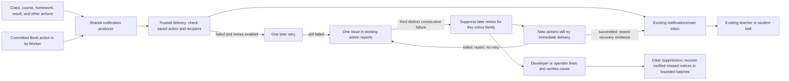

# Notification system recovery plan

**Exact-source verification:** [CI 36264700700](https://github.com/iamhuwng/autoresync/actions/runs/36264700700) passed on `4b94ccb7d58422ad2ac2a19ec222af4ec1c5775b`: app notification services, RTDB/Firestore authority, atomic result/index deletion, Workerd actions, candidate bundle and same-class recovery generator/bundle. The final local focused run passed 36/36. Source review found no concrete defects; the production-exported singleton native RPC check closes the construction-only proof gap. **DEPLOYMENT HELD** pending the planner's consolidated decision. No DO provisioning, remote pause/deploy/resume or backlog seed has run for this candidate.

**September 27 source authorization:** the planner approved source implementation and focused verification of the singleton executor; **DEPLOYMENT HELD**. The candidate replaces direct scheduling with two serial cap-one RPCs per existing Cron, applies a cleared native 20-second abort deadline to every provider fetch, uses four inbox CAS rounds, and fixes shared token refresh transport ownership. Firebase authority and sticky suppression remain intact. The [recovery procedure](notification-recovery-executor-recovery.md) pauses only notification Cron and forward-deploys with the same class/binding/migration; `be0c3e4e` cannot be a rollback target after the first DO lifecycle migration. Cold/populated DO CPU, account duration, bounded backlog and fresh admin visibility remain open.

**Status (2026-09-26 rotation):** the first class/homework batch is live, but cold retry CPU, realistic backlog capacity, remaining families, Book verification, and historical backfill are open. Read the [current implementer handoff](notification-recovery-rotation-handoff-2026-09-26.md) and recheck remote state before further release claims. Older dated sections below are historical checkpoints.

**September 27 executor review, before source authorization:** the current warm populated class retry still has an over-target sample. At the planner's direction, repeated local tuning/deployment is paused. The [single internal Durable Object proposal](notification-recovery-executor-proposal.md) is **UNDER REVIEW**, including its 47-call contention ceiling, two bounded RPCs per existing Cron and empty-day cost. No runtime/binding/migration change is approved or deployed by that proposal. The one closed-app retry, Firebase authority, product owners and held later-family scope remain the governing decisions.

**Date:** 2026-09-26; routing boundary reconciled with the saved conversation

**Scope:** existing in-app notifications for teachers and students, including Book actions

## Current design in brief

- **Governing rule: if work can safely run in the app and its existing Firebase
  services, it stays there. The Worker performs the minimum necessary work.**
  Shared notification integration does not require shared Worker ownership of
  product workflows.
- Keep ordinary product actions in their existing owners and route persistent
  notices through one shared producer. A Worker may verify and deliver a saved
  event internally; this does not require moving the product action into it.
- Preserve Book's existing Worker authority and the reviewed class-membership
  exception. Other product-action migrations need a specific necessity review
  before activation; current implementation alone does not approve them.
- Deliver to the existing inbox once immediately and retry at most once.
  Three consecutive terminal failures from distinct actions suppress later
  retries for that notice family. New actions still attempt immediate delivery
  and report failures; verified repair precedes bounded recovery.
- The proposed full scheduler is conditional. Do not add its second Cron
  trigger or expand families until populated CPU and realistic backlog meet
  the free-plan limits.

## Routing decision from the actual discussion

This section governs implementation. The route audit and event matrix describe
current source; they do not approve additional architecture changes.

The saved root chat, [Fix class join notification](codex://threads/01a0ce28-2c56-7c52-b758-340e83143402), records these decisions on 2026-09-24 (UTC):

- **05:27:** preserve the ordinary notification API, inbox, bell, and read
  state; put a small trusted writer behind the API. The former
  `.write: auth != null` permission must not be restored unchanged.
- **06:07:** use one notification system with different ways to reach it.
  Ordinary features retain their workflow and shared producer; Book emits
  after its existing Worker action commits. The user then requested the plan.
- **06:17:** the user chose one retry, then admin reporting. Background retry
  was added after the trusted-writer decision; it does not justify moving
  ordinary product saves into a Worker.
- **06:54:** the planner approved class join/add/approve/reject as a narrow
  action exception because rejection deletes the prior request evidence.

Here, **standard route** means the existing ordinary product save plus the
shared notification interface. Notification creation uses trusted delivery,
currently implemented by the notification Worker. It does not mean retaining
the old unrestricted browser inbox writer.

```text
Ordinary action: existing Firebase save -> shared producer -> trusted delivery
Book action: existing Book Worker commit -> trusted delivery
Class exception: trusted membership commit + intent -> trusted delivery
Trusted delivery -> existing Firebase inbox -> existing bell
```

Persist the minimum action evidence with the ordinary save where possible.
Trusted delivery verifies that evidence and resolves recipients/content.
Book may reuse that delivery module internally; no extra HTTP hop is required.
A delivery failure after commit leaves the saved action successful. A failure
of a Worker-owned action before commit is an action failure, not a saved action
with a missing notice.

### Product-action exception decisions

| Action owner | Decision for this recovery |
| --- | --- |
| Ordinary Firebase actions | Keep their existing product mutations; consolidate delivery wake calls behind the shared producer. |
| Existing Book Workers | Preserve their established product authority and shared inbox emission. |
| Class join/add/approve/reject | Reviewed narrow exception: commit membership/projection and notification evidence together. |
| Course announcement, feedback save, result review, manual THCS question grade | Worker mutations exist in current source, but necessity remains unproven. Hold activation pending the review below. |

For each of the four unresolved migrations, compare the existing ordinary save
with an authorized atomic source-and-intent save. Keep the ordinary owner if
it can meet the recipient, occurrence, and integrity requirements. Retain a
Worker mutation only with a concrete authority barrier or independently
required trusted action boundary reviewed by the planner. A Worker-signed
intent rule introduced by this implementation, or the fact that source and
intent now share a Worker patch, is not sufficient justification. Update
callers, rules, and relevant checks together when the boundary changes.

### Minimum notification Worker workload (2026-09-26)

**App by default; Worker only when necessary.** For every responsibility kept
in the Worker, identify the specific security/authority requirement or the
closed-app background requirement that prevents the app and existing Firebase
rules from handling it correctly. Being part of notifications, sharing a
Worker module, or being easier to implement there is not sufficient reason.
Apply this review to existing implementation as well as new work; remove
unnecessary Worker responsibilities with their callers and affected checks.

Ordinary product logic,
source saves, UI/display formatting, toasts, and ordinary app reporting stay
in the app and its existing shared services. The notification Worker is a
small trust boundary, not the owner of those feature workflows.

| Responsibility | Default owner |
| --- | --- |
| Product workflow, ordinary save, notification initiation, display formatting, toast, admin report display | App and existing shared Firebase services. |
| Trusted verification and protected inbox write that Firebase rules cannot safely authorize directly | Minimum Worker boundary; accept only verified action/recipient/content evidence. |
| The agreed single retry after apps close, protected attempt/suppression state, and its terminal report | Minimum background Worker path; do not add app polling or another retry mechanism. |

App-prepared data remains untrusted until checked. Moving code into the app
must not expose privileged credentials, permit arbitrary recipient/content
writes, or make global failure suppression depend on one browser's state.

The user explicitly retained **a minimal background retry for closed-app
cases**. Therefore keep only the trusted work needed to:

- Verify the actor, saved occurrence, recipient authority, and permitted
  notification content/link.
- Perform the protected, idempotent inbox write without resetting read flags.
- Make the single bounded background retry when the app is closed, using
  durable evidence and authoritative attempt/suppression state.
- Record the terminal admin issue and failure-pattern/recovery evidence
  required for that trusted retry boundary.

Minimize database reads/writes, token work, response bodies, idle scheduled
work, and per-recipient overhead in that path. Reuse existing validated source
evidence and shared auth/storage code. Avoid healthy-path success/gate/report
writes when no failure state needs resetting and no required recovery evidence
needs recording. Preserve concurrency and source-authority checks when
removing a read or write. Client-controlled recipients, success claims, or
global suppression counters cannot replace those protections.

Use the existing app to initiate delivery after its save and display the
existing admin reports. Keep background processing independent of an open student or teacher
page; do not introduce app polling or a second retry mechanism. Measure the
fully retained path before claiming a cost reduction. A smaller recipient cap
or slower schedule is acceptable only with adequate measured queue progress.
This workload constraint does not authorize a new service, a broader product
action migration, or a redesign of Book's established backend.

### Implementor's next actions

1. Preserve and inspect the rotation checkout's unfinished student dashboard
   notification click change and QA evidence. Verify current remote versions
   before claiming any deployment. Finish fresh student/teacher homework and
   reset browser proof, including atomic result/index cleanup, inbox link,
   read flag, and the saved action outcome.
2. Resolve first-batch **cold** populated CPU and realistic backlog progress
   without moving ordinary product work into the Worker. Native conditional
   inbox creation measured 14.735 ms CPU cold, 8.110 ms warm, and 9.550 ms
   warm with a prior issue; only the warm samples fit the 10 ms target. The
   cached homework token change is deployed, but its populated retry CPU was
   not recorded before rotation. See the [CPU escalation and current evidence](notification-recovery-cpu-escalation.md).
3. Verify bounded retry, three-distinct-failure suppression, admin issue and
   genuine recovery evidence in the real client. Avoid permanent per-success
   issue rewrites after recovery. Keep later families and the second Cron held
   until CPU and throughput gates are met.
4. Review the four unapproved Worker product-action migrations against app-owned
   atomic source/intent writes. Consolidate ordinary manual-reminder, session,
   and THCS wake calls behind the common producer before later activation;
   verify Book separately. Complete evidence-backed, deduplicated backfill of
   every provable missed notice only after the outage bounds are established.

Use focused checks for changed delivery paths, affected permissions, retry
containment, and representative load. A system-wide notification inventory is
required; a general Cloudflare platform redesign or unrelated service testing
is outside this recovery. Preserve the agreed one retry, admin pattern
reporting/suppression, verified backfill, and existing inbox/read flags.

## Historical execution baseline (verified 2026-09-24 before source composition)

- Isolated branch `codex/notification-recovery` starts at `7b093a07`; it includes
  the committed narrow class-join fix `07be1679`. That fix has no durable retry
  and only verifies a request while it remains pending. The corresponding
  Worker change has not been deployed or verified from this branch.
- Current source has 34 emission call sites in the 20 producer files below.
  Some sites branch into more than one event variant; the 35-variant checklist
  remains the working event inventory and requires variant-level reconciliation.
- The committed standalone notification Worker handles only homework submission.
  The generic route in the Book router is a disabled seam without a production
  recipient resolver. Book homework assignment has a committed saga emitter to
  the shared inbox. The Book update finalizer and emitter exist, but production
  composition and recipient/content proof need confirmation before activation.
- Hosting site `kahut1` live release is version `bc08f3f7e2936066` at
  2026-09-24 05:07:20Z. Its `notificationProducerClient-CcUxDdA1.js` has no
  notification Worker origin and contains the unavailable error. The previous
  04:31:18Z release is `d9ee9cee411c5af5`. Asset/release proof does not identify
  the source commit or the complete outage window.
- The live RTDB rules were backed up to
  `output/notification-recovery/live-rtdb-rules-20260924.json` (SHA-256
  `361cce8ccc4166314325b331cf47656078c99b061b191c79feebd3a82bbd922d`).
  They differ from checked-in rules at four Book paths, so a whole-file rules
  deployment would overwrite unrelated live rules. Notification inbox rules
  match the intended browser-write denial in the inspected backup.
- Cloudflare Worker version/bindings remain unverified. The repository's
  Windows x64 Wrangler route reports an expired/invalid credential; refresh
  requires the operator's secure auth flow. No deployment or backfill should
  proceed on the basis of local Worker source alone.
- A dedicated Google Cloud API key named `PRD0062 Worker Firebase Claim Token`
  is restricted to Identity Toolkit and is suitable for the class handler's
  custom-token exchange. Its value must be provisioned as the notification
  Worker's `FIREBASE_WEB_API_KEY` secret at release. Do not check it into source.
- The notification Worker service account currently has RTDB admin permission
  but no Firestore data role. The Firestore-backed homework retry cannot run
  until a scoped role or a proven Firestore-capable identity is provisioned.
- Local Windows RTDB emulator startup fails before tests with a Netty loopback
  error, including with the IPv4 JVM preference. The Linux CI emulator and
  Workerd harness now provide rules and Worker behavior proof for this branch.

## Implementation checkpoint (2026-09-24)

- Source branch `codex/notification-recovery` is pushed at `1ff86c63`.
  [Linux CI run 35984381971](https://github.com/iamhuwng/autoresync/actions/runs/35984381971)
  passed focused app tests, RTDB rules (33/33), Firestore rules (26/26),
  Workerd tests (60/60), and a Wrangler dry-run bundle. This is source,
  emulator, and dry-run proof; no Worker, rules, or Hosting deployment occurred.
- The [35-row event matrix](notification-recovery-event-matrix.md) records
  active, dormant, and unsupported variants. Row 32 (THCS writing auto grade)
  has no committed source event because its student-side grade write is denied
  under the teacher-only session rule. Its unsupported generic notice was
  removed; row 32 is outside delivered coverage until a trusted grading source
  is repaired and connected to the shared notification path.
- The full-family design proposes two Cron Triggers and one bounded family per
  invocation; the first batch uses one trigger. The
  [scheduler budget](notification-recovery-scheduler-budget.md) gives the
  cadence and unresolved populated CPU/subrequest proof. The earlier
  five-minute class/homework schedule was superseded.
- [Historical backfill reconciliation](notification-recovery-historical-backfill.md)
  accounts for all 35 variants. The class/homework script is read-only and is
  not a whole-system backfill. A proven outage interval and recipient-level
  source evidence are required before any historical write.

## Historical release checkpoints before first-batch cutover (2026-09-25)

These source checkpoints preserve investigation history. Use the
[combined release record](notification-recovery-release-candidate.md) and
fresh remote readback for current deployment state. That record now includes
the first-batch cutover and a populated class retry above the Workers Free
Cron CPU limit; capacity correction and later-family activation remain open.

The earlier `a016917e` and `241ad39e` source checkpoints and selective
`c3e83309` Hosting artifact are recorded with their test and pre-cutover
remote evidence in the release record. Their old fetch-only Worker and
undeployed Hosting observations must not be read as current state.

## What this fixes

When a student requests to join a class, the request can be saved while the
teacher receives no notice. The same break affects other actions that call the
shared notification producer. The bell and inbox still read notifications; the
missing part is dependable, authorized delivery into that inbox.

The desired class-request flow is simple:

1. Save the student's request.
2. Try to put the teacher's notice in the existing bell immediately.
3. If delivery fails, try **once more later**. Keep the class request successful.
4. If the second attempt fails, show **one** issue in the existing admin reports.
5. After three distinct class-join actions fail both attempts in succession,
   stop automatic retries for that notice family. New class-join actions still
   attempt immediate delivery and report failures; they do not consume a retry
   while suppression is active.

Apply that behavior to every existing action that already intends to send a
persistent notice. A normal save or click does not automatically need a bell
notice; its immediate outcome uses the shared toast. Book actions may start in a
Worker, but they deliver to the **same inbox and bell** as ordinary actions.



## Agreed product rules

- Keep the current inbox records, read flags, bell, notification panel, and
  shared toast behavior. In-app delivery is the only channel in this plan.
- Restore all **existing intended** persistent notices and make the shared
  producer the required connection for future features that need one. Do not
  add bell notices to every action.
- The main action remains successful when its notification fails. Record enough
  durable information to make one later delivery attempt even if the user
  closes the browser. Stop automatic attempts after that retry, or skip the
  retry while its family is suppressed. Report each remaining failure to
  admins once per action, including a failed-recipient count for bulk actions.
- Restore all missed notices that can be proven from saved action data, even if
  the action is now resolved. Keep the original event time, avoid duplicates,
  and make old links safe. Never invent a recipient or event that cannot be
  proven.
- Release in verified batches: class requests and homework first, then the
  remaining groups. Claim system-wide completion only when the whole inventory
  passes live checks.
- Stay within the existing free plans. Use one event per action, bounded bulk
  delivery, one later retry, and no polling loop per student. Add no paid
  service or new delivery channel for this repair.

## Repeated-failure containment decision (2026-09-25)

Each failed notice gets at most one later retry. If that also fails, create
one terminal issue in the existing Admin Error Log. The issue must identify
the notification family or route, action type, failure reason, affected
action, and time. Count a terminal failure once per distinct saved action,
not once per recipient or repeated invocation. Three **consecutive** terminal
failures from distinct actions in the same notice family, with no successful
delivery between them, are the initial pattern threshold. Repeated execution
of one malformed source record must count only once. Reports must retain the
recipient context so an admin can tell a route fault from repeated failures
to one recipient; suppression affects only retries, so fresh sends to other
recipients still run. A successful delivery resets the consecutive count
before suppression, but does not clear an already suppressed family.
Three failed joins can all target one teacher; a family-wide gate then also
skips retries for other teachers, although their fresh attempts still run.
Keep that tradeoff visible in admin context and verify it with a second class
before release; do not describe same-recipient failures as proof that every
recipient is broken.

At that threshold, set one durable family-level **retry-suppressed** state.
Scheduled passes skip every outstanding retry for that family without
consuming its attempt. Do not stop the underlying class, homework, course, or
Book action, and do not stop its **immediate** notification attempt. If a new
action's immediate attempt fails while retries are suppressed, report that
failure to the existing Admin Error Log once for that action; do not schedule
a retry. This keeps the repeated fault visible without multiplying failed
requests. If a new immediate attempt succeeds, record a last-success time in
the existing admin reporting surface so the admin has positive recovery
evidence. A quiet error log without a successful new attempt does not prove
the route works. Keep retry suppression in place until a developer or
operator verifies the fix and clears it; one success alone must not release
the held backlog.

Use the smallest persistent state needed for the family counter and
suppression flag, keyed by notice family, and reuse the existing report
records as failure evidence. Do not add a new service, per-student breaker,
admin repair screen, or separate replay interface. The admin sees and
escalates the pattern; a developer or operator investigates and changes
code, rules, or configuration as needed. The suppression gate belongs only
around the retry, after any action commit. A Worker outage that prevents the
action commit must still surface as an action failure. If the reporting or
suppression-state store is unavailable, do not claim an issue was recorded;
leave durable intents inspectable and skip retries until the gate can be
read safely. Write the terminal admin issue before advancing the family
counter. A crash between those writes may leave a visible issue uncounted,
delaying suppression until a later distinct failure. This conservative
undercount is acceptable; never suppress from an unreported or duplicate
failure, and never give an event more than its one retry. An operator can
disable retry delivery through configuration if state updates repeatedly
fail; do not build a cross-store transaction framework for this edge case.

After a verified fix is deployed, the developer or operator clears retry
suppression and uses the same bounded, verified historical-recovery procedure
for saved outstanding notices. Reuse deterministic IDs, preserve read flags,
and check old links before delivery. Do not silently discard notices created
while retries were suppressed or release the entire backlog in one pass.

## Current starting state to verify before coding

- The 20 active producer paths call `src/services/notificationProducerClient.ts`.
  Its configured Worker origin is absent from the live Hosting bundle inspected
  on 2026-09-24, so the live shared client returns
  `notification_command_unavailable` before sending. The live bundle had
  `assets/classManager-CekOu547.js` and
  `assets/notificationProducerClient-CcUxDdA1.js`. A newer Hosting release
  superseded the earlier class-join build that passed browser testing. Recheck
  the live version and assets at execution time.
- The standalone `luyentap-notification-command` entry point currently accepts
  the pending class-join event and homework-submitted event. It does not handle
  the other class/homework variants or the other 12 producer families.
- The checked-in RTDB rules deny browser creation of notification content while
  allowing a user to read their own inbox and change their own `read` flag.
  Read back and back up the **remote** rules before any release; the checked-in
  file alone does not prove what is live. Do not reopen broad browser writes.
- Book notification code already has committed-action checks, a shared inbox
  repository, deterministic identity, and emission flags. Keep those useful
  parts. Confirm the actual deployed flags and Book routes before claiming Book
  delivery is live.
- The canonical checkout contains extensive unrelated work. Prepare this
  repair from a recorded revision in an isolated checkout; compare with the
  current Hosting release before replacing it. Keep unrelated changes out.

The earlier producer inventory is
[`PRD0062/evidence/notification-producer-inventory.md`](PRD0062/evidence/notification-producer-inventory.md).
It counts producer **files**. A closer call-site audit found **35 notice
variants across those 20 files**; that supersedes the earlier rough estimate
of 33. Reconcile this count against current source before implementation.

## The shared interface

Keep `notificationProducerClient.ts` as the ordinary feature entry point and
the existing inbox repository as the delivery destination. An action identifies
**what happened** and its saved record. The trusted delivery code reads that
record, checks the actor and action state, determines recipients, and builds
the notice and registered destination link. Callers must not gain authority by
supplying an arbitrary recipient, title, message, or URL.

Use a stable event identity derived from the actual action, event variant, and
recipient. Retrying the same action must find the same inbox record and must
not reset a notice already marked as read. A changed action or a second real
occurrence must have a distinct identity. Reuse the current idempotent
repository where it meets this contract; update callers and tests together
when its command shape changes. Do not add a second notification inbox or a
Book-only bell.

The Book Worker may call the same trusted delivery module internally after its
action commits. It need not call the browser-facing HTTP route merely to share
the inbox. Preserve Book's committed-only, one-notice-per-student-per-update,
safe-link, and no-hidden-answer requirements.

### Current source boundary (reviewed 2026-09-26)

`dispatchCommittedNotification` currently covers saved homework
submission/reset, assignment and course decisions, test completion, and
writing submission/grade events. Expand
this ordinary feature port to other already committed actions. It accepts
only a registered event kind, saved record ID, and any needed occurrence ID;
it does not accept a recipient, title, message, or destination. Trusted
resolvers may remain event-specific behind the port, but ordinary callers
must not each own a separate Worker URL or delivery client. Each resolver
verifies source authority and writes to the same inbox with deterministic
identity and bounded retry.

Manual reminders, THCS assignment/fully graded events, and session transitions
save their product outcome in the ordinary app path but still use specialized
delivery wake clients. Consolidate those calls behind the shared producer
without moving the product actions. Class membership is the reviewed action
exception. Announcements, feedback, result review, and manual THCS question
grading are current Worker mutations awaiting the necessity review above.
See the [route boundary audit](notification-recovery-route-boundary.md) for
source owners. Neither a retry nor current intent permissions establish that
an ordinary product action must move into the Worker.

### Class transition decision (2026-09-24)

Class rejection deletes the pending roster and student-class rows, leaving no
saved decision record. A browser-written sibling retry record cannot reliably
prove it was committed with that change under the current RTDB rules. Put only
the class membership transitions that emit notices behind a small authenticated
action handler in the existing Worker: pending self-join, authorized direct add,
approval, and rejection. Have that handler verify the actor, class state,
membership transition, and occurrence ID, then save the canonical
membership/projection change and one server-owned notification intent in the
same RTDB update. Delivery still uses the existing inbox repository and one
later retry. Keep unrelated class management and noncritical follow-on work in
their existing owners. This narrow class action handler does not require every
ordinary feature action to move into the Worker.

## Event coverage checklist

Each row is complete only after its event variants have a saved-action proof,
recipient rule, deterministic identity, bounded retry, safe link, and browser
readback. The exact caller and field mapping belongs in the implementation
matrix; do not infer authority from the current client-supplied message.

| Family | Current variants | Saved fact and recipient to verify |
| --- | ---: | --- |
| Assignment | 2 | Request approved: notice the request's teacher and student. |
| Class | 5 | Pending join to student and teacher; direct active join; approval; rejection. Check membership state and class owner. |
| Enrollment | 3 | Course join or unenroll request approved/denied; class-course link nearing expiry. Check request, link, owner, and time. |
| Course | 3 | Archive to enrolled students; course-type request approved/rejected to requesting teacher. Resolve the saved roster. |
| Course announcement | 1 | New announcement to the saved target roster; use persisted announcement text. |
| Deadline | 3 | THCS and other homework due soon; teacher manual reminder. Check assignment, timing/reminder occurrence, and teacher authority. |
| Homework | 2 | Submitted to teacher; reset to student. Verify the submission/homework relationship. |
| Feedback | 2 | Question feedback and overall feedback to the result's student. Check saved feedback and teacher authority. |
| Result | 3 | Test completed, test reviewed, and individual question grade updated. Check result and question identity. |
| Writing | 4 | Published grade; two submission paths; solo-practice submission to assigned teacher. Check whether the two student paths describe one action and deduplicate if so. |
| THCS practice | 3 | Homework assigned; fully graded notices from two UI paths. Collapse duplicate notices for the same result. |
| THCS grading | 1 | Writing grade updated to the result's student; distinguish real grading versions. |
| Session | 1 | Session opened to class students; resolve the session's saved class roster. |
| Monitor | 2 | Test started and ended to class students; verify the saved session generation and roster. |

Book homework assignment and Book update notices are additional Worker-owned
events. Check them against the Book task's committed-action and wording matrix;
they are not part of the 35 ordinary-producer variants above.

## Implementation order

### 1. Freeze the factual baseline

- Record the source commit, scoped diff, current Hosting version/assets,
  notification Worker version/bindings, Book emission flags, and live RTDB rules.
  Back up live rules and configuration before modifying either.
- Reconcile the 20 callers and 35 variants against current source. For each,
  record the canonical action path, actor, recipient rule, repeat key, link,
  and whether the action lives in RTDB, Firestore, or the Book Worker.
- Record a small set of real failing flows and their errors, including class
  join. Do not treat a page load, local test, or successful deployment command
  as delivery proof.

### 2. Repair the common connection

- Configure **one** notification endpoint in the shared client/build. Remove
  class- and homework-specific host overrides. Verify the exact value in the
  built artifact and the live artifact after release.
- Keep one trusted recipient/content policy behind that endpoint. The first
  release handles only events the server actually verifies; an unsupported
  event must fail visibly in diagnostics, never pretend to be delivered.
- Preserve `notifications/{userId}/{notificationId}` and the existing reader.
  After callers no longer use the obsolete browser content writer, remove that
  dead write path rather than retaining a bypass.

### 3. Add the minimum durable retry

- Save **one durable event proof per action**, not one retry job per student.
  Prefer the canonical action record when it preserves occurrence, recipient,
  and time. Add or embed a small notification intent only where needed for
  immutable occurrence proof or retry state. An intent contains an event kind,
  authority record ID, occurrence ID, and state; it contains no client-chosen
  message or unrestricted recipient list.
- For RTDB actions, include that intent in the same authorized action update
  where possible. For Firestore actions, include it in the same Firestore
  transaction or batch. Do not claim browser-close reliability for any event
  whose intent is written only in a separate, later request. Book actions use
  their existing committed action/saga record if it already provides equivalent
  replay proof.
- Attempt delivery as soon as the action commits. A bounded scheduled pass
  checks only due, undelivered intents. Start each intent's retry due time
  about **one hour** after commit. The first batch rotates four class/homework
  families on one two-minute trigger. The proposed full stage adds a separate
  one-minute bulk trigger and more small-family slots; this topology is an
  option, not a requirement. Prefer the least frequent shared pass that meets
  measured backlog and Free-plan CPU limits. Add a second trigger only after
  proving one is insufficient. Run bounded work per invocation.
  The scheduler makes at most **one
  additional delivery attempt** per event. If that fails, leave the intent
  available for operator inspection or verified recovery and create one admin
  report issue. Before deployment, measure the fully composed invocation
  against Free plan CPU and subrequest limits, including overlapping triggers.
- Resolve bulk recipients once from saved authority, deliver in bounded
  chunks, and resume only missing recipients. A shared backend outage pauses
  the batch instead of launching repeated requests for every student. Test a
  30-student action and count actual Worker calls, Firebase reads/writes, and
  admin records. Do not scan every inbox on each scheduled pass.
- Add one durable family retry-suppression gate at the shared retry boundary.
  Count distinct terminal failures once, trip after three consecutive failures
  in one family, and skip all its later retries while retaining saved intents.
  New actions must still make one immediate delivery attempt and report its
  failure without retry. Annotate the reported issue once with a verified
  successful fresh attempt observed after that failure; keep later healthy successes
  from rewriting the same issue. A developer or operator clears suppression only
  after verifying a fix; do not build an admin toggle or rely on per-isolate
  memory.
- Validate new outbox paths and every writable ancestor in RTDB/Firestore
  rules. The Worker must reject forged intents or changed authority. Do not
  introduce Cloudflare Queues, KV, D1, or paid Firebase features unless the
  measured implementation cannot meet these requirements with existing
  services.

### 4. Restore events in verified batches

1. **First batch:** pending class join and homework submitted, then the other
   class and homework variants. Confirm teacher and student recipients in the
   real app before broadening the release.
2. **RTDB action batch:** assignment, enrollment, course, announcement,
   feedback, result, and their bulk recipients.
3. **Firestore and mixed action batch:** writing, THCS homework assignment,
   due reminders, and resets. These need source-side durable intents because
   the inbox is in RTDB; a Firestore action and RTDB inbox write cannot be one
   atomic commit.
4. **Time and session batch:** expiration reminders, session open, test start,
   and test end. Verify event-generation keys and changing class rosters.
5. **Book check:** prove that Book assignment and update notices use the same
   inbox, occur only after committed actions, do not duplicate on replay, and
   contain no hidden answer or PDF content.

Within each batch, update its callers, trusted policy, durable intent, rules,
focused tests, admin diagnostics, and browser proof together. Deploy server
support before app code that invokes it. A partially supported family is still
incomplete; track each variant individually. Resolve any product-action owner
decision before activating the affected family; a delivery event appearing in
this inventory is not permission to migrate its product save.

### 5. Recover missed notices

- First run a read-only preview over the affected date range and produce
  counts by event type, recipient, and confidence without exposing private
  notification bodies in logs. Identify the actual broken-release window from
  remote versions rather than guessing dates.
- Create every missed event whose saved record proves occurrence, recipient,
  and original event time, including actions now resolved. Mark historical
  context accurately; use a safe current destination or omit an obsolete link.
  Preserve existing inbox entries and their read flags.
- Use the same deterministic identity as live delivery. Run in small batches,
  read back recipient records, stop on conflicts, and verify replay creates no
  duplicate. Report unprovable events as omitted, not repaired.
- Treat the separate legacy *flat-row format* migration as necessary only if
  live inspection finds such rows. If needed, use the existing
  [`PRD0062/evidence/notification-migration-runbook.md`](PRD0062/evidence/notification-migration-runbook.md)
  with its preview, checkpoint, writer freeze, and read-state parity rules.

## Checks and release gate

- **Routing boundary:** ordinary source saves remain in their existing owners;
  notification-only failures do not make those saves depend on the Worker.
  Check each product-action exception against the decisions above before its
  release. Consolidate specialized delivery clients into the common producer
  as their families are restored, without adding a parallel inbox writer.
- **Focused correctness:** table-driven checks for each event's valid actor,
  wrong actor/recipient, incomplete or stale action, repeated request, and
  safe destination. Test partial bulk replay and a backend outage. Avoid tests
  that only restate implementation details.
- **Rules:** emulator checks must prove ordinary clients cannot create or
  alter another user's inbox, including writes through allowed ancestor paths;
  users can still read and mark their own records as read. Validate new intent
  paths and indexes.
- **Real client:** teacher and student quick-login flows on
  `http://localhost:5173` and `http://localhost:5174`, then the authorized live
  target. For each batch, perform representative actions, read back the exact
  recipient's inbox record, inspect the bell and link, and verify failure
  reporting. A toast is not proof that a persistent notice arrived.
- **Failure containment:** prove three consecutive terminal failures from
  distinct actions in one family trip retry suppression exactly once. Confirm
  all later due retries remain saved and unconsumed. Commit a new product
  action while suppressed: its immediate send still runs; failure appears in
  the existing Admin Error Log with no retry. A successful fresh send records
  a visible last-success time but does not release the held backlog. After a
  verified fix, clear suppression and recover in bounded batches without
  duplicate inbox records or reset read flags. Confirm one bad record cannot
  trip the family through duplicate execution and other families keep working.
- **Free-plan check:** count calls and data for a one-recipient event, a
  30-recipient event, an idle scheduled pass, one failed batch, and replay.
  Enforce bounded queries/chunks and one admin issue per failed action. Recheck
  the populated class retry that used 16.361 ms CPU against the 10 ms Workers
  Free limit before adding families or a second trigger. A one-intent-per-pass
  cap is acceptable only if measured backlog at realistic class sizes remains
  acceptable; do not trade an over-limit Worker for hours of hidden delay.
  Recheck current provider limits before deployment. As of this plan, Cloudflare
  Workers Free lists 100,000 requests/day, 50 subrequests/invocation, 10 ms
  CPU/invocation, and five Cron Triggers/account; Firebase Spark lists 1 GB
  RTDB storage and 10 GB/month downloads; Firestore's free quota lists 50,000
  reads and 20,000 writes/day. These are ceilings, not usage targets.
  Sources: [Cloudflare limits](https://developers.cloudflare.com/workers/platform/limits/),
  [Firebase pricing](https://firebase.google.com/pricing), and
  [Firestore free quota](https://firebase.google.com/docs/firestore/quotas).
- **Deploy:** confirm target, source revision, and live diff; build in an
  isolated checkout; run relevant checks; back up and validate live rules;
  deploy required rules/server code before dependent app code; record each
  version and stop dependent steps on failure. Fetch the actual deployed
  artifact/configuration and exercise the affected workflow in a real client.
  Keep rollback versions and assess any partly deployed batch before rollback.
- **Completion:** every applicable existing event variant has a verified
  producer-to-recipient path, ordinary callers use the shared producer with
  no feature-specific delivery URLs or clients, and Worker-owned product
  actions have reviewed necessity and authority/atomicity proof. There are no broad
  browser content writes, the Book events reach the same inbox, missed
  provable events are reconciled, and unresolved delivery failures appear once
  in admin reports. Record any unverified event or remote rule state plainly;
  do not mark the notification system complete from green unit tests or a
  successful deployment command alone.
  Verify a repeated family failure automatically suppresses later retries
  without blocking product actions or fresh delivery attempts, remains visible
  to admins, and permits bounded recovery after a verified fix.
