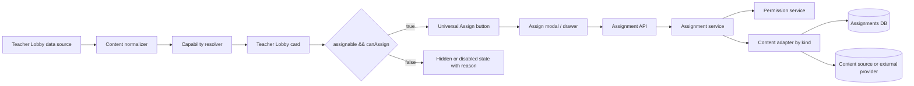
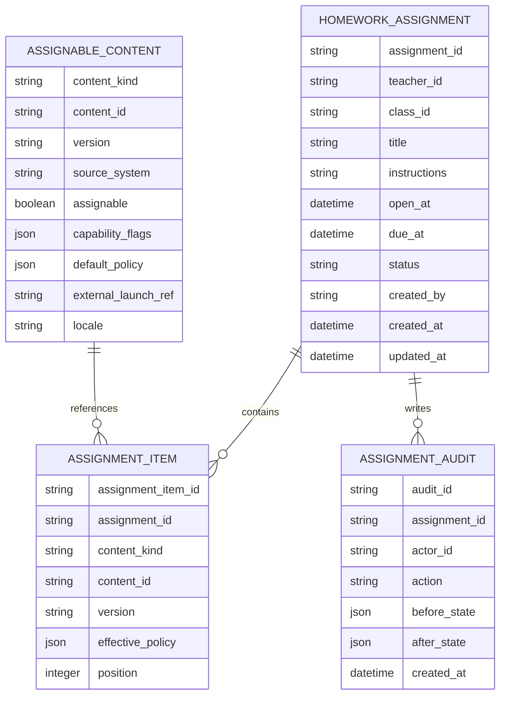

# Universal Assign as Homework for Teacher Lobby

## Executive summary

The right way to make **“Assign as Homework” universal across Teacher Lobby** is not to keep adding button logic test type by test type. It is to introduce a **single assignability contract** that every Teacher Lobby item must satisfy before it can be rendered. In practice, that means the frontend should render an `AssignButton` from a **capability resolver**, while the backend exposes a single assignment creation flow that accepts a **normalized content reference** rather than one endpoint per test type. This pattern is much more durable than patching individual card components because React, Angular, and Vue all support reusable component abstractions, and GraphQL and REST both support a single write path for side-effecting assignment creation. citeturn13search0turn3search0turn3search1turn0search2turn6search0turn9view2turn10search0

The most important product conclusion is that the universal button should be driven by **capabilities and policies**, not by hardcoded test names. Every content item shown in Teacher Lobby should expose a normalized payload such as: content type, internal ID or external launch reference, assignability status, scheduling capabilities, timing mode, attempt policy, delivery mode, and localization metadata. If a future test type is introduced and it does not implement that contract, the system should fail visibly in internal environments and fail safely in production with “Not assignable yet” telemetry rather than silently shipping another special case. OWASP explicitly recommends deny-by-default authorization and validating permissions on every request; those same principles map well to capability- and policy-based content actions. citeturn1search3turn1search6

There is one hard limitation in this report: **no codebase, UI screenshots, API documentation, or internal schema documentation were available in this environment**. So the report can confirm the test types named in your prompt, but it cannot truthfully verify which current cards already show the assign button, which APIs already exist, or what the current database looks like. Because of that, the first milestone in the plan is a short discovery audit that inventories real Teacher Lobby content cards, their renderers, and their assignment paths. That audit is not optional; it is the control that prevents rework.

The recommended delivery path is a staged rollout over about **five to seven calendar weeks**, with roughly **frontend 16–24 person-days, backend 18–28 person-days, QA 10–16 person-days, and product/design 6–10 person-days**, depending mainly on how fragmented the current codebase is and whether “assignment” already exists as a general backend domain object. The lowest-risk architecture is a **normalized assignment service plus per-test-type content adapters**, a **universal button/modal on the frontend**, **server-authoritative permission checks**, **event instrumentation with a governed tracking plan**, and a **migration layer that backfills existing content into an assignable registry**. That reduces future onboarding cost for new test types from “touch every UI and API path again” to “implement one adapter and declare capabilities.”

## Evidence base and assumptions

From your prompt alone, the currently known Teacher Lobby inventory includes **THCS Test**, **newly developed reading passages**, **IELTS Reading**, **IELTS Listening**, **IELTS Writing**, and **other unspecified test types**. That is the only inventory that is directly confirmed here. Everything else below about current implementation is a design recommendation, not an assertion about the present codebase.

Because no internal repo or docs were accessible, the report assumes the following unknowns must be discovered before implementation finalization:

| Area | Unknown right now | Why it matters | Recommendation |
|---|---|---:|---|
| Frontend stack | React, Angular, Vue, or mixed | Determines component abstraction, modal patterns, state management, and testing libraries | Audit repo packages and route/component trees first |
| API style | REST, GraphQL, or mixed | Determines assignment contract shape and error model | Prefer one canonical create-assignment path even if transport differs |
| Backend stack | Node, Java, Python, or mixed services | Determines implementation details for adapters, policy checks, and validation | Keep service boundary transport-agnostic |
| Authn/Authz | JWT, session cookie, SSO, RBAC, ABAC | Controls where permission checks happen and what claims are available | Make backend authoritative regardless of client claims |
| Current assignment domain | Generic assignment service vs per-test-type endpoints | Changes migration effort dramatically | Inventory live calls from existing “Assign” flows |
| Content identity model | Single content table vs per-type tables | Determines whether a registry table is needed | Normalize through a registry if storage is fragmented |
| Localization system | Static resource files, CMS strings, or runtime translation service | Affects button labels, modal text, and content display names | Put all button/modal copy behind i18n keys immediately |
| Analytics stack | GA4, Segment, Mixpanel, Amplitude, internal pipeline | Affects event naming and payload conventions | Publish a tracking plan before implementation |

A few external facts do shape the recommended options. React’s official guidance supports reusing logic via custom Hooks, Angular structures apps around components and documents built-in internationalization and testing guidance, and Vue recommends reusable components/composables plus documented testing strategies. GraphQL is built around strongly typed schemas and uses mutations for side-effecting writes, while HTTP semantics define `POST` as resource-specific processing on the request content. These official norms support using one reusable content-action abstraction in the UI and one write-oriented assignment creation path in the API. citeturn13search0turn0search2turn3search3turn3search0turn3search1turn6search0turn9view2turn10search0

For backend implementation variants, all three common stacks are workable. Express routes are defined by request method plus route path, Spring supports annotated controller mappings including `@PostMapping`, and FastAPI exposes path operations with typed request models, dependency injection, and automatic OpenAPI generation. That means the architectural decision should not be stack-led; it should be **domain-led**. citeturn14search1turn14search0turn15search4turn15search10turn15search5

## Current-state inventory and target capability model

The immediate product problem is best stated as: **Teacher Lobby lists heterogeneous content, but “Assign as Homework” is not guaranteed to exist for every listed item.** The durable fix is to treat every displayed item as an instance of a common domain object: **Assignable Content**.

The current inventory and verification status should therefore be framed like this:

| Teacher Lobby test/content type | Confirmed by prompt | Current presence in lobby | Current assign button status from available evidence | Required discovery step |
|---|---:|---:|---:|---|
| THCS Test | Yes | Assumed yes | Unknown | Inspect card renderer + network calls |
| Newly developed reading passages | Yes | Assumed yes | Unknown | Inspect card renderer + backend content source |
| IELTS Reading | Yes | Assumed yes | Unknown | Inspect card renderer + assignment path |
| IELTS Listening | Yes | Assumed yes | Unknown | Inspect card renderer + assignment path |
| IELTS Writing | Yes | Assumed yes | Unknown | Inspect card renderer + assignment path |
| Other unspecified types | Yes | Yes | Unknown | Query lobby datasets + component registry |

That unknown column is not a weakness in the analysis; it is the rigorous position. Without UI capture or code access, any stronger claim would be guesswork.

The target state should be **one rendering rule**:

> If a content item is shown in Teacher Lobby and its capability resolver returns `assignable = true`, the card shows an assign button. If capabilities are incomplete, the system emits telemetry and either hides the action behind a controlled fallback or shows a disabled state with a reason code in internal builds.

A normalized capability contract can look like this:

```json
{
  "contentRef": {
    "kind": "ielts_reading",
    "id": "cnt_9f12ab",
    "version": "2026-06-15"
  },
  "display": {
    "title": "IELTS Reading Passage 4",
    "subtitle": "Academic • Medium",
    "locale": "en-US"
  },
  "capabilities": {
    "assignable": true,
    "previewable": true,
    "supportsDueDate": true,
    "supportsTimeLimit": true,
    "supportsAttempts": true,
    "supportsOfflineDelivery": false,
    "supportsExternalLaunch": false,
    "supportsAdaptiveMode": false
  },
  "policy": {
    "assignmentMode": "homework",
    "timingMode": "timed",
    "defaultTimeLimitMinutes": 35,
    "minAttempts": 1,
    "maxAttempts": 3
  },
  "permissions": {
    "canAssign": true,
    "reasonCode": null
  }
}
```

This capability-first model is aligned with how modern component systems are meant to be used. React recommends extracting reusable logic into custom Hooks, Angular emphasizes encapsulated components, and Vue recommends reusable components plus composables for stateful logic. The same design principle applies here: **assignment logic should be centralized, while per-type differences live behind adapters.** citeturn13search0turn0search2turn3search0turn3search1



The most important architectural rule for future-proofing is this: **new test types must not require new Teacher Lobby button logic**. They should only require adding a new content adapter or metadata mapping that satisfies the same contract.

## Backend architecture and API contracts

A universal assignment feature should be backed by a **single assignment domain**, even if current content lives in multiple services or tables. The backend should accept a normalized content reference and then dispatch internally through a per-kind adapter. This is cleaner in REST and equally clean in GraphQL. GraphQL explicitly expects top-level mutation fields to perform side effects and execute serially, which fits assignment creation. In HTTP, `POST` is the standard method for resource-specific processing of request content. For errors, Problem Details for HTTP APIs remains a sensible default if you are on REST. citeturn9view2turn10search0turn10search4

The recommended logical data model is below.



If the current system already has a generic assignment table, the safest path is to **avoid breaking schema changes** and add only what is missing: a normalized content reference plus flexible policy fields. If the current system is fragmented by test type, introduce an `ASSIGNABLE_CONTENT` registry or view layer first. That keeps assignment creation decoupled from content storage.

A practical schema-options comparison is:

| Option | Description | Strengths | Weaknesses | Recommendation |
|---|---|---|---|---|
| Thin extension | Keep current assignment schema, add `content_kind`, `content_id`, `policy_json` | Lowest migration effort | Risk of continuing ad hoc logic | Best if a strong generic assignment table already exists |
| Registry-first | Add `assignable_content` registry and point assignments to it | Cleanest future onboarding of new test types | Slightly more initial work | Best default if content sources are fragmented |
| Per-type joins only | Keep separate assignment entrypoints per test type | Lowest short-term coding | Highest long-term product and QA cost | Not recommended |

A canonical REST contract can be:

```json
POST /v1/homework-assignments

{
  "classId": "class_712",
  "title": "Homework for Week 3",
  "instructions": "Complete before Friday.",
  "openAt": "2026-06-18T00:00:00Z",
  "dueAt": "2026-06-20T15:00:00Z",
  "items": [
    {
      "contentRef": {
        "kind": "ielts_reading",
        "id": "cnt_9f12ab",
        "version": "2026-06-15"
      },
      "policy": {
        "timeLimitMinutes": 35,
        "attemptsAllowed": 1,
        "shuffleQuestions": false
      }
    }
  ]
}
```

```json
201 Created

{
  "assignmentId": "asg_48301",
  "status": "published",
  "classId": "class_712",
  "openAt": "2026-06-18T00:00:00Z",
  "dueAt": "2026-06-20T15:00:00Z",
  "items": [
    {
      "assignmentItemId": "asi_991",
      "contentRef": {
        "kind": "ielts_reading",
        "id": "cnt_9f12ab",
        "version": "2026-06-15"
      },
      "resolvedPolicy": {
        "timeLimitMinutes": 35,
        "attemptsAllowed": 1,
        "deliveryMode": "online"
      }
    }
  ]
}
```

A Problem Details error shape for unsupported content is appropriate on REST:

```json
409 Conflict
Content-Type: application/problem+json

{
  "type": "https://teacher-lobby.example/problems/content-not-assignable",
  "title": "Content cannot be assigned",
  "status": 409,
  "detail": "This content type does not support homework assignment.",
  "contentRef": {
    "kind": "external_passage",
    "id": "ext_0041"
  },
  "reasonCode": "UNSUPPORTED_DELIVERY_MODE"
}
```

A canonical GraphQL mutation can be:

```graphql
mutation CreateHomeworkAssignment($input: CreateHomeworkAssignmentInput!) {
  createHomeworkAssignment(input: $input) {
    assignment {
      id
      status
      classId
      openAt
      dueAt
      items {
        id
        contentRef { kind id version }
        resolvedPolicy {
          timeLimitMinutes
          attemptsAllowed
          deliveryMode
        }
      }
    }
    errors {
      code
      message
      field
    }
  }
}
```

```json
{
  "input": {
    "classId": "class_712",
    "title": "Homework for Week 3",
    "instructions": "Complete before Friday.",
    "openAt": "2026-06-18T00:00:00Z",
    "dueAt": "2026-06-20T15:00:00Z",
    "items": [
      {
        "contentRef": {
          "kind": "ielts_reading",
          "id": "cnt_9f12ab",
          "version": "2026-06-15"
        },
        "policy": {
          "timeLimitMinutes": 35,
          "attemptsAllowed": 1
        }
      }
    ]
  }
}
```

For stack alternatives, the implementation differences are mostly operational, not conceptual:

| Stack | Recommended backend pattern | Why it works | Notes |
|---|---|---|---|
| Node + Express | Router → controller → assignment service → content adapters | Simple modular routing and middleware | Use middleware for authn, validation, tracing |
| Java + Spring | `@PostMapping` controller → service layer → adapters/repositories | Strong service layering and validation patterns | Good for larger orgs and typed contracts |
| Python + FastAPI | Path operation → Pydantic input models → dependency-injected services/adapters | Fast typing, OpenAPI, concise validation | Strong fit when docs/typing speed matter |

These mappings are all directly supported by the official framework documentation around routing, request mapping, typed operations, and dependency injection. citeturn14search1turn14search0turn15search4turn15search10turn15search5

## Frontend architecture, UI behavior, and localization

The frontend should stop deciding assignment affordances by card type. Instead, Teacher Lobby should use a **content card shell** plus a **universal action area** driven by normalized capabilities. The key components are:

| Component | Responsibility | Output |
|---|---|---|
| `TeacherLobbyCardShell` | Layout for all content cards | Common title, metadata, preview area, actions |
| `useAssignability` / `AssignabilityService` | Resolve capability + permission state | `{visible, enabled, reasonCode, policyHints}` |
| `AssignButton` | Single assign CTA | Standard label, icon, loading/disabled states |
| `AssignModal` or `AssignDrawer` | Collect class, due date, instructions, policy overrides | Assignment payload |
| `CapabilityBadge` | Show timed/adaptive/offline/external states | Secondary UX hints |
| `UnsupportedState` | Controlled disabled state for missing integrations | Reason + telemetry |

A simple proposed card state looks like this:

```text
┌─────────────────────────────────────────────────────────────┐
│ IELTS Reading Passage 4                                    │
│ Academic • Medium • 35 min                                 │
│                                                             │
│ [Preview]                                       [Assign]    │
│                                                             │
│ Capabilities: Timed • Online • 1 attempt                    │
└─────────────────────────────────────────────────────────────┘
```

And a disabled state for internal rollout or unsupported content:

```text
┌─────────────────────────────────────────────────────────────┐
│ External Reading Passage                                   │
│ Publisher content                                           │
│                                                             │
│ [Preview]                           [Assign unavailable ▾]  │
│                                                             │
│ Reason: External launch flow not configured                 │
└─────────────────────────────────────────────────────────────┘
```

The frontend architecture across the three common UI stacks is comparable:

| Stack | Recommended pattern | Why |
|---|---|---|
| React | `TeacherLobbyCardShell` + `AssignButton` + `useAssignability` custom Hook | React explicitly supports reusing logic with custom Hooks and conditional rendering |
| Angular | Shared card/action components + injectable `AssignabilityService` + route/data guards | Angular is built around encapsulated components and service injection |
| Vue | Reusable SFC card components + `useAssignability()` composable | Vue recommends components plus composables for reusable stateful logic |

That recommendation follows the official framework guidance: React custom Hooks are the right unit for reusable logic, Angular emphasizes encapsulated components and built-in i18n/testing, and Vue documents composables as the unit for reusable stateful logic. citeturn13search0turn0search0turn0search2turn3search3turn3search0turn3search1

Localization should be treated as a first-class requirement from the first implementation, not a later pass. W3C recommends UTF-8, explicit language declaration, support for local formats such as dates and times, avoiding fragile sentence construction from multiple strings, and correct handling of right-to-left directionality. W3C also recommends BCP 47 language tags for language values. Angular’s i18n guidance likewise distinguishes internationalization from localization and notes locale-specific formatting as part of the design surface. citeturn2search0turn2search1turn3search3

That implies these concrete UI requirements:

| Localization concern | Recommendation |
|---|---|
| Button label | Use a key like `teacherLobby.assignButton.label`, not inline text |
| Disabled reasons | Use reason-code-to-copy mapping, localized server-safe messages |
| Date/time in modal | Render in locale-aware format; store in UTC |
| Language metadata | Keep `en-US` style BCP 47 tags on both UI locale and content locale |
| RTL readiness | Respect `dir="rtl"` and verify button/icon alignment |
| Content titles | Store content locale metadata separately from viewer locale |

## Permissions, edge cases, and analytics

Authorization should be **server-authoritative**. The UI may hide or disable the button to reduce friction, but the backend must re-check the action on every request. OWASP explicitly recommends enforce least privilege, deny by default, validate permissions on every request, and test authorization logic. NIST’s RBAC model explains the core benefit of role-based assignment of permissions, but OWASP also warns that attribute- and relationship-based checks are often preferable to pure RBAC for real systems. citeturn1search3turn1search2turn1search6

The best fit here is a **hybrid permission model**:

| Model | How it works | Fit for Teacher Lobby | Recommendation |
|---|---|---|---|
| Pure RBAC | Roles like Teacher, Admin, Coordinator | Easy to explain, weak on context | Too coarse by itself |
| Pure ABAC/ReBAC | Checks user, class ownership, school, content policy, publication state | Strong contextual fidelity | Strong but can be harder to reason about |
| Hybrid | RBAC gates broad access; ABAC/ReBAC refine by class/content/context | Best balance | Recommended |

A practical permission rule could be:

```json
{
  "subject": {
    "userId": "u_123",
    "roles": ["teacher"]
  },
  "resource": {
    "contentKind": "ielts_writing",
    "contentId": "cnt_19",
    "ownerOrgId": "org_88",
    "published": true
  },
  "context": {
    "classId": "class_712",
    "schoolId": "school_09",
    "assignmentMode": "homework"
  }
}
```

The edge-case policy surface is where universal designs usually fail. The capability model should explicitly encode the following:

| Edge case | Risk if ignored | Recommended policy |
|---|---|---|
| Offline tests | Assigned item cannot be delivered or synced | Add `supportsOfflineDelivery`; if false, do not allow offline assignment mode |
| Timed tests | Inconsistent timer start, due date conflicts | Store both availability window and time limit; timer starts on student launch, not assignment creation |
| Adaptive tests | Assignment repeatability and comparability may break | Require dedicated `supportsAdaptiveMode`; block unsupported attempt overrides |
| External content | Launch, security, and grade-return flow may differ | Handle through external launch ref / LTI-style deep linking adapter |
| Draft or unpublished content | Teachers assign unstable content | Block unless content status is publishable |
| Versioned tests | Assignment changes after publish | Snapshot or pin content version at assignment time |
| Deleted/archived content | Broken classroom links | Prevent deletion if assigned, or preserve immutable snapshot |
| Multi-item homework | Mixed policy incompatibilities | Validate at item level and whole-assignment level |

For external content, 1EdTech’s LTI Deep Linking specification is relevant because it shows a mature pattern where a platform can launch to an external tool, select content, and return a reusable resource link, including availability and grading-related fields. Even if you do not use LTI, the underlying lesson is the same: **external content needs a stable launch reference and an explicit availability policy**, not a fake internal content ID. citeturn4search0

Analytics should be implemented with a tracking plan before rollout so naming stays consistent. Segment’s materials are useful here because they emphasize tracking plans as a shared data dictionary and show the standard anatomy of a track call using event name plus properties and user identity/context. citeturn11search1turn11search2

Recommended events:

| Event name | When fired | Key properties |
|---|---|---|
| `Teacher Lobby Assign Viewed` | Assign button becomes visible | `content_kind`, `content_id`, `assignable`, `can_assign`, `reason_code` |
| `Teacher Lobby Assign Clicked` | Teacher clicks assign | `content_kind`, `content_id`, `source_surface`, `locale` |
| `Homework Assignment Drafted` | Modal opened and form first edited | `class_id`, `item_count`, `content_kinds` |
| `Homework Assignment Submitted` | API request sent | `class_id`, `item_count`, `due_at`, `policy_overrides` |
| `Homework Assignment Succeeded` | API success | `assignment_id`, `class_id`, `item_count`, `latency_ms` |
| `Homework Assignment Failed` | API failure | `error_code`, `reason_code`, `content_kind`, `http_status` |
| `Teacher Lobby Assign Unsupported` | Content shown without universal path | `content_kind`, `renderer_name`, `reason_code` |

Sample payload:

```json
{
  "event": "Homework Assignment Submitted",
  "userId": "u_123",
  "properties": {
    "assignment_id": null,
    "class_id": "class_712",
    "item_count": 1,
    "content_kinds": ["ielts_reading"],
    "content_refs": [
      {"kind": "ielts_reading", "id": "cnt_9f12ab", "version": "2026-06-15"}
    ],
    "due_at": "2026-06-20T15:00:00Z",
    "policy_overrides": {
      "time_limit_minutes": 35,
      "attempts_allowed": 1
    },
    "source_surface": "teacher_lobby_card",
    "locale": "en-US"
  },
  "timestamp": "2026-06-17T12:45:00Z"
}
```

A second operational event worth adding is a governance event:

```json
{
  "event": "Teacher Lobby Assign Unsupported",
  "userId": "u_123",
  "properties": {
    "content_kind": "future_test_type_x",
    "content_id": "cnt_1002",
    "renderer_name": "FutureTypeCard",
    "reason_code": "MISSING_ASSIGNABILITY_ADAPTER",
    "environment": "staging"
  }
}
```

That event is how you keep future test types from quietly regressing the feature.

## Delivery plan, migration, testing strategy, and risk

The implementation should be staged. The first milestone is discovery, because current button coverage, APIs, and schemas are unknown. After that, the work should proceed by building the universal contract first, then the UI, then migrations, then rollout hardening.

Recommended milestones and effort:

| Milestone | Main deliverables | Frontend pd | Backend pd | QA pd | Product pd |
|---|---|---:|---:|---:|---:|
| Discovery audit | Inventory all lobby card types, current assign flows, APIs, permissions, analytics gaps | 2 | 2 | 1 | 2 |
| Domain contract | Assignable content schema, capability flags, policy model, error codes | 1 | 4 | 1 | 1 |
| Backend foundation | Single create-assignment path, adapter interface, permission checks, audit logging | 1 | 7 | 2 | 1 |
| Frontend foundation | Universal button, modal/drawer, capability resolver integration, loading/error states | 6 | 1 | 2 | 1 |
| Existing-type migration | THCS, new reading passages, IELTS R/L/W, known others mapped into contract | 4 | 5 | 2 | 1 |
| i18n + analytics | Localized strings, event instrumentation, tracking plan validation | 2 | 2 | 1 | 1 |
| Test hardening + rollout | Regression suite, feature flag rollout, dashboards, bug fixes | 3 | 3 | 4 | 1 |

**Estimated total:** **frontend 19 pd, backend 24 pd, QA 13 pd, product 8 pd.**
A lighter case is possible if a generic assignment service already exists; a heavier case is likely if every test type has a separate endpoint and separate Teacher Lobby card.

A clean migration strategy for existing tests is:

| Phase | Action | Goal |
|---|---|---|
| Audit | Map every Teacher Lobby item to `content_kind`, source service, current assign path, and renderer | Establish scope |
| Normalize | Introduce adapter and registry/view layer without changing UI | Make backend ready |
| Parallel render | Put universal button behind feature flag and compare against legacy button paths | Reduce UI risk |
| Backfill | Populate `assignable_content` or equivalent metadata for existing content | Avoid null capability states |
| Switch-over | Route all current supported types through universal path | Remove duplicate logic |
| Enforce | Add CI rule or schema rule that new content kinds must declare assignability metadata | Prevent future drift |

The testing strategy should be split into unit, integration, and end-to-end layers. Playwright is strong for E2E because it auto-waits for actionability and runs tests in isolation. Angular’s official docs emphasize unit testing and note current Angular CLI defaults around Vitest. Vue’s official docs recommend early automated testing and discuss unit, component, and E2E testing, with Vue tooling documentation specifically recommending Vitest for unit/component work and Cypress for E2E in Vue projects. React’s official docs document `act()` for flushing updates in tests and recommend moving away from `react-test-renderer` toward modern testing-library approaches. citeturn4search1turn4search3turn3search2turn12search0turn12search1turn12search4turn12search6

Recommended regression matrix:

| Area | Scenario | Expected result |
|---|---|---|
| Visibility | Assignable supported content card | Assign button visible |
| Visibility | Unsupported content card | Disabled or hidden state according to rollout policy |
| Permission | Teacher with class ownership | Button enabled and assignment succeeds |
| Permission | Teacher without class ownership | Button disabled or API rejects with authz code |
| Permission | Admin/coordinator role | Behavior matches policy matrix |
| Assignment create | Single-item homework | Success and correct policy snapshot |
| Assignment create | Multi-item mixed content | Validation succeeds only if policies compatible |
| Timing | Timed test with due date | Time limit stored separately from due date |
| Timing | Timed test without due date | Allowed only if policy permits |
| Attempts | Adaptive content with attempts override | Rejected if adapter disallows |
| Offline | Offline-ineligible content | Assignment blocked for offline mode |
| External | External content with launch ref | Assignment stores launch metadata correctly |
| Localization | `en-US` locale | Strings and dates correct |
| Localization | RTL locale | Layout and direction correct |
| Analytics | Button shown/clicked/success/failure | Events emitted with governed schema |
| Resilience | Backend 4xx validation error | Inline error shown, no duplicate assignment |
| Resilience | Backend 5xx | Retry-safe UX, telemetry emitted |
| Versioning | Content updated after assignment | Existing assignment remains pinned/snapshotted |
| Migration | Legacy supported type after switch-over | Uses universal path with parity behavior |
| Accessibility | Keyboard navigation to assign flow | Reachable and actionable via keyboard |

The biggest risks are not technical syntax problems. They are **future drift**, **policy inconsistency**, and **hidden coupling**. A concise risk register is below:

| Risk | Likelihood | Impact | Mitigation |
|---|---:|---:|---|
| New test type ships without assignability metadata | High | High | CI/schema contract plus unsupported telemetry event |
| Frontend still branches by content type | High | High | Code review rule: button only from capability resolver |
| Backend authorization differs by endpoint | Medium | High | Central assignment service with one policy engine |
| Content versions mutate after assignment | Medium | High | Pin version or snapshot policy at create time |
| External content launch breaks | Medium | Medium | Separate adapter contract and staged rollout |
| Analytics becomes inconsistent | Medium | Medium | Tracking plan with schema validation |
| Localization added late | Medium | Medium | All new strings behind keys from sprint one |
| Legacy and universal flows diverge | High | Medium | Temporary parity tests and side-by-side rollout |
| Over-generalized schema becomes unclear | Low | Medium | Keep normalized core small; push differences into adapter policy |

The final architectural recommendation is straightforward:

**Adopt a universal assignability contract, centralize assignment creation behind one backend domain service, render one shared assign action in Teacher Lobby, make the server authoritative for permissions, encode edge-case support as capabilities, instrument the full funnel, and enforce an onboarding contract for every future test type.**

That approach is the strongest fit for both present needs and future expansion because it turns “add assign button everywhere” from a repeated UI patch into a stable product capability.
